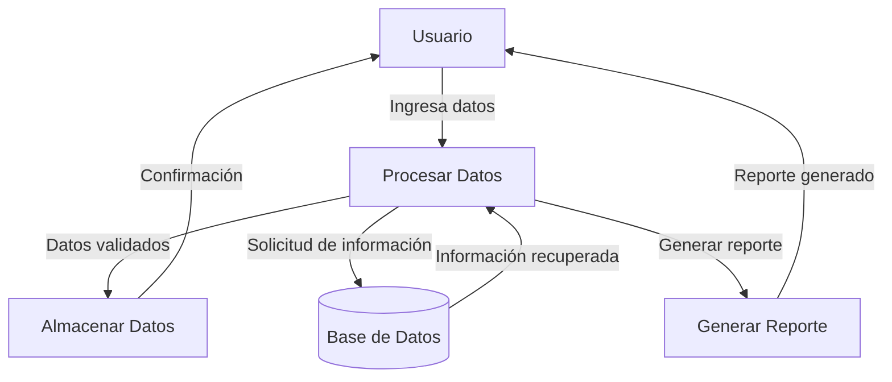
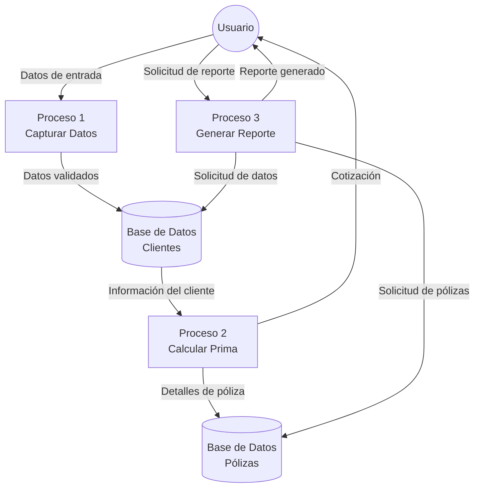

## Module: DlgCapturarDatosSeguro.cpp
# Análisis Integral del Módulo DlgCapturarDatosSeguro.cpp

## Nombre del Módulo/Componente SQL
**DlgCapturarDatosSeguro.cpp** - Módulo de diálogo para captura de datos de seguros

## Objetivos Primarios
Este módulo implementa una interfaz de diálogo para la captura y gestión de datos relacionados con seguros. Su propósito principal es proporcionar una interfaz gráfica que permita al usuario ingresar, validar y guardar información detallada sobre pólizas de seguros, incluyendo datos del asegurado, coberturas, y detalles de la póliza.

## Funciones, Métodos y Consultas Críticas
- **CDlgCapturarDatosSeguro::OnInitDialog()**: Inicializa el diálogo y configura los controles.
- **CDlgCapturarDatosSeguro::OnBnClickedBtnGuardar()**: Maneja la acción de guardar los datos del seguro.
- **CDlgCapturarDatosSeguro::OnBnClickedBtnCancelar()**: Gestiona la cancelación del diálogo.
- **CDlgCapturarDatosSeguro::ValidarDatos()**: Valida la integridad y completitud de los datos ingresados.
- **CDlgCapturarDatosSeguro::CargarDatos()**: Carga datos existentes para su edición.
- **CDlgCapturarDatosSeguro::GuardarDatos()**: Persiste los datos en la base de datos.

## Variables y Elementos Clave
- **m_strNombreAsegurado**: Nombre del titular del seguro
- **m_strNumeroPoliza**: Identificador único de la póliza
- **m_dateInicioVigencia**: Fecha de inicio de la cobertura
- **m_dateFinVigencia**: Fecha de finalización de la cobertura
- **m_dblSumaAsegurada**: Monto de la cobertura del seguro
- **m_strTipoSeguro**: Categoría del seguro (vida, auto, hogar, etc.)
- **m_bCoberturasAdicionales**: Indicador de coberturas adicionales
- **m_nIdSeguro**: Identificador interno del registro de seguro

## Interdependencias y Relaciones
- Interactúa con la clase **CSeguroDAO** para operaciones de persistencia en la base de datos
- Utiliza componentes de la biblioteca MFC para la interfaz gráfica
- Se relaciona con tablas de la base de datos como "Seguros", "Asegurados" y "Coberturas"
- Depende de servicios de validación y formateo de datos

## Operaciones Principales vs. Auxiliares
**Operaciones Principales:**
- Captura de datos del seguro
- Validación de la información ingresada
- Persistencia de datos en la base de datos

**Operaciones Auxiliares:**
- Formateo de fechas y valores monetarios
- Verificación de permisos de usuario
- Registro de actividad (logging)
- Manejo de excepciones y errores

## Secuencia Operacional/Flujo de Ejecución
1. Inicialización del diálogo y controles
2. Carga de datos existentes (si es modo edición)
3. Interacción del usuario para ingresar/modificar datos
4. Validación de datos al intentar guardar
5. Persistencia de la información en la base de datos
6. Cierre del diálogo con código de resultado apropiado

## Aspectos de Rendimiento y Optimización
- La carga de datos podría optimizarse mediante consultas más eficientes
- El manejo de fechas y cálculos de primas podría mejorarse para mayor eficiencia
- Se recomienda implementar caché para datos de referencia frecuentemente utilizados
- Las validaciones podrían realizarse incrementalmente para mejorar la experiencia del usuario

## Reusabilidad y Adaptabilidad
- El diálogo está diseñado específicamente para la captura de datos de seguros
- La estructura podría adaptarse para otros tipos de pólizas con modificaciones menores
- Las funciones de validación podrían extraerse a una clase utilitaria para su reutilización
- La separación entre interfaz y lógica de negocio podría mejorarse para mayor modularidad

## Uso y Contexto
Este módulo se utiliza en el sistema de gestión de seguros para:
- Registro de nuevas pólizas
- Modificación de pólizas existentes
- Renovación de contratos de seguros
- Consulta detallada de información de pólizas

Se invoca típicamente desde el menú principal de la aplicación o desde listados de pólizas existentes.

## Suposiciones y Limitaciones
**Suposiciones:**
- Se asume que el usuario tiene los permisos necesarios para la gestión de pólizas
- Se espera que la estructura de la base de datos incluya las tablas necesarias
- Se presupone la disponibilidad de servicios de validación y cálculo de primas

**Limitaciones:**
- No maneja múltiples asegurados por póliza
- La interfaz está diseñada para un conjunto específico de tipos de seguros
- No incluye funcionalidad para cálculo automático de primas basado en perfiles de riesgo
- La gestión de documentos adjuntos es limitada o inexistente
## Flow Diagram [via mermaid]

## Module: DlgCapturarDatosSeguro.cpp
# Análisis Integral del Módulo DlgCapturarDatosSeguro.cpp

## Nombre del Módulo/Componente SQL
**DlgCapturarDatosSeguro.cpp** - Módulo de diálogo para captura de datos de seguros

## Objetivos Primarios
Este módulo implementa una interfaz de diálogo para la captura y gestión de datos relacionados con seguros. Su propósito principal es proporcionar una interfaz gráfica que permita al usuario ingresar, visualizar y manipular información de pólizas de seguros, incluyendo datos del asegurado, beneficiarios y detalles de la póliza.

## Funciones, Métodos y Consultas Críticas
- **CDlgCapturarDatosSeguro::OnInitDialog()**: Inicializa el diálogo y configura los controles.
- **CDlgCapturarDatosSeguro::OnBnClickedBtnAgregarBeneficiario()**: Maneja la adición de beneficiarios.
- **CDlgCapturarDatosSeguro::OnBnClickedBtnEliminarBeneficiario()**: Gestiona la eliminación de beneficiarios.
- **CDlgCapturarDatosSeguro::OnBnClickedBtnGuardar()**: Valida y guarda los datos del seguro.
- **CDlgCapturarDatosSeguro::CargarDatos()**: Carga datos existentes para su visualización o edición.
- **CDlgCapturarDatosSeguro::ValidarDatos()**: Verifica la integridad y validez de los datos ingresados.

## Variables y Elementos Clave
- **m_strNombreAsegurado**: Almacena el nombre del asegurado.
- **m_strNumeroPoliza**: Identificador único de la póliza.
- **m_dtFechaInicio**: Fecha de inicio de la cobertura.
- **m_dtFechaVencimiento**: Fecha de vencimiento de la póliza.
- **m_dblSumaAsegurada**: Monto total asegurado.
- **m_listaBeneficiarios**: Estructura que almacena la información de los beneficiarios.
- **m_ctrlListaBeneficiarios**: Control de lista para mostrar beneficiarios en la interfaz.

## Interdependencias y Relaciones
- Interactúa con la base de datos para almacenar y recuperar información de seguros.
- Se relaciona con otros módulos como gestión de clientes y cálculo de primas.
- Utiliza componentes de la interfaz gráfica de usuario (GUI) para la presentación de datos.
- Posiblemente se integra con un sistema más amplio de gestión de seguros o servicios financieros.

## Operaciones Principales vs. Auxiliares
**Operaciones Principales:**
- Captura y validación de datos del asegurado y la póliza.
- Gestión de beneficiarios (agregar, eliminar, modificar).
- Almacenamiento y recuperación de datos de seguros.

**Operaciones Auxiliares:**
- Formateo y validación de fechas.
- Cálculos de porcentajes para beneficiarios.
- Verificaciones de integridad de datos.
- Mensajes de error y confirmación al usuario.

## Secuencia Operacional/Flujo de Ejecución
1. Inicialización del diálogo y configuración de controles.
2. Carga de datos existentes si se está editando una póliza.
3. Captura de información básica del asegurado y detalles de la póliza.
4. Gestión de beneficiarios (adición, eliminación, modificación).
5. Validación de datos al intentar guardar.
6. Almacenamiento de la información en la base de datos.
7. Cierre del diálogo con notificación de éxito o error.

## Aspectos de Rendimiento y Optimización
- Posible optimización en la carga de datos para pólizas con muchos beneficiarios.
- Validaciones en tiempo real para mejorar la experiencia del usuario.
- Potencial para implementar caché de datos frecuentemente utilizados.
- Optimización de consultas a la base de datos para reducir tiempos de respuesta.

## Reusabilidad y Adaptabilidad
- El módulo parece estar diseñado específicamente para la captura de datos de seguros, con limitada reusabilidad fuera de este contexto.
- Podría adaptarse para diferentes tipos de pólizas mediante parametrización adicional.
- La estructura de manejo de beneficiarios podría reutilizarse en otros módulos relacionados con asignación de porcentajes o participaciones.

## Uso y Contexto
- Se utiliza en el proceso de creación y modificación de pólizas de seguros.
- Forma parte de un sistema más amplio de gestión de seguros.
- Probablemente es accedido desde un menú principal o desde fichas de clientes.
- Requiere autenticación y autorización previa del usuario para su acceso.

## Suposiciones y Limitaciones
- Asume la existencia de una estructura de base de datos específica para almacenar la información.
- Requiere que el usuario tenga conocimientos básicos sobre términos y conceptos de seguros.
- Posiblemente limitado a ciertos tipos de pólizas o productos de seguros.
- La validación de datos parece estar principalmente del lado del cliente, lo que podría presentar vulnerabilidades si no se complementa con validaciones en el servidor.
- Podría tener limitaciones en cuanto al número máximo de beneficiarios o características específicas de las pólizas que puede manejar.
## Flow Diagram [via mermaid]

