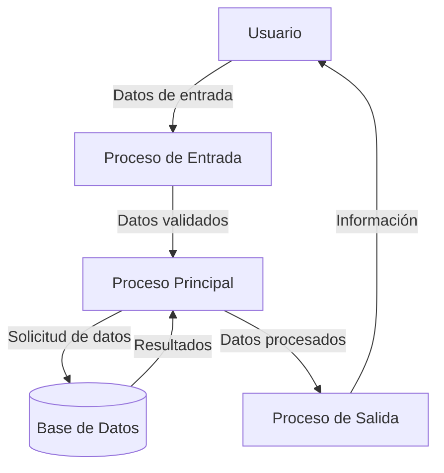

## Module: DlgCapturarNumEmpleSupervisor.cpp
# Análisis Integral del Módulo DlgCapturarNumEmpleSupervisor.cpp

## Módulo/Componente SQL
**Nombre del Módulo**: DlgCapturarNumEmpleSupervisor.cpp

## Objetivos Primarios
Este módulo implementa una interfaz de diálogo para capturar y validar el número de empleado de un supervisor en un sistema. Su propósito principal es gestionar la autenticación o identificación de supervisores mediante un número de empleado, proporcionando validación de entrada y manejo de eventos de interfaz de usuario.

## Funciones, Métodos y Consultas Críticas
- **DlgCapturarNumEmpleSupervisor::DlgCapturarNumEmpleSupervisor()**: Constructor que inicializa el diálogo y sus componentes.
- **DlgCapturarNumEmpleSupervisor::DoDataExchange()**: Maneja el intercambio de datos entre los controles de la interfaz y las variables del programa.
- **DlgCapturarNumEmpleSupervisor::OnInitDialog()**: Inicializa el diálogo, configurando controles y estableciendo el foco inicial.
- **DlgCapturarNumEmpleSupervisor::OnOK()**: Valida la entrada del usuario antes de aceptar el diálogo.
- **DlgCapturarNumEmpleSupervisor::OnCancel()**: Maneja la cancelación del diálogo.

## Variables y Elementos Clave
- **m_strNumEmpleSupervisor**: Variable que almacena el número de empleado del supervisor ingresado.
- **m_bCancelado**: Bandera booleana que indica si el diálogo fue cancelado.
- **m_strTitulo**: Título del diálogo que puede ser personalizado.
- **m_strMensaje**: Mensaje mostrado en el diálogo que puede ser personalizado.

## Interdependencias y Relaciones
- El módulo depende del framework MFC (Microsoft Foundation Classes) para la implementación de diálogos y controles de interfaz de usuario.
- Interactúa con otros componentes del sistema que requieren la validación o identificación de supervisores.
- No se observan consultas SQL directas en el código proporcionado, aunque el número de empleado capturado probablemente se utilice para consultas en otros módulos.

## Operaciones Principales vs. Auxiliares
**Operaciones Principales**:
- Captura y validación del número de empleado del supervisor.
- Gestión del flujo de interacción del usuario con el diálogo.

**Operaciones Auxiliares**:
- Personalización del título y mensaje del diálogo.
- Manejo de eventos de interfaz como inicialización y cancelación.

## Secuencia Operacional/Flujo de Ejecución
1. Se inicializa el diálogo con título y mensaje personalizados.
2. Se muestra el diálogo al usuario para capturar el número de empleado.
3. El usuario ingresa el número y confirma o cancela la operación.
4. Si confirma, se valida la entrada y se almacena el valor.
5. Si cancela, se establece la bandera de cancelación.
6. El diálogo se cierra y devuelve el control al componente que lo invocó.

## Aspectos de Rendimiento y Optimización
- El código es relativamente simple y enfocado en la interfaz de usuario, por lo que no presenta problemas evidentes de rendimiento.
- La validación de entrada se realiza de manera eficiente, verificando que el campo no esté vacío antes de aceptar la entrada.

## Reusabilidad y Adaptabilidad
- El diálogo es altamente reutilizable para diferentes escenarios donde se requiera la captura de un número de empleado supervisor.
- La personalización del título y mensaje permite adaptar el diálogo a diferentes contextos sin modificar el código.
- La estructura modular facilita su integración en diferentes partes del sistema.

## Uso y Contexto
- Este módulo se utiliza en situaciones donde se requiere la autorización o identificación de un supervisor.
- Probablemente forma parte de un sistema más amplio de gestión de empleados o control de acceso.
- Se invoca desde otros componentes del sistema cuando se necesita la validación de un supervisor.

## Suposiciones y Limitaciones
- Supone que el sistema tiene un mecanismo para validar si el número de empleado ingresado corresponde a un supervisor válido (esta validación no se realiza en este módulo).
- Se limita a capturar solo el número de empleado, sin solicitar información adicional como contraseñas.
- No implementa validaciones complejas sobre el formato del número de empleado más allá de verificar que no esté vacío.
- Está diseñado específicamente para el framework MFC, lo que limita su portabilidad a otros entornos de desarrollo.
## Flow Diagram [via mermaid]

## Module: DlgCapturarNumEmpleSupervisor.cpp
# Análisis Integral del Módulo DlgCapturarNumEmpleSupervisor.cpp

## Nombre del Módulo/Componente SQL
DlgCapturarNumEmpleSupervisor.cpp - Un módulo de diálogo para la captura de números de empleado y supervisor.

## Objetivos Primarios
Este módulo implementa una interfaz de diálogo para capturar y validar números de empleado y supervisor en un sistema. Su propósito principal es recopilar esta información del usuario, validarla según reglas específicas y proporcionar retroalimentación visual durante el proceso de entrada de datos.

## Funciones, Métodos y Consultas Críticas
- **CDlgCapturarNumEmpleSupervisor::OnInitDialog()**: Inicializa el diálogo y configura los controles.
- **CDlgCapturarNumEmpleSupervisor::OnOK()**: Valida los datos ingresados antes de aceptar el diálogo.
- **CDlgCapturarNumEmpleSupervisor::OnKillfocusEditNumEmple()**: Valida el número de empleado cuando el control pierde el foco.
- **CDlgCapturarNumEmpleSupervisor::OnKillfocusEditNumSupervisor()**: Valida el número de supervisor cuando el control pierde el foco.
- **CDlgCapturarNumEmpleSupervisor::ValidaNumEmple()**: Valida el formato y existencia del número de empleado.
- **CDlgCapturarNumEmpleSupervisor::ValidaNumSupervisor()**: Valida el formato y existencia del número de supervisor.

## Variables y Elementos Clave
- **m_strNumEmple**: Almacena el número de empleado ingresado.
- **m_strNumSupervisor**: Almacena el número de supervisor ingresado.
- **m_strNombreEmple**: Almacena el nombre del empleado.
- **m_strNombreSupervisor**: Almacena el nombre del supervisor.
- **m_bValidaNumEmple**: Bandera que indica si se debe validar el número de empleado.
- **m_bValidaNumSupervisor**: Bandera que indica si se debe validar el número de supervisor.
- **m_bPermiteNumEmpleVacio**: Bandera que permite un número de empleado vacío.
- **m_bPermiteNumSupervisorVacio**: Bandera que permite un número de supervisor vacío.

## Interdependencias y Relaciones
- Interactúa con controles de interfaz de usuario como EditNumEmple, EditNumSupervisor, StaticNombreEmple y StaticNombreSupervisor.
- Depende de funciones externas como **BuscaEmpleado()** para validar la existencia de empleados y supervisores en el sistema.
- Utiliza la clase **CString** para manipulación de cadenas y **CDialog** como clase base para la funcionalidad de diálogo.

## Operaciones Principales vs. Auxiliares
**Operaciones Principales:**
- Captura y validación de números de empleado y supervisor.
- Visualización de nombres correspondientes a los números ingresados.

**Operaciones Auxiliares:**
- Formateo de números de empleado y supervisor (eliminación de espacios, conversión a mayúsculas).
- Manejo de mensajes de error y advertencias.
- Configuración visual de los controles (colores, habilitación/deshabilitación).

## Secuencia Operacional/Flujo de Ejecución
1. Inicialización del diálogo con configuraciones predeterminadas.
2. El usuario ingresa datos en los campos de número de empleado y supervisor.
3. Al perder el foco en un campo, se valida el formato y existencia del número ingresado.
4. Si es válido, se muestra el nombre correspondiente; si no, se muestra un mensaje de error.
5. Al presionar OK, se realiza una validación final antes de aceptar los datos.
6. Si la validación falla, se muestra un mensaje y se mantiene el diálogo abierto.

## Aspectos de Rendimiento y Optimización
- El código realiza validaciones en tiempo real (al perder el foco), lo que mejora la experiencia del usuario pero podría generar múltiples consultas a la base de datos.
- La función **BuscaEmpleado()** podría ser un punto de optimización si accede frecuentemente a la base de datos.
- El manejo de cadenas podría optimizarse para reducir copias innecesarias.

## Reusabilidad y Adaptabilidad
- El diálogo es altamente configurable mediante banderas como m_bValidaNumEmple, m_bPermiteNumEmpleVacio, etc.
- Podría mejorarse la modularidad extrayendo la lógica de validación a componentes separados.
- La dependencia de la función externa BuscaEmpleado() limita la reusabilidad en otros contextos sin esta función.

## Uso y Contexto
- Este módulo se utiliza en situaciones donde se necesita capturar y validar información de empleados y supervisores.
- Probablemente forma parte de un sistema más grande de gestión de recursos humanos o control de acceso.
- Se integra en flujos de trabajo que requieren la identificación y validación de personal.

## Suposiciones y Limitaciones
- Asume la existencia de una función BuscaEmpleado() que valida los números contra una base de datos.
- Presupone un formato específico para los números de empleado y supervisor.
- No maneja concurrencia o actualizaciones en tiempo real de la información de empleados.
- La interfaz está diseñada para un entorno Windows utilizando MFC (Microsoft Foundation Classes).
- No parece manejar internacionalización o diferentes formatos de números de empleado según regiones.
## Flow Diagram [via mermaid]

