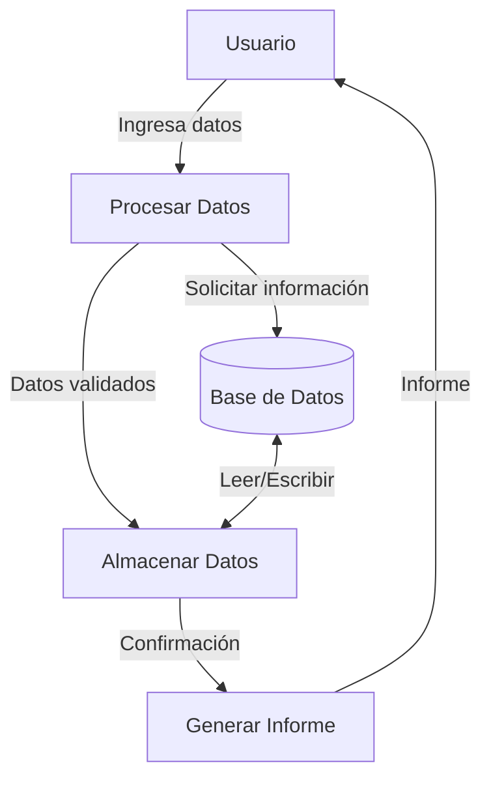
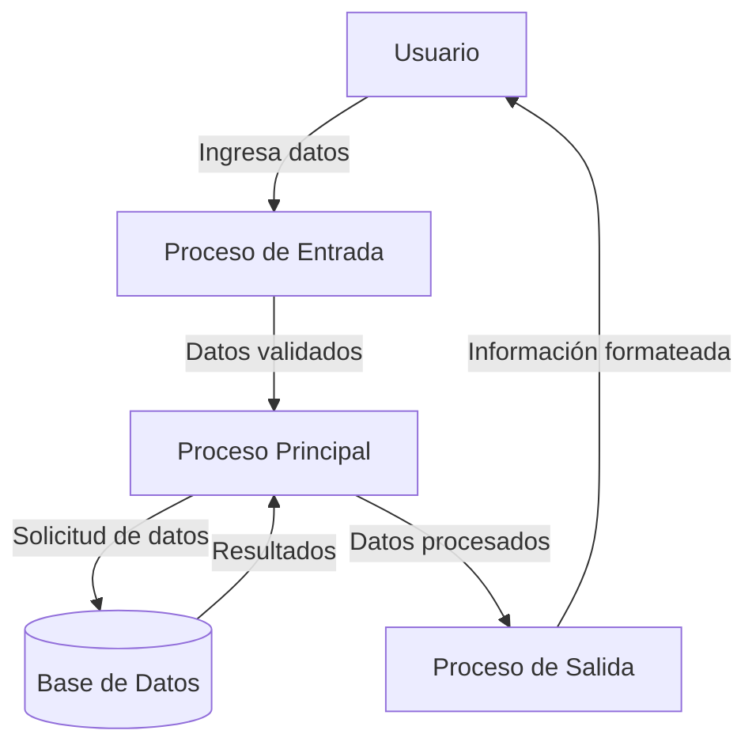

## Module: DlgEncuesta.cpp
# Análisis Integral del Módulo DlgEncuesta.cpp

## Nombre del Módulo/Componente SQL
**DlgEncuesta.cpp** - Módulo de diálogo para gestión de encuestas en una aplicación MFC (Microsoft Foundation Classes).

## Objetivos Primarios
Este módulo implementa una interfaz de usuario para la gestión de encuestas, permitiendo visualizar, crear, editar y eliminar encuestas. Maneja la interacción con el usuario a través de un diálogo y se comunica con una base de datos para realizar operaciones CRUD (Crear, Leer, Actualizar, Eliminar) sobre registros de encuestas.

## Funciones, Métodos y Consultas Críticas
- **CDlgEncuesta::OnInitDialog()**: Inicializa el diálogo, configura controles y carga datos iniciales.
- **CDlgEncuesta::OnBnClickedBtnNuevo()**: Maneja la creación de nuevas encuestas.
- **CDlgEncuesta::OnBnClickedBtnEditar()**: Gestiona la edición de encuestas existentes.
- **CDlgEncuesta::OnBnClickedBtnEliminar()**: Implementa la eliminación de encuestas.
- **CDlgEncuesta::OnBnClickedBtnBuscar()**: Realiza búsquedas de encuestas según criterios.
- **CDlgEncuesta::CargarDatos()**: Carga datos de encuestas desde la base de datos al control de lista.

## Variables y Elementos Clave
- **m_ListaEncuestas**: Control de lista que muestra las encuestas disponibles.
- **m_EditBuscar**: Campo de texto para búsquedas.
- **m_ComboTipoBusqueda**: Selector para el tipo de búsqueda.
- **m_pSet**: Conjunto de registros para interactuar con la base de datos.
- **m_nIdEncuesta**: Identificador de la encuesta seleccionada.

## Interdependencias y Relaciones
- Interactúa con la clase **CEncuestaSet** para operaciones de base de datos.
- Se relaciona con **CDlgEncuestaDatos** para la entrada y edición de datos de encuestas.
- Depende de la estructura de la tabla de encuestas en la base de datos.
- Utiliza recursos de la aplicación MFC para la interfaz de usuario.

## Operaciones Principales vs. Auxiliares
**Operaciones Principales:**
- Visualización de encuestas en formato de lista.
- Creación, edición y eliminación de registros de encuestas.
- Búsqueda de encuestas por diferentes criterios.

**Operaciones Auxiliares:**
- Validación de selecciones de usuario.
- Confirmación de acciones destructivas (eliminación).
- Actualización de la interfaz después de cambios en los datos.
- Manejo de mensajes y eventos del sistema.

## Secuencia Operacional/Flujo de Ejecución
1. Inicialización del diálogo y carga de datos iniciales.
2. Espera de interacción del usuario (selección, búsqueda, acciones CRUD).
3. Procesamiento de la acción solicitada:
   - Para creación/edición: Apertura de diálogo secundario para entrada de datos.
   - Para eliminación: Confirmación y ejecución de la eliminación.
   - Para búsqueda: Aplicación de filtros y recarga de datos.
4. Actualización de la interfaz con los resultados.
5. Retorno al estado de espera de interacción.

## Aspectos de Rendimiento y Optimización
- La carga de datos podría optimizarse para manejar grandes conjuntos de registros.
- Las búsquedas podrían beneficiarse de índices en la base de datos.
- La actualización de la lista después de operaciones podría optimizarse para actualizar solo los elementos afectados.
- Posible implementación de paginación para mejorar el rendimiento con grandes volúmenes de datos.

## Reusabilidad y Adaptabilidad
- El diseño sigue el patrón MVC (Modelo-Vista-Controlador), facilitando la adaptación.
- La separación entre la interfaz y la lógica de negocio permite reutilizar componentes.
- La parametrización de búsquedas permite adaptarse a diferentes criterios.
- El código podría modularizarse más para mejorar la reusabilidad en otros contextos.

## Uso y Contexto
Este módulo se utiliza como parte de una aplicación de gestión que requiere administrar encuestas. Se despliega como un diálogo modal o no modal dentro de la aplicación principal, permitiendo a los usuarios gestionar el ciclo de vida completo de las encuestas. Es probable que forme parte de un sistema más amplio de recopilación y análisis de datos.

## Suposiciones y Limitaciones
- Asume una estructura específica de la tabla de encuestas en la base de datos.
- Requiere que los controles MFC referenciados estén correctamente definidos en el recurso de diálogo.
- Limitado a las funcionalidades CRUD básicas sin capacidades avanzadas de análisis.
- No parece implementar manejo avanzado de errores para fallos de conexión a la base de datos.
- Posiblemente limitado en términos de escalabilidad para grandes volúmenes de datos.
- Asume un entorno Windows con soporte para MFC.
## Flow Diagram [via mermaid]

## Module: DlgEncuesta.cpp
# Análisis Integral del Módulo DlgEncuesta.cpp

## Nombre del Módulo/Componente SQL
**DlgEncuesta.cpp** - Módulo de diálogo para gestión de encuestas en una aplicación MFC (Microsoft Foundation Classes).

## Objetivos Primarios
Este módulo implementa una interfaz de usuario para la gestión de encuestas, permitiendo visualizar, crear, editar y eliminar encuestas. Maneja la interacción con el usuario a través de un diálogo y se comunica con una base de datos para realizar operaciones CRUD (Crear, Leer, Actualizar, Eliminar) sobre registros de encuestas.

## Funciones, Métodos y Consultas Críticas
- **CDlgEncuesta::OnInitDialog()**: Inicializa el diálogo, configura controles y carga datos iniciales.
- **CDlgEncuesta::OnBnClickedBtnNuevo()**: Maneja la creación de nuevas encuestas.
- **CDlgEncuesta::OnBnClickedBtnEditar()**: Gestiona la edición de encuestas existentes.
- **CDlgEncuesta::OnBnClickedBtnEliminar()**: Implementa la eliminación de encuestas.
- **CDlgEncuesta::OnBnClickedBtnBuscar()**: Realiza búsquedas de encuestas según criterios.
- **CDlgEncuesta::CargarDatos()**: Carga datos de encuestas desde la base de datos.
- **CDlgEncuesta::LimpiarControles()**: Reinicia los controles del formulario.

## Variables y Elementos Clave
- **m_ListaEncuestas**: Control de lista para mostrar encuestas.
- **m_strBuscar**: Variable para almacenar criterios de búsqueda.
- **m_pSet**: Conjunto de registros para interactuar con la base de datos.
- **m_nIdEncuesta**: Identificador de la encuesta seleccionada.
- **m_strNombre**, **m_strDescripcion**: Campos para almacenar datos de encuestas.
- **m_dtFecha**: Variable para manejar fechas de encuestas.

## Interdependencias y Relaciones
- Interactúa con la tabla "Encuestas" en la base de datos.
- Se relaciona con otros diálogos como **CDlgDetalleEncuesta** para la edición detallada.
- Utiliza componentes MFC para la interfaz de usuario (CListCtrl, CEdit, CButton).
- Depende de clases de acceso a datos (posiblemente CRecordset o similar) para operaciones con la base de datos.

## Operaciones Principales vs. Auxiliares
**Operaciones Principales:**
- Visualización de encuestas en formato de lista.
- Creación, edición y eliminación de registros de encuestas.
- Búsqueda de encuestas por criterios específicos.

**Operaciones Auxiliares:**
- Validación de datos antes de guardar.
- Confirmación de acciones críticas (como eliminación).
- Actualización de la interfaz después de operaciones.
- Limpieza de controles y reinicio de variables.

## Secuencia Operacional/Flujo de Ejecución
1. Inicialización del diálogo y carga inicial de datos.
2. El usuario interactúa con la interfaz (buscar, seleccionar, crear, editar, eliminar).
3. Al realizar una acción, se validan los datos según sea necesario.
4. Se ejecutan operaciones en la base de datos según la acción seleccionada.
5. Se actualiza la interfaz para reflejar los cambios realizados.
6. El ciclo continúa hasta que el usuario cierra el diálogo.

## Aspectos de Rendimiento y Optimización
- La carga de datos podría optimizarse limitando el número de registros mostrados inicialmente.
- Las búsquedas podrían beneficiarse de índices en la base de datos.
- La actualización de la lista después de cada operación podría ser costosa si hay muchos registros.
- Se podrían implementar técnicas de carga diferida para mejorar el rendimiento con grandes conjuntos de datos.

## Reusabilidad y Adaptabilidad
- El código sigue un patrón estándar de diálogo MFC, lo que facilita su adaptación a otros formularios similares.
- Las operaciones CRUD están modularizadas, permitiendo su reutilización.
- La separación entre interfaz y lógica de negocio podría mejorarse para aumentar la reusabilidad.
- La parametrización de consultas SQL facilitaría la adaptación a diferentes esquemas de base de datos.

## Uso y Contexto
- Este módulo se utiliza como parte de un sistema de gestión de encuestas.
- Proporciona una interfaz para que los administradores gestionen el catálogo de encuestas disponibles.
- Se integra en una aplicación MFC más amplia, probablemente un sistema de gestión empresarial o de clientes.
- Sirve como punto de entrada para la creación y mantenimiento de encuestas antes de su distribución.

## Suposiciones y Limitaciones
**Suposiciones:**
- Existe una estructura de base de datos con una tabla "Encuestas" predefinida.
- El usuario tiene permisos adecuados para realizar operaciones CRUD en la base de datos.
- La aplicación se ejecuta en un entorno Windows compatible con MFC.

**Limitaciones:**
- La interfaz está diseñada para un número moderado de encuestas; podría tener problemas de rendimiento con grandes volúmenes.
- No parece implementar funcionalidades avanzadas como filtrado complejo o exportación de datos.
- La gestión de errores podría ser limitada, especialmente para fallos de conexión a la base de datos.
- El diseño está acoplado a MFC, lo que dificulta la migración a otras plataformas o frameworks.
## Flow Diagram [via mermaid]

