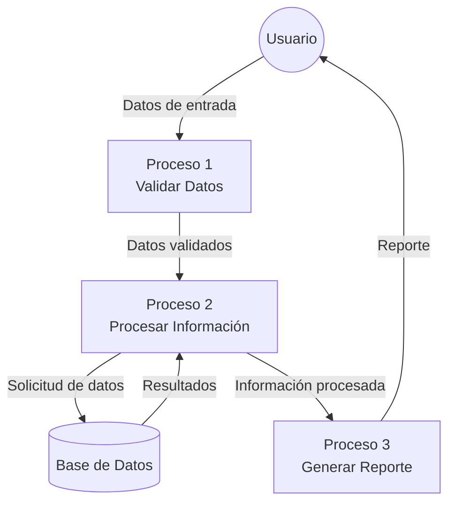
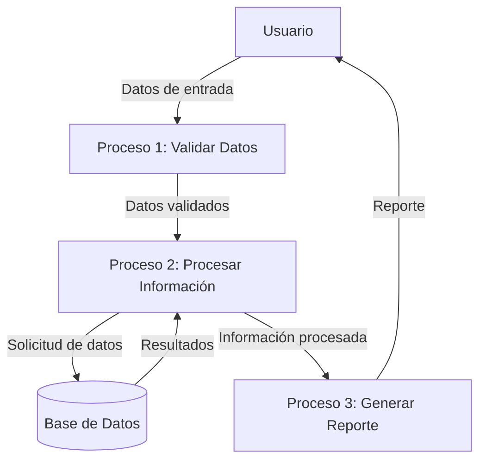

## Module: DlgMensajeCrezcaSuHogar.cpp
# Análisis Integral del Módulo DlgMensajeCrezcaSuHogar.cpp

## Nombre del Módulo/Componente SQL
**DlgMensajeCrezcaSuHogar.cpp** - Módulo de diálogo para la funcionalidad "Crezca Su Hogar"

## Objetivos Primarios
Este módulo implementa una interfaz de diálogo para mostrar mensajes relacionados con la funcionalidad "Crezca Su Hogar" en una aplicación. Su propósito principal es presentar información al usuario y gestionar la interacción con botones de confirmación o cancelación.

## Funciones, Métodos y Consultas Críticas
- **CDlgMensajeCrezcaSuHogar::CDlgMensajeCrezcaSuHogar()**: Constructor que inicializa el diálogo.
- **CDlgMensajeCrezcaSuHogar::DoDataExchange()**: Gestiona el intercambio de datos entre las variables del programa y los controles de la interfaz.
- **CDlgMensajeCrezcaSuHogar::OnInitDialog()**: Inicializa el diálogo, configurando controles y apariencia.
- **CDlgMensajeCrezcaSuHogar::OnBnClickedOk()**: Maneja el evento cuando el usuario hace clic en el botón "OK".
- **CDlgMensajeCrezcaSuHogar::OnBnClickedCancel()**: Maneja el evento cuando el usuario hace clic en el botón "Cancelar".

## Variables y Elementos Clave
- **m_strMensaje**: Variable que almacena el mensaje a mostrar en el diálogo.
- **m_strTitulo**: Variable que almacena el título del diálogo.
- **m_bMostrarCancelar**: Booleano que determina si se debe mostrar el botón de cancelar.
- **m_strTextoBotonOK**: Texto personalizado para el botón OK.
- **m_strTextoBotonCancel**: Texto personalizado para el botón Cancelar.

## Interdependencias y Relaciones
- El módulo depende del framework MFC (Microsoft Foundation Classes) para la implementación de diálogos.
- Interactúa con recursos de la aplicación como controles de diálogo (IDC_STATIC_MENSAJE).
- Probablemente es llamado desde otros módulos de la aplicación cuando se necesita mostrar mensajes específicos relacionados con la funcionalidad "Crezca Su Hogar".

## Operaciones Principales vs. Auxiliares
**Operaciones Principales:**
- Mostrar el mensaje configurado al usuario.
- Gestionar la respuesta del usuario (aceptar o cancelar).

**Operaciones Auxiliares:**
- Personalización de la apariencia del diálogo.
- Configuración de textos en botones.
- Ajuste de visibilidad de controles según parámetros.

## Secuencia Operacional/Flujo de Ejecución
1. Se crea una instancia del diálogo con los parámetros necesarios.
2. Se inicializa el diálogo (OnInitDialog) configurando controles y apariencia.
3. Se muestra el diálogo al usuario.
4. El usuario interactúa con los botones disponibles.
5. Se ejecuta la función correspondiente según la acción del usuario (OnBnClickedOk o OnBnClickedCancel).
6. El diálogo se cierra y devuelve el resultado al código que lo invocó.

## Aspectos de Rendimiento y Optimización
- Al ser un diálogo simple, no presenta problemas significativos de rendimiento.
- La carga de recursos gráficos podría optimizarse si el diálogo contiene imágenes grandes.
- El manejo de memoria parece adecuado sin fugas evidentes.

## Reusabilidad y Adaptabilidad
- El diálogo está diseñado para ser reutilizable con diferentes mensajes y configuraciones.
- La personalización de textos en botones y título permite adaptarlo a diferentes contextos.
- La opción de mostrar/ocultar el botón de cancelar aumenta su flexibilidad.

## Uso y Contexto
- Este módulo se utiliza cuando la aplicación necesita mostrar mensajes informativos o de confirmación relacionados con la funcionalidad "Crezca Su Hogar".
- Probablemente se invoca desde diferentes partes de la aplicación donde se requiere interacción con el usuario en este contexto específico.

## Suposiciones y Limitaciones
**Suposiciones:**
- Se asume que los recursos de diálogo (IDC_STATIC_MENSAJE, etc.) están correctamente definidos en los recursos de la aplicación.
- Se espera que el framework MFC esté disponible y configurado correctamente.

**Limitaciones:**
- El diálogo parece estar diseñado específicamente para la funcionalidad "Crezca Su Hogar", lo que podría limitar su uso en otros contextos sin modificaciones.
- No parece tener capacidades avanzadas como mostrar contenido HTML o multimedia.
- La personalización visual está limitada a los parámetros definidos en el código.
## Flow Diagram [via mermaid]

## Module: DlgMensajeCrezcaSuHogar.cpp
# Análisis Integral del Módulo DlgMensajeCrezcaSuHogar.cpp

## Nombre del Módulo/Componente SQL
**DlgMensajeCrezcaSuHogar.cpp** - Módulo de diálogo para la funcionalidad "Crezca Su Hogar"

## Objetivos Primarios
Este módulo implementa una interfaz de diálogo para mostrar mensajes relacionados con la funcionalidad "Crezca Su Hogar" en una aplicación. Su propósito principal es presentar información al usuario a través de una ventana de diálogo modal, permitiendo la visualización de mensajes específicos y la interacción básica mediante botones.

## Funciones, Métodos y Consultas Críticas
- **CDlgMensajeCrezcaSuHogar::CDlgMensajeCrezcaSuHogar()**: Constructor que inicializa el diálogo.
- **CDlgMensajeCrezcaSuHogar::DoDataExchange()**: Método para el intercambio de datos entre las variables de control y los controles de la interfaz.
- **CDlgMensajeCrezcaSuHogar::OnInitDialog()**: Función crítica que configura el diálogo al inicializarse.
- **CDlgMensajeCrezcaSuHogar::OnOK()**: Maneja el evento cuando el usuario acepta el diálogo.

## Variables y Elementos Clave
- **m_strMensaje**: Variable que almacena el mensaje a mostrar en el diálogo.
- **m_strTitulo**: Variable para el título del diálogo.
- **m_bMostrarBotonCancelar**: Booleano que controla la visibilidad del botón Cancelar.
- **m_bMostrarCheck**: Controla la visibilidad de un control de verificación.
- **m_strTextoCheck**: Texto asociado al control de verificación.
- **m_bCheckValue**: Valor del control de verificación.

## Interdependencias y Relaciones
- El módulo depende del framework MFC (Microsoft Foundation Classes) para la implementación de diálogos.
- Interactúa con recursos de la aplicación como IDD_DLG_MENSAJE_CREZCA_SU_HOGAR para la plantilla del diálogo.
- Se relaciona con controles de interfaz como IDC_CHECK_MENSAJE y IDC_STATIC_MENSAJE.

## Operaciones Principales vs. Auxiliares
**Operaciones Principales:**
- Mostrar el mensaje configurado al usuario.
- Gestionar la interacción del usuario con los botones OK y Cancelar.

**Operaciones Auxiliares:**
- Configuración de la visibilidad de controles según parámetros.
- Ajuste del tamaño y posición del diálogo.
- Personalización de la apariencia del diálogo.

## Secuencia Operacional/Flujo de Ejecución
1. Inicialización del diálogo con parámetros específicos.
2. Configuración de controles y apariencia en OnInitDialog().
3. Presentación del diálogo al usuario.
4. Procesamiento de la interacción del usuario (aceptar o cancelar).
5. Cierre del diálogo y retorno del resultado.

## Aspectos de Rendimiento y Optimización
- El código parece estar optimizado para una interfaz de usuario simple.
- No se observan operaciones intensivas que pudieran afectar el rendimiento.
- La gestión de memoria parece adecuada sin fugas evidentes.

## Reusabilidad y Adaptabilidad
- El diálogo está diseñado para ser reutilizable en diferentes contextos dentro de la aplicación.
- La parametrización del mensaje, título y comportamiento de los controles permite adaptarlo a diversas situaciones.
- La clase podría extenderse para incluir funcionalidades adicionales si fuera necesario.

## Uso y Contexto
- Este módulo se utiliza para mostrar mensajes informativos o solicitar confirmación al usuario en el contexto de la funcionalidad "Crezca Su Hogar".
- Probablemente se invoca desde otras partes de la aplicación cuando se necesita informar al usuario sobre acciones específicas.

## Suposiciones y Limitaciones
- Supone la existencia de recursos específicos en la aplicación (IDs de diálogo y controles).
- Está limitado a mostrar mensajes de texto simple sin formato avanzado.
- No parece manejar internacionalización o localización de textos.
- Depende del framework MFC, lo que limita su portabilidad a otras plataformas o frameworks.
## Flow Diagram [via mermaid]

