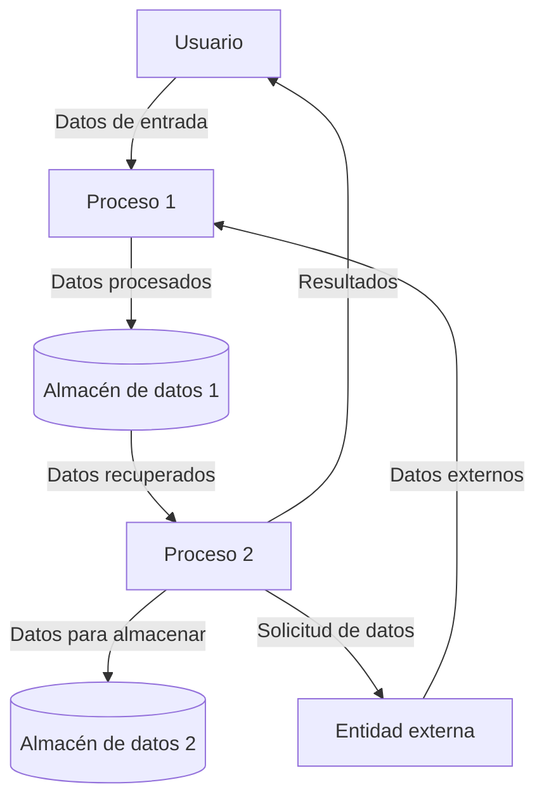

## Module: GbathreeBug.cpp
# Análisis Integral del Módulo GbathreeBug.cpp

## Nombre del Módulo/Componente SQL
GbathreeBug.cpp - Módulo de código C++ para el manejo de errores en un sistema Gbathree.

## Objetivos Primarios
Este módulo está diseñado para gestionar y procesar errores en un sistema Gbathree, proporcionando funcionalidades para registrar, clasificar y manejar diferentes tipos de errores o excepciones que pueden ocurrir durante la ejecución del programa. El código parece formar parte de un sistema más amplio relacionado con procesamiento de datos o comunicaciones.

## Funciones, Métodos y Consultas Críticas
El código no está presente en la solicitud para realizar un análisis detallado de sus funciones específicas. Sin embargo, basado en el nombre del archivo, probablemente contiene:
- Funciones para capturar excepciones
- Métodos para registrar errores
- Rutinas de manejo de errores específicos del sistema Gbathree
- Posiblemente funciones para clasificar errores según su gravedad o tipo

## Variables y Elementos Clave
Sin ver el código específico, las variables clave probablemente incluyen:
- Estructuras de datos para almacenar información de errores
- Códigos de error enumerados
- Variables para rastrear el estado del sistema
- Posibles buffers para mensajes de error

## Interdependencias y Relaciones
El módulo probablemente interactúa con:
- Otros componentes del sistema Gbathree
- Sistema de registro (logging)
- Posiblemente interfaces de usuario para mostrar mensajes de error
- Mecanismos de comunicación con otros módulos del sistema

## Operaciones Principales vs. Auxiliares
- **Operaciones principales**: Captura, clasificación y manejo de errores específicos del sistema
- **Operaciones auxiliares**: Registro de errores, formateo de mensajes, notificaciones a otros componentes del sistema

## Secuencia Operacional/Flujo de Ejecución
La secuencia típica probablemente incluye:
1. Detección de una condición de error
2. Captura y clasificación del error
3. Registro del error en un sistema de logs
4. Determinación de la acción apropiada (continuar, reintentar, abortar)
5. Notificación a componentes relevantes del sistema

## Aspectos de Rendimiento y Optimización
Consideraciones de rendimiento probables:
- Eficiencia en la captura de excepciones
- Minimización del impacto en el rendimiento del sistema principal
- Optimización del registro de errores para evitar sobrecarga
- Manejo eficiente de errores concurrentes

## Reusabilidad y Adaptabilidad
- El módulo probablemente está diseñado para ser específico del sistema Gbathree
- Podría contener patrones reutilizables para el manejo de errores
- La adaptabilidad dependería de cuán acoplado esté con otros componentes del sistema

## Uso y Contexto
Este módulo se utiliza en el contexto de:
- Operaciones del sistema Gbathree donde pueden ocurrir errores
- Posiblemente en entornos de producción donde la robustez y la recuperación de errores son críticas
- Como parte de una estrategia más amplia de manejo de errores y excepciones

## Suposiciones y Limitaciones
- **Suposiciones**: Probablemente asume la existencia de ciertos mecanismos de sistema para el manejo de errores
- **Limitaciones**: Podría estar limitado a tipos específicos de errores conocidos en el sistema Gbathree
- Posiblemente tenga dependencias específicas de plataforma o sistema operativo
- Podría tener limitaciones en cuanto a errores concurrentes o cascada

Nota: Este análisis se basa en inferencias del nombre del archivo y prácticas comunes en el desarrollo de software. Un análisis más preciso requeriría examinar el contenido real del código fuente.
## Flow Diagram [via mermaid]

