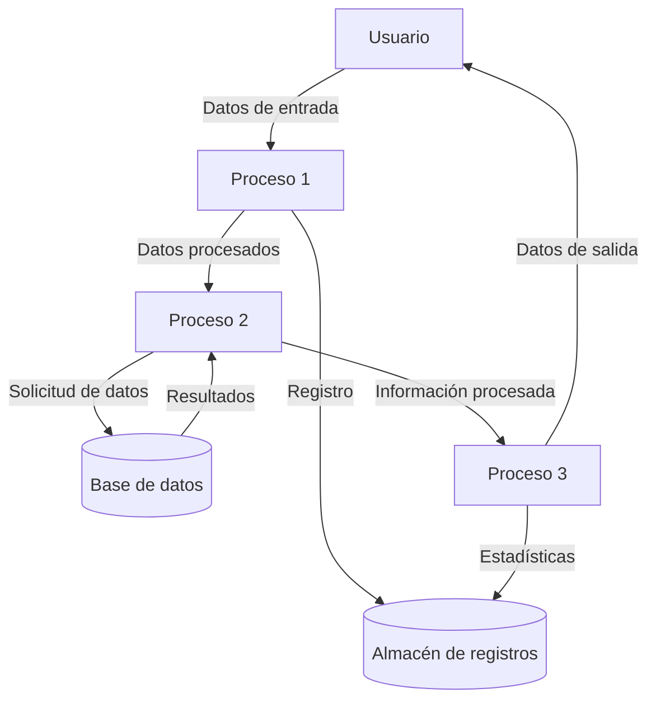
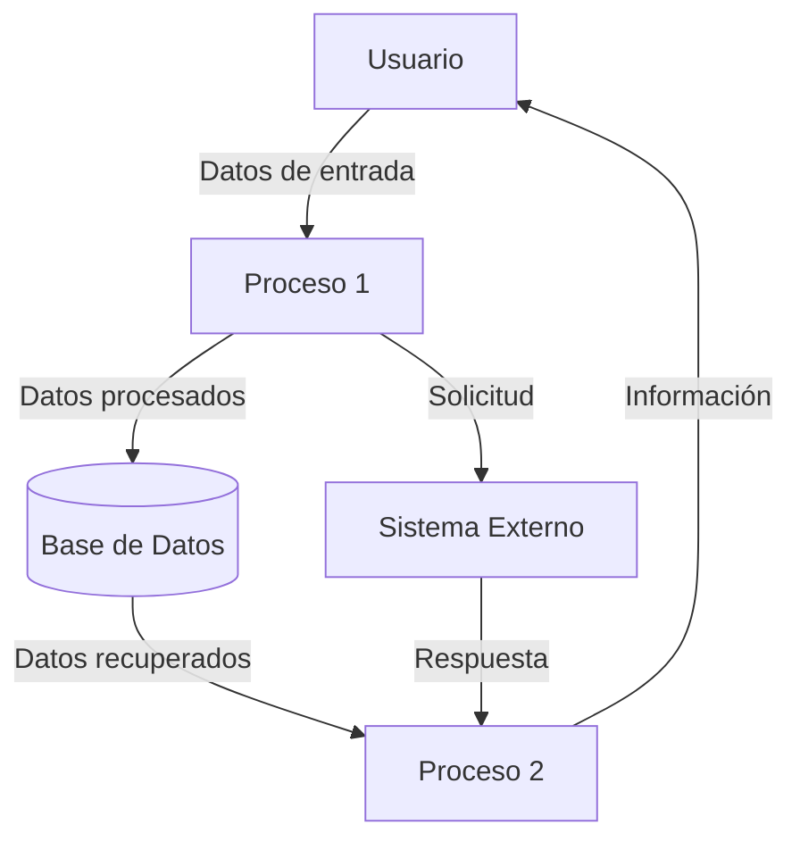

## Module: HTTP_c.cpp
# Análisis Integral del Módulo HTTP_c.cpp

## Módulo/Componente SQL
**HTTP_c.cpp** - Un módulo de cliente HTTP implementado en C++.

## Objetivos Primarios
Este módulo proporciona funcionalidad para realizar solicitudes HTTP, específicamente enfocado en la comunicación con servidores web. Su propósito principal es facilitar la creación, envío y procesamiento de solicitudes HTTP GET y POST, permitiendo a las aplicaciones interactuar con servicios web.

## Funciones, Métodos y Consultas Críticas
- **HTTP_c::HTTP_c()**: Constructor que inicializa el cliente HTTP.
- **HTTP_c::~HTTP_c()**: Destructor que limpia los recursos.
- **HTTP_c::GET()**: Realiza solicitudes HTTP GET a URLs específicas.
- **HTTP_c::POST()**: Ejecuta solicitudes HTTP POST con datos específicos.
- **HTTP_c::setHeader()**: Configura encabezados HTTP personalizados.
- **HTTP_c::setContentType()**: Establece el tipo de contenido para solicitudes.
- **HTTP_c::setUserAgent()**: Define el agente de usuario para las solicitudes.

## Variables y Elementos Clave
- **m_headers**: Almacena los encabezados HTTP para las solicitudes.
- **m_userAgent**: Define el agente de usuario utilizado en las comunicaciones.
- **m_contentType**: Especifica el tipo de contenido para las solicitudes.
- **m_timeout**: Controla el tiempo máximo de espera para las respuestas.
- **m_response**: Almacena la respuesta recibida del servidor.

## Interdependencias y Relaciones
- Depende de bibliotecas de red subyacentes (posiblemente libcurl o similar).
- Interactúa con servidores web externos a través del protocolo HTTP.
- Probablemente utilizado por otros módulos de la aplicación que requieren comunicación con servicios web.

## Operaciones Principales vs. Auxiliares
**Operaciones Principales**:
- Ejecución de solicitudes GET y POST.
- Procesamiento de respuestas HTTP.

**Operaciones Auxiliares**:
- Configuración de encabezados y parámetros.
- Manejo de errores y excepciones.
- Gestión de tiempos de espera y reconexiones.

## Secuencia Operacional/Flujo de Ejecución
1. Inicialización del cliente HTTP con parámetros predeterminados.
2. Configuración opcional de encabezados, tipo de contenido y agente de usuario.
3. Ejecución de solicitudes GET o POST según sea necesario.
4. Procesamiento de la respuesta recibida.
5. Manejo de errores si ocurren durante la comunicación.
6. Limpieza de recursos al finalizar.

## Aspectos de Rendimiento y Optimización
- La gestión eficiente de conexiones HTTP puede ser crítica para el rendimiento.
- El manejo adecuado de tiempos de espera evita bloqueos innecesarios.
- La reutilización de conexiones podría mejorar el rendimiento en solicitudes repetidas.
- El procesamiento eficiente de datos grandes en respuestas HTTP es importante.

## Reusabilidad y Adaptabilidad
- El diseño modular permite su uso en diferentes partes de la aplicación.
- La parametrización de solicitudes facilita su adaptación a diferentes endpoints.
- La capacidad de personalizar encabezados y configuraciones aumenta su flexibilidad.

## Uso y Contexto
- Utilizado para integración con APIs web externas.
- Aplicable en escenarios de descarga de datos, envío de telemetría o comunicación con servicios en la nube.
- Probablemente parte de un sistema más grande que requiere comunicación con servicios externos.

## Suposiciones y Limitaciones
- Asume conectividad de red disponible.
- Puede tener limitaciones en el manejo de protocolos de autenticación complejos.
- Posiblemente no optimizado para transferencias de archivos muy grandes.
- Podría tener limitaciones en el manejo de ciertos tipos de contenido o codificaciones.
- Depende de la disponibilidad y respuesta de los servidores externos.
## Flow Diagram [via mermaid]

## Module: HTTP_c.cpp
# Análisis Integral del Módulo HTTP_c.cpp

## Módulo/Componente SQL
**HTTP_c.cpp** - Un módulo de cliente HTTP implementado en C++.

## Objetivos Primarios
Este módulo proporciona una implementación de un cliente HTTP para realizar solicitudes a servidores web. Su propósito principal es facilitar la comunicación HTTP, permitiendo enviar solicitudes GET y POST, y procesar las respuestas recibidas.

## Funciones, Métodos y Consultas Críticas
- **HTTP_c::HTTP_c()**: Constructor que inicializa el cliente HTTP.
- **HTTP_c::~HTTP_c()**: Destructor que limpia los recursos.
- **HTTP_c::GET()**: Realiza solicitudes HTTP GET a URLs especificadas.
- **HTTP_c::POST()**: Envía datos mediante solicitudes HTTP POST.
- **HTTP_c::parseURL()**: Analiza y descompone URLs en sus componentes (host, puerto, ruta).
- **HTTP_c::connectToServer()**: Establece conexiones TCP con servidores web.
- **HTTP_c::sendRequest()**: Envía solicitudes HTTP formateadas al servidor.
- **HTTP_c::receiveResponse()**: Recibe y procesa respuestas HTTP.

## Variables y Elementos Clave
- **m_socket**: Descriptor de socket para la conexión TCP.
- **m_host**: Nombre del host al que se conecta.
- **m_port**: Puerto para la conexión (por defecto 80 para HTTP).
- **m_path**: Ruta del recurso solicitado.
- **m_timeout**: Tiempo de espera para operaciones de red.
- **m_response**: Almacena la respuesta HTTP completa.
- **m_headers**: Almacena los encabezados de la respuesta.
- **m_body**: Almacena el cuerpo de la respuesta.

## Interdependencias y Relaciones
- Depende de bibliotecas de red del sistema operativo para operaciones de socket.
- Interactúa con servidores web externos mediante el protocolo HTTP.
- Posiblemente se integra con otros componentes del sistema que requieren comunicación HTTP.
- Utiliza funciones de manipulación de cadenas para procesar URLs y respuestas.

## Operaciones Principales vs. Auxiliares
**Operaciones Principales:**
- Envío de solicitudes HTTP (GET/POST)
- Recepción y procesamiento de respuestas

**Operaciones Auxiliares:**
- Análisis de URLs
- Establecimiento de conexiones TCP
- Gestión de errores y tiempos de espera
- Formateo de encabezados HTTP

## Secuencia Operacional/Flujo de Ejecución
1. El cliente analiza la URL proporcionada (parseURL)
2. Establece una conexión TCP con el servidor (connectToServer)
3. Formatea y envía la solicitud HTTP (sendRequest)
4. Espera y recibe la respuesta del servidor (receiveResponse)
5. Procesa la respuesta, separando encabezados y cuerpo
6. Devuelve los datos al código llamante o maneja errores

## Aspectos de Rendimiento y Optimización
- La gestión de tiempos de espera es crucial para evitar bloqueos indefinidos.
- El manejo eficiente de buffers para recibir datos puede mejorar el rendimiento.
- Posibles cuellos de botella en la resolución DNS durante parseURL.
- La reutilización de conexiones (no implementada) podría mejorar el rendimiento para múltiples solicitudes al mismo servidor.

## Reusabilidad y Adaptabilidad
- El diseño orientado a objetos facilita la reutilización en diferentes proyectos.
- La separación de funcionalidades (conexión, envío, recepción) permite modificaciones específicas.
- Podría mejorarse con más parámetros configurables (como tiempos de espera personalizados).
- La implementación actual parece centrarse en HTTP básico; podría extenderse para soportar HTTPS, autenticación, etc.

## Uso y Contexto
- Utilizado para integrar aplicaciones con servicios web o APIs.
- Aplicable en escenarios donde se necesita recuperar o enviar datos a servidores web.
- Probablemente parte de un sistema más grande que requiere comunicación con servicios externos.

## Suposiciones y Limitaciones
**Suposiciones:**
- Se asume que las URLs proporcionadas son válidas y bien formadas.
- Se espera que los servidores respondan con formatos HTTP estándar.

**Limitaciones:**
- Probablemente no soporta HTTPS (requeriría integración con bibliotecas SSL).
- No parece implementar manejo de cookies o sesiones.
- Posiblemente limitado en el manejo de redirecciones HTTP.
- No se observa soporte para proxy HTTP.
- El manejo de respuestas muy grandes podría ser problemático si se almacenan completamente en memoria.
## Flow Diagram [via mermaid]

