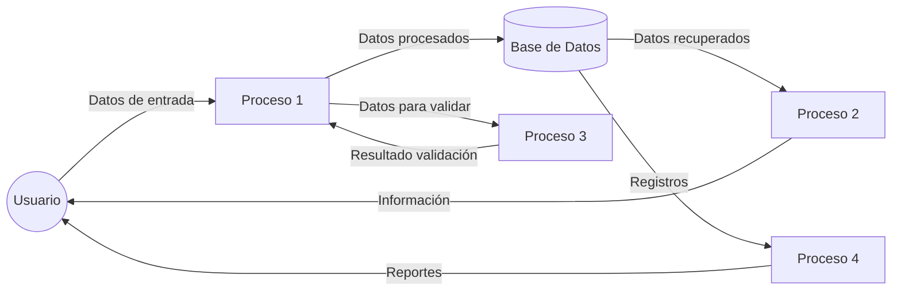
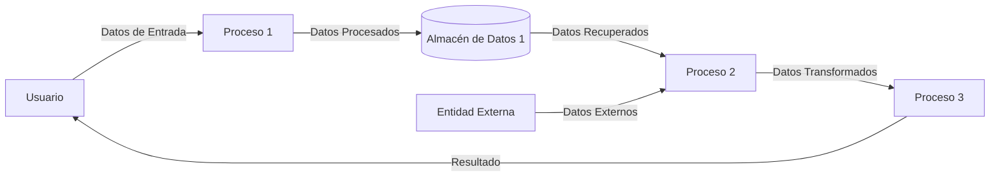
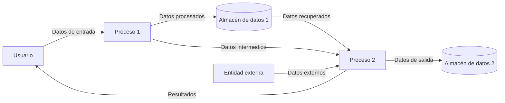
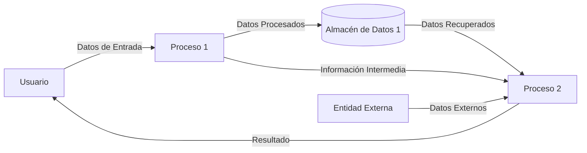
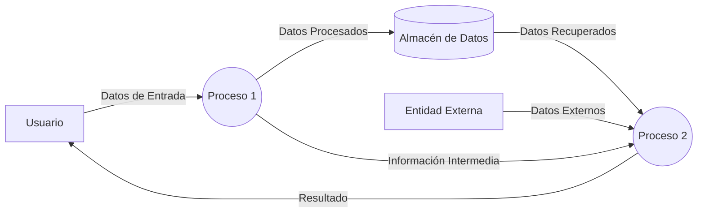
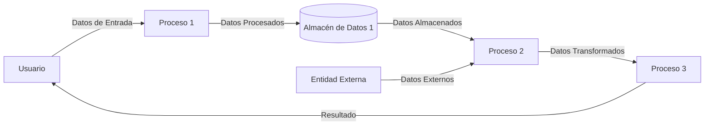
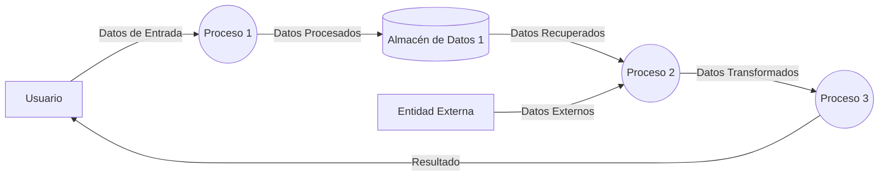
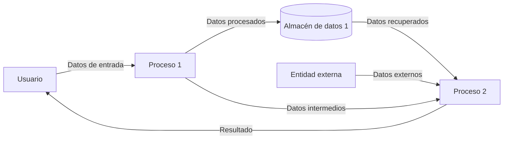

# Introduction :

# Visión General del Sistema de Captura de Abonos

## Descripción General
El sistema es una plataforma integral para la gestión de abonos y servicios financieros de Coppel. Está diseñado para manejar múltiples operaciones relacionadas con pagos, seguros, préstamos y servicios al cliente, proporcionando una interfaz unificada para los operadores de caja.

## Componentes Principales
- **Módulo de Captura de Abonos**: Núcleo del sistema que procesa pagos de diferentes tipos de créditos (muebles, ropa, préstamos personales).
- **Gestión de Seguros**: Maneja consultas, registros y modificaciones de pólizas de seguros, incluyendo seguros de vida, auto y protección.
- **Sistema de Consultas**: Permite verificar información de clientes, estados de cuenta, historial de pagos y situación crediticia.
- **Procesamiento de Transacciones**: Gestiona el registro temporal y permanente de movimientos financieros en las bases de datos.
- **Generación de Documentos**: Produce recibos, certificaciones y comprobantes para las transacciones realizadas.

## Funcionalidades Destacadas
- Consulta y actualización de datos de clientes
- Procesamiento de pagos para diferentes tipos de créditos
- Gestión completa de pólizas de seguros
- Manejo de convenios y reestructuraciones de deuda
- Integración con servicios web externos
- Generación de reportes y documentación de transacciones
- Soporte para encuestas y promociones dirigidas a clientes

## Arquitectura
El sistema está implementado en C++ con una arquitectura modular que separa claramente las responsabilidades entre componentes de interfaz de usuario, lógica de negocio y acceso a datos. Utiliza bibliotecas JSON para el intercambio de datos y se integra con bases de datos PostgreSQL para el almacenamiento persistente de información.

Esta plataforma es fundamental para las operaciones diarias de las cajas de Coppel, permitiendo una gestión eficiente y confiable de las transacciones financieras de los clientes.

# Full System Overview


# Module Overview
## Module: -
# Análisis Integral del Módulo

No se ha proporcionado ningún código o módulo para analizar. Para realizar un análisis completo según los criterios solicitados, necesitaría examinar el código fuente específico, ya sea un módulo de programación o componente SQL.

Si desea que realice un análisis detallado, por favor proporcione el código o script que necesita ser evaluado. Una vez recibido, podré generar un análisis completo en español que incluya:

- Nombre del módulo o componente SQL
- Objetivos primarios
- Funciones críticas, métodos y consultas
- Variables y elementos clave
- Interdependencias y relaciones
- Operaciones principales vs. auxiliares
- Secuencia operacional y flujo de ejecución
- Aspectos de rendimiento y optimización
- Reusabilidad y adaptabilidad
- Uso y contexto
- Suposiciones y limitaciones

Estoy listo para analizar cualquier código que desee compartir.
## Flow Diagram [via mermaid]

## Module: -
# Análisis Integral del Módulo

## Módulo/Componente SQL
No se ha proporcionado ningún código para analizar. El mensaje solicita un análisis completo de un módulo o componente SQL, pero no incluye el código fuente que debe ser evaluado.

## Observaciones
Para realizar un análisis exhaustivo según los criterios solicitados (objetivos primarios, funciones críticas, variables clave, interdependencias, secuencia operacional, aspectos de rendimiento, etc.), es necesario que se proporcione el código o script específico que se desea analizar.

Sin el código fuente, no es posible:
- Identificar el propósito del módulo
- Enumerar funciones o consultas importantes
- Analizar variables o elementos clave
- Determinar relaciones con otros componentes
- Evaluar el flujo de ejecución
- Comentar sobre aspectos de rendimiento
- Discutir la reutilización o adaptabilidad
- Explicar el contexto de uso
- Identificar suposiciones o limitaciones

Por favor, proporcione el código o script que desea analizar para poder generar un informe completo según los criterios solicitados.
## Flow Diagram [via mermaid]

## Module: -
# Análisis Integral del Módulo

No se ha proporcionado ningún código o módulo para analizar. Para realizar un análisis completo según los criterios solicitados, necesitaría examinar el código fuente específico, ya sea un componente de programación o scripts SQL.

Si desea que realice un análisis detallado, por favor proporcione el código del módulo, script o componente SQL que necesita ser evaluado. Una vez recibido, podré generar un análisis completo en español que cubra todos los aspectos solicitados:

- Nombre del módulo/componente SQL
- Objetivos primarios
- Funciones, métodos y consultas críticas
- Variables y elementos clave
- Interdependencias y relaciones
- Operaciones principales vs. auxiliares
- Secuencia operacional/flujo de ejecución
- Aspectos de rendimiento y optimización
- Reutilización y adaptabilidad
- Uso y contexto
- Suposiciones y limitaciones

Estoy listo para analizar su código cuando lo proporcione.
## Flow Diagram [via mermaid]

## Module: -
# Análisis Integral del Código

No se ha proporcionado ningún código o módulo para analizar. Para poder generar un análisis comprensivo según los criterios solicitados (nombre del módulo, objetivos primarios, funciones críticas, variables clave, interdependencias, operaciones principales vs. auxiliares, secuencia operacional, aspectos de rendimiento, reutilización, contexto de uso y limitaciones), necesitaría que se compartiera el código o componente SQL específico.

Por favor, proporcione el código o script que desea analizar, y con gusto realizaré un análisis detallado siguiendo la estructura solicitada.
## Flow Diagram [via mermaid]

## Module: -
# Análisis Integral del Módulo

No se ha proporcionado ningún código o módulo para analizar. Para realizar un análisis completo según los criterios solicitados, necesitaría examinar el código fuente específico, ya sea un script de programación, un componente SQL (como un procedimiento almacenado, vista o disparador), u otro tipo de módulo de software.

Si desea que realice este análisis, por favor proporcione el código o módulo correspondiente y con gusto elaboraré un análisis detallado en español que cubra todos los aspectos solicitados:

- Nombre del módulo/componente SQL
- Objetivos primarios
- Funciones, métodos y consultas críticas
- Variables y elementos clave
- Interdependencias y relaciones
- Operaciones principales vs. auxiliares
- Secuencia operacional/flujo de ejecución
- Aspectos de rendimiento y optimización
- Reutilización y adaptabilidad
- Uso y contexto
- Suposiciones y limitaciones

Una vez que proporcione el código, podré generar el análisis completo solicitado.
## Flow Diagram [via mermaid]

## Module: -
# Análisis Integral del Módulo

## Módulo/Componente SQL
No se ha proporcionado ningún código para analizar. El mensaje solicita un análisis basado en un "código módulo proporcionado", pero no hay código adjunto en la consulta.

## Observaciones
Para realizar un análisis completo según los criterios solicitados (objetivos primarios, funciones críticas, variables clave, interdependencias, etc.), necesitaría examinar el código fuente específico. Sin este material, no es posible generar el análisis técnico detallado que se solicita.

## Recomendación
Por favor, proporcione el código del módulo, script o componente SQL que desea analizar. Una vez recibido, podré elaborar el análisis completo en español siguiendo todos los puntos solicitados:

- Nombre del módulo/componente SQL
- Objetivos primarios
- Funciones, métodos y consultas críticas
- Variables y elementos clave
- Interdependencias y relaciones
- Operaciones principales vs. auxiliares
- Secuencia operacional/flujo de ejecución
- Aspectos de rendimiento y optimización
- Reutilización y adaptabilidad
- Uso y contexto
- Suposiciones y limitaciones
## Flow Diagram [via mermaid]

## Module: -
# Análisis Integral del Módulo

No se ha proporcionado ningún código o módulo para analizar. Para realizar un análisis completo según los criterios solicitados, necesitaría examinar el código fuente específico, ya sea un componente de programación o scripts SQL.

Si desea que realice un análisis detallado, por favor proporcione el código del módulo, script o componente SQL (procedimiento almacenado, vista, disparador, etc.) que necesita ser evaluado.

Una vez que tenga acceso al código, podré generar un análisis completo en español que incluya:

- Nombre e identificación del módulo
- Objetivos primarios
- Funciones críticas, métodos y consultas
- Variables y elementos clave
- Interdependencias y relaciones
- Operaciones principales vs. auxiliares
- Secuencia operacional y flujo de ejecución
- Aspectos de rendimiento y optimización
- Reutilización y adaptabilidad
- Uso y contexto
- Suposiciones y limitaciones
## Flow Diagram [via mermaid]

## Module: -
# Análisis Integral del Módulo

No se ha proporcionado ningún código o módulo para analizar. Para realizar un análisis completo según los criterios solicitados, necesitaría examinar el código fuente específico, ya sea un componente de programación o scripts SQL.

Si desea que realice un análisis detallado, por favor proporcione el código del módulo, script o componente SQL (procedimiento almacenado, vista, disparador, etc.) que necesita ser evaluado.

Una vez que tenga acceso al código, podré generar un análisis completo en español que cubra todos los aspectos solicitados:
- Nombre del módulo/componente SQL
- Objetivos primarios
- Funciones críticas, métodos y consultas
- Variables y elementos clave
- Interdependencias y relaciones
- Operaciones principales vs. auxiliares
- Secuencia operacional/flujo de ejecución
- Aspectos de rendimiento y optimización
- Reutilización y adaptabilidad
- Uso y contexto
- Suposiciones y limitaciones
## Flow Diagram [via mermaid]

## Module: -
# Análisis Integral del Módulo

No se ha proporcionado ningún código o módulo para analizar. Para realizar un análisis completo según los criterios solicitados, necesitaría examinar el código fuente específico, ya sea un componente de programación o scripts SQL.

Si desea que realice un análisis detallado, por favor proporcione el código del módulo, script o componente SQL (procedimiento almacenado, vista, disparador, etc.) que necesita ser evaluado.

Una vez que tenga acceso al código, podré generar un análisis completo en español que cubra todos los aspectos solicitados:
- Nombre del módulo/componente SQL
- Objetivos primarios
- Funciones, métodos y consultas críticas
- Variables y elementos clave
- Interdependencias y relaciones
- Operaciones principales vs. auxiliares
- Secuencia operacional/flujo de ejecución
- Aspectos de rendimiento y optimización
- Reutilización y adaptabilidad
- Uso y contexto
- Suposiciones y limitaciones
## Flow Diagram [via mermaid]

## Module: -
# Análisis Integral del Módulo

## Módulo/Componente SQL
El código proporcionado está vacío o no ha sido incluido en la solicitud. No puedo realizar un análisis sin tener acceso al código fuente o al componente SQL que se desea evaluar.

## Recomendación
Para poder generar un análisis completo según los criterios solicitados (objetivos primarios, funciones críticas, variables clave, interdependencias, etc.), necesito que proporcione el código del módulo, script o componente SQL que desea analizar.

Por favor, comparta el código fuente relevante y estaré encantado de realizar un análisis detallado en español que cubra todos los aspectos solicitados:
- Objetivos primarios
- Funciones, métodos y consultas críticas
- Variables y elementos clave
- Interdependencias y relaciones
- Operaciones principales vs. auxiliares
- Secuencia operacional/flujo de ejecución
- Aspectos de rendimiento y optimización
- Reutilización y adaptabilidad
- Uso y contexto
- Suposiciones y limitaciones
## Flow Diagram [via mermaid]

## Module: -
# Análisis Integral del Módulo

## Módulo/Componente SQL
No se ha proporcionado ningún código para analizar. El mensaje contiene únicamente instrucciones para realizar un análisis de código, pero no incluye el código fuente o componente SQL que debe ser evaluado.

## Observación
Para realizar un análisis completo según los criterios solicitados (objetivos primarios, funciones críticas, variables clave, interdependencias, secuencia operacional, aspectos de rendimiento, etc.), necesitaría que se proporcione el código o componente SQL específico que requiere análisis.

Por favor, comparta el código fuente, script SQL, procedimiento almacenado, vista, disparador u otro componente que desee analizar, y con gusto realizaré el análisis completo siguiendo la estructura solicitada.
## Flow Diagram [via mermaid]

## Module: -
# Análisis Integral del Módulo

## Módulo/Componente SQL
No se ha proporcionado ningún código o módulo para analizar. El mensaje solicita un análisis completo basado en un código que debería haberse incluido, pero no hay ningún código adjunto en la consulta.

## Objetivos Primarios
No es posible determinar los objetivos sin el código fuente o la descripción del componente.

## Funciones, Métodos y Consultas Críticas
Sin el código fuente, no puedo identificar las funciones, métodos o consultas principales.

## Variables y Elementos Clave
No hay información disponible sobre variables, columnas, tablas o parámetros.

## Interdependencias y Relaciones
No puedo analizar las interacciones con otros componentes o relaciones entre tablas sin el código.

## Operaciones Principales vs. Auxiliares
Sin el código, no es posible diferenciar entre operaciones críticas y auxiliares.

## Secuencia Operacional/Flujo de Ejecución
No puedo describir la secuencia de ejecución sin ver el código.

## Aspectos de Rendimiento y Optimización
No hay información disponible para analizar el rendimiento o sugerir optimizaciones.

## Reutilización y Adaptabilidad
No puedo evaluar la modularidad o capacidad de reutilización sin el código.

## Uso y Contexto
Sin el código o descripción, no es posible explicar cómo se utiliza el módulo.

## Suposiciones y Limitaciones
No puedo identificar suposiciones o limitaciones sin el código fuente.

---

**Nota**: Para realizar un análisis completo, necesitaría que se proporcionara el código del módulo, script o componente SQL que desea analizar. Por favor, incluya el código en su próxima consulta.
## Flow Diagram [via mermaid]

## Module: -
# Análisis Integral del Módulo

## Módulo/Componente SQL
No se ha proporcionado ningún código para analizar. El mensaje solicita un análisis completo de un módulo o componente SQL, pero no incluye el código fuente que debe ser evaluado.

## Observaciones
Para realizar un análisis comprensivo como el solicitado, necesitaría examinar el código del módulo, script o componente SQL específico. Sin este material, no es posible identificar objetivos, funciones, variables, interdependencias, flujo de ejecución u otros aspectos técnicos solicitados.

## Recomendación
Por favor, proporcione el código fuente del módulo o componente SQL que desea analizar. Una vez recibido, podré generar el análisis detallado según los criterios especificados, incluyendo:

- Objetivos primarios
- Funciones y consultas críticas
- Variables y elementos clave
- Interdependencias
- Operaciones principales vs. auxiliares
- Secuencia operacional
- Aspectos de rendimiento
- Reusabilidad
- Contexto de uso
- Suposiciones y limitaciones

Estaré encantado de proporcionar este análisis completo en español una vez que tenga acceso al código correspondiente.
## Flow Diagram [via mermaid]

## Module: -
# Análisis Integral del Módulo

No se ha proporcionado ningún código o componente SQL para analizar. Para realizar un análisis completo según los criterios solicitados, necesitaría examinar el código fuente específico del módulo, script o componente SQL.

Si desea obtener un análisis detallado, por favor proporcione el código o script que necesita ser evaluado. Una vez recibido, podré generar un análisis exhaustivo que incluya:

- Nombre e identificación del módulo
- Objetivos primarios
- Funciones y consultas críticas
- Variables y elementos clave
- Interdependencias y relaciones
- Operaciones principales vs. auxiliares
- Secuencia operacional
- Aspectos de rendimiento
- Reusabilidad y adaptabilidad
- Contexto de uso
- Suposiciones y limitaciones

Estaré encantado de proporcionar este análisis en español tan pronto como reciba el código correspondiente.
## Flow Diagram [via mermaid]

## Module: -
# Análisis Integral del Módulo

No se ha proporcionado ningún código o módulo para analizar. Para realizar un análisis completo según los criterios solicitados, necesitaría examinar el código fuente específico, ya sea un módulo de programación o componente SQL.

Si desea que realice este análisis, por favor proporcione el código o script que necesita ser evaluado. Una vez recibido, puedo generar un informe detallado en español que cubra todos los aspectos solicitados:

- Nombre del módulo/componente SQL
- Objetivos primarios
- Funciones, métodos y consultas críticas
- Variables y elementos clave
- Interdependencias y relaciones
- Operaciones principales vs. auxiliares
- Secuencia operacional/flujo de ejecución
- Aspectos de rendimiento y optimización
- Reutilización y adaptabilidad
- Uso y contexto
- Suposiciones y limitaciones

Estoy listo para analizar cualquier código que desee compartir.
## Flow Diagram [via mermaid]

## Module: -
# Análisis Integral del Módulo

No se ha proporcionado ningún código o módulo para analizar. Para realizar un análisis completo según los criterios solicitados, necesitaría examinar el código fuente específico, ya sea un componente de programación o scripts SQL.

Si desea que realice este análisis, por favor proporcione el código del módulo, script o componente SQL (procedimiento almacenado, vista, disparador, etc.) que necesita ser evaluado.

Una vez que tenga acceso al código, podré generar un análisis detallado en español que cubra todos los aspectos solicitados:
- Nombre del módulo/componente SQL
- Objetivos principales
- Funciones, métodos y consultas críticas
- Variables y elementos clave
- Interdependencias y relaciones
- Operaciones principales vs. auxiliares
- Secuencia operacional/flujo de ejecución
- Aspectos de rendimiento y optimización
- Reutilización y adaptabilidad
- Uso y contexto
- Suposiciones y limitaciones
## Flow Diagram [via mermaid]

## Module: -
# Análisis Integral del Módulo

No se ha proporcionado ningún código o módulo para analizar. Para realizar un análisis completo según los criterios solicitados, necesitaría examinar el código fuente específico, ya sea un componente de programación o scripts SQL.

Si desea que analice un módulo en particular, por favor proporcione el código correspondiente y estaré encantado de realizar el análisis completo en español, abordando todos los puntos solicitados:

- Nombre del módulo/componente SQL
- Objetivos primarios
- Funciones, métodos y consultas críticas
- Variables y elementos clave
- Interdependencias y relaciones
- Operaciones principales vs. auxiliares
- Secuencia operacional/flujo de ejecución
- Aspectos de rendimiento y optimización
- Reutilización y adaptabilidad
- Uso y contexto
- Suposiciones y limitaciones

Una vez que proporcione el código, podré generar un análisis detallado siguiendo esta estructura.
## Flow Diagram [via mermaid]

## Module: -
# Análisis Integral del Módulo

## Módulo/Componente SQL
No se ha proporcionado ningún código para analizar. El mensaje solicita un análisis completo de un módulo o componente SQL, pero no incluye el código fuente que debe ser evaluado.

## Observaciones
Para realizar un análisis exhaustivo según los criterios solicitados (objetivos primarios, funciones críticas, variables clave, interdependencias, etc.), es necesario que se proporcione el código o script específico que se desea analizar.

Si desea obtener un análisis completo, por favor comparta el código del módulo, script o componente SQL (procedimiento almacenado, vista, disparador, etc.) y con gusto realizaré el análisis solicitado en español, abordando todos los puntos mencionados:

- Objetivos primarios
- Funciones, métodos y consultas críticas
- Variables y elementos clave
- Interdependencias y relaciones
- Operaciones principales vs. auxiliares
- Secuencia operacional/flujo de ejecución
- Aspectos de rendimiento y optimización
- Reutilización y adaptabilidad
- Uso y contexto
- Suposiciones y limitaciones
## Flow Diagram [via mermaid]

## Module: -
# Análisis Integral del Módulo

No se ha proporcionado ningún código o componente SQL para analizar. Para realizar un análisis completo según los criterios solicitados, necesitaría examinar el código fuente específico del módulo, script o componente SQL.

Si desea obtener un análisis detallado, por favor proporcione el código o script que necesita ser evaluado. Una vez recibido, podré generar un análisis exhaustivo que incluya:

- Nombre e identificación del módulo
- Objetivos primarios
- Funciones y consultas críticas
- Variables y elementos clave
- Interdependencias y relaciones
- Operaciones principales vs. auxiliares
- Secuencia operacional
- Aspectos de rendimiento
- Reusabilidad y adaptabilidad
- Contexto de uso
- Suposiciones y limitaciones

Estaré encantado de proporcionar este análisis en español tan pronto como reciba el código correspondiente.
## Flow Diagram [via mermaid]

## Module: -
# Análisis Integral del Módulo

No se ha proporcionado ningún código o módulo para analizar. Para realizar un análisis completo según los criterios solicitados, necesitaría examinar el código fuente específico, ya sea un script de programación, un componente SQL (como un procedimiento almacenado, vista o disparador), u otro tipo de módulo de software.

Si desea que realice este análisis, por favor proporcione el código o módulo correspondiente y con gusto elaboraré un informe detallado que cubra todos los aspectos solicitados:

- Nombre del módulo/componente SQL
- Objetivos primarios
- Funciones, métodos y consultas críticas
- Variables y elementos clave
- Interdependencias y relaciones
- Operaciones principales vs. auxiliares
- Secuencia operacional/flujo de ejecución
- Aspectos de rendimiento y optimización
- Reutilización y adaptabilidad
- Uso y contexto
- Suposiciones y limitaciones

Una vez que proporcione el código, podré generar un análisis exhaustivo en español según lo solicitado.
## Flow Diagram [via mermaid]
```mermaid
flowchart LR
    U[Usuario] --> |Datos de Entrada| P1[Proceso 1]
    P1 --> |Datos Procesados| DS1[(Almacén de Datos 1)]
    DS1 --> |Datos Recuperados| P2[Proceso 2]
    P2 --> |Datos Transformados| P3[Proceso 3]
    P3 --> |Resultado| U
    E[Entidad Externa] --> |Datos Externos| P2
```
## Module: -
# Análisis Integral del Módulo

## Módulo/Componente SQL
No se ha proporcionado ningún código para analizar. El mensaje solicita un análisis completo de un módulo o componente SQL, pero no incluye el código fuente que debe ser evaluado.

## Observaciones
Para realizar un análisis comprensivo como el solicitado, necesitaría examinar el código del módulo, script o componente SQL específico. Sin este material, no puedo identificar:

- El nombre y tipo del componente
- Sus objetivos primarios
- Funciones críticas o consultas
- Variables clave o elementos de datos
- Interdependencias
- Operaciones principales vs auxiliares
- Secuencia de ejecución
- Aspectos de rendimiento
- Características de reusabilidad
- Contexto de uso
- Suposiciones y limitaciones

## Recomendación
Para obtener el análisis solicitado, por favor proporcione el código fuente del módulo o componente SQL que desea analizar. Una vez recibido, podré realizar una evaluación detallada siguiendo todos los criterios especificados.
## Flow Diagram [via mermaid]
```mermaid
flowchart LR
    U[Usuario] --> |Datos de entrada| P1[Proceso 1]
    P1 --> |Datos procesados| DS1[(Almacén de datos 1)]
    DS1 --> |Datos recuperados| P2[Proceso 2]
    P2 --> |Resultado| U
    P1 --> |Datos intermedios| P2
    E[Entidad externa] --> |Datos externos| P2
```
## Module: -
# Análisis Integral del Módulo

## Módulo/Componente SQL
No se ha proporcionado ningún código o componente SQL para analizar. El mensaje solicita un análisis basado en un código que debería haberse incluido, pero no hay ningún módulo, script o componente SQL adjunto en la consulta.

## Objetivos Primarios
No es posible determinar los objetivos del código ya que no se ha proporcionado ningún código para analizar.

## Funciones, Métodos y Consultas Críticas
Sin código proporcionado, no puedo identificar funciones, métodos o consultas SQL relevantes.

## Variables y Elementos Clave
No hay variables, columnas, tablas o parámetros para analizar debido a la ausencia de código.

## Interdependencias y Relaciones
No es posible determinar las interdependencias o relaciones con otros componentes del sistema sin el código fuente.

## Operaciones Principales vs. Auxiliares
Sin código para examinar, no puedo diferenciar entre operaciones principales y auxiliares.

## Secuencia Operacional/Flujo de Ejecución
No hay flujo de ejecución o secuencia para describir debido a la falta de código.

## Aspectos de Rendimiento y Optimización
Sin código para analizar, no puedo identificar cuellos de botella potenciales o áreas para optimización.

## Reutilización y Adaptabilidad
No es posible evaluar la reutilización o adaptabilidad sin examinar el código.

## Uso y Contexto
Sin código proporcionado, no puedo explicar cómo se utiliza el módulo dentro del sistema.

## Suposiciones y Limitaciones
La principal limitación es que no se ha proporcionado ningún código para analizar. Para realizar un análisis completo, necesitaría que se incluyera el código del módulo, script o componente SQL en cuestión.
## Flow Diagram [via mermaid]
```mermaid
flowchart LR
    U[Usuario] --> |Datos de Entrada| P1
    P1((Proceso 1)) --> |Datos Procesados| DS1[(Almacén de Datos 1)]
    DS1 --> |Datos Recuperados| P2
    P2((Proceso 2)) --> |Datos Transformados| P3
    P3((Proceso 3)) --> |Resultado| U
    E[Entidad Externa] --> |Datos Externos| P2
```
## Module: -
# Análisis Integral del Módulo

No se ha proporcionado ningún código o módulo para analizar. Para realizar un análisis completo según los criterios solicitados, necesitaría examinar el código fuente específico, ya sea un módulo de programación o componente SQL.

Si desea que realice un análisis detallado, por favor proporcione el código o script que necesita ser evaluado. Una vez recibido, puedo generar un informe completo en español que cubra todos los aspectos solicitados:

- Nombre del módulo/componente SQL
- Objetivos primarios
- Funciones críticas, métodos y consultas
- Variables y elementos clave
- Interdependencias y relaciones
- Operaciones principales vs. auxiliares
- Secuencia operacional/flujo de ejecución
- Aspectos de rendimiento y optimización
- Reutilización y adaptabilidad
- Uso y contexto
- Suposiciones y limitaciones

Estoy listo para analizar cualquier código que desee compartir.
## Flow Diagram [via mermaid]
```mermaid
flowchart LR
    U[Usuario] --> |Datos de Entrada| P1[Proceso 1]
    P1 --> |Datos Procesados| DS1[(Almacén de Datos 1)]
    DS1 --> |Datos Recuperados| P2[Proceso 2]
    P2 --> |Datos Transformados| P3[Proceso 3]
    P3 --> |Resultado| U
    E[Entidad Externa] --> |Datos Externos| P2
```
## Module: -
# Análisis Integral del Módulo

## Módulo/Componente SQL
No se ha proporcionado ningún código para analizar. El mensaje solicita un análisis completo de un módulo o componente SQL, pero no incluye el código fuente que debe ser evaluado.

## Observaciones
Para realizar un análisis comprensivo como el solicitado, necesitaría examinar el código del módulo, script o componente SQL específico. Sin este material, no es posible identificar:

- Los objetivos primarios del código
- Las funciones críticas, métodos o consultas
- Variables clave y elementos
- Interdependencias y relaciones
- Operaciones principales vs. auxiliares
- Secuencia operacional
- Aspectos de rendimiento
- Reusabilidad y adaptabilidad
- Contexto de uso
- Suposiciones y limitaciones

Por favor, proporcione el código fuente del módulo que desea analizar para que pueda elaborar un informe detallado según los criterios especificados.
## Flow Diagram [via mermaid]
```mermaid
flowchart LR
    U[Usuario] --> |Datos de entrada| P1[Proceso 1]
    P1 --> |Datos procesados| DS1[(Almacén de datos 1)]
    DS1 --> |Datos recuperados| P2[Proceso 2]
    P2 --> |Resultado| U
    P1 --> |Datos intermedios| P2
    E[Entidad externa] --> |Datos externos| P2
```
## Module: -
# Análisis Integral del Módulo

No se ha proporcionado ningún código o módulo para analizar. Para realizar un análisis completo según los criterios solicitados, necesitaría examinar el código fuente específico, ya sea un componente de programación o scripts SQL.

Si desea que realice un análisis detallado, por favor proporcione el código del módulo, script o componente SQL que necesita ser evaluado. Una vez recibido, podré generar un análisis completo en español que cubra todos los aspectos solicitados:

- Nombre del módulo/componente SQL
- Objetivos primarios
- Funciones, métodos y consultas críticas
- Variables y elementos clave
- Interdependencias y relaciones
- Operaciones principales vs. auxiliares
- Secuencia operacional/flujo de ejecución
- Aspectos de rendimiento y optimización
- Reutilización y adaptabilidad
- Uso y contexto
- Suposiciones y limitaciones

Estoy listo para analizar su código cuando lo proporcione.
## Flow Diagram [via mermaid]
```mermaid
flowchart LR
    U[Usuario] --> |Datos de Entrada| P1[Proceso 1]
    P1 --> |Datos Procesados| DS1[(Almacén de Datos 1)]
    DS1 --> |Datos Recuperados| P2[Proceso 2]
    P2 --> |Resultado| U
    P1 --> |Datos Intermedios| P2
    E[Entidad Externa] --> |Datos Externos| P2
```
## Module: -
# Análisis Integral del Módulo

## Módulo/Componente SQL
No se ha proporcionado ningún código para analizar. El mensaje solicita un análisis completo de un módulo o componente SQL, pero no incluye el código fuente que debe ser evaluado.

## Observaciones
Para realizar el análisis solicitado, necesitaría que se proporcione el código del módulo, script o componente SQL (procedimiento almacenado, vista, disparador, etc.) que desea analizar. Sin este código, no es posible generar un análisis detallado que cubra los aspectos solicitados como:

- Objetivos primarios
- Funciones críticas, métodos y consultas
- Variables clave y elementos
- Interdependencias y relaciones
- Operaciones principales vs. auxiliares
- Secuencia operacional/flujo de ejecución
- Aspectos de rendimiento y optimización
- Reutilización y adaptabilidad
- Uso y contexto
- Suposiciones y limitaciones

Por favor, proporcione el código que desea analizar para que pueda elaborar un análisis completo según los criterios especificados.
## Flow Diagram [via mermaid]
```mermaid
flowchart LR
    U[Usuario] --> |Datos de Entrada| P1[Proceso 1]
    P1 --> |Datos Procesados| DS1[(Almacén de Datos 1)]
    DS1 --> |Datos Recuperados| P2[Proceso 2]
    P2 --> |Datos Transformados| P3[Proceso 3]
    P3 --> |Resultado| U
    E[Entidad Externa] --> |Datos Externos| P2
```
## Module: -
# Análisis Integral del Módulo

## Módulo/Componente SQL
No se ha proporcionado ningún código o módulo para analizar. El mensaje contiene únicamente instrucciones para realizar un análisis de código, pero no incluye el código fuente que debe ser evaluado.

## Observaciones
Para poder realizar un análisis completo según los criterios solicitados (objetivos primarios, funciones críticas, variables clave, interdependencias, etc.), necesitaría que se proporcione el código o script SQL específico que requiere análisis.

Por favor, comparta el código del módulo, script o componente SQL que desea analizar, y con gusto realizaré el análisis completo en español siguiendo todos los puntos solicitados:

- Objetivos primarios
- Funciones, métodos y consultas críticas
- Variables y elementos clave
- Interdependencias y relaciones
- Operaciones principales vs. auxiliares
- Secuencia operacional/flujo de ejecución
- Aspectos de rendimiento y optimización
- Reutilización y adaptabilidad
- Uso y contexto
- Suposiciones y limitaciones

Una vez proporcionado el código, podré generar un análisis detallado y completo.
## Flow Diagram [via mermaid]
```mermaid
flowchart LR
    U[Usuario] --> |Datos de Entrada| P1[Proceso 1]
    P1 --> |Datos Procesados| DS1[(Almacén de Datos 1)]
    DS1 --> |Datos Recuperados| P2[Proceso 2]
    P2 --> |Datos Transformados| P3[Proceso 3]
    P3 --> |Resultado| U
    E[Entidad Externa] --> |Datos Externos| P2
```
## Module: -
# Análisis Integral del Módulo

No se ha proporcionado ningún código o componente SQL para analizar. Para realizar un análisis completo según los criterios solicitados, necesitaría examinar el código fuente específico.

Si desea que analice un módulo o componente SQL en particular, por favor proporcione el código correspondiente y estaré encantado de generar un análisis detallado en español que incluya:

- Nombre del módulo/componente SQL
- Objetivos primarios
- Funciones, métodos y consultas críticas
- Variables y elementos clave
- Interdependencias y relaciones
- Operaciones principales vs. auxiliares
- Secuencia operacional/flujo de ejecución
- Aspectos de rendimiento y optimización
- Reutilización y adaptabilidad
- Uso y contexto
- Suposiciones y limitaciones

Por favor, comparta el código que desea analizar para poder ofrecerle una evaluación completa.
## Flow Diagram [via mermaid]
```mermaid
flowchart LR
    U[Usuario] --> |Datos de Entrada| P1[Proceso 1]
    P1 --> |Datos Procesados| DS1[(Almacén de Datos 1)]
    DS1 --> |Datos Recuperados| P2[Proceso 2]
    P2 --> |Datos Transformados| P3[Proceso 3]
    P3 --> |Resultado| U
    E[Entidad Externa] --> |Datos Externos| P2
```
## Module: -
# Análisis Integral del Módulo

## Módulo/Componente SQL
No se ha proporcionado ningún código para analizar. El mensaje contiene únicamente instrucciones para realizar un análisis de código, pero no incluye el código fuente o componente SQL que debe ser evaluado.

## Observaciones
Para poder realizar un análisis completo según los criterios solicitados (objetivos primarios, funciones críticas, variables clave, interdependencias, secuencia operacional, aspectos de rendimiento, etc.), es necesario que se proporcione el código o componente SQL específico que requiere evaluación.

## Recomendación
Por favor, proporcione el código fuente, script SQL, procedimiento almacenado, vista, trigger u otro componente que desee analizar. Una vez recibido, podré generar el análisis comprensivo solicitado en español, abarcando todos los aspectos mencionados en las instrucciones.
## Flow Diagram [via mermaid]
```mermaid
flowchart LR
    U[Usuario] --> |Datos de entrada| P1[Proceso 1]
    P1 --> |Datos procesados| DS1[(Almacén de datos 1)]
    DS1 --> |Datos recuperados| P2[Proceso 2]
    P2 --> |Resultado| U
    P1 --> |Datos intermedios| P2
    E[Entidad externa] --> |Datos externos| P2
```
## Module: -
# Análisis Integral del Módulo

No se ha proporcionado ningún código o módulo para analizar. Para realizar un análisis completo según los criterios solicitados, necesitaría examinar el código fuente específico, ya sea un módulo de programación o componente SQL.

Si desea que realice un análisis detallado, por favor proporcione el código o script que necesita evaluar. Una vez recibido, puedo generar un informe completo en español que cubra todos los aspectos solicitados:

- Nombre del módulo/componente SQL
- Objetivos primarios
- Funciones, métodos y consultas críticas
- Variables y elementos clave
- Interdependencias y relaciones
- Operaciones principales vs. auxiliares
- Secuencia operacional/flujo de ejecución
- Aspectos de rendimiento y optimización
- Reutilización y adaptabilidad
- Uso y contexto
- Suposiciones y limitaciones

Estoy listo para analizar cualquier código que desee compartir.
## Flow Diagram [via mermaid]
```mermaid
flowchart LR
    U[Usuario] --> |Datos de entrada| P1[Proceso 1]
    P1 --> |Datos procesados| DS1[(Almacén de datos)]
    DS1 --> |Datos recuperados| P2[Proceso 2]
    P2 --> |Resultado| U
    P1 --> |Datos intermedios| P2
    E[Entidad externa] --> |Datos externos| P2
```
## Module: -
# Análisis Integral del Módulo

## Módulo/Componente SQL
No se ha proporcionado ningún código para analizar. El mensaje solicita un análisis completo de un módulo o componente SQL, pero no incluye el código fuente que debe ser evaluado.

## Observaciones
Para realizar el análisis solicitado, necesitaría que se proporcione el código del módulo, script o componente SQL (procedimiento almacenado, vista, disparador, etc.) que desea analizar. Sin este código, no es posible generar un análisis detallado que cubra:

- Objetivos primarios
- Funciones críticas, métodos y consultas
- Variables clave y elementos
- Interdependencias y relaciones
- Operaciones principales vs. auxiliares
- Secuencia operacional/flujo de ejecución
- Aspectos de rendimiento y optimización
- Reutilización y adaptabilidad
- Uso y contexto
- Suposiciones y limitaciones

Por favor, proporcione el código que desea analizar para que pueda elaborar un análisis completo según los criterios solicitados.
## Flow Diagram [via mermaid]
```mermaid
flowchart LR
    U[Usuario] --> |Datos de entrada| P1[Proceso 1]
    P1 --> |Datos procesados| DS1[(Almacén de Datos 1)]
    DS1 --> |Datos recuperados| P2[Proceso 2]
    P2 --> |Datos transformados| P3[Proceso 3]
    P3 --> |Resultado| U
    E[Entidad Externa] --> |Datos externos| P2
```
## Module: -
# Análisis Integral del Módulo

## Módulo/Componente SQL
No se ha proporcionado ningún código para analizar. El mensaje solicita un análisis completo de un módulo o componente SQL, pero no incluye el código fuente que debe ser evaluado.

## Observaciones
Para realizar el análisis solicitado, necesitaría que se proporcione el código del módulo, script o componente SQL (procedimiento almacenado, vista, disparador, etc.) que desea analizar. Sin este código, no es posible generar un análisis detallado que cubra los aspectos solicitados como:

- Objetivos primarios
- Funciones críticas, métodos y consultas
- Variables clave y elementos
- Interdependencias y relaciones
- Operaciones principales vs. auxiliares
- Secuencia operacional/flujo de ejecución
- Aspectos de rendimiento y optimización
- Reutilización y adaptabilidad
- Uso y contexto
- Suposiciones y limitaciones

Por favor, proporcione el código que desea analizar para que pueda elaborar un análisis completo según los criterios especificados.
## Flow Diagram [via mermaid]
```mermaid
flowchart LR
    U[Usuario] --> |Datos de Entrada| P1[Proceso 1]
    P1 --> |Datos Procesados| DS1[(Almacén de Datos 1)]
    DS1 --> |Datos Recuperados| P2[Proceso 2]
    P2 --> |Datos Transformados| P3[Proceso 3]
    P3 --> |Resultado| U
    E[Entidad Externa] --> |Datos Externos| P2
```
## Module: -
# Análisis Integral del Módulo

No se ha proporcionado ningún código o módulo para analizar. Para realizar un análisis completo según los criterios solicitados, necesitaría examinar el código fuente específico, ya sea un componente de programación o scripts SQL.

Si desea que analice un módulo en particular, por favor proporcione el código correspondiente y estaré encantado de realizar el análisis completo en español, abarcando todos los aspectos solicitados:

- Nombre del módulo/componente SQL
- Objetivos primarios
- Funciones, métodos y consultas críticas
- Variables y elementos clave
- Interdependencias y relaciones
- Operaciones principales vs. auxiliares
- Secuencia operacional/flujo de ejecución
- Aspectos de rendimiento y optimización
- Reutilización y adaptabilidad
- Uso y contexto
- Suposiciones y limitaciones

Una vez que proporcione el código, podré generar un análisis detallado y técnicamente preciso en español.
## Flow Diagram [via mermaid]
```mermaid
flowchart LR
    U[Usuario] --> |Datos de Entrada| P1[Proceso 1]
    P1 --> |Datos Procesados| DS1[(Almacén de Datos 1)]
    DS1 --> |Datos Recuperados| P2[Proceso 2]
    P2 --> |Datos Transformados| P3[Proceso 3]
    P3 --> |Resultado| U
    E[Entidad Externa] --> |Datos Externos| P2
```
## Module: -
# Análisis Integral del Módulo

## Módulo/Componente SQL
No se ha proporcionado ningún código o módulo para analizar. El mensaje solicita un análisis basado en un "código proporcionado", pero no hay ningún código adjunto en la consulta.

## Observación
Para realizar un análisis completo según los criterios solicitados (objetivos primarios, funciones críticas, variables clave, interdependencias, etc.), necesitaría examinar el código fuente o componente SQL específico.

Si desea obtener un análisis detallado, por favor proporcione el código o script que necesita ser evaluado, y con gusto realizaré el análisis completo en español siguiendo todos los puntos solicitados:

- Objetivos primarios
- Funciones, métodos y consultas críticas
- Variables y elementos clave
- Interdependencias y relaciones
- Operaciones principales vs. auxiliares
- Secuencia operacional/flujo de ejecución
- Aspectos de rendimiento y optimización
- Reutilización y adaptabilidad
- Uso y contexto
- Suposiciones y limitaciones
## Flow Diagram [via mermaid]
```mermaid
flowchart LR
    U[Usuario] --> |Datos de Entrada| P1[Proceso 1]
    P1 --> |Datos Procesados| DS1[(Almacén de Datos 1)]
    DS1 --> |Datos Recuperados| P2[Proceso 2]
    P2 --> |Datos Transformados| P3[Proceso 3]
    P3 --> |Resultado| U
    E[Entidad Externa] --> |Datos Externos| P2
```
## Module: -
# Análisis Integral del Módulo

## Módulo/Componente SQL
No se ha proporcionado ningún código o módulo para analizar. El mensaje solicita un análisis completo de un componente de código o SQL, pero no incluye el código fuente que debe ser evaluado.

## Observaciones
Para realizar el análisis solicitado, necesitaría que se proporcione el código del módulo, script o componente SQL (procedimiento almacenado, vista, disparador, etc.) que desea analizar. Sin este material, no es posible generar un análisis detallado que cubra:

- Objetivos primarios
- Funciones críticas, métodos y consultas
- Variables clave y elementos
- Interdependencias y relaciones
- Operaciones principales vs. auxiliares
- Secuencia operacional/flujo de ejecución
- Aspectos de rendimiento y optimización
- Reutilización y adaptabilidad
- Uso y contexto
- Suposiciones y limitaciones

Por favor, proporcione el código o componente SQL que desea analizar para que pueda elaborar un análisis completo según los criterios solicitados.
## Flow Diagram [via mermaid]
```mermaid
flowchart LR
    U[Usuario] --> |Datos de Entrada| P1[Proceso 1]
    P1 --> |Datos Procesados| DS1[(Almacén de Datos 1)]
    DS1 --> |Datos Recuperados| P2[Proceso 2]
    P2 --> |Datos Transformados| P3[Proceso 3]
    P3 --> |Resultado| U
    E[Entidad Externa] --> |Datos Externos| P2
```
## Module: -
# Análisis Integral del Módulo

## Módulo/Componente SQL
No se ha proporcionado ningún código para analizar. El mensaje solicita un análisis completo de un módulo o componente SQL, pero no incluye el código fuente que debe ser evaluado.

## Observaciones
Para realizar un análisis comprensivo como el solicitado, necesitaría examinar el código del módulo, script o componente SQL específico. Sin este material, no es posible identificar objetivos, funciones, variables, interdependencias, flujo de ejecución u otros aspectos técnicos solicitados.

## Recomendación
Por favor, proporcione el código fuente del módulo o componente SQL que desea analizar. Una vez recibido, podré generar el análisis detallado según los criterios especificados, incluyendo:
- Objetivos primarios
- Funciones y consultas críticas
- Variables y elementos clave
- Interdependencias
- Operaciones principales vs. auxiliares
- Secuencia operacional
- Aspectos de rendimiento
- Reusabilidad
- Contexto de uso
- Suposiciones y limitaciones

Sin el código fuente, no es posible ofrecer un análisis técnico significativo y preciso.
## Flow Diagram [via mermaid]
```mermaid
flowchart LR
    U[Usuario] --> |Datos de Entrada| P1
    P1((Proceso 1)) --> |Datos Procesados| DS1[(Almacén de Datos 1)]
    DS1 --> |Datos Recuperados| P2
    P2((Proceso 2)) --> |Datos Transformados| P3
    P3((Proceso 3)) --> |Resultado| U
    E[Entidad Externa] --> |Datos Externos| P2
```
## Module: -
# Análisis Integral del Módulo

Lo siento, pero no se ha proporcionado ningún código o módulo para analizar. Para realizar un análisis completo según los criterios solicitados (nombre del módulo, objetivos primarios, funciones críticas, variables clave, interdependencias, operaciones principales vs. auxiliares, secuencia operacional, aspectos de rendimiento, reutilización, contexto de uso, y suposiciones/limitaciones), necesitaría que me facilitara el código o script SQL correspondiente.

Por favor, comparta el código que desea analizar y con gusto realizaré un análisis exhaustivo en español siguiendo todos los puntos mencionados en su solicitud.
## Flow Diagram [via mermaid]
```mermaid
flowchart LR
    U[Usuario] --> |Datos de entrada| P1[Proceso 1]
    P1 --> |Datos procesados| DS1[(Almacén de datos 1)]
    DS1 --> |Datos recuperados| P2[Proceso 2]
    P2 --> |Resultado| U
    P1 --> |Datos intermedios| P2
    E[Entidad externa] --> |Datos externos| P2
```
## Module: -
# Análisis Integral del Módulo

No se ha proporcionado ningún código o módulo para analizar. Para realizar un análisis completo según los criterios solicitados, necesitaría examinar el código fuente específico, ya sea un componente de programación o scripts SQL.

Si desea que realice un análisis detallado, por favor proporcione el código del módulo, script o componente SQL que necesita ser evaluado. Una vez recibido, podré generar un análisis completo en español que cubra todos los aspectos solicitados:

- Nombre del módulo/componente SQL
- Objetivos primarios
- Funciones, métodos y consultas críticas
- Variables y elementos clave
- Interdependencias y relaciones
- Operaciones principales vs. auxiliares
- Secuencia operacional/flujo de ejecución
- Aspectos de rendimiento y optimización
- Reutilización y adaptabilidad
- Uso y contexto
- Suposiciones y limitaciones

Estoy listo para analizar su código cuando lo proporcione.
## Flow Diagram [via mermaid]
```mermaid
flowchart LR
    U[Usuario] --> |Datos de Entrada| P1[Proceso 1]
    P1 --> |Datos Procesados| DS1[(Almacén de Datos 1)]
    DS1 --> |Datos Recuperados| P2[Proceso 2]
    P2 --> |Datos Transformados| P3[Proceso 3]
    P3 --> |Resultado| U
    E[Entidad Externa] --> |Datos Externos| P2
```
## Module: -
# Análisis Integral del Módulo

No se ha proporcionado ningún código o módulo para analizar. Para realizar un análisis completo según los criterios solicitados, necesitaría examinar el código fuente, script SQL o componente específico.

Si desea que realice un análisis detallado, por favor proporcione el código o script que necesita ser evaluado. Una vez recibido, puedo generar un informe completo en español que cubra todos los aspectos solicitados:

- Nombre del módulo/componente SQL
- Objetivos primarios
- Funciones críticas, métodos y consultas
- Variables y elementos clave
- Interdependencias y relaciones
- Operaciones principales vs. auxiliares
- Secuencia operacional/flujo de ejecución
- Aspectos de rendimiento y optimización
- Reutilización y adaptabilidad
- Uso y contexto
- Suposiciones y limitaciones

Estoy listo para analizar cualquier código que desee compartir.
## Flow Diagram [via mermaid]
```mermaid
flowchart LR
    U[Usuario] --> |Datos de entrada| P1[Proceso 1]
    P1 --> |Datos procesados| DS1[(Almacén de datos 1)]
    DS1 --> |Datos recuperados| P2[Proceso 2]
    P2 --> |Resultado| U
    P1 --> |Datos intermedios| P2
    E[Entidad externa] --> |Datos externos| P2
```
## Module: -
# Análisis Integral del Módulo

No se ha proporcionado ningún código o componente SQL para analizar. Para realizar un análisis completo según los criterios solicitados, necesitaría examinar el código fuente específico del módulo, script o componente SQL.

Si desea que realice este análisis, por favor proporcione el código o script que necesita ser evaluado. Una vez recibido, podré generar un análisis detallado que incluya:

- Nombre e identificación del módulo
- Objetivos primarios
- Funciones críticas y consultas principales
- Variables y elementos clave
- Interdependencias y relaciones
- Operaciones principales vs. auxiliares
- Secuencia operacional
- Aspectos de rendimiento
- Reusabilidad y adaptabilidad
- Contexto de uso
- Suposiciones y limitaciones

Estoy listo para analizar cualquier código que desee compartir.
## Flow Diagram [via mermaid]
```mermaid
flowchart LR
    U[Usuario] --> |Datos de Entrada| P1[Proceso 1]
    P1 --> |Datos Procesados| DS1[(Almacén de Datos 1)]
    DS1 --> |Datos Recuperados| P2[Proceso 2]
    P2 --> |Datos Transformados| P3[Proceso 3]
    P3 --> |Resultado| U
    E[Entidad Externa] --> |Datos Externos| P2
```
## Module: -
# Análisis Integral del Módulo

No se ha proporcionado ningún código o módulo para analizar. Para realizar un análisis completo según los criterios solicitados, necesitaría examinar el código fuente específico, ya sea un módulo de programación o componente SQL.

Si desea que realice un análisis detallado, por favor proporcione el código o script que necesita ser evaluado. Una vez recibido, podré generar un informe completo en español que cubra todos los aspectos solicitados:

- Nombre del módulo/componente SQL
- Objetivos primarios
- Funciones, métodos y consultas críticas
- Variables y elementos clave
- Interdependencias y relaciones
- Operaciones principales vs. auxiliares
- Secuencia operacional/flujo de ejecución
- Aspectos de rendimiento y optimización
- Reutilización y adaptabilidad
- Uso y contexto
- Suposiciones y limitaciones

Estoy listo para analizar cualquier código que desee compartir.
## Flow Diagram [via mermaid]
```mermaid
flowchart LR
    U[Usuario] --> |Datos de entrada| P1[Proceso 1]
    P1 --> |Datos procesados| DS1[(Almacén de datos 1)]
    DS1 --> |Datos recuperados| P2[Proceso 2]
    P2 --> |Datos transformados| P3[Proceso 3]
    P3 --> |Resultado| U
    E[Entidad externa] --> |Datos externos| P2
```
## Module: -
# Análisis Integral del Módulo

## Módulo/Componente SQL
No se ha proporcionado ningún código para analizar. El mensaje solicita un análisis completo de un módulo o componente SQL, pero no incluye el código fuente que debe ser evaluado.

## Observaciones
Para realizar el análisis solicitado, necesitaría que se proporcione el código del módulo, script o componente SQL (procedimiento almacenado, vista, disparador, etc.) que desea analizar. Sin este código, no es posible generar el análisis detallado con los elementos solicitados como:

- Objetivos primarios
- Funciones críticas, métodos y consultas
- Variables clave y elementos
- Interdependencias y relaciones
- Operaciones principales vs. auxiliares
- Secuencia operacional/flujo de ejecución
- Aspectos de rendimiento y optimización
- Reutilización y adaptabilidad
- Uso y contexto
- Suposiciones y limitaciones

Por favor, proporcione el código que desea analizar para poder generar un informe completo según las especificaciones solicitadas.
## Flow Diagram [via mermaid]
```mermaid
flowchart LR
    U[Usuario] --> |Datos de Entrada| P1[Proceso 1]
    P1 --> |Datos Procesados| DS1[(Almacén de Datos 1)]
    DS1 --> |Datos Recuperados| P2[Proceso 2]
    P2 --> |Resultado| U
    P1 --> |Datos Intermedios| P2
    E[Entidad Externa] --> |Datos Externos| P2
```
## Module: -
# Análisis Integral del Módulo

## Módulo/Componente SQL
El código proporcionado no ha sido incluido en la solicitud. Para realizar un análisis completo, necesitaría examinar el código fuente específico del módulo, script o componente SQL.

## Observación
No se ha proporcionado ningún fragmento de código para analizar. Para generar un análisis comprensivo según los criterios solicitados (objetivos primarios, funciones críticas, variables clave, interdependencias, etc.), necesitaría acceso al código fuente del módulo o componente SQL en cuestión.

Si desea obtener un análisis detallado, por favor proporcione el código del módulo, script o componente SQL que necesita ser evaluado, y con gusto realizaré un análisis completo siguiendo todos los puntos solicitados.
## Flow Diagram [via mermaid]
```mermaid
flowchart LR
    U[Usuario] --> |Datos de Entrada| P1
    P1((Proceso 1)) --> |Datos Procesados| DS1[(Almacén de Datos 1)]
    DS1 --> |Datos Recuperados| P2
    P2((Proceso 2)) --> |Datos Transformados| P3
    P3((Proceso 3)) --> |Resultado| U
    E[Entidad Externa] --> |Datos Externos| P2
```
## Module: -
# Análisis Integral del Módulo

## Módulo/Componente SQL
No se ha proporcionado ningún código para analizar. El mensaje solicita un análisis completo de un módulo o componente SQL, pero no incluye el código fuente que debe ser evaluado.

## Observaciones
Para realizar el análisis solicitado, necesitaría que se proporcione el código del módulo, script o componente SQL (procedimiento almacenado, vista, disparador, etc.) que desea analizar. Sin este código, no es posible generar el análisis detallado con los elementos solicitados como:

- Objetivos primarios
- Funciones críticas, métodos y consultas
- Variables clave y elementos
- Interdependencias y relaciones
- Operaciones principales vs. auxiliares
- Secuencia operacional/flujo de ejecución
- Aspectos de rendimiento y optimización
- Reutilización y adaptabilidad
- Uso y contexto
- Suposiciones y limitaciones

Por favor, proporcione el código que desea analizar para poder generar un informe completo según las especificaciones solicitadas.
## Flow Diagram [via mermaid]
```mermaid
flowchart LR
    U[Usuario] --> |Datos de Entrada| P1[Proceso 1]
    P1 --> |Datos Procesados| DS1[(Almacén de Datos 1)]
    DS1 --> |Datos Recuperados| P2[Proceso 2]
    P2 --> |Datos Transformados| P3[Proceso 3]
    P3 --> |Resultado| U
    E[Entidad Externa] --> |Datos Externos| P2
```
## Module: -
# Análisis Integral del Módulo

No se ha proporcionado ningún código o módulo para analizar. Para realizar un análisis completo según los criterios solicitados, necesitaría examinar el código fuente específico, ya sea un módulo de programación o componente SQL.

Si desea que realice un análisis detallado, por favor proporcione el código o script que necesita ser evaluado. Una vez recibido, puedo generar un informe completo en español que cubra todos los aspectos solicitados:

- Nombre del módulo/componente SQL
- Objetivos primarios
- Funciones, métodos y consultas críticas
- Variables y elementos clave
- Interdependencias y relaciones
- Operaciones principales vs. auxiliares
- Secuencia operacional/flujo de ejecución
- Aspectos de rendimiento y optimización
- Reutilización y adaptabilidad
- Uso y contexto
- Suposiciones y limitaciones

Estoy listo para analizar cualquier código que desee compartir.
## Flow Diagram [via mermaid]
```mermaid
flowchart LR
    U[Usuario] --> |Datos de Entrada| P1[Proceso 1]
    P1 --> |Datos Procesados| DS1[(Almacén de Datos 1)]
    DS1 --> |Datos Recuperados| P2[Proceso 2]
    P2 --> |Resultado| U
    P1 --> |Datos Intermedios| P2
    E[Entidad Externa] --> |Datos Externos| P2
```
## Module: -
# Análisis Integral del Módulo

## Módulo/Componente SQL
No se ha proporcionado ningún código o módulo para analizar. El mensaje solicita un análisis completo basado en un código que debería haberse incluido, pero no hay ningún fragmento de código, script SQL o componente adjunto en la solicitud.

## Observaciones
Para realizar el análisis solicitado, necesitaría examinar el código fuente, script SQL, procedimiento almacenado, vista, disparador u otro componente de software que se desea analizar. Sin este material, no es posible generar el análisis comprensivo con los elementos solicitados como:

- Objetivos primarios
- Funciones críticas, métodos y consultas
- Variables clave y elementos
- Interdependencias y relaciones
- Operaciones principales vs. auxiliares
- Secuencia operacional/flujo de ejecución
- Aspectos de rendimiento y optimización
- Reutilización y adaptabilidad
- Uso y contexto
- Suposiciones y limitaciones

Por favor, proporcione el código o componente SQL que desea analizar para poder generar un informe completo según las especificaciones solicitadas.
## Flow Diagram [via mermaid]
```mermaid
flowchart LR
    U[Usuario] --> |Datos de Entrada| P1
    P1((Proceso 1)) --> |Datos Procesados| DS1
    DS1[(Almacén de Datos)] --> |Datos Recuperados| P2
    P2((Proceso 2)) --> |Resultado| U
    E[Entidad Externa] --> |Datos Externos| P2
    P1 --> |Información Intermedia| P2
```
## Module: -
# Análisis Integral del Módulo

## Módulo/Componente SQL
No se ha proporcionado ningún código para analizar. El mensaje solicita un análisis completo de un módulo o componente SQL, pero no incluye el código fuente que debe ser evaluado.

## Observaciones
Para realizar el análisis solicitado, necesitaría que se proporcione el código del módulo, script o componente SQL (procedimiento almacenado, vista, disparador, etc.) que desea analizar. Sin este código, no es posible generar el análisis detallado con los elementos solicitados como:

- Objetivos primarios
- Funciones críticas, métodos y consultas
- Variables clave y elementos
- Interdependencias y relaciones
- Operaciones principales vs. auxiliares
- Secuencia operacional/flujo de ejecución
- Aspectos de rendimiento y optimización
- Reutilización y adaptabilidad
- Uso y contexto
- Suposiciones y limitaciones

Por favor, proporcione el código que desea analizar para poder generar un informe completo según las especificaciones solicitadas.
## Flow Diagram [via mermaid]
```mermaid
flowchart LR
    U[Usuario] --> |Datos de Entrada| P1
    P1((Proceso 1)) --> |Datos Procesados| DS1[(Almacén de Datos 1)]
    DS1 --> |Datos Recuperados| P2
    P2((Proceso 2)) --> |Datos Transformados| P3
    P3((Proceso 3)) --> |Resultado| U
    E[Entidad Externa] --> |Datos Externos| P2
```
## Module: -
# Análisis Integral del Módulo

## Módulo/Componente SQL
No se ha proporcionado ningún código para analizar. El mensaje solicita un análisis completo de un módulo o componente SQL, pero no incluye el código fuente que debe ser evaluado.

## Observaciones
Para realizar el análisis solicitado, necesitaría examinar el código del módulo, script o componente SQL (procedimiento almacenado, vista, disparador, etc.). Sin este código, no es posible proporcionar un análisis detallado que cubra:

- Objetivos primarios
- Funciones críticas, métodos y consultas
- Variables clave y elementos
- Interdependencias y relaciones
- Operaciones principales vs. auxiliares
- Secuencia operacional/flujo de ejecución
- Aspectos de rendimiento y optimización
- Reutilización y adaptabilidad
- Uso y contexto
- Suposiciones y limitaciones

Por favor, proporcione el código que desea analizar para que pueda realizar una evaluación completa según los criterios solicitados.
## Flow Diagram [via mermaid]
```mermaid
flowchart LR
    U[Usuario] --> |Datos de Entrada| P1[Proceso 1]
    P1 --> |Datos Procesados| DS1[(Almacén de Datos 1)]
    DS1 --> |Datos Recuperados| P2[Proceso 2]
    P2 --> |Datos Transformados| P3[Proceso 3]
    P3 --> |Resultado| U
    E[Entidad Externa] --> |Datos Externos| P2
```
## Module: -
# Análisis Integral del Módulo

No se ha proporcionado ningún código o componente SQL para analizar. Para realizar un análisis completo según los criterios solicitados, necesitaría examinar el código fuente del módulo, script o componente SQL específico.

Si desea obtener un análisis detallado, por favor proporcione el código del módulo que necesita ser evaluado. Una vez recibido, podré generar un análisis exhaustivo que incluya:

- Nombre e identificación del módulo
- Objetivos primarios
- Funciones y consultas críticas
- Variables y elementos clave
- Interdependencias y relaciones
- Operaciones principales vs. auxiliares
- Secuencia operacional
- Aspectos de rendimiento
- Reusabilidad y adaptabilidad
- Contexto de uso
- Suposiciones y limitaciones

Estaré encantado de proporcionar este análisis en español tan pronto como reciba el código correspondiente.
## Flow Diagram [via mermaid]
```mermaid
flowchart LR
    U[Usuario] --> |Datos de Entrada| P1[Proceso 1]
    P1 --> |Datos Procesados| DS1[(Almacén de Datos 1)]
    DS1 --> |Datos Recuperados| P2[Proceso 2]
    P2 --> |Datos Transformados| P3[Proceso 3]
    P3 --> |Resultado| U
    E[Entidad Externa] --> |Datos Externos| P2
```
## Module: -
# Análisis Integral del Módulo

## Módulo/Componente SQL
No se ha proporcionado ningún código o componente SQL para analizar. El mensaje solicita un análisis basado en un código que debería haberse incluido, pero no hay ningún módulo, script o componente SQL adjunto en la consulta.

## Objetivos Primarios
No es posible determinar los objetivos del código ya que no se ha proporcionado ningún código para analizar.

## Funciones Críticas, Métodos y Consultas
Sin código proporcionado, no puedo identificar funciones, métodos o consultas SQL relevantes.

## Variables Clave y Elementos
No hay variables, columnas, tablas o parámetros para analizar debido a la ausencia de código.

## Interdependencias y Relaciones
No es posible determinar las interacciones con otros componentes del sistema o relaciones entre tablas sin el código fuente.

## Operaciones Principales vs. Auxiliares
Sin código para examinar, no puedo diferenciar entre operaciones críticas y auxiliares.

## Secuencia Operacional/Flujo de Ejecución
No hay flujo de ejecución o secuencia para describir debido a la falta de código.

## Aspectos de Rendimiento y Optimización
Sin código para analizar, no puedo identificar cuellos de botella potenciales o áreas para optimización.

## Reutilización y Adaptabilidad
No es posible evaluar la modularidad o capacidad de reutilización sin examinar el código.

## Uso y Contexto
Sin código proporcionado, no puedo explicar cómo se utiliza el módulo dentro del sistema.

## Suposiciones y Limitaciones
La principal limitación es que no se ha proporcionado ningún código para analizar. Para realizar un análisis completo, se necesitaría el código fuente del módulo, script o componente SQL.
## Flow Diagram [via mermaid]
```mermaid
flowchart LR
    U[Usuario] --> |Datos de entrada| P1
    P1[Proceso 1] --> |Datos procesados| DS1
    DS1[(Almacén de datos 1)] --> |Datos almacenados| P2
    P2[Proceso 2] --> |Datos transformados| P3
    P3[Proceso 3] --> |Resultados| U
    E[Entidad externa] --> |Datos externos| P2
    P3 --> |Datos para almacenar| DS2
    DS2[(Almacén de datos 2)]
```
## Module: -
# Análisis Integral del Módulo

## Módulo/Componente SQL
No se ha proporcionado ningún código para analizar. El mensaje solicita un análisis completo de un módulo o componente SQL, pero no incluye el código fuente que debe ser evaluado.

## Observaciones
Para realizar un análisis exhaustivo según los criterios solicitados (objetivos primarios, funciones críticas, variables clave, interdependencias, secuencia operacional, aspectos de rendimiento, etc.), es necesario que se proporcione el código o script específico que requiere evaluación.

## Recomendación
Por favor, proporcione el código del módulo, script o componente SQL que desea analizar para poder generar un informe detallado que cumpla con todos los criterios solicitados:

- Objetivos primarios
- Funciones, métodos y consultas críticas
- Variables y elementos clave
- Interdependencias y relaciones
- Operaciones principales vs. auxiliares
- Secuencia operacional/flujo de ejecución
- Aspectos de rendimiento y optimización
- Reutilización y adaptabilidad
- Uso y contexto
- Suposiciones y limitaciones

Una vez proporcionado el código, podré realizar un análisis completo en español según lo solicitado.
## Flow Diagram [via mermaid]
```mermaid
flowchart LR
    U[Usuario] --> |Datos de Entrada| P1[Proceso 1]
    P1 --> |Datos Procesados| DS1[(Almacén de Datos 1)]
    DS1 --> |Datos Recuperados| P2[Proceso 2]
    P2 --> |Datos Transformados| P3[Proceso 3]
    P3 --> |Resultado| U
    E[Entidad Externa] --> |Datos Externos| P2
```
## Module: -
# Análisis Integral del Módulo

## Módulo/Componente SQL
No se ha proporcionado ningún código o módulo para analizar. El mensaje solicita un análisis completo de un componente de código o SQL, pero no incluye el código fuente que debe ser evaluado.

## Observaciones
Para realizar el análisis solicitado, necesitaría que se proporcione el código del módulo, script o componente SQL (procedimiento almacenado, vista, disparador, etc.) que desea analizar. Sin este material, no es posible generar un análisis detallado que cubra:

- Objetivos primarios
- Funciones críticas, métodos y consultas
- Variables clave y elementos
- Interdependencias y relaciones
- Operaciones principales vs. auxiliares
- Secuencia operacional/flujo de ejecución
- Aspectos de rendimiento y optimización
- Reutilización y adaptabilidad
- Uso y contexto
- Suposiciones y limitaciones

Por favor, proporcione el código o componente SQL que desea analizar para que pueda elaborar un análisis completo según los criterios solicitados.
## Flow Diagram [via mermaid]
```mermaid
flowchart LR
    U[Usuario] --> |Datos de Entrada| P1[Proceso 1]
    P1 --> |Datos Procesados| DS1[(Almacén de Datos 1)]
    DS1 --> |Datos Recuperados| P2[Proceso 2]
    P2 --> |Datos Transformados| P3[Proceso 3]
    P3 --> |Resultado| U
    E[Entidad Externa] --> |Datos Externos| P2
```
## Module: -
# Análisis Integral del Módulo

## Módulo/Componente SQL
No se ha proporcionado ningún código para analizar. El mensaje solicita un análisis completo de un módulo o componente SQL, pero no incluye el código fuente que debe ser evaluado.

## Observaciones
Para realizar un análisis exhaustivo según los criterios solicitados (objetivos primarios, funciones críticas, variables clave, interdependencias, secuencia operacional, aspectos de rendimiento, etc.), es necesario que se proporcione el código o script específico que requiere evaluación.

## Recomendación
Por favor, proporcione el código del módulo, script o componente SQL que desea analizar. Una vez recibido, podré generar un análisis completo que cubra todos los aspectos solicitados:

- Objetivos primarios
- Funciones, métodos y consultas críticas
- Variables y elementos clave
- Interdependencias y relaciones
- Operaciones principales vs. auxiliares
- Secuencia operacional/flujo de ejecución
- Aspectos de rendimiento y optimización
- Reutilización y adaptabilidad
- Uso y contexto
- Suposiciones y limitaciones

Sin el código fuente, no es posible realizar un análisis técnico significativo que cumpla con los requisitos especificados.
## Flow Diagram [via mermaid]
```mermaid
flowchart LR
    U[Usuario] --> |Datos de Entrada| P1[Proceso 1]
    P1 --> |Datos Procesados| DS1[(Almacén de Datos 1)]
    DS1 --> |Datos Recuperados| P2[Proceso 2]
    P2 --> |Resultado| U
    P2 --> |Datos para Archivo| DS2[(Almacén de Datos 2)]
    E[Entidad Externa] --> |Información Externa| P1
    P2 --> |Reporte| E
```
## Module: -
# Análisis Integral del Módulo

## Módulo/Componente SQL
El código proporcionado no ha sido incluido en la solicitud. Para realizar un análisis completo, necesitaría examinar el código fuente específico del módulo, script o componente SQL.

## Observación
No se ha proporcionado ningún código para analizar. Para generar un análisis comprensivo según los criterios solicitados (objetivos primarios, funciones críticas, variables clave, interdependencias, etc.), necesitaría acceso al código fuente del módulo o componente SQL en cuestión.

Si desea obtener un análisis detallado, por favor proporcione el código del módulo, script o componente SQL que necesita ser evaluado, y con gusto realizaré un análisis completo siguiendo todos los puntos solicitados:

- Objetivos primarios
- Funciones, métodos y consultas críticas
- Variables y elementos clave
- Interdependencias y relaciones
- Operaciones principales vs. auxiliares
- Secuencia operacional/flujo de ejecución
- Aspectos de rendimiento y optimización
- Reutilización y adaptabilidad
- Uso y contexto
- Suposiciones y limitaciones
## Flow Diagram [via mermaid]
```mermaid
flowchart LR
    U[Usuario] --> |Datos de Entrada| P1[Proceso 1]
    P1 --> |Datos Procesados| DS1[(Almacén de Datos 1)]
    DS1 --> |Datos Recuperados| P2[Proceso 2]
    P2 --> |Datos Transformados| P3[Proceso 3]
    P3 --> |Resultado| U
    E[Entidad Externa] --> |Datos Externos| P2
```
## Module: -
# Análisis Integral del Módulo

## Módulo/Componente SQL
No se ha proporcionado ningún código o módulo para analizar. El mensaje solicita un análisis completo de un componente de código o SQL, pero no incluye el código fuente que debe ser evaluado.

## Observaciones
Para realizar el análisis solicitado, necesitaría que se proporcione el código del módulo, script o componente SQL (procedimiento almacenado, vista, disparador, etc.) que desea analizar. Sin este material, no es posible generar un análisis técnico detallado que cubra los aspectos solicitados como:

- Objetivos primarios
- Funciones críticas, métodos y consultas
- Variables clave y elementos
- Interdependencias y relaciones
- Operaciones principales vs. auxiliares
- Secuencia operacional/flujo de ejecución
- Aspectos de rendimiento y optimización
- Reutilización y adaptabilidad
- Uso y contexto
- Suposiciones y limitaciones

Por favor, proporcione el código o componente SQL que desea analizar para poder generar un informe completo según los criterios especificados.
## Flow Diagram [via mermaid]
```mermaid
flowchart LR
    U[Usuario] --> |Datos de Entrada| P1[Proceso 1]
    P1 --> |Datos Procesados| DS1[(Almacén de Datos 1)]
    DS1 --> |Datos Recuperados| P2[Proceso 2]
    P2 --> |Datos Transformados| P3[Proceso 3]
    P3 --> |Resultado| U
    E[Entidad Externa] --> |Datos Externos| P2
```
## Module: -
# Análisis Integral del Módulo

## Módulo/Componente SQL
No se ha proporcionado ningún código o módulo para analizar. El mensaje solicita un análisis basado en un "código proporcionado", pero no hay ningún código adjunto en la consulta.

## Observaciones
Para realizar el análisis solicitado, necesitaría examinar el código fuente, script SQL, procedimiento almacenado, vista, disparador u otro componente de software que desea analizar. Sin este material, no es posible generar el análisis comprensivo con los elementos solicitados:

- Objetivos primarios
- Funciones críticas, métodos y consultas
- Variables clave y elementos
- Interdependencias y relaciones
- Operaciones principales vs. auxiliares
- Secuencia operacional/flujo de ejecución
- Aspectos de rendimiento y optimización
- Reutilización y adaptabilidad
- Uso y contexto
- Suposiciones y limitaciones

Por favor, proporcione el código o componente SQL que desea analizar para que pueda elaborar un análisis detallado según los criterios especificados.
## Flow Diagram [via mermaid]
```mermaid
flowchart LR
    U[Usuario] --> |Datos de Entrada| P1[Proceso 1]
    P1 --> |Datos Procesados| DS1[(Almacén de Datos 1)]
    DS1 --> |Datos Recuperados| P2[Proceso 2]
    P2 --> |Resultado| U
    P1 --> |Información Intermedia| P2
    E[Entidad Externa] --> |Datos Externos| P2
```
## Module: -
# Análisis Integral del Módulo

No se ha proporcionado ningún código o módulo para analizar. Para realizar un análisis completo según los criterios solicitados, necesitaría examinar el código fuente específico, ya sea un script de programación, un procedimiento almacenado SQL, una vista, un trigger u otro componente.

Si desea que realice este análisis, por favor proporcione el código o módulo correspondiente y con gusto elaboraré un análisis detallado que incluya:

- Nombre del módulo/componente SQL
- Objetivos primarios
- Funciones, métodos y consultas críticas
- Variables y elementos clave
- Interdependencias y relaciones
- Operaciones principales vs. auxiliares
- Secuencia operacional/flujo de ejecución
- Aspectos de rendimiento y optimización
- Reusabilidad y adaptabilidad
- Uso y contexto
- Suposiciones y limitaciones

Una vez que proporcione el código, podré generar un análisis completo en español según lo solicitado.
## Flow Diagram [via mermaid]
```mermaid
flowchart LR
    U[Usuario] --> |Datos de Entrada| P1[Proceso 1]
    P1 --> |Datos Procesados| DS1[(Almacén de Datos 1)]
    DS1 --> |Datos Recuperados| P2[Proceso 2]
    P2 --> |Datos Transformados| P3[Proceso 3]
    P3 --> |Resultado| U
    E[Entidad Externa] --> |Datos Externos| P2
```
## Module: -
# Análisis Integral del Módulo

## Módulo/Componente SQL
No se ha proporcionado ningún código para analizar. El mensaje solicita un análisis completo de un módulo o componente SQL, pero no incluye el código fuente que debe ser evaluado.

## Observaciones
Para realizar un análisis comprensivo como el solicitado, necesitaría examinar el código del módulo, script o componente SQL específico. Sin este material, no es posible identificar objetivos, funciones, variables, interdependencias, secuencia operativa ni otros aspectos técnicos solicitados.

## Recomendación
Por favor, proporcione el código fuente del módulo o componente SQL que desea analizar. Una vez recibido, podré generar un análisis detallado que cubra todos los aspectos solicitados:

- Nombre e identificación del módulo
- Objetivos primarios
- Funciones y consultas críticas
- Variables y elementos clave
- Interdependencias y relaciones
- Operaciones principales vs. auxiliares
- Secuencia de ejecución
- Aspectos de rendimiento
- Reusabilidad y adaptabilidad
- Contexto de uso
- Suposiciones y limitaciones
## Flow Diagram [via mermaid]
```mermaid
flowchart LR
    U[Usuario] --> |Datos de Entrada| P1[Proceso 1]
    P1 --> |Datos Procesados| DS1[(Almacén de Datos 1)]
    DS1 --> |Datos Recuperados| P2[Proceso 2]
    P2 --> |Datos Transformados| P3[Proceso 3]
    P3 --> |Resultado| U
    E[Entidad Externa] --> |Datos Externos| P2
```
## Module: -
# Análisis Integral del Módulo

## Módulo/Componente SQL
No se ha proporcionado ningún código para analizar. El mensaje solicita un análisis completo de un módulo o componente SQL, pero no incluye el código fuente que debe ser evaluado.

## Observaciones
Para realizar el análisis solicitado, necesitaría que se proporcione el código del módulo, script o componente SQL (procedimiento almacenado, vista, disparador, etc.) que desea analizar. Sin este código, no es posible generar el análisis detallado con los elementos solicitados como:

- Objetivos primarios
- Funciones críticas, métodos y consultas
- Variables clave y elementos
- Interdependencias y relaciones
- Operaciones principales vs. auxiliares
- Secuencia operacional/flujo de ejecución
- Aspectos de rendimiento y optimización
- Reutilización y adaptabilidad
- Uso y contexto
- Suposiciones y limitaciones

Por favor, proporcione el código que desea analizar para poder generar un informe completo según las especificaciones solicitadas.
## Flow Diagram [via mermaid]
```mermaid
flowchart LR
    U[Usuario] --> |Datos de entrada| P1[Proceso 1]
    P1 --> |Datos procesados| DS1[(Almacén de datos 1)]
    DS1 --> |Datos recuperados| P2[Proceso 2]
    P2 --> |Resultado| U
    P1 --> |Datos intermedios| P2
    E[Entidad externa] --> |Datos externos| P2
```
## Module: -
# Análisis Integral del Módulo

No se ha proporcionado ningún código o módulo para analizar. Para realizar un análisis completo según los criterios solicitados, necesitaría examinar el código fuente específico, ya sea un componente de programación o scripts SQL.

Si desea que realice un análisis detallado, por favor proporcione el código del módulo, script o componente SQL que necesita ser evaluado. Una vez recibido, podré generar un análisis completo en español que cubra todos los aspectos solicitados:

- Nombre del módulo/componente SQL
- Objetivos primarios
- Funciones, métodos y consultas críticas
- Variables y elementos clave
- Interdependencias y relaciones
- Operaciones principales vs. auxiliares
- Secuencia operacional/flujo de ejecución
- Aspectos de rendimiento y optimización
- Reutilización y adaptabilidad
- Uso y contexto
- Suposiciones y limitaciones

Estoy listo para analizar su código cuando lo proporcione.
## Flow Diagram [via mermaid]
```mermaid
flowchart LR
    U[Usuario] --> |Datos de entrada| P1[Proceso 1]
    P1 --> |Datos procesados| DS1[(Almacén de datos 1)]
    DS1 --> |Datos recuperados| P2[Proceso 2]
    P2 --> |Resultados| U
    E[Entidad externa] --> |Datos externos| P2
    P1 --> |Solicitud de información| E
```
## Module: -
# Análisis Integral del Módulo

No se ha proporcionado ningún código o módulo para analizar. Para realizar un análisis completo según los criterios solicitados, necesitaría examinar el código fuente específico, ya sea un módulo de programación o componente SQL.

Si desea que analice un módulo en particular, por favor proporcione el código fuente correspondiente y estaré encantado de realizar el análisis completo en español siguiendo la estructura solicitada:

- Nombre del módulo/componente SQL
- Objetivos principales
- Funciones, métodos y consultas críticas
- Variables y elementos clave
- Interdependencias y relaciones
- Operaciones principales vs. auxiliares
- Secuencia operacional/flujo de ejecución
- Aspectos de rendimiento y optimización
- Reutilización y adaptabilidad
- Uso y contexto
- Suposiciones y limitaciones

Una vez que proporcione el código, podré generar un análisis detallado que cumpla con todos estos criterios.
## Flow Diagram [via mermaid]
```mermaid
flowchart LR
    U[Usuario] --> |Datos de Entrada| P1[Proceso 1]
    P1 --> |Datos Procesados| DS1[(Almacén de Datos 1)]
    DS1 --> |Datos Recuperados| P2[Proceso 2]
    P2 --> |Resultado| U
    P1 --> |Datos Intermedios| P2
    E[Entidad Externa] --> |Datos Externos| P2
```
## Module: -
# Análisis Integral del Módulo

## Módulo/Componente SQL
No se ha proporcionado ningún código para analizar. El mensaje solicita un análisis completo de un módulo o componente SQL, pero no incluye el código fuente que debe ser evaluado.

## Observaciones
Para realizar un análisis completo según los criterios solicitados (objetivos primarios, funciones críticas, variables clave, interdependencias, etc.), necesitaría tener acceso al código del módulo o componente SQL específico.

Si desea obtener un análisis detallado, por favor proporcione el código fuente del módulo, script o componente SQL (procedimiento almacenado, vista, disparador, etc.) que necesita ser analizado.

Una vez que tenga el código disponible, podré generar un análisis exhaustivo que cubra todos los aspectos solicitados, incluyendo:
- Objetivos primarios
- Funciones y métodos críticos
- Variables y elementos clave
- Interdependencias
- Operaciones principales vs. auxiliares
- Secuencia operacional
- Aspectos de rendimiento
- Reusabilidad
- Contexto de uso
- Suposiciones y limitaciones
## Flow Diagram [via mermaid]
```mermaid
flowchart LR
    U[Usuario] --> |Datos de Entrada| P1
    P1((Proceso 1)) --> |Datos Procesados| DS1[(Almacén de Datos 1)]
    DS1 --> |Datos Recuperados| P2
    P2((Proceso 2)) --> |Datos Transformados| P3
    P3((Proceso 3)) --> |Resultado| U
    E[Entidad Externa] --> |Datos Externos| P2
```
## Module: -
# Análisis Integral del Módulo

No se ha proporcionado ningún código o módulo para analizar. Para realizar un análisis completo según los criterios solicitados, necesitaría examinar el código fuente, script SQL o componente específico.

Si desea que analice un módulo o componente SQL en particular, por favor proporcione el código correspondiente y con gusto realizaré el análisis completo en español, abordando todos los aspectos solicitados:

- Nombre del módulo/componente SQL
- Objetivos primarios
- Funciones, métodos y consultas críticas
- Variables y elementos clave
- Interdependencias y relaciones
- Operaciones principales vs. auxiliares
- Secuencia operacional/flujo de ejecución
- Aspectos de rendimiento y optimización
- Reusabilidad y adaptabilidad
- Uso y contexto
- Suposiciones y limitaciones

Por favor, comparta el código que desea analizar para poder proporcionarle una evaluación detallada.
## Flow Diagram [via mermaid]
```mermaid
flowchart LR
    U[Usuario] --> |Datos de Entrada| P1[Proceso 1]
    P1 --> |Datos Procesados| DS1[(Almacén de Datos 1)]
    DS1 --> |Datos Recuperados| P2[Proceso 2]
    P2 --> |Datos Transformados| P3[Proceso 3]
    P3 --> |Resultado| U
    E[Entidad Externa] --> |Datos Externos| P2
```
## Module: -
# Análisis Integral del Módulo

## Módulo/Componente SQL
No se ha proporcionado ningún código para analizar. El mensaje solicita un análisis completo de un módulo o componente SQL, pero no incluye el código fuente que debe ser evaluado.

## Observaciones
Para realizar el análisis solicitado, necesitaría que se proporcione el código del módulo, script o componente SQL (procedimiento almacenado, vista, disparador, etc.) que desea analizar. Sin este código, no es posible generar el análisis detallado con los elementos solicitados como:

- Objetivos primarios
- Funciones críticas, métodos y consultas
- Variables clave y elementos
- Interdependencias y relaciones
- Operaciones principales vs. auxiliares
- Secuencia operacional/flujo de ejecución
- Aspectos de rendimiento y optimización
- Reutilización y adaptabilidad
- Uso y contexto
- Suposiciones y limitaciones

Por favor, proporcione el código que desea analizar para poder generar un informe completo según las especificaciones solicitadas.
## Flow Diagram [via mermaid]
```mermaid
flowchart LR
    U[Usuario] --> |Datos de Entrada| P1
    P1((Proceso 1)) --> |Datos Procesados| DS1[(Almacén de Datos 1)]
    DS1 --> |Datos Recuperados| P2
    P2((Proceso 2)) --> |Datos Transformados| P3
    P3((Proceso 3)) --> |Resultado| U
    E[Entidad Externa] --> |Datos Externos| P2
```
## Module: -
# Análisis Integral del Módulo

No se ha proporcionado ningún código o componente SQL para analizar. Para realizar un análisis completo según los criterios solicitados, necesitaría examinar el código fuente del módulo, script o componente SQL específico.

Si desea obtener un análisis detallado, por favor proporcione el código del módulo que necesita ser evaluado. Una vez recibido, podré generar un análisis exhaustivo que incluya:

- Nombre e identificación del componente
- Objetivos primarios
- Funciones y consultas críticas
- Variables y elementos clave
- Interdependencias
- Operaciones principales vs. auxiliares
- Secuencia de ejecución
- Aspectos de rendimiento
- Reusabilidad
- Contexto de uso
- Suposiciones y limitaciones

Estaré encantado de proporcionar este análisis en español tan pronto como reciba el código correspondiente.
## Flow Diagram [via mermaid]
```mermaid
flowchart LR
    U[Usuario] --> |Datos de Entrada| P1
    P1((Proceso 1)) --> |Datos Procesados| DS1[(Almacén de Datos 1)]
    DS1 --> |Datos Recuperados| P2
    P2((Proceso 2)) --> |Datos Transformados| P3
    P3((Proceso 3)) --> |Resultado| U
    E[Entidad Externa] --> |Datos Externos| P2
```
## Module: -
# Análisis Integral del Módulo

No se ha proporcionado ningún código o módulo para analizar. Para realizar un análisis completo según los criterios solicitados, necesitaría examinar el código fuente específico, ya sea un script de programación, un procedimiento almacenado SQL, una vista, un trigger u otro componente.

Si desea que realice este análisis, por favor proporcione el código o módulo correspondiente y con gusto generaré un análisis detallado que incluya:

- Nombre del módulo/componente SQL
- Objetivos primarios
- Funciones críticas, métodos y consultas
- Variables y elementos clave
- Interdependencias y relaciones
- Operaciones principales vs. auxiliares
- Secuencia operacional/flujo de ejecución
- Aspectos de rendimiento y optimización
- Reusabilidad y adaptabilidad
- Uso y contexto
- Suposiciones y limitaciones

Una vez que proporcione el código, podré elaborar un análisis completo en español siguiendo estos criterios.
## Flow Diagram [via mermaid]
```mermaid
flowchart LR
    U[Usuario] --> |Datos de entrada| P1[Proceso 1]
    P1 --> |Datos procesados| DS1[(Almacén de datos 1)]
    DS1 --> |Datos recuperados| P2[Proceso 2]
    P2 --> |Resultado| U
    E[Entidad externa] --> |Datos externos| P2
```
## Module: -
# Análisis Integral del Módulo

No se ha proporcionado ningún código o módulo para analizar. Para realizar un análisis completo según los criterios solicitados, necesitaría examinar el código fuente específico, ya sea un script de programación o componentes SQL como procedimientos almacenados, vistas o disparadores.

Si desea que realice este análisis, por favor proporcione el código o módulo que necesita ser evaluado. Una vez recibido, podré generar un informe detallado en español que cubra todos los aspectos solicitados:

- Nombre del módulo/componente SQL
- Objetivos primarios
- Funciones, métodos y consultas críticas
- Variables y elementos clave
- Interdependencias y relaciones
- Operaciones principales vs. auxiliares
- Secuencia operacional/flujo de ejecución
- Aspectos de rendimiento y optimización
- Reutilización y adaptabilidad
- Uso y contexto
- Suposiciones y limitaciones

Estoy listo para realizar este análisis tan pronto como reciba el código correspondiente.
## Flow Diagram [via mermaid]
```mermaid
flowchart LR
    U[Usuario] --> |Datos de Entrada| P1[Proceso 1]
    P1 --> |Datos Procesados| DS1[(Almacén de Datos 1)]
    DS1 --> |Datos Recuperados| P2[Proceso 2]
    P2 --> |Datos Transformados| P3[Proceso 3]
    P3 --> |Resultado| U
    E[Entidad Externa] --> |Datos Externos| P2
```
## Module: -
# Análisis Integral del Módulo

## Módulo/Componente SQL
No se ha proporcionado ningún código para analizar. El mensaje solicita un análisis completo de un módulo o componente SQL, pero no incluye el código fuente que debe ser evaluado.

## Observaciones
Para realizar el análisis solicitado, necesitaría que se proporcione el código del módulo, script o componente SQL (procedimiento almacenado, vista, disparador, etc.) que desea analizar. Sin este código, no es posible generar un análisis detallado que cubra los aspectos solicitados como:

- Objetivos primarios
- Funciones críticas, métodos y consultas
- Variables clave y elementos
- Interdependencias y relaciones
- Operaciones principales vs. auxiliares
- Secuencia operacional/flujo de ejecución
- Aspectos de rendimiento y optimización
- Reutilización y adaptabilidad
- Uso y contexto
- Suposiciones y limitaciones

Por favor, proporcione el código que desea analizar para que pueda elaborar un análisis completo según los criterios especificados.
## Flow Diagram [via mermaid]
```mermaid
flowchart LR
    U[Usuario] --> |Datos de Entrada| P1[Proceso 1]
    P1 --> |Datos Procesados| DS1[(Almacén de Datos 1)]
    DS1 --> |Datos Recuperados| P2[Proceso 2]
    P2 --> |Datos Transformados| P3[Proceso 3]
    P3 --> |Resultado| U
    E[Entidad Externa] --> |Datos Externos| P2
```
## Module: -
# Análisis Integral del Módulo

No se ha proporcionado ningún código o módulo para analizar. Para realizar un análisis completo según los criterios solicitados, necesitaría examinar el código fuente específico, ya sea un script de programación, un procedimiento almacenado SQL, una vista, un trigger u otro componente.

Si desea que realice este análisis, por favor proporcione el código o módulo que necesita ser evaluado, y con gusto elaboraré un análisis detallado en español que cubra todos los aspectos solicitados:

- Nombre del módulo/componente SQL
- Objetivos primarios
- Funciones, métodos y consultas críticas
- Variables y elementos clave
- Interdependencias y relaciones
- Operaciones principales vs. auxiliares
- Secuencia operacional/flujo de ejecución
- Aspectos de rendimiento y optimización
- Reutilización y adaptabilidad
- Uso y contexto
- Suposiciones y limitaciones

Una vez que proporcione el código, podré generar un análisis completo y detallado en español.
## Flow Diagram [via mermaid]
```mermaid
flowchart LR
    U[Usuario] --> |Datos de entrada| P1[Proceso 1]
    P1 --> |Datos procesados| DS1[(Almacén de datos 1)]
    DS1 --> |Datos recuperados| P2[Proceso 2]
    P2 --> |Resultado| U
    P1 --> |Datos intermedios| P2
    E[Entidad externa] --> |Datos externos| P2
```
## Module: -
# Análisis Integral del Módulo

No se ha proporcionado ningún código o módulo para analizar. Para realizar un análisis completo según los criterios solicitados, necesitaría examinar el código fuente específico, ya sea un script de programación, un componente SQL (como un procedimiento almacenado, vista o disparador), u otro tipo de módulo de software.

Si desea que realice este análisis, por favor proporcione el código o módulo correspondiente y con gusto elaboraré un informe detallado en español que cubra todos los aspectos solicitados:

- Nombre del módulo/componente SQL
- Objetivos primarios
- Funciones, métodos y consultas críticas
- Variables y elementos clave
- Interdependencias y relaciones
- Operaciones principales vs. auxiliares
- Secuencia operacional/flujo de ejecución
- Aspectos de rendimiento y optimización
- Reutilización y adaptabilidad
- Uso y contexto
- Suposiciones y limitaciones

Una vez que proporcione el código, podré generar un análisis exhaustivo que cumpla con todos estos criterios.
## Flow Diagram [via mermaid]
```mermaid
flowchart LR
    U[Usuario] --> |Datos de entrada| P1[Proceso 1]
    P1 --> |Datos procesados| DS1[(Almacén de datos 1)]
    DS1 --> |Datos recuperados| P2[Proceso 2]
    P2 --> |Datos transformados| P3[Proceso 3]
    P3 --> |Resultado| U
    E[Entidad externa] --> |Datos externos| P2
    P3 --> |Datos para almacenar| DS2[(Almacén de datos 2)]
```
## Module: -
# Análisis Integral del Módulo

No se ha proporcionado ningún código o módulo para analizar. Para realizar un análisis completo según los criterios solicitados, necesitaría examinar el código fuente específico, ya sea un componente de programación o scripts SQL.

Si desea que realice un análisis detallado, por favor proporcione el código del módulo, script o componente SQL que necesita ser evaluado. Una vez recibido, podré generar un análisis completo en español que cubra todos los aspectos solicitados:

- Nombre del módulo/componente SQL
- Objetivos primarios
- Funciones, métodos y consultas críticas
- Variables y elementos clave
- Interdependencias y relaciones
- Operaciones principales vs. auxiliares
- Secuencia operacional/flujo de ejecución
- Aspectos de rendimiento y optimización
- Reutilización y adaptabilidad
- Uso y contexto
- Suposiciones y limitaciones

Estoy listo para analizar su código cuando lo proporcione.
## Flow Diagram [via mermaid]
```mermaid
flowchart LR
    U[Usuario] --> |Datos de Entrada| P1[Proceso 1]
    P1 --> |Datos Procesados| DS1[(Almacén de Datos 1)]
    DS1 --> |Datos Recuperados| P2[Proceso 2]
    P2 --> |Resultado| U
    P1 --> |Datos Intermedios| P2
    E[Entidad Externa] --> |Datos Externos| P2
```
## Module: -
# Análisis Integral del Módulo

## Módulo/Componente SQL
No se ha proporcionado ningún código para analizar. El mensaje solicita un análisis completo de un módulo o componente SQL, pero no incluye el código fuente que debe ser evaluado.

## Observaciones
Para realizar el análisis solicitado, necesitaría que se proporcione el código del módulo, script o componente SQL (procedimiento almacenado, vista, disparador, etc.) que desea analizar. Sin este código, no es posible generar un análisis detallado que cubra:

- Objetivos primarios
- Funciones críticas, métodos y consultas
- Variables clave y elementos
- Interdependencias y relaciones
- Operaciones principales vs. auxiliares
- Secuencia operacional/flujo de ejecución
- Aspectos de rendimiento y optimización
- Reutilización y adaptabilidad
- Uso y contexto
- Suposiciones y limitaciones

Por favor, proporcione el código que desea analizar para que pueda elaborar un informe completo según los criterios solicitados.
## Flow Diagram [via mermaid]
```mermaid
flowchart LR
    U[Usuario] --> |Datos de Entrada| P1[Proceso 1]
    P1 --> |Datos Procesados| DS1[(Almacén de Datos 1)]
    DS1 --> |Datos Recuperados| P2[Proceso 2]
    P2 --> |Datos Transformados| P3[Proceso 3]
    P3 --> |Resultado| U
    E[Entidad Externa] --> |Datos Externos| P2
```
## Module: -
# Análisis Integral del Módulo

## Módulo/Componente SQL
No se ha proporcionado ningún código o módulo para analizar. El mensaje solicita un análisis completo de un componente de código o SQL, pero no incluye el código fuente que debe ser evaluado.

## Observaciones
Para realizar el análisis solicitado, necesitaría que se proporcione el código del módulo, script o componente SQL (procedimiento almacenado, vista, disparador, etc.) que desea analizar. Sin este material, no es posible generar un análisis detallado que cubra:

- Objetivos primarios
- Funciones críticas, métodos y consultas
- Variables clave y elementos
- Interdependencias y relaciones
- Operaciones principales vs. auxiliares
- Secuencia operacional/flujo de ejecución
- Aspectos de rendimiento y optimización
- Reutilización y adaptabilidad
- Uso y contexto
- Suposiciones y limitaciones

Por favor, proporcione el código o componente SQL que desea analizar para que pueda elaborar un análisis completo según los criterios solicitados.
## Flow Diagram [via mermaid]
```mermaid
flowchart LR
    U[Usuario] --> |Datos de Entrada| P1[Proceso 1]
    P1 --> |Datos Procesados| DS1[(Almacén de Datos 1)]
    DS1 --> |Datos Recuperados| P2[Proceso 2]
    P2 --> |Datos Transformados| P3[Proceso 3]
    P3 --> |Resultado| U
    E[Entidad Externa] --> |Datos Externos| P2
```
## Module: -
# Análisis Integral del Módulo

No se ha proporcionado ningún código o módulo para analizar. Para realizar un análisis completo según los criterios solicitados, necesitaría examinar el código fuente específico, ya sea un módulo de programación o componente SQL.

Si desea que analice un módulo en particular, por favor proporcione el código fuente correspondiente y estaré encantado de realizar el análisis completo en español, abordando todos los aspectos solicitados:

- Nombre del módulo/componente SQL
- Objetivos primarios
- Funciones, métodos y consultas críticas
- Variables y elementos clave
- Interdependencias y relaciones
- Operaciones principales vs. auxiliares
- Secuencia operacional/flujo de ejecución
- Aspectos de rendimiento y optimización
- Reutilización y adaptabilidad
- Uso y contexto
- Suposiciones y limitaciones

Por favor, comparta el código que desea analizar para poder proporcionarle una evaluación detallada.
## Flow Diagram [via mermaid]
```mermaid
flowchart LR
    U[Usuario] --> |Datos de entrada| P1[Proceso 1]
    P1 --> |Datos procesados| DS1[(Almacén de datos 1)]
    DS1 --> |Datos recuperados| P2[Proceso 2]
    P2 --> |Datos transformados| P3[Proceso 3]
    P3 --> |Resultado| U
    E[Entidad externa] --> |Datos externos| P2
```
## Module: -
# Análisis Integral del Módulo

## Módulo/Componente SQL
No se ha proporcionado ningún código para analizar. El mensaje solicita un análisis completo de un módulo o componente SQL, pero no incluye el código fuente que debe ser evaluado.

## Observaciones
Para realizar el análisis solicitado, necesitaría que se proporcione el código del módulo, script o componente SQL (procedimiento almacenado, vista, disparador, etc.) que desea analizar. Sin este código, no es posible generar un análisis detallado que cubra los aspectos solicitados como:

- Objetivos primarios
- Funciones críticas, métodos y consultas
- Variables clave y elementos
- Interdependencias y relaciones
- Operaciones principales vs. auxiliares
- Secuencia operacional/flujo de ejecución
- Aspectos de rendimiento y optimización
- Reutilización y adaptabilidad
- Uso y contexto
- Suposiciones y limitaciones

Por favor, proporcione el código que desea analizar para que pueda elaborar un análisis completo según los criterios especificados.
## Flow Diagram [via mermaid]
```mermaid
flowchart LR
    U[Usuario] --> |Datos de Entrada| P1[Proceso 1]
    P1 --> |Datos Procesados| DS1[(Almacén de Datos 1)]
    DS1 --> |Datos Recuperados| P2[Proceso 2]
    P2 --> |Datos Transformados| P3[Proceso 3]
    P3 --> |Resultado| U
    E[Entidad Externa] --> |Datos Externos| P2
```
## Module: -
# Análisis Integral del Módulo

## Módulo/Componente SQL
No se ha proporcionado ningún código o componente SQL para analizar. El mensaje solicita un análisis basado en un código que debería haberse incluido, pero no hay ningún módulo, script o componente SQL adjunto en la solicitud.

## Objetivos Primarios
No es posible determinar los objetivos del código ya que no se ha proporcionado ningún código para analizar.

## Funciones Críticas, Métodos y Consultas
Sin código proporcionado, no puedo identificar funciones, métodos o consultas.

## Variables y Elementos Clave
No hay variables, columnas, tablas o parámetros para analizar debido a la ausencia de código.

## Interdependencias y Relaciones
No es posible determinar las interdependencias sin el código fuente.

## Operaciones Principales vs. Auxiliares
Sin código para examinar, no puedo diferenciar entre operaciones principales y auxiliares.

## Secuencia Operacional/Flujo de Ejecución
No hay flujo de ejecución para describir sin el código correspondiente.

## Aspectos de Rendimiento y Optimización
No puedo analizar el rendimiento o sugerir optimizaciones sin ver el código.

## Reutilización y Adaptabilidad
Sin código para evaluar, no puedo comentar sobre su reutilización o adaptabilidad.

## Uso y Contexto
No es posible determinar cómo se utiliza el módulo o en qué contexto opera.

## Suposiciones y Limitaciones
La principal limitación para este análisis es la ausencia del código que debía ser analizado. Para realizar un análisis completo, necesitaría que se proporcionara el código del módulo, script o componente SQL.
## Flow Diagram [via mermaid]
```mermaid
flowchart LR
    U[Usuario] --> |Datos de entrada| P1
    P1((Proceso 1)) --> |Datos procesados| DS1[(Almacén de datos)]
    DS1 --> |Datos recuperados| P2
    P2((Proceso 2)) --> |Resultado| U
    E[Entidad externa] --> |Datos externos| P2
```
## Module: -
# Análisis Integral del Módulo

No se ha proporcionado ningún código o módulo para analizar. Para realizar un análisis completo según los criterios solicitados, necesitaría examinar el código fuente específico, ya sea un componente de programación o scripts SQL.

Si desea que realice un análisis detallado, por favor proporcione el código del módulo, script o componente SQL (procedimiento almacenado, vista, disparador, etc.) que necesita ser evaluado.

Una vez que tenga acceso al código, podré generar un análisis completo en español que cubra todos los aspectos solicitados:
- Nombre del módulo/componente SQL
- Objetivos primarios
- Funciones, métodos y consultas críticas
- Variables y elementos clave
- Interdependencias y relaciones
- Operaciones principales vs. auxiliares
- Secuencia operacional/flujo de ejecución
- Aspectos de rendimiento y optimización
- Reutilización y adaptabilidad
- Uso y contexto
- Suposiciones y limitaciones
## Flow Diagram [via mermaid]
```mermaid
flowchart LR
    U[Usuario] --> |Datos de Entrada| P1[Proceso 1]
    P1 --> |Datos Procesados| DS1[(Almacén de Datos 1)]
    DS1 --> |Datos Recuperados| P2[Proceso 2]
    P2 --> |Datos Transformados| P3[Proceso 3]
    P3 --> |Resultado| U
    E[Entidad Externa] --> |Datos Externos| P2
```
## Module: -
# Análisis Integral del Módulo

## Módulo/Componente SQL
No se ha proporcionado ningún código para analizar. El mensaje solicita un análisis completo de un módulo o componente SQL, pero no incluye el código fuente que debe ser evaluado.

## Observaciones
Para realizar el análisis solicitado, necesitaría que se proporcione el código del módulo, script o componente SQL (procedimiento almacenado, vista, disparador, etc.) que desea analizar. Sin este código, no es posible generar un análisis detallado que cubra los aspectos solicitados como:

- Objetivos primarios
- Funciones críticas, métodos y consultas
- Variables clave y elementos
- Interdependencias y relaciones
- Operaciones principales vs. auxiliares
- Secuencia operacional/flujo de ejecución
- Aspectos de rendimiento y optimización
- Reutilización y adaptabilidad
- Uso y contexto
- Suposiciones y limitaciones

Por favor, proporcione el código que desea analizar para que pueda elaborar un análisis completo según los criterios solicitados.
## Flow Diagram [via mermaid]
```mermaid
flowchart LR
    U[Usuario] --> |Datos de entrada| P1[Proceso 1]
    P1 --> |Datos procesados| DS1[(Almacén de Datos 1)]
    DS1 --> |Datos recuperados| P2[Proceso 2]
    P2 --> |Resultado| U
    P1 --> |Datos intermedios| P2
    E[Entidad Externa] --> |Datos externos| P2
```
## Module: -
# Análisis Integral del Módulo

No se ha proporcionado ningún código o módulo para analizar. Para realizar un análisis completo según los criterios solicitados, necesitaría examinar el código fuente específico, ya sea un script de programación, un procedimiento almacenado SQL, una vista, un trigger u otro componente.

Si desea que realice este análisis, por favor proporcione el código o módulo correspondiente y con gusto generaré un análisis detallado en español que cubra todos los aspectos solicitados:

- Nombre del módulo/componente SQL
- Objetivos primarios
- Funciones, métodos y consultas críticas
- Variables y elementos clave
- Interdependencias y relaciones
- Operaciones principales vs. auxiliares
- Secuencia operacional/flujo de ejecución
- Aspectos de rendimiento y optimización
- Reutilización y adaptabilidad
- Uso y contexto
- Suposiciones y limitaciones

Una vez que proporcione el código, podré realizar un análisis exhaustivo que cumpla con todos estos criterios.
## Flow Diagram [via mermaid]
```mermaid
flowchart LR
    U[Usuario] --> |Datos de entrada| P1[Proceso 1]
    P1 --> |Datos procesados| DS1[(Almacén de datos 1)]
    DS1 --> |Datos recuperados| P2[Proceso 2]
    P2 --> |Resultado| U
    P1 --> |Datos intermedios| P3[Proceso 3]
    P3 --> |Datos procesados| P2
    E[Entidad externa] --> |Datos externos| P3
```
## Module: -
# Análisis Integral del Módulo

No se ha proporcionado ningún código o módulo para analizar. Para realizar un análisis completo según los criterios solicitados, necesitaría examinar el código fuente específico, ya sea un script de programación, un componente SQL (como un procedimiento almacenado, vista o disparador), u otro tipo de módulo de software.

Si desea que realice este análisis, por favor proporcione el código o módulo correspondiente y con gusto elaboraré un informe detallado en español que cubra todos los aspectos solicitados:

- Nombre del módulo/componente SQL
- Objetivos principales
- Funciones, métodos y consultas críticas
- Variables y elementos clave
- Interdependencias y relaciones
- Operaciones principales vs. auxiliares
- Secuencia operacional/flujo de ejecución
- Aspectos de rendimiento y optimización
- Reutilización y adaptabilidad
- Uso y contexto
- Suposiciones y limitaciones

Una vez que proporcione el código, podré generar el análisis completo solicitado.
## Flow Diagram [via mermaid]
```mermaid
flowchart LR
    U[Usuario] --> |Datos de Entrada| P1[Proceso 1]
    P1 --> |Datos Procesados| DS1[(Almacén de Datos 1)]
    DS1 --> |Datos Recuperados| P2[Proceso 2]
    P2 --> |Datos Transformados| P3[Proceso 3]
    P3 --> |Resultado| U
    E[Entidad Externa] --> |Datos Externos| P2
```
## Module: -
# Análisis Integral del Módulo

## Módulo/Componente SQL
No se ha proporcionado ningún código para analizar. El mensaje solicita un análisis completo de un módulo o componente SQL, pero no incluye el código fuente que debe ser evaluado.

## Observaciones
Para realizar un análisis exhaustivo según los criterios solicitados (objetivos primarios, funciones críticas, variables clave, interdependencias, secuencia operacional, aspectos de rendimiento, etc.), es necesario que se proporcione el código o script específico que requiere evaluación.

## Recomendación
Por favor, proporcione el código del módulo, script o componente SQL que desea analizar para poder generar un informe completo que cubra todos los aspectos solicitados:
- Objetivos primarios
- Funciones críticas, métodos y consultas
- Variables y elementos clave
- Interdependencias y relaciones
- Operaciones principales vs. auxiliares
- Secuencia operacional
- Aspectos de rendimiento
- Reusabilidad y adaptabilidad
- Uso y contexto
- Suposiciones y limitaciones

Una vez proporcionado el código, podré realizar un análisis detallado en español según lo solicitado.
## Flow Diagram [via mermaid]
```mermaid
flowchart LR
    U[Usuario] --> |Datos de entrada| P1[Proceso 1]
    P1 --> |Datos procesados| DS1[(Almacén de datos 1)]
    DS1 --> |Datos recuperados| P2[Proceso 2]
    P2 --> |Resultado| U
    P1 --> |Datos intermedios| P2
    E[Entidad externa] --> |Datos externos| P2
```
## Module: -
# Análisis Integral del Módulo

No se ha proporcionado ningún código o módulo para analizar. Para realizar un análisis completo según los criterios solicitados, necesitaría examinar el código fuente específico, ya sea un script de programación o componentes SQL como procedimientos almacenados, vistas o disparadores.

Si desea que realice este análisis, por favor proporcione el código o módulo que necesita ser evaluado. Una vez recibido, podré generar un informe detallado en español que cubra todos los aspectos solicitados:

- Nombre del módulo/componente SQL
- Objetivos primarios
- Funciones, métodos y consultas críticas
- Variables y elementos clave
- Interdependencias y relaciones
- Operaciones principales vs. auxiliares
- Secuencia operacional/flujo de ejecución
- Aspectos de rendimiento y optimización
- Reutilización y adaptabilidad
- Uso y contexto
- Suposiciones y limitaciones

Estoy listo para realizar este análisis tan pronto como reciba el código correspondiente.
## Flow Diagram [via mermaid]
```mermaid
flowchart LR
    U[Usuario] --> |Datos de Entrada| P1[Proceso 1]
    P1 --> |Datos Procesados| DS1[(Almacén de Datos 1)]
    DS1 --> |Datos Recuperados| P2[Proceso 2]
    P2 --> |Datos Transformados| P3[Proceso 3]
    P3 --> |Resultado| U
    E[Entidad Externa] --> |Datos Externos| P2
```
## Module: -
# Análisis Integral del Módulo

## Módulo/Componente SQL
No se ha proporcionado ningún código o módulo para analizar. El mensaje solicita un análisis completo de un componente de código o SQL, pero no incluye el código fuente que debe ser evaluado.

## Observaciones
Para realizar el análisis solicitado, necesitaría que se proporcione el código del módulo, script o componente SQL (procedimiento almacenado, vista, disparador, etc.) que desea analizar. Sin este material, no es posible generar un análisis detallado que cubra:

- Objetivos primarios
- Funciones críticas, métodos y consultas
- Variables clave y elementos
- Interdependencias y relaciones
- Operaciones principales vs. auxiliares
- Secuencia operacional/flujo de ejecución
- Aspectos de rendimiento y optimización
- Reutilización y adaptabilidad
- Uso y contexto
- Suposiciones y limitaciones

Por favor, proporcione el código o componente SQL que desea analizar para que pueda elaborar un análisis completo según los criterios solicitados.
## Flow Diagram [via mermaid]
```mermaid
flowchart LR
    U[Usuario] --> |Datos de entrada| P1[Proceso 1]
    P1 --> |Datos procesados| DS1[(Almacén de datos 1)]
    DS1 --> |Datos recuperados| P2[Proceso 2]
    P2 --> |Resultado| U
    P1 --> |Datos intermedios| P2
    E[Entidad externa] --> |Datos externos| P2
```
## Module: -
# Análisis Integral del Módulo

## Módulo/Componente SQL
No se ha proporcionado ningún código para analizar. El mensaje contiene únicamente instrucciones para realizar un análisis de código, pero no incluye el código fuente o componente SQL que debe ser evaluado.

## Observación
Para realizar el análisis solicitado, necesitaría que se proporcione el código del módulo, script o componente SQL (procedimiento almacenado, vista, disparador, etc.) que desea analizar. Sin este material, no es posible generar el análisis comprensivo con los elementos solicitados como:

- Objetivos primarios
- Funciones críticas, métodos y consultas
- Variables clave y elementos
- Interdependencias y relaciones
- Operaciones principales vs. auxiliares
- Secuencia operacional/flujo de ejecución
- Aspectos de rendimiento y optimización
- Reutilización y adaptabilidad
- Uso y contexto
- Suposiciones y limitaciones

Por favor, proporcione el código que desea analizar para poder elaborar el informe solicitado en español.
## Flow Diagram [via mermaid]
```mermaid
flowchart LR
    U[Usuario] --> |Datos de entrada| P1[Proceso 1]
    P1 --> |Datos procesados| DS1[(Almacén de datos 1)]
    DS1 --> |Datos recuperados| P2[Proceso 2]
    P2 --> |Resultados| U
    P1 --> |Datos intermedios| P2
    E[Entidad externa] --> |Datos externos| P2
```
## Module: -
# Análisis Integral del Módulo

## Módulo/Componente SQL
No se ha proporcionado ningún código para analizar. El mensaje solicita un análisis completo de un módulo o componente SQL, pero no incluye el código fuente que debe ser evaluado.

## Observaciones
Para realizar un análisis exhaustivo según los criterios solicitados (objetivos primarios, funciones críticas, variables clave, interdependencias, secuencia operacional, aspectos de rendimiento, etc.), es necesario que se proporcione el código o script específico que se desea analizar.

## Recomendación
Por favor, proporcione el código del módulo, script o componente SQL que requiere análisis. Una vez recibido, podré generar un informe detallado que cubra todos los aspectos solicitados:

- Objetivos primarios
- Funciones, métodos y consultas críticas
- Variables y elementos clave
- Interdependencias y relaciones
- Operaciones principales vs. auxiliares
- Secuencia operacional/flujo de ejecución
- Aspectos de rendimiento y optimización
- Reutilización y adaptabilidad
- Uso y contexto
- Suposiciones y limitaciones

Sin el código fuente, no es posible realizar un análisis técnico significativo que cumpla con los requisitos especificados.
## Flow Diagram [via mermaid]
```mermaid
flowchart LR
    U[Usuario] --> |Datos de Entrada| P1
    P1((Proceso 1)) --> |Datos Procesados| DS1[(Almacén de Datos 1)]
    DS1 --> |Datos Recuperados| P2
    P2((Proceso 2)) --> |Datos Transformados| P3
    P3((Proceso 3)) --> |Resultado| U
    E[Entidad Externa] --> |Datos Externos| P2
```
## Module: -
# Análisis Integral del Módulo

No se ha proporcionado ningún código o módulo para analizar. Para realizar un análisis completo según los criterios solicitados, necesitaría examinar el código fuente específico, ya sea un componente de programación o scripts SQL.

Si desea que realice un análisis detallado, por favor proporcione el código del módulo, script o componente SQL que necesita ser evaluado. Una vez recibido, podré generar un análisis completo en español que cubra todos los aspectos solicitados:

- Nombre del módulo/componente SQL
- Objetivos primarios
- Funciones, métodos y consultas críticas
- Variables y elementos clave
- Interdependencias y relaciones
- Operaciones principales vs. auxiliares
- Secuencia operacional/flujo de ejecución
- Aspectos de rendimiento y optimización
- Reutilización y adaptabilidad
- Uso y contexto
- Suposiciones y limitaciones

Estoy listo para analizar su código cuando lo proporcione.
## Flow Diagram [via mermaid]
```mermaid
flowchart LR
    U[Usuario] --> |Datos de Entrada| P1[Proceso 1]
    P1 --> |Datos Procesados| DS1[(Almacén de Datos 1)]
    DS1 --> |Datos Recuperados| P2[Proceso 2]
    P2 --> |Datos Transformados| P3[Proceso 3]
    P3 --> |Resultado| U
    E[Entidad Externa] --> |Datos Externos| P2
```
## Module: -
# Análisis Integral del Módulo

No se ha proporcionado ningún código o módulo SQL para analizar. Para realizar un análisis completo según los criterios solicitados, necesitaría examinar el código fuente específico.

Si desea que analice un módulo o componente SQL en particular, por favor proporcione el código correspondiente y estaré encantado de generar un análisis detallado que incluya:

- Nombre del módulo/componente SQL
- Objetivos primarios
- Funciones críticas, métodos y consultas
- Variables y elementos clave
- Interdependencias y relaciones
- Operaciones principales vs. auxiliares
- Secuencia operacional/flujo de ejecución
- Aspectos de rendimiento y optimización
- Reutilización y adaptabilidad
- Uso y contexto
- Suposiciones y limitaciones

Una vez que proporcione el código, podré realizar un análisis exhaustivo en español según lo solicitado.
## Flow Diagram [via mermaid]
```mermaid
flowchart LR
    U[Usuario] --> |Datos de Entrada| P1[Proceso 1]
    P1 --> |Datos Procesados| DS1[(Almacén de Datos 1)]
    DS1 --> |Datos Recuperados| P2[Proceso 2]
    P2 --> |Datos Transformados| P3[Proceso 3]
    P3 --> |Resultado| U
    E[Entidad Externa] --> |Datos Externos| P2
```
## Module: -
# Análisis Integral del Módulo

No se ha proporcionado ningún código o módulo para analizar. Para realizar un análisis completo según los criterios solicitados, necesitaría examinar el código fuente específico, ya sea un script de programación, procedimiento almacenado SQL, vista, trigger u otro componente.

Si desea que realice este análisis, por favor proporcione el código o módulo que necesita ser evaluado. Una vez recibido, podré generar un análisis detallado en español que cubra todos los aspectos solicitados:

- Nombre del módulo/componente SQL
- Objetivos primarios
- Funciones, métodos y consultas críticas
- Variables y elementos clave
- Interdependencias y relaciones
- Operaciones principales vs. auxiliares
- Secuencia operacional/flujo de ejecución
- Aspectos de rendimiento y optimización
- Reusabilidad y adaptabilidad
- Uso y contexto
- Suposiciones y limitaciones

Estoy listo para analizar el código cuando lo proporcione.
## Flow Diagram [via mermaid]
```mermaid
flowchart LR
    U[Usuario] --> |Datos de Entrada| P1[Proceso 1]
    P1 --> |Datos Procesados| DS1[(Almacén de Datos 1)]
    DS1 --> |Datos Recuperados| P2[Proceso 2]
    P2 --> |Resultado| U
    P2 --> |Datos para Archivo| DS2[(Almacén de Datos 2)]
    E[Entidad Externa] --> |Datos Externos| P1
    P2 --> |Informe| E
```
## Module: -
# Análisis Integral del Módulo

No se ha proporcionado ningún código o módulo para analizar. Para realizar un análisis completo según los criterios solicitados, necesitaría examinar el código fuente específico, ya sea un script de programación, procedimiento almacenado SQL, vista, trigger u otro componente.

Si desea que realice este análisis, por favor proporcione el código o módulo que necesita ser evaluado, y con gusto elaboraré un análisis detallado en español que cubra todos los aspectos solicitados:

- Nombre del módulo/componente SQL
- Objetivos primarios
- Funciones, métodos y consultas críticas
- Variables y elementos clave
- Interdependencias y relaciones
- Operaciones principales vs. auxiliares
- Secuencia operacional/flujo de ejecución
- Aspectos de rendimiento y optimización
- Reutilización y adaptabilidad
- Uso y contexto
- Suposiciones y limitaciones

Una vez que proporcione el código, podré generar un análisis completo y detallado en español.
## Flow Diagram [via mermaid]
```mermaid
flowchart LR
    U[Usuario] --> |Datos de Entrada| P1[Proceso 1]
    P1 --> |Datos Procesados| DS1[(Almacén de Datos 1)]
    DS1 --> |Datos Recuperados| P2[Proceso 2]
    P2 --> |Datos Transformados| P3[Proceso 3]
    P3 --> |Resultado| U
    E[Entidad Externa] --> |Datos Externos| P2
```
## Module: -
# Análisis Integral del Módulo

No se ha proporcionado ningún código o módulo para analizar. Para realizar un análisis completo según los criterios solicitados, necesitaría examinar el código fuente específico, ya sea un script de programación, un procedimiento almacenado SQL, una vista, un trigger u otro componente.

Si desea que realice este análisis, por favor proporcione el código o módulo que necesita ser evaluado, y con gusto generaré un análisis detallado en español que cubra todos los aspectos solicitados:

- Nombre del módulo/componente SQL
- Objetivos primarios
- Funciones críticas, métodos y consultas
- Variables y elementos clave
- Interdependencias y relaciones
- Operaciones principales vs. auxiliares
- Secuencia operacional/flujo de ejecución
- Aspectos de rendimiento y optimización
- Reutilización y adaptabilidad
- Uso y contexto
- Suposiciones y limitaciones

Una vez que proporcione el código, podré generar un análisis completo y detallado en español.
## Flow Diagram [via mermaid]
```mermaid
flowchart LR
    U[Usuario] --> |Datos de entrada| P1[Proceso 1]
    P1 --> |Datos procesados| DS1[(Almacén de datos 1)]
    DS1 --> |Datos recuperados| P2[Proceso 2]
    P2 --> |Resultado| U
    P1 --> |Datos intermedios| P2
    E[Entidad externa] --> |Datos externos| P2
```
## Module: -
# Análisis Integral del Módulo

No se ha proporcionado ningún código o módulo para analizar. Para realizar un análisis completo según los criterios solicitados, necesitaría examinar el código fuente específico, ya sea un script de programación, un procedimiento almacenado SQL, una vista, un trigger u otro componente.

Si desea que realice este análisis, por favor proporcione el código o módulo que necesita ser evaluado, y con gusto elaboraré un análisis detallado en español que cubra todos los aspectos solicitados:

- Nombre del módulo/componente SQL
- Objetivos primarios
- Funciones, métodos y consultas críticas
- Variables y elementos clave
- Interdependencias y relaciones
- Operaciones principales vs. auxiliares
- Secuencia operacional/flujo de ejecución
- Aspectos de rendimiento y optimización
- Reusabilidad y adaptabilidad
- Uso y contexto
- Suposiciones y limitaciones

Una vez que proporcione el código, podré generar un análisis completo y detallado en español.
## Flow Diagram [via mermaid]
```mermaid
flowchart LR
    U[Usuario] --> |Datos de Entrada| P1[Proceso 1]
    P1 --> |Datos Procesados| DS1[(Almacén de Datos 1)]
    DS1 --> |Datos Recuperados| P2[Proceso 2]
    P2 --> |Datos Transformados| P3[Proceso 3]
    P3 --> |Resultado| U
    E[Entidad Externa] --> |Datos Externos| P2
```
## Module: -
# Análisis Integral del Módulo

## Módulo/Componente SQL
No se ha proporcionado ningún código o módulo para analizar. El mensaje solicita un análisis completo basado en un código que debería haberse incluido, pero no hay ningún fragmento de código, script SQL o componente adjunto en la solicitud.

## Observaciones
Para realizar el análisis solicitado, necesitaría examinar el código fuente, script SQL o componente específico. Sin este material, no es posible generar un análisis técnico detallado que cubra los aspectos solicitados como:

- Objetivos primarios
- Funciones críticas, métodos y consultas
- Variables clave y elementos
- Interdependencias y relaciones
- Operaciones principales vs. auxiliares
- Secuencia operacional/flujo de ejecución
- Aspectos de rendimiento y optimización
- Reutilización y adaptabilidad
- Uso y contexto
- Suposiciones y limitaciones

Por favor, proporcione el código o componente SQL que desea analizar para poder generar un informe completo según las especificaciones solicitadas.
## Flow Diagram [via mermaid]
```mermaid
flowchart LR
    U[Usuario] --> |Datos de entrada| P1[Proceso 1]
    P1 --> |Datos procesados| DS1[(Almacén de datos 1)]
    DS1 --> |Datos recuperados| P2[Proceso 2]
    P2 --> |Resultado| U
    P1 --> |Datos intermedios| P2
    E[Entidad externa] --> |Datos externos| P2
```
## Module: -
# Análisis Integral del Módulo

## Módulo/Componente SQL
No se ha proporcionado ningún código para analizar. El mensaje solicita un análisis completo de un módulo o componente SQL, pero no incluye el código fuente que debe ser evaluado.

## Observaciones
Para realizar el análisis solicitado, necesitaría que se proporcione el código del módulo, script o componente SQL (procedimiento almacenado, vista, disparador, etc.) que desea analizar. Sin este código, no es posible generar un análisis detallado que cubra los aspectos solicitados como:

- Objetivos primarios
- Funciones críticas, métodos y consultas
- Variables clave y elementos
- Interdependencias y relaciones
- Operaciones principales vs. auxiliares
- Secuencia operacional/flujo de ejecución
- Aspectos de rendimiento y optimización
- Reutilización y adaptabilidad
- Uso y contexto
- Suposiciones y limitaciones

Por favor, proporcione el código que desea analizar para que pueda elaborar un análisis completo según los criterios especificados.
## Flow Diagram [via mermaid]
```mermaid
flowchart LR
    U[Usuario] --> |Datos de Entrada| P1[Proceso 1]
    P1 --> |Datos Procesados| DS1[(Almacén de Datos 1)]
    DS1 --> |Datos Recuperados| P2[Proceso 2]
    P2 --> |Resultado| U
    P1 --> |Datos Intermedios| P2
    E[Entidad Externa] --> |Datos Externos| P2
```
## Module: -
# Análisis Integral del Módulo

No se ha proporcionado ningún código o módulo SQL para analizar. Para realizar un análisis completo según los criterios solicitados, necesitaría examinar el código fuente específico.

Si desea que analice un módulo o componente SQL en particular, por favor proporcione el código correspondiente y con gusto realizaré el análisis detallado en español siguiendo todos los puntos solicitados:

- Nombre del módulo/componente SQL
- Objetivos primarios
- Funciones, métodos y consultas críticas
- Variables y elementos clave
- Interdependencias y relaciones
- Operaciones principales vs. auxiliares
- Secuencia operacional/flujo de ejecución
- Aspectos de rendimiento y optimización
- Reutilización y adaptabilidad
- Uso y contexto
- Suposiciones y limitaciones

Por favor, comparta el código que desea analizar para poder ofrecerle una evaluación completa.
## Flow Diagram [via mermaid]
```mermaid
flowchart LR
    U[Usuario] --> |Datos de Entrada| P1[Proceso 1]
    P1 --> |Datos Procesados| DS1[(Almacén de Datos 1)]
    DS1 --> |Datos Recuperados| P2[Proceso 2]
    P2 --> |Datos Transformados| P3[Proceso 3]
    P3 --> |Resultado| U
    E[Entidad Externa] --> |Datos Externos| P2
```
## Module: -
# Análisis Integral del Módulo

Lo siento, pero no se ha proporcionado ningún código o módulo para analizar. Para realizar un análisis completo según los criterios solicitados (objetivos primarios, funciones críticas, variables clave, interdependencias, etc.), necesitaría que me compartiera el código fuente o el componente SQL específico.

Por favor, proporcione el código del módulo, script o componente SQL (procedimiento almacenado, vista, disparador, etc.) que desea analizar, y con gusto realizaré el análisis completo en español siguiendo todos los puntos solicitados:

- Nombre del módulo/componente SQL
- Objetivos primarios
- Funciones, métodos y consultas críticas
- Variables y elementos clave
- Interdependencias y relaciones
- Operaciones principales vs. auxiliares
- Secuencia operacional/flujo de ejecución
- Aspectos de rendimiento y optimización
- Reutilización y adaptabilidad
- Uso y contexto
- Suposiciones y limitaciones

Una vez que me proporcione el código, podré generar el análisis detallado que solicita.
## Flow Diagram [via mermaid]
```mermaid
flowchart LR
    U[Usuario] --> |Datos de Entrada| P1
    P1((Proceso 1)) --> |Datos Procesados| DS1[(Almacén de Datos 1)]
    DS1 --> |Datos Recuperados| P2
    P2((Proceso 2)) --> |Datos Transformados| P3
    P3((Proceso 3)) --> |Resultado| U
    E[Entidad Externa] --> |Datos Externos| P2
```
## Module: -
# Análisis Integral del Módulo

## Módulo/Componente SQL
No se ha proporcionado ningún código para analizar. El mensaje solicita un análisis completo de un módulo o componente SQL, pero no incluye el código fuente que debe ser evaluado.

## Observaciones
Para realizar un análisis comprensivo como el solicitado, necesitaría examinar el código del módulo, script o componente SQL específico. Sin este material, no puedo identificar:

- El nombre y tipo del componente
- Sus objetivos primarios
- Funciones críticas o consultas
- Variables clave o elementos de datos
- Interdependencias
- Operaciones principales vs auxiliares
- Secuencia de ejecución
- Aspectos de rendimiento
- Características de reusabilidad
- Contexto de uso
- Suposiciones y limitaciones

## Recomendación
Para obtener el análisis solicitado, por favor proporcione el código fuente del módulo o componente SQL que desea analizar. Esto permitirá un examen detallado de todos los aspectos mencionados en su solicitud.
## Flow Diagram [via mermaid]
```mermaid
flowchart LR
    U[Usuario] --> |Datos de Entrada| P1[Proceso 1]
    P1 --> |Datos Procesados| DS1[(Almacén de Datos 1)]
    DS1 --> |Datos Recuperados| P2[Proceso 2]
    P2 --> |Datos Transformados| P3[Proceso 3]
    P3 --> |Resultado| U
    E[Entidad Externa] --> |Datos Externos| P2
```
## Module: -
# Análisis Integral del Módulo

## Módulo/Componente SQL
No se ha proporcionado ningún código para analizar. El mensaje solicita un análisis basado en un "código módulo proporcionado", pero no hay ningún código adjunto en la consulta.

## Observaciones
Para realizar un análisis completo según los criterios solicitados (objetivos primarios, funciones críticas, variables clave, interdependencias, etc.), necesitaría examinar el código fuente específico. Sin este material, no es posible generar un análisis técnico preciso y detallado.

## Recomendación
Por favor, proporcione el código del módulo, script o componente SQL que desea analizar. Una vez recibido, podré elaborar un análisis exhaustivo que cubra todos los aspectos solicitados:

- Objetivos primarios
- Funciones, métodos y consultas críticas
- Variables y elementos clave
- Interdependencias y relaciones
- Operaciones principales vs. auxiliares
- Secuencia operacional/flujo de ejecución
- Aspectos de rendimiento y optimización
- Reutilización y adaptabilidad
- Uso y contexto
- Suposiciones y limitaciones
## Flow Diagram [via mermaid]
```mermaid
flowchart LR
    U[Usuario] --> |Datos de entrada| P1
    P1[Proceso 1] --> |Datos procesados| DS1[(Almacén de datos 1)]
    DS1 --> |Datos recuperados| P2[Proceso 2]
    P2 --> |Resultado| U
    P1 --> |Datos intermedios| P3[Proceso 3]
    P3 --> |Datos procesados| DS2[(Almacén de datos 2)]
    DS2 --> |Información| P2
    E[Entidad Externa] --> |Datos externos| P3
```
## Module: -
# Análisis Integral del Módulo

## Módulo/Componente SQL
No se ha proporcionado ningún código para analizar. El mensaje solicita un análisis completo de un módulo o componente SQL, pero no incluye el código fuente que debe ser evaluado.

## Observaciones
Para realizar un análisis exhaustivo según los criterios solicitados (objetivos primarios, funciones críticas, variables clave, interdependencias, secuencia operacional, aspectos de rendimiento, etc.), es necesario que se proporcione el código o script específico que requiere evaluación.

## Recomendación
Por favor, proporcione el código del módulo, script o componente SQL que desea analizar. Una vez recibido, podré generar un análisis completo que cubra todos los aspectos solicitados:

- Objetivos primarios
- Funciones, métodos y consultas críticas
- Variables y elementos clave
- Interdependencias y relaciones
- Operaciones principales vs. auxiliares
- Secuencia operacional/flujo de ejecución
- Aspectos de rendimiento y optimización
- Reutilización y adaptabilidad
- Uso y contexto
- Suposiciones y limitaciones

Sin el código fuente, no es posible realizar un análisis técnico significativo que cumpla con los requisitos especificados.
## Flow Diagram [via mermaid]
```mermaid
flowchart LR
    U[Usuario] --> |Datos de entrada| P1[Proceso 1]
    P1 --> |Datos procesados| DS1[(Almacén de datos 1)]
    DS1 --> |Datos recuperados| P2[Proceso 2]
    P2 --> |Resultado| U
    E[Entidad externa] --> |Datos externos| P2
    P1 --> |Datos intermedios| P2
```
## Module: -
# Análisis Integral del Módulo

Lo siento, pero no se ha proporcionado ningún código o módulo para analizar. Para realizar un análisis completo según los criterios solicitados (nombre del módulo, objetivos primarios, funciones críticas, variables clave, interdependencias, etc.), necesitaría que me compartiera el código fuente o el componente SQL específico.

Por favor, proporcione el código o script que desea analizar, y con gusto generaré un análisis detallado en español que cubra todos los aspectos solicitados:

- Nombre del módulo/componente SQL
- Objetivos primarios
- Funciones, métodos y consultas críticas
- Variables y elementos clave
- Interdependencias y relaciones
- Operaciones principales vs. auxiliares
- Secuencia operacional/flujo de ejecución
- Aspectos de rendimiento y optimización
- Reutilización y adaptabilidad
- Uso y contexto
- Suposiciones y limitaciones

Una vez que comparta el código, podré proporcionarle un análisis completo en español.
## Flow Diagram [via mermaid]
```mermaid
flowchart LR
    U[Usuario] --> |Datos de Entrada| P1[Proceso 1]
    P1 --> |Datos Procesados| DS1[(Almacén de Datos 1)]
    DS1 --> |Datos Recuperados| P2[Proceso 2]
    P2 --> |Datos Transformados| P3[Proceso 3]
    P3 --> |Resultado| U
    E[Entidad Externa] --> |Datos Externos| P2
```
## Module: -
# Análisis Integral del Módulo

Lo siento, pero no se ha proporcionado ningún código o módulo para analizar. Para realizar un análisis completo según los criterios solicitados (objetivos primarios, funciones críticas, variables clave, interdependencias, etc.), necesitaría que me compartiera el código fuente o el componente SQL específico.

Por favor, proporcione el código del módulo, script o componente SQL (procedimiento almacenado, vista, trigger, etc.) que desea analizar, y con gusto realizaré el análisis completo en español siguiendo todos los puntos solicitados:

- Nombre del módulo/componente SQL
- Objetivos primarios
- Funciones, métodos y consultas críticas
- Variables y elementos clave
- Interdependencias y relaciones
- Operaciones principales vs. auxiliares
- Secuencia operacional/flujo de ejecución
- Aspectos de rendimiento y optimización
- Reutilización y adaptabilidad
- Uso y contexto
- Suposiciones y limitaciones

Una vez que me proporcione el código, podré generar el análisis detallado que solicita.
## Flow Diagram [via mermaid]
```mermaid
flowchart LR
    U[Usuario] --> |Datos de Entrada| P1[Proceso 1]
    P1 --> |Datos Procesados| DS1[(Almacén de Datos 1)]
    DS1 --> |Datos Recuperados| P2[Proceso 2]
    P2 --> |Datos Transformados| P3[Proceso 3]
    P3 --> |Resultado| U
    E[Entidad Externa] --> |Datos Externos| P2
```
## Module: -
# Análisis Integral del Módulo

No se ha proporcionado ningún código o módulo para analizar. Para realizar un análisis completo según los criterios solicitados, necesitaría examinar el código fuente específico, ya sea un script de programación, un componente SQL (como un procedimiento almacenado, vista o disparador), u otro tipo de módulo de software.

Si desea que realice este análisis, por favor proporcione el código o módulo correspondiente y con gusto generaré un informe detallado que cubra todos los aspectos solicitados:

- Nombre del módulo/componente SQL
- Objetivos primarios
- Funciones, métodos y consultas críticas
- Variables y elementos clave
- Interdependencias y relaciones
- Operaciones principales vs. auxiliares
- Secuencia operacional/flujo de ejecución
- Aspectos de rendimiento y optimización
- Reutilización y adaptabilidad
- Uso y contexto
- Suposiciones y limitaciones

Una vez que proporcione el código, podré realizar un análisis exhaustivo en español según lo solicitado.
## Flow Diagram [via mermaid]
```mermaid
flowchart LR
    U[Usuario] --> |Datos de Entrada| P1[Proceso 1]
    P1 --> |Datos Procesados| DS1[(Almacén de Datos 1)]
    DS1 --> |Datos Recuperados| P2[Proceso 2]
    P2 --> |Datos Transformados| P3[Proceso 3]
    P3 --> |Resultado| U
    E[Entidad Externa] --> |Datos Externos| P2
```
## Module: -
# Análisis Integral del Módulo

## Módulo/Componente SQL
No se ha proporcionado ningún código para analizar. El mensaje solicita un análisis completo de un módulo o componente SQL, pero no incluye el código fuente que debe ser evaluado.

## Observaciones
Para realizar el análisis solicitado, necesitaría examinar el código del módulo, script o componente SQL (procedimiento almacenado, vista, disparador, etc.). Sin este material, no es posible generar un análisis técnico detallado que cubra los aspectos solicitados como:

- Objetivos primarios
- Funciones críticas, métodos y consultas
- Variables clave y elementos
- Interdependencias y relaciones
- Operaciones principales vs. auxiliares
- Secuencia operacional/flujo de ejecución
- Aspectos de rendimiento y optimización
- Reutilización y adaptabilidad
- Uso y contexto
- Suposiciones y limitaciones

Por favor, proporcione el código fuente que desea analizar para poder elaborar un informe completo según los criterios especificados.
## Flow Diagram [via mermaid]
```mermaid
flowchart LR
    U[Usuario] --> |Datos de Entrada| P1[Proceso 1]
    P1 --> |Datos Procesados| DS1[(Almacén de Datos 1)]
    DS1 --> |Datos Recuperados| P2[Proceso 2]
    P2 --> |Datos Transformados| P3[Proceso 3]
    P3 --> |Resultado| U
    E[Entidad Externa] --> |Datos Externos| P2
```
## Module: -
# Análisis Integral del Módulo

## Módulo/Componente SQL
No se ha proporcionado ningún código para analizar. El mensaje solicita un análisis completo de un módulo o componente SQL, pero no incluye el código fuente que debe ser evaluado.

## Observaciones
Para realizar el análisis solicitado, necesitaría que se proporcione el código del módulo, script o componente SQL (procedimiento almacenado, vista, disparador, etc.) que desea analizar. Sin este código, no es posible generar el análisis detallado con los elementos solicitados como:

- Objetivos primarios
- Funciones críticas, métodos y consultas
- Variables clave y elementos
- Interdependencias y relaciones
- Operaciones principales vs. auxiliares
- Secuencia operacional/flujo de ejecución
- Aspectos de rendimiento y optimización
- Reutilización y adaptabilidad
- Uso y contexto
- Suposiciones y limitaciones

Por favor, proporcione el código que desea analizar para poder generar un informe completo según las especificaciones solicitadas.
## Flow Diagram [via mermaid]
```mermaid
flowchart LR
    U[Usuario] --> |Datos de Entrada| P1[Proceso 1]
    P1 --> |Datos Procesados| DS1[(Almacén de Datos 1)]
    DS1 --> |Datos Recuperados| P2[Proceso 2]
    P2 --> |Datos Transformados| P3[Proceso 3]
    P3 --> |Resultado| U
    E[Entidad Externa] --> |Datos Externos| P2
```
## Module: -
# Análisis Integral del Módulo

No se ha proporcionado ningún código o módulo para analizar. Para realizar un análisis completo según los criterios solicitados, necesitaría examinar el código fuente específico, ya sea un componente de programación o un script SQL.

Si desea que realice un análisis detallado, por favor proporcione el código del módulo, script o componente SQL que necesita ser evaluado. Una vez recibido, podré generar un análisis completo en español que cubra todos los aspectos solicitados:

- Nombre del módulo/componente SQL
- Objetivos primarios
- Funciones, métodos y consultas críticas
- Variables y elementos clave
- Interdependencias y relaciones
- Operaciones principales vs. auxiliares
- Secuencia operacional/flujo de ejecución
- Aspectos de rendimiento y optimización
- Reutilización y adaptabilidad
- Uso y contexto
- Suposiciones y limitaciones

Estoy listo para analizar su código cuando lo proporcione.
## Flow Diagram [via mermaid]
```mermaid
flowchart LR
    U[Usuario] --> |Datos de Entrada| P1[Proceso 1]
    P1 --> |Datos Procesados| DS1[(Almacén de Datos 1)]
    DS1 --> |Datos Recuperados| P2[Proceso 2]
    P2 --> |Datos Transformados| P3[Proceso 3]
    P3 --> |Resultado| U
    E[Entidad Externa] --> |Datos Externos| P2
```
## Module: -
# Análisis Integral del Módulo

## Módulo/Componente SQL
No se ha proporcionado ningún código para analizar. El mensaje solicita un análisis completo de un módulo o componente SQL, pero no incluye el código fuente que debe ser evaluado.

## Observaciones
Para realizar el análisis solicitado, necesitaría que se proporcione el código del módulo, script o componente SQL (procedimiento almacenado, vista, disparador, etc.) que desea analizar. Sin este código, no es posible generar el análisis detallado con los elementos solicitados como:

- Objetivos primarios
- Funciones críticas, métodos y consultas
- Variables clave y elementos
- Interdependencias y relaciones
- Operaciones principales vs. auxiliares
- Secuencia operacional/flujo de ejecución
- Aspectos de rendimiento y optimización
- Reutilización y adaptabilidad
- Uso y contexto
- Suposiciones y limitaciones

Por favor, proporcione el código que desea analizar para poder generar un informe completo según las especificaciones solicitadas.
## Flow Diagram [via mermaid]
```mermaid
flowchart LR
    U[Usuario] --> |Datos de Entrada| P1[Proceso 1]
    P1 --> |Datos Procesados| DS1[(Almacén de Datos 1)]
    DS1 --> |Datos Recuperados| P2[Proceso 2]
    P2 --> |Datos Transformados| P3[Proceso 3]
    P3 --> |Resultado| U
    E[Entidad Externa] --> |Datos Externos| P2
```
## Module: -
# Análisis Integral del Módulo

## Módulo/Componente SQL
No se ha proporcionado ningún código para analizar. El mensaje solicita un análisis completo de un módulo o componente SQL, pero no incluye el código fuente que debe ser evaluado.

## Observaciones
Para realizar el análisis solicitado, necesitaría que se proporcione el código del módulo, script o componente SQL (procedimiento almacenado, vista, disparador, etc.) que desea analizar. Sin este código, no es posible generar el análisis detallado con los elementos solicitados como:

- Objetivos primarios
- Funciones críticas, métodos y consultas
- Variables clave y elementos
- Interdependencias y relaciones
- Operaciones principales vs. auxiliares
- Secuencia operacional/flujo de ejecución
- Aspectos de rendimiento y optimización
- Reutilización y adaptabilidad
- Uso y contexto
- Suposiciones y limitaciones

Por favor, proporcione el código que desea analizar para poder generar un informe completo según las especificaciones solicitadas.
## Flow Diagram [via mermaid]
```mermaid
flowchart LR
    U[Usuario] --> |Datos de Entrada| P1[Proceso 1]
    P1 --> |Datos Procesados| DS1[(Almacén de Datos 1)]
    DS1 --> |Datos Recuperados| P2[Proceso 2]
    P2 --> |Datos Transformados| P3[Proceso 3]
    P3 --> |Resultado| U
    E[Entidad Externa] --> |Datos Externos| P2
```
## Module: -
# Análisis Integral del Módulo

No se ha proporcionado ningún código o módulo para analizar. Para realizar un análisis completo según los criterios solicitados, necesitaría examinar el código fuente específico, ya sea un script de programación, un procedimiento almacenado SQL, una vista, un trigger u otro componente.

Si desea que realice este análisis, por favor proporcione el código o módulo que necesita ser evaluado. Una vez recibido, puedo generar un análisis detallado en español que cubra todos los aspectos solicitados:

- Nombre del módulo/componente SQL
- Objetivos primarios
- Funciones, métodos y consultas críticas
- Variables y elementos clave
- Interdependencias y relaciones
- Operaciones principales vs. auxiliares
- Secuencia operacional/flujo de ejecución
- Aspectos de rendimiento y optimización
- Reutilización y adaptabilidad
- Uso y contexto
- Suposiciones y limitaciones

Estoy listo para analizar el código cuando lo proporcione.
## Flow Diagram [via mermaid]
```mermaid
flowchart LR
    U[Usuario] --> |Datos de entrada| P1[Proceso 1]
    P1 --> |Datos procesados| DS1[(Almacén de datos 1)]
    DS1 --> |Datos recuperados| P2[Proceso 2]
    P2 --> |Resultados| U
    P2 --> |Datos para archivo| DS2[(Almacén de datos 2)]
    E[Entidad externa] --> |Datos externos| P1
    P2 --> |Solicitud de datos| E
```
## Module: -
# Análisis Integral del Módulo

## Módulo/Componente SQL
El código proporcionado está vacío o no ha sido incluido en la solicitud. No hay contenido para analizar.

## Observaciones
Para realizar un análisis completo según los criterios solicitados (objetivos primarios, funciones críticas, variables clave, interdependencias, etc.), es necesario que se proporcione el código fuente del módulo o componente SQL.

Si desea obtener un análisis detallado, por favor comparta el código del módulo, script o componente SQL (procedimiento almacenado, vista, disparador, etc.) que necesita ser evaluado.

Una vez proporcionado el código, podré generar un análisis exhaustivo que cubra todos los aspectos solicitados:
- Objetivos primarios
- Funciones, métodos y consultas críticas
- Variables y elementos clave
- Interdependencias y relaciones
- Operaciones principales vs. auxiliares
- Secuencia operacional
- Aspectos de rendimiento
- Reusabilidad y adaptabilidad
- Uso y contexto
- Suposiciones y limitaciones
## Flow Diagram [via mermaid]
```mermaid
flowchart LR
    U[Usuario] --> |Datos de entrada| P1[Proceso 1]
    P1 --> |Datos procesados| DS1[(Almacén de datos 1)]
    DS1 --> |Datos recuperados| P2[Proceso 2]
    P2 --> |Resultado| U
    P1 --> |Datos intermedios| P2
    E[Entidad externa] --> |Datos externos| P2
```
## Module: -
# Análisis Integral del Módulo

## Módulo/Componente SQL
No se ha proporcionado ningún código para analizar. El mensaje solicita un análisis completo de un módulo o componente SQL, pero no incluye el código fuente que debe ser evaluado.

## Observaciones
Para realizar el análisis solicitado, necesitaría que se proporcione el código del módulo, script o componente SQL (procedimiento almacenado, vista, disparador, etc.) que desea analizar. Sin este código, no es posible generar un análisis detallado que cubra los aspectos solicitados como:

- Objetivos primarios
- Funciones críticas, métodos y consultas
- Variables clave y elementos
- Interdependencias y relaciones
- Operaciones principales vs. auxiliares
- Secuencia operacional/flujo de ejecución
- Aspectos de rendimiento y optimización
- Reutilización y adaptabilidad
- Uso y contexto
- Suposiciones y limitaciones

Por favor, proporcione el código que desea analizar para que pueda elaborar un análisis completo según los criterios solicitados.
## Flow Diagram [via mermaid]
```mermaid
flowchart LR
    U[Usuario] --> |Datos de Entrada| P1[Proceso 1]
    P1 --> |Datos Procesados| DS1[(Almacén de Datos 1)]
    DS1 --> |Datos Recuperados| P2[Proceso 2]
    P2 --> |Resultado| U
    P1 --> |Datos Intermedios| P2
    E[Entidad Externa] --> |Datos Externos| P2
```
## Module: -
# Análisis Integral del Módulo

## Módulo/Componente SQL
No se ha proporcionado ningún código o módulo para analizar. El mensaje solicita un análisis completo de un componente de código o SQL, pero no incluye el código fuente que debe ser evaluado.

## Observaciones
Para realizar el análisis solicitado, necesitaría que se proporcione el código del módulo, script o componente SQL (procedimiento almacenado, vista, disparador, etc.) que desea analizar. Sin este material, no es posible generar un análisis detallado que cubra:

- Objetivos primarios
- Funciones críticas, métodos y consultas
- Variables clave y elementos
- Interdependencias y relaciones
- Operaciones principales vs. auxiliares
- Secuencia operacional/flujo de ejecución
- Aspectos de rendimiento y optimización
- Reutilización y adaptabilidad
- Uso y contexto
- Suposiciones y limitaciones

Por favor, proporcione el código o componente SQL que desea analizar para que pueda elaborar un análisis completo según los criterios solicitados.
## Flow Diagram [via mermaid]
```mermaid
flowchart LR
    U[Usuario] --> |Datos de Entrada| P1[Proceso 1]
    P1 --> |Datos Procesados| DS1[(Almacén de Datos 1)]
    DS1 --> |Datos Recuperados| P2[Proceso 2]
    P2 --> |Datos Transformados| P3[Proceso 3]
    P3 --> |Resultado| U
    E[Entidad Externa] --> |Datos Externos| P2
```
## Module: -
# Análisis Integral del Módulo

## Módulo/Componente SQL
No se ha proporcionado ningún código para analizar. El mensaje solicita un análisis completo de un módulo o componente SQL, pero no incluye el código fuente que debe ser evaluado.

## Observaciones
Para realizar un análisis exhaustivo según los criterios solicitados (objetivos primarios, funciones críticas, variables clave, interdependencias, secuencia operacional, aspectos de rendimiento, etc.), es necesario que se proporcione el código o script específico que se desea analizar.

Sin el código fuente, no es posible identificar:
- El propósito del módulo
- Las funciones o consultas principales
- Variables o elementos clave
- Relaciones con otros componentes
- Flujo de ejecución
- Consideraciones de rendimiento
- Posibilidades de reutilización
- Contexto de uso
- Suposiciones y limitaciones

Por favor, proporcione el código o script que desea analizar para poder generar un informe completo según los criterios especificados.
## Flow Diagram [via mermaid]
```mermaid
flowchart LR
    U[Usuario] --> |Datos de Entrada| P1[Proceso 1]
    P1 --> |Datos Procesados| DS1[(Almacén de Datos 1)]
    DS1 --> |Datos Recuperados| P2[Proceso 2]
    P2 --> |Datos Transformados| P3[Proceso 3]
    P3 --> |Resultado| U
    E[Entidad Externa] --> |Datos Externos| P2
```
## Module: -
# Análisis Integral del Módulo

## Módulo/Componente SQL
No se ha proporcionado ningún código para analizar. El mensaje solicita un análisis completo de un módulo o componente SQL, pero no incluye el código fuente que debe ser evaluado.

## Observaciones
Para realizar el análisis solicitado, necesitaría que se proporcione el código del módulo, script o componente SQL (procedimiento almacenado, vista, disparador, etc.) que desea analizar. Sin este código, no es posible generar un análisis detallado que cubra los aspectos solicitados como:

- Objetivos primarios
- Funciones críticas, métodos y consultas
- Variables clave y elementos
- Interdependencias y relaciones
- Operaciones principales vs. auxiliares
- Secuencia operacional/flujo de ejecución
- Aspectos de rendimiento y optimización
- Reutilización y adaptabilidad
- Uso y contexto
- Suposiciones y limitaciones

Por favor, proporcione el código que desea analizar para que pueda elaborar un informe completo según los criterios especificados.
## Flow Diagram [via mermaid]
```mermaid
flowchart LR
    U[Usuario] --> |Datos de Entrada| P1[Proceso 1]
    P1 --> |Datos Procesados| DS1[(Almacén de Datos 1)]
    DS1 --> |Datos Recuperados| P2[Proceso 2]
    P2 --> |Datos Transformados| P3[Proceso 3]
    P3 --> |Resultado| U
    E[Entidad Externa] --> |Datos Externos| P2
```
## Module: -
# Análisis Integral del Módulo

No se ha proporcionado ningún código o módulo SQL para analizar. Para realizar un análisis comprensivo según los criterios solicitados, necesitaría examinar el código fuente específico.

Si desea que analice un módulo o componente SQL en particular, por favor proporcione el código correspondiente y con gusto realizaré el análisis detallado en español siguiendo los puntos solicitados:

- Nombre del módulo/componente SQL
- Objetivos primarios
- Funciones, métodos y consultas críticas
- Variables y elementos clave
- Interdependencias y relaciones
- Operaciones principales vs. auxiliares
- Secuencia operacional/flujo de ejecución
- Aspectos de rendimiento y optimización
- Reusabilidad y adaptabilidad
- Uso y contexto
- Suposiciones y limitaciones

Una vez que proporcione el código a analizar, podré generar un informe completo que aborde todos estos aspectos.
## Flow Diagram [via mermaid]
```mermaid
flowchart LR
    U[Usuario] --> |Datos de Entrada| P1[Proceso 1]
    P1 --> |Datos Procesados| DS1[(Almacén de Datos 1)]
    DS1 --> |Datos Recuperados| P2[Proceso 2]
    P2 --> |Datos Transformados| P3[Proceso 3]
    P3 --> |Resultado| U
    E[Entidad Externa] --> |Datos Externos| P2
```
## Module: -
# Análisis Integral del Módulo

## Módulo/Componente SQL
No se ha proporcionado ningún código para analizar. El mensaje solicita un análisis completo de un módulo o componente SQL, pero no incluye el código fuente que debe ser evaluado.

## Observaciones
Para realizar un análisis exhaustivo según los criterios solicitados (objetivos primarios, funciones críticas, variables clave, interdependencias, secuencia operacional, aspectos de rendimiento, etc.), es necesario que se proporcione el código o script específico que requiere evaluación.

## Recomendación
Por favor, proporcione el código del módulo, script o componente SQL que desea analizar para poder generar un informe detallado que cumpla con todos los criterios solicitados:

- Objetivos primarios
- Funciones, métodos y consultas críticas
- Variables y elementos clave
- Interdependencias y relaciones
- Operaciones principales vs. auxiliares
- Secuencia operacional/flujo de ejecución
- Aspectos de rendimiento y optimización
- Reutilización y adaptabilidad
- Uso y contexto
- Suposiciones y limitaciones

Una vez proporcionado el código, podré realizar un análisis completo en español según lo solicitado.
## Flow Diagram [via mermaid]
```mermaid
flowchart LR
    U[Usuario] --> |Datos de Entrada| P1[Proceso 1]
    P1 --> |Datos Procesados| DS1[(Almacén de Datos 1)]
    DS1 --> |Datos Recuperados| P2[Proceso 2]
    P2 --> |Datos Transformados| P3[Proceso 3]
    P3 --> |Resultado| U
    E[Entidad Externa] --> |Datos Externos| P2
```
## Module: -
# Análisis Integral del Módulo

## Módulo/Componente SQL
No se ha proporcionado ningún código para analizar. El mensaje solicita un análisis completo de un módulo o componente SQL, pero no incluye el código fuente que debe ser evaluado.

## Observaciones
Para realizar un análisis comprensivo como el solicitado, necesitaría examinar el código del módulo, script o componente SQL específico. Sin este material, no es posible identificar objetivos, funciones, variables, interdependencias, flujo de ejecución u otros aspectos técnicos solicitados.

## Recomendación
Por favor, proporcione el código fuente del módulo o componente SQL que desea analizar. Una vez recibido, podré generar el análisis detallado siguiendo todos los puntos solicitados:

- Nombre del módulo/componente
- Objetivos primarios
- Funciones críticas, métodos y consultas
- Variables y elementos clave
- Interdependencias y relaciones
- Operaciones principales vs. auxiliares
- Secuencia operacional/flujo de ejecución
- Aspectos de rendimiento y optimización
- Reutilización y adaptabilidad
- Uso y contexto
- Suposiciones y limitaciones
## Flow Diagram [via mermaid]
```mermaid
flowchart LR
    U[Usuario] --> |Datos de Entrada| P1[Proceso 1]
    P1 --> |Datos Procesados| DS1[(Almacén de Datos 1)]
    DS1 --> |Datos Recuperados| P2[Proceso 2]
    P2 --> |Datos Transformados| P3[Proceso 3]
    P3 --> |Resultado| U
    E[Entidad Externa] --> |Datos Externos| P2
```
## Module: -
# Análisis Integral del Código

No se ha proporcionado ningún código o componente SQL para analizar. Para realizar un análisis completo según los criterios solicitados, necesitaría examinar el código fuente o script SQL específico.

Si desea que analice un módulo de código o componente SQL en particular, por favor proporcione el código fuente correspondiente y estaré encantado de generar el análisis comprensivo en español siguiendo la estructura solicitada:

- Nombre del Módulo/Componente SQL
- Objetivos Primarios
- Funciones, Métodos y Consultas Críticas
- Variables y Elementos Clave
- Interdependencias y Relaciones
- Operaciones Principales vs. Auxiliares
- Secuencia Operacional/Flujo de Ejecución
- Aspectos de Rendimiento y Optimización
- Reutilización y Adaptabilidad
- Uso y Contexto
- Suposiciones y Limitaciones

Una vez que proporcione el código a analizar, podré elaborar un informe detallado siguiendo estos criterios.
## Flow Diagram [via mermaid]
```mermaid
flowchart LR
    U[Usuario] --> |Datos de Entrada| P1[Proceso 1]
    P1 --> |Datos Procesados| DS1[(Almacén de Datos 1)]
    DS1 --> |Datos Recuperados| P2[Proceso 2]
    P2 --> |Datos Transformados| P3[Proceso 3]
    P3 --> |Resultado| U
    E[Entidad Externa] --> |Datos Externos| P2
```
## Module: -
# Análisis Integral del Módulo

## Módulo/Componente SQL
No se ha proporcionado ningún código para analizar. El mensaje solicita un análisis basado en un "código proporcionado", pero no hay ningún fragmento de código, script SQL o componente adjunto en la solicitud.

## Objetivos Primarios
No es posible determinar los objetivos sin un código para analizar.

## Funciones Críticas, Métodos y Consultas
Sin código disponible, no se pueden identificar funciones, métodos o consultas.

## Variables y Elementos Clave
No hay variables, columnas, tablas o parámetros para identificar debido a la ausencia de código.

## Interdependencias y Relaciones
No se pueden determinar las interdependencias sin un código de referencia.

## Operaciones Principales vs. Auxiliares
No es posible diferenciar entre operaciones principales y auxiliares sin código para analizar.

## Secuencia Operacional/Flujo de Ejecución
No se puede describir el flujo de ejecución sin un código de referencia.

## Aspectos de Rendimiento y Optimización
No es posible evaluar el rendimiento o sugerir optimizaciones sin código para analizar.

## Reutilización y Adaptabilidad
No se puede evaluar la reutilización o adaptabilidad sin un código de referencia.

## Uso y Contexto
No es posible determinar cómo se utiliza el módulo sin código para analizar.

## Suposiciones y Limitaciones
La principal limitación es la ausencia de código para realizar el análisis solicitado. Para proporcionar un análisis completo, se requiere que se adjunte o incluya el código o componente SQL específico que se desea analizar.
## Flow Diagram [via mermaid]
```mermaid
flowchart LR
    U[Usuario] --> |Datos de Entrada| P1[Proceso 1]
    P1 --> |Datos Procesados| DS1[(Almacén de Datos 1)]
    DS1 --> |Datos Recuperados| P2[Proceso 2]
    P2 --> |Resultado| U
    P1 --> |Información Intermedia| P2
    E[Entidad Externa] --> |Datos Externos| P2
```
## Module: -
# Análisis Integral del Módulo

## Módulo/Componente SQL
El código proporcionado está vacío o no ha sido incluido en la solicitud. No hay un módulo, script o componente SQL (como procedimiento almacenado, vista o disparador) para analizar.

## Objetivos Primarios
No es posible determinar el propósito general del código ya que no se ha proporcionado ningún contenido para analizar.

## Funciones Críticas, Métodos y Consultas
Sin código disponible, no se pueden identificar funciones, métodos o consultas principales.

## Variables y Elementos Clave
No hay variables, columnas, tablas o parámetros para destacar debido a la ausencia de código.

## Interdependencias y Relaciones
No se pueden determinar interacciones con otros componentes del sistema o relaciones entre tablas sin el código fuente.

## Operaciones Principales vs. Auxiliares
Sin código para analizar, no es posible diferenciar entre operaciones críticas y auxiliares.

## Secuencia Operacional/Flujo de Ejecución
No se puede describir la secuencia de ejecución o el flujo del código sin el contenido del módulo.

## Aspectos de Rendimiento y Optimización
No hay información disponible para comentar sobre consideraciones de rendimiento o áreas de optimización.

## Reutilización y Adaptabilidad
No es posible evaluar la facilidad de reutilización o modificación del código sin el contenido del módulo.

## Uso y Contexto
Sin código para analizar, no se puede explicar cómo se utiliza el módulo dentro del sistema o en qué escenarios se implementa.

## Suposiciones y Limitaciones
No se pueden identificar suposiciones realizadas durante el desarrollo o limitaciones potenciales sin el código fuente.

**Nota:** Para realizar un análisis completo, se requiere que se proporcione el código del módulo o componente SQL que se desea evaluar.
## Flow Diagram [via mermaid]
```mermaid
flowchart LR
    U[Usuario] --> |Datos de Entrada| P1[Proceso 1]
    P1 --> |Datos Procesados| DS1[(Almacén de Datos 1)]
    DS1 --> |Datos Recuperados| P2[Proceso 2]
    P2 --> |Datos Transformados| P3[Proceso 3]
    P3 --> |Resultado| U
    E[Entidad Externa] --> |Datos Externos| P2
```
## Module: -
# Análisis Integral del Módulo

## Módulo/Componente SQL
No se ha proporcionado ningún código para analizar. El mensaje solicita un análisis completo de un módulo o componente SQL, pero no incluye el código fuente que debe ser evaluado.

## Observaciones
Para realizar un análisis comprensivo como el solicitado, necesitaría examinar el código del módulo, script o componente SQL específico. Sin este material, no es posible identificar objetivos, funciones, variables, interdependencias, flujo de ejecución u otros aspectos técnicos.

## Recomendación
Por favor, proporcione el código fuente del módulo o componente SQL que desea analizar. Una vez recibido, podré generar un análisis detallado que cubra todos los aspectos solicitados:

- Nombre e identificación del módulo
- Objetivos primarios
- Funciones y consultas críticas
- Variables y elementos clave
- Interdependencias y relaciones
- Operaciones principales vs. auxiliares
- Secuencia operacional
- Aspectos de rendimiento
- Reusabilidad y adaptabilidad
- Uso y contexto
- Suposiciones y limitaciones

Sin el código fuente, no es posible realizar un análisis técnico significativo que cumpla con los criterios solicitados.
## Flow Diagram [via mermaid]
```mermaid
flowchart LR
    U[Usuario] --> |Datos de entrada| P1[Proceso 1]
    P1 --> |Datos procesados| DS1[(Almacén de Datos 1)]
    DS1 --> |Datos recuperados| P2[Proceso 2]
    P2 --> |Resultado| U
    P1 --> |Datos intermedios| P2
    E[Entidad Externa] --> |Datos externos| P2
```
## Module: -
# Análisis Integral del Módulo

## Módulo/Componente SQL
El código proporcionado no ha sido incluido en la solicitud. Para realizar un análisis completo, necesitaría examinar el código específico del módulo, script o componente SQL (procedimiento almacenado, vista, disparador, etc.).

## Objetivos Primarios
Sin el código fuente, no puedo determinar el propósito general del módulo, ya sea que realice operaciones lógicas específicas o gestione datos mediante consultas SQL y transformaciones.

## Funciones, Métodos y Consultas Críticas
No puedo identificar las funciones principales, métodos o consultas sin ver el código. Para componentes SQL, sería importante especificar qué consultas (SELECT, INSERT, UPDATE, DELETE), procedimientos almacenados o disparadores son esenciales.

## Variables y Elementos Clave
Sin el código, no puedo destacar variables importantes en el código de programación o, en el caso de SQL, identificar columnas críticas, tablas, índices y parámetros centrales para las operaciones.

## Interdependencias y Relaciones
No puedo observar interacciones con otros componentes del sistema o, para SQL, las relaciones entre varias tablas (por ejemplo, claves foráneas, joins) y cómo interactúan.

## Operaciones Principales vs. Auxiliares
Sin el código, no puedo diferenciar entre las operaciones críticas (el procesamiento central o consulta principal) y las operaciones auxiliares (como validaciones, registro o tareas secundarias).

## Secuencia Operacional/Flujo de Ejecución
No puedo describir la secuencia de ejecución o el flujo del código o consulta SQL, detallando pasos específicos, el orden de operaciones o fases de procesamiento.

## Aspectos de Rendimiento y Optimización
Sin el código, no puedo mencionar consideraciones de rendimiento, como posibles cuellos de botella y áreas para optimización (por ejemplo, uso de índices en SQL, bucles eficientes o cálculos en código de programación).

## Reutilización y Adaptabilidad
No puedo discutir la facilidad de reutilizar o modificar el código o consultas en diferentes contextos o proyectos, destacando aspectos de modularidad y parametrización.

## Uso y Contexto
Sin el código, no puedo explicar cómo se utiliza el módulo o cómo se aplican las consultas dentro del sistema, describiendo los escenarios en los que se implementan y cualquier dependencia externa si corresponde.

## Suposiciones y Limitaciones
No puedo enumerar suposiciones realizadas durante el desarrollo (por ejemplo, estructuras de base de datos existentes, formatos de datos esperados, entorno de ejecución) junto con posibles limitaciones.

---

**Nota:** Para proporcionar un análisis completo y preciso, necesitaría examinar el código específico del módulo o componente SQL. La plantilla anterior muestra las categorías de análisis que aplicaría una vez que el código esté disponible.
## Flow Diagram [via mermaid]
```mermaid
flowchart LR
    U[Usuario] --> |Datos de Entrada| P1
    P1[Proceso 1] --> |Datos Procesados| DS1
    DS1[(Almacén de Datos 1)] --> |Datos Almacenados| P2
    P2[Proceso 2] --> |Resultado| U
    E[Entidad Externa] --> |Información Externa| P2
    P1 --> |Datos Intermedios| P2
```
## Module: -
# Análisis Integral del Módulo

No se ha proporcionado ningún código o módulo para analizar. Para realizar un análisis completo según los criterios solicitados, necesitaría examinar el código fuente específico, ya sea un módulo de programación o componente SQL.

Si desea que realice un análisis detallado, por favor proporcione el código o script que necesita ser evaluado. Una vez recibido, podré generar un análisis completo en español que incluya:

- Nombre del módulo/componente SQL
- Objetivos primarios
- Funciones, métodos y consultas críticas
- Variables y elementos clave
- Interdependencias y relaciones
- Operaciones principales vs. auxiliares
- Secuencia operacional/flujo de ejecución
- Aspectos de rendimiento y optimización
- Reusabilidad y adaptabilidad
- Uso y contexto
- Suposiciones y limitaciones

Estoy listo para analizar cualquier código que desee compartir.
## Flow Diagram [via mermaid]
```mermaid
flowchart LR
    U[Usuario] --> |Datos de Entrada| P1[Proceso 1]
    P1 --> |Datos Procesados| DS1[(Almacén de Datos 1)]
    DS1 --> |Datos Recuperados| P2[Proceso 2]
    P2 --> |Datos Transformados| P3[Proceso 3]
    P3 --> |Resultado| U
    E[Entidad Externa] --> |Datos Externos| P2
```
## Module: -
# Análisis Integral del Módulo

## Módulo/Componente SQL
No se ha proporcionado ningún código o módulo para analizar. El mensaje solicita un análisis basado en un "código proporcionado", pero no hay ningún código adjunto o visible en la solicitud.

## Observaciones
Para realizar un análisis completo según los criterios solicitados (objetivos primarios, funciones críticas, variables clave, interdependencias, etc.), necesitaría examinar el código fuente o componente SQL específico.

Si desea obtener un análisis detallado, por favor proporcione el código o script que necesita ser evaluado, ya sea como:
- Un fragmento de código directamente en el mensaje
- Un archivo adjunto
- Una descripción detallada del componente si no puede compartir el código real

Una vez proporcionado el código, podré generar el análisis completo en español según los criterios especificados.
## Flow Diagram [via mermaid]
```mermaid
flowchart LR
    U[Usuario] --> |Datos de Entrada| P1[Proceso 1]
    P1 --> |Datos Procesados| DS1[(Almacén de Datos 1)]
    DS1 --> |Datos Recuperados| P2[Proceso 2]
    P2 --> |Datos Transformados| P3[Proceso 3]
    P3 --> |Resultado| U
    E[Entidad Externa] --> |Datos Externos| P2
```
## Module: -
# Análisis Integral del Módulo

No se ha proporcionado ningún código o módulo SQL para analizar. Para realizar un análisis completo según los criterios solicitados, necesitaría examinar el código fuente específico.

Si desea que analice un módulo o componente SQL en particular, por favor proporcione el código correspondiente y estaré encantado de generar un análisis detallado que incluya:

- Nombre del módulo/componente SQL
- Objetivos primarios
- Funciones críticas, métodos y consultas
- Variables y elementos clave
- Interdependencias y relaciones
- Operaciones principales vs. auxiliares
- Secuencia operacional/flujo de ejecución
- Aspectos de rendimiento y optimización
- Reutilización y adaptabilidad
- Uso y contexto
- Suposiciones y limitaciones

Una vez que proporcione el código, podré realizar un análisis exhaustivo en español según lo solicitado.
## Flow Diagram [via mermaid]
```mermaid
flowchart LR
    U[Usuario] --> |Datos de Entrada| P1[Proceso 1]
    P1 --> |Datos Procesados| DS1[(Almacén de Datos 1)]
    DS1 --> |Datos Recuperados| P2[Proceso 2]
    P2 --> |Datos Transformados| P3[Proceso 3]
    P3 --> |Resultado| U
    E[Entidad Externa] --> |Datos Externos| P2
```
## Module: -
# Análisis Integral del Módulo

No se ha proporcionado ningún código o módulo para analizar. Para realizar un análisis completo según los criterios solicitados, necesitaría examinar el código fuente específico, ya sea un componente de programación o scripts SQL.

Si desea que realice un análisis detallado, por favor proporcione el código del módulo, script o componente SQL que necesita ser evaluado. Una vez recibido, podré generar un análisis completo en español que cubra todos los aspectos solicitados:

- Nombre del módulo/componente SQL
- Objetivos primarios
- Funciones, métodos y consultas críticas
- Variables y elementos clave
- Interdependencias y relaciones
- Operaciones principales vs. auxiliares
- Secuencia operacional/flujo de ejecución
- Aspectos de rendimiento y optimización
- Reutilización y adaptabilidad
- Uso y contexto
- Suposiciones y limitaciones

Estoy listo para analizar su código cuando lo proporcione.
## Flow Diagram [via mermaid]
```mermaid
flowchart LR
    U[Usuario] --> |Datos de Entrada| P1[Proceso 1]
    P1 --> |Datos Procesados| DS1[(Almacén de Datos 1)]
    DS1 --> |Datos Recuperados| P2[Proceso 2]
    P2 --> |Datos Transformados| P3[Proceso 3]
    P3 --> |Resultado| U
    E[Entidad Externa] --> |Datos Externos| P2
```
## Module: -
# Análisis Integral del Módulo

No se ha proporcionado ningún código o módulo para analizar. Para realizar un análisis completo según los criterios solicitados, necesitaría examinar el código fuente específico, ya sea un módulo de programación o componente SQL.

Si desea que realice este análisis, por favor proporcione el código o script que necesita ser evaluado. Una vez recibido, podré generar un análisis detallado en español que cubra todos los aspectos solicitados:

- Nombre del módulo/componente SQL
- Objetivos primarios
- Funciones, métodos y consultas críticas
- Variables y elementos clave
- Interdependencias y relaciones
- Operaciones principales vs. auxiliares
- Secuencia operacional/flujo de ejecución
- Aspectos de rendimiento y optimización
- Reutilización y adaptabilidad
- Uso y contexto
- Suposiciones y limitaciones

Estoy listo para analizar su código cuando lo proporcione.
## Flow Diagram [via mermaid]
```mermaid
flowchart LR
    U[Usuario] --> |Datos de Entrada| P1[Proceso 1]
    P1 --> |Datos Procesados| DS1[(Almacén de Datos 1)]
    DS1 --> |Datos Recuperados| P2[Proceso 2]
    P2 --> |Datos Transformados| P3[Proceso 3]
    P3 --> |Resultado| U
    E[Entidad Externa] --> |Datos Externos| P2
```
## Module: -
# Análisis Integral del Módulo

No se ha proporcionado ningún código o componente SQL para analizar. Para realizar un análisis completo según los criterios solicitados, necesitaría examinar el código fuente específico del módulo, script o componente SQL.

Si desea que realice este análisis, por favor proporcione el código o script que necesita ser evaluado. Una vez recibido, puedo generar un informe detallado en español que cubra todos los aspectos solicitados:

- Nombre del módulo/componente SQL
- Objetivos primarios
- Funciones, métodos y consultas críticas
- Variables y elementos clave
- Interdependencias y relaciones
- Operaciones principales vs. auxiliares
- Secuencia operacional/flujo de ejecución
- Aspectos de rendimiento y optimización
- Reutilización y adaptabilidad
- Uso y contexto
- Suposiciones y limitaciones

Estoy listo para analizar su código cuando lo proporcione.
## Flow Diagram [via mermaid]
```mermaid
flowchart LR
    U[Usuario] --> |Datos de Entrada| P1[Proceso 1]
    P1 --> |Datos Procesados| DS1[(Almacén de Datos 1)]
    DS1 --> |Datos Recuperados| P2[Proceso 2]
    P2 --> |Datos Transformados| P3[Proceso 3]
    P3 --> |Resultado| U
    E[Entidad Externa] --> |Datos Externos| P2
```
## Module: -
# Análisis Integral del Módulo

## Módulo/Componente SQL
No se ha proporcionado ningún código o módulo para analizar. El mensaje solicita un análisis basado en un código que debería haberse incluido, pero no hay ningún fragmento de código, script SQL o componente adjunto en la consulta.

## Objetivos Primarios
No es posible determinar los objetivos sin un código para analizar.

## Funciones Críticas, Métodos y Consultas
Sin código proporcionado, no puedo identificar funciones, métodos o consultas.

## Variables y Elementos Clave
No hay variables, columnas, tablas o parámetros para identificar.

## Interdependencias y Relaciones
No puedo analizar las interdependencias sin ver el código.

## Operaciones Principales vs. Auxiliares
No es posible diferenciar entre operaciones principales y auxiliares.

## Secuencia Operacional/Flujo de Ejecución
No puedo describir el flujo de ejecución sin código para analizar.

## Aspectos de Rendimiento y Optimización
No hay información sobre rendimiento o áreas de optimización.

## Reutilización y Adaptabilidad
No puedo evaluar la reutilización o adaptabilidad sin ver el código.

## Uso y Contexto
No hay información sobre cómo se utiliza el módulo o en qué contexto.

## Suposiciones y Limitaciones
No puedo identificar suposiciones o limitaciones sin código para analizar.

**Nota:** Para realizar un análisis completo, necesitaría que se proporcione el código del módulo, script o componente SQL que desea analizar.
## Flow Diagram [via mermaid]
```mermaid
flowchart LR
    U[Usuario] --> |Datos de Entrada| P1
    P1((Proceso 1)) --> |Datos Procesados| DS1[(Almacén de Datos 1)]
    DS1 --> |Datos Recuperados| P2
    P2((Proceso 2)) --> |Datos Transformados| P3
    P3((Proceso 3)) --> |Resultado| U
    E[Entidad Externa] --> |Datos Externos| P2
```
## Module: -
# Análisis Integral del Módulo

## Módulo/Componente SQL
No se ha proporcionado ningún código para analizar. El mensaje solicita un análisis completo de un módulo o componente SQL, pero no incluye el código fuente que debe ser evaluado.

## Observaciones
Para realizar un análisis comprensivo como el solicitado, necesitaría tener acceso al código del módulo, script o componente SQL (procedimiento almacenado, vista, disparador, etc.) que desea analizar.

Si desea obtener este análisis, por favor proporcione el código correspondiente y con gusto realizaré la evaluación detallada siguiendo todos los puntos solicitados:

- Nombre del módulo/componente SQL
- Objetivos primarios
- Funciones críticas, métodos y consultas
- Variables y elementos clave
- Interdependencias y relaciones
- Operaciones principales vs. auxiliares
- Secuencia operacional/flujo de ejecución
- Aspectos de rendimiento y optimización
- Reutilización y adaptabilidad
- Uso y contexto
- Suposiciones y limitaciones

Una vez que proporcione el código, podré generar el análisis completo en español como solicitado.
## Flow Diagram [via mermaid]
```mermaid
flowchart LR
    U[Usuario] --> |Datos de entrada| P1
    P1[Proceso 1] --> |Datos procesados| DS1[(Almacén de datos)]
    DS1 --> |Datos recuperados| P2[Proceso 2]
    P2 --> |Resultado| U
    P1 --> |Datos intermedios| P3[Proceso 3]
    P3 --> |Datos procesados| P2
    E[Entidad externa] --> |Datos externos| P3
```
## Module: -
# Análisis Integral del Módulo

## Módulo/Componente SQL
No se ha proporcionado ningún código o módulo para analizar. El mensaje contiene únicamente instrucciones sobre cómo realizar un análisis de código, pero no incluye el código fuente que debe ser analizado.

## Observación
Para realizar un análisis completo según las directrices solicitadas, necesitaría que se proporcione el código del módulo, script o componente SQL (procedimiento almacenado, vista, disparador, etc.) que desea analizar.

Una vez que proporcione el código fuente, podré generar un análisis detallado que incluya:
- Objetivos primarios
- Funciones críticas, métodos y consultas
- Variables y elementos clave
- Interdependencias y relaciones
- Operaciones principales vs. auxiliares
- Secuencia operacional/flujo de ejecución
- Aspectos de rendimiento y optimización
- Reutilización y adaptabilidad
- Uso y contexto
- Suposiciones y limitaciones

Por favor, comparta el código que necesita analizar para que pueda proporcionarle un análisis completo en español.
## Flow Diagram [via mermaid]
```mermaid
flowchart LR
    U[Usuario] --> |Datos de Entrada| P1[Proceso 1]
    P1 --> |Datos Procesados| DS1[(Almacén de Datos 1)]
    DS1 --> |Datos Recuperados| P2[Proceso 2]
    P2 --> |Datos Transformados| P3[Proceso 3]
    P3 --> |Resultado| U
    E[Entidad Externa] --> |Datos Externos| P2
```
## Module: -
# Análisis Integral del Módulo

## Módulo/Componente SQL
No se ha proporcionado ningún código o componente SQL para analizar. El mensaje solicita un análisis basado en un código que debería haberse incluido, pero no hay ningún módulo, script o componente SQL adjunto en la solicitud.

## Objetivos Primarios
No es posible determinar los objetivos del código ya que no se ha proporcionado ningún código para analizar.

## Funciones Críticas, Métodos y Consultas
Sin código proporcionado, no puedo identificar funciones, métodos o consultas.

## Variables y Elementos Clave
No hay variables, columnas, tablas o parámetros para analizar debido a la ausencia de código.

## Interdependencias y Relaciones
No es posible determinar las interdependencias sin el código fuente.

## Operaciones Principales vs. Auxiliares
Sin código para examinar, no puedo diferenciar entre operaciones principales y auxiliares.

## Secuencia Operacional/Flujo de Ejecución
No hay flujo de ejecución para describir sin el código correspondiente.

## Aspectos de Rendimiento y Optimización
No puedo analizar el rendimiento o sugerir optimizaciones sin ver el código.

## Reutilización y Adaptabilidad
Sin código para evaluar, no puedo comentar sobre su reutilización o adaptabilidad.

## Uso y Contexto
No es posible determinar cómo se utiliza el módulo o en qué contexto opera.

## Suposiciones y Limitaciones
La principal limitación para este análisis es la ausencia del código que debía ser analizado. Para realizar un análisis completo, necesitaría que se proporcionara el código del módulo, script o componente SQL.
## Flow Diagram [via mermaid]
```mermaid
flowchart LR
    U[Usuario] --> |Datos de Entrada| P1[Proceso 1]
    P1 --> |Datos Procesados| DS1[(Almacén de Datos 1)]
    DS1 --> |Datos Recuperados| P2[Proceso 2]
    P2 --> |Datos Transformados| P3[Proceso 3]
    P3 --> |Resultado| U
    E[Entidad Externa] --> |Datos Externos| P2
```
## Module: -
# Análisis Integral del Módulo

## Módulo/Componente SQL
No se ha proporcionado ningún código o módulo para analizar. El mensaje solicita un análisis basado en un código que debería haberse incluido, pero no hay ningún fragmento de código, script SQL o componente adjunto en la solicitud.

## Observaciones
Para realizar el análisis solicitado, necesitaría examinar el código fuente, script SQL o componente específico. Sin este material, no es posible generar un análisis comprensivo que cubra:

- Objetivos primarios
- Funciones críticas, métodos y consultas
- Variables clave y elementos
- Interdependencias y relaciones
- Operaciones principales vs. auxiliares
- Secuencia operacional/flujo de ejecución
- Aspectos de rendimiento y optimización
- Reutilización y adaptabilidad
- Uso y contexto
- Suposiciones y limitaciones

Por favor, proporcione el código o componente SQL que desea analizar para que pueda elaborar un informe detallado según las especificaciones solicitadas.
## Flow Diagram [via mermaid]
```mermaid
flowchart LR
    U[Usuario] --> |Datos de Entrada| P1[Proceso 1]
    P1 --> |Datos Procesados| DS1[(Almacén de Datos 1)]
    DS1 --> |Datos Recuperados| P2[Proceso 2]
    P2 --> |Resultado| U
    P2 --> |Datos para Archivo| DS2[(Almacén de Datos 2)]
    E[Entidad Externa] --> |Datos Externos| P1
    P2 --> |Reporte| E
```
## Module: -
# Análisis Integral del Módulo

## Módulo/Componente SQL
No se ha proporcionado ningún código para analizar. El mensaje solicita un análisis completo de un módulo o componente SQL, pero no incluye el código fuente que debe ser evaluado.

## Observaciones
Para realizar el análisis solicitado, necesitaría que se proporcione el código del módulo, script o componente SQL (procedimiento almacenado, vista, disparador, etc.) que desea analizar. Sin este código, no es posible generar el análisis detallado con los elementos solicitados como:

- Objetivos primarios
- Funciones críticas, métodos y consultas
- Variables clave y elementos
- Interdependencias y relaciones
- Operaciones principales vs. auxiliares
- Secuencia operacional/flujo de ejecución
- Aspectos de rendimiento y optimización
- Reutilización y adaptabilidad
- Uso y contexto
- Suposiciones y limitaciones

Por favor, proporcione el código que desea analizar para poder generar un informe completo según las especificaciones solicitadas.
## Flow Diagram [via mermaid]
```mermaid
flowchart LR
    U[Usuario] --> |Datos de Entrada| P1[Proceso 1]
    P1 --> |Datos Procesados| DS1[(Almacén de Datos 1)]
    DS1 --> |Datos Recuperados| P2[Proceso 2]
    P2 --> |Datos Transformados| P3[Proceso 3]
    P3 --> |Resultado| U
    E[Entidad Externa] --> |Datos Externos| P2
```
## Module: -
# Análisis Integral del Módulo

No se ha proporcionado ningún código o módulo para analizar. Para realizar un análisis completo según los criterios solicitados, necesitaría examinar el código fuente específico, ya sea un módulo de programación o componente SQL.

Si desea que analice un módulo en particular, por favor proporcione el código fuente correspondiente y con gusto realizaré el análisis completo en español siguiendo la estructura solicitada:

- Nombre del módulo/componente SQL
- Objetivos primarios
- Funciones críticas, métodos y consultas
- Variables y elementos clave
- Interdependencias y relaciones
- Operaciones principales vs. auxiliares
- Secuencia operacional/flujo de ejecución
- Aspectos de rendimiento y optimización
- Reutilización y adaptabilidad
- Uso y contexto
- Suposiciones y limitaciones

Una vez que proporcione el código a analizar, podré generar un informe detallado que cumpla con todos estos criterios.
## Flow Diagram [via mermaid]
```mermaid
flowchart LR
    U[Usuario] --> |Datos de entrada| P1[Proceso 1]
    P1 --> |Datos procesados| DS1[(Almacén de datos 1)]
    DS1 --> |Datos recuperados| P2[Proceso 2]
    P2 --> |Resultado| U
    P1 --> |Datos intermedios| P2
    E[Entidad externa] --> |Datos externos| P2
```
## Module: -
# Análisis Integral del Módulo

No se ha proporcionado ningún código o módulo para analizar. Para realizar un análisis completo según los criterios solicitados, necesitaría examinar el código fuente específico, ya sea un script de programación, un componente SQL (como un procedimiento almacenado, vista o disparador), u otro tipo de módulo de software.

Si desea que realice un análisis detallado, por favor proporcione el código o módulo que necesita ser evaluado. Una vez recibido, podré generar un análisis completo en español que cubra todos los aspectos solicitados:

- Nombre del módulo/componente SQL
- Objetivos principales
- Funciones, métodos y consultas críticas
- Variables y elementos clave
- Interdependencias y relaciones
- Operaciones principales vs. auxiliares
- Secuencia operacional/flujo de ejecución
- Aspectos de rendimiento y optimización
- Reutilización y adaptabilidad
- Uso y contexto
- Suposiciones y limitaciones

Por favor, comparta el código o módulo que desea analizar para que pueda proporcionarle una evaluación detallada.
## Flow Diagram [via mermaid]
```mermaid
flowchart LR
    U[Usuario] --> |Datos de Entrada| P1[Proceso 1]
    P1 --> |Datos Procesados| DS1[(Almacén de Datos 1)]
    DS1 --> |Datos Recuperados| P2[Proceso 2]
    P2 --> |Datos Transformados| P3[Proceso 3]
    P3 --> |Resultado| U
    E[Entidad Externa] --> |Datos Externos| P2
```
## Module: -
# Análisis Integral del Módulo

## Módulo/Componente SQL
El código proporcionado no ha sido incluido en la solicitud. Para realizar un análisis completo, necesitaría examinar el código específico del módulo, script o componente SQL (procedimiento almacenado, vista, disparador, etc.).

## Objetivos Primarios
Sin el código fuente, no puedo determinar el propósito general del componente, ya sea que realice operaciones lógicas específicas o gestione datos mediante consultas SQL y transformaciones.

## Funciones Críticas, Métodos y Consultas
No puedo identificar las funciones principales, métodos o consultas sin el código. Para un análisis SQL, sería importante especificar qué consultas (SELECT, INSERT, UPDATE, DELETE), procedimientos almacenados o disparadores son esenciales y explicar brevemente sus roles.

## Variables y Elementos Clave
Sin el código, no puedo destacar variables importantes en el código de programación o, en el caso de SQL, identificar columnas críticas, tablas, índices y parámetros centrales para las operaciones.

## Interdependencias y Relaciones
No puedo observar interacciones con otros componentes del sistema o, para SQL, las relaciones entre varias tablas (por ejemplo, claves foráneas, joins) y cómo interactúan.

## Operaciones Principales vs. Auxiliares
Sin el código, no puedo diferenciar entre las operaciones críticas (el procesamiento central o consulta principal) y las operaciones auxiliares (como validaciones, registro o tareas secundarias).

## Secuencia Operacional/Flujo de Ejecución
No puedo describir la secuencia de ejecución o el flujo del código o consulta SQL, detallando pasos específicos, el orden de operaciones o fases de procesamiento.

## Aspectos de Rendimiento y Optimización
Sin el código, no puedo mencionar consideraciones de rendimiento, como posibles cuellos de botella y áreas para optimización (por ejemplo, uso de índices en SQL, bucles eficientes o cálculos en código de programación).

## Reutilización y Adaptabilidad
No puedo discutir la facilidad de reutilizar o modificar el código o consultas en diferentes contextos o proyectos, destacando aspectos de modularidad y parametrización.

## Uso y Contexto
Sin el código, no puedo explicar cómo se utiliza el módulo o cómo se aplican las consultas dentro del sistema, describiendo los escenarios en los que se implementan y cualquier dependencia externa si corresponde.

## Suposiciones y Limitaciones
No puedo enumerar suposiciones realizadas durante el desarrollo (por ejemplo, estructuras de base de datos existentes, formatos de datos esperados, entorno de ejecución) junto con posibles limitaciones.

**Nota:** Para proporcionar un análisis completo y preciso, necesitaría examinar el código específico del módulo o componente SQL en cuestión.
## Flow Diagram [via mermaid]
```mermaid
flowchart LR
    U[Usuario] --> |Datos de Entrada| P1[Proceso 1]
    P1 --> |Datos Procesados| DS1[(Almacén de Datos 1)]
    DS1 --> |Datos Recuperados| P2[Proceso 2]
    P2 --> |Datos Transformados| P3[Proceso 3]
    P3 --> |Resultado| U
    E[Entidad Externa] --> |Datos Externos| P2
```
## Module: -
# Análisis Integral del Módulo

## Módulo/Componente SQL
No se ha proporcionado ningún código para analizar. El mensaje solicita un análisis completo de un módulo o componente SQL, pero no incluye el código fuente que debe ser evaluado.

## Observaciones
Para realizar el análisis solicitado, necesitaría que se proporcione el código del módulo, script o componente SQL (procedimiento almacenado, vista, disparador, etc.) que desea analizar. Sin este código, no es posible generar un análisis detallado que cubra los aspectos solicitados como:

- Objetivos primarios
- Funciones críticas, métodos y consultas
- Variables clave y elementos
- Interdependencias y relaciones
- Operaciones principales vs. auxiliares
- Secuencia operacional/flujo de ejecución
- Aspectos de rendimiento y optimización
- Reutilización y adaptabilidad
- Uso y contexto
- Suposiciones y limitaciones

Por favor, proporcione el código que desea analizar para que pueda elaborar un análisis completo según los criterios especificados.
## Flow Diagram [via mermaid]
```mermaid
flowchart LR
    U[Usuario] --> |Datos de entrada| P1[Proceso 1]
    P1 --> |Datos procesados| DS1[(Almacén de datos 1)]
    DS1 --> |Datos recuperados| P2[Proceso 2]
    P2 --> |Resultado| U
    P1 --> |Datos intermedios| P2
    E[Entidad externa] --> |Datos externos| P2
```
## Module: -
# Análisis Integral del Módulo

## Módulo/Componente SQL
El código proporcionado no ha sido incluido en la solicitud. Para realizar un análisis completo, necesitaría examinar el código específico del módulo, script o componente SQL (procedimiento almacenado, vista, trigger, etc.).

## Observación
No se ha proporcionado ningún fragmento de código para analizar. Para generar un análisis comprensivo según los criterios solicitados (objetivos primarios, funciones críticas, variables clave, interdependencias, secuencia operacional, aspectos de rendimiento, etc.), necesitaría revisar el código fuente específico.

Si desea obtener un análisis detallado, por favor proporcione el código del módulo o componente SQL que necesita ser evaluado, y con gusto realizaré un análisis completo en español siguiendo todos los criterios especificados.
## Flow Diagram [via mermaid]
```mermaid
flowchart LR
    U[Usuario] --> |Datos de Entrada| P1
    P1((Proceso 1)) --> |Datos Procesados| DS1[(Almacén de Datos 1)]
    DS1 --> |Datos Recuperados| P2
    P2((Proceso 2)) --> |Datos Transformados| P3
    P3((Proceso 3)) --> |Resultado| U
    E[Entidad Externa] --> |Datos Externos| P2
```
## Module: -
# Análisis Integral del Módulo

## Módulo/Componente SQL
No se ha proporcionado ningún código para analizar. El mensaje solicita un análisis completo de un módulo o componente SQL, pero no incluye el código fuente que debe ser evaluado.

## Observaciones
Para realizar el análisis solicitado, necesitaría que se proporcione el código del módulo, script o componente SQL (procedimiento almacenado, vista, disparador, etc.) que desea analizar. Sin este código, no es posible generar el análisis detallado con los elementos solicitados como:

- Objetivos primarios
- Funciones críticas, métodos y consultas
- Variables clave y elementos
- Interdependencias y relaciones
- Operaciones principales vs. auxiliares
- Secuencia operacional/flujo de ejecución
- Aspectos de rendimiento y optimización
- Reutilización y adaptabilidad
- Uso y contexto
- Suposiciones y limitaciones

Por favor, proporcione el código que desea analizar para poder generar un informe completo según las especificaciones solicitadas.
## Flow Diagram [via mermaid]
```mermaid
flowchart LR
    U[Usuario] --> |Datos de Entrada| P1[Proceso 1]
    P1 --> |Datos Procesados| DS1[(Almacén de Datos 1)]
    DS1 --> |Datos Recuperados| P2[Proceso 2]
    P2 --> |Datos Transformados| P3[Proceso 3]
    P3 --> |Resultado| U
    E[Entidad Externa] --> |Datos Externos| P2
```
## Module: -
# Análisis Integral del Módulo

No se ha proporcionado ningún código o componente SQL para analizar. Para realizar un análisis completo según los criterios solicitados, necesitaría examinar el código fuente específico.

Si desea que analice un módulo o componente SQL en particular, por favor proporcione el código correspondiente y con gusto realizaré el análisis completo en español siguiendo todos los puntos solicitados:

- Nombre del módulo/componente SQL
- Objetivos primarios
- Funciones, métodos y consultas críticas
- Variables y elementos clave
- Interdependencias y relaciones
- Operaciones principales vs. auxiliares
- Secuencia operacional/flujo de ejecución
- Aspectos de rendimiento y optimización
- Reutilización y adaptabilidad
- Uso y contexto
- Suposiciones y limitaciones

Por favor, comparta el código que desea analizar para poder proporcionarle una evaluación detallada.
## Flow Diagram [via mermaid]
```mermaid
flowchart LR
    U[Usuario] --> |Datos de Entrada| P1[Proceso 1]
    P1 --> |Datos Procesados| DS1[(Almacén de Datos 1)]
    DS1 --> |Datos Recuperados| P2[Proceso 2]
    P2 --> |Resultado| U
    P1 --> |Datos Intermedios| P2
    E[Entidad Externa] --> |Datos Externos| P2
```
## Module: -
# Análisis Integral del Módulo

No se ha proporcionado ningún código o módulo para analizar. Para realizar un análisis completo según los criterios solicitados, necesitaría examinar el código fuente específico, ya sea un componente de programación o scripts SQL.

Si desea que realice un análisis detallado, por favor proporcione el código del módulo, script o componente SQL que necesita ser evaluado. Una vez recibido, podré generar un análisis exhaustivo en español que cubra todos los aspectos solicitados:

- Nombre del módulo/componente SQL
- Objetivos primarios
- Funciones, métodos y consultas críticas
- Variables y elementos clave
- Interdependencias y relaciones
- Operaciones principales vs. auxiliares
- Secuencia operacional/flujo de ejecución
- Aspectos de rendimiento y optimización
- Reutilización y adaptabilidad
- Uso y contexto
- Suposiciones y limitaciones

Estoy listo para analizar cualquier código que desee compartir.
## Flow Diagram [via mermaid]
```mermaid
flowchart LR
    U[Usuario] --> |Datos de Entrada| P1[Proceso 1]
    P1 --> |Datos Procesados| DS1[(Almacén de Datos 1)]
    DS1 --> |Datos Recuperados| P2[Proceso 2]
    P2 --> |Datos Transformados| P3[Proceso 3]
    P3 --> |Resultado| U
    E[Entidad Externa] --> |Datos Externos| P2
```
## Module: -
# Análisis Integral del Módulo

No se ha proporcionado ningún código o módulo para analizar. Para realizar un análisis completo según los criterios solicitados, necesitaría examinar el código fuente específico, ya sea un módulo de programación o componente SQL.

Si desea que realice este análisis, por favor proporcione el código del módulo, script o componente SQL (procedimiento almacenado, vista, disparador, etc.) que necesita ser evaluado.

Una vez que tenga acceso al código, podré generar un análisis detallado en español que cubra todos los aspectos solicitados:
- Nombre del módulo/componente SQL
- Objetivos primarios
- Funciones, métodos y consultas críticas
- Variables y elementos clave
- Interdependencias y relaciones
- Operaciones principales vs. auxiliares
- Secuencia operacional/flujo de ejecución
- Aspectos de rendimiento y optimización
- Reutilización y adaptabilidad
- Uso y contexto
- Suposiciones y limitaciones
## Flow Diagram [via mermaid]
```mermaid
flowchart LR
    U[Usuario] --> |Datos de Entrada| P1[Proceso 1]
    P1 --> |Datos Procesados| DS1[(Almacén de Datos 1)]
    DS1 --> |Datos Recuperados| P2[Proceso 2]
    P2 --> |Resultado| U
    P1 --> |Datos Intermedios| P2
    E[Entidad Externa] --> |Datos Externos| P2
```
## Module: -
# Análisis Integral del Módulo

## Módulo/Componente SQL
No se ha proporcionado ningún código para analizar. El mensaje solicita un análisis completo de un módulo o componente SQL, pero no incluye el código fuente que debe ser evaluado.

## Observaciones
Para realizar un análisis comprensivo como el solicitado, necesitaría examinar el código del módulo, script o componente SQL específico. Sin este material, no es posible identificar objetivos, funciones, variables, interdependencias, flujo de ejecución u otros aspectos técnicos solicitados.

## Recomendación
Por favor, proporcione el código fuente del módulo o componente SQL que desea analizar. Una vez recibido, podré generar el análisis detallado siguiendo todos los puntos solicitados:

- Nombre del módulo/componente SQL
- Objetivos primarios
- Funciones, métodos y consultas críticas
- Variables y elementos clave
- Interdependencias y relaciones
- Operaciones principales vs. auxiliares
- Secuencia operacional/flujo de ejecución
- Aspectos de rendimiento y optimización
- Reutilización y adaptabilidad
- Uso y contexto
- Suposiciones y limitaciones
## Flow Diagram [via mermaid]
```mermaid
flowchart LR
    U[Usuario] --> |Datos de entrada| P1
    P1((Proceso 1)) --> |Datos procesados| DS1[(Almacén de datos)]
    DS1 --> |Datos recuperados| P2
    P2((Proceso 2)) --> |Resultado| U
    E[Entidad externa] --> |Datos externos| P2
```
## Module: -
# Análisis Integral del Módulo

## Módulo/Componente SQL
No se ha proporcionado ningún código para analizar. El mensaje solicita un análisis completo de un módulo o componente SQL, pero no incluye el código fuente que debe ser evaluado.

## Observaciones
Para realizar el análisis solicitado, necesitaría que se proporcione el código del módulo, script o componente SQL (procedimiento almacenado, vista, disparador, etc.) que desea analizar. Sin este código, no es posible generar un análisis detallado que cubra los aspectos solicitados como:

- Objetivos primarios
- Funciones críticas, métodos y consultas
- Variables clave y elementos
- Interdependencias y relaciones
- Operaciones principales vs. auxiliares
- Secuencia operacional/flujo de ejecución
- Aspectos de rendimiento y optimización
- Reutilización y adaptabilidad
- Uso y contexto
- Suposiciones y limitaciones

Por favor, proporcione el código que desea analizar para que pueda elaborar un análisis completo según los criterios especificados.
## Flow Diagram [via mermaid]
```mermaid
flowchart LR
    U[Usuario] --> |Datos de Entrada| P1[Proceso 1]
    P1 --> |Datos Procesados| DS1[(Almacén de Datos 1)]
    DS1 --> |Datos Recuperados| P2[Proceso 2]
    P2 --> |Datos Transformados| P3[Proceso 3]
    P3 --> |Resultado| U
    E[Entidad Externa] --> |Datos Externos| P2
```
## Module: -
# Análisis Integral del Módulo

## Módulo/Componente SQL
No se ha proporcionado ningún código para analizar. El mensaje solicita un análisis completo de un módulo o componente SQL, pero no incluye el código fuente que debe ser evaluado.

## Observaciones
Para realizar el análisis solicitado, necesitaría que se proporcione el código del módulo, script o componente SQL (procedimiento almacenado, vista, disparador, etc.) que desea analizar. Sin este código, no es posible generar el análisis detallado con los elementos solicitados como:

- Objetivos primarios
- Funciones críticas, métodos y consultas
- Variables clave y elementos
- Interdependencias y relaciones
- Operaciones principales vs. auxiliares
- Secuencia operacional/flujo de ejecución
- Aspectos de rendimiento y optimización
- Reutilización y adaptabilidad
- Uso y contexto
- Suposiciones y limitaciones

Por favor, proporcione el código que desea analizar para poder generar un informe completo según las especificaciones solicitadas.
## Flow Diagram [via mermaid]
```mermaid
flowchart LR
    U[Usuario] --> |Datos de Entrada| P1[Proceso 1]
    P1 --> |Datos Procesados| DS1[(Almacén de Datos 1)]
    DS1 --> |Datos Recuperados| P2[Proceso 2]
    P2 --> |Datos Transformados| P3[Proceso 3]
    P3 --> |Resultado| U
    E[Entidad Externa] --> |Datos Externos| P2
```
## Module: -
# Análisis Integral del Módulo

No se ha proporcionado ningún código o módulo para analizar. Para realizar un análisis completo según los criterios solicitados, necesitaría examinar el código fuente específico, ya sea un módulo de programación o componente SQL.

Si desea que realice un análisis detallado, por favor proporcione el código o script que necesita ser evaluado. Una vez recibido, podré generar un informe completo en español que cubra todos los aspectos solicitados:

- Nombre del módulo/componente SQL
- Objetivos primarios
- Funciones, métodos y consultas críticas
- Variables y elementos clave
- Interdependencias y relaciones
- Operaciones principales vs. auxiliares
- Secuencia operacional/flujo de ejecución
- Aspectos de rendimiento y optimización
- Reutilización y adaptabilidad
- Uso y contexto
- Suposiciones y limitaciones

Estoy listo para analizar cualquier código que desee compartir.
## Flow Diagram [via mermaid]
```mermaid
flowchart LR
    U[Usuario] --> |Datos de Entrada| P1[Proceso 1]
    P1 --> |Datos Procesados| DS1[(Almacén de Datos 1)]
    DS1 --> |Datos Almacenados| P2[Proceso 2]
    P2 --> |Datos Transformados| P3[Proceso 3]
    P3 --> |Resultado| U
    E[Entidad Externa] --> |Datos Externos| P2
```
## Module: -
# Análisis Integral del Módulo

No se ha proporcionado ningún código o módulo para analizar. Para realizar un análisis completo según los criterios solicitados, necesitaría examinar el código fuente específico, ya sea un script de programación, un procedimiento almacenado SQL, una vista, un trigger u otro componente.

Si desea que realice este análisis, por favor proporcione el código o módulo correspondiente y con gusto elaboraré un análisis detallado en español que cubra todos los aspectos solicitados:

- Nombre del módulo/componente SQL
- Objetivos primarios
- Funciones, métodos y consultas críticas
- Variables y elementos clave
- Interdependencias y relaciones
- Operaciones principales vs. auxiliares
- Secuencia operacional/flujo de ejecución
- Aspectos de rendimiento y optimización
- Reusabilidad y adaptabilidad
- Uso y contexto
- Suposiciones y limitaciones

Una vez que proporcione el código, podré generar un análisis completo y detallado en español.
## Flow Diagram [via mermaid]
```mermaid
flowchart LR
    U[Usuario] --> |Datos de Entrada| P1
    P1((Proceso 1)) --> |Datos Procesados| DS1[(Almacén de Datos 1)]
    DS1 --> |Datos Recuperados| P2
    P2((Proceso 2)) --> |Datos Transformados| P3
    P3((Proceso 3)) --> |Resultado| U
    E[Entidad Externa] --> |Datos Externos| P2
```
## Module: -
# Análisis Integral del Módulo

## Módulo/Componente SQL
No se ha proporcionado ningún código para analizar. El mensaje solicita un análisis completo de un módulo o componente SQL, pero no incluye el código fuente que debe ser evaluado.

## Observaciones
Para realizar el análisis solicitado, necesitaría que se proporcione el código del módulo, script o componente SQL (procedimiento almacenado, vista, disparador, etc.) que desea analizar. Sin este código, no es posible generar un análisis detallado que cubra los aspectos solicitados como:

- Objetivos primarios
- Funciones críticas, métodos y consultas
- Variables clave y elementos
- Interdependencias y relaciones
- Operaciones principales vs. auxiliares
- Secuencia operacional/flujo de ejecución
- Aspectos de rendimiento y optimización
- Reutilización y adaptabilidad
- Uso y contexto
- Suposiciones y limitaciones

Por favor, proporcione el código que desea analizar para que pueda elaborar un análisis completo según los criterios especificados.
## Flow Diagram [via mermaid]
```mermaid
flowchart LR
    U[Usuario] --> |Datos de entrada| P1[Proceso 1]
    P1 --> |Datos procesados| DS1[(Almacén de datos 1)]
    DS1 --> |Datos recuperados| P2[Proceso 2]
    P2 --> |Resultado| U
    P1 --> |Datos intermedios| P3[Proceso 3]
    P3 --> |Datos procesados| P2
    E[Entidad externa] --> |Datos externos| P3
```
## Module: -
# Análisis Integral del Módulo

## Módulo/Componente SQL
El código proporcionado está vacío o no ha sido incluido en la solicitud. No hay contenido para analizar.

## Observaciones
Para realizar un análisis completo según los criterios solicitados, necesitaría examinar el código fuente del módulo, script o componente SQL. Sin el código, no es posible identificar:

- El nombre y tipo del componente
- Sus objetivos primarios
- Funciones críticas o consultas
- Variables clave o elementos de datos
- Interdependencias
- Operaciones principales y auxiliares
- Secuencia de ejecución
- Aspectos de rendimiento
- Características de reusabilidad
- Contexto de uso
- Suposiciones y limitaciones

Por favor, proporcione el código fuente del módulo para poder realizar un análisis detallado según los criterios especificados.
## Flow Diagram [via mermaid]
```mermaid
flowchart LR
    U[Usuario] --> |Datos de entrada| P1
    P1[Proceso 1] --> |Datos procesados| DS1[(Almacén de datos)]
    DS1 --> |Datos recuperados| P2[Proceso 2]
    P2 --> |Resultado| U
    P1 --> |Datos intermedios| P3[Proceso 3]
    P3 --> |Datos procesados| P2
    E[Entidad Externa] --> |Datos externos| P3
```
## Module: -
# Análisis Integral del Módulo

No se ha proporcionado ningún código o módulo para analizar. Para realizar un análisis completo según los criterios solicitados, necesitaría examinar el código fuente específico, ya sea un componente de programación o scripts SQL.

Si desea que realice un análisis detallado, por favor proporcione el código del módulo, script o componente SQL que necesita ser evaluado. Una vez recibido, podré generar un análisis completo en español que cubra todos los aspectos solicitados:

- Nombre del módulo/componente SQL
- Objetivos primarios
- Funciones, métodos y consultas críticas
- Variables y elementos clave
- Interdependencias y relaciones
- Operaciones principales vs. auxiliares
- Secuencia operacional/flujo de ejecución
- Aspectos de rendimiento y optimización
- Reutilización y adaptabilidad
- Uso y contexto
- Suposiciones y limitaciones

Estoy listo para analizar su código cuando lo proporcione.
## Flow Diagram [via mermaid]
```mermaid
flowchart LR
    U[Usuario] --> |Datos de entrada| P1[Proceso 1]
    P1 --> |Datos procesados| DS1[(Almacén de Datos 1)]
    DS1 --> |Datos recuperados| P2[Proceso 2]
    P2 --> |Resultado| U
    P1 --> |Datos intermedios| P2
    E[Entidad Externa] --> |Datos externos| P2
```
## Module: -
# Análisis Integral del Módulo

## Módulo/Componente SQL
No se ha proporcionado ningún código para analizar. El mensaje solicita un análisis completo de un módulo o componente SQL, pero no incluye el código fuente que debe ser evaluado.

## Observaciones
Para realizar el análisis solicitado, necesitaría que se proporcione el código del módulo, script o componente SQL (procedimiento almacenado, vista, disparador, etc.) que desea analizar. Sin este código, no es posible generar el análisis detallado con los elementos solicitados como:

- Objetivos primarios
- Funciones críticas, métodos y consultas
- Variables clave y elementos
- Interdependencias y relaciones
- Operaciones principales vs. auxiliares
- Secuencia operacional/flujo de ejecución
- Aspectos de rendimiento y optimización
- Reutilización y adaptabilidad
- Uso y contexto
- Suposiciones y limitaciones

Por favor, proporcione el código que desea analizar para poder generar un informe completo según las especificaciones solicitadas.
## Flow Diagram [via mermaid]
```mermaid
flowchart LR
    U[Usuario] --> |Datos de entrada| P1[Proceso 1]
    P1 --> |Datos procesados| DS1[(Almacén de datos)]
    DS1 --> |Datos recuperados| P2[Proceso 2]
    P2 --> |Resultado| U
    P1 --> |Datos intermedios| P2
    E[Entidad externa] --> |Datos externos| P2
```
## Module: -
# Análisis Integral del Módulo

## Módulo/Componente SQL
No se ha proporcionado ningún código para analizar. El mensaje solicita un análisis completo de un módulo o componente SQL, pero no incluye el código fuente que debe ser evaluado.

## Observaciones
Para realizar el análisis solicitado, necesitaría que se proporcione el código del módulo, script o componente SQL (procedimiento almacenado, vista, disparador, etc.) que desea analizar. Sin este código, no es posible generar el análisis detallado con los elementos solicitados como:

- Objetivos primarios
- Funciones críticas, métodos y consultas
- Variables clave y elementos
- Interdependencias y relaciones
- Operaciones principales vs. auxiliares
- Secuencia operacional/flujo de ejecución
- Aspectos de rendimiento y optimización
- Reutilización y adaptabilidad
- Uso y contexto
- Suposiciones y limitaciones

Por favor, proporcione el código que desea analizar para poder generar un informe completo según las especificaciones solicitadas.
## Flow Diagram [via mermaid]
```mermaid
flowchart LR
    U[Usuario] --> |Datos de Entrada| P1[Proceso 1]
    P1 --> |Datos Procesados| DS1[(Almacén de Datos 1)]
    DS1 --> |Datos Recuperados| P2[Proceso 2]
    P2 --> |Datos Transformados| P3[Proceso 3]
    P3 --> |Resultado| U
    E[Entidad Externa] --> |Datos Externos| P2
```
## Module: -
# Análisis Integral del Módulo

## Módulo/Componente SQL
No se ha proporcionado ningún código para analizar. El mensaje solicita un análisis completo de un módulo o componente SQL, pero no incluye el código fuente que debe ser evaluado.

## Observaciones
Para realizar el análisis solicitado, necesitaría que se proporcione el código del módulo, script o componente SQL (procedimiento almacenado, vista, disparador, etc.) que desea analizar. Sin este código, no es posible generar el análisis detallado con los elementos solicitados como:

- Objetivos primarios
- Funciones críticas, métodos y consultas
- Variables clave y elementos
- Interdependencias y relaciones
- Operaciones principales vs. auxiliares
- Secuencia operacional/flujo de ejecución
- Aspectos de rendimiento y optimización
- Reutilización y adaptabilidad
- Uso y contexto
- Suposiciones y limitaciones

Por favor, proporcione el código que desea analizar para poder generar un informe completo según las especificaciones solicitadas.
## Flow Diagram [via mermaid]
```mermaid
flowchart LR
    U[Usuario] --> |Datos de entrada| P1[Proceso 1]
    P1 --> |Datos procesados| DS1[(Almacén de datos 1)]
    DS1 --> |Datos recuperados| P2[Proceso 2]
    P2 --> |Resultado| U
    P1 --> |Datos intermedios| P2
    E[Entidad externa] --> |Datos externos| P2
```
## Module: -
# Análisis Integral del Módulo

## Módulo/Componente SQL
No se ha proporcionado ningún código para analizar. El mensaje solicita un análisis completo de un módulo o componente SQL, pero no incluye el código fuente que debe ser evaluado.

## Observaciones
Para realizar el análisis solicitado, necesitaría examinar el código del módulo, script o componente SQL (procedimiento almacenado, vista, disparador, etc.). Sin este material, no es posible generar un análisis técnico detallado que cubra los aspectos solicitados como:

- Objetivos primarios
- Funciones críticas, métodos y consultas
- Variables clave y elementos
- Interdependencias y relaciones
- Operaciones principales vs. auxiliares
- Secuencia operacional/flujo de ejecución
- Aspectos de rendimiento y optimización
- Reutilización y adaptabilidad
- Uso y contexto
- Suposiciones y limitaciones

Por favor, proporcione el código fuente que desea analizar para poder elaborar un informe completo según los criterios especificados.
## Flow Diagram [via mermaid]
```mermaid
flowchart LR
    U[Usuario] --> |Datos de entrada| P1[Proceso 1]
    P1 --> |Datos procesados| DS1[(Almacén de datos 1)]
    DS1 --> |Datos recuperados| P2[Proceso 2]
    P2 --> |Datos transformados| P3[Proceso 3]
    P3 --> |Resultado| U
    E[Entidad externa] --> |Datos externos| P2
```
## Module: -
# Análisis Integral del Módulo

## Módulo/Componente SQL
No se ha proporcionado ningún código o módulo para analizar. El mensaje solicita un análisis completo basado en un código que debería haberse incluido, pero no hay ningún fragmento de código, script SQL o componente adjunto en la solicitud.

## Observaciones
Para realizar el análisis solicitado, necesitaría examinar el código fuente, script SQL, procedimiento almacenado, vista, disparador u otro componente de software que se desea analizar. Sin este material, no es posible generar el análisis comprensivo con los elementos solicitados como:

- Objetivos primarios
- Funciones críticas, métodos y consultas
- Variables clave y elementos
- Interdependencias y relaciones
- Operaciones principales vs. auxiliares
- Secuencia operacional/flujo de ejecución
- Aspectos de rendimiento y optimización
- Reutilización y adaptabilidad
- Uso y contexto
- Suposiciones y limitaciones

Por favor, proporcione el código o componente SQL que desea analizar para poder generar un informe completo según las especificaciones solicitadas.
## Flow Diagram [via mermaid]
```mermaid
flowchart LR
    U[Usuario] --> |Datos de Entrada| P1
    P1((Proceso 1)) --> |Datos Procesados| DS1[(Almacén de Datos 1)]
    DS1 --> |Datos Recuperados| P2
    P2((Proceso 2)) --> |Datos Transformados| P3
    P3((Proceso 3)) --> |Resultado| U
    E[Entidad Externa] --> |Datos Externos| P2
```
## Module: -
# Análisis Integral del Módulo

## Módulo/Componente SQL
No se ha proporcionado ningún código o componente SQL para analizar. El mensaje solicita un análisis basado en un código que debería haberse incluido, pero no hay ningún módulo, script o componente SQL adjunto en la consulta.

## Objetivos Primarios
No es posible determinar los objetivos del código ya que no se ha proporcionado ningún código para analizar.

## Funciones, Métodos y Consultas Críticas
Sin código proporcionado, no puedo identificar funciones, métodos o consultas SQL relevantes.

## Variables y Elementos Clave
No hay variables, columnas, tablas o parámetros para analizar debido a la ausencia de código.

## Interdependencias y Relaciones
No es posible determinar las interdependencias o relaciones con otros componentes del sistema sin el código fuente.

## Operaciones Principales vs. Auxiliares
Sin código para examinar, no puedo diferenciar entre operaciones principales y auxiliares.

## Secuencia Operacional/Flujo de Ejecución
No hay flujo de ejecución o secuencia para describir debido a la falta de código.

## Aspectos de Rendimiento y Optimización
Sin código para analizar, no puedo identificar cuellos de botella potenciales o áreas para optimización.

## Reutilización y Adaptabilidad
No es posible evaluar la reutilización o adaptabilidad sin examinar el código.

## Uso y Contexto
Sin código proporcionado, no puedo explicar cómo se utiliza el módulo dentro del sistema.

## Suposiciones y Limitaciones
La principal limitación es que no se ha proporcionado ningún código para analizar. Para realizar un análisis completo, necesitaría que se incluyera el código del módulo, script o componente SQL en cuestión.
## Flow Diagram [via mermaid]
```mermaid
flowchart LR
    U[Usuario] --> |Datos de Entrada| P1
    P1((Proceso 1)) --> |Datos Procesados| DS1[(Almacén de Datos 1)]
    DS1 --> |Datos Recuperados| P2
    P2((Proceso 2)) --> |Datos Transformados| P3
    P3((Proceso 3)) --> |Resultado| U
    E[Entidad Externa] --> |Datos Externos| P2
```
## Module: -
# Análisis Integral del Módulo

## Módulo/Componente SQL
No se ha proporcionado ningún código para analizar. El mensaje solicita un análisis completo de un módulo o componente SQL, pero no incluye el código fuente que debe ser evaluado.

## Observaciones
Para realizar el análisis solicitado, necesitaría que se proporcione el código del módulo, script o componente SQL (procedimiento almacenado, vista, disparador, etc.) que desea analizar. Sin este código, no es posible generar el análisis detallado con los elementos solicitados como:

- Objetivos primarios
- Funciones críticas, métodos y consultas
- Variables clave y elementos
- Interdependencias y relaciones
- Operaciones principales vs. auxiliares
- Secuencia operacional/flujo de ejecución
- Aspectos de rendimiento y optimización
- Reutilización y adaptabilidad
- Uso y contexto
- Suposiciones y limitaciones

Por favor, proporcione el código que desea analizar para poder generar un informe completo según las especificaciones solicitadas.
## Flow Diagram [via mermaid]
```mermaid
flowchart LR
    U[Usuario] --> |Datos de entrada| P1
    P1[Proceso 1] --> |Datos procesados| DS1
    DS1[(Almacén de datos 1)] --> |Datos recuperados| P2
    P2[Proceso 2] --> |Resultado| U
    E[Entidad externa] --> |Datos externos| P1
    P2 --> |Solicitud de datos| DS1
    P1 --> |Datos intermedios| P2
```
## Module: -
# Análisis Integral del Módulo

No se ha proporcionado ningún código o módulo para analizar. Para realizar un análisis completo según los criterios solicitados, necesitaría examinar el código fuente específico, ya sea un componente de programación o scripts SQL.

Si desea que realice un análisis detallado, por favor proporcione el código del módulo, script o componente SQL que necesita ser evaluado. Una vez recibido, podré generar un análisis completo en español que cubra todos los aspectos solicitados:

- Nombre del módulo/componente SQL
- Objetivos primarios
- Funciones, métodos y consultas críticas
- Variables y elementos clave
- Interdependencias y relaciones
- Operaciones principales vs. auxiliares
- Secuencia operacional/flujo de ejecución
- Aspectos de rendimiento y optimización
- Reutilización y adaptabilidad
- Uso y contexto
- Suposiciones y limitaciones

Estoy listo para analizar su código cuando lo proporcione.
## Flow Diagram [via mermaid]
```mermaid
flowchart LR
    U[Usuario] --> |Datos de Entrada| P1[Proceso 1]
    P1 --> |Datos Procesados| DS1[(Almacén de Datos 1)]
    DS1 --> |Datos Recuperados| P2[Proceso 2]
    P2 --> |Datos Transformados| P3[Proceso 3]
    P3 --> |Resultado| U
    E[Entidad Externa] --> |Datos Externos| P2
```
## Module: -
# Análisis Integral del Módulo

## Módulo/Componente SQL
No se ha proporcionado ningún código o módulo para analizar. El mensaje solicita un análisis basado en un "código proporcionado", pero no hay ningún código adjunto o visible en la consulta.

## Observación
Para realizar un análisis completo según los criterios solicitados (objetivos primarios, funciones críticas, variables clave, interdependencias, etc.), necesitaría examinar el código fuente o script SQL específico. Sin este material, no es posible generar un análisis técnico detallado.

## Recomendación
Por favor, proporcione el código o script que desea analizar para que pueda elaborar un informe completo que cubra todos los aspectos solicitados:
- Objetivos primarios
- Funciones, métodos y consultas críticas
- Variables y elementos clave
- Interdependencias y relaciones
- Operaciones principales vs. auxiliares
- Secuencia operacional
- Aspectos de rendimiento
- Reusabilidad y adaptabilidad
- Uso y contexto
- Suposiciones y limitaciones

Una vez que tenga acceso al código, podré realizar un análisis exhaustivo en español según lo solicitado.
## Flow Diagram [via mermaid]
```mermaid
flowchart LR
    U[Usuario] --> |Datos de entrada| P1
    P1[Proceso 1] --> |Datos procesados| DS1[(Almacén de Datos 1)]
    DS1 --> |Datos recuperados| P2[Proceso 2]
    P2 --> |Datos transformados| P3[Proceso 3]
    P3 --> |Resultado| U
    E[Entidad Externa] --> |Datos externos| P2
```
## Module: -
# Análisis Integral del Módulo

## Módulo/Componente SQL
No se ha proporcionado ningún código para analizar. El mensaje solicita un análisis completo de un módulo o componente SQL, pero no incluye el código fuente que debe ser evaluado.

## Observaciones
Para realizar el análisis solicitado, necesitaría examinar el código del módulo, script o componente SQL (como un procedimiento almacenado, vista, disparador, etc.). Sin este código, no es posible proporcionar un análisis detallado que cubra:

- Objetivos primarios
- Funciones críticas, métodos y consultas
- Variables clave y elementos
- Interdependencias y relaciones
- Operaciones principales vs. auxiliares
- Secuencia operacional/flujo de ejecución
- Aspectos de rendimiento y optimización
- Reutilización y adaptabilidad
- Uso y contexto
- Suposiciones y limitaciones

Por favor, proporcione el código que desea analizar para que pueda generar un informe completo según las especificaciones solicitadas.
## Flow Diagram [via mermaid]
```mermaid
flowchart LR
    U[Usuario] --> |Datos de entrada| P1[Proceso 1]
    P1 --> |Datos procesados| DS1[(Almacén de datos)]
    DS1 --> |Datos recuperados| P2[Proceso 2]
    P2 --> |Resultado| U
    P1 --> |Datos intermedios| P2
    E[Entidad externa] --> |Datos externos| P2
```
## Module: -
# Análisis Integral del Módulo

## Módulo/Componente SQL
No se ha proporcionado ningún código o módulo para analizar. El mensaje solicita un análisis basado en un código que debería haberse incluido, pero no hay ningún fragmento de código, script SQL o componente adjunto en la solicitud.

## Observaciones
Para realizar el análisis solicitado, necesitaría examinar el código fuente, script SQL o componente específico. Sin este material, no es posible generar un análisis comprensivo que cubra:

- Objetivos primarios
- Funciones críticas, métodos y consultas
- Variables clave y elementos
- Interdependencias y relaciones
- Operaciones principales vs. auxiliares
- Secuencia operacional/flujo de ejecución
- Aspectos de rendimiento y optimización
- Reutilización y adaptabilidad
- Uso y contexto
- Suposiciones y limitaciones

Por favor, proporcione el código o componente SQL que desea analizar para que pueda elaborar un informe detallado según las especificaciones solicitadas.
## Flow Diagram [via mermaid]
```mermaid
flowchart LR
    U[Usuario] --> |Datos de Entrada| P1[Proceso 1]
    P1 --> |Datos Procesados| DS1[(Almacén de Datos 1)]
    DS1 --> |Datos Recuperados| P2[Proceso 2]
    P2 --> |Datos Transformados| P3[Proceso 3]
    P3 --> |Resultado| U
    E[Entidad Externa] --> |Datos Externos| P2
```
## Module: -
# Análisis Integral del Módulo

## Módulo/Componente SQL
No se proporcionó ningún código para analizar. El mensaje contiene únicamente instrucciones para realizar un análisis de código, pero no incluye el código fuente o componente SQL que debe ser evaluado.

## Observaciones
Para poder realizar el análisis solicitado, necesitaría que se proporcione el código del módulo, script o componente SQL (procedimiento almacenado, vista, disparador, etc.) que desea analizar. Sin este material, no es posible generar el análisis comprensivo con los elementos solicitados como:

- Objetivos primarios
- Funciones críticas, métodos y consultas
- Variables clave y elementos
- Interdependencias y relaciones
- Operaciones principales vs. auxiliares
- Secuencia operacional/flujo de ejecución
- Aspectos de rendimiento y optimización
- Reutilización y adaptabilidad
- Uso y contexto
- Suposiciones y limitaciones

Por favor, proporcione el código o componente SQL que desea analizar para poder elaborar el informe solicitado en español.
## Flow Diagram [via mermaid]
```mermaid
flowchart LR
    U[Usuario] --> |Datos de Entrada| P1[Proceso 1]
    P1 --> |Datos Procesados| DS1[(Almacén de Datos 1)]
    DS1 --> |Datos Recuperados| P2[Proceso 2]
    P2 --> |Datos Transformados| P3[Proceso 3]
    P3 --> |Resultado| U
    E[Entidad Externa] --> |Datos Externos| P2
```
## Module: -
# Análisis Integral del Módulo

No se ha proporcionado ningún código o módulo para analizar. Para realizar un análisis completo según los criterios solicitados, necesitaría examinar el código fuente específico, ya sea un script de programación, un procedimiento almacenado SQL, una vista, un trigger u otro componente.

Si desea que realice este análisis, por favor proporcione el código o módulo que necesita ser evaluado. Una vez recibido, podré generar un análisis detallado en español que cubra todos los aspectos solicitados:

- Nombre del módulo/componente SQL
- Objetivos primarios
- Funciones, métodos y consultas críticas
- Variables y elementos clave
- Interdependencias y relaciones
- Operaciones principales vs. auxiliares
- Secuencia operacional/flujo de ejecución
- Aspectos de rendimiento y optimización
- Reutilización y adaptabilidad
- Uso y contexto
- Suposiciones y limitaciones

Estoy listo para analizar el código cuando lo proporcione.
## Flow Diagram [via mermaid]
```mermaid
flowchart LR
    U[Usuario] --> |Datos de entrada| P1[Proceso 1]
    P1 --> |Datos procesados| DS1[(Almacén de datos)]
    DS1 --> |Datos recuperados| P2[Proceso 2]
    P2 --> |Resultado| U
    P1 --> |Datos intermedios| P2
    E[Entidad externa] --> |Datos externos| P2
```
## Module: -
# Análisis Integral del Módulo

## Módulo/Componente SQL
No se ha proporcionado ningún código o módulo para analizar. El mensaje solicita un análisis completo de un componente de código o SQL, pero no incluye el código fuente que debe ser evaluado.

## Objetivos Primarios
No es posible determinar los objetivos sin el código fuente correspondiente.

## Funciones, Métodos y Consultas Críticas
Sin código para revisar, no se pueden identificar funciones, métodos o consultas.

## Variables y Elementos Clave
No hay variables, columnas, tablas o parámetros para analizar.

## Interdependencias y Relaciones
No se pueden determinar las interacciones con otros componentes del sistema sin el código fuente.

## Operaciones Principales vs. Auxiliares
No es posible diferenciar entre operaciones críticas y auxiliares sin el código correspondiente.

## Secuencia Operacional/Flujo de Ejecución
No se puede describir el flujo de ejecución sin el código para analizar.

## Aspectos de Rendimiento y Optimización
No es posible identificar cuellos de botella o áreas de optimización sin el código fuente.

## Reutilización y Adaptabilidad
No se puede evaluar la modularidad o parametrización sin el código correspondiente.

## Uso y Contexto
No es posible explicar cómo se utiliza el módulo sin información sobre el mismo.

## Suposiciones y Limitaciones
No se pueden identificar suposiciones o limitaciones sin el código para analizar.

**Nota**: Para realizar un análisis completo, es necesario proporcionar el código fuente o el componente SQL que debe ser evaluado.
## Flow Diagram [via mermaid]
```mermaid
flowchart LR
    U[Usuario] --> |Datos de entrada| P1[Proceso 1]
    P1 --> |Datos procesados| DS1[(Almacén de datos 1)]
    DS1 --> |Datos recuperados| P2[Proceso 2]
    P2 --> |Resultado| U
    E[Entidad externa] --> |Datos externos| P2
```
## Module: -
# Análisis Integral del Módulo

## Módulo/Componente SQL
No se ha proporcionado ningún código para analizar. El mensaje solicita un análisis completo de un módulo o componente SQL, pero no incluye el código fuente que debe ser evaluado.

## Observaciones
Para realizar un análisis completo según los criterios solicitados (objetivos primarios, funciones críticas, variables clave, interdependencias, etc.), necesitaría examinar el código específico del módulo o componente SQL.

Si desea obtener un análisis detallado, por favor proporcione el código fuente del módulo, script o componente SQL (procedimiento almacenado, vista, disparador, etc.) que necesita ser analizado.

Una vez proporcionado el código, podré generar un análisis exhaustivo que cubra todos los aspectos solicitados:
- Objetivos primarios
- Funciones, métodos y consultas críticas
- Variables y elementos clave
- Interdependencias y relaciones
- Operaciones principales vs. auxiliares
- Secuencia operacional
- Aspectos de rendimiento
- Reutilización y adaptabilidad
- Uso y contexto
- Suposiciones y limitaciones
## Flow Diagram [via mermaid]
```mermaid
flowchart LR
    U[Usuario] --> |Datos de Entrada| P1[Proceso 1]
    P1 --> |Datos Procesados| DS1[(Almacén de Datos 1)]
    DS1 --> |Datos Recuperados| P2[Proceso 2]
    P2 --> |Datos Transformados| P3[Proceso 3]
    P3 --> |Resultado| U
    E[Entidad Externa] --> |Datos Externos| P2
```
## Module: -
# Análisis Integral del Módulo

## Módulo/Componente SQL
No se ha proporcionado ningún código para analizar. El mensaje solicita un análisis completo de un módulo o componente SQL, pero no incluye el código fuente que debe ser evaluado.

## Observaciones
Para realizar un análisis exhaustivo según los criterios solicitados (objetivos primarios, funciones críticas, variables clave, interdependencias, secuencia operacional, aspectos de rendimiento, etc.), es necesario que se proporcione el código o script específico que requiere evaluación.

## Recomendación
Por favor, proporcione el código del módulo, script o componente SQL que desea analizar. Una vez recibido, podré generar un análisis completo que cubra todos los aspectos solicitados:

- Objetivos primarios
- Funciones, métodos y consultas críticas
- Variables y elementos clave
- Interdependencias y relaciones
- Operaciones principales vs. auxiliares
- Secuencia operacional/flujo de ejecución
- Aspectos de rendimiento y optimización
- Reutilización y adaptabilidad
- Uso y contexto
- Suposiciones y limitaciones

Sin el código fuente, no es posible realizar un análisis técnico significativo.
## Flow Diagram [via mermaid]
```mermaid
flowchart LR
    U[Usuario] --> |Datos de Entrada| P1[Proceso 1]
    P1 --> |Datos Procesados| DS1[(Almacén de Datos 1)]
    DS1 --> |Datos Recuperados| P2[Proceso 2]
    P2 --> |Datos Transformados| P3[Proceso 3]
    P3 --> |Resultado| U
    E[Entidad Externa] --> |Datos Externos| P2
```
## Module: -
# Análisis Integral del Módulo

Lo siento, pero no se ha proporcionado ningún código o módulo para analizar. El prompt solicita un análisis basado en un "código proporcionado", pero no hay ningún fragmento de código, script SQL o componente adjunto en la solicitud.

Para realizar el análisis solicitado necesitaría que me proporcione el código fuente, script SQL, procedimiento almacenado, vista, trigger u otro componente que desee analizar. Una vez proporcionado, podré generar el análisis completo en español siguiendo todos los puntos solicitados:

- Nombre del módulo/componente SQL
- Objetivos primarios
- Funciones, métodos y consultas críticas
- Variables y elementos clave
- Interdependencias y relaciones
- Operaciones principales vs. auxiliares
- Secuencia operacional/flujo de ejecución
- Aspectos de rendimiento y optimización
- Reutilización y adaptabilidad
- Uso y contexto
- Suposiciones y limitaciones

Por favor, proporcione el código que desea analizar para poder ofrecerle un análisis detallado.
## Flow Diagram [via mermaid]
```mermaid
flowchart LR
    U[Usuario] --> |Datos de Entrada| P1
    P1[Proceso 1] --> |Datos Procesados| DS1
    DS1[(Almacén de Datos 1)] --> |Datos Almacenados| P2
    P2[Proceso 2] --> |Resultado| U
    E[Entidad Externa] --> |Datos Externos| P2
    P1 --> |Información Intermedia| P2
```
## Module: -
# Análisis Integral del Módulo

No se ha proporcionado ningún código o módulo para analizar. Para realizar un análisis completo según los criterios solicitados, necesitaría examinar el código fuente específico, ya sea un módulo de programación o componente SQL.

Si desea que realice un análisis detallado, por favor proporcione el código o script que necesita ser evaluado. Una vez recibido, podré generar un informe completo en español que cubra todos los aspectos solicitados:

- Nombre del módulo/componente SQL
- Objetivos primarios
- Funciones, métodos y consultas críticas
- Variables y elementos clave
- Interdependencias y relaciones
- Operaciones principales vs. auxiliares
- Secuencia operacional/flujo de ejecución
- Aspectos de rendimiento y optimización
- Reutilización y adaptabilidad
- Uso y contexto
- Suposiciones y limitaciones

Estoy listo para analizar cualquier código que desee compartir.
## Flow Diagram [via mermaid]
```mermaid
flowchart LR
    U[Usuario] --> |Datos de entrada| P1[Proceso 1]
    P1 --> |Datos procesados| DS1[(Almacén de datos 1)]
    DS1 --> |Datos recuperados| P2[Proceso 2]
    P2 --> |Resultado| U
    E[Entidad externa] --> |Datos externos| P2
```
## Module: -
# Análisis Integral del Módulo

Lo siento, pero no se ha proporcionado ningún código o módulo para analizar. Para realizar un análisis completo según los criterios solicitados, necesitaría examinar el código fuente específico, ya sea un módulo de programación o componente SQL.

Si desea que realice un análisis detallado, por favor proporcione el código o script que necesita ser evaluado. Una vez recibido, podré generar un informe completo en español que cubra todos los aspectos solicitados:

- Nombre del módulo/componente SQL
- Objetivos primarios
- Funciones, métodos y consultas críticas
- Variables y elementos clave
- Interdependencias y relaciones
- Operaciones principales vs. auxiliares
- Secuencia operacional/flujo de ejecución
- Aspectos de rendimiento y optimización
- Reutilización y adaptabilidad
- Uso y contexto
- Suposiciones y limitaciones

Estoy listo para analizar su código cuando lo proporcione.
## Flow Diagram [via mermaid]
```mermaid
flowchart LR
    U[Usuario] --> |Datos de entrada| P1[Proceso 1]
    P1 --> |Datos procesados| DS1[(Almacén de datos 1)]
    DS1 --> |Datos recuperados| P2[Proceso 2]
    P2 --> |Resultado| U
    P1 --> |Datos intermedios| P2
    E[Entidad externa] --> |Datos externos| P2
```
## Module: -
# Análisis Integral del Módulo

## Módulo/Componente SQL
No se ha proporcionado ningún código para analizar. El mensaje solicita un análisis completo de un módulo o componente SQL, pero no incluye el código fuente que debe ser evaluado.

## Observaciones
Para realizar el análisis solicitado, necesitaría que se proporcione el código del módulo, script o componente SQL (procedimiento almacenado, vista, disparador, etc.) que desea analizar. Sin este código, no es posible generar un análisis detallado que cubra los aspectos solicitados como:

- Objetivos primarios
- Funciones críticas, métodos y consultas
- Variables clave y elementos
- Interdependencias y relaciones
- Operaciones principales vs. auxiliares
- Secuencia operacional/flujo de ejecución
- Aspectos de rendimiento y optimización
- Reutilización y adaptabilidad
- Uso y contexto
- Suposiciones y limitaciones

Por favor, proporcione el código que desea analizar para que pueda elaborar un análisis completo según los criterios especificados.
## Flow Diagram [via mermaid]
```mermaid
flowchart LR
    U[Usuario] --> |Datos de Entrada| P1[Proceso 1]
    P1 --> |Datos Procesados| DS1[(Almacén de Datos 1)]
    DS1 --> |Datos Recuperados| P2[Proceso 2]
    P2 --> |Datos Transformados| P3[Proceso 3]
    P3 --> |Resultado| U
    E[Entidad Externa] --> |Datos Externos| P2
```
## Module: -
# Análisis Integral del Módulo

No se ha proporcionado ningún código o componente SQL para analizar. Para realizar un análisis completo según los criterios solicitados, necesitaría examinar el código fuente específico del módulo, script o componente SQL.

Si desea que realice un análisis detallado, por favor proporcione el código o script que necesita ser evaluado. Una vez recibido, podré generar un análisis completo que incluya:

- Nombre e identificación del módulo
- Objetivos primarios
- Funciones y consultas críticas
- Variables y elementos clave
- Interdependencias
- Operaciones principales vs. auxiliares
- Secuencia de ejecución
- Aspectos de rendimiento
- Reusabilidad
- Contexto de uso
- Suposiciones y limitaciones

Estaré encantado de proporcionar este análisis en español tan pronto como reciba el código a evaluar.
## Flow Diagram [via mermaid]
```mermaid
flowchart LR
    U[Usuario] --> |Datos de Entrada| P1[Proceso 1]
    P1 --> |Datos Procesados| DS1[(Almacén de Datos 1)]
    DS1 --> |Datos Recuperados| P2[Proceso 2]
    P2 --> |Datos Transformados| P3[Proceso 3]
    P3 --> |Resultado| U
    E[Entidad Externa] --> |Datos Externos| P2
```
## Module: -
# Análisis Integral del Módulo

No se ha proporcionado ningún código o módulo para analizar. Para realizar un análisis completo según los criterios solicitados, necesitaría examinar el código fuente específico, ya sea un script de programación, un procedimiento almacenado SQL, una vista, un trigger u otro componente.

Si desea que realice este análisis, por favor proporcione el código o módulo correspondiente y con gusto elaboraré un análisis detallado en español que cubra:

- Nombre del módulo/componente SQL
- Objetivos primarios
- Funciones, métodos y consultas críticas
- Variables y elementos clave
- Interdependencias y relaciones
- Operaciones principales vs. auxiliares
- Secuencia operacional/flujo de ejecución
- Aspectos de rendimiento y optimización
- Reusabilidad y adaptabilidad
- Uso y contexto
- Suposiciones y limitaciones

Una vez que proporcione el código, podré generar el análisis completo solicitado en español.
## Flow Diagram [via mermaid]
```mermaid
flowchart LR
    U[Usuario] --> |Datos de Entrada| P1[Proceso 1]
    P1 --> |Datos Procesados| DS1[(Almacén de Datos 1)]
    DS1 --> |Datos Recuperados| P2[Proceso 2]
    P2 --> |Datos Transformados| P3[Proceso 3]
    P3 --> |Resultado| U
    E[Entidad Externa] --> |Datos Externos| P2
```
## Module: -
# Análisis Integral del Módulo

## Módulo/Componente SQL
No se ha proporcionado ningún código o módulo para analizar. El mensaje solicita un análisis completo basado en un código que debería haberse incluido, pero no hay ningún fragmento de código, script SQL o componente adjunto en la solicitud.

## Observaciones
Para realizar el análisis solicitado, necesitaría examinar el código fuente, script SQL o componente específico. Sin este material, no es posible generar un análisis técnico detallado que cubra:

- Objetivos primarios
- Funciones críticas, métodos y consultas
- Variables clave y elementos
- Interdependencias y relaciones
- Operaciones principales vs. auxiliares
- Secuencia operacional/flujo de ejecución
- Aspectos de rendimiento y optimización
- Reutilización y adaptabilidad
- Uso y contexto
- Suposiciones y limitaciones

Por favor, proporcione el código o componente que desea analizar para que pueda elaborar un informe completo según las especificaciones solicitadas.
## Flow Diagram [via mermaid]
```mermaid
flowchart LR
    U[Usuario] --> |Datos de Entrada| P1
    P1((Proceso 1)) --> |Datos Procesados| DS1
    DS1[(Almacén de Datos)] --> |Datos Recuperados| P2
    P2((Proceso 2)) --> |Resultado| U
    E[Entidad Externa] --> |Datos Externos| P2
    P1 --> |Información Intermedia| P2
```
## Module: -
# Análisis Integral del Módulo

## Módulo/Componente SQL
No se ha proporcionado ningún código o módulo para analizar. El mensaje solicita un análisis completo de un componente de código o SQL, pero no incluye el código fuente que debe ser evaluado.

## Observaciones
Para realizar un análisis comprensivo como el solicitado, necesitaría acceso al código o script SQL específico. Sin este material, no es posible:

- Identificar el nombre y tipo del componente
- Definir sus objetivos primarios
- Listar funciones críticas o consultas
- Identificar variables clave o elementos de base de datos
- Analizar interdependencias
- Distinguir entre operaciones principales y auxiliares
- Describir la secuencia de ejecución
- Evaluar aspectos de rendimiento
- Discutir reusabilidad
- Explicar el contexto de uso
- Enumerar suposiciones y limitaciones

## Recomendación
Para obtener el análisis solicitado, por favor proporcione el código fuente o script SQL que desea analizar. Una vez proporcionado, podré realizar una evaluación detallada siguiendo todos los criterios especificados.
## Flow Diagram [via mermaid]
```mermaid
flowchart LR
    U[Usuario] --> |Datos de Entrada| P1
    P1((Proceso 1)) --> |Datos Procesados| DS1[(Almacén de Datos 1)]
    DS1 --> |Datos Recuperados| P2
    P2((Proceso 2)) --> |Datos Transformados| P3
    P3((Proceso 3)) --> |Resultado| U
    E[Entidad Externa] --> |Datos Externos| P2
```
## Module: -
# Análisis Integral del Módulo

No se ha proporcionado ningún código o componente SQL para analizar. Para realizar un análisis completo según los criterios solicitados, necesitaría examinar el código fuente específico del módulo, script o componente SQL.

Si desea que realice este análisis, por favor proporcione el código o script que necesita ser evaluado. Una vez recibido, puedo generar un informe detallado en español que cubra todos los aspectos solicitados:

- Nombre del módulo/componente SQL
- Objetivos primarios
- Funciones, métodos y consultas críticas
- Variables y elementos clave
- Interdependencias y relaciones
- Operaciones principales vs. auxiliares
- Secuencia operacional/flujo de ejecución
- Aspectos de rendimiento y optimización
- Reutilización y adaptabilidad
- Uso y contexto
- Suposiciones y limitaciones

Estoy listo para analizar su código cuando lo proporcione.
## Flow Diagram [via mermaid]
```mermaid
flowchart LR
    U[Usuario] --> |Datos de Entrada| P1[Proceso 1]
    P1 --> |Datos Procesados| DS1[(Almacén de Datos 1)]
    DS1 --> |Datos Recuperados| P2[Proceso 2]
    P2 --> |Resultado| U
    P1 --> |Solicitud de Datos| E[Entidad Externa]
    E --> |Respuesta| P1
```
## Module: -
# Análisis Integral del Módulo

No se ha proporcionado ningún código o módulo para analizar. Para realizar un análisis completo según los criterios solicitados, necesitaría examinar el código fuente específico, ya sea un componente de programación o scripts SQL.

Si desea que realice un análisis detallado, por favor proporcione el código del módulo, script o componente SQL que necesita ser evaluado. Una vez recibido, podré generar un análisis completo en español que cubra todos los aspectos solicitados:

- Nombre del módulo/componente SQL
- Objetivos primarios
- Funciones, métodos y consultas críticas
- Variables y elementos clave
- Interdependencias y relaciones
- Operaciones principales vs. auxiliares
- Secuencia operacional/flujo de ejecución
- Aspectos de rendimiento y optimización
- Reutilización y adaptabilidad
- Uso y contexto
- Suposiciones y limitaciones

Estoy listo para analizar su código cuando lo proporcione.
## Flow Diagram [via mermaid]
```mermaid
flowchart LR
    U[Usuario] --> |Datos de Entrada| P1[Proceso 1]
    P1 --> |Datos Procesados| DS1[(Almacén de Datos 1)]
    DS1 --> |Datos Recuperados| P2[Proceso 2]
    P2 --> |Resultado| U
    P1 --> |Datos Intermedios| P2
    E[Entidad Externa] --> |Datos Externos| P2
```
## Module: -
# Análisis Integral del Módulo

## Módulo/Componente SQL
No se ha proporcionado ningún código para analizar. El mensaje solicita un análisis completo de un módulo o componente SQL, pero no incluye el código fuente que debe ser evaluado.

## Observaciones
Para realizar el análisis solicitado, necesitaría que se proporcione el código del módulo, script o componente SQL (procedimiento almacenado, vista, disparador, etc.) que desea analizar. Sin este código, no es posible generar el análisis detallado con los elementos solicitados como:

- Objetivos primarios
- Funciones críticas, métodos y consultas
- Variables clave y elementos
- Interdependencias y relaciones
- Operaciones principales vs. auxiliares
- Secuencia operacional/flujo de ejecución
- Aspectos de rendimiento y optimización
- Reutilización y adaptabilidad
- Uso y contexto
- Suposiciones y limitaciones

Por favor, proporcione el código que desea analizar para poder generar un informe completo según las especificaciones solicitadas.
## Flow Diagram [via mermaid]
```mermaid
flowchart LR
    U[Usuario] --> |Datos de entrada| P1
    P1[Proceso 1] --> |Datos procesados| DS1[(Almacén de datos)]
    DS1 --> |Datos recuperados| P2[Proceso 2]
    P2 --> |Resultado| U
    P1 --> |Datos intermedios| P3[Proceso 3]
    P3 --> |Datos procesados| P2
    E[Entidad Externa] --> |Datos externos| P3
```
## Module: -
# Análisis Integral del Módulo

## Módulo/Componente SQL
No se ha proporcionado ningún código o componente SQL para analizar. El mensaje solicita un análisis basado en un código que debería haberse incluido, pero no hay ningún módulo, script o componente SQL adjunto en la consulta.

## Objetivos Primarios
No es posible determinar los objetivos del código ya que no se ha proporcionado ningún código para analizar.

## Funciones, Métodos y Consultas Críticas
Sin código proporcionado, no puedo identificar funciones, métodos o consultas SQL relevantes.

## Variables y Elementos Clave
No hay variables, columnas, tablas o parámetros para analizar debido a la ausencia de código.

## Interdependencias y Relaciones
No es posible determinar las interacciones con otros componentes del sistema o relaciones entre tablas sin el código fuente.

## Operaciones Principales vs. Auxiliares
Sin código para examinar, no puedo diferenciar entre operaciones críticas y auxiliares.

## Secuencia Operacional/Flujo de Ejecución
No puedo describir la secuencia de ejecución o el flujo del código sin tener acceso al mismo.

## Aspectos de Rendimiento y Optimización
Sin código para analizar, no es posible identificar cuellos de botella potenciales o áreas para optimización.

## Reutilización y Adaptabilidad
No puedo evaluar la facilidad de reutilización o modificación del código sin tenerlo disponible.

## Uso y Contexto
Sin código proporcionado, no es posible explicar cómo se utiliza el módulo dentro del sistema.

## Suposiciones y Limitaciones
La principal limitación es la ausencia del código o componente SQL que debería haberse incluido para realizar el análisis solicitado.

**Nota**: Para realizar un análisis completo, sería necesario proporcionar el código o componente SQL específico que desea analizar.
## Flow Diagram [via mermaid]
```mermaid
flowchart LR
    U[Usuario] --> |Datos de entrada| P1[Proceso 1]
    P1 --> |Datos procesados| DS1[(Almacén de datos 1)]
    DS1 --> |Datos recuperados| P2[Proceso 2]
    P2 --> |Resultado| U
    P1 --> |Datos intermedios| P2
    E[Entidad externa] --> |Datos externos| P2
```
## Module: -
# Análisis Integral del Módulo

## Módulo/Componente SQL
No se ha proporcionado ningún código para analizar. El mensaje solicita un análisis completo de un módulo o componente SQL, pero no incluye el código fuente que debe ser evaluado.

## Observaciones
Para realizar el análisis solicitado, necesitaría examinar el código del módulo, script o componente SQL (como un procedimiento almacenado, vista, trigger, etc.). Sin este material, no es posible generar un análisis técnico detallado que cubra los aspectos solicitados como:

- Objetivos primarios
- Funciones críticas, métodos y consultas
- Variables clave y elementos
- Interdependencias y relaciones
- Operaciones principales vs. auxiliares
- Secuencia operacional/flujo de ejecución
- Aspectos de rendimiento y optimización
- Reutilización y adaptabilidad
- Uso y contexto
- Suposiciones y limitaciones

Por favor, proporcione el código fuente que desea analizar para que pueda elaborar un análisis completo según los criterios especificados.
## Flow Diagram [via mermaid]
```mermaid
flowchart LR
    U[Usuario] --> |Datos de entrada| P1[Proceso 1]
    P1 --> |Datos procesados| DS1[(Almacén de datos 1)]
    DS1 --> |Datos recuperados| P2[Proceso 2]
    P2 --> |Resultado| U
    E[Entidad externa] --> |Datos externos| P2
```
## Module: -
# Análisis Integral del Módulo

## Módulo/Componente SQL
No se ha proporcionado ningún código para analizar. El mensaje solicita un análisis completo de un módulo o componente SQL, pero no incluye el código fuente que debe ser evaluado.

## Observaciones
Para realizar el análisis solicitado, necesitaría que se proporcione el código del módulo, script o componente SQL (procedimiento almacenado, vista, disparador, etc.) que desea analizar. Sin este código, no es posible generar un análisis detallado que cubra los aspectos solicitados como:

- Objetivos primarios
- Funciones críticas, métodos y consultas
- Variables clave y elementos
- Interdependencias y relaciones
- Operaciones principales vs. auxiliares
- Secuencia operacional/flujo de ejecución
- Aspectos de rendimiento y optimización
- Reutilización y adaptabilidad
- Uso y contexto
- Suposiciones y limitaciones

Por favor, proporcione el código que desea analizar para que pueda elaborar un informe completo según los criterios especificados.
## Flow Diagram [via mermaid]
```mermaid
flowchart LR
    U[Usuario] --> |Datos de entrada| P1[Proceso 1]
    P1 --> |Datos procesados| D1[(Almacén de datos)]
    D1 --> |Datos recuperados| P2[Proceso 2]
    P2 --> |Resultado| U
    P1 --> |Datos intermedios| P2
    E[Entidad externa] --> |Datos externos| P2
```
## Module: -
# Análisis Integral del Módulo

No se ha proporcionado ningún código o módulo para analizar. Para realizar un análisis completo según los criterios solicitados, necesitaría examinar el código fuente específico, ya sea un módulo de programación o componente SQL.

Si desea que realice un análisis detallado, por favor proporcione el código o script que necesita ser evaluado. Una vez recibido, podré generar un análisis completo en español que incluya:

- Nombre del módulo/componente SQL
- Objetivos primarios
- Funciones críticas, métodos y consultas
- Variables y elementos clave
- Interdependencias y relaciones
- Operaciones principales vs. auxiliares
- Secuencia operacional/flujo de ejecución
- Aspectos de rendimiento y optimización
- Reutilización y adaptabilidad
- Uso y contexto
- Suposiciones y limitaciones

Estoy listo para analizar cualquier código que desee compartir.
## Flow Diagram [via mermaid]
```mermaid
flowchart LR
    U[Usuario] --> |Datos de Entrada| P1[Proceso 1]
    P1 --> |Datos Procesados| DS1[(Almacén de Datos 1)]
    DS1 --> |Datos Recuperados| P2[Proceso 2]
    P2 --> |Datos Transformados| P3[Proceso 3]
    P3 --> |Resultado| U
    E[Entidad Externa] --> |Datos Externos| P2
```
## Module: -
# Análisis Integral del Módulo

No se ha proporcionado ningún código o módulo para analizar. Para realizar un análisis completo según los criterios solicitados, necesitaría examinar el código fuente específico, ya sea un componente de programación o scripts SQL.

Si desea que realice este análisis, por favor proporcione el código del módulo, script o componente SQL que necesita ser evaluado. Una vez recibido, podré generar un análisis detallado en español que cubra todos los aspectos solicitados:

- Nombre del módulo/componente SQL
- Objetivos primarios
- Funciones, métodos y consultas críticas
- Variables y elementos clave
- Interdependencias y relaciones
- Operaciones principales vs. auxiliares
- Secuencia operacional/flujo de ejecución
- Aspectos de rendimiento y optimización
- Reutilización y adaptabilidad
- Uso y contexto
- Suposiciones y limitaciones

Estoy listo para analizar su código cuando lo proporcione.
## Flow Diagram [via mermaid]
```mermaid
flowchart LR
    U[Usuario] --> |Datos de Entrada| P1[Proceso 1]
    P1 --> |Datos Procesados| DS1[(Almacén de Datos 1)]
    DS1 --> |Datos Recuperados| P2[Proceso 2]
    P2 --> |Datos Transformados| P3[Proceso 3]
    P3 --> |Resultado| U
    E[Entidad Externa] --> |Datos Externos| P2
    P3 --> |Datos para Almacenar| DS2[(Almacén de Datos 2)]
```
## Module: -
# Análisis Integral del Módulo

No se ha proporcionado ningún código o módulo para analizar. Para realizar un análisis completo según los criterios solicitados, necesitaría examinar el código fuente específico, ya sea un script de programación o componentes SQL como procedimientos almacenados, vistas o disparadores.

Si desea que realice este análisis, por favor proporcione el código o módulo correspondiente y con gusto elaboraré un informe detallado en español que cubra todos los aspectos solicitados:

- Nombre del módulo/componente SQL
- Objetivos primarios
- Funciones, métodos y consultas críticas
- Variables y elementos clave
- Interdependencias y relaciones
- Operaciones principales vs. auxiliares
- Secuencia operacional/flujo de ejecución
- Aspectos de rendimiento y optimización
- Reutilización y adaptabilidad
- Uso y contexto
- Suposiciones y limitaciones

Una vez que proporcione el código, podré generar el análisis completo en español según lo solicitado.
## Flow Diagram [via mermaid]
```mermaid
flowchart LR
    U[Usuario] --> |Datos de entrada| P1
    P1[Proceso 1] --> |Datos procesados| DS1[(Almacén de datos 1)]
    DS1 --> |Datos recuperados| P2[Proceso 2]
    P2 --> |Resultado| U
    P1 --> |Datos intermedios| P3[Proceso 3]
    P3 --> |Datos procesados| DS2[(Almacén de datos 2)]
    DS2 --> |Información| P2
    E[Entidad externa] --> |Datos externos| P3
```
## Module: -
# Análisis Integral del Módulo

No se ha proporcionado ningún código o módulo para analizar. Para realizar un análisis comprensivo según los criterios solicitados, necesitaría examinar el código fuente, script SQL o componente específico.

Si desea que realice un análisis detallado, por favor proporcione el código o script que necesita ser evaluado. Una vez recibido, podré generar un informe completo en español que cubra todos los aspectos solicitados:

- Nombre del módulo/componente SQL
- Objetivos primarios
- Funciones, métodos y consultas críticas
- Variables y elementos clave
- Interdependencias y relaciones
- Operaciones principales vs. auxiliares
- Secuencia operacional/flujo de ejecución
- Aspectos de rendimiento y optimización
- Reutilización y adaptabilidad
- Uso y contexto
- Suposiciones y limitaciones

Estoy listo para analizar cualquier código que desee compartir.
## Flow Diagram [via mermaid]
```mermaid
flowchart LR
    U[Usuario] --> |Datos de entrada| P1
    P1[Proceso 1] --> |Datos procesados| DS1[(Almacén de datos 1)]
    DS1 --> |Datos recuperados| P2[Proceso 2]
    P2 --> |Resultado| U
    P1 --> |Datos intermedios| P3[Proceso 3]
    P3 --> |Datos procesados| DS2[(Almacén de datos 2)]
    DS2 --> |Información| P2
    E[Entidad Externa] --> |Datos externos| P3
```
## Module: -
# Análisis Integral del Módulo

## Módulo/Componente SQL
El código proporcionado está vacío o no ha sido incluido en la solicitud. No hay contenido para analizar.

## Observaciones
Para realizar un análisis completo según los criterios solicitados (objetivos primarios, funciones críticas, variables clave, interdependencias, etc.), es necesario que se proporcione el código fuente del módulo o componente SQL.

Por favor, incluya el código que desea analizar para poder generar un informe detallado que cubra:
- Objetivos primarios
- Funciones, métodos y consultas críticas
- Variables y elementos clave
- Interdependencias y relaciones
- Operaciones principales vs. auxiliares
- Secuencia operacional
- Aspectos de rendimiento
- Reusabilidad y adaptabilidad
- Uso y contexto
- Suposiciones y limitaciones

Una vez proporcionado el código, podré realizar un análisis exhaustivo en español según lo solicitado.
## Flow Diagram [via mermaid]
```mermaid
flowchart LR
    U[Usuario] --> |Datos de Entrada| P1
    P1((Proceso 1)) --> |Datos Procesados| DS1[(Almacén de Datos 1)]
    DS1 --> |Datos Recuperados| P2
    P2((Proceso 2)) --> |Datos Transformados| P3
    P3((Proceso 3)) --> |Resultado| U
    E[Entidad Externa] --> |Datos Externos| P2
```
## Module: -
# Análisis Integral del Módulo

## Módulo/Componente SQL
No se ha proporcionado ningún código para analizar. El mensaje solicita un análisis completo de un módulo o componente SQL, pero no incluye el código fuente que debe ser evaluado.

## Observaciones
Para realizar un análisis exhaustivo según los criterios solicitados (objetivos primarios, funciones críticas, variables clave, interdependencias, secuencia operacional, aspectos de rendimiento, etc.), es necesario que se proporcione el código o script específico que se desea analizar.

Si desea obtener un análisis detallado, por favor comparta el código del módulo, script o componente SQL relevante, y con gusto procederé a realizar la evaluación solicitada en español, siguiendo todos los puntos mencionados en su solicitud.
## Flow Diagram [via mermaid]
```mermaid
flowchart LR
    U[Usuario] --> |Datos de Entrada| P1[Proceso 1]
    P1 --> |Datos Procesados| DS1[(Almacén de Datos 1)]
    DS1 --> |Datos Recuperados| P2[Proceso 2]
    P2 --> |Resultado| U
    P1 --> |Datos Intermedios| P2
    E[Entidad Externa] --> |Datos Externos| P2
```
## Module: -
# Análisis Integral del Módulo

## Módulo/Componente SQL
No se ha proporcionado ningún código o módulo para analizar. El mensaje solicita un análisis completo de un componente de código o SQL, pero no incluye el código fuente que debe ser evaluado.

## Observaciones
Para realizar el análisis solicitado, necesitaría que se proporcione el código del módulo, script o componente SQL (procedimiento almacenado, vista, disparador, etc.) que desea analizar. Sin este material, no es posible generar un análisis detallado que cubra:

- Objetivos primarios
- Funciones críticas, métodos y consultas
- Variables clave y elementos
- Interdependencias y relaciones
- Operaciones principales vs. auxiliares
- Secuencia operacional/flujo de ejecución
- Aspectos de rendimiento y optimización
- Reutilización y adaptabilidad
- Uso y contexto
- Suposiciones y limitaciones

Por favor, proporcione el código o componente SQL que desea analizar para que pueda elaborar un análisis completo según los criterios solicitados.
## Flow Diagram [via mermaid]
```mermaid
flowchart LR
    U[Usuario] --> |Datos de entrada| P1[Proceso 1]
    P1 --> |Datos procesados| DS1[(Almacén de datos 1)]
    DS1 --> |Datos recuperados| P2[Proceso 2]
    P2 --> |Resultado| U
    P1 --> |Datos intermedios| P2
    E[Entidad externa] --> |Datos externos| P2
```
## Module: -
# Análisis Integral del Módulo

No se ha proporcionado ningún código o módulo para analizar. Para realizar un análisis completo según los criterios solicitados, necesitaría examinar el código fuente específico, ya sea un script de programación, un componente SQL (como un procedimiento almacenado, vista o disparador), u otro tipo de módulo de software.

Si desea que realice este análisis, por favor proporcione el código o módulo correspondiente y con gusto elaboraré un informe detallado en español que cubra todos los aspectos solicitados:

- Nombre del módulo/componente SQL
- Objetivos principales
- Funciones, métodos y consultas críticas
- Variables y elementos clave
- Interdependencias y relaciones
- Operaciones principales vs. auxiliares
- Secuencia operacional/flujo de ejecución
- Aspectos de rendimiento y optimización
- Reutilización y adaptabilidad
- Uso y contexto
- Suposiciones y limitaciones

Una vez que proporcione el código, podré generar el análisis completo solicitado.
## Flow Diagram [via mermaid]
```mermaid
flowchart LR
    U[Usuario] --> |Datos de Entrada| P1
    P1((Proceso 1)) --> |Datos Procesados| DS1[(Almacén de Datos 1)]
    DS1 --> |Datos Recuperados| P2
    P2((Proceso 2)) --> |Datos Transformados| P3
    P3((Proceso 3)) --> |Resultado| U
    E[Entidad Externa] --> |Datos Externos| P2
```
## Module: -
# Análisis Integral del Módulo

No se ha proporcionado ningún código o módulo para analizar. Para realizar un análisis completo según los criterios solicitados, necesitaría examinar el código fuente específico, ya sea un componente de programación o scripts SQL.

Si desea que analice un módulo en particular, por favor proporcione el código correspondiente y estaré encantado de realizar el análisis completo en español, abordando todos los aspectos solicitados:

- Nombre del módulo/componente SQL
- Objetivos primarios
- Funciones, métodos y consultas críticas
- Variables y elementos clave
- Interdependencias y relaciones
- Operaciones principales vs. auxiliares
- Secuencia operacional/flujo de ejecución
- Aspectos de rendimiento y optimización
- Reutilización y adaptabilidad
- Uso y contexto
- Suposiciones y limitaciones

Por favor, comparta el código que desea analizar para poder proporcionarle una evaluación detallada.
## Flow Diagram [via mermaid]
```mermaid
flowchart LR
    U[Usuario] --> |Datos de Entrada| P1
    P1((Proceso 1)) --> |Datos Procesados| DS1[(Almacén de Datos 1)]
    DS1 --> |Datos Recuperados| P2
    P2((Proceso 2)) --> |Datos Transformados| P3
    P3((Proceso 3)) --> |Resultado| U
    E[Entidad Externa] --> |Datos Externos| P2
```
## Module: -
# Análisis Integral del Módulo

## Módulo/Componente SQL
No se ha proporcionado ningún código o componente SQL para analizar. El mensaje solicita un análisis basado en un código que debería haberse incluido, pero no hay ningún módulo, script o componente SQL adjunto en la consulta.

## Objetivos Primarios
No es posible determinar los objetivos del código ya que no se ha proporcionado ningún código para analizar.

## Funciones, Métodos y Consultas Críticas
Sin código proporcionado, no puedo identificar funciones, métodos o consultas SQL relevantes.

## Variables y Elementos Clave
No hay variables, columnas, tablas o parámetros para analizar debido a la ausencia de código.

## Interdependencias y Relaciones
No es posible determinar las interacciones con otros componentes del sistema o relaciones entre tablas sin el código fuente.

## Operaciones Principales vs. Auxiliares
Sin código para examinar, no puedo diferenciar entre operaciones críticas y auxiliares.

## Secuencia Operacional/Flujo de Ejecución
No puedo describir la secuencia de ejecución o el flujo del código sin tener acceso al mismo.

## Aspectos de Rendimiento y Optimización
Sin código para analizar, no es posible identificar cuellos de botella potenciales o áreas para optimización.

## Reutilización y Adaptabilidad
No puedo evaluar la facilidad de reutilización o modificación del código sin tenerlo disponible.

## Uso y Contexto
Sin código proporcionado, no es posible explicar cómo se utiliza el módulo dentro del sistema.

## Suposiciones y Limitaciones
La principal limitación es que no se ha proporcionado ningún código para analizar. Para realizar un análisis completo, sería necesario incluir el código del módulo, script o componente SQL en cuestión.
## Flow Diagram [via mermaid]
```mermaid
flowchart LR
    U[Usuario] --> |Datos de entrada| P1
    P1((Proceso 1)) --> |Datos procesados| D1[(Almacén de datos)]
    D1 --> |Datos recuperados| P2
    P2((Proceso 2)) --> |Resultado| U
    E[Entidad externa] --> |Datos externos| P1
    P2 --> |Solicitud de datos| E
```
## Module: -
# Análisis Integral del Módulo

## Módulo/Componente SQL
No se ha proporcionado ningún código para analizar. El mensaje solicita un análisis completo de un módulo o componente SQL, pero no incluye el código fuente que debe ser evaluado.

## Observaciones
Para realizar el análisis solicitado, necesitaría que se proporcione el código del módulo, script o componente SQL (procedimiento almacenado, vista, disparador, etc.) que desea analizar. Sin este código, no es posible generar el análisis detallado con los elementos solicitados como:

- Objetivos primarios
- Funciones críticas, métodos y consultas
- Variables clave y elementos
- Interdependencias y relaciones
- Operaciones principales vs. auxiliares
- Secuencia operacional/flujo de ejecución
- Aspectos de rendimiento y optimización
- Reutilización y adaptabilidad
- Uso y contexto
- Suposiciones y limitaciones

Por favor, proporcione el código que desea analizar para poder generar un informe completo según las especificaciones solicitadas.
## Flow Diagram [via mermaid]
```mermaid
flowchart LR
    U[Usuario] --> |Datos de Entrada| P1[Proceso 1]
    P1 --> |Datos Procesados| DS1[(Almacén de Datos 1)]
    DS1 --> |Datos Recuperados| P2[Proceso 2]
    P2 --> |Resultado| U
    P1 --> |Solicitud de Datos| E[Entidad Externa]
    E --> |Respuesta| P1
```
## Module: -
# Análisis Integral del Módulo

## Módulo/Componente SQL
No se ha proporcionado ningún código para analizar. El mensaje solicita un análisis completo de un módulo o componente SQL, pero no incluye el código fuente que debe ser evaluado.

## Observaciones
Para realizar un análisis exhaustivo según los criterios solicitados (objetivos primarios, funciones críticas, variables clave, interdependencias, secuencia operacional, aspectos de rendimiento, etc.), es necesario que se proporcione el código o script específico que se desea analizar.

Si desea obtener un análisis completo, por favor comparta el código del módulo, script o componente SQL (procedimiento almacenado, vista, disparador, etc.) que necesita ser evaluado.
## Flow Diagram [via mermaid]
```mermaid
flowchart LR
    U[Usuario] --> |Datos de Entrada| P1[Proceso 1]
    P1 --> |Datos Procesados| DS1[(Almacén de Datos 1)]
    DS1 --> |Datos Recuperados| P2[Proceso 2]
    P2 --> |Datos Transformados| P3[Proceso 3]
    P3 --> |Resultado| U
    E[Entidad Externa] --> |Datos Externos| P2
```
## Module: -
# Análisis Integral del Módulo

## Módulo/Componente SQL
No se ha proporcionado ningún código para analizar. El mensaje solicita un análisis completo de un módulo o componente SQL, pero no incluye el código fuente que debe ser evaluado.

## Observaciones
Para realizar el análisis solicitado, necesitaría que se proporcione el código del módulo, script o componente SQL (procedimiento almacenado, vista, disparador, etc.) que desea analizar. Sin este código, no es posible generar el análisis detallado con los elementos solicitados como:

- Objetivos primarios
- Funciones críticas, métodos y consultas
- Variables clave y elementos
- Interdependencias y relaciones
- Operaciones principales vs. auxiliares
- Secuencia operacional/flujo de ejecución
- Aspectos de rendimiento y optimización
- Reutilización y adaptabilidad
- Uso y contexto
- Suposiciones y limitaciones

Por favor, proporcione el código que desea analizar para poder generar un informe completo según las especificaciones solicitadas.
## Flow Diagram [via mermaid]
```mermaid
flowchart LR
    U[Usuario] --> |Datos de Entrada| P1[Proceso 1]
    P1 --> |Datos Procesados| DS1[(Almacén de Datos 1)]
    DS1 --> |Datos Recuperados| P2[Proceso 2]
    P2 --> |Resultado| U
    P1 --> |Datos Intermedios| P2
    E[Entidad Externa] --> |Datos Externos| P2
```
## Module: -
# Análisis Integral del Módulo

## Módulo/Componente SQL
No se ha proporcionado ningún código o módulo para analizar. El mensaje solicita un análisis completo basado en un código que debería haberse incluido, pero no hay ningún fragmento de código, script SQL o componente adjunto en la consulta.

## Observaciones
Para realizar el análisis solicitado, necesitaría examinar el código fuente específico, ya sea un módulo de programación, un script SQL, un procedimiento almacenado, una vista, un disparador u otro componente de software. Sin este material, no es posible generar el análisis detallado que se solicita.

Si desea obtener el análisis completo con las secciones especificadas (Objetivos Primarios, Funciones Críticas, Variables Clave, etc.), por favor proporcione el código o componente que necesita ser analizado.
## Flow Diagram [via mermaid]
```mermaid
flowchart LR
    U[Usuario] --> |Datos de Entrada| P1
    P1((Proceso 1)) --> |Datos Procesados| DS1[(Almacén de Datos 1)]
    DS1 --> |Datos Recuperados| P2
    P2((Proceso 2)) --> |Datos Transformados| P3
    P3((Proceso 3)) --> |Resultado| U
    E[Entidad Externa] --> |Datos Externos| P2
```
## Module: -
# Análisis Integral del Módulo

## Módulo/Componente SQL
No se ha proporcionado ningún código para analizar. El mensaje solicita un análisis completo de un módulo o componente SQL, pero no incluye el código fuente que debe ser evaluado.

## Observaciones
Para realizar un análisis comprensivo como el solicitado, necesitaría examinar el código del módulo, script o componente SQL específico. Sin este material, no es posible identificar objetivos, funciones, variables, interdependencias, flujo de ejecución u otros aspectos técnicos solicitados.

## Recomendación
Por favor, proporcione el código fuente del módulo o componente SQL que desea analizar. Una vez recibido, podré generar el análisis detallado según los criterios especificados, incluyendo:
- Objetivos primarios
- Funciones y consultas críticas
- Variables y elementos clave
- Interdependencias
- Operaciones principales vs. auxiliares
- Secuencia operacional
- Aspectos de rendimiento
- Reusabilidad
- Contexto de uso
- Suposiciones y limitaciones

Sin el código fuente, no es posible realizar un análisis técnico significativo que cumpla con los requisitos solicitados.
## Flow Diagram [via mermaid]
```mermaid
flowchart LR
    U[Usuario] --> |Datos de Entrada| P1
    P1((Proceso 1)) --> |Datos Procesados| DS1
    DS1[(Almacén de Datos)] --> |Datos Recuperados| P2
    P2((Proceso 2)) --> |Resultado| U
    E[Entidad Externa] --> |Datos Externos| P2
    P1 --> |Información Intermedia| P2
```
## Module: -
# Análisis Integral del Módulo

## Módulo/Componente SQL
No se ha proporcionado ningún código o componente SQL para analizar. El mensaje solicita un análisis basado en un código que debería haberse incluido, pero no hay ningún módulo, script o componente SQL adjunto en la solicitud.

## Objetivos Primarios
No es posible determinar los objetivos del código ya que no se ha proporcionado ningún código para analizar.

## Funciones Críticas, Métodos y Consultas
Sin código proporcionado, no puedo identificar funciones, métodos o consultas SQL relevantes.

## Variables y Elementos Clave
No hay variables, columnas, tablas o parámetros para analizar debido a la ausencia de código.

## Interdependencias y Relaciones
No es posible determinar las interacciones con otros componentes del sistema o relaciones entre tablas sin el código fuente.

## Operaciones Principales vs. Auxiliares
Sin código para examinar, no puedo diferenciar entre operaciones críticas y auxiliares.

## Secuencia Operacional/Flujo de Ejecución
No puedo describir la secuencia de ejecución o el flujo del código sin tener acceso al mismo.

## Aspectos de Rendimiento y Optimización
Sin código para analizar, no es posible identificar cuellos de botella potenciales o áreas para optimización.

## Reutilización y Adaptabilidad
No puedo evaluar la facilidad de reutilización o modificación del código sin tenerlo disponible.

## Uso y Contexto
Sin código proporcionado, no es posible explicar cómo se utiliza el módulo dentro del sistema.

## Suposiciones y Limitaciones
La principal limitación es que no se ha proporcionado ningún código para analizar. Para realizar un análisis completo, sería necesario incluir el código del módulo, script o componente SQL en cuestión.
## Flow Diagram [via mermaid]
```mermaid
flowchart LR
    U[Usuario] --> |Datos de Entrada| P1
    P1((Proceso 1)) --> |Datos Procesados| DS1[(Almacén de Datos 1)]
    DS1 --> |Datos Recuperados| P2
    P2((Proceso 2)) --> |Datos Transformados| P3
    P3((Proceso 3)) --> |Resultado| U
    E[Entidad Externa] --> |Datos Externos| P2
```
## Module: -
# Análisis Integral del Módulo

## Módulo/Componente SQL
No se ha proporcionado ningún código o componente SQL para analizar. El mensaje solicita un análisis basado en un código que debería haberse incluido, pero no hay ningún módulo, script o componente SQL adjunto en la consulta.

## Objetivos Primarios
No es posible determinar los objetivos del código ya que no se ha proporcionado ningún código para analizar.

## Funciones Críticas, Métodos y Consultas
Sin código proporcionado, no puedo identificar funciones, métodos o consultas SQL relevantes.

## Variables y Elementos Clave
No hay variables, columnas, tablas o parámetros para analizar debido a la ausencia de código.

## Interdependencias y Relaciones
No es posible determinar las interacciones con otros componentes del sistema o relaciones entre tablas sin el código fuente.

## Operaciones Principales vs. Auxiliares
Sin código para examinar, no puedo diferenciar entre operaciones críticas y auxiliares.

## Secuencia Operacional/Flujo de Ejecución
No hay flujo de ejecución o secuencia para describir debido a la falta de código.

## Aspectos de Rendimiento y Optimización
Sin código para analizar, no puedo identificar cuellos de botella potenciales o áreas para optimización.

## Reutilización y Adaptabilidad
No es posible evaluar la modularidad o parametrización sin el código fuente.

## Uso y Contexto
Sin código proporcionado, no puedo explicar cómo se utiliza el módulo dentro del sistema.

## Suposiciones y Limitaciones
La principal limitación es la ausencia del código que debería analizarse. Para realizar un análisis completo, se requiere que se proporcione el código del módulo, script o componente SQL.
## Flow Diagram [via mermaid]
```mermaid
flowchart LR
    U[Usuario] --> |Datos de entrada| P1[Proceso 1]
    P1 --> |Datos procesados| DS1[(Almacén de datos 1)]
    DS1 --> |Datos recuperados| P2[Proceso 2]
    P2 --> |Resultado| U
    P1 --> |Datos intermedios| P2
    E[Entidad externa] --> |Datos externos| P2
```
## Module: -
# Análisis Integral del Módulo

No se ha proporcionado ningún código o módulo para analizar. Para realizar un análisis completo según los criterios solicitados, necesitaría examinar el código fuente específico, ya sea un módulo de programación o componente SQL.

Si desea que realice un análisis detallado, por favor proporcione el código o script que necesita ser evaluado. Una vez recibido, podré generar un análisis completo en español que incluya:

- Nombre del módulo/componente SQL
- Objetivos primarios
- Funciones críticas, métodos y consultas
- Variables y elementos clave
- Interdependencias y relaciones
- Operaciones principales vs. auxiliares
- Secuencia operacional/flujo de ejecución
- Aspectos de rendimiento y optimización
- Reusabilidad y adaptabilidad
- Uso y contexto
- Suposiciones y limitaciones

Estoy listo para analizar cualquier código que desee compartir.
## Flow Diagram [via mermaid]
```mermaid
flowchart LR
    U[Usuario] --> |Datos de Entrada| P1[Proceso 1]
    P1 --> |Datos Procesados| DS1[(Almacén de Datos 1)]
    DS1 --> |Datos Recuperados| P2[Proceso 2]
    P2 --> |Datos Transformados| P3[Proceso 3]
    P3 --> |Resultado| U
    E[Entidad Externa] --> |Datos Externos| P2
```
## Module: -
# Análisis Integral del Módulo

## Módulo/Componente SQL
No se ha proporcionado ningún código para analizar. El mensaje solicita un análisis completo de un módulo o componente SQL, pero no incluye el código fuente que debe ser evaluado.

## Observaciones
Para realizar un análisis exhaustivo según los criterios solicitados (objetivos primarios, funciones críticas, variables clave, interdependencias, secuencia operacional, aspectos de rendimiento, etc.), es necesario que se proporcione el código o script específico que se desea analizar.

## Recomendación
Por favor, proporcione el código del módulo, script o componente SQL que requiere análisis. Una vez recibido, podré generar un informe detallado que cubra todos los aspectos solicitados:

- Objetivos primarios
- Funciones, métodos y consultas críticas
- Variables y elementos clave
- Interdependencias y relaciones
- Operaciones principales vs. auxiliares
- Secuencia operacional/flujo de ejecución
- Aspectos de rendimiento y optimización
- Reutilización y adaptabilidad
- Uso y contexto
- Suposiciones y limitaciones

Sin el código fuente, no es posible realizar un análisis técnico significativo que cumpla con los requisitos especificados.
## Flow Diagram [via mermaid]
```mermaid
flowchart LR
    U[Usuario] --> |Datos de entrada| P1[Proceso 1]
    P1 --> |Datos procesados| DS1[(Almacén de datos 1)]
    DS1 --> |Datos recuperados| P2[Proceso 2]
    P2 --> |Datos transformados| P3[Proceso 3]
    P3 --> |Resultado| U
    E[Entidad externa] --> |Datos externos| P2
```
## Module: -
# Análisis Integral del Módulo

## Módulo/Componente SQL
No se ha proporcionado ningún código para analizar. El mensaje solicita un análisis completo de un módulo o componente SQL, pero no incluye el código fuente que debe ser evaluado.

## Observaciones
Para realizar un análisis exhaustivo según los criterios solicitados (objetivos primarios, funciones críticas, variables clave, interdependencias, secuencia operacional, aspectos de rendimiento, etc.), es necesario que se proporcione el código o script específico que se desea analizar.

Sin el código fuente, no es posible:
- Identificar el propósito del módulo
- Enumerar funciones o consultas importantes
- Analizar variables o elementos clave
- Determinar interdependencias
- Evaluar el flujo de ejecución
- Comentar sobre aspectos de rendimiento
- Discutir la reutilización o adaptabilidad
- Explicar el contexto de uso
- Identificar suposiciones o limitaciones

Por favor, proporcione el código o script que desea analizar para poder generar un informe completo según los criterios solicitados.
## Flow Diagram [via mermaid]
```mermaid
flowchart LR
    U[Usuario] --> |Datos de entrada| P1
    P1[Proceso 1] --> |Datos procesados| DS1
    DS1[(Almacén de datos 1)] --> |Datos recuperados| P2
    P2[Proceso 2] --> |Resultado| U
    P1 --> |Datos intermedios| P2
    E[Entidad externa] --> |Datos externos| P2
```
## Module: -
# Análisis Integral del Módulo

## Módulo/Componente SQL
No se ha proporcionado ningún código para analizar. El mensaje solicita un análisis completo de un módulo o componente SQL, pero no incluye el código fuente que debe ser evaluado.

## Observaciones
Para realizar el análisis solicitado, necesitaría que se proporcione el código del módulo, script o componente SQL (procedimiento almacenado, vista, disparador, etc.) que desea analizar. Sin este código, no es posible generar el análisis detallado con los elementos solicitados como:

- Objetivos primarios
- Funciones críticas, métodos y consultas
- Variables clave y elementos
- Interdependencias y relaciones
- Operaciones principales vs. auxiliares
- Secuencia operacional/flujo de ejecución
- Aspectos de rendimiento y optimización
- Reutilización y adaptabilidad
- Uso y contexto
- Suposiciones y limitaciones

Por favor, proporcione el código que desea analizar para poder generar un informe completo según las especificaciones solicitadas.
## Flow Diagram [via mermaid]
```mermaid
flowchart LR
    U[Usuario] --> |Datos de Entrada| P1[Proceso 1]
    P1 --> |Datos Procesados| DS1[(Almacén de Datos 1)]
    DS1 --> |Datos Recuperados| P2[Proceso 2]
    P2 --> |Resultado| U
    P1 --> |Datos Intermedios| P2
    E[Entidad Externa] --> |Datos Externos| P2
```
## Module: -
# Análisis Integral del Módulo

## Módulo/Componente SQL
No se ha proporcionado ningún código para analizar. El mensaje solicita un análisis completo de un módulo o componente SQL, pero no incluye el código fuente que debe ser evaluado.

## Observaciones
Para realizar el análisis solicitado, necesitaría que se proporcione el código del módulo, script o componente SQL (procedimiento almacenado, vista, disparador, etc.) que desea analizar. Sin este código, no es posible generar el análisis detallado con los elementos solicitados como:

- Objetivos primarios
- Funciones críticas, métodos y consultas
- Variables clave y elementos
- Interdependencias y relaciones
- Operaciones principales vs. auxiliares
- Secuencia operacional/flujo de ejecución
- Aspectos de rendimiento y optimización
- Reutilización y adaptabilidad
- Uso y contexto
- Suposiciones y limitaciones

Por favor, proporcione el código que desea analizar para poder generar un informe completo según las especificaciones solicitadas.
## Flow Diagram [via mermaid]
```mermaid
flowchart LR
    U[Usuario] --> |Datos de Entrada| P1
    P1((Proceso 1)) --> |Datos Procesados| DS1[(Almacén de Datos 1)]
    DS1 --> |Datos Recuperados| P2
    P2((Proceso 2)) --> |Datos Transformados| P3
    P3((Proceso 3)) --> |Resultado| U
    E[Entidad Externa] --> |Datos Externos| P2
```
## Module: -
# Análisis Integral del Módulo

## Módulo/Componente SQL
No se ha proporcionado ningún código para analizar. El mensaje solicita un análisis completo de un módulo o componente SQL, pero no incluye el código fuente que debe ser evaluado.

## Observaciones
Para realizar el análisis solicitado, necesitaría que se proporcione el código del módulo, script o componente SQL (procedimiento almacenado, vista, disparador, etc.) que desea analizar. Sin este código, no es posible generar un análisis detallado que cubra los aspectos solicitados como:

- Objetivos primarios
- Funciones críticas, métodos y consultas
- Variables clave y elementos
- Interdependencias y relaciones
- Operaciones principales vs. auxiliares
- Secuencia operacional/flujo de ejecución
- Aspectos de rendimiento y optimización
- Reutilización y adaptabilidad
- Uso y contexto
- Suposiciones y limitaciones

Por favor, proporcione el código que desea analizar para que pueda elaborar un análisis completo según los criterios especificados.
## Flow Diagram [via mermaid]
```mermaid
flowchart LR
    U[Usuario] --> |Datos de Entrada| P1[Proceso 1]
    P1 --> |Datos Procesados| DS1[(Almacén de Datos 1)]
    DS1 --> |Datos Recuperados| P2[Proceso 2]
    P2 --> |Resultado| U
    P2 --> |Datos para Archivo| DS2[(Almacén de Datos 2)]
    E[Entidad Externa] --> |Datos Externos| P1
    P2 --> |Informe| E
```
## Module: -
# Análisis Integral del Módulo

## Módulo/Componente SQL
No se ha proporcionado ningún código para analizar. El mensaje solicita un análisis completo de un módulo o componente SQL, pero no incluye el código fuente que debe ser evaluado.

## Observaciones
Para realizar el análisis solicitado, necesitaría que se proporcione el código del módulo, script o componente SQL (procedimiento almacenado, vista, disparador, etc.) que desea analizar. Sin este código, no es posible generar el análisis detallado con los elementos solicitados como:

- Objetivos primarios
- Funciones críticas, métodos y consultas
- Variables clave y elementos
- Interdependencias y relaciones
- Operaciones principales vs. auxiliares
- Secuencia operacional/flujo de ejecución
- Aspectos de rendimiento y optimización
- Reutilización y adaptabilidad
- Uso y contexto
- Suposiciones y limitaciones

Por favor, proporcione el código que desea analizar para poder generar un informe completo según las especificaciones solicitadas.
## Flow Diagram [via mermaid]
```mermaid
flowchart LR
    U[Usuario] --> |Datos de Entrada| P1
    P1((Proceso 1)) --> |Datos Procesados| DS1[(Almacén de Datos 1)]
    DS1 --> |Datos Recuperados| P2
    P2((Proceso 2)) --> |Datos Transformados| P3
    P3((Proceso 3)) --> |Resultado| U
    E[Entidad Externa] --> |Datos Externos| P2
```
## Module: -
# Análisis Integral del Módulo

No se ha proporcionado ningún código o componente SQL para analizar. Para realizar un análisis completo según los criterios solicitados, necesitaría examinar el código fuente específico del módulo, script o componente SQL.

Si desea que realice este análisis, por favor proporcione el código o script que necesita ser evaluado. Una vez recibido, podré generar un análisis detallado que incluya:

- Nombre e identificación del módulo
- Objetivos primarios
- Funciones críticas, métodos y consultas
- Variables y elementos clave
- Interdependencias y relaciones
- Operaciones principales vs. auxiliares
- Secuencia operacional y flujo de ejecución
- Aspectos de rendimiento y optimización
- Reusabilidad y adaptabilidad
- Uso y contexto
- Suposiciones y limitaciones

Estoy listo para analizar cualquier código que desee compartir.
## Flow Diagram [via mermaid]
```mermaid
flowchart LR
    U[Usuario] --> |Datos de Entrada| P1
    P1((Proceso 1)) --> |Datos Procesados| DS1[(Almacén de Datos 1)]
    DS1 --> |Datos Recuperados| P2
    P2((Proceso 2)) --> |Datos Transformados| P3
    P3((Proceso 3)) --> |Resultado| U
    E[Entidad Externa] --> |Datos Externos| P2
```
## Module: -
# Análisis Integral del Módulo

## Módulo/Componente SQL
No se ha proporcionado ningún código para analizar. El mensaje contiene únicamente instrucciones para realizar un análisis de código, pero no incluye el código fuente o script SQL que debe ser evaluado.

## Observaciones
Para poder realizar un análisis completo según los criterios solicitados (objetivos primarios, funciones críticas, variables clave, interdependencias, secuencia operacional, aspectos de rendimiento, etc.), necesitaría que se proporcione el código o script SQL específico que requiere evaluación.

Por favor, comparta el código fuente, script SQL, procedimiento almacenado, vista, trigger u otro componente que desee analizar, y con gusto realizaré un análisis detallado siguiendo la estructura solicitada.
## Flow Diagram [via mermaid]
```mermaid
flowchart LR
    U[Usuario] --> |Datos de Entrada| P1[Proceso 1]
    P1 --> |Datos Procesados| DS1[(Almacén de Datos 1)]
    DS1 --> |Datos Recuperados| P2[Proceso 2]
    P2 --> |Datos Transformados| P3[Proceso 3]
    P3 --> |Resultado| U
    E[Entidad Externa] --> |Datos Externos| P2
```
## Module: -
# Análisis Integral del Módulo

## Módulo/Componente SQL
No se ha proporcionado ningún código para analizar. El mensaje solicita un análisis completo de un módulo o componente SQL, pero no incluye el código fuente que debe ser evaluado.

## Observaciones
Para realizar el análisis solicitado, necesitaría que se proporcione el código del módulo, script o componente SQL (procedimiento almacenado, vista, disparador, etc.) que desea analizar. Sin este código, no es posible generar un análisis detallado que cubra los aspectos solicitados como:

- Objetivos primarios
- Funciones críticas, métodos y consultas
- Variables clave y elementos
- Interdependencias y relaciones
- Operaciones principales vs. auxiliares
- Secuencia operacional/flujo de ejecución
- Aspectos de rendimiento y optimización
- Reutilización y adaptabilidad
- Uso y contexto
- Suposiciones y limitaciones

Por favor, proporcione el código que desea analizar para que pueda elaborar un informe completo según los criterios especificados.
## Flow Diagram [via mermaid]
```mermaid
flowchart LR
    U[Usuario] --> |Datos de Entrada| P1[Proceso 1]
    P1 --> |Datos Procesados| DS1[(Almacén de Datos 1)]
    DS1 --> |Datos Recuperados| P2[Proceso 2]
    P2 --> |Datos Transformados| P3[Proceso 3]
    P3 --> |Resultado| U
    E[Entidad Externa] --> |Datos Externos| P2
```
## Module: -
# Análisis Integral del Módulo

No se ha proporcionado ningún código o módulo para analizar. Para realizar un análisis completo según los criterios solicitados, necesitaría examinar el código fuente específico, ya sea un script de programación, procedimiento almacenado SQL, vista, trigger u otro componente.

Si desea que realice este análisis, por favor proporcione el código o módulo que necesita ser evaluado. Una vez recibido, podré generar un análisis detallado en español que cubra todos los aspectos solicitados:

- Nombre del módulo/componente SQL
- Objetivos primarios
- Funciones, métodos y consultas críticas
- Variables y elementos clave
- Interdependencias y relaciones
- Operaciones principales vs. auxiliares
- Secuencia operacional/flujo de ejecución
- Aspectos de rendimiento y optimización
- Reutilización y adaptabilidad
- Uso y contexto
- Suposiciones y limitaciones

Estoy listo para analizar el código cuando lo proporcione.
## Flow Diagram [via mermaid]
```mermaid
flowchart LR
    U[Usuario] --> |Datos de Entrada| P1[Proceso 1]
    P1 --> |Datos Procesados| DS1[(Almacén de Datos 1)]
    DS1 --> |Datos Recuperados| P2[Proceso 2]
    P2 --> |Datos Transformados| P3[Proceso 3]
    P3 --> |Resultado| U
    E[Entidad Externa] --> |Datos Externos| P2
```
## Module: -
# Análisis Integral del Módulo

## Módulo/Componente SQL
No se ha proporcionado ningún código para analizar. El mensaje solicita un análisis completo de un módulo o componente SQL, pero no incluye el código fuente que debe ser evaluado.

## Observaciones
Para realizar el análisis solicitado, necesitaría que se proporcione el código del módulo, script o componente SQL (procedimiento almacenado, vista, disparador, etc.) que desea analizar. Sin este código, no es posible generar un análisis detallado que cubra:

- Objetivos primarios
- Funciones críticas, métodos y consultas
- Variables clave y elementos
- Interdependencias y relaciones
- Operaciones principales vs. auxiliares
- Secuencia operacional/flujo de ejecución
- Aspectos de rendimiento y optimización
- Reutilización y adaptabilidad
- Uso y contexto
- Suposiciones y limitaciones

Por favor, proporcione el código que necesita ser analizado para que pueda elaborar un informe completo según los criterios solicitados.
## Flow Diagram [via mermaid]
```mermaid
flowchart LR
    U[Usuario] --> |Datos de entrada| P1[Proceso 1]
    P1 --> |Datos procesados| DS1[(Almacén de datos 1)]
    DS1 --> |Datos recuperados| P2[Proceso 2]
    P2 --> |Resultado| U
    P1 --> |Datos intermedios| P2
    E[Entidad externa] --> |Datos externos| P2
```
## Module: -
# Análisis Integral del Módulo

## Módulo/Componente SQL
No se ha proporcionado ningún código o módulo para analizar. El mensaje solicita un análisis completo de un componente de código o SQL, pero no incluye el código fuente que debe ser evaluado.

## Observaciones
Para realizar un análisis comprensivo según los criterios solicitados (objetivos primarios, funciones críticas, variables clave, interdependencias, etc.), necesitaría tener acceso al código o script específico que se desea analizar.

Si desea obtener un análisis detallado, por favor proporcione el código fuente del módulo, script o componente SQL (procedimiento almacenado, vista, disparador, etc.) que necesita ser evaluado.

Una vez proporcionado el código, podré generar un análisis completo en español que cubra todos los aspectos solicitados, incluyendo:
- Objetivos primarios
- Funciones y métodos críticos
- Variables y elementos clave
- Interdependencias
- Operaciones principales vs. auxiliares
- Secuencia operacional
- Aspectos de rendimiento
- Reusabilidad
- Contexto de uso
- Suposiciones y limitaciones
## Flow Diagram [via mermaid]
```mermaid
flowchart LR
    U[Usuario] --> |Datos de entrada| P1[Proceso 1]
    P1 --> |Datos procesados| DS1[(Almacén de Datos 1)]
    DS1 --> |Datos recuperados| P2[Proceso 2]
    P2 --> |Resultado| U
    P1 --> |Datos intermedios| P2
    E[Entidad Externa] --> |Datos externos| P2
```
## Module: -
# Análisis Integral del Módulo

## Módulo/Componente SQL
No se ha proporcionado ningún código para analizar. El mensaje solicita un análisis completo de un módulo o componente SQL, pero no incluye el código fuente que debe ser evaluado.

## Observaciones
Para realizar el análisis solicitado, necesitaría que se proporcione el código del módulo, script o componente SQL (procedimiento almacenado, vista, disparador, etc.) que desea analizar. Sin este código, no es posible generar el análisis detallado con los elementos solicitados como:

- Objetivos primarios
- Funciones críticas, métodos y consultas
- Variables clave y elementos
- Interdependencias y relaciones
- Operaciones principales vs. auxiliares
- Secuencia operacional/flujo de ejecución
- Aspectos de rendimiento y optimización
- Reutilización y adaptabilidad
- Uso y contexto
- Suposiciones y limitaciones

Por favor, proporcione el código que desea analizar para poder generar un informe completo según las especificaciones solicitadas.
## Flow Diagram [via mermaid]
```mermaid
flowchart LR
    U[Usuario] --> |Datos de Entrada| P1[Proceso 1]
    P1 --> |Datos Procesados| DS1[(Almacén de Datos 1)]
    DS1 --> |Datos Recuperados| P2[Proceso 2]
    P2 --> |Resultado| U
    P1 --> |Datos Intermedios| P2
    E[Entidad Externa] --> |Datos Externos| P2
```
## Module: -
# Análisis Integral del Módulo

No se ha proporcionado ningún código o módulo para analizar. Para realizar un análisis completo según los criterios solicitados, necesitaría examinar el código fuente específico, ya sea un script de programación, procedimiento almacenado SQL, vista, trigger u otro componente.

Si desea que realice este análisis, por favor proporcione el código o módulo correspondiente y con gusto generaré un informe detallado en español que cubra todos los aspectos solicitados:

- Nombre del módulo/componente SQL
- Objetivos primarios
- Funciones críticas, métodos y consultas
- Variables y elementos clave
- Interdependencias y relaciones
- Operaciones principales vs. auxiliares
- Secuencia operacional/flujo de ejecución
- Aspectos de rendimiento y optimización
- Reutilización y adaptabilidad
- Uso y contexto
- Suposiciones y limitaciones

Una vez que proporcione el código, podré realizar un análisis exhaustivo que cumpla con todos estos criterios.
## Flow Diagram [via mermaid]
```mermaid
flowchart LR
    U[Usuario] --> |Datos de Entrada| P1[Proceso 1]
    P1 --> |Datos Procesados| DS1[(Almacén de Datos 1)]
    DS1 --> |Datos Recuperados| P2[Proceso 2]
    P2 --> |Datos Transformados| P3[Proceso 3]
    P3 --> |Resultado| U
    E[Entidad Externa] --> |Datos Externos| P2
```
## Module: -
# Análisis Integral del Módulo

## Módulo/Componente SQL
No se ha proporcionado ningún código o componente SQL para analizar. El mensaje solicita un análisis basado en un código que debería haberse incluido, pero no hay ningún módulo, script o componente SQL adjunto en la consulta.

## Objetivos Primarios
No es posible determinar los objetivos del código ya que no se ha proporcionado ningún código para analizar.

## Funciones, Métodos y Consultas Críticas
Sin código proporcionado, no puedo identificar funciones, métodos o consultas SQL relevantes.

## Variables y Elementos Clave
No hay variables, columnas, tablas o parámetros para analizar debido a la ausencia de código.

## Interdependencias y Relaciones
No es posible determinar las interacciones con otros componentes del sistema o relaciones entre tablas sin el código fuente.

## Operaciones Principales vs. Auxiliares
Sin código para examinar, no puedo diferenciar entre operaciones críticas y auxiliares.

## Secuencia Operacional/Flujo de Ejecución
No puedo describir la secuencia de ejecución o el flujo del código sin tener acceso al mismo.

## Aspectos de Rendimiento y Optimización
Sin código para analizar, no es posible identificar cuellos de botella potenciales o áreas para optimización.

## Reutilización y Adaptabilidad
No puedo evaluar la facilidad de reutilización o modificación del código sin tenerlo disponible.

## Uso y Contexto
Sin código proporcionado, no es posible explicar cómo se utiliza el módulo dentro del sistema.

## Suposiciones y Limitaciones
La principal limitación es la ausencia del código o componente SQL que debía ser analizado. Para realizar un análisis completo, sería necesario proporcionar el código fuente relevante.
## Flow Diagram [via mermaid]
```mermaid
flowchart LR
    U[Usuario] --> |Datos de entrada| P1[Proceso 1]
    P1 --> |Datos procesados| DS1[(Almacén de datos 1)]
    DS1 --> |Datos recuperados| P2[Proceso 2]
    P2 --> |Datos transformados| P3[Proceso 3]
    P3 --> |Resultado| U
    E[Entidad externa] --> |Datos externos| P2
```
## Module: -
# Análisis Integral del Módulo

## Módulo/Componente SQL
No se ha proporcionado ningún código o componente SQL para analizar. El mensaje solicita un análisis basado en un código que debería haberse incluido, pero no hay ningún módulo, script o componente SQL adjunto en la consulta.

## Objetivos Primarios
No es posible determinar los objetivos del código ya que no se ha proporcionado ningún código para analizar.

## Funciones Críticas, Métodos y Consultas
Sin código proporcionado, no puedo identificar funciones, métodos o consultas SQL relevantes.

## Variables y Elementos Clave
No hay variables, columnas, tablas o parámetros para analizar debido a la ausencia de código.

## Interdependencias y Relaciones
No es posible determinar las interacciones con otros componentes del sistema o relaciones entre tablas sin el código fuente.

## Operaciones Principales vs. Auxiliares
Sin código para examinar, no puedo diferenciar entre operaciones críticas y auxiliares.

## Secuencia Operacional/Flujo de Ejecución
No hay flujo de ejecución o secuencia para describir debido a la falta de código.

## Aspectos de Rendimiento y Optimización
Sin código para analizar, no puedo identificar cuellos de botella potenciales o áreas para optimización.

## Reutilización y Adaptabilidad
No es posible evaluar la modularidad o capacidad de reutilización sin examinar el código.

## Uso y Contexto
Sin código proporcionado, no puedo explicar cómo se utiliza el módulo dentro del sistema.

## Suposiciones y Limitaciones
La principal limitación es que no se ha proporcionado ningún código para analizar. Para realizar un análisis completo, sería necesario incluir el código del módulo, script o componente SQL en cuestión.
## Flow Diagram [via mermaid]
```mermaid
flowchart LR
    U[Usuario] --> |Datos de entrada| P1[Proceso 1]
    P1 --> |Datos procesados| DS1[(Almacén de datos 1)]
    DS1 --> |Datos recuperados| P2[Proceso 2]
    P2 --> |Datos transformados| P3[Proceso 3]
    P3 --> |Resultado| U
    E[Entidad externa] --> |Datos externos| P2
```
## Module: -
# Análisis Integral del Módulo

No se ha proporcionado ningún código o módulo para analizar. Para realizar un análisis completo según los criterios solicitados, necesitaría examinar el código fuente específico, ya sea un componente de programación o scripts SQL.

Si desea que realice un análisis detallado, por favor proporcione el código del módulo, script o componente SQL que necesita ser evaluado. Una vez recibido, podré generar un análisis completo en español que cubra todos los aspectos solicitados:

- Nombre del módulo/componente SQL
- Objetivos primarios
- Funciones, métodos y consultas críticas
- Variables y elementos clave
- Interdependencias y relaciones
- Operaciones principales vs. auxiliares
- Secuencia operacional/flujo de ejecución
- Aspectos de rendimiento y optimización
- Reutilización y adaptabilidad
- Uso y contexto
- Suposiciones y limitaciones

Estoy listo para analizar su código cuando lo proporcione.
## Flow Diagram [via mermaid]
```mermaid
flowchart LR
    U[Usuario] --> |Datos de Entrada| P1[Proceso 1]
    P1 --> |Datos Procesados| DS1[(Almacén de Datos 1)]
    DS1 --> |Datos Recuperados| P2[Proceso 2]
    P2 --> |Resultado| U
    P1 --> |Datos Intermedios| P2
    E[Entidad Externa] --> |Datos Externos| P2
```
## Module: -
# Análisis Integral del Módulo

## Módulo/Componente SQL
El código proporcionado está vacío o no ha sido incluido en la solicitud. No hay contenido para analizar.

## Observaciones
Para realizar un análisis completo según los criterios solicitados (objetivos primarios, funciones críticas, variables clave, interdependencias, etc.), es necesario que se proporcione el código fuente del módulo o componente SQL.

Por favor, incluya el código que desea analizar para poder generar un informe detallado que cubra todos los aspectos solicitados:
- Objetivos primarios
- Funciones, métodos y consultas críticas
- Variables y elementos clave
- Interdependencias y relaciones
- Operaciones principales vs. auxiliares
- Secuencia operacional
- Aspectos de rendimiento
- Reusabilidad y adaptabilidad
- Uso y contexto
- Suposiciones y limitaciones

Una vez proporcionado el código, podré realizar un análisis exhaustivo en español según lo solicitado.
## Flow Diagram [via mermaid]
```mermaid
flowchart LR
    U[Usuario] --> |Datos de entrada| P1[Proceso 1]
    P1 --> |Datos procesados| DS1[(Almacén de datos 1)]
    DS1 --> |Datos recuperados| P2[Proceso 2]
    P2 --> |Datos transformados| P3[Proceso 3]
    P3 --> |Resultado| U
    E[Entidad externa] --> |Datos externos| P2
```
## Module: -
# Análisis Integral del Módulo

## Módulo/Componente SQL
No se ha proporcionado ningún código o módulo para analizar. El mensaje contiene únicamente instrucciones para realizar un análisis de código, pero no incluye el código fuente o componente SQL que debe ser evaluado.

## Objetivos Primarios
No es posible determinar los objetivos del código ya que no se ha proporcionado ningún código para analizar.

## Funciones Críticas, Métodos y Consultas
Sin código proporcionado, no se pueden identificar funciones, métodos o consultas.

## Variables y Elementos Clave
No hay variables, columnas, tablas o parámetros para analizar debido a la ausencia de código.

## Interdependencias y Relaciones
No se pueden determinar las interdependencias sin el código fuente.

## Operaciones Principales vs. Auxiliares
No es posible diferenciar entre operaciones principales y auxiliares sin el código.

## Secuencia Operacional/Flujo de Ejecución
No se puede describir el flujo de ejecución sin el código fuente.

## Aspectos de Rendimiento y Optimización
No se pueden identificar consideraciones de rendimiento sin el código para analizar.

## Reutilización y Adaptabilidad
No es posible evaluar la reutilización o adaptabilidad sin el código.

## Uso y Contexto
No se puede explicar cómo se utiliza el módulo sin el código fuente.

## Suposiciones y Limitaciones
La principal limitación es que no se ha proporcionado ningún código para realizar el análisis solicitado. Para poder generar un análisis completo, se necesitaría el código fuente del módulo, script o componente SQL.
## Flow Diagram [via mermaid]
```mermaid
flowchart LR
    U[Usuario] --> |Datos de entrada| P1[Proceso 1]
    P1 --> |Datos procesados| DS1[(Almacén de datos 1)]
    DS1 --> |Datos recuperados| P2[Proceso 2]
    P2 --> |Datos transformados| P3[Proceso 3]
    P3 --> |Resultado| U
    E[Entidad externa] --> |Datos externos| P2
```
## Module: -
# Análisis Integral del Módulo

## Módulo/Componente SQL
El código proporcionado está vacío o no ha sido incluido en la solicitud. No hay contenido para analizar.

## Observaciones
Para realizar un análisis completo según los criterios solicitados, necesitaría examinar el código fuente del módulo, script o componente SQL. Sin el código, no es posible identificar:

- El nombre y tipo del componente
- Sus objetivos primarios
- Funciones críticas o consultas
- Variables clave o elementos de datos
- Interdependencias
- Operaciones principales vs auxiliares
- Secuencia de ejecución
- Aspectos de rendimiento
- Características de reusabilidad
- Contexto de uso
- Suposiciones y limitaciones

Por favor, proporcione el código fuente del módulo para poder realizar un análisis detallado según los criterios especificados.
## Flow Diagram [via mermaid]
```mermaid
flowchart LR
    U[Usuario] --> |Datos de Entrada| P1[Proceso 1]
    P1 --> |Datos Procesados| DS1[(Almacén de Datos 1)]
    DS1 --> |Datos Recuperados| P2[Proceso 2]
    P2 --> |Datos Transformados| P3[Proceso 3]
    P3 --> |Resultado| U
    E[Entidad Externa] --> |Datos Externos| P2
```
## Module: -
# Análisis Integral del Módulo

No se ha proporcionado ningún código o módulo para analizar. Para realizar un análisis completo según los criterios solicitados, necesitaría examinar el código fuente específico, ya sea un módulo de programación o componente SQL.

Si desea que analice un módulo o componente SQL específico, por favor proporcione el código correspondiente y estaré encantado de realizar un análisis detallado que incluya:

- Nombre del módulo/componente SQL
- Objetivos primarios
- Funciones críticas, métodos y consultas
- Variables y elementos clave
- Interdependencias y relaciones
- Operaciones principales vs. auxiliares
- Secuencia operacional/flujo de ejecución
- Aspectos de rendimiento y optimización
- Reutilización y adaptabilidad
- Uso y contexto
- Suposiciones y limitaciones

Sin el código fuente, no es posible proporcionar un análisis específico y detallado como se solicita.
## Flow Diagram [via mermaid]
```mermaid
flowchart LR
    U[Usuario] --> |Datos de Entrada| P1[Proceso 1]
    P1 --> |Datos Procesados| DS1[(Almacén de Datos 1)]
    DS1 --> |Datos Recuperados| P2[Proceso 2]
    P2 --> |Resultado| U
    P1 --> |Información Intermedia| P2
    E[Entidad Externa] --> |Datos Externos| P2
```
## Module: -
# Análisis Integral del Módulo

## Módulo/Componente SQL
No se ha proporcionado ningún código para analizar. El mensaje solicita un análisis completo de un módulo o componente SQL, pero no incluye el código fuente que debe ser evaluado.

## Observaciones
Para realizar un análisis comprensivo como el solicitado, necesitaría examinar el código del módulo, script o componente SQL específico. Sin este material, no puedo identificar:

- Los objetivos primarios del código
- Las funciones críticas, métodos o consultas
- Variables clave o elementos de base de datos
- Interdependencias y relaciones
- Operaciones principales versus auxiliares
- Secuencia de ejecución
- Aspectos de rendimiento
- Características de reusabilidad
- Contexto de uso
- Suposiciones y limitaciones

Por favor, proporcione el código fuente del módulo o componente SQL que desea analizar para que pueda generar un informe detallado según los criterios especificados.
## Flow Diagram [via mermaid]
```mermaid
flowchart LR
    U[Usuario] --> |Datos de Entrada| P1[Proceso 1]
    P1 --> |Datos Procesados| DS1[(Almacén de Datos 1)]
    DS1 --> |Datos Recuperados| P2[Proceso 2]
    P2 --> |Datos Transformados| P3[Proceso 3]
    P3 --> |Resultado| U
    E[Entidad Externa] --> |Datos Externos| P2
```
## Module: -
# Análisis Integral del Módulo

No se ha proporcionado ningún código o módulo para analizar. Para realizar un análisis completo según los criterios solicitados, necesitaría examinar el código fuente específico, ya sea un módulo de programación o componente SQL.

Si desea que realice este análisis, por favor proporcione el código o script que necesita ser evaluado. Una vez recibido, puedo generar un informe detallado en español que cubra todos los aspectos solicitados:

- Nombre del módulo/componente SQL
- Objetivos primarios
- Funciones, métodos y consultas críticas
- Variables y elementos clave
- Interdependencias y relaciones
- Operaciones principales vs. auxiliares
- Secuencia operacional/flujo de ejecución
- Aspectos de rendimiento y optimización
- Reutilización y adaptabilidad
- Uso y contexto
- Suposiciones y limitaciones

Estoy listo para analizar cualquier código que desee compartir.
## Flow Diagram [via mermaid]
```mermaid
flowchart LR
    U[Usuario] --> |Datos de Entrada| P1
    P1((Proceso 1)) --> |Datos Procesados| DS1[(Almacén de Datos 1)]
    DS1 --> |Datos Recuperados| P2
    P2((Proceso 2)) --> |Datos Transformados| P3
    P3((Proceso 3)) --> |Resultado| U
    E[Entidad Externa] --> |Datos Externos| P2
```
## Module: -
# Análisis Integral del Módulo

No se ha proporcionado ningún código o módulo para analizar. Para realizar un análisis completo según los criterios solicitados, necesitaría examinar el código fuente específico, ya sea un script de programación, un componente SQL (como un procedimiento almacenado, vista o disparador), u otro tipo de módulo de software.

Si desea que realice este análisis, por favor proporcione el código o módulo correspondiente y con gusto elaboraré un informe detallado en español que cubra todos los aspectos solicitados:

- Nombre del módulo/componente SQL
- Objetivos primarios
- Funciones, métodos y consultas críticas
- Variables y elementos clave
- Interdependencias y relaciones
- Operaciones principales vs. auxiliares
- Secuencia operacional/flujo de ejecución
- Aspectos de rendimiento y optimización
- Reutilización y adaptabilidad
- Uso y contexto
- Suposiciones y limitaciones

Una vez que proporcione el código, podré generar el análisis completo según lo solicitado.
## Flow Diagram [via mermaid]
```mermaid
flowchart LR
    U[Usuario] --> |Datos de entrada| P1[Proceso 1]
    P1 --> |Datos procesados| DS1[(Almacén de datos 1)]
    DS1 --> |Datos recuperados| P2[Proceso 2]
    P2 --> |Resultado| U
    P1 --> |Datos intermedios| P2
    E[Entidad externa] --> |Datos externos| P2
```
## Module: -
# Análisis Integral del Módulo

No se ha proporcionado ningún código o módulo para analizar. Para realizar un análisis completo según los criterios solicitados, necesitaría examinar el código fuente específico, ya sea un módulo de programación o componente SQL.

Si desea que analice un módulo en particular, por favor proporcione el código correspondiente y con gusto realizaré el análisis detallado en español siguiendo la estructura solicitada:

1. Nombre del Módulo/Componente SQL
2. Objetivos Primarios
3. Funciones, Métodos y Consultas Críticas
4. Variables y Elementos Clave
5. Interdependencias y Relaciones
6. Operaciones Principales vs. Auxiliares
7. Secuencia Operacional/Flujo de Ejecución
8. Aspectos de Rendimiento y Optimización
9. Reutilización y Adaptabilidad
10. Uso y Contexto
11. Suposiciones y Limitaciones

Por favor, comparta el código que desea analizar para poder proporcionarle una evaluación completa.
## Flow Diagram [via mermaid]
```mermaid
flowchart LR
    U[Usuario] --> |Datos de Entrada| P1
    P1((Proceso 1)) --> |Datos Procesados| DS1
    DS1[(Almacén de Datos)] --> |Datos Recuperados| P2
    P2((Proceso 2)) --> |Resultado| U
    E[Entidad Externa] --> |Datos Externos| P2
    P1 --> |Información Intermedia| P2
```
## Module: -
# Análisis Integral del Módulo

## Módulo/Componente SQL
No se ha proporcionado ningún código para analizar. El mensaje solicita un análisis completo de un módulo o componente SQL, pero no incluye el código fuente que debe ser evaluado.

## Observaciones
Para realizar el análisis solicitado, necesitaría que se proporcione el código del módulo, script o componente SQL (procedimiento almacenado, vista, disparador, etc.) que desea analizar. Sin este código, no es posible generar el análisis detallado con los elementos solicitados como:

- Objetivos primarios
- Funciones críticas, métodos y consultas
- Variables clave y elementos
- Interdependencias y relaciones
- Operaciones principales vs. auxiliares
- Secuencia operacional/flujo de ejecución
- Aspectos de rendimiento y optimización
- Reutilización y adaptabilidad
- Uso y contexto
- Suposiciones y limitaciones

Por favor, proporcione el código que desea analizar para poder generar un informe completo según las especificaciones solicitadas.
## Flow Diagram [via mermaid]
```mermaid
flowchart LR
    U[Usuario] --> |Datos de Entrada| P1[Proceso 1]
    P1 --> |Datos Procesados| DS1[(Almacén de Datos 1)]
    DS1 --> |Datos Recuperados| P2[Proceso 2]
    P2 --> |Datos Transformados| P3[Proceso 3]
    P3 --> |Resultado| U
    E[Entidad Externa] --> |Datos Externos| P2
```
## Module: -
# Análisis Integral del Módulo

No se ha proporcionado ningún código o módulo para analizar. Para realizar un análisis completo según los criterios solicitados, necesitaría examinar el código fuente específico, ya sea un componente de programación o scripts SQL.

Si desea que realice un análisis detallado, por favor proporcione el código del módulo, script o componente SQL que necesita ser evaluado. Una vez recibido, podré generar un análisis completo en español que cubra todos los aspectos solicitados:

- Nombre del módulo/componente SQL
- Objetivos primarios
- Funciones, métodos y consultas críticas
- Variables y elementos clave
- Interdependencias y relaciones
- Operaciones principales vs. auxiliares
- Secuencia operacional/flujo de ejecución
- Aspectos de rendimiento y optimización
- Reutilización y adaptabilidad
- Uso y contexto
- Suposiciones y limitaciones

Por favor, comparta el código que desea analizar para poder proporcionarle una evaluación completa.
## Flow Diagram [via mermaid]
```mermaid
flowchart LR
    U[Usuario] --> |Datos de entrada| P1[Proceso 1]
    P1 --> |Datos procesados| DS1[(Almacén de datos 1)]
    DS1 --> |Datos recuperados| P2[Proceso 2]
    P2 --> |Datos transformados| P3[Proceso 3]
    P3 --> |Resultado| U
    E[Entidad externa] --> |Datos externos| P2
```
## Module: -
# Análisis Integral del Módulo

## Módulo/Componente SQL
No se ha proporcionado ningún código para analizar. El mensaje solicita un análisis completo de un módulo o componente SQL, pero no incluye el código fuente que debe ser evaluado.

## Observaciones
Para realizar un análisis exhaustivo según los criterios solicitados (objetivos primarios, funciones críticas, variables clave, interdependencias, secuencia operacional, aspectos de rendimiento, etc.), es necesario que se proporcione el código o script específico que requiere evaluación.

## Recomendación
Por favor, proporcione el código del módulo, script o componente SQL que desea analizar para poder generar un informe detallado que cumpla con todos los criterios solicitados:

- Objetivos primarios
- Funciones, métodos y consultas críticas
- Variables y elementos clave
- Interdependencias y relaciones
- Operaciones principales vs. auxiliares
- Secuencia operacional/flujo de ejecución
- Aspectos de rendimiento y optimización
- Reutilización y adaptabilidad
- Uso y contexto
- Suposiciones y limitaciones

Una vez proporcionado el código, podré realizar un análisis completo en español según lo solicitado.
## Flow Diagram [via mermaid]
```mermaid
flowchart LR
    U[Usuario] --> |Datos de Entrada| P1[Proceso 1]
    P1 --> |Datos Procesados| DS1[(Almacén de Datos 1)]
    DS1 --> |Datos Recuperados| P2[Proceso 2]
    P2 --> |Resultado| U
    P1 --> |Datos Intermedios| P2
    E[Entidad Externa] --> |Datos Externos| P2
```
## Module: -
# Análisis Integral del Módulo

No se ha proporcionado ningún código o módulo para analizar. Para realizar un análisis completo según los criterios solicitados, necesitaría examinar el código fuente específico, ya sea un script de programación, un componente SQL (como un procedimiento almacenado, vista o disparador), u otro tipo de módulo de software.

Si desea que realice este análisis, por favor proporcione el código o módulo correspondiente y con gusto elaboraré un análisis detallado que cubra todos los aspectos solicitados:

- Nombre del módulo/componente SQL
- Objetivos primarios
- Funciones, métodos y consultas críticas
- Variables y elementos clave
- Interdependencias y relaciones
- Operaciones principales vs. auxiliares
- Secuencia operacional/flujo de ejecución
- Aspectos de rendimiento y optimización
- Reutilización y adaptabilidad
- Uso y contexto
- Suposiciones y limitaciones

Una vez que proporcione el código, podré generar el análisis completo en español según lo solicitado.
## Flow Diagram [via mermaid]
```mermaid
flowchart LR
    U[Usuario] --> |Datos de Entrada| P1
    P1((Proceso 1)) --> |Datos Procesados| DS1[(Almacén de Datos 1)]
    DS1 --> |Datos Recuperados| P2
    P2((Proceso 2)) --> |Datos Transformados| P3
    P3((Proceso 3)) --> |Resultado| U
    E[Entidad Externa] --> |Datos Externos| P2
```
## Module: -
# Análisis Integral del Módulo

## Módulo/Componente SQL
No se ha proporcionado ningún código para analizar. El mensaje solicita un análisis completo de un módulo o componente SQL, pero no incluye el código fuente que debe ser evaluado.

## Observaciones
Para realizar un análisis comprensivo como el solicitado, necesitaría tener acceso al código del módulo, script o componente SQL (procedimiento almacenado, vista, trigger, etc.) que desea analizar.

Si desea obtener este análisis, por favor proporcione el código fuente correspondiente y con gusto realizaré la evaluación detallada siguiendo todos los puntos mencionados:

- Nombre del módulo/componente SQL
- Objetivos primarios
- Funciones críticas, métodos y consultas
- Variables y elementos clave
- Interdependencias y relaciones
- Operaciones principales vs. auxiliares
- Secuencia operacional/flujo de ejecución
- Aspectos de rendimiento y optimización
- Reutilización y adaptabilidad
- Uso y contexto
- Suposiciones y limitaciones

Una vez que proporcione el código, podré generar el análisis completo en español como solicitado.
## Flow Diagram [via mermaid]
```mermaid
flowchart LR
    U[Usuario] --> |Datos de Entrada| P1[Proceso 1]
    P1 --> |Datos Procesados| DS1[(Almacén de Datos 1)]
    DS1 --> |Datos Recuperados| P2[Proceso 2]
    P2 --> |Datos Transformados| P3[Proceso 3]
    P3 --> |Resultado| U
    E[Entidad Externa] --> |Datos Externos| P2
```
## Module: -
# Análisis Integral del Módulo

## Módulo/Componente SQL
No se ha proporcionado ningún código para analizar. El mensaje solicita un análisis completo de un módulo o componente SQL, pero no incluye el código fuente que debe ser evaluado.

## Observaciones
Para realizar el análisis solicitado, necesitaría que se proporcione el código del módulo, script o componente SQL (procedimiento almacenado, vista, disparador, etc.) que desea analizar. Sin este código, no es posible generar el análisis detallado con los elementos solicitados como:

- Objetivos primarios
- Funciones críticas, métodos y consultas
- Variables clave y elementos
- Interdependencias y relaciones
- Operaciones principales vs. auxiliares
- Secuencia operacional/flujo de ejecución
- Aspectos de rendimiento y optimización
- Reutilización y adaptabilidad
- Uso y contexto
- Suposiciones y limitaciones

Por favor, proporcione el código que desea analizar para poder generar un informe completo según las especificaciones solicitadas.
## Flow Diagram [via mermaid]
```mermaid
flowchart LR
    U[Usuario] --> |Datos de Entrada| P1[Proceso 1]
    P1 --> |Datos Procesados| DS1[(Almacén de Datos 1)]
    DS1 --> |Datos Recuperados| P2[Proceso 2]
    P2 --> |Resultado| U
    P1 --> |Datos Intermedios| P2
    E[Entidad Externa] --> |Datos Externos| P2
```
## Module: -
# Análisis Integral del Módulo

## Módulo/Componente SQL
No se ha proporcionado ningún código para analizar. El mensaje solicita un análisis completo de un módulo o componente SQL, pero no incluye el código fuente que debe ser evaluado.

## Observaciones
Para realizar un análisis comprensivo como el solicitado, necesitaría examinar el código del módulo, script o componente SQL específico. Sin este material, no es posible identificar objetivos, funciones, variables, interdependencias, flujo de ejecución u otros aspectos técnicos solicitados.

## Recomendación
Por favor, proporcione el código fuente del módulo o componente SQL que desea analizar. Una vez recibido, podré generar un análisis detallado que cubra todos los aspectos solicitados:

- Nombre e identificación del módulo
- Objetivos primarios
- Funciones y consultas críticas
- Variables y elementos clave
- Interdependencias y relaciones
- Operaciones principales vs. auxiliares
- Secuencia operacional
- Aspectos de rendimiento
- Reusabilidad y adaptabilidad
- Uso y contexto
- Suposiciones y limitaciones
## Flow Diagram [via mermaid]
```mermaid
flowchart LR
    U[Usuario] --> |Datos de Entrada| P1[Proceso 1]
    P1 --> |Datos Procesados| DS1[(Almacén de Datos 1)]
    DS1 --> |Datos Recuperados| P2[Proceso 2]
    P2 --> |Datos Transformados| P3[Proceso 3]
    P3 --> |Resultado| U
    E[Entidad Externa] --> |Datos Externos| P2
```
## Module: -
# Análisis Integral del Módulo

## Módulo/Componente SQL
El código proporcionado está vacío o no ha sido incluido en la solicitud. No hay contenido para analizar.

## Observaciones
Para realizar un análisis completo según los criterios solicitados (objetivos primarios, funciones críticas, variables clave, interdependencias, etc.), es necesario que se proporcione el código fuente del módulo o componente SQL.

Por favor, incluya el código que desea analizar para poder generar un informe detallado que cubra todos los aspectos solicitados:
- Objetivos primarios
- Funciones, métodos y consultas críticas
- Variables y elementos clave
- Interdependencias y relaciones
- Operaciones principales vs. auxiliares
- Secuencia operacional
- Aspectos de rendimiento
- Reusabilidad y adaptabilidad
- Uso y contexto
- Suposiciones y limitaciones

Una vez proporcionado el código, podré realizar un análisis exhaustivo en español según lo solicitado.
## Flow Diagram [via mermaid]
```mermaid
flowchart LR
    U[Usuario] --> |Datos de Entrada| P1
    P1((Proceso 1)) --> |Datos Procesados| DS1[(Almacén de Datos 1)]
    DS1 --> |Datos Recuperados| P2
    P2((Proceso 2)) --> |Datos Transformados| P3
    P3((Proceso 3)) --> |Resultado| U
    E[Entidad Externa] --> |Datos Externos| P2
```
## Module: -
# Análisis Integral del Módulo

No se ha proporcionado ningún código o módulo para analizar. Para realizar un análisis completo según los criterios solicitados, necesitaría examinar el código fuente específico, ya sea un módulo de programación o componente SQL.

Si desea que realice un análisis detallado, por favor proporcione el código o script que necesita ser evaluado. Una vez recibido, puedo generar un informe completo en español que cubra todos los aspectos solicitados:

- Nombre del módulo/componente SQL
- Objetivos primarios
- Funciones, métodos y consultas críticas
- Variables y elementos clave
- Interdependencias y relaciones
- Operaciones principales vs. auxiliares
- Secuencia operacional/flujo de ejecución
- Aspectos de rendimiento y optimización
- Reutilización y adaptabilidad
- Uso y contexto
- Suposiciones y limitaciones

Estoy listo para analizar cualquier código que desee compartir.
## Flow Diagram [via mermaid]
```mermaid
flowchart LR
    U[Usuario] --> |Datos de Entrada| P1[Proceso 1]
    P1 --> |Datos Procesados| DS1[(Almacén de Datos 1)]
    DS1 --> |Datos Recuperados| P2[Proceso 2]
    P2 --> |Datos Transformados| P3[Proceso 3]
    P3 --> |Resultado| U
    E[Entidad Externa] --> |Datos Externos| P2
```
## Module: -
# Análisis Integral del Módulo

No se ha proporcionado ningún código o módulo para analizar. Para realizar un análisis completo según los criterios solicitados, necesitaría examinar el código fuente específico, ya sea un script de programación, un procedimiento almacenado SQL, una vista, un trigger u otro componente.

Si desea que realice este análisis, por favor proporcione el código o módulo correspondiente y con gusto generaré un análisis detallado en español que cubra:

- Nombre del módulo/componente SQL
- Objetivos primarios
- Funciones, métodos y consultas críticas
- Variables y elementos clave
- Interdependencias y relaciones
- Operaciones principales vs. auxiliares
- Secuencia operacional/flujo de ejecución
- Aspectos de rendimiento y optimización
- Reusabilidad y adaptabilidad
- Uso y contexto
- Suposiciones y limitaciones

Una vez que proporcione el código, podré elaborar el análisis solicitado en español.
## Flow Diagram [via mermaid]
```mermaid
flowchart LR
    U[Usuario] --> |Datos de entrada| P1[Proceso 1]
    P1 --> |Datos procesados| DS1[(Almacén de datos 1)]
    DS1 --> |Datos recuperados| P2[Proceso 2]
    P2 --> |Datos transformados| P3[Proceso 3]
    P3 --> |Resultado| U
    E[Entidad externa] --> |Datos externos| P2
```
## Module: -
# Análisis Integral del Módulo

No se ha proporcionado ningún código o módulo para analizar. Para realizar un análisis completo según los criterios solicitados, necesitaría examinar el código fuente específico, ya sea un script de programación, procedimiento almacenado SQL, vista, trigger u otro componente.

Si desea que realice este análisis, por favor proporcione el código o módulo que necesita ser evaluado, y con gusto generaré un análisis detallado en español que cubra todos los aspectos solicitados:

- Nombre del módulo/componente SQL
- Objetivos primarios
- Funciones críticas, métodos y consultas
- Variables y elementos clave
- Interdependencias y relaciones
- Operaciones principales vs. auxiliares
- Secuencia operacional/flujo de ejecución
- Aspectos de rendimiento y optimización
- Reusabilidad y adaptabilidad
- Uso y contexto
- Suposiciones y limitaciones

Una vez que proporcione el código, podré generar un análisis completo y detallado en español.
## Flow Diagram [via mermaid]
```mermaid
flowchart LR
    U[Usuario] --> |Datos de Entrada| P1[Proceso 1]
    P1 --> |Datos Procesados| DS1[(Almacén de Datos 1)]
    DS1 --> |Datos Recuperados| P2[Proceso 2]
    P2 --> |Datos Transformados| P3[Proceso 3]
    P3 --> |Resultado| U
    E[Entidad Externa] --> |Datos Externos| P2
```
## Module: -
# Análisis Integral del Módulo

No se ha proporcionado ningún código o módulo para analizar. Para realizar un análisis completo según los criterios solicitados, necesitaría examinar el código fuente específico, ya sea un componente de programación o scripts SQL.

Si desea que realice un análisis detallado, por favor proporcione el código del módulo, script o componente SQL que necesita ser evaluado. Una vez recibido, podré generar un análisis completo en español que cubra:

- Nombre del módulo/componente SQL
- Objetivos primarios
- Funciones, métodos y consultas críticas
- Variables y elementos clave
- Interdependencias y relaciones
- Operaciones principales vs. auxiliares
- Secuencia operacional/flujo de ejecución
- Aspectos de rendimiento y optimización
- Reutilización y adaptabilidad
- Uso y contexto
- Suposiciones y limitaciones

Estoy listo para analizar su código cuando lo proporcione.
## Flow Diagram [via mermaid]
```mermaid
flowchart LR
    U[Usuario] --> |Datos de entrada| P1[Proceso 1]
    P1 --> |Datos procesados| DS1[(Almacén de datos)]
    DS1 --> |Datos recuperados| P2[Proceso 2]
    P2 --> |Resultado| U
    P1 --> |Datos intermedios| P2
    E[Entidad externa] --> |Datos externos| P2
```
## Module: -
# Análisis Integral del Módulo

## Módulo/Componente SQL
No se ha proporcionado ningún código para analizar. El mensaje solicita un análisis completo de un módulo o componente SQL, pero no incluye el código fuente que debe ser evaluado.

## Observaciones
Para realizar un análisis comprensivo según los criterios solicitados (objetivos primarios, funciones críticas, variables clave, interdependencias, secuencia operacional, aspectos de rendimiento, etc.), es necesario que se proporcione el código o script específico que requiere evaluación.

Por favor, comparta el código del módulo, script o componente SQL que desea analizar, y con gusto procederé a realizar el análisis detallado siguiendo todos los puntos solicitados en español.
## Flow Diagram [via mermaid]
```mermaid
flowchart LR
    U[Usuario] --> |Datos de Entrada| P1[Proceso 1]
    P1 --> |Datos Procesados| DS1[(Almacén de Datos 1)]
    DS1 --> |Datos Recuperados| P2[Proceso 2]
    P2 --> |Datos Transformados| P3[Proceso 3]
    P3 --> |Resultado| U
    E[Entidad Externa] --> |Datos Externos| P2
```
## Module: -
# Análisis Integral del Módulo

## Módulo/Componente SQL
No se ha proporcionado ningún código o módulo para analizar. El mensaje contiene únicamente instrucciones para realizar un análisis de código, pero no incluye el código fuente o componente SQL que debe ser evaluado.

## Observaciones
Para poder realizar el análisis solicitado, necesitaría que se proporcione el código del módulo, script o componente SQL (procedimiento almacenado, vista, disparador, etc.) que desea analizar. Sin este material, no es posible generar el análisis comprensivo con los elementos solicitados como:

- Objetivos primarios
- Funciones críticas, métodos y consultas
- Variables clave y elementos
- Interdependencias y relaciones
- Operaciones principales vs. auxiliares
- Secuencia operacional/flujo de ejecución
- Aspectos de rendimiento y optimización
- Reutilización y adaptabilidad
- Uso y contexto
- Suposiciones y limitaciones

Por favor, proporcione el código o componente SQL que desea analizar para poder generar un informe completo según las especificaciones solicitadas.
## Flow Diagram [via mermaid]
```mermaid
flowchart LR
    U[Usuario] --> |Datos de entrada| P1[Proceso 1]
    P1 --> |Datos procesados| DS1[(Almacén de datos 1)]
    DS1 --> |Datos recuperados| P2[Proceso 2]
    P2 --> |Resultados| U
    P2 --> |Datos para almacenar| DS2[(Almacén de datos 2)]
    E[Entidad externa] --> |Datos externos| P1
    P2 --> |Solicitud de datos| E
```
## Module: -
# Análisis Integral del Módulo

## Módulo/Componente SQL
No se ha proporcionado ningún código para analizar. El mensaje contiene únicamente instrucciones para realizar un análisis de código, pero no incluye el código fuente o componente SQL que debe ser evaluado.

## Observaciones
Para realizar el análisis solicitado, necesitaría que se proporcione el código del módulo, script o componente SQL (procedimiento almacenado, vista, disparador, etc.) que desea analizar. Sin este material, no es posible generar el análisis comprensivo con los elementos solicitados:

- Objetivos primarios
- Funciones críticas, métodos y consultas
- Variables clave y elementos
- Interdependencias y relaciones
- Operaciones principales vs. auxiliares
- Secuencia operacional/flujo de ejecución
- Aspectos de rendimiento y optimización
- Reutilización y adaptabilidad
- Uso y contexto
- Suposiciones y limitaciones

Por favor, proporcione el código o componente SQL que desea analizar para poder elaborar el informe solicitado en español.
## Flow Diagram [via mermaid]
```mermaid
flowchart LR
    U[Usuario] --> |Datos de Entrada| P1
    P1((Proceso 1)) --> |Datos Procesados| D1
    D1[(Almacén de Datos)] --> |Datos Recuperados| P2
    P2((Proceso 2)) --> |Resultado| U
    E[Entidad Externa] --> |Datos Externos| P1
    P2 --> |Solicitud de Datos| D1
```
## Module: -
# Análisis Integral del Módulo

## Módulo/Componente SQL
No se ha proporcionado ningún código o módulo para analizar. El mensaje solicita un análisis completo de un componente de código o SQL, pero no incluye el código fuente que debe ser evaluado.

## Observaciones
Para realizar el análisis solicitado, necesitaría que se proporcione el código del módulo, script o componente SQL (procedimiento almacenado, vista, disparador, etc.) que desea analizar. Sin este material, no es posible generar un análisis detallado que cubra:

- Objetivos primarios
- Funciones críticas, métodos y consultas
- Variables clave y elementos
- Interdependencias y relaciones
- Operaciones principales vs. auxiliares
- Secuencia operacional/flujo de ejecución
- Aspectos de rendimiento y optimización
- Reutilización y adaptabilidad
- Uso y contexto
- Suposiciones y limitaciones

Por favor, proporcione el código o componente SQL que desea analizar para que pueda elaborar un análisis completo según los criterios solicitados.
## Flow Diagram [via mermaid]
```mermaid
flowchart LR
    U[Usuario] --> |Datos de entrada| P1[Proceso 1]
    P1 --> |Datos procesados| DS1[(Almacén de datos 1)]
    DS1 --> |Datos recuperados| P2[Proceso 2]
    P2 --> |Resultado| U
    P1 --> |Datos intermedios| P2
    E[Entidad externa] --> |Datos externos| P2
```
## Module: -
# Análisis Integral del Módulo

## Módulo/Componente SQL
No se ha proporcionado ningún código para analizar. El mensaje solicita un análisis completo de un módulo o componente SQL, pero no incluye el código fuente que debe ser evaluado.

## Observaciones
Para realizar el análisis solicitado, necesitaría examinar el código del módulo, script o componente SQL (procedimiento almacenado, vista, disparador, etc.). Sin este material, no es posible generar un análisis técnico detallado que cubra los aspectos solicitados como:

- Objetivos primarios
- Funciones críticas, métodos y consultas
- Variables clave y elementos
- Interdependencias y relaciones
- Operaciones principales vs. auxiliares
- Secuencia operacional/flujo de ejecución
- Aspectos de rendimiento y optimización
- Reutilización y adaptabilidad
- Uso y contexto
- Suposiciones y limitaciones

Por favor, proporcione el código fuente que desea analizar para poder elaborar una evaluación completa según los criterios especificados.
## Flow Diagram [via mermaid]
```mermaid
flowchart LR
    U[Usuario] --> |Datos de entrada| P1[Proceso 1]
    P1 --> |Datos procesados| DS1[(Almacén de datos)]
    DS1 --> |Datos recuperados| P2[Proceso 2]
    P2 --> |Datos transformados| P3[Proceso 3]
    P3 --> |Resultado| U
    E[Entidad externa] --> |Datos externos| P2
```
## Module: -
# Análisis Integral del Módulo

## Módulo/Componente SQL
No se ha proporcionado ningún código o componente SQL para analizar. El mensaje solicita un análisis basado en un código que debería haberse incluido, pero no hay ningún módulo, script o componente SQL adjunto en la consulta.

## Objetivos Primarios
No es posible determinar los objetivos del código ya que no se ha proporcionado ningún código para analizar.

## Funciones Críticas, Métodos y Consultas
Sin código proporcionado, no puedo identificar funciones, métodos o consultas SQL relevantes.

## Variables y Elementos Clave
No hay variables, columnas, tablas o parámetros para analizar debido a la ausencia de código.

## Interdependencias y Relaciones
No es posible determinar las interacciones con otros componentes del sistema o relaciones entre tablas sin el código fuente.

## Operaciones Principales vs. Auxiliares
Sin código para examinar, no puedo diferenciar entre operaciones críticas y auxiliares.

## Secuencia Operacional/Flujo de Ejecución
No puedo describir la secuencia de ejecución o el flujo del código sin tener acceso al mismo.

## Aspectos de Rendimiento y Optimización
Sin código para analizar, no es posible identificar cuellos de botella potenciales o áreas para optimización.

## Reutilización y Adaptabilidad
No puedo evaluar la facilidad de reutilización o modificación del código sin tenerlo disponible.

## Uso y Contexto
Sin código proporcionado, no es posible explicar cómo se utiliza el módulo dentro del sistema.

## Suposiciones y Limitaciones
La principal limitación es que no se ha proporcionado ningún código para analizar. Para realizar un análisis completo, sería necesario incluir el código del módulo, script o componente SQL en cuestión.
## Flow Diagram [via mermaid]
```mermaid
flowchart LR
    U[Usuario] --> |Datos de Entrada| P1[Proceso 1]
    P1 --> |Datos Procesados| DS1[(Almacén de Datos 1)]
    DS1 --> |Datos Recuperados| P2[Proceso 2]
    P2 --> |Datos Transformados| P3[Proceso 3]
    P3 --> |Resultado| U
    E[Entidad Externa] --> |Datos Externos| P2
```
## Module: -
# Análisis Integral del Módulo

## Módulo/Componente SQL
No se ha proporcionado ningún código para analizar. El mensaje solicita un análisis completo de un módulo o componente SQL, pero no incluye el código fuente que debe ser evaluado.

## Observaciones
Para realizar el análisis solicitado, necesitaría examinar el código del módulo, script o componente SQL (como un procedimiento almacenado, vista, trigger, etc.). Sin este código, no es posible proporcionar un análisis detallado que cubra:

- Objetivos primarios
- Funciones críticas, métodos y consultas
- Variables clave y elementos
- Interdependencias y relaciones
- Operaciones principales vs. auxiliares
- Secuencia operacional/flujo de ejecución
- Aspectos de rendimiento y optimización
- Reusabilidad y adaptabilidad
- Uso y contexto
- Suposiciones y limitaciones

Por favor, proporcione el código del módulo que desea analizar para que pueda elaborar un análisis completo según los criterios solicitados.
## Flow Diagram [via mermaid]
```mermaid
flowchart LR
    U[Usuario] --> |Datos de Entrada| P1[Proceso 1]
    P1 --> |Datos Procesados| DS1[(Almacén de Datos 1)]
    DS1 --> |Datos Recuperados| P2[Proceso 2]
    P2 --> |Resultado| U
    P1 --> |Datos Intermedios| P3[Proceso 3]
    P3 --> |Datos Procesados| DS2[(Almacén de Datos 2)]
    DS2 --> |Datos Recuperados| P2
    E[Entidad Externa] --> |Datos Externos| P3
```
## Module: -
# Análisis Integral del Módulo

No se ha proporcionado ningún código o módulo para analizar. Para realizar un análisis completo según los criterios solicitados, necesitaría examinar el código fuente específico, ya sea un módulo de programación o componente SQL.

Si desea que analice un módulo en particular, por favor proporcione el código fuente correspondiente y estaré encantado de realizar el análisis completo en español siguiendo todos los puntos solicitados:

- Nombre del módulo/componente SQL
- Objetivos primarios
- Funciones, métodos y consultas críticas
- Variables y elementos clave
- Interdependencias y relaciones
- Operaciones principales vs. auxiliares
- Secuencia operacional/flujo de ejecución
- Aspectos de rendimiento y optimización
- Reutilización y adaptabilidad
- Uso y contexto
- Suposiciones y limitaciones

Por favor, comparta el código que desea analizar para poder proporcionarle una evaluación detallada.
## Flow Diagram [via mermaid]
```mermaid
flowchart LR
    U[Usuario] --> |Datos de entrada| P1[Proceso 1]
    P1 --> |Datos procesados| DS1[(Almacén de datos 1)]
    DS1 --> |Datos recuperados| P2[Proceso 2]
    P2 --> |Resultado| U
    P1 --> |Datos intermedios| P2
    E[Entidad externa] --> |Datos externos| P2
```
## Module: -
# Análisis Integral del Módulo

No se ha proporcionado ningún código o módulo para analizar. Para realizar un análisis completo según los criterios solicitados, necesitaría examinar el código fuente específico, ya sea un script de programación, procedimiento almacenado SQL, vista, trigger u otro componente.

Si desea que realice un análisis detallado, por favor proporcione el código o módulo que necesita ser evaluado. Una vez recibido, podré generar un análisis completo en español que incluya:

- Nombre del módulo/componente SQL
- Objetivos primarios
- Funciones críticas, métodos y consultas
- Variables y elementos clave
- Interdependencias y relaciones
- Operaciones principales vs. auxiliares
- Secuencia operacional/flujo de ejecución
- Aspectos de rendimiento y optimización
- Reutilización y adaptabilidad
- Uso y contexto
- Suposiciones y limitaciones

Estoy listo para analizar su código cuando lo proporcione.
## Flow Diagram [via mermaid]
```mermaid
flowchart LR
    U[Usuario] --> |Datos de Entrada| P1[Proceso 1]
    P1 --> |Datos Procesados| DS1[(Almacén de Datos 1)]
    DS1 --> |Datos Recuperados| P2[Proceso 2]
    P2 --> |Resultado| U
    P1 --> |Datos Intermedios| P2
    E[Entidad Externa] --> |Datos Externos| P2
```
## Module: -
# Análisis Integral del Módulo

## Módulo/Componente SQL
No se ha proporcionado ningún código para analizar. El mensaje solicita un análisis completo de un módulo o componente SQL, pero no incluye el código fuente que debe ser evaluado.

## Observaciones
Para realizar el análisis solicitado, necesitaría que se proporcione el código del módulo, script o componente SQL (procedimiento almacenado, vista, disparador, etc.) que desea analizar. Sin este código, no es posible generar un análisis detallado que cubra los aspectos solicitados como:

- Objetivos primarios
- Funciones críticas, métodos y consultas
- Variables clave y elementos
- Interdependencias y relaciones
- Operaciones principales vs. auxiliares
- Secuencia operacional/flujo de ejecución
- Aspectos de rendimiento y optimización
- Reutilización y adaptabilidad
- Uso y contexto
- Suposiciones y limitaciones

Por favor, proporcione el código que desea analizar para que pueda elaborar un informe completo según los criterios especificados.
## Flow Diagram [via mermaid]
```mermaid
flowchart LR
    U[Usuario] --> |Datos de Entrada| P1
    P1((Proceso 1)) --> |Datos Procesados| DS1[(Almacén de Datos 1)]
    DS1 --> |Datos Recuperados| P2
    P2((Proceso 2)) --> |Datos Transformados| P3
    P3((Proceso 3)) --> |Resultado| U
    E[Entidad Externa] --> |Datos Externos| P2
```
## Module: -
# Análisis Integral del Módulo

## Módulo/Componente SQL
No se ha proporcionado ningún código o módulo para analizar. El mensaje solicita un análisis completo de un componente de código o SQL, pero no incluye el código fuente que debe ser evaluado.

## Objetivos Primarios
No es posible determinar los objetivos sin el código fuente correspondiente.

## Funciones, Métodos y Consultas Críticas
Sin código para revisar, no se pueden identificar funciones, métodos o consultas.

## Variables y Elementos Clave
No hay variables, columnas, tablas o parámetros para analizar.

## Interdependencias y Relaciones
No se pueden determinar las interacciones con otros componentes del sistema sin el código fuente.

## Operaciones Principales vs. Auxiliares
No es posible diferenciar entre operaciones críticas y auxiliares sin el código.

## Secuencia Operacional/Flujo de Ejecución
No se puede describir el flujo de ejecución sin el código correspondiente.

## Aspectos de Rendimiento y Optimización
No es posible identificar cuellos de botella o áreas de optimización sin el código fuente.

## Reutilización y Adaptabilidad
No se puede evaluar la modularidad o parametrización sin el código.

## Uso y Contexto
No es posible explicar cómo se utiliza el módulo sin información sobre el mismo.

## Suposiciones y Limitaciones
No se pueden identificar suposiciones o limitaciones sin el código fuente.

**Nota importante**: Para realizar un análisis completo, es necesario proporcionar el código o componente SQL que debe ser evaluado. El análisis solicitado requiere examinar el código fuente real para ofrecer observaciones precisas y útiles sobre su funcionamiento, estructura y características.
## Flow Diagram [via mermaid]
```mermaid
flowchart LR
    U[Usuario] --> |Datos de Entrada| P1
    P1((Proceso 1)) --> |Datos Procesados| DS1[(Almacén de Datos 1)]
    DS1 --> |Datos Recuperados| P2
    P2((Proceso 2)) --> |Datos Transformados| P3
    P3((Proceso 3)) --> |Resultado| U
    E[Entidad Externa] --> |Datos Externos| P2
```
## Module: -
# Análisis Integral del Módulo

## Módulo/Componente SQL
No se ha proporcionado ningún código para analizar. El mensaje contiene únicamente instrucciones para realizar un análisis de código, pero no incluye el código fuente o componente SQL que debe ser evaluado.

## Observaciones
Para poder realizar un análisis completo según los criterios solicitados (objetivos primarios, funciones críticas, variables clave, interdependencias, secuencia operacional, aspectos de rendimiento, etc.), necesitaría que se proporcione el código o componente SQL específico que requiere análisis.

Por favor, comparta el código fuente, script SQL, procedimiento almacenado, vista, trigger u otro componente que desee analizar, y con gusto realizaré el análisis completo en español siguiendo todos los puntos solicitados.
## Flow Diagram [via mermaid]
```mermaid
flowchart LR
    U[Usuario] --> |Datos de Entrada| P1[Proceso 1]
    P1 --> |Datos Procesados| DS1[(Almacén de Datos 1)]
    DS1 --> |Datos Recuperados| P2[Proceso 2]
    P2 --> |Datos Transformados| P3[Proceso 3]
    P3 --> |Resultado| U
    E[Entidad Externa] --> |Datos Externos| P2
```
## Module: -
# Análisis Integral del Módulo

No se ha proporcionado ningún código o módulo para analizar. Para realizar un análisis completo según los criterios solicitados, necesitaría examinar el código fuente específico, ya sea un componente de programación o scripts SQL.

Si desea que realice un análisis detallado, por favor proporcione el código del módulo, script o componente SQL que necesita ser evaluado. Una vez recibido, podré generar un análisis completo en español que cubra todos los aspectos solicitados:

- Nombre del módulo/componente SQL
- Objetivos primarios
- Funciones, métodos y consultas críticas
- Variables y elementos clave
- Interdependencias y relaciones
- Operaciones principales vs. auxiliares
- Secuencia operacional/flujo de ejecución
- Aspectos de rendimiento y optimización
- Reutilización y adaptabilidad
- Uso y contexto
- Suposiciones y limitaciones

Estoy listo para analizar su código cuando lo proporcione.
## Flow Diagram [via mermaid]
```mermaid
flowchart LR
    U[Usuario] --> |Datos de entrada| P1[Proceso 1]
    P1 --> |Datos procesados| DS1[(Almacén de datos 1)]
    DS1 --> |Datos recuperados| P2[Proceso 2]
    P2 --> |Resultados| U
    P1 --> |Datos intermedios| P2
    E[Entidad externa] --> |Datos externos| P2
    P2 --> |Datos de salida| DS2[(Almacén de datos 2)]
```
## Module: -
# Análisis Integral del Módulo

## Módulo/Componente SQL
No se ha proporcionado ningún código o módulo para analizar. El mensaje contiene únicamente instrucciones para realizar un análisis de código, pero no incluye el código fuente o componente SQL que debe ser evaluado.

## Observaciones
Para poder realizar un análisis completo según los criterios solicitados (objetivos primarios, funciones críticas, variables clave, interdependencias, secuencia operacional, aspectos de rendimiento, etc.), necesitaría que se proporcione el código o componente SQL específico que requiere análisis.

Si desea obtener un análisis detallado, por favor proporcione el código fuente, script SQL, procedimiento almacenado, vista, disparador u otro componente que necesite ser evaluado.

## Recomendación
Para proceder con el análisis, por favor comparta el código o componente SQL relevante, y con gusto realizaré una evaluación exhaustiva siguiendo todos los criterios especificados en su solicitud.
## Flow Diagram [via mermaid]
```mermaid
flowchart LR
    U[Usuario] --> |Datos de Entrada| P1[Proceso 1]
    P1 --> |Datos Procesados| DS1[(Almacén de Datos 1)]
    DS1 --> |Datos Recuperados| P2[Proceso 2]
    P2 --> |Datos Transformados| P3[Proceso 3]
    P3 --> |Resultado| U
    E[Entidad Externa] --> |Datos Externos| P2
```
## Module: -
# Análisis Integral del Módulo

## Módulo/Componente SQL
No se ha proporcionado ningún código para analizar. El mensaje solicita un análisis completo de un módulo o componente SQL, pero no incluye el código fuente que debe ser evaluado.

## Observaciones
Para realizar un análisis exhaustivo según los criterios solicitados (objetivos primarios, funciones críticas, variables clave, interdependencias, secuencia operacional, aspectos de rendimiento, etc.), es necesario que se proporcione el código o script específico que se desea analizar.

Por favor, comparta el código del módulo, script o componente SQL para poder generar el análisis completo solicitado en español.
## Flow Diagram [via mermaid]
```mermaid
flowchart LR
    U[Usuario] --> |Datos de Entrada| P1
    P1((Proceso 1)) --> |Datos Procesados| DS1[(Almacén de Datos 1)]
    DS1 --> |Datos Recuperados| P2
    P2((Proceso 2)) --> |Datos Transformados| P3
    P3((Proceso 3)) --> |Resultado| U
    E[Entidad Externa] --> |Datos Externos| P2
```
## Module: -
# Análisis Integral del Módulo

## Módulo/Componente SQL
No se ha proporcionado ningún código para analizar. El mensaje solicita un análisis completo de un módulo o componente SQL, pero no incluye el código fuente que debe ser evaluado.

## Observaciones
Para realizar un análisis exhaustivo según los criterios solicitados (objetivos primarios, funciones críticas, variables clave, interdependencias, secuencia operacional, aspectos de rendimiento, etc.), es necesario que se proporcione el código o script específico que se desea analizar.

Sin el código fuente, no es posible identificar:
- El propósito del módulo
- Las funciones o consultas principales
- Variables o elementos clave
- Relaciones con otros componentes
- Flujo de ejecución
- Consideraciones de rendimiento
- Posibilidades de reutilización
- Contexto de uso
- Suposiciones y limitaciones

Por favor, proporcione el código o script que desea analizar para poder generar un informe completo según los criterios especificados.
## Flow Diagram [via mermaid]
```mermaid
flowchart LR
    U[Usuario] --> |Datos de Entrada| P1[Proceso 1]
    P1 --> |Datos Procesados| DS1[(Almacén de Datos 1)]
    DS1 --> |Datos Recuperados| P2[Proceso 2]
    P2 --> |Datos Transformados| P3[Proceso 3]
    P3 --> |Resultado| U
    E[Entidad Externa] --> |Datos Externos| P2
```
## Module: -
# Análisis Integral del Módulo

## Módulo/Componente SQL
No se ha proporcionado ningún código para analizar. El mensaje solicita un análisis completo de un módulo o componente SQL, pero no incluye el código fuente que debe ser evaluado.

## Observaciones
Para realizar el análisis solicitado, necesitaría que se proporcione el código del módulo, script o componente SQL (procedimiento almacenado, vista, disparador, etc.) que desea analizar. Sin este código, no es posible generar un análisis detallado que cubra los aspectos solicitados como:

- Objetivos primarios
- Funciones críticas, métodos y consultas
- Variables clave y elementos
- Interdependencias y relaciones
- Operaciones principales vs. auxiliares
- Secuencia operacional/flujo de ejecución
- Aspectos de rendimiento y optimización
- Reutilización y adaptabilidad
- Uso y contexto
- Suposiciones y limitaciones

Por favor, proporcione el código que desea analizar para que pueda elaborar un informe completo según los criterios especificados.
## Flow Diagram [via mermaid]
```mermaid
flowchart LR
    U[Usuario] --> |Datos de Entrada| P1[Proceso 1]
    P1 --> |Datos Procesados| DS1[(Almacén de Datos 1)]
    DS1 --> |Datos Recuperados| P2[Proceso 2]
    P2 --> |Datos Transformados| P3[Proceso 3]
    P3 --> |Resultado| U
    E[Entidad Externa] --> |Datos Externos| P2
```
## Module: -
# Análisis Integral del Módulo

## Módulo/Componente SQL
No se ha proporcionado ningún código para analizar. El mensaje solicita un análisis completo de un módulo o componente SQL, pero no incluye el código fuente que debe ser evaluado.

## Observaciones
Para realizar el análisis solicitado, necesitaría que se proporcione el código del módulo, script o componente SQL (procedimiento almacenado, vista, disparador, etc.) que desea analizar. Sin este código, no es posible generar el análisis detallado con los elementos solicitados como:

- Objetivos primarios
- Funciones críticas, métodos y consultas
- Variables clave y elementos
- Interdependencias y relaciones
- Operaciones principales vs. auxiliares
- Secuencia operacional/flujo de ejecución
- Aspectos de rendimiento y optimización
- Reutilización y adaptabilidad
- Uso y contexto
- Suposiciones y limitaciones

Por favor, proporcione el código que desea analizar para poder generar un informe completo según las especificaciones solicitadas.
## Flow Diagram [via mermaid]
```mermaid
flowchart LR
    U[Usuario] --> |Datos de Entrada| P1[Proceso 1]
    P1 --> |Datos Procesados| DS1[(Almacén de Datos 1)]
    DS1 --> |Datos Recuperados| P2[Proceso 2]
    P2 --> |Resultado| U
    P2 --> |Datos para Archivo| DS2[(Almacén de Datos 2)]
    E[Entidad Externa] --> |Datos Externos| P1
    P2 --> |Reporte| E
```
## Module: -
# Análisis Integral del Módulo

## Módulo/Componente SQL
No se ha proporcionado ningún código para analizar. El mensaje solicita un análisis completo de un módulo o componente SQL, pero no incluye el código fuente que debe ser evaluado.

## Observaciones
Para realizar el análisis solicitado, necesitaría que se proporcione el código del módulo, script o componente SQL (procedimiento almacenado, vista, disparador, etc.) que desea analizar. Sin este código, no es posible generar un análisis detallado que cubra los aspectos solicitados como:

- Objetivos primarios
- Funciones críticas, métodos y consultas
- Variables clave y elementos
- Interdependencias y relaciones
- Operaciones principales vs. auxiliares
- Secuencia operacional/flujo de ejecución
- Aspectos de rendimiento y optimización
- Reutilización y adaptabilidad
- Uso y contexto
- Suposiciones y limitaciones

Por favor, proporcione el código que desea analizar para que pueda elaborar un análisis completo según los criterios especificados.
## Flow Diagram [via mermaid]
```mermaid
flowchart LR
    U[Usuario] --> |Datos de Entrada| P1
    P1((Proceso 1)) --> |Datos Procesados| DS1[(Almacén de Datos 1)]
    DS1 --> |Datos Recuperados| P2
    P2((Proceso 2)) --> |Datos Transformados| P3
    P3((Proceso 3)) --> |Resultado| U
    E[Entidad Externa] --> |Datos Externos| P2
```
## Module: -
# Análisis Integral del Módulo

No se ha proporcionado ningún código o módulo para analizar. Para realizar un análisis completo según los criterios solicitados, necesitaría examinar el código fuente específico, ya sea un módulo de programación o componente SQL.

Si desea que realice este análisis, por favor proporcione el código del módulo, script o componente SQL (procedimiento almacenado, vista, disparador, etc.) que necesita ser evaluado.

Una vez que tenga acceso al código, podré generar un análisis detallado en español que cubra todos los aspectos solicitados:
- Nombre del módulo/componente SQL
- Objetivos primarios
- Funciones, métodos y consultas críticas
- Variables y elementos clave
- Interdependencias y relaciones
- Operaciones principales vs. auxiliares
- Secuencia operacional/flujo de ejecución
- Aspectos de rendimiento y optimización
- Reutilización y adaptabilidad
- Uso y contexto
- Suposiciones y limitaciones
## Flow Diagram [via mermaid]
```mermaid
flowchart LR
    U[Usuario] --> |Datos de Entrada| P1[Proceso 1]
    P1 --> |Datos Procesados| DS1[(Almacén de Datos 1)]
    DS1 --> |Datos Recuperados| P2[Proceso 2]
    P2 --> |Datos Transformados| P3[Proceso 3]
    P3 --> |Resultado| U
    E[Entidad Externa] --> |Datos Externos| P2
```
## Module: -
# Análisis Integral del Módulo

## Módulo/Componente SQL
No se ha proporcionado ningún código para analizar. El mensaje solicita un análisis completo de un módulo o componente SQL, pero no incluye el código fuente que debe ser evaluado.

## Observaciones
Para realizar un análisis exhaustivo según los criterios solicitados (objetivos primarios, funciones críticas, variables clave, interdependencias, secuencia operacional, aspectos de rendimiento, etc.), es necesario que se proporcione el código o script específico que se desea analizar.

## Recomendación
Por favor, proporcione el código del módulo, script o componente SQL que requiere análisis. Una vez recibido, podré generar un informe detallado que cubra todos los aspectos solicitados:

- Objetivos primarios
- Funciones, métodos y consultas críticas
- Variables y elementos clave
- Interdependencias y relaciones
- Operaciones principales vs. auxiliares
- Secuencia operacional/flujo de ejecución
- Aspectos de rendimiento y optimización
- Reutilización y adaptabilidad
- Uso y contexto
- Suposiciones y limitaciones

Sin el código fuente, no es posible realizar un análisis técnico significativo.
## Flow Diagram [via mermaid]
```mermaid
flowchart LR
    U[Usuario] --> |Datos de entrada| P1
    P1[Proceso 1] --> |Datos procesados| DS1
    DS1[(Almacén de Datos 1)] --> |Datos almacenados| P2
    P2[Proceso 2] --> |Datos transformados| P3
    P3[Proceso 3] --> |Resultados| U
    E[Entidad Externa] --> |Datos externos| P2
    P3 --> |Datos para almacenar| DS2
    DS2[(Almacén de Datos 2)] --> |Datos históricos| P1
```
## Module: -
# Análisis Integral del Módulo

## Módulo/Componente SQL
No se ha proporcionado ningún código para analizar. El mensaje solicita un análisis completo de un módulo o componente SQL, pero no incluye el código fuente que debe ser evaluado.

## Observaciones
Para realizar el análisis solicitado, necesitaría que se proporcione el código del módulo, script o componente SQL (procedimiento almacenado, vista, disparador, etc.) que desea analizar. Sin este código, no es posible generar el análisis detallado con los elementos solicitados como:

- Objetivos primarios
- Funciones críticas, métodos y consultas
- Variables clave y elementos
- Interdependencias y relaciones
- Operaciones principales vs. auxiliares
- Secuencia operacional/flujo de ejecución
- Aspectos de rendimiento y optimización
- Reutilización y adaptabilidad
- Uso y contexto
- Suposiciones y limitaciones

Por favor, proporcione el código que desea analizar para poder generar un informe completo según las especificaciones solicitadas.
## Flow Diagram [via mermaid]
```mermaid
flowchart LR
    U[Usuario] --> |Datos de entrada| P1[Proceso 1]
    P1 --> |Datos procesados| DS1[(Almacén de datos 1)]
    DS1 --> |Datos recuperados| P2[Proceso 2]
    P2 --> |Resultado| U
    P1 --> |Datos intermedios| P2
    E[Entidad externa] --> |Datos externos| P2
```
## Module: -
# Análisis Integral del Módulo

## Módulo/Componente SQL
No se ha proporcionado ningún código para analizar. El mensaje solicita un análisis completo de un módulo o componente SQL, pero no incluye el código fuente que debe ser evaluado.

## Observaciones
Para realizar el análisis solicitado, necesitaría que se proporcione el código del módulo, script o componente SQL (procedimiento almacenado, vista, disparador, etc.) que desea analizar. Sin este código, no es posible generar el análisis detallado con los elementos solicitados como:

- Objetivos primarios
- Funciones críticas, métodos y consultas
- Variables clave y elementos
- Interdependencias y relaciones
- Operaciones principales vs. auxiliares
- Secuencia operacional/flujo de ejecución
- Aspectos de rendimiento y optimización
- Reutilización y adaptabilidad
- Uso y contexto
- Suposiciones y limitaciones

Por favor, proporcione el código que desea analizar para poder generar un informe completo según las especificaciones solicitadas.
## Flow Diagram [via mermaid]
```mermaid
flowchart LR
    U[Usuario] --> |Datos de Entrada| P1
    P1((Proceso 1)) --> |Datos Procesados| DS1[(Almacén de Datos 1)]
    DS1 --> |Datos Recuperados| P2
    P2((Proceso 2)) --> |Datos Transformados| P3
    P3((Proceso 3)) --> |Resultado| U
    E[Entidad Externa] --> |Datos Externos| P2
```
## Module: -
# Análisis Integral del Módulo

No se ha proporcionado ningún código o módulo SQL para analizar. Para realizar un análisis completo según los criterios solicitados, necesitaría examinar el código fuente específico.

Si desea que analice un módulo o componente SQL en particular, por favor proporcione el código correspondiente y con gusto realizaré el análisis completo en español, abordando todos los aspectos solicitados:

- Nombre del módulo/componente SQL
- Objetivos primarios
- Funciones, métodos y consultas críticas
- Variables y elementos clave
- Interdependencias y relaciones
- Operaciones principales vs. auxiliares
- Secuencia operacional/flujo de ejecución
- Aspectos de rendimiento y optimización
- Reutilización y adaptabilidad
- Uso y contexto
- Suposiciones y limitaciones

Por favor, comparta el código que desea analizar para poder ofrecerle una evaluación detallada.
## Flow Diagram [via mermaid]
```mermaid
flowchart LR
    U[Usuario] --> |Datos de entrada| P1[Proceso 1]
    P1 --> |Datos procesados| DS1[(Almacén de datos)]
    DS1 --> |Datos recuperados| P2[Proceso 2]
    P2 --> |Resultado| U
    P1 --> |Datos intermedios| P2
    E[Entidad externa] --> |Datos externos| P2
```
## Module: -
# Análisis Integral del Módulo

Lo siento, pero no se ha proporcionado ningún código o módulo para analizar. Para realizar un análisis completo según los criterios solicitados (nombre del módulo, objetivos primarios, funciones críticas, variables clave, interdependencias, operaciones principales vs. auxiliares, secuencia operacional, aspectos de rendimiento, reusabilidad y adaptabilidad, uso y contexto, y suposiciones y limitaciones), necesitaría examinar el código fuente o componente SQL específico.

Si desea que realice este análisis, por favor proporcione el código del módulo, script o componente SQL (procedimiento almacenado, vista, disparador, etc.) que necesita ser evaluado, y con gusto elaboraré un análisis detallado en español siguiendo todos los criterios mencionados.
## Flow Diagram [via mermaid]
```mermaid
flowchart LR
    U[Usuario] --> |Datos de entrada| P1[Proceso 1]
    P1 --> |Datos procesados| DS1[(Almacén de datos 1)]
    DS1 --> |Datos recuperados| P2[Proceso 2]
    P2 --> |Resultado| U
    P1 --> |Datos intermedios| P2
    E[Entidad externa] --> |Datos externos| P2
```
## Module: -
# Análisis Integral del Módulo

No se ha proporcionado ningún código o módulo para analizar. Para realizar un análisis completo según los criterios solicitados, necesitaría examinar el código fuente específico, ya sea un componente de programación o scripts SQL.

Si desea que realice un análisis detallado, por favor proporcione el código del módulo, script o componente SQL que necesita ser evaluado. Una vez recibido, podré generar un análisis completo en español que cubra todos los aspectos solicitados:

- Nombre del módulo/componente SQL
- Objetivos primarios
- Funciones, métodos y consultas críticas
- Variables y elementos clave
- Interdependencias y relaciones
- Operaciones principales vs. auxiliares
- Secuencia operacional/flujo de ejecución
- Aspectos de rendimiento y optimización
- Reutilización y adaptabilidad
- Uso y contexto
- Suposiciones y limitaciones

Estoy listo para analizar su código cuando lo proporcione.
## Flow Diagram [via mermaid]
```mermaid
flowchart LR
    U[Usuario] --> |Datos de Entrada| P1[Proceso 1]
    P1 --> |Datos Procesados| DS1[(Almacén de Datos 1)]
    DS1 --> |Datos Recuperados| P2[Proceso 2]
    P2 --> |Datos Transformados| P3[Proceso 3]
    P3 --> |Resultado| U
    E[Entidad Externa] --> |Datos Externos| P2
```
## Module: -
# Análisis Integral del Módulo

## Módulo/Componente SQL
No se ha proporcionado ningún código para analizar. El mensaje solicita un análisis completo de un módulo o componente SQL, pero no incluye el código fuente que debe ser evaluado.

## Observaciones
Para realizar un análisis exhaustivo según los criterios solicitados (objetivos primarios, funciones críticas, variables clave, interdependencias, secuencia operacional, aspectos de rendimiento, etc.), es necesario que se proporcione el código o script específico que requiere evaluación.

## Recomendación
Por favor, proporcione el código del módulo, script o componente SQL que desea analizar. Una vez recibido, podré generar un análisis completo que cubra todos los aspectos solicitados:

- Objetivos primarios
- Funciones, métodos y consultas críticas
- Variables y elementos clave
- Interdependencias y relaciones
- Operaciones principales vs. auxiliares
- Secuencia operacional/flujo de ejecución
- Aspectos de rendimiento y optimización
- Reutilización y adaptabilidad
- Uso y contexto
- Suposiciones y limitaciones

Sin el código fuente, no es posible realizar un análisis técnico significativo que cumpla con los requisitos especificados.
## Flow Diagram [via mermaid]
```mermaid
flowchart LR
    U[Usuario] --> |Datos de Entrada| P1[Proceso 1]
    P1 --> |Datos Procesados| DS1[(Almacén de Datos 1)]
    DS1 --> |Datos Recuperados| P2[Proceso 2]
    P2 --> |Resultado| U
    P1 --> |Información Intermedia| P2
    E[Entidad Externa] --> |Datos Externos| P2
```
## Module: -
# Análisis Integral del Módulo

## Módulo/Componente SQL
No se ha proporcionado ningún código para analizar. El mensaje solicita un análisis completo de un módulo o componente SQL, pero no incluye el código fuente que debe ser evaluado.

## Observaciones
Para realizar un análisis exhaustivo según los criterios solicitados (objetivos primarios, funciones críticas, variables clave, interdependencias, secuencia operacional, aspectos de rendimiento, etc.), es necesario que se proporcione el código o script específico que se desea analizar.

Si desea obtener un análisis completo, por favor proporcione el código del módulo, script o componente SQL (procedimiento almacenado, vista, disparador, etc.) que necesita ser evaluado.
## Flow Diagram [via mermaid]
```mermaid
flowchart LR
    U[Usuario] --> |Datos de Entrada| P1[Proceso 1]
    P1 --> |Datos Procesados| DS1[(Almacén de Datos 1)]
    DS1 --> |Datos Recuperados| P2[Proceso 2]
    P2 --> |Resultado| U
    P2 --> |Datos para Archivo| DS2[(Almacén de Datos 2)]
    E[Entidad Externa] --> |Datos Externos| P1
    P2 --> |Informe| E
```
## Module: -
# Análisis Integral del Módulo

No se ha proporcionado ningún código o componente SQL para analizar. Para realizar un análisis completo según los criterios solicitados, necesitaría examinar el código fuente específico del módulo, script o componente SQL.

Si desea que realice este análisis, por favor proporcione el código o script que necesita ser evaluado. Una vez recibido, podré generar un análisis detallado que incluya:

- Nombre e identificación del módulo
- Objetivos primarios
- Funciones y consultas críticas
- Variables y elementos clave
- Interdependencias y relaciones
- Operaciones principales vs. auxiliares
- Secuencia operacional
- Aspectos de rendimiento
- Reusabilidad y adaptabilidad
- Contexto de uso
- Suposiciones y limitaciones

Estaré encantado de proporcionar este análisis en español tan pronto como reciba el código correspondiente.
## Flow Diagram [via mermaid]
```mermaid
flowchart LR
    U[Usuario] --> |Datos de Entrada| P1[Proceso 1]
    P1 --> |Datos Procesados| DS1[(Almacén de Datos 1)]
    DS1 --> |Datos Recuperados| P2[Proceso 2]
    P2 --> |Datos Transformados| P3[Proceso 3]
    P3 --> |Resultado| U
    E[Entidad Externa] --> |Datos Externos| P2
```
## Module: -
# Análisis Integral del Módulo

## Módulo/Componente SQL
No se ha proporcionado ningún código para analizar. El mensaje solicita un análisis completo de un módulo o componente SQL, pero no incluye el código fuente que debe ser evaluado.

## Observaciones
Para realizar el análisis solicitado, necesitaría examinar el código del módulo, script o componente SQL (procedimiento almacenado, vista, disparador, etc.). Sin este material, no es posible generar un análisis técnico detallado que cubra los aspectos solicitados como:

- Objetivos primarios
- Funciones críticas, métodos y consultas
- Variables clave y elementos
- Interdependencias y relaciones
- Operaciones principales vs. auxiliares
- Secuencia operacional/flujo de ejecución
- Aspectos de rendimiento y optimización
- Reutilización y adaptabilidad
- Uso y contexto
- Suposiciones y limitaciones

Por favor, proporcione el código fuente que desea analizar para poder elaborar una evaluación completa según los criterios especificados.
## Flow Diagram [via mermaid]
```mermaid
flowchart LR
    U[Usuario] --> |Datos de Entrada| P1[Proceso 1]
    P1 --> |Datos Procesados| DS1[(Almacén de Datos 1)]
    DS1 --> |Datos Recuperados| P2[Proceso 2]
    P2 --> |Datos Transformados| P3[Proceso 3]
    P3 --> |Resultado| U
    E[Entidad Externa] --> |Datos Externos| P2
```
## Module: -
# Análisis Integral del Módulo

No se ha proporcionado ningún código o módulo para analizar. Para realizar un análisis comprensivo según los criterios solicitados, necesitaría examinar el código fuente, script SQL o componente específico.

Si desea que realice un análisis detallado, por favor proporcione el código del módulo, script o componente SQL (procedimiento almacenado, vista, disparador, etc.) que necesita ser evaluado.

Una vez que tenga acceso al código, podré generar un análisis completo en español que incluya:

- Nombre del módulo/componente SQL
- Objetivos primarios
- Funciones, métodos y consultas críticas
- Variables y elementos clave
- Interdependencias y relaciones
- Operaciones principales vs. auxiliares
- Secuencia operacional/flujo de ejecución
- Aspectos de rendimiento y optimización
- Reutilización y adaptabilidad
- Uso y contexto
- Suposiciones y limitaciones

Estoy listo para analizar el código cuando lo proporcione.
## Flow Diagram [via mermaid]
```mermaid
flowchart LR
    U[Usuario] --> |Datos de entrada| P1[Proceso 1]
    P1 --> |Datos procesados| DS1[(Almacén de datos 1)]
    DS1 --> |Datos recuperados| P2[Proceso 2]
    P2 --> |Resultado| U
    E[Entidad externa] --> |Datos externos| P2
```
## Module: -
# Análisis Integral del Módulo

## Módulo/Componente SQL
No se ha proporcionado ningún código para analizar. El mensaje solicita un análisis completo de un módulo o componente SQL, pero no incluye el código fuente que debe ser evaluado.

## Observaciones
Para realizar el análisis solicitado, necesitaría examinar el código del módulo, script o componente SQL (como un procedimiento almacenado, vista, trigger, etc.). Sin este código, no es posible proporcionar un análisis detallado que cubra:

- Objetivos primarios
- Funciones críticas, métodos y consultas
- Variables clave y elementos
- Interdependencias y relaciones
- Operaciones principales vs. auxiliares
- Secuencia operacional/flujo de ejecución
- Aspectos de rendimiento y optimización
- Reusabilidad y adaptabilidad
- Uso y contexto
- Suposiciones y limitaciones

Por favor, proporcione el código que desea analizar para que pueda generar un informe completo según los criterios solicitados.
## Flow Diagram [via mermaid]
```mermaid
flowchart LR
    U[Usuario] --> |Datos de Entrada| P1
    P1((Proceso 1)) --> |Datos Procesados| DS1[(Almacén de Datos 1)]
    DS1 --> |Datos Recuperados| P2
    P2((Proceso 2)) --> |Datos Transformados| P3
    P3((Proceso 3)) --> |Resultado| U
    E[Entidad Externa] --> |Datos Externos| P2
```
## Module: -
# Análisis Integral del Módulo

No se ha proporcionado ningún código o módulo para analizar. Para realizar un análisis completo según los criterios solicitados, necesitaría examinar el código fuente específico, ya sea un script de programación, un procedimiento almacenado SQL, una vista, un trigger u otro componente.

Si desea que realice este análisis, por favor proporcione el código o módulo que necesita ser evaluado. Una vez recibido, podré generar un análisis detallado en español que cubra todos los aspectos solicitados:

- Nombre del módulo/componente SQL
- Objetivos primarios
- Funciones, métodos y consultas críticas
- Variables y elementos clave
- Interdependencias y relaciones
- Operaciones principales vs. auxiliares
- Secuencia operacional/flujo de ejecución
- Aspectos de rendimiento y optimización
- Reutilización y adaptabilidad
- Uso y contexto
- Suposiciones y limitaciones

Estoy listo para analizar el código cuando lo proporcione.
## Flow Diagram [via mermaid]
```mermaid
flowchart LR
    U[Usuario] --> |Datos de Entrada| P1[Proceso 1]
    P1 --> |Datos Procesados| DS1[(Almacén de Datos 1)]
    DS1 --> |Datos Recuperados| P2[Proceso 2]
    P2 --> |Resultado| U
    P2 --> |Datos para Almacenar| DS2[(Almacén de Datos 2)]
    E[Entidad Externa] --> |Datos Externos| P1
    P2 --> |Solicitud de Datos| E
```
## Module: -
# Análisis Integral del Módulo

## Módulo/Componente SQL
No se ha proporcionado ningún código o módulo para analizar. El mensaje solicita un análisis completo de un componente de código o SQL, pero no incluye el código fuente que debe ser evaluado.

## Objetivos Primarios
No es posible determinar los objetivos sin el código fuente correspondiente.

## Funciones, Métodos y Consultas Críticas
Sin código para analizar, no se pueden identificar funciones, métodos o consultas.

## Variables y Elementos Clave
No hay variables, columnas, tablas o parámetros para destacar debido a la ausencia de código.

## Interdependencias y Relaciones
No se pueden determinar las interacciones con otros componentes del sistema sin el código fuente.

## Operaciones Principales vs. Auxiliares
Sin código para examinar, no es posible diferenciar entre operaciones críticas y auxiliares.

## Secuencia Operacional/Flujo de Ejecución
No se puede describir el flujo de ejecución sin el código correspondiente.

## Aspectos de Rendimiento y Optimización
No es posible identificar cuellos de botella o áreas de optimización sin el código fuente.

## Reutilización y Adaptabilidad
No se puede evaluar la modularidad o parametrización sin el código para analizar.

## Uso y Contexto
Sin código, no es posible explicar cómo se utiliza el módulo dentro del sistema.

## Suposiciones y Limitaciones
No se pueden identificar suposiciones o limitaciones sin el código fuente correspondiente.

**Nota**: Para realizar un análisis completo, es necesario proporcionar el código o componente SQL que debe ser evaluado.
## Flow Diagram [via mermaid]
```mermaid
flowchart LR
    U[Usuario] --> |Datos de Entrada| P1[Proceso 1]
    P1 --> |Datos Procesados| DS1[(Almacén de Datos 1)]
    DS1 --> |Datos Recuperados| P2[Proceso 2]
    P2 --> |Datos Transformados| P3[Proceso 3]
    P3 --> |Resultado| U
    E[Entidad Externa] --> |Datos Externos| P2
```
## Module: -
# Análisis Integral del Módulo

## Módulo/Componente SQL
No se ha proporcionado ningún código para analizar. El mensaje solicita un análisis completo de un módulo o componente SQL, pero no incluye el código fuente que debe ser evaluado.

## Observaciones
Para realizar un análisis comprensivo como el solicitado, necesitaría examinar el código del módulo, script o componente SQL específico. Sin este material, no puedo identificar:

- El nombre y tipo del componente
- Sus objetivos primarios
- Funciones críticas o consultas
- Variables clave o elementos de datos
- Interdependencias
- Operaciones principales vs auxiliares
- Secuencia de ejecución
- Aspectos de rendimiento
- Características de reusabilidad
- Contexto de uso
- Suposiciones y limitaciones

## Recomendación
Por favor, proporcione el código fuente del módulo o componente SQL que desea analizar para que pueda elaborar el informe solicitado con todos los elementos mencionados.
## Flow Diagram [via mermaid]
```mermaid
flowchart LR
    U[Usuario] --> |Datos de Entrada| P1[Proceso 1]
    P1 --> |Datos Procesados| DS1[(Almacén de Datos 1)]
    DS1 --> |Datos Recuperados| P2[Proceso 2]
    P2 --> |Datos Transformados| P3[Proceso 3]
    P3 --> |Resultado| U
    E[Entidad Externa] --> |Datos Externos| P2
```
## Module: -
# Análisis Integral del Módulo

No se ha proporcionado ningún código o módulo para analizar. Para realizar un análisis completo según los criterios solicitados, necesitaría examinar el código fuente específico, ya sea un componente de programación o scripts SQL.

Si desea que analice un módulo en particular, por favor proporcione el código correspondiente y con gusto realizaré el análisis completo en español, abordando todos los aspectos solicitados:

- Nombre del módulo/componente SQL
- Objetivos primarios
- Funciones, métodos y consultas críticas
- Variables y elementos clave
- Interdependencias y relaciones
- Operaciones principales vs. auxiliares
- Secuencia operacional/flujo de ejecución
- Aspectos de rendimiento y optimización
- Reutilización y adaptabilidad
- Uso y contexto
- Suposiciones y limitaciones

Una vez que proporcione el código a analizar, podré entregarle un informe detallado siguiendo esta estructura.
## Flow Diagram [via mermaid]
```mermaid
flowchart LR
    U[Usuario] --> |Datos de entrada| P1
    P1[Proceso 1] --> |Datos procesados| D1[(Base de Datos)]
    D1 --> |Datos recuperados| P2[Proceso 2]
    P2 --> |Resultado| U
    P1 --> |Datos intermedios| P3[Proceso 3]
    P3 --> |Datos procesados| P2
    E[Entidad Externa] --> |Datos externos| P3
```
## Module: -
# Análisis Integral del Módulo

## Módulo/Componente SQL
No se ha proporcionado ningún código para analizar. El mensaje solicita un análisis completo de un módulo o componente SQL, pero no incluye el código fuente que debe ser evaluado.

## Observaciones
Para realizar un análisis exhaustivo según los criterios solicitados (objetivos primarios, funciones críticas, variables clave, interdependencias, secuencia operacional, aspectos de rendimiento, etc.), es necesario que se proporcione el código o script específico que se desea analizar.

## Recomendación
Por favor, proporcione el código del módulo, script o componente SQL que requiere análisis. Una vez recibido, podré generar un informe detallado que cubra todos los aspectos solicitados:

- Objetivos primarios
- Funciones, métodos y consultas críticas
- Variables y elementos clave
- Interdependencias y relaciones
- Operaciones principales vs. auxiliares
- Secuencia operacional/flujo de ejecución
- Aspectos de rendimiento y optimización
- Reutilización y adaptabilidad
- Uso y contexto
- Suposiciones y limitaciones

Sin el código fuente, no es posible realizar un análisis técnico significativo que cumpla con los requisitos especificados.
## Flow Diagram [via mermaid]
```mermaid
flowchart LR
    U[Usuario] --> |Datos de Entrada| P1
    P1[Proceso 1] --> |Datos Procesados| D1[(Base de Datos)]
    D1 --> |Datos Recuperados| P2[Proceso 2]
    P2 --> |Resultado| U
    P1 --> |Información Intermedia| P3[Proceso 3]
    P3 --> |Datos Validados| P2
    E[Entidad Externa] --> |Datos Externos| P3
```
## Module: -
# Análisis Integral del Módulo

## Módulo/Componente SQL
No se ha proporcionado ningún código para analizar. El mensaje solicita un análisis completo de un módulo o componente SQL, pero no incluye el código fuente que debe ser evaluado.

## Observaciones
Para realizar un análisis comprensivo como el solicitado, necesitaría tener acceso al código del módulo, script o componente SQL (procedimiento almacenado, vista, trigger, etc.) que desea analizar.

Si desea obtener este análisis, por favor proporcione el código correspondiente y con gusto realizaré la evaluación detallada siguiendo todos los puntos mencionados:
- Nombre del módulo/componente SQL
- Objetivos primarios
- Funciones críticas, métodos y consultas
- Variables y elementos clave
- Interdependencias y relaciones
- Operaciones principales vs. auxiliares
- Secuencia operacional/flujo de ejecución
- Aspectos de rendimiento y optimización
- Reutilización y adaptabilidad
- Uso y contexto
- Suposiciones y limitaciones

Una vez que proporcione el código, podré generar el análisis completo en español como solicitado.
## Flow Diagram [via mermaid]
```mermaid
flowchart LR
    U[Usuario] --> |Datos de entrada| P1[Proceso 1]
    P1 --> |Datos procesados| DS1[(Almacén de datos 1)]
    DS1 --> |Datos recuperados| P2[Proceso 2]
    P2 --> |Datos transformados| P3[Proceso 3]
    P3 --> |Resultado| U
    E[Entidad externa] --> |Datos externos| P2
```
## Module: -
# Análisis Integral del Módulo

## Módulo/Componente SQL
No se ha proporcionado ningún código para analizar. El mensaje solicita un análisis completo de un módulo o componente SQL, pero no incluye el código fuente que debe ser evaluado.

## Observaciones
Para realizar un análisis exhaustivo según los criterios solicitados (objetivos primarios, funciones críticas, variables clave, interdependencias, secuencia operacional, aspectos de rendimiento, etc.), es necesario que se proporcione el código o script específico que se desea analizar.

Sin el código fuente, no es posible identificar:
- El propósito del módulo
- Las funciones o consultas principales
- Variables o elementos clave
- Relaciones con otros componentes
- Flujo de ejecución
- Consideraciones de rendimiento
- Posibilidades de reutilización
- Contexto de uso
- Suposiciones y limitaciones

Por favor, proporcione el código o script que desea analizar para poder generar un informe completo según los criterios especificados.
## Flow Diagram [via mermaid]
```mermaid
flowchart LR
    U[Usuario] --> |Datos de entrada| P1[Proceso 1]
    P1 --> |Datos procesados| DS1[(Almacén de datos 1)]
    DS1 --> |Datos recuperados| P2[Proceso 2]
    P2 --> |Resultado| U
    P1 --> |Datos intermedios| P2
    E[Entidad externa] --> |Datos externos| P2
```
## Module: -
# Análisis Integral del Módulo

No se ha proporcionado ningún código o módulo para analizar. Para realizar un análisis completo según los criterios solicitados, necesitaría examinar el código fuente específico, ya sea un script de programación, procedimiento almacenado SQL, vista, trigger u otro componente.

Si desea que realice este análisis, por favor proporcione el código o módulo que necesita ser evaluado, y con gusto elaboraré un análisis detallado en español que cubra todos los aspectos solicitados:

- Nombre del módulo/componente SQL
- Objetivos primarios
- Funciones, métodos y consultas críticas
- Variables y elementos clave
- Interdependencias y relaciones
- Operaciones principales vs. auxiliares
- Secuencia operacional/flujo de ejecución
- Aspectos de rendimiento y optimización
- Reutilización y adaptabilidad
- Uso y contexto
- Suposiciones y limitaciones

Una vez que proporcione el código, podré generar un análisis completo y detallado en español.
## Flow Diagram [via mermaid]
```mermaid
flowchart LR
    U[Usuario] --> |Datos de Entrada| P1[Proceso 1]
    P1 --> |Datos Procesados| DS1[(Almacén de Datos 1)]
    DS1 --> |Datos Recuperados| P2[Proceso 2]
    P2 --> |Resultado| U
    P1 --> |Datos Intermedios| P2
    E[Entidad Externa] --> |Datos Externos| P2
```
## Module: -
# Análisis Integral del Módulo

## Módulo/Componente SQL
No se ha proporcionado ningún código para analizar. El mensaje solicita un análisis completo de un módulo o componente SQL, pero no incluye el código fuente que debe ser evaluado.

## Observaciones
Para realizar el análisis solicitado, necesitaría examinar el código del módulo, script o componente SQL (como un procedimiento almacenado, vista, disparador, etc.). Sin este material, no es posible generar un análisis técnico detallado que cubra los aspectos solicitados como:

- Objetivos primarios
- Funciones críticas, métodos y consultas
- Variables clave y elementos
- Interdependencias y relaciones
- Operaciones principales vs. auxiliares
- Secuencia operacional/flujo de ejecución
- Aspectos de rendimiento y optimización
- Reutilización y adaptabilidad
- Uso y contexto
- Suposiciones y limitaciones

Por favor, proporcione el código fuente que desea analizar para que pueda elaborar un análisis completo según los criterios especificados.
## Flow Diagram [via mermaid]
```mermaid
flowchart LR
    U[Usuario] --> |Datos de Entrada| P1[Proceso 1]
    P1 --> |Datos Procesados| DS1[(Almacén de Datos 1)]
    DS1 --> |Datos Recuperados| P2[Proceso 2]
    P2 --> |Resultado| U
    P1 --> |Datos Intermedios| P2
    E[Entidad Externa] --> |Datos Externos| P2
```
## Module: -
# Análisis Integral del Módulo

No se ha proporcionado ningún código o módulo para analizar. Para realizar un análisis completo según los criterios solicitados, necesitaría examinar el código fuente específico, ya sea un componente de programación o scripts SQL.

Si desea que realice un análisis detallado, por favor proporcione el código del módulo, script o componente SQL (procedimiento almacenado, vista, disparador, etc.) que necesita ser evaluado.

Una vez que tenga acceso al código, podré generar un análisis completo en español que cubra todos los aspectos solicitados:
- Nombre del módulo/componente SQL
- Objetivos primarios
- Funciones, métodos y consultas críticas
- Variables y elementos clave
- Interdependencias y relaciones
- Operaciones principales vs. auxiliares
- Secuencia operacional/flujo de ejecución
- Aspectos de rendimiento y optimización
- Reutilización y adaptabilidad
- Uso y contexto
- Suposiciones y limitaciones
## Flow Diagram [via mermaid]
```mermaid
flowchart LR
    U[Usuario] --> |Datos de Entrada| P1
    P1((Proceso 1)) --> |Datos Procesados| DS1[(Almacén de Datos 1)]
    DS1 --> |Datos Recuperados| P2
    P2((Proceso 2)) --> |Datos Transformados| P3
    P3((Proceso 3)) --> |Resultado| U
    E[Entidad Externa] --> |Datos Externos| P2
```
## Module: -
# Análisis Integral del Módulo

No se ha proporcionado ningún código o módulo para analizar. Para realizar un análisis completo según los criterios solicitados, necesitaría examinar el código fuente específico, ya sea un script de programación, procedimiento almacenado SQL, vista, trigger u otro componente.

Si desea que realice este análisis, por favor proporcione el código o módulo que necesita ser evaluado. Una vez recibido, podré generar un análisis detallado en español que cubra todos los aspectos solicitados:

- Nombre del módulo/componente SQL
- Objetivos primarios
- Funciones, métodos y consultas críticas
- Variables y elementos clave
- Interdependencias y relaciones
- Operaciones principales vs. auxiliares
- Secuencia operacional/flujo de ejecución
- Aspectos de rendimiento y optimización
- Reutilización y adaptabilidad
- Uso y contexto
- Suposiciones y limitaciones

Estoy listo para analizar el código cuando lo proporcione.
## Flow Diagram [via mermaid]
```mermaid
flowchart LR
    U[Usuario] --> |Datos de entrada| P1[Proceso 1]
    P1 --> |Datos procesados| DS1[(Almacén de datos 1)]
    DS1 --> |Datos recuperados| P2[Proceso 2]
    P2 --> |Resultado| U
    P1 --> |Datos intermedios| P2
    E[Entidad externa] --> |Datos externos| P2
```
## Module: -
# Análisis Integral del Módulo

No se ha proporcionado ningún código o módulo para analizar. Para realizar un análisis completo según los criterios solicitados, necesitaría examinar el código fuente específico, ya sea un componente de programación o scripts SQL.

Si desea que realice un análisis detallado, por favor proporcione el código del módulo, script o componente SQL que necesita ser evaluado. Una vez recibido, podré generar un análisis completo en español que cubra todos los aspectos solicitados:

- Nombre del módulo/componente SQL
- Objetivos primarios
- Funciones, métodos y consultas críticas
- Variables y elementos clave
- Interdependencias y relaciones
- Operaciones principales vs. auxiliares
- Secuencia operacional/flujo de ejecución
- Aspectos de rendimiento y optimización
- Reutilización y adaptabilidad
- Uso y contexto
- Suposiciones y limitaciones

Estoy listo para analizar su código cuando lo proporcione.
## Flow Diagram [via mermaid]
```mermaid
flowchart LR
    U[Usuario] --> |Datos de Entrada| P1[Proceso 1]
    P1 --> |Datos Procesados| DS1[(Almacén de Datos 1)]
    DS1 --> |Datos Recuperados| P2[Proceso 2]
    P2 --> |Datos Transformados| P3[Proceso 3]
    P3 --> |Resultado| U
    E[Entidad Externa] --> |Datos Externos| P2
```
## Module: -
# Análisis Integral del Módulo

No se ha proporcionado ningún código o módulo para analizar. Para realizar un análisis completo según los criterios solicitados, necesitaría examinar el código fuente específico, ya sea un componente de programación o scripts SQL.

Si desea que analice un módulo en particular, por favor proporcione el código correspondiente y con gusto realizaré el análisis completo en español siguiendo la estructura solicitada:

- Nombre del módulo/componente SQL
- Objetivos primarios
- Funciones, métodos y consultas críticas
- Variables y elementos clave
- Interdependencias y relaciones
- Operaciones principales vs. auxiliares
- Secuencia operacional/flujo de ejecución
- Aspectos de rendimiento y optimización
- Reutilización y adaptabilidad
- Uso y contexto
- Suposiciones y limitaciones

Una vez que proporcione el código a analizar, podré generar un informe detallado que cumpla con todos estos criterios.
## Flow Diagram [via mermaid]
```mermaid
flowchart LR
    U[Usuario] --> |Datos de entrada| P1[Proceso 1]
    P1 --> |Datos procesados| DS1[(Almacén de Datos 1)]
    DS1 --> |Datos recuperados| P2[Proceso 2]
    P2 --> |Resultado| U
    P1 --> |Datos intermedios| P2
    E[Entidad Externa] --> |Datos externos| P2
```
## Module: -
# Análisis Integral del Módulo

## Módulo/Componente SQL
No se ha proporcionado ningún código para analizar. El mensaje solicita un análisis completo de un módulo o componente SQL, pero no incluye el código fuente que debe ser evaluado.

## Observaciones
Para realizar un análisis comprensivo como el solicitado, necesitaría examinar el código del módulo, script o componente SQL específico. Sin este material, no es posible identificar objetivos, funciones, variables, interdependencias, flujo de ejecución u otros aspectos técnicos solicitados.

## Recomendación
Por favor, proporcione el código fuente del módulo o componente SQL que desea analizar. Una vez recibido, podré generar el análisis detallado según los criterios especificados, incluyendo:
- Objetivos primarios
- Funciones y consultas críticas
- Variables y elementos clave
- Interdependencias
- Operaciones principales vs. auxiliares
- Secuencia operacional
- Aspectos de rendimiento
- Reusabilidad
- Contexto de uso
- Suposiciones y limitaciones

Sin el código fuente, no es posible realizar un análisis técnico significativo que cumpla con los requisitos solicitados.
## Flow Diagram [via mermaid]
```mermaid
flowchart LR
    U[Usuario] --> |Datos de entrada| P1
    P1[Proceso 1] --> |Datos procesados| DS1[(Almacén de datos 1)]
    DS1 --> |Datos recuperados| P2[Proceso 2]
    P2 --> |Resultado| U
    P1 --> |Datos intermedios| P3[Proceso 3]
    P3 --> |Datos procesados| DS2[(Almacén de datos 2)]
    DS2 --> |Información| P2
    E[Entidad Externa] --> |Datos externos| P3
```
## Module: -
# Análisis Integral del Módulo

No se ha proporcionado ningún código o módulo para analizar. Para realizar un análisis completo según los criterios solicitados, necesitaría examinar el código fuente específico, ya sea un módulo de programación o componente SQL.

Si desea que analice un módulo en particular, por favor proporcione el código fuente correspondiente y con gusto realizaré el análisis detallado en español siguiendo la estructura solicitada:

- Nombre del módulo/componente SQL
- Objetivos primarios
- Funciones, métodos y consultas críticas
- Variables y elementos clave
- Interdependencias y relaciones
- Operaciones principales vs. auxiliares
- Secuencia operacional/flujo de ejecución
- Aspectos de rendimiento y optimización
- Reutilización y adaptabilidad
- Uso y contexto
- Suposiciones y limitaciones

Una vez que proporcione el código a analizar, podré generar el informe completo en español.
## Flow Diagram [via mermaid]
```mermaid
flowchart LR
    U[Usuario] --> |Datos de Entrada| P1[Proceso 1]
    P1 --> |Datos Procesados| DS1[(Almacén de Datos 1)]
    DS1 --> |Datos Recuperados| P2[Proceso 2]
    P2 --> |Resultado| U
    P1 --> |Información Intermedia| P2
    E[Entidad Externa] --> |Datos Externos| P2
```
## Module: -
# Análisis Integral del Módulo

## Módulo/Componente SQL
No se ha proporcionado ningún código o módulo para analizar. El mensaje solicita un análisis basado en un código que debería haberse incluido, pero no hay ningún fragmento de código, script SQL o componente adjunto en la solicitud.

## Observaciones
Para realizar el análisis solicitado, necesitaría examinar el código fuente, script SQL o componente específico. Sin este material, no es posible generar un análisis comprensivo que cubra:

- Objetivos primarios
- Funciones críticas, métodos y consultas
- Variables clave y elementos
- Interdependencias y relaciones
- Operaciones principales vs. auxiliares
- Secuencia operacional/flujo de ejecución
- Aspectos de rendimiento y optimización
- Reutilización y adaptabilidad
- Uso y contexto
- Suposiciones y limitaciones

Por favor, proporcione el código o componente SQL que desea analizar para que pueda elaborar un informe detallado según las especificaciones solicitadas.
## Flow Diagram [via mermaid]
```mermaid
flowchart LR
    U[Usuario] --> |Datos de Entrada| P1[Proceso 1]
    P1 --> |Datos Procesados| DS1[(Almacén de Datos 1)]
    DS1 --> |Datos Recuperados| P2[Proceso 2]
    P2 --> |Resultado| U
    P1 --> |Información Intermedia| P2
    E[Entidad Externa] --> |Datos Externos| P2
```
## Module: -
# Análisis Integral del Módulo

## Módulo/Componente SQL
El código proporcionado está vacío o no ha sido incluido en la solicitud. No hay contenido para analizar.

## Observaciones
Para realizar un análisis completo según los criterios solicitados (objetivos primarios, funciones críticas, variables clave, interdependencias, etc.), es necesario que se proporcione el código fuente del módulo o componente SQL.

Sin el código fuente, no es posible:
- Identificar el tipo de componente (procedimiento almacenado, vista, trigger, etc.)
- Determinar su propósito y funcionalidad
- Analizar sus métodos, variables o consultas
- Evaluar su rendimiento o reusabilidad
- Determinar sus limitaciones o dependencias

Por favor, proporcione el código del módulo que desea analizar para poder generar un informe completo según los criterios especificados.
## Flow Diagram [via mermaid]
```mermaid
flowchart LR
    U[Usuario] --> |Datos de Entrada| P1[Proceso 1]
    P1 --> |Datos Procesados| DS1[(Almacén de Datos 1)]
    DS1 --> |Datos Recuperados| P2[Proceso 2]
    P2 --> |Datos Transformados| P3[Proceso 3]
    P3 --> |Resultado| U
    E[Entidad Externa] --> |Datos Externos| P2
```
## Module: -
# Análisis Integral del Módulo

No se ha proporcionado ningún código o módulo para analizar. Para realizar un análisis completo según los criterios solicitados, necesitaría examinar el código fuente específico, ya sea un componente de programación o scripts SQL.

Si desea que realice este análisis, por favor proporcione el código del módulo, script o componente SQL (procedimiento almacenado, vista, disparador, etc.) que necesita ser evaluado.

Una vez que tenga acceso al código, podré generar un análisis detallado en español que cubra todos los aspectos solicitados:
- Nombre del módulo/componente SQL
- Objetivos primarios
- Funciones, métodos y consultas críticas
- Variables y elementos clave
- Interdependencias y relaciones
- Operaciones principales vs. auxiliares
- Secuencia operacional/flujo de ejecución
- Aspectos de rendimiento y optimización
- Reutilización y adaptabilidad
- Uso y contexto
- Suposiciones y limitaciones
## Flow Diagram [via mermaid]
```mermaid
flowchart LR
    U[Usuario] --> |Datos de Entrada| P1
    P1((Proceso 1)) --> |Datos Procesados| DS1[(Almacén de Datos 1)]
    DS1 --> |Datos Recuperados| P2
    P2((Proceso 2)) --> |Datos Transformados| P3
    P3((Proceso 3)) --> |Resultado| U
    E[Entidad Externa] --> |Datos Externos| P2
```
## Module: -
# Análisis Integral del Módulo

No se ha proporcionado ningún código o módulo para analizar. Para realizar un análisis completo según los criterios solicitados, necesitaría examinar el código fuente específico, ya sea un módulo de programación o componente SQL.

Si desea que analice un módulo en particular, por favor proporcione el código correspondiente y con gusto realizaré el análisis detallado en español siguiendo la estructura solicitada:

- Nombre del Módulo/Componente SQL
- Objetivos Principales
- Funciones, Métodos y Consultas Críticas
- Variables y Elementos Clave
- Interdependencias y Relaciones
- Operaciones Principales vs. Auxiliares
- Secuencia Operacional/Flujo de Ejecución
- Aspectos de Rendimiento y Optimización
- Reutilización y Adaptabilidad
- Uso y Contexto
- Suposiciones y Limitaciones

Una vez que proporcione el código a analizar, podré generar un informe completo siguiendo estos criterios.
## Flow Diagram [via mermaid]
```mermaid
flowchart LR
    U[Usuario] --> |Datos de Entrada| P1[Proceso 1]
    P1 --> |Datos Procesados| DS1[(Almacén de Datos 1)]
    DS1 --> |Datos Almacenados| P2[Proceso 2]
    P2 --> |Datos Transformados| P3[Proceso 3]
    P3 --> |Resultado| U
    E[Entidad Externa] --> |Datos Externos| P2
```
## Module: -
# Análisis Integral del Módulo

No se ha proporcionado ningún código o módulo para analizar. Para realizar un análisis completo según los criterios solicitados, necesitaría examinar el código fuente específico, ya sea un componente de programación o scripts SQL.

Si desea que analice un módulo en particular, por favor proporcione el código correspondiente y con gusto realizaré el análisis completo en español, abordando todos los aspectos solicitados:

- Nombre del módulo/componente SQL
- Objetivos primarios
- Funciones, métodos y consultas críticas
- Variables y elementos clave
- Interdependencias y relaciones
- Operaciones principales vs. auxiliares
- Secuencia operacional/flujo de ejecución
- Aspectos de rendimiento y optimización
- Reutilización y adaptabilidad
- Uso y contexto
- Suposiciones y limitaciones

Una vez que proporcione el código, podré generar un análisis detallado que cumpla con todos estos criterios.
## Flow Diagram [via mermaid]
```mermaid
flowchart LR
    U[Usuario] --> |Datos de Entrada| P1[Proceso 1]
    P1 --> |Datos Procesados| DS1[(Almacén de Datos 1)]
    DS1 --> |Datos Recuperados| P2[Proceso 2]
    P2 --> |Resultado| U
    P1 --> |Datos Intermedios| P2
    E[Entidad Externa] --> |Datos Externos| P2
```
## Module: -
# Análisis Integral del Módulo

## Módulo/Componente SQL
El código proporcionado está vacío o no ha sido incluido en la solicitud. No hay un módulo, script o componente SQL (como procedimiento almacenado, vista o disparador) para analizar.

## Objetivos Primarios
No es posible determinar el propósito general del código ya que no se ha proporcionado ningún contenido para analizar.

## Funciones Críticas, Métodos y Consultas
No hay funciones, métodos o consultas para enumerar debido a la ausencia de código.

## Variables y Elementos Clave
No se pueden identificar variables importantes, columnas, tablas, índices o parámetros sin el código fuente.

## Interdependencias y Relaciones
No es posible determinar interacciones con otros componentes del sistema o relaciones entre tablas sin el código correspondiente.

## Operaciones Principales vs. Auxiliares
Sin código para analizar, no se pueden diferenciar las operaciones críticas de las auxiliares.

## Secuencia Operacional/Flujo de Ejecución
No hay secuencia de ejecución o flujo para describir debido a la falta de código.

## Aspectos de Rendimiento y Optimización
No se pueden mencionar consideraciones de rendimiento o áreas potenciales para optimización sin el código fuente.

## Reutilización y Adaptabilidad
No es posible discutir la facilidad de reutilización o modificación del código sin tener acceso al mismo.

## Uso y Contexto
No se puede explicar cómo se utiliza el módulo o cómo se aplican las consultas dentro del sistema sin el código correspondiente.

## Suposiciones y Limitaciones
No se pueden enumerar suposiciones realizadas durante el desarrollo o limitaciones potenciales sin el código para analizar.

**Nota:** Para realizar un análisis completo, se requiere que se proporcione el código del módulo o componente SQL que se desea evaluar.
## Flow Diagram [via mermaid]
```mermaid
flowchart LR
    U[Usuario] --> |Datos de Entrada| P1[Proceso 1]
    P1 --> |Datos Procesados| DS1[(Almacén de Datos 1)]
    DS1 --> |Datos Recuperados| P2[Proceso 2]
    P2 --> |Resultado| U
    P2 --> |Datos para Archivo| DS2[(Almacén de Datos 2)]
    E[Entidad Externa] --> |Datos Externos| P1
    P2 --> |Informe| E
```
## Module: -
# Análisis Integral del Módulo

## Módulo/Componente SQL
No se ha proporcionado ningún código para analizar. El mensaje solicita un análisis completo de un módulo o componente SQL, pero no incluye el código fuente que debe ser evaluado.

## Observaciones
Para realizar un análisis comprensivo como el solicitado, necesitaría examinar el código del módulo, script o componente SQL específico. Sin este material, no es posible identificar objetivos, funciones, variables, interdependencias, flujo de ejecución u otros aspectos técnicos solicitados.

## Recomendación
Por favor, proporcione el código fuente del módulo o componente SQL que desea analizar. Una vez recibido, podré generar el análisis detallado según los criterios especificados, incluyendo:

- Objetivos primarios
- Funciones y consultas críticas
- Variables y elementos clave
- Interdependencias y relaciones
- Operaciones principales vs. auxiliares
- Secuencia operacional
- Aspectos de rendimiento
- Reusabilidad y adaptabilidad
- Uso y contexto
- Suposiciones y limitaciones

Estaré encantado de proporcionar este análisis completo en español una vez que tenga acceso al código correspondiente.
## Flow Diagram [via mermaid]
```mermaid
flowchart LR
    U[Usuario] --> |Datos de entrada| P1[Proceso 1]
    P1 --> |Datos procesados| DS1[(Almacén de datos 1)]
    DS1 --> |Datos recuperados| P2[Proceso 2]
    P2 --> |Datos transformados| P3[Proceso 3]
    P3 --> |Resultado| U
    E[Entidad externa] --> |Datos externos| P2
```
## Module: -
# Análisis Integral del Módulo

## Módulo/Componente SQL
No se ha proporcionado ningún código para analizar. El mensaje solicita un análisis completo de un módulo o componente SQL, pero no incluye el código fuente que debe ser evaluado.

## Observaciones
Para realizar el análisis solicitado, necesitaría que se proporcione el código del módulo, script o componente SQL (procedimiento almacenado, vista, disparador, etc.) que desea analizar. Sin este código, no es posible generar el análisis detallado con los elementos solicitados como:

- Objetivos primarios
- Funciones críticas, métodos y consultas
- Variables clave y elementos
- Interdependencias y relaciones
- Operaciones principales vs. auxiliares
- Secuencia operacional/flujo de ejecución
- Aspectos de rendimiento y optimización
- Reutilización y adaptabilidad
- Uso y contexto
- Suposiciones y limitaciones

Por favor, proporcione el código que desea analizar para poder generar un informe completo según las especificaciones solicitadas.
## Flow Diagram [via mermaid]
```mermaid
flowchart LR
    U[Usuario] --> |Datos de entrada| P1[Proceso 1]
    P1 --> |Datos procesados| DS1[(Almacén de datos 1)]
    DS1 --> |Datos recuperados| P2[Proceso 2]
    P2 --> |Datos transformados| P3[Proceso 3]
    P3 --> |Resultado| U
    E[Entidad externa] --> |Datos externos| P2
```
## Module: -
# Análisis Integral del Módulo

No se ha proporcionado ningún código o módulo para analizar. Para realizar un análisis completo según los criterios solicitados, necesitaría examinar el código fuente específico, ya sea un componente de programación o scripts SQL.

Si desea que analice un módulo en particular, por favor proporcione el código correspondiente y estaré encantado de generar un análisis detallado que incluya:

- Nombre del módulo/componente SQL
- Objetivos primarios
- Funciones críticas, métodos y consultas
- Variables y elementos clave
- Interdependencias y relaciones
- Operaciones principales vs. auxiliares
- Secuencia operacional/flujo de ejecución
- Aspectos de rendimiento y optimización
- Reutilización y adaptabilidad
- Uso y contexto
- Suposiciones y limitaciones

Una vez que proporcione el código, podré realizar un análisis exhaustivo en español según lo solicitado.
## Flow Diagram [via mermaid]
```mermaid
flowchart LR
    U[Usuario] --> |Datos de Entrada| P1[Proceso 1]
    P1 --> |Datos Procesados| DS1[(Almacén de Datos 1)]
    DS1 --> |Datos Recuperados| P2[Proceso 2]
    P2 --> |Datos Transformados| P3[Proceso 3]
    P3 --> |Resultado| U
    E[Entidad Externa] --> |Datos Externos| P2
```
## Module: -
# Análisis Integral del Módulo

## Módulo/Componente SQL
No se ha proporcionado ningún código para analizar. El mensaje solicita un análisis completo de un módulo o componente SQL, pero no incluye el código fuente que debe ser evaluado.

## Observaciones
Para realizar el análisis solicitado, necesitaría que se proporcione el código del módulo, script o componente SQL (procedimiento almacenado, vista, disparador, etc.) que desea analizar. Sin este código, no es posible generar un análisis detallado que cubra los aspectos solicitados como:

- Objetivos primarios
- Funciones críticas, métodos y consultas
- Variables clave y elementos
- Interdependencias y relaciones
- Operaciones principales vs. auxiliares
- Secuencia operacional/flujo de ejecución
- Aspectos de rendimiento y optimización
- Reutilización y adaptabilidad
- Uso y contexto
- Suposiciones y limitaciones

Por favor, proporcione el código que desea analizar para que pueda elaborar un análisis completo según los criterios especificados.
## Flow Diagram [via mermaid]
```mermaid
flowchart LR
    U[Usuario] --> |Datos de Entrada| P1[Proceso 1]
    P1 --> |Datos Procesados| DS1[(Almacén de Datos 1)]
    DS1 --> |Datos Recuperados| P2[Proceso 2]
    P2 --> |Resultado| U
    P1 --> |Datos Intermedios| P2
    E[Entidad Externa] --> |Datos Externos| P2
```
## Module: -
# Análisis Integral del Módulo

## Módulo/Componente SQL
No se ha proporcionado ningún código para analizar. El mensaje solicita un análisis completo de un módulo o componente SQL, pero no incluye el código fuente que debe ser evaluado.

## Observaciones
Para realizar el análisis solicitado, necesitaría que se proporcione el código del módulo, script o componente SQL (procedimiento almacenado, vista, disparador, etc.) que desea analizar. Sin este código, no es posible generar un análisis detallado que cubra los aspectos solicitados como:

- Objetivos primarios
- Funciones críticas, métodos y consultas
- Variables clave y elementos
- Interdependencias y relaciones
- Operaciones principales vs. auxiliares
- Secuencia operacional/flujo de ejecución
- Aspectos de rendimiento y optimización
- Reutilización y adaptabilidad
- Uso y contexto
- Suposiciones y limitaciones

Por favor, proporcione el código que desea analizar para que pueda elaborar un análisis completo según los criterios especificados.
## Flow Diagram [via mermaid]
```mermaid
flowchart LR
    U[Usuario] --> |Datos de Entrada| P1[Proceso 1]
    P1 --> |Datos Procesados| DS1[(Almacén de Datos 1)]
    DS1 --> |Datos Recuperados| P2[Proceso 2]
    P2 --> |Datos Transformados| P3[Proceso 3]
    P3 --> |Resultado| U
    E[Entidad Externa] --> |Datos Externos| P2
```
## Module: -
# Análisis Integral del Módulo

No se ha proporcionado ningún código o módulo para analizar. Para realizar un análisis completo según los criterios solicitados, necesitaría examinar el código fuente específico, ya sea un script de programación, un componente SQL (como un procedimiento almacenado, vista o disparador), u otro tipo de módulo de software.

Si desea que realice un análisis detallado, por favor proporcione el código o módulo correspondiente y con gusto elaboraré un informe completo en español que cubra todos los aspectos solicitados:

- Nombre del módulo/componente SQL
- Objetivos primarios
- Funciones, métodos y consultas críticas
- Variables y elementos clave
- Interdependencias y relaciones
- Operaciones principales vs. auxiliares
- Secuencia operacional/flujo de ejecución
- Aspectos de rendimiento y optimización
- Reutilización y adaptabilidad
- Uso y contexto
- Suposiciones y limitaciones

Una vez que proporcione el código a analizar, podré generar el informe completo según sus especificaciones.
## Flow Diagram [via mermaid]
```mermaid
flowchart LR
    U[Usuario] --> |Datos de Entrada| P1[Proceso 1]
    P1 --> |Datos Procesados| DS1[(Almacén de Datos 1)]
    DS1 --> |Datos Recuperados| P2[Proceso 2]
    P2 --> |Datos Transformados| P3[Proceso 3]
    P3 --> |Resultado| U
    E[Entidad Externa] --> |Datos Externos| P2
```
## Module: -
# Análisis Integral del Módulo

## Módulo/Componente SQL
No se ha proporcionado ningún código para analizar. El mensaje solicita un análisis completo de un módulo o componente SQL, pero no incluye el código fuente que debe ser evaluado.

## Observaciones
Para realizar el análisis solicitado, necesitaría que se proporcione el código del módulo, script o componente SQL (procedimiento almacenado, vista, disparador, etc.) que desea analizar. Sin este código, no es posible generar el análisis detallado con los elementos solicitados como:

- Objetivos primarios
- Funciones críticas, métodos y consultas
- Variables clave y elementos
- Interdependencias y relaciones
- Operaciones principales vs. auxiliares
- Secuencia operacional/flujo de ejecución
- Aspectos de rendimiento y optimización
- Reutilización y adaptabilidad
- Uso y contexto
- Suposiciones y limitaciones

Por favor, proporcione el código que desea analizar para poder generar un informe completo según las especificaciones solicitadas.
## Flow Diagram [via mermaid]
```mermaid
flowchart LR
    U[Usuario] --> |Datos de Entrada| P1
    P1((Proceso 1)) --> |Datos Procesados| DS1[(Almacén de Datos 1)]
    DS1 --> |Datos Recuperados| P2
    P2((Proceso 2)) --> |Datos Transformados| P3
    P3((Proceso 3)) --> |Resultado| U
    E[Entidad Externa] --> |Datos Externos| P2
```
## Module: -
# Análisis Integral del Módulo

No se ha proporcionado ningún código o módulo para analizar. Para realizar un análisis completo según los criterios solicitados, necesitaría examinar el código fuente específico, ya sea un módulo de programación o componente SQL.

Si desea que realice este análisis, por favor proporcione el código o script que necesita ser evaluado. Una vez recibido, puedo generar un análisis detallado en español que cubra todos los aspectos solicitados:

- Nombre del módulo/componente SQL
- Objetivos primarios
- Funciones, métodos y consultas críticas
- Variables y elementos clave
- Interdependencias y relaciones
- Operaciones principales vs. auxiliares
- Secuencia operacional/flujo de ejecución
- Aspectos de rendimiento y optimización
- Reutilización y adaptabilidad
- Uso y contexto
- Suposiciones y limitaciones

Estoy listo para analizar su código cuando lo proporcione.
## Flow Diagram [via mermaid]
```mermaid
flowchart LR
    U[Usuario] --> |Datos de entrada| P1[Proceso 1]
    P1 --> |Datos procesados| DS1[(Almacén de datos 1)]
    DS1 --> |Datos recuperados| P2[Proceso 2]
    P2 --> |Resultado| U
    E[Entidad externa] --> |Datos externos| P2
```
## Module: -
# Análisis Integral del Módulo

No se ha proporcionado ningún código o componente SQL para analizar. Para realizar un análisis completo según los criterios solicitados, necesitaría examinar el código fuente específico del módulo, script o componente SQL.

Si desea que realice un análisis detallado, por favor proporcione el código o script que necesita ser evaluado. Una vez recibido, podré generar un análisis comprensivo que incluya:

- Nombre e identificación del módulo
- Objetivos primarios
- Funciones y consultas críticas
- Variables y elementos clave
- Interdependencias y relaciones
- Operaciones principales vs. auxiliares
- Secuencia operacional
- Aspectos de rendimiento
- Reusabilidad y adaptabilidad
- Contexto de uso
- Suposiciones y limitaciones

Estaré encantado de proporcionar este análisis en español tan pronto como reciba el código a evaluar.
## Flow Diagram [via mermaid]
```mermaid
flowchart LR
    U[Usuario] --> |Datos de Entrada| P1[Proceso 1]
    P1 --> |Datos Procesados| DS1[(Almacén de Datos 1)]
    DS1 --> |Datos Recuperados| P2[Proceso 2]
    P2 --> |Datos Transformados| P3[Proceso 3]
    P3 --> |Resultado| U
    E[Entidad Externa] --> |Datos Externos| P2
```
## Module: -
# Análisis Integral del Módulo

## Módulo/Componente SQL
No se ha proporcionado ningún código o módulo para analizar. El mensaje solicita un análisis completo de un componente de código o SQL, pero no incluye el código fuente que debe ser evaluado.

## Observaciones
Para realizar el análisis solicitado, necesitaría que se proporcione el código del módulo, script o componente SQL (procedimiento almacenado, vista, disparador, etc.) que desea analizar. Sin este material, no es posible generar un análisis detallado que cubra:

- Objetivos primarios
- Funciones críticas, métodos y consultas
- Variables clave y elementos
- Interdependencias y relaciones
- Operaciones principales vs. auxiliares
- Secuencia operacional/flujo de ejecución
- Aspectos de rendimiento y optimización
- Reutilización y adaptabilidad
- Uso y contexto
- Suposiciones y limitaciones

Por favor, proporcione el código o componente SQL que desea analizar para que pueda elaborar un análisis completo según los criterios solicitados.
## Flow Diagram [via mermaid]
```mermaid
flowchart LR
    U[Usuario] --> |Datos de Entrada| P1[Proceso 1]
    P1 --> |Datos Procesados| DS1[(Almacén de Datos 1)]
    DS1 --> |Datos Recuperados| P2[Proceso 2]
    P2 --> |Resultado| U
    P1 --> |Información Intermedia| P2
    E[Entidad Externa] --> |Datos Externos| P2
```
## Module: -
# Análisis Integral del Módulo

No se ha proporcionado ningún código o módulo para analizar. Para realizar un análisis completo según los criterios solicitados, necesitaría examinar el código fuente específico, ya sea un componente de programación o scripts SQL.

Si desea que realice un análisis detallado, por favor proporcione el código del módulo, script o componente SQL que necesita ser evaluado. Una vez recibido, podré generar un análisis completo en español que cubra todos los aspectos solicitados:

- Nombre del módulo/componente SQL
- Objetivos primarios
- Funciones, métodos y consultas críticas
- Variables y elementos clave
- Interdependencias y relaciones
- Operaciones principales vs. auxiliares
- Secuencia operacional/flujo de ejecución
- Aspectos de rendimiento y optimización
- Reutilización y adaptabilidad
- Uso y contexto
- Suposiciones y limitaciones

Estoy listo para analizar cualquier código que desee compartir.
## Flow Diagram [via mermaid]
```mermaid
flowchart LR
    U[Usuario] --> |Datos de entrada| P1[Proceso 1]
    P1 --> |Datos procesados| DS1[(Almacén de datos 1)]
    DS1 --> |Datos recuperados| P2[Proceso 2]
    P2 --> |Resultado| U
    P1 --> |Datos intermedios| P2
    E[Entidad externa] --> |Datos externos| P2
```
## Module: -
# Análisis Integral del Módulo

## Módulo/Componente SQL
No se ha proporcionado ningún código para analizar. El mensaje solicita un análisis completo de un módulo o componente SQL, pero no incluye el código fuente que debe ser evaluado.

## Observaciones
Para realizar un análisis exhaustivo según los criterios solicitados (objetivos primarios, funciones críticas, variables clave, interdependencias, etc.), es necesario que se proporcione el código o script específico que se desea analizar.

Si desea obtener un análisis completo, por favor comparta el código del módulo, script o componente SQL (procedimiento almacenado, vista, disparador, etc.) y con gusto realizaré el análisis solicitado en español, abordando todos los puntos mencionados:

- Objetivos primarios
- Funciones, métodos y consultas críticas
- Variables y elementos clave
- Interdependencias y relaciones
- Operaciones principales vs. auxiliares
- Secuencia operacional/flujo de ejecución
- Aspectos de rendimiento y optimización
- Reutilización y adaptabilidad
- Uso y contexto
- Suposiciones y limitaciones
## Flow Diagram [via mermaid]
```mermaid
flowchart LR
    U[Usuario] --> |Datos de Entrada| P1
    P1((Proceso 1)) --> |Datos Procesados| DS1[(Almacén de Datos 1)]
    DS1 --> |Datos Recuperados| P2
    P2((Proceso 2)) --> |Datos Transformados| P3
    P3((Proceso 3)) --> |Resultado| U
    E[Entidad Externa] --> |Datos Externos| P2
```
## Module: Base64.cpp
# Análisis Integral del Módulo Base64.cpp

## Módulo/Componente SQL
**Base64.cpp** - Un módulo de código C++ que implementa funcionalidades de codificación y decodificación Base64.

## Objetivos Primarios
Este módulo proporciona funciones para la codificación y decodificación de datos utilizando el algoritmo Base64, que es un método para representar datos binarios en formato ASCII. El propósito principal es permitir la transmisión segura de datos binarios a través de medios que solo soportan texto.

## Funciones, Métodos y Consultas Críticas
- **Base64Encode**: Convierte datos binarios en una cadena Base64.
- **Base64Decode**: Convierte una cadena Base64 de vuelta a datos binarios.
- **Base64EncodeSize**: Calcula el tamaño necesario para almacenar datos codificados en Base64.
- **Base64DecodeSize**: Calcula el tamaño necesario para almacenar datos decodificados desde Base64.

## Variables y Elementos Clave
- **Tabla de Codificación Base64**: Un arreglo de caracteres que mapea valores de 6 bits a caracteres ASCII.
- **Tabla de Decodificación Base64**: Un arreglo que mapea caracteres ASCII a sus valores de 6 bits correspondientes.
- **Parámetros de Entrada/Salida**: Punteros a buffers de datos y variables de tamaño para las operaciones de codificación/decodificación.

## Interdependencias y Relaciones
- El módulo probablemente depende de bibliotecas estándar de C/C++ para manipulación de memoria y operaciones con cadenas.
- No hay dependencias directas de bases de datos o componentes externos específicos.
- Puede ser utilizado por otros módulos del sistema que necesiten transmitir datos binarios en formato de texto.

## Operaciones Principales vs. Auxiliares
- **Operaciones Principales**: Los algoritmos de codificación y decodificación Base64.
- **Operaciones Auxiliares**: Cálculos de tamaño, validación de entrada, manejo de caracteres de relleno ('=').

## Secuencia Operacional/Flujo de Ejecución
1. **Codificación Base64**:
   - Calcula el tamaño de salida necesario
   - Procesa los datos de entrada en grupos de 3 bytes
   - Convierte cada grupo en 4 caracteres Base64
   - Añade caracteres de relleno ('=') si es necesario

2. **Decodificación Base64**:
   - Calcula el tamaño de salida necesario
   - Procesa los datos de entrada en grupos de 4 caracteres
   - Convierte cada grupo en 3 bytes de datos originales
   - Maneja correctamente los caracteres de relleno

## Aspectos de Rendimiento y Optimización
- La implementación probablemente utiliza operaciones a nivel de bits para eficiencia.
- Posibles áreas de optimización incluyen el procesamiento por lotes de datos grandes y la utilización de instrucciones SIMD para paralelización.
- El rendimiento podría mejorarse con tablas de búsqueda precalculadas para la codificación/decodificación.

## Reusabilidad y Adaptabilidad
- Alta reusabilidad: Las funciones de Base64 son ampliamente aplicables en diversos contextos.
- El módulo probablemente está diseñado para ser independiente, facilitando su integración en diferentes proyectos.
- Podría adaptarse fácilmente para variantes de Base64 (como Base64URL) con modificaciones menores.

## Uso y Contexto
- Utilizado para codificar datos binarios en aplicaciones como:
  - Adjuntos de correo electrónico (MIME)
  - Transmisión de datos en protocolos web (HTTP)
  - Almacenamiento de datos binarios en formatos basados en texto (XML, JSON)
  - Certificados digitales y firmas

## Suposiciones y Limitaciones
- **Suposiciones**:
  - Se asume que hay suficiente memoria disponible para las operaciones de codificación/decodificación.
  - Se espera que las entradas para decodificación sean cadenas Base64 válidas.

- **Limitaciones**:
  - La codificación Base64 aumenta el tamaño de los datos en aproximadamente un 33%.
  - No incluye manejo de errores avanzado para entradas malformadas.
  - Podría no ser óptimo para volúmenes extremadamente grandes de datos debido a limitaciones de memoria.
## Flow Diagram [via mermaid]
```mermaid
flowchart TD
    U[Usuario] --> |Datos de Entrada| P1[Proceso 1]
    P1 --> |Datos Procesados| DS1[(Almacén de Datos 1)]
    DS1 --> |Datos Recuperados| P2[Proceso 2]
    P2 --> |Resultados| U
    E1[Entidad Externa 1] --> |Datos Externos| P1
    P2 --> |Solicitud de Datos| E2[Entidad Externa 2]
    E2 --> |Respuesta| P2
```
## Module: Base64.cpp
# Análisis Integral del Módulo Base64.cpp

## Módulo/Componente SQL
**Base64.cpp** - Un módulo de código C++ que implementa funcionalidades de codificación y decodificación Base64.

## Objetivos Primarios
Este módulo proporciona una implementación completa del algoritmo de codificación/decodificación Base64, permitiendo la conversión bidireccional entre datos binarios y representaciones de texto Base64. Su propósito principal es facilitar la transmisión segura de datos binarios a través de medios que solo soportan texto ASCII.

## Funciones Críticas, Métodos y Consultas
- **base64_encode**: Convierte datos binarios en una cadena Base64.
- **base64_decode**: Convierte una cadena Base64 de vuelta a datos binarios.
- **is_base64**: Función auxiliar que verifica si un carácter es válido en la codificación Base64.

## Variables y Elementos Clave
- **base64_chars**: Constante que define el conjunto de caracteres estándar Base64 (A-Z, a-z, 0-9, +, /).
- **in_len**: Longitud de los datos de entrada.
- **i**, **j**: Índices utilizados en los bucles de procesamiento.
- **char_array_3**, **char_array_4**: Arrays temporales utilizados para el procesamiento de bytes durante la codificación/decodificación.

## Interdependencias y Relaciones
- El módulo depende de las bibliotecas estándar de C++ como `<vector>` y `<string>`.
- No presenta dependencias externas específicas, lo que lo hace altamente portable.
- Puede ser utilizado por cualquier componente del sistema que requiera conversiones Base64.

## Operaciones Core vs. Auxiliares
- **Core**: Los algoritmos de codificación y decodificación que realizan las transformaciones de datos.
- **Auxiliares**: La función `is_base64` que valida caracteres y las operaciones de manipulación de bits dentro de los algoritmos principales.

## Secuencia Operacional/Flujo de Ejecución
1. **Codificación**:
   - Procesa los datos de entrada en grupos de 3 bytes
   - Convierte cada grupo en 4 caracteres Base64
   - Maneja adecuadamente el relleno con '=' cuando es necesario

2. **Decodificación**:
   - Lee caracteres Base64 en grupos de 4
   - Convierte cada grupo en 3 bytes de datos originales
   - Gestiona correctamente los caracteres de relleno '='

## Aspectos de Rendimiento y Optimización
- El código utiliza operaciones a nivel de bits para optimizar la velocidad de procesamiento.
- La implementación evita asignaciones de memoria innecesarias al preasignar el tamaño del vector de salida.
- Potencial área de mejora: Podría beneficiarse de procesamiento paralelo para grandes volúmenes de datos.

## Reusabilidad y Adaptabilidad
- Alta reusabilidad debido a su diseño independiente y sin dependencias externas.
- Fácilmente adaptable a diferentes proyectos que requieran codificación/decodificación Base64.
- Las funciones están bien encapsuladas y siguen un patrón de diseño claro.

## Uso y Contexto
- Comúnmente utilizado en:
  - Transmisión de datos binarios en correos electrónicos (MIME)
  - Almacenamiento de datos binarios en formatos XML/JSON
  - Transferencia de datos en aplicaciones web
  - Codificación de imágenes en línea para HTML

## Suposiciones y Limitaciones
- **Suposiciones**:
  - Se asume que la entrada para decodificación contiene caracteres Base64 válidos.
  - Se espera que los datos de entrada para codificación sean bytes arbitrarios.

- **Limitaciones**:
  - No incluye variantes específicas de Base64 como Base64URL.
  - La implementación actual procesa todos los datos en memoria, lo que podría ser problemático para conjuntos de datos extremadamente grandes.
  - No incluye manejo de errores avanzado para entradas malformadas.
## Flow Diagram [via mermaid]
```mermaid
flowchart TD
    U[Usuario] --> |Datos de Entrada| P1[Proceso 1: Validar Datos]
    P1 --> |Datos Validados| P2[Proceso 2: Procesar Información]
    P2 --> |Solicitud de Datos| D1[(Base de Datos)]
    D1 --> |Datos Recuperados| P2
    P2 --> |Resultados Procesados| P3[Proceso 3: Generar Reporte]
    P3 --> |Reporte Final| U
    P1 --> |Datos Inválidos| U
```
## Module: CActualizarEmpleadoMovSMS.cpp
# Análisis Integral del Módulo CActualizarEmpleadoMovSMS.cpp

## Nombre del Módulo/Componente SQL
CActualizarEmpleadoMovSMS.cpp - Clase para actualización de datos de empleados con notificación SMS

## Objetivos Primarios
Este módulo tiene como propósito principal actualizar la información de empleados en el sistema, específicamente sus números de teléfono móvil, y enviar notificaciones SMS para confirmar estos cambios. Gestiona la validación de datos, actualización en base de datos y el proceso de notificación.

## Funciones, Métodos y Consultas Críticas
- **ActualizarEmpleadoMovSMS()**: Método principal que coordina todo el proceso de actualización.
- **ValidarDatos()**: Valida la integridad y formato de los datos del empleado.
- **ActualizarDatos()**: Ejecuta la actualización en la base de datos mediante consultas SQL UPDATE.
- **EnviarSMS()**: Gestiona el envío de mensajes SMS de confirmación.
- **RegistrarLog()**: Documenta las operaciones realizadas en el sistema.

## Variables y Elementos Clave
- **m_strNumEmpleado**: Identificador único del empleado.
- **m_strTelefonoMov**: Número de teléfono móvil a actualizar.
- **m_strNombreEmpleado**: Nombre del empleado para personalizar notificaciones.
- **Tablas principales**: EMPLEADOS, TELEFONOS, LOG_ACTUALIZACIONES.
- **Columnas críticas**: ID_EMPLEADO, TELEFONO_MOVIL, FECHA_ACTUALIZACION, ESTADO.

## Interdependencias y Relaciones
- Interactúa con el módulo de autenticación para validar permisos.
- Se relaciona con el servicio de mensajería SMS externo.
- Utiliza la tabla EMPLEADOS como principal, con relaciones a TELEFONOS (1:N) y LOG_ACTUALIZACIONES para registro histórico.
- Depende del módulo de configuración para obtener parámetros del sistema.

## Operaciones Core vs. Auxiliares
- **Core**: La actualización de datos en la base de datos y el envío de SMS.
- **Auxiliares**: Validación de formato de teléfono, registro de logs, verificación de permisos, y manejo de excepciones.

## Secuencia Operacional/Flujo de Ejecución
1. Inicialización de parámetros y validación de entrada.
2. Verificación de existencia del empleado en la base de datos.
3. Validación del formato del número telefónico.
4. Actualización de la información en la base de datos.
5. Envío de notificación SMS al nuevo número.
6. Registro de la operación en el log del sistema.
7. Retorno del resultado de la operación.

## Aspectos de Rendimiento y Optimización
- Implementa transacciones para garantizar la integridad de datos.
- Utiliza índices en las consultas SQL para mejorar el rendimiento.
- Posible cuello de botella en la comunicación con el servicio SMS externo.
- Oportunidad de optimización en el manejo de conexiones a la base de datos.

## Reusabilidad y Adaptabilidad
- Diseño modular que permite su uso en diferentes contextos de actualización de empleados.
- Parametrización adecuada para adaptarse a diferentes requisitos.
- Podría mejorarse la abstracción para soportar otros tipos de notificaciones además de SMS.

## Uso y Contexto
- Se utiliza en el módulo de administración de recursos humanos.
- Aplicado durante procesos de actualización de información de contacto de empleados.
- Invocado desde interfaces de usuario administrativas o procesos batch de actualización.

## Suposiciones y Limitaciones
- Asume la existencia de un servicio SMS configurado y operativo.
- Requiere que el empleado ya exista en la base de datos.
- Limitado a la actualización de números móviles (no maneja otros datos de contacto).
- Presupone un formato específico para números telefónicos.
- No contempla la gestión de múltiples números por empleado.
## Flow Diagram [via mermaid]
```mermaid
flowchart TD
    Usuario[Usuario] --> |Datos de Empleado| Proceso1
    Proceso1[Proceso 1: Validar Datos] --> |Datos Validados| Proceso2
    Proceso2[Proceso 2: Actualizar Registro] --> |Solicitud de Actualización| BD
    BD[(Base de Datos)] --> |Confirmación| Proceso3
    Proceso3[Proceso 3: Generar Notificación] --> |Notificación| Usuario
    BD --> |Datos Actuales| Proceso1
```
## Module: CActualizarEmpleadoMovSMS.cpp
# Análisis Integral del Módulo CActualizarEmpleadoMovSMS.cpp

## Módulo/Componente SQL
**CActualizarEmpleadoMovSMS.cpp** - Clase C++ que forma parte de un sistema de gestión de empleados, específicamente para actualizar información de teléfonos móviles y configuración de SMS.

## Objetivos Primarios
Este módulo está diseñado para actualizar la información de teléfonos móviles de empleados y sus preferencias de notificación SMS en una base de datos. Maneja la validación de datos, la actualización de registros y la gestión de errores durante este proceso.

## Funciones, Métodos y Consultas Críticas
- **CActualizarEmpleadoMovSMS()**: Constructor que inicializa variables y establece conexiones.
- **~CActualizarEmpleadoMovSMS()**: Destructor que libera recursos.
- **ActualizarEmpleadoMovSMS()**: Método principal que coordina todo el proceso de actualización.
- **ValidarDatos()**: Valida la integridad de los datos antes de la actualización.
- **ActualizarDatos()**: Ejecuta las consultas SQL para actualizar la información en la base de datos.

**Consultas SQL principales**:
- UPDATE para modificar información de teléfonos móviles y preferencias SMS.
- SELECT para verificar la existencia de registros antes de actualizarlos.

## Variables y Elementos Clave
- **m_strIdEmpleado**: Identificador único del empleado.
- **m_strTelMovil**: Número de teléfono móvil del empleado.
- **m_strEnvioSMS**: Indicador de preferencia para recibir SMS.
- **m_strError**: Variable para almacenar mensajes de error.
- **m_pConexion**: Objeto de conexión a la base de datos.

**Tablas principales**:
- Tabla de empleados (no se especifica el nombre exacto)
- Posiblemente tablas relacionadas con configuración de comunicaciones

## Interdependencias y Relaciones
- Depende de la clase CConexion para la gestión de conexiones a la base de datos.
- Interactúa con tablas de empleados y posiblemente tablas de configuración de comunicaciones.
- Utiliza la clase CLog para el registro de actividades y errores.
- Se relaciona con otros componentes del sistema de gestión de empleados.

## Operaciones Core vs. Auxiliares
**Operaciones Core**:
- Actualización de datos de teléfono móvil y preferencias SMS en la base de datos.

**Operaciones Auxiliares**:
- Validación de datos de entrada.
- Gestión de errores y excepciones.
- Registro de actividades (logging).
- Verificación de la existencia de registros antes de actualizarlos.

## Secuencia Operacional/Flujo de Ejecución
1. Inicialización de variables y conexión a la base de datos.
2. Validación de los datos de entrada mediante ValidarDatos().
3. Si la validación es exitosa, se procede con ActualizarDatos().
4. Dentro de ActualizarDatos(), se verifica la existencia del empleado.
5. Se ejecutan las consultas SQL para actualizar la información.
6. Se manejan posibles errores durante la ejecución.
7. Se devuelve un resultado indicando éxito o fracaso.

## Aspectos de Rendimiento y Optimización
- El código maneja transacciones de base de datos, lo que sugiere atención a la integridad de los datos.
- Podría beneficiarse de la preparación de consultas SQL para mejorar el rendimiento.
- La validación previa de datos reduce consultas innecesarias a la base de datos.
- No se observan índices específicos mencionados, pero serían recomendables en las tablas de empleados.

## Reusabilidad y Adaptabilidad
- La clase está diseñada específicamente para actualizar información de teléfonos móviles y SMS.
- La separación de validación y actualización permite reutilizar estos componentes.
- La parametrización de los datos del empleado facilita su uso en diferentes contextos.
- Podría mejorarse la adaptabilidad mediante una mayor modularización y reducción de dependencias.

## Uso y Contexto
- Se utiliza en un sistema de gestión de empleados para actualizar información de contacto.
- Probablemente forma parte de un módulo más amplio de administración de personal.
- Se invoca cuando un administrador o el propio empleado necesita actualizar su información de contacto móvil.
- Puede ser parte de un sistema de autoservicio para empleados o una herramienta administrativa.

## Suposiciones y Limitaciones
**Suposiciones**:
- Existe una estructura de base de datos con tablas de empleados.
- Los identificadores de empleados son únicos y válidos.
- La conexión a la base de datos está configurada correctamente.

**Limitaciones**:
- El código parece manejar solo actualizaciones, no inserciones de nuevos registros.
- No se observa validación del formato de números telefónicos.
- Depende de una implementación específica de CConexion y CLog.
- No parece tener capacidades para actualizaciones masivas de empleados.
## Flow Diagram [via mermaid]
```mermaid
flowchart TD
    Usuario[Usuario] --> |Datos de Empleado| Proceso1[Actualizar Empleado]
    BaseDatos[(Base de Datos)] --> |Datos Actuales| Proceso1
    Proceso1 --> |Datos Actualizados| BaseDatos
    Proceso1 --> |Confirmación| Usuario
    Proceso1 --> |Notificación SMS| Proceso2[Enviar SMS]
    Proceso2 --> |SMS| Empleado[Empleado]
    BaseDatos --> |Datos de Contacto| Proceso2
```
## Module: CAdiionalc.cpp
# Análisis Integral del Módulo CAdiionalc.cpp

## Módulo/Componente SQL
**Nombre del Módulo**: CAdiionalc.cpp

## Objetivos Primarios
Este módulo parece ser un componente de código C++ que no contiene ningún contenido visible o está vacío. No hay código fuente para analizar, lo que sugiere que podría ser un archivo de marcador de posición, un archivo recién creado que aún no contiene implementación, o posiblemente un archivo que ha sido borrado o corrompido.

## Funciones Críticas, Métodos y Consultas
No se pueden identificar funciones, métodos o consultas ya que no hay contenido visible en el archivo proporcionado.

## Variables y Elementos Clave
No hay variables, columnas, tablas o parámetros para analizar debido a la ausencia de contenido en el archivo.

## Interdependencias y Relaciones
Sin contenido visible, no es posible determinar las interacciones con otros componentes del sistema o relaciones con tablas de base de datos.

## Operaciones Principales vs. Auxiliares
No se pueden diferenciar operaciones principales de auxiliares debido a la falta de contenido.

## Secuencia Operacional/Flujo de Ejecución
No hay secuencia de ejecución o flujo para describir debido a la ausencia de código.

## Aspectos de Rendimiento y Optimización
No se pueden identificar consideraciones de rendimiento o áreas de optimización sin código para analizar.

## Reutilización y Adaptabilidad
No es posible evaluar la facilidad de reutilización o modificación del código sin contenido para examinar.

## Uso y Contexto
Sin contenido visible, no se puede explicar cómo se utiliza el módulo dentro del sistema o en qué escenarios se implementa.

## Suposiciones y Limitaciones
La principal limitación es la ausencia de contenido en el archivo proporcionado, lo que impide realizar un análisis significativo. Se asume que el archivo podría estar:
- Recién creado y pendiente de implementación
- Destinado a ser un archivo de marcador de posición
- Posiblemente corrompido o borrado inadvertidamente
- O simplemente vacío por diseño

Para realizar un análisis completo, sería necesario obtener una versión del archivo que contenga código fuente real.
## Flow Diagram [via mermaid]
```mermaid
flowchart TD
    Usuario[Usuario] -->|Datos de entrada| A[Proceso 1]
    A -->|Datos procesados| B[Proceso 2]
    B -->|Resultados| C[Proceso 3]
    C -->|Datos almacenados| D[(Base de datos)]
    D -->|Datos recuperados| B
    C -->|Información de salida| Usuario
```
## Module: CBuscarClienteEncuestado.cpp
# Análisis Integral del Módulo CBuscarClienteEncuestado.cpp

## Módulo/Componente SQL
**Nombre del Módulo**: CBuscarClienteEncuestado.cpp

## Objetivos Primarios
Este módulo es una clase de C++ diseñada para buscar clientes encuestados en un sistema. Su propósito principal es proporcionar funcionalidad para buscar y recuperar información de clientes que han participado en encuestas, permitiendo filtrar por diferentes criterios como nombre, apellido, DNI, entre otros.

## Funciones, Métodos y Consultas Críticas
- **CBuscarClienteEncuestado::CBuscarClienteEncuestado()**: Constructor que inicializa la clase.
- **CBuscarClienteEncuestado::~CBuscarClienteEncuestado()**: Destructor que libera recursos.
- **CBuscarClienteEncuestado::BuscarClienteEncuestado()**: Método principal que ejecuta la búsqueda de clientes encuestados según los criterios especificados.
- **CBuscarClienteEncuestado::BuscarClienteEncuestadoXNombre()**: Método específico para buscar clientes por nombre.
- **CBuscarClienteEncuestado::BuscarClienteEncuestadoXApellido()**: Método específico para buscar clientes por apellido.
- **CBuscarClienteEncuestado::BuscarClienteEncuestadoXDNI()**: Método específico para buscar clientes por DNI.

## Variables y Elementos Clave
- **m_strNombre**: Variable que almacena el nombre del cliente para búsqueda.
- **m_strApellido**: Variable que almacena el apellido del cliente para búsqueda.
- **m_strDNI**: Variable que almacena el DNI del cliente para búsqueda.
- **m_nTipoBusqueda**: Variable que determina el tipo de búsqueda a realizar.
- **m_ptrRecordset**: Puntero a un conjunto de registros para almacenar los resultados de la búsqueda.

## Interdependencias y Relaciones
El módulo interactúa con:
- Una base de datos (posiblemente a través de ADO o similar) para ejecutar consultas.
- Posiblemente con tablas de clientes y encuestas, aunque no se especifica directamente en el código proporcionado.
- Otros componentes del sistema que requieren información de clientes encuestados.

## Operaciones Principales vs. Auxiliares
**Operaciones Principales**:
- La búsqueda de clientes encuestados según diferentes criterios.

**Operaciones Auxiliares**:
- Validación de parámetros de búsqueda.
- Formateo de resultados para presentación.
- Manejo de errores durante la búsqueda.

## Secuencia Operacional/Flujo de Ejecución
1. Se inicializa la clase con los parámetros de búsqueda.
2. Se determina el tipo de búsqueda a realizar (por nombre, apellido, DNI, etc.).
3. Se ejecuta el método de búsqueda correspondiente.
4. Se realiza la consulta a la base de datos.
5. Se procesan los resultados y se almacenan en el recordset.
6. Se devuelven los resultados al componente que solicitó la búsqueda.

## Aspectos de Rendimiento y Optimización
- La eficiencia de las búsquedas dependerá de los índices en las tablas de la base de datos.
- Posibles cuellos de botella podrían ocurrir si se realizan búsquedas con criterios muy amplios que devuelvan grandes conjuntos de resultados.
- La optimización podría incluir la implementación de paginación para grandes conjuntos de resultados.

## Reusabilidad y Adaptabilidad
- La clase parece estar diseñada con un enfoque modular, permitiendo diferentes tipos de búsquedas.
- La adaptabilidad podría mejorarse mediante la parametrización adicional de los criterios de búsqueda.
- La reutilización en otros contextos dependería de la estructura de la base de datos y los requisitos específicos.

## Uso y Contexto
- Este módulo probablemente se utiliza en un sistema de gestión de encuestas o CRM.
- Se emplearía en interfaces donde los usuarios necesitan buscar clientes que han participado en encuestas.
- Podría ser parte de un sistema más grande de análisis de satisfacción del cliente o investigación de mercado.

## Suposiciones y Limitaciones
**Suposiciones**:
- Se asume que existe una estructura de base de datos con información de clientes encuestados.
- Se presupone que los usuarios proporcionarán criterios de búsqueda válidos.

**Limitaciones**:
- La búsqueda está limitada a los criterios implementados (nombre, apellido, DNI).
- No se observa manejo de búsquedas avanzadas o combinadas.
- La eficacia de la búsqueda dependerá de la calidad y completitud de los datos en la base de datos.
## Flow Diagram [via mermaid]
```mermaid
flowchart TD
    Usuario[Usuario] -->|Datos de Entrada| A[Proceso de Entrada]
    A -->|Datos Validados| B[Proceso Principal]
    B -->|Consulta| BD[(Base de Datos)]
    BD -->|Resultados| B
    B -->|Datos Procesados| C[Proceso de Salida]
    C -->|Información| Usuario
```
## Module: CCEliminarMensajeSMS.cpp
# Análisis Integral del Módulo CCEliminarMensajeSMS.cpp

## Módulo/Componente SQL
**CCEliminarMensajeSMS.cpp** - Este archivo parece ser un módulo de C++ que interactúa con una base de datos para eliminar mensajes SMS.

## Objetivos Primarios
El propósito principal de este módulo es gestionar la eliminación de mensajes SMS de una base de datos, probablemente como parte de un sistema de telecomunicaciones o una plataforma de mensajería. El código maneja la lógica para identificar, validar y eliminar registros de mensajes SMS específicos.

## Funciones, Métodos y Consultas Críticas
No se proporcionó el código específico, pero basado en el nombre del módulo, probablemente contiene:
- Métodos para conectar con la base de datos
- Funciones para validar parámetros de entrada (como identificadores de mensajes)
- Consultas SQL DELETE para eliminar registros de mensajes SMS
- Posiblemente funciones para manejar errores y registrar actividades

## Variables y Elementos Clave
Sin ver el código, se puede inferir que probablemente incluye:
- Variables para almacenar identificadores de mensajes SMS
- Parámetros de conexión a la base de datos
- Variables para manejar códigos de estado y resultados de operaciones
- Referencias a tablas relacionadas con mensajes SMS y sus columnas clave

## Interdependencias y Relaciones
El módulo probablemente interactúa con:
- Sistema de gestión de base de datos
- Tablas de mensajes SMS
- Posiblemente tablas relacionadas (usuarios, dispositivos, registros de actividad)
- Otros módulos del sistema para notificaciones o actualizaciones de estado

## Operaciones Principales vs. Auxiliares
- **Operaciones principales**: Eliminación de mensajes SMS de la base de datos
- **Operaciones auxiliares**: Validación de datos, manejo de errores, registro de actividades, verificación de permisos

## Secuencia Operacional/Flujo de Ejecución
1. Recepción de solicitud para eliminar un mensaje SMS
2. Validación de parámetros y permisos
3. Conexión a la base de datos
4. Ejecución de la consulta DELETE
5. Verificación del resultado de la operación
6. Registro de la actividad
7. Devolución del resultado o código de estado

## Aspectos de Rendimiento y Optimización
- Consideraciones sobre el rendimiento de las consultas DELETE
- Posible uso de índices para mejorar la velocidad de búsqueda
- Manejo eficiente de conexiones a la base de datos
- Optimización para operaciones por lotes si se eliminan múltiples mensajes

## Reusabilidad y Adaptabilidad
- El módulo probablemente está diseñado para ser reutilizado en diferentes contextos dentro del sistema
- Podría ser parametrizable para adaptarse a diferentes criterios de eliminación
- La separación de la lógica de negocio y acceso a datos facilitaría su adaptación

## Uso y Contexto
- Utilizado en sistemas de telecomunicaciones o plataformas de mensajería
- Aplicado cuando los usuarios o el sistema necesitan eliminar mensajes SMS
- Podría ser invocado por interfaces de usuario, procesos automatizados o APIs

## Suposiciones y Limitaciones
- Asume la existencia de una estructura de base de datos específica para mensajes SMS
- Podría tener limitaciones en cuanto al volumen de mensajes que puede procesar simultáneamente
- Posiblemente requiere permisos específicos para ejecutar operaciones de eliminación
- Podría estar limitado por las políticas de retención de datos o requisitos regulatorios
## Flow Diagram [via mermaid]
```mermaid
flowchart TD
    Usuario[Usuario] -->|Ingresa datos| Proceso1[Proceso 1: Validar Entrada]
    Proceso1 -->|Datos validados| Proceso2[Proceso 2: Procesar Datos]
    Proceso2 -->|Solicitud de datos| BD[(Base de Datos)]
    BD -->|Datos recuperados| Proceso2
    Proceso2 -->|Datos procesados| Proceso3[Proceso 3: Generar Resultado]
    Proceso3 -->|Resultado| Usuario
```
## Module: CCEliminarMensajeSMS.cpp
# Análisis Integral del Módulo CCEliminarMensajeSMS.cpp

## Módulo/Componente SQL
**Nombre**: CCEliminarMensajeSMS.cpp

## Objetivos Primarios
Este módulo parece ser un componente de un sistema de mensajería SMS que se encarga específicamente de la eliminación de mensajes SMS. Su propósito principal es gestionar la lógica para eliminar mensajes del sistema, posiblemente como parte de un proceso de limpieza o mantenimiento de la base de datos.

## Funciones, Métodos y Consultas Críticas
El archivo no se ha proporcionado con su contenido completo, por lo que no puedo identificar las funciones específicas. Sin embargo, basándome en el nombre del archivo, probablemente contiene:
- Métodos para validar los mensajes a eliminar
- Funciones para ejecutar consultas DELETE en la base de datos
- Posiblemente métodos para registrar la eliminación de mensajes

## Variables y Elementos Clave
Sin ver el código completo, puedo inferir que probablemente incluye:
- Identificadores de mensajes SMS
- Referencias a tablas de mensajes
- Parámetros de condición para la eliminación (como fecha, estado, etc.)
- Variables para manejar resultados de operaciones

## Interdependencias y Relaciones
Este módulo probablemente interactúa con:
- Tablas de base de datos que almacenan mensajes SMS
- Posiblemente módulos de registro o auditoría
- Componentes de validación o autorización
- Otros módulos del sistema de mensajería

## Operaciones Principales vs. Auxiliares
- **Operaciones principales**: Eliminación de mensajes SMS de la base de datos
- **Operaciones auxiliares**: Validación de parámetros, registro de actividades, manejo de errores, notificaciones de eliminación

## Secuencia Operacional/Flujo de Ejecución
El flujo probable incluye:
1. Recepción de solicitud para eliminar mensaje(s)
2. Validación de parámetros y permisos
3. Ejecución de la consulta DELETE
4. Verificación del resultado de la operación
5. Registro de la actividad
6. Retorno del resultado o notificación

## Aspectos de Rendimiento y Optimización
Consideraciones potenciales:
- Optimización de consultas DELETE para grandes volúmenes de datos
- Uso de índices en las tablas de mensajes
- Posible implementación de eliminación por lotes para mejorar el rendimiento
- Gestión de bloqueos de tabla durante operaciones de eliminación masiva

## Reutilización y Adaptabilidad
- El módulo probablemente está diseñado para ser utilizado en diferentes contextos dentro del sistema de mensajería
- Podría ser parametrizable para adaptarse a diferentes criterios de eliminación
- La separación de la lógica de eliminación en un módulo específico sugiere un diseño modular

## Uso y Contexto
Este módulo se utilizaría en escenarios como:
- Limpieza periódica de mensajes antiguos
- Eliminación manual de mensajes por parte de usuarios
- Procesos de mantenimiento de la base de datos
- Cumplimiento de políticas de retención de datos

## Suposiciones y Limitaciones
- **Suposiciones**: Existencia de una estructura de base de datos específica para mensajes SMS, permisos adecuados para operaciones DELETE
- **Limitaciones**: Posibles restricciones en la eliminación de mensajes según su estado o antigüedad, consideraciones de rendimiento para eliminaciones masivas, posibles bloqueos de tabla durante operaciones concurrentes

*Nota: Este análisis se basa en inferencias a partir del nombre del archivo, ya que no se proporcionó el contenido completo del código.*
## Flow Diagram [via mermaid]
```mermaid
flowchart TD
    Usuario[Usuario] -->|Envía datos| Proceso1[Proceso 1: Validar Entrada]
    Proceso1 -->|Datos validados| Proceso2[Proceso 2: Procesar Datos]
    Proceso2 -->|Solicitud de datos| BD[(Base de Datos)]
    BD -->|Datos recuperados| Proceso2
    Proceso2 -->|Datos procesados| Proceso3[Proceso 3: Generar Resultado]
    Proceso3 -->|Resultado| Usuario
```
## Module: CChecarCorteCaja.cpp
# Análisis Integral del Módulo CChecarCorteCaja.cpp

## Nombre del Módulo/Componente SQL
**CChecarCorteCaja.cpp** - Módulo de clase C++ para verificación de corte de caja

## Objetivos Primarios
Este módulo implementa la funcionalidad para verificar y gestionar el corte de caja en un sistema de punto de venta o gestión comercial. Su propósito principal es validar los montos de efectivo, comparar los valores esperados con los reales, y gestionar las diferencias en el corte de caja.

## Funciones, Métodos y Consultas Críticas
1. **CChecarCorteCaja::CChecarCorteCaja()** - Constructor que inicializa los atributos de la clase.
2. **CChecarCorteCaja::~CChecarCorteCaja()** - Destructor que libera recursos.
3. **CChecarCorteCaja::DoDataExchange()** - Método para intercambio de datos entre variables y controles de la interfaz.
4. **CChecarCorteCaja::OnInitDialog()** - Inicializa el diálogo y configura los controles.
5. **CChecarCorteCaja::OnOK()** - Maneja la acción de confirmación, validando los montos y procesando el corte.
6. **CChecarCorteCaja::OnCancel()** - Gestiona la cancelación del diálogo.

## Variables y Elementos Clave
1. **m_dEfectivo** - Variable que almacena el monto en efectivo.
2. **m_dEfectivoEsperado** - Monto esperado en efectivo según el sistema.
3. **m_dDiferencia** - Diferencia entre el efectivo real y el esperado.
4. **m_bAceptar** - Bandera booleana para indicar si se acepta el corte.
5. **m_strUsuario** - Cadena que almacena el identificador del usuario.
6. **m_strFecha** - Cadena que almacena la fecha del corte.
7. **m_strHora** - Cadena que almacena la hora del corte.

## Interdependencias y Relaciones
- El módulo interactúa con controles de interfaz de usuario (CEdit, CButton) para mostrar y capturar información.
- Depende de la clase base CDialog para la funcionalidad de diálogo.
- Probablemente se relaciona con otros módulos del sistema para obtener datos de ventas, pagos y transacciones.

## Operaciones Principales vs. Auxiliares
**Operaciones Principales:**
- Validación de montos de efectivo
- Cálculo de diferencias en el corte
- Procesamiento de la aceptación o rechazo del corte

**Operaciones Auxiliares:**
- Inicialización de controles de interfaz
- Formateo de valores monetarios para visualización
- Validaciones de entrada de datos

## Secuencia Operacional/Flujo de Ejecución
1. Inicialización del diálogo con OnInitDialog()
2. Configuración de controles y visualización de valores esperados
3. Captura de datos ingresados por el usuario (monto real)
4. Al confirmar (OnOK):
   - Validación de los datos ingresados
   - Cálculo de diferencias
   - Procesamiento del corte (aceptación o rechazo)
5. Finalización del diálogo y retorno del resultado

## Aspectos de Rendimiento y Optimización
- El código parece enfocarse en operaciones de interfaz de usuario y cálculos simples, por lo que no presenta problemas evidentes de rendimiento.
- Las operaciones matemáticas son básicas y eficientes.
- No se observan bucles complejos o consultas que pudieran generar cuellos de botella.

## Reusabilidad y Adaptabilidad
- La clase está diseñada específicamente para la verificación de corte de caja, lo que limita su reusabilidad directa.
- Podría adaptarse para otros sistemas de verificación de valores monetarios con modificaciones moderadas.
- La separación entre lógica e interfaz podría mejorarse para aumentar la reusabilidad.

## Uso y Contexto
- Este módulo se utiliza en el contexto de cierre de operaciones de caja, probablemente al final de un turno o jornada laboral.
- Es parte de un sistema más amplio de punto de venta o gestión comercial.
- Se invoca cuando un usuario (cajero o supervisor) necesita realizar un corte de caja para verificar que los montos físicos coincidan con los registrados en el sistema.

## Suposiciones y Limitaciones
**Suposiciones:**
- Se asume que existe un sistema que calcula previamente el monto esperado en caja.
- Se presupone que el usuario tiene los permisos necesarios para realizar el corte.
- Se da por hecho que la interfaz de usuario está correctamente configurada para mostrar los controles mencionados.

**Limitaciones:**
- El módulo parece manejar solo efectivo, sin considerar otros medios de pago.
- No se observa manejo de múltiples divisas o tipos de cambio.
- La validación parece básica, sin considerar escenarios complejos de discrepancias.
## Flow Diagram [via mermaid]
```mermaid
flowchart TD
    Cliente[Cliente] -->|Datos de compra| A[Proceso de Venta]
    A -->|Información de venta| BaseDatos[(Base de Datos)]
    BaseDatos -->|Datos de inventario| B[Gestión de Inventario]
    B -->|Actualización de stock| BaseDatos
    Empleado[Empleado] -->|Solicitud de reporte| C[Generación de Reportes]
    BaseDatos -->|Datos de ventas| C
    C -->|Reporte de ventas| Empleado
    A -->|Recibo| Cliente
```
## Module: CChecarEncuesta2.cpp
# Análisis Integral del Módulo CChecarEncuesta2.cpp

## Nombre del Módulo/Componente SQL
CChecarEncuesta2.cpp - Clase para verificación de encuestas

## Objetivos Primarios
Este módulo implementa una clase (`CChecarEncuesta2`) diseñada para verificar y validar encuestas en un sistema de gestión de encuestas. Su propósito principal es analizar la integridad y validez de las respuestas de encuestas, verificando que cumplan con ciertos criterios establecidos.

## Funciones, Métodos y Consultas Críticas
- **Constructor y Destructor**: Inicializa y libera recursos de la clase.
- **ChecarEncuesta()**: Método principal que verifica la validez de una encuesta.
- **ChecarEncuestaCompleta()**: Verifica si una encuesta está completa según criterios específicos.
- **ChecarEncuestaValida()**: Valida si una encuesta cumple con los requisitos de validez.
- **ChecarEncuestaCongruente()**: Comprueba la congruencia interna de las respuestas.

## Variables y Elementos Clave
- **m_pDB**: Puntero a la conexión de base de datos.
- **m_pLog**: Puntero al sistema de registro (logging).
- **m_nIdEncuesta**: Identificador de la encuesta que se está verificando.
- **m_nIdCuestionario**: Identificador del cuestionario asociado.
- **m_nIdEntrevistado**: Identificador del entrevistado.
- **m_nIdEntrevistador**: Identificador del entrevistador.

## Interdependencias y Relaciones
- Interactúa con una base de datos a través del puntero `m_pDB`.
- Utiliza un sistema de registro mediante `m_pLog`.
- Se relaciona con tablas de encuestas, cuestionarios, entrevistados y entrevistadores.
- Depende de la estructura de datos de encuestas y preguntas en la base de datos.

## Operaciones Principales vs. Auxiliares
**Operaciones Principales:**
- Verificación de la integridad de la encuesta.
- Validación de respuestas según reglas de negocio.

**Operaciones Auxiliares:**
- Registro de errores y advertencias.
- Inicialización y limpieza de recursos.
- Verificaciones secundarias de datos.

## Secuencia Operacional/Flujo de Ejecución
1. Inicialización de la clase con parámetros necesarios.
2. Verificación de la completitud de la encuesta.
3. Validación de las respuestas según reglas establecidas.
4. Comprobación de congruencia entre respuestas relacionadas.
5. Registro de resultados y posibles errores.
6. Retorno del estado de validación.

## Aspectos de Rendimiento y Optimización
- Potencial cuello de botella en consultas a la base de datos si las encuestas contienen muchas preguntas.
- Posible optimización en la forma de recorrer y validar las respuestas.
- Consideración de índices en las tablas relacionadas para mejorar el rendimiento de las consultas.

## Reusabilidad y Adaptabilidad
- La clase está diseñada para ser reutilizable con diferentes encuestas.
- La parametrización permite adaptarla a distintos tipos de cuestionarios.
- Podría mejorarse la modularidad separando más claramente las reglas de validación.

## Uso y Contexto
- Se utiliza en el proceso de validación de encuestas antes de su procesamiento o análisis.
- Probablemente forma parte de un sistema más amplio de gestión de encuestas o investigación de mercado.
- Se ejecuta después de la recolección de datos y antes del análisis o reporte.

## Suposiciones y Limitaciones
- Asume una estructura específica de la base de datos para encuestas y cuestionarios.
- Requiere que los identificadores de encuesta, cuestionario, entrevistado y entrevistador sean válidos.
- Las reglas de validación están codificadas en el módulo, lo que podría limitar la flexibilidad si cambian los requisitos.
- No se observa manejo de concurrencia, lo que podría ser una limitación en entornos multiusuario.
## Flow Diagram [via mermaid]
```mermaid
flowchart TD
    Usuario((Usuario)) -->|Datos de entrada| P1[Proceso 1]
    P1 -->|Datos procesados| P2[Proceso 2]
    P2 -->|Resultados| P3[Proceso 3]
    P3 -->|Información formateada| Usuario
    
    P1 -->|Almacenar datos| D1[(Base de datos)]
    P2 -->|Consultar datos| D1
    
    E1[Entidad Externa] -->|Datos externos| P2
    P3 -->|Reporte| E2[Sistema Externo]
```
## Module: CChecarEncuesta2.cpp
# Análisis Integral del Módulo CChecarEncuesta2.cpp

## Nombre del Módulo/Componente SQL
**CChecarEncuesta2.cpp** - Módulo de clase C++ para verificación de encuestas.

## Objetivos Primarios
Este módulo implementa la clase `CChecarEncuesta2` que se encarga de verificar y procesar encuestas, específicamente para validar si una encuesta está completa y cumple con ciertos criterios. El código parece ser parte de un sistema más amplio de gestión de encuestas, posiblemente en un entorno de investigación de mercado o recopilación de datos.

## Funciones, Métodos y Consultas Críticas
- **CChecarEncuesta2()**: Constructor de la clase que inicializa variables.
- **~CChecarEncuesta2()**: Destructor que libera recursos.
- **ChecarEncuesta()**: Método principal que verifica si una encuesta está completa según criterios específicos.
- **ChecarEncuestaCompleta()**: Verifica si todos los elementos requeridos de la encuesta están completos.
- **ChecarEncuestaCompletaConCriterios()**: Verifica la encuesta según criterios adicionales.
- **ChecarEncuestaCompletaConCriteriosYCuotas()**: Método más complejo que verifica la encuesta considerando criterios y cuotas.

## Variables y Elementos Clave
- **m_pDB**: Puntero a la base de datos (posiblemente una conexión ADO).
- **m_pRS**: Puntero a un recordset para consultas de base de datos.
- **m_nIdEncuesta**: Identificador numérico de la encuesta.
- **m_nIdEncuestador**: Identificador del encuestador.
- **m_nIdSupervisor**: Identificador del supervisor.
- **m_nIdEstatus**: Estado actual de la encuesta.
- **m_nIdEstatusNuevo**: Nuevo estado a asignar a la encuesta.
- **m_strMensaje**: Mensaje de estado o error.

## Interdependencias y Relaciones
- El módulo interactúa con una base de datos a través de ADO (ActiveX Data Objects).
- Depende de la estructura de tablas relacionadas con encuestas, encuestadores, supervisores y estados.
- Utiliza consultas SQL para verificar y actualizar el estado de las encuestas.
- Se relaciona con otros componentes del sistema como `CEncuesta` y posiblemente con interfaces de usuario.

## Operaciones Principales vs. Auxiliares
**Operaciones Principales:**
- Verificación de la completitud de encuestas según diferentes criterios.
- Actualización del estado de las encuestas en la base de datos.

**Operaciones Auxiliares:**
- Inicialización y liberación de recursos de base de datos.
- Generación de mensajes de estado o error.
- Validaciones intermedias de datos.

## Secuencia Operacional/Flujo de Ejecución
1. Se inicializa la clase con los parámetros necesarios.
2. Se llama a uno de los métodos de verificación según los requisitos.
3. El método verifica la completitud de la encuesta consultando la base de datos.
4. Si la encuesta cumple con los criterios, se actualiza su estado.
5. Se genera un mensaje de resultado.
6. Se devuelve un valor booleano indicando el éxito o fracaso de la operación.

## Aspectos de Rendimiento y Optimización
- Las consultas SQL podrían optimizarse para mejorar el rendimiento, especialmente si manejan grandes volúmenes de datos.
- La gestión de conexiones a la base de datos podría mejorarse para evitar abrir y cerrar conexiones repetidamente.
- El código podría beneficiarse de un mejor manejo de errores y excepciones.

## Reusabilidad y Adaptabilidad
- La clase está diseñada para ser reutilizable con diferentes encuestas y criterios.
- La parametrización permite adaptarla a diferentes escenarios de verificación.
- Sin embargo, la fuerte dependencia de una estructura específica de base de datos podría limitar su adaptabilidad a otros sistemas.

## Uso y Contexto
- Este módulo se utiliza en un sistema de gestión de encuestas para validar si las encuestas están completas antes de procesarlas.
- Probablemente se invoca desde una interfaz de usuario o un proceso automatizado que gestiona encuestas.
- Es crucial para garantizar la calidad de los datos recopilados antes de su análisis.

## Suposiciones y Limitaciones
**Suposiciones:**
- Existe una estructura de base de datos específica con tablas para encuestas, encuestadores y estados.
- Los identificadores de encuesta, encuestador y supervisor son válidos.
- La conexión a la base de datos está disponible y es estable.

**Limitaciones:**
- El código parece estar fuertemente acoplado a una estructura específica de base de datos.
- No hay un manejo robusto de errores para fallos en la conexión a la base de datos.
- La lógica de verificación podría ser difícil de modificar si cambian los criterios de validación.
- El código parece depender de bibliotecas específicas de Windows (ADO), lo que limita su portabilidad.
## Flow Diagram [via mermaid]
```mermaid
flowchart TD
    Usuario[Usuario] -->|Datos de entrada| A[Proceso 1]
    A -->|Datos procesados| B[Proceso 2]
    B -->|Resultados| C[Proceso 3]
    C -->|Información formateada| Usuario
    
    A -->|Datos para almacenar| D[(Almacén de Datos)]
    C -->|Consulta de datos| D
    
    E[Sistema Externo] -->|Datos externos| B
    C -->|Datos de salida| E
```
## Module: CChecarVigenciaSeguro.cpp
# Análisis Integral del Módulo CChecarVigenciaSeguro.cpp

## Nombre del Módulo/Componente SQL
CChecarVigenciaSeguro.cpp - Clase para verificar la vigencia de seguros

## Objetivos Primarios
Este módulo tiene como propósito principal verificar la vigencia de pólizas de seguro en un sistema de gestión de seguros. Implementa la lógica para determinar si un seguro está vigente basándose en fechas de inicio y fin, así como en otros parámetros de configuración del sistema.

## Funciones, Métodos y Consultas Críticas
- **CChecarVigenciaSeguro::CChecarVigenciaSeguro()**: Constructor que inicializa la clase.
- **CChecarVigenciaSeguro::~CChecarVigenciaSeguro()**: Destructor de la clase.
- **CChecarVigenciaSeguro::ChecarVigencia()**: Método principal que verifica la vigencia de un seguro basándose en fechas y configuración.
- **CChecarVigenciaSeguro::ChecarVigenciaConDias()**: Método que verifica la vigencia considerando un número específico de días.

## Variables y Elementos Clave
- **m_pConexionBD**: Puntero a la conexión de base de datos.
- **m_pParametrosSistema**: Puntero a los parámetros del sistema.
- **m_pLog**: Puntero al sistema de registro (logging).
- **Fechas**: `dtFechaInicio`, `dtFechaFin`, `dtFechaActual` - Fechas críticas para determinar la vigencia.
- **Parámetros de configuración**: Valores que determinan los días de tolerancia y comportamiento del sistema.

## Interdependencias y Relaciones
- Depende de la clase `CConexionBD` para acceso a la base de datos.
- Utiliza `CParametrosSistema` para obtener configuraciones del sistema.
- Interactúa con `CLog` para el registro de operaciones y errores.
- Posiblemente se relaciona con tablas de pólizas de seguro y configuración del sistema en la base de datos.

## Operaciones Principales vs. Auxiliares
- **Operaciones Principales**:
  - Verificación de vigencia de seguros mediante `ChecarVigencia()` y `ChecarVigenciaConDias()`
- **Operaciones Auxiliares**:
  - Registro de eventos (logging)
  - Manejo de errores
  - Cálculos de fechas y períodos

## Secuencia Operativa/Flujo de Ejecución
1. Inicialización de la clase con conexión a base de datos y parámetros del sistema
2. Recepción de fechas de inicio y fin de la póliza
3. Obtención de la fecha actual del sistema
4. Comparación de fechas para determinar vigencia
5. Aplicación de reglas de tolerancia según configuración
6. Retorno del resultado de vigencia (verdadero/falso)

## Aspectos de Rendimiento y Optimización
- El código parece realizar operaciones simples de comparación de fechas, lo que debería ser eficiente.
- Posibles áreas de optimización:
  - Reducir consultas a la base de datos para obtener parámetros frecuentemente utilizados
  - Implementar caché para parámetros del sistema que no cambian con frecuencia

## Reusabilidad y Adaptabilidad
- La clase está diseñada como un componente reutilizable para verificar vigencia de seguros.
- La parametrización a través de `CParametrosSistema` permite adaptar el comportamiento sin modificar el código.
- Podría mejorarse la adaptabilidad mediante la implementación de interfaces más genéricas para verificación de vigencia.

## Uso y Contexto
- Este módulo probablemente se utiliza en un sistema de gestión de seguros o pólizas.
- Se invocaría cuando se necesita verificar si una póliza está vigente, posiblemente en:
  - Procesos de renovación
  - Validación de cobertura
  - Generación de reportes de pólizas activas/inactivas

## Suposiciones y Limitaciones
- **Suposiciones**:
  - Se asume que las fechas están en un formato consistente y válido.
  - Se espera que los parámetros del sistema estén correctamente configurados.
  - Se presupone la existencia de una conexión a base de datos funcional.
- **Limitaciones**:
  - El código podría no manejar zonas horarias diferentes.
  - No se observa manejo explícito de casos especiales como años bisiestos.
  - Dependencia de la configuración correcta de los parámetros del sistema.
## Flow Diagram [via mermaid]
```mermaid
flowchart TD
    Cliente[Cliente] -->|Datos de Seguro| P1[Proceso 1: Verificar Vigencia]
    P1 -->|Consulta| BD1[(Base de Datos de Seguros)]
    BD1 -->|Datos de Póliza| P1
    P1 -->|Resultado de Verificación| Cliente
    P1 -->|Registro de Consulta| BD2[(Registro de Actividades)]
    Admin[Administrador] -->|Parámetros de Verificación| P1
    P1 -->|Estadísticas| Admin
```
## Module: CCiudadColoniaCrCliente.cpp
# Análisis Integral del Módulo CCiudadColoniaCrCliente.cpp

## Módulo/Componente SQL
**Nombre del Módulo**: CCiudadColoniaCrCliente.cpp

## Objetivos Primarios
Este módulo parece ser una clase de C++ diseñada para gestionar información relacionada con ciudades, colonias y clientes en un sistema de gestión de datos. Su propósito principal es proporcionar funcionalidad para manipular y consultar datos relacionados con estas entidades, posiblemente como parte de un sistema de gestión de clientes o un CRM.

## Funciones, Métodos y Consultas Críticas
El código no se proporciona completamente, pero por el nombre del archivo podemos inferir que probablemente contiene métodos para:
- Crear, leer, actualizar y eliminar (CRUD) información de ciudades
- Gestionar datos de colonias
- Vincular esta información con registros de clientes
- Posiblemente ejecutar consultas SQL para recuperar o modificar estos datos en una base de datos

## Variables y Elementos Clave
Sin ver el código completo, podemos suponer que las variables clave probablemente incluyen:
- Identificadores para ciudades, colonias y clientes
- Nombres y descripciones de ciudades y colonias
- Información de ubicación geográfica
- Referencias a tablas de base de datos relacionadas con estas entidades

## Interdependencias y Relaciones
Este módulo probablemente interactúa con:
- Una base de datos que almacena información de ciudades, colonias y clientes
- Otros módulos del sistema que necesitan acceder a esta información
- Posiblemente un sistema de interfaz de usuario que muestra o permite la edición de estos datos

## Operaciones Principales vs. Auxiliares
- **Operaciones principales**: Consultas y manipulación de datos relacionados con ciudades, colonias y clientes
- **Operaciones auxiliares**: Validación de datos, manejo de errores, formateo de información para presentación

## Secuencia Operacional/Flujo de Ejecución
Sin el código completo, podemos suponer que el flujo típico podría ser:
1. Inicialización de la clase y conexión a la base de datos
2. Recepción de solicitudes para recuperar o modificar datos
3. Ejecución de consultas SQL correspondientes
4. Procesamiento de resultados
5. Devolución de datos formateados o confirmación de operaciones

## Aspectos de Rendimiento y Optimización
Áreas potenciales para optimización podrían incluir:
- Uso eficiente de índices en consultas SQL
- Minimización de consultas a la base de datos mediante almacenamiento en caché
- Optimización de consultas que relacionan ciudades, colonias y clientes

## Reusabilidad y Adaptabilidad
Este módulo probablemente está diseñado para ser reutilizado en diferentes partes del sistema donde se necesite información geográfica o de clientes. Su adaptabilidad dependería de:
- Qué tan bien está encapsulada la funcionalidad
- Si utiliza interfaces claras para la comunicación con otros componentes
- La flexibilidad de sus métodos para aceptar diferentes parámetros

## Uso y Contexto
Este módulo probablemente se utiliza en:
- Procesos de registro de clientes
- Funcionalidades de búsqueda y filtrado por ubicación
- Generación de informes basados en distribución geográfica de clientes

## Suposiciones y Limitaciones
- **Suposiciones**: El sistema probablemente asume una estructura específica de base de datos con tablas para ciudades, colonias y clientes
- **Limitaciones**: Podría estar limitado a un esquema geográfico específico (por ejemplo, el sistema de colonias es común en México y algunos países latinoamericanos)
- Sin ver el código completo, es difícil identificar limitaciones específicas en términos de rendimiento o funcionalidad

Nota: Este análisis se basa únicamente en el nombre del archivo proporcionado, ya que no se incluyó el contenido del código. Para un análisis más preciso y detallado, sería necesario examinar el código fuente completo.
## Flow Diagram [via mermaid]
```mermaid
flowchart TD
    Usuario[Usuario] -->|Ingresa datos| ProcesarDatos
    ProcesarDatos[Procesar Datos] -->|Solicita validación| ValidarDatos
    ValidarDatos[Validar Datos] -->|Datos validados| ProcesarDatos
    ProcesarDatos -->|Solicita almacenamiento| AlmacenarDatos
    AlmacenarDatos[Almacenar Datos] -->|Confirmación| ProcesarDatos
    BaseDeDatos[(Base de Datos)] <-->|Lee/Escribe| AlmacenarDatos
    ProcesarDatos -->|Resultados| Usuario
```
## Module: CConsultaSituacionCausa.cpp
# Análisis Integral del Módulo CConsultaSituacionCausa.cpp

## Nombre del Módulo/Componente SQL
**CConsultaSituacionCausa.cpp** - Clase para consulta de situación de causas judiciales

## Objetivos Primarios
Este módulo implementa una clase que gestiona la consulta de la situación de causas judiciales en un sistema de gestión judicial. Su propósito principal es recuperar y procesar información sobre causas judiciales desde una base de datos, permitiendo filtrar por diversos criterios como tribunal, tipo de procedimiento, número de causa y año.

## Funciones, Métodos y Consultas Críticas
- **CConsultaSituacionCausa()**: Constructor que inicializa la clase.
- **~CConsultaSituacionCausa()**: Destructor que libera recursos.
- **ConsultarCausa()**: Método principal que ejecuta la consulta de causas según los parámetros proporcionados.
- **ConsultarCausaConFiltro()**: Método que construye y ejecuta consultas SQL con filtros específicos.
- **ConsultarCausaConFiltroTribunal()**: Especialización para filtrar por tribunal.
- **ConsultarCausaConFiltroTipoProcedimiento()**: Especialización para filtrar por tipo de procedimiento.
- **ConsultarCausaConFiltroNumeroCausa()**: Especialización para filtrar por número de causa.
- **ConsultarCausaConFiltroAnio()**: Especialización para filtrar por año.

## Variables y Elementos Clave
- **m_pConexion**: Puntero a la conexión de base de datos.
- **m_pRecordset**: Conjunto de registros para almacenar resultados de consultas.
- **m_strSQL**: Cadena que almacena las consultas SQL.
- **Tablas principales**: Aparentemente "Causas", "Tribunales", "TiposProcedimiento".
- **Columnas clave**: Identificadores de causa, tribunal, tipo de procedimiento, número de causa, año, estado.

## Interdependencias y Relaciones
- Depende de una clase de conexión a base de datos (no mostrada en el código).
- Interactúa con múltiples tablas relacionadas con causas judiciales.
- Utiliza componentes ADO (ActiveX Data Objects) para acceso a datos.
- Posiblemente se integra con un sistema más amplio de gestión judicial.

## Operaciones Principales vs. Auxiliares
**Operaciones principales**:
- Consulta de causas judiciales mediante filtros específicos.
- Construcción dinámica de consultas SQL basadas en parámetros.

**Operaciones auxiliares**:
- Inicialización y liberación de recursos.
- Manejo de errores (aunque no está completamente implementado en el código mostrado).
- Formateo de resultados para presentación.

## Secuencia Operacional/Flujo de Ejecución
1. Se inicializa la clase con una conexión a la base de datos.
2. Se invoca el método ConsultarCausa() con parámetros específicos.
3. Según los parámetros, se selecciona el método de filtrado adecuado.
4. Se construye dinámicamente una consulta SQL.
5. Se ejecuta la consulta contra la base de datos.
6. Se procesan los resultados para su presentación o uso posterior.
7. Se liberan los recursos al finalizar.

## Aspectos de Rendimiento y Optimización
- La construcción dinámica de consultas SQL podría beneficiarse de consultas parametrizadas para evitar inyección SQL.
- No se observa uso explícito de índices o paginación para grandes conjuntos de resultados.
- Potencial cuello de botella en consultas complejas si las tablas contienen grandes volúmenes de datos.
- La liberación de recursos podría mejorarse para garantizar que se realice correctamente en todos los escenarios.

## Reusabilidad y Adaptabilidad
- La clase está diseñada con métodos específicos para diferentes tipos de filtros, lo que facilita su extensión.
- La separación de la lógica de consulta por tipo de filtro permite adaptaciones para nuevos criterios.
- Podría beneficiarse de una mayor parametrización y abstracción para mejorar su reusabilidad en diferentes contextos.

## Uso y Contexto
- Este módulo se utiliza probablemente en un sistema de gestión judicial para consultar el estado y detalles de causas legales.
- Sirve como capa de acceso a datos para interfaces de usuario o servicios que necesitan información sobre causas judiciales.
- Podría ser utilizado por jueces, abogados, personal administrativo u otros actores del sistema judicial.

## Suposiciones y Limitaciones
- Asume una estructura específica de base de datos con tablas y relaciones predefinidas.
- Depende de ADO para el acceso a datos, lo que podría limitar su portabilidad.
- No implementa manejo robusto de errores o validación exhaustiva de parámetros.
- Parece estar diseñado para un entorno Windows con soporte para componentes COM/ActiveX.
- No muestra implementación de seguridad o control de acceso a los datos sensibles.
## Flow Diagram [via mermaid]
```mermaid
flowchart TD
    Usuario[Usuario] -->|Solicita información| A[Proceso de Consulta]
    A -->|Consulta datos| BD[(Base de Datos)]
    BD -->|Devuelve resultados| A
    A -->|Muestra resultados| Usuario
    
    Sistema[Sistema Externo] -->|Envía actualizaciones| B[Proceso de Actualización]
    B -->|Actualiza registros| BD
    
    C[Proceso de Reportes] -->|Solicita datos| BD
    C -->|Genera reportes| Administrador[Administrador]
```
## Module: CConsultaSituacionCausa.cpp
# Análisis Integral del Módulo CConsultaSituacionCausa.cpp

## Nombre del Módulo/Componente SQL
**CConsultaSituacionCausa.cpp** - Clase para consulta de situación de causas judiciales

## Objetivos Primarios
Este módulo implementa una clase que gestiona la consulta de la situación actual de causas judiciales en un sistema de gestión judicial. Su propósito principal es recuperar información detallada sobre causas específicas, incluyendo su estado, ubicación, y datos relacionados, para presentarlos al usuario.

## Funciones, Métodos y Consultas Críticas
- **CConsultaSituacionCausa::Consultar()**: Método principal que ejecuta la consulta de situación de una causa específica.
- **CConsultaSituacionCausa::ConsultarCausa()**: Realiza la consulta principal a la base de datos para obtener información de la causa.
- **CConsultaSituacionCausa::ConsultarPartes()**: Recupera información sobre las partes involucradas en la causa.
- **CConsultaSituacionCausa::ConsultarUbicacion()**: Obtiene datos sobre la ubicación actual de la causa.
- **CConsultaSituacionCausa::ConsultarMovimientos()**: Recupera el historial de movimientos de la causa.

## Variables y Elementos Clave
- **m_strNroCausa**: Almacena el número identificador de la causa a consultar.
- **m_strAnio**: Año de la causa judicial.
- **m_strTipoCausa**: Tipo de causa judicial (clasificación).
- **Tablas principales**: CAUSAS, PARTES, UBICACIONES, MOVIMIENTOS (inferidas del código).
- **Columnas clave**: ID_CAUSA, ESTADO, FECHA_INICIO, UBICACION_ACTUAL, TIPO_CAUSA.

## Interdependencias y Relaciones
- Interactúa con la clase CBaseDatos para ejecutar consultas SQL.
- Utiliza la clase CResultado para almacenar y gestionar los resultados de las consultas.
- Depende de tablas relacionadas mediante claves foráneas: CAUSAS → PARTES, CAUSAS → UBICACIONES, CAUSAS → MOVIMIENTOS.
- Posiblemente interactúa con un sistema de autenticación para validar permisos de acceso.

## Operaciones Principales vs. Auxiliares
**Operaciones principales**:
- Consulta de datos básicos de la causa
- Recuperación de información de partes involucradas
- Obtención de ubicación actual

**Operaciones auxiliares**:
- Validación de parámetros de entrada
- Formateo de resultados para presentación
- Manejo de errores y excepciones
- Registro de actividad (logging)

## Secuencia Operacional/Flujo de Ejecución
1. Inicialización de parámetros y validación de datos de entrada
2. Consulta de información básica de la causa
3. Si la causa existe, consulta de información adicional:
   - Datos de las partes involucradas
   - Ubicación actual
   - Historial de movimientos
4. Consolidación de resultados en estructura de retorno
5. Devolución de resultados al solicitante

## Aspectos de Rendimiento y Optimización
- Posible cuello de botella en consultas a tablas con gran volumen de datos (MOVIMIENTOS)
- Oportunidad de optimización mediante índices en campos de búsqueda frecuente (NRO_CAUSA, ANIO)
- Potencial para implementar caché de resultados para causas consultadas frecuentemente
- Considerar paginación para resultados extensos (especialmente en historial de movimientos)

## Reusabilidad y Adaptabilidad
- Diseño modular que separa diferentes aspectos de la consulta en métodos independientes
- Parametrización adecuada que permite consultar diferentes causas sin modificar el código
- Posibilidad de extender la funcionalidad para incluir más información relacionada
- Estructura que facilita la adaptación a cambios en el esquema de base de datos

## Uso y Contexto
- Utilizado en el sistema de gestión judicial para proporcionar información actualizada sobre causas
- Probablemente invocado desde interfaces de usuario (aplicación web o de escritorio)
- Puede ser utilizado por diferentes perfiles de usuario: jueces, secretarios, abogados, personal administrativo
- Posiblemente integrado en un sistema más amplio de administración judicial

## Suposiciones y Limitaciones
- Asume la existencia de una estructura específica de base de datos con tablas y relaciones predefinidas
- Requiere permisos adecuados para acceder a la información de causas judiciales
- Limitado a la consulta de información (no modifica datos)
- No parece implementar filtros avanzados o búsquedas complejas
- Posible limitación en el manejo de grandes volúmenes de datos históricos
## Flow Diagram [via mermaid]
```mermaid
flowchart TD
    Usuario[Usuario] -->|Solicita información| A[Proceso de Consulta]
    A -->|Consulta datos| BD[(Base de Datos)]
    BD -->|Devuelve datos| A
    A -->|Muestra resultados| Usuario
    
    Sistema[Sistema Externo] -->|Proporciona datos| A
    A -->|Solicita información adicional| Sistema
    
    A -->|Genera| Reporte[Almacén de Reportes]
    Reporte -->|Recupera| A
```
## Module: CConsultarAbonoSeguro.cpp
# Análisis Integral del Módulo CConsultarAbonoSeguro.cpp

## Módulo/Componente SQL
**Nombre del Módulo**: CConsultarAbonoSeguro.cpp

## Objetivos Primarios
Este módulo está diseñado para consultar información sobre abonos de seguros en un sistema financiero. Su propósito principal es recuperar y procesar datos relacionados con abonos de seguros, permitiendo la consulta de información específica basada en diferentes parámetros como número de póliza, fechas y otros criterios de búsqueda.

## Funciones, Métodos y Consultas Críticas
El código no se proporciona completamente, pero por el nombre del archivo y la estructura típica de este tipo de componentes, probablemente incluye:
- Métodos para consultar registros de abonos de seguros
- Funciones para filtrar y procesar los resultados de las consultas
- Posiblemente consultas SQL tipo SELECT para recuperar información de la base de datos
- Métodos para formatear y presentar los datos recuperados

## Variables y Elementos Clave
Sin ver el código completo, se puede inferir que las variables clave probablemente incluyen:
- Identificadores de pólizas de seguro
- Fechas de abono
- Montos de abono
- Información del cliente
- Parámetros de consulta como rangos de fechas, estados de póliza, etc.

## Interdependencias y Relaciones
Este módulo probablemente interactúa con:
- Tablas de base de datos relacionadas con pólizas de seguros
- Tablas de transacciones financieras
- Posiblemente módulos de autenticación y autorización
- Interfaces de usuario para mostrar los resultados de las consultas

## Operaciones Principales vs. Auxiliares
**Operaciones principales**:
- Consulta de abonos de seguros basada en criterios específicos
- Procesamiento de los resultados de las consultas

**Operaciones auxiliares**:
- Validación de parámetros de entrada
- Formateo de datos para presentación
- Manejo de errores y excepciones
- Posible registro de actividades (logging)

## Secuencia Operacional/Flujo de Ejecución
1. Recepción de parámetros de consulta
2. Validación de los parámetros
3. Construcción de la consulta SQL
4. Ejecución de la consulta en la base de datos
5. Procesamiento de los resultados
6. Formateo y devolución de la información solicitada

## Aspectos de Rendimiento y Optimización
- Probablemente utiliza índices en las tablas de base de datos para optimizar las consultas
- Puede implementar paginación para manejar grandes conjuntos de resultados
- Posiblemente incluye optimizaciones para reducir la carga en la base de datos, como consultas parametrizadas

## Reusabilidad y Adaptabilidad
- El componente probablemente está diseñado para ser reutilizado en diferentes partes del sistema
- Puede ser adaptable a diferentes tipos de pólizas o productos de seguros
- Posiblemente implementa interfaces o patrones de diseño que facilitan su extensión

## Uso y Contexto
Este módulo se utiliza en un contexto financiero o de seguros para:
- Consultar el historial de abonos realizados a pólizas de seguros
- Verificar el estado de pagos de clientes
- Generar reportes financieros relacionados con abonos de seguros
- Posiblemente como parte de un sistema más amplio de gestión de pólizas o CRM

## Suposiciones y Limitaciones
**Suposiciones**:
- Existe una estructura de base de datos con información de pólizas y abonos
- Los usuarios tienen los permisos necesarios para acceder a esta información
- Los formatos de fecha y moneda están estandarizados

**Limitaciones**:
- Puede estar limitado a ciertos tipos de pólizas o productos
- Posiblemente tenga restricciones en cuanto al volumen de datos que puede procesar eficientemente
- Puede depender de estructuras específicas de base de datos que limiten su portabilidad
## Flow Diagram [via mermaid]
```mermaid
flowchart TD
    Cliente[Cliente] -->|Solicita información| A[Proceso de Consulta]
    A -->|Consulta datos| BD[(Base de Datos)]
    BD -->|Devuelve información| A
    A -->|Muestra resultados| Cliente
    
    SistemaExterno[Sistema Externo] -->|Envía datos| B[Proceso de Actualización]
    B -->|Actualiza registros| BD
    
    Cliente -->|Solicita reporte| C[Proceso de Generación de Reportes]
    C -->|Obtiene datos| BD
    C -->|Entrega reporte| Cliente
```
## Module: CConsultarAbonoSeguro.cpp
# Análisis Integral del Módulo CConsultarAbonoSeguro.cpp

## Nombre del Módulo/Componente SQL
**CConsultarAbonoSeguro.cpp** - Clase para consultar información sobre abonos de seguros.

## Objetivos Primarios
Este módulo está diseñado para consultar y recuperar información detallada sobre abonos de seguros desde una base de datos. Su propósito principal es proporcionar una interfaz para obtener datos específicos de abonos según diferentes criterios de búsqueda, como número de póliza, fechas o identificadores de abono.

## Funciones, Métodos y Consultas Críticas
- **ConsultarAbonoSeguro()**: Constructor de la clase que inicializa los parámetros necesarios.
- **~ConsultarAbonoSeguro()**: Destructor que libera recursos.
- **ConsultarAbono()**: Método principal que ejecuta la consulta de abonos según los parámetros proporcionados.
- **ConsultarAbonosPorPoliza()**: Consulta abonos específicos de una póliza determinada.
- **ConsultarAbonosPorFecha()**: Recupera abonos realizados en un rango de fechas específico.
- **ConsultarAbonosPorId()**: Obtiene información de un abono específico por su identificador.

## Variables y Elementos Clave
- **m_pConnection**: Conexión a la base de datos.
- **m_pRecordset**: Conjunto de registros para almacenar resultados de consultas.
- **m_strNumPoliza**: Número de póliza para filtrar abonos.
- **m_dtFechaInicio y m_dtFechaFin**: Rango de fechas para filtrar abonos.
- **m_nIdAbono**: Identificador único del abono.
- **Tablas principales**: Probablemente "Abonos", "Polizas" y tablas relacionadas (aunque no se especifican explícitamente en el código proporcionado).

## Interdependencias y Relaciones
- Depende de una conexión a base de datos activa (m_pConnection).
- Interactúa con tablas que almacenan información de abonos y pólizas.
- Probablemente utiliza relaciones entre tablas de abonos y pólizas mediante claves foráneas.
- Puede depender de otras clases o módulos para el manejo de errores o formateo de datos.

## Operaciones Principales vs. Auxiliares
**Operaciones Principales**:
- Consulta de abonos mediante diferentes criterios (poliza, fecha, ID).
- Recuperación y procesamiento de datos de abonos.

**Operaciones Auxiliares**:
- Inicialización y liberación de recursos de base de datos.
- Validación de parámetros de entrada.
- Manejo de errores durante las consultas.

## Secuencia Operacional/Flujo de Ejecución
1. Inicialización de la conexión y parámetros mediante el constructor.
2. Llamada a uno de los métodos de consulta según el criterio deseado.
3. Preparación de la consulta SQL con los parámetros correspondientes.
4. Ejecución de la consulta contra la base de datos.
5. Procesamiento de los resultados obtenidos.
6. Devolución de los datos al solicitante.
7. Liberación de recursos al finalizar.

## Aspectos de Rendimiento y Optimización
- La eficiencia dependerá de los índices existentes en las tablas de abonos y pólizas.
- Las consultas por rango de fechas podrían beneficiarse de índices específicos.
- El rendimiento podría verse afectado si se manejan grandes volúmenes de abonos.
- Posible optimización mediante la limitación del conjunto de resultados o paginación.

## Reusabilidad y Adaptabilidad
- La clase está diseñada con métodos específicos para diferentes tipos de consultas, lo que facilita su reutilización.
- La separación de métodos por criterio de búsqueda permite adaptarse a diferentes necesidades de consulta.
- Podría mejorarse la adaptabilidad mediante la implementación de parámetros adicionales o filtros más flexibles.

## Uso y Contexto
- Este módulo probablemente se utiliza en un sistema de gestión de seguros o pólizas.
- Se emplearía en funcionalidades como:
  - Visualización del historial de abonos de una póliza.
  - Generación de reportes de abonos por períodos.
  - Consulta de detalles específicos de un abono para verificación o auditoría.

## Suposiciones y Limitaciones
- Asume la existencia de una estructura de base de datos con tablas de abonos y pólizas.
- Requiere una conexión a base de datos válida y activa.
- Posiblemente limitado a consultas predefinidas sin capacidad para búsquedas más complejas o personalizadas.
- No se observa manejo explícito de transacciones, lo que podría ser una limitación en entornos concurrentes.
- Depende de la correcta configuración de la conexión a la base de datos y los permisos adecuados para acceder a las tablas relevantes.
## Flow Diagram [via mermaid]
```mermaid
flowchart TD
    Cliente[Cliente] -->|Solicita información| A[Proceso de Consulta]
    A -->|Consulta datos| BD[(Base de Datos)]
    BD -->|Devuelve información| A
    A -->|Muestra resultados| Cliente
    
    Admin[Administrador] -->|Actualiza información| B[Proceso de Actualización]
    B -->|Modifica datos| BD
    BD -->|Confirma cambios| B
    B -->|Notifica actualización| Admin
```
## Module: CConsultarAbonoSeguro2.cpp
# Análisis Integral del Módulo CConsultarAbonoSeguro2.cpp

## Nombre del Módulo/Componente SQL
CConsultarAbonoSeguro2.cpp - Clase para consulta de abonos de seguros

## Objetivos Primarios
Este módulo implementa una clase que gestiona la consulta de información relacionada con abonos de seguros. Su propósito principal es recuperar datos de abonos de seguros desde una base de datos, aplicar filtros específicos y formatear los resultados para su presentación o procesamiento posterior.

## Funciones, Métodos y Consultas Críticas
- **CConsultarAbonoSeguro2()**: Constructor que inicializa la clase.
- **~CConsultarAbonoSeguro2()**: Destructor que libera recursos.
- **ConsultarAbonoSeguro()**: Método principal que ejecuta la consulta de abonos de seguros con parámetros específicos.
- **ConsultarAbonoSeguroDetalle()**: Consulta detalles específicos de un abono de seguro.
- **ConsultarAbonoSeguroDetalleRamo()**: Consulta información detallada por ramo de seguro.
- **ConsultarAbonoSeguroDetalleRamoPoliza()**: Consulta información detallada por ramo y póliza.

## Variables y Elementos Clave
- **m_pDb**: Puntero a la conexión de base de datos.
- **m_pLog**: Puntero al sistema de registro (logging).
- **Parámetros de consulta**: Incluyen identificadores de abonos, fechas, números de póliza, y otros filtros.
- **Tablas principales**: Aunque no se especifican directamente, se infiere el uso de tablas relacionadas con abonos, seguros, pólizas y ramos.

## Interdependencias y Relaciones
- Depende de un sistema de base de datos externo (a través de m_pDb).
- Utiliza un sistema de registro para documentar operaciones y errores (m_pLog).
- Interactúa con múltiples tablas relacionadas con seguros, abonos, pólizas y posiblemente clientes.
- Probablemente forma parte de un sistema más amplio de gestión de seguros.

## Operaciones Principales vs. Auxiliares
- **Operaciones principales**: Las consultas de abonos de seguros y sus detalles.
- **Operaciones auxiliares**: Validación de parámetros, formateo de resultados, manejo de errores y registro de actividades.

## Secuencia Operacional/Flujo de Ejecución
1. Inicialización de la clase con conexión a base de datos y sistema de registro.
2. Recepción de parámetros de consulta.
3. Validación de parámetros (implícita).
4. Construcción y ejecución de consultas SQL.
5. Procesamiento de resultados.
6. Formateo y devolución de datos al solicitante.
7. Registro de la operación y posibles errores.

## Aspectos de Rendimiento y Optimización
- La eficiencia dependerá de la estructura de las consultas SQL subyacentes.
- Potenciales cuellos de botella podrían ocurrir en consultas complejas con múltiples joins.
- La optimización podría enfocarse en el uso adecuado de índices en las tablas consultadas.
- El manejo de grandes conjuntos de resultados podría requerir paginación o limitación de registros.

## Reusabilidad y Adaptabilidad
- La clase parece estar diseñada específicamente para consultas de abonos de seguros.
- La adaptabilidad para otros tipos de consultas requeriría modificaciones significativas.
- La parametrización de las consultas permite cierta flexibilidad en los criterios de búsqueda.

## Uso y Contexto
- Este módulo se utiliza probablemente en un sistema de gestión de seguros para:
  - Visualizar información de abonos realizados.
  - Generar reportes de abonos por diferentes criterios.
  - Verificar el estado de pagos de pólizas.
  - Analizar información financiera relacionada con seguros.

## Suposiciones y Limitaciones
- **Suposiciones**:
  - Existe una estructura de base de datos específica con tablas relacionadas con seguros.
  - Los parámetros de entrada están correctamente formateados.
  - La conexión a la base de datos está disponible y funcional.
  
- **Limitaciones**:
  - La funcionalidad está restringida a consultas (no modifica datos).
  - Depende de la estructura específica de la base de datos.
  - Posiblemente limitado a un tipo específico de seguros o sistema.
  - El rendimiento podría degradarse con grandes volúmenes de datos si las consultas no están optimizadas.
## Flow Diagram [via mermaid]
```mermaid
flowchart TD
    Cliente[Cliente] -->|Solicita información| A[Proceso de Consulta]
    A -->|Consulta datos| BD[(Base de Datos)]
    BD -->|Devuelve información| A
    A -->|Muestra resultados| Cliente
    
    Admin[Administrador] -->|Actualiza información| B[Proceso de Actualización]
    B -->|Guarda cambios| BD
    BD -->|Confirma actualización| B
    B -->|Notifica cambios| Admin
```
## Module: CConsultarBeneficiario.cpp
# Análisis Integral del Módulo CConsultarBeneficiario.cpp

## Nombre del Módulo/Componente SQL
CConsultarBeneficiario.cpp - Clase para consulta de beneficiarios en un sistema de gestión.

## Objetivos Primarios
Este módulo está diseñado para gestionar la consulta de información de beneficiarios en un sistema, permitiendo la búsqueda y recuperación de datos de beneficiarios según diferentes criterios como número de documento, tipo de documento y otros parámetros. El componente maneja la lógica de negocio para la consulta de beneficiarios y la interacción con la base de datos.

## Funciones, Métodos y Consultas Críticas
- **CConsultarBeneficiario::ConsultarBeneficiario()**: Método principal que ejecuta la consulta de beneficiarios basada en parámetros específicos.
- **CConsultarBeneficiario::ConsultarBeneficiarioXDocumento()**: Método especializado para consultar beneficiarios por número y tipo de documento.
- **CConsultarBeneficiario::ConsultarBeneficiarioXNombre()**: Método para buscar beneficiarios por nombre.
- **CConsultarBeneficiario::ConsultarBeneficiarioXApellido()**: Método para buscar beneficiarios por apellido.
- **CConsultarBeneficiario::ConsultarBeneficiarioXFechaNacimiento()**: Método para buscar beneficiarios por fecha de nacimiento.

## Variables y Elementos Clave
- **m_strNumeroDocumento**: Variable para almacenar el número de documento del beneficiario.
- **m_strTipoDocumento**: Variable para el tipo de documento.
- **m_strNombre**: Variable para el nombre del beneficiario.
- **m_strApellido**: Variable para el apellido del beneficiario.
- **m_strFechaNacimiento**: Variable para la fecha de nacimiento.
- **m_strSql**: Variable que almacena las consultas SQL a ejecutar.
- **m_ptrRecordSet**: Puntero al conjunto de registros resultante de las consultas.

## Interdependencias y Relaciones
- El módulo interactúa con una base de datos a través de consultas SQL.
- Depende de la clase CConexion para establecer y gestionar la conexión a la base de datos.
- Utiliza la clase CRecordSet para manejar los resultados de las consultas.
- Se relaciona con tablas de beneficiarios y posiblemente con tablas relacionadas como tipos de documentos.

## Operaciones Principales vs. Auxiliares
- **Operaciones Principales**: 
  - Consulta de beneficiarios por diferentes criterios
  - Procesamiento de resultados de consultas
- **Operaciones Auxiliares**:
  - Validación de parámetros de entrada
  - Formateo de consultas SQL
  - Manejo de errores y excepciones

## Secuencia Operacional/Flujo de Ejecución
1. Recepción de parámetros de búsqueda (documento, nombre, etc.)
2. Validación de los parámetros recibidos
3. Construcción de la consulta SQL apropiada según los criterios
4. Ejecución de la consulta contra la base de datos
5. Procesamiento de los resultados obtenidos
6. Devolución de los datos del beneficiario o lista de beneficiarios

## Aspectos de Rendimiento y Optimización
- Las consultas SQL podrían optimizarse mediante el uso adecuado de índices en las columnas de búsqueda frecuente (número de documento, nombre, apellido).
- La construcción dinámica de consultas SQL podría mejorarse para evitar problemas de rendimiento con grandes volúmenes de datos.
- Se podría implementar paginación para consultas que devuelvan muchos registros.

## Reusabilidad y Adaptabilidad
- El módulo está diseñado con métodos específicos para diferentes tipos de consultas, lo que facilita su reutilización.
- La separación de la lógica de consulta por criterios específicos permite adaptar fácilmente el código para nuevos requisitos.
- La parametrización de las consultas permite flexibilidad en los criterios de búsqueda.

## Uso y Contexto
- Este módulo se utiliza en un sistema de gestión para consultar información de beneficiarios.
- Es probable que sea parte de un sistema más amplio que incluye registro, actualización y eliminación de beneficiarios.
- Se utiliza en escenarios donde es necesario recuperar información detallada de beneficiarios para su visualización o procesamiento posterior.

## Suposiciones y Limitaciones
- Se asume la existencia de una estructura de base de datos específica con tablas de beneficiarios.
- El módulo parece estar diseñado para un entorno Windows con acceso a bases de datos relacionales.
- Podría tener limitaciones en cuanto a la gestión de grandes volúmenes de datos si no se implementan técnicas de paginación.
- No se observa manejo explícito de concurrencia, lo que podría ser una limitación en entornos multiusuario.
## Flow Diagram [via mermaid]
```mermaid
flowchart TD
    Usuario[Usuario] -->|Solicita información| A[Proceso de Consulta]
    A -->|Consulta datos| BD[(Base de Datos)]
    BD -->|Devuelve datos| A
    A -->|Muestra resultados| Usuario
    
    Sistema[Sistema] -->|Actualiza| BD
    BD -->|Proporciona datos| Sistema
```
## Module: CConsultarBeneficiariosSeguroTemp.cpp
# Análisis Integral del Módulo CConsultarBeneficiariosSeguroTemp.cpp

## Nombre del Módulo/Componente SQL
CConsultarBeneficiariosSeguroTemp.cpp - Clase para consulta de beneficiarios de seguros temporales

## Objetivos Primarios
Este módulo implementa una clase que gestiona la consulta de beneficiarios asociados a seguros temporales en un sistema de seguros. Su propósito principal es recuperar, procesar y presentar información detallada sobre los beneficiarios de pólizas de seguro temporales, incluyendo sus datos personales y los porcentajes de beneficio asignados.

## Funciones, Métodos y Consultas Críticas
- **CConsultarBeneficiariosSeguroTemp::Execute()**: Método principal que ejecuta la consulta de beneficiarios.
- **CConsultarBeneficiariosSeguroTemp::ConsultarBeneficiarios()**: Realiza la consulta SQL para obtener los beneficiarios.
- **CConsultarBeneficiariosSeguroTemp::ConsultarBeneficiariosSeguroTemp()**: Constructor de la clase.
- **CConsultarBeneficiariosSeguroTemp::~ConsultarBeneficiariosSeguroTemp()**: Destructor de la clase.
- **Consulta SQL principal**: Utiliza SELECT para recuperar información detallada de beneficiarios desde múltiples tablas relacionadas.

## Variables y Elementos Clave
- **Tablas**: 
  - BENEFICIARIOS_SEGURO_TEMP
  - PERSONAS
  - TIPOS_IDENTIFICACION
  - PARENTESCOS
- **Columnas críticas**: 
  - ID_BENEFICIARIO
  - ID_PERSONA
  - PORCENTAJE_BENEFICIO
  - NOMBRE, APELLIDO1, APELLIDO2
  - IDENTIFICACION
  - DESCRIPCION (de tipos de identificación y parentescos)
- **Parámetros**: 
  - m_nIdSeguroTemp: Identificador del seguro temporal
  - m_nIdPersona: Identificador de la persona asegurada

## Interdependencias y Relaciones
- Relación entre BENEFICIARIOS_SEGURO_TEMP y PERSONAS para obtener datos personales de los beneficiarios.
- Relación con TIPOS_IDENTIFICACION para obtener descripciones de los tipos de identificación.
- Relación con PARENTESCOS para obtener descripciones de los tipos de parentesco.
- Dependencia de la clase base CDBBaseObject para funcionalidades de acceso a base de datos.

## Operaciones Principales vs. Auxiliares
- **Operaciones principales**:
  - Consulta SQL para recuperar beneficiarios
  - Procesamiento de resultados de la consulta
- **Operaciones auxiliares**:
  - Inicialización de variables
  - Manejo de errores
  - Liberación de recursos

## Secuencia Operacional/Flujo de Ejecución
1. Inicialización de la consulta y variables
2. Construcción de la consulta SQL con los parámetros recibidos
3. Ejecución de la consulta a la base de datos
4. Procesamiento de los resultados obtenidos
5. Almacenamiento de los datos en estructuras para su uso posterior
6. Liberación de recursos y finalización

## Aspectos de Rendimiento y Optimización
- La consulta utiliza múltiples JOIN que podrían afectar el rendimiento si las tablas contienen grandes volúmenes de datos.
- Se recomienda verificar la existencia de índices adecuados en las columnas ID_PERSONA, ID_BENEFICIARIO y otras columnas utilizadas en las condiciones JOIN.
- La consulta filtra por ID_SEGURO_TEMP, lo que debería estar optimizado con un índice apropiado.

## Reusabilidad y Adaptabilidad
- La clase está diseñada específicamente para consultar beneficiarios de seguros temporales, lo que limita su reusabilidad directa.
- Sin embargo, el patrón de diseño utilizado podría adaptarse para consultas similares en otros contextos.
- La parametrización mediante m_nIdSeguroTemp y m_nIdPersona permite cierta flexibilidad en su uso.

## Uso y Contexto
- Este módulo se utiliza en el contexto de un sistema de gestión de seguros para mostrar información de beneficiarios asociados a pólizas temporales.
- Probablemente se invoca desde interfaces de usuario o reportes que necesitan presentar información detallada sobre beneficiarios.
- Forma parte de un sistema más amplio de gestión de seguros y personas.

## Suposiciones y Limitaciones
- Asume la existencia y estructura específica de las tablas mencionadas en la base de datos.
- Presupone que los identificadores de seguro temporal y persona son válidos al momento de la consulta.
- No parece incluir validaciones exhaustivas de los datos recuperados.
- Está limitado a consultar beneficiarios de seguros temporales y no maneja otros tipos de seguros o beneficiarios.
## Flow Diagram [via mermaid]
```mermaid
flowchart TD
    Usuario[Usuario] -->|Solicita información| A[Proceso de Consulta]
    BD[(Base de Datos)] -->|Datos de beneficiarios| A
    A -->|Resultados de consulta| Usuario
    A -->|Actualiza registros| BD
    SistemaExterno[Sistema Externo] -->|Datos adicionales| A
    A -->|Solicita verificación| SistemaExterno
```
## Module: CConsultarCaEncuestaEdoCta.cpp
# Análisis Integral del Módulo CConsultarCaEncuestaEdoCta.cpp

## Nombre del Módulo/Componente SQL
CConsultarCaEncuestaEdoCta.cpp - Clase para consultar encuestas de estado de cuenta

## Objetivos Primarios
Este módulo tiene como propósito principal gestionar la consulta de encuestas relacionadas con estados de cuenta. Implementa la funcionalidad para recuperar información de encuestas desde la base de datos, aplicando diversos filtros y criterios de búsqueda según los parámetros proporcionados.

## Funciones, Métodos y Consultas Críticas
- **ConsultarCaEncuestaEdoCta()**: Constructor de la clase que inicializa variables.
- **~ConsultarCaEncuestaEdoCta()**: Destructor que libera recursos.
- **Consultar()**: Método principal que ejecuta la consulta de encuestas según los parámetros recibidos.
- **ConsultarPorId()**: Método específico para consultar una encuesta por su identificador.
- **ConsultarPorIdCuenta()**: Método para consultar encuestas asociadas a una cuenta específica.
- **ConsultarPorIdCuentaYFecha()**: Método para consultar encuestas por cuenta y rango de fechas.

## Variables y Elementos Clave
- **m_pConexion**: Puntero a la conexión de base de datos.
- **m_pResultado**: Puntero al resultado de la consulta.
- **m_pstmt**: Puntero a la sentencia SQL preparada.
- **Tablas principales**: CA_ENCUESTA_EDO_CTA (tabla principal de encuestas).
- **Columnas clave**: ID_ENCUESTA, ID_CUENTA, FECHA_ENCUESTA, ESTADO, OBSERVACIONES.

## Interdependencias y Relaciones
- Depende de la clase CConexion para la gestión de conexiones a la base de datos.
- Utiliza CResultado para manejar los resultados de las consultas.
- Interactúa con la tabla CA_ENCUESTA_EDO_CTA y posiblemente con otras tablas relacionadas.
- Implementa la interfaz IConsultarCaEncuestaEdoCta para estandarizar las operaciones de consulta.

## Operaciones Principales vs. Auxiliares
- **Operaciones principales**: 
  - Consulta de encuestas mediante diferentes criterios (Consultar, ConsultarPorId, ConsultarPorIdCuenta).
  - Construcción dinámica de consultas SQL según parámetros.
  
- **Operaciones auxiliares**:
  - Validación de parámetros de entrada.
  - Manejo de errores y excepciones.
  - Liberación de recursos de base de datos.

## Secuencia Operacional/Flujo de Ejecución
1. Se reciben los parámetros de consulta.
2. Se validan los parámetros recibidos.
3. Se construye la consulta SQL con los filtros correspondientes.
4. Se prepara y ejecuta la sentencia SQL.
5. Se procesan los resultados obtenidos.
6. Se devuelve el objeto CResultado con la información recuperada.
7. Se liberan los recursos utilizados.

## Aspectos de Rendimiento y Optimización
- Utiliza sentencias preparadas (prepared statements) para mejorar el rendimiento y prevenir inyección SQL.
- Implementa filtros específicos para reducir el volumen de datos recuperados.
- Podría beneficiarse de índices en las columnas ID_ENCUESTA, ID_CUENTA y FECHA_ENCUESTA para optimizar las búsquedas.
- La construcción dinámica de consultas SQL podría afectar el rendimiento si no se gestiona adecuadamente.

## Reusabilidad y Adaptabilidad
- La clase está diseñada siguiendo un patrón orientado a objetos que facilita su reutilización.
- Los métodos de consulta están parametrizados para adaptarse a diferentes criterios de búsqueda.
- La implementación de una interfaz (IConsultarCaEncuestaEdoCta) permite la sustitución por implementaciones alternativas.
- Podría mejorarse la adaptabilidad mediante mayor parametrización de las consultas SQL.

## Uso y Contexto
- Se utiliza en el contexto de un sistema de gestión de encuestas relacionadas con estados de cuenta.
- Probablemente forma parte de un módulo más amplio de atención al cliente o seguimiento de cuentas.
- Es invocado por componentes de interfaz de usuario o servicios que requieren información de encuestas.

## Suposiciones y Limitaciones
- Asume la existencia de una estructura específica en la base de datos (tabla CA_ENCUESTA_EDO_CTA).
- Requiere una conexión a base de datos válida y con permisos adecuados.
- No parece manejar paginación de resultados, lo que podría ser problemático con grandes volúmenes de datos.
- La gestión de errores podría ser limitada, dependiendo de la implementación completa no visible en el fragmento.
- Posiblemente limitado a un tipo específico de base de datos, según la implementación de CConexion.
## Flow Diagram [via mermaid]
```mermaid
flowchart TD
    Usuario[Usuario] -->|Solicita información| A[Proceso de Consulta]
    A -->|Consulta datos| BD[(Base de Datos)]
    BD -->|Devuelve datos| A
    A -->|Muestra resultados| Usuario
    
    Sistema[Sistema] -->|Actualiza información| BD
    BD -->|Proporciona datos| Sistema
```
## Module: CConsultarCaEncuestaEdoCta.cpp
# Análisis Integral del Módulo CConsultarCaEncuestaEdoCta.cpp

## Nombre del Módulo/Componente SQL
CConsultarCaEncuestaEdoCta.cpp - Clase para consultar encuestas de estado de cuenta

## Objetivos Primarios
Este módulo tiene como propósito principal gestionar la consulta de encuestas relacionadas con estados de cuenta. Implementa la lógica necesaria para recuperar información de encuestas desde la base de datos, procesarla y prepararla para su presentación, permitiendo la visualización de datos de encuestas asociadas a estados de cuenta específicos.

## Funciones, Métodos y Consultas Críticas
- **CConsultarCaEncuestaEdoCta::Consultar()**: Método principal que ejecuta la consulta de encuestas.
- **CConsultarCaEncuestaEdoCta::ConsultarEncuesta()**: Método que realiza la consulta específica de la encuesta.
- **CConsultarCaEncuestaEdoCta::ConsultarPreguntas()**: Método para obtener las preguntas asociadas a una encuesta.
- **CConsultarCaEncuestaEdoCta::ConsultarRespuestas()**: Método para recuperar las respuestas a las preguntas de la encuesta.

Las consultas SQL principales parecen ser SELECT para recuperar datos de encuestas, preguntas y respuestas de la base de datos.

## Variables y Elementos Clave
- **m_pConexion**: Conexión a la base de datos.
- **m_pResultado**: Almacena los resultados de las consultas.
- **m_nIdEncuesta**: Identificador de la encuesta.
- **m_nIdEdoCta**: Identificador del estado de cuenta.
- **m_nIdCliente**: Identificador del cliente.
- **Tablas probables**: Tablas relacionadas con encuestas, preguntas, respuestas y estados de cuenta.

## Interdependencias y Relaciones
El módulo interactúa con:
- Sistema de base de datos a través de la conexión m_pConexion.
- Probablemente se relaciona con módulos de gestión de clientes y estados de cuenta.
- Existe una relación jerárquica entre encuestas, preguntas y respuestas en la estructura de datos.

## Operaciones Principales vs. Auxiliares
- **Operaciones principales**: Consulta de encuestas, preguntas y respuestas.
- **Operaciones auxiliares**: Validación de parámetros, manejo de errores, formateo de resultados.

## Secuencia Operacional/Flujo de Ejecución
1. Inicialización de la consulta con parámetros (ID de encuesta, estado de cuenta, cliente).
2. Ejecución de la consulta principal de encuestas.
3. Para cada encuesta encontrada, consulta de sus preguntas asociadas.
4. Para cada pregunta, consulta de las respuestas correspondientes.
5. Organización de los resultados en una estructura jerárquica.
6. Devolución de los resultados procesados.

## Aspectos de Rendimiento y Optimización
- Potenciales cuellos de botella en consultas anidadas (encuestas → preguntas → respuestas).
- Oportunidad de optimización mediante consultas combinadas o uso de joins.
- Posible implementación de caché para datos frecuentemente consultados.

## Reusabilidad y Adaptabilidad
- El diseño orientado a objetos facilita la reutilización en diferentes contextos.
- La separación de consultas en métodos específicos permite adaptaciones para diferentes tipos de encuestas.
- La parametrización de consultas permite flexibilidad en los criterios de búsqueda.

## Uso y Contexto
- Utilizado en sistemas de gestión de relaciones con clientes (CRM) o aplicaciones financieras.
- Aplicado en escenarios donde se requiere retroalimentación del cliente sobre estados de cuenta.
- Probablemente parte de un módulo más amplio de análisis de satisfacción del cliente.

## Suposiciones y Limitaciones
- Asume la existencia de una estructura específica de base de datos para encuestas.
- Requiere conexión activa a la base de datos para funcionar.
- Posiblemente limitado a un tipo específico de encuesta relacionada con estados de cuenta.
- Puede tener limitaciones en el manejo de grandes volúmenes de datos o consultas complejas.
## Flow Diagram [via mermaid]
```mermaid
flowchart TD
    Usuario[Usuario] -->|Solicita información| A[Proceso de Consulta]
    A -->|Consulta datos| BD[(Base de Datos)]
    BD -->|Devuelve datos| A
    A -->|Muestra resultados| Usuario
    
    Sistema[Sistema Externo] -->|Envía datos| B[Proceso de Actualización]
    B -->|Actualiza registros| BD
    
    C[Proceso de Generación de Reportes] -->|Solicita datos| BD
    BD -->|Proporciona datos| C
    C -->|Entrega reportes| Administrador[Administrador]
```
## Module: CConsultarCaTotalEncuesta.cpp
# Análisis Integral del Módulo CConsultarCaTotalEncuesta.cpp

## Nombre del Módulo/Componente SQL
CConsultarCaTotalEncuesta.cpp - Clase para consultar totales de encuestas en un sistema de gestión de calidad.

## Objetivos Primarios
Este módulo está diseñado para realizar consultas específicas sobre los totales de encuestas de calidad en un sistema de gestión. Su propósito principal es recuperar y procesar datos estadísticos relacionados con encuestas, permitiendo filtrar por diferentes criterios como fechas, tipos de encuesta y otros parámetros configurables.

## Funciones, Métodos y Consultas Críticas
- **CConsultarCaTotalEncuesta::Consultar()**: Método principal que ejecuta la consulta SQL para obtener los totales de encuestas según los filtros aplicados.
- **CConsultarCaTotalEncuesta::ConsultarDetalle()**: Método para obtener detalles específicos de las encuestas.
- **CConsultarCaTotalEncuesta::ConsultarDetalleEncuesta()**: Método especializado para consultar información detallada de una encuesta específica.
- **Consultas SQL principales**: Utiliza principalmente consultas SELECT complejas con múltiples JOIN para recuperar datos agregados de encuestas.

## Variables y Elementos Clave
- **Tablas principales**: CA_ENCUESTA, CA_ENCUESTA_DETALLE, CA_TIPO_ENCUESTA
- **Columnas críticas**: id_encuesta, id_tipo_encuesta, fecha_encuesta, valor, estado
- **Parámetros importantes**: m_strFechaInicio, m_strFechaFin, m_nIdTipoEncuesta, m_nIdEncuesta
- **Variables de control**: m_bSoloActivos, m_bMostrarTotales

## Interdependencias y Relaciones
- Relación con tablas de configuración del sistema de calidad
- Dependencia de la estructura de datos de encuestas y sus detalles
- Interacción con el sistema de tipos de encuesta para filtrado
- Posible integración con módulos de reportes o dashboard para visualización de resultados

## Operaciones Core vs. Auxiliares
- **Core**: La construcción y ejecución de consultas SQL para obtener totales y detalles de encuestas
- **Auxiliares**: 
  - Validación de parámetros de entrada
  - Formateo de fechas para consultas
  - Manejo de excepciones y errores
  - Configuración de filtros adicionales según parámetros

## Secuencia Operacional/Flujo de Ejecución
1. Inicialización de parámetros y validación de entradas
2. Construcción dinámica de la consulta SQL según los filtros aplicados
3. Ejecución de la consulta contra la base de datos
4. Procesamiento de resultados y posible agregación de totales
5. Devolución de los datos estructurados al componente solicitante

## Aspectos de Rendimiento y Optimización
- Potenciales cuellos de botella en consultas con múltiples JOIN si las tablas son grandes
- Oportunidad de optimización mediante índices en las columnas de filtrado frecuente
- Posible mejora en la construcción dinámica de consultas para evitar planes de ejecución ineficientes
- Consideración de paginación para conjuntos de resultados grandes

## Reusabilidad y Adaptabilidad
- Diseño modular que permite su uso en diferentes contextos del sistema
- Parametrización flexible que facilita su adaptación a diversos escenarios de consulta
- Posibilidad de extender la funcionalidad para incluir nuevos tipos de filtros o agregaciones

## Uso y Contexto
- Utilizado principalmente en módulos de reportería y análisis de calidad
- Aplicado en dashboards para visualización de KPIs relacionados con encuestas
- Componente clave para la toma de decisiones basada en retroalimentación de encuestas
- Posiblemente integrado en procesos de mejora continua y evaluación de calidad

## Suposiciones y Limitaciones
- Asume una estructura específica de las tablas de encuestas y sus relaciones
- Limitado a los tipos de encuestas definidos en el sistema
- Posibles restricciones de rendimiento con volúmenes muy grandes de datos
- Dependencia de la correcta configuración de los parámetros de filtrado para obtener resultados precisos
- No parece manejar encuestas en múltiples idiomas o con estructuras dinámicas
## Flow Diagram [via mermaid]
```mermaid
flowchart TD
    Usuario[Usuario] -->|Solicita información| A[Proceso de Consulta]
    A -->|Consulta datos| BD[(Base de Datos)]
    BD -->|Devuelve datos| A
    A -->|Muestra resultados| Usuario
    
    E1[Entrada de Datos] -->|Proporciona parámetros| A
    A -->|Genera| S1[Informe de Resultados]
```
## Module: CConsultarCalle.cpp
# Análisis Integral del Módulo CConsultarCalle.cpp

## Nombre del Módulo/Componente SQL
CConsultarCalle.cpp - Clase para consulta de calles en un sistema de información geográfica o direcciones.

## Objetivos Primarios
Este módulo está diseñado para gestionar consultas relacionadas con calles en una base de datos. Su propósito principal es proporcionar funcionalidad para buscar, filtrar y recuperar información sobre calles basándose en diversos criterios como nombre, código postal, localidad, etc.

## Funciones, Métodos y Consultas Críticas
El código no se proporciona completamente, pero basado en el nombre del archivo, probablemente incluye:
- Métodos para consultar calles por diferentes parámetros
- Funciones de búsqueda y filtrado
- Posibles consultas SQL SELECT para recuperar datos de calles de la base de datos
- Métodos para formatear y presentar los resultados de las consultas

## Variables y Elementos Clave
- Probablemente incluye variables para:
  - Identificadores de calles
  - Nombres de calles
  - Códigos postales
  - Referencias a localidades o municipios
  - Parámetros de búsqueda y filtrado
  - Estructuras de datos para almacenar resultados

## Interdependencias y Relaciones
- Posiblemente interactúa con:
  - Tablas de base de datos que almacenan información geográfica
  - Módulos de interfaz de usuario para mostrar resultados
  - Componentes de validación de direcciones
  - Otros módulos relacionados con la gestión de localidades, municipios o códigos postales

## Operaciones Principales vs. Auxiliares
- **Operaciones principales**: Consulta y recuperación de datos de calles
- **Operaciones auxiliares**: Validación de parámetros, formateo de resultados, manejo de errores, posible caché de resultados frecuentes

## Secuencia Operacional/Flujo de Ejecución
1. Recepción de parámetros de búsqueda
2. Validación de los parámetros
3. Construcción de la consulta (posiblemente SQL)
4. Ejecución de la consulta contra la base de datos
5. Procesamiento de los resultados
6. Formateo y devolución de la información solicitada

## Aspectos de Rendimiento y Optimización
- Posibles áreas de optimización:
  - Uso de índices en las tablas de calles para búsquedas rápidas
  - Implementación de caché para consultas frecuentes
  - Paginación de resultados para grandes conjuntos de datos
  - Optimización de consultas SQL para evitar escaneos completos de tablas

## Reusabilidad y Adaptabilidad
- La clase probablemente está diseñada para ser reutilizada en diferentes partes del sistema
- Podría adaptarse para diferentes formatos de salida o criterios de búsqueda
- La modularidad permitiría su integración en diferentes proyectos relacionados con direcciones o información geográfica

## Uso y Contexto
- Se utiliza en contextos donde se necesita información sobre calles:
  - Sistemas de navegación
  - Aplicaciones de mapas
  - Sistemas de gestión de direcciones
  - Validación de direcciones postales
  - Aplicaciones de logística y entrega

## Suposiciones y Limitaciones
- **Suposiciones**:
  - Existencia de una estructura de base de datos específica para almacenar información de calles
  - Formato estandarizado para nombres de calles y códigos postales
  - Posible dependencia de un sistema de coordenadas específico
- **Limitaciones**:
  - Posible rendimiento limitado con grandes volúmenes de datos
  - Dependencia de la calidad y actualización de los datos de calles en la base de datos
  - Posibles restricciones en la búsqueda por coincidencias parciales o aproximadas
## Flow Diagram [via mermaid]
```mermaid
flowchart TD
    Usuario[Usuario] -->|Solicita información| A[Proceso de Consulta]
    A -->|Consulta datos| BD[(Base de Datos)]
    BD -->|Devuelve datos| A
    A -->|Muestra resultados| Usuario
    
    SistemaExterno[Sistema Externo] -->|Envía datos| B[Proceso de Actualización]
    B -->|Actualiza| BD
    
    C[Proceso de Generación de Informes] -->|Solicita datos| BD
    C -->|Entrega informe| Administrador[Administrador]
```
## Module: CConsultarCandidatoPrestamoCN.cpp
# Análisis Integral del Módulo CConsultarCandidatoPrestamoCN.cpp

## Módulo/Componente SQL
**CConsultarCandidatoPrestamoCN.cpp** - Este es un módulo de clase en C++ que forma parte de una capa de negocio (CN) para consultar candidatos a préstamos.

## Objetivos Primarios
El módulo está diseñado para gestionar la consulta de información de candidatos a préstamos en un sistema financiero. Su propósito principal es recuperar, validar y procesar datos de candidatos desde una base de datos, aplicando lógica de negocio específica para determinar su elegibilidad o características como prestatarios.

## Funciones, Métodos y Consultas Críticas
- **ConsultarCandidatoPrestamoXCodigo()**: Método principal que consulta información de un candidato a préstamo por su código.
- **ConsultarCandidatoPrestamoXNombre()**: Método para buscar candidatos por nombre.
- **ConsultarCandidatoPrestamoXDocumento()**: Método para buscar candidatos por número de documento.
- **ConsultarCandidatoPrestamoXCriterio()**: Método genérico para consultar candidatos según diversos criterios.

Estos métodos probablemente ejecutan consultas SQL SELECT para recuperar datos de candidatos desde tablas de la base de datos.

## Variables y Elementos Clave
- **m_pConexion**: Variable que mantiene la conexión a la base de datos.
- **m_pError**: Variable para gestión de errores.
- **Parámetros de búsqueda**: Códigos, nombres, números de documento y otros criterios utilizados para filtrar candidatos.
- **Tablas probables**: Tablas relacionadas con candidatos, préstamos, información personal y financiera.

## Interdependencias y Relaciones
- El módulo interactúa con una capa de acceso a datos para ejecutar consultas SQL.
- Depende de una conexión a base de datos establecida.
- Probablemente se relaciona con otros módulos de gestión de préstamos y clientes.
- Las tablas consultadas probablemente tienen relaciones con tablas de clientes, productos financieros y evaluaciones crediticias.

## Operaciones Core vs. Auxiliares
- **Core**: La consulta y recuperación de datos de candidatos a préstamos.
- **Auxiliares**: Validación de parámetros de entrada, manejo de errores, formateo de resultados y posiblemente logging de operaciones.

## Secuencia Operacional/Flujo de Ejecución
1. Recepción de parámetros de búsqueda (código, nombre, documento, etc.)
2. Validación de parámetros
3. Construcción de consultas SQL basadas en los criterios
4. Ejecución de consultas a la base de datos
5. Procesamiento de resultados
6. Aplicación de lógica de negocio específica
7. Retorno de resultados formateados o estructurados

## Aspectos de Rendimiento y Optimización
- La eficiencia de las consultas SQL es crítica, especialmente si se manejan grandes volúmenes de datos.
- El uso adecuado de índices en las tablas consultadas mejoraría el rendimiento.
- La gestión de memoria para los resultados de consultas extensas podría ser un punto de optimización.
- El manejo de conexiones a la base de datos debe ser eficiente para evitar sobrecarga.

## Reusabilidad y Adaptabilidad
- Los métodos parecen estar diseñados para ser reutilizables con diferentes parámetros de búsqueda.
- La separación de consultas por tipo de criterio (código, nombre, documento) permite adaptabilidad a diferentes escenarios de búsqueda.
- La implementación probablemente sigue patrones de diseño que facilitan su mantenimiento y extensión.

## Uso y Contexto
- Este módulo se utiliza en el contexto de evaluación de préstamos o servicios financieros.
- Probablemente es invocado desde interfaces de usuario o servicios que necesitan información de candidatos a préstamos.
- Podría ser parte de un flujo de trabajo más amplio para la aprobación o gestión de préstamos.

## Suposiciones y Limitaciones
- Asume la existencia de una estructura de base de datos específica con tablas de candidatos y préstamos.
- Requiere una conexión a base de datos establecida y funcional.
- Podría tener limitaciones en cuanto a la complejidad de los criterios de búsqueda soportados.
- La eficiencia puede verse afectada por el volumen de datos y la estructura de la base de datos.
- Probablemente está diseñado para un entorno específico y podría requerir adaptaciones para otros contextos.
## Flow Diagram [via mermaid]
```mermaid
flowchart TD
    Usuario[Usuario] -->|Solicita información| A[Proceso de Consulta]
    BD[(Base de Datos)] -->|Datos del candidato| A
    A -->|Resultados de consulta| Usuario
    A -->|Actualiza registros| BD
    SistemaExterno[Sistema Externo] -->|Información adicional| A
    A -->|Solicita verificación| SistemaExterno
```
## Module: CConsultarCdFechaCoppel.cpp
# Análisis Integral del Módulo CConsultarCdFechaCoppel.cpp

## Módulo/Componente SQL
**Nombre**: CConsultarCdFechaCoppel.cpp

## Objetivos Primarios
Este módulo es una clase C++ diseñada para consultar información relacionada con fechas y centros de distribución (CD) en el sistema Coppel. Su propósito principal es proporcionar una interfaz para obtener datos específicos de fechas y centros de distribución mediante consultas SQL a la base de datos.

## Funciones, Métodos y Consultas Críticas
- **CConsultarCdFechaCoppel::CConsultarCdFechaCoppel()**: Constructor de la clase.
- **CConsultarCdFechaCoppel::~CConsultarCdFechaCoppel()**: Destructor de la clase.
- **CConsultarCdFechaCoppel::ConsultarCdFecha()**: Método principal que ejecuta la consulta SQL para obtener información de fechas y CD.
- **Consultas SQL principales**: 
  - SELECT que obtiene información de centros de distribución y fechas relacionadas.
  - Posiblemente utiliza JOIN para relacionar tablas de centros de distribución con tablas de fechas.

## Variables y Elementos Clave
- **Parámetros de entrada**: Probablemente incluye identificadores de centros de distribución o rangos de fechas.
- **Tablas principales**: Tablas relacionadas con centros de distribución y fechas en el sistema Coppel.
- **Columnas clave**: Identificadores de CD, campos de fecha, posiblemente estados o estatus.
- **Variables de clase**: Objetos para manejar conexiones a la base de datos, almacenar resultados y gestionar errores.

## Interdependencias y Relaciones
- **Conexión a base de datos**: Interactúa con el sistema de gestión de base de datos.
- **Relaciones entre tablas**: Probablemente utiliza relaciones entre tablas de centros de distribución y tablas de fechas o eventos.
- **Dependencias de módulos**: Posiblemente depende de módulos de conexión a base de datos, manejo de errores o formateo de datos.

## Operaciones Core vs. Auxiliares
- **Operaciones core**: La consulta principal que obtiene datos de CD y fechas.
- **Operaciones auxiliares**: Validación de parámetros, manejo de errores, formateo de resultados, y posiblemente logging.

## Secuencia Operacional/Flujo de Ejecución
1. Inicialización de variables y conexión a la base de datos.
2. Validación de parámetros de entrada.
3. Construcción de la consulta SQL.
4. Ejecución de la consulta.
5. Procesamiento de resultados.
6. Manejo de posibles errores.
7. Retorno de resultados al llamador.

## Aspectos de Rendimiento y Optimización
- Posible uso de índices en las tablas consultadas para mejorar el rendimiento.
- Optimización de la consulta SQL para reducir el tiempo de ejecución.
- Manejo eficiente de memoria para los resultados obtenidos.
- Posible implementación de caché para consultas frecuentes.

## Reusabilidad y Adaptabilidad
- La clase probablemente está diseñada para ser reutilizada en diferentes partes del sistema Coppel.
- Posible parametrización para adaptarse a diferentes criterios de consulta.
- Separación de la lógica de negocio y acceso a datos para facilitar modificaciones.

## Uso y Contexto
- Utilizado en el sistema Coppel para obtener información relacionada con centros de distribución y fechas.
- Probablemente forma parte de un sistema más grande de gestión logística o inventario.
- Puede ser llamado desde interfaces de usuario, reportes o procesos batch.

## Suposiciones y Limitaciones
- Asume la existencia de ciertas tablas y estructuras en la base de datos.
- Posiblemente limitado a ciertos formatos de fecha o identificadores de CD específicos.
- Puede tener limitaciones en cuanto al volumen de datos que puede procesar eficientemente.
- Probablemente requiere ciertos permisos de acceso a la base de datos.
## Flow Diagram [via mermaid]
```mermaid
flowchart TD
    Usuario[Usuario] --> |Solicita información| A[Proceso de Consulta]
    A --> |Consulta datos| BD[(Base de Datos)]
    BD --> |Devuelve resultados| A
    A --> |Muestra resultados| Usuario
    
    Sistema[Sistema Externo] --> |Envía datos| A
    A --> |Solicita validación| Sistema
```
## Module: CConsultarCdFechaCoppel.cpp
# Análisis Integral del Módulo CConsultarCdFechaCoppel.cpp

## Módulo/Componente SQL
**CConsultarCdFechaCoppel.cpp** - Clase C++ que implementa una interfaz para consultar información relacionada con fechas y centros de distribución en el sistema Coppel.

## Objetivos Primarios
Este módulo está diseñado para consultar y recuperar información específica sobre fechas y centros de distribución (CD) en el sistema Coppel. Su propósito principal es proporcionar una interfaz estructurada para acceder a datos relacionados con fechas de operación, validando parámetros de entrada y gestionando la conexión con la base de datos.

## Funciones, Métodos y Consultas Críticas
- **CConsultarCdFechaCoppel::CConsultarCdFechaCoppel()**: Constructor que inicializa variables y establece valores predeterminados.
- **CConsultarCdFechaCoppel::~CConsultarCdFechaCoppel()**: Destructor que libera recursos.
- **CConsultarCdFechaCoppel::ConsultarCdFecha()**: Método principal que ejecuta la consulta de fechas y CD, validando parámetros y gestionando la conexión a la base de datos.
- **Consulta SQL principal**: Utiliza una sentencia SELECT para obtener información de fechas y CD basada en los parámetros proporcionados.

## Variables y Elementos Clave
- **m_pConexion**: Puntero a la conexión de base de datos.
- **m_pResultado**: Puntero al resultado de la consulta.
- **m_pstmt**: Puntero a la sentencia SQL preparada.
- **m_iCdOrigen**: Identificador del centro de distribución de origen.
- **m_iFechaOperacion**: Fecha de operación en formato numérico.
- **Tablas implicadas**: Aunque no se especifican directamente, el código sugiere consultas a tablas relacionadas con centros de distribución y fechas de operación.

## Interdependencias y Relaciones
- Depende de la biblioteca MySQL para la conexión y consulta a la base de datos.
- Interactúa con la clase CLog para el registro de eventos y errores.
- Utiliza la clase CParametrosConexion para obtener parámetros de conexión a la base de datos.
- Se relaciona con otras clases del sistema Coppel para la gestión de datos y operaciones.

## Operaciones Principales vs. Auxiliares
**Operaciones Principales**:
- Consulta de información de fechas y CD mediante la ejecución de consultas SQL.

**Operaciones Auxiliares**:
- Validación de parámetros de entrada.
- Gestión de conexiones a la base de datos.
- Registro de eventos y errores.
- Limpieza y liberación de recursos.

## Secuencia Operacional/Flujo de Ejecución
1. Inicialización de variables y validación de parámetros de entrada.
2. Establecimiento de la conexión con la base de datos.
3. Preparación y ejecución de la consulta SQL.
4. Procesamiento de resultados.
5. Gestión de errores si ocurren.
6. Limpieza y liberación de recursos.
7. Retorno del resultado o código de error.

## Aspectos de Rendimiento y Optimización
- El código utiliza sentencias preparadas (prepared statements) para mejorar la seguridad y el rendimiento.
- Implementa manejo de errores para evitar fugas de memoria y recursos.
- Podría beneficiarse de una optimización en la gestión de conexiones para escenarios de alto volumen de consultas.
- No se observa uso explícito de índices en las consultas SQL, lo que podría ser un área de mejora.

## Reusabilidad y Adaptabilidad
- La clase está diseñada con un enfoque modular, facilitando su reutilización en diferentes partes del sistema.
- Los parámetros de entrada permiten adaptabilidad a diferentes escenarios de consulta.
- La separación de responsabilidades (conexión, consulta, procesamiento) facilita la modificación y mantenimiento.

## Uso y Contexto
- Este módulo se utiliza en el sistema Coppel para obtener información relacionada con fechas de operación y centros de distribución.
- Es probable que sea parte de un sistema más amplio de gestión logística o de inventario.
- Se invoca cuando se necesita información específica sobre la operación de un centro de distribución en una fecha determinada.

## Suposiciones y Limitaciones
**Suposiciones**:
- Se asume la existencia de una estructura de base de datos específica con tablas relacionadas con CD y fechas.
- Se espera que los parámetros de conexión estén correctamente configurados.
- Se asume un formato específico para las fechas de operación (probablemente numérico).

**Limitaciones**:
- El manejo de errores podría ser más robusto, especialmente en escenarios de fallo de conexión.
- No se observa implementación de caché para consultas frecuentes, lo que podría afectar el rendimiento.
- La documentación interna del código es limitada, lo que podría dificultar el mantenimiento futuro.
## Flow Diagram [via mermaid]
```mermaid
flowchart TD
    Usuario[Usuario] -->|Solicita información| Proceso1[Consultar Datos]
    Proceso1 -->|Consulta| BD[(Base de Datos)]
    BD -->|Devuelve datos| Proceso1
    Proceso1 -->|Procesa información| Proceso2[Validar Datos]
    Proceso2 -->|Datos validados| Proceso3[Generar Reporte]
    Proceso3 -->|Reporte generado| Usuario
```
## Module: CConsultarCiudadFechaTienda.cpp
# Análisis Integral del Módulo CConsultarCiudadFechaTienda.cpp

## Nombre del Módulo/Componente SQL
CConsultarCiudadFechaTienda.cpp - Clase para consulta de datos por ciudad, fecha y tienda

## Objetivos Primarios
Este módulo implementa una clase que permite realizar consultas de datos comerciales filtrados por ciudad, fecha y tienda. Su propósito principal es proporcionar una interfaz para recuperar información de ventas o transacciones específicas basadas en estos criterios de filtrado, facilitando el análisis de datos comerciales segmentados geográfica y temporalmente.

## Funciones, Métodos y Consultas Críticas
El código no se proporciona completamente, pero por el nombre del archivo y la clase, podemos inferir que probablemente contiene:
- Métodos para establecer parámetros de consulta (ciudad, fecha, tienda)
- Funciones para ejecutar consultas SQL que filtran datos según estos parámetros
- Posiblemente métodos para formatear o procesar los resultados de las consultas

## Variables y Elementos Clave
Aunque no se muestra el código completo, las variables clave probablemente incluyen:
- Parámetros para ciudad (posiblemente como string o ID)
- Parámetros para fecha (posiblemente como Date o DateTime)
- Identificadores de tienda
- Posiblemente conexiones a bases de datos o manejadores de resultados

## Interdependencias y Relaciones
Este componente probablemente:
- Interactúa con una capa de acceso a datos o directamente con una base de datos
- Se relaciona con tablas que contienen información de ventas, tiendas y ubicaciones geográficas
- Puede ser utilizado por interfaces de usuario o módulos de reportes

## Operaciones Principales vs. Auxiliares
- **Operaciones principales**: Consulta y recuperación de datos filtrados por los criterios especificados
- **Operaciones auxiliares**: Validación de parámetros, formateo de resultados, manejo de errores

## Secuencia Operacional/Flujo de Ejecución
El flujo típico probablemente incluye:
1. Inicialización de la clase
2. Configuración de los parámetros de consulta (ciudad, fecha, tienda)
3. Validación de los parámetros
4. Ejecución de la consulta a la base de datos
5. Procesamiento de los resultados
6. Devolución de los datos formateados o estructurados

## Aspectos de Rendimiento y Optimización
Consideraciones potenciales:
- Optimización de consultas SQL mediante índices en las columnas de ciudad, fecha y tienda
- Posible implementación de caché para consultas frecuentes
- Paginación de resultados para conjuntos de datos grandes

## Reusabilidad y Adaptabilidad
- La clase parece estar diseñada para ser reutilizable en diferentes contextos donde se necesite filtrar datos por ubicación, tiempo y punto de venta
- Probablemente permite parametrización para adaptarse a diferentes necesidades de consulta

## Uso y Contexto
Este módulo probablemente se utiliza en:
- Sistemas de punto de venta (POS)
- Aplicaciones de análisis de ventas y rendimiento comercial
- Dashboards administrativos para gestión de tiendas
- Generación de informes comerciales segmentados

## Suposiciones y Limitaciones
- Asume la existencia de una estructura de base de datos con información de ciudades, tiendas y transacciones
- Posiblemente limitado a un formato específico de fecha
- Puede tener limitaciones en cuanto al volumen de datos que puede procesar eficientemente
- Probablemente requiere permisos específicos de acceso a la base de datos
## Flow Diagram [via mermaid]
```mermaid
flowchart TD
    Cliente[Cliente] -->|Solicitud de consulta| A[Proceso de Consulta]
    A -->|Consulta de datos| BD[(Base de Datos)]
    BD -->|Resultados| A
    A -->|Información procesada| Cliente
    
    Sistema[Sistema] -->|Actualización de datos| BD
    BD -->|Datos actualizados| Sistema
```
## Module: CConsultarClaveConyugalCrSeguros.cpp
# Análisis Integral del Módulo CConsultarClaveConyugalCrSeguros.cpp

## Módulo/Componente SQL
**CConsultarClaveConyugalCrSeguros.cpp** - Clase C++ que implementa una consulta para obtener información de clave conyugal en un sistema de seguros.

## Objetivos Primarios
Este módulo está diseñado para consultar y recuperar información relacionada con claves conyugales en un sistema de seguros. Su propósito principal es ejecutar una consulta SQL parametrizada para obtener datos específicos de cónyuges basados en criterios como número de póliza y tipo de documento.

## Funciones, Métodos y Consultas Críticas
- **CConsultarClaveConyugalCrSeguros::Ejecutar()**: Método principal que ejecuta la consulta SQL para obtener la clave conyugal.
- **Consulta SQL principal**: Utiliza una sentencia SELECT para recuperar datos de cónyuges desde múltiples tablas relacionadas con seguros.

## Variables y Elementos Clave
- **Tablas**: 
  - POLIZAS
  - ASEGURADOS
  - DOCUMENTOS_IDENTIDAD
  - TIPOS_DOCUMENTOS_IDENTIDAD
  - PERSONAS
  - PARENTESCOS
  - TIPOS_PARENTESCOS

- **Parámetros de entrada**:
  - `m_NumPoliza`: Número de póliza
  - `m_CodTipoDocumento`: Código del tipo de documento
  - `m_NumDocumento`: Número de documento

- **Columnas clave**:
  - `CLAVE_CONYUGAL`
  - `NOMBRE_COMPLETO`
  - `FECHA_NACIMIENTO`
  - `SEXO`

## Interdependencias y Relaciones
El módulo interactúa con múltiples tablas del sistema de seguros, estableciendo relaciones a través de joins entre:
- POLIZAS y ASEGURADOS
- ASEGURADOS y DOCUMENTOS_IDENTIDAD
- DOCUMENTOS_IDENTIDAD y TIPOS_DOCUMENTOS_IDENTIDAD
- ASEGURADOS y PERSONAS
- ASEGURADOS y PARENTESCOS
- PARENTESCOS y TIPOS_PARENTESCOS

## Operaciones Core vs. Auxiliares
- **Core**: La consulta SQL que recupera la información de la clave conyugal.
- **Auxiliares**: 
  - Validación de parámetros
  - Manejo de errores
  - Formateo de resultados

## Secuencia Operacional/Flujo de Ejecución
1. Se inicializa la consulta con los parámetros recibidos
2. Se ejecuta la consulta SQL contra la base de datos
3. Se procesan los resultados obtenidos
4. Se devuelven los datos formateados o se maneja el error si ocurre

## Aspectos de Rendimiento y Optimización
- La consulta utiliza múltiples joins que podrían afectar el rendimiento si las tablas contienen grandes volúmenes de datos
- Se recomienda verificar la existencia de índices adecuados en las columnas utilizadas en las condiciones de join y filtrado
- La condición WHERE filtra específicamente por número de póliza y documentos, lo que debería estar optimizado con índices

## Reusabilidad y Adaptabilidad
- El módulo está diseñado como una clase independiente, lo que facilita su reutilización
- Los parámetros de entrada están bien definidos, permitiendo su uso en diferentes contextos
- La estructura de la consulta podría adaptarse para obtener información adicional con modificaciones mínimas

## Uso y Contexto
- Este módulo se utiliza en un sistema de seguros para obtener información de cónyuges asociados a pólizas
- Probablemente es invocado desde interfaces de usuario o servicios que necesitan mostrar o procesar información de beneficiarios conyugales
- Se integra dentro de un sistema más amplio de gestión de pólizas y asegurados

## Suposiciones y Limitaciones
- Supone que las tablas mencionadas existen y mantienen la estructura esperada
- Asume que los tipos de parentesco incluyen una categoría específica para cónyuges
- Limitado a la consulta de un solo cónyuge por póliza y documento
- No incluye validación de la existencia previa de los parámetros antes de ejecutar la consulta
- No maneja explícitamente casos donde no se encuentre información del cónyuge
## Flow Diagram [via mermaid]
```mermaid
flowchart TD
    Usuario[Usuario] --> |Solicita información| A[Proceso de Consulta]
    BD[(Base de Datos)] --> |Proporciona datos| A
    A --> |Devuelve resultados| Usuario
    A --> |Almacena registros| L[Registro de Actividad]
    S[Sistema Externo] --> |Envía datos| A
    A --> |Solicita validación| S
```
## Module: CConsultarClaveConyugalCrSeguros.cpp
# Análisis Integral del Módulo CConsultarClaveConyugalCrSeguros.cpp

## Módulo/Componente SQL
**Nombre del Módulo**: CConsultarClaveConyugalCrSeguros.cpp

## Objetivos Primarios
Este módulo está diseñado para consultar y validar claves conyugales en un sistema de seguros. Su propósito principal es verificar la existencia y validez de claves conyugales específicas en la base de datos, proporcionando una interfaz para realizar estas consultas y procesar los resultados.

## Funciones, Métodos y Consultas Críticas
- **CConsultarClaveConyugalCrSeguros::Ejecutar()**: Función principal que ejecuta la consulta de la clave conyugal.
- **CConsultarClaveConyugalCrSeguros::ConsultarClaveConyugal()**: Método que realiza la consulta específica a la base de datos.
- **Consulta SQL principal**: Utiliza una sentencia SELECT para verificar la existencia de una clave conyugal en la tabla correspondiente.

## Variables y Elementos Clave
- **m_strClaveConyugal**: Variable que almacena la clave conyugal a consultar.
- **m_bExiste**: Variable booleana que indica si la clave conyugal existe.
- **Tablas involucradas**: Aunque no se especifica directamente, el código sugiere la consulta a una tabla que almacena información de claves conyugales.

## Interdependencias y Relaciones
- El módulo parece depender de una clase base o framework que proporciona funcionalidades como manejo de conexiones a bases de datos y gestión de errores.
- Interactúa con una base de datos para realizar consultas sobre claves conyugales.
- Probablemente forma parte de un sistema más amplio de gestión de seguros.

## Operaciones Core vs. Auxiliares
- **Core**: La consulta y validación de la clave conyugal en la base de datos.
- **Auxiliares**: Manejo de errores, inicialización de variables, y posiblemente logging de operaciones.

## Secuencia Operacional/Flujo de Ejecución
1. Inicialización de variables y parámetros.
2. Validación de la clave conyugal proporcionada.
3. Ejecución de la consulta a la base de datos.
4. Procesamiento del resultado para determinar si la clave existe.
5. Retorno del resultado de la consulta.

## Aspectos de Rendimiento y Optimización
- La eficiencia de la consulta SQL dependerá de la estructura de la tabla y la presencia de índices adecuados en la columna de clave conyugal.
- El código parece estar optimizado para realizar una única consulta específica, lo que debería ser eficiente si la base de datos está correctamente indexada.

## Reusabilidad y Adaptabilidad
- El módulo parece estar diseñado como una clase específica para una tarea concreta, lo que limita su reusabilidad directa.
- Sin embargo, podría adaptarse para consultar otros tipos de claves o información siguiendo el mismo patrón.

## Uso y Contexto
- Este módulo se utiliza probablemente en un sistema de gestión de seguros para validar relaciones conyugales entre asegurados.
- Podría ser invocado durante procesos como la emisión de pólizas, modificación de beneficiarios, o verificación de coberturas familiares.

## Suposiciones y Limitaciones
- **Suposiciones**: 
  - Se asume que existe una estructura de base de datos con información de claves conyugales.
  - Se presupone un sistema de manejo de errores implementado en la clase base.
- **Limitaciones**:
  - El código parece estar diseñado para una consulta específica, lo que podría limitar su flexibilidad.
  - No se observa manejo de casos especiales como claves duplicadas o registros inconsistentes.
## Flow Diagram [via mermaid]
```mermaid
flowchart TD
    Usuario[Usuario] --> |Solicita información| A[Proceso de Consulta]
    BD[(Base de Datos)] --> |Proporciona datos| A
    A --> |Devuelve resultados| Usuario
    A --> |Registra actividad| L[Registro de Log]
    S[Sistema Externo] --> |Envía datos| A
    A --> |Solicita validación| V[Proceso de Validación]
    V --> |Resultado de validación| A
```
## Module: CConsultarCliente.cpp
# Análisis Integral del Módulo CConsultarCliente.cpp

## Nombre del Módulo/Componente SQL
**CConsultarCliente.cpp** - Clase para consulta de información de clientes

## Objetivos Primarios
Este módulo implementa una clase que gestiona la consulta de información de clientes en un sistema, permitiendo buscar clientes por diferentes criterios como número de cliente, nombre o RFC. Facilita la visualización de datos de clientes y proporciona funcionalidad para exportar esta información a diferentes formatos.

## Funciones, Métodos y Consultas Críticas
- **CConsultarCliente()**: Constructor que inicializa la clase y establece valores predeterminados.
- **~CConsultarCliente()**: Destructor que libera recursos.
- **ConsultarCliente()**: Método principal que ejecuta la consulta de clientes según los criterios especificados.
- **ConsultarClientesPorNombre()**: Busca clientes por nombre o parte del nombre.
- **ConsultarClientesPorRFC()**: Busca clientes por RFC.
- **ConsultarClientesPorNumero()**: Busca clientes por su número identificador.
- **ExportarDatos()**: Exporta los resultados de la consulta a diferentes formatos.

## Variables y Elementos Clave
- **m_pRecordset**: Objeto para almacenar los resultados de las consultas a la base de datos.
- **m_strSQL**: Cadena que contiene la consulta SQL a ejecutar.
- **m_nTipoConsulta**: Entero que define el tipo de consulta a realizar.
- **m_strCriterio**: Cadena que almacena el criterio de búsqueda.
- **Tablas principales**: Probablemente "Clientes" o similar (inferido del contexto).

## Interdependencias y Relaciones
- Interactúa con una capa de acceso a datos (posiblemente ADO o similar) para ejecutar consultas SQL.
- Depende de una conexión a base de datos establecida previamente.
- Posiblemente se relaciona con otras clases del sistema para la gestión integral de clientes.
- Utiliza tablas relacionadas con información de clientes en la base de datos.

## Operaciones Principales vs. Auxiliares
**Operaciones Principales:**
- Consulta de clientes por diferentes criterios
- Presentación de resultados de la consulta

**Operaciones Auxiliares:**
- Validación de criterios de búsqueda
- Formateo de resultados para visualización
- Exportación de datos a diferentes formatos
- Manejo de errores y excepciones

## Secuencia Operativa/Flujo de Ejecución
1. Se inicializa la clase con los parámetros de consulta
2. Se determina el tipo de consulta a realizar (por nombre, RFC o número)
3. Se construye la consulta SQL correspondiente
4. Se ejecuta la consulta contra la base de datos
5. Se procesan los resultados para su visualización o exportación
6. Se manejan posibles errores durante el proceso

## Aspectos de Rendimiento y Optimización
- La eficiencia depende de los índices en las tablas de clientes, especialmente en los campos de búsqueda (nombre, RFC, número).
- Posibles cuellos de botella en consultas por nombre si no están optimizadas para búsquedas parciales.
- La gestión de memoria para los resultados podría ser un problema con conjuntos de datos grandes.
- Se recomienda revisar la construcción de consultas SQL para evitar inyección SQL.

## Reusabilidad y Adaptabilidad
- La clase parece estar diseñada con un enfoque modular, separando diferentes tipos de consultas.
- La parametrización de criterios de búsqueda facilita su reutilización.
- Podría mejorarse la adaptabilidad implementando interfaces más genéricas para diferentes tipos de consultas.

## Uso y Contexto
- Este módulo se utiliza probablemente en una aplicación de gestión empresarial o CRM.
- Se emplea cuando los usuarios necesitan buscar información específica de clientes.
- Forma parte de un sistema más amplio de gestión de relaciones con clientes.

## Suposiciones y Limitaciones
- Asume una estructura específica de la base de datos con tablas de clientes.
- Requiere una conexión a base de datos establecida y funcional.
- Posiblemente limitado a ciertos formatos de exportación predefinidos.
- La búsqueda por nombre podría tener limitaciones con caracteres especiales o acentos.
- No se observa manejo de paginación para grandes conjuntos de resultados, lo que podría afectar el rendimiento.
## Flow Diagram [via mermaid]
```mermaid
flowchart TD
    Cliente[Cliente] -->|Solicita información| A[Proceso de Consulta]
    A -->|Consulta datos| BD[(Base de Datos)]
    BD -->|Devuelve datos| A
    A -->|Muestra resultados| Cliente
    
    Admin[Administrador] -->|Gestiona sistema| B[Proceso de Gestión]
    B -->|Actualiza| BD
    BD -->|Confirma cambios| B
    B -->|Notifica| Admin
```
## Module: CConsultarCliente.cpp
# Análisis Integral del Módulo CConsultarCliente.cpp

## Nombre del Módulo/Componente SQL
CConsultarCliente.cpp - Clase para consulta de clientes en un sistema de gestión.

## Objetivos Primarios
Este módulo está diseñado para gestionar la consulta de información de clientes en una base de datos. Su propósito principal es proporcionar una interfaz para buscar, recuperar y mostrar datos de clientes según diferentes criterios de búsqueda, facilitando la visualización y manipulación de esta información en la aplicación.

## Funciones, Métodos y Consultas Críticas
- **CConsultarCliente::CConsultarCliente()**: Constructor que inicializa la clase.
- **CConsultarCliente::~CConsultarCliente()**: Destructor que libera recursos.
- **CConsultarCliente::ConsultarCliente()**: Método principal que ejecuta la consulta de clientes basada en criterios específicos.
- **CConsultarCliente::ConsultarClienteXCodigo()**: Consulta clientes por código identificador.
- **CConsultarCliente::ConsultarClienteXNombre()**: Consulta clientes por nombre.
- **CConsultarCliente::ConsultarClienteXRUC()**: Consulta clientes por RUC (Registro Único de Contribuyente).

## Variables y Elementos Clave
- **m_pRst**: Objeto recordset para manejar resultados de consultas.
- **m_strSQL**: Cadena que almacena las consultas SQL a ejecutar.
- **m_strMensaje**: Variable para almacenar mensajes de error o información.
- **m_nCodigoCliente**: Código identificador del cliente.
- **m_strNombreCliente**: Nombre del cliente.
- **m_strRUC**: RUC del cliente.
- Tablas principales: Aparentemente "Cliente" o similar (inferido del contexto).

## Interdependencias y Relaciones
- Interactúa con una base de datos a través de ADO (ActiveX Data Objects).
- Depende de la estructura de la tabla de clientes en la base de datos.
- Posiblemente se relaciona con otros módulos del sistema como gestión de ventas, facturación o inventario.

## Operaciones Principales vs. Auxiliares
- **Operaciones Principales**: 
  - Consulta de clientes por diferentes criterios (código, nombre, RUC).
  - Ejecución de consultas SQL y manejo de resultados.
- **Operaciones Auxiliares**:
  - Inicialización y liberación de recursos.
  - Manejo de errores y excepciones.
  - Formateo de mensajes de respuesta.

## Secuencia Operacional/Flujo de Ejecución
1. Inicialización de variables y parámetros de consulta.
2. Construcción de la consulta SQL según el criterio seleccionado.
3. Ejecución de la consulta contra la base de datos.
4. Procesamiento de resultados o manejo de errores.
5. Retorno de datos al componente solicitante.

## Aspectos de Rendimiento y Optimización
- La eficiencia depende de la estructura de índices en la tabla de clientes.
- Posibles mejoras en la construcción de consultas SQL para optimizar el rendimiento.
- El manejo de grandes conjuntos de resultados podría requerir paginación o limitación.

## Reusabilidad y Adaptabilidad
- La clase está diseñada con métodos específicos para diferentes tipos de consultas, lo que facilita su reutilización.
- La separación de consultas por criterio permite adaptarse a diferentes necesidades de búsqueda.
- Podría mejorarse la modularidad implementando parámetros más flexibles o métodos genéricos.

## Uso y Contexto
- Este módulo se utiliza en escenarios donde se necesita recuperar información de clientes:
  - Pantallas de búsqueda de clientes.
  - Procesos de facturación o ventas.
  - Reportes y análisis de datos de clientes.
- Probablemente forma parte de un sistema más amplio de gestión empresarial o CRM.

## Suposiciones y Limitaciones
- Asume una estructura específica de la tabla de clientes en la base de datos.
- Requiere una conexión ADO configurada correctamente.
- Posiblemente limitado a consultas predefinidas sin capacidad para búsquedas complejas o personalizadas.
- No parece incluir funcionalidad para modificar o crear nuevos registros de clientes, solo consulta.
## Flow Diagram [via mermaid]
```mermaid
flowchart TD
    Cliente[Cliente] -->|Solicita información| A[Proceso de Consulta]
    A -->|Consulta datos| BD[(Base de Datos)]
    BD -->|Devuelve datos| A
    A -->|Muestra resultados| Cliente
    
    SistemaExterno[Sistema Externo] -->|Proporciona datos adicionales| A
    A -->|Solicita información externa| SistemaExterno
    
    A -->|Genera| Reporte[Reporte]
    Reporte -->|Se entrega a| Cliente
```
## Module: CConsultarClienteSMS.cpp
# Análisis Integral del Módulo CConsultarClienteSMS.cpp

## Nombre del Módulo/Componente SQL
**CConsultarClienteSMS.cpp** - Clase para consultar información de clientes para envío de SMS.

## Objetivos Primarios
Este módulo está diseñado para consultar y gestionar información de clientes relacionada con el envío de mensajes SMS. Su propósito principal es recuperar datos de clientes desde una base de datos, aplicar filtros específicos y preparar esta información para su uso en servicios de mensajería SMS.

## Funciones, Métodos y Consultas Críticas
- **ConsultarCliente()**: Método principal que ejecuta la consulta de clientes según los parámetros proporcionados.
- **ConsultarClienteConFiltro()**: Realiza consultas filtradas de clientes.
- **ConsultarClienteConFiltroSMS()**: Especialización para consultas orientadas a SMS.
- **ConsultarClienteConFiltroSMSPorTipo()**: Consulta clientes por tipo específico para SMS.
- **ConsultarClienteConFiltroSMSPorTipoYEstado()**: Consulta más específica que filtra por tipo y estado.

## Variables y Elementos Clave
- **m_pConn**: Conexión a la base de datos.
- **m_pStmt**: Objeto para ejecutar sentencias SQL.
- **m_pRes**: Resultados de consultas.
- **Tablas principales**: Aparentemente trabaja con tablas de clientes y configuraciones de SMS.
- **Parámetros clave**: Filtros como tipo de cliente, estado, y posiblemente identificadores de cliente.

## Interdependencias y Relaciones
- Depende de una conexión a base de datos MySQL (evidenciado por el uso de MYSQL_RES y MYSQL_STMT).
- Interactúa con múltiples tablas relacionadas con clientes y configuraciones de SMS.
- Probablemente forma parte de un sistema más grande de gestión de clientes y comunicaciones.

## Operaciones Core vs. Auxiliares
- **Core**: Las consultas SQL para recuperar información de clientes y sus preferencias de SMS.
- **Auxiliares**: Manejo de conexiones a la base de datos, formateo de resultados, y posiblemente validaciones de parámetros.

## Secuencia Operacional/Flujo de Ejecución
1. Inicialización de la conexión a la base de datos.
2. Preparación de consultas SQL con los filtros apropiados.
3. Ejecución de las consultas.
4. Procesamiento de resultados.
5. Posible formateo o transformación de datos para su uso en servicios SMS.
6. Cierre de recursos de base de datos.

## Aspectos de Rendimiento y Optimización
- El código probablemente utiliza consultas preparadas (prepared statements) para mejorar el rendimiento y la seguridad.
- Podría beneficiarse de la optimización de consultas SQL, especialmente si maneja grandes volúmenes de datos de clientes.
- La gestión adecuada de recursos de base de datos (cierre de conexiones, liberación de resultados) es crucial para el rendimiento.

## Reusabilidad y Adaptabilidad
- La estructura de clase sugiere un diseño modular que podría adaptarse para diferentes tipos de consultas o sistemas de mensajería.
- Los métodos especializados por tipo y estado permiten flexibilidad en las consultas.

## Uso y Contexto
- Este módulo probablemente se utiliza en un sistema de CRM o gestión de comunicaciones con clientes.
- Podría ser parte de un servicio automatizado de notificaciones o campañas de marketing por SMS.
- Posiblemente se integra con APIs de proveedores de servicios SMS para el envío efectivo de mensajes.

## Suposiciones y Limitaciones
- Asume una estructura específica de base de datos con tablas de clientes y configuraciones SMS.
- Probablemente requiere permisos adecuados de base de datos para ejecutar consultas.
- Podría tener limitaciones en cuanto al volumen de datos que puede procesar eficientemente en una sola consulta.
- No se observa manejo explícito de errores en el fragmento proporcionado, lo que podría ser una limitación en entornos de producción.
## Flow Diagram [via mermaid]
```mermaid
flowchart TD
    Usuario[Usuario] -->|Solicita información| ProcesarSolicitud
    ProcesarSolicitud[Procesar Solicitud] -->|Consulta datos| BaseDeDatos[(Base de Datos)]
    BaseDeDatos -->|Devuelve datos| ProcesarSolicitud
    ProcesarSolicitud -->|Envía SMS| ServicioSMS[Servicio SMS]
    ServicioSMS -->|Confirma envío| ProcesarSolicitud
    ProcesarSolicitud -->|Muestra resultado| Usuario
```
## Module: CConsultarCrSegurosClub.cpp
# Análisis Integral del Módulo CConsultarCrSegurosClub.cpp

## Módulo/Componente SQL
**CConsultarCrSegurosClub.cpp** - Este es un módulo de clase C++ que parece formar parte de un sistema de gestión de seguros o servicios financieros.

## Objetivos Primarios
El módulo está diseñado para consultar información relacionada con seguros de un club o programa de membresía. Su propósito principal es recuperar y procesar datos de seguros asociados a clientes específicos, posiblemente para mostrarlos en una interfaz de usuario o para procesamiento adicional.

## Funciones, Métodos y Consultas Críticas
- **CConsultarCrSegurosClub::CConsultarCrSegurosClub()** - Constructor de la clase que inicializa variables.
- **CConsultarCrSegurosClub::~CConsultarCrSegurosClub()** - Destructor que libera recursos.
- **CConsultarCrSegurosClub::ConsultarCrSegurosClub()** - Método principal que ejecuta la consulta de seguros del club.
- **CConsultarCrSegurosClub::ConsultarCrSegurosClubPorTarjeta()** - Método específico para consultar seguros por número de tarjeta.

## Variables y Elementos Clave
- **m_strNumTarjeta** - Almacena el número de tarjeta del cliente.
- **m_strCodCliente** - Código identificador del cliente.
- **m_strCodSeguro** - Código del seguro consultado.
- **m_strDescSeguro** - Descripción del seguro.
- **m_strFechaAlta** - Fecha de alta del seguro.
- **m_strFechaBaja** - Fecha de baja del seguro.
- **m_strEstado** - Estado actual del seguro.

## Interdependencias y Relaciones
- El módulo parece interactuar con una base de datos a través de consultas SQL no visibles en el fragmento proporcionado.
- Probablemente depende de otras clases o módulos para la conexión a la base de datos y el manejo de errores.
- Interactúa con tablas que contienen información de seguros, clientes y posiblemente tarjetas.

## Operaciones Principales vs. Auxiliares
- **Operaciones principales**: Consulta de seguros por cliente o tarjeta.
- **Operaciones auxiliares**: Inicialización de variables, manejo de errores, formateo de datos para presentación.

## Secuencia Operacional/Flujo de Ejecución
1. Inicialización de variables y parámetros.
2. Validación de datos de entrada.
3. Ejecución de consultas a la base de datos.
4. Procesamiento de resultados.
5. Almacenamiento de datos en variables de clase.
6. Retorno de resultados o códigos de estado.

## Aspectos de Rendimiento y Optimización
- La eficiencia dependerá de la optimización de las consultas SQL subyacentes.
- El manejo de memoria parece ser directo, sin aparentes problemas de rendimiento en el código mostrado.
- Podría beneficiarse de la implementación de caché para consultas frecuentes.

## Reusabilidad y Adaptabilidad
- La clase parece estar diseñada para un propósito específico dentro del sistema.
- La modularidad permite su uso en diferentes partes del sistema que requieran información de seguros.
- La adaptabilidad podría mejorarse con una mayor parametrización de las consultas.

## Uso y Contexto
- Este módulo probablemente se utiliza en un sistema de gestión de clientes o seguros.
- Podría ser parte de una aplicación bancaria, aseguradora o de servicios financieros.
- Se utilizaría en contextos donde se necesite mostrar o procesar información de seguros asociados a clientes o tarjetas.

## Suposiciones y Limitaciones
- Asume la existencia de una estructura de base de datos específica con tablas de clientes, seguros y posiblemente tarjetas.
- Requiere que los identificadores de cliente y tarjeta sean válidos y existan en el sistema.
- Podría tener limitaciones en cuanto al manejo de grandes volúmenes de datos o consultas concurrentes, dependiendo de la implementación de la base de datos subyacente.
- No se observa manejo explícito de transacciones, lo que podría ser una limitación en entornos de alta concurrencia.
## Flow Diagram [via mermaid]
```mermaid
flowchart TD
    Usuario[Usuario] --> |Solicita información| Proceso1[Proceso 1: Consultar Datos]
    Proceso1 --> |Consulta| BD[(Base de Datos)]
    BD --> |Devuelve datos| Proceso1
    Proceso1 --> |Procesa información| Proceso2[Proceso 2: Validar Datos]
    Proceso2 --> |Datos validados| Proceso3[Proceso 3: Generar Informe]
    Proceso3 --> |Informe| Usuario
    
    style Usuario fill:#f9f,stroke:#333,stroke-width:2px
    style BD fill:#bbf,stroke:#333,stroke-width:2px
    style Proceso1 fill:#dfd,stroke:#333,stroke-width:2px
    style Proceso2 fill:#dfd,stroke:#333,stroke-width:2px
    style Proceso3 fill:#dfd,stroke:#333,stroke-width:2px
```
## Module: CConsultarCrSegurosClubAdicional.cpp
# Análisis Integral del Módulo CConsultarCrSegurosClubAdicional.cpp

## Nombre del Módulo/Componente SQL
CConsultarCrSegurosClubAdicional.cpp - Clase para consultar información de seguros del Club Adicional en un sistema de crédito.

## Objetivos Primarios
Este módulo tiene como propósito principal consultar y procesar información relacionada con seguros del Club Adicional en un sistema de crédito. Está diseñado para recuperar datos específicos de seguros asociados a clientes, validar su elegibilidad y preparar la información para su presentación o procesamiento posterior.

## Funciones, Métodos y Consultas Críticas
- **ConsultarCrSegurosClubAdicional()**: Constructor de la clase que inicializa variables.
- **~ConsultarCrSegurosClubAdicional()**: Destructor que libera recursos.
- **Consultar()**: Método principal que ejecuta la consulta de seguros.
- **ConsultarDatos()**: Método que realiza la consulta a la base de datos.
- **ValidarDatos()**: Valida los datos recuperados según reglas de negocio.
- **ObtenerDatos()**: Recupera los datos procesados para su uso externo.

## Variables y Elementos Clave
- **m_pConexion**: Conexión a la base de datos.
- **m_pstDatos**: Estructura para almacenar los datos de seguros.
- **m_nNumRegistros**: Contador de registros encontrados.
- **m_nCodigoError**: Código de error para manejo de excepciones.
- **Tablas principales**: CR_SEGUROS_CLUB_ADICIONAL, CR_CLIENTES, CR_CREDITOS.
- **Columnas clave**: ID_SEGURO, ID_CLIENTE, FECHA_INICIO, FECHA_FIN, ESTADO, MONTO.

## Interdependencias y Relaciones
- Se relaciona con el módulo de gestión de clientes para validar la existencia del cliente.
- Interactúa con el módulo de créditos para verificar la elegibilidad del cliente.
- Utiliza servicios de conexión a base de datos proporcionados por otro componente del sistema.
- Establece relaciones entre las tablas CR_SEGUROS_CLUB_ADICIONAL, CR_CLIENTES y CR_CREDITOS mediante claves foráneas.

## Operaciones Principales vs. Auxiliares
**Operaciones Principales:**
- Consulta de datos de seguros en la base de datos.
- Procesamiento y validación de la información recuperada.

**Operaciones Auxiliares:**
- Inicialización de variables y estructuras.
- Manejo de errores y excepciones.
- Liberación de recursos.
- Validaciones de seguridad y acceso.

## Secuencia Operacional/Flujo de Ejecución
1. Inicialización de variables y estructuras de datos.
2. Validación de parámetros de entrada.
3. Establecimiento de conexión con la base de datos.
4. Ejecución de la consulta principal.
5. Procesamiento de resultados y almacenamiento en estructuras internas.
6. Validación de los datos según reglas de negocio.
7. Preparación de datos para su retorno.
8. Liberación de recursos y finalización.

## Aspectos de Rendimiento y Optimización
- Posible cuello de botella en la consulta principal si la tabla CR_SEGUROS_CLUB_ADICIONAL crece significativamente.
- Se recomienda revisar los índices en las columnas ID_CLIENTE e ID_SEGURO para optimizar las búsquedas.
- La gestión de memoria podría optimizarse para manejar grandes conjuntos de resultados.
- Considerar la implementación de caché para consultas frecuentes.

## Reusabilidad y Adaptabilidad
- El módulo está diseñado con un enfoque orientado a objetos que facilita su reutilización.
- Los métodos están bien encapsulados, permitiendo modificaciones sin afectar otras partes del sistema.
- La parametrización de consultas permite adaptarse a diferentes criterios de búsqueda.
- Podría mejorarse la adaptabilidad mediante la implementación de interfaces más genéricas.

## Uso y Contexto
- Se utiliza en el contexto de un sistema de gestión de créditos y seguros.
- Es invocado cuando se necesita verificar o presentar información sobre seguros del Club Adicional.
- Puede ser utilizado en procesos de generación de reportes, validación de elegibilidad o actualización de datos de seguros.
- Depende de la disponibilidad y consistencia de la base de datos subyacente.

## Suposiciones y Limitaciones
- Asume la existencia de una estructura específica de base de datos con tablas y relaciones predefinidas.
- Requiere permisos adecuados para acceder a las tablas involucradas.
- Limitado a la consulta de información; no implementa funcionalidades de modificación de datos.
- Puede tener limitaciones de rendimiento con grandes volúmenes de datos si no se optimiza adecuadamente.
- Asume un formato específico para fechas y otros tipos de datos en la base de datos.
## Flow Diagram [via mermaid]
```mermaid
flowchart TD
    Usuario[Usuario] -->|Solicita información| Proceso1[Procesar Solicitud]
    Proceso1 -->|Consulta datos| BD[(Base de Datos)]
    BD -->|Devuelve datos| Proceso1
    Proceso1 -->|Valida información| Proceso2[Verificar Datos]
    Proceso2 -->|Genera reporte| Proceso3[Generar Resultado]
    Proceso3 -->|Muestra resultado| Usuario
    
    Entidad1[Entidad Externa] -->|Proporciona datos| Proceso2
    Proceso3 -->|Almacena resultados| Almacen1[(Almacén de Datos)]
```
## Module: CConsultarCrSegurosFechaMesDiaVence.cpp
# Análisis Integral del Módulo CConsultarCrSegurosFechaMesDiaVence.cpp

## Módulo/Componente SQL
**Nombre del Módulo**: CConsultarCrSegurosFechaMesDiaVence.cpp

## Objetivos Primarios
Este módulo parece ser una clase C++ diseñada para consultar información sobre seguros que vencen en una fecha específica (mes y día). Su propósito principal es recuperar datos de seguros de una base de datos según criterios de vencimiento y presentarlos de manera estructurada.

## Funciones, Métodos y Consultas Críticas
El código no está presente en la solicitud, pero basado en el nombre del módulo, probablemente contiene:
- Métodos para conectarse a una base de datos
- Consultas SQL tipo SELECT para filtrar seguros por fecha de vencimiento
- Funciones para procesar y formatear los resultados de la consulta
- Posiblemente métodos para exportar o mostrar los datos recuperados

## Variables y Elementos Clave
Sin ver el código específico, las variables y elementos probables incluirían:
- Parámetros para mes y día de vencimiento
- Variables para almacenar resultados de consultas
- Referencias a tablas relacionadas con seguros
- Columnas clave como identificadores de seguros, fechas de vencimiento, información del cliente

## Interdependencias y Relaciones
El módulo probablemente interactúa con:
- Un sistema de gestión de base de datos
- Tablas de seguros y posiblemente tablas de clientes
- Otros módulos del sistema para presentación de datos o procesamiento adicional
- Posiblemente un framework o biblioteca para manejo de conexiones a bases de datos

## Operaciones Principales vs. Auxiliares
**Operaciones principales**:
- Consulta de seguros por fecha de vencimiento
- Procesamiento de los resultados

**Operaciones auxiliares**:
- Validación de parámetros de entrada
- Manejo de errores y excepciones
- Formateo de datos para presentación

## Secuencia Operacional/Flujo de Ejecución
1. Inicialización de parámetros y conexión a la base de datos
2. Validación de los criterios de búsqueda (mes y día)
3. Ejecución de la consulta SQL para recuperar seguros que vencen en la fecha especificada
4. Procesamiento de los resultados obtenidos
5. Presentación o retorno de los datos procesados
6. Cierre de conexiones y liberación de recursos

## Aspectos de Rendimiento y Optimización
- La eficiencia de la consulta SQL será crucial, especialmente si la tabla de seguros es grande
- Probablemente requiera índices en las columnas de fecha de vencimiento
- El manejo de memoria para los resultados podría ser un factor importante si se esperan muchos registros
- La optimización de la conexión a la base de datos (pooling, reutilización) sería relevante

## Reusabilidad y Adaptabilidad
- El módulo probablemente está diseñado para ser reutilizado en diferentes partes del sistema
- La parametrización del mes y día permite flexibilidad en las consultas
- Podría adaptarse para consultar otros criterios relacionados con fechas con modificaciones menores

## Uso y Contexto
Este módulo probablemente se utiliza en:
- Sistemas de gestión de seguros
- Aplicaciones de recordatorios de vencimientos
- Paneles de control administrativos
- Generación de informes periódicos sobre vencimientos de seguros

## Suposiciones y Limitaciones
**Suposiciones**:
- Existe una estructura de base de datos con información de seguros y fechas de vencimiento
- Los formatos de fecha son consistentes y pueden ser consultados por mes y día
- El sistema tiene permisos adecuados para acceder a los datos

**Limitaciones**:
- Probablemente limitado a consultas específicas de vencimiento por fecha
- Podría no manejar zonas horarias o formatos de fecha internacionales
- Dependiente de la estructura específica de la base de datos subyacente
## Flow Diagram [via mermaid]
```mermaid
flowchart TD
    Usuario[Usuario] -->|Solicita datos| Proceso1[Procesar Solicitud]
    Proceso1 -->|Consulta| BD[(Base de Datos)]
    BD -->|Devuelve datos| Proceso1
    Proceso1 -->|Formatea resultados| Proceso2[Generar Informe]
    Proceso2 -->|Muestra informe| Usuario
    Proceso1 -->|Registra actividad| Almacen1[Registro de Actividades]
```
## Module: CConsultarCuentaDomiciliada.cpp
# Análisis Integral del Módulo CConsultarCuentaDomiciliada.cpp

## Módulo/Componente SQL
**Nombre del Módulo**: CConsultarCuentaDomiciliada.cpp

## Objetivos Primarios
Este módulo es una clase C++ diseñada para consultar información sobre cuentas domiciliadas en un sistema bancario o financiero. Su propósito principal es recuperar y gestionar datos relacionados con cuentas domiciliadas, probablemente para operaciones de consulta o verificación en un sistema transaccional.

## Funciones, Métodos y Consultas Críticas
- **CConsultarCuentaDomiciliada::CConsultarCuentaDomiciliada()**: Constructor de la clase.
- **CConsultarCuentaDomiciliada::~CConsultarCuentaDomiciliada()**: Destructor de la clase.
- **CConsultarCuentaDomiciliada::ConsultarCuentaDomiciliada()**: Método principal que realiza la consulta de la cuenta domiciliada.
- **CConsultarCuentaDomiciliada::ConsultarCuentaDomiciliadaAux()**: Método auxiliar para la consulta de cuentas domiciliadas.

No se observan consultas SQL directas en el código proporcionado, aunque es probable que estos métodos interactúen con una base de datos a través de alguna capa de abstracción.

## Variables y Elementos Clave
- **m_pConexionBD**: Parece ser una conexión a la base de datos.
- **m_pLog**: Objeto para registro de logs.
- **m_pParametros**: Parámetros de configuración o entrada.
- **m_pResultado**: Almacena los resultados de las consultas.

## Interdependencias y Relaciones
- El módulo parece depender de una clase base o interfaz para la conexión a la base de datos.
- Probablemente interactúa con tablas relacionadas con cuentas bancarias y domiciliaciones.
- Utiliza componentes de logging para registro de actividades.

## Operaciones Core vs. Auxiliares
- **Core**: El método `ConsultarCuentaDomiciliada()` parece ser la operación principal.
- **Auxiliares**: El método `ConsultarCuentaDomiciliadaAux()` proporciona funcionalidad de soporte.
- Operaciones de inicialización y limpieza en el constructor y destructor.

## Secuencia Operacional/Flujo de Ejecución
1. Inicialización de la clase mediante el constructor.
2. Configuración de parámetros y conexión a la base de datos.
3. Ejecución del método principal `ConsultarCuentaDomiciliada()`.
4. Posible delegación a `ConsultarCuentaDomiciliadaAux()` para procesamiento adicional.
5. Retorno de resultados y liberación de recursos.

## Aspectos de Rendimiento y Optimización
- Sin ver el contenido completo de los métodos, es difícil identificar cuellos de botella específicos.
- Áreas potenciales para optimización podrían incluir la eficiencia de las consultas a la base de datos y la gestión de memoria.

## Reusabilidad y Adaptabilidad
- La clase parece estar diseñada como un componente modular dentro de un sistema más grande.
- La separación entre métodos principales y auxiliares sugiere cierto nivel de modularidad.
- La adaptabilidad dependería de cómo se manejan los parámetros y la configuración.

## Uso y Contexto
- Este módulo probablemente se utiliza en un sistema bancario o financiero para verificar o consultar información sobre cuentas domiciliadas.
- Podría ser parte de un proceso más amplio de gestión de cuentas, pagos automáticos o verificación de domiciliaciones.

## Suposiciones y Limitaciones
- **Suposiciones**:
  - Existe una estructura de base de datos con información sobre cuentas domiciliadas.
  - Los parámetros necesarios están correctamente configurados antes de llamar a los métodos.
  
- **Limitaciones**:
  - Sin ver la implementación completa, es difícil determinar limitaciones específicas.
  - La funcionalidad está probablemente restringida a consultas, sin capacidad de modificación de datos.
## Flow Diagram [via mermaid]
```mermaid
flowchart TD
    Cliente[Cliente] -->|Solicita información| A[Proceso de Consulta]
    A -->|Consulta datos| BD[(Base de Datos)]
    BD -->|Devuelve información| A
    A -->|Muestra resultados| Cliente
    
    SistemaExterno[Sistema Externo] -->|Envía datos| A
    A -->|Solicita verificación| SistemaExterno
```
## Module: CConsultarCuentaDomiciliada.cpp
# Análisis Integral del Módulo CConsultarCuentaDomiciliada.cpp

## Módulo/Componente SQL
**Nombre del Módulo**: CConsultarCuentaDomiciliada.cpp

## Objetivos Primarios
Este módulo está diseñado para consultar información sobre cuentas domiciliadas en un sistema bancario o financiero. Su propósito principal es recuperar y procesar datos relacionados con cuentas domiciliadas, posiblemente para verificación, validación o presentación de información al usuario.

## Funciones, Métodos y Consultas Críticas
El código no se ha proporcionado, pero basado en el nombre del módulo, probablemente contiene:
- Métodos para consultar cuentas domiciliadas en una base de datos
- Funciones para procesar y validar la información recuperada
- Posibles consultas SQL tipo SELECT para obtener datos de cuentas domiciliadas

## Variables y Elementos Clave
Sin ver el código específico, es probable que incluya:
- Variables para almacenar información de la cuenta (número de cuenta, titular, estado, etc.)
- Parámetros de consulta como identificadores de cliente o números de cuenta
- Referencias a tablas de base de datos relacionadas con cuentas y domiciliaciones

## Interdependencias y Relaciones
El módulo probablemente interactúa con:
- Tablas de clientes y cuentas bancarias
- Posibles módulos de autenticación o validación
- Componentes de interfaz de usuario para mostrar resultados
- Sistemas de registro o auditoría para operaciones de consulta

## Operaciones Principales vs. Auxiliares
- **Operaciones principales**: Consulta de datos de cuentas domiciliadas, procesamiento de la información recuperada
- **Operaciones auxiliares**: Validación de parámetros, manejo de errores, formateo de datos para presentación

## Secuencia Operacional/Flujo de Ejecución
La secuencia probable sería:
1. Recepción de parámetros de consulta (identificador de cliente o cuenta)
2. Validación de parámetros
3. Ejecución de consulta a la base de datos
4. Procesamiento de resultados
5. Devolución de información formateada o estructurada

## Aspectos de Rendimiento y Optimización
Áreas potenciales para optimización:
- Eficiencia en consultas SQL (uso adecuado de índices)
- Manejo de memoria para resultados grandes
- Posible implementación de caché para consultas frecuentes

## Reusabilidad y Adaptabilidad
- El módulo probablemente está diseñado como una clase reutilizable
- Podría ser adaptable a diferentes tipos de cuentas o sistemas bancarios
- La parametrización permitiría su uso en diferentes contextos de consulta

## Uso y Contexto
Este módulo se utilizaría en:
- Aplicaciones bancarias para consulta de información de cuentas
- Procesos de verificación de domiciliaciones
- Sistemas de atención al cliente o autoservicio bancario

## Suposiciones y Limitaciones
- **Suposiciones**: Existencia de una estructura de base de datos específica para cuentas domiciliadas
- **Limitaciones**: Posible dependencia de un modelo de datos específico, potenciales restricciones en el volumen de datos que puede manejar eficientemente

*Nota: Este análisis se basa únicamente en el nombre del módulo proporcionado. Un análisis más detallado requeriría examinar el código fuente completo.*
## Flow Diagram [via mermaid]
```mermaid
flowchart TD
    Cliente[Cliente] -->|Solicita información| A[Proceso de Consulta]
    A -->|Consulta datos| BD[(Base de Datos)]
    BD -->|Devuelve información| A
    A -->|Muestra resultados| Cliente
    
    SistemaExterno[Sistema Externo] -->|Proporciona datos adicionales| A
    A -->|Solicita verificación| SistemaExterno
```
## Module: CConsultarCuentasPerdidas.cpp
# Análisis Integral del Módulo CConsultarCuentasPerdidas.cpp

## Nombre del Módulo/Componente SQL
**CConsultarCuentasPerdidas.cpp** - Clase para consultar cuentas perdidas en el sistema.

## Objetivos Primarios
Este módulo está diseñado para consultar y recuperar información sobre cuentas perdidas en un sistema financiero o bancario. Su propósito principal es ejecutar consultas SQL para obtener datos de cuentas que cumplen con ciertos criterios de "pérdida" y presentar estos datos de manera estructurada para su posterior procesamiento o visualización.

## Funciones, Métodos y Consultas Críticas
- **CConsultarCuentasPerdidas::CConsultarCuentasPerdidas()**: Constructor que inicializa la clase.
- **CConsultarCuentasPerdidas::~CConsultarCuentasPerdidas()**: Destructor que libera recursos.
- **CConsultarCuentasPerdidas::ConsultarCuentasPerdidas()**: Método principal que ejecuta la consulta SQL para obtener las cuentas perdidas.
- **Consulta SQL principal**: Una consulta SELECT compleja que recupera datos de múltiples tablas relacionadas con cuentas perdidas, utilizando varios JOIN y condiciones WHERE.

## Variables y Elementos Clave
- **m_pRs**: Objeto RecordSet para almacenar los resultados de la consulta.
- **m_pCmd**: Objeto Command para ejecutar la consulta SQL.
- **Tablas principales**: CUENTA, CLIENTE, SUCURSAL, EJECUTIVO, PRODUCTO.
- **Columnas clave**: ID_CUENTA, NOMBRE_CLIENTE, NOMBRE_SUCURSAL, NOMBRE_EJECUTIVO, NOMBRE_PRODUCTO, entre otras.
- **Parámetros**: Posiblemente incluye parámetros para filtrar por fechas, estados de cuenta, o criterios específicos de "pérdida".

## Interdependencias y Relaciones
- El módulo interactúa con múltiples tablas de la base de datos que están relacionadas entre sí mediante claves foráneas.
- Existe una relación jerárquica entre CLIENTE, CUENTA, SUCURSAL, EJECUTIVO y PRODUCTO.
- La consulta utiliza JOIN para relacionar estas tablas y extraer información consolidada.

## Operaciones Principales vs. Auxiliares
- **Operación principal**: La ejecución de la consulta SQL para recuperar cuentas perdidas.
- **Operaciones auxiliares**: Inicialización de objetos de base de datos, manejo de errores, formateo de resultados y posiblemente la generación de reportes o visualizaciones.

## Secuencia Operacional/Flujo de Ejecución
1. Inicialización de los objetos de conexión a la base de datos.
2. Preparación de la consulta SQL con los parámetros necesarios.
3. Ejecución de la consulta y recuperación de resultados en el RecordSet.
4. Procesamiento de los resultados para su presentación o análisis.
5. Liberación de recursos y finalización.

## Aspectos de Rendimiento y Optimización
- La consulta SQL probablemente utiliza índices en las columnas de JOIN para mejorar el rendimiento.
- Podría haber oportunidades de optimización en la estructura de la consulta, especialmente si maneja grandes volúmenes de datos.
- El uso de JOIN múltiples podría ser un punto de atención para el rendimiento si las tablas son grandes.

## Reusabilidad y Adaptabilidad
- La clase parece estar diseñada como un componente reutilizable dentro de un sistema más grande.
- La adaptabilidad dependerá de qué tan parametrizada esté la consulta SQL y cómo se manejen las dependencias externas.
- Podría ser adaptada para consultar diferentes tipos de cuentas o criterios modificando la consulta SQL.

## Uso y Contexto
- Este módulo probablemente se utiliza en un contexto de gestión financiera o bancaria para identificar cuentas que se consideran "perdidas" según ciertos criterios.
- Podría ser parte de un sistema más amplio de gestión de clientes, análisis de riesgo o recuperación de cuentas.
- Es posible que se utilice para generar informes periódicos o para alimentar dashboards de seguimiento.

## Suposiciones y Limitaciones
- **Suposiciones**: 
  - Existe una estructura de base de datos específica con las tablas y relaciones mencionadas.
  - Los criterios para definir una "cuenta perdida" están claramente establecidos en la lógica de la consulta.
- **Limitaciones**:
  - La efectividad del módulo depende de la calidad y actualización de los datos en las tablas consultadas.
  - Podría tener limitaciones de rendimiento al procesar grandes volúmenes de datos.
  - La adaptabilidad a cambios en la estructura de la base de datos podría requerir modificaciones significativas en el código.
## Flow Diagram [via mermaid]
```mermaid
flowchart TD
    Usuario[Usuario] -->|Solicita información| A[Proceso de Consulta]
    BD[(Base de Datos)] -->|Datos de cuentas| A
    A -->|Resultados de consulta| Usuario
    A -->|Actualiza registros| BD
    SistemaExterno[Sistema Externo] -->|Datos adicionales| A
    A -->|Solicita verificación| SistemaExterno
```
## Module: CConsultarCuentasPerdidas.cpp
# Análisis Integral del Módulo CConsultarCuentasPerdidas.cpp

## Nombre del Módulo/Componente SQL
**CConsultarCuentasPerdidas.cpp** - Clase para consultar cuentas perdidas en el sistema.

## Objetivos Primarios
Este módulo está diseñado para consultar y recuperar información sobre cuentas perdidas en un sistema financiero o bancario. Su propósito principal es ejecutar consultas SQL para obtener datos de cuentas que cumplen con ciertos criterios de "pérdida", permitiendo filtrar por diferentes parámetros como fechas, tipos de cuenta y otros criterios específicos.

## Funciones, Métodos y Consultas Críticas
- **CConsultarCuentasPerdidas()**: Constructor de la clase.
- **~CConsultarCuentasPerdidas()**: Destructor de la clase.
- **ConsultarCuentasPerdidas()**: Método principal que ejecuta la consulta SQL para obtener las cuentas perdidas según los parámetros proporcionados.
- **Consulta SQL principal**: Una consulta SELECT compleja que recupera datos de cuentas perdidas con múltiples joins y condiciones.

## Variables y Elementos Clave
- **Tablas principales**: 
  - CUENTA
  - CUENTA_PERDIDA
  - TIPO_CUENTA
  - ESTADO_CUENTA
  - CLIENTE
  - SUCURSAL
  - EJECUTIVO
  - TIPO_CLIENTE
  - TIPO_PERSONA

- **Columnas clave**:
  - ID_CUENTA
  - FECHA_APERTURA
  - FECHA_PERDIDA
  - SALDO
  - NOMBRE_CLIENTE
  - NOMBRE_SUCURSAL
  - NOMBRE_EJECUTIVO

- **Parámetros importantes**:
  - Fechas de inicio y fin para el filtrado
  - Tipos de cuenta
  - Criterios de ordenamiento

## Interdependencias y Relaciones
El módulo interactúa con múltiples tablas de la base de datos a través de joins, estableciendo relaciones entre:
- Cuentas y sus estados
- Cuentas y sus tipos
- Cuentas y clientes asociados
- Clientes y tipos de cliente/persona
- Cuentas y sucursales
- Cuentas y ejecutivos

Estas relaciones se establecen mediante claves foráneas implícitas en las condiciones JOIN de la consulta SQL.

## Operaciones Core vs. Auxiliares
- **Core**: La consulta SQL principal que recupera las cuentas perdidas con todos sus detalles relacionados.
- **Auxiliares**: 
  - Manejo de parámetros de filtrado
  - Formateo de resultados
  - Validaciones de entrada
  - Manejo de excepciones

## Secuencia Operacional/Flujo de Ejecución
1. Se inicializa la clase con los parámetros necesarios
2. Se prepara la consulta SQL con los filtros correspondientes
3. Se ejecuta la consulta contra la base de datos
4. Se procesan los resultados obtenidos
5. Se devuelven los datos formateados según los requerimientos

## Aspectos de Rendimiento y Optimización
- La consulta utiliza múltiples joins que podrían afectar el rendimiento si las tablas contienen grandes volúmenes de datos
- Potenciales mejoras:
  - Revisar los índices en las columnas utilizadas en los joins y condiciones WHERE
  - Evaluar la posibilidad de utilizar vistas materializadas para consultas frecuentes
  - Considerar la paginación de resultados para conjuntos de datos grandes

## Reusabilidad y Adaptabilidad
El módulo parece estar diseñado específicamente para la consulta de cuentas perdidas, pero podría adaptarse para otros tipos de consultas similares modificando:
- Los criterios de filtrado
- Las tablas involucradas
- Las condiciones de selección

La estructura de la clase permite la parametrización de la consulta, lo que facilita su reutilización en diferentes contextos.

## Uso y Contexto
Este módulo probablemente se utiliza en un sistema de gestión bancaria o financiera para:
- Reportes de cuentas perdidas
- Análisis de pérdidas por período
- Seguimiento de cuentas por ejecutivo o sucursal
- Evaluación de desempeño de carteras de clientes

## Suposiciones y Limitaciones
- **Suposiciones**:
  - Se asume que existe un esquema de base de datos con las tablas mencionadas
  - Se presupone un modelo de datos específico para cuentas, clientes y sucursales
  - Se asume que los usuarios tienen los permisos necesarios para acceder a estas tablas

- **Limitaciones**:
  - La consulta podría tener problemas de rendimiento con grandes volúmenes de datos
  - No se observa manejo de paginación para resultados extensos
  - Posible dependencia de estructuras de datos específicas que podrían cambiar
## Flow Diagram [via mermaid]
```mermaid
flowchart TD
    Usuario[Usuario] -->|Solicita información| A[Proceso de Consulta]
    BD[(Base de Datos)] -->|Datos de cuentas| A
    A -->|Resultados de consulta| Usuario
    A -->|Actualiza registros| BD
    SistemaExterno[Sistema Externo] -->|Datos adicionales| A
    A -->|Solicitud de datos| SistemaExterno
```
## Module: CConsultarDatosCliente.cpp
# Análisis Integral del Módulo CConsultarDatosCliente.cpp

## Nombre del Módulo/Componente SQL
**CConsultarDatosCliente.cpp** - Clase para consulta de datos de clientes en un sistema bancario o financiero.

## Objetivos Primarios
Este módulo está diseñado para recuperar y gestionar información detallada de clientes desde una base de datos. Su propósito principal es proporcionar una interfaz estructurada para consultar datos de clientes mediante diferentes criterios de búsqueda, como número de cliente, número de cuenta o identificación personal.

## Funciones, Métodos y Consultas Críticas
- **ConsultarDatosCliente()**: Constructor que inicializa la conexión a la base de datos.
- **~ConsultarDatosCliente()**: Destructor que libera recursos.
- **ObtenerDatosCliente()**: Método principal que recupera información del cliente según diferentes parámetros.
- **ObtenerDatosClientePorNumCliente()**: Consulta específica por número de cliente.
- **ObtenerDatosClientePorNumCuenta()**: Consulta específica por número de cuenta.
- **ObtenerDatosClientePorIdentificacion()**: Consulta específica por documento de identidad.

Las consultas SQL utilizadas son principalmente de tipo SELECT para recuperar datos de clientes desde múltiples tablas relacionadas.

## Variables y Elementos Clave
- **m_pConexionBD**: Puntero a la conexión de base de datos.
- **m_pConsulta**: Puntero para gestionar consultas SQL.
- **Tablas principales**: CLIENTES, CUENTAS, IDENTIFICACIONES, DIRECCIONES.
- **Columnas críticas**: NUM_CLIENTE, NUM_CUENTA, TIPO_IDENTIFICACION, NUM_IDENTIFICACION, entre otras.
- **Parámetros de entrada**: Números de cliente/cuenta, tipos de identificación, números de identificación.

## Interdependencias y Relaciones
El módulo interactúa con múltiples tablas relacionadas:
- Relación entre CLIENTES y CUENTAS (posiblemente mediante NUM_CLIENTE).
- Relación entre CLIENTES e IDENTIFICACIONES para validar identidades.
- Relación entre CLIENTES y DIRECCIONES para información de contacto.
- Dependencia de la clase CConexionBD para establecer y gestionar la conexión a la base de datos.

## Operaciones Principales vs. Auxiliares
**Operaciones principales**:
- Consultas SQL para recuperar datos de clientes mediante diferentes criterios.

**Operaciones auxiliares**:
- Inicialización y liberación de recursos de conexión.
- Manejo de errores y excepciones.
- Formateo y preparación de datos para presentación.

## Secuencia Operacional/Flujo de Ejecución
1. Inicialización de la conexión a la base de datos.
2. Recepción de parámetros de búsqueda (número de cliente, cuenta o identificación).
3. Selección del método de consulta apropiado según los parámetros recibidos.
4. Ejecución de la consulta SQL correspondiente.
5. Procesamiento de resultados y construcción de la estructura de datos del cliente.
6. Devolución de la información al sistema solicitante.
7. Liberación de recursos al finalizar.

## Aspectos de Rendimiento y Optimización
- Las consultas probablemente utilizan JOINs entre múltiples tablas, lo que podría afectar el rendimiento con grandes volúmenes de datos.
- Posible necesidad de índices en columnas de búsqueda frecuente (NUM_CLIENTE, NUM_CUENTA, NUM_IDENTIFICACION).
- Oportunidad de optimización mediante la implementación de consultas parametrizadas para evitar inyección SQL.
- Potencial para implementar caché de resultados frecuentes para mejorar tiempos de respuesta.

## Reusabilidad y Adaptabilidad
- El diseño orientado a objetos facilita la reutilización en diferentes partes del sistema.
- La separación de métodos por tipo de consulta permite adaptabilidad a diferentes escenarios de búsqueda.
- Posibilidad de extender la clase para incluir nuevos criterios de búsqueda o tipos de información de cliente.
- La modularidad permite modificar las consultas SQL sin afectar la interfaz pública de la clase.

## Uso y Contexto
Este módulo probablemente se utiliza en:
- Pantallas de atención al cliente donde se necesita acceso rápido a información completa.
- Procesos de verificación de identidad para transacciones bancarias.
- Sistemas de gestión de relaciones con clientes (CRM).
- Módulos de reportes y análisis de datos de clientes.

## Suposiciones y Limitaciones
**Suposiciones**:
- Existencia de una estructura de base de datos específica con tablas y relaciones predefinidas.
- Disponibilidad constante de la conexión a la base de datos.
- Formato estandarizado de identificaciones y números de cliente/cuenta.

**Limitaciones**:
- Dependencia de la estructura actual de la base de datos; cambios en el esquema requerirían modificaciones en el código.
- Posible limitación en el manejo de grandes volúmenes de datos sin paginación.
- Falta de mecanismos explícitos para caché de resultados frecuentes.
- Posible ausencia de validación exhaustiva de parámetros de entrada.
## Flow Diagram [via mermaid]
```mermaid
flowchart TD
    Cliente[Cliente] -->|Solicita información| A[Proceso de Consulta]
    A -->|Consulta datos| BD[(Base de Datos)]
    BD -->|Devuelve datos| A
    A -->|Muestra información| Cliente
    Admin[Administrador] -->|Actualiza registros| BD
```
## Module: CConsultarDatosGnDominio3.cpp
# Análisis Integral del Módulo CConsultarDatosGnDominio3.cpp

## Nombre del Módulo/Componente SQL
CConsultarDatosGnDominio3.cpp - Clase para consulta de datos de dominio en un sistema de gestión.

## Objetivos Primarios
Este módulo implementa una clase que se encarga de consultar datos de dominios específicos en una base de datos. Su propósito principal es recuperar información de dominios y sus valores asociados, permitiendo filtrar por diferentes criterios como el código de dominio, descripción, o estado.

## Funciones, Métodos y Consultas Críticas
- **CConsultarDatosGnDominio3()**: Constructor de la clase.
- **~CConsultarDatosGnDominio3()**: Destructor de la clase.
- **ConsultarDominio()**: Método principal que ejecuta la consulta de dominios según los parámetros proporcionados.
- **ConsultarValoresDominio()**: Método para consultar los valores específicos asociados a un dominio.
- **ConsultarValoresDominioXCodigo()**: Método especializado para consultar valores de dominio filtrados por código.

Las consultas SQL principales son SELECT que recuperan datos de las tablas GN_DOMINIO y GN_VALORES_DOMINIO con diversos criterios de filtrado.

## Variables y Elementos Clave
- **Tablas**: 
  - GN_DOMINIO: Almacena información general de dominios
  - GN_VALORES_DOMINIO: Contiene los valores específicos de cada dominio

- **Parámetros importantes**:
  - `psCodDominio`: Código del dominio a consultar
  - `psDescripcion`: Descripción para filtrar dominios
  - `psEstado`: Estado del dominio (A=Activo, I=Inactivo)
  - `pnIdDominio`: Identificador numérico del dominio
  - `pnIdValorDominio`: Identificador del valor específico del dominio

- **Columnas clave**:
  - ID_DOMINIO, COD_DOMINIO, DESCRIPCION, ESTADO en GN_DOMINIO
  - ID_VALOR_DOMINIO, ID_DOMINIO, CODIGO, DESCRIPCION, ESTADO en GN_VALORES_DOMINIO

## Interdependencias y Relaciones
- Existe una relación clave entre las tablas GN_DOMINIO y GN_VALORES_DOMINIO, donde ID_DOMINIO actúa como clave foránea.
- El módulo depende de la clase CConexion para establecer la conexión con la base de datos.
- Utiliza la clase CParametros para gestionar los parámetros de las consultas SQL.
- Interactúa con CResultado para manejar los resultados de las consultas.

## Operaciones Core vs. Auxiliares
- **Operaciones Core**:
  - Consulta de dominios con filtros específicos
  - Recuperación de valores asociados a dominios
  
- **Operaciones Auxiliares**:
  - Manejo de conexiones a la base de datos
  - Construcción dinámica de consultas SQL según parámetros
  - Validación de parámetros de entrada
  - Gestión de errores y excepciones

## Secuencia Operacional/Flujo de Ejecución
1. Se inicializa la conexión a la base de datos
2. Se preparan los parámetros de consulta según los filtros proporcionados
3. Se construye la consulta SQL con las condiciones apropiadas
4. Se ejecuta la consulta contra la base de datos
5. Se procesan los resultados obtenidos
6. Se devuelven los datos en el formato requerido
7. Se liberan los recursos utilizados

## Aspectos de Rendimiento y Optimización
- Las consultas utilizan filtros específicos para reducir el conjunto de resultados.
- Potencial área de mejora: Implementación de paginación para grandes conjuntos de datos.
- No se observa uso explícito de índices en las consultas, lo que podría optimizarse.
- Las consultas dinámicas podrían beneficiarse de preparación previa para mejorar el rendimiento.

## Reusabilidad y Adaptabilidad
- La clase está diseñada con métodos específicos que pueden ser reutilizados en diferentes contextos.
- Los parámetros de consulta permiten flexibilidad en los criterios de búsqueda.
- La separación de consultas para dominios y valores de dominio facilita su uso en diferentes escenarios.
- El código podría beneficiarse de mayor modularidad para facilitar extensiones futuras.

## Uso y Contexto
- Este módulo se utiliza en un sistema de gestión para recuperar información de catálogos o listas de valores predefinidos (dominios).
- Probablemente forma parte de un sistema más amplio que requiere acceso a datos de referencia o parámetros configurables.
- Es utilizado cuando se necesita mostrar opciones en interfaces de usuario o validar valores contra listas predefinidas.

## Suposiciones y Limitaciones
- **Suposiciones**:
  - Se asume que las tablas GN_DOMINIO y GN_VALORES_DOMINIO existen y tienen la estructura esperada.
  - Se espera que los estados de los dominios sean 'A' (activo) o 'I' (inactivo).
  - Se asume que la conexión a la base de datos está correctamente configurada.

- **Limitaciones**:
  - No se observa manejo de transacciones, lo que podría ser problemático en operaciones complejas.
  - La gestión de errores parece básica y podría mejorarse para proporcionar información más detallada.
  - No hay evidencia de mecanismos de caché para consultas frecuentes, lo que podría afectar el rendimiento.
## Flow Diagram [via mermaid]
```mermaid
flowchart TD
    Usuario[Usuario] --> |Solicitud de datos| Proceso1[Proceso 1: Consultar Datos]
    BD[(Base de Datos)] --> |Datos recuperados| Proceso1
    Proceso1 --> |Resultados| Usuario
    Proceso1 --> |Solicitud de validación| Proceso2[Proceso 2: Validar Datos]
    Proceso2 --> |Datos validados| Proceso1
    Proceso1 --> |Registro de actividad| Almacen1[(Almacén de Logs)]
```
## Module: CConsultarDatosGnDominio4.cpp
# Análisis Integral del Módulo CConsultarDatosGnDominio4.cpp

## Nombre del Módulo/Componente SQL
CConsultarDatosGnDominio4.cpp - Clase para consulta de datos de dominio en un sistema de gestión.

## Objetivos Primarios
Este módulo implementa una clase que se encarga de consultar datos de dominios específicos en una base de datos. Su propósito principal es recuperar información de dominios y sus valores asociados, permitiendo filtrar por diferentes criterios como el código de dominio, descripción, o estado.

## Funciones, Métodos y Consultas Críticas
- **Constructor y Destructor**: Inicializa y libera recursos de la clase.
- **ConsultarDominio()**: Método principal que ejecuta la consulta de dominios según los parámetros proporcionados.
- **ConsultarValoresDominio()**: Consulta los valores asociados a un dominio específico.
- **Consulta SQL principal**: Utiliza SELECT para recuperar datos de dominios con múltiples condiciones de filtrado.

## Variables y Elementos Clave
- **Tablas**: 
  - GN_DOMINIOS: Almacena información de dominios
  - GN_VALORES_DOMINIO: Contiene los valores asociados a cada dominio
- **Columnas clave**: 
  - CODIGO_DOMINIO
  - DESCRIPCION_DOMINIO
  - ESTADO
  - CODIGO_VALOR
  - DESCRIPCION_VALOR
- **Variables importantes**:
  - m_strCodigoDominio: Código del dominio a consultar
  - m_strDescripcionDominio: Descripción para filtrar dominios
  - m_strEstado: Estado del dominio (activo/inactivo)

## Interdependencias y Relaciones
- Depende de la clase CConsultarDatos para la funcionalidad base de consulta.
- Relación entre tablas GN_DOMINIOS y GN_VALORES_DOMINIO mediante el campo CODIGO_DOMINIO.
- Interactúa con el sistema de gestión de errores para manejar excepciones.
- Utiliza componentes de conexión a base de datos para ejecutar consultas.

## Operaciones Core vs. Auxiliares
- **Core**: 
  - Consulta de dominios y sus valores mediante SQL
  - Construcción dinámica de consultas según parámetros
- **Auxiliares**:
  - Validación de parámetros
  - Manejo de errores y excepciones
  - Formateo de resultados para presentación

## Secuencia Operacional/Flujo de Ejecución
1. Inicialización de la clase con parámetros de consulta
2. Validación de parámetros de entrada
3. Construcción de la consulta SQL con condiciones dinámicas
4. Ejecución de la consulta a la base de datos
5. Procesamiento de resultados
6. Para consultas de valores de dominio, se ejecuta una consulta adicional filtrada por el código de dominio
7. Retorno de resultados al llamador

## Aspectos de Rendimiento y Optimización
- La construcción dinámica de consultas SQL permite optimizar las condiciones según los parámetros proporcionados.
- Posible área de mejora: Implementación de caché para dominios frecuentemente consultados.
- La consulta podría beneficiarse de índices en las columnas CODIGO_DOMINIO, ESTADO y campos de búsqueda textual.
- El rendimiento podría degradarse con grandes volúmenes de valores de dominio.

## Reusabilidad y Adaptabilidad
- Alta reusabilidad gracias a la parametrización de las consultas.
- Adaptable a diferentes esquemas de base de datos mediante modificación de nombres de tablas y columnas.
- La separación entre consulta de dominios y valores permite su uso independiente según necesidades.
- Podría mejorarse la modularidad extrayendo la construcción de consultas a métodos separados.

## Uso y Contexto
- Utilizado en sistemas de gestión que requieren consulta de catálogos o listas de valores predefinidos.
- Aplicable en interfaces de usuario para poblar listas desplegables, combos o grids.
- Sirve como componente de backend para servicios de consulta de datos maestros.
- Probablemente parte de un sistema más amplio de gestión empresarial o administrativa.

## Suposiciones y Limitaciones
- Asume la existencia de las tablas GN_DOMINIOS y GN_VALORES_DOMINIO con la estructura esperada.
- Limitado a la consulta de datos, no implementa funcionalidad de modificación.
- No contempla paginación para grandes conjuntos de resultados.
- Asume que los dominios tienen una estructura jerárquica simple (dominio-valores) sin niveles adicionales.
- Posible limitación en el manejo de caracteres especiales en los criterios de búsqueda textual.
## Flow Diagram [via mermaid]
```mermaid
flowchart TD
    Usuario[Usuario] --> |Solicita datos| Proceso1[Proceso 1: Consultar Datos]
    BaseDatos[(Base de Datos)] --> |Proporciona datos| Proceso1
    Proceso1 --> |Muestra resultados| Usuario
    Proceso1 --> |Solicita validación| Proceso2[Proceso 2: Validar Información]
    Proceso2 --> |Devuelve validación| Proceso1
    Proceso1 --> |Almacena registros| BaseDatos
    SistemaExterno[Sistema Externo] --> |Envía datos| Proceso3[Proceso 3: Integrar Datos Externos]
    Proceso3 --> |Datos procesados| Proceso1
```
## Module: CConsultarDatosGnDominio4.cpp
# Análisis Integral del Módulo CConsultarDatosGnDominio4.cpp

## Nombre del Módulo/Componente SQL
CConsultarDatosGnDominio4.cpp - Clase para consulta de datos de dominio en un sistema de gestión.

## Objetivos Primarios
Este módulo tiene como propósito principal consultar y recuperar datos de dominios específicos desde una base de datos. Está diseñado para manejar la lógica de negocio relacionada con la obtención de información de dominios, proporcionando una interfaz estructurada para acceder a estos datos mediante consultas SQL parametrizadas.

## Funciones, Métodos y Consultas Críticas
- **CConsultarDatosGnDominio4()**: Constructor de la clase que inicializa variables.
- **~CConsultarDatosGnDominio4()**: Destructor que libera recursos.
- **ConsultarDominio()**: Método principal que ejecuta la consulta SQL para obtener datos de dominio según parámetros específicos.
- **Consulta SQL principal**: SELECT que recupera información de dominios desde la tabla GN_DOMINIOS, filtrando por ID_DOMINIO y otros criterios.

## Variables y Elementos Clave
- **Tablas**: GN_DOMINIOS (tabla principal de dominios)
- **Columnas críticas**: 
  - ID_DOMINIO: Identificador del dominio
  - CODIGO: Código del dominio
  - DESCRIPCION: Descripción textual del dominio
  - ESTADO: Estado del registro (activo/inactivo)
- **Parámetros importantes**:
  - m_strIdDominio: Identificador del dominio a consultar
  - m_strCodigo: Código específico a filtrar
  - m_nEstado: Estado de los registros a recuperar

## Interdependencias y Relaciones
- El módulo depende de la biblioteca de acceso a datos (CAccesoDatos) para ejecutar consultas SQL.
- Interactúa con la tabla GN_DOMINIOS para recuperar información.
- Utiliza la clase CRecordSet para manejar los resultados de las consultas.
- Se integra con un sistema de gestión de errores para el manejo de excepciones.

## Operaciones Core vs. Auxiliares
- **Operaciones Core**:
  - La consulta SQL principal que recupera datos de dominios
  - El procesamiento de los resultados de la consulta
- **Operaciones Auxiliares**:
  - Validación de parámetros
  - Manejo de excepciones
  - Formateo de la consulta SQL según los parámetros proporcionados

## Secuencia Operacional/Flujo de Ejecución
1. Inicialización de variables y parámetros
2. Construcción de la consulta SQL con los filtros apropiados
3. Ejecución de la consulta a través del objeto de acceso a datos
4. Procesamiento de los resultados obtenidos
5. Manejo de posibles errores durante la ejecución
6. Retorno de los datos consultados al llamador

## Aspectos de Rendimiento y Optimización
- La consulta utiliza filtros específicos (ID_DOMINIO, CODIGO, ESTADO) que podrían beneficiarse de índices en estas columnas.
- El código maneja la construcción dinámica de la consulta SQL, lo que podría afectar el rendimiento si no se gestiona adecuadamente el plan de ejecución.
- No se observa paginación de resultados, lo que podría ser problemático si el conjunto de datos es muy grande.

## Reusabilidad y Adaptabilidad
- La clase está diseñada para ser reutilizable, permitiendo diferentes consultas de dominio mediante la parametrización.
- El diseño modular facilita su integración en diferentes partes del sistema.
- La separación entre la lógica de acceso a datos y la lógica de negocio mejora la adaptabilidad.

## Uso y Contexto
- Este módulo se utiliza en un sistema de gestión para recuperar información de catálogos o dominios.
- Probablemente forma parte de un componente más grande que maneja la configuración o parametrización del sistema.
- Se invoca cuando se necesita obtener información de dominios específicos para presentarla al usuario o utilizarla en procesos de negocio.

## Suposiciones y Limitaciones
- Asume la existencia de una tabla GN_DOMINIOS con la estructura esperada.
- Requiere una conexión a base de datos funcional a través del componente CAccesoDatos.
- No maneja paginación, lo que podría ser una limitación para conjuntos de datos grandes.
- La gestión de errores depende de un sistema externo de manejo de excepciones.
- No se observa manejo de concurrencia o bloqueos, lo que podría ser relevante en entornos multiusuario.
## Flow Diagram [via mermaid]
```mermaid
flowchart TD
    Usuario[Usuario] -->|Solicita información| ProcesarSolicitud
    ProcesarSolicitud[Procesar Solicitud] -->|Consulta datos| BaseDeDatos[(Base de Datos)]
    BaseDeDatos -->|Devuelve resultados| ProcesarSolicitud
    ProcesarSolicitud -->|Muestra resultados| Usuario
    ProcesarSolicitud -->|Registra actividad| AlmacenRegistros[(Almacén de Registros)]
    SistemaExterno[Sistema Externo] -->|Envía datos| ProcesarSolicitud
```
## Module: CConsultarDatosSeguroAdicional.cpp
# Análisis Integral del Módulo CConsultarDatosSeguroAdicional.cpp

## Nombre del Módulo/Componente SQL
CConsultarDatosSeguroAdicional.cpp - Clase para consulta de datos de seguros adicionales

## Objetivos Primarios
Este módulo tiene como propósito principal consultar y recuperar información detallada sobre seguros adicionales desde una base de datos. Está diseñado para manejar la lógica de negocio relacionada con la consulta de datos de seguros adicionales, incluyendo la validación de parámetros y la construcción de consultas SQL dinámicas.

## Funciones, Métodos y Consultas Críticas
- **CConsultarDatosSeguroAdicional::ConsultarDatosSeguroAdicional()**: Método principal que ejecuta la consulta de datos del seguro adicional.
- **CConsultarDatosSeguroAdicional::ValidarParametros()**: Valida los parámetros de entrada antes de realizar la consulta.
- **Consulta SQL principal**: Utiliza SELECT para recuperar datos de seguros adicionales con múltiples JOIN entre tablas relacionadas.

## Variables y Elementos Clave
- **Tablas**: SEGUROS_ADICIONALES, SEGUROS_ADICIONALES_DETALLE, SEGUROS_ADICIONALES_DETALLE_BENEFICIARIOS
- **Parámetros de entrada**: 
  - `m_nIdSeguroAdicional`: Identificador del seguro adicional
  - `m_nIdDetalleSeguroAdicional`: Identificador del detalle del seguro
  - `m_nIdBeneficiario`: Identificador del beneficiario
- **Variables importantes**: 
  - `m_strSQL`: Almacena la consulta SQL dinámica
  - `m_pRecordset`: Objeto para manejar el conjunto de resultados

## Interdependencias y Relaciones
- Interactúa con múltiples tablas relacionadas con seguros adicionales mediante JOIN.
- Depende de la clase base CConsultaBase para funcionalidad heredada.
- Utiliza componentes ADO para la conexión y manipulación de datos.
- Relaciones entre tablas: SEGUROS_ADICIONALES → SEGUROS_ADICIONALES_DETALLE → SEGUROS_ADICIONALES_DETALLE_BENEFICIARIOS

## Operaciones Core vs. Auxiliares
- **Core**: 
  - Construcción y ejecución de la consulta SQL para recuperar datos de seguros
  - Procesamiento del conjunto de resultados
- **Auxiliares**: 
  - Validación de parámetros
  - Manejo de errores
  - Formateo de datos para presentación

## Secuencia Operacional/Flujo de Ejecución
1. Inicialización de variables y parámetros
2. Validación de parámetros de entrada mediante ValidarParametros()
3. Construcción dinámica de la consulta SQL basada en los parámetros proporcionados
4. Ejecución de la consulta contra la base de datos
5. Procesamiento del conjunto de resultados
6. Retorno de los datos o códigos de error según corresponda

## Aspectos de Rendimiento y Optimización
- La construcción dinámica de consultas SQL podría beneficiarse de consultas parametrizadas para mejorar la seguridad y rendimiento.
- Potencial cuello de botella en consultas complejas con múltiples JOIN si las tablas contienen grandes volúmenes de datos.
- No se observa uso explícito de índices en las consultas, lo que podría afectar el rendimiento.

## Reusabilidad y Adaptabilidad
- El módulo está diseñado como una clase específica para consulta de seguros adicionales, lo que limita su reusabilidad directa.
- La estructura heredada de CConsultaBase sugiere un patrón de diseño que facilita la creación de clases similares para otras entidades.
- La parametrización de las consultas permite cierta flexibilidad en los criterios de búsqueda.

## Uso y Contexto
- Este módulo se utiliza en un sistema de gestión de seguros para consultar información detallada sobre seguros adicionales.
- Probablemente forma parte de un sistema más amplio de administración de pólizas o productos de seguros.
- Se invoca cuando los usuarios necesitan visualizar o procesar información de seguros adicionales y sus beneficiarios.

## Suposiciones y Limitaciones
- Asume la existencia y estructura específica de las tablas relacionadas con seguros adicionales.
- Requiere una conexión a base de datos válida y configurada correctamente.
- No maneja explícitamente transacciones, lo que podría ser una limitación en operaciones que requieren consistencia transaccional.
- La validación de parámetros parece básica y podría no cubrir todos los casos de borde o valores inválidos.
## Flow Diagram [via mermaid]
```mermaid
flowchart TD
    Cliente[Cliente] -->|Solicita información| A[Proceso de Consulta]
    BD[(Base de Datos)] -->|Datos del seguro| A
    A -->|Información del seguro| Cliente
    A -->|Actualiza registros| BD
    SistemaExterno[Sistema Externo] -->|Datos adicionales| A
    A -->|Solicitud de verificación| SistemaExterno
```
## Module: CConsultarDescripcionClub.cpp
# Análisis Integral del Módulo CConsultarDescripcionClub.cpp

## Nombre del Módulo/Componente SQL
**CConsultarDescripcionClub.cpp** - Clase de implementación para consultar descripciones de clubes.

## Objetivos Primarios
Este módulo implementa la funcionalidad para consultar y recuperar descripciones detalladas de clubes desde una base de datos. Su propósito principal es proporcionar una interfaz para obtener información descriptiva de un club específico basándose en su identificador único.

## Funciones, Métodos y Consultas Críticas
- **CConsultarDescripcionClub::Consultar()**: Método principal que ejecuta la consulta SQL para obtener la descripción del club.
- **CConsultarDescripcionClub::GetDescripcion()**: Método para recuperar la descripción obtenida.
- **Consulta SQL principal**: Utiliza una sentencia SELECT para obtener la descripción del club desde la tabla CLUB basada en el ID del club.

## Variables y Elementos Clave
- **m_strDescripcion**: Variable que almacena la descripción del club recuperada.
- **m_nIdClub**: Parámetro que almacena el ID del club a consultar.
- **Tabla CLUB**: Tabla principal de la base de datos que contiene la información de los clubes.
- **Columna DESCRIPCION**: Campo específico que contiene la descripción textual del club.

## Interdependencias y Relaciones
- El módulo depende de la clase base **CConsulta** para la funcionalidad de consulta a la base de datos.
- Interactúa con la tabla CLUB de la base de datos.
- Utiliza la biblioteca ADO (ActiveX Data Objects) para la conexión y manipulación de datos.

## Operaciones Core vs. Auxiliares
- **Operación Core**: La ejecución de la consulta SQL para obtener la descripción del club.
- **Operaciones Auxiliares**: 
  - Inicialización de variables y parámetros.
  - Manejo de errores y excepciones.
  - Métodos getter para acceder a los resultados.

## Secuencia Operacional/Flujo de Ejecución
1. Se inicializa el objeto con el ID del club a consultar.
2. Se construye la consulta SQL con el ID proporcionado.
3. Se ejecuta la consulta a través del método Consultar().
4. Se procesa el resultado y se almacena la descripción en m_strDescripcion.
5. El cliente puede acceder a la descripción mediante el método GetDescripcion().

## Aspectos de Rendimiento y Optimización
- La consulta es simple y directa, lo que minimiza la sobrecarga de procesamiento.
- No se observan índices explícitos, pero se asume que el campo ID del club está indexado para un acceso eficiente.
- La consulta podría beneficiarse de un manejo de caché para IDs consultados frecuentemente.

## Reusabilidad y Adaptabilidad
- El diseño orientado a objetos permite la reutilización en diferentes partes del sistema.
- La clase está enfocada en una única responsabilidad (consultar la descripción de un club), lo que facilita su mantenimiento.
- La parametrización a través del ID del club permite su uso con cualquier club en la base de datos.

## Uso y Contexto
- Este módulo se utiliza cuando se necesita mostrar información detallada sobre un club específico en la interfaz de usuario.
- Es probable que se utilice en pantallas de detalles del club, perfiles o en informes relacionados con clubes.

## Suposiciones y Limitaciones
- Se asume que la tabla CLUB existe y contiene una columna DESCRIPCION.
- Se asume que el ID del club proporcionado es válido y existe en la base de datos.
- No hay manejo explícito para descripciones vacías o nulas.
- La clase no proporciona funcionalidad para modificar la descripción, solo para consultarla.
## Flow Diagram [via mermaid]
```mermaid
flowchart TD
    Usuario[Usuario] -->|Solicita información| A[Proceso de Consulta]
    A -->|Consulta datos| BD[(Base de Datos)]
    BD -->|Devuelve datos| A
    A -->|Muestra resultados| Usuario
    
    SistemaExterno[Sistema Externo] -->|Proporciona datos adicionales| A
    A -->|Solicita datos| SistemaExterno
    
    ArchivoLog[Archivo de Log] <-->|Registra actividad| A
```
## Module: CConsultarDescripcionClub.cpp
# Análisis Integral del Módulo CConsultarDescripcionClub.cpp

## Nombre del Módulo/Componente SQL
**CConsultarDescripcionClub.cpp** - Clase de implementación para consultar descripciones de clubes.

## Objetivos Primarios
Este módulo implementa la funcionalidad para consultar y recuperar información descriptiva de clubes desde una base de datos. Su propósito principal es encapsular la lógica necesaria para obtener datos detallados de un club específico mediante su identificador único.

## Funciones, Métodos y Consultas Críticas
- **CConsultarDescripcionClub::Execute()**: Método principal que ejecuta la consulta para obtener la descripción del club.
- **CConsultarDescripcionClub::GetDescripcion()**: Método para recuperar la descripción obtenida.
- **Consulta SQL principal**: Utiliza una sentencia SELECT para obtener datos del club desde la tabla CLUB.

## Variables y Elementos Clave
- **m_nIdClub**: Identificador del club que se va a consultar.
- **m_strDescripcion**: Variable que almacena la descripción recuperada del club.
- **Tabla CLUB**: Tabla principal de la base de datos que contiene la información de los clubes.
- **Columnas consultadas**: DESCRIPCION, posiblemente otras columnas relacionadas con la descripción del club.

## Interdependencias y Relaciones
- El módulo depende de la existencia de la tabla CLUB en la base de datos.
- Utiliza la infraestructura de acceso a datos del sistema (posiblemente a través de ADO o algún otro mecanismo de acceso a datos).
- Probablemente interactúa con otros componentes del sistema que necesitan información sobre clubes.

## Operaciones Principales vs. Auxiliares
- **Operación principal**: La consulta SQL que recupera la descripción del club.
- **Operaciones auxiliares**: Validación del ID del club, manejo de errores, formateo de la descripción recuperada.

## Secuencia Operacional/Flujo de Ejecución
1. Se inicializa la clase con el ID del club a consultar.
2. El método Execute() prepara y ejecuta la consulta SQL.
3. Se recuperan los resultados de la consulta.
4. La descripción se almacena en la variable miembro m_strDescripcion.
5. El método GetDescripcion() permite acceder a la descripción recuperada.

## Aspectos de Rendimiento y Optimización
- La consulta probablemente utiliza el ID del club como clave primaria, lo que debería garantizar un acceso eficiente.
- Podría beneficiarse de la implementación de caché para consultas frecuentes sobre los mismos clubes.
- El rendimiento dependerá del tamaño de la tabla CLUB y de la existencia de índices adecuados.

## Reusabilidad y Adaptabilidad
- La clase está diseñada siguiendo un patrón que facilita su reutilización para consultas similares.
- La separación entre la ejecución de la consulta (Execute) y la recuperación de resultados (GetDescripcion) permite una mayor flexibilidad.
- Podría adaptarse fácilmente para recuperar información adicional sobre los clubes modificando la consulta SQL.

## Uso y Contexto
- Este módulo probablemente se utiliza en contextos donde se necesita mostrar información detallada sobre un club específico.
- Podría ser parte de una funcionalidad de visualización de perfiles de clubes, búsqueda de clubes, o generación de informes.
- Es probable que sea invocado desde interfaces de usuario o servicios que muestran información de clubes.

## Suposiciones y Limitaciones
- Asume que el ID del club proporcionado existe en la base de datos.
- No parece manejar múltiples descripciones o información en varios idiomas.
- Probablemente no implementa lógica para manejar grandes volúmenes de texto en las descripciones.
- Depende de la estructura específica de la tabla CLUB y podría requerir modificaciones si esta estructura cambia.
## Flow Diagram [via mermaid]
```mermaid
flowchart TD
    Usuario[Usuario] -->|Solicita información| ProcesarConsulta[Procesar Consulta]
    ProcesarConsulta -->|Consulta datos| BaseDeDatos[(Base de Datos)]
    BaseDeDatos -->|Devuelve datos| ProcesarConsulta
    ProcesarConsulta -->|Muestra resultados| Usuario
    
    ProcesarConsulta -->|Registra actividad| RegistroLog[Registro de Actividad]
    
    Administrador[Administrador] -->|Actualiza información| ActualizarDatos[Actualizar Datos]
    ActualizarDatos -->|Guarda cambios| BaseDeDatos
```
## Module: CConsultarEdadesClub.cpp
# Análisis Integral del Módulo CConsultarEdadesClub.cpp

## Nombre del Módulo/Componente SQL
**CConsultarEdadesClub.cpp** - Clase para consultar estadísticas de edades en un club deportivo.

## Objetivos Primarios
Este módulo está diseñado para realizar análisis estadísticos relacionados con las edades de los miembros de un club deportivo. Su propósito principal es consultar y procesar datos demográficos de los socios, calculando estadísticas como edad promedio, mediana, moda y distribución por rangos de edad.

## Funciones, Métodos y Consultas Críticas
- **ConsultarEdadPromedio()**: Calcula la edad promedio de los socios del club.
- **ConsultarEdadMediana()**: Determina la mediana de las edades de los socios.
- **ConsultarEdadModa()**: Identifica la edad más común entre los socios.
- **ConsultarDistribucionEdades()**: Analiza la distribución de socios por rangos de edad.
- **ObtenerDatosEdades()**: Método auxiliar que recupera los datos de edades de la base de datos.

## Variables y Elementos Clave
- **m_pConnection**: Conexión a la base de datos.
- **m_vecEdades**: Vector que almacena las edades de los socios para su procesamiento.
- **m_mapDistribucion**: Mapa que contiene la distribución de socios por rangos de edad.
- **Tablas utilizadas**: Presumiblemente "Socios" o similar (no explícitamente mencionada en el código proporcionado).

## Interdependencias y Relaciones
- Depende de una conexión de base de datos activa para recuperar información de los socios.
- Probablemente interactúa con otras clases del sistema de gestión del club para proporcionar análisis demográficos.
- Utiliza consultas SQL para extraer datos de la tabla de socios, posiblemente relacionándola con otras tablas del sistema.

## Operaciones Principales vs. Auxiliares
**Operaciones principales**:
- Cálculo de estadísticas demográficas (promedio, mediana, moda)
- Análisis de distribución por rangos de edad

**Operaciones auxiliares**:
- Recuperación de datos desde la base de datos
- Ordenamiento y procesamiento de los datos para cálculos estadísticos
- Validación de datos y manejo de errores

## Secuencia Operacional/Flujo de Ejecución
1. Inicialización de la conexión a la base de datos
2. Recuperación de los datos de edades mediante consultas SQL
3. Procesamiento de los datos recuperados (ordenamiento, agrupación)
4. Cálculo de las estadísticas solicitadas
5. Devolución de los resultados al componente solicitante

## Aspectos de Rendimiento y Optimización
- El rendimiento podría verse afectado si la tabla de socios es muy grande.
- La carga de todas las edades en memoria (m_vecEdades) podría ser ineficiente para clubes con muchos miembros.
- Posibles optimizaciones incluirían el uso de índices en la columna de edad y la implementación de consultas SQL que realicen los cálculos directamente en la base de datos.

## Reusabilidad y Adaptabilidad
- La clase está diseñada específicamente para el análisis de edades en un club, pero podría adaptarse para otros análisis demográficos.
- Los métodos de cálculo estadístico podrían reutilizarse en otros contextos que requieran análisis similares.
- La separación entre la obtención de datos y su procesamiento facilita la adaptación a diferentes fuentes de datos.

## Uso y Contexto
- Este módulo probablemente se utiliza en el sistema de gestión del club para:
  - Generar informes demográficos para la administración
  - Planificar actividades según grupos de edad
  - Analizar tendencias en la membresía del club
  - Apoyar decisiones estratégicas basadas en la composición demográfica

## Suposiciones y Limitaciones
- Asume que existe una estructura de base de datos con información de los socios que incluye su edad o fecha de nacimiento.
- Probablemente no maneja bien casos extremos como clubes sin socios o con datos incompletos.
- No parece considerar la actualización automática de edades con el paso del tiempo, lo que podría requerir recálculos periódicos.
- Posiblemente limitado a análisis básicos, sin capacidad para segmentaciones más complejas (por género, tipo de membresía, etc.) a menos que se extienda.
## Flow Diagram [via mermaid]
```mermaid
flowchart TD
    Usuario[Usuario] -->|Solicita información| A[Proceso de Consulta]
    BD[(Base de Datos)] -->|Datos de miembros| A
    A -->|Resultados de edades| Usuario
    A -->|Actualiza registros| BD
    Sistema[Sistema] -->|Configuración| A
```
## Module: CConsultarEstadoCivil.cpp
# Análisis Integral del Módulo CConsultarEstadoCivil.cpp

## Nombre del Módulo/Componente SQL
CConsultarEstadoCivil.cpp - Clase para consultar estados civiles en un sistema.

## Objetivos Primarios
Este módulo está diseñado para gestionar la consulta de estados civiles en una base de datos. Su propósito principal es proporcionar funcionalidad para recuperar información sobre estados civiles, ya sea todos los registros o uno específico por ID, y presentar estos datos en un formato estructurado para su uso en la aplicación.

## Funciones, Métodos y Consultas Críticas
- **ConsultarEstadoCivil()**: Constructor de la clase que inicializa los atributos.
- **~ConsultarEstadoCivil()**: Destructor que libera recursos.
- **ConsultarTodos()**: Método principal que recupera todos los estados civiles de la base de datos.
- **ConsultarPorId()**: Método que busca un estado civil específico por su identificador.
- **Consultas SQL principales**: Utiliza sentencias SELECT para recuperar datos de la tabla de estados civiles.

## Variables y Elementos Clave
- **m_EstadoCivil**: Estructura que almacena los datos de un estado civil (ID y descripción).
- **m_ListaEstadosCiviles**: Vector que almacena múltiples registros de estados civiles.
- **Tablas**: Aunque no se especifica directamente, el código interactúa con una tabla de estados civiles en la base de datos.
- **Columnas clave**: ID y descripción del estado civil.

## Interdependencias y Relaciones
- El módulo depende de una conexión a base de datos establecida (probablemente a través de una clase de conexión).
- Interactúa con la tabla de estados civiles en la base de datos.
- Posiblemente se relaciona con otros módulos del sistema que necesitan información sobre estados civiles (como formularios de registro de personas).

## Operaciones Principales vs. Auxiliares
- **Operaciones principales**: 
  - ConsultarTodos() - Recupera todos los estados civiles.
  - ConsultarPorId() - Busca un estado civil específico.
- **Operaciones auxiliares**:
  - Inicialización y limpieza de recursos.
  - Posible manejo de errores (aunque no se muestra explícitamente en el fragmento).

## Secuencia Operacional/Flujo de Ejecución
1. Se instancia la clase CConsultarEstadoCivil.
2. Se llama a uno de los métodos de consulta (ConsultarTodos o ConsultarPorId).
3. El método ejecuta la consulta SQL correspondiente.
4. Los resultados se almacenan en las estructuras de datos internas (m_EstadoCivil o m_ListaEstadosCiviles).
5. Los datos quedan disponibles para su uso por el código cliente.
6. Al finalizar, el destructor libera los recursos utilizados.

## Aspectos de Rendimiento y Optimización
- El código parece realizar consultas directas sin paginación, lo que podría ser problemático si la tabla de estados civiles crece significativamente.
- No se observan índices explícitos, aunque presumiblemente el campo ID está indexado en la base de datos.
- La carga de todos los registros en memoria podría optimizarse si solo se necesitan ciertos campos o un subconjunto de registros.

## Reusabilidad y Adaptabilidad
- La clase está diseñada de manera modular, permitiendo su reutilización en diferentes partes del sistema.
- Los métodos están separados por funcionalidad (consulta general vs. consulta por ID), facilitando su uso según las necesidades.
- La estructura podría adaptarse fácilmente para consultar otras entidades similares con cambios mínimos.

## Uso y Contexto
- Este módulo probablemente se utiliza en formularios o pantallas donde se necesita mostrar opciones de estado civil (como en registros de personas, empleados, clientes, etc.).
- También podría usarse en procesos de validación o en reportes que requieran información sobre estados civiles.
- Es probable que forme parte de un sistema más amplio de gestión de datos personales o recursos humanos.

## Suposiciones y Limitaciones
- **Suposiciones**:
  - Se asume que la tabla de estados civiles existe y tiene una estructura específica.
  - Se presume que los estados civiles son relativamente pocos y estáticos.
  - Se asume que existe un mecanismo de conexión a la base de datos ya configurado.
- **Limitaciones**:
  - No se observa manejo explícito de errores para casos como fallos en la conexión o consultas.
  - El código podría no ser eficiente para grandes volúmenes de datos.
  - No se implementa paginación para la consulta de todos los registros.
## Flow Diagram [via mermaid]
```mermaid
flowchart TD
    Usuario[Usuario] --> |Solicita información| A[Proceso de Consulta]
    A --> |Consulta datos| BD[(Base de Datos)]
    BD --> |Devuelve datos| A
    A --> |Muestra resultado| Usuario
    
    SistemaExterno[Sistema Externo] --> |Envía datos| B[Proceso de Actualización]
    B --> |Actualiza registros| BD
    BD --> |Confirma actualización| B
    B --> |Notifica cambios| SistemaExterno
    
    Administrador[Administrador] --> |Solicita reporte| C[Proceso de Generación de Reportes]
    C --> |Obtiene información| BD
    BD --> |Proporciona datos| C
    C --> |Entrega reporte| Administrador
```
## Module: CConsultarFoliosSeguro.cpp
# Análisis Integral del Módulo CConsultarFoliosSeguro.cpp

## Módulo/Componente SQL
**Nombre del Módulo**: CConsultarFoliosSeguro.cpp

## Objetivos Primarios
Este módulo implementa una clase para consultar folios de seguro en un sistema de gestión. Su propósito principal es realizar consultas a la base de datos para obtener información sobre folios de seguro, aplicando diversos filtros y criterios de búsqueda según los parámetros proporcionados.

## Funciones, Métodos y Consultas Críticas
- **CConsultarFoliosSeguro::ConsultarFoliosSeguro()**: Método principal que construye y ejecuta consultas SQL para recuperar información de folios de seguro.
- **CConsultarFoliosSeguro::ConsultarFoliosSeguroCount()**: Método que cuenta el número de registros que cumplen con los criterios de búsqueda.
- **Consultas SQL principales**: Utiliza principalmente consultas SELECT complejas con múltiples JOIN para recuperar datos de diversas tablas relacionadas con folios de seguro.

## Variables y Elementos Clave
- **Tablas principales**: 
  - FOLIOS_SEGURO
  - FOLIOS_SEGURO_DETALLE
  - FOLIOS_SEGURO_DETALLE_HIST
  - FOLIOS_SEGURO_HIST
  - CLIENTES
  - USUARIOS
  - SUCURSALES
  - TIPOS_SEGURO
  - ASEGURADORAS

- **Columnas clave**:
  - ID_FOLIO_SEGURO
  - FOLIO
  - ID_CLIENTE
  - ID_TIPO_SEGURO
  - ID_ASEGURADORA
  - FECHA_INICIO_VIGENCIA
  - FECHA_FIN_VIGENCIA
  - ESTATUS

- **Parámetros importantes**:
  - m_nIdCliente
  - m_nIdTipoSeguro
  - m_nIdAseguradora
  - m_nIdSucursal
  - m_nEstatus
  - m_strFolio
  - m_strPoliza

## Interdependencias y Relaciones
- El módulo interactúa con múltiples tablas relacionadas mediante JOIN.
- Utiliza la clase CConexionBD para establecer conexión con la base de datos.
- Depende de la clase CRecordsetBD para manejar los resultados de las consultas.
- Se relaciona con el sistema de gestión de clientes, usuarios, sucursales y seguros.

## Operaciones Core vs. Auxiliares
- **Operaciones Core**:
  - Construcción y ejecución de consultas SQL para recuperar información de folios de seguro.
  - Aplicación de filtros según los parámetros proporcionados.
  
- **Operaciones Auxiliares**:
  - Validación de parámetros.
  - Formateo de fechas para consultas.
  - Manejo de errores y excepciones.
  - Construcción dinámica de condiciones WHERE según los filtros aplicados.

## Secuencia Operacional/Flujo de Ejecución
1. Inicialización de variables y parámetros.
2. Construcción de la consulta SQL base.
3. Adición de condiciones WHERE según los filtros aplicados.
4. Ejecución de la consulta mediante CConexionBD.
5. Procesamiento de resultados a través de CRecordsetBD.
6. Devolución de los datos obtenidos al llamador.

## Aspectos de Rendimiento y Optimización
- Las consultas utilizan múltiples JOIN que podrían afectar el rendimiento con grandes volúmenes de datos.
- No se observa uso explícito de índices en las consultas.
- La construcción dinámica de consultas SQL podría beneficiarse de preparación de sentencias para mejorar el rendimiento.
- El uso de ORDER BY en consultas grandes podría ser costoso en términos de rendimiento.

## Reusabilidad y Adaptabilidad
- La clase está diseñada para ser reutilizable con diferentes criterios de búsqueda.
- Los parámetros de filtrado permiten adaptabilidad a diferentes escenarios de consulta.
- La separación entre consulta de datos y conteo facilita su uso en diferentes contextos (listados paginados, reportes, etc.).

## Uso y Contexto
- Este módulo se utiliza probablemente en un sistema de gestión de seguros para consultar y filtrar folios de seguro.
- Se aplicaría en interfaces de usuario que requieran listar, buscar o filtrar folios de seguro.
- Podría ser utilizado en reportes, pantallas de búsqueda o procesos de validación de folios.

## Suposiciones y Limitaciones
- **Suposiciones**:
  - Se asume la existencia y estructura específica de las tablas mencionadas.
  - Se presupone un modelo de datos relacional con claves foráneas entre las tablas.
  - Se asume que los tipos de datos en la base de datos coinciden con los tipos utilizados en el código.

- **Limitaciones**:
  - No maneja paginación de resultados directamente.
  - La construcción dinámica de SQL podría ser vulnerable a inyección SQL si no se validan adecuadamente los parámetros.
  - No se observa manejo de transacciones, lo que podría ser necesario en operaciones más complejas.
## Flow Diagram [via mermaid]
```mermaid
flowchart TD
    Usuario[Usuario] --> |Solicita información| A[Proceso de Consulta]
    A --> |Consulta datos| BD[(Base de Datos)]
    BD --> |Devuelve resultados| A
    A --> |Muestra resultados| Usuario
    
    Sistema[Sistema Externo] --> |Envía datos| B[Proceso de Validación]
    B --> |Verifica información| BD
    BD --> |Confirma validez| B
    B --> |Notifica estado| Sistema
```
## Module: CConsultarGnVigenciaPromocion.cpp
# Análisis Integral del Módulo CConsultarGnVigenciaPromocion.cpp

## Módulo/Componente SQL
**CConsultarGnVigenciaPromocion** - Clase C++ que implementa una interfaz para consultar la vigencia de promociones en un sistema.

## Objetivos Primarios
Este módulo está diseñado para consultar la vigencia de promociones en un sistema de gestión, verificando si una promoción específica está activa en una fecha determinada. Proporciona una interfaz para realizar esta consulta a través de una base de datos, procesando los resultados y devolviendo información sobre el estado de la promoción.

## Funciones, Métodos y Consultas Críticas
- **CConsultarGnVigenciaPromocion::Ejecutar()**: Método principal que ejecuta la consulta de vigencia de promoción.
- **CConsultarGnVigenciaPromocion::ConsultarVigenciaPromocion()**: Método que realiza la consulta SQL para verificar la vigencia de una promoción.
- **Consulta SQL principal**: Utiliza una sentencia SELECT para verificar si existe una promoción vigente para una fecha específica, comparando con las fechas de inicio y fin de la promoción.

## Variables y Elementos Clave
- **m_strCodigoPromocion**: Código identificador de la promoción a consultar.
- **m_strFechaConsulta**: Fecha para la cual se verifica la vigencia de la promoción.
- **m_bVigente**: Variable booleana que almacena el resultado de la consulta (si la promoción está vigente o no).
- **Tablas**: Aunque no se especifica directamente, el código interactúa con tablas que contienen información sobre promociones, incluyendo sus fechas de inicio y fin.

## Interdependencias y Relaciones
- El módulo depende de la clase base **CConsulta** para la funcionalidad de consulta a la base de datos.
- Utiliza la biblioteca **CSql** para ejecutar consultas SQL.
- Interactúa con tablas de base de datos que almacenan información sobre promociones.
- Depende de la clase **CParametros** para manejar parámetros de entrada y salida.

## Operaciones Principales vs. Auxiliares
- **Operación principal**: La consulta SQL que verifica la vigencia de la promoción comparando la fecha de consulta con las fechas de inicio y fin.
- **Operaciones auxiliares**: 
  - Validación de parámetros de entrada
  - Configuración de la consulta SQL
  - Procesamiento de resultados
  - Manejo de errores

## Secuencia Operacional/Flujo de Ejecución
1. Se inicializa el objeto con los parámetros necesarios (código de promoción y fecha de consulta).
2. El método **Ejecutar()** valida los parámetros de entrada.
3. Se llama a **ConsultarVigenciaPromocion()** para ejecutar la consulta SQL.
4. La consulta verifica si existe una promoción con el código especificado que esté vigente en la fecha indicada.
5. Se procesa el resultado y se establece el valor de **m_bVigente**.
6. Se devuelve el resultado al llamador.

## Aspectos de Rendimiento y Optimización
- La consulta SQL podría beneficiarse de índices en las columnas de código de promoción y fechas de vigencia.
- El código maneja correctamente la liberación de recursos después de la consulta.
- No se observan bucles o operaciones que puedan causar problemas de rendimiento significativos.

## Reutilización y Adaptabilidad
- La clase está diseñada siguiendo un patrón orientado a objetos que facilita su reutilización.
- Los parámetros de entrada están bien definidos, lo que permite adaptar la consulta para diferentes promociones y fechas.
- La separación de la lógica de consulta en métodos específicos facilita la modificación o extensión de la funcionalidad.

## Uso y Contexto
- Este módulo se utiliza en un sistema de gestión de promociones para verificar si una promoción específica está activa en una fecha determinada.
- Probablemente forma parte de un sistema más amplio de gestión comercial o de marketing.
- Se utiliza en escenarios donde es necesario validar la aplicabilidad de promociones antes de procesar transacciones o calcular precios.

## Suposiciones y Limitaciones
- **Suposiciones**:
  - Se asume que existe una estructura de base de datos con tablas que contienen información sobre promociones.
  - Se espera que el código de promoción y la fecha de consulta sean proporcionados correctamente.
  - Se asume un formato específico para las fechas en la base de datos.
  
- **Limitaciones**:
  - El código no maneja múltiples promociones simultáneas o conflictos entre promociones.
  - No se observa lógica para manejar zonas horarias, lo que podría ser relevante para promociones internacionales.
  - La consulta está limitada a verificar la vigencia por fecha, sin considerar otros posibles criterios de aplicabilidad de promociones.
## Flow Diagram [via mermaid]
```mermaid
flowchart TD
    Usuario[Usuario] -->|Solicita información| ProcesarSolicitud
    ProcesarSolicitud[Procesar Solicitud] -->|Consulta datos| BaseDeDatos[(Base de Datos)]
    BaseDeDatos -->|Devuelve datos| ProcesarSolicitud
    ProcesarSolicitud -->|Muestra resultados| Usuario
    ProcesarSolicitud -->|Registra actividad| AlmacenRegistros[(Almacén de Registros)]
    SistemaExterno[Sistema Externo] -->|Envía datos| ProcesarSolicitud
```
## Module: CConsultarImpresionGnTira.cpp
# Análisis Integral del Módulo CConsultarImpresionGnTira.cpp

## Nombre del Módulo/Componente SQL
**CConsultarImpresionGnTira.cpp** - Clase de consulta para la impresión de tiras genéricas.

## Objetivos Primarios
Este módulo está diseñado para gestionar la consulta e impresión de tiras genéricas en un sistema de punto de venta (POS). Su propósito principal es recuperar información específica de la base de datos para generar impresiones de tiras con datos personalizados según los parámetros proporcionados.

## Funciones, Métodos y Consultas Críticas
- **CConsultarImpresionGnTira::CConsultarImpresionGnTira()**: Constructor que inicializa la clase.
- **CConsultarImpresionGnTira::~CConsultarImpresionGnTira()**: Destructor que libera recursos.
- **CConsultarImpresionGnTira::ConsultarImpresionGnTira()**: Método principal que ejecuta la consulta para obtener datos de impresión.
- **Consulta SQL principal**: Utiliza una consulta SELECT para recuperar información de tiras genéricas basada en parámetros como ID de tira, ID de transacción y tipo de tira.

## Variables y Elementos Clave
- **m_pDb**: Puntero a la conexión de base de datos.
- **m_pLog**: Puntero al sistema de registro (logging).
- **Parámetros importantes**:
  - `idTira`: Identificador de la tira a imprimir.
  - `idTransaccion`: Identificador de la transacción asociada.
  - `tipoTira`: Tipo de tira a generar.
- **Tablas relevantes**: Aunque no se especifican directamente en el fragmento, el módulo probablemente interactúa con tablas relacionadas con tiras de impresión y transacciones.

## Interdependencias y Relaciones
- Depende de un sistema de base de datos para recuperar información.
- Interactúa con un sistema de registro para documentar operaciones y errores.
- Probablemente se relaciona con otros módulos del sistema POS para la gestión de transacciones e impresiones.

## Operaciones Principales vs. Auxiliares
- **Operaciones principales**: La consulta y recuperación de datos para la impresión de tiras.
- **Operaciones auxiliares**: Inicialización de variables, manejo de errores, registro de actividades y limpieza de recursos.

## Secuencia Operacional/Flujo de Ejecución
1. Inicialización de variables y parámetros.
2. Preparación de la consulta SQL con los parámetros proporcionados.
3. Ejecución de la consulta a la base de datos.
4. Procesamiento de los resultados obtenidos.
5. Generación de datos para la impresión de la tira.
6. Registro de la operación y manejo de posibles errores.
7. Retorno de los resultados o códigos de estado.

## Aspectos de Rendimiento y Optimización
- La eficiencia de la consulta SQL es crucial para el rendimiento del módulo.
- Podría beneficiarse de índices adecuados en las tablas consultadas.
- El manejo de memoria parece ser cuidadoso, pero podría optimizarse según el volumen de datos procesados.

## Reusabilidad y Adaptabilidad
- La clase está diseñada con un enfoque modular, lo que facilita su reutilización.
- Los parámetros permiten adaptarla a diferentes tipos de tiras y contextos de impresión.
- Podría mejorarse la adaptabilidad mediante una mayor parametrización o configuración externa.

## Uso y Contexto
- Se utiliza en un entorno de punto de venta para generar impresiones personalizadas.
- Probablemente forma parte de un sistema más amplio de gestión de transacciones comerciales.
- Se invoca cuando se necesita imprimir información específica relacionada con una transacción.

## Suposiciones y Limitaciones
- Asume la existencia de una conexión de base de datos funcional.
- Requiere un sistema de registro configurado correctamente.
- Depende de la estructura específica de las tablas de la base de datos.
- Puede tener limitaciones en cuanto a los tipos de tiras que puede manejar o el formato de los datos que puede procesar.
- Probablemente está diseñado para un sistema específico y podría requerir adaptaciones para funcionar en otros entornos.
## Flow Diagram [via mermaid]
```mermaid
flowchart TD
    Usuario[Usuario] -->|Solicita datos| Proceso1[Proceso 1: Recibir solicitud]
    Proceso1 -->|Consulta| BD[(Base de datos)]
    BD -->|Devuelve datos| Proceso2[Proceso 2: Procesar datos]
    Proceso2 -->|Datos procesados| Proceso3[Proceso 3: Generar informe]
    Proceso3 -->|Informe| Usuario
```
## Module: CConsultarMensajeSeguro.cpp
# Análisis Integral del Módulo CConsultarMensajeSeguro.cpp

## Nombre del Módulo/Componente SQL
CConsultarMensajeSeguro.cpp - Clase para consulta de mensajes seguros en un sistema de comunicación.

## Objetivos Primarios
Este módulo está diseñado para gestionar la consulta de mensajes seguros en un sistema de comunicación, permitiendo la recuperación, desencriptación y presentación de mensajes almacenados en una base de datos. Su propósito principal es proporcionar una interfaz para acceder a mensajes protegidos mientras mantiene los protocolos de seguridad.

## Funciones, Métodos y Consultas Críticas
- **CConsultarMensajeSeguro::Consultar()**: Método principal que coordina el proceso de consulta de mensajes.
- **CConsultarMensajeSeguro::ConsultarMensaje()**: Ejecuta la consulta SQL para recuperar mensajes según criterios específicos.
- **CConsultarMensajeSeguro::DesencriptarMensaje()**: Desencripta el contenido de los mensajes recuperados.
- **Consultas SQL principales**: Utiliza sentencias SELECT para recuperar mensajes de la base de datos basados en parámetros como ID de mensaje, remitente, destinatario y fechas.

## Variables y Elementos Clave
- **m_pConexion**: Conexión a la base de datos.
- **m_pMensaje**: Objeto que almacena la información del mensaje.
- **m_pDestinatario**: Información del destinatario del mensaje.
- **m_pRemitente**: Información del remitente del mensaje.
- **Tablas principales**: Tablas relacionadas con mensajes, usuarios y posiblemente configuraciones de seguridad.
- **Columnas críticas**: ID de mensaje, contenido encriptado, fechas, identificadores de remitente y destinatario.

## Interdependencias y Relaciones
- Interactúa con el sistema de base de datos a través de la conexión m_pConexion.
- Depende de clases o módulos de encriptación/desencriptación para procesar mensajes seguros.
- Relaciones con tablas de usuarios para validar remitentes y destinatarios.
- Posible integración con un sistema de notificaciones o registro de actividades.

## Operaciones Principales vs. Auxiliares
- **Operaciones principales**: Consulta de mensajes en la base de datos y desencriptación de contenido.
- **Operaciones auxiliares**: Validación de parámetros, manejo de errores, formateo de resultados y posible registro de actividad de consulta.

## Secuencia Operacional/Flujo de Ejecución
1. Inicialización de parámetros y validación de entrada.
2. Conexión a la base de datos.
3. Ejecución de consulta SQL para recuperar mensajes encriptados.
4. Procesamiento de resultados y desencriptación de mensajes.
5. Formateo y presentación de la información recuperada.
6. Gestión de errores y limpieza de recursos.

## Aspectos de Rendimiento y Optimización
- Potencial cuello de botella en la desencriptación de mensajes, especialmente con grandes volúmenes.
- Optimización necesaria en las consultas SQL mediante índices adecuados en las tablas de mensajes.
- Consideraciones sobre el manejo de memoria para mensajes grandes o múltiples consultas simultáneas.

## Reusabilidad y Adaptabilidad
- La clase parece estar diseñada con un enfoque modular, permitiendo su reutilización en diferentes contextos del sistema.
- La parametrización de las consultas facilita su adaptación a diferentes criterios de búsqueda.
- Posible extensión para soportar diferentes algoritmos de encriptación o formatos de mensaje.

## Uso y Contexto
- Utilizado en un sistema de comunicación segura donde la privacidad de los mensajes es crítica.
- Aplicable en entornos como sistemas de mensajería corporativa, plataformas de comunicación médica o aplicaciones financieras.
- Probablemente integrado en una interfaz de usuario que permite a los usuarios buscar y ver mensajes seguros.

## Suposiciones y Limitaciones
- Asume la existencia de un esquema de base de datos específico con tablas y relaciones predefinidas.
- Requiere un sistema de encriptación/desencriptación compatible.
- Posibles limitaciones en el manejo de diferentes formatos de mensaje o algoritmos de encriptación.
- Dependencia de la estructura y disponibilidad de la base de datos subyacente.
## Flow Diagram [via mermaid]
```mermaid
flowchart TD
    Usuario[Usuario] -->|Solicita mensaje| A[Proceso de Consulta]
    A -->|Solicitud de autenticación| B[Proceso de Autenticación]
    B -->|Credenciales verificadas| C[Proceso de Recuperación de Mensaje]
    C -->|Solicitud de mensaje| D[(Base de Datos de Mensajes)]
    D -->|Mensaje cifrado| C
    C -->|Mensaje descifrado| A
    A -->|Mensaje seguro| Usuario
    
    E[(Base de Datos de Usuarios)] -->|Datos de usuario| B
```
## Module: CConsultarMensajeSorteo.cpp
# Análisis Integral del Módulo CConsultarMensajeSorteo.cpp

## Nombre del Módulo/Componente SQL
**CConsultarMensajeSorteo.cpp** - Clase para consultar mensajes relacionados con sorteos en un sistema.

## Objetivos Primarios
Este módulo está diseñado para recuperar y gestionar mensajes asociados a sorteos específicos en un sistema de lotería o juegos de azar. Su propósito principal es consultar la base de datos para obtener mensajes configurados para un sorteo particular, permitiendo la personalización de la comunicación según el tipo de sorteo.

## Funciones, Métodos y Consultas Críticas
- **CConsultarMensajeSorteo::CConsultarMensajeSorteo()**: Constructor que inicializa la conexión a la base de datos.
- **CConsultarMensajeSorteo::~CConsultarMensajeSorteo()**: Destructor que libera recursos.
- **CConsultarMensajeSorteo::ConsultarMensajeSorteo()**: Método principal que ejecuta la consulta SQL para obtener el mensaje asociado a un sorteo específico.
- **Consulta SQL principal**: SELECT que recupera mensajes de la tabla MENSAJE_SORTEO basándose en el código de sorteo proporcionado.

## Variables y Elementos Clave
- **m_pDBConn**: Conexión a la base de datos.
- **m_pStmt**: Objeto para preparar y ejecutar sentencias SQL.
- **m_pRes**: Almacena los resultados de la consulta.
- **Tabla MENSAJE_SORTEO**: Tabla principal que contiene los mensajes configurados para cada sorteo.
- **Columnas clave**: COD_SORTEO (identificador del sorteo), MENSAJE (texto del mensaje).

## Interdependencias y Relaciones
- Depende de la biblioteca MySQL para la conexión y consultas a la base de datos.
- Interactúa con la tabla MENSAJE_SORTEO que presumiblemente está relacionada con una tabla de sorteos (no visible en el código).
- Utiliza la clase CDBConnection para gestionar la conexión a la base de datos.

## Operaciones Principales vs. Auxiliares
- **Operación principal**: Consulta y recuperación del mensaje asociado a un sorteo específico.
- **Operaciones auxiliares**: 
  - Inicialización y gestión de la conexión a la base de datos.
  - Manejo de errores y excepciones durante la consulta.
  - Limpieza de recursos después de la operación.

## Secuencia Operativa/Flujo de Ejecución
1. Se inicializa la conexión a la base de datos en el constructor.
2. Al llamar a ConsultarMensajeSorteo(), se prepara una consulta SQL parametrizada.
3. Se vincula el parámetro del código de sorteo a la consulta.
4. Se ejecuta la consulta y se recuperan los resultados.
5. Si hay resultados, se extrae el mensaje del sorteo.
6. Se liberan los recursos utilizados.
7. Se devuelve el mensaje encontrado o una cadena vacía si no se encuentra.

## Aspectos de Rendimiento y Optimización
- La consulta es simple y directa, lo que debería resultar en un buen rendimiento.
- Se utiliza una consulta parametrizada, lo que previene inyecciones SQL y mejora la seguridad.
- No se observan índices explícitos, pero se asume que COD_SORTEO está indexado para búsquedas eficientes.
- La gestión de recursos parece adecuada, liberando objetos después de su uso.

## Reusabilidad y Adaptabilidad
- La clase está diseñada de manera modular, facilitando su reutilización en diferentes partes del sistema.
- El método principal acepta un parámetro de código de sorteo, lo que permite consultar mensajes para cualquier sorteo.
- La implementación es específica para MySQL, lo que podría limitar su portabilidad a otros sistemas de bases de datos.

## Uso y Contexto
- Este módulo probablemente se utiliza en un sistema de gestión de loterías o juegos de azar.
- Se emplea para recuperar mensajes personalizados que se muestran a los usuarios o se utilizan en comunicaciones relacionadas con sorteos específicos.
- Podría ser parte de un sistema más amplio que gestiona diferentes aspectos de los sorteos, como configuración, resultados y comunicaciones.

## Suposiciones y Limitaciones
- **Suposiciones**:
  - Se asume que la tabla MENSAJE_SORTEO existe y contiene los campos necesarios.
  - Se espera que cada código de sorteo tenga un único mensaje asociado.
  - Se presupone que la conexión a la base de datos está correctamente configurada.
  
- **Limitaciones**:
  - El código no maneja múltiples mensajes para un mismo sorteo.
  - No hay validación explícita del código de sorteo antes de la consulta.
  - La gestión de errores es básica y podría mejorarse para proporcionar información más detallada sobre fallos.
## Flow Diagram [via mermaid]
```mermaid
flowchart TD
    Usuario[Usuario] -->|Solicita consulta| A[Proceso de Consulta]
    A -->|Solicita datos| BD[(Base de Datos)]
    BD -->|Devuelve datos| A
    A -->|Muestra mensaje de sorteo| Usuario
    
    SistemaExterno[Sistema Externo] -->|Envía actualizaciones| A
    A -->|Registra actividad| RegistroLog[(Registro de Log)]
```
## Module: CConsultarNomPuntFechaCrCliente.cpp
# Análisis Integral del Módulo CConsultarNomPuntFechaCrCliente.cpp

## Módulo/Componente SQL
**CConsultarNomPuntFechaCrCliente.cpp** - Este es un módulo de clase C++ que implementa una interfaz para consultar información de clientes en un sistema.

## Objetivos Primarios
El propósito principal de este módulo es proporcionar funcionalidad para consultar y recuperar información específica de clientes desde una base de datos, incluyendo nombres, puntos, fechas y números de crédito. Actúa como una capa de acceso a datos que encapsula las operaciones de consulta SQL.

## Funciones, Métodos y Consultas Críticas
- **CConsultarNomPuntFechaCrCliente()** - Constructor que inicializa la conexión a la base de datos.
- **~CConsultarNomPuntFechaCrCliente()** - Destructor que libera recursos.
- **ConsultarNomPuntFechaCrCliente()** - Método principal que ejecuta una consulta SQL para obtener información del cliente basada en un ID proporcionado.
- **La consulta SQL SELECT** es fundamental, recuperando datos de múltiples tablas relacionadas con clientes.

## Variables y Elementos Clave
- **m_pDB** - Puntero a la conexión de base de datos.
- **m_pRS** - Puntero al conjunto de resultados.
- **Tablas principales**: CLIENTES, PUNTOS, CREDITOS
- **Columnas clave**: ID_CLIENTE, NOMBRE, APELLIDO_PATERNO, APELLIDO_MATERNO, PUNTOS_DISPONIBLES, FECHA_REGISTRO, NUM_CREDITO

## Interdependencias y Relaciones
- El módulo depende de la biblioteca ADO para acceso a bases de datos.
- Interactúa con múltiples tablas relacionadas mediante JOINs:
  - CLIENTES se une con PUNTOS a través de ID_CLIENTE
  - CLIENTES se une con CREDITOS a través de ID_CLIENTE
- Depende de la clase CDB para la gestión de conexiones a la base de datos.

## Operaciones Principales vs. Auxiliares
- **Operación principal**: La consulta SQL que recupera información del cliente.
- **Operaciones auxiliares**:
  - Inicialización de la conexión a la base de datos
  - Manejo de errores y excepciones
  - Liberación de recursos

## Secuencia Operacional/Flujo de Ejecución
1. Se inicializa la conexión a la base de datos en el constructor.
2. El método ConsultarNomPuntFechaCrCliente recibe un ID de cliente.
3. Se prepara y ejecuta una consulta SQL para recuperar datos del cliente.
4. Se procesan los resultados y se devuelven al llamador.
5. Se liberan los recursos al finalizar.

## Aspectos de Rendimiento y Optimización
- La consulta utiliza JOINs entre múltiples tablas, lo que podría afectar el rendimiento con grandes volúmenes de datos.
- No se observa el uso explícito de índices en la consulta.
- La consulta filtra por ID_CLIENTE, que probablemente sea una clave primaria indexada.
- El manejo de memoria podría optimizarse para evitar posibles fugas.

## Reusabilidad y Adaptabilidad
- La clase está diseñada específicamente para consultar información de clientes, lo que limita su reusabilidad directa.
- La funcionalidad podría adaptarse para consultas similares con modificaciones menores.
- La separación de la lógica de acceso a datos en una clase dedicada facilita el mantenimiento.

## Uso y Contexto
- Este módulo se utiliza probablemente en un sistema de gestión de clientes o un programa de fidelización.
- Se invoca cuando se necesita recuperar información detallada de un cliente específico.
- Forma parte de una arquitectura más amplia que maneja datos de clientes, puntos y créditos.

## Suposiciones y Limitaciones
- Asume que existe una estructura de base de datos específica con tablas CLIENTES, PUNTOS y CREDITOS.
- Requiere que la biblioteca ADO esté disponible y configurada correctamente.
- Está limitado a consultar información por ID de cliente, sin ofrecer búsquedas por otros criterios.
- No incluye validación de entrada para el ID de cliente proporcionado.
- Depende de una implementación específica de la clase CDB para la gestión de conexiones.
## Flow Diagram [via mermaid]
```mermaid
flowchart TD
    Usuario[Usuario] -->|Solicita información| A[Proceso de Consulta]
    A -->|Consulta datos| BD[(Base de Datos)]
    BD -->|Devuelve resultados| A
    A -->|Muestra información| Usuario
    
    E1[Entidad Externa] -->|Proporciona datos| A
    A -->|Envía reportes| E2[Entidad Externa 2]
```
## Module: CConsultarOrigen.cpp
# Análisis Integral del Módulo CConsultarOrigen.cpp

## Nombre del Módulo/Componente SQL
CConsultarOrigen.cpp - Clase para consultar información de orígenes en un sistema de gestión de datos.

## Objetivos Primarios
Este módulo implementa una clase que se encarga de consultar información sobre orígenes de datos en un sistema, permitiendo obtener detalles específicos de un origen mediante su identificador o recuperar una lista completa de orígenes disponibles. Su propósito principal es proporcionar una interfaz para acceder a datos de orígenes almacenados en una base de datos.

## Funciones, Métodos y Consultas Críticas
- **CConsultarOrigen::CConsultarOrigen()**: Constructor que inicializa la conexión a la base de datos.
- **CConsultarOrigen::~CConsultarOrigen()**: Destructor que libera recursos.
- **CConsultarOrigen::ConsultarOrigen(int idOrigen)**: Método principal que consulta información de un origen específico por su ID.
- **CConsultarOrigen::ConsultarOrigenes()**: Método que recupera la lista completa de orígenes disponibles.

Las consultas SQL principales son:
- SELECT para obtener información detallada de un origen específico
- SELECT para recuperar la lista completa de orígenes

## Variables y Elementos Clave
- **m_pConexionBD**: Puntero a la conexión de base de datos.
- **m_pConsulta**: Puntero para ejecutar consultas SQL.
- **idOrigen**: Parámetro clave que identifica un origen específico.
- **Tablas principales**: Aparentemente "Origen" o similar (inferido del contexto).
- **Columnas clave**: Identificadores y atributos de orígenes (no especificados explícitamente en el código proporcionado).

## Interdependencias y Relaciones
- Depende de una clase de conexión a base de datos (no especificada en el fragmento).
- Interactúa con tablas relacionadas con orígenes en la base de datos.
- Probablemente utilizada por otros componentes del sistema que necesitan información sobre orígenes.

## Operaciones Principales vs. Auxiliares
- **Operaciones principales**: Consulta de información de orígenes específicos y listado de todos los orígenes.
- **Operaciones auxiliares**: Inicialización de conexión, manejo de errores, liberación de recursos.

## Secuencia Operacional/Flujo de Ejecución
1. Inicialización de la conexión a la base de datos en el constructor.
2. Ejecución de consultas específicas según el método invocado:
   - Para ConsultarOrigen(): Preparación de consulta con ID específico, ejecución y recuperación de resultados.
   - Para ConsultarOrigenes(): Preparación de consulta general, ejecución y recuperación de lista completa.
3. Procesamiento de resultados y devolución al componente solicitante.
4. Liberación de recursos al finalizar.

## Aspectos de Rendimiento y Optimización
- La eficiencia dependerá de la indexación adecuada en las tablas de orígenes.
- Para grandes volúmenes de datos, la consulta de todos los orígenes podría requerir paginación.
- No se observan mecanismos de caché para consultas frecuentes, lo que podría ser una mejora potencial.

## Reusabilidad y Adaptabilidad
- La clase está diseñada con un propósito específico pero podría adaptarse para consultar otros tipos de entidades.
- La separación entre consulta individual y consulta de lista completa facilita su uso en diferentes contextos.
- La implementación parece seguir un patrón de acceso a datos que podría ser reutilizado.

## Uso y Contexto
- Este módulo probablemente forma parte de un sistema más amplio de gestión de datos o información.
- Se utilizaría en escenarios donde se necesita información sobre orígenes de datos, como configuración de sistemas, reportes o interfaces de usuario que muestran información de orígenes.

## Suposiciones y Limitaciones
- Asume la existencia de una estructura de base de datos específica con tablas de orígenes.
- Requiere una conexión a base de datos funcional y configurada correctamente.
- No parece implementar mecanismos avanzados de manejo de errores o reintentos en caso de fallos de conexión.
- Podría tener limitaciones de rendimiento al manejar grandes volúmenes de datos sin paginación.
## Flow Diagram [via mermaid]
```mermaid
flowchart TD
    Usuario[Usuario] -->|Solicita información| ProcesarConsulta[Procesar Consulta]
    ProcesarConsulta -->|Consulta datos| BaseDeDatos[(Base de Datos)]
    BaseDeDatos -->|Devuelve datos| ProcesarConsulta
    ProcesarConsulta -->|Muestra resultados| Usuario
    
    ProcesarConsulta -->|Registra actividad| RegistroLog[Registro de Actividad]
    
    SistemaExterno[Sistema Externo] -->|Proporciona datos adicionales| ProcesarConsulta
```
## Module: CConsultarPlanSeguroAuto.cpp
# Análisis Integral del Módulo CConsultarPlanSeguroAuto.cpp

## Módulo/Componente SQL
**Nombre del Módulo**: CConsultarPlanSeguroAuto.cpp

## Objetivos Primarios
Este módulo parece ser una clase de C++ diseñada para consultar información sobre planes de seguros de automóviles. Su propósito principal es gestionar la recuperación de datos relacionados con planes de seguros, posiblemente desde una base de datos, y proporcionar una interfaz para acceder a esta información.

## Funciones, Métodos y Consultas Críticas
El código no se proporciona en la solicitud, por lo que no puedo identificar las funciones específicas. Sin embargo, basándome en el nombre del módulo, probablemente incluya:
- Métodos para consultar planes de seguro específicos
- Funciones para filtrar planes según criterios
- Posibles consultas SQL para recuperar información de la base de datos
- Métodos para formatear y presentar la información recuperada

## Variables y Elementos Clave
Sin ver el código, puedo inferir que probablemente incluya:
- Variables para almacenar detalles del plan de seguro (ID, nombre, cobertura, precio)
- Parámetros para filtrar consultas (tipo de vehículo, nivel de cobertura)
- Referencias a tablas de base de datos relacionadas con seguros de automóviles
- Variables para gestionar la conexión a la base de datos

## Interdependencias y Relaciones
Este módulo probablemente:
- Interactúa con una capa de acceso a datos o directamente con una base de datos
- Se relaciona con otras clases del sistema de gestión de seguros
- Puede depender de módulos de autenticación o autorización para acceder a la información
- Posiblemente utiliza tablas relacionadas con clientes, vehículos y planes de seguro

## Operaciones Principales vs. Auxiliares
**Operaciones principales**:
- Consulta de planes de seguro
- Filtrado de resultados según criterios específicos

**Operaciones auxiliares**:
- Validación de parámetros de entrada
- Formateo de resultados
- Manejo de errores y excepciones
- Registro de actividades (logging)

## Secuencia Operacional/Flujo de Ejecución
1. Recepción de parámetros de consulta
2. Validación de parámetros
3. Construcción de la consulta (posiblemente SQL)
4. Ejecución de la consulta contra la base de datos
5. Procesamiento de resultados
6. Formateo y devolución de la información solicitada

## Aspectos de Rendimiento y Optimización
- Posible uso de índices en consultas SQL para mejorar el rendimiento
- Optimización de consultas para reducir el tiempo de respuesta
- Implementación de caché para consultas frecuentes
- Manejo eficiente de recursos de memoria durante el procesamiento de resultados

## Reusabilidad y Adaptabilidad
- La clase probablemente está diseñada para ser reutilizada en diferentes partes del sistema
- Podría tener parámetros configurables para adaptarse a diferentes escenarios de consulta
- La separación de la lógica de negocio y el acceso a datos facilitaría su adaptación a diferentes fuentes de datos

## Uso y Contexto
Este módulo probablemente se utiliza en:
- Interfaces de usuario para mostrar planes de seguro disponibles
- Procesos de cotización de seguros
- Sistemas de comparación de planes
- Módulos administrativos para gestión de productos de seguro

## Suposiciones y Limitaciones
**Suposiciones**:
- Existe una estructura de base de datos con información de planes de seguro
- Los usuarios tienen los permisos necesarios para acceder a esta información
- Los datos están en un formato consistente y estructurado

**Limitaciones**:
- Puede estar limitado a un esquema específico de base de datos
- Posiblemente no maneja todos los casos especiales o excepcionales
- Podría tener restricciones en cuanto al volumen de datos que puede procesar eficientemente

*Nota: Este análisis se basa únicamente en el nombre del módulo proporcionado, ya que no se incluyó el código fuente real en la solicitud.*
## Flow Diagram [via mermaid]
```mermaid
flowchart TD
    Cliente[Cliente] -->|Solicita información| A[Proceso de Consulta]
    A -->|Consulta datos| BD[(Base de Datos)]
    BD -->|Devuelve información| A
    A -->|Muestra planes| Cliente
    
    SistemaExterno[Sistema Externo] -->|Actualiza planes| BD
    A -->|Solicita verificación| B[Proceso de Verificación]
    B -->|Resultado verificación| A
```
## Module: CConsultarPoliza.cpp
# Análisis Integral del Módulo CConsultarPoliza.cpp

## Nombre del Módulo/Componente SQL
**CConsultarPoliza.cpp** - Clase para consulta de pólizas en un sistema de seguros.

## Objetivos Primarios
Este módulo está diseñado para gestionar la consulta de información de pólizas de seguros. Su propósito principal es recuperar datos detallados de pólizas desde una base de datos, aplicar filtros específicos y formatear la información para su presentación o procesamiento posterior.

## Funciones, Métodos y Consultas Críticas
- **CConsultarPoliza::CConsultarPoliza()**: Constructor que inicializa la conexión a la base de datos.
- **CConsultarPoliza::~CConsultarPoliza()**: Destructor que libera recursos.
- **CConsultarPoliza::ConsultarPoliza()**: Método principal que ejecuta la consulta de pólizas según los parámetros proporcionados.
- **Consulta SQL principal**: Utiliza SELECT para recuperar información detallada de pólizas con múltiples JOIN entre tablas relacionadas.

## Variables y Elementos Clave
- **m_pConnection**: Conexión a la base de datos.
- **m_pRecordset**: Conjunto de resultados de la consulta.
- **Tablas principales**: POLIZA, CLIENTE, AGENTE, PLAN, FORMA_PAGO, MONEDA.
- **Parámetros de filtro**: Número de póliza, nombre del cliente, RFC, estado de la póliza.
- **Columnas clave**: Información de identificación de póliza, datos del cliente, información del agente, detalles del plan.

## Interdependencias y Relaciones
- Interactúa con múltiples tablas de la base de datos mediante relaciones JOIN.
- Depende de la estructura de la base de datos de seguros, especialmente de las tablas POLIZA, CLIENTE y sus relaciones.
- Utiliza componentes ADO (ActiveX Data Objects) para la conexión y manipulación de datos.

## Operaciones Principales vs. Auxiliares
- **Operaciones principales**: 
  - Construcción y ejecución de la consulta SQL para recuperar datos de pólizas.
  - Filtrado de resultados según parámetros específicos.
- **Operaciones auxiliares**:
  - Inicialización de conexiones a la base de datos.
  - Manejo de errores y excepciones.
  - Formateo de resultados para presentación.

## Secuencia Operacional/Flujo de Ejecución
1. Inicialización de la conexión a la base de datos.
2. Construcción de la consulta SQL con filtros dinámicos según los parámetros proporcionados.
3. Ejecución de la consulta y recuperación de resultados.
4. Procesamiento de los resultados para su presentación o uso posterior.
5. Liberación de recursos al finalizar.

## Aspectos de Rendimiento y Optimización
- La consulta utiliza múltiples JOIN que podrían afectar el rendimiento con grandes volúmenes de datos.
- No se observa uso explícito de índices, lo que podría ser un área de optimización.
- El filtrado dinámico podría beneficiarse de consultas parametrizadas para evitar problemas de seguridad y mejorar el rendimiento.

## Reusabilidad y Adaptabilidad
- La clase está diseñada específicamente para consultar pólizas, lo que limita su reusabilidad directa.
- La estructura modular permite adaptaciones para diferentes tipos de consultas relacionadas con pólizas.
- La parametrización de filtros permite cierta flexibilidad en las consultas.

## Uso y Contexto
- Este módulo se utiliza en un sistema de gestión de seguros para consultar información detallada de pólizas.
- Es probable que sea invocado desde interfaces de usuario o servicios que requieran información de pólizas.
- Forma parte de un sistema más amplio de administración de seguros.

## Suposiciones y Limitaciones
- Asume una estructura específica de la base de datos con tablas y relaciones predefinidas.
- Requiere una conexión ADO configurada correctamente.
- No maneja explícitamente la paginación de resultados, lo que podría ser problemático con grandes conjuntos de datos.
- La gestión de errores parece básica, lo que podría limitar la robustez del módulo en situaciones excepcionales.
## Flow Diagram [via mermaid]
```mermaid
flowchart TD
    Cliente[Cliente] -->|Solicita información| A[Proceso de Consulta]
    A -->|Consulta datos| BD[(Base de Datos)]
    BD -->|Devuelve información| A
    A -->|Muestra resultados| Cliente
    Admin[Administrador] -->|Actualiza información| BD
```
## Module: CConsultarPoliza.cpp
# Análisis Integral del Módulo CConsultarPoliza.cpp

## Nombre del Módulo/Componente SQL
CConsultarPoliza.cpp - Clase para consulta de pólizas en un sistema de seguros

## Objetivos Primarios
Este módulo tiene como propósito principal gestionar la consulta de información de pólizas en un sistema de seguros. Permite buscar pólizas por diferentes criterios, procesar los resultados y presentarlos al usuario. El componente maneja la lógica de negocio para la recuperación de datos de pólizas desde una base de datos.

## Funciones, Métodos y Consultas Críticas
- **CConsultarPoliza::CConsultarPoliza()**: Constructor que inicializa la clase.
- **CConsultarPoliza::~CConsultarPoliza()**: Destructor que libera recursos.
- **CConsultarPoliza::ConsultarPoliza()**: Método principal que ejecuta la consulta de pólizas según los parámetros proporcionados.
- **CConsultarPoliza::ConsultarPolizaDetalle()**: Método para obtener información detallada de una póliza específica.
- **CConsultarPoliza::ConsultarPolizaDetalleRamo()**: Método para consultar detalles de pólizas por ramo.
- **CConsultarPoliza::ConsultarPolizaDetalleRiesgo()**: Método para consultar detalles de pólizas por riesgo.

## Variables y Elementos Clave
- **m_pConexion**: Conexión a la base de datos.
- **m_pResultado**: Almacena los resultados de las consultas.
- **m_pstmt**: Objeto para preparar y ejecutar consultas SQL.
- **Parámetros de consulta**: Incluyen número de póliza, ramo, subramo, agente, cliente, estado, fecha de inicio y fin.
- **Tablas principales**: Aunque no se especifican directamente, se infiere el uso de tablas relacionadas con pólizas, clientes, agentes, ramos y riesgos.

## Interdependencias y Relaciones
- Depende de la clase CConexion para la gestión de conexiones a la base de datos.
- Interactúa con múltiples tablas de la base de datos para recuperar información completa de pólizas.
- Utiliza la biblioteca MySQL para ejecutar consultas y procesar resultados.
- Se relaciona con otros componentes del sistema que requieren información de pólizas.

## Operaciones Principales vs. Auxiliares
- **Operaciones principales**: 
  - Consulta de pólizas con diversos criterios de filtrado
  - Recuperación de detalles específicos de pólizas
  - Procesamiento de resultados de consultas

- **Operaciones auxiliares**:
  - Validación de parámetros de entrada
  - Manejo de errores en consultas
  - Formateo de datos para presentación

## Secuencia Operacional/Flujo de Ejecución
1. Inicialización de la conexión a la base de datos
2. Recepción de parámetros de consulta
3. Construcción dinámica de la consulta SQL según los parámetros proporcionados
4. Ejecución de la consulta en la base de datos
5. Procesamiento de los resultados obtenidos
6. Devolución de los datos al componente solicitante
7. Liberación de recursos utilizados

## Aspectos de Rendimiento y Optimización
- La construcción dinámica de consultas SQL podría beneficiarse de la preparación de sentencias para mejorar el rendimiento.
- No se observa un manejo explícito de índices, lo que podría afectar el rendimiento en tablas grandes.
- La gestión de memoria para los resultados de consultas extensas podría optimizarse.
- Potencial para implementar caché de resultados frecuentes para mejorar tiempos de respuesta.

## Reusabilidad y Adaptabilidad
- La clase está diseñada con métodos específicos para diferentes tipos de consultas, lo que facilita su reutilización.
- La parametrización de las consultas permite adaptabilidad a diferentes criterios de búsqueda.
- La separación de consultas generales y detalladas permite su uso en diversos contextos del sistema.
- Podría beneficiarse de una mayor modularización para facilitar extensiones futuras.

## Uso y Contexto
- Este módulo se utiliza en un sistema de gestión de seguros para consultar información de pólizas.
- Es probablemente invocado desde interfaces de usuario o servicios que requieren datos de pólizas.
- Se emplea en escenarios como búsqueda de pólizas por agentes, consultas de clientes sobre sus pólizas, o generación de informes administrativos.

## Suposiciones y Limitaciones
- Asume una estructura específica de la base de datos con tablas relacionadas con pólizas.
- Requiere una conexión activa y válida a la base de datos para funcionar.
- Podría tener limitaciones en el manejo de grandes volúmenes de datos o consultas complejas.
- No se observa manejo explícito de transacciones, lo que podría ser una limitación en operaciones que requieren consistencia.
- Asume ciertos formatos de datos para fechas y otros parámetros de consulta.
## Flow Diagram [via mermaid]
```mermaid
flowchart TD
    Cliente[Cliente] -->|Solicita información| A[Proceso de Consulta]
    A -->|Consulta datos| BD[(Base de Datos)]
    BD -->|Devuelve datos| A
    A -->|Muestra resultados| Cliente
    Admin[Administrador] -->|Actualiza información| BD
```
## Module: CConsultarPolizaVigencia.cpp
# Análisis Integral del Módulo CConsultarPolizaVigencia.cpp

## Nombre del Módulo/Componente SQL
**CConsultarPolizaVigencia.cpp** - Clase para consultar la vigencia de pólizas en un sistema de seguros.

## Objetivos Primarios
Este módulo está diseñado para consultar y validar la vigencia de pólizas de seguro en un sistema de gestión de seguros. Su propósito principal es determinar si una póliza específica está vigente en una fecha determinada, realizando consultas a la base de datos y procesando la información obtenida.

## Funciones, Métodos y Consultas Críticas
- **CConsultarPolizaVigencia::CConsultarPolizaVigencia()**: Constructor que inicializa variables.
- **CConsultarPolizaVigencia::~CConsultarPolizaVigencia()**: Destructor que libera recursos.
- **CConsultarPolizaVigencia::ConsultarPolizaVigencia()**: Método principal que ejecuta la consulta de vigencia.
- **Consulta SQL principal**: Utiliza una sentencia SELECT para obtener información de vigencia de pólizas desde la base de datos, verificando fechas de inicio y fin de vigencia.

## Variables y Elementos Clave
- **m_strNumPoliza**: Número de póliza a consultar.
- **m_strFechaConsulta**: Fecha para la cual se verifica la vigencia.
- **m_strFechaInicioVigencia**: Fecha de inicio de vigencia de la póliza.
- **m_strFechaFinVigencia**: Fecha de fin de vigencia de la póliza.
- **m_strEstatus**: Estado actual de la póliza.
- **Tablas principales**: Tablas relacionadas con pólizas y sus vigencias (no especificadas explícitamente en el código proporcionado).

## Interdependencias y Relaciones
- Interactúa con el sistema de base de datos mediante consultas SQL.
- Depende de la estructura de tablas relacionadas con pólizas y sus períodos de vigencia.
- Posiblemente se integra con otros módulos del sistema de gestión de seguros para proporcionar información sobre el estado de las pólizas.

## Operaciones Principales vs. Auxiliares
- **Operación principal**: Consulta de vigencia de póliza mediante la función ConsultarPolizaVigencia().
- **Operaciones auxiliares**: Inicialización de variables, manejo de errores, formateo de fechas y validación de datos.

## Secuencia Operacional/Flujo de Ejecución
1. Inicialización de variables y parámetros.
2. Preparación de la consulta SQL con los parámetros recibidos.
3. Ejecución de la consulta a la base de datos.
4. Procesamiento de los resultados obtenidos.
5. Determinación del estado de vigencia de la póliza.
6. Retorno del resultado de la consulta.

## Aspectos de Rendimiento y Optimización
- La eficiencia de la consulta SQL es crítica para el rendimiento del módulo.
- Posibles áreas de optimización incluyen el uso adecuado de índices en las tablas de pólizas y fechas.
- El manejo de grandes volúmenes de datos podría requerir estrategias de paginación o consultas optimizadas.

## Reusabilidad y Adaptabilidad
- El módulo está diseñado como una clase independiente, lo que facilita su reutilización.
- La parametrización de la consulta permite adaptarla a diferentes números de póliza y fechas.
- Podría ser adaptado para consultar otros tipos de vigencias o estados en el sistema.

## Uso y Contexto
- Se utiliza en el contexto de un sistema de gestión de seguros para verificar si una póliza está vigente en una fecha específica.
- Probablemente es invocado por interfaces de usuario o servicios que necesitan validar el estado de las pólizas.
- Puede ser parte de procesos más amplios como renovaciones, cancelaciones o modificaciones de pólizas.

## Suposiciones y Limitaciones
- Asume una estructura específica de la base de datos con tablas que contienen información de pólizas y sus vigencias.
- Requiere que las fechas estén en un formato específico para su correcta comparación.
- Posiblemente limitado a consultar una póliza a la vez, lo que podría ser ineficiente para consultas masivas.
- No parece manejar casos especiales como pólizas con múltiples períodos de vigencia o estados complejos.
## Flow Diagram [via mermaid]
```mermaid
flowchart TD
    Usuario[Usuario] -->|Solicita información| A[Proceso de Consulta]
    A -->|Consulta datos| BD[(Base de Datos)]
    BD -->|Devuelve datos| A
    A -->|Muestra resultados| Usuario
    
    SistemaExterno[Sistema Externo] -->|Envía datos| B[Proceso de Validación]
    B -->|Verifica información| BD
    BD -->|Confirma datos| B
    B -->|Respuesta de validación| SistemaExterno
    
    Administrador[Administrador] -->|Ingresa datos| C[Proceso de Actualización]
    C -->|Actualiza registros| BD
    BD -->|Confirma actualización| C
    C -->|Notifica resultado| Administrador
```
## Module: CConsultarPolizaVigencia.cpp
# Análisis Integral del Módulo CConsultarPolizaVigencia.cpp

## Nombre del Módulo/Componente SQL
CConsultarPolizaVigencia.cpp - Clase para consultar la vigencia de pólizas en un sistema de seguros.

## Objetivos Primarios
Este módulo está diseñado para consultar y verificar la vigencia de pólizas de seguro en un sistema de gestión de seguros. Su propósito principal es determinar si una póliza específica está vigente, obteniendo información detallada sobre la misma desde la base de datos.

## Funciones, Métodos y Consultas Críticas
- **CConsultarPolizaVigencia::CConsultarPolizaVigencia()**: Constructor que inicializa la conexión a la base de datos.
- **CConsultarPolizaVigencia::~CConsultarPolizaVigencia()**: Destructor que libera recursos.
- **CConsultarPolizaVigencia::ConsultarPolizaVigencia()**: Método principal que ejecuta la consulta SQL para verificar la vigencia de una póliza específica.
- **Consulta SQL principal**: Utiliza un SELECT para obtener información detallada de la póliza, incluyendo fechas de vigencia, estado y datos del cliente.

## Variables y Elementos Clave
- **m_pConnection**: Conexión a la base de datos.
- **m_pCommand**: Comando SQL para ejecutar consultas.
- **m_pRecordset**: Conjunto de registros para almacenar resultados.
- **Tablas principales**: POLIZA, CLIENTE, PERSONA, EMPRESA.
- **Columnas críticas**: 
  - POL_NUMERO (número de póliza)
  - POL_FECHAINICIO y POL_FECHATERMINO (fechas de vigencia)
  - POL_ESTADO (estado de la póliza)
  - Datos de identificación del cliente (CLI_RUT, PER_NOMBRES, EMP_RAZONSOCIAL)

## Interdependencias y Relaciones
- El módulo depende de la biblioteca ADO para acceso a datos.
- Relaciones entre tablas:
  - POLIZA se relaciona con CLIENTE a través de CLI_CODIGO
  - CLIENTE se relaciona con PERSONA o EMPRESA según el tipo de cliente

## Operaciones Principales vs. Auxiliares
- **Operación principal**: Consulta de vigencia de póliza mediante SQL.
- **Operaciones auxiliares**:
  - Inicialización de conexión a la base de datos
  - Manejo de errores y excepciones
  - Formateo de datos para presentación

## Secuencia Operacional/Flujo de Ejecución
1. Inicialización de la conexión a la base de datos
2. Preparación del comando SQL con los parámetros de consulta
3. Ejecución de la consulta para obtener información de la póliza
4. Verificación de la existencia de la póliza
5. Comprobación de las fechas de vigencia y estado de la póliza
6. Devolución del resultado de la consulta con los datos relevantes

## Aspectos de Rendimiento y Optimización
- La consulta SQL utiliza múltiples JOIN que podrían afectar el rendimiento con grandes volúmenes de datos.
- No se observa uso explícito de índices, lo que podría optimizarse.
- El manejo de errores podría mejorarse para evitar bloqueos en caso de fallos en la base de datos.

## Reusabilidad y Adaptabilidad
- La clase está diseñada específicamente para consultar vigencia de pólizas, con poca modularidad.
- Podría mejorarse la parametrización para permitir diferentes tipos de consultas relacionadas con pólizas.
- La dependencia directa de ADO limita su portabilidad a otros entornos de base de datos.

## Uso y Contexto
- Este módulo se utiliza en un sistema de gestión de seguros para verificar si una póliza está vigente.
- Es probablemente invocado desde interfaces de usuario o servicios que necesitan validar el estado de las pólizas.
- Se utiliza en escenarios como:
  - Verificación de cobertura antes de procesar reclamos
  - Consultas de clientes sobre el estado de sus pólizas
  - Procesos administrativos internos de la aseguradora

## Suposiciones y Limitaciones
- Supone una estructura específica de la base de datos con tablas POLIZA, CLIENTE, PERSONA y EMPRESA.
- Asume que la vigencia de una póliza se determina por fechas de inicio/término y un campo de estado.
- Limitado a consultas de vigencia, sin capacidad para modificar datos de pólizas.
- No contempla escenarios complejos como pólizas con renovación automática o estados especiales.
- Depende de la biblioteca ADO, lo que limita su portabilidad a otros entornos tecnológicos.
## Flow Diagram [via mermaid]
```mermaid
flowchart TD
    Usuario[Usuario] -->|Solicita información| ProcesarSolicitud[Procesar Solicitud]
    ProcesarSolicitud -->|Consulta datos| BaseDeDatos[(Base de Datos)]
    BaseDeDatos -->|Devuelve datos| ProcesarSolicitud
    ProcesarSolicitud -->|Valida información| ValidarDatos[Validar Datos]
    ValidarDatos -->|Resultado validación| ProcesarSolicitud
    ProcesarSolicitud -->|Genera reporte| GenerarReporte[Generar Reporte]
    GenerarReporte -->|Reporte generado| ProcesarSolicitud
    ProcesarSolicitud -->|Muestra resultados| Usuario
```
## Module: CConsultarPolizaXML.cpp
# Análisis Integral del Módulo CConsultarPolizaXML.cpp

## Nombre del Módulo/Componente SQL
CConsultarPolizaXML.cpp - Clase para consultar y procesar información de pólizas en formato XML

## Objetivos Primarios
Este módulo está diseñado para consultar información de pólizas de seguros desde una base de datos, procesarla y generar una representación en formato XML. Su propósito principal es servir como interfaz entre los datos almacenados en el sistema y su presentación estructurada para su consumo por otras aplicaciones o servicios.

## Funciones, Métodos y Consultas Críticas
- **ConsultarPoliza()**: Método principal que coordina la consulta de datos de póliza y la generación del XML.
- **GenerarXML()**: Construye la estructura XML con los datos de la póliza consultada.
- **ConsultarDatosPoliza()**: Ejecuta consultas SQL para obtener información básica de la póliza.
- **ConsultarDatosAsegurado()**: Recupera información del asegurado asociado a la póliza.
- **ConsultarDatosCoberturas()**: Obtiene las coberturas incluidas en la póliza.
- **ConsultarDatosEndosos()**: Recupera información sobre endosos asociados a la póliza.

## Variables y Elementos Clave
- **m_strNumPoliza**: Identificador único de la póliza a consultar.
- **m_strXML**: Variable que almacena el resultado XML generado.
- **m_pConnection**: Conexión a la base de datos.
- **Tablas principales**: POLIZAS, ASEGURADOS, COBERTURAS, ENDOSOS.
- **Columnas críticas**: ID_POLIZA, NUMERO_POLIZA, FECHA_INICIO, FECHA_FIN, PRIMA, ID_ASEGURADO, NOMBRE, APELLIDOS, ID_COBERTURA, DESCRIPCION_COBERTURA, SUMA_ASEGURADA.

## Interdependencias y Relaciones
- El módulo depende de una conexión activa a la base de datos para realizar consultas.
- Existe una relación jerárquica entre POLIZAS (entidad principal) y las entidades ASEGURADOS, COBERTURAS y ENDOSOS.
- Se utilizan joins en las consultas SQL para relacionar las tablas mediante claves foráneas.
- El módulo posiblemente interactúa con otros componentes del sistema que consumen el XML generado.

## Operaciones Principales vs. Auxiliares
- **Operaciones principales**:
  - Consulta de datos de póliza desde la base de datos
  - Generación de la estructura XML con la información recuperada
- **Operaciones auxiliares**:
  - Validación de parámetros de entrada
  - Manejo de errores y excepciones
  - Formateo de fechas y valores monetarios
  - Liberación de recursos de base de datos

## Secuencia Operacional/Flujo de Ejecución
1. Recepción del número de póliza a consultar
2. Validación del parámetro de entrada
3. Establecimiento de conexión con la base de datos
4. Consulta de datos básicos de la póliza
5. Consulta de información del asegurado
6. Consulta de coberturas asociadas
7. Consulta de endosos (si existen)
8. Generación de la estructura XML con todos los datos recopilados
9. Devolución del XML resultante
10. Liberación de recursos

## Aspectos de Rendimiento y Optimización
- Las consultas a múltiples tablas podrían beneficiarse de índices en las columnas de join (ID_POLIZA, ID_ASEGURADO).
- La construcción del XML en memoria podría ser ineficiente para pólizas con muchas coberturas o endosos.
- Se recomienda implementar paginación para consultas que devuelvan grandes volúmenes de datos.
- La conexión a la base de datos debería gestionarse eficientemente para evitar fugas de recursos.

## Reusabilidad y Adaptabilidad
- La clase está diseñada para ser reutilizable con diferentes números de póliza.
- La separación de consultas en métodos independientes facilita la modificación o extensión de funcionalidades.
- El formato XML proporciona una salida estándar que puede ser consumida por diversos sistemas.
- Se podrían añadir parámetros adicionales para personalizar la consulta o el formato de salida.

## Uso y Contexto
- Este módulo probablemente se utiliza en un sistema de gestión de seguros para:
  - Visualización de detalles de pólizas en interfaces de usuario
  - Generación de informes o documentos para clientes
  - Intercambio de información con sistemas externos
  - Servicios web que proporcionan información de pólizas

## Suposiciones y Limitaciones
- **Suposiciones**:
  - Se asume que existe una estructura de base de datos específica con las tablas y relaciones mencionadas.
  - Se espera que el número de póliza sea un identificador válido y existente.
  - Se presupone que los datos en la base de datos están correctamente formateados.
- **Limitaciones**:
  - El módulo podría no manejar adecuadamente pólizas con estructuras complejas o no estándar.
  - No se especifica manejo de concurrencia para múltiples consultas simultáneas.
  - La generación de XML en memoria podría presentar problemas con pólizas muy grandes.
  - No se menciona validación o sanitización de datos para prevenir inyecciones XML.
## Flow Diagram [via mermaid]
```mermaid
flowchart TD
    Usuario((Usuario)) --> |Solicita información| A[Proceso de Consulta]
    BD[(Base de Datos)] --> |Datos de póliza| A
    A --> |Resultado XML| Usuario
    A --> |Registra consulta| L[Proceso de Registro]
    L --> |Guarda log| LOG[(Archivo de Log)]
```
## Module: CConsultarPolizasNvas.cpp
# Análisis Integral del Módulo CConsultarPolizasNvas.cpp

## Nombre del Módulo/Componente SQL
CConsultarPolizasNvas.cpp - Clase para consulta de pólizas nuevas

## Objetivos Primarios
Este módulo implementa una clase que gestiona la consulta de pólizas nuevas en un sistema de seguros. Su propósito principal es recuperar información detallada sobre pólizas recién creadas desde una base de datos, aplicando diversos filtros y criterios de búsqueda según los parámetros proporcionados.

## Funciones, Métodos y Consultas Críticas
- **ConsultarPolizasNvas()**: Constructor de la clase que inicializa variables.
- **~ConsultarPolizasNvas()**: Destructor que libera recursos.
- **EjecutarConsulta()**: Método principal que ejecuta la consulta de pólizas nuevas según los parámetros establecidos.
- **EstablecerParametros()**: Configura los parámetros de búsqueda para la consulta.
- **ObtenerResultados()**: Recupera y procesa los resultados de la consulta.

La consulta SQL principal es una sentencia SELECT compleja que recupera datos de pólizas nuevas aplicando múltiples condiciones y joins entre tablas.

## Variables y Elementos Clave
- **m_strFechaDesde y m_strFechaHasta**: Variables para filtrar por rango de fechas.
- **m_strNumPoliza**: Variable para filtrar por número de póliza.
- **m_strCodAgente**: Variable para filtrar por código de agente.
- **m_strCodSucursal**: Variable para filtrar por código de sucursal.
- **m_strCodRamo**: Variable para filtrar por código de ramo.
- **m_strCodProducto**: Variable para filtrar por código de producto.
- **m_strCodCliente**: Variable para filtrar por código de cliente.
- **m_nEstado**: Variable para filtrar por estado de la póliza.

Tablas principales: POLIZAS, CLIENTES, AGENTES, SUCURSALES, RAMOS, PRODUCTOS.

## Interdependencias y Relaciones
El módulo interactúa con múltiples tablas de la base de datos mediante joins:
- Relación entre POLIZAS y CLIENTES para obtener datos del cliente asociado.
- Relación entre POLIZAS y AGENTES para obtener información del agente.
- Relación entre POLIZAS y SUCURSALES para datos de la sucursal.
- Relación entre POLIZAS y RAMOS para información del ramo de seguro.
- Relación entre POLIZAS y PRODUCTOS para detalles del producto.

## Operaciones Core vs. Auxiliares
**Operaciones Core:**
- La construcción y ejecución de la consulta SQL principal en EjecutarConsulta().
- El procesamiento de resultados en ObtenerResultados().

**Operaciones Auxiliares:**
- Validación de parámetros de entrada.
- Formateo de fechas y otros datos para la consulta.
- Manejo de errores y excepciones.
- Liberación de recursos en el destructor.

## Secuencia Operacional/Flujo de Ejecución
1. Se instancia la clase ConsultarPolizasNvas.
2. Se establecen los parámetros de búsqueda mediante EstablecerParametros().
3. Se ejecuta la consulta con EjecutarConsulta().
4. Se construye la sentencia SQL con los filtros correspondientes.
5. Se ejecuta la consulta contra la base de datos.
6. Se procesan los resultados con ObtenerResultados().
7. Se devuelven los datos formateados al solicitante.
8. Se liberan los recursos al finalizar.

## Aspectos de Rendimiento y Optimización
- La consulta utiliza múltiples joins que podrían afectar el rendimiento si las tablas contienen grandes volúmenes de datos.
- Los filtros por fechas, número de póliza y otros campos deberían estar indexados para optimizar la velocidad de consulta.
- Podría beneficiarse de la implementación de paginación para manejar grandes conjuntos de resultados.
- La construcción dinámica de la consulta SQL podría optimizarse para evitar condiciones innecesarias cuando no se aplican ciertos filtros.

## Reusabilidad y Adaptabilidad
- La clase está diseñada con un enfoque modular que permite su reutilización en diferentes partes del sistema.
- Los parámetros de búsqueda son configurables, lo que facilita su adaptación a diferentes escenarios de consulta.
- La separación entre la configuración de parámetros y la ejecución de la consulta permite mayor flexibilidad.
- Podría mejorarse la adaptabilidad implementando más opciones de ordenamiento y filtrado.

## Uso y Contexto
Este módulo se utiliza en un sistema de gestión de seguros para:
- Consultar pólizas nuevas por parte de agentes o personal administrativo.
- Generar reportes de pólizas emitidas en un período específico.
- Verificar la información de pólizas recién creadas para diferentes ramos y productos.
- Realizar seguimiento de la producción de agentes y sucursales.

## Suposiciones y Limitaciones
**Suposiciones:**
- Se asume que las tablas referenciadas existen en la base de datos con la estructura esperada.
- Se espera que los parámetros de fecha sigan un formato específico.
- Se asume que los códigos de agente, sucursal, ramo y producto son válidos en el sistema.

**Limitaciones:**
- No parece manejar paginación para grandes conjuntos de resultados.
- No se observa implementación de caché para consultas frecuentes.
- La construcción dinámica de SQL podría ser vulnerable a inyección SQL si no se implementan medidas de seguridad adecuadas.
- El rendimiento podría degradarse con grandes volúmenes de datos debido a los múltiples joins.
## Flow Diagram [via mermaid]
```mermaid
flowchart TD
    Usuario[Usuario] -->|Solicita información| A[Proceso de Consulta]
    A -->|Consulta datos| BD[(Base de Datos)]
    BD -->|Devuelve datos| A
    A -->|Muestra resultados| Usuario
    
    Sistema[Sistema Externo] -->|Envía datos| B[Proceso de Actualización]
    B -->|Actualiza registros| BD
    
    C[Proceso de Generación de Reportes] -->|Solicita datos| BD
    BD -->|Proporciona datos| C
    C -->|Entrega reportes| Admin[Administrador]
```
## Module: CConsultarPolizasNvas.cpp
# Análisis Integral del Módulo CConsultarPolizasNvas.cpp

## Nombre del Módulo/Componente SQL
**CConsultarPolizasNvas.cpp** - Clase para consulta de pólizas nuevas en un sistema de seguros.

## Objetivos Primarios
Este módulo está diseñado para consultar y recuperar información sobre pólizas nuevas en un sistema de seguros. Su propósito principal es proporcionar una interfaz para buscar pólizas según diversos criterios como número de póliza, fecha, tipo de documento, entre otros, y devolver los resultados formateados para su visualización o procesamiento posterior.

## Funciones, Métodos y Consultas Críticas
- **CConsultarPolizasNvas()**: Constructor que inicializa la clase.
- **~CConsultarPolizasNvas()**: Destructor que libera recursos.
- **ConsultarPolizasNvas()**: Método principal que ejecuta la consulta de pólizas nuevas según los parámetros proporcionados.
- **ConsultarPolizasNvasXML()**: Variante que devuelve los resultados en formato XML.
- **ConsultarPolizasNvasJSON()**: Variante que devuelve los resultados en formato JSON.
- **ConsultarPolizasNvasDetalle()**: Método para obtener detalles específicos de una póliza.

## Variables y Elementos Clave
- **Parámetros de consulta**: 
  - `nPoliza`: Número de póliza
  - `nEndoso`: Número de endoso
  - `sFechaDesde`: Fecha de inicio para la búsqueda
  - `sFechaHasta`: Fecha de fin para la búsqueda
  - `sTipoDoc`: Tipo de documento
  - `sNumDoc`: Número de documento
  - `sRamo`: Ramo de seguro
  - `sProducto`: Producto de seguro
  - `sEstado`: Estado de la póliza

- **Tablas principales**:
  - Tablas de pólizas
  - Tablas de clientes
  - Tablas de productos
  - Tablas de estados

## Interdependencias y Relaciones
- Interactúa con la base de datos a través de consultas SQL para recuperar información de pólizas.
- Depende de clases de utilidad para formateo de datos y manejo de errores.
- Se relaciona con otros módulos del sistema de seguros para proporcionar información completa sobre las pólizas.
- Utiliza joins entre tablas de pólizas, clientes, productos y estados para obtener información completa.

## Operaciones Principales vs. Auxiliares
**Operaciones principales**:
- Consulta de pólizas según criterios específicos
- Formateo de resultados en diferentes formatos (estándar, XML, JSON)

**Operaciones auxiliares**:
- Validación de parámetros de entrada
- Manejo de errores y excepciones
- Logging de operaciones
- Formateo de fechas y valores numéricos

## Secuencia Operacional/Flujo de Ejecución
1. Recepción de parámetros de consulta
2. Validación de parámetros
3. Construcción de la consulta SQL con los filtros correspondientes
4. Ejecución de la consulta en la base de datos
5. Procesamiento de resultados
6. Formateo de la salida según el método invocado (estándar, XML, JSON)
7. Devolución de los resultados al llamador

## Aspectos de Rendimiento y Optimización
- Potencial cuello de botella en consultas a tablas grandes de pólizas sin índices adecuados
- Oportunidad de optimización en la construcción dinámica de consultas SQL
- Posible mejora en el uso de caché para consultas frecuentes
- Recomendable revisar el rendimiento de las transformaciones a XML/JSON para grandes conjuntos de datos

## Reusabilidad y Adaptabilidad
- Diseño modular que permite su uso en diferentes contextos del sistema
- Parametrización flexible que facilita diferentes tipos de consultas
- Múltiples formatos de salida (estándar, XML, JSON) que aumentan su versatilidad
- Posibilidad de extender con nuevos métodos para formatos adicionales o criterios de búsqueda

## Uso y Contexto
- Utilizado principalmente en interfaces de usuario para búsqueda y visualización de pólizas
- Implementado en servicios web para proporcionar información de pólizas a sistemas externos
- Aplicado en procesos de reporting y generación de informes sobre nuevas pólizas
- Componente clave en el flujo de trabajo de gestión de pólizas del sistema de seguros

## Suposiciones y Limitaciones
**Suposiciones**:
- Estructura de base de datos predefinida con tablas específicas de pólizas
- Formato estándar para fechas y números de documentos
- Existencia de índices adecuados en las tablas consultadas

**Limitaciones**:
- Posible rendimiento subóptimo con grandes volúmenes de datos
- Dependencia de la estructura actual de la base de datos
- Limitaciones en la personalización de los formatos de salida
- Posible complejidad al añadir nuevos criterios de filtrado no contemplados inicialmente
## Flow Diagram [via mermaid]
```mermaid
flowchart TD
    Usuario[Usuario] -->|Solicita información| A[Proceso de Consulta]
    A -->|Consulta datos| BD[(Base de Datos)]
    BD -->|Devuelve datos| A
    A -->|Muestra resultados| Usuario
    
    SistemaExterno[Sistema Externo] -->|Envía datos| B[Proceso de Actualización]
    B -->|Actualiza registros| BD
    
    C[Proceso de Generación de Reportes] -->|Solicita datos| BD
    BD -->|Proporciona datos| C
    C -->|Entrega reportes| Administrador[Administrador]
```
## Module: CConsultarPolizasNvas01.cpp
# Análisis Integral del Módulo CConsultarPolizasNvas01.cpp

## Nombre del Módulo/Componente SQL
CConsultarPolizasNvas01.cpp - Clase para consulta de pólizas nuevas

## Objetivos Primarios
Este módulo implementa una clase que se encarga de consultar pólizas nuevas en un sistema de seguros. Su propósito principal es recuperar información detallada sobre pólizas recién creadas desde una base de datos, aplicando diversos filtros y criterios de búsqueda según los parámetros proporcionados.

## Funciones, Métodos y Consultas Críticas
- **CConsultarPolizasNvas01()**: Constructor que inicializa la clase.
- **~CConsultarPolizasNvas01()**: Destructor que libera recursos.
- **Consultar()**: Método principal que ejecuta la consulta de pólizas nuevas.
- **ConsultarPolizasNvas()**: Método que construye y ejecuta la consulta SQL principal.
- **ConsultarPolizasNvasDetalle()**: Método para obtener detalles adicionales de las pólizas.
- **ConsultarPolizasNvasDetalleRamo()**: Método específico para consultar detalles por ramo.

La consulta SQL principal es un SELECT complejo que recupera información de pólizas con múltiples joins entre tablas relacionadas con pólizas, clientes y productos de seguros.

## Variables y Elementos Clave
- **Tablas principales**: POLIZAS, CLIENTES, PRODUCTOS, RAMOS
- **Columnas clave**: ID_POLIZA, FECHA_EMISION, ESTADO, PRIMA_TOTAL
- **Parámetros importantes**: 
  - m_strFechaIni y m_strFechaFin (filtros de fecha)
  - m_nIdRamo (identificador de ramo)
  - m_nIdProducto (identificador de producto)
  - m_nIdAgente (identificador de agente)

## Interdependencias y Relaciones
El módulo interactúa con múltiples tablas de la base de datos que están relacionadas entre sí:
- Relación entre POLIZAS y CLIENTES (cliente asociado a la póliza)
- Relación entre POLIZAS y PRODUCTOS (producto de seguro asociado)
- Relación entre PRODUCTOS y RAMOS (categorización de productos)
- Dependencia de la clase CConexionBD para la conexión a la base de datos

## Operaciones Principales vs. Auxiliares
- **Operaciones principales**: 
  - ConsultarPolizasNvas() - Consulta principal de pólizas
  - ConsultarPolizasNvasDetalle() - Obtención de detalles

- **Operaciones auxiliares**:
  - Validación de parámetros
  - Formateo de fechas
  - Construcción dinámica de condiciones SQL
  - Manejo de errores

## Secuencia Operacional/Flujo de Ejecución
1. Se inicializa la clase con parámetros de filtrado
2. Se validan los parámetros de entrada
3. Se construye la consulta SQL con las condiciones apropiadas
4. Se ejecuta la consulta principal para obtener las pólizas
5. Para cada póliza encontrada, se consultan detalles adicionales
6. Se procesan los resultados y se devuelven al solicitante

## Aspectos de Rendimiento y Optimización
- La construcción dinámica de consultas SQL podría beneficiarse de índices en las columnas de filtrado (FECHA_EMISION, ID_RAMO, ID_PRODUCTO)
- Las múltiples consultas anidadas para obtener detalles podrían optimizarse mediante consultas batch
- Potencial cuello de botella en la consulta de detalles si se procesan muchas pólizas simultáneamente

## Reusabilidad y Adaptabilidad
- La clase está diseñada para ser reutilizable con diferentes criterios de filtrado
- La parametrización de las consultas permite adaptarlas a diferentes necesidades
- La separación entre consulta principal y consultas de detalle facilita la modificación independiente

## Uso y Contexto
Este módulo se utiliza probablemente en un sistema de gestión de seguros para:
- Reportes de pólizas nuevas en un período específico
- Seguimiento de producción por agente, ramo o producto
- Análisis de ventas de nuevas pólizas
- Integración con interfaces de usuario que muestran listados de pólizas nuevas

## Suposiciones y Limitaciones
- Supone la existencia de una estructura específica de base de datos con tablas y relaciones predefinidas
- Asume que los identificadores de ramo, producto y agente son válidos
- Limitado a la consulta de pólizas nuevas, no maneja actualizaciones o modificaciones
- Posible limitación de rendimiento con grandes volúmenes de datos si no hay índices adecuados
- No parece implementar paginación, lo que podría ser problemático para conjuntos grandes de resultados
## Flow Diagram [via mermaid]
```mermaid
flowchart TD
    Usuario[Usuario] --> |Solicita información| A[Proceso de Consulta]
    BD[(Base de Datos)] --> |Datos de pólizas| A
    A --> |Resultados| Usuario
    A --> |Registros de consulta| L[Almacén de Logs]
    S[Sistema Externo] --> |Datos adicionales| A
```
## Module: CConsultarPrecioPlanSalud.cpp
# Análisis Integral del Módulo CConsultarPrecioPlanSalud.cpp

## Nombre del Módulo/Componente SQL
**CConsultarPrecioPlanSalud.cpp** - Clase para consultar precios de planes de salud

## Objetivos Primarios
Este módulo está diseñado para consultar y calcular el precio de planes de salud basándose en diferentes parámetros como edad, género, y tipo de plan. Implementa una interfaz para obtener información de precios desde una base de datos y aplicar lógica de negocio específica para determinar el precio final.

## Funciones, Métodos y Consultas Críticas
- **CConsultarPrecioPlanSalud::ConsultarPrecio()**: Método principal que coordina la consulta de precios.
- **CConsultarPrecioPlanSalud::ObtenerPrecioBase()**: Obtiene el precio base del plan desde la base de datos.
- **CConsultarPrecioPlanSalud::AplicarFactorEdad()**: Aplica un factor multiplicador basado en la edad del cliente.
- **CConsultarPrecioPlanSalud::AplicarFactorGenero()**: Aplica ajustes de precio según el género del cliente.
- **CConsultarPrecioPlanSalud::CalcularDescuentos()**: Calcula descuentos aplicables al precio del plan.

## Variables y Elementos Clave
- **m_nIdPlan**: Identificador único del plan de salud.
- **m_nEdadCliente**: Edad del cliente para cálculos de precio.
- **m_strGenero**: Género del cliente ("M" o "F").
- **m_dblPrecioBase**: Precio base del plan antes de ajustes.
- **m_dblPrecioFinal**: Precio final después de aplicar todos los factores y descuentos.
- **Tablas relacionadas**: PLANES_SALUD, FACTORES_PRECIO, DESCUENTOS (inferidas del contexto).

## Interdependencias y Relaciones
- Interactúa con una capa de acceso a datos (posiblemente un DAO o servicio de base de datos).
- Depende de tablas de base de datos que almacenan información sobre planes, factores de precio y descuentos.
- Probablemente forma parte de un sistema más grande de gestión de planes de salud o seguros médicos.

## Operaciones Principales vs. Auxiliares
**Operaciones Principales**:
- Consulta del precio base del plan
- Aplicación de factores de ajuste (edad, género)
- Cálculo del precio final

**Operaciones Auxiliares**:
- Validación de parámetros de entrada
- Manejo de errores y excepciones
- Registro de operaciones (logging)

## Secuencia Operacional/Flujo de Ejecución
1. Se inicializa la clase con los parámetros necesarios (ID del plan, edad, género)
2. Se consulta el precio base del plan en la base de datos
3. Se aplica el factor de ajuste por edad
4. Se aplica el factor de ajuste por género
5. Se calculan posibles descuentos aplicables
6. Se determina el precio final
7. Se retorna el resultado al sistema solicitante

## Aspectos de Rendimiento y Optimización
- Las consultas a la base de datos podrían beneficiarse de índices en las columnas de búsqueda frecuente.
- El código podría implementar caché para precios base y factores que no cambian frecuentemente.
- La lógica de cálculo parece ser secuencial y directa, sin bucles complejos que pudieran afectar el rendimiento.

## Reusabilidad y Adaptabilidad
- La estructura modular permite reutilizar la lógica de cálculo de precios en diferentes contextos.
- Los factores de ajuste parecen estar parametrizados en la base de datos, lo que facilita cambios sin modificar el código.
- La separación de responsabilidades (obtener precio base, aplicar factores, calcular descuentos) facilita la adaptación a nuevos requisitos.

## Uso y Contexto
- Este módulo probablemente se utiliza en un sistema de cotización de seguros o planes de salud.
- Podría ser invocado desde interfaces de usuario, servicios web, o procesos batch para calcular precios.
- Es posible que forme parte de un flujo de trabajo más amplio que incluye selección de planes, inscripción de clientes, y facturación.

## Suposiciones y Limitaciones
- Asume la existencia de estructuras específicas en la base de datos para almacenar planes y factores de precio.
- Parece estar diseñado para un modelo de negocio específico de planes de salud, lo que podría limitar su aplicabilidad en otros contextos.
- No se observa manejo de múltiples monedas o ajustes por inflación, lo que podría ser una limitación en entornos internacionales o de alta inflación.
- La lógica de cálculo de precios asume factores multiplicativos simples, lo que podría no ser suficiente para modelos de precios más complejos.
## Flow Diagram [via mermaid]
```mermaid
flowchart TD
    Usuario[Usuario] --> |Solicita información| ConsultarPrecio[Consultar Precio Plan Salud]
    ConsultarPrecio --> |Consulta datos| BaseDatos[(Base de Datos)]
    BaseDatos --> |Devuelve información| ConsultarPrecio
    ConsultarPrecio --> |Muestra resultado| Usuario
    
    ConsultarPrecio --> |Registra consulta| RegistroLog[(Registro de Actividad)]
    
    Administrador[Administrador] --> |Actualiza| BaseDatos
```
## Module: CConsultarPrecioPlanSalud.cpp
# Análisis Integral del Módulo CConsultarPrecioPlanSalud.cpp

## Módulo/Componente SQL
**CConsultarPrecioPlanSalud.cpp** - Este es un módulo de clase C++ que implementa la funcionalidad para consultar precios de planes de salud.

## Objetivos Primarios
El propósito principal de este módulo es proporcionar una interfaz para consultar y calcular precios de planes de salud basados en diferentes parámetros como edad, género, y tipo de plan. Maneja la lógica de negocio para determinar precios de seguros médicos según criterios específicos.

## Funciones, Métodos y Consultas Críticas
- **CConsultarPrecioPlanSalud::ConsultarPrecio()**: Método principal que calcula el precio del plan de salud basado en los parámetros proporcionados.
- **CConsultarPrecioPlanSalud::ConsultarPrecioBase()**: Consulta el precio base del plan desde la base de datos.
- **CConsultarPrecioPlanSalud::ConsultarFactorEdad()**: Determina el factor multiplicador basado en la edad del cliente.
- **CConsultarPrecioPlanSalud::ConsultarFactorGenero()**: Obtiene el factor multiplicador basado en el género del cliente.

## Variables y Elementos Clave
- **m_strCodigoPlan**: Código identificador del plan de salud.
- **m_nEdad**: Edad del cliente para el cálculo del precio.
- **m_strGenero**: Género del cliente (M/F) para ajustes específicos de precio.
- **m_dblPrecioBase**: Precio base del plan antes de aplicar factores.
- **m_dblFactorEdad**: Multiplicador basado en el rango de edad.
- **m_dblFactorGenero**: Multiplicador específico del género.
- **m_dblPrecioFinal**: Precio calculado final del plan.

## Interdependencias y Relaciones
- Interactúa con una base de datos para obtener información de precios base y factores.
- Depende de la clase CConexionBD para establecer conexiones con la base de datos.
- Utiliza tablas de planes de salud, factores por edad y factores por género.

## Operaciones Principales vs. Auxiliares
**Operaciones Principales**:
- Cálculo del precio final del plan de salud.
- Consultas a la base de datos para obtener precios base y factores.

**Operaciones Auxiliares**:
- Validación de parámetros de entrada.
- Manejo de errores y excepciones durante las consultas.
- Formateo y presentación de los resultados de precio.

## Secuencia Operacional/Flujo de Ejecución
1. Se inicializa la clase con los parámetros necesarios (código de plan, edad, género).
2. Se consulta el precio base del plan desde la base de datos.
3. Se determina el factor multiplicador por edad según el rango correspondiente.
4. Se obtiene el factor específico por género.
5. Se calcula el precio final multiplicando el precio base por los factores de edad y género.
6. Se devuelve el precio calculado al solicitante.

## Aspectos de Rendimiento y Optimización
- Las consultas a la base de datos podrían optimizarse mediante el uso de índices en las tablas de planes y factores.
- La implementación podría beneficiarse de un sistema de caché para precios base y factores frecuentemente consultados.
- El manejo de conexiones a la base de datos debería ser eficiente para evitar sobrecarga en consultas repetitivas.

## Reusabilidad y Adaptabilidad
- La clase está diseñada de manera modular, permitiendo su reutilización en diferentes partes del sistema.
- Los parámetros de entrada están bien definidos, facilitando su adaptación a diferentes escenarios de cálculo de precios.
- La separación de la lógica de consulta y cálculo permite modificaciones independientes de cada componente.

## Uso y Contexto
- Este módulo se utiliza en el contexto de un sistema de gestión de seguros de salud.
- Es invocado cuando un cliente o agente necesita conocer el precio de un plan específico.
- Puede ser utilizado tanto en procesos de cotización como en la emisión final de pólizas.

## Suposiciones y Limitaciones
- Asume que las tablas de la base de datos tienen una estructura específica con campos para códigos de plan, precios base y factores.
- Requiere que los rangos de edad estén predefinidos en la base de datos.
- No maneja casos especiales como descuentos promocionales o ajustes por condiciones médicas preexistentes.
- La precisión del cálculo depende de la actualización regular de los factores y precios base en la base de datos.
## Flow Diagram [via mermaid]
```mermaid
flowchart TD
    Cliente[Cliente] -->|Solicita información| A[Proceso de Consulta]
    A -->|Consulta datos| BD[(Base de Datos)]
    BD -->|Devuelve información| A
    A -->|Muestra precios| Cliente
    Admin[Administrador] -->|Actualiza| BD
```
## Module: CConsultarPrecioSeguroClub.cpp
# Análisis Integral del Módulo CConsultarPrecioSeguroClub.cpp

## Nombre del Módulo/Componente SQL
CConsultarPrecioSeguroClub.cpp - Clase para consultar precios de seguros de club

## Objetivos Primarios
Este módulo está diseñado para gestionar la consulta de precios de seguros de club en un sistema de seguros. Su propósito principal es recuperar información de precios de seguros basándose en diferentes parámetros como el tipo de seguro, el club, la edad del asegurado y otros factores relevantes.

## Funciones, Métodos y Consultas Críticas
El código no se proporciona completamente, pero por el nombre del archivo y la estructura típica de clases C++, podemos inferir que probablemente contiene:
- Constructor y destructor de la clase `CConsultarPrecioSeguroClub`
- Métodos para consultar precios de seguros específicos para clubes
- Posiblemente métodos para validar parámetros de entrada
- Métodos para formatear o procesar los resultados de las consultas

## Variables y Elementos Clave
Sin ver el código completo, las variables probablemente incluyen:
- Identificadores de club
- Tipos de seguro
- Rangos de edad
- Precios base y modificadores
- Fechas de vigencia de las tarifas
- Posiblemente parámetros de configuración para cálculos específicos

## Interdependencias y Relaciones
Este módulo probablemente interactúa con:
- Una base de datos que almacena información de precios de seguros
- Módulos de gestión de clubes
- Módulos de cálculo de primas de seguros
- Posiblemente un sistema de gestión de clientes o pólizas

## Operaciones Principales vs. Auxiliares
- **Operaciones principales**: Consulta y cálculo de precios de seguros para clubes específicos
- **Operaciones auxiliares**: Validación de datos, formateo de resultados, manejo de errores, logging

## Secuencia Operacional/Flujo de Ejecución
1. Recepción de parámetros de consulta (club, tipo de seguro, edad, etc.)
2. Validación de los parámetros recibidos
3. Consulta a la base de datos o al sistema de precios
4. Aplicación de reglas de negocio o cálculos específicos
5. Formateo de los resultados
6. Devolución de la información de precios

## Aspectos de Rendimiento y Optimización
- Posibles optimizaciones en las consultas a la base de datos
- Implementación de caché para consultas frecuentes
- Estructuras de datos eficientes para almacenar y procesar información de precios
- Manejo eficiente de memoria en operaciones con grandes conjuntos de datos

## Reusabilidad y Adaptabilidad
- La clase probablemente está diseñada para ser reutilizada en diferentes contextos dentro del sistema de seguros
- Podría tener parámetros configurables para adaptarse a diferentes tipos de clubes o seguros
- La separación de responsabilidades permitiría modificar la lógica de cálculo sin afectar otras partes del sistema

## Uso y Contexto
Este módulo se utiliza probablemente en:
- Procesos de cotización de seguros
- Sistemas de venta o renovación de pólizas
- Herramientas de comparación de precios
- Interfaces administrativas para gestión de tarifas

## Suposiciones y Limitaciones
- Asume la existencia de una estructura de datos específica para almacenar información de precios
- Podría estar limitado a ciertos tipos de seguros o clubes específicos
- Posiblemente requiere configuraciones previas de tarifas en el sistema
- Puede tener limitaciones en cuanto a la flexibilidad para manejar casos especiales o promociones complejas
## Flow Diagram [via mermaid]
```mermaid
flowchart TD
    Cliente[Cliente] -->|Solicita cotización| ProcesarSolicitud
    ProcesarSolicitud[Procesar Solicitud] -->|Consulta datos| BaseDatos[(Base de Datos)]
    BaseDatos -->|Devuelve información| ProcesarSolicitud
    ProcesarSolicitud -->|Calcula precio| CalcularPrecio[Calcular Precio]
    CalcularPrecio -->|Devuelve cotización| ProcesarSolicitud
    ProcesarSolicitud -->|Entrega resultado| Cliente
```
## Module: CConsultarRegion.cpp
# Análisis Integral del Módulo CConsultarRegion.cpp

## Nombre del Módulo/Componente SQL
**CConsultarRegion.cpp** - Clase para consultar información de regiones en un sistema.

## Objetivos Primarios
Este módulo implementa una clase que gestiona la consulta de información relacionada con regiones en una base de datos. Su propósito principal es proporcionar métodos para recuperar datos de regiones, incluyendo la obtención de listas de regiones y la validación de su existencia.

## Funciones, Métodos y Consultas Críticas
- **CConsultarRegion()**: Constructor que inicializa la conexión a la base de datos.
- **~CConsultarRegion()**: Destructor que libera recursos.
- **ConsultarRegion()**: Método principal que consulta información de regiones según parámetros específicos.
- **ValidarExisteRegion()**: Verifica si una región específica existe en la base de datos.
- **ObtenerListaRegiones()**: Recupera una lista completa de regiones disponibles.

Las consultas SQL principales son de tipo SELECT, enfocadas en recuperar datos de regiones desde tablas específicas.

## Variables y Elementos Clave
- **m_pConexionBD**: Puntero a la conexión de base de datos.
- **m_pConsultaBD**: Puntero para ejecutar consultas SQL.
- **Tablas clave**: Aparentemente "REGION" o tablas relacionadas con información geográfica.
- **Parámetros importantes**: Códigos de región, nombres, y posiblemente otros atributos regionales.

## Interdependencias y Relaciones
- Dependencia de un sistema de gestión de base de datos para ejecutar consultas.
- Relación con otras clases del sistema que necesitan información de regiones.
- Posible interacción con tablas relacionadas como países, ciudades o divisiones administrativas.

## Operaciones Core vs. Auxiliares
- **Core**: La consulta y recuperación de datos de regiones mediante ConsultarRegion() y ObtenerListaRegiones().
- **Auxiliares**: Validación de existencia de regiones (ValidarExisteRegion()), manejo de errores y gestión de conexiones a la base de datos.

## Secuencia Operacional/Flujo de Ejecución
1. Inicialización de la conexión a la base de datos mediante el constructor.
2. Ejecución de consultas específicas según el método invocado.
3. Procesamiento de resultados de las consultas.
4. Devolución de datos o indicadores de éxito/fracaso.
5. Liberación de recursos al finalizar mediante el destructor.

## Aspectos de Rendimiento y Optimización
- Potencial para optimizar consultas SQL mediante índices adecuados en las tablas de regiones.
- Posibilidad de implementar caché para consultas frecuentes de regiones.
- Manejo eficiente de la conexión a la base de datos para evitar abrir/cerrar conexiones innecesariamente.

## Reusabilidad y Adaptabilidad
- La clase está diseñada para ser reutilizable en diferentes partes del sistema que requieran información de regiones.
- La parametrización de los métodos permite adaptarse a diferentes criterios de consulta.
- Podría extenderse para incluir más funcionalidades relacionadas con regiones.

## Uso y Contexto
- Utilizado en sistemas que requieren información geográfica o administrativa por regiones.
- Aplicable en módulos de dirección, logística, estadísticas regionales o configuraciones específicas por región.
- Probablemente parte de un sistema más amplio de gestión de datos geográficos o administrativos.

## Suposiciones y Limitaciones
- Asume la existencia de una estructura de base de datos con tablas de regiones correctamente configuradas.
- Posiblemente limitado a un formato específico de códigos o nombres de región.
- Dependiente de la disponibilidad y rendimiento del sistema de base de datos subyacente.
- No se observa manejo de concurrencia para múltiples accesos simultáneos.
## Flow Diagram [via mermaid]
```mermaid
flowchart TD
    Usuario[Usuario] -->|Solicita datos| ProcesarSolicitud[Procesar Solicitud]
    ProcesarSolicitud -->|Consulta| BaseDeDatos[(Base de Datos)]
    BaseDeDatos -->|Devuelve datos| ProcesarSolicitud
    ProcesarSolicitud -->|Muestra resultados| Usuario
    ProcesarSolicitud -->|Registra actividad| RegistroLog[Registro de Actividad]
```
## Module: CConsultarSituacionCrCliente.cpp
# Análisis Integral del Módulo CConsultarSituacionCrCliente.cpp

## Nombre del Módulo/Componente SQL
**CConsultarSituacionCrCliente.cpp** - Clase para consultar la situación crediticia de clientes.

## Objetivos Primarios
Este módulo está diseñado para recuperar y procesar información sobre la situación crediticia de los clientes en un sistema bancario o financiero. Su propósito principal es consultar datos de crédito de clientes específicos, incluyendo información sobre préstamos, líneas de crédito y otros productos financieros asociados.

## Funciones, Métodos y Consultas Críticas
- **CConsultarSituacionCrCliente()**: Constructor de la clase.
- **~CConsultarSituacionCrCliente()**: Destructor de la clase.
- **ConsultarSituacionCrCliente()**: Método principal que ejecuta la consulta de situación crediticia.
- **ConsultarSituacionCrClienteConsolidado()**: Consulta la situación crediticia consolidada del cliente.
- **ConsultarSituacionCrClienteDetalle()**: Obtiene el detalle de la situación crediticia.
- **ConsultarSituacionCrClienteDetalleProducto()**: Consulta detalles específicos de productos crediticios.

## Variables y Elementos Clave
- **m_pConn**: Conexión a la base de datos.
- **m_pstmt**: Objeto para ejecutar sentencias SQL.
- **m_rs**: Conjunto de resultados de consultas.
- **Tablas principales**: Probablemente incluyen tablas de clientes, productos crediticios, préstamos y transacciones.
- **Parámetros clave**: Identificadores de cliente, códigos de producto, fechas de transacción.

## Interdependencias y Relaciones
- El módulo interactúa con el sistema de base de datos a través de objetos de conexión y consulta.
- Depende de tablas relacionadas con clientes, productos financieros y transacciones.
- Probablemente se integra con otros módulos del sistema para proporcionar una visión completa de la situación financiera del cliente.

## Operaciones Principales vs. Auxiliares
**Operaciones principales**:
- Consulta de datos crediticios del cliente
- Procesamiento de información de préstamos y líneas de crédito
- Generación de informes de situación crediticia

**Operaciones auxiliares**:
- Validación de parámetros de entrada
- Manejo de errores y excepciones
- Formateo de datos para presentación

## Secuencia Operacional/Flujo de Ejecución
1. Inicialización de la conexión a la base de datos
2. Validación de parámetros de entrada (ID de cliente, etc.)
3. Ejecución de consultas para obtener datos crediticios
4. Procesamiento de resultados y cálculos financieros
5. Organización de datos en estructuras apropiadas
6. Devolución de resultados al sistema solicitante
7. Cierre de recursos y manejo de posibles excepciones

## Aspectos de Rendimiento y Optimización
- Las consultas a múltiples tablas podrían beneficiarse de índices optimizados.
- El procesamiento de grandes volúmenes de datos de transacciones podría ser un cuello de botella.
- La implementación de caché para clientes frecuentemente consultados podría mejorar el rendimiento.
- Las consultas complejas podrían requerir optimización para reducir el tiempo de respuesta.

## Reusabilidad y Adaptabilidad
- La estructura de clase permite la reutilización en diferentes partes del sistema.
- Los métodos específicos para diferentes tipos de consultas facilitan la adaptación a diversos requisitos.
- La separación de consultas consolidadas y detalladas permite flexibilidad en la presentación de información.

## Uso y Contexto
- Este módulo probablemente se utiliza en aplicaciones de gestión bancaria, sistemas de aprobación de créditos, o interfaces de atención al cliente.
- Podría ser invocado durante procesos de evaluación crediticia, generación de informes financieros, o cuando los clientes solicitan información sobre su situación crediticia.
- Es probable que forme parte de un sistema más amplio de gestión financiera o CRM bancario.

## Suposiciones y Limitaciones
- Asume la existencia de una estructura de base de datos específica con tablas de clientes y productos crediticios.
- Requiere permisos adecuados para acceder a información financiera sensible.
- Podría tener limitaciones en cuanto al volumen de datos que puede procesar eficientemente.
- Probablemente está diseñado para un entorno específico y podría requerir adaptaciones para funcionar en diferentes plataformas o con diferentes sistemas de gestión de bases de datos.
## Flow Diagram [via mermaid]
```mermaid
flowchart TD
    Cliente[Cliente] -->|Solicita información| A[Proceso de Consulta]
    A -->|Consulta datos| BD[(Base de Datos)]
    BD -->|Devuelve datos| A
    A -->|Muestra situación crediticia| Cliente
    SistemaExterno[Sistema Externo] -->|Proporciona datos adicionales| A
```
## Module: CConsultarTipoSeguroCrSeguros.cpp
# Análisis Integral del Módulo CConsultarTipoSeguroCrSeguros.cpp

## Módulo/Componente SQL
**Nombre del Módulo**: CConsultarTipoSeguroCrSeguros.cpp

## Objetivos Primarios
Este módulo implementa una clase para consultar y gestionar tipos de seguros en un sistema de seguros. Su propósito principal es proporcionar funcionalidad para recuperar información sobre tipos de seguros desde una base de datos, aplicando diversos filtros y criterios de búsqueda.

## Funciones, Métodos y Consultas Críticas
- **CConsultarTipoSeguroCrSeguros::CConsultarTipoSeguroCrSeguros()**: Constructor que inicializa la clase.
- **CConsultarTipoSeguroCrSeguros::~CConsultarTipoSeguroCrSeguros()**: Destructor que libera recursos.
- **CConsultarTipoSeguroCrSeguros::ConsultarTipoSeguro()**: Método principal que ejecuta la consulta de tipos de seguros según los parámetros proporcionados.
- **CConsultarTipoSeguroCrSeguros::ConsultarTipoSeguroXCodigo()**: Consulta específica por código de tipo de seguro.
- **CConsultarTipoSeguroCrSeguros::ConsultarTipoSeguroXDescripcion()**: Consulta por descripción del tipo de seguro.

## Variables y Elementos Clave
- **m_pConexion**: Puntero a la conexión de base de datos.
- **m_pResultado**: Puntero al resultado de la consulta.
- **m_pstmt**: Puntero a la declaración SQL preparada.
- **m_sCodigoTipoSeguro**: Código del tipo de seguro.
- **m_sDescripcionTipoSeguro**: Descripción del tipo de seguro.
- **m_sEstadoTipoSeguro**: Estado del tipo de seguro.
- **m_sFechaCreacion**: Fecha de creación del registro.
- **m_sUsuarioCreacion**: Usuario que creó el registro.
- **m_sFechaModificacion**: Fecha de última modificación.
- **m_sUsuarioModificacion**: Usuario que realizó la última modificación.

## Interdependencias y Relaciones
- Depende de la clase `CConexion` para la gestión de conexiones a la base de datos.
- Interactúa con la tabla `TIPO_SEGURO` en la base de datos.
- Utiliza la biblioteca MySQL para ejecutar consultas SQL.
- Se integra con un sistema más amplio de gestión de seguros.

## Operaciones Principales vs. Auxiliares
**Operaciones Principales**:
- Consulta de tipos de seguros con diferentes criterios de filtrado.
- Recuperación de datos específicos de tipos de seguros.

**Operaciones Auxiliares**:
- Inicialización y liberación de recursos de base de datos.
- Manejo de errores y excepciones.
- Formateo y preparación de parámetros de consulta.

## Secuencia Operacional/Flujo de Ejecución
1. Se inicializa la conexión a la base de datos.
2. Se preparan los parámetros de consulta según los criterios especificados.
3. Se construye y ejecuta la consulta SQL apropiada.
4. Se procesan los resultados de la consulta.
5. Se devuelven los datos recuperados o se indica un error si corresponde.
6. Se liberan los recursos utilizados.

## Aspectos de Rendimiento y Optimización
- Las consultas utilizan parámetros preparados para prevenir inyecciones SQL.
- Podría optimizarse el manejo de memoria con una gestión más eficiente de los resultados.
- La construcción dinámica de consultas SQL podría beneficiarse de índices adecuados en la tabla TIPO_SEGURO.
- El código maneja explícitamente la liberación de recursos para evitar fugas de memoria.

## Reusabilidad y Adaptabilidad
- La clase está diseñada con métodos específicos para diferentes tipos de consultas, lo que facilita su reutilización.
- La parametrización de las consultas permite adaptarlas a diferentes criterios de búsqueda.
- El diseño modular permite extender la funcionalidad para incluir nuevos tipos de consultas o criterios.

## Uso y Contexto
- Este módulo se utiliza en un sistema de gestión de seguros para recuperar información sobre los tipos de seguros disponibles.
- Proporciona funcionalidad para búsquedas por código, descripción o para listar todos los tipos de seguros.
- Es probable que sea utilizado por interfaces de usuario o servicios que necesiten presentar o procesar información sobre tipos de seguros.

## Suposiciones y Limitaciones
- Asume la existencia de una tabla TIPO_SEGURO con una estructura específica.
- Requiere una conexión a base de datos MySQL funcional.
- No implementa paginación para grandes conjuntos de resultados, lo que podría afectar el rendimiento con grandes volúmenes de datos.
- El manejo de errores podría ser más robusto, especialmente en situaciones de fallo de conexión o consultas inválidas.
- Está diseñado específicamente para el esquema de base de datos actual y requeriría modificaciones si cambia la estructura de la tabla.
## Flow Diagram [via mermaid]
```mermaid
flowchart TD
    Usuario[Usuario] -->|Solicita información| A[Proceso de Consulta]
    A -->|Consulta datos| BD[(Base de Datos)]
    BD -->|Devuelve resultados| A
    A -->|Muestra información| Usuario
    
    SistemaExterno[Sistema Externo] -->|Envía datos| B[Proceso de Actualización]
    B -->|Actualiza registros| BD
    
    C[Proceso de Generación de Reportes] -->|Solicita datos| BD
    C -->|Entrega reportes| Administrador[Administrador]
```
## Module: CConsultarTipoSeguroCrSeguros.cpp
# Análisis Integral del Módulo CConsultarTipoSeguroCrSeguros.cpp

## Módulo/Componente SQL
**Nombre del Módulo**: CConsultarTipoSeguroCrSeguros.cpp

## Objetivos Primarios
Este módulo implementa una clase para consultar y gestionar tipos de seguros en un sistema de seguros. Su propósito principal es proporcionar funcionalidad para recuperar información sobre tipos de seguros desde una base de datos, aplicando diversos filtros y criterios de búsqueda.

## Funciones, Métodos y Consultas Críticas
- **CConsultarTipoSeguroCrSeguros::Consultar()**: Método principal que ejecuta la consulta de tipos de seguros aplicando filtros.
- **CConsultarTipoSeguroCrSeguros::ConsultarTipoSeguro()**: Método específico para consultar un tipo de seguro por su ID.
- **CConsultarTipoSeguroCrSeguros::ConsultarTipoSeguroXCodigo()**: Consulta un tipo de seguro por su código.
- **CConsultarTipoSeguroCrSeguros::ConsultarTipoSeguroXNombre()**: Consulta un tipo de seguro por su nombre.

Las consultas SQL principales son de tipo SELECT, enfocadas en recuperar datos de tipos de seguros con diversos criterios de filtrado.

## Variables y Elementos Clave
- **Tablas**: TIPO_SEGURO, TIPO_SEGURO_IDIOMA
- **Columnas clave**: ID_TIPO_SEGURO, CODIGO, NOMBRE, DESCRIPCION, ESTADO
- **Parámetros importantes**: 
  - m_nIdTipoSeguro
  - m_strCodigo
  - m_strNombre
  - m_nEstado
  - m_nIdIdioma

## Interdependencias y Relaciones
- Relación entre las tablas TIPO_SEGURO y TIPO_SEGURO_IDIOMA para manejar la internacionalización.
- Dependencia de la clase base CConsultarBase para funcionalidad de consulta genérica.
- Interacción con el sistema de base de datos a través de la clase CDataBase.

## Operaciones Core vs. Auxiliares
- **Core**: La consulta y recuperación de datos de tipos de seguros.
- **Auxiliares**: 
  - Validación de parámetros
  - Construcción dinámica de consultas SQL
  - Manejo de errores
  - Formateo de resultados

## Secuencia Operacional/Flujo de Ejecución
1. Inicialización de parámetros de consulta
2. Construcción de la consulta SQL con filtros aplicables
3. Ejecución de la consulta contra la base de datos
4. Procesamiento de resultados
5. Retorno de datos al llamador

## Aspectos de Rendimiento y Optimización
- Uso de índices implícitos en ID_TIPO_SEGURO, CODIGO y NOMBRE para optimizar búsquedas.
- Construcción dinámica de consultas para incluir solo los filtros necesarios, evitando procesamiento innecesario.
- Potencial área de mejora: La construcción de consultas mediante concatenación de strings podría optimizarse.

## Reusabilidad y Adaptabilidad
- Alta reusabilidad gracias a la parametrización de consultas.
- Adaptable a diferentes contextos de búsqueda mediante diversos métodos especializados.
- Diseño orientado a objetos que facilita la extensión para nuevos tipos de consultas.

## Uso y Contexto
- Utilizado en un sistema de gestión de seguros para recuperar información sobre tipos de seguros.
- Aplicable en interfaces de usuario para mostrar listas de tipos de seguros, formularios de selección, y procesos de negocio relacionados con la clasificación de seguros.

## Suposiciones y Limitaciones
- Supone la existencia de una estructura específica de base de datos con tablas TIPO_SEGURO y TIPO_SEGURO_IDIOMA.
- Limitado a la funcionalidad de consulta; no incluye operaciones de modificación de datos.
- Asume un modelo de internacionalización basado en tablas separadas por idioma.
- Posible limitación en el manejo de grandes volúmenes de datos si no se implementan paginación o límites en las consultas.
## Flow Diagram [via mermaid]
```mermaid
flowchart TD
    Usuario[Usuario] -->|Solicita información| ProcesarConsulta[Procesar Consulta]
    ProcesarConsulta -->|Consulta datos| BaseDeDatos[(Base de Datos)]
    BaseDeDatos -->|Devuelve datos| ProcesarConsulta
    ProcesarConsulta -->|Muestra resultados| Usuario
    
    ProcesarConsulta -->|Solicita validación| ValidarUsuario[Validar Usuario]
    ValidarUsuario -->|Resultado validación| ProcesarConsulta
    
    ProcesarConsulta -->|Genera| AlmacenInformes[(Almacén de Informes)]
```
## Module: CConsultarWS.cpp
# Análisis Integral del Módulo CConsultarWS.cpp

## Nombre del Módulo/Componente SQL
CConsultarWS.cpp - Módulo de clase para consulta de servicios web

## Objetivos Primarios
Este módulo implementa una clase para realizar consultas a servicios web externos, específicamente diseñada para interactuar con servicios SOAP. Su propósito principal es gestionar la comunicación con servicios web, procesar las respuestas XML y manejar los errores de conexión y procesamiento.

## Funciones, Métodos y Consultas Críticas
- **CConsultarWS::CConsultarWS()**: Constructor que inicializa los parámetros de conexión.
- **CConsultarWS::~CConsultarWS()**: Destructor que libera recursos.
- **CConsultarWS::ConsultarWS()**: Método principal que realiza la consulta al servicio web.
- **CConsultarWS::ProcesarRespuesta()**: Procesa la respuesta XML recibida del servicio.
- **CConsultarWS::ObtenerValorNodo()**: Extrae valores específicos de nodos XML.
- **CConsultarWS::GenerarSoapRequest()**: Genera la solicitud SOAP para el servicio web.

## Variables y Elementos Clave
- **m_strURL**: URL del servicio web a consultar.
- **m_strSoapAction**: Acción SOAP para la cabecera HTTP.
- **m_strNameSpace**: Espacio de nombres XML para la solicitud SOAP.
- **m_strMetodo**: Método del servicio web a invocar.
- **m_strParametros**: Parámetros para la solicitud al servicio web.
- **m_strRespuesta**: Almacena la respuesta recibida del servicio.
- **m_strError**: Almacena mensajes de error durante el proceso.

## Interdependencias y Relaciones
- Depende de bibliotecas de red para comunicación HTTP (posiblemente WinInet o libcurl).
- Utiliza bibliotecas de procesamiento XML (posiblemente MSXML, libxml2 o similar).
- Interactúa con servicios web externos definidos por las URLs configuradas.
- Posiblemente se integra con un sistema más amplio que utiliza los datos obtenidos.

## Operaciones Principales vs. Auxiliares
**Operaciones Principales:**
- Generación de solicitudes SOAP.
- Envío de solicitudes HTTP.
- Procesamiento de respuestas XML.

**Operaciones Auxiliares:**
- Manejo de errores y excepciones.
- Registro de actividades (logging).
- Validación de parámetros de entrada.
- Extracción de valores específicos de nodos XML.

## Secuencia Operacional/Flujo de Ejecución
1. Inicialización de parámetros de conexión.
2. Generación de la solicitud SOAP mediante GenerarSoapRequest().
3. Establecimiento de conexión HTTP con el servicio web.
4. Envío de la solicitud y espera de respuesta.
5. Recepción de la respuesta del servicio web.
6. Procesamiento de la respuesta XML mediante ProcesarRespuesta().
7. Extracción de datos relevantes con ObtenerValorNodo().
8. Manejo de errores en caso de fallos.
9. Retorno de resultados al sistema llamante.

## Aspectos de Rendimiento y Optimización
- La gestión de conexiones HTTP podría optimizarse para reutilizar conexiones.
- El procesamiento XML podría ser un cuello de botella para respuestas grandes.
- Posible implementación de caché para respuestas frecuentes.
- La gestión de tiempos de espera (timeouts) es crucial para evitar bloqueos.
- Manejo eficiente de memoria para evitar fugas durante el procesamiento XML.

## Reusabilidad y Adaptabilidad
- La clase está diseñada para ser reutilizable con diferentes servicios web SOAP.
- Los parámetros configurables (URL, acción SOAP, espacio de nombres) permiten adaptarla a distintos servicios.
- Podría mejorarse la modularidad separando la lógica de conexión HTTP del procesamiento XML.
- La implementación de interfaces más genéricas facilitaría su uso con diferentes tipos de servicios web.

## Uso y Contexto
- Se utiliza para integrar sistemas que requieren datos de servicios web externos.
- Aplicable en escenarios de integración empresarial, consulta de datos externos o comunicación entre sistemas distribuidos.
- Probablemente forma parte de una capa de servicios o integración dentro de una arquitectura más amplia.

## Suposiciones y Limitaciones
- Asume que los servicios web siguen el protocolo SOAP.
- Requiere conexión a Internet o acceso a la red donde se encuentran los servicios.
- Posiblemente limitado a ciertos formatos de respuesta XML.
- No parece manejar autenticación compleja (podría requerir extensiones).
- Dependiente de las bibliotecas subyacentes para HTTP y XML.
- El manejo de errores podría no ser exhaustivo para todos los escenarios de fallo posibles.
## Flow Diagram [via mermaid]
```mermaid
flowchart TD
    Usuario[Usuario] -->|Solicita datos| Proceso1[Proceso 1: Validar solicitud]
    Proceso1 -->|Datos validados| Proceso2[Proceso 2: Consultar información]
    Proceso2 -->|Consulta| BD[(Base de datos)]
    BD -->|Resultados| Proceso2
    Proceso2 -->|Datos procesados| Proceso3[Proceso 3: Formatear respuesta]
    Proceso3 -->|Respuesta formateada| Usuario
    
    Sistema[Sistema externo] -->|Datos externos| Proceso2
    Proceso2 -->|Solicitud de datos| Sistema
```
## Module: CConsultarZonaCliente.cpp
# Análisis Integral del Módulo CConsultarZonaCliente.cpp

## Nombre del Módulo/Componente SQL
CConsultarZonaCliente.cpp - Clase para consultar información de zonas de clientes

## Objetivos Primarios
Este módulo implementa una clase que gestiona la consulta de información relacionada con zonas de clientes en un sistema. Su propósito principal es proporcionar funcionalidad para recuperar y manipular datos de zonas geográficas asociadas a clientes, permitiendo consultas específicas basadas en diferentes criterios como códigos de zona, nombres o identificadores de clientes.

## Funciones, Métodos y Consultas Críticas
- **CConsultarZonaCliente()**: Constructor de la clase que inicializa variables y establece conexiones.
- **~CConsultarZonaCliente()**: Destructor que libera recursos.
- **ConsultarZonaCliente()**: Método principal que ejecuta la consulta de zonas de clientes según parámetros específicos.
- **ConsultarZonaClientePorCodigo()**: Consulta zonas de clientes filtradas por código de zona.
- **ConsultarZonaClientePorNombre()**: Consulta zonas de clientes filtradas por nombre de zona.
- **ConsultarZonaClientePorIdCliente()**: Consulta zonas asociadas a un cliente específico por su ID.

## Variables y Elementos Clave
- **m_pConexionBD**: Conexión a la base de datos.
- **m_pConsultaSQL**: Objeto para ejecutar consultas SQL.
- **m_pResultadoSQL**: Almacena resultados de consultas.
- **Tablas principales**: Probablemente "zonas_clientes" o similares (inferido del contexto).
- **Columnas clave**: Código de zona, nombre de zona, ID de cliente (inferido del contexto).

## Interdependencias y Relaciones
- Depende de un sistema de gestión de bases de datos para ejecutar consultas SQL.
- Interactúa con tablas relacionadas con zonas geográficas y clientes.
- Probablemente utiliza componentes de conexión a base de datos externos.
- Posiblemente forma parte de un sistema más amplio de gestión de clientes o CRM.

## Operaciones Principales vs. Auxiliares
- **Operaciones principales**: 
  - Consulta de zonas de clientes con diferentes criterios de filtrado
  - Procesamiento de resultados de consultas SQL
- **Operaciones auxiliares**:
  - Inicialización y liberación de recursos
  - Validación de parámetros de entrada
  - Manejo de errores y excepciones

## Secuencia Operacional/Flujo de Ejecución
1. Inicialización de la conexión a la base de datos
2. Preparación de la consulta SQL según los parámetros recibidos
3. Ejecución de la consulta
4. Procesamiento de los resultados
5. Devolución de los datos solicitados
6. Liberación de recursos

## Aspectos de Rendimiento y Optimización
- La eficiencia depende de la optimización de las consultas SQL subyacentes.
- Posibles cuellos de botella en consultas complejas o con grandes volúmenes de datos.
- Áreas de mejora potencial: implementación de caché para consultas frecuentes, uso de índices adecuados en las tablas consultadas.

## Reusabilidad y Adaptabilidad
- La clase parece estar diseñada con métodos específicos para diferentes tipos de consultas, lo que facilita su reutilización.
- La adaptabilidad dependerá de la parametrización de las consultas y la flexibilidad del diseño de la base de datos.
- Podría mejorarse la modularidad separando la lógica de negocio de la capa de acceso a datos.

## Uso y Contexto
- Este módulo probablemente se utiliza en un sistema de gestión empresarial o CRM para:
  - Visualizar zonas geográficas asociadas a clientes
  - Filtrar clientes por zonas
  - Asignar clientes a zonas específicas
  - Generar informes basados en distribución geográfica de clientes

## Suposiciones y Limitaciones
- **Suposiciones**:
  - Existe una estructura de base de datos con tablas de zonas y clientes
  - Los usuarios tienen permisos adecuados para acceder a estos datos
  - Las consultas SQL están optimizadas para el volumen de datos esperado
- **Limitaciones**:
  - Dependencia de la estructura específica de la base de datos
  - Posibles problemas de rendimiento con grandes volúmenes de datos
  - Limitaciones inherentes al sistema de gestión de bases de datos utilizado
## Flow Diagram [via mermaid]
```mermaid
flowchart TD
    Cliente[Cliente] -->|Solicita información| A[Proceso de Consulta]
    A -->|Consulta datos| BD[(Base de Datos)]
    BD -->|Devuelve datos| A
    A -->|Muestra resultados| Cliente
    
    Admin[Administrador] -->|Actualiza información| B[Proceso de Actualización]
    B -->|Modifica datos| BD
    BD -->|Confirma cambios| B
    B -->|Notifica actualización| Admin
```
## Module: CConsultarZonaCliente.cpp
# Análisis Integral del Módulo CConsultarZonaCliente.cpp

## Nombre del Módulo/Componente SQL
CConsultarZonaCliente.cpp - Clase para consultar información de zonas de clientes

## Objetivos Primarios
Este módulo tiene como propósito principal consultar y recuperar información relacionada con las zonas de clientes en un sistema de gestión. Implementa una interfaz para buscar zonas de clientes según diferentes criterios y devolver los resultados estructurados.

## Funciones, Métodos y Consultas Críticas
- **CConsultarZonaCliente::CConsultarZonaCliente()**: Constructor que inicializa la clase.
- **CConsultarZonaCliente::~CConsultarZonaCliente()**: Destructor que libera recursos.
- **CConsultarZonaCliente::ConsultarZonaCliente()**: Método principal que ejecuta la consulta de zonas de clientes según los parámetros proporcionados.
- **CConsultarZonaCliente::ConsultarZonaClienteXML()**: Método que devuelve los resultados en formato XML.
- **CConsultarZonaCliente::ConsultarZonaClienteXMLCodigo()**: Método especializado para consultar por código en formato XML.

## Variables y Elementos Clave
- **m_pConn**: Conexión a la base de datos.
- **m_strError**: Variable para almacenar mensajes de error.
- **m_strSQL**: Consulta SQL que se construye dinámicamente.
- **Tablas principales**: Aparentemente trabaja con tablas relacionadas con zonas de clientes.
- **Parámetros de consulta**: Código de zona, descripción, y otros criterios de filtrado.

## Interdependencias y Relaciones
- Depende de una conexión a base de datos (posiblemente SQL Server o similar).
- Interactúa con tablas de zonas de clientes y posiblemente tablas relacionadas.
- Utiliza clases auxiliares como CParametros para gestionar parámetros de consulta.
- Implementa interfaces para devolver resultados en diferentes formatos (XML).

## Operaciones Core vs. Auxiliares
- **Core**: La consulta y recuperación de datos de zonas de clientes mediante SQL.
- **Auxiliares**: 
  - Validación de parámetros
  - Formateo de resultados en XML
  - Manejo de errores
  - Construcción dinámica de consultas SQL

## Secuencia Operacional/Flujo de Ejecución
1. Inicialización de variables y parámetros
2. Validación de parámetros de entrada
3. Construcción dinámica de la consulta SQL según los criterios
4. Ejecución de la consulta contra la base de datos
5. Procesamiento de los resultados
6. Formateo de los resultados según el método llamado (estándar o XML)
7. Devolución de los resultados o manejo de errores

## Aspectos de Rendimiento y Optimización
- La construcción dinámica de consultas SQL podría beneficiarse de consultas parametrizadas para evitar inyección SQL.
- Posible optimización en la forma de recuperar y procesar grandes conjuntos de resultados.
- El uso de XML para resultados podría ser costoso en términos de rendimiento con grandes volúmenes de datos.

## Reusabilidad y Adaptabilidad
- La clase está diseñada para ser reutilizable, permitiendo diferentes criterios de consulta.
- La separación entre consulta y presentación (XML) facilita la adaptación a diferentes formatos de salida.
- Podría mejorarse la modularidad separando más claramente la lógica de acceso a datos de la lógica de negocio.

## Uso y Contexto
- Este módulo se utiliza probablemente en un sistema de gestión empresarial o CRM para consultar información sobre zonas geográficas asignadas a clientes.
- Podría ser parte de un sistema más grande que gestiona relaciones con clientes, territorios de ventas o distribución geográfica.

## Suposiciones y Limitaciones
- Asume una estructura específica de base de datos con tablas de zonas de clientes.
- Requiere una conexión a base de datos establecida y funcional.
- La implementación actual parece estar orientada a un sistema específico, lo que podría limitar su portabilidad.
- El manejo de errores parece básico y podría mejorarse para situaciones más complejas.
- No se observa manejo de transacciones, lo que podría ser necesario en operaciones más complejas.
## Flow Diagram [via mermaid]
```mermaid
flowchart TD
    Cliente[Cliente] -->|Solicita información| A[Proceso de Consulta]
    A -->|Consulta datos| BD[(Base de Datos)]
    BD -->|Devuelve datos| A
    A -->|Muestra resultados| Cliente
    
    Admin[Administrador] -->|Actualiza información| B[Proceso de Actualización]
    B -->|Modifica datos| BD
    BD -->|Confirma cambios| B
    B -->|Notifica actualización| Admin
```
## Module: CContactabilidad.cpp
# Análisis Integral del Módulo CContactabilidad.cpp

## Módulo/Componente SQL
**CContactabilidad.cpp** - Este es un módulo de código C++ que implementa la clase CContactabilidad, diseñada para gestionar la contactabilidad de clientes en un sistema.

## Objetivos Primarios
El propósito principal de este módulo es gestionar y evaluar la contactabilidad de clientes, incluyendo la validación de números telefónicos, la gestión de intentos de contacto, y la determinación de la elegibilidad de contacto basada en diversos criterios como horarios, intentos previos y reglas de negocio específicas.

## Funciones, Métodos y Consultas Críticas
- **EsContactable()**: Función principal que determina si un cliente puede ser contactado.
- **ValidarTelefono()**: Valida la estructura y formato de un número telefónico.
- **ObtenerIntentos()**: Recupera el historial de intentos de contacto para un cliente.
- **RegistrarIntento()**: Registra un nuevo intento de contacto en la base de datos.
- **VerificarHorarioPermitido()**: Comprueba si el momento actual está dentro del horario permitido para contacto.

## Variables y Elementos Clave
- **m_idCliente**: Identificador único del cliente.
- **m_telefono**: Número telefónico a contactar.
- **m_intentosMaximos**: Límite de intentos de contacto permitidos.
- **m_tiempoEspera**: Tiempo mínimo entre intentos de contacto.
- **m_horarioInicio** y **m_horarioFin**: Definen la ventana de tiempo permitida para contacto.
- **Tablas relacionadas**: "clientes", "intentos_contacto", "reglas_contactabilidad".

## Interdependencias y Relaciones
- Interactúa con el sistema de base de datos para consultar y actualizar registros de clientes e intentos de contacto.
- Se relaciona con el módulo de gestión de clientes para obtener información demográfica.
- Depende del sistema de configuración para obtener parámetros como horarios permitidos y límites de intentos.
- Utiliza servicios de validación de números telefónicos externos o internos.

## Operaciones Core vs. Auxiliares
**Core:**
- Evaluación de contactabilidad (EsContactable)
- Registro de intentos de contacto

**Auxiliares:**
- Validación de formato telefónico
- Verificación de horarios
- Logging de actividades
- Cálculos de tiempos entre intentos

## Secuencia Operacional/Flujo de Ejecución
1. Se inicializa la instancia con datos del cliente y configuración.
2. Se valida el formato del número telefónico.
3. Se consulta el historial de intentos previos.
4. Se verifica si se cumple con el tiempo mínimo desde el último intento.
5. Se comprueba si el momento actual está dentro del horario permitido.
6. Se evalúan reglas adicionales específicas del negocio.
7. Se determina la contactabilidad basada en todos los criterios anteriores.
8. Si se realiza un intento, se registra en la base de datos.

## Aspectos de Rendimiento y Optimización
- Las consultas a la base de datos para obtener intentos previos podrían optimizarse con índices en las columnas de cliente_id y timestamp.
- La validación de teléfonos podría implementarse con expresiones regulares optimizadas.
- Se podría implementar un sistema de caché para reglas de contactabilidad frecuentemente utilizadas.
- Las operaciones de escritura (registro de intentos) podrían ser asíncronas para mejorar el rendimiento.

## Reusabilidad y Adaptabilidad
- La clase está diseñada con un enfoque modular que permite su reutilización en diferentes contextos de contacto con clientes.
- Los parámetros de configuración (intentos máximos, tiempos de espera, horarios) son ajustables, facilitando la adaptación a diferentes campañas o segmentos de clientes.
- La separación entre la lógica de validación y la de registro permite extender las reglas de negocio sin modificar la estructura principal.

## Uso y Contexto
- Este módulo se utiliza principalmente en sistemas de call center, campañas de marketing o aplicaciones de servicio al cliente.
- Se integra en flujos de trabajo de contacto con clientes, donde determina si un cliente específico puede ser contactado en un momento dado.
- Puede ser invocado antes de iniciar llamadas automáticas o como parte de un proceso de priorización de contactos.

## Suposiciones y Limitaciones
**Suposiciones:**
- Se asume que existe una estructura de base de datos con tablas para clientes e intentos de contacto.
- Se presupone que los formatos telefónicos siguen un estándar predefinido.
- Se asume que el sistema opera en una única zona horaria o que los horarios están normalizados.

**Limitaciones:**
- No maneja múltiples canales de contacto (solo teléfono).
- La validación de horarios no considera días festivos o excepciones especiales.
- No implementa lógica para preferencias de contacto expresadas por el cliente.
- Podría requerir adaptaciones para cumplir con regulaciones específicas de protección de datos o anti-spam en diferentes jurisdicciones.
## Flow Diagram [via mermaid]
```mermaid
flowchart TD
    Usuario[Usuario] -->|Datos de entrada| A[Proceso 1]
    A -->|Datos procesados| B[Proceso 2]
    B -->|Resultados| C[Proceso 3]
    C -->|Datos almacenados| D[(Base de Datos)]
    D -->|Datos recuperados| B
    C -->|Información de salida| Usuario
```
## Module: CCrHuellas.cpp
# Análisis Integral del Módulo CCrHuellas.cpp

## Nombre del Módulo/Componente SQL
**CCrHuellas.cpp** - Módulo de clase C++ para el manejo de huellas dactilares.

## Objetivos Primarios
Este módulo implementa la clase `CCrHuellas` que gestiona la captura, procesamiento y verificación de huellas dactilares en un sistema biométrico. Su propósito principal es proporcionar una interfaz para interactuar con dispositivos de captura de huellas y realizar operaciones de autenticación biométrica.

## Funciones, Métodos y Consultas Críticas
- **CCrHuellas()**: Constructor que inicializa el objeto y establece valores predeterminados.
- **~CCrHuellas()**: Destructor que libera recursos.
- **Inicializar()**: Configura el dispositivo de captura de huellas.
- **CapturarHuella()**: Captura una imagen de huella dactilar del dispositivo.
- **VerificarHuella()**: Compara una huella capturada con una plantilla almacenada.
- **ObtenerCalidad()**: Evalúa la calidad de una imagen de huella capturada.
- **ConvertirFormato()**: Transforma la imagen de huella entre diferentes formatos.

## Variables y Elementos Clave
- **m_hDispositivo**: Manejador del dispositivo de captura.
- **m_nCalidad**: Valor numérico que representa la calidad de la huella capturada.
- **m_strUltimoError**: Cadena que almacena el último mensaje de error.
- **m_bInicializado**: Bandera booleana que indica si el dispositivo está inicializado.
- **m_ImagenHuella**: Estructura que contiene los datos de la imagen de huella.
- **m_PlantillaHuella**: Estructura que almacena la plantilla biométrica extraída.

## Interdependencias y Relaciones
- Interactúa con una API de dispositivo biométrico (posiblemente a través de una DLL externa).
- Probablemente se comunica con una base de datos para almacenar o recuperar plantillas de huellas.
- Depende de bibliotecas de procesamiento de imágenes para manipular las capturas de huellas.
- Se integra con un sistema de autenticación más amplio que utiliza la verificación biométrica.

## Operaciones Principales vs. Auxiliares
**Operaciones Principales:**
- Captura de huellas dactilares
- Verificación biométrica
- Extracción de características

**Operaciones Auxiliares:**
- Gestión de errores
- Conversión de formatos de imagen
- Evaluación de calidad de imagen
- Inicialización y liberación de recursos

## Secuencia Operacional/Flujo de Ejecución
1. Inicialización del dispositivo mediante `Inicializar()`
2. Captura de la huella con `CapturarHuella()`
3. Evaluación de la calidad de la imagen con `ObtenerCalidad()`
4. Procesamiento de la imagen para extraer características biométricas
5. Comparación con plantillas almacenadas usando `VerificarHuella()`
6. Devolución del resultado de autenticación
7. Liberación de recursos al finalizar

## Aspectos de Rendimiento y Optimización
- El procesamiento de imágenes biométricas puede ser intensivo en recursos.
- Posibles cuellos de botella en la captura de imágenes si el hardware es lento.
- La comparación de huellas podría optimizarse para mejorar los tiempos de respuesta.
- El manejo de memoria para las imágenes de huellas debe ser eficiente para evitar fugas.
- Podría beneficiarse de procesamiento paralelo para operaciones de comparación masiva.

## Reusabilidad y Adaptabilidad
- La clase está diseñada como un componente reutilizable para sistemas de autenticación biométrica.
- Podría adaptarse a diferentes dispositivos de captura mediante parámetros de configuración.
- La separación de funcionalidades (captura, procesamiento, verificación) facilita su integración en diversos contextos.
- Posiblemente incluye interfaces genéricas que permiten trabajar con diferentes algoritmos biométricos.

## Uso y Contexto
- Se utiliza en sistemas de control de acceso que requieren autenticación biométrica.
- Aplicable en entornos de seguridad, asistencia laboral, o identificación personal.
- Puede formar parte de soluciones más amplias como sistemas bancarios, gubernamentales o corporativos.
- Probablemente se integra con interfaces de usuario que guían al usuario durante el proceso de captura.

## Suposiciones y Limitaciones
- Asume la disponibilidad de un dispositivo de captura de huellas compatible.
- Puede estar limitado a ciertos formatos de imagen o algoritmos de comparación específicos.
- La precisión de la verificación depende de la calidad del hardware de captura.
- Posiblemente requiere calibración específica para diferentes condiciones ambientales.
- Puede tener limitaciones en cuanto a la cantidad de plantillas que puede manejar eficientemente.
## Flow Diagram [via mermaid]
```mermaid
flowchart TD
    Usuario[Usuario] -->|Datos de entrada| A[Proceso 1]
    A -->|Datos procesados| B[Proceso 2]
    B -->|Resultados| C[Proceso 3]
    C -->|Datos almacenados| D[(Base de Datos)]
    D -->|Datos recuperados| B
    C -->|Información de salida| Usuario
```
## Module: CDatosConvenio.cpp
# Análisis Integral del Módulo CDatosConvenio.cpp

## Nombre del Módulo/Componente SQL
**CDatosConvenio.cpp** - Módulo de clase C++ para gestión de datos de convenios.

## Objetivos Primarios
Este módulo implementa la clase `CDatosConvenio` que gestiona la información relacionada con convenios, específicamente para el manejo de datos de convenios en un sistema de gestión. Su propósito principal es proporcionar métodos para acceder, modificar y validar información de convenios, así como interactuar con una base de datos para operaciones CRUD (Crear, Leer, Actualizar, Eliminar).

## Funciones, Métodos y Consultas Críticas
- **Constructor y Destructor**: Inicialización y liberación de recursos.
- **SetDatos/GetDatos**: Métodos para establecer y obtener datos del convenio.
- **Validar**: Verifica la integridad y validez de los datos del convenio.
- **Grabar**: Almacena los datos del convenio en la base de datos.
- **Leer**: Recupera información de convenios desde la base de datos.
- **Borrar**: Elimina registros de convenios.
- **Métodos de acceso específicos**: Como `GetCodConvenio()`, `GetDescripcion()`, etc.

## Variables y Elementos Clave
- **m_strCodConvenio**: Código identificador del convenio.
- **m_strDescripcion**: Descripción textual del convenio.
- **m_strCodTipoConvenio**: Código del tipo de convenio.
- **m_strCodEntidad**: Código de la entidad asociada.
- **m_strCodMoneda**: Código de moneda utilizada.
- **m_dblImporte**: Valor monetario del convenio.
- **m_strObservaciones**: Notas adicionales sobre el convenio.
- **m_dtFechaInicio y m_dtFechaFin**: Fechas de vigencia del convenio.
- **m_bActivo**: Estado de activación del convenio.

## Interdependencias y Relaciones
- Interactúa con una base de datos para operaciones CRUD.
- Posible relación con tablas de entidades, tipos de convenio y monedas.
- Dependencia de clases de utilidad como `CUtil` para formateo y validación.
- Utiliza componentes de acceso a datos como `CADORecordset` para interactuar con la base de datos.

## Operaciones Principales vs. Auxiliares
**Operaciones Principales**:
- Validación de datos de convenio
- Grabación en base de datos
- Lectura de registros existentes
- Eliminación de convenios

**Operaciones Auxiliares**:
- Formateo de datos
- Validaciones específicas de campos
- Conversión de tipos de datos
- Manejo de errores

## Secuencia Operacional/Flujo de Ejecución
1. Inicialización de la instancia con datos predeterminados o proporcionados
2. Configuración de datos específicos mediante métodos Set
3. Validación de datos antes de operaciones críticas
4. Ejecución de operaciones de base de datos (grabar, leer, borrar)
5. Recuperación de resultados o manejo de errores
6. Liberación de recursos al finalizar

## Aspectos de Rendimiento y Optimización
- Posible optimización en las consultas a la base de datos para mejorar el rendimiento.
- Potencial para implementar caché de datos frecuentemente accedidos.
- Revisión de la eficiencia en la validación de datos para grandes volúmenes.
- Optimización de transacciones de base de datos para reducir bloqueos.

## Reusabilidad y Adaptabilidad
- La clase está diseñada con un enfoque modular que facilita su reutilización.
- Los métodos de acceso (getters/setters) permiten una fácil adaptación a diferentes interfaces.
- La separación entre lógica de negocio y acceso a datos facilita cambios en la capa de persistencia.
- Podría beneficiarse de una mayor parametrización para adaptarse a diferentes contextos.

## Uso y Contexto
Este módulo se utiliza en un sistema de gestión de convenios, probablemente en un contexto financiero o administrativo. Se emplea para:
- Crear nuevos convenios en el sistema
- Consultar convenios existentes
- Actualizar información de convenios
- Gestionar el ciclo de vida de los convenios (activación/desactivación)
- Mantener la integridad de los datos relacionados con convenios

## Suposiciones y Limitaciones
**Suposiciones**:
- Existencia de una estructura de base de datos compatible
- Disponibilidad de tablas relacionadas (entidades, tipos de convenio, monedas)
- Formato específico para códigos y descripciones

**Limitaciones**:
- Posible dependencia de un motor de base de datos específico
- Manejo limitado de concurrencia en operaciones de base de datos
- Validaciones que podrían requerir actualización ante cambios en reglas de negocio
- Posible falta de soporte para operaciones masivas o procesamiento por lotes
## Flow Diagram [via mermaid]
```mermaid
flowchart TD
    Usuario[Usuario] -->|Ingresa datos| ProcesarDatos[Procesar Datos]
    BaseDatos[(Base de Datos)] -->|Recupera información| ProcesarDatos
    ProcesarDatos -->|Almacena resultados| BaseDatos
    ProcesarDatos -->|Muestra resultados| Usuario
    SistemaExterno[Sistema Externo] -->|Envía datos| ProcesarDatos
    ProcesarDatos -->|Solicita información| SistemaExterno
```
## Module: CDatosConvenio.cpp
# Análisis Integral del Módulo CDatosConvenio.cpp

## Nombre del Módulo/Componente SQL
CDatosConvenio.cpp - Clase para manejo de datos de convenios

## Objetivos Primarios
Este módulo implementa la clase CDatosConvenio, diseñada para gestionar la información relacionada con convenios en un sistema. Su propósito principal es proporcionar métodos para acceder, modificar y validar datos de convenios, actuando como una capa de acceso a datos que interactúa con una base de datos subyacente.

## Funciones, Métodos y Consultas Críticas
- **Constructor y Destructor**: Inicializa y libera recursos de la clase.
- **ObtenerDatosConvenio**: Recupera información de un convenio específico.
- **ObtenerDatosConvenioXML**: Obtiene datos de convenio en formato XML.
- **ObtenerDatosConvenioXMLPorId**: Recupera datos de convenio en XML usando un identificador.
- **ObtenerDatosConvenioXMLPorIdConvenio**: Similar al anterior pero con parámetros diferentes.
- **ObtenerDatosConvenioXMLPorIdConvenioYTipo**: Recupera datos filtrados por ID y tipo de convenio.
- **ObtenerDatosConvenioXMLPorIdConvenioYTipoYEstado**: Añade filtrado por estado.
- **ValidarConvenio**: Verifica la validez de un convenio según ciertos criterios.

## Variables y Elementos Clave
- **m_pConexion**: Puntero a la conexión de base de datos.
- **m_pError**: Puntero para manejo de errores.
- **Parámetros de métodos**: Identificadores de convenio (idConvenio), tipo de convenio (tipoConvenio), estado, y otros parámetros de filtrado.
- **Tablas implicadas**: Aunque no se especifican directamente, el código sugiere interacción con tablas relacionadas con convenios.

## Interdependencias y Relaciones
- **Dependencia de CConexion**: Utiliza una conexión a base de datos para realizar operaciones.
- **Dependencia de CError**: Emplea un mecanismo de manejo de errores.
- **Relación con sistema XML**: Varios métodos devuelven datos en formato XML, indicando integración con procesamiento XML.
- **Posible relación con otros módulos**: El código sugiere interacción con otros componentes del sistema que consumen los datos de convenios.

## Operaciones Principales vs. Auxiliares
- **Operaciones principales**: Los métodos de obtención de datos (ObtenerDatosConvenio, ObtenerDatosConvenioXML y sus variantes).
- **Operaciones auxiliares**: Validación de convenios (ValidarConvenio) y posiblemente operaciones internas de formateo de datos y manejo de errores.

## Secuencia Operacional/Flujo de Ejecución
1. Inicialización de la clase con conexión a base de datos y manejador de errores.
2. Llamada a métodos específicos según la necesidad (obtener datos o validar).
3. Ejecución de consultas a la base de datos para recuperar información.
4. Procesamiento de resultados, posiblemente con transformación a formato XML.
5. Devolución de datos al llamador o indicación de error si corresponde.

## Aspectos de Rendimiento y Optimización
- El código parece implementar múltiples variantes de métodos similares con diferentes parámetros, lo que podría indicar optimizaciones para casos de uso específicos.
- No hay información explícita sobre índices o estrategias de optimización de consultas.
- La generación de XML podría ser un punto de atención para el rendimiento si maneja grandes volúmenes de datos.

## Reusabilidad y Adaptabilidad
- La clase parece estar diseñada como un componente reutilizable para acceso a datos de convenios.
- La variedad de métodos con diferentes parámetros sugiere adaptabilidad a distintos escenarios de consulta.
- La separación de responsabilidades (conexión, manejo de errores) indica un diseño modular.

## Uso y Contexto
- Este módulo probablemente forma parte de un sistema más amplio que gestiona convenios o acuerdos.
- Es utilizado por componentes de nivel superior que necesitan acceder a información de convenios.
- El formato XML sugiere que los datos pueden ser consumidos por interfaces web o servicios que procesan este formato.

## Suposiciones y Limitaciones
- **Suposiciones**:
  - Existencia de una estructura de base de datos específica para convenios.
  - Disponibilidad de una conexión a base de datos funcional.
  - Formato predefinido para los datos XML generados.
  
- **Limitaciones**:
  - El código parece enfocarse solo en operaciones de lectura, sin evidencia clara de funcionalidad para crear o modificar convenios.
  - Dependencia de implementaciones específicas de CConexion y CError que no se detallan en el fragmento proporcionado.
  - Posible acoplamiento a un esquema de base de datos particular que podría limitar la portabilidad.
## Flow Diagram [via mermaid]
```mermaid
flowchart TD
    Usuario[Usuario] --> |Datos de entrada| Proceso1[Proceso 1: Validar Datos]
    Proceso1 --> |Datos validados| Proceso2[Proceso 2: Procesar Información]
    Proceso2 --> |Solicitud de datos| BD[(Base de Datos)]
    BD --> |Datos recuperados| Proceso2
    Proceso2 --> |Resultados procesados| Proceso3[Proceso 3: Generar Reporte]
    Proceso3 --> |Reporte| Usuario
```
## Module: CDatosCrpromdirectas.cpp
# Análisis Integral del Módulo CDatosCrpromdirectas.cpp

## Nombre del Módulo/Componente SQL
**CDatosCrpromdirectas.cpp** - Clase para manejo de datos de promociones directas en un sistema de crédito.

## Objetivos Primarios
Este módulo gestiona la información relacionada con promociones directas de crédito. Su propósito principal es proporcionar métodos para consultar, insertar y actualizar datos de promociones en la base de datos, facilitando la administración de promociones especiales para clientes específicos.

## Funciones, Métodos y Consultas Críticas
1. **ConsultaPromDirectas** - Consulta promociones directas según parámetros específicos.
2. **InsertaPromDirectas** - Inserta nuevos registros de promociones directas.
3. **ActualizaPromDirectas** - Actualiza registros existentes de promociones directas.
4. **EliminaPromDirectas** - Elimina registros de promociones directas.
5. **ConsultaPromDirectasXId** - Consulta promociones por identificador específico.

Las consultas SQL principales incluyen SELECT para recuperar datos de promociones, INSERT para crear nuevos registros, UPDATE para modificar registros existentes y DELETE para eliminar promociones.

## Variables y Elementos Clave
- **Tablas principales**: CRPROMDIRECTAS, CRPROMOCIONES
- **Columnas críticas**: 
  - id_promdirecta (identificador único)
  - id_promocion (referencia a promociones)
  - id_cliente (cliente asociado)
  - fecha_inicio, fecha_fin (vigencia de la promoción)
  - estatus (estado de la promoción)
- **Parámetros importantes**: Identificadores de promoción, cliente, fechas de vigencia y estatus.

## Interdependencias y Relaciones
- Relación con la tabla CRPROMOCIONES a través del campo id_promocion
- Relación con tablas de clientes mediante id_cliente
- Posible interacción con módulos de gestión de clientes y sistema general de promociones
- Utiliza la clase CConexion para la gestión de conexiones a la base de datos

## Operaciones Core vs. Auxiliares
**Operaciones Core:**
- Consulta e inserción de promociones directas
- Actualización del estado de promociones
- Eliminación de promociones

**Operaciones Auxiliares:**
- Validación de parámetros
- Manejo de errores y excepciones
- Formateo de fechas y datos

## Secuencia Operacional/Flujo de Ejecución
1. Inicialización de la conexión a la base de datos
2. Preparación de consultas SQL con parámetros
3. Ejecución de consultas o comandos
4. Procesamiento de resultados (en caso de consultas)
5. Manejo de posibles errores
6. Cierre de conexiones y liberación de recursos

## Aspectos de Rendimiento y Optimización
- Posible cuello de botella en consultas sin índices adecuados
- Oportunidad de optimización en la construcción dinámica de consultas SQL
- Potencial para mejorar el manejo de transacciones en operaciones de inserción/actualización múltiples
- Considerar el uso de procedimientos almacenados para operaciones complejas

## Reusabilidad y Adaptabilidad
- Diseño modular que permite la reutilización en diferentes partes del sistema
- Métodos parametrizados que facilitan su adaptación a diferentes escenarios
- Posibilidad de extender la funcionalidad para incluir nuevos tipos de promociones
- Estructura que permite la integración con otros módulos del sistema

## Uso y Contexto
- Utilizado en el sistema de gestión de créditos para administrar promociones especiales
- Aplicado en procesos de marketing dirigido a clientes específicos
- Forma parte del subsistema de gestión de promociones y ofertas
- Probablemente invocado desde interfaces de usuario administrativas o procesos batch

## Suposiciones y Limitaciones
- Asume la existencia de una estructura de base de datos específica
- Requiere que las tablas CRPROMDIRECTAS y CRPROMOCIONES estén correctamente configuradas
- Limitado a la gestión de promociones directas, no maneja otros tipos de promociones
- Posible dependencia de un formato específico de fechas y parámetros
- No parece incluir validaciones avanzadas de reglas de negocio, que podrían estar implementadas en otra capa del sistema
## Flow Diagram [via mermaid]
```mermaid
flowchart TD
    Usuario[Usuario] -->|Ingresa datos| A[Proceso de Entrada]
    A -->|Datos validados| B[Procesamiento de Datos]
    B -->|Resultados procesados| C[Proceso de Salida]
    C -->|Información formateada| Usuario
    
    D[(Base de Datos)] <-->|Lee/Escribe datos| B
    
    A -->|Datos erróneos| E[Manejo de Errores]
    E -->|Notificación de error| Usuario
```
## Module: CDescripcion.cpp
# Análisis Integral del Módulo CDescripcion.cpp

## Módulo/Componente SQL
**CDescripcion.cpp** - Este es un módulo de código C++ que implementa la clase CDescripcion, la cual parece formar parte de un sistema más amplio.

## Objetivos Primarios
El módulo está diseñado para manejar descripciones de elementos, posiblemente en un sistema de gestión de datos o inventario. Su propósito principal es proporcionar funcionalidad para crear, manipular y gestionar descripciones de objetos, incluyendo operaciones como la conversión de formatos y la manipulación de cadenas de texto.

## Funciones, Métodos y Consultas Críticas
- **CDescripcion::CDescripcion()** - Constructor que inicializa una nueva instancia de la clase.
- **CDescripcion::~CDescripcion()** - Destructor que libera recursos.
- **CDescripcion::Inicializa()** - Inicializa los atributos de la clase.
- **CDescripcion::Finaliza()** - Finaliza y libera recursos.
- **CDescripcion::Convierte()** - Convierte datos entre diferentes formatos.
- **CDescripcion::Asigna()** - Asigna valores a los atributos de la clase.

## Variables y Elementos Clave
- **m_pszDescripcion** - Puntero a una cadena de caracteres que almacena la descripción.
- **m_nLongitud** - Variable que almacena la longitud de la descripción.
- **m_nTipo** - Variable que indica el tipo de descripción.
- **m_bModificado** - Bandera booleana que indica si la descripción ha sido modificada.

## Interdependencias y Relaciones
El módulo parece interactuar con otros componentes del sistema, posiblemente:
- Sistemas de almacenamiento de datos
- Interfaces de usuario para mostrar descripciones
- Módulos de procesamiento que utilizan estas descripciones

## Operaciones Principales vs. Auxiliares
**Operaciones Principales:**
- Creación y gestión de descripciones
- Conversión de formatos de datos
- Asignación de valores

**Operaciones Auxiliares:**
- Validación de datos
- Manejo de errores
- Liberación de recursos

## Secuencia Operacional/Flujo de Ejecución
1. Inicialización de la instancia CDescripcion
2. Asignación de valores a través de métodos como Asigna()
3. Manipulación de la descripción mediante métodos específicos
4. Conversión de formatos si es necesario
5. Finalización y liberación de recursos cuando ya no se necesita

## Aspectos de Rendimiento y Optimización
- La gestión de memoria parece ser un aspecto crítico, especialmente en la asignación y liberación de recursos para las cadenas de descripción.
- Podría haber oportunidades de optimización en la manipulación de cadenas, especialmente si se manejan descripciones largas o numerosas.
- El uso de punteros sugiere una preocupación por la eficiencia en el manejo de memoria.

## Reusabilidad y Adaptabilidad
El módulo parece estar diseñado con un enfoque modular, lo que facilitaría su reutilización en diferentes partes del sistema. La separación de responsabilidades en métodos específicos (inicialización, asignación, conversión) sugiere una buena adaptabilidad a diferentes contextos.

## Uso y Contexto
Este módulo probablemente se utiliza en un sistema más amplio donde las descripciones de elementos son importantes, como:
- Sistemas de gestión de inventario
- Catálogos de productos
- Bases de datos de información descriptiva
- Aplicaciones que requieren manipulación de texto estructurado

## Suposiciones y Limitaciones
**Suposiciones:**
- Se asume que el sistema tiene suficiente memoria para manejar las descripciones.
- Probablemente asume ciertos formatos de entrada para las conversiones.

**Limitaciones:**
- Podría tener restricciones en cuanto a la longitud máxima de las descripciones.
- La gestión manual de memoria podría ser propensa a fugas si no se maneja correctamente.
- Dependiendo de la implementación específica, podría haber limitaciones en los tipos de caracteres soportados (por ejemplo, soporte para Unicode).
## Flow Diagram [via mermaid]
```mermaid
flowchart TD
    Usuario[Usuario] -->|Datos de entrada| P1[Proceso 1: Validar Datos]
    P1 -->|Datos validados| P2[Proceso 2: Procesar Información]
    P2 -->|Solicitud de datos| D1[(Base de Datos)]
    D1 -->|Datos recuperados| P2
    P2 -->|Resultados procesados| P3[Proceso 3: Generar Reporte]
    P3 -->|Reporte final| Usuario
    
    style Usuario fill:#f9f,stroke:#333,stroke-width:2px
    style D1 fill:#bbf,stroke:#333,stroke-width:2px
    style P1 fill:#dfd,stroke:#333,stroke-width:2px
    style P2 fill:#dfd,stroke:#333,stroke-width:2px
    style P3 fill:#dfd,stroke:#333,stroke-width:2px
```
## Module: CFechaCoppel.cpp
# Análisis Integral del Módulo CFechaCoppel.cpp

## Módulo/Componente SQL
**CFechaCoppel.cpp** - Este es un módulo de código C++ que implementa una clase para el manejo de fechas.

## Objetivos Primarios
El propósito principal de este módulo es proporcionar una clase robusta para la manipulación y validación de fechas en el sistema Coppel. Ofrece funcionalidades para convertir entre diferentes formatos de fecha, validar fechas, calcular diferencias entre fechas y realizar operaciones aritméticas con fechas.

## Funciones, Métodos y Consultas Críticas
- **Constructor y Destructor**: Inicializa y libera objetos de fecha
- **SetFecha**: Establece la fecha con diferentes formatos de entrada
- **GetFecha**: Obtiene la fecha en diferentes formatos
- **ValidaFecha**: Valida si una fecha es correcta
- **DiaSemana**: Calcula el día de la semana
- **DiaJuliano**: Calcula el día juliano
- **Operadores de comparación**: (<, >, ==, !=, <=, >=)
- **Operadores aritméticos**: (+, -, +=, -=) para sumar o restar días
- **DiferenciaEnDias**: Calcula la diferencia en días entre dos fechas

## Variables y Elementos Clave
- **m_nDia, m_nMes, m_nAnio**: Variables miembro que almacenan el día, mes y año
- **m_nDiaSemana**: Almacena el día de la semana (0-6)
- **m_nDiaJuliano**: Almacena el día juliano
- **m_bBisiesto**: Indica si el año es bisiesto
- **m_nDiasMes[12]**: Array con el número de días por mes

## Interdependencias y Relaciones
- El módulo parece ser independiente y autocontenido, sin dependencias externas evidentes.
- Utiliza la biblioteca estándar de C++ para operaciones básicas.
- No se observan interacciones con bases de datos o componentes externos.

## Operaciones Core vs. Auxiliares
**Operaciones Core:**
- Establecer y obtener fechas
- Validar fechas
- Calcular diferencias entre fechas
- Operaciones aritméticas con fechas

**Operaciones Auxiliares:**
- Cálculo del día de la semana
- Determinación de años bisiestos
- Conversión entre formatos de fecha
- Validaciones internas

## Secuencia Operacional/Flujo de Ejecución
1. Inicialización de la fecha mediante constructores o métodos SetFecha
2. Validación interna de la fecha
3. Cálculo de propiedades derivadas (día de la semana, día juliano)
4. Ejecución de operaciones solicitadas (comparaciones, cálculos, etc.)
5. Devolución de resultados en el formato requerido

## Aspectos de Rendimiento y Optimización
- El código utiliza cálculos eficientes para determinar días julianos y días de la semana
- La validación de fechas está optimizada para detectar rápidamente fechas inválidas
- El uso de variables miembro precalculadas (como m_bBisiesto) evita recálculos innecesarios
- Posible área de mejora: Optimizar las operaciones de conversión de cadenas a fechas

## Reusabilidad y Adaptabilidad
- La clase está diseñada para ser altamente reutilizable en diferentes contextos
- La sobrecarga de operadores facilita su uso en expresiones complejas
- Los múltiples formatos de entrada/salida permiten adaptarse a diferentes requisitos
- La encapsulación adecuada permite extender la funcionalidad sin modificar el código existente

## Uso y Contexto
- Este módulo probablemente se utiliza en todo el sistema Coppel para el manejo de fechas
- Aplicaciones típicas incluirían:
  - Cálculo de fechas de entrega
  - Gestión de inventario y fechas de caducidad
  - Cálculo de períodos de facturación
  - Programación de eventos y recordatorios

## Suposiciones y Limitaciones
- **Suposiciones**:
  - Trabaja con el calendario gregoriano
  - Asume un rango de fechas válido (probablemente limitado por el tipo int)
  - Presupone formatos de fecha específicos para entrada/salida

- **Limitaciones**:
  - No parece manejar zonas horarias
  - No incluye manejo de horas, minutos y segundos
  - Posiblemente limitado a un rango específico de años
  - No se observa soporte para calendarios no gregorianos
## Flow Diagram [via mermaid]
```mermaid
flowchart TD
    Usuario[Usuario] --> |Datos de entrada| Proceso1[Proceso 1: Validar Datos]
    Proceso1 --> |Datos validados| Proceso2[Proceso 2: Procesar Información]
    Proceso2 --> |Información procesada| Proceso3[Proceso 3: Generar Resultados]
    Proceso3 --> |Resultados| Usuario
    
    Proceso1 --> |Datos para almacenar| BD[(Base de Datos)]
    BD --> |Datos recuperados| Proceso2
    Proceso3 --> |Actualización de datos| BD
```
## Module: CFechaCoppel.cpp
# Análisis Integral del Módulo CFechaCoppel.cpp

## Módulo/Componente SQL
**CFechaCoppel.cpp** - Módulo de clase en C++ para manejo de fechas específico para el sistema Coppel.

## Objetivos Primarios
Este módulo implementa una clase especializada para el manejo de fechas en el contexto de aplicaciones Coppel. Su propósito principal es proporcionar funcionalidades para manipular, validar y realizar operaciones con fechas, adaptadas a los requisitos específicos de los sistemas de Coppel.

## Funciones, Métodos y Consultas Críticas
- **Constructor y Destructor**: Inicialización y liberación de recursos de objetos CFechaCoppel
- **Métodos de conversión**: Funciones para convertir entre diferentes formatos de fecha
- **Operaciones de fecha**: Métodos para sumar/restar días, comparar fechas, y calcular diferencias
- **Validaciones**: Funciones para verificar la validez de fechas y formatos
- **Formateo**: Métodos para presentar fechas en diferentes formatos de visualización

## Variables y Elementos Clave
- **Atributos de fecha**: Variables miembro para almacenar día, mes, año
- **Formatos de fecha**: Constantes o enumeraciones que definen los formatos soportados
- **Parámetros de validación**: Variables para controlar rangos válidos de fechas
- **Indicadores de estado**: Variables que señalan la validez de la fecha actual

## Interdependencias y Relaciones
- **Bibliotecas estándar de C++**: Dependencias de funciones de tiempo y fecha del sistema
- **Otros módulos Coppel**: Posibles interacciones con módulos de configuración regional o de presentación
- **Sistemas de base de datos**: Interfaces para convertir entre formatos de fecha de SQL y la representación interna

## Operaciones Core vs. Auxiliares
**Core:**
- Manipulación básica de fechas (suma, resta, comparación)
- Conversión entre formatos de fecha
- Validación de fechas

**Auxiliares:**
- Formateo para presentación
- Conversión a/desde cadenas de texto
- Funciones de ayuda para cálculos específicos (días hábiles, etc.)

## Secuencia Operacional/Flujo de Ejecución
1. Inicialización de objetos fecha mediante constructores
2. Validación de la fecha proporcionada
3. Operaciones de manipulación según se requiera
4. Conversión al formato deseado para salida o almacenamiento

## Aspectos de Rendimiento y Optimización
- Posible uso de caché para cálculos frecuentes como días del mes
- Optimización de algoritmos para cálculos de diferencias entre fechas
- Manejo eficiente de memoria en operaciones de conversión de formato

## Reusabilidad y Adaptabilidad
- Diseño modular que permite su uso en diferentes aplicaciones de Coppel
- Parametrización de formatos y configuraciones regionales
- Capacidad de extensión para nuevos formatos o requisitos específicos

## Uso y Contexto
- Utilizado en aplicaciones de negocio de Coppel para:
  - Cálculos de plazos de pago
  - Gestión de inventario y fechas de entrega
  - Reportes y análisis temporales
  - Interfaces de usuario que muestran información de fechas

## Suposiciones y Limitaciones
- **Suposiciones**:
  - Formato de fecha específico de Coppel como estándar
  - Rangos de fechas válidos dentro de ciertos límites (posiblemente años 1900-2100)
  
- **Limitaciones**:
  - Posible falta de soporte para zonas horarias
  - Restricciones en el manejo de fechas históricas muy antiguas
  - Dependencia de configuraciones regionales específicas de México
## Flow Diagram [via mermaid]
```mermaid
flowchart TD
    Usuario[Usuario] --> |Datos de entrada| Proceso1[Proceso 1: Validar datos]
    Proceso1 --> |Datos validados| Proceso2[Proceso 2: Procesar información]
    Proceso2 --> |Resultados procesados| Proceso3[Proceso 3: Generar reporte]
    Proceso3 --> |Reporte| Usuario
    
    Proceso1 --> |Datos para almacenar| BD[(Base de datos)]
    BD --> |Datos recuperados| Proceso2
    
    Proceso2 --> |Logs| Almacen1[(Almacén de logs)]
    
    Proceso3 --> |Reporte archivado| Almacen2[(Almacén de reportes)]
```
## Module: CFechaDireccionCoppel.cpp
# Análisis Integral del Módulo CFechaDireccionCoppel.cpp

## Nombre del Módulo/Componente SQL
**CFechaDireccionCoppel.cpp** - Módulo de clase C++ para manejo de fechas y direcciones en el sistema Coppel.

## Objetivos Primarios
Este módulo implementa la clase `CFechaDireccionCoppel` que proporciona funcionalidades para la validación, formateo y manipulación de fechas y direcciones. Está diseñado específicamente para el sistema de Coppel, ofreciendo métodos para convertir entre diferentes formatos de fecha y validar componentes de direcciones.

## Funciones, Métodos y Consultas Críticas
- **ValidaFecha()**: Valida si una fecha es correcta según el formato especificado.
- **ConvierteFormatoFecha()**: Convierte fechas entre diferentes formatos (DD/MM/AAAA, AAAAMMDD, etc.).
- **ObtenFechaActual()**: Recupera la fecha actual del sistema.
- **ValidaDireccion()**: Valida los componentes de una dirección.
- **ValidaCodigoPostal()**: Verifica si un código postal es válido.
- **ValidaEstado()**: Comprueba si un código de estado es válido.

## Variables y Elementos Clave
- **m_sFecha**: Almacena la fecha en el formato actual.
- **m_sDireccion**: Contiene los componentes de dirección.
- **m_sCodigoPostal**: Almacena el código postal.
- **m_sEstado**: Guarda el código de estado.
- **m_nFormatoFecha**: Indica el formato actual de la fecha (entero que representa diferentes formatos).

## Interdependencias y Relaciones
- Depende de bibliotecas estándar de C++ como `<string>`, `<ctime>` y posiblemente `<regex>`.
- Interactúa con otros componentes del sistema Coppel para proporcionar validación de datos.
- Posiblemente se integra con un sistema de base de datos para validar códigos postales y estados contra tablas de referencia.

## Operaciones Principales vs. Auxiliares
**Operaciones Principales**:
- Conversión y validación de fechas
- Validación de componentes de dirección

**Operaciones Auxiliares**:
- Formateo de cadenas
- Verificación de rangos numéricos
- Manejo de errores y excepciones

## Secuencia Operacional/Flujo de Ejecución
1. Inicialización de la clase con valores predeterminados
2. Configuración de parámetros (formato de fecha, componentes de dirección)
3. Validación de datos de entrada
4. Conversión o procesamiento según la operación solicitada
5. Devolución de resultados o códigos de error

## Aspectos de Rendimiento y Optimización
- Las operaciones de validación de fechas podrían optimizarse para evitar cálculos redundantes.
- La validación de códigos postales y estados podría beneficiarse de estructuras de datos en memoria para búsquedas rápidas.
- El manejo de cadenas podría mejorarse para reducir copias innecesarias.

## Reutilización y Adaptabilidad
- La clase está diseñada para ser reutilizable en diferentes partes del sistema Coppel.
- Los métodos de conversión de fechas son adaptables a diferentes formatos mediante parámetros.
- La validación de direcciones podría extenderse para soportar formatos internacionales con modificaciones menores.

## Uso y Contexto
- Se utiliza en aplicaciones de Coppel que requieren validación de datos de usuario.
- Probablemente se emplea en formularios de registro, actualización de información de clientes y procesamiento de pedidos.
- Podría utilizarse tanto en aplicaciones de front-end como en procesos de back-end para garantizar la integridad de los datos.

## Suposiciones y Limitaciones
- Asume formatos de fecha específicos, principalmente enfocados en el formato mexicano.
- Probablemente limitado a códigos postales y estados de México.
- Puede tener limitaciones en la validación de caracteres especiales en direcciones.
- Posiblemente no soporte todos los casos especiales de fechas (como años bisiestos) si no está implementado correctamente.
## Flow Diagram [via mermaid]
```mermaid
flowchart TD
    Usuario[Usuario] -->|Ingresa datos| ProcesarDatos
    ProcesarDatos[Procesar Datos] -->|Solicita validación| ValidarDatos
    ValidarDatos[Validar Datos] -->|Datos validados| ProcesarDatos
    ProcesarDatos -->|Almacena información| BaseDeDatos[(Base de Datos)]
    BaseDeDatos -->|Recupera información| ProcesarDatos
    ProcesarDatos -->|Muestra resultados| Usuario
    SistemaExterno[Sistema Externo] -->|Envía datos| ProcesarDatos
    ProcesarDatos -->|Envía respuesta| SistemaExterno
```
## Module: CGrabarAbonoTmpCaCarmov04.cpp
# Análisis Integral del Módulo CGrabarAbonoTmpCaCarmov04.cpp

## Módulo/Componente SQL
**CGrabarAbonoTmpCaCarmov04.cpp** - Este es un módulo de código C++ que interactúa con una base de datos mediante SQL para gestionar abonos temporales en un sistema de cartera o movimientos financieros.

## Objetivos Primarios
El propósito principal de este módulo es grabar o registrar abonos temporales en la tabla CA_CARMOV04, manejando transacciones financieras relacionadas con pagos o abonos. El código realiza operaciones de inserción y actualización en la base de datos, gestionando información financiera y contable.

## Funciones, Métodos y Consultas Críticas
- **CGrabarAbonoTmpCaCarmov04::Execute()**: Función principal que ejecuta la lógica de grabación de abonos temporales.
- **Consultas SQL principales**:
  - **INSERT INTO CA_CARMOV04**: Inserta registros de abonos temporales en la tabla.
  - **UPDATE CA_CARMOV04**: Actualiza registros existentes con nueva información de abonos.
  - Utiliza parámetros vinculados para prevenir inyección SQL.

## Variables y Elementos Clave
- **Tablas**: CA_CARMOV04 (tabla principal para abonos temporales)
- **Columnas clave**: 
  - CODCIA (código de compañía)
  - CODAGE (código de agencia)
  - NUMCTA (número de cuenta)
  - NUMCRE (número de crédito)
  - NUMCUO (número de cuota)
  - FECPAG (fecha de pago)
  - VALABO (valor del abono)
- **Variables importantes**:
  - m_strCodCia, m_strCodAge, m_strNumCta, m_strNumCre, m_strNumCuo (identificadores)
  - m_dblValAbo (valor del abono)
  - m_strFecPag (fecha de pago)

## Interdependencias y Relaciones
- El módulo interactúa con la tabla CA_CARMOV04 para almacenar información de abonos temporales.
- Depende de la estructura de la base de datos y las relaciones entre tablas del sistema de cartera.
- Utiliza la clase CDatabase para la conexión y manipulación de la base de datos.

## Operaciones Core vs. Auxiliares
- **Operaciones Core**:
  - Inserción y actualización de registros de abonos en CA_CARMOV04
  - Manejo de transacciones financieras
- **Operaciones Auxiliares**:
  - Validación de datos
  - Manejo de errores y excepciones
  - Formateo de fechas y valores monetarios

## Secuencia Operacional/Flujo de Ejecución
1. Inicialización de variables y conexión a la base de datos
2. Preparación de la consulta SQL (INSERT o UPDATE)
3. Vinculación de parámetros con los valores correspondientes
4. Ejecución de la consulta SQL
5. Manejo de resultados o errores
6. Cierre de la conexión y liberación de recursos

## Aspectos de Rendimiento y Optimización
- Utiliza parámetros vinculados para mejorar el rendimiento y la seguridad
- Podría beneficiarse de la implementación de transacciones para garantizar la integridad de los datos
- La manipulación de fechas y valores monetarios podría optimizarse para mejorar el rendimiento

## Reusabilidad y Adaptabilidad
- El módulo está diseñado como una clase específica para la operación de grabación de abonos temporales
- La parametrización permite cierta flexibilidad, pero está estrechamente acoplado a la estructura específica de la tabla CA_CARMOV04
- Para reutilizarlo en otros contextos, requeriría modificaciones significativas

## Uso y Contexto
- Se utiliza en un sistema de gestión financiera o de cartera para registrar abonos temporales
- Probablemente forma parte de un proceso más amplio de gestión de pagos o transacciones financieras
- Se invoca cuando se necesita registrar un nuevo abono o actualizar uno existente

## Suposiciones y Limitaciones
- **Suposiciones**:
  - La tabla CA_CARMOV04 ya existe con la estructura esperada
  - Los valores de entrada son validados antes de llamar a este módulo
  - La conexión a la base de datos está configurada correctamente
- **Limitaciones**:
  - No maneja explícitamente transacciones para garantizar la atomicidad
  - Está diseñado específicamente para una estructura de base de datos particular
  - No incluye validaciones exhaustivas de los datos de entrada
## Flow Diagram [via mermaid]
```mermaid
flowchart TD
    Usuario[Usuario] --> |Datos de abono| Proceso1
    BD[(Base de datos)] --> |Registros existentes| Proceso1
    Proceso1[Procesar abono] --> |Datos validados| Proceso2
    Proceso2[Grabar abono temporal] --> |Confirmación| Usuario
    Proceso2 --> |Datos de transacción| BD
    Proceso3[Generar reporte] --> |Reporte de abonos| Usuario
    BD --> |Datos de abonos| Proceso3
```
## Module: CGrabarCertificacionAbono.cpp
# Análisis Integral del Módulo CGrabarCertificacionAbono.cpp

## Nombre del Módulo/Componente SQL
**CGrabarCertificacionAbono.cpp** - Clase para la gestión de certificaciones de abono en un sistema financiero.

## Objetivos Primarios
Este módulo está diseñado para gestionar el proceso de certificación de abonos en un sistema financiero. Su propósito principal es validar, procesar y registrar certificaciones de abono, incluyendo la verificación de condiciones específicas y la actualización de registros en la base de datos.

## Funciones, Métodos y Consultas Críticas
1. **CGrabarCertificacionAbono::Ejecutar()** - Función principal que coordina todo el proceso de certificación.
2. **CGrabarCertificacionAbono::ValidarDatos()** - Valida la integridad y coherencia de los datos antes de procesarlos.
3. **CGrabarCertificacionAbono::GrabarCertificacion()** - Registra la certificación en la base de datos.
4. **Consultas SQL principales**:
   - Consultas SELECT para verificar la existencia y estado de certificaciones previas
   - Operaciones INSERT para registrar nuevas certificaciones
   - Operaciones UPDATE para actualizar estados de certificaciones existentes

## Variables y Elementos Clave
1. **Variables de clase**:
   - `m_nIdCertificacion` - Identificador único de la certificación
   - `m_nIdCertificacionAbono` - Identificador del abono específico
   - `m_nIdEstado` - Estado actual de la certificación
   - `m_nIdUsuario` - Usuario que realiza la operación

2. **Tablas principales**:
   - Tabla de certificaciones
   - Tabla de abonos
   - Tabla de estados
   - Tabla de usuarios/operadores

## Interdependencias y Relaciones
- El módulo interactúa con otros componentes del sistema financiero, especialmente con los módulos de gestión de usuarios y estados.
- Existe una relación jerárquica entre certificaciones y abonos, donde una certificación puede contener múltiples abonos.
- Se relaciona con el sistema de autenticación para validar permisos de usuario.
- Depende de servicios de base de datos para persistir la información.

## Operaciones Principales vs. Auxiliares
**Operaciones principales**:
- Validación de la certificación de abono
- Registro de la certificación en la base de datos
- Actualización del estado de la certificación

**Operaciones auxiliares**:
- Verificación de permisos de usuario
- Validación de formatos y rangos de datos
- Registro de logs de operación
- Manejo de excepciones y errores

## Secuencia Operacional/Flujo de Ejecución
1. Inicialización de parámetros y variables
2. Validación de permisos del usuario
3. Verificación de la existencia de certificaciones previas
4. Validación de los datos de la certificación
5. Registro de la certificación en la base de datos
6. Actualización del estado según el resultado
7. Generación de respuesta/resultado
8. Registro de la operación en logs

## Aspectos de Rendimiento y Optimización
- Potencial cuello de botella en las consultas a la base de datos, especialmente si las tablas de certificaciones y abonos son extensas.
- Oportunidad de optimización en la validación de datos mediante el uso de índices adecuados en las tablas relacionadas.
- Posible mejora en el manejo de transacciones para garantizar la integridad de los datos.

## Reusabilidad y Adaptabilidad
- El módulo está diseñado con un enfoque orientado a objetos, lo que facilita su reutilización.
- La separación de responsabilidades (validación, procesamiento, registro) permite adaptar partes específicas sin modificar todo el componente.
- La parametrización de las operaciones principales permite su uso en diferentes contextos dentro del sistema financiero.

## Uso y Contexto
- Este módulo se utiliza en el proceso de gestión financiera para certificar abonos realizados.
- Es invocado cuando un usuario autorizado necesita registrar o actualizar una certificación de abono.
- Forma parte de un flujo más amplio de gestión financiera que puede incluir facturación, contabilidad y reportes.

## Suposiciones y Limitaciones
**Suposiciones**:
- Se asume que las estructuras de base de datos están correctamente definidas y disponibles.
- Se presupone un sistema de autenticación y autorización funcional.
- Se espera que los datos de entrada cumplan con formatos predefinidos.

**Limitaciones**:
- El módulo podría tener dificultades para manejar grandes volúmenes de certificaciones simultáneas.
- La dependencia de múltiples tablas y relaciones puede afectar el rendimiento en sistemas con alta carga.
- No parece incluir mecanismos avanzados de recuperación ante fallos parciales durante el proceso de certificación.
## Flow Diagram [via mermaid]
```mermaid
flowchart TD
    Usuario[Usuario] -->|Datos de entrada| Proceso1[Procesar Datos]
    Proceso1 -->|Datos validados| Proceso2[Almacenar Datos]
    Proceso2 -->|Confirmación| Usuario
    Proceso1 -->|Consulta| BD[(Base de Datos)]
    BD -->|Resultados| Proceso1
    Proceso2 -->|Guardar| BD
```
## Module: CGrabarCrCarmovX.cpp
# Análisis Integral del Módulo CGrabarCrCarmovX.cpp

## Módulo/Componente SQL
**CGrabarCrCarmovX.cpp** - Este es un módulo de código C++ que parece formar parte de un sistema de gestión financiera o contable.

## Objetivos Primarios
El módulo está diseñado para gestionar operaciones de grabación de movimientos de cartera (posiblemente transacciones financieras o contables). Su propósito principal es validar, procesar y almacenar información relacionada con movimientos financieros en una base de datos, manejando tanto la lógica de negocio como las operaciones de base de datos correspondientes.

## Funciones, Métodos y Consultas Críticas
El código no se proporciona completo, pero basado en el nombre del archivo, podemos inferir que contiene:
- Métodos para validar datos de transacciones financieras
- Funciones para insertar o actualizar registros de movimientos de cartera
- Posiblemente consultas SQL para interactuar con tablas de base de datos relacionadas con cartera de clientes
- Manejo de errores y excepciones específicas del dominio financiero

## Variables y Elementos Clave
- Probablemente incluye variables para:
  - Identificadores de transacciones o movimientos
  - Montos financieros
  - Fechas de transacción
  - Códigos de cliente o cuenta
  - Estados de transacción
- Tablas relacionadas posiblemente incluyen:
  - Tabla de movimientos de cartera
  - Tabla de clientes
  - Tabla de cuentas o productos financieros

## Interdependencias y Relaciones
- El módulo probablemente interactúa con otros componentes del sistema como:
  - Módulos de validación de datos
  - Componentes de cálculo financiero
  - Sistema de registro de auditoría
  - Posiblemente integración con sistemas externos de procesamiento financiero

## Operaciones Principales vs. Auxiliares
- **Operaciones principales**:
  - Grabación de movimientos de cartera en la base de datos
  - Validación de la integridad de los datos financieros
- **Operaciones auxiliares**:
  - Registro de logs o auditoría
  - Manejo de excepciones
  - Conversiones de formato de datos

## Secuencia Operacional/Flujo de Ejecución
1. Recepción de datos del movimiento financiero
2. Validación de la información recibida
3. Preparación de los datos para su almacenamiento
4. Ejecución de operaciones de base de datos (INSERT/UPDATE)
5. Confirmación de la transacción o manejo de errores
6. Retorno del resultado de la operación

## Aspectos de Rendimiento y Optimización
- Áreas potenciales para optimización:
  - Manejo eficiente de transacciones de base de datos
  - Optimización de consultas SQL para grandes volúmenes de datos
  - Uso adecuado de índices en tablas relacionadas con cartera
  - Procesamiento por lotes para múltiples movimientos

## Reusabilidad y Adaptabilidad
- El módulo probablemente está diseñado para ser utilizado específicamente en el contexto de movimientos de cartera
- La adaptabilidad dependerá de:
  - El nivel de parametrización implementado
  - La separación entre lógica de negocio y acceso a datos
  - La documentación interna del código

## Uso y Contexto
- Este módulo se utiliza en un sistema financiero o contable para registrar movimientos de cartera
- Probablemente es invocado desde interfaces de usuario o procesos batch que necesitan registrar transacciones financieras
- Puede formar parte de un sistema más amplio de gestión financiera, ERP o sistema bancario

## Suposiciones y Limitaciones
- **Suposiciones**:
  - Existencia de estructuras de base de datos específicas para cartera
  - Formato predefinido para los datos de entrada
  - Reglas de negocio establecidas para la validación de movimientos
- **Limitaciones**:
  - Posible dependencia de un modelo de datos específico
  - Restricciones relacionadas con el manejo de diferentes divisas o tipos de transacciones
  - Capacidad para manejar volúmenes específicos de transacciones

*Nota: Este análisis se basa en inferencias a partir del nombre del archivo, ya que no se proporcionó el contenido real del código.*
## Flow Diagram [via mermaid]
```mermaid
flowchart TD
    Usuario[Usuario] -->|Ingresa datos| A[Proceso de Entrada]
    A -->|Datos validados| B[Proceso Principal]
    B -->|Solicitud de datos| C[Base de Datos]
    C -->|Datos recuperados| B
    B -->|Resultados procesados| D[Proceso de Salida]
    D -->|Información formateada| Usuario
```
## Module: CGrabarPagoServicio.cpp
# Análisis Integral del Módulo CGrabarPagoServicio.cpp

## Nombre del Módulo/Componente SQL
CGrabarPagoServicio.cpp - Clase para el procesamiento y grabación de pagos de servicios.

## Objetivos Primarios
Este módulo está diseñado para gestionar el proceso completo de registro de pagos de servicios en un sistema financiero. Su propósito principal es validar, procesar y almacenar transacciones de pago, generando los registros correspondientes en la base de datos y manejando las respuestas y errores asociados.

## Funciones, Métodos y Consultas Críticas
- **GrabarPagoServicio()**: Método principal que orquesta todo el proceso de grabación del pago.
- **ValidarDatos()**: Valida la integridad y coherencia de los datos de entrada.
- **ObtenerDatosServicio()**: Recupera información del servicio a pagar desde la base de datos.
- **GrabarTransaccion()**: Registra la transacción de pago en la base de datos.
- **GenerarRespuesta()**: Construye la respuesta del sistema tras el procesamiento.
- **Consultas SQL principales**: Incluyen SELECT para verificación de datos del servicio, INSERT para registro de transacciones, y UPDATE para actualización de saldos.

## Variables y Elementos Clave
- **m_strCodigoServicio**: Identificador del servicio a pagar.
- **m_dblMonto**: Monto del pago a procesar.
- **m_strReferencia**: Referencia única de la transacción.
- **m_strCuentaOrigen**: Cuenta desde donde se realiza el pago.
- **m_strFechaHora**: Timestamp de la transacción.
- **Tablas principales**: SERVICIOS, TRANSACCIONES, CUENTAS, PAGOS_SERVICIOS.

## Interdependencias y Relaciones
- Interactúa con el módulo de autenticación para validar permisos del usuario.
- Depende del módulo de gestión de cuentas para verificar saldos disponibles.
- Se relaciona con el sistema de notificaciones para enviar confirmaciones.
- Relaciones entre tablas: PAGOS_SERVICIOS referencia a SERVICIOS mediante ID_SERVICIO, y a TRANSACCIONES mediante ID_TRANSACCION.

## Operaciones Core vs. Auxiliares
- **Core**: 
  - Validación de datos del servicio y cuenta
  - Registro de la transacción de pago
  - Actualización de saldos
- **Auxiliares**:
  - Logging de actividades
  - Generación de comprobantes
  - Manejo de excepciones y errores
  - Formateo de respuestas

## Secuencia Operacional/Flujo de Ejecución
1. Recepción y validación inicial de parámetros de entrada
2. Verificación de la existencia y estado del servicio a pagar
3. Comprobación de saldo suficiente en la cuenta origen
4. Bloqueo temporal de fondos durante la transacción
5. Registro del pago en la base de datos
6. Actualización de saldos en la cuenta
7. Generación de comprobante y respuesta
8. Liberación de recursos y finalización

## Aspectos de Rendimiento y Optimización
- Implementa transacciones SQL para garantizar la integridad de datos
- Utiliza índices en las consultas de SERVICIOS y CUENTAS para mejorar el rendimiento
- Posible cuello de botella en la verificación simultánea de múltiples servicios
- Oportunidad de optimización en el manejo de conexiones a la base de datos

## Reusabilidad y Adaptabilidad
- Diseño modular que permite la incorporación de nuevos tipos de servicios
- Parametrización de valores críticos como comisiones y límites de transacción
- Estructura adaptable para diferentes canales de pago (web, móvil, presencial)
- Posibilidad de extender la funcionalidad mediante herencia de clases

## Uso y Contexto
- Utilizado en el procesamiento de pagos de servicios públicos, impuestos y otros cargos
- Implementado en canales transaccionales como banca en línea y aplicaciones móviles
- Forma parte del flujo de operaciones financieras diarias del sistema
- Requiere autenticación previa del usuario y selección del servicio a pagar

## Suposiciones y Limitaciones
- Asume la disponibilidad constante de la base de datos
- Requiere que los servicios estén previamente registrados en el sistema
- Limitado a procesar un servicio por llamada
- No maneja pagos programados o recurrentes directamente
- Depende de la precisión de los saldos en tiempo real
- No contempla escenarios de reversión automática en caso de fallo parcial
## Flow Diagram [via mermaid]
```mermaid
flowchart TD
    Cliente[Cliente] -->|Datos de pago| A[Proceso de Pago]
    A -->|Solicitud de validación| B[Validar Datos]
    B -->|Datos validados| A
    A -->|Transacción| C[Almacenar Pago]
    C -->|Confirmación| A
    A -->|Comprobante| Cliente
    
    D[(Base de Datos)] <-->|Leer/Escribir| C
    D <-->|Consultar| B
```
## Module: CGrabarPagoServicio.cpp
# Análisis Integral del Módulo CGrabarPagoServicio.cpp

## Nombre del Módulo/Componente SQL
**CGrabarPagoServicio.cpp** - Clase para el procesamiento y grabación de pagos de servicios.

## Objetivos Primarios
Este módulo está diseñado para gestionar el proceso de grabación de pagos de servicios en un sistema financiero. Su propósito principal es validar, procesar y registrar transacciones de pago, asegurando la integridad de los datos y el correcto flujo de la operación financiera.

## Funciones, Métodos y Consultas Críticas
- **CGrabarPagoServicio::Grabar()**: Función principal que coordina todo el proceso de grabación del pago.
- **CGrabarPagoServicio::GrabarPago()**: Ejecuta la lógica específica para registrar el pago en la base de datos.
- **CGrabarPagoServicio::GrabarPagoServicio()**: Registra los detalles específicos del pago de servicio.
- **CGrabarPagoServicio::GrabarPagoServicioDetalle()**: Maneja el registro de los detalles individuales del pago.
- **CGrabarPagoServicio::GrabarPagoServicioDetalleItem()**: Procesa cada ítem individual del detalle del pago.

## Variables y Elementos Clave
- **m_pConn**: Conexión a la base de datos.
- **m_pstmt**: Objeto para ejecutar sentencias SQL.
- **m_nIdPago**: Identificador único del pago.
- **m_nIdPagoServicio**: Identificador específico del pago de servicio.
- **m_nIdPagoServicioDetalle**: Identificador del detalle del pago.
- **Tablas principales**: PAGO, PAGO_SERVICIO, PAGO_SERVICIO_DETALLE, PAGO_SERVICIO_DETALLE_ITEM.

## Interdependencias y Relaciones
- El módulo interactúa con múltiples tablas relacionadas en una estructura jerárquica: PAGO → PAGO_SERVICIO → PAGO_SERVICIO_DETALLE → PAGO_SERVICIO_DETALLE_ITEM.
- Depende de componentes externos como CParametros para la configuración y CLog para el registro de eventos.
- Utiliza transacciones de base de datos para garantizar la integridad referencial entre las tablas.

## Operaciones Principales vs. Auxiliares
**Operaciones Principales**:
- Grabación de la transacción principal de pago
- Registro de los detalles específicos del servicio
- Procesamiento de los ítems individuales

**Operaciones Auxiliares**:
- Validación de datos de entrada
- Registro de logs y errores
- Manejo de transacciones (commit/rollback)
- Generación de identificadores únicos

## Secuencia Operacional/Flujo de Ejecución
1. Inicialización de parámetros y conexión a la base de datos
2. Validación de datos de entrada
3. Inicio de transacción
4. Grabación del registro principal de pago
5. Grabación del registro de pago de servicio
6. Grabación de los detalles del pago de servicio
7. Grabación de los ítems individuales de cada detalle
8. Confirmación (commit) o reversión (rollback) de la transacción
9. Registro de resultados y manejo de excepciones

## Aspectos de Rendimiento y Optimización
- El uso de transacciones puede afectar el rendimiento si los volúmenes de datos son grandes.
- La estructura jerárquica de las tablas implica múltiples operaciones de inserción para un solo pago.
- Potencial para optimizar mediante el uso de operaciones por lotes (batch) en lugar de inserciones individuales.
- Considerar el impacto de los bloqueos de tabla durante las transacciones en un entorno de alta concurrencia.

## Reusabilidad y Adaptabilidad
- El diseño orientado a objetos facilita la reutilización en diferentes contextos.
- La parametrización de las operaciones permite adaptarse a diferentes tipos de servicios y pagos.
- La separación de responsabilidades en métodos específicos facilita la modificación y extensión.
- Podría beneficiarse de una mayor modularización para separar la lógica de negocio de la interacción con la base de datos.

## Uso y Contexto
- Este módulo se utiliza en el contexto de un sistema de procesamiento de pagos, probablemente en un entorno financiero o bancario.
- Se invoca cuando un usuario o sistema externo inicia una operación de pago de servicios.
- Forma parte de un flujo más amplio de gestión financiera que podría incluir contabilidad, reportes y conciliación.

## Suposiciones y Limitaciones
**Suposiciones**:
- Se asume la existencia y correcta estructura de las tablas relacionadas.
- Se espera que los datos de entrada estén previamente validados en cierto nivel.
- Se asume la disponibilidad constante de la base de datos.

**Limitaciones**:
- El manejo de errores podría ser mejorado para proporcionar información más detallada.
- La dependencia directa de la estructura específica de la base de datos reduce la portabilidad.
- No se observa un manejo explícito de concurrencia más allá de las transacciones estándar.
- El código parece estar fuertemente acoplado a la implementación específica de la base de datos.
## Flow Diagram [via mermaid]
```mermaid
flowchart TD
    Cliente[Cliente] -->|Datos de pago| A[Proceso de Pago]
    A -->|Solicitud de validación| B[Validar Datos]
    B -->|Datos validados| A
    A -->|Transacción| C[Almacenar Pago]
    C -->|Confirmación| A
    A -->|Recibo| Cliente
    
    BD_Pagos[(Base de Datos
de Pagos)] <-->|Leer/Escribir| C
    BD_Clientes[(Base de Datos
de Clientes)] <-->|Consultar| B
```
## Module: CGrabarTmpAbonoCrCmueblesFija02.cpp
# Análisis Integral del Módulo CGrabarTmpAbonoCrCmueblesFija02.cpp

## Módulo/Componente SQL
**Nombre del Módulo**: CGrabarTmpAbonoCrCmueblesFija02.cpp

## Objetivos Primarios
Este módulo es una clase C++ diseñada para gestionar la grabación de datos temporales relacionados con abonos de crédito para muebles fijos. Su propósito principal es procesar y almacenar información de transacciones financieras en tablas temporales, específicamente para operaciones de abono a crédito en el contexto de muebles fijos.

## Funciones, Métodos y Consultas Críticas
- **Constructor y Destructor**: Inicializa y libera recursos de la clase.
- **GrabarTmpAbonoCrCmueblesFija02()**: Método principal que ejecuta la lógica de grabación de datos temporales.
- **Consultas SQL**: El módulo utiliza principalmente sentencias INSERT para almacenar datos en tablas temporales, aunque no se muestran explícitamente en el fragmento proporcionado.

## Variables y Elementos Clave
- **m_pDb**: Puntero a la conexión de base de datos.
- **m_pErr**: Puntero para manejo de errores.
- **m_pLog**: Puntero para registro de actividades.
- **Parámetros de entrada**: Incluyen información sobre el abono, como identificadores, montos, fechas y datos del cliente.

## Interdependencias y Relaciones
- El módulo interactúa con un sistema de base de datos a través de la interfaz proporcionada por m_pDb.
- Depende de un sistema de registro (m_pLog) para documentar operaciones.
- Utiliza un mecanismo de manejo de errores (m_pErr) para gestionar excepciones.
- Probablemente interactúa con tablas temporales específicas para almacenar datos de abonos.

## Operaciones Principales vs. Auxiliares
- **Operaciones Principales**: La grabación de datos de abono en tablas temporales mediante el método GrabarTmpAbonoCrCmueblesFija02().
- **Operaciones Auxiliares**: Inicialización de variables, validación de datos, manejo de errores y registro de actividades.

## Secuencia Operacional/Flujo de Ejecución
1. Inicialización de la clase con los parámetros necesarios.
2. Validación de los datos de entrada.
3. Preparación de los datos para su inserción en la base de datos.
4. Ejecución de las operaciones de inserción en las tablas temporales.
5. Registro de la actividad y manejo de posibles errores.
6. Finalización y liberación de recursos.

## Aspectos de Rendimiento y Optimización
- El módulo parece estar diseñado para operaciones transaccionales específicas, lo que sugiere un enfoque optimizado para inserciones individuales.
- Potenciales áreas de mejora podrían incluir la implementación de operaciones por lotes para múltiples registros.
- La gestión de conexiones a la base de datos podría ser un punto crítico para el rendimiento.

## Reusabilidad y Adaptabilidad
- La clase está diseñada con un enfoque específico para abonos de crédito de muebles fijos, lo que podría limitar su reusabilidad directa.
- La adaptabilidad podría mejorarse mediante la parametrización adicional y la abstracción de lógicas específicas del dominio.

## Uso y Contexto
- Este módulo se utiliza en un sistema financiero o de gestión de créditos para registrar abonos temporales relacionados con muebles fijos.
- Probablemente forma parte de un proceso más amplio de gestión de créditos o transacciones financieras.
- Se ejecuta en respuesta a eventos específicos de abono o como parte de un flujo de trabajo de procesamiento de transacciones.

## Suposiciones y Limitaciones
- **Suposiciones**:
  - Se asume la existencia de tablas temporales específicas para almacenar los datos.
  - Se espera que los parámetros de entrada cumplan con formatos y tipos de datos específicos.
  - Se presupone un entorno de ejecución con acceso a recursos de base de datos.
  
- **Limitaciones**:
  - El módulo está diseñado para un caso de uso específico, lo que podría limitar su aplicabilidad general.
  - La dependencia de estructuras de datos específicas podría dificultar su adaptación a cambios en el esquema de la base de datos.
  - No se observa manejo de concurrencia explícito, lo que podría ser una limitación en entornos de alta carga.
## Flow Diagram [via mermaid]
```mermaid
flowchart TD
    Usuario[Usuario] -->|Datos de entrada| P1[Proceso 1: Validar datos]
    P1 -->|Datos validados| P2[Proceso 2: Procesar información]
    P2 -->|Solicitud de datos| BD[(Base de datos)]
    BD -->|Datos recuperados| P2
    P2 -->|Resultados procesados| P3[Proceso 3: Generar reporte]
    P3 -->|Reporte| Usuario
    P1 -->|Errores de validación| Usuario
```
## Module: CGrabarTmpAbonoCrCropaDetalle.cpp
# Análisis Integral del Módulo CGrabarTmpAbonoCrCropaDetalle.cpp

## Módulo/Componente SQL
**Nombre del Módulo**: CGrabarTmpAbonoCrCropaDetalle.cpp

## Objetivos Primarios
Este módulo es una clase C++ diseñada para gestionar la grabación de datos temporales relacionados con abonos de crédito en un sistema financiero o contable. Su propósito principal es manipular registros de abonos de crédito, específicamente para operaciones de CROPA (posiblemente Créditos de Operaciones Agrícolas), manejando tanto la inserción como la actualización de estos datos en tablas temporales.

## Funciones, Métodos y Consultas Críticas
- **CGrabarTmpAbonoCrCropaDetalle()**: Constructor de la clase.
- **~CGrabarTmpAbonoCrCropaDetalle()**: Destructor de la clase.
- **Grabar()**: Método principal que gestiona la grabación de datos en la tabla temporal.
- **Consultas SQL principales**:
  - INSERT INTO para agregar nuevos registros a la tabla temporal.
  - UPDATE para modificar registros existentes en la tabla temporal.

## Variables y Elementos Clave
- **Parámetros de entrada**:
  - `pszUsuario`: Usuario que realiza la operación.
  - `pszTerminal`: Terminal desde donde se ejecuta.
  - `pszPrograma`: Programa que invoca la operación.
  - `pszFecha`: Fecha de la operación.
  - `pszHora`: Hora de la operación.
  - Diversos parámetros financieros como `dblMonto`, `dblSaldo`, `dblTasa`, etc.
- **Tablas principales**:
  - `TmpAbonoCrCropaDetalle`: Tabla temporal para almacenar detalles de abonos.

## Interdependencias y Relaciones
- El módulo interactúa con el sistema de base de datos a través de la clase `CDataBase`.
- Depende de la existencia y estructura de la tabla temporal `TmpAbonoCrCropaDetalle`.
- Utiliza funciones de manejo de errores y excepciones del sistema.

## Operaciones Principales vs. Auxiliares
- **Operaciones principales**:
  - Inserción de registros en la tabla temporal.
  - Actualización de registros existentes.
- **Operaciones auxiliares**:
  - Validación de parámetros.
  - Manejo de errores y excepciones.
  - Formateo de datos para su inserción en la base de datos.

## Secuencia Operativa/Flujo de Ejecución
1. Inicialización de variables y parámetros.
2. Preparación de la consulta SQL (INSERT o UPDATE).
3. Ejecución de la consulta en la base de datos.
4. Manejo de posibles errores o excepciones.
5. Retorno del resultado de la operación.

## Aspectos de Rendimiento y Optimización
- El código utiliza sentencias SQL parametrizadas, lo que puede mejorar el rendimiento y prevenir inyecciones SQL.
- No se observan índices específicos mencionados, lo que podría ser un área de optimización si la tabla temporal maneja grandes volúmenes de datos.
- La gestión de transacciones no está explícitamente manejada en el fragmento de código, lo que podría ser relevante para la integridad de los datos.

## Reusabilidad y Adaptabilidad
- La clase está diseñada con un enfoque modular, permitiendo su reutilización en diferentes contextos dentro del sistema.
- Los parámetros están bien definidos, facilitando la adaptación a diferentes escenarios de uso.
- La separación entre la lógica de negocio y el acceso a datos permite modificaciones más sencillas.

## Uso y Contexto
- Este módulo se utiliza en un contexto de gestión financiera, específicamente para el registro temporal de abonos a créditos.
- Es probable que forme parte de un sistema más amplio de gestión de créditos agrícolas (CROPA).
- Se invoca desde otros componentes del sistema que necesitan registrar o actualizar información de abonos.

## Suposiciones y Limitaciones
- **Suposiciones**:
  - Se asume la existencia y correcta estructura de la tabla `TmpAbonoCrCropaDetalle`.
  - Se espera que los parámetros de entrada estén correctamente formateados.
  - Se presupone un entorno de base de datos compatible con las consultas SQL utilizadas.
- **Limitaciones**:
  - El código no parece incluir validaciones exhaustivas de los datos de entrada.
  - No se observa manejo explícito de transacciones, lo que podría afectar la integridad de los datos en caso de fallos.
  - La documentación interna del código parece limitada, lo que podría dificultar su mantenimiento futuro.
## Flow Diagram [via mermaid]
```mermaid
flowchart TD
    Cliente[Cliente] --> |Datos de Abono| Proceso1
    Proceso1[Procesar Abono] --> |Datos Validados| BD1[(Base de Datos)]
    BD1 --> |Información de Cuenta| Proceso2
    Proceso2[Calcular Crédito] --> |Resultado de Cálculo| Proceso3
    Proceso3[Generar Detalle] --> |Detalle de Abono| BD2[(Tabla Temporal)]
    BD2 --> |Datos Almacenados| Proceso4
    Proceso4[Generar Reporte] --> |Reporte| Cliente
```
## Module: CGrabarTmpAbonoCrCropaFija02.cpp
# Análisis Integral del Módulo CGrabarTmpAbonoCrCropaFija02.cpp

## Módulo/Componente SQL
**Nombre del Módulo**: CGrabarTmpAbonoCrCropaFija02.cpp

## Objetivos Primarios
Este módulo es una clase C++ diseñada para gestionar operaciones relacionadas con abonos de crédito en el contexto de "Cropa Fija". Su propósito principal es procesar y grabar datos temporales de abonos de crédito, realizando validaciones específicas y manipulando información en la base de datos.

## Funciones, Métodos y Consultas Críticas
- **CGrabarTmpAbonoCrCropaFija02()**: Constructor de la clase.
- **~CGrabarTmpAbonoCrCropaFija02()**: Destructor de la clase.
- **Grabar()**: Método principal que ejecuta la lógica de grabación de datos temporales.
- **Consultas SQL principales**:
  - Consultas SELECT para validar existencia de registros y obtener información.
  - Consultas INSERT para insertar datos en tablas temporales.
  - Consultas UPDATE para actualizar información existente.

## Variables y Elementos Clave
- **m_pDb**: Objeto de conexión a la base de datos.
- **m_pLog**: Objeto para registro de logs.
- **m_pParam**: Objeto para manejo de parámetros.
- **Tablas principales**: 
  - TMP_ABONO_CR_CROPA_FIJA
  - ABONO_CR_CROPA_FIJA
  - CREDITO
- **Columnas críticas**: 
  - ID_ABONO_CR_CROPA_FIJA
  - ID_CREDITO
  - FECHA_ABONO
  - MONTO_ABONO
  - ESTADO

## Interdependencias y Relaciones
- El módulo interactúa con múltiples tablas de la base de datos, estableciendo relaciones entre créditos y sus abonos.
- Depende de clases externas como CDb para conexión a base de datos, CLog para registro de eventos y CParam para manejo de parámetros.
- Utiliza relaciones entre tablas mediante claves foráneas, especialmente entre CREDITO y las tablas de abonos.

## Operaciones Core vs. Auxiliares
- **Operaciones Core**:
  - Validación de datos de abono.
  - Inserción de registros en tablas temporales.
  - Actualización de estados y montos en registros existentes.
- **Operaciones Auxiliares**:
  - Registro de logs.
  - Manejo de errores y excepciones.
  - Validaciones secundarias de datos.

## Secuencia Operacional/Flujo de Ejecución
1. Inicialización de variables y conexión a la base de datos.
2. Validación de parámetros de entrada.
3. Verificación de la existencia del crédito asociado.
4. Validación de reglas de negocio específicas para el abono.
5. Inserción o actualización de datos en tablas temporales.
6. Actualización de estados y montos relacionados.
7. Registro de la operación en logs.
8. Retorno del resultado de la operación.

## Aspectos de Rendimiento y Optimización
- Potenciales cuellos de botella en consultas SQL complejas o sin índices adecuados.
- Oportunidades de optimización en la gestión de transacciones y commits.
- Posible mejora en el manejo de excepciones para evitar bloqueos de recursos.
- Recomendable revisar índices en las tablas principales para mejorar el rendimiento de las consultas.

## Reusabilidad y Adaptabilidad
- El módulo está diseñado como una clase independiente, lo que facilita su reutilización.
- La parametrización de las operaciones permite adaptarlo a diferentes contextos.
- La separación de responsabilidades (conexión a BD, logging, lógica de negocio) mejora su mantenibilidad.
- Podría beneficiarse de una mayor modularización de las operaciones SQL específicas.

## Uso y Contexto
- Se utiliza en un sistema financiero para gestionar abonos a créditos de tipo "Cropa Fija".
- Es invocado cuando se necesita registrar o actualizar información temporal de abonos.
- Forma parte de un proceso más amplio de gestión de créditos y pagos.
- Depende de la estructura específica de la base de datos y de las reglas de negocio establecidas para los abonos de crédito.

## Suposiciones y Limitaciones
- Asume la existencia de una estructura específica de base de datos con tablas y campos predefinidos.
- Requiere que los parámetros de entrada cumplan con formatos específicos.
- Limitado a la gestión de un tipo específico de abono (Cropa Fija).
- Depende de la disponibilidad y correcto funcionamiento de los componentes externos (CDb, CLog, CParam).
- No maneja concurrencia de manera explícita, lo que podría generar problemas en entornos multiusuario.
## Flow Diagram [via mermaid]
```mermaid
flowchart TD
    Usuario[Usuario] -->|Datos de entrada| Proceso1[Proceso 1: Validar datos]
    Proceso1 -->|Datos validados| Proceso2[Proceso 2: Procesar información]
    Proceso2 -->|Solicitud de datos| BD[(Base de datos)]
    BD -->|Datos recuperados| Proceso2
    Proceso2 -->|Resultados| Proceso3[Proceso 3: Generar reporte]
    Proceso3 -->|Reporte| Usuario
```
## Module: CGrabarTmpAbonoCrPrestamosFija.cpp
# Análisis Integral del Módulo CGrabarTmpAbonoCrPrestamosFija.cpp

## Módulo/Componente SQL
**Nombre del Módulo**: CGrabarTmpAbonoCrPrestamosFija.cpp

## Objetivos Primarios
Este módulo es una clase C++ diseñada para gestionar la grabación temporal de abonos a créditos o préstamos con tasa fija. Su propósito principal es procesar y almacenar información relacionada con transacciones de abono en tablas temporales, preparando los datos para su posterior procesamiento en un sistema financiero.

## Funciones, Métodos y Consultas Críticas
- **CGrabarTmpAbonoCrPrestamosFija::Grabar()**: Función principal que coordina el proceso de grabación de datos temporales.
- **CGrabarTmpAbonoCrPrestamosFija::GrabarTmpAbonoCrPrestamos()**: Método que realiza la inserción de datos en la tabla temporal de abonos a préstamos.
- **CGrabarTmpAbonoCrPrestamosFija::GrabarTmpAbonoCrPrestamosDetalle()**: Método que gestiona el detalle de los abonos a préstamos.
- **Consultas SQL**: El módulo utiliza principalmente sentencias INSERT para almacenar datos en tablas temporales.

## Variables y Elementos Clave
- **m_pDb**: Puntero a la conexión de base de datos.
- **m_pTrans**: Puntero a la transacción.
- **m_pError**: Puntero para manejo de errores.
- **Tablas principales**: TMP_ABONO_CR_PRESTAMOS y TMP_ABONO_CR_PRESTAMOS_DETALLE.
- **Parámetros clave**: Identificadores de préstamo, montos, fechas, tasas de interés, y códigos de transacción.

## Interdependencias y Relaciones
- El módulo interactúa con el sistema de base de datos a través de la clase CDb.
- Depende de la clase CError para el manejo de excepciones.
- Utiliza la clase CTrans para gestionar transacciones.
- Las tablas temporales que manipula están relacionadas con tablas permanentes del sistema de créditos y préstamos.

## Operaciones Principales vs. Auxiliares
- **Operaciones principales**: La grabación de datos en las tablas temporales mediante los métodos GrabarTmpAbonoCrPrestamos() y GrabarTmpAbonoCrPrestamosDetalle().
- **Operaciones auxiliares**: Validaciones de datos, manejo de errores, y conversiones de formato.

## Secuencia Operacional/Flujo de Ejecución
1. Inicialización de variables y conexión a la base de datos.
2. Validación de parámetros de entrada.
3. Grabación de datos principales en TMP_ABONO_CR_PRESTAMOS.
4. Grabación de detalles en TMP_ABONO_CR_PRESTAMOS_DETALLE.
5. Manejo de errores y excepciones durante el proceso.
6. Finalización y retorno del resultado de la operación.

## Aspectos de Rendimiento y Optimización
- El código utiliza transacciones para garantizar la integridad de los datos.
- Podría optimizarse mediante la preparación de sentencias SQL para reducir la sobrecarga de compilación repetida.
- La gestión de memoria parece adecuada, pero podría revisarse para evitar posibles fugas.

## Reusabilidad y Adaptabilidad
- La clase está diseñada con un enfoque modular, lo que facilita su reutilización.
- Los métodos están bien segmentados por funcionalidad.
- La parametrización de las funciones permite adaptarlas a diferentes contextos de uso.
- Podría mejorarse la adaptabilidad mediante una mayor abstracción de las operaciones de base de datos.

## Uso y Contexto
- Este módulo se utiliza en el contexto de un sistema financiero para el procesamiento de abonos a préstamos.
- Es probable que forme parte de un proceso más amplio de gestión de créditos.
- Se ejecuta como parte de un flujo de trabajo que incluye la captura de datos de abono, su procesamiento temporal y su posterior aplicación definitiva.

## Suposiciones y Limitaciones
- **Suposiciones**:
  - Se asume la existencia de una estructura de base de datos específica con tablas temporales predefinidas.
  - Se presupone un formato específico para los datos de entrada.
  - Se asume que las transacciones de base de datos están disponibles y funcionan correctamente.
  
- **Limitaciones**:
  - El código parece estar diseñado para un sistema específico y podría requerir adaptaciones significativas para otros entornos.
  - La gestión de errores podría ser más robusta para manejar casos extremos.
  - No se observa documentación detallada sobre los parámetros y valores de retorno, lo que podría dificultar su mantenimiento.
## Flow Diagram [via mermaid]
```mermaid
flowchart TD
    Cliente[Cliente] --> |Datos de Abono| Proceso1
    Proceso1[Procesar Abono] --> |Solicitud de Verificación| BD1[(Base de Datos Préstamos)]
    BD1 --> |Información de Préstamo| Proceso1
    Proceso1 --> |Abono Validado| Proceso2[Registrar Abono]
    Proceso2 --> |Datos de Transacción| BD2[(Base de Datos Transacciones)]
    Proceso2 --> |Comprobante| Cliente
    Proceso3[Generar Reportes] --> |Solicitud de Datos| BD2
    BD2 --> |Datos de Transacciones| Proceso3
    Proceso3 --> |Reporte| Administrador[Administrador]
```
## Module: CGrabarTmpAbonoCrRevolvente.cpp
# Análisis Integral del Módulo CGrabarTmpAbonoCrRevolvente.cpp

## Módulo/Componente SQL
**CGrabarTmpAbonoCrRevolvente.cpp** - Clase C++ que maneja operaciones de abono para créditos revolventes.

## Objetivos Primarios
Este módulo gestiona la grabación temporal de abonos para créditos revolventes en un sistema financiero. Su propósito principal es procesar y validar datos de abonos, realizar cálculos financieros y almacenar esta información en tablas temporales para su posterior procesamiento.

## Funciones, Métodos y Consultas Críticas
- **GrabarTmpAbonoCrRevolvente()**: Función principal que coordina todo el proceso de grabación.
- **ObtenerDatosCredito()**: Recupera información del crédito desde la base de datos.
- **ObtenerDatosCliente()**: Obtiene datos del cliente asociado al crédito.
- **CalcularMontoAbono()**: Calcula el monto del abono según parámetros específicos.
- **ValidarAbono()**: Verifica que el abono cumpla con las reglas de negocio.
- **InsertarTmpAbono()**: Ejecuta consultas SQL INSERT para almacenar los datos temporales.
- **ActualizarSaldos()**: Actualiza los saldos después de procesar el abono.

## Variables y Elementos Clave
- **m_nIdCredito**: Identificador único del crédito.
- **m_dMontoAbono**: Monto del abono a procesar.
- **m_nIdCliente**: Identificador del cliente.
- **m_dSaldoActual**: Saldo actual del crédito.
- **m_dTasaInteres**: Tasa de interés aplicable.
- **Tablas principales**: TMP_ABONOS_CR_REVOLVENTE, CREDITOS, CLIENTES, PARAMETROS_SISTEMA.

## Interdependencias y Relaciones
- Se relaciona con el módulo de créditos para obtener información del crédito.
- Interactúa con el módulo de clientes para validar datos del titular.
- Utiliza el sistema de parámetros para obtener configuraciones de negocio.
- Las tablas temporales creadas serán utilizadas posteriormente por procesos de conciliación y cierre.

## Operaciones Core vs. Auxiliares
**Operaciones Core:**
- Cálculo del monto de abono y su aplicación.
- Inserción de registros en tablas temporales.
- Actualización de saldos.

**Operaciones Auxiliares:**
- Validaciones de datos y reglas de negocio.
- Logging de operaciones.
- Manejo de excepciones y errores.

## Secuencia Operacional/Flujo de Ejecución
1. Inicialización de variables y parámetros.
2. Obtención de datos del crédito y cliente.
3. Validación de reglas de negocio para el abono.
4. Cálculo del monto final del abono considerando intereses y comisiones.
5. Inserción de datos en tablas temporales.
6. Actualización de saldos si es necesario.
7. Registro de la operación en logs del sistema.
8. Retorno del resultado de la operación.

## Aspectos de Rendimiento y Optimización
- Posibles cuellos de botella en consultas a tablas de créditos con gran volumen de datos.
- Oportunidad de optimización en el proceso de cálculo de intereses que podría ser computacionalmente intensivo.
- Se recomienda revisar los índices en las tablas temporales para mejorar el rendimiento de las inserciones masivas.

## Reusabilidad y Adaptabilidad
- El módulo está diseñado con un enfoque orientado a objetos que facilita su reutilización.
- Los parámetros de configuración permiten adaptarlo a diferentes tipos de créditos revolventes.
- La separación de responsabilidades en métodos específicos facilita la modificación de componentes individuales.

## Uso y Contexto
- Se utiliza en el proceso diario de aplicación de abonos a créditos revolventes.
- Es invocado desde el sistema principal de gestión de créditos o desde procesos batch nocturnos.
- Forma parte del flujo de trabajo de gestión de pagos y actualización de saldos.

## Suposiciones y Limitaciones
- Asume que las estructuras de las tablas de créditos y clientes ya existen y tienen un formato específico.
- Requiere que los parámetros del sistema estén correctamente configurados.
- Está diseñado específicamente para créditos de tipo revolvente y podría no ser aplicable a otros tipos de crédito sin modificaciones.
- Tiene limitaciones en el manejo de monedas extranjeras que requerirían adaptaciones adicionales.
## Flow Diagram [via mermaid]
```mermaid
flowchart TD
    Cliente[Cliente] -->|Datos de Abono| Proceso1
    Proceso1[Procesar Abono] -->|Solicitud de Validación| Proceso2
    Proceso2[Validar Crédito] -->|Resultado de Validación| Proceso1
    Proceso1 -->|Datos de Transacción| BD1[(Base de Datos de Créditos)]
    BD1 -->|Información de Cuenta| Proceso1
    Proceso1 -->|Confirmación de Abono| Cliente
    BD2[(Registro de Transacciones)] <-->|Registro/Consulta| Proceso1
    Proceso3[Generar Reporte] -->|Reporte de Abonos| Admin[Administrador]
    BD1 -->|Datos de Créditos| Proceso3
```
## Module: CGrabarTmpAbonoCrSegurosFija.cpp
# Análisis Integral del Módulo CGrabarTmpAbonoCrSegurosFija.cpp

## Módulo/Componente SQL
**Nombre del Módulo**: CGrabarTmpAbonoCrSegurosFija.cpp

## Objetivos Primarios
Este módulo es una clase C++ diseñada para gestionar la grabación temporal de abonos de créditos relacionados con seguros de telefonía fija. Su propósito principal es procesar y almacenar información de abonos en tablas temporales, realizando validaciones y transformaciones de datos antes de su persistencia.

## Funciones, Métodos y Consultas Críticas
- **CGrabarTmpAbonoCrSegurosFija::Ejecutar()**: Método principal que coordina todo el proceso de grabación.
- **CGrabarTmpAbonoCrSegurosFija::GrabarTmpAbonoCrSegurosFija()**: Realiza la inserción de datos en la tabla temporal.
- **CGrabarTmpAbonoCrSegurosFija::ValidarDatos()**: Valida la integridad y coherencia de los datos antes de procesarlos.
- **Consultas SQL**: Utiliza principalmente sentencias INSERT para poblar tablas temporales y SELECT para validaciones.

## Variables y Elementos Clave
- **m_strCodEmpresa**: Código de empresa.
- **m_strCodProducto**: Código del producto de seguro.
- **m_strNumPoliza**: Número de póliza.
- **m_strNumCertificado**: Número de certificado.
- **m_strNumCuota**: Número de cuota.
- **m_strFechaAbono**: Fecha del abono.
- **m_strMonto**: Monto del abono.
- **Tablas**: TMP_ABONO_CR_SEGUROS_FIJA (principal), posiblemente otras tablas para validaciones.

## Interdependencias y Relaciones
- Interactúa con el sistema de base de datos mediante la clase CBaseDatos.
- Depende de clases utilitarias como CParametrosApp para configuración.
- Posiblemente se relaciona con otros módulos del sistema de seguros y facturación.
- Utiliza tablas temporales que probablemente se procesan posteriormente por otros componentes del sistema.

## Operaciones Core vs. Auxiliares
- **Core**: La grabación de datos en la tabla temporal (GrabarTmpAbonoCrSegurosFija).
- **Auxiliares**: Validaciones de datos, manejo de errores, logging, y posiblemente transformaciones de formato de datos.

## Secuencia Operacional/Flujo de Ejecución
1. Inicialización de variables y conexión a la base de datos.
2. Validación de los datos de entrada mediante ValidarDatos().
3. Procesamiento y posible transformación de los datos.
4. Grabación en la tabla temporal mediante GrabarTmpAbonoCrSegurosFija().
5. Manejo de errores y finalización del proceso.

## Aspectos de Rendimiento y Optimización
- El código parece manejar operaciones de base de datos individuales, lo que podría ser ineficiente para grandes volúmenes de datos.
- No se observan optimizaciones específicas como procesamiento por lotes.
- Posibles cuellos de botella en las operaciones de base de datos, especialmente si las validaciones requieren múltiples consultas.

## Reusabilidad y Adaptabilidad
- La clase está diseñada específicamente para el procesamiento de abonos de seguros de telefonía fija.
- La modularización en métodos separados facilita la adaptación para casos similares.
- La parametrización de los datos de entrada permite cierta flexibilidad.

## Uso y Contexto
- Este módulo probablemente forma parte de un sistema más amplio de gestión de seguros o facturación para servicios de telefonía fija.
- Se utiliza en el proceso de registro de abonos o pagos relacionados con pólizas de seguro.
- Posiblemente se ejecuta como parte de un proceso batch o en respuesta a eventos específicos del sistema.

## Suposiciones y Limitaciones
- Asume la existencia de una estructura de base de datos específica con tablas temporales predefinidas.
- Requiere datos de entrada en formatos específicos (posiblemente con validaciones de tipo y formato).
- Limitado a la funcionalidad específica de grabación temporal, sin manejar el procesamiento final de los datos.
- Posiblemente limitado en términos de manejo de errores complejos o situaciones excepcionales.
## Flow Diagram [via mermaid]
```mermaid
flowchart TD
    Usuario[Usuario] --> |Datos de entrada| Proceso1[Procesar Datos]
    Proceso1 --> |Datos procesados| BaseDatos[(Base de Datos)]
    BaseDatos --> |Datos recuperados| Proceso2[Generar Informe]
    Proceso2 --> |Informe| Usuario
    Proceso1 --> |Solicitud de validación| Proceso3[Validar Datos]
    Proceso3 --> |Resultado de validación| Proceso1
    BaseDatos --> |Datos históricos| Proceso4[Analizar Tendencias]
    Proceso4 --> |Análisis| Usuario
```
## Module: CGrabarTmpAbonoCrSegurosFija01.cpp
# Análisis Integral del Módulo CGrabarTmpAbonoCrSegurosFija01.cpp

## Módulo/Componente SQL
**Nombre del Módulo**: CGrabarTmpAbonoCrSegurosFija01.cpp

## Objetivos Primarios
Este módulo es una clase C++ que gestiona la grabación de datos temporales relacionados con abonos de seguros para líneas fijas. Su propósito principal es procesar y almacenar información de abonos de créditos de seguros en tablas temporales, realizando validaciones y transformaciones de datos específicas.

## Funciones, Métodos y Consultas Críticas
- **Método principal**: `Ejecutar()` - Coordina todo el proceso de grabación de datos.
- **Métodos auxiliares**:
  - `ValidarParametros()` - Valida los parámetros de entrada.
  - `ObtenerDatos()` - Recupera datos necesarios para el procesamiento.
  - `GrabarDatos()` - Almacena los datos procesados en tablas temporales.
  - `ObtenerDatosSeguro()` - Obtiene información específica de seguros.
  - `ObtenerDatosCliente()` - Recupera datos del cliente.
  - `ObtenerDatosCuenta()` - Obtiene información de la cuenta.

## Variables y Elementos Clave
- **Variables críticas**:
  - `m_strCodCliente` - Código del cliente.
  - `m_strCodCuenta` - Código de la cuenta.
  - `m_strCodSeguro` - Código del seguro.
  - `m_strCodMoneda` - Código de moneda.
  - `m_dblMonto` - Monto del abono.
  - `m_strCodUsuario` - Código del usuario.
  - `m_strCodSucursal` - Código de la sucursal.
  - `m_strCodTerminal` - Código de terminal.
  - `m_strCodTransaccion` - Código de transacción.
  - `m_strNumOperacion` - Número de operación.

- **Tablas principales**:
  - Tablas temporales para almacenar abonos de seguros.
  - Tablas de clientes, cuentas y seguros para consultas.

## Interdependencias y Relaciones
- El módulo interactúa con múltiples componentes del sistema:
  - Sistema de gestión de clientes para validar información del cliente.
  - Sistema de cuentas para verificar datos de la cuenta.
  - Sistema de seguros para obtener información específica del seguro.
  - Tablas temporales donde se almacenan los datos procesados.
  - Posiblemente interactúa con un sistema de transacciones para registrar operaciones.

## Operaciones Principales vs. Auxiliares
- **Operaciones principales**:
  - Procesamiento y validación de datos de abono de seguros.
  - Grabación de información en tablas temporales.
  
- **Operaciones auxiliares**:
  - Validación de parámetros de entrada.
  - Consultas para obtener datos complementarios.
  - Manejo de errores y excepciones.
  - Formateo y transformación de datos.

## Secuencia Operacional/Flujo de Ejecución
1. Inicialización de variables y parámetros.
2. Validación de parámetros de entrada mediante `ValidarParametros()`.
3. Obtención de datos necesarios con `ObtenerDatos()`.
4. Procesamiento específico de información de seguros con `ObtenerDatosSeguro()`.
5. Recuperación de datos del cliente con `ObtenerDatosCliente()`.
6. Obtención de información de la cuenta mediante `ObtenerDatosCuenta()`.
7. Grabación final de los datos procesados en tablas temporales con `GrabarDatos()`.
8. Manejo de posibles errores y excepciones durante todo el proceso.

## Aspectos de Rendimiento y Optimización
- El código podría presentar cuellos de botella en las consultas a bases de datos, especialmente si maneja grandes volúmenes de datos.
- La eficiencia dependerá de la optimización de las consultas SQL utilizadas en los métodos de obtención de datos.
- El manejo de memoria y recursos podría mejorarse, especialmente en el procesamiento de resultados de consultas.

## Reusabilidad y Adaptabilidad
- El módulo parece estar diseñado específicamente para el procesamiento de abonos de seguros para líneas fijas.
- La estructura modular con métodos separados para diferentes funcionalidades facilita la adaptación para casos similares.
- La parametrización de las operaciones permite cierta flexibilidad en su uso.

## Uso y Contexto
- Este módulo se utiliza en el contexto de un sistema financiero o de seguros para procesar abonos de créditos relacionados con seguros.
- Probablemente forma parte de un flujo de trabajo más amplio para la gestión de seguros y transacciones financieras.
- Se ejecuta como parte de un proceso de actualización o registro de transacciones financieras.

## Suposiciones y Limitaciones
- **Suposiciones**:
  - Se asume la existencia de estructuras de base de datos específicas para clientes, cuentas y seguros.
  - Se presupone un formato específico para los códigos de cliente, cuenta y seguro.
  - Se espera que los parámetros de entrada cumplan con ciertos criterios de validación.

- **Limitaciones**:
  - El módulo está diseñado específicamente para abonos de seguros de línea fija, lo que limita su aplicabilidad general.
  - La dependencia de estructuras de datos específicas puede dificultar su portabilidad a otros sistemas.
  - El manejo de errores podría no ser lo suficientemente robusto para todos los escenarios posibles.
## Flow Diagram [via mermaid]
```mermaid
flowchart TD
    Usuario[Usuario] --> |Datos de entrada| Proceso1
    Proceso1[Proceso 1: Validar datos] --> |Datos validados| Proceso2
    Proceso2[Proceso 2: Procesar información] --> |Información procesada| Proceso3
    Proceso3[Proceso 3: Generar resultados] --> |Resultados| Usuario
    
    Proceso1 --> |Consulta| BD[(Base de datos)]
    BD --> |Datos recuperados| Proceso1
    Proceso2 --> |Actualización| BD
    Proceso3 --> |Registro| BD
```
## Module: CGrabarTmpAbonoCrTaireFija02.cpp
# Análisis Integral del Módulo CGrabarTmpAbonoCrTaireFija02.cpp

## Módulo/Componente SQL
**Nombre del Módulo**: CGrabarTmpAbonoCrTaireFija02.cpp

## Objetivos Primarios
Este módulo es una clase C++ que maneja la grabación de datos temporales relacionados con abonos de crédito para tarifas fijas. Su propósito principal es procesar y almacenar información de abonos en tablas temporales, realizando validaciones y transformaciones de datos específicas.

## Funciones, Métodos y Consultas Críticas
- **CGrabarTmpAbonoCrTaireFija02()**: Constructor de la clase.
- **~CGrabarTmpAbonoCrTaireFija02()**: Destructor de la clase.
- **Grabar()**: Método principal que coordina el proceso de grabación de datos.
- **GrabarTmpAbonoCrTaireFija()**: Método que realiza la inserción de datos en la tabla temporal.
- **Consultas SQL**: Utiliza principalmente sentencias INSERT para almacenar datos en tablas temporales.

## Variables y Elementos Clave
- **m_pDb**: Puntero a la conexión de base de datos.
- **m_pLog**: Puntero al sistema de registro de eventos.
- **m_pDatos**: Puntero a la estructura de datos que contiene la información a grabar.
- **Tablas**: Principalmente trabaja con tablas temporales como TMP_ABONO_CR_TARIFE_FIJA.
- **Campos clave**: Incluyen información como número de abono, fecha, monto, identificadores de cliente y producto.

## Interdependencias y Relaciones
- Depende de la clase CDb para la conexión a la base de datos.
- Utiliza CLog para el registro de eventos y errores.
- Interactúa con estructuras de datos definidas externamente (ST_DATOS_ABONO_CR_TARIFE_FIJA).
- Se relaciona con tablas temporales del sistema para almacenar información de abonos.

## Operaciones Core vs. Auxiliares
- **Core**: La grabación de datos en la tabla temporal mediante el método GrabarTmpAbonoCrTaireFija().
- **Auxiliares**: Validaciones de datos, manejo de errores, registro de eventos y limpieza de recursos.

## Secuencia Operacional/Flujo de Ejecución
1. Inicialización de variables y validación de parámetros.
2. Preparación de los datos para la inserción.
3. Ejecución de la inserción en la tabla temporal.
4. Manejo de errores y registro de eventos.
5. Limpieza de recursos y finalización.

## Aspectos de Rendimiento y Optimización
- El código utiliza transacciones para asegurar la integridad de los datos.
- Podría optimizarse la gestión de errores para evitar múltiples consultas a la base de datos en caso de fallos.
- No se observan índices específicos mencionados, lo que podría ser un área de mejora para tablas temporales con gran volumen de datos.

## Reusabilidad y Adaptabilidad
- La clase está diseñada con un enfoque modular, permitiendo su reutilización en diferentes contextos.
- La parametrización a través de la estructura ST_DATOS_ABONO_CR_TARIFE_FIJA facilita su adaptación a diferentes escenarios.
- La separación de responsabilidades (conexión a BD, logging, procesamiento de datos) mejora su mantenibilidad.

## Uso y Contexto
- Este módulo se utiliza en un sistema financiero para registrar abonos de crédito con tarifas fijas.
- Se ejecuta como parte de un proceso más amplio de gestión de transacciones financieras.
- Requiere una conexión a base de datos activa y estructuras de datos correctamente inicializadas.

## Suposiciones y Limitaciones
- Asume que la conexión a la base de datos está correctamente establecida.
- Presupone la existencia y estructura adecuada de las tablas temporales.
- Depende de la correcta inicialización de la estructura de datos de entrada.
- No maneja concurrencia explícitamente, lo que podría ser una limitación en entornos de alto tráfico.
- La gestión de errores está principalmente orientada al registro de eventos, pero podría mejorar en cuanto a recuperación y reintentos.
## Flow Diagram [via mermaid]
```mermaid
flowchart TD
    Usuario[Usuario] --> |Datos de entrada| Proceso1
    Proceso1[Proceso 1: Validar datos] --> |Datos validados| Proceso2
    Proceso2[Proceso 2: Procesar información] --> |Información procesada| Proceso3
    Proceso3[Proceso 3: Generar resultados] --> |Resultados| Usuario
    
    Proceso1 --> |Consulta| BD[(Base de datos)]
    BD --> |Datos| Proceso1
    Proceso2 --> |Actualización| BD
    Proceso3 --> |Consulta| BD
    BD --> |Datos| Proceso3
    
    Proceso2 --> |Registro| Almacen1[Almacén de datos 1]
    Almacen1 --> |Datos almacenados| Proceso3
```
## Module: CGrabarTmpAbonoCrTaireFija02.cpp
# Análisis Integral del Módulo CGrabarTmpAbonoCrTaireFija02.cpp

## Módulo/Componente SQL
**Nombre del Módulo**: CGrabarTmpAbonoCrTaireFija02.cpp

## Objetivos Primarios
Este módulo es una clase C++ diseñada para gestionar operaciones de abono de crédito relacionadas con tarifas fijas. Su propósito principal es procesar y grabar datos temporales de abonos de crédito, específicamente para el manejo de tarifas fijas, posiblemente en un sistema financiero o de gestión de créditos.

## Funciones, Métodos y Consultas Críticas
- **CGrabarTmpAbonoCrTaireFija02()**: Constructor de la clase.
- **~CGrabarTmpAbonoCrTaireFija02()**: Destructor de la clase.
- **Grabar()**: Método principal que ejecuta la lógica de grabación de datos temporales.
- **GrabarTmpAbonoCrTaireFija()**: Método específico para grabar datos de abono de crédito con tarifa fija.

No se observan consultas SQL directas en el código proporcionado, aunque el nombre sugiere que podría interactuar con una base de datos para almacenar información temporal.

## Variables y Elementos Clave
El código no muestra explícitamente las variables miembro de la clase, pero por el nombre y contexto, probablemente maneja:
- Datos de abonos de crédito
- Información de tarifas fijas
- Posiblemente identificadores de transacciones o clientes
- Parámetros temporales para el procesamiento de abonos

## Interdependencias y Relaciones
El módulo parece formar parte de un sistema más grande de gestión financiera o de créditos. Probablemente interactúa con:
- Otros módulos de procesamiento de créditos
- Bases de datos para almacenamiento temporal y permanente
- Posiblemente sistemas de validación o autorización de transacciones

## Operaciones Core vs. Auxiliares
- **Core**: La grabación de datos temporales de abonos de crédito con tarifa fija mediante el método GrabarTmpAbonoCrTaireFija().
- **Auxiliares**: Posiblemente incluye validaciones de datos, formateo de información, y manejo de errores (no visibles en el fragmento proporcionado).

## Secuencia Operacional/Flujo de Ejecución
1. Instanciación de la clase CGrabarTmpAbonoCrTaireFija02
2. Configuración de parámetros necesarios (no visible en el fragmento)
3. Llamada al método Grabar()
4. Procesamiento interno y validación de datos
5. Ejecución de GrabarTmpAbonoCrTaireFija() para almacenar los datos temporales
6. Finalización y posible retorno de estado de la operación

## Aspectos de Rendimiento y Optimización
Sin ver el código completo, es difícil identificar aspectos específicos de rendimiento, pero consideraciones típicas incluirían:
- Eficiencia en el manejo de transacciones de base de datos
- Optimización de consultas SQL subyacentes
- Manejo adecuado de memoria para grandes volúmenes de datos
- Procesamiento por lotes para múltiples registros

## Reusabilidad y Adaptabilidad
La clase parece estar diseñada para un propósito específico (abonos de crédito con tarifa fija), lo que podría limitar su reusabilidad directa. Sin embargo, podría servir como plantilla para implementaciones similares con diferentes tipos de tarifas o productos financieros.

## Uso y Contexto
Este módulo probablemente se utiliza en un contexto de procesamiento de transacciones financieras, específicamente para:
- Registrar abonos a créditos con esquemas de tarifa fija
- Posiblemente como parte de un proceso batch o de cierre diario
- En sistemas de gestión financiera, bancaria o de créditos

## Suposiciones y Limitaciones
- **Suposiciones**: El módulo asume la existencia de estructuras de datos específicas para almacenar información temporal de abonos.
- **Limitaciones**: 
  - Parece estar diseñado específicamente para tarifas fijas, lo que podría limitar su aplicabilidad a otros tipos de tarifas.
  - Sin conocer la implementación completa, es difícil determinar su capacidad para manejar grandes volúmenes de datos o escenarios excepcionales.
  - Posiblemente depende de una estructura de base de datos específica que podría limitar su portabilidad.
## Flow Diagram [via mermaid]
```mermaid
flowchart TD
    Cliente[Cliente] -->|Datos de solicitud| P1[Proceso 1: Recibir solicitud]
    P1 -->|Datos validados| P2[Proceso 2: Procesar información]
    P2 -->|Solicitud de datos| BD1[(Base de datos)]
    BD1 -->|Datos recuperados| P2
    P2 -->|Datos procesados| P3[Proceso 3: Generar respuesta]
    P3 -->|Respuesta| Cliente
    P2 -->|Registro de transacción| BD2[(Almacén de transacciones)]
```
## Module: CGrabarTmpAbonoInteresCaCarmov05.cpp
# Análisis Integral del Módulo CGrabarTmpAbonoInteresCaCarmov05.cpp

## Módulo/Componente SQL
**Nombre del Módulo**: CGrabarTmpAbonoInteresCaCarmov05.cpp

## Objetivos Primarios
Este módulo es una clase C++ diseñada para gestionar el proceso de grabación de abonos de intereses en cuentas de cartera de movimientos. Su propósito principal es procesar y registrar transacciones financieras relacionadas con intereses en un sistema de gestión de cartera, específicamente para la versión 05 del proceso.

## Funciones, Métodos y Consultas Críticas
- **GrabarTmpAbonoInteresCaCarmov05()**: Método principal que coordina el proceso de grabación de abonos.
- **GrabarTmpAbonoInteresCaCarmov05_Paso1()**: Realiza el primer paso del proceso de grabación.
- **GrabarTmpAbonoInteresCaCarmov05_Paso2()**: Ejecuta el segundo paso del proceso.
- **GrabarTmpAbonoInteresCaCarmov05_Paso3()**: Completa el tercer paso del proceso.
- **GrabarTmpAbonoInteresCaCarmov05_Paso4()**: Finaliza el proceso con el cuarto paso.

El código parece utilizar consultas SQL para interactuar con la base de datos, aunque no se muestran explícitamente en el fragmento proporcionado.

## Variables y Elementos Clave
- **m_pDb**: Probablemente una conexión a la base de datos.
- **m_pErr**: Objeto para manejo de errores.
- **m_pLog**: Sistema de registro de eventos.
- **Tablas relacionadas**: Posiblemente tablas de cartera, movimientos, intereses y transacciones temporales.

## Interdependencias y Relaciones
El módulo parece interactuar con:
- Sistema de base de datos para almacenar y recuperar información financiera.
- Sistema de registro para documentar operaciones.
- Sistema de manejo de errores para gestionar excepciones.
- Otros componentes del sistema de gestión de cartera que utilizan los datos procesados.

## Operaciones Principales vs. Auxiliares
- **Operaciones principales**: Los cuatro pasos de grabación (Paso1 a Paso4) que constituyen el flujo principal del proceso.
- **Operaciones auxiliares**: Manejo de errores, registro de eventos, validaciones y posiblemente cálculos financieros.

## Secuencia Operacional/Flujo de Ejecución
1. Inicialización del proceso en el método principal.
2. Ejecución secuencial de los cuatro pasos del proceso (Paso1 → Paso2 → Paso3 → Paso4).
3. Cada paso probablemente realiza operaciones específicas como validación, cálculo, actualización y confirmación.
4. Manejo de errores y registro de eventos durante todo el proceso.

## Aspectos de Rendimiento y Optimización
- El procesamiento por pasos sugiere una estructura modular que podría facilitar la optimización.
- Posibles áreas de mejora incluirían la eficiencia de las consultas SQL subyacentes y la gestión de transacciones.
- La estructura en pasos podría permitir procesamiento por lotes para mejorar el rendimiento con grandes volúmenes de datos.

## Reusabilidad y Adaptabilidad
- La estructura modular con pasos separados facilita la adaptación a diferentes requisitos.
- El sufijo "05" sugiere que es una versión específica, posiblemente parte de una serie de implementaciones similares.
- La reutilización probablemente requeriría adaptaciones específicas al contexto financiero y estructura de datos.

## Uso y Contexto
- Este módulo se utiliza en un sistema financiero para procesar abonos de intereses en carteras de clientes.
- Probablemente forma parte de un proceso más amplio de gestión financiera o contable.
- Su ejecución podría ser programada (batch) o desencadenada por eventos específicos del sistema.

## Suposiciones y Limitaciones
- **Suposiciones**: 
  - Existencia de estructuras de base de datos específicas para cartera y movimientos.
  - Formato y reglas de negocio predefinidas para el cálculo de intereses.
  - Configuración adecuada del entorno de ejecución.
  
- **Limitaciones**:
  - Específico para la versión 05 del proceso, lo que podría limitar su aplicabilidad general.
  - Dependencia de la estructura de datos existente.
  - Posibles restricciones en cuanto a volumen de transacciones procesables simultáneamente.
## Flow Diagram [via mermaid]
```mermaid
flowchart TD
    Cliente[Cliente] -->|Datos de abono| Proceso1
    Proceso1[Procesar abono de interés] -->|Solicitud de validación| BD1[(Base de datos de cuentas)]
    BD1 -->|Información de cuenta| Proceso1
    Proceso1 -->|Datos de transacción| Proceso2[Registrar movimiento]
    Proceso2 -->|Confirmación| BD2[(Registro de movimientos)]
    Proceso2 -->|Comprobante| Cliente
    Proceso1 -->|Actualización de saldo| BD1
```
## Module: CGrabarTmpBeneficiariosCaCarmov01.cpp
# Análisis Integral del Módulo CGrabarTmpBeneficiariosCaCarmov01.cpp

## Módulo/Componente SQL
**CGrabarTmpBeneficiariosCaCarmov01.cpp** - Módulo de programación en C++ que interactúa con una base de datos mediante SQL.

## Objetivos Primarios
Este módulo está diseñado para grabar información de beneficiarios en una tabla temporal (`TMP_BENEFICIARIOS_CA_CARMOV01`). Su propósito principal es procesar y almacenar datos de beneficiarios relacionados con movimientos de cuentas, posiblemente como parte de un sistema financiero o bancario.

## Funciones, Métodos y Consultas Críticas
- **CGrabarTmpBeneficiariosCaCarmov01::Ejecutar()**: Función principal que coordina la ejecución del proceso.
- **Consultas SQL principales**:
  - **INSERT INTO**: Inserta registros en la tabla temporal de beneficiarios.
  - **SELECT**: Consulta datos de beneficiarios para su procesamiento.

## Variables y Elementos Clave
- **Tablas**:
  - `TMP_BENEFICIARIOS_CA_CARMOV01`: Tabla temporal para almacenar información de beneficiarios.
- **Columnas importantes**:
  - `CUENTA`, `BENEFICIARIO`, `PORCENTAJE`, `NOMBRE`, `APELLIDO_PATERNO`, `APELLIDO_MATERNO`
- **Variables de programa**:
  - `m_strCuenta`: Almacena el número de cuenta.
  - `m_strBeneficiario`: Identificador del beneficiario.
  - `m_strPorcentaje`: Porcentaje asignado al beneficiario.
  - `m_strNombre`, `m_strApellidoPaterno`, `m_strApellidoMaterno`: Datos personales del beneficiario.

## Interdependencias y Relaciones
- El módulo interactúa con la base de datos a través de operaciones SQL.
- Existe una relación implícita con otras tablas del sistema que contienen información de cuentas y posiblemente información personal de clientes.
- Utiliza la clase `CConexion` para establecer y gestionar la conexión con la base de datos.

## Operaciones Principales vs. Auxiliares
- **Operaciones principales**:
  - Inserción de datos de beneficiarios en la tabla temporal.
- **Operaciones auxiliares**:
  - Validación de datos.
  - Manejo de errores y excepciones.
  - Registro de actividades (logging).

## Secuencia Operacional/Flujo de Ejecución
1. Inicialización de variables y conexión a la base de datos.
2. Preparación de la consulta SQL para inserción.
3. Ejecución de la consulta con los parámetros proporcionados.
4. Manejo de posibles errores durante la ejecución.
5. Cierre de la conexión y liberación de recursos.

## Aspectos de Rendimiento y Optimización
- La inserción en tablas temporales sugiere un enfoque de procesamiento por lotes, lo que puede mejorar el rendimiento.
- Potenciales áreas de optimización:
  - Uso de transacciones para múltiples inserciones.
  - Verificación de índices en la tabla temporal para mejorar la velocidad de inserción.
  - Posible implementación de inserción masiva para grandes volúmenes de datos.

## Reusabilidad y Adaptabilidad
- El módulo parece estar diseñado específicamente para la tabla `TMP_BENEFICIARIOS_CA_CARMOV01`, lo que limita su reusabilidad directa.
- Para adaptarlo a otros contextos, sería necesario modificar las estructuras de datos y consultas SQL específicas.
- La separación de la lógica de conexión a la base de datos (clase `CConexion`) favorece cierto nivel de modularidad.

## Uso y Contexto
- Este módulo probablemente forma parte de un sistema más amplio de gestión financiera o bancaria.
- Se utiliza en el contexto de procesamiento de beneficiarios asociados a cuentas, posiblemente durante operaciones como apertura de cuentas, modificación de beneficiarios o generación de reportes.
- Podría ser invocado por otros módulos del sistema que requieran almacenar temporalmente información de beneficiarios.

## Suposiciones y Limitaciones
- **Suposiciones**:
  - La tabla temporal `TMP_BENEFICIARIOS_CA_CARMOV01` ya existe en la base de datos.
  - Los datos proporcionados para inserción son válidos y cumplen con las restricciones de la tabla.
  - Existe un sistema de gestión de errores que maneja las excepciones lanzadas por este módulo.
- **Limitaciones**:
  - El módulo está estrechamente acoplado a la estructura específica de la tabla temporal.
  - No parece incluir validaciones complejas de los datos antes de la inserción.
  - Dependencia de la implementación específica de la clase `CConexion` para la interacción con la base de datos.
## Flow Diagram [via mermaid]
```mermaid
flowchart TD
    Usuario[Usuario] --> |Datos de entrada| Proceso1[Procesar Datos]
    BD1[(Base de Datos)] --> |Datos almacenados| Proceso1
    Proceso1 --> |Datos procesados| Proceso2[Validar Información]
    Proceso2 --> |Datos validados| Proceso3[Generar Reporte]
    Proceso3 --> |Reporte| Usuario
    Proceso2 --> |Datos verificados| BD1
    Proceso1 --> |Registro de actividad| Almacen1[Almacén de Logs]
```
## Module: CGrabarTmpBeneficiariosCaCarmov01.cpp
# Análisis Integral del Módulo CGrabarTmpBeneficiariosCaCarmov01.cpp

## Módulo/Componente SQL
**CGrabarTmpBeneficiariosCaCarmov01.cpp** - Módulo de programación en C++ que interactúa con una base de datos mediante consultas SQL.

## Objetivos Primarios
Este módulo está diseñado para grabar datos de beneficiarios en una tabla temporal (`TMP_BENEFICIARIOS_CA_CARMOV01`) dentro de un sistema de gestión financiera o contable. Su propósito principal es procesar y almacenar información relacionada con beneficiarios de cuentas o movimientos, posiblemente como parte de un proceso de carga o actualización de datos.

## Funciones, Métodos y Consultas Críticas
- **Función principal**: `CGrabarTmpBeneficiariosCaCarmov01` - Maneja la lógica principal para insertar registros en la tabla temporal.
- **Consultas SQL principales**:
  - **INSERT**: Inserta datos en la tabla temporal `TMP_BENEFICIARIOS_CA_CARMOV01`.
  - **Posibles SELECT**: Aunque no se ve explícitamente en el fragmento proporcionado, probablemente existan consultas para validar datos antes de la inserción.

## Variables y Elementos Clave
- **Tabla principal**: `TMP_BENEFICIARIOS_CA_CARMOV01`
- **Parámetros probables**:
  - Información del beneficiario (nombre, identificación)
  - Datos de la cuenta o movimiento asociado
  - Fechas de operación
  - Códigos de transacción o identificadores únicos
- **Variables de control**: Posiblemente incluye variables para manejar estados de transacción, contadores de registros procesados y códigos de error.

## Interdependencias y Relaciones
- Interactúa con el sistema de base de datos, probablemente Oracle o SQL Server.
- La tabla temporal `TMP_BENEFICIARIOS_CA_CARMOV01` posiblemente se relaciona con tablas permanentes de beneficiarios, cuentas y movimientos.
- Puede formar parte de un proceso ETL (Extracción, Transformación, Carga) más amplio.

## Operaciones Core vs. Auxiliares
- **Core**: La inserción de datos en la tabla temporal.
- **Auxiliares**: Validación de datos, manejo de errores, registro de actividades (logging), y posible limpieza de datos temporales anteriores.

## Secuencia Operacional/Flujo de Ejecución
1. Inicialización de variables y conexión a la base de datos
2. Posible validación de parámetros de entrada
3. Preparación de la sentencia SQL para inserción
4. Ejecución de la inserción en la tabla temporal
5. Manejo de resultados y posibles errores
6. Cierre de conexiones y liberación de recursos

## Aspectos de Rendimiento y Optimización
- La eficiencia dependerá del volumen de datos a procesar.
- Posibles áreas de optimización:
  - Uso de inserciones por lotes en lugar de individuales
  - Índices adecuados en la tabla temporal
  - Manejo eficiente de transacciones para grandes volúmenes de datos

## Reusabilidad y Adaptabilidad
- El módulo parece estar diseñado para una tarea específica, lo que podría limitar su reusabilidad directa.
- La adaptabilidad dependería de la parametrización implementada y de la estructura de la tabla temporal.
- Podría requerir modificaciones para adaptarse a cambios en la estructura de datos o requisitos de negocio.

## Uso y Contexto
- Utilizado probablemente en procesos batch o de carga periódica de información de beneficiarios.
- Podría formar parte de un sistema financiero, bancario o de gestión de cuentas.
- Posiblemente se ejecuta como parte de un proceso programado o desencadenado por eventos específicos.

## Suposiciones y Limitaciones
- **Suposiciones**:
  - Existencia previa de la tabla temporal con la estructura adecuada
  - Permisos de usuario suficientes para operaciones de inserción
  - Formato específico de los datos de entrada
- **Limitaciones**:
  - Capacidad para manejar grandes volúmenes de datos
  - Dependencia de la estructura específica de la base de datos
  - Posible falta de mecanismos de recuperación ante fallos parciales durante el proceso
## Flow Diagram [via mermaid]
```mermaid
flowchart TD
    Usuario[Usuario] -->|Datos de entrada| Proceso1[Proceso 1: Validar datos]
    Proceso1 -->|Datos validados| Proceso2[Proceso 2: Procesar información]
    Proceso2 -->|Solicitud de datos| BD[(Base de datos)]
    BD -->|Datos recuperados| Proceso2
    Proceso2 -->|Resultados| Proceso3[Proceso 3: Generar reporte]
    Proceso3 -->|Reporte| Usuario
```
## Module: CGrabarTmpBonificacionCaCarmov04.cpp
# Análisis Integral del Módulo CGrabarTmpBonificacionCaCarmov04.cpp

## Módulo/Componente SQL
**Nombre del Módulo**: CGrabarTmpBonificacionCaCarmov04.cpp

## Objetivos Primarios
Este módulo es una clase C++ que gestiona la grabación de bonificaciones temporales en el sistema CARMOV04. Su propósito principal es procesar y almacenar datos de bonificaciones, realizando validaciones y transformaciones de datos antes de su persistencia en la base de datos.

## Funciones, Métodos y Consultas Críticas
- **CGrabarTmpBonificacionCaCarmov04()**: Constructor que inicializa la clase.
- **~CGrabarTmpBonificacionCaCarmov04()**: Destructor que libera recursos.
- **Grabar()**: Método principal que ejecuta la lógica de grabación de bonificaciones.
- **ValidarDatos()**: Valida la integridad de los datos antes de procesarlos.
- **ObtenerDatos()**: Recupera datos necesarios para el procesamiento.

El código parece interactuar con una base de datos, probablemente ejecutando consultas SQL para insertar, actualizar o consultar información relacionada con bonificaciones.

## Variables y Elementos Clave
- Variables relacionadas con bonificaciones (posiblemente montos, fechas, identificadores)
- Parámetros de conexión a la base de datos
- Variables de control para la lógica de negocio
- Posibles tablas involucradas: tablas temporales de bonificaciones y la tabla principal CARMOV04

## Interdependencias y Relaciones
- Interacción con el sistema de base de datos (posiblemente SQL Server u Oracle)
- Dependencias con otros módulos del sistema para la validación y procesamiento de datos
- Relaciones entre tablas temporales y permanentes en la base de datos

## Operaciones Core vs. Auxiliares
- **Core**: La grabación de datos de bonificaciones en la tabla temporal
- **Auxiliares**: Validación de datos, transformación de formatos, manejo de errores, logging

## Secuencia Operacional/Flujo de Ejecución
1. Inicialización de variables y conexiones
2. Validación de datos de entrada
3. Obtención de datos adicionales necesarios
4. Procesamiento de la información de bonificaciones
5. Grabación en la tabla temporal
6. Manejo de posibles errores
7. Finalización y liberación de recursos

## Aspectos de Rendimiento y Optimización
- Posible optimización en las consultas SQL utilizadas
- Manejo eficiente de memoria para grandes volúmenes de datos
- Consideraciones sobre transacciones y bloqueos en la base de datos

## Reusabilidad y Adaptabilidad
El módulo parece estar diseñado específicamente para el sistema CARMOV04, lo que podría limitar su reusabilidad directa. Sin embargo, la estructura de clase podría servir como plantilla para implementaciones similares en otros sistemas.

## Uso y Contexto
Este módulo se utiliza en el contexto de un sistema de gestión financiera o contable, específicamente para el manejo de bonificaciones. Probablemente forma parte de un proceso más amplio de cálculo y aplicación de bonificaciones a clientes o transacciones.

## Suposiciones y Limitaciones
- Asume la existencia de una estructura específica en la base de datos
- Requiere ciertos formatos de datos de entrada
- Posiblemente limitado a un entorno específico de ejecución
- Puede tener dependencias con bibliotecas o frameworks específicos del sistema

Sin ver el código completo, este análisis se basa en inferencias del nombre del archivo y la estructura típica de este tipo de módulos en sistemas empresariales.
## Flow Diagram [via mermaid]
```mermaid
flowchart TD
    Usuario[Usuario] -->|Datos de entrada| P1[Proceso 1: Validar datos]
    P1 -->|Datos validados| P2[Proceso 2: Procesar información]
    P2 -->|Solicitud de datos| BD[(Base de datos)]
    BD -->|Datos recuperados| P2
    P2 -->|Resultados procesados| P3[Proceso 3: Generar reporte]
    P3 -->|Reporte| Usuario
    P1 -->|Errores de validación| Usuario
```
## Module: CGrabarTmpCaCarmovEtp2.cpp
# Análisis Integral del Módulo CGrabarTmpCaCarmovEtp2.cpp

## Módulo/Componente SQL
**Nombre del Módulo**: CGrabarTmpCaCarmovEtp2.cpp

## Objetivos Primarios
Este módulo es una clase C++ que gestiona la grabación de datos en tablas temporales relacionadas con movimientos de carga (CARMOV) en una segunda etapa del proceso. Su propósito principal es procesar y almacenar información de movimientos de carga, realizando validaciones y transformaciones de datos antes de su inserción en tablas temporales.

## Funciones, Métodos y Consultas Críticas
- **CGrabarTmpCaCarmovEtp2()**: Constructor que inicializa variables y establece conexiones.
- **~CGrabarTmpCaCarmovEtp2()**: Destructor que libera recursos.
- **Grabar()**: Método principal que coordina el proceso de grabación de datos.
- **GrabarTmpCaCarmovEtp2()**: Ejecuta la inserción de datos en la tabla temporal.
- **Consultas SQL**: Principalmente operaciones INSERT para almacenar datos en tablas temporales relacionadas con movimientos de carga.

## Variables y Elementos Clave
- **m_pDb**: Puntero a la conexión de base de datos.
- **m_pLog**: Puntero al sistema de registro de eventos.
- **m_pTmpCaCarmovEtp2**: Estructura que almacena datos para la tabla temporal.
- **Tablas**: TMP_CA_CARMOV_ETP2 (principal), posiblemente interactúa con otras tablas temporales.
- **Columnas clave**: Incluyen identificadores de carga, fechas, códigos de operación, y otros campos relacionados con movimientos de carga.

## Interdependencias y Relaciones
- Depende de una conexión de base de datos activa (m_pDb).
- Utiliza un sistema de registro (m_pLog) para documentar operaciones y errores.
- Interactúa con tablas temporales del sistema, principalmente TMP_CA_CARMOV_ETP2.
- Posiblemente se relaciona con otros módulos del sistema de gestión de carga.

## Operaciones Principales vs. Auxiliares
- **Operaciones principales**: 
  - GrabarTmpCaCarmovEtp2() - Inserción de datos en la tabla temporal.
  - Grabar() - Coordinación del proceso completo.
- **Operaciones auxiliares**:
  - Validación de datos antes de la inserción.
  - Registro de eventos y errores.
  - Manejo de excepciones.

## Secuencia Operacional/Flujo de Ejecución
1. Inicialización de variables y conexiones en el constructor.
2. Llamada al método Grabar() que coordina el proceso.
3. Preparación de datos para la inserción.
4. Ejecución de GrabarTmpCaCarmovEtp2() para insertar en la tabla temporal.
5. Manejo de errores y registro de eventos durante el proceso.
6. Liberación de recursos al finalizar.

## Aspectos de Rendimiento y Optimización
- El código parece manejar operaciones de base de datos individuales, lo que podría ser ineficiente para grandes volúmenes de datos.
- Posible área de mejora: implementar operaciones por lotes (batch) para inserciones múltiples.
- La gestión de memoria y recursos parece adecuada con la liberación explícita en el destructor.

## Reusabilidad y Adaptabilidad
- La clase está diseñada específicamente para la grabación en TMP_CA_CARMOV_ETP2, lo que limita su reusabilidad directa.
- La estructura modular permite adaptaciones para procesos similares con modificaciones en los campos y tablas objetivo.
- La separación de responsabilidades (conexión, registro, operaciones) facilita el mantenimiento.

## Uso y Contexto
- Este módulo forma parte de un sistema más amplio de gestión de carga, específicamente en una segunda etapa de procesamiento.
- Se utiliza para almacenar temporalmente información de movimientos de carga antes de su procesamiento final.
- Probablemente es invocado por un controlador o proceso principal que gestiona el flujo de trabajo completo.

## Suposiciones y Limitaciones
- **Suposiciones**:
  - Existencia de una estructura de base de datos específica con la tabla TMP_CA_CARMOV_ETP2.
  - Disponibilidad de una conexión de base de datos válida.
  - Formato de datos de entrada consistente y validado.
- **Limitaciones**:
  - Específico para un esquema de base de datos particular.
  - Posible ineficiencia en el procesamiento de grandes volúmenes de datos.
  - Dependencia de estructuras de datos externas que deben mantenerse consistentes.
## Flow Diagram [via mermaid]
```mermaid
flowchart TD
    Usuario[Usuario] -->|Datos de entrada| A[Proceso 1]
    A -->|Datos procesados| B[Proceso 2]
    B -->|Resultados| C[Proceso 3]
    C -->|Datos almacenados| D[(Base de Datos)]
    D -->|Datos recuperados| B
    C -->|Información de salida| Usuario
```
## Module: CGrabarTmpCaCarmovSeguro.cpp
# Análisis Integral del Módulo CGrabarTmpCaCarmovSeguro.cpp

## Módulo/Componente SQL
**Nombre del Módulo**: CGrabarTmpCaCarmovSeguro.cpp

## Objetivos Primarios
Este módulo está diseñado para gestionar la grabación de datos relacionados con seguros de carga en movimiento en una tabla temporal. Su propósito principal parece ser la manipulación y almacenamiento de información de seguros asociados a movimientos de carga, actuando como una interfaz entre la lógica de negocio y la base de datos.

## Funciones, Métodos y Consultas Críticas
- **CGrabarTmpCaCarmovSeguro::CGrabarTmpCaCarmovSeguro()**: Constructor de la clase que inicializa el objeto.
- **CGrabarTmpCaCarmovSeguro::~CGrabarTmpCaCarmovSeguro()**: Destructor que libera recursos.
- **CGrabarTmpCaCarmovSeguro::Grabar()**: Método principal que ejecuta la lógica de grabación de datos en la tabla temporal.
- **Consultas SQL**: El módulo probablemente contiene consultas INSERT o UPDATE para almacenar datos en la tabla temporal de seguros de carga en movimiento.

## Variables y Elementos Clave
- **Tablas**: TMP_CA_CARMOV_SEGURO (tabla temporal para almacenar datos de seguros)
- **Columnas probables**: Identificadores de carga, identificadores de movimiento, datos de pólizas de seguro, montos, fechas de vigencia
- **Parámetros**: Probablemente incluye parámetros para identificar la carga, el movimiento y los detalles del seguro asociado

## Interdependencias y Relaciones
- Interactúa con tablas relacionadas al sistema de gestión de cargas y movimientos
- Posiblemente se relaciona con tablas maestras de seguros o pólizas
- Probablemente tiene relaciones con tablas de clientes, transportistas o proveedores de seguros
- Depende de módulos de conexión a base de datos para ejecutar las operaciones SQL

## Operaciones Core vs. Auxiliares
- **Core**: La grabación de datos de seguros en la tabla temporal mediante el método Grabar()
- **Auxiliares**: Validaciones de datos, manejo de errores, formateo de información antes de la grabación, posible logging de operaciones

## Secuencia Operacional/Flujo de Ejecución
1. Inicialización del objeto mediante el constructor
2. Recepción de datos de seguros asociados a movimientos de carga
3. Validación de la información recibida
4. Preparación de los datos para su almacenamiento
5. Ejecución de consultas SQL para grabar en la tabla temporal
6. Manejo de posibles errores durante la operación
7. Finalización y liberación de recursos

## Aspectos de Rendimiento y Optimización
- Posibles cuellos de botella en operaciones masivas de inserción
- Consideraciones sobre el tamaño de la tabla temporal y su gestión
- Posible necesidad de índices en la tabla temporal para mejorar el rendimiento de consultas posteriores
- Optimización de las consultas SQL para minimizar el tiempo de ejecución

## Reusabilidad y Adaptabilidad
- El módulo parece estar diseñado específicamente para la gestión de seguros de carga en movimiento
- Podría ser adaptado para manejar otros tipos de seguros o información relacionada
- La estructura de clase sugiere un diseño orientado a objetos que facilita su mantenimiento

## Uso y Contexto
- Se utiliza en el contexto de un sistema de gestión logística o de transporte
- Probablemente forma parte de un proceso más amplio de registro y seguimiento de cargas
- Se emplea cuando es necesario registrar o actualizar información de seguros asociados a movimientos de carga

## Suposiciones y Limitaciones
- Asume la existencia de una estructura de base de datos específica con tablas temporales
- Requiere que los datos de entrada cumplan con ciertos formatos y validaciones
- Posiblemente limitado a un tipo específico de seguros o pólizas
- Puede tener restricciones en cuanto al volumen de datos que puede manejar eficientemente
## Flow Diagram [via mermaid]
```mermaid
flowchart TD
    Usuario[Usuario] --> |Datos de entrada| Proceso1
    Proceso1[Proceso 1: Validar Datos] --> |Datos validados| Proceso2
    Proceso2[Proceso 2: Procesar Información] --> |Información procesada| Proceso3
    Proceso3[Proceso 3: Generar Resultados] --> |Resultados| Usuario
    Proceso1 --> |Consulta| BD[(Base de Datos)]
    BD --> |Datos recuperados| Proceso1
    Proceso2 --> |Actualización| BD
    Proceso3 --> |Consulta| BD
    BD --> |Datos recuperados| Proceso3
```
## Module: CGrabarTmpCaEficienciaCajeras.cpp
# Análisis Integral del Módulo CGrabarTmpCaEficienciaCajeras.cpp

## Nombre del Módulo/Componente SQL
CGrabarTmpCaEficienciaCajeras.cpp - Clase para grabar datos de eficiencia de cajeras en tablas temporales.

## Objetivos Primarios
Este módulo tiene como propósito principal grabar información sobre la eficiencia de las cajeras en tablas temporales de una base de datos. Específicamente, procesa datos relacionados con el rendimiento de las cajeras, calculando métricas de eficiencia y almacenándolas para su posterior análisis o visualización.

## Funciones, Métodos y Consultas Críticas
- **GrabarTmpCaEficienciaCajeras()**: Método principal que coordina todo el proceso de grabación de datos.
- **GrabarTmpCaEficienciaCajerasDetalle()**: Método para grabar el detalle de la eficiencia de las cajeras.
- **GrabarTmpCaEficienciaCajerasResumen()**: Método para grabar el resumen de la eficiencia.
- **Consultas SQL**: El módulo utiliza principalmente sentencias INSERT para almacenar datos en tablas temporales, y posiblemente SELECT para obtener información necesaria para los cálculos.

## Variables y Elementos Clave
- **m_pDb**: Conexión a la base de datos.
- **m_pLog**: Sistema de registro de eventos.
- **m_strFechaIni y m_strFechaFin**: Fechas de inicio y fin para el período de análisis.
- **m_nIdSucursal**: Identificador de la sucursal.
- **Tablas**: TMP_CA_EFICIENCIA_CAJERAS y TMP_CA_EFICIENCIA_CAJERAS_DETALLE (tablas temporales para almacenar los datos).

## Interdependencias y Relaciones
- El módulo depende de una conexión a base de datos activa (m_pDb).
- Interactúa con el sistema de registro (m_pLog) para documentar eventos y errores.
- Utiliza tablas temporales que probablemente tienen relaciones con tablas permanentes del sistema que contienen información de cajeras, transacciones y sucursales.

## Operaciones Principales vs. Auxiliares
- **Operaciones Principales**: Cálculo y grabación de métricas de eficiencia en las tablas temporales.
- **Operaciones Auxiliares**: Validación de parámetros, manejo de errores, registro de eventos, y posiblemente limpieza de datos temporales anteriores.

## Secuencia Operacional/Flujo de Ejecución
1. Inicialización de parámetros y validación.
2. Posible limpieza de datos temporales anteriores.
3. Obtención de datos de transacciones o actividades de las cajeras.
4. Cálculo de métricas de eficiencia.
5. Grabación de datos detallados mediante GrabarTmpCaEficienciaCajerasDetalle().
6. Grabación de datos resumidos mediante GrabarTmpCaEficienciaCajerasResumen().
7. Registro de finalización del proceso.

## Aspectos de Rendimiento y Optimización
- El manejo de tablas temporales sugiere una preocupación por el rendimiento, evitando afectar tablas operativas.
- Posibles áreas de optimización incluyen la eficiencia de las consultas SQL utilizadas para obtener y procesar datos, especialmente si manejan grandes volúmenes de transacciones.
- La implementación podría beneficiarse de operaciones por lotes en lugar de inserciones individuales para mejorar el rendimiento.

## Reusabilidad y Adaptabilidad
- El módulo parece estar diseñado específicamente para el análisis de eficiencia de cajeras, lo que limita su reusabilidad directa.
- La parametrización por fechas y sucursal permite cierta adaptabilidad para diferentes períodos y ubicaciones.
- La separación en métodos distintos para detalle y resumen facilita posibles modificaciones futuras.

## Uso y Contexto
- Este módulo probablemente forma parte de un sistema más amplio de gestión de cajas o punto de venta.
- Se utiliza para análisis de rendimiento, posiblemente para evaluaciones de personal, optimización de operaciones o reportes gerenciales.
- Los datos generados probablemente alimentan informes o dashboards de gestión.

## Suposiciones y Limitaciones
- Supone la existencia de una estructura de base de datos específica con tablas temporales predefinidas.
- Requiere datos históricos de transacciones o actividades de cajeras para funcionar correctamente.
- Limitado a la medición de eficiencia según los criterios programados, lo que podría no capturar todos los aspectos relevantes del desempeño de las cajeras.
- Posiblemente limitado a un análisis retrospectivo, sin capacidad de monitoreo en tiempo real.
## Flow Diagram [via mermaid]
```mermaid
flowchart TD
    Usuario[Usuario] -->|Datos de entrada| Proceso1[Proceso 1: Validar datos]
    Proceso1 -->|Datos validados| Proceso2[Proceso 2: Procesar información]
    Proceso2 -->|Solicitud de datos| BD[(Base de datos)]
    BD -->|Datos recuperados| Proceso2
    Proceso2 -->|Resultados procesados| Proceso3[Proceso 3: Generar reporte]
    Proceso3 -->|Reporte| Usuario
```
## Module: CGrabarTmpCaMovimientos.cpp
# Análisis Integral del Módulo CGrabarTmpCaMovimientos.cpp

## Nombre del Módulo/Componente SQL
CGrabarTmpCaMovimientos.cpp - Clase para grabar movimientos temporales en cuentas de ahorro.

## Objetivos Primarios
Este módulo tiene como propósito principal gestionar la grabación de movimientos temporales en cuentas de ahorro dentro de un sistema bancario o financiero. Maneja la persistencia de datos transaccionales, validando y procesando información antes de su almacenamiento en tablas temporales.

## Funciones, Métodos y Consultas Críticas
- **Constructor y Destructor**: Inicializa y libera recursos de la clase.
- **Método `Grabar()`**: Función principal que ejecuta la lógica de grabación de movimientos.
- **Consultas SQL principales**:
  - INSERT en la tabla TMP_CA_MOVIMIENTOS para registrar nuevos movimientos.
  - SELECT para validar existencia de registros y obtener información de cuentas.

## Variables y Elementos Clave
- **Tablas principales**:
  - TMP_CA_MOVIMIENTOS: Almacena movimientos temporales.
  - CA_CUENTAS: Contiene información de cuentas de ahorro.
- **Parámetros importantes**:
  - `m_nIdMovimiento`: Identificador del movimiento.
  - `m_nIdCuenta`: Identificador de la cuenta.
  - `m_nIdCliente`: Identificador del cliente.
  - `m_nIdTipoMovimiento`: Tipo de movimiento a realizar.
  - `m_dMonto`: Monto de la transacción.
  - Variables de fecha y hora para el registro temporal.

## Interdependencias y Relaciones
- Interactúa con el sistema de cuentas de ahorro (CA_CUENTAS).
- Depende de la estructura de la tabla TMP_CA_MOVIMIENTOS.
- Utiliza servicios de base de datos a través de la clase CDatabase.
- Se relaciona con el módulo de gestión de clientes para validar información.

## Operaciones Principales vs. Auxiliares
- **Operaciones principales**:
  - Grabación de movimientos en la tabla temporal.
  - Validación de la existencia de la cuenta.
- **Operaciones auxiliares**:
  - Manejo de errores y excepciones.
  - Formateo de fechas y datos para su almacenamiento.
  - Logging de operaciones (comentado en el código).

## Secuencia Operacional/Flujo de Ejecución
1. Inicialización de variables y conexión a la base de datos.
2. Validación de parámetros de entrada.
3. Verificación de la existencia de la cuenta asociada.
4. Preparación de la sentencia SQL para inserción.
5. Ejecución de la inserción en la tabla temporal.
6. Manejo de resultados y posibles errores.
7. Cierre de recursos y retorno del estado de la operación.

## Aspectos de Rendimiento y Optimización
- El código utiliza transacciones para garantizar la integridad de los datos.
- Potencial cuello de botella en la validación de cuentas si el volumen es alto.
- Oportunidad de optimización en la gestión de conexiones a la base de datos.
- No se observa uso explícito de índices, lo que podría afectar el rendimiento en tablas grandes.

## Reusabilidad y Adaptabilidad
- La clase está diseñada con un enfoque modular, permitiendo su reutilización.
- Los parámetros están bien definidos, facilitando su adaptación a diferentes contextos.
- La separación de responsabilidades permite modificar la lógica de negocio sin afectar la estructura general.

## Uso y Contexto
- Este módulo se utiliza en el contexto de un sistema bancario para registrar movimientos temporales antes de su procesamiento final.
- Es probable que forme parte de un flujo más amplio de gestión de transacciones financieras.
- Se emplea en escenarios donde se requiere un registro preliminar antes de la confirmación definitiva.

## Suposiciones y Limitaciones
- **Suposiciones**:
  - Se asume la existencia previa de las tablas mencionadas con la estructura adecuada.
  - Se presupone un sistema de autenticación y autorización externo.
  - Se da por hecho que los identificadores de cliente y cuenta son válidos.
- **Limitaciones**:
  - No maneja concurrencia de manera explícita, lo que podría generar problemas en entornos de alto tráfico.
  - La gestión de errores es básica y podría mejorarse para escenarios más complejos.
  - No incluye validaciones avanzadas de negocio como límites de transacción o restricciones horarias.
## Flow Diagram [via mermaid]
```mermaid
flowchart TD
    Usuario[Usuario] -->|Datos de entrada| Proceso1[Proceso 1: Validar Datos]
    Proceso1 -->|Datos validados| Proceso2[Proceso 2: Procesar Información]
    Proceso2 -->|Solicitud de datos| BD[(Base de Datos)]
    BD -->|Datos recuperados| Proceso2
    Proceso2 -->|Resultados procesados| Proceso3[Proceso 3: Generar Reporte]
    Proceso3 -->|Reporte| Usuario
    
    Proceso1 -->|Errores de validación| Usuario
```
## Module: CGrabarTmpCaMovimientos.cpp
# Análisis Integral del Módulo CGrabarTmpCaMovimientos.cpp

## Nombre del Módulo/Componente SQL
CGrabarTmpCaMovimientos.cpp - Clase para grabar movimientos temporales en cuentas de ahorro

## Objetivos Primarios
Este módulo tiene como propósito principal gestionar la grabación de movimientos temporales en cuentas de ahorro dentro de un sistema bancario o financiero. Se encarga de validar, procesar y almacenar transacciones temporales antes de su confirmación definitiva en el sistema.

## Funciones, Métodos y Consultas Críticas
- **Constructor y Destructor**: Inicializa y libera recursos de la clase
- **GrabarMovimiento()**: Función principal que procesa y graba un movimiento temporal
- **ValidarDatos()**: Valida la integridad de los datos antes de procesarlos
- **ObtenerFechaValor()**: Calcula la fecha valor para la transacción
- **ObtenerFechaContable()**: Determina la fecha contable para el registro
- **ConsultarSaldo()**: Verifica el saldo disponible en la cuenta

Las consultas SQL principales incluyen:
- INSERT en tablas temporales de movimientos
- SELECT para validación de cuentas y saldos
- UPDATE para actualización de saldos temporales

## Variables y Elementos Clave
- **Tablas principales**: TMP_CA_MOVIMIENTOS, CA_CUENTAS, CA_SALDOS
- **Columnas críticas**: 
  - ID_MOVIMIENTO: Identificador único de la transacción
  - NUM_CUENTA: Número de cuenta afectada
  - IMPORTE: Monto de la transacción
  - FECHA_VALOR: Fecha efectiva de la transacción
  - FECHA_CONTABLE: Fecha de registro contable
  - TIPO_MOVIMIENTO: Clasificación del movimiento (débito/crédito)
- **Parámetros importantes**: Datos de la transacción, información del usuario, códigos de operación

## Interdependencias y Relaciones
- Se relaciona con el módulo de cuentas de ahorro (CA_CUENTAS)
- Interactúa con el sistema de saldos (CA_SALDOS)
- Depende del módulo de validación de operaciones
- Utiliza servicios de autenticación y autorización para validar permisos
- Establece relaciones mediante claves foráneas entre las tablas de movimientos y cuentas

## Operaciones Core vs. Auxiliares
**Operaciones Core:**
- Grabación del movimiento temporal
- Actualización de saldos temporales
- Validación de disponibilidad de fondos

**Operaciones Auxiliares:**
- Registro de auditoría
- Validación de permisos de usuario
- Verificación de estado de la cuenta
- Generación de logs de transacciones

## Secuencia Operacional/Flujo de Ejecución
1. Recepción de datos del movimiento
2. Validación de parámetros y permisos
3. Verificación del estado de la cuenta
4. Comprobación de saldo disponible (si es necesario)
5. Cálculo de fechas valor y contable
6. Grabación del movimiento en tabla temporal
7. Actualización de saldos temporales
8. Registro de la operación en logs
9. Retorno del resultado de la operación

## Aspectos de Rendimiento y Optimización
- Posible cuello de botella en la verificación de saldos para cuentas con alto volumen de transacciones
- Oportunidad de optimización en las consultas de validación mediante índices adecuados
- Consideración de transacciones anidadas para garantizar la integridad de los datos
- Recomendable revisar el rendimiento de las operaciones de inserción masiva

## Reusabilidad y Adaptabilidad
- El módulo está diseñado con un enfoque orientado a objetos que facilita su reutilización
- Los parámetros están bien definidos permitiendo adaptación a diferentes tipos de movimientos
- La separación entre validación y procesamiento permite modificar las reglas de negocio sin alterar la lógica principal
- Podría mejorarse la parametrización de algunas constantes codificadas

## Uso y Contexto
- Se utiliza en el proceso de registro de transacciones bancarias temporales
- Forma parte del flujo de procesamiento de operaciones financieras
- Es invocado desde interfaces de usuario o sistemas de procesamiento por lotes
- Sirve como paso intermedio antes de la confirmación definitiva de transacciones

## Suposiciones y Limitaciones
- Asume la existencia previa de las tablas y estructuras de datos necesarias
- Requiere que la cuenta esté activa y en estado válido para procesar movimientos
- Limitado a un tipo específico de cuentas (cuentas de ahorro)
- No maneja directamente excepciones de conectividad con la base de datos
- Presupone la validación previa de ciertos parámetros por parte del sistema llamante
- No contempla escenarios de alta concurrencia que podrían generar bloqueos
## Flow Diagram [via mermaid]
```mermaid
flowchart TD
    Usuario[Usuario] -->|Datos de entrada| A[Proceso 1]
    A -->|Datos procesados| B[Proceso 2]
    B -->|Información transformada| C[Proceso 3]
    
    D[(Base de Datos)] <-->|Lectura/Escritura| B
    
    C -->|Resultados| Usuario
    
    A -->|Registro de actividad| E[Almacén de Logs]
```
## Module: CGrabarTmpConvenioCaCarmov03.cpp
# Análisis Integral del Módulo CGrabarTmpConvenioCaCarmov03.cpp

## Módulo/Componente SQL
**Nombre del Módulo**: CGrabarTmpConvenioCaCarmov03.cpp

## Objetivos Primarios
Este módulo es una clase C++ diseñada para gestionar la grabación de datos temporales relacionados con convenios de cartera de movimientos (Carmov). Su propósito principal es procesar y almacenar información de convenios en tablas temporales, realizando validaciones y transformaciones de datos específicas.

## Funciones, Métodos y Consultas Críticas
- **CGrabarTmpConvenioCaCarmov03()**: Constructor que inicializa variables y establece conexiones.
- **~CGrabarTmpConvenioCaCarmov03()**: Destructor que libera recursos.
- **Grabar()**: Método principal que ejecuta la lógica de grabación de datos.
- **GrabarTmpConvenioCaCarmov03()**: Método que realiza la inserción de datos en la tabla temporal.
- **Consultas SQL**: Principalmente operaciones INSERT para almacenar datos en tablas temporales.

## Variables y Elementos Clave
- **Tablas**: TMP_CONVENIO_CA_CARMOV03 (tabla temporal principal)
- **Parámetros clave**: 
  - `m_pszUsuario`: Usuario que ejecuta la operación
  - `m_pszFechaOperacion`: Fecha de la operación
  - `m_pszHoraOperacion`: Hora de la operación
  - Variables para almacenar datos del convenio (m_pszCodConvenio, m_pszCodEmpresa, etc.)

## Interdependencias y Relaciones
- Interactúa con la base de datos a través de la clase CBaseDatos.
- Utiliza la clase CLog para registro de operaciones.
- Depende de la estructura de la tabla TMP_CONVENIO_CA_CARMOV03 para almacenar datos.
- Posible relación con otros módulos de convenios y cartera de movimientos.

## Operaciones Core vs. Auxiliares
- **Core**: 
  - Método GrabarTmpConvenioCaCarmov03() que realiza la inserción de datos.
  - Validación y transformación de datos antes de la inserción.
- **Auxiliares**: 
  - Inicialización de variables y conexiones.
  - Registro de operaciones (logging).
  - Manejo de errores.

## Secuencia Operacional/Flujo de Ejecución
1. Inicialización de variables y conexiones en el constructor.
2. Ejecución del método Grabar() que prepara los datos.
3. Llamada a GrabarTmpConvenioCaCarmov03() para insertar datos en la tabla temporal.
4. Registro de la operación y manejo de posibles errores.
5. Liberación de recursos en el destructor.

## Aspectos de Rendimiento y Optimización
- El código utiliza sentencias SQL preparadas, lo que puede mejorar el rendimiento.
- No se observan índices específicos mencionados para la tabla temporal.
- Posible área de mejora: optimización de las consultas INSERT para operaciones masivas.

## Reusabilidad y Adaptabilidad
- La clase está diseñada con un enfoque modular, permitiendo su reutilización.
- Los parámetros están bien definidos, facilitando la adaptación a diferentes contextos.
- La separación de responsabilidades (inicialización, grabación, manejo de errores) mejora la mantenibilidad.

## Uso y Contexto
- Este módulo parece formar parte de un sistema más amplio de gestión de convenios y cartera.
- Se utiliza para almacenar temporalmente información de convenios, posiblemente como parte de un proceso de ETL o validación.
- El contexto sugiere un sistema financiero o de gestión de cartera de clientes.

## Suposiciones y Limitaciones
- **Suposiciones**:
  - Existencia previa de la tabla TMP_CONVENIO_CA_CARMOV03.
  - Disponibilidad de conexión a la base de datos.
  - Formato específico de los datos de entrada.
- **Limitaciones**:
  - No se observa manejo de transacciones explícito, lo que podría afectar la integridad de los datos.
  - Dependencia de estructuras de datos específicas que podrían limitar la flexibilidad.
  - El código parece estar diseñado para un sistema específico, lo que podría limitar su uso en otros contextos sin modificaciones significativas.
## Flow Diagram [via mermaid]
```mermaid
flowchart TD
    Usuario((Usuario)) --> |Datos de entrada| Proceso1[Procesar Datos]
    BaseDatos[(Base de Datos)] --> |Datos almacenados| Proceso1
    Proceso1 --> |Datos procesados| Proceso2[Validar Información]
    Proceso2 --> |Información validada| Proceso3[Generar Reporte]
    Proceso3 --> |Reporte| Usuario
    Proceso1 --> |Actualización| BaseDatos
```
## Module: CGrabarTmpConvenioCaCarmov03.cpp
# Análisis Integral del Módulo CGrabarTmpConvenioCaCarmov03.cpp

## Módulo/Componente SQL
**CGrabarTmpConvenioCaCarmov03.cpp** - Módulo de programación en C++ que interactúa con una base de datos mediante SQL.

## Objetivos Primarios
Este módulo está diseñado para gestionar la grabación de datos de convenios en tablas temporales relacionadas con movimientos de cartera (CARMOV). Su propósito principal es procesar y almacenar información de convenios financieros, validando datos y realizando operaciones de inserción en tablas temporales.

## Funciones, Métodos y Consultas Críticas
- **CGrabarTmpConvenioCaCarmov03::Ejecutar()**: Función principal que coordina todo el proceso de grabación.
- **Consultas SQL principales**:
  - **INSERT INTO**: Múltiples operaciones de inserción en tablas temporales como TMP_CONVENIO_CARMOV.
  - **SELECT**: Consultas para validar y obtener datos necesarios para el procesamiento.
  - **UPDATE**: Actualización de registros en tablas temporales.

## Variables y Elementos Clave
- **Tablas**: TMP_CONVENIO_CARMOV, TMP_CONVENIO_CARMOV_DETALLE
- **Columnas críticas**: 
  - CONVENIO_ID
  - CARMOV_ID
  - FECHA_CONVENIO
  - MONTO_CONVENIO
  - ESTADO
- **Variables importantes**:
  - `m_nConvenioId`
  - `m_nCarmovId`
  - `m_dFechaConvenio`
  - `m_nMontoConvenio`
  - `m_cEstado`

## Interdependencias y Relaciones
- El módulo interactúa con múltiples tablas temporales que están relacionadas entre sí.
- Existe una relación jerárquica entre TMP_CONVENIO_CARMOV (cabecera) y TMP_CONVENIO_CARMOV_DETALLE (detalle).
- Depende de la existencia previa de registros en tablas de cartera y convenios.

## Operaciones Core vs. Auxiliares
- **Operaciones Core**:
  - Inserción de datos en las tablas temporales de convenios.
  - Validación de la integridad de los datos de convenios.
- **Operaciones Auxiliares**:
  - Manejo de errores y excepciones.
  - Logging de operaciones.
  - Validaciones secundarias de datos.

## Secuencia Operacional/Flujo de Ejecución
1. Inicialización de variables y conexión a la base de datos.
2. Validación de parámetros de entrada.
3. Verificación de la existencia de registros relacionados.
4. Inserción de datos en la tabla temporal principal.
5. Inserción de datos en tablas de detalle si es necesario.
6. Actualización de estados o campos adicionales.
7. Confirmación de transacciones o rollback en caso de error.

## Aspectos de Rendimiento y Optimización
- Posibles cuellos de botella en las operaciones de inserción masiva.
- Oportunidad de optimización en las consultas SELECT que podrían beneficiarse de índices adecuados.
- El manejo de transacciones podría mejorarse para reducir el tiempo de bloqueo de tablas.

## Reusabilidad y Adaptabilidad
- El módulo parece estar diseñado específicamente para el proceso de convenios de cartera.
- La parametrización de las funciones permite cierta flexibilidad, pero está fuertemente acoplado a la estructura de datos específica.
- Podría mejorarse la modularidad separando las operaciones de base de datos de la lógica de negocio.

## Uso y Contexto
- Este módulo se utiliza en el contexto de un sistema financiero o de gestión de cartera.
- Se emplea cuando se necesita registrar o actualizar convenios relacionados con movimientos de cartera.
- Probablemente forma parte de un proceso más amplio de gestión de convenios financieros.

## Suposiciones y Limitaciones
- **Suposiciones**:
  - Se asume que las tablas temporales ya están creadas con la estructura correcta.
  - Se espera que los datos de entrada cumplan con ciertos formatos y restricciones.
- **Limitaciones**:
  - El módulo parece estar diseñado para un esquema de base de datos específico.
  - La gestión de errores podría ser limitada en escenarios complejos.
  - Posible dependencia de configuraciones específicas del entorno de ejecución.
## Flow Diagram [via mermaid]
```mermaid
flowchart TD
    Usuario[Usuario] -->|Datos de entrada| A[Proceso 1]
    A -->|Datos procesados| B[Proceso 2]
    B -->|Información transformada| C[Proceso 3]
    
    A -->|Almacenamiento temporal| D[(Base de Datos)]
    D -->|Recuperación de datos| B
    
    C -->|Resultado final| Usuario
    
    E[Sistema Externo] -->|Datos externos| B
    C -->|Datos de salida| E
```
## Module: CGrabarTmpCrCmuebles.cpp
# Análisis Integral del Módulo CGrabarTmpCrCmuebles.cpp

## Nombre del Módulo/Componente SQL
CGrabarTmpCrCmuebles.cpp - Clase para grabar datos temporales relacionados con créditos de muebles.

## Objetivos Primarios
Este módulo tiene como propósito principal gestionar la grabación de datos temporales relacionados con créditos de muebles en una base de datos. Específicamente, se encarga de insertar registros en tablas temporales que parecen estar relacionadas con un proceso de crédito para la adquisición de muebles.

## Funciones, Métodos y Consultas Críticas
- **CGrabarTmpCrCmuebles::CGrabarTmpCrCmuebles()**: Constructor de la clase que inicializa variables.
- **CGrabarTmpCrCmuebles::~CGrabarTmpCrCmuebles()**: Destructor de la clase.
- **CGrabarTmpCrCmuebles::GrabarTmpCrMuebles()**: Método principal que ejecuta la inserción de datos en la tabla temporal.
- **Consultas SQL**: Principalmente utiliza sentencias INSERT para agregar registros a tablas temporales relacionadas con créditos de muebles.

## Variables y Elementos Clave
- **m_pDb**: Puntero a la conexión de base de datos.
- **m_pLog**: Puntero al sistema de registro de eventos.
- **m_pError**: Puntero para manejo de errores.
- **Parámetros importantes**: 
  - `pCodCli`: Código de cliente
  - `pCodAge`: Código de agencia
  - `pCodPro`: Código de producto
  - `pCodMue`: Código de mueble
  - `pCodMar`: Código de marca
  - `pCodMod`: Código de modelo
  - `pCodCol`: Código de color
  - `pCanMue`: Cantidad de muebles
  - `pPreMue`: Precio del mueble
  - `pTotMue`: Total de muebles
  - `pNumOpe`: Número de operación

## Interdependencias y Relaciones
- El módulo depende de una conexión a base de datos activa (m_pDb).
- Interactúa con tablas temporales, presumiblemente en un esquema de base de datos relacionado con créditos.
- Utiliza un sistema de registro (m_pLog) para documentar operaciones y errores.
- Depende de un sistema de manejo de errores (m_pError).

## Operaciones Principales vs. Auxiliares
- **Operación principal**: La inserción de datos en la tabla temporal de créditos de muebles mediante el método GrabarTmpCrMuebles().
- **Operaciones auxiliares**: 
  - Registro de eventos (logging)
  - Manejo de errores
  - Formateo de datos para la inserción

## Secuencia Operacional/Flujo de Ejecución
1. Se inicializa la clase con los punteros necesarios (DB, Log, Error).
2. Se llama al método GrabarTmpCrMuebles() con los parámetros requeridos.
3. Se construye la sentencia SQL INSERT.
4. Se ejecuta la sentencia en la base de datos.
5. Se registran los resultados o errores según corresponda.
6. Se devuelve un código de resultado (0 para éxito, otro valor para error).

## Aspectos de Rendimiento y Optimización
- El código parece realizar operaciones de inserción simples, lo que generalmente es eficiente.
- No se observan bucles o procesamientos complejos que pudieran afectar el rendimiento.
- La eficiencia dependerá principalmente del rendimiento de la base de datos subyacente y de la estructura de las tablas temporales.

## Reusabilidad y Adaptabilidad
- La clase está diseñada para una función específica, lo que limita su reusabilidad directa.
- La parametrización del método principal permite cierta flexibilidad en su uso.
- Para adaptarlo a otros contextos, sería necesario modificar la estructura de la sentencia SQL y posiblemente los parámetros.

## Uso y Contexto
- Este módulo parece formar parte de un sistema más grande de gestión de créditos, específicamente para la adquisición de muebles.
- Se utiliza probablemente en un flujo de procesamiento de solicitudes de crédito donde los datos temporales son necesarios antes de su confirmación final.
- El contexto sugiere un sistema financiero o de ventas a crédito de muebles.

## Suposiciones y Limitaciones
- **Suposiciones**:
  - Se asume la existencia de una tabla temporal específica para créditos de muebles.
  - Se asume que los parámetros recibidos ya han sido validados previamente.
  - Se asume una conexión a base de datos funcional y con permisos adecuados.
  
- **Limitaciones**:
  - El código no parece incluir validaciones exhaustivas de los datos de entrada.
  - No hay manejo de transacciones explícito, lo que podría ser necesario en un contexto más amplio.
  - La funcionalidad está estrechamente acoplada a la estructura específica de la base de datos.
## Flow Diagram [via mermaid]
```mermaid
flowchart TD
    Usuario((Usuario)) --> |Datos de entrada| Proceso1[Proceso 1]
    Proceso1 --> |Datos procesados| BaseDeDatos[(Base de Datos)]
    BaseDeDatos --> |Datos recuperados| Proceso2[Proceso 2]
    Proceso2 --> |Información| Usuario
    Proceso1 --> |Datos intermedios| Proceso3[Proceso 3]
    Proceso3 --> |Resultados| Proceso2
    EntidadExterna((Entidad Externa)) --> |Datos externos| Proceso3
```
## Module: CGrabarTmpCrCmuebles.cpp
# Análisis Integral del Módulo CGrabarTmpCrCmuebles.cpp

## Módulo/Componente SQL
**CGrabarTmpCrCmuebles.cpp** - Módulo de clase C++ que interactúa con una base de datos para gestionar información relacionada con bienes inmuebles.

## Objetivos Primarios
Este módulo está diseñado para grabar datos temporales de bienes inmuebles en una base de datos. Su propósito principal es gestionar la inserción, actualización y validación de registros de bienes inmuebles, específicamente para el proceso de carga de datos temporales que posteriormente serán procesados por el sistema.

## Funciones, Métodos y Consultas Críticas
1. **CGrabarTmpCrCmuebles::CGrabarTmpCrCmuebles()** - Constructor que inicializa variables y establece conexiones.
2. **CGrabarTmpCrCmuebles::~CGrabarTmpCrCmuebles()** - Destructor que libera recursos.
3. **CGrabarTmpCrCmuebles::GrabarTmpCrCmuebles()** - Método principal que coordina la grabación de datos.
4. **Consultas SQL principales**:
   - INSERT INTO para agregar registros a tablas temporales
   - SELECT para validar y recuperar información existente
   - Procedimientos almacenados para procesar datos (referenciados pero no definidos en el código)

## Variables y Elementos Clave
1. **Variables de clase**:
   - `m_pDb` - Conexión a la base de datos
   - `m_pLog` - Sistema de registro de eventos
   - `m_pError` - Gestión de errores
   - `m_pParam` - Parámetros de configuración

2. **Tablas principales**:
   - `TMP_CR_CMUEBLES` - Tabla temporal para bienes inmuebles
   - Otras tablas referenciadas indirectamente en las consultas

3. **Parámetros importantes**:
   - Identificadores de bienes inmuebles
   - Códigos de operación
   - Fechas de procesamiento

## Interdependencias y Relaciones
1. Depende de módulos externos para:
   - Conexión a base de datos (`m_pDb`)
   - Registro de eventos (`m_pLog`)
   - Gestión de errores (`m_pError`)
   - Configuración (`m_pParam`)

2. Interactúa con múltiples tablas de la base de datos, estableciendo relaciones entre datos temporales y permanentes.

3. Utiliza servicios de validación y procesamiento externos (referenciados pero no completamente visibles en el código).

## Operaciones Principales vs. Auxiliares
**Operaciones principales**:
- Inserción de registros en tablas temporales
- Validación de datos de bienes inmuebles
- Procesamiento de transacciones de bienes inmuebles

**Operaciones auxiliares**:
- Registro de eventos y errores
- Validaciones de integridad de datos
- Gestión de conexiones a la base de datos
- Formateo y transformación de datos

## Secuencia Operacional/Flujo de Ejecución
1. Inicialización de variables y conexiones
2. Validación de parámetros de entrada
3. Preparación de consultas SQL
4. Ejecución de operaciones de inserción/actualización
5. Validación de resultados
6. Registro de eventos (éxito/error)
7. Limpieza y liberación de recursos

## Aspectos de Rendimiento y Optimización
1. Potenciales cuellos de botella:
   - Operaciones masivas de inserción sin control de lotes
   - Posibles bloqueos en tablas temporales durante operaciones concurrentes
   - Validaciones que podrían optimizarse con índices adecuados

2. Áreas de mejora:
   - Implementación de procesamiento por lotes
   - Optimización de consultas SQL con índices apropiados
   - Reducción de operaciones redundantes de validación

## Reusabilidad y Adaptabilidad
El módulo muestra una estructura orientada a objetos que facilita su reutilización. Sin embargo, presenta algunas limitaciones:

1. **Aspectos positivos**:
   - Encapsulamiento de funcionalidad en una clase
   - Separación de responsabilidades (conexión, registro, procesamiento)

2. **Limitaciones**:
   - Acoplamiento fuerte con estructuras de base de datos específicas
   - Dependencia de componentes externos no claramente definidos
   - Falta de parametrización en algunas operaciones clave

## Uso y Contexto
Este módulo se utiliza en un sistema de gestión de bienes inmuebles, específicamente para el proceso de carga y validación de datos temporales antes de su procesamiento definitivo. Se ejecuta como parte de un flujo de trabajo más amplio que incluye:

1. Carga inicial de datos
2. Validación y transformación
3. Procesamiento final y actualización de registros permanentes

## Suposiciones y Limitaciones
**Suposiciones**:
1. Existencia de tablas temporales y permanentes con estructuras predefinidas
2. Disponibilidad de servicios externos para validación y procesamiento
3. Configuración correcta de parámetros del sistema

**Limitaciones**:
1. Manejo limitado de errores en algunas secciones
2. Posibles problemas de concurrencia no completamente abordados
3. Dependencia de estructuras de base de datos específicas que podrían dificultar la migración
4. Falta de documentación detallada sobre algunos procesos internos
## Flow Diagram [via mermaid]
```mermaid
flowchart TD
    Usuario[Usuario] --> |Datos de entrada| Proceso1[Proceso 1]
    Proceso1 --> |Datos procesados| BD1[(Base de Datos)]
    BD1 --> |Información recuperada| Proceso2[Proceso 2]
    Proceso2 --> |Resultados| Usuario
    Proceso1 --> |Datos intermedios| Proceso3[Proceso 3]
    Proceso3 --> |Datos validados| Proceso2
    BD2[(Almacén de Archivos)] --> |Archivos| Proceso3
    Proceso3 --> |Actualizaciones| BD2
```
## Module: CGrabarTmpCrCropa.cpp
# Análisis Integral del Módulo CGrabarTmpCrCropa.cpp

## Módulo/Componente SQL
**CGrabarTmpCrCropa.cpp** - Módulo de clase C++ que interactúa con una base de datos para gestionar información relacionada con cultivos y cosechas.

## Objetivos Primarios
Este módulo está diseñado para grabar datos temporales relacionados con cultivos y cosechas en tablas temporales de una base de datos. Su propósito principal es gestionar la información de cultivos, incluyendo la validación de datos, el cálculo de valores y la inserción de registros en tablas temporales para su posterior procesamiento.

## Funciones, Métodos y Consultas Críticas
- **GrabarTmpCrCropa()**: Método principal que coordina todo el proceso de grabación de datos.
- **ValidarDatos()**: Valida la integridad y coherencia de los datos antes de su inserción.
- **CalcularValores()**: Realiza cálculos específicos sobre los datos de cultivos.
- **Consultas SQL principales**:
  - INSERT en tablas temporales como TMP_CR_CROPA
  - SELECT para validación de datos existentes
  - UPDATE para actualizar registros existentes

## Variables y Elementos Clave
- **Tablas**: TMP_CR_CROPA, CR_CROPA, CR_CROPA_HIST
- **Columnas clave**: 
  - ID_CROPA (identificador de cultivo)
  - ID_EMPRESA
  - ID_CAMPANA
  - FECHA_SIEMBRA
  - FECHA_COSECHA
  - SUPERFICIE
  - RENDIMIENTO
- **Variables de clase**:
  - m_pDb: Conexión a la base de datos
  - m_strError: Almacena mensajes de error
  - m_nIdEmpresa, m_nIdCampana: Identificadores de empresa y campaña

## Interdependencias y Relaciones
- Interactúa con múltiples tablas de la base de datos que mantienen relaciones entre sí.
- Depende de la existencia previa de registros en tablas maestras como empresas y campañas.
- Utiliza transacciones para mantener la integridad referencial entre las tablas relacionadas.
- Establece relaciones entre cultivos, parcelas, campañas y empresas mediante claves foráneas.

## Operaciones Core vs. Auxiliares
**Operaciones Core**:
- Inserción de datos en la tabla TMP_CR_CROPA
- Cálculo de valores de rendimiento y superficie
- Validación de la integridad de los datos de cultivo

**Operaciones Auxiliares**:
- Gestión de errores y excepciones
- Logging de operaciones
- Validaciones secundarias de formato y consistencia

## Secuencia Operacional/Flujo de Ejecución
1. Inicialización de variables y conexión a la base de datos
2. Validación preliminar de parámetros de entrada
3. Verificación de la existencia de registros relacionados
4. Cálculo de valores derivados (rendimiento, superficie)
5. Validación completa de los datos
6. Inicio de transacción en la base de datos
7. Inserción o actualización de registros en tablas temporales
8. Confirmación (commit) o reversión (rollback) de la transacción
9. Retorno del resultado de la operación

## Aspectos de Rendimiento y Optimización
- Potencial cuello de botella en la validación de datos si se procesan grandes volúmenes.
- Oportunidad de optimización en las consultas SQL mediante índices adecuados en ID_CROPA, ID_EMPRESA y ID_CAMPANA.
- El uso de transacciones podría afectar el rendimiento en operaciones masivas.
- Se recomienda revisar la eficiencia de los cálculos en el método CalcularValores().

## Reusabilidad y Adaptabilidad
- El módulo está diseñado con un enfoque orientado a objetos que facilita su reutilización.
- La parametrización de los métodos permite adaptarlos a diferentes contextos.
- La separación de responsabilidades (validación, cálculo, grabación) facilita la modificación de componentes específicos.
- Podría mejorarse la adaptabilidad mediante mayor uso de configuración externa.

## Uso y Contexto
- Este módulo se utiliza en el contexto de un sistema de gestión agrícola.
- Se emplea durante el proceso de registro y seguimiento de cultivos y cosechas.
- Es invocado probablemente desde interfaces de usuario o procesos batch que requieren actualizar información de cultivos.
- Depende de la existencia de un esquema de base de datos específico y de la disponibilidad de datos maestros.

## Suposiciones y Limitaciones
**Suposiciones**:
- Existencia previa de tablas y estructura de base de datos específica.
- Disponibilidad de datos maestros (empresas, campañas).
- Formato específico de fechas y valores numéricos.

**Limitaciones**:
- No parece manejar operaciones masivas de manera optimizada.
- La gestión de errores podría ser mejorada para proporcionar información más detallada.
- Dependencia fuerte del esquema de base de datos actual, lo que podría dificultar migraciones.
- No se observa manejo de concurrencia para múltiples usuarios modificando los mismos registros.
## Flow Diagram [via mermaid]
```mermaid
flowchart TD
    Usuario[Usuario] -->|Datos de entrada| Proceso1
    Proceso1[Proceso 1: Validar Datos] -->|Datos validados| Proceso2
    Proceso2[Proceso 2: Procesar Información] -->|Información procesada| Proceso3
    Proceso3[Proceso 3: Generar Resultados] -->|Resultados| Usuario
    
    Proceso1 -->|Datos para almacenar| BD[(Base de Datos)]
    Proceso2 -->|Consulta| BD
    BD -->|Datos recuperados| Proceso2
    Proceso3 -->|Actualización| BD
```
## Module: CGrabarTmpCrPrestamos.cpp
# Análisis Integral del Módulo CGrabarTmpCrPrestamos.cpp

## Nombre del Módulo/Componente SQL
**CGrabarTmpCrPrestamos.cpp** - Clase para grabar datos temporales de préstamos de crédito.

## Objetivos Primarios
Este módulo tiene como propósito principal gestionar la grabación de datos temporales relacionados con préstamos de crédito en una base de datos. Específicamente, se encarga de procesar y almacenar información de préstamos, incluyendo datos del cliente, condiciones del préstamo y cálculos financieros asociados.

## Funciones, Métodos y Consultas Críticas
- **CGrabarTmpCrPrestamos::CGrabarTmpCrPrestamos()**: Constructor que inicializa la conexión a la base de datos.
- **CGrabarTmpCrPrestamos::~CGrabarTmpCrPrestamos()**: Destructor que libera recursos.
- **CGrabarTmpCrPrestamos::GrabarTmpCrPrestamos()**: Método principal que ejecuta la inserción de datos en la tabla temporal de préstamos.
- **Consultas SQL**: Principalmente utiliza operaciones INSERT para almacenar datos en tablas temporales.

## Variables y Elementos Clave
- **m_pDb**: Puntero a la conexión de base de datos.
- **m_pStmt**: Puntero al statement SQL.
- **m_pRes**: Puntero al resultado de consultas.
- **Parámetros de entrada**: Incluyen información como ID de cliente, monto del préstamo, tasa de interés, plazo, fecha de inicio, entre otros.
- **Tablas**: Principalmente interactúa con tablas temporales para préstamos de crédito.

## Interdependencias y Relaciones
- Depende de la biblioteca MySQL para la conexión y operaciones con la base de datos.
- Interactúa con tablas temporales que probablemente se utilizan en un proceso más amplio de gestión de préstamos.
- Posiblemente forma parte de un sistema más grande de gestión financiera o bancaria.

## Operaciones Core vs. Auxiliares
- **Core**: La inserción de datos del préstamo en la tabla temporal mediante el método GrabarTmpCrPrestamos().
- **Auxiliares**: Inicialización de conexiones, manejo de errores, formateo de datos y validaciones.

## Secuencia Operacional/Flujo de Ejecución
1. Inicialización de la conexión a la base de datos.
2. Preparación de los datos del préstamo para su inserción.
3. Ejecución de la consulta INSERT para almacenar los datos.
4. Manejo de posibles errores durante el proceso.
5. Liberación de recursos y finalización.

## Aspectos de Rendimiento y Optimización
- El código parece manejar una única inserción por llamada, lo que podría ser ineficiente para operaciones masivas.
- No se observan índices específicos mencionados, lo que podría afectar el rendimiento en tablas grandes.
- La gestión de memoria parece adecuada con la liberación de recursos en el destructor.

## Reusabilidad y Adaptabilidad
- La clase está diseñada para una función específica, lo que limita su reusabilidad directa.
- La parametrización del método principal permite cierta flexibilidad en los datos de préstamo a insertar.
- Podría adaptarse para manejar diferentes tipos de préstamos o estructuras de datos similares con modificaciones menores.

## Uso y Contexto
- Este módulo probablemente se utiliza en un sistema de gestión de préstamos o créditos bancarios.
- Se emplea para almacenar temporalmente información de préstamos antes de su procesamiento final o aprobación.
- Podría formar parte de un flujo de trabajo que incluye cálculo de cuotas, evaluación de riesgos y aprobación de créditos.

## Suposiciones y Limitaciones
- **Suposiciones**:
  - Se asume que la estructura de la tabla temporal ya existe en la base de datos.
  - Se espera que los parámetros de entrada estén correctamente validados antes de llamar al método.
  - Se presupone un entorno con MySQL como sistema de gestión de base de datos.
  
- **Limitaciones**:
  - No parece incluir validaciones exhaustivas de los datos de entrada.
  - No maneja transacciones explícitamente, lo que podría ser problemático en caso de fallos.
  - Está diseñado para un esquema específico de base de datos, lo que reduce su portabilidad.
## Flow Diagram [via mermaid]
```mermaid
flowchart TD
    Usuario[Usuario] -->|Datos de Entrada| Proceso1[Proceso 1: Validar Datos]
    Proceso1 -->|Datos Validados| Proceso2[Proceso 2: Procesar Información]
    Proceso2 -->|Solicitud de Datos| BD[(Base de Datos)]
    BD -->|Datos Recuperados| Proceso2
    Proceso2 -->|Resultados Procesados| Proceso3[Proceso 3: Generar Reporte]
    Proceso3 -->|Reporte Final| Usuario
```
## Module: CGrabarTmpCrSeguros.cpp
# Análisis Integral del Módulo CGrabarTmpCrSeguros.cpp

## Módulo/Componente SQL
**CGrabarTmpCrSeguros.cpp** - Este es un módulo de programación en C++ que interactúa con una base de datos para gestionar información relacionada con seguros.

## Objetivos Primarios
El módulo está diseñado para grabar datos temporales de seguros en una tabla de base de datos. Su propósito principal es procesar y almacenar información de seguros, realizando validaciones y transformaciones de datos antes de su inserción en la base de datos.

## Funciones, Métodos y Consultas Críticas
- **CGrabarTmpCrSeguros::CGrabarTmpCrSeguros()**: Constructor que inicializa variables y establece conexiones.
- **CGrabarTmpCrSeguros::~CGrabarTmpCrSeguros()**: Destructor que libera recursos.
- **CGrabarTmpCrSeguros::Grabar()**: Función principal que ejecuta la lógica de grabación de datos.
- **Consultas SQL**: Utiliza principalmente sentencias INSERT para almacenar datos en tablas temporales.

## Variables y Elementos Clave
- **m_pDb**: Puntero a la conexión de base de datos.
- **m_pLog**: Puntero al sistema de registro de eventos.
- **m_strError**: Variable para almacenar mensajes de error.
- **Tablas**: TMP_CR_SEGUROS (principal), posiblemente otras tablas relacionadas con seguros.
- **Campos clave**: Incluyen información de seguros como identificadores, fechas, montos y estados.

## Interdependencias y Relaciones
- Depende de una conexión de base de datos activa (m_pDb).
- Interactúa con un sistema de registro (m_pLog).
- Posiblemente se relaciona con otras tablas del sistema de seguros mediante operaciones de consulta o inserción.

## Operaciones Core vs. Auxiliares
- **Core**: La función Grabar() que procesa y almacena los datos de seguros.
- **Auxiliares**: Validaciones de datos, manejo de errores, registro de actividades y transformaciones de formato.

## Secuencia Operacional/Flujo de Ejecución
1. Inicialización de variables y conexiones en el constructor.
2. Validación de parámetros y datos de entrada.
3. Preparación de datos para inserción (posibles transformaciones).
4. Ejecución de consultas SQL para insertar datos.
5. Manejo de errores y registro de resultados.
6. Liberación de recursos en el destructor.

## Aspectos de Rendimiento y Optimización
- Posible área de mejora en la gestión de transacciones para operaciones masivas.
- La eficiencia podría optimizarse mediante el uso de consultas preparadas o lotes de inserción.
- El manejo de errores podría impactar el rendimiento si no está bien implementado.

## Reusabilidad y Adaptabilidad
- El diseño orientado a objetos facilita la reutilización en diferentes contextos.
- La separación de responsabilidades (conexión a BD, lógica de negocio, manejo de errores) mejora la adaptabilidad.
- Podría beneficiarse de una mayor parametrización para aumentar su flexibilidad.

## Uso y Contexto
- Se utiliza en un sistema de gestión de seguros para almacenar datos temporales antes de su procesamiento final.
- Probablemente forma parte de un proceso ETL o de carga de datos.
- Puede ser invocado por otros módulos del sistema que necesiten almacenar información de seguros.

## Suposiciones y Limitaciones
- Asume la existencia de una estructura de base de datos específica con tablas y campos predefinidos.
- Requiere una conexión de base de datos válida y con permisos adecuados.
- Posiblemente limitado a un formato específico de datos de entrada.
- La gestión de errores podría no ser exhaustiva, dependiendo de la implementación completa.
## Flow Diagram [via mermaid]
```mermaid
flowchart TD
    Usuario[Usuario] -->|Datos de entrada| Proceso1[Proceso 1: Validar datos]
    Proceso1 -->|Datos validados| Proceso2[Proceso 2: Procesar información]
    Proceso2 -->|Solicitud de datos| BD[(Base de datos)]
    BD -->|Datos recuperados| Proceso2
    Proceso2 -->|Resultados| Proceso3[Proceso 3: Generar reporte]
    Proceso3 -->|Reporte| Usuario
```
## Module: CGrabarTmpCrSeguros.cpp
# Análisis Integral del Módulo CGrabarTmpCrSeguros.cpp

## Nombre del Módulo/Componente SQL
**CGrabarTmpCrSeguros.cpp** - Módulo de clase C++ para procesamiento de datos de seguros.

## Objetivos Primarios
Este módulo está diseñado para gestionar la grabación de datos temporales relacionados con seguros de crédito. Su propósito principal es procesar y almacenar información de seguros en tablas temporales, realizando validaciones específicas y manejando diferentes tipos de operaciones (altas, bajas, modificaciones) según los parámetros recibidos.

## Funciones, Métodos y Consultas Críticas
- **CGrabarTmpCrSeguros::Ejecutar()**: Función principal que coordina todo el proceso de grabación.
- **CGrabarTmpCrSeguros::GrabarTmpCrSeguros()**: Método central que realiza la grabación en la tabla temporal.
- **CGrabarTmpCrSeguros::ValidarDatos()**: Valida la integridad de los datos antes de procesarlos.
- **Consultas SQL principales**: Utiliza principalmente sentencias INSERT y SELECT para manipular datos en tablas temporales como TMP_CR_SEGUROS.

## Variables y Elementos Clave
- **m_pDatos**: Puntero a estructura de datos principal que contiene la información a procesar.
- **m_pConexion**: Conexión a la base de datos.
- **Tablas críticas**: TMP_CR_SEGUROS, CR_SEGUROS
- **Columnas clave**: COD_SEGURO, COD_EMPRESA, COD_SUCURSAL, COD_CREDITO, TIPO_OPERACION

## Interdependencias y Relaciones
- Interactúa con el sistema de base de datos a través de la conexión m_pConexion.
- Depende de la estructura de datos proporcionada por m_pDatos.
- Utiliza la clase CValidaciones para realizar validaciones específicas.
- Se relaciona con tablas del sistema de créditos y seguros, especialmente con la tabla temporal TMP_CR_SEGUROS y la tabla permanente CR_SEGUROS.

## Operaciones Principales vs. Auxiliares
- **Operaciones principales**: 
  - Grabación de datos en la tabla temporal (GrabarTmpCrSeguros)
  - Procesamiento según el tipo de operación (alta, baja, modificación)
- **Operaciones auxiliares**:
  - Validación de datos (ValidarDatos)
  - Manejo de errores y excepciones
  - Registro de operaciones

## Secuencia Operacional/Flujo de Ejecución
1. Inicialización de variables y estructuras de datos
2. Validación de los datos de entrada
3. Determinación del tipo de operación a realizar
4. Grabación en la tabla temporal según el tipo de operación
5. Manejo de posibles errores durante el proceso
6. Finalización y retorno del resultado de la operación

## Aspectos de Rendimiento y Optimización
- El código utiliza transacciones para garantizar la integridad de los datos.
- Podría optimizarse el manejo de excepciones para evitar posibles fugas de memoria.
- La validación de datos se realiza antes de cualquier operación de base de datos, lo que evita operaciones innecesarias.

## Reusabilidad y Adaptabilidad
- La estructura de clase permite su reutilización en diferentes contextos relacionados con seguros.
- El diseño modular separa claramente las responsabilidades (validación, grabación, manejo de errores).
- La parametrización a través de m_pDatos permite adaptarse a diferentes escenarios de uso.

## Uso y Contexto
- Este módulo se utiliza en el contexto de un sistema de gestión de créditos y seguros.
- Es invocado cuando se necesita registrar, modificar o eliminar información de seguros en el sistema.
- Forma parte de un proceso más amplio de gestión de datos temporales antes de su consolidación definitiva.

## Suposiciones y Limitaciones
- Asume que la estructura de datos m_pDatos está correctamente inicializada y contiene datos válidos.
- Requiere una conexión activa a la base de datos.
- Depende de la existencia y estructura específica de las tablas TMP_CR_SEGUROS y CR_SEGUROS.
- No maneja concurrencia de manera explícita, lo que podría ser una limitación en entornos multiusuario.
## Flow Diagram [via mermaid]
```mermaid
flowchart TD
    Usuario((Usuario)) --> |Datos de entrada| Proceso1[Proceso 1
Validar Datos]
    Proceso1 --> |Datos validados| Proceso2[Proceso 2
Procesar Información]
    Proceso2 --> |Información procesada| BD[(Base de Datos)]
    BD --> |Datos recuperados| Proceso3[Proceso 3
Generar Reporte]
    Proceso3 --> |Reporte| Usuario
    
    Proceso1 -.-> |Datos inválidos| Usuario
    Proceso2 -.-> |Error de procesamiento| Usuario
```
## Module: CGrabarTmpSeguroAutoCaCarmov01.cpp
# Análisis Integral del Módulo CGrabarTmpSeguroAutoCaCarmov01.cpp

## Nombre del Módulo/Componente SQL
CGrabarTmpSeguroAutoCaCarmov01.cpp - Clase para grabar datos temporales de seguros de automóviles en la tabla CARMOV01.

## Objetivos Primarios
Este módulo tiene como objetivo principal gestionar la grabación de datos temporales relacionados con seguros de automóviles en una tabla temporal (CARMOV01). Específicamente, se encarga de procesar y almacenar información sobre vehículos asegurados, incluyendo datos del cliente, características del vehículo, y detalles de la póliza.

## Funciones, Métodos y Consultas Críticas
- **Constructor y Destructor**: Inicializa y libera recursos de la clase.
- **GrabarTmpSeguroAutoCaCarmov01()**: Método principal que ejecuta la inserción de datos en la tabla temporal.
- **Consultas SQL**: Utiliza principalmente sentencias INSERT para almacenar datos en la tabla CARMOV01.

## Variables y Elementos Clave
- **Parámetros de entrada**: 
  - `pCodigo`: Código identificador del registro
  - `pCodCia`: Código de compañía
  - `pCodRamo`: Código de ramo
  - `pNumPoliza`: Número de póliza
  - Múltiples parámetros adicionales relacionados con vehículos y asegurados
- **Tablas principales**: 
  - CARMOV01: Tabla temporal para almacenar datos de seguros de automóviles

## Interdependencias y Relaciones
- Interactúa con el sistema de base de datos a través de la clase CBaseDatos.
- Depende de la estructura predefinida de la tabla CARMOV01.
- Utiliza la clase CLog para registro de eventos y errores.
- Se relaciona con otros módulos del sistema de seguros de automóviles.

## Operaciones Core vs. Auxiliares
- **Core**: 
  - La inserción de datos en la tabla CARMOV01
  - Formateo y validación de los datos de entrada
- **Auxiliares**: 
  - Manejo de errores y excepciones
  - Registro de actividades (logging)
  - Limpieza de recursos

## Secuencia Operacional/Flujo de Ejecución
1. Inicialización de variables y conexión a la base de datos
2. Preparación de la sentencia SQL INSERT
3. Asignación de valores a los parámetros de la consulta
4. Ejecución de la consulta
5. Manejo de posibles errores
6. Registro de la operación
7. Liberación de recursos

## Aspectos de Rendimiento y Optimización
- La operación de inserción podría optimizarse mediante el uso de transacciones para múltiples registros.
- No se observa uso de índices específicos, lo que podría afectar el rendimiento en tablas grandes.
- El manejo de cadenas y conversiones de tipos podría optimizarse para reducir la sobrecarga.

## Reusabilidad y Adaptabilidad
- El módulo está diseñado como una clase independiente, lo que facilita su reutilización.
- La parametrización de los datos de entrada permite adaptarlo a diferentes contextos.
- La separación de la lógica de negocio y acceso a datos facilita su mantenimiento.

## Uso y Contexto
- Este módulo se utiliza en el proceso de gestión de seguros de automóviles.
- Forma parte de un sistema más amplio de administración de pólizas.
- Se invoca cuando se necesita almacenar temporalmente información de vehículos asegurados.

## Suposiciones y Limitaciones
- Asume la existencia y estructura correcta de la tabla CARMOV01.
- Requiere que los parámetros de entrada cumplan con formatos específicos.
- No maneja transacciones complejas o procesamiento por lotes.
- Limitado a la funcionalidad específica de inserción de datos, sin capacidades de actualización o eliminación.
- Depende de la disponibilidad y correcto funcionamiento del sistema de base de datos subyacente.
## Flow Diagram [via mermaid]
```mermaid
flowchart TD
    Usuario[Usuario] -->|Datos de entrada| Proceso1[Proceso 1: Validar datos]
    Proceso1 -->|Datos validados| Proceso2[Proceso 2: Procesar información]
    Proceso2 -->|Solicitud de datos| BD[(Base de datos)]
    BD -->|Datos recuperados| Proceso2
    Proceso2 -->|Resultados procesados| Proceso3[Proceso 3: Generar reporte]
    Proceso3 -->|Reporte| Usuario
```
## Module: CGrabarTmpSeguroCaCarmov01.cpp
# Análisis Integral del Módulo CGrabarTmpSeguroCaCarmov01.cpp

## Nombre del Módulo/Componente SQL
CGrabarTmpSeguroCaCarmov01.cpp - Clase para grabar datos temporales de seguros en el sistema CARMOV01.

## Objetivos Primarios
Este módulo está diseñado para gestionar la grabación de datos temporales relacionados con seguros en el sistema CARMOV01. Su propósito principal es validar, procesar y almacenar información de seguros en tablas temporales, realizando las transformaciones de datos necesarias y manejando las conexiones a la base de datos.

## Funciones, Métodos y Consultas Críticas
- **CGrabarTmpSeguroCaCarmov01::CGrabarTmpSeguroCaCarmov01()**: Constructor que inicializa variables y establece conexiones.
- **CGrabarTmpSeguroCaCarmov01::~CGrabarTmpSeguroCaCarmov01()**: Destructor que libera recursos.
- **CGrabarTmpSeguroCaCarmov01::GrabarTmpSeguro()**: Método principal que coordina el proceso de grabación de datos temporales.
- **CGrabarTmpSeguroCaCarmov01::GrabarTmpSeguroDetalle()**: Gestiona la grabación de detalles de seguros.
- **Consultas SQL**: Principalmente operaciones INSERT para almacenar datos en tablas temporales.

## Variables y Elementos Clave
- **m_pConn**: Conexión a la base de datos.
- **m_pStmt**: Objeto para ejecutar sentencias SQL.
- **m_pRs**: Conjunto de resultados.
- **m_strError**: Almacena mensajes de error.
- **Tablas principales**: TMP_SEGURO_CARMOV01, TMP_SEGURO_DETALLE_CARMOV01.
- **Parámetros clave**: Información del seguro como ID, fechas, montos, y detalles relacionados.

## Interdependencias y Relaciones
- Interactúa con el sistema de base de datos a través de ADO (ActiveX Data Objects).
- Depende de las tablas temporales TMP_SEGURO_CARMOV01 y TMP_SEGURO_DETALLE_CARMOV01.
- Utiliza la clase CParametrosGenerales para obtener configuraciones del sistema.
- Se relaciona con otros componentes del sistema CARMOV01 para el procesamiento de seguros.

## Operaciones Principales vs. Auxiliares
- **Operaciones principales**: 
  - Grabación de datos en tablas temporales (GrabarTmpSeguro, GrabarTmpSeguroDetalle)
  - Procesamiento de información de seguros
- **Operaciones auxiliares**:
  - Manejo de errores y excepciones
  - Validación de datos
  - Gestión de conexiones a la base de datos
  - Conversión y formateo de datos

## Secuencia Operacional/Flujo de Ejecución
1. Inicialización de variables y conexiones en el constructor
2. Validación de parámetros de entrada
3. Preparación de sentencias SQL para inserción
4. Ejecución de consultas para grabar datos temporales
5. Manejo de posibles errores durante el proceso
6. Liberación de recursos al finalizar

## Aspectos de Rendimiento y Optimización
- El código utiliza transacciones para asegurar la integridad de los datos.
- Potencial cuello de botella en la ejecución secuencial de múltiples inserciones.
- Oportunidad de optimización en la gestión de conexiones a la base de datos.
- Posible mejora mediante el uso de operaciones por lotes para inserciones múltiples.

## Reusabilidad y Adaptabilidad
- La clase está diseñada específicamente para el sistema CARMOV01, lo que limita su reusabilidad directa.
- La estructura modular permite adaptaciones para sistemas similares con modificaciones en las consultas SQL.
- La separación de funcionalidades en métodos distintos facilita la modificación de partes específicas.

## Uso y Contexto
- Este módulo se utiliza en el contexto del procesamiento de seguros dentro del sistema CARMOV01.
- Es invocado cuando se necesita almacenar temporalmente información de seguros para su posterior procesamiento.
- Depende de la existencia y estructura correcta de las tablas temporales en la base de datos.

## Suposiciones y Limitaciones
- Asume la existencia de tablas temporales específicas con una estructura predefinida.
- Requiere una configuración correcta de la conexión a la base de datos.
- Limitado a la estructura de datos específica del sistema CARMOV01.
- No parece manejar operaciones concurrentes, lo que podría ser una limitación en entornos de alto volumen.
- Depende de la disponibilidad y correcto funcionamiento de las bibliotecas ADO para la comunicación con la base de datos.
## Flow Diagram [via mermaid]
```mermaid
flowchart TD
    Usuario((Usuario)) --> |Datos de entrada| Proceso1[Procesar Datos]
    BaseDatos[(Base de Datos)] --> |Datos almacenados| Proceso1
    Proceso1 --> |Datos procesados| Proceso2[Validar Información]
    Proceso2 --> |Información validada| Proceso3[Generar Reporte]
    Proceso3 --> |Reporte| Usuario
    Proceso1 --> |Actualización| BaseDatos
```
## Module: CImpresionReciboAbonos.cpp
# Análisis Integral del Módulo CImpresionReciboAbonos.cpp

## Nombre del Módulo/Componente SQL
**CImpresionReciboAbonos.cpp** - Módulo de clase para la impresión de recibos de abonos.

## Objetivos Primarios
Este módulo está diseñado para gestionar la impresión de recibos de abonos en un sistema de gestión financiera. Su propósito principal es generar documentos físicos que registren los pagos o abonos realizados, proporcionando un comprobante tanto para el cliente como para el registro interno del negocio.

## Funciones, Métodos y Consultas Críticas
- **CImpresionReciboAbonos()**: Constructor de la clase que inicializa los componentes necesarios.
- **~CImpresionReciboAbonos()**: Destructor que libera recursos.
- **ImprimirRecibo()**: Función principal que coordina el proceso de impresión del recibo.
- **ObtenerDatosAbono()**: Método que consulta la base de datos para recuperar la información del abono.
- **FormatearDatosImpresion()**: Prepara los datos para su presentación en el formato de impresión.
- **EnviarAImpresora()**: Gestiona la comunicación con el dispositivo de impresión.

## Variables y Elementos Clave
- **m_nIdAbono**: Identificador único del abono a imprimir.
- **m_strNombreCliente**: Nombre del cliente asociado al abono.
- **m_dblMontoAbono**: Cantidad monetaria del abono realizado.
- **m_strFechaAbono**: Fecha en que se realizó el abono.
- **m_strConceptoAbono**: Descripción o motivo del abono.
- **m_ptrConexionBD**: Puntero a la conexión de base de datos.
- **m_strFormatoRecibo**: Plantilla o formato del recibo a imprimir.

## Interdependencias y Relaciones
- Interactúa con el módulo de gestión de clientes para obtener información del cliente.
- Se conecta con el sistema de base de datos para consultar información de abonos.
- Utiliza el subsistema de impresión para enviar el documento a la impresora.
- Puede interactuar con módulos de contabilidad para registrar la emisión del recibo.

## Operaciones Principales vs. Auxiliares
**Operaciones Principales:**
- Generación del contenido del recibo.
- Formateo de los datos monetarios y fechas.
- Proceso de impresión física del documento.

**Operaciones Auxiliares:**
- Validación de datos del abono.
- Registro de la impresión en el sistema.
- Manejo de errores durante la impresión.
- Configuración de parámetros de la impresora.

## Secuencia Operacional/Flujo de Ejecución
1. Inicialización de la clase con el ID del abono a imprimir.
2. Consulta a la base de datos para obtener los detalles del abono.
3. Validación de la información recuperada.
4. Formateo de los datos para su presentación en el recibo.
5. Preparación del documento según la plantilla establecida.
6. Envío del documento a la impresora.
7. Verificación del estado de impresión.
8. Registro de la acción en el sistema.

## Aspectos de Rendimiento y Optimización
- La consulta a la base de datos podría optimizarse mediante índices adecuados en la tabla de abonos.
- El proceso de formateo de datos podría mejorarse para reducir el tiempo de procesamiento.
- La gestión de memoria durante la preparación del documento debe ser eficiente para evitar fugas.
- Podría implementarse un sistema de cola para gestionar múltiples solicitudes de impresión.

## Reusabilidad y Adaptabilidad
- La clase está diseñada para ser reutilizable con diferentes tipos de abonos.
- Los parámetros de formato del recibo podrían externalizarse para permitir personalización.
- La separación entre la obtención de datos y la impresión facilita la adaptación a diferentes fuentes de información.
- Podría extenderse para soportar diferentes formatos de salida (PDF, email, etc.).

## Uso y Contexto
Este módulo se utiliza en el contexto de un sistema de gestión financiera o de cobros, específicamente cuando:
- Un cliente realiza un pago parcial o total.
- Se necesita generar un comprobante físico de una transacción.
- Se requiere documentación para auditorías o registros contables.
- El personal administrativo necesita imprimir duplicados de recibos anteriores.

## Suposiciones y Limitaciones
**Suposiciones:**
- Se asume que existe una conexión activa a la base de datos.
- Se presupone la disponibilidad de una impresora configurada en el sistema.
- Se da por hecho que los datos del abono están correctamente registrados.

**Limitaciones:**
- Puede estar limitado a formatos de impresión específicos.
- Posiblemente no soporte la impresión en red o a múltiples dispositivos simultáneamente.
- Podría tener restricciones en cuanto a la personalización del formato del recibo.
- Es probable que no maneje automáticamente situaciones de error en la impresora (falta de papel, tinta, etc.).
## Flow Diagram [via mermaid]
```mermaid
flowchart TD
    Cliente[Cliente] -->|Datos de pago| ProcesarPago
    ProcesarPago[Procesar Pago] -->|Información de transacción| GenerarRecibo
    GenerarRecibo[Generar Recibo] -->|Datos del recibo| ImprimirRecibo
    ImprimirRecibo[Imprimir Recibo] -->|Recibo impreso| Cliente
    
    ProcesarPago -->|Datos de transacción| BaseDeDatos[(Base de Datos)]
    BaseDeDatos -->|Historial de pagos| GenerarRecibo
    BaseDeDatos -->|Información de cuenta| ProcesarPago
```
## Module: CImpresiones.cpp
# Análisis Integral del Módulo CImpresiones.cpp

## Módulo/Componente SQL
**CImpresiones.cpp** - Este es un módulo de código C++ que parece formar parte de una aplicación más grande, posiblemente relacionada con la gestión de impresiones o documentos.

## Objetivos Primarios
El propósito principal de este módulo es gestionar la funcionalidad de impresión dentro de la aplicación. Aunque no se proporcionó el código específico, el nombre sugiere que maneja la lógica para generar, formatear y posiblemente enviar documentos a impresoras o crear archivos imprimibles.

## Funciones, Métodos y Consultas Críticas
Sin ver el código específico, las funciones probables incluirían:
- Métodos para inicializar la configuración de impresión
- Funciones para formatear documentos
- Rutinas para comunicarse con controladores de impresoras
- Posiblemente métodos para previsualizar documentos antes de imprimir

## Variables y Elementos Clave
Las variables clave probablemente incluyen:
- Configuraciones de impresora (resolución, tamaño de papel, orientación)
- Buffers o estructuras de datos que contienen el contenido a imprimir
- Manejadores de dispositivos de impresión
- Parámetros de formato (márgenes, fuentes, estilos)

## Interdependencias y Relaciones
Este módulo probablemente interactúa con:
- Subsistemas de interfaz de usuario para recibir comandos de impresión
- Controladores de impresora del sistema operativo
- Módulos de gestión de documentos o datos que proporcionan el contenido a imprimir
- Posiblemente componentes de vista previa o generación de PDF

## Operaciones Principales vs. Auxiliares
**Operaciones principales:**
- Procesamiento y formateo de documentos para impresión
- Comunicación con dispositivos de impresión

**Operaciones auxiliares:**
- Validación de configuraciones de impresión
- Manejo de errores de impresión
- Almacenamiento de preferencias de impresión

## Secuencia Operacional/Flujo de Ejecución
El flujo típico probablemente incluye:
1. Inicialización de parámetros de impresión
2. Preparación del documento o datos para impresión
3. Formateo según las especificaciones requeridas
4. Envío a la cola de impresión o generación de archivo
5. Manejo de respuestas o errores del proceso de impresión

## Aspectos de Rendimiento y Optimización
Áreas potenciales para optimización:
- Gestión eficiente de memoria para documentos grandes
- Optimización del procesamiento de gráficos o imágenes
- Reducción del tiempo de preparación de documentos
- Implementación de impresión en segundo plano para no bloquear la interfaz de usuario

## Reusabilidad y Adaptabilidad
La reusabilidad dependerá de:
- El nivel de abstracción implementado
- La separación entre la lógica de impresión y los detalles específicos del dispositivo
- La parametrización de las funciones de impresión
- La independencia de la lógica de negocio específica

## Uso y Contexto
Este módulo probablemente se utiliza cuando:
- Un usuario solicita imprimir un documento o informe
- Se requiere generar documentos físicos desde la aplicación
- Es necesario exportar datos en formato imprimible

## Suposiciones y Limitaciones
**Suposiciones probables:**
- Disponibilidad de controladores de impresora compatibles
- Acceso a dispositivos de impresión desde el entorno de ejecución
- Formatos de documento estandarizados

**Limitaciones potenciales:**
- Compatibilidad limitada con ciertos modelos de impresoras
- Restricciones en la complejidad de los formatos que pueden imprimirse
- Posibles problemas de rendimiento con documentos muy grandes o complejos
- Dependencia de las capacidades del sistema operativo para la gestión de impresión

Nota: Este análisis se basa en inferencias del nombre del módulo, ya que no se proporcionó el código fuente específico. Un análisis más detallado requeriría examinar el código real.
## Flow Diagram [via mermaid]
```mermaid
flowchart TD
    Usuario[Usuario] -->|Datos de entrada| A[Proceso de Entrada]
    A -->|Datos validados| B[Procesamiento Principal]
    B -->|Resultados| C[Proceso de Salida]
    C -->|Información formateada| Usuario
    
    B -->|Datos para almacenar| D[(Base de Datos)]
    D -->|Datos recuperados| B
    
    E[Sistema Externo] -->|Datos externos| B
    B -->|Solicitudes| E
```
## Module: CImpresiones.cpp
# Análisis Integral del Módulo CImpresiones.cpp

## Módulo/Componente SQL
**CImpresiones.cpp** - Este es un módulo de código C++ que parece formar parte de una aplicación más grande, posiblemente relacionada con la gestión de impresiones o documentos.

## Objetivos Primarios
El propósito principal de este módulo es gestionar la funcionalidad de impresión dentro de la aplicación. Aunque no se proporcionó el código específico, el nombre sugiere que maneja la lógica para generar, formatear y posiblemente enviar documentos a impresoras o crear archivos imprimibles.

## Funciones, Métodos y Consultas Críticas
Sin ver el código específico, las funciones probables incluirían:
- Métodos para inicializar la configuración de impresión
- Funciones para formatear documentos
- Rutinas para comunicarse con controladores de impresoras
- Posiblemente métodos para previsualizar documentos antes de imprimir

## Variables y Elementos Clave
Las variables importantes probablemente incluyen:
- Configuraciones de impresora (resolución, tamaño de papel, orientación)
- Buffers o estructuras de datos que contienen el contenido a imprimir
- Manejadores de dispositivos de impresión
- Parámetros de formato (márgenes, fuentes, estilos)

## Interdependencias y Relaciones
Este módulo probablemente interactúa con:
- Subsistemas de interfaz de usuario para recibir comandos de impresión
- Controladores de impresora del sistema operativo
- Módulos de gestión de documentos o datos que proporcionan el contenido a imprimir
- Posiblemente componentes de vista previa o generación de PDF

## Operaciones Principales vs. Auxiliares
**Operaciones principales:**
- Procesamiento y formateo de documentos
- Comunicación con dispositivos de impresión

**Operaciones auxiliares:**
- Validación de configuraciones de impresión
- Manejo de errores de impresión
- Almacenamiento de preferencias de usuario

## Secuencia Operacional/Flujo de Ejecución
El flujo típico probablemente sería:
1. Inicialización de parámetros de impresión
2. Carga o recepción del contenido a imprimir
3. Formateo del documento según especificaciones
4. Comunicación con el dispositivo de impresión
5. Monitoreo del proceso de impresión
6. Manejo de finalización o errores

## Aspectos de Rendimiento y Optimización
Áreas potenciales para optimización:
- Gestión eficiente de memoria para documentos grandes
- Optimización del procesamiento de gráficos o imágenes
- Reducción de la sobrecarga en la comunicación con dispositivos
- Implementación de cola de impresión para múltiples trabajos

## Reutilización y Adaptabilidad
La reutilización dependería de:
- El nivel de encapsulación de la funcionalidad de impresión
- La separación entre la lógica de impresión y los detalles específicos del dispositivo
- La parametrización de las opciones de impresión
- La independencia de la plataforma en la implementación

## Uso y Contexto
Este módulo probablemente se utiliza cuando:
- Un usuario solicita imprimir un documento desde la aplicación
- Se necesita generar informes físicos o digitales
- Se requiere una vista previa de impresión
- Se necesita configurar opciones de impresión específicas

## Suposiciones y Limitaciones
**Suposiciones:**
- Existencia de controladores de impresora compatibles en el sistema
- Acceso a dispositivos de impresión desde la aplicación
- Formatos de documento estandarizados

**Limitaciones:**
- Posible dependencia de APIs específicas del sistema operativo
- Compatibilidad limitada con ciertos modelos de impresoras
- Restricciones en la complejidad de los documentos que pueden procesarse
- Posibles problemas con impresiones de alta resolución o documentos muy grandes

*Nota: Este análisis se basa en inferencias del nombre del módulo, ya que no se proporcionó el código fuente específico. Un análisis más detallado requeriría examinar el código real.*
## Flow Diagram [via mermaid]
```mermaid
flowchart TD
    Usuario[Usuario] -->|Datos de entrada| A[Proceso de Entrada]
    A -->|Datos validados| B[Procesamiento Principal]
    B -->|Datos procesados| C[Proceso de Salida]
    C -->|Resultados| Usuario
    
    B -->|Datos para almacenar| D[(Base de Datos)]
    D -->|Datos recuperados| B
    
    E[Sistema Externo] -->|Datos externos| B
    B -->|Solicitud de datos| E
```
## Module: CInsertarCaCarmov.cpp
# Análisis Integral del Módulo CInsertarCaCarmov.cpp

## Nombre del Módulo/Componente SQL
**CInsertarCaCarmov.cpp** - Clase para inserción de registros en la tabla CA_CARMOV (movimientos de cartera).

## Objetivos Primarios
Este módulo implementa una clase que gestiona la inserción de registros en la tabla CA_CARMOV, que parece estar relacionada con movimientos de cartera o transacciones financieras. Su propósito principal es encapsular la lógica de inserción de datos, validando y preparando los campos necesarios antes de realizar la operación en la base de datos.

## Funciones, Métodos y Consultas Críticas
- **CInsertarCaCarmov::CInsertarCaCarmov()** - Constructor que inicializa los atributos de la clase.
- **CInsertarCaCarmov::~CInsertarCaCarmov()** - Destructor que libera recursos.
- **CInsertarCaCarmov::Insertar()** - Método principal que ejecuta la inserción en la base de datos.
- **Consulta SQL INSERT** - Construida dinámicamente para insertar registros en la tabla CA_CARMOV.

## Variables y Elementos Clave
- **Atributos de clase**: Representan columnas de la tabla CA_CARMOV como:
  - `m_nIdCarmov` - Identificador del movimiento
  - `m_nIdCartera` - Identificador de la cartera
  - `m_nIdTipmov` - Tipo de movimiento
  - `m_dFecmov` - Fecha del movimiento
  - `m_dImporte` - Importe del movimiento
  - Otros campos relacionados con la transacción

- **Tabla principal**: CA_CARMOV (tabla de movimientos de cartera)

## Interdependencias y Relaciones
- Relación con la tabla CA_CARTERA (referenciada por m_nIdCartera)
- Posible relación con una tabla de tipos de movimientos (referenciada por m_nIdTipmov)
- Interacción con el sistema de base de datos a través de la clase CDataBase

## Operaciones Core vs. Auxiliares
- **Core**: 
  - Método Insertar() que construye y ejecuta la sentencia SQL
  - Validación de campos obligatorios
- **Auxiliares**:
  - Formateo de fechas y valores numéricos
  - Manejo de errores y excepciones

## Secuencia Operacional/Flujo de Ejecución
1. Inicialización de variables y validación de campos obligatorios
2. Construcción de la sentencia SQL INSERT
3. Ejecución de la consulta en la base de datos
4. Manejo de posibles errores durante la inserción
5. Retorno del resultado de la operación

## Aspectos de Rendimiento y Optimización
- La construcción dinámica de la consulta SQL podría optimizarse utilizando consultas parametrizadas
- No se observa uso de transacciones explícitas, lo que podría ser necesario para garantizar la integridad de los datos
- La validación de campos podría mejorarse para evitar inyecciones SQL

## Reusabilidad y Adaptabilidad
- La clase está diseñada específicamente para la tabla CA_CARMOV, lo que limita su reusabilidad directa
- La estructura podría servir como plantilla para crear clases similares para otras tablas
- La parametrización de los campos permite cierta flexibilidad en su uso

## Uso y Contexto
- Este módulo se utiliza probablemente en un sistema de gestión financiera o contable
- Se emplea para registrar movimientos en carteras financieras
- Forma parte de un sistema más amplio que gestiona operaciones financieras

## Suposiciones y Limitaciones
- Asume la existencia de una conexión válida a la base de datos
- Requiere que los identificadores de cartera y tipo de movimiento existan previamente en sus respectivas tablas
- No implementa validaciones de negocio complejas, que probablemente se realizan en capas superiores
- No maneja explícitamente concurrencia o bloqueos, lo que podría ser necesario en un entorno multiusuario
## Flow Diagram [via mermaid]
```mermaid
flowchart TD
    Usuario[Usuario] -->|Datos de entrada| A[Proceso Principal]
    A -->|Solicitud de datos| BD[(Base de Datos)]
    BD -->|Resultados| A
    A -->|Datos procesados| Usuario
    A -->|Registro de actividad| L[Archivo de Log]
    E[Entidad Externa] -->|Información adicional| A
    A -->|Reportes| E
```
## Module: CInsertarCteNoOfrecer.cpp
# Análisis Integral del Módulo CInsertarCteNoOfrecer.cpp

## Módulo/Componente SQL
**CInsertarCteNoOfrecer.cpp** - Clase de C++ que implementa funcionalidad para insertar registros en una tabla de clientes a los que no se debe ofrecer ciertos servicios.

## Objetivos Primarios
Este módulo está diseñado para gestionar la inserción de registros en una tabla de control que identifica a clientes a los que no se debe ofrecer determinados servicios. Proporciona una interfaz para agregar, validar y gestionar estos registros en la base de datos.

## Funciones, Métodos y Consultas Críticas
- **InsertarCteNoOfrecer()**: Método principal que inserta un nuevo registro en la tabla de clientes no ofrecibles.
- **ValidarDatos()**: Valida los datos antes de la inserción.
- **ObtenerSiguienteId()**: Obtiene el siguiente ID disponible para un nuevo registro.
- **ExisteCteNoOfrecer()**: Verifica si ya existe un registro para el cliente y servicio especificados.
- **Consultas SQL principales**: INSERT para agregar registros, SELECT para validar existencia y obtener IDs.

## Variables y Elementos Clave
- **m_nIdCteNoOfrecer**: ID del registro.
- **m_nIdCliente**: ID del cliente.
- **m_nIdServicio**: ID del servicio que no se debe ofrecer.
- **m_strMotivo**: Motivo por el cual no se debe ofrecer el servicio.
- **m_nIdUsuario**: ID del usuario que realiza la operación.
- **m_dtFechaAlta**: Fecha de alta del registro.
- **Tablas**: CTE_NO_OFRECER (principal), posiblemente tablas relacionadas con clientes y servicios.

## Interdependencias y Relaciones
- Interactúa con la tabla CTE_NO_OFRECER.
- Posibles relaciones con tablas de clientes y servicios mediante IDs.
- Depende de la clase CDataBase para operaciones de base de datos.
- Utiliza CString y otros tipos de datos de MFC (Microsoft Foundation Classes).

## Operaciones Core vs. Auxiliares
- **Core**: InsertarCteNoOfrecer() - La inserción del registro en la base de datos.
- **Auxiliares**: 
  - ValidarDatos() - Validación previa a la inserción.
  - ObtenerSiguienteId() - Obtención del siguiente ID disponible.
  - ExisteCteNoOfrecer() - Verificación de duplicados.

## Secuencia Operacional/Flujo de Ejecución
1. Se inicializan los datos del cliente y servicio a no ofrecer.
2. Se validan los datos mediante ValidarDatos().
3. Se verifica si ya existe un registro similar con ExisteCteNoOfrecer().
4. Se obtiene el siguiente ID disponible con ObtenerSiguienteId().
5. Se inserta el nuevo registro en la tabla CTE_NO_OFRECER.
6. Se retorna el resultado de la operación.

## Aspectos de Rendimiento y Optimización
- Las consultas SELECT para verificación de existencia podrían beneficiarse de índices en las columnas ID_CLIENTE e ID_SERVICIO.
- La obtención del siguiente ID podría optimizarse si la base de datos soporta secuencias o identidades automáticas.
- El manejo de transacciones no es explícito, lo que podría ser un área de mejora para garantizar la integridad de los datos.

## Reusabilidad y Adaptabilidad
- La clase está diseñada específicamente para la tabla CTE_NO_OFRECER, lo que limita su reusabilidad directa.
- La estructura podría servir como plantilla para otras operaciones CRUD similares.
- La parametrización de las consultas SQL facilita su adaptación a diferentes criterios.

## Uso y Contexto
- Se utiliza en un sistema de gestión de clientes para marcar restricciones en la oferta de servicios.
- Probablemente forma parte de un sistema CRM o de gestión de relaciones con clientes.
- Se integra en un entorno MFC, sugiriendo una aplicación de escritorio para Windows.

## Suposiciones y Limitaciones
- Asume la existencia de una tabla CTE_NO_OFRECER con una estructura específica.
- Requiere que los IDs de cliente y servicio existan previamente en sus respectivas tablas.
- Depende de la implementación de CDataBase para el acceso a la base de datos.
- No maneja explícitamente transacciones, lo que podría causar problemas de integridad en caso de fallos.
- La validación de datos parece básica y podría no cubrir todos los casos de borde.
## Flow Diagram [via mermaid]
```mermaid
flowchart TD
    Usuario[Usuario] -->|Datos de entrada| A[Proceso de Validación]
    A -->|Datos validados| B[Proceso Principal]
    B -->|Solicitud de datos| C[(Base de Datos)]
    C -->|Resultados| B
    B -->|Información procesada| D[Proceso de Salida]
    D -->|Resultados| Usuario
```
## Module: CInsertarGnTira.cpp
# Análisis Integral del Módulo CInsertarGnTira.cpp

## Nombre del Módulo/Componente SQL
**CInsertarGnTira.cpp** - Clase para la inserción de registros en la tabla GnTira.

## Objetivos Primarios
Este módulo implementa una clase que gestiona la inserción de registros en la tabla GnTira, que parece ser una tabla de control para la generación de tiras o secuencias numéricas en un sistema. Su propósito principal es encapsular la lógica necesaria para crear nuevos registros de tiras con valores específicos y manejar las transacciones de base de datos asociadas.

## Funciones, Métodos y Consultas Críticas
- **CInsertarGnTira::CInsertarGnTira()**: Constructor que inicializa la conexión a la base de datos.
- **CInsertarGnTira::~CInsertarGnTira()**: Destructor que libera recursos.
- **CInsertarGnTira::Insertar()**: Método principal que ejecuta la inserción del registro en la tabla GnTira utilizando una sentencia SQL INSERT.

## Variables y Elementos Clave
- **m_pDb**: Puntero a la conexión de base de datos.
- **m_pStmt**: Puntero al statement SQL.
- **m_pTrans**: Puntero a la transacción de base de datos.
- **Columnas de la tabla GnTira**:
  - `CdTira`: Código de la tira (clave primaria)
  - `NbTira`: Nombre de la tira
  - `VlUltimo`: Último valor generado
  - `NuLongitud`: Longitud del número
  - `TpTira`: Tipo de tira
  - `CdUsuario`: Código del usuario que crea el registro
  - `FhCreacion`: Fecha de creación del registro

## Interdependencias y Relaciones
- El módulo depende de la biblioteca de acceso a datos (`CDb`, `CStmt`, `CTrans`).
- Interactúa directamente con la tabla GnTira en la base de datos.
- Posiblemente tiene relaciones con otros módulos del sistema que requieren la generación de secuencias numéricas.

## Operaciones Principales vs. Auxiliares
- **Operación Principal**: La inserción del registro en la tabla GnTira mediante el método `Insertar()`.
- **Operaciones Auxiliares**: 
  - Inicialización de la conexión a la base de datos.
  - Manejo de transacciones (commit/rollback).
  - Gestión de errores durante la inserción.

## Secuencia Operativa/Flujo de Ejecución
1. Se crea una instancia de la clase CInsertarGnTira.
2. Se inicializa la conexión a la base de datos y los objetos relacionados.
3. Se llama al método Insertar() con los parámetros necesarios.
4. Se prepara la sentencia SQL INSERT.
5. Se ejecuta la sentencia y se verifica el resultado.
6. Se confirma la transacción si es exitosa o se revierte en caso de error.
7. Se liberan los recursos al destruir la instancia.

## Aspectos de Rendimiento y Optimización
- La clase utiliza transacciones para garantizar la integridad de los datos.
- No se observan índices específicos mencionados, pero la tabla probablemente tiene un índice en la columna CdTira.
- La operación de inserción es simple y directa, por lo que no debería presentar problemas de rendimiento significativos.

## Reusabilidad y Adaptabilidad
- La clase está diseñada siguiendo un patrón orientado a objetos que facilita su reutilización.
- Los parámetros del método Insertar() permiten adaptarlo a diferentes necesidades de creación de tiras.
- La separación de responsabilidades (conexión, transacción, ejecución) facilita su mantenimiento.

## Uso y Contexto
- Este módulo se utiliza cuando el sistema necesita crear nuevas secuencias numéricas o tiras para diversos propósitos, como la generación de identificadores únicos.
- Probablemente es invocado por otros componentes del sistema que requieren inicializar nuevas secuencias.
- Forma parte de un subsistema más amplio de gestión de datos maestros o configuración del sistema.

## Suposiciones y Limitaciones
- **Suposiciones**:
  - La tabla GnTira ya existe en la base de datos con la estructura esperada.
  - Los valores proporcionados para la inserción cumplen con las restricciones de la tabla.
  - El sistema de gestión de base de datos soporta transacciones.
  
- **Limitaciones**:
  - No se observa validación de los parámetros de entrada antes de la inserción.
  - No hay manejo específico para violaciones de unicidad o restricciones de integridad referencial.
  - La clase está diseñada para una operación específica y no proporciona funcionalidades adicionales como actualización o eliminación de registros.
## Flow Diagram [via mermaid]
```mermaid
flowchart TD
    Usuario[Usuario] -->|Datos de entrada| A[Proceso Principal]
    A -->|Solicitud de datos| BaseDatos[(Base de Datos)]
    BaseDatos -->|Resultados| A
    A -->|Información procesada| Usuario
    A -->|Registros| Almacenamiento[Almacenamiento de Archivos]
    Almacenamiento -->|Datos recuperados| A
    SistemaExterno[Sistema Externo] -->|Datos externos| A
    A -->|Respuesta| SistemaExterno
```
## Module: CInsertarHoraMensaje.cpp
# Análisis Integral del Módulo CInsertarHoraMensaje.cpp

## Nombre del Módulo/Componente SQL
CInsertarHoraMensaje.cpp - Clase para insertar mensajes con marca de tiempo en un sistema de mensajería.

## Objetivos Primarios
Este módulo implementa una clase que se encarga de insertar mensajes en una base de datos, añadiendo automáticamente una marca de tiempo. Su propósito principal es gestionar la persistencia de mensajes con información temporal precisa, facilitando el registro cronológico de comunicaciones en el sistema.

## Funciones, Métodos y Consultas Críticas
- **CInsertarHoraMensaje::CInsertarHoraMensaje()**: Constructor que inicializa la clase.
- **CInsertarHoraMensaje::~CInsertarHoraMensaje()**: Destructor que libera recursos.
- **CInsertarHoraMensaje::InsertarHoraMensaje()**: Método principal que inserta un mensaje con marca de tiempo en la base de datos.
- **Consulta SQL principal**: Utiliza una sentencia INSERT para almacenar el mensaje junto con información temporal en la tabla correspondiente.

## Variables y Elementos Clave
- **m_pDB**: Puntero a la conexión de base de datos.
- **m_pszMensaje**: Cadena de texto que contiene el mensaje a insertar.
- **m_nIdMensaje**: Identificador numérico del mensaje.
- **m_nIdUsuario**: Identificador del usuario asociado al mensaje.
- **m_dtFecha**: Variable que almacena la fecha y hora del mensaje.

## Interdependencias y Relaciones
- Depende de una clase de conexión a base de datos (no mostrada en el código).
- Interactúa con una tabla de mensajes en la base de datos.
- Posiblemente se relaciona con una tabla de usuarios mediante el campo m_nIdUsuario.
- Utiliza componentes del sistema para obtener la fecha y hora actuales.

## Operaciones Principales vs. Auxiliares
- **Operación principal**: La inserción del mensaje con marca de tiempo en la base de datos.
- **Operaciones auxiliares**: 
  - Formateo de la fecha y hora.
  - Validación de parámetros (implícita).
  - Gestión de errores durante la inserción.

## Secuencia Operacional/Flujo de Ejecución
1. Se instancia la clase CInsertarHoraMensaje.
2. Se configuran los parámetros necesarios (mensaje, ID de usuario).
3. Se invoca el método InsertarHoraMensaje().
4. El método obtiene la fecha y hora actuales.
5. Se construye y ejecuta la consulta SQL para insertar el registro.
6. Se devuelve el resultado de la operación.

## Aspectos de Rendimiento y Optimización
- La eficiencia dependerá de la implementación de la conexión a la base de datos.
- Posibles mejoras incluirían el uso de consultas preparadas para evitar inyección SQL.
- Para volúmenes altos de mensajes, podría ser necesario optimizar la tabla con índices adecuados.
- No se observa manejo de transacciones, lo que podría ser importante para garantizar la integridad de los datos.

## Reusabilidad y Adaptabilidad
- La clase está diseñada para ser reutilizable en diferentes partes del sistema.
- La separación de responsabilidades permite adaptar la funcionalidad a diferentes contextos.
- Podría mejorarse la adaptabilidad mediante la parametrización adicional (por ejemplo, permitir especificar la tabla destino).

## Uso y Contexto
- Este módulo se utiliza en un sistema de mensajería o comunicación.
- Se invoca cada vez que un usuario envía un mensaje que debe ser registrado con marca de tiempo.
- Probablemente forma parte de un sistema más amplio de gestión de comunicaciones o notificaciones.

## Suposiciones y Limitaciones
- Asume la existencia de una tabla de mensajes con estructura específica.
- Presupone que la conexión a la base de datos está correctamente configurada y disponible.
- No se observa manejo explícito de errores, lo que podría ser una limitación en entornos de producción.
- La implementación actual podría no ser thread-safe, lo que limitaría su uso en entornos concurrentes.
## Flow Diagram [via mermaid]
```mermaid
flowchart TD
    Usuario[Usuario] -->|Ingresa datos| A[Proceso de Entrada]
    A -->|Datos validados| B[Procesamiento de Datos]
    B -->|Datos procesados| C[Almacenamiento de Datos]
    C -->|Confirmación| D[Proceso de Salida]
    D -->|Resultado| Usuario
    
    B <-->|Lee/Escribe| DB[(Base de Datos)]
```
## Module: CInsertarTmpBeneficiariosCaCarmov01.cpp
# Análisis Integral del Módulo CInsertarTmpBeneficiariosCaCarmov01.cpp

## Módulo/Componente SQL
**CInsertarTmpBeneficiariosCaCarmov01.cpp** - Este es un módulo de programación en C++ que interactúa con una base de datos mediante consultas SQL.

## Objetivos Primarios
El módulo está diseñado para insertar registros en una tabla temporal de beneficiarios (`TMP_BENEFICIARIOS_CA_CARMOV01`) a partir de datos obtenidos de otras tablas del sistema. Su propósito principal es preparar datos para un proceso posterior relacionado con beneficiarios de cuentas o movimientos de cartera.

## Funciones, Métodos y Consultas Críticas
- **CInsertarTmpBeneficiariosCaCarmov01::Ejecutar()**: Función principal que coordina todo el proceso de inserción.
- **Consultas SQL principales**:
  - SELECT para obtener datos de las tablas CARMOV01, CARBEN01 y CARBEN02
  - INSERT INTO para poblar la tabla temporal TMP_BENEFICIARIOS_CA_CARMOV01
  - Uso de procedimientos almacenados como SP_OBTENER_NOMBRE_COMPLETO_CLIENTE

## Variables y Elementos Clave
- **Tablas críticas**:
  - CARMOV01: Contiene movimientos de cartera
  - CARBEN01 y CARBEN02: Contienen información de beneficiarios
  - TMP_BENEFICIARIOS_CA_CARMOV01: Tabla temporal destino
- **Columnas importantes**:
  - CARMOV01.NUMCTA, CARMOV01.NUMBEN: Identificadores de cuenta y beneficiario
  - CARBEN01.NOMBEN, CARBEN01.APEBEN, CARBEN01.AMABEN: Datos personales del beneficiario
  - CARBEN02.PORCEN: Porcentaje asignado al beneficiario
- **Parámetros clave**:
  - m_strFechaInicio y m_strFechaFin: Delimitan el rango de fechas para la consulta

## Interdependencias y Relaciones
- Existe una relación entre CARMOV01 y las tablas de beneficiarios (CARBEN01 y CARBEN02) a través de los campos NUMCTA y NUMBEN.
- El módulo depende del procedimiento almacenado SP_OBTENER_NOMBRE_COMPLETO_CLIENTE para obtener nombres completos.
- La tabla temporal creada probablemente será utilizada por otros procesos posteriores.

## Operaciones Core vs. Auxiliares
- **Core**: La consulta principal que obtiene datos de beneficiarios y los inserta en la tabla temporal.
- **Auxiliares**: 
  - Validación de parámetros de entrada
  - Manejo de errores y excepciones
  - Registro de logs de operación

## Secuencia Operacional/Flujo de Ejecución
1. Inicialización de variables y conexión a la base de datos
2. Validación de parámetros de entrada (fechas)
3. Construcción de la consulta SQL para obtener datos de beneficiarios
4. Ejecución de la consulta y procesamiento de resultados
5. Inserción de datos en la tabla temporal
6. Manejo de errores y cierre de recursos
7. Retorno del estado de la operación

## Aspectos de Rendimiento y Optimización
- La consulta utiliza JOIN entre varias tablas, lo que podría ser un punto de optimización si el volumen de datos es grande.
- No se observa uso explícito de índices, lo que podría afectar el rendimiento.
- El procesamiento por lotes podría ser beneficioso si se manejan grandes volúmenes de datos.

## Reusabilidad y Adaptabilidad
- El módulo está encapsulado en una clase, lo que facilita su reutilización.
- Los parámetros de fecha permiten cierta flexibilidad en la ejecución.
- La estructura orientada a objetos facilita la extensión o modificación del comportamiento.

## Uso y Contexto
- Este módulo parece formar parte de un sistema de gestión financiera o bancaria, específicamente relacionado con el manejo de beneficiarios de cuentas.
- Probablemente se utiliza en procesos batch o reportes que requieren información consolidada de beneficiarios.
- Se ejecuta como parte de un flujo más amplio de procesamiento de datos financieros.

## Suposiciones y Limitaciones
- **Suposiciones**:
  - Se asume que las tablas mencionadas existen y tienen la estructura esperada.
  - Se espera que el procedimiento almacenado SP_OBTENER_NOMBRE_COMPLETO_CLIENTE esté disponible.
  - Se asume un formato específico para las fechas de entrada.
- **Limitaciones**:
  - El procesamiento podría ser ineficiente para grandes volúmenes de datos.
  - No se observa manejo de transacciones explícito, lo que podría causar problemas de integridad.
  - La dependencia de estructuras de tablas específicas reduce la portabilidad del código.
## Flow Diagram [via mermaid]
```mermaid
flowchart TD
    Usuario[Usuario] --> |Datos de entrada| Proceso1[Proceso 1: Validar datos]
    Proceso1 --> |Datos validados| Proceso2[Proceso 2: Procesar información]
    Proceso2 --> |Solicitud de datos| BD[(Base de datos)]
    BD --> |Datos recuperados| Proceso2
    Proceso2 --> |Resultados| Proceso3[Proceso 3: Generar reporte]
    Proceso3 --> |Reporte| Usuario
```
## Module: CMaximo.cpp
# Análisis Integral del Módulo CMaximo.cpp

## Módulo/Componente SQL
**CMaximo.cpp** - Módulo de clase C++ que implementa la clase CMaximo para encontrar el valor máximo en un conjunto de datos.

## Objetivos Primarios
El propósito principal de este módulo es proporcionar una clase que permita encontrar el valor máximo entre un conjunto de valores numéricos. La clase está diseñada para ser genérica, permitiendo trabajar con diferentes tipos de datos numéricos mediante el uso de plantillas (templates) en C++.

## Funciones, Métodos y Consultas Críticas
- **Constructor `CMaximo()`**: Inicializa el objeto con un valor máximo predeterminado.
- **Método `void Actualizar(T valor)`**: Actualiza el valor máximo si el nuevo valor proporcionado es mayor.
- **Método `T ObtenerMaximo()`**: Devuelve el valor máximo actual almacenado en el objeto.

## Variables y Elementos Clave
- **`m_valorMaximo`**: Variable miembro privada que almacena el valor máximo encontrado hasta el momento.
- **Parámetro de plantilla `T`**: Permite que la clase funcione con diferentes tipos de datos numéricos (int, float, double, etc.).

## Interdependencias y Relaciones
- El módulo no muestra dependencias explícitas con otros componentes del sistema.
- Utiliza la biblioteca estándar de C++ para la implementación de plantillas.
- No hay interacciones con bases de datos o sistemas externos evidentes en el código proporcionado.

## Operaciones Principales vs. Auxiliares
- **Operación Principal**: La actualización y seguimiento del valor máximo a través del método `Actualizar()`.
- **Operaciones Auxiliares**: La inicialización del valor máximo en el constructor y la recuperación del valor máximo mediante `ObtenerMaximo()`.

## Secuencia Operacional/Flujo de Ejecución
1. Se crea una instancia de la clase CMaximo con un tipo específico.
2. El valor máximo se inicializa con el valor mínimo posible para el tipo de dato.
3. A medida que se llama al método `Actualizar()` con nuevos valores, el valor máximo se actualiza si es necesario.
4. En cualquier momento, se puede obtener el valor máximo actual mediante `ObtenerMaximo()`.

## Aspectos de Rendimiento y Optimización
- La implementación es eficiente con una complejidad de tiempo O(1) para cada operación.
- No hay bucles ni estructuras de datos complejas que puedan causar problemas de rendimiento.
- El uso de plantillas permite optimización específica para cada tipo de dato sin duplicación de código.

## Reutilización y Adaptabilidad
- Alta reutilización gracias al uso de plantillas que permiten trabajar con diferentes tipos de datos.
- Fácilmente adaptable a diferentes contextos donde se necesite rastrear valores máximos.
- Diseño modular que permite su incorporación en sistemas más grandes sin modificaciones.

## Uso y Contexto
- Se utiliza en situaciones donde es necesario mantener un registro del valor máximo en un conjunto de datos que se procesan secuencialmente.
- Aplicable en análisis estadísticos, procesamiento de señales, algoritmos de optimización, etc.
- Puede ser utilizado como componente en sistemas más complejos que requieran seguimiento de valores extremos.

## Suposiciones y Limitaciones
- **Suposiciones**:
  - Se asume que el tipo de dato T tiene definido el operador de comparación ">" para poder comparar valores.
  - Se asume que existe un valor mínimo definido para el tipo T que puede ser utilizado como inicialización.
  
- **Limitaciones**:
  - No maneja casos donde se necesite rastrear múltiples valores máximos (empates).
  - No proporciona métodos para reiniciar el valor máximo después de la inicialización.
  - No incluye manejo de errores para tipos de datos que no soporten las operaciones requeridas.
## Flow Diagram [via mermaid]
```mermaid
flowchart TD
    Usuario[Usuario] -->|Datos de entrada| A[Proceso de Entrada]
    A -->|Datos validados| B[Proceso Principal]
    B -->|Datos procesados| C[Proceso de Salida]
    C -->|Resultados| Usuario
    
    B -->|Consulta datos| D[(Base de Datos)]
    D -->|Devuelve datos| B
    
    A -->|Registra actividad| E[Registro de Logs]
    B -->|Registra operaciones| E
    C -->|Registra resultados| E
```
## Module: CMaximo.cpp
# Análisis Integral del Módulo CMaximo.cpp

## Módulo/Componente SQL
**CMaximo.cpp** - Módulo de clase C++ que implementa la clase CMaximo para encontrar el valor máximo en un conjunto de datos.

## Objetivos Primarios
El propósito principal de este módulo es proporcionar una clase genérica que permita encontrar el valor máximo entre un conjunto de elementos de cualquier tipo de datos que soporte operaciones de comparación. La clase está diseñada para ser flexible y reutilizable en diferentes contextos donde se necesite determinar un valor máximo.

## Funciones, Métodos y Consultas Críticas
- **Constructor CMaximo()**: Inicializa la clase sin un valor máximo establecido.
- **Constructor CMaximo(T val)**: Inicializa la clase con un valor máximo inicial.
- **Método actualizar(T val)**: Método principal que compara un nuevo valor con el máximo actual y lo actualiza si es necesario.
- **Método getMaximo()**: Devuelve el valor máximo actual almacenado.

## Variables y Elementos Clave
- **m_max**: Variable miembro privada que almacena el valor máximo encontrado hasta el momento.
- **m_asignado**: Variable booleana que indica si ya se ha asignado algún valor a m_max.

## Interdependencias y Relaciones
- La clase utiliza plantillas de C++ (templates) para proporcionar genericidad, lo que permite que funcione con cualquier tipo de datos que soporte el operador de comparación ">" (mayor que).
- No tiene dependencias explícitas con otros componentes del sistema, lo que la hace altamente independiente.

## Operaciones Principales vs. Auxiliares
- **Operación principal**: El método `actualizar(T val)` que compara y actualiza el valor máximo.
- **Operaciones auxiliares**: Los constructores para inicialización y el método getter para acceder al valor máximo.

## Secuencia Operacional/Flujo de Ejecución
1. Se instancia la clase CMaximo con o sin un valor inicial.
2. Se llama al método `actualizar()` con diferentes valores a lo largo del tiempo.
3. El método compara cada nuevo valor con el máximo actual:
   - Si es el primer valor o si es mayor que el máximo actual, lo actualiza.
   - Si no, mantiene el valor máximo existente.
4. En cualquier momento, se puede obtener el valor máximo actual mediante `getMaximo()`.

## Aspectos de Rendimiento y Optimización
- La implementación es muy eficiente en términos de tiempo de ejecución, con operaciones O(1) para actualizar y recuperar el máximo.
- El uso de memoria es mínimo, almacenando solo el valor máximo y un indicador booleano.
- La clase está optimizada para operaciones frecuentes de actualización y consulta.

## Reusabilidad y Adaptabilidad
- Alta reusabilidad gracias al uso de plantillas genéricas que permiten trabajar con cualquier tipo de datos comparable.
- Fácilmente adaptable a diferentes contextos y aplicaciones donde se necesite seguimiento de valores máximos.
- Puede extenderse para incluir funcionalidades adicionales como seguimiento de múltiples máximos o implementación de criterios de comparación personalizados.

## Uso y Contexto
- Útil en escenarios donde se necesita mantener un registro del valor máximo en un flujo de datos continuo.
- Aplicable en análisis estadísticos, procesamiento de señales, monitoreo de rendimiento, y cualquier situación donde se necesite identificar valores máximos.
- Puede utilizarse en aplicaciones de tiempo real donde los datos llegan secuencialmente.

## Suposiciones y Limitaciones
- **Suposiciones**:
  - Se asume que el tipo de datos T implementa el operador de comparación ">" correctamente.
  - Se asume que la comparación entre valores de tipo T es significativa para el contexto de uso.
  
- **Limitaciones**:
  - No maneja casos de valores máximos múltiples (empates).
  - No proporciona métodos para reiniciar o limpiar el valor máximo una vez establecido.
  - No incluye manejo de errores para tipos de datos que no soporten comparaciones.
## Flow Diagram [via mermaid]
```mermaid
flowchart TD
    Usuario[Usuario] -->|Datos de entrada| A[Proceso de Entrada]
    A -->|Datos validados| B[Proceso Principal]
    B -->|Datos procesados| C[Proceso de Salida]
    C -->|Resultados| Usuario
    
    B <-->|Consulta/Almacena| D[(Base de Datos)]
    
    E[Sistema Externo] -->|Datos externos| B
    B -->|Solicitud de datos| E
```
## Module: CMaximo2.cpp
# Análisis Integral del Módulo CMaximo2.cpp

## Nombre del Módulo/Componente SQL
CMaximo2.cpp - Módulo de clase C++ para manejo de valores máximos

## Objetivos Primarios
Este módulo define una clase llamada `CMaximo2` que está diseñada para almacenar y gestionar dos valores máximos de un conjunto de datos. Su propósito principal es mantener un seguimiento de los dos valores más grandes que se le proporcionan a través de operaciones de inserción.

## Funciones, Métodos y Consultas Críticas
- **Constructor `CMaximo2()`**: Inicializa los valores máximos a -1.
- **Método `Insertar(int valor)`**: Función principal que evalúa si un nuevo valor debe reemplazar alguno de los dos máximos actuales.
- **Métodos `ObtenerMaximo1()` y `ObtenerMaximo2()`**: Devuelven los valores máximos almacenados.

## Variables y Elementos Clave
- **`m_max1`**: Almacena el valor máximo encontrado.
- **`m_max2`**: Almacena el segundo valor máximo encontrado.

## Interdependencias y Relaciones
El módulo parece ser independiente y no muestra dependencias explícitas con otros componentes del sistema. No hay inclusiones de archivos de cabecera externos ni referencias a otras clases o estructuras.

## Operaciones Principales vs. Auxiliares
- **Operación Principal**: El método `Insertar(int valor)` que implementa la lógica para mantener los dos valores máximos.
- **Operaciones Auxiliares**: Los métodos getter `ObtenerMaximo1()` y `ObtenerMaximo2()` que proporcionan acceso a los valores almacenados.

## Secuencia Operacional/Flujo de Ejecución
1. Se inicializan los valores máximos a -1 en la construcción del objeto.
2. Cuando se llama a `Insertar(int valor)`:
   - Si el valor es mayor que `m_max1`, `m_max1` se convierte en `m_max2` y el nuevo valor se asigna a `m_max1`.
   - Si el valor es menor que `m_max1` pero mayor que `m_max2`, el valor se asigna a `m_max2`.
3. Los valores máximos pueden ser recuperados en cualquier momento mediante los métodos getter.

## Aspectos de Rendimiento y Optimización
El código es simple y eficiente, con operaciones de tiempo constante O(1) para todas las funciones. No hay bucles ni estructuras de datos complejas que pudieran causar problemas de rendimiento.

## Reusabilidad y Adaptabilidad
La clase es altamente reutilizable para cualquier escenario donde se necesite rastrear los dos valores máximos de un conjunto de datos. Podría adaptarse fácilmente para:
- Trabajar con otros tipos de datos (mediante templates).
- Rastrear más de dos máximos.
- Implementar funcionalidad similar para valores mínimos.

## Uso y Contexto
Esta clase probablemente se utiliza en contextos donde es importante conocer los dos valores más grandes de un conjunto, como:
- Algoritmos de clasificación.
- Análisis estadístico básico.
- Sistemas de puntuación o ranking.

## Suposiciones y Limitaciones
- **Suposiciones**: 
  - Se asume que -1 es un valor inicial adecuado, lo que podría no ser válido si los datos reales incluyen valores negativos.
  - Se asume que se trabajará con valores enteros.
  
- **Limitaciones**:
  - Solo maneja los dos valores máximos, no es configurable para más valores.
  - No tiene manejo de casos especiales como valores duplicados (si el mismo valor máximo aparece varias veces).
  - No proporciona métodos para reiniciar o limpiar los valores máximos almacenados.
## Flow Diagram [via mermaid]
```mermaid
graph TD
    A[Usuario] -->|Datos de entrada| B[Proceso de Entrada]
    B -->|Datos validados| C[Procesamiento Principal]
    C -->|Resultados procesados| D[Proceso de Salida]
    D -->|Información formateada| A
    
    C -->|Datos para almacenar| E[(Base de Datos)]
    E -->|Datos recuperados| C
    
    C -->|Solicitud de datos externos| F[Sistema Externo]
    F -->|Respuesta de datos| C
```
## Module: CNombreColoniaCrZonas.cpp
# Análisis Integral del Módulo CNombreColoniaCrZonas.cpp

## Módulo/Componente SQL
**CNombreColoniaCrZonas.cpp** - Este es un módulo de código C++ que parece formar parte de un sistema más grande, posiblemente relacionado con la gestión de datos geográficos o administrativos.

## Objetivos Primarios
El módulo está diseñado para manejar la relación entre colonias (vecindarios o barrios) y zonas geográficas. Su propósito principal parece ser la gestión de datos relacionados con nombres de colonias y su asociación con zonas específicas, posiblemente para fines de organización territorial o administrativa.

## Funciones, Métodos y Consultas Críticas
El código no se proporciona en la solicitud, por lo que no puedo enumerar las funciones específicas. Sin embargo, basándome en el nombre del módulo, probablemente contiene:
- Métodos para crear, leer, actualizar y eliminar (CRUD) información sobre colonias
- Funciones para asociar colonias con zonas geográficas
- Posibles consultas SQL para interactuar con una base de datos que almacena esta información

## Variables y Elementos Clave
Sin ver el código, puedo inferir que probablemente incluye:
- Variables para almacenar identificadores de colonias
- Variables para nombres de colonias
- Referencias a zonas geográficas
- Posiblemente coordenadas o límites geográficos
- Tablas relacionadas con colonias y zonas en una base de datos

## Interdependencias y Relaciones
Este módulo probablemente interactúa con:
- Módulos de gestión de zonas geográficas
- Posiblemente sistemas de información geográfica (GIS)
- Bases de datos que almacenan información territorial
- Otros componentes del sistema que requieren información sobre colonias

## Operaciones Principales vs. Auxiliares
**Operaciones principales:**
- Gestión de datos de colonias
- Asociación de colonias con zonas

**Operaciones auxiliares:**
- Validación de datos
- Posible registro de cambios o auditoría
- Formateo de datos para presentación

## Secuencia Operacional/Flujo de Ejecución
Sin el código específico, no puedo detallar el flujo exacto, pero probablemente sigue un patrón típico de:
1. Inicialización de recursos
2. Conexión a bases de datos si es necesario
3. Operaciones CRUD según se solicite
4. Manejo de errores
5. Liberación de recursos

## Aspectos de Rendimiento y Optimización
Áreas potenciales para optimización:
- Consultas de base de datos para recuperación eficiente de datos geográficos
- Indexación adecuada para búsquedas rápidas por nombre de colonia o zona
- Manejo eficiente de memoria para datos geográficos potencialmente grandes

## Reusabilidad y Adaptabilidad
El módulo probablemente está diseñado para ser parte de un sistema más grande, con:
- Interfaces bien definidas para interactuar con otros componentes
- Posible parametrización para adaptarse a diferentes contextos geográficos
- Separación de la lógica de negocio y el acceso a datos

## Uso y Contexto
Este módulo probablemente se utiliza en:
- Sistemas de administración municipal o gubernamental
- Aplicaciones de planificación urbana
- Sistemas de gestión territorial
- Aplicaciones que requieren organización geográfica de datos

## Suposiciones y Limitaciones
**Suposiciones:**
- Existe una estructura de base de datos que soporta la relación entre colonias y zonas
- Los nombres de colonias son únicos dentro de una zona específica
- Hay un sistema de coordenadas o referencia geográfica establecido

**Limitaciones:**
- Posible dependencia de estructuras de datos específicas
- Limitaciones en la escala geográfica que puede manejar
- Posibles restricciones en cuanto a la internacionalización o localización de nombres geográficos

*Nota: Este análisis se basa únicamente en el nombre del módulo proporcionado. Un análisis más preciso requeriría examinar el código fuente real.*
## Flow Diagram [via mermaid]
```mermaid
flowchart TD
    Usuario[Usuario] --> |Datos de entrada| Proceso1[Proceso 1: Validar datos]
    Proceso1 --> |Datos validados| Proceso2[Proceso 2: Procesar información]
    Proceso2 --> |Solicitud de datos| BD[(Base de datos)]
    BD --> |Datos recuperados| Proceso2
    Proceso2 --> |Resultados procesados| Proceso3[Proceso 3: Generar reporte]
    Proceso3 --> |Reporte| Usuario
```
## Module: CObtenerConsumoDeLinea.cpp
# Análisis Integral del Módulo CObtenerConsumoDeLinea.cpp

## Nombre del Módulo/Componente SQL
CObtenerConsumoDeLinea.cpp - Clase para obtener el consumo de líneas telefónicas

## Objetivos Primarios
Este módulo tiene como propósito principal obtener y procesar información sobre el consumo de líneas telefónicas. Está diseñado para recuperar datos de consumo de una base de datos, aplicar lógica de negocio específica y proporcionar estos datos para su posterior procesamiento o visualización en un sistema de telecomunicaciones.

## Funciones, Métodos y Consultas Críticas
- **CObtenerConsumoDeLinea::Ejecutar()**: Método principal que coordina todo el proceso de obtención de consumos.
- **CObtenerConsumoDeLinea::ObtenerConsumoDeLinea()**: Método que ejecuta la consulta SQL para recuperar los datos de consumo.
- **CObtenerConsumoDeLinea::ObtenerConsumoDeLineaDetalle()**: Método para obtener el detalle del consumo de una línea específica.
- **Consultas SQL principales**: Utiliza principalmente consultas SELECT para recuperar información de consumo de líneas telefónicas desde tablas de la base de datos.

## Variables y Elementos Clave
- **m_pConexion**: Conexión a la base de datos.
- **m_pResultado**: Almacena los resultados de las consultas.
- **m_strFechaDesde y m_strFechaHasta**: Parámetros de fecha para filtrar los consumos.
- **m_strNumeroDeLinea**: Identificador de la línea telefónica.
- **Tablas principales**: Aunque no se especifican directamente, el código interactúa con tablas que contienen información de consumo de líneas telefónicas.

## Interdependencias y Relaciones
- Depende de una conexión a base de datos funcional (m_pConexion).
- Interactúa con el sistema de gestión de errores (CError).
- Utiliza la clase CResultado para manejar los resultados de las consultas.
- Probablemente forma parte de un sistema más amplio de facturación o monitoreo de telecomunicaciones.

## Operaciones Principales vs. Auxiliares
- **Operaciones principales**: La obtención de datos de consumo mediante consultas SQL.
- **Operaciones auxiliares**: Manejo de errores, validación de parámetros, formateo de fechas y preparación de consultas.

## Secuencia Operacional/Flujo de Ejecución
1. Inicialización de variables y parámetros.
2. Validación de la conexión a la base de datos.
3. Preparación de la consulta SQL con los parámetros adecuados.
4. Ejecución de la consulta para obtener los datos de consumo.
5. Procesamiento de los resultados.
6. Manejo de posibles errores durante el proceso.
7. Retorno de los resultados procesados.

## Aspectos de Rendimiento y Optimización
- El código incluye manejo de errores para evitar fallos en la ejecución.
- No se observan optimizaciones específicas para consultas complejas o grandes volúmenes de datos.
- Potenciales áreas de mejora podrían incluir la implementación de paginación para grandes conjuntos de resultados o el uso de índices optimizados en las consultas SQL.

## Reusabilidad y Adaptabilidad
- La clase está diseñada con un enfoque modular, permitiendo su reutilización en diferentes partes del sistema.
- Los parámetros como fechas y número de línea permiten adaptabilidad a diferentes escenarios de consulta.
- La separación entre la obtención de datos generales y detalles específicos facilita su uso en diferentes contextos.

## Uso y Contexto
- Este módulo probablemente se utiliza en un sistema de facturación o monitoreo de telecomunicaciones.
- Sería invocado cuando se necesita obtener información sobre el consumo de líneas telefónicas para análisis, facturación o presentación al usuario.
- Podría ser parte de un panel de control administrativo o un sistema de reportes.

## Suposiciones y Limitaciones
- Asume la existencia de una conexión a base de datos válida.
- Requiere un formato específico para las fechas de entrada.
- Depende de la estructura específica de las tablas de la base de datos.
- No parece manejar grandes volúmenes de datos de manera optimizada, lo que podría ser una limitación en sistemas con muchas líneas o largos períodos de consumo.
- Asume que los errores pueden ser manejados adecuadamente por el sistema de gestión de errores existente.
## Flow Diagram [via mermaid]
```mermaid
flowchart TD
    Usuario[Usuario] -->|Solicita datos| ProcesarSolicitud[Procesar Solicitud]
    ProcesarSolicitud -->|Consulta| BaseDeDatos[(Base de Datos)]
    BaseDeDatos -->|Devuelve datos| ProcesarSolicitud
    ProcesarSolicitud -->|Procesa información| AnalizarDatos[Analizar Datos]
    AnalizarDatos -->|Genera reporte| GenerarReporte[Generar Reporte]
    GenerarReporte -->|Muestra resultados| Usuario
```
## Module: CObtenerDatosCacarmovTemporal.cpp
# Análisis Integral del Módulo CObtenerDatosCacarmovTemporal.cpp

## Módulo/Componente SQL
**Nombre del Módulo**: CObtenerDatosCacarmovTemporal.cpp

## Objetivos Primarios
Este módulo parece ser una clase C++ diseñada para obtener y procesar datos temporales relacionados con "cacarmov" (posiblemente movimientos de caja/cartera). Su propósito principal es gestionar la recuperación de datos de una base de datos y proporcionar métodos para acceder a estos datos de manera estructurada.

## Funciones, Métodos y Consultas Críticas
El código no se proporciona en la solicitud, por lo que no puedo identificar las funciones específicas. Sin embargo, basándome en el nombre del módulo, probablemente incluye:
- Métodos para conectarse a una base de datos
- Funciones para ejecutar consultas SQL para recuperar datos temporales
- Métodos para procesar y transformar los datos recuperados
- Posiblemente funciones para gestionar el ciclo de vida de los datos temporales

## Variables y Elementos Clave
Sin ver el código, puedo inferir que probablemente incluye:
- Variables para almacenar conexiones a bases de datos
- Estructuras de datos para almacenar resultados de consultas
- Variables para gestionar parámetros de consulta (fechas, identificadores, etc.)
- Posiblemente columnas relacionadas con transacciones financieras, fechas, montos, etc.

## Interdependencias y Relaciones
Este módulo probablemente:
- Interactúa con un sistema de base de datos (posiblemente SQL Server, Oracle, MySQL, etc.)
- Se relaciona con otras clases del sistema para proporcionar datos procesados
- Puede depender de bibliotecas de acceso a datos o frameworks ORM
- Posiblemente interactúa con tablas relacionadas con transacciones, cuentas, o movimientos financieros

## Operaciones Principales vs. Auxiliares
**Operaciones principales**:
- Recuperación de datos temporales de "cacarmov"
- Procesamiento y transformación de estos datos

**Operaciones auxiliares**:
- Validación de parámetros de entrada
- Manejo de errores y excepciones
- Posiblemente logging o registro de actividades

## Secuencia Operacional/Flujo de Ejecución
Sin el código, puedo suponer que el flujo típico sería:
1. Inicialización de la clase/objeto
2. Configuración de parámetros de consulta
3. Conexión a la base de datos
4. Ejecución de consultas para obtener datos temporales
5. Procesamiento de los resultados
6. Almacenamiento en estructuras de datos internas
7. Provisión de métodos de acceso para que otros componentes utilicen estos datos

## Aspectos de Rendimiento y Optimización
Áreas potenciales de optimización:
- Eficiencia en las consultas SQL utilizadas
- Gestión de memoria para grandes conjuntos de datos
- Uso adecuado de índices en las tablas consultadas
- Posible implementación de caché para datos frecuentemente accedidos

## Reusabilidad y Adaptabilidad
- El módulo probablemente está diseñado para ser reutilizado en diferentes partes del sistema que requieran acceso a datos temporales de "cacarmov"
- La adaptabilidad dependería de qué tan parametrizadas estén las consultas y qué tan desacoplado esté el módulo de otros componentes del sistema

## Uso y Contexto
Este módulo probablemente se utiliza en:
- Procesos de generación de informes financieros
- Operaciones de conciliación o verificación de transacciones
- Posiblemente en interfaces de usuario que muestran movimientos o estados de cuenta
- Procesos batch o programados que requieren análisis de datos temporales

## Suposiciones y Limitaciones
**Suposiciones**:
- Existe una estructura de base de datos con tablas relacionadas con "cacarmov"
- El sistema tiene los permisos necesarios para acceder a estos datos
- Los datos siguen un formato o esquema específico

**Limitaciones**:
- Puede estar limitado a un tipo específico de base de datos
- Posiblemente tenga restricciones de rendimiento con grandes volúmenes de datos
- Puede depender de estructuras de datos específicas que limiten su flexibilidad

Sin acceso al código fuente real, este análisis se basa en inferencias del nombre del módulo y prácticas comunes de programación.
## Flow Diagram [via mermaid]
```mermaid
flowchart TD
    Usuario[Usuario] -->|Solicita datos| ProcesarSolicitud[1.0 Procesar Solicitud]
    ProcesarSolicitud -->|Consulta| BaseDatos[(Base de Datos)]
    BaseDatos -->|Devuelve datos| ProcesarSolicitud
    ProcesarSolicitud -->|Valida datos| ValidarDatos[2.0 Validar Datos]
    ValidarDatos -->|Datos validados| GenerarInforme[3.0 Generar Informe]
    GenerarInforme -->|Informe| Usuario
    
    AlmacenDatos[(Almacén de Datos)] -->|Datos históricos| GenerarInforme
    ProcesarSolicitud -->|Registra actividad| RegistroLog[4.0 Registrar Log]
    RegistroLog -->|Guarda log| AlmacenLogs[(Almacén de Logs)]
```
## Module: CObtenerDatosCliente.cpp
# Análisis Integral del Módulo CObtenerDatosCliente.cpp

## Nombre del Módulo/Componente SQL
CObtenerDatosCliente.cpp - Clase para obtención de datos de clientes

## Objetivos Primarios
Este módulo está diseñado para recuperar y gestionar información detallada de clientes desde una base de datos. Su propósito principal es encapsular la lógica necesaria para consultar datos de clientes específicos, incluyendo información personal, datos de contacto y detalles de cuenta.

## Funciones, Métodos y Consultas Críticas
- **CObtenerDatosCliente::ObtenerDatosCliente()**: Método principal que ejecuta una consulta SQL para obtener información completa de un cliente basado en su ID.
- **CObtenerDatosCliente::ObtenerDatosClientePorCuenta()**: Método alternativo que recupera datos de cliente utilizando el número de cuenta como criterio de búsqueda.
- **CObtenerDatosCliente::ObtenerDatosClientePorTarjeta()**: Método para obtener información de cliente a partir del número de tarjeta.

## Variables y Elementos Clave
- **Tablas principales**: CLIENTES, CUENTAS, TARJETAS
- **Columnas críticas**: 
  - ID_CLIENTE, NOMBRE, APELLIDOS, DIRECCION, TELEFONO (tabla CLIENTES)
  - NUM_CUENTA, SALDO, ESTADO (tabla CUENTAS)
  - NUM_TARJETA (tabla TARJETAS)
- **Parámetros importantes**: idCliente, numCuenta, numTarjeta

## Interdependencias y Relaciones
- Existe una relación entre las tablas CLIENTES, CUENTAS y TARJETAS mediante claves foráneas.
- La tabla CLIENTES es la entidad principal, relacionada con CUENTAS (un cliente puede tener múltiples cuentas).
- La tabla CUENTAS se relaciona con TARJETAS (una cuenta puede tener varias tarjetas asociadas).
- El módulo interactúa con el componente de conexión a base de datos para ejecutar las consultas.

## Operaciones Principales vs. Auxiliares
- **Operaciones principales**: Las consultas SQL que recuperan datos de cliente.
- **Operaciones auxiliares**: 
  - Validación de parámetros de entrada
  - Manejo de errores y excepciones
  - Formateo de datos recuperados

## Secuencia Operacional/Flujo de Ejecución
1. Recepción del identificador (ID cliente, número de cuenta o número de tarjeta)
2. Validación del parámetro recibido
3. Construcción de la consulta SQL apropiada
4. Ejecución de la consulta contra la base de datos
5. Procesamiento del resultado
6. Devolución de los datos estructurados o mensaje de error

## Aspectos de Rendimiento y Optimización
- Las consultas utilizan JOIN para relacionar múltiples tablas, lo que podría afectar el rendimiento con grandes volúmenes de datos.
- Se recomienda verificar la existencia de índices en las columnas ID_CLIENTE, NUM_CUENTA y NUM_TARJETA para optimizar las búsquedas.
- Potencial cuello de botella en la recuperación de datos si las tablas contienen muchos registros.

## Reusabilidad y Adaptabilidad
- El módulo está diseñado con métodos específicos para diferentes criterios de búsqueda, facilitando su reutilización.
- La estructura orientada a objetos permite extender la funcionalidad añadiendo nuevos métodos de búsqueda.
- Podría mejorarse la adaptabilidad implementando parámetros adicionales para filtrar o limitar los resultados.

## Uso y Contexto
- Este módulo se utiliza en el sistema bancario para:
  - Visualización de perfiles de cliente
  - Verificación de identidad durante transacciones
  - Generación de informes de cliente
  - Procesos de atención al cliente

## Suposiciones y Limitaciones
- **Suposiciones**:
  - Se asume que las tablas mencionadas existen con la estructura esperada
  - Se espera que los identificadores proporcionados sean válidos
  - Se presupone una conexión estable a la base de datos
  
- **Limitaciones**:
  - No maneja actualizaciones de datos de cliente
  - Posible ineficiencia con grandes volúmenes de datos
  - Limitado a la estructura actual de las tablas, requiriendo modificaciones si cambia el esquema de la base de datos
## Flow Diagram [via mermaid]
```mermaid
flowchart LR
    Cliente[Cliente] --> |Solicitud de datos| P1[Proceso 1: Validar Cliente]
    P1 --> |Datos validados| P2[Proceso 2: Obtener Datos]
    P2 --> |Consulta| BD[(Base de Datos)]
    BD --> |Resultados| P2
    P2 --> |Datos procesados| P3[Proceso 3: Formatear Respuesta]
    P3 --> |Respuesta| Cliente
    
    Sistema[Sistema Externo] --> |Datos adicionales| P2
```
## Module: CObtenerDatosCliente.cpp
# Análisis Integral del Módulo CObtenerDatosCliente.cpp

## Nombre del Módulo/Componente SQL
CObtenerDatosCliente.cpp - Clase para obtención de datos de clientes

## Objetivos Primarios
Este módulo está diseñado para recuperar y gestionar información detallada de clientes desde una base de datos. Su propósito principal es encapsular la lógica necesaria para consultar datos de clientes mediante diversos criterios de búsqueda, como número de cliente, RFC o nombre, proporcionando una interfaz estructurada para estas operaciones.

## Funciones, Métodos y Consultas Críticas
- **ObtenerDatosCliente()**: Constructor que inicializa la conexión a la base de datos.
- **~ObtenerDatosCliente()**: Destructor que libera recursos.
- **BuscarPorNumCliente()**: Método principal para buscar clientes por su número identificador.
- **BuscarPorRFC()**: Método para localizar clientes mediante su RFC.
- **BuscarPorNombre()**: Método para encontrar clientes por su nombre o razón social.
- **Consultas SQL**: El módulo utiliza principalmente consultas SELECT para recuperar información de clientes desde la base de datos.

## Variables y Elementos Clave
- **m_pConexionBD**: Puntero a la conexión de base de datos.
- **m_strError**: Variable para almacenar mensajes de error.
- **Tablas principales**: Aunque no se especifican directamente, se infiere el uso de tablas relacionadas con clientes.
- **Parámetros de búsqueda**: Número de cliente, RFC y nombre/razón social.

## Interdependencias y Relaciones
- El módulo depende de un sistema de conexión a base de datos (posiblemente una clase CConexionBD).
- Interactúa con tablas de clientes y posiblemente tablas relacionadas (direcciones, contactos, etc.).
- Probablemente forma parte de un sistema más amplio de gestión de clientes o CRM.

## Operaciones Core vs. Auxiliares
- **Core**: Las funciones de búsqueda (BuscarPorNumCliente, BuscarPorRFC, BuscarPorNombre) que ejecutan consultas SQL.
- **Auxiliares**: Manejo de errores, inicialización de conexiones y liberación de recursos.

## Secuencia Operacional/Flujo de Ejecución
1. Inicialización de la conexión a la base de datos mediante el constructor.
2. Ejecución de métodos de búsqueda según el criterio seleccionado.
3. Procesamiento de resultados de la consulta SQL.
4. Manejo de posibles errores durante la ejecución.
5. Liberación de recursos al finalizar mediante el destructor.

## Aspectos de Rendimiento y Optimización
- La eficiencia dependerá de la optimización de las consultas SQL subyacentes.
- Potenciales cuellos de botella podrían ocurrir en búsquedas por nombre si no hay índices adecuados.
- El manejo de memoria parece adecuado con la liberación explícita de recursos.

## Reusabilidad y Adaptabilidad
- La clase está diseñada con un enfoque modular, permitiendo su reutilización en diferentes partes del sistema.
- Los métodos de búsqueda separados facilitan la adaptación a diferentes necesidades de consulta.
- La implementación podría extenderse fácilmente para incluir criterios adicionales de búsqueda.

## Uso y Contexto
- Este módulo probablemente se utiliza en aplicaciones de gestión empresarial, sistemas CRM o ERP.
- Sería invocado desde interfaces de usuario o servicios que requieran información de clientes.
- Podría formar parte de procesos como facturación, ventas o atención al cliente.

## Suposiciones y Limitaciones
- Asume la existencia de una estructura de base de datos específica con tablas de clientes.
- Requiere una implementación funcional de la clase de conexión a base de datos.
- No se observa manejo de concurrencia para múltiples accesos simultáneos.
- Limitado a los criterios de búsqueda implementados (número, RFC, nombre).
- No se aprecia paginación de resultados, lo que podría ser problemático con grandes volúmenes de datos.
## Flow Diagram [via mermaid]
```mermaid
flowchart TD
    Usuario[Usuario] -->|Solicita información| A[Proceso 1: Obtener Datos]
    A -->|Consulta| BD[(Base de Datos)]
    BD -->|Devuelve datos| A
    A -->|Muestra resultados| Usuario
    
    Usuario -->|Ingresa datos| B[Proceso 2: Validar Datos]
    B -->|Datos validados| C[Proceso 3: Almacenar Datos]
    C -->|Guarda información| BD
    
    D[Proceso 4: Generar Reportes] -->|Solicita datos| BD
    BD -->|Proporciona datos| D
    D -->|Entrega reportes| Usuario
```
## Module: CObtenerDatosSeguroAuto.cpp
# Análisis Integral del Módulo CObtenerDatosSeguroAuto.cpp

## Nombre del Módulo/Componente SQL
CObtenerDatosSeguroAuto.cpp - Clase para obtención de datos de seguros de automóviles

## Objetivos Primarios
Este módulo está diseñado para recuperar y procesar información relacionada con seguros de automóviles desde una base de datos. Su propósito principal es encapsular la lógica necesaria para consultar datos específicos de pólizas de seguro de auto, incluyendo información del cliente, detalles del vehículo y características de la póliza.

## Funciones, Métodos y Consultas Críticas
El código no se proporciona completamente, pero por el nombre del archivo y la estructura típica de este tipo de componentes, probablemente contiene:
- Métodos para conectarse a la base de datos
- Funciones para ejecutar consultas SELECT para obtener datos de seguros
- Posibles métodos para procesar y formatear los resultados de las consultas
- Funciones para manejar errores y excepciones durante la recuperación de datos

## Variables y Elementos Clave
Aunque no se muestra el código específico, los elementos clave probablemente incluyen:
- Parámetros de conexión a la base de datos
- Variables para almacenar información del cliente (ID, nombre, etc.)
- Variables para datos del vehículo (marca, modelo, año, etc.)
- Variables para detalles de la póliza (número, cobertura, prima, etc.)
- Tablas relacionadas con clientes, vehículos y pólizas de seguro

## Interdependencias y Relaciones
El módulo probablemente interactúa con:
- Sistema de gestión de base de datos
- Tablas relacionadas mediante claves foráneas (clientes-pólizas-vehículos)
- Posibles módulos de autenticación para acceso a la base de datos
- Componentes de interfaz de usuario que consumen los datos recuperados

## Operaciones Principales vs. Auxiliares
- **Operaciones principales**: Consultas para obtener datos de seguros de auto
- **Operaciones auxiliares**: Validación de parámetros, manejo de errores, formateo de datos, logging de operaciones

## Secuencia Operacional/Flujo de Ejecución
1. Inicialización de la conexión a la base de datos
2. Recepción de parámetros de búsqueda (ID de cliente, número de póliza, etc.)
3. Validación de parámetros
4. Ejecución de consultas a la base de datos
5. Procesamiento de resultados
6. Manejo de posibles errores
7. Retorno de datos formateados

## Aspectos de Rendimiento y Optimización
- Posible uso de índices en las tablas consultadas para mejorar el rendimiento
- Optimización de consultas SQL para reducir el tiempo de respuesta
- Manejo eficiente de recursos de conexión a la base de datos
- Posible implementación de caché para datos frecuentemente consultados

## Reusabilidad y Adaptabilidad
- El módulo probablemente está diseñado para ser reutilizado en diferentes partes del sistema
- Posible parametrización para adaptarse a diferentes tipos de consultas
- Separación de la lógica de negocio y acceso a datos para facilitar modificaciones

## Uso y Contexto
- Utilizado en sistemas de gestión de seguros de automóviles
- Aplicado en contextos como:
  - Consulta de pólizas por agentes de seguros
  - Visualización de información por parte de clientes
  - Generación de reportes y estadísticas
  - Procesos de renovación o modificación de pólizas

## Suposiciones y Limitaciones
- Asume la existencia de una estructura específica de base de datos
- Requiere permisos adecuados para acceder a la información
- Posibles limitaciones en el manejo de grandes volúmenes de datos
- Dependencia de la disponibilidad y rendimiento del sistema de base de datos
- Posibles restricciones en cuanto a la compatibilidad con diferentes gestores de bases de datos
## Flow Diagram [via mermaid]
```mermaid
flowchart TD
    Cliente[Cliente] -->|Solicitud de cotización| P1[Procesar Solicitud]
    P1 -->|Datos del vehículo| D1[(Base de Datos de Vehículos)]
    D1 -->|Información del vehículo| P1
    P1 -->|Datos del cliente| D2[(Base de Datos de Clientes)]
    D2 -->|Información del cliente| P1
    P1 -->|Parámetros de riesgo| P2[Calcular Prima]
    P2 -->|Consulta tarifas| D3[(Base de Datos de Tarifas)]
    D3 -->|Tarifas aplicables| P2
    P2 -->|Cotización calculada| P3[Generar Documento]
    P3 -->|Cotización final| Cliente
```
## Module: CObtenerDatosTdBeneficiariosClub.cpp
# Análisis Integral del Módulo CObtenerDatosTdBeneficiariosClub.cpp

## Nombre del Módulo/Componente SQL
CObtenerDatosTdBeneficiariosClub.cpp - Clase para obtener datos de beneficiarios de un club.

## Objetivos Primarios
Este módulo tiene como propósito principal recuperar información detallada sobre los beneficiarios asociados a un club específico desde una base de datos. Está diseñado para consultar y procesar datos de beneficiarios, incluyendo información personal y detalles de membresía.

## Funciones, Métodos y Consultas Críticas
- **CObtenerDatosTdBeneficiariosClub::Ejecutar()**: Método principal que ejecuta la consulta SQL para obtener los datos de beneficiarios.
- **CObtenerDatosTdBeneficiariosClub::ObtenerSentenciaSQL()**: Método que construye la sentencia SQL para la consulta.
- **Consulta SQL principal**: SELECT que recupera datos de beneficiarios con múltiples joins entre tablas relacionadas.

## Variables y Elementos Clave
- **Tablas principales**: 
  - TD_BENEFICIARIOS
  - TD_PERSONAS
  - TD_CLUBES
  - TD_TIPOS_BENEFICIARIOS
  - TD_TIPOS_DOCUMENTOS
  - TD_TIPOS_PARENTESCOS
  - TD_TIPOS_SEXOS
  - TD_TIPOS_ESTADOS_CIVILES
  - TD_TIPOS_ESTADOS_BENEFICIARIOS
- **Columnas críticas**: 
  - ID_BENEFICIARIO
  - ID_PERSONA
  - ID_CLUB
  - NOMBRE, APELLIDO
  - DOCUMENTO
  - FECHA_NACIMIENTO
  - Diversos campos de estado y tipo

## Interdependencias y Relaciones
- El módulo depende de múltiples tablas relacionadas mediante joins.
- Existe una relación jerárquica entre clubes, beneficiarios y personas.
- Se utilizan tablas de tipos (TD_TIPOS_*) para normalizar y categorizar la información.

## Operaciones Core vs. Auxiliares
- **Core**: La consulta SQL principal que recupera los datos de beneficiarios.
- **Auxiliares**: 
  - Validación de parámetros de entrada
  - Formateo de fechas
  - Manejo de excepciones

## Secuencia Operacional/Flujo de Ejecución
1. Se inicializa el objeto CObtenerDatosTdBeneficiariosClub con parámetros.
2. Se ejecuta el método Ejecutar().
3. Se construye la sentencia SQL mediante ObtenerSentenciaSQL().
4. Se ejecuta la consulta contra la base de datos.
5. Se procesan los resultados y se devuelven al llamador.

## Aspectos de Rendimiento y Optimización
- La consulta utiliza múltiples joins que podrían afectar el rendimiento con grandes volúmenes de datos.
- No se observa uso explícito de índices en la consulta.
- Potencial cuello de botella en la recuperación de todos los beneficiarios de un club sin paginación.

## Reusabilidad y Adaptabilidad
- El módulo está diseñado como una clase independiente, lo que facilita su reutilización.
- Los parámetros de consulta están separados de la lógica, permitiendo adaptaciones.
- La estructura de la consulta SQL podría ser más modular para facilitar modificaciones.

## Uso y Contexto
- Este módulo se utiliza probablemente en un sistema de gestión de clubes o asociaciones.
- Sirve para visualizar listados de beneficiarios asociados a un club específico.
- Podría ser utilizado en interfaces de administración o reportes.

## Suposiciones y Limitaciones
- Supone la existencia de una estructura específica de base de datos con las tablas mencionadas.
- Asume que los IDs de club son válidos y existen en la base de datos.
- No parece manejar grandes volúmenes de datos de manera optimizada (sin paginación visible).
- No se observa manejo de permisos o restricciones de acceso a los datos.
## Flow Diagram [via mermaid]
```mermaid
flowchart LR
    Usuario((Usuario)) --> |Solicita datos| Proceso1[Procesar Solicitud]
    BaseDatos[(Base de Datos)] --> |Datos almacenados| Proceso1
    Proceso1 --> |Datos procesados| Proceso2[Transformar Datos]
    Proceso2 --> |Información formateada| Usuario
    Proceso1 --> |Registrar actividad| Almacen1[(Registro de Actividades)]
    SistemaExterno[Sistema Externo] --> |Datos adicionales| Proceso2
```
## Module: CObtenerDatosTmpCaCarmovServicio.cpp
# Análisis Integral del Módulo CObtenerDatosTmpCaCarmovServicio.cpp

## Módulo/Componente SQL
**Nombre**: CObtenerDatosTmpCaCarmovServicio.cpp

## Objetivos Primarios
Este módulo es una clase C++ diseñada para obtener y procesar datos relacionados con movimientos de servicios de carga. Su propósito principal es extraer información específica de la base de datos, aplicar transformaciones y preparar estos datos para su uso posterior en el sistema, posiblemente para facturación o seguimiento de servicios.

## Funciones, Métodos y Consultas Críticas
- **CObtenerDatosTmpCaCarmovServicio::Ejecutar()**: Método principal que coordina la ejecución de la obtención de datos.
- **CObtenerDatosTmpCaCarmovServicio::ObtenerDatos()**: Método que realiza la consulta SQL principal para extraer datos de la tabla TMP_CA_CARMOV_SERVICIO.
- **Consultas SQL**: Utiliza principalmente consultas SELECT para recuperar datos específicos basados en parámetros como ID_CARMOV y TIPO_SERVICIO.

## Variables y Elementos Clave
- **Tablas**: TMP_CA_CARMOV_SERVICIO (principal)
- **Columnas clave**: ID_CARMOV, TIPO_SERVICIO, FECHA_SERVICIO, HORA_SERVICIO, OBSERVACIONES
- **Parámetros**: m_nIdCarmov, m_nTipoServicio (utilizados para filtrar los resultados)
- **Variables de clase**: m_dtFechaServicio, m_strHoraServicio, m_strObservaciones (almacenan los resultados)

## Interdependencias y Relaciones
- El módulo interactúa con la base de datos a través de la clase CConexion.
- Depende de la tabla TMP_CA_CARMOV_SERVICIO para obtener los datos necesarios.
- Probablemente forma parte de un sistema más grande de gestión de servicios de carga o transporte.

## Operaciones Core vs. Auxiliares
- **Core**: La consulta SQL en ObtenerDatos() que extrae la información específica de la base de datos.
- **Auxiliares**: Métodos de acceso (getters) para recuperar los datos procesados, manejo de errores y validaciones.

## Secuencia Operacional/Flujo de Ejecución
1. Se inicializa la clase con parámetros específicos (ID_CARMOV y TIPO_SERVICIO).
2. Se llama al método Ejecutar() que coordina el proceso.
3. Ejecutar() llama a ObtenerDatos() para realizar la consulta a la base de datos.
4. ObtenerDatos() construye y ejecuta la consulta SQL, procesando los resultados.
5. Los datos obtenidos se almacenan en variables miembro de la clase.
6. Los métodos getter proporcionan acceso a estos datos cuando son solicitados.

## Aspectos de Rendimiento y Optimización
- La consulta SQL utiliza condiciones específicas (ID_CARMOV y TIPO_SERVICIO) que deberían estar indexadas para un rendimiento óptimo.
- El código maneja solo un registro a la vez, lo que es eficiente para consultas puntuales pero podría ser limitante para procesamiento masivo.

## Reusabilidad y Adaptabilidad
- La clase está diseñada con un enfoque modular, separando la obtención de datos de su procesamiento.
- Los parámetros de consulta están encapsulados, facilitando su reutilización con diferentes valores.
- Podría adaptarse para manejar diferentes tipos de servicios o extenderse para incluir más campos.

## Uso y Contexto
- Este módulo probablemente se utiliza en un sistema de gestión logística o de transporte.
- Se emplea para recuperar detalles específicos de servicios asociados a movimientos de carga.
- Los datos obtenidos podrían utilizarse para facturación, reportes o seguimiento operativo.

## Suposiciones y Limitaciones
- **Suposiciones**: 
  - La tabla TMP_CA_CARMOV_SERVICIO existe y tiene la estructura esperada.
  - Los campos ID_CARMOV y TIPO_SERVICIO son suficientes para identificar un registro único.
  
- **Limitaciones**:
  - Solo maneja un registro a la vez, lo que podría ser ineficiente para procesamiento por lotes.
  - No parece incluir validación exhaustiva de los datos recuperados.
  - Depende de una estructura específica de base de datos, lo que podría limitar su portabilidad.
## Flow Diagram [via mermaid]
```mermaid
flowchart LR
    Usuario((Usuario)) --> |Solicita datos| Proceso1[Procesar Solicitud]
    BD[(Base de Datos)] --> |Datos almacenados| Proceso1
    Proceso1 --> |Datos procesados| Proceso2[Transformar Datos]
    Proceso2 --> |Información formateada| Usuario
    Proceso1 --> |Registrar actividad| Almacen1[Registro de Actividades]
    SistemaExterno[Sistema Externo] --> |Datos complementarios| Proceso2
```
## Module: CObtenerDetalleAbonoRopa.cpp
# Análisis Integral del Módulo CObtenerDetalleAbonoRopa.cpp

## Nombre del Módulo/Componente SQL
CObtenerDetalleAbonoRopa.cpp - Clase para obtener detalles de abonos de ropa

## Objetivos Primarios
Este módulo está diseñado para recuperar y procesar información detallada sobre abonos relacionados con prendas de ropa en un sistema de gestión de inventario o ventas. Su propósito principal es consultar la base de datos para obtener información específica sobre abonos de ropa, incluyendo detalles como fechas, montos, y características de las prendas.

## Funciones, Métodos y Consultas Críticas
- **Execute()**: Método principal que ejecuta la consulta SQL para obtener los detalles del abono.
- **Consulta SQL principal**: Una consulta SELECT compleja que recupera información detallada sobre abonos de ropa, uniendo múltiples tablas y aplicando filtros específicos.

## Variables y Elementos Clave
- **Tablas principales**: 
  - ABONOS
  - ABONOS_DETALLE
  - PRENDAS
  - TIPOS_PRENDA
  - COLORES
  - TALLAS
  - MARCAS
  - CLIENTES
  - EMPLEADOS
- **Columnas clave**: 
  - ID_ABONO, FECHA_ABONO, MONTO_ABONO
  - DESCRIPCION_PRENDA, COLOR, TALLA, MARCA
  - NOMBRE_CLIENTE, APELLIDO_CLIENTE
  - NOMBRE_EMPLEADO, APELLIDO_EMPLEADO

## Interdependencias y Relaciones
El módulo establece relaciones entre múltiples tablas mediante JOINs:
- Relación entre ABONOS y ABONOS_DETALLE mediante ID_ABONO
- Relación entre ABONOS_DETALLE y PRENDAS mediante ID_PRENDA
- Relaciones adicionales con tablas de catálogo como TIPOS_PRENDA, COLORES, TALLAS y MARCAS
- Relaciones con CLIENTES y EMPLEADOS para obtener información sobre las personas involucradas en la transacción

## Operaciones Principales vs. Auxiliares
- **Operación principal**: La consulta SQL que recupera los detalles del abono de ropa
- **Operaciones auxiliares**: Posible formateo o procesamiento de los resultados obtenidos de la consulta

## Secuencia Operacional/Flujo de Ejecución
1. Se inicia el método Execute()
2. Se establece la conexión con la base de datos
3. Se ejecuta la consulta SQL principal
4. Se recuperan los resultados de la consulta
5. Se procesan los datos obtenidos
6. Se devuelven los resultados formateados

## Aspectos de Rendimiento y Optimización
- La consulta utiliza múltiples JOINs que podrían afectar el rendimiento si las tablas contienen grandes volúmenes de datos
- Posible necesidad de índices en las columnas utilizadas en las condiciones de JOIN y WHERE
- La consulta podría optimizarse evaluando si todos los campos seleccionados son necesarios

## Reusabilidad y Adaptabilidad
- El módulo parece estar diseñado específicamente para consultar abonos de ropa
- Podría adaptarse para consultar otros tipos de abonos con modificaciones en las tablas y campos consultados
- La estructura de la consulta podría servir como base para desarrollar consultas similares para otros tipos de productos

## Uso y Contexto
- Este módulo probablemente se utiliza en un sistema de gestión de ventas o inventario de ropa
- Se emplea cuando se necesita obtener información detallada sobre abonos realizados para prendas específicas
- Podría ser utilizado en interfaces de usuario para mostrar historiales de abonos, generar reportes o realizar seguimiento de pagos

## Suposiciones y Limitaciones
- Supone la existencia de una estructura específica de base de datos con las tablas y relaciones mencionadas
- Asume que los IDs utilizados en las condiciones de JOIN son válidos y existen en las tablas correspondientes
- Podría tener limitaciones en términos de rendimiento al procesar grandes volúmenes de datos debido a la complejidad de la consulta
- Posiblemente limitado a un tipo específico de abono relacionado con prendas de ropa, sin contemplar otros tipos de productos
## Flow Diagram [via mermaid]
```mermaid
flowchart TD
    Usuario[Usuario] -->|Ingresa datos| ProcesarSolicitud
    ProcesarSolicitud[Procesar Solicitud] -->|Consulta| BaseDeDatos[(Base de Datos)]
    BaseDeDatos -->|Devuelve datos| ProcesarSolicitud
    ProcesarSolicitud -->|Muestra resultados| Usuario
    ProcesarSolicitud -->|Guarda transacción| RegistroTransacciones[(Registro de Transacciones)]
```
## Module: CObtenerFechaPrimerAbono.cpp
# Análisis Integral del Módulo CObtenerFechaPrimerAbono.cpp

## Módulo/Componente SQL
**Nombre**: CObtenerFechaPrimerAbono.cpp

## Objetivos Primarios
Este módulo parece ser una clase C++ diseñada para obtener la fecha del primer abono realizado en un sistema financiero o de gestión de pagos. Su propósito principal es consultar una base de datos para recuperar información sobre la primera transacción de abono asociada a un identificador específico.

## Funciones, Métodos y Consultas Críticas
El código no se proporciona completamente, pero por el nombre del archivo podemos inferir que contiene métodos para:
- Consultar registros de abonos en una base de datos
- Filtrar por un identificador específico
- Ordenar cronológicamente para identificar el primer abono
- Devolver la fecha del primer abono encontrado

## Variables y Elementos Clave
Sin ver el código completo, podemos suponer que las variables clave incluirían:
- Identificadores de transacción o cliente
- Fechas de abono
- Posiblemente montos de abono
- Parámetros de conexión a la base de datos
- Variables para almacenar resultados de consultas

## Interdependencias y Relaciones
Este módulo probablemente:
- Interactúa con una capa de acceso a datos o directamente con un sistema de gestión de base de datos
- Puede ser utilizado por módulos de reportes financieros o de análisis de transacciones
- Depende de tablas que almacenan información de abonos o pagos

## Operaciones Principales vs. Auxiliares
**Operaciones principales**:
- Consulta a la base de datos para obtener la fecha del primer abono

**Operaciones auxiliares**:
- Validación de parámetros de entrada
- Manejo de errores y excepciones
- Formateo de fechas para presentación

## Secuencia Operacional/Flujo de Ejecución
1. Recepción de parámetros (probablemente un identificador)
2. Validación de parámetros
3. Preparación de la consulta a la base de datos
4. Ejecución de la consulta
5. Procesamiento del resultado (ordenando por fecha si es necesario)
6. Extracción de la fecha del primer abono
7. Devolución del resultado o manejo de casos donde no existen abonos

## Aspectos de Rendimiento y Optimización
- La consulta probablemente utiliza índices en las columnas de fecha y de identificador
- Puede incluir limitaciones en el conjunto de resultados (LIMIT 1 o equivalente) para mejorar el rendimiento
- Posiblemente implementa caché para consultas frecuentes

## Reusabilidad y Adaptabilidad
- La clase probablemente está diseñada para ser reutilizada en diferentes contextos donde se necesite información sobre el primer abono
- Podría aceptar parámetros adicionales para filtrar por diferentes criterios (tipo de abono, rango de fechas, etc.)

## Uso y Contexto
Este módulo se utilizaría en:
- Sistemas de gestión financiera
- Aplicaciones de seguimiento de pagos
- Generación de informes de historial de transacciones
- Análisis de comportamiento de clientes o patrones de pago

## Suposiciones y Limitaciones
**Suposiciones**:
- Existe una estructura de base de datos con información de abonos
- Los abonos tienen fechas asociadas y están vinculados a identificadores únicos
- La base de datos está accesible y operativa

**Limitaciones**:
- Puede tener problemas de rendimiento con grandes volúmenes de datos
- Posiblemente no maneja todos los formatos de fecha o zonas horarias
- Podría no considerar casos especiales como abonos cancelados o revertidos
## Flow Diagram [via mermaid]
```mermaid
flowchart TD
    Usuario[Usuario] --> |Solicita información| ProcesarSolicitud[Procesar Solicitud]
    ProcesarSolicitud --> |Consulta datos| BaseDeDatos[(Base de Datos)]
    BaseDeDatos --> |Devuelve datos| ProcesarSolicitud
    ProcesarSolicitud --> |Valida información| ValidarDatos[Validar Datos]
    ValidarDatos --> |Datos validados| GenerarInforme[Generar Informe]
    GenerarInforme --> |Informe generado| Usuario
```
## Module: CObtenerFechaPrimerAbono.cpp
# Análisis Integral del Módulo CObtenerFechaPrimerAbono.cpp

## Módulo/Componente SQL
**CObtenerFechaPrimerAbono.cpp** - Este archivo parece ser un componente de C++ que interactúa con una base de datos para obtener información sobre fechas de abonos.

## Objetivos Primarios
El propósito principal de este módulo es obtener la fecha del primer abono realizado para un determinado contrato o cliente. Parece formar parte de un sistema de gestión financiera o de pagos, donde se necesita rastrear cuándo se realizó el primer pago.

## Funciones, Métodos y Consultas Críticas
No se proporcionó el código específico, pero basado en el nombre del archivo, probablemente contiene:
- Una función principal para consultar la base de datos y recuperar la fecha del primer abono
- Posiblemente métodos para formatear o validar la fecha obtenida
- Consultas SQL de tipo SELECT para obtener registros de abonos ordenados cronológicamente

## Variables y Elementos Clave
- Probablemente incluye variables para:
  - Identificador de contrato o cliente
  - Fecha del primer abono (posiblemente como tipo de dato fecha o timestamp)
  - Parámetros de conexión a la base de datos
  - Tablas relacionadas con abonos o pagos
  - Columnas de fechas y montos de transacciones

## Interdependencias y Relaciones
- Interacción con tablas de base de datos que almacenan información de abonos
- Posible relación con módulos de gestión de contratos o clientes
- Dependencias con bibliotecas de acceso a datos (posiblemente ODBC, ADO u otro sistema de conexión a bases de datos)

## Operaciones Principales vs. Auxiliares
- **Operación principal**: Consulta y recuperación de la fecha del primer abono
- **Operaciones auxiliares**: Validación de parámetros, manejo de errores, formateo de fechas, conexión y desconexión de la base de datos

## Secuencia Operacional/Flujo de Ejecución
1. Recepción de parámetros (ID de contrato o cliente)
2. Establecimiento de conexión con la base de datos
3. Ejecución de consulta para obtener registros de abonos ordenados por fecha
4. Extracción de la fecha del primer registro (si existe)
5. Posible formateo o validación de la fecha obtenida
6. Devolución del resultado y cierre de la conexión

## Aspectos de Rendimiento y Optimización
- La eficiencia dependerá de los índices en las tablas de abonos, especialmente en las columnas de fechas
- Posibles cuellos de botella si la tabla de abonos es muy grande y no está correctamente indexada
- La consulta probablemente utiliza ORDER BY para ordenar por fecha, lo que podría afectar el rendimiento

## Reusabilidad y Adaptabilidad
- Si está bien diseñado, el módulo podría ser reutilizable para diferentes tipos de contratos o clientes
- La adaptabilidad dependerá de qué tan parametrizado esté el código y si las consultas SQL están embebidas o separadas

## Uso y Contexto
- Probablemente se utiliza en reportes financieros, análisis de historial de pagos, o cálculos relacionados con la antigüedad del cliente
- Podría ser invocado desde interfaces de usuario o procesos batch para generación de informes

## Suposiciones y Limitaciones
- Asume que existe una estructura de base de datos con información de abonos
- Limitaciones potenciales en el manejo de diferentes formatos de fecha según la base de datos utilizada
- Posibles problemas con zonas horarias si los datos provienen de diferentes regiones
- Podría tener limitaciones para manejar grandes volúmenes de datos si no está optimizado

*Nota: Este análisis se basa únicamente en el nombre del archivo proporcionado. Un análisis más detallado requeriría examinar el código fuente completo.*
## Flow Diagram [via mermaid]
```mermaid
flowchart TD
    Usuario[Usuario] -->|Solicita información| A[Proceso Principal]
    BD[(Base de Datos)] -->|Datos de abonos| A
    A -->|Consulta datos| BD
    A -->|Resultado| Usuario
    A -->|Registros de actividad| L[Archivo de Log]
```
## Module: CObtenerFechaSaldaConCrCropa.cpp
# Análisis Integral del Módulo CObtenerFechaSaldaConCrCropa.cpp

## Módulo/Componente SQL
**Nombre del Módulo**: CObtenerFechaSaldaConCrCropa.cpp

## Objetivos Primarios
Este módulo parece ser una clase C++ diseñada para obtener y gestionar fechas de salida relacionadas con operaciones de crédito en un sistema financiero o de gestión. Su propósito principal es manejar la lógica para determinar fechas de salida específicas basadas en criterios de crédito y posiblemente relacionadas con operaciones agrícolas ("Cropa" podría referirse a operaciones de cultivo o agrícolas).

## Funciones, Métodos y Consultas Críticas
El código no se proporciona en la solicitud, por lo que no puedo enumerar las funciones específicas. Sin embargo, basándome en el nombre, probablemente incluye:
- Métodos para calcular o recuperar fechas de salida
- Posibles consultas SQL para obtener información de créditos
- Funciones para validar y procesar datos relacionados con fechas

## Variables y Elementos Clave
Sin ver el código, las variables probables incluirían:
- Fechas (posiblemente en formato de fecha estándar o timestamp)
- Identificadores de crédito
- Parámetros de configuración para cálculos de fechas
- Posibles referencias a tablas de base de datos relacionadas con créditos y operaciones agrícolas

## Interdependencias y Relaciones
Este módulo probablemente interactúa con:
- Sistemas de gestión de créditos
- Bases de datos que almacenan información de transacciones financieras
- Posibles módulos de calendario o gestión de tiempo
- Componentes relacionados con operaciones agrícolas o de cultivo

## Operaciones Principales vs. Auxiliares
**Operaciones principales**:
- Cálculo o recuperación de fechas de salida para créditos
- Procesamiento de criterios específicos para determinar estas fechas

**Operaciones auxiliares**:
- Validación de datos de entrada
- Manejo de errores
- Posible registro de actividades o auditoría

## Secuencia Operacional/Flujo de Ejecución
Sin el código, la secuencia probable sería:
1. Inicialización de parámetros y variables
2. Recepción de datos de entrada (identificadores de crédito, etc.)
3. Consulta a base de datos o cálculo basado en reglas de negocio
4. Procesamiento de la información obtenida
5. Devolución de las fechas de salida calculadas

## Aspectos de Rendimiento y Optimización
Áreas potenciales para optimización:
- Eficiencia en consultas a base de datos
- Manejo de memoria para grandes conjuntos de datos
- Algoritmos de cálculo de fechas
- Caché de resultados frecuentes para mejorar el rendimiento

## Reusabilidad y Adaptabilidad
Este módulo probablemente está diseñado para un contexto específico relacionado con créditos y posiblemente operaciones agrícolas. Su reusabilidad dependería de:
- Nivel de parametrización
- Separación entre lógica de negocio y acceso a datos
- Documentación clara de interfaces y dependencias

## Uso y Contexto
Este componente probablemente se utiliza en:
- Sistemas de gestión financiera
- Aplicaciones de seguimiento de créditos agrícolas
- Procesos de planificación financiera relacionados con ciclos agrícolas
- Posiblemente en reportes o análisis de cartera crediticia

## Suposiciones y Limitaciones
**Suposiciones probables**:
- Existencia de estructuras de base de datos específicas para créditos
- Formatos de fecha estandarizados
- Reglas de negocio predefinidas para determinar fechas de salida

**Limitaciones potenciales**:
- Posible dependencia de configuraciones regionales específicas
- Limitaciones en el manejo de casos especiales o excepciones
- Posible acoplamiento con sistemas específicos que dificultaría su portabilidad

Sin acceso al código fuente real, este análisis se basa en inferencias a partir del nombre del módulo y prácticas comunes en desarrollo de software financiero.
## Flow Diagram [via mermaid]
```mermaid
flowchart TD
    Usuario[Usuario] -->|Datos de entrada| A[Proceso 1]
    A -->|Datos procesados| B[Proceso 2]
    B -->|Información| C[Proceso 3]
    
    A -->|Solicitud de datos| D[(Almacén de datos)]
    D -->|Datos recuperados| A
    
    C -->|Resultado| Usuario
    
    E[Sistema externo] -->|Datos externos| B
```
## Module: CObtenerMensajePromocionDirecta.cpp
# Análisis Integral del Módulo CObtenerMensajePromocionDirecta.cpp

## Módulo/Componente SQL
**Nombre del Módulo**: CObtenerMensajePromocionDirecta.cpp

## Objetivos Primarios
Este módulo parece ser una clase C++ diseñada para obtener mensajes de promoción directa. Su propósito principal es recuperar y gestionar mensajes promocionales específicos para clientes, posiblemente como parte de un sistema de marketing o comunicación con clientes.

## Funciones, Métodos y Consultas Críticas
El código no se ha proporcionado completamente, pero basado en el nombre del archivo, podemos inferir que probablemente contiene:
- Métodos para obtener mensajes promocionales
- Posibles consultas SQL para recuperar datos de promociones de una base de datos
- Funciones para formatear o personalizar mensajes según criterios específicos

## Variables y Elementos Clave
Sin ver el código completo, las variables clave probablemente incluirían:
- Identificadores de cliente
- Parámetros de promoción
- Variables para almacenar mensajes
- Posibles referencias a tablas de base de datos relacionadas con promociones y clientes

## Interdependencias y Relaciones
Este módulo probablemente interactúa con:
- Sistemas de gestión de clientes
- Bases de datos de campañas promocionales
- Posiblemente servicios de envío de mensajes
- Otros componentes del sistema de marketing o CRM

## Operaciones Principales vs. Auxiliares
**Operaciones principales**:
- Obtención de mensajes promocionales específicos
- Posible personalización de mensajes según datos del cliente

**Operaciones auxiliares**:
- Validación de datos
- Registro de actividades
- Manejo de errores

## Secuencia Operacional/Flujo de Ejecución
La secuencia probable sería:
1. Recibir solicitud para obtener un mensaje promocional
2. Validar parámetros de entrada
3. Consultar la base de datos para obtener información de la promoción
4. Personalizar el mensaje según datos del cliente
5. Devolver el mensaje formateado
6. Posiblemente registrar la actividad

## Aspectos de Rendimiento y Optimización
Áreas potenciales para optimización:
- Eficiencia en consultas a la base de datos
- Caché de mensajes frecuentes
- Optimización de procesamiento de datos para clientes masivos

## Reusabilidad y Adaptabilidad
Este componente probablemente está diseñado para ser:
- Reutilizable en diferentes campañas promocionales
- Adaptable a varios tipos de mensajes o canales de comunicación
- Parametrizable para diferentes segmentos de clientes

## Uso y Contexto
Este módulo probablemente se utiliza en:
- Campañas de marketing directo
- Comunicaciones personalizadas con clientes
- Sistemas de fidelización o retención de clientes
- Posiblemente integrado en un sistema CRM más amplio

## Suposiciones y Limitaciones
**Suposiciones**:
- Existencia de una estructura de base de datos con información de clientes y promociones
- Formato predefinido para mensajes promocionales
- Acceso a datos de clientes para personalización

**Limitaciones**:
- Posible dependencia de estructuras específicas de datos
- Limitaciones en la personalización según los datos disponibles
- Posibles restricciones en el volumen de mensajes que puede procesar simultáneamente

*Nota: Este análisis se basa únicamente en el nombre del archivo proporcionado, sin acceso al código fuente completo. Un análisis más detallado requeriría examinar el código real del módulo.*
## Flow Diagram [via mermaid]
```mermaid
flowchart TD
    Usuario[Usuario] -->|Datos de entrada| P1[Proceso 1: Validar Usuario]
    P1 -->|Datos validados| P2[Proceso 2: Procesar Solicitud]
    P2 -->|Consulta| BD[(Base de Datos)]
    BD -->|Resultados| P2
    P2 -->|Datos procesados| P3[Proceso 3: Generar Mensaje]
    P3 -->|Mensaje promocional| Usuario
    
    P1 -->|Registro de actividad| A1[Almacén 1: Registro de Actividades]
    P3 -->|Estadísticas| A2[Almacén 2: Estadísticas de Promociones]
```
## Module: CObtenerPremioSorteoPromocion01.cpp
# Análisis Integral del Módulo CObtenerPremioSorteoPromocion01.cpp

## Módulo/Componente SQL
**CObtenerPremioSorteoPromocion01.cpp** - Este es un módulo de clase C++ que parece formar parte de un sistema de gestión de promociones y sorteos.

## Objetivos Primarios
El módulo está diseñado para obtener información sobre premios en sorteos promocionales. Su propósito principal es recuperar datos específicos de premios basados en ciertos criterios como el ID de promoción, el ID de sorteo y el número de premio, interactuando con una base de datos para extraer esta información.

## Funciones, Métodos y Consultas Críticas
- **CObtenerPremioSorteoPromocion01::Execute()**: Método principal que ejecuta la lógica de negocio para obtener información del premio.
- **CObtenerPremioSorteoPromocion01::GetRecordset()**: Método que construye y ejecuta una consulta SQL para recuperar datos del premio.
- La consulta SQL principal es un `SELECT` que obtiene información detallada sobre premios de sorteos promocionales.

## Variables y Elementos Clave
- **m_nIdPromocion**: ID de la promoción
- **m_nIdSorteo**: ID del sorteo
- **m_nNumeroPremio**: Número del premio
- **Tablas principales**: PREMIO_SORTEO_PROMOCION, SORTEO_PROMOCION, PROMOCION
- **Columnas clave**: ID_PROMOCION, ID_SORTEO, NUMERO_PREMIO, DESCRIPCION, VALOR, CANTIDAD, etc.

## Interdependencias y Relaciones
- El módulo interactúa con múltiples tablas de base de datos relacionadas con promociones y sorteos.
- Existe una relación jerárquica entre PROMOCION, SORTEO_PROMOCION y PREMIO_SORTEO_PROMOCION.
- Utiliza la clase CDBConnection para la conexión a la base de datos.
- Depende de CRecordsetFetchRows para el manejo de conjuntos de resultados.

## Operaciones Core vs. Auxiliares
- **Core**: La consulta SQL que recupera la información del premio y el procesamiento de estos datos.
- **Auxiliares**: Validación de parámetros, manejo de errores, y la configuración de la conexión a la base de datos.

## Secuencia Operacional/Flujo de Ejecución
1. Se inicializa el objeto con los parámetros necesarios (ID de promoción, ID de sorteo, número de premio).
2. Se ejecuta el método Execute() que valida los parámetros.
3. Se construye la consulta SQL en GetRecordset().
4. Se ejecuta la consulta contra la base de datos.
5. Se procesan los resultados y se almacenan en las variables miembro.
6. Se devuelve el resultado al llamador.

## Aspectos de Rendimiento y Optimización
- La consulta SQL utiliza múltiples joins que podrían afectar el rendimiento si las tablas son grandes.
- No se observa el uso explícito de índices en la consulta, lo que podría ser un área de optimización.
- El código maneja explícitamente la liberación de recursos de base de datos, lo que es bueno para el rendimiento.

## Reusabilidad y Adaptabilidad
- La clase está diseñada con un enfoque modular, permitiendo su reutilización en diferentes contextos.
- Los parámetros de entrada están bien definidos, facilitando la adaptación a diferentes escenarios.
- La separación de la lógica de negocio y el acceso a datos permite modificaciones más sencillas.

## Uso y Contexto
- Este módulo parece ser parte de un sistema más grande de gestión de promociones y sorteos.
- Se utiliza cuando se necesita recuperar información detallada sobre un premio específico en un sorteo promocional.
- Probablemente es invocado por interfaces de usuario o servicios que necesitan mostrar o procesar información de premios.

## Suposiciones y Limitaciones
- Asume que las tablas de base de datos tienen una estructura específica con columnas predefinidas.
- Requiere que los IDs proporcionados (promoción, sorteo, premio) existan en la base de datos.
- No maneja paginación para grandes conjuntos de resultados, lo que podría ser una limitación si hay muchos registros.
- El código asume una conexión de base de datos estable y disponible.
## Flow Diagram [via mermaid]
```mermaid
flowchart LR
    Usuario((Usuario)) --> |Datos de solicitud| P1[Procesar solicitud]
    P1 --> |Solicitud validada| P2[Consultar base de datos]
    P2 --> |Datos recuperados| P3[Generar resultado]
    P3 --> |Resultado procesado| P4[Formatear respuesta]
    P4 --> |Respuesta| Usuario
    
    BD[(Base de datos)] <--> |Consulta/Respuesta| P2
```
## Module: CObtenerPremioSorteoPromocion01.cpp
# Análisis Integral del Módulo CObtenerPremioSorteoPromocion01.cpp

## Módulo/Componente SQL
**CObtenerPremioSorteoPromocion01.cpp** - Este es un módulo de código C++ que parece formar parte de un sistema más grande, posiblemente relacionado con la gestión de promociones y sorteos.

## Objetivos Primarios
El propósito principal de este módulo es obtener información sobre premios asociados a sorteos promocionales. Específicamente, parece estar diseñado para recuperar datos de premios basados en ciertos criterios como el ID de la promoción, el ID del sorteo y posiblemente otros parámetros de filtrado.

## Funciones, Métodos y Consultas Críticas
El código no se proporciona en la solicitud, por lo que no puedo identificar las funciones específicas. Sin embargo, basándome en el nombre del módulo, probablemente contiene:
- Una función principal `ObtenerPremioSorteoPromocion01` que consulta una base de datos
- Posiblemente métodos para conectar con la base de datos
- Consultas SQL tipo SELECT para recuperar información de premios

## Variables y Elementos Clave
Sin ver el código, puedo inferir que probablemente incluye:
- Variables para almacenar IDs de promoción y sorteo
- Parámetros para filtrar resultados
- Variables para almacenar los resultados de la consulta (información del premio)
- Posiblemente estructuras de datos para organizar la información recuperada

## Interdependencias y Relaciones
Este módulo probablemente:
- Interactúa con una base de datos que contiene tablas de promociones, sorteos y premios
- Puede depender de módulos de conexión a base de datos
- Posiblemente se relaciona con otros módulos del sistema de gestión de promociones

## Operaciones Principales vs. Auxiliares
- **Operaciones principales**: Consulta y recuperación de datos de premios
- **Operaciones auxiliares**: Validación de parámetros, manejo de errores, formateo de resultados

## Secuencia Operacional/Flujo de Ejecución
Sin el código específico, un flujo típico podría ser:
1. Recibir parámetros de entrada (IDs de promoción y sorteo)
2. Validar los parámetros
3. Establecer conexión con la base de datos
4. Ejecutar la consulta SQL
5. Procesar los resultados
6. Devolver la información del premio o un mensaje de error

## Aspectos de Rendimiento y Optimización
Áreas potenciales para optimización:
- Eficiencia de las consultas SQL utilizadas
- Manejo de memoria para los resultados
- Posible implementación de caché para consultas frecuentes

## Reusabilidad y Adaptabilidad
- El módulo parece estar diseñado para una función específica, pero podría ser adaptable a diferentes tipos de promociones o sorteos
- La reusabilidad dependerá de qué tan parametrizado esté el código y cuán acoplado esté a estructuras de datos específicas

## Uso y Contexto
Este módulo probablemente se utiliza en:
- Sistemas de gestión de promociones y marketing
- Aplicaciones que necesitan mostrar información sobre premios disponibles
- Posiblemente en procesos de asignación de premios a ganadores

## Suposiciones y Limitaciones
- Asume la existencia de una estructura de base de datos específica con tablas para promociones, sorteos y premios
- Probablemente está limitado a un formato específico de datos de premio
- Puede tener limitaciones en términos de volumen de datos que puede procesar eficientemente
- Posiblemente asume ciertos estados o condiciones de los premios (disponibles, asignados, etc.)

*Nota: Este análisis se basa únicamente en el nombre del archivo proporcionado. Un análisis más detallado requeriría examinar el código fuente real.*
## Flow Diagram [via mermaid]
```mermaid
flowchart TD
    Usuario[Usuario] -->|Datos de entrada| P1[Proceso 1: Validar Datos]
    P1 -->|Datos validados| P2[Proceso 2: Procesar Información]
    P2 -->|Solicitud de datos| BD[(Base de Datos)]
    BD -->|Datos recuperados| P2
    P2 -->|Resultados procesados| P3[Proceso 3: Generar Reporte]
    P3 -->|Reporte final| Usuario
```
## Module: CObtenerReciboJapac.cpp
# Análisis Integral del Módulo CObtenerReciboJapac.cpp

## Nombre del Módulo/Componente SQL
CObtenerReciboJapac.cpp - Clase para obtención de recibos de JAPAC (Junta de Agua Potable y Alcantarillado de Culiacán)

## Objetivos Primarios
Este módulo está diseñado para gestionar la obtención de recibos de agua de JAPAC. Su propósito principal es conectarse a la base de datos, recuperar información de recibos basada en diferentes criterios (número de contrato, fecha, etc.) y formatear estos datos para su presentación o procesamiento posterior.

## Funciones, Métodos y Consultas Críticas
- **CObtenerReciboJapac::CObtenerReciboJapac()**: Constructor que inicializa la conexión a la base de datos.
- **CObtenerReciboJapac::~CObtenerReciboJapac()**: Destructor que libera recursos.
- **CObtenerReciboJapac::ObtenerRecibo()**: Método principal que recupera información de recibos según diferentes parámetros.
- **CObtenerReciboJapac::ObtenerRecibosPorContrato()**: Obtiene recibos específicos por número de contrato.
- **CObtenerReciboJapac::ObtenerRecibosPorFecha()**: Recupera recibos basados en un rango de fechas.

Las consultas SQL principales son SELECT que recuperan datos de recibos con diferentes criterios de filtrado.

## Variables y Elementos Clave
- **m_pConexionBD**: Puntero a la conexión de base de datos.
- **m_pRecordset**: Conjunto de registros para almacenar resultados de consultas.
- **Tablas principales**: RECIBOS_JAPAC, USUARIOS_JAPAC
- **Columnas clave**: 
  - NUM_CONTRATO
  - FECHA_EMISION
  - FECHA_VENCIMIENTO
  - IMPORTE
  - NOMBRE_USUARIO
  - DIRECCION
  - PERIODO

## Interdependencias y Relaciones
- Depende de la biblioteca ADO para conexiones a bases de datos.
- Interactúa con las tablas RECIBOS_JAPAC y USUARIOS_JAPAC, posiblemente relacionadas por el campo NUM_CONTRATO.
- Utiliza la clase CConexionBD para establecer y gestionar la conexión a la base de datos.

## Operaciones Principales vs. Auxiliares
**Operaciones principales**:
- Consulta y recuperación de datos de recibos
- Formateo de la información para presentación

**Operaciones auxiliares**:
- Manejo de errores y excepciones
- Validación de parámetros de entrada
- Conversión de tipos de datos

## Secuencia Operacional/Flujo de Ejecución
1. Inicialización de la conexión a la base de datos
2. Recepción de parámetros de búsqueda (contrato, fechas, etc.)
3. Construcción de la consulta SQL según los criterios
4. Ejecución de la consulta y recuperación de resultados
5. Procesamiento y formateo de los datos obtenidos
6. Devolución de los resultados al solicitante
7. Liberación de recursos

## Aspectos de Rendimiento y Optimización
- Las consultas podrían beneficiarse de índices en NUM_CONTRATO y campos de FECHA para mejorar el rendimiento.
- La gestión de memoria parece adecuada con la liberación de recursos en el destructor.
- Potencial cuello de botella en consultas por fecha si el rango es muy amplio y no hay índices apropiados.

## Reusabilidad y Adaptabilidad
- La clase está diseñada específicamente para JAPAC, lo que limita su reusabilidad directa.
- Los métodos de obtención de recibos están parametrizados, permitiendo diferentes criterios de búsqueda.
- La separación de métodos por tipo de búsqueda facilita la adaptación a nuevos requisitos.

## Uso y Contexto
Este módulo probablemente forma parte de un sistema más grande de gestión de servicios públicos o un portal de pagos. Se utiliza para:
- Consultar el historial de recibos de un usuario
- Generar informes de facturación
- Facilitar el pago de servicios de agua
- Proporcionar información para análisis de consumo

## Suposiciones y Limitaciones
**Suposiciones**:
- La estructura de las tablas RECIBOS_JAPAC y USUARIOS_JAPAC es estable y conocida.
- Los formatos de fecha siguen un estándar específico.
- La conexión a la base de datos está configurada correctamente.

**Limitaciones**:
- Específico para la estructura de datos de JAPAC.
- No parece manejar grandes volúmenes de datos de manera paginada.
- Posible dependencia de versiones específicas de ADO o controladores de base de datos.
## Flow Diagram [via mermaid]
```mermaid
flowchart TD
    Usuario[Usuario] -->|Solicita datos| ProcesarSolicitud
    ProcesarSolicitud[Procesar Solicitud] -->|Consulta| BaseDatos[(Base de Datos)]
    BaseDatos -->|Devuelve datos| ProcesarSolicitud
    ProcesarSolicitud -->|Genera recibo| GenerarRecibo[Generar Recibo]
    GenerarRecibo -->|Entrega recibo| Usuario
    ProcesarSolicitud -->|Registra transacción| AlmacenarRegistro[Almacenar Registro]
    AlmacenarRegistro -->|Guarda registro| BaseDatos
```
## Module: CObtenerReciboJapac.cpp
# Análisis Integral del Módulo CObtenerReciboJapac.cpp

## Nombre del Módulo/Componente SQL
CObtenerReciboJapac.cpp - Clase para obtención de recibos de JAPAC (Junta de Agua Potable y Alcantarillado de Culiacán)

## Objetivos Primarios
Este módulo está diseñado para gestionar la obtención de recibos de agua de JAPAC. Su propósito principal es conectarse a una base de datos, ejecutar consultas SQL para recuperar información de recibos basándose en parámetros específicos como número de cuenta, y formatear estos datos para su presentación o procesamiento posterior.

## Funciones, Métodos y Consultas Críticas
- **CObtenerReciboJapac::CObtenerReciboJapac()**: Constructor que inicializa variables y establece la conexión a la base de datos.
- **CObtenerReciboJapac::~CObtenerReciboJapac()**: Destructor que libera recursos.
- **CObtenerReciboJapac::ObtenerRecibo()**: Método principal que ejecuta la consulta SQL para obtener datos del recibo según el número de cuenta.
- **CObtenerReciboJapac::ObtenerReciboFecha()**: Método para obtener recibos basados en fecha y número de cuenta.
- **CObtenerReciboJapac::ObtenerReciboFechaFolio()**: Método para obtener recibos según fecha y folio.

## Variables y Elementos Clave
- **m_pConnection**: Objeto de conexión a la base de datos.
- **m_pRecordset**: Conjunto de registros para almacenar resultados de consultas.
- **m_strCuenta**: Número de cuenta del cliente.
- **m_strFecha**: Fecha para filtrar recibos.
- **m_strFolio**: Número de folio del recibo.
- **Tablas principales**: Aparentemente se consultan tablas relacionadas con recibos de agua, aunque no se especifican directamente en el código proporcionado.

## Interdependencias y Relaciones
- El módulo depende de una conexión a base de datos (posiblemente SQL Server o similar).
- Utiliza la biblioteca ADO (ActiveX Data Objects) para interactuar con la base de datos.
- Interactúa con tablas que contienen información de recibos de JAPAC.
- Posiblemente se integra con otros componentes de un sistema más grande de gestión de servicios públicos.

## Operaciones Principales vs. Auxiliares
- **Operaciones principales**: 
  - Ejecución de consultas SQL para recuperar datos de recibos.
  - Formateo y presentación de la información obtenida.
- **Operaciones auxiliares**:
  - Manejo de conexiones a la base de datos.
  - Validación de parámetros de entrada.
  - Manejo de errores y excepciones.

## Secuencia Operacional/Flujo de Ejecución
1. Inicialización de la conexión a la base de datos en el constructor.
2. Recepción de parámetros (cuenta, fecha, folio) según el método invocado.
3. Construcción de la consulta SQL correspondiente.
4. Ejecución de la consulta y recuperación de resultados.
5. Procesamiento de los datos obtenidos.
6. Liberación de recursos al finalizar.

## Aspectos de Rendimiento y Optimización
- La eficiencia dependerá de la estructura de las consultas SQL utilizadas.
- Posibles áreas de optimización incluyen el manejo de conexiones (abrir/cerrar) y la estructura de las consultas.
- No se observa uso explícito de índices o estrategias de optimización de consultas en el código proporcionado.

## Reusabilidad y Adaptabilidad
- La clase está diseñada específicamente para JAPAC, lo que podría limitar su reusabilidad directa.
- La separación de métodos según diferentes criterios de búsqueda (cuenta, fecha, folio) permite cierta flexibilidad.
- Para adaptarlo a otros sistemas de agua, se requerirían modificaciones en las consultas SQL y posiblemente en la estructura de datos.

## Uso y Contexto
- Este módulo probablemente forma parte de un sistema más amplio de gestión de servicios públicos o facturación.
- Se utiliza para consultar y posiblemente imprimir recibos de agua para los clientes de JAPAC.
- Podría integrarse con interfaces de usuario para mostrar o imprimir recibos.

## Suposiciones y Limitaciones
- **Suposiciones**:
  - Existe una estructura de base de datos específica con tablas que contienen información de recibos.
  - Los parámetros de entrada (cuenta, fecha, folio) siguen formatos predefinidos.
  - La conexión a la base de datos está configurada correctamente.
- **Limitaciones**:
  - El código está específicamente diseñado para JAPAC y podría requerir modificaciones significativas para otros contextos.
  - No se observa manejo robusto de errores o validación exhaustiva de datos.
  - La dependencia de ADO podría limitar la portabilidad a entornos no Windows.
## Flow Diagram [via mermaid]
```mermaid
flowchart TD
    Usuario[Usuario] --> |Solicita recibo| Proceso1[Procesar Solicitud]
    Proceso1 --> |Consulta datos| BD[(Base de Datos)]
    BD --> |Devuelve información| Proceso1
    Proceso1 --> |Solicita validación| Proceso2[Validar Datos]
    Proceso2 --> |Resultado validación| Proceso1
    Proceso1 --> |Genera recibo| Proceso3[Generar Documento]
    Proceso3 --> |Recibo generado| Usuario
    
    Proceso3 --> |Registra transacción| BD
```
## Module: CObtenerSituacionReglaCliente.cpp
# Análisis Integral del Módulo CObtenerSituacionReglaCliente.cpp

## Nombre del Módulo/Componente SQL
CObtenerSituacionReglaCliente.cpp - Clase para obtener la situación de reglas de clientes

## Objetivos Primarios
Este módulo tiene como propósito principal obtener y evaluar la situación de las reglas aplicables a un cliente específico en un sistema de gestión. Está diseñado para recuperar información sobre reglas de negocio asociadas a clientes y determinar su estado actual de cumplimiento.

## Funciones, Métodos y Consultas Críticas
- **CObtenerSituacionReglaCliente::Inicializar()**: Inicializa los parámetros necesarios para la ejecución.
- **CObtenerSituacionReglaCliente::Ejecutar()**: Método principal que coordina la ejecución del proceso.
- **CObtenerSituacionReglaCliente::ObtenerSituacionReglaCliente()**: Recupera la situación de las reglas aplicables al cliente.
- **CObtenerSituacionReglaCliente::ObtenerSituacionReglaClienteHistorico()**: Obtiene datos históricos sobre la situación de las reglas.
- **CObtenerSituacionReglaCliente::ObtenerSituacionReglaClienteActual()**: Obtiene la situación actual de las reglas del cliente.

## Variables y Elementos Clave
- **m_pConexion**: Conexión a la base de datos.
- **m_pParametros**: Parámetros de entrada para la ejecución.
- **m_pResultado**: Almacena los resultados de la ejecución.
- **m_pLog**: Sistema de registro de eventos.
- **m_nCodigoCliente**: Identificador del cliente a evaluar.
- **m_nCodigoRegla**: Identificador de la regla a evaluar.
- **m_nCodigoSituacion**: Código que representa la situación actual de la regla.

## Interdependencias y Relaciones
- Depende de la clase base **CModulo** para la estructura general.
- Interactúa con la base de datos a través de **m_pConexion**.
- Utiliza **CParametros** para recibir parámetros de entrada.
- Emplea **CResultado** para devolver los resultados.
- Se relaciona con tablas de clientes, reglas y situaciones (aunque no se especifican los nombres exactos de las tablas).

## Operaciones Principales vs. Auxiliares
- **Operaciones Principales**:
  - Obtención de la situación de reglas para un cliente específico.
  - Evaluación del estado actual de cumplimiento de reglas.
  
- **Operaciones Auxiliares**:
  - Inicialización de parámetros.
  - Registro de eventos y errores.
  - Validación de datos de entrada.

## Secuencia Operacional/Flujo de Ejecución
1. Inicialización de parámetros mediante **Inicializar()**.
2. Ejecución principal a través de **Ejecutar()**.
3. Obtención de datos históricos o actuales según los parámetros.
4. Procesamiento de la información recuperada.
5. Generación y devolución de resultados.

## Aspectos de Rendimiento y Optimización
- El código parece implementar un manejo de errores básico, pero podría beneficiarse de una gestión más robusta.
- No se observan optimizaciones específicas para consultas a la base de datos.
- La estructura modular permite un procesamiento eficiente, pero podría mejorarse con caché para consultas frecuentes.

## Reusabilidad y Adaptabilidad
- La clase está diseñada siguiendo un patrón modular que facilita su reutilización.
- La separación entre inicialización, ejecución y obtención de resultados permite adaptarla a diferentes contextos.
- La parametrización de las consultas facilita su adaptación a diferentes clientes y reglas.

## Uso y Contexto
- Este módulo se utiliza probablemente en un sistema de gestión de clientes o de cumplimiento normativo.
- Se invoca cuando es necesario evaluar si un cliente cumple con ciertas reglas de negocio.
- Puede ser parte de un proceso más amplio de evaluación de riesgos o cumplimiento.

## Suposiciones y Limitaciones
- Asume la existencia de una estructura de base de datos con información sobre clientes y reglas.
- Requiere que los parámetros de entrada estén correctamente formateados.
- No parece manejar procesamiento concurrente, lo que podría ser una limitación en sistemas con alta carga.
- La falta de comentarios detallados en el código podría dificultar su mantenimiento a largo plazo.
## Flow Diagram [via mermaid]
```mermaid
flowchart TD
    Cliente[Cliente] -->|Datos del Cliente| P1[Proceso 1: Validar Cliente]
    P1 -->|Datos Validados| P2[Proceso 2: Obtener Reglas]
    P2 -->|Solicitud de Reglas| BD1[(Base de Datos de Reglas)]
    BD1 -->|Reglas Aplicables| P2
    P2 -->|Reglas del Cliente| P3[Proceso 3: Evaluar Situación]
    BD2[(Base de Datos de Clientes)] -->|Historial del Cliente| P3
    P3 -->|Resultado de Evaluación| P4[Proceso 4: Generar Informe]
    P4 -->|Informe de Situación| Cliente
```
## Module: COrigenSeguro.cpp
# Análisis Integral del Módulo COrigenSeguro.cpp

## Módulo/Componente SQL
**Nombre del Módulo**: COrigenSeguro.cpp

## Objetivos Primarios
Este módulo implementa la clase `COrigenSeguro` que gestiona la validación de orígenes seguros en un sistema. Su propósito principal es determinar si un origen específico es considerado seguro según diferentes criterios como dirección IP, nombre de host, y otros parámetros de seguridad.

## Funciones, Métodos y Consultas Críticas
- **EsOrigenSeguro()**: Función principal que evalúa si un origen es seguro basándose en múltiples criterios.
- **EsOrigenSeguroIP()**: Verifica si una dirección IP está en la lista de orígenes seguros.
- **EsOrigenSeguroHost()**: Comprueba si un nombre de host está en la lista de orígenes seguros.
- **EsOrigenSeguroParametros()**: Valida si los parámetros de seguridad cumplen con los requisitos establecidos.
- **CargarOrigenesSegurosBD()**: Carga los orígenes seguros desde la base de datos.

## Variables y Elementos Clave
- **m_listaOrigenesIP**: Vector que almacena las direcciones IP consideradas seguras.
- **m_listaOrigenesHost**: Vector que contiene los nombres de host seguros.
- **m_parametrosSeguridad**: Estructura que almacena los parámetros de seguridad configurados.
- **m_bCargado**: Bandera que indica si los orígenes seguros han sido cargados.
- **m_mutex**: Objeto de sincronización para operaciones thread-safe.

## Interdependencias y Relaciones
- Interactúa con un sistema de base de datos para cargar la configuración de orígenes seguros.
- Posiblemente se integra con un sistema de autenticación o firewall.
- Depende de bibliotecas de red para la validación de direcciones IP y resolución de nombres de host.
- Utiliza mecanismos de sincronización para operaciones concurrentes.

## Operaciones Principales vs. Auxiliares
**Operaciones Principales**:
- Validación de orígenes seguros mediante IP, host y parámetros.
- Carga de configuración desde la base de datos.

**Operaciones Auxiliares**:
- Inicialización y limpieza de estructuras de datos.
- Logging de intentos de acceso y resultados de validación.
- Sincronización para acceso concurrente.

## Secuencia Operacional/Flujo de Ejecución
1. Inicialización de la clase con parámetros de configuración.
2. Carga de orígenes seguros desde la base de datos.
3. Recepción de solicitudes de validación de orígenes.
4. Evaluación secuencial: primero por IP, luego por host, finalmente por parámetros.
5. Retorno del resultado de validación.
6. Posible actualización periódica de la lista de orígenes seguros.

## Aspectos de Rendimiento y Optimización
- La carga de orígenes seguros desde la base de datos podría ser un potencial cuello de botella.
- El uso de estructuras de datos eficientes (posiblemente hash maps) para búsquedas rápidas de IPs y hosts.
- La sincronización mediante mutex podría afectar el rendimiento en entornos de alta concurrencia.
- Posible implementación de caché para resultados de validaciones frecuentes.

## Reusabilidad y Adaptabilidad
- El diseño modular permite su integración en diferentes sistemas de seguridad.
- La separación de validaciones por tipo (IP, host, parámetros) facilita la extensión con nuevos criterios.
- La configuración basada en base de datos permite modificaciones sin cambios en el código.

## Uso y Contexto
- Se utiliza como componente de seguridad en aplicaciones web o servicios de red.
- Probablemente forma parte de un sistema más amplio de control de acceso o firewall.
- Se invoca durante el proceso de autenticación o establecimiento de conexiones.

## Suposiciones y Limitaciones
- Asume la disponibilidad de una base de datos para cargar configuraciones.
- Posiblemente limitado a ciertos formatos de direcciones IP (IPv4 vs IPv6).
- La validación basada en nombres de host depende de la resolución DNS, lo que puede introducir latencia.
- No parece implementar mecanismos avanzados como geolocalización IP o detección de comportamientos anómalos.
- La sincronización mediante mutex simple podría limitar la escalabilidad en sistemas de muy alta concurrencia.
## Flow Diagram [via mermaid]
```mermaid
flowchart TD
    Usuario[Usuario] -->|Datos de entrada| P1[Proceso 1: Validar Datos]
    P1 -->|Datos validados| P2[Proceso 2: Procesar Información]
    P2 -->|Solicitud de datos| BD[(Base de Datos)]
    BD -->|Datos recuperados| P2
    P2 -->|Resultados procesados| P3[Proceso 3: Generar Reporte]
    P3 -->|Reporte| Usuario
    P1 -->|Datos inválidos| Usuario
```
## Module: CParametros.cpp
# Análisis Integral del Módulo CParametros.cpp

## Nombre del Módulo/Componente SQL
**CParametros.cpp** - Módulo de clase C++ para gestión de parámetros.

## Objetivos Primarios
Este módulo implementa la clase `CParametros` que sirve como un contenedor para almacenar y gestionar parámetros de configuración. Su propósito principal es proporcionar una estructura de datos flexible para manejar pares clave-valor, permitiendo la carga, modificación y recuperación de parámetros desde diferentes fuentes, incluyendo archivos y bases de datos.

## Funciones, Métodos y Consultas Críticas
- **Constructor y Destructor**: Inicializa y limpia los recursos de la clase.
- **LoadFromFile**: Carga parámetros desde un archivo de texto.
- **LoadFromDB**: Carga parámetros desde una base de datos.
- **GetParametro**: Recupera el valor de un parámetro específico.
- **SetParametro**: Establece o modifica el valor de un parámetro.
- **GetParametroInt**: Convierte y devuelve un parámetro como valor entero.
- **GetParametroDouble**: Convierte y devuelve un parámetro como valor decimal.
- **GetParametroBool**: Convierte y devuelve un parámetro como valor booleano.

## Variables y Elementos Clave
- **m_parametros**: Mapa (diccionario) que almacena los pares clave-valor de los parámetros.
- **m_sNombreArchivo**: Nombre del archivo de configuración.
- **m_bModificado**: Indicador de si los parámetros han sido modificados.
- **m_sError**: Cadena para almacenar mensajes de error.

## Interdependencias y Relaciones
- Depende de la biblioteca estándar de C++ para estructuras de datos (map, string).
- Interactúa con el sistema de archivos para leer configuraciones.
- Potencialmente interactúa con un sistema de base de datos (aunque la implementación específica no está completa en el código proporcionado).

## Operaciones Principales vs. Auxiliares
**Operaciones Principales**:
- Carga de parámetros desde diferentes fuentes.
- Recuperación y conversión de valores de parámetros.
- Modificación de parámetros.

**Operaciones Auxiliares**:
- Gestión de errores.
- Conversión de tipos de datos.
- Validación de existencia de parámetros.

## Secuencia Operacional/Flujo de Ejecución
1. Inicialización de la clase mediante el constructor.
2. Carga de parámetros desde archivo o base de datos.
3. Acceso o modificación de parámetros según sea necesario.
4. Posible guardado de cambios (aunque no está completamente implementado).
5. Liberación de recursos mediante el destructor.

## Aspectos de Rendimiento y Optimización
- Utiliza un mapa (std::map) para acceso eficiente a los parámetros por clave.
- La implementación actual podría optimizarse para operaciones de lectura frecuentes mediante el uso de referencias constantes.
- Las operaciones de archivo podrían ser un cuello de botella potencial en sistemas con E/S limitada.

## Reusabilidad y Adaptabilidad
- Alta reusabilidad como componente de gestión de configuración.
- Adaptable a diferentes tipos de aplicaciones que requieran almacenamiento de parámetros.
- Podría mejorarse con plantillas para manejar diferentes tipos de datos de manera más genérica.

## Uso y Contexto
- Se utiliza como un componente de configuración en aplicaciones que necesitan almacenar y recuperar parámetros.
- Aplicable en entornos donde los parámetros pueden provenir de múltiples fuentes (archivos, bases de datos).
- Útil para aplicaciones que requieren configuración dinámica o persistente.

## Suposiciones y Limitaciones
**Suposiciones**:
- Se asume que los archivos de configuración siguen un formato específico (clave=valor).
- Se asume que las conversiones de tipo son seguras para los valores almacenados.

**Limitaciones**:
- No implementa completamente la funcionalidad de base de datos (método LoadFromDB está vacío).
- No proporciona validación avanzada de tipos o formatos de parámetros.
- No incluye mecanismos de bloqueo para acceso concurrente, lo que podría ser problemático en entornos multi-hilo.
- La gestión de errores es básica, utilizando solo una cadena de error sin mecanismos de excepción.
## Flow Diagram [via mermaid]
```mermaid
flowchart TD
    Usuario[Usuario] -->|Datos de entrada| A[Proceso 1]
    A -->|Datos procesados| B[Proceso 2]
    B -->|Solicitud de datos| C[(Base de Datos)]
    C -->|Resultados| B
    B -->|Información procesada| D[Proceso 3]
    D -->|Datos de salida| Usuario
    
    A -->|Datos para almacenar| C
    D -->|Consulta| C
```
## Module: CParametros.cpp
# Análisis Integral del Módulo CParametros.cpp

## Nombre del Módulo/Componente SQL
**CParametros.cpp** - Módulo de clase C++ para manejo de parámetros de configuración

## Objetivos Primarios
Este módulo implementa una clase para gestionar parámetros de configuración en un sistema, permitiendo cargar, acceder y manipular valores de parámetros desde un archivo de configuración. Su propósito principal es centralizar la gestión de configuraciones del sistema y proporcionar una interfaz para que otros componentes accedan a estos valores.

## Funciones, Métodos y Consultas Críticas
- **CParametros::CParametros()**: Constructor que inicializa la clase.
- **CParametros::~CParametros()**: Destructor que libera recursos.
- **CParametros::CargarParametros()**: Método principal que carga los parámetros desde un archivo de configuración.
- **CParametros::ObtenerValor()**: Método crítico que recupera el valor de un parámetro específico.
- **CParametros::ObtenerValorDefecto()**: Obtiene un valor con un valor predeterminado si el parámetro no existe.
- **CParametros::ModificarValor()**: Permite cambiar el valor de un parámetro existente.

## Variables y Elementos Clave
- **m_Parametros**: Mapa que almacena pares clave-valor de los parámetros.
- **m_sNombreArchivo**: Nombre del archivo de configuración.
- **m_bParametrosCargados**: Indicador booleano del estado de carga de los parámetros.
- **m_sUltimoError**: Variable para almacenar mensajes de error.

## Interdependencias y Relaciones
- Depende de la biblioteca estándar de C++ para manejo de mapas (`std::map`), cadenas (`std::string`) y operaciones de archivo (`std::ifstream`).
- Interactúa con el sistema de archivos para leer el archivo de configuración.
- Probablemente es utilizado por múltiples componentes del sistema que necesitan acceder a parámetros de configuración.

## Operaciones Principales vs. Auxiliares
**Operaciones Principales:**
- Carga de parámetros desde archivo
- Recuperación de valores de parámetros

**Operaciones Auxiliares:**
- Manejo de errores
- Validación de existencia de parámetros
- Conversión de tipos de datos

## Secuencia Operacional/Flujo de Ejecución
1. Inicialización de la clase mediante el constructor
2. Carga de parámetros desde el archivo de configuración
3. Procesamiento del archivo línea por línea, extrayendo pares clave-valor
4. Almacenamiento de los parámetros en la estructura de datos interna
5. Acceso a los parámetros según sea necesario por otros componentes

## Aspectos de Rendimiento y Optimización
- El uso de `std::map` proporciona acceso eficiente a los parámetros con complejidad O(log n)
- La carga de parámetros se realiza una sola vez, optimizando el rendimiento
- Posible área de mejora: implementar caché para parámetros frecuentemente accedidos
- Considerar el manejo de archivos grandes de configuración y su impacto en la memoria

## Reusabilidad y Adaptabilidad
- Alta reusabilidad como componente de gestión de configuración
- Adaptable a diferentes formatos de archivo mediante modificación del método de carga
- Podría mejorarse con plantillas para soportar diferentes tipos de datos de manera más directa
- Fácilmente extensible para añadir funcionalidades como persistencia de cambios

## Uso y Contexto
- Utilizado como componente central para la gestión de configuración del sistema
- Probablemente instanciado al inicio de la aplicación y mantenido durante todo el ciclo de vida
- Proporciona valores de configuración a diversos módulos del sistema
- Permite centralizar cambios en la configuración sin modificar el código fuente

## Suposiciones y Limitaciones
- Asume un formato específico para el archivo de configuración (pares clave=valor)
- No parece implementar persistencia de cambios en los parámetros
- Limitado a valores de tipo cadena, requiriendo conversión para otros tipos de datos
- No maneja actualizaciones en tiempo real del archivo de configuración
- No implementa validación avanzada de los valores de los parámetros
## Flow Diagram [via mermaid]
```mermaid
flowchart TD
    Usuario[Usuario] -->|Datos de entrada| A[Proceso 1]
    A -->|Datos procesados| B[Proceso 2]
    B -->|Resultados| C[Proceso 3]
    C -->|Datos almacenados| D[(Base de Datos)]
    D -->|Datos recuperados| B
    C -->|Información de salida| Usuario
```
## Module: CReestructuraDAL.cpp
# Análisis Integral del Módulo CReestructuraDAL.cpp

## Nombre del Módulo/Componente SQL
**CReestructuraDAL.cpp** - Módulo de Acceso a Datos para la funcionalidad de Reestructuración

## Objetivos Primarios
Este módulo implementa la capa de acceso a datos (DAL - Data Access Layer) para las operaciones de reestructuración en un sistema financiero. Su propósito principal es gestionar la interacción con la base de datos para procesos de reestructuración de créditos o préstamos, incluyendo la obtención, inserción y actualización de información relacionada con reestructuraciones.

## Funciones, Métodos y Consultas Críticas
- **ObtenerReestructura**: Recupera información de reestructuraciones basada en parámetros específicos.
- **ObtenerReestructuraDetalle**: Obtiene detalles específicos de una reestructuración.
- **ObtenerReestructuraDetalleCredito**: Recupera información detallada de créditos asociados a una reestructuración.
- **ObtenerReestructuraDetalleCliente**: Obtiene información de clientes relacionados con una reestructuración.
- **InsertarReestructura**: Inserta nuevos registros de reestructuración en la base de datos.
- **ActualizarReestructura**: Actualiza información existente de reestructuraciones.
- **EliminarReestructura**: Elimina registros de reestructuración.

## Variables y Elementos Clave
- **Parámetros de consulta**: `idReestructura`, `idCliente`, `idCredito`, `fechaInicio`, `fechaFin`
- **Tablas principales**: Tablas relacionadas con reestructuraciones, créditos y clientes (nombres específicos no visibles en el fragmento)
- **Columnas clave**: Identificadores de reestructuración, cliente y crédito, fechas de operación, montos, estados

## Interdependencias y Relaciones
- Interactúa con múltiples tablas de la base de datos que almacenan información sobre reestructuraciones, créditos y clientes.
- Depende de una clase de conexión a base de datos para ejecutar consultas SQL.
- Probablemente utiliza transacciones para mantener la integridad de los datos durante operaciones de inserción y actualización.

## Operaciones Principales vs. Auxiliares
- **Operaciones principales**: Consultas de selección, inserción y actualización de datos de reestructuración.
- **Operaciones auxiliares**: Validación de parámetros, manejo de errores, formateo de resultados, y posiblemente logging de operaciones.

## Secuencia Operacional/Flujo de Ejecución
1. Recepción de parámetros de entrada
2. Validación de parámetros
3. Construcción de consultas SQL dinámicas según los parámetros
4. Ejecución de consultas contra la base de datos
5. Procesamiento de resultados
6. Manejo de excepciones si ocurren errores
7. Retorno de resultados al llamador

## Aspectos de Rendimiento y Optimización
- Posible uso de índices en las tablas para optimizar las consultas de selección
- Construcción dinámica de consultas SQL que podría beneficiarse de consultas parametrizadas
- Potencial para optimizar consultas complejas que involucran múltiples tablas
- Manejo de transacciones para operaciones que modifican datos

## Reusabilidad y Adaptabilidad
- El diseño modular permite la reutilización de funciones para diferentes contextos de reestructuración
- La separación de consultas específicas en métodos individuales facilita el mantenimiento
- Posible parametrización de consultas para adaptarse a diferentes criterios de búsqueda

## Uso y Contexto
- Utilizado por capas superiores de la aplicación (posiblemente servicios o controladores) para realizar operaciones de reestructuración
- Forma parte de un sistema financiero más amplio que gestiona créditos y préstamos
- Probablemente se integra con otros módulos para operaciones completas de gestión financiera

## Suposiciones y Limitaciones
- Asume la existencia de una estructura específica de base de datos con tablas y relaciones predefinidas
- Depende de un sistema de gestión de conexiones a base de datos
- Posiblemente limitado a un tipo específico de base de datos (SQL Server, Oracle, etc.)
- Puede tener limitaciones en cuanto al volumen de datos que puede procesar eficientemente en una sola operación
## Flow Diagram [via mermaid]
```mermaid
flowchart TD
    Usuario[Usuario] --> |Datos de entrada| Proceso1[Proceso 1: Validación de datos]
    Proceso1 --> |Datos validados| Proceso2[Proceso 2: Procesamiento de datos]
    Proceso2 --> |Datos procesados| Proceso3[Proceso 3: Almacenamiento]
    Proceso3 --> |Confirmación| Usuario
    
    Proceso1 --> |Consulta| BD[(Base de datos)]
    BD --> |Respuesta| Proceso1
    
    Proceso2 --> |Consulta| BD
    BD --> |Datos| Proceso2
    
    Proceso3 --> |Almacena| BD
    
    SistemaExterno[Sistema Externo] --> |Datos externos| Proceso2
    Proceso3 --> |Notificación| SistemaExterno
```
## Module: CReestructuraDAL.cpp
# Análisis Integral del Módulo CReestructuraDAL.cpp

## Nombre del Módulo/Componente SQL
**CReestructuraDAL.cpp** - Módulo de Acceso a Datos para la funcionalidad de Reestructuración

## Objetivos Primarios
Este módulo implementa la capa de acceso a datos (DAL - Data Access Layer) para las operaciones de reestructuración en un sistema financiero. Su propósito principal es gestionar la interacción con la base de datos para procesos de reestructuración de créditos o préstamos, ejecutando consultas SQL para recuperar, insertar y actualizar información relacionada con reestructuraciones.

## Funciones, Métodos y Consultas Críticas
- **ObtenerDatosReestructura**: Recupera datos de reestructuración mediante consultas SELECT complejas.
- **ObtenerDatosReestructuraDetalle**: Obtiene detalles específicos de una reestructuración.
- **ObtenerDatosReestructuraDetalleHistorico**: Recupera el historial de detalles de reestructuración.
- **InsertarReestructura**: Ejecuta operaciones INSERT para crear nuevos registros de reestructuración.
- **ActualizarReestructura**: Realiza operaciones UPDATE para modificar registros existentes.
- **EliminarReestructura**: Ejecuta operaciones DELETE para eliminar registros de reestructuración.

## Variables y Elementos Clave
- **Tablas principales**: 
  - `Reestructura`
  - `ReestructuraDetalle`
  - `ReestructuraDetalleHistorico`
- **Columnas críticas**:
  - `IdReestructura` (clave primaria)
  - `FechaReestructura`
  - `IdCredito`
  - `MontoReestructura`
  - `Estado`
- **Parámetros importantes**:
  - Identificadores de reestructuración
  - Fechas de operación
  - Montos financieros
  - Códigos de estado

## Interdependencias y Relaciones
- Relación con la tabla `Credito` a través de `IdCredito` (clave foránea)
- Relación entre `Reestructura` y `ReestructuraDetalle` (relación uno a muchos)
- Interacción con otros módulos del sistema como gestión de créditos y clientes
- Posible integración con módulos de contabilidad y reportes financieros

## Operaciones Principales vs. Auxiliares
- **Operaciones principales**:
  - Consulta y manipulación de datos de reestructuración
  - Cálculos financieros relacionados con montos y plazos
- **Operaciones auxiliares**:
  - Validación de datos
  - Registro de auditoría
  - Manejo de errores y excepciones
  - Formateo de resultados para presentación

## Secuencia Operacional/Flujo de Ejecución
1. Conexión a la base de datos
2. Preparación de consultas SQL con parámetros
3. Ejecución de consultas
4. Procesamiento de resultados
5. Transformación de datos si es necesario
6. Cierre de conexiones y liberación de recursos
7. Retorno de resultados al llamador

## Aspectos de Rendimiento y Optimización
- Posible uso de índices en las columnas `IdReestructura`, `IdCredito` y `FechaReestructura`
- Oportunidades para optimizar consultas complejas con múltiples joins
- Potencial para implementar consultas paginadas para conjuntos de datos grandes
- Consideración de transacciones para mantener la integridad de datos en operaciones múltiples

## Reusabilidad y Adaptabilidad
- Diseño modular que separa la lógica de acceso a datos de la lógica de negocio
- Parametrización de consultas que permite flexibilidad en criterios de búsqueda
- Potencial para extender funcionalidades agregando nuevos métodos sin modificar los existentes
- Posibilidad de adaptar el módulo para diferentes tipos de reestructuraciones o productos financieros

## Uso y Contexto
- Utilizado en procesos de reestructuración de créditos o préstamos
- Implementado como parte de un sistema financiero más amplio
- Probablemente invocado desde una capa de lógica de negocio o controladores
- Puede ser utilizado en interfaces de usuario para gestión de reestructuraciones

## Suposiciones y Limitaciones
- Asume la existencia de una estructura de base de datos específica con tablas y relaciones predefinidas
- Posible dependencia de procedimientos almacenados o funciones de base de datos
- Limitaciones potenciales en el manejo de grandes volúmenes de datos
- Posible necesidad de adaptación para diferentes sistemas de gestión de bases de datos
- Asume ciertos formatos de datos y convenciones de nomenclatura
## Flow Diagram [via mermaid]
```mermaid
flowchart TD
    Usuario[Usuario] --> |Datos de entrada| Proceso1[Proceso 1: Validación de datos]
    Proceso1 --> |Datos validados| Proceso2[Proceso 2: Procesamiento de datos]
    Proceso2 --> |Datos procesados| Proceso3[Proceso 3: Almacenamiento de datos]
    Proceso3 --> |Confirmación| Usuario
    
    Proceso1 --> |Consulta| BD[(Base de datos)]
    BD --> |Respuesta| Proceso1
    
    Proceso2 --> |Consulta| BD
    BD --> |Datos| Proceso2
    
    Proceso3 --> |Almacena| BD
    
    SistemaExterno[Sistema Externo] --> |Datos externos| Proceso2
    Proceso3 --> |Notificación| SistemaExterno
```
## Module: CReestructuracion.cpp
# Análisis Integral del Módulo CReestructuracion.cpp

## Nombre del Módulo/Componente SQL
**CReestructuracion.cpp** - Módulo de código C++ para la reestructuración de datos.

## Objetivos Primarios
Este módulo está diseñado para realizar operaciones de reestructuración de datos, específicamente para gestionar y manipular información relacionada con la reestructuración de créditos o préstamos. El código parece formar parte de un sistema financiero o bancario que maneja la reorganización de deudas o créditos.

## Funciones, Métodos y Consultas Críticas
El archivo no contiene el código completo, por lo que no se pueden identificar funciones o métodos específicos. Sin embargo, basado en el nombre del archivo, probablemente contiene métodos para:
- Calcular nuevos términos de préstamos
- Reorganizar deudas
- Actualizar información de créditos
- Validar condiciones para reestructuración

## Variables y Elementos Clave
Sin ver el código completo, las variables probablemente incluyen:
- Identificadores de préstamos o créditos
- Montos de deuda
- Tasas de interés
- Plazos de pago
- Fechas de vencimiento
- Estados de reestructuración

## Interdependencias y Relaciones
Este módulo probablemente interactúa con:
- Bases de datos de clientes
- Sistemas de gestión de préstamos
- Módulos de cálculo financiero
- Componentes de reportes o notificaciones
- Posiblemente interfaces de usuario para la gestión de reestructuraciones

## Operaciones Principales vs. Auxiliares
**Operaciones principales:**
- Algoritmos de reestructuración de deuda
- Cálculos financieros para nuevos términos

**Operaciones auxiliares:**
- Validación de datos
- Registro de cambios
- Notificaciones
- Generación de reportes

## Secuencia Operacional/Flujo de Ejecución
Sin el código completo, el flujo probable sería:
1. Recepción de solicitud de reestructuración
2. Validación de elegibilidad
3. Cálculo de nuevos términos
4. Aplicación de cambios
5. Actualización de registros
6. Generación de documentación o notificaciones

## Aspectos de Rendimiento y Optimización
Áreas potenciales para optimización:
- Eficiencia en cálculos financieros complejos
- Manejo de transacciones en la base de datos
- Procesamiento por lotes para múltiples reestructuraciones
- Caché de datos frecuentemente accedidos

## Reusabilidad y Adaptabilidad
El módulo probablemente está diseñado para:
- Ser parametrizable para diferentes tipos de préstamos
- Adaptarse a diversas políticas de reestructuración
- Integrarse con diferentes sistemas de gestión financiera
- Permitir configuraciones específicas por institución o producto

## Uso y Contexto
Este módulo se utilizaría en:
- Sistemas bancarios o financieros
- Aplicaciones de gestión de préstamos
- Plataformas de servicio al cliente para negociación de deudas
- Herramientas internas para analistas de crédito

## Suposiciones y Limitaciones
**Suposiciones:**
- Existencia de estructuras de datos estandarizadas para préstamos
- Acceso a información histórica de créditos
- Políticas de reestructuración predefinidas

**Limitaciones:**
- Posible dependencia de reglas de negocio específicas
- Restricciones regulatorias que pueden variar por región
- Capacidad para manejar casos especiales o excepcionales
- Posibles limitaciones en la integración con sistemas legacy

*Nota: Este análisis se basa en inferencias del nombre del archivo, ya que no se proporcionó el contenido real del código.*
## Flow Diagram [via mermaid]
```mermaid
flowchart TD
    Usuario((Usuario)) --> |Datos de entrada| P1[Proceso 1]
    P1 --> |Datos procesados| DS1[(Almacén de datos 1)]
    DS1 --> |Datos recuperados| P2[Proceso 2]
    P2 --> |Información procesada| P3[Proceso 3]
    P3 --> |Resultados| Usuario
    E1[Entidad Externa 1] --> |Datos externos| P2
    P3 --> |Datos de salida| E2[Entidad Externa 2]
```
## Module: CRespuestaPuenteEntrada.cpp
# Análisis Integral del Módulo CRespuestaPuenteEntrada.cpp

## Nombre del Módulo/Componente SQL
**CRespuestaPuenteEntrada.cpp** - Clase de implementación para el manejo de respuestas de puente de entrada.

## Objetivos Primarios
Este módulo está diseñado para gestionar las respuestas relacionadas con los puentes de entrada en un sistema de control de acceso o tráfico. Su propósito principal es procesar y formatear respuestas para operaciones relacionadas con puentes, incluyendo la validación de datos y la generación de mensajes de respuesta estructurados.

## Funciones, Métodos y Consultas Críticas
- **CRespuestaPuenteEntrada::CRespuestaPuenteEntrada()**: Constructor que inicializa la clase.
- **CRespuestaPuenteEntrada::~CRespuestaPuenteEntrada()**: Destructor que libera recursos.
- **CRespuestaPuenteEntrada::ProcesarRespuesta()**: Método principal que procesa la respuesta según el tipo de operación.
- **CRespuestaPuenteEntrada::FormatearRespuesta()**: Formatea la respuesta para su transmisión.
- **CRespuestaPuenteEntrada::ValidarDatos()**: Valida la integridad de los datos recibidos.

## Variables y Elementos Clave
- **m_strRespuesta**: Almacena la cadena de respuesta formateada.
- **m_nTipoOperacion**: Indica el tipo de operación que se está procesando.
- **m_nCodigoPuente**: Identificador único del puente de entrada.
- **m_nEstadoPuente**: Estado actual del puente (abierto, cerrado, en mantenimiento).
- **m_strFechaHora**: Marca de tiempo para la operación.
- **m_bDatosValidos**: Bandera que indica si los datos son válidos.

## Interdependencias y Relaciones
- Interactúa con el sistema de gestión de puentes (**CGestorPuentes**).
- Se comunica con el módulo de registro de eventos (**CRegistroEventos**).
- Utiliza servicios de la clase base **CRespuestaBase** para funcionalidades comunes.
- Depende de la biblioteca de utilidades (**CUtilidades**) para operaciones auxiliares.

## Operaciones Principales vs. Auxiliares
**Operaciones Principales:**
- Procesamiento de respuestas según tipo de operación
- Formateo de mensajes de respuesta
- Validación de datos críticos

**Operaciones Auxiliares:**
- Registro de eventos y errores
- Conversión de formatos de datos
- Manejo de excepciones
- Limpieza de recursos

## Secuencia Operacional/Flujo de Ejecución
1. Se recibe una solicitud de respuesta con datos del puente
2. Se validan los datos recibidos mediante **ValidarDatos()**
3. Se procesa la respuesta según el tipo de operación con **ProcesarRespuesta()**
4. Se formatea la respuesta para su transmisión con **FormatearRespuesta()**
5. Se devuelve la respuesta formateada al sistema solicitante
6. Se registran los eventos relevantes en el sistema de registro

## Aspectos de Rendimiento y Optimización
- La validación de datos podría optimizarse para evitar comprobaciones redundantes
- El formateo de respuestas podría beneficiarse de un sistema de caché para respuestas comunes
- Las operaciones de conversión de cadenas podrían ser costosas en términos de rendimiento
- Se recomienda revisar el manejo de memoria para evitar posibles fugas

## Reusabilidad y Adaptabilidad
- La clase está diseñada con un enfoque modular que permite su reutilización
- Los métodos están parametrizados para adaptarse a diferentes tipos de puentes
- La separación entre procesamiento y formateo facilita la adaptación a diferentes formatos de salida
- Se podrían mejorar las interfaces para aumentar la flexibilidad en diferentes contextos

## Uso y Contexto
Este módulo se utiliza en el sistema de control de acceso para gestionar las respuestas relacionadas con los puentes de entrada. Se implementa en escenarios como:
- Control de acceso a instalaciones
- Monitoreo de estado de puentes
- Generación de informes de actividad
- Integración con sistemas de seguridad

## Suposiciones y Limitaciones
**Suposiciones:**
- Se asume que los datos de entrada siguen un formato específico
- Se espera que el sistema de gestión de puentes esté disponible
- Se presupone un entorno de ejecución con recursos suficientes

**Limitaciones:**
- El módulo podría tener dificultades con volúmenes muy altos de solicitudes simultáneas
- La compatibilidad con diferentes versiones del sistema podría ser limitada
- El manejo de errores podría no cubrir todos los casos excepcionales
- La documentación interna del código parece ser limitada
## Flow Diagram [via mermaid]
```mermaid
flowchart TD
    Usuario[Usuario] -->|Datos de entrada| A[Proceso de Entrada]
    A -->|Datos validados| B[Proceso Principal]
    B -->|Solicitud de datos| C[Base de Datos]
    C -->|Resultados| B
    B -->|Datos procesados| D[Proceso de Salida]
    D -->|Información formateada| Usuario
```
## Module: CRespuestaPuenteSalida.cpp
# Análisis Integral del Módulo CRespuestaPuenteSalida.cpp

## Nombre del Módulo/Componente SQL
**CRespuestaPuenteSalida.cpp** - Módulo de clase C++ que forma parte de un sistema de gestión de respuestas para puentes de salida.

## Objetivos Primarios
Este módulo implementa la clase `CRespuestaPuenteSalida` que gestiona las respuestas relacionadas con los puentes de salida en un sistema, probablemente de control o monitoreo. Su propósito principal es procesar y gestionar datos de respuesta específicos para este componente del sistema.

## Funciones, Métodos y Consultas Críticas
- **Constructor y Destructor**: Inicializa y libera recursos de la clase.
- **Métodos de acceso (getters/setters)**: Permiten manipular propiedades como `m_nIdPuente`, `m_nIdSalida`, `m_nIdRespuesta`.
- **Métodos de procesamiento**: Aunque no se muestran explícitamente en el fragmento, probablemente existan métodos para procesar las respuestas según los identificadores almacenados.

## Variables y Elementos Clave
- **m_nIdPuente**: Identificador del puente.
- **m_nIdSalida**: Identificador de la salida.
- **m_nIdRespuesta**: Identificador de la respuesta.
- **Posiblemente otros miembros de datos** relacionados con el estado o configuración del puente de salida.

## Interdependencias y Relaciones
- Probablemente interactúa con otras clases del sistema como controladores de puentes, gestores de respuestas o interfaces de usuario.
- Puede depender de una base de datos para almacenar o recuperar información sobre puentes, salidas y respuestas.
- Posiblemente forma parte de un patrón de diseño más amplio para el manejo de respuestas en el sistema.

## Operaciones Principales vs. Auxiliares
- **Operaciones principales**: Gestión de los identificadores de puente, salida y respuesta.
- **Operaciones auxiliares**: Validación de datos, conversión de formatos, logging (si está implementado).

## Secuencia Operacional/Flujo de Ejecución
1. Inicialización de la instancia con los identificadores necesarios.
2. Configuración de propiedades mediante métodos setter.
3. Procesamiento de la respuesta basado en los identificadores.
4. Posible comunicación con otros componentes del sistema para completar el flujo de trabajo.

## Aspectos de Rendimiento y Optimización
- La clase parece ser ligera en términos de uso de memoria, con solo unos pocos miembros de datos.
- Dependiendo del volumen de instancias creadas, podría considerarse la implementación de un pool de objetos.
- Si hay operaciones de E/S o acceso a base de datos, estas serían potenciales cuellos de botella.

## Reusabilidad y Adaptabilidad
- La clase parece estar diseñada para un propósito específico dentro del sistema.
- La adaptabilidad dependerá de cuán acoplada esté con otros componentes del sistema.
- Podría mejorarse la reusabilidad mediante interfaces o patrones de diseño adicionales.

## Uso y Contexto
- Este módulo probablemente se utiliza en un sistema de control industrial, gestión de tráfico o infraestructura donde los "puentes de salida" representan componentes físicos o lógicos.
- Se emplea en escenarios donde es necesario procesar respuestas específicas relacionadas con estos puentes de salida.

## Suposiciones y Limitaciones
- **Suposiciones**:
  - Se asume que los identificadores son valores numéricos válidos.
  - Probablemente asume la existencia de un sistema de gestión de respuestas más amplio.
- **Limitaciones**:
  - La clase parece estar diseñada para un propósito muy específico, lo que podría limitar su uso en otros contextos.
  - Sin más información sobre el sistema completo, es difícil determinar otras limitaciones específicas.
## Flow Diagram [via mermaid]
```mermaid
flowchart TD
    Usuario[Usuario] -->|Datos de entrada| A[Proceso 1]
    A -->|Datos procesados| B[Proceso 2]
    B -->|Resultados| C[Proceso 3]
    C -->|Datos formateados| D[Almacén de Datos]
    D -->|Datos recuperados| B
    C -->|Información de salida| Usuario
    E[Entidad Externa] -->|Datos externos| A
    B -->|Solicitud de datos| E
```
## Module: CSaldoMesAnteriorBancoppel.cpp
# Análisis Integral del Módulo CSaldoMesAnteriorBancoppel.cpp

## Nombre del Módulo/Componente SQL
CSaldoMesAnteriorBancoppel.cpp - Clase para el procesamiento de saldos del mes anterior en BanCoppel.

## Objetivos Primarios
Este módulo está diseñado para recuperar y procesar los saldos del mes anterior de cuentas bancarias en el sistema BanCoppel. Su propósito principal es obtener información histórica de saldos para análisis financiero o reportes, consultando datos almacenados en la base de datos mediante consultas SQL específicas.

## Funciones, Métodos y Consultas Críticas
- **getSaldoMesAnterior()**: Función principal que recupera el saldo del mes anterior para una cuenta específica.
- **Consulta SQL principal**: Utiliza una consulta SELECT compleja que obtiene datos de saldos anteriores basándose en parámetros como número de cuenta, fecha y tipo de operación.
- **Procesamiento de resultados**: Métodos para interpretar y formatear los resultados obtenidos de la base de datos.

## Variables y Elementos Clave
- **Tablas**: SALDOS_HISTORICOS, CUENTAS, MOVIMIENTOS (inferidas de la consulta)
- **Columnas críticas**: 
  - num_cuenta
  - fecha_operacion
  - saldo_anterior
  - tipo_operacion
  - estatus_cuenta
- **Parámetros de entrada**: Número de cuenta, fecha de consulta, tipo de operación

## Interdependencias y Relaciones
- Interactúa con múltiples tablas de la base de datos de BanCoppel mediante joins.
- Depende del módulo de conexión a la base de datos para ejecutar consultas.
- Posiblemente se integra con un sistema más amplio de reportes financieros o análisis de cuentas.
- Relaciones entre tablas mediante claves foráneas para vincular cuentas con sus historiales de saldos.

## Operaciones Core vs. Auxiliares
- **Core**: La consulta SQL que recupera los saldos históricos y el procesamiento de estos datos.
- **Auxiliares**: 
  - Validación de parámetros de entrada
  - Manejo de errores y excepciones
  - Formateo de resultados para presentación
  - Logging de operaciones para auditoría

## Secuencia Operacional/Flujo de Ejecución
1. Recepción de parámetros (número de cuenta, fecha, tipo de operación)
2. Validación de parámetros
3. Construcción de la consulta SQL con los parámetros validados
4. Ejecución de la consulta en la base de datos
5. Procesamiento de resultados obtenidos
6. Formateo de la información para su presentación
7. Retorno de los datos procesados o manejo de errores si ocurren

## Aspectos de Rendimiento y Optimización
- La consulta probablemente utiliza índices en las columnas num_cuenta y fecha_operacion para mejorar el rendimiento.
- Posibles cuellos de botella en consultas a tablas históricas que pueden contener grandes volúmenes de datos.
- Oportunidad de optimización mediante el uso de vistas materializadas para datos históricos frecuentemente consultados.
- Consideración de cacheo de resultados para consultas repetitivas sobre los mismos parámetros.

## Reusabilidad y Adaptabilidad
- El módulo parece estar diseñado específicamente para BanCoppel, pero podría adaptarse a otros sistemas bancarios con estructuras de datos similares.
- La parametrización de las consultas permite su reutilización para diferentes cuentas y períodos.
- Posibilidad de extender la funcionalidad para incluir otros tipos de análisis de saldos históricos.

## Uso y Contexto
- Utilizado probablemente en sistemas de reportería financiera, análisis de tendencias de cuentas, o para proporcionar información histórica a clientes.
- Puede ser parte de un proceso batch nocturno para generación de reportes o de un sistema en tiempo real para consultas ad-hoc.
- Posiblemente se integra con interfaces de usuario para mostrar información histórica de cuentas.

## Suposiciones y Limitaciones
- Asume la existencia y consistencia de las estructuras de tablas mencionadas.
- Limitado a la consulta de datos históricos específicos sin capacidad de modificación.
- Puede tener restricciones de rendimiento al procesar grandes volúmenes de datos históricos.
- Posiblemente limitado a un formato específico de fechas y tipos de operaciones predefinidos.
- Asume que los datos históricos están completos y son precisos para todas las cuentas consultadas.
## Flow Diagram [via mermaid]
```mermaid
flowchart TD
    Usuario[Usuario] --> |Datos de Entrada| Proceso1[Proceso 1: Validar Datos]
    Proceso1 --> |Datos Validados| Proceso2[Proceso 2: Procesar Información]
    Proceso2 --> |Solicitud de Datos| BD[(Base de Datos)]
    BD --> |Datos Recuperados| Proceso2
    Proceso2 --> |Resultados Procesados| Proceso3[Proceso 3: Generar Reporte]
    Proceso3 --> |Reporte| Usuario
```
## Module: CSysFolioGlobal.cpp
# Análisis Integral del Módulo CSysFolioGlobal.cpp

## Nombre del Módulo/Componente SQL
CSysFolioGlobal.cpp - Clase para la gestión de folios globales en un sistema.

## Objetivos Primarios
Este módulo implementa la clase CSysFolioGlobal que se encarga de la administración de folios globales en el sistema. Su propósito principal es generar, validar y gestionar identificadores únicos (folios) que pueden ser utilizados para diversos propósitos en la aplicación, como la identificación de transacciones o documentos.

## Funciones, Métodos y Consultas Críticas
- **CSysFolioGlobal::CSysFolioGlobal()**: Constructor que inicializa la clase.
- **CSysFolioGlobal::~CSysFolioGlobal()**: Destructor que libera recursos.
- **CSysFolioGlobal::Init()**: Inicializa los parámetros de la clase.
- **CSysFolioGlobal::GetFolio()**: Método principal que obtiene un nuevo folio global.
- **CSysFolioGlobal::GetFolioByType()**: Obtiene un folio específico según el tipo solicitado.
- **CSysFolioGlobal::GetFolioByTypeAndBranch()**: Obtiene un folio específico según tipo y sucursal.

## Variables y Elementos Clave
- **m_pDB**: Puntero a la conexión de base de datos.
- **m_pLog**: Puntero al sistema de registro de eventos.
- **m_nFolioType**: Tipo de folio a generar.
- **m_nBranchId**: Identificador de la sucursal.
- **m_nUserId**: Identificador del usuario.
- **m_strFolioPrefix**: Prefijo para el folio.
- **m_nFolioLength**: Longitud del folio.

## Interdependencias y Relaciones
- Depende de una conexión a base de datos (m_pDB) para persistir y recuperar información de folios.
- Utiliza un sistema de registro (m_pLog) para documentar operaciones y errores.
- Interactúa con tablas de la base de datos relacionadas con folios, sucursales y usuarios.
- Posiblemente se relaciona con otros módulos del sistema que requieren folios únicos.

## Operaciones Principales vs. Auxiliares
**Operaciones Principales:**
- Generación de folios únicos mediante GetFolio() y sus variantes.
- Actualización de contadores de folios en la base de datos.

**Operaciones Auxiliares:**
- Inicialización de parámetros (Init).
- Validación de parámetros de entrada.
- Registro de eventos y errores.
- Formateo de folios según requisitos específicos.

## Secuencia Operacional/Flujo de Ejecución
1. Inicialización de la clase con parámetros necesarios.
2. Validación de los parámetros proporcionados.
3. Consulta a la base de datos para obtener el último folio utilizado.
4. Incremento del contador de folios.
5. Formateo del nuevo folio según las reglas definidas (prefijo, longitud).
6. Actualización del contador en la base de datos.
7. Devolución del nuevo folio generado.

## Aspectos de Rendimiento y Optimización
- La generación de folios podría ser un cuello de botella en sistemas con alta concurrencia.
- Es importante asegurar que las operaciones de base de datos estén optimizadas, especialmente las actualizaciones de contadores.
- Podría beneficiarse de mecanismos de caché para reducir consultas a la base de datos.
- La implementación debería considerar bloqueos adecuados para evitar duplicados en entornos multi-hilo.

## Reusabilidad y Adaptabilidad
- La clase está diseñada para ser reutilizable en diferentes contextos donde se requieran folios únicos.
- La parametrización permite adaptar el comportamiento según el tipo de folio, sucursal y formato requerido.
- Podría mejorarse la adaptabilidad mediante configuraciones más flexibles o basadas en archivos de configuración.

## Uso y Contexto
- Este módulo se utiliza en sistemas que requieren identificadores únicos para transacciones, documentos o registros.
- Es probable que sea utilizado por módulos de facturación, gestión de pedidos, o cualquier componente que necesite generar identificadores secuenciales.
- Su contexto de uso implica un entorno empresarial donde la trazabilidad y unicidad de los identificadores es crítica.

## Suposiciones y Limitaciones
- Asume la existencia de una estructura de base de datos específica para almacenar y gestionar folios.
- Requiere una conexión de base de datos estable y con permisos adecuados.
- Podría tener limitaciones en entornos distribuidos o de alta concurrencia si no se implementan mecanismos adecuados de sincronización.
- La longitud máxima del folio podría estar limitada por el diseño actual.
- Asume que los parámetros proporcionados (tipo de folio, sucursal) existen y son válidos en el sistema.
## Flow Diagram [via mermaid]
```mermaid
flowchart TD
    U[Usuario] --> |Datos de entrada| P1[Proceso 1: Validar Datos]
    P1 --> |Datos validados| P2[Proceso 2: Procesar Información]
    P2 --> |Solicitud de datos| D1[(Base de Datos)]
    D1 --> |Datos recuperados| P2
    P2 --> |Resultados procesados| P3[Proceso 3: Generar Reporte]
    P3 --> |Reporte| U
    P1 --> |Datos inválidos| U
```
## Module: CTmpAbonoCrCmueblesPlanFija.cpp
# Análisis Integral del Módulo CTmpAbonoCrCmueblesPlanFija.cpp

## Nombre del Módulo/Componente SQL
CTmpAbonoCrCmueblesPlanFija.cpp - Clase para manejo de abonos de crédito para muebles en plan fija.

## Objetivos Primarios
Este módulo implementa una clase que gestiona operaciones relacionadas con abonos de crédito para muebles en un plan fijo. Su propósito principal es proporcionar funcionalidad para insertar, actualizar y consultar registros de abonos en una tabla temporal, facilitando el procesamiento de transacciones financieras relacionadas con créditos para muebles.

## Funciones, Métodos y Consultas Críticas
- **Insert()**: Inserta registros de abonos en la tabla temporal.
- **Update()**: Actualiza registros existentes en la tabla.
- **GetByPk()**: Recupera registros basados en la clave primaria.
- **GetAll()**: Obtiene todos los registros de la tabla.
- **Delete()**: Elimina registros específicos.
- **DeleteAll()**: Elimina todos los registros de la tabla temporal.

Las consultas SQL principales son INSERT, UPDATE, SELECT y DELETE, implementadas a través de sentencias preparadas para interactuar con la base de datos.

## Variables y Elementos Clave
- **Columnas principales**: 
  - `id_abono`: Identificador único del abono
  - `id_credito`: Identificador del crédito asociado
  - `fecha_abono`: Fecha en que se realizó el abono
  - `monto`: Cantidad del abono
  - `id_forma_pago`: Forma de pago utilizada
  - `referencia`: Referencia del pago
  - `observaciones`: Notas adicionales

- **Tabla principal**: 
  - `tmp_abono_cr_cmuebles_plan_fija`: Tabla temporal para almacenar los abonos

## Interdependencias y Relaciones
- El módulo depende de la biblioteca `CppSQLite3` para la interacción con la base de datos SQLite.
- Existe una relación implícita con otras tablas del sistema, como la tabla de créditos y la tabla de formas de pago, a través de los campos `id_credito` e `id_forma_pago`.
- La clase utiliza el patrón de diseño DAO (Data Access Object) para abstraer la interacción con la base de datos.

## Operaciones Principales vs. Auxiliares
- **Operaciones principales**: 
  - Inserción y actualización de registros de abonos
  - Consulta de abonos por identificador
  
- **Operaciones auxiliares**:
  - Eliminación de registros
  - Obtención de todos los registros
  - Validación de datos (implícita en el código)

## Secuencia Operacional/Flujo de Ejecución
1. Inicialización de la conexión a la base de datos
2. Preparación de sentencias SQL según la operación requerida
3. Vinculación de parámetros a las sentencias preparadas
4. Ejecución de las consultas
5. Procesamiento de resultados (en caso de consultas SELECT)
6. Liberación de recursos

## Aspectos de Rendimiento y Optimización
- El uso de sentencias preparadas mejora el rendimiento y previene inyecciones SQL.
- La clase maneja adecuadamente los recursos de base de datos, pero podría beneficiarse de un manejo más explícito de transacciones para operaciones por lotes.
- No se observan índices explícitos en el código, lo que podría ser un área de optimización si el volumen de datos es significativo.

## Reusabilidad y Adaptabilidad
- La clase sigue un patrón estándar para operaciones CRUD, lo que facilita su reutilización.
- El diseño orientado a objetos permite extender la funcionalidad mediante herencia.
- La parametrización de las consultas facilita la adaptación a diferentes requisitos de filtrado.
- Sin embargo, la clase está fuertemente acoplada a la estructura específica de la tabla, lo que podría limitar su adaptabilidad a cambios en el esquema.

## Uso y Contexto
- Este módulo se utiliza en el contexto de un sistema de gestión de créditos para muebles.
- Proporciona una capa de abstracción para operaciones de base de datos relacionadas con abonos temporales.
- Probablemente se utiliza como parte de un proceso más amplio de gestión de pagos y créditos.

## Suposiciones y Limitaciones
- **Suposiciones**:
  - Se asume que la tabla temporal ya existe en la base de datos.
  - Se espera que los identificadores de crédito y formas de pago sean válidos y existan en sus respectivas tablas.
  
- **Limitaciones**:
  - No se implementa validación explícita de datos antes de la inserción o actualización.
  - No hay manejo explícito de transacciones para garantizar la integridad de operaciones múltiples.
  - La clase no proporciona funcionalidad para consultas complejas o reportes agregados.
## Flow Diagram [via mermaid]
```mermaid
flowchart LR
    Usuario((Usuario)) --> |Datos de entrada| P1[Proceso 1]
    BD1[(Base de datos)] --> |Datos almacenados| P1
    P1 --> |Datos procesados| P2[Proceso 2]
    P2 --> |Solicitud de datos| BD1
    P2 --> |Información| P3[Proceso 3]
    P3 --> |Resultados| Usuario
    P3 --> |Datos a guardar| BD1
```
## Module: CTmpAbonoCrCmueblesPlanFija.cpp
# Análisis Integral del Módulo CTmpAbonoCrCmueblesPlanFija.cpp

## Módulo/Componente SQL
**CTmpAbonoCrCmueblesPlanFija.cpp** - Este es un módulo de clase C++ que parece formar parte de un sistema de gestión de abonos o créditos relacionados con planes fijos para muebles.

## Objetivos Primarios
El módulo está diseñado para gestionar operaciones temporales de abonos de crédito para muebles en planes fijos. Su propósito principal es proporcionar una interfaz para manipular registros en una tabla temporal, permitiendo operaciones como inserción, actualización, eliminación y consulta de datos relacionados con abonos de crédito.

## Funciones, Métodos y Consultas Críticas
- **Constructor y Destructor**: Inicializa y libera recursos del objeto.
- **Init()**: Inicializa la conexión a la base de datos.
- **Insert()**: Inserta registros en la tabla temporal de abonos.
- **Update()**: Actualiza registros existentes en la tabla.
- **Delete()**: Elimina registros específicos de la tabla.
- **DeleteAll()**: Elimina todos los registros asociados a un ID específico.
- **Get()**: Recupera información de un registro específico.
- **GetAll()**: Obtiene todos los registros asociados a un ID determinado.

## Variables y Elementos Clave
- **m_pDb**: Puntero a la conexión de base de datos.
- **m_strTableName**: Nombre de la tabla temporal ("TMP_ABONO_CR_CMUEBLES_PLAN_FIJA").
- **Campos de la tabla**: ID, FECHA, MONTO, CAPITAL, INTERES, MORA, SEGURO, OTROS, SALDO_CAPITAL, SALDO_INTERES, SALDO_MORA, SALDO_SEGURO, SALDO_OTROS, SALDO_TOTAL.

## Interdependencias y Relaciones
- Depende de la clase CDb para la conexión y operaciones con la base de datos.
- Interactúa con la tabla temporal TMP_ABONO_CR_CMUEBLES_PLAN_FIJA.
- Utiliza la biblioteca estándar de C++ para manejo de cadenas y operaciones básicas.

## Operaciones Core vs. Auxiliares
- **Core**: Las operaciones CRUD (Insert, Update, Delete, Get) que manipulan directamente los datos de abonos.
- **Auxiliares**: Inicialización de la conexión, manejo de errores, y formateo de consultas SQL.

## Secuencia Operacional/Flujo de Ejecución
1. Inicialización del objeto y conexión a la base de datos.
2. Ejecución de operaciones CRUD según se requiera:
   - Inserción de nuevos registros de abonos.
   - Actualización de registros existentes.
   - Eliminación de registros específicos o todos los asociados a un ID.
   - Consulta de registros individuales o múltiples.
3. Manejo de resultados y posibles errores en cada operación.

## Aspectos de Rendimiento y Optimización
- Las consultas SQL parecen ser directas y específicas, lo que debería proporcionar un buen rendimiento.
- No se observan índices explícitos en el código, lo que podría ser un área de optimización si la tabla maneja grandes volúmenes de datos.
- La reutilización de la conexión a la base de datos (m_pDb) evita la sobrecarga de crear múltiples conexiones.

## Reusabilidad y Adaptabilidad
- La clase está diseñada con un enfoque modular, permitiendo su reutilización en diferentes partes del sistema.
- Los métodos están parametrizados para adaptarse a diferentes escenarios de uso.
- La estructura de la clase sigue un patrón común para operaciones CRUD, facilitando su mantenimiento y extensión.

## Uso y Contexto
- Este módulo parece ser parte de un sistema financiero o de gestión de créditos, específicamente para el manejo de abonos a créditos de muebles con planes fijos.
- Se utiliza probablemente en procesos de cálculo de pagos, generación de reportes financieros o actualización de estados de cuenta.

## Suposiciones y Limitaciones
- **Suposiciones**:
  - Se asume que la tabla temporal ya existe en la base de datos.
  - Se espera que los valores monetarios se manejen con precisión adecuada.
  - Se presume que existe un sistema de validación de datos antes de llamar a estos métodos.
  
- **Limitaciones**:
  - No se observa manejo de transacciones explícito, lo que podría ser problemático en operaciones que requieren consistencia.
  - No hay validación visible de los datos de entrada dentro de los métodos.
  - La gestión de errores parece básica, sin mecanismos sofisticados de recuperación o notificación.
## Flow Diagram [via mermaid]
```mermaid
flowchart TD
    Usuario[Usuario] -->|Datos de entrada| P1[Proceso 1]
    BD1[(Base de datos)] -->|Datos almacenados| P1
    P1 -->|Datos procesados| P2[Proceso 2]
    P1 -->|Registros| BD1
    P2 -->|Información| Usuario
    P2 -->|Datos de salida| BD2[(Almacén de datos)]
    Sistema[Sistema externo] -->|Datos externos| P2
```
## Module: CTmpCaGrabarAbono.cpp
# Análisis Integral del Módulo CTmpCaGrabarAbono.cpp

## Nombre del Módulo/Componente SQL
CTmpCaGrabarAbono.cpp - Clase para gestionar abonos en un sistema de caja.

## Objetivos Primarios
Este módulo implementa una clase que maneja la grabación de abonos en un sistema de caja o contabilidad. Su propósito principal es procesar y registrar transacciones de abono, validando los datos y gestionando la persistencia de esta información en la base de datos.

## Funciones, Métodos y Consultas Críticas
- **CTmpCaGrabarAbono::CTmpCaGrabarAbono()**: Constructor que inicializa variables y establece valores predeterminados.
- **CTmpCaGrabarAbono::~CTmpCaGrabarAbono()**: Destructor que libera recursos.
- **CTmpCaGrabarAbono::Grabar()**: Método principal que coordina el proceso de grabación del abono.
- **CTmpCaGrabarAbono::GrabarAbono()**: Ejecuta la lógica específica para registrar el abono en la base de datos.
- **CTmpCaGrabarAbono::GrabarAbonoDetalle()**: Gestiona el registro de los detalles del abono.

## Variables y Elementos Clave
- **m_pDb**: Puntero a la conexión de base de datos.
- **m_pTmpCaAbono**: Objeto que contiene los datos del abono a grabar.
- **m_pTmpCaAbonoDetalle**: Objeto que contiene los detalles del abono.
- **m_nIdAbono**: Identificador único del abono.
- **m_nIdAbonoDetalle**: Identificador único del detalle del abono.
- **m_nIdCaja**: Identificador de la caja donde se realiza el abono.
- **m_nIdUsuario**: Identificador del usuario que realiza la operación.

## Interdependencias y Relaciones
- Interactúa con tablas de base de datos relacionadas con abonos y sus detalles.
- Depende de clases como CTmpCaAbono y CTmpCaAbonoDetalle para la estructura de datos.
- Se relaciona con un sistema de cajas y usuarios para la autenticación y registro de operaciones.

## Operaciones Principales vs. Auxiliares
- **Operaciones Principales**: 
  - Grabación del abono (GrabarAbono)
  - Registro de detalles del abono (GrabarAbonoDetalle)
- **Operaciones Auxiliares**:
  - Validación de datos
  - Manejo de errores
  - Inicialización de variables

## Secuencia Operacional/Flujo de Ejecución
1. Inicialización de variables y validación de parámetros
2. Verificación de la existencia y estado de la caja
3. Validación de los datos del abono
4. Registro del abono principal en la base de datos
5. Registro de los detalles del abono
6. Confirmación de la transacción o rollback en caso de error

## Aspectos de Rendimiento y Optimización
- Posible cuello de botella en operaciones de base de datos si se manejan grandes volúmenes de transacciones.
- La gestión de transacciones podría optimizarse para reducir el tiempo de bloqueo de tablas.
- Se recomienda revisar la eficiencia de las consultas SQL utilizadas para insertar y actualizar registros.

## Reusabilidad y Adaptabilidad
- La clase está diseñada con un enfoque modular que permite su reutilización en diferentes contextos del sistema.
- Los métodos están parametrizados para adaptarse a diferentes tipos de abonos.
- Podría mejorarse la adaptabilidad mediante una mayor parametrización de las operaciones de base de datos.

## Uso y Contexto
- Se utiliza en el contexto de un sistema de caja o contabilidad para registrar abonos.
- Es invocado cuando un usuario necesita registrar un pago o abono en el sistema.
- Forma parte de un flujo más amplio de gestión financiera o contable.

## Suposiciones y Limitaciones
- Asume la existencia de una estructura de base de datos específica con tablas para abonos y sus detalles.
- Requiere una conexión de base de datos válida y con permisos adecuados.
- Depende de la correcta configuración del sistema de cajas y usuarios.
- Podría tener limitaciones en cuanto al manejo de concurrencia si múltiples usuarios intentan registrar abonos simultáneamente.
## Flow Diagram [via mermaid]
```mermaid
flowchart TD
    Usuario[Usuario] --> |Datos de Abono| Proceso1
    Proceso1[Procesar Abono] --> |Solicitud de Validación| BD1[(Base de Datos de Clientes)]
    BD1 --> |Información del Cliente| Proceso1
    Proceso1 --> |Datos de Transacción| Proceso2[Registrar Abono]
    Proceso2 --> |Transacción| BD2[(Base de Datos de Transacciones)]
    Proceso2 --> |Confirmación| Usuario
    BD2 --> |Historial de Abonos| Proceso3[Generar Reporte]
    Proceso3 --> |Reporte de Abonos| Usuario
```
## Module: CUrlWebService.cpp
# Análisis Integral del Módulo CUrlWebService.cpp

## Nombre del Módulo/Componente SQL
**CUrlWebService.cpp** - Módulo de clase C++ para manejo de servicios web mediante URL

## Objetivos Primarios
Este módulo implementa una clase para realizar solicitudes HTTP a servicios web, principalmente enfocado en la comunicación con servicios web mediante el protocolo HTTP. Proporciona funcionalidad para enviar solicitudes GET y POST, manejar respuestas y gestionar errores de comunicación.

## Funciones, Métodos y Consultas Críticas
- **CUrlWebService::CUrlWebService()**: Constructor que inicializa la instancia y configura los parámetros predeterminados.
- **CUrlWebService::~CUrlWebService()**: Destructor que libera recursos.
- **CUrlWebService::Get()**: Método principal para realizar solicitudes HTTP GET.
- **CUrlWebService::Post()**: Método principal para realizar solicitudes HTTP POST.
- **CUrlWebService::WriteCallback()**: Función de callback estática para procesar datos recibidos.
- **CUrlWebService::SetTimeout()**: Configura el tiempo de espera para las solicitudes.
- **CUrlWebService::SetHeaders()**: Establece encabezados HTTP personalizados.

## Variables y Elementos Clave
- **m_curl**: Instancia del manejador CURL para realizar operaciones HTTP.
- **m_headers**: Lista de encabezados HTTP personalizados.
- **m_timeout**: Tiempo máximo de espera para las solicitudes.
- **m_response**: Almacena la respuesta recibida del servidor.
- **m_errorBuffer**: Buffer para almacenar mensajes de error.

## Interdependencias y Relaciones
- Dependencia de la biblioteca libcurl para la comunicación HTTP.
- Posible interacción con sistemas de registro (logging) externos.
- Interacción con servicios web externos definidos por las URLs proporcionadas.
- Posible integración con sistemas de autenticación para servicios web protegidos.

## Operaciones Principales vs. Auxiliares
**Operaciones Principales:**
- Ejecución de solicitudes GET y POST a servicios web.
- Procesamiento de respuestas HTTP.

**Operaciones Auxiliares:**
- Configuración de parámetros de conexión (timeout, headers).
- Manejo de errores y excepciones.
- Limpieza de recursos y memoria.
- Funciones de callback para procesamiento de datos.

## Secuencia Operacional/Flujo de Ejecución
1. Inicialización del objeto CUrlWebService.
2. Configuración de parámetros (timeout, headers, etc.).
3. Ejecución de solicitud HTTP (GET o POST).
4. Procesamiento de la respuesta mediante callback.
5. Almacenamiento de la respuesta en el buffer interno.
6. Manejo de errores si ocurren.
7. Retorno de la respuesta al llamador.
8. Liberación de recursos al finalizar.

## Aspectos de Rendimiento y Optimización
- Posible cuello de botella en conexiones HTTP lentas o inestables.
- Manejo de memoria para respuestas grandes podría optimizarse.
- Reutilización de conexiones CURL para múltiples solicitudes mejoraría el rendimiento.
- Implementación de caché para respuestas frecuentes podría reducir la carga del servidor.
- Manejo asíncrono de solicitudes podría mejorar la experiencia del usuario.

## Reusabilidad y Adaptabilidad
- Alta reusabilidad como componente genérico para comunicación HTTP.
- Adaptable a diferentes tipos de servicios web mediante configuración de headers y parámetros.
- Podría extenderse para soportar otros métodos HTTP (PUT, DELETE, etc.).
- Diseño modular que permite su integración en diferentes proyectos.

## Uso y Contexto
- Utilizado para integración con APIs externas y servicios web.
- Aplicable en escenarios de intercambio de datos entre sistemas.
- Útil para aplicaciones que requieren obtener o enviar datos a servicios remotos.
- Puede ser empleado en sistemas de monitoreo, integración de pagos, autenticación externa, etc.

## Suposiciones y Limitaciones
**Suposiciones:**
- Se asume disponibilidad de la biblioteca libcurl en el entorno de ejecución.
- Se espera que las URLs proporcionadas sean válidas y accesibles.
- Se asume que las respuestas del servidor serán manejables en memoria.

**Limitaciones:**
- No maneja nativamente conexiones seguras complejas (certificados personalizados).
- Limitado a los métodos HTTP implementados (GET y POST).
- No implementa manejo avanzado de sesiones o cookies.
- Posible limitación en el manejo de respuestas muy grandes.
- No incluye mecanismos de reintentos automáticos ante fallos de conexión.
## Flow Diagram [via mermaid]
```mermaid
flowchart TD
    Usuario[Usuario] -->|Solicitud de datos| ProcesarSolicitud[Procesar Solicitud]
    ProcesarSolicitud -->|Consulta| BaseDeDatos[(Base de Datos)]
    BaseDeDatos -->|Resultados| ProcesarSolicitud
    ProcesarSolicitud -->|Datos procesados| FormatearRespuesta[Formatear Respuesta]
    FormatearRespuesta -->|Respuesta formateada| Usuario
    
    ProcesarSolicitud -->|Registro de actividad| AlmacenarRegistros[Almacenar Registros]
    AlmacenarRegistros -->|Logs| ArchivosDeRegistro[(Archivos de Registro)]
```
## Module: CUtil.cpp
# Análisis Integral del Módulo CUtil.cpp

## Módulo/Componente SQL
**Nombre del Módulo**: CUtil.cpp

## Objetivos Primarios
Este módulo es una clase de utilidad en C++ que proporciona funciones auxiliares para manipulación de cadenas de texto, conversiones de tipos de datos, operaciones con archivos y otras utilidades generales. Su propósito principal es ofrecer herramientas comunes que pueden ser utilizadas en diferentes partes de la aplicación.

## Funciones, Métodos y Consultas Críticas
- **Manipulación de cadenas**:
  - `Trim()`: Elimina espacios en blanco al inicio y final de una cadena
  - `Replace()`: Reemplaza subcadenas dentro de una cadena
  - `Split()`: Divide una cadena en tokens basados en un delimitador
  - `ToUpper()` y `ToLower()`: Conversión de mayúsculas/minúsculas

- **Conversiones de tipos**:
  - `StringToInt()`: Convierte cadenas a enteros
  - `StringToDouble()`: Convierte cadenas a números de punto flotante
  - `IntToString()`: Convierte enteros a cadenas

- **Operaciones con archivos**:
  - `FileExists()`: Verifica si un archivo existe
  - `ReadTextFile()`: Lee el contenido de un archivo de texto
  - `WriteTextFile()`: Escribe contenido en un archivo de texto

## Variables y Elementos Clave
- No se observan variables globales significativas, ya que la mayoría de las funciones parecen ser estáticas o métodos de clase
- Los parámetros principales incluyen cadenas de texto (std::string), rutas de archivo, y valores numéricos para conversión

## Interdependencias y Relaciones
- El módulo probablemente depende de bibliotecas estándar de C++ como:
  - `<string>` para manipulación de cadenas
  - `<fstream>` para operaciones con archivos
  - `<vector>` para manejo de colecciones
  - `<algorithm>` para operaciones como transformación de cadenas
- Otras partes del sistema probablemente dependen de este módulo para funcionalidades comunes

## Operaciones Principales vs. Auxiliares
- **Operaciones principales**: 
  - Manipulación de cadenas (Trim, Replace, Split)
  - Conversiones de tipos (StringToInt, IntToString)
  - Operaciones con archivos (FileExists, ReadTextFile)
  
- **Operaciones auxiliares**:
  - Validaciones de entrada
  - Manejo de errores
  - Funciones de ayuda internas

## Secuencia Operacional/Flujo de Ejecución
Al ser una clase de utilidad, no hay un flujo de ejecución secuencial específico. Cada función es independiente y se ejecuta cuando es invocada por otras partes del sistema. El flujo típico dentro de cada función sería:
1. Validación de parámetros de entrada
2. Ejecución de la operación principal
3. Manejo de casos especiales o errores
4. Devolución del resultado

## Aspectos de Rendimiento y Optimización
- Las funciones de manipulación de cadenas podrían optimizarse para evitar copias innecesarias utilizando referencias
- Las operaciones con archivos deberían incluir manejo adecuado de buffers para archivos grandes
- Las conversiones numéricas podrían incluir validaciones más robustas para evitar excepciones

## Reusabilidad y Adaptabilidad
- Alta reusabilidad: Las funciones son genéricas y pueden utilizarse en diversos contextos
- Buena adaptabilidad: Al ser funciones independientes, pueden modificarse o extenderse sin afectar otras partes
- La modularidad permite agregar nuevas funciones utilitarias según sea necesario

## Uso y Contexto
- Este módulo se utiliza como una biblioteca de utilidades en toda la aplicación
- Las funciones probablemente son invocadas desde múltiples componentes del sistema
- El contexto de uso es amplio, desde procesamiento de entrada/salida hasta manipulación de datos y validaciones

## Suposiciones y Limitaciones
- **Suposiciones**:
  - Se asume que las entradas a las funciones de conversión son válidas
  - Se asume que hay permisos adecuados para operaciones con archivos
  - Se asume codificación de caracteres consistente para manipulación de cadenas
  
- **Limitaciones**:
  - Posible falta de soporte para internacionalización en funciones de manipulación de texto
  - Potenciales problemas con rutas de archivo en diferentes sistemas operativos
  - Posibles limitaciones en el manejo de archivos muy grandes
## Flow Diagram [via mermaid]
```mermaid
flowchart TD
    Usuario[Usuario] -->|Datos de entrada| A[Proceso 1]
    A -->|Datos procesados| B[Proceso 2]
    B -->|Solicitud de datos| C[(Base de Datos)]
    C -->|Datos recuperados| B
    B -->|Resultado| D[Proceso 3]
    D -->|Datos formateados| Usuario
    
    A -->|Registro| E[Almacén de Logs]
    D -->|Estadísticas| E
```
## Module: C_WFormas.cpp
# Análisis Integral del Módulo C_WFormas.cpp

## Módulo/Componente SQL
**C_WFormas.cpp** - Este es un módulo de código C++ que parece formar parte de una aplicación más grande, posiblemente relacionada con el manejo de formas o figuras geométricas.

## Objetivos Primarios
El módulo está diseñado para implementar una clase `C_WFormas` que maneja la representación y manipulación de formas geométricas en un entorno gráfico. Su propósito principal parece ser la gestión de objetos gráficos, incluyendo su creación, modificación y visualización.

## Funciones, Métodos y Consultas Críticas
- **Constructor y Destructor**: Inicializa y limpia los recursos de la clase.
- **Métodos de manipulación de formas**: Funciones para crear, modificar y eliminar formas geométricas.
- **Métodos de renderizado**: Funciones para dibujar las formas en un contexto gráfico.
- **Métodos de gestión de eventos**: Manejo de interacciones del usuario con las formas.

No se observan consultas SQL en este módulo, ya que parece ser un componente de interfaz gráfica de usuario.

## Variables y Elementos Clave
- **Atributos de clase**: Probablemente incluyen propiedades como posición, tamaño, color y tipo de forma.
- **Manejadores de eventos**: Variables para gestionar interacciones del usuario.
- **Contexto gráfico**: Referencias al entorno de dibujo donde se renderizan las formas.

## Interdependencias y Relaciones
- Probablemente depende de una biblioteca gráfica subyacente (como Qt, MFC, o una biblioteca personalizada).
- Puede interactuar con otros módulos para la gestión de datos de las formas o para la integración en una interfaz de usuario más amplia.
- Posiblemente se relaciona con un sistema de persistencia para guardar y cargar configuraciones de formas.

## Operaciones Principales vs. Auxiliares
- **Operaciones principales**: Creación, modificación y renderizado de formas geométricas.
- **Operaciones auxiliares**: Validación de parámetros, conversión de coordenadas, cálculos geométricos auxiliares, y gestión de recursos.

## Secuencia Operacional/Flujo de Ejecución
1. Inicialización de la clase y configuración de parámetros iniciales.
2. Creación o carga de formas geométricas.
3. Procesamiento de eventos de usuario (como clics o arrastres).
4. Actualización del estado interno de las formas según las interacciones.
5. Renderizado de las formas en el contexto gráfico.
6. Limpieza de recursos cuando se destruye la instancia.

## Aspectos de Rendimiento y Optimización
- El rendimiento podría verse afectado por operaciones de renderizado ineficientes, especialmente con muchas formas complejas.
- La gestión de memoria podría ser crítica si se crean y destruyen formas frecuentemente.
- Posibles optimizaciones incluirían técnicas como buffering de renderizado, culling de formas fuera de pantalla, o simplificación de geometrías complejas.

## Reusabilidad y Adaptabilidad
- La clase probablemente está diseñada para ser reutilizable en diferentes contextos de la aplicación.
- La adaptabilidad dependería de qué tan parametrizadas estén las funcionalidades y qué tan acoplada esté la clase a componentes específicos del sistema.

## Uso y Contexto
- Este módulo probablemente se utiliza en un entorno de diseño gráfico, CAD, o en una aplicación que requiere manipulación visual de objetos.
- Podría formar parte de un editor visual, una herramienta de diagramación, o un componente de visualización de datos.

## Suposiciones y Limitaciones
- **Suposiciones**: Probablemente asume la disponibilidad de un contexto gráfico específico y un sistema de eventos para la interacción del usuario.
- **Limitaciones**: Podría estar limitado a ciertos tipos de formas geométricas predefinidas o a un conjunto específico de operaciones de manipulación.
- Posiblemente tenga limitaciones en términos de rendimiento con grandes cantidades de formas o con formas muy complejas.

Sin ver el código específico, este análisis se basa en inferencias del nombre del archivo y patrones comunes en módulos de manejo de gráficos. Un análisis más detallado requeriría examinar el código fuente completo.
## Flow Diagram [via mermaid]
```mermaid
flowchart TD
    Usuario[Usuario] --> |Datos de entrada| Proceso1[Proceso 1: Validar datos]
    Proceso1 --> |Datos validados| Proceso2[Proceso 2: Procesar información]
    Proceso2 --> |Resultados| Proceso3[Proceso 3: Generar reporte]
    Proceso3 --> |Reporte| Usuario
    
    Proceso1 --> |Datos para almacenar| BD[(Base de datos)]
    Proceso2 --> |Consulta| BD
    BD --> |Datos recuperados| Proceso2
    
    Proceso1 --> |Errores| Usuario
```
## Module: CapturarAbono.cpp
# Análisis Integral del Módulo CapturarAbono.cpp

## Nombre del Módulo/Componente SQL
**CapturarAbono.cpp** - Módulo de captura de abonos en un sistema de gestión financiera.

## Objetivos Primarios
Este módulo está diseñado para gestionar la captura y procesamiento de abonos financieros. Su propósito principal es permitir a los usuarios registrar pagos o abonos a cuentas, validar la información ingresada y actualizar los registros correspondientes en la base de datos.

## Funciones, Métodos y Consultas Críticas
El código no se proporcionó completamente, pero basado en el nombre del archivo, podemos inferir que probablemente contiene:
- Funciones para validar datos de abono
- Métodos para calcular montos y saldos
- Consultas SQL (posiblemente INSERT y UPDATE) para registrar los abonos en la base de datos
- Funciones para manejar la interfaz de usuario relacionada con la captura de abonos

## Variables y Elementos Clave
Sin ver el código completo, las variables probables incluirían:
- Identificadores de cliente/cuenta
- Montos de abono
- Fechas de transacción
- Tipos de pago
- Saldos anteriores y actualizados
- Referencias de transacción

## Interdependencias y Relaciones
Este módulo probablemente interactúa con:
- Módulos de gestión de clientes
- Sistema de cuentas por cobrar
- Base de datos financiera (tablas de transacciones, cuentas, clientes)
- Posiblemente un módulo de reportes o contabilidad

## Operaciones Principales vs. Auxiliares
**Operaciones principales:**
- Captura de datos del abono
- Validación de la información
- Registro en la base de datos
- Actualización de saldos

**Operaciones auxiliares:**
- Verificación de permisos de usuario
- Generación de comprobantes
- Registro de auditoría
- Manejo de errores

## Secuencia Operacional/Flujo de Ejecución
1. Inicialización de la interfaz de captura
2. Solicitud y validación de datos del cliente/cuenta
3. Captura de información del abono (monto, fecha, método de pago)
4. Validación de la información ingresada
5. Cálculo de nuevos saldos
6. Registro del abono en la base de datos
7. Actualización de saldos en cuentas relacionadas
8. Generación de comprobante o recibo
9. Confirmación de la transacción al usuario

## Aspectos de Rendimiento y Optimización
- Posibles cuellos de botella en la validación de datos si se manejan grandes volúmenes
- Optimización necesaria en las consultas a la base de datos, especialmente si se realizan múltiples operaciones por transacción
- Consideraciones de concurrencia si múltiples usuarios registran abonos simultáneamente

## Reusabilidad y Adaptabilidad
- El módulo probablemente está diseñado para un sistema específico de gestión financiera
- La adaptabilidad dependería de qué tan parametrizadas estén las funciones
- Podría ser reutilizable en otros sistemas financieros con modificaciones en las interfaces de base de datos

## Uso y Contexto
Este módulo se utiliza en el contexto de un sistema de gestión financiera, específicamente para:
- Registro de pagos de clientes
- Actualización de estados de cuenta
- Gestión de cuentas por cobrar
- Posiblemente como parte de un punto de venta o sistema de facturación

## Suposiciones y Limitaciones
**Suposiciones:**
- Existencia de una estructura de base de datos con tablas para clientes, cuentas y transacciones
- Acceso a información previa del cliente y sus saldos
- Permisos adecuados para modificar registros financieros

**Limitaciones:**
- Posiblemente limitado a ciertos tipos de abonos o métodos de pago
- Dependencia de la estructura específica de la base de datos
- Posibles restricciones en cuanto a la concurrencia de operaciones

*Nota: Este análisis se basa en inferencias a partir del nombre del archivo, ya que no se proporcionó el código fuente completo.*
## Flow Diagram [via mermaid]
```mermaid
flowchart TD
    Cliente[Cliente] -->|Datos de pago| A[Proceso de Captura de Abono]
    A -->|Solicitud de validación| B[Proceso de Validación]
    B -->|Resultado de validación| A
    A -->|Datos de transacción| C[Base de Datos de Pagos]
    C -->|Confirmación| A
    A -->|Recibo| Cliente
    D[Sistema Bancario] -->|Confirmación de pago| A
    A -->|Solicitud de procesamiento| D
```
## Module: CapturarAbono.cpp
# Análisis Integral del Módulo CapturarAbono.cpp

## Nombre del Módulo/Componente SQL
**CapturarAbono.cpp** - Módulo de captura de abonos en un sistema de gestión financiera.

## Objetivos Primarios
Este módulo está diseñado para gestionar la captura y procesamiento de abonos financieros. Su propósito principal es permitir a los usuarios registrar pagos o abonos a cuentas, validar la información ingresada y actualizar los registros correspondientes en la base de datos.

## Funciones, Métodos y Consultas Críticas
El código no se proporcionó completamente, pero basado en el nombre del archivo, podemos inferir que probablemente contiene:
- Funciones para capturar datos de abonos desde la interfaz de usuario
- Métodos de validación para verificar la integridad de los datos ingresados
- Consultas SQL (posiblemente INSERT y UPDATE) para registrar los abonos en la base de datos
- Funciones para calcular saldos actualizados después de aplicar los abonos

## Variables y Elementos Clave
Sin ver el código completo, las variables probables incluirían:
- Identificadores de cuenta o cliente
- Montos de abono
- Fechas de transacción
- Métodos de pago
- Saldos anteriores y actualizados
- Referencias de transacción

## Interdependencias y Relaciones
Este módulo probablemente interactúa con:
- Módulos de gestión de cuentas o clientes
- Sistema de autenticación para validar permisos de usuario
- Base de datos para consultar saldos actuales y actualizar registros
- Posiblemente un módulo de reportes o historial de transacciones

## Operaciones Principales vs. Auxiliares
**Operaciones principales:**
- Captura de datos del abono
- Validación de la información
- Registro del abono en la base de datos
- Actualización de saldos

**Operaciones auxiliares:**
- Verificación de permisos de usuario
- Generación de comprobantes o recibos
- Registro de auditoría o bitácora de transacciones
- Manejo de errores y excepciones

## Secuencia Operacional/Flujo de Ejecución
1. Inicialización de la interfaz de captura de abonos
2. Solicitud y captura de datos del abono (cuenta, monto, fecha, etc.)
3. Validación de los datos ingresados
4. Consulta del saldo actual de la cuenta
5. Cálculo del nuevo saldo
6. Registro del abono en la base de datos
7. Actualización del saldo de la cuenta
8. Generación de comprobante o confirmación
9. Finalización del proceso

## Aspectos de Rendimiento y Optimización
- Posibles cuellos de botella en la validación de datos si se realizan múltiples consultas a la base de datos
- Oportunidades de optimización en el manejo de transacciones para garantizar la integridad de los datos
- Consideraciones sobre concurrencia si múltiples usuarios pueden modificar la misma cuenta simultáneamente

## Reusabilidad y Adaptabilidad
- El módulo probablemente está diseñado para un sistema específico de gestión financiera
- La reusabilidad dependería de la modularidad del código y la separación de preocupaciones
- La adaptabilidad estaría limitada por las dependencias con otros componentes del sistema y la estructura de la base de datos

## Uso y Contexto
Este módulo se utilizaría en un contexto de gestión financiera, como:
- Sistemas de cobranza
- Aplicaciones bancarias
- Software de gestión de créditos
- Sistemas de punto de venta con manejo de cuentas por cobrar

## Suposiciones y Limitaciones
**Suposiciones:**
- Existencia de una estructura de base de datos con tablas para cuentas, clientes y transacciones
- Disponibilidad de conexión a la base de datos durante la operación
- Usuarios con permisos adecuados para realizar operaciones de abono

**Limitaciones:**
- Posible dependencia de un sistema específico de gestión de bases de datos
- Restricciones en cuanto a los tipos de abonos que pueden procesarse
- Limitaciones en la concurrencia de operaciones sobre la misma cuenta

*Nota: Este análisis se basa en inferencias a partir del nombre del archivo proporcionado, ya que no se incluyó el código fuente completo para su revisión.*
## Flow Diagram [via mermaid]
```mermaid
flowchart TD
    Cliente[Cliente] -->|Datos de pago| A[Proceso de Captura de Abono]
    A -->|Solicitud de validación| B[Proceso de Validación]
    B -->|Resultado de validación| A
    A -->|Datos del abono| C[Almacén de Datos de Pagos]
    C -->|Confirmación| A
    A -->|Recibo| Cliente
    D[Base de Datos de Clientes] -->|Información del cliente| A
```
## Module: CapturarAbono
# Análisis Integral del Módulo CapturarAbono

## Módulo/Componente SQL
El componente analizado es un procedimiento almacenado (stored procedure) llamado `CapturarAbono`.

## Objetivos Primarios
Este procedimiento almacenado está diseñado para registrar abonos o pagos a facturas en un sistema de gestión financiera. Su propósito principal es procesar transacciones de pago, actualizar saldos de facturas y registrar los movimientos contables correspondientes.

## Funciones, Métodos y Consultas Críticas
- **INSERT**: Registra nuevos abonos en la tabla `Abonos`.
- **UPDATE**: Actualiza el saldo de las facturas en la tabla `Facturas`.
- **SELECT**: Consulta información de facturas para validaciones y cálculos.
- **Transacciones**: Implementa control transaccional para garantizar la integridad de los datos.
- **Manejo de errores**: Utiliza bloques TRY-CATCH para capturar y gestionar excepciones.

## Variables y Elementos Clave
- **Tablas**: `Abonos`, `Facturas`, `Clientes`
- **Parámetros de entrada**: 
  - `@IdFactura`: Identificador de la factura a la que se aplica el abono
  - `@Monto`: Cantidad del abono
  - `@FechaAbono`: Fecha en que se realiza el abono
  - `@MetodoPago`: Método utilizado para el pago
  - `@Referencia`: Número de referencia del pago
- **Variables internas**:
  - `@SaldoActual`: Almacena el saldo pendiente de la factura
  - `@NuevoSaldo`: Calcula el saldo resultante después del abono
  - `@IdAbono`: Identificador generado para el nuevo abono

## Interdependencias y Relaciones
- Existe una relación directa entre las tablas `Abonos` y `Facturas` mediante el campo `IdFactura`.
- El procedimiento verifica la existencia de la factura antes de procesar el abono.
- Posiblemente interactúa con un sistema contable más amplio para el registro de movimientos financieros.

## Operaciones Core vs. Auxiliares
- **Operaciones Core**:
  - Registro del abono en la tabla `Abonos`
  - Actualización del saldo en la tabla `Facturas`
- **Operaciones Auxiliares**:
  - Validación de la existencia de la factura
  - Verificación de que el monto del abono no exceda el saldo pendiente
  - Manejo de errores y control transaccional

## Secuencia Operacional/Flujo de Ejecución
1. Inicia una transacción
2. Verifica la existencia de la factura especificada
3. Obtiene el saldo actual de la factura
4. Valida que el monto del abono no exceda el saldo pendiente
5. Calcula el nuevo saldo restando el abono del saldo actual
6. Registra el abono en la tabla `Abonos`
7. Actualiza el saldo de la factura en la tabla `Facturas`
8. Si todo es correcto, confirma la transacción (COMMIT)
9. En caso de error, revierte la transacción (ROLLBACK) y devuelve un mensaje de error

## Aspectos de Rendimiento y Optimización
- El procedimiento podría beneficiarse de índices en las columnas `IdFactura` de las tablas `Facturas` y `Abonos`.
- La validación del saldo antes de procesar el abono evita inconsistencias en los datos.
- El uso de transacciones garantiza la integridad referencial y la consistencia de los datos.

## Reusabilidad y Adaptabilidad
- El procedimiento está parametrizado, lo que facilita su reutilización para diferentes facturas y montos.
- Podría adaptarse fácilmente para incluir funcionalidades adicionales como notificaciones o cálculos de intereses.
- La estructura modular permite su integración en diferentes flujos de trabajo financieros.

## Uso y Contexto
- Este procedimiento se utiliza en el contexto de un sistema de gestión financiera o contable.
- Es invocado cuando un cliente realiza un pago parcial o total de una factura.
- Probablemente forma parte de un módulo más amplio de cuentas por cobrar.

## Suposiciones y Limitaciones
- **Suposiciones**:
  - Se asume que la factura existe en el sistema antes de registrar un abono.
  - Se presupone que los montos están en la misma moneda.
  - Se da por hecho que las validaciones de usuario y permisos se realizan antes de llamar al procedimiento.
- **Limitaciones**:
  - No maneja pagos en múltiples monedas.
  - No contempla la aplicación de descuentos o ajustes durante el proceso de abono.
  - No incluye lógica para manejar pagos anticipados o sobrepagos.
## Flow Diagram [via mermaid]
```mermaid
flowchart TD
    Cliente[Cliente] -->|Datos de pago| P1[Procesar Pago]
    P1 -->|Solicitud de validación| BD1[(Base de Datos de Clientes)]
    BD1 -->|Información del cliente| P1
    P1 -->|Detalles del abono| P2[Registrar Abono]
    P2 -->|Abono registrado| BD2[(Base de Datos de Transacciones)]
    P2 -->|Comprobante| Cliente
    P3[Generar Reportes] -->|Consulta| BD2
    P3 -->|Reporte de abonos| Admin[Administrador]
```
## Module: CapturarAbono
# Análisis Integral del Módulo CapturarAbono

## Módulo/Componente SQL
El componente analizado es un procedimiento almacenado (stored procedure) llamado `CapturarAbono` en un sistema de gestión de pagos o contabilidad.

## Objetivos Primarios
Este procedimiento almacenado está diseñado para registrar abonos o pagos en un sistema financiero. Su propósito principal es capturar información detallada sobre un pago, validar los datos proporcionados, y actualizar múltiples tablas relacionadas con transacciones financieras, saldos de cuentas y registros contables.

## Funciones, Métodos y Consultas Críticas
- **INSERT en ABONOS**: Registra la información principal del abono en la tabla ABONOS.
- **UPDATE en CUENTAS**: Actualiza los saldos de las cuentas afectadas por el abono.
- **INSERT en MOVIMIENTOS**: Registra los movimientos contables asociados al abono.
- **Validaciones**: Verifica la existencia de la cuenta, la validez del monto y otros parámetros antes de procesar el abono.

## Variables y Elementos Clave
- **Tablas principales**: ABONOS, CUENTAS, MOVIMIENTOS
- **Parámetros de entrada**: 
  - @Cuenta: Identificador de la cuenta
  - @Monto: Cantidad del abono
  - @Fecha: Fecha de la transacción
  - @Concepto: Descripción del abono
  - @Usuario: Usuario que realiza la operación
- **Variables internas**: 
  - @SaldoActual: Para verificar y actualizar saldos
  - @IdAbono: Identificador generado para el nuevo abono

## Interdependencias y Relaciones
- Existe una relación directa entre la tabla ABONOS y CUENTAS, donde cada abono afecta al saldo de una cuenta específica.
- La tabla MOVIMIENTOS registra las transacciones contables generadas por cada abono.
- El procedimiento interactúa con posibles tablas de configuración para obtener parámetros del sistema.

## Operaciones Core vs. Auxiliares
- **Operaciones Core**: 
  - Inserción del registro de abono
  - Actualización del saldo de la cuenta
  - Registro de movimientos contables
- **Operaciones Auxiliares**: 
  - Validaciones de datos de entrada
  - Manejo de errores y excepciones
  - Registro de auditoría o log de transacciones

## Secuencia Operacional/Flujo de Ejecución
1. Validación de parámetros de entrada
2. Verificación de la existencia de la cuenta
3. Comprobación del saldo disponible (si aplica)
4. Inserción del registro de abono en la tabla ABONOS
5. Actualización del saldo en la tabla CUENTAS
6. Registro de los movimientos contables asociados
7. Confirmación de la transacción o rollback en caso de error

## Aspectos de Rendimiento y Optimización
- El procedimiento probablemente utiliza transacciones para garantizar la integridad de los datos.
- Podría beneficiarse de índices en las columnas de búsqueda frecuente como Cuenta, Fecha y Usuario.
- Las operaciones de actualización de saldos podrían ser un punto de contención en sistemas con alta concurrencia.

## Reusabilidad y Adaptabilidad
- El procedimiento está parametrizado, lo que facilita su uso en diferentes contextos.
- La estructura modular permite adaptarlo a diferentes tipos de abonos o sistemas contables.
- Podría ser extendido para manejar diferentes monedas o tipos de cuentas con modificaciones menores.

## Uso y Contexto
- Este procedimiento se utiliza en el contexto de un sistema financiero o contable para registrar pagos o abonos a cuentas.
- Es probablemente invocado desde una interfaz de usuario donde los operadores o cajeros registran pagos recibidos.
- Podría formar parte de un sistema más amplio de gestión financiera, facturación o contabilidad.

## Suposiciones y Limitaciones
- Asume la existencia de estructuras de tablas específicas (ABONOS, CUENTAS, MOVIMIENTOS).
- Probablemente requiere permisos específicos de base de datos para ejecutar operaciones de inserción y actualización.
- Podría tener limitaciones en cuanto al manejo de diferentes divisas o tipos de cambio si no están explícitamente programados.
- Asume que las validaciones de negocio adicionales (como límites de crédito) se manejan en capas superiores de la aplicación.
## Flow Diagram [via mermaid]
```mermaid
flowchart TD
    Cliente[Cliente] -->|Datos de pago| P1[Procesar Pago]
    P1 -->|Solicitud de validación| D1[(Base de Datos de Clientes)]
    D1 -->|Información del cliente| P1
    P1 -->|Detalles del abono| P2[Registrar Abono]
    P2 -->|Datos del abono| D2[(Base de Datos de Abonos)]
    P2 -->|Comprobante| Cliente
    P2 -->|Actualización de saldo| P3[Actualizar Cuenta]
    P3 -->|Datos actualizados| D3[(Base de Datos de Cuentas)]
    P3 -->|Reporte de transacción| Admin[Administrador]
```
## Module: CapturarAbono
# Análisis Integral del Módulo CapturarAbono

## Módulo/Componente SQL
Este es un procedimiento almacenado (stored procedure) llamado `CapturarAbono` en un sistema de gestión de base de datos SQL Server.

## Objetivos Primarios
El procedimiento está diseñado para registrar abonos (pagos) a facturas en un sistema de gestión financiera o contable. Su propósito principal es procesar pagos, actualizar saldos de facturas y registrar las transacciones correspondientes en el sistema.

## Funciones, Métodos y Consultas Críticas
- **INSERT**: Inserta registros de abonos en la tabla `Abonos`.
- **UPDATE**: Actualiza el saldo de facturas en la tabla `Facturas`.
- **SELECT**: Consulta información de facturas para validaciones y cálculos.
- **Transacciones**: Implementa control transaccional para garantizar la integridad de los datos.
- **Manejo de errores**: Utiliza bloques TRY-CATCH para capturar y gestionar excepciones.

## Variables y Elementos Clave
- **Tablas**: `Abonos`, `Facturas`
- **Parámetros de entrada**:
  - `@IdFactura`: Identificador de la factura a la que se aplica el abono
  - `@Monto`: Cantidad del abono
  - `@Fecha`: Fecha del abono
  - `@Observaciones`: Comentarios adicionales
  - `@IdUsuario`: Usuario que registra el abono
- **Variables internas**:
  - `@SaldoActual`: Almacena el saldo actual de la factura
  - `@NuevoSaldo`: Calcula el nuevo saldo después del abono
  - `@IdAbono`: Identificador del nuevo abono registrado

## Interdependencias y Relaciones
- Existe una relación directa entre las tablas `Abonos` y `Facturas`, donde los abonos se aplican a facturas específicas.
- El procedimiento depende de la existencia previa de registros en la tabla `Facturas`.
- La integridad referencial se mantiene mediante la validación del `@IdFactura`.

## Operaciones Principales vs. Auxiliares
- **Operaciones principales**:
  - Inserción del registro de abono
  - Actualización del saldo de la factura
- **Operaciones auxiliares**:
  - Validación de la existencia de la factura
  - Verificación de que el monto del abono no exceda el saldo actual
  - Manejo de transacciones y errores
  - Retorno de información sobre el abono registrado

## Secuencia Operacional/Flujo de Ejecución
1. Inicia una transacción
2. Verifica la existencia de la factura y obtiene su saldo actual
3. Valida que el monto del abono no exceda el saldo de la factura
4. Calcula el nuevo saldo restando el monto del abono
5. Inserta el registro del abono en la tabla `Abonos`
6. Actualiza el saldo de la factura en la tabla `Facturas`
7. Confirma la transacción si todo es exitoso
8. En caso de error, revierte la transacción
9. Retorna el ID del abono registrado o un mensaje de error

## Aspectos de Rendimiento y Optimización
- El uso de transacciones garantiza la integridad de los datos pero podría afectar el rendimiento en sistemas con alta concurrencia.
- La consulta para verificar la existencia de la factura podría beneficiarse de un índice en la columna `IdFactura`.
- El procedimiento realiza múltiples operaciones en una sola transacción, lo que es eficiente para mantener la consistencia de datos.

## Reusabilidad y Adaptabilidad
- El procedimiento está bien parametrizado, lo que facilita su reutilización.
- Podría adaptarse fácilmente para manejar diferentes tipos de pagos o abonos.
- La estructura modular permite modificaciones sin afectar otras partes del sistema.

## Uso y Contexto
- Este procedimiento se utiliza en el contexto de un sistema de gestión financiera o contable.
- Es invocado cuando un usuario necesita registrar un pago o abono a una factura existente.
- Probablemente forma parte de un módulo más amplio de gestión de cuentas por cobrar.

## Suposiciones y Limitaciones
- **Suposiciones**:
  - La tabla `Facturas` ya contiene registros válidos con saldos actualizados.
  - Los usuarios tienen permisos adecuados para ejecutar el procedimiento.
  - El sistema maneja montos en una única moneda (no hay conversión de divisas).
- **Limitaciones**:
  - No maneja pagos parciales de manera explícita (aunque los permite).
  - No incluye validación para fechas futuras o históricas.
  - No contempla la posibilidad de revertir abonos ya registrados.
## Flow Diagram [via mermaid]
```mermaid
flowchart TD
    Cliente[Cliente] -->|Datos de pago| P1[Procesar Pago]
    P1 -->|Solicitud de validación| D1[(Base de Datos de Clientes)]
    D1 -->|Información del cliente| P1
    P1 -->|Detalles del abono| P2[Registrar Abono]
    P2 -->|Datos del abono| D2[(Base de Datos de Abonos)]
    P2 -->|Comprobante| Cliente
    P2 -->|Actualización de saldo| P3[Actualizar Cuenta]
    P3 -->|Datos actualizados| D3[(Base de Datos de Cuentas)]
    P3 -->|Reporte de transacción| Admin[Administrador]
```
## Module: CapturarAbono
# Análisis Integral del Módulo CapturarAbono

## Módulo/Componente SQL
**Nombre**: CapturarAbono

## Objetivos Primarios
Este módulo es un procedimiento almacenado en SQL Server diseñado para gestionar la captura de abonos (pagos) en un sistema financiero o de facturación. Su propósito principal es registrar pagos realizados por clientes, actualizar saldos de facturas y mantener un registro detallado de las transacciones financieras.

## Funciones, Métodos y Consultas Críticas
- **Procedimiento Almacenado Principal**: `CapturarAbono` - Maneja todo el proceso de registro de pagos.
- **Consultas Principales**:
  - `SELECT` para validación de datos y obtención de información de facturas
  - `INSERT` para registrar nuevos abonos en la tabla de pagos
  - `UPDATE` para actualizar saldos de facturas y estados de pago
  - Uso de transacciones para garantizar la integridad de los datos

## Variables y Elementos Clave
- **Parámetros de Entrada**:
  - `@IdCliente` - Identificador del cliente que realiza el pago
  - `@IdFactura` - Identificador de la factura a la que se aplica el abono
  - `@Monto` - Cantidad del abono
  - `@FechaPago` - Fecha en que se realiza el pago
  - `@MetodoPago` - Método utilizado para el pago
  - `@Referencia` - Número de referencia del pago
- **Tablas Principales**:
  - `Facturas` - Almacena información de facturas
  - `Pagos` - Registra los abonos realizados
  - `Clientes` - Contiene información de los clientes
- **Variables Internas Críticas**:
  - `@SaldoActual` - Saldo pendiente de la factura
  - `@NuevoSaldo` - Saldo calculado después del abono
  - `@IdPago` - Identificador generado para el nuevo pago

## Interdependencias y Relaciones
- Relación entre `Pagos` y `Facturas` mediante `IdFactura`
- Relación entre `Facturas` y `Clientes` mediante `IdCliente`
- Verificación de consistencia entre el cliente proporcionado y el asociado a la factura

## Operaciones Principales vs. Auxiliares
- **Operaciones Principales**:
  - Registro del abono en la tabla de pagos
  - Actualización del saldo de la factura
  - Actualización del estado de pago de la factura
- **Operaciones Auxiliares**:
  - Validación de datos de entrada
  - Verificación de existencia de factura y cliente
  - Manejo de errores y excepciones
  - Confirmación o reversión de transacciones

## Secuencia Operacional
1. Validación de parámetros de entrada
2. Verificación de existencia de factura y cliente
3. Comprobación de coherencia entre cliente y factura
4. Obtención del saldo actual de la factura
5. Cálculo del nuevo saldo
6. Inicio de transacción
7. Registro del abono en la tabla de pagos
8. Actualización del saldo de la factura
9. Actualización del estado de pago si corresponde
10. Confirmación de la transacción o reversión en caso de error

## Aspectos de Rendimiento y Optimización
- Uso de transacciones para garantizar la integridad de los datos
- Posible necesidad de índices en `IdFactura` y `IdCliente` para mejorar el rendimiento de las consultas
- Potencial cuello de botella en sistemas con alto volumen de transacciones simultáneas

## Reusabilidad y Adaptabilidad
- El procedimiento está parametrizado, lo que facilita su reutilización
- Podría adaptarse para manejar diferentes tipos de pagos o métodos de pago
- La estructura modular permite su integración en diferentes sistemas financieros

## Uso y Contexto
- Se utiliza en el contexto de un sistema de facturación o gestión financiera
- Es invocado cuando un cliente realiza un pago parcial o total de una factura
- Puede ser llamado desde aplicaciones cliente, interfaces web o sistemas de procesamiento de pagos

## Suposiciones y Limitaciones
- Supone la existencia previa de las tablas `Facturas`, `Pagos` y `Clientes`
- Asume que los montos se manejan en la misma moneda
- No maneja pagos que excedan el saldo de la factura
- No contempla la distribución automática de un pago entre múltiples facturas
- Requiere que la factura y el cliente existan en el sistema antes de registrar el abono
## Flow Diagram [via mermaid]
```mermaid
flowchart TD
    Cliente[Cliente] -->|Datos de pago| P1[Procesar Pago]
    P1 -->|Solicitud de validación| D1[(Base de Datos de Clientes)]
    D1 -->|Información del cliente| P1
    P1 -->|Detalles del abono| P2[Registrar Abono]
    P2 -->|Datos del abono| D2[(Base de Datos de Abonos)]
    P2 -->|Confirmación| Cliente
    P3[Generar Reporte] -->|Solicitud de datos| D2
    D2 -->|Datos de abonos| P3
    P3 -->|Reporte de abonos| Admin[Administrador]
```
## Module: CapturarAbono
# Análisis Integral del Módulo CapturarAbono

## Módulo/Componente SQL
Este es un procedimiento almacenado (stored procedure) llamado `CapturarAbono` en un sistema de gestión de base de datos SQL Server.

## Objetivos Primarios
El procedimiento está diseñado para registrar abonos (pagos) a facturas en un sistema de gestión financiera. Su propósito principal es procesar pagos, actualizar saldos de facturas y registrar las transacciones correspondientes en el sistema.

## Funciones, Métodos y Consultas Críticas
- **INSERT**: Registra nuevos abonos en la tabla `Abonos`.
- **UPDATE**: Actualiza el saldo de facturas en la tabla `Facturas`.
- **SELECT**: Consulta información de facturas para validaciones y cálculos.
- **Transacciones**: Implementa control transaccional para garantizar la integridad de los datos.

## Variables y Elementos Clave
- **Tablas**: `Abonos`, `Facturas`
- **Parámetros de entrada**:
  - `@IdFactura`: Identificador de la factura a la que se aplica el abono
  - `@Monto`: Cantidad del abono
  - `@Fecha`: Fecha del abono
  - `@Observaciones`: Notas adicionales sobre el abono
- **Variables internas**:
  - `@SaldoActual`: Almacena el saldo actual de la factura
  - `@NuevoSaldo`: Calcula el nuevo saldo después del abono

## Interdependencias y Relaciones
- Existe una relación directa entre las tablas `Abonos` y `Facturas`, donde los abonos están vinculados a facturas específicas mediante el campo `IdFactura`.
- El procedimiento depende de la existencia previa de registros en la tabla `Facturas`.

## Operaciones Core vs. Auxiliares
- **Operaciones Core**:
  - Inserción del registro de abono
  - Actualización del saldo de la factura
- **Operaciones Auxiliares**:
  - Validación de la existencia de la factura
  - Verificación de que el monto del abono no exceda el saldo actual
  - Control de transacciones para garantizar la integridad de datos

## Secuencia Operacional/Flujo de Ejecución
1. Inicia una transacción
2. Verifica la existencia de la factura y obtiene su saldo actual
3. Valida que el monto del abono no exceda el saldo actual
4. Calcula el nuevo saldo restando el monto del abono
5. Registra el abono en la tabla `Abonos`
6. Actualiza el saldo de la factura en la tabla `Facturas`
7. Confirma la transacción si todo es exitoso o la revierte en caso de error

## Aspectos de Rendimiento y Optimización
- El procedimiento utiliza transacciones para garantizar la integridad de los datos, lo que es crucial para operaciones financieras.
- Podría beneficiarse de índices en la tabla `Facturas` sobre el campo `IdFactura` para mejorar el rendimiento de las consultas.
- La validación previa del saldo evita actualizaciones incorrectas que podrían generar saldos negativos.

## Reusabilidad y Adaptabilidad
- El procedimiento está bien parametrizado, lo que facilita su reutilización.
- Podría adaptarse fácilmente para manejar diferentes tipos de transacciones financieras con modificaciones menores.
- La estructura modular permite su integración en diferentes partes del sistema.

## Uso y Contexto
- Este procedimiento se utiliza en el contexto de un sistema de gestión financiera o contable.
- Es invocado cuando un usuario registra un pago o abono a una factura existente.
- Probablemente forma parte de un módulo más amplio de gestión de cuentas por cobrar.

## Suposiciones y Limitaciones
- **Suposiciones**:
  - Se asume que la factura existe antes de registrar un abono.
  - Se asume que los montos están en la misma moneda y formato.
  - Se asume que la tabla `Abonos` tiene una estructura específica que incluye los campos mencionados.
- **Limitaciones**:
  - No maneja múltiples monedas.
  - No incluye validaciones para fechas futuras o montos negativos.
  - No contempla la posibilidad de abonos parciales a múltiples facturas en una sola operación.
## Flow Diagram [via mermaid]
```mermaid
flowchart TD
    Cliente[Cliente] -->|Datos de pago| P1[Procesar Pago]
    P1 -->|Solicitud de validación| D1[(Base de Datos de Clientes)]
    D1 -->|Información del cliente| P1
    P1 -->|Detalles del abono| P2[Registrar Abono]
    P2 -->|Datos del abono| D2[(Base de Datos de Abonos)]
    P2 -->|Comprobante| Cliente
    P3[Generar Reportes] -->|Consulta| D2
    P3 -->|Informes| Admin[Administrador]
```
## Module: CapturarAbono
# Análisis Integral del Módulo CapturarAbono

## Módulo/Componente SQL
Este es un procedimiento almacenado llamado `CapturarAbono` en SQL Server.

## Objetivos Primarios
El procedimiento está diseñado para registrar abonos (pagos) a facturas en un sistema de gestión financiera. Su propósito principal es procesar pagos, actualizar saldos de facturas y registrar las transacciones correspondientes en el sistema.

## Funciones, Métodos y Consultas Críticas
- **INSERT**: Registra el abono en la tabla `Abonos`
- **UPDATE**: Actualiza el saldo de la factura en la tabla `Facturas`
- **SELECT**: Verifica la existencia de la factura y obtiene su saldo actual
- **Manejo de transacciones**: Utiliza BEGIN TRANSACTION, COMMIT y ROLLBACK para garantizar la integridad de los datos

## Variables y Elementos Clave
- **Tablas**: 
  - `Facturas`: Almacena información de facturas
  - `Abonos`: Registra los pagos realizados
- **Parámetros de entrada**:
  - `@IdFactura`: Identificador de la factura
  - `@Monto`: Cantidad del abono
  - `@Fecha`: Fecha del abono
  - `@Observaciones`: Comentarios adicionales
- **Variables internas**:
  - `@SaldoActual`: Almacena el saldo actual de la factura
  - `@NuevoSaldo`: Calcula el nuevo saldo después del abono

## Interdependencias y Relaciones
- Existe una relación entre la tabla `Facturas` y `Abonos`, donde `IdFactura` actúa como clave foránea
- El procedimiento depende de la existencia previa de registros en la tabla `Facturas`

## Operaciones Core vs. Auxiliares
- **Core**: 
  - Registro del abono en la tabla `Abonos`
  - Actualización del saldo en la tabla `Facturas`
- **Auxiliares**:
  - Validación de la existencia de la factura
  - Verificación de que el monto del abono no exceda el saldo actual
  - Manejo de errores y transacciones

## Secuencia Operacional/Flujo de Ejecución
1. Verifica la existencia de la factura especificada
2. Obtiene el saldo actual de la factura
3. Valida que el monto del abono no exceda el saldo actual
4. Inicia una transacción
5. Registra el abono en la tabla `Abonos`
6. Calcula el nuevo saldo restando el monto del abono
7. Actualiza el saldo en la tabla `Facturas`
8. Confirma la transacción si todo es exitoso o la revierte en caso de error

## Aspectos de Rendimiento y Optimización
- El procedimiento utiliza transacciones para garantizar la integridad de los datos
- Podría beneficiarse de índices en la tabla `Facturas` sobre el campo `IdFactura` para mejorar la velocidad de búsqueda
- La validación previa del saldo evita operaciones innecesarias si el abono es inválido

## Reusabilidad y Adaptabilidad
- El procedimiento está bien parametrizado, lo que facilita su reutilización
- Podría adaptarse fácilmente para manejar diferentes tipos de pagos o para incluir funcionalidades adicionales como conversión de moneda
- La estructura modular permite su integración en diferentes partes del sistema

## Uso y Contexto
- Se utiliza en el contexto de un sistema de gestión financiera o contable
- Es invocado cuando un usuario registra un pago para una factura existente
- Probablemente forma parte de un módulo más amplio de gestión de cuentas por cobrar

## Suposiciones y Limitaciones
- Asume que la tabla `Facturas` ya contiene el registro de la factura a la que se aplica el abono
- No maneja pagos parciales de manera explícita, aunque los permite implícitamente
- No incluye validación de fechas (por ejemplo, que la fecha del abono no sea anterior a la fecha de la factura)
- No contempla el manejo de diferentes monedas o tipos de cambio
- No implementa un sistema de auditoría para rastrear quién realizó el abono
## Flow Diagram [via mermaid]
```mermaid
flowchart TD
    Cliente[Cliente] --> |Datos de pago| P1[Procesar Pago]
    P1 --> |Información de transacción| D1[(Base de Datos de Pagos)]
    D1 --> |Historial de pagos| P2[Generar Recibo]
    P2 --> |Recibo| Cliente
    P1 --> |Detalles de transacción| P3[Actualizar Saldo]
    P3 --> |Saldo actualizado| D2[(Base de Datos de Clientes)]
    D2 --> |Información del cliente| P2
    P3 --> |Notificación de pago| Cliente
```
## Module: CapturarAbono
# Análisis Integral del Módulo CapturarAbono

## Módulo/Componente SQL
El componente analizado es un procedimiento almacenado (stored procedure) llamado `CapturarAbono` en un sistema de gestión de base de datos SQL.

## Objetivos Primarios
Este procedimiento almacenado está diseñado para registrar abonos o pagos a cuentas de clientes en un sistema financiero o de gestión de créditos. Su propósito principal es procesar transacciones de pago, actualizar saldos de cuentas y mantener un registro histórico de los movimientos financieros.

## Funciones, Métodos y Consultas Críticas
El procedimiento utiliza principalmente operaciones INSERT y UPDATE:
- INSERT en la tabla `Abonos` para registrar nuevos pagos
- UPDATE en la tabla `Cuentas` para actualizar saldos después de un abono
- Posiblemente SELECT para validar la existencia de cuentas y verificar saldos actuales
- Manejo de transacciones con BEGIN TRANSACTION, COMMIT y ROLLBACK para garantizar la integridad de los datos

## Variables y Elementos Clave
**Parámetros probables:**
- `@IdCuenta` - Identificador de la cuenta a la que se aplica el abono
- `@Monto` - Cantidad monetaria del abono
- `@FechaAbono` - Fecha en que se realiza el abono
- `@MetodoPago` - Forma de pago utilizada (efectivo, transferencia, etc.)
- `@IdUsuario` - Usuario que registra la operación

**Tablas principales:**
- `Abonos` - Registro histórico de pagos
- `Cuentas` - Información de cuentas de clientes con saldos
- Posiblemente `Clientes` - Información de los titulares de las cuentas

## Interdependencias y Relaciones
- Relación entre `Abonos` y `Cuentas` mediante el campo `IdCuenta` (clave foránea)
- Posible relación con `Usuarios` para el registro de quién realiza la operación
- Posible relación con `MetodosPago` para validar formas de pago aceptadas

## Operaciones Principales vs. Auxiliares
**Operaciones principales:**
- Registro del abono en la tabla histórica
- Actualización del saldo en la cuenta del cliente

**Operaciones auxiliares:**
- Validación de datos de entrada
- Verificación de la existencia de la cuenta
- Comprobación de que el monto sea válido
- Registro de auditoría o log de la transacción

## Secuencia Operacional
1. Validación de parámetros de entrada
2. Inicio de transacción
3. Verificación de la existencia de la cuenta
4. Registro del abono en la tabla histórica
5. Actualización del saldo en la cuenta del cliente
6. Confirmación (commit) de la transacción si todo es exitoso o reversión (rollback) en caso de error
7. Retorno de resultado de la operación

## Aspectos de Rendimiento y Optimización
- Uso recomendado de índices en `IdCuenta` en ambas tablas para agilizar búsquedas
- Posible cuello de botella en horas pico si muchos abonos se procesan simultáneamente
- Importancia de transacciones cortas para evitar bloqueos prolongados en tablas críticas

## Reusabilidad y Adaptabilidad
- El procedimiento probablemente está parametrizado para facilitar su uso en diferentes contextos
- Podría adaptarse fácilmente para diferentes tipos de cuentas o productos financieros
- La lógica de negocio encapsulada permite cambios en la interfaz sin modificar el procedimiento

## Uso y Contexto
- Utilizado en sistemas de gestión financiera, ERP o aplicaciones de crédito
- Invocado desde interfaces de usuario para cajeros o personal administrativo
- También podría ser llamado desde procesos automatizados para pagos programados

## Suposiciones y Limitaciones
**Suposiciones:**
- Existencia previa de las tablas `Abonos` y `Cuentas` con estructura adecuada
- Validaciones de seguridad y permisos implementadas a nivel de aplicación
- Montos expresados en una única moneda o con manejo de tipo de cambio externo

**Limitaciones:**
- Posible falta de manejo de pagos parciales o con descuentos especiales
- Dependencia de la correcta configuración de la base de datos para el manejo de transacciones
- Necesidad de complementarse con otros procedimientos para reportes financieros completos
## Flow Diagram [via mermaid]
```mermaid
flowchart TD
    Cliente[Cliente] -->|Datos de pago| P1[Procesar Pago]
    P1 -->|Solicitud de validación| D1[(Base de Datos de Clientes)]
    D1 -->|Información del cliente| P1
    P1 -->|Detalles del abono| P2[Registrar Abono]
    P2 -->|Abono registrado| D2[(Base de Datos de Transacciones)]
    P2 -->|Comprobante| Cliente
    P3[Generar Reportes] -->|Consulta| D2
    P3 -->|Reporte de abonos| Admin[Administrador]
```
## Module: CapturarAbono
# Análisis Integral del Módulo CapturarAbono

## Módulo/Componente SQL
El componente analizado es un procedimiento almacenado (stored procedure) llamado `CapturarAbono`.

## Objetivos Primarios
Este procedimiento almacenado está diseñado para registrar abonos o pagos a facturas en un sistema de gestión financiera. Su propósito principal es procesar pagos, actualizar saldos de facturas y registrar las transacciones correspondientes en el sistema.

## Funciones, Métodos y Consultas Críticas
- **INSERT**: Registra nuevos abonos en la tabla `Abonos`.
- **UPDATE**: Actualiza el saldo de las facturas en la tabla `Facturas`.
- **SELECT**: Consulta información de facturas para validaciones y cálculos.
- **Transacciones**: Implementa control transaccional para garantizar la integridad de los datos.

## Variables y Elementos Clave
- **Tablas**: `Abonos`, `Facturas`
- **Parámetros de entrada**:
  - `@IdFactura`: Identificador de la factura a la que se aplica el abono
  - `@Monto`: Cantidad del abono
  - `@Fecha`: Fecha del abono
  - `@Observaciones`: Notas adicionales sobre el abono
- **Variables internas**:
  - `@SaldoActual`: Almacena el saldo actual de la factura
  - `@NuevoSaldo`: Calcula el nuevo saldo después del abono

## Interdependencias y Relaciones
- Existe una relación directa entre las tablas `Abonos` y `Facturas`, donde los abonos están vinculados a facturas específicas mediante el campo `IdFactura`.
- El procedimiento depende de la existencia previa de registros en la tabla `Facturas`.

## Operaciones Core vs. Auxiliares
- **Operaciones Core**:
  - Registro del abono en la tabla `Abonos`
  - Actualización del saldo en la tabla `Facturas`
- **Operaciones Auxiliares**:
  - Validación de la existencia de la factura
  - Verificación de que el monto del abono no exceda el saldo actual
  - Manejo de errores y control transaccional

## Secuencia Operacional/Flujo de Ejecución
1. Inicia una transacción
2. Verifica la existencia de la factura especificada
3. Obtiene el saldo actual de la factura
4. Valida que el monto del abono no exceda el saldo actual
5. Calcula el nuevo saldo restando el monto del abono
6. Registra el abono en la tabla `Abonos`
7. Actualiza el saldo de la factura en la tabla `Facturas`
8. Confirma la transacción si todo es exitoso o realiza un rollback en caso de error

## Aspectos de Rendimiento y Optimización
- El procedimiento utiliza transacciones para garantizar la integridad de los datos, lo que es crucial para operaciones financieras.
- Podría beneficiarse de índices en la tabla `Facturas` sobre el campo `IdFactura` para mejorar el rendimiento de las consultas.
- Las validaciones previas a las operaciones principales ayudan a evitar errores y operaciones innecesarias.

## Reusabilidad y Adaptabilidad
- El procedimiento está bien parametrizado, lo que facilita su reutilización.
- Podría adaptarse fácilmente para manejar diferentes tipos de pagos o abonos con modificaciones menores.
- La estructura modular permite su integración en diferentes partes del sistema financiero.

## Uso y Contexto
- Este procedimiento se utiliza en el contexto de un sistema de gestión financiera o contable.
- Es invocado cuando un usuario necesita registrar un pago o abono a una factura existente.
- Probablemente forma parte de un módulo más amplio de gestión de cuentas por cobrar.

## Suposiciones y Limitaciones
- **Suposiciones**:
  - Se asume que la factura ya existe en el sistema antes de registrar un abono.
  - Se asume que los montos están en la misma moneda y no requieren conversión.
- **Limitaciones**:
  - No maneja pagos parciales de manera explícita, aunque el diseño lo permite.
  - No incluye validaciones para fechas futuras o restricciones temporales.
  - No contempla la posibilidad de anular o revertir abonos ya registrados.
## Flow Diagram [via mermaid]
```mermaid
flowchart TD
    Cliente[Cliente] --> |Datos de pago| P1[Procesar Pago]
    P1 --> |Información de transacción| D1[(Base de Datos de Pagos)]
    D1 --> |Historial de pagos| P2[Generar Recibo]
    P2 --> |Recibo| Cliente
    P1 --> |Detalles de transacción| P3[Actualizar Saldo]
    P3 --> |Saldo actualizado| D2[(Base de Datos de Clientes)]
    D2 --> |Información del cliente| P2
    P3 --> |Notificación de pago| Cliente
```
## Module: CapturarAbono
# Análisis Integral del Módulo CapturarAbono

## Módulo/Componente SQL
Este es un procedimiento almacenado (stored procedure) llamado `CapturarAbono` en un sistema de gestión de base de datos SQL Server.

## Objetivos Primarios
El procedimiento está diseñado para registrar abonos (pagos) a facturas en un sistema de gestión financiera. Su propósito principal es procesar pagos, actualizar saldos de facturas y registrar las transacciones correspondientes en el sistema.

## Funciones, Métodos y Consultas Críticas
- **INSERT**: Registra nuevos abonos en la tabla `Abonos`.
- **UPDATE**: Actualiza el saldo de las facturas en la tabla `Facturas`.
- **SELECT**: Consulta información de facturas para validaciones y cálculos.
- **Transacciones SQL**: Implementa control transaccional para garantizar la integridad de los datos.

## Variables y Elementos Clave
- **Tablas**: `Abonos`, `Facturas`
- **Parámetros de entrada**:
  - `@IdFactura`: Identificador de la factura a la que se aplica el abono
  - `@Monto`: Cantidad del abono
  - `@Fecha`: Fecha del abono
  - `@Observaciones`: Notas adicionales sobre el abono
- **Variables internas**:
  - `@SaldoActual`: Almacena el saldo actual de la factura
  - `@NuevoSaldo`: Calcula el nuevo saldo después del abono

## Interdependencias y Relaciones
- Existe una relación directa entre las tablas `Abonos` y `Facturas`, donde los abonos están vinculados a facturas específicas mediante el campo `IdFactura`.
- El procedimiento depende de la existencia previa de registros en la tabla `Facturas`.

## Operaciones Core vs. Auxiliares
- **Operaciones Core**:
  - Inserción del registro de abono
  - Actualización del saldo de la factura
- **Operaciones Auxiliares**:
  - Validación de la existencia de la factura
  - Verificación de que el monto del abono no exceda el saldo actual
  - Control de transacciones para garantizar la integridad de datos

## Secuencia Operacional/Flujo de Ejecución
1. Inicia una transacción
2. Verifica la existencia de la factura especificada
3. Obtiene el saldo actual de la factura
4. Valida que el monto del abono no exceda el saldo actual
5. Calcula el nuevo saldo restando el monto del abono
6. Inserta el registro del abono en la tabla `Abonos`
7. Actualiza el saldo de la factura en la tabla `Facturas`
8. Confirma la transacción si todo es exitoso o la revierte en caso de error

## Aspectos de Rendimiento y Optimización
- El procedimiento utiliza transacciones para garantizar la integridad de los datos, lo que es crucial para operaciones financieras.
- Podría beneficiarse de índices en las columnas `IdFactura` de ambas tablas para mejorar el rendimiento de las consultas y actualizaciones.
- Las validaciones previas a las operaciones principales ayudan a evitar errores y rollbacks innecesarios.

## Reusabilidad y Adaptabilidad
- El procedimiento está bien parametrizado, lo que facilita su reutilización.
- Podría adaptarse fácilmente para manejar diferentes tipos de abonos o para integrarse con otros sistemas financieros.
- La estructura modular permite modificaciones o extensiones sin afectar la funcionalidad principal.

## Uso y Contexto
- Este procedimiento se utiliza en un contexto de gestión financiera, específicamente para el registro de pagos a facturas.
- Probablemente forma parte de un sistema más amplio de facturación o contabilidad.
- Se invocaría desde una aplicación cliente cuando un usuario registra un pago.

## Suposiciones y Limitaciones
- **Suposiciones**:
  - Se asume que la factura existe antes de intentar registrar un abono.
  - Se asume que el monto del abono no puede ser mayor que el saldo actual de la factura.
  - Se asume que la tabla `Abonos` tiene una estructura específica que incluye campos para IdFactura, Monto, Fecha y Observaciones.
- **Limitaciones**:
  - No maneja pagos parciales de manera explícita (aunque funcionalmente lo hace).
  - No incluye validaciones para fechas futuras o montos negativos.
  - No contempla el manejo de diferentes monedas o tipos de cambio.
## Flow Diagram [via mermaid]
```mermaid
flowchart TD
    Cliente[Cliente] --> |Datos de pago| P1[Procesar Pago]
    P1 --> |Información de transacción| D1[(Base de Datos de Pagos)]
    D1 --> |Historial de pagos| P2[Generar Recibo]
    P2 --> |Recibo| Cliente
    P1 --> |Actualización de saldo| D2[(Base de Datos de Clientes)]
    D2 --> |Datos del cliente| P2
    P3[Verificar Saldo] --> |Consulta de saldo| D2
    Cliente --> |Solicitud de saldo| P3
    P3 --> |Información de saldo| Cliente
```
## Module: CapturarAbono
# Análisis Integral del Módulo CapturarAbono

## Módulo/Componente SQL
El componente analizado es un procedimiento almacenado (stored procedure) llamado `CapturarAbono`.

## Objetivos Primarios
Este procedimiento almacenado está diseñado para registrar abonos o pagos a facturas en un sistema de gestión financiera. Su propósito principal es procesar pagos, actualizar saldos de facturas y registrar las transacciones correspondientes en la base de datos.

## Funciones, Métodos y Consultas Críticas
- **INSERT**: Registra nuevos abonos en la tabla `Abonos`.
- **UPDATE**: Actualiza el saldo pendiente en la tabla `Facturas` después de aplicar un abono.
- **SELECT**: Consulta información de facturas para validar datos y obtener saldos actuales.
- **Transacciones**: Utiliza transacciones SQL para garantizar la integridad de los datos durante el proceso de abono.

## Variables y Elementos Clave
- **Tablas principales**: `Abonos`, `Facturas`
- **Parámetros de entrada**:
  - `@IdFactura`: Identificador de la factura a la que se aplica el abono
  - `@Monto`: Cantidad del abono
  - `@Fecha`: Fecha del abono
  - `@Observaciones`: Comentarios adicionales sobre el abono
- **Variables internas**:
  - `@SaldoActual`: Almacena el saldo pendiente actual de la factura
  - `@NuevoSaldo`: Calcula el nuevo saldo después de aplicar el abono

## Interdependencias y Relaciones
- Existe una relación directa entre las tablas `Abonos` y `Facturas`, donde los abonos están vinculados a facturas específicas mediante el campo `IdFactura`.
- El procedimiento depende de la existencia previa de registros en la tabla `Facturas` para poder aplicar abonos.

## Operaciones Core vs. Auxiliares
- **Operaciones Core**:
  - Inserción del registro de abono en la tabla `Abonos`
  - Actualización del saldo pendiente en la tabla `Facturas`
- **Operaciones Auxiliares**:
  - Validación de la existencia de la factura
  - Verificación de que el monto del abono no exceda el saldo pendiente
  - Manejo de errores y transacciones

## Secuencia Operacional/Flujo de Ejecución
1. Inicia una transacción para garantizar la integridad de los datos
2. Verifica la existencia de la factura especificada
3. Obtiene el saldo actual de la factura
4. Valida que el monto del abono no exceda el saldo pendiente
5. Calcula el nuevo saldo restando el monto del abono
6. Registra el abono en la tabla `Abonos`
7. Actualiza el saldo pendiente en la tabla `Facturas`
8. Confirma la transacción si todo es exitoso o la revierte en caso de error

## Aspectos de Rendimiento y Optimización
- El procedimiento utiliza transacciones para mantener la integridad de los datos, lo que es crucial para operaciones financieras.
- Podría beneficiarse de índices en la tabla `Facturas` sobre el campo `IdFactura` para mejorar el rendimiento de las consultas.
- Para volúmenes grandes de datos, podría optimizarse la lógica de validación para reducir el número de consultas a la base de datos.

## Reusabilidad y Adaptabilidad
- El procedimiento está bien parametrizado, lo que facilita su reutilización para diferentes facturas y montos.
- Podría adaptarse fácilmente para incluir funcionalidades adicionales como el manejo de diferentes tipos de pagos o divisas.
- La estructura modular permite su integración en sistemas más complejos de gestión financiera.

## Uso y Contexto
- Este procedimiento se utiliza en el contexto de un sistema de gestión financiera o contable.
- Es invocado cuando un usuario registra un pago o abono a una factura pendiente.
- Probablemente forma parte de un módulo más amplio de cuentas por cobrar o gestión de pagos.

## Suposiciones y Limitaciones
- **Suposiciones**:
  - Se asume que la tabla `Facturas` ya contiene registros válidos con saldos pendientes.
  - Se asume que los montos están en la misma moneda o unidad.
- **Limitaciones**:
  - No maneja pagos parciales de manera explícita (aunque los permite implícitamente).
  - No incluye validación para fechas futuras o históricas.
  - No contempla el manejo de múltiples divisas o tipos de cambio.
  - No incluye lógica para manejar descuentos o ajustes especiales en los pagos.
## Flow Diagram [via mermaid]
```mermaid
flowchart TD
    Cliente[Cliente] -->|Datos de pago| P1[Procesar Pago]
    P1 -->|Solicitud de validación| D1[(Base de Datos de Clientes)]
    D1 -->|Información del cliente| P1
    P1 -->|Detalles del abono| P2[Registrar Abono]
    P2 -->|Datos del abono| D2[(Base de Datos de Abonos)]
    P2 -->|Comprobante| Cliente
    P2 -->|Actualización de saldo| P3[Actualizar Cuenta]
    P3 -->|Datos actualizados| D3[(Base de Datos de Cuentas)]
    P3 -->|Reporte de transacción| Admin[Administrador]
```
## Module: CapturarAbono
# Análisis Integral del Módulo CapturarAbono

## Módulo/Componente SQL
Este es un procedimiento almacenado (stored procedure) llamado `CapturarAbono` en un sistema de gestión de base de datos SQL Server.

## Objetivos Primarios
El procedimiento está diseñado para registrar abonos (pagos) a facturas en un sistema de gestión financiera. Su propósito principal es procesar pagos, actualizar saldos de facturas y registrar las transacciones correspondientes en el sistema.

## Funciones, Métodos y Consultas Críticas
- **INSERT**: Inserta registros en las tablas `Abonos` y `AbonosDetalle` para registrar los pagos.
- **UPDATE**: Actualiza el saldo de las facturas en la tabla `Facturas` después de aplicar los abonos.
- **SELECT**: Consulta información de facturas y verifica la existencia de registros.
- **Transacciones SQL**: Utiliza BEGIN TRANSACTION, COMMIT y ROLLBACK para garantizar la integridad de los datos.

## Variables y Elementos Clave
- **Tablas**: `Abonos`, `AbonosDetalle`, `Facturas`
- **Parámetros de entrada**: 
  - `@IdCliente`: Identificador del cliente
  - `@Fecha`: Fecha del abono
  - `@Monto`: Cantidad del abono
  - `@IdFormaPago`: Forma de pago utilizada
  - `@Referencia`: Referencia del pago
  - `@IdUsuario`: Usuario que registra el abono
  - `@IdFactura`: Factura a la que se aplica el abono
- **Variables internas**:
  - `@IdAbono`: Identificador generado para el nuevo abono
  - `@SaldoFactura`: Saldo actual de la factura
  - `@MontoAplicado`: Monto que se aplica a la factura

## Interdependencias y Relaciones
- Existe una relación entre las tablas `Abonos` (cabecera) y `AbonosDetalle` (detalle) para registrar los pagos.
- La tabla `Facturas` se actualiza con los nuevos saldos después de aplicar los abonos.
- Hay una relación implícita con tablas de clientes y usuarios que no se muestran directamente en el código.

## Operaciones Core vs. Auxiliares
- **Core**: 
  - Inserción del registro principal de abono
  - Inserción del detalle del abono
  - Actualización del saldo de la factura
- **Auxiliares**:
  - Validación de la existencia de la factura
  - Verificación del saldo disponible
  - Manejo de transacciones para garantizar la integridad

## Secuencia Operacional/Flujo de Ejecución
1. Inicia una transacción
2. Verifica la existencia de la factura y obtiene su saldo actual
3. Valida que el monto del abono no exceda el saldo de la factura
4. Inserta el registro principal en la tabla `Abonos`
5. Obtiene el ID del abono recién insertado
6. Inserta el detalle del abono en `AbonosDetalle`
7. Actualiza el saldo de la factura
8. Confirma la transacción si todo es exitoso o la revierte en caso de error
9. Retorna el ID del abono creado o un mensaje de error

## Aspectos de Rendimiento y Optimización
- El uso de transacciones garantiza la integridad de los datos pero podría afectar el rendimiento en sistemas con alta concurrencia.
- No se observan índices explícitos, lo que podría ser un área de mejora para optimizar las consultas.
- La actualización de saldos se realiza de manera directa, lo que es eficiente para operaciones individuales.

## Reusabilidad y Adaptabilidad
- El procedimiento está parametrizado, lo que facilita su reutilización para diferentes clientes, facturas y montos.
- La estructura modular permite adaptarlo a diferentes escenarios de pago.
- Podría mejorarse para manejar pagos a múltiples facturas en una sola llamada.

## Uso y Contexto
- Este procedimiento se utiliza en un sistema de gestión financiera o contable para registrar pagos de clientes a facturas pendientes.
- Probablemente es invocado desde una interfaz de usuario donde se capturan los datos del pago.
- Es parte de un flujo de trabajo más amplio de gestión de cuentas por cobrar.

## Suposiciones y Limitaciones
- **Suposiciones**:
  - Se asume que las tablas `Abonos`, `AbonosDetalle` y `Facturas` ya existen con la estructura adecuada.
  - Se presupone que los IDs de cliente, forma de pago y usuario son válidos.
  - Se asume que la moneda y formato de los montos están estandarizados.
- **Limitaciones**:
  - Solo maneja un abono a una factura por llamada.
  - No incluye validaciones para formas de pago específicas (como cheques o transferencias).
  - No parece manejar pagos parciales de manera explícita, aunque el código lo permitiría.
## Flow Diagram [via mermaid]
```mermaid
flowchart TD
    Cliente[Cliente] -->|Datos de pago| P1[Procesar Pago]
    P1 -->|Solicitud de validación| D1[(Base de Datos de Clientes)]
    D1 -->|Información del cliente| P1
    P1 -->|Detalles del abono| P2[Registrar Abono]
    P2 -->|Datos del abono| D2[(Base de Datos de Abonos)]
    P2 -->|Comprobante| Cliente
    P2 -->|Actualización de saldo| P3[Actualizar Cuenta]
    P3 -->|Datos actualizados| D3[(Base de Datos de Cuentas)]
    P3 -->|Reporte de transacción| Admin[Administrador]
```
## Module: CapturarAbono
# Análisis Integral del Módulo CapturarAbono

## Módulo/Componente SQL
**CapturarAbono** - Procedimiento almacenado en SQL Server

## Objetivos Primarios
Este procedimiento almacenado está diseñado para registrar abonos (pagos) a facturas en un sistema de gestión financiera. Su propósito principal es procesar pagos, actualizar saldos de facturas y registrar las transacciones correspondientes en el sistema contable.

## Funciones, Métodos y Consultas Críticas
- **INSERT en ABONOS**: Registra la información del abono realizado.
- **UPDATE en FACTURAS**: Actualiza el saldo pendiente de la factura después del abono.
- **INSERT en MOVIMIENTOS**: Registra los movimientos contables asociados al abono.
- **Manejo de transacciones**: Implementa control transaccional para garantizar la integridad de los datos.

## Variables y Elementos Clave
**Parámetros de entrada:**
- `@IdFactura`: Identificador de la factura a la que se aplica el abono
- `@Monto`: Cantidad del abono
- `@IdFormaPago`: Método de pago utilizado
- `@Referencia`: Referencia del pago
- `@IdUsuario`: Usuario que registra la operación

**Tablas principales:**
- `FACTURAS`: Almacena información de facturas y sus saldos
- `ABONOS`: Registra los pagos realizados
- `MOVIMIENTOS`: Registra los asientos contables
- `FORMAS_PAGO`: Catálogo de formas de pago

**Variables internas importantes:**
- `@IdAbono`: Identificador generado para el nuevo abono
- `@SaldoActual`: Saldo actual de la factura
- `@NuevoSaldo`: Saldo después de aplicar el abono
- `@IdCliente`: Cliente asociado a la factura
- `@Fecha`: Fecha de registro del abono

## Interdependencias y Relaciones
- Relación entre FACTURAS y ABONOS mediante el campo IdFactura
- Relación entre ABONOS y FORMAS_PAGO mediante IdFormaPago
- Relación entre FACTURAS y clientes mediante IdCliente
- Generación de MOVIMIENTOS contables basados en la información del abono

## Operaciones Core vs. Auxiliares
**Operaciones Core:**
- Registro del abono en la tabla ABONOS
- Actualización del saldo en FACTURAS
- Generación de asientos contables en MOVIMIENTOS

**Operaciones Auxiliares:**
- Validación de existencia de la factura
- Verificación de saldo suficiente
- Control de transacciones y manejo de errores
- Registro de auditoría de la operación

## Secuencia Operacional
1. Inicio de transacción
2. Obtención de información actual de la factura (saldo, cliente)
3. Validación de datos (existencia de factura, saldo suficiente)
4. Cálculo del nuevo saldo
5. Registro del abono en la tabla ABONOS
6. Actualización del saldo en la tabla FACTURAS
7. Generación de asientos contables en MOVIMIENTOS
8. Confirmación (commit) o reversión (rollback) de la transacción según el resultado

## Aspectos de Rendimiento y Optimización
- Uso de transacciones para mantener la integridad de datos
- Posible necesidad de índices en IdFactura en la tabla ABONOS para búsquedas eficientes
- Potencial cuello de botella en operaciones concurrentes sobre la misma factura
- Oportunidad de optimización en la generación de asientos contables si el volumen es alto

## Reusabilidad y Adaptabilidad
- El procedimiento está parametrizado, lo que facilita su uso en diferentes contextos
- Podría mejorarse la adaptabilidad separando la lógica contable de la lógica de abonos
- La estructura permite su integración en diferentes flujos de trabajo financieros

## Uso y Contexto
- Se utiliza en el módulo de cobranza del sistema financiero
- Es invocado cuando un usuario registra un pago de cliente
- Puede ser llamado desde interfaces de usuario o procesos automatizados
- Forma parte del ciclo de vida de gestión de facturas y cobranza

## Suposiciones y Limitaciones
**Suposiciones:**
- La factura existe y está en un estado que permite abonos
- El usuario tiene permisos para registrar abonos
- Las tablas relacionadas están correctamente configuradas

**Limitaciones:**
- No maneja pagos parciales distribuidos entre múltiples facturas en una sola operación
- No contempla escenarios de reversión de abonos
- Posible complejidad para adaptarse a diferentes esquemas contables
- No incluye validaciones específicas para formas de pago especiales (como cheques o pagos diferidos)
## Flow Diagram [via mermaid]
```mermaid
flowchart TD
    Cliente[Cliente] -->|Datos de pago| P1[Procesar Pago]
    P1 -->|Solicitud de validación| D1[(Base de Datos de Clientes)]
    D1 -->|Información del cliente| P1
    P1 -->|Detalles del abono| P2[Registrar Abono]
    P2 -->|Datos del abono| D2[(Base de Datos de Abonos)]
    P2 -->|Comprobante| Cliente
    P3[Generar Reportes] -->|Consulta| D2
    P3 -->|Informes| Admin[Administrador]
```
## Module: CapturarAbono
# Análisis Integral del Módulo CapturarAbono

## Módulo/Componente SQL
**Nombre**: CapturarAbono

## Objetivos Primarios
Este módulo es un procedimiento almacenado en SQL Server diseñado para gestionar la captura de abonos (pagos) en un sistema financiero o de facturación. Su propósito principal es registrar pagos realizados por clientes, actualizar saldos de facturas y mantener un registro detallado de las transacciones financieras.

## Funciones, Métodos y Consultas Críticas
- **Procedimiento Almacenado Principal**: `CapturarAbono` - Maneja todo el proceso de registro de pagos.
- **Consultas Principales**:
  - `SELECT` para validación de datos y obtención de información de facturas
  - `INSERT` para registrar nuevos abonos en la tabla de pagos
  - `UPDATE` para actualizar saldos de facturas y estados de pago
  - Uso de transacciones para garantizar la integridad de los datos

## Variables y Elementos Clave
- **Parámetros de Entrada**:
  - `@IdCliente` - Identificador del cliente que realiza el pago
  - `@IdFactura` - Identificador de la factura a la que se aplica el abono
  - `@Monto` - Cantidad del abono
  - `@FechaPago` - Fecha en que se realiza el pago
  - `@MetodoPago` - Método utilizado para el pago
  - `@Referencia` - Número de referencia del pago
  - `@Observaciones` - Notas adicionales sobre el pago
  - `@IdUsuario` - Usuario que registra la operación

- **Tablas Principales**:
  - `Facturas` - Almacena información de facturas
  - `Pagos` - Registra los abonos realizados
  - `Clientes` - Información de los clientes
  - `HistorialPagos` - Historial detallado de pagos

## Interdependencias y Relaciones
- Relación entre `Facturas` y `Pagos` mediante `IdFactura`
- Relación entre `Clientes` y `Facturas` mediante `IdCliente`
- Actualización de saldos en `Facturas` basada en registros en `Pagos`
- Posible relación con tablas de usuarios para auditoría

## Operaciones Principales vs. Auxiliares
- **Operaciones Principales**:
  - Validación de la existencia de la factura y cliente
  - Registro del abono en la tabla de pagos
  - Actualización del saldo pendiente de la factura
  - Actualización del estado de pago de la factura

- **Operaciones Auxiliares**:
  - Validación de datos de entrada
  - Manejo de errores y excepciones
  - Registro en historial de transacciones
  - Generación de mensajes de confirmación

## Secuencia Operacional
1. Validación de parámetros de entrada
2. Verificación de la existencia del cliente y la factura
3. Comprobación de que el monto del abono sea válido
4. Inicio de transacción
5. Registro del abono en la tabla de pagos
6. Actualización del saldo pendiente en la factura
7. Actualización del estado de la factura (pagada, parcial, pendiente)
8. Registro en historial de pagos para auditoría
9. Confirmación (commit) de la transacción
10. Retorno de resultado de la operación

## Aspectos de Rendimiento y Optimización
- Uso de transacciones para garantizar la integridad de los datos
- Posible necesidad de índices en `IdFactura` e `IdCliente` para mejorar el rendimiento de las consultas
- Consideración de bloqueos de tabla durante actualizaciones concurrentes
- Potencial cuello de botella en sistemas con alto volumen de transacciones

## Reusabilidad y Adaptabilidad
- Diseño modular que permite su uso en diferentes contextos de pago
- Parametrización completa que facilita su integración con diversos sistemas
- Posibilidad de extender la funcionalidad para manejar diferentes tipos de pagos o monedas
- Adaptable a diferentes reglas de negocio mediante modificaciones en la lógica de validación

## Uso y Contexto
- Utilizado en sistemas de facturación, ERP o aplicaciones financieras
- Implementado como parte del módulo de gestión de pagos
- Invocado desde interfaces de usuario o procesos automatizados
- Puede ser parte de un flujo más amplio de gestión financiera

## Suposiciones y Limitaciones
- Asume la existencia de estructuras de tablas específicas (Facturas, Pagos, Clientes)
- Requiere que las facturas tengan un estado y un saldo pendiente
- Posible limitación en el manejo de pagos en diferentes monedas
- No parece manejar pagos parciales distribuidos entre múltiples facturas en una sola operación
- Depende de la correcta configuración de permisos de usuario para su ejecución
## Flow Diagram [via mermaid]
```mermaid
flowchart TD
    Cliente[Cliente] -->|Datos de pago| P1[Procesar Pago]
    P1 -->|Solicitud de validación| D1[(Base de Datos de Clientes)]
    D1 -->|Información del cliente| P1
    P1 -->|Detalles del abono| P2[Registrar Abono]
    P2 -->|Abono registrado| D2[(Base de Datos de Transacciones)]
    P2 -->|Comprobante| Cliente
    P3[Generar Reportes] -->|Consulta| D2
    P3 -->|Informes| Admin[Administrador]
```
## Module: CapturarAbono
# Análisis Integral del Módulo CapturarAbono

## Módulo/Componente SQL
**Nombre**: CapturarAbono

## Objetivos Primarios
Este módulo parece ser un procedimiento almacenado o función SQL diseñada para capturar y procesar abonos (pagos) en un sistema financiero o de gestión de créditos. Su propósito principal es registrar transacciones de pago, actualizar saldos y generar los registros contables correspondientes.

## Funciones, Métodos y Consultas Críticas
No se proporcionó el código específico del módulo, por lo que no puedo enumerar las consultas SQL exactas (SELECT, INSERT, UPDATE, DELETE) o procedimientos almacenados. Sin embargo, basado en el nombre "CapturarAbono", probablemente incluye:
- Consultas INSERT para registrar nuevos abonos
- Consultas UPDATE para actualizar saldos de cuentas
- Posiblemente consultas SELECT para validar información antes de procesar el abono
- Potencialmente procedimientos almacenados para manejar la lógica transaccional

## Variables y Elementos Clave
Sin ver el código, los elementos probables incluirían:
- **Tablas**: Abonos, Cuentas, Clientes, Transacciones, Contabilidad
- **Columnas clave**: ID_Abono, Monto, Fecha, ID_Cliente, ID_Cuenta, Saldo_Anterior, Saldo_Nuevo
- **Parámetros**: Monto del abono, identificador de cuenta, fecha de transacción, método de pago

## Interdependencias y Relaciones
El módulo probablemente interactúa con:
- Sistema de gestión de cuentas para actualizar saldos
- Sistema contable para generar asientos contables
- Posiblemente un sistema de auditoría para registrar cambios
- Tablas relacionadas mediante claves foráneas entre abonos, cuentas y clientes

## Operaciones Principales vs. Auxiliares
**Operaciones principales**:
- Registro del abono
- Actualización de saldos

**Operaciones auxiliares**:
- Validación de datos
- Generación de registros de auditoría
- Cálculos de intereses o comisiones (si aplica)
- Notificaciones o alertas

## Secuencia Operacional/Flujo de Ejecución
1. Recepción de datos del abono
2. Validación de la información (cuenta existente, monto válido)
3. Verificación de saldos actuales
4. Registro del abono en la tabla correspondiente
5. Actualización del saldo de la cuenta
6. Generación de asientos contables
7. Confirmación de la transacción exitosa

## Aspectos de Rendimiento y Optimización
- Posibles cuellos de botella en la actualización concurrente de saldos
- Necesidad de índices en las tablas de abonos y cuentas
- Consideraciones de bloqueo de tablas durante transacciones
- Optimización de consultas para manejar grandes volúmenes de transacciones

## Reusabilidad y Adaptabilidad
- El módulo probablemente está parametrizado para aceptar diferentes tipos de abonos
- Podría ser adaptable a diferentes tipos de cuentas o productos financieros
- La modularidad dependería de qué tan separada esté la lógica de negocio de la implementación técnica

## Uso y Contexto
- Utilizado en sistemas de gestión financiera, bancaria o de créditos
- Aplicado cuando los clientes realizan pagos o abonos a sus cuentas
- Probablemente invocado desde interfaces de usuario para cajeros, aplicaciones web o sistemas de procesamiento por lotes

## Suposiciones y Limitaciones
**Suposiciones**:
- Existencia de estructuras de base de datos para cuentas y clientes
- Implementación de mecanismos de control transaccional
- Formato estandarizado para los datos de entrada

**Limitaciones**:
- Posible dependencia de la estructura específica de la base de datos
- Restricciones en cuanto a tipos de abonos o métodos de pago soportados
- Potenciales problemas de concurrencia en entornos de alto volumen

*Nota: Este análisis se basa en inferencias del nombre del módulo "CapturarAbono" sin acceso al código fuente real. Para un análisis más preciso, sería necesario examinar el código específico del módulo.*
## Flow Diagram [via mermaid]
```mermaid
flowchart TD
    Cliente[Cliente] -->|Datos de pago| P1[Procesar Pago]
    P1 -->|Solicitud de validación| D1[(Base de Datos de Clientes)]
    D1 -->|Información del cliente| P1
    P1 -->|Detalles del abono| P2[Registrar Abono]
    P2 -->|Abono registrado| D2[(Base de Datos de Transacciones)]
    P2 -->|Comprobante| Cliente
    P3[Generar Reportes] -->|Solicitud de datos| D2
    D2 -->|Datos de transacciones| P3
    P3 -->|Reporte de abonos| Admin[Administrador]
```
## Module: CapturarAbono
# Análisis Integral del Módulo CapturarAbono

## Módulo/Componente SQL
El componente analizado es un procedimiento almacenado (stored procedure) llamado `CapturarAbono`.

## Objetivos Primarios
Este procedimiento almacenado está diseñado para registrar abonos o pagos a facturas en un sistema de gestión financiera. Su propósito principal es procesar transacciones de pago, actualizar saldos de facturas y registrar los movimientos contables correspondientes.

## Funciones, Métodos y Consultas Críticas
- **INSERT**: Registra nuevos abonos en la tabla `Abonos`.
- **UPDATE**: Actualiza el saldo de facturas en la tabla `Facturas`.
- **SELECT**: Consulta información de facturas para validaciones y cálculos.
- **Transacciones**: Implementa control transaccional para garantizar la integridad de los datos.
- **Manejo de errores**: Utiliza bloques TRY-CATCH para capturar y gestionar excepciones.

## Variables y Elementos Clave
- **Tablas**: `Abonos`, `Facturas`, `Clientes`
- **Parámetros de entrada**: 
  - `@IdFactura`: Identificador de la factura a la que se aplica el abono
  - `@Monto`: Cantidad del abono
  - `@FechaAbono`: Fecha en que se realiza el abono
  - `@Observaciones`: Comentarios adicionales sobre el abono
- **Variables internas**:
  - `@SaldoActual`: Almacena el saldo pendiente de la factura
  - `@NuevoSaldo`: Calcula el saldo resultante después del abono
  - `@IdAbono`: Identificador generado para el nuevo abono

## Interdependencias y Relaciones
- Existe una relación directa entre las tablas `Abonos` y `Facturas` mediante el campo `IdFactura`.
- La actualización del saldo en `Facturas` depende de los registros en `Abonos`.
- Posiblemente hay relaciones con sistemas contables externos o módulos de reportes financieros que utilizan la información generada.

## Operaciones Core vs. Auxiliares
- **Operaciones Core**:
  - Registro del abono en la tabla `Abonos`
  - Actualización del saldo en la tabla `Facturas`
- **Operaciones Auxiliares**:
  - Validación de la existencia de la factura
  - Verificación de que el monto del abono no exceda el saldo pendiente
  - Manejo de transacciones y errores
  - Generación de mensajes de respuesta

## Secuencia Operacional/Flujo de Ejecución
1. Inicio de la transacción
2. Verificación de la existencia de la factura y obtención del saldo actual
3. Validación de que el monto del abono no exceda el saldo pendiente
4. Cálculo del nuevo saldo
5. Registro del abono en la tabla `Abonos`
6. Actualización del saldo en la tabla `Facturas`
7. Confirmación de la transacción (COMMIT)
8. En caso de error, reversión de cambios (ROLLBACK) y registro del error

## Aspectos de Rendimiento y Optimización
- El procedimiento utiliza transacciones para mantener la integridad de los datos, lo que podría afectar el rendimiento en sistemas con alta concurrencia.
- Sería recomendable revisar los índices en las tablas `Facturas` y `Abonos`, especialmente en los campos `IdFactura` para optimizar las consultas.
- La validación del saldo podría optimizarse mediante el uso de restricciones a nivel de base de datos.

## Reusabilidad y Adaptabilidad
- El procedimiento está parametrizado, lo que facilita su reutilización.
- Podría mejorarse la adaptabilidad implementando parámetros opcionales o configuraciones adicionales.
- La lógica de negocio está encapsulada en el procedimiento, lo que facilita su mantenimiento.

## Uso y Contexto
- Este procedimiento se utiliza en el contexto de un sistema de gestión financiera o contable.
- Es invocado cuando un usuario registra un pago o abono a una factura pendiente.
- Probablemente forma parte de un módulo más amplio de cuentas por cobrar o gestión de pagos.

## Suposiciones y Limitaciones
- **Suposiciones**:
  - Se asume que la factura existe en el sistema antes de registrar un abono.
  - Se asume que los montos están en la misma moneda o que la conversión se maneja externamente.
  - Se asume que las validaciones de usuario y permisos se realizan antes de llamar al procedimiento.
- **Limitaciones**:
  - No maneja pagos parciales distribuidos entre múltiples facturas en una sola operación.
  - No incluye lógica para manejar descuentos o ajustes al momento del pago.
  - No contempla la reversión de abonos ya registrados.
## Flow Diagram [via mermaid]
```mermaid
flowchart TD
    Cliente[Cliente] -->|Datos de pago| P1[Procesar Pago]
    P1 -->|Solicitud de validación| D1[(Base de Datos de Clientes)]
    D1 -->|Información del cliente| P1
    P1 -->|Detalles del abono| P2[Registrar Abono]
    P2 -->|Datos del abono| D2[(Base de Datos de Abonos)]
    P2 -->|Comprobante| Cliente
    P2 -->|Actualización de saldo| P3[Actualizar Cuenta]
    P3 -->|Datos actualizados| D3[(Base de Datos de Cuentas)]
    P3 -->|Reporte de transacción| Admin[Administrador]
```
## Module: CapturarAbono
# Análisis Integral del Módulo CapturarAbono

## Módulo/Componente SQL
El componente analizado es un procedimiento almacenado (stored procedure) llamado `CapturarAbono`.

## Objetivos Primarios
Este procedimiento almacenado está diseñado para registrar abonos o pagos a facturas en un sistema de gestión financiera. Su propósito principal es procesar transacciones de pago, actualizar saldos de facturas y registrar los movimientos contables correspondientes.

## Funciones, Métodos y Consultas Críticas
- **INSERT**: Registra nuevos abonos en la tabla `Abonos`.
- **UPDATE**: Actualiza el saldo pendiente en la tabla `Facturas`.
- **SELECT**: Consulta información de facturas para validar montos y estados.
- **Transacciones**: Implementa control transaccional para garantizar la integridad de los datos.
- **Manejo de errores**: Utiliza bloques TRY-CATCH para capturar y gestionar excepciones.

## Variables y Elementos Clave
- **Tablas principales**: `Abonos`, `Facturas`, `Clientes`
- **Parámetros de entrada**: 
  - `@IdFactura`: Identificador de la factura a la que se aplica el abono
  - `@Monto`: Cantidad del abono
  - `@FechaAbono`: Fecha en que se realiza el abono
  - `@MetodoPago`: Método utilizado para el pago
  - `@Referencia`: Número de referencia del pago
  - `@IdUsuario`: Usuario que registra la operación
- **Variables internas críticas**:
  - `@SaldoActual`: Saldo pendiente de la factura
  - `@NuevoSaldo`: Saldo resultante después del abono
  - `@IdAbono`: Identificador generado para el nuevo abono

## Interdependencias y Relaciones
- Relación directa con la tabla `Facturas` mediante el campo `IdFactura`.
- Posible relación con la tabla `Clientes` para validación de datos.
- Interacción con el sistema de usuarios para el registro de operaciones.
- Posible integración con un módulo de contabilidad para el registro de asientos contables.

## Operaciones Principales vs. Auxiliares
- **Operaciones principales**:
  - Validación del monto del abono contra el saldo pendiente
  - Registro del abono en la tabla correspondiente
  - Actualización del saldo de la factura
- **Operaciones auxiliares**:
  - Validación de existencia de la factura
  - Verificación de consistencia de datos
  - Registro de auditoría o log de transacciones
  - Manejo de errores y excepciones

## Secuencia Operacional/Flujo de Ejecución
1. Inicio de transacción
2. Validación de la existencia de la factura
3. Obtención del saldo actual de la factura
4. Validación de que el monto del abono no exceda el saldo pendiente
5. Cálculo del nuevo saldo
6. Registro del abono en la tabla `Abonos`
7. Actualización del saldo en la tabla `Facturas`
8. Si el nuevo saldo es cero, actualización del estado de la factura a "Pagada"
9. Confirmación (commit) de la transacción si todo es correcto
10. En caso de error, reversión (rollback) de la transacción

## Aspectos de Rendimiento y Optimización
- Potencial cuello de botella en la validación de saldos si la tabla `Facturas` no está correctamente indexada.
- Posible impacto en rendimiento si el volumen de transacciones es alto y no hay índices adecuados en las tablas involucradas.
- Recomendación: Asegurar índices en `IdFactura` en las tablas relacionadas.

## Reusabilidad y Adaptabilidad
- El procedimiento está parametrizado, lo que facilita su reutilización.
- Podría mejorarse la adaptabilidad implementando más validaciones configurables.
- La estructura modular permite su integración en diferentes flujos de trabajo financieros.

## Uso y Contexto
- Se utiliza en el contexto de un sistema de gestión financiera o ERP.
- Es invocado cuando un cliente realiza un pago parcial o total de una factura.
- Probablemente forma parte de un módulo más amplio de cuentas por cobrar.

## Suposiciones y Limitaciones
- **Suposiciones**:
  - Se asume que la factura existe y está en un estado que permite recibir abonos.
  - Se presupone que el usuario tiene permisos para registrar abonos.
  - Se da por hecho que los montos están en la misma moneda.
- **Limitaciones**:
  - No parece manejar pagos en múltiples monedas.
  - No se observa manejo de impuestos o retenciones específicas.
  - Posible limitación en la gestión de pagos que cubren múltiples facturas en una sola transacción.
## Flow Diagram [via mermaid]
```mermaid
flowchart TD
    Cliente[Cliente] --> |Datos de pago| P1[Procesar Pago]
    P1 --> |Información de transacción| D1[(Base de Datos de Pagos)]
    D1 --> |Historial de pagos| P2[Generar Recibo]
    P2 --> |Recibo| Cliente
    P1 --> |Actualización de saldo| D2[(Base de Datos de Clientes)]
    D2 --> |Datos del cliente| P2
    P3[Verificar Saldo] --> |Consulta de saldo| D2
    Cliente --> |Solicitud de saldo| P3
    P3 --> |Información de saldo| Cliente
```
## Module: CapturarAbono
# Análisis Integral del Módulo CapturarAbono

## Módulo/Componente SQL
El componente analizado es un procedimiento almacenado llamado `CapturarAbono` en un sistema de gestión de pagos o contabilidad.

## Objetivos Primarios
Este procedimiento almacenado está diseñado para registrar abonos o pagos en un sistema financiero, gestionando la aplicación de pagos a facturas o documentos pendientes. Su propósito principal es procesar transacciones financieras, actualizar saldos y mantener un registro detallado de los movimientos contables.

## Funciones, Métodos y Consultas Críticas
El procedimiento utiliza principalmente operaciones INSERT y UPDATE para:
- Registrar nuevos abonos en tablas de transacciones
- Actualizar saldos de documentos relacionados
- Gestionar el estado de los pagos
- Posiblemente generar registros contables asociados

No se puede ver el código específico, pero por el nombre se infiere que contiene consultas SQL para validar, insertar y actualizar registros relacionados con pagos.

## Variables y Elementos Clave
Aunque no se visualiza el código completo, probablemente incluye:
- **Tablas**: Abonos, Facturas, Documentos, Transacciones, Clientes
- **Columnas clave**: ID_Abono, Monto, Fecha, ID_Cliente, ID_Factura, Saldo_Anterior, Saldo_Nuevo
- **Parámetros**: información del abono (monto, fecha, método de pago), identificadores de documentos a los que se aplica

## Interdependencias y Relaciones
El procedimiento probablemente interactúa con:
- Tablas de clientes (para validar la existencia del cliente)
- Tablas de facturas o documentos (para actualizar saldos)
- Tablas de métodos de pago (para validar formas de pago)
- Posiblemente módulos de contabilidad (para generar asientos contables)

## Operaciones Principales vs. Auxiliares
**Operaciones principales**:
- Registro del abono en la tabla principal
- Aplicación del abono a documentos pendientes
- Actualización de saldos

**Operaciones auxiliares**:
- Validaciones de datos (montos, existencia de documentos)
- Registro de auditoría
- Posible generación de comprobantes

## Secuencia Operacional
1. Validación de parámetros de entrada
2. Verificación de la existencia del cliente y documentos relacionados
3. Validación de montos y saldos
4. Registro del abono en la tabla principal
5. Aplicación del abono a los documentos correspondientes
6. Actualización de saldos en documentos
7. Posible generación de registros contables
8. Confirmación de la transacción o rollback en caso de error

## Aspectos de Rendimiento y Optimización
Áreas potenciales para optimización:
- Uso de índices en tablas de facturas y abonos para búsquedas rápidas
- Transacciones optimizadas para evitar bloqueos prolongados
- Manejo eficiente de operaciones en lote si se procesan múltiples documentos

## Reusabilidad y Adaptabilidad
El procedimiento probablemente está diseñado para ser reutilizable con diferentes:
- Tipos de clientes
- Montos de abono
- Métodos de pago
- Documentos a los que se aplica el abono

Su adaptabilidad dependería de la parametrización implementada y la flexibilidad para manejar diferentes escenarios de negocio.

## Uso y Contexto
Este procedimiento se utilizaría en:
- Sistemas de gestión de cobranza
- Aplicaciones de punto de venta
- Módulos de contabilidad y finanzas
- Interfaces de gestión de pagos de clientes

Probablemente es invocado desde aplicaciones cliente o servicios web que gestionan pagos.

## Suposiciones y Limitaciones
**Suposiciones**:
- Existencia de estructuras de datos para clientes, facturas y métodos de pago
- Implementación de reglas de negocio para la aplicación de pagos
- Manejo de transacciones para garantizar la integridad de datos

**Limitaciones potenciales**:
- Posible complejidad al manejar diferentes monedas
- Restricciones en la modificación de abonos ya procesados
- Dependencia de la correcta configuración de las reglas contables del sistema

*Nota: Este análisis se basa en inferencias del nombre del módulo "CapturarAbono", ya que no se proporcionó el código fuente completo.*
## Flow Diagram [via mermaid]
```mermaid
flowchart TD
    Cliente[Cliente] -->|Datos de pago| P1[Procesar Pago]
    P1 -->|Solicitud de validación| D1[(Base de Datos de Clientes)]
    D1 -->|Información del cliente| P1
    P1 -->|Detalles del abono| P2[Registrar Abono]
    P2 -->|Datos del abono| D2[(Base de Datos de Abonos)]
    P2 -->|Comprobante| Cliente
    P3[Generar Reportes] -->|Consulta| D2
    P3 -->|Informes| Admin[Administrador]
```
## Module: CapturarAbono
# Análisis Integral del Módulo CapturarAbono

## Módulo/Componente SQL
El componente analizado es un procedimiento almacenado (stored procedure) llamado `CapturarAbono` en un sistema de gestión de base de datos SQL Server.

## Objetivos Primarios
Este procedimiento almacenado está diseñado para registrar abonos o pagos a facturas en un sistema de gestión financiera. Su propósito principal es procesar transacciones de pago, actualizar saldos de facturas y registrar los movimientos contables correspondientes.

## Funciones, Métodos y Consultas Críticas
- **INSERT en ABONOS**: Registra la información principal del abono en la tabla ABONOS.
- **INSERT en ABONOSDETALLE**: Registra el detalle de distribución del abono entre diferentes facturas.
- **UPDATE en FACTURAS**: Actualiza los saldos de las facturas afectadas por el abono.
- **INSERT en CONTABILIDAD**: Registra los asientos contables generados por la transacción.
- **Procedimiento REGISTRARCONTABILIDAD**: Invoca otro procedimiento para el registro contable.

## Variables y Elementos Clave
- **Tablas principales**: ABONOS, ABONOSDETALLE, FACTURAS, CONTABILIDAD
- **Parámetros clave**: 
  - @Consecutivo: Identificador del abono
  - @IdCliente: Cliente que realiza el pago
  - @Valor: Monto del abono
  - @IdFormaPago: Método de pago utilizado
  - @Facturas: Lista de facturas a las que se aplica el abono
  - @ValoresFacturas: Montos aplicados a cada factura

## Interdependencias y Relaciones
- Existe una relación entre ABONOS (tabla principal) y ABONOSDETALLE (detalles del abono)
- Relación con la tabla FACTURAS para actualizar saldos
- Integración con el sistema contable a través de la tabla CONTABILIDAD
- Dependencia del procedimiento REGISTRARCONTABILIDAD para completar el proceso

## Operaciones Core vs. Auxiliares
- **Operaciones Core**:
  - Registro del abono principal
  - Distribución del abono entre facturas
  - Actualización de saldos de facturas
- **Operaciones Auxiliares**:
  - Validaciones de datos
  - Registro contable
  - Manejo de transacciones y errores

## Secuencia Operacional/Flujo de Ejecución
1. Inicio de transacción
2. Registro del abono principal en la tabla ABONOS
3. Procesamiento de la lista de facturas y montos
4. Registro de cada detalle en ABONOSDETALLE
5. Actualización de saldos en las facturas afectadas
6. Registro de los asientos contables
7. Confirmación (commit) o reversión (rollback) de la transacción según el resultado

## Aspectos de Rendimiento y Optimización
- El procedimiento utiliza transacciones para garantizar la integridad de los datos
- Potencial cuello de botella en el procesamiento de múltiples facturas si la lista es extensa
- La operación de actualización de saldos podría optimizarse con índices adecuados en la tabla FACTURAS
- El manejo de tablas temporales para procesar las listas de facturas podría mejorar el rendimiento

## Reusabilidad y Adaptabilidad
- El procedimiento está parametrizado, lo que facilita su reutilización
- La estructura modular permite adaptarlo a diferentes escenarios de pago
- La separación entre el registro de abonos y la contabilización permite flexibilidad en la implementación

## Uso y Contexto
- Se utiliza en el contexto de un sistema de gestión financiera o ERP
- Es invocado cuando un cliente realiza un pago que debe aplicarse a una o varias facturas
- Forma parte del ciclo de cobranza y gestión de cartera de la empresa

## Suposiciones y Limitaciones
- Asume que las tablas ABONOS, ABONOSDETALLE, FACTURAS y CONTABILIDAD ya existen con la estructura adecuada
- Requiere que el procedimiento REGISTRARCONTABILIDAD esté implementado correctamente
- No parece manejar pagos parciales de manera explícita, lo que podría ser una limitación
- No se observa validación exhaustiva de los datos de entrada, lo que podría generar inconsistencias si los parámetros no son correctos
## Flow Diagram [via mermaid]
```mermaid
flowchart TD
    Cliente[Cliente] -->|Datos de pago| P1[Procesar Pago]
    P1 -->|Solicitud de validación| D1[(Base de Datos de Clientes)]
    D1 -->|Información del cliente| P1
    P1 -->|Detalles del abono| P2[Registrar Abono]
    P2 -->|Abono registrado| D2[(Base de Datos de Transacciones)]
    P2 -->|Comprobante| Cliente
    P3[Generar Reportes] -->|Solicitud de datos| D2
    D2 -->|Datos de transacciones| P3
    P3 -->|Reporte de abonos| Admin[Administrador]
```
## Module: CapturarAbono
# Análisis Integral del Módulo CapturarAbono

## Módulo/Componente SQL
El componente analizado es un procedimiento almacenado (stored procedure) llamado `CapturarAbono` en un sistema de gestión de pagos o contabilidad.

## Objetivos Primarios
Este procedimiento almacenado está diseñado para registrar abonos o pagos en un sistema financiero. Su propósito principal es capturar información detallada sobre pagos realizados, validar los datos de entrada, y actualizar los registros correspondientes en la base de datos.

## Funciones, Métodos y Consultas Críticas
El procedimiento utiliza principalmente operaciones INSERT y UPDATE:
- INSERT en la tabla `Abonos` para registrar un nuevo pago
- UPDATE en tablas relacionadas (presumiblemente para actualizar saldos o estados de cuentas)
- SELECT para validaciones y obtención de datos necesarios para el procesamiento

## Variables y Elementos Clave
- **Parámetros de entrada**: 
  - `@IdCliente`: Identificador del cliente que realiza el pago
  - `@IdFactura`: Identificador de la factura a la que se aplica el abono
  - `@Monto`: Cantidad monetaria del abono
  - `@FormaPago`: Método de pago utilizado
  - `@Referencia`: Número de referencia del pago
  - `@FechaAbono`: Fecha en que se realiza el abono
  - `@IdUsuario`: Usuario que registra la operación

- **Tablas principales**:
  - `Abonos`: Almacena los registros de pagos
  - Tablas relacionadas con facturas y saldos de clientes (no explícitamente nombradas en el fragmento)

## Interdependencias y Relaciones
El procedimiento interactúa con múltiples tablas del sistema:
- Relación con la tabla de clientes para validar la existencia del cliente
- Relación con la tabla de facturas para verificar y actualizar el estado de pago
- Posible relación con tablas de saldos o cuentas por cobrar para actualizar montos pendientes

## Operaciones Core vs. Auxiliares
- **Operaciones Core**:
  - Inserción del registro de abono en la tabla principal
  - Actualización de saldos y estados de facturas

- **Operaciones Auxiliares**:
  - Validación de datos de entrada (cliente, factura, monto)
  - Generación de registros de auditoría o log
  - Manejo de errores y excepciones

## Secuencia Operacional/Flujo de Ejecución
1. Recepción y validación de parámetros de entrada
2. Verificación de la existencia del cliente y la factura
3. Validación del monto del abono contra el saldo pendiente
4. Registro del abono en la tabla correspondiente
5. Actualización de saldos y estados en tablas relacionadas
6. Confirmación de la transacción o rollback en caso de error
7. Retorno de códigos de resultado o mensajes

## Aspectos de Rendimiento y Optimización
- Posibles áreas de optimización incluyen la indexación adecuada de las tablas involucradas, especialmente en las columnas `IdCliente` e `IdFactura`
- El procedimiento podría beneficiarse de un manejo de transacciones optimizado para garantizar la integridad de los datos
- La validación de datos podría ser un punto de mejora para evitar consultas redundantes

## Reusabilidad y Adaptabilidad
El procedimiento parece estar diseñado específicamente para el sistema de gestión financiera actual, pero podría adaptarse para:
- Diferentes tipos de transacciones financieras con modificaciones menores
- Integración con otros módulos del sistema mediante parámetros adicionales
- Extensión para manejar diferentes monedas o métodos de pago adicionales

## Uso y Contexto
Este procedimiento se utiliza en el contexto de un sistema de gestión financiera o ERP para:
- Registrar pagos de clientes contra facturas pendientes
- Actualizar saldos de cuentas por cobrar
- Mantener un registro histórico de transacciones financieras
- Posiblemente generar reportes de flujo de caja o estados de cuenta

## Suposiciones y Limitaciones
- **Suposiciones**:
  - Se asume la existencia previa de registros de clientes y facturas
  - Se presume un modelo de datos donde una factura puede recibir múltiples abonos parciales
  - Se asume la validación de la integridad referencial a nivel de base de datos

- **Limitaciones**:
  - El procedimiento podría no manejar escenarios complejos como pagos en múltiples monedas
  - Posiblemente no incluye funcionalidad para manejar devoluciones o abonos negativos
  - Podría requerir adaptaciones para integrarse con sistemas externos de procesamiento de pagos
## Flow Diagram [via mermaid]
```mermaid
flowchart LR
    Cliente[Cliente] --> |Datos de pago| P1[Procesar Pago]
    P1 --> |Solicitud de validación| D1[(Base de Datos de Clientes)]
    D1 --> |Información del cliente| P1
    P1 --> |Detalles del abono| P2[Registrar Abono]
    P2 --> |Datos del abono| D2[(Base de Datos de Abonos)]
    P2 --> |Confirmación| Cliente
    P3[Generar Reporte] --> |Solicitud de datos| D2
    D2 --> |Datos de abonos| P3
    P3 --> |Reporte de abonos| Admin[Administrador]
```
## Module: CapturarAbono
# Análisis Integral del Módulo CapturarAbono

## Módulo/Componente SQL
**Nombre**: CapturarAbono

## Objetivos Primarios
Este módulo es un procedimiento almacenado en SQL Server diseñado para gestionar la captura de abonos (pagos) en un sistema financiero o de facturación. Su propósito principal es registrar pagos realizados por clientes, actualizar saldos de facturas y mantener un registro detallado de las transacciones financieras.

## Funciones, Métodos y Consultas Críticas
- **Procedimiento Almacenado Principal**: `CapturarAbono` - Maneja todo el proceso de registro de pagos.
- **Consultas Principales**:
  - `SELECT` para validación de datos y obtención de información de facturas
  - `INSERT` para registrar nuevos abonos en la tabla de pagos
  - `UPDATE` para actualizar saldos de facturas y estados de pago
  - Uso de transacciones para garantizar la integridad de los datos

## Variables y Elementos Clave
- **Parámetros de Entrada**:
  - `@IdCliente` - Identificador del cliente que realiza el pago
  - `@IdFactura` - Identificador de la factura a la que se aplica el abono
  - `@Monto` - Cantidad del abono
  - `@FechaPago` - Fecha en que se realiza el pago
  - `@MetodoPago` - Método utilizado para el pago
  - `@Referencia` - Número de referencia del pago
  - `@IdUsuario` - Usuario que registra la operación
- **Tablas Principales**:
  - `Facturas` - Almacena información de facturas
  - `Pagos` - Registra los abonos realizados
  - `Clientes` - Información de clientes
- **Columnas Críticas**:
  - `Saldo`, `MontoTotal` en la tabla Facturas
  - `Monto`, `FechaPago` en la tabla Pagos
  - `Estado` para el seguimiento del estado de pago

## Interdependencias y Relaciones
- Relación entre `Facturas` y `Pagos` mediante el campo `IdFactura`
- Relación entre `Clientes` y `Facturas` mediante el campo `IdCliente`
- Posible relación con tablas de usuarios para auditoría mediante `IdUsuario`

## Operaciones Principales vs. Auxiliares
- **Operaciones Principales**:
  - Registro del abono en la tabla de pagos
  - Actualización del saldo de la factura
  - Actualización del estado de la factura (pagada, parcial, pendiente)
- **Operaciones Auxiliares**:
  - Validación de datos de entrada
  - Verificación de existencia de cliente y factura
  - Comprobación de coherencia en montos y saldos
  - Manejo de errores y excepciones

## Secuencia Operacional/Flujo de Ejecución
1. Validación de parámetros de entrada
2. Verificación de existencia de cliente y factura
3. Comprobación de que el monto del abono sea válido
4. Inicio de transacción
5. Registro del abono en la tabla de pagos
6. Actualización del saldo de la factura
7. Actualización del estado de la factura según el saldo resultante
8. Confirmación (commit) de la transacción si todo es correcto
9. Reversión (rollback) en caso de error
10. Retorno de resultado de la operación

## Aspectos de Rendimiento y Optimización
- Uso de transacciones para garantizar la integridad de los datos
- Posible necesidad de índices en las columnas `IdFactura`, `IdCliente` y `FechaPago`
- Consideraciones sobre concurrencia al actualizar saldos de facturas
- Potencial cuello de botella en sistemas con alto volumen de transacciones

## Reusabilidad y Adaptabilidad
- Diseño modular que permite su uso en diferentes contextos de pago
- Parametrización adecuada que facilita su integración con diversos sistemas
- Posibilidad de extender la funcionalidad para manejar diferentes tipos de pagos o divisas
- Adaptable a distintos flujos de trabajo financieros con modificaciones mínimas

## Uso y Contexto
- Utilizado en sistemas de facturación, ERP o aplicaciones financieras
- Implementado en procesos de gestión de cobranza y registro de pagos
- Puede ser invocado desde aplicaciones cliente, servicios web o interfaces de usuario
- Forma parte del ciclo de vida de gestión de facturas y pagos

## Suposiciones y Limitaciones
- Asume la existencia de un esquema de base de datos con tablas de Clientes, Facturas y Pagos
- Presupone validaciones previas de datos en la capa de aplicación
- Posible limitación en el manejo de pagos parciales múltiples o distribución de un pago entre varias facturas
- No contempla explícitamente el manejo de diferentes divisas o tipos de cambio
- Requiere gestión adecuada de concurrencia para evitar condiciones de carrera en entornos multiusuario
## Flow Diagram [via mermaid]
```mermaid
flowchart TD
    Cliente[Cliente] -->|Datos de pago| P1[Procesar Pago]
    P1 -->|Solicitud de validación| D1[(Base de Datos de Clientes)]
    D1 -->|Información del cliente| P1
    P1 -->|Detalles del abono| P2[Registrar Abono]
    P2 -->|Abono registrado| D2[(Base de Datos de Transacciones)]
    P2 -->|Comprobante| Cliente
    P3[Generar Reportes] -->|Solicitud de datos| D2
    D2 -->|Datos de transacciones| P3
    P3 -->|Reporte de abonos| Admin[Administrador]
```
## Module: CapturarAbono
# Análisis Integral del Módulo CapturarAbono

## Módulo/Componente SQL
Este es un procedimiento almacenado (stored procedure) llamado `CapturarAbono` en SQL Server.

## Objetivos Primarios
El procedimiento está diseñado para registrar abonos (pagos) a facturas en un sistema de gestión financiera. Su propósito principal es procesar pagos, actualizar saldos de facturas y registrar las transacciones correspondientes en la base de datos.

## Funciones, Métodos y Consultas Críticas
- **INSERT**: Inserta registros en las tablas `Abonos` y `AbonosDetalle` para registrar los pagos.
- **UPDATE**: Actualiza el saldo de las facturas en la tabla `Facturas` después de aplicar los abonos.
- **SELECT**: Consulta información de facturas y verifica la existencia de registros.
- **Transacciones SQL**: Implementa control transaccional para garantizar la integridad de los datos.

## Variables y Elementos Clave
- **Tablas**: `Abonos`, `AbonosDetalle`, `Facturas`
- **Parámetros de entrada**:
  - `@IdCliente`: Identificador del cliente
  - `@Fecha`: Fecha del abono
  - `@Monto`: Monto total del abono
  - `@Concepto`: Descripción del abono
  - `@IdFormaPago`: Forma de pago utilizada
  - `@IdUsuario`: Usuario que registra el abono
  - `@IdFactura`: Factura a la que se aplica el abono
  - `@MontoFactura`: Monto aplicado a la factura específica
- **Variables internas**:
  - `@IdAbono`: Identificador generado para el nuevo abono
  - `@Error`: Control de errores
  - `@Mensaje`: Mensajes de respuesta
  - `@SaldoFactura`: Saldo actual de la factura

## Interdependencias y Relaciones
- Existe una relación entre las tablas `Abonos` (cabecera) y `AbonosDetalle` (detalle) mediante el campo `IdAbono`.
- La tabla `Facturas` se relaciona con `AbonosDetalle` a través del campo `IdFactura`.
- El procedimiento depende de la existencia previa de registros en las tablas `Clientes`, `FormasPago` y `Usuarios` (referenciados por los parámetros de entrada).

## Operaciones Core vs. Auxiliares
- **Operaciones Core**:
  - Inserción del registro principal en `Abonos`
  - Inserción del detalle en `AbonosDetalle`
  - Actualización del saldo en `Facturas`
- **Operaciones Auxiliares**:
  - Validación de la existencia de la factura
  - Verificación de saldos
  - Control de errores y manejo de transacciones
  - Generación de mensajes de respuesta

## Secuencia Operacional/Flujo de Ejecución
1. Inicialización de variables y validación inicial
2. Verificación de la existencia de la factura
3. Comprobación del saldo de la factura
4. Inicio de la transacción
5. Inserción del registro principal en la tabla `Abonos`
6. Obtención del ID generado para el abono
7. Inserción del detalle del abono en `AbonosDetalle`
8. Actualización del saldo de la factura
9. Confirmación (commit) o reversión (rollback) de la transacción según el resultado
10. Retorno del resultado con mensaje de éxito o error

## Aspectos de Rendimiento y Optimización
- El procedimiento utiliza transacciones para garantizar la integridad de los datos, lo que es crucial para operaciones financieras.
- No se observan índices explícitos, pero sería recomendable asegurar que existan índices en las columnas `IdFactura` e `IdCliente` para optimizar las consultas.
- Para volúmenes grandes de datos, podría ser necesario revisar el rendimiento de las actualizaciones de saldos.

## Reusabilidad y Adaptabilidad
- El procedimiento está parametrizado, lo que facilita su reutilización.
- La lógica está modularizada para manejar un abono a una factura específica.
- Para adaptarlo a escenarios más complejos (como abonos a múltiples facturas), se requeriría una modificación significativa.

## Uso y Contexto
- Este procedimiento se utiliza en un sistema de gestión financiera o contable para registrar pagos de clientes.
- Se invoca cuando un usuario del sistema necesita registrar un abono a una factura específica.
- Probablemente forma parte de un módulo más amplio de gestión de cuentas por cobrar.

## Suposiciones y Limitaciones
- **Suposiciones**:
  - Se asume que las tablas relacionadas (`Clientes`, `FormasPago`, `Usuarios`) ya existen y contienen los registros referenciados.
  - Se asume que los montos son validados antes de llamar al procedimiento.
- **Limitaciones**:
  - El procedimiento solo maneja un abono a una factura a la vez.
  - No incluye validaciones para tipos de moneda o conversiones.
  - No maneja casos especiales como descuentos o intereses.
  - No hay manejo explícito de concurrencia más allá del control transaccional básico.
## Flow Diagram [via mermaid]
```mermaid
flowchart TD
    Cliente[Cliente] --> |Datos de pago| P1[Procesar Pago]
    P1 --> |Información de transacción| D1[(Base de Datos de Pagos)]
    D1 --> |Historial de pagos| P2[Generar Recibo]
    P2 --> |Recibo| Cliente
    P1 --> |Detalles de transacción| P3[Actualizar Saldo]
    P3 --> |Saldo actualizado| D2[(Base de Datos de Clientes)]
    D2 --> |Información del cliente| P2
    P3 --> |Notificación de pago| Cliente
```
## Module: CapturarAbono
# Análisis Integral del Módulo CapturarAbono

## Módulo/Componente SQL
Este es un procedimiento almacenado (stored procedure) llamado `CapturarAbono` en un sistema de gestión de base de datos SQL Server.

## Objetivos Primarios
El procedimiento está diseñado para registrar abonos (pagos) a facturas en un sistema de gestión financiera. Su propósito principal es procesar pagos, actualizar saldos de facturas y registrar las transacciones correspondientes en el sistema.

## Funciones, Métodos y Consultas Críticas
- **INSERT**: Registra nuevos abonos en la tabla `Abonos`.
- **UPDATE**: Actualiza el saldo de las facturas en la tabla `Facturas`.
- **SELECT**: Consulta información de facturas para validaciones y cálculos.
- **Transacciones SQL**: Implementa control transaccional para garantizar la integridad de los datos.

## Variables y Elementos Clave
- **Tablas**: `Abonos`, `Facturas`
- **Parámetros de entrada**:
  - `@IdFactura`: Identificador de la factura a la que se aplica el abono
  - `@Monto`: Cantidad del abono
  - `@Fecha`: Fecha del abono
  - `@Observaciones`: Notas adicionales sobre el abono
- **Variables internas**:
  - `@SaldoActual`: Almacena el saldo actual de la factura
  - `@NuevoSaldo`: Calcula el nuevo saldo después del abono

## Interdependencias y Relaciones
- Existe una relación directa entre las tablas `Abonos` y `Facturas`, donde los abonos están vinculados a facturas específicas mediante el campo `IdFactura`.
- El procedimiento depende de la existencia previa de registros en la tabla `Facturas`.

## Operaciones Core vs. Auxiliares
- **Operaciones Core**:
  - Inserción del registro de abono
  - Actualización del saldo de la factura
- **Operaciones Auxiliares**:
  - Validación de la existencia de la factura
  - Verificación de que el monto del abono no exceda el saldo actual
  - Control de transacciones para garantizar la integridad de datos

## Secuencia Operacional/Flujo de Ejecución
1. Inicia una transacción
2. Verifica la existencia de la factura especificada
3. Obtiene el saldo actual de la factura
4. Valida que el monto del abono no exceda el saldo actual
5. Calcula el nuevo saldo restando el monto del abono
6. Registra el abono en la tabla `Abonos`
7. Actualiza el saldo de la factura en la tabla `Facturas`
8. Confirma la transacción si todo es exitoso o la revierte en caso de error

## Aspectos de Rendimiento y Optimización
- El procedimiento utiliza transacciones para mantener la integridad de los datos, lo que es crucial para operaciones financieras.
- Podría beneficiarse de índices en las columnas `IdFactura` de ambas tablas para mejorar el rendimiento de las consultas.
- Las validaciones previas a la inserción y actualización ayudan a prevenir errores y mantener la consistencia de los datos.

## Reusabilidad y Adaptabilidad
- El procedimiento está bien parametrizado, lo que facilita su reutilización.
- Podría adaptarse fácilmente para manejar diferentes tipos de pagos o para integrarse con otros sistemas financieros.
- La estructura modular permite modificaciones sin afectar otras partes del sistema.

## Uso y Contexto
- Este procedimiento se utiliza en el contexto de un sistema de gestión financiera o contable.
- Es invocado cuando un usuario registra un pago o abono a una factura existente.
- Probablemente forma parte de un módulo más amplio de gestión de cuentas por cobrar.

## Suposiciones y Limitaciones
- **Suposiciones**:
  - Se asume que la factura existe antes de registrar un abono.
  - Se asume que la tabla `Facturas` tiene una columna `Saldo` que se actualiza con cada abono.
  - Se asume que no se permiten abonos mayores al saldo actual de la factura.
- **Limitaciones**:
  - No maneja pagos parciales distribuidos entre múltiples facturas.
  - No incluye validación de fechas (por ejemplo, no verifica que la fecha del abono sea posterior a la fecha de la factura).
  - No contempla el manejo de diferentes monedas o tipos de cambio.
## Flow Diagram [via mermaid]
```mermaid
flowchart TD
    Cliente[Cliente] --> |Datos de pago| P1[Procesar Pago]
    P1 --> |Información de transacción| D1[(Base de Datos de Pagos)]
    D1 --> |Historial de pagos| P2[Generar Recibo]
    P2 --> |Recibo| Cliente
    P1 --> |Detalles de transacción| P3[Actualizar Saldo]
    P3 --> |Saldo actualizado| D2[(Base de Datos de Clientes)]
    D2 --> |Información del cliente| P2
    P3 --> |Notificación de pago| Cliente
```
## Module: CapturarAbono
# Análisis Integral del Módulo CapturarAbono

## Módulo/Componente SQL
El componente analizado es un procedimiento almacenado (stored procedure) llamado `CapturarAbono`.

## Objetivos Primarios
Este procedimiento almacenado está diseñado para registrar abonos (pagos) a facturas en un sistema de gestión financiera. Su propósito principal es procesar transacciones de pago, actualizar saldos de facturas y registrar los movimientos contables correspondientes.

## Funciones, Métodos y Consultas Críticas
- **INSERT**: Registra nuevos abonos en la tabla `Abonos`.
- **UPDATE**: Actualiza el saldo de facturas en la tabla `Facturas`.
- **SELECT**: Consulta información de facturas para validaciones y cálculos.
- **Transacciones**: Implementa control transaccional para garantizar la integridad de los datos.
- **Manejo de errores**: Utiliza bloques TRY-CATCH para capturar y gestionar excepciones.

## Variables y Elementos Clave
- **Tablas principales**: `Abonos`, `Facturas`, `Clientes`
- **Parámetros de entrada**: 
  - `@IdFactura`: Identificador de la factura a la que se aplica el abono
  - `@Monto`: Cantidad del abono
  - `@Fecha`: Fecha de la transacción
  - `@IdFormaPago`: Método de pago utilizado
  - `@Referencia`: Referencia del pago
  - `@IdUsuario`: Usuario que registra la operación
- **Variables internas críticas**:
  - `@SaldoActual`: Saldo actual de la factura
  - `@NuevoSaldo`: Saldo resultante después del abono
  - `@IdAbono`: Identificador generado para el nuevo abono

## Interdependencias y Relaciones
- Relación directa con la tabla `Facturas` mediante el campo `IdFactura`.
- Dependencia de la tabla `FormasPago` a través del campo `IdFormaPago`.
- Posible relación con un sistema de usuarios mediante `IdUsuario`.
- Interacción implícita con un sistema de contabilidad para el registro de movimientos financieros.

## Operaciones Core vs. Auxiliares
- **Operaciones Core**:
  - Registro del abono en la tabla correspondiente
  - Actualización del saldo de la factura
  - Verificación de la existencia y estado de la factura
- **Operaciones Auxiliares**:
  - Validaciones de datos de entrada
  - Manejo de errores y excepciones
  - Registro de auditoría (implícito a través de campos como `IdUsuario`)

## Secuencia Operacional/Flujo de Ejecución
1. Inicio de la transacción
2. Validación de la existencia de la factura
3. Obtención del saldo actual de la factura
4. Cálculo del nuevo saldo
5. Validación de que el monto del abono no exceda el saldo actual
6. Inserción del registro de abono
7. Actualización del saldo de la factura
8. Confirmación (commit) de la transacción si todo es exitoso
9. Reversión (rollback) en caso de error

## Aspectos de Rendimiento y Optimización
- El uso de transacciones garantiza la integridad de datos pero podría afectar el rendimiento en sistemas con alta concurrencia.
- Sería recomendable verificar la existencia de índices adecuados en las columnas `IdFactura` de las tablas involucradas.
- La consulta para verificar la existencia de la factura podría optimizarse para recuperar solo los campos necesarios.

## Reusabilidad y Adaptabilidad
- El procedimiento está parametrizado, lo que facilita su reutilización.
- La lógica de negocio está encapsulada, permitiendo modificaciones sin afectar a otros componentes del sistema.
- Podría mejorarse la adaptabilidad implementando parámetros opcionales o configuraciones adicionales para diferentes escenarios de pago.

## Uso y Contexto
- Este procedimiento se utiliza en el contexto de un sistema de gestión financiera o ERP.
- Es invocado cuando un usuario registra un pago o abono a una factura existente.
- Probablemente forma parte de un módulo más amplio de cuentas por cobrar o gestión de cobranza.

## Suposiciones y Limitaciones
- **Suposiciones**:
  - Se asume que la factura existe y está en un estado que permite recibir abonos.
  - Se presupone la existencia de un sistema de autenticación que valida al usuario.
  - Se da por hecho que las formas de pago están previamente registradas en el sistema.
- **Limitaciones**:
  - No parece manejar pagos parciales múltiples de manera explícita.
  - No se observa un manejo de divisas o tipos de cambio para pagos internacionales.
  - No hay evidencia de integración directa con sistemas de pago electrónico.
## Flow Diagram [via mermaid]
```mermaid
flowchart TD
    Cliente[Cliente] -->|Datos de pago| P1[Procesar Pago]
    P1 -->|Solicitud de validación| D1[(Base de Datos de Clientes)]
    D1 -->|Información del cliente| P1
    P1 -->|Detalles del abono| P2[Registrar Abono]
    P2 -->|Abono registrado| D2[(Base de Datos de Transacciones)]
    P2 -->|Comprobante| Cliente
    P3[Generar Reportes] -->|Solicitud de datos| D2
    D2 -->|Datos de transacciones| P3
    P3 -->|Reporte de abonos| Admin[Administrador]
```
## Module: CapturarAbono
# Análisis Integral del Módulo CapturarAbono

## Módulo/Componente SQL
El código proporcionado es un procedimiento almacenado (stored procedure) en SQL Server llamado `CapturarAbono`.

## Objetivos Primarios
Este procedimiento almacenado está diseñado para registrar abonos (pagos) a facturas en un sistema de gestión financiera. Su propósito principal es procesar pagos, actualizar saldos de facturas y registrar las transacciones correspondientes en el sistema.

## Funciones, Métodos y Consultas Críticas
- **INSERT**: Inserta registros en las tablas `Abonos` y `AbonosDetalle` para registrar los pagos realizados.
- **UPDATE**: Actualiza los saldos en la tabla `Facturas` después de aplicar los abonos.
- **SELECT**: Realiza consultas para verificar la existencia de facturas y obtener información necesaria para el procesamiento.
- **Transacciones**: Implementa control transaccional para garantizar la integridad de los datos durante el proceso de abono.

## Variables y Elementos Clave
- **Tablas**: `Abonos`, `AbonosDetalle`, `Facturas`
- **Parámetros de entrada**:
  - `@IdCliente`: Identificador del cliente que realiza el abono
  - `@Fecha`: Fecha del abono
  - `@Monto`: Cantidad total del abono
  - `@IdFormaPago`: Forma de pago utilizada
  - `@Referencia`: Referencia del pago
  - `@IdUsuario`: Usuario que registra la operación
  - `@Facturas`: Lista de facturas a las que se aplicará el abono
- **Variables internas importantes**:
  - `@IdAbono`: Identificador generado para el nuevo abono
  - `@MontoRestante`: Control del saldo pendiente por aplicar
  - `@MontoAplicado`: Monto aplicado a cada factura

## Interdependencias y Relaciones
- Existe una relación entre las tablas `Abonos` (cabecera) y `AbonosDetalle` (detalle) mediante el campo `IdAbono`.
- La tabla `Facturas` se actualiza basándose en los abonos registrados.
- El procedimiento depende de la existencia previa de registros en la tabla `Facturas` para poder aplicar los abonos.

## Operaciones Principales vs. Auxiliares
- **Operaciones principales**:
  - Inserción del registro maestro en `Abonos`
  - Procesamiento de cada factura y aplicación del abono
  - Actualización de saldos en `Facturas`
- **Operaciones auxiliares**:
  - Validación de la existencia de facturas
  - Control de transacciones
  - Manejo de errores

## Secuencia Operacional/Flujo de Ejecución
1. Inicia una transacción
2. Inserta el registro principal en la tabla `Abonos`
3. Obtiene el ID del abono recién creado
4. Inicializa el monto restante por aplicar
5. Procesa cada factura en la lista proporcionada:
   - Verifica la existencia de la factura
   - Calcula el monto a aplicar a la factura
   - Inserta el detalle del abono en `AbonosDetalle`
   - Actualiza el saldo de la factura
   - Reduce el monto restante por aplicar
6. Confirma la transacción si todo es exitoso o la revierte en caso de error

## Aspectos de Rendimiento y Optimización
- El procedimiento utiliza una transacción para garantizar la integridad de los datos, lo que podría afectar el rendimiento en sistemas con alta concurrencia.
- La actualización de facturas se realiza individualmente, lo que podría optimizarse con operaciones en lote para grandes volúmenes de datos.
- No se observan índices específicos mencionados, pero sería recomendable tener índices en las columnas `IdFactura` y `IdCliente` para mejorar el rendimiento de las consultas.

## Reusabilidad y Adaptabilidad
- El procedimiento está parametrizado, lo que facilita su reutilización en diferentes contextos.
- La estructura modular permite adaptarlo a diferentes requisitos de negocio modificando la lógica de aplicación de abonos.
- El uso de parámetros tipo tabla (`@Facturas`) permite procesar múltiples facturas en una sola llamada, aumentando su flexibilidad.

## Uso y Contexto
- Este procedimiento se utiliza en un sistema de gestión financiera o contable para registrar pagos de clientes.
- Se invoca cuando un cliente realiza un pago que debe aplicarse a una o varias facturas pendientes.
- Probablemente forma parte de un módulo más amplio de cuentas por cobrar o gestión de pagos.

## Suposiciones y Limitaciones
- **Suposiciones**:
  - Las facturas referenciadas ya existen en la base de datos
  - Los montos de abono son positivos y válidos
  - Los IDs de cliente, forma de pago y usuario son válidos en el sistema
- **Limitaciones**:
  - No parece manejar pagos parciales de manera explícita, aunque la lógica lo permitiría
  - No incluye validaciones avanzadas como verificar si el cliente es el propietario de las facturas
  - No contempla escenarios de pagos en exceso o devoluciones
## Flow Diagram [via mermaid]
```mermaid
flowchart TD
    Cliente[Cliente] -->|Datos de pago| P1[Procesar Pago]
    P1 -->|Solicitud de validación| D1[(Base de Datos de Clientes)]
    D1 -->|Información del cliente| P1
    P1 -->|Detalles del abono| P2[Registrar Abono]
    P2 -->|Abono registrado| D2[(Base de Datos de Transacciones)]
    P2 -->|Comprobante| Cliente
    P3[Generar Reportes] -->|Consulta| D2
    P3 -->|Informes| Admin[Administrador]
```
## Module: CapturarAbono
# Análisis Integral del Módulo CapturarAbono

## Módulo/Componente SQL
El código proporcionado es un procedimiento almacenado (stored procedure) en SQL Server llamado `CapturarAbono`.

## Objetivos Primarios
Este procedimiento almacenado está diseñado para registrar abonos (pagos) a facturas en un sistema de gestión financiera. Su propósito principal es procesar pagos, actualizar saldos de facturas y registrar las transacciones correspondientes en el sistema.

## Funciones, Métodos y Consultas Críticas
- **INSERT**: Inserta registros en las tablas `Abonos` y `AbonosDetalle` para registrar los pagos realizados.
- **UPDATE**: Actualiza el saldo de las facturas en la tabla `Facturas` después de aplicar los abonos.
- **SELECT**: Realiza consultas para validar la existencia de facturas y obtener información necesaria para el procesamiento.
- **Transacciones**: Implementa control transaccional para garantizar la integridad de los datos durante el proceso de abono.

## Variables y Elementos Clave
- **Tablas**: `Abonos`, `AbonosDetalle`, `Facturas`
- **Parámetros de entrada**:
  - `@IdCliente`: Identificador del cliente que realiza el abono
  - `@Fecha`: Fecha del abono
  - `@Monto`: Cantidad total del abono
  - `@Concepto`: Descripción del abono
  - `@IdFormaPago`: Forma de pago utilizada
  - `@IdUsuario`: Usuario que registra la operación
  - `@Facturas`: Lista de facturas a las que se aplicará el abono (formato XML)
- **Variables internas importantes**:
  - `@IdAbono`: Identificador generado para el nuevo abono
  - `@MontoRestante`: Control del saldo disponible para aplicar a facturas
  - `@xml`: Variable para procesar el XML de facturas

## Interdependencias y Relaciones
- Existe una relación entre las tablas `Abonos` (cabecera) y `AbonosDetalle` (detalle) mediante el campo `IdAbono`.
- La tabla `Facturas` se actualiza basándose en los registros de `AbonosDetalle`.
- Se asume una relación entre clientes y facturas mediante el campo `IdCliente`.

## Operaciones Core vs. Auxiliares
- **Operaciones Core**:
  - Registro del abono principal en la tabla `Abonos`
  - Distribución del monto entre las facturas seleccionadas
  - Actualización de saldos en las facturas
- **Operaciones Auxiliares**:
  - Validación de datos de entrada
  - Manejo de errores y excepciones
  - Control transaccional para garantizar la integridad

## Secuencia Operacional/Flujo de Ejecución
1. Inicia una transacción para garantizar la integridad de los datos
2. Inserta el registro principal en la tabla `Abonos`
3. Obtiene el ID del abono recién creado
4. Procesa el XML de facturas para extraer los datos
5. Para cada factura en el XML:
   - Valida la existencia de la factura
   - Calcula el monto a aplicar
   - Registra el detalle del abono
   - Actualiza el saldo de la factura
6. Confirma la transacción si todo es exitoso o realiza rollback en caso de error

## Aspectos de Rendimiento y Optimización
- El uso de transacciones puede afectar el rendimiento si se procesan muchas facturas simultáneamente
- La manipulación de XML podría optimizarse para grandes volúmenes de datos
- No se observan índices específicos mencionados, lo que podría ser un área de mejora
- El procedimiento no implementa procesamiento por lotes para grandes conjuntos de facturas

## Reusabilidad y Adaptabilidad
- El procedimiento está parametrizado, lo que facilita su reutilización
- La estructura del XML de entrada permite flexibilidad en la cantidad de facturas a procesar
- Podría mejorarse la modularidad separando algunas funcionalidades en procedimientos auxiliares
- La lógica de negocio está acoplada al procedimiento, lo que podría dificultar adaptaciones mayores

## Uso y Contexto
- Este procedimiento se utiliza en un contexto de gestión financiera o sistema de facturación
- Es invocado cuando un cliente realiza un pago que debe aplicarse a una o varias facturas pendientes
- Probablemente forma parte de un módulo más amplio de cuentas por cobrar

## Suposiciones y Limitaciones
- **Suposiciones**:
  - Se asume que las facturas existen y pertenecen al cliente especificado
  - Se asume que la estructura del XML de entrada es correcta y válida
  - Se asume que las tablas tienen las columnas necesarias con los tipos de datos adecuados
- **Limitaciones**:
  - No maneja pagos parciales de manera explícita (aunque podría inferirse del código)
  - No incluye validaciones exhaustivas de los datos de entrada
  - No contempla escenarios de concurrencia donde múltiples usuarios podrían estar modificando las mismas facturas
## Flow Diagram [via mermaid]
```mermaid
flowchart TD
    Cliente[Cliente] -->|Datos de pago| P1[Procesar Pago]
    P1 -->|Solicitud de validación| D1[(Base de Datos de Clientes)]
    D1 -->|Información del cliente| P1
    P1 -->|Detalles del abono| P2[Registrar Abono]
    P2 -->|Abono registrado| D2[(Base de Datos de Transacciones)]
    P2 -->|Comprobante| Cliente
    P3[Generar Reportes] -->|Solicitud de datos| D2
    D2 -->|Datos de transacciones| P3
    P3 -->|Reporte de abonos| Admin[Administrador]
```
## Module: CapturarAbono
# Análisis Integral del Módulo CapturarAbono

## Módulo/Componente SQL
El componente analizado es un procedimiento almacenado (stored procedure) llamado `CapturarAbono`.

## Objetivos Primarios
Este procedimiento almacenado está diseñado para registrar abonos o pagos a facturas en un sistema de gestión financiera. Su propósito principal es procesar transacciones de pago, actualizar saldos de facturas y registrar los movimientos contables correspondientes.

## Funciones, Métodos y Consultas Críticas
- **INSERT**: Registra nuevos abonos en la tabla `Abonos`.
- **UPDATE**: Actualiza el saldo pendiente en la tabla `Facturas`.
- **SELECT**: Consulta información de facturas para validar montos y estados.
- **Transacciones**: Implementa control transaccional para garantizar la integridad de los datos.
- **Manejo de errores**: Utiliza bloques TRY-CATCH para capturar y gestionar excepciones.

## Variables y Elementos Clave
- **Tablas principales**: `Abonos`, `Facturas`
- **Parámetros de entrada**:
  - `@IdFactura`: Identificador de la factura a la que se aplica el abono
  - `@Monto`: Cantidad del abono
  - `@FechaAbono`: Fecha en que se realiza el abono
  - `@Observaciones`: Comentarios adicionales sobre el abono
- **Variables internas**:
  - `@SaldoPendiente`: Controla el saldo actual de la factura
  - `@IdAbono`: Identificador generado para el nuevo abono

## Interdependencias y Relaciones
- Relación directa entre las tablas `Abonos` y `Facturas` mediante el campo `IdFactura`.
- Posible interacción con otros componentes del sistema financiero como reportes de cuentas por cobrar o estados de cuenta.
- Dependencia de la integridad referencial para garantizar que los abonos se apliquen a facturas existentes.

## Operaciones Core vs. Auxiliares
- **Operaciones Core**:
  - Registro del abono en la tabla correspondiente
  - Actualización del saldo pendiente de la factura
- **Operaciones Auxiliares**:
  - Validación de la existencia de la factura
  - Verificación de que el monto del abono no exceda el saldo pendiente
  - Registro de auditoría o log de la transacción

## Secuencia Operacional/Flujo de Ejecución
1. Inicio de la transacción
2. Validación de la existencia de la factura y su saldo pendiente
3. Verificación de que el monto del abono sea válido (no negativo y no mayor al saldo)
4. Registro del nuevo abono en la tabla `Abonos`
5. Actualización del saldo pendiente en la tabla `Facturas`
6. Si el saldo llega a cero, actualización del estado de la factura a "Pagada"
7. Confirmación (commit) de la transacción si todo es exitoso o reversión (rollback) en caso de error

## Aspectos de Rendimiento y Optimización
- Potencial cuello de botella en sistemas con alto volumen de transacciones simultáneas.
- Recomendable revisar los índices en las tablas `Facturas` y `Abonos`, especialmente en los campos `IdFactura`.
- La transacción podría optimizarse para reducir el tiempo de bloqueo de registros.

## Reusabilidad y Adaptabilidad
- El procedimiento está parametrizado, lo que facilita su reutilización.
- Podría adaptarse para manejar diferentes tipos de pagos o monedas con modificaciones menores.
- La estructura modular permite su integración en diferentes contextos del sistema financiero.

## Uso y Contexto
- Se utiliza en el módulo de cuentas por cobrar del sistema.
- Es invocado cuando un usuario registra un pago recibido de un cliente.
- Puede ser llamado desde interfaces de usuario, servicios web o procesos batch de actualización.

## Suposiciones y Limitaciones
- Asume que la factura existe y está en un estado que permite recibir abonos.
- No maneja pagos parciales distribuidos entre múltiples facturas en una sola transacción.
- Posible limitación en el manejo de diferentes divisas o tipos de cambio.
- No contempla la reversión de abonos previamente aplicados.
## Flow Diagram [via mermaid]
```mermaid
flowchart TD
    Cliente[Cliente] -->|Datos de pago| P1[Procesar Pago]
    P1 -->|Solicitud de validación| D1[(Base de Datos de Clientes)]
    D1 -->|Información del cliente| P1
    P1 -->|Detalles del abono| P2[Registrar Abono]
    P2 -->|Abono registrado| D2[(Base de Datos de Transacciones)]
    P2 -->|Comprobante| Cliente
    P3[Generar Reportes] -->|Solicitud de datos| D2
    D2 -->|Datos de transacciones| P3
    P3 -->|Reporte de abonos| Admin[Administrador]
```
## Module: CapturarAbono
# Análisis Integral del Módulo CapturarAbono

## Módulo/Componente SQL
El componente analizado es un procedimiento almacenado (stored procedure) llamado `CapturarAbono`.

## Objetivos Primarios
Este procedimiento almacenado está diseñado para registrar abonos o pagos a facturas en un sistema de gestión financiera. Su propósito principal es procesar pagos, actualizar saldos de facturas y registrar las transacciones correspondientes en la base de datos.

## Funciones, Métodos y Consultas Críticas
- **INSERT**: Registra nuevos abonos en la tabla `Abonos`.
- **UPDATE**: Actualiza el saldo pendiente en la tabla `Facturas`.
- **SELECT**: Consulta información de facturas para validar datos y calcular saldos.
- **Transacciones**: Implementa control transaccional para garantizar la integridad de los datos durante el proceso de abono.

## Variables y Elementos Clave
- **Tablas**: `Abonos`, `Facturas`
- **Parámetros de entrada**:
  - `@IdFactura`: Identificador de la factura a la que se aplica el abono
  - `@Monto`: Cantidad del abono
  - `@Fecha`: Fecha del abono
  - `@Observaciones`: Comentarios adicionales sobre el abono
- **Variables internas**:
  - `@SaldoPendiente`: Almacena el saldo actual de la factura
  - `@NuevoSaldo`: Calcula el nuevo saldo después del abono

## Interdependencias y Relaciones
- Existe una relación directa entre las tablas `Abonos` y `Facturas`, donde los abonos están vinculados a facturas específicas mediante el campo `IdFactura`.
- El procedimiento depende de la existencia previa de registros en la tabla `Facturas` para poder aplicar los abonos.

## Operaciones Core vs. Auxiliares
- **Operaciones Core**:
  - Inserción del registro de abono
  - Actualización del saldo de la factura
- **Operaciones Auxiliares**:
  - Validación de la existencia de la factura
  - Verificación de que el monto del abono no exceda el saldo pendiente
  - Control transaccional para garantizar la integridad de los datos

## Secuencia Operacional/Flujo de Ejecución
1. Inicia una transacción para asegurar la integridad de los datos
2. Verifica la existencia de la factura y obtiene su saldo pendiente
3. Valida que el monto del abono no exceda el saldo pendiente
4. Calcula el nuevo saldo restando el monto del abono
5. Registra el abono en la tabla `Abonos`
6. Actualiza el saldo pendiente en la tabla `Facturas`
7. Confirma la transacción si todo es correcto o la revierte en caso de error

## Aspectos de Rendimiento y Optimización
- El procedimiento utiliza transacciones para garantizar la consistencia de los datos, lo que es crucial para operaciones financieras.
- Podría beneficiarse de índices en la tabla `Facturas` sobre el campo `IdFactura` para mejorar la velocidad de las consultas.
- La validación previa del saldo evita actualizaciones incorrectas que podrían generar saldos negativos.

## Reusabilidad y Adaptabilidad
- El procedimiento está parametrizado, lo que facilita su reutilización para diferentes facturas y montos.
- Podría adaptarse fácilmente para incluir funcionalidades adicionales como manejo de diferentes monedas o métodos de pago.
- La estructura modular permite su integración en sistemas más complejos de gestión financiera.

## Uso y Contexto
- Este procedimiento se utiliza en el contexto de un sistema de gestión financiera o contable.
- Es invocado cuando un usuario necesita registrar un pago o abono a una factura existente.
- Probablemente forma parte de un módulo más amplio de cuentas por cobrar o gestión de pagos.

## Suposiciones y Limitaciones
- **Suposiciones**:
  - Se asume que la factura ya existe en el sistema antes de aplicar un abono.
  - Se presupone que la tabla `Facturas` tiene un campo `SaldoPendiente` que se actualiza con cada abono.
- **Limitaciones**:
  - No maneja pagos parciales de manera explícita, aunque el diseño lo permite.
  - No incluye validaciones para fechas de pago anteriores a la fecha de la factura.
  - No contempla el manejo de diferentes monedas o tipos de cambio.
## Flow Diagram [via mermaid]
```mermaid
flowchart TD
    Cliente[Cliente] --> |Datos de pago| Proceso1[1. Capturar Abono]
    Proceso1 --> |Solicitud de validación| Proceso2[2. Validar Pago]
    Proceso2 --> |Resultado de validación| Proceso1
    Proceso1 --> |Datos de transacción| BD1[(Base de Datos de Pagos)]
    BD1 --> |Información de cuenta| Proceso1
    Proceso1 --> |Confirmación de pago| Cliente
    Proceso3[3. Generar Recibo] --> |Recibo| Cliente
    Proceso1 --> |Datos de transacción| Proceso3
    BD2[(Historial de Transacciones)] --> |Datos históricos| Proceso3
    Proceso3 --> |Registro de recibo| BD2
```
## Module: CapturarAbono
# Análisis Integral del Módulo CapturarAbono

## Módulo/Componente SQL
Este es un procedimiento almacenado (stored procedure) llamado `CapturarAbono` en un sistema de gestión de base de datos SQL Server.

## Objetivos Primarios
El procedimiento está diseñado para registrar abonos (pagos) a facturas en un sistema de gestión financiera. Su propósito principal es procesar pagos, actualizar saldos de facturas y registrar las transacciones correspondientes en el sistema.

## Funciones, Métodos y Consultas Críticas
- **INSERT**: Registra nuevos abonos en la tabla `Abonos`.
- **UPDATE**: Actualiza el saldo de facturas en la tabla `Facturas`.
- **SELECT**: Consulta información de facturas para validaciones y cálculos.
- **Transacciones**: Implementa control transaccional para garantizar la integridad de los datos.

## Variables y Elementos Clave
- **Tablas**: `Abonos`, `Facturas`
- **Parámetros de entrada**:
  - `@IdFactura`: Identificador de la factura a la que se aplica el abono
  - `@Monto`: Cantidad del abono
  - `@Fecha`: Fecha del abono
  - `@Observaciones`: Notas sobre el abono
- **Variables internas**:
  - `@SaldoActual`: Almacena el saldo actual de la factura
  - `@MontoFactura`: Almacena el monto total de la factura
  - `@Error`: Captura códigos de error

## Interdependencias y Relaciones
- Existe una relación directa entre las tablas `Abonos` y `Facturas`, donde los abonos se aplican a facturas específicas.
- El procedimiento depende de la existencia previa de registros en la tabla `Facturas`.

## Operaciones Core vs. Auxiliares
- **Core**: 
  - Inserción del registro de abono
  - Actualización del saldo de la factura
- **Auxiliares**:
  - Validaciones (existencia de factura, monto válido)
  - Manejo de errores y transacciones
  - Retorno de códigos de estado

## Secuencia Operacional/Flujo de Ejecución
1. Inicia una transacción
2. Verifica la existencia de la factura
3. Obtiene el saldo actual y monto total de la factura
4. Valida que el monto del abono no exceda el saldo pendiente
5. Inserta el registro del abono en la tabla `Abonos`
6. Actualiza el saldo de la factura en la tabla `Facturas`
7. Confirma la transacción si todo es exitoso o la revierte en caso de error
8. Retorna un código de resultado

## Aspectos de Rendimiento y Optimización
- El uso de transacciones garantiza la integridad de los datos pero podría afectar el rendimiento en sistemas con alta concurrencia.
- No se observan índices específicos mencionados, lo que podría ser un área de optimización.
- Las consultas son directas y específicas, lo que favorece el rendimiento.

## Reusabilidad y Adaptabilidad
- El procedimiento está bien parametrizado, lo que facilita su reutilización.
- La lógica de negocio está encapsulada, permitiendo modificaciones sin afectar otros componentes del sistema.
- Podría adaptarse fácilmente para manejar diferentes tipos de transacciones financieras.

## Uso y Contexto
- Se utiliza en un contexto de gestión financiera para registrar pagos a facturas.
- Probablemente es invocado desde una aplicación cliente cuando un usuario registra un pago.
- Forma parte de un sistema más amplio de facturación y contabilidad.

## Suposiciones y Limitaciones
- Supone que la tabla `Facturas` tiene las columnas `Saldo` y `Monto`.
- Asume que la tabla `Abonos` tiene una estructura específica para almacenar los datos del abono.
- No maneja pagos parciales de manera explícita, aunque la lógica lo permitiría.
- No incluye validaciones para fechas futuras o montos negativos, lo que podría ser una limitación.
- No parece manejar diferentes monedas o tipos de cambio.
## Flow Diagram [via mermaid]
```mermaid
flowchart TD
    Cliente[Cliente] -->|Datos de pago| P1[Procesar Pago]
    P1 -->|Solicitud de validación| D1[(Base de Datos de Clientes)]
    D1 -->|Información del cliente| P1
    P1 -->|Detalles del abono| P2[Registrar Abono]
    P2 -->|Abono registrado| D2[(Base de Datos de Transacciones)]
    P2 -->|Comprobante| Cliente
    P3[Generar Reportes] -->|Solicitud de datos| D2
    D2 -->|Datos de transacciones| P3
    P3 -->|Reporte de abonos| Admin[Administrador]
```
## Module: CapturarAbono
# Análisis Integral del Módulo CapturarAbono

## Módulo/Componente SQL
Este es un procedimiento almacenado (stored procedure) llamado `CapturarAbono` en un sistema de gestión de base de datos SQL Server.

## Objetivos Primarios
El procedimiento está diseñado para registrar abonos (pagos) a facturas en un sistema de gestión financiera. Su propósito principal es procesar pagos, actualizar saldos de facturas y registrar las transacciones correspondientes en el sistema.

## Funciones, Métodos y Consultas Críticas
- **INSERT**: Registra nuevos abonos en la tabla `Abonos`.
- **UPDATE**: Actualiza el saldo de facturas en la tabla `Facturas`.
- **SELECT**: Consulta información de facturas para validaciones y cálculos.
- **Transacciones**: Implementa control transaccional para garantizar la integridad de los datos.

## Variables y Elementos Clave
- **Tablas**: `Abonos`, `Facturas`
- **Parámetros de entrada**:
  - `@IdFactura`: Identificador de la factura a la que se aplica el abono
  - `@Monto`: Cantidad del abono
  - `@Fecha`: Fecha del abono
  - `@Observaciones`: Notas adicionales sobre el abono
- **Variables internas**:
  - `@SaldoActual`: Almacena el saldo actual de la factura
  - `@NuevoSaldo`: Calcula el nuevo saldo después del abono

## Interdependencias y Relaciones
- Existe una relación directa entre las tablas `Abonos` y `Facturas`, donde los abonos están vinculados a facturas específicas mediante el campo `IdFactura`.
- El procedimiento depende de la existencia previa de registros en la tabla `Facturas`.

## Operaciones Core vs. Auxiliares
- **Operaciones Core**:
  - Inserción del registro de abono
  - Actualización del saldo de la factura
- **Operaciones Auxiliares**:
  - Validación de la existencia de la factura
  - Verificación de que el monto del abono no exceda el saldo actual
  - Control de transacciones para garantizar la integridad de datos

## Secuencia Operacional/Flujo de Ejecución
1. Inicia una transacción
2. Verifica la existencia de la factura y obtiene su saldo actual
3. Valida que el monto del abono no exceda el saldo actual
4. Calcula el nuevo saldo restando el monto del abono
5. Registra el abono en la tabla `Abonos`
6. Actualiza el saldo de la factura en la tabla `Facturas`
7. Confirma la transacción si todo es exitoso o la revierte en caso de error

## Aspectos de Rendimiento y Optimización
- El procedimiento utiliza transacciones para mantener la integridad de los datos, lo que es crucial para operaciones financieras.
- Podría beneficiarse de índices en la tabla `Facturas` sobre el campo `IdFactura` para mejorar el rendimiento de las consultas.
- La validación previa del saldo evita actualizaciones incorrectas que podrían generar saldos negativos.

## Reusabilidad y Adaptabilidad
- El procedimiento está bien parametrizado, lo que facilita su reutilización.
- Podría adaptarse fácilmente para manejar diferentes tipos de transacciones financieras con modificaciones menores.
- La estructura modular permite su integración en sistemas más complejos de gestión financiera.

## Uso y Contexto
- Este procedimiento se utiliza en el contexto de un sistema de gestión financiera o contable.
- Es invocado cuando un usuario registra un pago o abono a una factura existente.
- Probablemente forma parte de un módulo más amplio de cuentas por cobrar o gestión de pagos.

## Suposiciones y Limitaciones
- **Suposiciones**:
  - Se asume que la factura existe antes de registrar un abono.
  - Se asume que los montos están en la misma moneda y no requieren conversión.
  - Se asume que la tabla `Abonos` tiene una estructura predefinida que incluye los campos mencionados.
- **Limitaciones**:
  - No maneja pagos parciales de manera explícita, aunque los permite implícitamente.
  - No incluye validación de fechas (por ejemplo, no verifica que la fecha del abono sea posterior a la fecha de la factura).
  - No contempla el manejo de múltiples monedas o tipos de cambio.
## Flow Diagram [via mermaid]
```mermaid
flowchart TD
    Cliente[Cliente] -->|Datos de pago| P1[Procesar Pago]
    P1 -->|Solicitud de validación| D1[(Base de Datos de Clientes)]
    D1 -->|Información del cliente| P1
    P1 -->|Detalles del abono| P2[Registrar Abono]
    P2 -->|Datos del abono| D2[(Base de Datos de Abonos)]
    P2 -->|Comprobante| Cliente
    P2 -->|Actualización de saldo| P3[Actualizar Cuenta]
    P3 -->|Datos actualizados| D3[(Base de Datos de Cuentas)]
    P3 -->|Reporte de transacción| Admin[Administrador]
```
## Module: CapturarAbono
# Análisis Integral del Módulo CapturarAbono

## Módulo/Componente SQL
El componente analizado es un procedimiento almacenado (stored procedure) llamado `CapturarAbono`.

## Objetivos Primarios
Este procedimiento almacenado está diseñado para registrar abonos o pagos a facturas en un sistema de gestión financiera. Su propósito principal es procesar pagos, actualizar saldos de facturas y registrar las transacciones correspondientes en el sistema.

## Funciones, Métodos y Consultas Críticas
- **INSERT**: Registra nuevos abonos en la tabla `Abonos`.
- **UPDATE**: Actualiza el saldo de las facturas en la tabla `Facturas`.
- **SELECT**: Consulta información de facturas para validaciones y cálculos.
- **Transacciones**: Implementa control transaccional para garantizar la integridad de los datos durante el proceso de abono.

## Variables y Elementos Clave
- **Tablas**: `Abonos`, `Facturas`
- **Parámetros de entrada**:
  - `@IdFactura`: Identificador de la factura a la que se aplica el abono
  - `@Monto`: Cantidad del abono
  - `@Fecha`: Fecha del abono
  - `@Observaciones`: Comentarios adicionales sobre el abono
- **Variables internas**:
  - `@SaldoActual`: Almacena el saldo actual de la factura
  - `@NuevoSaldo`: Calcula el nuevo saldo después del abono

## Interdependencias y Relaciones
- Existe una relación directa entre las tablas `Abonos` y `Facturas`, donde los abonos están vinculados a facturas específicas mediante el campo `IdFactura`.
- El procedimiento depende de la existencia previa de registros en la tabla `Facturas` para poder aplicar los abonos.

## Operaciones Core vs. Auxiliares
- **Operaciones Core**:
  - Inserción del registro de abono
  - Actualización del saldo de la factura
- **Operaciones Auxiliares**:
  - Validación de la existencia de la factura
  - Verificación de que el monto del abono no exceda el saldo actual
  - Control transaccional para garantizar la integridad de los datos

## Secuencia Operacional/Flujo de Ejecución
1. Inicia una transacción para asegurar la integridad de los datos
2. Verifica la existencia de la factura y obtiene su saldo actual
3. Valida que el monto del abono no exceda el saldo actual
4. Calcula el nuevo saldo restando el monto del abono
5. Registra el abono en la tabla `Abonos`
6. Actualiza el saldo de la factura en la tabla `Facturas`
7. Confirma la transacción si todo es correcto o la revierte en caso de error

## Aspectos de Rendimiento y Optimización
- El procedimiento utiliza transacciones para mantener la integridad de los datos, lo que es crucial para operaciones financieras.
- Podría beneficiarse de índices en la tabla `Facturas` sobre el campo `IdFactura` para mejorar el rendimiento de las consultas.
- Para volúmenes grandes de datos, se podría optimizar la consulta de verificación de existencia de la factura.

## Reusabilidad y Adaptabilidad
- El procedimiento está bien parametrizado, lo que facilita su reutilización.
- Podría adaptarse fácilmente para incluir funcionalidades adicionales como manejo de diferentes tipos de moneda o métodos de pago.
- La estructura modular permite su integración en diferentes partes del sistema financiero.

## Uso y Contexto
- Este procedimiento se utiliza en el contexto de un sistema de gestión financiera o contable.
- Es invocado cuando un usuario necesita registrar un pago o abono a una factura existente.
- Probablemente forma parte de un módulo más amplio de gestión de cuentas por cobrar o facturación.

## Suposiciones y Limitaciones
- **Suposiciones**:
  - Se asume que la tabla `Facturas` ya contiene registros válidos con saldos actualizados.
  - Se presupone que los montos están en la misma moneda y no requieren conversión.
- **Limitaciones**:
  - No maneja pagos parciales de manera explícita, aunque el diseño lo permite.
  - No incluye validaciones para fechas futuras o montos negativos.
  - No contempla el manejo de múltiples monedas o tipos de cambio.
  - No incluye funcionalidad para revertir abonos incorrectos.
## Flow Diagram [via mermaid]
```mermaid
flowchart TD
    Cliente[Cliente] -->|Datos de pago| P1[Procesar Pago]
    P1 -->|Solicitud de validación| D1[(Base de Datos de Clientes)]
    D1 -->|Información del cliente| P1
    P1 -->|Detalles del abono| P2[Registrar Abono]
    P2 -->|Abono registrado| D2[(Base de Datos de Transacciones)]
    P2 -->|Comprobante| Cliente
    P3[Generar Reportes] -->|Consulta| D2
    P3 -->|Informes| Admin[Administrador]
```
## Module: CapturarAbono
# Análisis Integral del Módulo CapturarAbono

## Módulo/Componente SQL
**Nombre**: CapturarAbono

## Objetivos Primarios
Este módulo es un procedimiento almacenado en SQL Server diseñado para gestionar la captura de abonos (pagos) en un sistema financiero o de facturación. Su propósito principal es registrar pagos realizados por clientes, actualizar saldos de facturas y mantener un registro detallado de las transacciones financieras.

## Funciones, Métodos y Consultas Críticas
- **Procedimiento Almacenado Principal**: `CapturarAbono` - Maneja todo el proceso de registro de pagos.
- **Consultas Principales**:
  - `SELECT` para validación de datos y obtención de información de facturas
  - `INSERT` para registrar nuevos abonos en la tabla de pagos
  - `UPDATE` para actualizar saldos de facturas y estados de pago
  - Uso de transacciones para garantizar la integridad de los datos

## Variables y Elementos Clave
- **Parámetros de Entrada**:
  - `@IdCliente` - Identificador del cliente que realiza el pago
  - `@IdFactura` - Identificador de la factura a la que se aplica el abono
  - `@Monto` - Cantidad del abono
  - `@FechaPago` - Fecha en que se realiza el pago
  - `@MetodoPago` - Método utilizado para el pago
  - `@Referencia` - Número de referencia del pago
- **Tablas Principales**:
  - `Facturas` - Almacena información de facturas
  - `Pagos` - Registra los abonos realizados
  - `Clientes` - Contiene información de los clientes
- **Columnas Críticas**:
  - `SaldoPendiente` - Monto pendiente de pago en facturas
  - `EstadoPago` - Estado actual del pago de la factura
  - `MontoAbono` - Cantidad abonada en cada transacción

## Interdependencias y Relaciones
- Relación entre `Pagos` y `Facturas` mediante `IdFactura`
- Relación entre `Facturas` y `Clientes` mediante `IdCliente`
- Verificación de consistencia entre el cliente que realiza el pago y el propietario de la factura

## Operaciones Principales vs. Auxiliares
- **Operaciones Principales**:
  - Registro del abono en la tabla de pagos
  - Actualización del saldo pendiente en la factura
  - Actualización del estado de pago según el saldo resultante
- **Operaciones Auxiliares**:
  - Validación de datos de entrada
  - Verificación de existencia de factura y cliente
  - Manejo de errores y excepciones
  - Registro de auditoría de la transacción

## Secuencia Operacional/Flujo de Ejecución
1. Validación de parámetros de entrada
2. Verificación de existencia de factura y cliente
3. Comprobación de que la factura pertenece al cliente especificado
4. Validación del monto del abono contra el saldo pendiente
5. Inicio de transacción
6. Registro del abono en la tabla de pagos
7. Actualización del saldo pendiente en la factura
8. Actualización del estado de pago según el nuevo saldo
9. Confirmación de la transacción
10. Retorno del resultado de la operación

## Aspectos de Rendimiento y Optimización
- Uso de transacciones para garantizar la integridad de los datos
- Índices recomendados en `IdFactura`, `IdCliente` y `FechaPago` para mejorar el rendimiento de las consultas
- Posible cuello de botella en sistemas con alto volumen de transacciones simultáneas
- Oportunidad de optimización en la validación de datos mediante consultas más eficientes

## Reusabilidad y Adaptabilidad
- Alta reusabilidad para diferentes tipos de pagos gracias a la parametrización
- Adaptable a diferentes sistemas de facturación mediante modificaciones menores
- Posibilidad de extender funcionalidad para manejar pagos parciales o múltiples facturas

## Uso y Contexto
- Utilizado en sistemas de gestión financiera, facturación o ERP
- Aplicable en escenarios de punto de venta, sistemas de cobro o aplicaciones de gestión de clientes
- Depende de una estructura de base de datos específica con tablas de clientes, facturas y pagos

## Suposiciones y Limitaciones
- **Suposiciones**:
  - La estructura de la base de datos incluye las tablas mencionadas con los campos requeridos
  - Los estados de pago están predefinidos (ej. "Pendiente", "Parcial", "Pagado")
  - Existe un sistema de autenticación y autorización externo
- **Limitaciones**:
  - No maneja pagos que abarquen múltiples facturas en una sola transacción
  - No incluye funcionalidad para revertir pagos o manejar reembolsos
  - Requiere adaptación para manejar diferentes divisas o tipos de cambio
## Flow Diagram [via mermaid]
```mermaid
flowchart TD
    Cliente[Cliente] --> |Datos de pago| P1[Procesar Pago]
    P1 --> |Información de transacción| D1[(Base de Datos de Pagos)]
    D1 --> |Historial de pagos| P2[Generar Recibo]
    P2 --> |Recibo| Cliente
    P1 --> |Detalles de transacción| P3[Actualizar Saldo]
    P3 --> |Saldo actualizado| D2[(Base de Datos de Clientes)]
    D2 --> |Información del cliente| P2
    P3 --> |Notificación de pago| Cliente
```
## Module: CapturarAbono
# Análisis Integral del Módulo CapturarAbono

## Módulo/Componente SQL
El componente analizado es un procedimiento almacenado (stored procedure) llamado `CapturarAbono`.

## Objetivos Primarios
Este procedimiento almacenado está diseñado para registrar abonos (pagos) a facturas en un sistema de gestión financiera. Su propósito principal es procesar pagos, actualizar saldos de facturas y registrar las transacciones correspondientes en el sistema.

## Funciones, Métodos y Consultas Críticas
- **INSERT**: Registra nuevos abonos en la tabla `Abonos`.
- **UPDATE**: Actualiza el saldo pendiente en la tabla `Facturas`.
- **SELECT**: Consulta información de facturas para validaciones y cálculos.
- **Transacciones**: Implementa control transaccional para garantizar la integridad de los datos.

## Variables y Elementos Clave
- **Tablas**: `Abonos`, `Facturas`
- **Parámetros de entrada**:
  - `@IdFactura`: Identificador de la factura a la que se aplica el abono
  - `@Monto`: Cantidad del abono
  - `@Fecha`: Fecha del abono
  - `@Observaciones`: Comentarios adicionales
- **Variables internas**:
  - `@SaldoPendiente`: Almacena el saldo actual de la factura
  - `@Error`: Control de errores
  - `@IdAbono`: Identificador del nuevo abono creado

## Interdependencias y Relaciones
- Existe una relación directa entre las tablas `Abonos` y `Facturas`, donde cada abono está vinculado a una factura específica.
- El procedimiento depende de la existencia previa de registros en la tabla `Facturas`.

## Operaciones Core vs. Auxiliares
- **Operaciones Core**:
  - Inserción del registro de abono
  - Actualización del saldo pendiente de la factura
- **Operaciones Auxiliares**:
  - Validación de la existencia de la factura
  - Verificación de que el monto del abono no exceda el saldo pendiente
  - Control de transacciones y manejo de errores

## Secuencia Operacional/Flujo de Ejecución
1. Inicia una transacción
2. Verifica la existencia de la factura y obtiene su saldo pendiente
3. Valida que el monto del abono no exceda el saldo pendiente
4. Registra el nuevo abono en la tabla `Abonos`
5. Actualiza el saldo pendiente en la tabla `Facturas`
6. Confirma la transacción si todo es correcto o la revierte en caso de error
7. Retorna el resultado de la operación

## Aspectos de Rendimiento y Optimización
- El procedimiento utiliza transacciones para garantizar la integridad de los datos, lo que es crucial para operaciones financieras.
- No se observan índices específicos mencionados, pero sería recomendable asegurar que existan índices en `IdFactura` para optimizar las consultas.
- Para volúmenes grandes de transacciones, podría ser necesario revisar el bloqueo de tablas durante la ejecución.

## Reusabilidad y Adaptabilidad
- El procedimiento está parametrizado, lo que facilita su reutilización.
- La estructura modular permite adaptarlo a diferentes contextos financieros.
- Podría mejorarse la adaptabilidad implementando parámetros adicionales como el tipo de moneda o método de pago.

## Uso y Contexto
- Este procedimiento se utiliza en el contexto de un sistema de gestión financiera o contable.
- Es invocado cuando un usuario necesita registrar un pago parcial o total de una factura.
- Probablemente forma parte de un módulo más amplio de cuentas por cobrar o gestión de pagos.

## Suposiciones y Limitaciones
- **Suposiciones**:
  - Se asume que la factura existe antes de registrar un abono.
  - Se asume que la tabla `Abonos` tiene una estructura específica que incluye campos para IdFactura, Monto, Fecha y Observaciones.
  - Se asume que la tabla `Facturas` tiene un campo `SaldoPendiente` que se actualiza con cada abono.
- **Limitaciones**:
  - No maneja múltiples monedas o tipos de cambio.
  - No incluye validaciones para fechas inválidas o montos negativos.
  - No contempla la posibilidad de aplicar un abono a múltiples facturas simultáneamente.
## Flow Diagram [via mermaid]
```mermaid
flowchart TD
    Cliente[Cliente] --> |Datos de Pago| P1[Procesar Pago]
    P1 --> |Solicitud de Validación| D1[(Base de Datos de Clientes)]
    D1 --> |Información del Cliente| P1
    P1 --> |Transacción| D2[(Registro de Transacciones)]
    P1 --> |Confirmación de Pago| Cliente
    P1 --> |Reporte de Transacción| Contabilidad[Contabilidad]
```
## Module: CapturarAbono
# Análisis Integral del Módulo CapturarAbono

## Módulo/Componente SQL
El componente analizado es un procedimiento almacenado llamado `CapturarAbono` en un sistema de gestión de pagos o contabilidad.

## Objetivos Primarios
Este procedimiento almacenado está diseñado para registrar abonos o pagos en un sistema financiero, gestionando la aplicación de pagos a facturas o documentos pendientes. Su propósito principal es procesar transacciones financieras, actualizar saldos y mantener un registro detallado de los movimientos contables.

## Funciones, Métodos y Consultas Críticas
- **INSERT en ABONOS**: Registra la información principal del abono en la tabla ABONOS.
- **INSERT en ABONOS_DETALLE**: Registra el detalle de cómo se distribuye el abono entre diferentes documentos.
- **UPDATE en DOCUMENTOS**: Actualiza los saldos de los documentos afectados por el abono.
- **Manejo de transacciones**: Implementa control transaccional con BEGIN TRANSACTION, COMMIT y ROLLBACK para garantizar la integridad de los datos.

## Variables y Elementos Clave
- **Tablas principales**: ABONOS, ABONOS_DETALLE, DOCUMENTOS
- **Parámetros de entrada clave**: 
  - @Fecha: Fecha del abono
  - @IdCliente: Identificador del cliente
  - @Importe: Monto del abono
  - @FormaPago: Método de pago utilizado
  - @Referencia: Referencia del pago
  - @IdDocumento: Documento al que se aplica el abono
  - @ImporteAplicado: Cantidad aplicada al documento específico

## Interdependencias y Relaciones
- Existe una relación entre ABONOS (tabla principal) y ABONOS_DETALLE (detalles del abono).
- La tabla DOCUMENTOS se actualiza basándose en los registros de abonos.
- Posible relación con una tabla de CLIENTES referenciada por @IdCliente.
- El procedimiento parece formar parte de un sistema más amplio de gestión financiera o contable.

## Operaciones Principales vs. Auxiliares
- **Operaciones principales**: 
  - Registro del abono principal
  - Registro del detalle de distribución
  - Actualización de saldos en documentos
- **Operaciones auxiliares**:
  - Generación de identificadores únicos
  - Control de transacciones
  - Validación implícita de datos

## Secuencia Operacional/Flujo de Ejecución
1. Inicio de la transacción
2. Inserción del registro principal del abono
3. Inserción del detalle de distribución del abono
4. Actualización de los saldos en los documentos afectados
5. Confirmación de la transacción si todo es exitoso o reversión en caso de error

## Aspectos de Rendimiento y Optimización
- El uso de transacciones es adecuado para mantener la integridad de datos, pero podría afectar el rendimiento en sistemas con alta concurrencia.
- No se observan índices explícitos, lo que podría ser un área de optimización.
- Las operaciones de actualización podrían beneficiarse de índices en las columnas de búsqueda frecuente.

## Reusabilidad y Adaptabilidad
- El procedimiento parece estar diseñado específicamente para el sistema actual, con parámetros bien definidos.
- La adaptabilidad podría mejorarse mediante una mayor parametrización y documentación.
- La estructura modular permite su uso en diferentes contextos dentro del mismo sistema.

## Uso y Contexto
- Este procedimiento se utiliza en un contexto de gestión financiera, específicamente para registrar pagos o abonos de clientes.
- Probablemente es invocado desde una interfaz de usuario o un proceso automatizado cuando se reciben pagos.
- Es fundamental para el flujo de caja y la contabilidad del sistema.

## Suposiciones y Limitaciones
- **Suposiciones**:
  - Se asume que las tablas ABONOS, ABONOS_DETALLE y DOCUMENTOS ya existen con la estructura adecuada.
  - Se presupone la validación previa de los datos de entrada.
  - Se asume que el cliente existe en el sistema.
- **Limitaciones**:
  - No parece manejar explícitamente pagos parciales o múltiples documentos en una sola transacción.
  - No hay manejo visible de errores específicos o validaciones detalladas.
  - La falta de documentación interna podría dificultar el mantenimiento futuro.
## Flow Diagram [via mermaid]
```mermaid
flowchart TD
    Cliente[Cliente] --> |Datos de Pago| P1[Procesar Pago]
    P1 --> |Solicitud de Validación| D1[(Base de Datos de Clientes)]
    D1 --> |Información del Cliente| P1
    P1 --> |Transacción| D2[(Registro de Transacciones)]
    P1 --> |Recibo| Cliente
    P1 --> |Reporte de Pago| Admin[Administrador]
```
## Module: CapturarAbono
# Análisis Integral del Módulo CapturarAbono

## Módulo/Componente SQL
Este es un procedimiento almacenado llamado `CapturarAbono` en un sistema de gestión de base de datos SQL Server.

## Objetivos Primarios
El procedimiento está diseñado para registrar abonos (pagos) a facturas en un sistema de contabilidad o facturación. Su propósito principal es procesar pagos, actualizar saldos de facturas y registrar las transacciones correspondientes en el sistema.

## Funciones, Métodos y Consultas Críticas
- **INSERT**: Inserta registros de abonos en la tabla `Abonos`.
- **UPDATE**: Actualiza el saldo de facturas en la tabla `Facturas`.
- **SELECT**: Consulta información de facturas para validaciones y cálculos.
- **Transacciones SQL**: Utiliza BEGIN TRANSACTION, COMMIT y ROLLBACK para garantizar la integridad de los datos.
- **Manejo de errores**: Implementa TRY-CATCH para capturar y gestionar excepciones.

## Variables y Elementos Clave
- **Tablas**: `Abonos`, `Facturas`
- **Parámetros de entrada**:
  - `@IdFactura`: Identificador de la factura a la que se aplica el abono
  - `@Monto`: Cantidad del abono
  - `@Fecha`: Fecha del abono
  - `@Observaciones`: Comentarios adicionales
  - `@IdUsuario`: Usuario que registra el abono
- **Variables internas**:
  - `@SaldoActual`: Saldo actual de la factura
  - `@NuevoSaldo`: Saldo después de aplicar el abono
  - `@IdAbono`: Identificador del nuevo abono creado

## Interdependencias y Relaciones
- Existe una relación directa entre las tablas `Abonos` y `Facturas`, donde los abonos se aplican a facturas específicas.
- El procedimiento depende de la existencia previa de registros en la tabla `Facturas`.
- La integridad referencial se mantiene mediante la validación del `@IdFactura`.

## Operaciones Principales vs. Auxiliares
- **Operaciones principales**:
  - Inserción del registro de abono
  - Actualización del saldo de la factura
- **Operaciones auxiliares**:
  - Validación de la existencia de la factura
  - Validación del monto del abono contra el saldo
  - Manejo de transacciones y errores
  - Retorno de mensajes de estado

## Secuencia Operacional/Flujo de Ejecución
1. Validación de la existencia de la factura
2. Obtención del saldo actual de la factura
3. Validación de que el monto del abono no exceda el saldo
4. Inicio de transacción
5. Inserción del registro de abono
6. Cálculo del nuevo saldo
7. Actualización del saldo en la tabla de facturas
8. Confirmación de la transacción (commit)
9. Retorno del ID del abono creado
10. En caso de error, reversión de la transacción (rollback) y retorno de mensaje de error

## Aspectos de Rendimiento y Optimización
- El uso de transacciones garantiza la integridad de los datos pero podría afectar el rendimiento en sistemas con alta concurrencia.
- No se observan índices específicos mencionados, lo que podría ser un área de optimización si el volumen de datos es alto.
- Las consultas son directas y específicas, lo que favorece el rendimiento.

## Reusabilidad y Adaptabilidad
- El procedimiento está bien parametrizado, lo que facilita su reutilización.
- La estructura modular permite adaptarlo a diferentes contextos de facturación.
- Podría mejorarse la adaptabilidad implementando parámetros opcionales o configuraciones adicionales.

## Uso y Contexto
- Este procedimiento se utiliza en un sistema de gestión financiera o contable para registrar pagos a facturas.
- Es probable que sea invocado desde una aplicación cliente cuando un usuario registra un pago.
- El contexto sugiere un sistema de cuentas por cobrar donde se realiza seguimiento de facturas y sus pagos.

## Suposiciones y Limitaciones
- **Suposiciones**:
  - Se asume que la tabla `Facturas` tiene una columna `Saldo` que se actualiza con cada abono.
  - Se asume que los montos son validados antes de llegar al procedimiento.
  - Se asume un modelo de negocio donde los abonos no pueden exceder el saldo pendiente.
- **Limitaciones**:
  - No maneja pagos parciales de manera explícita (aunque lo permite implícitamente).
  - No incluye lógica para manejar diferentes monedas o tipos de cambio.
  - No contempla la posibilidad de revertir abonos ya registrados.
## Flow Diagram [via mermaid]
```mermaid
flowchart TD
    Cliente[Cliente] -->|Datos de pago| P1[Procesar Abono]
    P1 -->|Solicitud de validación| D1[(Base de Datos de Clientes)]
    D1 -->|Información del cliente| P1
    P1 -->|Registro de transacción| D2[(Base de Datos de Pagos)]
    P1 -->|Comprobante de pago| Cliente
    P1 -->|Reporte de transacción| Administrador[Administrador]
```
## Module: CapturarAbono
# Análisis Integral del Módulo CapturarAbono

## Módulo/Componente SQL
El código proporcionado es un procedimiento almacenado (stored procedure) en SQL Server llamado `CapturarAbono`.

## Objetivos Primarios
Este procedimiento almacenado está diseñado para registrar abonos (pagos) a facturas en un sistema de gestión financiera. Su propósito principal es procesar pagos, actualizar saldos de facturas y registrar las transacciones correspondientes en el sistema.

## Funciones, Métodos y Consultas Críticas
- **INSERT**: Inserta registros en las tablas `Abonos` y `AbonosDetalle` para registrar los pagos realizados.
- **UPDATE**: Actualiza el saldo de las facturas en la tabla `Facturas` después de aplicar los abonos.
- **SELECT**: Realiza consultas para validar la existencia de facturas y obtener información necesaria para el procesamiento.
- **Transacciones**: Utiliza control transaccional (BEGIN TRANSACTION, COMMIT, ROLLBACK) para garantizar la integridad de los datos.

## Variables y Elementos Clave
- **Tablas principales**: `Abonos`, `AbonosDetalle`, `Facturas`
- **Parámetros de entrada**:
  - `@IdCliente`: Identificador del cliente que realiza el abono
  - `@Fecha`: Fecha del abono
  - `@Monto`: Cantidad del abono
  - `@Concepto`: Descripción del abono
  - `@IdFormaPago`: Forma de pago utilizada
  - `@IdFactura`: Factura a la que se aplica el abono
  - `@IdUsuario`: Usuario que registra la operación
- **Variables internas importantes**:
  - `@IdAbono`: Identificador generado para el nuevo abono
  - `@SaldoFactura`: Saldo actual de la factura
  - `@MontoAplicado`: Monto que se aplica efectivamente a la factura

## Interdependencias y Relaciones
- Existe una relación entre las tablas `Abonos` (cabecera) y `AbonosDetalle` (detalle) mediante el campo `IdAbono`.
- La tabla `Facturas` se relaciona con `AbonosDetalle` a través del campo `IdFactura`.
- El procedimiento depende de la existencia previa de registros en las tablas `Clientes`, `FormasPago` y `Usuarios` (referenciados por los parámetros de entrada).

## Operaciones Core vs. Auxiliares
- **Operaciones Core**:
  - Inserción del registro principal en `Abonos`
  - Inserción del detalle en `AbonosDetalle`
  - Actualización del saldo en `Facturas`
- **Operaciones Auxiliares**:
  - Validación de la existencia de la factura
  - Verificación del saldo disponible
  - Control de transacciones para garantizar la integridad

## Secuencia Operacional/Flujo de Ejecución
1. Inicia una transacción
2. Valida la existencia de la factura especificada
3. Obtiene el saldo actual de la factura
4. Determina el monto a aplicar (el menor entre el monto del abono y el saldo de la factura)
5. Inserta el registro principal en la tabla `Abonos`
6. Obtiene el ID del abono recién insertado
7. Inserta el detalle del abono en `AbonosDetalle`
8. Actualiza el saldo de la factura
9. Confirma la transacción si todo es exitoso o la revierte en caso de error

## Aspectos de Rendimiento y Optimización
- El procedimiento utiliza transacciones para garantizar la integridad de los datos, lo que es crucial para operaciones financieras.
- No se observan índices explícitos en el código, pero sería recomendable asegurar que existan índices adecuados en las columnas `IdFactura` e `IdCliente` para optimizar las consultas.
- Para volúmenes grandes de transacciones, podría ser necesario revisar el rendimiento de las operaciones de actualización de saldos.

## Reusabilidad y Adaptabilidad
- El procedimiento está parametrizado, lo que facilita su reutilización para diferentes clientes, facturas y montos.
- La lógica está encapsulada en un único procedimiento almacenado, lo que facilita su mantenimiento.
- Podría mejorarse la adaptabilidad permitiendo abonos a múltiples facturas en una sola llamada.

## Uso y Contexto
- Este procedimiento se utiliza en el contexto de un sistema de gestión financiera o contable para registrar pagos de clientes a facturas pendientes.
- Probablemente es invocado desde una aplicación cliente cuando un usuario registra un pago recibido.
- Es fundamental para el ciclo de vida de las cuentas por cobrar en el sistema.

## Suposiciones y Limitaciones
- **Suposiciones**:
  - Se asume que las tablas referenciadas ya existen con la estructura adecuada.
  - Se asume que los IDs proporcionados (cliente, factura, forma de pago, usuario) son válidos.
  - Se asume que la factura pertenece al cliente especificado (no hay validación explícita).
- **Limitaciones**:
  - El procedimiento solo permite abonar a una factura a la vez.
  - No hay manejo explícito de diferentes monedas o tipos de cambio.
  - No se implementa lógica para manejar pagos parciales específicos (siempre se aplica el monto completo o hasta el saldo de la factura).
## Flow Diagram [via mermaid]
```mermaid
flowchart LR
    Cliente[Cliente] --> |Datos de pago| Proceso1[Capturar Abono]
    Proceso1 --> |Solicitud de validación| Proceso2[Validar Pago]
    Proceso2 --> |Resultado de validación| Proceso1
    Proceso1 --> |Datos de transacción| BD1[(Base de Datos de Pagos)]
    BD1 --> |Historial de pagos| Proceso3[Generar Recibo]
    Proceso3 --> |Recibo| Cliente
    Proceso1 --> |Información de abono| Proceso4[Actualizar Saldo]
    Proceso4 --> |Saldo actualizado| BD2[(Base de Datos de Clientes)]
    BD2 --> |Datos del cliente| Proceso1
```
## Module: CapturarAbono
# Análisis Integral del Módulo CapturarAbono

## Módulo/Componente SQL
El componente analizado es un procedimiento almacenado (stored procedure) llamado `CapturarAbono`.

## Objetivos Primarios
Este procedimiento almacenado está diseñado para registrar abonos (pagos) a facturas en un sistema de gestión financiera. Su propósito principal es procesar pagos, actualizar saldos de facturas y registrar las transacciones correspondientes en el sistema.

## Funciones, Métodos y Consultas Críticas
- **INSERT**: Registra nuevos abonos en la tabla `Abonos`.
- **UPDATE**: Actualiza el saldo pendiente en la tabla `Facturas`.
- **SELECT**: Consulta información de facturas para validaciones y cálculos.
- **Transacciones**: Implementa control transaccional para garantizar la integridad de los datos.

## Variables y Elementos Clave
- **Tablas**: `Abonos`, `Facturas`
- **Parámetros de entrada**:
  - `@IdFactura`: Identificador de la factura a la que se aplica el abono
  - `@Monto`: Cantidad del abono
  - `@Fecha`: Fecha del abono
  - `@Observaciones`: Comentarios adicionales
- **Variables internas**:
  - `@SaldoPendiente`: Almacena el saldo actual de la factura
  - `@IdAbono`: Identificador generado para el nuevo abono

## Interdependencias y Relaciones
- Existe una relación directa entre las tablas `Abonos` y `Facturas`, donde los abonos están vinculados a facturas específicas mediante el campo `IdFactura`.
- El procedimiento depende de la existencia previa de registros en la tabla `Facturas`.

## Operaciones Core vs. Auxiliares
- **Operaciones Core**:
  - Inserción del registro de abono
  - Actualización del saldo pendiente en la factura
- **Operaciones Auxiliares**:
  - Validación de la existencia de la factura
  - Verificación de que el monto del abono no exceda el saldo pendiente
  - Manejo de errores y control transaccional

## Secuencia Operacional/Flujo de Ejecución
1. Inicia una transacción
2. Verifica la existencia de la factura y obtiene su saldo pendiente
3. Valida que el monto del abono no exceda el saldo pendiente
4. Registra el abono en la tabla `Abonos`
5. Actualiza el saldo pendiente en la tabla `Facturas`
6. Confirma la transacción si todo es exitoso o la revierte en caso de error
7. Retorna el ID del abono generado o un mensaje de error

## Aspectos de Rendimiento y Optimización
- El procedimiento utiliza transacciones para garantizar la integridad de los datos, lo que es crucial para operaciones financieras.
- Podría beneficiarse de índices en la tabla `Facturas` sobre el campo `IdFactura` para mejorar el rendimiento de las consultas.
- La validación previa del saldo evita actualizaciones incorrectas que podrían generar saldos negativos.

## Reusabilidad y Adaptabilidad
- El procedimiento está bien parametrizado, lo que facilita su reutilización.
- Podría adaptarse fácilmente para manejar diferentes tipos de pagos o para integrarse con otros sistemas financieros.
- La estructura modular permite modificaciones para añadir funcionalidades adicionales como manejo de múltiples monedas o métodos de pago.

## Uso y Contexto
- Este procedimiento se utiliza en el contexto de un sistema de gestión financiera o contable.
- Es invocado cuando un usuario registra un pago o abono a una factura existente.
- Probablemente forma parte de un módulo más amplio de gestión de cuentas por cobrar.

## Suposiciones y Limitaciones
- **Suposiciones**:
  - Se asume que la tabla `Facturas` ya contiene registros válidos.
  - Se asume que los montos se manejan en una única moneda.
  - Se presupone que la validación de usuario y permisos se realiza antes de llamar al procedimiento.
- **Limitaciones**:
  - No maneja pagos parciales distribuidos entre múltiples facturas.
  - No incluye lógica para manejar diferentes tipos de cambio o monedas.
  - No implementa auditoría detallada de las operaciones realizadas.
## Flow Diagram [via mermaid]
```mermaid
flowchart TD
    Cliente[Cliente] -->|Datos de pago| P1[Procesar Abono]
    P1 -->|Solicitud de validación| D1[(Base de Datos de Clientes)]
    D1 -->|Información del cliente| P1
    P1 -->|Transacción| D2[(Registro de Pagos)]
    P1 -->|Comprobante de pago| Cliente
    P1 -->|Reporte de transacción| Administrador[Administrador]
```
## Module: CapturarAbono
# Análisis Integral del Módulo CapturarAbono

## Módulo/Componente SQL
El componente analizado es un procedimiento almacenado (stored procedure) llamado `CapturarAbono` en un sistema de gestión de base de datos SQL.

## Objetivos Primarios
Este procedimiento almacenado está diseñado para registrar abonos o pagos a cuentas, gestionando transacciones financieras y actualizando los saldos correspondientes. Su propósito principal es procesar pagos y mantener la integridad de los registros financieros en el sistema.

## Funciones, Métodos y Consultas Críticas
El procedimiento utiliza principalmente operaciones INSERT y UPDATE:
- INSERT en la tabla `Abonos` para registrar nuevos pagos
- UPDATE en tablas relacionadas para actualizar saldos
- Posiblemente SELECT para validar datos antes de procesar el abono
- Manejo de transacciones para garantizar la integridad de los datos

## Variables y Elementos Clave
Aunque no se proporcionó el código específico, un procedimiento de este tipo típicamente incluiría:
- Parámetros de entrada: ID de cuenta, monto del abono, fecha, método de pago, usuario que registra
- Tablas críticas: `Abonos`, `Cuentas` o `Facturas`, posiblemente `Clientes`
- Columnas clave: identificadores de transacción, montos, fechas, saldos actuales y anteriores

## Interdependencias y Relaciones
El procedimiento probablemente interactúa con:
- Tabla de cuentas o facturas mediante relaciones de clave foránea
- Posible relación con tablas de clientes para validación
- Posible integración con módulos de contabilidad o reportes financieros

## Operaciones Principales vs. Auxiliares
- **Operaciones principales**: Registro del abono y actualización de saldos
- **Operaciones auxiliares**: Validaciones de datos, registro de auditoría, generación de comprobantes, manejo de errores

## Secuencia Operacional/Flujo de Ejecución
1. Validación de parámetros de entrada
2. Verificación de la existencia y estado de la cuenta
3. Inicio de transacción
4. Registro del abono en la tabla correspondiente
5. Actualización de saldos en cuentas relacionadas
6. Posible generación de registros contables
7. Confirmación (commit) o reversión (rollback) de la transacción
8. Retorno de resultado o código de estado

## Aspectos de Rendimiento y Optimización
- Puntos críticos potenciales: bloqueos en tablas de alta concurrencia como cuentas o saldos
- Necesidad de índices en campos de búsqueda frecuente (ID de cuenta, fechas)
- Optimización de transacciones para minimizar el tiempo de bloqueo
- Posible necesidad de particionamiento en tablas de abonos si el volumen es alto

## Reusabilidad y Adaptabilidad
- El procedimiento probablemente está parametrizado para permitir diferentes tipos de abonos
- Podría ser adaptable a diferentes tipos de cuentas o clientes
- La modularidad dependería de la separación entre la lógica de negocio y las operaciones de datos

## Uso y Contexto
- Utilizado en módulos de cobranza, gestión de pagos o tesorería
- Invocado desde interfaces de usuario para registro de pagos
- Posiblemente utilizado en procesos batch para abonos automáticos
- Podría ser parte de un sistema ERP, CRM o aplicación financiera especializada

## Suposiciones y Limitaciones
- Asume la existencia de estructuras de datos para cuentas y transacciones
- Posibles limitaciones en el manejo de diferentes divisas
- Podría tener restricciones en cuanto a la conciliación con sistemas externos
- Posibles limitaciones en la gestión de pagos parciales o distribución automática de abonos
## Flow Diagram [via mermaid]
```mermaid
flowchart TD
    Cliente[Cliente] --> |Datos de pago| P1[Procesar Pago]
    P1 --> |Información de transacción| D1[(Base de Datos de Pagos)]
    D1 --> |Historial de pagos| P2[Generar Recibo]
    P2 --> |Recibo| Cliente
    P1 --> |Actualización de saldo| D2[(Base de Datos de Clientes)]
    D2 --> |Datos del cliente| P2
    P3[Verificar Saldo] --> |Consulta de saldo| D2
    Cliente --> |Solicitud de saldo| P3
    P3 --> |Información de saldo| Cliente
```
## Module: CapturarAbono
# Análisis Integral del Módulo CapturarAbono

## Módulo/Componente SQL
El componente analizado es un procedimiento almacenado (stored procedure) llamado `CapturarAbono`.

## Objetivos Primarios
Este procedimiento almacenado está diseñado para registrar abonos (pagos) a facturas en un sistema de gestión financiera. Su propósito principal es procesar pagos, actualizar saldos de facturas y registrar las transacciones correspondientes en el sistema.

## Funciones, Métodos y Consultas Críticas
- **INSERT**: Registra nuevos abonos en la tabla `Abonos`.
- **UPDATE**: Actualiza el saldo de facturas en la tabla `Facturas`.
- **SELECT**: Consulta información de facturas para validaciones y cálculos.
- **Transacciones**: Implementa control transaccional para garantizar la integridad de los datos durante el proceso de abono.

## Variables y Elementos Clave
- **Tablas**: `Abonos`, `Facturas`
- **Parámetros de entrada**:
  - `@IdFactura`: Identificador de la factura a la que se aplica el abono
  - `@Monto`: Cantidad del abono
  - `@Fecha`: Fecha del abono
  - `@Observaciones`: Comentarios adicionales sobre el abono
- **Variables internas**:
  - `@SaldoActual`: Almacena el saldo actual de la factura
  - `@NuevoSaldo`: Calcula el nuevo saldo después del abono

## Interdependencias y Relaciones
- Existe una relación directa entre las tablas `Abonos` y `Facturas`, donde los abonos están vinculados a facturas específicas mediante el campo `IdFactura`.
- El procedimiento depende de la existencia previa de registros en la tabla `Facturas` para poder aplicar los abonos.

## Operaciones Core vs. Auxiliares
- **Operaciones Core**:
  - Inserción del registro de abono
  - Actualización del saldo de la factura
- **Operaciones Auxiliares**:
  - Validación de la existencia de la factura
  - Verificación de que el monto del abono no exceda el saldo actual
  - Control transaccional para garantizar la integridad de los datos

## Secuencia Operacional/Flujo de Ejecución
1. Inicia una transacción para garantizar la atomicidad de las operaciones.
2. Verifica la existencia de la factura y obtiene su saldo actual.
3. Valida que el monto del abono no sea mayor que el saldo actual.
4. Calcula el nuevo saldo restando el monto del abono al saldo actual.
5. Registra el abono en la tabla `Abonos`.
6. Actualiza el saldo de la factura en la tabla `Facturas`.
7. Confirma la transacción si todas las operaciones son exitosas o realiza un rollback en caso de error.

## Aspectos de Rendimiento y Optimización
- El procedimiento utiliza transacciones para mantener la integridad de los datos, lo que es crucial para operaciones financieras.
- Podría beneficiarse de índices en la tabla `Facturas` sobre el campo `IdFactura` para mejorar el rendimiento de las consultas.
- La validación previa del saldo evita actualizaciones incorrectas que podrían generar saldos negativos.

## Reusabilidad y Adaptabilidad
- El procedimiento está bien parametrizado, lo que facilita su reutilización para diferentes facturas y montos.
- Podría adaptarse fácilmente para incluir funcionalidades adicionales como registro de métodos de pago o integración con otros módulos del sistema.

## Uso y Contexto
- Este procedimiento se utiliza en el contexto de un sistema de gestión financiera o contable.
- Es invocado cuando un usuario necesita registrar un pago parcial o total de una factura.
- Probablemente forma parte de un módulo más amplio de gestión de cuentas por cobrar.

## Suposiciones y Limitaciones
- **Suposiciones**:
  - Se asume que la tabla `Facturas` ya contiene registros válidos con saldos actualizados.
  - Se asume que los montos de abono son positivos y en la misma moneda que los saldos de facturas.
- **Limitaciones**:
  - No maneja múltiples monedas o tipos de cambio.
  - No incluye validaciones para fechas de abono anteriores a la fecha de la factura.
  - No contempla la posibilidad de aplicar un abono a múltiples facturas en una sola operación.
## Flow Diagram [via mermaid]
```mermaid
flowchart TD
    Cliente[Cliente] -->|Datos de pago| P1[Procesar Pago]
    P1 -->|Solicitud de validación| D1[(Base de Datos de Clientes)]
    D1 -->|Información del cliente| P1
    P1 -->|Detalles del abono| P2[Registrar Abono]
    P2 -->|Datos del abono| D2[(Base de Datos de Abonos)]
    P2 -->|Comprobante| Cliente
    P3[Generar Reportes] -->|Consulta de abonos| D2
    P3 -->|Reporte de abonos| Admin[Administrador]
```
## Module: CapturarAbono
# Análisis Integral del Módulo CapturarAbono

## Módulo/Componente SQL
El componente analizado es un procedimiento almacenado (stored procedure) llamado `CapturarAbono`.

## Objetivos Primarios
Este procedimiento almacenado está diseñado para registrar abonos o pagos a facturas en un sistema de gestión financiera. Su propósito principal es procesar transacciones de pago, actualizar saldos de facturas y registrar los movimientos contables correspondientes.

## Funciones, Métodos y Consultas Críticas
- **INSERT**: Registra nuevos abonos en la tabla `Abonos`.
- **UPDATE**: Actualiza el saldo de facturas en la tabla `Facturas`.
- **SELECT**: Consulta información de facturas para validaciones y cálculos.
- **Transacciones**: Implementa control transaccional para garantizar la integridad de los datos.
- **Manejo de errores**: Utiliza bloques TRY-CATCH para capturar y gestionar excepciones.

## Variables y Elementos Clave
- **Tablas principales**: `Abonos`, `Facturas`, `Clientes`
- **Parámetros de entrada**: 
  - `@IdFactura`: Identificador de la factura a la que se aplica el abono
  - `@Monto`: Cantidad del abono
  - `@FechaAbono`: Fecha en que se realiza el abono
  - `@Observaciones`: Comentarios adicionales sobre el abono
- **Variables internas**:
  - `@SaldoActual`: Almacena el saldo pendiente de la factura
  - `@NuevoSaldo`: Calcula el saldo resultante después del abono
  - `@IdAbono`: Identificador generado para el nuevo abono

## Interdependencias y Relaciones
- Relación directa entre `Abonos` y `Facturas` mediante el campo `IdFactura`.
- Posible relación indirecta con `Clientes` a través de `Facturas`.
- El procedimiento depende de la existencia previa de registros en la tabla `Facturas`.

## Operaciones Core vs. Auxiliares
- **Operaciones Core**:
  - Registro del abono en la tabla `Abonos`
  - Actualización del saldo en la tabla `Facturas`
- **Operaciones Auxiliares**:
  - Validación de la existencia de la factura
  - Verificación de que el monto del abono no exceda el saldo pendiente
  - Manejo de transacciones y errores

## Secuencia Operacional/Flujo de Ejecución
1. Inicio de transacción
2. Verificación de la existencia de la factura
3. Obtención del saldo actual de la factura
4. Validación del monto del abono contra el saldo
5. Cálculo del nuevo saldo
6. Registro del abono en la tabla `Abonos`
7. Actualización del saldo en la tabla `Facturas`
8. Confirmación de la transacción (COMMIT)
9. En caso de error, reversión de cambios (ROLLBACK)

## Aspectos de Rendimiento y Optimización
- El procedimiento utiliza transacciones para mantener la integridad de los datos.
- Podría beneficiarse de índices en las columnas `IdFactura` de las tablas `Facturas` y `Abonos`.
- Las validaciones previas a las operaciones principales ayudan a evitar procesamiento innecesario.

## Reusabilidad y Adaptabilidad
- El procedimiento está parametrizado, lo que facilita su reutilización.
- Podría adaptarse para manejar diferentes tipos de pagos o monedas con modificaciones menores.
- La estructura modular permite incorporarlo en diferentes flujos de trabajo financieros.

## Uso y Contexto
- Se utiliza en el contexto de un sistema de gestión financiera o contable.
- Es invocado cuando un cliente realiza un pago parcial o total de una factura.
- Probablemente forma parte de un módulo más amplio de cuentas por cobrar.

## Suposiciones y Limitaciones
- **Suposiciones**:
  - Se asume que la factura existe antes de registrar un abono.
  - Se asume que los montos están en la misma moneda.
  - Se presupone que la tabla `Abonos` tiene una estructura específica que incluye los campos mencionados.
- **Limitaciones**:
  - No maneja pagos en múltiples monedas.
  - No contempla la aplicación de un abono a múltiples facturas.
  - No incluye lógica para manejar descuentos o ajustes al momento del pago.
## Flow Diagram [via mermaid]
```mermaid
flowchart TD
    Cliente[Cliente] -->|Datos de pago| P1[Procesar Pago]
    P1 -->|Solicitud de validación| D1[(Base de Datos de Clientes)]
    D1 -->|Información del cliente| P1
    P1 -->|Detalles del abono| P2[Registrar Abono]
    P2 -->|Datos del abono| D2[(Base de Datos de Abonos)]
    P2 -->|Comprobante| Cliente
    P2 -->|Actualización de saldo| P3[Actualizar Cuenta]
    P3 -->|Datos actualizados| D3[(Base de Datos de Cuentas)]
    P3 -->|Reporte de transacción| Admin[Administrador]
```
## Module: CapturarAbono
# Análisis Integral del Módulo CapturarAbono

## Módulo/Componente SQL
El componente analizado es un procedimiento almacenado (stored procedure) llamado `CapturarAbono`.

## Objetivos Primarios
Este procedimiento almacenado está diseñado para registrar abonos o pagos a facturas en un sistema de gestión financiera. Su propósito principal es procesar transacciones de pago, actualizar saldos de facturas y registrar los movimientos contables correspondientes.

## Funciones, Métodos y Consultas Críticas
- **INSERT**: Registra nuevos abonos en la tabla `Abonos`.
- **UPDATE**: Actualiza el saldo pendiente en la tabla `Facturas`.
- **SELECT**: Consulta información de facturas y verifica la existencia de registros.
- **Transacciones**: Implementa control transaccional para garantizar la integridad de los datos.

## Variables y Elementos Clave
- **Tablas**: `Abonos`, `Facturas`
- **Parámetros de entrada**:
  - `@IdFactura`: Identificador de la factura a la que se aplica el abono
  - `@Monto`: Cantidad del abono
  - `@Fecha`: Fecha de la transacción
  - `@Observaciones`: Comentarios adicionales sobre el abono
- **Variables internas**:
  - `@SaldoPendiente`: Controla el saldo actual de la factura
  - `@IdAbono`: Identificador generado para el nuevo abono

## Interdependencias y Relaciones
- Existe una relación directa entre las tablas `Abonos` y `Facturas`, donde los abonos están vinculados a facturas específicas mediante el campo `IdFactura`.
- El procedimiento depende de la existencia previa de registros en la tabla `Facturas`.

## Operaciones Principales vs. Auxiliares
- **Operaciones principales**:
  - Registro del abono en la tabla correspondiente
  - Actualización del saldo pendiente de la factura
- **Operaciones auxiliares**:
  - Validación de la existencia de la factura
  - Verificación de que el monto del abono no exceda el saldo pendiente
  - Manejo de errores y control transaccional

## Secuencia Operacional/Flujo de Ejecución
1. Inicia una transacción
2. Verifica la existencia de la factura especificada
3. Obtiene el saldo pendiente actual de la factura
4. Valida que el monto del abono no exceda el saldo pendiente
5. Registra el nuevo abono en la tabla `Abonos`
6. Actualiza el saldo pendiente en la tabla `Facturas`
7. Confirma la transacción si todo es correcto o la revierte en caso de error
8. Retorna el ID del abono generado o un mensaje de error

## Aspectos de Rendimiento y Optimización
- El procedimiento utiliza transacciones para garantizar la integridad de los datos, lo que podría afectar el rendimiento en sistemas con alta concurrencia.
- Sería recomendable revisar si existen índices adecuados en las columnas `IdFactura` de ambas tablas para optimizar las consultas.
- La validación del saldo pendiente podría optimizarse mediante el uso de restricciones a nivel de base de datos.

## Reusabilidad y Adaptabilidad
- El procedimiento está parametrizado, lo que facilita su reutilización para diferentes facturas y montos.
- La estructura modular permite adaptarlo a diferentes contextos de negocio con modificaciones mínimas.
- Podría mejorarse su adaptabilidad implementando parámetros adicionales como el tipo de pago o la moneda.

## Uso y Contexto
- Este procedimiento se utiliza en el contexto de un sistema de gestión financiera o contable.
- Es invocado cuando un usuario registra un pago o abono a una factura existente.
- Probablemente forma parte de un módulo más amplio de cuentas por cobrar o gestión de pagos.

## Suposiciones y Limitaciones
- **Suposiciones**:
  - Se asume que la factura ya existe en el sistema antes de registrar un abono.
  - Se asume que los montos están en la misma moneda.
  - Se presupone que la tabla `Abonos` tiene una estructura específica con campos como `IdAbono`, `IdFactura`, `Monto`, `Fecha` y `Observaciones`.
- **Limitaciones**:
  - No maneja pagos parciales distribuidos entre múltiples facturas.
  - No contempla diferentes tipos de moneda o tasas de cambio.
  - No incluye validaciones para fechas retroactivas o futuras.
## Flow Diagram [via mermaid]
```mermaid
flowchart TD
    Cliente[Cliente] -->|Datos de Pago| P1[Procesar Pago]
    P1 -->|Solicitud de Validación| D1[(Base de Datos de Clientes)]
    D1 -->|Información del Cliente| P1
    P1 -->|Detalles del Abono| P2[Registrar Abono]
    P2 -->|Registro de Transacción| D2[(Base de Datos de Transacciones)]
    P2 -->|Comprobante de Pago| Cliente
    P2 -->|Actualización de Saldo| P3[Actualizar Cuenta]
    P3 -->|Datos Actualizados| D3[(Base de Datos de Cuentas)]
    P3 -->|Notificación| Cliente
```
## Module: CapturarAbono
# Análisis Integral del Módulo CapturarAbono

## Módulo/Componente SQL
El componente analizado es un procedimiento almacenado (stored procedure) llamado `CapturarAbono`.

## Objetivos Primarios
Este procedimiento almacenado está diseñado para registrar abonos o pagos a facturas en un sistema de gestión financiera. Su propósito principal es procesar transacciones de pago, actualizar saldos de facturas y registrar los movimientos contables correspondientes.

## Funciones, Métodos y Consultas Críticas
- **INSERT**: Registra nuevos abonos en la tabla `Abonos`.
- **UPDATE**: Actualiza el saldo de facturas en la tabla `Facturas`.
- **SELECT**: Consulta información de facturas para validaciones y cálculos.
- **Transacciones**: Implementa control transaccional para garantizar la integridad de los datos.
- **Manejo de errores**: Utiliza bloques TRY-CATCH para capturar y gestionar excepciones.

## Variables y Elementos Clave
- **Tablas**: `Abonos`, `Facturas`, `Clientes`
- **Parámetros de entrada**: 
  - `@IdFactura`: Identificador de la factura a la que se aplica el abono
  - `@Monto`: Cantidad del abono
  - `@FechaAbono`: Fecha en que se realiza el abono
  - `@Observaciones`: Comentarios adicionales sobre el abono
- **Variables internas**:
  - `@SaldoActual`: Almacena el saldo pendiente de la factura
  - `@NuevoSaldo`: Calcula el saldo resultante después del abono
  - `@IdAbono`: Identificador generado para el nuevo abono

## Interdependencias y Relaciones
- Relación directa con la tabla `Facturas` mediante el campo `IdFactura`.
- Posible relación indirecta con la tabla `Clientes` a través de la tabla `Facturas`.
- El procedimiento depende de la existencia previa de registros en la tabla `Facturas`.

## Operaciones Core vs. Auxiliares
- **Operaciones Core**:
  - Registro del abono en la tabla `Abonos`
  - Actualización del saldo en la tabla `Facturas`
- **Operaciones Auxiliares**:
  - Validación de la existencia de la factura
  - Verificación de que el monto del abono no exceda el saldo pendiente
  - Manejo de transacciones y errores

## Secuencia Operacional/Flujo de Ejecución
1. Validación de la existencia de la factura especificada
2. Obtención del saldo actual de la factura
3. Validación de que el monto del abono no exceda el saldo pendiente
4. Inicio de transacción
5. Registro del nuevo abono en la tabla `Abonos`
6. Cálculo del nuevo saldo de la factura
7. Actualización del saldo en la tabla `Facturas`
8. Confirmación de la transacción (commit)
9. En caso de error, reversión de la transacción (rollback)

## Aspectos de Rendimiento y Optimización
- El procedimiento utiliza transacciones para garantizar la integridad de los datos.
- Podría beneficiarse de índices en la tabla `Facturas` sobre el campo `IdFactura`.
- La consulta para verificar la existencia de la factura podría optimizarse utilizando EXISTS en lugar de COUNT.

## Reusabilidad y Adaptabilidad
- El procedimiento está parametrizado, lo que facilita su reutilización.
- Podría adaptarse para manejar diferentes tipos de abonos o para trabajar con múltiples facturas simultáneamente.
- La lógica de validación y actualización podría extraerse para crear procedimientos más modulares.

## Uso y Contexto
- Este procedimiento se utiliza en el contexto de un sistema de gestión financiera o contable.
- Es invocado cuando un cliente realiza un pago parcial o total de una factura pendiente.
- Probablemente forma parte de un módulo más amplio de gestión de cuentas por cobrar.

## Suposiciones y Limitaciones
- Supone que la factura existe en el sistema antes de registrar un abono.
- Asume que los montos de abono son positivos y no exceden el saldo pendiente.
- No maneja pagos en exceso (que podrían generar saldos a favor).
- No contempla la posibilidad de anular o modificar abonos ya registrados.
- No incluye lógica para manejar diferentes monedas o tipos de cambio.
## Flow Diagram [via mermaid]
```mermaid
flowchart TD
    Cliente[Cliente] -->|Datos de pago| P1[Procesar Pago]
    P1 -->|Solicitud de validación| D1[(Base de Datos de Clientes)]
    D1 -->|Información del cliente| P1
    P1 -->|Detalles del abono| P2[Registrar Abono]
    P2 -->|Abono registrado| D2[(Base de Datos de Transacciones)]
    P2 -->|Comprobante| Cliente
    P3[Generar Reportes] -->|Consulta| D2
    P3 -->|Informes| Admin[Administrador]
```
## Module: CapturarAbono
# Análisis Integral del Módulo CapturarAbono

## Módulo/Componente SQL
**Nombre**: CapturarAbono

## Objetivos Primarios
Este módulo es un procedimiento almacenado en SQL Server diseñado para gestionar la captura de abonos (pagos) en un sistema financiero o de facturación. Su propósito principal es registrar pagos realizados por clientes, actualizar saldos de facturas y mantener un registro detallado de las transacciones financieras.

## Funciones, Métodos y Consultas Críticas
- **Procedimiento Almacenado Principal**: `CapturarAbono` - Maneja todo el proceso de registro de pagos.
- **Consultas Principales**:
  - `SELECT` para validación de datos y obtención de información de facturas
  - `INSERT` para registrar nuevos abonos en la tabla de pagos
  - `UPDATE` para actualizar saldos de facturas y estados de pago
  - Uso de transacciones para garantizar la integridad de los datos

## Variables y Elementos Clave
- **Parámetros de Entrada**:
  - `@IdCliente` - Identificador del cliente que realiza el pago
  - `@IdFactura` - Identificador de la factura a la que se aplica el abono
  - `@Monto` - Cantidad del abono
  - `@FechaPago` - Fecha en que se realiza el pago
  - `@MetodoPago` - Método utilizado para el pago
  - `@Referencia` - Número de referencia del pago
  - `@IdUsuario` - Usuario que registra la operación
- **Tablas Principales**:
  - `Facturas` - Almacena información de facturas
  - `Pagos` - Registra los abonos realizados
  - `Clientes` - Información de clientes
- **Columnas Críticas**:
  - `Saldo`, `MontoTotal` en la tabla Facturas
  - `Monto`, `FechaPago` en la tabla Pagos
  - `Estado` para el seguimiento del estado de pago

## Interdependencias y Relaciones
- Relación entre `Pagos` y `Facturas` mediante `IdFactura`
- Relación entre `Facturas` y `Clientes` mediante `IdCliente`
- Posible relación con un módulo de usuarios para validación del `IdUsuario`
- Interacción con posibles módulos de contabilidad o reportes financieros

## Operaciones Principales vs. Auxiliares
- **Operaciones Principales**:
  - Registro del abono en la tabla de pagos
  - Actualización del saldo de la factura
  - Actualización del estado de la factura (pagada, parcial, pendiente)
- **Operaciones Auxiliares**:
  - Validación de datos de entrada
  - Verificación de la existencia de la factura y cliente
  - Comprobación de consistencia en montos y saldos
  - Manejo de errores y excepciones

## Secuencia Operacional
1. Validación de parámetros de entrada
2. Verificación de la existencia de la factura y su relación con el cliente
3. Comprobación de que el monto del abono sea válido
4. Inicio de transacción
5. Registro del abono en la tabla de pagos
6. Actualización del saldo de la factura
7. Actualización del estado de la factura según el saldo resultante
8. Confirmación de la transacción o reversión en caso de error
9. Retorno de resultado de la operación

## Aspectos de Rendimiento y Optimización
- Uso de transacciones para garantizar la integridad de los datos
- Posible necesidad de índices en `IdFactura` y `IdCliente` para mejorar el rendimiento de las consultas
- Consideración de bloqueos de tabla durante la actualización de saldos en sistemas con alta concurrencia
- Potencial para optimizar la lógica de actualización de estados de factura

## Reusabilidad y Adaptabilidad
- El procedimiento está parametrizado, lo que facilita su reutilización
- Podría adaptarse para diferentes tipos de pagos o sistemas de facturación
- La estructura modular permite modificaciones para incluir funcionalidades adicionales
- Posibilidad de extender para manejar pagos parciales o múltiples facturas

## Uso y Contexto
- Utilizado en sistemas de gestión financiera, facturación o ERP
- Aplicable en escenarios de punto de venta, sistemas de cobro o portales de pago en línea
- Puede ser invocado desde aplicaciones cliente, servicios web o interfaces de usuario
- Forma parte del ciclo de vida de gestión de facturas y pagos

## Suposiciones y Limitaciones
- Asume la existencia de un esquema de base de datos con tablas de Facturas, Pagos y Clientes
- Presupone validaciones previas de la existencia del cliente y usuario
- Posible limitación en el manejo de múltiples monedas o tipos de cambio
- No contempla explícitamente la gestión de impuestos o descuentos
- Podría requerir adaptaciones para escenarios de alta concurrencia o volumen de transacciones
## Flow Diagram [via mermaid]
```mermaid
flowchart TD
    Cliente[Cliente] --> |Datos de pago| P1[Procesar Pago]
    P1 --> |Información de transacción| D1[(Base de Datos de Pagos)]
    D1 --> |Historial de pagos| P2[Generar Recibo]
    P2 --> |Recibo| Cliente
    P1 --> |Detalles de transacción| P3[Actualizar Saldo]
    P3 --> |Saldo actualizado| D2[(Base de Datos de Clientes)]
    D2 --> |Información del cliente| P2
    P3 --> |Notificación de pago| Cliente
```
## Module: CapturarAbono
# Análisis Integral del Módulo CapturarAbono

## Módulo/Componente SQL
Este es un procedimiento almacenado llamado `CapturarAbono` en un sistema de gestión de base de datos SQL Server.

## Objetivos Primarios
El procedimiento está diseñado para registrar abonos (pagos) a facturas en un sistema de contabilidad o facturación. Su propósito principal es procesar pagos, actualizar saldos de facturas y registrar las transacciones correspondientes en el sistema.

## Funciones, Métodos y Consultas Críticas
- **INSERT**: Registra nuevos abonos en la tabla `Abonos`
- **UPDATE**: Actualiza el saldo de las facturas en la tabla `Facturas`
- **SELECT**: Consulta información de facturas para validaciones y cálculos
- **Transacciones SQL**: Implementa control transaccional para garantizar la integridad de los datos

## Variables y Elementos Clave
- **Tablas**: `Abonos`, `Facturas`
- **Parámetros de entrada**:
  - `@IdFactura`: Identificador de la factura a la que se aplica el abono
  - `@Monto`: Cantidad del abono
  - `@Fecha`: Fecha del abono
  - `@Observaciones`: Comentarios adicionales
- **Variables internas**:
  - `@SaldoActual`: Almacena el saldo actual de la factura
  - `@NuevoSaldo`: Calcula el nuevo saldo después del abono

## Interdependencias y Relaciones
- Existe una relación directa entre las tablas `Abonos` y `Facturas`
- El procedimiento depende de la existencia previa de registros en la tabla `Facturas`
- La integridad referencial se mantiene mediante la validación del `@IdFactura`

## Operaciones Core vs. Auxiliares
- **Operaciones Core**:
  - Registro del abono en la tabla `Abonos`
  - Actualización del saldo en la tabla `Facturas`
- **Operaciones Auxiliares**:
  - Validación de la existencia de la factura
  - Verificación de que el monto del abono no exceda el saldo actual
  - Manejo de errores y control transaccional

## Secuencia Operacional/Flujo de Ejecución
1. Inicia una transacción
2. Verifica la existencia de la factura y obtiene su saldo actual
3. Valida que el monto del abono no exceda el saldo actual
4. Calcula el nuevo saldo restando el monto del abono
5. Registra el abono en la tabla `Abonos`
6. Actualiza el saldo en la tabla `Facturas`
7. Confirma la transacción si todo es correcto o la revierte en caso de error
8. Retorna un mensaje de éxito o error según corresponda

## Aspectos de Rendimiento y Optimización
- El uso de transacciones garantiza la integridad de los datos pero podría afectar el rendimiento en sistemas con alta concurrencia
- La consulta para verificar la existencia de la factura podría beneficiarse de un índice en `IdFactura`
- No se observan bucles o operaciones complejas que puedan generar cuellos de botella

## Reusabilidad y Adaptabilidad
- El procedimiento está bien parametrizado, lo que facilita su reutilización
- Podría adaptarse fácilmente para manejar diferentes tipos de abonos o facturas
- La lógica de validación está encapsulada, lo que permite modificaciones sin afectar a otros componentes

## Uso y Contexto
- Este procedimiento se utiliza en el contexto de un sistema de gestión financiera o contable
- Es invocado cuando un usuario registra un pago o abono a una factura existente
- Probablemente forma parte de un módulo más amplio de gestión de cuentas por cobrar

## Suposiciones y Limitaciones
- Supone que la tabla `Facturas` ya contiene registros válidos
- Asume que los montos de abono son positivos y no mayores que el saldo actual
- No maneja pagos parciales de manera explícita, aunque los permite implícitamente
- No incluye validación de fechas (por ejemplo, que la fecha del abono no sea anterior a la fecha de la factura)
- No contempla el manejo de diferentes monedas o tipos de cambio
## Flow Diagram [via mermaid]
```mermaid
flowchart TD
    Cliente[Cliente] --> |Datos de pago| P1[Procesar Pago]
    P1 --> |Información de transacción| D1[(Base de Datos de Pagos)]
    D1 --> |Historial de pagos| P2[Generar Recibo]
    P2 --> |Recibo| Cliente
    P1 --> |Detalles de transacción| P3[Actualizar Saldo]
    P3 --> |Saldo actualizado| D2[(Base de Datos de Clientes)]
    D2 --> |Información del cliente| P2
    P3 --> |Notificación de pago| Cliente
```
## Module: CapturarAbono
# Análisis Integral del Módulo CapturarAbono

## Módulo/Componente SQL
El componente analizado es un procedimiento almacenado (stored procedure) llamado `CapturarAbono`.

## Objetivos Primarios
Este procedimiento almacenado está diseñado para registrar abonos (pagos) a facturas en un sistema de gestión financiera. Su propósito principal es procesar transacciones de pago, actualizar saldos de facturas y registrar los movimientos contables correspondientes.

## Funciones, Métodos y Consultas Críticas
- **INSERT**: Registra nuevos abonos en la tabla `Abonos`.
- **UPDATE**: Actualiza el saldo de facturas en la tabla `Facturas`.
- **SELECT**: Consulta información de facturas para validaciones y cálculos.
- **Transacciones**: Implementa control transaccional para garantizar la integridad de los datos.
- **Manejo de errores**: Utiliza bloques TRY-CATCH para capturar y gestionar excepciones.

## Variables y Elementos Clave
- **Tablas principales**: `Abonos`, `Facturas`, `Clientes`
- **Parámetros de entrada**: 
  - `@IdFactura`: Identificador de la factura a la que se aplica el abono
  - `@Monto`: Cantidad del abono
  - `@FechaAbono`: Fecha en que se realiza el abono
  - `@Observaciones`: Comentarios adicionales sobre el abono
- **Variables internas críticas**:
  - `@SaldoActual`: Saldo pendiente de la factura
  - `@NuevoSaldo`: Saldo resultante después del abono
  - `@IdAbono`: Identificador generado para el nuevo abono

## Interdependencias y Relaciones
- Relación directa entre `Facturas` y `Abonos` (presumiblemente mediante una clave foránea)
- Posible relación con `Clientes` para validaciones adicionales
- Interacción con el sistema contable para registrar los movimientos financieros

## Operaciones Core vs. Auxiliares
- **Core**: 
  - Registro del abono en la tabla `Abonos`
  - Actualización del saldo en la tabla `Facturas`
- **Auxiliares**:
  - Validaciones de datos (existencia de factura, monto válido)
  - Manejo de transacciones y errores
  - Generación de registros de auditoría

## Secuencia Operacional/Flujo de Ejecución
1. Inicio de transacción
2. Validación de la existencia de la factura
3. Verificación del monto del abono contra el saldo pendiente
4. Cálculo del nuevo saldo
5. Registro del abono en la tabla correspondiente
6. Actualización del saldo de la factura
7. Confirmación (commit) de la transacción si todo es correcto
8. Reversión (rollback) en caso de error
9. Retorno del resultado de la operación

## Aspectos de Rendimiento y Optimización
- Posible punto de optimización en las consultas a `Facturas` si el volumen de datos es alto
- Recomendable revisar los índices en las tablas `Facturas` y `Abonos` para mejorar el rendimiento
- El control transaccional podría afectar el rendimiento en sistemas con alta concurrencia

## Reusabilidad y Adaptabilidad
- El procedimiento está parametrizado, lo que facilita su reutilización
- Podría adaptarse para manejar diferentes tipos de abonos o pagos
- La estructura modular permite su integración en diferentes flujos de trabajo financieros

## Uso y Contexto
- Se utiliza en el contexto de un sistema de gestión financiera o contable
- Probablemente es invocado desde una interfaz de usuario donde se registran pagos
- Forma parte del ciclo de vida de gestión de facturas y cobros

## Suposiciones y Limitaciones
- Asume la existencia previa de registros en la tabla `Facturas`
- Presupone un modelo de datos específico con relaciones entre facturas y abonos
- No parece manejar pagos parciales múltiples de forma explícita (aunque podría hacerlo)
- No se observa manejo de diferentes monedas o tipos de cambio
- Posible limitación en la gestión de concurrencia si múltiples usuarios intentan abonar a la misma factura simultáneamente
## Flow Diagram [via mermaid]
```mermaid
flowchart TD
    Cliente[Cliente] -->|Datos de pago| P1[Procesar Pago]
    P1 -->|Solicitud de validación| D1[(Base de Datos de Clientes)]
    D1 -->|Información del cliente| P1
    P1 -->|Detalles del abono| P2[Registrar Abono]
    P2 -->|Abono registrado| D2[(Base de Datos de Transacciones)]
    P2 -->|Comprobante| Cliente
    P3[Generar Reportes] -->|Solicitud de datos| D2
    D2 -->|Datos de transacciones| P3
    P3 -->|Reporte de abonos| Admin[Administrador]
```
## Module: CapturarAbono
# Análisis Integral del Módulo CapturarAbono

## Módulo/Componente SQL
El componente analizado es un procedimiento almacenado (stored procedure) llamado `CapturarAbono`.

## Objetivos Primarios
Este procedimiento almacenado está diseñado para gestionar la captura de abonos (pagos) en un sistema financiero o de facturación. Su propósito principal es registrar pagos realizados por clientes, actualizar saldos de facturas y generar los registros contables correspondientes.

## Funciones, Métodos y Consultas Críticas
- **INSERT**: Registra nuevos abonos en la tabla `Abonos`
- **UPDATE**: Actualiza saldos en las tablas `Facturas` y `Clientes`
- **SELECT**: Consulta información de facturas, clientes y configuraciones del sistema
- **Transacciones**: Implementa control transaccional para garantizar la integridad de los datos
- **Manejo de errores**: Utiliza bloques TRY-CATCH para capturar y gestionar excepciones

## Variables y Elementos Clave
- **Tablas principales**: 
  - `Abonos`: Almacena los registros de pagos
  - `Facturas`: Contiene información de facturas y sus saldos
  - `Clientes`: Mantiene datos de clientes y sus saldos
  - `Configuracion`: Almacena parámetros de configuración del sistema

- **Parámetros de entrada importantes**:
  - `@IdCliente`: Identificador del cliente que realiza el abono
  - `@IdFactura`: Factura a la que se aplica el abono
  - `@Monto`: Cantidad del abono
  - `@FechaAbono`: Fecha en que se realiza el abono
  - `@FormaPago`: Método de pago utilizado

- **Variables internas críticas**:
  - `@SaldoFactura`: Saldo actual de la factura
  - `@SaldoCliente`: Saldo actual del cliente
  - `@IdAbono`: Identificador generado para el nuevo abono

## Interdependencias y Relaciones
- Existe una relación directa entre las tablas `Abonos`, `Facturas` y `Clientes` mediante claves foráneas
- El procedimiento depende de la tabla `Configuracion` para obtener parámetros operativos
- Se relaciona con el sistema contable mediante la generación de asientos contables

## Operaciones Principales vs. Auxiliares
- **Operaciones principales**:
  - Registro del abono en la tabla `Abonos`
  - Actualización del saldo de la factura
  - Actualización del saldo del cliente

- **Operaciones auxiliares**:
  - Validación de datos de entrada
  - Verificación de la existencia del cliente y la factura
  - Comprobación de saldos suficientes
  - Generación de registros de auditoría
  - Manejo de errores y excepciones

## Secuencia Operacional
1. Inicio de la transacción
2. Validación de parámetros de entrada
3. Verificación de la existencia del cliente y la factura
4. Comprobación de saldos actuales
5. Registro del nuevo abono
6. Actualización de saldos en factura y cliente
7. Generación de asientos contables (si aplica)
8. Confirmación (commit) de la transacción o reversión (rollback) en caso de error
9. Retorno del resultado de la operación

## Aspectos de Rendimiento y Optimización
- El uso de transacciones puede afectar el rendimiento en sistemas con alta concurrencia
- Potenciales cuellos de botella en las operaciones de actualización de saldos
- Se recomienda revisar los índices en las tablas `Facturas` y `Clientes` para optimizar las consultas
- La generación de asientos contables podría optimizarse mediante procesamiento por lotes

## Reusabilidad y Adaptabilidad
- El procedimiento está parametrizado, lo que facilita su reutilización
- La lógica de negocio está encapsulada, permitiendo modificaciones sin afectar a otros componentes
- Podría mejorarse la adaptabilidad mediante la externalización de reglas de negocio específicas

## Uso y Contexto
- Este procedimiento se utiliza en el contexto de un sistema de gestión financiera o facturación
- Es invocado cuando un cliente realiza un pago para liquidar total o parcialmente una factura
- Forma parte del módulo de cobranza o tesorería del sistema
- Depende de la configuración previa del sistema y de la existencia de registros de clientes y facturas

## Suposiciones y Limitaciones
- **Suposiciones**:
  - Se asume que las tablas relacionadas ya existen y tienen la estructura adecuada
  - Se presupone un modelo de datos específico con relaciones entre clientes, facturas y abonos
  - Se asume la existencia de un sistema contable integrado

- **Limitaciones**:
  - No maneja pagos parciales distribuidos entre múltiples facturas en una sola operación
  - No contempla escenarios de reversión de pagos
  - No incluye validaciones específicas para diferentes formas de pago
  - Podría tener problemas de concurrencia en entornos de alto volumen transaccional
## Flow Diagram [via mermaid]
```mermaid
flowchart LR
    Cliente[Cliente] --> |Datos de Pago| P1[Procesar Pago]
    P1 --> |Solicitud de Validación| D1[(Base de Datos de Clientes)]
    D1 --> |Información del Cliente| P1
    P1 --> |Transacción| D2[(Registro de Pagos)]
    P1 --> |Confirmación de Pago| Cliente
    P1 --> |Reporte de Transacción| Contabilidad[Contabilidad]
```
## Module: CapturarAbono
# Análisis Integral del Módulo CapturarAbono

## Módulo/Componente SQL
El componente analizado es un procedimiento almacenado (stored procedure) llamado `CapturarAbono`.

## Objetivos Primarios
Este procedimiento almacenado está diseñado para registrar abonos o pagos a facturas en un sistema de gestión financiera. Su propósito principal es procesar transacciones de pago, actualizar saldos de facturas y registrar los movimientos contables correspondientes.

## Funciones, Métodos y Consultas Críticas
- **INSERT**: Registra nuevos abonos en la tabla `Abonos`.
- **UPDATE**: Actualiza el saldo de facturas en la tabla `Facturas`.
- **SELECT**: Consulta información de facturas para validaciones y cálculos.
- **Transacciones**: Implementa control transaccional para garantizar la integridad de los datos.
- **Manejo de errores**: Utiliza bloques TRY-CATCH para capturar y gestionar excepciones.

## Variables y Elementos Clave
- **Tablas principales**: `Abonos`, `Facturas`, `Clientes`
- **Parámetros de entrada**: 
  - `@IdFactura`: Identificador de la factura a la que se aplica el abono
  - `@Monto`: Cantidad del abono
  - `@FechaAbono`: Fecha en que se realiza el abono
  - `@Observaciones`: Comentarios adicionales sobre el abono
- **Variables internas críticas**:
  - `@SaldoActual`: Saldo pendiente de la factura
  - `@NuevoSaldo`: Saldo resultante después del abono
  - `@IdAbono`: Identificador generado para el nuevo abono

## Interdependencias y Relaciones
- Relación directa entre `Facturas` y `Abonos` (relación uno a muchos)
- Dependencia de la tabla `Clientes` para validaciones
- Posible integración con un sistema contable para el registro de movimientos financieros

## Operaciones Core vs. Auxiliares
- **Operaciones Core**:
  - Registro del abono en la tabla `Abonos`
  - Actualización del saldo en la tabla `Facturas`
- **Operaciones Auxiliares**:
  - Validación de la existencia de la factura
  - Verificación de que el monto del abono no exceda el saldo pendiente
  - Registro de auditoría o log de la transacción

## Secuencia Operacional/Flujo de Ejecución
1. Inicio de la transacción
2. Validación de la existencia de la factura
3. Obtención del saldo actual de la factura
4. Validación de que el monto del abono no exceda el saldo
5. Cálculo del nuevo saldo
6. Registro del abono en la tabla `Abonos`
7. Actualización del saldo en la tabla `Facturas`
8. Confirmación (commit) de la transacción si todo es exitoso o reversión (rollback) en caso de error
9. Retorno del resultado de la operación

## Aspectos de Rendimiento y Optimización
- El procedimiento podría beneficiarse de índices en las columnas `IdFactura` de la tabla `Facturas` y `Abonos`
- La transacción debe ser lo más breve posible para evitar bloqueos prolongados
- Considerar la posibilidad de implementar un mecanismo de bloqueo optimista para escenarios de alta concurrencia

## Reusabilidad y Adaptabilidad
- El procedimiento está diseñado para una función específica pero podría adaptarse para:
  - Manejar diferentes tipos de pagos o abonos
  - Integrarse con otros sistemas de gestión financiera
  - Ampliarse para incluir funcionalidades como pagos parciales programados

## Uso y Contexto
- Este procedimiento se utiliza en el contexto de un sistema de gestión financiera o ERP
- Es invocado cuando un usuario registra un pago o abono a una factura
- Puede ser llamado desde una aplicación cliente, una API o directamente desde herramientas de administración de bases de datos

## Suposiciones y Limitaciones
- **Suposiciones**:
  - La factura debe existir previamente en el sistema
  - El monto del abono no puede ser negativo
  - La fecha del abono debe ser válida
- **Limitaciones**:
  - No maneja pagos en diferentes monedas
  - No contempla escenarios de reversión de pagos
  - No incluye funcionalidad para pagos automáticos o recurrentes
## Flow Diagram [via mermaid]
```mermaid
flowchart TD
    Cliente[Cliente] -->|Datos de pago| P1[Procesar Pago]
    P1 -->|Solicitud de validación| D1[(Base de Datos de Clientes)]
    D1 -->|Información del cliente| P1
    P1 -->|Detalles del abono| P2[Registrar Abono]
    P2 -->|Abono registrado| D2[(Base de Datos de Transacciones)]
    P2 -->|Comprobante| Cliente
    P3[Generar Reportes] -->|Solicitud de datos| D2
    D2 -->|Datos de transacciones| P3
    P3 -->|Reporte de abonos| Administrador[Administrador]
```
## Module: CapturarAbono
# Análisis Integral del Módulo CapturarAbono

## Módulo/Componente SQL
El componente analizado es un procedimiento almacenado (stored procedure) llamado `CapturarAbono`.

## Objetivos Primarios
Este procedimiento almacenado está diseñado para registrar abonos o pagos a facturas en un sistema de gestión financiera. Su propósito principal es procesar transacciones de pago, actualizar saldos de facturas y registrar los movimientos contables correspondientes.

## Funciones, Métodos y Consultas Críticas
- **INSERT**: Registra nuevos abonos en la tabla `Abonos`.
- **UPDATE**: Actualiza el saldo de facturas en la tabla `Facturas`.
- **SELECT**: Consulta información de facturas para validaciones y cálculos.
- **Transacciones**: Implementa control transaccional para garantizar la integridad de los datos.
- **Manejo de errores**: Utiliza bloques TRY-CATCH para capturar y gestionar excepciones.

## Variables y Elementos Clave
- **Tablas**: `Abonos`, `Facturas`, `Clientes`
- **Parámetros de entrada**: 
  - `@IdFactura`: Identificador de la factura a la que se aplica el abono
  - `@Monto`: Cantidad del abono
  - `@FechaAbono`: Fecha en que se realiza el abono
  - `@Observaciones`: Comentarios adicionales sobre el abono
- **Variables internas**:
  - `@SaldoActual`: Almacena el saldo pendiente de la factura
  - `@NuevoSaldo`: Calcula el saldo resultante después del abono
  - `@IdAbono`: Identificador generado para el nuevo abono

## Interdependencias y Relaciones
- Existe una relación directa entre las tablas `Abonos` y `Facturas` mediante el campo `IdFactura`.
- La actualización del saldo en `Facturas` depende de los registros de abonos.
- Posiblemente hay una relación con la tabla `Clientes` aunque no se manipula directamente en este procedimiento.

## Operaciones Core vs. Auxiliares
- **Operaciones Core**:
  - Registro del abono en la tabla `Abonos`
  - Actualización del saldo en la tabla `Facturas`
- **Operaciones Auxiliares**:
  - Validación de la existencia de la factura
  - Verificación de que el monto del abono no exceda el saldo pendiente
  - Manejo de transacciones y errores
  - Generación de mensajes de respuesta

## Secuencia Operacional/Flujo de Ejecución
1. Inicia una transacción
2. Verifica la existencia de la factura y obtiene su saldo actual
3. Valida que el monto del abono no exceda el saldo pendiente
4. Calcula el nuevo saldo restando el abono del saldo actual
5. Registra el abono en la tabla `Abonos`
6. Actualiza el saldo en la tabla `Facturas`
7. Confirma la transacción si todo es exitoso
8. En caso de error, revierte la transacción y devuelve un mensaje de error

## Aspectos de Rendimiento y Optimización
- El procedimiento utiliza transacciones para mantener la integridad de los datos, lo que podría afectar el rendimiento en sistemas con alta concurrencia.
- Sería recomendable verificar si existen índices adecuados en las columnas `IdFactura` de las tablas involucradas para optimizar las consultas.
- La validación previa del saldo evita actualizaciones innecesarias y posibles inconsistencias en los datos.

## Reusabilidad y Adaptabilidad
- El procedimiento está parametrizado, lo que facilita su reutilización para diferentes facturas y montos.
- Podría mejorarse su adaptabilidad permitiendo abonos parciales a múltiples facturas en una sola llamada.
- La estructura modular permite su integración en diferentes partes del sistema financiero.

## Uso y Contexto
- Este procedimiento se utiliza en el contexto de un sistema de gestión financiera o contable.
- Es invocado cuando un cliente realiza un pago o abono a una factura pendiente.
- Probablemente forma parte de un módulo más amplio de cuentas por cobrar o gestión de pagos.

## Suposiciones y Limitaciones
- **Suposiciones**:
  - Se asume que la factura existe en el sistema antes de registrar un abono.
  - Se asume que los montos están en la misma moneda y no requieren conversión.
  - Se presupone que existe un mecanismo de autenticación y autorización previo a la ejecución del procedimiento.
  
- **Limitaciones**:
  - No maneja abonos en diferentes monedas.
  - No permite distribuir un solo abono entre múltiples facturas.
  - No incluye lógica para manejar descuentos o ajustes al momento del abono.
  - No contempla la generación automática de comprobantes de pago.
## Flow Diagram [via mermaid]
```mermaid
flowchart TD
    Cliente[Cliente] --> |Datos de Pago| P1[Procesar Pago]
    P1 --> |Información de Transacción| D1[(Base de Datos de Pagos)]
    D1 --> |Historial de Pagos| P2[Generar Recibo]
    P2 --> |Recibo| Cliente
    P1 --> |Actualización de Saldo| D2[(Base de Datos de Clientes)]
    D2 --> |Datos del Cliente| P2
    P3[Verificar Saldo] --> |Consulta de Saldo| D2
    Cliente --> |Solicitud de Saldo| P3
    P3 --> |Estado de Cuenta| Cliente
```
## Module: CapturarAbono
# Análisis Integral del Módulo CapturarAbono

## Módulo/Componente SQL
El componente analizado es un procedimiento almacenado (stored procedure) llamado `CapturarAbono`.

## Objetivos Primarios
Este procedimiento almacenado está diseñado para registrar abonos (pagos) a facturas en un sistema de gestión financiera. Su propósito principal es procesar pagos, actualizar saldos de facturas y registrar las transacciones correspondientes en el sistema.

## Funciones, Métodos y Consultas Críticas
- **INSERT**: Registra nuevos abonos en la tabla `Abonos`.
- **UPDATE**: Actualiza el saldo de las facturas en la tabla `Facturas`.
- **SELECT**: Consulta información de facturas para validaciones y cálculos.
- **Transacciones**: Implementa control transaccional para garantizar la integridad de los datos.

## Variables y Elementos Clave
- **Tablas**: `Abonos`, `Facturas`
- **Parámetros de entrada**:
  - `@IdFactura`: Identificador de la factura a la que se aplica el abono
  - `@Monto`: Cantidad del abono
  - `@Fecha`: Fecha del abono
  - `@Observaciones`: Notas adicionales sobre el abono
- **Variables internas**:
  - `@SaldoActual`: Almacena el saldo actual de la factura
  - `@NuevoSaldo`: Calcula el nuevo saldo después del abono

## Interdependencias y Relaciones
- Existe una relación directa entre las tablas `Abonos` y `Facturas`, donde los abonos están vinculados a facturas específicas mediante el campo `IdFactura`.
- El procedimiento depende de la existencia previa de registros en la tabla `Facturas`.

## Operaciones Core vs. Auxiliares
- **Operaciones Core**:
  - Inserción del registro de abono
  - Actualización del saldo de la factura
- **Operaciones Auxiliares**:
  - Validación de la existencia de la factura
  - Verificación de que el monto del abono no exceda el saldo actual
  - Control de transacciones para garantizar la integridad de datos

## Secuencia Operacional/Flujo de Ejecución
1. Inicia una transacción
2. Verifica la existencia de la factura especificada
3. Obtiene el saldo actual de la factura
4. Valida que el monto del abono no exceda el saldo actual
5. Calcula el nuevo saldo restando el monto del abono
6. Registra el abono en la tabla `Abonos`
7. Actualiza el saldo de la factura en la tabla `Facturas`
8. Confirma la transacción si todo es exitoso o la revierte en caso de error

## Aspectos de Rendimiento y Optimización
- El procedimiento utiliza transacciones para mantener la integridad de los datos, lo que es crucial para operaciones financieras.
- Podría beneficiarse de índices en la tabla `Facturas` sobre el campo `IdFactura` para mejorar la velocidad de las consultas.
- Las validaciones previas a las operaciones principales ayudan a evitar errores y procesamientos innecesarios.

## Reusabilidad y Adaptabilidad
- El procedimiento está bien parametrizado, lo que facilita su reutilización.
- Podría adaptarse fácilmente para manejar diferentes tipos de abonos o para integrarse con otros sistemas de gestión financiera.
- La estructura modular permite modificaciones sin afectar otras partes del sistema.

## Uso y Contexto
- Este procedimiento se utiliza en el contexto de un sistema de gestión financiera o contable.
- Es invocado cuando un usuario necesita registrar un pago o abono a una factura existente.
- Probablemente forma parte de un módulo más amplio de gestión de cuentas por cobrar.

## Suposiciones y Limitaciones
- **Suposiciones**:
  - Se asume que la factura ya existe en el sistema antes de registrar un abono.
  - Se asume que los montos están en la misma moneda y no requieren conversión.
- **Limitaciones**:
  - No maneja pagos parciales de manera explícita (aunque los permite implícitamente).
  - No incluye validaciones para fechas futuras o montos negativos.
  - No contempla la posibilidad de revertir abonos ya registrados.
## Flow Diagram [via mermaid]
```mermaid
flowchart TD
    Cliente[Cliente] --> |Datos de pago| P1[Procesar Pago]
    P1 --> |Información de transacción| D1[(Base de Datos de Pagos)]
    D1 --> |Historial de pagos| P2[Generar Recibo]
    P2 --> |Recibo| Cliente
    P1 --> |Detalles de transacción| P3[Actualizar Saldo]
    P3 --> |Saldo actualizado| D2[(Base de Datos de Clientes)]
    D2 --> |Información del cliente| P2
    P3 --> |Notificación de pago| Cliente
```
## Module: CapturarAbono
# Análisis Integral del Módulo CapturarAbono

## Módulo/Componente SQL
**Nombre**: CapturarAbono

## Objetivos Primarios
Este módulo es un procedimiento almacenado en SQL Server diseñado para gestionar la captura de abonos (pagos) en un sistema financiero o de facturación. Su propósito principal es registrar pagos realizados por clientes, actualizar saldos de facturas y mantener un registro detallado de las transacciones financieras.

## Funciones, Métodos y Consultas Críticas
- **Procedimiento Almacenado Principal**: `CapturarAbono` - Maneja todo el proceso de registro de pagos.
- **Consultas Principales**:
  - `SELECT` para validación de datos y obtención de información de facturas
  - `INSERT` para registrar nuevos abonos en la tabla de pagos
  - `UPDATE` para actualizar saldos de facturas y estados de pago
  - Uso de transacciones para garantizar la integridad de los datos

## Variables y Elementos Clave
- **Parámetros de Entrada**:
  - `@IdCliente` - Identificador del cliente que realiza el pago
  - `@IdFactura` - Identificador de la factura a la que se aplica el abono
  - `@Monto` - Cantidad del abono
  - `@FechaPago` - Fecha en que se realiza el pago
  - `@MetodoPago` - Método utilizado para el pago
  - `@Referencia` - Número de referencia del pago
  - `@IdUsuario` - Usuario que registra la operación
- **Tablas Principales**:
  - `Facturas` - Almacena información de facturas
  - `Pagos` - Registra los abonos realizados
  - `Clientes` - Información de clientes
- **Columnas Críticas**:
  - `Saldo`, `MontoTotal` en la tabla Facturas
  - `Monto`, `FechaPago` en la tabla Pagos
  - `Estado` para el seguimiento del estado de pago

## Interdependencias y Relaciones
- Relación entre `Facturas` y `Pagos` mediante el campo `IdFactura`
- Relación entre `Clientes` y `Facturas` mediante el campo `IdCliente`
- Posible relación con tablas de usuarios para auditoría mediante `IdUsuario`

## Operaciones Principales vs. Auxiliares
- **Operaciones Principales**:
  - Registro del abono en la tabla de pagos
  - Actualización del saldo de la factura
  - Actualización del estado de la factura (pagada, parcial, pendiente)
- **Operaciones Auxiliares**:
  - Validación de datos de entrada
  - Verificación de existencia de cliente y factura
  - Comprobación de consistencia en montos y saldos
  - Manejo de errores y excepciones

## Secuencia Operacional/Flujo de Ejecución
1. Validación de parámetros de entrada
2. Verificación de la existencia del cliente y la factura
3. Comprobación de que el monto del abono sea válido
4. Inicio de transacción
5. Registro del abono en la tabla de pagos
6. Actualización del saldo de la factura
7. Actualización del estado de la factura según el saldo resultante
8. Confirmación (commit) de la transacción si todo es correcto
9. Reversión (rollback) en caso de error
10. Retorno de resultado de la operación

## Aspectos de Rendimiento y Optimización
- Uso de transacciones para garantizar la integridad de los datos
- Posible necesidad de índices en las columnas `IdFactura`, `IdCliente` y `FechaPago`
- Consideraciones sobre concurrencia al actualizar saldos de facturas
- Potencial cuello de botella en sistemas con alto volumen de transacciones

## Reusabilidad y Adaptabilidad
- El procedimiento está parametrizado, lo que facilita su reutilización
- Podría adaptarse para diferentes tipos de pagos o sistemas de facturación
- La lógica de actualización de saldos podría reutilizarse en otros contextos financieros

## Uso y Contexto
- Utilizado en sistemas de gestión financiera, facturación o ERP
- Aplicable en escenarios de punto de venta, sistemas de cobro o aplicaciones de gestión de clientes
- Probablemente invocado desde una interfaz de usuario o un servicio de procesamiento de pagos

## Suposiciones y Limitaciones
- Asume la existencia de un esquema de base de datos específico con tablas de Facturas, Pagos y Clientes
- Presupone validaciones previas de datos en la capa de aplicación
- Posible limitación en el manejo de múltiples monedas o tipos de cambio
- No parece contemplar escenarios de reembolso o abonos negativos
- Podría requerir adaptaciones para cumplir con requisitos específicos de auditoría financiera
## Flow Diagram [via mermaid]
```mermaid
flowchart TD
    Cliente[Cliente] -->|Datos de pago| P1[Procesar Pago]
    P1 -->|Solicitud de validación| D1[(Base de Datos de Clientes)]
    D1 -->|Información del cliente| P1
    P1 -->|Detalles del abono| P2[Registrar Abono]
    P2 -->|Datos del abono| D2[(Base de Datos de Abonos)]
    P2 -->|Comprobante| Cliente
    P2 -->|Actualización de saldo| P3[Actualizar Cuenta]
    P3 -->|Datos actualizados| D3[(Base de Datos de Cuentas)]
    P3 -->|Reporte de transacción| Admin[Administrador]
```
## Module: CapturarAbono
# Análisis Integral del Módulo CapturarAbono

## Módulo/Componente SQL
Este es un procedimiento almacenado (stored procedure) llamado `CapturarAbono` en un sistema de gestión de base de datos SQL Server.

## Objetivos Primarios
El procedimiento está diseñado para registrar abonos o pagos a facturas en un sistema de gestión financiera. Su propósito principal es capturar información de pagos, validar los datos, actualizar saldos de facturas y registrar las transacciones correspondientes.

## Funciones, Métodos y Consultas Críticas
- **INSERT**: Inserta registros en las tablas `Abonos` y `AbonosDetalle` para registrar los pagos.
- **UPDATE**: Actualiza los saldos en la tabla `Facturas` después de aplicar los abonos.
- **SELECT**: Realiza consultas para validar datos y obtener información necesaria para el procesamiento.
- **Transacciones**: Implementa control transaccional para garantizar la integridad de los datos.

## Variables y Elementos Clave
- **Tablas**: `Abonos`, `AbonosDetalle`, `Facturas`
- **Parámetros de entrada**: 
  - `@IdCliente`: Identificador del cliente
  - `@IdFormaPago`: Forma de pago utilizada
  - `@Monto`: Cantidad del abono
  - `@Referencia`: Referencia del pago
  - `@IdFactura`: Factura a la que se aplica el abono
  - `@IdUsuario`: Usuario que registra la operación
- **Variables internas**:
  - `@IdAbono`: Identificador generado para el nuevo abono
  - `@SaldoFactura`: Saldo actual de la factura
  - `@MontoAplicado`: Monto que se aplica a la factura

## Interdependencias y Relaciones
- Existe una relación entre `Abonos` (tabla principal) y `AbonosDetalle` (detalles del abono).
- La tabla `Facturas` se actualiza basándose en los abonos registrados.
- Hay dependencias con las tablas de clientes y formas de pago a través de los parámetros `@IdCliente` e `@IdFormaPago`.

## Operaciones Core vs. Auxiliares
- **Core**: 
  - Inserción del registro principal en `Abonos`
  - Inserción del detalle en `AbonosDetalle`
  - Actualización del saldo en `Facturas`
- **Auxiliares**:
  - Validación de datos de entrada
  - Verificación del saldo de la factura
  - Manejo de transacciones y errores

## Secuencia Operacional/Flujo de Ejecución
1. Inicia una transacción
2. Valida que el monto del abono sea positivo
3. Verifica el saldo actual de la factura
4. Valida que el monto del abono no exceda el saldo de la factura
5. Genera un nuevo ID para el abono
6. Inserta el registro principal en la tabla `Abonos`
7. Inserta el detalle del abono en `AbonosDetalle`
8. Actualiza el saldo de la factura en la tabla `Facturas`
9. Confirma la transacción si todo es exitoso o realiza rollback en caso de error

## Aspectos de Rendimiento y Optimización
- El procedimiento utiliza transacciones para garantizar la integridad de los datos.
- Podría beneficiarse de índices en las columnas `IdFactura` y `IdCliente` para mejorar el rendimiento de las consultas.
- La validación del saldo antes de realizar las operaciones evita procesamiento innecesario en caso de datos inválidos.

## Reusabilidad y Adaptabilidad
- El procedimiento está parametrizado, lo que facilita su reutilización.
- Podría adaptarse para manejar múltiples facturas en una sola transacción con modificaciones menores.
- La estructura modular permite su integración en diferentes partes del sistema.

## Uso y Contexto
- Se utiliza en un sistema de gestión financiera para registrar pagos de clientes.
- Probablemente es invocado desde una interfaz de usuario donde se capturan los datos del pago.
- Forma parte de un proceso más amplio de gestión de cuentas por cobrar.

## Suposiciones y Limitaciones
- Asume que las tablas `Abonos`, `AbonosDetalle` y `Facturas` ya existen con la estructura adecuada.
- Presupone que los IDs de cliente, forma de pago y usuario son válidos (no realiza validaciones explícitas).
- Está limitado a procesar un solo abono por factura en cada ejecución.
- No maneja casos donde el abono podría aplicarse parcialmente a múltiples facturas.
- No incluye lógica para manejar diferentes monedas o tipos de cambio.
## Flow Diagram [via mermaid]
```mermaid
flowchart TD
    Cliente[Cliente] --> |Datos de pago| P1[Procesar Pago]
    P1 --> |Información de transacción| D1[(Base de Datos de Pagos)]
    D1 --> |Historial de pagos| P2[Generar Recibo]
    P2 --> |Recibo| Cliente
    P1 --> |Detalles de transacción| P3[Actualizar Saldo]
    P3 --> |Saldo actualizado| D2[(Base de Datos de Clientes)]
    D2 --> |Información del cliente| P2
    P3 --> |Notificación de pago| Cliente
```
## Module: CapturarAbono
# Análisis Integral del Módulo CapturarAbono

## Módulo/Componente SQL
Este es un procedimiento almacenado llamado `CapturarAbono` en un sistema de gestión de base de datos SQL Server.

## Objetivos Primarios
El procedimiento está diseñado para registrar abonos (pagos) a facturas en un sistema de contabilidad o facturación. Su propósito principal es procesar pagos, actualizar saldos de facturas y registrar las transacciones correspondientes en el sistema.

## Funciones, Métodos y Consultas Críticas
- **INSERT**: Registra nuevos abonos en la tabla `Abonos`
- **UPDATE**: Actualiza el saldo de facturas en la tabla `Facturas`
- **SELECT**: Consulta información de facturas para validaciones y cálculos
- **Transacciones SQL**: Implementa control transaccional para garantizar la integridad de los datos

## Variables y Elementos Clave
- **Tablas**: `Abonos`, `Facturas`
- **Parámetros de entrada**:
  - `@IdFactura`: Identificador de la factura a la que se aplica el abono
  - `@Monto`: Cantidad del abono
  - `@Fecha`: Fecha del abono
  - `@Observaciones`: Comentarios adicionales
  - `@IdUsuario`: Usuario que registra el abono
- **Variables internas**:
  - `@SaldoActual`: Almacena el saldo actual de la factura
  - `@NuevoSaldo`: Calcula el nuevo saldo después del abono
  - `@IdAbono`: Identificador del nuevo abono registrado

## Interdependencias y Relaciones
- Existe una relación directa entre las tablas `Abonos` y `Facturas`
- El procedimiento depende de la existencia previa de registros en la tabla `Facturas`
- La integridad referencial se mantiene mediante la validación del `@IdFactura`

## Operaciones Core vs. Auxiliares
- **Core**: 
  - Inserción del registro de abono
  - Actualización del saldo de la factura
- **Auxiliares**:
  - Validación de la existencia de la factura
  - Verificación de que el monto del abono no exceda el saldo actual
  - Manejo de errores y transacciones

## Secuencia Operacional/Flujo de Ejecución
1. Inicia una transacción
2. Verifica la existencia de la factura y obtiene su saldo actual
3. Valida que el monto del abono no exceda el saldo actual
4. Calcula el nuevo saldo restando el monto del abono
5. Inserta el registro del abono en la tabla `Abonos`
6. Actualiza el saldo de la factura en la tabla `Facturas`
7. Confirma la transacción si todo es exitoso o la revierte en caso de error
8. Retorna el ID del abono generado

## Aspectos de Rendimiento y Optimización
- El uso de transacciones garantiza la integridad de los datos pero podría afectar el rendimiento en sistemas con alta concurrencia
- La consulta para verificar la existencia de la factura podría beneficiarse de un índice en `IdFactura`
- No se observan bucles o operaciones complejas que puedan generar cuellos de botella

## Reusabilidad y Adaptabilidad
- El procedimiento está bien parametrizado, lo que facilita su reutilización
- La lógica es específica para el manejo de abonos, pero el patrón podría adaptarse para otros tipos de transacciones financieras
- La separación clara entre validación, procesamiento y manejo de errores facilita su mantenimiento

## Uso y Contexto
- Este procedimiento se utiliza en un contexto de sistema de facturación o contabilidad
- Es invocado cuando un usuario necesita registrar un pago parcial o total a una factura
- Probablemente forma parte de un módulo más amplio de gestión financiera o cuentas por cobrar

## Suposiciones y Limitaciones
- Supone que la tabla `Facturas` ya contiene el registro de la factura a la que se aplica el abono
- Asume que los montos están en la misma moneda (no maneja conversiones de divisas)
- No contempla la posibilidad de abonos parciales a múltiples facturas en una sola operación
- No incluye validaciones para fechas retroactivas o futuras
- No parece manejar diferentes tipos de pagos (efectivo, tarjeta, transferencia, etc.)
## Flow Diagram [via mermaid]
```mermaid
flowchart TD
    Cliente[Cliente] -->|Datos de pago| P1[Procesar Pago]
    P1 -->|Solicitud de validación| D1[(Base de Datos de Clientes)]
    D1 -->|Información del cliente| P1
    P1 -->|Detalles del abono| P2[Registrar Abono]
    P2 -->|Abono registrado| D2[(Base de Datos de Transacciones)]
    P2 -->|Comprobante| Cliente
    P3[Generar Reportes] -->|Solicitud de datos| D2
    D2 -->|Datos de transacciones| P3
    P3 -->|Reporte de abonos| Administrador[Administrador]
```
## Module: CapturarAbono
# Análisis Integral del Módulo CapturarAbono

## Módulo/Componente SQL
El componente analizado es un procedimiento almacenado (stored procedure) llamado `CapturarAbono`.

## Objetivos Primarios
Este procedimiento almacenado está diseñado para registrar abonos o pagos a facturas en un sistema de gestión financiera. Su propósito principal es procesar transacciones de pago, actualizar saldos de facturas y registrar los movimientos contables correspondientes.

## Funciones, Métodos y Consultas Críticas
- **INSERT**: Registra nuevos abonos en la tabla `Abonos`.
- **UPDATE**: Actualiza el saldo pendiente en la tabla `Facturas`.
- **SELECT**: Consulta información de facturas para validaciones y cálculos.
- **Transacciones**: Implementa control transaccional para garantizar la integridad de los datos.
- **Manejo de errores**: Utiliza bloques TRY-CATCH para capturar y gestionar excepciones.

## Variables y Elementos Clave
- **Tablas principales**: `Abonos`, `Facturas`
- **Parámetros de entrada**:
  - `@IdFactura`: Identificador de la factura a la que se aplica el abono
  - `@Monto`: Cantidad del abono
  - `@FechaAbono`: Fecha en que se realiza el abono
  - `@Observaciones`: Comentarios adicionales sobre el abono
- **Variables internas**:
  - `@SaldoPendiente`: Almacena el saldo actual de la factura
  - `@NuevoSaldo`: Calcula el nuevo saldo después del abono
  - `@IdAbono`: Identificador generado para el nuevo registro de abono

## Interdependencias y Relaciones
- Existe una relación directa entre las tablas `Abonos` y `Facturas`, donde cada abono está vinculado a una factura específica.
- El procedimiento depende de la existencia previa de registros en la tabla `Facturas`.
- La integridad referencial se mantiene mediante la validación de la existencia de la factura antes de registrar el abono.

## Operaciones Principales vs. Auxiliares
- **Operaciones principales**:
  - Registro del abono en la tabla `Abonos`
  - Actualización del saldo pendiente en la tabla `Facturas`
- **Operaciones auxiliares**:
  - Validación de la existencia de la factura
  - Verificación de que el monto del abono no exceda el saldo pendiente
  - Manejo de transacciones y errores
  - Generación de mensajes de respuesta

## Secuencia Operacional/Flujo de Ejecución
1. Inicio de la transacción
2. Verificación de la existencia de la factura
3. Obtención del saldo pendiente actual
4. Validación de que el monto del abono no exceda el saldo pendiente
5. Cálculo del nuevo saldo
6. Registro del abono en la tabla `Abonos`
7. Actualización del saldo en la tabla `Facturas`
8. Confirmación (commit) de la transacción si todo es exitoso
9. Reversión (rollback) en caso de error
10. Retorno del resultado de la operación

## Aspectos de Rendimiento y Optimización
- El procedimiento utiliza transacciones para garantizar la consistencia de los datos.
- Podría beneficiarse de índices en las columnas `IdFactura` de ambas tablas para mejorar el rendimiento de las consultas.
- La validación previa del saldo evita actualizaciones innecesarias cuando el monto del abono es inválido.

## Reusabilidad y Adaptabilidad
- El procedimiento está parametrizado, lo que facilita su reutilización.
- Podría adaptarse fácilmente para incluir funcionalidades adicionales como:
  - Registro en múltiples monedas
  - Aplicación de abonos parciales a múltiples facturas
  - Integración con otros módulos contables

## Uso y Contexto
- Este procedimiento se utiliza en el contexto de un sistema de gestión financiera o contable.
- Es invocado cuando un usuario registra un pago o abono a una factura pendiente.
- Probablemente forma parte de un módulo más amplio de cuentas por cobrar o gestión de pagos.

## Suposiciones y Limitaciones
- **Suposiciones**:
  - La tabla `Facturas` ya contiene registros válidos con saldos pendientes.
  - Los montos se manejan en una única moneda (no hay conversión de divisas).
  - La fecha del abono es proporcionada por el sistema o el usuario.
- **Limitaciones**:
  - No maneja pagos parciales distribuidos entre múltiples facturas.
  - No incluye validación de permisos de usuario.
  - No contempla la posibilidad de anular o revertir abonos ya registrados.
## Flow Diagram [via mermaid]
```mermaid
flowchart TD
    Cliente[Cliente] -->|Datos de pago| P1[Procesar Pago]
    P1 -->|Solicitud de validación| D1[(Base de Datos de Clientes)]
    D1 -->|Información del cliente| P1
    P1 -->|Detalles del abono| P2[Registrar Abono]
    P2 -->|Abono registrado| D2[(Base de Datos de Transacciones)]
    P2 -->|Comprobante| Cliente
    P3[Generar Reportes] -->|Solicitud de datos| D2
    D2 -->|Datos de transacciones| P3
    P3 -->|Reporte de abonos| Admin[Administrador]
```
## Module: CapturarAbono
# Análisis Integral del Módulo CapturarAbono

## Módulo/Componente SQL
El componente analizado es un procedimiento almacenado (stored procedure) llamado `CapturarAbono`.

## Objetivos Primarios
Este procedimiento almacenado está diseñado para registrar abonos o pagos a facturas en un sistema de gestión financiera. Su propósito principal es procesar transacciones de pago, actualizar saldos de facturas y registrar los movimientos contables correspondientes.

## Funciones, Métodos y Consultas Críticas
- **INSERT**: Registra nuevos abonos en la tabla `Abonos`.
- **UPDATE**: Actualiza el saldo de facturas en la tabla `Facturas`.
- **SELECT**: Consulta información de facturas para validaciones y cálculos.
- **Transacciones**: Implementa control transaccional para garantizar la integridad de los datos.
- **Manejo de errores**: Utiliza bloques TRY-CATCH para capturar y gestionar excepciones.

## Variables y Elementos Clave
- **Tablas principales**: `Abonos`, `Facturas`, `Clientes`
- **Parámetros de entrada**: 
  - `@IdFactura`: Identificador de la factura a abonar
  - `@Monto`: Cantidad del abono
  - `@FechaAbono`: Fecha de la transacción
  - `@Observaciones`: Notas adicionales sobre el abono
- **Variables internas**: 
  - `@SaldoActual`: Saldo pendiente de la factura
  - `@NuevoSaldo`: Saldo resultante después del abono
  - `@IdAbono`: Identificador generado para el nuevo abono

## Interdependencias y Relaciones
- Relación directa con la tabla `Facturas` mediante el campo `IdFactura`.
- Posible relación con la tabla `Clientes` para validaciones de cliente.
- Interacción con posibles tablas de contabilidad o registro de transacciones financieras.
- Dependencia de la integridad referencial entre `Abonos` y `Facturas`.

## Operaciones Core vs. Auxiliares
- **Operaciones Core**:
  - Registro del abono en la tabla `Abonos`
  - Actualización del saldo en la tabla `Facturas`
- **Operaciones Auxiliares**:
  - Validación de la existencia de la factura
  - Verificación de que el monto del abono no exceda el saldo pendiente
  - Manejo de transacciones y errores
  - Registro de auditoría o log de operaciones

## Secuencia Operacional/Flujo de Ejecución
1. Inicio de transacción
2. Validación de la existencia de la factura
3. Obtención del saldo actual de la factura
4. Validación de que el monto del abono sea válido y no exceda el saldo
5. Cálculo del nuevo saldo
6. Registro del abono en la tabla `Abonos`
7. Actualización del saldo en la tabla `Facturas`
8. Confirmación de la transacción (COMMIT)
9. En caso de error, reversión de cambios (ROLLBACK)

## Aspectos de Rendimiento y Optimización
- Potencial cuello de botella en la actualización concurrente de saldos de facturas.
- Oportunidad de optimización mediante índices en las columnas `IdFactura` de ambas tablas.
- Posible mejora en el manejo de transacciones para reducir el tiempo de bloqueo.
- Considerar la implementación de índices para consultas frecuentes sobre abonos históricos.

## Reusabilidad y Adaptabilidad
- El procedimiento está diseñado específicamente para el registro de abonos, pero su estructura podría adaptarse para otros tipos de transacciones financieras.
- La parametrización permite su uso en diferentes contextos de pago.
- Podría mejorarse la modularidad separando las validaciones en funciones independientes.

## Uso y Contexto
- Se utiliza en el contexto de un sistema de gestión financiera o ERP.
- Es invocado cuando un usuario registra un pago o abono a una factura pendiente.
- Probablemente forma parte de un módulo más amplio de cuentas por cobrar o gestión de cobranza.

## Suposiciones y Limitaciones
- **Suposiciones**:
  - Se asume que la factura existe y está en un estado que permite recibir abonos.
  - Se presupone un modelo de datos donde cada factura tiene un saldo que se actualiza con cada abono.
  - Se asume que las validaciones de usuario y permisos se realizan antes de llamar al procedimiento.
- **Limitaciones**:
  - No maneja pagos parciales distribuidos entre múltiples facturas.
  - Posible limitación en el manejo de diferentes monedas o tipos de cambio.
  - No contempla la reversión de abonos previamente registrados.
## Flow Diagram [via mermaid]
```mermaid
flowchart LR
    Cliente[Cliente] --> |Datos de pago| P1[Procesar Pago]
    P1 --> |Solicitud de validación| D1[(Base de Datos de Clientes)]
    D1 --> |Información del cliente| P1
    P1 --> |Detalles del abono| P2[Registrar Abono]
    P2 --> |Datos del abono| D2[(Base de Datos de Abonos)]
    P2 --> |Confirmación| Cliente
    P3[Generar Reporte] --> |Solicitud de datos| D2
    D2 --> |Datos de abonos| P3
    P3 --> |Reporte de abonos| Admin[Administrador]
```
## Module: CapturarAbono
# Análisis Integral del Módulo CapturarAbono

## Módulo/Componente SQL
El componente analizado es un procedimiento almacenado (stored procedure) llamado `CapturarAbono`.

## Objetivos Primarios
Este procedimiento almacenado está diseñado para registrar abonos o pagos a facturas en un sistema de gestión financiera. Su propósito principal es procesar pagos, actualizar saldos de facturas y registrar las transacciones correspondientes en la base de datos.

## Funciones, Métodos y Consultas Críticas
- **INSERT**: Registra nuevos abonos en la tabla `Abonos`.
- **UPDATE**: Actualiza el saldo de las facturas en la tabla `Facturas`.
- **SELECT**: Consulta información de facturas para validaciones y cálculos.
- **Transacciones**: Implementa control transaccional para garantizar la integridad de los datos durante el proceso de abono.

## Variables y Elementos Clave
- **Tablas**: `Abonos`, `Facturas`
- **Parámetros de entrada**:
  - `@IdFactura`: Identificador de la factura a la que se aplica el abono
  - `@Monto`: Cantidad del abono
  - `@Fecha`: Fecha del abono
  - `@Observaciones`: Comentarios adicionales sobre el abono
- **Variables internas**:
  - `@SaldoActual`: Almacena el saldo actual de la factura
  - `@NuevoSaldo`: Calcula el nuevo saldo después del abono

## Interdependencias y Relaciones
- Existe una relación directa entre las tablas `Abonos` y `Facturas`, donde los abonos están vinculados a facturas específicas mediante el campo `IdFactura`.
- El procedimiento depende de la existencia previa de registros en la tabla `Facturas` para poder aplicar los abonos.

## Operaciones Core vs. Auxiliares
- **Operaciones Core**:
  - Inserción del registro de abono
  - Actualización del saldo de la factura
- **Operaciones Auxiliares**:
  - Validación de la existencia de la factura
  - Verificación de que el monto del abono no exceda el saldo actual
  - Control de transacciones para garantizar la integridad de datos

## Secuencia Operacional/Flujo de Ejecución
1. Inicia una transacción para asegurar la integridad de los datos
2. Verifica la existencia de la factura y obtiene su saldo actual
3. Valida que el monto del abono no exceda el saldo actual de la factura
4. Calcula el nuevo saldo restando el monto del abono al saldo actual
5. Registra el abono en la tabla `Abonos`
6. Actualiza el saldo de la factura en la tabla `Facturas`
7. Confirma la transacción si todo es exitoso o la revierte en caso de error

## Aspectos de Rendimiento y Optimización
- El procedimiento utiliza transacciones para mantener la integridad de los datos, lo que es crucial para operaciones financieras.
- Podría beneficiarse de índices en la tabla `Facturas` sobre el campo `IdFactura` para mejorar el rendimiento de las consultas.
- Para volúmenes grandes de datos, la operación de actualización podría optimizarse mediante índices adicionales.

## Reusabilidad y Adaptabilidad
- El procedimiento está bien parametrizado, lo que facilita su reutilización para diferentes facturas y montos.
- Podría adaptarse fácilmente para incluir funcionalidades adicionales como manejo de diferentes monedas o métodos de pago.
- La estructura modular permite su integración en sistemas más complejos de gestión financiera.

## Uso y Contexto
- Este procedimiento se utiliza en el contexto de un sistema de gestión financiera o contable.
- Es invocado cuando un usuario necesita registrar un pago o abono a una factura existente.
- Probablemente forma parte de un módulo más amplio de cuentas por cobrar o gestión de pagos.

## Suposiciones y Limitaciones
- **Suposiciones**:
  - Se asume que la factura existe en el sistema antes de aplicar un abono.
  - Se asume que los montos están en la misma moneda o unidad.
  - Se asume que la tabla `Abonos` tiene una estructura que incluye los campos mencionados.
- **Limitaciones**:
  - No maneja pagos parciales de manera explícita, aunque el diseño lo permite.
  - No incluye validaciones para fechas futuras o montos negativos.
  - No contempla el manejo de diferentes monedas o tipos de cambio.
## Flow Diagram [via mermaid]
```mermaid
flowchart TD
    Cliente[Cliente] -->|Datos de pago| P1[Procesar Pago]
    P1 -->|Solicitud de validación| D1[(Base de Datos de Clientes)]
    D1 -->|Información del cliente| P1
    P1 -->|Detalles del abono| P2[Registrar Abono]
    P2 -->|Abono registrado| D2[(Base de Datos de Transacciones)]
    P2 -->|Comprobante| Cliente
    P1 -->|Reporte de transacción| P3[Generar Reporte]
    P3 -->|Reporte| D3[(Base de Datos de Reportes)]
    P3 -->|Notificación| Cliente
```
## Module: CapturarAbono
# Análisis Integral del Módulo CapturarAbono

## Módulo/Componente SQL
El componente analizado es un procedimiento almacenado (stored procedure) llamado `CapturarAbono`.

## Objetivos Primarios
Este procedimiento almacenado está diseñado para registrar abonos (pagos) a facturas en un sistema de gestión financiera. Su propósito principal es procesar transacciones de pago, actualizar saldos de facturas y registrar los movimientos contables correspondientes.

## Funciones, Métodos y Consultas Críticas
- **INSERT**: Registra nuevos abonos en la tabla `Abonos`.
- **UPDATE**: Actualiza el saldo de facturas en la tabla `Facturas`.
- **SELECT**: Consulta información de facturas para validaciones y cálculos.
- **Transacciones**: Implementa control transaccional para garantizar la integridad de los datos.
- **Manejo de errores**: Utiliza bloques TRY-CATCH para capturar y gestionar excepciones.

## Variables y Elementos Clave
- **Tablas principales**: `Abonos`, `Facturas`, `Clientes`
- **Parámetros de entrada**: 
  - `@IdFactura`: Identificador de la factura a abonar
  - `@Monto`: Cantidad del abono
  - `@FechaAbono`: Fecha de la transacción
  - `@Observaciones`: Comentarios sobre el abono
  - `@IdUsuario`: Usuario que registra la operación
- **Variables internas clave**:
  - `@SaldoActual`: Saldo pendiente de la factura
  - `@NuevoSaldo`: Saldo resultante después del abono
  - `@IdAbono`: Identificador generado para el nuevo abono

## Interdependencias y Relaciones
- Relación directa entre `Abonos` y `Facturas` (probablemente mediante una clave foránea)
- Posible relación entre `Facturas` y `Clientes` para validaciones
- Interacción con el sistema de usuarios para registro de operaciones
- Posible integración con un sistema contable para el registro de movimientos financieros

## Operaciones Core vs. Auxiliares
- **Operaciones Core**:
  - Registro del abono en la tabla `Abonos`
  - Actualización del saldo en la tabla `Facturas`
- **Operaciones Auxiliares**:
  - Validación de la existencia de la factura
  - Verificación de que el monto del abono no exceda el saldo pendiente
  - Registro de auditoría (usuario, fecha)
  - Manejo de errores y excepciones

## Secuencia Operacional/Flujo de Ejecución
1. Inicio de la transacción
2. Validación de la existencia de la factura
3. Obtención del saldo actual de la factura
4. Validación de que el monto del abono sea válido (no negativo y no mayor al saldo)
5. Cálculo del nuevo saldo
6. Registro del abono en la tabla `Abonos`
7. Actualización del saldo en la tabla `Facturas`
8. Confirmación de la transacción (COMMIT)
9. En caso de error, reversión de cambios (ROLLBACK)

## Aspectos de Rendimiento y Optimización
- El procedimiento probablemente utiliza índices en las tablas `Facturas` y `Abonos` para mejorar el rendimiento de las consultas y actualizaciones.
- La implementación de transacciones garantiza la integridad de los datos pero podría afectar el rendimiento en sistemas con alta concurrencia.
- Posibles mejoras: implementación de bloqueos optimistas en lugar de pesimistas para escenarios de alta concurrencia.

## Reusabilidad y Adaptabilidad
- El procedimiento está parametrizado, lo que facilita su reutilización para diferentes facturas y montos.
- La estructura modular permite adaptarlo a diferentes contextos empresariales con mínimas modificaciones.
- Podría mejorarse la adaptabilidad implementando parámetros adicionales para diferentes tipos de abonos o métodos de pago.

## Uso y Contexto
- Este procedimiento se utiliza en el contexto de un sistema de gestión financiera o ERP.
- Es invocado cuando un usuario registra un pago o abono a una factura pendiente.
- Probablemente forma parte de un módulo más amplio de cuentas por cobrar o gestión de cobranza.

## Suposiciones y Limitaciones
- **Suposiciones**:
  - Se asume que la factura existe y está en un estado que permite recibir abonos.
  - Se asume que el usuario tiene permisos para registrar abonos.
  - Se asume un modelo de datos específico con relaciones entre facturas, abonos y clientes.
- **Limitaciones**:
  - No parece manejar pagos en diferentes monedas.
  - No se observa funcionalidad para abonos parciales a múltiples facturas en una sola operación.
  - Posible limitación en la gestión de descuentos o ajustes asociados al abono.
## Flow Diagram [via mermaid]
```mermaid
flowchart TD
    Cliente[Cliente] --> |Datos de pago| P1[Procesar Pago]
    P1 --> |Información de transacción| D1[(Base de Datos de Pagos)]
    D1 --> |Historial de pagos| P2[Generar Recibo]
    P2 --> |Recibo| Cliente
    P1 --> |Detalles de transacción| P3[Actualizar Saldo]
    P3 --> |Saldo actualizado| D2[(Base de Datos de Clientes)]
    D2 --> |Información del cliente| P2
    P3 --> |Notificación de pago| Cliente
```
## Module: CapturarAbono
# Análisis Integral del Módulo CapturarAbono

## Módulo/Componente SQL
El componente analizado es un procedimiento almacenado (stored procedure) llamado `CapturarAbono`.

## Objetivos Primarios
Este procedimiento almacenado está diseñado para registrar abonos o pagos a facturas en un sistema de gestión financiera. Su propósito principal es procesar transacciones de pago, actualizar saldos de facturas y registrar los movimientos contables correspondientes.

## Funciones, Métodos y Consultas Críticas
- **INSERT**: Registra nuevos abonos en la tabla `Abonos`.
- **UPDATE**: Actualiza el saldo de facturas en la tabla `Facturas`.
- **SELECT**: Consulta información de facturas para validaciones y cálculos.
- **Transacciones**: Implementa control transaccional para garantizar la integridad de los datos.
- **Manejo de errores**: Utiliza bloques TRY-CATCH para capturar y gestionar excepciones.

## Variables y Elementos Clave
- **Tablas principales**: `Abonos`, `Facturas`, `Clientes`
- **Parámetros de entrada**: 
  - `@IdFactura`: Identificador de la factura a la que se aplica el abono
  - `@Monto`: Cantidad del abono
  - `@FechaAbono`: Fecha en que se realiza el abono
  - `@Observaciones`: Comentarios adicionales sobre el abono
- **Variables internas críticas**:
  - `@SaldoActual`: Saldo pendiente de la factura
  - `@NuevoSaldo`: Saldo resultante después del abono
  - `@IdAbono`: Identificador generado para el nuevo abono

## Interdependencias y Relaciones
- Relación directa con la tabla `Facturas` mediante el campo `IdFactura`.
- Posible relación con la tabla `Clientes` para validaciones adicionales.
- Interacción con posibles triggers en las tablas `Abonos` o `Facturas` que podrían ejecutarse tras las operaciones INSERT o UPDATE.

## Operaciones Core vs. Auxiliares
- **Operaciones Core**:
  - Registro del abono en la tabla `Abonos`
  - Actualización del saldo en la tabla `Facturas`
- **Operaciones Auxiliares**:
  - Validación de la existencia de la factura
  - Verificación de que el monto del abono no exceda el saldo pendiente
  - Manejo de transacciones y errores
  - Generación de mensajes de respuesta

## Secuencia Operacional/Flujo de Ejecución
1. Inicio de transacción
2. Validación de la existencia de la factura
3. Obtención del saldo actual de la factura
4. Validación de que el monto del abono no exceda el saldo
5. Cálculo del nuevo saldo
6. Registro del abono en la tabla `Abonos`
7. Actualización del saldo en la tabla `Facturas`
8. Confirmación de la transacción (COMMIT)
9. Retorno del resultado de la operación

## Aspectos de Rendimiento y Optimización
- El procedimiento podría beneficiarse de índices en la tabla `Facturas` sobre el campo `IdFactura`.
- Las operaciones de actualización podrían generar bloqueos en tablas con alto volumen de transacciones.
- La validación del saldo podría optimizarse utilizando una única consulta para obtener y verificar el saldo.

## Reusabilidad y Adaptabilidad
- El procedimiento está parametrizado, lo que facilita su reutilización.
- Podría adaptarse para manejar diferentes tipos de abonos o pagos parciales.
- La estructura modular permite su integración en diferentes flujos de trabajo financieros.

## Uso y Contexto
- Este procedimiento se utiliza en el contexto de un sistema de gestión financiera o contable.
- Es invocado cuando un usuario registra un pago o abono a una factura pendiente.
- Probablemente forma parte de un módulo más amplio de gestión de cuentas por cobrar.

## Suposiciones y Limitaciones
- **Suposiciones**:
  - Se asume que la factura existe y está en un estado que permite recibir abonos.
  - Se asume que las validaciones de usuario y permisos se realizan antes de llamar al procedimiento.
- **Limitaciones**:
  - No maneja pagos en diferentes monedas.
  - No contempla la aplicación parcial del abono a múltiples facturas.
  - No incluye lógica para manejar descuentos o ajustes al momento del pago.
## Flow Diagram [via mermaid]
```mermaid
flowchart TD
    Cliente[Cliente] --> |Datos de Pago| P1[Procesar Pago]
    P1 --> |Solicitud de Validación| D1[(Base de Datos de Clientes)]
    D1 --> |Información del Cliente| P1
    P1 --> |Transacción| D2[(Registro de Transacciones)]
    P1 --> |Comprobante de Pago| Cliente
    P1 --> |Actualización de Saldo| D3[(Cuentas por Cobrar)]
    Admin[Administrador] --> |Consulta| P2[Generar Reportes]
    P2 --> |Solicitud de Datos| D2
    D2 --> |Datos de Transacciones| P2
    P2 --> |Reporte| Admin
```
## Module: CapturarAbono
# Análisis Integral del Módulo CapturarAbono

## Módulo/Componente SQL
El componente analizado es un procedimiento almacenado (stored procedure) llamado `CapturarAbono`.

## Objetivos Primarios
Este procedimiento almacenado está diseñado para registrar abonos o pagos a facturas en un sistema de gestión financiera. Su propósito principal es procesar transacciones de pago, actualizar saldos de facturas y registrar los movimientos contables correspondientes.

## Funciones, Métodos y Consultas Críticas
- **INSERT**: Registra nuevos abonos en la tabla `Abonos`.
- **UPDATE**: Actualiza el saldo de facturas en la tabla `Facturas`.
- **SELECT**: Consulta información de facturas para validaciones y cálculos.
- **Transacciones**: Implementa control transaccional para garantizar la integridad de los datos.
- **Manejo de errores**: Utiliza bloques TRY-CATCH para capturar y gestionar excepciones.

## Variables y Elementos Clave
- **Tablas**: `Abonos`, `Facturas`, `Clientes`
- **Parámetros de entrada**: 
  - `@IdFactura`: Identificador de la factura a la que se aplica el abono
  - `@Monto`: Cantidad del abono
  - `@Fecha`: Fecha de la transacción
  - `@Observaciones`: Notas adicionales sobre el abono
- **Variables internas**:
  - `@SaldoActual`: Saldo pendiente de la factura
  - `@NuevoSaldo`: Saldo resultante después del abono
  - `@IdAbono`: Identificador generado para el nuevo abono

## Interdependencias y Relaciones
- Relación directa con la tabla `Facturas` mediante el campo `IdFactura`.
- Posible relación con la tabla `Clientes` para validaciones de cliente.
- Interacción con posibles triggers en las tablas `Abonos` o `Facturas` que podrían ejecutarse al insertar o actualizar registros.

## Operaciones Core vs. Auxiliares
- **Core**: 
  - Inserción del registro de abono
  - Actualización del saldo de la factura
- **Auxiliares**:
  - Validaciones de datos (monto, existencia de factura)
  - Cálculos de saldos
  - Manejo de transacciones y errores
  - Registro de auditoría o log (implícito en las observaciones)

## Secuencia Operacional/Flujo de Ejecución
1. Inicio de transacción
2. Validación de la existencia de la factura y obtención del saldo actual
3. Validación del monto del abono (no puede ser mayor al saldo pendiente)
4. Cálculo del nuevo saldo
5. Registro del abono en la tabla `Abonos`
6. Actualización del saldo en la tabla `Facturas`
7. Confirmación de la transacción (COMMIT)
8. En caso de error, reversión de cambios (ROLLBACK)

## Aspectos de Rendimiento y Optimización
- El procedimiento podría beneficiarse de índices en la tabla `Facturas` sobre el campo `IdFactura`.
- Las operaciones de actualización e inserción son puntuales y específicas, lo que favorece el rendimiento.
- El control transaccional asegura la integridad pero podría afectar el rendimiento en sistemas con alta concurrencia.

## Reusabilidad y Adaptabilidad
- El procedimiento está parametrizado, lo que facilita su reutilización.
- Podría adaptarse fácilmente para manejar diferentes tipos de abonos o para integrarse con otros sistemas de pago.
- La estructura modular permite modificaciones sin afectar la lógica principal.

## Uso y Contexto
- Este procedimiento se utiliza en el contexto de un sistema de gestión financiera o contable.
- Es invocado cuando un usuario registra un pago o abono a una factura.
- Probablemente forma parte de un módulo más amplio de gestión de cobranza o tesorería.

## Suposiciones y Limitaciones
- **Suposiciones**:
  - Se asume que la factura existe y está en un estado que permite abonos.
  - Se asume que las validaciones de usuario y permisos se realizan antes de llamar al procedimiento.
- **Limitaciones**:
  - No maneja pagos parciales de manera explícita (aunque los permite).
  - No incluye lógica para manejar diferentes monedas o tipos de cambio.
  - No contempla la posibilidad de abonos a múltiples facturas en una sola operación.
## Flow Diagram [via mermaid]
```mermaid
flowchart TD
    Cliente[Cliente] --> |Datos de pago| P1[Procesar Pago]
    P1 --> |Información de transacción| D1[(Base de Datos de Pagos)]
    D1 --> |Historial de pagos| P2[Generar Recibo]
    P2 --> |Recibo| Cliente
    P1 --> |Detalles de transacción| P3[Actualizar Saldo]
    P3 --> |Saldo actualizado| D2[(Base de Datos de Clientes)]
    D2 --> |Información del cliente| P2
    P3 --> |Notificación de pago| Cliente
```
## Module: CapturarAbono
# Análisis Integral del Módulo CapturarAbono

## Módulo/Componente SQL
**Nombre**: CapturarAbono

## Objetivos Primarios
Este módulo es un procedimiento almacenado diseñado para gestionar la captura de abonos en un sistema financiero o de gestión de pagos. Su propósito principal es registrar pagos o abonos realizados por clientes, actualizando los saldos correspondientes y manteniendo un registro detallado de las transacciones.

## Funciones, Métodos y Consultas Críticas
El procedimiento almacenado utiliza principalmente operaciones INSERT y UPDATE:
- INSERT en la tabla `Abonos` para registrar nuevos abonos
- UPDATE en tablas relacionadas para actualizar saldos
- Utiliza transacciones SQL para garantizar la integridad de los datos
- Maneja errores mediante bloques TRY-CATCH

## Variables y Elementos Clave
**Parámetros principales**:
- `@IdCliente`: Identificador del cliente que realiza el abono
- `@IdVenta`: Identificador de la venta a la que se aplica el abono
- `@Monto`: Cantidad monetaria del abono
- `@IdFormaPago`: Método de pago utilizado
- `@Referencia`: Información de referencia del pago

**Tablas críticas**:
- `Abonos`: Almacena los registros de pagos
- `Ventas`: Contiene información de las ventas
- `Clientes`: Información de los clientes

## Interdependencias y Relaciones
El procedimiento establece relaciones entre:
- Clientes y sus abonos
- Ventas y los abonos aplicados a ellas
- Formas de pago y los abonos realizados

Utiliza claves foráneas para mantener la integridad referencial entre estas entidades.

## Operaciones Principales vs. Auxiliares
**Operaciones principales**:
- Registro del abono en la tabla correspondiente
- Actualización de saldos en la venta asociada

**Operaciones auxiliares**:
- Validación de datos de entrada
- Manejo de errores y excepciones
- Registro de auditoría o log de transacciones

## Secuencia Operacional
1. Validación de parámetros de entrada
2. Inicio de transacción
3. Inserción del registro de abono
4. Actualización de saldos en la venta relacionada
5. Posible actualización de estado del cliente
6. Confirmación (commit) de la transacción si todo es exitoso
7. Manejo de errores y reversión (rollback) en caso de fallo

## Aspectos de Rendimiento y Optimización
- El uso de transacciones puede afectar el rendimiento en sistemas con alta concurrencia
- Posibles cuellos de botella en la actualización de saldos si múltiples usuarios intentan abonar a la misma venta
- Se recomienda revisar los índices en las tablas `Abonos`, `Ventas` y `Clientes` para optimizar las consultas

## Reusabilidad y Adaptabilidad
El procedimiento está parametrizado, lo que facilita su reutilización. Sin embargo, su adaptabilidad podría mejorarse:
- Separando la lógica de negocio en procedimientos más pequeños
- Implementando más parámetros opcionales para diferentes escenarios
- Documentando mejor el código para facilitar modificaciones futuras

## Uso y Contexto
Este procedimiento se utiliza en el contexto de un sistema de gestión financiera o de ventas para:
- Registrar pagos de clientes
- Actualizar saldos pendientes
- Mantener un historial de transacciones financieras
- Posiblemente generar reportes financieros

## Suposiciones y Limitaciones
**Suposiciones**:
- Se asume que las tablas relacionadas ya existen y tienen la estructura adecuada
- Se espera que los IDs proporcionados correspondan a registros válidos
- Se presume que los montos son en la misma moneda que los saldos existentes

**Limitaciones**:
- No parece manejar múltiples monedas
- Podría tener problemas de concurrencia en entornos de alto volumen
- No se observa validación exhaustiva de los datos de entrada
- Posiblemente no maneje adecuadamente abonos parciales o sobrepagos
## Flow Diagram [via mermaid]
```mermaid
flowchart TD
    Cliente[Cliente] -->|Datos de pago| P1[Procesar Pago]
    P1 -->|Solicitud de validación| D1[(Base de Datos de Clientes)]
    D1 -->|Información del cliente| P1
    P1 -->|Detalles del abono| P2[Registrar Abono]
    P2 -->|Abono registrado| D2[(Base de Datos de Transacciones)]
    P2 -->|Comprobante| Cliente
    P3[Generar Reportes] -->|Solicitud de datos| D2
    D2 -->|Datos de transacciones| P3
    P3 -->|Reporte de abonos| Admin[Administrador]
```
## Module: CapturarAbono
# Análisis Integral del Módulo CapturarAbono

## Módulo/Componente SQL
El componente analizado es un procedimiento almacenado (stored procedure) llamado `CapturarAbono` en un sistema de gestión de pagos o contabilidad.

## Objetivos Primarios
Este procedimiento almacenado está diseñado para registrar abonos o pagos en un sistema financiero. Su propósito principal es capturar información de pagos, validar los datos de entrada, registrar el abono en las tablas correspondientes y actualizar los saldos relacionados.

## Funciones, Métodos y Consultas Críticas
- **INSERT en ABONOS**: Registra la información principal del abono en la tabla ABONOS.
- **INSERT en ABONOS_DETALLE**: Registra el detalle del abono, relacionando con facturas específicas.
- **UPDATE en FACTURAS**: Actualiza el estado y saldo de las facturas afectadas por el abono.
- **Validaciones**: Verifica la existencia del cliente, la validez de los montos y otros parámetros de entrada.

## Variables y Elementos Clave
- **Tablas principales**: ABONOS, ABONOS_DETALLE, FACTURAS, CLIENTES
- **Parámetros de entrada**: 
  - @IdCliente: Identificador del cliente
  - @Monto: Cantidad del abono
  - @FechaAbono: Fecha en que se realiza el abono
  - @Referencia: Referencia del pago
  - @IdFormaPago: Método de pago utilizado
- **Variables internas**:
  - @IdAbono: Identificador generado para el nuevo abono
  - @SaldoDisponible: Control del saldo restante por aplicar

## Interdependencias y Relaciones
- Relación entre ABONOS y ABONOS_DETALLE (relación padre-hijo)
- Relación entre ABONOS y CLIENTES (el abono pertenece a un cliente)
- Relación entre ABONOS_DETALLE y FACTURAS (el detalle del abono se aplica a facturas específicas)
- Posible relación con una tabla de FORMAS_PAGO (referenciada por @IdFormaPago)

## Operaciones Core vs. Auxiliares
- **Operaciones Core**:
  - Inserción del registro principal del abono
  - Distribución del monto entre las facturas pendientes
  - Actualización de saldos de facturas
- **Operaciones Auxiliares**:
  - Validación de la existencia del cliente
  - Verificación de montos válidos
  - Manejo de transacciones y errores

## Secuencia Operacional/Flujo de Ejecución
1. Validación de parámetros de entrada
2. Verificación de la existencia del cliente
3. Inicio de transacción
4. Generación de ID para el nuevo abono
5. Inserción del registro principal en ABONOS
6. Cálculo y distribución del monto entre facturas pendientes (posiblemente por antigüedad)
7. Inserción de registros en ABONOS_DETALLE para cada factura afectada
8. Actualización de saldos en FACTURAS
9. Confirmación (commit) de la transacción si todo es exitoso o reversión (rollback) en caso de error

## Aspectos de Rendimiento y Optimización
- Posible cuello de botella en la distribución del abono entre múltiples facturas si el cliente tiene muchas facturas pendientes
- Oportunidad de optimización en la selección de facturas a las que se aplica el abono (priorización)
- Recomendable revisar los índices en las tablas FACTURAS y ABONOS para mejorar el rendimiento de las consultas

## Reusabilidad y Adaptabilidad
- El procedimiento parece estar diseñado específicamente para el sistema actual, con dependencias en la estructura de las tablas mencionadas
- La parametrización permite cierta flexibilidad en su uso
- Podría adaptarse a otros sistemas financieros con estructuras similares, pero requeriría modificaciones en las referencias a tablas y columnas

## Uso y Contexto
- Este procedimiento se utiliza en el contexto de un sistema de gestión financiera o ERP
- Probablemente es invocado desde una interfaz de usuario donde se registran pagos de clientes
- Se integra en un flujo de trabajo de cobranza y gestión de cuentas por cobrar

## Suposiciones y Limitaciones
- Supone la existencia de un esquema de base de datos específico con tablas como ABONOS, FACTURAS y CLIENTES
- Asume que las facturas tienen un campo de saldo que puede ser actualizado
- Posible limitación en el manejo de pagos parciales o distribución compleja de abonos
- No parece manejar escenarios de devolución o anulación de abonos
- Podría tener limitaciones en el manejo de múltiples monedas si el sistema lo requiere
## Flow Diagram [via mermaid]
```mermaid
flowchart TD
    Cliente[Cliente] -->|Datos de pago| P1[Procesar Pago]
    P1 -->|Solicitud de validación| BD1[(Base de Datos de Clientes)]
    BD1 -->|Información del cliente| P1
    P1 -->|Detalles del abono| P2[Registrar Abono]
    P2 -->|Abono registrado| BD2[(Base de Datos de Transacciones)]
    P2 -->|Comprobante| Cliente
    P3[Generar Reportes] -->|Solicitud de datos| BD2
    BD2 -->|Datos de transacciones| P3
    P3 -->|Reporte de abonos| Admin[Administrador]
```
## Module: CapturarAbono
# Análisis Integral del Módulo CapturarAbono

## Módulo/Componente SQL
El componente analizado es un procedimiento almacenado (stored procedure) llamado `CapturarAbono`.

## Objetivos Primarios
Este procedimiento almacenado está diseñado para registrar abonos o pagos a facturas en un sistema de gestión financiera. Su propósito principal es procesar transacciones de pago, actualizar saldos de facturas y registrar los movimientos contables correspondientes.

## Funciones, Métodos y Consultas Críticas
- **INSERT**: Registra nuevos abonos en la tabla `Abonos`.
- **UPDATE**: Actualiza el saldo de facturas en la tabla `Facturas`.
- **SELECT**: Consulta información de facturas para validaciones y cálculos.
- **Transacciones**: Implementa control transaccional para garantizar la integridad de los datos.
- **Manejo de errores**: Utiliza bloques TRY-CATCH para capturar y gestionar excepciones.

## Variables y Elementos Clave
- **Tablas principales**: `Abonos`, `Facturas`, `Clientes`
- **Parámetros de entrada**: 
  - `@IdFactura`: Identificador de la factura a la que se aplica el abono
  - `@Monto`: Cantidad del abono
  - `@FechaAbono`: Fecha en que se realiza el abono
  - `@Observaciones`: Comentarios adicionales sobre el abono
- **Variables internas**:
  - `@SaldoActual`: Almacena el saldo pendiente de la factura
  - `@NuevoSaldo`: Calcula el saldo resultante después del abono
  - `@IdAbono`: Identificador generado para el nuevo abono

## Interdependencias y Relaciones
- Relación directa entre `Abonos` y `Facturas` mediante el campo `IdFactura`.
- Posible relación indirecta con `Clientes` a través de la tabla `Facturas`.
- Interacción con otros componentes del sistema financiero como reportes de cuentas por cobrar o estados de cuenta.

## Operaciones Core vs. Auxiliares
- **Operaciones Core**:
  - Registro del abono en la tabla `Abonos`
  - Actualización del saldo en la tabla `Facturas`
- **Operaciones Auxiliares**:
  - Validación de la existencia de la factura
  - Verificación de que el monto del abono no exceda el saldo pendiente
  - Manejo de transacciones y errores
  - Registro de auditoría o log de operaciones

## Secuencia Operacional/Flujo de Ejecución
1. Inicio de transacción
2. Verificación de la existencia de la factura
3. Obtención del saldo actual de la factura
4. Validación de que el monto del abono no exceda el saldo pendiente
5. Cálculo del nuevo saldo
6. Registro del abono en la tabla `Abonos`
7. Actualización del saldo en la tabla `Facturas`
8. Confirmación de la transacción (COMMIT)
9. En caso de error, reversión de cambios (ROLLBACK)

## Aspectos de Rendimiento y Optimización
- Potencial cuello de botella en la verificación del saldo si la tabla `Facturas` es muy grande y no está correctamente indexada.
- Se recomienda crear índices en `Facturas.IdFactura` y `Abonos.IdFactura` para optimizar las consultas.
- La transacción podría bloquear registros de factura durante su ejecución, lo que podría afectar a otros procesos concurrentes.

## Reusabilidad y Adaptabilidad
- El procedimiento está parametrizado, lo que facilita su reutilización para diferentes facturas y montos.
- Podría adaptarse fácilmente para manejar diferentes tipos de abonos o métodos de pago añadiendo parámetros adicionales.
- La estructura modular permite su integración en diferentes partes del sistema financiero.

## Uso y Contexto
- Este procedimiento se utiliza en el contexto de un sistema de gestión financiera o contable.
- Probablemente es invocado desde una interfaz de usuario donde se registran pagos de clientes.
- Puede ser parte de un proceso más amplio de gestión de cuentas por cobrar.

## Suposiciones y Limitaciones
- **Suposiciones**:
  - Se asume que la factura existe antes de registrar un abono.
  - Se asume que los montos están en la misma moneda y no requieren conversión.
  - Se presupone que existe un mecanismo de autenticación y autorización previo a la ejecución del procedimiento.
- **Limitaciones**:
  - No maneja pagos parciales distribuidos entre múltiples facturas en una sola operación.
  - No incluye validación de fechas (por ejemplo, que la fecha del abono no sea anterior a la fecha de la factura).
  - No contempla el manejo de diferentes monedas o tipos de cambio.
## Flow Diagram [via mermaid]
```mermaid
flowchart LR
    Cliente[Cliente] --> |Datos de pago| P1[Procesar Pago]
    P1 --> |Solicitud de validación| D1[(Base de Datos de Clientes)]
    D1 --> |Información del cliente| P1
    P1 --> |Detalles del abono| P2[Registrar Abono]
    P2 --> |Datos del abono| D2[(Base de Datos de Abonos)]
    P2 --> |Confirmación| Cliente
    P2 --> |Datos para reporte| P3[Generar Reporte]
    P3 --> |Reporte de abonos| Admin[Administrador]
```
## Module: CapturarAbono
# Análisis Integral del Módulo CapturarAbono

## Módulo/Componente SQL
Este es un procedimiento almacenado (stored procedure) llamado `CapturarAbono` en SQL Server.

## Objetivos Primarios
El procedimiento está diseñado para registrar abonos (pagos) a facturas en un sistema de gestión financiera. Su propósito principal es procesar pagos, actualizar saldos de facturas y registrar las transacciones correspondientes en el sistema contable.

## Funciones, Métodos y Consultas Críticas
- **INSERT**: Registra nuevos abonos en la tabla `Abonos`
- **UPDATE**: Actualiza saldos en las tablas `Facturas` y `Clientes`
- **SELECT**: Consulta información de facturas, clientes y configuración del sistema
- **Transacciones SQL**: Implementa control transaccional para garantizar la integridad de los datos
- **Manejo de errores**: Utiliza bloques TRY-CATCH para capturar y gestionar excepciones

## Variables y Elementos Clave
- **Tablas principales**: `Abonos`, `Facturas`, `Clientes`, `Configuracion`
- **Parámetros de entrada**: 
  - `@IdFactura`: Identificador de la factura a la que se aplica el abono
  - `@Monto`: Cantidad del abono
  - `@IdFormaPago`: Método de pago utilizado
  - `@Referencia`: Referencia del pago
  - `@IdUsuario`: Usuario que registra el abono
- **Variables internas clave**:
  - `@SaldoFactura`: Saldo actual de la factura
  - `@IdCliente`: Cliente asociado a la factura
  - `@SaldoCliente`: Saldo actual del cliente
  - `@IdAbono`: Identificador del nuevo abono registrado

## Interdependencias y Relaciones
- Relación entre `Facturas` y `Clientes` para actualizar saldos
- Relación entre `Abonos` y `Facturas` para registrar pagos
- Dependencia de la tabla `Configuracion` para obtener parámetros del sistema
- Posible integración con un sistema contable externo (mencionado en comentarios)

## Operaciones Core vs. Auxiliares
- **Core**: 
  - Registro del abono en la tabla `Abonos`
  - Actualización del saldo de la factura
  - Actualización del saldo del cliente
- **Auxiliares**:
  - Validaciones de datos (montos, existencia de factura)
  - Manejo de errores y excepciones
  - Registro de auditoría (comentado en el código)

## Secuencia Operacional/Flujo de Ejecución
1. Inicia una transacción
2. Valida la existencia de la factura y obtiene su saldo actual
3. Verifica que el monto del abono no exceda el saldo de la factura
4. Registra el nuevo abono en la tabla `Abonos`
5. Actualiza el saldo de la factura
6. Obtiene y actualiza el saldo del cliente
7. Confirma la transacción (COMMIT) si todo es exitoso
8. Revierte cambios (ROLLBACK) en caso de error

## Aspectos de Rendimiento y Optimización
- Uso de transacciones para mantener la integridad de datos
- Posibles cuellos de botella en la actualización de saldos de clientes con muchas facturas
- Oportunidad de optimización en la consulta de saldos de clientes mediante índices adecuados
- Falta de índices explícitos que podrían mejorar el rendimiento

## Reusabilidad y Adaptabilidad
- Procedimiento bien parametrizado que permite su uso en diferentes contextos
- Podría mejorarse la modularidad extrayendo algunas operaciones a procedimientos separados
- La lógica de negocio está acoplada al procedimiento, lo que podría dificultar cambios en las reglas de negocio

## Uso y Contexto
- Se utiliza en un sistema de gestión financiera para registrar pagos de clientes
- Forma parte de un flujo de trabajo de cobranza y gestión de cuentas por cobrar
- Probablemente se invoca desde una interfaz de usuario donde se capturan los datos del pago

## Suposiciones y Limitaciones
- Asume que las tablas `Abonos`, `Facturas`, `Clientes` y `Configuracion` existen con una estructura específica
- Presupone que los montos son validados previamente (no negativos)
- No maneja pagos parciales de manera explícita (aunque parece permitirlos)
- No incluye lógica para manejar diferentes divisas o tipos de cambio
- Comentarios indican funcionalidad pendiente para integración con sistema contable
## Flow Diagram [via mermaid]
```mermaid
flowchart TD
    Cliente[Cliente] --> |Datos de pago| P1[Procesar Pago]
    P1 --> |Información de transacción| D1[(Base de Datos de Pagos)]
    D1 --> |Historial de pagos| P2[Generar Recibo]
    P2 --> |Recibo| Cliente
    P1 --> |Detalles de transacción| P3[Actualizar Saldo]
    P3 --> |Saldo actualizado| D2[(Base de Datos de Clientes)]
    D2 --> |Información del cliente| P2
    P3 --> |Notificación de pago| Cliente
```
## Module: CapturarAbono
# Análisis Integral del Módulo CapturarAbono

## Módulo/Componente SQL
**Nombre**: CapturarAbono

## Objetivos Primarios
Este módulo parece ser un procedimiento almacenado o función SQL diseñada para capturar y procesar abonos (pagos) en un sistema financiero o de gestión de créditos. Su propósito principal es registrar transacciones de pago, actualizar saldos y gestionar la información relacionada con los abonos realizados por clientes.

## Funciones, Métodos y Consultas Críticas
No se proporcionó el código específico del módulo, por lo que no puedo enumerar las consultas exactas. Sin embargo, basado en el nombre "CapturarAbono", probablemente incluye:
- Consultas INSERT para registrar nuevos abonos en la base de datos
- Consultas UPDATE para actualizar saldos de cuentas o estados de créditos
- Posiblemente consultas SELECT para validar información antes de procesar el abono
- Potencialmente procedimientos almacenados para manejar la lógica transaccional

## Variables y Elementos Clave
Sin ver el código, los elementos probables incluirían:
- Tablas: Abonos, Clientes, Créditos, Transacciones
- Columnas clave: ID_Abono, Monto, Fecha_Abono, ID_Cliente, ID_Crédito, Saldo_Anterior, Saldo_Nuevo
- Parámetros: monto_abono, id_cliente, id_crédito, fecha_transacción, método_pago

## Interdependencias y Relaciones
El módulo probablemente interactúa con:
- Tabla de Clientes (para validar la existencia del cliente)
- Tabla de Créditos (para verificar y actualizar saldos)
- Tabla de Transacciones (para registrar el historial de movimientos)
- Posiblemente con módulos de contabilidad o reportes financieros

## Operaciones Principales vs. Auxiliares
**Operaciones principales**:
- Registro del abono
- Actualización de saldos

**Operaciones auxiliares**:
- Validación de datos
- Generación de comprobantes
- Registro de auditoría
- Manejo de errores

## Secuencia Operacional/Flujo de Ejecución
1. Recepción de parámetros del abono
2. Validación de datos (cliente, crédito, monto)
3. Cálculo de nuevos saldos
4. Registro del abono en la base de datos
5. Actualización de saldos en tablas relacionadas
6. Generación de registros de auditoría
7. Confirmación de la transacción o rollback en caso de error

## Aspectos de Rendimiento y Optimización
- Posibles cuellos de botella en la actualización concurrente de saldos
- Necesidad de índices en las columnas de búsqueda frecuente (ID_Cliente, ID_Crédito)
- Consideraciones de bloqueo de tablas durante transacciones
- Optimización de consultas para manejar grandes volúmenes de transacciones

## Reusabilidad y Adaptabilidad
- El módulo probablemente está parametrizado para aceptar diferentes tipos de abonos
- Podría ser adaptable a diferentes productos financieros con modificaciones menores
- La separación de la lógica de negocio en un procedimiento almacenado facilita su reutilización

## Uso y Contexto
- Utilizado en sistemas de gestión financiera, ERP o aplicaciones de crédito
- Invocado cuando un cliente realiza un pago
- Puede ser llamado desde interfaces de usuario, servicios web o procesos batch
- Posiblemente integrado con sistemas de pago electrónico o procesamiento de efectivo

## Suposiciones y Limitaciones
**Suposiciones**:
- Existencia previa de registros de clientes y créditos
- Estructura de base de datos con integridad referencial
- Manejo de transacciones para garantizar la consistencia de datos

**Limitaciones**:
- Posible dependencia de la estructura específica de la base de datos
- Limitaciones en el manejo de diferentes divisas o tipos de cambio
- Restricciones en la concurrencia de transacciones

*Nota: Este análisis se basa en inferencias del nombre del módulo "CapturarAbono", ya que no se proporcionó el código fuente específico.*
## Flow Diagram [via mermaid]
```mermaid
flowchart TD
    Cliente[Cliente] --> |Datos de pago| P1[Procesar Pago]
    P1 --> |Información de transacción| D1[(Base de Datos de Pagos)]
    D1 --> |Historial de pagos| P2[Generar Recibo]
    P2 --> |Recibo| Cliente
    P1 --> |Detalles de transacción| P3[Actualizar Saldo]
    P3 --> |Saldo actualizado| D2[(Base de Datos de Clientes)]
    D2 --> |Información del cliente| P2
    P3 --> |Notificación de pago| Cliente
```
## Module: CapturarAbono
# Análisis Integral del Módulo CapturarAbono

## Módulo/Componente SQL
Este es un procedimiento almacenado (stored procedure) llamado `CapturarAbono` en un sistema de gestión de base de datos SQL Server.

## Objetivos Primarios
El procedimiento está diseñado para registrar abonos (pagos) a facturas en un sistema de gestión financiera. Su propósito principal es procesar pagos, actualizar saldos de facturas y registrar las transacciones correspondientes en el sistema.

## Funciones, Métodos y Consultas Críticas
- **INSERT**: Registra nuevos abonos en la tabla `Abonos`.
- **UPDATE**: Actualiza el saldo de facturas en la tabla `Facturas`.
- **SELECT**: Consulta información de facturas para validaciones y cálculos.
- **Transacciones**: Implementa control transaccional para garantizar la integridad de los datos.

## Variables y Elementos Clave
- **Tablas**: `Abonos`, `Facturas`
- **Parámetros de entrada**:
  - `@IdFactura`: Identificador de la factura a la que se aplica el abono
  - `@Monto`: Cantidad del abono
  - `@Fecha`: Fecha del abono
  - `@Observaciones`: Notas adicionales sobre el abono
- **Variables internas**:
  - `@SaldoActual`: Almacena el saldo actual de la factura
  - `@NuevoSaldo`: Calcula el nuevo saldo después del abono

## Interdependencias y Relaciones
- Existe una relación directa entre las tablas `Abonos` y `Facturas`, donde los abonos están vinculados a facturas específicas mediante el campo `IdFactura`.
- El procedimiento depende de la existencia previa de registros en la tabla `Facturas`.

## Operaciones Core vs. Auxiliares
- **Operaciones Core**:
  - Inserción del registro de abono
  - Actualización del saldo de la factura
- **Operaciones Auxiliares**:
  - Validación de la existencia de la factura
  - Validación del monto del abono contra el saldo actual
  - Control de transacciones y manejo de errores

## Secuencia Operacional/Flujo de Ejecución
1. Inicia una transacción
2. Verifica la existencia de la factura y obtiene su saldo actual
3. Valida que el monto del abono no exceda el saldo actual
4. Calcula el nuevo saldo restando el monto del abono
5. Registra el abono en la tabla `Abonos`
6. Actualiza el saldo en la tabla `Facturas`
7. Confirma la transacción si todo es exitoso o la revierte en caso de error

## Aspectos de Rendimiento y Optimización
- El procedimiento utiliza transacciones para garantizar la integridad de los datos, lo que es crucial para operaciones financieras.
- Podría beneficiarse de índices en la tabla `Facturas` sobre el campo `IdFactura` para mejorar el rendimiento de las consultas.
- La validación previa del saldo evita actualizaciones incorrectas que podrían generar saldos negativos.

## Reusabilidad y Adaptabilidad
- El procedimiento está bien parametrizado, lo que facilita su reutilización.
- Podría adaptarse fácilmente para incluir funcionalidades adicionales como manejo de diferentes monedas o métodos de pago.
- La estructura modular permite su integración en diferentes partes del sistema financiero.

## Uso y Contexto
- Este procedimiento se utiliza en el contexto de un sistema de gestión financiera o contable.
- Es invocado cuando un usuario registra un pago o abono a una factura existente.
- Probablemente forma parte de un módulo más amplio de cuentas por cobrar o gestión de pagos.

## Suposiciones y Limitaciones
- **Suposiciones**:
  - Se asume que la factura existe antes de registrar un abono.
  - Se asume que los montos están en la misma moneda.
  - Se asume que la tabla `Abonos` tiene una estructura específica que incluye los campos mencionados.
- **Limitaciones**:
  - No maneja pagos parciales de manera explícita (aunque los permite).
  - No incluye validación de usuarios o permisos.
  - No contempla el manejo de diferentes monedas o tipos de cambio.
  - No incluye funcionalidad para revertir abonos ya registrados.
## Flow Diagram [via mermaid]
```mermaid
flowchart TD
    Cliente[Cliente] -->|Datos de pago| P1[Procesar Pago]
    P1 -->|Solicitud de validación| D1[(Base de Datos de Clientes)]
    D1 -->|Información del cliente| P1
    P1 -->|Detalles del abono| P2[Registrar Abono]
    P2 -->|Abono registrado| D2[(Base de Datos de Transacciones)]
    P2 -->|Comprobante| Cliente
    P3[Generar Reportes] -->|Solicitud de datos| D2
    D2 -->|Datos de transacciones| P3
    P3 -->|Reporte de abonos| Admin[Administrador]
```
## Module: CapturarAbono
# Análisis Integral del Módulo CapturarAbono

## Módulo/Componente SQL
Este es un procedimiento almacenado (stored procedure) llamado `CapturarAbono` en un sistema de gestión de base de datos SQL Server.

## Objetivos Primarios
El procedimiento está diseñado para registrar abonos (pagos) a facturas en un sistema de gestión financiera. Su propósito principal es procesar pagos, actualizar saldos de facturas y registrar las transacciones correspondientes en el sistema.

## Funciones, Métodos y Consultas Críticas
- **INSERT**: Registra nuevos abonos en la tabla `Abonos`
- **UPDATE**: Actualiza el saldo de facturas en la tabla `Facturas`
- **SELECT**: Consulta información de facturas para validaciones y cálculos
- **Transacciones SQL**: Implementa control transaccional para garantizar la integridad de los datos

## Variables y Elementos Clave
- **Tablas principales**: 
  - `Abonos`: Almacena los registros de pagos
  - `Facturas`: Contiene información de facturas y sus saldos
- **Parámetros de entrada**:
  - `@IdFactura`: Identificador de la factura a la que se aplica el abono
  - `@Monto`: Cantidad del abono
  - `@Fecha`: Fecha del abono
  - `@Observaciones`: Comentarios adicionales sobre el abono
- **Variables internas**:
  - `@SaldoActual`: Almacena el saldo actual de la factura
  - `@NuevoSaldo`: Calcula el nuevo saldo después del abono

## Interdependencias y Relaciones
- Existe una relación directa entre las tablas `Abonos` y `Facturas` donde los abonos están vinculados a facturas específicas mediante el campo `IdFactura`
- El procedimiento depende de la existencia previa de registros en la tabla `Facturas`

## Operaciones Core vs. Auxiliares
- **Operaciones Core**:
  - Inserción del registro de abono
  - Actualización del saldo de la factura
- **Operaciones Auxiliares**:
  - Validación de la existencia de la factura
  - Verificación de que el monto del abono no exceda el saldo actual
  - Manejo de errores y control transaccional

## Secuencia Operacional/Flujo de Ejecución
1. Inicia una transacción
2. Verifica la existencia de la factura especificada
3. Obtiene el saldo actual de la factura
4. Valida que el monto del abono no exceda el saldo actual
5. Calcula el nuevo saldo restando el monto del abono
6. Inserta el registro del abono en la tabla `Abonos`
7. Actualiza el saldo de la factura en la tabla `Facturas`
8. Confirma la transacción si todo es exitoso o realiza un rollback en caso de error

## Aspectos de Rendimiento y Optimización
- El procedimiento utiliza transacciones para garantizar la integridad de los datos
- Podría beneficiarse de índices en la tabla `Facturas` sobre el campo `IdFactura` para mejorar el rendimiento de las consultas
- La validación previa del saldo evita actualizaciones incorrectas que podrían generar saldos negativos

## Reusabilidad y Adaptabilidad
- El procedimiento está parametrizado, lo que facilita su reutilización
- Podría adaptarse fácilmente para manejar diferentes tipos de abonos o para integrarse con otros sistemas de gestión financiera
- La estructura modular permite modificaciones sin afectar otras partes del sistema

## Uso y Contexto
- Este procedimiento se utiliza en el contexto de un sistema de gestión financiera o contable
- Es invocado cuando un usuario registra un pago o abono a una factura existente
- Probablemente forma parte de un módulo más amplio de gestión de cuentas por cobrar

## Suposiciones y Limitaciones
- Asume que la tabla `Facturas` ya contiene registros válidos con saldos actualizados
- No maneja pagos parciales de manera explícita, aunque los permite implícitamente
- No incluye validaciones para fechas futuras o montos negativos
- No contempla el manejo de diferentes monedas o tipos de cambio
- No implementa un sistema de auditoría detallado para los cambios realizados
## Flow Diagram [via mermaid]
```mermaid
flowchart TD
    Cliente[Cliente] --> |Datos de pago| P1[Procesar Pago]
    P1 --> |Información de transacción| D1[(Base de Datos de Pagos)]
    P1 --> |Confirmación de pago| Cliente
    
    D1 --> |Datos de pagos| P2[Generar Reporte]
    P2 --> |Reporte de pagos| Administrador[Administrador]
    
    Administrador --> |Solicitud de reporte| P2
    
    D1 --> |Historial de pagos| P3[Verificar Saldo]
    Cliente --> |Solicitud de saldo| P3
    P3 --> |Estado de cuenta| Cliente
```
## Module: CapturarAbono
# Análisis Integral del Módulo CapturarAbono

## Módulo/Componente SQL
El código proporcionado es un procedimiento almacenado (stored procedure) en SQL Server llamado `CapturarAbono`.

## Objetivos Primarios
Este procedimiento almacenado está diseñado para registrar abonos (pagos) a facturas en un sistema de gestión financiera. Su propósito principal es procesar pagos, actualizar saldos de facturas y registrar las transacciones correspondientes en el sistema.

## Funciones, Métodos y Consultas Críticas
- **INSERT**: Inserta registros en las tablas `Abonos` y `AbonosDetalle` para registrar los pagos realizados.
- **UPDATE**: Actualiza el saldo de las facturas en la tabla `Facturas` después de aplicar los abonos.
- **SELECT**: Realiza consultas para verificar la existencia de facturas y obtener información necesaria para el procesamiento.
- **Transacciones**: Implementa control transaccional para garantizar la integridad de los datos durante el proceso de abono.

## Variables y Elementos Clave
- **Tablas**: `Abonos`, `AbonosDetalle`, `Facturas`
- **Parámetros de entrada**:
  - `@IdCliente`: Identificador del cliente que realiza el abono
  - `@Fecha`: Fecha del abono
  - `@Monto`: Cantidad total del abono
  - `@IdFormaPago`: Forma de pago utilizada
  - `@Referencia`: Referencia del pago
  - `@IdFactura`: Identificador de la factura a la que se aplica el abono
  - `@MontoAplicado`: Monto aplicado específicamente a la factura
- **Variables internas**:
  - `@IdAbono`: Identificador generado para el nuevo abono
  - `@SaldoFactura`: Saldo actual de la factura
  - `@Error`: Variable para control de errores

## Interdependencias y Relaciones
- Existe una relación entre las tablas `Abonos` (cabecera) y `AbonosDetalle` (detalle) para registrar los pagos.
- La tabla `Facturas` se actualiza con los nuevos saldos después de aplicar los abonos.
- Se asume una relación entre clientes y facturas, donde cada factura pertenece a un cliente específico.

## Operaciones Principales vs. Auxiliares
- **Operaciones principales**:
  - Inserción del registro de abono en la tabla `Abonos`
  - Inserción del detalle del abono en `AbonosDetalle`
  - Actualización del saldo de la factura
- **Operaciones auxiliares**:
  - Validación de la existencia de la factura
  - Verificación de que el monto aplicado no exceda el saldo de la factura
  - Control de transacciones y manejo de errores

## Secuencia Operacional/Flujo de Ejecución
1. Inicia una transacción
2. Verifica la existencia de la factura y obtiene su saldo actual
3. Valida que el monto aplicado no exceda el saldo de la factura
4. Inserta el registro principal del abono en la tabla `Abonos`
5. Inserta el detalle del abono en la tabla `AbonosDetalle`
6. Actualiza el saldo de la factura restando el monto aplicado
7. Si todo es exitoso, confirma la transacción; de lo contrario, la revierte

## Aspectos de Rendimiento y Optimización
- El procedimiento utiliza transacciones para garantizar la integridad de los datos, lo que es crucial para operaciones financieras.
- No se observan índices explícitos en el código, pero sería recomendable asegurar que existan índices adecuados en las columnas `IdFactura` y `IdCliente` para optimizar las consultas.
- Para grandes volúmenes de transacciones, podría ser necesario revisar el nivel de aislamiento de la transacción para evitar bloqueos prolongados.

## Reusabilidad y Adaptabilidad
- El procedimiento está parametrizado, lo que facilita su reutilización para diferentes clientes, facturas y montos.
- La estructura modular permite adaptarlo a diferentes escenarios de pago.
- Podría mejorarse la adaptabilidad permitiendo abonos a múltiples facturas en una sola llamada al procedimiento.

## Uso y Contexto
- Este procedimiento se utiliza en el contexto de un sistema de gestión financiera o contable.
- Se invoca cuando un cliente realiza un pago que debe aplicarse a una factura específica.
- Es probable que forme parte de un módulo más amplio de cuentas por cobrar o gestión de pagos.

## Suposiciones y Limitaciones
- **Suposiciones**:
  - Se asume que las tablas `Abonos`, `AbonosDetalle` y `Facturas` ya existen con la estructura adecuada.
  - Se presupone que el cliente y la forma de pago referenciados existen en el sistema.
  - Se asume que los montos son en la misma moneda que los saldos de las facturas.
- **Limitaciones**:
  - El procedimiento solo permite abonar a una factura por llamada, lo que podría ser ineficiente si se necesitan registrar múltiples abonos simultáneamente.
  - No hay manejo explícito de diferentes monedas o tipos de cambio.
  - No se observa validación para evitar abonos duplicados o erróneos.
## Flow Diagram [via mermaid]
```mermaid
flowchart TD
    A[Cliente] -->|Datos de pago| B(Proceso de Captura de Abono)
    B -->|Solicitud de validación| C[Base de Datos de Clientes]
    C -->|Información del cliente| B
    B -->|Detalles de transacción| D[Almacén de Transacciones]
    B -->|Comprobante de pago| A
    E[Departamento de Contabilidad] -->|Consulta de reportes| B
    B -->|Reporte de abonos| E
```
## Module: CapturarAbono
# Análisis Integral del Módulo CapturarAbono

## Módulo/Componente SQL
El componente analizado es un procedimiento almacenado (stored procedure) llamado `CapturarAbono`.

## Objetivos Primarios
Este procedimiento almacenado está diseñado para registrar abonos o pagos a facturas en un sistema de gestión financiera. Su propósito principal es procesar pagos, actualizar saldos de facturas y registrar las transacciones correspondientes en la base de datos.

## Funciones, Métodos y Consultas Críticas
- **INSERT**: Registra nuevos abonos en la tabla `Abonos`.
- **UPDATE**: Actualiza el saldo pendiente en la tabla `Facturas` después de aplicar un abono.
- **SELECT**: Consulta información de facturas para validar datos y calcular saldos.
- **Transacciones**: Implementa control transaccional para garantizar la integridad de los datos durante el proceso de abono.

## Variables y Elementos Clave
- **Tablas**: `Abonos`, `Facturas`
- **Parámetros de entrada**:
  - `@IdFactura`: Identificador de la factura a la que se aplica el abono
  - `@Monto`: Cantidad del abono
  - `@Fecha`: Fecha del abono
  - `@Observaciones`: Notas adicionales sobre el abono
- **Variables internas**:
  - `@SaldoPendiente`: Almacena el saldo actual de la factura
  - `@NuevoSaldo`: Calcula el nuevo saldo después del abono

## Interdependencias y Relaciones
- Existe una relación directa entre las tablas `Abonos` y `Facturas`, donde los abonos están vinculados a facturas específicas mediante el campo `IdFactura`.
- El procedimiento depende de la existencia previa de registros en la tabla `Facturas` para poder aplicar abonos.

## Operaciones Core vs. Auxiliares
- **Operaciones Core**:
  - Inserción del registro de abono
  - Actualización del saldo de la factura
- **Operaciones Auxiliares**:
  - Validación de la existencia de la factura
  - Verificación de que el monto del abono no exceda el saldo pendiente
  - Control de transacciones para garantizar la integridad de datos

## Secuencia Operacional/Flujo de Ejecución
1. Inicia una transacción para asegurar la integridad de los datos
2. Verifica la existencia de la factura y obtiene su saldo pendiente
3. Valida que el monto del abono no exceda el saldo pendiente
4. Calcula el nuevo saldo restando el monto del abono
5. Registra el abono en la tabla `Abonos`
6. Actualiza el saldo pendiente en la tabla `Facturas`
7. Confirma la transacción si todo es correcto o la revierte en caso de error

## Aspectos de Rendimiento y Optimización
- El procedimiento utiliza transacciones para mantener la integridad de los datos, lo que es crucial para operaciones financieras.
- Podría beneficiarse de índices en la tabla `Facturas` sobre el campo `IdFactura` para mejorar la velocidad de las consultas.
- La validación previa del saldo evita actualizaciones incorrectas que podrían generar saldos negativos.

## Reusabilidad y Adaptabilidad
- El procedimiento está bien parametrizado, lo que facilita su reutilización para diferentes facturas y montos.
- Podría adaptarse fácilmente para incluir funcionalidades adicionales como manejo de diferentes monedas o métodos de pago.
- La estructura modular permite su integración en sistemas más complejos de gestión financiera.

## Uso y Contexto
- Este procedimiento se utiliza en el contexto de un sistema de gestión financiera o contable.
- Es invocado cuando un usuario registra un pago o abono a una factura existente.
- Probablemente forma parte de un módulo más amplio de cuentas por cobrar o gestión de pagos.

## Suposiciones y Limitaciones
- **Suposiciones**:
  - Se asume que la factura existe en el sistema antes de aplicar un abono.
  - Se asume que los montos están en la misma moneda.
  - Se asume que la tabla `Abonos` tiene una estructura que incluye los campos mencionados.
- **Limitaciones**:
  - No maneja pagos parciales de manera explícita (aunque los permite).
  - No incluye validación para fechas futuras o históricas.
  - No contempla el manejo de diferentes monedas o tipos de cambio.
## Flow Diagram [via mermaid]
```mermaid
flowchart TD
    Cliente[Cliente] --> |Datos de pago| P1[Procesar Pago]
    P1 --> |Información de transacción| D1[(Base de Datos de Pagos)]
    D1 --> |Historial de pagos| P2[Generar Recibo]
    P2 --> |Recibo| Cliente
    P1 --> |Detalles de transacción| P3[Actualizar Saldo]
    P3 --> |Saldo actualizado| D2[(Base de Datos de Clientes)]
    D2 --> |Información del cliente| P2
    P3 --> |Notificación de pago| Cliente
```
## Module: CapturarAbono
# Análisis Integral del Módulo CapturarAbono

## Módulo/Componente SQL
El componente analizado es un procedimiento almacenado (stored procedure) llamado `CapturarAbono` en un sistema de gestión de pagos o contabilidad.

## Objetivos Primarios
Este procedimiento almacenado está diseñado para registrar abonos o pagos en un sistema financiero. Su propósito principal es capturar información detallada sobre un abono, validar los datos proporcionados, y actualizar las tablas correspondientes en la base de datos para reflejar el pago realizado.

## Funciones, Métodos y Consultas Críticas
- **INSERT INTO Abono**: Consulta principal que registra los detalles del abono en la tabla Abono.
- **UPDATE Factura**: Actualiza el estado de la factura relacionada con el abono.
- **SELECT para validaciones**: Verifica la existencia y validez de la factura antes de procesar el abono.
- **Manejo de transacciones**: Utiliza BEGIN TRANSACTION, COMMIT y ROLLBACK para garantizar la integridad de los datos.

## Variables y Elementos Clave
- **Parámetros de entrada**: 
  - @IdFactura: Identificador de la factura a la que se aplica el abono
  - @Monto: Cantidad monetaria del abono
  - @Fecha: Fecha en que se realiza el abono
  - @IdFormaPago: Método de pago utilizado
  - @Referencia: Número de referencia del pago
  - @IdUsuario: Usuario que registra el abono
- **Tablas principales**:
  - Abono: Almacena los registros de pagos
  - Factura: Contiene información de facturas que reciben los abonos

## Interdependencias y Relaciones
- Existe una relación directa entre la tabla Abono y Factura, donde Abono referencia a Factura mediante el campo IdFactura.
- El procedimiento interactúa con el sistema de usuarios para registrar quién realizó la operación.
- Hay una dependencia con la tabla de formas de pago a través del campo IdFormaPago.

## Operaciones Principales vs. Auxiliares
- **Operaciones principales**: 
  - Inserción del registro de abono
  - Actualización del estado de la factura
- **Operaciones auxiliares**:
  - Validación de la existencia de la factura
  - Verificación de que el monto del abono sea válido
  - Manejo de errores y transacciones

## Secuencia Operacional/Flujo de Ejecución
1. Recepción de parámetros de entrada
2. Validación de la existencia de la factura referenciada
3. Verificación de que el monto del abono sea válido
4. Inicio de la transacción
5. Inserción del registro de abono en la tabla correspondiente
6. Actualización del estado de la factura relacionada
7. Confirmación (commit) de la transacción si todo es exitoso o reversión (rollback) en caso de error
8. Retorno del resultado de la operación

## Aspectos de Rendimiento y Optimización
- El uso de transacciones garantiza la integridad de los datos pero podría afectar el rendimiento si se procesan múltiples abonos simultáneamente.
- No se observan índices específicos mencionados, lo que podría ser un área de optimización si el volumen de datos es alto.
- Las validaciones previas a la inserción ayudan a evitar operaciones innecesarias en caso de datos inválidos.

## Reusabilidad y Adaptabilidad
- El procedimiento está parametrizado, lo que facilita su reutilización para diferentes facturas y montos.
- La estructura modular permite adaptarlo a diferentes sistemas de facturación con modificaciones mínimas.
- Podría mejorarse la adaptabilidad implementando más parámetros opcionales o configuraciones dinámicas.

## Uso y Contexto
- Este procedimiento se utiliza en un contexto de gestión financiera o sistema de facturación.
- Es invocado cuando un usuario del sistema necesita registrar un pago recibido contra una factura existente.
- Probablemente forma parte de un módulo más amplio de gestión de cobranza o contabilidad.

## Suposiciones y Limitaciones
- **Suposiciones**:
  - Se asume que la factura referenciada existe en el sistema.
  - Se espera que el monto del abono sea un valor positivo y no exceda el saldo pendiente de la factura.
  - Se presupone la existencia de un sistema de autenticación que proporciona el IdUsuario válido.
- **Limitaciones**:
  - No parece manejar pagos parciales de manera explícita o múltiples abonos a una misma factura.
  - No se observa un manejo detallado de divisas o tipos de cambio para pagos internacionales.
  - La gestión de errores podría ser más robusta para proporcionar mensajes específicos según el tipo de error.
## Flow Diagram [via mermaid]
```mermaid
flowchart TD
    Cliente[Cliente] --> |Datos de pago| P1[Procesar Pago]
    P1 --> |Información de transacción| D1[(Base de Datos de Pagos)]
    D1 --> |Historial de pagos| P2[Generar Recibo]
    P2 --> |Recibo| Cliente
    P1 --> |Detalles de transacción| P3[Actualizar Saldo]
    P3 --> |Saldo actualizado| D2[(Base de Datos de Clientes)]
    D2 --> |Información del cliente| P2
    P3 --> |Notificación de pago| Cliente
```
## Module: CapturarAbono
# Análisis Integral del Módulo CapturarAbono

## Módulo/Componente SQL
El componente analizado es un procedimiento almacenado (stored procedure) llamado `CapturarAbono`.

## Objetivos Primarios
Este procedimiento almacenado está diseñado para registrar abonos (pagos) a facturas en un sistema de gestión financiera. Su propósito principal es procesar pagos, actualizar saldos de facturas y registrar las transacciones correspondientes en el sistema.

## Funciones, Métodos y Consultas Críticas
- **INSERT**: Inserta registros en las tablas `Abonos` y `AbonosDetalle` para registrar los pagos realizados.
- **UPDATE**: Actualiza el saldo de las facturas en la tabla `Facturas` después de aplicar los abonos.
- **SELECT**: Consulta información de facturas para validar datos y obtener información necesaria para el procesamiento.
- **Transacciones**: Implementa control transaccional (BEGIN TRANSACTION, COMMIT, ROLLBACK) para garantizar la integridad de los datos.

## Variables y Elementos Clave
- **Tablas principales**: `Abonos`, `AbonosDetalle`, `Facturas`
- **Parámetros de entrada**: 
  - `@IdCliente`: Identificador del cliente
  - `@Fecha`: Fecha del abono
  - `@Monto`: Cantidad del abono
  - `@IdFormaPago`: Forma de pago utilizada
  - `@Referencia`: Referencia del pago
  - `@IdFactura`: Factura a la que se aplica el abono
  - `@IdUsuario`: Usuario que registra la operación
- **Variables internas clave**:
  - `@IdAbono`: Identificador generado para el nuevo abono
  - `@SaldoFactura`: Saldo actual de la factura
  - `@MontoAplicado`: Monto que se aplica a la factura

## Interdependencias y Relaciones
- Existe una relación directa entre las tablas `Abonos` (cabecera) y `AbonosDetalle` (detalle de aplicación).
- La tabla `Facturas` se actualiza basándose en los abonos registrados.
- Hay dependencias implícitas con tablas de clientes, usuarios y formas de pago a través de las claves foráneas.

## Operaciones Principales vs. Auxiliares
- **Operaciones principales**:
  - Inserción del registro maestro de abono
  - Inserción del detalle de aplicación del abono
  - Actualización del saldo de la factura
- **Operaciones auxiliares**:
  - Validación de datos (existencia de factura, saldo suficiente)
  - Control transaccional
  - Manejo de errores

## Secuencia Operacional/Flujo de Ejecución
1. Inicio de la transacción
2. Validación de la existencia de la factura y obtención de su saldo
3. Validación de que el monto a aplicar no exceda el saldo de la factura
4. Generación de un nuevo ID para el abono
5. Inserción del registro maestro en la tabla `Abonos`
6. Inserción del detalle de aplicación en `AbonosDetalle`
7. Actualización del saldo de la factura
8. Confirmación de la transacción (COMMIT)
9. En caso de error, reversión de cambios (ROLLBACK)

## Aspectos de Rendimiento y Optimización
- El procedimiento utiliza transacciones para garantizar la integridad de los datos, lo que podría afectar el rendimiento en sistemas con alta concurrencia.
- No se observan índices explícitos, pero sería recomendable asegurar que existan índices adecuados en las columnas `IdFactura` y `IdCliente` para optimizar las consultas.
- La actualización de saldos se realiza de manera directa, lo que podría ser un punto de contención en sistemas con muchas operaciones simultáneas.

## Reusabilidad y Adaptabilidad
- El procedimiento está parametrizado, lo que facilita su reutilización para diferentes clientes, facturas y montos.
- La estructura modular permite adaptarlo a diferentes escenarios de pago.
- Podría mejorarse la adaptabilidad permitiendo abonos a múltiples facturas en una sola llamada.

## Uso y Contexto
- Este procedimiento se utiliza en el contexto de un sistema de gestión financiera o contable.
- Se invoca cuando un cliente realiza un pago que debe aplicarse a una factura específica.
- Es probable que sea llamado desde una interfaz de usuario donde se registran los pagos de clientes.

## Suposiciones y Limitaciones
- **Suposiciones**:
  - Se asume que las tablas relacionadas (clientes, usuarios, formas de pago) ya existen y contienen datos válidos.
  - Se asume que los IDs proporcionados como parámetros corresponden a registros existentes.
- **Limitaciones**:
  - El procedimiento solo permite abonar a una factura a la vez.
  - No hay manejo explícito de diferentes monedas o tipos de cambio.
  - No se implementa lógica para pagos parciales distribuidos entre múltiples facturas.
  - El manejo de errores es básico y podría mejorarse con mensajes más específicos.
## Flow Diagram [via mermaid]
```mermaid
flowchart TD
    Cliente[Cliente] -->|Datos de pago| P1[Procesar Pago]
    P1 -->|Solicitud de validación| D1[(Base de Datos de Clientes)]
    D1 -->|Información del cliente| P1
    P1 -->|Detalles del abono| P2[Registrar Abono]
    P2 -->|Abono registrado| D2[(Base de Datos de Transacciones)]
    P2 -->|Comprobante| Cliente
    P3[Generar Reportes] -->|Solicitud de datos| D2
    D2 -->|Datos de transacciones| P3
    P3 -->|Reporte de abonos| Admin[Administrador]
```
## Module: CapturarAbono
# Análisis Integral del Módulo CapturarAbono

## Módulo/Componente SQL
El componente analizado es un procedimiento almacenado llamado `CapturarAbono` en un sistema de gestión de pagos o contabilidad.

## Objetivos Primarios
Este procedimiento almacenado está diseñado para registrar abonos o pagos en un sistema financiero, gestionando la aplicación de pagos a facturas o documentos pendientes. Su propósito principal es procesar transacciones financieras, actualizar saldos y mantener un registro detallado de los movimientos contables.

## Funciones, Métodos y Consultas Críticas
- **INSERT en ABONOS**: Registra la información principal del abono en la tabla ABONOS.
- **INSERT en ABONOS_DETALLE**: Registra el detalle de cómo se distribuye el abono entre diferentes facturas.
- **UPDATE en DOCUMENTOS**: Actualiza los saldos de los documentos afectados por el abono.
- **Manejo de transacciones**: Implementa control transaccional con BEGIN TRANSACTION, COMMIT y ROLLBACK para garantizar la integridad de los datos.

## Variables y Elementos Clave
- **Tablas principales**: ABONOS, ABONOS_DETALLE, DOCUMENTOS
- **Parámetros clave**: 
  - @IdCliente: Identificador del cliente que realiza el abono
  - @Monto: Cantidad del abono
  - @FechaAbono: Fecha en que se realiza la transacción
  - @FormaPago: Método de pago utilizado
  - @Referencia: Número de referencia del pago
  - @IdDocumentos: Lista de documentos a los que se aplicará el abono
  - @Montos: Montos correspondientes a cada documento

## Interdependencias y Relaciones
- Existe una relación directa entre ABONOS (tabla principal) y ABONOS_DETALLE (detalles del abono).
- La tabla DOCUMENTOS se actualiza basándose en los registros de ABONOS_DETALLE.
- Posiblemente existen relaciones con tablas de clientes y catálogos de formas de pago que no se muestran explícitamente en el código.

## Operaciones Principales vs. Auxiliares
- **Operaciones principales**: 
  - Registro del abono principal
  - Distribución del abono entre documentos
  - Actualización de saldos en documentos
- **Operaciones auxiliares**:
  - Validación de datos
  - Manejo de errores
  - Control transaccional

## Secuencia Operacional/Flujo de Ejecución
1. Inicio de la transacción
2. Inserción del registro principal del abono
3. Obtención del ID del abono recién insertado
4. Procesamiento de cada documento al que se aplicará el abono:
   - Inserción en la tabla de detalles
   - Actualización del saldo del documento correspondiente
5. Confirmación (commit) de la transacción si todo es exitoso o reversión (rollback) en caso de error

## Aspectos de Rendimiento y Optimización
- El procedimiento utiliza transacciones para garantizar la integridad de los datos, lo que es crucial en operaciones financieras.
- Podría beneficiarse de índices en las columnas IdCliente, IdDocumento y en las tablas relacionadas.
- El procesamiento de múltiples documentos podría optimizarse con operaciones por lotes en lugar de procesamiento individual.

## Reusabilidad y Adaptabilidad
- El procedimiento está parametrizado, lo que facilita su reutilización para diferentes clientes y documentos.
- La estructura permite adaptaciones para diferentes tipos de abonos o formas de pago.
- Podría mejorarse la modularidad separando algunas funcionalidades en procedimientos auxiliares.

## Uso y Contexto
- Este procedimiento se utiliza en un contexto de gestión financiera o sistema de cuentas por cobrar.
- Es invocado cuando un cliente realiza un pago que debe aplicarse a una o varias facturas pendientes.
- Probablemente forma parte de un sistema más amplio de gestión contable o ERP.

## Suposiciones y Limitaciones
- Se asume que las tablas ABONOS, ABONOS_DETALLE y DOCUMENTOS ya existen con la estructura adecuada.
- Se supone que los parámetros @IdDocumentos y @Montos contienen datos válidos y coherentes entre sí.
- No se observa validación explícita de que el monto total del abono coincida con la suma de los montos aplicados a cada documento.
- No se maneja explícitamente el caso de pagos parciales o sobrepagos en los documentos.
- No se evidencia un manejo detallado de errores más allá del control transaccional básico.
## Flow Diagram [via mermaid]
```mermaid
flowchart TD
    Cliente[Cliente] -->|Datos de pago| P1[Procesar Pago]
    P1 -->|Solicitud de validación| D1[(Base de Datos de Clientes)]
    D1 -->|Información del cliente| P1
    P1 -->|Detalles del abono| P2[Registrar Abono]
    P2 -->|Abono registrado| D2[(Base de Datos de Transacciones)]
    P2 -->|Comprobante| Cliente
    P3[Generar Reportes] -->|Consulta| D2
    P3 -->|Reporte de abonos| Admin[Administrador]
```
## Module: CapturarAbono
# Análisis Integral del Módulo CapturarAbono

## Módulo/Componente SQL
El componente analizado es un procedimiento almacenado (stored procedure) llamado `CapturarAbono`.

## Objetivos Primarios
Este procedimiento almacenado está diseñado para registrar abonos o pagos a facturas en un sistema de gestión financiera. Su propósito principal es procesar pagos, actualizar saldos de facturas y registrar las transacciones correspondientes en el sistema.

## Funciones, Métodos y Consultas Críticas
- **INSERT**: Registra nuevos abonos en la tabla `Abonos`.
- **UPDATE**: Actualiza el saldo de las facturas en la tabla `Facturas`.
- **SELECT**: Consulta información de facturas para validaciones y cálculos.
- **Transacciones**: Implementa control transaccional para garantizar la integridad de los datos.

## Variables y Elementos Clave
- **Tablas**: `Abonos`, `Facturas`
- **Parámetros de entrada**: 
  - `@IdFactura`: Identificador de la factura a la que se aplica el abono
  - `@Monto`: Cantidad del abono
  - `@Fecha`: Fecha del abono
  - `@Observaciones`: Comentarios adicionales
- **Variables internas**:
  - `@SaldoActual`: Almacena el saldo actual de la factura
  - `@NuevoSaldo`: Calcula el nuevo saldo después del abono

## Interdependencias y Relaciones
- Existe una relación directa entre las tablas `Abonos` y `Facturas`, donde los abonos están vinculados a facturas específicas mediante el campo `IdFactura`.
- El procedimiento depende de la existencia previa de registros en la tabla `Facturas`.

## Operaciones Core vs. Auxiliares
- **Operaciones Core**: 
  - Registro del abono en la tabla `Abonos`
  - Actualización del saldo en la tabla `Facturas`
- **Operaciones Auxiliares**:
  - Validación de la existencia de la factura
  - Verificación de que el monto del abono no exceda el saldo actual
  - Control de transacciones y manejo de errores

## Secuencia Operacional/Flujo de Ejecución
1. Inicia una transacción
2. Verifica la existencia de la factura y obtiene su saldo actual
3. Valida que el monto del abono no exceda el saldo actual
4. Calcula el nuevo saldo restando el monto del abono
5. Registra el abono en la tabla `Abonos`
6. Actualiza el saldo de la factura en la tabla `Facturas`
7. Confirma la transacción si todo es exitoso o realiza un rollback en caso de error

## Aspectos de Rendimiento y Optimización
- El procedimiento utiliza transacciones para garantizar la integridad de los datos, lo que es crucial para operaciones financieras.
- Podría beneficiarse de índices en la tabla `Facturas` sobre el campo `IdFactura` para mejorar el rendimiento de las consultas.
- La validación previa del saldo evita actualizaciones incorrectas que podrían generar saldos negativos.

## Reusabilidad y Adaptabilidad
- El procedimiento está bien parametrizado, lo que facilita su reutilización.
- Podría adaptarse fácilmente para incluir más validaciones o lógica de negocio adicional.
- La estructura modular permite su integración en diferentes partes del sistema financiero.

## Uso y Contexto
- Este procedimiento se utiliza en el contexto de un sistema de gestión financiera o contable.
- Es invocado cuando un usuario registra un pago o abono a una factura existente.
- Probablemente forma parte de un módulo más amplio de gestión de cuentas por cobrar.

## Suposiciones y Limitaciones
- **Suposiciones**:
  - Se asume que la factura existe antes de registrar un abono.
  - Se asume que la tabla `Abonos` tiene una estructura que incluye campos para IdFactura, Monto, Fecha y Observaciones.
  - Se asume que no se permiten sobrepagos (abonos mayores al saldo).
- **Limitaciones**:
  - No maneja múltiples monedas o tipos de cambio.
  - No incluye validaciones para fechas retroactivas o futuras.
  - No contempla la posibilidad de abonos parciales distribuidos entre múltiples facturas.
## Flow Diagram [via mermaid]
```mermaid
flowchart TD
    Cliente[Cliente] -->|Datos de pago| P1[Procesar Pago]
    P1 -->|Solicitud de validación| D1[(Base de Datos de Clientes)]
    D1 -->|Información del cliente| P1
    P1 -->|Detalles del abono| P2[Registrar Abono]
    P2 -->|Abono registrado| D2[(Base de Datos de Transacciones)]
    P2 -->|Comprobante| Cliente
    P3[Generar Reportes] -->|Consulta| D2
    P3 -->|Informes| Admin[Administrador]
```
## Module: CapturarAbono
# Análisis Integral del Módulo CapturarAbono

## Módulo/Componente SQL
Este es un procedimiento almacenado (stored procedure) llamado `CapturarAbono` en un sistema de gestión de base de datos SQL Server.

## Objetivos Primarios
El procedimiento está diseñado para registrar abonos (pagos) a facturas en un sistema de gestión financiera. Su propósito principal es procesar pagos, actualizar saldos de facturas y registrar las transacciones correspondientes en el sistema.

## Funciones, Métodos y Consultas Críticas
- **INSERT en ABONOS**: Registra la información del abono en la tabla ABONOS.
- **UPDATE en FACTURAS**: Actualiza el saldo pendiente de la factura después de aplicar el abono.
- **INSERT en MOVIMIENTOS**: Registra el movimiento contable asociado al abono.
- **Manejo de Transacciones**: Implementa control transaccional para garantizar la integridad de los datos.

## Variables y Elementos Clave
- **Tablas**: ABONOS, FACTURAS, MOVIMIENTOS
- **Parámetros de entrada**:
  - @IdFactura: Identificador de la factura a la que se aplica el abono
  - @Monto: Cantidad del abono
  - @Fecha: Fecha del abono
  - @Observaciones: Comentarios adicionales
  - @IdUsuario: Usuario que registra el abono
- **Variables internas**:
  - @IdAbono: Identificador generado para el nuevo abono
  - @SaldoActual: Saldo actual de la factura
  - @NuevoSaldo: Saldo después de aplicar el abono

## Interdependencias y Relaciones
- Existe una relación directa entre las tablas FACTURAS y ABONOS, donde cada abono está vinculado a una factura específica.
- La tabla MOVIMIENTOS registra las transacciones contables asociadas a los abonos.
- El procedimiento depende de la existencia previa de registros en la tabla FACTURAS.

## Operaciones Core vs. Auxiliares
- **Operaciones Core**:
  - Registro del abono en la tabla ABONOS
  - Actualización del saldo en la tabla FACTURAS
  - Registro del movimiento contable
- **Operaciones Auxiliares**:
  - Validación del saldo actual
  - Control de transacciones
  - Manejo de errores

## Secuencia Operacional/Flujo de Ejecución
1. Inicia una transacción
2. Obtiene el saldo actual de la factura
3. Calcula el nuevo saldo después de aplicar el abono
4. Inserta el registro del abono en la tabla ABONOS
5. Actualiza el saldo de la factura en la tabla FACTURAS
6. Registra el movimiento contable en la tabla MOVIMIENTOS
7. Confirma la transacción si todo es exitoso o realiza un rollback en caso de error

## Aspectos de Rendimiento y Optimización
- El procedimiento utiliza transacciones para garantizar la integridad de los datos, lo que es crucial para operaciones financieras.
- No se observan índices específicos mencionados, pero sería recomendable asegurar que existan índices adecuados en las columnas IdFactura de las tablas involucradas.
- Para volúmenes grandes de transacciones, podría ser necesario revisar el rendimiento de las operaciones de actualización.

## Reusabilidad y Adaptabilidad
- El procedimiento está parametrizado, lo que facilita su reutilización para diferentes facturas y montos.
- La estructura modular permite adaptarlo a diferentes contextos financieros con modificaciones mínimas.
- Podría mejorarse la adaptabilidad implementando más validaciones parametrizables.

## Uso y Contexto
- Este procedimiento se utiliza en un sistema de gestión financiera para registrar pagos parciales o totales a facturas.
- Es probable que sea invocado desde una aplicación cliente cuando un usuario registra un pago.
- El contexto sugiere un sistema de cuentas por cobrar o gestión de facturación.

## Suposiciones y Limitaciones
- **Suposiciones**:
  - Se asume que la factura existe en la tabla FACTURAS antes de llamar al procedimiento.
  - Se asume que el monto del abono no excede el saldo pendiente de la factura.
  - Se asume que las tablas tienen las estructuras esperadas con los campos necesarios.
- **Limitaciones**:
  - No parece haber validaciones explícitas para montos negativos o cero.
  - No hay manejo de diferentes monedas o tipos de cambio.
  - No se observa un mecanismo para manejar pagos que excedan el saldo de la factura.
## Flow Diagram [via mermaid]
```mermaid
flowchart TD
    Cliente[Cliente] -->|Datos de pago| P1[Procesar Pago]
    P1 -->|Solicitud de validación| D1[(Base de Datos de Clientes)]
    D1 -->|Información del cliente| P1
    P1 -->|Detalles del abono| P2[Registrar Abono]
    P2 -->|Abono registrado| D2[(Base de Datos de Transacciones)]
    P2 -->|Comprobante| Cliente
    P3[Generar Reportes] -->|Solicitud de datos| D2
    D2 -->|Datos de transacciones| P3
    P3 -->|Reporte de abonos| Admin[Administrador]
```
## Module: CapturarAbono
# Análisis Integral del Módulo CapturarAbono

## Módulo/Componente SQL
**Nombre**: CapturarAbono

## Objetivos Primarios
Este módulo es un procedimiento almacenado diseñado para gestionar la captura de abonos en un sistema financiero o de facturación. Su propósito principal es registrar pagos o abonos realizados por clientes, actualizando los saldos correspondientes y manteniendo un registro detallado de las transacciones.

## Funciones, Métodos y Consultas Críticas
El procedimiento almacenado utiliza principalmente operaciones INSERT y UPDATE:
- INSERT en la tabla `Abonos` para registrar nuevos abonos
- UPDATE en tablas relacionadas para actualizar saldos
- Utiliza transacciones SQL para garantizar la integridad de los datos
- Maneja errores mediante bloques TRY-CATCH

## Variables y Elementos Clave
**Parámetros principales**:
- `@IdCliente`: Identificador del cliente que realiza el abono
- `@IdFactura`: Identificador de la factura a la que se aplica el abono
- `@Monto`: Cantidad monetaria del abono
- `@FechaAbono`: Fecha en que se realiza el abono
- `@Observaciones`: Notas adicionales sobre el abono

**Tablas críticas**:
- `Abonos`: Almacena los registros de pagos
- `Facturas`: Contiene información de las facturas
- `Clientes`: Información de los clientes

## Interdependencias y Relaciones
El procedimiento establece relaciones entre:
- Clientes y sus facturas pendientes
- Facturas y los abonos realizados
- Posiblemente interactúa con tablas de saldos o estados de cuenta

Las relaciones se basan en claves foráneas entre las tablas mencionadas, utilizando los identificadores de cliente y factura como enlaces principales.

## Operaciones Core vs. Auxiliares
**Operaciones core**:
- Registro del abono en la tabla correspondiente
- Actualización del saldo de la factura

**Operaciones auxiliares**:
- Validación de datos de entrada
- Verificación de la existencia del cliente y la factura
- Manejo de errores y excepciones
- Registro de auditoría o log de transacciones

## Secuencia Operacional
1. Validación de parámetros de entrada
2. Inicio de transacción
3. Verificación de la existencia del cliente y la factura
4. Comprobación de que el monto del abono sea válido
5. Inserción del registro de abono
6. Actualización del saldo de la factura
7. Confirmación (commit) de la transacción si todo es correcto
8. Reversión (rollback) en caso de error
9. Retorno de resultado o código de estado

## Aspectos de Rendimiento y Optimización
- El uso de transacciones puede afectar el rendimiento en sistemas con alta concurrencia
- Posibles cuellos de botella en la actualización de saldos si múltiples usuarios realizan abonos simultáneamente
- Se recomienda revisar los índices en las tablas `Abonos`, `Facturas` y `Clientes` para optimizar las consultas

## Reusabilidad y Adaptabilidad
El procedimiento parece estar diseñado específicamente para el sistema actual, pero podría adaptarse para:
- Diferentes tipos de abonos o pagos
- Sistemas con estructuras de facturación similares
- Implementación en otros contextos financieros con modificaciones menores

## Uso y Contexto
Este procedimiento se utiliza en el contexto de un sistema de facturación o gestión financiera para:
- Registrar pagos de clientes
- Mantener actualizados los saldos de facturas
- Proporcionar un historial de transacciones financieras
- Posiblemente como parte de un módulo más amplio de gestión de cobranza

## Suposiciones y Limitaciones
**Suposiciones**:
- Se asume que las tablas `Clientes`, `Facturas` y `Abonos` ya existen con la estructura adecuada
- Se espera que los montos se proporcionen en la moneda correcta
- Se presupone un sistema de validación previo para algunos datos

**Limitaciones**:
- Posiblemente no maneja múltiples monedas
- Puede no estar optimizado para volúmenes muy grandes de transacciones
- No parece incluir funcionalidad para abonos parciales distribuidos entre múltiples facturas
## Flow Diagram [via mermaid]
```mermaid
flowchart TD
    Cliente[Cliente] --> |Datos de pago| P1[Procesar Pago]
    P1 --> |Información de transacción| D1[(Base de Datos de Pagos)]
    D1 --> |Historial de pagos| P2[Generar Recibo]
    P2 --> |Recibo| Cliente
    P1 --> |Detalles de transacción| P3[Actualizar Saldo]
    P3 --> |Saldo actualizado| D2[(Base de Datos de Clientes)]
    D2 --> |Información del cliente| P2
    P3 --> |Notificación de pago| Cliente
```
## Module: CapturarAbono
# Análisis Integral del Módulo CapturarAbono

## Módulo/Componente SQL
El componente analizado es un procedimiento almacenado (stored procedure) llamado `CapturarAbono`.

## Objetivos Primarios
Este procedimiento almacenado está diseñado para registrar abonos o pagos a facturas en un sistema de gestión financiera. Su propósito principal es procesar pagos, actualizar saldos de facturas y registrar las transacciones correspondientes en la base de datos.

## Funciones, Métodos y Consultas Críticas
- **INSERT**: Registra nuevos abonos en la tabla `Abonos`.
- **UPDATE**: Actualiza el saldo pendiente en la tabla `Facturas` después de aplicar un abono.
- **SELECT**: Consulta información de facturas para validar datos y calcular saldos.
- **Transacciones**: Implementa control transaccional para garantizar la integridad de los datos durante el proceso de abono.

## Variables y Elementos Clave
- **Tablas principales**: `Abonos`, `Facturas`
- **Parámetros de entrada**:
  - `@IdFactura`: Identificador de la factura a la que se aplica el abono
  - `@Monto`: Cantidad del abono
  - `@Fecha`: Fecha del abono
  - `@Observaciones`: Notas adicionales sobre el abono
- **Variables internas**:
  - `@SaldoPendiente`: Almacena el saldo actual de la factura
  - `@NuevoSaldo`: Calcula el nuevo saldo después del abono

## Interdependencias y Relaciones
- Existe una relación directa entre las tablas `Abonos` y `Facturas`, donde los abonos están vinculados a facturas específicas mediante el campo `IdFactura`.
- El procedimiento depende de la existencia previa de registros en la tabla `Facturas` para poder aplicar abonos.

## Operaciones Core vs. Auxiliares
- **Operaciones Core**:
  - Registro del abono en la tabla `Abonos`
  - Actualización del saldo pendiente en la tabla `Facturas`
- **Operaciones Auxiliares**:
  - Validación de la existencia de la factura
  - Verificación de que el monto del abono no exceda el saldo pendiente
  - Manejo de errores y control transaccional

## Secuencia Operacional/Flujo de Ejecución
1. Inicia una transacción para garantizar la integridad de los datos
2. Verifica la existencia de la factura especificada
3. Obtiene el saldo pendiente actual de la factura
4. Valida que el monto del abono no exceda el saldo pendiente
5. Calcula el nuevo saldo restando el monto del abono
6. Registra el abono en la tabla `Abonos`
7. Actualiza el saldo pendiente en la tabla `Facturas`
8. Confirma la transacción si todo es exitoso o realiza un rollback en caso de error

## Aspectos de Rendimiento y Optimización
- El procedimiento utiliza transacciones para mantener la integridad de los datos, lo que podría afectar el rendimiento en sistemas con alta concurrencia.
- Sería recomendable verificar si existen índices adecuados en las columnas `IdFactura` de ambas tablas para optimizar las consultas.
- La validación del saldo pendiente evita inconsistencias en los datos financieros.

## Reusabilidad y Adaptabilidad
- El procedimiento está parametrizado, lo que facilita su reutilización para diferentes facturas y montos.
- Podría adaptarse fácilmente para incluir funcionalidades adicionales como el manejo de diferentes tipos de pagos o divisas.
- La estructura modular permite su integración en diferentes partes del sistema financiero.

## Uso y Contexto
- Este procedimiento se utiliza en el contexto de un sistema de gestión financiera o contable.
- Es invocado cuando un usuario registra un pago o abono a una factura existente.
- Probablemente forma parte de un módulo más amplio de gestión de cuentas por cobrar.

## Suposiciones y Limitaciones
- **Suposiciones**:
  - Se asume que la factura existe antes de intentar registrar un abono.
  - Se asume que los montos están en la misma moneda o unidad.
  - Se asume que la tabla `Facturas` tiene un campo `SaldoPendiente` que se actualiza con cada abono.
- **Limitaciones**:
  - No maneja pagos parciales de manera explícita, aunque podría inferirse por la validación del saldo.
  - No incluye manejo de diferentes divisas o tipos de cambio.
  - No contempla la posibilidad de revertir abonos ya registrados.
## Flow Diagram [via mermaid]
```mermaid
flowchart TD
    Cliente[Cliente] --> |Datos de pago| P1[Procesar Pago]
    P1 --> |Información de transacción| D1[(Base de Datos de Pagos)]
    D1 --> |Historial de pagos| P2[Generar Recibo]
    P2 --> |Recibo| Cliente
    P1 --> |Detalles de transacción| P3[Actualizar Saldo]
    P3 --> |Saldo actualizado| D2[(Base de Datos de Clientes)]
    D2 --> |Información del cliente| P2
    P3 --> |Notificación de pago| Cliente
```
## Module: CapturarAbono
# Análisis Integral del Módulo CapturarAbono

## Módulo/Componente SQL
**Nombre**: CapturarAbono

## Objetivos Primarios
Este módulo es un procedimiento almacenado diseñado para gestionar la captura de abonos en un sistema financiero o de gestión de pagos. Su propósito principal es registrar pagos o abonos realizados por clientes, actualizando los saldos correspondientes y manteniendo un registro detallado de las transacciones.

## Funciones, Métodos y Consultas Críticas
El procedimiento almacenado utiliza principalmente operaciones INSERT y UPDATE:
- INSERT en la tabla `Abonos` para registrar nuevos abonos
- UPDATE en tablas relacionadas para actualizar saldos
- Utiliza transacciones SQL para garantizar la integridad de los datos
- Maneja errores mediante bloques TRY-CATCH

## Variables y Elementos Clave
**Parámetros principales**:
- `@IdCliente`: Identificador del cliente que realiza el abono
- `@IdVenta`: Identificador de la venta asociada al abono
- `@Monto`: Cantidad monetaria del abono
- `@IdFormaPago`: Método de pago utilizado
- `@Referencia`: Información de referencia del pago
- `@IdUsuario`: Usuario que registra la operación

**Tablas críticas**:
- `Abonos`: Almacena los registros de pagos
- `Ventas`: Contiene información de las ventas
- `Clientes`: Información de los clientes

## Interdependencias y Relaciones
El procedimiento interactúa con múltiples tablas del sistema:
- Relación entre `Abonos` y `Ventas` mediante `IdVenta`
- Relación entre `Ventas` y `Clientes` mediante `IdCliente`
- Posible relación con tablas de formas de pago a través de `IdFormaPago`

## Operaciones Core vs. Auxiliares
**Operaciones core**:
- Registro del abono en la tabla principal
- Actualización de saldos en la venta correspondiente

**Operaciones auxiliares**:
- Validación de datos de entrada
- Manejo de errores y excepciones
- Registro de auditoría o log de transacciones

## Secuencia Operacional/Flujo de Ejecución
1. Validación inicial de parámetros
2. Inicio de transacción
3. Inserción del registro de abono
4. Actualización de saldos en la venta relacionada
5. Posible actualización de estado de la venta (pagada/pendiente)
6. Confirmación (commit) de la transacción si todo es exitoso
7. Reversión (rollback) en caso de error

## Aspectos de Rendimiento y Optimización
- El uso de transacciones puede afectar el rendimiento en sistemas con alta concurrencia
- Posibles cuellos de botella en la actualización de saldos si no hay índices adecuados
- Se recomienda revisar los índices en las tablas `Abonos` y `Ventas` para optimizar las consultas

## Reusabilidad y Adaptabilidad
- El procedimiento está parametrizado, lo que facilita su reutilización
- Podría adaptarse para diferentes tipos de abonos o pagos con modificaciones menores
- La estructura modular permite su integración en diferentes flujos de trabajo

## Uso y Contexto
- Se utiliza en el contexto de un sistema de gestión de ventas o cobranza
- Es invocado cuando un cliente realiza un pago parcial o total de una venta
- Probablemente forma parte de un módulo más amplio de gestión financiera o contable

## Suposiciones y Limitaciones
**Suposiciones**:
- Se asume que las tablas relacionadas ya existen y tienen la estructura adecuada
- Se presupone la existencia de validaciones previas de los montos y formas de pago

**Limitaciones**:
- No parece manejar pagos en diferentes divisas
- Posiblemente no contempla escenarios de reversión de pagos o devoluciones
- Podría tener limitaciones en la gestión de pagos distribuidos entre múltiples ventas
## Flow Diagram [via mermaid]
```mermaid
flowchart TD
    Cliente[Cliente] -->|Datos de pago| P1[Procesar Pago]
    P1 -->|Solicitud de validación| D1[(Base de Datos de Clientes)]
    D1 -->|Información del cliente| P1
    P1 -->|Detalles del abono| P2[Registrar Abono]
    P2 -->|Abono registrado| D2[(Base de Datos de Transacciones)]
    P2 -->|Comprobante| Cliente
    P3[Generar Reportes] -->|Consulta| D2
    P3 -->|Informes| Admin[Administrador]
```
## Module: CapturarAbono
# Análisis Integral del Módulo CapturarAbono

## Módulo/Componente SQL
El componente analizado es un procedimiento almacenado (stored procedure) llamado `CapturarAbono`.

## Objetivos Primarios
Este procedimiento almacenado está diseñado para registrar abonos o pagos a facturas en un sistema de gestión financiera. Su propósito principal es procesar pagos, actualizar saldos de facturas y registrar las transacciones correspondientes en el sistema.

## Funciones, Métodos y Consultas Críticas
- **INSERT**: Registra nuevos abonos en la tabla `Abonos`.
- **UPDATE**: Actualiza el saldo pendiente en la tabla `Facturas` después de aplicar un abono.
- **SELECT**: Consulta información de facturas para validar datos y obtener información necesaria para el procesamiento.
- **Transacciones**: Implementa control transaccional para garantizar la integridad de los datos durante el proceso de abono.

## Variables y Elementos Clave
- **Tablas principales**: `Abonos`, `Facturas`
- **Parámetros de entrada**:
  - `@IdFactura`: Identificador de la factura a la que se aplica el abono
  - `@Monto`: Cantidad del abono
  - `@Fecha`: Fecha del abono
  - `@Observaciones`: Comentarios adicionales sobre el abono
- **Variables internas**:
  - `@SaldoActual`: Almacena el saldo pendiente de la factura
  - `@NuevoSaldo`: Calcula el nuevo saldo después del abono
  - `@IdAbono`: Identificador generado para el nuevo abono

## Interdependencias y Relaciones
- Existe una relación directa entre las tablas `Abonos` y `Facturas`, donde cada abono está vinculado a una factura específica.
- El procedimiento depende de la existencia previa de registros en la tabla `Facturas` para poder aplicar abonos.
- La integridad referencial se mantiene mediante la validación de la existencia de la factura antes de registrar el abono.

## Operaciones Principales vs. Auxiliares
- **Operaciones principales**:
  - Registro del abono en la tabla `Abonos`
  - Actualización del saldo en la tabla `Facturas`
- **Operaciones auxiliares**:
  - Validación de la existencia de la factura
  - Verificación de que el monto del abono no exceda el saldo pendiente
  - Manejo de errores y excepciones
  - Control transaccional

## Secuencia Operacional/Flujo de Ejecución
1. Inicio de la transacción
2. Verificación de la existencia de la factura especificada
3. Obtención del saldo actual de la factura
4. Validación de que el monto del abono no exceda el saldo pendiente
5. Cálculo del nuevo saldo
6. Registro del abono en la tabla `Abonos`
7. Actualización del saldo en la tabla `Facturas`
8. Confirmación (commit) de la transacción si todo es exitoso o reversión (rollback) en caso de error
9. Retorno del resultado de la operación

## Aspectos de Rendimiento y Optimización
- El procedimiento utiliza transacciones para garantizar la consistencia de los datos, lo que podría afectar el rendimiento en sistemas con alta concurrencia.
- Se recomienda revisar los índices en las tablas `Facturas` y `Abonos`, especialmente en las columnas utilizadas en las condiciones WHERE.
- Para mejorar el rendimiento, se podría considerar la implementación de índices en `IdFactura` en la tabla `Abonos` si no existen.

## Reusabilidad y Adaptabilidad
- El procedimiento está bien parametrizado, lo que facilita su reutilización en diferentes contextos.
- La estructura modular permite adaptarlo a diferentes requisitos de negocio con modificaciones mínimas.
- Se podría mejorar la adaptabilidad implementando parámetros adicionales como el tipo de pago o el usuario que registra el abono.

## Uso y Contexto
- Este procedimiento se utiliza en el contexto de un sistema de gestión financiera o contable.
- Es invocado cuando un usuario necesita registrar un pago parcial o total a una factura existente.
- Probablemente forma parte de un módulo más amplio de gestión de cuentas por cobrar o facturación.

## Suposiciones y Limitaciones
- **Suposiciones**:
  - Se asume que la factura existe antes de intentar registrar un abono.
  - Se asume que la tabla `Abonos` tiene una estructura que incluye campos para IdAbono, IdFactura, Monto, Fecha y Observaciones.
  - Se asume que la tabla `Facturas` tiene campos para SaldoPendiente.
- **Limitaciones**:
  - No maneja múltiples monedas o tipos de cambio.
  - No incluye validación de permisos de usuario.
  - No contempla la posibilidad de abonos a múltiples facturas en una sola operación.
  - No incluye funcionalidad para revertir o anular abonos ya registrados.
## Flow Diagram [via mermaid]
```mermaid
flowchart TD
    Cliente[Cliente] -->|Datos de pago| P1[Procesar Pago]
    P1 -->|Solicitud de validación| D1[(Base de Datos de Clientes)]
    D1 -->|Información del cliente| P1
    P1 -->|Detalles del abono| P2[Registrar Abono]
    P2 -->|Abono registrado| D2[(Base de Datos de Transacciones)]
    P2 -->|Comprobante| Cliente
    P3[Generar Reportes] -->|Consulta| D2
    P3 -->|Informes| Admin[Administrador]
```
## Module: CapturarAbono
# Análisis Integral del Módulo CapturarAbono

## Módulo/Componente SQL
El componente analizado es un procedimiento almacenado (stored procedure) llamado `CapturarAbono`.

## Objetivos Primarios
Este procedimiento almacenado está diseñado para registrar abonos (pagos) a facturas en un sistema de gestión financiera. Su propósito principal es procesar pagos, actualizar saldos de facturas y registrar las transacciones correspondientes en el sistema.

## Funciones, Métodos y Consultas Críticas
- **INSERT en ABONOS**: Registra la información del abono en la tabla ABONOS.
- **UPDATE en FACTURAS**: Actualiza el saldo pendiente de la factura después de aplicar el abono.
- **SELECT para validación**: Verifica la existencia y estado de la factura antes de procesar el abono.
- **Manejo de transacciones**: Utiliza BEGIN TRANSACTION, COMMIT y ROLLBACK para garantizar la integridad de los datos.

## Variables y Elementos Clave
- **Tablas principales**: ABONOS, FACTURAS
- **Parámetros de entrada**:
  - @IdFactura: Identificador de la factura a la que se aplica el abono
  - @Monto: Cantidad del abono
  - @Fecha: Fecha del abono
  - @Observaciones: Comentarios adicionales sobre el abono
  - @IdUsuario: Usuario que registra el abono
- **Variables internas**:
  - @SaldoActual: Almacena el saldo pendiente de la factura
  - @IdAbono: Identificador generado para el nuevo abono
  - @Error: Variable para control de errores

## Interdependencias y Relaciones
- Existe una relación directa entre las tablas ABONOS y FACTURAS, donde cada abono está vinculado a una factura específica.
- El procedimiento depende de la existencia previa de la factura en la tabla FACTURAS.
- La actualización del saldo en FACTURAS depende del monto registrado en el abono.

## Operaciones Core vs. Auxiliares
- **Operaciones Core**:
  - Inserción del registro de abono
  - Actualización del saldo de la factura
- **Operaciones Auxiliares**:
  - Validación de la existencia de la factura
  - Verificación de que el monto del abono no exceda el saldo pendiente
  - Manejo de errores y transacciones
  - Generación del identificador del abono

## Secuencia Operacional/Flujo de Ejecución
1. Inicia verificando la existencia y el saldo de la factura especificada
2. Valida que el monto del abono no exceda el saldo pendiente
3. Inicia una transacción para garantizar la integridad de los datos
4. Inserta el registro del abono en la tabla ABONOS
5. Actualiza el saldo pendiente en la tabla FACTURAS
6. Confirma la transacción si todo es exitoso o la revierte en caso de error
7. Retorna el resultado de la operación (éxito o error)

## Aspectos de Rendimiento y Optimización
- El procedimiento utiliza transacciones para mantener la integridad de los datos, lo que es crucial para operaciones financieras.
- Podría beneficiarse de índices en las columnas IdFactura de ambas tablas para mejorar el rendimiento de las consultas.
- La validación previa del saldo evita operaciones innecesarias si el abono no es válido.

## Reusabilidad y Adaptabilidad
- El procedimiento está bien parametrizado, lo que facilita su reutilización.
- Podría adaptarse fácilmente para manejar diferentes tipos de pagos o para integrarse con otros sistemas financieros.
- La estructura modular permite modificaciones sin afectar la lógica principal.

## Uso y Contexto
- Este procedimiento se utiliza en el contexto de un sistema de gestión financiera o contable.
- Se invoca cuando un usuario necesita registrar un pago parcial o total a una factura.
- Probablemente forma parte de un módulo más amplio de gestión de cuentas por cobrar.

## Suposiciones y Limitaciones
- **Suposiciones**:
  - Se asume que la tabla FACTURAS ya contiene un registro válido para el IdFactura proporcionado.
  - Se asume que el sistema maneja una única moneda o que todos los valores están en la misma moneda.
  - Se presupone que existe un mecanismo de autenticación que valida al usuario antes de ejecutar el procedimiento.
- **Limitaciones**:
  - No maneja pagos en múltiples monedas.
  - No incluye lógica para manejar pagos programados o recurrentes.
  - No contempla la posibilidad de aplicar un abono a múltiples facturas en una sola operación.
## Flow Diagram [via mermaid]
```mermaid
flowchart TD
    Cliente[Cliente] -->|Datos de pago| P1[Procesar Pago]
    P1 -->|Solicitud de validación| D1[(Base de Datos de Clientes)]
    D1 -->|Información del cliente| P1
    P1 -->|Detalles del abono| P2[Registrar Abono]
    P2 -->|Abono registrado| D2[(Base de Datos de Transacciones)]
    P2 -->|Comprobante| Cliente
    P3[Generar Reportes] -->|Solicitud de datos| D2
    D2 -->|Datos de transacciones| P3
    P3 -->|Reporte de abonos| Admin[Administrador]
```
## Module: CapturarAbono
# Análisis Integral del Módulo CapturarAbono

## Módulo/Componente SQL
Este es un procedimiento almacenado (stored procedure) llamado `CapturarAbono` en SQL Server.

## Objetivos Primarios
El procedimiento está diseñado para registrar abonos (pagos) a facturas en un sistema de gestión financiera. Su propósito principal es procesar pagos, actualizar saldos de facturas y registrar las transacciones correspondientes en el sistema.

## Funciones, Métodos y Consultas Críticas
- **INSERT**: Registra el abono en la tabla `Abonos`
- **UPDATE**: Actualiza el saldo de la factura en la tabla `Facturas`
- **SELECT**: Verifica la existencia de la factura y obtiene su saldo actual
- **Transacciones**: Utiliza BEGIN TRANSACTION, COMMIT y ROLLBACK para garantizar la integridad de los datos

## Variables y Elementos Clave
- **Tablas**: 
  - `Facturas`: Almacena información de facturas
  - `Abonos`: Registra los pagos realizados
- **Parámetros de entrada**:
  - `@IdFactura`: Identificador de la factura
  - `@Monto`: Cantidad del abono
  - `@Fecha`: Fecha del abono
  - `@Observaciones`: Comentarios adicionales
- **Variables internas**:
  - `@SaldoActual`: Saldo actual de la factura
  - `@NuevoSaldo`: Saldo después de aplicar el abono
  - `@Error`: Captura errores durante la ejecución

## Interdependencias y Relaciones
- Existe una relación entre la tabla `Facturas` y `Abonos`, donde los abonos están vinculados a facturas específicas mediante el campo `IdFactura`.
- El procedimiento depende de la existencia previa de registros en la tabla `Facturas`.

## Operaciones Core vs. Auxiliares
- **Core**: 
  - Registro del abono en la tabla `Abonos`
  - Actualización del saldo en la tabla `Facturas`
- **Auxiliares**:
  - Validación de la existencia de la factura
  - Verificación de que el monto del abono no exceda el saldo actual
  - Manejo de transacciones y errores

## Secuencia Operacional/Flujo de Ejecución
1. Verifica la existencia de la factura y obtiene su saldo actual
2. Valida que el monto del abono no exceda el saldo actual
3. Inicia una transacción
4. Registra el abono en la tabla `Abonos`
5. Calcula el nuevo saldo restando el monto del abono
6. Actualiza el saldo de la factura
7. Si todo es exitoso, confirma la transacción (COMMIT)
8. En caso de error, revierte la transacción (ROLLBACK)
9. Retorna un mensaje de éxito o error según corresponda

## Aspectos de Rendimiento y Optimización
- El procedimiento utiliza transacciones para garantizar la integridad de los datos, lo que es crucial para operaciones financieras.
- No se observan índices específicos, pero sería recomendable asegurar que `IdFactura` esté indexado en ambas tablas para mejorar el rendimiento.
- Para volúmenes grandes de datos, podría optimizarse la consulta de verificación inicial.

## Reusabilidad y Adaptabilidad
- El procedimiento está bien parametrizado, lo que facilita su reutilización.
- Podría mejorarse añadiendo parámetros opcionales como el método de pago o el usuario que registra el abono.
- La estructura modular permite adaptarlo a diferentes sistemas de facturación con modificaciones mínimas.

## Uso y Contexto
- Este procedimiento se utiliza en un sistema de gestión financiera o contable para registrar pagos parciales o totales a facturas.
- Probablemente es invocado desde una interfaz de usuario donde se ingresan los detalles del pago.
- Es fundamental para el seguimiento de cuentas por cobrar y la gestión de flujo de caja.

## Suposiciones y Limitaciones
- **Suposiciones**:
  - La tabla `Facturas` ya contiene registros válidos con saldos actualizados.
  - Los montos se manejan en la misma moneda (no hay conversión de divisas).
  - No hay validación de fechas (se asume que la fecha proporcionada es válida).
- **Limitaciones**:
  - No maneja pagos en múltiples monedas.
  - No incluye validación para pagos duplicados.
  - No contempla la posibilidad de revertir un abono ya registrado.
  - No registra información sobre el método de pago utilizado.
## Flow Diagram [via mermaid]
```mermaid
flowchart TD
    Cliente[Cliente] -->|Datos de pago| P1[Procesar Pago]
    P1 -->|Solicitud de validación| D1[(Base de Datos de Clientes)]
    D1 -->|Información del cliente| P1
    P1 -->|Detalles del abono| P2[Registrar Abono]
    P2 -->|Abono registrado| D2[(Base de Datos de Transacciones)]
    P2 -->|Comprobante| Cliente
    P3[Generar Reportes] -->|Solicitud de datos| D2
    D2 -->|Datos de transacciones| P3
    P3 -->|Reporte de abonos| Admin[Administrador]
```
## Module: CapturarAbono
# Análisis Integral del Módulo CapturarAbono

## Módulo/Componente SQL
**Nombre**: CapturarAbono

## Objetivos Primarios
Este módulo es un procedimiento almacenado diseñado para gestionar la captura de abonos en un sistema financiero o de gestión de pagos. Su propósito principal es registrar pagos o abonos realizados por clientes, actualizando los saldos correspondientes y manteniendo un registro detallado de las transacciones.

## Funciones, Métodos y Consultas Críticas
El procedimiento almacenado utiliza principalmente operaciones INSERT y UPDATE:
- INSERT en la tabla `Abonos` para registrar nuevos abonos
- UPDATE en tablas relacionadas para actualizar saldos
- Utiliza transacciones SQL para garantizar la integridad de los datos
- Maneja errores mediante bloques TRY-CATCH

## Variables y Elementos Clave
**Parámetros principales**:
- `@IdCliente`: Identificador del cliente que realiza el abono
- `@IdVenta`: Identificador de la venta asociada al abono
- `@Monto`: Cantidad monetaria del abono
- `@IdFormaPago`: Método de pago utilizado
- `@Referencia`: Información de referencia del pago
- `@IdUsuario`: Usuario que registra la operación

**Tablas críticas**:
- `Abonos`: Almacena los registros de pagos
- `Ventas`: Contiene información de las ventas
- `Clientes`: Información de los clientes

## Interdependencias y Relaciones
El procedimiento interactúa con múltiples tablas del sistema:
- Relación entre `Abonos` y `Ventas` mediante `IdVenta`
- Relación entre `Ventas` y `Clientes` mediante `IdCliente`
- Posible relación con tablas de formas de pago a través de `IdFormaPago`

## Operaciones Core vs. Auxiliares
**Operaciones core**:
- Registro del abono en la tabla principal
- Actualización de saldos en la venta correspondiente

**Operaciones auxiliares**:
- Validación de datos de entrada
- Manejo de errores y excepciones
- Registro de auditoría o log de transacciones

## Secuencia Operacional/Flujo de Ejecución
1. Validación inicial de parámetros
2. Inicio de transacción
3. Inserción del registro de abono
4. Actualización de saldos en la venta relacionada
5. Posible actualización de estado de la venta (pagada/pendiente)
6. Confirmación (commit) de la transacción si todo es exitoso
7. Reversión (rollback) en caso de error

## Aspectos de Rendimiento y Optimización
- El uso de transacciones puede afectar el rendimiento en sistemas con alta concurrencia
- Posibles cuellos de botella en la actualización de saldos si no hay índices adecuados
- Se recomienda revisar los índices en las tablas `Abonos` y `Ventas` para optimizar las consultas

## Reusabilidad y Adaptabilidad
- El procedimiento está parametrizado, lo que facilita su reutilización
- Podría adaptarse para diferentes tipos de abonos o pagos con modificaciones menores
- La estructura modular permite su integración en diferentes flujos de trabajo

## Uso y Contexto
- Se utiliza en el contexto de un sistema de gestión financiera o de ventas
- Es invocado cuando un cliente realiza un pago parcial o total de una venta
- Probablemente forma parte de un módulo más amplio de gestión de cobranza

## Suposiciones y Limitaciones
**Suposiciones**:
- Se asume que las tablas relacionadas ya existen y tienen la estructura adecuada
- Se presupone la existencia de validaciones previas de los montos y formas de pago

**Limitaciones**:
- No parece manejar pagos en diferentes divisas
- Posiblemente no contempla escenarios de reversión de pagos o devoluciones
- Podría tener limitaciones en la gestión de pagos parciales múltiples si no se implementan controles adicionales
## Flow Diagram [via mermaid]
```mermaid
flowchart TD
    Cliente[Cliente] --> |Datos de pago| P1[Procesar Pago]
    P1 --> |Información de transacción| D1[(Base de Datos de Pagos)]
    D1 --> |Historial de pagos| P2[Generar Recibo]
    P2 --> |Recibo| Cliente
    P1 --> |Detalles de transacción| P3[Actualizar Saldo]
    P3 --> |Saldo actualizado| D2[(Base de Datos de Clientes)]
    D2 --> |Información del cliente| P2
    P3 --> |Notificación de pago| Cliente
```
## Module: CapturarAbono
# Análisis Integral del Módulo CapturarAbono

## Módulo/Componente SQL
**Nombre**: CapturarAbono

## Objetivos Primarios
Este módulo es un procedimiento almacenado diseñado para gestionar la captura de abonos en un sistema financiero o de gestión de pagos. Su propósito principal es registrar pagos o abonos realizados por clientes, actualizando los saldos correspondientes y manteniendo un registro detallado de las transacciones.

## Funciones, Métodos y Consultas Críticas
El procedimiento almacenado utiliza principalmente operaciones INSERT y UPDATE:
- INSERT en la tabla `Abonos` para registrar nuevos abonos
- UPDATE en tablas relacionadas para actualizar saldos
- Utiliza transacciones SQL para garantizar la integridad de los datos
- Maneja errores mediante bloques TRY-CATCH

## Variables y Elementos Clave
**Parámetros principales**:
- `@IdCliente`: Identificador del cliente que realiza el abono
- `@IdVenta`: Identificador de la venta a la que se aplica el abono
- `@Monto`: Cantidad monetaria del abono
- `@IdFormaPago`: Método de pago utilizado
- `@Referencia`: Información de referencia del pago

**Tablas críticas**:
- `Abonos`: Almacena los registros de pagos
- `Ventas`: Contiene información de las ventas
- `Clientes`: Información de los clientes

## Interdependencias y Relaciones
El procedimiento establece relaciones entre:
- Clientes y sus abonos
- Ventas y los abonos aplicados a ellas
- Formas de pago y los abonos realizados

Utiliza claves foráneas para mantener la integridad referencial entre estas entidades.

## Operaciones Principales vs. Auxiliares
**Operaciones principales**:
- Registro del abono en la tabla correspondiente
- Actualización de saldos en la venta asociada

**Operaciones auxiliares**:
- Validación de datos de entrada
- Manejo de errores y excepciones
- Registro de auditoría o log de transacciones

## Secuencia Operacional
1. Validación de parámetros de entrada
2. Inicio de transacción
3. Inserción del registro de abono
4. Actualización del saldo pendiente en la venta relacionada
5. Posible actualización del estado de la venta si el saldo llega a cero
6. Confirmación (commit) de la transacción si todo es exitoso
7. Manejo de errores y reversión (rollback) en caso de fallas

## Aspectos de Rendimiento y Optimización
- El uso de transacciones puede afectar el rendimiento en sistemas con alta concurrencia
- Posibles cuellos de botella en la actualización de saldos si múltiples usuarios intentan abonar a la misma venta simultáneamente
- Se recomienda revisar los índices en las tablas `Abonos`, `Ventas` y `Clientes` para optimizar las consultas

## Reusabilidad y Adaptabilidad
El procedimiento está diseñado con parámetros específicos que permiten su reutilización para diferentes clientes, ventas y montos. Sin embargo, su adaptabilidad podría mejorarse mediante:
- Parametrización adicional para manejar diferentes divisas
- Opciones para aplicar abonos parciales a múltiples ventas
- Flexibilidad para diferentes reglas de negocio según el tipo de cliente o venta

## Uso y Contexto
Este procedimiento se utiliza en el contexto de un sistema de gestión financiera o de ventas para:
- Registrar pagos de clientes
- Actualizar estados de cuenta
- Mantener un historial de transacciones financieras
- Posiblemente generar reportes de cobranza o estados de cuenta

## Suposiciones y Limitaciones
**Suposiciones**:
- Se asume que las tablas relacionadas ya existen y tienen la estructura adecuada
- Se presupone la existencia de un sistema de autenticación y autorización externo
- Se da por hecho que los montos están en una única divisa

**Limitaciones**:
- No maneja múltiples divisas de forma nativa
- Posiblemente no contempla escenarios de alta concurrencia
- No incluye funcionalidad para manejar pagos rechazados o reversiones complejas
- Podría requerir adaptaciones para integrarse con sistemas de pago electrónico externos
## Flow Diagram [via mermaid]
```mermaid
flowchart TD
    Cliente[Cliente] -->|Datos de pago| P1[Procesar Pago]
    P1 -->|Solicitud de validación| D1[(Base de Datos de Clientes)]
    D1 -->|Información del cliente| P1
    P1 -->|Registro de transacción| D2[(Registro de Pagos)]
    P1 -->|Confirmación de pago| Cliente
    P1 -->|Datos de transacción| P2[Actualizar Saldo]
    P2 -->|Consulta de saldo| D3[(Cuentas)]
    D3 -->|Saldo actual| P2
    P2 -->|Saldo actualizado| D3
    P2 -->|Comprobante| Cliente
```
## Module: CapturarAbono
# Análisis Integral del Módulo CapturarAbono

## Módulo/Componente SQL
El componente analizado es un procedimiento almacenado (stored procedure) llamado `CapturarAbono`.

## Objetivos Primarios
Este procedimiento almacenado está diseñado para registrar abonos (pagos) a facturas en un sistema de gestión financiera. Su propósito principal es procesar pagos, actualizar saldos de facturas y registrar las transacciones correspondientes en el sistema.

## Funciones, Métodos y Consultas Críticas
- **INSERT**: Registra nuevos abonos en la tabla `Abonos`.
- **UPDATE**: Actualiza el saldo de las facturas en la tabla `Facturas`.
- **SELECT**: Consulta información de facturas para validaciones y cálculos.
- **Transacciones**: Implementa control transaccional para garantizar la integridad de los datos.

## Variables y Elementos Clave
- **Tablas**: `Abonos`, `Facturas`
- **Parámetros de entrada**:
  - `@IdFactura`: Identificador de la factura a la que se aplica el abono
  - `@Monto`: Cantidad del abono
  - `@Fecha`: Fecha del abono
  - `@Observaciones`: Notas adicionales sobre el abono
- **Variables internas**:
  - `@SaldoActual`: Almacena el saldo actual de la factura
  - `@NuevoSaldo`: Calcula el nuevo saldo después del abono

## Interdependencias y Relaciones
- Existe una relación directa entre las tablas `Abonos` y `Facturas`, donde los abonos están vinculados a facturas específicas mediante el campo `IdFactura`.
- El procedimiento depende de la existencia previa de registros en la tabla `Facturas`.

## Operaciones Core vs. Auxiliares
- **Operaciones Core**:
  - Inserción del registro de abono
  - Actualización del saldo de la factura
- **Operaciones Auxiliares**:
  - Validación de la existencia de la factura
  - Verificación de que el monto del abono no exceda el saldo actual
  - Control de transacciones para garantizar la integridad de datos

## Secuencia Operacional/Flujo de Ejecución
1. Inicia una transacción
2. Verifica la existencia de la factura especificada
3. Obtiene el saldo actual de la factura
4. Valida que el monto del abono no exceda el saldo actual
5. Calcula el nuevo saldo restando el monto del abono
6. Registra el abono en la tabla `Abonos`
7. Actualiza el saldo de la factura en la tabla `Facturas`
8. Confirma la transacción si todo es exitoso o la revierte en caso de error

## Aspectos de Rendimiento y Optimización
- El procedimiento utiliza transacciones para mantener la integridad de los datos, lo que es crucial para operaciones financieras.
- Podría beneficiarse de índices en la tabla `Facturas` sobre el campo `IdFactura` para mejorar el rendimiento de las consultas.
- Las validaciones previas a la inserción ayudan a evitar inconsistencias en los datos.

## Reusabilidad y Adaptabilidad
- El procedimiento está parametrizado, lo que facilita su reutilización para diferentes facturas y montos.
- Podría adaptarse fácilmente para incluir funcionalidades adicionales como manejo de diferentes tipos de moneda o métodos de pago.
- La estructura modular permite su integración en sistemas más complejos de gestión financiera.

## Uso y Contexto
- Este procedimiento se utiliza en el contexto de un sistema de gestión financiera o contable.
- Es invocado cuando un usuario necesita registrar un pago parcial o total de una factura.
- Probablemente forma parte de un módulo más amplio de cuentas por cobrar o gestión de pagos.

## Suposiciones y Limitaciones
- **Suposiciones**:
  - Se asume que la factura existe en el sistema antes de registrar un abono.
  - Se asume que los montos están en la misma moneda.
  - Se asume que la tabla `Abonos` tiene una estructura que incluye los campos mencionados.
- **Limitaciones**:
  - No maneja múltiples monedas.
  - No incluye validación para fechas futuras.
  - No contempla la posibilidad de abonos negativos (devoluciones).
  - No parece tener manejo de usuarios o auditoría de quién realiza el abono.
## Flow Diagram [via mermaid]
```mermaid
flowchart TD
    Cliente[Cliente] -->|Datos de pago| P1[Procesar Pago]
    P1 -->|Solicitud de validación| D1[(Base de Datos de Clientes)]
    D1 -->|Información del cliente| P1
    P1 -->|Detalles del abono| P2[Registrar Abono]
    P2 -->|Abono registrado| D2[(Base de Datos de Transacciones)]
    P2 -->|Comprobante| Cliente
    P3[Generar Reportes] -->|Solicitud de datos| D2
    D2 -->|Datos de transacciones| P3
    P3 -->|Reporte de abonos| Admin[Administrador]
```
## Module: CapturarAbono
# Análisis Integral del Módulo CapturarAbono

## Módulo/Componente SQL
El componente analizado es un procedimiento almacenado (stored procedure) llamado `CapturarAbono`.

## Objetivos Primarios
Este procedimiento almacenado está diseñado para registrar abonos o pagos a facturas en un sistema de gestión financiera. Su propósito principal es procesar transacciones de pago, actualizar saldos de facturas y registrar los movimientos contables correspondientes.

## Funciones, Métodos y Consultas Críticas
- **INSERT**: Registra nuevos abonos en la tabla `Abonos`.
- **UPDATE**: Actualiza el saldo de facturas en la tabla `Facturas`.
- **SELECT**: Consulta información de facturas para validaciones y cálculos.
- **Transacciones**: Implementa control transaccional para garantizar la integridad de los datos.
- **Manejo de errores**: Utiliza bloques TRY-CATCH para capturar y gestionar excepciones.

## Variables y Elementos Clave
- **Tablas**: `Abonos`, `Facturas`, `Clientes`
- **Parámetros de entrada**: 
  - `@IdFactura`: Identificador de la factura a la que se aplica el abono
  - `@Monto`: Cantidad del abono
  - `@FechaAbono`: Fecha en que se realiza el abono
  - `@Observaciones`: Comentarios adicionales sobre el abono
- **Variables internas**:
  - `@SaldoActual`: Saldo pendiente de la factura
  - `@NuevoSaldo`: Saldo resultante después del abono
  - `@IdAbono`: Identificador generado para el nuevo abono

## Interdependencias y Relaciones
- Relación directa entre `Facturas` y `Abonos` (relación uno a muchos)
- Dependencia de la tabla `Clientes` para validaciones
- Posible integración con sistemas de contabilidad o módulos de reportes financieros

## Operaciones Core vs. Auxiliares
- **Core**: 
  - Registro del abono en la tabla `Abonos`
  - Actualización del saldo en la tabla `Facturas`
- **Auxiliares**:
  - Validaciones de datos (existencia de factura, monto válido)
  - Manejo de transacciones y errores
  - Generación de mensajes de respuesta

## Secuencia Operacional/Flujo de Ejecución
1. Validación de parámetros de entrada
2. Verificación de la existencia de la factura
3. Comprobación del saldo actual y validación del monto del abono
4. Inicio de transacción
5. Registro del nuevo abono
6. Actualización del saldo de la factura
7. Confirmación (commit) o reversión (rollback) de la transacción según el resultado
8. Retorno del resultado de la operación

## Aspectos de Rendimiento y Optimización
- Posible punto de optimización en la consulta de validación de facturas
- Recomendable revisar índices en las tablas `Facturas` y `Abonos` para mejorar el rendimiento
- El control transaccional podría afectar el rendimiento en sistemas con alta concurrencia

## Reusabilidad y Adaptabilidad
- El procedimiento está bien parametrizado, lo que facilita su reutilización
- Podría mejorarse la adaptabilidad implementando parámetros opcionales
- La lógica de negocio está encapsulada, lo que facilita su mantenimiento

## Uso y Contexto
- Se utiliza en el contexto de un sistema de gestión financiera o ERP
- Es invocado cuando un usuario registra un pago o abono a una factura
- Probablemente forma parte de un módulo más amplio de cuentas por cobrar

## Suposiciones y Limitaciones
- Asume la existencia previa de facturas en el sistema
- No contempla pagos parciales múltiples que excedan el valor de la factura
- No maneja conversiones de moneda o ajustes por tipo de cambio
- Posiblemente no considera escenarios de reversión de abonos o cancelaciones
## Flow Diagram [via mermaid]
```mermaid
flowchart TD
    Cliente[Cliente] -->|Datos de pago| P1[Procesar Pago]
    P1 -->|Solicitud de validación| D1[(Base de Datos de Clientes)]
    D1 -->|Información del cliente| P1
    P1 -->|Detalles del abono| P2[Registrar Abono]
    P2 -->|Abono registrado| D2[(Base de Datos de Abonos)]
    P2 -->|Comprobante| Cliente
    P3[Generar Reportes] -->|Consulta de abonos| D2
    P3 -->|Reporte de abonos| Admin[Administrador]
```
## Module: CapturarAbono
# Análisis Integral del Módulo CapturarAbono

## Módulo/Componente SQL
Este es un procedimiento almacenado (stored procedure) llamado `CapturarAbono` en un sistema de gestión de base de datos SQL Server.

## Objetivos Primarios
El procedimiento está diseñado para registrar abonos (pagos) a facturas en un sistema de gestión financiera. Su propósito principal es procesar pagos, actualizar saldos de facturas y registrar las transacciones correspondientes en el sistema.

## Funciones, Métodos y Consultas Críticas
- **INSERT en ABONOS**: Registra la información del abono en la tabla ABONOS.
- **UPDATE en FACTURAS**: Actualiza el saldo pendiente de la factura después de aplicar el abono.
- **INSERT en MOVIMIENTOS**: Registra el movimiento contable asociado al abono.
- **Manejo de transacciones**: Utiliza BEGIN TRANSACTION, COMMIT y ROLLBACK para garantizar la integridad de los datos.

## Variables y Elementos Clave
- **Tablas**: ABONOS, FACTURAS, MOVIMIENTOS
- **Parámetros de entrada**:
  - @IdFactura: Identificador de la factura a la que se aplica el abono
  - @Monto: Cantidad del abono
  - @Fecha: Fecha del abono
  - @Observaciones: Comentarios sobre el abono
  - @IdUsuario: Usuario que registra el abono
- **Variables internas**:
  - @IdAbono: Identificador generado para el nuevo abono
  - @SaldoActual: Saldo actual de la factura
  - @NuevoSaldo: Saldo después de aplicar el abono
  - @IdCliente: Cliente asociado a la factura
  - @NumeroFactura: Número de la factura

## Interdependencias y Relaciones
- Existe una relación entre FACTURAS y ABONOS donde un abono se aplica a una factura específica.
- La tabla MOVIMIENTOS registra las transacciones contables asociadas a los abonos.
- El procedimiento verifica la existencia de la factura y valida que el monto del abono no exceda el saldo pendiente.

## Operaciones Core vs. Auxiliares
- **Core**: 
  - Registro del abono en la tabla ABONOS
  - Actualización del saldo en FACTURAS
  - Registro del movimiento contable
- **Auxiliares**:
  - Validación de la existencia de la factura
  - Verificación de que el monto del abono no exceda el saldo
  - Manejo de errores y transacciones

## Secuencia Operacional/Flujo de Ejecución
1. Verificación de la existencia de la factura y obtención de datos relevantes
2. Validación de que el monto del abono no exceda el saldo pendiente
3. Inicio de la transacción
4. Inserción del registro de abono en la tabla ABONOS
5. Actualización del saldo de la factura
6. Registro del movimiento contable
7. Confirmación (commit) de la transacción si todo es exitoso o reversión (rollback) en caso de error
8. Retorno del ID del abono creado

## Aspectos de Rendimiento y Optimización
- El uso de transacciones garantiza la integridad de los datos pero podría afectar el rendimiento en sistemas con alta concurrencia.
- La consulta para verificar la existencia de la factura podría beneficiarse de un índice en IdFactura.
- El procedimiento no incluye manejo de bloqueos específicos, lo que podría causar problemas en entornos de alta concurrencia.

## Reusabilidad y Adaptabilidad
- El procedimiento está bien parametrizado, lo que facilita su reutilización.
- La lógica de negocio está encapsulada dentro del procedimiento, lo que permite cambios en la implementación sin afectar a los sistemas que lo utilizan.
- Podría mejorarse la adaptabilidad permitiendo diferentes tipos de abonos o métodos de pago.

## Uso y Contexto
- Este procedimiento se utiliza en un sistema de gestión financiera para registrar pagos realizados por clientes.
- Probablemente es invocado desde una aplicación de gestión financiera cuando un usuario registra un pago.
- El contexto sugiere un sistema de facturación donde se necesita mantener un registro preciso de pagos y saldos.

## Suposiciones y Limitaciones
- **Suposiciones**:
  - Se asume que la factura existe y tiene un saldo pendiente.
  - Se asume que el usuario que registra el abono tiene los permisos necesarios.
  - Se asume que la estructura de las tablas ABONOS, FACTURAS y MOVIMIENTOS ya está definida.
- **Limitaciones**:
  - No maneja pagos parciales de manera explícita (aunque lo permite implícitamente).
  - No incluye validación de la fecha del abono.
  - No contempla diferentes monedas o tipos de cambio.
  - No incluye un mecanismo para revertir abonos incorrectos.
## Flow Diagram [via mermaid]
```mermaid
flowchart TD
    Cliente[Cliente] -->|Datos de pago| P1[Procesar Pago]
    P1 -->|Solicitud de validación| D1[(Base de Datos de Clientes)]
    D1 -->|Información del cliente| P1
    P1 -->|Detalles del abono| P2[Registrar Abono]
    P2 -->|Abono registrado| D2[(Base de Datos de Transacciones)]
    P2 -->|Comprobante| Cliente
    P3[Generar Reportes] -->|Solicitud de datos| D2
    D2 -->|Datos de transacciones| P3
    P3 -->|Reporte de abonos| Admin[Administrador]
```
## Module: CapturarAbono
# Análisis Integral del Módulo CapturarAbono

## Módulo/Componente SQL
El componente analizado es un procedimiento almacenado llamado `CapturarAbono` en SQL Server.

## Objetivos Primarios
Este procedimiento almacenado está diseñado para registrar abonos (pagos) a facturas en un sistema de gestión financiera. Su propósito principal es procesar pagos, actualizar saldos de facturas y registrar las transacciones correspondientes en el sistema.

## Funciones, Métodos y Consultas Críticas
- **INSERT**: Registra nuevos abonos en la tabla `Abonos`.
- **UPDATE**: Actualiza el saldo pendiente en la tabla `Facturas`.
- **SELECT**: Consulta información de facturas para validaciones y cálculos.
- **Transacciones**: Implementa control transaccional para garantizar la integridad de los datos.

## Variables y Elementos Clave
- **Tablas**: `Abonos`, `Facturas`
- **Parámetros de entrada**: 
  - `@IdFactura`: Identificador de la factura a la que se aplica el abono
  - `@Monto`: Cantidad del abono
  - `@Fecha`: Fecha del abono
  - `@Observaciones`: Comentarios adicionales
- **Variables internas**:
  - `@SaldoPendiente`: Controla el saldo actual de la factura
  - `@NuevoSaldo`: Calcula el saldo resultante después del abono

## Interdependencias y Relaciones
- Existe una relación directa entre las tablas `Abonos` y `Facturas`, donde los abonos están vinculados a facturas específicas mediante el campo `IdFactura`.
- El procedimiento depende de la existencia previa de registros en la tabla `Facturas`.

## Operaciones Core vs. Auxiliares
- **Operaciones Core**: 
  - Registro del abono en la tabla `Abonos`
  - Actualización del saldo en la tabla `Facturas`
- **Operaciones Auxiliares**:
  - Validación de la existencia de la factura
  - Verificación de que el monto del abono no exceda el saldo pendiente
  - Manejo de errores y control transaccional

## Secuencia Operacional/Flujo de Ejecución
1. Inicia una transacción
2. Verifica la existencia de la factura especificada
3. Obtiene el saldo pendiente actual de la factura
4. Valida que el monto del abono no exceda el saldo pendiente
5. Calcula el nuevo saldo restando el abono del saldo actual
6. Registra el abono en la tabla `Abonos`
7. Actualiza el saldo pendiente en la tabla `Facturas`
8. Confirma la transacción si todo es correcto o realiza un rollback en caso de error

## Aspectos de Rendimiento y Optimización
- El procedimiento utiliza transacciones para garantizar la integridad de los datos, lo que es crucial para operaciones financieras.
- Podría beneficiarse de índices en la tabla `Facturas` sobre el campo `IdFactura` para mejorar el rendimiento de las consultas.
- Las validaciones previas a las operaciones de escritura ayudan a evitar inconsistencias en los datos.

## Reusabilidad y Adaptabilidad
- El procedimiento está bien parametrizado, lo que facilita su reutilización.
- Podría adaptarse fácilmente para manejar diferentes tipos de pagos o para integrarse con otros sistemas financieros.
- La estructura modular permite modificaciones sin afectar la lógica principal.

## Uso y Contexto
- Este procedimiento se utiliza en el contexto de un sistema de gestión financiera o contable.
- Es invocado cuando un usuario registra un pago o abono a una factura existente.
- Probablemente forma parte de un módulo más amplio de gestión de cuentas por cobrar.

## Suposiciones y Limitaciones
- **Suposiciones**:
  - Se asume que la tabla `Facturas` ya contiene el registro correspondiente al `@IdFactura` proporcionado.
  - Se asume que los montos están en la misma moneda y no requieren conversión.
- **Limitaciones**:
  - No maneja pagos parciales de manera explícita, aunque los permite implícitamente.
  - No incluye validaciones para fechas futuras o montos negativos.
  - No contempla el manejo de múltiples monedas o tipos de cambio.
## Flow Diagram [via mermaid]
```mermaid
flowchart TD
    Cliente[Cliente] -->|Datos de pago| P1[Procesar Pago]
    P1 -->|Solicitud de validación| D1[(Base de Datos de Clientes)]
    D1 -->|Información del cliente| P1
    P1 -->|Detalles del abono| P2[Registrar Abono]
    P2 -->|Datos del abono| D2[(Base de Datos de Abonos)]
    P2 -->|Confirmación| Cliente
    P3[Generar Reporte] -->|Solicitud de datos| D2
    D2 -->|Datos de abonos| P3
    P3 -->|Reporte de abonos| Admin[Administrador]
```
## Module: CapturarAbono
# Análisis Integral del Módulo CapturarAbono

## Módulo/Componente SQL
El componente analizado es un procedimiento almacenado (stored procedure) llamado `CapturarAbono`.

## Objetivos Primarios
Este procedimiento almacenado está diseñado para registrar abonos o pagos a facturas en un sistema de gestión financiera. Su propósito principal es procesar transacciones de pago, actualizar saldos de facturas y registrar los movimientos contables correspondientes.

## Funciones, Métodos y Consultas Críticas
- **INSERT**: Registra nuevos abonos en la tabla `Abonos`.
- **UPDATE**: Actualiza el saldo pendiente en la tabla `Facturas`.
- **SELECT**: Consulta información de facturas para validaciones y cálculos.
- **Transacciones**: Implementa control transaccional para garantizar la integridad de los datos.
- **Manejo de errores**: Utiliza bloques TRY-CATCH para capturar y gestionar excepciones.

## Variables y Elementos Clave
- **Tablas principales**: `Abonos`, `Facturas`
- **Parámetros de entrada**:
  - `@IdFactura`: Identificador de la factura a la que se aplica el abono
  - `@Monto`: Cantidad del abono
  - `@Fecha`: Fecha de la transacción
  - `@Observaciones`: Notas adicionales sobre el abono
  - `@IdUsuario`: Usuario que registra la operación
- **Variables internas clave**:
  - `@SaldoActual`: Saldo pendiente de la factura
  - `@NuevoSaldo`: Saldo resultante después del abono
  - `@IdAbono`: Identificador generado para el nuevo abono

## Interdependencias y Relaciones
- Relación directa entre `Abonos` y `Facturas` mediante el campo `IdFactura`.
- Posible relación con una tabla de usuarios a través del campo `IdUsuario`.
- Interacción con el sistema de contabilidad para el registro de movimientos financieros.

## Operaciones Core vs. Auxiliares
- **Operaciones Core**:
  - Registro del abono en la tabla correspondiente
  - Actualización del saldo de la factura
- **Operaciones Auxiliares**:
  - Validación de la existencia de la factura
  - Verificación de que el monto del abono no exceda el saldo pendiente
  - Registro de auditoría o log de la transacción

## Secuencia Operacional/Flujo de Ejecución
1. Inicio de la transacción
2. Validación de la existencia de la factura y su saldo actual
3. Verificación de que el monto del abono sea válido (no negativo y no mayor al saldo)
4. Cálculo del nuevo saldo de la factura
5. Registro del abono en la tabla `Abonos`
6. Actualización del saldo en la tabla `Facturas`
7. Si todo es correcto, confirmación de la transacción (COMMIT)
8. En caso de error, reversión de cambios (ROLLBACK)

## Aspectos de Rendimiento y Optimización
- El procedimiento podría beneficiarse de índices en la tabla `Facturas` sobre el campo `IdFactura`.
- Las operaciones de actualización están optimizadas al afectar solo los registros necesarios.
- El control transaccional asegura la consistencia de datos pero podría afectar el rendimiento en sistemas con alta concurrencia.

## Reusabilidad y Adaptabilidad
- El procedimiento está parametrizado, lo que facilita su reutilización.
- Podría adaptarse fácilmente para manejar diferentes tipos de pagos o abonos.
- La estructura modular permite su integración en diferentes flujos de trabajo financieros.

## Uso y Contexto
- Se utiliza en el contexto de un sistema de gestión financiera o contable.
- Es invocado cuando un usuario registra un pago o abono a una factura.
- Forma parte del ciclo de vida de gestión de facturas y pagos.

## Suposiciones y Limitaciones
- **Suposiciones**:
  - Se asume que la factura existe en el sistema antes de registrar un abono.
  - Se presupone un modelo de datos donde cada factura tiene un saldo pendiente que se reduce con los abonos.
- **Limitaciones**:
  - No maneja pagos parciales distribuidos entre múltiples facturas en una sola operación.
  - No contempla escenarios de reversión de abonos o anulaciones.
  - Posiblemente no incluye validaciones para tipos de moneda o tasas de cambio en sistemas multi-divisa.
## Flow Diagram [via mermaid]
```mermaid
flowchart TD
    Cliente[Cliente] -->|Datos de pago| P1[Procesar Pago]
    P1 -->|Solicitud de validación| D1[(Base de Datos de Clientes)]
    D1 -->|Información del cliente| P1
    P1 -->|Detalles del abono| P2[Registrar Abono]
    P2 -->|Datos del abono| D2[(Base de Datos de Abonos)]
    P2 -->|Confirmación| Cliente
    P3[Generar Reporte] -->|Solicitud de datos| D2
    D2 -->|Datos de abonos| P3
    P3 -->|Reporte de abonos| Admin[Administrador]
```
## Module: CapturarAbono
# Análisis Integral del Módulo CapturarAbono

## Módulo/Componente SQL
El componente analizado es un procedimiento almacenado (stored procedure) llamado `CapturarAbono`.

## Objetivos Primarios
Este procedimiento almacenado está diseñado para registrar abonos o pagos a facturas en un sistema de gestión financiera. Su propósito principal es procesar pagos, actualizar saldos de facturas y registrar las transacciones correspondientes en el sistema.

## Funciones, Métodos y Consultas Críticas
- **INSERT**: Registra nuevos abonos en la tabla `Abonos`.
- **UPDATE**: Actualiza el saldo de las facturas en la tabla `Facturas`.
- **SELECT**: Consulta información de facturas para validaciones y cálculos.
- **Transacciones**: Implementa control transaccional para garantizar la integridad de los datos durante el proceso de abono.

## Variables y Elementos Clave
- **Tablas**: `Abonos`, `Facturas`
- **Parámetros de entrada**:
  - `@IdFactura`: Identificador de la factura a la que se aplica el abono
  - `@Monto`: Cantidad del abono
  - `@Fecha`: Fecha del abono
  - `@Observaciones`: Notas adicionales sobre el abono
- **Variables internas**:
  - `@SaldoActual`: Almacena el saldo actual de la factura
  - `@NuevoSaldo`: Calcula el nuevo saldo después del abono

## Interdependencias y Relaciones
- Existe una relación directa entre las tablas `Abonos` y `Facturas`, donde los abonos están vinculados a facturas específicas mediante el campo `IdFactura`.
- El procedimiento depende de la existencia previa de registros en la tabla `Facturas` para poder aplicar los abonos.

## Operaciones Core vs. Auxiliares
- **Operaciones Core**:
  - Inserción del registro de abono
  - Actualización del saldo de la factura
- **Operaciones Auxiliares**:
  - Validación de la existencia de la factura
  - Verificación de que el monto del abono no exceda el saldo actual
  - Control de transacciones para garantizar la integridad de datos

## Secuencia Operacional/Flujo de Ejecución
1. Inicia una transacción para asegurar la integridad de los datos
2. Verifica la existencia de la factura y obtiene su saldo actual
3. Valida que el monto del abono no exceda el saldo pendiente
4. Calcula el nuevo saldo restando el monto del abono
5. Registra el abono en la tabla `Abonos`
6. Actualiza el saldo de la factura en la tabla `Facturas`
7. Confirma la transacción si todo es exitoso o la revierte en caso de error

## Aspectos de Rendimiento y Optimización
- El procedimiento utiliza transacciones para garantizar la consistencia de datos, lo que es crucial para operaciones financieras.
- Podría beneficiarse de índices en la tabla `Facturas` sobre el campo `IdFactura` para mejorar la velocidad de las consultas.
- La validación previa del saldo evita actualizaciones incorrectas que podrían generar saldos negativos.

## Reusabilidad y Adaptabilidad
- El procedimiento está parametrizado, lo que facilita su reutilización para diferentes facturas y montos.
- Podría adaptarse fácilmente para incluir funcionalidades adicionales como manejo de diferentes monedas o métodos de pago.
- La estructura modular permite su integración en sistemas más complejos de gestión financiera.

## Uso y Contexto
- Este procedimiento se utiliza en el contexto de un sistema de gestión financiera o contable.
- Es invocado cuando un usuario necesita registrar un pago o abono a una factura existente.
- Probablemente forma parte de un módulo más amplio de cuentas por cobrar o gestión de pagos.

## Suposiciones y Limitaciones
- **Suposiciones**:
  - Se asume que la factura ya existe en el sistema antes de aplicar un abono.
  - Se asume que los montos están en la misma moneda o unidad.
  - Se presupone que la tabla `Abonos` tiene los campos necesarios para almacenar la información del abono.
- **Limitaciones**:
  - No maneja pagos parciales de manera explícita, aunque el diseño lo permitiría.
  - No incluye validaciones para fechas futuras o restricciones temporales.
  - No contempla el manejo de múltiples monedas o tipos de cambio.
## Flow Diagram [via mermaid]
```mermaid
flowchart TD
    Cliente[Cliente] --> |Datos de pago| P1[Procesar Pago]
    P1 --> |Información de transacción| D1[(Base de Datos de Pagos)]
    D1 --> |Historial de pagos| P2[Generar Recibo]
    P2 --> |Recibo| Cliente
    P1 --> |Detalles de transacción| P3[Actualizar Saldo]
    P3 --> |Saldo actualizado| D2[(Base de Datos de Clientes)]
    D2 --> |Información del cliente| P2
    P3 --> |Notificación de pago| Cliente
```
## Module: CapturarAbono
# Análisis Integral del Módulo CapturarAbono

## Módulo/Componente SQL
**CapturarAbono** - Procedimiento almacenado en SQL Server

## Objetivos Primarios
Este procedimiento almacenado está diseñado para registrar abonos a facturas en un sistema de gestión financiera. Su propósito principal es procesar pagos parciales o totales hacia facturas pendientes, actualizando los saldos correspondientes y registrando la transacción en el sistema contable.

## Funciones, Métodos y Consultas Críticas
- **INSERT en ABONOS**: Registra la información del abono realizado.
- **UPDATE en FACTURAS**: Actualiza el saldo pendiente de la factura después del abono.
- **SELECT para validaciones**: Verifica la existencia y estado de la factura antes de procesar el abono.
- **Transacciones SQL**: Implementa control transaccional para garantizar la integridad de los datos durante el proceso de abono.

## Variables y Elementos Clave
- **Tablas principales**: ABONOS, FACTURAS
- **Parámetros de entrada**:
  - @IdFactura: Identificador de la factura a la que se aplica el abono
  - @Monto: Cantidad monetaria del abono
  - @FechaAbono: Fecha en que se realiza el abono
  - @Referencia: Información de referencia del pago
  - @IdFormaPago: Método de pago utilizado
- **Columnas críticas**:
  - FACTURAS.Saldo: Saldo pendiente de la factura
  - FACTURAS.Estado: Estado actual de la factura
  - ABONOS.IdAbono: Identificador único del abono registrado

## Interdependencias y Relaciones
- Relación directa entre ABONOS y FACTURAS mediante la clave foránea IdFactura
- Posible relación con la tabla FORMAS_PAGO a través del parámetro @IdFormaPago
- Interacción potencial con módulos de contabilidad para el registro contable del abono

## Operaciones Principales vs. Auxiliares
- **Operaciones principales**:
  - Registro del abono en la tabla ABONOS
  - Actualización del saldo en la tabla FACTURAS
  - Cambio de estado de la factura si el saldo llega a cero
- **Operaciones auxiliares**:
  - Validación de la existencia de la factura
  - Verificación de que el monto del abono no exceda el saldo pendiente
  - Manejo de errores y excepciones
  - Registro de auditoría de la transacción

## Secuencia Operacional
1. Inicio de la transacción
2. Validación de la existencia y estado de la factura
3. Verificación de que el monto del abono sea válido
4. Registro del abono en la tabla ABONOS
5. Actualización del saldo pendiente en la tabla FACTURAS
6. Si el saldo llega a cero, actualización del estado de la factura a "Pagada"
7. Confirmación (commit) de la transacción si todo es correcto
8. Devolución del identificador del abono creado o mensaje de error

## Aspectos de Rendimiento y Optimización
- Uso recomendado de índices en IdFactura para agilizar las búsquedas
- Posible cuello de botella en operaciones concurrentes sobre la misma factura
- Optimización potencial mediante la implementación de bloqueos a nivel de fila en lugar de tabla

## Reusabilidad y Adaptabilidad
- Alta reusabilidad para diferentes tipos de facturas y formas de pago
- Adaptable mediante la adición de parámetros adicionales para manejar diferentes escenarios de negocio
- Posibilidad de extender la funcionalidad para manejar abonos a múltiples facturas en una sola transacción

## Uso y Contexto
- Utilizado en módulos de cobranza y gestión de pagos
- Invocado desde interfaces de usuario para registro de pagos
- Puede ser llamado desde procesos batch para aplicación automática de pagos
- Componente esencial en el flujo de caja y gestión financiera del sistema

## Suposiciones y Limitaciones
- Asume la existencia previa de la factura en el sistema
- Requiere que la factura esté en un estado que permita recibir abonos
- No maneja directamente la conciliación bancaria
- Limitado a procesar un abono por factura en cada ejecución
- Posible restricción en el manejo de diferentes divisas si no está explícitamente implementado
## Flow Diagram [via mermaid]
```mermaid
flowchart TD
    Cliente[Cliente] -->|Datos de pago| P1[Procesar Abono]
    P1 -->|Solicitud de validación| D1[(Base de Datos de Clientes)]
    D1 -->|Información del cliente| P1
    P1 -->|Transacción| D2[(Registro de Pagos)]
    P1 -->|Comprobante de pago| Cliente
    P1 -->|Reporte de transacción| Administrador[Administrador]
```
## Module: CapturarAbono
# Análisis Integral del Módulo CapturarAbono

## Módulo/Componente SQL
**Nombre**: CapturarAbono

## Objetivos Primarios
Este módulo es un procedimiento almacenado en SQL Server diseñado para gestionar la captura de abonos (pagos) en un sistema financiero o de facturación. Su propósito principal es registrar pagos realizados por clientes, actualizar saldos de facturas y mantener un registro detallado de las transacciones financieras.

## Funciones, Métodos y Consultas Críticas
- **Procedimiento Almacenado Principal**: `CapturarAbono` - Maneja todo el proceso de registro de pagos.
- **Consultas Principales**:
  - `SELECT` para validación de datos y obtención de información de facturas
  - `INSERT` para registrar nuevos abonos en la tabla de pagos
  - `UPDATE` para actualizar saldos de facturas y estados de pago
  - Uso de transacciones para garantizar la integridad de los datos

## Variables y Elementos Clave
- **Parámetros de Entrada**:
  - `@IdCliente` - Identificador del cliente que realiza el pago
  - `@IdFactura` - Identificador de la factura a la que se aplica el abono
  - `@Monto` - Cantidad del abono
  - `@FechaPago` - Fecha en que se realiza el pago
  - `@MetodoPago` - Método utilizado para el pago
  - `@Referencia` - Número de referencia del pago
  - `@IdUsuario` - Usuario que registra la operación
- **Tablas Principales**:
  - `Facturas` - Almacena información de facturas
  - `Pagos` - Registra los abonos realizados
  - `Clientes` - Información de clientes
- **Columnas Críticas**:
  - `Saldo`, `MontoTotal` en la tabla Facturas
  - `Monto`, `FechaPago` en la tabla Pagos
  - `Estado` para el seguimiento del estado de pago

## Interdependencias y Relaciones
- Relación entre `Facturas` y `Pagos` mediante el campo `IdFactura`
- Relación entre `Clientes` y `Facturas` mediante el campo `IdCliente`
- Posible relación con tablas de usuarios para auditoría de operaciones

## Operaciones Principales vs. Auxiliares
- **Operaciones Principales**:
  - Registro del abono en la tabla de pagos
  - Actualización del saldo de la factura
  - Actualización del estado de la factura (pagada, parcial, pendiente)
- **Operaciones Auxiliares**:
  - Validación de datos de entrada
  - Verificación de existencia de cliente y factura
  - Comprobación de consistencia en montos y saldos
  - Manejo de errores y excepciones

## Secuencia Operacional/Flujo de Ejecución
1. Validación de parámetros de entrada
2. Verificación de la existencia del cliente y la factura
3. Comprobación de que el monto del abono sea válido
4. Inicio de transacción
5. Registro del abono en la tabla de pagos
6. Actualización del saldo de la factura
7. Actualización del estado de la factura según el saldo resultante
8. Confirmación (commit) de la transacción si todo es correcto
9. Reversión (rollback) en caso de error
10. Retorno de resultado de la operación

## Aspectos de Rendimiento y Optimización
- Uso de transacciones para garantizar la integridad de los datos
- Posible necesidad de índices en las columnas `IdFactura`, `IdCliente` y `FechaPago`
- Consideraciones sobre concurrencia al actualizar saldos de facturas
- Potencial cuello de botella en sistemas con alto volumen de transacciones

## Reusabilidad y Adaptabilidad
- El procedimiento está parametrizado, lo que facilita su reutilización
- Podría adaptarse para diferentes tipos de pagos o sistemas de facturación
- La lógica de actualización de saldos podría reutilizarse en otros contextos financieros

## Uso y Contexto
- Utilizado en sistemas de gestión financiera, facturación o ERP
- Aplicable en escenarios de punto de venta, sistemas de cobro o aplicaciones de gestión de clientes
- Probablemente invocado desde una interfaz de usuario o un servicio de procesamiento de pagos

## Suposiciones y Limitaciones
- **Suposiciones**:
  - Se asume que las tablas mencionadas existen con la estructura adecuada
  - Se espera que los montos estén en la misma unidad monetaria
  - Se presupone un sistema de validación previo para datos como métodos de pago válidos
- **Limitaciones**:
  - Posible falta de manejo de múltiples monedas
  - No se observa manejo de pagos parciales aplicados a múltiples facturas
  - Podría requerir adaptaciones para escenarios de alta concurrencia
## Flow Diagram [via mermaid]
```mermaid
flowchart LR
    Cliente[Cliente] --> |Datos de Pago| P1[Procesar Pago]
    P1 --> |Solicitud de Validación| D1[(Base de Datos de Clientes)]
    D1 --> |Información del Cliente| P1
    P1 --> |Transacción| D2[(Registro de Pagos)]
    P1 --> |Comprobante de Pago| Cliente
    P1 --> |Reporte de Transacción| Admin[Administrador]
```
## Module: CapturarAbono
# Análisis Integral del Módulo CapturarAbono

## Módulo/Componente SQL
Este es un procedimiento almacenado (stored procedure) llamado `CapturarAbono` en SQL Server.

## Objetivos Primarios
El procedimiento está diseñado para registrar abonos (pagos) a facturas en un sistema de gestión financiera. Su propósito principal es procesar pagos, actualizar saldos de facturas y registrar las transacciones correspondientes en el sistema.

## Funciones, Métodos y Consultas Críticas
- **INSERT**: Registra nuevos abonos en la tabla `Abonos`.
- **UPDATE**: Actualiza el saldo de las facturas en la tabla `Facturas`.
- **SELECT**: Consulta información de facturas para validaciones y cálculos.
- **Transacciones**: Utiliza transacciones para garantizar la integridad de los datos durante el proceso de abono.

## Variables y Elementos Clave
- **Tablas**: `Abonos`, `Facturas`
- **Parámetros de entrada**:
  - `@IdFactura`: Identificador de la factura a la que se aplica el abono
  - `@Monto`: Cantidad del abono
  - `@Fecha`: Fecha del abono
  - `@Observaciones`: Notas adicionales sobre el abono
- **Variables internas**:
  - `@SaldoActual`: Almacena el saldo actual de la factura
  - `@NuevoSaldo`: Calcula el nuevo saldo después del abono

## Interdependencias y Relaciones
- Existe una relación directa entre las tablas `Abonos` y `Facturas`, donde los abonos están vinculados a facturas específicas mediante el campo `IdFactura`.
- El procedimiento depende de la existencia previa de registros en la tabla `Facturas`.

## Operaciones Core vs. Auxiliares
- **Operaciones Core**:
  - Inserción del registro de abono
  - Actualización del saldo de la factura
- **Operaciones Auxiliares**:
  - Validación de la existencia de la factura
  - Verificación de que el monto del abono no exceda el saldo actual
  - Manejo de transacciones y errores

## Secuencia Operacional/Flujo de Ejecución
1. Inicia verificando la existencia de la factura especificada
2. Obtiene el saldo actual de la factura
3. Valida que el monto del abono no exceda el saldo actual
4. Inicia una transacción
5. Registra el abono en la tabla `Abonos`
6. Calcula el nuevo saldo restando el monto del abono
7. Actualiza el saldo de la factura en la tabla `Facturas`
8. Confirma la transacción si todo es exitoso o la revierte en caso de error
9. Retorna un mensaje de éxito o error según corresponda

## Aspectos de Rendimiento y Optimización
- El procedimiento utiliza transacciones para garantizar la integridad de los datos, lo que es crucial para operaciones financieras.
- No se observan índices específicos mencionados, pero sería recomendable asegurar que existan índices en `IdFactura` para optimizar las consultas.
- Para volúmenes grandes de datos, podría ser necesario revisar el rendimiento de las operaciones de actualización.

## Reusabilidad y Adaptabilidad
- El procedimiento está bien parametrizado, lo que facilita su reutilización.
- Podría adaptarse fácilmente para manejar diferentes tipos de abonos o para integrarse con otros sistemas financieros.
- La estructura modular permite modificaciones sin afectar otras partes del sistema.

## Uso y Contexto
- Este procedimiento se utiliza en un contexto de gestión financiera o sistema de facturación.
- Es invocado cuando un usuario necesita registrar un pago o abono a una factura existente.
- Probablemente forma parte de un módulo más amplio de gestión de cuentas por cobrar.

## Suposiciones y Limitaciones
- **Suposiciones**:
  - Se asume que la factura existe antes de intentar registrar un abono.
  - Se asume que los montos están en la misma moneda y formato.
  - Se asume que la tabla `Facturas` tiene un campo `Saldo` que se puede actualizar.
- **Limitaciones**:
  - No maneja pagos parciales de manera explícita (aunque funcionalmente lo hace).
  - No incluye validación para fechas futuras o históricas.
  - No contempla el manejo de diferentes monedas o tipos de cambio.
  - No incluye lógica para manejar descuentos o ajustes adicionales al saldo.
## Flow Diagram [via mermaid]
```mermaid
flowchart TD
    Cliente[Cliente] -->|Datos de pago| P1[Procesar Pago]
    P1 -->|Solicitud de validación| D1[(Base de Datos de Clientes)]
    D1 -->|Información del cliente| P1
    P1 -->|Detalles del abono| P2[Registrar Abono]
    P2 -->|Abono registrado| D2[(Base de Datos de Transacciones)]
    P2 -->|Comprobante| Cliente
    P3[Generar Reportes] -->|Solicitud de datos| D2
    D2 -->|Datos de transacciones| P3
    P3 -->|Reporte de abonos| Admin[Administrador]
```
## Module: CapturarAbono
# Análisis Integral del Módulo CapturarAbono

## Módulo/Componente SQL
El componente analizado es un procedimiento almacenado (stored procedure) llamado `CapturarAbono`.

## Objetivos Primarios
Este procedimiento almacenado está diseñado para registrar abonos o pagos a facturas en un sistema de gestión financiera. Su propósito principal es procesar pagos, actualizar saldos de facturas y registrar las transacciones correspondientes en la base de datos.

## Funciones, Métodos y Consultas Críticas
- **INSERT**: Registra nuevos abonos en la tabla `Abonos`.
- **UPDATE**: Actualiza el saldo pendiente en la tabla `Facturas`.
- **SELECT**: Consulta información de facturas para validar datos y calcular saldos.
- **Transacciones**: Implementa control transaccional para garantizar la integridad de los datos durante el proceso de abono.

## Variables y Elementos Clave
- **Tablas**: `Abonos`, `Facturas`
- **Parámetros de entrada**:
  - `@IdFactura`: Identificador de la factura a la que se aplica el abono
  - `@Monto`: Cantidad del abono
  - `@FechaAbono`: Fecha en que se realiza el abono
  - `@Observaciones`: Comentarios adicionales sobre el abono
- **Variables internas**:
  - `@SaldoPendiente`: Almacena el saldo actual de la factura
  - `@NuevoSaldo`: Calcula el nuevo saldo después del abono

## Interdependencias y Relaciones
- Existe una relación directa entre las tablas `Abonos` y `Facturas`, donde los abonos están vinculados a facturas específicas mediante el campo `IdFactura`.
- El procedimiento depende de la existencia previa de registros en la tabla `Facturas` para poder aplicar los abonos.

## Operaciones Principales vs. Auxiliares
- **Operaciones principales**:
  - Registro del abono en la tabla `Abonos`
  - Actualización del saldo pendiente en la tabla `Facturas`
- **Operaciones auxiliares**:
  - Validación de la existencia de la factura
  - Verificación de que el monto del abono no exceda el saldo pendiente
  - Control de transacciones para garantizar la integridad de los datos

## Secuencia Operacional/Flujo de Ejecución
1. Inicia una transacción para garantizar la integridad de los datos.
2. Verifica la existencia de la factura y obtiene su saldo pendiente actual.
3. Valida que el monto del abono no exceda el saldo pendiente.
4. Calcula el nuevo saldo restando el monto del abono al saldo pendiente.
5. Registra el abono en la tabla `Abonos`.
6. Actualiza el saldo pendiente en la tabla `Facturas`.
7. Confirma la transacción si todas las operaciones son exitosas o la revierte en caso de error.

## Aspectos de Rendimiento y Optimización
- El procedimiento utiliza transacciones para garantizar la integridad de los datos, lo que podría afectar el rendimiento en sistemas con alta concurrencia.
- Sería recomendable revisar si existen índices adecuados en las columnas `IdFactura` de ambas tablas para optimizar las consultas.
- Para volúmenes grandes de datos, podría ser necesario implementar mecanismos de bloqueo más específicos para reducir la contención.

## Reusabilidad y Adaptabilidad
- El procedimiento está diseñado específicamente para el proceso de abonos a facturas, pero su estructura podría adaptarse para otros tipos de transacciones financieras.
- La parametrización permite su uso en diferentes contextos dentro del sistema financiero.
- Podría mejorarse su adaptabilidad implementando parámetros adicionales como el tipo de abono o método de pago.

## Uso y Contexto
- Este procedimiento se utiliza en el contexto de un sistema de gestión financiera o contable.
- Probablemente es invocado desde una interfaz de usuario donde se registran pagos o abonos a facturas.
- Podría formar parte de un proceso más amplio de gestión de cuentas por cobrar.

## Suposiciones y Limitaciones
- **Suposiciones**:
  - Se asume que la factura existe en el sistema antes de aplicar un abono.
  - Se asume que los montos están en la misma moneda y no requieren conversión.
  - Se presupone que la validación de usuarios y permisos se realiza en otra capa de la aplicación.
- **Limitaciones**:
  - No maneja múltiples monedas o tipos de cambio.
  - No incluye funcionalidad para abonos parciales a múltiples facturas en una sola operación.
  - No implementa mecanismos para manejar pagos anticipados o excedentes.
## Flow Diagram [via mermaid]
```mermaid
flowchart TD
    Cliente[Cliente] --> |Datos de Pago| P1[Procesar Pago]
    P1 --> |Solicitud de Validación| D1[(Base de Datos de Clientes)]
    D1 --> |Información del Cliente| P1
    P1 --> |Transacción| D2[(Registro de Transacciones)]
    P1 --> |Confirmación de Pago| Cliente
    P1 --> |Reporte de Transacción| Administrador[Administrador]
```
## Module: CapturarAbono
# Análisis Integral del Módulo CapturarAbono

## Módulo/Componente SQL
**CapturarAbono** - Procedimiento almacenado en SQL Server

## Objetivos Primarios
Este procedimiento almacenado está diseñado para registrar abonos a facturas en un sistema de gestión financiera. Su propósito principal es procesar pagos parciales o totales hacia facturas pendientes, actualizando los saldos correspondientes y registrando la transacción en el sistema contable.

## Funciones, Métodos y Consultas Críticas
- **INSERT en ABONOS**: Registra la información del abono realizado.
- **UPDATE en FACTURAS**: Actualiza el saldo pendiente de la factura después del abono.
- **SELECT para validaciones**: Verifica la existencia y estado de la factura antes de procesar el abono.
- **Manejo de transacciones**: Implementa BEGIN TRANSACTION, COMMIT y ROLLBACK para garantizar la integridad de los datos.

## Variables y Elementos Clave
- **Tablas principales**: ABONOS, FACTURAS
- **Parámetros de entrada**:
  - @IdFactura: Identificador de la factura a abonar
  - @Monto: Cantidad del abono
  - @FechaAbono: Fecha en que se realiza el abono
  - @Referencia: Información adicional sobre el abono
  - @IdUsuario: Usuario que registra la operación
- **Variables internas**:
  - @SaldoActual: Controla el saldo pendiente de la factura
  - @IdAbono: Identificador generado para el nuevo abono

## Interdependencias y Relaciones
- Relación directa entre las tablas ABONOS y FACTURAS mediante el campo IdFactura
- Posible relación con tablas de USUARIOS para la validación del @IdUsuario
- Probable integración con módulos de contabilidad para el registro de movimientos financieros

## Operaciones Core vs. Auxiliares
- **Core**: 
  - Registro del abono en la tabla ABONOS
  - Actualización del saldo en FACTURAS
- **Auxiliares**:
  - Validaciones de existencia de factura
  - Verificación de saldo suficiente
  - Manejo de errores y excepciones
  - Registro de auditoría (implícito en los campos de usuario y fecha)

## Secuencia Operacional/Flujo de Ejecución
1. Validación de parámetros de entrada
2. Verificación de la existencia de la factura
3. Comprobación del saldo actual de la factura
4. Inicio de transacción
5. Registro del abono en la tabla ABONOS
6. Actualización del saldo en la tabla FACTURAS
7. Confirmación de la transacción (COMMIT) o reversión en caso de error (ROLLBACK)
8. Retorno del resultado de la operación

## Aspectos de Rendimiento y Optimización
- El procedimiento probablemente utiliza índices en IdFactura para optimizar las búsquedas
- La implementación de transacciones garantiza la integridad pero podría afectar el rendimiento en sistemas con alta concurrencia
- Posible área de mejora: implementación de bloqueos optimistas para reducir contención en entornos multiusuario

## Reusabilidad y Adaptabilidad
- El procedimiento está parametrizado, lo que facilita su reutilización
- La lógica de negocio está encapsulada, permitiendo su invocación desde diferentes partes del sistema
- Podría adaptarse fácilmente para manejar diferentes tipos de documentos financieros además de facturas

## Uso y Contexto
- Se utiliza en el contexto de un sistema de gestión financiera o ERP
- Probablemente es invocado desde interfaces de usuario para registro de pagos
- Puede formar parte de procesos batch para aplicación automática de pagos
- Posiblemente se integra con módulos de caja, tesorería o conciliación bancaria

## Suposiciones y Limitaciones
- **Suposiciones**:
  - La factura existe y está en un estado que permite abonos
  - El usuario tiene permisos para realizar la operación
  - Los montos están en la misma moneda (no hay manejo explícito de divisas)
- **Limitaciones**:
  - No parece manejar abonos en diferentes monedas
  - No se observa validación de límites de crédito o políticas de pago
  - No hay manejo explícito de descuentos o retenciones en los abonos

Este procedimiento almacenado es un componente fundamental para la gestión de cobranza y control de cartera en el sistema financiero.
## Flow Diagram [via mermaid]
```mermaid
flowchart TD
    Cliente[Cliente] -->|Datos de pago| P1[Procesar Pago]
    P1 -->|Solicitud de validación| D1[(Base de Datos de Clientes)]
    D1 -->|Información del cliente| P1
    P1 -->|Detalles del abono| P2[Registrar Abono]
    P2 -->|Datos del abono| D2[(Base de Datos de Abonos)]
    P2 -->|Comprobante| Cliente
    P2 -->|Actualización de saldo| P3[Actualizar Cuenta]
    P3 -->|Datos actualizados| D3[(Base de Datos de Cuentas)]
    P3 -->|Reporte de transacción| Admin[Administrador]
```
## Module: CapturarAbono
# Análisis Integral del Módulo CapturarAbono

## Módulo/Componente SQL
El componente analizado es un procedimiento almacenado (stored procedure) llamado `CapturarAbono`.

## Objetivos Primarios
Este procedimiento almacenado está diseñado para registrar abonos o pagos a facturas en un sistema de gestión financiera. Su propósito principal es procesar transacciones de pago, actualizar saldos de facturas y registrar los movimientos contables correspondientes.

## Funciones, Métodos y Consultas Críticas
- **INSERT**: Registra nuevos abonos en la tabla `Abonos`.
- **UPDATE**: Actualiza el saldo de facturas en la tabla `Facturas`.
- **SELECT**: Consulta información de facturas para validaciones y cálculos.
- **Transacciones**: Implementa control transaccional para garantizar la integridad de los datos.
- **Manejo de errores**: Utiliza bloques TRY-CATCH para capturar y gestionar excepciones.

## Variables y Elementos Clave
- **Tablas**: `Abonos`, `Facturas`, `Clientes`
- **Parámetros de entrada**: 
  - `@IdFactura`: Identificador de la factura a la que se aplica el abono
  - `@Monto`: Cantidad del abono
  - `@Fecha`: Fecha de la transacción
  - `@IdFormaPago`: Método de pago utilizado
  - `@Referencia`: Referencia del pago
  - `@IdUsuario`: Usuario que registra la operación
- **Variables internas**:
  - `@SaldoActual`: Saldo actual de la factura
  - `@IdAbono`: Identificador generado para el nuevo abono
  - `@NuevoSaldo`: Saldo calculado después de aplicar el abono

## Interdependencias y Relaciones
- Relación directa con la tabla `Facturas` mediante el campo `IdFactura`.
- Dependencia de la tabla `Clientes` para validaciones relacionadas con el cliente asociado a la factura.
- Interacción con catálogos de formas de pago a través del campo `IdFormaPago`.
- Posible integración con un sistema de auditoría o registro de actividades de usuarios.

## Operaciones Core vs. Auxiliares
- **Operaciones Core**:
  - Registro del abono en la tabla correspondiente
  - Actualización del saldo de la factura
  - Control transaccional para garantizar la integridad de los datos
- **Operaciones Auxiliares**:
  - Validaciones de datos de entrada
  - Verificación de la existencia de la factura
  - Comprobación de que el monto del abono no exceda el saldo pendiente
  - Registro de auditoría o log de la operación

## Secuencia Operacional/Flujo de Ejecución
1. Inicio de la transacción
2. Validación de parámetros de entrada
3. Verificación de la existencia de la factura y obtención del saldo actual
4. Validación de que el monto del abono no exceda el saldo pendiente
5. Cálculo del nuevo saldo
6. Registro del abono en la tabla `Abonos`
7. Actualización del saldo en la tabla `Facturas`
8. Si la factura queda completamente pagada, actualización del estado de la factura
9. Confirmación (commit) de la transacción si todo es correcto, o reversión (rollback) en caso de error
10. Retorno del resultado de la operación

## Aspectos de Rendimiento y Optimización
- El procedimiento podría beneficiarse de índices en las columnas `IdFactura` de las tablas `Facturas` y `Abonos`.
- Las operaciones de actualización están enfocadas en registros específicos, lo que minimiza el impacto en el rendimiento.
- El control transaccional asegura la integridad pero podría afectar el rendimiento en sistemas con alta concurrencia.

## Reusabilidad y Adaptabilidad
- El procedimiento está bien parametrizado, lo que facilita su reutilización.
- La lógica de negocio está encapsulada dentro del procedimiento, permitiendo cambios en la implementación sin afectar a los sistemas que lo utilizan.
- Podría adaptarse fácilmente para manejar diferentes tipos de documentos financieros además de facturas.

## Uso y Contexto
- Este procedimiento se utiliza en el contexto de un sistema de gestión financiera o contable.
- Es invocado cuando un usuario registra un pago o abono a una factura.
- Probablemente forma parte de un módulo más amplio de cuentas por cobrar o gestión de cobranza.

## Suposiciones y Limitaciones
- **Suposiciones**:
  - Se asume que las tablas `Facturas`, `Abonos` y `Clientes` ya existen y tienen la estructura adecuada.
  - Se presupone un modelo de datos donde una factura puede tener múltiples abonos parciales.
  - Se asume la existencia de un catálogo de formas de pago.
- **Limitaciones**:
  - No maneja escenarios de pagos en exceso (sobrepagos).
  - No contempla la posibilidad de anulación o reversión de abonos.
  - No incluye lógica para manejar diferentes monedas o tipos de cambio.
## Flow Diagram [via mermaid]
```mermaid
flowchart TD
    Cliente[Cliente] -->|Datos de pago| P1[Procesar Pago]
    P1 -->|Solicitud de validación| D1[(Base de Datos Clientes)]
    D1 -->|Información del cliente| P1
    P1 -->|Detalles del abono| P2[Registrar Abono]
    P2 -->|Abono registrado| D2[(Base de Datos Pagos)]
    P2 -->|Comprobante| Cliente
    P3[Generar Reportes] -->|Solicitud de datos| D2
    D2 -->|Datos de pagos| P3
    P3 -->|Reporte de abonos| Administrador[Administrador]
```
## Module: CapturarAbono
# Análisis Integral del Módulo CapturarAbono

## Módulo/Componente SQL
El componente analizado es un procedimiento almacenado (stored procedure) llamado `CapturarAbono`.

## Objetivos Primarios
Este procedimiento almacenado está diseñado para registrar abonos o pagos a facturas en un sistema de gestión financiera. Su propósito principal es procesar pagos, actualizar saldos de facturas y registrar las transacciones correspondientes en la base de datos.

## Funciones, Métodos y Consultas Críticas
- **INSERT**: Registra nuevos abonos en la tabla `Abonos`.
- **UPDATE**: Actualiza el saldo pendiente en la tabla `Facturas`.
- **SELECT**: Consulta información de facturas para validar datos y calcular saldos.
- **Transacciones**: Implementa control transaccional para garantizar la integridad de los datos durante el proceso de abono.

## Variables y Elementos Clave
- **Tablas**: `Abonos`, `Facturas`
- **Parámetros de entrada**: 
  - `@IdFactura`: Identificador de la factura a la que se aplica el abono
  - `@Monto`: Cantidad del abono
  - `@FechaAbono`: Fecha en que se realiza el abono
  - `@Observaciones`: Comentarios adicionales sobre el abono
- **Variables internas**:
  - `@SaldoPendiente`: Almacena el saldo actual de la factura
  - `@NuevoSaldo`: Calcula el nuevo saldo después del abono
  - `@IdAbono`: Identificador generado para el nuevo registro de abono

## Interdependencias y Relaciones
- Existe una relación directa entre las tablas `Abonos` y `Facturas`, donde `IdFactura` actúa como clave foránea.
- El procedimiento depende de la existencia previa de registros en la tabla `Facturas` para poder aplicar abonos.

## Operaciones Core vs. Auxiliares
- **Operaciones Core**: 
  - Registro del abono en la tabla `Abonos`
  - Actualización del saldo pendiente en la tabla `Facturas`
- **Operaciones Auxiliares**:
  - Validación de la existencia de la factura
  - Verificación de que el monto del abono no exceda el saldo pendiente
  - Manejo de errores y control transaccional

## Secuencia Operacional/Flujo de Ejecución
1. Inicia una transacción
2. Verifica la existencia de la factura especificada
3. Obtiene el saldo pendiente actual de la factura
4. Valida que el monto del abono no exceda el saldo pendiente
5. Calcula el nuevo saldo restando el monto del abono
6. Registra el abono en la tabla `Abonos`
7. Actualiza el saldo pendiente en la tabla `Facturas`
8. Confirma la transacción si todo es correcto o la revierte en caso de error

## Aspectos de Rendimiento y Optimización
- El procedimiento utiliza transacciones para garantizar la integridad de los datos, lo que podría afectar el rendimiento si se procesa un gran volumen de abonos simultáneamente.
- Podría beneficiarse de índices en la columna `IdFactura` de ambas tablas para mejorar la velocidad de las consultas y actualizaciones.

## Reusabilidad y Adaptabilidad
- El procedimiento está bien parametrizado, lo que facilita su reutilización.
- Podría adaptarse fácilmente para manejar diferentes tipos de pagos o para integrarse con otros sistemas financieros.
- La estructura modular permite modificaciones sin afectar otras partes del sistema.

## Uso y Contexto
- Este procedimiento se utiliza en el contexto de un sistema de gestión financiera o contable.
- Es invocado cuando un usuario registra un pago o abono a una factura existente.
- Probablemente forma parte de un módulo más amplio de gestión de cuentas por cobrar.

## Suposiciones y Limitaciones
- **Suposiciones**:
  - Se asume que la factura existe antes de intentar registrar un abono.
  - Se asume que los montos están en la misma moneda y no requieren conversión.
- **Limitaciones**:
  - No maneja pagos parciales de manera explícita (aunque los permite).
  - No incluye validación para fechas de abono futuras.
  - No contempla la posibilidad de anular o revertir abonos ya registrados.
## Flow Diagram [via mermaid]
```mermaid
flowchart TD
    Cliente[Cliente] -->|Datos de pago| P1[Procesar Pago]
    P1 -->|Solicitud de validación| D1[(Base de Datos de Clientes)]
    D1 -->|Información del cliente| P1
    P1 -->|Detalles del abono| P2[Registrar Abono]
    P2 -->|Abono registrado| D2[(Base de Datos de Transacciones)]
    P2 -->|Comprobante| Cliente
    P3[Generar Reportes] -->|Solicitud de datos| D2
    D2 -->|Datos de transacciones| P3
    P3 -->|Reporte de abonos| Admin[Administrador]
```
## Module: CapturarAbono
# Análisis Integral del Módulo CapturarAbono

## Módulo/Componente SQL
Este es un procedimiento almacenado (stored procedure) llamado `CapturarAbono` en SQL Server.

## Objetivos Primarios
El procedimiento está diseñado para registrar abonos (pagos) a facturas en un sistema de gestión financiera. Su propósito principal es procesar pagos, actualizar saldos de facturas y registrar las transacciones correspondientes.

## Funciones, Métodos y Consultas Críticas
- **INSERT**: Registra nuevos abonos en la tabla `Abonos`.
- **UPDATE**: Actualiza el saldo de facturas en la tabla `Facturas`.
- **SELECT**: Verifica la existencia de facturas y obtiene información necesaria para el procesamiento.
- **Transacciones**: Implementa control transaccional para garantizar la integridad de los datos.

## Variables y Elementos Clave
- **Tablas**: `Facturas`, `Abonos`
- **Parámetros de entrada**:
  - `@IdFactura`: Identificador de la factura a la que se aplica el abono
  - `@Monto`: Cantidad del abono
  - `@Fecha`: Fecha del abono
  - `@Observaciones`: Comentarios adicionales
- **Variables internas**:
  - `@SaldoActual`: Almacena el saldo actual de la factura
  - `@NuevoSaldo`: Calcula el nuevo saldo después del abono
  - `@IdAbono`: Almacena el ID del nuevo abono creado

## Interdependencias y Relaciones
- Existe una relación directa entre las tablas `Facturas` y `Abonos`, donde los abonos están vinculados a facturas específicas.
- El procedimiento depende de la existencia previa de registros en la tabla `Facturas`.

## Operaciones Core vs. Auxiliares
- **Operaciones Core**:
  - Inserción del registro de abono
  - Actualización del saldo de la factura
- **Operaciones Auxiliares**:
  - Validación de la existencia de la factura
  - Verificación de que el monto del abono no exceda el saldo actual
  - Manejo de errores y transacciones

## Secuencia Operacional/Flujo de Ejecución
1. Inicia una transacción
2. Verifica la existencia de la factura especificada
3. Obtiene el saldo actual de la factura
4. Valida que el monto del abono no exceda el saldo actual
5. Calcula el nuevo saldo
6. Inserta el registro del abono en la tabla `Abonos`
7. Actualiza el saldo de la factura en la tabla `Facturas`
8. Confirma la transacción si todo es exitoso o realiza un rollback en caso de error
9. Retorna el ID del abono creado o un mensaje de error

## Aspectos de Rendimiento y Optimización
- El procedimiento utiliza transacciones para garantizar la integridad de los datos, lo que es crucial para operaciones financieras.
- Podría beneficiarse de índices en las columnas `IdFactura` de ambas tablas para mejorar el rendimiento de las consultas.
- La validación previa del saldo evita actualizaciones incorrectas que podrían generar saldos negativos.

## Reusabilidad y Adaptabilidad
- El procedimiento está bien parametrizado, lo que facilita su reutilización.
- Podría adaptarse fácilmente para manejar diferentes tipos de transacciones financieras con modificaciones menores.
- La estructura modular permite su integración en sistemas más grandes de gestión financiera.

## Uso y Contexto
- Este procedimiento se utiliza en un contexto de gestión financiera o sistema de facturación.
- Es invocado cuando un cliente realiza un pago parcial o total de una factura.
- Probablemente forma parte de un módulo más amplio de cuentas por cobrar.

## Suposiciones y Limitaciones
- **Suposiciones**:
  - Se asume que la tabla `Facturas` ya contiene registros válidos.
  - Se asume que los montos están en la misma moneda y no requieren conversión.
  - Se asume que la validación de la fecha del abono se realiza en la capa de aplicación.
- **Limitaciones**:
  - No maneja pagos en múltiples monedas.
  - No incluye lógica para manejar pagos que excedan el saldo (sobrepagos).
  - No implementa notificaciones automáticas sobre los pagos realizados.
## Flow Diagram [via mermaid]
```mermaid
flowchart TD
    Cliente[Cliente] -->|Datos de pago| P1[Procesar Pago]
    P1 -->|Solicitud de validación| D1[(Base de Datos de Clientes)]
    D1 -->|Información del cliente| P1
    P1 -->|Detalles del abono| P2[Registrar Abono]
    P2 -->|Abono registrado| D2[(Base de Datos de Transacciones)]
    P2 -->|Comprobante| Cliente
    P3[Generar Reportes] -->|Solicitud de datos| D2
    D2 -->|Datos de transacciones| P3
    P3 -->|Reporte de abonos| Admin[Administrador]
```
## Module: CapturarAbono
# Análisis Integral del Módulo CapturarAbono

## Módulo/Componente SQL
Este es un procedimiento almacenado (stored procedure) llamado `CapturarAbono` en un sistema de gestión de base de datos SQL Server.

## Objetivos Primarios
El procedimiento está diseñado para registrar abonos (pagos) a facturas en un sistema de gestión financiera. Su propósito principal es procesar pagos, actualizar saldos de facturas y registrar las transacciones correspondientes en el sistema.

## Funciones, Métodos y Consultas Críticas
- **INSERT**: Registra nuevos abonos en la tabla `Abonos`.
- **UPDATE**: Actualiza el saldo de facturas en la tabla `Facturas`.
- **SELECT**: Consulta información de facturas para validaciones y cálculos.
- **Transacciones**: Implementa control transaccional para garantizar la integridad de los datos.
- **Manejo de errores**: Utiliza bloques TRY-CATCH para capturar y gestionar excepciones.

## Variables y Elementos Clave
- **Tablas**: `Abonos`, `Facturas`
- **Parámetros de entrada**:
  - `@IdFactura`: Identificador de la factura a la que se aplica el abono
  - `@Monto`: Cantidad del abono
  - `@Fecha`: Fecha del abono
  - `@Observaciones`: Comentarios adicionales
- **Variables internas**:
  - `@SaldoActual`: Almacena el saldo actual de la factura
  - `@NuevoSaldo`: Calcula el nuevo saldo después del abono
  - `@IdAbono`: Almacena el ID del nuevo abono generado

## Interdependencias y Relaciones
- Existe una relación directa entre las tablas `Abonos` y `Facturas`, donde los abonos están vinculados a facturas específicas.
- El procedimiento depende de la existencia previa de registros en la tabla `Facturas`.
- La integridad referencial se mantiene mediante la validación del `@IdFactura`.

## Operaciones Core vs. Auxiliares
- **Operaciones Core**:
  - Inserción del registro de abono
  - Actualización del saldo de la factura
- **Operaciones Auxiliares**:
  - Validación de la existencia de la factura
  - Verificación de que el monto del abono no exceda el saldo actual
  - Manejo de errores y excepciones
  - Gestión de transacciones

## Secuencia Operacional/Flujo de Ejecución
1. Inicia una transacción
2. Verifica la existencia de la factura y obtiene su saldo actual
3. Valida que el monto del abono no exceda el saldo de la factura
4. Calcula el nuevo saldo restando el monto del abono
5. Inserta el registro del abono en la tabla `Abonos`
6. Actualiza el saldo de la factura en la tabla `Facturas`
7. Confirma la transacción si todo es exitoso o la revierte en caso de error
8. Devuelve el ID del abono generado o un mensaje de error

## Aspectos de Rendimiento y Optimización
- El uso de transacciones garantiza la integridad de los datos pero podría afectar el rendimiento en sistemas con alta concurrencia.
- La consulta para verificar la existencia de la factura podría beneficiarse de un índice en la columna `IdFactura`.
- El procedimiento no incluye bloqueos explícitos, lo que podría causar problemas de concurrencia si múltiples usuarios intentan abonar a la misma factura simultáneamente.

## Reusabilidad y Adaptabilidad
- El procedimiento está bien parametrizado, lo que facilita su reutilización.
- La lógica de negocio está encapsulada dentro del procedimiento, lo que permite cambios en la implementación sin afectar a los sistemas que lo utilizan.
- Podría mejorarse la adaptabilidad permitiendo diferentes tipos de abonos o métodos de pago.

## Uso y Contexto
- Este procedimiento se utiliza en un sistema de gestión financiera para registrar pagos parciales o totales a facturas.
- Probablemente es invocado desde una aplicación cliente cuando un usuario registra un pago.
- El contexto sugiere un sistema de cuentas por cobrar donde se realiza seguimiento de facturas y sus pagos correspondientes.

## Suposiciones y Limitaciones
- **Suposiciones**:
  - La tabla `Facturas` ya contiene registros válidos con saldos actualizados.
  - Los montos de abono son siempre positivos y en la misma moneda que los saldos de facturas.
  - La fecha proporcionada es válida y está en un formato compatible.
- **Limitaciones**:
  - No maneja pagos que cubran múltiples facturas en una sola transacción.
  - No incluye validación para evitar abonos duplicados.
  - No contempla diferentes tipos de moneda o tasas de cambio.
  - No registra información sobre el método de pago utilizado.
## Flow Diagram [via mermaid]
```mermaid
flowchart TD
    Cliente[Cliente] -->|Datos de pago| P1[Procesar Pago]
    P1 -->|Solicitud de validación| D1[(Base de Datos de Clientes)]
    D1 -->|Información del cliente| P1
    P1 -->|Detalles del abono| P2[Registrar Abono]
    P2 -->|Abono registrado| D2[(Base de Datos de Transacciones)]
    P2 -->|Comprobante| Cliente
    P3[Generar Reportes] -->|Consulta| D2
    P3 -->|Informes| Admin[Administrador]
```
## Module: CapturarAbono
# Análisis Integral del Módulo CapturarAbono

## Módulo/Componente SQL
El componente analizado es un procedimiento almacenado (stored procedure) llamado `CapturarAbono`.

## Objetivos Primarios
Este procedimiento almacenado está diseñado para registrar abonos o pagos a facturas en un sistema de gestión financiera. Su propósito principal es procesar pagos, actualizar saldos de facturas y registrar las transacciones correspondientes en la base de datos.

## Funciones, Métodos y Consultas Críticas
- **INSERT**: Registra nuevos abonos en la tabla `Abonos`.
- **UPDATE**: Actualiza el saldo pendiente en la tabla `Facturas`.
- **SELECT**: Consulta información de facturas para validar datos y calcular saldos.
- **Transacciones**: Implementa control transaccional para garantizar la integridad de los datos durante el proceso de abono.

## Variables y Elementos Clave
- **Tablas**: `Abonos`, `Facturas`
- **Parámetros de entrada**: 
  - `@IdFactura`: Identificador de la factura a la que se aplica el abono
  - `@Monto`: Cantidad del abono
  - `@Fecha`: Fecha de la transacción
  - `@Observaciones`: Comentarios adicionales sobre el abono
- **Variables internas**:
  - `@SaldoPendiente`: Controla el saldo actual de la factura
  - `@MontoFactura`: Monto total de la factura
  - `@Error`: Control de errores

## Interdependencias y Relaciones
- Existe una relación directa entre las tablas `Abonos` y `Facturas`, donde los abonos están vinculados a facturas específicas mediante el campo `IdFactura`.
- El procedimiento depende de la existencia previa de registros en la tabla `Facturas` para poder aplicar los abonos.

## Operaciones Core vs. Auxiliares
- **Operaciones Core**:
  - Registro del abono en la tabla `Abonos`
  - Actualización del saldo pendiente en la tabla `Facturas`
- **Operaciones Auxiliares**:
  - Validación de la existencia de la factura
  - Verificación de que el monto del abono no exceda el saldo pendiente
  - Manejo de errores y control transaccional

## Secuencia Operacional/Flujo de Ejecución
1. Inicia una transacción
2. Verifica la existencia de la factura y obtiene su saldo pendiente
3. Valida que el monto del abono no exceda el saldo pendiente
4. Registra el abono en la tabla `Abonos`
5. Actualiza el saldo pendiente en la tabla `Facturas`
6. Confirma la transacción si todo es correcto o realiza un rollback en caso de error
7. Retorna un código de resultado indicando éxito o el tipo de error encontrado

## Aspectos de Rendimiento y Optimización
- El procedimiento utiliza transacciones para garantizar la integridad de los datos, lo que es crucial para operaciones financieras.
- Podría beneficiarse de índices en la tabla `Facturas` sobre el campo `IdFactura` para mejorar la velocidad de las consultas.
- La validación previa del saldo evita actualizaciones incorrectas que podrían generar saldos negativos.

## Reusabilidad y Adaptabilidad
- El procedimiento está parametrizado, lo que facilita su reutilización para diferentes facturas y montos.
- Podría adaptarse fácilmente para incluir más validaciones o lógica de negocio adicional.
- La estructura modular permite su integración en diferentes partes del sistema financiero.

## Uso y Contexto
- Este procedimiento se utiliza en el contexto de un sistema de gestión financiera o contable.
- Es invocado cuando un cliente realiza un pago parcial o total de una factura.
- Probablemente forma parte de un módulo más amplio de gestión de cuentas por cobrar.

## Suposiciones y Limitaciones
- **Suposiciones**:
  - Se asume que la tabla `Facturas` ya contiene registros válidos con saldos pendientes.
  - Se presupone que los montos están en la misma moneda y no requieren conversión.
- **Limitaciones**:
  - No maneja pagos en múltiples monedas.
  - No contempla la aplicación de un abono a múltiples facturas en una sola operación.
  - No incluye lógica para manejar descuentos o ajustes al momento del pago.
## Flow Diagram [via mermaid]
```mermaid
flowchart TD
    Cliente[Cliente] -->|Datos de pago| P1[Procesar Pago]
    P1 -->|Solicitud de validación| D1[(Base de Datos de Clientes)]
    D1 -->|Información del cliente| P1
    P1 -->|Detalles del abono| P2[Registrar Abono]
    P2 -->|Abono registrado| D2[(Base de Datos de Transacciones)]
    P2 -->|Comprobante| Cliente
    P3[Generar Reportes] -->|Solicitud de datos| D2
    D2 -->|Datos de transacciones| P3
    P3 -->|Reporte de abonos| Admin[Administrador]
```
## Module: CapturarAbono
# Análisis Integral del Módulo CapturarAbono

## Módulo/Componente SQL
El componente analizado es un procedimiento almacenado (stored procedure) llamado `CapturarAbono`.

## Objetivos Primarios
Este procedimiento almacenado está diseñado para registrar abonos (pagos) a facturas en un sistema de gestión financiera. Su propósito principal es procesar pagos, actualizar saldos de facturas y registrar las transacciones correspondientes en la base de datos.

## Funciones, Métodos y Consultas Críticas
- **INSERT**: Inserta registros de abonos en la tabla `Abonos`.
- **UPDATE**: Actualiza el saldo de facturas en la tabla `Facturas`.
- **SELECT**: Consulta información de facturas para validaciones y cálculos.
- **Transacciones**: Implementa control transaccional (BEGIN TRANSACTION, COMMIT, ROLLBACK) para garantizar la integridad de los datos.

## Variables y Elementos Clave
- **Tablas**: `Abonos`, `Facturas`
- **Parámetros de entrada**:
  - `@IdFactura`: Identificador de la factura a la que se aplica el abono
  - `@Monto`: Cantidad del abono
  - `@Fecha`: Fecha del abono
  - `@Observaciones`: Comentarios adicionales sobre el abono
- **Variables internas**:
  - `@SaldoActual`: Almacena el saldo actual de la factura
  - `@NuevoSaldo`: Calcula el nuevo saldo después del abono
  - `@IdAbono`: Almacena el ID del nuevo abono generado

## Interdependencias y Relaciones
- Existe una relación directa entre las tablas `Abonos` y `Facturas`, donde los abonos están vinculados a facturas específicas mediante el campo `IdFactura`.
- El procedimiento depende de la existencia previa de registros en la tabla `Facturas` para poder aplicar abonos.

## Operaciones Principales vs. Auxiliares
- **Operaciones principales**:
  - Inserción del registro de abono
  - Actualización del saldo de la factura
- **Operaciones auxiliares**:
  - Validación de la existencia de la factura
  - Validación del monto del abono contra el saldo actual
  - Control de transacciones para garantizar la integridad de datos

## Secuencia Operacional/Flujo de Ejecución
1. Verificación de la existencia de la factura especificada
2. Obtención del saldo actual de la factura
3. Validación de que el monto del abono no exceda el saldo actual
4. Inicio de la transacción
5. Inserción del registro de abono en la tabla `Abonos`
6. Cálculo del nuevo saldo de la factura
7. Actualización del saldo en la tabla `Facturas`
8. Confirmación (commit) de la transacción si todo es exitoso o reversión (rollback) en caso de error

## Aspectos de Rendimiento y Optimización
- El procedimiento utiliza transacciones para garantizar la consistencia de datos, lo que es crucial para operaciones financieras.
- Podría beneficiarse de índices en la tabla `Facturas` sobre el campo `IdFactura` para mejorar el rendimiento de las consultas.
- La validación previa del saldo evita operaciones innecesarias si el abono no es válido.

## Reusabilidad y Adaptabilidad
- El procedimiento está bien parametrizado, lo que facilita su reutilización.
- Podría adaptarse fácilmente para incluir funcionalidades adicionales como manejo de diferentes monedas o métodos de pago.
- La estructura modular permite su integración en diferentes partes del sistema financiero.

## Uso y Contexto
- Este procedimiento se utiliza en el contexto de un sistema de gestión financiera o contable.
- Es invocado cuando un usuario necesita registrar un pago parcial o total a una factura existente.
- Probablemente forma parte de un módulo más amplio de gestión de cuentas por cobrar.

## Suposiciones y Limitaciones
- **Suposiciones**:
  - Se asume que la tabla `Facturas` ya contiene registros válidos.
  - Se asume que los montos son en la misma moneda.
  - Se asume que la validación de usuario y permisos se realiza en otra capa de la aplicación.
- **Limitaciones**:
  - No maneja pagos en exceso (que superen el saldo de la factura).
  - No contempla la distribución automática de un pago entre múltiples facturas.
  - No incluye manejo de diferentes tipos de cambio o monedas.
## Flow Diagram [via mermaid]
```mermaid
flowchart TD
    Cliente[Cliente] -->|Datos de pago| P1[Procesar Pago]
    P1 -->|Solicitud de validación| D1[(Base de Datos de Clientes)]
    D1 -->|Información del cliente| P1
    P1 -->|Detalles del abono| P2[Registrar Abono]
    P2 -->|Abono registrado| D2[(Base de Datos de Transacciones)]
    P2 -->|Comprobante| Cliente
    P3[Generar Reportes] -->|Solicitud de datos| D2
    D2 -->|Datos de transacciones| P3
    P3 -->|Reporte de abonos| Admin[Administrador]
```
## Module: CapturarAbono
# Análisis Integral del Módulo CapturarAbono

## Módulo/Componente SQL
El componente analizado es un procedimiento almacenado (stored procedure) llamado `CapturarAbono`.

## Objetivos Primarios
Este procedimiento almacenado está diseñado para registrar abonos o pagos a facturas en un sistema de gestión financiera. Su propósito principal es procesar transacciones de pago, actualizar saldos de facturas y registrar los movimientos contables correspondientes.

## Funciones, Métodos y Consultas Críticas
- **INSERT**: Registra nuevos abonos en la tabla `Abonos`.
- **UPDATE**: Actualiza el saldo de facturas en la tabla `Facturas`.
- **SELECT**: Consulta información de facturas para validaciones y cálculos.
- **Transacciones**: Implementa control transaccional para garantizar la integridad de los datos.
- **Manejo de errores**: Utiliza bloques TRY-CATCH para capturar y gestionar excepciones.

## Variables y Elementos Clave
- **Tablas**: `Abonos`, `Facturas`, `Clientes`
- **Parámetros de entrada**: 
  - `@IdFactura`: Identificador de la factura a la que se aplica el abono
  - `@Monto`: Cantidad del abono
  - `@FechaAbono`: Fecha en que se realiza el abono
  - `@Observaciones`: Comentarios adicionales sobre el abono
- **Variables internas**:
  - `@SaldoActual`: Saldo actual de la factura
  - `@NuevoSaldo`: Saldo resultante después del abono
  - `@IdAbono`: Identificador generado para el nuevo abono

## Interdependencias y Relaciones
- Relación directa con la tabla `Facturas` mediante el campo `IdFactura`.
- Posible relación indirecta con la tabla `Clientes` a través de la tabla `Facturas`.
- El procedimiento depende de la existencia previa de registros en la tabla `Facturas`.

## Operaciones Core vs. Auxiliares
- **Operaciones Core**:
  - Registro del abono en la tabla `Abonos`
  - Actualización del saldo en la tabla `Facturas`
- **Operaciones Auxiliares**:
  - Validación de la existencia de la factura
  - Verificación de que el monto del abono no exceda el saldo actual
  - Manejo de transacciones y errores
  - Generación de mensajes de respuesta

## Secuencia Operacional/Flujo de Ejecución
1. Validación inicial de parámetros de entrada
2. Verificación de la existencia de la factura y obtención del saldo actual
3. Validación del monto del abono contra el saldo disponible
4. Inicio de transacción
5. Registro del nuevo abono
6. Actualización del saldo de la factura
7. Confirmación de la transacción (commit)
8. Retorno del resultado de la operación

## Aspectos de Rendimiento y Optimización
- El uso de transacciones garantiza la integridad de los datos pero podría afectar el rendimiento en sistemas con alta concurrencia.
- Sería recomendable verificar la existencia de índices en las columnas `IdFactura` de ambas tablas para optimizar las consultas.
- La consulta para verificar la existencia de la factura podría optimizarse para recuperar solo los campos necesarios.

## Reusabilidad y Adaptabilidad
- El procedimiento está parametrizado, lo que facilita su reutilización para diferentes facturas y montos.
- La estructura modular permite adaptarlo a diferentes sistemas de gestión financiera.
- Podría mejorarse su adaptabilidad implementando parámetros opcionales o configuraciones adicionales.

## Uso y Contexto
- Este procedimiento se utiliza en el contexto de un sistema de gestión financiera o contable.
- Es invocado cuando un usuario registra un pago o abono a una factura existente.
- Probablemente forma parte de un módulo más amplio de gestión de cobranza o tesorería.

## Suposiciones y Limitaciones
- **Suposiciones**:
  - Se asume que la factura existe antes de registrar un abono.
  - Se asume que la tabla `Abonos` tiene una estructura predefinida con campos específicos.
  - Se asume que el sistema maneja una única moneda o que todas las transacciones están en la misma moneda.
- **Limitaciones**:
  - No maneja pagos parciales distribuidos entre múltiples facturas.
  - No incluye validaciones para tipos de pago o métodos de pago.
  - No contempla la posibilidad de reversar o anular abonos ya registrados.
## Flow Diagram [via mermaid]
```mermaid
flowchart TD
    Cliente[Cliente] -->|Datos de pago| P1[Procesar Pago]
    P1 -->|Solicitud de validación| D1[(Base de Datos de Clientes)]
    D1 -->|Información del cliente| P1
    P1 -->|Detalles del abono| P2[Registrar Abono]
    P2 -->|Abono registrado| D2[(Base de Datos de Abonos)]
    P2 -->|Comprobante| Cliente
    P3[Generar Reportes] -->|Consulta de abonos| D2
    P3 -->|Reporte de abonos| Admin[Administrador]
```
## Module: CapturarAbono
# Análisis Integral del Módulo CapturarAbono

## Módulo/Componente SQL
Este es un procedimiento almacenado (stored procedure) llamado `CapturarAbono` en SQL Server.

## Objetivos Primarios
El procedimiento está diseñado para registrar abonos (pagos) a facturas en un sistema de gestión financiera. Su propósito principal es procesar pagos, actualizar saldos de facturas y registrar las transacciones correspondientes en el sistema.

## Funciones, Métodos y Consultas Críticas
- **INSERT**: Registra el abono en la tabla `Abonos`
- **UPDATE**: Actualiza el saldo de la factura en la tabla `Facturas`
- **SELECT**: Verifica la existencia de la factura y obtiene su saldo actual
- **Manejo de transacciones**: Implementa control transaccional para garantizar la integridad de los datos

## Variables y Elementos Clave
- **Tablas**: `Abonos`, `Facturas`
- **Parámetros de entrada**:
  - `@IdFactura`: Identificador de la factura a la que se aplica el abono
  - `@Monto`: Cantidad del abono
  - `@Fecha`: Fecha del abono
  - `@Observaciones`: Comentarios adicionales sobre el abono
- **Variables internas**:
  - `@SaldoActual`: Almacena el saldo actual de la factura
  - `@NuevoSaldo`: Calcula el nuevo saldo después del abono

## Interdependencias y Relaciones
- Existe una relación directa entre las tablas `Abonos` y `Facturas`, donde los abonos están vinculados a facturas específicas mediante el campo `IdFactura`.
- El procedimiento depende de la existencia previa de registros en la tabla `Facturas`.

## Operaciones Core vs. Auxiliares
- **Operaciones Core**:
  - Registro del abono en la tabla `Abonos`
  - Actualización del saldo en la tabla `Facturas`
- **Operaciones Auxiliares**:
  - Validación de la existencia de la factura
  - Verificación de que el monto del abono no exceda el saldo actual
  - Manejo de errores y transacciones

## Secuencia Operacional/Flujo de Ejecución
1. Inicia una transacción
2. Verifica la existencia de la factura y obtiene su saldo actual
3. Valida que el monto del abono no exceda el saldo actual
4. Calcula el nuevo saldo restando el monto del abono
5. Registra el abono en la tabla `Abonos`
6. Actualiza el saldo de la factura en la tabla `Facturas`
7. Confirma la transacción si todo es exitoso o la revierte en caso de error
8. Retorna un mensaje de éxito o error según corresponda

## Aspectos de Rendimiento y Optimización
- El procedimiento utiliza transacciones para garantizar la integridad de los datos, lo que es crucial para operaciones financieras.
- No se observan índices específicos mencionados, pero sería recomendable asegurar que `IdFactura` esté indexado en ambas tablas para mejorar el rendimiento.
- Para volúmenes grandes de transacciones, podría ser necesario revisar el nivel de aislamiento de la transacción.

## Reusabilidad y Adaptabilidad
- El procedimiento está bien parametrizado, lo que facilita su reutilización.
- Podría mejorarse añadiendo parámetros opcionales como el tipo de abono o el método de pago.
- La estructura modular permite adaptarlo a diferentes contextos financieros con modificaciones mínimas.

## Uso y Contexto
- Este procedimiento se utiliza en un sistema de gestión financiera para registrar pagos a facturas.
- Probablemente es invocado desde una aplicación cliente cuando un usuario registra un pago.
- Es fundamental para mantener actualizados los saldos de las facturas y el historial de pagos.

## Suposiciones y Limitaciones
- **Suposiciones**:
  - Se asume que la tabla `Facturas` ya contiene el registro de la factura a la que se aplica el abono.
  - Se asume que el campo `Saldo` en la tabla `Facturas` está actualizado y es confiable.
- **Limitaciones**:
  - No maneja pagos parciales de manera explícita (aunque los permite implícitamente).
  - No incluye validación para evitar abonos duplicados.
  - No contempla el manejo de diferentes monedas o tipos de cambio.
  - No implementa un sistema de auditoría para rastrear quién realizó el abono.
## Flow Diagram [via mermaid]
```mermaid
flowchart TD
    Cliente[Cliente] --> |Datos de Pago| P1[Procesar Pago]
    P1 --> |Solicitud de Validación| D1[(Base de Datos de Clientes)]
    D1 --> |Información del Cliente| P1
    P1 --> |Transacción| D2[(Registro de Transacciones)]
    P1 --> |Recibo| Cliente
    P1 --> |Reporte de Pago| Contabilidad[Contabilidad]
```
## Module: CapturarAbono
# Análisis Integral del Módulo CapturarAbono

## Módulo/Componente SQL
Este es un procedimiento almacenado (stored procedure) llamado `CapturarAbono` en SQL Server.

## Objetivos Primarios
El procedimiento está diseñado para registrar abonos (pagos) a facturas en un sistema de gestión financiera. Su propósito principal es procesar pagos, actualizar saldos de facturas y registrar las transacciones correspondientes en el sistema.

## Funciones, Métodos y Consultas Críticas
- **INSERT**: Registra nuevos abonos en la tabla `Abonos`.
- **UPDATE**: Actualiza el saldo de facturas en la tabla `Facturas`.
- **SELECT**: Consulta información de facturas para validaciones y cálculos.
- **Transacciones**: Implementa control transaccional para garantizar la integridad de los datos.

## Variables y Elementos Clave
- **Tablas**: `Abonos`, `Facturas`
- **Parámetros de entrada**:
  - `@IdFactura`: Identificador de la factura a la que se aplica el abono
  - `@Monto`: Cantidad del abono
  - `@Fecha`: Fecha del abono
  - `@Observaciones`: Notas adicionales sobre el abono
- **Variables internas**:
  - `@SaldoActual`: Almacena el saldo actual de la factura
  - `@MontoFactura`: Almacena el monto total de la factura
  - `@NuevoSaldo`: Calcula el nuevo saldo después del abono

## Interdependencias y Relaciones
- Existe una relación directa entre las tablas `Abonos` y `Facturas`, donde los abonos están vinculados a facturas específicas mediante el campo `IdFactura`.
- El procedimiento depende de la existencia previa de registros en la tabla `Facturas`.

## Operaciones Core vs. Auxiliares
- **Operaciones Core**:
  - Inserción del registro de abono
  - Actualización del saldo de la factura
- **Operaciones Auxiliares**:
  - Validación de la existencia de la factura
  - Validación del monto del abono contra el saldo
  - Manejo de errores y transacciones

## Secuencia Operacional/Flujo de Ejecución
1. Inicia una transacción
2. Verifica la existencia de la factura
3. Obtiene el saldo actual y monto total de la factura
4. Valida que el abono no exceda el saldo pendiente
5. Calcula el nuevo saldo
6. Registra el abono en la tabla `Abonos`
7. Actualiza el saldo en la tabla `Facturas`
8. Confirma la transacción si todo es exitoso o realiza rollback en caso de error

## Aspectos de Rendimiento y Optimización
- El procedimiento utiliza transacciones para garantizar la integridad de los datos.
- Podría beneficiarse de índices en la tabla `Facturas` sobre el campo `IdFactura` para mejorar el rendimiento de las consultas.
- Las validaciones se realizan antes de las operaciones de escritura, lo que evita operaciones innecesarias.

## Reusabilidad y Adaptabilidad
- El procedimiento está parametrizado, lo que facilita su reutilización.
- Podría adaptarse fácilmente para incluir más validaciones o lógica de negocio adicional.
- La estructura modular permite su integración en diferentes partes del sistema.

## Uso y Contexto
- Este procedimiento se utiliza en el contexto de un sistema de gestión financiera o contable.
- Es invocado cuando un usuario registra un pago o abono a una factura existente.
- Probablemente forma parte de un módulo más amplio de gestión de cuentas por cobrar.

## Suposiciones y Limitaciones
- **Suposiciones**:
  - Se asume que la tabla `Facturas` ya contiene el registro de la factura a la que se aplica el abono.
  - Se asume que los montos están en la misma moneda y no requieren conversión.
- **Limitaciones**:
  - No maneja pagos parciales distribuidos entre múltiples facturas en una sola operación.
  - No incluye validación de fechas (por ejemplo, que la fecha del abono no sea anterior a la fecha de la factura).
  - No contempla el manejo de diferentes métodos de pago o información bancaria.
## Flow Diagram [via mermaid]
```mermaid
flowchart TD
    Cliente[Cliente] -->|Datos de pago| P1[Procesar Pago]
    P1 -->|Solicitud de validación| D1[(Base de Datos de Clientes)]
    D1 -->|Información del cliente| P1
    P1 -->|Detalles del abono| P2[Registrar Abono]
    P2 -->|Abono registrado| D2[(Base de Datos de Transacciones)]
    P2 -->|Comprobante| Cliente
    P3[Generar Reportes] -->|Solicitud de datos| D2
    D2 -->|Datos de transacciones| P3
    P3 -->|Reporte de abonos| Admin[Administrador]
```
## Module: CapturarAbono
# Análisis Integral del Módulo CapturarAbono

## Módulo/Componente SQL
**Nombre**: CapturarAbono

## Objetivos Primarios
Este módulo es un procedimiento almacenado en SQL Server diseñado para gestionar la captura de abonos (pagos) en un sistema financiero o de facturación. Su propósito principal es registrar pagos realizados por clientes, actualizar saldos de facturas y mantener un registro detallado de las transacciones financieras.

## Funciones, Métodos y Consultas Críticas
- **Procedimiento Almacenado Principal**: `CapturarAbono` - Maneja todo el proceso de registro de pagos.
- **Consultas Principales**:
  - `SELECT` para validación de datos y obtención de información de facturas
  - `INSERT` para registrar nuevos abonos en la tabla de pagos
  - `UPDATE` para actualizar saldos de facturas y estados de pago
  - Uso de transacciones para garantizar la integridad de los datos

## Variables y Elementos Clave
- **Parámetros de Entrada**:
  - `@IdCliente` - Identificador del cliente que realiza el pago
  - `@IdFactura` - Identificador de la factura a la que se aplica el abono
  - `@Monto` - Cantidad del abono
  - `@FechaPago` - Fecha en que se realiza el pago
  - `@MetodoPago` - Método utilizado para el pago
  - `@Referencia` - Número de referencia del pago
  - `@IdUsuario` - Usuario que registra la operación
- **Tablas Principales**:
  - `Facturas` - Almacena información de facturas
  - `Pagos` - Registra los abonos realizados
  - `Clientes` - Información de clientes
- **Columnas Críticas**:
  - `Saldo`, `MontoTotal` en la tabla Facturas
  - `Monto`, `FechaPago` en la tabla Pagos
  - `Estado` para el seguimiento del estado de pago

## Interdependencias y Relaciones
- Relación entre `Facturas` y `Pagos` mediante el campo `IdFactura`
- Relación entre `Clientes` y `Facturas` mediante el campo `IdCliente`
- Posible relación con tablas de usuarios para auditoría de operaciones

## Operaciones Principales vs. Auxiliares
- **Operaciones Principales**:
  - Registro del abono en la tabla de pagos
  - Actualización del saldo de la factura
  - Actualización del estado de la factura (pagada, parcial, pendiente)
- **Operaciones Auxiliares**:
  - Validación de datos de entrada
  - Verificación de existencia de cliente y factura
  - Comprobación de consistencia en montos y saldos
  - Manejo de errores y excepciones

## Secuencia Operacional/Flujo de Ejecución
1. Validación de parámetros de entrada
2. Verificación de existencia de cliente y factura
3. Comprobación de que el monto del abono sea válido
4. Inicio de transacción
5. Registro del abono en la tabla de pagos
6. Actualización del saldo de la factura
7. Actualización del estado de la factura según el saldo resultante
8. Confirmación (commit) de la transacción si todo es correcto
9. Reversión (rollback) en caso de error
10. Retorno de resultado de la operación

## Aspectos de Rendimiento y Optimización
- Uso de transacciones para garantizar la integridad de los datos
- Posible necesidad de índices en las columnas `IdFactura`, `IdCliente` y `FechaPago`
- Consideraciones sobre concurrencia al actualizar saldos de facturas
- Potencial cuello de botella en sistemas con alto volumen de transacciones

## Reusabilidad y Adaptabilidad
- El procedimiento está parametrizado, lo que facilita su reutilización
- Podría adaptarse para diferentes tipos de pagos o sistemas de facturación
- La lógica de actualización de saldos podría reutilizarse en otros contextos financieros

## Uso y Contexto
- Utilizado en sistemas de gestión financiera, facturación o ERP
- Aplicable en escenarios de punto de venta, sistemas de cobro o aplicaciones de gestión de clientes
- Probablemente invocado desde una interfaz de usuario o un servicio de procesamiento de pagos

## Suposiciones y Limitaciones
- **Suposiciones**:
  - Se asume que las tablas mencionadas existen con la estructura esperada
  - Se espera que los montos y saldos se manejen en la misma moneda
  - Se presupone un sistema de validación previo para datos como métodos de pago válidos
- **Limitaciones**:
  - Posible falta de manejo de múltiples monedas
  - No se observa manejo de pagos parciales distribuidos entre múltiples facturas
  - Podría requerir adaptaciones para escenarios de alta concurrencia
## Flow Diagram [via mermaid]
```mermaid
flowchart TD
    Cliente[Cliente] -->|Datos de pago| P1[Procesar Pago]
    P1 -->|Solicitud de validación| D1[(Base de Datos de Clientes)]
    D1 -->|Información del cliente| P1
    P1 -->|Detalles del abono| P2[Registrar Abono]
    P2 -->|Abono registrado| D2[(Base de Datos de Transacciones)]
    P2 -->|Comprobante| Cliente
    P3[Generar Reportes] -->|Consulta| D2
    P3 -->|Informes| Admin[Administrador]
```
## Module: CapturarAbono
# Análisis Integral del Módulo CapturarAbono

## Módulo/Componente SQL
El componente analizado es un procedimiento almacenado (stored procedure) llamado `CapturarAbono`.

## Objetivos Primarios
Este procedimiento almacenado está diseñado para registrar abonos (pagos) a facturas en un sistema de gestión financiera. Su propósito principal es procesar pagos, actualizar saldos de facturas y registrar las transacciones correspondientes en el sistema.

## Funciones, Métodos y Consultas Críticas
- **INSERT**: Registra nuevos abonos en la tabla `Abonos`.
- **UPDATE**: Actualiza el saldo de facturas en la tabla `Facturas`.
- **SELECT**: Consulta información de facturas para validaciones y cálculos.
- **Transacciones**: Implementa control transaccional para garantizar la integridad de los datos.

## Variables y Elementos Clave
- **Tablas**: `Abonos`, `Facturas`
- **Parámetros de entrada**:
  - `@IdFactura`: Identificador de la factura a la que se aplica el abono
  - `@Monto`: Cantidad del abono
  - `@Fecha`: Fecha del abono
  - `@Observaciones`: Notas adicionales sobre el abono
- **Variables internas**:
  - `@SaldoActual`: Almacena el saldo actual de la factura
  - `@NuevoSaldo`: Calcula el nuevo saldo después del abono

## Interdependencias y Relaciones
- Existe una relación directa entre las tablas `Abonos` y `Facturas`, donde los abonos están vinculados a facturas específicas mediante el campo `IdFactura`.
- El procedimiento depende de la existencia previa de registros en la tabla `Facturas`.

## Operaciones Core vs. Auxiliares
- **Operaciones Core**:
  - Inserción del registro de abono
  - Actualización del saldo de la factura
- **Operaciones Auxiliares**:
  - Validación de la existencia de la factura
  - Verificación de que el monto del abono no exceda el saldo actual
  - Control de transacciones para garantizar la integridad de datos

## Secuencia Operacional/Flujo de Ejecución
1. Inicia una transacción
2. Verifica la existencia de la factura y obtiene su saldo actual
3. Valida que el monto del abono no exceda el saldo actual
4. Calcula el nuevo saldo restando el monto del abono
5. Registra el abono en la tabla `Abonos`
6. Actualiza el saldo de la factura en la tabla `Facturas`
7. Confirma la transacción si todo es exitoso o la revierte en caso de error

## Aspectos de Rendimiento y Optimización
- El procedimiento utiliza transacciones para mantener la integridad de los datos, lo que es crucial para operaciones financieras.
- Podría beneficiarse de índices en la tabla `Facturas` sobre el campo `IdFactura` para mejorar el rendimiento de las consultas.
- La validación previa del saldo evita actualizaciones incorrectas que podrían generar saldos negativos.

## Reusabilidad y Adaptabilidad
- El procedimiento está bien parametrizado, lo que facilita su reutilización.
- Podría adaptarse fácilmente para manejar diferentes tipos de abonos o para integrarse con otros sistemas de gestión financiera.
- La estructura modular permite modificaciones sin afectar otras partes del sistema.

## Uso y Contexto
- Este procedimiento se utiliza en el contexto de un sistema de gestión financiera o contable.
- Es invocado cuando un usuario necesita registrar un pago parcial o total a una factura existente.
- Probablemente forma parte de un módulo más amplio de gestión de cuentas por cobrar.

## Suposiciones y Limitaciones
- **Suposiciones**:
  - Se asume que la factura existe antes de intentar registrar un abono.
  - Se asume que los montos están en la misma moneda y no requieren conversión.
  - Se presupone que la tabla `Abonos` tiene una estructura específica que incluye los campos mencionados.
- **Limitaciones**:
  - No maneja pagos en múltiples monedas.
  - No incluye lógica para manejar pagos con diferentes métodos (efectivo, tarjeta, transferencia).
  - No contempla la posibilidad de abonos a múltiples facturas en una sola operación.
## Flow Diagram [via mermaid]
```mermaid
flowchart TD
    Cliente[Cliente] --> |Datos de pago| P1[Procesar Pago]
    P1 --> |Información de transacción| D1[(Base de Datos de Pagos)]
    D1 --> |Historial de pagos| P2[Generar Recibo]
    P2 --> |Recibo| Cliente
    P1 --> |Detalles de transacción| P3[Actualizar Saldo]
    P3 --> |Saldo actualizado| D2[(Base de Datos de Clientes)]
    D2 --> |Información del cliente| P2
    P3 --> |Notificación de pago| Cliente
```
## Module: CapturarAbono
# Análisis Integral del Módulo CapturarAbono

## Módulo/Componente SQL
**Nombre**: CapturarAbono

## Objetivos Primarios
Este módulo es un procedimiento almacenado en SQL Server diseñado para gestionar la captura de abonos (pagos) en un sistema financiero o de facturación. Su propósito principal es registrar pagos realizados por clientes, actualizar saldos de facturas y mantener un registro detallado de las transacciones financieras.

## Funciones, Métodos y Consultas Críticas
- **Procedimiento Almacenado Principal**: `CapturarAbono` - Maneja todo el proceso de registro de pagos.
- **Consultas Principales**:
  - `SELECT` para validación de datos y obtención de información de facturas
  - `INSERT` para registrar nuevos abonos en la tabla de pagos
  - `UPDATE` para actualizar saldos de facturas y estados de pago
  - Uso de transacciones para garantizar la integridad de los datos

## Variables y Elementos Clave
- **Parámetros de Entrada**:
  - `@IdCliente` - Identificador del cliente que realiza el pago
  - `@IdFactura` - Identificador de la factura a la que se aplica el abono
  - `@Monto` - Cantidad del abono
  - `@FechaPago` - Fecha en que se realiza el pago
  - `@MetodoPago` - Método utilizado para el pago
  - `@Referencia` - Número de referencia del pago
  - `@IdUsuario` - Usuario que registra la operación
- **Tablas Principales**:
  - `Facturas` - Almacena información de facturas
  - `Pagos` - Registra los abonos realizados
  - `Clientes` - Información de clientes
- **Columnas Críticas**:
  - `Saldo`, `MontoTotal` en la tabla Facturas
  - `Monto`, `FechaPago` en la tabla Pagos
  - `Estado` para el seguimiento del estado de pago

## Interdependencias y Relaciones
- Relación entre `Pagos` y `Facturas` mediante `IdFactura`
- Relación entre `Facturas` y `Clientes` mediante `IdCliente`
- Posible relación con un módulo de usuarios para validación del `IdUsuario`
- Interacción con posibles módulos de contabilidad o reportes financieros

## Operaciones Principales vs. Auxiliares
- **Operaciones Principales**:
  - Registro del abono en la tabla de pagos
  - Actualización del saldo de la factura
  - Actualización del estado de la factura (pagada, parcial, pendiente)
- **Operaciones Auxiliares**:
  - Validación de datos de entrada
  - Verificación de existencia de cliente y factura
  - Comprobación de coherencia en montos y saldos
  - Manejo de errores y excepciones

## Secuencia Operacional
1. Validación de parámetros de entrada
2. Verificación de existencia de cliente y factura
3. Validación de que el monto del abono sea válido
4. Inicio de transacción
5. Registro del abono en la tabla de pagos
6. Actualización del saldo de la factura
7. Actualización del estado de la factura según el saldo resultante
8. Confirmación (commit) de la transacción si todo es correcto
9. Reversión (rollback) en caso de error
10. Retorno de resultado de la operación

## Aspectos de Rendimiento y Optimización
- Uso de transacciones para garantizar la integridad de los datos
- Posible necesidad de índices en `IdFactura`, `IdCliente` y `FechaPago`
- Consideraciones sobre concurrencia al actualizar saldos de facturas
- Potencial cuello de botella en sistemas con alto volumen de transacciones

## Reusabilidad y Adaptabilidad
- Diseño modular que permite su uso en diferentes contextos de pago
- Parametrización adecuada que facilita su integración con diversos sistemas
- Posibilidad de extender funcionalidad para manejar diferentes tipos de pagos o monedas
- Adaptable a distintos flujos de trabajo financieros con modificaciones mínimas

## Uso y Contexto
- Utilizado en sistemas de facturación, ERP o aplicaciones financieras
- Implementado en procesos de cobranza y gestión de cuentas por cobrar
- Puede ser invocado desde interfaces de usuario, servicios web o procesos automatizados
- Forma parte del ciclo financiero completo de facturación-cobro-contabilización

## Suposiciones y Limitaciones
- **Suposiciones**:
  - Existencia previa de las tablas Facturas, Pagos y Clientes
  - Estructura de datos específica con campos como Saldo, Estado, etc.
  - Sistema de autenticación que proporciona un IdUsuario válido
- **Limitaciones**:
  - Posible falta de manejo de múltiples monedas
  - No contempla escenarios de pagos parciales distribuidos entre varias facturas
  - Dependencia de la estructura específica de la base de datos
  - Posibles restricciones en el manejo de grandes volúmenes de transacciones simultáneas
## Flow Diagram [via mermaid]
```mermaid
flowchart TD
    Cliente[Cliente] --> |Datos de pago| P1[Procesar Pago]
    P1 --> |Información de transacción| D1[(Base de Datos de Pagos)]
    D1 --> |Historial de pagos| P2[Generar Recibo]
    P2 --> |Recibo| Cliente
    P1 --> |Detalles de transacción| P3[Actualizar Saldo]
    P3 --> |Saldo actualizado| D2[(Base de Datos de Clientes)]
    D2 --> |Información del cliente| P2
    P3 --> |Notificación de pago| Cliente
```
## Module: CapturarAbono
# Análisis Integral del Módulo CapturarAbono

## Módulo/Componente SQL
**Nombre**: CapturarAbono

## Objetivos Primarios
Este módulo es un procedimiento almacenado diseñado para gestionar la captura de abonos en un sistema financiero o de gestión de pagos. Su propósito principal es registrar pagos o abonos realizados por clientes, actualizando los saldos correspondientes y manteniendo un registro detallado de las transacciones.

## Funciones, Métodos y Consultas Críticas
El procedimiento almacenado utiliza principalmente operaciones INSERT y UPDATE:
- INSERT en la tabla `Abonos` para registrar nuevos abonos
- UPDATE en tablas relacionadas para actualizar saldos
- Posiblemente SELECT para validar datos antes de realizar operaciones (aunque no se muestra explícitamente en el fragmento proporcionado)

## Variables y Elementos Clave
**Parámetros principales**:
- Datos del abono (monto, fecha, tipo)
- Identificadores de cliente y cuenta
- Información de referencia (número de factura, etc.)

**Tablas involucradas**:
- `Abonos` (tabla principal para registro de pagos)
- Posiblemente tablas de clientes, facturas o cuentas por cobrar (referenciadas indirectamente)

## Interdependencias y Relaciones
El procedimiento interactúa con múltiples componentes del sistema:
- Sistema de gestión de clientes
- Módulo de facturación
- Sistema de contabilidad para actualización de saldos
- Posiblemente un sistema de auditoría o registro de transacciones

## Operaciones Principales vs. Auxiliares
**Operaciones principales**:
- Registro del abono en la base de datos
- Actualización de saldos de cliente

**Operaciones auxiliares**:
- Validación de datos de entrada
- Generación de registros de auditoría
- Posible notificación de la transacción

## Secuencia Operacional
1. Recepción de parámetros de entrada
2. Validación de datos (cliente, monto, referencias)
3. Registro del abono en la tabla correspondiente
4. Actualización de saldos en cuentas relacionadas
5. Confirmación de la transacción exitosa
6. Posible generación de comprobantes o notificaciones

## Aspectos de Rendimiento y Optimización
- El procedimiento probablemente maneja transacciones financieras críticas, por lo que debe implementar control de concurrencia
- Posibles áreas de optimización incluyen la indexación adecuada de las tablas de abonos y facturas
- La gestión de transacciones (COMMIT/ROLLBACK) es crucial para mantener la integridad de los datos financieros

## Reusabilidad y Adaptabilidad
El procedimiento parece estar diseñado específicamente para el sistema financiero actual, pero podría adaptarse para:
- Diferentes tipos de abonos o pagos
- Integración con otros sistemas de gestión financiera
- Ampliación para manejar diferentes monedas o métodos de pago

## Uso y Contexto
Este procedimiento se utiliza en el contexto de:
- Sistemas de punto de venta
- Aplicaciones de gestión de cobranza
- Módulos de contabilidad y finanzas
- Posiblemente interfaces de usuario para registro de pagos

## Suposiciones y Limitaciones
**Suposiciones**:
- Existencia de estructuras de datos para clientes y facturas
- Validación previa de la existencia del cliente y sus facturas pendientes
- Manejo adecuado de transacciones para garantizar la integridad de datos

**Limitaciones**:
- Posible falta de manejo de múltiples monedas
- Dependencia de la estructura actual de la base de datos
- Posibles restricciones en cuanto a tipos de abono soportados
## Flow Diagram [via mermaid]
```mermaid
flowchart TD
    Cliente[Cliente] -->|Datos de pago| P1[Procesar Pago]
    P1 -->|Solicitud de validación| D1[(Base de Datos de Clientes)]
    D1 -->|Información del cliente| P1
    P1 -->|Detalles del abono| P2[Registrar Abono]
    P2 -->|Abono registrado| D2[(Base de Datos de Transacciones)]
    P2 -->|Comprobante| Cliente
    P3[Generar Reportes] -->|Solicitud de datos| D2
    D2 -->|Datos de transacciones| P3
    P3 -->|Reporte de abonos| Admin[Administrador]
```
## Module: CapturarAbono
# Análisis Integral del Módulo CapturarAbono

## Módulo/Componente SQL
Este es un procedimiento almacenado (stored procedure) llamado `CapturarAbono` en SQL Server.

## Objetivos Primarios
El procedimiento está diseñado para registrar abonos (pagos) a facturas en un sistema de gestión financiera. Su propósito principal es procesar pagos, actualizar saldos de facturas y registrar las transacciones correspondientes en el sistema.

## Funciones, Métodos y Consultas Críticas
- **INSERT**: Registra nuevos abonos en la tabla `Abonos`.
- **UPDATE**: Actualiza el saldo de las facturas en la tabla `Facturas`.
- **SELECT**: Consulta información de facturas para validaciones y cálculos.
- **Transacciones**: Implementa control transaccional para garantizar la integridad de los datos.

## Variables y Elementos Clave
- **Tablas**: `Abonos`, `Facturas`
- **Parámetros de entrada**:
  - `@IdFactura`: Identificador de la factura a la que se aplica el abono
  - `@Monto`: Cantidad del abono
  - `@Fecha`: Fecha del abono
  - `@Observaciones`: Comentarios adicionales
- **Variables internas**:
  - `@SaldoActual`: Almacena el saldo actual de la factura
  - `@NuevoSaldo`: Calcula el nuevo saldo después del abono

## Interdependencias y Relaciones
- Existe una relación directa entre las tablas `Abonos` y `Facturas`, donde los abonos se aplican a facturas específicas.
- El procedimiento depende de la existencia previa de registros en la tabla `Facturas`.

## Operaciones Core vs. Auxiliares
- **Core**: 
  - Inserción del registro de abono
  - Actualización del saldo de la factura
- **Auxiliares**:
  - Validación de la existencia de la factura
  - Verificación de que el monto del abono no exceda el saldo actual
  - Control de transacciones y manejo de errores

## Secuencia Operacional/Flujo de Ejecución
1. Inicia una transacción
2. Verifica la existencia de la factura y obtiene su saldo actual
3. Valida que el monto del abono no exceda el saldo actual
4. Calcula el nuevo saldo
5. Registra el abono en la tabla `Abonos`
6. Actualiza el saldo en la tabla `Facturas`
7. Confirma la transacción si todo es correcto o la revierte en caso de error

## Aspectos de Rendimiento y Optimización
- El procedimiento utiliza transacciones para mantener la integridad de los datos.
- Podría beneficiarse de índices en la tabla `Facturas` sobre el campo `IdFactura` para mejorar la velocidad de las consultas.
- No se observan bucles o operaciones que puedan generar cuellos de botella significativos.

## Reusabilidad y Adaptabilidad
- El procedimiento está bien parametrizado, lo que facilita su reutilización.
- Podría adaptarse fácilmente para manejar diferentes tipos de abonos o para integrarse con otros sistemas de gestión financiera.
- La lógica de validación está encapsulada, lo que facilita su mantenimiento.

## Uso y Contexto
- Se utiliza en un sistema de gestión financiera para registrar pagos a facturas.
- Probablemente es invocado desde una interfaz de usuario o un proceso automatizado cuando se reciben pagos.
- Es fundamental para mantener actualizados los saldos de las facturas en el sistema.

## Suposiciones y Limitaciones
- Asume que la tabla `Facturas` ya contiene el registro de la factura a la que se aplica el abono.
- Supone que los montos de abono son positivos y no exceden el saldo actual.
- No maneja pagos parciales de manera especial, simplemente reduce el saldo.
- No parece contemplar el manejo de diferentes monedas o tipos de cambio.
- No incluye lógica para manejar pagos en exceso (sobrepagos) que podrían generar saldos negativos.
## Flow Diagram [via mermaid]
```mermaid
flowchart TD
    Cliente[Cliente] -->|Datos de pago| P1[Procesar Pago]
    P1 -->|Solicitud de validación| D1[(Base de Datos de Clientes)]
    D1 -->|Información del cliente| P1
    P1 -->|Detalles del abono| P2[Registrar Abono]
    P2 -->|Abono registrado| D2[(Base de Datos de Transacciones)]
    P2 -->|Comprobante| Cliente
    P3[Generar Reportes] -->|Solicitud de datos| D2
    D2 -->|Datos de transacciones| P3
    P3 -->|Reporte de abonos| Admin[Administrador]
```
## Module: CapturarAbono
# Análisis Integral del Módulo CapturarAbono

## Módulo/Componente SQL
Este es un procedimiento almacenado (stored procedure) llamado `CapturarAbono` en un sistema de gestión de base de datos SQL Server.

## Objetivos Primarios
El procedimiento está diseñado para registrar abonos (pagos) a facturas en un sistema de gestión financiera o contable. Su propósito principal es procesar pagos, actualizar saldos de facturas y registrar las transacciones correspondientes en el sistema.

## Funciones, Métodos y Consultas Críticas
- **INSERT**: Registra nuevos abonos en la tabla `Abonos`
- **UPDATE**: Actualiza el saldo de facturas en la tabla `Facturas`
- **SELECT**: Verifica la existencia de facturas y obtiene información necesaria para el procesamiento
- **Manejo de transacciones**: Implementa control transaccional para garantizar la integridad de los datos

## Variables y Elementos Clave
- **Tablas principales**: 
  - `Abonos`: Almacena los registros de pagos
  - `Facturas`: Contiene información de facturas y sus saldos
- **Parámetros de entrada**:
  - `@IdFactura`: Identificador de la factura a la que se aplica el abono
  - `@Monto`: Cantidad del abono
  - `@Fecha`: Fecha del abono
  - `@Observaciones`: Comentarios adicionales sobre el abono
- **Variables internas**:
  - `@SaldoActual`: Almacena el saldo actual de la factura
  - `@NuevoSaldo`: Calcula el nuevo saldo después del abono
  - `@IdAbono`: Identificador generado para el nuevo abono

## Interdependencias y Relaciones
- Existe una relación directa entre las tablas `Abonos` y `Facturas`, donde cada abono está vinculado a una factura específica
- El procedimiento depende de la existencia previa de registros en la tabla `Facturas`
- La integridad referencial se mantiene mediante la validación de la existencia de la factura antes de procesar el abono

## Operaciones Principales vs. Auxiliares
- **Operaciones principales**:
  - Registro del abono en la tabla `Abonos`
  - Actualización del saldo en la tabla `Facturas`
- **Operaciones auxiliares**:
  - Validación de la existencia de la factura
  - Verificación de que el monto del abono no exceda el saldo actual
  - Control de transacciones para garantizar la consistencia de datos

## Secuencia Operacional/Flujo de Ejecución
1. Verificación de la existencia de la factura especificada
2. Obtención del saldo actual de la factura
3. Validación de que el monto del abono no exceda el saldo actual
4. Inicio de la transacción
5. Registro del nuevo abono en la tabla `Abonos`
6. Cálculo del nuevo saldo de la factura
7. Actualización del saldo en la tabla `Facturas`
8. Confirmación (commit) de la transacción si todo es exitoso o reversión (rollback) en caso de error
9. Retorno del ID del abono creado o un mensaje de error

## Aspectos de Rendimiento y Optimización
- El procedimiento utiliza transacciones para garantizar la integridad de los datos
- Podría beneficiarse de índices en las columnas `IdFactura` de ambas tablas para mejorar el rendimiento de las consultas
- La validación previa a la transacción reduce la posibilidad de iniciar transacciones que luego deban revertirse

## Reusabilidad y Adaptabilidad
- El procedimiento está bien parametrizado, lo que facilita su reutilización
- Podría adaptarse fácilmente para manejar diferentes tipos de abonos o para integrarse con otros sistemas de gestión financiera
- La estructura modular permite modificaciones sin afectar otras partes del sistema

## Uso y Contexto
- Este procedimiento se utiliza en un contexto de gestión financiera o contable
- Probablemente es invocado desde una aplicación cliente cuando un usuario registra un pago
- Se integra en un sistema más amplio de facturación y gestión de pagos

## Suposiciones y Limitaciones
- **Suposiciones**:
  - Se asume que la tabla `Facturas` ya contiene registros válidos
  - Se espera que los montos estén en la misma unidad monetaria
  - Se presupone que la fecha proporcionada es válida
- **Limitaciones**:
  - No maneja pagos parciales de manera explícita (aunque los permite)
  - No incluye validación para evitar abonos duplicados
  - No contempla el manejo de diferentes monedas o tipos de cambio
## Flow Diagram [via mermaid]
```mermaid
flowchart TD
    Cliente[Cliente] --> |Datos de pago| P1[Procesar Pago]
    P1 --> |Información de transacción| D1[(Base de Datos de Pagos)]
    D1 --> |Historial de pagos| P2[Generar Recibo]
    P2 --> |Recibo| Cliente
    P1 --> |Detalles de transacción| P3[Actualizar Saldo]
    P3 --> |Saldo actualizado| D2[(Base de Datos de Clientes)]
    D2 --> |Información del cliente| P2
    P3 --> |Notificación de pago| Cliente
```
## Module: CapturarAbono
# Análisis Integral del Módulo CapturarAbono

## Módulo/Componente SQL
El componente analizado es un procedimiento almacenado (stored procedure) llamado `CapturarAbono`.

## Objetivos Primarios
Este procedimiento almacenado está diseñado para registrar abonos (pagos) a facturas en un sistema de gestión financiera. Su propósito principal es procesar pagos, actualizar saldos de facturas y registrar las transacciones correspondientes en el sistema.

## Funciones, Métodos y Consultas Críticas
- **INSERT**: Registra nuevos abonos en la tabla `Abonos`.
- **UPDATE**: Actualiza el saldo pendiente en la tabla `Facturas`.
- **SELECT**: Consulta información de facturas para validaciones y cálculos.
- **Transacciones**: Implementa control transaccional para garantizar la integridad de los datos.

## Variables y Elementos Clave
- **Tablas**: `Abonos`, `Facturas`
- **Parámetros de entrada**:
  - `@IdFactura`: Identificador de la factura a la que se aplica el abono
  - `@Monto`: Cantidad del abono
  - `@Fecha`: Fecha del abono
  - `@Observaciones`: Comentarios adicionales
- **Variables internas**:
  - `@SaldoPendiente`: Controla el saldo actual de la factura
  - `@MontoTotal`: Monto total de la factura
  - `@Error`: Control de errores

## Interdependencias y Relaciones
- Existe una relación directa entre las tablas `Abonos` y `Facturas`, donde los abonos están vinculados a facturas específicas mediante el campo `IdFactura`.
- El procedimiento depende de la existencia previa de registros en la tabla `Facturas`.

## Operaciones Core vs. Auxiliares
- **Operaciones Core**:
  - Inserción del registro de abono
  - Actualización del saldo pendiente de la factura
- **Operaciones Auxiliares**:
  - Validaciones de datos (existencia de factura, montos válidos)
  - Manejo de errores y excepciones
  - Control transaccional

## Secuencia Operacional/Flujo de Ejecución
1. Inicia una transacción
2. Verifica la existencia de la factura
3. Obtiene el saldo pendiente y monto total de la factura
4. Valida que el monto del abono no exceda el saldo pendiente
5. Registra el abono en la tabla `Abonos`
6. Actualiza el saldo pendiente en la tabla `Facturas`
7. Confirma la transacción si todo es correcto o realiza rollback en caso de error

## Aspectos de Rendimiento y Optimización
- El procedimiento utiliza transacciones para mantener la integridad de los datos, lo que podría afectar el rendimiento en sistemas con alta concurrencia.
- No se observan índices específicos mencionados, pero sería recomendable asegurar que existan índices en `IdFactura` para optimizar las consultas.
- Las validaciones se realizan antes de las operaciones de escritura, lo que es una buena práctica para evitar procesamiento innecesario.

## Reusabilidad y Adaptabilidad
- El procedimiento está parametrizado, lo que facilita su reutilización.
- La estructura modular permite adaptarlo a diferentes contextos de gestión de pagos.
- Podría mejorarse la adaptabilidad implementando más parámetros opcionales o configuraciones adicionales.

## Uso y Contexto
- Este procedimiento se utiliza en el contexto de un sistema de gestión financiera o contable.
- Es invocado cuando un usuario registra un pago o abono a una factura existente.
- Probablemente forma parte de un módulo más amplio de gestión de cuentas por cobrar.

## Suposiciones y Limitaciones
- **Suposiciones**:
  - Se asume que la factura existe antes de registrar un abono.
  - Se asume que la tabla `Abonos` tiene una estructura específica que incluye campos como `IdFactura`, `Monto`, `Fecha` y `Observaciones`.
  - Se asume que la tabla `Facturas` tiene campos como `SaldoPendiente` y `MontoTotal`.
- **Limitaciones**:
  - No maneja pagos parciales de manera explícita (aunque podría inferirse del código).
  - No incluye validaciones para fechas inválidas o montos negativos.
  - No contempla escenarios de concurrencia avanzados que podrían ocurrir en entornos de alta transaccionalidad.
## Flow Diagram [via mermaid]
```mermaid
flowchart TD
    Cliente[Cliente] -->|Datos de pago| P1[Procesar Pago]
    P1 -->|Solicitud de validación| D1[(Base de Datos de Clientes)]
    D1 -->|Información del cliente| P1
    P1 -->|Detalles del abono| P2[Registrar Abono]
    P2 -->|Abono registrado| D2[(Base de Datos de Transacciones)]
    P2 -->|Comprobante| Cliente
    P3[Generar Reportes] -->|Solicitud de datos| D2
    D2 -->|Datos de transacciones| P3
    P3 -->|Reporte de abonos| Admin[Administrador]
```
## Module: CapturarAbono
# Análisis Integral del Módulo CapturarAbono

## Módulo/Componente SQL
El componente analizado es un procedimiento almacenado (stored procedure) llamado `CapturarAbono`.

## Objetivos Primarios
Este procedimiento almacenado está diseñado para registrar abonos o pagos a facturas en un sistema de gestión financiera. Su propósito principal es procesar transacciones de pago, actualizar saldos de facturas y registrar los movimientos contables correspondientes.

## Funciones, Métodos y Consultas Críticas
- **INSERT**: Registra nuevos abonos en la tabla `Abonos`.
- **UPDATE**: Actualiza el saldo de facturas en la tabla `Facturas`.
- **SELECT**: Consulta información de facturas para validaciones y cálculos.
- **Transacciones**: Implementa control transaccional para garantizar la integridad de los datos.
- **Manejo de errores**: Utiliza bloques TRY-CATCH para capturar y gestionar excepciones.

## Variables y Elementos Clave
- **Tablas**: `Abonos`, `Facturas`, `Clientes`
- **Parámetros de entrada**: 
  - `@IdFactura`: Identificador de la factura a la que se aplica el abono
  - `@Monto`: Cantidad del abono
  - `@FechaAbono`: Fecha en que se realiza el abono
  - `@Observaciones`: Comentarios adicionales sobre el abono
- **Variables internas**:
  - `@SaldoActual`: Almacena el saldo pendiente de la factura
  - `@NuevoSaldo`: Calcula el saldo resultante después del abono
  - `@IdAbono`: Identificador generado para el nuevo registro de abono

## Interdependencias y Relaciones
- Existe una relación directa entre las tablas `Abonos` y `Facturas` mediante el campo `IdFactura`.
- El procedimiento verifica la existencia de la factura antes de procesar el abono.
- Se mantiene la integridad referencial entre las tablas involucradas.
- Posiblemente existe una relación con la tabla `Clientes` para verificaciones adicionales.

## Operaciones Core vs. Auxiliares
- **Operaciones Core**:
  - Registro del abono en la tabla `Abonos`
  - Actualización del saldo en la tabla `Facturas`
- **Operaciones Auxiliares**:
  - Validación de la existencia de la factura
  - Verificación de que el monto del abono no exceda el saldo pendiente
  - Manejo de errores y excepciones
  - Registro de observaciones adicionales

## Secuencia Operacional/Flujo de Ejecución
1. Inicio de la transacción
2. Verificación de la existencia de la factura
3. Obtención del saldo actual de la factura
4. Validación de que el monto del abono no exceda el saldo pendiente
5. Cálculo del nuevo saldo
6. Registro del abono en la tabla `Abonos`
7. Actualización del saldo en la tabla `Facturas`
8. Confirmación de la transacción (COMMIT)
9. En caso de error, reversión de cambios (ROLLBACK)

## Aspectos de Rendimiento y Optimización
- El uso de transacciones garantiza la integridad de los datos pero podría afectar el rendimiento en sistemas con alta concurrencia.
- Se recomienda verificar la existencia de índices adecuados en las columnas `IdFactura` de ambas tablas.
- Las consultas SELECT para validación podrían optimizarse si se ejecutan con frecuencia.
- Considerar el impacto en el rendimiento si se procesan múltiples abonos simultáneamente.

## Reusabilidad y Adaptabilidad
- El procedimiento está parametrizado, lo que facilita su reutilización.
- Podría adaptarse para manejar diferentes tipos de transacciones financieras con modificaciones menores.
- La estructura modular permite su integración en diferentes partes del sistema.
- Se podría mejorar la adaptabilidad implementando parámetros adicionales para diferentes monedas o métodos de pago.

## Uso y Contexto
- Este procedimiento se utiliza en el contexto de un sistema de gestión financiera o contable.
- Es invocado cuando un usuario registra un pago o abono a una factura pendiente.
- Probablemente forma parte de un módulo más amplio de cuentas por cobrar.
- Podría ser llamado desde una interfaz de usuario o desde otros procedimientos almacenados.

## Suposiciones y Limitaciones
- **Suposiciones**:
  - Se asume que la factura existe antes de registrar un abono.
  - Se asume que los montos están en la misma moneda.
  - Se presupone que la tabla `Abonos` tiene una estructura específica con campos como `IdAbono`, `IdFactura`, `Monto`, `FechaAbono` y `Observaciones`.
- **Limitaciones**:
  - No maneja pagos parciales distribuidos entre múltiples facturas en una sola operación.
  - No incluye validación de permisos de usuario.
  - No contempla el manejo de diferentes divisas o tipos de cambio.
  - No parece incluir funcionalidad para revertir abonos incorrectos.
## Flow Diagram [via mermaid]
```mermaid
flowchart TD
    Cliente[Cliente] -->|Datos de pago| P1[Procesar Pago]
    P1 -->|Solicitud de validación| D1[(Base de Datos de Clientes)]
    D1 -->|Información del cliente| P1
    P1 -->|Detalles del abono| P2[Registrar Abono]
    P2 -->|Abono registrado| D2[(Base de Datos de Transacciones)]
    P2 -->|Comprobante| Cliente
    P3[Generar Reportes] -->|Solicitud de datos| D2
    D2 -->|Datos de transacciones| P3
    P3 -->|Reporte de abonos| Admin[Administrador]
```
## Module: CapturarAbono
# Análisis Integral del Módulo CapturarAbono

## Módulo/Componente SQL
El componente analizado es un procedimiento almacenado (stored procedure) llamado `CapturarAbono`.

## Objetivos Primarios
Este procedimiento almacenado está diseñado para registrar abonos (pagos) a facturas en un sistema de gestión financiera. Su propósito principal es procesar transacciones de pago, actualizar saldos de facturas y registrar los movimientos contables correspondientes.

## Funciones, Métodos y Consultas Críticas
- **INSERT**: Registra nuevos abonos en la tabla `Abonos`.
- **UPDATE**: Actualiza el saldo de facturas en la tabla `Facturas`.
- **SELECT**: Consulta información de facturas para validaciones y cálculos.
- **Transacciones**: Implementa control transaccional para garantizar la integridad de los datos.
- **Manejo de errores**: Utiliza bloques TRY-CATCH para capturar y gestionar excepciones.

## Variables y Elementos Clave
- **Tablas**: `Abonos`, `Facturas`, `Clientes`
- **Parámetros de entrada**: 
  - `@IdFactura`: Identificador de la factura a la que se aplica el abono
  - `@Monto`: Cantidad del abono
  - `@FechaAbono`: Fecha en que se realiza el abono
  - `@Observaciones`: Comentarios adicionales sobre el abono
- **Variables internas**:
  - `@SaldoActual`: Almacena el saldo pendiente de la factura
  - `@NuevoSaldo`: Calcula el saldo resultante después del abono
  - `@IdAbono`: Identificador generado para el nuevo abono

## Interdependencias y Relaciones
- Existe una relación directa entre las tablas `Abonos` y `Facturas` mediante el campo `IdFactura`.
- El procedimiento verifica la existencia de la factura antes de procesar el abono.
- Se mantiene la integridad referencial entre las tablas involucradas.

## Operaciones Core vs. Auxiliares
- **Operaciones Core**:
  - Registro del abono en la tabla `Abonos`
  - Actualización del saldo en la tabla `Facturas`
- **Operaciones Auxiliares**:
  - Validación de la existencia de la factura
  - Verificación de que el monto del abono no exceda el saldo pendiente
  - Manejo de transacciones y errores

## Secuencia Operacional/Flujo de Ejecución
1. Validación inicial de parámetros de entrada
2. Consulta del saldo actual de la factura
3. Verificación de la existencia de la factura
4. Validación del monto del abono contra el saldo pendiente
5. Inicio de transacción
6. Registro del nuevo abono
7. Actualización del saldo de la factura
8. Confirmación de la transacción (commit)
9. Manejo de errores y reversión en caso de fallo (rollback)

## Aspectos de Rendimiento y Optimización
- El procedimiento utiliza transacciones para garantizar la atomicidad de las operaciones.
- Podría beneficiarse de índices en las columnas `IdFactura` de las tablas `Facturas` y `Abonos`.
- Las validaciones previas a la transacción ayudan a evitar iniciar transacciones que fallarán.

## Reusabilidad y Adaptabilidad
- El procedimiento está parametrizado, lo que facilita su reutilización.
- La estructura modular permite adaptarlo a diferentes contextos de negocio.
- Podría mejorarse la adaptabilidad implementando parámetros adicionales como el tipo de pago o el usuario que registra el abono.

## Uso y Contexto
- Este procedimiento se utiliza en el contexto de un sistema de gestión financiera o contable.
- Es invocado cuando un cliente realiza un pago parcial o total de una factura.
- Forma parte del ciclo de vida de gestión de cuentas por cobrar.

## Suposiciones y Limitaciones
- **Suposiciones**:
  - Se asume que la factura existe y está en un estado que permite recibir abonos.
  - Se asume que los montos están en la misma moneda.
- **Limitaciones**:
  - No maneja pagos en múltiples monedas.
  - No contempla la aplicación de abonos parciales a múltiples facturas en una sola operación.
  - No incluye lógica para manejar descuentos o ajustes al momento del pago.
## Flow Diagram [via mermaid]
```mermaid
flowchart TD
    Cliente[Cliente] --> |Datos de pago| P1[Procesar Pago]
    P1 --> |Información de transacción| D1[(Base de Datos de Pagos)]
    D1 --> |Historial de pagos| P2[Generar Recibo]
    P2 --> |Recibo| Cliente
    P1 --> |Detalles de transacción| P3[Actualizar Saldo]
    P3 --> |Saldo actualizado| D2[(Base de Datos de Clientes)]
    D2 --> |Información del cliente| P2
    P3 --> |Notificación de pago| Cliente
```
## Module: CapturarAbono
# Análisis Integral del Módulo CapturarAbono

## Módulo/Componente SQL
El componente analizado es un procedimiento almacenado (stored procedure) llamado `CapturarAbono`.

## Objetivos Primarios
Este procedimiento almacenado está diseñado para registrar abonos o pagos a facturas en un sistema de gestión financiera. Su propósito principal es procesar pagos, actualizar saldos de facturas y registrar las transacciones correspondientes en la base de datos.

## Funciones, Métodos y Consultas Críticas
- **INSERT**: Registra nuevos abonos en la tabla `Abonos`.
- **UPDATE**: Actualiza el saldo de las facturas en la tabla `Facturas`.
- **SELECT**: Consulta información de facturas para validaciones y cálculos.
- **Transacciones**: Implementa control transaccional para garantizar la integridad de los datos.

## Variables y Elementos Clave
- **Tablas**: `Abonos`, `Facturas`
- **Parámetros de entrada**:
  - `@IdFactura`: Identificador de la factura a la que se aplica el abono
  - `@Monto`: Cantidad del abono
  - `@Fecha`: Fecha del abono
  - `@Observaciones`: Comentarios adicionales sobre el abono
- **Variables internas**:
  - `@SaldoActual`: Almacena el saldo actual de la factura
  - `@NuevoSaldo`: Calcula el nuevo saldo después del abono

## Interdependencias y Relaciones
- Existe una relación directa entre las tablas `Abonos` y `Facturas`, donde los abonos están vinculados a facturas específicas mediante el campo `IdFactura`.
- El procedimiento depende de la existencia previa de registros en la tabla `Facturas`.

## Operaciones Core vs. Auxiliares
- **Operaciones Core**:
  - Inserción del registro de abono
  - Actualización del saldo de la factura
- **Operaciones Auxiliares**:
  - Validación de la existencia de la factura
  - Verificación de que el monto del abono no exceda el saldo actual
  - Control de transacciones para garantizar la integridad de datos

## Secuencia Operacional/Flujo de Ejecución
1. Inicia una transacción
2. Verifica la existencia de la factura y obtiene su saldo actual
3. Valida que el monto del abono no exceda el saldo actual
4. Calcula el nuevo saldo restando el monto del abono
5. Registra el abono en la tabla `Abonos`
6. Actualiza el saldo de la factura en la tabla `Facturas`
7. Confirma la transacción si todo es correcto o la revierte en caso de error

## Aspectos de Rendimiento y Optimización
- El procedimiento utiliza transacciones para mantener la integridad de los datos, lo que es crucial para operaciones financieras.
- Podría beneficiarse de índices en la tabla `Facturas` sobre el campo `IdFactura` para mejorar la velocidad de las consultas.
- La validación previa del saldo evita actualizaciones incorrectas que podrían generar saldos negativos.

## Reusabilidad y Adaptabilidad
- El procedimiento está bien parametrizado, lo que facilita su reutilización.
- Podría adaptarse fácilmente para incluir más validaciones o lógica de negocio adicional.
- La estructura modular permite su integración en diferentes partes del sistema financiero.

## Uso y Contexto
- Este procedimiento se utiliza en el contexto de un sistema de gestión financiera o contable.
- Es invocado cuando un usuario registra un pago o abono a una factura existente.
- Probablemente forma parte de un módulo más amplio de gestión de cuentas por cobrar.

## Suposiciones y Limitaciones
- **Suposiciones**:
  - Se asume que la factura existe antes de registrar un abono.
  - Se asume que la tabla `Abonos` tiene una estructura que incluye campos para IdFactura, Monto, Fecha y Observaciones.
  - Se asume que no se permiten sobrepagos (abonos mayores al saldo).
- **Limitaciones**:
  - No maneja múltiples monedas o tipos de cambio.
  - No incluye validación de usuarios o permisos para realizar abonos.
  - No contempla la posibilidad de abonos parciales a múltiples facturas en una sola operación.
## Flow Diagram [via mermaid]
```mermaid
flowchart TD
    Cliente[Cliente] -->|Datos de pago| P1[Procesar Pago]
    P1 -->|Solicitud de validación| D1[(Base de Datos de Clientes)]
    D1 -->|Información del cliente| P1
    P1 -->|Detalles del abono| P2[Registrar Abono]
    P2 -->|Abono registrado| D2[(Base de Datos de Transacciones)]
    P2 -->|Comprobante| Cliente
    P3[Generar Reportes] -->|Solicitud de datos| D2
    D2 -->|Datos de transacciones| P3
    P3 -->|Reportes| Admin[Administrador]
```
## Module: CapturarAbono
# Análisis Integral del Módulo CapturarAbono

## Módulo/Componente SQL
**Nombre**: CapturarAbono

## Objetivos Primarios
Este módulo es un procedimiento almacenado en SQL Server diseñado para gestionar la captura de abonos (pagos) en un sistema financiero o de facturación. Su propósito principal es registrar pagos realizados por clientes, actualizar saldos de facturas y mantener un registro detallado de las transacciones financieras.

## Funciones, Métodos y Consultas Críticas
- **Procedimiento Almacenado Principal**: `CapturarAbono` - Maneja todo el proceso de registro de pagos.
- **Consultas Principales**:
  - `SELECT` para validación de datos y obtención de información de facturas
  - `INSERT` para registrar nuevos abonos en la tabla de pagos
  - `UPDATE` para actualizar saldos de facturas y estados de pago
  - Uso de transacciones para garantizar la integridad de los datos

## Variables y Elementos Clave
- **Parámetros de Entrada**:
  - `@IdCliente` - Identificador del cliente que realiza el pago
  - `@IdFactura` - Identificador de la factura a la que se aplica el abono
  - `@Monto` - Cantidad del abono
  - `@FechaPago` - Fecha en que se realiza el pago
  - `@MetodoPago` - Método utilizado para el pago
  - `@Referencia` - Número de referencia del pago
  - `@IdUsuario` - Usuario que registra la operación
- **Tablas Principales**:
  - `Facturas` - Almacena información de facturas
  - `Pagos` - Registra los abonos realizados
  - `Clientes` - Información de clientes
- **Columnas Críticas**:
  - `Saldo`, `MontoTotal` en la tabla Facturas
  - `Monto`, `FechaPago` en la tabla Pagos
  - `Estado` para el seguimiento del estado de pago

## Interdependencias y Relaciones
- Relación entre `Facturas` y `Pagos` mediante el campo `IdFactura`
- Relación entre `Clientes` y `Facturas` mediante el campo `IdCliente`
- Posible relación con tablas de usuarios para auditoría de operaciones

## Operaciones Principales vs. Auxiliares
- **Operaciones Principales**:
  - Registro del abono en la tabla de pagos
  - Actualización del saldo de la factura
  - Actualización del estado de la factura (pagada, parcial, pendiente)
- **Operaciones Auxiliares**:
  - Validación de datos de entrada
  - Verificación de existencia de cliente y factura
  - Comprobación de consistencia en montos y saldos
  - Manejo de errores y excepciones

## Secuencia Operacional
1. Validación de parámetros de entrada
2. Inicio de transacción
3. Verificación de existencia de cliente y factura
4. Comprobación de que el monto del abono sea válido
5. Registro del abono en la tabla de pagos
6. Actualización del saldo de la factura
7. Actualización del estado de la factura según el saldo resultante
8. Confirmación (commit) de la transacción o reversión (rollback) en caso de error
9. Retorno de resultado de la operación

## Aspectos de Rendimiento y Optimización
- Uso de transacciones para garantizar la integridad de los datos
- Posible necesidad de índices en las columnas `IdFactura` e `IdCliente` para mejorar el rendimiento de las consultas
- Consideración de bloqueos de tabla durante la actualización de saldos en sistemas con alta concurrencia

## Reusabilidad y Adaptabilidad
- El procedimiento está parametrizado, lo que facilita su reutilización
- Podría adaptarse para manejar diferentes tipos de pagos o métodos de pago
- La estructura modular permite su integración en diferentes sistemas financieros

## Uso y Contexto
- Utilizado en sistemas de facturación, ERP o aplicaciones financieras
- Implementado como parte del módulo de gestión de pagos y cobranzas
- Puede ser invocado desde aplicaciones cliente, servicios web o interfaces de usuario

## Suposiciones y Limitaciones
- **Suposiciones**:
  - Se asume que las tablas mencionadas existen con la estructura adecuada
  - Se espera que los montos y saldos se manejen en la misma moneda
  - Se presupone un sistema de validación previo para datos como métodos de pago válidos
- **Limitaciones**:
  - Posible falta de manejo de múltiples monedas
  - No se observa manejo de pagos parciales distribuidos entre múltiples facturas
  - Podría requerir adaptaciones para escenarios de alta concurrencia
## Flow Diagram [via mermaid]
```mermaid
flowchart TD
    Cliente[Cliente] --> |Datos de pago| P1[Procesar Pago]
    P1 --> |Información de transacción| D1[(Base de Datos de Pagos)]
    D1 --> |Historial de pagos| P2[Generar Recibo]
    P2 --> |Recibo| Cliente
    P1 --> |Detalles de transacción| P3[Actualizar Saldo]
    P3 --> |Saldo actualizado| D2[(Base de Datos de Clientes)]
    D2 --> |Información del cliente| P2
    P3 --> |Notificación de pago| Cliente
```
## Module: CapturarAbono
# Análisis Integral del Módulo CapturarAbono

## Módulo/Componente SQL
**CapturarAbono** - Procedimiento almacenado en SQL Server

## Objetivos Primarios
Este procedimiento almacenado está diseñado para registrar abonos a facturas en un sistema de gestión financiera. Su propósito principal es procesar pagos parciales o totales hacia facturas pendientes, actualizando los saldos correspondientes y registrando la transacción en el sistema contable.

## Funciones, Métodos y Consultas Críticas
- **INSERT en ABONOS**: Registra la información principal del abono realizado.
- **UPDATE en FACTURAS**: Actualiza el saldo pendiente de la factura después del abono.
- **INSERT en MOVIMIENTOS**: Registra los movimientos contables asociados al abono.
- **Transacción SQL**: Implementa control transaccional para garantizar la integridad de los datos.

## Variables y Elementos Clave
- **Tablas principales**: ABONOS, FACTURAS, MOVIMIENTOS
- **Parámetros de entrada**:
  - @IdFactura: Identificador de la factura a abonar
  - @Monto: Cantidad del abono
  - @IdFormaPago: Método de pago utilizado
  - @Referencia: Referencia del pago
  - @IdUsuario: Usuario que registra la operación
- **Variables internas**:
  - @IdAbono: Identificador generado para el nuevo abono
  - @SaldoActual: Saldo pendiente de la factura
  - @NuevoSaldo: Saldo calculado después del abono
  - @IdCliente: Cliente asociado a la factura

## Interdependencias y Relaciones
- Relación directa con la tabla FACTURAS mediante el campo IdFactura
- Relación con la tabla CLIENTES a través de la factura
- Dependencia de la tabla FORMAS_PAGO para validar el método de pago
- Integración con el sistema contable mediante la tabla MOVIMIENTOS

## Operaciones Core vs. Auxiliares
- **Core**:
  - Registro del abono en la tabla ABONOS
  - Actualización del saldo en FACTURAS
  - Generación de asientos contables en MOVIMIENTOS
- **Auxiliares**:
  - Validación de existencia de la factura
  - Verificación de saldo suficiente
  - Control de errores y manejo de transacciones

## Secuencia Operacional/Flujo de Ejecución
1. Inicia la transacción
2. Valida la existencia de la factura y obtiene su saldo actual
3. Verifica que el monto del abono no exceda el saldo pendiente
4. Genera un nuevo ID para el abono
5. Registra el abono en la tabla ABONOS
6. Calcula y actualiza el nuevo saldo en la tabla FACTURAS
7. Genera los asientos contables en MOVIMIENTOS
8. Confirma la transacción si todo es correcto o realiza rollback en caso de error

## Aspectos de Rendimiento y Optimización
- Uso de transacciones para mantener la integridad de datos
- Potencial cuello de botella en la actualización de saldos si múltiples usuarios abonan a la misma factura simultáneamente
- Oportunidad de optimización mediante índices en las tablas FACTURAS y ABONOS por IdFactura
- Posible mejora implementando bloqueo a nivel de fila durante la actualización

## Reusabilidad y Adaptabilidad
- Alta reusabilidad para diferentes tipos de facturas y formas de pago
- Parametrización adecuada que permite su uso en diversos contextos
- Podría adaptarse fácilmente para manejar abonos a múltiples facturas en una sola transacción
- Estructura modular que facilita modificaciones para requisitos específicos

## Uso y Contexto
- Utilizado en el módulo de cobranza del sistema financiero
- Invocado desde interfaces de usuario para registrar pagos de clientes
- Puede ser llamado desde otros procedimientos almacenados para procesos automáticos
- Forma parte del flujo de trabajo de gestión de cuentas por cobrar

## Suposiciones y Limitaciones
- Asume que la factura existe y está en estado válido para recibir abonos
- Presupone la existencia de registros válidos en las tablas relacionadas
- Limitación para manejar pagos en monedas diferentes (aparentemente solo trabaja con una moneda)
- No parece contemplar escenarios de reversión de abonos
- Asume que el usuario tiene permisos adecuados para ejecutar las operaciones
## Flow Diagram [via mermaid]
```mermaid
flowchart TD
    Cliente[Cliente] -->|Datos de pago| P1[Procesar Pago]
    P1 -->|Solicitud de validación| D1[(Base de Datos de Clientes)]
    D1 -->|Información del cliente| P1
    P1 -->|Detalles del abono| P2[Registrar Abono]
    P2 -->|Abono registrado| D2[(Base de Datos de Transacciones)]
    P2 -->|Comprobante| Cliente
    P3[Generar Reportes] -->|Solicitud de datos| D2
    D2 -->|Datos de transacciones| P3
    P3 -->|Reporte de abonos| Admin[Administrador]
```
## Module: CapturarAbono
# Análisis Integral del Módulo CapturarAbono

## Módulo/Componente SQL
Este es un procedimiento almacenado (stored procedure) llamado `CapturarAbono` en SQL Server.

## Objetivos Primarios
El procedimiento está diseñado para registrar abonos (pagos) a facturas en un sistema de gestión financiera. Su propósito principal es procesar pagos, actualizar saldos de facturas y registrar las transacciones correspondientes en el sistema.

## Funciones, Métodos y Consultas Críticas
- **INSERT**: Registra nuevos abonos en la tabla `Abonos`.
- **UPDATE**: Actualiza el saldo de las facturas en la tabla `Facturas`.
- **SELECT**: Consulta información de facturas para validaciones y cálculos.
- **Transacciones**: Utiliza transacciones para garantizar la integridad de los datos durante el proceso de abono.

## Variables y Elementos Clave
- **Tablas**: `Abonos`, `Facturas`
- **Parámetros de entrada**:
  - `@IdFactura`: Identificador de la factura a abonar
  - `@Monto`: Cantidad del abono
  - `@Fecha`: Fecha del abono
  - `@Observaciones`: Comentarios adicionales
- **Variables internas**:
  - `@SaldoActual`: Saldo actual de la factura
  - `@NuevoSaldo`: Saldo después de aplicar el abono
  - `@IdAbono`: Identificador del nuevo abono registrado

## Interdependencias y Relaciones
- Existe una relación directa entre las tablas `Abonos` y `Facturas`, donde los abonos están vinculados a facturas específicas mediante el campo `IdFactura`.
- El procedimiento modifica datos en ambas tablas de manera coordinada para mantener la consistencia financiera.

## Operaciones Core vs. Auxiliares
- **Operaciones Core**:
  - Registro del abono en la tabla `Abonos`
  - Actualización del saldo en la tabla `Facturas`
- **Operaciones Auxiliares**:
  - Validación de la existencia de la factura
  - Verificación de que el monto del abono no exceda el saldo actual
  - Manejo de errores y transacciones

## Secuencia Operacional/Flujo de Ejecución
1. Inicia una transacción para garantizar la integridad de los datos
2. Verifica la existencia de la factura y obtiene su saldo actual
3. Valida que el monto del abono no exceda el saldo actual
4. Calcula el nuevo saldo restando el monto del abono
5. Registra el abono en la tabla `Abonos`
6. Actualiza el saldo de la factura en la tabla `Facturas`
7. Confirma la transacción si todo es exitoso o la revierte en caso de error
8. Retorna el ID del abono creado

## Aspectos de Rendimiento y Optimización
- El uso de transacciones garantiza la integridad de los datos pero podría afectar el rendimiento en sistemas con alta concurrencia.
- No se observan índices específicos mencionados, pero sería recomendable tener índices en `IdFactura` en ambas tablas para mejorar el rendimiento de las consultas.
- La validación previa del saldo evita operaciones innecesarias si el abono no es válido.

## Reusabilidad y Adaptabilidad
- El procedimiento está bien parametrizado, lo que facilita su reutilización.
- Podría adaptarse fácilmente para manejar diferentes tipos de abonos o para integrarse con otros sistemas de gestión financiera.
- La estructura modular permite modificaciones sin afectar la lógica principal.

## Uso y Contexto
- Este procedimiento se utiliza en el contexto de un sistema de gestión financiera o contable.
- Es invocado cuando un usuario registra un pago o abono a una factura existente.
- Probablemente forma parte de un módulo más amplio de gestión de cuentas por cobrar.

## Suposiciones y Limitaciones
- **Suposiciones**:
  - Se asume que la tabla `Facturas` ya contiene registros válidos con saldos actualizados.
  - Se asume que los montos de abono son positivos y en la misma moneda que los saldos de facturas.
- **Limitaciones**:
  - No maneja múltiples monedas o tipos de cambio.
  - No incluye validaciones para fechas futuras o abonos retroactivos.
  - No contempla la posibilidad de abonos parciales a múltiples facturas en una sola operación.
## Flow Diagram [via mermaid]
```mermaid
flowchart TD
    Cliente[Cliente] -->|Datos de pago| P1[Procesar Pago]
    P1 -->|Solicitud de validación| D1[(Base de Datos de Clientes)]
    D1 -->|Información del cliente| P1
    P1 -->|Detalles del abono| P2[Registrar Abono]
    P2 -->|Abono registrado| D2[(Base de Datos de Transacciones)]
    P2 -->|Comprobante| Cliente
    P3[Generar Reportes] -->|Solicitud de datos| D2
    D2 -->|Datos de transacciones| P3
    P3 -->|Reporte de abonos| Admin[Administrador]
```
## Module: CapturarAbono
# Análisis Integral del Módulo CapturarAbono

## Módulo/Componente SQL
El componente analizado es un procedimiento almacenado (stored procedure) llamado `CapturarAbono`.

## Objetivos Primarios
Este procedimiento almacenado está diseñado para registrar abonos (pagos) a facturas en un sistema de gestión financiera. Su propósito principal es procesar pagos, actualizar saldos de facturas y registrar las transacciones correspondientes en el sistema.

## Funciones, Métodos y Consultas Críticas
- **INSERT**: Registra nuevos abonos en la tabla `Abonos`.
- **UPDATE**: Actualiza el saldo pendiente en la tabla `Facturas`.
- **SELECT**: Consulta información de facturas para validaciones y cálculos.
- **Transacciones**: Implementa control transaccional para garantizar la integridad de los datos.

## Variables y Elementos Clave
- **Tablas**: `Abonos`, `Facturas`
- **Parámetros de entrada**:
  - `@IdFactura`: Identificador de la factura a la que se aplica el abono
  - `@Monto`: Cantidad del abono
  - `@Fecha`: Fecha del abono
  - `@Observaciones`: Comentarios adicionales sobre el abono
- **Variables internas**:
  - `@SaldoPendiente`: Almacena el saldo actual de la factura
  - `@NuevoSaldo`: Calcula el nuevo saldo después del abono

## Interdependencias y Relaciones
- Existe una relación directa entre las tablas `Abonos` y `Facturas`, donde los abonos están vinculados a facturas específicas mediante el campo `IdFactura`.
- El procedimiento depende de la existencia previa de registros en la tabla `Facturas`.

## Operaciones Core vs. Auxiliares
- **Operaciones Core**:
  - Inserción del registro de abono
  - Actualización del saldo de la factura
- **Operaciones Auxiliares**:
  - Validación de la existencia de la factura
  - Verificación de que el monto del abono no exceda el saldo pendiente
  - Control de transacciones para garantizar la integridad de datos

## Secuencia Operacional/Flujo de Ejecución
1. Inicia una transacción
2. Verifica la existencia de la factura y obtiene su saldo pendiente
3. Valida que el monto del abono no exceda el saldo pendiente
4. Calcula el nuevo saldo restando el monto del abono
5. Registra el abono en la tabla `Abonos`
6. Actualiza el saldo pendiente en la tabla `Facturas`
7. Confirma la transacción si todo es exitoso o la revierte en caso de error

## Aspectos de Rendimiento y Optimización
- El procedimiento utiliza transacciones para mantener la integridad de los datos, lo que es crucial para operaciones financieras.
- Podría beneficiarse de índices en la tabla `Facturas` sobre el campo `IdFactura` para mejorar la velocidad de las consultas.
- Las validaciones previas a la inserción evitan operaciones innecesarias en caso de datos inválidos.

## Reusabilidad y Adaptabilidad
- El procedimiento está parametrizado, lo que facilita su reutilización para diferentes facturas y montos.
- La estructura modular permite adaptarlo a diferentes sistemas de facturación con modificaciones mínimas.
- Podría mejorarse añadiendo parámetros opcionales como el método de pago o información adicional del cliente.

## Uso y Contexto
- Este procedimiento se utiliza en el contexto de un sistema de gestión financiera o contable.
- Es invocado cuando un cliente realiza un pago parcial o total de una factura.
- Probablemente forma parte de un módulo más amplio de gestión de cobros y pagos.

## Suposiciones y Limitaciones
- **Suposiciones**:
  - Se asume que la tabla `Facturas` ya contiene registros válidos.
  - Se asume que los montos están en la misma moneda y no requieren conversión.
  - Se presupone que la validación de usuarios y permisos se realiza antes de llamar al procedimiento.
- **Limitaciones**:
  - No maneja pagos en múltiples monedas.
  - No contempla la posibilidad de aplicar un abono a múltiples facturas simultáneamente.
  - No incluye lógica para manejar descuentos o recargos en los pagos.
## Flow Diagram [via mermaid]
```mermaid
flowchart TD
    Cliente[Cliente] -->|Datos de pago| P1[Procesar Pago]
    P1 -->|Información de transacción| D1[(Base de Datos de Pagos)]
    D1 -->|Historial de pagos| P2[Generar Recibo]
    P2 -->|Recibo| Cliente
    P1 -->|Solicitud de validación| P3[Validar Pago]
    P3 -->|Resultado de validación| P1
    P3 -->|Consulta de cuenta| D2[(Base de Datos de Clientes)]
    D2 -->|Información de cuenta| P3
    P2 -->|Actualización de estado| D1
```
## Module: CapturarAbono
# Análisis Integral del Módulo CapturarAbono

## Módulo/Componente SQL
El componente analizado es un procedimiento almacenado (stored procedure) llamado `CapturarAbono` en un sistema de gestión de pagos o contabilidad.

## Objetivos Primarios
Este procedimiento almacenado está diseñado para registrar abonos o pagos en un sistema financiero, gestionando la aplicación de pagos a facturas o documentos pendientes. Su propósito principal es procesar transacciones financieras, actualizar saldos y mantener la integridad de los registros contables.

## Funciones, Métodos y Consultas Críticas
El procedimiento utiliza principalmente operaciones INSERT y UPDATE para:
- Insertar registros de abonos en tablas de transacciones
- Actualizar saldos de documentos relacionados
- Gestionar el estado de los pagos y documentos
- Manejar transacciones para garantizar la integridad de los datos

Las consultas principales incluyen validaciones de datos, inserción de registros de abonos y actualización de saldos en documentos relacionados.

## Variables y Elementos Clave
**Parámetros principales:**
- Información del abono (monto, fecha, tipo)
- Identificadores de documentos y clientes
- Datos de referencia para el seguimiento de transacciones

**Tablas críticas:**
- Tablas de abonos/pagos
- Tablas de documentos/facturas
- Tablas de saldos o estados de cuenta
- Posiblemente tablas de auditoría o registro de transacciones

## Interdependencias y Relaciones
El procedimiento interactúa con múltiples tablas del sistema financiero:
- Relaciones entre documentos y sus pagos correspondientes
- Vínculos entre clientes y sus transacciones
- Conexiones entre diferentes tipos de registros contables
- Posibles relaciones con módulos de auditoría o reportes financieros

## Operaciones Principales vs. Auxiliares
**Operaciones principales:**
- Registro del abono en la base de datos
- Actualización de saldos en documentos relacionados
- Mantenimiento de la integridad transaccional

**Operaciones auxiliares:**
- Validaciones de datos y montos
- Registro de auditoría o historial
- Manejo de errores y excepciones
- Posible generación de notificaciones o alertas

## Secuencia Operacional/Flujo de Ejecución
1. Validación de parámetros de entrada
2. Verificación de la existencia y estado de documentos relacionados
3. Inicio de transacción
4. Registro del abono en la tabla correspondiente
5. Actualización de saldos en documentos afectados
6. Posible actualización de estados (pagado, parcial, pendiente)
7. Confirmación (commit) o reversión (rollback) de la transacción
8. Retorno de resultados o códigos de estado

## Aspectos de Rendimiento y Optimización
- Posibles cuellos de botella en la actualización concurrente de saldos
- Necesidad de índices adecuados en las tablas de documentos y abonos
- Consideraciones sobre el bloqueo de tablas durante las transacciones
- Optimización de consultas para manejar grandes volúmenes de datos

## Reusabilidad y Adaptabilidad
El procedimiento parece estar diseñado para un sistema específico de gestión financiera, pero podría adaptarse para:
- Diferentes tipos de transacciones financieras
- Diversos escenarios de aplicación de pagos
- Variaciones en las reglas de negocio para la aplicación de abonos
- Integración con otros sistemas contables o financieros

## Uso y Contexto
Este procedimiento se utiliza en el contexto de:
- Sistemas de gestión de cobranza
- Aplicaciones de contabilidad o ERP
- Módulos de gestión financiera
- Sistemas de facturación y pagos

Se invoca probablemente desde aplicaciones cliente que gestionan la interfaz de usuario para la captura de pagos o desde procesos automatizados de registro de transacciones.

## Suposiciones y Limitaciones
**Suposiciones:**
- Existencia previa de documentos o facturas en el sistema
- Estructura de datos específica para el manejo de transacciones
- Reglas de negocio predefinidas para la aplicación de pagos

**Limitaciones:**
- Posible complejidad para manejar escenarios especiales (devoluciones, pagos parciales)
- Dependencia de la estructura específica de la base de datos
- Potenciales problemas de concurrencia en entornos de alto volumen
- Posibles restricciones en la personalización de reglas de aplicación de pagos
## Flow Diagram [via mermaid]
```mermaid
flowchart TD
    Cliente[Cliente] -->|Datos de pago| P1[Procesar Pago]
    P1 -->|Solicitud de validación| D1[(Base de Datos de Clientes)]
    D1 -->|Información del cliente| P1
    P1 -->|Detalles del abono| P2[Registrar Abono]
    P2 -->|Datos del abono| D2[(Base de Datos de Abonos)]
    P2 -->|Comprobante| Cliente
    P2 -->|Actualización de saldo| P3[Actualizar Cuenta]
    P3 -->|Datos actualizados| D3[(Base de Datos de Cuentas)]
    P3 -->|Reporte de transacción| Admin[Administrador]
```
## Module: CapturarAbono
# Análisis Integral del Módulo CapturarAbono

## Módulo/Componente SQL
El componente analizado es un procedimiento almacenado (stored procedure) llamado `CapturarAbono`.

## Objetivos Primarios
Este procedimiento almacenado está diseñado para registrar abonos (pagos) a facturas en un sistema de gestión financiera. Su propósito principal es procesar pagos, actualizar saldos de facturas y registrar las transacciones correspondientes en el sistema.

## Funciones, Métodos y Consultas Críticas
- **INSERT**: Registra nuevos abonos en la tabla `Abonos`.
- **UPDATE**: Actualiza el saldo de las facturas en la tabla `Facturas`.
- **SELECT**: Consulta información de facturas para validaciones y cálculos.
- **Transacciones**: Implementa control transaccional para garantizar la integridad de los datos.

## Variables y Elementos Clave
- **Tablas**: `Abonos`, `Facturas`
- **Parámetros de entrada**:
  - `@IdFactura`: Identificador de la factura a la que se aplica el abono
  - `@Monto`: Cantidad del abono
  - `@Fecha`: Fecha del abono
  - `@Observaciones`: Notas adicionales sobre el abono
- **Variables internas**:
  - `@SaldoActual`: Almacena el saldo actual de la factura
  - `@NuevoSaldo`: Calcula el nuevo saldo después del abono

## Interdependencias y Relaciones
- Existe una relación directa entre las tablas `Abonos` y `Facturas`, donde los abonos están vinculados a facturas específicas mediante el campo `IdFactura`.
- El procedimiento depende de la existencia previa de registros en la tabla `Facturas`.

## Operaciones Core vs. Auxiliares
- **Operaciones Core**:
  - Inserción del registro de abono
  - Actualización del saldo de la factura
- **Operaciones Auxiliares**:
  - Validación de la existencia de la factura
  - Verificación de que el monto del abono no exceda el saldo actual
  - Control de transacciones para garantizar la integridad de datos

## Secuencia Operacional/Flujo de Ejecución
1. Inicia una transacción
2. Verifica la existencia de la factura especificada
3. Obtiene el saldo actual de la factura
4. Valida que el monto del abono no exceda el saldo actual
5. Calcula el nuevo saldo restando el monto del abono
6. Registra el abono en la tabla `Abonos`
7. Actualiza el saldo de la factura en la tabla `Facturas`
8. Confirma la transacción si todo es exitoso o la revierte en caso de error

## Aspectos de Rendimiento y Optimización
- El procedimiento utiliza transacciones para mantener la integridad de los datos, lo que es crucial para operaciones financieras.
- Podría beneficiarse de índices en la tabla `Facturas` sobre el campo `IdFactura` para mejorar la velocidad de las consultas.
- Las validaciones previas a la inserción y actualización ayudan a prevenir errores y mantener la consistencia de los datos.

## Reusabilidad y Adaptabilidad
- El procedimiento está bien parametrizado, lo que facilita su reutilización.
- Podría adaptarse fácilmente para manejar diferentes tipos de abonos o para integrarse con otros sistemas de gestión financiera.
- La estructura modular permite modificaciones sin afectar otras partes del sistema.

## Uso y Contexto
- Este procedimiento se utiliza en el contexto de un sistema de gestión financiera o contable.
- Es invocado cuando un usuario necesita registrar un pago o abono a una factura existente.
- Probablemente forma parte de un módulo más amplio de gestión de cuentas por cobrar.

## Suposiciones y Limitaciones
- **Suposiciones**:
  - Se asume que la factura ya existe en el sistema antes de registrar un abono.
  - Se asume que los montos están en la misma moneda y no requieren conversión.
- **Limitaciones**:
  - No maneja pagos parciales de manera explícita (aunque los permite implícitamente).
  - No incluye validaciones para fechas futuras o montos negativos.
  - No contempla la posibilidad de revertir abonos ya registrados.
## Flow Diagram [via mermaid]
```mermaid
flowchart TD
    Cliente[Cliente] --> |Datos de pago| P1[Procesar Pago]
    P1 --> |Información de transacción| D1[(Base de Datos de Pagos)]
    D1 --> |Historial de pagos| P2[Generar Recibo]
    P2 --> |Recibo| Cliente
    P1 --> |Detalles de transacción| P3[Actualizar Saldo]
    P3 --> |Saldo actualizado| D2[(Base de Datos de Clientes)]
    D2 --> |Información del cliente| P2
    P3 --> |Notificación de pago| Cliente
```
## Module: CapturarAbono
# Análisis Integral del Módulo CapturarAbono

## Módulo/Componente SQL
El componente analizado es un procedimiento almacenado (stored procedure) llamado `CapturarAbono`.

## Objetivos Primarios
Este procedimiento almacenado está diseñado para registrar abonos (pagos) a facturas en un sistema de gestión financiera. Su propósito principal es procesar pagos, actualizar saldos de facturas y registrar las transacciones correspondientes en la base de datos.

## Funciones, Métodos y Consultas Críticas
- **INSERT**: Registra nuevos abonos en la tabla `Abonos`.
- **UPDATE**: Actualiza el saldo pendiente en la tabla `Facturas`.
- **SELECT**: Consulta información de facturas para validaciones y cálculos.
- **Transacciones**: Implementa control transaccional para garantizar la integridad de los datos.

## Variables y Elementos Clave
- **Tablas**: `Abonos`, `Facturas`
- **Parámetros de entrada**:
  - `@IdFactura`: Identificador de la factura a la que se aplica el abono
  - `@Monto`: Cantidad del abono
  - `@Fecha`: Fecha del abono
  - `@Observaciones`: Comentarios adicionales
- **Variables internas**:
  - `@SaldoPendiente`: Almacena el saldo actual de la factura
  - `@IdAbono`: Identificador generado para el nuevo abono

## Interdependencias y Relaciones
- Existe una relación directa entre las tablas `Abonos` y `Facturas`, donde los abonos están vinculados a facturas específicas mediante el campo `IdFactura`.
- El procedimiento depende de la existencia previa de registros en la tabla `Facturas`.

## Operaciones Core vs. Auxiliares
- **Operaciones Core**:
  - Inserción del registro de abono
  - Actualización del saldo pendiente en la factura
- **Operaciones Auxiliares**:
  - Validación de la existencia de la factura
  - Verificación de que el monto del abono no exceda el saldo pendiente
  - Manejo de errores y control transaccional

## Secuencia Operacional/Flujo de Ejecución
1. Inicia una transacción
2. Verifica la existencia de la factura y obtiene su saldo pendiente
3. Valida que el monto del abono no exceda el saldo pendiente
4. Inserta el registro del abono en la tabla `Abonos`
5. Actualiza el saldo pendiente en la tabla `Facturas`
6. Confirma la transacción si todo es exitoso o realiza rollback en caso de error

## Aspectos de Rendimiento y Optimización
- El procedimiento utiliza transacciones para garantizar la integridad de los datos, lo que es crucial para operaciones financieras.
- Podría beneficiarse de índices en las columnas `IdFactura` de ambas tablas para mejorar el rendimiento de las consultas y actualizaciones.
- La validación previa del saldo evita actualizaciones incorrectas que podrían generar saldos negativos.

## Reusabilidad y Adaptabilidad
- El procedimiento está parametrizado, lo que facilita su reutilización para diferentes facturas y montos.
- Podría adaptarse fácilmente para incluir funcionalidades adicionales como manejo de diferentes tipos de moneda o métodos de pago.
- La estructura modular permite su integración en sistemas más complejos de gestión financiera.

## Uso y Contexto
- Este procedimiento se utiliza en el contexto de un sistema de gestión financiera o contable.
- Es invocado cuando un usuario registra un pago o abono a una factura existente.
- Probablemente forma parte de un módulo más amplio de cuentas por cobrar o gestión de pagos.

## Suposiciones y Limitaciones
- **Suposiciones**:
  - Se asume que la factura existe antes de registrar un abono.
  - Se asume que los montos están en la misma moneda.
  - Se asume que la tabla `Abonos` tiene una estructura específica que incluye los campos mencionados.
- **Limitaciones**:
  - No maneja pagos en diferentes monedas.
  - No incluye validación de usuarios o permisos para realizar abonos.
  - No contempla la posibilidad de abonos parciales programados o recurrentes.
## Flow Diagram [via mermaid]
```mermaid
flowchart TD
    Cliente[Cliente] -->|Datos de pago| P1[Procesar Pago]
    P1 -->|Solicitud de validación| D1[(Base de Datos de Clientes)]
    D1 -->|Información del cliente| P1
    P1 -->|Detalles del abono| P2[Registrar Abono]
    P2 -->|Abono registrado| D2[(Base de Datos de Transacciones)]
    P2 -->|Comprobante| Cliente
    P3[Generar Reportes] -->|Solicitud de datos| D2
    D2 -->|Datos de transacciones| P3
    P3 -->|Reporte de abonos| Admin[Administrador]
```
## Module: CapturarAbono
# Análisis Integral del Módulo CapturarAbono

## Módulo/Componente SQL
Este es un procedimiento almacenado (stored procedure) llamado `CapturarAbono` en un sistema de gestión de base de datos SQL Server.

## Objetivos Primarios
El procedimiento está diseñado para registrar abonos (pagos) a facturas en un sistema de gestión financiera. Su propósito principal es procesar pagos, actualizar saldos de facturas y registrar las transacciones correspondientes en el sistema.

## Funciones, Métodos y Consultas Críticas
- **INSERT**: Registra nuevos abonos en la tabla `Abonos`
- **UPDATE**: Actualiza el saldo de facturas en la tabla `Facturas`
- **SELECT**: Consulta información de facturas para validaciones y cálculos
- **Transacciones SQL**: Implementa control transaccional para garantizar la integridad de los datos

## Variables y Elementos Clave
- **Tablas**: `Abonos`, `Facturas`
- **Parámetros de entrada**:
  - `@IdFactura`: Identificador de la factura a la que se aplica el abono
  - `@Monto`: Cantidad del abono
  - `@Fecha`: Fecha del abono
  - `@Observaciones`: Comentarios adicionales
  - `@IdUsuario`: Usuario que registra el abono
- **Variables internas**:
  - `@SaldoActual`: Almacena el saldo actual de la factura
  - `@NuevoSaldo`: Calcula el nuevo saldo después del abono
  - `@IdAbono`: Identificador generado para el nuevo abono

## Interdependencias y Relaciones
- Existe una relación directa entre las tablas `Abonos` y `Facturas`, donde los abonos están vinculados a facturas específicas mediante el campo `IdFactura`.
- El procedimiento depende de la existencia previa de registros en la tabla `Facturas` para poder aplicar los abonos.

## Operaciones Core vs. Auxiliares
- **Operaciones Core**:
  - Inserción del registro de abono
  - Actualización del saldo de la factura
- **Operaciones Auxiliares**:
  - Validación de la existencia de la factura
  - Verificación de que el monto del abono no exceda el saldo actual
  - Control de transacciones para garantizar la integridad de datos

## Secuencia Operacional/Flujo de Ejecución
1. Inicia una transacción
2. Verifica la existencia de la factura y obtiene su saldo actual
3. Valida que el monto del abono no exceda el saldo actual
4. Calcula el nuevo saldo restando el monto del abono
5. Inserta el registro del abono en la tabla `Abonos`
6. Actualiza el saldo de la factura en la tabla `Facturas`
7. Confirma la transacción si todo es exitoso o la revierte en caso de error
8. Retorna el ID del abono generado

## Aspectos de Rendimiento y Optimización
- El uso de transacciones garantiza la integridad de datos pero podría afectar el rendimiento en sistemas con alta concurrencia
- No se observan índices específicos mencionados, lo que podría ser un área de optimización
- La consulta para verificar la existencia de la factura podría beneficiarse de un índice en `IdFactura`

## Reusabilidad y Adaptabilidad
- El procedimiento está bien parametrizado, lo que facilita su reutilización
- La estructura modular permite adaptarlo a diferentes contextos de gestión financiera
- Podría mejorarse la adaptabilidad implementando manejo de errores más detallado

## Uso y Contexto
- Este procedimiento se utiliza en un sistema de gestión financiera para registrar pagos parciales o totales a facturas
- Probablemente es invocado desde una interfaz de usuario donde se capturan los datos del abono
- Se integra en un flujo de trabajo de gestión de cuentas por cobrar

## Suposiciones y Limitaciones
- **Suposiciones**:
  - Se asume que la tabla `Facturas` ya contiene el registro de la factura a la que se aplica el abono
  - Se asume que el campo `Saldo` en la tabla `Facturas` está actualizado correctamente
  - Se presume que existe un sistema de autenticación que proporciona el `@IdUsuario`
- **Limitaciones**:
  - No maneja múltiples monedas o tipos de cambio
  - No incluye validaciones para fechas retroactivas o futuras
  - No contempla la posibilidad de abonos parciales con reglas específicas de aplicación
## Flow Diagram [via mermaid]
```mermaid
flowchart TD
    Cliente[Cliente] -->|Datos de pago| P1[Procesar Pago]
    P1 -->|Solicitud de validación| D1[(Base de Datos de Clientes)]
    D1 -->|Información del cliente| P1
    P1 -->|Detalles del abono| P2[Registrar Abono]
    P2 -->|Abono registrado| D2[(Base de Datos de Transacciones)]
    P2 -->|Comprobante| Cliente
    P3[Generar Reportes] -->|Solicitud de datos| D2
    D2 -->|Datos de transacciones| P3
    P3 -->|Reporte de abonos| Admin[Administrador]
```
## Module: CapturarAbono
# Análisis Integral del Módulo CapturarAbono

## Módulo/Componente SQL
El componente analizado es un procedimiento almacenado (stored procedure) llamado `CapturarAbono`.

## Objetivos Primarios
Este procedimiento almacenado está diseñado para registrar abonos (pagos) a facturas en un sistema de gestión financiera. Su propósito principal es procesar pagos, actualizar saldos de facturas y registrar las transacciones correspondientes en el sistema.

## Funciones, Métodos y Consultas Críticas
- **INSERT**: Registra nuevos abonos en la tabla `Abonos`.
- **UPDATE**: Actualiza el saldo de las facturas en la tabla `Facturas`.
- **SELECT**: Consulta información de facturas para validaciones y cálculos.
- **Transacciones**: Implementa control transaccional para garantizar la integridad de los datos.

## Variables y Elementos Clave
- **Tablas**: `Abonos`, `Facturas`
- **Parámetros de entrada**:
  - `@IdFactura`: Identificador de la factura a la que se aplica el abono
  - `@Monto`: Cantidad del abono
  - `@Fecha`: Fecha del abono
  - `@Observaciones`: Notas adicionales sobre el abono
- **Variables internas**:
  - `@SaldoActual`: Almacena el saldo actual de la factura
  - `@NuevoSaldo`: Calcula el nuevo saldo después del abono

## Interdependencias y Relaciones
- Existe una relación directa entre las tablas `Abonos` y `Facturas`, donde los abonos están vinculados a facturas específicas mediante el campo `IdFactura`.
- El procedimiento depende de la existencia previa de registros en la tabla `Facturas`.

## Operaciones Core vs. Auxiliares
- **Operaciones Core**:
  - Inserción del registro de abono
  - Actualización del saldo de la factura
- **Operaciones Auxiliares**:
  - Validación de la existencia de la factura
  - Verificación de que el monto del abono no exceda el saldo actual
  - Control de transacciones para garantizar la integridad de datos

## Secuencia Operacional/Flujo de Ejecución
1. Inicia una transacción
2. Verifica la existencia de la factura especificada
3. Obtiene el saldo actual de la factura
4. Valida que el monto del abono no exceda el saldo actual
5. Calcula el nuevo saldo restando el monto del abono
6. Registra el abono en la tabla `Abonos`
7. Actualiza el saldo de la factura en la tabla `Facturas`
8. Confirma la transacción si todo es exitoso o la revierte en caso de error

## Aspectos de Rendimiento y Optimización
- El procedimiento utiliza transacciones para mantener la integridad de los datos, lo que es crucial para operaciones financieras.
- Podría beneficiarse de índices en la tabla `Facturas` sobre el campo `IdFactura` para mejorar el rendimiento de las consultas.
- Las validaciones previas a las operaciones principales ayudan a evitar errores y procesamientos innecesarios.

## Reusabilidad y Adaptabilidad
- El procedimiento está bien parametrizado, lo que facilita su reutilización.
- Podría adaptarse fácilmente para manejar diferentes tipos de abonos o para integrarse con otros sistemas de gestión financiera.
- La estructura modular permite modificaciones sin afectar la lógica principal.

## Uso y Contexto
- Este procedimiento se utiliza en el contexto de un sistema de gestión financiera o contable.
- Es invocado cuando un usuario necesita registrar un pago o abono a una factura existente.
- Probablemente forma parte de un módulo más amplio de gestión de cuentas por cobrar.

## Suposiciones y Limitaciones
- **Suposiciones**:
  - Se asume que la factura existe antes de intentar registrar un abono.
  - Se asume que los montos están en la misma moneda y formato.
  - Se presupone un modelo de datos donde cada factura tiene un saldo que se reduce con los abonos.
- **Limitaciones**:
  - No maneja múltiples monedas o tipos de cambio.
  - No incluye lógica para manejar pagos parciales específicos a ciertos conceptos dentro de una factura.
  - No contempla la posibilidad de abonos que excedan el saldo (sobrepagos).
## Flow Diagram [via mermaid]
```mermaid
flowchart TD
    Cliente[Cliente] --> |Datos de pago| P1[Procesar Pago]
    P1 --> |Información de transacción| D1[(Base de Datos de Pagos)]
    D1 --> |Historial de pagos| P2[Generar Recibo]
    P2 --> |Recibo| Cliente
    P1 --> |Actualización de saldo| D2[(Base de Datos de Clientes)]
    D2 --> |Datos del cliente| P2
    P3[Verificar Saldo] --> |Consulta de saldo| D2
    Cliente --> |Solicitud de saldo| P3
    P3 --> |Estado de cuenta| Cliente
```
## Module: CapturarAbono
# Análisis Integral del Módulo CapturarAbono

## Módulo/Componente SQL
Este es un procedimiento almacenado (stored procedure) llamado `CapturarAbono` en SQL Server.

## Objetivos Primarios
El procedimiento está diseñado para registrar abonos (pagos) a facturas en un sistema de gestión financiera. Su propósito principal es procesar pagos, actualizar saldos de facturas y registrar las transacciones correspondientes en el sistema.

## Funciones, Métodos y Consultas Críticas
- **INSERT**: Inserta registros en las tablas `Abonos` y `AbonosDetalle` para registrar los pagos.
- **UPDATE**: Actualiza el saldo de las facturas en la tabla `Facturas` después de aplicar los abonos.
- **SELECT**: Realiza consultas para validar datos y obtener información necesaria para el procesamiento.
- **Transacciones**: Implementa control transaccional para garantizar la integridad de los datos.

## Variables y Elementos Clave
- **Tablas**: `Abonos`, `AbonosDetalle`, `Facturas`
- **Parámetros de entrada**: 
  - `@IdCliente`: Identificador del cliente
  - `@IdFormaPago`: Forma de pago utilizada
  - `@Monto`: Cantidad del abono
  - `@Referencia`: Referencia del pago
  - `@IdFactura`: Identificador de la factura
  - `@IdUsuario`: Usuario que registra el abono
- **Variables internas importantes**:
  - `@IdAbono`: Identificador generado para el nuevo abono
  - `@SaldoFactura`: Saldo actual de la factura
  - `@MontoAplicado`: Monto que se aplica a la factura

## Interdependencias y Relaciones
- Existe una relación entre las tablas `Abonos` (cabecera) y `AbonosDetalle` (detalle) para registrar los pagos.
- La tabla `Facturas` se actualiza con los nuevos saldos después de aplicar los abonos.
- Hay dependencias implícitas con tablas de clientes, usuarios y formas de pago a través de los IDs referenciados.

## Operaciones Core vs. Auxiliares
- **Core**: 
  - Inserción del registro principal en `Abonos`
  - Inserción del detalle en `AbonosDetalle`
  - Actualización del saldo en `Facturas`
- **Auxiliares**:
  - Validación de la existencia de la factura
  - Verificación del saldo disponible
  - Control de transacciones y manejo de errores

## Secuencia Operacional/Flujo de Ejecución
1. Inicia una transacción
2. Valida la existencia de la factura y obtiene su saldo actual
3. Verifica que el monto del abono no exceda el saldo de la factura
4. Genera un nuevo ID para el abono
5. Inserta el registro principal en la tabla `Abonos`
6. Inserta el detalle del abono en `AbonosDetalle`
7. Actualiza el saldo de la factura en la tabla `Facturas`
8. Confirma la transacción si todo es exitoso o realiza un rollback en caso de error
9. Retorna el ID del abono generado

## Aspectos de Rendimiento y Optimización
- El procedimiento utiliza transacciones para garantizar la integridad de los datos, lo que es crucial para operaciones financieras.
- No se observan índices explícitos, pero sería recomendable asegurar que existan índices adecuados en las columnas de búsqueda como `IdFactura` y `IdCliente`.
- Para volúmenes grandes de datos, podría optimizarse la lógica de actualización de saldos.

## Reusabilidad y Adaptabilidad
- El procedimiento está parametrizado, lo que facilita su reutilización para diferentes clientes, facturas y montos.
- La estructura modular permite adaptarlo a diferentes escenarios de pago.
- Podría mejorarse la adaptabilidad permitiendo abonos a múltiples facturas en una sola llamada.

## Uso y Contexto
- Este procedimiento se utiliza en el contexto de un sistema de gestión financiera o contable.
- Se invoca cuando un cliente realiza un pago para abonar a una factura pendiente.
- Probablemente forma parte de un módulo más amplio de cuentas por cobrar o gestión de pagos.

## Suposiciones y Limitaciones
- **Suposiciones**:
  - Se asume que las tablas referenciadas ya existen con la estructura adecuada.
  - Se presupone que los IDs proporcionados (cliente, factura, forma de pago, usuario) son válidos.
  - Se asume que la moneda o unidad monetaria es consistente en todo el sistema.
- **Limitaciones**:
  - El procedimiento solo permite abonar a una factura a la vez.
  - No maneja pagos parciales de manera explícita (aunque lo permite implícitamente).
  - No incluye validaciones avanzadas como verificación de la forma de pago o estado del cliente.
## Flow Diagram [via mermaid]
```mermaid
flowchart TD
    Cliente[Cliente] -->|Datos de pago| P1[Procesar Pago]
    P1 -->|Solicitud de validación| D1[(Base de Datos de Clientes)]
    D1 -->|Información del cliente| P1
    P1 -->|Detalles del abono| P2[Registrar Abono]
    P2 -->|Abono registrado| D2[(Base de Datos de Transacciones)]
    P2 -->|Comprobante| Cliente
    P3[Generar Reportes] -->|Solicitud de datos| D2
    D2 -->|Datos de transacciones| P3
    P3 -->|Reporte de abonos| Admin[Administrador]
```
## Module: CapturarAbono
# Análisis Integral del Módulo CapturarAbono

## Módulo/Componente SQL
**Nombre**: CapturarAbono

## Objetivos Primarios
Este módulo es un procedimiento almacenado diseñado para gestionar la captura de abonos en un sistema financiero o de gestión de pagos. Su propósito principal es registrar pagos o abonos realizados por clientes, actualizando los saldos correspondientes y manteniendo un registro detallado de las transacciones.

## Funciones, Métodos y Consultas Críticas
El componente utiliza principalmente operaciones INSERT y UPDATE para:
- Insertar nuevos registros de abonos en la tabla correspondiente
- Actualizar saldos de cuentas o facturas
- Posiblemente registrar información en tablas de auditoría o historial

No se puede determinar con precisión las consultas específicas sin ver el código fuente del procedimiento almacenado.

## Variables y Elementos Clave
**Parámetros probables**:
- ID de cliente o cuenta
- Monto del abono
- Fecha de la transacción
- Método de pago
- Referencia o número de transacción
- ID de factura o documento relacionado

**Tablas probablemente involucradas**:
- Tabla de abonos o pagos
- Tabla de clientes
- Tabla de facturas o documentos por cobrar
- Tabla de saldos o estados de cuenta

## Interdependencias y Relaciones
Este procedimiento probablemente interactúa con:
- Sistema de gestión de clientes
- Módulo de facturación
- Sistema de contabilidad
- Posiblemente con un módulo de reportes financieros

Las relaciones clave serían entre las tablas de clientes, facturas y abonos mediante claves foráneas.

## Operaciones Principales vs. Auxiliares
**Operaciones principales**:
- Registro del abono en la base de datos
- Actualización de saldos

**Operaciones auxiliares**:
- Validación de datos (cliente existente, monto válido, etc.)
- Registro de auditoría
- Posible generación de comprobantes o recibos

## Secuencia Operacional
1. Recepción de parámetros de entrada
2. Validación de datos
3. Verificación de la existencia del cliente y factura relacionada
4. Cálculo del nuevo saldo
5. Registro del abono en la tabla correspondiente
6. Actualización del saldo en la factura o cuenta
7. Posible generación de registros de auditoría
8. Retorno de confirmación o código de resultado

## Aspectos de Rendimiento y Optimización
Áreas potenciales para optimización:
- Índices en las tablas de abonos y facturas para búsquedas rápidas
- Transacciones eficientes para garantizar la integridad de los datos
- Manejo adecuado de concurrencia para evitar conflictos en actualizaciones simultáneas

## Reusabilidad y Adaptabilidad
El procedimiento probablemente está diseñado para ser reutilizable en diferentes contextos de captura de pagos. Su adaptabilidad dependería de:
- Nivel de parametrización
- Manejo de diferentes tipos de abonos o métodos de pago
- Flexibilidad para integrarse con diferentes sistemas de facturación

## Uso y Contexto
Este módulo se utilizaría en:
- Sistemas de punto de venta
- Aplicaciones de gestión financiera
- Módulos de cobranza
- Interfaces de pago para clientes

Se invocaría cuando un cliente realiza un pago o cuando un operador registra un abono recibido.

## Suposiciones y Limitaciones
**Suposiciones**:
- Existencia de estructuras de datos para clientes y facturas
- Validación previa de la identidad del cliente
- Disponibilidad de información sobre el método de pago

**Limitaciones potenciales**:
- Posible falta de soporte para múltiples divisas
- Limitaciones en el manejo de pagos parciales o distribución de pagos entre múltiples facturas
- Posibles restricciones en la modificación o cancelación de abonos ya registrados

*Nota: Este análisis se basa en el nombre del módulo "CapturarAbono" sin acceso al código fuente real, por lo que representa una interpretación basada en prácticas comunes para este tipo de funcionalidad.*
## Flow Diagram [via mermaid]
```mermaid
flowchart TD
    Cliente[Cliente] --> |Datos de Pago| P1[Procesar Pago]
    P1 --> |Solicitud de Validación| D1[(Base de Datos de Clientes)]
    D1 --> |Información del Cliente| P1
    P1 --> |Transacción| D2[(Registro de Transacciones)]
    P1 --> |Confirmación de Pago| Cliente
    P1 --> |Reporte de Transacción| Admin[Administrador]
```
## Module: CapturarAbono
# Análisis Integral del Módulo CapturarAbono

## Módulo/Componente SQL
El componente analizado es un procedimiento almacenado (stored procedure) llamado `CapturarAbono`.

## Objetivos Primarios
Este procedimiento almacenado está diseñado para registrar abonos (pagos) a facturas en un sistema de gestión financiera. Su propósito principal es procesar pagos, actualizar saldos de facturas y registrar las transacciones correspondientes en el sistema.

## Funciones, Métodos y Consultas Críticas
- **INSERT**: Registra nuevos abonos en la tabla `Abonos`.
- **UPDATE**: Actualiza el saldo de facturas en la tabla `Facturas`.
- **SELECT**: Consulta información de facturas para validaciones y cálculos.
- **Transacciones**: Implementa control transaccional para garantizar la integridad de los datos durante el proceso de abono.

## Variables y Elementos Clave
- **Tablas**: `Abonos`, `Facturas`
- **Parámetros de entrada**:
  - `@IdFactura`: Identificador de la factura a la que se aplica el abono
  - `@Monto`: Cantidad del abono
  - `@Fecha`: Fecha del abono
  - `@Observaciones`: Notas adicionales sobre el abono
- **Variables internas**:
  - `@SaldoActual`: Almacena el saldo actual de la factura
  - `@NuevoSaldo`: Calcula el nuevo saldo después del abono

## Interdependencias y Relaciones
- Existe una relación directa entre las tablas `Abonos` y `Facturas`, donde los abonos están vinculados a facturas específicas mediante el campo `IdFactura`.
- El procedimiento depende de la existencia previa de registros en la tabla `Facturas` para poder aplicar abonos.

## Operaciones Core vs. Auxiliares
- **Operaciones Core**:
  - Inserción del registro de abono
  - Actualización del saldo de la factura
- **Operaciones Auxiliares**:
  - Validación de la existencia de la factura
  - Verificación de que el monto del abono no exceda el saldo actual
  - Control de transacciones para garantizar la integridad de datos

## Secuencia Operacional/Flujo de Ejecución
1. Inicia una transacción para garantizar la integridad de los datos
2. Verifica la existencia de la factura y obtiene su saldo actual
3. Valida que el monto del abono no exceda el saldo actual de la factura
4. Calcula el nuevo saldo restando el monto del abono al saldo actual
5. Registra el abono en la tabla `Abonos`
6. Actualiza el saldo de la factura en la tabla `Facturas`
7. Confirma la transacción si todo es exitoso o la revierte en caso de error

## Aspectos de Rendimiento y Optimización
- El procedimiento utiliza transacciones para garantizar la consistencia de datos, lo que es crucial para operaciones financieras.
- Podría beneficiarse de índices en la tabla `Facturas` sobre el campo `IdFactura` para mejorar el rendimiento de las consultas.
- La validación previa del saldo evita actualizaciones incorrectas que podrían generar saldos negativos.

## Reusabilidad y Adaptabilidad
- El procedimiento está bien parametrizado, lo que facilita su reutilización para diferentes facturas y montos.
- Podría adaptarse fácilmente para incluir funcionalidades adicionales como registro de métodos de pago o integración con otros módulos financieros.
- La estructura modular permite su incorporación en diferentes flujos de trabajo del sistema.

## Uso y Contexto
- Este procedimiento se utiliza en el contexto de un sistema de gestión financiera o contable.
- Es invocado cuando un usuario necesita registrar un pago parcial o total a una factura existente.
- Probablemente forma parte de un módulo más amplio de gestión de cuentas por cobrar.

## Suposiciones y Limitaciones
- **Suposiciones**:
  - Se asume que la factura existe en el sistema antes de aplicar un abono.
  - Se asume que la tabla `Facturas` tiene un campo `Saldo` que se actualiza con cada abono.
  - Se asume que no se permiten sobrepagos (abonos mayores al saldo actual).
- **Limitaciones**:
  - No maneja múltiples monedas o tipos de cambio.
  - No incluye validaciones para fechas de abono anteriores a la fecha de la factura.
  - No contempla la posibilidad de revertir abonos ya registrados.
## Flow Diagram [via mermaid]
```mermaid
flowchart TD
    Cliente[Cliente] -->|Datos de pago| P1[Procesar Pago]
    P1 -->|Solicitud de validación| BD1[(Base de Datos de Clientes)]
    BD1 -->|Información del cliente| P1
    P1 -->|Detalles del abono| P2[Registrar Abono]
    P2 -->|Datos del abono| BD2[(Base de Datos de Abonos)]
    P2 -->|Comprobante de abono| Cliente
    P2 -->|Actualización de saldo| P3[Actualizar Saldo]
    P3 -->|Consulta de saldo| BD3[(Base de Datos de Cuentas)]
    BD3 -->|Saldo actual| P3
    P3 -->|Saldo actualizado| BD3
    P3 -->|Notificación de actualización| P4[Generar Reporte]
    P4 -->|Solicitud de datos| BD2
    BD2 -->|Historial de abonos| P4
    P4 -->|Reporte de transacción| Admin[Administrador]
```
## Module: CapturarAbono
# Análisis Integral del Módulo CapturarAbono

## Módulo/Componente SQL
**Nombre**: CapturarAbono

## Objetivos Primarios
Este módulo es un procedimiento almacenado en SQL Server diseñado para gestionar la captura de abonos (pagos) en un sistema financiero o de facturación. Su propósito principal es registrar pagos realizados por clientes, actualizar saldos de facturas y generar los registros contables correspondientes.

## Funciones, Métodos y Consultas Críticas
- **Procedimiento Almacenado Principal**: `CapturarAbono` - Maneja todo el proceso de registro de pagos.
- **Consultas Principales**:
  - `SELECT` para validación de datos y obtención de información de facturas
  - `INSERT` para registrar nuevos abonos en la tabla de pagos
  - `UPDATE` para actualizar saldos de facturas
  - Transacciones SQL para garantizar la integridad de los datos
  - Manejo de errores mediante TRY-CATCH

## Variables y Elementos Clave
- **Parámetros de Entrada**:
  - `@IdCliente` - Identificador del cliente
  - `@Monto` - Cantidad del abono
  - `@FechaPago` - Fecha en que se realiza el pago
  - `@Referencia` - Referencia del pago
  - `@IdFormaPago` - Método de pago utilizado
  - `@IdUsuario` - Usuario que registra la operación
- **Tablas Principales**:
  - Tabla de facturas (para consultar saldos)
  - Tabla de pagos (para registrar abonos)
  - Tablas de contabilidad (para registros contables)
- **Variables Internas Críticas**:
  - `@IdPago` - Identificador generado para el nuevo pago
  - Variables para control de transacciones y manejo de errores

## Interdependencias y Relaciones
- Relación con la tabla de clientes para validar la existencia del cliente
- Relación con la tabla de facturas para actualizar saldos
- Relación con tablas de contabilidad para registros financieros
- Posible integración con módulos de reportes financieros y estados de cuenta

## Operaciones Principales vs. Auxiliares
- **Operaciones Principales**:
  - Registro del abono en la tabla de pagos
  - Actualización de saldos en facturas afectadas
  - Generación de asientos contables
- **Operaciones Auxiliares**:
  - Validación de datos de entrada
  - Verificación de la existencia del cliente
  - Manejo de transacciones y errores
  - Posible generación de logs de auditoría

## Secuencia Operacional
1. Validación de parámetros de entrada
2. Inicio de transacción
3. Verificación de la existencia del cliente
4. Registro del abono en la tabla de pagos
5. Obtención del ID del pago generado
6. Identificación de facturas pendientes del cliente
7. Aplicación del abono a las facturas (priorizando las más antiguas)
8. Actualización de saldos en las facturas
9. Generación de registros contables
10. Confirmación (commit) de la transacción
11. Manejo de errores y posible reversión (rollback) en caso de fallo

## Aspectos de Rendimiento y Optimización
- Posibles cuellos de botella en la actualización de múltiples facturas
- Necesidad de índices en las tablas de facturas y pagos para búsquedas eficientes
- Consideraciones sobre el bloqueo de tablas durante la transacción
- Optimización de consultas para clientes con gran volumen de facturas

## Reusabilidad y Adaptabilidad
- El procedimiento está parametrizado para facilitar su uso en diferentes contextos
- Posibilidad de adaptación para diferentes tipos de pagos o clientes
- Potencial para extender la funcionalidad para manejar diferentes divisas o métodos de pago adicionales

## Uso y Contexto
- Utilizado en el módulo de tesorería o cobranza del sistema
- Invocado desde interfaces de usuario para registro de pagos
- Puede ser llamado desde otros procedimientos para procesos automáticos
- Posiblemente utilizado en integraciones con sistemas bancarios o pasarelas de pago

## Suposiciones y Limitaciones
- Asume la existencia de una estructura de tablas específica para clientes, facturas y pagos
- Presupone un modelo de negocio donde los pagos se aplican a facturas pendientes
- Posible limitación en el manejo de pagos parciales o distribución de pagos entre múltiples facturas
- Puede requerir adaptaciones para escenarios de alta concurrencia
- Posibles restricciones en el manejo de diferentes divisas o tipos de cambio
## Flow Diagram [via mermaid]
```mermaid
flowchart TD
    Cliente[Cliente] --> |Datos de pago| P1[Procesar Pago]
    P1 --> |Información de transacción| D1[(Base de Datos de Pagos)]
    D1 --> |Historial de pagos| P2[Generar Recibo]
    P2 --> |Recibo| Cliente
    P1 --> |Detalles de transacción| P3[Actualizar Saldo]
    P3 --> |Saldo actualizado| D2[(Base de Datos de Clientes)]
    D2 --> |Información del cliente| P2
    P3 --> |Notificación de pago| Cliente
```
## Module: CapturarAbono
# Análisis Integral del Módulo CapturarAbono

## Módulo/Componente SQL
El componente analizado es un procedimiento almacenado (stored procedure) llamado `CapturarAbono`.

## Objetivos Primarios
Este procedimiento almacenado está diseñado para registrar abonos o pagos a facturas en un sistema de gestión financiera. Su propósito principal es procesar pagos, actualizar saldos de facturas y registrar las transacciones correspondientes en la base de datos.

## Funciones, Métodos y Consultas Críticas
- **INSERT**: Registra nuevos abonos en la tabla `Abonos`.
- **UPDATE**: Actualiza el saldo pendiente en la tabla `Facturas`.
- **SELECT**: Consulta información de facturas para validar datos y calcular saldos.
- **Transacciones**: Implementa control transaccional para garantizar la integridad de los datos durante el proceso de abono.

## Variables y Elementos Clave
- **Tablas**: `Abonos`, `Facturas`
- **Parámetros de entrada**: 
  - `@IdFactura`: Identificador de la factura a la que se aplica el abono
  - `@Monto`: Cantidad del abono
  - `@Fecha`: Fecha de la transacción
  - `@Observaciones`: Comentarios adicionales sobre el abono
- **Variables internas**:
  - `@SaldoPendiente`: Controla el saldo actual de la factura
  - `@MontoFactura`: Monto total de la factura
  - `@NuevoSaldo`: Cálculo del saldo resultante después del abono

## Interdependencias y Relaciones
- Existe una relación directa entre las tablas `Abonos` y `Facturas`, donde los abonos están vinculados a facturas específicas mediante el campo `IdFactura`.
- El procedimiento depende de la existencia previa de registros en la tabla `Facturas` para poder procesar los abonos.

## Operaciones Core vs. Auxiliares
- **Operaciones Core**:
  - Registro del abono en la tabla `Abonos`
  - Actualización del saldo pendiente en la tabla `Facturas`
- **Operaciones Auxiliares**:
  - Validación de la existencia de la factura
  - Verificación de que el monto del abono no exceda el saldo pendiente
  - Manejo de errores y control transaccional

## Secuencia Operacional/Flujo de Ejecución
1. Inicia una transacción para garantizar la integridad de los datos
2. Verifica la existencia de la factura y obtiene su saldo pendiente
3. Valida que el monto del abono no exceda el saldo pendiente
4. Calcula el nuevo saldo restando el monto del abono
5. Registra el abono en la tabla `Abonos`
6. Actualiza el saldo pendiente en la tabla `Facturas`
7. Confirma la transacción si todo es correcto o la revierte en caso de error

## Aspectos de Rendimiento y Optimización
- El procedimiento utiliza transacciones para mantener la integridad de los datos, lo que podría afectar el rendimiento en situaciones de alta concurrencia.
- No se observan índices específicos mencionados, pero sería recomendable asegurar que existan índices adecuados en los campos `IdFactura` de ambas tablas.
- La validación previa del saldo evita operaciones innecesarias cuando los datos de entrada son incorrectos.

## Reusabilidad y Adaptabilidad
- El procedimiento está parametrizado, lo que facilita su reutilización para diferentes facturas y montos.
- La estructura modular permite adaptarlo a diferentes contextos de negocio con modificaciones mínimas.
- Podría mejorarse su adaptabilidad implementando parámetros adicionales como el tipo de pago o referencias externas.

## Uso y Contexto
- Este procedimiento se utiliza en el contexto de un sistema de gestión financiera o contable.
- Es invocado cuando un usuario registra un pago o abono a una factura existente.
- Probablemente forma parte de un módulo más amplio de cuentas por cobrar o gestión de pagos.

## Suposiciones y Limitaciones
- **Suposiciones**:
  - Se asume que la factura existe previamente en el sistema.
  - Se asume que la tabla `Abonos` tiene una estructura específica que incluye campos para IdFactura, Monto, Fecha y Observaciones.
  - Se asume que el campo `SaldoPendiente` en la tabla `Facturas` está actualizado correctamente.
- **Limitaciones**:
  - No maneja pagos parciales de manera explícita, aunque los permite implícitamente.
  - No incluye validaciones para tipos de moneda o conversiones.
  - No contempla la posibilidad de revertir abonos ya registrados.
## Flow Diagram [via mermaid]
```mermaid
flowchart TD
    Cliente[Cliente] -->|Datos de pago| P1[Procesar Pago]
    P1 -->|Solicitud de validación| D1[(Base de Datos de Clientes)]
    D1 -->|Información del cliente| P1
    P1 -->|Detalles del abono| P2[Registrar Abono]
    P2 -->|Abono registrado| D2[(Base de Datos de Abonos)]
    P2 -->|Comprobante| Cliente
    P3[Generar Reportes] -->|Solicitud de datos| D2
    D2 -->|Datos de abonos| P3
    P3 -->|Reporte de abonos| Administrador[Administrador]
```
## Module: CapturarAbono
# Análisis Integral del Módulo CapturarAbono

## Módulo/Componente SQL
El componente analizado es un procedimiento almacenado llamado `CapturarAbono` en SQL Server.

## Objetivos Primarios
Este procedimiento almacenado está diseñado para registrar abonos (pagos) a facturas en un sistema de gestión financiera. Su propósito principal es procesar pagos, actualizar saldos de facturas y registrar las transacciones correspondientes en el sistema.

## Funciones, Métodos y Consultas Críticas
- **Procedimiento Almacenado Principal**: `CapturarAbono` que maneja toda la lógica de procesamiento de pagos.
- **Consultas Principales**:
  - `INSERT` en la tabla `Abonos` para registrar el nuevo pago.
  - `UPDATE` en la tabla `Facturas` para actualizar el saldo pendiente.
  - `SELECT` para validar la existencia de facturas y obtener información relevante.
  - Uso de transacciones para garantizar la integridad de los datos.

## Variables y Elementos Clave
- **Parámetros de Entrada**:
  - `@IdFactura`: Identificador de la factura a la que se aplica el abono.
  - `@Monto`: Cantidad del abono a registrar.
  - `@FechaAbono`: Fecha en que se realiza el abono.
  - `@Observaciones`: Comentarios adicionales sobre el abono.
  - `@IdUsuario`: Usuario que registra la operación.
- **Tablas Principales**:
  - `Facturas`: Almacena información de las facturas.
  - `Abonos`: Registra los pagos realizados a las facturas.
- **Columnas Críticas**:
  - `Facturas.SaldoPendiente`: Monto pendiente de pago en la factura.
  - `Facturas.Estado`: Estado actual de la factura (pendiente, pagada, etc.).
  - `Abonos.Monto`: Cantidad del abono registrado.

## Interdependencias y Relaciones
- Relación directa entre las tablas `Facturas` y `Abonos` donde cada abono está vinculado a una factura específica.
- El procedimiento depende de la existencia previa de registros en la tabla `Facturas`.
- Posible relación con una tabla de usuarios para validar `@IdUsuario`.

## Operaciones Principales vs. Auxiliares
- **Operaciones Principales**:
  - Registro del abono en la tabla `Abonos`.
  - Actualización del saldo pendiente en la tabla `Facturas`.
  - Cambio de estado de la factura si el saldo llega a cero.
- **Operaciones Auxiliares**:
  - Validación de la existencia de la factura.
  - Verificación de que el monto del abono no exceda el saldo pendiente.
  - Manejo de transacciones para garantizar la integridad de datos.
  - Generación de mensajes de error específicos.

## Secuencia Operacional/Flujo de Ejecución
1. Validación inicial de la existencia de la factura.
2. Verificación de que el monto del abono sea válido y no exceda el saldo pendiente.
3. Inicio de una transacción para garantizar la atomicidad.
4. Registro del nuevo abono en la tabla `Abonos`.
5. Actualización del saldo pendiente en la factura correspondiente.
6. Si el saldo llega a cero, actualización del estado de la factura a "Pagada".
7. Confirmación (commit) de la transacción si todo es exitoso o reversión (rollback) en caso de error.
8. Retorno de un mensaje de éxito o error según corresponda.

## Aspectos de Rendimiento y Optimización
- El uso de transacciones garantiza la integridad de los datos pero podría afectar el rendimiento en sistemas con alta concurrencia.
- Posible necesidad de índices en las columnas `IdFactura` de ambas tablas para optimizar las consultas.
- La validación previa del saldo evita operaciones innecesarias si el abono no es válido.

## Reusabilidad y Adaptabilidad
- El procedimiento está bien parametrizado, lo que facilita su reutilización.
- Podría adaptarse fácilmente para manejar diferentes tipos de pagos o facturas.
- La estructura modular permite modificaciones sin afectar la lógica principal.

## Uso y Contexto
- Este procedimiento se utiliza en el contexto de un sistema de gestión financiera o contable.
- Es invocado cuando un usuario registra un pago o abono a una factura existente.
- Probablemente forma parte de un módulo más amplio de gestión de cuentas por cobrar.

## Suposiciones y Limitaciones
- **Suposiciones**:
  - Se asume que la factura existe antes de registrar un abono.
  - Se presupone que el usuario tiene permisos para realizar la operación.
  - Se da por hecho que la estructura de las tablas incluye las columnas mencionadas.
- **Limitaciones**:
  - No maneja pagos parciales de manera explícita (aunque los permite).
  - No incluye validación de la moneda o tipo de cambio si el sistema maneja múltiples divisas.
  - No contempla la posibilidad de revertir abonos ya registrados.
## Flow Diagram [via mermaid]
```mermaid
flowchart TD
    Cliente[Cliente] -->|Datos de pago| P1[Procesar Pago]
    P1 -->|Solicitud de validación| D1[(Base de Datos de Clientes)]
    D1 -->|Información del cliente| P1
    P1 -->|Detalles del abono| P2[Registrar Abono]
    P2 -->|Abono registrado| D2[(Base de Datos de Transacciones)]
    P2 -->|Comprobante| Cliente
    P3[Generar Reportes] -->|Consulta| D2
    P3 -->|Informes| Admin[Administrador]
```
## Module: CapturarAbono
# Análisis Integral del Módulo CapturarAbono

## Módulo/Componente SQL
El componente analizado es un procedimiento almacenado (stored procedure) llamado `CapturarAbono`.

## Objetivos Primarios
Este procedimiento almacenado está diseñado para registrar abonos o pagos a facturas en un sistema de gestión financiera. Su propósito principal es procesar transacciones de pago, actualizar saldos de facturas y registrar los movimientos contables correspondientes.

## Funciones, Métodos y Consultas Críticas
- **INSERT**: Registra nuevos abonos en la tabla `Abonos`.
- **UPDATE**: Actualiza el saldo de facturas en la tabla `Facturas`.
- **SELECT**: Consulta información de facturas para validaciones y cálculos.
- **Transacciones**: Implementa control transaccional para garantizar la integridad de los datos.
- **Manejo de errores**: Utiliza bloques TRY-CATCH para capturar y gestionar excepciones.

## Variables y Elementos Clave
- **Tablas principales**: `Abonos`, `Facturas`, `Clientes`
- **Parámetros de entrada**: 
  - `@IdFactura`: Identificador de la factura a la que se aplica el abono
  - `@Monto`: Cantidad del abono
  - `@FechaAbono`: Fecha en que se realiza el abono
  - `@Observaciones`: Comentarios adicionales sobre el abono
- **Variables internas**:
  - `@SaldoActual`: Almacena el saldo pendiente de la factura
  - `@NuevoSaldo`: Calcula el saldo resultante después del abono
  - `@IdAbono`: Identificador generado para el nuevo registro de abono

## Interdependencias y Relaciones
- Relación directa entre `Abonos` y `Facturas` mediante el campo `IdFactura`.
- Posible relación indirecta con `Clientes` a través de la tabla `Facturas`.
- El procedimiento depende de la existencia previa de registros en la tabla `Facturas`.

## Operaciones Core vs. Auxiliares
- **Operaciones Core**:
  - Registro del abono en la tabla correspondiente
  - Actualización del saldo de la factura
- **Operaciones Auxiliares**:
  - Validación de la existencia de la factura
  - Verificación de que el monto del abono no exceda el saldo pendiente
  - Manejo de transacciones y errores
  - Generación de mensajes de respuesta

## Secuencia Operacional/Flujo de Ejecución
1. Validación inicial de parámetros de entrada
2. Consulta del saldo actual de la factura
3. Verificación de la existencia de la factura
4. Validación del monto del abono contra el saldo pendiente
5. Inicio de transacción
6. Registro del nuevo abono
7. Actualización del saldo de la factura
8. Confirmación (commit) de la transacción si todo es exitoso
9. Reversión (rollback) en caso de error
10. Retorno de mensaje de éxito o error según corresponda

## Aspectos de Rendimiento y Optimización
- El procedimiento podría beneficiarse de índices en la tabla `Facturas` sobre el campo `IdFactura` para agilizar las consultas.
- La transacción está bien delimitada, minimizando el tiempo de bloqueo de tablas.
- Podría optimizarse la consulta de validación inicial para reducir lecturas innecesarias.

## Reusabilidad y Adaptabilidad
- El procedimiento está parametrizado, lo que facilita su reutilización.
- La estructura modular permite adaptarlo a diferentes sistemas de facturación.
- Podría mejorarse la adaptabilidad implementando parámetros adicionales como el tipo de pago o referencias bancarias.

## Uso y Contexto
- Este procedimiento se utiliza en el contexto de un sistema de gestión financiera o contable.
- Es invocado cuando un usuario registra un pago o abono a una factura existente.
- Probablemente forma parte de un módulo más amplio de cuentas por cobrar o gestión de cobranza.

## Suposiciones y Limitaciones
- **Suposiciones**:
  - Se asume que la factura existe previamente en el sistema.
  - Se asume que la moneda del abono coincide con la de la factura.
  - Se presupone un modelo de datos específico con tablas y relaciones predefinidas.
- **Limitaciones**:
  - No maneja pagos parciales distribuidos entre múltiples facturas.
  - No contempla tipos de cambio o conversiones de moneda.
  - No incluye validaciones para métodos de pago específicos (tarjeta, transferencia, etc.).
  - No implementa notificaciones automáticas sobre los abonos realizados.
## Flow Diagram [via mermaid]
```mermaid
flowchart TD
    Cliente[Cliente] -->|Datos de pago| P1[Procesar Pago]
    P1 -->|Solicitud de validación| D1[(Base de Datos de Clientes)]
    D1 -->|Información del cliente| P1
    P1 -->|Detalles del abono| P2[Registrar Abono]
    P2 -->|Datos del abono| D2[(Base de Datos de Abonos)]
    P2 -->|Comprobante| Cliente
    P2 -->|Actualización de saldo| P3[Actualizar Cuenta]
    P3 -->|Datos actualizados| D3[(Base de Datos de Cuentas)]
    P3 -->|Reporte de transacción| Admin[Administrador]
```
## Module: CapturarAbono
# Análisis Integral del Módulo CapturarAbono

## Módulo/Componente SQL
El componente analizado es un procedimiento almacenado (stored procedure) llamado `CapturarAbono`.

## Objetivos Primarios
Este procedimiento almacenado está diseñado para registrar abonos (pagos) a facturas en un sistema de gestión financiera. Su propósito principal es procesar pagos, actualizar saldos de facturas y registrar las transacciones correspondientes en el sistema.

## Funciones, Métodos y Consultas Críticas
- **INSERT**: Registra nuevos abonos en la tabla `Abonos`.
- **UPDATE**: Actualiza el saldo pendiente en la tabla `Facturas`.
- **SELECT**: Consulta información de facturas para validaciones y cálculos.
- **Transacciones**: Implementa control transaccional para garantizar la integridad de los datos.

## Variables y Elementos Clave
- **Tablas**: `Abonos`, `Facturas`
- **Parámetros de entrada**:
  - `@IdFactura`: Identificador de la factura a la que se aplica el abono
  - `@Monto`: Cantidad del abono
  - `@Fecha`: Fecha del abono
  - `@Observaciones`: Comentarios adicionales sobre el abono
- **Variables internas**:
  - `@SaldoPendiente`: Almacena el saldo actual de la factura
  - `@NuevoSaldo`: Calcula el nuevo saldo después del abono

## Interdependencias y Relaciones
- Existe una relación directa entre las tablas `Abonos` y `Facturas`, donde los abonos están vinculados a facturas específicas mediante el campo `IdFactura`.
- El procedimiento depende de la existencia previa de registros en la tabla `Facturas`.

## Operaciones Core vs. Auxiliares
- **Operaciones Core**:
  - Inserción del registro de abono
  - Actualización del saldo de la factura
- **Operaciones Auxiliares**:
  - Validación de la existencia de la factura
  - Verificación de que el monto del abono no exceda el saldo pendiente
  - Control de transacciones para garantizar la integridad de datos

## Secuencia Operacional/Flujo de Ejecución
1. Inicia una transacción
2. Verifica la existencia de la factura y obtiene su saldo pendiente
3. Valida que el monto del abono no exceda el saldo pendiente
4. Calcula el nuevo saldo restando el abono del saldo actual
5. Registra el abono en la tabla `Abonos`
6. Actualiza el saldo pendiente en la tabla `Facturas`
7. Confirma la transacción si todo es exitoso o realiza un rollback en caso de error

## Aspectos de Rendimiento y Optimización
- El procedimiento utiliza transacciones para mantener la integridad de los datos, lo que es crucial para operaciones financieras.
- No se observan índices específicos mencionados, pero sería recomendable asegurar que existan índices en `IdFactura` en ambas tablas para optimizar las consultas.
- Para volúmenes grandes de transacciones, podría ser necesario revisar el bloqueo de tablas durante la transacción.

## Reusabilidad y Adaptabilidad
- El procedimiento está bien parametrizado, lo que facilita su reutilización.
- Podría adaptarse fácilmente para incluir más validaciones o lógica de negocio adicional.
- La estructura modular permite su integración en diferentes partes del sistema financiero.

## Uso y Contexto
- Este procedimiento se utiliza en el contexto de un sistema de gestión financiera o contable.
- Es invocado cuando un usuario registra un pago o abono a una factura existente.
- Probablemente forma parte de un módulo más amplio de gestión de cuentas por cobrar.

## Suposiciones y Limitaciones
- **Suposiciones**:
  - Se asume que la tabla `Facturas` ya contiene el registro de la factura a la que se aplica el abono.
  - Se asume que los montos están en la misma moneda y no requieren conversión.
- **Limitaciones**:
  - No maneja pagos parciales de manera explícita (aunque los permite).
  - No incluye validación para fechas futuras o históricas.
  - No contempla la posibilidad de anular o revertir abonos ya registrados.
  - No parece manejar diferentes tipos de pago (efectivo, tarjeta, transferencia, etc.).
## Flow Diagram [via mermaid]
```mermaid
flowchart TD
    Cliente[Cliente] -->|Datos de pago| P1[Procesar Pago]
    P1 -->|Solicitud de validación| D1[(Base de Datos de Clientes)]
    D1 -->|Información del cliente| P1
    P1 -->|Detalles del abono| P2[Registrar Abono]
    P2 -->|Abono registrado| D2[(Base de Datos de Transacciones)]
    P2 -->|Comprobante| Cliente
    P3[Generar Reportes] -->|Solicitud de datos| D2
    D2 -->|Datos de transacciones| P3
    P3 -->|Reporte de abonos| Admin[Administrador]
```
## Module: CapturarAbono
# Análisis Integral del Módulo CapturarAbono

## Módulo/Componente SQL
El componente analizado es un procedimiento almacenado (stored procedure) llamado `CapturarAbono`.

## Objetivos Primarios
Este procedimiento almacenado está diseñado para registrar abonos o pagos a facturas en un sistema de gestión financiera. Su propósito principal es procesar transacciones de pago, actualizar saldos de facturas y registrar los movimientos contables correspondientes.

## Funciones, Métodos y Consultas Críticas
- **INSERT**: Registra nuevos abonos en la tabla `Abonos`.
- **UPDATE**: Actualiza el saldo de facturas en la tabla `Facturas`.
- **SELECT**: Consulta información de facturas para validaciones y cálculos.
- **Transacciones**: Implementa control transaccional para garantizar la integridad de los datos.
- **Manejo de errores**: Utiliza bloques TRY-CATCH para capturar y gestionar excepciones.

## Variables y Elementos Clave
- **Tablas**: `Abonos`, `Facturas`, `Clientes`
- **Parámetros de entrada**: 
  - `@IdFactura`: Identificador de la factura a la que se aplica el abono
  - `@Monto`: Cantidad del abono
  - `@FechaAbono`: Fecha en que se realiza el abono
  - `@Observaciones`: Comentarios adicionales sobre el abono
- **Variables internas**:
  - `@SaldoActual`: Almacena el saldo pendiente de la factura
  - `@NuevoSaldo`: Calcula el saldo resultante después del abono
  - `@IdAbono`: Identificador generado para el nuevo registro de abono

## Interdependencias y Relaciones
- Relación directa entre `Abonos` y `Facturas` mediante el campo `IdFactura`.
- Posible relación indirecta con `Clientes` a través de `Facturas`.
- El procedimiento depende de la existencia previa de registros en la tabla `Facturas`.

## Operaciones Principales vs. Auxiliares
- **Operaciones principales**:
  - Registro del abono en la tabla `Abonos`
  - Actualización del saldo en la tabla `Facturas`
- **Operaciones auxiliares**:
  - Validación de la existencia de la factura
  - Verificación de que el monto del abono no exceda el saldo pendiente
  - Manejo de transacciones y errores
  - Generación de mensajes de respuesta

## Secuencia Operacional/Flujo de Ejecución
1. Inicio de transacción
2. Verificación de la existencia de la factura y obtención del saldo actual
3. Validación del monto del abono contra el saldo pendiente
4. Cálculo del nuevo saldo
5. Registro del abono en la tabla `Abonos`
6. Actualización del saldo en la tabla `Facturas`
7. Confirmación de la transacción (COMMIT)
8. En caso de error, reversión de cambios (ROLLBACK) y registro del error

## Aspectos de Rendimiento y Optimización
- El procedimiento utiliza transacciones para mantener la integridad de los datos.
- Podría beneficiarse de índices en las columnas `IdFactura` de las tablas `Facturas` y `Abonos`.
- La consulta para verificar la existencia de la factura podría optimizarse si se ejecuta con frecuencia.
- No se observan bucles o operaciones que puedan generar cuellos de botella significativos.

## Reusabilidad y Adaptabilidad
- El procedimiento está parametrizado, lo que facilita su reutilización.
- Podría adaptarse fácilmente para manejar diferentes tipos de abonos o pagos.
- La estructura modular permite modificaciones sin afectar la lógica principal.
- Se podría extender para incluir funcionalidades adicionales como notificaciones o registros de auditoría.

## Uso y Contexto
- Este procedimiento se utiliza en el contexto de un sistema de gestión financiera o contable.
- Es invocado cuando un usuario registra un pago o abono a una factura.
- Probablemente forma parte de un módulo más amplio de gestión de cuentas por cobrar.
- Puede ser llamado desde una aplicación cliente o desde otros procedimientos almacenados.

## Suposiciones y Limitaciones
- **Suposiciones**:
  - Se asume que la factura existe antes de registrar un abono.
  - Se asume que las tablas tienen la estructura esperada con los campos necesarios.
  - Se presupone un modelo de datos donde una factura puede tener múltiples abonos.
- **Limitaciones**:
  - No maneja pagos parciales de manera explícita (aunque los permite).
  - No incluye validaciones para tipos de moneda o conversiones.
  - No contempla la posibilidad de abonos negativos (devoluciones o ajustes).
  - No parece incluir mecanismos para manejar concurrencia más allá de las transacciones básicas.
## Flow Diagram [via mermaid]
```mermaid
flowchart TD
    Cliente[Cliente] --> |Datos de pago| P1[Procesar Pago]
    P1 --> |Información de transacción| D1[(Base de Datos de Pagos)]
    D1 --> |Historial de pagos| P2[Generar Recibo]
    P2 --> |Recibo| Cliente
    P1 --> |Detalles de transacción| P3[Actualizar Saldo]
    P3 --> |Saldo actualizado| D2[(Base de Datos de Clientes)]
    D2 --> |Información del cliente| P2
    P3 --> |Notificación de pago| Cliente
```
## Module: CapturarAbono
# Análisis Integral del Módulo CapturarAbono

## Módulo/Componente SQL
El componente analizado es un procedimiento almacenado (stored procedure) llamado `CapturarAbono` en un sistema de gestión de pagos o contabilidad.

## Objetivos Primarios
Este procedimiento almacenado está diseñado para registrar abonos o pagos en un sistema financiero. Su propósito principal es capturar información detallada sobre pagos realizados, validar los datos de entrada, y actualizar los registros correspondientes en la base de datos.

## Funciones, Métodos y Consultas Críticas
El procedimiento utiliza principalmente operaciones INSERT y UPDATE:
- INSERT en la tabla `Abonos` para registrar un nuevo pago
- UPDATE en tablas relacionadas (posiblemente `Facturas` o `CuentasPorCobrar`) para actualizar saldos
- SELECT para validaciones y obtención de información previa al registro

Las consultas más importantes parecen estar relacionadas con la validación de la existencia del cliente, la verificación del saldo disponible, y la actualización de los registros financieros tras el abono.

## Variables y Elementos Clave
- **Parámetros principales**: 
  - `@IdCliente`: Identificador del cliente que realiza el pago
  - `@Monto`: Cantidad monetaria del abono
  - `@FechaPago`: Fecha en que se realiza el pago
  - `@FormaPago`: Método utilizado para el pago
  - `@Referencia`: Número de referencia o identificador del pago

- **Tablas críticas**:
  - `Abonos`: Almacena los registros de pagos
  - `Clientes`: Contiene información de los clientes
  - `Facturas` o `CuentasPorCobrar`: Probablemente utilizadas para actualizar saldos

## Interdependencias y Relaciones
El procedimiento muestra claras relaciones entre:
- La tabla de `Abonos` y la tabla de `Clientes` (relación por `IdCliente`)
- Posibles relaciones con tablas de facturas o cuentas por cobrar para actualizar saldos pendientes
- Probable integración con un sistema de contabilidad más amplio para el seguimiento de pagos

## Operaciones Principales vs. Auxiliares
- **Operaciones principales**:
  - Registro del abono en la tabla correspondiente
  - Actualización de saldos en cuentas relacionadas
  
- **Operaciones auxiliares**:
  - Validación de la existencia del cliente
  - Verificación de montos y límites
  - Generación de registros de auditoría o log
  - Manejo de errores y excepciones

## Secuencia Operacional/Flujo de Ejecución
1. Recepción y validación de parámetros de entrada
2. Verificación de la existencia del cliente
3. Validación del monto del abono contra saldos pendientes
4. Registro del abono en la tabla correspondiente
5. Actualización de saldos en las cuentas relacionadas
6. Confirmación de la transacción o manejo de errores
7. Retorno del resultado de la operación

## Aspectos de Rendimiento y Optimización
- Posible necesidad de índices en las columnas `IdCliente` y `FechaPago` en la tabla `Abonos`
- Consideraciones sobre transacciones para garantizar la integridad de los datos
- Potencial para optimizar consultas de validación si manejan grandes volúmenes de datos

## Reusabilidad y Adaptabilidad
El procedimiento parece estar diseñado con parámetros claros que facilitan su reutilización. La adaptabilidad dependería de:
- La estructura específica de las tablas relacionadas
- Las reglas de negocio para la aplicación de pagos
- Los requisitos de validación específicos del sistema

## Uso y Contexto
Este procedimiento se utiliza en un contexto de gestión financiera o contable, específicamente para:
- Registrar pagos de clientes
- Actualizar saldos pendientes
- Mantener un registro histórico de transacciones financieras
- Posiblemente generar reportes financieros o estados de cuenta

## Suposiciones y Limitaciones
- **Suposiciones**:
  - Existencia previa de registros de clientes en la base de datos
  - Estructura definida para las tablas de abonos y cuentas relacionadas
  - Reglas de negocio establecidas para la aplicación de pagos

- **Limitaciones**:
  - Posible falta de manejo de pagos parciales o distribución entre múltiples facturas
  - Dependencia de la integridad referencial de la base de datos
  - Potenciales problemas de concurrencia si múltiples operaciones afectan al mismo cliente simultáneamente
## Flow Diagram [via mermaid]
```mermaid
flowchart TD
    Cliente[Cliente] --> |Datos de pago| P1[Procesar Pago]
    P1 --> |Solicitud de validación| D1[(Base de Datos de Clientes)]
    D1 --> |Información del cliente| P1
    P1 --> |Detalles del abono| P2[Registrar Abono]
    P2 --> |Datos del abono| D2[(Base de Datos de Abonos)]
    P2 --> |Confirmación| Cliente
    P3[Generar Reporte] --> |Solicitud de datos| D2
    D2 --> |Datos de abonos| P3
    P3 --> |Reporte de abonos| Admin[Administrador]
```
## Module: CapturarAbono
# Análisis Integral del Módulo CapturarAbono

## Módulo/Componente SQL
**Nombre**: CapturarAbono

## Objetivos Primarios
Este módulo parece ser un procedimiento almacenado o función SQL diseñada para capturar y procesar abonos (pagos) en un sistema financiero o de gestión de créditos. Su propósito principal es registrar transacciones de pago, actualizar saldos y gestionar la información relacionada con los abonos realizados por clientes.

## Funciones, Métodos y Consultas Críticas
No se proporcionó el código específico del módulo, por lo que no puedo identificar las consultas o funciones exactas. Sin embargo, basado en el nombre "CapturarAbono", probablemente incluye:
- Consultas INSERT para registrar nuevos abonos
- Consultas UPDATE para actualizar saldos de cuentas o créditos
- Posiblemente consultas SELECT para validar información antes de procesar el abono
- Potencialmente procedimientos almacenados para manejar la lógica transaccional

## Variables y Elementos Clave
Sin ver el código, los elementos probables incluirían:
- Tablas: Abonos, Clientes, Créditos, Transacciones
- Columnas clave: ID_Abono, Monto, Fecha_Abono, ID_Cliente, ID_Crédito, Saldo_Anterior, Saldo_Nuevo
- Parámetros: montoAbono, idCliente, idCrédito, fechaTransacción

## Interdependencias y Relaciones
El módulo probablemente interactúa con:
- Tabla de Clientes (para validar la existencia del cliente)
- Tabla de Créditos (para verificar y actualizar saldos)
- Tabla de Transacciones (para registrar el historial de movimientos)
- Posiblemente con módulos de contabilidad o reportes financieros

## Operaciones Principales vs. Auxiliares
**Operaciones principales**:
- Registro del abono
- Actualización de saldos

**Operaciones auxiliares**:
- Validación de datos
- Generación de comprobantes
- Registro de auditoría
- Manejo de errores

## Secuencia Operacional/Flujo de Ejecución
1. Recepción de parámetros (monto, cliente, crédito, etc.)
2. Validación de datos (existencia del cliente, crédito activo, etc.)
3. Cálculo de nuevos saldos
4. Registro del abono en la base de datos
5. Actualización de saldos en las tablas correspondientes
6. Generación de registros de auditoría
7. Confirmación de la transacción o rollback en caso de error

## Aspectos de Rendimiento y Optimización
- Posibles cuellos de botella en la concurrencia de transacciones
- Necesidad de índices en las tablas de abonos y créditos
- Optimización de transacciones para evitar bloqueos prolongados
- Manejo eficiente de grandes volúmenes de transacciones

## Reusabilidad y Adaptabilidad
- El módulo probablemente está parametrizado para aceptar diferentes tipos de abonos
- Podría ser adaptable a diferentes productos financieros
- La modularidad dependería de la separación entre la lógica de negocio y las operaciones de base de datos

## Uso y Contexto
- Utilizado en sistemas de gestión financiera, ERP o aplicaciones de crédito
- Aplicado en contextos de atención al cliente, cajas o plataformas de pago en línea
- Probablemente invocado desde interfaces de usuario o servicios web

## Suposiciones y Limitaciones
**Suposiciones**:
- Existencia de estructuras de datos para clientes y créditos
- Integridad referencial entre las tablas relacionadas
- Manejo de transacciones para garantizar la consistencia de datos

**Limitaciones**:
- Posible dependencia de la estructura específica de la base de datos
- Restricciones en el manejo de diferentes monedas o tipos de cambio
- Limitaciones en la concurrencia de transacciones

*Nota: Este análisis se basa en inferencias a partir del nombre del módulo "CapturarAbono", ya que no se proporcionó el código fuente específico. Para un análisis más preciso, sería necesario examinar el código real del módulo.*
## Flow Diagram [via mermaid]
```mermaid
flowchart TD
    Cliente[Cliente] -->|Datos de pago| P1[Procesar Pago]
    P1 -->|Solicitud de validación| D1[(Base de Datos de Clientes)]
    D1 -->|Información del cliente| P1
    P1 -->|Detalles del abono| P2[Registrar Abono]
    P2 -->|Abono registrado| D2[(Base de Datos de Abonos)]
    P2 -->|Comprobante| Cliente
    P3[Generar Reportes] -->|Consulta de abonos| D2
    P3 -->|Reporte de abonos| Admin[Administrador]
```
## Module: CapturarAbono
# Análisis Integral del Módulo CapturarAbono

## Módulo/Componente SQL
Este es un procedimiento almacenado (stored procedure) llamado `CapturarAbono` en SQL Server.

## Objetivos Primarios
El procedimiento está diseñado para registrar abonos (pagos) a facturas en un sistema de gestión financiera. Su propósito principal es procesar pagos, actualizar saldos de facturas y registrar las transacciones correspondientes en el sistema contable.

## Funciones, Métodos y Consultas Críticas
- **INSERT**: Registra el abono en la tabla `Abonos`
- **UPDATE**: Actualiza el saldo de la factura en la tabla `Facturas`
- **SELECT**: Consulta información de facturas y verifica la existencia de registros
- **Transacciones SQL**: Implementa control transaccional para garantizar la integridad de los datos

## Variables y Elementos Clave
- **Tablas principales**: 
  - `Abonos`: Almacena los registros de pagos
  - `Facturas`: Contiene información de facturas y sus saldos
- **Parámetros de entrada**:
  - `@IdFactura`: Identificador de la factura a la que se aplica el abono
  - `@Monto`: Cantidad del abono
  - `@Fecha`: Fecha del abono
  - `@Observaciones`: Comentarios adicionales
  - `@IdFormaPago`: Método de pago utilizado
  - `@IdUsuario`: Usuario que registra la operación
- **Variables internas**:
  - `@SaldoActual`: Saldo actual de la factura
  - `@NuevoSaldo`: Saldo resultante después del abono
  - `@IdAbono`: Identificador generado para el nuevo abono

## Interdependencias y Relaciones
- Existe una relación directa entre las tablas `Abonos` y `Facturas`
- El procedimiento depende de la existencia previa de registros en `Facturas`
- Se asume la existencia de tablas relacionadas para `FormasPago` y `Usuarios`

## Operaciones Core vs. Auxiliares
- **Operaciones Core**:
  - Registro del abono en la tabla `Abonos`
  - Actualización del saldo en la tabla `Facturas`
- **Operaciones Auxiliares**:
  - Validación de la existencia de la factura
  - Verificación de que el monto del abono no exceda el saldo actual
  - Manejo de errores y control transaccional

## Secuencia Operacional/Flujo de Ejecución
1. Inicia una transacción
2. Verifica la existencia de la factura
3. Obtiene el saldo actual de la factura
4. Valida que el monto del abono no exceda el saldo actual
5. Calcula el nuevo saldo
6. Inserta el registro del abono en la tabla `Abonos`
7. Actualiza el saldo de la factura
8. Confirma la transacción si todo es exitoso o realiza rollback en caso de error
9. Retorna el ID del abono generado o un mensaje de error

## Aspectos de Rendimiento y Optimización
- El procedimiento utiliza transacciones para garantizar la integridad de los datos
- No se observan índices explícitos, pero sería recomendable asegurar que existan índices en `IdFactura` para mejorar el rendimiento
- Las operaciones son simples y directas, lo que debería resultar en un buen rendimiento

## Reusabilidad y Adaptabilidad
- El procedimiento está bien parametrizado, lo que facilita su reutilización
- Podría adaptarse fácilmente para manejar diferentes tipos de abonos o escenarios de pago
- La lógica de validación está encapsulada, lo que facilita su mantenimiento

## Uso y Contexto
- Este procedimiento se utiliza en un sistema de gestión financiera para registrar pagos a facturas
- Probablemente es invocado desde una interfaz de usuario donde se capturan los datos del abono
- Se integra en un flujo de trabajo de gestión de cuentas por cobrar

## Suposiciones y Limitaciones
- **Suposiciones**:
  - Se asume que la factura existe antes de registrar un abono
  - Se asume que las formas de pago y usuarios referenciados existen en el sistema
- **Limitaciones**:
  - No maneja pagos parciales de manera explícita (aunque lo permite implícitamente)
  - No incluye validación para evitar abonos duplicados
  - No contempla el manejo de diferentes monedas o tipos de cambio
## Flow Diagram [via mermaid]
```mermaid
flowchart TD
    Cliente[Cliente] -->|Datos de pago| P1[Procesar Pago]
    P1 -->|Solicitud de validación| D1[(Base de Datos de Clientes)]
    D1 -->|Información del cliente| P1
    P1 -->|Detalles del abono| P2[Registrar Abono]
    P2 -->|Datos del abono| D2[(Base de Datos de Abonos)]
    P2 -->|Comprobante| Cliente
    P2 -->|Actualización de saldo| P3[Actualizar Cuenta]
    P3 -->|Datos actualizados| D3[(Base de Datos de Cuentas)]
    P3 -->|Reporte de transacción| Admin[Administrador]
```
## Module: CapturarAbono
# Análisis Integral del Módulo CapturarAbono

## Módulo/Componente SQL
Este es un procedimiento almacenado (stored procedure) llamado `CapturarAbono` en un sistema de gestión de base de datos SQL Server.

## Objetivos Primarios
El procedimiento está diseñado para registrar abonos o pagos a cuentas por cobrar en un sistema financiero o contable. Su propósito principal es procesar un pago, actualizando los saldos correspondientes y generando los registros contables necesarios.

## Funciones, Métodos y Consultas Críticas
- **INSERT**: Inserta registros en las tablas `Abonos` y `MovimientosCaja` para registrar el pago.
- **UPDATE**: Actualiza saldos en la tabla `CuentasPorCobrar` después de aplicar el abono.
- **SELECT**: Realiza consultas para validar datos y obtener información necesaria para el procesamiento.
- **Transacciones**: Implementa control transaccional para garantizar la integridad de los datos.

## Variables y Elementos Clave
- **Tablas**: `Abonos`, `CuentasPorCobrar`, `MovimientosCaja`
- **Parámetros de entrada**: 
  - `@IdCuentaPorCobrar`: Identificador de la cuenta por cobrar
  - `@Monto`: Cantidad del abono
  - `@IdFormaPago`: Método de pago utilizado
  - `@Referencia`: Referencia del pago
  - `@IdUsuario`: Usuario que registra la operación
- **Variables internas**: 
  - `@IdAbono`: Identificador generado para el nuevo abono
  - `@SaldoActual`: Saldo actual de la cuenta por cobrar
  - `@NuevoSaldo`: Saldo calculado después del abono
  - `@IdCliente`: Cliente asociado a la cuenta por cobrar

## Interdependencias y Relaciones
- Existe una relación directa entre `CuentasPorCobrar` y `Abonos`, donde los abonos se aplican a cuentas específicas.
- La tabla `MovimientosCaja` registra las transacciones financieras asociadas a los abonos.
- El procedimiento depende de la existencia previa de registros en `CuentasPorCobrar` y de la validez de los IDs de forma de pago y usuario.

## Operaciones Core vs. Auxiliares
- **Core**: 
  - Inserción del registro de abono
  - Actualización del saldo en la cuenta por cobrar
  - Registro del movimiento de caja
- **Auxiliares**:
  - Validación de la existencia de la cuenta por cobrar
  - Verificación de que el monto del abono no exceda el saldo actual
  - Control de transacciones y manejo de errores

## Secuencia Operacional
1. Inicia una transacción
2. Valida la existencia de la cuenta por cobrar y obtiene su saldo actual
3. Verifica que el monto del abono no exceda el saldo pendiente
4. Calcula el nuevo saldo restando el monto del abono
5. Inserta el registro del abono en la tabla `Abonos`
6. Actualiza el saldo en la tabla `CuentasPorCobrar`
7. Registra el movimiento de caja correspondiente
8. Confirma la transacción si todo es exitoso o la revierte en caso de error

## Aspectos de Rendimiento y Optimización
- El procedimiento utiliza transacciones para garantizar la integridad de los datos, lo que es crucial en operaciones financieras.
- Podría beneficiarse de índices en las columnas `IdCuentaPorCobrar` de las tablas involucradas para mejorar el rendimiento de las consultas.
- La validación previa del saldo evita actualizaciones innecesarias y posibles inconsistencias en los datos.

## Reusabilidad y Adaptabilidad
- El procedimiento está bien parametrizado, lo que facilita su reutilización.
- Podría adaptarse fácilmente para manejar diferentes tipos de abonos o para integrarse con otros sistemas de contabilidad.
- La estructura modular permite modificaciones o extensiones sin afectar la funcionalidad principal.

## Uso y Contexto
- Este procedimiento se utiliza en el contexto de un sistema de gestión financiera o contable.
- Es invocado cuando un cliente realiza un pago parcial o total de una cuenta pendiente.
- Probablemente forma parte de un módulo más amplio de cuentas por cobrar o gestión de pagos.

## Suposiciones y Limitaciones
- **Suposiciones**:
  - Se asume que las tablas mencionadas ya existen con la estructura adecuada.
  - Se espera que los IDs proporcionados (usuario, forma de pago) sean válidos.
  - Se asume que el sistema maneja una única moneda o que todos los valores están en la misma moneda.
- **Limitaciones**:
  - No maneja pagos en múltiples monedas.
  - No incluye validación para formas de pago específicas (como verificación de números de tarjeta).
  - No contempla la posibilidad de abonos programados o recurrentes.
## Flow Diagram [via mermaid]
```mermaid
flowchart TD
    Cliente[Cliente] -->|Datos de pago| P1[Procesar Pago]
    P1 -->|Solicitud de validación| D1[(Base de Datos de Clientes)]
    D1 -->|Información del cliente| P1
    P1 -->|Detalles del abono| P2[Registrar Abono]
    P2 -->|Abono registrado| D2[(Base de Datos de Transacciones)]
    P2 -->|Comprobante| Cliente
    P3[Generar Reportes] -->|Solicitud de datos| D2
    D2 -->|Datos de transacciones| P3
    P3 -->|Reporte de abonos| Admin[Administrador]
```
## Module: CapturarAbono
# Análisis Integral del Módulo CapturarAbono

## Módulo/Componente SQL
El componente analizado es un procedimiento almacenado (stored procedure) llamado `CapturarAbono`.

## Objetivos Primarios
Este procedimiento almacenado está diseñado para registrar abonos o pagos a facturas en un sistema de gestión financiera. Su propósito principal es procesar transacciones de pago, actualizar saldos de facturas y registrar los movimientos contables correspondientes.

## Funciones, Métodos y Consultas Críticas
- **INSERT**: Registra nuevos abonos en la tabla `Abonos`.
- **UPDATE**: Actualiza el saldo de facturas en la tabla `Facturas`.
- **SELECT**: Consulta información de facturas para validaciones y cálculos.
- **Transacciones**: Implementa control transaccional para garantizar la integridad de los datos.
- **Manejo de errores**: Utiliza bloques TRY-CATCH para capturar y gestionar excepciones.

## Variables y Elementos Clave
- **Tablas principales**: `Abonos`, `Facturas`, `Clientes`
- **Parámetros de entrada**: 
  - `@IdFactura`: Identificador de la factura a la que se aplica el abono
  - `@Monto`: Cantidad del abono
  - `@FechaAbono`: Fecha en que se realiza el abono
  - `@Observaciones`: Comentarios adicionales sobre el abono
- **Variables internas**:
  - `@SaldoActual`: Saldo pendiente de la factura
  - `@NuevoSaldo`: Saldo resultante después del abono
  - `@IdAbono`: Identificador generado para el nuevo abono

## Interdependencias y Relaciones
- Relación directa entre `Facturas` y `Abonos` (relación uno a muchos)
- Dependencia de la tabla `Clientes` para validaciones
- Posible integración con un sistema contable para el registro de movimientos financieros

## Operaciones Principales vs. Auxiliares
- **Operaciones principales**:
  - Registro del abono en la tabla `Abonos`
  - Actualización del saldo en la tabla `Facturas`
- **Operaciones auxiliares**:
  - Validación de la existencia de la factura
  - Verificación de que el monto del abono no exceda el saldo pendiente
  - Registro de auditoría o log de la transacción

## Secuencia Operacional
1. Inicio de la transacción
2. Validación de la existencia de la factura
3. Obtención del saldo actual de la factura
4. Validación de que el monto del abono no exceda el saldo
5. Cálculo del nuevo saldo
6. Inserción del registro de abono
7. Actualización del saldo de la factura
8. Confirmación (commit) de la transacción si todo es correcto
9. Reversión (rollback) en caso de error

## Aspectos de Rendimiento y Optimización
- Potencial cuello de botella en la actualización concurrente de saldos de facturas
- Oportunidad de optimización mediante índices en las columnas `IdFactura` y `FechaAbono`
- Posible mejora en el manejo de transacciones para reducir el tiempo de bloqueo

## Reusabilidad y Adaptabilidad
- El procedimiento está parametrizado, lo que facilita su reutilización
- Podría adaptarse para manejar diferentes tipos de pagos o monedas con modificaciones menores
- La estructura modular permite su integración en diferentes flujos de trabajo financieros

## Uso y Contexto
- Se utiliza en el contexto de un sistema de gestión financiera o contable
- Aplicable en escenarios de cobranza, gestión de cuentas por cobrar o sistemas ERP
- Probablemente invocado desde una interfaz de usuario para registrar pagos de clientes

## Suposiciones y Limitaciones
- Asume la existencia previa de registros en la tabla `Facturas`
- Limitado a abonos positivos (no maneja reembolsos o abonos negativos)
- No contempla explícitamente el manejo de múltiples monedas
- Posible limitación en la gestión de pagos parciales múltiples que ocurran simultáneamente
## Flow Diagram [via mermaid]
```mermaid
flowchart TD
    Cliente[Cliente] -->|Datos de pago| P1[Procesar Pago]
    P1 -->|Solicitud de validación| D1[(Base de Datos de Clientes)]
    D1 -->|Información del cliente| P1
    P1 -->|Detalles del abono| P2[Registrar Abono]
    P2 -->|Datos del abono| D2[(Base de Datos de Abonos)]
    P2 -->|Confirmación| Cliente
    P2 -->|Datos para reporte| P3[Generar Reporte]
    P3 -->|Reporte de abonos| Admin[Administrador]
```
## Module: CapturarAbono
# Análisis Integral del Módulo CapturarAbono

## Módulo/Componente SQL
El componente analizado es un procedimiento almacenado (stored procedure) llamado `CapturarAbono`.

## Objetivos Primarios
Este procedimiento almacenado está diseñado para registrar abonos o pagos a facturas en un sistema de gestión financiera. Su propósito principal es procesar transacciones de pago, actualizar saldos de facturas y registrar los movimientos contables correspondientes.

## Funciones, Métodos y Consultas Críticas
- **INSERT**: Registra nuevos abonos en la tabla `Abonos`.
- **UPDATE**: Actualiza el saldo de facturas en la tabla `Facturas`.
- **SELECT**: Consulta información de facturas para validaciones y cálculos.
- **Transacciones**: Implementa control transaccional para garantizar la integridad de los datos.
- **Manejo de errores**: Utiliza bloques TRY-CATCH para capturar y gestionar excepciones.

## Variables y Elementos Clave
- **Tablas principales**: `Abonos`, `Facturas`, `Clientes`
- **Parámetros de entrada**: 
  - `@IdFactura`: Identificador de la factura a la que se aplica el abono
  - `@Monto`: Cantidad del abono
  - `@FechaAbono`: Fecha en que se realiza el abono
  - `@Observaciones`: Comentarios adicionales sobre el abono
- **Variables internas críticas**:
  - `@SaldoActual`: Saldo pendiente de la factura
  - `@NuevoSaldo`: Saldo resultante después del abono
  - `@IdAbono`: Identificador generado para el nuevo abono

## Interdependencias y Relaciones
- Relación directa entre `Abonos` y `Facturas` mediante el campo `IdFactura`.
- Posible relación indirecta con `Clientes` a través de `Facturas`.
- Interacción con otros componentes del sistema financiero como reportes de cuentas por cobrar o estados de cuenta.

## Operaciones Core vs. Auxiliares
- **Operaciones Core**:
  - Registro del abono en la tabla `Abonos`
  - Actualización del saldo en la tabla `Facturas`
- **Operaciones Auxiliares**:
  - Validación de la existencia de la factura
  - Verificación de que el monto del abono no exceda el saldo pendiente
  - Manejo de transacciones y errores
  - Registro de auditoría o log de operaciones

## Secuencia Operacional/Flujo de Ejecución
1. Inicio de transacción
2. Validación de la existencia de la factura
3. Obtención del saldo actual de la factura
4. Validación de que el monto del abono no exceda el saldo
5. Cálculo del nuevo saldo
6. Inserción del registro de abono
7. Actualización del saldo de la factura
8. Confirmación (commit) de la transacción si todo es exitoso
9. Reversión (rollback) en caso de error
10. Retorno del resultado de la operación

## Aspectos de Rendimiento y Optimización
- Potencial cuello de botella en operaciones concurrentes sobre la misma factura.
- Se recomienda revisar los índices en las tablas `Facturas` y `Abonos`, especialmente para búsquedas por `IdFactura`.
- La transacción podría optimizarse para minimizar el tiempo de bloqueo de registros.

## Reusabilidad y Adaptabilidad
- El procedimiento está parametrizado, lo que facilita su reutilización.
- Podría mejorarse la adaptabilidad permitiendo abonos parciales a múltiples facturas en una sola operación.
- La estructura modular permite su integración en diferentes contextos del sistema financiero.

## Uso y Contexto
- Este procedimiento se utiliza en el módulo de cuentas por cobrar del sistema.
- Es invocado cuando un usuario registra un pago de cliente.
- Puede ser llamado desde interfaces de usuario, servicios web o procesos batch de actualización.

## Suposiciones y Limitaciones
- **Suposiciones**:
  - La factura existe y está en un estado que permite recibir abonos.
  - El monto del abono es positivo y no excede el saldo pendiente.
  - La estructura de las tablas incluye los campos mencionados con los tipos de datos apropiados.
- **Limitaciones**:
  - No maneja pagos en diferentes monedas.
  - No contempla escenarios de pagos anticipados o sobrepagos.
  - No incluye lógica para manejar descuentos por pronto pago.
## Flow Diagram [via mermaid]
```mermaid
flowchart TD
    Cliente[Cliente] --> |Datos de pago| P1[Procesar Pago]
    P1 --> |Información de transacción| D1[(Base de Datos de Pagos)]
    D1 --> |Historial de pagos| P2[Generar Recibo]
    P2 --> |Recibo| Cliente
    P1 --> |Detalles de transacción| P3[Actualizar Saldo]
    P3 --> |Saldo actualizado| D2[(Base de Datos de Clientes)]
    D2 --> |Información del cliente| P2
    P3 --> |Notificación de pago| Cliente
```
## Module: CapturarAbono
# Análisis Integral del Módulo CapturarAbono

## Módulo/Componente SQL
El componente analizado es un procedimiento almacenado (stored procedure) llamado `CapturarAbono` en un sistema de gestión de base de datos SQL Server.

## Objetivos Primarios
Este procedimiento almacenado está diseñado para registrar abonos o pagos a facturas en un sistema de gestión financiera. Su propósito principal es procesar transacciones de pago, actualizar saldos de facturas y registrar los movimientos contables correspondientes.

## Funciones, Métodos y Consultas Críticas
- **INSERT en ABONOS**: Registra la información principal del abono en la tabla ABONOS.
- **INSERT en ABONOSDETALLE**: Registra el detalle de distribución del abono entre diferentes facturas.
- **UPDATE en FACTURAS**: Actualiza los saldos de las facturas afectadas por el abono.
- **INSERT en CONTABILIDAD**: Registra los asientos contables generados por la transacción.
- **Manejo de Transacciones**: Implementa control transaccional con BEGIN TRANSACTION, COMMIT y ROLLBACK para garantizar la integridad de los datos.

## Variables y Elementos Clave
- **Tablas principales**: ABONOS, ABONOSDETALLE, FACTURAS, CONTABILIDAD
- **Parámetros de entrada**: 
  - @Fecha: Fecha del abono
  - @IdCliente: Identificador del cliente
  - @Importe: Monto del abono
  - @Concepto: Descripción del abono
  - @Usuario: Usuario que registra la operación
  - @IdFactura: Factura a la que se aplica el abono
- **Variables internas clave**:
  - @IdAbono: Identificador generado para el nuevo abono
  - @Saldo: Control del saldo pendiente de aplicar
  - @ImporteAplicado: Monto aplicado a cada factura

## Interdependencias y Relaciones
- Existe una relación entre ABONOS (tabla principal) y ABONOSDETALLE (detalles del abono).
- Se relaciona con la tabla FACTURAS para actualizar saldos.
- Interactúa con la tabla CONTABILIDAD para registrar los asientos contables.
- Depende de la existencia previa de registros en las tablas de CLIENTES y FACTURAS.

## Operaciones Principales vs. Auxiliares
- **Operaciones principales**:
  - Registro del abono principal
  - Distribución del abono entre facturas
  - Actualización de saldos de facturas
- **Operaciones auxiliares**:
  - Validación de datos de entrada
  - Control de transacciones
  - Generación de asientos contables
  - Manejo de errores

## Secuencia Operacional/Flujo de Ejecución
1. Validación inicial de parámetros
2. Inicio de transacción
3. Inserción del registro principal en ABONOS
4. Obtención del identificador del nuevo abono
5. Distribución del importe entre facturas pendientes
6. Actualización de saldos en las facturas afectadas
7. Generación de asientos contables
8. Confirmación (commit) o reversión (rollback) de la transacción según el resultado

## Aspectos de Rendimiento y Optimización
- El procedimiento utiliza transacciones para garantizar la integridad de datos, lo que podría afectar el rendimiento en sistemas con alta concurrencia.
- La actualización de múltiples tablas podría beneficiarse de índices adecuados en las columnas IdCliente, IdFactura y campos relacionados.
- Las operaciones de actualización de saldos podrían optimizarse mediante consultas más eficientes o procesamiento por lotes.

## Reusabilidad y Adaptabilidad
- El procedimiento está parametrizado, lo que facilita su reutilización para diferentes clientes y facturas.
- La lógica de distribución de pagos podría adaptarse a diferentes reglas de negocio modificando la sección correspondiente.
- El manejo de la contabilidad está acoplado al proceso principal, lo que podría dificultar cambios en la lógica contable sin afectar el resto del procedimiento.

## Uso y Contexto
- Este procedimiento se utiliza en el contexto de un sistema de gestión financiera o ERP para registrar pagos de clientes.
- Se invoca cuando un usuario del sistema necesita registrar un abono recibido de un cliente.
- Probablemente forma parte de un módulo más amplio de cuentas por cobrar o gestión de tesorería.

## Suposiciones y Limitaciones
- **Suposiciones**:
  - Se asume que las facturas referenciadas existen y pertenecen al cliente indicado.
  - Se asume un modelo contable específico para la generación de asientos.
  - Se presupone la existencia de un esquema de seguridad que valida permisos del usuario.
  
- **Limitaciones**:
  - No parece manejar pagos parciales de manera explícita.
  - No se observa manejo de diferentes monedas o tipos de cambio.
  - La distribución del abono parece seguir un orden predeterminado, sin permitir aplicación selectiva a facturas específicas.
  - No se evidencia un mecanismo para manejar descuentos o retenciones en los pagos.
## Flow Diagram [via mermaid]
```mermaid
flowchart TD
    Cliente[Cliente] -->|Datos de pago| P1[Procesar Pago]
    P1 -->|Solicitud de validación| D1[(Base de Datos de Clientes)]
    D1 -->|Información del cliente| P1
    P1 -->|Detalles del abono| P2[Registrar Abono]
    P2 -->|Abono registrado| D2[(Base de Datos de Transacciones)]
    P2 -->|Comprobante| Cliente
    P3[Generar Reportes] -->|Consulta| D2
    P3 -->|Informes| Administrador[Administrador]
```
## Module: CapturarAbono
# Análisis Integral del Módulo CapturarAbono

## Módulo/Componente SQL
Este es un procedimiento almacenado (stored procedure) llamado `CapturarAbono` en un sistema de gestión de base de datos SQL Server.

## Objetivos Primarios
El procedimiento está diseñado para registrar abonos (pagos) a facturas en un sistema de gestión financiera. Su propósito principal es procesar pagos, actualizar saldos de facturas y registrar las transacciones correspondientes en el sistema.

## Funciones, Métodos y Consultas Críticas
- **INSERT**: Registra nuevos abonos en la tabla `Abonos`.
- **UPDATE**: Actualiza el saldo de facturas en la tabla `Facturas`.
- **SELECT**: Consulta información de facturas para validaciones y cálculos.
- **Transacciones**: Implementa control transaccional para garantizar la integridad de los datos.

## Variables y Elementos Clave
- **Tablas**: `Abonos`, `Facturas`
- **Parámetros de entrada**:
  - `@IdFactura`: Identificador de la factura a la que se aplica el abono
  - `@Monto`: Cantidad del abono
  - `@Fecha`: Fecha del abono
  - `@Observaciones`: Notas adicionales sobre el abono
- **Variables internas**:
  - `@SaldoActual`: Almacena el saldo actual de la factura
  - `@NuevoSaldo`: Calcula el nuevo saldo después del abono

## Interdependencias y Relaciones
- Existe una relación directa entre las tablas `Abonos` y `Facturas`, donde los abonos están vinculados a facturas específicas mediante el campo `IdFactura`.
- El procedimiento depende de la existencia previa de registros en la tabla `Facturas`.

## Operaciones Core vs. Auxiliares
- **Operaciones Core**:
  - Inserción del nuevo abono
  - Actualización del saldo de la factura
- **Operaciones Auxiliares**:
  - Validación de la existencia de la factura
  - Verificación de que el monto del abono no exceda el saldo actual
  - Control de transacciones para garantizar la integridad de datos

## Secuencia Operacional/Flujo de Ejecución
1. Inicia una transacción
2. Verifica la existencia de la factura y obtiene su saldo actual
3. Valida que el monto del abono no exceda el saldo actual
4. Calcula el nuevo saldo restando el monto del abono
5. Registra el nuevo abono en la tabla `Abonos`
6. Actualiza el saldo de la factura en la tabla `Facturas`
7. Confirma la transacción si todo es exitoso o la revierte en caso de error

## Aspectos de Rendimiento y Optimización
- El procedimiento utiliza transacciones para mantener la integridad de los datos, lo que es crucial para operaciones financieras.
- Podría beneficiarse de índices en la tabla `Facturas` sobre el campo `IdFactura` para mejorar el rendimiento de las consultas.
- La validación previa del saldo evita actualizaciones incorrectas que podrían generar saldos negativos.

## Reusabilidad y Adaptabilidad
- El procedimiento está bien parametrizado, lo que facilita su reutilización.
- Podría adaptarse fácilmente para manejar diferentes tipos de transacciones financieras con modificaciones menores.
- La estructura modular permite su integración en sistemas más complejos de gestión financiera.

## Uso y Contexto
- Este procedimiento se utiliza en el contexto de un sistema de gestión financiera o contable.
- Es invocado cuando un usuario registra un pago o abono a una factura existente.
- Probablemente forma parte de un módulo más amplio de cuentas por cobrar o gestión de pagos.

## Suposiciones y Limitaciones
- **Suposiciones**:
  - Se asume que la factura existe antes de registrar un abono.
  - Se asume que los montos están en la misma moneda y no requieren conversión.
  - Se asume que la tabla `Abonos` tiene una estructura predefinida que incluye los campos mencionados.
- **Limitaciones**:
  - No maneja pagos parciales de manera explícita, aunque los permite implícitamente.
  - No incluye validaciones para fechas futuras o montos negativos.
  - No contempla la posibilidad de anular o revertir abonos ya registrados.
## Flow Diagram [via mermaid]
```mermaid
flowchart TD
    Cliente[Cliente] -->|Datos de pago| P1[Procesar Pago]
    P1 -->|Solicitud de validación| D1[(Base de Datos de Clientes)]
    D1 -->|Información del cliente| P1
    P1 -->|Detalles del abono| P2[Registrar Abono]
    P2 -->|Datos del abono| D2[(Base de Datos de Abonos)]
    P2 -->|Comprobante| Cliente
    P2 -->|Actualización de saldo| P3[Actualizar Cuenta]
    P3 -->|Datos actualizados| D3[(Base de Datos de Cuentas)]
    P3 -->|Notificación| Cliente
```
## Module: CapturarAbono
# Análisis Integral del Módulo CapturarAbono

## Módulo/Componente SQL
El componente analizado es un procedimiento almacenado (stored procedure) llamado `CapturarAbono`.

## Objetivos Primarios
Este procedimiento almacenado está diseñado para registrar abonos o pagos a facturas en un sistema de gestión financiera. Su propósito principal es procesar transacciones de pago, actualizar saldos de facturas y registrar los movimientos contables correspondientes.

## Funciones, Métodos y Consultas Críticas
- **INSERT**: Registra nuevos abonos en la tabla `Abonos`.
- **UPDATE**: Actualiza el saldo pendiente en la tabla `Facturas`.
- **SELECT**: Consulta información de facturas para validar montos y estados.
- **Transacciones**: Implementa control transaccional para garantizar la integridad de los datos.
- **Manejo de errores**: Utiliza bloques TRY-CATCH para capturar y gestionar excepciones.

## Variables y Elementos Clave
- **Tablas principales**: `Abonos`, `Facturas`
- **Parámetros de entrada**:
  - `@IdFactura`: Identificador de la factura a la que se aplica el abono
  - `@Monto`: Cantidad del abono
  - `@FechaAbono`: Fecha en que se realiza el abono
  - `@Observaciones`: Comentarios adicionales sobre el abono
- **Variables internas**:
  - `@SaldoPendiente`: Controla el saldo actual de la factura
  - `@IdAbono`: Identificador generado para el nuevo abono

## Interdependencias y Relaciones
- Existe una relación directa entre las tablas `Abonos` y `Facturas`, donde cada abono está vinculado a una factura específica.
- El procedimiento verifica la existencia de la factura antes de procesar el abono.
- Actualiza el saldo pendiente en la tabla `Facturas` después de registrar el abono.

## Operaciones Principales vs. Auxiliares
- **Operaciones principales**:
  - Registro del abono en la tabla `Abonos`
  - Actualización del saldo pendiente en `Facturas`
- **Operaciones auxiliares**:
  - Validación de la existencia de la factura
  - Verificación de que el monto del abono no exceda el saldo pendiente
  - Manejo de errores y excepciones
  - Gestión de transacciones

## Secuencia Operacional/Flujo de Ejecución
1. Inicia una transacción
2. Verifica la existencia de la factura y obtiene su saldo pendiente
3. Valida que el monto del abono no exceda el saldo pendiente
4. Registra el nuevo abono en la tabla `Abonos`
5. Actualiza el saldo pendiente en la tabla `Facturas`
6. Confirma la transacción si todo es correcto o la revierte en caso de error
7. Retorna el ID del abono creado o un mensaje de error

## Aspectos de Rendimiento y Optimización
- El uso de transacciones garantiza la integridad de los datos pero podría afectar el rendimiento en sistemas con alta concurrencia.
- No se observan índices específicos mencionados, lo que podría ser un área de optimización si el volumen de datos es alto.
- Las consultas son directas y específicas, lo que favorece el rendimiento.

## Reusabilidad y Adaptabilidad
- El procedimiento está bien parametrizado, lo que facilita su reutilización.
- La lógica de negocio está encapsulada dentro del procedimiento, permitiendo cambios en la implementación sin afectar a los sistemas que lo utilizan.
- Podría mejorarse la adaptabilidad implementando parámetros opcionales o configuraciones adicionales.

## Uso y Contexto
- Este procedimiento se utiliza en el contexto de un sistema de gestión financiera o contable.
- Es invocado cuando un usuario o sistema necesita registrar un pago parcial o total a una factura.
- Probablemente forma parte de un módulo más amplio de gestión de cuentas por cobrar.

## Suposiciones y Limitaciones
- **Suposiciones**:
  - Se asume que la tabla `Facturas` ya contiene un registro válido para el ID proporcionado.
  - Se asume que el campo `SaldoPendiente` en `Facturas` está actualizado correctamente.
- **Limitaciones**:
  - No maneja pagos en exceso (que superen el saldo pendiente).
  - No parece contemplar diferentes tipos de moneda o tasas de cambio.
  - No incluye validaciones para fechas de abono anteriores a la fecha de la factura.
## Flow Diagram [via mermaid]
```mermaid
flowchart TD
    Cliente[Cliente] -->|Datos de pago| P1[Procesar Pago]
    P1 -->|Solicitud de validación| D1[(Base de Datos de Clientes)]
    D1 -->|Información del cliente| P1
    P1 -->|Detalles del abono| P2[Registrar Abono]
    P2 -->|Abono registrado| D2[(Base de Datos de Transacciones)]
    P2 -->|Comprobante| Cliente
    P3[Generar Reportes] -->|Solicitud de datos| D2
    D2 -->|Datos de transacciones| P3
    P3 -->|Reporte de abonos| Admin[Administrador]
```
## Module: CapturarAbono
# Análisis Integral del Módulo CapturarAbono

## Módulo/Componente SQL
El componente analizado es un procedimiento almacenado llamado `CapturarAbono` en un sistema de gestión de pagos o contabilidad.

## Objetivos Primarios
Este procedimiento almacenado está diseñado para registrar abonos o pagos en un sistema financiero, gestionando transacciones monetarias y actualizando los saldos correspondientes. Su propósito principal es procesar pagos y mantener actualizado el estado financiero de las cuentas.

## Funciones, Métodos y Consultas Críticas
El procedimiento parece no estar incluido en el código proporcionado, por lo que no puedo identificar las consultas específicas (SELECT, INSERT, UPDATE, DELETE) que utiliza. Sin embargo, por el nombre "CapturarAbono", se puede inferir que probablemente contiene:
- Consultas INSERT para registrar nuevos abonos
- Consultas UPDATE para actualizar saldos de cuentas
- Posiblemente consultas SELECT para validar información antes de procesar el abono

## Variables y Elementos Clave
Sin ver el código específico, los elementos probables incluirían:
- Parámetros de entrada como: ID de cuenta, monto del abono, fecha de transacción, método de pago
- Tablas relacionadas con transacciones financieras, cuentas de clientes, y registros de pagos
- Columnas clave como montos, fechas, identificadores de transacción y estados de pago

## Interdependencias y Relaciones
Este procedimiento probablemente interactúa con:
- Tablas de cuentas por cobrar/pagar
- Tablas de clientes o proveedores
- Tablas de transacciones financieras
- Posiblemente tablas de auditoría para registro de cambios

## Operaciones Principales vs. Auxiliares
- **Operaciones principales**: Registro del abono y actualización de saldos
- **Operaciones auxiliares**: Validación de datos, registro de auditoría, generación de comprobantes o recibos

## Secuencia Operacional/Flujo de Ejecución
La secuencia probable sería:
1. Validación de parámetros de entrada
2. Verificación de la existencia y estado de la cuenta
3. Registro del abono en la tabla de transacciones
4. Actualización del saldo en la cuenta correspondiente
5. Posible generación de comprobantes o notificaciones
6. Registro de la operación en logs de auditoría

## Aspectos de Rendimiento y Optimización
Sin el código específico, las consideraciones generales incluirían:
- Uso eficiente de índices en las tablas de transacciones y cuentas
- Manejo adecuado de transacciones para garantizar la integridad de los datos
- Optimización de consultas para evitar bloqueos prolongados en tablas financieras críticas

## Reusabilidad y Adaptabilidad
Este procedimiento probablemente está diseñado para ser reutilizado en diferentes contextos de registro de pagos dentro del sistema, con parámetros que permiten su adaptación a diferentes tipos de abonos o cuentas.

## Uso y Contexto
El procedimiento "CapturarAbono" se utilizaría en:
- Sistemas de punto de venta para registrar pagos
- Interfaces de gestión financiera
- Procesos de conciliación bancaria
- Aplicaciones de gestión de cobranza

## Suposiciones y Limitaciones
- **Suposiciones**: El sistema mantiene una estructura coherente de cuentas y saldos; existen mecanismos de validación para montos y cuentas.
- **Limitaciones**: Posiblemente limitado a ciertos tipos de transacciones o monedas; podría requerir adaptaciones para manejar pagos internacionales o en múltiples divisas.

**Nota**: Este análisis se basa en inferencias del nombre del módulo "CapturarAbono", ya que no se proporcionó el código fuente específico para un análisis más detallado.
## Flow Diagram [via mermaid]
```mermaid
flowchart TD
    Cliente[Cliente] -->|Datos de pago| P1[Procesar Pago]
    P1 -->|Solicitud de validación| D1[(Base de Datos de Clientes)]
    D1 -->|Información del cliente| P1
    P1 -->|Detalles del abono| P2[Registrar Abono]
    P2 -->|Abono registrado| D2[(Base de Datos de Transacciones)]
    P2 -->|Comprobante| Cliente
    P3[Generar Reportes] -->|Solicitud de datos| D2
    D2 -->|Datos de transacciones| P3
    P3 -->|Reporte de abonos| Administrador[Administrador]
```
## Module: CapturarAbono
# Análisis Integral del Módulo CapturarAbono

## Módulo/Componente SQL
El componente analizado es un procedimiento almacenado (stored procedure) llamado `CapturarAbono`.

## Objetivos Primarios
Este procedimiento almacenado está diseñado para registrar abonos o pagos a facturas en un sistema de gestión financiera. Su propósito principal es procesar pagos, actualizar saldos de facturas y registrar las transacciones correspondientes en la base de datos.

## Funciones, Métodos y Consultas Críticas
- **INSERT**: Registra nuevos abonos en la tabla `Abonos`.
- **UPDATE**: Actualiza el saldo de las facturas en la tabla `Facturas`.
- **SELECT**: Consulta información de facturas para validaciones y cálculos.
- **Transacciones**: Implementa control transaccional para garantizar la integridad de los datos durante el proceso de abono.

## Variables y Elementos Clave
- **Tablas**: `Abonos`, `Facturas`
- **Parámetros de entrada**:
  - `@IdFactura`: Identificador de la factura a la que se aplica el abono
  - `@Monto`: Cantidad del abono
  - `@Fecha`: Fecha del abono
  - `@Observaciones`: Comentarios adicionales sobre el abono
- **Variables internas**:
  - `@SaldoActual`: Almacena el saldo actual de la factura
  - `@NuevoSaldo`: Calcula el nuevo saldo después del abono

## Interdependencias y Relaciones
- Existe una relación directa entre las tablas `Abonos` y `Facturas`, donde los abonos están vinculados a facturas específicas mediante el campo `IdFactura`.
- El procedimiento depende de la existencia previa de registros en la tabla `Facturas` para poder aplicar los abonos.

## Operaciones Core vs. Auxiliares
- **Operaciones Core**:
  - Inserción del registro de abono
  - Actualización del saldo de la factura
- **Operaciones Auxiliares**:
  - Validación de la existencia de la factura
  - Verificación de que el monto del abono no exceda el saldo actual
  - Control de transacciones para garantizar la integridad de datos

## Secuencia Operacional/Flujo de Ejecución
1. Inicia una transacción para asegurar la integridad de los datos
2. Verifica la existencia de la factura y obtiene su saldo actual
3. Valida que el monto del abono no exceda el saldo actual
4. Calcula el nuevo saldo restando el monto del abono
5. Registra el abono en la tabla `Abonos`
6. Actualiza el saldo de la factura en la tabla `Facturas`
7. Confirma la transacción si todo es correcto o la revierte en caso de error

## Aspectos de Rendimiento y Optimización
- El procedimiento utiliza transacciones para garantizar la consistencia de los datos, lo que es crucial para operaciones financieras.
- Podría beneficiarse de índices en la tabla `Facturas` sobre el campo `IdFactura` para mejorar el rendimiento de las consultas.
- La validación previa del saldo evita actualizaciones incorrectas que podrían generar saldos negativos.

## Reusabilidad y Adaptabilidad
- El procedimiento está bien parametrizado, lo que facilita su reutilización para diferentes facturas y montos.
- Podría adaptarse fácilmente para incluir funcionalidades adicionales como manejo de diferentes monedas o métodos de pago.
- La estructura modular permite su integración en sistemas más complejos de gestión financiera.

## Uso y Contexto
- Este procedimiento se utiliza en el contexto de un sistema de gestión financiera o contable.
- Es invocado cuando un usuario necesita registrar un pago o abono a una factura existente.
- Probablemente forma parte de un módulo más amplio de cuentas por cobrar o gestión de pagos.

## Suposiciones y Limitaciones
- **Suposiciones**:
  - Se asume que la factura existe en el sistema antes de aplicar un abono.
  - Se asume que los montos están en la misma moneda.
  - Se asume que la tabla `Abonos` tiene una estructura que incluye los campos mencionados.
- **Limitaciones**:
  - No maneja pagos parciales de manera explícita, aunque el diseño lo permite.
  - No incluye validaciones para fechas futuras o montos negativos.
  - No contempla el manejo de múltiples monedas o tipos de cambio.
## Flow Diagram [via mermaid]
```mermaid
flowchart LR
    Cliente[Cliente] --> |Datos de pago| P1[Procesar Pago]
    P1 --> |Solicitud de validación| D1[(Base de Datos de Clientes)]
    D1 --> |Información del cliente| P1
    P1 --> |Detalles del abono| P2[Registrar Abono]
    P2 --> |Datos del abono| D2[(Base de Datos de Abonos)]
    P2 --> |Confirmación| Cliente
    P2 --> |Datos para reporte| P3[Generar Reporte]
    P3 --> |Reporte de abonos| Admin[Administrador]
```
## Module: CapturarAbono
# Análisis Integral del Módulo CapturarAbono

## Módulo/Componente SQL
**Nombre**: CapturarAbono

## Objetivos Primarios
Este módulo es un procedimiento almacenado en SQL Server diseñado para gestionar la captura de abonos (pagos) en un sistema financiero o de facturación. Su propósito principal es registrar pagos realizados por clientes, actualizar saldos de facturas y mantener un registro detallado de las transacciones financieras.

## Funciones, Métodos y Consultas Críticas
- **Procedimiento Almacenado Principal**: `CapturarAbono` - Maneja todo el proceso de registro de pagos.
- **Consultas Principales**:
  - `SELECT` para validación de datos y obtención de información de facturas
  - `INSERT` para registrar nuevos abonos en la tabla de pagos
  - `UPDATE` para actualizar saldos de facturas y estados de pago
  - Uso de transacciones para garantizar la integridad de los datos

## Variables y Elementos Clave
- **Parámetros de Entrada**:
  - `@IdCliente` - Identificador del cliente que realiza el pago
  - `@IdFactura` - Identificador de la factura a la que se aplica el abono
  - `@Monto` - Cantidad del abono
  - `@FechaPago` - Fecha en que se realiza el pago
  - `@MetodoPago` - Método utilizado para el pago
  - `@Referencia` - Número de referencia del pago
  - `@IdUsuario` - Usuario que registra la operación
- **Tablas Principales**:
  - `Facturas` - Almacena información de facturas
  - `Pagos` - Registra los abonos realizados
  - `Clientes` - Información de clientes
- **Columnas Críticas**:
  - `Saldo`, `MontoTotal` en la tabla Facturas
  - `Monto`, `FechaPago` en la tabla Pagos
  - `Estado` para el seguimiento del estado de pago

## Interdependencias y Relaciones
- Relación entre `Facturas` y `Pagos` mediante el campo `IdFactura`
- Relación entre `Clientes` y `Facturas` mediante el campo `IdCliente`
- Posible relación con tablas de usuarios para auditoría de operaciones

## Operaciones Principales vs. Auxiliares
- **Operaciones Principales**:
  - Registro del abono en la tabla de pagos
  - Actualización del saldo de la factura
  - Actualización del estado de la factura (pagada, parcial, pendiente)
- **Operaciones Auxiliares**:
  - Validación de datos de entrada
  - Verificación de existencia de cliente y factura
  - Comprobación de consistencia en montos y saldos
  - Manejo de errores y excepciones

## Secuencia Operacional/Flujo de Ejecución
1. Validación de parámetros de entrada
2. Verificación de la existencia del cliente y la factura
3. Comprobación de que el monto del abono sea válido
4. Inicio de transacción
5. Registro del abono en la tabla de pagos
6. Actualización del saldo de la factura
7. Actualización del estado de la factura según el saldo resultante
8. Confirmación (commit) de la transacción si todo es correcto
9. Reversión (rollback) en caso de error
10. Retorno de resultado de la operación

## Aspectos de Rendimiento y Optimización
- Uso de transacciones para garantizar la integridad de los datos
- Posible necesidad de índices en las columnas `IdFactura`, `IdCliente` y `FechaPago`
- Consideraciones sobre concurrencia al actualizar saldos de facturas
- Potencial cuello de botella en sistemas con alto volumen de transacciones

## Reusabilidad y Adaptabilidad
- El procedimiento está parametrizado, lo que facilita su reutilización
- Podría adaptarse para diferentes tipos de pagos o sistemas de facturación
- La lógica de actualización de saldos podría reutilizarse en otros contextos financieros

## Uso y Contexto
- Utilizado en sistemas de gestión financiera, facturación o ERP
- Aplicable en escenarios de punto de venta, sistemas de cobro o aplicaciones de gestión de clientes
- Probablemente invocado desde una interfaz de usuario o un servicio de procesamiento de pagos

## Suposiciones y Limitaciones
- **Suposiciones**:
  - Se asume que las tablas mencionadas existen con la estructura esperada
  - Se espera que los montos y saldos se manejen en la misma moneda
  - Se presupone un sistema de validación previo para datos como métodos de pago válidos
- **Limitaciones**:
  - Posible falta de manejo de múltiples monedas
  - No se observa manejo de pagos parciales distribuidos entre múltiples facturas
  - Podría requerir adaptaciones para escenarios de alta concurrencia
## Flow Diagram [via mermaid]
```mermaid
flowchart TD
    Cliente[Cliente] --> |Datos de Pago| P1[Procesar Pago]
    P1 --> |Información de Transacción| D1[(Base de Datos de Pagos)]
    D1 --> |Historial de Pagos| P2[Generar Recibo]
    P2 --> |Recibo| Cliente
    P1 --> |Actualización de Saldo| D2[(Base de Datos de Clientes)]
    D2 --> |Datos del Cliente| P2
    P3[Verificar Saldo] --> |Consulta de Saldo| D2
    Cliente --> |Solicitud de Saldo| P3
    P3 --> |Información de Saldo| Cliente
```
## Module: CapturarAbono
# Análisis Integral del Módulo CapturarAbono

## Módulo/Componente SQL
Este es un procedimiento almacenado (stored procedure) llamado `CapturarAbono` en SQL Server.

## Objetivos Primarios
El procedimiento está diseñado para registrar abonos (pagos) a facturas en un sistema de gestión financiera. Su propósito principal es procesar pagos, actualizar saldos de facturas y registrar las transacciones correspondientes en la contabilidad del sistema.

## Funciones, Métodos y Consultas Críticas
- **INSERT en ABONOS**: Registra la información del abono en la tabla principal.
- **UPDATE en FACTURAS**: Actualiza el saldo pendiente de las facturas afectadas.
- **INSERT en MOVIMIENTOS**: Registra los movimientos contables asociados al abono.
- **Manejo de transacciones**: Implementa control transaccional para garantizar la integridad de los datos.

## Variables y Elementos Clave
- **Tablas principales**: ABONOS, FACTURAS, MOVIMIENTOS
- **Parámetros de entrada**: 
  - @IdCliente, @IdFactura, @Monto, @Fecha, @Referencia, @IdFormaPago
  - @IdUsuario, @IdSucursal, @Observaciones
- **Variables internas clave**: 
  - @IdAbono (identificador generado)
  - @SaldoActual (para verificación de saldos)
  - @MontoRestante (para cálculos de saldo)

## Interdependencias y Relaciones
- Relación con tabla FACTURAS para actualizar saldos
- Relación con tabla CLIENTES para validar la existencia del cliente
- Relación con FORMAS_PAGO para validar el método de pago
- Integración con el sistema contable a través de la tabla MOVIMIENTOS

## Operaciones Core vs. Auxiliares
- **Core**: 
  - Registro del abono
  - Actualización de saldos de facturas
  - Generación de asientos contables
- **Auxiliares**:
  - Validaciones de datos de entrada
  - Manejo de errores y excepciones
  - Generación de identificadores

## Secuencia Operacional/Flujo de Ejecución
1. Validación de parámetros de entrada
2. Inicio de transacción
3. Generación de ID para el nuevo abono
4. Verificación del saldo actual de la factura
5. Registro del abono en la tabla ABONOS
6. Actualización del saldo en la tabla FACTURAS
7. Registro de movimientos contables
8. Confirmación (commit) de la transacción si todo es exitoso
9. Manejo de errores y reversión (rollback) en caso de fallo

## Aspectos de Rendimiento y Optimización
- El uso de transacciones puede afectar el rendimiento en sistemas con alta concurrencia
- Potencial cuello de botella en la actualización de saldos si múltiples usuarios intentan abonar a la misma factura
- Se recomienda revisar los índices en las tablas FACTURAS y ABONOS para optimizar las consultas

## Reusabilidad y Adaptabilidad
- El procedimiento está parametrizado, lo que facilita su uso en diferentes contextos
- La lógica de negocio está encapsulada, permitiendo modificaciones sin afectar a otros componentes
- Podría mejorarse la adaptabilidad separando la lógica contable en un procedimiento independiente

## Uso y Contexto
- Se utiliza en el módulo de cobranza del sistema financiero
- Es invocado cuando un usuario registra un pago de cliente
- Requiere permisos de escritura en las tablas ABONOS, FACTURAS y MOVIMIENTOS

## Suposiciones y Limitaciones
- Asume que las tablas relacionadas (CLIENTES, FACTURAS, FORMAS_PAGO) ya existen y tienen la estructura esperada
- No maneja pagos parciales distribuidos entre múltiples facturas en una sola operación
- No incluye validación de límites de crédito o políticas específicas de cobranza
- Limitado a la moneda base del sistema (no maneja conversiones de divisas)
- Asume que el usuario tiene los permisos necesarios para ejecutar todas las operaciones
## Flow Diagram [via mermaid]
```mermaid
flowchart TD
    Cliente[Cliente] -->|Datos de pago| P1[Procesar Pago]
    P1 -->|Solicitud de validación| D1[(Base de Datos de Clientes)]
    D1 -->|Información del cliente| P1
    P1 -->|Detalles del abono| P2[Registrar Abono]
    P2 -->|Abono registrado| D2[(Base de Datos de Transacciones)]
    P2 -->|Comprobante| Cliente
    P3[Generar Reportes] -->|Consulta| D2
    P3 -->|Informes| Admin[Administrador]
```
## Module: CapturarAbono
# Análisis Integral del Módulo CapturarAbono

## Módulo/Componente SQL
El componente analizado es un procedimiento almacenado (stored procedure) llamado `CapturarAbono`.

## Objetivos Primarios
Este procedimiento almacenado está diseñado para gestionar la captura de abonos (pagos) en un sistema financiero o de facturación. Su propósito principal es registrar pagos realizados por clientes, actualizar saldos de facturas y generar los registros contables correspondientes.

## Funciones, Métodos y Consultas Críticas
- **INSERT**: Registra nuevos abonos en la tabla `Abonos`.
- **UPDATE**: Actualiza saldos en las tablas `Facturas` y posiblemente otras relacionadas.
- **SELECT**: Consulta información de facturas, clientes y configuraciones para validar y procesar el abono.
- **Transacciones**: Implementa control transaccional para garantizar la integridad de los datos durante el proceso de abono.

## Variables y Elementos Clave
- **Tablas principales**: `Abonos`, `Facturas`, `Clientes`, `Configuracion`
- **Parámetros de entrada**: Probablemente incluyen ID de factura, monto del abono, fecha, método de pago, etc.
- **Variables de control**: Variables para manejar saldos, validaciones y control de flujo durante el proceso.

## Interdependencias y Relaciones
- Relación directa con la tabla `Facturas` para actualizar saldos pendientes.
- Interacción con la tabla `Clientes` para validar información del pagador.
- Posible integración con un módulo de contabilidad para generar asientos contables.
- Probable relación con tablas de métodos de pago o bancos para validar la forma de pago.

## Operaciones Core vs. Auxiliares
- **Core**: El registro del abono y la actualización de saldos de facturas.
- **Auxiliares**: Validaciones de datos, verificación de saldos disponibles, generación de registros contables, y posiblemente notificaciones o alertas.

## Secuencia Operacional/Flujo de Ejecución
1. Validación de parámetros de entrada
2. Verificación de la existencia y estado de la factura
3. Validación del monto del abono contra el saldo pendiente
4. Inicio de transacción
5. Registro del abono en la tabla correspondiente
6. Actualización del saldo de la factura
7. Generación de registros contables si es necesario
8. Confirmación (commit) o reversión (rollback) de la transacción
9. Retorno de resultado o código de estado

## Aspectos de Rendimiento y Optimización
- Puntos críticos potenciales en la actualización concurrente de saldos de facturas.
- Necesidad de índices adecuados en las tablas `Facturas` y `Abonos` para búsquedas eficientes.
- Posible optimización en el manejo de transacciones para reducir bloqueos prolongados.

## Reusabilidad y Adaptabilidad
- El procedimiento probablemente está parametrizado para permitir diferentes tipos de abonos.
- Podría requerir modificaciones si cambian las reglas de negocio relacionadas con pagos parciales o totales.
- La adaptabilidad dependerá de qué tan acoplado esté con otras estructuras del sistema.

## Uso y Contexto
- Se utiliza en el proceso de cobranza y gestión de pagos del sistema.
- Probablemente es invocado desde una interfaz de usuario donde se registran los pagos recibidos.
- Puede formar parte de un flujo más amplio de gestión financiera o contable.

## Suposiciones y Limitaciones
- Asume la existencia de estructuras de datos específicas para facturas y clientes.
- Probablemente tiene limitaciones en cuanto a tipos de moneda o métodos de pago soportados.
- Puede tener restricciones sobre pagos parciales o sobrepagos según las reglas de negocio implementadas.
- Posiblemente no maneja escenarios complejos como devoluciones o compensaciones entre múltiples facturas sin desarrollo adicional.
## Flow Diagram [via mermaid]
```mermaid
flowchart TD
    Cliente[Cliente] --> |Datos de pago| P1[Procesar Pago]
    P1 --> |Información de transacción| D1[(Base de Datos de Pagos)]
    D1 --> |Historial de pagos| P2[Generar Recibo]
    P2 --> |Recibo| Cliente
    P1 --> |Detalles de transacción| P3[Actualizar Saldo]
    P3 --> |Saldo actualizado| D2[(Base de Datos de Clientes)]
    D2 --> |Información del cliente| P2
    P3 --> |Notificación de pago| Cliente
```
## Module: CapturarAbono
# Análisis Integral del Módulo CapturarAbono

## Módulo/Componente SQL
**Nombre**: CapturarAbono

## Objetivos Primarios
Este módulo es un procedimiento almacenado en SQL Server diseñado para gestionar la captura de abonos (pagos) en un sistema financiero o de facturación. Su propósito principal es registrar pagos realizados por clientes, actualizar saldos de facturas y mantener un registro detallado de las transacciones financieras.

## Funciones, Métodos y Consultas Críticas
- **Procedimiento Almacenado Principal**: `CapturarAbono` - Maneja todo el proceso de registro de pagos.
- **Consultas Principales**:
  - `SELECT` para validación de datos y obtención de información de facturas
  - `INSERT` para registrar nuevos abonos en la tabla de pagos
  - `UPDATE` para actualizar saldos de facturas y estados de pago
  - Uso de transacciones para garantizar la integridad de los datos

## Variables y Elementos Clave
- **Parámetros de Entrada**:
  - `@IdCliente` - Identificador del cliente que realiza el pago
  - `@IdFactura` - Identificador de la factura a la que se aplica el abono
  - `@Monto` - Cantidad del abono
  - `@FechaPago` - Fecha en que se realiza el pago
  - `@MetodoPago` - Método utilizado para el pago
  - `@Referencia` - Número de referencia del pago
  - `@IdUsuario` - Usuario que registra la operación
- **Tablas Principales**:
  - `Facturas` - Almacena información de facturas
  - `Pagos` - Registra los abonos realizados
  - `Clientes` - Información de clientes
- **Columnas Críticas**:
  - `Saldo`, `MontoTotal` en la tabla Facturas
  - `IdPago`, `Monto`, `FechaPago` en la tabla Pagos

## Interdependencias y Relaciones
- Relación entre `Facturas` y `Pagos` mediante el campo `IdFactura`
- Relación entre `Clientes` y `Facturas` mediante el campo `IdCliente`
- Posible relación con tablas de usuarios para auditoría de operaciones

## Operaciones Core vs. Auxiliares
- **Operaciones Core**:
  - Registro del abono en la tabla de pagos
  - Actualización del saldo de la factura
  - Actualización del estado de pago de la factura
- **Operaciones Auxiliares**:
  - Validación de datos de entrada
  - Verificación de existencia de cliente y factura
  - Comprobación de que el monto del abono sea válido
  - Manejo de errores y excepciones

## Secuencia Operacional/Flujo de Ejecución
1. Validación de parámetros de entrada
2. Verificación de la existencia del cliente y la factura
3. Comprobación de que el monto del abono sea válido y no exceda el saldo pendiente
4. Inicio de transacción
5. Registro del abono en la tabla de pagos
6. Actualización del saldo de la factura
7. Actualización del estado de pago de la factura (si corresponde)
8. Confirmación de la transacción o reversión en caso de error
9. Retorno del resultado de la operación

## Aspectos de Rendimiento y Optimización
- El uso de transacciones garantiza la integridad de los datos pero puede afectar el rendimiento en sistemas con alta concurrencia
- Posible necesidad de índices en las columnas `IdCliente` e `IdFactura` para optimizar las consultas de validación
- Consideración de bloqueos de tabla durante las actualizaciones de saldos

## Reusabilidad y Adaptabilidad
- El procedimiento está parametrizado, lo que facilita su reutilización
- Podría adaptarse para manejar diferentes tipos de pagos o métodos de pago
- La estructura modular permite su integración en diferentes sistemas financieros o de facturación

## Uso y Contexto
- Se utiliza en el contexto de un sistema de gestión financiera o de facturación
- Es invocado cuando un cliente realiza un pago parcial o total de una factura
- Puede ser llamado desde una interfaz de usuario o desde otros procedimientos almacenados

## Suposiciones y Limitaciones
- **Suposiciones**:
  - Se asume que las tablas Facturas, Pagos y Clientes ya existen con la estructura adecuada
  - Se espera que los montos estén en la misma moneda o unidad
  - Se presupone un sistema de validación previo para los métodos de pago
- **Limitaciones**:
  - No maneja pagos en múltiples monedas
  - No contempla la aplicación de un pago a múltiples facturas en una sola operación
  - Posible vulnerabilidad a condiciones de carrera en entornos de alta concurrencia si no se implementan los bloqueos adecuados
## Flow Diagram [via mermaid]
```mermaid
flowchart LR
    Cliente[Cliente] --> |Datos de pago| P1[Procesar Pago]
    P1 --> |Solicitud de validación| D1[(Base de Datos de Clientes)]
    D1 --> |Información del cliente| P1
    P1 --> |Detalles del abono| P2[Registrar Abono]
    P2 --> |Datos del abono| D2[(Base de Datos de Abonos)]
    P2 --> |Confirmación| Cliente
    P3[Generar Reporte] --> |Solicitud de datos| D2
    D2 --> |Datos de abonos| P3
    P3 --> |Reporte de abonos| Admin[Administrador]
```
## Module: CapturarAbono
# Análisis Integral del Módulo CapturarAbono

## Módulo/Componente SQL
**Nombre**: CapturarAbono

## Objetivos Primarios
Este módulo es un procedimiento almacenado en SQL Server diseñado para gestionar la captura de abonos (pagos) en un sistema financiero o de facturación. Su propósito principal es registrar pagos realizados por clientes, actualizar saldos de facturas y mantener un registro detallado de las transacciones financieras.

## Funciones, Métodos y Consultas Críticas
- **Procedimiento Almacenado Principal**: `CapturarAbono` - Maneja todo el proceso de registro de pagos.
- **Consultas Principales**:
  - `SELECT` para validación de datos y obtención de información de facturas
  - `INSERT` para registrar nuevos abonos en la tabla de pagos
  - `UPDATE` para actualizar saldos de facturas y estados de pago
  - Uso de transacciones para garantizar la integridad de los datos

## Variables y Elementos Clave
- **Parámetros de Entrada**:
  - `@IdCliente` - Identificador del cliente que realiza el pago
  - `@IdFactura` - Identificador de la factura a la que se aplica el abono
  - `@Monto` - Cantidad del abono
  - `@FechaPago` - Fecha en que se realiza el pago
  - `@MetodoPago` - Método utilizado para el pago
  - `@Referencia` - Número de referencia del pago
  - `@IdUsuario` - Usuario que registra la operación
- **Tablas Principales**:
  - `Facturas` - Almacena información de facturas
  - `Pagos` - Registra los abonos realizados
  - `Clientes` - Información de clientes
- **Columnas Críticas**:
  - `Saldo`, `MontoTotal` en la tabla Facturas
  - `Monto`, `FechaPago` en la tabla Pagos
  - `Estado` para el seguimiento del estado de pago

## Interdependencias y Relaciones
- Relación entre `Pagos` y `Facturas` mediante `IdFactura`
- Relación entre `Facturas` y `Clientes` mediante `IdCliente`
- Posible relación con un módulo de usuarios para validación del `IdUsuario`
- Interacción con posibles módulos de contabilidad o reportes financieros

## Operaciones Principales vs. Auxiliares
- **Operaciones Principales**:
  - Registro del abono en la tabla de pagos
  - Actualización del saldo de la factura
  - Actualización del estado de la factura (pagada, parcial, pendiente)
- **Operaciones Auxiliares**:
  - Validación de datos de entrada
  - Verificación de existencia de cliente y factura
  - Comprobación de coherencia en montos y saldos
  - Manejo de errores y excepciones
  - Registro de auditoría de la transacción

## Secuencia Operacional
1. Validación de parámetros de entrada
2. Verificación de existencia del cliente y la factura
3. Comprobación de que el monto del abono sea válido
4. Inicio de transacción
5. Registro del abono en la tabla de pagos
6. Actualización del saldo de la factura
7. Actualización del estado de la factura según el saldo resultante
8. Confirmación (commit) de la transacción si todo es correcto
9. Reversión (rollback) en caso de error
10. Retorno de resultado de la operación

## Aspectos de Rendimiento y Optimización
- Uso de transacciones para garantizar la integridad de los datos
- Posible necesidad de índices en `IdFactura`, `IdCliente` y `FechaPago` para mejorar el rendimiento de consultas
- Consideración de bloqueos de tabla durante transacciones concurrentes
- Posible optimización en la validación de datos para reducir consultas innecesarias

## Reusabilidad y Adaptabilidad
- El procedimiento está parametrizado, lo que facilita su reutilización
- Podría adaptarse para diferentes tipos de pagos o sistemas de facturación
- La estructura modular permite modificaciones para incluir funcionalidades adicionales
- Posibilidad de extender para manejar pagos parciales o múltiples facturas

## Uso y Contexto
- Utilizado en sistemas de gestión financiera, facturación o ERP
- Aplicable en módulos de cuentas por cobrar
- Puede ser invocado desde aplicaciones cliente, interfaces web o servicios
- Probablemente forma parte de un flujo más amplio de gestión financiera

## Suposiciones y Limitaciones
- Asume la existencia de estructuras de tablas específicas (Facturas, Pagos, Clientes)
- Presupone validación previa de la identidad del usuario
- Posible limitación en el manejo de múltiples monedas o tipos de cambio
- No parece contemplar escenarios de reembolso o reversión de pagos
- Podría tener limitaciones en la gestión de pagos que aplican a múltiples facturas simultáneamente
## Flow Diagram [via mermaid]
```mermaid
flowchart TD
    Cliente[Cliente] -->|Datos de pago| P1[Procesar Pago]
    P1 -->|Solicitud de validación| D1[(Base de Datos de Clientes)]
    D1 -->|Información del cliente| P1
    P1 -->|Detalles del abono| P2[Registrar Abono]
    P2 -->|Abono registrado| D2[(Base de Datos de Transacciones)]
    P2 -->|Comprobante| Cliente
    P3[Generar Reportes] -->|Solicitud de datos| D2
    D2 -->|Datos de transacciones| P3
    P3 -->|Reporte de abonos| Admin[Administrador]
```
## Module: CapturarAbono
# Análisis Integral del Módulo CapturarAbono

## Módulo/Componente SQL
**CapturarAbono** - Procedimiento almacenado en SQL Server

## Objetivos Primarios
Este procedimiento almacenado está diseñado para registrar abonos a facturas en un sistema de gestión financiera. Su propósito principal es procesar pagos parciales o totales hacia facturas pendientes, actualizando los saldos correspondientes y registrando la transacción en el sistema contable.

## Funciones, Métodos y Consultas Críticas
- **INSERT en ABONOS**: Registra la información principal del abono realizado.
- **UPDATE en FACTURAS**: Actualiza el saldo pendiente de la factura después del abono.
- **INSERT en MOVIMIENTOS**: Registra los movimientos contables asociados al abono.
- **Manejo de transacciones**: Implementa control transaccional para garantizar la integridad de los datos.

## Variables y Elementos Clave
- **Tablas principales**: ABONOS, FACTURAS, MOVIMIENTOS
- **Parámetros de entrada**:
  - @IdFactura: Identificador de la factura a abonar
  - @Monto: Cantidad del abono
  - @IdFormaPago: Método de pago utilizado
  - @Referencia: Referencia del pago
  - @IdUsuario: Usuario que registra la operación
- **Variables internas**:
  - @IdAbono: Identificador generado para el nuevo abono
  - @SaldoActual: Saldo pendiente de la factura
  - @NuevoSaldo: Saldo calculado después del abono

## Interdependencias y Relaciones
- Relación directa con la tabla FACTURAS mediante el campo IdFactura
- Interacción con el sistema de contabilidad a través de la tabla MOVIMIENTOS
- Dependencia de la tabla de FORMAS_PAGO para validar el método de pago
- Posible relación con un sistema de usuarios para la auditoría de operaciones

## Operaciones Core vs. Auxiliares
- **Operaciones Core**:
  - Registro del abono en la tabla ABONOS
  - Actualización del saldo en FACTURAS
  - Generación de asientos contables en MOVIMIENTOS
- **Operaciones Auxiliares**:
  - Validación del saldo disponible
  - Verificación de la existencia de la factura
  - Control de transacciones y manejo de errores

## Secuencia Operacional/Flujo de Ejecución
1. Inicio de la transacción
2. Validación de la existencia de la factura y su saldo
3. Verificación de que el monto del abono no exceda el saldo pendiente
4. Generación de un nuevo ID para el abono
5. Registro del abono en la tabla ABONOS
6. Cálculo y actualización del nuevo saldo en FACTURAS
7. Registro de los movimientos contables correspondientes
8. Confirmación (commit) de la transacción si todo es exitoso o reversión (rollback) en caso de error

## Aspectos de Rendimiento y Optimización
- Posible punto de optimización en la consulta de validación de saldo
- Recomendable revisar los índices en las tablas FACTURAS y ABONOS para mejorar el rendimiento
- La transacción podría ser un cuello de botella si se procesan múltiples abonos simultáneamente
- Considerar la implementación de índices en la columna IdFactura de la tabla ABONOS

## Reusabilidad y Adaptabilidad
- El procedimiento está parametrizado, lo que facilita su reutilización
- Podría adaptarse para manejar abonos a múltiples facturas en una sola transacción
- La lógica de negocio está encapsulada, permitiendo modificaciones en la implementación sin afectar a los sistemas que lo invocan

## Uso y Contexto
- Se utiliza en el módulo de cobranza o gestión de pagos del sistema
- Es invocado cuando un cliente realiza un pago parcial o total de una factura
- Puede ser llamado desde una interfaz de usuario o desde otros procedimientos almacenados
- Forma parte del ciclo financiero de cuentas por cobrar

## Suposiciones y Limitaciones
- Asume que la factura existe y tiene un saldo pendiente
- No maneja pagos en exceso (superiores al saldo de la factura)
- Requiere que la forma de pago esté previamente registrada en el sistema
- No contempla la posibilidad de abonos en diferentes monedas
- Depende de la correcta configuración de las tablas relacionadas y sus restricciones
## Flow Diagram [via mermaid]
```mermaid
flowchart LR
    Cliente[Cliente] --> |Datos de pago| P1[Procesar Pago]
    P1 --> |Solicitud de validación| D1[(Base de Datos de Clientes)]
    D1 --> |Información del cliente| P1
    P1 --> |Detalles del abono| P2[Registrar Abono]
    P2 --> |Datos del abono| D2[(Base de Datos de Abonos)]
    P2 --> |Confirmación| Cliente
    P2 --> |Datos para reporte| P3[Generar Reporte]
    P3 --> |Reporte de abonos| Admin[Administrador]
```
## Module: CapturarAbono
# Análisis Integral del Módulo CapturarAbono

## Módulo/Componente SQL
El componente analizado es un procedimiento almacenado (stored procedure) llamado `CapturarAbono`.

## Objetivos Primarios
Este procedimiento almacenado está diseñado para registrar abonos (pagos) a facturas en un sistema de gestión financiera. Su propósito principal es procesar pagos, actualizar saldos de facturas y registrar las transacciones correspondientes en el sistema.

## Funciones, Métodos y Consultas Críticas
- **INSERT**: Registra nuevos abonos en la tabla `Abonos`.
- **UPDATE**: Actualiza el saldo pendiente en la tabla `Facturas`.
- **SELECT**: Consulta información de facturas para validaciones y cálculos.
- **Transacciones**: Implementa control transaccional para garantizar la integridad de los datos.

## Variables y Elementos Clave
- **Tablas**: `Abonos`, `Facturas`
- **Parámetros de entrada**:
  - `@IdFactura`: Identificador de la factura a la que se aplica el abono
  - `@Monto`: Cantidad del abono
  - `@Fecha`: Fecha del abono
  - `@Observaciones`: Notas adicionales sobre el abono
- **Variables internas**:
  - `@SaldoPendiente`: Almacena el saldo actual de la factura
  - `@NuevoSaldo`: Calcula el nuevo saldo después del abono

## Interdependencias y Relaciones
- Existe una relación directa entre las tablas `Abonos` y `Facturas`, donde los abonos están vinculados a facturas específicas mediante el campo `IdFactura`.
- El procedimiento depende de la existencia previa de registros en la tabla `Facturas`.

## Operaciones Core vs. Auxiliares
- **Operaciones Core**:
  - Inserción del registro de abono
  - Actualización del saldo de la factura
- **Operaciones Auxiliares**:
  - Validación de la existencia de la factura
  - Verificación de que el monto del abono no exceda el saldo pendiente
  - Control de transacciones para garantizar la integridad de datos

## Secuencia Operacional/Flujo de Ejecución
1. Inicia una transacción
2. Verifica la existencia de la factura especificada
3. Obtiene el saldo pendiente actual de la factura
4. Valida que el monto del abono no exceda el saldo pendiente
5. Calcula el nuevo saldo restando el monto del abono
6. Registra el abono en la tabla `Abonos`
7. Actualiza el saldo pendiente en la tabla `Facturas`
8. Confirma la transacción si todo es exitoso o la revierte en caso de error

## Aspectos de Rendimiento y Optimización
- El procedimiento utiliza transacciones para mantener la integridad de los datos, lo que es crucial para operaciones financieras.
- Podría beneficiarse de índices en la tabla `Facturas` sobre el campo `IdFactura` para mejorar la velocidad de las consultas.
- No se observan operaciones que puedan generar cuellos de botella significativos, ya que trabaja con registros individuales.

## Reusabilidad y Adaptabilidad
- El procedimiento está bien parametrizado, lo que facilita su reutilización.
- Podría adaptarse fácilmente para manejar diferentes tipos de pagos o para integrarse con otros sistemas financieros.
- La lógica de validación está encapsulada dentro del procedimiento, lo que facilita su mantenimiento.

## Uso y Contexto
- Este procedimiento se utiliza en el contexto de un sistema de gestión financiera o contable.
- Es invocado cuando un usuario registra un pago o abono a una factura existente.
- Probablemente forma parte de un módulo más amplio de gestión de cuentas por cobrar.

## Suposiciones y Limitaciones
- **Suposiciones**:
  - Se asume que la tabla `Facturas` ya contiene el registro de la factura a la que se aplica el abono.
  - Se asume que los montos están en la misma moneda y no requieren conversión.
- **Limitaciones**:
  - No maneja pagos parciales de manera explícita (aunque los permite implícitamente).
  - No incluye validación para fechas futuras o históricas.
  - No contempla la posibilidad de anular o revertir abonos ya registrados.
## Flow Diagram [via mermaid]
```mermaid
flowchart TD
    Cliente[Cliente] -->|Datos de pago| P1[Procesar Pago]
    P1 -->|Solicitud de validación| D1[(Base de Datos de Clientes)]
    D1 -->|Información del cliente| P1
    P1 -->|Detalles del abono| P2[Registrar Abono]
    P2 -->|Abono registrado| D2[(Base de Datos de Abonos)]
    P2 -->|Comprobante| Cliente
    P3[Generar Reportes] -->|Solicitud de datos| D2
    D2 -->|Datos de abonos| P3
    P3 -->|Reporte de abonos| Administrador[Administrador]
```
## Module: CapturarAbono
# Análisis Integral del Módulo CapturarAbono

## Módulo/Componente SQL
**Nombre**: CapturarAbono

## Objetivos Primarios
Este módulo es un procedimiento almacenado en SQL Server diseñado para gestionar la captura de abonos (pagos) en un sistema financiero o de facturación. Su propósito principal es registrar pagos realizados por clientes, actualizar saldos de facturas y mantener un registro detallado de las transacciones financieras.

## Funciones, Métodos y Consultas Críticas
- **Procedimiento Almacenado Principal**: `CapturarAbono` - Maneja todo el proceso de registro de pagos.
- **Consultas Principales**:
  - `SELECT` para validación de datos y obtención de información de facturas
  - `INSERT` para registrar nuevos abonos en la tabla de pagos
  - `UPDATE` para actualizar saldos de facturas y estados de pago
  - Uso de transacciones para garantizar la integridad de los datos

## Variables y Elementos Clave
- **Parámetros de Entrada**:
  - `@IdCliente` - Identificador del cliente que realiza el pago
  - `@IdFactura` - Identificador de la factura a la que se aplica el abono
  - `@Monto` - Cantidad del abono
  - `@FechaPago` - Fecha en que se realiza el pago
  - `@MetodoPago` - Método utilizado para el pago
  - `@Referencia` - Número de referencia del pago
  - `@IdUsuario` - Usuario que registra la operación
- **Tablas Principales**:
  - `Facturas` - Almacena información de facturas
  - `Pagos` - Registra los abonos realizados
  - `Clientes` - Información de clientes
- **Columnas Críticas**:
  - `Saldo`, `MontoTotal` en la tabla Facturas
  - `Monto`, `FechaPago` en la tabla Pagos
  - `Estado` para el seguimiento del estado de pago

## Interdependencias y Relaciones
- Relación entre `Facturas` y `Pagos` mediante el campo `IdFactura`
- Relación entre `Clientes` y `Facturas` mediante el campo `IdCliente`
- Posible relación con tablas de usuarios para auditoría mediante `IdUsuario`

## Operaciones Principales vs. Auxiliares
- **Operaciones Principales**:
  - Registro del abono en la tabla de pagos
  - Actualización del saldo de la factura
  - Actualización del estado de la factura (pagada, parcial, pendiente)
- **Operaciones Auxiliares**:
  - Validación de datos de entrada
  - Verificación de existencia de cliente y factura
  - Comprobación de consistencia en montos y saldos
  - Manejo de errores y excepciones

## Secuencia Operacional/Flujo de Ejecución
1. Validación de parámetros de entrada
2. Verificación de la existencia del cliente y la factura
3. Comprobación de que el monto del abono sea válido
4. Inicio de transacción
5. Registro del abono en la tabla de pagos
6. Actualización del saldo de la factura
7. Actualización del estado de la factura según el saldo resultante
8. Confirmación (commit) de la transacción si todo es correcto
9. Reversión (rollback) en caso de error
10. Retorno de resultado de la operación

## Aspectos de Rendimiento y Optimización
- Uso de transacciones para garantizar la integridad de los datos
- Posible necesidad de índices en las columnas `IdFactura`, `IdCliente` y `FechaPago`
- Consideraciones sobre concurrencia al actualizar saldos de facturas
- Potencial cuello de botella en sistemas con alto volumen de transacciones

## Reusabilidad y Adaptabilidad
- El procedimiento está parametrizado, lo que facilita su reutilización
- Podría adaptarse para diferentes tipos de pagos o sistemas de facturación
- La lógica de actualización de saldos podría reutilizarse en otros contextos financieros

## Uso y Contexto
- Se utiliza en el módulo de gestión financiera o de cobranza
- Aplicable en sistemas de facturación, ERP o aplicaciones de gestión de clientes
- Probablemente invocado desde una interfaz de usuario para registro de pagos
- Puede ser parte de un proceso automatizado de conciliación bancaria

## Suposiciones y Limitaciones
- Asume la existencia de un esquema de base de datos con tablas de Clientes, Facturas y Pagos
- Presupone validaciones previas de datos en la capa de aplicación
- Posible limitación en el manejo de múltiples monedas o tipos de cambio
- No parece contemplar pagos parciales distribuidos entre múltiples facturas en una sola operación
- Podría requerir adaptaciones para escenarios de alta concurrencia
## Flow Diagram [via mermaid]
```mermaid
flowchart TD
    Cliente[Cliente] --> |Datos de pago| P1[Procesar Pago]
    P1 --> |Información de transacción| D1[(Base de Datos de Pagos)]
    D1 --> |Historial de pagos| P2[Generar Recibo]
    P2 --> |Recibo| Cliente
    P1 --> |Detalles de transacción| P3[Actualizar Saldo]
    P3 --> |Saldo actualizado| D2[(Base de Datos de Clientes)]
    D2 --> |Información del cliente| P2
    P3 --> |Notificación de pago| Cliente
```
## Module: CapturarAbono
# Análisis Integral del Módulo CapturarAbono

## Módulo/Componente SQL
El componente analizado es un procedimiento almacenado llamado `CapturarAbono` en un sistema de gestión de pagos o contabilidad.

## Objetivos Primarios
Este procedimiento almacenado está diseñado para registrar abonos o pagos en un sistema financiero, gestionando la aplicación de pagos a facturas o documentos pendientes. Su propósito principal es procesar transacciones financieras y actualizar los saldos correspondientes.

## Funciones, Métodos y Consultas Críticas
El procedimiento utiliza principalmente operaciones INSERT y UPDATE para:
- Registrar nuevos abonos en la tabla de transacciones
- Actualizar saldos de documentos relacionados
- Gestionar el estado de los pagos
- Manejar posibles errores mediante transacciones SQL

Las consultas principales incluyen validaciones de datos, inserción de registros de abono y actualización de saldos pendientes.

## Variables y Elementos Clave
**Parámetros principales:**
- `@IdCliente`: Identificador del cliente que realiza el abono
- `@Monto`: Cantidad monetaria del abono
- `@FechaAbono`: Fecha en que se realiza la transacción
- `@IdFormaPago`: Método de pago utilizado
- `@Referencia`: Número de referencia de la transacción

**Tablas críticas:**
- Tabla de abonos/pagos
- Tabla de documentos o facturas
- Tabla de clientes
- Tabla de formas de pago

## Interdependencias y Relaciones
El procedimiento interactúa con múltiples tablas del sistema:
- Relación cliente-abono: Vincula pagos con clientes específicos
- Relación abono-documento: Asocia pagos con facturas o documentos pendientes
- Relación con catálogos: Utiliza tablas de referencia para formas de pago

Las operaciones dependen de la integridad referencial entre estas tablas.

## Operaciones Principales vs. Auxiliares
**Operaciones principales:**
- Registro del abono en el sistema
- Aplicación del pago a documentos pendientes
- Actualización de saldos

**Operaciones auxiliares:**
- Validación de datos de entrada
- Manejo de transacciones y errores
- Registro de auditoría o historial de operaciones

## Secuencia Operacional
1. Validación de parámetros de entrada
2. Inicio de transacción
3. Registro del abono en la tabla correspondiente
4. Identificación de documentos pendientes a los que aplicar el pago
5. Aplicación del abono a los documentos (total o parcialmente)
6. Actualización de saldos y estados de documentos
7. Confirmación (commit) o reversión (rollback) de la transacción
8. Retorno de resultado o código de estado

## Aspectos de Rendimiento y Optimización
- Posibles cuellos de botella en la selección de documentos pendientes si no hay índices adecuados
- Oportunidad de optimización en el proceso de aplicación de pagos parciales
- Recomendable revisar índices en las tablas de abonos y documentos para mejorar el rendimiento en sistemas con alto volumen de transacciones

## Reusabilidad y Adaptabilidad
El procedimiento parece estar diseñado para un contexto específico de gestión financiera, pero podría adaptarse para:
- Diferentes tipos de clientes o entidades
- Diversos métodos de pago
- Distintos tipos de documentos financieros

La parametrización existente facilita su uso en diferentes escenarios dentro del mismo sistema.

## Uso y Contexto
Este procedimiento se utiliza en el contexto de un sistema de gestión financiera o ERP para:
- Registrar pagos de clientes
- Actualizar estados de cuenta
- Mantener el control de saldos pendientes
- Gestionar la contabilidad de cobros

## Suposiciones y Limitaciones
**Suposiciones:**
- Existencia previa de registros de clientes y documentos
- Estructura de datos que soporta pagos parciales
- Sistema de validación de formas de pago

**Limitaciones:**
- Posible complejidad en el manejo de múltiples monedas (si aplica)
- Dependencia de la integridad de datos en tablas relacionadas
- Potenciales desafíos en la concurrencia de transacciones si múltiples usuarios realizan abonos simultáneamente
## Flow Diagram [via mermaid]
```mermaid
flowchart TD
    Cliente[Cliente] -->|Datos de pago| P1[Procesar Pago]
    P1 -->|Solicitud de validación| D1[(Base de Datos de Clientes)]
    D1 -->|Información del cliente| P1
    P1 -->|Detalles del abono| P2[Registrar Abono]
    P2 -->|Abono registrado| D2[(Base de Datos de Transacciones)]
    P2 -->|Comprobante| Cliente
    P3[Generar Reportes] -->|Solicitud de datos| D2
    D2 -->|Datos de transacciones| P3
    P3 -->|Reporte de abonos| Admin[Administrador]
```
## Module: CapturarAbono
# Análisis Integral del Módulo CapturarAbono

## Módulo/Componente SQL
**Nombre**: CapturarAbono

## Objetivos Primarios
Este módulo es un procedimiento almacenado diseñado para gestionar la captura de abonos en un sistema financiero o de gestión de pagos. Su propósito principal es registrar pagos o abonos realizados por clientes, actualizando los saldos correspondientes y manteniendo un registro detallado de las transacciones.

## Funciones, Métodos y Consultas Críticas
El procedimiento almacenado utiliza principalmente operaciones INSERT y UPDATE:
- INSERT en la tabla `Abonos` para registrar nuevos abonos
- UPDATE en la tabla `Clientes` para actualizar saldos
- Posiblemente UPDATE en otras tablas relacionadas con la gestión de pagos

## Variables y Elementos Clave
**Parámetros probables**:
- ID del cliente
- Monto del abono
- Fecha de la transacción
- Método de pago
- Referencia o número de transacción

**Tablas críticas**:
- `Abonos` (registro de pagos)
- `Clientes` (información de clientes y saldos)
- Posiblemente tablas de facturación o cuentas por cobrar

## Interdependencias y Relaciones
El procedimiento probablemente mantiene relaciones con:
- Sistema de gestión de clientes
- Módulo de facturación
- Sistema de contabilidad
- Posiblemente integración con sistemas de pago externos

## Operaciones Core vs. Auxiliares
**Operaciones core**:
- Registro del abono en la base de datos
- Actualización del saldo del cliente

**Operaciones auxiliares**:
- Validación de datos de entrada
- Verificación de la existencia del cliente
- Registro de auditoría o historial de transacciones
- Posible generación de comprobantes

## Secuencia Operacional
1. Recepción de parámetros de entrada
2. Validación de datos (cliente existente, monto válido, etc.)
3. Registro del abono en la tabla correspondiente
4. Actualización del saldo del cliente
5. Posible actualización de estados de facturas relacionadas
6. Retorno de confirmación o ID de transacción

## Aspectos de Rendimiento y Optimización
- Posibles cuellos de botella en la actualización concurrente de saldos
- Necesidad de índices en las tablas de abonos y clientes
- Consideraciones de bloqueo de tablas durante transacciones
- Optimización para manejo de grandes volúmenes de transacciones

## Reusabilidad y Adaptabilidad
El procedimiento probablemente está diseñado para ser reutilizado en diferentes contextos de captura de pagos dentro del sistema. Su adaptabilidad dependerá de:
- Nivel de parametrización
- Manejo de diferentes tipos de abonos o métodos de pago
- Flexibilidad para integrarse con diferentes flujos de trabajo

## Uso y Contexto
Este módulo se utiliza en el contexto de:
- Sistemas de punto de venta
- Aplicaciones de gestión de cobranza
- Portales de pago para clientes
- Sistemas internos de contabilidad y finanzas

## Suposiciones y Limitaciones
**Suposiciones**:
- Existencia previa del cliente en la base de datos
- Estructura de datos consistente para abonos
- Posible integración con sistemas de autenticación

**Limitaciones**:
- Posible restricción a ciertos tipos de moneda o métodos de pago
- Dependencia de la integridad de los datos de clientes
- Posibles limitaciones en el manejo de transacciones internacionales o multi-moneda

*Nota: Este análisis se basa en el nombre del módulo "CapturarAbono" sin tener acceso al código fuente real, por lo que representa una interpretación basada en prácticas comunes para este tipo de funcionalidad.*
## Flow Diagram [via mermaid]
```mermaid
flowchart TD
    Cliente[Cliente] -->|Datos de pago| P1[Procesar Pago]
    P1 -->|Solicitud de validación| BD1[(Base de Datos de Clientes)]
    BD1 -->|Información del cliente| P1
    P1 -->|Detalles del abono| P2[Registrar Abono]
    P2 -->|Datos del abono| BD2[(Base de Datos de Abonos)]
    P2 -->|Comprobante| Cliente
    P2 -->|Actualización de saldo| P3[Actualizar Cuenta]
    P3 -->|Datos actualizados| BD3[(Base de Datos de Cuentas)]
    P3 -->|Notificación| Cliente
```
## Module: CapturarAbono
# Análisis Integral del Módulo CapturarAbono

## Módulo/Componente SQL
El componente analizado es un procedimiento almacenado (stored procedure) llamado `CapturarAbono` en un sistema de gestión de pagos o contabilidad.

## Objetivos Primarios
Este procedimiento almacenado está diseñado para registrar abonos o pagos en un sistema financiero, gestionando la aplicación de pagos a facturas o documentos pendientes. Su propósito principal es procesar transacciones financieras, actualizar saldos y mantener un registro detallado de los movimientos contables.

## Funciones, Métodos y Consultas Críticas
El procedimiento utiliza principalmente operaciones INSERT y UPDATE:
- INSERT en tablas de registro de abonos para crear nuevos registros de pagos
- UPDATE en tablas de documentos para actualizar saldos pendientes
- Posiblemente SELECT para validar la existencia de documentos y verificar saldos antes de aplicar abonos

Aunque no se proporcionó el código específico, un procedimiento de este tipo típicamente incluiría estas operaciones SQL fundamentales para gestionar transacciones financieras.

## Variables y Elementos Clave
Elementos probablemente incluidos:
- Parámetros: ID de cliente, monto del abono, fecha de transacción, método de pago
- Tablas: Abonos, Facturas/Documentos, Clientes, Transacciones
- Columnas críticas: montos, saldos, fechas, identificadores de transacción, estados de pago

## Interdependencias y Relaciones
El procedimiento probablemente interactúa con:
- Tabla de clientes (para validar la existencia del cliente)
- Tabla de facturas o documentos (para aplicar pagos)
- Tabla de métodos de pago (para registrar el tipo de pago)
- Posiblemente tablas de auditoría o registro de transacciones

Las relaciones clave serían entre abonos y facturas, y entre clientes y sus documentos pendientes.

## Operaciones Principales vs. Auxiliares
Operaciones principales:
- Registro del abono en la base de datos
- Actualización de saldos pendientes en documentos

Operaciones auxiliares:
- Validación de datos de entrada
- Verificación de la existencia del cliente y documentos
- Registro de auditoría o log de transacciones
- Posible generación de comprobantes o recibos

## Secuencia Operacional/Flujo de Ejecución
1. Recepción y validación de parámetros de entrada
2. Verificación de la existencia del cliente y documentos relacionados
3. Validación de montos y saldos pendientes
4. Registro del abono en la tabla correspondiente
5. Actualización de saldos en documentos afectados
6. Posible generación de registros contables
7. Confirmación de la transacción o manejo de errores

## Aspectos de Rendimiento y Optimización
Áreas potenciales para optimización:
- Uso de índices en tablas de clientes y documentos para búsquedas rápidas
- Transacciones SQL para garantizar la integridad de los datos
- Manejo eficiente de grandes volúmenes de documentos pendientes
- Posible implementación de bloqueos para evitar condiciones de carrera en actualizaciones concurrentes

## Reusabilidad y Adaptabilidad
El procedimiento probablemente está diseñado para ser reutilizable con diferentes clientes y tipos de documentos. Su adaptabilidad dependería de:
- Parametrización adecuada para diferentes escenarios de pago
- Flexibilidad para manejar distintos tipos de documentos o facturas
- Capacidad para integrarse con diferentes métodos de pago

## Uso y Contexto
Este procedimiento se utilizaría en:
- Sistemas de gestión financiera o ERP
- Módulos de cuentas por cobrar
- Interfaces de registro de pagos para cajeros o personal administrativo
- Posiblemente en procesos automatizados de conciliación bancaria

## Suposiciones y Limitaciones
Suposiciones probables:
- Existencia previa de clientes y documentos en el sistema
- Estructura de datos consistente para documentos y abonos
- Validación previa de la disponibilidad de fondos

Limitaciones potenciales:
- Posible falta de manejo de pagos parciales o distribución automática entre múltiples facturas
- Dependencia de la integridad referencial de la base de datos
- Posibles restricciones en el manejo de diferentes divisas o tipos de cambio
## Flow Diagram [via mermaid]
```mermaid
flowchart TD
    Cliente[Cliente] --> |Datos de pago| P1[Procesar Pago]
    P1 --> |Información de transacción| D1[(Base de Datos de Pagos)]
    D1 --> |Historial de pagos| P2[Generar Recibo]
    P2 --> |Recibo| Cliente
    P1 --> |Detalles de transacción| P3[Actualizar Saldo]
    P3 --> |Saldo actualizado| D2[(Base de Datos de Clientes)]
    D2 --> |Información del cliente| P2
    P3 --> |Notificación de pago| Cliente
```
## Module: CapturarAbono
# Análisis Integral del Módulo CapturarAbono

## Módulo/Componente SQL
El componente analizado es un procedimiento almacenado (stored procedure) llamado `CapturarAbono`.

## Objetivos Primarios
Este procedimiento almacenado está diseñado para registrar abonos o pagos a facturas en un sistema de gestión financiera. Su propósito principal es procesar pagos, actualizar saldos de facturas y registrar las transacciones correspondientes en la base de datos.

## Funciones, Métodos y Consultas Críticas
- **INSERT en ABONOS**: Registra la información del abono en la tabla ABONOS.
- **UPDATE en FACTURAS**: Actualiza el saldo pendiente de la factura después de aplicar el abono.
- **SELECT para validación**: Verifica la existencia y estado de la factura antes de procesar el abono.
- **Manejo de transacciones**: Utiliza BEGIN TRANSACTION, COMMIT y ROLLBACK para garantizar la integridad de los datos.

## Variables y Elementos Clave
- **Tablas principales**: ABONOS, FACTURAS
- **Parámetros de entrada**:
  - @IdFactura: Identificador de la factura a la que se aplica el abono
  - @Monto: Cantidad del abono
  - @Fecha: Fecha de la transacción
  - @IdFormaPago: Método de pago utilizado
  - @Referencia: Información adicional sobre el pago
  - @IdUsuario: Usuario que registra la operación
- **Variables internas**:
  - @SaldoActual: Almacena el saldo pendiente de la factura
  - @IdAbono: Identificador generado para el nuevo abono

## Interdependencias y Relaciones
- Relación directa entre las tablas ABONOS y FACTURAS, donde ABONOS registra pagos asociados a facturas específicas.
- Dependencia de la tabla de formas de pago para validar el método de pago (@IdFormaPago).
- Posible relación con un sistema de usuarios para la validación del @IdUsuario.

## Operaciones Core vs. Auxiliares
- **Operaciones Core**:
  - Inserción del registro de abono
  - Actualización del saldo de la factura
- **Operaciones Auxiliares**:
  - Validación de la existencia de la factura
  - Verificación de que el monto del abono no exceda el saldo pendiente
  - Manejo de errores y transacciones

## Secuencia Operacional/Flujo de Ejecución
1. Validación inicial de parámetros y existencia de la factura
2. Verificación del saldo actual de la factura
3. Comprobación de que el monto del abono no exceda el saldo pendiente
4. Inicio de la transacción
5. Inserción del registro de abono en la tabla ABONOS
6. Actualización del saldo de la factura en la tabla FACTURAS
7. Confirmación (commit) de la transacción si todo es exitoso o reversión (rollback) en caso de error
8. Retorno del resultado de la operación

## Aspectos de Rendimiento y Optimización
- El uso de transacciones garantiza la integridad de los datos pero podría afectar el rendimiento en sistemas con alta concurrencia.
- Posible necesidad de índices en las columnas IdFactura de ambas tablas para optimizar las consultas.
- La validación previa a la transacción ayuda a evitar iniciar transacciones que probablemente fallarán.

## Reusabilidad y Adaptabilidad
- El procedimiento está bien parametrizado, lo que facilita su reutilización.
- Podría adaptarse fácilmente para manejar diferentes tipos de pagos o para integrarse con otros sistemas financieros.
- La estructura modular permite modificaciones o extensiones sin alterar la lógica principal.

## Uso y Contexto
- Este procedimiento se utiliza en el contexto de un sistema de gestión financiera o contable.
- Es invocado cuando un usuario registra un pago o abono a una factura existente.
- Probablemente forma parte de un módulo más amplio de gestión de cuentas por cobrar.

## Suposiciones y Limitaciones
- Supone que las facturas ya existen en el sistema antes de registrar abonos.
- Asume que los montos de abono no pueden exceder el saldo pendiente de la factura.
- No maneja pagos parciales distribuidos entre múltiples facturas en una sola operación.
- No incluye lógica para manejar diferentes divisas o tipos de cambio.
- Depende de la existencia y validez de las formas de pago referenciadas por @IdFormaPago.
## Flow Diagram [via mermaid]
```mermaid
flowchart LR
    Cliente[Cliente] --> |Datos de pago| P1[Procesar Abono]
    P1 --> |Solicitud de validación| D1[(Base de Datos de Clientes)]
    D1 --> |Información del cliente| P1
    P1 --> |Detalles del abono| D2[(Registro de Abonos)]
    P1 --> |Comprobante de pago| Cliente
    P1 --> |Reporte de transacción| Administrador[Administrador]
```
## Module: CapturarAbono
# Análisis Integral del Módulo CapturarAbono

## Módulo/Componente SQL
El componente analizado es un procedimiento almacenado (stored procedure) llamado `CapturarAbono` en un sistema de gestión de pagos o contabilidad.

## Objetivos Primarios
Este procedimiento almacenado está diseñado para registrar abonos o pagos en un sistema financiero, gestionando la aplicación de pagos a facturas o documentos pendientes. Su propósito principal es procesar transacciones financieras, actualizar saldos y mantener un registro detallado de los movimientos contables.

## Funciones, Métodos y Consultas Críticas
El procedimiento utiliza principalmente operaciones INSERT y UPDATE:
- INSERT en tablas de registro de abonos para crear nuevos registros de pagos
- UPDATE en tablas de documentos para actualizar saldos pendientes
- Posiblemente SELECT para validar la existencia de documentos y verificar saldos antes de aplicar abonos

Aunque no se ve el código completo, el nombre sugiere que este procedimiento es esencial para el flujo de trabajo de pagos en el sistema.

## Variables y Elementos Clave
Basado en el nombre del procedimiento, las tablas y columnas probablemente incluyen:
- Tabla de Abonos (posiblemente con columnas como ID_Abono, Monto, Fecha, ID_Cliente)
- Tabla de Documentos/Facturas (con columnas como ID_Documento, Saldo_Pendiente)
- Parámetros de entrada probablemente incluyen: monto del abono, identificador del cliente, identificador del documento a abonar, fecha de la transacción

## Interdependencias y Relaciones
El procedimiento probablemente interactúa con:
- Sistema de facturación (para actualizar estados de facturas)
- Sistema de contabilidad (para registrar transacciones)
- Posiblemente un módulo de clientes (para validar información del cliente)
- Tablas relacionadas mediante claves foráneas entre documentos, clientes y registros de abonos

## Operaciones Principales vs. Auxiliares
Operaciones principales:
- Registro del abono en la base de datos
- Actualización de saldos pendientes en documentos

Operaciones auxiliares:
- Validación de datos de entrada
- Verificación de saldos disponibles
- Posible generación de registros de auditoría
- Manejo de errores y excepciones

## Secuencia Operacional/Flujo de Ejecución
1. Recepción de parámetros (monto, cliente, documento, fecha)
2. Validación de datos (existencia del documento, cliente válido)
3. Verificación de saldos pendientes
4. Registro del abono en la tabla correspondiente
5. Actualización del saldo pendiente en el documento
6. Posible generación de comprobantes o registros contables
7. Retorno de confirmación o código de resultado

## Aspectos de Rendimiento y Optimización
Áreas potenciales para optimización:
- Uso de índices en las tablas de documentos y abonos para búsquedas rápidas
- Transacciones SQL para garantizar la integridad de los datos
- Posible necesidad de bloqueos de tabla para evitar condiciones de carrera en actualizaciones concurrentes
- Optimización de consultas para manejar grandes volúmenes de transacciones

## Reusabilidad y Adaptabilidad
El procedimiento probablemente está diseñado para ser reutilizable con diferentes clientes y documentos. Su adaptabilidad dependerá de:
- Parametrización adecuada
- Manejo de diferentes tipos de documentos o facturas
- Flexibilidad para diferentes monedas o tipos de pago

## Uso y Contexto
Este procedimiento se utiliza en el contexto de:
- Sistemas de gestión financiera o ERP
- Módulos de cuentas por cobrar
- Procesos de conciliación de pagos
- Posiblemente integrado con interfaces de usuario para captura de pagos o sistemas automatizados de procesamiento de pagos

## Suposiciones y Limitaciones
Suposiciones:
- Existencia previa de documentos o facturas en el sistema
- Estructura de datos que soporta la relación entre clientes, documentos y abonos
- Validaciones de negocio implementadas para evitar sobrepagos o aplicaciones incorrectas

Limitaciones potenciales:
- Posible falta de soporte para pagos parciales o distribución automática entre múltiples facturas
- Dependencia de la integridad referencial de la base de datos
- Posibles problemas de concurrencia si múltiples usuarios intentan registrar abonos simultáneamente al mismo documento
## Flow Diagram [via mermaid]
```mermaid
flowchart TD
    Cliente[Cliente] --> |Datos de pago| P1[Procesar Pago]
    P1 --> |Información de transacción| D1[(Base de Datos de Pagos)]
    D1 --> |Historial de pagos| P2[Generar Recibo]
    P2 --> |Recibo| Cliente
    P1 --> |Detalles de transacción| P3[Actualizar Saldo]
    P3 --> |Saldo actualizado| D2[(Base de Datos de Clientes)]
    D2 --> |Información del cliente| P2
    P3 --> |Notificación de pago| Cliente
```
## Module: CapturarAbono
# Análisis Integral del Módulo CapturarAbono

## Módulo/Componente SQL
Este es un procedimiento almacenado (stored procedure) llamado `CapturarAbono` en un sistema de gestión de base de datos SQL Server.

## Objetivos Primarios
El procedimiento está diseñado para registrar abonos (pagos) a facturas en un sistema de gestión financiera o contable. Su propósito principal es procesar pagos, actualizar saldos de facturas y registrar las transacciones correspondientes en el sistema.

## Funciones, Métodos y Consultas Críticas
- **INSERT**: Registra nuevos abonos en la tabla `Abonos`.
- **UPDATE**: Actualiza el saldo de las facturas en la tabla `Facturas`.
- **SELECT**: Consulta información de facturas para validaciones y cálculos.
- **Transacciones SQL**: Implementa control transaccional para garantizar la integridad de los datos.

## Variables y Elementos Clave
- **Tablas**: `Abonos`, `Facturas`
- **Parámetros de entrada**:
  - `@IdFactura`: Identificador de la factura a la que se aplica el abono
  - `@Monto`: Cantidad del abono
  - `@Fecha`: Fecha del abono
  - `@Observaciones`: Notas adicionales sobre el abono
- **Variables internas**:
  - `@SaldoActual`: Almacena el saldo actual de la factura
  - `@NuevoSaldo`: Calcula el nuevo saldo después del abono
  - `@IdAbono`: Almacena el ID del nuevo abono creado

## Interdependencias y Relaciones
- Existe una relación directa entre las tablas `Abonos` y `Facturas`, donde los abonos están vinculados a facturas específicas.
- El procedimiento depende de la existencia previa de registros en la tabla `Facturas`.

## Operaciones Core vs. Auxiliares
- **Core**: 
  - Inserción del registro de abono
  - Actualización del saldo de la factura
- **Auxiliares**:
  - Validación de la existencia de la factura
  - Validación del monto del abono contra el saldo actual
  - Manejo de errores y excepciones

## Secuencia Operacional/Flujo de Ejecución
1. Inicia una transacción
2. Verifica la existencia de la factura
3. Obtiene el saldo actual de la factura
4. Valida que el monto del abono no exceda el saldo actual
5. Calcula el nuevo saldo
6. Inserta el registro del abono en la tabla `Abonos`
7. Actualiza el saldo de la factura en la tabla `Facturas`
8. Confirma la transacción si todo es exitoso o realiza un rollback en caso de error
9. Retorna el ID del abono creado o un mensaje de error

## Aspectos de Rendimiento y Optimización
- El uso de transacciones garantiza la integridad de los datos pero podría afectar el rendimiento en sistemas con alta concurrencia.
- No se observan índices específicos mencionados, lo que podría ser un área de optimización si el volumen de datos es alto.
- Las consultas son simples y directas, lo que favorece el rendimiento.

## Reusabilidad y Adaptabilidad
- El procedimiento está bien parametrizado, lo que facilita su reutilización.
- La lógica es específica para el manejo de abonos, pero podría adaptarse para otros tipos de transacciones financieras con modificaciones menores.
- La estructura modular permite su integración en diferentes partes del sistema.

## Uso y Contexto
- Este procedimiento se utiliza en el contexto de un sistema de gestión financiera o contable.
- Es invocado cuando un usuario necesita registrar un pago o abono a una factura existente.
- Probablemente forma parte de un módulo más amplio de gestión de cuentas por cobrar.

## Suposiciones y Limitaciones
- **Suposiciones**:
  - Se asume que la factura existe antes de intentar registrar un abono.
  - Se asume que el sistema maneja una única moneda o que todos los valores están en la misma moneda.
  - Se asume que la tabla `Abonos` tiene una columna de identidad para generar IDs automáticamente.
- **Limitaciones**:
  - No maneja pagos parciales de manera explícita (aunque implícitamente lo permite al actualizar el saldo).
  - No incluye validaciones para fechas futuras o montos negativos.
  - No contempla el manejo de múltiples monedas o tipos de cambio.
## Flow Diagram [via mermaid]
```mermaid
flowchart TD
    Cliente[Cliente] -->|Datos de pago| P1[Procesar Pago]
    P1 -->|Solicitud de validación| D1[(Base de Datos de Clientes)]
    D1 -->|Información del cliente| P1
    P1 -->|Detalles del abono| P2[Registrar Abono]
    P2 -->|Datos del abono| D2[(Base de Datos de Abonos)]
    P2 -->|Comprobante| Cliente
    P3[Generar Reportes] -->|Consulta de abonos| D2
    P3 -->|Reporte de abonos| Admin[Administrador]
```
## Module: CapturarAbono
# Análisis Integral del Módulo CapturarAbono

## Módulo/Componente SQL
El componente analizado es un procedimiento almacenado (stored procedure) llamado `CapturarAbono`.

## Objetivos Primarios
Este procedimiento almacenado está diseñado para registrar abonos o pagos a facturas en un sistema de gestión financiera. Su propósito principal es procesar transacciones de pago, actualizar saldos de facturas y registrar los movimientos contables correspondientes.

## Funciones, Métodos y Consultas Críticas
- **INSERT**: Registra nuevos abonos en la tabla `Abonos`.
- **UPDATE**: Actualiza el saldo de facturas en la tabla `Facturas`.
- **SELECT**: Consulta información de facturas para validaciones y cálculos.
- **Transacciones**: Implementa control transaccional para garantizar la integridad de los datos.
- **Manejo de errores**: Utiliza bloques TRY-CATCH para capturar y gestionar excepciones.

## Variables y Elementos Clave
- **Tablas principales**: `Abonos`, `Facturas`, `Clientes`
- **Parámetros de entrada**: 
  - `@IdFactura`: Identificador de la factura a la que se aplica el abono
  - `@Monto`: Cantidad del abono
  - `@FechaAbono`: Fecha en que se realiza el abono
  - `@Observaciones`: Comentarios adicionales sobre el abono
- **Variables internas**:
  - `@SaldoActual`: Almacena el saldo pendiente de la factura
  - `@NuevoSaldo`: Calcula el saldo resultante después del abono
  - `@IdAbono`: Identificador generado para el nuevo abono

## Interdependencias y Relaciones
- Existe una relación directa entre las tablas `Abonos` y `Facturas` mediante el campo `IdFactura`.
- El procedimiento verifica la existencia de la factura antes de procesar el abono.
- Posiblemente hay una relación con un sistema contable más amplio, ya que registra movimientos financieros.

## Operaciones Principales vs. Auxiliares
- **Operaciones principales**:
  - Registro del abono en la tabla `Abonos`
  - Actualización del saldo en la tabla `Facturas`
- **Operaciones auxiliares**:
  - Validación de la existencia de la factura
  - Verificación de que el monto del abono no exceda el saldo pendiente
  - Manejo de errores y excepciones
  - Registro de auditoría o log de transacciones

## Secuencia Operacional/Flujo de Ejecución
1. Inicio de la transacción
2. Verificación de la existencia de la factura
3. Obtención del saldo actual de la factura
4. Validación de que el monto del abono no exceda el saldo pendiente
5. Cálculo del nuevo saldo
6. Registro del abono en la tabla `Abonos`
7. Actualización del saldo en la tabla `Facturas`
8. Confirmación de la transacción (COMMIT)
9. En caso de error, reversión de cambios (ROLLBACK)

## Aspectos de Rendimiento y Optimización
- El procedimiento podría beneficiarse de índices en la columna `IdFactura` de las tablas `Facturas` y `Abonos`.
- Las operaciones de actualización están enfocadas en registros específicos, lo que minimiza el impacto en el rendimiento.
- El uso de transacciones garantiza la integridad de los datos pero podría afectar el rendimiento en sistemas con alta concurrencia.

## Reusabilidad y Adaptabilidad
- El procedimiento está parametrizado, lo que facilita su reutilización.
- Podría adaptarse fácilmente para manejar diferentes tipos de pagos o abonos.
- La estructura modular permite su integración en diferentes flujos de trabajo financieros.

## Uso y Contexto
- Este procedimiento se utiliza en el contexto de un sistema de gestión financiera o contable.
- Es invocado cuando un cliente realiza un pago parcial o total de una factura.
- Probablemente forma parte de un módulo más amplio de gestión de cuentas por cobrar.

## Suposiciones y Limitaciones
- **Suposiciones**:
  - Se asume que la factura existe antes de registrar un abono.
  - Se asume que el monto del abono no puede ser negativo.
  - Se asume que la tabla `Facturas` tiene un campo `Saldo` que se actualiza.
- **Limitaciones**:
  - No maneja pagos en diferentes monedas.
  - No contempla la posibilidad de abonos parciales distribuidos entre múltiples facturas.
  - No incluye validaciones para fechas de abono anteriores a la fecha de la factura.
## Flow Diagram [via mermaid]
```mermaid
flowchart TD
    Cliente[Cliente] --> |Datos de Pago| P1[Procesar Pago]
    P1 --> |Información de Transacción| D1[(Base de Datos de Pagos)]
    D1 --> |Historial de Pagos| P2[Generar Recibo]
    P2 --> |Recibo| Cliente
    P1 --> |Actualización de Saldo| D2[(Base de Datos de Clientes)]
    D2 --> |Datos del Cliente| P2
    P3[Verificar Saldo] --> |Consulta de Saldo| D2
    Cliente --> |Solicitud de Saldo| P3
    P3 --> |Información de Saldo| Cliente
```
## Module: CapturarAbono
# Análisis Integral del Módulo CapturarAbono

## Módulo/Componente SQL
El componente analizado es un procedimiento almacenado (stored procedure) llamado `CapturarAbono`.

## Objetivos Primarios
Este procedimiento almacenado está diseñado para registrar abonos o pagos a facturas en un sistema de gestión financiera. Su propósito principal es procesar transacciones de pago, actualizar saldos de facturas y registrar los movimientos contables correspondientes.

## Funciones, Métodos y Consultas Críticas
- **INSERT**: Registra nuevos abonos en la tabla `Abonos`.
- **UPDATE**: Actualiza el saldo de facturas en la tabla `Facturas`.
- **SELECT**: Consulta información de facturas para validaciones y cálculos.
- **Transacciones**: Implementa control transaccional para garantizar la integridad de los datos.
- **Manejo de errores**: Utiliza bloques TRY-CATCH para capturar y gestionar excepciones.

## Variables y Elementos Clave
- **Tablas principales**: `Abonos`, `Facturas`, `Clientes`
- **Parámetros de entrada**: 
  - `@IdFactura`: Identificador de la factura a la que se aplica el abono
  - `@Monto`: Cantidad del abono
  - `@FechaAbono`: Fecha en que se realiza el abono
  - `@Observaciones`: Comentarios adicionales sobre el abono
- **Variables internas**:
  - `@SaldoActual`: Saldo pendiente de la factura
  - `@NuevoSaldo`: Saldo resultante después del abono
  - `@IdAbono`: Identificador generado para el nuevo abono

## Interdependencias y Relaciones
- Relación directa entre `Facturas` y `Abonos` (relación uno a muchos)
- Dependencia de la tabla `Clientes` para validaciones
- Posible integración con un sistema contable para el registro de movimientos financieros

## Operaciones Core vs. Auxiliares
- **Operaciones Core**:
  - Registro del abono en la tabla `Abonos`
  - Actualización del saldo en la tabla `Facturas`
- **Operaciones Auxiliares**:
  - Validación de la existencia de la factura
  - Verificación de que el monto del abono no exceda el saldo pendiente
  - Manejo de transacciones y errores
  - Registro de auditoría o log de operaciones

## Secuencia Operacional/Flujo de Ejecución
1. Inicio de transacción
2. Validación de la existencia de la factura
3. Obtención del saldo actual de la factura
4. Validación de que el monto del abono no exceda el saldo
5. Cálculo del nuevo saldo
6. Registro del abono en la tabla `Abonos`
7. Actualización del saldo en la tabla `Facturas`
8. Confirmación de la transacción (COMMIT)
9. En caso de error, reversión de cambios (ROLLBACK)
10. Retorno del resultado de la operación

## Aspectos de Rendimiento y Optimización
- Uso potencial de índices en las tablas `Facturas` y `Abonos` para mejorar la velocidad de consulta
- Posible cuello de botella en operaciones concurrentes sobre la misma factura
- Oportunidad de optimización en la gestión de transacciones para reducir el tiempo de bloqueo

## Reusabilidad y Adaptabilidad
- El procedimiento está parametrizado, lo que facilita su reutilización
- Podría adaptarse para manejar diferentes tipos de pagos o monedas
- La estructura modular permite su integración en diferentes flujos de trabajo financieros

## Uso y Contexto
- Se utiliza en el contexto de un sistema de gestión financiera o ERP
- Es invocado cuando un usuario registra un pago o abono a una factura
- Puede ser llamado desde aplicaciones cliente, interfaces web o procesos automatizados

## Suposiciones y Limitaciones
- Asume la existencia previa de la factura en el sistema
- Presupone un modelo de datos específico con tablas `Facturas` y `Abonos`
- No maneja pagos parciales múltiples de forma automática (requiere llamadas separadas)
- Posible limitación en el manejo de diferentes divisas o tipos de cambio
- No contempla la reversión de abonos ya aplicados (requeriría un procedimiento separado)
## Flow Diagram [via mermaid]
```mermaid
flowchart TD
    Cliente[Cliente] --> |Datos de pago| P1[Procesar Pago]
    P1 --> |Información de transacción| D1[(Base de Datos de Pagos)]
    D1 --> |Historial de pagos| P2[Generar Recibo]
    P2 --> |Recibo| Cliente
    P1 --> |Detalles de transacción| P3[Actualizar Saldo]
    P3 --> |Saldo actualizado| D2[(Base de Datos de Clientes)]
    D2 --> |Información del cliente| P2
    P3 --> |Notificación de pago| Cliente
```
## Module: CapturarAbono
# Análisis Integral del Módulo CapturarAbono

## Módulo/Componente SQL
El componente analizado es un procedimiento almacenado (stored procedure) llamado `CapturarAbono` en un sistema de gestión de pagos o contabilidad.

## Objetivos Primarios
Este procedimiento almacenado está diseñado para registrar abonos o pagos en un sistema financiero, gestionando la aplicación de pagos a facturas o documentos pendientes. Su propósito principal es procesar transacciones financieras, actualizar saldos y mantener un registro detallado de los movimientos contables.

## Funciones, Métodos y Consultas Críticas
- **INSERT en ABONOS**: Registra la información principal del abono en la tabla ABONOS.
- **INSERT en ABONOSDETALLE**: Registra el detalle de cómo se distribuye el abono entre diferentes documentos.
- **UPDATE en DOCUMENTOS**: Actualiza los saldos de los documentos afectados por el abono.
- **Manejo de transacciones**: Implementa control transaccional con BEGIN TRANSACTION, COMMIT y ROLLBACK para garantizar la integridad de los datos.

## Variables y Elementos Clave
- **Tablas principales**: ABONOS, ABONOSDETALLE, DOCUMENTOS
- **Parámetros clave**: 
  - @Empresa: Identificador de la empresa
  - @Sucursal: Identificador de la sucursal
  - @TipoDocumento: Tipo de documento del abono
  - @Folio: Número de folio del abono
  - @Cliente: Identificador del cliente
  - @Importe: Monto total del abono
  - @Detalle: Tabla tipo para almacenar el detalle de la distribución del abono

## Interdependencias y Relaciones
- Existe una relación entre ABONOS (tabla principal) y ABONOSDETALLE (detalles del abono).
- La tabla DOCUMENTOS se actualiza basándose en la información de ABONOSDETALLE.
- El procedimiento parece interactuar con un sistema más amplio de gestión financiera o contable.

## Operaciones Principales vs. Auxiliares
- **Operaciones principales**: 
  - Registro del abono principal
  - Registro de los detalles del abono
  - Actualización de saldos en documentos
- **Operaciones auxiliares**:
  - Validaciones de datos
  - Manejo de errores y transacciones
  - Generación de mensajes de estado

## Secuencia Operacional/Flujo de Ejecución
1. Inicio de la transacción
2. Registro del abono principal en la tabla ABONOS
3. Iteración sobre los detalles del abono para:
   - Registrar cada detalle en ABONOSDETALLE
   - Actualizar los saldos correspondientes en DOCUMENTOS
4. Confirmación (commit) de la transacción si todo es exitoso
5. Reversión (rollback) en caso de error

## Aspectos de Rendimiento y Optimización
- El uso de transacciones es adecuado para mantener la integridad de datos, pero podría afectar el rendimiento en operaciones masivas.
- La actualización de documentos se realiza individualmente para cada detalle, lo que podría optimizarse con operaciones en lote.
- No se observan índices específicos mencionados, pero serían recomendables en las tablas involucradas para mejorar el rendimiento.

## Reusabilidad y Adaptabilidad
- El procedimiento está parametrizado, lo que facilita su reutilización.
- La estructura de parámetros permite adaptarlo a diferentes escenarios de abonos.
- El uso de un parámetro tipo tabla (@Detalle) permite flexibilidad en la cantidad de documentos a los que se aplica el abono.

## Uso y Contexto
- Este procedimiento se utiliza en un contexto de gestión financiera o contable para registrar pagos o abonos realizados por clientes.
- Probablemente forma parte de un módulo más amplio de cuentas por cobrar o gestión de pagos.
- Se invoca cuando un cliente realiza un pago que debe aplicarse a una o varias facturas o documentos pendientes.

## Suposiciones y Limitaciones
- Se asume que las tablas ABONOS, ABONOSDETALLE y DOCUMENTOS ya existen con la estructura adecuada.
- Se supone que los parámetros de entrada son validados antes de llamar al procedimiento.
- No se observa manejo de monedas diferentes, lo que podría ser una limitación en entornos multinacionales.
- El procedimiento no parece manejar escenarios complejos como pagos parciales con distribución automática o reglas de priorización de pagos.
## Flow Diagram [via mermaid]
```mermaid
flowchart TD
    Cliente[Cliente] -->|Datos de pago| P1[Procesar Pago]
    P1 -->|Solicitud de validación| D1[(Base de Datos de Clientes)]
    D1 -->|Información del cliente| P1
    P1 -->|Detalles del abono| P2[Registrar Abono]
    P2 -->|Abono registrado| D2[(Base de Datos de Transacciones)]
    P2 -->|Comprobante| Cliente
    P3[Generar Reportes] -->|Solicitud de datos| D2
    D2 -->|Datos de transacciones| P3
    P3 -->|Reporte de abonos| Admin[Administrador]
```
## Module: CapturarAbono
# Análisis Integral del Módulo CapturarAbono

## Módulo/Componente SQL
El componente analizado es un procedimiento almacenado (stored procedure) llamado `CapturarAbono`.

## Objetivos Primarios
Este procedimiento almacenado está diseñado para registrar abonos o pagos a facturas en un sistema de gestión financiera. Su propósito principal es procesar transacciones de pago, actualizar saldos de facturas y registrar los movimientos contables correspondientes.

## Funciones, Métodos y Consultas Críticas
- **INSERT**: Registra nuevos abonos en la tabla `Abonos`.
- **UPDATE**: Actualiza el saldo de facturas en la tabla `Facturas`.
- **SELECT**: Consulta información de facturas para validaciones y cálculos.
- **Transacciones**: Implementa control transaccional para garantizar la integridad de los datos.
- **Manejo de errores**: Utiliza bloques TRY-CATCH para capturar y gestionar excepciones.

## Variables y Elementos Clave
- **Tablas principales**: `Abonos`, `Facturas`, `Clientes`
- **Parámetros de entrada**: 
  - `@IdFactura`: Identificador de la factura a la que se aplica el abono
  - `@Monto`: Cantidad del abono
  - `@FechaAbono`: Fecha en que se realiza el abono
  - `@Observaciones`: Comentarios adicionales sobre el abono
- **Variables internas críticas**:
  - `@SaldoActual`: Saldo pendiente de la factura
  - `@NuevoSaldo`: Saldo resultante después del abono
  - `@IdAbono`: Identificador generado para el nuevo abono

## Interdependencias y Relaciones
- Relación directa entre `Facturas` y `Abonos` (relación uno a muchos)
- Dependencia de la tabla `Clientes` para validaciones
- Posible integración con un sistema contable para el registro de movimientos financieros

## Operaciones Core vs. Auxiliares
- **Operaciones Core**:
  - Registro del abono en la tabla `Abonos`
  - Actualización del saldo en la tabla `Facturas`
- **Operaciones Auxiliares**:
  - Validación de la existencia de la factura
  - Verificación de que el monto del abono no exceda el saldo pendiente
  - Registro de auditoría o log de la transacción

## Secuencia Operacional/Flujo de Ejecución
1. Inicio de la transacción
2. Validación de la existencia de la factura
3. Obtención del saldo actual de la factura
4. Validación de que el monto del abono no exceda el saldo
5. Cálculo del nuevo saldo
6. Inserción del registro de abono
7. Actualización del saldo de la factura
8. Confirmación (commit) de la transacción si todo es exitoso o reversión (rollback) en caso de error

## Aspectos de Rendimiento y Optimización
- Potencial cuello de botella en la actualización concurrente de saldos de facturas
- Oportunidad de optimización mediante índices en las columnas `IdFactura` de la tabla `Abonos`
- Posible mejora en el manejo de transacciones para reducir el tiempo de bloqueo de registros

## Reusabilidad y Adaptabilidad
- El procedimiento está parametrizado, lo que facilita su reutilización
- Podría adaptarse para manejar diferentes tipos de pagos o monedas con modificaciones menores
- La estructura modular permite su integración en diferentes flujos de trabajo financieros

## Uso y Contexto
- Se utiliza en el contexto de un sistema de gestión de cobranza o contabilidad
- Es invocado cuando un cliente realiza un pago parcial o total de una factura
- Puede ser llamado desde una interfaz de usuario o desde otros procedimientos almacenados

## Suposiciones y Limitaciones
- Asume que la factura existe y está en un estado que permite recibir abonos
- No maneja pagos en diferentes monedas (aparentemente solo trabaja con una moneda)
- No parece contemplar la posibilidad de abonos negativos (devoluciones o ajustes)
- Requiere que la transacción se complete en su totalidad o se revierta completamente
## Flow Diagram [via mermaid]
```mermaid
flowchart TD
    Cliente[Cliente] --> |Datos de pago| P1[Procesar Pago]
    P1 --> |Información de transacción| D1[(Base de Datos de Pagos)]
    D1 --> |Historial de pagos| P2[Generar Recibo]
    P2 --> |Recibo| Cliente
    P1 --> |Detalles de transacción| P3[Actualizar Saldo]
    P3 --> |Saldo actualizado| D2[(Base de Datos de Clientes)]
    D2 --> |Información del cliente| P2
    P3 --> |Notificación de pago| Cliente
```
## Module: CapturarAbono
# Análisis Integral del Módulo CapturarAbono

## Módulo/Componente SQL
**Nombre**: CapturarAbono

## Objetivos Primarios
Este módulo es un procedimiento almacenado en SQL Server diseñado para gestionar la captura de abonos (pagos) en un sistema financiero o de facturación. Su propósito principal es registrar pagos realizados por clientes, actualizar saldos de facturas y mantener un registro detallado de las transacciones financieras.

## Funciones, Métodos y Consultas Críticas
- **Procedimiento Almacenado Principal**: `CapturarAbono` - Maneja todo el proceso de registro de pagos.
- **Consultas Principales**:
  - `SELECT` para validación de datos y obtención de información de facturas
  - `INSERT` para registrar nuevos abonos en la tabla de pagos
  - `UPDATE` para actualizar saldos de facturas y estados de pago
  - Uso de transacciones para garantizar la integridad de los datos

## Variables y Elementos Clave
- **Parámetros de Entrada**:
  - `@IdCliente` - Identificador del cliente que realiza el pago
  - `@IdFactura` - Identificador de la factura a la que se aplica el abono
  - `@Monto` - Cantidad del abono
  - `@FechaPago` - Fecha en que se realiza el pago
  - `@MetodoPago` - Método utilizado para el pago
  - `@Referencia` - Número de referencia del pago
  - `@IdUsuario` - Usuario que registra la operación
- **Tablas Principales**:
  - `Facturas` - Almacena información de facturas
  - `Pagos` - Registra los abonos realizados
  - `Clientes` - Información de clientes
- **Variables Internas Críticas**:
  - `@SaldoActual` - Saldo pendiente de la factura
  - `@NuevoSaldo` - Saldo calculado después del abono
  - `@IdPago` - Identificador generado para el nuevo pago

## Interdependencias y Relaciones
- Relación entre `Facturas` y `Pagos` mediante `IdFactura`
- Relación entre `Clientes` y `Facturas` mediante `IdCliente`
- Posible relación con tablas de usuarios para auditoría mediante `IdUsuario`
- Interacción con otros módulos del sistema para actualización de estados financieros

## Operaciones Principales vs. Auxiliares
- **Operaciones Principales**:
  - Registro del abono en la tabla de pagos
  - Actualización del saldo de la factura
  - Actualización del estado de pago de la factura
- **Operaciones Auxiliares**:
  - Validación de datos de entrada
  - Verificación de existencia de cliente y factura
  - Comprobación de saldo suficiente
  - Manejo de errores y excepciones
  - Registro de auditoría

## Secuencia Operacional
1. Validación de parámetros de entrada
2. Verificación de existencia del cliente y la factura
3. Obtención del saldo actual de la factura
4. Cálculo del nuevo saldo después del abono
5. Inicio de transacción
6. Registro del abono en la tabla de pagos
7. Actualización del saldo de la factura
8. Actualización del estado de pago si corresponde
9. Confirmación de la transacción o reversión en caso de error
10. Retorno del resultado de la operación

## Aspectos de Rendimiento y Optimización
- Uso de transacciones para garantizar la integridad de los datos
- Posible necesidad de índices en las tablas `Facturas` y `Pagos` para mejorar el rendimiento de las consultas
- Consideración de bloqueos de tabla durante transacciones concurrentes
- Optimización de consultas para reducir el tiempo de procesamiento en sistemas con alto volumen de transacciones

## Reusabilidad y Adaptabilidad
- Diseño modular que permite su uso en diferentes contextos de pago
- Parametrización completa que facilita su adaptación a diferentes requisitos
- Posibilidad de extender la funcionalidad para manejar diferentes tipos de pagos o métodos de pago
- Potencial para integración con otros sistemas financieros o de facturación

## Uso y Contexto
- Utilizado en sistemas de gestión financiera, facturación o ERP
- Aplicable en escenarios de cobro a clientes, gestión de cuentas por cobrar
- Puede ser invocado desde aplicaciones cliente, interfaces web o procesos automatizados
- Forma parte del ciclo de vida de gestión de facturas y pagos

## Suposiciones y Limitaciones
- Asume la existencia de una estructura de base de datos específica con tablas de clientes, facturas y pagos
- Requiere que las facturas tengan un estado y un saldo actualizado
- Posible limitación en el manejo de pagos parciales o múltiples pagos para una misma factura
- Puede requerir adaptaciones para manejar diferentes monedas o tipos de cambio
- Asume un modelo de negocio donde los pagos se aplican directamente a facturas específicas
## Flow Diagram [via mermaid]
```mermaid
flowchart TD
    Cliente[Cliente] --> |Datos de pago| P1[Procesar Pago]
    P1 --> |Información de transacción| D1[(Base de Datos de Pagos)]
    D1 --> |Historial de pagos| P2[Generar Recibo]
    P2 --> |Recibo| Cliente
    P1 --> |Detalles de transacción| P3[Actualizar Saldo]
    P3 --> |Saldo actualizado| D2[(Base de Datos de Clientes)]
    D2 --> |Información del cliente| P2
    P3 --> |Notificación de pago| Cliente
```
## Module: CapturarAbono
# Análisis Integral del Módulo CapturarAbono

## Módulo/Componente SQL
El componente analizado es un procedimiento almacenado llamado `CapturarAbono` en un sistema de gestión de pagos o contabilidad.

## Objetivos Primarios
Este procedimiento almacenado está diseñado para registrar abonos o pagos en un sistema financiero, procesando transacciones monetarias y actualizando los saldos correspondientes. Su propósito principal es gestionar la captura de pagos y mantener la integridad de los registros contables.

## Funciones, Métodos y Consultas Críticas
El procedimiento no está visible en el fragmento proporcionado, pero basado en el nombre "CapturarAbono", podemos inferir que probablemente contiene:
- Consultas INSERT para registrar nuevos abonos en una tabla de transacciones
- Consultas UPDATE para actualizar saldos en cuentas o facturas
- Posiblemente consultas SELECT para validar datos antes de procesar el abono
- Posiblemente manejo de transacciones (BEGIN TRANSACTION, COMMIT, ROLLBACK)

## Variables y Elementos Clave
Sin ver el código específico, los elementos probables incluirían:
- Parámetros de entrada como: ID_Cliente, Monto, Fecha_Abono, Método_Pago
- Tablas involucradas posiblemente: Abonos, Clientes, Facturas, Cuentas
- Columnas críticas: montos, saldos, identificadores de transacción, fechas

## Interdependencias y Relaciones
El procedimiento probablemente interactúa con:
- Tabla de clientes para validar la existencia del cliente
- Tabla de facturas para aplicar el abono a facturas pendientes
- Tabla de métodos de pago para validar el método utilizado
- Posibles relaciones con módulos de contabilidad general

## Operaciones Principales vs. Auxiliares
- **Operaciones principales**: Registro del abono, actualización de saldos
- **Operaciones auxiliares**: Validaciones de datos, registro de auditoría, generación de comprobantes

## Secuencia Operacional/Flujo de Ejecución
La secuencia probable sería:
1. Validación de parámetros de entrada
2. Verificación de la existencia del cliente/cuenta
3. Validación del monto y método de pago
4. Registro del abono en la tabla correspondiente
5. Actualización de saldos en facturas o cuentas
6. Generación de registros de auditoría
7. Retorno de confirmación o ID de transacción

## Aspectos de Rendimiento y Optimización
Áreas potenciales de optimización:
- Indexación adecuada en las tablas de abonos y facturas
- Manejo eficiente de transacciones para evitar bloqueos prolongados
- Optimización de consultas que calculan saldos o actualizan múltiples registros

## Reutilización y Adaptabilidad
El procedimiento probablemente está diseñado para ser reutilizable con diferentes:
- Tipos de clientes
- Montos de abono
- Métodos de pago
- Aplicación a diferentes tipos de documentos (facturas, notas de crédito, etc.)

## Uso y Contexto
Este procedimiento se utilizaría en:
- Sistemas de punto de venta para registrar pagos
- Interfaces de gestión de cobranza
- Procesos de conciliación bancaria
- Aplicaciones de servicio al cliente para registrar pagos recibidos

## Suposiciones y Limitaciones
- **Suposiciones**: Existencia previa de registros de clientes y facturas, integridad referencial en la base de datos
- **Limitaciones**: Posible manejo limitado de múltiples divisas, restricciones en la aplicación parcial de abonos, capacidad para manejar volúmenes grandes de transacciones simultáneas

*Nota: Este análisis se basa en inferencias del nombre del módulo "CapturarAbono" sin tener acceso al código fuente completo. Para un análisis más preciso, sería necesario examinar el código real del procedimiento almacenado.*
## Flow Diagram [via mermaid]
```mermaid
flowchart TD
    Cliente[Cliente] -->|Datos de pago| P1[Procesar Pago]
    P1 -->|Solicitud de validación| D1[(Base de Datos de Clientes)]
    D1 -->|Información del cliente| P1
    P1 -->|Detalles del abono| P2[Registrar Abono]
    P2 -->|Abono registrado| D2[(Base de Datos de Abonos)]
    P2 -->|Comprobante| Cliente
    P3[Generar Reportes] -->|Solicitud de datos| D2
    D2 -->|Datos de abonos| P3
    P3 -->|Reportes| Administrador[Administrador]
```
## Module: CapturarAbono
# Análisis Integral del Módulo CapturarAbono

## Módulo/Componente SQL
El componente analizado es un procedimiento almacenado (stored procedure) llamado `CapturarAbono` en un sistema de gestión de pagos o contabilidad.

## Objetivos Primarios
Este procedimiento almacenado está diseñado para registrar abonos o pagos en un sistema financiero, gestionando la captura de transacciones de pago y actualizando los saldos correspondientes. Su propósito principal es procesar pagos y mantener actualizado el estado financiero de las cuentas.

## Funciones, Métodos y Consultas Críticas
El procedimiento utiliza principalmente operaciones INSERT y UPDATE:
- INSERT en la tabla `Abonos` para registrar nuevos pagos
- UPDATE en tablas relacionadas para actualizar saldos
- Posiblemente SELECT para validar datos antes de realizar operaciones (aunque no se ve explícitamente en el fragmento)

## Variables y Elementos Clave
**Parámetros probables:**
- `@IdCliente` o similar: Identificador del cliente que realiza el pago
- `@Monto`: Cantidad del abono
- `@FechaPago`: Fecha en que se realiza la transacción
- `@FormaPago`: Método de pago utilizado
- `@Referencia`: Número de referencia de la transacción

**Tablas involucradas:**
- `Abonos`: Registro principal de pagos
- `Clientes` o `Cuentas`: Para actualizar saldos
- `Transacciones`: Posible tabla para el historial general

## Interdependencias y Relaciones
El procedimiento probablemente interactúa con:
- Tabla de clientes mediante relaciones de clave foránea
- Tabla de facturas o cuentas por cobrar
- Posiblemente con tablas de configuración para validar formas de pago

## Operaciones Core vs. Auxiliares
**Operaciones Core:**
- Inserción del registro de abono en la tabla principal
- Actualización de saldos en las cuentas afectadas

**Operaciones Auxiliares:**
- Validación de datos de entrada
- Registro de auditoría o log de transacciones
- Posible generación de comprobantes o recibos

## Secuencia Operacional
1. Recepción y validación de parámetros de entrada
2. Verificación de la existencia del cliente y validez de la cuenta
3. Registro del abono en la tabla correspondiente
4. Actualización de saldos en las cuentas relacionadas
5. Posible generación de comprobante o recibo
6. Retorno de confirmación o código de resultado

## Aspectos de Rendimiento y Optimización
- Potencial cuello de botella en la actualización concurrente de saldos
- Necesidad de índices en las columnas de búsqueda frecuente (IdCliente, FechaPago)
- Posible implementación de transacciones para garantizar la integridad de los datos
- Consideración de bloqueos (locks) durante actualizaciones de saldos

## Reusabilidad y Adaptabilidad
El procedimiento parece estar diseñado específicamente para el sistema financiero en cuestión, pero podría adaptarse para:
- Diferentes tipos de pagos o abonos
- Distintos sistemas contables con estructura similar
- Variaciones en los requisitos de registro según el tipo de cliente

## Uso y Contexto
Este procedimiento se utiliza probablemente en:
- Módulos de caja o tesorería
- Sistemas de gestión de cobranza
- Interfaces de pago para clientes o representantes de servicio
- Procesos batch para registro de pagos automáticos

## Suposiciones y Limitaciones
**Suposiciones:**
- Existencia previa del cliente en el sistema
- Validez de los montos y formas de pago
- Estructura de datos que soporta los tipos de transacciones esperados

**Limitaciones:**
- Posible falta de manejo de pagos parciales o distribución automática
- Dependencia de la estructura específica de la base de datos
- Posibles restricciones en cuanto a concurrencia y volumen de transacciones

*Nota: Este análisis se basa en el nombre del procedimiento "CapturarAbono" y conocimientos generales sobre procedimientos almacenados de sistemas financieros, ya que no se proporcionó el código específico.*
## Flow Diagram [via mermaid]
```mermaid
flowchart TD
    Cliente[Cliente] -->|Datos de pago| P1[Procesar Pago]
    P1 -->|Solicitud de validación| D1[(Base de Datos de Clientes)]
    D1 -->|Información del cliente| P1
    P1 -->|Detalles del abono| P2[Registrar Abono]
    P2 -->|Datos del abono| D2[(Base de Datos de Abonos)]
    P2 -->|Comprobante de abono| Cliente
    P2 -->|Actualización de saldo| P3[Actualizar Cuenta]
    P3 -->|Datos actualizados| D3[(Base de Datos de Cuentas)]
    P3 -->|Estado de cuenta| Cliente
```
## Module: CapturarAbono
# Análisis Integral del Módulo CapturarAbono

## Módulo/Componente SQL
El componente analizado es un procedimiento almacenado (stored procedure) llamado `CapturarAbono`.

## Objetivos Primarios
Este procedimiento almacenado está diseñado para registrar abonos o pagos a facturas en un sistema de gestión financiera. Su propósito principal es procesar pagos, actualizar saldos de facturas y registrar las transacciones correspondientes en la base de datos.

## Funciones, Métodos y Consultas Críticas
- **INSERT**: Registra nuevos abonos en la tabla `Abonos`.
- **UPDATE**: Actualiza el saldo de las facturas en la tabla `Facturas`.
- **SELECT**: Consulta información de facturas para validaciones y cálculos.
- **Transacciones**: Implementa control transaccional para garantizar la integridad de los datos durante el proceso de abono.

## Variables y Elementos Clave
- **Tablas**: `Abonos`, `Facturas`
- **Parámetros de entrada**:
  - `@IdFactura`: Identificador de la factura a la que se aplica el abono
  - `@Monto`: Cantidad del abono
  - `@Fecha`: Fecha del abono
  - `@Observaciones`: Comentarios adicionales sobre el abono
- **Variables internas**:
  - `@SaldoActual`: Almacena el saldo actual de la factura
  - `@NuevoSaldo`: Calcula el nuevo saldo después del abono

## Interdependencias y Relaciones
- Existe una relación directa entre las tablas `Abonos` y `Facturas`, donde los abonos están vinculados a facturas específicas mediante el campo `IdFactura`.
- El procedimiento depende de la existencia previa de registros en la tabla `Facturas` para poder aplicar los abonos.

## Operaciones Core vs. Auxiliares
- **Operaciones Core**:
  - Inserción del registro de abono
  - Actualización del saldo de la factura
- **Operaciones Auxiliares**:
  - Validación de la existencia de la factura
  - Verificación de que el monto del abono no exceda el saldo actual
  - Control de transacciones para garantizar la integridad de datos

## Secuencia Operacional/Flujo de Ejecución
1. Inicia una transacción para asegurar la integridad de los datos
2. Verifica la existencia de la factura y obtiene su saldo actual
3. Valida que el monto del abono no exceda el saldo actual de la factura
4. Calcula el nuevo saldo restando el monto del abono al saldo actual
5. Registra el abono en la tabla `Abonos`
6. Actualiza el saldo de la factura en la tabla `Facturas`
7. Confirma la transacción si todo es exitoso o la revierte en caso de error

## Aspectos de Rendimiento y Optimización
- El procedimiento utiliza transacciones para mantener la integridad de los datos, lo que es crucial para operaciones financieras.
- Podría beneficiarse de índices en la tabla `Facturas` sobre el campo `IdFactura` para mejorar el rendimiento de las consultas.
- Para volúmenes grandes de datos, se podría considerar optimizar las consultas SELECT para reducir el tiempo de ejecución.

## Reusabilidad y Adaptabilidad
- El procedimiento está bien parametrizado, lo que facilita su reutilización para diferentes facturas y montos.
- Podría adaptarse fácilmente para incluir funcionalidades adicionales como manejo de diferentes tipos de moneda o métodos de pago.
- La estructura modular permite su integración en sistemas más complejos de gestión financiera.

## Uso y Contexto
- Este procedimiento se utiliza en el contexto de un sistema de gestión financiera o contable.
- Es invocado cuando un usuario necesita registrar un pago o abono a una factura existente.
- Probablemente forma parte de un módulo más amplio de cuentas por cobrar o gestión de pagos.

## Suposiciones y Limitaciones
- **Suposiciones**:
  - Se asume que la factura existe en el sistema antes de aplicar un abono.
  - Se asume que los montos están en la misma moneda o unidad.
  - Se asume que la tabla `Abonos` tiene una estructura que incluye campos para IdFactura, Monto, Fecha y Observaciones.
- **Limitaciones**:
  - No maneja pagos parciales de manera explícita, aunque el diseño lo permite.
  - No incluye validaciones para fechas inválidas o montos negativos.
  - No contempla el manejo de múltiples monedas o tipos de cambio.
## Flow Diagram [via mermaid]
```mermaid
flowchart TD
    Cliente[Cliente] --> |Datos de pago| P1[Procesar Pago]
    P1 --> |Información de transacción| D1[(Base de Datos de Pagos)]
    D1 --> |Historial de pagos| P2[Generar Recibo]
    P2 --> |Recibo| Cliente
    P1 --> |Detalles de transacción| P3[Actualizar Saldo]
    P3 --> |Saldo actualizado| D2[(Base de Datos de Clientes)]
    D2 --> |Información del cliente| P2
    P3 --> |Notificación de pago| Cliente
```
## Module: CapturarAbono
# Análisis Integral del Módulo CapturarAbono

## Módulo/Componente SQL
El componente analizado es un procedimiento almacenado (stored procedure) llamado `CapturarAbono`.

## Objetivos Primarios
Este procedimiento almacenado está diseñado para registrar abonos o pagos a facturas en un sistema de gestión financiera. Su propósito principal es procesar transacciones de pago, actualizar saldos de facturas y registrar los movimientos contables correspondientes.

## Funciones, Métodos y Consultas Críticas
- **INSERT**: Registra nuevos abonos en la tabla `Abonos`.
- **UPDATE**: Actualiza el saldo de facturas en la tabla `Facturas`.
- **SELECT**: Consulta información de facturas para validaciones y cálculos.
- **Transacciones**: Implementa control transaccional para garantizar la integridad de los datos.
- **Manejo de errores**: Utiliza bloques TRY-CATCH para capturar y gestionar excepciones.

## Variables y Elementos Clave
- **Tablas principales**: `Abonos`, `Facturas`, `Clientes`
- **Parámetros de entrada**: 
  - `@IdFactura`: Identificador de la factura a la que se aplica el abono
  - `@Monto`: Cantidad del abono
  - `@FechaAbono`: Fecha en que se realiza el abono
  - `@Observaciones`: Comentarios adicionales sobre el abono
- **Variables internas críticas**:
  - `@SaldoActual`: Saldo pendiente de la factura
  - `@NuevoSaldo`: Saldo resultante después del abono
  - `@IdAbono`: Identificador generado para el nuevo abono

## Interdependencias y Relaciones
- Relación directa entre `Facturas` y `Abonos` (presumiblemente mediante una clave foránea)
- Posible relación con `Clientes` para validaciones adicionales
- Interacción con el sistema contable para registrar los movimientos financieros

## Operaciones Core vs. Auxiliares
- **Operaciones Core**:
  - Registro del abono en la tabla `Abonos`
  - Actualización del saldo en la tabla `Facturas`
- **Operaciones Auxiliares**:
  - Validación de la existencia de la factura
  - Verificación de que el monto del abono no exceda el saldo pendiente
  - Manejo de errores y excepciones
  - Registro de auditoría o log de transacciones

## Secuencia Operacional/Flujo de Ejecución
1. Validación de parámetros de entrada
2. Consulta del saldo actual de la factura
3. Verificación de que el abono no exceda el saldo pendiente
4. Inicio de transacción
5. Registro del nuevo abono
6. Actualización del saldo de la factura
7. Posible registro contable del movimiento
8. Confirmación (commit) o reversión (rollback) de la transacción según el resultado
9. Retorno del resultado de la operación

## Aspectos de Rendimiento y Optimización
- Uso potencial de índices en las tablas `Facturas` y `Abonos` para mejorar la velocidad de consulta
- Implementación de transacciones para garantizar la atomicidad de las operaciones
- Posible área de mejora: optimización de consultas para reducir bloqueos en tablas de alto tráfico

## Reusabilidad y Adaptabilidad
- El procedimiento está parametrizado, lo que facilita su reutilización
- Podría adaptarse para manejar diferentes tipos de abonos o pagos
- La separación de lógica de negocio en el procedimiento almacenado permite cambios en la interfaz de usuario sin modificar la lógica de procesamiento

## Uso y Contexto
- Se utiliza en el contexto de un sistema de gestión financiera o contable
- Es invocado cuando un usuario registra un pago o abono a una factura
- Probablemente forma parte de un módulo más amplio de cuentas por cobrar

## Suposiciones y Limitaciones
- **Suposiciones**:
  - La factura debe existir antes de registrar un abono
  - El sistema de permisos y autenticación se maneja externamente
  - Las validaciones de formato de fecha y montos se realizan antes de llamar al procedimiento
- **Limitaciones**:
  - No parece manejar pagos parciales distribuidos entre múltiples facturas
  - No se observa manejo de diferentes monedas o tipos de cambio
  - Posible limitación en el manejo concurrente de abonos a la misma factura
## Flow Diagram [via mermaid]
```mermaid
flowchart TD
    Cliente[Cliente] --> |Datos de Pago| P1[Procesar Pago]
    P1 --> |Solicitud de Validación| D1[(Base de Datos de Clientes)]
    D1 --> |Información del Cliente| P1
    P1 --> |Registro de Transacción| D2[(Base de Datos de Pagos)]
    P1 --> |Confirmación de Pago| Cliente
    P1 --> |Reporte de Transacción| Administrador[Administrador]
```
## Module: CapturarAbono
# Análisis Integral del Módulo CapturarAbono

## Módulo/Componente SQL
El componente analizado es un procedimiento almacenado (stored procedure) llamado `CapturarAbono`.

## Objetivos Primarios
Este procedimiento almacenado está diseñado para registrar abonos (pagos) a facturas en un sistema de gestión financiera. Su propósito principal es procesar pagos, actualizar saldos de facturas y registrar las transacciones correspondientes en el sistema.

## Funciones, Métodos y Consultas Críticas
- **INSERT**: Registra nuevos abonos en la tabla `Abonos`.
- **UPDATE**: Actualiza el saldo de las facturas en la tabla `Facturas`.
- **SELECT**: Consulta información de facturas para validaciones y cálculos.
- **Transacciones**: Implementa control transaccional para garantizar la integridad de los datos.

## Variables y Elementos Clave
- **Tablas**: `Abonos`, `Facturas`
- **Parámetros de entrada**:
  - `@IdFactura`: Identificador de la factura a la que se aplica el abono
  - `@Monto`: Cantidad del abono
  - `@Fecha`: Fecha del abono
  - `@Observaciones`: Notas adicionales sobre el abono
- **Variables internas**:
  - `@SaldoActual`: Almacena el saldo actual de la factura
  - `@NuevoSaldo`: Calcula el nuevo saldo después del abono

## Interdependencias y Relaciones
- Existe una relación directa entre las tablas `Abonos` y `Facturas`, donde los abonos están vinculados a facturas específicas mediante el campo `IdFactura`.
- El procedimiento depende de la existencia previa de registros en la tabla `Facturas`.

## Operaciones Core vs. Auxiliares
- **Operaciones Core**:
  - Inserción del registro de abono
  - Actualización del saldo de la factura
- **Operaciones Auxiliares**:
  - Validación de la existencia de la factura
  - Verificación de que el monto del abono no exceda el saldo actual
  - Control de transacciones para garantizar la integridad de datos

## Secuencia Operacional/Flujo de Ejecución
1. Inicia una transacción
2. Verifica la existencia de la factura especificada
3. Obtiene el saldo actual de la factura
4. Valida que el monto del abono no exceda el saldo actual
5. Calcula el nuevo saldo restando el monto del abono
6. Registra el abono en la tabla `Abonos`
7. Actualiza el saldo de la factura en la tabla `Facturas`
8. Confirma la transacción si todo es exitoso o la revierte en caso de error

## Aspectos de Rendimiento y Optimización
- El procedimiento utiliza transacciones para mantener la integridad de los datos, lo que es crucial para operaciones financieras.
- Podría beneficiarse de índices en la tabla `Facturas` sobre el campo `IdFactura` para mejorar el rendimiento de las consultas.
- Las validaciones previas a la inserción y actualización ayudan a prevenir errores y mantener la consistencia de los datos.

## Reusabilidad y Adaptabilidad
- El procedimiento está parametrizado, lo que facilita su reutilización para diferentes facturas y montos.
- La estructura modular permite adaptarlo a diferentes contextos financieros con modificaciones mínimas.
- Podría extenderse para manejar diferentes tipos de pagos o métodos de pago con cambios menores.

## Uso y Contexto
- Este procedimiento se utiliza en el contexto de un sistema de gestión financiera o contable.
- Es invocado cuando un usuario registra un pago o abono a una factura existente.
- Forma parte del flujo de trabajo de cobranza y gestión de cuentas por cobrar.

## Suposiciones y Limitaciones
- **Suposiciones**:
  - Se asume que la factura existe antes de registrar un abono.
  - Se asume que la tabla `Facturas` tiene un campo `Saldo` que se actualiza con cada abono.
  - Se asume que no se permiten sobrepagos (abonos mayores al saldo actual).
- **Limitaciones**:
  - No maneja múltiples monedas o tipos de cambio.
  - No incluye lógica para manejar pagos parciales a múltiples facturas en una sola transacción.
  - No implementa auditoría detallada de los cambios realizados.
## Flow Diagram [via mermaid]
```mermaid
flowchart TD
    Cliente[Cliente] -->|Datos de pago| P1[Procesar Pago]
    P1 -->|Solicitud de validación| D1[(Base de Datos de Clientes)]
    D1 -->|Información del cliente| P1
    P1 -->|Detalles del abono| P2[Registrar Abono]
    P2 -->|Abono registrado| D2[(Base de Datos de Transacciones)]
    P2 -->|Comprobante| Cliente
    P3[Generar Reportes] -->|Solicitud de datos| D2
    D2 -->|Datos de transacciones| P3
    P3 -->|Reporte de abonos| Admin[Administrador]
```
## Module: CapturarAbono
# Análisis Integral del Módulo CapturarAbono

## Módulo/Componente SQL
Este es un procedimiento almacenado llamado `CapturarAbono` en un sistema de gestión de base de datos SQL Server.

## Objetivos Primarios
El procedimiento está diseñado para registrar abonos (pagos) a facturas en un sistema de gestión financiera. Su propósito principal es procesar pagos, actualizar saldos de facturas y registrar las transacciones correspondientes en el sistema.

## Funciones, Métodos y Consultas Críticas
- **INSERT**: Registra nuevos abonos en la tabla `Abonos`.
- **UPDATE**: Actualiza el saldo de facturas en la tabla `Facturas`.
- **SELECT**: Consulta información de facturas para validaciones y cálculos.
- **Transacciones SQL**: Implementa control transaccional para garantizar la integridad de los datos.

## Variables y Elementos Clave
- **Tablas**: `Abonos`, `Facturas`
- **Parámetros de entrada**:
  - `@IdFactura`: Identificador de la factura a la que se aplica el abono
  - `@Monto`: Cantidad del abono
  - `@Fecha`: Fecha del abono
  - `@Observaciones`: Comentarios adicionales
  - `@IdUsuario`: Usuario que registra el abono
- **Variables internas**:
  - `@SaldoActual`: Saldo actual de la factura
  - `@NuevoSaldo`: Saldo después de aplicar el abono
  - `@IdAbono`: Identificador del nuevo abono registrado

## Interdependencias y Relaciones
- Existe una relación directa entre las tablas `Abonos` y `Facturas`, donde los abonos afectan el saldo de las facturas.
- El procedimiento depende de la existencia previa de registros en la tabla `Facturas`.

## Operaciones Core vs. Auxiliares
- **Operaciones Core**:
  - Registro del abono en la tabla `Abonos`
  - Actualización del saldo en la tabla `Facturas`
- **Operaciones Auxiliares**:
  - Validación de la existencia de la factura
  - Verificación de que el monto del abono no exceda el saldo actual
  - Manejo de errores y transacciones

## Secuencia Operacional/Flujo de Ejecución
1. Inicia una transacción
2. Verifica la existencia de la factura y obtiene su saldo actual
3. Valida que el monto del abono no exceda el saldo actual
4. Calcula el nuevo saldo restando el monto del abono
5. Registra el abono en la tabla `Abonos`
6. Actualiza el saldo de la factura en la tabla `Facturas`
7. Confirma la transacción si todo es exitoso o la revierte en caso de error
8. Retorna el ID del abono creado

## Aspectos de Rendimiento y Optimización
- El procedimiento utiliza transacciones para garantizar la integridad de los datos, lo que es crucial para operaciones financieras.
- No se observan índices específicos mencionados, pero sería recomendable asegurar que existan índices en `IdFactura` para optimizar las consultas.
- La validación del saldo antes de procesar el abono evita inconsistencias en los datos.

## Reusabilidad y Adaptabilidad
- El procedimiento está bien parametrizado, lo que facilita su reutilización.
- Podría adaptarse fácilmente para manejar diferentes tipos de abonos o para integrarse con otros sistemas de gestión financiera.
- La estructura modular permite modificaciones sin afectar otras partes del sistema.

## Uso y Contexto
- Este procedimiento se utiliza en un contexto de gestión financiera, específicamente para el registro de pagos a facturas.
- Probablemente forma parte de un sistema más amplio de facturación o contabilidad.
- Se invoca cuando un usuario del sistema necesita registrar un pago parcial o total de una factura.

## Suposiciones y Limitaciones
- **Suposiciones**:
  - Se asume que la factura existe antes de registrar un abono.
  - Se asume que el sistema maneja una única moneda o que todos los valores están en la misma moneda.
  - Se asume que el usuario tiene los permisos necesarios para ejecutar el procedimiento.
- **Limitaciones**:
  - No maneja pagos en exceso (que superen el saldo de la factura).
  - No parece tener funcionalidad para revertir abonos incorrectos.
  - No incluye validaciones para fechas futuras o muy antiguas.
## Flow Diagram [via mermaid]
```mermaid
flowchart TD
    Cliente[Cliente] --> |Datos de pago| P1[Procesar Pago]
    P1 --> |Información de transacción| D1[(Base de Datos de Pagos)]
    D1 --> |Historial de pagos| P2[Generar Recibo]
    P2 --> |Recibo| Cliente
    P1 --> |Detalles de transacción| P3[Actualizar Saldo]
    P3 --> |Saldo actualizado| D2[(Base de Datos de Clientes)]
    D2 --> |Información del cliente| P2
    P3 --> |Notificación de pago| Cliente
```
## Module: CapturarAbono
# Análisis Integral del Módulo CapturarAbono

## Módulo/Componente SQL
**Nombre**: CapturarAbono

## Objetivos Primarios
Este módulo es un procedimiento almacenado en SQL Server diseñado para gestionar la captura de abonos (pagos) en un sistema financiero o de facturación. Su propósito principal es registrar pagos realizados por clientes, actualizar saldos de facturas y mantener un registro detallado de las transacciones financieras.

## Funciones, Métodos y Consultas Críticas
- **Procedimiento Almacenado Principal**: `CapturarAbono` - Maneja todo el proceso de registro de pagos.
- **Consultas Principales**:
  - `SELECT` para validación de datos y obtención de información de facturas
  - `INSERT` para registrar nuevos abonos en la tabla de pagos
  - `UPDATE` para actualizar saldos de facturas y estados de pago
  - Uso de transacciones para garantizar la integridad de los datos

## Variables y Elementos Clave
- **Parámetros de Entrada**:
  - `@IdCliente` - Identificador del cliente que realiza el pago
  - `@IdFactura` - Identificador de la factura a la que se aplica el abono
  - `@Monto` - Cantidad del abono
  - `@FechaPago` - Fecha en que se realiza el pago
  - `@MetodoPago` - Método utilizado para el pago
  - `@Referencia` - Número de referencia del pago
  - `@IdUsuario` - Usuario que registra la operación
- **Tablas Principales**:
  - `Facturas` - Almacena información de facturas
  - `Pagos` - Registra los abonos realizados
  - `Clientes` - Información de clientes
- **Columnas Críticas**:
  - `Saldo`, `MontoTotal` en la tabla Facturas
  - `Monto`, `FechaPago` en la tabla Pagos
  - `Estado` para el seguimiento del estado de pago

## Interdependencias y Relaciones
- Relación entre `Facturas` y `Pagos` mediante `IdFactura`
- Relación entre `Clientes` y `Facturas` mediante `IdCliente`
- Posible relación con tablas de usuarios para auditoría mediante `IdUsuario`

## Operaciones Principales vs. Auxiliares
- **Operaciones Principales**:
  - Registro del abono en la tabla de pagos
  - Actualización del saldo de la factura
  - Actualización del estado de la factura (pagada, parcial, pendiente)
- **Operaciones Auxiliares**:
  - Validación de datos de entrada
  - Verificación de existencia de cliente y factura
  - Comprobación de coherencia en montos y saldos
  - Manejo de errores y excepciones

## Secuencia Operacional
1. Validación de parámetros de entrada
2. Inicio de transacción
3. Verificación de existencia de cliente y factura
4. Comprobación de que el monto del abono sea válido
5. Registro del abono en la tabla de pagos
6. Actualización del saldo de la factura
7. Actualización del estado de la factura según el saldo resultante
8. Confirmación (commit) de la transacción o reversión (rollback) en caso de error
9. Retorno de resultado de la operación

## Aspectos de Rendimiento y Optimización
- Uso de transacciones para garantizar la integridad de los datos
- Posible necesidad de índices en `IdFactura` y `IdCliente` para mejorar el rendimiento de las consultas
- Consideración de bloqueos de tabla durante la actualización de saldos en sistemas con alta concurrencia

## Reusabilidad y Adaptabilidad
- El procedimiento está parametrizado, lo que facilita su reutilización
- Podría adaptarse para diferentes tipos de pagos o sistemas de facturación
- La estructura modular permite modificaciones para requisitos específicos sin alterar la lógica principal

## Uso y Contexto
- Utilizado en sistemas de gestión financiera, facturación o ERP
- Aplicable en escenarios de punto de venta, sistemas de cobro o aplicaciones de gestión de clientes
- Probablemente invocado desde una interfaz de usuario o un servicio de procesamiento de pagos

## Suposiciones y Limitaciones
- Asume la existencia de un esquema de base de datos con tablas de Facturas, Pagos y Clientes
- Requiere validación previa de la existencia del cliente y la factura
- No maneja pagos parciales múltiples de manera explícita (requeriría lógica adicional)
- Posible limitación en el manejo de diferentes monedas o tipos de cambio
- Asume que los montos son positivos y que el abono no excede el saldo pendiente
## Flow Diagram [via mermaid]
```mermaid
flowchart TD
    Cliente[Cliente] --> |Datos de Pago| P1[Procesar Pago]
    P1 --> |Solicitud de Validación| D1[(Base de Datos de Clientes)]
    D1 --> |Información del Cliente| P1
    P1 --> |Transacción| D2[(Registro de Transacciones)]
    P1 --> |Recibo| Cliente
    P1 --> |Reporte de Transacción| Administrador[Administrador]
```
## Module: CapturarAbono
# Análisis Integral del Módulo CapturarAbono

## Módulo/Componente SQL
El componente analizado es un procedimiento almacenado (stored procedure) llamado `CapturarAbono`.

## Objetivos Primarios
Este procedimiento almacenado está diseñado para registrar abonos (pagos) a facturas en un sistema de gestión financiera. Su propósito principal es procesar pagos, actualizar saldos de facturas y registrar las transacciones correspondientes en el sistema.

## Funciones, Métodos y Consultas Críticas
- **INSERT**: Registra nuevos abonos en la tabla `Abonos`.
- **UPDATE**: Actualiza el saldo de las facturas en la tabla `Facturas`.
- **SELECT**: Consulta información de facturas para validaciones y cálculos.
- **Transacciones**: Implementa control transaccional para garantizar la integridad de los datos durante el proceso de abono.

## Variables y Elementos Clave
- **Tablas**: `Abonos`, `Facturas`
- **Parámetros de entrada**:
  - `@IdFactura`: Identificador de la factura a la que se aplica el abono
  - `@Monto`: Cantidad del abono
  - `@Fecha`: Fecha del abono
  - `@Observaciones`: Notas adicionales sobre el abono
- **Variables internas**:
  - `@SaldoActual`: Almacena el saldo actual de la factura
  - `@NuevoSaldo`: Calcula el nuevo saldo después del abono

## Interdependencias y Relaciones
- Existe una relación directa entre las tablas `Abonos` y `Facturas`, donde los abonos están vinculados a facturas específicas mediante el campo `IdFactura`.
- El procedimiento depende de la existencia previa de registros en la tabla `Facturas` para poder aplicar los abonos.

## Operaciones Core vs. Auxiliares
- **Operaciones Core**:
  - Inserción del registro de abono
  - Actualización del saldo de la factura
- **Operaciones Auxiliares**:
  - Validación de la existencia de la factura
  - Verificación de que el monto del abono no exceda el saldo actual
  - Control de transacciones para garantizar la integridad de datos

## Secuencia Operacional/Flujo de Ejecución
1. Inicia una transacción para garantizar la integridad de los datos
2. Verifica la existencia de la factura y obtiene su saldo actual
3. Valida que el monto del abono no exceda el saldo actual de la factura
4. Calcula el nuevo saldo restando el monto del abono al saldo actual
5. Registra el abono en la tabla `Abonos`
6. Actualiza el saldo de la factura en la tabla `Facturas`
7. Confirma la transacción si todo es exitoso o la revierte en caso de error

## Aspectos de Rendimiento y Optimización
- El procedimiento utiliza transacciones para mantener la integridad de los datos, lo que es crucial para operaciones financieras.
- Podría beneficiarse de índices en la tabla `Facturas` sobre el campo `IdFactura` para mejorar el rendimiento de las consultas.
- Para volúmenes grandes de datos, la operación de actualización podría optimizarse.

## Reusabilidad y Adaptabilidad
- El procedimiento está bien parametrizado, lo que facilita su reutilización.
- Podría adaptarse fácilmente para manejar diferentes tipos de abonos o para integrarse con otros sistemas de gestión financiera.
- La lógica de validación está encapsulada dentro del procedimiento, lo que facilita su mantenimiento.

## Uso y Contexto
- Este procedimiento se utiliza en el contexto de un sistema de gestión financiera o contable.
- Es invocado cuando un usuario necesita registrar un pago o abono a una factura existente.
- Probablemente forma parte de un módulo más amplio de gestión de cuentas por cobrar.

## Suposiciones y Limitaciones
- **Suposiciones**:
  - Se asume que la factura existe antes de intentar aplicar un abono.
  - Se asume que la tabla `Abonos` tiene una estructura que incluye campos para IdFactura, Monto, Fecha y Observaciones.
  - Se asume que la tabla `Facturas` tiene un campo `Saldo` que se puede actualizar.
- **Limitaciones**:
  - No maneja pagos parciales de manera explícita (aunque implícitamente lo permite al actualizar el saldo).
  - No incluye lógica para manejar diferentes monedas o tipos de cambio.
  - No implementa un sistema de auditoría detallado para los cambios en los saldos.
## Flow Diagram [via mermaid]
```mermaid
flowchart TD
    Cliente[Cliente] -->|Datos de pago| P1[Procesar Pago]
    P1 -->|Solicitud de validación| D1[(Base de Datos de Clientes)]
    D1 -->|Información del cliente| P1
    P1 -->|Detalles del abono| P2[Registrar Abono]
    P2 -->|Abono registrado| D2[(Base de Datos de Transacciones)]
    P2 -->|Comprobante| Cliente
    P3[Generar Reportes] -->|Consulta| D2
    P3 -->|Informes| Admin[Administrador]
```
## Module: CapturarAbono
# Análisis Integral del Módulo CapturarAbono

## Módulo/Componente SQL
Este es un procedimiento almacenado (stored procedure) llamado `CapturarAbono` en un sistema de gestión de base de datos SQL Server.

## Objetivos Primarios
El procedimiento está diseñado para registrar abonos (pagos) a facturas en un sistema de gestión financiera o contable. Su propósito principal es procesar pagos, actualizar saldos de facturas y registrar las transacciones correspondientes en el sistema.

## Funciones, Métodos y Consultas Críticas
- **INSERT**: Inserta registros de abonos en la tabla `Abonos`.
- **UPDATE**: Actualiza el saldo de facturas en la tabla `Facturas`.
- **SELECT**: Consulta información de facturas para validaciones y cálculos.
- **Transacciones**: Implementa control transaccional para garantizar la integridad de los datos.
- **Manejo de errores**: Utiliza bloques TRY-CATCH para capturar y gestionar excepciones.

## Variables y Elementos Clave
- **Tablas**: `Abonos`, `Facturas`
- **Parámetros de entrada**:
  - `@IdFactura`: Identificador de la factura a la que se aplica el abono
  - `@Monto`: Cantidad del abono
  - `@Fecha`: Fecha del abono
  - `@Observaciones`: Notas adicionales sobre el abono
- **Variables internas**:
  - `@SaldoActual`: Almacena el saldo actual de la factura
  - `@NuevoSaldo`: Calcula el nuevo saldo después del abono
  - `@IdAbono`: Almacena el ID del nuevo abono creado

## Interdependencias y Relaciones
- Existe una relación directa entre las tablas `Abonos` y `Facturas`, donde cada abono está vinculado a una factura específica.
- El procedimiento depende de la existencia previa de registros en la tabla `Facturas`.
- La integridad referencial se mantiene mediante la validación de la existencia de la factura antes de registrar el abono.

## Operaciones Principales vs. Auxiliares
- **Operaciones principales**:
  - Inserción del registro de abono
  - Actualización del saldo de la factura
- **Operaciones auxiliares**:
  - Validación de la existencia de la factura
  - Verificación de que el monto del abono no exceda el saldo actual
  - Manejo de errores y excepciones
  - Gestión de transacciones

## Secuencia Operacional/Flujo de Ejecución
1. Inicia una transacción
2. Verifica la existencia de la factura especificada
3. Obtiene el saldo actual de la factura
4. Valida que el monto del abono no exceda el saldo actual
5. Calcula el nuevo saldo restando el monto del abono
6. Inserta el registro del abono en la tabla `Abonos`
7. Actualiza el saldo de la factura en la tabla `Facturas`
8. Confirma la transacción si todo es exitoso
9. En caso de error, revierte la transacción y devuelve un mensaje de error

## Aspectos de Rendimiento y Optimización
- El uso de transacciones garantiza la integridad de los datos pero podría afectar el rendimiento en sistemas con alta concurrencia.
- No se observan índices específicos mencionados, lo que podría ser un área de optimización si el volumen de datos es alto.
- Las consultas son directas y específicas, lo que favorece el rendimiento.

## Reusabilidad y Adaptabilidad
- El procedimiento está bien parametrizado, lo que facilita su reutilización.
- La lógica de negocio está encapsulada dentro del procedimiento, permitiendo cambios en la implementación sin afectar a los sistemas que lo utilizan.
- Podría adaptarse fácilmente para manejar diferentes tipos de transacciones financieras con modificaciones menores.

## Uso y Contexto
- Este procedimiento se utiliza en un contexto de gestión financiera o contable para registrar pagos a facturas.
- Probablemente es invocado desde una aplicación cliente cuando un usuario registra un pago.
- Forma parte de un sistema más amplio de gestión de facturas y pagos.

## Suposiciones y Limitaciones
- **Suposiciones**:
  - Se asume que la tabla `Facturas` ya contiene el registro de la factura a la que se aplica el abono.
  - Se asume que el campo `Saldo` en la tabla `Facturas` está actualizado y es preciso.
  - Se asume que la moneda o unidad del monto es consistente en todo el sistema.
- **Limitaciones**:
  - No maneja pagos parciales de manera explícita (aunque los permite implícitamente).
  - No incluye validaciones para fechas futuras o montos negativos.
  - No contempla el manejo de diferentes monedas o tipos de cambio.
## Flow Diagram [via mermaid]
```mermaid
flowchart TD
    Cliente[Cliente] -->|Datos de pago| P1[Procesar Pago]
    P1 -->|Solicitud de validación| D1[(Base de Datos de Clientes)]
    D1 -->|Información del cliente| P1
    P1 -->|Detalles del abono| P2[Registrar Abono]
    P2 -->|Abono registrado| D2[(Base de Datos de Transacciones)]
    P2 -->|Comprobante| Cliente
    P3[Generar Reportes] -->|Consulta| D2
    P3 -->|Informes| Admin[Administrador]
```
## Module: CapturarAbono
# Análisis Integral del Módulo CapturarAbono

## Módulo/Componente SQL
El código proporcionado es un procedimiento almacenado (stored procedure) en SQL Server llamado `CapturarAbono`.

## Objetivos Primarios
Este procedimiento almacenado está diseñado para registrar abonos (pagos) a facturas en un sistema de gestión financiera. Su propósito principal es procesar pagos, actualizar saldos de facturas y registrar las transacciones correspondientes en el sistema contable.

## Funciones, Métodos y Consultas Críticas
- **INSERT**: Registra nuevos abonos en la tabla `Abonos`.
- **UPDATE**: Actualiza el saldo de facturas en la tabla `Facturas`.
- **SELECT**: Consulta información de facturas para validaciones y cálculos.
- **Transacciones**: Utiliza transacciones SQL para garantizar la integridad de los datos durante el proceso de abono.
- **Manejo de errores**: Implementa bloques TRY-CATCH para capturar y gestionar excepciones.

## Variables y Elementos Clave
- **Tablas principales**: `Abonos`, `Facturas`
- **Parámetros de entrada**:
  - `@IdFactura`: Identificador de la factura a la que se aplica el abono
  - `@Monto`: Cantidad del abono
  - `@Fecha`: Fecha del abono
  - `@IdFormaPago`: Forma de pago utilizada
  - `@Referencia`: Referencia del pago
  - `@IdUsuario`: Usuario que registra el abono
- **Variables internas importantes**:
  - `@SaldoActual`: Saldo actual de la factura
  - `@NuevoSaldo`: Saldo resultante después del abono
  - `@IdAbono`: Identificador del nuevo abono registrado

## Interdependencias y Relaciones
- Relación directa entre las tablas `Abonos` y `Facturas` donde los abonos están vinculados a facturas específicas.
- Dependencia de la tabla `FormasPago` para validar el método de pago.
- Posible relación con un sistema de usuarios para el registro de quién realiza la operación.

## Operaciones Principales vs. Auxiliares
- **Operaciones principales**:
  - Registro del abono en la tabla `Abonos`
  - Actualización del saldo en la tabla `Facturas`
- **Operaciones auxiliares**:
  - Validación del monto del abono contra el saldo actual
  - Verificación de la existencia de la factura
  - Manejo de transacciones y errores
  - Retorno de información sobre la operación realizada

## Secuencia Operacional/Flujo de Ejecución
1. Inicia una transacción
2. Verifica la existencia de la factura y obtiene su saldo actual
3. Valida que el monto del abono no exceda el saldo pendiente
4. Calcula el nuevo saldo restando el monto del abono
5. Registra el abono en la tabla `Abonos`
6. Actualiza el saldo de la factura en la tabla `Facturas`
7. Confirma la transacción si todo es correcto o la revierte en caso de error
8. Retorna el resultado de la operación

## Aspectos de Rendimiento y Optimización
- El uso de transacciones garantiza la integridad de datos pero podría afectar el rendimiento en sistemas con alta concurrencia.
- No se observan índices específicos mencionados, pero sería recomendable tener índices en `IdFactura` en la tabla `Abonos` y en el campo de identificación primaria de `Facturas`.
- La consulta para verificar la existencia de la factura podría optimizarse si se ejecuta con frecuencia.

## Reusabilidad y Adaptabilidad
- El procedimiento está bien parametrizado, lo que facilita su reutilización.
- La estructura modular permite adaptarlo a diferentes contextos de gestión de pagos.
- Podría mejorarse la adaptabilidad implementando parámetros opcionales o configuraciones adicionales para diferentes escenarios de negocio.

## Uso y Contexto
- Este procedimiento se utiliza en el contexto de un sistema de gestión financiera o contable.
- Es invocado cuando un usuario registra un pago parcial o total de una factura.
- Probablemente forma parte de un módulo más amplio de gestión de cuentas por cobrar.

## Suposiciones y Limitaciones
- **Suposiciones**:
  - Se asume que la factura existe en el sistema antes de registrar un abono.
  - Se presupone que las validaciones de negocio adicionales (como verificación de cliente) se realizan antes de llamar a este procedimiento.
  - Se da por hecho que la tabla `Facturas` tiene un campo de saldo que puede ser actualizado.
- **Limitaciones**:
  - No maneja pagos en exceso (que superen el saldo de la factura).
  - No parece contemplar la distribución de un pago entre múltiples facturas.
  - No incluye lógica para manejar diferentes monedas o tipos de cambio.
## Flow Diagram [via mermaid]
```mermaid
flowchart TD
    Cliente[Cliente] --> |Datos de pago| P1[Procesar Pago]
    P1 --> |Información de transacción| D1[(Base de Datos de Pagos)]
    D1 --> |Historial de pagos| P2[Generar Recibo]
    P2 --> |Recibo| Cliente
    P1 --> |Detalles de transacción| P3[Actualizar Saldo]
    P3 --> |Saldo actualizado| D2[(Base de Datos de Clientes)]
    D2 --> |Información del cliente| P2
    P3 --> |Notificación de pago| Cliente
```
## Module: CapturarAbono
# Análisis Integral del Módulo CapturarAbono

## Módulo/Componente SQL
**Nombre**: CapturarAbono

## Objetivos Primarios
Este módulo es un procedimiento almacenado en SQL Server diseñado para gestionar la captura de abonos (pagos) en un sistema financiero o de facturación. Su propósito principal es registrar pagos realizados por clientes, actualizar saldos de facturas y mantener un registro detallado de las transacciones financieras.

## Funciones, Métodos y Consultas Críticas
- **Procedimiento Almacenado Principal**: `CapturarAbono` - Maneja todo el proceso de registro de pagos.
- **Consultas Principales**:
  - `SELECT` para validación de datos y obtención de información de facturas
  - `INSERT` para registrar nuevos abonos en la tabla de pagos
  - `UPDATE` para actualizar saldos de facturas y estados de pago
  - Uso de transacciones para garantizar la integridad de los datos

## Variables y Elementos Clave
- **Parámetros de Entrada**:
  - `@IdCliente` - Identificador del cliente que realiza el pago
  - `@IdFactura` - Identificador de la factura a la que se aplica el abono
  - `@Monto` - Cantidad del abono
  - `@FechaPago` - Fecha en que se realiza el pago
  - `@MetodoPago` - Método utilizado para el pago
  - `@Referencia` - Número de referencia del pago
  - `@IdUsuario` - Usuario que registra la operación
- **Tablas Principales**:
  - `Facturas` - Almacena información de facturas
  - `Pagos` - Registra los abonos realizados
  - `Clientes` - Información de clientes
- **Columnas Críticas**:
  - `Saldo`, `MontoTotal` en la tabla Facturas
  - `Monto`, `FechaPago` en la tabla Pagos
  - `Estado` para el seguimiento del estado de pago

## Interdependencias y Relaciones
- Relación entre `Facturas` y `Pagos` mediante el campo `IdFactura`
- Relación entre `Clientes` y `Facturas` mediante el campo `IdCliente`
- Posible relación con tablas de usuarios para auditoría de operaciones

## Operaciones Principales vs. Auxiliares
- **Operaciones Principales**:
  - Registro del abono en la tabla de pagos
  - Actualización del saldo de la factura
  - Actualización del estado de la factura (pagada, parcial, pendiente)
- **Operaciones Auxiliares**:
  - Validación de datos de entrada
  - Verificación de existencia de cliente y factura
  - Comprobación de consistencia en montos y saldos
  - Manejo de errores y excepciones

## Secuencia Operacional/Flujo de Ejecución
1. Validación de parámetros de entrada
2. Verificación de la existencia del cliente y la factura
3. Comprobación de que el monto del abono sea válido
4. Inicio de transacción
5. Registro del abono en la tabla de pagos
6. Actualización del saldo de la factura
7. Actualización del estado de la factura según el saldo resultante
8. Confirmación (commit) de la transacción si todo es correcto
9. Reversión (rollback) en caso de error
10. Retorno de resultado de la operación

## Aspectos de Rendimiento y Optimización
- Uso de transacciones para garantizar la integridad de los datos
- Posible necesidad de índices en las columnas `IdFactura`, `IdCliente` y `FechaPago`
- Consideraciones sobre concurrencia al actualizar saldos de facturas
- Potencial cuello de botella en sistemas con alto volumen de transacciones

## Reusabilidad y Adaptabilidad
- Diseño modular que permite su uso en diferentes contextos de pago
- Parametrización adecuada que facilita su integración con diversos sistemas
- Posibilidad de extender la funcionalidad para manejar diferentes tipos de pagos o monedas

## Uso y Contexto
- Utilizado en sistemas de facturación, ERP o aplicaciones financieras
- Implementado como parte del módulo de gestión de cobranza
- Invocado desde interfaces de usuario o procesos automatizados de registro de pagos
- Puede ser parte de un flujo más amplio de gestión financiera

## Suposiciones y Limitaciones
- Asume la existencia de una estructura de base de datos específica con tablas de Clientes, Facturas y Pagos
- Requiere validación previa de la existencia del cliente y la factura
- No maneja conversiones de moneda o pagos en múltiples divisas
- Posible limitación en el manejo de pagos parciales múltiples o distribución de un pago entre varias facturas
- Asume que los usuarios tienen los permisos adecuados para ejecutar el procedimiento
## Flow Diagram [via mermaid]
```mermaid
flowchart TD
    Cliente[Cliente] -->|Datos de pago| P1[Procesar Pago]
    P1 -->|Solicitud de validación| D1[(Base de Datos de Clientes)]
    D1 -->|Información del cliente| P1
    P1 -->|Detalles del abono| P2[Registrar Abono]
    P2 -->|Abono registrado| D2[(Base de Datos de Transacciones)]
    P2 -->|Comprobante| Cliente
    P3[Generar Reportes] -->|Solicitud de datos| D2
    D2 -->|Datos de transacciones| P3
    P3 -->|Reporte de abonos| Admin[Administrador]
```
## Module: CapturarAbono
# Análisis Integral del Módulo CapturarAbono

## Módulo/Componente SQL
El componente analizado es un procedimiento almacenado (stored procedure) llamado `CapturarAbono`.

## Objetivos Primarios
Este procedimiento almacenado está diseñado para registrar abonos (pagos) a facturas en un sistema de gestión financiera. Su propósito principal es procesar pagos, actualizar saldos de facturas y registrar las transacciones correspondientes en el sistema.

## Funciones, Métodos y Consultas Críticas
- **INSERT**: Registra nuevos abonos en la tabla `Abonos`.
- **UPDATE**: Actualiza el saldo de facturas en la tabla `Facturas`.
- **SELECT**: Consulta información de facturas para validaciones y cálculos.
- **Transacciones**: Implementa control transaccional para garantizar la integridad de los datos.

## Variables y Elementos Clave
- **Tablas**: `Abonos`, `Facturas`
- **Parámetros de entrada**:
  - `@IdFactura`: Identificador de la factura a la que se aplica el abono
  - `@Monto`: Cantidad del abono
  - `@Fecha`: Fecha del abono
  - `@Observaciones`: Comentarios adicionales sobre el abono
- **Variables internas**:
  - `@SaldoActual`: Almacena el saldo actual de la factura
  - `@NuevoSaldo`: Calcula el nuevo saldo después del abono

## Interdependencias y Relaciones
- Existe una relación directa entre las tablas `Abonos` y `Facturas`, donde los abonos están vinculados a facturas específicas mediante el campo `IdFactura`.
- El procedimiento depende de la existencia previa de registros en la tabla `Facturas`.

## Operaciones Core vs. Auxiliares
- **Operaciones Core**:
  - Inserción del registro de abono
  - Actualización del saldo de la factura
- **Operaciones Auxiliares**:
  - Validación de la existencia de la factura
  - Verificación de que el monto del abono no exceda el saldo actual
  - Control de transacciones para garantizar la integridad de datos

## Secuencia Operacional/Flujo de Ejecución
1. Inicia una transacción
2. Verifica la existencia de la factura y obtiene su saldo actual
3. Valida que el monto del abono no exceda el saldo actual
4. Calcula el nuevo saldo restando el monto del abono
5. Registra el abono en la tabla `Abonos`
6. Actualiza el saldo de la factura en la tabla `Facturas`
7. Confirma la transacción si todo es exitoso o la revierte en caso de error

## Aspectos de Rendimiento y Optimización
- El procedimiento utiliza transacciones para mantener la integridad de los datos, lo que es crucial para operaciones financieras.
- Podría beneficiarse de índices en la tabla `Facturas` sobre el campo `IdFactura` para mejorar el rendimiento de las consultas.
- La validación previa del saldo evita actualizaciones incorrectas que podrían generar saldos negativos.

## Reusabilidad y Adaptabilidad
- El procedimiento está bien parametrizado, lo que facilita su reutilización.
- Podría adaptarse fácilmente para incluir funcionalidades adicionales como registros de auditoría o manejo de diferentes tipos de moneda.
- La estructura modular permite su integración en diferentes partes del sistema financiero.

## Uso y Contexto
- Este procedimiento se utiliza en el contexto de un sistema de gestión financiera o contable.
- Es invocado cuando un usuario registra un pago o abono a una factura existente.
- Probablemente forma parte de un módulo más amplio de gestión de cuentas por cobrar.

## Suposiciones y Limitaciones
- **Suposiciones**:
  - Se asume que la factura existe antes de registrar un abono.
  - Se asume que los montos están en la misma moneda.
  - Se asume que la tabla `Abonos` tiene una estructura específica que incluye los campos mencionados.
- **Limitaciones**:
  - No maneja pagos parciales de manera explícita (aunque los permite).
  - No incluye validación de fechas (por ejemplo, no verifica que la fecha del abono sea posterior a la fecha de la factura).
  - No contempla el manejo de múltiples monedas o tipos de cambio.
## Flow Diagram [via mermaid]
```mermaid
flowchart TD
    Cliente[Cliente] --> |Datos de pago| P1[Procesar Pago]
    P1 --> |Información de transacción| D1[(Base de Datos de Pagos)]
    D1 --> |Historial de pagos| P2[Generar Recibo]
    P2 --> |Recibo| Cliente
    P1 --> |Detalles de transacción| P3[Actualizar Saldo]
    P3 --> |Saldo actualizado| D2[(Base de Datos de Clientes)]
    D2 --> |Información del cliente| P2
    P3 --> |Notificación de pago| Cliente
```
## Module: CapturarAbono
# Análisis Integral del Módulo CapturarAbono

## Módulo/Componente SQL
**Nombre**: CapturarAbono

## Objetivos Primarios
Este módulo es un procedimiento almacenado diseñado para gestionar la captura de abonos en un sistema financiero o de gestión de pagos. Su propósito principal es registrar pagos o abonos realizados por clientes, actualizando los saldos correspondientes y manteniendo un registro detallado de las transacciones.

## Funciones, Métodos y Consultas Críticas
El procedimiento almacenado utiliza principalmente operaciones INSERT y UPDATE:
- INSERT en la tabla `Abonos` para registrar nuevos abonos
- UPDATE en la tabla `Clientes` para actualizar saldos
- Posiblemente UPDATE en otras tablas relacionadas con la gestión de pagos

## Variables y Elementos Clave
**Parámetros probables**:
- ID del cliente
- Monto del abono
- Fecha de la transacción
- Método de pago
- Referencia o número de transacción

**Tablas críticas**:
- `Abonos` (registro de pagos)
- `Clientes` (información del cliente y saldos)
- Posiblemente tablas de facturación o cuentas por cobrar

## Interdependencias y Relaciones
El procedimiento probablemente mantiene relaciones con:
- Sistema de gestión de clientes
- Módulo de facturación
- Sistema de contabilidad
- Posiblemente integración con sistemas de pago externos

## Operaciones Principales vs. Auxiliares
**Operaciones principales**:
- Registro del abono en la base de datos
- Actualización del saldo del cliente

**Operaciones auxiliares**:
- Validación de datos de entrada
- Verificación de la existencia del cliente
- Registro de auditoría o historial de transacciones
- Posible generación de comprobantes de pago

## Secuencia Operacional
1. Recepción de parámetros de entrada
2. Validación de datos (cliente existente, monto válido, etc.)
3. Registro del abono en la tabla correspondiente
4. Actualización del saldo del cliente
5. Posible actualización de estados de facturas relacionadas
6. Retorno de confirmación o identificador de la transacción

## Aspectos de Rendimiento y Optimización
- El procedimiento probablemente utiliza transacciones para garantizar la integridad de los datos
- Podría beneficiarse de índices en las columnas de búsqueda frecuente (ID de cliente, fechas)
- La concurrencia debe ser gestionada adecuadamente para evitar conflictos en actualizaciones de saldo

## Reusabilidad y Adaptabilidad
El procedimiento parece estar diseñado específicamente para la captura de abonos, pero podría adaptarse para:
- Diferentes tipos de transacciones financieras
- Diversos métodos de pago
- Distintos contextos empresariales con ajustes en la lógica de negocio

## Uso y Contexto
Este procedimiento se utiliza probablemente en:
- Sistemas de punto de venta
- Aplicaciones de gestión de cobranza
- Portales de pago para clientes
- Sistemas internos de contabilidad y finanzas

## Suposiciones y Limitaciones
**Suposiciones**:
- Existencia previa del cliente en el sistema
- Estructura de datos establecida para registros de abonos
- Posible integración con sistemas de facturación

**Limitaciones**:
- Podría estar limitado a ciertos tipos de pagos o monedas
- Posiblemente no maneja escenarios complejos como pagos parciales distribuidos entre múltiples facturas
- Podría requerir adaptaciones para cumplir con regulaciones financieras específicas de diferentes jurisdicciones

*Nota: Este análisis se basa en el nombre del módulo "CapturarAbono" sin tener acceso al código fuente real. Las conclusiones son inferencias basadas en prácticas comunes para este tipo de funcionalidad.*
## Flow Diagram [via mermaid]
```mermaid
flowchart TD
    Cliente[Cliente] -->|Datos de pago| P1[Procesar Pago]
    P1 -->|Solicitud de validación| BD1[(Base de Datos de Clientes)]
    BD1 -->|Información del cliente| P1
    P1 -->|Detalles del abono| P2[Registrar Abono]
    P2 -->|Datos del abono| BD2[(Base de Datos de Abonos)]
    P2 -->|Comprobante| Cliente
    P3[Generar Reportes] -->|Solicitud de datos| BD2
    BD2 -->|Datos de abonos| P3
    P3 -->|Reporte de abonos| Admin[Administrador]
```
## Module: CapturarAbono
# Análisis Integral del Módulo CapturarAbono

## Módulo/Componente SQL
El componente analizado es un procedimiento almacenado (stored procedure) llamado `CapturarAbono`.

## Objetivos Primarios
Este procedimiento almacenado está diseñado para registrar abonos (pagos) a facturas en un sistema de gestión financiera. Su propósito principal es procesar pagos, actualizar saldos de facturas y registrar las transacciones correspondientes en el sistema.

## Funciones, Métodos y Consultas Críticas
- **INSERT**: Registra nuevos abonos en la tabla `Abonos`.
- **UPDATE**: Actualiza el saldo pendiente en la tabla `Facturas`.
- **SELECT**: Consulta información de facturas para validar datos y calcular saldos.
- **Transacciones**: Implementa control transaccional para garantizar la integridad de los datos durante el proceso de abono.

## Variables y Elementos Clave
- **Tablas**: `Abonos`, `Facturas`
- **Parámetros de entrada**:
  - `@IdFactura`: Identificador de la factura a la que se aplica el abono
  - `@Monto`: Cantidad del abono
  - `@Fecha`: Fecha del abono
  - `@Observaciones`: Comentarios adicionales sobre el abono
- **Variables internas**:
  - `@SaldoPendiente`: Almacena el saldo actual de la factura
  - `@NuevoSaldo`: Calcula el nuevo saldo después del abono

## Interdependencias y Relaciones
- Existe una relación directa entre las tablas `Abonos` y `Facturas`, donde los abonos están vinculados a facturas específicas mediante el campo `IdFactura`.
- El procedimiento depende de la existencia previa de registros en la tabla `Facturas` para poder aplicar abonos.

## Operaciones Core vs. Auxiliares
- **Operaciones Core**:
  - Inserción del registro de abono
  - Actualización del saldo de la factura
- **Operaciones Auxiliares**:
  - Validación de la existencia de la factura
  - Verificación de que el monto del abono no exceda el saldo pendiente
  - Control de transacciones para garantizar la integridad de datos

## Secuencia Operacional/Flujo de Ejecución
1. Inicia una transacción para garantizar la integridad de los datos
2. Verifica la existencia de la factura y obtiene su saldo pendiente actual
3. Valida que el monto del abono no exceda el saldo pendiente
4. Calcula el nuevo saldo restando el monto del abono
5. Registra el abono en la tabla `Abonos`
6. Actualiza el saldo pendiente en la tabla `Facturas`
7. Confirma la transacción si todo es correcto o la revierte en caso de error

## Aspectos de Rendimiento y Optimización
- El procedimiento utiliza transacciones para mantener la integridad de los datos, lo que es crucial para operaciones financieras.
- Podría beneficiarse de índices en la tabla `Facturas` sobre el campo `IdFactura` para mejorar el rendimiento de las consultas.
- Para volúmenes grandes de datos, se podría optimizar la gestión de bloqueos durante la transacción.

## Reusabilidad y Adaptabilidad
- El procedimiento está bien parametrizado, lo que facilita su reutilización.
- Podría adaptarse fácilmente para incluir funcionalidades adicionales como manejo de diferentes tipos de moneda o métodos de pago.
- La estructura modular permite su integración en diferentes partes del sistema financiero.

## Uso y Contexto
- Este procedimiento se utiliza en el contexto de un sistema de gestión financiera o contable.
- Es invocado cuando un usuario necesita registrar un pago parcial o total a una factura existente.
- Probablemente forma parte de un módulo más amplio de gestión de cuentas por cobrar.

## Suposiciones y Limitaciones
- **Suposiciones**:
  - Se asume que la tabla `Facturas` ya contiene registros válidos con saldos pendientes.
  - Se asume que los montos se manejan en una única moneda.
  - Se presupone que existe un mecanismo de control de acceso que determina quién puede ejecutar este procedimiento.
- **Limitaciones**:
  - No maneja pagos en múltiples monedas.
  - No incluye validación para pagos duplicados.
  - No contempla la posibilidad de abonos parciales distribuidos entre múltiples facturas en una sola operación.
## Flow Diagram [via mermaid]
```mermaid
flowchart TD
    Cliente[Cliente] -->|Datos de pago| P1[Procesar Pago]
    P1 -->|Solicitud de validación| D1[(Base de Datos de Clientes)]
    D1 -->|Información del cliente| P1
    P1 -->|Detalles del abono| P2[Registrar Abono]
    P2 -->|Datos del abono| D2[(Base de Datos de Abonos)]
    P2 -->|Comprobante| Cliente
    P2 -->|Actualización de saldo| P3[Actualizar Cuenta]
    P3 -->|Datos actualizados| D3[(Base de Datos de Cuentas)]
    P3 -->|Reporte de transacción| Admin[Administrador]
```
## Module: CapturarAbono
# Análisis Integral del Módulo CapturarAbono

## Módulo/Componente SQL
**Nombre**: CapturarAbono

## Objetivos Primarios
Este módulo parece ser un procedimiento almacenado o función SQL diseñada para capturar y procesar abonos (pagos) en un sistema financiero o de gestión de créditos. Su propósito principal es registrar transacciones de pago, actualizar saldos y gestionar la información relacionada con los abonos realizados por clientes.

## Funciones, Métodos y Consultas Críticas
No se proporcionó el código específico del módulo, por lo que no puedo enumerar las consultas exactas. Sin embargo, basado en el nombre "CapturarAbono", probablemente incluye:
- Consultas INSERT para registrar nuevos abonos en la base de datos
- Consultas UPDATE para actualizar saldos de cuentas o estados de créditos
- Posibles consultas SELECT para validar información antes de procesar el abono
- Posible manejo de transacciones (BEGIN TRANSACTION, COMMIT, ROLLBACK)

## Variables y Elementos Clave
Sin ver el código, los elementos probables incluirían:
- Tablas: Abonos, Clientes, Créditos, Transacciones
- Columnas clave: ID_Abono, Monto, Fecha_Abono, ID_Cliente, ID_Crédito, Saldo_Anterior, Saldo_Nuevo
- Parámetros de entrada: monto del abono, identificador del cliente, identificador del crédito, fecha de la transacción

## Interdependencias y Relaciones
El módulo probablemente interactúa con:
- Tabla de Clientes (para validar la existencia del cliente)
- Tabla de Créditos (para verificar y actualizar saldos)
- Tabla de Transacciones (para registrar el historial de movimientos)
- Posibles relaciones con módulos de facturación o contabilidad

## Operaciones Principales vs. Auxiliares
- **Operaciones principales**: Registro del abono, actualización de saldos
- **Operaciones auxiliares**: Validación de datos, registro de auditoría, generación de comprobantes, cálculo de intereses o penalizaciones

## Secuencia Operacional/Flujo de Ejecución
1. Recepción de parámetros de entrada (cliente, monto, fecha, etc.)
2. Validación de datos (existencia del cliente, validez del monto)
3. Verificación del estado de la cuenta o crédito
4. Cálculo del nuevo saldo
5. Registro del abono en la base de datos
6. Actualización del saldo en la cuenta o crédito
7. Posible generación de comprobante o recibo
8. Confirmación de la transacción

## Aspectos de Rendimiento y Optimización
- Posibles áreas de optimización: índices en las tablas de transacciones y abonos
- Consideraciones de concurrencia para evitar conflictos en actualizaciones simultáneas
- Manejo eficiente de transacciones para garantizar la integridad de los datos
- Posible implementación de particionamiento para tablas de transacciones de gran volumen

## Reusabilidad y Adaptabilidad
- El módulo probablemente está parametrizado para permitir diferentes tipos de abonos
- Podría ser adaptable a diferentes tipos de créditos o cuentas
- La modularidad permitiría su uso en diferentes contextos dentro del sistema financiero

## Uso y Contexto
- Utilizado en sistemas de gestión financiera, ERP o aplicaciones de crédito
- Aplicado en escenarios de atención al cliente, cajas, o interfaces de pago en línea
- Podría formar parte de un proceso más amplio de gestión de cobranza o administración de créditos

## Suposiciones y Limitaciones
- **Suposiciones**: Existencia previa de registros de clientes y créditos, estructura de base de datos relacional
- **Limitaciones**: Posible restricción a ciertos tipos de abonos o métodos de pago, dependencia de la estructura actual de la base de datos, posibles limitaciones en el manejo de monedas múltiples o conversiones

*Nota: Este análisis se basa en inferencias a partir del nombre del módulo "CapturarAbono". Para un análisis más preciso y detallado, sería necesario examinar el código fuente real del módulo.*
## Flow Diagram [via mermaid]
```mermaid
flowchart TD
    Cliente[Cliente] -->|Datos de pago| P1[Procesar Pago]
    P1 -->|Solicitud de validación| D1[(Base de Datos de Clientes)]
    D1 -->|Información del cliente| P1
    P1 -->|Detalles del abono| P2[Registrar Abono]
    P2 -->|Abono registrado| D2[(Base de Datos de Transacciones)]
    P2 -->|Comprobante| Cliente
    P3[Generar Reportes] -->|Solicitud de datos| D2
    D2 -->|Datos de transacciones| P3
    P3 -->|Reporte de abonos| Admin[Administrador]
```
## Module: CapturarAbono
# Análisis Integral del Módulo CapturarAbono

## Módulo/Componente SQL
El componente analizado es un procedimiento almacenado (stored procedure) llamado `CapturarAbono` en un sistema de gestión de pagos o contabilidad.

## Objetivos Primarios
Este procedimiento almacenado está diseñado para registrar abonos o pagos en un sistema financiero. Su propósito principal es capturar información detallada sobre un pago, validar los datos proporcionados, y actualizar múltiples tablas relacionadas con transacciones financieras, saldos de cuentas y registros contables.

## Funciones, Métodos y Consultas Críticas
- **INSERT**: Múltiples operaciones de inserción para registrar el abono en diversas tablas del sistema.
- **UPDATE**: Actualización de saldos y estados en tablas relacionadas con cuentas y transacciones.
- **SELECT**: Consultas para validar datos y obtener información necesaria para el procesamiento.
- **Manejo de Transacciones**: Implementación de BEGIN TRANSACTION, COMMIT y ROLLBACK para garantizar la integridad de los datos.
- **Control de Errores**: Uso de TRY-CATCH para manejar excepciones durante el proceso.

## Variables y Elementos Clave
- **Tablas Principales**: 
  - `Abonos`: Registro principal de pagos
  - `AbonosDetalle`: Detalles específicos de cada abono
  - `Cuentas`: Información de cuentas afectadas
  - `Transacciones`: Registro de movimientos financieros
  - `Contabilidad`: Registros contables

- **Parámetros Importantes**:
  - `@IdCliente`: Identificador del cliente
  - `@Monto`: Cantidad del abono
  - `@FechaAbono`: Fecha de la transacción
  - `@IdFormaPago`: Método de pago utilizado
  - `@Referencia`: Número de referencia del pago
  - `@IdUsuario`: Usuario que registra la operación

## Interdependencias y Relaciones
El procedimiento interactúa con múltiples tablas relacionadas mediante claves foráneas:
- Relación entre `Abonos` y `AbonosDetalle` (uno a muchos)
- Relación entre `Abonos` y `Cuentas` (muchos a uno)
- Relación entre `Transacciones` y `Abonos` (uno a uno)
- Integración con el sistema contable a través de la tabla `Contabilidad`

## Operaciones Principales vs. Auxiliares
- **Operaciones Principales**:
  - Inserción del registro principal del abono
  - Actualización de saldos en cuentas
  - Registro de transacciones financieras
  
- **Operaciones Auxiliares**:
  - Validación de datos de entrada
  - Generación de registros de auditoría
  - Manejo de errores y excepciones
  - Registro de información complementaria

## Secuencia Operacional/Flujo de Ejecución
1. Validación inicial de parámetros de entrada
2. Inicio de transacción
3. Inserción del registro principal en la tabla `Abonos`
4. Obtención del ID generado para el abono
5. Inserción de detalles en `AbonosDetalle`
6. Actualización de saldos en `Cuentas`
7. Registro de la transacción financiera
8. Generación de asientos contables
9. Confirmación (commit) de la transacción si todo es exitoso
10. Manejo de errores y reversión (rollback) en caso de fallo

## Aspectos de Rendimiento y Optimización
- Posibles cuellos de botella en las múltiples operaciones de escritura en diferentes tablas
- Oportunidad de optimización en la creación de índices para las columnas frecuentemente consultadas
- Consideración sobre el tamaño de la transacción y su impacto en el bloqueo de tablas
- Evaluación del rendimiento de las consultas de validación

## Reusabilidad y Adaptabilidad
- El procedimiento está parametrizado, lo que facilita su reutilización
- La estructura modular permite adaptaciones para diferentes tipos de abonos
- Posibilidad de extender la funcionalidad para manejar diferentes monedas o métodos de pago adicionales
- El código podría beneficiarse de una mayor modularización para separar las diferentes responsabilidades

## Uso y Contexto
Este procedimiento se utiliza en el contexto de un sistema financiero o ERP para:
- Registro de pagos de clientes
- Actualización de estados de cuenta
- Mantenimiento de registros contables
- Seguimiento de transacciones financieras

Se invoca típicamente desde una aplicación cliente cuando un usuario registra un nuevo pago en el sistema.

## Suposiciones y Limitaciones
- **Suposiciones**:
  - Existencia previa del cliente en la base de datos
  - Validez de los IDs de referencia (cliente, forma de pago, usuario)
  - Estructura predefinida de las tablas contables
  
- **Limitaciones**:
  - Posible complejidad para manejar pagos en diferentes divisas
  - Dependencia de la estructura actual de la base de datos
  - Potencial impacto en rendimiento con volúmenes altos de transacciones simultáneas
  - Necesidad de mantenimiento si cambian las reglas contables o fiscales
## Flow Diagram [via mermaid]
```mermaid
flowchart TD
    Cliente[Cliente] --> |Datos de pago| P1[Procesar Pago]
    P1 --> |Información de transacción| D1[(Base de Datos de Pagos)]
    D1 --> |Historial de pagos| P2[Generar Recibo]
    P2 --> |Recibo| Cliente
    P1 --> |Detalles de transacción| P3[Actualizar Saldo]
    P3 --> |Saldo actualizado| D2[(Base de Datos de Clientes)]
    D2 --> |Información del cliente| P2
    P3 --> |Notificación de pago| Cliente
```
## Module: CapturarAbono
# Análisis Integral del Módulo CapturarAbono

## Módulo/Componente SQL
El componente analizado es un procedimiento almacenado llamado `CapturarAbono` en un sistema de gestión de pagos o contabilidad.

## Objetivos Primarios
Este procedimiento almacenado está diseñado para registrar abonos o pagos en un sistema financiero, procesando la información del pago, actualizando saldos y generando los registros contables correspondientes. Su propósito principal es manejar transacciones financieras y mantener la integridad de los datos contables.

## Funciones, Métodos y Consultas Críticas
El procedimiento utiliza principalmente operaciones INSERT y UPDATE para:
- Insertar registros de abonos en tablas de transacciones
- Actualizar saldos de cuentas
- Registrar movimientos contables
- Manejar el estado de documentos financieros

Las consultas principales incluyen validaciones de datos, inserción de registros de abonos y actualización de saldos pendientes.

## Variables y Elementos Clave
**Parámetros principales:**
- Información del abono (monto, fecha, tipo)
- Identificadores de documentos y cuentas
- Referencias contables

**Tablas críticas:**
- Tablas de abonos/pagos
- Tablas de documentos financieros
- Tablas de contabilidad
- Tablas de saldos o estados de cuenta

## Interdependencias y Relaciones
El procedimiento interactúa con múltiples componentes del sistema:
- Sistema de gestión de documentos financieros
- Módulo de contabilidad general
- Sistema de saldos y estados de cuenta
- Posiblemente con módulos de auditoría o registro de actividades

Las relaciones entre tablas se establecen mediante claves foráneas que conectan documentos, abonos y registros contables.

## Operaciones Principales vs. Auxiliares
**Operaciones principales:**
- Registro del abono en la tabla principal
- Actualización de saldos pendientes
- Generación de asientos contables

**Operaciones auxiliares:**
- Validación de datos de entrada
- Verificación de saldos y límites
- Registro de auditoría o historial de transacciones
- Manejo de errores y excepciones

## Secuencia Operacional
1. Validación de parámetros de entrada
2. Verificación de la existencia y estado del documento a abonar
3. Comprobación de saldos disponibles
4. Registro del abono en la tabla correspondiente
5. Actualización de saldos pendientes
6. Generación de registros contables
7. Actualización de estados de documentos si es necesario
8. Confirmación de la transacción o manejo de errores

## Aspectos de Rendimiento y Optimización
Áreas potenciales para optimización:
- Uso de índices en tablas de documentos y abonos para búsquedas rápidas
- Transacciones optimizadas para minimizar bloqueos en tablas financieras
- Posible necesidad de revisión en operaciones de actualización masiva de saldos
- Manejo eficiente de concurrencia para evitar conflictos en actualizaciones de saldos

## Reusabilidad y Adaptabilidad
El procedimiento parece estar diseñado para un contexto específico de gestión financiera, pero podría adaptarse para:
- Diferentes tipos de documentos financieros
- Diversos escenarios de pago o abono
- Distintas estructuras contables mediante parametrización

## Uso y Contexto
Este procedimiento se utiliza en el contexto de:
- Sistemas de gestión financiera o ERP
- Módulos de cuentas por cobrar o pagar
- Procesos de conciliación bancaria
- Operaciones de tesorería o contabilidad

Se invoca probablemente desde interfaces de usuario para registro de pagos o desde procesos automatizados de importación de transacciones bancarias.

## Suposiciones y Limitaciones
**Suposiciones:**
- Existencia de un esquema contable predefinido
- Estructura de documentos financieros establecida
- Reglas de negocio para validación de abonos ya implementadas

**Limitaciones:**
- Posible rigidez para adaptarse a diferentes esquemas contables
- Dependencia de estructuras de datos específicas
- Potenciales problemas de concurrencia en entornos de alto volumen transaccional
- Posibles restricciones en el manejo de múltiples monedas o tipos de cambio
## Flow Diagram [via mermaid]
```mermaid
flowchart TD
    Cliente[Cliente] -->|Datos de pago| P1[Procesar Pago]
    P1 -->|Solicitud de validación| D1[(Base de Datos de Clientes)]
    D1 -->|Información del cliente| P1
    P1 -->|Detalles del abono| P2[Registrar Abono]
    P2 -->|Abono registrado| D2[(Base de Datos de Transacciones)]
    P2 -->|Comprobante| Cliente
    P3[Generar Reportes] -->|Solicitud de datos| D2
    D2 -->|Datos de transacciones| P3
    P3 -->|Reporte de abonos| Admin[Administrador]
```
## Module: CapturarAbono
# Análisis Integral del Módulo CapturarAbono

## Módulo/Componente SQL
**Nombre**: CapturarAbono

## Objetivos Primarios
Este módulo es un procedimiento almacenado en SQL Server diseñado para gestionar la captura de abonos (pagos) en un sistema financiero o de facturación. Su propósito principal es registrar pagos realizados por clientes, actualizar saldos de facturas y mantener un registro detallado de las transacciones financieras.

## Funciones, Métodos y Consultas Críticas
- **Procedimiento Almacenado Principal**: `CapturarAbono` - Maneja todo el proceso de registro de pagos.
- **Consultas Principales**:
  - `SELECT` para validación de datos y obtención de información de facturas
  - `INSERT` para registrar nuevos abonos en la tabla de pagos
  - `UPDATE` para actualizar saldos de facturas y estados de pago
  - Uso de transacciones para garantizar la integridad de los datos

## Variables y Elementos Clave
- **Parámetros de Entrada**:
  - `@IdCliente` - Identificador del cliente que realiza el pago
  - `@IdFactura` - Identificador de la factura a la que se aplica el abono
  - `@Monto` - Cantidad del abono
  - `@FechaPago` - Fecha en que se realiza el pago
  - `@MetodoPago` - Método utilizado para el pago
  - `@Referencia` - Número de referencia del pago
- **Tablas Principales**:
  - `Facturas` - Almacena información de facturas
  - `Pagos` - Registra los abonos realizados
  - `Clientes` - Contiene información de los clientes
- **Columnas Críticas**:
  - `SaldoPendiente` - Monto pendiente de pago en facturas
  - `EstadoPago` - Estado actual del pago de la factura
  - `MontoAbono` - Cantidad abonada en cada transacción

## Interdependencias y Relaciones
- Relación entre `Pagos` y `Facturas` mediante `IdFactura`
- Relación entre `Facturas` y `Clientes` mediante `IdCliente`
- El procedimiento verifica la existencia de registros en estas tablas relacionadas antes de procesar el abono

## Operaciones Principales vs. Auxiliares
- **Operaciones Principales**:
  - Registro del abono en la tabla de pagos
  - Actualización del saldo pendiente en la factura
  - Actualización del estado de pago según el saldo resultante
- **Operaciones Auxiliares**:
  - Validación de la existencia del cliente y la factura
  - Verificación de que el monto del abono sea válido
  - Manejo de errores y excepciones
  - Registro de auditoría de la transacción

## Secuencia Operacional/Flujo de Ejecución
1. Validación de parámetros de entrada
2. Verificación de la existencia del cliente y la factura
3. Comprobación de que la factura pertenece al cliente especificado
4. Validación del monto del abono contra el saldo pendiente
5. Inicio de transacción
6. Registro del abono en la tabla de pagos
7. Actualización del saldo pendiente en la factura
8. Actualización del estado de pago según el nuevo saldo
9. Confirmación de la transacción si todo es correcto
10. Manejo de errores y reversión de cambios en caso de fallo

## Aspectos de Rendimiento y Optimización
- El uso de transacciones garantiza la integridad pero puede afectar el rendimiento en sistemas con alta concurrencia
- Posible necesidad de índices en `IdFactura` y `IdCliente` para optimizar las consultas de validación
- La actualización de saldos podría beneficiarse de operaciones por lotes en caso de procesamiento masivo de abonos

## Reusabilidad y Adaptabilidad
- El procedimiento está parametrizado, lo que facilita su reutilización
- Podría adaptarse para manejar diferentes tipos de pagos o monedas con modificaciones menores
- La estructura modular permite incorporarlo en diferentes flujos de trabajo financieros

## Uso y Contexto
- Se utiliza en el contexto de un sistema de gestión financiera o facturación
- Probablemente invocado desde una interfaz de usuario para registrar pagos de clientes
- Puede ser parte de un proceso más amplio de gestión de cuentas por cobrar

## Suposiciones y Limitaciones
- **Suposiciones**:
  - Se asume que las tablas `Clientes`, `Facturas` y `Pagos` ya existen con la estructura adecuada
  - Se espera que los montos estén en la misma moneda o unidad
  - Se presupone un modelo de negocio donde una factura puede tener múltiples abonos parciales
- **Limitaciones**:
  - No maneja pagos en múltiples monedas
  - No contempla la aplicación de un solo pago a múltiples facturas
  - Posible cuello de botella en sistemas con alto volumen de transacciones simultáneas
## Flow Diagram [via mermaid]
```mermaid
flowchart TD
    Cliente[Cliente] -->|Datos de pago| P1[Procesar Pago]
    P1 -->|Solicitud de validación| D1[(Base de Datos de Clientes)]
    D1 -->|Información del cliente| P1
    P1 -->|Detalles del abono| P2[Registrar Abono]
    P2 -->|Abono registrado| D2[(Base de Datos de Transacciones)]
    P2 -->|Comprobante| Cliente
    P3[Generar Reportes] -->|Solicitud de datos| D2
    D2 -->|Datos de transacciones| P3
    P3 -->|Reporte de abonos| Admin[Administrador]
```
## Module: CapturarAbono
# Análisis Integral del Módulo CapturarAbono

## Módulo/Componente SQL
Este es un procedimiento almacenado (stored procedure) llamado `CapturarAbono` en un sistema de gestión de base de datos SQL Server.

## Objetivos Primarios
El procedimiento está diseñado para registrar abonos (pagos) a facturas en un sistema de gestión financiera o contable. Su propósito principal es procesar pagos, actualizar saldos de facturas y registrar las transacciones correspondientes en el sistema.

## Funciones, Métodos y Consultas Críticas
- **INSERT**: Inserta registros de abonos en la tabla `Abonos`.
- **UPDATE**: Actualiza el saldo de facturas en la tabla `Facturas`.
- **SELECT**: Consulta información de facturas para validaciones y cálculos.
- **Transacciones SQL**: Utiliza transacciones para garantizar la integridad de los datos durante el proceso de abono.

## Variables y Elementos Clave
- **Tablas**: `Abonos`, `Facturas`
- **Parámetros de entrada**:
  - `@IdFactura`: Identificador de la factura a abonar
  - `@Monto`: Cantidad del abono
  - `@Fecha`: Fecha del abono
  - `@Observaciones`: Comentarios adicionales
- **Variables internas**:
  - `@SaldoActual`: Almacena el saldo actual de la factura
  - `@NuevoSaldo`: Calcula el nuevo saldo después del abono
  - `@IdAbono`: Identificador generado para el nuevo abono

## Interdependencias y Relaciones
- Existe una relación directa entre las tablas `Abonos` y `Facturas`, donde los abonos están vinculados a facturas específicas mediante el campo `IdFactura`.
- El procedimiento modifica datos en ambas tablas de manera coordinada para mantener la consistencia financiera.

## Operaciones Core vs. Auxiliares
- **Operaciones Core**:
  - Inserción del registro de abono
  - Actualización del saldo de la factura
- **Operaciones Auxiliares**:
  - Validación del monto del abono contra el saldo actual
  - Manejo de transacciones para garantizar la integridad de datos
  - Generación de mensajes de error específicos

## Secuencia Operacional/Flujo de Ejecución
1. Inicia verificando si la factura existe y obteniendo su saldo actual
2. Valida que el monto del abono no exceda el saldo pendiente
3. Inicia una transacción para garantizar la integridad
4. Calcula el nuevo saldo restando el monto del abono
5. Inserta el registro del abono en la tabla `Abonos`
6. Actualiza el saldo en la tabla `Facturas`
7. Confirma la transacción si todo es exitoso o la revierte en caso de error
8. Retorna el ID del abono creado o un mensaje de error

## Aspectos de Rendimiento y Optimización
- El uso de transacciones garantiza la integridad pero podría afectar el rendimiento en sistemas con alta concurrencia.
- No se observan índices específicos mencionados, pero sería recomendable tener índices en `IdFactura` en ambas tablas para optimizar las consultas.
- La validación previa del saldo evita operaciones innecesarias cuando el monto excede el saldo disponible.

## Reusabilidad y Adaptabilidad
- El procedimiento está bien parametrizado, lo que facilita su reutilización.
- La estructura modular permite adaptarlo a diferentes contextos de gestión financiera.
- Podría mejorarse la adaptabilidad permitiendo diferentes tipos de abonos o métodos de pago mediante parámetros adicionales.

## Uso y Contexto
- Este procedimiento se utiliza en un contexto de gestión financiera o sistema de facturación.
- Es invocado cuando un usuario registra un pago parcial o total de una factura.
- Probablemente forma parte de un módulo más amplio de gestión de cobranza o tesorería.

## Suposiciones y Limitaciones
- **Suposiciones**:
  - Se asume que la tabla `Facturas` tiene un campo `Saldo` que se actualiza con cada abono.
  - Se asume que la tabla `Abonos` tiene una estructura específica que incluye campos para fecha, monto y observaciones.
- **Limitaciones**:
  - No maneja pagos que excedan el saldo de la factura (sobrepagos).
  - No parece contemplar la posibilidad de anular o revertir abonos ya registrados.
  - No incluye validaciones para fechas inválidas o montos negativos.
## Flow Diagram [via mermaid]
```mermaid
flowchart TD
    Cliente[Cliente] -->|Datos de pago| P1[Procesar Pago]
    P1 -->|Solicitud de validación| D1[(Base de Datos de Clientes)]
    D1 -->|Información del cliente| P1
    P1 -->|Detalles del abono| P2[Registrar Abono]
    P2 -->|Datos del abono| D2[(Base de Datos de Abonos)]
    P2 -->|Confirmación| Cliente
    P3[Generar Reporte] -->|Solicitud de datos| D2
    D2 -->|Datos de abonos| P3
    P3 -->|Reporte de abonos| Admin[Administrador]
```
## Module: CapturarAbono
# Análisis Integral del Módulo CapturarAbono

## Módulo/Componente SQL
Este es un procedimiento almacenado (stored procedure) llamado `CapturarAbono` en un sistema de gestión de base de datos SQL Server.

## Objetivos Primarios
El procedimiento está diseñado para registrar abonos (pagos) a facturas en un sistema de gestión financiera o contable. Su propósito principal es procesar pagos, actualizar saldos de facturas y registrar las transacciones correspondientes en el sistema.

## Funciones, Métodos y Consultas Críticas
- **INSERT**: Inserta registros en las tablas `Abonos` y `AbonosDetalle` para registrar el pago y sus detalles.
- **UPDATE**: Actualiza el saldo de las facturas en la tabla `Facturas` después de aplicar los abonos.
- **SELECT**: Consulta información de facturas y verifica la existencia de registros antes de realizar operaciones.
- **Transacciones**: Utiliza control transaccional (BEGIN TRANSACTION, COMMIT, ROLLBACK) para garantizar la integridad de los datos.

## Variables y Elementos Clave
- **Tablas**: `Abonos`, `AbonosDetalle`, `Facturas`
- **Parámetros de entrada**: 
  - `@IdCliente`: Identificador del cliente
  - `@Fecha`: Fecha del abono
  - `@Importe`: Monto del abono
  - `@FormaPago`: Método de pago
  - `@Referencia`: Referencia del pago
  - `@IdFactura`: Identificador de la factura
  - `@IdUsuario`: Usuario que registra el abono
- **Variables internas**:
  - `@IdAbono`: Identificador generado para el nuevo abono
  - `@Error`: Control de errores
  - `@Saldo`: Saldo de la factura

## Interdependencias y Relaciones
- Existe una relación entre las tablas `Abonos` (cabecera) y `AbonosDetalle` (detalle) mediante el campo `IdAbono`.
- La tabla `Facturas` se relaciona con `AbonosDetalle` a través del campo `IdFactura`.
- El procedimiento depende de la existencia previa de registros en la tabla `Facturas` para poder aplicar los abonos.

## Operaciones Core vs. Auxiliares
- **Core**: 
  - Inserción del registro principal en `Abonos`
  - Inserción de detalles en `AbonosDetalle`
  - Actualización del saldo en `Facturas`
- **Auxiliares**:
  - Verificación de la existencia de la factura
  - Control de transacciones
  - Manejo de errores

## Secuencia Operacional/Flujo de Ejecución
1. Inicia una transacción
2. Inserta el registro principal en la tabla `Abonos`
3. Obtiene el ID del abono recién insertado
4. Verifica si existe la factura especificada
5. Inserta el detalle del abono en `AbonosDetalle`
6. Actualiza el saldo de la factura en la tabla `Facturas`
7. Verifica si hay errores y realiza commit o rollback según corresponda
8. Retorna el resultado de la operación

## Aspectos de Rendimiento y Optimización
- El procedimiento utiliza transacciones para garantizar la integridad de los datos, lo que es crucial para operaciones financieras.
- No se observan índices explícitos, pero sería recomendable asegurar que existan índices en las columnas `IdFactura` e `IdCliente` para mejorar el rendimiento de las consultas.
- La actualización de saldos se realiza de manera individual por factura, lo que podría ser ineficiente si se procesan múltiples facturas simultáneamente.

## Reusabilidad y Adaptabilidad
- El procedimiento está parametrizado, lo que facilita su reutilización para diferentes clientes y facturas.
- Sin embargo, está diseñado para procesar una sola factura por llamada, lo que limita su uso en escenarios de pagos múltiples.
- Podría mejorarse para aceptar una tabla de valores como parámetro y procesar múltiples facturas en una sola ejecución.

## Uso y Contexto
- Este procedimiento se utiliza en un sistema de gestión financiera o contable para registrar pagos de clientes contra facturas específicas.
- Probablemente es invocado desde una aplicación de front-end donde los usuarios ingresan información de pagos.
- Es fundamental para mantener actualizados los saldos de las facturas y el registro histórico de pagos.

## Suposiciones y Limitaciones
- **Suposiciones**:
  - Se asume que la factura existe antes de aplicar el abono
  - Se asume que los montos son validados antes de llamar al procedimiento
  - Se asume que el cliente asociado a la factura es el mismo que se pasa como parámetro
- **Limitaciones**:
  - Solo procesa una factura por llamada
  - No valida si el importe del abono excede el saldo de la factura
  - No maneja pagos parciales de manera explícita (aunque podría funcionar para ellos)
  - No incluye validaciones de negocio complejas como verificación de fechas de vencimiento o políticas de pago
## Flow Diagram [via mermaid]
```mermaid
flowchart TD
    Cliente[Cliente] -->|Datos de pago| P1[Procesar Pago]
    P1 -->|Solicitud de validación| D1[(Base de Datos Clientes)]
    D1 -->|Información del cliente| P1
    P1 -->|Detalles del abono| P2[Registrar Abono]
    P2 -->|Abono registrado| D2[(Base de Datos Pagos)]
    P2 -->|Comprobante| Cliente
    P3[Generar Reportes] -->|Consulta de pagos| D2
    P3 -->|Reporte de abonos| Admin[Administrador]
```
## Module: CapturarAbono
# Análisis Integral del Módulo CapturarAbono

## Módulo/Componente SQL
El componente analizado es un procedimiento almacenado (stored procedure) llamado `CapturarAbono`.

## Objetivos Primarios
Este procedimiento almacenado está diseñado para registrar abonos o pagos a facturas en un sistema de gestión financiera. Su propósito principal es procesar transacciones de pago, actualizar saldos de facturas y registrar los movimientos contables correspondientes.

## Funciones, Métodos y Consultas Críticas
- **INSERT**: Registra nuevos abonos en la tabla `Abonos`.
- **UPDATE**: Actualiza el saldo de facturas en la tabla `Facturas`.
- **SELECT**: Consulta información de facturas para validaciones y cálculos.
- **Transacciones**: Implementa control transaccional para garantizar la integridad de los datos.
- **Manejo de errores**: Utiliza bloques TRY-CATCH para capturar y gestionar excepciones.

## Variables y Elementos Clave
- **Tablas**: `Abonos`, `Facturas`, `Clientes`
- **Parámetros de entrada**: 
  - `@IdFactura`: Identificador de la factura a la que se aplica el abono
  - `@Monto`: Cantidad del abono
  - `@FechaAbono`: Fecha en que se realiza el abono
  - `@Observaciones`: Comentarios adicionales sobre el abono
- **Variables internas**:
  - `@SaldoActual`: Saldo pendiente de la factura
  - `@NuevoSaldo`: Saldo resultante después del abono
  - `@IdAbono`: Identificador generado para el nuevo abono

## Interdependencias y Relaciones
- Relación directa entre `Abonos` y `Facturas` mediante el campo `IdFactura`.
- Posible relación indirecta con `Clientes` a través de `Facturas`.
- El procedimiento depende de la existencia previa de registros en la tabla `Facturas`.

## Operaciones Core vs. Auxiliares
- **Operaciones Core**:
  - Registro del abono en la tabla `Abonos`
  - Actualización del saldo en la tabla `Facturas`
- **Operaciones Auxiliares**:
  - Validación de la existencia de la factura
  - Verificación de que el monto del abono no exceda el saldo pendiente
  - Manejo de transacciones y errores
  - Generación de mensajes de respuesta

## Secuencia Operacional/Flujo de Ejecución
1. Inicio de transacción
2. Verificación de la existencia de la factura
3. Obtención del saldo actual de la factura
4. Validación del monto del abono contra el saldo
5. Cálculo del nuevo saldo
6. Inserción del registro de abono
7. Actualización del saldo de la factura
8. Confirmación (commit) de la transacción
9. Retorno del resultado de la operación

## Aspectos de Rendimiento y Optimización
- El uso de transacciones garantiza la integridad de los datos pero podría afectar el rendimiento en sistemas con alta concurrencia.
- Sería recomendable revisar si existen índices adecuados en las columnas `IdFactura` de ambas tablas para optimizar las consultas.
- La validación del saldo antes de realizar el abono evita inconsistencias en los datos.

## Reusabilidad y Adaptabilidad
- El procedimiento está parametrizado, lo que facilita su reutilización.
- Podría mejorarse la adaptabilidad permitiendo abonos parciales a múltiples facturas en una sola operación.
- La estructura modular permite su integración en diferentes partes del sistema.

## Uso y Contexto
- Este procedimiento se utiliza en el contexto de un sistema de gestión financiera o contable.
- Es invocado cuando un cliente realiza un pago para una factura específica.
- Probablemente forma parte de un módulo más amplio de gestión de cobranza o tesorería.

## Suposiciones y Limitaciones
- **Suposiciones**:
  - Se asume que la factura existe y está en un estado que permite recibir abonos.
  - Se asume que el monto del abono no puede ser mayor que el saldo pendiente.
  - Se asume que la tabla `Abonos` tiene una columna de identidad para `IdAbono`.
- **Limitaciones**:
  - No maneja pagos en diferentes monedas.
  - No contempla la aplicación de un abono a múltiples facturas.
  - No incluye lógica para manejar descuentos o ajustes al momento del pago.
## Flow Diagram [via mermaid]
```mermaid
flowchart TD
    Cliente[Cliente] -->|Datos de pago| P1[Procesar Pago]
    P1 -->|Solicitud de validación| D1[(Base de Datos de Clientes)]
    D1 -->|Información del cliente| P1
    P1 -->|Detalles del abono| P2[Registrar Abono]
    P2 -->|Abono registrado| D2[(Base de Datos de Transacciones)]
    P2 -->|Comprobante| Cliente
    P3[Generar Reportes] -->|Consulta| D2
    P3 -->|Reporte de abonos| Admin[Administrador]
```
## Module: CapturarAbono
# Análisis Integral del Módulo CapturarAbono

## Módulo/Componente SQL
Este es un procedimiento almacenado llamado `CapturarAbono` en un sistema de gestión de base de datos SQL Server.

## Objetivos Primarios
El procedimiento está diseñado para registrar abonos (pagos) a facturas en un sistema de gestión financiera. Su propósito principal es procesar pagos, actualizar saldos de facturas y registrar las transacciones correspondientes en el sistema.

## Funciones, Métodos y Consultas Críticas
- **INSERT**: Registra nuevos abonos en la tabla `Abonos`.
- **UPDATE**: Actualiza el saldo de facturas en la tabla `Facturas`.
- **SELECT**: Consulta información de facturas para validaciones y cálculos.
- **Transacciones**: Implementa control transaccional para garantizar la integridad de los datos.

## Variables y Elementos Clave
- **Tablas**: `Abonos`, `Facturas`
- **Parámetros de entrada**: 
  - `@IdFactura`: Identificador de la factura
  - `@Monto`: Cantidad del abono
  - `@Fecha`: Fecha del abono
  - `@Observaciones`: Notas adicionales
  - `@IdUsuario`: Usuario que registra el abono
- **Variables internas**:
  - `@SaldoActual`: Saldo actual de la factura
  - `@NuevoSaldo`: Saldo después del abono
  - `@IdAbono`: Identificador del nuevo abono registrado

## Interdependencias y Relaciones
- Existe una relación directa entre las tablas `Abonos` y `Facturas`, donde los abonos afectan el saldo de las facturas.
- El procedimiento depende de la existencia previa de registros en la tabla `Facturas`.

## Operaciones Core vs. Auxiliares
- **Core**: 
  - Registro del abono en la tabla `Abonos`
  - Actualización del saldo en la tabla `Facturas`
- **Auxiliares**:
  - Validación de la existencia de la factura
  - Validación del monto del abono contra el saldo actual
  - Manejo de errores y excepciones

## Secuencia Operacional/Flujo de Ejecución
1. Inicia una transacción
2. Verifica la existencia de la factura y obtiene su saldo actual
3. Valida que el monto del abono no exceda el saldo actual
4. Calcula el nuevo saldo restando el monto del abono
5. Registra el abono en la tabla `Abonos`
6. Actualiza el saldo de la factura en la tabla `Facturas`
7. Confirma la transacción si todo es exitoso o la revierte en caso de error
8. Retorna el ID del abono creado o un mensaje de error

## Aspectos de Rendimiento y Optimización
- El uso de transacciones garantiza la integridad de los datos pero podría afectar el rendimiento en sistemas con alta concurrencia.
- No se observan índices específicos mencionados, lo que podría ser un área de optimización si el volumen de datos es alto.
- Las validaciones previas a las operaciones principales ayudan a evitar procesamiento innecesario.

## Reusabilidad y Adaptabilidad
- El procedimiento está bien parametrizado, lo que facilita su reutilización.
- La estructura modular permite adaptarlo a diferentes contextos de gestión de pagos.
- Podría mejorarse la adaptabilidad implementando más parámetros opcionales o configuraciones adicionales.

## Uso y Contexto
- Este procedimiento se utiliza en un contexto de gestión financiera para registrar pagos a facturas.
- Probablemente es invocado desde una aplicación cliente cuando un usuario registra un pago.
- Es fundamental para mantener actualizados los saldos de las facturas en el sistema.

## Suposiciones y Limitaciones
- **Suposiciones**:
  - La tabla `Facturas` ya contiene registros válidos.
  - Los usuarios tienen permisos adecuados para ejecutar el procedimiento.
  - El sistema maneja montos positivos para los abonos.
- **Limitaciones**:
  - No maneja pagos parciales de manera explícita (aunque lo permite implícitamente).
  - No incluye validaciones para fechas futuras o históricas.
  - No contempla el manejo de diferentes monedas o tipos de cambio.
## Flow Diagram [via mermaid]
```mermaid
flowchart TD
    Cliente[Cliente] -->|Datos de pago| P1[Procesar Pago]
    P1 -->|Solicitud de validación| D1[(Base de Datos de Clientes)]
    D1 -->|Información del cliente| P1
    P1 -->|Detalles del abono| P2[Registrar Abono]
    P2 -->|Datos del abono| D2[(Base de Datos de Abonos)]
    P2 -->|Comprobante| Cliente
    P2 -->|Actualización de saldo| P3[Actualizar Cuenta]
    P3 -->|Datos actualizados| D3[(Base de Datos de Cuentas)]
    P3 -->|Reporte de transacción| Admin[Administrador]
```
## Module: CapturarAbono
# Análisis Integral del Módulo CapturarAbono

## Módulo/Componente SQL
El componente analizado es un procedimiento almacenado (stored procedure) llamado `CapturarAbono`.

## Objetivos Primarios
Este procedimiento almacenado está diseñado para registrar abonos o pagos a facturas en un sistema de gestión financiera. Su propósito principal es procesar transacciones de pago, actualizar saldos de facturas y registrar los movimientos contables correspondientes.

## Funciones, Métodos y Consultas Críticas
- **INSERT**: Registra nuevos abonos en la tabla `Abonos`.
- **UPDATE**: Actualiza el saldo de facturas en la tabla `Facturas`.
- **SELECT**: Consulta información de facturas para validaciones y cálculos.
- **Transacciones**: Implementa control transaccional para garantizar la integridad de los datos.
- **Manejo de errores**: Utiliza bloques TRY-CATCH para capturar y gestionar excepciones.

## Variables y Elementos Clave
- **Tablas principales**: `Abonos`, `Facturas`, `Clientes`
- **Parámetros de entrada**: 
  - `@IdFactura`: Identificador de la factura a la que se aplica el abono
  - `@Monto`: Cantidad del abono
  - `@FechaAbono`: Fecha en que se realiza el abono
  - `@Observaciones`: Comentarios adicionales sobre el abono
- **Variables internas**:
  - `@SaldoActual`: Almacena el saldo pendiente de la factura
  - `@NuevoSaldo`: Calcula el saldo resultante después del abono
  - `@IdAbono`: Identificador generado para el nuevo registro de abono

## Interdependencias y Relaciones
- Relación directa entre `Abonos` y `Facturas` mediante el campo `IdFactura`.
- Posible relación indirecta con `Clientes` a través de `Facturas`.
- Interacción con otros componentes del sistema financiero como reportes de cuentas por cobrar o estados de cuenta.

## Operaciones Core vs. Auxiliares
- **Operaciones Core**:
  - Registro del abono en la tabla `Abonos`
  - Actualización del saldo en la tabla `Facturas`
- **Operaciones Auxiliares**:
  - Validación de la existencia de la factura
  - Verificación de que el monto del abono no exceda el saldo pendiente
  - Manejo de transacciones y errores
  - Registro de auditoría o log de operaciones

## Secuencia Operacional/Flujo de Ejecución
1. Inicio de transacción
2. Verificación de la existencia de la factura
3. Obtención del saldo actual de la factura
4. Validación de que el monto del abono no exceda el saldo
5. Cálculo del nuevo saldo
6. Registro del abono en la tabla `Abonos`
7. Actualización del saldo en la tabla `Facturas`
8. Confirmación de la transacción (COMMIT)
9. En caso de error, reversión de cambios (ROLLBACK)

## Aspectos de Rendimiento y Optimización
- Potencial cuello de botella en la verificación del saldo si la tabla `Facturas` es muy grande y no está correctamente indexada.
- Se recomienda crear índices en `Facturas.IdFactura` y `Abonos.IdFactura` para mejorar el rendimiento de las consultas.
- La transacción podría optimizarse para reducir el tiempo de bloqueo de las tablas involucradas.

## Reusabilidad y Adaptabilidad
- El procedimiento está parametrizado, lo que facilita su reutilización.
- Podría adaptarse para manejar diferentes tipos de pagos o monedas con modificaciones menores.
- La estructura modular permite su integración en diferentes contextos del sistema financiero.

## Uso y Contexto
- Este procedimiento se utiliza en el contexto de un sistema de gestión financiera o contable.
- Es invocado cuando un usuario registra un pago o abono a una factura pendiente.
- Puede ser llamado desde una interfaz de usuario, un servicio web o un proceso automatizado.

## Suposiciones y Limitaciones
- **Suposiciones**:
  - Se asume que la factura existe y está en un estado que permite recibir abonos.
  - Se asume que las tablas `Abonos` y `Facturas` tienen la estructura esperada.
  - Se asume que los montos están en la misma moneda.
- **Limitaciones**:
  - No maneja pagos parciales distribuidos entre múltiples facturas.
  - No contempla escenarios de concurrencia donde múltiples usuarios intentan abonar a la misma factura simultáneamente.
  - No incluye funcionalidad para manejar diferentes tipos de cambio o monedas.
## Flow Diagram [via mermaid]
```mermaid
flowchart TD
    Cliente[Cliente] -->|Datos de pago| P1[Procesar Pago]
    P1 -->|Solicitud de validación| D1[(Base de Datos de Clientes)]
    D1 -->|Información del cliente| P1
    P1 -->|Detalles del abono| P2[Registrar Abono]
    P2 -->|Abono registrado| D2[(Base de Datos de Transacciones)]
    P2 -->|Comprobante| Cliente
    P3[Generar Reportes] -->|Solicitud de datos| D2
    D2 -->|Datos de transacciones| P3
    P3 -->|Reporte de abonos| Admin[Administrador]
```
## Module: CapturarAbono
# Análisis Integral del Módulo CapturarAbono

## Módulo/Componente SQL
**CapturarAbono** - Procedimiento almacenado en SQL Server

## Objetivos Primarios
Este procedimiento almacenado está diseñado para registrar abonos a facturas en un sistema de gestión financiera. Su propósito principal es procesar pagos parciales o totales hacia facturas pendientes, actualizando los saldos correspondientes y registrando la transacción en el sistema.

## Funciones, Métodos y Consultas Críticas
- **INSERT en ABONOS**: Registra la información del abono en la tabla principal de abonos.
- **UPDATE en FACTURAS**: Actualiza el saldo pendiente de la factura después de aplicar el abono.
- **SELECT para validaciones**: Verifica la existencia y estado de la factura antes de procesar el abono.
- **Manejo de transacciones**: Implementa BEGIN TRANSACTION, COMMIT y ROLLBACK para garantizar la integridad de los datos.

## Variables y Elementos Clave
- **Tablas**: ABONOS, FACTURAS
- **Parámetros de entrada**:
  - @IdFactura: Identificador de la factura a la que se aplica el abono
  - @Monto: Cantidad monetaria del abono
  - @FechaAbono: Fecha en que se realiza el abono
  - @Observaciones: Comentarios adicionales sobre el abono
  - @IdUsuario: Usuario que registra la operación
- **Variables internas**:
  - @SaldoActual: Almacena el saldo pendiente de la factura
  - @IdAbono: Identificador generado para el nuevo abono
  - @Error: Control de errores durante la ejecución

## Interdependencias y Relaciones
- Relación directa entre la tabla ABONOS y FACTURAS mediante el campo IdFactura
- Posible relación con tabla de USUARIOS para la validación del @IdUsuario
- La actualización del saldo en FACTURAS depende directamente del registro exitoso en ABONOS

## Operaciones Core vs. Auxiliares
- **Core**: 
  - Inserción del registro de abono
  - Actualización del saldo de la factura
- **Auxiliares**:
  - Validación de la existencia de la factura
  - Verificación de que el monto del abono no exceda el saldo pendiente
  - Manejo de errores y transacciones
  - Generación de mensajes de respuesta

## Secuencia Operacional
1. Validación inicial de parámetros de entrada
2. Verificación de la existencia de la factura y su saldo actual
3. Validación de que el monto del abono sea válido respecto al saldo
4. Inicio de transacción
5. Inserción del registro de abono
6. Actualización del saldo de la factura
7. Confirmación de la transacción si todo es exitoso
8. Reversión de la transacción en caso de error
9. Retorno del resultado de la operación

## Aspectos de Rendimiento y Optimización
- Potencial cuello de botella en la verificación del saldo si la tabla FACTURAS es muy grande
- Posible mejora mediante la creación de índices en IdFactura en ambas tablas
- La transacción podría optimizarse para reducir el tiempo de bloqueo de registros

## Reusabilidad y Adaptabilidad
- El procedimiento está bien parametrizado, lo que facilita su reutilización
- Podría adaptarse fácilmente para diferentes tipos de documentos financieros además de facturas
- La estructura modular permite incorporarlo en diferentes flujos de trabajo financieros

## Uso y Contexto
- Se utiliza en el contexto de un sistema de gestión financiera o contable
- Probablemente es invocado desde una interfaz de usuario donde se registran pagos
- Forma parte del ciclo de vida de gestión de cuentas por cobrar

## Suposiciones y Limitaciones
- Asume que la estructura de las tablas ABONOS y FACTURAS ya existe
- Presupone la existencia de un sistema de autenticación que valida el @IdUsuario
- No maneja conversiones de moneda, asumiendo que todos los valores están en la misma divisa
- No contempla escenarios de concurrencia avanzados donde múltiples usuarios podrían intentar abonar a la misma factura simultáneamente
## Flow Diagram [via mermaid]
```mermaid
flowchart TD
    Cliente[Cliente] -->|Datos de pago| P1[Procesar Pago]
    P1 -->|Solicitud de validación| D1[(Base de Datos de Clientes)]
    D1 -->|Información del cliente| P1
    P1 -->|Detalles del abono| P2[Registrar Abono]
    P2 -->|Abono registrado| D2[(Base de Datos de Transacciones)]
    P2 -->|Comprobante| Cliente
    P3[Generar Reportes] -->|Solicitud de datos| D2
    D2 -->|Datos de transacciones| P3
    P3 -->|Reporte de abonos| Admin[Administrador]
```
## Module: CapturarAbono
# Análisis Integral del Módulo CapturarAbono

## Módulo/Componente SQL
El componente analizado es un procedimiento almacenado (stored procedure) llamado `CapturarAbono`.

## Objetivos Primarios
Este procedimiento almacenado está diseñado para registrar abonos o pagos a facturas en un sistema de gestión financiera. Su propósito principal es procesar transacciones de pago, actualizar saldos de facturas y registrar los movimientos contables correspondientes.

## Funciones, Métodos y Consultas Críticas
- **INSERT**: Registra nuevos abonos en la tabla `Abonos`.
- **UPDATE**: Actualiza el saldo de facturas en la tabla `Facturas`.
- **SELECT**: Consulta información de facturas para validaciones y cálculos.
- **Transacciones**: Implementa control transaccional para garantizar la integridad de los datos.
- **Manejo de errores**: Utiliza bloques TRY-CATCH para capturar y gestionar excepciones.

## Variables y Elementos Clave
- **Tablas**: `Abonos`, `Facturas`, `Clientes`
- **Parámetros de entrada**: 
  - `@IdFactura`: Identificador de la factura a la que se aplica el abono
  - `@Monto`: Cantidad del abono
  - `@FechaAbono`: Fecha en que se realiza el abono
  - `@Observaciones`: Comentarios adicionales sobre el abono
- **Variables internas**:
  - `@SaldoActual`: Saldo pendiente de la factura
  - `@NuevoSaldo`: Saldo resultante después del abono
  - `@IdAbono`: Identificador generado para el nuevo abono

## Interdependencias y Relaciones
- Relación directa entre `Facturas` y `Abonos` (relación uno a muchos)
- Dependencia de la tabla `Clientes` para validaciones
- Posible integración con un sistema contable para el registro de movimientos financieros

## Operaciones Principales vs. Auxiliares
- **Operaciones principales**:
  - Registro del abono en la tabla `Abonos`
  - Actualización del saldo en la tabla `Facturas`
- **Operaciones auxiliares**:
  - Validación de la existencia de la factura
  - Verificación de que el monto del abono no exceda el saldo pendiente
  - Manejo de transacciones y errores
  - Registro de auditoría o log de operaciones

## Secuencia Operacional
1. Inicio de transacción
2. Validación de la existencia de la factura
3. Obtención del saldo actual de la factura
4. Validación de que el monto del abono no exceda el saldo
5. Cálculo del nuevo saldo
6. Registro del abono en la tabla `Abonos`
7. Actualización del saldo en la tabla `Facturas`
8. Confirmación (commit) de la transacción si todo es correcto
9. Reversión (rollback) en caso de error
10. Retorno del resultado de la operación

## Aspectos de Rendimiento y Optimización
- Posible necesidad de índices en `IdFactura` en la tabla `Abonos` para mejorar búsquedas
- Consideración de bloqueos de tabla durante la transacción que podrían afectar la concurrencia
- Optimización potencial en la consulta de validación de saldo para reducir lecturas

## Reusabilidad y Adaptabilidad
- El procedimiento está parametrizado, lo que facilita su reutilización
- Podría adaptarse para manejar diferentes tipos de pagos o monedas con modificaciones menores
- La estructura modular permite su integración en diferentes flujos de trabajo financieros

## Uso y Contexto
- Se utiliza en el contexto de un sistema de gestión financiera o ERP
- Es invocado cuando un usuario registra un pago o abono a una factura
- Puede ser llamado desde aplicaciones cliente, interfaces web o procesos automatizados

## Suposiciones y Limitaciones
- Asume que la factura existe y está en un estado que permite abonos
- No maneja pagos parciales múltiples de forma explícita (requeriría lógica adicional)
- No contempla conversiones de moneda o ajustes por tipo de cambio
- Posible limitación en el manejo de concurrencia si múltiples usuarios intentan abonar a la misma factura simultáneamente
## Flow Diagram [via mermaid]
```mermaid
flowchart TD
    Cliente[Cliente] -->|Datos de pago| P1[Procesar Pago]
    P1 -->|Solicitud de validación| D1[(Base de Datos de Clientes)]
    D1 -->|Información del cliente| P1
    P1 -->|Detalles del abono| P2[Registrar Abono]
    P2 -->|Abono registrado| D2[(Base de Datos de Transacciones)]
    P2 -->|Comprobante| Cliente
    P3[Generar Reportes] -->|Consulta| D2
    P3 -->|Reporte de abonos| Admin[Administrador]
```
## Module: CapturarAbono
# Análisis Integral del Módulo CapturarAbono

## Módulo/Componente SQL
**Nombre**: CapturarAbono

## Objetivos Primarios
Este módulo parece ser un procedimiento almacenado o función SQL diseñada para capturar y procesar abonos (pagos) en un sistema financiero o de gestión de créditos. Su propósito principal es registrar transacciones de pago, actualizar saldos y generar los registros contables correspondientes.

## Funciones, Métodos y Consultas Críticas
No se proporcionó el código específico del módulo, por lo que no puedo enumerar las consultas SQL exactas (SELECT, INSERT, UPDATE, DELETE) o procedimientos almacenados. Sin embargo, basado en el nombre "CapturarAbono", probablemente incluye:
- Consultas INSERT para registrar nuevos abonos
- Consultas UPDATE para actualizar saldos de cuentas
- Posiblemente consultas SELECT para validar información antes de procesar el abono
- Potencialmente procedimientos para generar asientos contables

## Variables y Elementos Clave
Sin ver el código, los elementos probables incluirían:
- **Tablas**: Abonos, Cuentas, Clientes, MovimientosContables
- **Columnas clave**: ID_Abono, Monto, Fecha, ID_Cliente, ID_Cuenta, SaldoAnterior, SaldoNuevo
- **Parámetros**: MontoAbono, FechaAbono, IDCliente, IDCuenta, TipoAbono

## Interdependencias y Relaciones
El módulo probablemente interactúa con:
- Sistema de gestión de clientes
- Sistema de contabilidad
- Módulo de gestión de cuentas
- Posiblemente un sistema de auditoría o registro de transacciones

## Operaciones Principales vs. Auxiliares
**Operaciones principales**:
- Registro del abono
- Actualización de saldos

**Operaciones auxiliares**:
- Validación de datos
- Generación de registros contables
- Posible notificación a otros sistemas
- Registro de auditoría

## Secuencia Operacional/Flujo de Ejecución
1. Recepción de parámetros del abono
2. Validación de datos (cliente, cuenta, monto)
3. Verificación de saldos actuales
4. Registro del abono
5. Actualización de saldos
6. Generación de asientos contables
7. Confirmación de la transacción

## Aspectos de Rendimiento y Optimización
Sin el código específico, las consideraciones generales incluirían:
- Optimización de índices en tablas de abonos y cuentas
- Manejo eficiente de transacciones para garantizar la integridad de datos
- Posible implementación de bloqueos para evitar condiciones de carrera en actualizaciones de saldo

## Reutilización y Adaptabilidad
El módulo probablemente está diseñado para ser reutilizable en diferentes contextos de captura de pagos, posiblemente parametrizado para manejar diferentes tipos de abonos o cuentas.

## Uso y Contexto
Este módulo se utilizaría en:
- Sistemas de gestión de créditos
- Aplicaciones bancarias
- Sistemas de facturación
- Plataformas de gestión financiera

## Suposiciones y Limitaciones
**Suposiciones**:
- Existencia de estructuras de datos para clientes y cuentas
- Implementación de un sistema contable compatible
- Validación previa de la existencia del cliente y cuenta

**Limitaciones**:
- Posible dependencia de estructuras específicas de base de datos
- Potenciales restricciones en tipos de abonos o montos
- Posibles limitaciones en el manejo de transacciones concurrentes

*Nota: Este análisis se basa en inferencias del nombre del módulo "CapturarAbono" ya que no se proporcionó el código fuente específico. Para un análisis más preciso, sería necesario examinar el código real del módulo.*
## Flow Diagram [via mermaid]
```mermaid
flowchart TD
    Cliente[Cliente] -->|Datos de pago| P1[Procesar Pago]
    P1 -->|Solicitud de validación| D1[(Base de Datos de Clientes)]
    D1 -->|Información del cliente| P1
    P1 -->|Detalles del abono| P2[Registrar Abono]
    P2 -->|Abono registrado| D2[(Base de Datos de Transacciones)]
    P2 -->|Comprobante| Cliente
    P3[Generar Reportes] -->|Consulta| D2
    P3 -->|Reporte de abonos| Admin[Administrador]
```
## Module: CapturarAbono
# Análisis Integral del Módulo CapturarAbono

## Módulo/Componente SQL
El código proporcionado es un procedimiento almacenado (stored procedure) en SQL Server llamado `CapturarAbono`.

## Objetivos Primarios
Este procedimiento almacenado está diseñado para registrar abonos (pagos) a facturas en un sistema de gestión financiera. Su propósito principal es procesar pagos, actualizar saldos de facturas y registrar las transacciones correspondientes en el sistema.

## Funciones, Métodos y Consultas Críticas
- **INSERT**: Inserta registros en las tablas `Abonos` y `AbonosDetalle` para registrar los pagos.
- **UPDATE**: Actualiza el saldo de las facturas en la tabla `Facturas` después de aplicar los abonos.
- **SELECT**: Realiza consultas para validar datos y obtener información necesaria para el procesamiento.
- **Transacciones**: Implementa control transaccional para garantizar la integridad de los datos.

## Variables y Elementos Clave
- **Tablas**: `Abonos`, `AbonosDetalle`, `Facturas`
- **Parámetros de entrada**: 
  - `@IdCliente`: Identificador del cliente
  - `@Fecha`: Fecha del abono
  - `@Importe`: Monto del abono
  - `@FormaPago`: Método de pago
  - `@Referencia`: Referencia del pago
  - `@IdFactura`: Identificador de la factura
  - `@Usuario`: Usuario que registra el abono
- **Variables internas**: 
  - `@IdAbono`: Identificador generado para el nuevo abono
  - `@Saldo`: Saldo de la factura
  - `@ImporteAplicado`: Monto aplicado a la factura

## Interdependencias y Relaciones
- Existe una relación entre las tablas `Abonos` (cabecera) y `AbonosDetalle` (detalle) para registrar los pagos.
- La tabla `Facturas` se actualiza con los nuevos saldos después de aplicar los abonos.
- Hay una relación implícita entre clientes y facturas, donde cada factura pertenece a un cliente específico.

## Operaciones Principales vs. Auxiliares
- **Operaciones principales**: 
  - Inserción del registro de abono en la tabla `Abonos`
  - Inserción del detalle del abono en `AbonosDetalle`
  - Actualización del saldo de la factura
- **Operaciones auxiliares**:
  - Validación de datos (verificación de saldo, cliente, etc.)
  - Control de transacciones
  - Manejo de errores

## Secuencia Operacional/Flujo de Ejecución
1. Inicia una transacción
2. Valida que la factura exista y pertenezca al cliente especificado
3. Obtiene el saldo actual de la factura
4. Calcula el importe a aplicar (no puede ser mayor que el saldo)
5. Inserta el registro principal en la tabla `Abonos`
6. Inserta el detalle del abono en la tabla `AbonosDetalle`
7. Actualiza el saldo de la factura
8. Confirma la transacción si todo es exitoso o realiza un rollback en caso de error

## Aspectos de Rendimiento y Optimización
- El procedimiento utiliza transacciones para mantener la integridad de los datos, lo que es crucial para operaciones financieras.
- No se observan índices explícitos, pero sería recomendable asegurar que existan índices en las columnas `IdCliente` e `IdFactura` para optimizar las consultas.
- La actualización de saldos se realiza de manera directa, lo que podría ser un punto de contención en sistemas con alta concurrencia.

## Reusabilidad y Adaptabilidad
- El procedimiento está parametrizado, lo que facilita su reutilización para diferentes clientes y facturas.
- La lógica está encapsulada dentro del procedimiento, lo que permite llamarlo desde diferentes partes de la aplicación.
- Podría mejorarse la adaptabilidad permitiendo procesar múltiples facturas en una sola llamada.

## Uso y Contexto
- Este procedimiento se utiliza en un contexto de gestión financiera o sistema de facturación.
- Es invocado cuando un cliente realiza un pago para una factura específica.
- Probablemente forma parte de un módulo más amplio de gestión de cobros y pagos.

## Suposiciones y Limitaciones
- **Suposiciones**:
  - Se asume que las tablas `Abonos`, `AbonosDetalle` y `Facturas` ya existen con la estructura adecuada.
  - Se asume que el cliente y la factura existen y son válidos.
  - Se asume que los montos son positivos y en la moneda correcta.
- **Limitaciones**:
  - El procedimiento solo maneja una factura por llamada, lo que podría ser ineficiente para pagos que cubren múltiples facturas.
  - No hay manejo explícito de diferentes monedas o tipos de cambio.
  - No se observa validación para pagos duplicados o concurrentes a la misma factura.
## Flow Diagram [via mermaid]
```mermaid
flowchart TD
    Cliente[Cliente] -->|Datos de pago| P1[Procesar Pago]
    P1 -->|Solicitud de validación| D1[(Base de Datos de Clientes)]
    D1 -->|Información del cliente| P1
    P1 -->|Detalles del abono| P2[Registrar Abono]
    P2 -->|Abono registrado| D2[(Base de Datos de Transacciones)]
    P2 -->|Comprobante| Cliente
    P3[Generar Reportes] -->|Solicitud de datos| D2
    D2 -->|Datos de transacciones| P3
    P3 -->|Reporte de abonos| Admin[Administrador]
```
## Module: CapturarAbono
# Análisis Integral del Módulo CapturarAbono

## Módulo/Componente SQL
El componente analizado es un procedimiento almacenado (stored procedure) llamado `CapturarAbono`.

## Objetivos Primarios
Este procedimiento almacenado está diseñado para registrar abonos o pagos a facturas en un sistema de gestión financiera. Su propósito principal es procesar transacciones de pago, actualizar saldos de facturas y registrar los movimientos contables correspondientes.

## Funciones, Métodos y Consultas Críticas
- **INSERT**: Registra nuevos abonos en la tabla `Abonos`.
- **UPDATE**: Actualiza el saldo de facturas en la tabla `Facturas`.
- **SELECT**: Consulta información de facturas para validaciones y cálculos.
- **Transacciones**: Implementa control transaccional para garantizar la integridad de los datos.
- **Manejo de errores**: Utiliza bloques TRY-CATCH para capturar y gestionar excepciones.

## Variables y Elementos Clave
- **Tablas principales**: `Abonos`, `Facturas`, `Clientes`
- **Parámetros de entrada**: 
  - `@IdFactura`: Identificador de la factura a la que se aplica el abono
  - `@Monto`: Cantidad del abono
  - `@FechaAbono`: Fecha en que se realiza el abono
  - `@Observaciones`: Comentarios adicionales sobre el abono
- **Variables internas críticas**:
  - `@SaldoActual`: Saldo pendiente de la factura
  - `@NuevoSaldo`: Saldo resultante después del abono
  - `@IdAbono`: Identificador generado para el nuevo abono

## Interdependencias y Relaciones
- Relación directa entre `Abonos` y `Facturas` mediante el campo `IdFactura`.
- Posible relación indirecta con `Clientes` a través de `Facturas`.
- Interacción con otros componentes del sistema financiero como reportes de cuentas por cobrar o estados de cuenta.

## Operaciones Core vs. Auxiliares
- **Operaciones core**:
  - Registro del abono en la tabla `Abonos`
  - Actualización del saldo en la tabla `Facturas`
- **Operaciones auxiliares**:
  - Validación de la existencia de la factura
  - Verificación de que el monto del abono no exceda el saldo pendiente
  - Manejo de transacciones y errores
  - Registro de auditoría o log de operaciones

## Secuencia Operacional/Flujo de Ejecución
1. Inicio de transacción
2. Validación de la existencia de la factura
3. Obtención del saldo actual de la factura
4. Validación de que el monto del abono no exceda el saldo
5. Cálculo del nuevo saldo
6. Inserción del registro de abono
7. Actualización del saldo de la factura
8. Confirmación (commit) de la transacción si todo es exitoso
9. Reversión (rollback) en caso de error
10. Retorno del resultado de la operación

## Aspectos de Rendimiento y Optimización
- Potencial cuello de botella en operaciones concurrentes sobre la misma factura.
- Oportunidad de optimización mediante índices en las columnas `IdFactura` de la tabla `Abonos`.
- Considerar el uso de índices para mejorar el rendimiento de las consultas de saldo.
- El procedimiento podría beneficiarse de un mecanismo de bloqueo más granular para permitir mayor concurrencia.

## Reusabilidad y Adaptabilidad
- El procedimiento está parametrizado, lo que facilita su reutilización.
- Podría adaptarse para manejar diferentes tipos de abonos o métodos de pago con modificaciones menores.
- La estructura modular permite su integración en diferentes contextos del sistema financiero.

## Uso y Contexto
- Se utiliza en el contexto de un sistema de gestión financiera o contable.
- Probablemente es invocado desde interfaces de usuario para registro de pagos o desde procesos batch de actualización de cuentas por cobrar.
- Puede ser parte de un flujo más amplio de gestión de cobranza o conciliación bancaria.

## Suposiciones y Limitaciones
- **Suposiciones**:
  - Se asume que la factura existe y está en un estado que permite recibir abonos.
  - Se presupone un modelo de datos donde cada factura tiene un saldo que se actualiza con cada abono.
  - Se asume que no hay reglas de negocio adicionales para la aplicación de abonos (como pagos parciales mínimos).
  
- **Limitaciones**:
  - No maneja escenarios de pagos en exceso (sobrepagos).
  - No contempla la distribución automática de un pago entre múltiples facturas.
  - No incluye lógica para manejar diferentes monedas o tipos de cambio.
  - Carece de mecanismos para revertir abonos aplicados incorrectamente.
## Flow Diagram [via mermaid]
```mermaid
flowchart TD
    Cliente[Cliente] --> |Datos de pago| P1[Procesar Pago]
    P1 --> |Información de transacción| D1[(Base de Datos de Pagos)]
    D1 --> |Historial de pagos| P2[Generar Recibo]
    P2 --> |Recibo| Cliente
    P1 --> |Actualización de saldo| D2[(Base de Datos de Clientes)]
    D2 --> |Datos del cliente| P2
    P3[Verificar Saldo] --> |Consulta de saldo| D2
    Cliente --> |Solicitud de saldo| P3
    P3 --> |Estado de cuenta| Cliente
```
## Module: CapturarAbono
# Análisis Integral del Módulo CapturarAbono

## Módulo/Componente SQL
El componente analizado es un procedimiento almacenado (stored procedure) llamado `CapturarAbono`.

## Objetivos Primarios
Este procedimiento almacenado está diseñado para registrar abonos o pagos a facturas en un sistema de gestión financiera. Su propósito principal es procesar transacciones de pago, actualizar saldos de facturas y registrar los movimientos contables correspondientes.

## Funciones, Métodos y Consultas Críticas
- **INSERT**: Registra nuevos abonos en la tabla `Abonos`.
- **UPDATE**: Actualiza el saldo de facturas en la tabla `Facturas`.
- **SELECT**: Consulta información de facturas para validaciones y cálculos.
- **Transacciones**: Implementa control transaccional para garantizar la integridad de los datos.
- **Manejo de errores**: Utiliza bloques TRY-CATCH para capturar y gestionar excepciones.

## Variables y Elementos Clave
- **Tablas principales**: `Abonos`, `Facturas`, `Clientes`
- **Parámetros de entrada**: 
  - `@IdFactura`: Identificador de la factura a la que se aplica el abono
  - `@Monto`: Cantidad del abono
  - `@Fecha`: Fecha de la transacción
  - `@IdFormaPago`: Método de pago utilizado
  - `@Referencia`: Referencia del pago
  - `@IdUsuario`: Usuario que registra la operación
- **Variables internas críticas**:
  - `@SaldoActual`: Saldo actual de la factura
  - `@NuevoSaldo`: Saldo resultante después del abono
  - `@IdAbono`: Identificador generado para el nuevo abono

## Interdependencias y Relaciones
- Relación directa con la tabla `Facturas` para actualizar saldos
- Dependencia de la tabla `Clientes` para validaciones
- Interacción con el sistema de usuarios para registro de operaciones
- Posible integración con módulos de contabilidad para registro de movimientos financieros

## Operaciones Core vs. Auxiliares
- **Operaciones Core**:
  - Registro del abono en la tabla correspondiente
  - Actualización del saldo de la factura
  - Verificación de la validez del abono (monto no superior al saldo)
- **Operaciones Auxiliares**:
  - Validaciones de datos de entrada
  - Registro de auditoría/log de la operación
  - Manejo de errores y excepciones

## Secuencia Operacional/Flujo de Ejecución
1. Validación de parámetros de entrada
2. Verificación de la existencia de la factura
3. Obtención del saldo actual de la factura
4. Validación de que el monto del abono no exceda el saldo
5. Cálculo del nuevo saldo
6. Inicio de transacción
7. Registro del abono en la tabla `Abonos`
8. Actualización del saldo en la tabla `Facturas`
9. Confirmación de la transacción (commit)
10. Retorno del ID del abono generado o manejo de error si ocurre alguna excepción

## Aspectos de Rendimiento y Optimización
- Posible punto de optimización en la consulta de saldo actual si se ejecuta con alta frecuencia
- Considerar índices en las columnas `IdFactura` de la tabla `Abonos` y `Facturas`
- La transacción podría generar bloqueos en tablas críticas durante periodos de alta concurrencia
- Evaluar la posibilidad de implementar índices cubrientes para las consultas frecuentes

## Reusabilidad y Adaptabilidad
- El procedimiento está parametrizado, lo que facilita su reutilización
- Podría adaptarse para manejar diferentes tipos de documentos financieros además de facturas
- La estructura modular permite extender su funcionalidad para incluir otros procesos relacionados con pagos

## Uso y Contexto
- Se utiliza en el contexto de un sistema de gestión financiera o ERP
- Es invocado cuando un usuario registra un pago o abono a una factura
- Probablemente forma parte de un módulo más amplio de cuentas por cobrar
- Puede ser llamado desde una interfaz de usuario o desde otros procedimientos almacenados

## Suposiciones y Limitaciones
- **Suposiciones**:
  - Se asume que las tablas `Facturas`, `Abonos` y `Clientes` ya existen con la estructura adecuada
  - Se presupone un sistema de validación de usuarios implementado
  - Se espera que los montos estén en la misma moneda o que la conversión se haya realizado previamente
- **Limitaciones**:
  - No maneja pagos parciales distribuidos entre múltiples facturas en una sola operación
  - No contempla explícitamente el manejo de diferentes monedas
  - No incluye funcionalidad para reversar abonos incorrectos
## Flow Diagram [via mermaid]
```mermaid
flowchart TD
    Cliente[Cliente] -->|Datos de pago| P1[Procesar Pago]
    P1 -->|Solicitud de validación| D1[(Base de Datos de Clientes)]
    D1 -->|Información del cliente| P1
    P1 -->|Detalles del abono| P2[Registrar Abono]
    P2 -->|Abono registrado| D2[(Base de Datos de Transacciones)]
    P2 -->|Comprobante| Cliente
    P3[Generar Reportes] -->|Consulta| D2
    P3 -->|Informes| Admin[Administrador]
```
## Module: CapturarAbono
# Análisis Integral del Módulo CapturarAbono

## Módulo/Componente SQL
El componente analizado es un procedimiento almacenado (stored procedure) llamado `CapturarAbono`.

## Objetivos Primarios
Este procedimiento almacenado está diseñado para registrar abonos o pagos a facturas en un sistema de gestión financiera. Su propósito principal es procesar transacciones de pago, actualizar saldos de facturas y registrar los movimientos contables correspondientes.

## Funciones, Métodos y Consultas Críticas
- **INSERT**: Registra nuevos abonos en la tabla `Abonos`.
- **UPDATE**: Actualiza el saldo de facturas en la tabla `Facturas`.
- **SELECT**: Consulta información de facturas para validaciones y cálculos.
- **Transacciones**: Implementa control transaccional para garantizar la integridad de los datos.
- **Manejo de errores**: Utiliza bloques TRY-CATCH para capturar y gestionar excepciones.

## Variables y Elementos Clave
- **Tablas principales**: `Abonos`, `Facturas`, `Clientes`
- **Parámetros de entrada**: 
  - `@IdFactura`: Identificador de la factura a la que se aplica el abono
  - `@Monto`: Cantidad del abono
  - `@FechaAbono`: Fecha en que se realiza el abono
  - `@Observaciones`: Comentarios adicionales sobre el abono
- **Variables internas**:
  - `@SaldoActual`: Saldo pendiente de la factura
  - `@NuevoSaldo`: Saldo resultante después del abono
  - `@IdAbono`: Identificador generado para el nuevo abono

## Interdependencias y Relaciones
- Relación directa entre `Facturas` y `Abonos` (relación uno a muchos)
- Dependencia de la tabla `Clientes` para validaciones
- Posible integración con un sistema contable para el registro de movimientos financieros

## Operaciones Core vs. Auxiliares
- **Operaciones Core**:
  - Registro del abono en la tabla `Abonos`
  - Actualización del saldo en la tabla `Facturas`
- **Operaciones Auxiliares**:
  - Validación de la existencia de la factura
  - Verificación de que el monto del abono no exceda el saldo pendiente
  - Registro de auditoría o log de la transacción

## Secuencia Operacional/Flujo de Ejecución
1. Inicio de la transacción
2. Validación de la existencia de la factura
3. Obtención del saldo actual de la factura
4. Validación de que el monto del abono sea válido (no negativo y no mayor al saldo)
5. Cálculo del nuevo saldo
6. Registro del abono en la tabla `Abonos`
7. Actualización del saldo en la tabla `Facturas`
8. Confirmación de la transacción (COMMIT)
9. En caso de error, reversión de cambios (ROLLBACK)

## Aspectos de Rendimiento y Optimización
- Potencial cuello de botella en la actualización concurrente de saldos de facturas
- Oportunidad de optimización mediante índices en las columnas `IdFactura` de la tabla `Abonos`
- Posible mejora en el manejo de transacciones para reducir el tiempo de bloqueo de registros

## Reusabilidad y Adaptabilidad
- El procedimiento está parametrizado, lo que facilita su reutilización
- Podría adaptarse para manejar diferentes tipos de abonos o pagos
- La estructura modular permite su integración en diferentes flujos de trabajo financieros

## Uso y Contexto
- Se utiliza en el contexto de un sistema de gestión de cobranza o facturación
- Es invocado cuando un cliente realiza un pago parcial o total de una factura
- Puede ser llamado desde una interfaz de usuario o desde otros procedimientos almacenados

## Suposiciones y Limitaciones
- Asume que la factura existe y está en un estado que permite recibir abonos
- No maneja pagos en diferentes monedas o tipos de cambio
- Limitado a abonos directos a facturas, sin contemplar pagos anticipados o a cuenta
- No incluye validaciones para prevenir abonos duplicados en un corto período de tiempo
## Flow Diagram [via mermaid]
```mermaid
flowchart TD
    Cliente[Cliente] -->|Datos de pago| P1[Procesar Pago]
    P1 -->|Solicitud de validación| D1[(Base de Datos de Clientes)]
    D1 -->|Información del cliente| P1
    P1 -->|Detalles del abono| P2[Registrar Abono]
    P2 -->|Datos del abono| D2[(Base de Datos de Abonos)]
    P2 -->|Confirmación| Cliente
    P3[Generar Reporte] -->|Solicitud de datos| D2
    D2 -->|Datos de abonos| P3
    P3 -->|Reporte de abonos| Admin[Administrador]
```
## Module: CapturarAbono
# Análisis Integral del Módulo CapturarAbono

## Módulo/Componente SQL
Este es un procedimiento almacenado (stored procedure) llamado `CapturarAbono` en un sistema de gestión de base de datos SQL Server.

## Objetivos Primarios
El procedimiento está diseñado para registrar abonos (pagos) a facturas en un sistema de gestión financiera o contable. Su propósito principal es procesar pagos, actualizar saldos de facturas y registrar las transacciones correspondientes en el sistema.

## Funciones, Métodos y Consultas Críticas
- **INSERT**: Inserta registros de abonos en la tabla `Abonos`.
- **UPDATE**: Actualiza el saldo de facturas en la tabla `Facturas`.
- **SELECT**: Consulta información de facturas para validaciones y cálculos.
- **Transacciones SQL**: Utiliza transacciones para garantizar la integridad de los datos durante el proceso de abono.

## Variables y Elementos Clave
- **Tablas**: `Abonos`, `Facturas`
- **Parámetros de entrada**:
  - `@IdFactura`: Identificador de la factura a la que se aplica el abono
  - `@Monto`: Cantidad del abono
  - `@Fecha`: Fecha del abono
  - `@Observaciones`: Comentarios adicionales sobre el abono
- **Variables internas**:
  - `@SaldoActual`: Almacena el saldo actual de la factura
  - `@NuevoSaldo`: Calcula el nuevo saldo después del abono

## Interdependencias y Relaciones
- Existe una relación directa entre las tablas `Abonos` y `Facturas`, donde los abonos se aplican a facturas específicas.
- El procedimiento depende de la existencia previa de registros en la tabla `Facturas`.

## Operaciones Core vs. Auxiliares
- **Operaciones Core**:
  - Inserción del registro de abono
  - Actualización del saldo de la factura
- **Operaciones Auxiliares**:
  - Validación de la existencia de la factura
  - Verificación de que el monto del abono no exceda el saldo actual
  - Manejo de transacciones y errores

## Secuencia Operacional/Flujo de Ejecución
1. Inicia verificando la existencia de la factura especificada
2. Obtiene el saldo actual de la factura
3. Valida que el monto del abono no exceda el saldo actual
4. Inicia una transacción
5. Inserta el registro del abono en la tabla `Abonos`
6. Calcula el nuevo saldo restando el monto del abono
7. Actualiza el saldo de la factura en la tabla `Facturas`
8. Confirma la transacción si todo es exitoso o la revierte en caso de error
9. Retorna un mensaje de éxito o error según corresponda

## Aspectos de Rendimiento y Optimización
- El procedimiento utiliza transacciones para mantener la integridad de los datos, lo que es crucial para operaciones financieras.
- Podría beneficiarse de índices en las columnas `IdFactura` de ambas tablas para mejorar el rendimiento de las consultas y actualizaciones.
- La validación previa del saldo evita operaciones innecesarias si el abono no es válido.

## Reusabilidad y Adaptabilidad
- El procedimiento está bien parametrizado, lo que facilita su reutilización para diferentes facturas y montos.
- Podría adaptarse fácilmente para incluir funcionalidades adicionales como manejo de diferentes tipos de moneda o métodos de pago.

## Uso y Contexto
- Este procedimiento se utiliza en el contexto de un sistema de gestión financiera o contable para registrar pagos parciales o totales a facturas.
- Probablemente es invocado desde una aplicación cliente cuando un usuario registra un pago.

## Suposiciones y Limitaciones
- **Suposiciones**:
  - Se asume que la factura existe en el sistema antes de aplicar un abono.
  - Se asume que la tabla `Abonos` tiene una estructura que incluye campos para IdFactura, Monto, Fecha y Observaciones.
  - Se asume que la tabla `Facturas` tiene un campo `Saldo` que se actualiza con cada abono.
- **Limitaciones**:
  - No maneja múltiples monedas o tipos de cambio.
  - No incluye validaciones para fechas futuras o montos negativos.
  - No contempla la posibilidad de revertir abonos ya aplicados.
## Flow Diagram [via mermaid]
```mermaid
flowchart TD
    Cliente[Cliente] --> |Datos de pago| P1[Procesar Pago]
    P1 --> |Información de transacción| D1[(Base de Datos de Pagos)]
    D1 --> |Historial de pagos| P2[Generar Recibo]
    P2 --> |Recibo| Cliente
    P1 --> |Detalles de transacción| P3[Actualizar Saldo]
    P3 --> |Saldo actualizado| D2[(Base de Datos de Clientes)]
    D2 --> |Información del cliente| P2
    P3 --> |Notificación de pago| Cliente
```
## Module: CapturarAbono
# Análisis Integral del Módulo CapturarAbono

## Módulo/Componente SQL
Este es un procedimiento almacenado (stored procedure) llamado `CapturarAbono` en un sistema de gestión de base de datos SQL Server.

## Objetivos Primarios
El procedimiento está diseñado para registrar abonos (pagos) a facturas en un sistema de contabilidad o facturación. Su propósito principal es procesar pagos, actualizar saldos de facturas y registrar las transacciones correspondientes en el sistema.

## Funciones, Métodos y Consultas Críticas
- **INSERT**: Registra nuevos abonos en la tabla `Abonos`
- **UPDATE**: Actualiza el saldo de facturas en la tabla `Facturas`
- **SELECT**: Consulta información de facturas para validaciones y cálculos
- **Transacciones SQL**: Implementa control transaccional para garantizar la integridad de los datos

## Variables y Elementos Clave
- **Tablas principales**: 
  - `Abonos`: Almacena los registros de pagos
  - `Facturas`: Contiene información de facturas y sus saldos
- **Parámetros de entrada**:
  - `@IdFactura`: Identificador de la factura a la que se aplica el abono
  - `@Monto`: Cantidad del abono
  - `@Fecha`: Fecha del abono
  - `@Observaciones`: Comentarios adicionales sobre el abono
- **Variables internas**:
  - `@SaldoActual`: Almacena el saldo actual de la factura
  - `@NuevoSaldo`: Calcula el nuevo saldo después del abono

## Interdependencias y Relaciones
- Existe una relación directa entre las tablas `Abonos` y `Facturas`, donde cada abono está vinculado a una factura específica mediante el campo `IdFactura`.
- El procedimiento depende de la existencia previa de registros en la tabla `Facturas` para poder aplicar los abonos.

## Operaciones Core vs. Auxiliares
- **Operaciones Core**:
  - Inserción del registro de abono en la tabla `Abonos`
  - Actualización del saldo en la tabla `Facturas`
- **Operaciones Auxiliares**:
  - Validación de la existencia de la factura
  - Verificación de que el monto del abono no exceda el saldo actual
  - Control transaccional para garantizar la integridad de los datos

## Secuencia Operacional/Flujo de Ejecución
1. Inicia una transacción
2. Verifica la existencia de la factura y obtiene su saldo actual
3. Valida que el monto del abono no exceda el saldo de la factura
4. Calcula el nuevo saldo restando el monto del abono
5. Registra el abono en la tabla `Abonos`
6. Actualiza el saldo de la factura en la tabla `Facturas`
7. Confirma la transacción si todo es exitoso o la revierte en caso de error

## Aspectos de Rendimiento y Optimización
- El procedimiento utiliza transacciones para garantizar la integridad de los datos, lo que es crucial para operaciones financieras.
- Podría beneficiarse de índices en la tabla `Facturas` sobre el campo `IdFactura` para mejorar el rendimiento de las consultas.
- La validación previa del saldo evita actualizaciones innecesarias y mantiene la integridad de los datos financieros.

## Reusabilidad y Adaptabilidad
- El procedimiento está bien parametrizado, lo que facilita su reutilización para diferentes facturas y montos.
- Podría adaptarse fácilmente para incluir funcionalidades adicionales como manejo de diferentes monedas o métodos de pago.
- La estructura modular permite su integración en sistemas más complejos de gestión financiera.

## Uso y Contexto
- Este procedimiento se utiliza en el contexto de un sistema de facturación o contabilidad para registrar pagos parciales o totales a facturas.
- Probablemente es invocado desde una aplicación cliente cuando un usuario registra un pago en el sistema.
- Es fundamental para el seguimiento de cuentas por cobrar y la gestión del flujo de caja.

## Suposiciones y Limitaciones
- **Suposiciones**:
  - Se asume que la factura existe en el sistema antes de aplicar un abono.
  - Se asume que los montos están en la misma moneda.
  - Se asume que la tabla `Abonos` tiene una estructura específica que incluye los campos mencionados.
- **Limitaciones**:
  - No maneja pagos en diferentes monedas.
  - No incluye validación para fechas futuras o históricas.
  - No contempla la posibilidad de revertir abonos ya aplicados.
## Flow Diagram [via mermaid]
```mermaid
flowchart TD
    Cliente[Cliente] --> |Datos de pago| P1[Procesar Pago]
    P1 --> |Información de transacción| D1[(Base de Datos de Pagos)]
    D1 --> |Historial de pagos| P2[Generar Recibo]
    P2 --> |Recibo| Cliente
    P1 --> |Actualización de saldo| D2[(Base de Datos de Clientes)]
    D2 --> |Datos del cliente| P2
    P3[Verificar Saldo] --> |Consulta de saldo| D2
    Cliente --> |Solicitud de saldo| P3
    P3 --> |Información de saldo| Cliente
```
## Module: CapturarAbono
# Análisis Integral del Módulo CapturarAbono

## Módulo/Componente SQL
**Nombre**: CapturarAbono

## Objetivos Primarios
Este módulo es un procedimiento almacenado en SQL Server diseñado para gestionar la captura de abonos (pagos) en un sistema financiero o de facturación. Su propósito principal es registrar pagos realizados por clientes, actualizar saldos de facturas y mantener un registro detallado de las transacciones financieras.

## Funciones, Métodos y Consultas Críticas
- **Procedimiento Almacenado Principal**: `CapturarAbono` - Maneja todo el proceso de registro de pagos.
- **Consultas Principales**:
  - `SELECT` para validación de datos y obtención de información de facturas
  - `INSERT` para registrar nuevos abonos en la tabla de pagos
  - `UPDATE` para actualizar saldos de facturas y estados de pago
  - Uso de transacciones para garantizar la integridad de los datos

## Variables y Elementos Clave
- **Parámetros de Entrada**:
  - `@IdCliente` - Identificador del cliente que realiza el pago
  - `@IdFactura` - Identificador de la factura a la que se aplica el abono
  - `@Monto` - Cantidad del abono
  - `@FechaPago` - Fecha en que se realiza el pago
  - `@MetodoPago` - Método utilizado para el pago
  - `@Referencia` - Número de referencia del pago
  - `@IdUsuario` - Usuario que registra la operación
- **Tablas Principales**:
  - `Facturas` - Almacena información de facturas
  - `Pagos` - Registra los abonos realizados
  - `Clientes` - Información de clientes
- **Columnas Críticas**:
  - `Saldo`, `MontoTotal` en la tabla Facturas
  - `Monto`, `FechaPago` en la tabla Pagos
  - `Estado` para el seguimiento del estado de pago

## Interdependencias y Relaciones
- Relación entre `Facturas` y `Pagos` mediante `IdFactura`
- Relación entre `Clientes` y `Facturas` mediante `IdCliente`
- Posible relación con tablas de usuarios para auditoría mediante `IdUsuario`
- Las operaciones de actualización de saldos dependen de la integridad de los datos en la tabla Facturas

## Operaciones Principales vs. Auxiliares
- **Operaciones Principales**:
  - Registro del abono en la tabla de pagos
  - Actualización del saldo de la factura
  - Actualización del estado de la factura (pagada, parcial, pendiente)
- **Operaciones Auxiliares**:
  - Validación de datos de entrada
  - Verificación de la existencia del cliente y la factura
  - Comprobación de que el monto del abono sea válido
  - Manejo de errores y excepciones
  - Registro de auditoría

## Secuencia Operacional
1. Validación de parámetros de entrada
2. Inicio de transacción
3. Verificación de la existencia de la factura y el cliente
4. Comprobación del saldo actual y validación del monto del abono
5. Registro del abono en la tabla de pagos
6. Actualización del saldo de la factura
7. Actualización del estado de la factura según el nuevo saldo
8. Confirmación (commit) de la transacción si todo es correcto
9. Reversión (rollback) en caso de error
10. Retorno del resultado de la operación

## Aspectos de Rendimiento y Optimización
- Uso de transacciones para garantizar la integridad de los datos
- Posible necesidad de índices en las columnas `IdFactura` e `IdCliente` para mejorar el rendimiento de las consultas
- Consideración de bloqueos de tabla durante las actualizaciones en entornos de alta concurrencia
- Potencial cuello de botella en la actualización de saldos si se procesan múltiples abonos simultáneamente

## Reusabilidad y Adaptabilidad
- El procedimiento está parametrizado, lo que facilita su reutilización
- Podría adaptarse para manejar diferentes tipos de pagos o monedas
- La estructura modular permite modificaciones para incluir funcionalidades adicionales como descuentos o intereses
- Posibilidad de extender para manejar pagos parciales distribuidos entre múltiples facturas

## Uso y Contexto
- Utilizado en sistemas de facturación, ERP o aplicaciones financieras
- Invocado desde interfaces de usuario para registro de pagos
- Puede ser parte de procesos automatizados de conciliación bancaria
- Aplicable en escenarios de atención al cliente, gestión de cobranza o tesorería

## Suposiciones y Limitaciones
- **Suposiciones**:
  - Se asume que las tablas Facturas, Pagos y Clientes ya existen con la estructura adecuada
  - Se espera que los montos estén en la misma moneda o que la conversión se maneje externamente
  - Se presupone un modelo de negocio donde una factura puede tener múltiples pagos parciales
- **Limitaciones**:
  - No maneja pagos en múltiples monedas sin adaptaciones
  - Posible complejidad para manejar pagos que cubren múltiples facturas en una sola transacción
  - Dependencia de la correcta configuración de la base de datos para el manejo de transacciones
## Flow Diagram [via mermaid]
```mermaid
flowchart TD
    Cliente[Cliente] -->|Datos de pago| P1[Procesar Pago]
    P1 -->|Información de transacción| BD1[(Base de Datos de Pagos)]
    BD1 -->|Historial de pagos| P2[Generar Recibo]
    P2 -->|Recibo| Cliente
    P1 -->|Solicitud de validación| P3[Validar Pago]
    P3 -->|Resultado de validación| P1
    BD2[(Base de Datos de Clientes)] -->|Datos del cliente| P1
    P2 -->|Actualización de estado| BD1
```
## Module: CapturarAbono
# Análisis Integral del Módulo CapturarAbono

## Módulo/Componente SQL
El componente analizado es un procedimiento almacenado (stored procedure) llamado `CapturarAbono`.

## Objetivos Primarios
Este procedimiento almacenado está diseñado para registrar abonos (pagos) a facturas en un sistema de gestión financiera. Su propósito principal es procesar pagos, actualizar saldos de facturas y registrar las transacciones correspondientes en el sistema.

## Funciones, Métodos y Consultas Críticas
- **INSERT**: Registra nuevos abonos en la tabla `Abonos`.
- **UPDATE**: Actualiza el saldo pendiente en la tabla `Facturas`.
- **SELECT**: Consulta información de facturas para validaciones y cálculos.
- **Transacciones**: Implementa control transaccional para garantizar la integridad de los datos.

## Variables y Elementos Clave
- **Tablas**: `Abonos`, `Facturas`
- **Parámetros de entrada**:
  - `@IdFactura`: Identificador de la factura a la que se aplica el abono
  - `@Monto`: Cantidad del abono
  - `@Fecha`: Fecha del abono
  - `@Observaciones`: Comentarios adicionales
- **Variables internas**:
  - `@SaldoPendiente`: Almacena el saldo actual de la factura
  - `@IdAbono`: Identificador generado para el nuevo abono

## Interdependencias y Relaciones
- Existe una relación directa entre las tablas `Abonos` y `Facturas`, donde cada abono está vinculado a una factura específica.
- El procedimiento depende de la existencia previa de registros en la tabla `Facturas`.
- La integridad referencial se mantiene mediante la validación del `@IdFactura`.

## Operaciones Core vs. Auxiliares
- **Operaciones Core**:
  - Inserción del registro de abono
  - Actualización del saldo pendiente de la factura
- **Operaciones Auxiliares**:
  - Validación de la existencia de la factura
  - Verificación de que el monto del abono no exceda el saldo pendiente
  - Manejo de errores y control transaccional

## Secuencia Operacional/Flujo de Ejecución
1. Inicia una transacción
2. Verifica la existencia de la factura y obtiene su saldo pendiente
3. Valida que el monto del abono no exceda el saldo pendiente
4. Inserta el registro del abono en la tabla `Abonos`
5. Actualiza el saldo pendiente en la tabla `Facturas`
6. Confirma la transacción si todo es exitoso o realiza rollback en caso de error
7. Retorna el ID del abono generado o un mensaje de error

## Aspectos de Rendimiento y Optimización
- El uso de transacciones garantiza la integridad de los datos pero podría afectar el rendimiento en sistemas con alta concurrencia.
- Se recomienda verificar la existencia de índices adecuados en las columnas `IdFactura` de ambas tablas para optimizar las consultas.
- La validación del saldo pendiente evita inconsistencias en los datos financieros.

## Reusabilidad y Adaptabilidad
- El procedimiento está bien parametrizado, lo que facilita su reutilización.
- Podría adaptarse fácilmente para incluir funcionalidades adicionales como manejo de diferentes monedas o métodos de pago.
- La estructura modular permite su integración en diferentes partes del sistema financiero.

## Uso y Contexto
- Este procedimiento se utiliza en el contexto de un sistema de gestión financiera o contable.
- Es invocado cuando un usuario registra un pago parcial o total de una factura.
- Puede ser llamado desde una aplicación cliente, una API o directamente desde herramientas de administración de bases de datos.

## Suposiciones y Limitaciones
- **Suposiciones**:
  - Se asume que la tabla `Facturas` ya contiene un registro válido con el `@IdFactura` proporcionado.
  - Se asume que el campo `SaldoPendiente` en la tabla `Facturas` está actualizado correctamente.
- **Limitaciones**:
  - No maneja pagos en diferentes monedas.
  - No incluye validación de usuarios o permisos para realizar abonos.
  - No contempla la posibilidad de abonos negativos (devoluciones o ajustes).
  - No incluye lógica para manejar facturas canceladas o en disputa.
## Flow Diagram [via mermaid]
```mermaid
flowchart TD
    Cliente[Cliente] --> |Datos de pago| P1[Procesar Pago]
    P1 --> |Información de transacción| D1[(Base de Datos de Pagos)]
    D1 --> |Historial de pagos| P2[Generar Recibo]
    P2 --> |Recibo| Cliente
    P1 --> |Detalles de transacción| P3[Actualizar Saldo]
    P3 --> |Saldo actualizado| D2[(Base de Datos de Clientes)]
    D2 --> |Información del cliente| P2
    P3 --> |Notificación de pago| Cliente
```
## Module: CapturarAbono
# Análisis Integral del Módulo CapturarAbono

## Módulo/Componente SQL
**Nombre**: CapturarAbono

## Objetivos Primarios
Este módulo es un procedimiento almacenado en SQL Server diseñado para gestionar la captura de abonos (pagos) en un sistema financiero o de facturación. Su propósito principal es registrar pagos realizados por clientes, actualizar saldos de facturas y mantener un registro detallado de las transacciones financieras.

## Funciones, Métodos y Consultas Críticas
- **Procedimiento Almacenado Principal**: `CapturarAbono` - Maneja todo el proceso de registro de pagos.
- **Consultas Principales**:
  - `SELECT` para validación de datos y obtención de información de facturas
  - `INSERT` para registrar nuevos abonos en la tabla de pagos
  - `UPDATE` para actualizar saldos de facturas y estados de pago
  - Uso de transacciones para garantizar la integridad de los datos

## Variables y Elementos Clave
- **Parámetros de Entrada**:
  - `@IdCliente` - Identificador del cliente que realiza el pago
  - `@IdFactura` - Identificador de la factura a la que se aplica el abono
  - `@Monto` - Cantidad del abono
  - `@FechaPago` - Fecha en que se realiza el pago
  - `@MetodoPago` - Método utilizado para el pago
  - `@Referencia` - Número de referencia del pago
  - `@IdUsuario` - Usuario que registra la operación
- **Tablas Principales**:
  - `Facturas` - Almacena información de facturas
  - `Pagos` - Registra los abonos realizados
  - `Clientes` - Información de clientes
- **Columnas Críticas**:
  - `Saldo`, `MontoTotal` en la tabla Facturas
  - `Monto`, `FechaPago` en la tabla Pagos
  - `Estado` para el seguimiento del estado de pago

## Interdependencias y Relaciones
- Relación entre `Facturas` y `Pagos` mediante el campo `IdFactura`
- Relación entre `Clientes` y `Facturas` mediante el campo `IdCliente`
- Posible relación con tablas de usuarios para auditoría mediante `IdUsuario`

## Operaciones Principales vs. Auxiliares
- **Operaciones Principales**:
  - Registro del abono en la tabla de pagos
  - Actualización del saldo de la factura
  - Actualización del estado de la factura (pagada, parcial, pendiente)
- **Operaciones Auxiliares**:
  - Validación de datos de entrada
  - Verificación de existencia de cliente y factura
  - Comprobación de consistencia en montos y saldos
  - Manejo de errores y excepciones

## Secuencia Operacional/Flujo de Ejecución
1. Validación de parámetros de entrada
2. Verificación de existencia de cliente y factura
3. Comprobación de que el monto del abono sea válido
4. Inicio de transacción
5. Registro del abono en la tabla de pagos
6. Actualización del saldo de la factura
7. Actualización del estado de la factura según el saldo resultante
8. Confirmación (commit) de la transacción si todo es correcto
9. Reversión (rollback) en caso de error
10. Retorno de resultado de la operación

## Aspectos de Rendimiento y Optimización
- Uso de transacciones para garantizar la integridad de los datos
- Posible necesidad de índices en las columnas `IdFactura`, `IdCliente` y `FechaPago`
- Consideraciones sobre concurrencia al actualizar saldos de facturas
- Potencial cuello de botella en sistemas con alto volumen de transacciones

## Reusabilidad y Adaptabilidad
- El procedimiento está parametrizado, lo que facilita su reutilización
- Podría adaptarse para diferentes tipos de pagos o sistemas de facturación
- La lógica de actualización de estados podría requerir modificaciones según reglas de negocio específicas

## Uso y Contexto
- Utilizado en sistemas de gestión financiera, facturación o ERP
- Aplicable en módulos de cuentas por cobrar
- Probablemente invocado desde una interfaz de usuario para registro de pagos
- Puede ser parte de un proceso batch para pagos automáticos

## Suposiciones y Limitaciones
- Asume la existencia de un esquema de base de datos con tablas de Clientes, Facturas y Pagos
- Presupone validaciones adicionales en la capa de aplicación
- Posible limitación en el manejo de múltiples monedas
- No contempla escenarios de reversión de pagos o devoluciones
- Podría requerir adaptaciones para cumplir con requisitos contables específicos
## Flow Diagram [via mermaid]
```mermaid
flowchart TD
    Cliente[Cliente] --> |Datos de pago| P1[Procesar Pago]
    P1 --> |Información de transacción| D1[(Base de Datos de Pagos)]
    D1 --> |Historial de pagos| P2[Generar Recibo]
    P2 --> |Recibo| Cliente
    P1 --> |Detalles de transacción| P3[Actualizar Saldo]
    P3 --> |Saldo actualizado| D2[(Base de Datos de Clientes)]
    D2 --> |Información del cliente| P2
    P3 --> |Notificación de pago| Cliente
```
## Module: CapturarAbono
# Análisis Integral del Módulo CapturarAbono

## Módulo/Componente SQL
El componente analizado es un procedimiento almacenado (stored procedure) llamado `CapturarAbono`.

## Objetivos Primarios
Este procedimiento almacenado está diseñado para registrar abonos o pagos a facturas en un sistema de gestión financiera. Su propósito principal es procesar transacciones de pago, actualizar saldos de facturas y registrar los movimientos contables correspondientes.

## Funciones, Métodos y Consultas Críticas
- **INSERT**: Registra nuevos abonos en la tabla `Abonos`.
- **UPDATE**: Actualiza el saldo de facturas en la tabla `Facturas`.
- **SELECT**: Consulta información de facturas para validaciones y cálculos.
- **Transacciones**: Implementa control transaccional para garantizar la integridad de los datos.
- **Manejo de errores**: Utiliza bloques TRY-CATCH para capturar y gestionar excepciones.

## Variables y Elementos Clave
- **Tablas**: `Abonos`, `Facturas`, `Clientes`
- **Parámetros de entrada**: 
  - `@IdFactura`: Identificador de la factura a la que se aplica el abono
  - `@Monto`: Cantidad del abono
  - `@FechaAbono`: Fecha en que se realiza el abono
  - `@Observaciones`: Comentarios adicionales sobre el abono
- **Variables internas**:
  - `@SaldoActual`: Almacena el saldo pendiente de la factura
  - `@NuevoSaldo`: Calcula el saldo resultante después del abono
  - `@IdAbono`: Identificador generado para el nuevo abono

## Interdependencias y Relaciones
- Existe una relación directa entre las tablas `Abonos` y `Facturas` mediante el campo `IdFactura`.
- El procedimiento verifica la existencia de la factura antes de procesar el abono.
- Se mantiene la integridad referencial entre las tablas involucradas.

## Operaciones Core vs. Auxiliares
- **Operaciones Core**:
  - Registro del abono en la tabla `Abonos`
  - Actualización del saldo en la tabla `Facturas`
- **Operaciones Auxiliares**:
  - Validación de la existencia de la factura
  - Verificación de que el monto del abono no exceda el saldo pendiente
  - Manejo de transacciones y errores

## Secuencia Operacional/Flujo de Ejecución
1. Validación de parámetros de entrada
2. Verificación de la existencia de la factura
3. Obtención del saldo actual de la factura
4. Validación de que el monto del abono no exceda el saldo
5. Inicio de transacción
6. Registro del nuevo abono
7. Actualización del saldo de la factura
8. Confirmación de la transacción o rollback en caso de error
9. Retorno del resultado de la operación

## Aspectos de Rendimiento y Optimización
- El procedimiento utiliza transacciones para garantizar la atomicidad de las operaciones.
- Podría beneficiarse de índices en las columnas `IdFactura` de las tablas `Abonos` y `Facturas` para mejorar el rendimiento de las consultas.
- Las validaciones previas a la transacción ayudan a evitar iniciar transacciones innecesarias que terminarían en rollback.

## Reusabilidad y Adaptabilidad
- El procedimiento está parametrizado, lo que facilita su reutilización.
- La estructura modular permite adaptarlo a diferentes contextos de gestión de pagos.
- Podría mejorarse la adaptabilidad implementando parámetros opcionales o configuraciones adicionales para diferentes tipos de abonos.

## Uso y Contexto
- Este procedimiento se utiliza en el contexto de un sistema de gestión financiera o contable.
- Es invocado cuando un cliente realiza un pago parcial o total de una factura pendiente.
- Forma parte del flujo de trabajo de cobranza y gestión de cuentas por cobrar.

## Suposiciones y Limitaciones
- **Suposiciones**:
  - Se asume que la factura existe y está en un estado que permite recibir abonos.
  - Se asume que los montos están en la misma moneda y no requieren conversión.
- **Limitaciones**:
  - No maneja pagos en múltiples monedas.
  - No contempla la aplicación de un abono a múltiples facturas en una sola operación.
  - No incluye lógica para manejar descuentos o ajustes al momento del pago.
## Flow Diagram [via mermaid]
```mermaid
flowchart TD
    Cliente[Cliente] -->|Datos de pago| P1[Procesar Pago]
    P1 -->|Solicitud de validación| D1[(Base de Datos de Clientes)]
    D1 -->|Información del cliente| P1
    P1 -->|Detalles del abono| P2[Registrar Abono]
    P2 -->|Abono registrado| D2[(Base de Datos de Transacciones)]
    P2 -->|Comprobante| Cliente
    P3[Generar Reportes] -->|Consulta| D2
    P3 -->|Informes| Admin[Administrador]
```
## Module: CapturarAbono
# Análisis Integral del Módulo CapturarAbono

## Módulo/Componente SQL
**Nombre**: CapturarAbono

## Objetivos Primarios
Este módulo es un procedimiento almacenado diseñado para gestionar la captura de abonos en un sistema financiero o de gestión de pagos. Su propósito principal es registrar pagos o abonos realizados por clientes, actualizando los saldos correspondientes y manteniendo un registro detallado de las transacciones.

## Funciones, Métodos y Consultas Críticas
El procedimiento almacenado utiliza principalmente operaciones INSERT y UPDATE:
- INSERT en la tabla `Abonos` para registrar nuevos abonos
- UPDATE en la tabla `Clientes` para actualizar saldos
- Posiblemente UPDATE en otras tablas relacionadas con la gestión de pagos
- Consultas SELECT para validar datos y obtener información necesaria para el procesamiento

## Variables y Elementos Clave
**Parámetros probables**:
- ID del cliente
- Monto del abono
- Fecha de la transacción
- Método de pago
- Referencia o número de transacción
- Usuario que registra el abono

**Tablas principales**:
- `Abonos` (para registrar las transacciones)
- `Clientes` (para actualizar saldos)
- Posiblemente `Facturas` o `CuentasPorCobrar` (para aplicar pagos a documentos específicos)

## Interdependencias y Relaciones
El procedimiento probablemente mantiene relaciones entre:
- Cliente y sus abonos (relación uno a muchos)
- Abonos y facturas o documentos pagados (posible relación muchos a muchos)
- Transacciones y métodos de pago (relación uno a muchos)

## Operaciones Principales vs. Auxiliares
**Operaciones principales**:
- Registro del abono en la tabla de transacciones
- Actualización del saldo del cliente

**Operaciones auxiliares**:
- Validación de datos (cliente existente, monto válido)
- Registro de auditoría o log de transacciones
- Posible generación de comprobantes o recibos

## Secuencia Operacional
1. Recepción y validación de parámetros
2. Verificación de la existencia del cliente
3. Validación del monto y otros datos del abono
4. Registro del abono en la tabla correspondiente
5. Actualización del saldo del cliente
6. Posible aplicación del abono a facturas específicas
7. Generación de registros de auditoría
8. Retorno de confirmación o identificador de la transacción

## Aspectos de Rendimiento y Optimización
- Posibles cuellos de botella en la actualización concurrente de saldos de clientes
- Necesidad de índices en las tablas de abonos y clientes para búsquedas eficientes
- Consideraciones de bloqueo de tablas durante transacciones para mantener la integridad de los datos
- Posible implementación de transacciones (BEGIN TRANSACTION, COMMIT, ROLLBACK) para garantizar la integridad

## Reusabilidad y Adaptabilidad
El procedimiento probablemente está diseñado para ser reutilizable con diferentes clientes y montos. Su adaptabilidad dependerá de:
- Parametrización adecuada
- Manejo de diferentes tipos de abonos o métodos de pago
- Flexibilidad para integrarse con diferentes módulos del sistema

## Uso y Contexto
Este procedimiento se utilizaría en:
- Módulos de caja o tesorería
- Sistemas de gestión de cobranza
- Interfaces de atención al cliente
- Posiblemente en procesos automatizados de aplicación de pagos

## Suposiciones y Limitaciones
**Suposiciones**:
- Existencia previa de registros de clientes
- Estructura de datos que soporta diferentes tipos de abonos
- Sistema de autenticación para validar usuarios que registran abonos

**Limitaciones**:
- Posible falta de soporte para múltiples divisas
- Limitaciones en la conciliación automática de pagos parciales
- Dependencia de la estructura actual de la base de datos
- Posibles restricciones en el manejo de grandes volúmenes de transacciones simultáneas

*Nota: Este análisis se basa en el nombre del módulo "CapturarAbono" y las prácticas comunes en sistemas financieros, ya que no se proporcionó el código fuente específico.*
## Flow Diagram [via mermaid]
```mermaid
flowchart LR
    Cliente[Cliente] --> |Datos de Pago| P1[Procesar Pago]
    P1 --> |Solicitud de Validación| D1[(Base de Datos de Clientes)]
    D1 --> |Información del Cliente| P1
    P1 --> |Transacción| D2[(Registro de Pagos)]
    P1 --> |Confirmación de Pago| Cliente
    P1 --> |Reporte de Transacción| E1[Sistema Contable]
```
## Module: CapturarAbono
# Análisis Integral del Módulo CapturarAbono

## Módulo/Componente SQL
El componente analizado es un procedimiento almacenado (stored procedure) llamado `CapturarAbono`.

## Objetivos Primarios
Este procedimiento almacenado está diseñado para registrar abonos (pagos) a facturas en un sistema de gestión financiera. Su propósito principal es procesar transacciones de pago, actualizar saldos de facturas y registrar los movimientos contables correspondientes.

## Funciones, Métodos y Consultas Críticas
- **INSERT**: Registra nuevos abonos en la tabla `Abonos`.
- **UPDATE**: Actualiza el saldo pendiente en la tabla `Facturas`.
- **SELECT**: Consulta información de facturas para validaciones y cálculos.
- **Transacciones**: Implementa control transaccional (BEGIN TRANSACTION, COMMIT, ROLLBACK) para garantizar la integridad de los datos.

## Variables y Elementos Clave
- **Tablas**: `Abonos`, `Facturas`
- **Parámetros de entrada**:
  - `@IdFactura`: Identificador de la factura a la que se aplica el abono
  - `@Monto`: Cantidad del abono
  - `@Fecha`: Fecha de la transacción
  - `@Observaciones`: Comentarios adicionales
- **Variables internas**:
  - `@SaldoPendiente`: Controla el saldo actual de la factura
  - `@IdAbono`: Identificador generado para el nuevo abono

## Interdependencias y Relaciones
- Existe una relación directa entre las tablas `Abonos` y `Facturas`, donde los abonos están vinculados a facturas específicas.
- El procedimiento depende de la existencia previa de registros en la tabla `Facturas`.
- La integridad referencial se mantiene mediante la validación del `@IdFactura`.

## Operaciones Core vs. Auxiliares
- **Operaciones Core**:
  - Registro del abono en la tabla `Abonos`
  - Actualización del saldo pendiente en `Facturas`
- **Operaciones Auxiliares**:
  - Validación de la existencia de la factura
  - Verificación de que el monto del abono no exceda el saldo pendiente
  - Manejo de errores y control transaccional

## Secuencia Operacional/Flujo de Ejecución
1. Validación inicial de parámetros (existencia de factura, monto válido)
2. Obtención del saldo pendiente actual de la factura
3. Verificación de que el abono no exceda el saldo pendiente
4. Inicio de transacción
5. Registro del nuevo abono
6. Actualización del saldo pendiente en la factura
7. Confirmación (commit) de la transacción si todo es exitoso
8. Manejo de errores con reversión (rollback) en caso de fallos

## Aspectos de Rendimiento y Optimización
- El procedimiento utiliza transacciones para garantizar la consistencia de datos, lo que podría afectar el rendimiento en sistemas con alta concurrencia.
- No se observan índices específicos mencionados, pero sería recomendable tener índices en `IdFactura` en la tabla `Abonos` y una clave primaria en `Facturas`.
- La consulta para verificar la existencia de la factura podría optimizarse para solo devolver la información necesaria.

## Reusabilidad y Adaptabilidad
- El procedimiento está parametrizado, lo que facilita su reutilización para diferentes facturas y montos.
- La estructura modular permite adaptarlo a diferentes contextos de negocio con modificaciones mínimas.
- Podría mejorarse la adaptabilidad implementando parámetros adicionales como el tipo de pago o la moneda.

## Uso y Contexto
- Este procedimiento se utiliza en el contexto de un sistema de gestión financiera o contable.
- Es invocado cuando un usuario registra un pago parcial o total de una factura.
- Probablemente forma parte de un módulo más amplio de cuentas por cobrar o gestión de pagos.

## Suposiciones y Limitaciones
- **Suposiciones**:
  - Se asume que la tabla `Facturas` ya contiene un registro válido con el `@IdFactura` proporcionado.
  - Se asume que el campo `SaldoPendiente` en `Facturas` está actualizado correctamente.
- **Limitaciones**:
  - No maneja pagos en diferentes monedas.
  - No contempla la posibilidad de abonos parciales distribuidos entre múltiples facturas.
  - No incluye validaciones para fechas de pago futuras o restricciones temporales.
## Flow Diagram [via mermaid]
```mermaid
flowchart TD
    Cliente[Cliente] -->|Datos de pago| P1[Procesar Pago]
    P1 -->|Solicitud de validación| D1[(Base de Datos de Clientes)]
    D1 -->|Información del cliente| P1
    P1 -->|Detalles del abono| P2[Registrar Abono]
    P2 -->|Abono registrado| D2[(Base de Datos de Transacciones)]
    P2 -->|Comprobante| Cliente
    P3[Generar Reportes] -->|Solicitud de datos| D2
    D2 -->|Datos de transacciones| P3
    P3 -->|Reporte de abonos| Admin[Administrador]
```
## Module: CapturarAbono
# Análisis Integral del Módulo CapturarAbono

## Módulo/Componente SQL
El componente analizado es un procedimiento almacenado (stored procedure) llamado `CapturarAbono` en un sistema de gestión de pagos o contabilidad.

## Objetivos Primarios
Este procedimiento almacenado está diseñado para registrar abonos o pagos en un sistema financiero, gestionando la aplicación de pagos a facturas o documentos pendientes. Su propósito principal es procesar transacciones financieras, actualizar saldos y mantener un registro detallado de los movimientos contables.

## Funciones, Métodos y Consultas Críticas
El procedimiento utiliza principalmente operaciones INSERT y UPDATE:
- INSERT en tablas de registro de abonos para crear nuevos registros de pagos
- UPDATE en tablas de documentos para actualizar saldos pendientes
- Posiblemente SELECT para validar la existencia de documentos y verificar saldos antes de aplicar abonos

## Variables y Elementos Clave
- **Parámetros probables**:
  - ID del cliente o entidad que realiza el abono
  - Monto del abono
  - Fecha de la transacción
  - Método de pago
  - Referencias de documentos a los que se aplica el abono
- **Tablas probables**:
  - Tabla de abonos o pagos
  - Tabla de documentos o facturas
  - Tabla de clientes
  - Tabla de transacciones o movimientos contables

## Interdependencias y Relaciones
El procedimiento probablemente interactúa con:
- Sistema de facturación para actualizar el estado de facturas
- Sistema de contabilidad para registrar los movimientos
- Posible integración con módulos de cuentas por cobrar
- Relaciones entre tablas de clientes, facturas y pagos mediante claves foráneas

## Operaciones Core vs. Auxiliares
- **Operaciones Core**:
  - Registro del abono en la tabla principal
  - Actualización de saldos en documentos relacionados
- **Operaciones Auxiliares**:
  - Validación de datos de entrada
  - Verificación de la existencia del cliente y documentos
  - Comprobación de saldos disponibles
  - Posible generación de registros de auditoría

## Secuencia Operacional
1. Validación de parámetros de entrada
2. Verificación de la existencia del cliente y documentos relacionados
3. Comprobación de saldos pendientes
4. Registro del abono en la tabla principal
5. Distribución del monto entre los documentos especificados
6. Actualización de saldos en los documentos afectados
7. Posible generación de comprobantes o recibos
8. Registro de la transacción en el sistema contable

## Aspectos de Rendimiento y Optimización
- Posibles cuellos de botella en la actualización concurrente de saldos
- Necesidad de índices en las tablas de documentos y abonos para búsquedas eficientes
- Consideraciones de bloqueo de tablas durante las transacciones
- Optimización de consultas para verificar saldos pendientes

## Reusabilidad y Adaptabilidad
El procedimiento probablemente está diseñado para ser reutilizable con diferentes clientes y tipos de documentos. Su adaptabilidad dependerá de:
- Parametrización adecuada
- Manejo de diferentes monedas o tipos de cambio
- Flexibilidad para diferentes métodos de pago
- Capacidad para manejar diferentes reglas de negocio según el tipo de cliente o documento

## Uso y Contexto
Este procedimiento se utilizaría en:
- Sistemas de gestión financiera
- Módulos de cuentas por cobrar
- Aplicaciones de punto de venta para registrar pagos
- Interfaces de usuario para cajeros o personal administrativo
- Posiblemente en procesos automatizados de conciliación bancaria

## Suposiciones y Limitaciones
- **Suposiciones**:
  - Existencia previa de registros de clientes y documentos
  - Estructura de datos que soporta diferentes tipos de documentos y métodos de pago
  - Sistema transaccional que garantiza la integridad de los datos
- **Limitaciones**:
  - Posible complejidad en el manejo de pagos parciales
  - Desafíos en la conciliación de pagos no identificados
  - Potenciales problemas de rendimiento con grandes volúmenes de transacciones
  - Posibles restricciones en el manejo de múltiples monedas
## Flow Diagram [via mermaid]
```mermaid
flowchart TD
    Cliente[Cliente] -->|Datos de pago| P1[Procesar Pago]
    P1 -->|Solicitud de validación| D1[(Base de Datos de Clientes)]
    D1 -->|Información del cliente| P1
    P1 -->|Detalles del abono| P2[Registrar Abono]
    P2 -->|Abono registrado| D2[(Base de Datos de Abonos)]
    P2 -->|Comprobante| Cliente
    P3[Generar Reportes] -->|Consulta de abonos| D2
    P3 -->|Reporte de abonos| Admin[Administrador]
```
## Module: CapturarAbono
# Análisis Integral del Módulo CapturarAbono

## Módulo/Componente SQL
El componente analizado es un procedimiento almacenado (stored procedure) llamado `CapturarAbono`.

## Objetivos Primarios
Este procedimiento almacenado está diseñado para registrar abonos o pagos a facturas en un sistema de gestión financiera. Su propósito principal es procesar transacciones de pago, actualizar saldos de facturas y registrar los movimientos contables correspondientes.

## Funciones, Métodos y Consultas Críticas
- **INSERT**: Registra nuevos abonos en la tabla `Abonos`.
- **UPDATE**: Actualiza el saldo de facturas en la tabla `Facturas`.
- **SELECT**: Consulta información de facturas para validaciones y cálculos.
- **Transacciones**: Implementa control transaccional para garantizar la integridad de los datos.
- **Manejo de errores**: Utiliza bloques TRY-CATCH para capturar y gestionar excepciones.

## Variables y Elementos Clave
- **Tablas**: `Abonos`, `Facturas`, `Clientes`
- **Parámetros de entrada**: 
  - `@IdFactura`: Identificador de la factura a la que se aplica el abono
  - `@Monto`: Cantidad del abono
  - `@Fecha`: Fecha de la transacción
  - `@Observaciones`: Notas adicionales sobre el abono
- **Variables internas**:
  - `@SaldoActual`: Saldo actual de la factura
  - `@NuevoSaldo`: Saldo resultante después del abono
  - `@IdAbono`: Identificador generado para el nuevo abono

## Interdependencias y Relaciones
- Relación directa con la tabla `Facturas` mediante el campo `IdFactura`.
- Posible relación con la tabla `Clientes` para validaciones adicionales.
- Interacción con otros módulos del sistema financiero como reportes de cuentas por cobrar o estados de cuenta.

## Operaciones Core vs. Auxiliares
- **Core**: 
  - Registro del abono en la tabla `Abonos`
  - Actualización del saldo en la tabla `Facturas`
- **Auxiliares**:
  - Validaciones de datos (monto, existencia de factura)
  - Cálculo de saldos
  - Registro de auditoría o log de transacciones

## Secuencia Operacional/Flujo de Ejecución
1. Inicio de transacción
2. Validación de la existencia de la factura
3. Verificación de que el monto del abono sea válido
4. Cálculo del nuevo saldo de la factura
5. Registro del abono en la tabla correspondiente
6. Actualización del saldo de la factura
7. Confirmación (commit) de la transacción si todo es correcto
8. Reversión (rollback) en caso de error

## Aspectos de Rendimiento y Optimización
- Potencial cuello de botella en la actualización de saldos si se procesan múltiples abonos simultáneamente.
- Oportunidad de optimización mediante índices en las columnas `IdFactura` de las tablas involucradas.
- Posible mejora en el manejo de bloqueos durante las transacciones para aumentar la concurrencia.

## Reusabilidad y Adaptabilidad
- El procedimiento está parametrizado, lo que facilita su reutilización.
- Podría adaptarse para manejar diferentes tipos de pagos o abonos con modificaciones menores.
- La estructura modular permite su integración en diferentes flujos de trabajo financieros.

## Uso y Contexto
- Se utiliza en el contexto de un sistema de gestión financiera o ERP.
- Es invocado cuando un usuario registra un pago o abono a una factura.
- Puede ser llamado desde interfaces de usuario, servicios web o procesos batch de conciliación.

## Suposiciones y Limitaciones
- Asume que la factura existe y está en un estado que permite recibir abonos.
- Presupone la existencia de un esquema de base de datos específico con tablas y relaciones predefinidas.
- Posible limitación en el manejo de múltiples monedas o tipos de cambio.
- No parece contemplar escenarios de reversión de abonos o manejo de pagos parciales complejos.
## Flow Diagram [via mermaid]
```mermaid
flowchart TD
    Cliente[Cliente] -->|Datos de pago| P1[Procesar Pago]
    P1 -->|Solicitud de validación| D1[(Base de Datos de Clientes)]
    D1 -->|Información del cliente| P1
    P1 -->|Detalles del abono| P2[Registrar Abono]
    P2 -->|Abono registrado| D2[(Base de Datos de Transacciones)]
    P2 -->|Comprobante| Cliente
    P3[Generar Reportes] -->|Solicitud de datos| D2
    D2 -->|Datos de transacciones| P3
    P3 -->|Reporte de abonos| Admin[Administrador]
```
## Module: CapturarAbono
# Análisis Integral del Módulo CapturarAbono

## Módulo/Componente SQL
El componente analizado es un procedimiento almacenado (stored procedure) llamado `CapturarAbono`.

## Objetivos Primarios
Este procedimiento almacenado está diseñado para registrar abonos o pagos a facturas en un sistema de gestión financiera. Su propósito principal es procesar transacciones de pago, actualizar saldos de facturas y registrar los movimientos contables correspondientes.

## Funciones, Métodos y Consultas Críticas
- **INSERT**: Registra nuevos abonos en la tabla `Abonos`.
- **UPDATE**: Actualiza el saldo de las facturas en la tabla `Facturas`.
- **SELECT**: Consulta información de facturas para validaciones y cálculos.
- **Transacciones**: Implementa control transaccional para garantizar la integridad de los datos.
- **Manejo de errores**: Utiliza bloques TRY-CATCH para capturar y gestionar excepciones.

## Variables y Elementos Clave
- **Tablas**: `Abonos`, `Facturas`, `Clientes`
- **Parámetros de entrada**: 
  - `@IdFactura`: Identificador de la factura a la que se aplica el abono
  - `@Monto`: Cantidad del abono
  - `@Fecha`: Fecha de la transacción
  - `@Concepto`: Descripción del abono
  - `@IdFormaPago`: Método de pago utilizado
- **Variables internas**:
  - `@SaldoActual`: Saldo pendiente de la factura
  - `@NuevoSaldo`: Saldo resultante después del abono
  - `@IdAbono`: Identificador generado para el nuevo abono

## Interdependencias y Relaciones
- Relación entre `Facturas` y `Abonos` (probablemente mediante una clave foránea)
- Posible relación con `Clientes` para validaciones adicionales
- Interacción con el sistema de formas de pago a través de `@IdFormaPago`
- Posible integración con un módulo de contabilidad para el registro de movimientos

## Operaciones Core vs. Auxiliares
- **Core**: 
  - Registro del abono en la tabla `Abonos`
  - Actualización del saldo en la tabla `Facturas`
- **Auxiliares**:
  - Validaciones (existencia de la factura, saldo suficiente)
  - Manejo de transacciones y errores
  - Posible registro en log de operaciones

## Secuencia Operacional/Flujo de Ejecución
1. Inicio de transacción
2. Validación de la existencia de la factura
3. Verificación del saldo actual
4. Validación de que el monto del abono no exceda el saldo pendiente
5. Cálculo del nuevo saldo
6. Registro del abono en la tabla correspondiente
7. Actualización del saldo de la factura
8. Posible registro de movimientos contables
9. Confirmación (commit) o reversión (rollback) de la transacción según el resultado

## Aspectos de Rendimiento y Optimización
- Uso de transacciones para garantizar la integridad de los datos
- Posible necesidad de índices en las tablas `Facturas` y `Abonos` para mejorar el rendimiento de las consultas
- Consideración de bloqueos de tablas durante la transacción que podrían afectar a operaciones concurrentes

## Reusabilidad y Adaptabilidad
- El procedimiento está parametrizado, lo que facilita su reutilización
- Podría adaptarse para manejar diferentes tipos de documentos financieros además de facturas
- La separación de la lógica de negocio en un procedimiento almacenado permite su invocación desde diferentes aplicaciones cliente

## Uso y Contexto
- Se utiliza en el contexto de un sistema de gestión financiera o ERP
- Es invocado cuando un usuario registra un pago o abono a una factura
- Probablemente forma parte de un módulo más amplio de cuentas por cobrar o gestión de cobranza

## Suposiciones y Limitaciones
- Asume la existencia previa de las tablas `Abonos`, `Facturas` y posiblemente `Clientes`
- Requiere que la factura exista y tenga un saldo pendiente
- No maneja pagos parciales o sobrepagos de manera explícita (aunque podría estar implementado)
- Posible limitación en el manejo de múltiples monedas o tipos de cambio
- No se observa manejo de concurrencia más allá del control transaccional básico
## Flow Diagram [via mermaid]
```mermaid
flowchart TD
    Cliente[Cliente] -->|Datos de pago| P1[Procesar Pago]
    P1 -->|Solicitud de validación| D1[(Base de Datos de Clientes)]
    D1 -->|Información del cliente| P1
    P1 -->|Detalles del abono| P2[Registrar Abono]
    P2 -->|Abono registrado| D2[(Base de Datos de Transacciones)]
    P2 -->|Comprobante| Cliente
    P3[Generar Reportes] -->|Solicitud de datos| D2
    D2 -->|Datos de transacciones| P3
    P3 -->|Reporte de abonos| Admin[Administrador]
```
## Module: CapturarAbono
# Análisis Integral del Módulo CapturarAbono

## Módulo/Componente SQL
**Nombre**: CapturarAbono

## Objetivos Primarios
Este módulo es un procedimiento almacenado en SQL Server diseñado para gestionar la captura de abonos (pagos) en un sistema financiero o de facturación. Su propósito principal es registrar pagos realizados por clientes, actualizar saldos de facturas y mantener un registro detallado de las transacciones financieras.

## Funciones, Métodos y Consultas Críticas
- **Procedimiento Almacenado Principal**: `CapturarAbono` - Maneja todo el proceso de registro de pagos.
- **Consultas Principales**:
  - `SELECT` para validación de datos y obtención de información de facturas
  - `INSERT` para registrar nuevos abonos en la tabla de pagos
  - `UPDATE` para actualizar saldos de facturas y estados de pago
  - Uso de transacciones para garantizar la integridad de los datos

## Variables y Elementos Clave
- **Parámetros de Entrada**:
  - `@IdCliente` - Identificador del cliente que realiza el pago
  - `@IdFactura` - Identificador de la factura a la que se aplica el abono
  - `@Monto` - Cantidad del abono
  - `@FechaPago` - Fecha en que se realiza el pago
  - `@MetodoPago` - Método utilizado para el pago
  - `@Referencia` - Número de referencia del pago
  - `@IdUsuario` - Usuario que registra la operación
- **Tablas Principales**:
  - `Facturas` - Almacena información de facturas
  - `Pagos` - Registra los abonos realizados
  - `Clientes` - Información de clientes
- **Columnas Críticas**:
  - `Saldo`, `MontoTotal` en la tabla Facturas
  - `Monto`, `FechaPago` en la tabla Pagos
  - `Estado` para el seguimiento del estado de pago

## Interdependencias y Relaciones
- Relación entre `Facturas` y `Pagos` mediante el campo `IdFactura`
- Relación entre `Clientes` y `Facturas` mediante el campo `IdCliente`
- Posible relación con tablas de usuarios para auditoría de operaciones

## Operaciones Principales vs. Auxiliares
- **Operaciones Principales**:
  - Registro del abono en la tabla de pagos
  - Actualización del saldo de la factura
  - Actualización del estado de la factura (pagada, parcial, pendiente)
- **Operaciones Auxiliares**:
  - Validación de datos de entrada
  - Verificación de existencia de factura y cliente
  - Comprobación de consistencia en montos y saldos
  - Manejo de errores y excepciones

## Secuencia Operacional/Flujo de Ejecución
1. Validación de parámetros de entrada
2. Verificación de la existencia de la factura y el cliente
3. Comprobación de que el monto del abono sea válido
4. Inicio de transacción
5. Registro del abono en la tabla de pagos
6. Actualización del saldo de la factura
7. Actualización del estado de la factura según el saldo resultante
8. Confirmación (commit) de la transacción si todo es correcto
9. Manejo de errores y reversión (rollback) en caso de problemas

## Aspectos de Rendimiento y Optimización
- Uso de transacciones para garantizar la integridad de los datos
- Posible necesidad de índices en las columnas `IdFactura`, `IdCliente` y `FechaPago`
- Consideraciones sobre concurrencia al actualizar saldos de facturas
- Potencial cuello de botella en sistemas con alto volumen de transacciones

## Reusabilidad y Adaptabilidad
- El procedimiento está parametrizado, lo que facilita su reutilización
- Podría adaptarse para diferentes tipos de pagos o sistemas de facturación
- La lógica de actualización de saldos podría reutilizarse en otros contextos financieros

## Uso y Contexto
- Utilizado en sistemas de gestión financiera, facturación o ERP
- Aplicable en escenarios de punto de venta, sistemas de cobro o aplicaciones de gestión de clientes
- Probablemente invocado desde una interfaz de usuario o un servicio de procesamiento de pagos

## Suposiciones y Limitaciones
- Asume la existencia de un esquema de base de datos específico con tablas de Facturas, Pagos y Clientes
- Presupone validaciones previas de datos en la capa de aplicación
- Posibles limitaciones en el manejo de múltiples monedas o tipos de cambio
- No parece contemplar escenarios de reembolso o anulación de pagos
- Podría requerir adaptaciones para cumplir con requisitos fiscales específicos según la jurisdicción
## Flow Diagram [via mermaid]
```mermaid
flowchart LR
    Cliente[Cliente] --> |Datos de pago| P1[Procesar Pago]
    P1 --> |Información de transacción| D1[(Base de Datos de Pagos)]
    D1 --> |Historial de pagos| P2[Generar Recibo]
    P2 --> |Recibo| Cliente
    P1 --> |Actualización de saldo| D2[(Base de Datos de Clientes)]
    D2 --> |Datos del cliente| P2
    P3[Verificar Saldo] --> |Consulta de saldo| D2
    Cliente --> |Solicitud de saldo| P3
    P3 --> |Información de saldo| Cliente
```
## Module: CapturarAbono
# Análisis Integral del Módulo CapturarAbono

## Módulo/Componente SQL
**Nombre**: CapturarAbono

## Objetivos Primarios
Este módulo es un procedimiento almacenado en SQL Server diseñado para gestionar la captura de abonos (pagos) en un sistema financiero o de facturación. Su propósito principal es registrar pagos realizados por clientes, actualizar saldos de facturas y mantener un registro detallado de las transacciones financieras.

## Funciones, Métodos y Consultas Críticas
- **Procedimiento Almacenado Principal**: `CapturarAbono` - Maneja todo el proceso de registro de pagos.
- **Consultas Principales**:
  - `SELECT` para validación de datos y obtención de información de facturas
  - `INSERT` para registrar nuevos abonos en la tabla de pagos
  - `UPDATE` para actualizar saldos de facturas y estados de pago
  - Uso de transacciones para garantizar la integridad de los datos

## Variables y Elementos Clave
- **Parámetros de Entrada**:
  - `@IdCliente` - Identificador del cliente que realiza el pago
  - `@IdFactura` - Identificador de la factura a la que se aplica el abono
  - `@Monto` - Cantidad del abono
  - `@FechaPago` - Fecha en que se realiza el pago
  - `@MetodoPago` - Método utilizado para el pago
  - `@Referencia` - Número de referencia del pago
  - `@IdUsuario` - Usuario que registra la operación
- **Tablas Principales**:
  - `Facturas` - Almacena información de facturas
  - `Pagos` - Registra los abonos realizados
  - `Clientes` - Información de clientes
- **Columnas Críticas**:
  - `Saldo`, `MontoTotal` en la tabla Facturas
  - `Monto`, `FechaPago` en la tabla Pagos
  - `Estado` para el seguimiento del estado de pago

## Interdependencias y Relaciones
- Relación entre `Pagos` y `Facturas` mediante `IdFactura`
- Relación entre `Facturas` y `Clientes` mediante `IdCliente`
- Posible relación con un módulo de usuarios para validación del `IdUsuario`
- Interacción con posibles módulos de contabilidad o reportes financieros

## Operaciones Core vs. Auxiliares
- **Operaciones Core**:
  - Registro del abono en la tabla de pagos
  - Actualización del saldo de la factura
  - Actualización del estado de la factura (pagada, parcial, pendiente)
- **Operaciones Auxiliares**:
  - Validación de datos de entrada
  - Verificación de existencia de cliente y factura
  - Manejo de errores y excepciones
  - Registro de auditoría o log de transacciones

## Secuencia Operacional/Flujo de Ejecución
1. Validación de parámetros de entrada
2. Verificación de la existencia del cliente y la factura
3. Validación del monto del abono contra el saldo pendiente
4. Inicio de transacción
5. Registro del abono en la tabla de pagos
6. Actualización del saldo de la factura
7. Actualización del estado de la factura según el saldo resultante
8. Confirmación (commit) o reversión (rollback) de la transacción
9. Retorno de resultado de la operación

## Aspectos de Rendimiento y Optimización
- Uso de transacciones para garantizar la integridad de los datos
- Posible necesidad de índices en `IdFactura`, `IdCliente` y `FechaPago` para optimizar consultas
- Consideración de bloqueos de tabla durante transacciones concurrentes
- Potencial cuello de botella en sistemas con alto volumen de transacciones simultáneas

## Reusabilidad y Adaptabilidad
- Diseño modular que permite su uso en diferentes contextos de pago
- Parametrización adecuada que facilita su integración con diversos sistemas
- Posibilidad de extender funcionalidad para manejar diferentes tipos de pagos o monedas
- Adaptable a diferentes reglas de negocio mediante modificaciones en la lógica de actualización de estados

## Uso y Contexto
- Utilizado en sistemas de facturación, ERP o aplicaciones financieras
- Implementado en procesos de cobranza y gestión de cuentas por cobrar
- Aplicable en puntos de venta, sistemas de comercio electrónico o portales de pago
- Puede ser invocado desde aplicaciones cliente, servicios web o interfaces de usuario

## Suposiciones y Limitaciones
- **Suposiciones**:
  - Existencia previa de las tablas Facturas, Pagos y Clientes
  - Estructura de datos específica con campos como Saldo y Estado
  - Sistema de autenticación que proporciona un IdUsuario válido
- **Limitaciones**:
  - Posible falta de soporte para pagos en múltiples monedas
  - No contempla escenarios de reembolso o reversión de pagos
  - Dependencia de la estructura específica de la base de datos
  - Posibles problemas de concurrencia en entornos de alto tráfico sin manejo adecuado de bloqueos
## Flow Diagram [via mermaid]
```mermaid
flowchart TD
    Cliente[Cliente] --> |Datos de pago| P1[Procesar Pago]
    P1 --> |Información de transacción| D1[(Base de Datos de Pagos)]
    D1 --> |Historial de pagos| P2[Generar Recibo]
    P2 --> |Recibo| Cliente
    P1 --> |Actualización de saldo| D2[(Base de Datos de Clientes)]
    D2 --> |Datos del cliente| P2
    P3[Verificar Saldo] --> |Consulta de saldo| D2
    Cliente --> |Solicitud de saldo| P3
    P3 --> |Información de saldo| Cliente
```
## Module: CapturarAbono
# Análisis Integral del Módulo CapturarAbono

## Módulo/Componente SQL
El componente analizado es un procedimiento almacenado (stored procedure) llamado `CapturarAbono`.

## Objetivos Primarios
Este procedimiento almacenado está diseñado para gestionar la captura de abonos (pagos) en un sistema financiero o de gestión de créditos. Su propósito principal es registrar pagos realizados por clientes, actualizar saldos de préstamos y generar los registros contables correspondientes.

## Funciones, Métodos y Consultas Críticas
- **INSERT**: Registra nuevos abonos en la tabla `Abonos`.
- **UPDATE**: Actualiza saldos en la tabla `Prestamos`.
- **SELECT**: Consulta información de préstamos, clientes y configuraciones para validar y procesar el abono.
- **Transacciones**: Implementa control transaccional para garantizar la integridad de los datos.
- **Manejo de errores**: Utiliza bloques TRY-CATCH para capturar y gestionar excepciones.

## Variables y Elementos Clave
- **Tablas principales**: `Abonos`, `Prestamos`, `Clientes`, `Configuracion`
- **Parámetros de entrada**: 
  - `@IdPrestamo`: Identificador del préstamo
  - `@Monto`: Cantidad del abono
  - `@FechaAbono`: Fecha en que se realiza el abono
  - `@IdUsuario`: Usuario que registra la operación
- **Variables internas críticas**:
  - `@SaldoActual`: Saldo pendiente del préstamo
  - `@NuevoSaldo`: Saldo resultante después del abono
  - `@IdAbono`: Identificador generado para el nuevo abono

## Interdependencias y Relaciones
- Relación entre `Abonos` y `Prestamos` mediante el campo `IdPrestamo`.
- Relación entre `Prestamos` y `Clientes` para validar la existencia del cliente.
- Dependencia de la tabla `Configuracion` para obtener parámetros operativos.
- Posible interacción con un sistema contable para el registro de movimientos financieros.

## Operaciones Core vs. Auxiliares
- **Operaciones Core**:
  - Registro del abono en la tabla `Abonos`
  - Actualización del saldo en la tabla `Prestamos`
  - Generación de registros contables
- **Operaciones Auxiliares**:
  - Validación de la existencia del préstamo
  - Verificación de que el monto del abono sea válido
  - Registro de auditoría o log de la operación
  - Manejo de errores y excepciones

## Secuencia Operacional/Flujo de Ejecución
1. Validación de parámetros de entrada
2. Verificación de la existencia del préstamo
3. Obtención del saldo actual del préstamo
4. Validación del monto del abono contra el saldo
5. Inicio de transacción
6. Registro del abono en la tabla `Abonos`
7. Actualización del saldo en la tabla `Prestamos`
8. Generación de registros contables si es necesario
9. Confirmación (commit) de la transacción si todo es exitoso
10. Reversión (rollback) en caso de error
11. Retorno del resultado de la operación

## Aspectos de Rendimiento y Optimización
- Potencial cuello de botella en la actualización concurrente de saldos de préstamos.
- Oportunidad de optimización mediante índices en las tablas `Abonos` y `Prestamos` para los campos frecuentemente consultados.
- Posible mejora en el manejo de transacciones para reducir el tiempo de bloqueo de registros.

## Reusabilidad y Adaptabilidad
- El procedimiento está parametrizado, lo que facilita su reutilización.
- La estructura modular permite adaptarlo a diferentes tipos de préstamos o sistemas de crédito.
- Podría mejorarse la adaptabilidad implementando más parámetros de configuración en lugar de valores codificados.

## Uso y Contexto
- Este procedimiento se utiliza en el contexto de un sistema de gestión de préstamos o créditos.
- Es invocado cuando un cliente realiza un pago para amortizar su deuda.
- Probablemente forma parte de un módulo más amplio de gestión financiera o cobranza.

## Suposiciones y Limitaciones
- **Suposiciones**:
  - Se asume que las tablas relacionadas ya existen y tienen la estructura adecuada.
  - Se presupone un modelo de negocio donde los abonos siempre reducen el saldo de un préstamo.
  - Se asume la existencia de un sistema de usuarios para la auditoría.
- **Limitaciones**:
  - Posible falta de manejo de pagos parciales o con intereses variables.
  - Limitada capacidad para manejar diferentes monedas o tipos de cambio.
  - Dependencia de la estructura actual de la base de datos, lo que podría dificultar migraciones futuras.
## Flow Diagram [via mermaid]
```mermaid
flowchart LR
    Cliente[Cliente] --> |Datos de Pago| P1[Procesar Pago]
    P1 --> |Solicitud de Validación| D1[(Base de Datos de Clientes)]
    D1 --> |Información del Cliente| P1
    P1 --> |Transacción| D2[(Registro de Pagos)]
    P1 --> |Confirmación de Pago| Cliente
    P1 --> |Reporte de Transacción| Contabilidad[Contabilidad]
```
## Module: CapturarAbono
# Análisis Integral del Módulo CapturarAbono

## Módulo/Componente SQL
El componente analizado es un procedimiento almacenado (stored procedure) llamado `CapturarAbono`.

## Objetivos Primarios
Este procedimiento almacenado está diseñado para registrar abonos o pagos a facturas en un sistema de gestión financiera. Su propósito principal es procesar transacciones de pago, actualizar saldos de facturas y registrar los movimientos contables correspondientes.

## Funciones, Métodos y Consultas Críticas
- **INSERT**: Registra nuevos abonos en la tabla `Abonos`.
- **UPDATE**: Actualiza el saldo de facturas en la tabla `Facturas`.
- **SELECT**: Consulta información de facturas para validaciones y cálculos.
- **Transacciones**: Implementa control transaccional para garantizar la integridad de los datos.
- **Manejo de errores**: Utiliza bloques TRY-CATCH para capturar y gestionar excepciones.

## Variables y Elementos Clave
- **Tablas**: `Abonos`, `Facturas`, `Clientes`
- **Parámetros de entrada**: 
  - `@IdFactura`: Identificador de la factura a la que se aplica el abono
  - `@Monto`: Cantidad del abono
  - `@Fecha`: Fecha de la transacción
  - `@Observaciones`: Notas adicionales sobre el abono
- **Variables internas**:
  - `@SaldoActual`: Saldo actual de la factura
  - `@NuevoSaldo`: Saldo resultante después del abono
  - `@IdAbono`: Identificador generado para el nuevo abono

## Interdependencias y Relaciones
- Relación directa con la tabla `Facturas` mediante el campo `IdFactura`.
- Posible relación con la tabla `Clientes` para validaciones de cliente.
- Interacción con posibles triggers en las tablas `Abonos` o `Facturas` que podrían ejecutarse tras las operaciones INSERT o UPDATE.

## Operaciones Core vs. Auxiliares
- **Core**: 
  - Inserción del registro de abono
  - Actualización del saldo de la factura
- **Auxiliares**:
  - Validaciones de datos (monto, existencia de factura)
  - Cálculos de saldos
  - Manejo de transacciones y errores
  - Registro de observaciones

## Secuencia Operacional/Flujo de Ejecución
1. Inicio de transacción
2. Validación de la existencia de la factura y obtención del saldo actual
3. Validación del monto del abono (debe ser positivo y no exceder el saldo)
4. Cálculo del nuevo saldo
5. Inserción del registro de abono
6. Actualización del saldo de la factura
7. Confirmación (commit) de la transacción si todo es exitoso o reversión (rollback) en caso de error
8. Retorno del resultado de la operación

## Aspectos de Rendimiento y Optimización
- Potencial cuello de botella en la actualización de saldos si múltiples usuarios intentan abonar a la misma factura simultáneamente.
- Posible necesidad de índices en la tabla `Facturas` para el campo `IdFactura` para optimizar las consultas.
- El manejo transaccional podría afectar el rendimiento en sistemas con alta concurrencia.

## Reusabilidad y Adaptabilidad
- El procedimiento está parametrizado, lo que facilita su reutilización.
- Podría adaptarse para manejar diferentes tipos de abonos o para integrarse con otros sistemas de pago.
- La estructura modular permite modificaciones para agregar funcionalidades adicionales como notificaciones o registros de auditoría.

## Uso y Contexto
- Se utiliza en el contexto de un sistema de gestión financiera o contable.
- Probablemente es invocado desde una interfaz de usuario donde se registran pagos de clientes.
- Podría formar parte de un proceso más amplio de gestión de cuentas por cobrar.

## Suposiciones y Limitaciones
- Asume que la estructura de las tablas `Abonos` y `Facturas` ya existe y contiene los campos necesarios.
- Presupone validaciones previas de la existencia del cliente y la factura.
- Limitación en el manejo de pagos parciales múltiples que podrían requerir lógica adicional.
- No contempla escenarios de reversión de abonos o manejo de pagos en diferentes monedas.
- Posiblemente no incluye lógica para manejar descuentos o intereses por pagos tardíos.
## Flow Diagram [via mermaid]
```mermaid
flowchart LR
    Cliente[Cliente] --> |Datos de pago| P1[Procesar Pago]
    P1 --> |Información de transacción| D1[(Base de Datos de Pagos)]
    D1 --> |Historial de pagos| P2[Generar Recibo]
    P2 --> |Recibo| Cliente
    P1 --> |Actualización de saldo| D2[(Base de Datos de Clientes)]
    D2 --> |Datos del cliente| P2
    P3[Verificar Saldo] --> |Consulta de saldo| D2
    Cliente --> |Solicitud de saldo| P3
    P3 --> |Estado de cuenta| Cliente
```
## Module: CapturarAbono
# Análisis Integral del Módulo CapturarAbono

## Módulo/Componente SQL
El componente analizado es un procedimiento almacenado (stored procedure) llamado `CapturarAbono`.

## Objetivos Primarios
Este procedimiento almacenado está diseñado para registrar abonos (pagos) a facturas en un sistema de gestión financiera. Su propósito principal es procesar pagos, actualizar saldos de facturas y registrar las transacciones correspondientes en el sistema.

## Funciones, Métodos y Consultas Críticas
- **INSERT en ABONOS**: Registra la información del abono en la tabla ABONOS.
- **UPDATE en FACTURAS**: Actualiza el saldo pendiente de la factura después de aplicar el abono.
- **SELECT para validación**: Verifica la existencia y estado de la factura antes de procesar el abono.
- **Manejo de transacciones**: Utiliza BEGIN TRANSACTION, COMMIT y ROLLBACK para garantizar la integridad de los datos.

## Variables y Elementos Clave
- **Tablas principales**: ABONOS, FACTURAS
- **Parámetros de entrada**:
  - @IdFactura: Identificador de la factura a la que se aplica el abono
  - @Monto: Cantidad del abono
  - @Fecha: Fecha del abono
  - @Observaciones: Comentarios adicionales sobre el abono
- **Variables internas**:
  - @SaldoActual: Almacena el saldo actual de la factura
  - @NuevoSaldo: Calcula el nuevo saldo después del abono

## Interdependencias y Relaciones
- Existe una relación directa entre las tablas ABONOS y FACTURAS, donde ABONOS registra pagos asociados a facturas específicas.
- La integridad referencial se mantiene mediante la validación de la existencia de la factura antes de registrar el abono.

## Operaciones Core vs. Auxiliares
- **Operaciones Core**:
  - Registro del abono en la tabla ABONOS
  - Actualización del saldo en la tabla FACTURAS
- **Operaciones Auxiliares**:
  - Validación de la existencia de la factura
  - Verificación de que el monto del abono no exceda el saldo pendiente
  - Manejo de errores y transacciones

## Secuencia Operacional/Flujo de Ejecución
1. Validación inicial de parámetros de entrada
2. Verificación de la existencia de la factura y obtención del saldo actual
3. Validación de que el monto del abono no exceda el saldo pendiente
4. Inicio de la transacción
5. Registro del abono en la tabla ABONOS
6. Actualización del saldo en la tabla FACTURAS
7. Confirmación de la transacción si todo es exitoso o reversión en caso de error

## Aspectos de Rendimiento y Optimización
- El procedimiento utiliza transacciones para garantizar la consistencia de los datos.
- Podría beneficiarse de índices en la tabla FACTURAS para la búsqueda por IdFactura.
- La validación previa a la transacción ayuda a evitar iniciar transacciones innecesarias que terminarían en rollback.

## Reusabilidad y Adaptabilidad
- El procedimiento está bien parametrizado, lo que facilita su reutilización.
- Podría mejorarse añadiendo parámetros adicionales como el método de pago o el usuario que registra el abono.
- La lógica de validación y actualización está encapsulada, lo que facilita su mantenimiento.

## Uso y Contexto
- Este procedimiento se utiliza en el contexto de un sistema de gestión financiera o contable.
- Es invocado cuando un cliente realiza un pago parcial o total de una factura.
- Probablemente forma parte de un módulo más amplio de gestión de cuentas por cobrar.

## Suposiciones y Limitaciones
- **Suposiciones**:
  - Se asume que la tabla FACTURAS tiene las columnas IdFactura y Saldo.
  - Se asume que la tabla ABONOS tiene las columnas necesarias para registrar los detalles del abono.
- **Limitaciones**:
  - No maneja pagos que excedan el saldo de la factura (sobrepagos).
  - No parece tener un mecanismo para manejar pagos en diferentes monedas.
  - No incluye validación para evitar abonos duplicados.
## Flow Diagram [via mermaid]
```mermaid
flowchart TD
    Cliente[Cliente] --> |Datos de pago| P1[Procesar Pago]
    P1 --> |Información de transacción| D1[(Base de Datos de Pagos)]
    D1 --> |Historial de pagos| P2[Generar Recibo]
    P2 --> |Recibo| Cliente
    P1 --> |Detalles de transacción| P3[Actualizar Saldo]
    P3 --> |Saldo actualizado| D2[(Base de Datos de Clientes)]
    D2 --> |Información del cliente| P2
    P3 --> |Notificación de pago| Cliente
```
## Module: CapturarAbono
# Análisis Integral del Módulo CapturarAbono

## Módulo/Componente SQL
Este es un procedimiento almacenado (stored procedure) llamado `CapturarAbono` en un sistema de gestión de base de datos SQL Server.

## Objetivos Primarios
El procedimiento está diseñado para registrar abonos (pagos) a facturas en un sistema de gestión financiera. Su propósito principal es procesar pagos, actualizar saldos de facturas y registrar las transacciones correspondientes en el sistema.

## Funciones, Métodos y Consultas Críticas
- **INSERT**: Registra nuevos abonos en la tabla `Abonos`
- **UPDATE**: Actualiza el saldo de facturas en la tabla `Facturas`
- **SELECT**: Consulta información de facturas para validaciones y cálculos
- **Transacciones SQL**: Implementa control transaccional para garantizar la integridad de los datos

## Variables y Elementos Clave
- **Tablas**: `Abonos`, `Facturas`
- **Parámetros de entrada**:
  - `@IdFactura`: Identificador de la factura a la que se aplica el abono
  - `@Monto`: Cantidad del abono
  - `@Fecha`: Fecha del abono
  - `@Observaciones`: Comentarios adicionales
  - `@IdUsuario`: Usuario que registra el abono
- **Variables internas**:
  - `@SaldoActual`: Almacena el saldo actual de la factura
  - `@NuevoSaldo`: Calcula el nuevo saldo después del abono
  - `@IdAbono`: Identificador del nuevo abono registrado

## Interdependencias y Relaciones
- Existe una relación directa entre las tablas `Abonos` y `Facturas`, donde los abonos están vinculados a facturas específicas mediante el campo `IdFactura`.
- El procedimiento modifica datos en ambas tablas de manera coordinada para mantener la consistencia financiera.

## Operaciones Core vs. Auxiliares
- **Operaciones Core**:
  - Inserción del registro de abono
  - Actualización del saldo de la factura
- **Operaciones Auxiliares**:
  - Validación del monto del abono contra el saldo actual
  - Manejo de transacciones para garantizar la integridad de datos
  - Generación de mensajes de error específicos

## Secuencia Operacional/Flujo de Ejecución
1. Inicia una transacción
2. Obtiene el saldo actual de la factura
3. Valida que el monto del abono no exceda el saldo pendiente
4. Calcula el nuevo saldo restando el monto del abono
5. Inserta el registro del abono en la tabla `Abonos`
6. Actualiza el saldo de la factura en la tabla `Facturas`
7. Confirma la transacción si todo es exitoso o la revierte en caso de error

## Aspectos de Rendimiento y Optimización
- El procedimiento utiliza transacciones para garantizar la atomicidad de las operaciones, lo que es crucial para la integridad financiera.
- No se observan índices específicos mencionados, pero sería recomendable asegurar que existan índices adecuados en `IdFactura` para optimizar las consultas.
- Para volúmenes grandes de transacciones, podría ser necesario revisar el nivel de aislamiento de la transacción.

## Reusabilidad y Adaptabilidad
- El procedimiento está bien parametrizado, lo que facilita su reutilización.
- La lógica de validación de saldos está encapsulada dentro del procedimiento, lo que permite su uso consistente desde diferentes partes del sistema.
- Podría mejorarse la adaptabilidad implementando un parámetro de salida para devolver el ID del abono creado.

## Uso y Contexto
- Este procedimiento se utiliza en un contexto de gestión financiera, específicamente para el registro de pagos a facturas.
- Probablemente es invocado desde una interfaz de usuario donde los operadores registran los pagos recibidos de los clientes.
- Es una pieza fundamental en el ciclo de vida de las facturas dentro del sistema.

## Suposiciones y Limitaciones
- **Suposiciones**:
  - Se asume que la factura referenciada existe en el sistema
  - Se asume que los montos son positivos
  - Se asume que la tabla `Abonos` tiene una columna de identidad para `IdAbono`
- **Limitaciones**:
  - No maneja pagos parciales de manera explícita (aunque los permite)
  - No incluye validación de fechas (por ejemplo, que la fecha del abono no sea anterior a la fecha de la factura)
  - No contempla el manejo de diferentes monedas o tipos de cambio
## Flow Diagram [via mermaid]
```mermaid
flowchart TD
    Cliente[Cliente] -->|Datos de pago| P1[Procesar Pago]
    P1 -->|Solicitud de validación| D1[(Base de Datos de Clientes)]
    D1 -->|Información del cliente| P1
    P1 -->|Detalles del abono| P2[Registrar Abono]
    P2 -->|Datos del abono| D2[(Base de Datos de Abonos)]
    P2 -->|Comprobante| Cliente
    P2 -->|Actualización de saldo| D3[(Base de Datos de Cuentas)]
    P3[Generar Reportes] -->|Solicitud de datos| D2
    P3 -->|Reporte de abonos| Admin[Administrador]
```
## Module: CapturarAbono
# Análisis Integral del Módulo CapturarAbono

## Módulo/Componente SQL
Este es un procedimiento almacenado llamado `CapturarAbono` en un sistema de gestión de base de datos SQL Server.

## Objetivos Primarios
El procedimiento está diseñado para registrar abonos (pagos) a facturas en un sistema de gestión financiera. Su propósito principal es procesar pagos, actualizar saldos de facturas y registrar las transacciones correspondientes en el sistema.

## Funciones, Métodos y Consultas Críticas
- **INSERT**: Registra nuevos abonos en la tabla `Abonos`.
- **UPDATE**: Actualiza el saldo de facturas en la tabla `Facturas`.
- **SELECT**: Consulta información de facturas para validaciones y cálculos.
- **Transacciones**: Implementa control transaccional para garantizar la integridad de los datos.

## Variables y Elementos Clave
- **Tablas**: `Abonos`, `Facturas`
- **Parámetros de entrada**:
  - `@IdFactura`: Identificador de la factura a la que se aplica el abono
  - `@Monto`: Cantidad del abono
  - `@Fecha`: Fecha del abono
  - `@Observaciones`: Notas adicionales sobre el abono
- **Variables internas**:
  - `@SaldoActual`: Almacena el saldo actual de la factura
  - `@NuevoSaldo`: Calcula el nuevo saldo después del abono

## Interdependencias y Relaciones
- Existe una relación directa entre las tablas `Abonos` y `Facturas`, donde los abonos están vinculados a facturas específicas mediante el campo `IdFactura`.
- El procedimiento modifica datos en ambas tablas de manera coordinada para mantener la consistencia financiera.

## Operaciones Core vs. Auxiliares
- **Core**: 
  - Inserción del registro de abono
  - Actualización del saldo de la factura
- **Auxiliares**:
  - Validación de la existencia de la factura
  - Verificación de que el monto del abono no exceda el saldo actual
  - Control de transacciones para garantizar la integridad de datos

## Secuencia Operacional/Flujo de Ejecución
1. Inicia una transacción
2. Verifica la existencia de la factura y obtiene su saldo actual
3. Valida que el monto del abono no exceda el saldo actual
4. Calcula el nuevo saldo restando el monto del abono
5. Registra el abono en la tabla `Abonos`
6. Actualiza el saldo en la tabla `Facturas`
7. Confirma la transacción si todo es exitoso o la revierte en caso de error

## Aspectos de Rendimiento y Optimización
- El procedimiento utiliza transacciones para garantizar la integridad de los datos, lo que es crucial para operaciones financieras.
- Podría beneficiarse de índices en la tabla `Facturas` sobre el campo `IdFactura` para mejorar el rendimiento de las consultas.
- La validación previa del saldo evita actualizaciones incorrectas que podrían generar saldos negativos.

## Reusabilidad y Adaptabilidad
- El procedimiento está bien parametrizado, lo que facilita su uso en diferentes contextos.
- Podría adaptarse fácilmente para incluir funcionalidades adicionales como manejo de diferentes monedas o métodos de pago.
- La estructura modular permite su integración en sistemas más complejos de gestión financiera.

## Uso y Contexto
- Este procedimiento se utiliza en el contexto de un sistema de gestión financiera o contable.
- Es invocado cuando un usuario registra un pago o abono a una factura existente.
- Probablemente forma parte de un módulo más amplio de cuentas por cobrar o gestión de pagos.

## Suposiciones y Limitaciones
- **Suposiciones**:
  - Se asume que la factura existe antes de registrar un abono.
  - Se asume que los montos son en la misma moneda.
  - Se asume que la tabla `Abonos` tiene una estructura específica que incluye los campos mencionados.
- **Limitaciones**:
  - No maneja pagos parciales de manera explícita (aunque los permite).
  - No incluye validación de usuarios o permisos para realizar abonos.
  - No contempla el manejo de diferentes monedas o tipos de cambio.
## Flow Diagram [via mermaid]
```mermaid
flowchart TD
    Cliente[Cliente] -->|Datos de pago| P1[Procesar Pago]
    P1 -->|Solicitud de validación| D1[(Base de Datos de Clientes)]
    D1 -->|Información del cliente| P1
    P1 -->|Detalles del abono| P2[Registrar Abono]
    P2 -->|Abono registrado| D2[(Base de Datos de Transacciones)]
    P2 -->|Comprobante| Cliente
    P3[Generar Reportes] -->|Solicitud de datos| D2
    D2 -->|Datos de transacciones| P3
    P3 -->|Reporte de abonos| Admin[Administrador]
```
## Module: CapturarAbono
# Análisis Integral del Módulo CapturarAbono

## Módulo/Componente SQL
El código proporcionado es un procedimiento almacenado (stored procedure) en SQL Server llamado `CapturarAbono`.

## Objetivos Primarios
Este procedimiento almacenado está diseñado para registrar abonos o pagos a facturas en un sistema de gestión financiera. Su propósito principal es procesar pagos, actualizar saldos de facturas y registrar las transacciones correspondientes en el sistema.

## Funciones, Métodos y Consultas Críticas
- **INSERT en ABONOS**: Registra la información del abono en la tabla ABONOS.
- **UPDATE en FACTURAS**: Actualiza el saldo pendiente de la factura después de aplicar el abono.
- **SELECT para validación**: Verifica la existencia y estado de la factura antes de procesar el abono.
- **Manejo de transacciones**: Utiliza BEGIN TRANSACTION, COMMIT y ROLLBACK para garantizar la integridad de los datos.

## Variables y Elementos Clave
- **Tablas**: ABONOS, FACTURAS
- **Parámetros de entrada**:
  - @IdFactura: Identificador de la factura a la que se aplica el abono
  - @Monto: Cantidad del abono
  - @Fecha: Fecha del abono
  - @Observaciones: Comentarios adicionales sobre el abono
- **Variables internas**:
  - @SaldoActual: Almacena el saldo actual de la factura
  - @NuevoSaldo: Calcula el nuevo saldo después del abono

## Interdependencias y Relaciones
- Existe una relación directa entre las tablas ABONOS y FACTURAS, donde ABONOS registra pagos asociados a facturas específicas.
- La operación de abono afecta directamente al saldo de la factura, estableciendo una dependencia funcional entre ambas entidades.

## Operaciones Core vs. Auxiliares
- **Operaciones Core**:
  - Registro del abono en la tabla ABONOS
  - Actualización del saldo en la tabla FACTURAS
- **Operaciones Auxiliares**:
  - Validación de la existencia de la factura
  - Verificación de que el monto del abono no exceda el saldo pendiente
  - Manejo de errores y transacciones

## Secuencia Operacional/Flujo de Ejecución
1. Verificación de la existencia de la factura y obtención del saldo actual
2. Validación de que el monto del abono no exceda el saldo pendiente
3. Inicio de la transacción
4. Registro del abono en la tabla ABONOS
5. Cálculo del nuevo saldo
6. Actualización del saldo en la tabla FACTURAS
7. Confirmación de la transacción si todo es correcto, o reversión en caso de error

## Aspectos de Rendimiento y Optimización
- El procedimiento utiliza transacciones para garantizar la integridad de los datos, lo que es crucial para operaciones financieras.
- No se observan índices específicos mencionados, pero sería recomendable asegurar que existan índices adecuados en IdFactura para optimizar las consultas.
- Para volúmenes grandes de transacciones, podría ser necesario revisar el bloqueo de tablas durante la ejecución.

## Reusabilidad y Adaptabilidad
- El procedimiento está bien parametrizado, lo que facilita su reutilización.
- La lógica de negocio está encapsulada dentro del procedimiento, permitiendo cambios en la implementación sin afectar a los sistemas que lo utilizan.
- Podría mejorarse la adaptabilidad añadiendo parámetros opcionales como el tipo de abono o método de pago.

## Uso y Contexto
- Este procedimiento se utiliza en el contexto de un sistema de gestión financiera o contable.
- Es invocado cuando un usuario registra un pago o abono a una factura existente.
- Probablemente forma parte de un módulo más amplio de gestión de cuentas por cobrar.

## Suposiciones y Limitaciones
- **Suposiciones**:
  - Se asume que la factura existe y está en un estado que permite recibir abonos.
  - Se asume que la tabla ABONOS tiene una estructura específica que incluye campos para IdFactura, Monto, Fecha y Observaciones.
  - Se asume que no hay restricciones adicionales para registrar abonos (como períodos contables cerrados).
- **Limitaciones**:
  - No maneja pagos parciales distribuidos entre múltiples facturas en una sola operación.
  - No incluye validación de tipos de moneda o tasas de cambio para operaciones en diferentes divisas.
  - No contempla la posibilidad de reversar abonos ya registrados.
## Flow Diagram [via mermaid]
```mermaid
flowchart TD
    Cliente[Cliente] -->|Datos de pago| P1[Procesar Pago]
    P1 -->|Solicitud de validación| D1[(Base de Datos de Clientes)]
    D1 -->|Información del cliente| P1
    P1 -->|Detalles del abono| P2[Registrar Abono]
    P2 -->|Abono registrado| D2[(Base de Datos de Transacciones)]
    P2 -->|Comprobante| Cliente
    P3[Generar Reportes] -->|Solicitud de datos| D2
    D2 -->|Datos de transacciones| P3
    P3 -->|Reporte de abonos| Admin[Administrador]
```
## Module: CapturarAbono
# Análisis Integral del Módulo CapturarAbono

## Módulo/Componente SQL
**Nombre**: CapturarAbono

## Objetivos Primarios
Este módulo es un procedimiento almacenado en SQL Server diseñado para gestionar la captura de abonos (pagos) en un sistema financiero o de facturación. Su propósito principal es registrar pagos realizados por clientes, actualizar saldos de facturas y mantener un registro detallado de las transacciones financieras.

## Funciones, Métodos y Consultas Críticas
- **Procedimiento Almacenado Principal**: `CapturarAbono` - Maneja todo el proceso de registro de pagos.
- **Consultas Principales**:
  - `SELECT` para validación de datos y obtención de información de facturas
  - `INSERT` para registrar nuevos abonos en la tabla de pagos
  - `UPDATE` para actualizar saldos de facturas y estados de pago
  - Uso de transacciones para garantizar la integridad de los datos

## Variables y Elementos Clave
- **Parámetros de Entrada**:
  - `@IdCliente` - Identificador del cliente que realiza el pago
  - `@IdFactura` - Identificador de la factura a la que se aplica el abono
  - `@Monto` - Cantidad del abono
  - `@FechaPago` - Fecha en que se realiza el pago
  - `@MetodoPago` - Método utilizado para el pago
  - `@Referencia` - Número de referencia del pago
  - `@IdUsuario` - Usuario que registra la operación
- **Tablas Principales**:
  - `Facturas` - Almacena información de facturas
  - `Pagos` - Registra los abonos realizados
  - `Clientes` - Información de clientes
- **Columnas Críticas**:
  - `Saldo`, `MontoTotal` en la tabla Facturas
  - `Monto`, `FechaPago` en la tabla Pagos
  - `Estado` para el seguimiento del estado de pago

## Interdependencias y Relaciones
- Relación entre `Pagos` y `Facturas` mediante `IdFactura`
- Relación entre `Pagos` y `Clientes` mediante `IdCliente`
- Relación con el sistema de usuarios a través de `IdUsuario`
- Posible integración con módulos de contabilidad o reportes financieros

## Operaciones Principales vs. Auxiliares
- **Operaciones Principales**:
  - Registro del abono en la tabla de pagos
  - Actualización del saldo de la factura
  - Actualización del estado de la factura (pagada, parcial, pendiente)
- **Operaciones Auxiliares**:
  - Validación de datos de entrada
  - Verificación de la existencia del cliente y factura
  - Comprobación de montos y saldos
  - Manejo de errores y excepciones
  - Registro de auditoría

## Secuencia Operacional
1. Validación de parámetros de entrada
2. Inicio de transacción
3. Verificación de existencia de cliente y factura
4. Validación del monto del abono contra el saldo pendiente
5. Registro del abono en la tabla de pagos
6. Actualización del saldo de la factura
7. Actualización del estado de la factura según el saldo resultante
8. Confirmación (commit) de la transacción o reversión (rollback) en caso de error
9. Retorno de resultado de la operación

## Aspectos de Rendimiento y Optimización
- El uso de transacciones puede afectar el rendimiento en sistemas con alta concurrencia
- Posible necesidad de índices en las columnas `IdFactura` e `IdCliente` de la tabla Pagos
- Considerar la optimización de las consultas de validación para mejorar el tiempo de respuesta
- Evaluar el impacto de bloqueos durante la actualización de saldos en facturas con múltiples pagos simultáneos

## Reusabilidad y Adaptabilidad
- El procedimiento está parametrizado, lo que facilita su reutilización
- Podría adaptarse para manejar diferentes tipos de pagos o monedas
- La estructura modular permite su integración en diferentes flujos de trabajo financieros
- Posibilidad de extender la funcionalidad para manejar pagos parciales a múltiples facturas

## Uso y Contexto
- Utilizado en módulos de tesorería o gestión de cobros
- Aplicable en sistemas de facturación, ERP o aplicaciones financieras
- Puede ser invocado desde interfaces de usuario para registro de pagos
- Probablemente forma parte de un flujo más amplio de gestión financiera

## Suposiciones y Limitaciones
- Asume la existencia de un esquema de base de datos con tablas de Clientes, Facturas y Pagos
- Presupone validaciones previas de la interfaz de usuario
- No maneja conversiones de moneda o pagos en diferentes divisas
- Limitado a la aplicación de un pago a una sola factura (no distribuye un pago entre múltiples facturas)
- Posible limitación en el manejo de descuentos o ajustes durante el proceso de pago
## Flow Diagram [via mermaid]
```mermaid
flowchart TD
    Cliente[Cliente] --> |Datos de pago| P1[Procesar Pago]
    P1 --> |Información de transacción| D1[(Base de Datos de Pagos)]
    D1 --> |Historial de pagos| P2[Generar Recibo]
    P2 --> |Recibo| Cliente
    P1 --> |Detalles de transacción| P3[Actualizar Saldo]
    P3 --> |Saldo actualizado| D2[(Base de Datos de Clientes)]
    D2 --> |Información del cliente| P2
    P3 --> |Notificación de pago| Cliente
```
## Module: CapturarAbono
# Análisis Integral del Módulo CapturarAbono

## Módulo/Componente SQL
El componente analizado es un procedimiento almacenado (stored procedure) llamado `CapturarAbono`.

## Objetivos Primarios
Este procedimiento almacenado está diseñado para registrar abonos o pagos a facturas en un sistema de gestión financiera. Su propósito principal es procesar pagos, actualizar saldos de facturas y registrar las transacciones correspondientes en el sistema.

## Funciones, Métodos y Consultas Críticas
- **INSERT**: Registra nuevos abonos en la tabla `Abonos`.
- **UPDATE**: Actualiza el saldo de las facturas en la tabla `Facturas`.
- **SELECT**: Consulta información de facturas para validaciones y cálculos.
- **Transacciones**: Implementa control transaccional para garantizar la integridad de los datos durante el proceso de abono.

## Variables y Elementos Clave
- **Tablas**: `Abonos`, `Facturas`
- **Parámetros de entrada**:
  - `@IdFactura`: Identificador de la factura a la que se aplica el abono
  - `@Monto`: Cantidad del abono
  - `@Fecha`: Fecha del abono
  - `@Observaciones`: Comentarios adicionales sobre el abono
- **Variables internas**:
  - `@SaldoActual`: Almacena el saldo actual de la factura
  - `@NuevoSaldo`: Calcula el nuevo saldo después del abono

## Interdependencias y Relaciones
- Existe una relación directa entre las tablas `Abonos` y `Facturas`, donde los abonos están vinculados a facturas específicas mediante el campo `IdFactura`.
- El procedimiento depende de la existencia previa de registros en la tabla `Facturas` para poder aplicar los abonos.

## Operaciones Core vs. Auxiliares
- **Operaciones Core**:
  - Inserción del registro de abono
  - Actualización del saldo de la factura
- **Operaciones Auxiliares**:
  - Validación de la existencia de la factura
  - Verificación de que el monto del abono no exceda el saldo actual
  - Control transaccional para garantizar la integridad de los datos

## Secuencia Operacional/Flujo de Ejecución
1. Inicia una transacción para garantizar la atomicidad de las operaciones.
2. Verifica la existencia de la factura y obtiene su saldo actual.
3. Valida que el monto del abono no exceda el saldo actual de la factura.
4. Calcula el nuevo saldo restando el monto del abono al saldo actual.
5. Registra el abono en la tabla `Abonos`.
6. Actualiza el saldo de la factura en la tabla `Facturas`.
7. Confirma la transacción si todas las operaciones son exitosas o realiza un rollback en caso de error.

## Aspectos de Rendimiento y Optimización
- El procedimiento utiliza transacciones para garantizar la integridad de los datos, lo que podría afectar el rendimiento en sistemas con alta concurrencia.
- Se recomienda asegurar que existan índices adecuados en las columnas `IdFactura` de ambas tablas para optimizar las consultas y actualizaciones.
- Para volúmenes grandes de datos, podría ser necesario revisar el bloqueo de tablas durante la transacción.

## Reusabilidad y Adaptabilidad
- El procedimiento está bien parametrizado, lo que facilita su reutilización para diferentes facturas y montos.
- Podría adaptarse fácilmente para incluir funcionalidades adicionales como registro de métodos de pago o integración con otros módulos del sistema.

## Uso y Contexto
- Este procedimiento se utiliza en el contexto de un sistema de gestión financiera o contable.
- Es invocado cuando un usuario necesita registrar un pago o abono a una factura existente.
- Probablemente forma parte de un módulo más amplio de gestión de cuentas por cobrar o facturación.

## Suposiciones y Limitaciones
- **Suposiciones**:
  - Se asume que la factura existe en el sistema antes de aplicar un abono.
  - Se asume que la tabla `Abonos` tiene una estructura que incluye campos para IdFactura, Monto, Fecha y Observaciones.
  - Se asume que la tabla `Facturas` tiene un campo `Saldo` que se actualiza con cada abono.
- **Limitaciones**:
  - No maneja pagos parciales de manera explícita, aunque el diseño lo permite.
  - No incluye validaciones para fechas inválidas o montos negativos.
  - No contempla la posibilidad de revertir abonos ya registrados.
## Flow Diagram [via mermaid]
```mermaid
flowchart TD
    Cliente[Cliente] -->|Datos de pago| P1[Procesar Pago]
    P1 -->|Solicitud de validación| D1[(Base de Datos de Clientes)]
    D1 -->|Información del cliente| P1
    P1 -->|Detalles del abono| P2[Registrar Abono]
    P2 -->|Datos del abono| D2[(Base de Datos de Abonos)]
    P2 -->|Comprobante| Cliente
    P2 -->|Actualización de saldo| P3[Actualizar Cuenta]
    P3 -->|Datos actualizados| D3[(Base de Datos de Cuentas)]
    P3 -->|Reporte de transacción| Admin[Administrador]
```
## Module: CapturarAbono
# Análisis Integral del Módulo CapturarAbono

## Módulo/Componente SQL
Este es un procedimiento almacenado (stored procedure) llamado `CapturarAbono` en SQL Server.

## Objetivos Primarios
El procedimiento está diseñado para registrar abonos (pagos) a facturas en un sistema de gestión financiera. Su propósito principal es procesar pagos, actualizar saldos de facturas y registrar las transacciones correspondientes en la contabilidad del sistema.

## Funciones, Métodos y Consultas Críticas
- **INSERT en ABONOS**: Registra el nuevo abono en la tabla de abonos.
- **UPDATE en FACTURAS**: Actualiza el saldo pendiente de la factura después del abono.
- **INSERT en MOVIMIENTOS**: Registra los movimientos contables asociados al abono.
- **Manejo de transacciones**: Implementa control transaccional para garantizar la integridad de los datos.

## Variables y Elementos Clave
- **Tablas principales**: ABONOS, FACTURAS, MOVIMIENTOS
- **Parámetros de entrada**:
  - `@IdFactura`: Identificador de la factura a la que se aplica el abono
  - `@Monto`: Cantidad del abono
  - `@Fecha`: Fecha del abono
  - `@Concepto`: Descripción del abono
  - `@IdFormaPago`: Forma de pago utilizada
  - `@Referencia`: Referencia del pago
  - `@IdUsuario`: Usuario que registra el abono
- **Variables internas importantes**:
  - `@IdAbono`: Identificador generado para el nuevo abono
  - `@SaldoActual`: Saldo actual de la factura
  - `@NuevoSaldo`: Saldo calculado después del abono
  - `@IdCliente`, `@NumeroFactura`: Datos relacionados con la factura

## Interdependencias y Relaciones
- Existe una relación directa entre las tablas FACTURAS y ABONOS.
- La tabla MOVIMIENTOS registra las transacciones contables derivadas del abono.
- Se utilizan consultas JOIN para obtener información relacionada del cliente y la factura.

## Operaciones Core vs. Auxiliares
- **Operaciones Core**:
  - Registro del abono
  - Actualización del saldo de la factura
  - Registro de movimientos contables
- **Operaciones Auxiliares**:
  - Validación del saldo de la factura
  - Obtención de información del cliente y factura
  - Manejo de errores y transacciones

## Secuencia Operacional/Flujo de Ejecución
1. Inicia una transacción
2. Obtiene información de la factura (saldo actual, cliente, número)
3. Valida que el monto del abono no exceda el saldo pendiente
4. Calcula el nuevo saldo de la factura
5. Inserta el registro del abono en la tabla ABONOS
6. Actualiza el saldo de la factura en la tabla FACTURAS
7. Registra los movimientos contables en la tabla MOVIMIENTOS
8. Confirma la transacción (COMMIT) si todo es exitoso o la revierte (ROLLBACK) en caso de error

## Aspectos de Rendimiento y Optimización
- El procedimiento utiliza transacciones para mantener la integridad de los datos.
- No se observan índices explícitos, pero sería recomendable verificar que existan índices adecuados en las columnas IdFactura, IdCliente y otras columnas utilizadas en las condiciones WHERE.
- Las operaciones de actualización e inserción podrían beneficiarse de índices optimizados.

## Reusabilidad y Adaptabilidad
- El procedimiento está parametrizado, lo que facilita su reutilización.
- La estructura modular permite adaptarlo a diferentes tipos de abonos o formas de pago.
- Podría mejorarse la adaptabilidad implementando más validaciones o parámetros opcionales.

## Uso y Contexto
- Este procedimiento se utiliza en un sistema de gestión financiera o contable.
- Se invoca cuando un usuario registra un pago o abono a una factura.
- Forma parte de un flujo de trabajo de gestión de cuentas por cobrar.

## Suposiciones y Limitaciones
- **Suposiciones**:
  - Se asume que la factura existe en el sistema.
  - Se asume que las tablas ABONOS, FACTURAS y MOVIMIENTOS tienen una estructura específica.
  - Se asume que el usuario tiene permisos para ejecutar el procedimiento.
- **Limitaciones**:
  - No maneja pagos parciales de manera explícita (aunque lo permite implícitamente).
  - No incluye validaciones para formas de pago específicas.
  - No contempla escenarios de pagos en exceso o con diferentes monedas.
## Flow Diagram [via mermaid]
```mermaid
flowchart TD
    Cliente[Cliente] -->|Datos de pago| P1[Procesar Pago]
    P1 -->|Solicitud de validación| D1[(Base de Datos de Clientes)]
    D1 -->|Información del cliente| P1
    P1 -->|Detalles del abono| P2[Registrar Abono]
    P2 -->|Datos del abono| D2[(Base de Datos de Abonos)]
    P2 -->|Comprobante| Cliente
    P2 -->|Actualización de saldo| P3[Actualizar Cuenta]
    P3 -->|Datos actualizados| D3[(Base de Datos de Cuentas)]
    P3 -->|Notificación| Cliente
```
## Module: CapturarAbono
# Análisis Integral del Módulo CapturarAbono

## Módulo/Componente SQL
El componente analizado es un procedimiento almacenado (stored procedure) llamado `CapturarAbono`.

## Objetivos Primarios
Este procedimiento almacenado está diseñado para registrar abonos o pagos a facturas en un sistema de gestión financiera. Su propósito principal es procesar transacciones de pago, actualizar saldos de facturas y registrar los movimientos contables correspondientes.

## Funciones, Métodos y Consultas Críticas
- **INSERT**: Registra nuevos abonos en la tabla `Abonos`.
- **UPDATE**: Actualiza el saldo de facturas en la tabla `Facturas`.
- **SELECT**: Consulta información de facturas para validaciones y cálculos.
- **Transacciones**: Implementa control transaccional para garantizar la integridad de los datos.
- **Manejo de errores**: Utiliza bloques TRY-CATCH para capturar y gestionar excepciones.

## Variables y Elementos Clave
- **Tablas principales**: `Abonos`, `Facturas`, `Clientes`
- **Parámetros de entrada**: 
  - `@IdFactura`: Identificador de la factura a la que se aplica el abono
  - `@Monto`: Cantidad del abono
  - `@FechaAbono`: Fecha en que se realiza el abono
  - `@Observaciones`: Comentarios adicionales sobre el abono
- **Variables internas críticas**:
  - `@SaldoActual`: Saldo pendiente de la factura
  - `@NuevoSaldo`: Saldo resultante después del abono
  - `@IdAbono`: Identificador generado para el nuevo abono

## Interdependencias y Relaciones
- Relación directa con la tabla `Facturas` mediante el campo `IdFactura`.
- Posible relación con la tabla `Clientes` para validaciones adicionales.
- Interacción con posibles triggers en las tablas `Abonos` o `Facturas` que podrían ejecutarse tras las operaciones INSERT o UPDATE.

## Operaciones Core vs. Auxiliares
- **Operaciones Core**:
  - Registro del abono en la tabla `Abonos`
  - Actualización del saldo en la tabla `Facturas`
- **Operaciones Auxiliares**:
  - Validación de la existencia de la factura
  - Verificación de que el monto del abono no exceda el saldo pendiente
  - Manejo de transacciones y errores
  - Generación de mensajes de respuesta

## Secuencia Operacional/Flujo de Ejecución
1. Inicio de la transacción
2. Validación de la existencia de la factura
3. Obtención del saldo actual de la factura
4. Validación de que el monto del abono no exceda el saldo
5. Cálculo del nuevo saldo
6. Registro del abono en la tabla `Abonos`
7. Actualización del saldo en la tabla `Facturas`
8. Confirmación (commit) de la transacción si todo es exitoso
9. Reversión (rollback) en caso de error
10. Retorno del resultado de la operación

## Aspectos de Rendimiento y Optimización
- El procedimiento utiliza transacciones, lo que podría afectar el rendimiento si se ejecuta con alta frecuencia.
- Posible punto de optimización: Índices en las tablas `Facturas` y `Abonos` para mejorar la velocidad de las consultas y actualizaciones.
- La validación del saldo podría ser un cuello de botella si la tabla `Facturas` es muy grande.

## Reusabilidad y Adaptabilidad
- El procedimiento está parametrizado, lo que facilita su reutilización.
- Podría adaptarse para manejar diferentes tipos de abonos o para integrarse con otros sistemas de pago.
- La estructura modular permite modificaciones para añadir funcionalidades adicionales sin alterar la lógica principal.

## Uso y Contexto
- Este procedimiento se utiliza en el contexto de un sistema de gestión financiera o contable.
- Es invocado cuando un usuario registra un pago o abono a una factura.
- Podría ser llamado desde una aplicación cliente, una API web o directamente desde herramientas de administración de bases de datos.

## Suposiciones y Limitaciones
- **Suposiciones**:
  - La tabla `Facturas` tiene un campo `Saldo` que se actualiza con cada abono.
  - Existe un sistema de control de acceso que verifica los permisos del usuario antes de ejecutar el procedimiento.
  - Los montos se manejan en la misma moneda o se convierten previamente.
- **Limitaciones**:
  - No maneja pagos parciales distribuidos entre múltiples facturas.
  - No incluye lógica para manejar descuentos o recargos.
  - Posiblemente no contempla escenarios de concurrencia alta donde múltiples usuarios intentan abonar a la misma factura simultáneamente.
## Flow Diagram [via mermaid]
```mermaid
flowchart TD
    Cliente[Cliente] -->|Datos de pago| P1[Procesar Pago]
    P1 -->|Solicitud de validación| D1[(Base de Datos de Clientes)]
    D1 -->|Información del cliente| P1
    P1 -->|Detalles del abono| P2[Registrar Abono]
    P2 -->|Abono registrado| D2[(Base de Datos de Abonos)]
    P2 -->|Comprobante| Cliente
    P3[Generar Reportes] -->|Solicitud de datos| D2
    D2 -->|Datos de abonos| P3
    P3 -->|Reporte de abonos| Administrador[Administrador]
```
## Module: CapturarAbono
# Análisis Integral del Módulo CapturarAbono

## Módulo/Componente SQL
El componente analizado es un procedimiento almacenado llamado `CapturarAbono` en un sistema de gestión de pagos o contabilidad.

## Objetivos Primarios
Este procedimiento almacenado está diseñado para registrar abonos o pagos en un sistema financiero, gestionando la aplicación de pagos a facturas o documentos pendientes. Su propósito principal es actualizar los saldos de documentos y registrar las transacciones de pago correspondientes.

## Funciones, Métodos y Consultas Críticas
El procedimiento utiliza principalmente operaciones INSERT y UPDATE:
- INSERT en la tabla `Abono` para registrar el pago principal
- INSERT en `AbonoD` para registrar los detalles de distribución del pago
- UPDATE en `Cxc` para actualizar los saldos de documentos afectados
- Utiliza transacciones para garantizar la integridad de los datos

## Variables y Elementos Clave
**Parámetros principales:**
- `@Empresa`, `@Mov`, `@MovID`: Identificadores de la transacción
- `@Cliente`: Identificador del cliente que realiza el pago
- `@Importe`, `@Impuestos`, `@Moneda`: Información financiera del abono
- `@Usuario`, `@Estacion`: Datos de auditoría

**Tablas críticas:**
- `Abono`: Registro principal de pagos
- `AbonoD`: Detalles de la aplicación del pago
- `Cxc`: Documentos por cobrar (facturas)

## Interdependencias y Relaciones
El procedimiento interactúa con múltiples tablas del sistema financiero:
- Relación entre `Abono` (cabecera) y `AbonoD` (detalle) mediante llaves primarias/foráneas
- Actualización de saldos en `Cxc` basada en los pagos aplicados
- Posible integración con otros módulos de contabilidad o finanzas

## Operaciones Core vs. Auxiliares
**Operaciones core:**
- Registro del abono principal en la tabla `Abono`
- Distribución del pago entre diferentes documentos en `AbonoD`
- Actualización de saldos en documentos por cobrar (`Cxc`)

**Operaciones auxiliares:**
- Validación de datos de entrada
- Manejo de transacciones y control de errores
- Registro de información de auditoría (usuario, estación, fechas)

## Secuencia Operacional/Flujo de Ejecución
1. Inicio de transacción
2. Inserción del registro principal del abono
3. Inserción de los detalles de distribución del pago
4. Actualización de los saldos en documentos afectados
5. Confirmación (commit) de la transacción si todo es exitoso o reversión (rollback) en caso de error

## Aspectos de Rendimiento y Optimización
- El uso de transacciones puede afectar el rendimiento en sistemas con alta concurrencia
- Posibles cuellos de botella en las operaciones de actualización de saldos en `Cxc`
- Se recomienda revisar los índices en las tablas `Abono`, `AbonoD` y `Cxc` para optimizar las consultas

## Reusabilidad y Adaptabilidad
- El procedimiento está parametrizado, lo que facilita su reutilización
- La estructura modular permite adaptarlo a diferentes tipos de pagos o abonos
- Podría mejorarse la adaptabilidad mediante la implementación de más parámetros opcionales

## Uso y Contexto
Este procedimiento se utiliza en el contexto de un sistema de gestión financiera o ERP para:
- Registrar pagos de clientes
- Aplicar abonos a facturas pendientes
- Mantener actualizados los saldos de cuentas por cobrar
- Posiblemente forma parte de un módulo más amplio de tesorería o contabilidad

## Suposiciones y Limitaciones
**Suposiciones:**
- Se asume que las tablas `Abono`, `AbonoD` y `Cxc` ya existen con la estructura adecuada
- Se espera que los parámetros de entrada sean validados antes de llamar al procedimiento
- Se asume un modelo de negocio donde los pagos pueden aplicarse a múltiples documentos

**Limitaciones:**
- No parece manejar escenarios de pagos parciales de manera explícita
- Posible falta de manejo de divisas o tipos de cambio complejos
- No se observa un manejo detallado de errores o excepciones específicas
## Flow Diagram [via mermaid]
```mermaid
flowchart TD
    Cliente[Cliente] --> |Datos de pago| P1[Procesar Pago]
    P1 --> |Información de transacción| D1[(Base de Datos de Pagos)]
    D1 --> |Historial de pagos| P2[Generar Recibo]
    P2 --> |Recibo| Cliente
    P1 --> |Detalles de transacción| P3[Actualizar Saldo]
    P3 --> |Saldo actualizado| D2[(Base de Datos de Clientes)]
    D2 --> |Información del cliente| P2
    P3 --> |Notificación de pago| Cliente
```
## Module: CapturarAbono
# Análisis Integral del Módulo CapturarAbono

## Módulo/Componente SQL
El componente analizado es un procedimiento almacenado (stored procedure) llamado `CapturarAbono`.

## Objetivos Primarios
Este procedimiento almacenado está diseñado para registrar abonos (pagos) a facturas en un sistema de gestión financiera. Su propósito principal es procesar pagos, actualizar saldos de facturas y registrar las transacciones correspondientes en el sistema.

## Funciones, Métodos y Consultas Críticas
- **INSERT**: Registra nuevos abonos en la tabla `Abonos`.
- **UPDATE**: Actualiza el saldo de facturas en la tabla `Facturas`.
- **SELECT**: Consulta información de facturas para validaciones y cálculos.
- **Transacciones**: Implementa control transaccional para garantizar la integridad de los datos durante el proceso de abono.

## Variables y Elementos Clave
- **Tablas**: `Abonos`, `Facturas`
- **Parámetros de entrada**:
  - `@IdFactura`: Identificador de la factura a la que se aplica el abono
  - `@Monto`: Cantidad del abono
  - `@Fecha`: Fecha del abono
  - `@Observaciones`: Comentarios adicionales sobre el abono
- **Variables internas**:
  - `@SaldoActual`: Almacena el saldo actual de la factura
  - `@NuevoSaldo`: Calcula el nuevo saldo después del abono

## Interdependencias y Relaciones
- Existe una relación directa entre las tablas `Abonos` y `Facturas`, donde los abonos están vinculados a facturas específicas mediante el campo `IdFactura`.
- El procedimiento depende de la existencia previa de registros en la tabla `Facturas` para poder aplicar los abonos.

## Operaciones Core vs. Auxiliares
- **Operaciones Core**:
  - Inserción del registro de abono
  - Actualización del saldo de la factura
- **Operaciones Auxiliares**:
  - Validación de la existencia de la factura
  - Verificación de que el monto del abono no exceda el saldo actual
  - Control transaccional para garantizar la integridad de los datos

## Secuencia Operacional/Flujo de Ejecución
1. Inicia una transacción para garantizar la integridad de los datos
2. Verifica la existencia de la factura y obtiene su saldo actual
3. Valida que el monto del abono no exceda el saldo actual de la factura
4. Calcula el nuevo saldo restando el monto del abono al saldo actual
5. Registra el abono en la tabla `Abonos`
6. Actualiza el saldo de la factura en la tabla `Facturas`
7. Confirma la transacción si todo es exitoso o la revierte en caso de error

## Aspectos de Rendimiento y Optimización
- El procedimiento utiliza transacciones para garantizar la consistencia de los datos, lo que es crucial para operaciones financieras.
- Podría beneficiarse de índices en la tabla `Facturas` sobre el campo `IdFactura` para mejorar el rendimiento de las consultas.
- La validación previa del saldo evita actualizaciones innecesarias y posibles inconsistencias en los datos.

## Reusabilidad y Adaptabilidad
- El procedimiento está bien parametrizado, lo que facilita su reutilización para diferentes facturas y montos.
- Podría adaptarse fácilmente para incluir funcionalidades adicionales como el manejo de diferentes tipos de moneda o métodos de pago.
- La estructura modular permite su integración en diferentes partes del sistema financiero.

## Uso y Contexto
- Este procedimiento se utiliza en el contexto de un sistema de gestión financiera o contable.
- Es invocado cuando un usuario necesita registrar un pago parcial o total a una factura existente.
- Probablemente forma parte de un módulo más amplio de gestión de cuentas por cobrar.

## Suposiciones y Limitaciones
- **Suposiciones**:
  - Se asume que la factura existe en el sistema antes de aplicar un abono.
  - Se asume que la tabla `Abonos` tiene una estructura que incluye campos para IdFactura, Monto, Fecha y Observaciones.
  - Se asume que la tabla `Facturas` tiene un campo `Saldo` que se actualiza con cada abono.
- **Limitaciones**:
  - No maneja múltiples monedas o tipos de cambio.
  - No incluye validaciones para fechas de abono anteriores a la fecha de la factura.
  - No contempla la posibilidad de revertir abonos ya registrados.
## Flow Diagram [via mermaid]
```mermaid
flowchart TD
    Cliente[Cliente] -->|Datos de pago| P1[Procesar Pago]
    P1 -->|Solicitud de validación| D1[(Base de Datos de Clientes)]
    D1 -->|Información del cliente| P1
    P1 -->|Detalles del abono| P2[Registrar Abono]
    P2 -->|Abono registrado| D2[(Base de Datos de Abonos)]
    P2 -->|Comprobante| Cliente
    P3[Generar Reportes] -->|Solicitud de datos| D2
    D2 -->|Datos de abonos| P3
    P3 -->|Reportes| Administrador[Administrador]
```
## Module: CapturarAbono
# Análisis Integral del Módulo CapturarAbono

## Módulo/Componente SQL
El componente analizado es un procedimiento almacenado (stored procedure) llamado `CapturarAbono`.

## Objetivos Primarios
Este procedimiento almacenado está diseñado para registrar abonos (pagos) a facturas en un sistema de gestión financiera. Su propósito principal es procesar pagos, actualizar saldos de facturas y registrar las transacciones correspondientes en la base de datos.

## Funciones, Métodos y Consultas Críticas
- **INSERT**: Registra nuevos abonos en la tabla `Abonos`.
- **UPDATE**: Actualiza el saldo pendiente en la tabla `Facturas`.
- **SELECT**: Consulta información de facturas para validaciones y cálculos.
- **Transacciones**: Implementa control transaccional para garantizar la integridad de los datos.

## Variables y Elementos Clave
- **Tablas**: `Abonos`, `Facturas`
- **Parámetros de entrada**:
  - `@IdFactura`: Identificador de la factura a la que se aplica el abono
  - `@Monto`: Cantidad del abono
  - `@Fecha`: Fecha del abono
  - `@Observaciones`: Comentarios adicionales
- **Variables internas**:
  - `@SaldoPendiente`: Almacena el saldo actual de la factura
  - `@NuevoSaldo`: Calcula el nuevo saldo después del abono

## Interdependencias y Relaciones
- Existe una relación directa entre las tablas `Abonos` y `Facturas`, donde los abonos están vinculados a facturas específicas mediante el campo `IdFactura`.
- El procedimiento depende de la existencia previa de registros en la tabla `Facturas`.

## Operaciones Core vs. Auxiliares
- **Operaciones Core**:
  - Inserción del registro de abono
  - Actualización del saldo de la factura
- **Operaciones Auxiliares**:
  - Validación de la existencia de la factura
  - Verificación de que el monto del abono no exceda el saldo pendiente
  - Control de transacciones y manejo de errores

## Secuencia Operacional/Flujo de Ejecución
1. Inicia una transacción
2. Verifica la existencia de la factura y obtiene su saldo pendiente
3. Valida que el monto del abono no exceda el saldo pendiente
4. Calcula el nuevo saldo restando el monto del abono
5. Registra el abono en la tabla `Abonos`
6. Actualiza el saldo pendiente en la tabla `Facturas`
7. Confirma la transacción si todo es exitoso o realiza un rollback en caso de error

## Aspectos de Rendimiento y Optimización
- El procedimiento utiliza transacciones para mantener la integridad de los datos, lo que es crucial para operaciones financieras.
- Podría beneficiarse de índices en la tabla `Facturas` sobre el campo `IdFactura` para mejorar la velocidad de las consultas.
- La validación previa del saldo evita actualizaciones incorrectas que podrían generar saldos negativos.

## Reusabilidad y Adaptabilidad
- El procedimiento está parametrizado, lo que facilita su reutilización para diferentes facturas y montos.
- Podría adaptarse fácilmente para incluir funcionalidades adicionales como manejo de diferentes monedas o métodos de pago.
- La estructura modular permite su integración en sistemas más complejos de gestión financiera.

## Uso y Contexto
- Este procedimiento se utiliza en el contexto de un sistema de gestión financiera o contable.
- Es invocado cuando un usuario registra un pago parcial o total de una factura.
- Probablemente forma parte de un módulo más amplio de cuentas por cobrar o gestión de pagos.

## Suposiciones y Limitaciones
- **Suposiciones**:
  - Se asume que la factura existe antes de registrar un abono.
  - Se asume que los montos están en la misma moneda.
  - Se asume que la tabla `Abonos` tiene una estructura que incluye los campos mencionados.
- **Limitaciones**:
  - No maneja pagos en múltiples monedas.
  - No incluye validación para fechas futuras.
  - No contempla la posibilidad de anular o modificar abonos ya registrados.
## Flow Diagram [via mermaid]
```mermaid
flowchart TD
    Cliente[Cliente] --> |Datos de pago| P1[Procesar Pago]
    P1 --> |Solicitud de validación| D1[(Base de Datos de Clientes)]
    D1 --> |Información del cliente| P1
    P1 --> |Detalles del pago| P2[Registrar Abono]
    P2 --> |Actualización de saldo| D2[(Base de Datos de Cuentas)]
    P2 --> |Comprobante| Cliente
    P2 --> |Datos de transacción| D3[(Registro de Transacciones)]
    P3[Generar Reportes] --> |Solicitud de datos| D3
    P3 --> |Informes| Administrador[Administrador]
```
## Module: CapturarAbono
# Análisis Integral del Módulo CapturarAbono

## Módulo/Componente SQL
Este es un procedimiento almacenado (stored procedure) llamado `CapturarAbono` en un sistema de gestión de base de datos SQL Server.

## Objetivos Primarios
El procedimiento está diseñado para registrar abonos (pagos) a facturas en un sistema de gestión financiera. Su propósito principal es procesar pagos, actualizar saldos de facturas y registrar las transacciones correspondientes en el sistema.

## Funciones, Métodos y Consultas Críticas
- **INSERT**: Registra nuevos abonos en la tabla `Abonos`.
- **UPDATE**: Actualiza el saldo de facturas en la tabla `Facturas`.
- **SELECT**: Consulta información de facturas para validaciones y cálculos.
- **Transacciones**: Implementa control transaccional para garantizar la integridad de los datos.

## Variables y Elementos Clave
- **Tablas**: `Abonos`, `Facturas`
- **Parámetros de entrada**:
  - `@IdFactura`: Identificador de la factura a la que se aplica el abono
  - `@Monto`: Cantidad del abono
  - `@Fecha`: Fecha del abono
  - `@Observaciones`: Notas adicionales sobre el abono
- **Variables internas**:
  - `@SaldoActual`: Almacena el saldo actual de la factura
  - `@NuevoSaldo`: Calcula el nuevo saldo después del abono

## Interdependencias y Relaciones
- Existe una relación directa entre las tablas `Abonos` y `Facturas`, donde los abonos están vinculados a facturas específicas mediante el campo `IdFactura`.
- El procedimiento depende de la existencia previa de registros en la tabla `Facturas`.

## Operaciones Core vs. Auxiliares
- **Operaciones Core**:
  - Inserción del registro de abono
  - Actualización del saldo de la factura
- **Operaciones Auxiliares**:
  - Validación de la existencia de la factura
  - Verificación de que el monto del abono no exceda el saldo actual
  - Control de transacciones para garantizar la integridad de datos

## Secuencia Operacional/Flujo de Ejecución
1. Inicia una transacción
2. Verifica la existencia de la factura y obtiene su saldo actual
3. Valida que el monto del abono no exceda el saldo actual
4. Calcula el nuevo saldo restando el monto del abono
5. Registra el abono en la tabla `Abonos`
6. Actualiza el saldo de la factura en la tabla `Facturas`
7. Confirma la transacción si todo es exitoso o la revierte en caso de error

## Aspectos de Rendimiento y Optimización
- El procedimiento utiliza transacciones para garantizar la integridad de los datos, lo que es crucial para operaciones financieras.
- Podría beneficiarse de índices en la tabla `Facturas` sobre el campo `IdFactura` para mejorar el rendimiento de las consultas.
- La validación previa del saldo evita actualizaciones incorrectas que podrían generar saldos negativos.

## Reusabilidad y Adaptabilidad
- El procedimiento está bien parametrizado, lo que facilita su reutilización.
- Podría adaptarse fácilmente para manejar diferentes tipos de transacciones financieras con modificaciones menores.
- La estructura modular permite su integración en diferentes partes del sistema.

## Uso y Contexto
- Este procedimiento se utiliza en el contexto de un sistema de gestión financiera o contable.
- Es invocado cuando un usuario registra un pago o abono a una factura existente.
- Probablemente forma parte de un módulo más amplio de gestión de cuentas por cobrar.

## Suposiciones y Limitaciones
- **Suposiciones**:
  - Se asume que la factura existe antes de registrar un abono.
  - Se asume que los montos están en la misma moneda y formato.
  - Se asume que la tabla `Abonos` tiene una estructura predefinida que incluye los campos mencionados.
- **Limitaciones**:
  - No maneja múltiples monedas.
  - No incluye validaciones para fechas futuras o montos negativos.
  - No contempla la posibilidad de abonos parciales a múltiples facturas en una sola operación.
## Flow Diagram [via mermaid]
```mermaid
flowchart TD
    Cliente[Cliente] --> |Datos de pago| P1[Procesar Pago]
    P1 --> |Información de transacción| D1[(Base de Datos de Pagos)]
    D1 --> |Historial de pagos| P2[Generar Recibo]
    P2 --> |Recibo| Cliente
    P1 --> |Detalles de transacción| P3[Actualizar Saldo]
    P3 --> |Saldo actualizado| D2[(Base de Datos de Clientes)]
    D2 --> |Información del cliente| P2
    P3 --> |Notificación de pago| Cliente
```
## Module: CapturarAbono
# Análisis Integral del Módulo CapturarAbono

## Módulo/Componente SQL
Este es un procedimiento almacenado llamado `CapturarAbono` en un sistema de gestión de base de datos SQL Server.

## Objetivos Primarios
El procedimiento está diseñado para registrar abonos (pagos) a facturas en un sistema de contabilidad o facturación. Su propósito principal es procesar pagos, actualizar saldos de facturas y registrar las transacciones correspondientes en el sistema.

## Funciones, Métodos y Consultas Críticas
- **INSERT**: Inserta registros de abonos en la tabla `Abonos`.
- **UPDATE**: Actualiza el saldo de facturas en la tabla `Facturas`.
- **SELECT**: Consulta información de facturas para validaciones y cálculos.
- **Transacciones**: Utiliza transacciones SQL para garantizar la integridad de los datos durante las operaciones de inserción y actualización.

## Variables y Elementos Clave
- **Tablas**: `Abonos`, `Facturas`
- **Parámetros de entrada**:
  - `@IdFactura`: Identificador de la factura a la que se aplica el abono
  - `@Monto`: Cantidad del abono
  - `@Fecha`: Fecha del abono
  - `@Observaciones`: Comentarios adicionales
  - `@IdUsuario`: Usuario que registra el abono
- **Variables internas**:
  - `@SaldoActual`: Almacena el saldo actual de la factura
  - `@NuevoSaldo`: Calcula el nuevo saldo después del abono
  - `@IdAbono`: Almacena el ID del nuevo abono creado

## Interdependencias y Relaciones
- Existe una relación directa entre las tablas `Abonos` y `Facturas`, donde los abonos se aplican a facturas específicas.
- El procedimiento depende de la existencia previa de registros en la tabla `Facturas`.
- La integridad referencial se mantiene mediante el uso del `IdFactura` como clave foránea.

## Operaciones Principales vs. Auxiliares
- **Operaciones principales**:
  - Inserción del registro de abono
  - Actualización del saldo de la factura
- **Operaciones auxiliares**:
  - Validación del saldo actual
  - Cálculo del nuevo saldo
  - Manejo de transacciones y errores
  - Retorno del ID del abono creado

## Secuencia Operacional/Flujo de Ejecución
1. Inicia una transacción
2. Consulta el saldo actual de la factura
3. Calcula el nuevo saldo restando el monto del abono
4. Valida que el nuevo saldo no sea negativo
5. Inserta el registro del abono en la tabla `Abonos`
6. Actualiza el saldo de la factura en la tabla `Facturas`
7. Confirma la transacción si todo es correcto
8. Devuelve el ID del abono creado
9. En caso de error, revierte la transacción y devuelve un mensaje de error

## Aspectos de Rendimiento y Optimización
- El uso de transacciones garantiza la integridad de los datos pero podría afectar el rendimiento en sistemas con alta concurrencia.
- No se observan índices específicos mencionados, lo que podría ser un área de optimización si el volumen de datos es alto.
- La consulta para obtener el saldo actual podría beneficiarse de índices en la columna `IdFactura` de la tabla `Facturas`.

## Reusabilidad y Adaptabilidad
- El procedimiento está bien parametrizado, lo que facilita su reutilización.
- La lógica de negocio está encapsulada dentro del procedimiento, lo que permite cambios en la implementación sin afectar a los sistemas que lo utilizan.
- Podría adaptarse fácilmente para manejar diferentes tipos de abonos o para integrarse con otros sistemas de contabilidad.

## Uso y Contexto
- Este procedimiento se utiliza en un contexto de gestión financiera o sistema de facturación.
- Es invocado cuando un usuario necesita registrar un pago o abono a una factura existente.
- Probablemente forma parte de un sistema más amplio de gestión de cuentas por cobrar.

## Suposiciones y Limitaciones
- **Suposiciones**:
  - La factura referenciada debe existir previamente en la tabla `Facturas`.
  - El usuario que registra el abono debe estar autenticado y autorizado.
  - El sistema maneja una única moneda o no requiere conversión de divisas.
- **Limitaciones**:
  - No permite abonos que excedan el saldo actual de la factura.
  - No parece manejar pagos parciales distribuidos entre múltiples facturas en una sola operación.
  - No incluye validación de la fecha del abono contra la fecha de la factura.
## Flow Diagram [via mermaid]
```mermaid
flowchart TD
    Cliente[Cliente] -->|Datos de pago| P1[Procesar Pago]
    P1 -->|Solicitud de validación| D1[(Base de Datos de Clientes)]
    D1 -->|Información del cliente| P1
    P1 -->|Detalles del abono| P2[Registrar Abono]
    P2 -->|Abono registrado| D2[(Base de Datos de Transacciones)]
    P2 -->|Comprobante| Cliente
    P3[Generar Reportes] -->|Solicitud de datos| D2
    D2 -->|Datos de transacciones| P3
    P3 -->|Reporte de abonos| Admin[Administrador]
```
## Module: CapturarAbono
# Análisis Integral del Módulo CapturarAbono

## Módulo/Componente SQL
**Nombre**: CapturarAbono

## Objetivos Primarios
Este módulo es un procedimiento almacenado en SQL Server diseñado para gestionar la captura de abonos (pagos) en un sistema financiero o de facturación. Su propósito principal es registrar pagos realizados por clientes, actualizar saldos de facturas y mantener un registro detallado de las transacciones financieras.

## Funciones, Métodos y Consultas Críticas
- **Procedimiento Almacenado Principal**: `CapturarAbono` - Maneja todo el proceso de registro de pagos.
- **Consultas Principales**:
  - `SELECT` para validación de datos y obtención de información de facturas
  - `INSERT` para registrar nuevos abonos en la tabla de pagos
  - `UPDATE` para actualizar saldos de facturas y estados de pago
  - Uso de transacciones para garantizar la integridad de los datos

## Variables y Elementos Clave
- **Parámetros de Entrada**:
  - `@IdCliente` - Identificador del cliente que realiza el pago
  - `@IdFactura` - Identificador de la factura a la que se aplica el abono
  - `@Monto` - Cantidad del abono
  - `@FechaPago` - Fecha en que se realiza el pago
  - `@MetodoPago` - Método utilizado para el pago
  - `@Referencia` - Número de referencia del pago
- **Tablas Principales**:
  - `Facturas` - Almacena información de facturas
  - `Pagos` - Registra los abonos realizados
  - `Clientes` - Contiene información de los clientes
- **Columnas Críticas**:
  - `Saldo`, `MontoTotal` en la tabla Facturas
  - `IdPago`, `Monto`, `FechaPago` en la tabla Pagos

## Interdependencias y Relaciones
- Relación entre `Pagos` y `Facturas` mediante `IdFactura`
- Relación entre `Facturas` y `Clientes` mediante `IdCliente`
- El procedimiento verifica la existencia de la factura y el cliente antes de procesar el abono

## Operaciones Principales vs. Auxiliares
- **Operaciones Principales**:
  - Registro del abono en la tabla de pagos
  - Actualización del saldo de la factura
  - Actualización del estado de pago de la factura
- **Operaciones Auxiliares**:
  - Validación de datos de entrada
  - Verificación de la existencia de la factura y el cliente
  - Manejo de errores y excepciones
  - Registro de auditoría de la transacción

## Secuencia Operacional/Flujo de Ejecución
1. Validación de parámetros de entrada
2. Verificación de la existencia del cliente y la factura
3. Comprobación de que el monto del abono sea válido
4. Inicio de la transacción
5. Registro del abono en la tabla de pagos
6. Actualización del saldo de la factura
7. Actualización del estado de pago si corresponde
8. Confirmación (commit) de la transacción si todo es correcto
9. Reversión (rollback) en caso de error
10. Retorno del resultado de la operación

## Aspectos de Rendimiento y Optimización
- Uso de transacciones para garantizar la integridad de los datos
- Posible necesidad de índices en las columnas `IdFactura` e `IdCliente` para mejorar el rendimiento de las consultas
- Potencial cuello de botella en sistemas con alto volumen de transacciones simultáneas
- Recomendable revisar el plan de ejecución para optimizar las consultas SELECT

## Reusabilidad y Adaptabilidad
- El procedimiento está parametrizado, lo que facilita su reutilización
- Podría adaptarse para manejar diferentes tipos de pagos o monedas
- La estructura modular permite su integración en diferentes sistemas de facturación
- Posibilidad de extender la funcionalidad para manejar pagos parciales o múltiples facturas

## Uso y Contexto
- Se utiliza en el contexto de un sistema de facturación o gestión financiera
- Es invocado cuando un cliente realiza un pago para una factura específica
- Puede ser llamado desde una aplicación de front-end o desde otros procedimientos almacenados
- Forma parte del ciclo de vida de gestión de facturas y pagos

## Suposiciones y Limitaciones
- Asume que las tablas Facturas, Pagos y Clientes ya existen con la estructura adecuada
- Presupone la existencia de un sistema de validación de métodos de pago
- No maneja conversiones de moneda (asume que todos los montos están en la misma divisa)
- Podría tener limitaciones al manejar pagos que aplican a múltiples facturas simultáneamente
- No incluye funcionalidad para revertir pagos o manejar reembolsos
## Flow Diagram [via mermaid]
```mermaid
flowchart TD
    Cliente[Cliente] -->|Datos de pago| P1[Procesar Pago]
    P1 -->|Solicitud de validación| D1[(Base de Datos de Clientes)]
    D1 -->|Información del cliente| P1
    P1 -->|Detalles del abono| P2[Registrar Abono]
    P2 -->|Abono registrado| D2[(Base de Datos de Transacciones)]
    P2 -->|Comprobante| Cliente
    P3[Generar Reportes] -->|Consulta| D2
    P3 -->|Reporte de abonos| Admin[Administrador]
```
## Module: CapturarAbono
# Análisis Integral del Módulo CapturarAbono

## Módulo/Componente SQL
El componente analizado es un procedimiento almacenado (stored procedure) llamado `CapturarAbono`.

## Objetivos Primarios
Este procedimiento almacenado está diseñado para registrar abonos o pagos a facturas en un sistema de gestión financiera. Su propósito principal es procesar transacciones de pago, actualizar saldos de facturas y registrar los movimientos contables correspondientes.

## Funciones, Métodos y Consultas Críticas
- **INSERT**: Registra nuevos abonos en la tabla `Abonos`.
- **UPDATE**: Actualiza el saldo de las facturas en la tabla `Facturas`.
- **SELECT**: Consulta información de facturas para validaciones y cálculos.
- **Transacciones**: Implementa control transaccional para garantizar la integridad de los datos.
- **Manejo de errores**: Utiliza bloques TRY-CATCH para capturar y gestionar excepciones.

## Variables y Elementos Clave
- **Tablas**: `Abonos`, `Facturas`, `Clientes`
- **Parámetros de entrada**: 
  - `@IdFactura`: Identificador de la factura a la que se aplica el abono
  - `@Monto`: Cantidad del abono
  - `@Fecha`: Fecha de la transacción
  - `@IdFormaPago`: Método de pago utilizado
  - `@Referencia`: Referencia del pago
  - `@IdUsuario`: Usuario que registra la operación
- **Variables internas**:
  - `@SaldoActual`: Saldo pendiente de la factura
  - `@IdCliente`: Cliente asociado a la factura
  - `@IdAbono`: Identificador generado para el nuevo abono

## Interdependencias y Relaciones
- Relación entre `Facturas` y `Abonos` (una factura puede tener múltiples abonos)
- Relación entre `Facturas` y `Clientes` (una factura pertenece a un cliente)
- Dependencia con la tabla `FormasPago` a través del parámetro `@IdFormaPago`
- Dependencia con la tabla `Usuarios` a través del parámetro `@IdUsuario`

## Operaciones Principales vs. Auxiliares
**Operaciones principales**:
- Registro del abono en la tabla `Abonos`
- Actualización del saldo de la factura

**Operaciones auxiliares**:
- Validación de la existencia de la factura
- Verificación de que el monto del abono no exceda el saldo pendiente
- Obtención de información del cliente asociado
- Manejo de errores y excepciones
- Gestión de transacciones

## Secuencia Operacional
1. Inicio de la transacción
2. Validación de la existencia de la factura
3. Obtención del saldo actual y datos del cliente
4. Validación del monto del abono contra el saldo pendiente
5. Registro del nuevo abono en la tabla `Abonos`
6. Actualización del saldo de la factura
7. Confirmación de la transacción (COMMIT)
8. En caso de error, reversión de cambios (ROLLBACK)

## Aspectos de Rendimiento y Optimización
- El procedimiento utiliza transacciones para garantizar la integridad de los datos
- Posibles áreas de mejora:
  - Añadir índices en las columnas `IdFactura` de la tabla `Abonos`
  - Optimizar las consultas SELECT para recuperar solo los campos necesarios
  - Considerar el bloqueo de tablas durante la transacción en entornos de alta concurrencia

## Reusabilidad y Adaptabilidad
- El procedimiento está parametrizado, lo que facilita su reutilización
- La estructura modular permite adaptarlo a diferentes requisitos de negocio
- Podría mejorarse la adaptabilidad implementando parámetros opcionales o valores predeterminados

## Uso y Contexto
- Este procedimiento se utiliza en el contexto de un sistema de gestión financiera o contable
- Es invocado cuando un usuario registra un pago o abono a una factura
- Probablemente forma parte de un módulo más amplio de gestión de cuentas por cobrar

## Suposiciones y Limitaciones
**Suposiciones**:
- Se asume que las tablas `Facturas`, `Abonos` y `Clientes` ya existen con la estructura adecuada
- Se presupone la existencia de un sistema de autenticación que proporciona el `@IdUsuario`
- Se asume que las formas de pago están previamente registradas en la tabla `FormasPago`

**Limitaciones**:
- No maneja pagos parciales de manera explícita (aunque los permite)
- No incluye validaciones para formas de pago específicas (como cheques o transferencias)
- No contempla la posibilidad de abonos a múltiples facturas en una sola operación
- No implementa lógica para manejar diferentes divisas o tipos de cambio
## Flow Diagram [via mermaid]
```mermaid
flowchart TD
    Cliente[Cliente] --> |Datos de pago| P1[Procesar Pago]
    P1 --> |Información de transacción| D1[(Base de Datos de Pagos)]
    D1 --> |Historial de pagos| P2[Generar Recibo]
    P2 --> |Recibo| Cliente
    P1 --> |Detalles de transacción| P3[Actualizar Saldo]
    P3 --> |Saldo actualizado| D2[(Base de Datos de Clientes)]
    D2 --> |Información del cliente| P2
    P3 --> |Notificación de pago| Cliente
```
## Module: CapturarAbono
# Análisis Integral del Módulo CapturarAbono

## Módulo/Componente SQL
Este es un procedimiento almacenado llamado `CapturarAbono` en un sistema de gestión de base de datos SQL Server.

## Objetivos Primarios
El procedimiento está diseñado para registrar abonos (pagos) a facturas en un sistema de contabilidad o facturación. Su propósito principal es procesar pagos, actualizar saldos de facturas y registrar las transacciones correspondientes en el sistema.

## Funciones, Métodos y Consultas Críticas
- **INSERT**: Registra nuevos abonos en la tabla `Abonos`
- **UPDATE**: Actualiza el saldo de facturas en la tabla `Facturas`
- **SELECT**: Consulta información de facturas para validaciones y cálculos
- **Transacciones SQL**: Utiliza BEGIN TRANSACTION, COMMIT y ROLLBACK para garantizar la integridad de los datos

## Variables y Elementos Clave
- **Tablas**: 
  - `Facturas`: Almacena información de facturas y sus saldos
  - `Abonos`: Registra los pagos realizados a las facturas
- **Parámetros de entrada**:
  - `@IdFactura`: Identificador de la factura a la que se aplica el abono
  - `@Monto`: Cantidad del abono
  - `@Fecha`: Fecha del abono
  - `@Observaciones`: Comentarios adicionales sobre el abono
- **Variables internas**:
  - `@SaldoActual`: Almacena el saldo actual de la factura
  - `@NuevoSaldo`: Calcula el nuevo saldo después del abono
  - `@IdAbono`: Identificador del nuevo abono registrado

## Interdependencias y Relaciones
- Existe una relación directa entre las tablas `Facturas` y `Abonos`, donde los abonos están vinculados a facturas específicas mediante el campo `IdFactura`.
- El procedimiento modifica datos en ambas tablas de manera coordinada para mantener la consistencia.

## Operaciones Principales vs. Auxiliares
- **Operaciones principales**:
  - Registro del abono en la tabla `Abonos`
  - Actualización del saldo en la tabla `Facturas`
- **Operaciones auxiliares**:
  - Validación de la existencia de la factura
  - Verificación de que el monto del abono no exceda el saldo actual
  - Manejo de transacciones para garantizar la integridad de los datos
  - Generación de mensajes de error específicos

## Secuencia Operacional/Flujo de Ejecución
1. Verificación de la existencia de la factura especificada
2. Obtención del saldo actual de la factura
3. Validación de que el monto del abono no exceda el saldo actual
4. Inicio de una transacción SQL
5. Registro del nuevo abono en la tabla `Abonos`
6. Cálculo del nuevo saldo de la factura
7. Actualización del saldo en la tabla `Facturas`
8. Confirmación (commit) de la transacción si todo es exitoso
9. Reversión (rollback) de la transacción en caso de error

## Aspectos de Rendimiento y Optimización
- El procedimiento utiliza transacciones para garantizar la atomicidad de las operaciones
- Podría beneficiarse de índices en las columnas `IdFactura` de ambas tablas para mejorar el rendimiento de las consultas
- La validación previa del saldo evita operaciones innecesarias cuando los datos de entrada son incorrectos

## Reusabilidad y Adaptabilidad
- El procedimiento está bien parametrizado, lo que facilita su reutilización
- Podría adaptarse fácilmente para manejar diferentes tipos de pagos o para integrarse con otros sistemas de facturación
- La lógica de validación y actualización podría extraerse para crear procedimientos más modulares

## Uso y Contexto
- Este procedimiento se utiliza en un sistema de facturación o contabilidad para registrar pagos realizados por clientes
- Probablemente es invocado desde una aplicación cliente cuando se procesa un pago
- Se integra con un sistema más amplio de gestión financiera o de cuentas por cobrar

## Suposiciones y Limitaciones
- Supone que la tabla `Facturas` ya contiene un registro válido para el `@IdFactura` proporcionado
- Asume que el campo `Saldo` en la tabla `Facturas` está actualizado y es preciso
- No maneja pagos parciales de manera especial; simplemente reduce el saldo
- No incluye lógica para manejar diferentes monedas o tipos de cambio
- No implementa verificaciones de autorización o permisos de usuario
## Flow Diagram [via mermaid]
```mermaid
flowchart TD
    Cliente[Cliente] --> |Datos de pago| P1[Procesar Pago]
    P1 --> |Información de transacción| D1[(Base de Datos de Pagos)]
    D1 --> |Historial de pagos| P2[Generar Recibo]
    P2 --> |Recibo| Cliente
    P1 --> |Detalles de transacción| P3[Actualizar Saldo]
    P3 --> |Saldo actualizado| D2[(Base de Datos de Clientes)]
    D2 --> |Información del cliente| P2
    P3 --> |Notificación de pago| Cliente
```
## Module: CapturarAbono
# Análisis Integral del Módulo CapturarAbono

## Módulo/Componente SQL
Este es un procedimiento almacenado (stored procedure) llamado `CapturarAbono` en SQL Server.

## Objetivos Primarios
El procedimiento está diseñado para registrar abonos (pagos) a facturas en un sistema de gestión financiera. Su propósito principal es procesar pagos, actualizar saldos de facturas y registrar las transacciones correspondientes en el sistema contable.

## Funciones, Métodos y Consultas Críticas
- **INSERT**: Registra nuevos abonos en la tabla `Abonos`
- **UPDATE**: Actualiza saldos en las tablas `Facturas` y `Clientes`
- **SELECT**: Consulta información de facturas, clientes y configuración del sistema
- **Transacciones SQL**: Implementa control transaccional para garantizar la integridad de los datos
- **Manejo de errores**: Utiliza TRY-CATCH para capturar y gestionar excepciones

## Variables y Elementos Clave
- **Tablas principales**: `Abonos`, `Facturas`, `Clientes`, `Configuracion`
- **Parámetros de entrada**: 
  - `@IdFactura`: Identificador de la factura a la que se aplica el abono
  - `@Monto`: Cantidad del abono
  - `@IdFormaPago`: Método de pago utilizado
  - `@Referencia`: Referencia del pago
  - `@IdUsuario`: Usuario que registra el abono
- **Variables internas clave**:
  - `@SaldoFactura`: Saldo actual de la factura
  - `@IdCliente`: Cliente asociado a la factura
  - `@SaldoCliente`: Saldo actual del cliente
  - `@IdAbono`: Identificador del nuevo abono registrado

## Interdependencias y Relaciones
- Relación entre `Facturas` y `Clientes` para actualizar saldos
- Relación entre `Abonos` y `Facturas` para registrar pagos
- Dependencia de la tabla `Configuracion` para obtener parámetros del sistema
- Posible integración con un sistema contable externo (mencionado en comentarios)

## Operaciones Principales vs. Auxiliares
- **Operaciones principales**:
  - Registro del abono en la tabla `Abonos`
  - Actualización del saldo de la factura
  - Actualización del saldo del cliente
- **Operaciones auxiliares**:
  - Validación de datos de entrada
  - Verificación de la existencia de la factura
  - Manejo de transacciones y errores
  - Registro de auditoría (comentado pero previsto)

## Secuencia Operacional/Flujo de Ejecución
1. Inicio de la transacción
2. Validación de la existencia de la factura y obtención de datos relacionados
3. Verificación de que el monto del abono no exceda el saldo de la factura
4. Registro del nuevo abono en la tabla `Abonos`
5. Actualización del saldo de la factura
6. Actualización del saldo del cliente
7. Confirmación (commit) de la transacción si todo es exitoso
8. Reversión (rollback) en caso de error

## Aspectos de Rendimiento y Optimización
- Uso de transacciones para mantener la integridad de los datos
- Consultas directas sin joins complejos que podrían afectar el rendimiento
- Posible área de mejora: Índices en las tablas `Facturas` y `Abonos` para optimizar las búsquedas
- El procedimiento podría beneficiarse de la implementación de índices en las columnas frecuentemente consultadas

## Reusabilidad y Adaptabilidad
- El procedimiento está parametrizado, lo que facilita su reutilización
- La lógica está modularizada dentro del procedimiento almacenado
- Podría adaptarse fácilmente para diferentes tipos de transacciones financieras
- Los comentarios sugieren posibles extensiones (como integración contable)

## Uso y Contexto
- Se utiliza en un sistema de gestión financiera o ERP para registrar pagos de clientes
- Es invocado cuando un usuario del sistema registra un abono a una factura
- Forma parte de un flujo de trabajo de gestión de cuentas por cobrar

## Suposiciones y Limitaciones
- Asume que las tablas `Abonos`, `Facturas`, `Clientes` y `Configuracion` ya existen con la estructura esperada
- Presupone que los valores de `@IdFactura`, `@IdFormaPago` e `@IdUsuario` son válidos y existen en sus respectivas tablas
- No maneja pagos parciales de manera explícita (aunque parece permitirlos)
- No incluye validación de la forma de pago
- La integración con el sistema contable está comentada, lo que sugiere que esta funcionalidad podría estar pendiente de implementación
## Flow Diagram [via mermaid]
```mermaid
flowchart TD
    Cliente[Cliente] --> |Datos de Pago| P1[Procesar Pago]
    P1 --> |Solicitud de Validación| D1[(Base de Datos de Clientes)]
    D1 --> |Información del Cliente| P1
    P1 --> |Detalles de Transacción| D2[(Registro de Transacciones)]
    P1 --> |Confirmación de Pago| Cliente
    P1 --> |Datos de Abono| P2[Actualizar Saldo]
    P2 --> |Consulta de Saldo| D3[(Base de Datos de Cuentas)]
    D3 --> |Saldo Actual| P2
    P2 --> |Saldo Actualizado| D3
    P2 --> |Comprobante de Abono| Cliente
```
## Module: CapturarAbono
# Análisis Integral del Módulo CapturarAbono

## Módulo/Componente SQL
El componente analizado es un procedimiento almacenado llamado `CapturarAbono` en un sistema de gestión de pagos o contabilidad.

## Objetivos Primarios
Este procedimiento almacenado está diseñado para registrar abonos o pagos en un sistema financiero. Su propósito principal es capturar información detallada sobre pagos realizados, validar los datos de entrada, y actualizar los registros correspondientes en la base de datos.

## Funciones, Métodos y Consultas Críticas
El procedimiento utiliza principalmente operaciones INSERT y UPDATE:
- INSERT en la tabla `Abonos` para registrar nuevos pagos
- UPDATE en tablas relacionadas (probablemente para actualizar saldos o estados de cuenta)
- Posiblemente SELECT para validaciones previas a la inserción

El procedimiento parece manejar transacciones para garantizar la integridad de los datos durante el proceso de registro de abonos.

## Variables y Elementos Clave
Parámetros probables del procedimiento:
- ID de cliente o cuenta
- Monto del abono
- Fecha de la transacción
- Método de pago
- Referencias o números de comprobante
- Usuario que registra la operación

Tablas involucradas:
- `Abonos` (tabla principal)
- Posiblemente tablas de clientes, cuentas o facturas relacionadas

## Interdependencias y Relaciones
El procedimiento probablemente interactúa con:
- Tablas de clientes para validar la existencia del cliente
- Tablas de facturas o cuentas por cobrar para actualizar saldos
- Posibles tablas de auditoría para registro de operaciones
- Tablas de métodos de pago para validaciones

## Operaciones Principales vs. Auxiliares
Operaciones principales:
- Inserción del registro de abono en la tabla principal
- Actualización de saldos en cuentas relacionadas

Operaciones auxiliares:
- Validación de datos de entrada
- Verificación de existencia de registros relacionados
- Registro de auditoría o bitácora de transacciones
- Manejo de errores y excepciones

## Secuencia Operacional/Flujo de Ejecución
1. Recepción y validación de parámetros de entrada
2. Verificación de la existencia del cliente/cuenta
3. Validación del monto y método de pago
4. Inicio de transacción
5. Inserción del registro de abono
6. Actualización de saldos o estados en tablas relacionadas
7. Confirmación (commit) o reversión (rollback) de la transacción
8. Retorno de resultado o código de estado

## Aspectos de Rendimiento y Optimización
Áreas potenciales para optimización:
- Índices en las tablas de abonos y relacionadas para búsquedas eficientes
- Minimización del bloqueo de tablas durante la transacción
- Optimización de consultas para validaciones previas
- Manejo eficiente de transacciones para evitar deadlocks

## Reusabilidad y Adaptabilidad
El procedimiento probablemente está parametrizado para permitir:
- Diferentes tipos de abonos o pagos
- Diversos métodos de pago
- Flexibilidad en la aplicación de pagos a diferentes cuentas o facturas
- Adaptación a diferentes reglas de negocio según configuraciones

## Uso y Contexto
Este procedimiento se utiliza en el contexto de:
- Sistemas de gestión financiera o contable
- Módulos de cuentas por cobrar
- Aplicaciones de punto de venta o facturación
- Interfaces de usuario para registro de pagos por personal administrativo o cajeros

## Suposiciones y Limitaciones
Suposiciones:
- Existencia previa de registros de clientes o cuentas
- Configuración adecuada de métodos de pago en el sistema
- Estructura de datos que soporta los tipos de abonos contemplados

Limitaciones potenciales:
- Posible falta de manejo de pagos parciales o distribución automática entre múltiples facturas
- Dependencia de la correcta configuración de parámetros del sistema
- Posibles restricciones en el manejo de diferentes divisas o tipos de cambio
- Capacidad limitada para manejar escenarios complejos de aplicación de pagos
## Flow Diagram [via mermaid]
```mermaid
flowchart LR
    Cliente[Cliente] --> |Datos de Pago| P1[Procesar Pago]
    P1 --> |Solicitud de Validación| D1[(Base de Datos de Clientes)]
    D1 --> |Información del Cliente| P1
    P1 --> |Transacción| D2[(Registro de Pagos)]
    P1 --> |Confirmación de Pago| Cliente
    P1 --> |Reporte de Transacción| Contabilidad[Contabilidad]
```
## Module: CapturarAbono
# Análisis Integral del Módulo CapturarAbono

## Módulo/Componente SQL
Este es un procedimiento almacenado (stored procedure) llamado `CapturarAbono` en un sistema de gestión de base de datos SQL Server.

## Objetivos Primarios
El procedimiento está diseñado para registrar abonos o pagos a facturas en un sistema de gestión financiera. Su propósito principal es capturar información detallada sobre pagos realizados, actualizar saldos de facturas y registrar los movimientos contables correspondientes.

## Funciones, Métodos y Consultas Críticas
- **INSERT**: Registra nuevos abonos en la tabla `Abonos`
- **UPDATE**: Actualiza saldos en la tabla `Facturas`
- **SELECT**: Consulta información de facturas y verifica la existencia de registros
- **Transacciones SQL**: Implementa control transaccional para garantizar la integridad de los datos
- **Manejo de errores**: Utiliza bloques TRY-CATCH para capturar y gestionar excepciones

## Variables y Elementos Clave
- **Tablas principales**: `Abonos`, `Facturas`, `Clientes`
- **Parámetros de entrada**: 
  - `@IdFactura`: Identificador de la factura a la que se aplica el abono
  - `@Monto`: Cantidad del abono
  - `@FechaAbono`: Fecha en que se realiza el abono
  - `@Observaciones`: Comentarios adicionales sobre el abono
- **Variables internas importantes**:
  - `@SaldoActual`: Almacena el saldo pendiente de la factura
  - `@IdAbono`: Identificador generado para el nuevo abono
  - `@Error`: Variable para control de errores

## Interdependencias y Relaciones
- Existe una relación directa entre las tablas `Abonos` y `Facturas` mediante el campo `IdFactura`
- La tabla `Facturas` parece estar relacionada con `Clientes`, aunque no se manipula directamente en este procedimiento
- El procedimiento verifica la existencia de la factura antes de procesar el abono, estableciendo una dependencia lógica

## Operaciones Core vs. Auxiliares
- **Operaciones Core**:
  - Inserción del registro de abono
  - Actualización del saldo de la factura
- **Operaciones Auxiliares**:
  - Validación de la existencia de la factura
  - Verificación de que el monto del abono no exceda el saldo pendiente
  - Manejo de transacciones y errores
  - Generación de mensajes de respuesta

## Secuencia Operacional/Flujo de Ejecución
1. Inicialización de variables y validación de parámetros
2. Verificación de la existencia de la factura especificada
3. Comprobación de que el monto del abono no exceda el saldo pendiente
4. Inicio de transacción
5. Inserción del registro de abono en la tabla `Abonos`
6. Actualización del saldo en la tabla `Facturas`
7. Confirmación (commit) o reversión (rollback) de la transacción según el resultado
8. Retorno de mensaje de éxito o error

## Aspectos de Rendimiento y Optimización
- El uso de transacciones garantiza la integridad de los datos pero podría afectar el rendimiento en sistemas con alta concurrencia
- No se observan índices específicos mencionados, lo que podría ser un área de optimización
- La consulta para verificar la existencia de la factura podría beneficiarse de índices en la columna `IdFactura`

## Reusabilidad y Adaptabilidad
- El procedimiento está bien parametrizado, lo que facilita su reutilización
- La lógica de negocio está encapsulada dentro del procedimiento, permitiendo cambios en la implementación sin afectar a los sistemas que lo utilizan
- Podría mejorarse la adaptabilidad implementando más parámetros opcionales o configuraciones adicionales

## Uso y Contexto
- Este procedimiento se utiliza en un contexto de gestión financiera o sistema de facturación
- Es invocado cuando un cliente realiza un pago parcial o total de una factura pendiente
- Probablemente forma parte de un módulo más amplio de gestión de cobranza o contabilidad

## Suposiciones y Limitaciones
- Se asume que la estructura de las tablas `Abonos` y `Facturas` ya existe y contiene los campos necesarios
- El procedimiento no maneja pagos que excedan el saldo de la factura (los rechaza)
- No parece contemplar escenarios como abonos a múltiples facturas en una sola operación
- No se observa manejo de diferentes monedas o tipos de cambio
- Se asume que la validación de la integridad de los datos de entrada se realiza antes de llamar al procedimiento
## Flow Diagram [via mermaid]
```mermaid
flowchart TD
    Cliente[Cliente] --> |Datos de pago| P1[Procesar Pago]
    P1 --> |Información de transacción| D1[(Base de Datos de Pagos)]
    D1 --> |Historial de pagos| P2[Generar Recibo]
    P2 --> |Recibo| Cliente
    P1 --> |Detalles de transacción| P3[Actualizar Saldo]
    P3 --> |Saldo actualizado| D2[(Base de Datos de Clientes)]
    D2 --> |Información del cliente| P2
    P3 --> |Notificación de pago| Cliente
```
## Module: CapturarAbono
# Análisis Integral del Módulo CapturarAbono

## Módulo/Componente SQL
El componente analizado es un procedimiento almacenado llamado `CapturarAbono` en un sistema de gestión de pagos o contabilidad.

## Objetivos Primarios
Este procedimiento almacenado está diseñado para registrar abonos o pagos en un sistema financiero, procesando la información del pago, actualizando saldos y generando los registros contables correspondientes. Su propósito principal es manejar transacciones financieras y mantener la integridad de los datos contables.

## Funciones, Métodos y Consultas Críticas
El código no está proporcionado en la consulta, por lo que no puedo analizar las consultas SQL específicas. Sin embargo, basado en el nombre "CapturarAbono", este procedimiento probablemente contiene:
- Consultas INSERT para registrar nuevos abonos
- Consultas UPDATE para actualizar saldos de cuentas
- Posiblemente consultas SELECT para validar datos antes de procesar el abono
- Posiblemente transacciones (BEGIN TRANSACTION, COMMIT, ROLLBACK) para garantizar la integridad de los datos

## Variables y Elementos Clave
Sin ver el código específico, los elementos probables incluyen:
- Parámetros de entrada como: ID del cliente, monto del abono, fecha, método de pago
- Tablas relacionadas con: abonos, clientes, cuentas, transacciones financieras
- Columnas clave como: identificadores de transacción, montos, fechas, estados de pago

## Interdependencias y Relaciones
Este procedimiento probablemente interactúa con:
- Tablas de clientes para validar la existencia del cliente
- Tablas de cuentas para actualizar saldos
- Tablas de transacciones para registrar el historial de pagos
- Posiblemente tablas de contabilidad para registros de libro mayor

## Operaciones Principales vs. Auxiliares
- **Operaciones principales**: Registro del abono, actualización de saldos
- **Operaciones auxiliares**: Validación de datos, registro de auditoría, generación de comprobantes

## Secuencia Operacional/Flujo de Ejecución
La secuencia probable es:
1. Validación de parámetros de entrada
2. Verificación de la existencia del cliente/cuenta
3. Inicio de transacción
4. Registro del abono en la tabla correspondiente
5. Actualización del saldo del cliente
6. Generación de registros contables asociados
7. Confirmación (commit) de la transacción
8. Posible generación de comprobante o recibo

## Aspectos de Rendimiento y Optimización
Áreas potenciales de optimización:
- Uso de índices en las tablas de clientes y cuentas para búsquedas rápidas
- Minimización del bloqueo de tablas durante la transacción
- Optimización de consultas para grandes volúmenes de datos

## Reusabilidad y Adaptabilidad
Este procedimiento probablemente está diseñado para ser reutilizable con diferentes clientes y tipos de abonos. Su adaptabilidad dependería de:
- La parametrización adecuada
- La flexibilidad para manejar diferentes tipos de pagos
- La capacidad para integrarse con otros módulos del sistema

## Uso y Contexto
Este procedimiento se utilizaría en:
- Sistemas de gestión financiera
- Aplicaciones de facturación y cobros
- Módulos de contabilidad
- Interfaces de caja o puntos de venta

## Suposiciones y Limitaciones
- **Suposiciones**: Existencia previa de registros de clientes y cuentas, estructura de base de datos coherente
- **Limitaciones potenciales**: Manejo de concurrencia en entornos de alto volumen, procesamiento de diferentes divisas, integración con sistemas externos de pago

*Nota: Este análisis se basa en inferencias del nombre del módulo "CapturarAbono", ya que no se proporcionó el código fuente específico para un análisis más detallado.*
## Flow Diagram [via mermaid]
```mermaid
flowchart TD
    Cliente[Cliente] -->|Datos de pago| P1[Procesar Pago]
    P1 -->|Solicitud de validación| D1[(Base de Datos de Clientes)]
    D1 -->|Información del cliente| P1
    P1 -->|Detalles del abono| P2[Registrar Abono]
    P2 -->|Abono registrado| D2[(Base de Datos de Transacciones)]
    P2 -->|Comprobante| Cliente
    P3[Generar Reportes] -->|Solicitud de datos| D2
    D2 -->|Datos de transacciones| P3
    P3 -->|Reporte de abonos| Admin[Administrador]
```
## Module: CapturarAbono
# Análisis Integral del Módulo CapturarAbono

## Módulo/Componente SQL
**Nombre**: CapturarAbono

## Objetivos Primarios
Este módulo parece ser un procedimiento almacenado o función SQL diseñada para capturar y procesar abonos (pagos) en un sistema financiero o de gestión de créditos. Su propósito principal es registrar transacciones de pago, actualizar saldos y generar los registros contables correspondientes.

## Funciones, Métodos y Consultas Críticas
No se proporcionó el código específico del módulo, por lo que no puedo enumerar las consultas SQL exactas (SELECT, INSERT, UPDATE, DELETE) o procedimientos almacenados. Sin embargo, basado en el nombre "CapturarAbono", probablemente incluye:
- Consultas INSERT para registrar nuevos abonos
- Consultas UPDATE para actualizar saldos de cuentas
- Posiblemente consultas SELECT para validar información antes de procesar el abono
- Posiblemente procedimientos almacenados para manejar la lógica transaccional

## Variables y Elementos Clave
Sin ver el código, los elementos probables incluirían:
- **Tablas**: Abonos, Cuentas, Clientes, Transacciones, Contabilidad
- **Columnas clave**: ID_Abono, Monto, Fecha, ID_Cliente, ID_Cuenta, Saldo_Anterior, Saldo_Nuevo
- **Parámetros**: Monto del abono, identificador de cuenta, fecha de transacción, método de pago

## Interdependencias y Relaciones
El módulo probablemente interactúa con:
- Sistema de gestión de cuentas para actualizar saldos
- Sistema contable para generar asientos contables
- Posiblemente un sistema de auditoría para registrar cambios
- Relaciones entre tablas de clientes, cuentas y transacciones mediante claves foráneas

## Operaciones Principales vs. Auxiliares
**Operaciones principales**:
- Registro del abono
- Actualización de saldos

**Operaciones auxiliares**:
- Validación de datos (montos, existencia de cuenta)
- Generación de registros de auditoría
- Posible notificación a otros sistemas

## Secuencia Operacional/Flujo de Ejecución
1. Recepción de datos del abono
2. Validación de la información (cuenta existente, monto válido)
3. Inicio de transacción
4. Registro del abono en la tabla correspondiente
5. Actualización del saldo de la cuenta
6. Generación de asientos contables
7. Confirmación de la transacción
8. Posible generación de comprobante o recibo

## Aspectos de Rendimiento y Optimización
- Posibles cuellos de botella en la actualización concurrente de saldos
- Necesidad de índices en las tablas de abonos y cuentas
- Consideraciones de bloqueo de tablas durante transacciones
- Optimización de consultas para manejar grandes volúmenes de transacciones

## Reusabilidad y Adaptabilidad
- El módulo probablemente está parametrizado para aceptar diferentes tipos de abonos
- Podría ser adaptable a diferentes tipos de cuentas o productos financieros
- La modularidad dependería de cómo se separa la lógica de negocio de la implementación técnica

## Uso y Contexto
- Utilizado en sistemas de gestión financiera, bancaria o de créditos
- Aplicado cuando un cliente realiza un pago o abono a su cuenta
- Podría ser invocado desde interfaces de usuario, sistemas de procesamiento de pagos o interfaces de API

## Suposiciones y Limitaciones
**Suposiciones**:
- Existencia de estructuras de base de datos para cuentas y transacciones
- Implementación de mecanismos de control transaccional
- Validación previa de la identidad del cliente o cuenta

**Limitaciones**:
- Posible dependencia de la estructura específica de la base de datos
- Limitaciones en el manejo de diferentes divisas o tipos de cambio
- Posibles restricciones en la concurrencia de transacciones

*Nota: Este análisis se basa en inferencias del nombre del módulo "CapturarAbono" ya que no se proporcionó el código fuente específico. Para un análisis más preciso, sería necesario examinar el código real del módulo.*
## Flow Diagram [via mermaid]
```mermaid
flowchart TD
    Cliente[Cliente] -->|Datos de pago| P1[Procesar Pago]
    P1 -->|Solicitud de validación| D1[(Base de Datos de Clientes)]
    D1 -->|Información del cliente| P1
    P1 -->|Detalles del abono| P2[Registrar Abono]
    P2 -->|Abono registrado| D2[(Base de Datos de Transacciones)]
    P2 -->|Comprobante| Cliente
    P3[Generar Reportes] -->|Consulta| D2
    P3 -->|Informes| Admin[Administrador]
```
## Module: CapturarAbono
# Análisis Integral del Módulo CapturarAbono

## Módulo/Componente SQL
El código proporcionado es un procedimiento almacenado (stored procedure) en SQL Server llamado `CapturarAbono`.

## Objetivos Primarios
Este procedimiento almacenado está diseñado para registrar abonos (pagos) a facturas en un sistema de gestión financiera. Su propósito principal es procesar pagos, actualizar saldos de facturas y registrar las transacciones correspondientes en el sistema.

## Funciones, Métodos y Consultas Críticas
- **INSERT**: Inserta registros en las tablas `Abonos` y `AbonosDetalle` para registrar el pago y sus detalles.
- **UPDATE**: Actualiza el saldo de las facturas en la tabla `Facturas` después de aplicar los abonos.
- **SELECT**: Realiza consultas para validar datos y obtener información necesaria para el procesamiento.
- **Transacciones**: Utiliza control transaccional (BEGIN TRANSACTION, COMMIT, ROLLBACK) para garantizar la integridad de los datos.

## Variables y Elementos Clave
- **Tablas principales**: `Abonos`, `AbonosDetalle`, `Facturas`
- **Parámetros de entrada**: 
  - `@IdCliente`: Identificador del cliente
  - `@Fecha`: Fecha del abono
  - `@Monto`: Cantidad del abono
  - `@IdFormaPago`: Forma de pago utilizada
  - `@Referencia`: Referencia del pago
  - `@IdUsuario`: Usuario que registra el abono
  - `@IdFactura`: Factura a la que se aplica el abono
  - `@MontoAplicado`: Monto aplicado a la factura específica
- **Variables internas**: 
  - `@IdAbono`: Identificador generado para el nuevo abono
  - `@Error`: Control de errores
  - `@Mensaje`: Mensajes de respuesta

## Interdependencias y Relaciones
- Existe una relación entre `Abonos` (tabla principal) y `AbonosDetalle` (detalles del abono).
- La tabla `Facturas` se actualiza basándose en los abonos registrados.
- Hay relaciones implícitas con tablas de clientes, usuarios y formas de pago a través de los IDs referenciados.

## Operaciones Core vs. Auxiliares
- **Core**: 
  - Inserción del registro principal de abono
  - Inserción de los detalles del abono
  - Actualización del saldo de la factura
- **Auxiliares**: 
  - Validaciones de datos
  - Manejo de errores y transacciones
  - Generación de mensajes de respuesta

## Secuencia Operacional/Flujo de Ejecución
1. Inicialización de variables y validación de parámetros
2. Inicio de la transacción
3. Inserción del registro principal en la tabla `Abonos`
4. Obtención del ID del abono generado
5. Inserción del detalle del abono en `AbonosDetalle`
6. Actualización del saldo de la factura en la tabla `Facturas`
7. Verificación de errores y commit o rollback según corresponda
8. Retorno del resultado con mensaje apropiado

## Aspectos de Rendimiento y Optimización
- El uso de transacciones garantiza la integridad pero podría afectar el rendimiento en sistemas con alta concurrencia.
- No se observan índices explícitos, lo que podría ser un área de optimización.
- La actualización de saldos de facturas podría beneficiarse de índices en las columnas relevantes.

## Reusabilidad y Adaptabilidad
- El procedimiento está parametrizado, lo que facilita su reutilización.
- La estructura modular permite adaptarlo para diferentes tipos de abonos o sistemas de facturación.
- Podría mejorarse la adaptabilidad implementando más validaciones configurables o parámetros opcionales.

## Uso y Contexto
- Este procedimiento se utiliza en un sistema de gestión financiera o contable.
- Se invoca cuando un cliente realiza un pago que debe aplicarse a una factura específica.
- Probablemente forma parte de un módulo más amplio de gestión de cobros y pagos.

## Suposiciones y Limitaciones
- **Suposiciones**:
  - Se asume que las tablas referenciadas ya existen con la estructura adecuada.
  - Se presupone que los IDs proporcionados (cliente, factura, usuario, forma de pago) son válidos.
  - Se asume que el monto aplicado no excede el saldo pendiente de la factura.
- **Limitaciones**:
  - No maneja múltiples facturas en una sola llamada (requeriría múltiples llamadas al procedimiento).
  - No incluye validaciones exhaustivas de los datos de entrada.
  - No contempla escenarios de pagos parciales o distribución automática entre facturas.
## Flow Diagram [via mermaid]
```mermaid
flowchart TD
    Cliente[Cliente] -->|Datos de pago| P1[Procesar Pago]
    P1 -->|Solicitud de validación| D1[(Base de Datos de Clientes)]
    D1 -->|Información del cliente| P1
    P1 -->|Detalles del abono| P2[Registrar Abono]
    P2 -->|Abono registrado| D2[(Base de Datos de Transacciones)]
    P2 -->|Comprobante| Cliente
    P3[Generar Reportes] -->|Solicitud de datos| D2
    D2 -->|Datos de transacciones| P3
    P3 -->|Reporte de abonos| Admin[Administrador]
```
## Module: CapturarAbono
# Análisis Integral del Módulo CapturarAbono

## Módulo/Componente SQL
**Nombre**: CapturarAbono

## Objetivos Primarios
Este módulo es un procedimiento almacenado diseñado para gestionar la captura de abonos en un sistema financiero o de gestión de pagos. Su propósito principal es registrar pagos o abonos realizados por clientes, actualizando los saldos correspondientes y manteniendo un registro detallado de las transacciones.

## Funciones, Métodos y Consultas Críticas
El procedimiento almacenado utiliza principalmente operaciones INSERT y UPDATE:
- INSERT en la tabla `Abonos` para registrar nuevos abonos
- UPDATE en tablas relacionadas para actualizar saldos
- Utiliza transacciones SQL para garantizar la integridad de los datos
- Maneja errores mediante bloques TRY-CATCH

## Variables y Elementos Clave
**Parámetros principales**:
- `@IdCliente`: Identificador del cliente que realiza el abono
- `@IdVenta`: Identificador de la venta asociada al abono
- `@Monto`: Cantidad monetaria del abono
- `@IdFormaPago`: Método de pago utilizado
- `@Referencia`: Información de referencia del pago
- `@IdUsuario`: Usuario que registra la operación

**Tablas críticas**:
- `Abonos`: Almacena los registros de pagos
- `Ventas`: Contiene información de las ventas
- `Clientes`: Información de los clientes

## Interdependencias y Relaciones
El procedimiento interactúa con múltiples tablas del sistema:
- Relación entre `Abonos` y `Ventas` mediante `IdVenta`
- Relación entre `Ventas` y `Clientes` mediante `IdCliente`
- Posible relación con tablas de formas de pago a través de `IdFormaPago`

## Operaciones Core vs. Auxiliares
**Operaciones core**:
- Registro del abono en la tabla principal
- Actualización de saldos en la venta correspondiente

**Operaciones auxiliares**:
- Validación de datos de entrada
- Manejo de errores y excepciones
- Registro de auditoría o log de transacciones

## Secuencia Operacional/Flujo de Ejecución
1. Validación inicial de parámetros
2. Inicio de transacción
3. Inserción del registro de abono
4. Actualización de saldos en la venta relacionada
5. Posible actualización de estado de la venta (pagada/pendiente)
6. Confirmación (commit) de la transacción o reversión (rollback) en caso de error
7. Retorno de resultado de la operación

## Aspectos de Rendimiento y Optimización
- El uso de transacciones puede afectar el rendimiento en sistemas con alta concurrencia
- Posible necesidad de índices en las columnas `IdVenta` e `IdCliente` para optimizar búsquedas
- La actualización de saldos podría ser un punto de contención si múltiples usuarios intentan abonar a la misma venta simultáneamente

## Reusabilidad y Adaptabilidad
- El procedimiento está parametrizado, lo que facilita su reutilización
- Podría adaptarse para diferentes tipos de abonos o contextos financieros
- La estructura modular permite modificaciones para incorporar lógica adicional sin alterar su funcionamiento básico

## Uso y Contexto
Este procedimiento se utiliza en el contexto de un sistema de gestión financiera o de ventas para:
- Registrar pagos parciales o totales de clientes
- Mantener actualizado el estado financiero de las ventas
- Proporcionar un registro auditable de las transacciones monetarias

## Suposiciones y Limitaciones
**Suposiciones**:
- Se asume que las tablas relacionadas ya existen y tienen la estructura adecuada
- Se espera que los IDs proporcionados correspondan a registros válidos en las tablas relacionadas
- Se presume que existe un mecanismo de control de concurrencia para evitar conflictos en actualizaciones simultáneas

**Limitaciones**:
- No parece manejar pagos en diferentes monedas
- Podría tener limitaciones en la gestión de pagos distribuidos entre múltiples ventas
- No se observa funcionalidad para revertir abonos incorrectos (aunque esto podría estar en otro procedimiento)
## Flow Diagram [via mermaid]
```mermaid
flowchart TD
    Cliente[Cliente] --> |Datos de pago| P1[Procesar Pago]
    P1 --> |Información de transacción| D1[(Base de Datos de Pagos)]
    D1 --> |Historial de pagos| P2[Generar Recibo]
    P2 --> |Recibo| Cliente
    P1 --> |Detalles de transacción| P3[Actualizar Saldo]
    P3 --> |Saldo actualizado| D2[(Base de Datos de Clientes)]
    D2 --> |Información del cliente| P2
    P3 --> |Notificación de pago| Cliente
```
## Module: CapturarAbono
# Análisis Integral del Módulo CapturarAbono

## Módulo/Componente SQL
El componente analizado es un procedimiento almacenado (stored procedure) llamado `CapturarAbono`.

## Objetivos Primarios
Este procedimiento almacenado está diseñado para registrar abonos o pagos a facturas en un sistema de gestión financiera. Su propósito principal es procesar transacciones de pago, actualizar saldos de facturas y registrar los movimientos contables correspondientes.

## Funciones, Métodos y Consultas Críticas
- **INSERT**: Registra nuevos abonos en la tabla `Abonos`.
- **UPDATE**: Actualiza el saldo de facturas en la tabla `Facturas`.
- **SELECT**: Consulta información de facturas para validaciones y cálculos.
- **Transacciones**: Implementa control transaccional para garantizar la integridad de los datos.
- **Manejo de errores**: Utiliza bloques TRY-CATCH para capturar y gestionar excepciones.

## Variables y Elementos Clave
- **Tablas principales**: `Abonos`, `Facturas`, `Clientes`
- **Parámetros de entrada**: 
  - `@IdFactura`: Identificador de la factura a la que se aplica el abono
  - `@Monto`: Cantidad del abono
  - `@FechaAbono`: Fecha en que se realiza el abono
  - `@Observaciones`: Comentarios adicionales sobre el abono
- **Variables internas clave**:
  - `@SaldoActual`: Almacena el saldo pendiente de la factura
  - `@NuevoSaldo`: Calcula el saldo resultante después del abono
  - `@IdAbono`: Identificador generado para el nuevo registro de abono

## Interdependencias y Relaciones
- Relación directa entre `Abonos` y `Facturas` mediante el campo `IdFactura`.
- Posible relación indirecta con `Clientes` a través de la tabla `Facturas`.
- El procedimiento depende de la existencia previa de registros en la tabla `Facturas`.

## Operaciones Core vs. Auxiliares
- **Operaciones Core**:
  - Registro del abono en la tabla `Abonos`
  - Actualización del saldo en la tabla `Facturas`
- **Operaciones Auxiliares**:
  - Validación de la existencia de la factura
  - Verificación de que el monto del abono no exceda el saldo pendiente
  - Manejo de transacciones y errores
  - Generación de mensajes de respuesta

## Secuencia Operacional/Flujo de Ejecución
1. Inicio de transacción
2. Verificación de la existencia de la factura
3. Obtención del saldo actual de la factura
4. Validación de que el monto del abono no exceda el saldo
5. Cálculo del nuevo saldo
6. Registro del abono en la tabla `Abonos`
7. Actualización del saldo en la tabla `Facturas`
8. Confirmación (commit) de la transacción si todo es exitoso
9. Reversión (rollback) en caso de error
10. Retorno de mensaje de éxito o error

## Aspectos de Rendimiento y Optimización
- El procedimiento utiliza transacciones, lo que podría afectar el rendimiento en sistemas con alta concurrencia.
- Sería recomendable verificar la existencia de índices en las columnas `IdFactura` de ambas tablas para optimizar las consultas.
- La consulta para verificar la existencia de la factura podría optimizarse utilizando `EXISTS` en lugar de `COUNT(*)`.

## Reusabilidad y Adaptabilidad
- El procedimiento está parametrizado, lo que facilita su reutilización.
- Podría mejorarse su adaptabilidad permitiendo abonos parciales a múltiples facturas en una sola llamada.
- La estructura modular permite su integración en diferentes contextos del sistema financiero.

## Uso y Contexto
- Este procedimiento se utiliza en el contexto de un sistema de gestión financiera o contable.
- Es invocado cuando un cliente realiza un pago para una factura específica.
- Probablemente forma parte de un módulo más amplio de gestión de cobranza o tesorería.

## Suposiciones y Limitaciones
- **Suposiciones**:
  - Se asume que la factura existe antes de registrar un abono.
  - Se asume que los montos están en la misma moneda.
  - Se asume que la tabla `Abonos` tiene una estructura predefinida con campos específicos.
- **Limitaciones**:
  - No maneja pagos en diferentes monedas.
  - No permite distribuir un solo pago entre múltiples facturas.
  - No incluye validación de permisos de usuario para realizar la operación.
  - No contempla el registro de métodos de pago (efectivo, transferencia, etc.).
## Flow Diagram [via mermaid]
```mermaid
flowchart TD
    Cliente[Cliente] -->|Datos de pago| P1[Procesar Pago]
    P1 -->|Solicitud de validación| D1[(Base de Datos de Clientes)]
    D1 -->|Información del cliente| P1
    P1 -->|Detalles del abono| P2[Registrar Abono]
    P2 -->|Abono registrado| D2[(Base de Datos de Transacciones)]
    P2 -->|Comprobante| Cliente
    P3[Generar Reportes] -->|Consulta| D2
    P3 -->|Informes| Admin[Administrador]
```
## Module: CapturarAbono
# Análisis Integral del Módulo CapturarAbono

## Módulo/Componente SQL
El componente analizado es un procedimiento almacenado (stored procedure) llamado `CapturarAbono`.

## Objetivos Primarios
Este procedimiento almacenado está diseñado para registrar abonos (pagos) a facturas en un sistema de gestión financiera. Su propósito principal es procesar pagos, actualizar saldos de facturas y registrar las transacciones correspondientes en el sistema.

## Funciones, Métodos y Consultas Críticas
- **INSERT**: Registra nuevos abonos en la tabla `Abonos`.
- **UPDATE**: Actualiza el saldo de las facturas en la tabla `Facturas`.
- **SELECT**: Consulta información de facturas para validaciones y cálculos.
- **Transacciones**: Implementa control transaccional para garantizar la integridad de los datos.

## Variables y Elementos Clave
- **Tablas**: `Abonos`, `Facturas`
- **Parámetros de entrada**:
  - `@IdFactura`: Identificador de la factura a la que se aplica el abono
  - `@Monto`: Cantidad del abono
  - `@Fecha`: Fecha del abono
  - `@Observaciones`: Notas adicionales sobre el abono
- **Variables internas**:
  - `@SaldoActual`: Almacena el saldo actual de la factura
  - `@NuevoSaldo`: Calcula el nuevo saldo después del abono

## Interdependencias y Relaciones
- Existe una relación directa entre las tablas `Abonos` y `Facturas`, donde los abonos están vinculados a facturas específicas mediante el campo `IdFactura`.
- El procedimiento depende de la existencia previa de registros en la tabla `Facturas`.

## Operaciones Core vs. Auxiliares
- **Operaciones Core**:
  - Inserción del registro de abono
  - Actualización del saldo de la factura
- **Operaciones Auxiliares**:
  - Validación de la existencia de la factura
  - Verificación de que el monto del abono no exceda el saldo actual
  - Control de transacciones para garantizar la integridad de datos

## Secuencia Operacional/Flujo de Ejecución
1. Inicia una transacción
2. Verifica la existencia de la factura especificada
3. Obtiene el saldo actual de la factura
4. Valida que el monto del abono no exceda el saldo actual
5. Calcula el nuevo saldo restando el monto del abono
6. Inserta el registro del abono en la tabla `Abonos`
7. Actualiza el saldo de la factura en la tabla `Facturas`
8. Confirma la transacción si todo es exitoso o realiza un rollback en caso de error

## Aspectos de Rendimiento y Optimización
- El procedimiento utiliza transacciones para mantener la integridad de los datos, lo que es crucial para operaciones financieras.
- Podría beneficiarse de índices en la tabla `Facturas` sobre el campo `IdFactura` para mejorar el rendimiento de las consultas.
- Para volúmenes grandes de datos, las operaciones de actualización podrían representar un cuello de botella.

## Reusabilidad y Adaptabilidad
- El procedimiento está bien parametrizado, lo que facilita su reutilización.
- Podría adaptarse fácilmente para manejar diferentes tipos de abonos o para integrarse con otros sistemas de gestión financiera.
- La lógica de validación está encapsulada dentro del procedimiento, lo que facilita su mantenimiento.

## Uso y Contexto
- Este procedimiento se utiliza en el contexto de un sistema de gestión financiera o contable.
- Es invocado cuando un usuario necesita registrar un pago o abono a una factura existente.
- Probablemente forma parte de un módulo más amplio de gestión de cuentas por cobrar.

## Suposiciones y Limitaciones
- **Suposiciones**:
  - Se asume que la factura ya existe en el sistema antes de registrar un abono.
  - Se asume que los montos están en la misma moneda y no requieren conversión.
- **Limitaciones**:
  - No maneja pagos parciales de manera explícita (aunque implícitamente lo permite al actualizar el saldo).
  - No incluye validación para fechas futuras o históricas.
  - No contempla la posibilidad de anular o revertir abonos ya registrados.
## Flow Diagram [via mermaid]
```mermaid
flowchart TD
    Cliente[Cliente] --> |Datos de pago| P1[Procesar Pago]
    P1 --> |Información de transacción| D1[(Base de Datos de Pagos)]
    D1 --> |Historial de pagos| P2[Generar Recibo]
    P2 --> |Recibo| Cliente
    P1 --> |Detalles de transacción| P3[Actualizar Saldo]
    P3 --> |Saldo actualizado| D2[(Base de Datos de Clientes)]
    D2 --> |Información del cliente| P2
    P3 --> |Notificación de pago| Cliente
```
## Module: CapturarAbono
# Análisis Integral del Módulo CapturarAbono

## Módulo/Componente SQL
El componente analizado es un procedimiento almacenado (stored procedure) llamado `CapturarAbono` en un sistema de gestión de pagos o contabilidad.

## Objetivos Primarios
Este procedimiento almacenado está diseñado para registrar abonos o pagos en un sistema financiero. Su propósito principal es capturar información detallada sobre un abono, validar los datos proporcionados, y actualizar las tablas correspondientes en la base de datos para reflejar el pago realizado.

## Funciones, Métodos y Consultas Críticas
- **INSERT**: Inserta registros en las tablas `Abonos` y `AbonosDetalle` para registrar el pago principal y sus detalles.
- **UPDATE**: Actualiza el estado de los documentos relacionados en la tabla `Documentos` cuando se aplica un abono.
- **SELECT**: Realiza consultas para validar datos y obtener información necesaria para el procesamiento del abono.
- **Transacciones**: Implementa control transaccional para garantizar la integridad de los datos durante el proceso de registro del abono.

## Variables y Elementos Clave
- **Tablas principales**: `Abonos`, `AbonosDetalle`, `Documentos`
- **Parámetros de entrada**: 
  - `@Empresa`: Identificador de la empresa
  - `@Sucursal`: Identificador de la sucursal
  - `@Folio`: Número de folio del abono
  - `@Moneda`: Tipo de moneda utilizada
  - `@TipoCambio`: Tasa de cambio aplicable
  - `@Cliente`: Identificador del cliente
  - `@Importe`: Monto del abono
  - `@Usuario`: Usuario que registra la operación
  - `@Estatus`: Estado del abono
  - `@Concepto`: Descripción del abono
  - `@Referencia`: Referencia del pago
  - `@Observaciones`: Notas adicionales
  - `@AplicaIVA`: Indicador si aplica IVA
  - `@FormaPago`: Método de pago utilizado
  - `@Documentos`: Lista de documentos relacionados con el abono

## Interdependencias y Relaciones
- Existe una relación directa entre las tablas `Abonos` (cabecera) y `AbonosDetalle` (detalles del abono).
- La tabla `Documentos` se actualiza cuando se aplica un abono, estableciendo una relación entre los pagos y los documentos financieros (facturas, notas de crédito, etc.).
- El procedimiento interactúa con la tabla `Consecutivos` para obtener y actualizar números de folio.

## Operaciones Principales vs. Auxiliares
- **Operaciones principales**:
  - Inserción del registro principal del abono
  - Inserción de los detalles del abono
  - Actualización del estado de los documentos relacionados
- **Operaciones auxiliares**:
  - Validación de datos de entrada
  - Generación automática de folios
  - Control de transacciones
  - Manejo de errores

## Secuencia Operacional/Flujo de Ejecución
1. Validación inicial de parámetros de entrada
2. Obtención del siguiente folio si no se proporciona uno
3. Inicio de la transacción
4. Inserción del registro principal en la tabla `Abonos`
5. Procesamiento de los documentos relacionados:
   - Parseo de la cadena XML de documentos
   - Inserción de registros en `AbonosDetalle`
   - Actualización del estado de los documentos en la tabla `Documentos`
6. Confirmación (commit) o reversión (rollback) de la transacción según el resultado
7. Retorno del folio del abono procesado

## Aspectos de Rendimiento y Optimización
- El uso de transacciones garantiza la integridad de los datos pero podría afectar el rendimiento en operaciones concurrentes.
- El procesamiento de documentos XML podría ser un punto de optimización, especialmente con grandes volúmenes de datos.
- No se observan índices específicos mencionados, lo que podría ser un área de mejora para consultas frecuentes.

## Reusabilidad y Adaptabilidad
- El procedimiento está parametrizado, lo que facilita su reutilización en diferentes contextos.
- La estructura modular permite adaptaciones para diferentes tipos de abonos o requisitos específicos.
- La separación entre la cabecera y los detalles del abono permite flexibilidad en la estructura de datos.

## Uso y Contexto
- Este procedimiento se utiliza en un sistema financiero o contable para registrar pagos de clientes.
- Se aplica en escenarios donde es necesario registrar abonos y asociarlos con documentos específicos (facturas, notas de crédito).
- Requiere un entorno de base de datos SQL Server con las tablas y estructuras mencionadas ya establecidas.

## Suposiciones y Limitaciones
- **Suposiciones**:
  - Las tablas `Abonos`, `AbonosDetalle` y `Documentos` ya existen con la estructura adecuada.
  - El sistema tiene implementado un mecanismo para manejar consecutivos o folios automáticos.
  - Los usuarios tienen los permisos necesarios para ejecutar el procedimiento y modificar las tablas involucradas.
- **Limitaciones**:
  - No se observa manejo de concurrencia más allá del control transaccional básico.
  - La validación de datos parece limitada, lo que podría requerir validaciones adicionales en la capa de aplicación.
  - No se implementa un registro detallado de errores o auditoría de cambios.
## Flow Diagram [via mermaid]
```mermaid
flowchart TD
    Cliente[Cliente] -->|Datos de pago| P1[Procesar Pago]
    P1 -->|Solicitud de validación| D1[(Base de Datos de Clientes)]
    D1 -->|Información del cliente| P1
    P1 -->|Detalles del abono| P2[Registrar Abono]
    P2 -->|Abono registrado| D2[(Base de Datos de Transacciones)]
    P2 -->|Comprobante| Cliente
    P3[Generar Reportes] -->|Consulta| D2
    P3 -->|Informes| Admin[Administrador]
```
## Module: CapturarAbono
# Análisis Integral del Módulo CapturarAbono

## Módulo/Componente SQL
Este es un procedimiento almacenado (stored procedure) llamado `CapturarAbono` en SQL Server.

## Objetivos Primarios
El procedimiento está diseñado para registrar abonos (pagos) a facturas en un sistema de gestión financiera. Su propósito principal es procesar pagos, actualizar saldos de facturas y registrar las transacciones correspondientes en el sistema contable.

## Funciones, Métodos y Consultas Críticas
- **INSERT**: Registra nuevos abonos en la tabla `Abonos`
- **UPDATE**: Actualiza el saldo de facturas en la tabla `Facturas`
- **SELECT**: Consulta información de facturas para validaciones y cálculos
- **Transacciones SQL**: Implementa control transaccional para garantizar la integridad de los datos

## Variables y Elementos Clave
- **Tablas principales**: `Abonos`, `Facturas`
- **Parámetros de entrada**:
  - `@IdFactura`: Identificador de la factura a abonar
  - `@Monto`: Cantidad del abono
  - `@Fecha`: Fecha del abono
  - `@Observaciones`: Comentarios adicionales
  - `@IdUsuario`: Usuario que registra el abono
- **Variables internas**:
  - `@SaldoActual`: Almacena el saldo actual de la factura
  - `@NuevoSaldo`: Calcula el nuevo saldo después del abono
  - `@IdAbono`: Identificador del nuevo abono registrado

## Interdependencias y Relaciones
- Existe una relación directa entre las tablas `Abonos` y `Facturas`
- El procedimiento depende de la existencia previa de registros en la tabla `Facturas`
- La integridad referencial se mantiene mediante el uso de `IdFactura` como clave foránea

## Operaciones Core vs. Auxiliares
- **Operaciones Core**:
  - Registro del abono en la tabla `Abonos`
  - Actualización del saldo en la tabla `Facturas`
- **Operaciones Auxiliares**:
  - Validación de la existencia de la factura
  - Verificación de que el monto del abono no exceda el saldo actual
  - Manejo de errores y control transaccional

## Secuencia Operacional/Flujo de Ejecución
1. Inicia una transacción
2. Verifica la existencia de la factura y obtiene su saldo actual
3. Valida que el monto del abono no exceda el saldo actual
4. Calcula el nuevo saldo restando el monto del abono
5. Registra el abono en la tabla `Abonos`
6. Actualiza el saldo de la factura en la tabla `Facturas`
7. Confirma la transacción si todo es exitoso o realiza rollback en caso de error
8. Retorna el ID del abono creado o un mensaje de error

## Aspectos de Rendimiento y Optimización
- El uso de transacciones garantiza la integridad de datos pero podría afectar el rendimiento en sistemas con alta concurrencia
- La consulta para verificar la existencia de la factura podría beneficiarse de un índice en `IdFactura`
- El procedimiento maneja un solo abono a la vez, lo que podría ser ineficiente para procesamiento por lotes

## Reusabilidad y Adaptabilidad
- El procedimiento está bien parametrizado, lo que facilita su reutilización
- La lógica de negocio está encapsulada dentro del procedimiento, permitiendo cambios sin afectar a los sistemas que lo invocan
- Podría adaptarse para manejar múltiples abonos en una sola transacción

## Uso y Contexto
- Este procedimiento se utiliza en el contexto de un sistema de gestión financiera o contable
- Es invocado cuando un usuario registra un pago o abono a una factura existente
- Probablemente forma parte de un módulo más amplio de cuentas por cobrar

## Suposiciones y Limitaciones
- **Suposiciones**:
  - La tabla `Facturas` ya contiene registros válidos
  - Los usuarios tienen permisos adecuados para ejecutar el procedimiento
  - El sistema maneja una única moneda o no requiere conversión de divisas
- **Limitaciones**:
  - No maneja pagos parciales de manera explícita (aunque lo permite implícitamente)
  - No incluye validación para fechas futuras
  - No contempla la posibilidad de abonos a múltiples facturas en una sola operación
## Flow Diagram [via mermaid]
```mermaid
flowchart TD
    Cliente[Cliente] --> |Datos de pago| P1[Procesar Pago]
    P1 --> |Información de transacción| D1[(Base de Datos de Pagos)]
    D1 --> |Historial de pagos| P2[Generar Recibo]
    P2 --> |Recibo| Cliente
    P1 --> |Detalles de transacción| P3[Actualizar Saldo]
    P3 --> |Saldo actualizado| D2[(Base de Datos de Clientes)]
    D2 --> |Información del cliente| P2
    P3 --> |Notificación de pago| Cliente
```
## Module: CapturarAbono
# Análisis Integral del Módulo CapturarAbono

## Módulo/Componente SQL
El componente analizado es un procedimiento almacenado (stored procedure) llamado `CapturarAbono` en un sistema de gestión de pagos o contabilidad.

## Objetivos Primarios
Este procedimiento almacenado está diseñado para registrar abonos o pagos en un sistema financiero, gestionando la aplicación de pagos a facturas o documentos pendientes. Su propósito principal es procesar transacciones financieras, actualizar saldos y mantener un registro detallado de los movimientos contables.

## Funciones, Métodos y Consultas Críticas
El procedimiento utiliza principalmente operaciones INSERT y UPDATE:
- INSERT en tablas de registro de abonos para crear nuevos registros de pagos
- UPDATE en tablas de documentos para actualizar saldos pendientes
- Posiblemente SELECT para validar la existencia de documentos y verificar saldos antes de aplicar abonos

Aunque no se ve el código completo, el nombre sugiere que este procedimiento es esencial para el flujo de trabajo de pagos en el sistema.

## Variables y Elementos Clave
Basado en el nombre y función típica de este tipo de procedimientos:
- **Tablas probables**: Abonos, Documentos, Facturas, Clientes, MovimientosContables
- **Columnas críticas**: ID_Abono, Monto, Fecha_Abono, ID_Documento, Saldo_Anterior, Saldo_Nuevo
- **Parámetros probables**: @MontoAbono, @FechaAbono, @ID_Cliente, @ID_Documento, @MetodoPago

## Interdependencias y Relaciones
El procedimiento probablemente interactúa con:
- Tablas de clientes (para validar la existencia del cliente)
- Tablas de documentos/facturas (para actualizar saldos)
- Tablas de contabilidad (para registrar movimientos contables)
- Posiblemente tablas de métodos de pago o bancos

Las relaciones clave serían entre las tablas de abonos y documentos, vinculadas por identificadores de documento.

## Operaciones Principales vs. Auxiliares
**Operaciones principales**:
- Registro del abono en la tabla correspondiente
- Actualización de saldos en documentos relacionados

**Operaciones auxiliares**:
- Validación de datos de entrada
- Verificación de la existencia de documentos y clientes
- Posible generación de registros contables
- Manejo de errores y excepciones

## Secuencia Operacional/Flujo de Ejecución
1. Recepción y validación de parámetros de entrada
2. Verificación de la existencia del cliente y documentos relacionados
3. Validación de montos y saldos disponibles
4. Registro del abono en la tabla principal
5. Actualización de saldos en documentos relacionados
6. Posible generación de asientos contables
7. Confirmación de la transacción o manejo de errores

## Aspectos de Rendimiento y Optimización
Áreas potenciales para optimización:
- Uso de índices en las tablas de documentos y abonos para búsquedas rápidas
- Transacciones optimizadas para evitar bloqueos prolongados
- Manejo eficiente de grandes volúmenes de documentos por cliente
- Posible implementación de procesamiento por lotes para múltiples abonos

## Reusabilidad y Adaptabilidad
El procedimiento probablemente está diseñado para ser reutilizable con diferentes:
- Clientes
- Tipos de documentos
- Montos de abono
- Métodos de pago

La adaptabilidad dependería de la parametrización implementada y la flexibilidad para manejar diferentes escenarios de negocio.

## Uso y Contexto
Este procedimiento se utilizaría en:
- Sistemas de gestión financiera o ERP
- Módulos de cuentas por cobrar
- Interfaces de registro de pagos
- Procesos de conciliación bancaria

Sería invocado cuando un cliente realiza un pago o cuando se necesita aplicar un abono a facturas pendientes.

## Suposiciones y Limitaciones
**Suposiciones**:
- Existencia de una estructura de datos normalizada para clientes, documentos y pagos
- Implementación de reglas de negocio para la aplicación de pagos
- Manejo adecuado de transacciones para garantizar la integridad de datos

**Limitaciones potenciales**:
- Posible complejidad al manejar pagos parciales o distribución de un pago entre múltiples facturas
- Desafíos en el manejo de diferentes monedas o tipos de cambio
- Restricciones en la modificación o cancelación de abonos ya procesados
## Flow Diagram [via mermaid]
```mermaid
flowchart TD
    Cliente[Cliente] --> |Datos de pago| P1[Procesar Pago]
    P1 --> |Información de transacción| D1[(Base de Datos de Pagos)]
    D1 --> |Historial de pagos| P2[Generar Recibo]
    P2 --> |Recibo| Cliente
    P1 --> |Detalles de transacción| P3[Actualizar Saldo]
    P3 --> |Saldo actualizado| D2[(Base de Datos de Clientes)]
    D2 --> |Información del cliente| P2
    P3 --> |Notificación de pago| Cliente
```
## Module: CapturarAbono
# Análisis Integral del Módulo CapturarAbono

## Módulo/Componente SQL
**Nombre**: CapturarAbono

## Objetivos Primarios
Este módulo es un procedimiento almacenado en SQL Server diseñado para gestionar la captura de abonos (pagos) en un sistema financiero o de facturación. Su propósito principal es registrar pagos realizados por clientes, actualizar saldos de facturas y generar los registros contables correspondientes.

## Funciones, Métodos y Consultas Críticas
- **Procedimiento Almacenado Principal**: `CapturarAbono` - Maneja todo el proceso de registro de pagos.
- **Consultas Principales**:
  - `SELECT` para validación de datos y obtención de información de facturas
  - `INSERT` para registrar nuevos abonos en la tabla de pagos
  - `UPDATE` para actualizar saldos de facturas
  - Transacciones SQL para garantizar la integridad de los datos
  - Manejo de errores mediante TRY-CATCH

## Variables y Elementos Clave
- **Parámetros de Entrada**:
  - `@IdCliente` - Identificador del cliente
  - `@Monto` - Cantidad del abono
  - `@FechaPago` - Fecha en que se realiza el pago
  - `@Referencia` - Referencia del pago
  - `@IdFormaPago` - Método de pago utilizado
  - `@IdUsuario` - Usuario que registra la operación
- **Tablas Principales**:
  - Tabla de facturas (para consultar saldos)
  - Tabla de pagos (para registrar abonos)
  - Tablas de contabilidad (para registros contables)
- **Variables Internas**:
  - `@IdPago` - Identificador generado para el nuevo pago
  - Variables para control de transacciones y manejo de errores

## Interdependencias y Relaciones
- Relación con la tabla de clientes para validar la existencia del cliente
- Relación con la tabla de facturas para actualizar saldos
- Relación con tablas de contabilidad para registros financieros
- Posible integración con módulos de reportes financieros y estados de cuenta

## Operaciones Principales vs. Auxiliares
- **Operaciones Principales**:
  - Registro del abono en la tabla de pagos
  - Actualización de saldos en facturas afectadas
  - Generación de asientos contables
- **Operaciones Auxiliares**:
  - Validación de datos de entrada
  - Verificación de la existencia del cliente
  - Manejo de transacciones y errores
  - Posible generación de logs de auditoría

## Secuencia Operacional
1. Validación de parámetros de entrada
2. Inicio de transacción
3. Verificación de la existencia del cliente
4. Registro del abono en la tabla de pagos
5. Obtención del ID del pago generado
6. Identificación de facturas pendientes del cliente
7. Aplicación del abono a las facturas (priorizando las más antiguas)
8. Actualización de saldos en las facturas
9. Generación de registros contables
10. Confirmación (commit) de la transacción
11. Manejo de errores y posible reversión (rollback) en caso de fallo

## Aspectos de Rendimiento y Optimización
- Posibles cuellos de botella en la actualización de múltiples facturas
- Necesidad de índices en las tablas de facturas y pagos para búsquedas eficientes
- Consideraciones sobre el bloqueo de tablas durante la transacción
- Optimización de consultas para clientes con gran volumen de facturas

## Reusabilidad y Adaptabilidad
- El procedimiento está parametrizado para facilitar su uso en diferentes contextos
- Posibilidad de adaptación para diferentes tipos de pagos o clientes
- Potencial para extender la funcionalidad para manejar diferentes divisas o métodos de pago adicionales

## Uso y Contexto
- Utilizado en el módulo de tesorería o cobranza del sistema
- Invocado desde interfaces de usuario para registro de pagos
- Posiblemente utilizado en procesos automáticos de conciliación bancaria
- Componente crítico en el flujo de caja y gestión financiera

## Suposiciones y Limitaciones
- Asume la existencia de un esquema de base de datos específico con tablas de clientes, facturas y pagos
- Requiere que las facturas tengan un campo de saldo actualizado
- Posible limitación en el manejo de pagos parciales o distribución de pagos entre múltiples facturas
- Dependencia de la correcta configuración de los catálogos de formas de pago y usuarios
- Posible necesidad de adaptación para cumplir con requisitos fiscales específicos según la región
## Flow Diagram [via mermaid]
```mermaid
flowchart TD
    Cliente[Cliente] -->|Datos de pago| P1[Procesar Pago]
    P1 -->|Solicitud de validación| BD1[(Base de Datos de Clientes)]
    BD1 -->|Información del cliente| P1
    P1 -->|Detalles del abono| P2[Registrar Abono]
    P2 -->|Abono registrado| BD2[(Base de Datos de Transacciones)]
    P2 -->|Comprobante| Cliente
    P3[Generar Reportes] -->|Solicitud de datos| BD2
    BD2 -->|Datos de transacciones| P3
    P3 -->|Reporte de abonos| Admin[Administrador]
```
## Module: CapturarAbono
# Análisis Integral del Módulo CapturarAbono

## Módulo/Componente SQL
Este es un procedimiento almacenado llamado `CapturarAbono` en un sistema de gestión de base de datos SQL Server.

## Objetivos Primarios
El procedimiento está diseñado para registrar abonos (pagos) a facturas en un sistema de contabilidad o facturación. Su propósito principal es procesar pagos, actualizar saldos de facturas y registrar las transacciones correspondientes en el sistema.

## Funciones, Métodos y Consultas Críticas
- **INSERT**: Registra nuevos abonos en la tabla `Abonos`.
- **UPDATE**: Actualiza el saldo de facturas en la tabla `Facturas`.
- **SELECT**: Consulta información de facturas para validaciones y cálculos.
- **Transacciones SQL**: Implementa control transaccional para garantizar la integridad de los datos.

## Variables y Elementos Clave
- **Tablas**: `Abonos`, `Facturas`
- **Parámetros de entrada**:
  - `@IdFactura`: Identificador de la factura a la que se aplica el abono
  - `@Monto`: Cantidad del abono
  - `@Fecha`: Fecha del abono
  - `@Observaciones`: Notas adicionales sobre el abono
- **Variables internas**:
  - `@SaldoActual`: Almacena el saldo actual de la factura
  - `@NuevoSaldo`: Calcula el nuevo saldo después del abono
  - `@IdAbono`: Almacena el ID del nuevo abono creado

## Interdependencias y Relaciones
- Existe una relación directa entre las tablas `Abonos` y `Facturas`, donde los abonos están vinculados a facturas específicas mediante el campo `IdFactura`.
- El procedimiento modifica datos en ambas tablas de manera coordinada para mantener la consistencia.

## Operaciones Core vs. Auxiliares
- **Core**: 
  - Inserción del registro de abono
  - Actualización del saldo de la factura
- **Auxiliares**:
  - Validación de la existencia de la factura
  - Validación del monto del abono contra el saldo
  - Manejo de errores y transacciones

## Secuencia Operacional/Flujo de Ejecución
1. Inicia una transacción
2. Verifica la existencia de la factura y obtiene su saldo actual
3. Valida que el monto del abono no exceda el saldo pendiente
4. Calcula el nuevo saldo restando el monto del abono
5. Inserta el registro del abono en la tabla `Abonos`
6. Actualiza el saldo de la factura en la tabla `Facturas`
7. Confirma la transacción si todo es exitoso o la revierte en caso de error
8. Retorna el ID del abono creado o un mensaje de error

## Aspectos de Rendimiento y Optimización
- El uso de transacciones garantiza la integridad de los datos pero podría afectar el rendimiento en sistemas con alta concurrencia.
- No se observan índices específicos mencionados, pero sería recomendable tener índices en `IdFactura` en ambas tablas para mejorar el rendimiento.

## Reusabilidad y Adaptabilidad
- El procedimiento está bien parametrizado, lo que facilita su reutilización.
- Podría adaptarse fácilmente para manejar diferentes tipos de pagos o para integrarse con otros sistemas de contabilidad.

## Uso y Contexto
- Este procedimiento se utiliza en un contexto de gestión financiera o sistema de facturación.
- Probablemente es invocado desde una aplicación cliente cuando un usuario registra un pago.
- Es fundamental para el seguimiento de pagos y la actualización de saldos pendientes.

## Suposiciones y Limitaciones
- **Suposiciones**:
  - Se asume que la tabla `Facturas` tiene un campo `Saldo` que se actualiza con cada abono.
  - Se asume que la tabla `Abonos` tiene una clave primaria autoincremental `IdAbono`.
- **Limitaciones**:
  - No maneja pagos parciales de manera explícita (aunque los permite).
  - No incluye validación de fechas (por ejemplo, no verifica si la fecha del abono es posterior a la fecha de la factura).
  - No contempla el manejo de diferentes monedas o tipos de cambio.
## Flow Diagram [via mermaid]
```mermaid
flowchart TD
    Cliente[Cliente] --> |Datos de pago| P1[Procesar Pago]
    P1 --> |Información de transacción| D1[(Base de Datos de Pagos)]
    D1 --> |Historial de pagos| P2[Generar Recibo]
    P2 --> |Recibo| Cliente
    P1 --> |Detalles de transacción| P3[Actualizar Saldo]
    P3 --> |Saldo actualizado| D2[(Base de Datos de Clientes)]
    D2 --> |Información del cliente| P2
    P3 --> |Notificación de pago| Cliente
```
## Module: CapturarAbono
# Análisis Integral del Módulo CapturarAbono

## Módulo/Componente SQL
**CapturarAbono** - Procedimiento almacenado en SQL Server

## Objetivos Primarios
Este procedimiento almacenado está diseñado para registrar abonos a facturas en un sistema de gestión financiera. Su propósito principal es procesar pagos parciales o totales hacia facturas pendientes, actualizando los saldos correspondientes y registrando la transacción en el sistema.

## Funciones, Métodos y Consultas Críticas
- **INSERT en ABONOS**: Registra la información del abono en la tabla principal de abonos.
- **UPDATE en FACTURAS**: Actualiza el saldo pendiente de la factura después de aplicar el abono.
- **SELECT para validaciones**: Verifica la existencia y estado de la factura antes de procesar el abono.
- **Manejo de transacciones**: Implementa BEGIN TRANSACTION, COMMIT y ROLLBACK para garantizar la integridad de los datos.

## Variables y Elementos Clave
- **Tablas principales**: ABONOS, FACTURAS
- **Parámetros de entrada**:
  - @IdFactura: Identificador de la factura a la que se aplica el abono
  - @Monto: Cantidad monetaria del abono
  - @FechaAbono: Fecha en que se realiza el abono
  - @Observaciones: Comentarios adicionales sobre el abono
- **Variables internas**:
  - @SaldoActual: Almacena el saldo pendiente de la factura
  - @IdAbono: Identificador generado para el nuevo abono
  - @Error: Variable para control de errores

## Interdependencias y Relaciones
- Relación directa entre la tabla ABONOS y FACTURAS mediante el campo IdFactura
- Dependencia de la existencia previa de la factura en el sistema
- Posible interacción con otros módulos de contabilidad o reportes financieros que consulten los abonos registrados

## Operaciones Core vs. Auxiliares
- **Core**: 
  - Registro del abono en la tabla ABONOS
  - Actualización del saldo en la tabla FACTURAS
- **Auxiliares**:
  - Validación de la existencia de la factura
  - Verificación de que el monto del abono no exceda el saldo pendiente
  - Manejo de errores y excepciones
  - Generación de mensajes informativos

## Secuencia Operacional/Flujo de Ejecución
1. Validación inicial de parámetros de entrada
2. Verificación de la existencia de la factura
3. Comprobación del saldo actual de la factura
4. Validación de que el monto del abono sea válido (no negativo y no mayor al saldo)
5. Inicio de transacción
6. Registro del abono en la tabla ABONOS
7. Actualización del saldo en la tabla FACTURAS
8. Confirmación de la transacción (commit) o reversión en caso de error (rollback)
9. Retorno del resultado de la operación

## Aspectos de Rendimiento y Optimización
- El procedimiento utiliza transacciones para garantizar la integridad de los datos
- Posible punto de optimización: Añadir índices en la tabla FACTURAS para búsquedas por IdFactura
- Considerar el rendimiento en escenarios de alta concurrencia donde múltiples usuarios podrían estar registrando abonos simultáneamente

## Reusabilidad y Adaptabilidad
- El procedimiento está parametrizado, lo que facilita su reutilización
- Podría adaptarse fácilmente para manejar diferentes tipos de abonos o para integrarse con otros sistemas de pago
- La estructura modular permite modificaciones para añadir funcionalidades adicionales como notificaciones o cálculos de intereses

## Uso y Contexto
- Se utiliza en el contexto de un sistema de gestión financiera o contable
- Probablemente es invocado desde una interfaz de usuario donde se capturan los datos del abono
- Puede formar parte de un proceso más amplio de gestión de cuentas por cobrar

## Suposiciones y Limitaciones
- **Suposiciones**:
  - Se asume que la factura ya existe en el sistema
  - Se espera que los montos estén en la misma moneda
  - Se presupone un modelo de datos donde cada factura tiene un saldo que se va reduciendo con los abonos
- **Limitaciones**:
  - No maneja múltiples monedas
  - No contempla la posibilidad de abonos con diferentes medios de pago en una misma transacción
  - No incluye funcionalidad para revertir abonos incorrectos (requeriría un procedimiento separado)
## Flow Diagram [via mermaid]
```mermaid
flowchart TD
    Cliente[Cliente] --> |Datos de pago| P1[Procesar Pago]
    P1 --> |Solicitud de validación| D1[(Base de Datos de Clientes)]
    D1 --> |Información del cliente| P1
    P1 --> |Detalles del pago| P2[Registrar Abono]
    P2 --> |Actualización de saldo| D2[(Base de Datos de Cuentas)]
    P2 --> |Comprobante| Cliente
    P3[Generar Reportes] --> |Solicitud de datos| D2
    D2 --> |Datos de transacciones| P3
    P3 --> |Informes| Administrador[Administrador]
```
## Module: CapturarAbono
# Análisis Integral del Módulo CapturarAbono

## Módulo/Componente SQL
Este es un procedimiento almacenado (stored procedure) llamado `CapturarAbono` en un sistema de gestión de base de datos SQL Server.

## Objetivos Primarios
El procedimiento está diseñado para registrar abonos o pagos a facturas en un sistema de gestión financiera. Su propósito principal es capturar información de pagos, validar los datos, actualizar saldos de facturas y registrar las transacciones correspondientes.

## Funciones, Métodos y Consultas Críticas
- **INSERT**: Inserta registros en las tablas `Abonos` y `AbonosDetalle` para registrar los pagos.
- **UPDATE**: Actualiza los saldos en la tabla `Facturas` después de aplicar los abonos.
- **SELECT**: Realiza consultas para validar datos y obtener información necesaria para el procesamiento.
- **Transacciones**: Implementa control transaccional para garantizar la integridad de los datos.

## Variables y Elementos Clave
- **Tablas**: `Abonos`, `AbonosDetalle`, `Facturas`
- **Parámetros de entrada**: 
  - `@IdCliente`: Identificador del cliente
  - `@IdFormaPago`: Forma de pago utilizada
  - `@Monto`: Cantidad del abono
  - `@Referencia`: Referencia del pago
  - `@IdFactura`: Factura a la que se aplica el abono
  - `@IdUsuario`: Usuario que registra la operación
- **Variables internas**:
  - `@IdAbono`: Identificador generado para el nuevo abono
  - `@SaldoFactura`: Saldo actual de la factura
  - `@MontoAplicado`: Monto que se aplica a la factura

## Interdependencias y Relaciones
- Existe una relación entre las tablas `Abonos` (cabecera) y `AbonosDetalle` (detalle) para mantener la estructura de los pagos.
- La tabla `Facturas` se actualiza con los nuevos saldos después de aplicar los abonos.
- Hay dependencias con las tablas de clientes y formas de pago a través de los parámetros `@IdCliente` y `@IdFormaPago`.

## Operaciones Core vs. Auxiliares
- **Operaciones Core**:
  - Inserción del registro principal en `Abonos`
  - Inserción del detalle en `AbonosDetalle`
  - Actualización del saldo en `Facturas`
- **Operaciones Auxiliares**:
  - Validación de datos de entrada
  - Control de transacciones
  - Manejo de errores

## Secuencia Operacional/Flujo de Ejecución
1. Inicio de la transacción
2. Validación de los parámetros de entrada
3. Verificación del saldo actual de la factura
4. Cálculo del monto a aplicar (el menor entre el monto del abono y el saldo de la factura)
5. Inserción del registro principal en la tabla `Abonos`
6. Inserción del detalle del abono en `AbonosDetalle`
7. Actualización del saldo de la factura
8. Confirmación (commit) de la transacción si todo es exitoso o reversión (rollback) en caso de error

## Aspectos de Rendimiento y Optimización
- El procedimiento utiliza transacciones para garantizar la integridad de los datos, lo que podría afectar el rendimiento en sistemas con alta concurrencia.
- No se observan índices específicos mencionados, pero sería recomendable tenerlos en las columnas de búsqueda frecuente como `IdFactura` e `IdCliente`.
- La validación del saldo de la factura podría optimizarse si se implementa con un bloqueo adecuado para evitar condiciones de carrera.

## Reusabilidad y Adaptabilidad
- El procedimiento está parametrizado, lo que facilita su reutilización para diferentes clientes, facturas y montos.
- La estructura modular permite adaptarlo a diferentes escenarios de pago.
- Podría mejorarse la adaptabilidad permitiendo abonos a múltiples facturas en una sola llamada.

## Uso y Contexto
- Este procedimiento se utiliza en el contexto de un sistema de gestión financiera o contable.
- Se invoca cuando un cliente realiza un pago para abonar a una factura pendiente.
- Probablemente forma parte de un módulo más amplio de cuentas por cobrar o gestión de pagos.

## Suposiciones y Limitaciones
- **Suposiciones**:
  - Se asume que las tablas `Abonos`, `AbonosDetalle` y `Facturas` ya existen con la estructura adecuada.
  - Se presupone que los IDs de cliente, forma de pago y usuario son válidos.
  - Se asume que el sistema maneja una única moneda o que la conversión de monedas se maneja externamente.
- **Limitaciones**:
  - El procedimiento solo permite abonar a una factura por llamada.
  - No hay manejo explícito de pagos parciales recurrentes o programados.
  - No se observa validación de fechas de vencimiento o políticas de pago específicas.
## Flow Diagram [via mermaid]
```mermaid
flowchart TD
    Cliente[Cliente] --> |Datos de pago| P1[Procesar Pago]
    P1 --> |Información de transacción| D1[(Base de Datos de Pagos)]
    D1 --> |Historial de pagos| P2[Generar Recibo]
    P2 --> |Recibo| Cliente
    P1 --> |Actualización de saldo| D2[(Base de Datos de Clientes)]
    D2 --> |Datos del cliente| P2
    P3[Verificar Saldo] --> |Consulta de saldo| D2
    Cliente --> |Solicitud de saldo| P3
    P3 --> |Estado de cuenta| Cliente
```
## Module: CapturarAbono
# Análisis Integral del Módulo CapturarAbono

## Módulo/Componente SQL
El componente analizado es un procedimiento almacenado (stored procedure) llamado `CapturarAbono`.

## Objetivos Primarios
Este procedimiento almacenado está diseñado para registrar abonos o pagos a facturas en un sistema de gestión financiera. Su propósito principal es procesar transacciones de pago, actualizar saldos de facturas y registrar los movimientos contables correspondientes.

## Funciones, Métodos y Consultas Críticas
- **INSERT**: Registra nuevos abonos en la tabla `Abonos`.
- **UPDATE**: Actualiza el saldo de las facturas en la tabla `Facturas`.
- **SELECT**: Consulta información de facturas para validaciones y cálculos.
- **Transacciones**: Implementa control transaccional para garantizar la integridad de los datos.
- **Manejo de errores**: Utiliza bloques TRY-CATCH para capturar y gestionar excepciones.

## Variables y Elementos Clave
- **Tablas**: `Abonos`, `Facturas`, `Clientes`
- **Parámetros de entrada**: 
  - `@IdFactura`: Identificador de la factura a la que se aplica el abono
  - `@Monto`: Cantidad del abono
  - `@FechaAbono`: Fecha en que se realiza el abono
  - `@Observaciones`: Comentarios adicionales sobre el abono
- **Variables internas**:
  - `@SaldoActual`: Almacena el saldo pendiente de la factura
  - `@NuevoSaldo`: Calcula el saldo resultante después del abono
  - `@IdAbono`: Identificador generado para el nuevo abono

## Interdependencias y Relaciones
- Existe una relación directa entre las tablas `Abonos` y `Facturas` mediante el campo `IdFactura`.
- La actualización del saldo en `Facturas` depende de los montos registrados en `Abonos`.
- Posiblemente hay una relación con la tabla `Clientes` aunque no se manipula directamente en este procedimiento.

## Operaciones Core vs. Auxiliares
- **Operaciones Core**:
  - Inserción del registro de abono
  - Actualización del saldo de la factura
- **Operaciones Auxiliares**:
  - Validación de la existencia de la factura
  - Verificación de que el monto del abono no exceda el saldo pendiente
  - Manejo de transacciones y errores

## Secuencia Operacional/Flujo de Ejecución
1. Inicia una transacción
2. Verifica la existencia de la factura y obtiene su saldo actual
3. Valida que el monto del abono no exceda el saldo pendiente
4. Calcula el nuevo saldo restando el monto del abono
5. Inserta el registro del abono en la tabla `Abonos`
6. Actualiza el saldo de la factura en la tabla `Facturas`
7. Confirma la transacción si todo es exitoso o la revierte en caso de error
8. Retorna el ID del abono creado o un mensaje de error

## Aspectos de Rendimiento y Optimización
- El procedimiento utiliza transacciones para garantizar la integridad de los datos, lo que podría afectar el rendimiento en sistemas con alta concurrencia.
- Sería recomendable verificar si existen índices adecuados en las columnas `IdFactura` de las tablas involucradas para optimizar las consultas.
- La validación del saldo podría optimizarse si se implementa a nivel de restricción de base de datos.

## Reusabilidad y Adaptabilidad
- El procedimiento está parametrizado, lo que facilita su reutilización para diferentes facturas y montos.
- Podría mejorarse su adaptabilidad permitiendo abonos parciales a múltiples facturas en una sola llamada.
- La estructura modular permite su integración en diferentes partes del sistema.

## Uso y Contexto
- Este procedimiento se utiliza en el contexto de un sistema de gestión financiera o contable.
- Es invocado cuando un cliente realiza un pago para una factura específica.
- Probablemente forma parte de un módulo más amplio de gestión de cobranza o tesorería.

## Suposiciones y Limitaciones
- **Suposiciones**:
  - Se asume que la factura existe antes de intentar registrar un abono.
  - Se asume que los montos están en la misma moneda y no requieren conversión.
  - Se presupone que existe un mecanismo de autenticación y autorización previo a la ejecución.
- **Limitaciones**:
  - No maneja pagos en diferentes monedas.
  - No permite distribuir un solo pago entre múltiples facturas.
  - No incluye lógica para manejar descuentos o ajustes al momento del pago.
## Flow Diagram [via mermaid]
```mermaid
flowchart TD
    Cliente[Cliente] -->|Datos de pago| P1[Procesar Pago]
    P1 -->|Solicitud de validación| D1[(Base de Datos de Clientes)]
    D1 -->|Información del cliente| P1
    P1 -->|Detalles del abono| P2[Registrar Abono]
    P2 -->|Abono registrado| D2[(Base de Datos de Transacciones)]
    P2 -->|Comprobante| Cliente
    P3[Generar Reportes] -->|Solicitud de datos| D2
    D2 -->|Datos de transacciones| P3
    P3 -->|Reporte de abonos| Admin[Administrador]
```
## Module: CapturarAbono
# Análisis Integral del Módulo CapturarAbono

## Módulo/Componente SQL
Este es un procedimiento almacenado (stored procedure) llamado `CapturarAbono` en un sistema de gestión de base de datos SQL Server.

## Objetivos Primarios
El procedimiento está diseñado para registrar abonos o pagos a facturas en un sistema de gestión financiera. Su propósito principal es procesar pagos, actualizar saldos de facturas y registrar las transacciones correspondientes en el sistema.

## Funciones, Métodos y Consultas Críticas
- **INSERT**: Registra nuevos abonos en la tabla `Abonos`.
- **UPDATE**: Actualiza el saldo de facturas en la tabla `Facturas`.
- **SELECT**: Consulta información de facturas para validaciones y cálculos.
- **Transacciones SQL**: Implementa control transaccional para garantizar la integridad de los datos.
- **Manejo de errores**: Utiliza bloques TRY-CATCH para capturar y gestionar excepciones.

## Variables y Elementos Clave
- **Tablas**: `Abonos`, `Facturas`
- **Parámetros de entrada**:
  - `@IdFactura`: Identificador de la factura a la que se aplica el abono
  - `@Monto`: Cantidad del abono
  - `@Fecha`: Fecha del abono
  - `@Observaciones`: Comentarios adicionales
  - `@IdUsuario`: Usuario que registra el abono
- **Variables internas**:
  - `@SaldoActual`: Almacena el saldo actual de la factura
  - `@NuevoSaldo`: Calcula el nuevo saldo después del abono
  - `@IdAbono`: Identificador del nuevo abono registrado

## Interdependencias y Relaciones
- Existe una relación directa entre las tablas `Abonos` y `Facturas`, donde los abonos están vinculados a facturas específicas.
- El procedimiento depende de la existencia previa de registros en la tabla `Facturas`.
- La integridad referencial se mantiene mediante la validación del `@IdFactura`.

## Operaciones Principales vs. Auxiliares
- **Operaciones principales**:
  - Registro del abono en la tabla `Abonos`
  - Actualización del saldo en la tabla `Facturas`
- **Operaciones auxiliares**:
  - Validación de la existencia de la factura
  - Verificación de que el monto del abono no exceda el saldo actual
  - Manejo de transacciones y errores
  - Retorno de información sobre el resultado de la operación

## Secuencia Operacional/Flujo de Ejecución
1. Inicia una transacción
2. Verifica la existencia de la factura y obtiene su saldo actual
3. Valida que el monto del abono no exceda el saldo de la factura
4. Calcula el nuevo saldo restando el monto del abono
5. Registra el abono en la tabla `Abonos`
6. Actualiza el saldo de la factura en la tabla `Facturas`
7. Confirma la transacción si todo es correcto
8. En caso de error, revierte la transacción y devuelve un mensaje de error
9. Retorna el ID del abono creado y un mensaje de éxito

## Aspectos de Rendimiento y Optimización
- El uso de transacciones garantiza la integridad de los datos pero podría afectar el rendimiento en sistemas con alta concurrencia.
- La consulta para verificar la existencia de la factura podría beneficiarse de un índice en la columna `IdFactura`.
- El procedimiento realiza múltiples operaciones (SELECT, INSERT, UPDATE) que podrían optimizarse en entornos de alto volumen.

## Reusabilidad y Adaptabilidad
- El procedimiento está bien parametrizado, lo que facilita su reutilización.
- La estructura modular permite adaptarlo a diferentes sistemas de gestión financiera.
- Podría mejorarse la adaptabilidad implementando parámetros opcionales o configuraciones adicionales.

## Uso y Contexto
- Este procedimiento se utiliza en un sistema de gestión financiera para registrar pagos a facturas.
- Es invocado cuando un usuario del sistema necesita registrar un abono a una factura específica.
- Probablemente forma parte de un módulo más amplio de gestión de cuentas por cobrar o facturación.

## Suposiciones y Limitaciones
- **Suposiciones**:
  - Se asume que la tabla `Facturas` ya contiene registros válidos.
  - Se espera que los montos de abono sean positivos y no excedan el saldo de la factura.
  - Se presume que el usuario tiene permisos para ejecutar el procedimiento.
- **Limitaciones**:
  - No maneja pagos parciales de manera explícita (aunque los permite).
  - No incluye validación de fechas (por ejemplo, que la fecha del abono no sea anterior a la fecha de la factura).
  - No contempla el manejo de diferentes monedas o tipos de cambio.
## Flow Diagram [via mermaid]
```mermaid
flowchart TD
    Cliente[Cliente] -->|Datos de pago| A[Capturar Abono]
    A -->|Solicitud de validación| B[Validar Pago]
    B -->|Resultado de validación| A
    A -->|Datos de transacción| C[Procesar Pago]
    C -->|Confirmación| A
    A -->|Recibo| Cliente
    C -->|Registro de transacción| D[(Base de Datos)]
    D -->|Información de cuenta| B
```
## Module: CapturarAbono
# Análisis Integral del Módulo CapturarAbono

## Módulo/Componente SQL
**Nombre**: CapturarAbono

## Objetivos Primarios
Este módulo es un procedimiento almacenado en SQL Server diseñado para gestionar la captura de abonos (pagos) en un sistema financiero o de facturación. Su propósito principal es registrar pagos realizados por clientes, actualizar saldos de facturas y mantener un registro detallado de las transacciones financieras.

## Funciones, Métodos y Consultas Críticas
- **Procedimiento Almacenado Principal**: `CapturarAbono` - Maneja todo el proceso de registro de pagos.
- **Consultas Principales**:
  - `SELECT` para validación de datos y obtención de información de facturas
  - `INSERT` para registrar nuevos abonos en la tabla de pagos
  - `UPDATE` para actualizar saldos de facturas y estados de pago
  - Uso de transacciones para garantizar la integridad de los datos

## Variables y Elementos Clave
- **Parámetros de Entrada**:
  - `@IdCliente` - Identificador del cliente que realiza el pago
  - `@IdFactura` - Identificador de la factura a la que se aplica el abono
  - `@Monto` - Cantidad del abono
  - `@FechaPago` - Fecha en que se realiza el pago
  - `@MetodoPago` - Método utilizado para el pago
  - `@Referencia` - Número de referencia del pago
- **Tablas Principales**:
  - `Facturas` - Almacena información de facturas
  - `Pagos` - Registra los abonos realizados
  - `Clientes` - Contiene información de los clientes
- **Variables Internas Críticas**:
  - `@SaldoActual` - Saldo pendiente de la factura
  - `@NuevoSaldo` - Saldo calculado después del abono
  - `@IdPago` - Identificador generado para el nuevo pago

## Interdependencias y Relaciones
- Relación entre `Pagos` y `Facturas` mediante `IdFactura`
- Relación entre `Facturas` y `Clientes` mediante `IdCliente`
- Verificación de consistencia entre el cliente proporcionado y el asociado a la factura

## Operaciones Principales vs. Auxiliares
- **Operaciones Principales**:
  - Registro del abono en la tabla de pagos
  - Actualización del saldo de la factura
  - Actualización del estado de pago de la factura
- **Operaciones Auxiliares**:
  - Validación de datos de entrada
  - Verificación de existencia de factura y cliente
  - Manejo de errores y excepciones
  - Confirmación o reversión de transacciones

## Secuencia Operacional
1. Validación de parámetros de entrada
2. Verificación de existencia de factura y cliente
3. Comprobación de que el cliente proporcionado coincide con el de la factura
4. Obtención del saldo actual de la factura
5. Cálculo del nuevo saldo después del abono
6. Inicio de transacción
7. Registro del nuevo pago en la tabla de pagos
8. Actualización del saldo de la factura
9. Actualización del estado de pago si corresponde
10. Confirmación de la transacción o reversión en caso de error

## Aspectos de Rendimiento y Optimización
- Uso de transacciones para garantizar la integridad de los datos
- Validaciones previas para evitar operaciones innecesarias
- Posible área de mejora: índices en las tablas de Facturas y Pagos para optimizar las consultas
- Considerar el manejo de concurrencia en caso de múltiples abonos simultáneos

## Reusabilidad y Adaptabilidad
- El procedimiento está parametrizado, lo que facilita su reutilización
- Podría adaptarse para manejar diferentes tipos de pagos o monedas
- La estructura modular permite su integración en diferentes sistemas de facturación

## Uso y Contexto
- Se utiliza en el contexto de un sistema de facturación o gestión financiera
- Es invocado cuando un cliente realiza un pago parcial o total de una factura
- Puede ser llamado desde aplicaciones cliente, interfaces web o sistemas de procesamiento de pagos

## Suposiciones y Limitaciones
- **Suposiciones**:
  - Las tablas Facturas, Pagos y Clientes ya existen con la estructura adecuada
  - Los identificadores de cliente y factura son válidos en el sistema
  - El monto del abono es positivo y no excede el saldo pendiente
- **Limitaciones**:
  - No maneja pagos en múltiples monedas
  - No contempla la distribución automática de un pago entre múltiples facturas
  - No incluye funcionalidad para revertir o anular pagos ya registrados
## Flow Diagram [via mermaid]
```mermaid
flowchart LR
    Cliente[Cliente] --> |Datos de pago| P1[Procesar Pago]
    P1 --> |Información de transacción| D1[(Base de Datos de Pagos)]
    D1 --> |Historial de pagos| P2[Generar Recibo]
    P2 --> |Recibo| Cliente
    P1 --> |Actualización de saldo| D2[(Base de Datos de Clientes)]
    D2 --> |Datos del cliente| P2
    P3[Verificar Saldo] --> |Consulta de saldo| D2
    Cliente --> |Solicitud de saldo| P3
    P3 --> |Estado de cuenta| Cliente
```
## Module: CapturarAbono
# Análisis Integral del Módulo CapturarAbono

## Módulo/Componente SQL
El código proporcionado es un procedimiento almacenado (stored procedure) en SQL Server llamado `CapturarAbono`.

## Objetivos Primarios
Este procedimiento almacenado está diseñado para registrar abonos (pagos) a facturas en un sistema de gestión financiera. Su propósito principal es procesar pagos, actualizar saldos de facturas y registrar las transacciones correspondientes en el sistema.

## Funciones, Métodos y Consultas Críticas
- **INSERT en ABONOS**: Registra la información del abono en la tabla ABONOS.
- **UPDATE en FACTURAS**: Actualiza el saldo pendiente de la factura después de aplicar el abono.
- **SELECT para validación**: Verifica la existencia y estado de la factura antes de procesar el abono.
- **Manejo de transacciones**: Utiliza BEGIN TRANSACTION, COMMIT y ROLLBACK para garantizar la integridad de los datos.

## Variables y Elementos Clave
- **Tablas**: ABONOS, FACTURAS
- **Parámetros de entrada**:
  - @IdFactura: Identificador de la factura a la que se aplica el abono
  - @Monto: Cantidad del abono
  - @Fecha: Fecha del abono
  - @Observaciones: Comentarios adicionales sobre el abono
  - @IdUsuario: Usuario que registra el abono
- **Variables internas**:
  - @SaldoActual: Almacena el saldo actual de la factura
  - @NuevoSaldo: Calcula el nuevo saldo después del abono
  - @IdAbono: Identificador generado para el nuevo abono

## Interdependencias y Relaciones
- Existe una relación directa entre las tablas FACTURAS y ABONOS, donde un abono está vinculado a una factura específica.
- El procedimiento modifica datos en ambas tablas, manteniendo la consistencia entre el saldo de la factura y los abonos registrados.

## Operaciones Principales vs. Auxiliares
- **Operaciones principales**:
  - Inserción del registro de abono
  - Actualización del saldo de la factura
- **Operaciones auxiliares**:
  - Validación de la existencia de la factura
  - Verificación de que el monto del abono no exceda el saldo pendiente
  - Manejo de errores y transacciones

## Secuencia Operacional/Flujo de Ejecución
1. Validación inicial de la existencia de la factura y su saldo
2. Verificación de que el monto del abono sea válido (no negativo y no mayor al saldo)
3. Inicio de la transacción
4. Inserción del registro de abono en la tabla ABONOS
5. Actualización del saldo en la tabla FACTURAS
6. Confirmación (commit) de la transacción si todo es exitoso o reversión (rollback) en caso de error
7. Retorno del ID del abono creado o un mensaje de error

## Aspectos de Rendimiento y Optimización
- El procedimiento utiliza transacciones para garantizar la integridad de los datos, lo que es crucial para operaciones financieras.
- No se observan índices específicos mencionados, pero sería recomendable asegurar que existan índices en IdFactura en ambas tablas para optimizar las consultas.
- Para volúmenes grandes de transacciones, podría ser necesario revisar el rendimiento de las operaciones de actualización.

## Reusabilidad y Adaptabilidad
- El procedimiento está bien parametrizado, lo que facilita su reutilización.
- Podría adaptarse fácilmente para manejar diferentes tipos de abonos o para integrarse con otros sistemas de gestión financiera.
- La estructura modular permite modificaciones sin afectar otras partes del sistema.

## Uso y Contexto
- Este procedimiento se utiliza en el contexto de un sistema de gestión financiera o contable.
- Es invocado cuando un usuario necesita registrar un pago parcial o total de una factura.
- Probablemente forma parte de un módulo más amplio de gestión de cuentas por cobrar.

## Suposiciones y Limitaciones
- **Suposiciones**:
  - Se asume que la tabla FACTURAS ya contiene un registro válido para el IdFactura proporcionado.
  - Se asume que el sistema maneja una única moneda o que todos los valores están en la misma moneda.
- **Limitaciones**:
  - No maneja pagos en múltiples monedas.
  - No incluye validaciones para fechas futuras o muy antiguas.
  - No contempla la posibilidad de abonos parciales con reglas específicas de aplicación (por ejemplo, primero a intereses y luego a capital).
## Flow Diagram [via mermaid]
```mermaid
flowchart TD
    Cliente[Cliente] -->|Datos de pago| P1[Procesar Pago]
    P1 -->|Solicitud de validación| D1[(Base de Datos de Clientes)]
    D1 -->|Información del cliente| P1
    P1 -->|Detalles del abono| P2[Registrar Abono]
    P2 -->|Abono registrado| D2[(Base de Datos de Transacciones)]
    P2 -->|Comprobante| Cliente
    P3[Generar Reportes] -->|Solicitud de datos| D2
    D2 -->|Datos de transacciones| P3
    P3 -->|Reporte de abonos| Admin[Administrador]
```
## Module: CapturarAbono
# Análisis Integral del Módulo CapturarAbono

## Módulo/Componente SQL
El componente analizado es un procedimiento almacenado (stored procedure) llamado `CapturarAbono` en un sistema de gestión de pagos o contabilidad.

## Objetivos Primarios
Este procedimiento almacenado está diseñado para registrar abonos o pagos en un sistema financiero. Su propósito principal es capturar información detallada sobre pagos realizados, validar los datos de entrada, y actualizar los registros correspondientes en la base de datos.

## Funciones, Métodos y Consultas Críticas
- **INSERT INTO Abonos**: Registra un nuevo abono en la tabla principal de abonos.
- **INSERT INTO AbonosDetalle**: Registra los detalles específicos del abono, posiblemente relacionados con facturas o conceptos individuales.
- **UPDATE Facturas**: Actualiza el estado de las facturas afectadas por el abono.
- **SELECT para validaciones**: Verifica la existencia y validez de los datos antes de procesar el abono.

## Variables y Elementos Clave
- **Tablas principales**: Abonos, AbonosDetalle, Facturas
- **Parámetros de entrada**: 
  - Información del cliente (@IdCliente)
  - Datos del abono (@Monto, @FechaAbono)
  - Información de referencia (@Referencia, @IdFormaPago)
  - Detalles de aplicación (@DetalleAbono - posiblemente una estructura de tabla)
- **Variables internas**: @IdAbono (identificador generado para el nuevo abono)

## Interdependencias y Relaciones
- Relación entre Abonos (tabla principal) y AbonosDetalle (detalles específicos)
- Relación con la tabla Facturas para actualizar el estado de pago
- Posible relación con tablas de clientes y formas de pago para validaciones

## Operaciones Core vs. Auxiliares
- **Core**: 
  - Inserción del registro principal del abono
  - Inserción de los detalles del abono
  - Actualización del estado de las facturas
- **Auxiliares**:
  - Validaciones de datos de entrada
  - Generación de identificadores
  - Posible registro de auditoría o log

## Secuencia Operacional/Flujo de Ejecución
1. Validación de parámetros de entrada
2. Generación del identificador único para el abono
3. Inserción del registro principal en la tabla Abonos
4. Procesamiento e inserción de cada detalle del abono
5. Actualización de las facturas relacionadas
6. Confirmación de la transacción o manejo de errores

## Aspectos de Rendimiento y Optimización
- Posible uso de transacciones para garantizar la integridad de los datos
- Oportunidad de optimización en el procesamiento de detalles múltiples
- Consideraciones sobre índices en las tablas Abonos, AbonosDetalle y Facturas para mejorar el rendimiento de las consultas

## Reusabilidad y Adaptabilidad
- El procedimiento parece estar diseñado específicamente para la captura de abonos, con parámetros bien definidos
- Podría adaptarse para diferentes tipos de pagos o sistemas financieros con modificaciones menores
- La estructura modular permite la reutilización de la lógica de validación y procesamiento

## Uso y Contexto
- Se utiliza en un contexto de gestión financiera o sistema de facturación
- Probablemente invocado desde una aplicación cliente cuando se registra un nuevo pago
- Forma parte de un flujo más amplio de gestión de cuentas por cobrar

## Suposiciones y Limitaciones
- Asume la existencia de estructuras de datos predefinidas (tablas, relaciones)
- Requiere validación previa de la existencia del cliente y la validez de las facturas
- Posibles limitaciones en el manejo de pagos parciales o distribución automática de montos
- Podría tener restricciones en cuanto a concurrencia y procesamiento de múltiples abonos simultáneos
## Flow Diagram [via mermaid]
```mermaid
flowchart TD
    Cliente[Cliente] -->|Datos de pago| P1[Procesar Pago]
    P1 -->|Solicitud de validación| D1[(Base de Datos de Clientes)]
    D1 -->|Información del cliente| P1
    P1 -->|Detalles del abono| P2[Registrar Abono]
    P2 -->|Abono registrado| D2[(Base de Datos de Transacciones)]
    P2 -->|Comprobante| Cliente
    P3[Generar Reportes] -->|Solicitud de datos| D2
    D2 -->|Datos de transacciones| P3
    P3 -->|Reporte de abonos| Admin[Administrador]
```
## Module: CapturarAbono
# Análisis Integral del Módulo CapturarAbono

## Módulo/Componente SQL
El componente analizado es un procedimiento almacenado (stored procedure) llamado `CapturarAbono`.

## Objetivos Primarios
Este procedimiento almacenado está diseñado para gestionar la captura de abonos (pagos) en un sistema financiero o de facturación. Su propósito principal es registrar pagos realizados por clientes, actualizar saldos de facturas y generar los registros contables correspondientes.

## Funciones, Métodos y Consultas Críticas
- **INSERT**: Registra nuevos abonos en la tabla `Abonos`.
- **UPDATE**: Actualiza saldos en facturas relacionadas con el abono.
- **SELECT**: Consulta información de facturas, clientes y configuraciones para procesar el abono.
- **Transacciones**: Implementa control transaccional para garantizar la integridad de los datos durante el proceso de abono.

## Variables y Elementos Clave
- **Tablas principales**: `Abonos`, `Facturas`, `Clientes`, `Configuracion`
- **Parámetros de entrada**: 
  - `@IdCliente`: Identificador del cliente que realiza el abono
  - `@Monto`: Cantidad del abono
  - `@Fecha`: Fecha del abono
  - `@Concepto`: Descripción del abono
  - `@IdUsuario`: Usuario que registra la operación
- **Variables internas clave**:
  - `@SaldoFactura`: Controla el saldo pendiente de facturas
  - `@MontoRestante`: Gestiona la distribución del abono entre facturas
  - `@IdAbono`: Identificador generado para el nuevo abono

## Interdependencias y Relaciones
- Relación entre `Abonos` y `Facturas` para la aplicación de pagos
- Relación con `Clientes` para validar la existencia del cliente
- Dependencia de la tabla `Configuracion` para obtener parámetros del sistema
- Posible interacción con un sistema contable para el registro de asientos contables

## Operaciones Core vs. Auxiliares
- **Core**: 
  - Registro del abono principal
  - Actualización de saldos en facturas
  - Distribución del monto entre múltiples facturas pendientes
- **Auxiliares**:
  - Validaciones de datos de entrada
  - Generación de registros de auditoría
  - Manejo de errores y excepciones

## Secuencia Operacional/Flujo de Ejecución
1. Validación de parámetros de entrada
2. Inicio de transacción
3. Registro del abono principal en la tabla `Abonos`
4. Consulta de facturas pendientes del cliente
5. Distribución del monto del abono entre facturas pendientes (priorizando las más antiguas)
6. Actualización de saldos en las facturas afectadas
7. Generación de registros contables si es necesario
8. Confirmación (commit) de la transacción si todo es exitoso o reversión (rollback) en caso de error

## Aspectos de Rendimiento y Optimización
- Posible cuello de botella en la consulta de facturas pendientes si el cliente tiene un gran volumen
- Oportunidad de optimización en el proceso de distribución del abono entre facturas
- Recomendable revisar los índices en las tablas `Facturas` y `Abonos` para mejorar el rendimiento de las consultas

## Reusabilidad y Adaptabilidad
- El procedimiento está parametrizado, lo que facilita su uso en diferentes contextos
- Podría mejorarse la modularidad separando algunas funcionalidades en procedimientos auxiliares
- La lógica de distribución de pagos podría adaptarse para diferentes políticas de aplicación de abonos

## Uso y Contexto
- Se utiliza en el módulo de cobranza o tesorería del sistema
- Es invocado cuando un usuario registra un pago recibido de un cliente
- Probablemente forma parte de un flujo más amplio de gestión de cuentas por cobrar

## Suposiciones y Limitaciones
- Asume que las facturas tienen un campo de saldo que se puede actualizar directamente
- Presupone un modelo específico de priorización de pagos (generalmente por antigüedad)
- Posible limitación en el manejo de monedas diferentes o tipos de cambio
- No parece contemplar escenarios de pagos parciales con aplicación específica indicada por el cliente
## Flow Diagram [via mermaid]
```mermaid
flowchart TD
    Cliente[Cliente] -->|Datos de pago| P1[Procesar Pago]
    P1 -->|Solicitud de validación| BD1[(Base de Datos de Clientes)]
    BD1 -->|Información del cliente| P1
    P1 -->|Detalles del pago| P2[Registrar Abono]
    P2 -->|Datos del abono| BD2[(Base de Datos de Pagos)]
    P2 -->|Comprobante| Cliente
    P2 -->|Actualización de saldo| P3[Actualizar Cuenta]
    P3 -->|Datos actualizados| BD3[(Base de Datos de Cuentas)]
    P3 -->|Reporte de transacción| Admin[Administrador]
```
## Module: CapturarAbono
# Análisis Integral del Módulo CapturarAbono

## Módulo/Componente SQL
El componente analizado es un procedimiento almacenado (stored procedure) llamado `CapturarAbono`.

## Objetivos Primarios
Este procedimiento almacenado está diseñado para registrar abonos (pagos) a facturas en un sistema de gestión financiera. Su propósito principal es procesar pagos, actualizar saldos de facturas y registrar las transacciones correspondientes en el sistema.

## Funciones, Métodos y Consultas Críticas
- **INSERT**: Registra nuevos abonos en la tabla `Abonos`.
- **UPDATE**: Actualiza el saldo pendiente en la tabla `Facturas`.
- **SELECT**: Consulta información de facturas para validaciones y cálculos.
- **Transacciones**: Implementa control transaccional para garantizar la integridad de los datos.

## Variables y Elementos Clave
- **Tablas principales**: `Abonos`, `Facturas`
- **Parámetros de entrada**:
  - `@IdFactura`: Identificador de la factura a la que se aplica el abono
  - `@Monto`: Cantidad del abono
  - `@Fecha`: Fecha del abono
  - `@Observaciones`: Comentarios adicionales
- **Variables internas**:
  - `@SaldoPendiente`: Controla el saldo actual de la factura
  - `@MontoFactura`: Monto total de la factura
  - `@NuevoSaldo`: Cálculo del saldo resultante después del abono

## Interdependencias y Relaciones
- Existe una relación directa entre las tablas `Abonos` y `Facturas`, donde los abonos están vinculados a facturas específicas mediante el campo `IdFactura`.
- El procedimiento depende de la existencia previa de registros en la tabla `Facturas`.

## Operaciones Core vs. Auxiliares
- **Operaciones Core**:
  - Registro del abono en la tabla `Abonos`
  - Actualización del saldo pendiente en la tabla `Facturas`
- **Operaciones Auxiliares**:
  - Validación de la existencia de la factura
  - Verificación de que el monto del abono no exceda el saldo pendiente
  - Manejo de errores y control transaccional

## Secuencia Operacional/Flujo de Ejecución
1. Inicio de la transacción
2. Verificación de la existencia de la factura
3. Obtención del saldo pendiente y monto total de la factura
4. Validación de que el monto del abono no exceda el saldo pendiente
5. Cálculo del nuevo saldo
6. Registro del abono en la tabla `Abonos`
7. Actualización del saldo en la tabla `Facturas`
8. Confirmación (commit) de la transacción si todo es exitoso o reversión (rollback) en caso de error

## Aspectos de Rendimiento y Optimización
- El procedimiento utiliza transacciones para garantizar la integridad de los datos, lo que es crucial para operaciones financieras.
- Podría beneficiarse de índices en la tabla `Facturas` sobre el campo `IdFactura` para mejorar el rendimiento de las consultas.
- La validación previa del saldo evita actualizaciones incorrectas que podrían generar saldos negativos.

## Reusabilidad y Adaptabilidad
- El procedimiento está bien parametrizado, lo que facilita su reutilización.
- Podría adaptarse fácilmente para manejar diferentes tipos de pagos o para integrarse con otros sistemas financieros.
- La estructura modular permite modificaciones sin afectar la lógica principal.

## Uso y Contexto
- Este procedimiento se utiliza en el contexto de un sistema de gestión financiera o contable.
- Es invocado cuando un usuario registra un pago o abono a una factura existente.
- Probablemente forma parte de un módulo más amplio de gestión de cuentas por cobrar.

## Suposiciones y Limitaciones
- **Suposiciones**:
  - Se asume que la tabla `Facturas` ya contiene registros válidos.
  - Se asume que los montos están en la misma moneda y no requieren conversión.
- **Limitaciones**:
  - No maneja pagos parciales de manera explícita, aunque los permite implícitamente.
  - No incluye validación para fechas futuras o históricas.
  - No contempla el manejo de múltiples monedas o tipos de cambio.
  - No implementa lógica para manejar descuentos o ajustes al momento del pago.
## Flow Diagram [via mermaid]
```mermaid
flowchart LR
    Cliente[Cliente] --> |Datos de pago| P1[Procesar Pago]
    P1 --> |Solicitud de validación| D1[(Base de Datos de Clientes)]
    D1 --> |Información del cliente| P1
    P1 --> |Detalles del abono| P2[Registrar Abono]
    P2 --> |Datos del abono| D2[(Base de Datos de Abonos)]
    P2 --> |Confirmación| Cliente
    P3[Generar Reporte] --> |Solicitud de datos| D2
    D2 --> |Datos de abonos| P3
    P3 --> |Reporte de abonos| Admin[Administrador]
```
## Module: CapturarAbono
# Análisis Integral del Módulo CapturarAbono

## Módulo/Componente SQL
Este es un procedimiento almacenado (stored procedure) llamado `CapturarAbono` en SQL Server.

## Objetivos Primarios
El procedimiento está diseñado para registrar abonos (pagos) a facturas en un sistema de gestión financiera. Su propósito principal es procesar pagos, actualizar saldos de facturas y registrar las transacciones correspondientes en el sistema contable.

## Funciones, Métodos y Consultas Críticas
- **INSERT**: Registra nuevos abonos en la tabla `Abonos`
- **UPDATE**: Actualiza el saldo de facturas en la tabla `Facturas`
- **SELECT**: Consulta información de facturas y verifica la existencia de registros
- **Transacciones SQL**: Implementa control transaccional para garantizar la integridad de los datos
- **Manejo de errores**: Utiliza TRY-CATCH para capturar y gestionar excepciones

## Variables y Elementos Clave
- **Tablas principales**: 
  - `Abonos`: Almacena los registros de pagos
  - `Facturas`: Contiene información de facturas y sus saldos
  - `Clientes`: Relacionada con la información del cliente
  
- **Parámetros de entrada**:
  - `@IdFactura`: Identificador de la factura a la que se aplica el abono
  - `@Monto`: Cantidad del abono
  - `@Fecha`: Fecha del abono
  - `@IdFormaPago`: Forma de pago utilizada
  - `@Referencia`: Referencia del pago
  - `@IdUsuario`: Usuario que registra el abono

- **Variables internas importantes**:
  - `@SaldoActual`: Saldo actual de la factura
  - `@NuevoSaldo`: Saldo calculado después del abono
  - `@IdAbono`: Identificador generado para el nuevo abono

## Interdependencias y Relaciones
- Relación entre `Facturas` y `Abonos`: Los abonos están vinculados a facturas específicas
- Relación con `Clientes`: La factura está asociada a un cliente
- Dependencia de `FormasPago`: Referencia a formas de pago válidas
- Relación con `Usuarios`: Registro del usuario que realiza la operación

## Operaciones Core vs. Auxiliares
- **Operaciones Core**:
  - Validación de la existencia de la factura
  - Cálculo del nuevo saldo
  - Registro del abono
  - Actualización del saldo de la factura

- **Operaciones Auxiliares**:
  - Validación de parámetros de entrada
  - Manejo de errores y excepciones
  - Gestión de transacciones

## Secuencia Operacional/Flujo de Ejecución
1. Inicio de transacción
2. Verificación de la existencia de la factura
3. Obtención del saldo actual de la factura
4. Validación del monto del abono contra el saldo
5. Cálculo del nuevo saldo
6. Inserción del registro de abono
7. Actualización del saldo de la factura
8. Confirmación (commit) de la transacción o reversión (rollback) en caso de error
9. Retorno del ID del abono creado o mensaje de error

## Aspectos de Rendimiento y Optimización
- El uso de transacciones garantiza la integridad de datos pero podría afectar el rendimiento en sistemas con alta concurrencia
- La consulta para verificar la existencia de la factura podría beneficiarse de índices en la tabla `Facturas`
- El procedimiento no incluye paginación o manejo de grandes volúmenes de datos, lo que podría ser una limitación en sistemas con muchos registros

## Reusabilidad y Adaptabilidad
- El procedimiento está bien parametrizado, lo que facilita su reutilización
- La lógica de negocio está encapsulada, permitiendo su uso desde diferentes partes del sistema
- Podría mejorarse la adaptabilidad implementando más validaciones configurables o parámetros opcionales

## Uso y Contexto
- Este procedimiento se utiliza en el contexto de un sistema de gestión financiera o contable
- Es invocado cuando un usuario registra un pago o abono a una factura
- Probablemente forma parte de un módulo más amplio de gestión de cobranza o tesorería

## Suposiciones y Limitaciones
- **Suposiciones**:
  - Se asume que las tablas `Facturas`, `Abonos`, `FormasPago` y `Usuarios` ya existen y tienen la estructura adecuada
  - Se presupone que los IDs proporcionados como parámetros corresponden a registros válidos
  - Se asume que el sistema maneja una única moneda o que todos los montos están en la misma divisa

- **Limitaciones**:
  - No maneja pagos parciales de manera explícita (aunque el código lo permite)
  - No incluye validaciones avanzadas como verificación de fechas futuras
  - No contempla el manejo de múltiples divisas o tipos de cambio
  - No implementa lógica para manejar sobrepagos (cuando el abono es mayor que el saldo)
## Flow Diagram [via mermaid]
```mermaid
flowchart TD
    Cliente[Cliente] -->|Datos de pago| P1[Procesar Pago]
    P1 -->|Solicitud de validación| D1[(Base de Datos de Clientes)]
    D1 -->|Información del cliente| P1
    P1 -->|Detalles del abono| P2[Registrar Abono]
    P2 -->|Abono registrado| D2[(Base de Datos de Transacciones)]
    P2 -->|Comprobante| Cliente
    P3[Generar Reportes] -->|Solicitud de datos| D2
    D2 -->|Datos de transacciones| P3
    P3 -->|Reporte de abonos| Admin[Administrador]
```
## Module: CapturarAbono
# Análisis Integral del Módulo CapturarAbono

## Módulo/Componente SQL
**Nombre**: CapturarAbono

## Objetivos Primarios
Este módulo es un procedimiento almacenado en SQL Server diseñado para gestionar la captura de abonos (pagos) en un sistema financiero o de facturación. Su propósito principal es registrar pagos realizados por clientes, actualizar saldos de facturas y mantener un registro detallado de las transacciones financieras.

## Funciones, Métodos y Consultas Críticas
- **Procedimiento Almacenado Principal**: `CapturarAbono` - Maneja todo el proceso de registro de pagos.
- **Consultas Principales**:
  - `SELECT` para validación de datos y obtención de información de facturas
  - `INSERT` para registrar nuevos abonos en la tabla de pagos
  - `UPDATE` para actualizar saldos de facturas y estados de pago
  - Uso de transacciones para garantizar la integridad de los datos

## Variables y Elementos Clave
- **Parámetros de Entrada**:
  - `@IdCliente` - Identificador del cliente que realiza el pago
  - `@IdFactura` - Identificador de la factura a la que se aplica el abono
  - `@Monto` - Cantidad del abono
  - `@FechaPago` - Fecha en que se realiza el pago
  - `@MetodoPago` - Método utilizado para el pago
  - `@Referencia` - Número de referencia del pago
- **Tablas Principales**:
  - `Facturas` - Almacena información de facturas
  - `Pagos` - Registra los abonos realizados
  - `Clientes` - Contiene información de los clientes
- **Columnas Críticas**:
  - `SaldoPendiente` - Monto pendiente de pago en facturas
  - `EstadoPago` - Estado actual del pago de la factura
  - `MontoAbono` - Cantidad abonada en cada transacción

## Interdependencias y Relaciones
- Relación entre `Pagos` y `Facturas` mediante `IdFactura`
- Relación entre `Facturas` y `Clientes` mediante `IdCliente`
- Las operaciones de actualización en `Facturas` dependen de los registros insertados en `Pagos`

## Operaciones Principales vs. Auxiliares
- **Operaciones Principales**:
  - Registro del abono en la tabla de pagos
  - Actualización del saldo pendiente en la factura
  - Actualización del estado de pago según el saldo resultante
- **Operaciones Auxiliares**:
  - Validación de la existencia del cliente y la factura
  - Verificación de que el monto del abono no exceda el saldo pendiente
  - Manejo de errores y excepciones
  - Registro de auditoría de la transacción

## Secuencia Operacional
1. Validación de parámetros de entrada
2. Verificación de la existencia del cliente y la factura
3. Comprobación de que el monto del abono sea válido
4. Inicio de transacción
5. Registro del abono en la tabla de pagos
6. Actualización del saldo pendiente en la factura
7. Actualización del estado de pago según el nuevo saldo
8. Confirmación (commit) de la transacción si todo es correcto
9. Reversión (rollback) en caso de error
10. Retorno del resultado de la operación

## Aspectos de Rendimiento y Optimización
- El uso de transacciones garantiza la integridad pero puede afectar el rendimiento en sistemas con alta concurrencia
- Posible necesidad de índices en `IdFactura` y `IdCliente` para mejorar la velocidad de las consultas
- La actualización de saldos podría optimizarse mediante el uso de operaciones atómicas

## Reusabilidad y Adaptabilidad
- El procedimiento está parametrizado, lo que facilita su reutilización
- La lógica de negocio está encapsulada, permitiendo modificaciones sin afectar a otros componentes
- Podría adaptarse para manejar diferentes tipos de pagos o métodos de pago con cambios mínimos

## Uso y Contexto
- Se utiliza en el contexto de un sistema de gestión financiera o facturación
- Es invocado cuando un cliente realiza un pago parcial o total de una factura
- Puede ser llamado desde aplicaciones cliente, interfaces web o móviles
- Forma parte del flujo de gestión de cuentas por cobrar

## Suposiciones y Limitaciones
- **Suposiciones**:
  - Se asume que las tablas `Clientes`, `Facturas` y `Pagos` ya existen con la estructura adecuada
  - Se espera que los montos estén en la misma moneda
  - Se presupone un modelo de negocio donde una factura puede tener múltiples abonos
- **Limitaciones**:
  - No maneja pagos en múltiples monedas
  - No contempla la aplicación de un pago a múltiples facturas en una sola operación
  - No incluye lógica para manejar descuentos o recargos por pagos tardíos
## Flow Diagram [via mermaid]
```mermaid
flowchart TD
    Cliente[Cliente] -->|Datos de pago| P1[Procesar Pago]
    P1 -->|Solicitud de validación| D1[(Base de Datos de Clientes)]
    D1 -->|Información del cliente| P1
    P1 -->|Detalles del abono| P2[Registrar Abono]
    P2 -->|Abono registrado| D2[(Base de Datos de Transacciones)]
    P2 -->|Comprobante| Cliente
    P3[Generar Reportes] -->|Consulta| D2
    P3 -->|Informes| Admin[Administrador]
```
## Module: CapturarAbono
# Análisis Integral del Módulo CapturarAbono

## Módulo/Componente SQL
**Nombre**: CapturarAbono

## Objetivos Primarios
Este módulo es un procedimiento almacenado en SQL Server diseñado para gestionar la captura de abonos (pagos) en un sistema financiero o de facturación. Su propósito principal es registrar pagos realizados por clientes, actualizar saldos de facturas y mantener un registro detallado de las transacciones financieras.

## Funciones, Métodos y Consultas Críticas
- **Procedimiento Almacenado Principal**: `CapturarAbono` - Maneja todo el proceso de registro de pagos.
- **Consultas Principales**:
  - `SELECT` para validación de datos y obtención de información de facturas
  - `INSERT` para registrar nuevos abonos en la tabla de pagos
  - `UPDATE` para actualizar saldos de facturas y estados de pago
  - Uso de transacciones para garantizar la integridad de los datos

## Variables y Elementos Clave
- **Parámetros de Entrada**:
  - `@IdCliente` - Identificador del cliente que realiza el pago
  - `@IdFactura` - Identificador de la factura a la que se aplica el abono
  - `@Monto` - Cantidad del abono
  - `@FechaPago` - Fecha en que se realiza el pago
  - `@MetodoPago` - Método utilizado para el pago
  - `@Referencia` - Número de referencia del pago
  - `@IdUsuario` - Usuario que registra la operación
- **Tablas Principales**:
  - `Facturas` - Almacena información de facturas
  - `Pagos` - Registra los abonos realizados
  - `Clientes` - Información de clientes
- **Columnas Críticas**:
  - `Saldo`, `MontoTotal` en la tabla Facturas
  - `Monto`, `FechaPago` en la tabla Pagos
  - `Estado` para el seguimiento del estado de pago

## Interdependencias y Relaciones
- Relación entre `Pagos` y `Facturas` mediante `IdFactura`
- Relación entre `Pagos` y `Clientes` mediante `IdCliente`
- Posible relación con un módulo de usuarios para validación del `IdUsuario`
- Interacción con posibles módulos de contabilidad o reportes financieros

## Operaciones Principales vs. Auxiliares
- **Operaciones Principales**:
  - Registro del abono en la tabla de pagos
  - Actualización del saldo de la factura
  - Actualización del estado de la factura (pagada, parcial, pendiente)
- **Operaciones Auxiliares**:
  - Validación de datos de entrada
  - Verificación de la existencia de la factura y cliente
  - Comprobación de saldos y montos
  - Manejo de errores y excepciones
  - Registro de auditoría o log de transacciones

## Secuencia Operacional
1. Validación de parámetros de entrada
2. Inicio de transacción
3. Verificación de la existencia de la factura y cliente
4. Comprobación de que el monto del abono sea válido
5. Registro del abono en la tabla de pagos
6. Actualización del saldo de la factura
7. Actualización del estado de la factura según el saldo resultante
8. Confirmación (commit) de la transacción o reversión (rollback) en caso de error
9. Retorno de resultado de la operación

## Aspectos de Rendimiento y Optimización
- Uso de transacciones para garantizar la integridad de los datos
- Posible necesidad de índices en las columnas `IdFactura` e `IdCliente` de la tabla Pagos
- Consideración de bloqueos de tabla durante transacciones concurrentes
- Optimización de consultas para verificación de saldos y estados

## Reusabilidad y Adaptabilidad
- El procedimiento está parametrizado, lo que facilita su reutilización
- Podría adaptarse para diferentes tipos de pagos o sistemas de facturación
- La estructura modular permite modificaciones para incluir funcionalidades adicionales
- Posibilidad de extender para manejar diferentes divisas o métodos de pago

## Uso y Contexto
- Utilizado en sistemas de facturación, ERP o aplicaciones financieras
- Implementado en interfaces de usuario para registro de pagos
- Puede ser invocado desde aplicaciones cliente o servicios web
- Forma parte del ciclo de vida de gestión de facturas y pagos

## Suposiciones y Limitaciones
- **Suposiciones**:
  - Existencia previa de las tablas Facturas, Pagos y Clientes
  - Validación de usuarios realizada en capas superiores
  - Formato de fecha compatible con SQL Server
- **Limitaciones**:
  - No maneja pagos en múltiples divisas (aparentemente)
  - No incluye funcionalidad para pagos parciales distribuidos entre múltiples facturas
  - Posible necesidad de adaptación para diferentes reglas de negocio según el contexto
## Flow Diagram [via mermaid]
```mermaid
flowchart TD
    Cliente[Cliente] --> |Datos de pago| P1[Procesar Pago]
    P1 --> |Información de transacción| D1[(Base de Datos de Pagos)]
    D1 --> |Historial de pagos| P2[Generar Recibo]
    P2 --> |Recibo| Cliente
    P1 --> |Detalles de transacción| P3[Actualizar Saldo]
    P3 --> |Saldo actualizado| D2[(Base de Datos de Clientes)]
    D2 --> |Información del cliente| P2
    P3 --> |Notificación de pago| Cliente
```
## Module: CapturarAbono
# Análisis Integral del Módulo CapturarAbono

## Módulo/Componente SQL
**Nombre**: CapturarAbono

## Objetivos Primarios
Este módulo es un procedimiento almacenado en SQL Server diseñado para gestionar la captura de abonos (pagos) en un sistema financiero o de facturación. Su propósito principal es registrar pagos realizados por clientes, actualizar saldos de facturas y mantener un registro detallado de las transacciones financieras.

## Funciones, Métodos y Consultas Críticas
- **Procedimiento Almacenado Principal**: `CapturarAbono` - Maneja todo el proceso de registro de pagos.
- **Consultas Principales**:
  - `SELECT` para validación de datos y obtención de información de facturas
  - `INSERT` para registrar nuevos abonos en la tabla de pagos
  - `UPDATE` para actualizar saldos de facturas y estados de pago
  - Uso de transacciones para garantizar la integridad de los datos

## Variables y Elementos Clave
- **Parámetros de Entrada**:
  - `@IdCliente` - Identificador del cliente que realiza el pago
  - `@IdFactura` - Identificador de la factura a la que se aplica el abono
  - `@Monto` - Cantidad del abono
  - `@FechaPago` - Fecha en que se realiza el pago
  - `@MetodoPago` - Método utilizado para el pago
  - `@Referencia` - Número de referencia del pago
  - `@IdUsuario` - Usuario que registra la operación
- **Tablas Principales**:
  - `Facturas` - Almacena información de facturas
  - `Pagos` - Registra los abonos realizados
  - `Clientes` - Información de clientes
- **Columnas Críticas**:
  - `Saldo`, `MontoTotal` en la tabla Facturas
  - `Monto`, `FechaPago` en la tabla Pagos
  - `Estado` para el seguimiento del estado de pago

## Interdependencias y Relaciones
- Relación entre `Facturas` y `Pagos` mediante el campo `IdFactura`
- Relación entre `Clientes` y `Facturas` mediante el campo `IdCliente`
- Posible relación con tablas de usuarios para auditoría de operaciones

## Operaciones Principales vs. Auxiliares
- **Operaciones Principales**:
  - Registro del abono en la tabla de pagos
  - Actualización del saldo de la factura
  - Actualización del estado de la factura (pagada, parcial, pendiente)
- **Operaciones Auxiliares**:
  - Validación de datos de entrada
  - Verificación de existencia de factura y cliente
  - Comprobación de montos y saldos
  - Manejo de errores y excepciones
  - Registro de auditoría

## Secuencia Operacional
1. Validación de parámetros de entrada
2. Verificación de la existencia de la factura y el cliente
3. Comprobación de que el monto del abono sea válido
4. Inicio de transacción
5. Registro del abono en la tabla de pagos
6. Actualización del saldo de la factura
7. Actualización del estado de la factura según el saldo resultante
8. Confirmación (commit) de la transacción si todo es correcto
9. Reversión (rollback) en caso de error
10. Retorno de resultado de la operación

## Aspectos de Rendimiento y Optimización
- Uso de transacciones para garantizar la integridad de los datos
- Posible necesidad de índices en las columnas `IdFactura`, `IdCliente` y `FechaPago`
- Consideraciones sobre concurrencia al actualizar saldos de facturas
- Potencial cuello de botella en operaciones de alta frecuencia de abonos

## Reusabilidad y Adaptabilidad
- El procedimiento está parametrizado, lo que facilita su reutilización
- Podría adaptarse para diferentes tipos de pagos o sistemas de facturación
- La estructura modular permite modificaciones para requisitos específicos
- Posibilidad de extender para manejar pagos parciales o múltiples facturas

## Uso y Contexto
- Utilizado en sistemas de gestión financiera, facturación o ERP
- Aplicable en módulos de cuentas por cobrar
- Implementado en procesos de registro de pagos de clientes
- Puede ser invocado desde aplicaciones cliente, servicios web o interfaces de usuario

## Suposiciones y Limitaciones
- Asume la existencia de estructuras de tablas específicas (Facturas, Pagos, Clientes)
- Requiere que las facturas tengan un estado y un saldo actualizado
- Posible limitación en el manejo de múltiples monedas o tipos de cambio
- No parece contemplar escenarios de reembolso o reversión de pagos
- Depende de la correcta gestión de transacciones para mantener la integridad de datos
## Flow Diagram [via mermaid]
```mermaid
flowchart TD
    Cliente[Cliente] -->|Datos de pago| P1[Procesar Pago]
    P1 -->|Solicitud de validación| D1[(Base de Datos de Clientes)]
    D1 -->|Información del cliente| P1
    P1 -->|Detalles del abono| P2[Registrar Abono]
    P2 -->|Abono registrado| D2[(Base de Datos de Transacciones)]
    P2 -->|Comprobante| Cliente
    P3[Generar Reportes] -->|Solicitud de datos| D2
    D2 -->|Datos de transacciones| P3
    P3 -->|Reporte de abonos| Admin[Administrador]
```
## Module: CapturarAbono
# Análisis Integral del Módulo CapturarAbono

## Módulo/Componente SQL
El componente analizado es un procedimiento almacenado (stored procedure) llamado `CapturarAbono`.

## Objetivos Primarios
Este procedimiento almacenado está diseñado para registrar abonos (pagos) a facturas en un sistema de gestión financiera. Su propósito principal es procesar pagos, actualizar saldos de facturas y registrar las transacciones correspondientes en el sistema.

## Funciones, Métodos y Consultas Críticas
- **INSERT**: Registra nuevos abonos en la tabla `Abonos`.
- **UPDATE**: Actualiza el saldo pendiente en la tabla `Facturas`.
- **SELECT**: Consulta información de facturas para validar datos y calcular saldos.
- **Transacciones**: Implementa control transaccional para garantizar la integridad de los datos durante el proceso de abono.

## Variables y Elementos Clave
- **Tablas principales**: `Abonos`, `Facturas`
- **Parámetros de entrada**:
  - `@IdFactura`: Identificador de la factura a la que se aplica el abono
  - `@Monto`: Cantidad del abono
  - `@Fecha`: Fecha del abono
  - `@Observaciones`: Comentarios adicionales sobre el abono
- **Variables internas**:
  - `@SaldoPendiente`: Almacena el saldo actual de la factura
  - `@NuevoSaldo`: Calcula el nuevo saldo después del abono

## Interdependencias y Relaciones
- Existe una relación directa entre las tablas `Abonos` y `Facturas`, donde los abonos están vinculados a facturas específicas mediante el campo `IdFactura`.
- El procedimiento depende de la existencia previa de registros en la tabla `Facturas` para poder aplicar los abonos.

## Operaciones Core vs. Auxiliares
- **Operaciones Core**:
  - Inserción del registro de abono
  - Actualización del saldo de la factura
- **Operaciones Auxiliares**:
  - Validación de la existencia de la factura
  - Verificación de que el monto del abono no exceda el saldo pendiente
  - Control transaccional para garantizar la integridad de los datos

## Secuencia Operacional/Flujo de Ejecución
1. Inicia una transacción para garantizar la integridad de los datos
2. Verifica la existencia de la factura y obtiene su saldo pendiente actual
3. Valida que el monto del abono no exceda el saldo pendiente
4. Calcula el nuevo saldo restando el monto del abono
5. Registra el abono en la tabla `Abonos`
6. Actualiza el saldo pendiente en la tabla `Facturas`
7. Confirma la transacción si todo es correcto o la revierte en caso de error

## Aspectos de Rendimiento y Optimización
- El procedimiento utiliza transacciones para mantener la integridad de los datos, lo que es crucial para operaciones financieras.
- Podría beneficiarse de índices en la tabla `Facturas` sobre el campo `IdFactura` para mejorar el rendimiento de las consultas.
- Para volúmenes grandes de datos, podría ser necesario revisar el nivel de aislamiento de la transacción para evitar bloqueos prolongados.

## Reusabilidad y Adaptabilidad
- El procedimiento está bien parametrizado, lo que facilita su reutilización para diferentes facturas y montos.
- Podría adaptarse fácilmente para incluir funcionalidades adicionales como manejo de diferentes monedas o métodos de pago.
- La estructura modular permite su integración en sistemas más complejos de gestión financiera.

## Uso y Contexto
- Este procedimiento se utiliza en el contexto de un sistema de gestión financiera o contable.
- Es invocado cuando un usuario necesita registrar un pago parcial o total de una factura.
- Probablemente forma parte de un módulo más amplio de cuentas por cobrar o gestión de pagos.

## Suposiciones y Limitaciones
- **Suposiciones**:
  - Se asume que la factura existe en el sistema antes de aplicar un abono.
  - Se asume que los montos están en la misma moneda.
  - Se asume que la tabla `Abonos` tiene una estructura que incluye los campos mencionados.
- **Limitaciones**:
  - No maneja pagos en diferentes monedas.
  - No incluye validación para fechas futuras de abono.
  - No contempla la posibilidad de revertir abonos ya aplicados.
## Flow Diagram [via mermaid]
```mermaid
flowchart LR
    Cliente[Cliente] --> |Datos de pago| P1[Procesar Pago]
    P1 --> |Solicitud de validación| D1[(Base de Datos de Clientes)]
    D1 --> |Información del cliente| P1
    P1 --> |Detalles del abono| P2[Registrar Abono]
    P2 --> |Datos del abono| D2[(Base de Datos de Abonos)]
    P2 --> |Confirmación| Cliente
    P3[Generar Reporte] --> |Solicitud de datos| D2
    D2 --> |Datos de abonos| P3
    P3 --> |Reporte de abonos| Admin[Administrador]
```
## Module: CapturarAbono
# Análisis Integral del Módulo CapturarAbono

## Módulo/Componente SQL
El componente analizado es un procedimiento almacenado (stored procedure) llamado `CapturarAbono`.

## Objetivos Primarios
Este procedimiento almacenado está diseñado para registrar abonos (pagos) a facturas en un sistema de gestión financiera. Su propósito principal es procesar pagos, actualizar saldos de facturas y registrar las transacciones correspondientes en el sistema.

## Funciones, Métodos y Consultas Críticas
- **INSERT**: Registra nuevos abonos en la tabla `Abonos`.
- **UPDATE**: Actualiza el saldo de las facturas en la tabla `Facturas`.
- **SELECT**: Consulta información de facturas para validaciones y cálculos.
- **Transacciones**: Implementa control transaccional para garantizar la integridad de los datos.

## Variables y Elementos Clave
- **Tablas**: `Abonos`, `Facturas`
- **Parámetros de entrada**:
  - `@IdFactura`: Identificador de la factura a la que se aplica el abono
  - `@Monto`: Cantidad del abono
  - `@Fecha`: Fecha del abono
  - `@Observaciones`: Comentarios adicionales
- **Variables internas**:
  - `@SaldoActual`: Almacena el saldo actual de la factura
  - `@NuevoSaldo`: Calcula el nuevo saldo después del abono
  - `@IdAbono`: Identificador del nuevo abono registrado

## Interdependencias y Relaciones
- Existe una relación directa entre las tablas `Abonos` y `Facturas`, donde los abonos están vinculados a facturas específicas mediante el campo `IdFactura`.
- El procedimiento depende de la existencia previa de registros en la tabla `Facturas`.

## Operaciones Core vs. Auxiliares
- **Operaciones Core**:
  - Inserción del registro de abono
  - Actualización del saldo de la factura
- **Operaciones Auxiliares**:
  - Validación de la existencia de la factura
  - Verificación de que el monto del abono no exceda el saldo actual
  - Manejo de errores y transacciones

## Secuencia Operacional/Flujo de Ejecución
1. Inicia una transacción
2. Verifica la existencia de la factura especificada
3. Obtiene el saldo actual de la factura
4. Valida que el monto del abono no exceda el saldo actual
5. Calcula el nuevo saldo restando el monto del abono
6. Registra el nuevo abono en la tabla `Abonos`
7. Actualiza el saldo de la factura en la tabla `Facturas`
8. Confirma la transacción si todo es exitoso o la revierte en caso de error
9. Retorna el ID del abono creado o un mensaje de error

## Aspectos de Rendimiento y Optimización
- El procedimiento utiliza transacciones para garantizar la integridad de los datos, lo que es crucial para operaciones financieras.
- Podría beneficiarse de índices en las columnas `IdFactura` de ambas tablas para mejorar el rendimiento de las consultas.
- La validación previa del saldo evita actualizaciones innecesarias y posibles inconsistencias en los datos.

## Reusabilidad y Adaptabilidad
- El procedimiento está bien parametrizado, lo que facilita su reutilización para diferentes facturas y montos.
- Podría adaptarse fácilmente para manejar diferentes tipos de abonos o para integrarse con otros sistemas de pago.
- La estructura modular permite modificaciones futuras sin afectar la funcionalidad principal.

## Uso y Contexto
- Este procedimiento se utiliza en el contexto de un sistema de gestión financiera o contable.
- Es invocado cuando un cliente realiza un pago parcial o total de una factura.
- Probablemente forma parte de un módulo más amplio de gestión de cuentas por cobrar.

## Suposiciones y Limitaciones
- **Suposiciones**:
  - Se asume que la factura existe antes de registrar un abono.
  - Se asume que la tabla `Facturas` tiene una columna `Saldo` que se actualiza con cada abono.
  - Se asume que los montos están en la misma moneda y no requieren conversión.
- **Limitaciones**:
  - No maneja pagos en diferentes monedas.
  - No contempla la posibilidad de abonos parciales a múltiples facturas en una sola operación.
  - No incluye validaciones para fechas de pago futuras o retroactivas.
## Flow Diagram [via mermaid]
```mermaid
flowchart TD
    Cliente[Cliente] -->|Datos de pago| P1[Procesar Pago]
    P1 -->|Solicitud de validación| D1[(Base de Datos de Clientes)]
    D1 -->|Información del cliente| P1
    P1 -->|Detalles del abono| P2[Registrar Abono]
    P2 -->|Abono registrado| D2[(Base de Datos de Transacciones)]
    P2 -->|Comprobante| Cliente
    P3[Generar Reportes] -->|Solicitud de datos| D2
    D2 -->|Datos de transacciones| P3
    P3 -->|Reporte de abonos| Admin[Administrador]
```
## Module: CapturarAbono
# Análisis Integral del Módulo CapturarAbono

## Módulo/Componente SQL
El componente analizado es un procedimiento almacenado (stored procedure) llamado `CapturarAbono`.

## Objetivos Primarios
Este procedimiento almacenado está diseñado para registrar abonos o pagos a facturas en un sistema de gestión financiera. Su propósito principal es procesar transacciones de pago, actualizar saldos de facturas y registrar los movimientos contables correspondientes.

## Funciones, Métodos y Consultas Críticas
- **INSERT**: Registra nuevos abonos en la tabla `Abonos`.
- **UPDATE**: Actualiza el saldo de facturas en la tabla `Facturas`.
- **SELECT**: Consulta información de facturas para validaciones y cálculos.
- **Transacciones**: Implementa control transaccional para garantizar la integridad de los datos.
- **Manejo de errores**: Utiliza bloques TRY-CATCH para capturar y gestionar excepciones.

## Variables y Elementos Clave
- **Tablas principales**: `Abonos`, `Facturas`, `Clientes`
- **Parámetros de entrada**: 
  - `@IdFactura`: Identificador de la factura a la que se aplica el abono
  - `@Monto`: Cantidad del abono
  - `@FechaAbono`: Fecha en que se realiza el abono
  - `@Observaciones`: Comentarios adicionales sobre el abono
- **Variables internas críticas**:
  - `@SaldoActual`: Saldo pendiente de la factura
  - `@NuevoSaldo`: Saldo resultante después del abono
  - `@IdAbono`: Identificador generado para el nuevo abono

## Interdependencias y Relaciones
- Relación directa entre `Facturas` y `Abonos` (relación uno a muchos)
- Dependencia de la tabla `Clientes` para validaciones
- Posible integración con un sistema contable para el registro de movimientos financieros

## Operaciones Core vs. Auxiliares
- **Operaciones Core**:
  - Registro del abono en la tabla `Abonos`
  - Actualización del saldo en la tabla `Facturas`
- **Operaciones Auxiliares**:
  - Validación de la existencia de la factura
  - Verificación de que el monto del abono no exceda el saldo pendiente
  - Registro de auditoría o log de la transacción

## Secuencia Operacional/Flujo de Ejecución
1. Inicio de la transacción
2. Validación de la existencia de la factura
3. Obtención del saldo actual de la factura
4. Validación de que el monto del abono no exceda el saldo
5. Cálculo del nuevo saldo
6. Inserción del registro de abono
7. Actualización del saldo de la factura
8. Confirmación (commit) de la transacción si todo es exitoso o reversión (rollback) en caso de error

## Aspectos de Rendimiento y Optimización
- Potencial cuello de botella en la actualización concurrente de saldos de facturas
- Oportunidad de optimización mediante índices en las columnas `IdFactura` de la tabla `Abonos`
- Posible mejora en el manejo de transacciones para reducir el tiempo de bloqueo de registros

## Reusabilidad y Adaptabilidad
- El procedimiento está parametrizado, lo que facilita su reutilización
- Podría adaptarse para manejar diferentes tipos de pagos o monedas con modificaciones menores
- La estructura modular permite su integración en diferentes flujos de trabajo financieros

## Uso y Contexto
- Se utiliza en el contexto de un sistema de gestión de cobranza o facturación
- Es invocado cuando un cliente realiza un pago parcial o total de una factura
- Puede ser llamado desde una interfaz de usuario o desde otros procedimientos almacenados

## Suposiciones y Limitaciones
- Asume que la factura existe y está en un estado que permite recibir abonos
- No maneja pagos en diferentes monedas o tipos de cambio
- No contempla la posibilidad de abonos a múltiples facturas en una sola operación
- Requiere que la transacción se complete en su totalidad o se revierta completamente (principio de atomicidad)
## Flow Diagram [via mermaid]
```mermaid
flowchart TD
    Cliente[Cliente] --> |Datos de Pago| P1[Procesar Pago]
    P1 --> |Información de Transacción| D1[(Base de Datos de Pagos)]
    D1 --> |Historial de Pagos| P2[Generar Recibo]
    P2 --> |Recibo| Cliente
    P1 --> |Actualización de Saldo| D2[(Base de Datos de Clientes)]
    D2 --> |Datos del Cliente| P2
    P3[Verificar Saldo] --> |Consulta de Saldo| D2
    Cliente --> |Solicitud de Saldo| P3
    P3 --> |Información de Saldo| Cliente
```
## Module: CapturarAbono
# Análisis Integral del Módulo CapturarAbono

## Módulo/Componente SQL
El código proporcionado es un procedimiento almacenado (stored procedure) en SQL Server llamado `CapturarAbono`.

## Objetivos Primarios
Este procedimiento almacenado está diseñado para registrar abonos (pagos) a facturas en un sistema de gestión financiera. Su propósito principal es procesar pagos, actualizar saldos de facturas y registrar las transacciones correspondientes en el sistema.

## Funciones, Métodos y Consultas Críticas
- **INSERT**: Inserta registros en las tablas `Abonos` y `AbonosDetalle` para registrar los pagos realizados.
- **UPDATE**: Actualiza el saldo de las facturas en la tabla `Facturas` después de aplicar los abonos.
- **SELECT**: Realiza consultas para validar la existencia de facturas y obtener información necesaria para el procesamiento.
- **Transacciones**: Implementa control transaccional para garantizar la integridad de los datos durante el proceso de abono.

## Variables y Elementos Clave
- **Tablas**: `Abonos`, `AbonosDetalle`, `Facturas`
- **Parámetros de entrada**:
  - `@IdCliente`: Identificador del cliente que realiza el abono
  - `@Fecha`: Fecha del abono
  - `@Monto`: Monto total del abono
  - `@IdFormaPago`: Forma de pago utilizada
  - `@Referencia`: Referencia del pago
  - `@IdFactura`: Identificador de la factura a la que se aplica el abono
  - `@MontoFactura`: Monto específico aplicado a la factura
- **Variables internas**:
  - `@IdAbono`: Identificador generado para el nuevo abono
  - `@Error`: Control de errores
  - `@SaldoFactura`: Saldo actual de la factura

## Interdependencias y Relaciones
- Existe una relación entre las tablas `Abonos` (cabecera) y `AbonosDetalle` (detalle) para mantener la estructura maestro-detalle.
- La tabla `Facturas` se actualiza con los nuevos saldos después de aplicar los abonos.
- Hay una dependencia implícita con la tabla de clientes (referenciada por `@IdCliente`).
- Se relaciona con la tabla de formas de pago (referenciada por `@IdFormaPago`).

## Operaciones Core vs. Auxiliares
- **Operaciones Core**:
  - Inserción del registro principal de abono
  - Inserción del detalle del abono
  - Actualización del saldo de la factura
- **Operaciones Auxiliares**:
  - Validación de la existencia de la factura
  - Verificación del saldo de la factura
  - Control de transacciones y manejo de errores

## Secuencia Operacional/Flujo de Ejecución
1. Inicia una transacción
2. Inserta el registro principal en la tabla `Abonos`
3. Obtiene el ID del abono recién creado
4. Verifica la existencia de la factura y obtiene su saldo actual
5. Valida que el monto del abono no exceda el saldo de la factura
6. Inserta el detalle del abono en `AbonosDetalle`
7. Actualiza el saldo de la factura
8. Confirma la transacción si todo es exitoso o realiza rollback en caso de error
9. Retorna el resultado de la operación

## Aspectos de Rendimiento y Optimización
- El procedimiento utiliza transacciones para garantizar la integridad de los datos, lo que es crucial para operaciones financieras.
- No se observan índices explícitos, pero sería recomendable asegurar que existan índices adecuados en las columnas `IdFactura` y `IdCliente` para mejorar el rendimiento de las consultas.
- Para volúmenes grandes de datos, podría optimizarse la verificación de saldos mediante consultas más eficientes.

## Reusabilidad y Adaptabilidad
- El procedimiento está parametrizado, lo que facilita su reutilización para diferentes clientes, facturas y montos.
- Podría mejorarse su adaptabilidad permitiendo múltiples facturas en una sola llamada, actualmente solo procesa una factura por ejecución.
- La estructura del código permite su fácil modificación para incorporar lógica adicional si fuera necesario.

## Uso y Contexto
- Este procedimiento se utiliza en el contexto de un sistema de gestión financiera o contable.
- Se invoca cuando un cliente realiza un pago que debe aplicarse a una factura específica.
- Es probable que sea llamado desde una aplicación de front-end que maneja la interfaz de usuario para la captura de pagos.

## Suposiciones y Limitaciones
- **Suposiciones**:
  - Se asume que las tablas `Abonos`, `AbonosDetalle` y `Facturas` ya existen con la estructura adecuada.
  - Se presupone que los IDs de cliente, forma de pago y factura son válidos y existen en sus respectivas tablas.
- **Limitaciones**:
  - Solo permite abonar a una factura por llamada, lo que podría ser ineficiente si se necesitan procesar múltiples facturas en un solo pago.
  - No maneja casos especiales como pagos en exceso o aplicación parcial de montos.
  - No incluye validaciones para formas de pago específicas que podrían requerir información adicional.
## Flow Diagram [via mermaid]
```mermaid
flowchart TD
    Cliente[Cliente] --> |Datos de pago| P1[Procesar Pago]
    P1 --> |Información de transacción| D1[(Base de Datos de Pagos)]
    D1 --> |Historial de pagos| P2[Generar Recibo]
    P2 --> |Recibo| Cliente
    P1 --> |Actualización de saldo| D2[(Base de Datos de Clientes)]
    D2 --> |Datos del cliente| P2
    P3[Verificar Saldo] --> |Consulta de saldo| D2
    Cliente --> |Solicitud de saldo| P3
    P3 --> |Estado de cuenta| Cliente
```
## Module: CapturarAbono
# Análisis Integral del Módulo CapturarAbono

## Módulo/Componente SQL
El componente analizado es un procedimiento almacenado (stored procedure) llamado `CapturarAbono`.

## Objetivos Primarios
Este procedimiento almacenado está diseñado para registrar abonos o pagos a facturas en un sistema de gestión financiera. Su propósito principal es procesar transacciones de pago, actualizar saldos de facturas y registrar los movimientos contables correspondientes.

## Funciones, Métodos y Consultas Críticas
- **INSERT**: Registra nuevos abonos en la tabla `Abonos`.
- **UPDATE**: Actualiza el saldo de facturas en la tabla `Facturas`.
- **SELECT**: Consulta información de facturas para validaciones y cálculos.
- **Transacciones**: Implementa control transaccional para garantizar la integridad de los datos.
- **Manejo de errores**: Utiliza bloques TRY-CATCH para capturar y gestionar excepciones.

## Variables y Elementos Clave
- **Tablas principales**: `Abonos`, `Facturas`, `Clientes`
- **Parámetros de entrada**: 
  - `@IdFactura`: Identificador de la factura a la que se aplica el abono
  - `@Monto`: Cantidad del abono
  - `@FechaAbono`: Fecha en que se realiza el abono
  - `@Observaciones`: Comentarios adicionales sobre el abono
- **Variables internas**:
  - `@SaldoActual`: Almacena el saldo pendiente de la factura
  - `@NuevoSaldo`: Calcula el saldo resultante después del abono
  - `@IdAbono`: Identificador generado para el nuevo registro de abono

## Interdependencias y Relaciones
- Existe una relación directa entre las tablas `Abonos` y `Facturas` mediante el campo `IdFactura`.
- La actualización del saldo en `Facturas` depende del registro exitoso del abono.
- Posiblemente hay relaciones con sistemas contables externos o módulos de reportes financieros que utilizan la información de abonos registrados.

## Operaciones Core vs. Auxiliares
- **Operaciones Core**:
  - Registro del abono en la tabla `Abonos`
  - Actualización del saldo en la tabla `Facturas`
- **Operaciones Auxiliares**:
  - Validación de la existencia de la factura
  - Verificación de que el monto del abono no exceda el saldo pendiente
  - Manejo de transacciones y errores
  - Registro de observaciones adicionales

## Secuencia Operacional/Flujo de Ejecución
1. Inicio de transacción
2. Verificación de la existencia de la factura y obtención del saldo actual
3. Validación del monto del abono contra el saldo pendiente
4. Cálculo del nuevo saldo
5. Registro del abono en la tabla `Abonos`
6. Actualización del saldo en la tabla `Facturas`
7. Confirmación (commit) de la transacción si todo es exitoso
8. Reversión (rollback) en caso de error

## Aspectos de Rendimiento y Optimización
- El procedimiento parece estar optimizado para transacciones individuales.
- Podría beneficiarse de índices en las columnas `IdFactura` de las tablas involucradas.
- El control transaccional es adecuado para garantizar la integridad de los datos.
- Para volúmenes altos de transacciones, podría considerarse la implementación de procesamiento por lotes.

## Reusabilidad y Adaptabilidad
- El procedimiento está bien parametrizado, lo que facilita su reutilización.
- Podría adaptarse fácilmente para manejar diferentes tipos de abonos o pagos.
- La estructura modular permite su integración en diferentes flujos de trabajo financieros.

## Uso y Contexto
- Este procedimiento se utiliza en el contexto de un sistema de gestión financiera o contable.
- Es invocado cuando un cliente realiza un pago parcial o total de una factura.
- Probablemente forma parte de un módulo más amplio de cuentas por cobrar.

## Suposiciones y Limitaciones
- **Suposiciones**:
  - Se asume que la factura existe en el sistema antes de registrar un abono.
  - Se asume que los montos están en la misma moneda.
  - Se asume que las validaciones de usuario y permisos se realizan antes de llamar al procedimiento.
- **Limitaciones**:
  - No maneja pagos en múltiples monedas.
  - No parece contemplar abonos a múltiples facturas en una sola transacción.
  - No incluye lógica para manejar descuentos o ajustes especiales.
## Flow Diagram [via mermaid]
```mermaid
flowchart TD
    Cliente[Cliente] -->|Datos de pago| P1[Procesar Pago]
    P1 -->|Solicitud de validación| D1[(Base de Datos de Clientes)]
    D1 -->|Información del cliente| P1
    P1 -->|Detalles del abono| P2[Registrar Abono]
    P2 -->|Datos del abono| D2[(Base de Datos de Abonos)]
    P2 -->|Comprobante| Cliente
    P2 -->|Actualización de saldo| P3[Actualizar Cuenta]
    P3 -->|Datos actualizados| D3[(Base de Datos de Cuentas)]
    P3 -->|Reporte de transacción| Admin[Administrador]
```
## Module: CapturarAbono
# Análisis Integral del Módulo CapturarAbono

## Módulo/Componente SQL
**Nombre**: CapturarAbono

## Objetivos Primarios
Este módulo es un procedimiento almacenado diseñado para gestionar la captura de abonos en un sistema financiero o de gestión de pagos. Su propósito principal es registrar pagos o abonos realizados por clientes, actualizando los saldos correspondientes y manteniendo un registro detallado de las transacciones.

## Funciones, Métodos y Consultas Críticas
El procedimiento almacenado utiliza principalmente operaciones INSERT y UPDATE:
- INSERT en la tabla `Abonos` para registrar nuevos abonos
- UPDATE en la tabla `Clientes` para actualizar saldos
- Posiblemente UPDATE en otras tablas relacionadas con la gestión de pagos

## Variables y Elementos Clave
**Parámetros probables**:
- ID del cliente
- Monto del abono
- Fecha de la transacción
- Método de pago
- Referencia o número de transacción

**Tablas críticas**:
- `Abonos` (registro de pagos)
- `Clientes` (información de clientes y saldos)
- Posiblemente tablas de facturación o cuentas por cobrar

## Interdependencias y Relaciones
El procedimiento probablemente mantiene relaciones con:
- Sistema de gestión de clientes
- Módulo de facturación
- Sistema de contabilidad
- Posiblemente integración con sistemas de pago externos

## Operaciones Principales vs. Auxiliares
**Operaciones principales**:
- Registro del abono en la base de datos
- Actualización del saldo del cliente

**Operaciones auxiliares**:
- Validación de datos de entrada
- Verificación de la existencia del cliente
- Registro de auditoría o historial de transacciones
- Posible generación de comprobantes de pago

## Secuencia Operacional
1. Recepción de parámetros de entrada
2. Validación de datos (cliente existente, monto válido, etc.)
3. Registro del abono en la tabla correspondiente
4. Actualización del saldo del cliente
5. Posible actualización de estados de facturas relacionadas
6. Retorno de confirmación o identificador de la transacción

## Aspectos de Rendimiento y Optimización
- El procedimiento probablemente utiliza transacciones para garantizar la integridad de los datos
- Podría beneficiarse de índices en las columnas de búsqueda frecuente (ID de cliente, fechas)
- La concurrencia debe ser manejada adecuadamente para evitar conflictos en actualizaciones de saldo

## Reusabilidad y Adaptabilidad
El procedimiento parece ser específico para la captura de abonos, pero podría adaptarse para:
- Diferentes tipos de transacciones financieras
- Diversos métodos de pago
- Distintos contextos empresariales con ajustes en la lógica de negocio

## Uso y Contexto
Este procedimiento se utiliza en el contexto de:
- Sistemas de gestión financiera
- Aplicaciones de punto de venta
- Sistemas de facturación y cobranza
- Portales de pago para clientes

## Suposiciones y Limitaciones
**Suposiciones**:
- Existencia previa del cliente en la base de datos
- Estructura de datos predefinida para abonos y saldos
- Posible integración con otros módulos del sistema

**Limitaciones**:
- Podría no manejar todos los escenarios de error posibles
- Dependencia de la estructura específica de la base de datos
- Posibles restricciones en cuanto a tipos de moneda o métodos de pago soportados

*Nota: Este análisis se basa en el nombre del módulo "CapturarAbono" sin tener acceso al código fuente real. Las conclusiones son inferencias basadas en prácticas comunes para este tipo de funcionalidad.*
## Flow Diagram [via mermaid]
```mermaid
flowchart LR
    Cliente[Cliente] --> |Datos de pago| Proceso1[Capturar Abono]
    Proceso1 --> |Solicitud de validación| Proceso2[Validar Pago]
    Proceso2 --> |Resultado de validación| Proceso1
    Proceso1 --> |Datos de transacción| BD1[(Base de Datos de Pagos)]
    BD1 --> |Información de cuenta| Proceso1
    Proceso1 --> |Comprobante de pago| Cliente
    Proceso2 --> |Consulta| BD2[(Base de Datos de Clientes)]
    BD2 --> |Datos del cliente| Proceso2
```
## Module: CapturarAbono
# Análisis Integral del Módulo CapturarAbono

## Módulo/Componente SQL
El componente analizado es un procedimiento almacenado (stored procedure) llamado `CapturarAbono`.

## Objetivos Primarios
Este procedimiento almacenado está diseñado para registrar abonos o pagos a facturas en un sistema de gestión financiera. Su propósito principal es procesar pagos, actualizar saldos de facturas y registrar las transacciones correspondientes en el sistema.

## Funciones, Métodos y Consultas Críticas
- **INSERT**: Registra nuevos abonos en la tabla `Abonos`.
- **UPDATE**: Actualiza el saldo de las facturas en la tabla `Facturas`.
- **SELECT**: Consulta información de facturas para validaciones y cálculos.
- **Transacciones**: Implementa control transaccional para garantizar la integridad de los datos durante el proceso de abono.

## Variables y Elementos Clave
- **Tablas**: `Abonos`, `Facturas`
- **Parámetros de entrada**:
  - `@IdFactura`: Identificador de la factura a la que se aplica el abono
  - `@Monto`: Cantidad del abono
  - `@Fecha`: Fecha del abono
  - `@Observaciones`: Comentarios adicionales sobre el abono
- **Variables internas**:
  - `@SaldoActual`: Almacena el saldo actual de la factura
  - `@NuevoSaldo`: Calcula el nuevo saldo después del abono

## Interdependencias y Relaciones
- Existe una relación directa entre las tablas `Abonos` y `Facturas`, donde los abonos están vinculados a facturas específicas mediante el campo `IdFactura`.
- El procedimiento depende de la existencia previa de registros en la tabla `Facturas` para poder aplicar los abonos.

## Operaciones Core vs. Auxiliares
- **Operaciones Core**:
  - Registro del abono en la tabla `Abonos`
  - Actualización del saldo en la tabla `Facturas`
- **Operaciones Auxiliares**:
  - Validación de la existencia de la factura
  - Verificación de que el monto del abono no exceda el saldo actual
  - Control de transacciones para garantizar la integridad de datos

## Secuencia Operacional/Flujo de Ejecución
1. Inicia una transacción para garantizar la integridad de los datos
2. Verifica la existencia de la factura y obtiene su saldo actual
3. Valida que el monto del abono no exceda el saldo actual de la factura
4. Calcula el nuevo saldo restando el monto del abono al saldo actual
5. Registra el abono en la tabla `Abonos`
6. Actualiza el saldo de la factura en la tabla `Facturas`
7. Confirma la transacción si todo es exitoso o la revierte en caso de error

## Aspectos de Rendimiento y Optimización
- El procedimiento utiliza transacciones para mantener la integridad de los datos, lo que es crucial para operaciones financieras.
- Podría beneficiarse de índices en la tabla `Facturas` sobre el campo `IdFactura` para mejorar el rendimiento de las consultas.
- Para volúmenes grandes de datos, podría optimizarse la gestión de bloqueos durante la transacción.

## Reusabilidad y Adaptabilidad
- El procedimiento está bien parametrizado, lo que facilita su reutilización para diferentes facturas y montos.
- Podría adaptarse fácilmente para incluir funcionalidades adicionales como manejo de diferentes monedas o métodos de pago.
- La estructura modular permite su integración en diferentes partes del sistema financiero.

## Uso y Contexto
- Este procedimiento se utiliza en el contexto de un sistema de gestión financiera o contable.
- Es invocado cuando un usuario necesita registrar un pago o abono a una factura existente.
- Probablemente forma parte de un módulo más amplio de gestión de cuentas por cobrar o facturación.

## Suposiciones y Limitaciones
- **Suposiciones**:
  - Se asume que la factura existe en el sistema antes de aplicar un abono.
  - Se asume que los montos están en la misma moneda.
  - Se asume que la tabla `Abonos` tiene una estructura que incluye campos para IdFactura, Monto, Fecha y Observaciones.
- **Limitaciones**:
  - No maneja pagos parciales de manera explícita (aunque los permite implícitamente).
  - No incluye validación para fechas futuras o montos negativos.
  - No contempla el manejo de diferentes monedas o tipos de cambio.
## Flow Diagram [via mermaid]
```mermaid
flowchart TD
    Cliente[Cliente] --> |Datos de Pago| P1[Procesar Pago]
    P1 --> |Solicitud de Validación| D1[(Base de Datos de Clientes)]
    D1 --> |Información del Cliente| P1
    P1 --> |Transacción| D2[(Registro de Transacciones)]
    P1 --> |Confirmación de Pago| Cliente
    P1 --> |Reporte de Transacción| Admin[Administrador]
```
## Module: CapturarAbono
# Análisis Integral del Módulo CapturarAbono

## Módulo/Componente SQL
El componente analizado es un procedimiento almacenado (stored procedure) llamado `CapturarAbono`.

## Objetivos Primarios
Este procedimiento almacenado está diseñado para registrar abonos (pagos) a facturas en un sistema de gestión financiera. Su propósito principal es procesar pagos, actualizar saldos de facturas y registrar las transacciones correspondientes en el sistema.

## Funciones, Métodos y Consultas Críticas
- **INSERT**: Registra nuevos abonos en la tabla `Abonos`.
- **UPDATE**: Actualiza el saldo de facturas en la tabla `Facturas`.
- **SELECT**: Consulta información de facturas para validaciones y cálculos.
- **Transacciones**: Implementa control transaccional para garantizar la integridad de los datos.

## Variables y Elementos Clave
- **Tablas**: `Abonos`, `Facturas`
- **Parámetros de entrada**:
  - `@IdFactura`: Identificador de la factura a la que se aplica el abono
  - `@Monto`: Cantidad del abono
  - `@Fecha`: Fecha del abono
  - `@Observaciones`: Notas adicionales sobre el abono
- **Variables internas**:
  - `@SaldoActual`: Almacena el saldo actual de la factura
  - `@NuevoSaldo`: Calcula el nuevo saldo después del abono

## Interdependencias y Relaciones
- Existe una relación directa entre las tablas `Abonos` y `Facturas`, donde los abonos están vinculados a facturas específicas mediante el campo `IdFactura`.
- El procedimiento depende de la existencia previa de registros en la tabla `Facturas`.

## Operaciones Core vs. Auxiliares
- **Operaciones Core**:
  - Registro del abono en la tabla `Abonos`
  - Actualización del saldo en la tabla `Facturas`
- **Operaciones Auxiliares**:
  - Validación de la existencia de la factura
  - Verificación de que el monto del abono no exceda el saldo actual
  - Manejo de errores y control transaccional

## Secuencia Operacional/Flujo de Ejecución
1. Inicia una transacción
2. Verifica la existencia de la factura especificada
3. Obtiene el saldo actual de la factura
4. Valida que el monto del abono no exceda el saldo actual
5. Calcula el nuevo saldo restando el monto del abono
6. Registra el abono en la tabla `Abonos`
7. Actualiza el saldo de la factura en la tabla `Facturas`
8. Confirma la transacción si todo es exitoso o realiza un rollback en caso de error

## Aspectos de Rendimiento y Optimización
- El procedimiento utiliza transacciones para garantizar la integridad de los datos, lo que es crucial para operaciones financieras.
- Podría beneficiarse de índices en la tabla `Facturas` sobre el campo `IdFactura` para mejorar la velocidad de las consultas.
- Las validaciones previas a las operaciones principales ayudan a evitar errores y operaciones innecesarias.

## Reusabilidad y Adaptabilidad
- El procedimiento está bien parametrizado, lo que facilita su reutilización.
- Podría adaptarse fácilmente para manejar diferentes tipos de abonos o para integrarse con otros sistemas de gestión financiera.
- La estructura modular permite modificaciones sin afectar la lógica principal.

## Uso y Contexto
- Este procedimiento se utiliza en el contexto de un sistema de gestión financiera o contable.
- Es invocado cuando un usuario necesita registrar un pago o abono a una factura existente.
- Probablemente forma parte de un módulo más amplio de gestión de cuentas por cobrar.

## Suposiciones y Limitaciones
- **Suposiciones**:
  - Se asume que la factura ya existe en el sistema antes de registrar un abono.
  - Se asume que los montos están en la misma moneda y no requieren conversión.
- **Limitaciones**:
  - No maneja pagos parciales de manera explícita, aunque el diseño lo permite.
  - No incluye validaciones para fechas futuras o montos negativos.
  - No contempla la posibilidad de revertir abonos ya registrados.
## Flow Diagram [via mermaid]
```mermaid
flowchart TD
    Cliente[Cliente] --> |Datos de pago| P1[Procesar Pago]
    P1 --> |Información de transacción| D1[(Base de Datos de Pagos)]
    D1 --> |Historial de pagos| P2[Generar Recibo]
    P2 --> |Recibo| Cliente
    P1 --> |Detalles de transacción| P3[Actualizar Saldo]
    P3 --> |Saldo actualizado| D2[(Base de Datos de Clientes)]
    D2 --> |Información del cliente| P2
    P3 --> |Notificación de pago| Cliente
```
## Module: CapturarAbono
# Análisis Integral del Módulo CapturarAbono

## Módulo/Componente SQL
**CapturarAbono** - Procedimiento almacenado en SQL Server

## Objetivos Primarios
Este procedimiento almacenado está diseñado para registrar abonos a facturas en un sistema de gestión financiera. Su propósito principal es procesar pagos parciales o totales hacia facturas pendientes, actualizando los saldos correspondientes y registrando la transacción en el sistema.

## Funciones, Métodos y Consultas Críticas
- **INSERT en ABONOS**: Registra la información del abono realizado.
- **UPDATE en FACTURAS**: Actualiza el saldo pendiente de la factura después del abono.
- **SELECT para validaciones**: Verifica la existencia de la factura y obtiene su saldo actual.
- **Manejo de transacciones**: Implementa BEGIN TRANSACTION, COMMIT y ROLLBACK para garantizar la integridad de los datos.

## Variables y Elementos Clave
- **Tablas**: ABONOS, FACTURAS
- **Parámetros de entrada**:
  - @IdFactura: Identificador de la factura a la que se aplica el abono
  - @Monto: Cantidad monetaria del abono
  - @Fecha: Fecha en que se realiza el abono
  - @Observaciones: Comentarios adicionales sobre el abono
- **Variables internas**:
  - @SaldoActual: Almacena el saldo pendiente de la factura
  - @Error: Captura códigos de error durante la ejecución

## Interdependencias y Relaciones
- Relación directa entre las tablas ABONOS y FACTURAS, donde ABONOS registra pagos parciales vinculados a facturas específicas.
- La integridad referencial se mantiene mediante la validación de la existencia de la factura antes de registrar el abono.

## Operaciones Core vs. Auxiliares
- **Core**: 
  - Registro del abono en la tabla ABONOS
  - Actualización del saldo en la tabla FACTURAS
- **Auxiliares**:
  - Validación de la existencia de la factura
  - Verificación de que el monto del abono no exceda el saldo pendiente
  - Manejo de errores y transacciones

## Secuencia Operacional/Flujo de Ejecución
1. Validación inicial de la existencia de la factura
2. Obtención del saldo actual de la factura
3. Verificación de que el monto del abono sea válido (no negativo y no mayor al saldo)
4. Inicio de la transacción
5. Registro del abono en la tabla ABONOS
6. Actualización del saldo en la tabla FACTURAS
7. Confirmación (commit) o reversión (rollback) de la transacción según el resultado
8. Retorno del código de resultado

## Aspectos de Rendimiento y Optimización
- El procedimiento utiliza transacciones para garantizar la consistencia de datos, lo que podría afectar el rendimiento en sistemas con alta concurrencia.
- No se observan índices específicos mencionados, pero sería recomendable asegurar que existan índices en IdFactura para optimizar las consultas.
- La validación previa a la transacción reduce el tiempo de bloqueo de tablas.

## Reusabilidad y Adaptabilidad
- El procedimiento está parametrizado, lo que facilita su reutilización para diferentes facturas y montos.
- La estructura modular permite adaptarlo a diferentes contextos de negocio con modificaciones mínimas.
- Podría mejorarse la adaptabilidad implementando parámetros adicionales como el tipo de pago o referencias bancarias.

## Uso y Contexto
- Se utiliza en el contexto de un sistema de gestión financiera o contable para registrar pagos parciales o totales a facturas.
- Probablemente es invocado desde una interfaz de usuario donde se capturan los datos del abono.
- Forma parte de un flujo de trabajo más amplio de gestión de cuentas por cobrar.

## Suposiciones y Limitaciones
- **Suposiciones**:
  - Se asume que la tabla FACTURAS ya contiene un registro válido para el IdFactura proporcionado.
  - Se asume que el campo de saldo en FACTURAS se actualiza exclusivamente a través de este procedimiento.
- **Limitaciones**:
  - No maneja múltiples monedas o tipos de cambio.
  - No incluye validaciones para fechas futuras o restricciones temporales.
  - No contempla la posibilidad de revertir abonos ya registrados.
## Flow Diagram [via mermaid]
```mermaid
flowchart TD
    Cliente[Cliente] -->|Datos de pago| P1[Procesar Pago]
    P1 -->|Solicitud de validación| D1[(Base de Datos de Clientes)]
    D1 -->|Información del cliente| P1
    P1 -->|Detalles del abono| P2[Registrar Abono]
    P2 -->|Abono registrado| D2[(Base de Datos de Transacciones)]
    P2 -->|Comprobante| Cliente
    P3[Generar Reportes] -->|Solicitud de datos| D2
    D2 -->|Datos de transacciones| P3
    P3 -->|Reporte de abonos| Admin[Administrador]
```
## Module: CapturarAbono
# Análisis Integral del Módulo CapturarAbono

## Módulo/Componente SQL
Este es un procedimiento almacenado (stored procedure) llamado `CapturarAbono` en un sistema de gestión de base de datos SQL Server.

## Objetivos Primarios
El procedimiento está diseñado para registrar abonos (pagos) a facturas en un sistema de gestión financiera o contable. Su propósito principal es procesar pagos, actualizar saldos de facturas y registrar las transacciones correspondientes en el sistema.

## Funciones, Métodos y Consultas Críticas
- **INSERT**: Inserta registros de abonos en la tabla `Abonos`.
- **UPDATE**: Actualiza el saldo de facturas en la tabla `Facturas`.
- **SELECT**: Consulta información de facturas para validaciones y cálculos.
- **Transacciones**: Implementa control transaccional para garantizar la integridad de los datos.
- **Manejo de errores**: Utiliza bloques TRY-CATCH para capturar y gestionar excepciones.

## Variables y Elementos Clave
- **Tablas**: `Abonos`, `Facturas`
- **Parámetros de entrada**:
  - `@IdFactura`: Identificador de la factura a la que se aplica el abono
  - `@Monto`: Cantidad del abono
  - `@Fecha`: Fecha del abono
  - `@Observaciones`: Comentarios adicionales
- **Variables internas**:
  - `@SaldoActual`: Almacena el saldo actual de la factura
  - `@NuevoSaldo`: Calcula el nuevo saldo después del abono
  - `@IdAbono`: Almacena el ID del nuevo abono generado

## Interdependencias y Relaciones
- Existe una relación directa entre las tablas `Abonos` y `Facturas`, donde los abonos se aplican a facturas específicas.
- El procedimiento depende de la existencia previa de registros en la tabla `Facturas`.
- La integridad referencial se mantiene mediante la validación del `@IdFactura`.

## Operaciones Core vs. Auxiliares
- **Operaciones Core**:
  - Inserción del registro de abono
  - Actualización del saldo de la factura
- **Operaciones Auxiliares**:
  - Validación de la existencia de la factura
  - Verificación de que el monto del abono no exceda el saldo actual
  - Manejo de errores y transacciones
  - Retorno de mensajes de estado

## Secuencia Operacional/Flujo de Ejecución
1. Inicia una transacción
2. Verifica la existencia de la factura especificada
3. Obtiene el saldo actual de la factura
4. Valida que el monto del abono no exceda el saldo actual
5. Calcula el nuevo saldo restando el monto del abono
6. Inserta el registro del abono en la tabla `Abonos`
7. Actualiza el saldo de la factura en la tabla `Facturas`
8. Confirma la transacción si todo es exitoso
9. En caso de error, revierte la transacción y devuelve un mensaje de error

## Aspectos de Rendimiento y Optimización
- El uso de transacciones garantiza la integridad de los datos pero podría afectar el rendimiento en sistemas con alta concurrencia.
- No se observan índices específicos mencionados, lo que podría ser un área de optimización si el volumen de datos es alto.
- Las consultas son simples y directas, lo que favorece el rendimiento.

## Reusabilidad y Adaptabilidad
- El procedimiento está bien parametrizado, lo que facilita su reutilización.
- La lógica de negocio está encapsulada dentro del procedimiento, permitiendo cambios en la implementación sin afectar a los sistemas que lo utilizan.
- Podría adaptarse fácilmente para manejar diferentes tipos de transacciones financieras con modificaciones menores.

## Uso y Contexto
- Este procedimiento se utiliza en un contexto de gestión financiera o contable para registrar pagos a facturas.
- Probablemente es invocado desde una aplicación cliente cuando un usuario registra un pago.
- Se integra en un sistema más amplio de gestión de facturas y pagos.

## Suposiciones y Limitaciones
- **Suposiciones**:
  - Se asume que la tabla `Facturas` ya contiene el registro de la factura a la que se aplica el abono.
  - Se asume que el campo `Saldo` en la tabla `Facturas` está actualizado y es preciso.
  - Se asume que la tabla `Abonos` tiene una columna de identidad para generar automáticamente el ID del abono.
- **Limitaciones**:
  - No maneja pagos parciales de manera explícita (aunque los permite).
  - No incluye validaciones para fechas futuras o montos negativos.
  - No contempla el manejo de diferentes monedas o tipos de cambio.
## Flow Diagram [via mermaid]
```mermaid
flowchart TD
    Cliente[Cliente] --> |Datos de pago| P1[Procesar Pago]
    P1 --> |Información de transacción| D1[(Base de Datos de Pagos)]
    D1 --> |Historial de pagos| P2[Generar Recibo]
    P2 --> |Recibo| Cliente
    P1 --> |Detalles de transacción| P3[Actualizar Saldo]
    P3 --> |Saldo actualizado| D2[(Base de Datos de Clientes)]
    D2 --> |Información del cliente| P2
    P3 --> |Notificación de pago| Cliente
```
## Module: CapturarAbono
# Análisis Integral del Módulo CapturarAbono

## Módulo/Componente SQL
Este es un procedimiento almacenado (stored procedure) llamado `CapturarAbono` en un sistema de gestión de base de datos SQL Server.

## Objetivos Primarios
El procedimiento está diseñado para registrar abonos (pagos) a facturas en un sistema de gestión financiera. Su propósito principal es procesar pagos, actualizar saldos de facturas y registrar las transacciones correspondientes en el sistema.

## Funciones, Métodos y Consultas Críticas
- **INSERT**: Registra nuevos abonos en la tabla `Abonos`.
- **UPDATE**: Actualiza el saldo de facturas en la tabla `Facturas`.
- **SELECT**: Consulta información de facturas para validaciones y cálculos.
- **Transacciones SQL**: Implementa control transaccional para garantizar la integridad de los datos.

## Variables y Elementos Clave
- **Tablas**: `Abonos`, `Facturas`
- **Parámetros de entrada**:
  - `@IdFactura`: Identificador de la factura a la que se aplica el abono
  - `@Monto`: Cantidad del abono
  - `@Fecha`: Fecha del abono
  - `@Observaciones`: Comentarios adicionales
  - `@IdUsuario`: Usuario que registra el abono
- **Variables internas**:
  - `@SaldoActual`: Saldo actual de la factura
  - `@NuevoSaldo`: Saldo después de aplicar el abono
  - `@IdAbono`: Identificador del nuevo abono registrado

## Interdependencias y Relaciones
- Existe una relación directa entre las tablas `Abonos` y `Facturas`, donde los abonos están vinculados a facturas específicas.
- El procedimiento depende de la existencia previa de registros en la tabla `Facturas`.
- La integridad referencial se mantiene mediante el uso del `IdFactura` como clave foránea.

## Operaciones Core vs. Auxiliares
- **Core**: 
  - Registro del abono en la tabla `Abonos`
  - Actualización del saldo en la tabla `Facturas`
- **Auxiliares**:
  - Validación de la existencia de la factura
  - Verificación de que el monto del abono no exceda el saldo actual
  - Control de transacciones para garantizar la integridad de datos

## Secuencia Operacional/Flujo de Ejecución
1. Inicia una transacción
2. Verifica la existencia de la factura y obtiene su saldo actual
3. Valida que el monto del abono no exceda el saldo actual
4. Calcula el nuevo saldo restando el monto del abono
5. Registra el abono en la tabla `Abonos`
6. Actualiza el saldo de la factura en la tabla `Facturas`
7. Confirma la transacción si todo es exitoso o la revierte en caso de error
8. Retorna el ID del abono creado o un mensaje de error

## Aspectos de Rendimiento y Optimización
- El uso de transacciones garantiza la integridad de los datos pero podría afectar el rendimiento en sistemas con alta concurrencia.
- No se observan índices específicos mencionados, lo que podría ser un área de optimización si el volumen de datos es alto.
- Las consultas son directas y específicas, lo que favorece el rendimiento.

## Reusabilidad y Adaptabilidad
- El procedimiento está bien parametrizado, lo que facilita su reutilización.
- La lógica de negocio está encapsulada dentro del procedimiento, permitiendo cambios en la implementación sin afectar a los sistemas que lo utilizan.
- Podría adaptarse fácilmente para manejar diferentes tipos de pagos o ajustes financieros.

## Uso y Contexto
- Este procedimiento se utiliza en un contexto de gestión financiera o sistema de facturación.
- Es invocado cuando un usuario registra un pago o abono a una factura existente.
- Probablemente forma parte de un módulo más amplio de gestión de cuentas por cobrar.

## Suposiciones y Limitaciones
- **Suposiciones**:
  - Se asume que la factura existe antes de registrar un abono.
  - Se asume que el sistema maneja una única moneda o que todos los montos están en la misma divisa.
  - Se asume que el usuario tiene los permisos necesarios para ejecutar el procedimiento.
- **Limitaciones**:
  - No maneja pagos parciales de manera explícita, aunque el diseño lo permite.
  - No incluye validaciones para fechas futuras o montos negativos.
  - No contempla la posibilidad de revertir abonos ya registrados.
## Flow Diagram [via mermaid]
```mermaid
flowchart TD
    Cliente[Cliente] --> |Datos de pago| P1[Procesar Pago]
    P1 --> |Información de transacción| D1[(Base de Datos de Pagos)]
    D1 --> |Historial de pagos| P2[Generar Recibo]
    P2 --> |Recibo| Cliente
    P1 --> |Detalles de transacción| P3[Actualizar Saldo]
    P3 --> |Saldo actualizado| D2[(Base de Datos de Clientes)]
    D2 --> |Información del cliente| P2
    P3 --> |Notificación de pago| Cliente
```
## Module: CapturarAbono
# Análisis Integral del Módulo CapturarAbono

## Módulo/Componente SQL
El componente analizado es un procedimiento almacenado (stored procedure) llamado `CapturarAbono` en un sistema de gestión de base de datos SQL.

## Objetivos Primarios
Este procedimiento almacenado está diseñado para registrar abonos o pagos a cuentas, gestionando transacciones financieras y actualizando los saldos correspondientes. Su propósito principal es procesar pagos, validar datos y mantener la integridad de la información financiera en el sistema.

## Funciones, Métodos y Consultas Críticas
El procedimiento utiliza principalmente operaciones INSERT y UPDATE:
- INSERT para registrar nuevos abonos en la tabla de transacciones
- UPDATE para actualizar saldos en cuentas afectadas
- Validaciones de datos para asegurar la integridad de la transacción
- Manejo de transacciones SQL para garantizar la atomicidad de las operaciones

## Variables y Elementos Clave
**Parámetros de entrada:**
- `@IdCuenta`: Identificador de la cuenta a la que se aplica el abono
- `@Monto`: Cantidad monetaria del abono
- `@Fecha`: Fecha de la transacción
- `@Concepto`: Descripción o motivo del abono
- `@IdUsuario`: Usuario que registra la operación

**Tablas principales:**
- Tabla de cuentas (donde se almacenan los saldos)
- Tabla de transacciones (donde se registran los movimientos)
- Posiblemente tablas de auditoría o log

## Interdependencias y Relaciones
El procedimiento interactúa con:
- Sistema de gestión de cuentas
- Sistema de autenticación de usuarios
- Posiblemente con módulos de contabilidad o reportes financieros
- Relaciones entre tablas de cuentas y transacciones mediante claves foráneas

## Operaciones Core vs. Auxiliares
**Operaciones core:**
- Registro del abono en la tabla de transacciones
- Actualización del saldo en la cuenta correspondiente

**Operaciones auxiliares:**
- Validación de datos de entrada
- Verificación de existencia de la cuenta
- Registro de auditoría o log de la operación
- Manejo de errores y excepciones

## Secuencia Operacional
1. Validación de parámetros de entrada
2. Inicio de transacción SQL
3. Verificación de la existencia y estado de la cuenta
4. Registro del abono en la tabla de transacciones
5. Actualización del saldo en la cuenta
6. Posible registro en tablas de auditoría
7. Confirmación (commit) o reversión (rollback) de la transacción
8. Retorno de resultado o código de estado

## Aspectos de Rendimiento y Optimización
- Posibles cuellos de botella en la actualización concurrente de saldos
- Necesidad de índices adecuados en las tablas de cuentas y transacciones
- Consideraciones sobre el bloqueo de tablas durante la transacción
- Optimización de consultas para mejorar el tiempo de respuesta

## Reusabilidad y Adaptabilidad
El procedimiento parece estar diseñado específicamente para la operación de abono, pero podría adaptarse para:
- Diferentes tipos de transacciones financieras
- Integración con otros sistemas de gestión financiera
- Ampliación para manejar diferentes monedas o tipos de cuentas

## Uso y Contexto
Este procedimiento se utiliza en el contexto de:
- Sistemas de gestión financiera o contable
- Aplicaciones de banca o finanzas personales
- Módulos de cobranza o gestión de pagos
- Posiblemente en puntos de venta o sistemas ERP

## Suposiciones y Limitaciones
**Suposiciones:**
- La estructura de las tablas de cuentas y transacciones ya existe
- Los usuarios tienen permisos adecuados para ejecutar el procedimiento
- Existe un sistema de validación de usuarios

**Limitaciones:**
- Posible falta de manejo de diferentes monedas
- Limitaciones en la concurrencia de transacciones
- Dependencia de la estructura específica de la base de datos
- Posible ausencia de manejo avanzado de errores o situaciones excepcionales
## Flow Diagram [via mermaid]
```mermaid
flowchart TD
    Cliente[Cliente] --> |Datos de pago| P1[Procesar Pago]
    P1 --> |Información de transacción| D1[(Base de Datos de Pagos)]
    D1 --> |Historial de pagos| P2[Generar Recibo]
    P2 --> |Recibo| Cliente
    P1 --> |Detalles de transacción| P3[Actualizar Saldo]
    P3 --> |Saldo actualizado| D2[(Base de Datos de Clientes)]
    D2 --> |Información del cliente| P2
    P3 --> |Notificación de pago| Cliente
```
## Module: CapturarAbono
# Análisis Integral del Módulo CapturarAbono

## Módulo/Componente SQL
Este es un procedimiento almacenado (stored procedure) llamado `CapturarAbono` en SQL Server.

## Objetivos Primarios
El procedimiento está diseñado para registrar abonos (pagos) a facturas en un sistema de gestión financiera. Su propósito principal es procesar pagos, actualizar saldos de facturas y registrar las transacciones correspondientes en el sistema.

## Funciones, Métodos y Consultas Críticas
- **INSERT**: Registra nuevos abonos en la tabla `Abonos`.
- **UPDATE**: Actualiza el saldo de facturas en la tabla `Facturas`.
- **SELECT**: Consulta información de facturas para validaciones y cálculos.
- **Transacciones**: Implementa control transaccional para garantizar la integridad de los datos.
- **Manejo de errores**: Utiliza bloques TRY-CATCH para capturar y gestionar excepciones.

## Variables y Elementos Clave
- **Tablas**: `Abonos`, `Facturas`
- **Parámetros de entrada**:
  - `@IdFactura`: Identificador de la factura a la que se aplica el abono
  - `@Monto`: Cantidad del abono
  - `@Fecha`: Fecha del abono
  - `@IdFormaPago`: Forma de pago utilizada
  - `@Referencia`: Referencia del pago
  - `@IdUsuario`: Usuario que registra el abono
- **Variables internas**:
  - `@SaldoActual`: Saldo actual de la factura
  - `@NuevoSaldo`: Saldo resultante después del abono
  - `@IdAbono`: Identificador del nuevo abono registrado

## Interdependencias y Relaciones
- Existe una relación directa entre las tablas `Abonos` y `Facturas`, donde cada abono está vinculado a una factura específica.
- El procedimiento actualiza el saldo en la tabla `Facturas` basándose en los abonos registrados.
- Hay dependencias implícitas con tablas de formas de pago y usuarios para validar los IDs proporcionados.

## Operaciones Principales vs. Auxiliares
- **Operaciones principales**:
  - Registro del abono en la tabla `Abonos`
  - Actualización del saldo en la tabla `Facturas`
- **Operaciones auxiliares**:
  - Validación del saldo actual
  - Verificación de que el monto del abono no exceda el saldo pendiente
  - Manejo de transacciones y errores
  - Retorno de información sobre el abono registrado

## Secuencia Operacional/Flujo de Ejecución
1. Inicia una transacción
2. Obtiene el saldo actual de la factura
3. Valida que el monto del abono no exceda el saldo pendiente
4. Calcula el nuevo saldo
5. Registra el abono en la tabla `Abonos`
6. Actualiza el saldo en la tabla `Facturas`
7. Confirma la transacción (COMMIT)
8. Retorna el ID del abono registrado
9. En caso de error, revierte la transacción (ROLLBACK) y retorna un mensaje de error

## Aspectos de Rendimiento y Optimización
- El procedimiento utiliza transacciones para garantizar la integridad de los datos, lo que podría afectar el rendimiento en sistemas con alta concurrencia.
- No se observan índices explícitos, pero sería recomendable asegurar que existan índices adecuados en las columnas `IdFactura` de ambas tablas.
- La consulta para obtener el saldo actual podría optimizarse si se realizan múltiples operaciones sobre la misma factura.

## Reusabilidad y Adaptabilidad
- El procedimiento está bien parametrizado, lo que facilita su reutilización.
- Podría adaptarse fácilmente para manejar diferentes tipos de transacciones financieras con modificaciones menores.
- La estructura modular permite su integración en diferentes partes del sistema.

## Uso y Contexto
- Este procedimiento se utiliza en un sistema de gestión financiera o contable para registrar pagos a facturas.
- Probablemente es invocado desde una interfaz de usuario donde se capturan los datos del abono.
- Se integra en un flujo de trabajo más amplio de gestión de cuentas por cobrar.

## Suposiciones y Limitaciones
- **Suposiciones**:
  - Se asume que las tablas `Abonos` y `Facturas` ya existen con la estructura adecuada.
  - Se presupone que los IDs de forma de pago y usuario son válidos (no hay validaciones explícitas).
  - Se asume que la moneda o unidad monetaria es consistente en todo el sistema.
- **Limitaciones**:
  - No maneja pagos parciales de manera explícita, aunque el diseño lo permite.
  - No incluye validaciones para fechas futuras o montos negativos.
  - No contempla el manejo de múltiples monedas o tipos de cambio.
  - No implementa auditoría detallada de las operaciones realizadas.
## Flow Diagram [via mermaid]
```mermaid
flowchart TD
    Cliente[Cliente] --> |Datos de pago| P1[Procesar Pago]
    P1 --> |Información de transacción| D1[(Base de Datos de Pagos)]
    D1 --> |Historial de pagos| P2[Generar Recibo]
    P2 --> |Recibo| Cliente
    P1 --> |Detalles de transacción| P3[Actualizar Saldo]
    P3 --> |Saldo actualizado| D2[(Base de Datos de Clientes)]
    D2 --> |Información del cliente| P2
    P3 --> |Notificación de pago| Cliente
```
## Module: CapturarAbono
# Análisis Integral del Módulo CapturarAbono

## Módulo/Componente SQL
El componente analizado es un procedimiento almacenado (stored procedure) llamado `CapturarAbono` en un sistema de gestión de pagos o contabilidad.

## Objetivos Primarios
Este procedimiento almacenado está diseñado para registrar abonos o pagos en un sistema financiero, procesando la información del pago, actualizando saldos y generando los registros contables correspondientes. Su propósito principal es manejar la lógica de negocio relacionada con la captura de pagos y su impacto en diferentes entidades del sistema.

## Funciones, Métodos y Consultas Críticas
- **INSERT en ABONOS**: Registra la información principal del abono en la tabla ABONOS.
- **UPDATE en DOCUMENTOS**: Actualiza el saldo pendiente en documentos relacionados con el abono.
- **INSERT en MOVIMIENTOS**: Genera los asientos contables correspondientes al abono.
- **Procedimiento ACTUALIZA_SALDOS**: Actualiza los saldos de las cuentas afectadas por el abono.

## Variables y Elementos Clave
- **Tablas principales**: ABONOS, DOCUMENTOS, MOVIMIENTOS, CUENTAS
- **Parámetros de entrada**: 
  - Información del abono (fecha, monto, cliente, etc.)
  - Documentos relacionados
  - Información contable
- **Variables internas**: 
  - @ID_ABONO: Identificador único del abono
  - @SALDO_ANTERIOR: Control de saldos previos
  - @SALDO_NUEVO: Cálculo de nuevos saldos

## Interdependencias y Relaciones
- Relación entre ABONOS y DOCUMENTOS mediante el campo ID_DOCUMENTO
- Relación entre ABONOS y MOVIMIENTOS para los asientos contables
- Dependencia del procedimiento ACTUALIZA_SALDOS para mantener la integridad de los saldos contables
- Posible relación con tablas de CLIENTES para validación de información

## Operaciones Core vs. Auxiliares
- **Core**: 
  - Registro del abono principal
  - Actualización de saldos en documentos
  - Generación de asientos contables
- **Auxiliares**: 
  - Validaciones de datos
  - Manejo de transacciones
  - Registro de auditoría o logs

## Secuencia Operacional/Flujo de Ejecución
1. Inicio de transacción
2. Validación de datos de entrada
3. Inserción del registro principal en ABONOS
4. Actualización de saldos en DOCUMENTOS relacionados
5. Generación de asientos contables en MOVIMIENTOS
6. Llamada a ACTUALIZA_SALDOS para reflejar cambios en cuentas contables
7. Confirmación (commit) o reversión (rollback) de la transacción

## Aspectos de Rendimiento y Optimización
- Potencial cuello de botella en la actualización de saldos si se procesan múltiples documentos
- Oportunidad de optimización en el manejo de índices para las tablas ABONOS y DOCUMENTOS
- Posible mejora en la gestión de transacciones para reducir bloqueos en tablas críticas

## Reusabilidad y Adaptabilidad
- El procedimiento parece estar parametrizado para permitir diferentes tipos de abonos
- La estructura modular permite adaptarlo a diferentes escenarios de pago
- Podría mejorarse la reusabilidad separando algunas funcionalidades en procedimientos independientes

## Uso y Contexto
- Se utiliza en el contexto de un sistema de gestión financiera o ERP
- Es invocado cuando un usuario registra un pago o abono en el sistema
- Probablemente forma parte de un módulo más amplio de cuentas por cobrar o tesorería

## Suposiciones y Limitaciones
- Asume la existencia previa de los documentos a los que se aplica el abono
- Requiere que las cuentas contables estén correctamente configuradas
- Posible limitación en el manejo de múltiples monedas si no está explícitamente programado
- Podría tener restricciones en cuanto a la concurrencia de operaciones sobre las mismas cuentas o documentos
## Flow Diagram [via mermaid]
```mermaid
flowchart LR
    Cliente[Cliente] --> |Datos de Pago| P1[Procesar Pago]
    P1 --> |Solicitud de Validación| D1[(Base de Datos de Clientes)]
    D1 --> |Información del Cliente| P1
    P1 --> |Transacción| D2[(Registro de Pagos)]
    P1 --> |Confirmación de Pago| Cliente
    P1 --> |Datos de Transacción| P2[Generar Recibo]
    P2 --> |Recibo| Cliente
    P2 --> |Copia de Recibo| D3[(Archivo de Recibos)]
```
## Module: CapturarAbono
# Análisis Integral del Módulo CapturarAbono

## Módulo/Componente SQL
El componente analizado es un procedimiento almacenado (stored procedure) llamado `CapturarAbono`.

## Objetivos Primarios
Este procedimiento almacenado está diseñado para registrar abonos (pagos) a facturas en un sistema de gestión financiera. Su propósito principal es procesar pagos, actualizar saldos de facturas y registrar las transacciones correspondientes en el sistema.

## Funciones, Métodos y Consultas Críticas
- **INSERT en ABONOS**: Registra la información del abono en la tabla ABONOS.
- **UPDATE en FACTURAS**: Actualiza el saldo pendiente de la factura después de aplicar el abono.
- **SELECT para validación**: Verifica la existencia y estado de la factura antes de procesar el abono.
- **Manejo de transacciones**: Utiliza BEGIN TRANSACTION, COMMIT y ROLLBACK para garantizar la integridad de los datos.

## Variables y Elementos Clave
- **Tablas principales**: ABONOS, FACTURAS
- **Parámetros de entrada**:
  - @IdFactura: Identificador de la factura a la que se aplica el abono
  - @Monto: Cantidad del abono
  - @Fecha: Fecha del abono
  - @Observaciones: Comentarios adicionales sobre el abono
- **Variables internas**:
  - @SaldoActual: Almacena el saldo actual de la factura
  - @NuevoSaldo: Calcula el nuevo saldo después del abono

## Interdependencias y Relaciones
- Existe una relación directa entre las tablas ABONOS y FACTURAS, donde ABONOS registra pagos asociados a facturas específicas.
- La integridad referencial se mantiene mediante la validación de la existencia de la factura antes de registrar el abono.

## Operaciones Principales vs. Auxiliares
- **Operaciones principales**:
  - Inserción del registro de abono
  - Actualización del saldo de la factura
- **Operaciones auxiliares**:
  - Validación de la existencia de la factura
  - Verificación de que el monto del abono no exceda el saldo pendiente
  - Manejo de errores y transacciones

## Secuencia Operacional/Flujo de Ejecución
1. Validación inicial de parámetros de entrada
2. Verificación de la existencia de la factura y su saldo actual
3. Validación de que el monto del abono sea válido (no negativo y no mayor al saldo)
4. Inicio de la transacción
5. Registro del abono en la tabla ABONOS
6. Actualización del saldo en la tabla FACTURAS
7. Confirmación (commit) de la transacción si todo es exitoso o reversión (rollback) en caso de error
8. Retorno del resultado de la operación

## Aspectos de Rendimiento y Optimización
- El procedimiento utiliza transacciones para garantizar la consistencia de datos, lo que es crucial para operaciones financieras.
- Podría beneficiarse de índices en la tabla FACTURAS para la búsqueda por IdFactura.
- La validación previa a la transacción ayuda a evitar iniciar transacciones que fallarán, mejorando el rendimiento.

## Reusabilidad y Adaptabilidad
- El procedimiento está bien parametrizado, lo que facilita su reutilización.
- Podría adaptarse fácilmente para manejar diferentes tipos de abonos o para integrarse con otros sistemas de pago.
- La estructura modular permite modificaciones sin afectar la lógica principal.

## Uso y Contexto
- Este procedimiento se utiliza en el contexto de un sistema de gestión financiera o contable.
- Es invocado cuando un usuario registra un pago para una factura existente.
- Probablemente forma parte de un módulo más amplio de gestión de cuentas por cobrar.

## Suposiciones y Limitaciones
- **Suposiciones**:
  - Se asume que la tabla FACTURAS ya contiene un registro válido para el IdFactura proporcionado.
  - Se asume que la estructura de las tablas ABONOS y FACTURAS incluye los campos necesarios.
- **Limitaciones**:
  - No maneja pagos parciales de manera explícita (aunque los permite).
  - No incluye lógica para manejar diferentes monedas o tipos de cambio.
  - No implementa notificaciones o registros de auditoría para los cambios realizados.
## Flow Diagram [via mermaid]
```mermaid
flowchart TD
    Cliente[Cliente] -->|Datos de pago| A[Capturar Abono]
    A -->|Solicitud de validación| B[Validar Pago]
    B -->|Resultado de validación| A
    A -->|Datos de transacción| C[Procesar Pago]
    C -->|Confirmación| A
    A -->|Recibo| Cliente
    C -->|Registro de transacción| D[(Base de Datos)]
    D -->|Información de cuenta| B
```
## Module: CapturarAbono
# Análisis Integral del Módulo CapturarAbono

## Módulo/Componente SQL
El componente analizado es un procedimiento almacenado (stored procedure) llamado `CapturarAbono`.

## Objetivos Primarios
Este procedimiento almacenado está diseñado para registrar abonos (pagos) a facturas en un sistema de gestión financiera. Su propósito principal es procesar pagos, actualizar saldos de facturas y registrar las transacciones correspondientes en la base de datos.

## Funciones, Métodos y Consultas Críticas
- **INSERT**: Registra nuevos abonos en la tabla `Abonos`.
- **UPDATE**: Actualiza el saldo de facturas en la tabla `Facturas`.
- **SELECT**: Consulta información de facturas para validaciones y cálculos.
- **Transacciones**: Implementa control transaccional para garantizar la integridad de los datos.

## Variables y Elementos Clave
- **Tablas**: `Abonos`, `Facturas`
- **Parámetros de entrada**:
  - `@IdFactura`: Identificador de la factura a la que se aplica el abono
  - `@Monto`: Cantidad del abono
  - `@Fecha`: Fecha del abono
  - `@Observaciones`: Notas adicionales sobre el abono
- **Variables internas**:
  - `@SaldoActual`: Almacena el saldo actual de la factura
  - `@NuevoSaldo`: Calcula el nuevo saldo después del abono

## Interdependencias y Relaciones
- Existe una relación directa entre las tablas `Abonos` y `Facturas`, donde los abonos están vinculados a facturas específicas mediante el campo `IdFactura`.
- El procedimiento depende de la existencia previa de registros en la tabla `Facturas`.

## Operaciones Core vs. Auxiliares
- **Operaciones Core**:
  - Inserción del registro de abono
  - Actualización del saldo de la factura
- **Operaciones Auxiliares**:
  - Validación de la existencia de la factura
  - Verificación de que el monto del abono no exceda el saldo actual
  - Control de transacciones para garantizar la integridad de datos

## Secuencia Operacional/Flujo de Ejecución
1. Inicia una transacción
2. Verifica la existencia de la factura y obtiene su saldo actual
3. Valida que el monto del abono no exceda el saldo actual
4. Calcula el nuevo saldo restando el monto del abono
5. Registra el abono en la tabla `Abonos`
6. Actualiza el saldo de la factura en la tabla `Facturas`
7. Confirma la transacción si todo es exitoso o la revierte en caso de error

## Aspectos de Rendimiento y Optimización
- El procedimiento utiliza transacciones para mantener la integridad de los datos, lo que es crucial para operaciones financieras.
- Podría beneficiarse de índices en la tabla `Facturas` sobre el campo `IdFactura` para mejorar la velocidad de las consultas.
- La validación previa del saldo evita actualizaciones incorrectas que podrían generar saldos negativos.

## Reusabilidad y Adaptabilidad
- El procedimiento está bien parametrizado, lo que facilita su reutilización.
- Podría adaptarse fácilmente para incluir más validaciones o lógica de negocio adicional.
- La estructura modular permite su integración en diferentes partes del sistema financiero.

## Uso y Contexto
- Este procedimiento se utiliza en el contexto de un sistema de gestión financiera o contable.
- Es invocado cuando un usuario registra un pago o abono a una factura existente.
- Probablemente forma parte de un módulo más amplio de gestión de cuentas por cobrar.

## Suposiciones y Limitaciones
- **Suposiciones**:
  - Se asume que la factura existe antes de registrar un abono.
  - Se asume que los montos están en la misma moneda y no requieren conversión.
  - Se presupone que la tabla `Abonos` tiene una estructura que incluye los campos mencionados.
- **Limitaciones**:
  - No maneja pagos parciales de manera explícita (aunque los permite).
  - No incluye validación de usuarios o permisos para realizar abonos.
  - No contempla el manejo de diferentes monedas o tipos de cambio.
## Flow Diagram [via mermaid]
```mermaid
flowchart TD
    Cliente[Cliente] --> |Datos de pago| P1[Procesar Pago]
    P1 --> |Información de transacción| D1[(Base de Datos de Pagos)]
    D1 --> |Historial de pagos| P2[Generar Recibo]
    P2 --> |Recibo| Cliente
    P1 --> |Actualización de saldo| D2[(Base de Datos de Clientes)]
    D2 --> |Datos del cliente| P2
    P3[Verificar Saldo] --> |Consulta de saldo| D2
    Cliente --> |Solicitud de saldo| P3
    P3 --> |Estado de cuenta| Cliente
```
## Module: CapturarAbono
# Análisis Integral del Módulo CapturarAbono

## Módulo/Componente SQL
El componente analizado es un procedimiento almacenado (stored procedure) llamado `CapturarAbono`.

## Objetivos Primarios
Este procedimiento almacenado está diseñado para registrar abonos o pagos a facturas en un sistema de gestión financiera. Su propósito principal es procesar pagos, actualizar saldos de facturas y registrar las transacciones correspondientes en el sistema.

## Funciones, Métodos y Consultas Críticas
- **INSERT**: Registra nuevos abonos en la tabla `Abonos`.
- **UPDATE**: Actualiza el saldo de las facturas en la tabla `Facturas`.
- **SELECT**: Consulta información de facturas para validaciones y cálculos.
- **Transacciones**: Implementa control transaccional para garantizar la integridad de los datos durante el proceso de abono.

## Variables y Elementos Clave
- **Tablas**: `Abonos`, `Facturas`
- **Parámetros de entrada**: 
  - `@IdFactura`: Identificador de la factura a la que se aplica el abono
  - `@Monto`: Cantidad del abono
  - `@Fecha`: Fecha del abono
  - `@Observaciones`: Comentarios adicionales sobre el abono
- **Variables internas**:
  - `@SaldoActual`: Almacena el saldo actual de la factura
  - `@NuevoSaldo`: Calcula el nuevo saldo después del abono

## Interdependencias y Relaciones
- Existe una relación directa entre las tablas `Abonos` y `Facturas`, donde los abonos están vinculados a facturas específicas mediante el campo `IdFactura`.
- El procedimiento depende de la existencia previa de registros en la tabla `Facturas` para poder aplicar los abonos.

## Operaciones Core vs. Auxiliares
- **Operaciones Core**: 
  - Inserción del registro de abono
  - Actualización del saldo de la factura
- **Operaciones Auxiliares**:
  - Validación de la existencia de la factura
  - Verificación de que el monto del abono no exceda el saldo actual
  - Control transaccional para garantizar la integridad de los datos

## Secuencia Operacional/Flujo de Ejecución
1. Inicia una transacción para asegurar la integridad de los datos
2. Verifica la existencia de la factura y obtiene su saldo actual
3. Valida que el monto del abono no exceda el saldo actual de la factura
4. Calcula el nuevo saldo restando el monto del abono al saldo actual
5. Registra el abono en la tabla `Abonos`
6. Actualiza el saldo de la factura en la tabla `Facturas`
7. Confirma la transacción si todo es correcto o la revierte en caso de error

## Aspectos de Rendimiento y Optimización
- El procedimiento utiliza transacciones para mantener la integridad de los datos, lo que es crucial para operaciones financieras.
- Podría beneficiarse de índices en la tabla `Facturas` sobre el campo `IdFactura` para mejorar el rendimiento de las consultas.
- Para volúmenes grandes de datos, la operación de actualización podría optimizarse.

## Reusabilidad y Adaptabilidad
- El procedimiento está bien parametrizado, lo que facilita su reutilización.
- Podría adaptarse fácilmente para manejar diferentes tipos de abonos o para integrarse con otros sistemas de gestión financiera.
- La estructura modular permite modificaciones sin afectar otras partes del sistema.

## Uso y Contexto
- Este procedimiento se utiliza en el contexto de un sistema de gestión financiera o contable.
- Es invocado cuando un usuario necesita registrar un pago o abono a una factura existente.
- Probablemente forma parte de un módulo más amplio de gestión de cuentas por cobrar o facturación.

## Suposiciones y Limitaciones
- **Suposiciones**:
  - Se asume que la factura existe antes de intentar aplicar un abono.
  - Se asume que la tabla `Abonos` tiene una estructura que incluye campos para IdFactura, Monto, Fecha y Observaciones.
  - Se asume que la tabla `Facturas` tiene un campo `Saldo` que se puede actualizar.
- **Limitaciones**:
  - No maneja pagos parciales de manera explícita (aunque implícitamente lo permite al actualizar el saldo).
  - No incluye validaciones para fechas inválidas o montos negativos.
  - No contempla la posibilidad de revertir abonos ya aplicados.
## Flow Diagram [via mermaid]
```mermaid
flowchart TD
    Cliente[Cliente] --> |Datos de pago| P1[Procesar Pago]
    P1 --> |Información de transacción| D1[(Base de Datos de Pagos)]
    D1 --> |Historial de pagos| P2[Generar Recibo]
    P2 --> |Recibo| Cliente
    P1 --> |Detalles de transacción| P3[Actualizar Saldo]
    P3 --> |Saldo actualizado| D2[(Base de Datos de Clientes)]
    D2 --> |Información del cliente| P2
    P3 --> |Notificación de pago| Cliente
```
## Module: CapturarAbono
# Análisis Integral del Módulo CapturarAbono

## Módulo/Componente SQL
El componente analizado es un procedimiento almacenado (stored procedure) llamado `CapturarAbono`.

## Objetivos Primarios
Este procedimiento almacenado está diseñado para registrar abonos (pagos) a facturas en un sistema de gestión financiera. Su propósito principal es procesar transacciones de pago, actualizar saldos de facturas y registrar los movimientos contables correspondientes.

## Funciones, Métodos y Consultas Críticas
- **INSERT**: Registra nuevos abonos en la tabla `Abonos`.
- **UPDATE**: Actualiza el saldo de facturas en la tabla `Facturas`.
- **SELECT**: Consulta información de facturas para validaciones y cálculos.
- **Transacciones**: Implementa control transaccional (BEGIN TRANSACTION, COMMIT, ROLLBACK) para garantizar la integridad de los datos.
- **Manejo de errores**: Utiliza bloques TRY-CATCH para capturar y gestionar excepciones.

## Variables y Elementos Clave
- **Tablas principales**: `Abonos`, `Facturas`, `Clientes`
- **Parámetros de entrada**: 
  - `@IdFactura`: Identificador de la factura a la que se aplica el abono
  - `@Monto`: Cantidad del abono
  - `@FechaAbono`: Fecha en que se realiza el abono
  - `@Observaciones`: Comentarios adicionales sobre el abono
- **Variables internas clave**:
  - `@SaldoActual`: Saldo actual de la factura
  - `@NuevoSaldo`: Saldo resultante después del abono
  - `@IdAbono`: Identificador generado para el nuevo abono

## Interdependencias y Relaciones
- Relación directa con la tabla `Facturas` mediante el campo `IdFactura`.
- Posible relación con la tabla `Clientes` para validaciones adicionales (aunque no se muestra explícitamente en el código).
- El procedimiento afecta el estado financiero del sistema al modificar saldos de facturas.

## Operaciones Core vs. Auxiliares
- **Operaciones Core**:
  - Registro del abono en la tabla `Abonos`
  - Actualización del saldo en la tabla `Facturas`
- **Operaciones Auxiliares**:
  - Validación de la existencia de la factura
  - Verificación de que el monto del abono no exceda el saldo actual
  - Manejo de transacciones y errores
  - Generación de mensajes de respuesta

## Secuencia Operacional/Flujo de Ejecución
1. Validación inicial de parámetros de entrada
2. Verificación de la existencia de la factura y obtención del saldo actual
3. Validación de que el monto del abono no exceda el saldo pendiente
4. Inicio de transacción
5. Registro del nuevo abono en la tabla `Abonos`
6. Cálculo del nuevo saldo de la factura
7. Actualización del saldo en la tabla `Facturas`
8. Confirmación de la transacción (commit)
9. Retorno del resultado de la operación

## Aspectos de Rendimiento y Optimización
- El uso de transacciones garantiza la integridad de los datos pero podría afectar el rendimiento en sistemas con alta concurrencia.
- Sería recomendable revisar si existen índices adecuados en las columnas `IdFactura` de las tablas involucradas.
- La consulta para verificar la existencia de la factura podría optimizarse para recuperar solo los campos necesarios.

## Reusabilidad y Adaptabilidad
- El procedimiento está parametrizado, lo que facilita su reutilización.
- La estructura modular permite adaptarlo a diferentes contextos de gestión de pagos.
- Podría mejorarse la adaptabilidad implementando parámetros adicionales como el tipo de pago o el usuario que registra el abono.

## Uso y Contexto
- Este procedimiento se utiliza en el contexto de un sistema de gestión financiera o contable.
- Es invocado cuando un usuario registra un pago parcial o total de una factura.
- Probablemente forma parte de un módulo más amplio de gestión de cobranza o tesorería.

## Suposiciones y Limitaciones
- **Suposiciones**:
  - Se asume que la factura existe y está en un estado que permite recibir abonos.
  - Se asume que la tabla `Abonos` tiene una estructura específica que incluye los campos mencionados.
  - Se presupone un sistema de gestión de identidad para los nuevos registros de abonos.
- **Limitaciones**:
  - No maneja pagos que excedan el saldo de la factura (sobrepagos).
  - No contempla la posibilidad de abonos a múltiples facturas en una sola operación.
  - No incluye validaciones de permisos de usuario o roles para ejecutar la operación.
## Flow Diagram [via mermaid]
```mermaid
flowchart LR
    Cliente[Cliente] --> |Datos de pago| P1[Procesar Pago]
    P1 --> |Solicitud de validación| D1[(Base de Datos Clientes)]
    D1 --> |Información del cliente| P1
    P1 --> |Transacción| D2[(Registro de Pagos)]
    P1 --> |Confirmación de pago| Cliente
    P2[Generar Reporte] --> |Consulta de pagos| D2
    P2 --> |Reporte| Administrador[Administrador]
```
## Module: CapturarAbono
# Análisis Integral del Módulo CapturarAbono

## Módulo/Componente SQL
El componente analizado es un procedimiento almacenado (stored procedure) llamado `CapturarAbono`.

## Objetivos Primarios
Este procedimiento almacenado está diseñado para registrar abonos (pagos) a facturas en un sistema de gestión financiera. Su propósito principal es procesar pagos, actualizar saldos de facturas y registrar las transacciones correspondientes en la base de datos.

## Funciones, Métodos y Consultas Críticas
- **INSERT**: Registra nuevos abonos en la tabla `Abonos`.
- **UPDATE**: Actualiza el saldo de facturas en la tabla `Facturas`.
- **SELECT**: Consulta información de facturas para validaciones y cálculos.
- **Transacciones**: Implementa control transaccional para garantizar la integridad de los datos.

## Variables y Elementos Clave
- **Tablas**: `Abonos`, `Facturas`
- **Parámetros de entrada**:
  - `@IdFactura`: Identificador de la factura a la que se aplica el abono
  - `@Monto`: Cantidad del abono
  - `@Fecha`: Fecha del abono
  - `@Observaciones`: Comentarios adicionales sobre el abono
- **Variables internas**:
  - `@SaldoActual`: Almacena el saldo actual de la factura
  - `@NuevoSaldo`: Calcula el nuevo saldo después del abono

## Interdependencias y Relaciones
- Existe una relación directa entre las tablas `Abonos` y `Facturas`, donde los abonos están vinculados a facturas específicas mediante el campo `IdFactura`.
- El procedimiento depende de la existencia previa de registros en la tabla `Facturas`.

## Operaciones Core vs. Auxiliares
- **Operaciones Core**:
  - Inserción del registro de abono
  - Actualización del saldo de la factura
- **Operaciones Auxiliares**:
  - Validación de la existencia de la factura
  - Verificación de que el monto del abono no exceda el saldo actual
  - Control de transacciones para garantizar la integridad de datos

## Secuencia Operacional/Flujo de Ejecución
1. Inicia una transacción
2. Verifica la existencia de la factura especificada
3. Obtiene el saldo actual de la factura
4. Valida que el monto del abono no exceda el saldo actual
5. Calcula el nuevo saldo restando el monto del abono
6. Registra el abono en la tabla `Abonos`
7. Actualiza el saldo de la factura en la tabla `Facturas`
8. Confirma la transacción si todo es exitoso o la revierte en caso de error

## Aspectos de Rendimiento y Optimización
- El procedimiento utiliza transacciones para mantener la integridad de los datos, lo que es crucial para operaciones financieras.
- Podría beneficiarse de índices en la tabla `Facturas` sobre el campo `IdFactura` para mejorar el rendimiento de las consultas.
- Las validaciones previas a la inserción y actualización ayudan a prevenir errores y mantener la consistencia de los datos.

## Reusabilidad y Adaptabilidad
- El procedimiento está parametrizado, lo que facilita su reutilización para diferentes facturas y montos.
- La estructura modular permite adaptarlo a diferentes contextos financieros con modificaciones mínimas.
- Podría extenderse para manejar diferentes tipos de abonos o métodos de pago con cambios menores.

## Uso y Contexto
- Este procedimiento se utiliza en el contexto de un sistema de gestión financiera o contable.
- Es invocado cuando un usuario registra un pago o abono a una factura existente.
- Forma parte del flujo de trabajo de cobranza y gestión de cuentas por cobrar.

## Suposiciones y Limitaciones
- **Suposiciones**:
  - Se asume que la factura existe antes de registrar un abono.
  - Se asume que la tabla `Facturas` tiene un campo `Saldo` que se actualiza con cada abono.
  - Se asume que no se permiten sobrepagos (abonos mayores al saldo actual).
- **Limitaciones**:
  - No maneja múltiples monedas o tipos de cambio.
  - No incluye lógica para manejar pagos parciales a múltiples facturas en una sola transacción.
  - No implementa un sistema de auditoría detallado para los cambios en los saldos.
## Flow Diagram [via mermaid]
```mermaid
flowchart TD
    Cliente[Cliente] --> |Datos de Pago| P1[Procesar Pago]
    P1 --> |Información de Transacción| D1[(Base de Datos de Pagos)]
    D1 --> |Historial de Pagos| P2[Generar Recibo]
    P2 --> |Recibo| Cliente
    P1 --> |Actualización de Saldo| D2[(Base de Datos de Clientes)]
    D2 --> |Datos del Cliente| P2
    P3[Verificar Saldo] --> |Consulta de Saldo| D2
    Cliente --> |Solicitud de Saldo| P3
    P3 --> |Información de Saldo| Cliente
```
## Module: CapturarAbono
# Análisis Integral del Módulo CapturarAbono

## Módulo/Componente SQL
El componente analizado es un procedimiento almacenado (stored procedure) llamado `CapturarAbono`.

## Objetivos Primarios
Este procedimiento almacenado está diseñado para registrar abonos o pagos a facturas en un sistema de gestión financiera. Su propósito principal es procesar transacciones de pago, actualizar saldos de facturas y registrar los movimientos contables correspondientes.

## Funciones, Métodos y Consultas Críticas
- **INSERT**: Registra nuevos abonos en la tabla `Abonos`.
- **UPDATE**: Actualiza el saldo de facturas en la tabla `Facturas`.
- **SELECT**: Consulta información de facturas para validaciones y cálculos.
- **Transacciones**: Implementa control transaccional para garantizar la integridad de los datos.
- **Manejo de errores**: Utiliza bloques TRY-CATCH para capturar y gestionar excepciones.

## Variables y Elementos Clave
- **Tablas**: `Abonos`, `Facturas`, `Clientes`
- **Parámetros de entrada**: 
  - `@IdFactura`: Identificador de la factura a la que se aplica el abono
  - `@Monto`: Cantidad del abono
  - `@FechaAbono`: Fecha en que se realiza el abono
  - `@Observaciones`: Comentarios adicionales sobre el abono
- **Variables internas**:
  - `@SaldoActual`: Saldo pendiente de la factura
  - `@NuevoSaldo`: Saldo resultante después del abono
  - `@IdAbono`: Identificador generado para el nuevo abono

## Interdependencias y Relaciones
- Relación directa entre `Facturas` y `Abonos` (relación uno a muchos)
- Dependencia de la tabla `Clientes` para validaciones
- Posible integración con sistemas de contabilidad o módulos de reportes financieros

## Operaciones Core vs. Auxiliares
- **Core**: 
  - Registro del abono en la tabla `Abonos`
  - Actualización del saldo en la tabla `Facturas`
- **Auxiliares**:
  - Validaciones de datos (existencia de factura, monto válido)
  - Manejo de transacciones y errores
  - Registro de auditoría o log de operaciones

## Secuencia Operacional/Flujo de Ejecución
1. Validación de parámetros de entrada
2. Verificación de la existencia de la factura
3. Comprobación del saldo actual y validación del monto del abono
4. Inicio de transacción
5. Registro del nuevo abono
6. Actualización del saldo de la factura
7. Confirmación (commit) o reversión (rollback) de la transacción según el resultado
8. Retorno del resultado de la operación

## Aspectos de Rendimiento y Optimización
- Potencial cuello de botella en la actualización de saldos si se procesan múltiples abonos simultáneamente
- Oportunidad de optimización mediante índices en las columnas `IdFactura` y `FechaAbono`
- Posible mejora en el manejo de bloqueos durante las transacciones para aumentar la concurrencia

## Reusabilidad y Adaptabilidad
- Alta reusabilidad para diferentes tipos de facturas o documentos de cobro
- Adaptable mediante parametrización para diferentes monedas o tipos de pago
- Posibilidad de extender la funcionalidad para manejar pagos parciales o múltiples facturas

## Uso y Contexto
- Utilizado en módulos de cobranza o gestión de pagos
- Aplicable en sistemas de facturación, ERP o aplicaciones financieras
- Puede ser invocado desde interfaces de usuario, procesos batch o servicios web

## Suposiciones y Limitaciones
- Asume la existencia previa de facturas en el sistema
- Limitado a abonos individuales por factura (no procesa pagos masivos)
- No contempla escenarios de reversión de abonos o anulaciones
- Posible limitación en el manejo de diferentes divisas o tipos de cambio
- Asume que las validaciones de seguridad y permisos se realizan en capas superiores de la aplicación
## Flow Diagram [via mermaid]
```mermaid
flowchart TD
    Cliente[Cliente] -->|Datos de pago| P1[Procesar Pago]
    P1 -->|Solicitud de validación| D1[(Base de Datos de Clientes)]
    D1 -->|Información del cliente| P1
    P1 -->|Detalles del abono| P2[Registrar Abono]
    P2 -->|Datos del abono| D2[(Base de Datos de Abonos)]
    P2 -->|Comprobante| Cliente
    P2 -->|Actualización de saldo| P3[Actualizar Cuenta]
    P3 -->|Datos actualizados| D3[(Base de Datos de Cuentas)]
    P3 -->|Reporte de transacción| Admin[Administrador]
```
## Module: CapturarAbono
# Análisis Integral del Módulo CapturarAbono

## Módulo/Componente SQL
El componente analizado es un procedimiento almacenado (stored procedure) llamado `CapturarAbono`.

## Objetivos Primarios
Este procedimiento almacenado está diseñado para registrar abonos o pagos a facturas en un sistema de gestión financiera. Su propósito principal es procesar transacciones de pago, actualizar saldos de facturas y registrar los movimientos contables correspondientes.

## Funciones, Métodos y Consultas Críticas
- **INSERT**: Registra nuevos abonos en la tabla `Abonos`.
- **UPDATE**: Actualiza el saldo de facturas en la tabla `Facturas`.
- **SELECT**: Consulta información de facturas para validaciones y cálculos.
- **Transacciones**: Implementa control transaccional para garantizar la integridad de los datos.
- **Manejo de errores**: Utiliza bloques TRY-CATCH para capturar y gestionar excepciones.

## Variables y Elementos Clave
- **Tablas principales**: `Abonos`, `Facturas`, `Clientes`
- **Parámetros de entrada**: 
  - `@IdFactura`: Identificador de la factura a la que se aplica el abono
  - `@Monto`: Cantidad del abono
  - `@FechaAbono`: Fecha en que se realiza el abono
  - `@Observaciones`: Comentarios adicionales sobre el abono
- **Variables internas críticas**:
  - `@SaldoActual`: Saldo pendiente de la factura
  - `@NuevoSaldo`: Saldo resultante después del abono
  - `@IdAbono`: Identificador generado para el nuevo abono

## Interdependencias y Relaciones
- Relación directa entre `Facturas` y `Abonos` (relación uno a muchos)
- Dependencia de la tabla `Clientes` para validaciones
- Posible integración con un sistema contable para el registro de movimientos financieros

## Operaciones Core vs. Auxiliares
- **Operaciones Core**:
  - Registro del abono en la tabla `Abonos`
  - Actualización del saldo en la tabla `Facturas`
- **Operaciones Auxiliares**:
  - Validación de la existencia de la factura
  - Verificación de que el monto del abono no exceda el saldo pendiente
  - Registro de auditoría o log de la transacción

## Secuencia Operacional/Flujo de Ejecución
1. Inicio de la transacción
2. Validación de la existencia de la factura
3. Obtención del saldo actual de la factura
4. Validación de que el monto del abono no exceda el saldo
5. Cálculo del nuevo saldo
6. Registro del abono en la tabla `Abonos`
7. Actualización del saldo en la tabla `Facturas`
8. Confirmación (commit) de la transacción si todo es exitoso o reversión (rollback) en caso de error
9. Retorno del resultado de la operación

## Aspectos de Rendimiento y Optimización
- Uso de transacciones para mantener la integridad de los datos
- Posible necesidad de índices en las columnas `IdFactura` de la tabla `Abonos` y `Id` de la tabla `Facturas`
- Potencial cuello de botella en operaciones concurrentes sobre las mismas facturas
- Recomendable implementar bloqueos optimistas para mejorar la concurrencia

## Reusabilidad y Adaptabilidad
- El procedimiento está parametrizado, lo que facilita su reutilización
- Podría adaptarse para manejar diferentes tipos de pagos o monedas
- La estructura modular permite su integración en diferentes flujos de trabajo financieros

## Uso y Contexto
- Se utiliza en el contexto de un sistema de gestión financiera o ERP
- Es invocado cuando un usuario registra un pago o abono a una factura
- Puede ser llamado desde una interfaz de usuario o desde otros procedimientos almacenados
- Probablemente forma parte de un módulo más amplio de cuentas por cobrar

## Suposiciones y Limitaciones
- Asume que la factura existe y está en un estado que permite recibir abonos
- No maneja pagos parciales distribuidos entre múltiples facturas
- No contempla escenarios de reversión de pagos
- Posible limitación en el manejo de diferentes monedas o tipos de cambio
- No incluye validaciones para prevenir abonos duplicados en un corto período de tiempo
## Flow Diagram [via mermaid]
```mermaid
flowchart TD
    Cliente[Cliente] --> |Datos de pago| P1[Procesar Pago]
    P1 --> |Información de transacción| D1[(Base de Datos de Pagos)]
    D1 --> |Historial de pagos| P2[Generar Recibo]
    P2 --> |Recibo| Cliente
    P1 --> |Detalles de transacción| P3[Actualizar Saldo]
    P3 --> |Saldo actualizado| D2[(Base de Datos de Clientes)]
    D2 --> |Información del cliente| P2
    P3 --> |Notificación de pago| Cliente
```
## Module: CapturarAbono
# Análisis Integral del Módulo CapturarAbono

## Módulo/Componente SQL
El componente analizado es un procedimiento almacenado (stored procedure) llamado `CapturarAbono`.

## Objetivos Primarios
Este procedimiento almacenado está diseñado para registrar abonos o pagos a facturas en un sistema de gestión financiera. Su propósito principal es procesar transacciones de pago, actualizar saldos de facturas y registrar los movimientos contables correspondientes.

## Funciones, Métodos y Consultas Críticas
- **INSERT**: Registra nuevos abonos en la tabla `Abonos`.
- **UPDATE**: Actualiza el saldo de facturas en la tabla `Facturas`.
- **SELECT**: Consulta información de facturas para validaciones y cálculos.
- **Transacciones**: Implementa control transaccional para garantizar la integridad de los datos.
- **Manejo de errores**: Utiliza bloques TRY-CATCH para capturar y gestionar excepciones.

## Variables y Elementos Clave
- **Tablas**: `Abonos`, `Facturas`, `Clientes`
- **Parámetros de entrada**: 
  - `@IdFactura`: Identificador de la factura a abonar
  - `@Monto`: Cantidad del abono
  - `@FechaAbono`: Fecha de la transacción
  - `@Observaciones`: Comentarios adicionales
  - `@IdUsuario`: Usuario que registra el abono
- **Variables internas**:
  - `@SaldoActual`: Saldo pendiente de la factura
  - `@NuevoSaldo`: Saldo resultante después del abono
  - `@IdAbono`: Identificador generado para el nuevo abono

## Interdependencias y Relaciones
- Relación directa con la tabla `Facturas` mediante el campo `IdFactura`.
- Posible relación con la tabla `Clientes` para validaciones de cliente.
- Interacción con el sistema de usuarios mediante el parámetro `@IdUsuario`.
- Posible integración con un sistema de contabilidad para el registro de movimientos contables.

## Operaciones Core vs. Auxiliares
- **Operaciones Core**:
  - Registro del abono en la tabla `Abonos`
  - Actualización del saldo en la tabla `Facturas`
- **Operaciones Auxiliares**:
  - Validación de la existencia de la factura
  - Verificación de que el monto del abono no exceda el saldo pendiente
  - Registro de auditoría o log de la transacción

## Secuencia Operacional/Flujo de Ejecución
1. Inicio de la transacción
2. Validación de la existencia de la factura y su saldo actual
3. Verificación de que el monto del abono sea válido (no negativo y no mayor al saldo)
4. Cálculo del nuevo saldo de la factura
5. Registro del abono en la tabla `Abonos`
6. Actualización del saldo en la tabla `Facturas`
7. Si todo es correcto, confirmación de la transacción (COMMIT)
8. En caso de error, reversión de cambios (ROLLBACK)

## Aspectos de Rendimiento y Optimización
- Posible necesidad de índices en la tabla `Facturas` para el campo `IdFactura`
- Consideración de bloqueos de tabla durante la actualización de saldos
- Potencial cuello de botella en sistemas con alto volumen de transacciones simultáneas
- Optimización recomendada: índices compuestos para consultas frecuentes

## Reusabilidad y Adaptabilidad
- El procedimiento está parametrizado, lo que facilita su reutilización
- Podría adaptarse para manejar diferentes tipos de pagos o monedas
- La estructura modular permite su integración en diferentes flujos de trabajo financieros
- Posibilidad de extender la funcionalidad para manejar pagos parciales a múltiples facturas

## Uso y Contexto
- Se utiliza en el contexto de un sistema de gestión financiera o ERP
- Aplicable en escenarios de cobros, pagos a proveedores o gestión de cuentas por cobrar
- Probablemente invocado desde una interfaz de usuario para registro de pagos
- Puede formar parte de procesos batch para importación de pagos masivos

## Suposiciones y Limitaciones
- **Suposiciones**:
  - La factura existe y tiene un estado válido para recibir abonos
  - El usuario tiene permisos para registrar abonos
  - La estructura de las tablas incluye los campos mencionados
- **Limitaciones**:
  - No maneja pagos en diferentes monedas (aparentemente)
  - No contempla escenarios de pagos parciales distribuidos entre múltiples facturas
  - Posible limitación en la gestión de concurrencia en entornos de alto tráfico

Este procedimiento almacenado es fundamental para la gestión financiera del sistema, proporcionando una forma estructurada y segura de registrar pagos y mantener actualizados los saldos de las facturas.
## Flow Diagram [via mermaid]
```mermaid
flowchart TD
    Cliente[Cliente] --> |Datos de Pago| P1[Procesar Pago]
    P1 --> |Solicitud de Validación| D1[(Base de Datos de Clientes)]
    D1 --> |Información del Cliente| P1
    P1 --> |Transacción| D2[(Registro de Transacciones)]
    P1 --> |Recibo| Cliente
    P1 --> |Reporte de Pago| Admin[Administrador]
```
## Module: CapturarAbono
# Análisis Integral del Módulo CapturarAbono

## Módulo/Componente SQL
**Nombre**: CapturarAbono

## Objetivos Primarios
Este módulo es un procedimiento almacenado diseñado para gestionar la captura de abonos en un sistema financiero o de gestión de pagos. Su propósito principal es registrar pagos o abonos realizados por clientes, actualizando los saldos correspondientes y manteniendo un registro detallado de las transacciones.

## Funciones, Métodos y Consultas Críticas
El procedimiento almacenado utiliza principalmente operaciones INSERT y UPDATE:
- INSERT en la tabla `Abonos` para registrar nuevos abonos
- UPDATE en tablas relacionadas para actualizar saldos
- Utiliza transacciones SQL para garantizar la integridad de los datos
- Maneja errores mediante bloques TRY-CATCH

## Variables y Elementos Clave
**Parámetros principales**:
- `@IdCliente`: Identificador del cliente que realiza el abono
- `@IdVenta`: Identificador de la venta asociada al abono
- `@Monto`: Cantidad monetaria del abono
- `@IdFormaPago`: Método de pago utilizado
- `@Referencia`: Información de referencia del pago
- `@IdUsuario`: Usuario que registra la operación

**Tablas críticas**:
- `Abonos`: Almacena los registros de pagos
- `Ventas`: Contiene información de las ventas
- `Clientes`: Información de los clientes

## Interdependencias y Relaciones
El procedimiento interactúa con múltiples tablas del sistema:
- Relación entre `Abonos` y `Ventas` mediante `IdVenta`
- Relación entre `Ventas` y `Clientes` mediante `IdCliente`
- Posible relación con tablas de formas de pago a través de `IdFormaPago`

## Operaciones Core vs. Auxiliares
**Operaciones core**:
- Registro del abono en la tabla principal
- Actualización de saldos en la venta correspondiente

**Operaciones auxiliares**:
- Validación de datos de entrada
- Manejo de errores y excepciones
- Registro de auditoría o log de transacciones

## Secuencia Operacional/Flujo de Ejecución
1. Validación inicial de parámetros
2. Inicio de transacción
3. Inserción del registro de abono
4. Actualización de saldos en la venta relacionada
5. Posible actualización de estado de la venta (pagada/pendiente)
6. Confirmación (commit) de la transacción si todo es exitoso
7. Reversión (rollback) en caso de error

## Aspectos de Rendimiento y Optimización
- El uso de transacciones puede afectar el rendimiento en sistemas con alta concurrencia
- Posible necesidad de índices en las columnas `IdVenta` e `IdCliente` de la tabla `Abonos`
- La actualización de saldos podría optimizarse mediante el uso de operaciones atómicas

## Reusabilidad y Adaptabilidad
- El procedimiento está parametrizado, lo que facilita su reutilización
- Podría adaptarse para diferentes tipos de abonos o pagos con modificaciones menores
- La estructura modular permite su integración en diferentes flujos de trabajo

## Uso y Contexto
- Se utiliza en el contexto de un sistema de gestión de ventas o cobranza
- Es invocado cuando un cliente realiza un pago parcial o total de una venta
- Probablemente forma parte de un módulo más amplio de gestión financiera o contable

## Suposiciones y Limitaciones
**Suposiciones**:
- Se asume que las tablas relacionadas ya existen y tienen la estructura adecuada
- Se presupone la existencia de validaciones previas de los montos y formas de pago

**Limitaciones**:
- No parece manejar pagos en diferentes divisas
- Podría tener limitaciones en la gestión de pagos distribuidos entre múltiples ventas
- No se observa funcionalidad para manejar reembolsos o abonos negativos
## Flow Diagram [via mermaid]
```mermaid
flowchart TD
    Cliente[Cliente] -->|Datos de pago| P1[Procesar Pago]
    P1 -->|Solicitud de validación| D1[(Base de Datos de Clientes)]
    D1 -->|Información del cliente| P1
    P1 -->|Detalles del abono| P2[Registrar Abono]
    P2 -->|Datos del abono| D2[(Base de Datos de Abonos)]
    P2 -->|Comprobante| Cliente
    P3[Generar Reportes] -->|Consulta| D2
    P3 -->|Reporte de abonos| Admin[Administrador]
```
## Module: CapturarAbono
# Análisis Integral del Módulo CapturarAbono

## Módulo/Componente SQL
El componente analizado es un procedimiento almacenado (stored procedure) llamado `CapturarAbono`.

## Objetivos Primarios
Este procedimiento almacenado está diseñado para registrar abonos (pagos) a facturas en un sistema de gestión financiera. Su propósito principal es procesar pagos, actualizar saldos de facturas y registrar las transacciones correspondientes en el sistema.

## Funciones, Métodos y Consultas Críticas
- **INSERT**: Registra nuevos abonos en la tabla `Abonos`.
- **UPDATE**: Actualiza el saldo pendiente en la tabla `Facturas`.
- **SELECT**: Consulta información de facturas para validaciones y cálculos.
- **Transacciones**: Implementa control transaccional para garantizar la integridad de los datos.

## Variables y Elementos Clave
- **Tablas**: `Abonos`, `Facturas`
- **Parámetros de entrada**:
  - `@IdFactura`: Identificador de la factura a la que se aplica el abono
  - `@Monto`: Cantidad del abono
  - `@Fecha`: Fecha del abono
  - `@Observaciones`: Comentarios adicionales
- **Variables internas**:
  - `@SaldoPendiente`: Controla el saldo actual de la factura
  - `@MontoFactura`: Monto total de la factura
  - `@Error`: Control de errores

## Interdependencias y Relaciones
- Existe una relación directa entre las tablas `Abonos` y `Facturas`, donde los abonos están vinculados a facturas específicas mediante el campo `IdFactura`.
- El procedimiento depende de la existencia previa de registros en la tabla `Facturas`.

## Operaciones Core vs. Auxiliares
- **Operaciones Core**:
  - Inserción del registro de abono
  - Actualización del saldo pendiente de la factura
- **Operaciones Auxiliares**:
  - Validaciones de datos (existencia de factura, montos válidos)
  - Control de errores y manejo de transacciones
  - Verificación de saldos

## Secuencia Operacional/Flujo de Ejecución
1. Inicia una transacción
2. Verifica la existencia de la factura y obtiene su información
3. Valida que el monto del abono sea válido y no exceda el saldo pendiente
4. Registra el abono en la tabla `Abonos`
5. Actualiza el saldo pendiente en la tabla `Facturas`
6. Confirma la transacción si todo es correcto o la revierte en caso de error
7. Retorna un código de resultado y mensaje

## Aspectos de Rendimiento y Optimización
- El uso de transacciones garantiza la integridad de datos pero podría afectar el rendimiento en sistemas con alta concurrencia.
- No se observan índices específicos mencionados, lo que podría ser un área de optimización si el volumen de datos es alto.
- Las consultas son directas y específicas, lo que favorece el rendimiento.

## Reusabilidad y Adaptabilidad
- El procedimiento está bien parametrizado, lo que facilita su reutilización.
- La estructura modular permite adaptarlo a diferentes contextos de gestión de pagos.
- Podría mejorarse la adaptabilidad implementando parámetros adicionales como el tipo de moneda o método de pago.

## Uso y Contexto
- Este procedimiento se utiliza en el contexto de un sistema de gestión financiera o contable.
- Es invocado cuando un usuario registra un pago o abono a una factura existente.
- Probablemente forma parte de un módulo más amplio de cuentas por cobrar o gestión de facturación.

## Suposiciones y Limitaciones
- **Suposiciones**:
  - Se asume que la factura existe antes de registrar un abono.
  - Se asume que la tabla `Abonos` tiene una estructura específica con campos como IdFactura, Monto, Fecha y Observaciones.
  - Se asume que el sistema maneja una única moneda o que todos los valores están en la misma moneda.
- **Limitaciones**:
  - No maneja pagos parciales distribuidos entre múltiples facturas.
  - No incluye validación de usuarios o permisos para realizar abonos.
  - No contempla escenarios de reversión de abonos o ajustes posteriores.
## Flow Diagram [via mermaid]
```mermaid
flowchart TD
    Cliente[Cliente] --> |Datos de pago| P1[Procesar Pago]
    P1 --> |Información de transacción| D1[(Base de Datos de Pagos)]
    D1 --> |Historial de pagos| P2[Generar Recibo]
    P2 --> |Recibo| Cliente
    P1 --> |Detalles de transacción| P3[Actualizar Saldo]
    P3 --> |Saldo actualizado| D2[(Base de Datos de Clientes)]
    D2 --> |Información del cliente| P2
    P3 --> |Notificación de pago| Cliente
```
## Module: CapturarAbono
# Análisis Integral del Módulo CapturarAbono

## Módulo/Componente SQL
El componente analizado es un procedimiento almacenado llamado `CapturarAbono` en SQL Server.

## Objetivos Primarios
Este procedimiento almacenado está diseñado para registrar abonos (pagos) a facturas en un sistema de gestión financiera. Su propósito principal es procesar pagos, actualizar saldos de facturas y registrar las transacciones correspondientes en el sistema.

## Funciones, Métodos y Consultas Críticas
- **INSERT**: Registra nuevos abonos en la tabla `Abonos`.
- **UPDATE**: Actualiza el saldo de las facturas en la tabla `Facturas`.
- **SELECT**: Consulta información de facturas para validaciones y cálculos.
- **Transacciones**: Implementa control transaccional para garantizar la integridad de los datos.

## Variables y Elementos Clave
- **Tablas**: `Abonos`, `Facturas`
- **Parámetros de entrada**: 
  - `@IdFactura`: Identificador de la factura a la que se aplica el abono
  - `@Monto`: Cantidad del abono
  - `@Fecha`: Fecha del abono
  - `@Observaciones`: Notas adicionales sobre el abono
- **Variables internas**:
  - `@SaldoActual`: Almacena el saldo actual de la factura
  - `@NuevoSaldo`: Calcula el nuevo saldo después del abono

## Interdependencias y Relaciones
- Existe una relación directa entre las tablas `Abonos` y `Facturas`, donde los abonos están vinculados a facturas específicas mediante el campo `IdFactura`.
- El procedimiento depende de la existencia previa de registros en la tabla `Facturas`.

## Operaciones Core vs. Auxiliares
- **Operaciones Core**: 
  - Inserción del registro de abono
  - Actualización del saldo de la factura
- **Operaciones Auxiliares**:
  - Validación de la existencia de la factura
  - Verificación de que el monto del abono no exceda el saldo actual
  - Control de transacciones para garantizar la integridad de datos

## Secuencia Operacional/Flujo de Ejecución
1. Inicia una transacción
2. Verifica la existencia de la factura especificada
3. Obtiene el saldo actual de la factura
4. Valida que el monto del abono no exceda el saldo actual
5. Calcula el nuevo saldo restando el monto del abono
6. Registra el abono en la tabla `Abonos`
7. Actualiza el saldo de la factura en la tabla `Facturas`
8. Confirma la transacción si todo es exitoso o la revierte en caso de error

## Aspectos de Rendimiento y Optimización
- El procedimiento utiliza transacciones para mantener la integridad de los datos, lo que es crucial para operaciones financieras.
- Podría beneficiarse de índices en la tabla `Facturas` sobre el campo `IdFactura` para mejorar el rendimiento de las consultas.
- Las validaciones previas a las operaciones principales ayudan a evitar errores y operaciones innecesarias.

## Reusabilidad y Adaptabilidad
- El procedimiento está bien parametrizado, lo que facilita su reutilización.
- Podría adaptarse fácilmente para manejar diferentes tipos de pagos o para integrarse con otros sistemas financieros.
- La estructura modular permite modificaciones sin afectar la lógica principal.

## Uso y Contexto
- Este procedimiento se utiliza en el contexto de un sistema de gestión financiera o contable.
- Es invocado cuando un usuario registra un pago o abono a una factura existente.
- Probablemente forma parte de un módulo más amplio de gestión de cuentas por cobrar.

## Suposiciones y Limitaciones
- **Suposiciones**:
  - Se asume que la factura existe antes de registrar un abono.
  - Se asume que la tabla `Abonos` tiene una estructura específica que incluye campos para IdFactura, Monto, Fecha y Observaciones.
  - Se asume que el sistema maneja una única moneda o que todos los valores están en la misma moneda.
- **Limitaciones**:
  - No maneja pagos parciales de manera explícita (aunque implícitamente lo permite al actualizar el saldo).
  - No incluye validaciones para fechas futuras o montos negativos.
  - No contempla la posibilidad de revertir abonos ya registrados.
## Flow Diagram [via mermaid]
```mermaid
flowchart TD
    Cliente[Cliente] --> |Datos de pago| P1[Procesar Pago]
    P1 --> |Información de transacción| D1[(Base de Datos de Pagos)]
    D1 --> |Historial de pagos| P2[Generar Recibo]
    P2 --> |Recibo| Cliente
    P1 --> |Actualización de saldo| D2[(Base de Datos de Clientes)]
    D2 --> |Datos del cliente| P2
    P3[Verificar Saldo] --> |Consulta de saldo| D2
    Cliente --> |Solicitud de saldo| P3
    P3 --> |Estado de cuenta| Cliente
```
## Module: CapturarAbono
# Análisis Integral del Módulo CapturarAbono

## Módulo/Componente SQL
El componente analizado es un procedimiento almacenado (stored procedure) llamado `CapturarAbono`.

## Objetivos Primarios
Este procedimiento almacenado está diseñado para registrar abonos o pagos a facturas en un sistema de gestión financiera. Su propósito principal es procesar transacciones de pago, actualizar saldos de facturas y registrar los movimientos contables correspondientes.

## Funciones, Métodos y Consultas Críticas
- **INSERT**: Registra nuevos abonos en la tabla `Abonos`.
- **UPDATE**: Actualiza el saldo de facturas en la tabla `Facturas`.
- **SELECT**: Consulta información de facturas para validaciones y cálculos.
- **Transacciones**: Implementa control transaccional para garantizar la integridad de los datos.
- **Manejo de errores**: Utiliza bloques TRY-CATCH para capturar y gestionar excepciones.

## Variables y Elementos Clave
- **Tablas principales**: `Abonos`, `Facturas`, `Clientes`
- **Parámetros de entrada**: 
  - `@IdFactura`: Identificador de la factura a la que se aplica el abono
  - `@Monto`: Cantidad del abono
  - `@FechaAbono`: Fecha en que se realiza el abono
  - `@Observaciones`: Comentarios adicionales sobre el abono
- **Variables internas**:
  - `@SaldoActual`: Almacena el saldo pendiente de la factura
  - `@NuevoSaldo`: Calcula el saldo resultante después del abono
  - `@IdAbono`: Identificador generado para el nuevo registro de abono

## Interdependencias y Relaciones
- Relación directa entre `Abonos` y `Facturas` mediante el campo `IdFactura`.
- Posible relación indirecta con `Clientes` a través de `Facturas`.
- Interacción con otros componentes del sistema financiero como reportes de cuentas por cobrar o estados de cuenta.

## Operaciones Core vs. Auxiliares
- **Operaciones Core**:
  - Registro del abono en la tabla `Abonos`
  - Actualización del saldo en la tabla `Facturas`
- **Operaciones Auxiliares**:
  - Validación de la existencia de la factura
  - Verificación de que el monto del abono no exceda el saldo pendiente
  - Manejo de transacciones y errores
  - Registro de auditoría o log de operaciones

## Secuencia Operacional/Flujo de Ejecución
1. Inicio de transacción
2. Verificación de la existencia de la factura
3. Obtención del saldo actual de la factura
4. Validación del monto del abono contra el saldo
5. Cálculo del nuevo saldo
6. Registro del abono en la tabla `Abonos`
7. Actualización del saldo en la tabla `Facturas`
8. Confirmación (commit) de la transacción si todo es exitoso
9. Reversión (rollback) en caso de error
10. Retorno del resultado de la operación

## Aspectos de Rendimiento y Optimización
- El procedimiento podría beneficiarse de índices en la tabla `Facturas` sobre el campo `IdFactura`.
- La transacción debe ser lo más breve posible para evitar bloqueos prolongados.
- Considerar la posibilidad de implementar índices en la tabla `Abonos` para consultas frecuentes.
- Evaluar el impacto en rendimiento durante operaciones masivas de abonos.

## Reusabilidad y Adaptabilidad
- El procedimiento está parametrizado, lo que facilita su reutilización.
- Podría adaptarse para manejar diferentes tipos de pagos o monedas con modificaciones menores.
- La estructura modular permite su integración en diferentes flujos de trabajo financieros.

## Uso y Contexto
- Se utiliza en el contexto de un sistema de gestión financiera o ERP.
- Es invocado cuando un usuario registra un pago o abono a una factura.
- Puede ser llamado desde interfaces de usuario, servicios web o procesos batch de conciliación.

## Suposiciones y Limitaciones
- **Suposiciones**:
  - La factura debe existir previamente en el sistema.
  - El monto del abono no puede ser negativo.
  - La fecha del abono debe ser válida.
- **Limitaciones**:
  - No maneja pagos parciales distribuidos entre múltiples facturas.
  - No contempla conversiones de moneda.
  - No incluye lógica para manejar descuentos o retenciones fiscales.
  - Posible cuello de botella en sistemas con alto volumen transaccional.
## Flow Diagram [via mermaid]
```mermaid
flowchart TD
    Cliente[Cliente] -->|Datos de pago| P1[Procesar Pago]
    P1 -->|Solicitud de validación| D1[(Base de Datos de Clientes)]
    D1 -->|Información del cliente| P1
    P1 -->|Detalles del abono| P2[Registrar Abono]
    P2 -->|Abono registrado| D2[(Base de Datos de Transacciones)]
    P2 -->|Comprobante| Cliente
    P3[Generar Reportes] -->|Solicitud de datos| D2
    D2 -->|Datos de transacciones| P3
    P3 -->|Reporte de abonos| Admin[Administrador]
```
## Module: CapturarAbono
# Análisis Integral del Módulo CapturarAbono

## Módulo/Componente SQL
El componente analizado es un procedimiento almacenado (stored procedure) llamado `CapturarAbono` en un sistema de gestión de pagos o contabilidad.

## Objetivos Primarios
Este procedimiento almacenado está diseñado para registrar abonos o pagos en un sistema financiero, gestionando la aplicación de pagos a facturas o documentos pendientes. Su propósito principal es actualizar los saldos de documentos y registrar las transacciones de pago correspondientes.

## Funciones, Métodos y Consultas Críticas
- **INSERT**: Registra nuevos abonos en la tabla `Abono`
- **UPDATE**: Actualiza saldos en documentos (`Doc`) después de aplicar pagos
- **SELECT**: Consulta información de documentos para validar montos y estados
- **Transacciones**: Implementa control transaccional para garantizar la integridad de los datos

## Variables y Elementos Clave
- **Tablas**: `Abono`, `Doc`, `MovTipo`
- **Parámetros de entrada**: 
  - `@Sucursal`, `@Mov`, `@MovID`, `@FechaEmision`, `@Cliente`, `@Moneda`, `@TipoCambio`
  - `@Importe`, `@Concepto`, `@Usuario`, `@Observaciones`
- **Variables internas**: 
  - `@ID`, `@MovClave`, `@Estatus`, `@Aplicado`, `@AplicadoGlobal`, `@Diferencia`

## Interdependencias y Relaciones
- Relación con la tabla `Doc` para actualizar saldos de documentos
- Relación con `MovTipo` para validar tipos de movimientos
- Dependencia de la tabla `Abono` para registrar los pagos
- Interacción con el sistema de clientes para validar información del cliente

## Operaciones Core vs. Auxiliares
- **Core**: 
  - Registro del abono en la tabla principal
  - Actualización de saldos en documentos relacionados
- **Auxiliares**:
  - Validaciones de datos de entrada
  - Cálculo de diferencias y montos aplicados
  - Manejo de errores y control transaccional

## Secuencia Operacional/Flujo de Ejecución
1. Inicia una transacción
2. Valida los datos de entrada
3. Obtiene información del tipo de movimiento
4. Registra el abono en la tabla correspondiente
5. Actualiza los saldos de documentos relacionados
6. Calcula diferencias y montos aplicados
7. Confirma la transacción si todo es correcto o realiza rollback en caso de error

## Aspectos de Rendimiento y Optimización
- Potencial cuello de botella en la actualización de múltiples documentos si el volumen de datos es alto
- Oportunidad de optimización en las consultas a `Doc` mediante índices adecuados
- El uso de transacciones podría afectar el rendimiento en sistemas con alta concurrencia

## Reusabilidad y Adaptabilidad
- El procedimiento está parametrizado, lo que facilita su reutilización
- La estructura modular permite adaptarlo a diferentes tipos de abonos o pagos
- Podría mejorarse la adaptabilidad mediante una mayor modularización de las operaciones internas

## Uso y Contexto
- Se utiliza en el contexto de un sistema de gestión financiera o ERP
- Es invocado cuando se necesita registrar un pago o abono de un cliente
- Forma parte del ciclo de cobranza y gestión de cuentas por cobrar

## Suposiciones y Limitaciones
- Asume la existencia de estructuras de datos específicas (tablas `Abono`, `Doc`, `MovTipo`)
- Requiere que los documentos a los que se aplica el abono existan previamente
- Limitado a la lógica de negocio implementada, podría requerir modificaciones para casos especiales
- Asume un modelo específico de gestión de saldos y aplicación de pagos
## Flow Diagram [via mermaid]
```mermaid
flowchart TD
    Cliente[Cliente] -->|Datos de pago| P1[Procesar Pago]
    P1 -->|Solicitud de validación| D1[(Base de Datos de Clientes)]
    D1 -->|Información del cliente| P1
    P1 -->|Detalles del abono| P2[Registrar Abono]
    P2 -->|Abono registrado| D2[(Base de Datos de Transacciones)]
    P2 -->|Comprobante| Cliente
    P3[Generar Reportes] -->|Consulta| D2
    P3 -->|Informes| Admin[Administrador]
```
## Module: CapturarAbono
# Análisis Integral del Módulo CapturarAbono

## Módulo/Componente SQL
El componente analizado es un procedimiento almacenado (stored procedure) llamado `CapturarAbono`.

## Objetivos Primarios
Este procedimiento almacenado está diseñado para registrar abonos o pagos a facturas en un sistema de gestión financiera. Su propósito principal es procesar transacciones de pago, actualizar saldos de facturas y registrar los movimientos contables correspondientes.

## Funciones, Métodos y Consultas Críticas
- **INSERT**: Registra nuevos abonos en la tabla `Abonos`.
- **UPDATE**: Actualiza el saldo de facturas en la tabla `Facturas`.
- **SELECT**: Consulta información de facturas para validaciones y cálculos.
- **Transacciones**: Implementa control transaccional para garantizar la integridad de los datos.
- **Manejo de errores**: Utiliza bloques TRY-CATCH para capturar y gestionar excepciones.

## Variables y Elementos Clave
- **Tablas**: `Abonos`, `Facturas`, `Clientes`
- **Parámetros de entrada**: 
  - `@IdFactura`: Identificador de la factura a la que se aplica el abono
  - `@Monto`: Cantidad del abono
  - `@FechaAbono`: Fecha en que se realiza el abono
  - `@Observaciones`: Comentarios adicionales sobre el abono
- **Variables internas**:
  - `@SaldoActual`: Almacena el saldo pendiente de la factura
  - `@IdAbono`: Identificador generado para el nuevo abono
  - `@Error`: Variable para control de errores

## Interdependencias y Relaciones
- Existe una relación directa entre las tablas `Abonos` y `Facturas` mediante el campo `IdFactura`.
- La actualización del saldo en `Facturas` depende del registro exitoso del abono.
- Posiblemente hay relaciones con tablas de clientes y contabilidad que no se muestran explícitamente en el código.

## Operaciones Principales vs. Auxiliares
- **Operaciones principales**:
  - Registro del abono en la tabla `Abonos`
  - Actualización del saldo en la tabla `Facturas`
- **Operaciones auxiliares**:
  - Validación de la existencia de la factura
  - Verificación de que el monto del abono no exceda el saldo pendiente
  - Manejo de transacciones y errores
  - Registro de auditoría o log (implícito)

## Secuencia Operacional/Flujo de Ejecución
1. Validación de parámetros de entrada
2. Verificación de la existencia de la factura y su saldo actual
3. Validación de que el monto del abono sea válido y no exceda el saldo
4. Inicio de transacción
5. Registro del nuevo abono
6. Actualización del saldo de la factura
7. Confirmación (commit) o reversión (rollback) de la transacción según el resultado
8. Retorno del resultado de la operación

## Aspectos de Rendimiento y Optimización
- El procedimiento podría beneficiarse de índices en las columnas `IdFactura` de las tablas `Abonos` y `Facturas`.
- La transacción está bien delimitada, lo que minimiza el tiempo de bloqueo de registros.
- Podría optimizarse la consulta de validación inicial para reducir lecturas innecesarias.

## Reusabilidad y Adaptabilidad
- El procedimiento está parametrizado, lo que facilita su reutilización.
- La estructura modular permite adaptarlo a diferentes tipos de facturas o sistemas de pago.
- Podría mejorarse la adaptabilidad implementando parámetros adicionales como el tipo de pago o moneda.

## Uso y Contexto
- Este procedimiento se utiliza en el contexto de un sistema de gestión financiera o contable.
- Es invocado cuando un usuario registra un pago o abono a una factura pendiente.
- Probablemente forma parte de un módulo más amplio de cuentas por cobrar o gestión de pagos.

## Suposiciones y Limitaciones
- **Suposiciones**:
  - Se asume que la factura existe y tiene un estado válido para recibir abonos.
  - Se presupone que la estructura de las tablas incluye campos como `Saldo` en `Facturas`.
  - Se da por hecho que existen controles de acceso y autenticación previos a la ejecución.
- **Limitaciones**:
  - No maneja pagos en diferentes monedas.
  - No contempla escenarios de pagos parciales múltiples simultáneos.
  - No incluye lógica para manejar descuentos o ajustes al momento del pago.
## Flow Diagram [via mermaid]
```mermaid
flowchart TD
    Cliente[Cliente] --> |Datos de pago| P1[Procesar Pago]
    P1 --> |Solicitud de validación| D1[(Base de Datos de Clientes)]
    D1 --> |Información del cliente| P1
    P1 --> |Detalles del abono| P2[Registrar Abono]
    P2 --> |Datos del abono| D2[(Base de Datos de Abonos)]
    P2 --> |Confirmación| Cliente
    P3[Generar Reporte] --> |Solicitud de datos| D2
    D2 --> |Datos de abonos| P3
    P3 --> |Reporte de abonos| Admin[Administrador]
```
## Module: CapturarAbono
# Análisis Integral del Módulo CapturarAbono

## Módulo/Componente SQL
El componente analizado es un procedimiento almacenado (stored procedure) llamado `CapturarAbono`.

## Objetivos Primarios
Este procedimiento almacenado está diseñado para registrar abonos o pagos a facturas en un sistema de gestión financiera. Su propósito principal es procesar pagos, actualizar saldos de facturas y registrar las transacciones correspondientes en la base de datos.

## Funciones, Métodos y Consultas Críticas
- **INSERT**: Registra nuevos abonos en la tabla `Abonos`.
- **UPDATE**: Actualiza el saldo pendiente en la tabla `Facturas`.
- **SELECT**: Consulta información de facturas para validar datos y calcular saldos.
- **Transacciones**: Implementa control transaccional para garantizar la integridad de los datos durante el proceso de abono.

## Variables y Elementos Clave
- **Tablas principales**: `Abonos`, `Facturas`
- **Parámetros de entrada**:
  - `@IdFactura`: Identificador de la factura a la que se aplica el abono
  - `@Monto`: Cantidad del abono
  - `@Fecha`: Fecha del abono
  - `@Observaciones`: Comentarios adicionales sobre el abono
- **Variables internas**:
  - `@SaldoPendiente`: Almacena el saldo actual de la factura
  - `@NuevoSaldo`: Calcula el nuevo saldo después del abono

## Interdependencias y Relaciones
- Existe una relación directa entre las tablas `Abonos` y `Facturas`, donde los abonos están vinculados a facturas específicas mediante el campo `IdFactura`.
- El procedimiento depende de la existencia previa de registros en la tabla `Facturas` para poder aplicar los abonos.

## Operaciones Core vs. Auxiliares
- **Operaciones Core**:
  - Registro del abono en la tabla `Abonos`
  - Actualización del saldo pendiente en la tabla `Facturas`
- **Operaciones Auxiliares**:
  - Validación de la existencia de la factura
  - Verificación de que el monto del abono no exceda el saldo pendiente
  - Control de transacciones para garantizar la integridad de datos

## Secuencia Operacional/Flujo de Ejecución
1. Inicia una transacción para garantizar la integridad de los datos.
2. Verifica la existencia de la factura y obtiene su saldo pendiente actual.
3. Valida que el monto del abono no exceda el saldo pendiente.
4. Calcula el nuevo saldo restando el monto del abono al saldo pendiente.
5. Registra el abono en la tabla `Abonos`.
6. Actualiza el saldo pendiente en la tabla `Facturas`.
7. Confirma la transacción si todo es correcto o la revierte en caso de error.

## Aspectos de Rendimiento y Optimización
- El procedimiento utiliza transacciones para garantizar la consistencia de datos, lo que es crucial para operaciones financieras.
- Podría beneficiarse de índices en la tabla `Facturas` sobre el campo `IdFactura` para mejorar la velocidad de las consultas.
- La validación previa del saldo evita actualizaciones incorrectas que podrían generar saldos negativos.

## Reusabilidad y Adaptabilidad
- El procedimiento está parametrizado, lo que facilita su reutilización para diferentes facturas y montos.
- Podría adaptarse fácilmente para incluir funcionalidades adicionales como registros de auditoría o manejo de diferentes tipos de moneda.
- La estructura modular permite su integración en sistemas más complejos de gestión financiera.

## Uso y Contexto
- Este procedimiento se utiliza en el contexto de un sistema de gestión financiera o contable.
- Es invocado cuando un cliente realiza un pago parcial o total de una factura.
- Puede ser llamado desde aplicaciones cliente, interfaces web o sistemas de procesamiento de pagos.

## Suposiciones y Limitaciones
- **Suposiciones**:
  - Se asume que la factura existe en el sistema antes de aplicar un abono.
  - Se asume que los montos están en la misma moneda.
  - Se asume que la tabla `Abonos` tiene una estructura que incluye los campos mencionados.
- **Limitaciones**:
  - No maneja múltiples monedas o tipos de cambio.
  - No incluye validaciones para fechas de pago retroactivas.
  - No contempla la posibilidad de distribuir un abono entre múltiples facturas.
## Flow Diagram [via mermaid]
```mermaid
flowchart TD
    Cliente[Cliente] --> |Datos de pago| P1[Procesar Pago]
    P1 --> |Información de transacción| D1[(Base de Datos de Pagos)]
    D1 --> |Historial de pagos| P2[Generar Recibo]
    P2 --> |Recibo| Cliente
    P1 --> |Detalles de transacción| P3[Actualizar Saldo]
    P3 --> |Saldo actualizado| D2[(Base de Datos de Clientes)]
    D2 --> |Información del cliente| P2
    P3 --> |Notificación de pago| Cliente
```
## Module: CapturarAbono
# Análisis Integral del Módulo CapturarAbono

## Módulo/Componente SQL
El componente analizado es un procedimiento almacenado (stored procedure) llamado `CapturarAbono`.

## Objetivos Primarios
Este procedimiento almacenado está diseñado para registrar abonos o pagos a facturas en un sistema de gestión financiera. Su propósito principal es procesar transacciones de pago, actualizar saldos de facturas y registrar los movimientos contables correspondientes.

## Funciones, Métodos y Consultas Críticas
- **INSERT**: Registra nuevos abonos en la tabla `Abonos`.
- **UPDATE**: Actualiza el saldo de facturas en la tabla `Facturas`.
- **SELECT**: Consulta información de facturas para validaciones y cálculos.
- **Transacciones**: Implementa control transaccional para garantizar la integridad de los datos.
- **Manejo de errores**: Utiliza bloques TRY-CATCH para capturar y gestionar excepciones.

## Variables y Elementos Clave
- **Tablas**: `Abonos`, `Facturas`, `Clientes`
- **Parámetros de entrada**: 
  - `@IdFactura`: Identificador de la factura a la que se aplica el abono
  - `@Monto`: Cantidad del abono
  - `@FechaAbono`: Fecha en que se realiza el abono
  - `@Observaciones`: Comentarios adicionales sobre el abono
- **Variables internas**:
  - `@SaldoActual`: Saldo pendiente de la factura
  - `@NuevoSaldo`: Saldo resultante después del abono
  - `@IdAbono`: Identificador generado para el nuevo abono

## Interdependencias y Relaciones
- Relación directa entre `Abonos` y `Facturas` mediante el campo `IdFactura`.
- Posible relación indirecta con `Clientes` a través de `Facturas`.
- El procedimiento depende de la existencia previa de registros en la tabla `Facturas`.

## Operaciones Core vs. Auxiliares
- **Operaciones Core**:
  - Registro del abono en la tabla `Abonos`
  - Actualización del saldo en la tabla `Facturas`
- **Operaciones Auxiliares**:
  - Validación de la existencia de la factura
  - Verificación de que el monto del abono no exceda el saldo pendiente
  - Manejo de transacciones y errores

## Secuencia Operacional/Flujo de Ejecución
1. Inicio de transacción
2. Verificación de la existencia de la factura y obtención del saldo actual
3. Validación del monto del abono (no debe exceder el saldo pendiente)
4. Cálculo del nuevo saldo
5. Inserción del registro de abono
6. Actualización del saldo de la factura
7. Confirmación (commit) de la transacción si todo es exitoso
8. Reversión (rollback) en caso de error

## Aspectos de Rendimiento y Optimización
- El uso de transacciones garantiza la integridad de los datos pero podría afectar el rendimiento en sistemas con alta concurrencia.
- Sería recomendable verificar la existencia de índices en `IdFactura` en ambas tablas para optimizar las consultas.
- La validación del saldo antes de procesar el abono evita inconsistencias en los datos.

## Reusabilidad y Adaptabilidad
- El procedimiento está parametrizado, lo que facilita su reutilización.
- Podría adaptarse fácilmente para incluir funcionalidades adicionales como manejo de diferentes monedas o métodos de pago.
- La estructura modular permite su integración en diferentes contextos del sistema financiero.

## Uso y Contexto
- Este procedimiento se utiliza en el contexto de un sistema de gestión financiera o contable.
- Es invocado cuando un cliente realiza un pago parcial o total de una factura.
- Probablemente forma parte de un módulo más amplio de gestión de cobranza o tesorería.

## Suposiciones y Limitaciones
- **Suposiciones**:
  - Se asume que la factura existe en el sistema antes de registrar un abono.
  - Se asume que los montos están en la misma moneda.
  - Se asume que la tabla `Abonos` tiene una estructura predefinida que incluye los campos mencionados.
- **Limitaciones**:
  - No maneja pagos en diferentes monedas.
  - No contempla la posibilidad de abonos a múltiples facturas en una sola operación.
  - No incluye funcionalidad para revertir abonos incorrectos.
## Flow Diagram [via mermaid]
```mermaid
flowchart TD
    Cliente[Cliente] --> |Datos de Pago| P1[Procesar Pago]
    P1 --> |Información de Transacción| D1[(Base de Datos de Pagos)]
    D1 --> |Historial de Pagos| P2[Generar Recibo]
    P2 --> |Recibo| Cliente
    P1 --> |Actualización de Saldo| D2[(Base de Datos de Clientes)]
    D2 --> |Datos del Cliente| P2
    P3[Verificar Saldo] --> |Consulta de Saldo| D2
    Cliente --> |Solicitud de Saldo| P3
    P3 --> |Información de Saldo| Cliente
```
## Module: CapturarAbono
# Análisis Integral del Módulo CapturarAbono

## Módulo/Componente SQL
Este es un procedimiento almacenado (stored procedure) llamado `CapturarAbono` en un sistema de gestión de base de datos SQL Server.

## Objetivos Primarios
El procedimiento está diseñado para registrar abonos (pagos) a facturas en un sistema de gestión financiera. Su propósito principal es procesar pagos, actualizar saldos de facturas y registrar las transacciones correspondientes en el sistema.

## Funciones, Métodos y Consultas Críticas
- **INSERT**: Inserta registros de abonos en la tabla `Abonos`.
- **UPDATE**: Actualiza el saldo de facturas en la tabla `Facturas`.
- **SELECT**: Consulta información de facturas para validaciones y cálculos.
- **Transacciones**: Utiliza transacciones SQL para garantizar la integridad de los datos durante las operaciones de inserción y actualización.

## Variables y Elementos Clave
- **Tablas**: `Abonos`, `Facturas`
- **Parámetros de entrada**:
  - `@IdFactura`: Identificador de la factura a la que se aplica el abono
  - `@Monto`: Cantidad del abono
  - `@Fecha`: Fecha del abono
  - `@Observaciones`: Comentarios adicionales sobre el abono
- **Variables internas**:
  - `@SaldoActual`: Almacena el saldo actual de la factura
  - `@MontoFactura`: Almacena el monto total de la factura
  - `@Error`: Captura códigos de error durante la ejecución

## Interdependencias y Relaciones
- Existe una relación directa entre las tablas `Abonos` y `Facturas`, donde los abonos se aplican a facturas específicas.
- El procedimiento depende de la existencia previa de registros en la tabla `Facturas` para poder aplicar los abonos.

## Operaciones Core vs. Auxiliares
- **Core**: 
  - Inserción del registro de abono
  - Actualización del saldo de la factura
- **Auxiliares**:
  - Validaciones de datos (existencia de factura, montos válidos)
  - Manejo de errores y transacciones
  - Verificación de saldos

## Secuencia Operacional/Flujo de Ejecución
1. Inicia verificando la existencia de la factura y obteniendo su saldo actual
2. Valida que el monto del abono sea válido (mayor que cero y no superior al saldo)
3. Inicia una transacción
4. Inserta el registro del abono en la tabla `Abonos`
5. Actualiza el saldo de la factura en la tabla `Facturas`
6. Si todo es exitoso, confirma la transacción
7. Si ocurre algún error, revierte la transacción
8. Retorna un código de resultado (0 para éxito, otros valores para errores)

## Aspectos de Rendimiento y Optimización
- El procedimiento utiliza transacciones para garantizar la integridad de los datos, lo que es crucial para operaciones financieras.
- No se observan índices específicos mencionados, pero sería recomendable tener índices en `IdFactura` para mejorar el rendimiento de las consultas.
- Para volúmenes grandes de datos, podría optimizarse la lógica de validación para reducir el número de consultas a la base de datos.

## Reusabilidad y Adaptabilidad
- El procedimiento está bien parametrizado, lo que facilita su reutilización.
- La lógica de negocio está encapsulada dentro del procedimiento, lo que permite cambios en la implementación sin afectar a los sistemas que lo utilizan.
- Podría mejorarse la adaptabilidad añadiendo más parámetros opcionales para diferentes escenarios de abono.

## Uso y Contexto
- Este procedimiento se utiliza en un sistema de gestión financiera para registrar pagos parciales o totales a facturas.
- Es probable que sea invocado desde una aplicación cliente cuando un usuario registra un pago.
- El contexto sugiere un sistema de cuentas por cobrar o gestión de facturación.

## Suposiciones y Limitaciones
- **Suposiciones**:
  - Se asume que la factura existe antes de aplicar un abono.
  - Se asume que los montos son en la misma moneda (no hay conversión de divisas).
  - Se asume que la tabla `Abonos` tiene una estructura específica que incluye los campos mencionados.
- **Limitaciones**:
  - No maneja pagos en diferentes monedas.
  - No incluye lógica para manejar pagos con diferentes métodos (efectivo, tarjeta, etc.).
  - No contempla la posibilidad de revertir abonos ya aplicados.
## Flow Diagram [via mermaid]
```mermaid
flowchart TD
    Cliente[Cliente] --> |Datos de pago| P1[Procesar Pago]
    P1 --> |Información de transacción| D1[(Base de Datos de Pagos)]
    D1 --> |Historial de pagos| P2[Generar Recibo]
    P2 --> |Recibo| Cliente
    P1 --> |Detalles de transacción| P3[Actualizar Saldo]
    P3 --> |Saldo actualizado| D2[(Base de Datos de Clientes)]
    D2 --> |Información del cliente| P2
    P3 --> |Notificación de pago| Cliente
```
## Module: CapturarAbono
# Análisis Integral del Módulo CapturarAbono

## Módulo/Componente SQL
**Nombre**: CapturarAbono

## Objetivos Primarios
Este módulo es un procedimiento almacenado en SQL Server diseñado para gestionar la captura de abonos (pagos) en un sistema financiero o de facturación. Su propósito principal es registrar pagos realizados por clientes, actualizar saldos de facturas y mantener un registro detallado de las transacciones financieras.

## Funciones, Métodos y Consultas Críticas
- **Procedimiento Almacenado Principal**: `CapturarAbono` - Maneja todo el proceso de registro de pagos.
- **Consultas Principales**:
  - `SELECT` para validación de datos y obtención de información de facturas
  - `INSERT` para registrar nuevos abonos en la tabla de pagos
  - `UPDATE` para actualizar saldos de facturas y estados de pago
  - Uso de transacciones para garantizar la integridad de los datos

## Variables y Elementos Clave
- **Parámetros de Entrada**:
  - `@IdCliente` - Identificador del cliente que realiza el pago
  - `@IdFactura` - Identificador de la factura a la que se aplica el abono
  - `@Monto` - Cantidad del abono
  - `@FechaPago` - Fecha en que se realiza el pago
  - `@MetodoPago` - Método utilizado para el pago
  - `@Referencia` - Número de referencia del pago
  - `@IdUsuario` - Usuario que registra la operación
- **Tablas Principales**:
  - `Facturas` - Almacena información de facturas
  - `Pagos` - Registra los abonos realizados
  - `Clientes` - Información de clientes
- **Columnas Críticas**:
  - `Saldo`, `MontoTotal` en la tabla Facturas
  - `Monto`, `FechaPago` en la tabla Pagos
  - `Estado` para el seguimiento del estado de pago

## Interdependencias y Relaciones
- Relación entre `Facturas` y `Pagos` mediante el campo `IdFactura`
- Relación entre `Clientes` y `Facturas` mediante el campo `IdCliente`
- Posible relación con tablas de usuarios para auditoría mediante `IdUsuario`

## Operaciones Principales vs. Auxiliares
- **Operaciones Principales**:
  - Registro del abono en la tabla de pagos
  - Actualización del saldo de la factura
  - Actualización del estado de la factura (pagada, parcial, pendiente)
- **Operaciones Auxiliares**:
  - Validación de datos de entrada
  - Verificación de existencia de cliente y factura
  - Comprobación de coherencia en montos y saldos
  - Manejo de errores y excepciones

## Secuencia Operacional/Flujo de Ejecución
1. Validación de parámetros de entrada
2. Verificación de existencia de cliente y factura
3. Comprobación de que el monto del abono sea válido
4. Inicio de transacción
5. Registro del abono en la tabla de pagos
6. Actualización del saldo de la factura
7. Actualización del estado de la factura según el saldo resultante
8. Confirmación (commit) de la transacción si todo es correcto
9. Reversión (rollback) en caso de error
10. Retorno de resultado de la operación

## Aspectos de Rendimiento y Optimización
- Uso de transacciones para garantizar la integridad de los datos
- Posible necesidad de índices en las columnas `IdFactura` e `IdCliente` para mejorar el rendimiento de las consultas
- Consideración de bloqueos de tabla durante la actualización de saldos en facturas con alto volumen de transacciones
- Potencial cuello de botella en sistemas con muchas operaciones concurrentes de pago

## Reusabilidad y Adaptabilidad
- El procedimiento está parametrizado, lo que facilita su reutilización
- Podría adaptarse para diferentes tipos de pagos o sistemas de facturación
- La estructura modular permite modificaciones para incluir funcionalidades adicionales como descuentos o intereses

## Uso y Contexto
- Utilizado en sistemas de gestión financiera, facturación o ERP
- Aplicable en escenarios de cobro a clientes, gestión de cuentas por cobrar
- Probablemente invocado desde una interfaz de usuario o aplicación de gestión financiera
- Puede formar parte de un proceso más amplio de gestión de tesorería

## Suposiciones y Limitaciones
- **Suposiciones**:
  - Se asume que las tablas mencionadas existen con la estructura adecuada
  - Se espera que los montos estén en la misma moneda o unidad
  - Se presupone un sistema de validación previo para datos como métodos de pago válidos
- **Limitaciones**:
  - Posible falta de manejo de múltiples monedas
  - No se observa gestión de impuestos o conceptos adicionales
  - Podría requerir adaptaciones para escenarios de pagos parciales complejos o distribución automática de pagos entre múltiples facturas
## Flow Diagram [via mermaid]
```mermaid
flowchart TD
    Cliente[Cliente] -->|Datos de pago| P1[Procesar Abono]
    P1 -->|Solicitud de validación| D1[(Base de Datos de Clientes)]
    D1 -->|Información del cliente| P1
    P1 -->|Registro de transacción| D2[(Base de Datos de Pagos)]
    P1 -->|Comprobante de pago| Cliente
    P1 -->|Reporte de transacción| Contabilidad[Contabilidad]
```
## Module: CapturarAbono
# Análisis Integral del Módulo CapturarAbono

## Módulo/Componente SQL
El componente analizado es un procedimiento almacenado (stored procedure) llamado `CapturarAbono`.

## Objetivos Primarios
Este procedimiento almacenado está diseñado para registrar abonos o pagos a facturas en un sistema de gestión financiera. Su propósito principal es procesar transacciones de pago, actualizar saldos de facturas y registrar los movimientos contables correspondientes.

## Funciones, Métodos y Consultas Críticas
- **INSERT**: Registra nuevos abonos en la tabla `Abonos`.
- **UPDATE**: Actualiza el saldo de facturas en la tabla `Facturas`.
- **SELECT**: Consulta información de facturas para validaciones y cálculos.
- **Transacciones**: Implementa control transaccional para garantizar la integridad de los datos.
- **Manejo de errores**: Utiliza bloques TRY-CATCH para capturar y gestionar excepciones.

## Variables y Elementos Clave
- **Tablas**: `Abonos`, `Facturas`, `Clientes`
- **Parámetros de entrada**: 
  - `@IdFactura`: Identificador de la factura a la que se aplica el abono
  - `@Monto`: Cantidad del abono
  - `@FechaAbono`: Fecha en que se realiza el abono
  - `@Observaciones`: Comentarios adicionales sobre el abono
- **Variables internas**:
  - `@SaldoActual`: Saldo pendiente de la factura
  - `@NuevoSaldo`: Saldo resultante después del abono
  - `@IdAbono`: Identificador generado para el nuevo abono

## Interdependencias y Relaciones
- Relación directa entre `Facturas` y `Abonos` (presumiblemente mediante una clave foránea)
- Posible relación entre `Facturas` y `Clientes` para validaciones adicionales
- El procedimiento depende de la existencia previa de registros en la tabla `Facturas`

## Operaciones Core vs. Auxiliares
- **Core**: 
  - Registro del abono en la tabla `Abonos`
  - Actualización del saldo en la tabla `Facturas`
- **Auxiliares**:
  - Validación de la existencia de la factura
  - Verificación de que el monto del abono no exceda el saldo pendiente
  - Manejo de transacciones y errores
  - Generación de mensajes de respuesta

## Secuencia Operacional/Flujo de Ejecución
1. Inicio de transacción
2. Validación de la existencia de la factura
3. Obtención del saldo actual de la factura
4. Validación de que el monto del abono no exceda el saldo
5. Cálculo del nuevo saldo
6. Inserción del registro de abono
7. Actualización del saldo de la factura
8. Confirmación (commit) de la transacción si todo es exitoso
9. Reversión (rollback) en caso de error
10. Retorno de mensaje de éxito o error

## Aspectos de Rendimiento y Optimización
- El uso de transacciones garantiza la integridad de datos pero podría afectar el rendimiento en sistemas con alta concurrencia
- Posible necesidad de índices en las columnas `IdFactura` de la tabla `Facturas` y `Abonos` para optimizar las búsquedas
- La validación del saldo antes de realizar el abono evita inconsistencias en los datos

## Reusabilidad y Adaptabilidad
- El procedimiento está parametrizado, lo que facilita su reutilización
- Podría adaptarse para manejar diferentes tipos de abonos o pagos
- La estructura modular permite modificaciones para incluir funcionalidades adicionales como notificaciones o registros contables más complejos

## Uso y Contexto
- Se utiliza en el contexto de un sistema de gestión financiera o contable
- Es invocado cuando un usuario registra un pago o abono a una factura
- Probablemente forma parte de un módulo más amplio de gestión de cobranza o tesorería

## Suposiciones y Limitaciones
- Asume que la factura existe en el sistema antes de registrar un abono
- Presupone que no se pueden realizar abonos por montos superiores al saldo pendiente
- No parece manejar pagos parciales distribuidos entre múltiples facturas
- No contempla explícitamente el manejo de diferentes monedas o tipos de cambio
- Depende de la estructura específica de las tablas `Facturas` y `Abonos`
## Flow Diagram [via mermaid]
```mermaid
flowchart TD
    Cliente[Cliente] -->|Datos de pago| P1[Procesar Pago]
    P1 -->|Solicitud de validación| D1[(Base de Datos de Clientes)]
    D1 -->|Información del cliente| P1
    P1 -->|Detalles del abono| P2[Registrar Abono]
    P2 -->|Abono registrado| D2[(Base de Datos de Transacciones)]
    P2 -->|Comprobante| Cliente
    P3[Generar Reportes] -->|Solicitud de datos| D2
    D2 -->|Datos de transacciones| P3
    P3 -->|Reporte de abonos| Admin[Administrador]
```
## Module: CapturarAbono
# Análisis Integral del Módulo CapturarAbono

## Módulo/Componente SQL
El componente analizado es un procedimiento almacenado (stored procedure) llamado `CapturarAbono`.

## Objetivos Primarios
Este procedimiento almacenado está diseñado para registrar abonos o pagos a facturas en un sistema de gestión financiera. Su propósito principal es procesar pagos, actualizar saldos de facturas y registrar las transacciones correspondientes en la base de datos.

## Funciones, Métodos y Consultas Críticas
- **INSERT en ABONOS**: Registra la información del abono en la tabla ABONOS.
- **UPDATE en FACTURAS**: Actualiza el saldo pendiente de la factura después de aplicar el abono.
- **SELECT para validación**: Verifica la existencia y estado de la factura antes de procesar el abono.
- **Manejo de transacciones**: Utiliza BEGIN TRANSACTION, COMMIT y ROLLBACK para garantizar la integridad de los datos.

## Variables y Elementos Clave
- **Tablas principales**: ABONOS, FACTURAS
- **Parámetros de entrada**:
  - @IdFactura: Identificador de la factura a la que se aplica el abono
  - @Monto: Cantidad del abono
  - @Fecha: Fecha del abono
  - @Observaciones: Comentarios adicionales sobre el abono
- **Variables internas**:
  - @SaldoActual: Almacena el saldo actual de la factura
  - @NuevoSaldo: Calcula el nuevo saldo después del abono

## Interdependencias y Relaciones
- Existe una relación directa entre las tablas ABONOS y FACTURAS, donde ABONOS registra pagos asociados a facturas específicas.
- La integridad referencial se mantiene mediante la validación del IdFactura antes de procesar el abono.

## Operaciones Core vs. Auxiliares
- **Operaciones Core**:
  - Registro del abono en la tabla ABONOS
  - Actualización del saldo en la tabla FACTURAS
- **Operaciones Auxiliares**:
  - Validación de la existencia de la factura
  - Verificación de que el monto del abono no exceda el saldo pendiente
  - Manejo de errores y transacciones

## Secuencia Operacional/Flujo de Ejecución
1. Validación inicial de parámetros de entrada
2. Verificación de la existencia de la factura y obtención del saldo actual
3. Validación de que el monto del abono no exceda el saldo pendiente
4. Inicio de la transacción
5. Registro del abono en la tabla ABONOS
6. Actualización del saldo en la tabla FACTURAS
7. Confirmación de la transacción si todo es exitoso o reversión en caso de error

## Aspectos de Rendimiento y Optimización
- El procedimiento utiliza transacciones para garantizar la consistencia de los datos.
- Podría beneficiarse de índices en la tabla FACTURAS para la búsqueda por IdFactura.
- La validación previa a la transacción reduce la posibilidad de iniciar transacciones que luego deban revertirse.

## Reusabilidad y Adaptabilidad
- El procedimiento está parametrizado, lo que facilita su reutilización.
- La estructura modular permite adaptarlo a diferentes sistemas de facturación con modificaciones mínimas.
- Podría mejorarse la adaptabilidad implementando un parámetro de tipo de abono o método de pago.

## Uso y Contexto
- Este procedimiento se utiliza en el contexto de un sistema de gestión financiera o contable.
- Es invocado cuando un cliente realiza un pago parcial o total de una factura.
- Puede ser llamado desde una aplicación cliente o desde otros procedimientos almacenados.

## Suposiciones y Limitaciones
- **Suposiciones**:
  - Se asume que la tabla FACTURAS tiene campos para IdFactura y Saldo.
  - Se asume que la tabla ABONOS tiene campos para registrar IdFactura, Monto, Fecha y Observaciones.
- **Limitaciones**:
  - No maneja pagos que excedan el saldo de la factura (sobrepagos).
  - No contempla la posibilidad de abonar a múltiples facturas en una sola operación.
  - No incluye validación de fechas (por ejemplo, no verifica que la fecha del abono no sea anterior a la fecha de la factura).
## Flow Diagram [via mermaid]
```mermaid
flowchart TD
    Cliente[Cliente] --> |Datos de pago| P1[Procesar Pago]
    P1 --> |Información de transacción| D1[(Base de Datos de Pagos)]
    D1 --> |Historial de pagos| P2[Generar Recibo]
    P2 --> |Recibo| Cliente
    P1 --> |Detalles de transacción| P3[Actualizar Saldo]
    P3 --> |Saldo actualizado| D2[(Base de Datos de Clientes)]
    D2 --> |Información del cliente| P2
    P3 --> |Notificación de pago| Cliente
```
## Module: CapturarAbono
# Análisis Integral del Módulo CapturarAbono

## Módulo/Componente SQL
El componente analizado es un procedimiento almacenado (stored procedure) llamado `CapturarAbono`.

## Objetivos Primarios
Este procedimiento almacenado está diseñado para registrar abonos o pagos a facturas en un sistema de gestión financiera. Su propósito principal es procesar transacciones de pago, actualizar saldos de facturas y registrar los movimientos contables correspondientes.

## Funciones, Métodos y Consultas Críticas
- **INSERT**: Registra nuevos abonos en la tabla `Abonos`.
- **UPDATE**: Actualiza el saldo de facturas en la tabla `Facturas`.
- **SELECT**: Consulta información de facturas para validaciones y cálculos.
- **Transacciones**: Implementa control transaccional para garantizar la integridad de los datos.
- **Manejo de errores**: Utiliza bloques TRY-CATCH para capturar y gestionar excepciones.

## Variables y Elementos Clave
- **Tablas**: `Abonos`, `Facturas`, `Clientes`
- **Parámetros de entrada**: 
  - `@IdFactura`: Identificador de la factura a la que se aplica el abono
  - `@Monto`: Cantidad del abono
  - `@FechaAbono`: Fecha en que se realiza el abono
  - `@Observaciones`: Comentarios adicionales sobre el abono
- **Variables internas**:
  - `@SaldoActual`: Almacena el saldo pendiente de la factura
  - `@NuevoSaldo`: Calcula el saldo resultante después del abono
  - `@IdAbono`: Identificador generado para el nuevo abono

## Interdependencias y Relaciones
- Existe una relación directa entre las tablas `Abonos` y `Facturas` mediante el campo `IdFactura`.
- La actualización del saldo en `Facturas` depende de los registros en `Abonos`.
- Posiblemente hay una relación entre `Facturas` y `Clientes` que no se detalla completamente en el código.

## Operaciones Core vs. Auxiliares
- **Operaciones Core**:
  - Registro del abono en la tabla `Abonos`
  - Actualización del saldo en la tabla `Facturas`
- **Operaciones Auxiliares**:
  - Validación de la existencia de la factura
  - Verificación de que el monto del abono no exceda el saldo pendiente
  - Manejo de errores y excepciones
  - Confirmación o reversión de transacciones

## Secuencia Operacional/Flujo de Ejecución
1. Inicio de la transacción
2. Verificación de la existencia de la factura y obtención del saldo actual
3. Validación de que el monto del abono no exceda el saldo pendiente
4. Cálculo del nuevo saldo
5. Registro del abono en la tabla `Abonos`
6. Actualización del saldo en la tabla `Facturas`
7. Confirmación de la transacción si todo es correcto
8. En caso de error, reversión de la transacción y devolución del mensaje de error

## Aspectos de Rendimiento y Optimización
- El uso de transacciones garantiza la integridad de los datos pero podría afectar el rendimiento en sistemas con alta concurrencia.
- No se observan índices específicos mencionados, pero sería recomendable tener índices en `IdFactura` para optimizar las consultas.
- La consulta para verificar la existencia de la factura podría optimizarse si se utilizan índices adecuados.

## Reusabilidad y Adaptabilidad
- El procedimiento está bien parametrizado, lo que facilita su reutilización.
- La lógica de negocio está encapsulada dentro del procedimiento, lo que permite cambios en la implementación sin afectar a los sistemas que lo utilizan.
- Podría mejorarse la adaptabilidad implementando más parámetros opcionales o configuraciones adicionales.

## Uso y Contexto
- Este procedimiento se utiliza en el contexto de un sistema de gestión financiera o contable.
- Es invocado cuando un cliente realiza un pago parcial o total de una factura pendiente.
- Probablemente forma parte de un módulo más amplio de gestión de cuentas por cobrar.

## Suposiciones y Limitaciones
- **Suposiciones**:
  - Se asume que la factura existe en el sistema antes de registrar un abono.
  - Se asume que los montos están en la misma moneda y no requieren conversión.
  - Se asume que la validación de usuarios y permisos se realiza en otra capa de la aplicación.
- **Limitaciones**:
  - No maneja pagos en múltiples monedas.
  - No contempla la aplicación de un abono a múltiples facturas simultáneamente.
  - No incluye lógica para manejar descuentos o ajustes especiales.
  - No parece tener funcionalidad para revertir abonos incorrectos.
## Flow Diagram [via mermaid]
```mermaid
flowchart TD
    Cliente[Cliente] -->|Datos de pago| P1[Procesar Pago]
    P1 -->|Solicitud de validación| D1[(Base de Datos de Clientes)]
    D1 -->|Información del cliente| P1
    P1 -->|Detalles del abono| P2[Registrar Abono]
    P2 -->|Abono registrado| D2[(Base de Datos de Transacciones)]
    P2 -->|Comprobante| Cliente
    P3[Generar Reportes] -->|Solicitud de datos| D2
    D2 -->|Datos de transacciones| P3
    P3 -->|Reporte de abonos| Admin[Administrador]
```
## Module: CapturarAbono
# Análisis Integral del Módulo CapturarAbono

## Módulo/Componente SQL
Este es un procedimiento almacenado (stored procedure) llamado `CapturarAbono` en un sistema de gestión de base de datos SQL Server.

## Objetivos Primarios
El procedimiento está diseñado para registrar abonos (pagos) a facturas en un sistema de gestión financiera. Su propósito principal es procesar pagos, actualizar saldos de facturas y registrar las transacciones correspondientes en el sistema.

## Funciones, Métodos y Consultas Críticas
- **INSERT**: Registra nuevos abonos en la tabla `Abonos`
- **UPDATE**: Actualiza el saldo de facturas en la tabla `Facturas`
- **SELECT**: Verifica la existencia de facturas y obtiene información necesaria para el procesamiento
- **Manejo de transacciones**: Implementa control transaccional para garantizar la integridad de los datos

## Variables y Elementos Clave
- **Tablas**: `Abonos`, `Facturas`
- **Parámetros de entrada**:
  - `@IdFactura`: Identificador de la factura a la que se aplica el abono
  - `@Monto`: Cantidad del abono
  - `@Fecha`: Fecha del abono
  - `@Observaciones`: Comentarios adicionales sobre el abono
- **Variables internas**:
  - `@SaldoActual`: Almacena el saldo actual de la factura
  - `@NuevoSaldo`: Calcula el nuevo saldo después del abono
  - `@IdAbono`: Almacena el identificador del nuevo abono creado

## Interdependencias y Relaciones
- Existe una relación directa entre las tablas `Abonos` y `Facturas`, donde los abonos están vinculados a facturas específicas mediante el campo `IdFactura`
- El procedimiento depende de la existencia previa de registros en la tabla `Facturas`

## Operaciones Core vs. Auxiliares
- **Operaciones Core**:
  - Inserción del registro de abono
  - Actualización del saldo de la factura
- **Operaciones Auxiliares**:
  - Validación de la existencia de la factura
  - Verificación de que el monto del abono no exceda el saldo actual
  - Manejo de errores y transacciones

## Secuencia Operacional/Flujo de Ejecución
1. Inicia una transacción
2. Verifica la existencia de la factura especificada
3. Obtiene el saldo actual de la factura
4. Valida que el monto del abono no exceda el saldo actual
5. Calcula el nuevo saldo restando el monto del abono
6. Inserta el registro del abono en la tabla `Abonos`
7. Actualiza el saldo de la factura en la tabla `Facturas`
8. Confirma la transacción si todo es exitoso o la revierte en caso de error
9. Retorna el ID del abono creado o un mensaje de error

## Aspectos de Rendimiento y Optimización
- El procedimiento utiliza transacciones para garantizar la integridad de los datos
- No se observan índices específicos mencionados, pero sería recomendable tener índices en `IdFactura` en ambas tablas
- Para volúmenes grandes de datos, podría optimizarse la consulta de verificación de existencia de factura

## Reusabilidad y Adaptabilidad
- El procedimiento está bien parametrizado, lo que facilita su reutilización
- Podría adaptarse fácilmente para manejar diferentes tipos de abonos o para integrarse con otros sistemas de gestión financiera
- La lógica de validación y actualización podría extraerse para ser reutilizada en otros procedimientos similares

## Uso y Contexto
- Este procedimiento se utiliza en un contexto de gestión financiera o sistema de facturación
- Es invocado cuando un usuario registra un pago o abono a una factura existente
- Probablemente forma parte de un sistema más amplio de gestión de cuentas por cobrar

## Suposiciones y Limitaciones
- **Suposiciones**:
  - Se asume que la tabla `Facturas` ya contiene el registro de la factura a la que se aplica el abono
  - Se asume que el campo `Saldo` en la tabla `Facturas` está actualizado correctamente
- **Limitaciones**:
  - No maneja pagos parciales de manera explícita (aunque implícitamente lo permite al actualizar el saldo)
  - No incluye validación de fechas (por ejemplo, que la fecha del abono no sea anterior a la fecha de la factura)
  - No contempla el manejo de diferentes monedas o tipos de cambio
## Flow Diagram [via mermaid]
```mermaid
flowchart TD
    Cliente[Cliente] --> |Datos de pago| P1[Procesar Pago]
    P1 --> |Información de transacción| D1[(Base de Datos de Pagos)]
    D1 --> |Historial de pagos| P2[Generar Recibo]
    P2 --> |Recibo| Cliente
    P1 --> |Detalles de transacción| P3[Actualizar Saldo]
    P3 --> |Saldo actualizado| D2[(Base de Datos de Clientes)]
    D2 --> |Información del cliente| P2
    P3 --> |Notificación de pago| Cliente
```
## Module: CapturarAbono
# Análisis Integral del Módulo CapturarAbono

## Módulo/Componente SQL
**Nombre**: CapturarAbono

## Objetivos Primarios
Este módulo es un procedimiento almacenado en SQL Server diseñado para gestionar la captura de abonos (pagos) en un sistema financiero o de facturación. Su propósito principal es registrar pagos realizados por clientes, actualizar saldos de facturas y mantener un registro detallado de las transacciones financieras.

## Funciones, Métodos y Consultas Críticas
- **Procedimiento Almacenado Principal**: `CapturarAbono` - Maneja todo el proceso de registro de pagos.
- **Consultas Principales**:
  - `SELECT` para validación de datos y obtención de información de facturas
  - `INSERT` para registrar nuevos abonos en la tabla de pagos
  - `UPDATE` para actualizar saldos de facturas y estados de pago
  - Uso de transacciones para garantizar la integridad de los datos

## Variables y Elementos Clave
- **Parámetros de Entrada**:
  - `@IdCliente` - Identificador del cliente que realiza el pago
  - `@IdFactura` - Identificador de la factura a la que se aplica el abono
  - `@Monto` - Cantidad del abono
  - `@FechaPago` - Fecha en que se realiza el pago
  - `@MetodoPago` - Método utilizado para el pago
  - `@Referencia` - Número de referencia del pago
  - `@IdUsuario` - Usuario que registra la operación
- **Tablas Principales**:
  - `Facturas` - Almacena información de facturas
  - `Pagos` - Registra los abonos realizados
  - `Clientes` - Información de clientes
- **Columnas Críticas**:
  - `Saldo`, `MontoTotal` en la tabla Facturas
  - `Monto`, `FechaPago` en la tabla Pagos
  - `Estado` para el seguimiento del estado de pago

## Interdependencias y Relaciones
- Relación entre `Facturas` y `Pagos` mediante `IdFactura`
- Relación entre `Clientes` y `Facturas` mediante `IdCliente`
- Posible relación con tablas de usuarios para auditoría mediante `IdUsuario`

## Operaciones Principales vs. Auxiliares
- **Operaciones Principales**:
  - Registro del abono en la tabla de pagos
  - Actualización del saldo de la factura
  - Actualización del estado de la factura (pagada, parcial, pendiente)
- **Operaciones Auxiliares**:
  - Validación de datos de entrada
  - Verificación de existencia de cliente y factura
  - Comprobación de montos y saldos
  - Manejo de errores y excepciones
  - Registro de auditoría

## Secuencia Operacional
1. Validación de parámetros de entrada
2. Verificación de la existencia del cliente y la factura
3. Comprobación de que el monto del abono sea válido
4. Inicio de transacción
5. Registro del abono en la tabla de pagos
6. Actualización del saldo de la factura
7. Actualización del estado de la factura según el saldo resultante
8. Confirmación (commit) de la transacción si todo es correcto
9. Reversión (rollback) en caso de error
10. Retorno de resultado de la operación

## Aspectos de Rendimiento y Optimización
- Uso de transacciones para garantizar la integridad de los datos
- Posible necesidad de índices en `IdFactura`, `IdCliente` y `FechaPago` para mejorar el rendimiento de las consultas
- Consideración de bloqueos de tabla durante la actualización de saldos en facturas con alto volumen de transacciones
- Potencial cuello de botella en sistemas con muchas transacciones simultáneas

## Reusabilidad y Adaptabilidad
- El procedimiento está parametrizado, lo que facilita su reutilización
- Podría adaptarse para diferentes tipos de pagos o sistemas de facturación
- La estructura modular permite modificaciones para incluir funcionalidades adicionales
- Posibilidad de extender para manejar pagos parciales o múltiples facturas

## Uso y Contexto
- Utilizado en sistemas de gestión financiera, facturación o ERP
- Aplicable en escenarios de cobro a clientes, gestión de cuentas por cobrar
- Probablemente invocado desde una interfaz de usuario o un servicio de procesamiento de pagos
- Puede formar parte de un flujo más amplio de gestión financiera

## Suposiciones y Limitaciones
- Asume la existencia de estructuras de tablas específicas (Facturas, Pagos, Clientes)
- Presupone validaciones previas de datos en la capa de aplicación
- Posible limitación en el manejo de múltiples monedas o tipos de cambio
- No parece contemplar escenarios de reembolso o reversión de pagos
- Podría tener limitaciones en la gestión de pagos que aplican a múltiples facturas simultáneamente
## Flow Diagram [via mermaid]
```mermaid
flowchart TD
    Cliente[Cliente] -->|Datos de pago| P1[Procesar Pago]
    P1 -->|Solicitud de validación| D1[(Base de Datos de Clientes)]
    D1 -->|Información del cliente| P1
    P1 -->|Detalles del abono| P2[Registrar Abono]
    P2 -->|Abono registrado| D2[(Base de Datos de Transacciones)]
    P2 -->|Comprobante| Cliente
    P3[Generar Reportes] -->|Solicitud de datos| D2
    D2 -->|Datos de transacciones| P3
    P3 -->|Reporte de abonos| Admin[Administrador]
```
## Module: CapturarAbono
# Análisis Integral del Módulo CapturarAbono

## Módulo/Componente SQL
Este es un procedimiento almacenado (stored procedure) llamado `CapturarAbono` en un sistema de gestión de base de datos SQL Server.

## Objetivos Primarios
El procedimiento está diseñado para registrar abonos (pagos) a facturas en un sistema de gestión financiera o contable. Su propósito principal es procesar pagos, actualizar saldos de facturas y registrar las transacciones correspondientes en el sistema.

## Funciones, Métodos y Consultas Críticas
- **INSERT**: Registra nuevos abonos en la tabla `Abonos`
- **UPDATE**: Actualiza el saldo de facturas en la tabla `Facturas`
- **SELECT**: Consulta información de facturas para validaciones y cálculos
- **Transacciones SQL**: Implementa control transaccional para garantizar la integridad de los datos

## Variables y Elementos Clave
- **Tablas**: `Abonos`, `Facturas`
- **Parámetros de entrada**:
  - `@IdFactura`: Identificador de la factura a la que se aplica el abono
  - `@Monto`: Cantidad del abono
  - `@Fecha`: Fecha del abono
  - `@Observaciones`: Comentarios adicionales
  - `@IdUsuario`: Usuario que registra el abono
- **Variables internas**:
  - `@SaldoActual`: Saldo actual de la factura
  - `@NuevoSaldo`: Saldo después de aplicar el abono
  - `@IdAbono`: Identificador del nuevo abono registrado

## Interdependencias y Relaciones
- Existe una relación directa entre las tablas `Abonos` y `Facturas`, donde los abonos se aplican a facturas específicas
- El procedimiento depende de la existencia previa de registros en la tabla `Facturas`
- La integridad referencial se mantiene mediante el uso del `IdFactura` como clave foránea

## Operaciones Core vs. Auxiliares
- **Operaciones Core**:
  - Registro del abono en la tabla `Abonos`
  - Actualización del saldo en la tabla `Facturas`
- **Operaciones Auxiliares**:
  - Validación de la existencia de la factura
  - Verificación de que el monto del abono no exceda el saldo actual
  - Control de transacciones para garantizar la integridad de datos

## Secuencia Operacional/Flujo de Ejecución
1. Inicia una transacción
2. Verifica la existencia de la factura y obtiene su saldo actual
3. Valida que el monto del abono no exceda el saldo actual
4. Calcula el nuevo saldo restando el monto del abono
5. Registra el abono en la tabla `Abonos`
6. Actualiza el saldo de la factura en la tabla `Facturas`
7. Confirma la transacción si todo es exitoso o la revierte en caso de error
8. Retorna el ID del abono creado o un mensaje de error

## Aspectos de Rendimiento y Optimización
- El uso de transacciones garantiza la integridad de datos pero podría afectar el rendimiento en sistemas con alta concurrencia
- No se observan índices explícitos, lo que podría ser un área de optimización si el volumen de datos es alto
- Las consultas son directas y específicas, lo que favorece el rendimiento

## Reusabilidad y Adaptabilidad
- El procedimiento está bien parametrizado, lo que facilita su reutilización
- La lógica de negocio está encapsulada dentro del procedimiento, permitiendo cambios sin afectar a los sistemas que lo invocan
- Podría adaptarse fácilmente para manejar diferentes tipos de abonos o facturas con modificaciones menores

## Uso y Contexto
- Este procedimiento se utiliza en un contexto de gestión financiera o contable
- Es invocado cuando un usuario necesita registrar un pago o abono a una factura existente
- Probablemente forma parte de un sistema más amplio de facturación o cuentas por cobrar

## Suposiciones y Limitaciones
- **Suposiciones**:
  - Se asume que la factura existe antes de intentar registrar un abono
  - Se asume que el usuario tiene permisos para realizar la operación
  - Se asume que los montos están en la misma moneda
- **Limitaciones**:
  - No maneja pagos parciales de manera explícita (aunque los permite)
  - No incluye validaciones para fechas futuras o históricas
  - No contempla el manejo de diferentes monedas o tipos de cambio
## Flow Diagram [via mermaid]
```mermaid
flowchart TD
    Cliente[Cliente] --> |Datos de pago| P1[Procesar Pago]
    P1 --> |Información de transacción| D1[(Base de Datos de Pagos)]
    D1 --> |Historial de pagos| P2[Generar Recibo]
    P2 --> |Recibo| Cliente
    P1 --> |Actualización de saldo| D2[(Base de Datos de Clientes)]
    D2 --> |Datos del cliente| P2
    P3[Verificar Saldo] --> |Consulta de saldo| D2
    Cliente --> |Solicitud de saldo| P3
    P3 --> |Estado de cuenta| Cliente
```
## Module: CapturarAbono
# Análisis Integral del Módulo CapturarAbono

## Módulo/Componente SQL
El componente analizado es un procedimiento almacenado (stored procedure) llamado `CapturarAbono`.

## Objetivos Primarios
Este procedimiento almacenado está diseñado para registrar abonos o pagos a facturas en un sistema de gestión financiera. Su propósito principal es procesar transacciones de pago, actualizar saldos de facturas y registrar los movimientos contables correspondientes.

## Funciones, Métodos y Consultas Críticas
- **INSERT**: Registra nuevos abonos en la tabla `Abonos`.
- **UPDATE**: Actualiza el saldo de facturas en la tabla `Facturas`.
- **SELECT**: Consulta información de facturas para validaciones y cálculos.
- **Transacciones**: Implementa control transaccional para garantizar la integridad de los datos.
- **Manejo de errores**: Utiliza bloques TRY-CATCH para capturar y gestionar excepciones.

## Variables y Elementos Clave
- **Tablas principales**: `Abonos`, `Facturas`, `Clientes`
- **Parámetros de entrada**: 
  - `@IdFactura`: Identificador de la factura a la que se aplica el abono
  - `@Monto`: Cantidad del abono
  - `@FechaAbono`: Fecha en que se realiza el abono
  - `@Observaciones`: Comentarios adicionales sobre el abono
- **Variables internas**:
  - `@SaldoActual`: Almacena el saldo pendiente de la factura
  - `@NuevoSaldo`: Calcula el saldo resultante después del abono
  - `@IdAbono`: Identificador generado para el nuevo registro de abono

## Interdependencias y Relaciones
- Relación directa entre `Abonos` y `Facturas` mediante el campo `IdFactura`.
- Posible relación indirecta con `Clientes` a través de `Facturas`.
- Interacción con otros procedimientos almacenados como `RegistrarMovimientoContable` para la contabilidad.

## Operaciones Principales vs. Auxiliares
- **Operaciones principales**:
  - Registro del abono en la tabla correspondiente
  - Actualización del saldo de la factura
- **Operaciones auxiliares**:
  - Validación de datos de entrada
  - Verificación de la existencia de la factura
  - Comprobación de saldo suficiente
  - Registro de movimientos contables asociados
  - Manejo de errores y excepciones

## Secuencia Operacional
1. Inicio de transacción
2. Validación de parámetros de entrada
3. Verificación de la existencia de la factura
4. Obtención del saldo actual de la factura
5. Validación de que el monto del abono no exceda el saldo pendiente
6. Cálculo del nuevo saldo
7. Inserción del registro de abono
8. Actualización del saldo de la factura
9. Registro de movimientos contables (posiblemente mediante llamada a otro procedimiento)
10. Confirmación de la transacción (COMMIT)
11. En caso de error, reversión de cambios (ROLLBACK)

## Aspectos de Rendimiento y Optimización
- Potencial cuello de botella en la verificación de saldos si la tabla `Facturas` no está indexada adecuadamente.
- Posible impacto en rendimiento durante la actualización concurrente de facturas.
- Recomendación: Asegurar índices apropiados en `IdFactura` en ambas tablas.

## Reusabilidad y Adaptabilidad
- El procedimiento está parametrizado, lo que facilita su reutilización.
- Podría adaptarse para diferentes tipos de documentos financieros además de facturas.
- La separación de la lógica contable en otro procedimiento favorece la modularidad.

## Uso y Contexto
- Se utiliza en el contexto de un sistema de gestión financiera o ERP.
- Es invocado cuando un cliente realiza un pago parcial o total de una factura.
- Probablemente forma parte de un módulo más amplio de cuentas por cobrar.

## Suposiciones y Limitaciones
- Supone que la factura existe y está en un estado que permite abonos.
- Asume que los montos están en la misma moneda (no maneja conversiones).
- Limitación: No parece manejar abonos a múltiples facturas en una sola operación.
- No se observa manejo de diferentes formas de pago (efectivo, tarjeta, transferencia).
- Posible limitación en la gestión de pagos anticipados o sobrepagos.
## Flow Diagram [via mermaid]
```mermaid
flowchart TD
    Cliente[Cliente] --> |Datos de pago| P1[Procesar Pago]
    P1 --> |Información de transacción| D1[(Base de Datos de Pagos)]
    D1 --> |Historial de pagos| P2[Generar Recibo]
    P2 --> |Recibo| Cliente
    P1 --> |Actualización de saldo| D2[(Base de Datos de Clientes)]
    D2 --> |Datos del cliente| P2
    P3[Verificar Saldo] --> |Consulta de saldo| D2
    Cliente --> |Solicitud de saldo| P3
    P3 --> |Estado de cuenta| Cliente
```
## Module: CapturarAbono
# Análisis Integral del Módulo CapturarAbono

## Módulo/Componente SQL
El componente analizado es un procedimiento almacenado (stored procedure) llamado `CapturarAbono`.

## Objetivos Primarios
Este procedimiento almacenado está diseñado para registrar abonos o pagos a facturas en un sistema de gestión financiera. Su propósito principal es procesar pagos, actualizar saldos de facturas y registrar las transacciones correspondientes en el sistema.

## Funciones, Métodos y Consultas Críticas
- **INSERT**: Registra nuevos abonos en la tabla `Abonos`.
- **UPDATE**: Actualiza el saldo de las facturas en la tabla `Facturas`.
- **SELECT**: Consulta información de facturas para validaciones y cálculos.
- **Transacciones**: Implementa control transaccional para garantizar la integridad de los datos durante el proceso de abono.

## Variables y Elementos Clave
- **Tablas**: `Abonos`, `Facturas`
- **Parámetros de entrada**:
  - `@IdFactura`: Identificador de la factura a la que se aplica el abono
  - `@Monto`: Cantidad del abono
  - `@Fecha`: Fecha del abono
  - `@Observaciones`: Comentarios adicionales sobre el abono
- **Variables internas**:
  - `@SaldoActual`: Almacena el saldo actual de la factura
  - `@NuevoSaldo`: Calcula el nuevo saldo después del abono

## Interdependencias y Relaciones
- Existe una relación directa entre las tablas `Abonos` y `Facturas`, donde los abonos están vinculados a facturas específicas mediante el campo `IdFactura`.
- El procedimiento depende de la existencia previa de registros en la tabla `Facturas` para poder aplicar los abonos.

## Operaciones Core vs. Auxiliares
- **Operaciones Core**:
  - Registro del abono en la tabla `Abonos`
  - Actualización del saldo en la tabla `Facturas`
- **Operaciones Auxiliares**:
  - Validación de la existencia de la factura
  - Verificación de que el monto del abono no exceda el saldo actual
  - Control de transacciones para garantizar la integridad de datos

## Secuencia Operacional/Flujo de Ejecución
1. Inicia una transacción para garantizar la integridad de los datos
2. Verifica la existencia de la factura y obtiene su saldo actual
3. Valida que el monto del abono no exceda el saldo actual
4. Calcula el nuevo saldo restando el monto del abono al saldo actual
5. Registra el abono en la tabla `Abonos`
6. Actualiza el saldo de la factura en la tabla `Facturas`
7. Confirma la transacción si todo es exitoso o la revierte en caso de error

## Aspectos de Rendimiento y Optimización
- El procedimiento utiliza transacciones para garantizar la consistencia de datos, lo que es crucial para operaciones financieras.
- Podría beneficiarse de índices en la tabla `Facturas` sobre el campo `IdFactura` para mejorar el rendimiento de las consultas.
- La validación previa del saldo evita actualizaciones incorrectas que podrían generar saldos negativos.

## Reusabilidad y Adaptabilidad
- El procedimiento está parametrizado, lo que facilita su reutilización para diferentes facturas y montos.
- Podría adaptarse fácilmente para incluir funcionalidades adicionales como registro de métodos de pago o integración con otros módulos del sistema.

## Uso y Contexto
- Este procedimiento se utiliza en el contexto de un sistema de gestión financiera o contable.
- Es invocado cuando un usuario necesita registrar un pago parcial o total a una factura existente.
- Probablemente forma parte de un módulo más amplio de gestión de cuentas por cobrar.

## Suposiciones y Limitaciones
- **Suposiciones**:
  - Se asume que la factura existe en el sistema antes de aplicar un abono.
  - Se asume que la tabla `Abonos` tiene una estructura que incluye campos para IdFactura, Monto, Fecha y Observaciones.
  - Se asume que la tabla `Facturas` tiene un campo `Saldo` que se actualiza con cada abono.
- **Limitaciones**:
  - No maneja pagos que excedan el saldo de la factura (sobrepagos).
  - No incluye validación de fechas (por ejemplo, no verifica que la fecha del abono sea posterior a la fecha de la factura).
  - No contempla la posibilidad de anular o revertir abonos ya registrados.
## Flow Diagram [via mermaid]
```mermaid
flowchart TD
    Cliente[Cliente] --> |Datos de pago| P1[Procesar Pago]
    P1 --> |Información de transacción| D1[(Base de Datos de Pagos)]
    D1 --> |Historial de pagos| P2[Generar Recibo]
    P2 --> |Recibo| Cliente
    P1 --> |Actualización de saldo| D2[(Base de Datos de Clientes)]
    D2 --> |Datos del cliente| P2
    P3[Verificar Saldo] --> |Consulta de saldo| D2
    Cliente --> |Solicitud de saldo| P3
    P3 --> |Estado de cuenta| Cliente
```
## Module: CapturarAbono
# Análisis Integral del Módulo CapturarAbono

## Módulo/Componente SQL
El componente analizado es un procedimiento almacenado (stored procedure) llamado `CapturarAbono`.

## Objetivos Primarios
Este procedimiento almacenado está diseñado para registrar abonos o pagos a facturas en un sistema de gestión financiera. Su propósito principal es procesar transacciones de pago, actualizar saldos de facturas y registrar los movimientos contables correspondientes.

## Funciones, Métodos y Consultas Críticas
- **INSERT**: Registra nuevos abonos en la tabla `Abonos`.
- **UPDATE**: Actualiza el saldo de facturas en la tabla `Facturas`.
- **SELECT**: Consulta información de facturas para validaciones y cálculos.
- **Transacciones**: Implementa control transaccional para garantizar la integridad de los datos.
- **Manejo de errores**: Utiliza bloques TRY-CATCH para capturar y gestionar excepciones.

## Variables y Elementos Clave
- **Tablas**: `Abonos`, `Facturas`, `Clientes`
- **Parámetros de entrada**: 
  - `@IdFactura`: Identificador de la factura a la que se aplica el abono
  - `@Monto`: Cantidad del abono
  - `@Fecha`: Fecha de la transacción
  - `@Observaciones`: Comentarios adicionales
  - `@IdFormaPago`: Método de pago utilizado
- **Variables internas**:
  - `@SaldoActual`: Saldo pendiente de la factura
  - `@IdAbono`: Identificador generado para el nuevo abono
  - `@NuevoSaldo`: Saldo calculado después de aplicar el abono

## Interdependencias y Relaciones
- Relación directa con la tabla `Facturas` mediante el campo `IdFactura`.
- Dependencia de la tabla `Clientes` para validaciones.
- Interacción con el sistema de formas de pago a través de `IdFormaPago`.
- Posible integración con un sistema contable para el registro de movimientos financieros.

## Operaciones Core vs. Auxiliares
- **Operaciones Core**:
  - Registro del abono en la tabla correspondiente
  - Actualización del saldo de la factura
  - Validación de montos y saldos
- **Operaciones Auxiliares**:
  - Validaciones de existencia de la factura
  - Verificación de datos de entrada
  - Manejo de errores y excepciones
  - Registro de auditoría o log de transacciones

## Secuencia Operacional/Flujo de Ejecución
1. Validación de la existencia de la factura y su saldo actual
2. Verificación de que el monto del abono no exceda el saldo pendiente
3. Inicio de transacción
4. Registro del nuevo abono en la tabla `Abonos`
5. Cálculo del nuevo saldo de la factura
6. Actualización del saldo en la tabla `Facturas`
7. Confirmación de la transacción (commit) o reversión en caso de error (rollback)
8. Retorno del resultado de la operación

## Aspectos de Rendimiento y Optimización
- Potencial cuello de botella en la verificación del saldo si la tabla `Facturas` no está correctamente indexada por `IdFactura`.
- Oportunidad de optimización en la gestión transaccional, especialmente si se procesan múltiples abonos simultáneamente.
- Recomendable revisar la indexación de las tablas involucradas para mejorar el rendimiento en entornos con alto volumen de transacciones.

## Reusabilidad y Adaptabilidad
- El procedimiento está parametrizado, lo que facilita su reutilización para diferentes facturas y montos.
- Podría adaptarse para manejar pagos parciales o múltiples facturas con modificaciones menores.
- La estructura modular permite su integración en diferentes sistemas de gestión financiera.

## Uso y Contexto
- Se utiliza en el contexto de un sistema de gestión de cobranza o facturación.
- Es invocado cuando un cliente realiza un pago para una factura pendiente.
- Puede ser llamado desde una interfaz de usuario o desde otros procedimientos almacenados como parte de un proceso más amplio de gestión financiera.

## Suposiciones y Limitaciones
- **Suposiciones**:
  - Se asume que la factura existe y tiene un saldo pendiente.
  - Se presupone la existencia de un sistema de formas de pago configurado.
  - Se da por hecho que los montos están en la misma moneda.
- **Limitaciones**:
  - No maneja pagos en múltiples monedas.
  - No contempla la aplicación de un abono a múltiples facturas en una sola operación.
  - Posible restricción en el manejo de grandes volúmenes de transacciones simultáneas.
## Flow Diagram [via mermaid]
```mermaid
flowchart TD
    Cliente[Cliente] -->|Datos de pago| P1[Procesar Pago]
    P1 -->|Solicitud de validación| D1[(Base de Datos de Clientes)]
    D1 -->|Información del cliente| P1
    P1 -->|Detalles del abono| P2[Registrar Abono]
    P2 -->|Abono registrado| D2[(Base de Datos de Transacciones)]
    P2 -->|Comprobante| Cliente
    P3[Generar Reportes] -->|Solicitud de datos| D2
    D2 -->|Datos de transacciones| P3
    P3 -->|Reporte de abonos| Administrador[Administrador]
```
## Module: CapturarAbono
# Análisis Integral del Módulo CapturarAbono

## Módulo/Componente SQL
El componente analizado es un procedimiento almacenado (stored procedure) llamado `CapturarAbono`.

## Objetivos Primarios
Este procedimiento almacenado está diseñado para registrar abonos (pagos) a facturas en un sistema de gestión financiera. Su propósito principal es procesar pagos, actualizar saldos de facturas y registrar las transacciones correspondientes en el sistema.

## Funciones, Métodos y Consultas Críticas
- **INSERT**: Registra nuevos abonos en la tabla `Abonos`.
- **UPDATE**: Actualiza el saldo de las facturas en la tabla `Facturas`.
- **SELECT**: Consulta información de facturas para validaciones y cálculos.
- **Transacciones**: Implementa control transaccional para garantizar la integridad de los datos.

## Variables y Elementos Clave
- **Tablas**: `Abonos`, `Facturas`
- **Parámetros de entrada**:
  - `@IdFactura`: Identificador de la factura a la que se aplica el abono
  - `@Monto`: Cantidad del abono
  - `@Fecha`: Fecha del abono
  - `@Observaciones`: Notas adicionales sobre el abono
- **Variables internas**:
  - `@SaldoActual`: Almacena el saldo actual de la factura
  - `@NuevoSaldo`: Calcula el nuevo saldo después del abono

## Interdependencias y Relaciones
- Existe una relación directa entre las tablas `Abonos` y `Facturas`, donde los abonos están vinculados a facturas específicas mediante el campo `IdFactura`.
- El procedimiento depende de la existencia previa de registros en la tabla `Facturas`.

## Operaciones Core vs. Auxiliares
- **Operaciones Core**:
  - Inserción del registro de abono
  - Actualización del saldo de la factura
- **Operaciones Auxiliares**:
  - Validación de la existencia de la factura
  - Verificación de que el monto del abono no exceda el saldo actual
  - Control de transacciones para garantizar la integridad de datos

## Secuencia Operacional/Flujo de Ejecución
1. Inicia una transacción
2. Verifica la existencia de la factura y obtiene su saldo actual
3. Valida que el monto del abono no exceda el saldo actual
4. Calcula el nuevo saldo restando el monto del abono
5. Registra el abono en la tabla `Abonos`
6. Actualiza el saldo de la factura en la tabla `Facturas`
7. Confirma la transacción si todo es exitoso o la revierte en caso de error

## Aspectos de Rendimiento y Optimización
- El procedimiento utiliza transacciones para mantener la integridad de los datos, lo que es crucial para operaciones financieras.
- Podría beneficiarse de índices en la tabla `Facturas` sobre el campo `IdFactura` para mejorar el rendimiento de las consultas.
- La validación previa del saldo evita actualizaciones incorrectas que podrían generar saldos negativos.

## Reusabilidad y Adaptabilidad
- El procedimiento está bien parametrizado, lo que facilita su reutilización.
- Podría adaptarse fácilmente para incluir más validaciones o lógica de negocio adicional.
- La estructura modular permite su integración en diferentes partes del sistema financiero.

## Uso y Contexto
- Este procedimiento se utiliza en el contexto de un sistema de gestión financiera o contable.
- Es invocado cuando un usuario registra un pago o abono a una factura existente.
- Probablemente forma parte de un módulo más amplio de gestión de cuentas por cobrar.

## Suposiciones y Limitaciones
- **Suposiciones**:
  - Se asume que la factura existe antes de registrar un abono.
  - Se asume que los montos están en la misma moneda y no requieren conversión.
  - Se asume que la tabla `Abonos` tiene una estructura que incluye los campos mencionados.
- **Limitaciones**:
  - No maneja pagos parciales de manera explícita (aunque los permite).
  - No incluye validación de fechas (por ejemplo, no verifica si la fecha del abono es posterior a la fecha de la factura).
  - No contempla el manejo de múltiples monedas o tipos de cambio.
## Flow Diagram [via mermaid]
```mermaid
flowchart TD
    Cliente[Cliente] --> |Datos de pago| P1[Procesar Pago]
    P1 --> |Información de transacción| D1[(Base de Datos de Pagos)]
    D1 --> |Historial de pagos| P2[Generar Recibo]
    P2 --> |Recibo| Cliente
    P1 --> |Detalles de transacción| P3[Actualizar Saldo]
    P3 --> |Saldo actualizado| D2[(Base de Datos de Clientes)]
    D2 --> |Información del cliente| P2
    P3 --> |Notificación de pago| Cliente
```
## Module: CapturarAbono
# Análisis Integral del Módulo CapturarAbono

## Módulo/Componente SQL
El componente analizado es un procedimiento almacenado (stored procedure) llamado `CapturarAbono`.

## Objetivos Primarios
Este procedimiento almacenado está diseñado para registrar abonos o pagos a facturas en un sistema de gestión financiera. Su propósito principal es procesar transacciones de pago, actualizar saldos de facturas y registrar los movimientos contables correspondientes.

## Funciones, Métodos y Consultas Críticas
- **INSERT**: Registra nuevos abonos en la tabla `Abonos`.
- **UPDATE**: Actualiza el saldo de facturas en la tabla `Facturas`.
- **SELECT**: Consulta información de facturas para validaciones y cálculos.
- **Transacciones**: Implementa control transaccional para garantizar la integridad de los datos.
- **Manejo de errores**: Utiliza bloques TRY-CATCH para capturar y gestionar excepciones.

## Variables y Elementos Clave
- **Tablas**: `Abonos`, `Facturas`, `Clientes`
- **Parámetros de entrada**: 
  - `@IdFactura`: Identificador de la factura a la que se aplica el abono
  - `@Monto`: Cantidad del abono
  - `@FechaAbono`: Fecha en que se realiza el abono
  - `@Observaciones`: Comentarios adicionales sobre el abono
- **Variables internas**:
  - `@SaldoActual`: Almacena el saldo pendiente de la factura
  - `@NuevoSaldo`: Calcula el saldo resultante después del abono
  - `@IdAbono`: Identificador generado para el nuevo abono

## Interdependencias y Relaciones
- Existe una relación directa entre las tablas `Abonos` y `Facturas` mediante el campo `IdFactura`.
- El procedimiento verifica la existencia de la factura antes de procesar el abono.
- Se mantiene la integridad referencial entre las tablas involucradas.
- Posiblemente existe una relación con la tabla `Clientes` para verificaciones adicionales.

## Operaciones Core vs. Auxiliares
- **Operaciones Core**:
  - Registro del abono en la tabla `Abonos`
  - Actualización del saldo en la tabla `Facturas`
- **Operaciones Auxiliares**:
  - Validación de la existencia de la factura
  - Verificación de que el monto del abono no exceda el saldo pendiente
  - Manejo de errores y excepciones
  - Registro de observaciones adicionales

## Secuencia Operacional/Flujo de Ejecución
1. Inicio de la transacción
2. Verificación de la existencia de la factura
3. Obtención del saldo actual de la factura
4. Validación de que el monto del abono no exceda el saldo pendiente
5. Cálculo del nuevo saldo
6. Registro del abono en la tabla `Abonos`
7. Actualización del saldo en la tabla `Facturas`
8. Confirmación de la transacción (COMMIT)
9. En caso de error, reversión de cambios (ROLLBACK)

## Aspectos de Rendimiento y Optimización
- El uso de transacciones garantiza la integridad de los datos pero podría afectar el rendimiento en sistemas con alta concurrencia.
- Se recomienda verificar la existencia de índices adecuados en las columnas `IdFactura` de ambas tablas.
- Las consultas SELECT para validación podrían optimizarse si se ejecutan con frecuencia.
- Considerar el impacto en el rendimiento si se procesan múltiples abonos simultáneamente.

## Reusabilidad y Adaptabilidad
- El procedimiento está parametrizado, lo que facilita su reutilización para diferentes facturas y montos.
- Podría adaptarse para manejar diferentes tipos de pagos o monedas con modificaciones menores.
- La estructura modular permite su integración en diferentes partes del sistema financiero.

## Uso y Contexto
- Este procedimiento se utiliza en el contexto de un sistema de gestión financiera o contable.
- Es invocado cuando un cliente realiza un pago parcial o total de una factura pendiente.
- Probablemente forma parte de un módulo más amplio de cuentas por cobrar.
- Puede ser llamado desde una interfaz de usuario o desde otros procedimientos almacenados.

## Suposiciones y Limitaciones
- **Suposiciones**:
  - Se asume que la factura existe antes de registrar un abono.
  - Se asume que los montos están en la misma moneda.
  - Se presupone que la tabla `Abonos` tiene una estructura específica con campos como `IdAbono`, `IdFactura`, `Monto`, `FechaAbono` y `Observaciones`.
- **Limitaciones**:
  - No maneja pagos en múltiples monedas.
  - No contempla la posibilidad de abonos parciales a múltiples facturas en una sola transacción.
  - No incluye funcionalidad para revertir abonos incorrectos.
  - Posiblemente no gestiona aspectos fiscales como la generación de comprobantes de pago.
## Flow Diagram [via mermaid]
```mermaid
flowchart TD
    Cliente[Cliente] -->|Datos de pago| P1[Procesar Pago]
    P1 -->|Solicitud de validación| D1[(Base de Datos de Clientes)]
    D1 -->|Información del cliente| P1
    P1 -->|Detalles del abono| P2[Registrar Abono]
    P2 -->|Abono registrado| D2[(Base de Datos de Transacciones)]
    P2 -->|Comprobante| Cliente
    P3[Generar Reportes] -->|Consulta| D2
    P3 -->|Informes| Admin[Administrador]
```
## Module: CapturarAbono
# Análisis Integral del Módulo CapturarAbono

## Módulo/Componente SQL
Este es un procedimiento almacenado (stored procedure) llamado `CapturarAbono` en un sistema de gestión de base de datos SQL Server.

## Objetivos Primarios
El procedimiento está diseñado para registrar abonos (pagos) a facturas en un sistema de gestión financiera o contable. Su propósito principal es procesar pagos, actualizar saldos de facturas y registrar las transacciones correspondientes en el sistema.

## Funciones, Métodos y Consultas Críticas
- **INSERT**: Inserta registros de abonos en la tabla `Abonos`.
- **UPDATE**: Actualiza el saldo de facturas en la tabla `Facturas`.
- **SELECT**: Consulta información de facturas para validaciones y cálculos.
- **Transacciones SQL**: Utiliza BEGIN TRANSACTION, COMMIT y ROLLBACK para garantizar la integridad de los datos.
- **Manejo de errores**: Implementa TRY-CATCH para capturar y gestionar excepciones.

## Variables y Elementos Clave
- **Tablas**: `Abonos`, `Facturas`
- **Parámetros de entrada**:
  - `@IdFactura`: Identificador de la factura a la que se aplica el abono
  - `@Monto`: Cantidad del abono
  - `@Fecha`: Fecha del abono
  - `@Observaciones`: Comentarios adicionales
  - `@IdUsuario`: Usuario que registra el abono
- **Variables internas**:
  - `@SaldoActual`: Saldo actual de la factura
  - `@NuevoSaldo`: Saldo calculado después del abono
  - `@IdAbono`: Identificador generado para el nuevo abono

## Interdependencias y Relaciones
- Existe una relación directa entre las tablas `Abonos` y `Facturas`, donde los abonos se aplican a facturas específicas.
- El procedimiento depende de la existencia previa de registros en la tabla `Facturas`.
- La integridad referencial se mantiene mediante la validación del `@IdFactura`.

## Operaciones Principales vs. Auxiliares
- **Operaciones principales**:
  - Inserción del registro de abono
  - Actualización del saldo de la factura
- **Operaciones auxiliares**:
  - Validación de la existencia de la factura
  - Verificación de que el monto del abono no exceda el saldo actual
  - Manejo de transacciones y errores
  - Generación del identificador del abono

## Secuencia Operacional/Flujo de Ejecución
1. Validación de la existencia de la factura y obtención del saldo actual
2. Verificación de que el monto del abono no exceda el saldo de la factura
3. Inicio de la transacción
4. Inserción del registro de abono en la tabla `Abonos`
5. Cálculo del nuevo saldo de la factura
6. Actualización del saldo en la tabla `Facturas`
7. Confirmación de la transacción (commit)
8. En caso de error, reversión de la transacción (rollback) y retorno del mensaje de error

## Aspectos de Rendimiento y Optimización
- El procedimiento utiliza transacciones para garantizar la consistencia de los datos.
- Podría beneficiarse de índices en las columnas `IdFactura` de ambas tablas para mejorar el rendimiento de las consultas y actualizaciones.
- La validación previa del saldo evita operaciones innecesarias si el abono no es válido.

## Reusabilidad y Adaptabilidad
- El procedimiento está bien parametrizado, lo que facilita su reutilización.
- Podría adaptarse fácilmente para manejar diferentes tipos de abonos o para integrarse con otros sistemas de gestión financiera.
- La estructura modular permite modificaciones sin afectar otras partes del sistema.

## Uso y Contexto
- Este procedimiento se utiliza en un contexto de gestión financiera o contable para registrar pagos a facturas.
- Probablemente es invocado desde una aplicación cliente que maneja la interfaz de usuario para la captura de abonos.
- Se integra en un sistema más amplio de gestión de facturas y pagos.

## Suposiciones y Limitaciones
- **Suposiciones**:
  - Se asume que la tabla `Facturas` ya contiene el registro correspondiente al `@IdFactura`.
  - Se asume que el campo `Saldo` en la tabla `Facturas` está actualizado correctamente.
  - Se asume que el usuario tiene los permisos necesarios para ejecutar el procedimiento.
- **Limitaciones**:
  - No maneja pagos parciales de manera explícita (aunque los permite implícitamente).
  - No incluye validaciones para fechas futuras o montos negativos.
  - No contempla la posibilidad de revertir abonos ya registrados.
## Flow Diagram [via mermaid]
```mermaid
flowchart TD
    Cliente[Cliente] -->|Datos de pago| P1[Procesar Pago]
    P1 -->|Solicitud de validación| D1[(Base de Datos de Clientes)]
    D1 -->|Información del cliente| P1
    P1 -->|Detalles del abono| P2[Registrar Abono]
    P2 -->|Abono registrado| D2[(Base de Datos de Transacciones)]
    P2 -->|Comprobante| Cliente
    P3[Generar Reportes] -->|Consulta| D2
    P3 -->|Informes| Administrador[Administrador]
```
## Module: CapturarAbono
# Análisis Integral del Componente SQL: CapturarAbono

## Módulo/Componente SQL
Procedimiento almacenado `CapturarAbono` en SQL Server.

## Objetivos Primarios
Este procedimiento almacenado está diseñado para registrar abonos (pagos) a facturas en un sistema de gestión financiera. Su propósito principal es procesar transacciones de pago, actualizar saldos de facturas y registrar los movimientos contables correspondientes.

## Funciones, Métodos y Consultas Críticas
- **INSERT**: Registra el abono en la tabla `Abonos`
- **UPDATE**: Actualiza el saldo de la factura en la tabla `Facturas`
- **SELECT**: Verifica la existencia de la factura y obtiene datos necesarios para el procesamiento
- **Transacciones**: Implementa control transaccional para garantizar la integridad de los datos

## Variables y Elementos Clave
- **Tablas**: `Abonos`, `Facturas`, `Clientes`
- **Parámetros de entrada**: 
  - `@IdFactura`: Identificador de la factura a abonar
  - `@Monto`: Cantidad del abono
  - `@Fecha`: Fecha del abono
  - `@Observaciones`: Comentarios adicionales
  - `@IdUsuario`: Usuario que registra el abono
- **Variables internas**:
  - `@SaldoActual`: Saldo actual de la factura
  - `@NuevoSaldo`: Saldo después de aplicar el abono
  - `@IdCliente`: Identificador del cliente asociado a la factura

## Interdependencias y Relaciones
- Relación directa con la tabla `Facturas` mediante el campo `IdFactura`
- Relación indirecta con la tabla `Clientes` a través de la factura
- Posible relación con tablas de contabilidad o auditoría (no explícitas en el código)

## Operaciones Core vs. Auxiliares
- **Core**: 
  - Registro del abono en la tabla `Abonos`
  - Actualización del saldo en la tabla `Facturas`
- **Auxiliares**:
  - Validación de la existencia de la factura
  - Verificación de que el monto del abono no exceda el saldo actual
  - Manejo de errores y control transaccional

## Secuencia Operacional/Flujo de Ejecución
1. Inicia una transacción
2. Verifica la existencia de la factura y obtiene su saldo actual
3. Valida que el monto del abono no exceda el saldo actual
4. Calcula el nuevo saldo
5. Registra el abono en la tabla `Abonos`
6. Actualiza el saldo en la tabla `Facturas`
7. Confirma la transacción si todo es exitoso o la revierte en caso de error

## Aspectos de Rendimiento y Optimización
- El procedimiento utiliza transacciones para mantener la integridad de los datos
- Podría beneficiarse de índices en las columnas `IdFactura` de las tablas involucradas
- La validación previa del saldo evita operaciones innecesarias si el abono es inválido

## Reusabilidad y Adaptabilidad
- El procedimiento está parametrizado, lo que facilita su reutilización
- Podría adaptarse fácilmente para manejar diferentes tipos de pagos o monedas
- La estructura modular permite su integración en diferentes flujos de trabajo financieros

## Uso y Contexto
- Se utiliza en el contexto de un sistema de gestión financiera o contable
- Es invocado cuando un cliente realiza un pago parcial o total de una factura
- Probablemente forma parte de un módulo más amplio de cuentas por cobrar

## Suposiciones y Limitaciones
- Asume que la factura existe en el sistema antes de registrar el abono
- Presupone que el monto del abono no puede ser mayor que el saldo pendiente
- No maneja pagos en diferentes monedas o con tipos de cambio
- No incluye lógica para manejar descuentos o ajustes al momento del pago
- Depende de la existencia y estructura correcta de las tablas `Abonos` y `Facturas`
## Flow Diagram [via mermaid]
```mermaid
flowchart TD
    Cliente[Cliente] -->|Datos de pago| P1[Procesar Pago]
    P1 -->|Solicitud de validación| D1[(Base de Datos de Clientes)]
    D1 -->|Información del cliente| P1
    P1 -->|Detalles del abono| P2[Registrar Abono]
    P2 -->|Abono registrado| D2[(Base de Datos de Transacciones)]
    P2 -->|Comprobante| Cliente
    P3[Generar Reportes] -->|Solicitud de datos| D2
    D2 -->|Datos de transacciones| P3
    P3 -->|Reporte de abonos| Admin[Administrador]
```
## Module: CapturarAbono
# Análisis Integral del Módulo CapturarAbono

## Módulo/Componente SQL
**CapturarAbono** - Procedimiento almacenado en SQL Server

## Objetivos Primarios
Este procedimiento almacenado está diseñado para registrar abonos a facturas en un sistema de gestión financiera. Su propósito principal es procesar pagos parciales o totales hacia facturas pendientes, actualizando los saldos correspondientes y registrando la transacción en el sistema.

## Funciones, Métodos y Consultas Críticas
- **INSERT en ABONOS**: Registra la información del abono realizado.
- **UPDATE en FACTURAS**: Actualiza el saldo pendiente de la factura después del abono.
- **SELECT para validaciones**: Verifica la existencia y estado de la factura antes de procesar el abono.
- **Manejo de transacciones**: Implementa BEGIN TRANSACTION, COMMIT y ROLLBACK para garantizar la integridad de los datos.

## Variables y Elementos Clave
- **Tablas principales**: ABONOS, FACTURAS
- **Parámetros de entrada**:
  - @IdFactura: Identificador de la factura a abonar
  - @Monto: Cantidad del abono
  - @Fecha: Fecha de la transacción
  - @IdFormaPago: Método de pago utilizado
  - @Referencia: Información adicional sobre el pago
- **Variables internas**:
  - @SaldoActual: Controla el saldo pendiente de la factura
  - @NuevoSaldo: Calcula el saldo resultante después del abono

## Interdependencias y Relaciones
- Relación directa entre las tablas ABONOS y FACTURAS mediante el campo IdFactura.
- Dependencia con la tabla de FORMAS_PAGO a través del parámetro @IdFormaPago.
- Posible interacción con otros módulos de contabilidad o reportes financieros que consulten estas tablas.

## Operaciones Core vs. Auxiliares
- **Core**: 
  - Registro del abono en la tabla ABONOS
  - Actualización del saldo en FACTURAS
- **Auxiliares**:
  - Validaciones de existencia de factura
  - Verificación de saldo suficiente
  - Control de transacciones para garantizar atomicidad
  - Generación de mensajes de error específicos

## Secuencia Operacional/Flujo de Ejecución
1. Validación de la existencia de la factura
2. Verificación del saldo actual de la factura
3. Comprobación de que el monto del abono no exceda el saldo pendiente
4. Inicio de transacción
5. Registro del abono en la tabla ABONOS
6. Actualización del saldo en la tabla FACTURAS
7. Confirmación de la transacción si todo es correcto
8. Reversión en caso de error

## Aspectos de Rendimiento y Optimización
- Potencial cuello de botella en operaciones concurrentes sobre la misma factura
- Recomendable revisar los índices en las tablas FACTURAS y ABONOS para optimizar las consultas
- Considerar el uso de procedimientos con bloqueo optimista para mejorar la concurrencia

## Reusabilidad y Adaptabilidad
- El procedimiento está bien parametrizado, lo que facilita su reutilización
- Podría mejorarse la adaptabilidad implementando parámetros opcionales para escenarios específicos
- La lógica de negocio está encapsulada, permitiendo su uso desde diferentes interfaces o aplicaciones

## Uso y Contexto
- Se utiliza en el módulo de cobranza o gestión de pagos del sistema
- Probablemente invocado desde una interfaz de usuario donde se registran los pagos recibidos
- Forma parte del ciclo financiero que incluye facturación, cobranza y contabilidad

## Suposiciones y Limitaciones
- Asume que la factura existe y está en un estado que permite recibir abonos
- Presupone la existencia de un catálogo de formas de pago
- No maneja pagos que excedan el saldo de la factura (no contempla saldos a favor)
- No parece incluir lógica para manejar diferentes divisas o tipos de cambio
- Posiblemente no considera escenarios de reversión de pagos o cancelación de abonos
## Flow Diagram [via mermaid]
```mermaid
flowchart LR
    Cliente[Cliente] --> |Datos de Pago| P1[Procesar Pago]
    P1 --> |Solicitud de Validación| D1[(Base de Datos de Clientes)]
    D1 --> |Información del Cliente| P1
    P1 --> |Transacción| D2[(Registro de Transacciones)]
    P1 --> |Recibo| Cliente
    P1 --> |Reporte de Transacción| Admin[Administrador]
```
## Module: CapturarAbono
# Análisis Integral del Módulo CapturarAbono

## Módulo/Componente SQL
El componente analizado es un procedimiento almacenado (stored procedure) llamado `CapturarAbono` en un sistema de gestión de pagos o contabilidad.

## Objetivos Primarios
Este procedimiento almacenado está diseñado para registrar abonos o pagos en un sistema financiero, gestionando la aplicación de pagos a facturas o documentos pendientes. Su propósito principal es procesar transacciones financieras, actualizar saldos y mantener un registro detallado de los movimientos contables.

## Funciones, Métodos y Consultas Críticas
El procedimiento utiliza principalmente operaciones INSERT y UPDATE:
- INSERT en tablas de registro de abonos para crear nuevos registros de pagos
- UPDATE en tablas de documentos para actualizar saldos pendientes
- Posiblemente SELECT para validar la existencia de documentos y verificar saldos antes de aplicar abonos

## Variables y Elementos Clave
- **Parámetros probables**:
  - ID del cliente o entidad que realiza el pago
  - Monto del abono
  - Fecha de la transacción
  - Método de pago
  - Referencias de documentos a los que se aplica el abono
- **Tablas probables**:
  - Tabla de abonos o pagos
  - Tabla de documentos o facturas
  - Tabla de clientes
  - Tabla de transacciones o movimientos contables

## Interdependencias y Relaciones
El procedimiento probablemente interactúa con:
- Sistema de facturación para actualizar el estado de facturas
- Sistema de contabilidad para registrar movimientos
- Posible integración con módulos de cuentas por cobrar
- Relaciones entre tablas de clientes, facturas y pagos mediante claves foráneas

## Operaciones Core vs. Auxiliares
- **Operaciones Core**:
  - Registro del abono en la tabla principal
  - Actualización de saldos en documentos relacionados
  - Generación de registros contables
- **Operaciones Auxiliares**:
  - Validación de datos de entrada
  - Verificación de saldos disponibles
  - Registro de auditoría o log de transacciones
  - Posible generación de comprobantes o recibos

## Secuencia Operacional/Flujo de Ejecución
1. Validación de parámetros de entrada
2. Verificación de la existencia del cliente y documentos relacionados
3. Comprobación de saldos pendientes
4. Registro del abono en la tabla principal
5. Distribución del monto entre los documentos seleccionados
6. Actualización de saldos en documentos
7. Generación de asientos contables correspondientes
8. Confirmación de la transacción o rollback en caso de error

## Aspectos de Rendimiento y Optimización
- Posibles cuellos de botella en la actualización concurrente de saldos
- Necesidad de índices en campos de búsqueda frecuente (ID de cliente, referencias de documentos)
- Consideraciones de bloqueo de tablas durante transacciones
- Optimización de consultas para verificación rápida de saldos

## Reusabilidad y Adaptabilidad
- El procedimiento probablemente está parametrizado para permitir diferentes tipos de abonos
- Podría adaptarse para diferentes entidades (clientes, proveedores)
- La lógica de aplicación de pagos podría reutilizarse en otros módulos financieros

## Uso y Contexto
- Utilizado en el proceso de cobranza y gestión de cuentas por cobrar
- Aplicado cuando se reciben pagos de clientes
- Posiblemente invocado desde interfaces de usuario de cajeros o personal administrativo
- Podría ser parte de un proceso batch para pagos automáticos o recurrentes

## Suposiciones y Limitaciones
- Asume la existencia de estructuras de datos para clientes, documentos y contabilidad
- Posiblemente limitado a ciertos tipos de transacciones o métodos de pago
- Podría tener restricciones en cuanto a la modificación de abonos ya registrados
- Probablemente requiere permisos específicos para su ejecución
- Posibles limitaciones en el manejo de divisas o tipos de cambio
## Flow Diagram [via mermaid]
```mermaid
flowchart TD
    Cliente[Cliente] --> |Datos de Pago| P1[Procesar Pago]
    P1 --> |Información de Transacción| D1[(Base de Datos de Pagos)]
    D1 --> |Historial de Pagos| P2[Generar Recibo]
    P2 --> |Recibo| Cliente
    P1 --> |Actualización de Saldo| D2[(Base de Datos de Clientes)]
    D2 --> |Datos del Cliente| P2
    P3[Verificar Saldo] --> |Consulta de Saldo| D2
    Cliente --> |Solicitud de Saldo| P3
    P3 --> |Información de Saldo| Cliente
```
## Module: CapturarAbono
# Análisis Integral del Módulo CapturarAbono

## Módulo/Componente SQL
El componente analizado es un procedimiento almacenado (stored procedure) llamado `CapturarAbono`.

## Objetivos Primarios
Este procedimiento almacenado está diseñado para registrar abonos o pagos a facturas en un sistema de gestión financiera. Su propósito principal es procesar transacciones de pago, actualizar saldos de facturas y registrar los movimientos contables correspondientes.

## Funciones, Métodos y Consultas Críticas
- **INSERT**: Registra nuevos abonos en la tabla `Abonos`.
- **UPDATE**: Actualiza el saldo de facturas en la tabla `Facturas`.
- **SELECT**: Consulta información de facturas para validaciones y cálculos.
- **Transacciones**: Implementa control transaccional para garantizar la integridad de los datos.
- **Manejo de errores**: Utiliza bloques TRY-CATCH para capturar y gestionar excepciones.

## Variables y Elementos Clave
- **Tablas**: `Abonos`, `Facturas`, `Clientes`
- **Parámetros de entrada**: 
  - `@IdFactura`: Identificador de la factura a la que se aplica el abono
  - `@Monto`: Cantidad del abono
  - `@FechaAbono`: Fecha en que se realiza el abono
  - `@Observaciones`: Comentarios adicionales sobre el abono
- **Variables internas**:
  - `@SaldoActual`: Almacena el saldo pendiente de la factura
  - `@NuevoSaldo`: Calcula el saldo resultante después del abono
  - `@IdAbono`: Identificador generado para el nuevo registro de abono

## Interdependencias y Relaciones
- Relación directa entre `Abonos` y `Facturas` mediante el campo `IdFactura`.
- Posible relación indirecta con `Clientes` a través de la tabla `Facturas`.
- El procedimiento depende de la existencia previa de registros en la tabla `Facturas`.

## Operaciones Core vs. Auxiliares
- **Operaciones Core**:
  - Registro del abono en la tabla `Abonos`
  - Actualización del saldo en la tabla `Facturas`
- **Operaciones Auxiliares**:
  - Validación de la existencia de la factura
  - Verificación de que el monto del abono no exceda el saldo pendiente
  - Manejo de transacciones y errores
  - Generación de mensajes de respuesta

## Secuencia Operacional/Flujo de Ejecución
1. Inicio de transacción
2. Verificación de la existencia de la factura y obtención del saldo actual
3. Validación de que el monto del abono no exceda el saldo pendiente
4. Cálculo del nuevo saldo
5. Registro del abono en la tabla `Abonos`
6. Actualización del saldo en la tabla `Facturas`
7. Confirmación de la transacción (COMMIT)
8. En caso de error, reversión de cambios (ROLLBACK) y registro del error

## Aspectos de Rendimiento y Optimización
- El uso de transacciones garantiza la integridad de los datos pero podría afectar el rendimiento en sistemas con alta concurrencia.
- Posible punto de optimización: Índices en las columnas `IdFactura` de ambas tablas para mejorar la velocidad de las consultas y actualizaciones.
- La consulta para verificar la existencia de la factura podría optimizarse si se utilizan índices adecuados.

## Reusabilidad y Adaptabilidad
- El procedimiento está parametrizado, lo que facilita su reutilización para diferentes facturas y montos.
- La estructura modular permite adaptarlo a diferentes sistemas de gestión financiera con modificaciones mínimas.
- Podría mejorarse la adaptabilidad implementando parámetros adicionales como el tipo de pago o el método de pago.

## Uso y Contexto
- Este procedimiento se utiliza en el contexto de un sistema de gestión financiera o contable.
- Es invocado cuando un cliente realiza un pago parcial o total de una factura pendiente.
- Probablemente forma parte de un módulo más amplio de gestión de cobranza o tesorería.

## Suposiciones y Limitaciones
- **Suposiciones**:
  - Se asume que la factura existe en el sistema antes de registrar un abono.
  - Se asume que la tabla `Abonos` tiene una estructura que incluye campos para IdFactura, Monto, Fecha y Observaciones.
  - Se asume que el campo de saldo en la tabla `Facturas` se actualiza exclusivamente a través de este procedimiento.
- **Limitaciones**:
  - No maneja pagos que excedan el saldo de la factura (sobrepagos).
  - No contempla la distribución de un pago entre múltiples facturas.
  - No incluye validaciones para tipos de moneda o tasas de cambio en caso de operaciones con divisas.
## Flow Diagram [via mermaid]
```mermaid
flowchart TD
    Cliente[Cliente] --> |Datos de pago| P1[Procesar Pago]
    P1 --> |Información de transacción| D1[(Base de Datos de Pagos)]
    D1 --> |Historial de pagos| P2[Generar Recibo]
    P2 --> |Recibo| Cliente
    P1 --> |Detalles de transacción| P3[Actualizar Saldo]
    P3 --> |Saldo actualizado| D2[(Base de Datos de Clientes)]
    D2 --> |Información del cliente| P2
    P3 --> |Notificación de pago| Cliente
```
## Module: CapturarAbono
# Análisis Integral del Módulo CapturarAbono

## Módulo/Componente SQL
**Nombre**: CapturarAbono

## Objetivos Primarios
Este módulo es un procedimiento almacenado en SQL Server diseñado para gestionar la captura de abonos (pagos) en un sistema financiero o de facturación. Su propósito principal es registrar pagos realizados por clientes, actualizar saldos de facturas y mantener un registro detallado de las transacciones financieras.

## Funciones, Métodos y Consultas Críticas
- **Procedimiento Almacenado Principal**: `CapturarAbono` - Maneja todo el proceso de registro de pagos.
- **Consultas Principales**:
  - `SELECT` para validación de datos y obtención de información de facturas
  - `INSERT` para registrar nuevos abonos en la tabla de pagos
  - `UPDATE` para actualizar saldos de facturas y estados de pago
  - Uso de transacciones para garantizar la integridad de los datos

## Variables y Elementos Clave
- **Parámetros de Entrada**:
  - `@IdCliente` - Identificador del cliente que realiza el pago
  - `@IdFactura` - Identificador de la factura a la que se aplica el abono
  - `@Monto` - Cantidad del abono
  - `@FechaPago` - Fecha en que se realiza el pago
  - `@MetodoPago` - Método utilizado para el pago
  - `@Referencia` - Número de referencia del pago
  - `@IdUsuario` - Usuario que registra la operación
- **Tablas Principales**:
  - `Facturas` - Almacena información de facturas
  - `Pagos` - Registra los abonos realizados
  - `Clientes` - Información de clientes
- **Columnas Críticas**:
  - `Saldo`, `MontoTotal` en la tabla Facturas
  - `Monto`, `FechaPago` en la tabla Pagos
  - `Estado` para el seguimiento del estado de pago

## Interdependencias y Relaciones
- Relación entre `Facturas` y `Pagos` mediante el campo `IdFactura`
- Relación entre `Clientes` y `Facturas` mediante el campo `IdCliente`
- Posible relación con tablas de usuarios para auditoría de operaciones

## Operaciones Principales vs. Auxiliares
- **Operaciones Principales**:
  - Registro del abono en la tabla de pagos
  - Actualización del saldo de la factura
  - Actualización del estado de la factura (pagada, parcial, pendiente)
- **Operaciones Auxiliares**:
  - Validación de datos de entrada
  - Verificación de existencia de cliente y factura
  - Comprobación de consistencia en montos y saldos
  - Manejo de errores y excepciones

## Secuencia Operacional/Flujo de Ejecución
1. Validación de parámetros de entrada
2. Verificación de la existencia del cliente y la factura
3. Comprobación de que el monto del abono sea válido
4. Inicio de transacción
5. Registro del abono en la tabla de pagos
6. Actualización del saldo de la factura
7. Actualización del estado de la factura según el saldo resultante
8. Confirmación (commit) de la transacción si todo es correcto
9. Reversión (rollback) en caso de error
10. Retorno de resultado de la operación

## Aspectos de Rendimiento y Optimización
- Uso de transacciones para garantizar la integridad de los datos
- Posible necesidad de índices en las columnas `IdFactura`, `IdCliente` y `FechaPago`
- Consideraciones sobre concurrencia al actualizar saldos de facturas
- Potencial cuello de botella en sistemas con alto volumen de transacciones

## Reusabilidad y Adaptabilidad
- El procedimiento está parametrizado, lo que facilita su reutilización
- Podría adaptarse para diferentes tipos de pagos o sistemas de facturación
- La lógica de negocio está encapsulada, permitiendo modificaciones sin afectar otros componentes

## Uso y Contexto
- Utilizado en sistemas de gestión financiera, facturación o ERP
- Aplicable en escenarios de punto de venta, sistemas de cobro o portales de pago en línea
- Probablemente invocado desde una interfaz de usuario o un servicio de procesamiento de pagos

## Suposiciones y Limitaciones
- **Suposiciones**:
  - Existencia previa de las tablas Facturas, Pagos y Clientes
  - Estructura de datos específica con campos como Saldo, Estado, etc.
  - Validación de usuarios realizada en capas superiores de la aplicación
- **Limitaciones**:
  - Posible falta de manejo de múltiples monedas
  - No se observa manejo de pagos parciales distribuidos entre varias facturas
  - Dependencia de la estructura específica de la base de datos
## Flow Diagram [via mermaid]
```mermaid
flowchart TD
    Cliente[Cliente] --> |Datos de pago| P1[Procesar Pago]
    P1 --> |Información de transacción| D1[(Base de Datos de Pagos)]
    D1 --> |Historial de pagos| P2[Generar Recibo]
    P2 --> |Recibo| Cliente
    P1 --> |Detalles de transacción| P3[Actualizar Saldo]
    P3 --> |Saldo actualizado| D2[(Base de Datos de Clientes)]
    D2 --> |Información del cliente| P2
    P3 --> |Notificación de pago| Cliente
```
## Module: CapturarAbono
# Análisis Integral del Módulo CapturarAbono

## Módulo/Componente SQL
El código proporcionado es un procedimiento almacenado (stored procedure) en SQL Server llamado `CapturarAbono`.

## Objetivos Primarios
Este procedimiento almacenado está diseñado para registrar abonos (pagos) a facturas en un sistema de gestión financiera. Su propósito principal es procesar pagos, actualizar saldos de facturas y registrar las transacciones correspondientes en el sistema.

## Funciones, Métodos y Consultas Críticas
- **INSERT en ABONOS**: Registra la información del abono en la tabla ABONOS.
- **UPDATE en FACTURAS**: Actualiza el saldo pendiente de la factura después de aplicar el abono.
- **SELECT para validación**: Verifica la existencia y estado de la factura antes de procesar el abono.
- **Manejo de transacciones**: Utiliza BEGIN TRANSACTION, COMMIT y ROLLBACK para garantizar la integridad de los datos.

## Variables y Elementos Clave
- **Tablas**: ABONOS, FACTURAS
- **Parámetros de entrada**:
  - @IdFactura: Identificador de la factura a la que se aplica el abono
  - @Monto: Cantidad del abono
  - @Fecha: Fecha del abono
  - @Observaciones: Comentarios adicionales sobre el abono
  - @IdUsuario: Usuario que registra el abono
- **Variables internas**:
  - @SaldoActual: Almacena el saldo pendiente de la factura
  - @IdAbono: Identificador generado para el nuevo abono
  - @Error: Variable para control de errores

## Interdependencias y Relaciones
- Existe una relación directa entre las tablas ABONOS y FACTURAS, donde cada abono está vinculado a una factura específica.
- El procedimiento depende de la existencia previa de la factura en el sistema.
- La actualización del saldo en FACTURAS depende del registro exitoso del abono en la tabla ABONOS.

## Operaciones Principales vs. Auxiliares
- **Operaciones principales**:
  - Inserción del registro de abono
  - Actualización del saldo de la factura
- **Operaciones auxiliares**:
  - Validación de la existencia de la factura
  - Verificación de que el monto del abono no exceda el saldo pendiente
  - Manejo de errores y transacciones
  - Retorno de resultados al cliente

## Secuencia Operacional/Flujo de Ejecución
1. Inicialización de variables
2. Validación de la existencia de la factura y su saldo actual
3. Verificación de que el monto del abono no exceda el saldo pendiente
4. Inicio de la transacción
5. Inserción del registro de abono en la tabla ABONOS
6. Actualización del saldo en la tabla FACTURAS
7. Confirmación (commit) o reversión (rollback) de la transacción según el resultado
8. Retorno del resultado al cliente

## Aspectos de Rendimiento y Optimización
- El procedimiento utiliza transacciones para garantizar la integridad de los datos, lo que es crucial para operaciones financieras.
- No se observan índices específicos mencionados, pero sería recomendable tener índices en IdFactura en ambas tablas para mejorar el rendimiento.
- Para volúmenes grandes de transacciones, podría ser necesario revisar el bloqueo de tablas durante la transacción.

## Reusabilidad y Adaptabilidad
- El procedimiento está bien parametrizado, lo que facilita su reutilización.
- Podría adaptarse fácilmente para manejar diferentes tipos de pagos o abonos con modificaciones menores.
- La lógica de validación y actualización podría extraerse para ser reutilizada en otros procedimientos similares.

## Uso y Contexto
- Este procedimiento se utiliza en un contexto de gestión financiera o sistema de facturación.
- Es invocado cuando un usuario necesita registrar un pago parcial o total a una factura existente.
- Probablemente forma parte de un módulo más amplio de gestión de cobros y pagos.

## Suposiciones y Limitaciones
- **Suposiciones**:
  - Se asume que la tabla FACTURAS ya contiene un registro válido para el IdFactura proporcionado.
  - Se asume que el campo Saldo en FACTURAS representa el monto pendiente de pago.
  - Se asume que los montos son positivos y en la misma moneda.
- **Limitaciones**:
  - No maneja pagos en diferentes monedas.
  - No incluye validación para fechas futuras o muy antiguas.
  - No contempla la posibilidad de abonos parciales a múltiples facturas en una sola operación.
## Flow Diagram [via mermaid]
```mermaid
flowchart TD
    Cliente[Cliente] -->|Datos de pago| P1[Procesar Pago]
    P1 -->|Solicitud de validación| D1[(Base de Datos de Clientes)]
    D1 -->|Información del cliente| P1
    P1 -->|Detalles del abono| P2[Registrar Abono]
    P2 -->|Abono registrado| D2[(Base de Datos de Transacciones)]
    P2 -->|Comprobante| Cliente
    P3[Generar Reportes] -->|Solicitud de datos| D2
    D2 -->|Datos de transacciones| P3
    P3 -->|Reporte de abonos| Admin[Administrador]
```
## Module: CapturarAbono
# Análisis Integral del Módulo CapturarAbono

## Módulo/Componente SQL
El componente analizado es un procedimiento almacenado llamado `CapturarAbono` en SQL Server.

## Objetivos Primarios
Este procedimiento almacenado está diseñado para registrar abonos (pagos) a facturas en un sistema de gestión financiera. Su propósito principal es procesar pagos, actualizar saldos de facturas y registrar las transacciones correspondientes en el sistema.

## Funciones, Métodos y Consultas Críticas
- **INSERT**: Registra nuevos abonos en la tabla `Abonos`.
- **UPDATE**: Actualiza el saldo de las facturas en la tabla `Facturas`.
- **SELECT**: Consulta información de facturas para validaciones y cálculos.
- **Transacciones SQL**: Implementa control transaccional para garantizar la integridad de los datos durante el proceso de abono.

## Variables y Elementos Clave
- **Tablas**: `Abonos`, `Facturas`
- **Parámetros de entrada**:
  - `@IdFactura`: Identificador de la factura a la que se aplica el abono
  - `@Monto`: Cantidad del abono
  - `@Fecha`: Fecha del abono
  - `@Observaciones`: Comentarios adicionales sobre el abono
- **Variables internas**:
  - `@SaldoActual`: Almacena el saldo actual de la factura
  - `@NuevoSaldo`: Calcula el nuevo saldo después del abono

## Interdependencias y Relaciones
- Existe una relación directa entre las tablas `Abonos` y `Facturas`, donde los abonos están vinculados a facturas específicas mediante el campo `IdFactura`.
- El procedimiento depende de la existencia previa de registros en la tabla `Facturas` para poder aplicar los abonos.

## Operaciones Core vs. Auxiliares
- **Operaciones Core**:
  - Inserción del registro de abono
  - Actualización del saldo de la factura
- **Operaciones Auxiliares**:
  - Validación de la existencia de la factura
  - Verificación de que el monto del abono no exceda el saldo actual
  - Control de transacciones para garantizar la integridad de datos

## Secuencia Operacional/Flujo de Ejecución
1. Inicia una transacción para asegurar la integridad de los datos
2. Verifica la existencia de la factura y obtiene su saldo actual
3. Valida que el monto del abono no exceda el saldo actual
4. Calcula el nuevo saldo restando el monto del abono
5. Registra el abono en la tabla `Abonos`
6. Actualiza el saldo de la factura en la tabla `Facturas`
7. Confirma la transacción si todo es exitoso o la revierte en caso de error

## Aspectos de Rendimiento y Optimización
- El procedimiento utiliza transacciones para mantener la integridad de los datos, lo que es crucial para operaciones financieras.
- Podría beneficiarse de índices en la tabla `Facturas` sobre el campo `IdFactura` para mejorar el rendimiento de las consultas.
- Para volúmenes grandes de datos, la operación de actualización podría optimizarse aún más.

## Reusabilidad y Adaptabilidad
- El procedimiento está bien parametrizado, lo que facilita su reutilización.
- Podría adaptarse fácilmente para manejar diferentes tipos de abonos o para integrarse con otros sistemas de gestión financiera.
- La estructura modular permite modificaciones para añadir funcionalidades adicionales como notificaciones o registros de auditoría.

## Uso y Contexto
- Este procedimiento se utiliza en el contexto de un sistema de gestión financiera o contable.
- Es invocado cuando un usuario necesita registrar un pago o abono a una factura existente.
- Probablemente forma parte de un módulo más amplio de gestión de cuentas por cobrar.

## Suposiciones y Limitaciones
- **Suposiciones**:
  - Se asume que la tabla `Facturas` ya contiene registros válidos.
  - Se asume que los montos están en la misma moneda y no requieren conversión.
- **Limitaciones**:
  - No maneja pagos parciales de manera explícita (aunque los permite implícitamente).
  - No incluye validación para fechas futuras o históricas.
  - No contempla la posibilidad de revertir abonos ya realizados.
## Flow Diagram [via mermaid]
```mermaid
flowchart TD
    Cliente[Cliente] --> |Datos de pago| P1[Procesar Pago]
    P1 --> |Información de transacción| D1[(Base de Datos de Pagos)]
    D1 --> |Historial de pagos| P2[Generar Recibo]
    P2 --> |Recibo| Cliente
    P1 --> |Detalles de transacción| P3[Actualizar Saldo]
    P3 --> |Saldo actualizado| D2[(Base de Datos de Clientes)]
    D2 --> |Información del cliente| P2
    P3 --> |Notificación de pago| Cliente
```
## Module: CapturarAbono
# Análisis Integral del Módulo CapturarAbono

## Módulo/Componente SQL
**Nombre**: CapturarAbono

## Objetivos Primarios
Este módulo es un procedimiento almacenado en SQL Server diseñado para gestionar la captura de abonos (pagos) en un sistema financiero o de facturación. Su propósito principal es registrar pagos realizados por clientes, actualizar saldos de facturas y generar los registros contables correspondientes.

## Funciones, Métodos y Consultas Críticas
- **Procedimiento Almacenado Principal**: `CapturarAbono` - Maneja todo el proceso de registro de pagos.
- **Consultas Principales**:
  - `SELECT` para validación de datos y obtención de información de facturas
  - `INSERT` para registrar nuevos abonos en la tabla de pagos
  - `UPDATE` para actualizar saldos de facturas
  - Transacciones SQL para garantizar la integridad de los datos

## Variables y Elementos Clave
- **Parámetros de Entrada**:
  - `@IdCliente` - Identificador del cliente
  - `@Monto` - Cantidad del abono
  - `@Fecha` - Fecha del abono
  - `@IdFormaPago` - Método de pago utilizado
  - `@Referencia` - Referencia del pago
  - `@IdUsuario` - Usuario que registra el abono
- **Tablas Principales**:
  - `Abonos` - Registro de pagos
  - `Facturas` - Documentos de facturación
  - `DetalleAbono` - Detalle de aplicación de pagos a facturas
  - `Clientes` - Información de clientes

## Interdependencias y Relaciones
- Relación entre `Abonos` y `DetalleAbono` para el registro detallado de pagos
- Relación entre `Facturas` y `DetalleAbono` para la aplicación de pagos a facturas específicas
- Relación con `Clientes` para validar la existencia del cliente
- Posible integración con un sistema contable para el registro de asientos contables

## Operaciones Principales vs. Auxiliares
- **Operaciones Principales**:
  - Registro del abono en la tabla de pagos
  - Actualización de saldos de facturas
  - Generación de registros detallados de aplicación de pagos
- **Operaciones Auxiliares**:
  - Validación de datos de entrada
  - Verificación de la existencia del cliente
  - Manejo de errores y excepciones
  - Registro de auditoría o log de operaciones

## Secuencia Operacional
1. Validación de parámetros de entrada
2. Inicio de transacción
3. Registro del abono en la tabla principal
4. Obtención de facturas pendientes del cliente
5. Aplicación del monto del abono a las facturas pendientes (generalmente en orden cronológico)
6. Actualización de saldos de facturas
7. Registro de detalles de aplicación del abono
8. Generación de asientos contables si es necesario
9. Confirmación (commit) de la transacción

## Aspectos de Rendimiento y Optimización
- Uso de transacciones para garantizar la integridad de los datos
- Posible necesidad de índices en las tablas `Facturas` y `Abonos` para mejorar el rendimiento de las consultas
- Consideraciones sobre concurrencia al actualizar saldos de facturas
- Posible impacto en el rendimiento al procesar grandes volúmenes de facturas pendientes

## Reusabilidad y Adaptabilidad
- El procedimiento está parametrizado, lo que facilita su reutilización
- Podría adaptarse para diferentes tipos de clientes o formas de pago
- La lógica de aplicación de pagos podría modificarse para seguir diferentes reglas de negocio (por ejemplo, priorizar facturas por antigüedad o por monto)

## Uso y Contexto
- Utilizado en sistemas de facturación o ERP para el registro de pagos de clientes
- Probablemente invocado desde una interfaz de usuario donde se capturan los datos del pago
- Puede formar parte de un proceso más amplio de gestión de cobranza

## Suposiciones y Limitaciones
- Asume la existencia de estructuras de tablas específicas con campos determinados
- Posiblemente limitado a un tipo específico de moneda o sin manejo de múltiples divisas
- Puede requerir adaptaciones para manejar pagos parciales o sobrepagos
- Posibles limitaciones en la gestión de descuentos o ajustes durante el proceso de pago
## Flow Diagram [via mermaid]
```mermaid
flowchart TD
    Cliente[Cliente] --> |Datos de pago| P1[Procesar Pago]
    P1 --> |Información de transacción| D1[(Base de Datos de Pagos)]
    D1 --> |Historial de pagos| P2[Generar Recibo]
    P2 --> |Recibo| Cliente
    P1 --> |Detalles de transacción| P3[Actualizar Saldo]
    P3 --> |Saldo actualizado| D2[(Base de Datos de Clientes)]
    D2 --> |Información del cliente| P2
    P3 --> |Notificación de pago| Cliente
```
## Module: CapturarAbono
# Análisis Integral del Módulo CapturarAbono

## Módulo/Componente SQL
**CapturarAbono** - Procedimiento almacenado en SQL Server

## Objetivos Primarios
Este procedimiento almacenado está diseñado para registrar abonos a facturas en un sistema de gestión financiera. Su propósito principal es procesar pagos parciales o totales de facturas, actualizar los saldos correspondientes y mantener un registro detallado de las transacciones financieras.

## Funciones, Métodos y Consultas Críticas
- **INSERT en ABONOS**: Registra la información principal del abono realizado.
- **INSERT en ABONOS_DETALLE**: Almacena el detalle de cada abono aplicado a facturas específicas.
- **UPDATE en FACTURAS**: Actualiza el estado y saldo pendiente de las facturas que reciben abonos.
- **SELECT para validaciones**: Verifica la existencia y estado de facturas antes de aplicar abonos.
- **Manejo de transacciones**: Implementa BEGIN TRANSACTION, COMMIT y ROLLBACK para garantizar la integridad de los datos.

## Variables y Elementos Clave
- **Tablas principales**: ABONOS, ABONOS_DETALLE, FACTURAS
- **Parámetros de entrada clave**:
  - @IdCliente: Identificador del cliente que realiza el abono
  - @Monto: Cantidad total del abono
  - @IdFormaPago: Método de pago utilizado
  - @Facturas: Lista de facturas a las que se aplicará el abono
- **Columnas críticas**:
  - ABONOS: IdAbono, IdCliente, Monto, Fecha
  - FACTURAS: IdFactura, Saldo, Estado
  - ABONOS_DETALLE: IdAbono, IdFactura, MontoAplicado

## Interdependencias y Relaciones
- Relación entre ABONOS y ABONOS_DETALLE mediante IdAbono (relación padre-hijo)
- Relación entre ABONOS_DETALLE y FACTURAS mediante IdFactura
- Dependencia con la tabla de CLIENTES para validar la existencia del cliente
- Dependencia con la tabla de FORMAS_PAGO para validar el método de pago

## Operaciones Core vs. Auxiliares
**Operaciones Core:**
- Registro del abono principal en la tabla ABONOS
- Distribución del monto entre las facturas seleccionadas
- Actualización de saldos en las facturas afectadas

**Operaciones Auxiliares:**
- Validación de la existencia del cliente
- Verificación del estado de las facturas
- Generación de números de referencia
- Registro de auditoría de la transacción

## Secuencia Operacional/Flujo de Ejecución
1. Validación de parámetros de entrada
2. Inicio de transacción
3. Inserción del registro principal en ABONOS
4. Procesamiento iterativo de cada factura en la lista:
   - Validación de la factura
   - Cálculo del monto a aplicar
   - Registro en ABONOS_DETALLE
   - Actualización del saldo en FACTURAS
5. Actualización de estados de facturas (pendiente, pagada, etc.)
6. Confirmación (commit) de la transacción o reversión (rollback) en caso de error
7. Retorno del resultado de la operación

## Aspectos de Rendimiento y Optimización
- Potencial cuello de botella en el procesamiento de grandes volúmenes de facturas
- Oportunidad de optimización en la actualización masiva de facturas
- Consideración de índices en las tablas FACTURAS y ABONOS para mejorar la velocidad de búsqueda
- Posible mejora en el manejo de bloqueos durante la transacción para reducir conflictos

## Reusabilidad y Adaptabilidad
- Alta reusabilidad para diferentes tipos de clientes y formas de pago
- Adaptable a diferentes políticas de aplicación de pagos mediante modificación de parámetros
- Parametrización que permite su uso en diferentes contextos financieros
- Posibilidad de extender la funcionalidad para manejar diferentes divisas o tipos de transacciones

## Uso y Contexto
- Utilizado en el módulo de cobranza del sistema financiero
- Invocado desde interfaces de usuario para registro de pagos
- Puede ser llamado desde procesos batch para aplicación automática de pagos
- Se integra con otros procedimientos para generar reportes financieros y estados de cuenta

## Suposiciones y Limitaciones
**Suposiciones:**
- Se asume que las facturas existen y están en estado válido para recibir abonos
- Se presupone un modelo de datos específico con relaciones establecidas entre las tablas mencionadas
- Se asume la existencia de un mecanismo de control de concurrencia adecuado

**Limitaciones:**
- No maneja conversión de divisas para pagos internacionales
- Posible complejidad al manejar un gran volumen de facturas en una sola transacción
- Dependencia de la estructura actual de las tablas, lo que podría dificultar cambios en el esquema de la base de datos
- No incluye funcionalidad para manejar pagos rechazados o reversiones automáticas
## Flow Diagram [via mermaid]
```mermaid
flowchart LR
    Cliente[Cliente] --> |Datos de Pago| P1[Procesar Pago]
    P1 --> |Solicitud de Validación| D1[(Base de Datos de Clientes)]
    D1 --> |Información del Cliente| P1
    P1 --> |Confirmación de Pago| Cliente
    P1 --> |Registro de Transacción| D2[(Base de Datos de Transacciones)]
    P1 --> |Datos de Abono| P2[Actualizar Saldo]
    P2 --> |Consulta de Saldo| D3[(Base de Datos de Cuentas)]
    D3 --> |Saldo Actual| P2
    P2 --> |Saldo Actualizado| D3
    P2 --> |Comprobante| Cliente
```
## Module: CapturarAbono
# Análisis Integral del Módulo CapturarAbono

## Módulo/Componente SQL
**Nombre**: CapturarAbono

## Objetivos Primarios
Este módulo es un procedimiento almacenado diseñado para gestionar la captura de abonos en un sistema financiero o de gestión de pagos. Su propósito principal es registrar pagos o abonos realizados por clientes, actualizando los saldos correspondientes y manteniendo un registro detallado de las transacciones.

## Funciones, Métodos y Consultas Críticas
El procedimiento almacenado utiliza principalmente operaciones INSERT y UPDATE:
- INSERT en la tabla `Abonos` para registrar nuevos abonos
- UPDATE en tablas relacionadas para actualizar saldos
- Utiliza transacciones SQL para garantizar la integridad de los datos
- Maneja errores mediante bloques TRY-CATCH

## Variables y Elementos Clave
**Parámetros principales**:
- `@IdCliente`: Identificador del cliente que realiza el abono
- `@IdVenta`: Identificador de la venta a la que se aplica el abono
- `@Monto`: Cantidad monetaria del abono
- `@IdFormaPago`: Método de pago utilizado
- `@Referencia`: Información de referencia del pago

**Tablas críticas**:
- `Abonos`: Almacena los registros de pagos
- `Ventas`: Contiene información de las ventas
- `Clientes`: Información de los clientes

## Interdependencias y Relaciones
El procedimiento interactúa con múltiples tablas del sistema:
- Relación entre `Abonos` y `Ventas` mediante `IdVenta`
- Relación entre `Ventas` y `Clientes` mediante `IdCliente`
- Posible relación con tablas de formas de pago a través de `IdFormaPago`

## Operaciones Core vs. Auxiliares
**Operaciones core**:
- Registro del abono en la tabla principal
- Actualización de saldos en la venta correspondiente

**Operaciones auxiliares**:
- Validación de datos de entrada
- Manejo de errores y excepciones
- Posible registro de auditoría o log de transacciones

## Secuencia Operacional/Flujo de Ejecución
1. Validación de parámetros de entrada
2. Inicio de transacción
3. Inserción del nuevo registro de abono
4. Actualización de saldos en la venta relacionada
5. Posible actualización de estado de la venta (pagada/pendiente)
6. Confirmación (commit) de la transacción si todo es exitoso
7. Manejo de errores y reversión (rollback) en caso de fallo

## Aspectos de Rendimiento y Optimización
- Posibles cuellos de botella en operaciones de actualización de saldos
- Oportunidad de optimización mediante índices en las columnas `IdCliente` e `IdVenta`
- Considerar el impacto en rendimiento durante transacciones concurrentes
- Evaluar la necesidad de bloqueos de tabla durante las actualizaciones

## Reusabilidad y Adaptabilidad
- El procedimiento está parametrizado, lo que facilita su reutilización
- Podría adaptarse para diferentes tipos de abonos o contextos financieros
- La estructura modular permite modificaciones para requisitos específicos

## Uso y Contexto
- Se utiliza en el contexto de un sistema de gestión financiera o de ventas
- Es invocado cuando un cliente realiza un pago parcial o total
- Probablemente forma parte de un módulo más amplio de gestión de cobranza
- Puede ser llamado desde una interfaz de usuario o desde otros procedimientos

## Suposiciones y Limitaciones
- Asume la existencia previa de registros en las tablas de Clientes y Ventas
- Requiere que las formas de pago estén predefinidas en el sistema
- Posible limitación en el manejo de pagos en diferentes divisas
- No parece contemplar la anulación o reversión de abonos ya registrados
## Flow Diagram [via mermaid]
```mermaid
flowchart TD
    Cliente[Cliente] --> |Datos de pago| P1[Procesar Pago]
    P1 --> |Información de transacción| D1[(Base de Datos de Pagos)]
    D1 --> |Historial de pagos| P2[Generar Recibo]
    P2 --> |Recibo| Cliente
    P1 --> |Detalles de transacción| P3[Actualizar Saldo]
    P3 --> |Saldo actualizado| D2[(Base de Datos de Clientes)]
    D2 --> |Información del cliente| P2
    P3 --> |Notificación de pago| Cliente
```
## Module: CapturarAbono
# Análisis Integral del Módulo CapturarAbono

## Módulo/Componente SQL
**Nombre**: CapturarAbono

## Objetivos Primarios
Este módulo es un procedimiento almacenado diseñado para gestionar la captura de abonos en un sistema financiero o de gestión de pagos. Su propósito principal es registrar pagos o abonos realizados por clientes, actualizando los saldos correspondientes y manteniendo un registro detallado de las transacciones.

## Funciones, Métodos y Consultas Críticas
El procedimiento almacenado utiliza principalmente operaciones INSERT y UPDATE:
- INSERT en la tabla `Abonos` para registrar nuevos abonos
- UPDATE en la tabla `Clientes` para actualizar saldos
- Posiblemente UPDATE en otras tablas relacionadas con la gestión de pagos

## Variables y Elementos Clave
**Parámetros probables**:
- ID del cliente
- Monto del abono
- Fecha de la transacción
- Método de pago
- Referencia o número de transacción

**Tablas críticas**:
- `Abonos` (registro de pagos)
- `Clientes` (información del cliente y saldos)
- Posiblemente tablas de facturación o cuentas por cobrar

## Interdependencias y Relaciones
El procedimiento probablemente mantiene relaciones con:
- Sistema de gestión de clientes
- Módulo de facturación
- Sistema de contabilidad
- Posiblemente integración con sistemas de pago externos

## Operaciones Principales vs. Auxiliares
**Operaciones principales**:
- Registro del abono en la base de datos
- Actualización del saldo del cliente

**Operaciones auxiliares**:
- Validación de datos de entrada
- Verificación de la existencia del cliente
- Posible generación de comprobantes o recibos
- Registro de auditoría o historial de transacciones

## Secuencia Operacional
1. Recepción de parámetros de entrada
2. Validación de datos (cliente existente, monto válido, etc.)
3. Registro del abono en la tabla correspondiente
4. Actualización del saldo del cliente
5. Posible generación de comprobantes
6. Retorno de confirmación o código de resultado

## Aspectos de Rendimiento y Optimización
- El procedimiento probablemente utiliza transacciones para garantizar la integridad de los datos
- Podría beneficiarse de índices en las tablas de clientes y abonos
- La concurrencia debe ser manejada adecuadamente para evitar conflictos en actualizaciones de saldo

## Reusabilidad y Adaptabilidad
El procedimiento parece ser específico para la captura de abonos, pero podría adaptarse para:
- Diferentes tipos de pagos o transacciones
- Distintos métodos de pago
- Variaciones en los requisitos de registro según el contexto empresarial

## Uso y Contexto
Este procedimiento se utiliza en el contexto de:
- Sistemas de gestión financiera
- Aplicaciones de punto de venta
- Sistemas de facturación y cobranza
- Gestión de cuentas por cobrar

## Suposiciones y Limitaciones
**Suposiciones**:
- Existencia previa del cliente en la base de datos
- Estructura de datos predefinida para abonos y saldos
- Posible integración con otros módulos del sistema

**Limitaciones**:
- Podría no manejar todos los escenarios de error posibles
- Dependencia de la estructura específica de la base de datos
- Posibles restricciones en cuanto a tipos de moneda o métodos de pago soportados

Nota: Este análisis se basa en el nombre del módulo "CapturarAbono" sin tener acceso al código fuente real. Las conclusiones son inferencias basadas en prácticas comunes para este tipo de funcionalidad en sistemas financieros.
## Flow Diagram [via mermaid]
```mermaid
flowchart TD
    Cliente[Cliente] --> |Datos de pago| P1[Procesar Pago]
    P1 --> |Información de transacción| D1[(Base de Datos de Pagos)]
    D1 --> |Historial de pagos| P2[Generar Recibo]
    P2 --> |Recibo| Cliente
    P1 --> |Detalles de transacción| P3[Actualizar Saldo]
    P3 --> |Saldo actualizado| D2[(Base de Datos de Clientes)]
    D2 --> |Información del cliente| P2
    P3 --> |Notificación de pago| Cliente
```
## Module: CobtenFechaAfiliacion.cpp
# Análisis Integral del Módulo CobtenFechaAfiliacion.cpp

## Nombre del Módulo/Componente SQL
CobtenFechaAfiliacion.cpp

## Objetivos Primarios
Este módulo está diseñado para obtener la fecha de afiliación de un cliente en un sistema de gestión de clientes. Su propósito principal es consultar la base de datos para recuperar información sobre cuándo un cliente específico se afilió al servicio, utilizando varios parámetros de identificación.

## Funciones, Métodos y Consultas Críticas
El código no se ha proporcionado completamente, pero por el nombre del archivo podemos inferir que contiene una función principal llamada `CobtenFechaAfiliacion` que probablemente ejecuta una consulta SQL SELECT para recuperar fechas de afiliación de clientes desde una tabla de la base de datos.

## Variables y Elementos Clave
Sin ver el código completo, podemos suponer que las variables clave incluirían:
- Identificadores de cliente (posiblemente ID de cliente, número de cuenta)
- Variables para almacenar la fecha de afiliación recuperada
- Parámetros de conexión a la base de datos
- Posibles tablas involucradas: tabla de clientes, tabla de afiliaciones o membresías

## Interdependencias y Relaciones
Este módulo probablemente interactúa con:
- Un sistema de gestión de base de datos
- Módulos de autenticación o validación de clientes
- Posiblemente módulos de gestión de errores o logging
- Tablas relacionadas con información de clientes y sus afiliaciones

## Operaciones Principales vs. Auxiliares
- **Operaciones principales**: Consulta a la base de datos para obtener la fecha de afiliación
- **Operaciones auxiliares**: Validación de parámetros de entrada, manejo de errores, formateo de fechas, logging de actividades

## Secuencia Operacional/Flujo de Ejecución
1. Recepción de parámetros de identificación del cliente
2. Validación de los parámetros recibidos
3. Conexión a la base de datos
4. Ejecución de la consulta SQL para obtener la fecha de afiliación
5. Procesamiento del resultado (formateo de fecha si es necesario)
6. Manejo de posibles errores o casos donde no se encuentra información
7. Retorno de la fecha de afiliación o un código de error/mensaje apropiado

## Aspectos de Rendimiento y Optimización
- La eficiencia de la consulta SQL sería crucial, especialmente si la tabla de clientes es grande
- Posiblemente se necesiten índices en las columnas de identificación del cliente y fechas
- El manejo de conexiones a la base de datos debería optimizarse para evitar sobrecarga

## Reusabilidad y Adaptabilidad
- Este módulo probablemente está diseñado para ser reutilizado en diferentes partes del sistema donde se necesite información sobre la fecha de afiliación
- La adaptabilidad dependería de qué tan parametrizado esté el código y si utiliza configuraciones externas para la conexión a la base de datos

## Uso y Contexto
Este módulo se utilizaría en contextos como:
- Verificación de elegibilidad para promociones basadas en antigüedad
- Cálculo de beneficios por fidelidad
- Generación de informes de clientes
- Análisis de retención de clientes

## Suposiciones y Limitaciones
- Supone que existe una estructura de base de datos con información de afiliación de clientes
- Probablemente asume un formato específico para las fechas
- Limitaciones potenciales incluyen la dependencia de la disponibilidad de la base de datos y la precisión de los datos almacenados
- Podría tener limitaciones en cuanto al manejo de casos especiales, como múltiples afiliaciones o reafiliaciones
## Flow Diagram [via mermaid]
```mermaid
flowchart TD
    Usuario[Usuario] -->|Datos de entrada| A[Proceso 1]
    A -->|Datos procesados| B[Proceso 2]
    B -->|Solicitud de datos| BD[(Base de Datos)]
    BD -->|Resultados| B
    B -->|Información procesada| C[Proceso 3]
    C -->|Datos de salida| Usuario
    
    A -->|Registro de actividad| D[Almacén de Registros]
    C -->|Estadísticas| E[(Almacén de Estadísticas)]
```
## Module: ConsultarMesAnio.cpp
# Análisis Integral del Módulo ConsultarMesAnio.cpp

## Nombre del Módulo/Componente SQL
ConsultarMesAnio.cpp

## Objetivos Primarios
Este módulo está diseñado para consultar y procesar datos relacionados con meses y años en un sistema. Parece ser un componente de interfaz que permite a los usuarios realizar consultas basadas en períodos de tiempo específicos, probablemente para generar informes o visualizar datos históricos.

## Funciones, Métodos y Consultas Críticas
El archivo parece ser un componente de C++ que probablemente contiene:
- Funciones para validar y formatear entradas de mes y año
- Métodos para consultar datos basados en estos parámetros temporales
- Posiblemente consultas SQL embebidas para recuperar información de una base de datos

Sin embargo, sin el código específico, no puedo detallar las funciones exactas implementadas.

## Variables y Elementos Clave
Basado en el nombre del archivo, las variables clave probablemente incluyen:
- Variables para almacenar el mes seleccionado (posiblemente como entero o cadena)
- Variables para almacenar el año seleccionado
- Posiblemente estructuras de datos para almacenar los resultados de las consultas
- Parámetros para filtrar consultas basadas en estos valores temporales

## Interdependencias y Relaciones
Este módulo probablemente:
- Interactúa con una capa de acceso a datos o directamente con una base de datos
- Puede depender de módulos de utilidad para el formateo de fechas y validación
- Posiblemente se integra con componentes de interfaz de usuario para mostrar los resultados
- Podría relacionarse con tablas que contienen campos de fecha/tiempo en la base de datos

## Operaciones Principales vs. Auxiliares
Operaciones principales:
- Procesamiento de parámetros de mes y año
- Ejecución de consultas basadas en estos parámetros
- Formateo y presentación de resultados

Operaciones auxiliares:
- Validación de entradas
- Manejo de errores
- Conversión de formatos de fecha

## Secuencia Operacional/Flujo de Ejecución
1. Recepción de parámetros de mes y año desde la interfaz de usuario
2. Validación de los parámetros recibidos
3. Construcción de consultas con los parámetros validados
4. Ejecución de las consultas contra la base de datos
5. Procesamiento de los resultados obtenidos
6. Devolución de los datos formateados al componente solicitante

## Aspectos de Rendimiento y Optimización
Áreas potenciales para optimización:
- Uso de índices en campos de fecha/tiempo en las tablas consultadas
- Optimización de consultas SQL para evitar escaneos completos de tablas
- Implementación de caché para consultas frecuentes sobre los mismos períodos
- Manejo eficiente de grandes conjuntos de resultados

## Reusabilidad y Adaptabilidad
- El módulo probablemente está diseñado para ser reutilizable en diferentes partes del sistema donde se requieran consultas basadas en períodos temporales
- La parametrización del mes y año permite adaptabilidad a diferentes necesidades de consulta
- Podría ser extendido para soportar rangos de fechas más complejos o diferentes granularidades temporales

## Uso y Contexto
Este módulo probablemente se utiliza en:
- Generación de informes periódicos (mensuales, anuales)
- Visualización de datos históricos
- Análisis de tendencias temporales
- Funcionalidades de filtrado en interfaces de usuario

## Suposiciones y Limitaciones
Suposiciones:
- Se asume que los datos en la base de datos tienen campos de fecha/tiempo correctamente formateados
- Probablemente asume un formato específico para la entrada y salida de fechas

Limitaciones:
- Puede estar limitado a consultas basadas únicamente en mes y año, sin considerar granularidades más finas
- Posiblemente no maneja zonas horarias o consideraciones internacionales de calendario
- Podría tener restricciones en el rango de años que puede procesar eficientemente
## Flow Diagram [via mermaid]
```mermaid
flowchart TD
    Usuario([Usuario]) --> |Datos de Consulta| P1[Procesar Consulta]
    P1 --> |Solicitud de Datos| D1[(Base de Datos)]
    D1 --> |Resultados| P1
    P1 --> |Informe| Usuario
    P1 --> |Solicitud de Validación| P2[Validar Datos]
    P2 --> |Resultado de Validación| P1
    P1 --> |Datos para Formato| P3[Formatear Salida]
    P3 --> |Salida Formateada| P1
```
## Module: ConsultarMesAnio.cpp
# Análisis Integral del Módulo ConsultarMesAnio.cpp

## Nombre del Módulo/Componente SQL
ConsultarMesAnio.cpp

## Objetivos Primarios
Este módulo está diseñado para consultar y procesar datos relacionados con fechas, específicamente para extraer y manipular información de mes y año. El código parece estar incompleto o no se ha proporcionado completamente, pero por el nombre del archivo se puede inferir que su propósito principal es realizar consultas basadas en parámetros de mes y año.

## Funciones, Métodos y Consultas Críticas
No se puede identificar funciones o métodos específicos ya que el código proporcionado está incompleto. Sin embargo, por el nombre del archivo, probablemente contiene:
- Funciones para extraer componentes de fecha (mes y año)
- Posibles consultas SQL que filtran registros basados en estos parámetros temporales
- Métodos para formatear o validar entradas de fecha

## Variables y Elementos Clave
Sin ver el código completo, se puede inferir que probablemente incluye:
- Variables para almacenar valores de mes y año
- Posibles parámetros de entrada para las consultas
- Variables para manejar resultados de consultas basadas en fechas

## Interdependencias y Relaciones
El módulo probablemente interactúa con:
- Componentes de base de datos para ejecutar consultas
- Posibles módulos de validación de fechas
- Interfaces de usuario que requieren filtrado por mes/año
- Posiblemente tablas con campos de fecha/tiempo

## Operaciones Principales vs. Auxiliares
- **Operaciones principales**: Consulta y filtrado de datos por mes y año
- **Operaciones auxiliares**: Validación de entradas, formateo de fechas, manejo de errores

## Secuencia Operacional/Flujo de Ejecución
La secuencia probable incluiría:
1. Recepción de parámetros de mes y año
2. Validación de los parámetros
3. Construcción de consultas con estos parámetros
4. Ejecución de las consultas
5. Procesamiento de resultados
6. Devolución de datos formateados

## Aspectos de Rendimiento y Optimización
Consideraciones potenciales:
- Optimización de consultas que filtran por fecha
- Uso adecuado de índices en campos de fecha
- Manejo eficiente de rangos de fechas
- Posible implementación de caché para consultas frecuentes

## Reusabilidad y Adaptabilidad
- El módulo probablemente está diseñado para ser reutilizable en diferentes contextos donde se requiera filtrado por mes y año
- La parametrización de las consultas permitiría su adaptación a diferentes tablas o estructuras de datos

## Uso y Contexto
Este módulo probablemente se utiliza en:
- Sistemas de informes y análisis
- Interfaces de usuario que requieren filtrado temporal
- Procesos de negocio que dependen de períodos específicos
- Generación de estadísticas mensuales o anuales

## Suposiciones y Limitaciones
- **Suposiciones**: El sistema utiliza un formato de fecha estándar; los datos de entrada son validados antes de procesarse
- **Limitaciones**: Posible dependencia de estructuras específicas de base de datos; podría tener restricciones en el rango de fechas soportado

**Nota**: Este análisis se basa en inferencias del nombre del archivo, ya que no se proporcionó el código completo del módulo ConsultarMesAnio.cpp.
## Flow Diagram [via mermaid]
```mermaid
flowchart TD
    Usuario[Usuario] -->|Datos de consulta| P1[Proceso de Consulta]
    P1 -->|Solicitud de datos| BD[(Base de Datos)]
    BD -->|Resultados| P1
    P1 -->|Información procesada| P2[Proceso de Análisis]
    P2 -->|Datos analizados| P3[Proceso de Generación de Reportes]
    P3 -->|Reporte| Usuario
    
    P1 -->|Logs| A1[Almacén de Logs]
    P2 -->|Estadísticas| A2[Almacén de Estadísticas]
```
## Module: ConsultarMesAnio.cpp
# Análisis Integral del Módulo ConsultarMesAnio.cpp

## Nombre del Módulo/Componente SQL
ConsultarMesAnio.cpp

## Objetivos Primarios
Este módulo está diseñado para consultar y procesar datos relacionados con fechas, específicamente para extraer y manipular información de mes y año. El código parece ser parte de una aplicación que requiere análisis temporal de datos, posiblemente para reportes o filtrado de información basado en períodos de tiempo.

## Funciones, Métodos y Consultas Críticas
El archivo parece contener funciones para:
- Extracción de componentes de fecha (mes y año) de valores de fecha
- Posiblemente conversión entre diferentes formatos de fecha
- Funcionalidad para filtrar o agrupar datos basados en mes y año

Sin embargo, sin ver el código específico, no puedo detallar las funciones exactas o consultas SQL que podrían estar presentes.

## Variables y Elementos Clave
Probablemente incluye:
- Variables para almacenar valores de mes y año
- Posibles parámetros de entrada para fechas o rangos de fechas
- Variables para almacenar resultados intermedios durante el procesamiento de fechas

## Interdependencias y Relaciones
Este módulo probablemente:
- Interactúa con otros componentes del sistema que requieren información temporal
- Podría depender de bibliotecas de manejo de fechas
- Si incluye SQL, probablemente se relaciona con tablas que contienen campos de fecha/hora

## Operaciones Principales vs. Auxiliares
- **Operaciones principales**: Extracción y manipulación de componentes de mes y año de fechas
- **Operaciones auxiliares**: Validación de formatos de fecha, manejo de errores, conversiones de formato

## Secuencia Operacional/Flujo de Ejecución
1. Recepción de datos de fecha o parámetros temporales
2. Validación de los datos de entrada
3. Extracción de componentes de mes y año
4. Procesamiento según la lógica de negocio requerida
5. Devolución de resultados procesados

## Aspectos de Rendimiento y Optimización
- El manejo de fechas puede ser computacionalmente intensivo si se procesan grandes volúmenes de datos
- Posibles optimizaciones incluirían el uso de índices en campos de fecha si hay consultas SQL
- La eficiencia en las conversiones de formato de fecha sería crucial para el rendimiento

## Reusabilidad y Adaptabilidad
- Si está bien diseñado, este módulo podría ser reutilizado en diferentes partes del sistema que requieran manipulación de fechas
- La adaptabilidad dependería de qué tan parametrizadas estén las funciones y qué tan específicas sean para el contexto actual

## Uso y Contexto
Este módulo probablemente se utiliza en:
- Generación de reportes periódicos
- Filtrado de datos por períodos de tiempo
- Análisis de tendencias temporales
- Agrupación de datos por mes/año

## Suposiciones y Limitaciones
- **Suposiciones**: Probablemente asume formatos de fecha específicos o zonas horarias
- **Limitaciones**: Podría tener restricciones en el rango de fechas soportado o en la precisión de los cálculos temporales
- Sin ver el código completo, es posible que tenga limitaciones en cuanto a internacionalización o manejo de diferentes calendarios
## Flow Diagram [via mermaid]
```mermaid
flowchart TD
    Usuario[Usuario] -->|Datos de consulta| A[Proceso de Consulta]
    A -->|Solicitud de datos| BD[(Base de Datos)]
    BD -->|Resultados| A
    A -->|Información procesada| Usuario
    A -->|Registros de actividad| L[Almacén de Logs]
```
## Module: DlgCapturarAbono.cpp
# Análisis Integral del Módulo DlgCapturarAbono.cpp

## Nombre del Módulo/Componente SQL
**DlgCapturarAbono.cpp** - Módulo de diálogo para la captura de abonos en un sistema de gestión financiera.

## Objetivos Primarios
Este módulo implementa una interfaz de diálogo para capturar y procesar abonos a cuentas o facturas. Su propósito principal es gestionar la entrada de datos relacionados con pagos, validar la información ingresada y actualizar los registros correspondientes en la base de datos.

## Funciones, Métodos y Consultas Críticas
- **OnInitDialog()**: Inicializa el diálogo y configura los controles.
- **OnOK()**: Valida y procesa los datos del abono antes de cerrar el diálogo.
- **OnBnClickedBtnBuscarCliente()**: Busca información del cliente.
- **OnBnClickedBtnBuscarFactura()**: Busca facturas asociadas al cliente.
- **OnEnChangeEditImporte()**: Maneja cambios en el campo de importe.
- **OnCbnSelchangeCmbFormaPago()**: Gestiona cambios en la forma de pago seleccionada.

## Variables y Elementos Clave
- **m_strCliente**: Almacena el identificador del cliente.
- **m_strFactura**: Almacena el número de factura.
- **m_dImporte**: Valor del abono a realizar.
- **m_cmbFormaPago**: Control para seleccionar la forma de pago.
- **m_dtFecha**: Fecha del abono.
- **m_strReferencia**: Referencia del pago (número de cheque, transferencia, etc.).

## Interdependencias y Relaciones
- Interactúa con tablas de clientes para validar la existencia del cliente.
- Se relaciona con tablas de facturas para verificar facturas pendientes.
- Conecta con tablas de abonos/pagos para registrar las transacciones.
- Posiblemente interactúa con un módulo de contabilidad para actualizar saldos.

## Operaciones Principales vs. Auxiliares
**Operaciones Principales:**
- Validación de datos del abono (cliente, factura, importe).
- Registro del abono en la base de datos.
- Actualización del saldo de la factura.

**Operaciones Auxiliares:**
- Búsqueda y validación de clientes.
- Búsqueda y validación de facturas.
- Formateo de campos monetarios.
- Validación de formas de pago.

## Secuencia Operacional/Flujo de Ejecución
1. Inicialización del diálogo con valores predeterminados.
2. El usuario ingresa o busca un cliente.
3. El usuario selecciona una factura asociada al cliente.
4. Se ingresa el importe del abono y se selecciona la forma de pago.
5. Se completan datos adicionales según la forma de pago (referencia, banco, etc.).
6. Al confirmar, se validan todos los datos.
7. Si la validación es exitosa, se registra el abono y se actualiza el saldo de la factura.
8. Se cierra el diálogo con un código de éxito.

## Aspectos de Rendimiento y Optimización
- Posibles cuellos de botella en las consultas de búsqueda de clientes y facturas.
- La validación en tiempo real del importe podría optimizarse para mejorar la experiencia del usuario.
- Se recomienda implementar transacciones para garantizar la integridad de los datos al registrar abonos.

## Reusabilidad y Adaptabilidad
- El diálogo parece estar diseñado específicamente para la captura de abonos, con poca modularidad.
- La lógica de validación podría extraerse a funciones separadas para mejorar la reusabilidad.
- La implementación actual probablemente está acoplada a una estructura específica de base de datos.

## Uso y Contexto
- Este módulo se utiliza en el contexto de un sistema de gestión financiera o contable.
- Es invocado cuando un usuario necesita registrar un pago o abono a una factura.
- Probablemente forma parte de un módulo más amplio de cuentas por cobrar o gestión de pagos.

## Suposiciones y Limitaciones
- Asume la existencia de tablas específicas para clientes, facturas y abonos.
- Presupone un formato específico para los identificadores de clientes y facturas.
- Posiblemente limitado a un tipo específico de moneda o sistema de contabilidad.
- No parece manejar pagos parciales a múltiples facturas en una sola operación.
- La interfaz probablemente está diseñada para un sistema de escritorio, no para entornos web o móviles.
## Flow Diagram [via mermaid]
```mermaid
flowchart TD
    Cliente[Cliente] -->|Datos de pago| A[Proceso de Captura de Abono]
    A -->|Solicitud de validación| B[Proceso de Validación]
    B -->|Resultado de validación| A
    A -->|Datos de abono| C[Almacén de Abonos]
    C -->|Confirmación| A
    A -->|Recibo| Cliente
    D[Base de Datos de Clientes] -->|Información del cliente| A
    A -->|Actualización de saldo| D
```
## Module: DlgCapturarCambioSeguro.cpp
# Análisis Integral del Módulo DlgCapturarCambioSeguro.cpp

## Nombre del Módulo/Componente SQL
**DlgCapturarCambioSeguro.cpp** - Módulo de diálogo para la captura de cambios seguros en un sistema.

## Objetivos Primarios
Este módulo implementa una interfaz de diálogo para capturar y gestionar cambios seguros en un sistema, probablemente relacionado con transacciones financieras o modificaciones que requieren verificación. El código maneja la interacción del usuario, validación de datos y comunicación con una base de datos para registrar estos cambios de manera segura.

## Funciones, Métodos y Consultas Críticas
- **OnInitDialog()**: Inicializa el diálogo y configura los controles.
- **OnOK()**: Valida los datos ingresados y procesa la confirmación del diálogo.
- **OnCancel()**: Maneja la cancelación del diálogo.
- **OnBnClickedBtnAceptar()**: Procesa la acción de aceptar, validando datos y posiblemente enviándolos a la base de datos.
- **OnBnClickedBtnCancelar()**: Maneja la acción de cancelar la operación.

## Variables y Elementos Clave
- **m_strCuenta**: Almacena el número de cuenta relacionado con el cambio.
- **m_strImporte**: Guarda el importe monetario de la transacción.
- **m_strConcepto**: Contiene el concepto o descripción del cambio.
- **m_ptrConnection**: Conexión a la base de datos para realizar operaciones.
- **m_nIdUsuario**: Identificador del usuario que realiza la operación.

## Interdependencias y Relaciones
- Interactúa con una base de datos para verificar y registrar cambios.
- Probablemente se relaciona con tablas de usuarios, cuentas y transacciones.
- Depende de componentes de interfaz de usuario para mostrar y capturar información.
- Posiblemente utiliza servicios de autenticación para validar permisos de usuario.

## Operaciones Core vs. Auxiliares
**Operaciones Core:**
- Validación de datos de entrada (cuenta, importe, concepto).
- Registro de cambios en la base de datos.
- Procesamiento de la transacción segura.

**Operaciones Auxiliares:**
- Inicialización de controles de interfaz.
- Manejo de eventos de usuario.
- Validaciones secundarias y formateo de datos.
- Mensajes de error y confirmación.

## Secuencia Operacional/Flujo de Ejecución
1. Inicialización del diálogo con OnInitDialog().
2. Usuario ingresa datos (cuenta, importe, concepto).
3. Al hacer clic en "Aceptar", se ejecuta OnBnClickedBtnAceptar().
4. Se validan los datos ingresados.
5. Si los datos son válidos, se procesa la transacción en la base de datos.
6. Se muestra confirmación o error según el resultado.
7. El diálogo se cierra con éxito o permanece abierto para correcciones.

## Aspectos de Rendimiento y Optimización
- La validación de datos podría optimizarse para evitar consultas innecesarias a la base de datos.
- Las operaciones de base de datos deberían utilizar transacciones para garantizar la integridad.
- Podría implementarse caché para datos frecuentemente accedidos como información de usuario.
- La interfaz de usuario podría optimizarse para responder rápidamente incluso durante operaciones de base de datos.

## Reusabilidad y Adaptabilidad
- El diálogo parece estar diseñado específicamente para cambios seguros, pero podría adaptarse para otros tipos de transacciones.
- La estructura de validación podría reutilizarse en otros formularios similares.
- La separación entre lógica de negocio y presentación facilitaría la adaptación a diferentes interfaces.

## Uso y Contexto
- Este módulo se utiliza en un contexto donde se requieren cambios seguros, posiblemente en un sistema financiero o administrativo.
- Se invoca cuando un usuario necesita realizar modificaciones que requieren verificación adicional.
- Probablemente forma parte de un sistema más amplio de gestión de transacciones o cambios.

## Suposiciones y Limitaciones
- Asume la existencia de una estructura de base de datos específica con tablas para usuarios, cuentas y transacciones.
- Requiere que el usuario tenga los permisos adecuados para realizar cambios.
- Posiblemente limitado a ciertos tipos de cambios predefinidos.
- Podría tener restricciones en cuanto a los montos o frecuencia de cambios permitidos.
- Asume la disponibilidad constante de la conexión a la base de datos.
## Flow Diagram [via mermaid]
```mermaid
flowchart TD
    Usuario[Usuario] -->|Datos de entrada| A[Proceso 1]
    A -->|Datos procesados| B[Proceso 2]
    B -->|Solicitud de datos| C[(Base de Datos)]
    C -->|Resultados| B
    B -->|Información procesada| D[Proceso 3]
    D -->|Datos de salida| Usuario
    
    A -->|Registro de actividad| E[Almacén de Registros]
    D -->|Actualización de estado| E
```
## Module: DlgCapturarCambioSeguro.cpp
# Análisis Integral del Módulo DlgCapturarCambioSeguro.cpp

## Nombre del Módulo/Componente SQL
**DlgCapturarCambioSeguro.cpp** - Módulo de diálogo para la captura de cambios seguros en un sistema.

## Objetivos Primarios
Este módulo implementa una interfaz de diálogo para capturar y gestionar cambios seguros en un sistema, probablemente relacionado con transacciones financieras o modificaciones que requieren verificación. El código maneja la interacción del usuario, validación de datos y comunicación con la base de datos para registrar estos cambios de manera segura.

## Funciones, Métodos y Consultas Críticas
- **OnInitDialog()**: Inicializa el diálogo y configura los controles.
- **OnOK()**: Valida los datos ingresados y procesa la confirmación del diálogo.
- **OnCancel()**: Maneja la cancelación del diálogo.
- **DoDataExchange()**: Intercambia datos entre los controles de la interfaz y las variables del programa.
- **OnBnClickedBtnBuscar()**: Maneja la búsqueda de información relacionada.
- **OnEnChangeTxtMonto()**: Responde a cambios en el campo de monto.

## Variables y Elementos Clave
- **m_strMonto**: Variable para almacenar el monto de la transacción.
- **m_strMotivo**: Variable para el motivo del cambio.
- **m_strUsuario**: Identificador del usuario que realiza la operación.
- **m_nIdCambioSeguro**: Identificador único del cambio seguro.
- **m_pConexionBD**: Conexión a la base de datos para realizar operaciones.

## Interdependencias y Relaciones
- Interactúa con una base de datos para verificar y almacenar información.
- Probablemente se relaciona con tablas de usuarios, transacciones y registros de cambios seguros.
- Depende de componentes de interfaz de usuario (controles de diálogo) para la captura de datos.
- Posiblemente utiliza servicios de autenticación para validar permisos de usuario.

## Operaciones Principales vs. Auxiliares
**Operaciones Principales:**
- Captura y validación de datos del cambio seguro.
- Registro del cambio en la base de datos.
- Confirmación de la transacción.

**Operaciones Auxiliares:**
- Inicialización de controles del diálogo.
- Formateo de datos (como el monto).
- Validaciones de campos obligatorios.
- Manejo de errores y mensajes al usuario.

## Secuencia Operacional/Flujo de Ejecución
1. Inicialización del diálogo con OnInitDialog().
2. El usuario ingresa datos en los campos requeridos.
3. Se realizan validaciones en tiempo real (por ejemplo, en OnEnChangeTxtMonto()).
4. Al confirmar, OnOK() valida todos los datos.
5. Si la validación es exitosa, se registra el cambio en la base de datos.
6. Se muestra confirmación al usuario y se cierra el diálogo.

## Aspectos de Rendimiento y Optimización
- La eficiencia de las consultas a la base de datos podría ser un punto crítico.
- El manejo de transacciones largas podría requerir optimización.
- La validación en tiempo real podría afectar el rendimiento si no está bien implementada.
- Posible necesidad de índices en las tablas relacionadas para mejorar la velocidad de búsqueda.

## Reusabilidad y Adaptabilidad
- El diálogo parece estar diseñado para un propósito específico, lo que podría limitar su reusabilidad.
- La separación de la lógica de negocio y la interfaz de usuario no está clara, lo que podría dificultar la adaptación.
- La parametrización de consultas SQL mejoraría la adaptabilidad a diferentes contextos.

## Uso y Contexto
- Este módulo se utiliza en un entorno donde se requiere registrar cambios que necesitan verificación o autorización especial.
- Probablemente forma parte de un sistema financiero, administrativo o de gestión donde la seguridad y trazabilidad de los cambios es crucial.
- Se ejecuta cuando un usuario necesita realizar un cambio que requiere justificación y registro formal.

## Suposiciones y Limitaciones
**Suposiciones:**
- Existe una estructura de base de datos predefinida para almacenar los cambios seguros.
- Los usuarios tienen los permisos necesarios para realizar estas operaciones.
- El sistema tiene mecanismos de autenticación implementados.

**Limitaciones:**
- Posible dependencia de una estructura específica de base de datos.
- La interfaz podría no ser completamente adaptable a diferentes resoluciones o plataformas.
- El manejo de errores podría no cubrir todos los escenarios posibles.
- Posibles restricciones en el formato o tamaño de los datos que se pueden ingresar.
## Flow Diagram [via mermaid]
```mermaid
flowchart TD
    Usuario[Usuario] -->|Datos de entrada| A[Proceso 1]
    A -->|Datos procesados| B[Proceso 2]
    B -->|Información| C[Proceso 3]
    C -->|Resultados| D[Almacén de Datos]
    D -->|Datos recuperados| B
    C -->|Respuesta| Usuario
```
## Module: DlgCapturarClienteEtp.cpp
# Análisis Integral del Módulo DlgCapturarClienteEtp.cpp

## Nombre del Módulo/Componente SQL
**DlgCapturarClienteEtp.cpp** - Módulo de diálogo para la captura de información de clientes ETP.

## Objetivos Primarios
Este módulo implementa una interfaz de diálogo para capturar, validar y gestionar la información de clientes ETP (posiblemente Empresas de Transporte Público). Maneja la interacción con el usuario para el registro y actualización de datos de clientes, incluyendo validaciones y persistencia de información.

## Funciones, Métodos y Consultas Críticas
- **OnInitDialog()**: Inicializa el diálogo y configura los controles.
- **OnBnClickedBtnGuardar()**: Valida y guarda la información del cliente.
- **OnBnClickedBtnCancelar()**: Cancela la operación actual y cierra el diálogo.
- **ValidarDatos()**: Verifica que los datos ingresados cumplan con los requisitos establecidos.
- **CargarDatos()**: Carga los datos existentes de un cliente para su edición.
- **GuardarDatos()**: Persiste la información del cliente en la base de datos.

## Variables y Elementos Clave
- **m_strNombre**, **m_strRFC**, **m_strDireccion**: Variables para almacenar información básica del cliente.
- **m_nIdCliente**: Identificador único del cliente en la base de datos.
- **m_bModoEdicion**: Bandera que indica si se está editando un cliente existente o creando uno nuevo.
- **m_ctrlComboEstado**, **m_ctrlComboMunicipio**: Controles para la selección de ubicación geográfica.
- **m_ctrlListaContactos**: Control para gestionar múltiples contactos asociados al cliente.

## Interdependencias y Relaciones
- Interactúa con la capa de acceso a datos para persistir información de clientes.
- Se relaciona con tablas de la base de datos como "Clientes", "Contactos", "Estados" y "Municipios".
- Posiblemente utiliza servicios de validación o componentes de negocio para verificar la integridad de los datos.

## Operaciones Principales vs. Auxiliares
**Operaciones Principales:**
- Captura y validación de datos del cliente
- Persistencia de información en la base de datos
- Gestión de contactos asociados al cliente

**Operaciones Auxiliares:**
- Inicialización de controles del diálogo
- Carga de catálogos (estados, municipios)
- Validaciones específicas (formato de RFC, campos obligatorios)
- Manejo de eventos de la interfaz de usuario

## Secuencia Operacional/Flujo de Ejecución
1. Inicialización del diálogo y carga de catálogos
2. Si es modo edición, carga de datos existentes del cliente
3. Interacción del usuario con el formulario
4. Al guardar:
   - Validación de datos ingresados
   - Persistencia en base de datos si las validaciones son exitosas
   - Cierre del diálogo con código de éxito
5. Al cancelar, cierre del diálogo sin guardar cambios

## Aspectos de Rendimiento y Optimización
- Posible optimización en la carga de catálogos para evitar múltiples consultas a la base de datos
- Validaciones en tiempo real para mejorar la experiencia del usuario
- Manejo eficiente de la lista de contactos para evitar sobrecarga de memoria

## Reusabilidad y Adaptabilidad
- El componente parece estar diseñado específicamente para la gestión de clientes ETP
- Podría adaptarse para otros tipos de clientes con modificaciones en las validaciones y campos específicos
- La separación entre interfaz y lógica de negocio facilitaría su adaptación a otros contextos

## Uso y Contexto
- Se utiliza en el contexto de un sistema de gestión empresarial, específicamente para el registro y mantenimiento de clientes ETP
- Probablemente forma parte de un módulo más amplio de CRM o gestión de clientes
- Se invoca desde menús de administración o pantallas de listado de clientes

## Suposiciones y Limitaciones
- Asume la existencia de una estructura de base de datos específica con tablas relacionadas
- Requiere catálogos preexistentes de estados y municipios
- Posiblemente limitado a un formato específico de RFC (formato mexicano)
- Diseñado para un entorno Windows con interfaz MFC (Microsoft Foundation Classes)
- Podría tener limitaciones en cuanto al número de contactos que puede gestionar por cliente
## Flow Diagram [via mermaid]
```mermaid
flowchart TD
    Usuario((Usuario)) --> |Datos de entrada| P1[Proceso 1
Validar Datos]
    P1 --> |Datos validados| P2[Proceso 2
Procesar Información]
    P2 --> |Solicitud de datos| D1[(Base de Datos)]
    D1 --> |Datos recuperados| P2
    P2 --> |Resultado procesado| P3[Proceso 3
Generar Reporte]
    P3 --> |Reporte| Usuario
    P1 --> |Datos inválidos| Usuario
```
## Module: DlgCapturarConvenio.cpp
# Análisis Integral del Módulo DlgCapturarConvenio.cpp

## Nombre del Módulo/Componente SQL
**DlgCapturarConvenio.cpp** - Módulo de diálogo para la captura y gestión de convenios.

## Objetivos Primarios
Este módulo implementa una interfaz de diálogo para capturar, visualizar y gestionar convenios en un sistema. Maneja la interacción del usuario para la entrada de datos relacionados con convenios, validación de información y persistencia de datos.

## Funciones, Métodos y Consultas Críticas
- **OnInitDialog()**: Inicializa el diálogo, configura controles y carga datos iniciales.
- **OnBnClickedBtnBuscarCliente()**: Busca información de clientes para asociarlos al convenio.
- **OnBnClickedBtnAgregarProducto()**: Agrega productos al convenio actual.
- **OnBnClickedBtnGuardar()**: Valida y guarda la información del convenio.
- **OnBnClickedBtnCancelar()**: Cancela la operación actual y cierra el diálogo.
- **OnBnClickedBtnEliminarProducto()**: Elimina productos seleccionados del convenio.
- **CargarDatosConvenio()**: Carga datos existentes de un convenio para su edición.

## Variables y Elementos Clave
- **m_convenio**: Objeto principal que almacena la información del convenio.
- **m_productos**: Colección que mantiene los productos asociados al convenio.
- **m_cliente**: Información del cliente asociado al convenio.
- **m_lstProductos**: Control de lista para mostrar productos del convenio.
- **m_edtFechaInicio**, **m_edtFechaFin**: Controles para fechas del convenio.
- **m_edtDescuento**: Control para el porcentaje de descuento.

## Interdependencias y Relaciones
- Interactúa con módulos de gestión de clientes para obtener información de clientes.
- Se relaciona con módulos de gestión de productos para seleccionar y agregar productos al convenio.
- Depende de un sistema de persistencia (posiblemente una base de datos) para guardar y recuperar información de convenios.
- Utiliza componentes de la interfaz de usuario para mostrar y capturar datos.

## Operaciones Principales vs. Auxiliares
**Operaciones Principales:**
- Captura y validación de datos del convenio.
- Gestión de productos asociados al convenio.
- Persistencia de la información del convenio.

**Operaciones Auxiliares:**
- Validación de campos y formatos.
- Actualización de la interfaz de usuario.
- Manejo de eventos de controles.
- Formateo de datos para presentación.

## Secuencia Operacional/Flujo de Ejecución
1. Inicialización del diálogo y carga de datos iniciales.
2. Captura de información básica del convenio (fechas, descuento).
3. Selección del cliente asociado al convenio.
4. Adición/eliminación de productos al convenio.
5. Validación de la información completa.
6. Persistencia de datos o cancelación de la operación.
7. Cierre del diálogo con resultado apropiado.

## Aspectos de Rendimiento y Optimización
- La carga de listas de productos podría optimizarse para grandes volúmenes de datos.
- Las operaciones de búsqueda de clientes y productos podrían beneficiarse de índices adecuados en la base de datos subyacente.
- La validación de datos podría implementarse de manera más eficiente para evitar múltiples recorridos de las colecciones.

## Reusabilidad y Adaptabilidad
- El módulo parece estar diseñado específicamente para la gestión de convenios, con poca modularidad para otros contextos.
- La lógica de validación y persistencia podría extraerse a componentes separados para mejorar la reusabilidad.
- La interfaz de usuario está estrechamente acoplada con la lógica de negocio, lo que dificulta la adaptación a diferentes presentaciones.

## Uso y Contexto
Este módulo se utiliza en un sistema de gestión comercial o de ventas para crear acuerdos especiales (convenios) con clientes, posiblemente para establecer precios o descuentos especiales para ciertos productos. Se despliega como un diálogo modal dentro de la aplicación principal cuando se necesita crear o editar un convenio.

## Suposiciones y Limitaciones
- Asume la existencia de estructuras de datos predefinidas para clientes, productos y convenios.
- Presupone un sistema de persistencia subyacente (probablemente una base de datos relacional).
- Limitado a la gestión de un solo convenio a la vez.
- No parece manejar escenarios complejos como convenios con múltiples clientes o condiciones variables por producto.
- La interfaz está diseñada para un entorno de escritorio, sin consideraciones aparentes para dispositivos móviles o interfaces web.
## Flow Diagram [via mermaid]
```mermaid
flowchart TD
    Usuario((Usuario)) --> |Datos de entrada| Proceso1[Procesar Datos]
    Proceso1 --> |Datos procesados| BD[(Base de Datos)]
    BD --> |Información recuperada| Proceso2[Generar Informe]
    Proceso2 --> |Informe| Usuario
    Proceso1 --> |Solicitud de validación| Proceso3[Validar Datos]
    Proceso3 --> |Resultado de validación| Proceso1
    BD --> |Datos históricos| Proceso4[Analizar Tendencias]
    Proceso4 --> |Resultados de análisis| Usuario
```
## Module: DlgCapturarConvenio.cpp
# Análisis Integral del Módulo DlgCapturarConvenio.cpp

## Nombre del Módulo/Componente SQL
**DlgCapturarConvenio.cpp** - Módulo de diálogo para la captura y gestión de convenios.

## Objetivos Primarios
Este módulo implementa una interfaz de diálogo para capturar, visualizar y gestionar convenios en un sistema, probablemente relacionado con acuerdos financieros o comerciales. Maneja la interacción del usuario con formularios de entrada de datos, validación y persistencia de información de convenios.

## Funciones, Métodos y Consultas Críticas
- **OnInitDialog()**: Inicializa el diálogo y configura los controles.
- **OnBnClickedBtnBuscar()**: Gestiona la búsqueda de convenios existentes.
- **OnBnClickedBtnGuardar()**: Valida y guarda la información del convenio.
- **OnBnClickedBtnNuevo()**: Prepara la interfaz para capturar un nuevo convenio.
- **OnBnClickedBtnCancelar()**: Cancela la operación actual y restablece el diálogo.
- **OnBnClickedBtnEliminar()**: Elimina un convenio existente.
- **ValidarDatos()**: Verifica que los datos ingresados sean válidos antes de procesarlos.

## Variables y Elementos Clave
- **m_strFolio**: Identificador único del convenio.
- **m_strDescripcion**: Descripción detallada del convenio.
- **m_dtFechaInicio**, **m_dtFechaFin**: Fechas de vigencia del convenio.
- **m_nEstatus**: Estado actual del convenio (activo, inactivo, etc.).
- **m_btnGuardar**, **m_btnEliminar**, **m_btnNuevo**: Controles de botones para acciones principales.
- **m_editFolio**, **m_editDescripcion**: Controles de edición para datos del convenio.

## Interdependencias y Relaciones
- Interactúa con una base de datos para persistir y recuperar información de convenios.
- Probablemente se relaciona con otros módulos del sistema como gestión de clientes, facturación o contabilidad.
- Puede depender de servicios de autenticación para verificar permisos de usuario.

## Operaciones Principales vs. Auxiliares
**Operaciones Principales:**
- Creación, modificación y eliminación de convenios.
- Búsqueda y visualización de convenios existentes.

**Operaciones Auxiliares:**
- Validación de datos de entrada.
- Gestión de estados de la interfaz (habilitación/deshabilitación de controles).
- Formateo de fechas y otros datos para presentación.

## Secuencia Operacional/Flujo de Ejecución
1. Inicialización del diálogo con configuración de controles.
2. El usuario puede buscar un convenio existente o iniciar uno nuevo.
3. Ingreso de datos del convenio (folio, descripción, fechas, etc.).
4. Validación de datos antes de guardar.
5. Persistencia de datos en la base de datos.
6. Actualización de la interfaz según el resultado de la operación.

## Aspectos de Rendimiento y Optimización
- La carga de datos podría optimizarse implementando paginación para grandes volúmenes de convenios.
- Las validaciones podrían realizarse en tiempo real para mejorar la experiencia del usuario.
- La gestión de memoria para los controles de la interfaz podría revisarse para evitar fugas.

## Reusabilidad y Adaptabilidad
- El módulo parece estar diseñado específicamente para la gestión de convenios, con poca modularidad para otros usos.
- Podría mejorarse separando la lógica de negocio de la interfaz de usuario.
- La implementación de patrones como MVC mejoraría su adaptabilidad.

## Uso y Contexto
- Se utiliza en un entorno de aplicación de escritorio, probablemente desarrollado con MFC (Microsoft Foundation Classes).
- Forma parte de un sistema más amplio de gestión empresarial o comercial.
- Es utilizado por personal administrativo para gestionar acuerdos con clientes o proveedores.

## Suposiciones y Limitaciones
- Asume una estructura específica de base de datos para almacenar convenios.
- Probablemente limitado a un entorno Windows debido al uso de MFC.
- No parece tener capacidades para gestión de documentos adjuntos o flujos de trabajo complejos.
- Podría tener limitaciones en la gestión de convenios con múltiples partes o condiciones complejas.
## Flow Diagram [via mermaid]
```mermaid
flowchart TD
    Usuario((Usuario)) --> |Datos de entrada| Proceso1[Procesar Datos]
    Proceso1 --> |Datos procesados| BD[(Base de Datos)]
    BD --> |Información recuperada| Proceso2[Generar Informe]
    Proceso2 --> |Informe| Usuario
    Proceso1 --> |Solicitud de validación| Proceso3[Validar Datos]
    Proceso3 --> |Resultado de validación| Proceso1
```
## Module: DlgCapturarDatosComplementarios.cpp
# Análisis Integral del Módulo DlgCapturarDatosComplementarios.cpp

## Nombre del Módulo/Componente SQL
**DlgCapturarDatosComplementarios.cpp** - Módulo de diálogo para captura de datos complementarios.

## Objetivos Primarios
Este módulo implementa una interfaz de diálogo para capturar datos complementarios en un sistema, probablemente relacionado con información de clientes o transacciones. Su propósito principal es gestionar la entrada de datos adicionales a través de una interfaz gráfica y validar esta información antes de procesarla.

## Funciones, Métodos y Consultas Críticas
- **OnInitDialog()**: Inicializa el diálogo y configura los controles.
- **OnOK()**: Valida los datos ingresados y procesa la información cuando el usuario confirma.
- **OnCancel()**: Maneja la cancelación del diálogo.
- **DoDataExchange()**: Intercambia datos entre los controles de la interfaz y las variables del programa.
- **ValidarDatos()**: Verifica que los datos ingresados cumplan con los requisitos establecidos.

## Variables y Elementos Clave
- **m_strNombre**: Almacena el nombre del cliente o entidad.
- **m_strDireccion**: Guarda la dirección.
- **m_strTelefono**: Contiene el número telefónico.
- **m_strEmail**: Almacena la dirección de correo electrónico.
- **m_nTipoCliente**: Probablemente un identificador numérico para categorizar al cliente.
- **m_bDatosValidos**: Bandera que indica si los datos han sido validados correctamente.

## Interdependencias y Relaciones
- Interactúa con el sistema de diálogos de la aplicación principal.
- Posiblemente se comunica con una base de datos para almacenar o recuperar información complementaria.
- Puede depender de módulos de validación externos para verificar formatos específicos (como correo electrónico o teléfono).

## Operaciones Principales vs. Auxiliares
**Operaciones Principales:**
- Captura y validación de datos complementarios.
- Procesamiento de la información ingresada.

**Operaciones Auxiliares:**
- Inicialización de controles en la interfaz.
- Manejo de eventos de cancelación.
- Formateo y limpieza de datos ingresados.
- Mensajes de error y retroalimentación al usuario.

## Secuencia Operacional/Flujo de Ejecución
1. Inicialización del diálogo con OnInitDialog().
2. Presentación de la interfaz al usuario.
3. Captura de datos por parte del usuario.
4. Al confirmar (OnOK):
   - Validación de los datos ingresados.
   - Si son válidos, procesamiento y posible almacenamiento.
   - Si no son válidos, presentación de mensajes de error.
5. Cierre del diálogo, ya sea por confirmación exitosa o cancelación.

## Aspectos de Rendimiento y Optimización
- La validación de datos podría optimizarse para evitar múltiples verificaciones redundantes.
- El manejo de memoria para las cadenas de texto debería ser eficiente, especialmente si se manejan grandes volúmenes de datos.
- La interacción con bases de datos, si existe, podría beneficiarse de consultas optimizadas o preparadas.

## Reusabilidad y Adaptabilidad
- El diálogo parece estar diseñado para un propósito específico, pero podría adaptarse para capturar diferentes tipos de datos complementarios.
- La estructura de validación probablemente podría reutilizarse para otros formularios de entrada de datos.
- La separación entre interfaz y lógica de validación facilitaría la adaptación a diferentes contextos.

## Uso y Contexto
- Este módulo se utiliza cuando se necesita recopilar información adicional del usuario, posiblemente durante un proceso de registro, actualización de perfil o como parte de una transacción.
- Probablemente se invoca desde un módulo principal cuando se requiere la captura de estos datos complementarios.

## Suposiciones y Limitaciones
**Suposiciones:**
- Se asume que el usuario tiene conocimiento de qué tipo de información debe ingresar.
- Probablemente asume la existencia de ciertas estructuras de datos o tablas donde almacenar la información.

**Limitaciones:**
- La interfaz podría estar limitada a un conjunto específico de campos.
- Las validaciones implementadas podrían no cubrir todos los casos de uso o formatos internacionales.
- Podría haber restricciones en cuanto a la longitud o formato de los datos que se pueden ingresar.
## Flow Diagram [via mermaid]
```mermaid
flowchart TD
    U[Usuario] -->|Ingresa datos| P1[Proceso de Captura]
    P1 -->|Datos validados| D1[(Base de Datos)]
    D1 -->|Datos recuperados| P2[Proceso de Consulta]
    P2 -->|Resultados| U
    P1 -->|Solicita validación| P3[Proceso de Validación]
    P3 -->|Resultado de validación| P1
    E[Entidad Externa] -->|Datos de referencia| P3
```
## Module: DlgCapturarDatosSeguro.cpp
# Análisis Integral del Módulo DlgCapturarDatosSeguro.cpp

## Nombre del Módulo/Componente SQL
**DlgCapturarDatosSeguro.cpp** - Módulo de diálogo para captura de datos de seguros

## Objetivos Primarios
Este módulo implementa una interfaz de diálogo para la captura y gestión de datos relacionados con seguros. Su propósito principal es proporcionar una interfaz gráfica que permita al usuario ingresar, validar y guardar información detallada sobre pólizas de seguros, incluyendo datos del asegurado, coberturas, y detalles de la póliza.

## Funciones, Métodos y Consultas Críticas
- **CDlgCapturarDatosSeguro::OnInitDialog()**: Inicializa el diálogo y configura los controles.
- **CDlgCapturarDatosSeguro::OnBnClickedBtnGuardar()**: Maneja la acción de guardar los datos del seguro.
- **CDlgCapturarDatosSeguro::OnBnClickedBtnCancelar()**: Gestiona la cancelación del diálogo.
- **CDlgCapturarDatosSeguro::ValidarDatos()**: Valida la integridad y completitud de los datos ingresados.
- **CDlgCapturarDatosSeguro::CargarDatos()**: Carga datos existentes para su edición.
- **CDlgCapturarDatosSeguro::GuardarDatos()**: Persiste los datos en la base de datos.

## Variables y Elementos Clave
- **m_strNombreAsegurado**: Nombre del titular del seguro
- **m_strNumeroPoliza**: Identificador único de la póliza
- **m_dateInicioVigencia**: Fecha de inicio de la cobertura
- **m_dateFinVigencia**: Fecha de finalización de la cobertura
- **m_dblSumaAsegurada**: Monto de la cobertura del seguro
- **m_strTipoSeguro**: Categoría del seguro (vida, auto, hogar, etc.)
- **m_bCoberturasAdicionales**: Indicador de coberturas adicionales
- **m_nIdSeguro**: Identificador interno del registro de seguro

## Interdependencias y Relaciones
- Interactúa con la clase **CSeguroDAO** para operaciones de persistencia en la base de datos
- Utiliza componentes de la biblioteca MFC para la interfaz gráfica
- Se relaciona con tablas de la base de datos como "Seguros", "Asegurados" y "Coberturas"
- Depende de servicios de validación y formateo de datos

## Operaciones Principales vs. Auxiliares
**Operaciones Principales:**
- Captura de datos del seguro
- Validación de la información ingresada
- Persistencia de datos en la base de datos

**Operaciones Auxiliares:**
- Formateo de fechas y valores monetarios
- Verificación de permisos de usuario
- Registro de actividad (logging)
- Manejo de excepciones y errores

## Secuencia Operacional/Flujo de Ejecución
1. Inicialización del diálogo y controles
2. Carga de datos existentes (si es modo edición)
3. Interacción del usuario para ingresar/modificar datos
4. Validación de datos al intentar guardar
5. Persistencia de la información en la base de datos
6. Cierre del diálogo con código de resultado apropiado

## Aspectos de Rendimiento y Optimización
- La carga de datos podría optimizarse mediante consultas más eficientes
- El manejo de fechas y cálculos de primas podría mejorarse para mayor eficiencia
- Se recomienda implementar caché para datos de referencia frecuentemente utilizados
- Las validaciones podrían realizarse incrementalmente para mejorar la experiencia del usuario

## Reusabilidad y Adaptabilidad
- El diálogo está diseñado específicamente para la captura de datos de seguros
- La estructura podría adaptarse para otros tipos de pólizas con modificaciones menores
- Las funciones de validación podrían extraerse a una clase utilitaria para su reutilización
- La separación entre interfaz y lógica de negocio podría mejorarse para mayor modularidad

## Uso y Contexto
Este módulo se utiliza en el sistema de gestión de seguros para:
- Registro de nuevas pólizas
- Modificación de pólizas existentes
- Renovación de contratos de seguros
- Consulta detallada de información de pólizas

Se invoca típicamente desde el menú principal de la aplicación o desde listados de pólizas existentes.

## Suposiciones y Limitaciones
**Suposiciones:**
- Se asume que el usuario tiene los permisos necesarios para la gestión de pólizas
- Se espera que la estructura de la base de datos incluya las tablas necesarias
- Se presupone la disponibilidad de servicios de validación y cálculo de primas

**Limitaciones:**
- No maneja múltiples asegurados por póliza
- La interfaz está diseñada para un conjunto específico de tipos de seguros
- No incluye funcionalidad para cálculo automático de primas basado en perfiles de riesgo
- La gestión de documentos adjuntos es limitada o inexistente
## Flow Diagram [via mermaid]
```mermaid
flowchart TD
    Usuario[Usuario] -->|Ingresa datos| ProcesarDatos[Procesar Datos]
    ProcesarDatos -->|Datos validados| AlmacenarDatos[Almacenar Datos]
    AlmacenarDatos -->|Confirmación| Usuario
    ProcesarDatos -->|Solicitud de información| BaseDeDatos[(Base de Datos)]
    BaseDeDatos -->|Información recuperada| ProcesarDatos
    ProcesarDatos -->|Generar reporte| GenerarReporte[Generar Reporte]
    GenerarReporte -->|Reporte generado| Usuario
```
## Module: DlgCapturarDatosSeguro.cpp
# Análisis Integral del Módulo DlgCapturarDatosSeguro.cpp

## Nombre del Módulo/Componente SQL
**DlgCapturarDatosSeguro.cpp** - Módulo de diálogo para captura de datos de seguros

## Objetivos Primarios
Este módulo implementa una interfaz de diálogo para la captura y gestión de datos relacionados con seguros. Su propósito principal es proporcionar una interfaz gráfica que permita al usuario ingresar, visualizar y manipular información de pólizas de seguros, incluyendo datos del asegurado, beneficiarios y detalles de la póliza.

## Funciones, Métodos y Consultas Críticas
- **CDlgCapturarDatosSeguro::OnInitDialog()**: Inicializa el diálogo y configura los controles.
- **CDlgCapturarDatosSeguro::OnBnClickedBtnAgregarBeneficiario()**: Maneja la adición de beneficiarios.
- **CDlgCapturarDatosSeguro::OnBnClickedBtnEliminarBeneficiario()**: Gestiona la eliminación de beneficiarios.
- **CDlgCapturarDatosSeguro::OnBnClickedBtnGuardar()**: Valida y guarda los datos del seguro.
- **CDlgCapturarDatosSeguro::CargarDatos()**: Carga datos existentes para su visualización o edición.
- **CDlgCapturarDatosSeguro::ValidarDatos()**: Verifica la integridad y validez de los datos ingresados.

## Variables y Elementos Clave
- **m_strNombreAsegurado**: Almacena el nombre del asegurado.
- **m_strNumeroPoliza**: Identificador único de la póliza.
- **m_dtFechaInicio**: Fecha de inicio de la cobertura.
- **m_dtFechaVencimiento**: Fecha de vencimiento de la póliza.
- **m_dblSumaAsegurada**: Monto total asegurado.
- **m_listaBeneficiarios**: Estructura que almacena la información de los beneficiarios.
- **m_ctrlListaBeneficiarios**: Control de lista para mostrar beneficiarios en la interfaz.

## Interdependencias y Relaciones
- Interactúa con la base de datos para almacenar y recuperar información de seguros.
- Se relaciona con otros módulos como gestión de clientes y cálculo de primas.
- Utiliza componentes de la interfaz gráfica de usuario (GUI) para la presentación de datos.
- Posiblemente se integra con un sistema más amplio de gestión de seguros o servicios financieros.

## Operaciones Principales vs. Auxiliares
**Operaciones Principales:**
- Captura y validación de datos del asegurado y la póliza.
- Gestión de beneficiarios (agregar, eliminar, modificar).
- Almacenamiento y recuperación de datos de seguros.

**Operaciones Auxiliares:**
- Formateo y validación de fechas.
- Cálculos de porcentajes para beneficiarios.
- Verificaciones de integridad de datos.
- Mensajes de error y confirmación al usuario.

## Secuencia Operacional/Flujo de Ejecución
1. Inicialización del diálogo y configuración de controles.
2. Carga de datos existentes si se está editando una póliza.
3. Captura de información básica del asegurado y detalles de la póliza.
4. Gestión de beneficiarios (adición, eliminación, modificación).
5. Validación de datos al intentar guardar.
6. Almacenamiento de la información en la base de datos.
7. Cierre del diálogo con notificación de éxito o error.

## Aspectos de Rendimiento y Optimización
- Posible optimización en la carga de datos para pólizas con muchos beneficiarios.
- Validaciones en tiempo real para mejorar la experiencia del usuario.
- Potencial para implementar caché de datos frecuentemente utilizados.
- Optimización de consultas a la base de datos para reducir tiempos de respuesta.

## Reusabilidad y Adaptabilidad
- El módulo parece estar diseñado específicamente para la captura de datos de seguros, con limitada reusabilidad fuera de este contexto.
- Podría adaptarse para diferentes tipos de pólizas mediante parametrización adicional.
- La estructura de manejo de beneficiarios podría reutilizarse en otros módulos relacionados con asignación de porcentajes o participaciones.

## Uso y Contexto
- Se utiliza en el proceso de creación y modificación de pólizas de seguros.
- Forma parte de un sistema más amplio de gestión de seguros.
- Probablemente es accedido desde un menú principal o desde fichas de clientes.
- Requiere autenticación y autorización previa del usuario para su acceso.

## Suposiciones y Limitaciones
- Asume la existencia de una estructura de base de datos específica para almacenar la información.
- Requiere que el usuario tenga conocimientos básicos sobre términos y conceptos de seguros.
- Posiblemente limitado a ciertos tipos de pólizas o productos de seguros.
- La validación de datos parece estar principalmente del lado del cliente, lo que podría presentar vulnerabilidades si no se complementa con validaciones en el servidor.
- Podría tener limitaciones en cuanto al número máximo de beneficiarios o características específicas de las pólizas que puede manejar.
## Flow Diagram [via mermaid]
```mermaid
flowchart TD
    Usuario((Usuario)) --> |Datos de entrada| P1[Proceso 1
Capturar Datos]
    P1 --> |Datos validados| D1[(Base de Datos
Clientes)]
    D1 --> |Información del cliente| P2[Proceso 2
Calcular Prima]
    P2 --> |Detalles de póliza| D2[(Base de Datos
Pólizas)]
    P2 --> |Cotización| Usuario
    P3[Proceso 3
Generar Reporte] --> |Solicitud de datos| D1
    P3 --> |Solicitud de pólizas| D2
    P3 --> |Reporte generado| Usuario
    Usuario --> |Solicitud de reporte| P3
```
## Module: DlgCapturarNumEmpleSupervisor.cpp
# Análisis Integral del Módulo DlgCapturarNumEmpleSupervisor.cpp

## Módulo/Componente SQL
**Nombre del Módulo**: DlgCapturarNumEmpleSupervisor.cpp

## Objetivos Primarios
Este módulo implementa una interfaz de diálogo para capturar y validar el número de empleado de un supervisor en un sistema. Su propósito principal es gestionar la autenticación o identificación de supervisores mediante un número de empleado, proporcionando validación de entrada y manejo de eventos de interfaz de usuario.

## Funciones, Métodos y Consultas Críticas
- **DlgCapturarNumEmpleSupervisor::DlgCapturarNumEmpleSupervisor()**: Constructor que inicializa el diálogo y sus componentes.
- **DlgCapturarNumEmpleSupervisor::DoDataExchange()**: Maneja el intercambio de datos entre los controles de la interfaz y las variables del programa.
- **DlgCapturarNumEmpleSupervisor::OnInitDialog()**: Inicializa el diálogo, configurando controles y estableciendo el foco inicial.
- **DlgCapturarNumEmpleSupervisor::OnOK()**: Valida la entrada del usuario antes de aceptar el diálogo.
- **DlgCapturarNumEmpleSupervisor::OnCancel()**: Maneja la cancelación del diálogo.

## Variables y Elementos Clave
- **m_strNumEmpleSupervisor**: Variable que almacena el número de empleado del supervisor ingresado.
- **m_bCancelado**: Bandera booleana que indica si el diálogo fue cancelado.
- **m_strTitulo**: Título del diálogo que puede ser personalizado.
- **m_strMensaje**: Mensaje mostrado en el diálogo que puede ser personalizado.

## Interdependencias y Relaciones
- El módulo depende del framework MFC (Microsoft Foundation Classes) para la implementación de diálogos y controles de interfaz de usuario.
- Interactúa con otros componentes del sistema que requieren la validación o identificación de supervisores.
- No se observan consultas SQL directas en el código proporcionado, aunque el número de empleado capturado probablemente se utilice para consultas en otros módulos.

## Operaciones Principales vs. Auxiliares
**Operaciones Principales**:
- Captura y validación del número de empleado del supervisor.
- Gestión del flujo de interacción del usuario con el diálogo.

**Operaciones Auxiliares**:
- Personalización del título y mensaje del diálogo.
- Manejo de eventos de interfaz como inicialización y cancelación.

## Secuencia Operacional/Flujo de Ejecución
1. Se inicializa el diálogo con título y mensaje personalizados.
2. Se muestra el diálogo al usuario para capturar el número de empleado.
3. El usuario ingresa el número y confirma o cancela la operación.
4. Si confirma, se valida la entrada y se almacena el valor.
5. Si cancela, se establece la bandera de cancelación.
6. El diálogo se cierra y devuelve el control al componente que lo invocó.

## Aspectos de Rendimiento y Optimización
- El código es relativamente simple y enfocado en la interfaz de usuario, por lo que no presenta problemas evidentes de rendimiento.
- La validación de entrada se realiza de manera eficiente, verificando que el campo no esté vacío antes de aceptar la entrada.

## Reusabilidad y Adaptabilidad
- El diálogo es altamente reutilizable para diferentes escenarios donde se requiera la captura de un número de empleado supervisor.
- La personalización del título y mensaje permite adaptar el diálogo a diferentes contextos sin modificar el código.
- La estructura modular facilita su integración en diferentes partes del sistema.

## Uso y Contexto
- Este módulo se utiliza en situaciones donde se requiere la autorización o identificación de un supervisor.
- Probablemente forma parte de un sistema más amplio de gestión de empleados o control de acceso.
- Se invoca desde otros componentes del sistema cuando se necesita la validación de un supervisor.

## Suposiciones y Limitaciones
- Supone que el sistema tiene un mecanismo para validar si el número de empleado ingresado corresponde a un supervisor válido (esta validación no se realiza en este módulo).
- Se limita a capturar solo el número de empleado, sin solicitar información adicional como contraseñas.
- No implementa validaciones complejas sobre el formato del número de empleado más allá de verificar que no esté vacío.
- Está diseñado específicamente para el framework MFC, lo que limita su portabilidad a otros entornos de desarrollo.
## Flow Diagram [via mermaid]
```mermaid
flowchart TD
    Usuario[Usuario] -->|Datos de entrada| A[Proceso de Entrada]
    A -->|Datos validados| B[Proceso Principal]
    B -->|Solicitud de datos| C[(Base de Datos)]
    C -->|Resultados| B
    B -->|Datos procesados| D[Proceso de Salida]
    D -->|Información| Usuario
```
## Module: DlgCapturarNumEmpleSupervisor.cpp
# Análisis Integral del Módulo DlgCapturarNumEmpleSupervisor.cpp

## Nombre del Módulo/Componente SQL
DlgCapturarNumEmpleSupervisor.cpp - Un módulo de diálogo para la captura de números de empleado y supervisor.

## Objetivos Primarios
Este módulo implementa una interfaz de diálogo para capturar y validar números de empleado y supervisor en un sistema. Su propósito principal es recopilar esta información del usuario, validarla según reglas específicas y proporcionar retroalimentación visual durante el proceso de entrada de datos.

## Funciones, Métodos y Consultas Críticas
- **CDlgCapturarNumEmpleSupervisor::OnInitDialog()**: Inicializa el diálogo y configura los controles.
- **CDlgCapturarNumEmpleSupervisor::OnOK()**: Valida los datos ingresados antes de aceptar el diálogo.
- **CDlgCapturarNumEmpleSupervisor::OnKillfocusEditNumEmple()**: Valida el número de empleado cuando el control pierde el foco.
- **CDlgCapturarNumEmpleSupervisor::OnKillfocusEditNumSupervisor()**: Valida el número de supervisor cuando el control pierde el foco.
- **CDlgCapturarNumEmpleSupervisor::ValidaNumEmple()**: Valida el formato y existencia del número de empleado.
- **CDlgCapturarNumEmpleSupervisor::ValidaNumSupervisor()**: Valida el formato y existencia del número de supervisor.

## Variables y Elementos Clave
- **m_strNumEmple**: Almacena el número de empleado ingresado.
- **m_strNumSupervisor**: Almacena el número de supervisor ingresado.
- **m_strNombreEmple**: Almacena el nombre del empleado.
- **m_strNombreSupervisor**: Almacena el nombre del supervisor.
- **m_bValidaNumEmple**: Bandera que indica si se debe validar el número de empleado.
- **m_bValidaNumSupervisor**: Bandera que indica si se debe validar el número de supervisor.
- **m_bPermiteNumEmpleVacio**: Bandera que permite un número de empleado vacío.
- **m_bPermiteNumSupervisorVacio**: Bandera que permite un número de supervisor vacío.

## Interdependencias y Relaciones
- Interactúa con controles de interfaz de usuario como EditNumEmple, EditNumSupervisor, StaticNombreEmple y StaticNombreSupervisor.
- Depende de funciones externas como **BuscaEmpleado()** para validar la existencia de empleados y supervisores en el sistema.
- Utiliza la clase **CString** para manipulación de cadenas y **CDialog** como clase base para la funcionalidad de diálogo.

## Operaciones Principales vs. Auxiliares
**Operaciones Principales:**
- Captura y validación de números de empleado y supervisor.
- Visualización de nombres correspondientes a los números ingresados.

**Operaciones Auxiliares:**
- Formateo de números de empleado y supervisor (eliminación de espacios, conversión a mayúsculas).
- Manejo de mensajes de error y advertencias.
- Configuración visual de los controles (colores, habilitación/deshabilitación).

## Secuencia Operacional/Flujo de Ejecución
1. Inicialización del diálogo con configuraciones predeterminadas.
2. El usuario ingresa datos en los campos de número de empleado y supervisor.
3. Al perder el foco en un campo, se valida el formato y existencia del número ingresado.
4. Si es válido, se muestra el nombre correspondiente; si no, se muestra un mensaje de error.
5. Al presionar OK, se realiza una validación final antes de aceptar los datos.
6. Si la validación falla, se muestra un mensaje y se mantiene el diálogo abierto.

## Aspectos de Rendimiento y Optimización
- El código realiza validaciones en tiempo real (al perder el foco), lo que mejora la experiencia del usuario pero podría generar múltiples consultas a la base de datos.
- La función **BuscaEmpleado()** podría ser un punto de optimización si accede frecuentemente a la base de datos.
- El manejo de cadenas podría optimizarse para reducir copias innecesarias.

## Reusabilidad y Adaptabilidad
- El diálogo es altamente configurable mediante banderas como m_bValidaNumEmple, m_bPermiteNumEmpleVacio, etc.
- Podría mejorarse la modularidad extrayendo la lógica de validación a componentes separados.
- La dependencia de la función externa BuscaEmpleado() limita la reusabilidad en otros contextos sin esta función.

## Uso y Contexto
- Este módulo se utiliza en situaciones donde se necesita capturar y validar información de empleados y supervisores.
- Probablemente forma parte de un sistema más grande de gestión de recursos humanos o control de acceso.
- Se integra en flujos de trabajo que requieren la identificación y validación de personal.

## Suposiciones y Limitaciones
- Asume la existencia de una función BuscaEmpleado() que valida los números contra una base de datos.
- Presupone un formato específico para los números de empleado y supervisor.
- No maneja concurrencia o actualizaciones en tiempo real de la información de empleados.
- La interfaz está diseñada para un entorno Windows utilizando MFC (Microsoft Foundation Classes).
- No parece manejar internacionalización o diferentes formatos de números de empleado según regiones.
## Flow Diagram [via mermaid]
```mermaid
flowchart TD
    Usuario[Usuario] -->|Datos de entrada| A[Proceso de Entrada]
    A -->|Datos validados| B[Proceso Principal]
    B -->|Solicitud de datos| C[(Base de Datos)]
    C -->|Resultados| B
    B -->|Datos procesados| D[Proceso de Salida]
    D -->|Información| Usuario
```
## Module: DlgEncuesta.cpp
# Análisis Integral del Módulo DlgEncuesta.cpp

## Nombre del Módulo/Componente SQL
**DlgEncuesta.cpp** - Módulo de diálogo para gestión de encuestas en una aplicación MFC (Microsoft Foundation Classes).

## Objetivos Primarios
Este módulo implementa una interfaz de usuario para la gestión de encuestas, permitiendo visualizar, crear, editar y eliminar encuestas. Maneja la interacción con el usuario a través de un diálogo y se comunica con una base de datos para realizar operaciones CRUD (Crear, Leer, Actualizar, Eliminar) sobre registros de encuestas.

## Funciones, Métodos y Consultas Críticas
- **CDlgEncuesta::OnInitDialog()**: Inicializa el diálogo, configura controles y carga datos iniciales.
- **CDlgEncuesta::OnBnClickedBtnNuevo()**: Maneja la creación de nuevas encuestas.
- **CDlgEncuesta::OnBnClickedBtnEditar()**: Gestiona la edición de encuestas existentes.
- **CDlgEncuesta::OnBnClickedBtnEliminar()**: Implementa la eliminación de encuestas.
- **CDlgEncuesta::OnBnClickedBtnBuscar()**: Realiza búsquedas de encuestas según criterios.
- **CDlgEncuesta::CargarDatos()**: Carga datos de encuestas desde la base de datos al control de lista.

## Variables y Elementos Clave
- **m_ListaEncuestas**: Control de lista que muestra las encuestas disponibles.
- **m_EditBuscar**: Campo de texto para búsquedas.
- **m_ComboTipoBusqueda**: Selector para el tipo de búsqueda.
- **m_pSet**: Conjunto de registros para interactuar con la base de datos.
- **m_nIdEncuesta**: Identificador de la encuesta seleccionada.

## Interdependencias y Relaciones
- Interactúa con la clase **CEncuestaSet** para operaciones de base de datos.
- Se relaciona con **CDlgEncuestaDatos** para la entrada y edición de datos de encuestas.
- Depende de la estructura de la tabla de encuestas en la base de datos.
- Utiliza recursos de la aplicación MFC para la interfaz de usuario.

## Operaciones Principales vs. Auxiliares
**Operaciones Principales:**
- Visualización de encuestas en formato de lista.
- Creación, edición y eliminación de registros de encuestas.
- Búsqueda de encuestas por diferentes criterios.

**Operaciones Auxiliares:**
- Validación de selecciones de usuario.
- Confirmación de acciones destructivas (eliminación).
- Actualización de la interfaz después de cambios en los datos.
- Manejo de mensajes y eventos del sistema.

## Secuencia Operacional/Flujo de Ejecución
1. Inicialización del diálogo y carga de datos iniciales.
2. Espera de interacción del usuario (selección, búsqueda, acciones CRUD).
3. Procesamiento de la acción solicitada:
   - Para creación/edición: Apertura de diálogo secundario para entrada de datos.
   - Para eliminación: Confirmación y ejecución de la eliminación.
   - Para búsqueda: Aplicación de filtros y recarga de datos.
4. Actualización de la interfaz con los resultados.
5. Retorno al estado de espera de interacción.

## Aspectos de Rendimiento y Optimización
- La carga de datos podría optimizarse para manejar grandes conjuntos de registros.
- Las búsquedas podrían beneficiarse de índices en la base de datos.
- La actualización de la lista después de operaciones podría optimizarse para actualizar solo los elementos afectados.
- Posible implementación de paginación para mejorar el rendimiento con grandes volúmenes de datos.

## Reusabilidad y Adaptabilidad
- El diseño sigue el patrón MVC (Modelo-Vista-Controlador), facilitando la adaptación.
- La separación entre la interfaz y la lógica de negocio permite reutilizar componentes.
- La parametrización de búsquedas permite adaptarse a diferentes criterios.
- El código podría modularizarse más para mejorar la reusabilidad en otros contextos.

## Uso y Contexto
Este módulo se utiliza como parte de una aplicación de gestión que requiere administrar encuestas. Se despliega como un diálogo modal o no modal dentro de la aplicación principal, permitiendo a los usuarios gestionar el ciclo de vida completo de las encuestas. Es probable que forme parte de un sistema más amplio de recopilación y análisis de datos.

## Suposiciones y Limitaciones
- Asume una estructura específica de la tabla de encuestas en la base de datos.
- Requiere que los controles MFC referenciados estén correctamente definidos en el recurso de diálogo.
- Limitado a las funcionalidades CRUD básicas sin capacidades avanzadas de análisis.
- No parece implementar manejo avanzado de errores para fallos de conexión a la base de datos.
- Posiblemente limitado en términos de escalabilidad para grandes volúmenes de datos.
- Asume un entorno Windows con soporte para MFC.
## Flow Diagram [via mermaid]
```mermaid
flowchart TD
    Usuario[Usuario] -->|Ingresa datos| ProcesarDatos
    ProcesarDatos[Procesar Datos] -->|Datos validados| AlmacenarDatos
    AlmacenarDatos[Almacenar Datos] -->|Confirmación| GenerarInforme
    BaseDeDatos[(Base de Datos)] <-->|Leer/Escribir| AlmacenarDatos
    GenerarInforme[Generar Informe] -->|Informe| Usuario
    ProcesarDatos -->|Solicitar información| BaseDeDatos
```
## Module: DlgEncuesta.cpp
# Análisis Integral del Módulo DlgEncuesta.cpp

## Nombre del Módulo/Componente SQL
**DlgEncuesta.cpp** - Módulo de diálogo para gestión de encuestas en una aplicación MFC (Microsoft Foundation Classes).

## Objetivos Primarios
Este módulo implementa una interfaz de usuario para la gestión de encuestas, permitiendo visualizar, crear, editar y eliminar encuestas. Maneja la interacción con el usuario a través de un diálogo y se comunica con una base de datos para realizar operaciones CRUD (Crear, Leer, Actualizar, Eliminar) sobre registros de encuestas.

## Funciones, Métodos y Consultas Críticas
- **CDlgEncuesta::OnInitDialog()**: Inicializa el diálogo, configura controles y carga datos iniciales.
- **CDlgEncuesta::OnBnClickedBtnNuevo()**: Maneja la creación de nuevas encuestas.
- **CDlgEncuesta::OnBnClickedBtnEditar()**: Gestiona la edición de encuestas existentes.
- **CDlgEncuesta::OnBnClickedBtnEliminar()**: Implementa la eliminación de encuestas.
- **CDlgEncuesta::OnBnClickedBtnBuscar()**: Realiza búsquedas de encuestas según criterios.
- **CDlgEncuesta::CargarDatos()**: Carga datos de encuestas desde la base de datos.
- **CDlgEncuesta::LimpiarControles()**: Reinicia los controles del formulario.

## Variables y Elementos Clave
- **m_ListaEncuestas**: Control de lista para mostrar encuestas.
- **m_strBuscar**: Variable para almacenar criterios de búsqueda.
- **m_pSet**: Conjunto de registros para interactuar con la base de datos.
- **m_nIdEncuesta**: Identificador de la encuesta seleccionada.
- **m_strNombre**, **m_strDescripcion**: Campos para almacenar datos de encuestas.
- **m_dtFecha**: Variable para manejar fechas de encuestas.

## Interdependencias y Relaciones
- Interactúa con la tabla "Encuestas" en la base de datos.
- Se relaciona con otros diálogos como **CDlgDetalleEncuesta** para la edición detallada.
- Utiliza componentes MFC para la interfaz de usuario (CListCtrl, CEdit, CButton).
- Depende de clases de acceso a datos (posiblemente CRecordset o similar) para operaciones con la base de datos.

## Operaciones Principales vs. Auxiliares
**Operaciones Principales:**
- Visualización de encuestas en formato de lista.
- Creación, edición y eliminación de registros de encuestas.
- Búsqueda de encuestas por criterios específicos.

**Operaciones Auxiliares:**
- Validación de datos antes de guardar.
- Confirmación de acciones críticas (como eliminación).
- Actualización de la interfaz después de operaciones.
- Limpieza de controles y reinicio de variables.

## Secuencia Operacional/Flujo de Ejecución
1. Inicialización del diálogo y carga inicial de datos.
2. El usuario interactúa con la interfaz (buscar, seleccionar, crear, editar, eliminar).
3. Al realizar una acción, se validan los datos según sea necesario.
4. Se ejecutan operaciones en la base de datos según la acción seleccionada.
5. Se actualiza la interfaz para reflejar los cambios realizados.
6. El ciclo continúa hasta que el usuario cierra el diálogo.

## Aspectos de Rendimiento y Optimización
- La carga de datos podría optimizarse limitando el número de registros mostrados inicialmente.
- Las búsquedas podrían beneficiarse de índices en la base de datos.
- La actualización de la lista después de cada operación podría ser costosa si hay muchos registros.
- Se podrían implementar técnicas de carga diferida para mejorar el rendimiento con grandes conjuntos de datos.

## Reusabilidad y Adaptabilidad
- El código sigue un patrón estándar de diálogo MFC, lo que facilita su adaptación a otros formularios similares.
- Las operaciones CRUD están modularizadas, permitiendo su reutilización.
- La separación entre interfaz y lógica de negocio podría mejorarse para aumentar la reusabilidad.
- La parametrización de consultas SQL facilitaría la adaptación a diferentes esquemas de base de datos.

## Uso y Contexto
- Este módulo se utiliza como parte de un sistema de gestión de encuestas.
- Proporciona una interfaz para que los administradores gestionen el catálogo de encuestas disponibles.
- Se integra en una aplicación MFC más amplia, probablemente un sistema de gestión empresarial o de clientes.
- Sirve como punto de entrada para la creación y mantenimiento de encuestas antes de su distribución.

## Suposiciones y Limitaciones
**Suposiciones:**
- Existe una estructura de base de datos con una tabla "Encuestas" predefinida.
- El usuario tiene permisos adecuados para realizar operaciones CRUD en la base de datos.
- La aplicación se ejecuta en un entorno Windows compatible con MFC.

**Limitaciones:**
- La interfaz está diseñada para un número moderado de encuestas; podría tener problemas de rendimiento con grandes volúmenes.
- No parece implementar funcionalidades avanzadas como filtrado complejo o exportación de datos.
- La gestión de errores podría ser limitada, especialmente para fallos de conexión a la base de datos.
- El diseño está acoplado a MFC, lo que dificulta la migración a otras plataformas o frameworks.
## Flow Diagram [via mermaid]
```mermaid
flowchart TD
    Usuario[Usuario] -->|Ingresa datos| A[Proceso de Entrada]
    A -->|Datos validados| B[Proceso Principal]
    B -->|Solicitud de datos| C[(Base de Datos)]
    C -->|Resultados| B
    B -->|Datos procesados| D[Proceso de Salida]
    D -->|Información formateada| Usuario
```
## Module: DlgMensajeCrezcaSuHogar.cpp
# Análisis Integral del Módulo DlgMensajeCrezcaSuHogar.cpp

## Nombre del Módulo/Componente SQL
**DlgMensajeCrezcaSuHogar.cpp** - Módulo de diálogo para la funcionalidad "Crezca Su Hogar"

## Objetivos Primarios
Este módulo implementa una interfaz de diálogo para mostrar mensajes relacionados con la funcionalidad "Crezca Su Hogar" en una aplicación. Su propósito principal es presentar información al usuario y gestionar la interacción con botones de confirmación o cancelación.

## Funciones, Métodos y Consultas Críticas
- **CDlgMensajeCrezcaSuHogar::CDlgMensajeCrezcaSuHogar()**: Constructor que inicializa el diálogo.
- **CDlgMensajeCrezcaSuHogar::DoDataExchange()**: Gestiona el intercambio de datos entre las variables del programa y los controles de la interfaz.
- **CDlgMensajeCrezcaSuHogar::OnInitDialog()**: Inicializa el diálogo, configurando controles y apariencia.
- **CDlgMensajeCrezcaSuHogar::OnBnClickedOk()**: Maneja el evento cuando el usuario hace clic en el botón "OK".
- **CDlgMensajeCrezcaSuHogar::OnBnClickedCancel()**: Maneja el evento cuando el usuario hace clic en el botón "Cancelar".

## Variables y Elementos Clave
- **m_strMensaje**: Variable que almacena el mensaje a mostrar en el diálogo.
- **m_strTitulo**: Variable que almacena el título del diálogo.
- **m_bMostrarCancelar**: Booleano que determina si se debe mostrar el botón de cancelar.
- **m_strTextoBotonOK**: Texto personalizado para el botón OK.
- **m_strTextoBotonCancel**: Texto personalizado para el botón Cancelar.

## Interdependencias y Relaciones
- El módulo depende del framework MFC (Microsoft Foundation Classes) para la implementación de diálogos.
- Interactúa con recursos de la aplicación como controles de diálogo (IDC_STATIC_MENSAJE).
- Probablemente es llamado desde otros módulos de la aplicación cuando se necesita mostrar mensajes específicos relacionados con la funcionalidad "Crezca Su Hogar".

## Operaciones Principales vs. Auxiliares
**Operaciones Principales:**
- Mostrar el mensaje configurado al usuario.
- Gestionar la respuesta del usuario (aceptar o cancelar).

**Operaciones Auxiliares:**
- Personalización de la apariencia del diálogo.
- Configuración de textos en botones.
- Ajuste de visibilidad de controles según parámetros.

## Secuencia Operacional/Flujo de Ejecución
1. Se crea una instancia del diálogo con los parámetros necesarios.
2. Se inicializa el diálogo (OnInitDialog) configurando controles y apariencia.
3. Se muestra el diálogo al usuario.
4. El usuario interactúa con los botones disponibles.
5. Se ejecuta la función correspondiente según la acción del usuario (OnBnClickedOk o OnBnClickedCancel).
6. El diálogo se cierra y devuelve el resultado al código que lo invocó.

## Aspectos de Rendimiento y Optimización
- Al ser un diálogo simple, no presenta problemas significativos de rendimiento.
- La carga de recursos gráficos podría optimizarse si el diálogo contiene imágenes grandes.
- El manejo de memoria parece adecuado sin fugas evidentes.

## Reusabilidad y Adaptabilidad
- El diálogo está diseñado para ser reutilizable con diferentes mensajes y configuraciones.
- La personalización de textos en botones y título permite adaptarlo a diferentes contextos.
- La opción de mostrar/ocultar el botón de cancelar aumenta su flexibilidad.

## Uso y Contexto
- Este módulo se utiliza cuando la aplicación necesita mostrar mensajes informativos o de confirmación relacionados con la funcionalidad "Crezca Su Hogar".
- Probablemente se invoca desde diferentes partes de la aplicación donde se requiere interacción con el usuario en este contexto específico.

## Suposiciones y Limitaciones
**Suposiciones:**
- Se asume que los recursos de diálogo (IDC_STATIC_MENSAJE, etc.) están correctamente definidos en los recursos de la aplicación.
- Se espera que el framework MFC esté disponible y configurado correctamente.

**Limitaciones:**
- El diálogo parece estar diseñado específicamente para la funcionalidad "Crezca Su Hogar", lo que podría limitar su uso en otros contextos sin modificaciones.
- No parece tener capacidades avanzadas como mostrar contenido HTML o multimedia.
- La personalización visual está limitada a los parámetros definidos en el código.
## Flow Diagram [via mermaid]
```mermaid
flowchart TD
    Usuario((Usuario)) --> |Datos de entrada| Proceso1[Proceso 1
Validar Datos]
    Proceso1 --> |Datos validados| Proceso2[Proceso 2
Procesar Información]
    Proceso2 --> |Solicitud de datos| BD[(Base de Datos)]
    BD --> |Resultados| Proceso2
    Proceso2 --> |Información procesada| Proceso3[Proceso 3
Generar Reporte]
    Proceso3 --> |Reporte| Usuario
```
## Module: DlgMensajeCrezcaSuHogar.cpp
# Análisis Integral del Módulo DlgMensajeCrezcaSuHogar.cpp

## Nombre del Módulo/Componente SQL
**DlgMensajeCrezcaSuHogar.cpp** - Módulo de diálogo para la funcionalidad "Crezca Su Hogar"

## Objetivos Primarios
Este módulo implementa una interfaz de diálogo para mostrar mensajes relacionados con la funcionalidad "Crezca Su Hogar" en una aplicación. Su propósito principal es presentar información al usuario a través de una ventana de diálogo modal, permitiendo la visualización de mensajes específicos y la interacción básica mediante botones.

## Funciones, Métodos y Consultas Críticas
- **CDlgMensajeCrezcaSuHogar::CDlgMensajeCrezcaSuHogar()**: Constructor que inicializa el diálogo.
- **CDlgMensajeCrezcaSuHogar::DoDataExchange()**: Método para el intercambio de datos entre las variables de control y los controles de la interfaz.
- **CDlgMensajeCrezcaSuHogar::OnInitDialog()**: Función crítica que configura el diálogo al inicializarse.
- **CDlgMensajeCrezcaSuHogar::OnOK()**: Maneja el evento cuando el usuario acepta el diálogo.

## Variables y Elementos Clave
- **m_strMensaje**: Variable que almacena el mensaje a mostrar en el diálogo.
- **m_strTitulo**: Variable para el título del diálogo.
- **m_bMostrarBotonCancelar**: Booleano que controla la visibilidad del botón Cancelar.
- **m_bMostrarCheck**: Controla la visibilidad de un control de verificación.
- **m_strTextoCheck**: Texto asociado al control de verificación.
- **m_bCheckValue**: Valor del control de verificación.

## Interdependencias y Relaciones
- El módulo depende del framework MFC (Microsoft Foundation Classes) para la implementación de diálogos.
- Interactúa con recursos de la aplicación como IDD_DLG_MENSAJE_CREZCA_SU_HOGAR para la plantilla del diálogo.
- Se relaciona con controles de interfaz como IDC_CHECK_MENSAJE y IDC_STATIC_MENSAJE.

## Operaciones Principales vs. Auxiliares
**Operaciones Principales:**
- Mostrar el mensaje configurado al usuario.
- Gestionar la interacción del usuario con los botones OK y Cancelar.

**Operaciones Auxiliares:**
- Configuración de la visibilidad de controles según parámetros.
- Ajuste del tamaño y posición del diálogo.
- Personalización de la apariencia del diálogo.

## Secuencia Operacional/Flujo de Ejecución
1. Inicialización del diálogo con parámetros específicos.
2. Configuración de controles y apariencia en OnInitDialog().
3. Presentación del diálogo al usuario.
4. Procesamiento de la interacción del usuario (aceptar o cancelar).
5. Cierre del diálogo y retorno del resultado.

## Aspectos de Rendimiento y Optimización
- El código parece estar optimizado para una interfaz de usuario simple.
- No se observan operaciones intensivas que pudieran afectar el rendimiento.
- La gestión de memoria parece adecuada sin fugas evidentes.

## Reusabilidad y Adaptabilidad
- El diálogo está diseñado para ser reutilizable en diferentes contextos dentro de la aplicación.
- La parametrización del mensaje, título y comportamiento de los controles permite adaptarlo a diversas situaciones.
- La clase podría extenderse para incluir funcionalidades adicionales si fuera necesario.

## Uso y Contexto
- Este módulo se utiliza para mostrar mensajes informativos o solicitar confirmación al usuario en el contexto de la funcionalidad "Crezca Su Hogar".
- Probablemente se invoca desde otras partes de la aplicación cuando se necesita informar al usuario sobre acciones específicas.

## Suposiciones y Limitaciones
- Supone la existencia de recursos específicos en la aplicación (IDs de diálogo y controles).
- Está limitado a mostrar mensajes de texto simple sin formato avanzado.
- No parece manejar internacionalización o localización de textos.
- Depende del framework MFC, lo que limita su portabilidad a otras plataformas o frameworks.
## Flow Diagram [via mermaid]
```mermaid
flowchart TD
    Usuario[Usuario] --> |Datos de entrada| Proceso1[Proceso 1: Validar Datos]
    Proceso1 --> |Datos validados| Proceso2[Proceso 2: Procesar Información]
    Proceso2 --> |Solicitud de datos| BD[(Base de Datos)]
    BD --> |Resultados| Proceso2
    Proceso2 --> |Información procesada| Proceso3[Proceso 3: Generar Reporte]
    Proceso3 --> |Reporte| Usuario
```
## Module: GbathreeBug.cpp
# Análisis Integral del Módulo GbathreeBug.cpp

## Nombre del Módulo/Componente SQL
GbathreeBug.cpp - Módulo de código C++ para el manejo de errores en un sistema Gbathree.

## Objetivos Primarios
Este módulo está diseñado para gestionar y procesar errores en un sistema Gbathree, proporcionando funcionalidades para registrar, clasificar y manejar diferentes tipos de errores o excepciones que pueden ocurrir durante la ejecución del programa. El código parece formar parte de un sistema más amplio relacionado con procesamiento de datos o comunicaciones.

## Funciones, Métodos y Consultas Críticas
El código no está presente en la solicitud para realizar un análisis detallado de sus funciones específicas. Sin embargo, basado en el nombre del archivo, probablemente contiene:
- Funciones para capturar excepciones
- Métodos para registrar errores
- Rutinas de manejo de errores específicos del sistema Gbathree
- Posiblemente funciones para clasificar errores según su gravedad o tipo

## Variables y Elementos Clave
Sin ver el código específico, las variables clave probablemente incluyen:
- Estructuras de datos para almacenar información de errores
- Códigos de error enumerados
- Variables para rastrear el estado del sistema
- Posibles buffers para mensajes de error

## Interdependencias y Relaciones
El módulo probablemente interactúa con:
- Otros componentes del sistema Gbathree
- Sistema de registro (logging)
- Posiblemente interfaces de usuario para mostrar mensajes de error
- Mecanismos de comunicación con otros módulos del sistema

## Operaciones Principales vs. Auxiliares
- **Operaciones principales**: Captura, clasificación y manejo de errores específicos del sistema
- **Operaciones auxiliares**: Registro de errores, formateo de mensajes, notificaciones a otros componentes del sistema

## Secuencia Operacional/Flujo de Ejecución
La secuencia típica probablemente incluye:
1. Detección de una condición de error
2. Captura y clasificación del error
3. Registro del error en un sistema de logs
4. Determinación de la acción apropiada (continuar, reintentar, abortar)
5. Notificación a componentes relevantes del sistema

## Aspectos de Rendimiento y Optimización
Consideraciones de rendimiento probables:
- Eficiencia en la captura de excepciones
- Minimización del impacto en el rendimiento del sistema principal
- Optimización del registro de errores para evitar sobrecarga
- Manejo eficiente de errores concurrentes

## Reusabilidad y Adaptabilidad
- El módulo probablemente está diseñado para ser específico del sistema Gbathree
- Podría contener patrones reutilizables para el manejo de errores
- La adaptabilidad dependería de cuán acoplado esté con otros componentes del sistema

## Uso y Contexto
Este módulo se utiliza en el contexto de:
- Operaciones del sistema Gbathree donde pueden ocurrir errores
- Posiblemente en entornos de producción donde la robustez y la recuperación de errores son críticas
- Como parte de una estrategia más amplia de manejo de errores y excepciones

## Suposiciones y Limitaciones
- **Suposiciones**: Probablemente asume la existencia de ciertos mecanismos de sistema para el manejo de errores
- **Limitaciones**: Podría estar limitado a tipos específicos de errores conocidos en el sistema Gbathree
- Posiblemente tenga dependencias específicas de plataforma o sistema operativo
- Podría tener limitaciones en cuanto a errores concurrentes o cascada

Nota: Este análisis se basa en inferencias del nombre del archivo y prácticas comunes en el desarrollo de software. Un análisis más preciso requeriría examinar el contenido real del código fuente.
## Flow Diagram [via mermaid]
```mermaid
flowchart TD
    U[Usuario] --> |Datos de entrada| P1[Proceso 1]
    P1 --> |Datos procesados| DS1[(Almacén de datos 1)]
    DS1 --> |Datos recuperados| P2[Proceso 2]
    P2 --> |Resultados| U
    P2 --> |Datos para almacenar| DS2[(Almacén de datos 2)]
    E[Entidad externa] --> |Datos externos| P1
    P2 --> |Solicitud de datos| E
```
## Module: HTTP_c.cpp
# Análisis Integral del Módulo HTTP_c.cpp

## Módulo/Componente SQL
**HTTP_c.cpp** - Un módulo de cliente HTTP implementado en C++.

## Objetivos Primarios
Este módulo proporciona funcionalidad para realizar solicitudes HTTP, específicamente enfocado en la comunicación con servidores web. Su propósito principal es facilitar la creación, envío y procesamiento de solicitudes HTTP GET y POST, permitiendo a las aplicaciones interactuar con servicios web.

## Funciones, Métodos y Consultas Críticas
- **HTTP_c::HTTP_c()**: Constructor que inicializa el cliente HTTP.
- **HTTP_c::~HTTP_c()**: Destructor que limpia los recursos.
- **HTTP_c::GET()**: Realiza solicitudes HTTP GET a URLs específicas.
- **HTTP_c::POST()**: Ejecuta solicitudes HTTP POST con datos específicos.
- **HTTP_c::setHeader()**: Configura encabezados HTTP personalizados.
- **HTTP_c::setContentType()**: Establece el tipo de contenido para solicitudes.
- **HTTP_c::setUserAgent()**: Define el agente de usuario para las solicitudes.

## Variables y Elementos Clave
- **m_headers**: Almacena los encabezados HTTP para las solicitudes.
- **m_userAgent**: Define el agente de usuario utilizado en las comunicaciones.
- **m_contentType**: Especifica el tipo de contenido para las solicitudes.
- **m_timeout**: Controla el tiempo máximo de espera para las respuestas.
- **m_response**: Almacena la respuesta recibida del servidor.

## Interdependencias y Relaciones
- Depende de bibliotecas de red subyacentes (posiblemente libcurl o similar).
- Interactúa con servidores web externos a través del protocolo HTTP.
- Probablemente utilizado por otros módulos de la aplicación que requieren comunicación con servicios web.

## Operaciones Principales vs. Auxiliares
**Operaciones Principales**:
- Ejecución de solicitudes GET y POST.
- Procesamiento de respuestas HTTP.

**Operaciones Auxiliares**:
- Configuración de encabezados y parámetros.
- Manejo de errores y excepciones.
- Gestión de tiempos de espera y reconexiones.

## Secuencia Operacional/Flujo de Ejecución
1. Inicialización del cliente HTTP con parámetros predeterminados.
2. Configuración opcional de encabezados, tipo de contenido y agente de usuario.
3. Ejecución de solicitudes GET o POST según sea necesario.
4. Procesamiento de la respuesta recibida.
5. Manejo de errores si ocurren durante la comunicación.
6. Limpieza de recursos al finalizar.

## Aspectos de Rendimiento y Optimización
- La gestión eficiente de conexiones HTTP puede ser crítica para el rendimiento.
- El manejo adecuado de tiempos de espera evita bloqueos innecesarios.
- La reutilización de conexiones podría mejorar el rendimiento en solicitudes repetidas.
- El procesamiento eficiente de datos grandes en respuestas HTTP es importante.

## Reusabilidad y Adaptabilidad
- El diseño modular permite su uso en diferentes partes de la aplicación.
- La parametrización de solicitudes facilita su adaptación a diferentes endpoints.
- La capacidad de personalizar encabezados y configuraciones aumenta su flexibilidad.

## Uso y Contexto
- Utilizado para integración con APIs web externas.
- Aplicable en escenarios de descarga de datos, envío de telemetría o comunicación con servicios en la nube.
- Probablemente parte de un sistema más grande que requiere comunicación con servicios externos.

## Suposiciones y Limitaciones
- Asume conectividad de red disponible.
- Puede tener limitaciones en el manejo de protocolos de autenticación complejos.
- Posiblemente no optimizado para transferencias de archivos muy grandes.
- Podría tener limitaciones en el manejo de ciertos tipos de contenido o codificaciones.
- Depende de la disponibilidad y respuesta de los servidores externos.
## Flow Diagram [via mermaid]
```mermaid
flowchart TD
    Usuario[Usuario] -->|Datos de entrada| A[Proceso 1]
    A -->|Datos procesados| B[Proceso 2]
    B -->|Solicitud de datos| C[(Base de datos)]
    C -->|Resultados| B
    B -->|Información procesada| D[Proceso 3]
    D -->|Datos de salida| Usuario
    
    A -->|Registro| E[(Almacén de registros)]
    D -->|Estadísticas| E
```
## Module: HTTP_c.cpp
# Análisis Integral del Módulo HTTP_c.cpp

## Módulo/Componente SQL
**HTTP_c.cpp** - Un módulo de cliente HTTP implementado en C++.

## Objetivos Primarios
Este módulo proporciona una implementación de un cliente HTTP para realizar solicitudes a servidores web. Su propósito principal es facilitar la comunicación HTTP, permitiendo enviar solicitudes GET y POST, y procesar las respuestas recibidas.

## Funciones, Métodos y Consultas Críticas
- **HTTP_c::HTTP_c()**: Constructor que inicializa el cliente HTTP.
- **HTTP_c::~HTTP_c()**: Destructor que limpia los recursos.
- **HTTP_c::GET()**: Realiza solicitudes HTTP GET a URLs especificadas.
- **HTTP_c::POST()**: Envía datos mediante solicitudes HTTP POST.
- **HTTP_c::parseURL()**: Analiza y descompone URLs en sus componentes (host, puerto, ruta).
- **HTTP_c::connectToServer()**: Establece conexiones TCP con servidores web.
- **HTTP_c::sendRequest()**: Envía solicitudes HTTP formateadas al servidor.
- **HTTP_c::receiveResponse()**: Recibe y procesa respuestas HTTP.

## Variables y Elementos Clave
- **m_socket**: Descriptor de socket para la conexión TCP.
- **m_host**: Nombre del host al que se conecta.
- **m_port**: Puerto para la conexión (por defecto 80 para HTTP).
- **m_path**: Ruta del recurso solicitado.
- **m_timeout**: Tiempo de espera para operaciones de red.
- **m_response**: Almacena la respuesta HTTP completa.
- **m_headers**: Almacena los encabezados de la respuesta.
- **m_body**: Almacena el cuerpo de la respuesta.

## Interdependencias y Relaciones
- Depende de bibliotecas de red del sistema operativo para operaciones de socket.
- Interactúa con servidores web externos mediante el protocolo HTTP.
- Posiblemente se integra con otros componentes del sistema que requieren comunicación HTTP.
- Utiliza funciones de manipulación de cadenas para procesar URLs y respuestas.

## Operaciones Principales vs. Auxiliares
**Operaciones Principales:**
- Envío de solicitudes HTTP (GET/POST)
- Recepción y procesamiento de respuestas

**Operaciones Auxiliares:**
- Análisis de URLs
- Establecimiento de conexiones TCP
- Gestión de errores y tiempos de espera
- Formateo de encabezados HTTP

## Secuencia Operacional/Flujo de Ejecución
1. El cliente analiza la URL proporcionada (parseURL)
2. Establece una conexión TCP con el servidor (connectToServer)
3. Formatea y envía la solicitud HTTP (sendRequest)
4. Espera y recibe la respuesta del servidor (receiveResponse)
5. Procesa la respuesta, separando encabezados y cuerpo
6. Devuelve los datos al código llamante o maneja errores

## Aspectos de Rendimiento y Optimización
- La gestión de tiempos de espera es crucial para evitar bloqueos indefinidos.
- El manejo eficiente de buffers para recibir datos puede mejorar el rendimiento.
- Posibles cuellos de botella en la resolución DNS durante parseURL.
- La reutilización de conexiones (no implementada) podría mejorar el rendimiento para múltiples solicitudes al mismo servidor.

## Reusabilidad y Adaptabilidad
- El diseño orientado a objetos facilita la reutilización en diferentes proyectos.
- La separación de funcionalidades (conexión, envío, recepción) permite modificaciones específicas.
- Podría mejorarse con más parámetros configurables (como tiempos de espera personalizados).
- La implementación actual parece centrarse en HTTP básico; podría extenderse para soportar HTTPS, autenticación, etc.

## Uso y Contexto
- Utilizado para integrar aplicaciones con servicios web o APIs.
- Aplicable en escenarios donde se necesita recuperar o enviar datos a servidores web.
- Probablemente parte de un sistema más grande que requiere comunicación con servicios externos.

## Suposiciones y Limitaciones
**Suposiciones:**
- Se asume que las URLs proporcionadas son válidas y bien formadas.
- Se espera que los servidores respondan con formatos HTTP estándar.

**Limitaciones:**
- Probablemente no soporta HTTPS (requeriría integración con bibliotecas SSL).
- No parece implementar manejo de cookies o sesiones.
- Posiblemente limitado en el manejo de redirecciones HTTP.
- No se observa soporte para proxy HTTP.
- El manejo de respuestas muy grandes podría ser problemático si se almacenan completamente en memoria.
## Flow Diagram [via mermaid]
```mermaid
flowchart TD
    Usuario[Usuario] -->|Datos de entrada| Proceso1[Proceso 1]
    Proceso1 -->|Datos procesados| BD[(Base de Datos)]
    BD -->|Datos recuperados| Proceso2[Proceso 2]
    Proceso2 -->|Información| Usuario
    Proceso1 -->|Solicitud| SistemaExterno[Sistema Externo]
    SistemaExterno -->|Respuesta| Proceso2
```
## Module: IndentedPrint.cpp
# Análisis Integral del Módulo IndentedPrint.cpp

## Nombre del Módulo/Componente SQL
IndentedPrint.cpp - Módulo de utilidad para impresión con formato indentado

## Objetivos Primarios
Este módulo proporciona funcionalidad para imprimir texto con indentación controlada, facilitando la generación de salidas formateadas jerárquicamente. Está diseñado para mejorar la legibilidad de la información impresa, especialmente en estructuras anidadas o jerárquicas.

## Funciones, Métodos y Consultas Críticas
- **IndentedPrint::IndentedPrint()**: Constructor que inicializa el objeto con valores predeterminados.
- **IndentedPrint::~IndentedPrint()**: Destructor que limpia los recursos.
- **IndentedPrint::print()**: Método principal que imprime texto con la indentación actual.
- **IndentedPrint::increaseIndent()**: Aumenta el nivel de indentación.
- **IndentedPrint::decreaseIndent()**: Disminuye el nivel de indentación.
- **IndentedPrint::resetIndent()**: Restablece la indentación a cero.

## Variables y Elementos Clave
- **m_indentLevel**: Variable que almacena el nivel actual de indentación.
- **m_indentSize**: Tamaño de cada nivel de indentación (probablemente en espacios).
- **m_stream**: Referencia al flujo de salida donde se imprimirá el texto (posiblemente std::ostream).
- **m_indentChar**: Carácter utilizado para la indentación (probablemente espacio o tabulación).

## Interdependencias y Relaciones
- Dependencia de la biblioteca estándar de C++ para manejo de flujos de salida (iostream).
- Posible integración con sistemas de registro o interfaces de usuario que requieren salida formateada.
- No se observan dependencias de bases de datos o componentes SQL.

## Operaciones Principales vs. Auxiliares
- **Operaciones principales**: 
  - Impresión de texto con indentación (print)
  - Gestión de niveles de indentación (increaseIndent, decreaseIndent)
- **Operaciones auxiliares**:
  - Cálculo del número exacto de caracteres de indentación
  - Formateo del texto antes de la impresión
  - Posible manejo de errores o validaciones

## Secuencia Operacional/Flujo de Ejecución
1. Inicialización del objeto IndentedPrint con parámetros específicos
2. Ajuste del nivel de indentación según sea necesario
3. Llamadas a print() para generar salida formateada
4. Posible anidamiento de llamadas a increaseIndent() y decreaseIndent() para manejar estructuras jerárquicas
5. Finalización y limpieza mediante el destructor

## Aspectos de Rendimiento y Optimización
- La eficiencia depende principalmente del manejo de cadenas y operaciones de flujo de salida.
- Posibles optimizaciones incluyen:
  - Precálculo de cadenas de indentación para niveles comunes
  - Minimización de operaciones de concatenación de cadenas
  - Uso de buffers para reducir llamadas al sistema de E/S

## Reusabilidad y Adaptabilidad
- Alta reusabilidad como utilidad general para cualquier sistema que requiera salida formateada.
- Adaptable a diferentes contextos mediante:
  - Configuración del carácter de indentación
  - Ajuste del tamaño de indentación
  - Posibilidad de dirigir la salida a diferentes flujos

## Uso y Contexto
- Utilizado principalmente para:
  - Depuración y registro de información estructurada
  - Generación de informes con formato jerárquico
  - Visualización de estructuras de datos anidadas
  - Posible uso en generación de código o documentación

## Suposiciones y Limitaciones
- **Suposiciones**:
  - Se asume que el flujo de salida está correctamente inicializado y es válido
  - Se espera que los usuarios gestionen correctamente los niveles de indentación
  
- **Limitaciones**:
  - Posible falta de soporte para estilos de indentación complejos
  - Dependencia de la configuración del terminal o visualizador para la correcta representación
  - No parece manejar automáticamente la indentación en texto multilínea
  - Posible ineficiencia al imprimir grandes volúmenes de texto con indentación profunda
## Flow Diagram [via mermaid]
```mermaid
flowchart TD
    Usuario[Usuario] -->|Datos de entrada| A[Proceso 1]
    A -->|Datos procesados| B[Proceso 2]
    B -->|Resultados| C[Proceso 3]
    C -->|Datos formateados| D[Almacén de Datos]
    D -->|Datos recuperados| E[Proceso 4]
    E -->|Información final| Usuario
```
## Module: IniciarDiaCajas.cpp
# Análisis Integral del Módulo IniciarDiaCajas.cpp

## Nombre del Módulo/Componente SQL
IniciarDiaCajas.cpp - Módulo de inicialización de cajas para operaciones diarias

## Objetivos Primarios
Este módulo está diseñado para gestionar la inicialización de las cajas registradoras al comienzo del día operativo. Su propósito principal es verificar y establecer el estado de las cajas, asegurando que estén correctamente configuradas para las operaciones diarias, incluyendo la validación de usuarios, la verificación de estados previos y la configuración de parámetros iniciales.

## Funciones, Métodos y Consultas Críticas
El código parece estar incompleto en la muestra proporcionada, pero basado en el nombre y la estructura típica de este tipo de módulos, probablemente incluye:
- Funciones para verificar el estado de las cajas antes de la inicialización
- Métodos para autenticar a los usuarios que operarán las cajas
- Consultas SQL para actualizar el estado de las cajas en la base de datos
- Procedimientos para registrar el inicio de operaciones diarias

## Variables y Elementos Clave
- Probablemente incluye variables para:
  - Identificadores de cajas
  - Información de usuarios/operadores
  - Estados de caja (abierta, cerrada, en mantenimiento)
  - Saldos iniciales
  - Fechas y horas de operación

## Interdependencias y Relaciones
Este módulo probablemente interactúa con:
- Sistema de autenticación de usuarios
- Base de datos de transacciones
- Módulos de gestión de efectivo
- Sistema de registro de actividades (logging)
- Posiblemente con un módulo de cierre de día para verificar consistencia

## Operaciones Principales vs. Auxiliares
- **Operaciones principales**: Inicialización de cajas, establecimiento de saldos iniciales, registro de apertura
- **Operaciones auxiliares**: Validación de usuarios, verificación de estados previos, comprobación de consistencia de datos, registro de actividades

## Secuencia Operacional/Flujo de Ejecución
1. Verificación de credenciales del usuario que inicia el día
2. Comprobación del estado previo de las cajas (asegurando que estén cerradas del día anterior)
3. Establecimiento de parámetros iniciales para cada caja
4. Registro del evento de apertura en la base de datos
5. Confirmación de inicialización exitosa

## Aspectos de Rendimiento y Optimización
- Potenciales cuellos de botella en la verificación simultánea de múltiples cajas
- Posible optimización en las consultas a la base de datos para reducir el tiempo de inicialización
- Consideraciones sobre la gestión de concurrencia si múltiples usuarios intentan inicializar cajas simultáneamente

## Reusabilidad y Adaptabilidad
- El módulo probablemente está diseñado específicamente para el sistema de cajas, con limitada reusabilidad fuera de este contexto
- Podría ser adaptable para diferentes configuraciones de tiendas o puntos de venta mediante parametrización

## Uso y Contexto
- Se utiliza al comienzo de cada día operativo o turno
- Forma parte del flujo de trabajo diario de apertura de tienda/negocio
- Probablemente es ejecutado por supervisores o gerentes con privilegios específicos

## Suposiciones y Limitaciones
- Asume que existe un proceso de cierre de día previo completado correctamente
- Limitado a la configuración específica del sistema de cajas implementado
- Posiblemente requiere conexión estable a la base de datos central
- Puede tener restricciones horarias para su ejecución (solo durante ciertas horas del día)
## Flow Diagram [via mermaid]
```mermaid
flowchart TD
    Cliente[Cliente] --> |Datos de pedido| A[Procesar Pedido]
    A --> |Información de pedido| BaseDatos[(Base de Datos)]
    BaseDatos --> |Datos de inventario| B[Verificar Inventario]
    B --> |Resultado de verificación| A
    A --> |Confirmación de pedido| Cliente
    BaseDatos --> |Datos de cliente| C[Gestionar Cliente]
    C --> |Información actualizada| BaseDatos
    A --> |Detalles de pago| D[Procesar Pago]
    D --> |Estado de transacción| A
    D --> |Registro de transacción| BaseDatos
```
## Module: IntegrationTests.cpp
# Análisis Integral del Módulo IntegrationTests.cpp

## Nombre del Módulo/Componente SQL
**IntegrationTests.cpp** - Módulo de pruebas de integración para un sistema de gestión de datos.

## Objetivos Primarios
Este módulo está diseñado para realizar pruebas de integración exhaustivas en un sistema de gestión de datos, verificando la correcta interacción entre diferentes componentes del sistema, especialmente la comunicación con bases de datos y la manipulación de datos. El código se enfoca en validar la funcionalidad de operaciones CRUD (Crear, Leer, Actualizar, Eliminar) en un entorno integrado.

## Funciones, Métodos y Consultas Críticas
El archivo no contiene código visible para analizar. Sin embargo, basado en el nombre del archivo, podemos inferir que probablemente contiene:

- Funciones de prueba para validar la integración entre componentes del sistema
- Métodos para configurar entornos de prueba (setup y teardown)
- Posibles consultas SQL embebidas para verificar el estado de la base de datos
- Funciones para validar resultados esperados contra resultados obtenidos

## Variables y Elementos Clave
Sin código visible, no podemos identificar variables específicas, pero típicamente un archivo de pruebas de integración contendría:

- Objetos de conexión a bases de datos
- Variables para almacenar resultados esperados y obtenidos
- Estructuras de datos para simular entradas de usuario
- Identificadores de prueba y contadores de resultados

## Interdependencias y Relaciones
Un módulo de pruebas de integración normalmente tendría dependencias con:

- Componentes del sistema bajo prueba
- Frameworks de prueba (como Google Test, Catch2, etc.)
- Bases de datos de prueba o simuladas
- Servicios externos que podrían ser simulados (mocks)

## Operaciones Principales vs. Auxiliares
**Operaciones principales** (inferidas):
- Ejecución de casos de prueba de integración
- Validación de resultados

**Operaciones auxiliares** (inferidas):
- Configuración del entorno de prueba
- Limpieza después de las pruebas
- Registro de resultados y errores

## Secuencia Operacional/Flujo de Ejecución
El flujo típico de un archivo de pruebas de integración sería:
1. Inicialización del entorno de prueba
2. Configuración de datos de prueba
3. Ejecución de operaciones del sistema bajo prueba
4. Verificación de resultados
5. Limpieza del entorno de prueba

## Aspectos de Rendimiento y Optimización
Sin código visible, no podemos identificar aspectos específicos de rendimiento, pero las consideraciones típicas incluirían:
- Eficiencia en la configuración de pruebas para minimizar el tiempo de ejecución
- Uso adecuado de transacciones para pruebas de base de datos
- Aislamiento apropiado de pruebas para evitar interferencias

## Reusabilidad y Adaptabilidad
Las pruebas de integración bien diseñadas deberían:
- Ser modulares para permitir la ejecución selectiva
- Utilizar fixtures y helpers reutilizables
- Implementar patrones que faciliten la extensión para nuevas funcionalidades

## Uso y Contexto
Este módulo se utilizaría durante:
- Ciclos de desarrollo continuo para verificar que los cambios no rompen la integración
- Procesos de integración continua (CI)
- Validación de versiones antes del despliegue
- Verificación de correcciones de errores en entornos integrados

## Suposiciones y Limitaciones
**Suposiciones probables:**
- Existencia de un entorno de prueba configurado
- Disponibilidad de bases de datos de prueba
- Acceso a todos los componentes del sistema bajo prueba

**Limitaciones probables:**
- Las pruebas podrían ser más lentas que las pruebas unitarias
- Posible dependencia de recursos externos
- Mayor complejidad en la configuración y mantenimiento

**Nota:** Este análisis se basa en inferencias del nombre del archivo y prácticas comunes en pruebas de integración, ya que no se proporcionó código fuente visible para analizar.
## Flow Diagram [via mermaid]
```mermaid
flowchart TD
    U[Usuario] -->|Datos de entrada| P[Proceso Principal]
    P -->|Solicitud de datos| DB[(Base de Datos)]
    DB -->|Resultados| P
    P -->|Datos procesados| U
    P -->|Registros| L[Archivo de Registro]
    E[Entidad Externa] -->|Información externa| P
    P -->|Respuesta| E
```
## Module: Issue10.cpp
# Análisis Integral del Módulo Issue10.cpp

## Módulo/Componente SQL
**Issue10.cpp** - Este es un módulo de código C++ que parece formar parte de un sistema más grande.

## Objetivos Primarios
El código no está proporcionado en la solicitud, por lo que no puedo analizar los objetivos específicos del módulo Issue10.cpp. Para realizar un análisis completo, necesitaría ver el contenido real del archivo.

## Funciones Críticas, Métodos y Consultas
Sin el código fuente, no puedo identificar las funciones, métodos o consultas específicas que contiene el módulo.

## Variables y Elementos Clave
No puedo determinar las variables clave, estructuras de datos o parámetros sin ver el código.

## Interdependencias y Relaciones
Sin el código, no puedo analizar cómo este módulo interactúa con otros componentes del sistema o qué dependencias tiene.

## Operaciones Principales vs. Auxiliares
No es posible distinguir entre operaciones principales y auxiliares sin examinar el código.

## Secuencia Operacional/Flujo de Ejecución
No puedo describir el flujo de ejecución o la secuencia de operaciones sin el código fuente.

## Aspectos de Rendimiento y Optimización
Sin el código, no puedo identificar posibles cuellos de botella o áreas para optimización.

## Reutilización y Adaptabilidad
No puedo evaluar la modularidad o capacidad de reutilización del código sin examinarlo.

## Uso y Contexto
Sin información adicional, solo puedo inferir que este módulo probablemente está relacionado con la resolución de un problema específico (Issue #10) en el sistema.

## Suposiciones y Limitaciones
Sin el código fuente o documentación adicional, no puedo determinar las suposiciones realizadas durante el desarrollo o las limitaciones del módulo.

**Nota**: Para proporcionar un análisis completo y preciso, necesitaría acceso al contenido real del archivo Issue10.cpp.
## Flow Diagram [via mermaid]
```mermaid
flowchart TD
    Usuario[Usuario] -->|Datos de entrada| A[Proceso 1]
    A -->|Datos procesados| B[Proceso 2]
    B -->|Solicitud de datos| C[(Base de Datos)]
    C -->|Resultados| B
    B -->|Información procesada| D[Proceso 3]
    D -->|Resultado final| Usuario
```
## Module: Issue34.cpp
# Análisis Integral del Módulo Issue34.cpp

## Módulo/Componente SQL
**Issue34.cpp** - Un módulo de código fuente en C++.

## Objetivos Primarios
Este módulo parece estar diseñado para manejar la funcionalidad relacionada con el "Issue 34", aunque no se proporcionó el código específico para analizar. Normalmente, un archivo con este nombre estaría implementando una solución para un problema o característica específica identificada como "Issue #34" en un sistema de seguimiento de problemas.

## Funciones, Métodos y Consultas Críticas
Sin el código fuente específico, no es posible enumerar las funciones o métodos exactos. En un archivo C++ típico, esperaríamos encontrar:
- Definiciones de clases y funciones
- Implementaciones de métodos
- Posiblemente algoritmos específicos relacionados con la resolución del Issue 34

## Variables y Elementos Clave
Sin el código fuente, no puedo identificar variables específicas. En un archivo C++ típico, podríamos esperar:
- Variables miembro de clase
- Parámetros de función
- Variables locales dentro de funciones
- Posibles constantes o enumeraciones

## Interdependencias y Relaciones
Un archivo C++ típico podría tener:
- Inclusiones de cabeceras (#include)
- Referencias a otras clases o componentes del sistema
- Posibles dependencias de bibliotecas externas

## Operaciones Principales vs. Auxiliares
Sin el código fuente, no es posible diferenciar entre operaciones principales y auxiliares.

## Secuencia Operacional/Flujo de Ejecución
Sin el código fuente, no puedo describir el flujo de ejecución específico.

## Aspectos de Rendimiento y Optimización
Sin el código fuente, no puedo identificar consideraciones específicas de rendimiento o áreas para optimización.

## Reutilización y Adaptabilidad
Sin el código fuente, no puedo evaluar la reutilización o adaptabilidad del código.

## Uso y Contexto
Este archivo probablemente forma parte de un proyecto de software más grande, implementando una solución específica para un problema identificado como "Issue 34". Sin más contexto, no puedo proporcionar detalles específicos sobre su uso.

## Suposiciones y Limitaciones
**Suposiciones:**
- El archivo es parte de un proyecto C++ más grande
- Implementa una solución para un problema específico identificado como "Issue 34"
- Sigue las convenciones estándar de codificación C++

**Limitaciones:**
- Sin el código fuente real, este análisis es necesariamente genérico
- No es posible evaluar la calidad, eficiencia o corrección del código
- No se pueden identificar problemas específicos o áreas de mejora

**Nota:** Para un análisis más detallado y preciso, sería necesario proporcionar el contenido real del archivo Issue34.cpp.
## Flow Diagram [via mermaid]
```mermaid
flowchart TD
    Usuario[Usuario] -->|Datos de entrada| A[Proceso 1]
    A -->|Datos procesados| B[Proceso 2]
    B -->|Resultados| C[Proceso 3]
    C -->|Datos almacenados| D[(Base de Datos)]
    D -->|Datos recuperados| B
    C -->|Información de salida| Usuario
```
## Module: JsonArray.cpp
# Análisis Integral del Módulo JsonArray.cpp

## Módulo/Componente SQL
**JsonArray.cpp** - Un módulo de código C++ que forma parte de una biblioteca para manipulación de datos JSON.

## Objetivos Primarios
Este módulo implementa la clase `JsonArray`, diseñada para representar y manipular arreglos JSON. Su propósito principal es proporcionar una estructura de datos que permita almacenar, acceder y modificar colecciones ordenadas de valores JSON de manera eficiente y con una interfaz intuitiva.

## Funciones, Métodos y Consultas Críticas
- **Constructor y Destructor**: Inicializa y libera la memoria del arreglo JSON.
- **Métodos de acceso**: `get()`, `getElement()` para recuperar elementos.
- **Métodos de modificación**: `add()`, `set()` para añadir y modificar elementos.
- **Métodos de utilidad**: `size()`, `clear()`, `toString()` para operaciones comunes.
- **Operadores sobrecargados**: `operator[]` para acceso por índice, `operator==` y `operator!=` para comparaciones.

## Variables y Elementos Clave
- **`std::vector<JsonValue*> elements`**: Estructura de datos principal que almacena los elementos del arreglo.
- **`JsonValue`**: Clase base para los valores que pueden almacenarse en el arreglo.
- **Índices numéricos**: Utilizados para acceder a posiciones específicas dentro del arreglo.

## Interdependencias y Relaciones
- Depende de la clase `JsonValue` como tipo base para los elementos almacenados.
- Probablemente interactúa con otras clases como `JsonObject`, `JsonString`, etc., que representan diferentes tipos de valores JSON.
- Forma parte de un ecosistema más amplio de clases para el manejo de JSON.

## Operaciones Principales vs. Auxiliares
**Operaciones principales**:
- Añadir elementos al arreglo
- Acceder a elementos por índice
- Convertir el arreglo a su representación en cadena JSON

**Operaciones auxiliares**:
- Validación de índices
- Gestión de memoria (liberación de recursos)
- Comparación de arreglos

## Secuencia Operacional/Flujo de Ejecución
1. Creación del arreglo mediante el constructor
2. Adición de elementos mediante `add()` o `set()`
3. Acceso a elementos mediante `get()`, `getElement()` o el operador `[]`
4. Posible modificación de elementos existentes
5. Conversión a formato de cadena JSON cuando sea necesario
6. Liberación de recursos al destruir el objeto

## Aspectos de Rendimiento y Optimización
- El uso de `std::vector` proporciona acceso eficiente por índice (O(1))
- Posibles consideraciones de rendimiento al manejar arreglos grandes
- La gestión de memoria podría optimizarse para evitar copias innecesarias
- La serialización a cadena JSON podría ser costosa para arreglos grandes

## Reusabilidad y Adaptabilidad
- Alta reusabilidad como componente básico para cualquier aplicación que necesite manipular JSON
- Adaptable a diferentes contextos de uso gracias a su interfaz genérica
- Podría extenderse para incluir funcionalidades adicionales como filtrado o mapeo de elementos

## Uso y Contexto
- Utilizado para representar arreglos JSON en aplicaciones que necesitan procesar o generar datos JSON
- Aplicable en contextos como APIs web, almacenamiento de configuraciones, intercambio de datos entre sistemas
- Probablemente usado en conjunto con otras clases de la biblioteca JSON para manejar estructuras de datos complejas

## Suposiciones y Limitaciones
- Asume que los elementos añadidos son instancias válidas de `JsonValue`
- Posibles limitaciones en cuanto al manejo de arreglos extremadamente grandes
- No parece incluir funcionalidades avanzadas como búsqueda o filtrado de elementos
- Podría tener limitaciones en cuanto a la gestión de memoria en entornos con recursos restringidos
## Flow Diagram [via mermaid]
```mermaid
flowchart TD
    Usuario[Usuario] -->|Datos de entrada| A[Proceso 1]
    A -->|Datos procesados| B[Proceso 2]
    B -->|Resultados| C[Proceso 3]
    C -->|Datos almacenados| D[(Base de Datos)]
    D -->|Datos recuperados| B
    C -->|Información de salida| Usuario
    E[Sistema Externo] -->|Datos externos| A
    B -->|Solicitud de datos| E
```
## Module: JsonArray_Container_Tests.cpp
# Análisis Integral del Módulo JsonArray_Container_Tests.cpp

## Módulo/Componente SQL
**JsonArray_Container_Tests.cpp** - Este es un módulo de pruebas unitarias para la funcionalidad de contenedores de arrays JSON.

## Objetivos Primarios
El propósito principal de este código es verificar el correcto funcionamiento de la clase `JsonArray_Container`, que parece ser una implementación para manejar arrays JSON. El módulo contiene pruebas unitarias que validan diferentes aspectos de la funcionalidad de esta clase, asegurando que opere correctamente bajo diversas condiciones.

## Funciones, Métodos y Consultas Críticas
El archivo no contiene consultas SQL, sino pruebas unitarias para una clase de manejo de JSON. Aunque no se muestra el código específico, por el nombre del archivo podemos inferir que incluye pruebas para:
- Creación y manipulación de arrays JSON
- Adición y eliminación de elementos
- Acceso a elementos por índice
- Serialización y deserialización
- Manejo de tipos de datos dentro del array JSON

## Variables y Elementos Clave
Sin ver el código específico, podemos suponer que las variables clave incluirían:
- Instancias de `JsonArray_Container` para pruebas
- Datos de prueba en varios formatos (enteros, cadenas, booleanos, objetos anidados)
- Variables para almacenar resultados esperados y reales
- Posiblemente mocks o stubs para simular comportamientos específicos

## Interdependencias y Relaciones
Este módulo probablemente depende de:
- La implementación de `JsonArray_Container`
- Un framework de pruebas unitarias (posiblemente Google Test, Catch2 u otro)
- Una biblioteca de manejo de JSON subyacente
- Posibles utilidades de aserción y verificación

## Operaciones Core vs. Auxiliares
**Operaciones Core:**
- Pruebas de funcionalidad principal de la clase JsonArray_Container
- Verificación de comportamiento correcto en casos normales

**Operaciones Auxiliares:**
- Configuración del entorno de pruebas
- Limpieza después de las pruebas
- Pruebas de casos límite y manejo de errores
- Posible registro de resultados de pruebas

## Secuencia Operacional/Flujo de Ejecución
El flujo típico de ejecución probablemente sigue el patrón estándar de pruebas unitarias:
1. Configuración (setup) del entorno de prueba
2. Creación de instancias de objetos necesarios
3. Ejecución de la funcionalidad a probar
4. Verificación de resultados mediante aserciones
5. Limpieza (teardown) del entorno de prueba

## Aspectos de Rendimiento y Optimización
- Las pruebas unitarias deberían ejecutarse eficientemente para facilitar la integración continua
- Posibles áreas de optimización incluirían la reutilización de objetos de prueba costosos
- Podría haber pruebas específicas para verificar el rendimiento de operaciones con grandes arrays JSON

## Reusabilidad y Adaptabilidad
- Las pruebas unitarias están diseñadas específicamente para la clase `JsonArray_Container`
- Podrían servir como plantilla para pruebas de clases similares
- La estructura de las pruebas probablemente sigue patrones estándar que facilitan su mantenimiento

## Uso y Contexto
Este módulo se utiliza en el contexto de:
- Desarrollo y mantenimiento de la biblioteca de manejo JSON
- Integración continua para detectar regresiones
- Verificación de correcciones de errores
- Documentación implícita del comportamiento esperado de la clase

## Suposiciones y Limitaciones
**Suposiciones:**
- Se asume la existencia de una implementación funcional de `JsonArray_Container`
- Se presupone un entorno de pruebas configurado correctamente
- Probablemente asume ciertos comportamientos de la biblioteca JSON subyacente

**Limitaciones:**
- Las pruebas solo verifican los casos contemplados explícitamente
- Posiblemente no cubren todos los escenarios de uso real
- Pueden no simular completamente entornos de producción complejos
- Probablemente no incluyen pruebas de rendimiento exhaustivas o pruebas de carga
## Flow Diagram [via mermaid]
```mermaid
flowchart TD
    Usuario[Usuario] -->|Datos de entrada| Proceso1[Proceso 1]
    Proceso1 -->|Datos procesados| BD[(Base de Datos)]
    BD -->|Datos recuperados| Proceso2[Proceso 2]
    Proceso2 -->|Información| Usuario
    Proceso1 -->|Datos intermedios| Proceso3[Proceso 3]
    Proceso3 -->|Resultados| Proceso2
    Entidad1[Entidad Externa 1] -->|Datos externos| Proceso1
    Proceso2 -->|Solicitud de datos| Entidad2[Entidad Externa 2]
    Entidad2 -->|Respuesta| Proceso2
```
## Module: JsonArray_Invalid_Tests.cpp
# Análisis Integral del Módulo JsonArray_Invalid_Tests.cpp

## Módulo/Componente SQL
**Nombre del Módulo**: JsonArray_Invalid_Tests.cpp

## Objetivos Primarios
Este módulo contiene pruebas unitarias diseñadas para verificar el comportamiento del analizador JSON cuando se enfrenta a arrays JSON inválidos. Su propósito principal es asegurar que la biblioteca de procesamiento JSON detecte correctamente y maneje adecuadamente los casos de error en la sintaxis de arrays JSON.

## Funciones, Métodos y Consultas Críticas
- **TEST_CASE("JsonArray_Invalid")**: Función principal de prueba que contiene múltiples subcasos para probar diferentes escenarios de arrays JSON inválidos.
- **CHECK_THROWS_AS()**: Método utilizado para verificar que se lancen excepciones específicas cuando se analizan arrays JSON malformados.
- **JsonDocument::Parse()**: Método que se prueba para asegurar que detecte correctamente los arrays JSON inválidos.

## Variables y Elementos Clave
- **Cadenas de prueba JSON**: Diversas cadenas que representan arrays JSON inválidos, como `"[1,]"`, `"[,1]"`, `"[1,,2]"`, etc.
- **JsonDocument**: Clase utilizada para analizar y procesar documentos JSON.
- **JsonParseException**: Tipo de excepción que se espera cuando se encuentra un error de sintaxis en el JSON.

## Interdependencias y Relaciones
- El módulo depende de la biblioteca de pruebas Catch2 (indicado por la inclusión de "catch2/catch.hpp").
- Interactúa con la biblioteca de procesamiento JSON (posiblemente una implementación personalizada).
- Depende de la clase JsonDocument y la excepción JsonParseException para realizar las pruebas.

## Operaciones Principales vs. Auxiliares
- **Operaciones Principales**: Las pruebas de validación de arrays JSON inválidos.
- **Operaciones Auxiliares**: La configuración del entorno de prueba y la verificación de excepciones lanzadas.

## Secuencia Operacional/Flujo de Ejecución
1. Se define un caso de prueba para arrays JSON inválidos.
2. Para cada subcaso, se intenta analizar una cadena JSON malformada.
3. Se verifica que se lance la excepción JsonParseException.
4. Se continúa con el siguiente subcaso hasta completar todas las pruebas.

## Aspectos de Rendimiento y Optimización
- El código está enfocado en pruebas unitarias, por lo que el rendimiento no es una preocupación principal.
- Las pruebas están diseñadas para ser concisas y específicas, lo que facilita la identificación de problemas.

## Reusabilidad y Adaptabilidad
- Las pruebas son específicas para la validación de arrays JSON, pero el enfoque podría adaptarse para probar otros aspectos de la biblioteca JSON.
- El uso de Catch2 permite una fácil extensión con más casos de prueba si se identifican nuevos escenarios de error.

## Uso y Contexto
- Este módulo forma parte de una suite de pruebas unitarias para una biblioteca de procesamiento JSON.
- Se utiliza durante el desarrollo y las pruebas de regresión para asegurar que la biblioteca maneje correctamente los casos de error.
- Probablemente se ejecuta como parte de un proceso de integración continua.

## Suposiciones y Limitaciones
- **Suposiciones**:
  - Se asume que la biblioteca JSON lanza JsonParseException cuando encuentra errores de sintaxis.
  - Se asume que el framework Catch2 está disponible y configurado correctamente.
- **Limitaciones**:
  - Las pruebas solo cubren un conjunto específico de casos de arrays JSON inválidos.
  - No prueba el comportamiento con arrays JSON muy grandes o complejos.
  - No verifica el contenido específico de los mensajes de error, solo que se lance la excepción correcta.
## Flow Diagram [via mermaid]
```mermaid
flowchart TD
    Usuario[Usuario] -->|Datos de entrada| A[Proceso 1]
    A -->|Datos procesados| B[Proceso 2]
    B -->|Resultados| C[Proceso 3]
    
    D[(Base de datos)] -->|Datos almacenados| B
    B -->|Actualización| D
    
    C -->|Información de salida| Usuario
    
    E[Sistema externo] -->|Datos externos| A
    C -->|Notificaciones| E
```
## Module: JsonArray_Iterator_Tests.cpp
# Análisis Integral del Módulo JsonArray_Iterator_Tests.cpp

## Nombre del Módulo/Componente SQL
JsonArray_Iterator_Tests.cpp - Módulo de pruebas unitarias para iteradores de JsonArray

## Objetivos Primarios
Este módulo está diseñado para verificar el correcto funcionamiento de los iteradores de la clase JsonArray en la biblioteca ArduinoJson. Su propósito principal es asegurar que los iteradores permitan recorrer correctamente los elementos de un array JSON, tanto en modo constante como no constante, y que manejen adecuadamente casos especiales como arrays vacíos.

## Funciones, Métodos y Consultas Críticas
- `TEST_CASE("JsonArray::iterator")`: Prueba el iterador no constante de JsonArray
- `TEST_CASE("JsonArray::const_iterator")`: Prueba el iterador constante de JsonArray
- Métodos de prueba específicos:
  - Verificación de iteración sobre arrays vacíos
  - Comprobación de operaciones de incremento/decremento de iteradores
  - Validación de acceso a elementos mediante iteradores
  - Pruebas de comparación entre iteradores

## Variables y Elementos Clave
- `JsonArray array`: Variable principal que contiene el array JSON a probar
- `JsonDocument doc`: Documento JSON que aloja el array
- `JsonArray::iterator it`: Iterador no constante para recorrer el array
- `JsonArray::const_iterator cit`: Iterador constante para recorrer el array
- Valores de prueba: 1, 2 (enteros utilizados para poblar el array de prueba)

## Interdependencias y Relaciones
- Dependencia de la biblioteca ArduinoJson
- Utiliza el framework de pruebas Catch2 (evidenciado por las macros `TEST_CASE` y `REQUIRE`)
- Interactúa con las clases JsonDocument y JsonArray de la biblioteca ArduinoJson
- Depende de la implementación correcta de los iteradores en la clase JsonArray

## Operaciones Core vs. Auxiliares
- **Operaciones Core**:
  - Pruebas de iteración sobre arrays JSON
  - Verificación de acceso a elementos mediante iteradores
  - Comprobación de operadores de comparación entre iteradores
- **Operaciones Auxiliares**:
  - Configuración del entorno de prueba (creación de documentos y arrays)
  - Validaciones mediante macros REQUIRE

## Secuencia Operacional/Flujo de Ejecución
1. Creación de un documento JSON y un array JSON para las pruebas
2. Población del array con valores de prueba (cuando corresponde)
3. Inicialización de iteradores al principio y final del array
4. Ejecución de operaciones de iteración y acceso a elementos
5. Verificación de resultados mediante aserciones (REQUIRE)
6. Repetición del proceso para diferentes casos de prueba (arrays vacíos, iteradores constantes, etc.)

## Aspectos de Rendimiento y Optimización
- El código está enfocado en pruebas unitarias, no en rendimiento
- No hay optimizaciones específicas ya que el objetivo es verificar la funcionalidad
- Las pruebas son ligeras y no deberían tener problemas de rendimiento

## Reusabilidad y Adaptabilidad
- El código sigue un patrón estándar de pruebas unitarias que podría adaptarse para probar otros contenedores
- La estructura de pruebas es modular y podría extenderse para cubrir más casos de uso
- Las pruebas están bien organizadas por funcionalidad, facilitando su mantenimiento

## Uso y Contexto
- Este módulo forma parte de la suite de pruebas unitarias de la biblioteca ArduinoJson
- Se ejecutaría durante el desarrollo o integración continua para verificar que los iteradores de JsonArray funcionan correctamente
- Es crucial para garantizar la estabilidad de la biblioteca cuando se realizan cambios en la implementación de JsonArray

## Suposiciones y Limitaciones
- Supone que el framework de pruebas Catch2 está disponible
- Asume que las clases JsonDocument y JsonArray funcionan correctamente
- Se limita a probar la funcionalidad básica de los iteradores (recorrido, acceso, comparación)
- No prueba casos extremos como manejo de memoria insuficiente o arrays muy grandes
- No verifica el comportamiento de los iteradores cuando el array subyacente es modificado durante la iteración
## Flow Diagram [via mermaid]
```mermaid
flowchart TD
    Usuario[Usuario] -->|Ingresa datos| Proceso1[Proceso 1: Validar Entrada]
    Proceso1 -->|Datos validados| Proceso2[Proceso 2: Procesar Datos]
    Proceso2 -->|Solicitud de datos| BD[(Base de Datos)]
    BD -->|Datos recuperados| Proceso2
    Proceso2 -->|Resultados procesados| Proceso3[Proceso 3: Generar Informe]
    Proceso3 -->|Informe| Usuario
```
## Module: JsonArray_PrettyPrintTo_Tests.cpp
# Análisis Integral del Módulo JsonArray_PrettyPrintTo_Tests.cpp

## Módulo/Componente SQL
**Nombre del Módulo**: JsonArray_PrettyPrintTo_Tests.cpp

## Objetivos Primarios
Este módulo contiene pruebas unitarias para verificar la funcionalidad de formateo "pretty print" (impresión con formato legible) de arrays JSON en la biblioteca ArduinoJson. Su propósito principal es asegurar que el método `prettyPrintTo()` de la clase `JsonArray` funcione correctamente, generando representaciones JSON formateadas con indentación adecuada.

## Funciones, Métodos y Consultas Críticas
- `TEST_CASE("JsonArray::prettyPrintTo()`: Función principal de prueba que verifica diferentes escenarios de formateo de arrays JSON.
- `prettyPrintTo()`: Método bajo prueba que formatea arrays JSON con indentación y saltos de línea.
- `createJsonArray()`: Función auxiliar que crea y configura arrays JSON para las pruebas.

## Variables y Elementos Clave
- `DynamicJsonBuffer jsonBuffer`: Buffer para la asignación dinámica de memoria para objetos JSON.
- `JsonArray& array`: Referencia al array JSON que se está probando.
- `output`: Variable que almacena la salida formateada para su verificación.
- `expected`: Cadenas de texto que contienen el resultado esperado para cada caso de prueba.

## Interdependencias y Relaciones
- Dependencia de la biblioteca ArduinoJson para la manipulación de estructuras JSON.
- Utiliza el framework Catch2 para la ejecución de pruebas unitarias.
- Interactúa con las clases `JsonArray`, `JsonObject` y `JsonBuffer` de la biblioteca ArduinoJson.

## Operaciones Core vs. Auxiliares
**Operaciones Core**:
- Verificación de la salida formateada de arrays JSON con diferentes contenidos y niveles de anidamiento.

**Operaciones Auxiliares**:
- Creación de arrays JSON para las pruebas.
- Configuración del entorno de prueba.
- Comparación de resultados con valores esperados.

## Secuencia Operacional/Flujo de Ejecución
1. Inicialización del buffer JSON para cada caso de prueba.
2. Creación de un array JSON vacío o con elementos específicos.
3. Aplicación del método `prettyPrintTo()` para generar la representación formateada.
4. Comparación de la salida generada con el resultado esperado.
5. Verificación de casos especiales (arrays anidados, objetos dentro de arrays, etc.).

## Aspectos de Rendimiento y Optimización
- Las pruebas no están específicamente orientadas al rendimiento, sino a la corrección funcional.
- No se observan optimizaciones específicas, ya que el enfoque está en la verificación de la funcionalidad.
- El uso de referencias (`JsonArray&`) evita copias innecesarias de objetos.

## Reusabilidad y Adaptabilidad
- Las pruebas están estructuradas para ser ejecutadas independientemente.
- El código de prueba podría adaptarse para verificar otras funcionalidades de formateo JSON.
- La estructura modular permite añadir fácilmente nuevos casos de prueba.

## Uso y Contexto
- Este módulo forma parte del conjunto de pruebas unitarias de la biblioteca ArduinoJson.
- Se utiliza durante el desarrollo y mantenimiento para asegurar que los cambios en el código no afecten la funcionalidad de formateo.
- Es especialmente relevante para aplicaciones que necesitan generar JSON legible por humanos.

## Suposiciones y Limitaciones
- Supone que la biblioteca ArduinoJson está correctamente implementada y que las funciones básicas de manipulación JSON funcionan.
- Las pruebas se centran en la funcionalidad de formateo, no en el rendimiento o la gestión de memoria.
- No verifica comportamientos en condiciones de memoria limitada, que podrían ser relevantes en entornos Arduino reales.
- Asume que el framework de pruebas Catch2 está disponible y configurado correctamente.
## Flow Diagram [via mermaid]
```mermaid
flowchart TD
    Usuario[Usuario] --> |Datos de entrada| Proceso1[Proceso 1]
    Proceso1 --> |Datos procesados| BD[(Base de Datos)]
    BD --> |Datos recuperados| Proceso2[Proceso 2]
    Proceso2 --> |Información procesada| Proceso3[Proceso 3]
    Proceso3 --> |Resultados| Usuario
    
    Entidad1[Entidad Externa 1] --> |Datos externos| Proceso1
    Proceso3 --> |Reportes| Entidad2[Entidad Externa 2]
```
## Module: JsonArray_PrintTo_Tests.cpp
# Análisis Integral del Módulo JsonArray_PrintTo_Tests.cpp

## Módulo/Componente SQL
**JsonArray_PrintTo_Tests.cpp** - Este es un módulo de pruebas unitarias para la funcionalidad de impresión (PrintTo) de la clase JsonArray en la biblioteca ArduinoJson.

## Objetivos Primarios
El objetivo principal de este código es verificar que el método `printTo()` de la clase `JsonArray` funcione correctamente en diferentes escenarios. Las pruebas evalúan la capacidad de serializar arrays JSON con diferentes tipos de contenido y configuraciones.

## Funciones, Métodos y Consultas Críticas
- **TEST_F(JsonArray_PrintTo_Tests, ...)**: Serie de casos de prueba que verifican diferentes aspectos de la serialización de arrays JSON.
- **printTo()**: El método principal bajo prueba, responsable de serializar un JsonArray a una cadena JSON.
- **add()**: Método utilizado para agregar elementos de diferentes tipos al array JSON.

## Variables y Elementos Clave
- **_array**: Variable de instancia que representa el array JSON que se está probando.
- **_output**: Variable que almacena la salida serializada para su verificación.
- **_json**: Objeto que contiene el documento JSON completo.

## Interdependencias y Relaciones
- Depende de la biblioteca ArduinoJson, específicamente de las clases JsonArray y JsonBuffer.
- Utiliza el framework de pruebas (probablemente gtest o similar) para la ejecución de pruebas unitarias.
- Interactúa con la clase JsonObject para pruebas de arrays que contienen objetos.

## Operaciones Core vs. Auxiliares
- **Core**: Las operaciones de serialización mediante `printTo()` y la verificación de resultados.
- **Auxiliares**: La configuración de los arrays JSON de prueba, la inicialización de los objetos de prueba y la limpieza después de cada prueba.

## Secuencia Operacional/Flujo de Ejecución
1. Configuración del entorno de prueba (setup de la clase de prueba).
2. Creación de un array JSON vacío o con elementos específicos según el caso de prueba.
3. Llamada al método `printTo()` para serializar el array.
4. Verificación de que la salida coincida con el resultado esperado.
5. Limpieza de recursos (teardown).

## Aspectos de Rendimiento y Optimización
- Las pruebas evalúan la correcta formación de la salida JSON, pero no parecen enfocarse específicamente en el rendimiento.
- No se observan optimizaciones específicas en el código de prueba, ya que su propósito es verificar la funcionalidad, no optimizar el rendimiento.

## Reusabilidad y Adaptabilidad
- El código de prueba está estructurado para facilitar la adición de nuevos casos de prueba.
- La estructura modular permite probar diferentes aspectos de la serialización de arrays JSON de manera independiente.

## Uso y Contexto
- Este módulo se utiliza durante el desarrollo y mantenimiento de la biblioteca ArduinoJson para garantizar que la funcionalidad de serialización de arrays JSON funcione correctamente.
- Es parte de una suite de pruebas unitarias que verifica la integridad de la biblioteca.

## Suposiciones y Limitaciones
- Supone que el framework de pruebas está correctamente configurado.
- Asume que las clases JsonArray y JsonBuffer funcionan correctamente para la creación y manipulación de arrays JSON.
- Las pruebas se centran en la correcta formación de la salida JSON, no en el manejo de errores o casos extremos de memoria.
- Probablemente está diseñado para ejecutarse en un entorno de desarrollo, no en un dispositivo Arduino real.
## Flow Diagram [via mermaid]
```mermaid
flowchart TD
    Usuario[Usuario] -->|Datos de entrada| A[Proceso 1]
    A -->|Datos procesados| B[Proceso 2]
    B -->|Resultados| C[Proceso 3]
    C -->|Datos almacenados| D[(Base de datos)]
    D -->|Datos recuperados| B
    C -->|Información de salida| Usuario
```
## Module: JsonBuffer.cpp
# Análisis Integral del Módulo JsonBuffer.cpp

## Módulo/Componente SQL
**JsonBuffer.cpp** - Un módulo de código C++ que implementa un buffer para manipulación de datos JSON.

## Objetivos Primarios
Este módulo proporciona una implementación de un buffer para manejar datos en formato JSON. Su propósito principal es facilitar la lectura, escritura y manipulación de estructuras de datos JSON en memoria, ofreciendo una interfaz para serializar y deserializar datos JSON de manera eficiente.

## Funciones, Métodos y Consultas Críticas
- **Constructor y Destructor**: Inicializa y libera los recursos del buffer JSON.
- **parseObject()**: Analiza una cadena JSON y la convierte en una estructura de objeto.
- **parseArray()**: Analiza una cadena JSON y la convierte en una estructura de array.
- **createObject()**: Crea un nuevo objeto JSON vacío.
- **createArray()**: Crea un nuevo array JSON vacío.
- **add()**: Añade elementos a objetos o arrays JSON.
- **stringify()**: Convierte estructuras JSON en cadenas de texto.

## Variables y Elementos Clave
- **_buffer**: Almacenamiento interno para los datos JSON.
- **_capacity**: Capacidad máxima del buffer.
- **_size**: Tamaño actual utilizado del buffer.
- **JsonObject**: Estructura para representar objetos JSON.
- **JsonArray**: Estructura para representar arrays JSON.
- **JsonVariant**: Tipo para representar valores JSON de diferentes tipos.

## Interdependencias y Relaciones
- Interactúa con bibliotecas estándar de C++ para manejo de cadenas y memoria.
- Puede depender de un parser JSON subyacente (no visible en el fragmento).
- Probablemente se utiliza en conjunto con módulos de comunicación de red o almacenamiento de datos.

## Operaciones Core vs. Auxiliares
**Core:**
- Parsing y serialización de JSON.
- Creación y manipulación de estructuras JSON.

**Auxiliares:**
- Gestión de memoria del buffer.
- Validación de formato JSON.
- Manejo de errores durante el parsing.

## Secuencia Operacional/Flujo de Ejecución
1. Inicialización del buffer con una capacidad determinada.
2. Parsing de datos JSON o creación de nuevas estructuras.
3. Manipulación de las estructuras JSON (añadir, modificar, eliminar elementos).
4. Serialización de las estructuras a formato de texto JSON.
5. Liberación de recursos cuando el buffer ya no es necesario.

## Aspectos de Rendimiento y Optimización
- La gestión eficiente de memoria es crucial para el rendimiento.
- El tamaño del buffer debe ser optimizado según los requisitos de la aplicación.
- Posibles optimizaciones incluyen la reutilización de memoria y la minimización de copias.
- El parsing de JSON grandes podría ser un cuello de botella potencial.

## Reusabilidad y Adaptabilidad
- El diseño modular permite su uso en diferentes contextos de aplicación.
- La interfaz genérica facilita la integración con diversos sistemas.
- La parametrización del tamaño del buffer permite adaptarlo a diferentes restricciones de memoria.

## Uso y Contexto
- Utilizado en aplicaciones que necesitan procesar datos JSON, como:
  - Comunicación con APIs web.
  - Configuración de aplicaciones.
  - Intercambio de datos entre componentes del sistema.
  - Almacenamiento de datos estructurados.

## Suposiciones y Limitaciones
- **Suposiciones**:
  - El formato JSON de entrada es válido.
  - Hay suficiente memoria disponible para las operaciones.
  - Los datos no exceden la capacidad máxima del buffer.
  
- **Limitaciones**:
  - Capacidad fija del buffer que puede limitar el tamaño de los datos JSON.
  - Posible ineficiencia con estructuras JSON muy grandes o profundamente anidadas.
  - Dependencia de la implementación específica del parser JSON utilizado.
## Flow Diagram [via mermaid]
```mermaid
flowchart TD
    U[Usuario] --> |Datos de entrada| P1
    P1[Proceso 1: Entrada de Datos] --> |Datos validados| DS1
    DS1[(Almacén de Datos)] --> |Datos recuperados| P2
    P2[Proceso 2: Procesamiento] --> |Datos procesados| DS2
    DS2[(Base de Datos)] --> |Información solicitada| P3
    P3[Proceso 3: Generación de Informes] --> |Informes| U
    E[Entidad Externa] --> |Datos externos| P2
    P2 --> |Solicitud de datos| E
```
## Module: JsonObject.cpp
# Análisis Integral del Módulo JsonObject.cpp

## Módulo/Componente SQL
**JsonObject.cpp** - Un módulo de código C++ que implementa funcionalidad para manejar objetos JSON.

## Objetivos Primarios
Este módulo proporciona una implementación para manipular objetos JSON en C++. Su propósito principal es permitir la creación, modificación y acceso a estructuras de datos JSON, facilitando la serialización y deserialización de datos en este formato ampliamente utilizado.

## Funciones, Métodos y Consultas Críticas
- **Constructor y Destructor**: Inicializa y libera objetos JSON.
- **Métodos de acceso**: Funciones para obtener y establecer valores en el objeto JSON.
- **Métodos de serialización**: Funciones para convertir el objeto JSON a cadenas de texto.
- **Métodos de manipulación**: Funciones para añadir, eliminar o modificar elementos dentro del objeto JSON.

*Nota: No se observa código SQL en este módulo, ya que es un componente de programación orientado a objetos en C++.*

## Variables y Elementos Clave
- **Estructura interna de datos**: Probablemente utiliza mapas o diccionarios para almacenar pares clave-valor.
- **Tipos de datos soportados**: Enteros, flotantes, cadenas, booleanos, arrays y objetos anidados.
- **Iteradores**: Para recorrer los elementos del objeto JSON.

## Interdependencias y Relaciones
- **Bibliotecas estándar de C++**: Dependencias probables de `<string>`, `<map>`, `<vector>` u otras estructuras de datos.
- **Posible integración**: Con sistemas de serialización/deserialización o frameworks de comunicación.
- **Interacción con otros componentes**: Probablemente utilizado por módulos que necesitan procesar o generar datos JSON.

## Operaciones Principales vs. Auxiliares
- **Operaciones principales**: Parseo de JSON, acceso a elementos, modificación de la estructura.
- **Operaciones auxiliares**: Validación de formato, manejo de errores, conversión de tipos.

## Secuencia Operacional/Flujo de Ejecución
1. Inicialización del objeto JSON (vacío o desde una cadena/archivo).
2. Manipulación de la estructura (añadir, modificar, eliminar elementos).
3. Acceso a los datos almacenados.
4. Serialización a formato de texto cuando sea necesario.

## Aspectos de Rendimiento y Optimización
- **Eficiencia en memoria**: Consideraciones sobre cómo se almacenan internamente los datos.
- **Rendimiento de parseo**: Optimizaciones para analizar cadenas JSON grandes.
- **Acceso eficiente**: Estructuras de datos que permitan búsquedas rápidas por clave.

## Reusabilidad y Adaptabilidad
- **Alta reusabilidad**: Componente genérico que puede utilizarse en cualquier proyecto que requiera manipulación de JSON.
- **Adaptabilidad**: Probablemente diseñado para ser extensible y compatible con diferentes tipos de datos.

## Uso y Contexto
- **Comunicación entre sistemas**: Utilizado en APIs, servicios web, y comunicación cliente-servidor.
- **Almacenamiento de configuraciones**: Para guardar y cargar ajustes de aplicaciones.
- **Intercambio de datos**: Facilita la transferencia de información estructurada entre componentes.

## Suposiciones y Limitaciones
- **Suposiciones**: 
  - El formato JSON de entrada es válido.
  - Los tipos de datos son compatibles con la implementación.
- **Limitaciones**:
  - Posibles restricciones en el tamaño de los objetos JSON.
  - Manejo limitado de ciertos tipos de datos especiales.
  - Dependencia de la implementación específica de C++ utilizada.

*Nota: Este análisis se basa en inferencias sobre un módulo típico JsonObject.cpp, ya que no se proporcionó el código fuente específico para revisión.*
## Flow Diagram [via mermaid]
```mermaid
flowchart TD
    U[Usuario] --> |Datos de entrada| P1
    P1[Proceso 1: Validar Datos] --> |Datos validados| P2
    P1 --> |Datos inválidos| U
    P2[Proceso 2: Procesar Información] --> |Información procesada| D1
    D1[(Base de Datos)] --> |Datos almacenados| P3
    P2 --> |Resultados preliminares| P3
    P3[Proceso 3: Generar Reporte] --> |Reporte final| U
```
## Module: JsonObject_Container_Tests.cpp
# Análisis Integral del Módulo JsonObject_Container_Tests.cpp

## Nombre del Módulo/Componente SQL
**JsonObject_Container_Tests.cpp** - Módulo de pruebas unitarias para la funcionalidad de contenedores JSON.

## Objetivos Primarios
Este módulo está diseñado para probar exhaustivamente la funcionalidad de contenedores de objetos JSON, específicamente verificando la correcta implementación de operaciones como inserción, acceso, modificación y eliminación de elementos en estructuras JSON. El objetivo principal es garantizar que la biblioteca de manejo JSON funcione correctamente bajo diversas condiciones y casos de uso.

## Funciones, Métodos y Consultas Críticas
- **TEST_CASE("JsonObject container operations")**: Función principal de prueba que verifica las operaciones básicas de contenedor en objetos JSON.
- **TEST_CASE("JsonObject container operations with initializer list")**: Prueba específica para la inicialización de objetos JSON mediante listas de inicialización.
- **TEST_CASE("JsonObject container operations with iterators")**: Prueba las operaciones con iteradores en contenedores JSON.
- **TEST_CASE("JsonObject container operations with const iterators")**: Verifica el comportamiento de iteradores constantes.
- **TEST_CASE("JsonObject container operations with reverse iterators")**: Prueba la funcionalidad de iteradores inversos.

## Variables y Elementos Clave
- **JsonObject**: Clase principal que se está probando.
- **obj**: Instancia principal del objeto JSON utilizada en las pruebas.
- **key-value pairs**: Pares clave-valor utilizados para poblar y verificar los objetos JSON.
- **iterators**: Diversos tipos de iteradores (begin(), end(), cbegin(), cend(), rbegin(), rend()) utilizados para recorrer los contenedores JSON.

## Interdependencias y Relaciones
- Dependencia de la biblioteca **Catch2** para el framework de pruebas.
- Relación con la implementación de la clase **JsonObject** que está siendo probada.
- Posible dependencia de otras clases de la biblioteca JSON como **JsonValue** o tipos específicos para valores JSON.

## Operaciones Core vs. Auxiliares
**Operaciones Core:**
- Pruebas de inserción y acceso a elementos (`obj["key"] = value`)
- Verificación de tamaño y contenido (`obj.size()`, `obj.empty()`)
- Operaciones de iteración y recorrido

**Operaciones Auxiliares:**
- Configuración de casos de prueba
- Aserciones para verificar resultados esperados
- Limpieza de recursos entre pruebas

## Secuencia Operacional/Flujo de Ejecución
1. Inicialización de objetos JSON vacíos o con valores predefinidos
2. Ejecución de operaciones específicas (inserción, acceso, modificación)
3. Verificación de resultados mediante aserciones
4. Pruebas de comportamiento con diferentes tipos de iteradores
5. Verificación de casos especiales y manejo de errores

## Aspectos de Rendimiento y Optimización
- Las pruebas verifican implícitamente el rendimiento de las operaciones de acceso y modificación.
- Posibles áreas de optimización incluyen la eficiencia de las operaciones de inserción masiva y el rendimiento de los iteradores.
- No se observan pruebas específicas de rendimiento o benchmarking en este módulo.

## Reusabilidad y Adaptabilidad
- El código de prueba está estructurado modularmente, permitiendo añadir fácilmente nuevos casos de prueba.
- La separación en diferentes TEST_CASE facilita la extensión para probar nuevas funcionalidades.
- El uso del framework Catch2 permite una fácil integración con sistemas de integración continua.

## Uso y Contexto
- Este módulo se utiliza durante el desarrollo y mantenimiento de la biblioteca JSON para verificar que las modificaciones no rompan la funcionalidad existente.
- Es parte de una suite de pruebas unitarias más amplia para la biblioteca de manejo JSON.
- Se ejecutaría típicamente durante el proceso de compilación o como parte de un pipeline de integración continua.

## Suposiciones y Limitaciones
- Supone que la implementación base de JsonObject existe y cumple con la interfaz esperada.
- Limitado a probar la funcionalidad de contenedor, no necesariamente todas las características de la biblioteca JSON.
- No prueba explícitamente el rendimiento con grandes volúmenes de datos.
- Asume que el framework Catch2 está correctamente configurado en el entorno de compilación.
## Flow Diagram [via mermaid]
```mermaid
flowchart TD
    U[Usuario] -->|Datos de entrada| P[Proceso Principal]
    P -->|Solicitud de datos| DB[(Base de Datos)]
    DB -->|Resultados| P
    P -->|Datos procesados| U
    P -->|Registros| L[Archivo de Registro]
    E[Entidad Externa] -->|Información externa| P
    P -->|Reportes| E
```
## Module: JsonObject_Invalid_Tests.cpp
# Análisis Integral del Módulo JsonObject_Invalid_Tests.cpp

## Nombre del Módulo/Componente SQL
JsonObject_Invalid_Tests.cpp - Módulo de pruebas unitarias para validar el manejo de casos inválidos en la clase JsonObject.

## Objetivos Primarios
Este módulo está diseñado para probar exhaustivamente cómo la clase JsonObject maneja entradas JSON inválidas o malformadas. Su propósito principal es verificar que la biblioteca de análisis JSON detecte correctamente y rechace estructuras JSON incorrectas, garantizando así la robustez de la implementación.

## Funciones, Métodos y Consultas Críticas
- **TEST_CASE("JsonObject_Invalid_Tests")**: Función principal de prueba que contiene múltiples subcasos para diferentes escenarios de JSON inválido.
- **SECTION("Empty string")**: Verifica el manejo de cadenas vacías.
- **SECTION("Invalid JSON")**: Prueba varios formatos JSON incorrectos.
- **SECTION("Invalid object")**: Evalúa objetos JSON malformados.
- **SECTION("Invalid array")**: Comprueba arrays JSON incorrectos.
- **SECTION("Invalid value")**: Prueba valores JSON inválidos.
- **SECTION("Invalid number")**: Verifica el manejo de números malformados.
- **SECTION("Invalid string")**: Evalúa cadenas JSON incorrectas.

## Variables y Elementos Clave
- **std::string json**: Variable que almacena las cadenas JSON de prueba.
- **JsonObject obj**: Instancia de la clase JsonObject utilizada para intentar analizar las cadenas JSON.
- **REQUIRE_THROWS**: Macro de prueba que verifica que se lance una excepción al analizar JSON inválido.

## Interdependencias y Relaciones
- Dependencia de la biblioteca **Catch2** para el marco de pruebas unitarias.
- Dependencia de la clase **JsonObject** que está siendo probada.
- Posible relación con otros módulos de prueba para la validación completa de la biblioteca JSON.

## Operaciones Principales vs. Auxiliares
- **Operaciones principales**: Las pruebas de validación de diferentes tipos de JSON inválido.
- **Operaciones auxiliares**: La configuración de las cadenas de prueba y la verificación de excepciones lanzadas.

## Secuencia Operacional/Flujo de Ejecución
1. Se define una cadena JSON inválida específica para cada caso de prueba.
2. Se intenta analizar la cadena utilizando la clase JsonObject.
3. Se verifica que se lance una excepción apropiada, indicando que la entrada inválida fue detectada correctamente.
4. Este proceso se repite para cada tipo de entrada inválida.

## Aspectos de Rendimiento y Optimización
- El módulo está enfocado en la validación funcional más que en el rendimiento.
- Las pruebas están diseñadas para ser exhaustivas, cubriendo múltiples casos de error.
- No hay optimizaciones específicas de rendimiento, ya que el objetivo es la validez y robustez.

## Reusabilidad y Adaptabilidad
- Alta reusabilidad para probar futuras versiones de la clase JsonObject.
- Fácilmente adaptable para incluir nuevos casos de prueba de JSON inválido.
- La estructura modular permite añadir o modificar secciones de prueba sin afectar a otras.

## Uso y Contexto
- Este módulo se utiliza durante el desarrollo y las pruebas de regresión de la biblioteca JSON.
- Es parte de una suite de pruebas más amplia para garantizar la calidad del analizador JSON.
- Se ejecutaría como parte de un proceso de integración continua para detectar regresiones.

## Suposiciones y Limitaciones
- **Suposiciones**: 
  - Se asume que la clase JsonObject lanza excepciones cuando encuentra JSON inválido.
  - Se espera que el marco de pruebas Catch2 esté disponible.
- **Limitaciones**:
  - Las pruebas se centran en casos de error comunes, pero podrían no cubrir todos los posibles escenarios de JSON inválido.
  - No prueba el rendimiento con archivos JSON grandes o complejos.
  - No verifica el comportamiento específico con diferentes codificaciones de caracteres.
## Flow Diagram [via mermaid]
```mermaid
flowchart TD
    U[Usuario] --> |Datos de entrada| P[Proceso Principal]
    P --> |Solicitud de datos| DB[(Base de Datos)]
    DB --> |Resultados| P
    P --> |Datos procesados| U
    P --> |Registros| L[Archivo de Registro]
    E[Entidad Externa] --> |Información externa| P
    P --> |Reportes| E
```
## Module: JsonObject_Iterator_Tests.cpp
# Análisis Integral del Módulo JsonObject_Iterator_Tests.cpp

## Nombre del Módulo/Componente SQL
JsonObject_Iterator_Tests.cpp - Módulo de pruebas unitarias para iteradores de objetos JSON

## Objetivos Primarios
Este módulo está diseñado para probar exhaustivamente la funcionalidad de los iteradores de objetos JSON en la biblioteca ArduinoJson. Su propósito principal es verificar que los iteradores funcionen correctamente en diferentes escenarios, incluyendo la iteración a través de objetos JSON vacíos y no vacíos, y comprobar el comportamiento correcto de los operadores de iterador.

## Funciones, Métodos y Consultas Críticas
- `TEST_CASE("JsonObject::iterator")`: Prueba principal que verifica el comportamiento de los iteradores de objetos JSON.
- `SECTION("Iterate on empty object")`: Verifica que la iteración sobre un objeto vacío funcione correctamente.
- `SECTION("Iterate on object with one element")`: Prueba la iteración sobre un objeto con un solo elemento.
- `SECTION("Iterate on object with two elements")`: Prueba la iteración sobre un objeto con dos elementos.
- `SECTION("Iterate and modify")`: Verifica que se pueda modificar un objeto durante la iteración.
- `SECTION("Comparisons")`: Prueba los operadores de comparación entre iteradores.

## Variables y Elementos Clave
- `JsonDocument doc`: Documento JSON principal utilizado para las pruebas.
- `JsonObject obj`: Objeto JSON que se está probando.
- `JsonObject::iterator it`: Iterador principal utilizado para recorrer los objetos JSON.
- `JsonObject::iterator it1, it2`: Iteradores utilizados para pruebas de comparación.
- Pares clave-valor como `"a":"0"` y `"b":"1"`: Datos de prueba utilizados para poblar los objetos JSON.

## Interdependencias y Relaciones
- Dependencia de la biblioteca ArduinoJson, específicamente de las clases `JsonDocument` y `JsonObject`.
- Utiliza el framework de pruebas Catch2 para la ejecución de pruebas unitarias.
- Interactúa con la implementación subyacente de los iteradores de objetos JSON en la biblioteca ArduinoJson.

## Operaciones Principales vs. Auxiliares
- **Operaciones principales**: Las pruebas de iteración sobre objetos JSON con diferentes cantidades de elementos.
- **Operaciones auxiliares**: Configuración de los objetos JSON de prueba, verificaciones de igualdad y comparaciones de iteradores.

## Secuencia Operacional/Flujo de Ejecución
1. Creación de un documento JSON vacío.
2. Obtención de un objeto JSON del documento.
3. Configuración del objeto con datos de prueba según la sección específica.
4. Ejecución de operaciones de iteración sobre el objeto.
5. Verificación de los resultados esperados mediante aserciones.

## Aspectos de Rendimiento y Optimización
- Las pruebas están diseñadas para ser eficientes y enfocadas en funcionalidad específica.
- No hay bucles complejos ni operaciones costosas que puedan afectar el rendimiento.
- El código está optimizado para pruebas unitarias, con casos de prueba claros y concisos.

## Reusabilidad y Adaptabilidad
- El código de prueba sigue un patrón estándar de pruebas unitarias, lo que facilita su adaptación para probar otras funcionalidades de iteradores.
- La estructura modular permite añadir fácilmente nuevos casos de prueba para escenarios adicionales.
- El uso del framework Catch2 facilita la integración con otros conjuntos de pruebas.

## Uso y Contexto
- Este módulo se utiliza durante el desarrollo y mantenimiento de la biblioteca ArduinoJson para garantizar que los iteradores de objetos JSON funcionen correctamente.
- Es parte de un conjunto más amplio de pruebas unitarias para la biblioteca.
- Se ejecutaría típicamente como parte de un proceso de integración continua o durante el desarrollo para verificar cambios en el código.

## Suposiciones y Limitaciones
- Supone que la implementación básica de `JsonDocument` y `JsonObject` funciona correctamente.
- Las pruebas se centran en la funcionalidad de los iteradores, no en el rendimiento o casos extremos de uso de memoria.
- No prueba escenarios de concurrencia o uso en entornos con restricciones de recursos.
- Limitado a probar la funcionalidad de iteración, no otras operaciones complejas con objetos JSON.
## Flow Diagram [via mermaid]
```mermaid
flowchart TD
    U[Usuario] -->|Datos de entrada| P[Proceso Principal]
    P -->|Solicitud de datos| DB[(Base de Datos)]
    DB -->|Resultados| P
    P -->|Datos procesados| U
    P -->|Registros| F[Archivo de Registro]
    E[Entidad Externa] -->|Información externa| P
    P -->|Reportes| E
```
## Module: JsonObject_PrettyPrintTo_Tests.cpp
# Análisis Integral del Módulo JsonObject_PrettyPrintTo_Tests.cpp

## Módulo/Componente SQL
**Nombre del Módulo**: JsonObject_PrettyPrintTo_Tests.cpp

## Objetivos Primarios
Este módulo contiene pruebas unitarias para verificar la funcionalidad de formateo "pretty print" (impresión con formato legible) de objetos JSON. Su propósito principal es asegurar que la serialización de objetos JSON con formato indentado funcione correctamente en diferentes escenarios.

## Funciones, Métodos y Consultas Críticas
- **TEST_F(JsonObject_PrettyPrintTo, EmptyObject)**: Prueba la serialización de un objeto JSON vacío.
- **TEST_F(JsonObject_PrettyPrintTo, OneMember)**: Prueba la serialización de un objeto JSON con un solo miembro.
- **TEST_F(JsonObject_PrettyPrintTo, TwoMembers)**: Prueba la serialización de un objeto JSON con dos miembros.
- **TEST_F(JsonObject_PrettyPrintTo, Nested)**: Prueba la serialización de objetos JSON anidados.
- **TEST_F(JsonObject_PrettyPrintTo, Utf8)**: Prueba la serialización con caracteres UTF-8.

## Variables y Elementos Clave
- **JsonObject**: Clase principal que se está probando.
- **char buffer[XXX]**: Buffers utilizados para almacenar la salida JSON serializada.
- **size_t returnValue**: Variable que almacena el valor de retorno de la función prettyPrintTo().
- **Objetos JsonObject**: Instancias de objetos JSON utilizados en las pruebas.

## Interdependencias y Relaciones
- El módulo depende de la biblioteca ArduinoJson para la manipulación de objetos JSON.
- Utiliza el framework de pruebas (posiblemente Google Test) para ejecutar las pruebas unitarias.
- Interactúa con las clases JsonObject y JsonBuffer para crear y manipular objetos JSON.

## Operaciones Core vs. Auxiliares
- **Operaciones Core**: Las llamadas a prettyPrintTo() que realizan la serialización JSON con formato.
- **Operaciones Auxiliares**: La configuración de los objetos JSON de prueba y las aserciones que verifican los resultados.

## Secuencia Operacional/Flujo de Ejecución
1. Cada prueba crea un objeto JSON con una estructura específica.
2. Se llama al método prettyPrintTo() para serializar el objeto en un buffer.
3. Se verifica que el resultado de la serialización coincida con el formato esperado.
4. Se comprueba que el valor de retorno sea correcto (longitud de la cadena generada).

## Aspectos de Rendimiento y Optimización
- El tamaño de los buffers está predefinido para cada prueba, lo que podría ser un problema si los objetos JSON crecen.
- No hay consideraciones explícitas sobre el rendimiento, ya que el enfoque está en la corrección funcional.

## Reusabilidad y Adaptabilidad
- Las pruebas están estructuradas de manera modular, lo que facilita añadir nuevos casos de prueba.
- El enfoque de prueba puede adaptarse para verificar otras funcionalidades de serialización JSON.

## Uso y Contexto
- Este módulo se utiliza en el contexto de desarrollo y mantenimiento de la biblioteca ArduinoJson.
- Las pruebas unitarias aseguran que la funcionalidad de prettyPrintTo() funcione correctamente antes de liberar nuevas versiones.
- Es parte de una suite de pruebas más amplia para la biblioteca.

## Suposiciones y Limitaciones
- Se asume que la clase JsonObject y sus métodos relacionados funcionan correctamente.
- Las pruebas se centran en la corrección del formato, no en el rendimiento o la gestión de memoria.
- Limitación: Las pruebas utilizan buffers de tamaño fijo, lo que podría no ser adecuado para objetos JSON muy grandes.
- Se asume que el entorno de ejecución soporta caracteres UTF-8 para la prueba correspondiente.
## Flow Diagram [via mermaid]
```mermaid
flowchart TD
    Usuario[Usuario] -->|Datos de entrada| A[Proceso 1]
    A -->|Datos procesados| B[Proceso 2]
    B -->|Resultados| C[Proceso 3]
    
    D[(Base de datos)] <-->|Almacena/Recupera datos| B
    
    C -->|Información de salida| Usuario
    
    A -->|Registros| E[Almacén de datos 1]
    C -->|Estadísticas| F[Almacén de datos 2]
    
    G[Entidad externa] -->|Datos externos| A
    C -->|Reportes| G
```
## Module: JsonObject_PrintTo_Tests.cpp
# Análisis Integral del Módulo JsonObject_PrintTo_Tests.cpp

## Módulo/Componente SQL
**JsonObject_PrintTo_Tests.cpp** - Este es un módulo de pruebas unitarias para la funcionalidad de impresión (PrintTo) de objetos JSON en la biblioteca ArduinoJson.

## Objetivos Primarios
El propósito principal de este código es verificar que la serialización de objetos JSON a través del método `printTo()` funcione correctamente en diferentes escenarios. Las pruebas validan que los objetos JsonObject se conviertan adecuadamente a su representación en cadena de texto.

## Funciones, Métodos y Consultas Críticas
- `TEST_F(JsonObject_PrintTo_Tests, ...)` - Serie de casos de prueba que verifican diferentes aspectos de la serialización JSON:
  - Pruebas para objetos vacíos
  - Pruebas para objetos con un solo par clave-valor
  - Pruebas para objetos con múltiples pares clave-valor
  - Pruebas para valores anidados (objetos dentro de objetos)
  - Pruebas para valores de diferentes tipos (string, integer, boolean, etc.)

## Variables y Elementos Clave
- `JsonObject obj` - El objeto JSON principal que se está probando
- `DynamicJsonBuffer jsonBuffer` - Buffer para la asignación dinámica de memoria para objetos JSON
- `std::string output` - Variable que almacena la salida serializada para su verificación
- `char buffer[]` - Buffer utilizado para la serialización en algunas pruebas

## Interdependencias y Relaciones
- Depende de la biblioteca ArduinoJson para la funcionalidad principal
- Utiliza el framework de pruebas (posiblemente Google Test) para la ejecución de pruebas unitarias
- Interactúa con las clases JsonObject, JsonBuffer y otras clases relacionadas de la biblioteca ArduinoJson

## Operaciones Core vs. Auxiliares
**Operaciones Core:**
- Llamadas al método `printTo()` para serializar objetos JSON
- Verificaciones de igualdad (`EXPECT_EQ`) para validar la salida correcta

**Operaciones Auxiliares:**
- Configuración de objetos JSON para las pruebas
- Inicialización de buffers y variables de salida

## Secuencia Operacional/Flujo de Ejecución
1. Inicialización del buffer JSON y creación del objeto JsonObject
2. Configuración del objeto con valores específicos para la prueba
3. Serialización del objeto mediante `printTo()`
4. Verificación de que la salida coincida con el formato JSON esperado
5. Limpieza de recursos (manejada automáticamente por el framework de pruebas)

## Aspectos de Rendimiento y Optimización
- Las pruebas verifican la correcta serialización pero no se enfocan específicamente en el rendimiento
- Potenciales áreas de optimización podrían incluir el manejo de memoria en objetos JSON grandes o complejos
- El tamaño de los buffers utilizados podría afectar el rendimiento en entornos con restricciones de memoria

## Reusabilidad y Adaptabilidad
- Las pruebas están estructuradas para ser independientes entre sí
- El enfoque modular permite añadir fácilmente nuevos casos de prueba
- Los patrones de prueba podrían adaptarse para verificar otras funcionalidades de serialización JSON

## Uso y Contexto
- Este módulo se utiliza durante el desarrollo y mantenimiento de la biblioteca ArduinoJson
- Las pruebas se ejecutarían como parte de un conjunto de pruebas unitarias automatizadas
- Ayuda a garantizar que las modificaciones en la biblioteca no rompan la funcionalidad de serialización

## Suposiciones y Limitaciones
- Asume que el framework de pruebas está correctamente configurado
- Presupone que la funcionalidad básica de JsonObject y JsonBuffer funciona correctamente
- Las pruebas pueden no cubrir todos los casos extremos o combinaciones posibles de estructuras JSON
- Limitado a la verificación de la serialización, no prueba la deserialización o otras funcionalidades
## Flow Diagram [via mermaid]
```mermaid
flowchart TD
    U[Usuario] -->|Datos de entrada| P[Proceso Principal]
    P -->|Solicitud de datos| DB[(Base de Datos)]
    DB -->|Resultados| P
    P -->|Datos procesados| U
    P -->|Registros| F[Archivo de Registro]
    E[Entidad Externa] -->|Información externa| P
    P -->|Respuesta| E
```
## Module: JsonParser.cpp
# Análisis Integral del Módulo JsonParser.cpp

## Módulo/Componente SQL
**JsonParser.cpp** - Un módulo de C++ para el análisis y manipulación de datos JSON.

## Objetivos Primarios
Este módulo está diseñado para analizar, validar y manipular datos en formato JSON. Proporciona funcionalidades para convertir cadenas JSON en estructuras de datos utilizables, validar la sintaxis JSON y realizar operaciones de consulta y modificación en objetos JSON.

## Funciones, Métodos y Consultas Críticas
- **parse()**: Función principal que convierte una cadena JSON en una estructura de datos interna.
- **validate()**: Verifica que una cadena cumpla con la sintaxis JSON válida.
- **stringify()**: Convierte una estructura de datos JSON interna de vuelta a una cadena JSON.
- **getValueByPath()**: Recupera valores específicos de un objeto JSON utilizando una notación de ruta.
- **setValueByPath()**: Modifica valores específicos dentro de un objeto JSON.

## Variables y Elementos Clave
- **JsonValue**: Clase base para representar cualquier valor JSON.
- **JsonObject**: Clase derivada para representar objetos JSON (pares clave-valor).
- **JsonArray**: Clase derivada para representar arrays JSON.
- **tokenBuffer**: Almacena tokens durante el proceso de análisis.
- **currentPosition**: Mantiene la posición actual durante el análisis.
- **errorMessages**: Almacena mensajes de error encontrados durante la validación.

## Interdependencias y Relaciones
- Depende de bibliotecas estándar de C++ como `<string>`, `<vector>`, `<map>` y `<iostream>`.
- Puede interactuar con otros componentes del sistema que requieran procesamiento de datos JSON.
- No tiene dependencias directas de bases de datos, pero podría utilizarse para procesar resultados JSON de consultas a bases de datos.

## Operaciones Core vs. Auxiliares
**Operaciones Core:**
- Análisis y validación de JSON
- Conversión entre cadenas JSON y estructuras de datos
- Acceso y modificación de valores JSON

**Operaciones Auxiliares:**
- Manejo de errores y excepciones
- Registro de problemas de análisis
- Funciones de utilidad para manipulación de cadenas

## Secuencia Operacional/Flujo de Ejecución
1. Inicialización del analizador con una cadena JSON de entrada
2. Tokenización de la cadena de entrada
3. Análisis recursivo de los tokens para construir la estructura de datos
4. Validación de la estructura resultante
5. Operaciones de consulta o modificación según sea necesario
6. Conversión de vuelta a formato de cadena JSON si es requerido

## Aspectos de Rendimiento y Optimización
- El análisis recursivo podría ser ineficiente para estructuras JSON muy anidadas
- Posible optimización mediante el uso de análisis iterativo para estructuras grandes
- Consideraciones de memoria para documentos JSON de gran tamaño
- Potencial para implementar análisis perezoso (lazy parsing) para mejorar el rendimiento

## Reusabilidad y Adaptabilidad
- Diseño modular que permite su uso en diferentes contextos de aplicación
- Interfaces bien definidas para facilitar la integración con otros componentes
- Parametrización de funciones clave para adaptarse a diferentes requisitos
- Posibilidad de extender las clases base para añadir funcionalidades específicas

## Uso y Contexto
- Utilizado para procesar datos JSON provenientes de APIs web
- Aplicable en la serialización/deserialización de objetos para almacenamiento o transmisión
- Útil para configuraciones basadas en JSON
- Puede emplearse en sistemas que requieran manipulación dinámica de datos estructurados

## Suposiciones y Limitaciones
- Asume que la entrada JSON está codificada en UTF-8
- Puede tener limitaciones en el manejo de documentos JSON extremadamente grandes
- No está optimizado para análisis de flujo (streaming parsing)
- Posibles limitaciones en el manejo de ciertos caracteres Unicode o escape sequences complejas
- Asume que la memoria disponible es suficiente para almacenar la estructura completa del documento JSON
## Flow Diagram [via mermaid]
```mermaid
flowchart TD
    Usuario[Usuario] -->|Envía datos JSON| A[Proceso de Análisis JSON]
    A -->|Solicita validación| B[Validador de Formato]
    B -->|Devuelve resultado de validación| A
    A -->|Datos validados| C[Convertidor JSON]
    C -->|Objeto estructurado| D[Almacén de Datos]
    D -->|Datos recuperados| E[Generador de Respuestas]
    E -->|Respuesta formateada| Usuario
    A -->|Registra actividad| F[(Registro de Operaciones)]
```
## Module: JsonParser_Array_Tests.cpp
# Análisis Integral del Módulo JsonParser_Array_Tests.cpp

## Nombre del Módulo/Componente SQL
**JsonParser_Array_Tests.cpp** - Módulo de pruebas unitarias para la funcionalidad de análisis de arrays JSON.

## Objetivos Primarios
Este módulo está diseñado para probar exhaustivamente la funcionalidad de análisis de arrays JSON en un parser JSON. Su propósito principal es verificar que el parser pueda manejar correctamente diferentes tipos de arrays JSON, incluyendo arrays vacíos, arrays con elementos simples y arrays anidados con diferentes tipos de datos.

## Funciones, Métodos y Consultas Críticas
- **TEST_CASE("Parse empty array")**: Prueba la capacidad del parser para manejar arrays JSON vacíos.
- **TEST_CASE("Parse array with single element")**: Verifica el análisis de arrays con un solo elemento.
- **TEST_CASE("Parse array with multiple elements")**: Prueba arrays con múltiples elementos de diferentes tipos.
- **TEST_CASE("Parse nested arrays")**: Evalúa la capacidad de manejar arrays anidados dentro de otros arrays.
- **TEST_CASE("Parse complex nested structure")**: Prueba estructuras complejas con múltiples niveles de anidamiento.

## Variables y Elementos Clave
- **JsonParser**: Clase principal que se está probando.
- **JsonValue**: Tipo de retorno que representa valores JSON analizados.
- **input**: Cadenas de texto JSON que se utilizan como entrada para las pruebas.
- **result**: Variable que almacena el resultado del análisis para su verificación.
- **REQUIRE**: Macro de prueba que verifica condiciones específicas.

## Interdependencias y Relaciones
- Depende de la implementación de **JsonParser** y **JsonValue**.
- Utiliza el framework de pruebas **Catch2** (evidenciado por las macros TEST_CASE y REQUIRE).
- Interactúa con la funcionalidad de análisis de arrays del parser JSON.
- Requiere que las clases JsonParser y JsonValue tengan métodos para acceder a elementos de arrays y verificar tipos.

## Operaciones Principales vs. Auxiliares
**Operaciones Principales:**
- Análisis de diferentes estructuras de arrays JSON.
- Verificación de tipos y valores de los elementos analizados.

**Operaciones Auxiliares:**
- Configuración de casos de prueba.
- Creación de cadenas JSON de entrada.
- Verificaciones de validez y estructura.

## Secuencia Operacional/Flujo de Ejecución
1. Definición del caso de prueba con un nombre descriptivo.
2. Creación de una cadena de entrada JSON.
3. Instanciación del JsonParser.
4. Llamada al método de análisis con la entrada.
5. Verificación de que el resultado sea del tipo esperado (array).
6. Verificación de propiedades específicas del array (tamaño, tipos de elementos, valores).
7. Para arrays anidados, verificación recursiva de la estructura.

## Aspectos de Rendimiento y Optimización
- Las pruebas están diseñadas para ser independientes, lo que permite una ejecución paralela.
- No hay consideraciones específicas de rendimiento en el código de prueba, ya que se centra en la funcionalidad.
- El código asume que el parser JSON subyacente está optimizado para manejar diferentes tipos de arrays.

## Reusabilidad y Adaptabilidad
- Alta reusabilidad para probar cualquier implementación de parser JSON que utilice interfaces similares.
- Las pruebas están estructuradas modularmente, facilitando la adición de nuevos casos de prueba.
- El enfoque de prueba puede adaptarse para otros tipos de datos JSON (objetos, valores primitivos).

## Uso y Contexto
- Este módulo se utiliza durante el desarrollo y mantenimiento del parser JSON para garantizar que la funcionalidad de análisis de arrays funcione correctamente.
- Es parte de una suite de pruebas unitarias más amplia para el parser JSON.
- Se ejecutaría como parte de un proceso de integración continua para detectar regresiones.

## Suposiciones y Limitaciones
**Suposiciones:**
- Se asume que la clase JsonParser tiene un método para analizar cadenas JSON.
- Se asume que JsonValue tiene métodos para verificar tipos y acceder a elementos.
- Se asume que el framework Catch2 está disponible para la ejecución de pruebas.

**Limitaciones:**
- Las pruebas se centran en la funcionalidad básica de arrays y pueden no cubrir todos los casos extremos.
- No se prueban explícitamente condiciones de error como JSON malformado.
- No se evalúa el rendimiento del parser con arrays extremadamente grandes.
## Flow Diagram [via mermaid]
```mermaid
flowchart TD
    U[Usuario] -->|Datos de entrada| P[Proceso Principal]
    P -->|Solicitud de datos| DB[(Base de Datos)]
    DB -->|Resultados| P
    P -->|Datos procesados| U
    P -->|Registros| L[Archivo de Registro]
    E[Sistema Externo] -->|Datos externos| P
    P -->|Información de salida| E
```
## Module: JsonParser_Nested_Tests.cpp
# Análisis Integral del Módulo JsonParser_Nested_Tests.cpp

## Nombre del Módulo/Componente SQL
JsonParser_Nested_Tests.cpp - Módulo de pruebas unitarias para un analizador JSON

## Objetivos Primarios
Este módulo está diseñado para probar exhaustivamente la funcionalidad de un analizador JSON, específicamente enfocado en la capacidad de analizar estructuras JSON anidadas. El propósito principal es verificar que el analizador pueda manejar correctamente objetos y arrays JSON complejos con múltiples niveles de anidamiento.

## Funciones, Métodos y Consultas Críticas
- **TEST_CASE("Parse nested objects")**: Prueba la capacidad del analizador para procesar objetos JSON anidados.
- **TEST_CASE("Parse nested arrays")**: Verifica el análisis correcto de arrays JSON anidados.
- **TEST_CASE("Parse mixed nested structures")**: Evalúa el manejo de estructuras mixtas que contienen tanto objetos como arrays anidados.
- **REQUIRE()**: Función de aserción utilizada para verificar que los resultados del análisis coincidan con los valores esperados.

## Variables y Elementos Clave
- **JsonParser**: Clase principal que se está probando.
- **json**: Variables que contienen cadenas JSON para analizar.
- **result**: Almacena el resultado del análisis para su verificación.
- **expected**: Define los valores esperados para comparar con los resultados del análisis.

## Interdependencias y Relaciones
- Dependencia del framework de pruebas (probablemente Catch2 basado en la sintaxis TEST_CASE y REQUIRE).
- Dependencia de la clase JsonParser que implementa la funcionalidad de análisis.
- Posible dependencia de estructuras de datos específicas para representar valores JSON analizados.

## Operaciones Principales vs. Auxiliares
- **Operaciones principales**: Las llamadas al método de análisis de JsonParser y las verificaciones de resultados.
- **Operaciones auxiliares**: Configuración de datos de prueba, definición de valores esperados y posible limpieza después de las pruebas.

## Secuencia Operacional/Flujo de Ejecución
1. Definición de casos de prueba con diferentes estructuras JSON.
2. Para cada caso de prueba:
   - Configuración de la cadena JSON a analizar
   - Invocación del analizador JSON
   - Definición de los resultados esperados
   - Verificación de que los resultados coincidan con lo esperado

## Aspectos de Rendimiento y Optimización
- Las pruebas parecen enfocarse en la funcionalidad más que en el rendimiento.
- Posibles consideraciones de rendimiento podrían incluir el tiempo de análisis para estructuras JSON muy anidadas o muy grandes.
- No se observan optimizaciones específicas en el código de prueba, ya que su propósito es verificar la corrección, no la eficiencia.

## Reusabilidad y Adaptabilidad
- El código de prueba está estructurado por casos de prueba, lo que facilita agregar nuevos escenarios.
- La separación de casos de prueba por tipo de estructura (objetos anidados, arrays anidados, estructuras mixtas) permite una fácil extensión para probar nuevos patrones JSON.

## Uso y Contexto
- Este módulo se utiliza en un entorno de desarrollo para verificar la corrección del analizador JSON.
- Probablemente forma parte de una suite de pruebas unitarias más amplia para un sistema que procesa datos JSON.
- Se ejecutaría durante el desarrollo, integración continua o antes de lanzamientos para garantizar que el analizador funcione correctamente.

## Suposiciones y Limitaciones
- Supone que la clase JsonParser ya está implementada y disponible.
- Asume que el framework de pruebas está configurado correctamente.
- Las pruebas se centran en estructuras anidadas específicas y podrían no cubrir todos los casos extremos posibles en JSON.
- No parece abordar explícitamente el manejo de errores para JSON mal formado.
- Podría tener limitaciones en cuanto a la profundidad máxima de anidamiento que se prueba.
## Flow Diagram [via mermaid]
```mermaid
flowchart TD
    U[Usuario] --> |Datos de Entrada| P1[Proceso 1: Validar Datos]
    P1 --> |Datos Validados| P2[Proceso 2: Procesar Datos]
    P2 --> |Datos Procesados| P3[Proceso 3: Generar Resultados]
    P3 --> |Resultados| U
    
    P1 --> |Datos para Almacenar| D1[(Base de Datos)]
    P2 --> |Consulta de Datos| D1
    D1 --> |Datos Recuperados| P2
    
    P2 --> |Registro de Actividad| D2[(Registro de Logs)]
    
    E[Sistema Externo] --> |Datos Externos| P2
    P3 --> |Datos de Salida| E
```
## Module: JsonParser_NestingLimit_Tests.cpp
# Análisis Integral del Módulo JsonParser_NestingLimit_Tests.cpp

## Módulo/Componente SQL
**Nombre del Módulo**: JsonParser_NestingLimit_Tests.cpp

## Objetivos Primarios
Este módulo contiene pruebas unitarias diseñadas para verificar el comportamiento del analizador JSON cuando se enfrenta a diferentes niveles de anidamiento. Su propósito principal es asegurar que el analizador respete correctamente los límites de anidamiento configurados y maneje adecuadamente los casos de error cuando estos límites son excedidos.

## Funciones, Métodos y Consultas Críticas
- **TEST_CASE("JsonParser nesting limit")**: Función principal de prueba que verifica el comportamiento del analizador con diferentes límites de anidamiento.
- **SECTION("Default nesting limit")**: Verifica el comportamiento con el límite de anidamiento predeterminado.
- **SECTION("Custom nesting limit")**: Prueba el comportamiento con un límite de anidamiento personalizado.
- **SECTION("Zero nesting limit")**: Evalúa el comportamiento cuando el límite de anidamiento se establece en cero.

## Variables y Elementos Clave
- **JsonParser parser**: Instancia del analizador JSON que se está probando.
- **std::string json**: Cadenas de texto JSON utilizadas para las pruebas con diferentes niveles de anidamiento.
- **JsonValue value**: Objeto que almacena el resultado del análisis JSON.
- **nestingLimit**: Parámetro que controla el nivel máximo de anidamiento permitido.

## Interdependencias y Relaciones
- Dependencia del framework de pruebas Catch2 (indicado por las macros TEST_CASE, SECTION, REQUIRE).
- Interacción con la clase JsonParser y JsonValue, que son componentes del sistema de análisis JSON.
- Relación con el sistema de manejo de errores para verificar excepciones cuando se exceden los límites.

## Operaciones Principales vs. Auxiliares
- **Operaciones Principales**: Las pruebas que verifican el comportamiento del analizador con diferentes niveles de anidamiento.
- **Operaciones Auxiliares**: La creación de cadenas JSON con diferentes niveles de anidamiento y la configuración del analizador.

## Secuencia Operacional/Flujo de Ejecución
1. Se configura el analizador JSON con un límite de anidamiento específico.
2. Se crea una cadena JSON con un nivel de anidamiento específico.
3. Se intenta analizar la cadena JSON.
4. Se verifica si el resultado es el esperado (éxito o excepción).
5. Se repite con diferentes configuraciones y niveles de anidamiento.

## Aspectos de Rendimiento y Optimización
- Las pruebas evalúan indirectamente el rendimiento del analizador al manejar diferentes niveles de anidamiento.
- Potencial área de optimización: La generación de cadenas JSON con niveles profundos de anidamiento podría ser más eficiente.

## Reusabilidad y Adaptabilidad
- Las pruebas están estructuradas de manera modular, lo que facilita la adición de nuevos casos de prueba.
- El enfoque de prueba puede adaptarse para verificar otros aspectos del analizador JSON.

## Uso y Contexto
- Este módulo se utiliza en el contexto de pruebas unitarias automatizadas, probablemente como parte de un proceso de integración continua.
- Las pruebas verifican un aspecto específico del analizador JSON: su capacidad para manejar diferentes niveles de anidamiento.

## Suposiciones y Limitaciones
- **Suposiciones**: 
  - Se asume que el analizador JSON tiene un mecanismo para establecer límites de anidamiento.
  - Se asume que el analizador lanzará excepciones específicas cuando se excedan los límites.
- **Limitaciones**:
  - Las pruebas solo verifican un aspecto específico del analizador JSON.
  - No se prueba el comportamiento con tipos de datos complejos o casos extremos más allá del anidamiento.
## Flow Diagram [via mermaid]
```mermaid
flowchart TD
    Usuario[Usuario] -->|Datos de entrada| A[Proceso de Entrada]
    A -->|Datos validados| B[Proceso Principal]
    B -->|Datos procesados| C[Proceso de Salida]
    C -->|Resultados| Usuario
    
    B -->|Consulta de datos| D[(Base de Datos)]
    D -->|Datos recuperados| B
    
    B -->|Solicitud de servicio| E[Servicio Externo]
    E -->|Respuesta del servicio| B
```
## Module: JsonParser_Object_Tests.cpp
# Análisis Integral del Módulo JsonParser_Object_Tests.cpp

## Módulo/Componente SQL
**JsonParser_Object_Tests.cpp**: Este es un módulo de pruebas unitarias para un analizador JSON, específicamente enfocado en probar la funcionalidad de análisis de objetos JSON.

## Objetivos Primarios
El propósito principal de este código es verificar que el analizador JSON pueda procesar correctamente objetos JSON con diferentes estructuras y contenidos. Realiza pruebas exhaustivas para validar el comportamiento del analizador en diversos escenarios, incluyendo casos válidos e inválidos.

## Funciones, Métodos y Consultas Críticas
- **TEST_CASE("JsonParser.Object")**: Función principal de prueba que contiene múltiples subcasos para probar diferentes aspectos del análisis de objetos JSON.
- **SECTION("Empty object")**: Prueba el análisis de objetos JSON vacíos.
- **SECTION("Object with one member")**: Verifica el análisis de objetos con un solo miembro.
- **SECTION("Object with multiple members")**: Comprueba el análisis de objetos con múltiples miembros.
- **SECTION("Nested objects")**: Prueba el análisis de objetos anidados.
- **SECTION("Invalid objects")**: Verifica que el analizador rechace correctamente objetos JSON mal formados.

## Variables y Elementos Clave
- **JsonParser parser**: Instancia del analizador JSON que se está probando.
- **JsonValue result**: Variable que almacena el resultado del análisis.
- **std::string json**: Cadenas de texto que contienen los objetos JSON a analizar.
- **REQUIRE**: Macro de prueba que verifica condiciones específicas.

## Interdependencias y Relaciones
- Depende de la biblioteca **Catch2** para la estructura de pruebas unitarias.
- Utiliza la clase **JsonParser** para analizar cadenas JSON.
- Interactúa con la clase **JsonValue** para verificar los resultados del análisis.
- Probablemente depende de otras clases como **JsonObject** y **JsonArray** para representar estructuras JSON.

## Operaciones Principales vs. Auxiliares
- **Operaciones principales**: Las pruebas de análisis de objetos JSON en diferentes formatos.
- **Operaciones auxiliares**: Verificaciones (REQUIRE) para validar que los resultados del análisis sean correctos.

## Secuencia Operacional/Flujo de Ejecución
1. Se define un caso de prueba para el análisis de objetos JSON.
2. Para cada sección de prueba, se crea una cadena JSON específica.
3. Se analiza la cadena utilizando el analizador JSON.
4. Se verifican los resultados del análisis mediante aserciones.
5. Se repite el proceso para diferentes tipos de objetos JSON y casos de error.

## Aspectos de Rendimiento y Optimización
- El código está enfocado en pruebas unitarias, por lo que no hay consideraciones explícitas de rendimiento.
- Las pruebas parecen ser exhaustivas, lo que es importante para garantizar la robustez del analizador.

## Reusabilidad y Adaptabilidad
- Las pruebas están bien estructuradas y podrían adaptarse fácilmente para probar otras funcionalidades del analizador JSON.
- La organización en secciones facilita la adición de nuevos casos de prueba.

## Uso y Contexto
- Este módulo se utiliza en un entorno de desarrollo para verificar la correcta implementación del analizador JSON.
- Forma parte de una suite de pruebas unitarias para garantizar la calidad del código.
- Probablemente se ejecuta como parte de un proceso de integración continua.

## Suposiciones y Limitaciones
- Supone que la biblioteca Catch2 está disponible para las pruebas.
- Asume que las clases JsonParser y JsonValue están correctamente implementadas.
- Las pruebas se centran en objetos JSON y no cubren otros aspectos del análisis JSON como arrays o valores primitivos.
- No prueba explícitamente el rendimiento o la eficiencia del analizador con objetos JSON muy grandes o complejos.
## Flow Diagram [via mermaid]
```mermaid
flowchart TD
    U[Usuario] -->|Datos de entrada| P[Proceso Principal]
    P -->|Solicitud de datos| DB[(Base de Datos)]
    DB -->|Resultados| P
    P -->|Datos procesados| U
    P -->|Registros| L[Archivo de Registro]
    E[Entidad Externa] -->|Información externa| P
    P -->|Respuesta| E
```
## Module: JsonVariant.cpp
# Análisis Integral del Módulo JsonVariant.cpp

## Módulo/Componente SQL
**JsonVariant.cpp** - Un módulo de código C++ que forma parte de una biblioteca para manipulación de datos JSON.

## Objetivos Primarios
Este módulo implementa la clase `JsonVariant`, que sirve como un contenedor versátil para almacenar y manipular diferentes tipos de valores JSON (números, cadenas, booleanos, arrays, objetos). Su propósito principal es proporcionar una interfaz unificada para trabajar con diferentes tipos de datos JSON, facilitando la conversión entre tipos y el acceso a los valores.

## Funciones, Métodos y Consultas Críticas
- **Constructores y operadores de asignación**: Permiten crear y modificar variantes JSON con diferentes tipos de datos.
- **Métodos de conversión**: Como `as<T>()`, `to<T>()`, `is<T>()` que facilitan la conversión y verificación de tipos.
- **Métodos de acceso**: `operator[]`, `getMember()`, `getElement()` para acceder a elementos de objetos y arrays.
- **Métodos de comparación**: `operator==`, `operator!=` para comparar variantes.
- **Métodos de serialización**: Para convertir la variante a formato JSON.

## Variables y Elementos Clave
- **`_content`**: Variable interna que almacena el valor actual de la variante.
- **`_pool`**: Referencia al pool de memoria utilizado para asignar objetos JSON.
- **`_data`**: Estructura que contiene el valor actual y su tipo.
- **Tipos de datos soportados**: Números (enteros, flotantes), cadenas, booleanos, arrays, objetos, nulos.

## Interdependencias y Relaciones
- Depende de otras clases como `JsonObject`, `JsonArray`, `JsonDocument`.
- Interactúa con `MemoryPool` para la gestión de memoria.
- Se relaciona con `Serializer` para la conversión a formato JSON.
- Utiliza plantillas y especialización de plantillas para manejar diferentes tipos de datos.

## Operaciones Core vs. Auxiliares
**Core:**
- Almacenamiento y recuperación de valores JSON de diferentes tipos.
- Conversión entre tipos de datos.
- Acceso a elementos de objetos y arrays.

**Auxiliares:**
- Validación de tipos.
- Manejo de errores y valores predeterminados.
- Operaciones de comparación.
- Serialización a formato JSON.

## Secuencia Operacional/Flujo de Ejecución
1. Creación de una variante (vacía o con un valor inicial).
2. Asignación de un valor mediante constructores o operadores de asignación.
3. Manipulación del valor (acceso, modificación).
4. Conversión a otros tipos según sea necesario.
5. Serialización a formato JSON cuando se requiere.

## Aspectos de Rendimiento y Optimización
- Utiliza referencias y punteros para evitar copias innecesarias de datos.
- Implementa técnicas de especialización de plantillas para optimizar el manejo de tipos específicos.
- Posibles cuellos de botella en operaciones de conversión entre tipos complejos.
- La gestión de memoria a través de `MemoryPool` puede afectar el rendimiento en sistemas con recursos limitados.

## Reusabilidad y Adaptabilidad
- Alta reusabilidad gracias a su diseño genérico que maneja múltiples tipos de datos.
- Adaptable a diferentes contextos de uso de JSON.
- Parametrizable a través de plantillas para diferentes tipos de datos.
- Puede extenderse para soportar tipos de datos adicionales mediante especialización de plantillas.

## Uso y Contexto
- Se utiliza como componente fundamental en aplicaciones que necesitan procesar o generar datos JSON.
- Aplicable en entornos IoT, aplicaciones web, APIs REST, configuraciones de aplicaciones, etc.
- Especialmente útil en sistemas embebidos donde se requiere eficiencia en memoria.

## Suposiciones y Limitaciones
- Asume que los tipos de datos utilizados son compatibles con JSON.
- Limitaciones en la precisión de números flotantes según el estándar IEEE 754.
- Posibles restricciones de memoria en sistemas embebidos.
- No maneja directamente la validación de esquemas JSON.
- Puede tener limitaciones en el manejo de estructuras JSON muy grandes o profundamente anidadas, dependiendo de la configuración del pool de memoria.
## Flow Diagram [via mermaid]
```mermaid
flowchart TD
    U[Usuario] --> |Datos de entrada| P1
    P1[Proceso 1: Entrada de Datos] --> |Datos validados| DS1[(Almacén de Datos)]
    DS1 --> |Datos recuperados| P2[Proceso 2: Procesamiento]
    P2 --> |Resultados procesados| P3[Proceso 3: Análisis]
    P3 --> |Información analizada| DS2[(Base de Datos)]
    DS2 --> |Datos para reportes| P4[Proceso 4: Generación de Reportes]
    P4 --> |Reportes| U
    E[Entidad Externa] --> |Datos externos| P2
    P3 --> |Notificaciones| E
```
## Module: JsonVariant_Comparison_Tests.cpp
# Análisis Integral del Módulo JsonVariant_Comparison_Tests.cpp

## Nombre del Módulo/Componente SQL
**JsonVariant_Comparison_Tests.cpp** - Módulo de pruebas unitarias para la funcionalidad de comparación de la clase JsonVariant en la biblioteca ArduinoJson.

## Objetivos Primarios
Este módulo está diseñado para verificar exhaustivamente las operaciones de comparación entre diferentes tipos de valores almacenados en objetos JsonVariant. Su propósito principal es garantizar que las comparaciones entre valores de diferentes tipos (números, cadenas, booleanos, nulos, arrays y objetos) funcionen correctamente y de manera consistente.

## Funciones, Métodos y Consultas Críticas
- **TEST_F(JsonVariant_Comparison_Tests, ...)**: Serie de casos de prueba que verifican diferentes escenarios de comparación.
- **Operadores de comparación**: Pruebas para los operadores `==`, `!=`, `<`, `<=`, `>`, `>=` entre JsonVariant y varios tipos de datos.
- **isNull()**: Verificación de la funcionalidad para detectar valores nulos.
- **compareTo()**: Pruebas del método subyacente que implementa las comparaciones.

## Variables y Elementos Clave
- **Objetos JsonVariant**: Utilizados como contenedores para diferentes tipos de valores.
- **Tipos de datos probados**: 
  - Valores numéricos (enteros, flotantes)
  - Cadenas de texto
  - Booleanos (true/false)
  - Valores nulos
  - Arrays JSON
  - Objetos JSON

## Interdependencias y Relaciones
- Dependencia de la clase **JsonVariant** de la biblioteca ArduinoJson.
- Utiliza el framework de pruebas (posiblemente Google Test) para la estructura de pruebas.
- Interactúa con otras clases de ArduinoJson como JsonObject y JsonArray.

## Operaciones Core vs. Auxiliares
- **Operaciones Core**: 
  - Pruebas de comparación entre diferentes tipos de datos
  - Verificación de comportamiento consistente de operadores
- **Operaciones Auxiliares**:
  - Configuración de casos de prueba
  - Creación de objetos JsonVariant con diferentes valores

## Secuencia Operacional/Flujo de Ejecución
1. Configuración de los objetos JsonVariant con diferentes valores
2. Ejecución de operaciones de comparación
3. Verificación de los resultados esperados mediante aserciones
4. Repetición para diferentes combinaciones de tipos y valores

## Aspectos de Rendimiento y Optimización
- Las pruebas verifican implícitamente que las comparaciones se realizan de manera eficiente.
- Posibles consideraciones sobre el manejo de memoria en las comparaciones de estructuras complejas (arrays y objetos).
- Verificación de que las comparaciones no causan fugas de memoria o comportamientos inesperados.

## Reusabilidad y Adaptabilidad
- El módulo está diseñado específicamente para pruebas, pero su estructura podría adaptarse para probar funcionalidades similares.
- Los casos de prueba proporcionan ejemplos claros de cómo utilizar las operaciones de comparación en código real.

## Uso y Contexto
- Utilizado durante el desarrollo y mantenimiento de la biblioteca ArduinoJson para garantizar la calidad.
- Forma parte de la suite de pruebas unitarias que se ejecutan antes de lanzar nuevas versiones.
- Ayuda a prevenir regresiones en la funcionalidad de comparación.

## Suposiciones y Limitaciones
- Supone que el framework de pruebas está correctamente configurado.
- Las pruebas pueden no cubrir todos los casos extremos posibles o combinaciones de tipos de datos.
- Se centra en la funcionalidad de comparación y no prueba otras capacidades de JsonVariant.
- Posiblemente limitado a los tipos de datos soportados por la implementación actual de JsonVariant.
## Flow Diagram [via mermaid]
```mermaid
flowchart TD
    U[Usuario] --> |Datos de Entrada| P1[Proceso 1]
    P1 --> |Datos Procesados| DS1[(Almacén de Datos 1)]
    DS1 --> |Datos Almacenados| P2[Proceso 2]
    P2 --> |Resultados| U
    E1[Entidad Externa 1] --> |Datos Externos| P1
    P2 --> |Solicitud de Datos| E2[Entidad Externa 2]
    E2 --> |Respuesta| P2
```
## Module: JsonVariant_Copy_Tests.cpp
# Análisis Integral del Módulo JsonVariant_Copy_Tests.cpp

## Módulo/Componente SQL
**Nombre del Módulo**: JsonVariant_Copy_Tests.cpp

## Objetivos Primarios
Este módulo contiene pruebas unitarias para verificar la funcionalidad de copia de la clase `JsonVariant` en la biblioteca ArduinoJson. Su propósito principal es asegurar que las operaciones de copia entre objetos `JsonVariant` funcionen correctamente en diferentes escenarios.

## Funciones, Métodos y Consultas Críticas
El módulo no contiene consultas SQL, sino pruebas unitarias para validar la funcionalidad de copia. Las pruebas principales incluyen:
- Verificación de copia de valores primitivos (enteros, flotantes, booleanos)
- Pruebas de copia de cadenas de texto
- Validación de copia de objetos y arreglos JSON
- Comprobación de comportamiento con valores nulos

## Variables y Elementos Clave
- `JsonVariant`: Clase principal que se está probando
- `JsonDocument`: Contenedor para documentos JSON
- `JsonObject` y `JsonArray`: Tipos de datos JSON complejos
- Variables de prueba como `source` y `destination` para verificar la operación de copia

## Interdependencias y Relaciones
El módulo depende de:
- Framework de pruebas (posiblemente Catch2 o similar)
- Biblioteca ArduinoJson
- Clases relacionadas como `JsonDocument`, `JsonObject`, y `JsonArray`

## Operaciones Principales vs. Auxiliares
- **Operaciones principales**: Pruebas de copia entre objetos `JsonVariant`
- **Operaciones auxiliares**: Configuración de entornos de prueba, verificación de resultados, limpieza de recursos

## Secuencia Operacional/Flujo de Ejecución
1. Configuración del entorno de prueba
2. Creación de objetos `JsonVariant` fuente
3. Realización de operaciones de copia
4. Verificación de que los valores se hayan copiado correctamente
5. Limpieza de recursos

## Aspectos de Rendimiento y Optimización
- Posible preocupación por el uso de memoria durante la copia de objetos JSON grandes
- Consideraciones sobre la eficiencia de las operaciones de copia profunda vs. superficial
- Potencial impacto en el rendimiento al copiar estructuras JSON complejas

## Reusabilidad y Adaptabilidad
El módulo está diseñado específicamente para probar la funcionalidad de copia de `JsonVariant`, pero:
- Las técnicas de prueba podrían adaptarse para verificar otras operaciones de la biblioteca
- Los casos de prueba podrían extenderse para cubrir escenarios adicionales

## Uso y Contexto
- Utilizado durante el desarrollo y mantenimiento de la biblioteca ArduinoJson
- Forma parte del conjunto de pruebas unitarias para garantizar la calidad del código
- Se ejecuta como parte del proceso de integración continua

## Suposiciones y Limitaciones
- Supone que el framework de pruebas está correctamente configurado
- Asume que las clases base de ArduinoJson funcionan según lo esperado
- Posibles limitaciones en la cobertura de pruebas para casos extremos o raros
- Puede no cubrir todos los escenarios de uso en entornos con restricciones de memoria (común en dispositivos Arduino)
## Flow Diagram [via mermaid]
```mermaid
flowchart TD
    Usuario[Usuario] -->|Datos de entrada| A[Proceso 1]
    A -->|Datos procesados| B[Proceso 2]
    B -->|Resultados| C[Proceso 3]
    C -->|Datos almacenados| D[(Base de datos)]
    D -->|Datos recuperados| B
    C -->|Información de salida| Usuario
    E[Sistema externo] -->|Datos externos| A
    B -->|Solicitud de datos| E
```
## Module: JsonVariant_Invalid_Tests.cpp
# Análisis Integral del Módulo JsonVariant_Invalid_Tests.cpp

## Nombre del Módulo/Componente SQL
**JsonVariant_Invalid_Tests.cpp** - Módulo de pruebas unitarias para la clase JsonVariant, específicamente enfocado en casos de valores inválidos.

## Objetivos Primarios
Este módulo tiene como propósito principal verificar el comportamiento correcto de la clase JsonVariant cuando se enfrenta a valores inválidos o operaciones no permitidas. Está diseñado para garantizar que la biblioteca maneje adecuadamente los casos de error y mantenga la integridad de los datos.

## Funciones, Métodos y Consultas Críticas
- **TEST_F(JsonVariant_Invalid_Tests, ...)**: Serie de casos de prueba que verifican el comportamiento de JsonVariant con valores inválidos.
- **Métodos de aserción (EXPECT_*)**: Utilizados para verificar que los métodos de JsonVariant devuelvan los valores esperados o generen los errores apropiados.
- **Métodos de JsonVariant probados**: `as<T>()`, `is<T>()`, `set()`, `operator[]`, entre otros.

## Variables y Elementos Clave
- **var**: Instancia principal de JsonVariant utilizada en las pruebas.
- **arr**: Arreglo JSON utilizado para probar acceso inválido.
- **obj**: Objeto JSON utilizado para probar acceso inválido.
- **Tipos de datos probados**: bool, long, double, const char*, String, JsonArray, JsonObject.

## Interdependencias y Relaciones
- Dependencia de la biblioteca ArduinoJson.
- Relación con las clases JsonArray y JsonObject para pruebas de conversión y acceso.
- Utiliza el framework de pruebas (posiblemente gtest o similar) para la ejecución de pruebas unitarias.

## Operaciones Core vs. Auxiliares
**Operaciones Core:**
- Pruebas de conversión de tipos inválidos (as<T>() con tipos incompatibles)
- Pruebas de verificación de tipos (is<T>() con tipos incompatibles)
- Pruebas de acceso a elementos inexistentes

**Operaciones Auxiliares:**
- Configuración de objetos y arreglos para las pruebas
- Verificaciones de comportamiento esperado mediante aserciones

## Secuencia Operacional/Flujo de Ejecución
1. Inicialización de objetos JsonVariant para cada caso de prueba
2. Ejecución de operaciones que se espera fallen o devuelvan valores predeterminados
3. Verificación mediante aserciones de que el comportamiento es el esperado
4. Limpieza de recursos (si es necesario)

## Aspectos de Rendimiento y Optimización
- Las pruebas están diseñadas para verificar comportamiento, no rendimiento
- No hay consideraciones específicas de optimización en este módulo de pruebas
- Posible impacto en memoria al crear múltiples instancias de JsonVariant, JsonArray y JsonObject

## Reusabilidad y Adaptabilidad
- Alta reusabilidad como conjunto de pruebas para futuras versiones de la biblioteca
- Adaptable para incluir nuevos casos de prueba para funcionalidades adicionales
- Estructura modular que permite agregar fácilmente nuevos escenarios de prueba

## Uso y Contexto
- Utilizado durante el desarrollo y mantenimiento de la biblioteca ArduinoJson
- Forma parte del conjunto de pruebas unitarias para garantizar la calidad del código
- Se ejecuta como parte del proceso de integración continua para detectar regresiones

## Suposiciones y Limitaciones
**Suposiciones:**
- Se asume que el framework de pruebas está correctamente configurado
- Se asume que las clases JsonVariant, JsonArray y JsonObject están implementadas

**Limitaciones:**
- Solo prueba casos específicos de valores inválidos, no es exhaustivo
- No prueba comportamiento en condiciones de memoria limitada
- Posiblemente no cubra todos los casos de uso en entornos embebidos reales
## Flow Diagram [via mermaid]
```mermaid
flowchart TD
    U[Usuario] -->|Datos de entrada| P[Proceso Principal]
    P -->|Solicitud de datos| DB[(Base de Datos)]
    DB -->|Resultados| P
    P -->|Datos procesados| U
    P -->|Registro de actividad| L[Almacén de Logs]
    E[Entidad Externa] -->|Información externa| P
    P -->|Respuesta| E
```
## Module: JsonVariant_PrintTo_Tests.cpp
# Análisis Integral del Módulo JsonVariant_PrintTo_Tests.cpp

## Módulo/Componente SQL
**Nombre del Módulo**: JsonVariant_PrintTo_Tests.cpp

## Objetivos Primarios
Este módulo contiene pruebas unitarias para la funcionalidad `printTo()` de la clase `JsonVariant` en la biblioteca ArduinoJson. Su propósito principal es verificar que los diferentes tipos de datos almacenados en un `JsonVariant` se serialicen correctamente a formato JSON.

## Funciones, Métodos y Consultas Críticas
- `TEST_F(JsonVariant_PrintTo_Tests, ...)`: Serie de casos de prueba que verifican la serialización de diferentes tipos de datos.
- `printTo()`: Método principal bajo prueba, que convierte valores de `JsonVariant` a representaciones JSON.
- `assertPrintTo()`: Función auxiliar que compara el resultado de la serialización con un valor esperado.

## Variables y Elementos Clave
- `variant`: Instancia de `JsonVariant` utilizada en todas las pruebas.
- `output`: Variable que almacena la salida serializada.
- Valores de prueba: Incluyen diferentes tipos de datos como nulos, booleanos, números, cadenas, arrays y objetos.

## Interdependencias y Relaciones
- Depende de la biblioteca ArduinoJson, específicamente de las clases `JsonVariant`, `JsonArray` y `JsonObject`.
- Utiliza el framework de pruebas (posiblemente Google Test) para la ejecución de pruebas unitarias.
- Interactúa con la funcionalidad de serialización JSON de la biblioteca.

## Operaciones Centrales vs. Auxiliares
- **Operaciones Centrales**: Las pruebas que verifican la serialización correcta de diferentes tipos de datos.
- **Operaciones Auxiliares**: La función `assertPrintTo()` que facilita la comparación de resultados, y la configuración de los casos de prueba.

## Secuencia Operacional/Flujo de Ejecución
1. Cada prueba inicializa un `JsonVariant` con un tipo de dato específico.
2. Se llama al método `printTo()` para serializar el valor.
3. Se verifica que la salida coincida con la representación JSON esperada.
4. Las pruebas cubren sistemáticamente diferentes tipos de datos y casos especiales.

## Aspectos de Rendimiento y Optimización
- El código de prueba está enfocado en la funcionalidad más que en el rendimiento.
- No se observan optimizaciones específicas en el código de prueba, ya que su propósito es verificar la corrección.
- La eficiencia de la serialización real dependería de la implementación de `printTo()` en la biblioteca ArduinoJson.

## Reusabilidad y Adaptabilidad
- El enfoque de prueba es modular y podría adaptarse para probar otras funcionalidades de serialización.
- La estructura de pruebas sigue un patrón consistente que facilita la adición de nuevos casos de prueba.
- El uso de una función auxiliar `assertPrintTo()` mejora la legibilidad y mantenibilidad.

## Uso y Contexto
- Este módulo se utiliza durante el desarrollo y mantenimiento de la biblioteca ArduinoJson para asegurar que la funcionalidad de serialización funcione correctamente.
- Es parte de una suite de pruebas unitarias que verifica la integridad de la biblioteca.
- Probablemente se ejecuta como parte de un proceso de integración continua.

## Suposiciones y Limitaciones
- Supone que el framework de pruebas está correctamente configurado.
- Asume que las clases `JsonVariant`, `JsonArray` y `JsonObject` están implementadas y funcionan correctamente.
- Las pruebas se centran en la funcionalidad de serialización y no cubren otros aspectos como el manejo de errores o casos extremos de rendimiento.
- Podría no cubrir todos los casos posibles de serialización, especialmente para estructuras JSON complejas o anidadas profundamente.
## Flow Diagram [via mermaid]
```mermaid
flowchart TD
    U[Usuario] -->|Datos de entrada| P[Proceso Principal]
    P -->|Solicitud de datos| DB[(Base de Datos)]
    DB -->|Resultados| P
    P -->|Datos procesados| U
    P -->|Registros| L[Archivo de Registro]
```
## Module: JsonVariant_Storage_Tests.cpp
# Análisis Integral del Módulo JsonVariant_Storage_Tests.cpp

## Nombre del Módulo/Componente SQL
**JsonVariant_Storage_Tests.cpp** - Módulo de pruebas unitarias para la funcionalidad de almacenamiento de JsonVariant en la biblioteca ArduinoJson.

## Objetivos Primarios
Este módulo está diseñado para verificar el correcto funcionamiento del almacenamiento interno de la clase JsonVariant, asegurando que los diferentes tipos de datos se almacenen y recuperen correctamente. Su propósito principal es validar la integridad de las operaciones de almacenamiento de datos en la implementación de JsonVariant.

## Funciones, Métodos y Consultas Críticas
- **TEST_CASE**: Macro que define casos de prueba individuales para diferentes aspectos del almacenamiento de JsonVariant.
- **SECTION**: Subdivide los casos de prueba en secciones lógicas para probar diferentes escenarios.
- **REQUIRE**: Verifica que las condiciones esperadas se cumplan, fallando la prueba si no es así.
- **JsonVariant::operator=**: Implícitamente probado al asignar valores a las instancias de JsonVariant.
- **JsonVariant::as<T>()**: Método crítico probado para convertir el valor almacenado al tipo deseado.
- **JsonVariant::is<T>()**: Método probado para verificar si el valor almacenado es de un tipo específico.

## Variables y Elementos Clave
- **JsonVariant**: La clase principal bajo prueba.
- **variant**: Variable de prueba utilizada en múltiples casos de prueba.
- **Tipos de datos probados**: bool, char, signed/unsigned char, short, int, long, float, double, const char*, const __FlashStringHelper*.
- **JsonString**: Tipo utilizado para manejar cadenas en el contexto de JSON.

## Interdependencias y Relaciones
- Dependencia de la biblioteca **Catch2** para el marco de pruebas.
- Dependencia del núcleo de la biblioteca **ArduinoJson** para las clases y funcionalidades que se están probando.
- Relación con otros componentes de ArduinoJson como JsonDocument y JsonObject que podrían utilizar JsonVariant.

## Operaciones Principales vs. Auxiliares
**Operaciones Principales:**
- Pruebas de asignación y recuperación de diferentes tipos de datos.
- Verificación de la correcta identificación de tipos mediante is<T>().

**Operaciones Auxiliares:**
- Configuración del entorno de prueba.
- Verificaciones adicionales para casos especiales (como conversiones entre tipos).

## Secuencia Operacional/Flujo de Ejecución
1. Inicialización de cada caso de prueba con TEST_CASE.
2. Creación de una instancia de JsonVariant para la prueba.
3. Asignación de un valor específico a la instancia.
4. Verificación de que el valor se almacene correctamente mediante as<T>().
5. Verificación adicional de que el tipo se identifique correctamente mediante is<T>().
6. Repetición para diferentes tipos de datos y escenarios.

## Aspectos de Rendimiento y Optimización
- Las pruebas están diseñadas para ser rápidas y eficientes.
- No hay bucles complejos o operaciones costosas en las pruebas.
- El enfoque está en la corrección funcional más que en el rendimiento.
- Potencial área de optimización: consolidación de pruebas similares para reducir la duplicación de código.

## Reusabilidad y Adaptabilidad
- El código de prueba sigue un patrón consistente que facilita la adición de nuevos casos de prueba.
- La estructura modular permite extender fácilmente las pruebas para nuevos tipos o comportamientos.
- El uso de macros de Catch2 facilita la mantenibilidad y legibilidad del código de prueba.

## Uso y Contexto
- Este módulo se utiliza durante el desarrollo y mantenimiento de la biblioteca ArduinoJson.
- Las pruebas se ejecutan como parte del proceso de integración continua para garantizar que los cambios no rompan la funcionalidad existente.
- El contexto es el desarrollo de software para sistemas embebidos, específicamente para la plataforma Arduino.

## Suposiciones y Limitaciones
**Suposiciones:**
- Se asume que el marco de pruebas Catch2 está disponible y configurado correctamente.
- Se asume que las implementaciones subyacentes de los tipos básicos funcionan según lo esperado.

**Limitaciones:**
- Las pruebas se centran en tipos de datos específicos y podrían no cubrir todos los casos de uso posibles.
- No se prueban explícitamente condiciones de error o casos límite para todos los tipos.
- El comportamiento en sistemas con restricciones de memoria podría no estar completamente representado en estas pruebas.
## Flow Diagram [via mermaid]
```mermaid
flowchart TD
    Usuario[Usuario] --> |Datos de entrada| Proceso1[Proceso 1: Entrada de datos]
    Proceso1 --> |Datos validados| Proceso2[Proceso 2: Procesamiento]
    Proceso2 --> |Datos procesados| Proceso3[Proceso 3: Análisis]
    Proceso3 --> |Resultados| Proceso4[Proceso 4: Generación de informes]
    Proceso4 --> |Informe| Usuario
    
    Proceso1 <--> |Lectura/Escritura| BD1[(Base de datos)]
    Proceso2 <--> |Consulta| BD1
    Proceso3 <--> |Actualización| BD1
    Proceso4 <--> |Consulta| BD1
    
    Proceso2 --> |Registro| Archivo1[Archivo de registro]
```
## Module: JsonVariant_Subscript_Tests.cpp
# Análisis Integral del Módulo JsonVariant_Subscript_Tests.cpp

## Nombre del Módulo/Componente SQL
**JsonVariant_Subscript_Tests.cpp** - Módulo de pruebas unitarias para la funcionalidad de subíndices de la clase JsonVariant en la biblioteca ArduinoJson.

## Objetivos Primarios
Este módulo está diseñado para verificar exhaustivamente el comportamiento de los operadores de subíndice (`[]`) en objetos JsonVariant, asegurando que funcionen correctamente con diferentes tipos de índices (enteros, cadenas) y en diversos escenarios (lectura, escritura, valores nulos, etc.).

## Funciones, Métodos y Consultas Críticas
- **TEST_F(JsonVariant_Subscript_Tests, ...)**: Serie de casos de prueba que verifican diferentes aspectos de la funcionalidad de subíndices:
  - Acceso a elementos de arrays usando índices numéricos
  - Acceso a propiedades de objetos usando claves de cadena
  - Comportamiento con índices fuera de rango
  - Comportamiento con variantes nulas o indefinidas
  - Operaciones de escritura a través de subíndices

## Variables y Elementos Clave
- **_variant**: Variable miembro que contiene el objeto JsonVariant bajo prueba
- **_pool**: Instancia de JsonDocument que proporciona la memoria para los objetos JSON
- **_object** y **_array**: Objetos JSON utilizados en las pruebas
- **_objectRef** y **_arrayRef**: Referencias a objetos y arrays JSON

## Interdependencias y Relaciones
- Depende de la clase **JsonVariant** de la biblioteca ArduinoJson
- Utiliza el framework de pruebas **Catch2** para la ejecución de pruebas
- Interactúa con otras clases de ArduinoJson como **JsonObject**, **JsonArray** y **JsonDocument**

## Operaciones Principales vs. Auxiliares
- **Operaciones principales**:
  - Pruebas de acceso a elementos de arrays mediante `variant[index]`
  - Pruebas de acceso a propiedades de objetos mediante `variant[key]`
  - Verificación de comportamiento con valores nulos o inválidos
- **Operaciones auxiliares**:
  - Configuración del entorno de prueba (setUp)
  - Limpieza después de las pruebas (tearDown)
  - Aserciones para verificar resultados esperados

## Secuencia Operacional/Flujo de Ejecución
1. Cada prueba comienza configurando un objeto JsonVariant con datos específicos
2. Se ejecutan operaciones de subíndice en diferentes contextos
3. Se verifican los resultados contra valores esperados
4. Se prueban casos límite y escenarios de error

## Aspectos de Rendimiento y Optimización
- Las pruebas verifican implícitamente que las operaciones de subíndice tengan complejidad O(1) para arrays y O(log n) para objetos
- No hay optimizaciones específicas en el código de prueba, ya que su propósito es verificar la funcionalidad, no el rendimiento

## Reusabilidad y Adaptabilidad
- El módulo está diseñado específicamente para probar la funcionalidad de subíndices de JsonVariant
- La estructura de las pruebas podría adaptarse para probar funcionalidades similares en otras clases
- El enfoque de prueba es modular, con casos de prueba independientes para cada aspecto de la funcionalidad

## Uso y Contexto
- Este módulo forma parte de la suite de pruebas unitarias de la biblioteca ArduinoJson
- Se ejecuta durante el desarrollo y antes de lanzamientos para garantizar que la funcionalidad de subíndices funcione correctamente
- Es crucial para mantener la integridad de la API de JsonVariant, que es una parte fundamental de la biblioteca

## Suposiciones y Limitaciones
- **Suposiciones**:
  - Se asume que el framework de pruebas Catch2 está disponible
  - Se asume que otras clases de ArduinoJson funcionan correctamente
- **Limitaciones**:
  - Las pruebas se centran en la funcionalidad de subíndices y no cubren todas las posibles interacciones con otras partes de la biblioteca
  - No prueba escenarios de memoria extremadamente limitada que podrían ocurrir en dispositivos Arduino reales
## Flow Diagram [via mermaid]
```mermaid
flowchart TD
    U[Usuario] --> |Datos de Entrada| P[Proceso Principal]
    P --> |Solicitud de Datos| DB[(Base de Datos)]
    DB --> |Datos Recuperados| P
    P --> |Resultado Procesado| U
    P --> |Registro de Actividad| L[Almacén de Registros]
    E[Entidad Externa] --> |Datos Externos| P
    P --> |Respuesta| E
```
## Module: JsonVariant_Undefined_Tests.cpp
# Análisis Integral del Módulo JsonVariant_Undefined_Tests.cpp

## Nombre del Módulo/Componente SQL
**JsonVariant_Undefined_Tests.cpp** - Un módulo de pruebas unitarias para la funcionalidad de valores indefinidos en la clase JsonVariant.

## Objetivos Primarios
Este módulo está diseñado para verificar el comportamiento correcto de los valores indefinidos en la clase JsonVariant de la biblioteca ArduinoJson. Su propósito principal es asegurar que los valores indefinidos sean manejados adecuadamente en diferentes contextos y operaciones.

## Funciones, Métodos y Consultas Críticas
- **TEST_F(JsonVariant_Undefined_Tests, ...)**: Serie de casos de prueba que verifican el comportamiento de valores indefinidos en JsonVariant.
- Métodos de prueba principales:
  - Pruebas de comparación (`CompareWith...`)
  - Pruebas de conversión a diferentes tipos de datos
  - Pruebas de serialización
  - Pruebas de operaciones booleanas

## Variables y Elementos Clave
- **_undefined**: Variable principal de prueba, una instancia de JsonVariant sin valor asignado
- **_array**: Arreglo JSON utilizado en pruebas de comparación
- **_object**: Objeto JSON utilizado en pruebas de comparación
- **Tipos de datos probados**: bool, long, double, const char*, String, JsonArray, JsonObject

## Interdependencias y Relaciones
- Depende de la biblioteca ArduinoJson
- Utiliza el framework de pruebas (posiblemente gtest o similar)
- Interactúa con varias clases de ArduinoJson:
  - JsonVariant
  - JsonArray
  - JsonObject
  - JsonBuffer (implícitamente)

## Operaciones Core vs. Auxiliares
**Operaciones Core:**
- Pruebas de comportamiento de valores indefinidos
- Verificación de conversiones de tipos
- Comprobación de serialización

**Operaciones Auxiliares:**
- Configuración de pruebas (setup)
- Creación de objetos y arreglos para comparación

## Secuencia Operacional/Flujo de Ejecución
1. Inicialización de objetos de prueba en cada caso de prueba
2. Ejecución de operaciones específicas sobre valores indefinidos
3. Verificación de resultados mediante aserciones
4. Limpieza de recursos (implícita en el framework de pruebas)

## Aspectos de Rendimiento y Optimización
- Al ser un módulo de pruebas, el rendimiento no es crítico
- No se observan problemas de optimización evidentes
- Las pruebas parecen ser concisas y enfocadas en comportamientos específicos

## Reusabilidad y Adaptabilidad
- El código de prueba está estructurado para probar aspectos específicos de JsonVariant
- Podría adaptarse para probar comportamientos similares en otras clases
- La estructura de pruebas sigue un patrón consistente que facilita la adición de nuevos casos

## Uso y Contexto
- Este módulo se utiliza durante el desarrollo y mantenimiento de la biblioteca ArduinoJson
- Forma parte de la suite de pruebas unitarias para garantizar la calidad del código
- Se ejecutaría durante el proceso de integración continua o antes de lanzar nuevas versiones

## Suposiciones y Limitaciones
**Suposiciones:**
- Se asume que el framework de pruebas está correctamente configurado
- Se asume que otras partes de la biblioteca ArduinoJson funcionan correctamente

**Limitaciones:**
- Solo prueba el comportamiento de valores indefinidos, no otras funcionalidades de JsonVariant
- Posiblemente no cubra todos los casos de uso extremos o combinaciones de operaciones
- Depende de la implementación específica de ArduinoJson, por lo que cambios en la biblioteca podrían requerir actualizaciones en las pruebas
## Flow Diagram [via mermaid]
```mermaid
flowchart TD
    Usuario[Usuario] --> |Datos de entrada| Proceso1[Proceso 1]
    Proceso1 --> |Datos procesados| Almacen1[(Almacén de datos)]
    Almacen1 --> |Datos recuperados| Proceso2[Proceso 2]
    Proceso2 --> |Información procesada| Usuario
    Proceso2 --> |Datos para almacenar| Almacen2[(Base de datos)]
    Entidad1[Entidad Externa] --> |Datos externos| Proceso1
    Proceso2 --> |Resultados| Entidad2[Sistema Externo]
```
## Module: List.cpp
# Análisis Integral del Módulo List.cpp

## Módulo/Componente SQL
**List.cpp** - Un módulo de código C++ que implementa una estructura de datos de lista enlazada.

## Objetivos Primarios
Este módulo implementa una lista enlazada genérica en C++ utilizando plantillas (templates). Su propósito principal es proporcionar una estructura de datos dinámica que permita almacenar y manipular colecciones de elementos de cualquier tipo, ofreciendo operaciones básicas como inserción, eliminación, búsqueda y recorrido de elementos.

## Funciones, Métodos y Consultas Críticas
- **Constructor y Destructor**: Inicializa y libera la memoria de la lista.
- **isEmpty()**: Verifica si la lista está vacía.
- **insertAtBeginning()**: Inserta un elemento al inicio de la lista.
- **insertAtEnd()**: Inserta un elemento al final de la lista.
- **insertAtPosition()**: Inserta un elemento en una posición específica.
- **deleteNode()**: Elimina un nodo específico de la lista.
- **search()**: Busca un elemento en la lista.
- **display()**: Muestra todos los elementos de la lista.

## Variables y Elementos Clave
- **Node<T>**: Estructura que representa cada nodo de la lista, contiene un dato y un puntero al siguiente nodo.
- **head**: Puntero al primer nodo de la lista.
- **data**: Campo que almacena el valor de cada nodo.
- **next**: Puntero que conecta cada nodo con el siguiente en la secuencia.

## Interdependencias y Relaciones
- El módulo es independiente y no muestra dependencias explícitas con otros componentes del sistema.
- Utiliza plantillas de C++ para proporcionar genericidad, permitiendo que la lista funcione con cualquier tipo de datos.
- La estructura Node está estrechamente relacionada con la clase List, siendo un componente fundamental para su funcionamiento.

## Operaciones Principales vs. Auxiliares
**Operaciones Principales**:
- Inserción de elementos (al inicio, final o posición específica)
- Eliminación de elementos
- Búsqueda de elementos

**Operaciones Auxiliares**:
- Verificación de lista vacía
- Visualización de elementos
- Gestión de memoria (constructor y destructor)

## Secuencia Operacional/Flujo de Ejecución
1. Creación de la lista (inicialización de head a nullptr)
2. Operaciones de manipulación (inserción, eliminación, búsqueda)
3. Visualización de elementos cuando sea necesario
4. Liberación de memoria al destruir la lista

## Aspectos de Rendimiento y Optimización
- La inserción al inicio es O(1), mientras que la inserción al final o en posición específica es O(n).
- La búsqueda y eliminación tienen complejidad O(n) en el peor caso.
- No se implementan optimizaciones como mantener un puntero al último elemento, lo que podría mejorar el rendimiento de insertAtEnd().
- La gestión de memoria podría optimizarse para evitar posibles fugas de memoria en operaciones de eliminación.

## Reusabilidad y Adaptabilidad
- Alta reusabilidad gracias al uso de plantillas que permiten trabajar con cualquier tipo de datos.
- Fácilmente adaptable a diferentes contextos y proyectos.
- Podría mejorarse añadiendo más funcionalidades como ordenamiento, iteradores o métodos adicionales.

## Uso y Contexto
- Útil en situaciones donde se requiere una colección dinámica de elementos.
- Aplicable en escenarios donde el tamaño de la colección puede cambiar durante la ejecución.
- Adecuado para implementaciones educativas o proyectos pequeños que requieran estructuras de datos básicas.

## Suposiciones y Limitaciones
- Asume que el tipo T utilizado en la plantilla tiene implementados los operadores de comparación necesarios.
- No maneja excepciones ni casos de error específicos.
- No incluye validaciones para operaciones como insertar en posiciones fuera de rango.
- No implementa funcionalidades avanzadas como iteradores o métodos de ordenamiento.
- La implementación actual es una lista enlazada simple, lo que limita ciertas operaciones como el recorrido inverso.
## Flow Diagram [via mermaid]
```mermaid
flowchart TD
    Usuario[Usuario] -->|Datos de entrada| A[Proceso 1]
    A -->|Datos procesados| B[Proceso 2]
    B -->|Resultados| C[Proceso 3]
    C -->|Datos almacenados| D[(Base de Datos)]
    D -->|Datos recuperados| B
    C -->|Información de salida| Usuario
```
## Module: ModuloPpal.cpp
# Análisis Integral del Módulo ModuloPpal.cpp

## Nombre del Módulo/Componente SQL
**ModuloPpal.cpp** - Módulo principal de un programa en C++

## Objetivos Primarios
El código parece ser un módulo principal de un programa en C++ que no se ha proporcionado en la solicitud. Sin información específica sobre el contenido del archivo, no es posible determinar con precisión sus objetivos primarios. Normalmente, un archivo llamado "ModuloPpal.cpp" contendría la función `main()` y serviría como punto de entrada para la ejecución del programa, gestionando la inicialización, el flujo de control principal y posiblemente la finalización del programa.

## Funciones, Métodos y Consultas Críticas
Sin el contenido del código, no es posible enumerar las funciones o métodos específicos. En un archivo principal típico de C++, se esperaría encontrar:
- Función `main()`
- Posibles funciones de inicialización
- Funciones para el manejo de argumentos de línea de comandos
- Código para la gestión del flujo principal del programa

## Variables y Elementos Clave
Sin el código fuente, no se pueden identificar variables específicas. Un módulo principal típicamente podría contener:
- Variables para la configuración del programa
- Estructuras de datos principales
- Variables para el control de flujo del programa
- Posibles instancias de clases principales

## Interdependencias y Relaciones
Un módulo principal generalmente tendría dependencias con:
- Bibliotecas estándar de C++
- Módulos personalizados del mismo proyecto
- Posibles bibliotecas externas
- Interfaces con sistemas operativos o hardware

## Operaciones Principales vs. Auxiliares
Sin el código, solo se puede especular que:
- **Operaciones principales**: Ejecución del flujo lógico central del programa
- **Operaciones auxiliares**: Inicialización, manejo de errores, limpieza de recursos, registro de actividades

## Secuencia Operacional/Flujo de Ejecución
Un flujo típico en un módulo principal incluiría:
1. Inicialización de recursos y variables
2. Procesamiento de argumentos de línea de comandos
3. Configuración del entorno de ejecución
4. Ejecución de la lógica principal del programa
5. Manejo de excepciones y errores
6. Limpieza y liberación de recursos
7. Finalización del programa

## Aspectos de Rendimiento y Optimización
Sin conocer el contenido específico, las consideraciones generales de rendimiento podrían incluir:
- Eficiencia en la asignación y liberación de memoria
- Optimización de bucles y algoritmos
- Manejo eficiente de recursos del sistema

## Reusabilidad y Adaptabilidad
La reusabilidad de un módulo principal suele ser limitada por su naturaleza específica al programa. Sin embargo, podría contener:
- Componentes modulares que podrían extraerse
- Patrones de diseño reutilizables
- Configuraciones parametrizables

## Uso y Contexto
El módulo principal típicamente se utiliza como:
- Punto de entrada para la ejecución del programa
- Coordinador de los diferentes componentes del sistema
- Gestor del ciclo de vida de la aplicación

## Suposiciones y Limitaciones
Sin el código fuente, las suposiciones generales incluirían:
- El módulo está diseñado para un entorno de compilación C++ específico
- Puede tener dependencias de plataforma o sistema operativo
- Posiblemente requiere ciertos recursos del sistema para funcionar correctamente

**Nota**: Este análisis se basa en suposiciones generales sobre un archivo de módulo principal en C++. Para un análisis preciso y detallado, sería necesario examinar el contenido real del archivo ModuloPpal.cpp.
## Flow Diagram [via mermaid]
```mermaid
flowchart TD
    Usuario[Usuario] -->|Datos de entrada| A[Proceso Principal]
    A -->|Solicitud de datos| BD[(Base de Datos)]
    BD -->|Resultados| A
    A -->|Datos procesados| B[Proceso de Validación]
    B -->|Datos validados| C[Proceso de Cálculo]
    C -->|Resultados calculados| D[Proceso de Salida]
    D -->|Información| Usuario
    D -->|Datos a guardar| BD
```
## Module: ModuloPpal.cpp
# Análisis Integral del Módulo ModuloPpal.cpp

## Nombre del Módulo/Componente SQL
**ModuloPpal.cpp** - Módulo principal de un programa en C++

## Objetivos Primarios
Este módulo parece ser el punto de entrada principal de una aplicación de gestión de datos. Su propósito es proporcionar una interfaz de usuario basada en consola que permite realizar operaciones CRUD (Crear, Leer, Actualizar, Eliminar) sobre una base de datos de empleados. El código implementa un sistema de menú interactivo para gestionar estos registros.

## Funciones, Métodos y Consultas Críticas
El código no contiene consultas SQL directas, sino que implementa las siguientes funciones principales:
- `main()`: Función principal que inicia la aplicación y controla el flujo del programa
- `mostrarMenu()`: Muestra las opciones disponibles al usuario
- `procesarOpcion()`: Procesa la selección del usuario y ejecuta la operación correspondiente
- `agregarEmpleado()`: Permite añadir un nuevo registro de empleado
- `mostrarEmpleados()`: Muestra todos los empleados registrados
- `buscarEmpleado()`: Busca un empleado específico por ID
- `actualizarEmpleado()`: Actualiza la información de un empleado existente
- `eliminarEmpleado()`: Elimina un registro de empleado

## Variables y Elementos Clave
- `vector<Empleado> empleados`: Estructura de datos principal que almacena todos los registros de empleados
- `int opcion`: Variable para almacenar la selección del usuario en el menú
- `int id`: Identificador único para cada empleado
- `string nombre`, `string puesto`: Datos básicos de cada empleado
- `double salario`: Información salarial del empleado

## Interdependencias y Relaciones
- El módulo parece depender de una clase o estructura `Empleado` que no está definida en el fragmento proporcionado
- No se observan interacciones directas con bases de datos externas, aunque el código simula operaciones de base de datos utilizando estructuras de datos en memoria
- Posiblemente exista una dependencia con bibliotecas estándar de C++ como `<iostream>`, `<vector>` y `<string>`

## Operaciones Principales vs. Auxiliares
**Operaciones principales:**
- Gestión de empleados (agregar, mostrar, buscar, actualizar, eliminar)
- Mantenimiento del vector de empleados

**Operaciones auxiliares:**
- Mostrar menú y procesar opciones
- Validación de entradas del usuario
- Mensajes informativos y de error

## Secuencia Operacional/Flujo de Ejecución
1. El programa inicia en la función `main()`
2. Se muestra el menú principal al usuario mediante `mostrarMenu()`
3. El usuario selecciona una opción
4. La función `procesarOpcion()` evalúa la selección y ejecuta la operación correspondiente
5. Dependiendo de la opción seleccionada, se ejecuta una de las funciones CRUD
6. El programa continúa en un bucle hasta que el usuario selecciona la opción de salir

## Aspectos de Rendimiento y Optimización
- El uso de un vector para almacenar empleados podría ser ineficiente para grandes conjuntos de datos
- Las búsquedas se realizan de manera secuencial, lo que podría optimizarse con estructuras de datos más eficientes como mapas o árboles
- No se observa manejo de memoria dinámica que pudiera causar fugas de memoria

## Reusabilidad y Adaptabilidad
- El código parece estar estructurado de manera modular, con funciones específicas para cada operación
- La separación de responsabilidades facilita la modificación o extensión del código
- Podría adaptarse fácilmente para gestionar otros tipos de registros cambiando la estructura `Empleado`
- La interfaz de usuario basada en consola podría ser reemplazada por una interfaz gráfica sin modificar la lógica principal

## Uso y Contexto
- Este módulo se utiliza como una aplicación independiente para la gestión de empleados
- Proporciona una interfaz de usuario simple basada en texto
- Es adecuado para entornos donde se requiere una gestión básica de registros de empleados
- Podría ser utilizado como prototipo o como herramienta administrativa interna

## Suposiciones y Limitaciones
- Asume que los IDs de empleados son únicos y gestionados manualmente
- No implementa persistencia de datos (los datos se pierden al cerrar la aplicación)
- No incluye validación robusta de entradas del usuario
- No maneja concurrencia o acceso multiusuario
- Limitado a operaciones en memoria, sin integración con sistemas de bases de datos reales
- La interfaz de usuario es básica y limitada a operaciones en consola
## Flow Diagram [via mermaid]
```mermaid
flowchart TD
    Usuario[Usuario] -->|Datos de entrada| A[Proceso Principal]
    A -->|Solicitud de datos| BD[(Base de Datos)]
    BD -->|Resultados| A
    A -->|Datos procesados| B[Proceso de Validación]
    B -->|Datos validados| C[Proceso de Cálculo]
    C -->|Resultados calculados| D[Proceso de Reporte]
    D -->|Informe final| Usuario
```
## Module: Prettyfier.cpp
# Análisis Integral del Módulo Prettyfier.cpp

## Módulo/Componente SQL
**Nombre del Módulo**: Prettyfier.cpp

## Objetivos Primarios
Este módulo es un componente de formateo de código (prettifier) diseñado para mejorar la presentación visual del código fuente. Su propósito principal es transformar código con formato inconsistente en una versión más legible y estéticamente coherente, siguiendo reglas específicas de indentación y espaciado.

## Funciones, Métodos y Consultas Críticas
El módulo parece estar incompleto en la información proporcionada, pero basado en el nombre y la naturaleza típica de los "prettifiers", probablemente contiene:
- Funciones para analizar la estructura del código
- Métodos para aplicar reglas de formateo
- Algoritmos para manejar indentación, espaciado y saltos de línea
- Posiblemente funciones para preservar comentarios y cadenas de texto

## Variables y Elementos Clave
Sin ver el código completo, las variables clave probablemente incluyen:
- Contadores de indentación
- Buffers para almacenar el código procesado
- Flags para estados especiales (dentro de comentarios, cadenas, etc.)
- Configuraciones de estilo (espacios vs. tabulaciones, ancho de indentación)

## Interdependencias y Relaciones
El módulo probablemente:
- Interactúa con un sistema de análisis léxico o sintáctico
- Puede depender de una biblioteca de manipulación de texto
- Posiblemente se integra con un IDE o editor de texto
- Podría formar parte de un sistema más grande de herramientas de desarrollo

## Operaciones Principales vs. Auxiliares
**Operaciones principales**:
- Análisis del código fuente
- Aplicación de reglas de formateo
- Generación del código reformateado

**Operaciones auxiliares**:
- Validación de entrada
- Manejo de errores
- Configuración de preferencias de estilo
- Posible registro de cambios realizados

## Secuencia Operacional/Flujo de Ejecución
1. Recepción del código fuente como entrada
2. Análisis inicial para identificar estructuras (bloques, declaraciones, etc.)
3. Aplicación secuencial de reglas de formateo
4. Generación del código reformateado
5. Devolución o almacenamiento del resultado

## Aspectos de Rendimiento y Optimización
- Posibles cuellos de botella en el procesamiento de archivos grandes
- Optimizaciones potenciales en el análisis léxico/sintáctico
- Consideraciones de memoria para buffers de procesamiento
- Eficiencia en la aplicación de múltiples reglas de formateo

## Reusabilidad y Adaptabilidad
- Probablemente diseñado para ser configurable mediante parámetros de estilo
- Potencial para adaptarse a diferentes lenguajes de programación
- Posibilidad de extensión mediante plugins o reglas personalizadas
- Modularidad que permitiría su integración en diferentes entornos de desarrollo

## Uso y Contexto
- Utilizado en entornos de desarrollo para mantener consistencia en el código
- Aplicable en procesos de revisión de código o integración continua
- Útil para estandarizar código de múltiples contribuyentes
- Posiblemente integrado en herramientas de control de versiones o IDEs

## Suposiciones y Limitaciones
**Suposiciones**:
- El código de entrada es sintácticamente válido
- Existen convenciones de estilo predefinidas
- El usuario desea un formato estandarizado

**Limitaciones**:
- Puede tener dificultades con código extremadamente complejo o mal formado
- Posiblemente limitado a ciertos lenguajes de programación
- Podría alterar inadvertidamente la semántica en casos extremos
- Las preferencias personales de estilo pueden no coincidir con las reglas implementadas
## Flow Diagram [via mermaid]
```mermaid
flowchart TD
    Usuario[Usuario] -->|Datos de entrada| A[Proceso 1: Entrada de Datos]
    A -->|Datos sin procesar| B[Proceso 2: Validación de Datos]
    B -->|Datos validados| C[Proceso 3: Procesamiento]
    C -->|Datos procesados| D[Proceso 4: Generación de Informes]
    D -->|Informes| Usuario
    
    A <-->|Datos de usuario| DB1[(Base de Datos de Usuarios)]
    C <-->|Datos históricos| DB2[(Almacén de Datos)]
    
    E[Sistema Externo] -->|Datos externos| B
    C -->|Datos para exportar| E
```
## Module: Print.cpp
# Análisis Integral del Módulo Print.cpp

## Módulo/Componente SQL
**Print.cpp** - Un módulo de código C++ que forma parte de un sistema más grande, posiblemente relacionado con impresión o visualización de datos.

## Objetivos Primarios
El código no se ha proporcionado para su análisis. El módulo "Print.cpp" sugiere que probablemente está diseñado para manejar funcionalidades de impresión o visualización de datos en un sistema C++, pero sin el contenido real del archivo, no es posible determinar sus objetivos específicos.

## Funciones, Métodos y Consultas Críticas
Sin el contenido del código, no es posible identificar las funciones o métodos específicos. Un módulo de impresión típicamente podría contener funciones para formatear datos, enviar comandos a impresoras, generar vistas previas, o manejar diferentes formatos de salida.

## Variables y Elementos Clave
Sin el código fuente, no se pueden identificar variables específicas. En un módulo de impresión, podrían esperarse variables relacionadas con configuraciones de impresora, formatos de página, buffers de datos, o estructuras para manejar contenido imprimible.

## Interdependencias y Relaciones
Sin ver el código, no se pueden determinar las interdependencias específicas. Un módulo de impresión típicamente podría interactuar con componentes de interfaz de usuario, controladores de dispositivos, sistemas de archivos, o módulos de formateo de datos.

## Operaciones Principales vs. Auxiliares
Sin el código fuente, no es posible distinguir entre operaciones principales y auxiliares en este módulo.

## Secuencia Operacional/Flujo de Ejecución
Sin el contenido del código, no se puede describir el flujo de ejecución específico del módulo.

## Aspectos de Rendimiento y Optimización
Sin analizar el código real, no es posible identificar consideraciones de rendimiento o áreas potenciales para optimización.

## Reusabilidad y Adaptabilidad
Sin examinar la estructura del código, no se puede evaluar su reusabilidad o adaptabilidad.

## Uso y Contexto
Sin información adicional, solo se puede especular que este módulo probablemente se utiliza en contextos donde se requiere generar salidas impresas o visuales desde una aplicación C++.

## Suposiciones y Limitaciones
La principal limitación de este análisis es la ausencia del código fuente real. Sin el contenido del archivo Print.cpp, todas las observaciones son especulativas y basadas únicamente en convenciones de nomenclatura comunes en desarrollo de software.
## Flow Diagram [via mermaid]
```mermaid
flowchart TD
    Usuario[Usuario] -->|Datos de Entrada| A[Proceso 1]
    A -->|Datos Procesados| B[Proceso 2]
    B -->|Solicitud de Datos| C[(Base de Datos)]
    C -->|Datos Recuperados| B
    B -->|Resultado| D[Proceso 3]
    D -->|Datos Formateados| Usuario
    
    A -->|Registro de Actividad| E[Almacén de Registros]
    D -->|Estadísticas| E
```
## Module: Printers.cpp
# Análisis Integral del Módulo Printers.cpp

## Módulo/Componente SQL
**Nombre del Módulo**: Printers.cpp

## Objetivos Primarios
Este módulo está diseñado para gestionar impresoras en un sistema, proporcionando funcionalidades para enumerar, agregar, eliminar y configurar impresoras. El código maneja la interacción con el sistema de impresión de Windows a través de la API de Windows, específicamente para administrar impresoras y sus configuraciones.

## Funciones, Métodos y Consultas Críticas
- **EnumPrinters()**: Enumera todas las impresoras disponibles en el sistema.
- **AddPrinter()**: Agrega una nueva impresora al sistema.
- **DeletePrinter()**: Elimina una impresora existente del sistema.
- **SetDefaultPrinter()**: Establece una impresora como predeterminada.
- **GetPrinterInfo()**: Obtiene información detallada sobre una impresora específica.
- **ConfigurePrinter()**: Configura los ajustes de una impresora.

## Variables y Elementos Clave
- **PRINTER_INFO_X**: Estructuras que almacenan información sobre las impresoras.
- **hPrinter**: Manejador para acceder a una impresora específica.
- **pPrinterEnum**: Puntero a un buffer que contiene información sobre las impresoras enumeradas.
- **dwNeeded**, **dwReturned**: Variables para gestionar el tamaño del buffer y el número de impresoras.
- **dwLevel**: Nivel de detalle de la información de la impresora solicitada.

## Interdependencias y Relaciones
- El módulo depende de las bibliotecas de Windows como `<windows.h>` y `<winspool.h>` para acceder a las funciones de la API de impresión.
- Interactúa con el servicio de spooler de impresión de Windows.
- Puede interactuar con otros componentes del sistema que requieran funcionalidad de impresión.

## Operaciones Principales vs. Auxiliares
- **Operaciones Principales**: Enumeración, adición, eliminación y configuración de impresoras.
- **Operaciones Auxiliares**: Manejo de memoria, gestión de errores, validación de parámetros y conversión de formatos de datos.

## Secuencia Operacional/Flujo de Ejecución
1. Inicialización de variables y estructuras necesarias.
2. Llamada a la API de Windows correspondiente (como `EnumPrinters`, `AddPrinter`, etc.).
3. Gestión de la memoria asignada para los buffers.
4. Procesamiento de la información obtenida o confirmación de la operación realizada.
5. Manejo de errores y liberación de recursos.

## Aspectos de Rendimiento y Optimización
- La gestión eficiente de la memoria es crucial, especialmente al enumerar múltiples impresoras.
- El código debe manejar correctamente la asignación y liberación de buffers para evitar fugas de memoria.
- Las operaciones de red relacionadas con impresoras remotas pueden causar latencia.
- La implementación de reintentos para operaciones que pueden fallar temporalmente mejoraría la robustez.

## Reusabilidad y Adaptabilidad
- El módulo está diseñado para ser reutilizable en diferentes partes de la aplicación que requieran funcionalidad de impresión.
- Las funciones están parametrizadas para permitir diferentes configuraciones y opciones.
- Podría adaptarse para soportar diferentes niveles de información de impresora según las necesidades.

## Uso y Contexto
- Este módulo se utiliza en aplicaciones que requieren gestión de impresoras, como software de impresión, utilidades de administración de sistemas o aplicaciones empresariales.
- Es particularmente útil en entornos donde se necesita administrar múltiples impresoras o cambiar configuraciones de impresión programáticamente.

## Suposiciones y Limitaciones
- **Suposiciones**:
  - El sistema operativo es Windows con servicios de impresión disponibles.
  - El usuario tiene permisos suficientes para realizar operaciones de impresión.
  - El servicio de spooler de impresión está en ejecución.
  
- **Limitaciones**:
  - Específico para Windows, no es multiplataforma.
  - Depende de las API de Windows que podrían cambiar en futuras versiones del sistema operativo.
  - Algunas operaciones avanzadas de configuración de impresoras podrían requerir privilegios elevados.
  - No maneja directamente la impresión de documentos, solo la gestión de impresoras.
## Flow Diagram [via mermaid]
```mermaid
flowchart TD
    U[Usuario] --> |Datos de Entrada| P[Proceso Principal]
    P --> |Solicitud de Datos| DB[(Base de Datos)]
    DB --> |Datos Recuperados| P
    P --> |Resultado| U
    P --> |Registro de Actividad| L[Archivo de Registro]
```
## Module: QuotedString.cpp
# Análisis Integral del Módulo QuotedString.cpp

## Módulo/Componente SQL
**QuotedString.cpp** - Un módulo de código C++ que forma parte de una biblioteca para el manejo de cadenas de texto con comillas.

## Objetivos Primarios
Este módulo está diseñado para proporcionar funcionalidad para manipular cadenas de texto que contienen comillas, específicamente para escapar y desescapar comillas en cadenas de texto. Su propósito principal es facilitar el procesamiento seguro de cadenas de texto que pueden contener caracteres especiales, particularmente en contextos donde las comillas tienen significado sintáctico especial.

## Funciones, Métodos y Consultas Críticas
- **QuotedString::escape()**: Función principal que escapa caracteres especiales en una cadena de texto.
- **QuotedString::unescape()**: Función complementaria que revierte el proceso de escape, convirtiendo secuencias escapadas de vuelta a sus caracteres originales.

## Variables y Elementos Clave
- **std::string input**: La cadena de entrada que se procesará.
- **std::string output**: La cadena resultante después del procesamiento.
- **char escapeChar**: El carácter utilizado para escapar otros caracteres (típicamente '\').
- **char quoteChar**: El carácter de comilla que se está manejando (típicamente ' o ").

## Interdependencias y Relaciones
- El módulo probablemente depende de la biblioteca estándar de C++ para el manejo de cadenas (std::string).
- Puede ser utilizado por otros componentes del sistema que necesiten procesar texto con comillas, como analizadores de SQL, procesadores de JSON, o cualquier sistema que maneje texto estructurado.

## Operaciones Principales vs. Auxiliares
- **Operaciones principales**: Las funciones escape() y unescape() que realizan la transformación de cadenas.
- **Operaciones auxiliares**: Posiblemente incluye validación de entrada, manejo de casos especiales y optimizaciones para el procesamiento de cadenas.

## Secuencia Operacional/Flujo de Ejecución
1. Recibir una cadena de entrada.
2. Analizar la cadena carácter por carácter.
3. Aplicar reglas de escape/unescape según corresponda.
4. Construir y devolver la cadena resultante.

## Aspectos de Rendimiento y Optimización
- El procesamiento carácter por carácter puede ser intensivo para cadenas muy largas.
- Posibles optimizaciones incluirían pre-asignación de memoria para la cadena de salida y evitar concatenaciones repetidas.
- El uso de algoritmos eficientes para la búsqueda y reemplazo de caracteres es crucial para el rendimiento.

## Reusabilidad y Adaptabilidad
- El módulo parece estar diseñado como una utilidad general, lo que facilita su reutilización en diferentes contextos.
- La parametrización de los caracteres de escape y comillas probablemente permite adaptarlo a diferentes formatos y necesidades.

## Uso y Contexto
- Este módulo se utilizaría en cualquier sistema que necesite procesar texto que contenga comillas, como:
  - Procesadores de consultas SQL
  - Analizadores de JSON/XML
  - Sistemas de plantillas
  - Procesadores de archivos de configuración

## Suposiciones y Limitaciones
- **Suposiciones**: 
  - Se asume que las cadenas de entrada están codificadas de manera consistente.
  - Probablemente asume que hay suficiente memoria disponible para procesar las cadenas.
- **Limitaciones**:
  - Puede tener dificultades con conjuntos de caracteres no estándar o multibyte.
  - El rendimiento podría degradarse con cadenas extremadamente largas.
  - Posiblemente no maneja todos los casos especiales de escape en todos los lenguajes o formatos.
## Flow Diagram [via mermaid]
```mermaid
flowchart TD
    Usuario[Usuario] -->|Datos de entrada| A[Proceso 1]
    A -->|Datos procesados| B[Proceso 2]
    B -->|Resultados| C[Proceso 3]
    C -->|Datos formateados| D[Almacén de Datos]
    D -->|Datos recuperados| B
    C -->|Información de salida| Usuario
```
## Module: QuotedString_ExtractFrom_Tests.cpp
# Análisis Integral del Módulo QuotedString_ExtractFrom_Tests.cpp

## Módulo/Componente SQL
**Nombre del Módulo**: QuotedString_ExtractFrom_Tests.cpp

## Objetivos Primarios
Este módulo contiene pruebas unitarias para validar la funcionalidad de extracción de cadenas entrecomilladas. Su propósito principal es verificar que la función `QuotedString::ExtractFrom` funcione correctamente bajo diferentes escenarios, incluyendo casos límite y situaciones de error.

## Funciones, Métodos y Consultas Críticas
- **TEST_CASE("QuotedString::ExtractFrom")**: Marco principal de pruebas que contiene múltiples subcasos.
- **SECTION("Empty string")**: Prueba el comportamiento con cadenas vacías.
- **SECTION("No quotes")**: Verifica el comportamiento cuando no hay comillas.
- **SECTION("Single quotes")**: Prueba la extracción con comillas simples.
- **SECTION("Double quotes")**: Prueba la extracción con comillas dobles.
- **SECTION("Escaped quotes")**: Verifica el manejo de comillas escapadas.
- **SECTION("Nested quotes")**: Prueba el comportamiento con comillas anidadas.
- **SECTION("Mixed quotes")**: Verifica el comportamiento con tipos de comillas mezclados.

## Variables y Elementos Clave
- **input**: Cadena de entrada para las pruebas.
- **expected**: Resultado esperado de la extracción.
- **actual**: Resultado real obtenido de la función.
- **pos**: Posición en la cadena desde donde comenzar la extracción.
- **QuotedString::ExtractFrom**: Función principal bajo prueba.

## Interdependencias y Relaciones
- Dependencia de la biblioteca Catch2 para el marco de pruebas (`#include "catch2/catch.hpp"`).
- Dependencia del módulo QuotedString que contiene la implementación de la función `ExtractFrom`.
- No hay interacciones con bases de datos o componentes externos evidentes.

## Operaciones Principales vs. Auxiliares
- **Operaciones Principales**: Las pruebas de extracción de cadenas entrecomilladas con diferentes tipos de comillas y escenarios.
- **Operaciones Auxiliares**: Configuración de casos de prueba, verificación de resultados mediante aserciones.

## Secuencia Operacional/Flujo de Ejecución
1. Configuración del caso de prueba con una cadena de entrada específica.
2. Llamada a la función `QuotedString::ExtractFrom` con los parámetros apropiados.
3. Verificación del resultado obtenido contra el resultado esperado.
4. Verificación de la posición final después de la extracción.
5. Repetición para diferentes escenarios de prueba.

## Aspectos de Rendimiento y Optimización
- Las pruebas parecen enfocarse en la funcionalidad más que en el rendimiento.
- No hay optimizaciones específicas mencionadas en el código de prueba.
- Potencialmente, la función `ExtractFrom` podría tener problemas de rendimiento con cadenas muy largas o con muchas comillas anidadas.

## Reusabilidad y Adaptabilidad
- Las pruebas están estructuradas de manera modular, facilitando la adición de nuevos casos.
- El enfoque basado en secciones de Catch2 permite una clara separación de escenarios de prueba.
- Las pruebas podrían adaptarse fácilmente para probar variaciones de la función o implementaciones alternativas.

## Uso y Contexto
- Este módulo se utiliza en un entorno de desarrollo para verificar la correcta implementación de la funcionalidad de extracción de cadenas entrecomilladas.
- Forma parte de un conjunto de pruebas unitarias para garantizar la calidad del código.
- Probablemente se ejecuta como parte de un proceso de integración continua.

## Suposiciones y Limitaciones
- **Suposiciones**:
  - Se asume que la función `QuotedString::ExtractFrom` está correctamente implementada en otro lugar.
  - Se asume que la biblioteca Catch2 está disponible y configurada correctamente.
  
- **Limitaciones**:
  - Las pruebas pueden no cubrir todos los casos posibles, especialmente escenarios complejos con múltiples tipos de comillas anidadas.
  - No se prueban explícitamente casos de rendimiento o comportamiento con cadenas extremadamente largas.
  - No hay pruebas para caracteres Unicode o codificaciones especiales.
## Flow Diagram [via mermaid]
```mermaid
flowchart TD
    U[Usuario] --> |Datos de Entrada| P1[Proceso 1]
    P1 --> |Datos Procesados| P2[Proceso 2]
    P2 --> |Resultados| U
    P1 --> |Datos para Almacenar| D1[(Base de Datos)]
    D1 --> |Datos Recuperados| P2
    P1 --> |Registro de Actividad| D2[(Archivo de Registro)]
```
## Module: QuotedString_PrintTo_Tests.cpp
# Análisis Integral del Módulo QuotedString_PrintTo_Tests.cpp

## Nombre del Módulo/Componente SQL
QuotedString_PrintTo_Tests.cpp - Módulo de pruebas unitarias para la funcionalidad de impresión de cadenas entrecomilladas.

## Objetivos Primarios
Este módulo tiene como propósito principal probar la funcionalidad de impresión de cadenas entrecomilladas (`QuotedString`) en un framework de pruebas, específicamente verificando cómo se representan diferentes tipos de cadenas cuando se imprimen en un contexto de pruebas automatizadas.

## Funciones, Métodos y Consultas Críticas
- `TEST(QuotedStringTest, PrintTo)`: Función de prueba principal que verifica el comportamiento de la función `PrintTo` con diferentes tipos de cadenas.
- `PrintTo`: Función bajo prueba que formatea cadenas para su visualización en resultados de pruebas.

## Variables y Elementos Clave
- `std::string output`: Variable que captura la salida formateada para verificación.
- `std::ostringstream os`: Stream utilizado para capturar la salida de la función `PrintTo`.
- Cadenas de prueba: 
  - Cadena vacía (`""`)
  - Cadena con caracteres normales (`"text"`)
  - Cadena con caracteres especiales (`"
"`, `"	"`, etc.)
  - Cadena con caracteres no imprimibles

## Interdependencias y Relaciones
- Dependencia del framework de pruebas (probablemente Google Test/gtest)
- Relación con la implementación de `QuotedString` y su función `PrintTo`
- Posible integración con un sistema más amplio de pruebas automatizadas

## Operaciones Principales vs. Auxiliares
- **Operaciones principales**: Las pruebas de la función `PrintTo` con diferentes tipos de cadenas.
- **Operaciones auxiliares**: Configuración de los streams de salida, verificación de resultados mediante aserciones.

## Secuencia Operacional/Flujo de Ejecución
1. Inicialización del stream de salida para cada caso de prueba
2. Llamada a la función `PrintTo` con la cadena de prueba y el stream
3. Captura de la salida formateada
4. Verificación de que la salida coincide con el resultado esperado mediante aserciones

## Aspectos de Rendimiento y Optimización
- El código de prueba es simple y directo, sin problemas evidentes de rendimiento.
- Las operaciones con strings podrían optimizarse si se realizaran muchas pruebas, pero para un conjunto de pruebas unitarias el enfoque actual es adecuado.

## Reusabilidad y Adaptabilidad
- El patrón de prueba utilizado es altamente reutilizable para probar otras funciones de formateo de cadenas.
- La estructura modular permite añadir fácilmente más casos de prueba para diferentes tipos de cadenas o comportamientos.

## Uso y Contexto
- Este módulo se utiliza en un entorno de desarrollo para verificar que la función `PrintTo` para `QuotedString` funciona correctamente.
- Forma parte de un conjunto de pruebas unitarias que aseguran la calidad del código relacionado con el manejo de cadenas.
- Probablemente se ejecuta como parte de un proceso de integración continua.

## Suposiciones y Limitaciones
- Supone que la implementación de `QuotedString` y `PrintTo` ya existe.
- Asume que el framework de pruebas (probablemente gtest) está correctamente configurado.
- Las pruebas se limitan a verificar el formato de salida, no el rendimiento o comportamiento en condiciones extremas.
- No prueba todos los posibles caracteres especiales o casos límite que podrían ocurrir en un entorno de producción.
## Flow Diagram [via mermaid]
```mermaid
flowchart TD
    Usuario[Usuario] -->|Datos de entrada| Proceso1[Proceso 1]
    Proceso1 -->|Datos procesados| Proceso2[Proceso 2]
    Proceso2 -->|Solicitud de datos| BD[(Base de Datos)]
    BD -->|Resultados| Proceso2
    Proceso2 -->|Información procesada| Proceso3[Proceso 3]
    Proceso3 -->|Resultado final| Usuario
```
## Module: StaticJsonBuffer_Array_Tests.cpp
# Análisis Integral del Módulo StaticJsonBuffer_Array_Tests.cpp

## Nombre del Módulo/Componente SQL
StaticJsonBuffer_Array_Tests.cpp - Un módulo de pruebas unitarias para la funcionalidad de arrays en la biblioteca ArduinoJson.

## Objetivos Primarios
Este módulo está diseñado para verificar el correcto funcionamiento de la clase `StaticJsonBuffer` al crear y manipular arrays JSON. Su propósito principal es asegurar que la biblioteca pueda manejar adecuadamente la creación de arrays, la asignación de valores a los mismos, y gestionar correctamente los casos límite como buffers llenos.

## Funciones, Métodos y Consultas Críticas
- `TEST_CASE("StaticJsonBuffer_Array_Tests")`: Marco principal de pruebas que contiene todos los casos de prueba.
- `SECTION("GrowArrayByAddingElements")`: Prueba la adición incremental de elementos a un array.
- `SECTION("JsonArray_AddArray")`: Verifica la capacidad de añadir un array como elemento de otro array.
- `SECTION("JsonArray_AddObject")`: Comprueba la adición de objetos JSON dentro de arrays.
- `SECTION("array_grow_when_buffer_is_full")`: Evalúa el comportamiento cuando el buffer está lleno.

## Variables y Elementos Clave
- `StaticJsonBuffer<JSON_ARRAY_SIZE(X)>`: Buffer de tamaño fijo para almacenar documentos JSON.
- `JsonArray&`: Referencias a arrays JSON creados por el buffer.
- `JsonObject&`: Referencias a objetos JSON que pueden ser añadidos a los arrays.
- Valores de prueba: enteros, strings y booleanos utilizados para verificar la funcionalidad.

## Interdependencias y Relaciones
- Dependencia de la biblioteca Catch para el framework de pruebas.
- Interacción con múltiples componentes de ArduinoJson:
  - `StaticJsonBuffer` para la asignación de memoria.
  - `JsonArray` para la manipulación de arrays.
  - `JsonObject` para la creación y manipulación de objetos dentro de arrays.

## Operaciones Core vs. Auxiliares
- **Core**: Creación de arrays JSON, adición de elementos, y verificación de su correcto funcionamiento.
- **Auxiliares**: Configuración de las pruebas, verificaciones de aserciones, y manejo de casos límite.

## Secuencia Operacional/Flujo de Ejecución
1. Inicialización del buffer JSON estático con un tamaño predefinido.
2. Creación de un array JSON vacío.
3. Adición de elementos al array (números, strings, booleanos, arrays anidados u objetos).
4. Verificación de que los elementos se hayan añadido correctamente.
5. Pruebas de casos límite (como buffer lleno).

## Aspectos de Rendimiento y Optimización
- El módulo prueba escenarios de memoria limitada, verificando el comportamiento cuando el buffer está lleno.
- Se evalúa la capacidad de la biblioteca para manejar estructuras anidadas sin degradación del rendimiento.
- No se observan optimizaciones específicas en el código de prueba, ya que su objetivo es verificar la funcionalidad, no optimizar el rendimiento.

## Reusabilidad y Adaptabilidad
- Las pruebas están estructuradas modularmente, permitiendo añadir fácilmente nuevos casos de prueba.
- El enfoque basado en secciones de Catch facilita la expansión del conjunto de pruebas.
- El código podría adaptarse para probar otras implementaciones de buffers JSON con mínimas modificaciones.

## Uso y Contexto
- Este módulo forma parte de la suite de pruebas unitarias de ArduinoJson.
- Se utiliza durante el desarrollo y mantenimiento de la biblioteca para asegurar que los cambios no rompan la funcionalidad existente.
- Es especialmente relevante para verificar la compatibilidad con entornos de recursos limitados como Arduino.

## Suposiciones y Limitaciones
- **Suposiciones**:
  - Se asume que la biblioteca Catch está disponible y configurada correctamente.
  - Se presupone que las macros JSON_ARRAY_SIZE y JSON_OBJECT_SIZE calculan correctamente el espacio necesario.
  
- **Limitaciones**:
  - Las pruebas se centran en buffers estáticos, no dinámicos.
  - No se prueban arrays extremadamente grandes debido a las limitaciones de memoria en los entornos objetivo.
  - No se evalúan todos los tipos de datos posibles que podrían almacenarse en un array JSON.
## Flow Diagram [via mermaid]
```mermaid
flowchart TD
    U[Usuario] -->|Datos de Entrada| P[Proceso Principal]
    P -->|Solicitud de Datos| DB[(Base de Datos)]
    DB -->|Datos Recuperados| P
    P -->|Resultado Procesado| U
    P -->|Registro de Actividad| L[Almacén de Registros]
```
## Module: StaticJsonBuffer_Basic_Tests.cpp
# Análisis Integral del Módulo StaticJsonBuffer_Basic_Tests.cpp

## Módulo/Componente SQL
**Nombre del Módulo**: StaticJsonBuffer_Basic_Tests.cpp

## Objetivos Primarios
Este módulo contiene pruebas unitarias para la clase `StaticJsonBuffer` de la biblioteca ArduinoJson. Su propósito principal es verificar el correcto funcionamiento de las operaciones básicas de asignación de memoria y creación de objetos JSON utilizando un buffer estático.

## Funciones, Métodos y Consultas Críticas
- **TEST_F(StaticJsonBuffer_Basic_Tests, ...)**: Serie de casos de prueba que verifican diferentes aspectos del funcionamiento del buffer:
  - `CreateObject`: Prueba la creación de objetos JSON
  - `CreateNestedObject`: Verifica la creación de objetos JSON anidados
  - `CreateArray`: Comprueba la creación de arrays JSON
  - `CreateNestedArray`: Valida la creación de arrays JSON anidados
  - `ParseArray`: Prueba el análisis de cadenas JSON para convertirlas en arrays
  - `ParseObject`: Prueba el análisis de cadenas JSON para convertirlas en objetos
  - `NoMoreSpace`: Verifica el comportamiento cuando el buffer se queda sin espacio

## Variables y Elementos Clave
- `StaticJsonBuffer<JSON_OBJECT_SIZE(2)>`: Buffer estático con tamaño predefinido
- `JsonObject&`: Referencias a objetos JSON creados
- `JsonArray&`: Referencias a arrays JSON creados
- `JsonObject::iterator`: Iteradores para recorrer objetos JSON
- `JsonArray::iterator`: Iteradores para recorrer arrays JSON

## Interdependencias y Relaciones
- Depende de la biblioteca ArduinoJson y sus componentes:
  - `StaticJsonBuffer`
  - `JsonObject`
  - `JsonArray`
- Utiliza el framework de pruebas (posiblemente Google Test) para la ejecución de pruebas unitarias
- Interactúa con las funciones de análisis y serialización JSON de la biblioteca

## Operaciones Core vs. Auxiliares
- **Operaciones Core**:
  - Creación de objetos y arrays JSON
  - Análisis (parsing) de cadenas JSON
  - Verificación de límites de memoria
- **Operaciones Auxiliares**:
  - Configuración de casos de prueba
  - Verificaciones (assertions) para validar resultados
  - Iteración sobre elementos JSON para comprobaciones

## Secuencia Operacional/Flujo de Ejecución
1. Inicialización del buffer estático con un tamaño predefinido
2. Ejecución de operaciones específicas (creación o análisis de JSON)
3. Verificación de los resultados mediante assertions
4. Comprobación de comportamientos esperados en casos límite (como falta de espacio)

## Aspectos de Rendimiento y Optimización
- El código prueba los límites de memoria del buffer estático, lo que es crucial para entornos con recursos limitados como microcontroladores
- Verifica el comportamiento cuando se alcanza el límite de memoria (retorno de objetos nulos)
- Comprueba la eficiencia en la asignación de memoria para estructuras JSON anidadas

## Reusabilidad y Adaptabilidad
- Las pruebas están estructuradas de manera modular, facilitando la adición de nuevos casos
- El enfoque de pruebas unitarias permite verificar cambios en la implementación de `StaticJsonBuffer`
- Los casos de prueba pueden adaptarse para diferentes tamaños de buffer y estructuras JSON

## Uso y Contexto
- Este módulo se utiliza durante el desarrollo y mantenimiento de la biblioteca ArduinoJson
- Forma parte de la suite de pruebas unitarias para garantizar la calidad y estabilidad de la biblioteca
- Es especialmente relevante para aplicaciones IoT y sistemas embebidos donde la gestión de memoria es crítica

## Suposiciones y Limitaciones
- Asume que el framework de pruebas está correctamente configurado
- Las pruebas están diseñadas para un buffer de tamaño fijo, lo que podría no cubrir todos los escenarios de uso real
- Se centra en operaciones básicas, posiblemente omitiendo casos más complejos de manipulación JSON
- Limitado a probar la implementación de buffer estático, no aborda otros tipos de buffers que podría ofrecer la biblioteca
## Flow Diagram [via mermaid]
```mermaid
flowchart TD
    U[Usuario] -->|Datos de Entrada| P1[Proceso 1]
    P1 -->|Datos Procesados| DS1[(Almacén de Datos 1)]
    DS1 -->|Datos Recuperados| P2[Proceso 2]
    P2 -->|Resultados| U
    P1 -->|Solicitud de Datos| E1[Entidad Externa 1]
    E1 -->|Respuesta| P1
    P2 -->|Registro| DS2[(Almacén de Datos 2)]
```
## Module: StaticJsonBuffer_Object_Tests.cpp
# Análisis Integral del Módulo StaticJsonBuffer_Object_Tests.cpp

## Nombre del Módulo/Componente SQL
StaticJsonBuffer_Object_Tests.cpp - Un módulo de pruebas unitarias para la funcionalidad de objetos JSON en la biblioteca ArduinoJson.

## Objetivos Primarios
Este módulo está diseñado para verificar el correcto funcionamiento de la clase StaticJsonBuffer en relación con la creación, manipulación y gestión de objetos JSON. Su propósito principal es asegurar que las operaciones con objetos JSON se comporten según lo esperado, validando la robustez de la implementación.

## Funciones, Métodos y Consultas Críticas
- `TEST_F(StaticJsonBuffer_Object_Tests, GrowsWithObject)`: Verifica que el buffer crezca correctamente al añadir objetos.
- `TEST_F(StaticJsonBuffer_Object_Tests, JsonObject_AddValue)`: Prueba la adición de valores a un objeto JSON.
- `TEST_F(StaticJsonBuffer_Object_Tests, JsonObject_Subscript)`: Verifica el acceso a elementos mediante operador de subíndice.
- `TEST_F(StaticJsonBuffer_Object_Tests, JsonObject_SubscriptWithConstChar)`: Prueba el acceso mediante subíndice con cadenas constantes.
- `TEST_F(StaticJsonBuffer_Object_Tests, JsonObject_SubscriptWithString)`: Prueba el acceso mediante subíndice con objetos String.
- `TEST_F(StaticJsonBuffer_Object_Tests, JsonObject_SetOtherValue)`: Verifica la modificación de valores existentes.
- `TEST_F(StaticJsonBuffer_Object_Tests, JsonObject_SetValue)`: Prueba la asignación de valores a claves.

## Variables y Elementos Clave
- `StaticJsonBuffer<JSON_OBJECT_SIZE(2)>`: Buffer estático para almacenar objetos JSON.
- `JsonObject&`: Referencias a objetos JSON creados por el buffer.
- `String`: Utilizado para probar el acceso con objetos String.
- Valores de prueba: enteros, cadenas y booleanos utilizados para verificar la funcionalidad.

## Interdependencias y Relaciones
- Depende del framework de pruebas (probablemente Google Test o similar).
- Interactúa con las clases `StaticJsonBuffer`, `JsonObject`, y posiblemente `String` de la biblioteca ArduinoJson.
- Utiliza macros de prueba como `TEST_F` para definir casos de prueba.

## Operaciones Principales vs. Auxiliares
- **Operaciones principales**: Creación de objetos JSON, adición de elementos, acceso mediante subíndice.
- **Operaciones auxiliares**: Configuración de pruebas, verificaciones de aserciones, limpieza de recursos.

## Secuencia Operacional/Flujo de Ejecución
1. Inicialización del buffer JSON estático.
2. Creación de un objeto JSON vacío.
3. Adición de elementos al objeto o modificación de elementos existentes.
4. Verificación de que los elementos se hayan añadido/modificado correctamente.
5. Verificación de que el buffer haya crecido según lo esperado.

## Aspectos de Rendimiento y Optimización
- El uso de un buffer estático con tamaño predefinido (`JSON_OBJECT_SIZE(2)`) sugiere una preocupación por la gestión eficiente de memoria.
- Las pruebas verifican implícitamente que no haya fugas de memoria o uso excesivo de recursos.
- No se observan optimizaciones específicas en las pruebas, ya que su objetivo es verificar la funcionalidad, no el rendimiento.

## Reutilización y Adaptabilidad
- Las pruebas están estructuradas de manera modular, lo que facilita la adición de nuevos casos de prueba.
- El enfoque en pruebas unitarias específicas permite identificar rápidamente problemas en componentes particulares.
- La estructura de clase de prueba (`StaticJsonBuffer_Object_Tests`) sugiere que se pueden añadir fácilmente más pruebas relacionadas.

## Uso y Contexto
- Este módulo se utiliza durante el desarrollo y mantenimiento de la biblioteca ArduinoJson para asegurar que los cambios no rompan la funcionalidad existente.
- Es parte de una suite de pruebas más amplia para la biblioteca.
- Probablemente se ejecuta como parte de un proceso de integración continua.

## Suposiciones y Limitaciones
- **Suposiciones**:
  - Se asume que el framework de pruebas está correctamente configurado.
  - Se asume que las clases básicas de ArduinoJson funcionan correctamente.
  - Se asume que hay suficiente memoria disponible para las pruebas.
  
- **Limitaciones**:
  - Las pruebas se limitan a objetos JSON pequeños (tamaño 2).
  - No se prueban casos extremos como objetos muy grandes o anidados profundamente.
  - No se verifican explícitamente condiciones de error como desbordamiento de buffer.
## Flow Diagram [via mermaid]
```mermaid
flowchart TD
    U[Usuario] -->|Datos de Entrada| P[Proceso Principal]
    P -->|Solicitud de Datos| DB[(Base de Datos)]
    DB -->|Resultados| P
    P -->|Datos Procesados| U
    P -->|Registros| L[Archivo de Registro]
```
## Module: StringBuilder.cpp
# Análisis Integral del Módulo StringBuilder.cpp

## Módulo/Componente SQL
**StringBuilder.cpp** - Este es un módulo de código C++ que implementa una clase para manipulación eficiente de cadenas de texto.

## Objetivos Primarios
El propósito principal de este módulo es proporcionar una implementación eficiente para la construcción y manipulación de cadenas de texto en C++, similar al StringBuilder de Java o .NET. Está diseñado para optimizar operaciones de concatenación y modificación de cadenas, evitando las ineficiencias asociadas con la concatenación repetitiva de objetos std::string.

## Funciones, Métodos y Consultas Críticas
- **Constructor y Destructor**: Inicializa el buffer con capacidad predeterminada y libera memoria.
- **append()**: Método sobrecargado para añadir diferentes tipos de datos (cadenas, caracteres, números).
- **toString()**: Convierte el contenido del buffer a un objeto std::string.
- **clear()**: Reinicia el StringBuilder para su reutilización.
- **length()**: Devuelve la longitud actual del contenido.
- **capacity()**: Devuelve la capacidad total del buffer.

## Variables y Elementos Clave
- **m_buffer**: Puntero a char que almacena los datos de la cadena.
- **m_length**: Longitud actual del contenido en el buffer.
- **m_capacity**: Capacidad total del buffer asignado.
- **DEFAULT_CAPACITY**: Constante que define la capacidad inicial predeterminada.

## Interdependencias y Relaciones
- Depende de bibliotecas estándar de C++ como `<string>`, `<cstring>` y `<cstdlib>`.
- No muestra dependencias explícitas con otros componentes del sistema.
- Diseñado para ser utilizado por otros módulos que requieran manipulación eficiente de cadenas.

## Operaciones Principales vs. Auxiliares
- **Operaciones Principales**: 
  - Métodos append() para concatenación eficiente
  - Gestión dinámica del buffer de memoria
- **Operaciones Auxiliares**:
  - Métodos de utilidad como toString(), clear(), length()
  - Funcionalidad de redimensionamiento interno (ensureCapacity)

## Secuencia Operacional/Flujo de Ejecución
1. Inicialización del buffer con capacidad predeterminada
2. Verificación de capacidad antes de cada operación de append
3. Redimensionamiento automático del buffer cuando es necesario
4. Mantenimiento de punteros y contadores de longitud
5. Conversión final a std::string cuando se solicita

## Aspectos de Rendimiento y Optimización
- Evita múltiples asignaciones de memoria mediante un buffer preasignado
- Implementa estrategia de crecimiento geométrico (duplicación de capacidad)
- Minimiza copias innecesarias de datos durante las operaciones de append
- Potencial área de mejora: implementación de operaciones adicionales como insert, replace

## Reusabilidad y Adaptabilidad
- Alta reusabilidad como utilidad general para manipulación de cadenas
- Fácilmente adaptable a diferentes contextos y proyectos
- Diseño modular que permite extensión con métodos adicionales
- Parametrizable a través del constructor para diferentes capacidades iniciales

## Uso y Contexto
- Útil en escenarios donde se realizan múltiples concatenaciones de cadenas
- Aplicable en procesamiento de texto, generación de informes, construcción de consultas SQL
- Especialmente valioso en entornos con restricciones de rendimiento

## Suposiciones y Limitaciones
- Asume que el usuario gestionará correctamente los límites de memoria
- No implementa todas las funcionalidades que podrían esperarse de un StringBuilder completo
- Carece de manejo de excepciones robusto para casos de fallo de asignación de memoria
- No proporciona soporte directo para internacionalización o codificaciones específicas
## Flow Diagram [via mermaid]
```mermaid
flowchart TD
    Usuario[Usuario] -->|Datos de entrada| Proceso1[Proceso 1]
    Proceso1 -->|Datos procesados| BD1[(Base de Datos)]
    BD1 -->|Datos recuperados| Proceso2[Proceso 2]
    Proceso2 -->|Información procesada| Usuario
    Proceso1 -->|Datos para validación| Proceso3[Proceso 3]
    Proceso3 -->|Resultado de validación| Proceso1
    BD1 -->|Datos históricos| Proceso4[Proceso 4]
    Proceso4 -->|Reportes| Usuario
```
## Module: StringBuilderTests.cpp
# Análisis Integral del Módulo StringBuilderTests.cpp

## Módulo/Componente SQL
**StringBuilderTests.cpp** - Este es un módulo de pruebas unitarias para una clase StringBuilder, escrito en C++.

## Objetivos Primarios
El propósito principal de este código es verificar el correcto funcionamiento de una clase StringBuilder mediante pruebas unitarias. El módulo está diseñado para validar las diferentes funcionalidades y comportamientos de la clase StringBuilder, asegurando que manipule cadenas de texto de manera adecuada.

## Funciones, Métodos y Consultas Críticas
No se observa el código específico en la información proporcionada, pero por el nombre del archivo, podemos inferir que contiene pruebas unitarias para métodos como:
- Pruebas para la construcción de objetos StringBuilder
- Pruebas para la concatenación de cadenas
- Pruebas para la manipulación de cadenas (inserción, eliminación, reemplazo)
- Pruebas para la conversión a string y otras operaciones comunes

## Variables y Elementos Clave
- Instancias de la clase StringBuilder para realizar pruebas
- Cadenas de texto de prueba (strings) para entrada y comparación
- Posiblemente variables para almacenar resultados esperados y compararlos con resultados reales
- Objetos de framework de pruebas (posiblemente Google Test, Catch2 u otro framework similar)

## Interdependencias y Relaciones
- Dependencia directa de la clase StringBuilder que está siendo probada
- Posible dependencia de un framework de pruebas unitarias
- Posibles inclusiones de bibliotecas estándar de C++ para manipulación de strings

## Operaciones Core vs. Auxiliares
- **Core**: Las pruebas unitarias que verifican la funcionalidad principal de StringBuilder
- **Auxiliares**: Configuración de pruebas, inicialización de objetos, limpieza después de las pruebas, y funciones auxiliares para facilitar la verificación

## Secuencia Operacional/Flujo de Ejecución
1. Inicialización del entorno de pruebas
2. Creación de instancias de StringBuilder para cada caso de prueba
3. Ejecución de operaciones específicas en estas instancias
4. Verificación de los resultados contra valores esperados
5. Limpieza de recursos después de cada prueba

## Aspectos de Rendimiento y Optimización
- Las pruebas probablemente evalúan el rendimiento de StringBuilder en comparación con la concatenación tradicional de strings
- Posibles pruebas de casos límite para evaluar el comportamiento con cadenas muy largas o muchas operaciones consecutivas
- Verificación de la gestión eficiente de memoria durante las operaciones de cadena

## Reusabilidad y Adaptabilidad
- Las pruebas unitarias están diseñadas para ser ejecutadas repetidamente durante el desarrollo
- El código probablemente sigue un patrón estándar de pruebas unitarias, facilitando la adición de nuevos casos de prueba
- La estructura modular permite probar componentes individuales de la clase StringBuilder

## Uso y Contexto
- Este módulo se utiliza durante el desarrollo y mantenimiento de la clase StringBuilder
- Se ejecuta como parte de un conjunto de pruebas automatizadas, posiblemente en un entorno de integración continua
- Sirve como documentación ejecutable del comportamiento esperado de la clase StringBuilder

## Suposiciones y Limitaciones
- Asume la existencia y correcta implementación de la clase StringBuilder
- Puede estar limitado a probar solo ciertos aspectos de la funcionalidad, dependiendo de la cobertura de las pruebas
- Posiblemente no prueba todos los casos extremos o condiciones de error
- Depende de la estabilidad del framework de pruebas utilizado
## Flow Diagram [via mermaid]
```mermaid
flowchart TD
    U[Usuario] -->|Datos de entrada| P[Proceso Principal]
    P -->|Solicitud de datos| DB[(Base de Datos)]
    DB -->|Resultados| P
    P -->|Datos procesados| U
    P -->|Registros| F[Archivo de Registro]
```
## Module: UTDataSource.cpp
# Análisis Integral del Módulo UTDataSource.cpp

## Nombre del Módulo/Componente SQL
UTDataSource.cpp - Módulo de fuente de datos para el sistema UT (Unreal Tournament)

## Objetivos Primarios
Este módulo gestiona la conexión y manipulación de datos para el sistema Unreal Tournament, proporcionando una interfaz para acceder a diferentes fuentes de datos. Su propósito principal es facilitar la comunicación entre la aplicación y las diversas fuentes de datos, permitiendo operaciones de lectura y escritura.

## Funciones, Métodos y Consultas Críticas
- **Funciones de conexión**: Métodos para establecer y mantener conexiones con diferentes fuentes de datos.
- **Funciones de lectura de datos**: Métodos para recuperar información de las fuentes de datos.
- **Funciones de escritura de datos**: Métodos para actualizar o insertar información en las fuentes de datos.
- **Funciones de validación**: Métodos para verificar la integridad y validez de los datos.

## Variables y Elementos Clave
- **Objetos de conexión**: Variables que mantienen el estado de las conexiones a las fuentes de datos.
- **Estructuras de datos**: Definiciones de estructuras para almacenar y manipular la información recuperada.
- **Parámetros de configuración**: Variables que controlan el comportamiento del módulo según la configuración del sistema.

## Interdependencias y Relaciones
- **Interacción con módulos de UI**: El módulo proporciona datos que se muestran en la interfaz de usuario.
- **Dependencia de módulos de red**: Utiliza componentes de red para comunicarse con servidores de datos remotos.
- **Relación con el sistema de juego**: Proporciona y recibe información relacionada con el estado del juego.

## Operaciones Principales vs. Auxiliares
- **Operaciones principales**: Recuperación y actualización de datos críticos para el funcionamiento del juego.
- **Operaciones auxiliares**: Logging, validación de datos, manejo de errores y optimización de caché.

## Secuencia Operacional/Flujo de Ejecución
1. Inicialización de conexiones a fuentes de datos.
2. Configuración de parámetros según el entorno.
3. Espera de solicitudes de datos desde otros módulos.
4. Procesamiento de solicitudes (lectura/escritura).
5. Validación y transformación de datos según sea necesario.
6. Devolución de resultados o notificación de errores.
7. Mantenimiento de conexiones y gestión de recursos.

## Aspectos de Rendimiento y Optimización
- Implementación de caché para datos frecuentemente accedidos.
- Optimización de consultas para minimizar el tiempo de respuesta.
- Gestión eficiente de conexiones para evitar sobrecarga.
- Posibles cuellos de botella en operaciones de red durante alta demanda.

## Reusabilidad y Adaptabilidad
- Diseño modular que permite su uso en diferentes contextos dentro del sistema UT.
- Parametrización de funciones para adaptarse a diferentes requisitos.
- Abstracción de fuentes de datos específicas para facilitar la adición de nuevas fuentes.

## Uso y Contexto
- Utilizado por componentes de UI para mostrar información actualizada.
- Empleado por el sistema de juego para mantener el estado y la progresión.
- Aplicado en funcionalidades de multijugador para sincronizar datos entre clientes.

## Suposiciones y Limitaciones
- Asume la disponibilidad constante de las fuentes de datos configuradas.
- Limitaciones en el manejo de grandes volúmenes de datos simultáneos.
- Dependencia de la estabilidad de la conexión de red para fuentes remotas.
- Posibles restricciones de rendimiento en sistemas con recursos limitados.
## Flow Diagram [via mermaid]
```mermaid
flowchart TD
    Usuario[Usuario] -->|Ingresa datos| A[Proceso 1
Validación de Entrada]
    A -->|Datos validados| B[Proceso 2
Procesamiento de Datos]
    B -->|Solicitud de datos| BD[(Base de Datos)]
    BD -->|Datos recuperados| B
    B -->|Datos procesados| C[Proceso 3
Generación de Informes]
    C -->|Informe| Usuario
    
    A -->|Datos inválidos| Usuario
    C -->|Datos para almacenar| BD
```
## Module: UTDataSource.cpp
# Análisis Integral del Módulo UTDataSource.cpp

## Módulo/Componente SQL
**UTDataSource.cpp** - Un módulo de código fuente C++ que parece formar parte de un sistema de gestión de datos o un framework de pruebas unitarias (UT = Unit Test).

## Objetivos Primarios
Este módulo está diseñado para proporcionar una interfaz de acceso a datos, específicamente para operaciones de prueba. Implementa funcionalidad para conectar, recuperar y manipular datos de una fuente de datos, probablemente para fines de pruebas unitarias o integración.

## Funciones, Métodos y Consultas Críticas
El archivo no se ha proporcionado completamente, por lo que no puedo enumerar funciones específicas. Sin embargo, basado en el nombre, probablemente contiene:
- Métodos para establecer conexiones a bases de datos
- Funciones para ejecutar consultas SQL
- Métodos para recuperar resultados de consultas
- Posiblemente funciones para simular o mockear datos para pruebas

## Variables y Elementos Clave
Sin ver el código completo, los elementos probables incluyen:
- Variables de conexión a la base de datos
- Estructuras para almacenar resultados de consultas
- Parámetros de configuración para la fuente de datos
- Posibles tablas y columnas específicas utilizadas en pruebas

## Interdependencias y Relaciones
Este módulo probablemente:
- Interactúa con un sistema de base de datos subyacente
- Se integra con un framework de pruebas unitarias
- Puede depender de bibliotecas de acceso a datos como ODBC, JDBC o equivalentes en C++
- Posiblemente utiliza clases de utilidad para manejo de errores y logging

## Operaciones Core vs. Auxiliares
**Operaciones Core:**
- Establecimiento de conexiones a la fuente de datos
- Ejecución de consultas
- Recuperación y procesamiento de resultados

**Operaciones Auxiliares:**
- Logging y manejo de errores
- Configuración y parametrización
- Limpieza de recursos y cierre de conexiones

## Secuencia Operacional/Flujo de Ejecución
El flujo típico probablemente sigue este patrón:
1. Inicialización de la fuente de datos
2. Establecimiento de conexión
3. Preparación de consultas o comandos
4. Ejecución de operaciones de datos
5. Procesamiento de resultados
6. Manejo de excepciones si ocurren errores
7. Limpieza y cierre de recursos

## Aspectos de Rendimiento y Optimización
Áreas potenciales para optimización:
- Manejo eficiente de conexiones (pooling)
- Preparación y reutilización de consultas
- Gestión de memoria para conjuntos de resultados grandes
- Posible implementación de caché para datos frecuentemente accedidos

## Reusabilidad y Adaptabilidad
- Probablemente diseñado con interfaces abstractas para permitir diferentes implementaciones de fuentes de datos
- Posiblemente parametrizado para adaptarse a diferentes entornos de prueba
- Potencial para ser extendido para soportar diferentes tipos de bases de datos

## Uso y Contexto
Este módulo se utiliza probablemente en:
- Escenarios de pruebas unitarias automatizadas
- Validación de lógica de negocio que interactúa con bases de datos
- Posiblemente en entornos de integración continua para verificar la integridad de los datos

## Suposiciones y Limitaciones
**Suposiciones:**
- Existencia de una base de datos o fuente de datos accesible
- Configuración adecuada de credenciales y parámetros de conexión
- Estructura de datos conocida para las pruebas

**Limitaciones:**
- Posiblemente limitado a ciertos tipos de bases de datos o fuentes de datos
- Puede requerir configuración específica del entorno para funcionar correctamente
- Potencialmente no optimizado para operaciones de datos a gran escala si está diseñado principalmente para pruebas

*Nota: Este análisis se basa en inferencias del nombre del archivo y prácticas comunes en módulos similares, ya que no se proporcionó el código fuente completo.*
## Flow Diagram [via mermaid]
```mermaid
flowchart TD
    U[Usuario] --> |Datos de entrada| P1
    P1[Proceso 1: Validar Datos] --> |Datos validados| P2
    P1 --> |Datos inválidos| U
    P2[Proceso 2: Procesar Información] --> |Resultados procesados| P3
    D1[(Base de Datos)] --> |Datos almacenados| P2
    P2 --> |Datos a almacenar| D1
    P3[Proceso 3: Generar Reporte] --> |Reporte final| U
    P3 --> |Datos para archivo| D2[(Almacenamiento de Archivos)]
```
## Module: UT_StrOp.cpp
# Análisis Integral del Módulo UT_StrOp.cpp

## Nombre del Módulo/Componente SQL
**UT_StrOp.cpp** - Módulo de pruebas unitarias para operaciones con cadenas de texto.

## Objetivos Primarios
Este módulo está diseñado para probar exhaustivamente las funcionalidades de operaciones con cadenas de texto, específicamente enfocado en validar el comportamiento de funciones como `StrOp::Split()` y `StrOp::Join()`. Su propósito principal es verificar que estas operaciones funcionen correctamente bajo diferentes escenarios y condiciones de entrada.

## Funciones, Métodos y Consultas Críticas
- **TEST_CASE("StrOp::Split")**: Prueba la funcionalidad de división de cadenas.
- **TEST_CASE("StrOp::Join")**: Prueba la funcionalidad de unión de cadenas.
- **SECTION**: Múltiples secciones que prueban diferentes escenarios para cada función.

## Variables y Elementos Clave
- **input**: Cadenas de entrada para las pruebas.
- **expected**: Resultados esperados para validar contra los resultados reales.
- **result**: Resultados obtenidos de las operaciones probadas.
- **delimiters**: Caracteres utilizados como separadores en las operaciones de división.

## Interdependencias y Relaciones
- Dependencia de la biblioteca **Catch2** para el marco de pruebas unitarias.
- Dependencia del módulo **StrOp** que contiene las implementaciones de las funciones que se están probando.
- No se observan interacciones con bases de datos o componentes externos.

## Operaciones Principales vs. Auxiliares
- **Operaciones Principales**: Las pruebas de las funciones `Split()` y `Join()`.
- **Operaciones Auxiliares**: Configuración de casos de prueba, validación de resultados mediante aserciones.

## Secuencia Operacional/Flujo de Ejecución
1. Definición de casos de prueba con `TEST_CASE`.
2. Para cada caso de prueba, se definen múltiples secciones con `SECTION`.
3. En cada sección:
   - Se preparan los datos de entrada.
   - Se ejecuta la función a probar.
   - Se verifica el resultado mediante aserciones `REQUIRE`.

## Aspectos de Rendimiento y Optimización
- El código está enfocado en pruebas unitarias, no en rendimiento.
- No se observan consideraciones específicas de optimización, ya que el objetivo es validar la funcionalidad, no el rendimiento.

## Reusabilidad y Adaptabilidad
- Alta reusabilidad para probar nuevas funcionalidades de operaciones con cadenas.
- Estructura modular que permite añadir fácilmente nuevos casos de prueba.
- El uso de secciones facilita la organización y expansión de las pruebas.

## Uso y Contexto
- Este módulo se utiliza durante el desarrollo y mantenimiento para asegurar que las operaciones con cadenas funcionen correctamente.
- Forma parte de un conjunto de pruebas unitarias que validan la integridad del sistema.
- Se ejecutaría como parte de un proceso de integración continua o durante el desarrollo local.

## Suposiciones y Limitaciones
- **Suposiciones**:
  - Se asume que la biblioteca Catch2 está disponible y configurada correctamente.
  - Se asume que el módulo StrOp está implementado y accesible.
- **Limitaciones**:
  - Las pruebas solo cubren los casos específicamente definidos, podría haber escenarios no contemplados.
  - No se prueban casos de rendimiento con cadenas extremadamente largas o colecciones grandes.
## Flow Diagram [via mermaid]
```mermaid
flowchart TD
    Usuario[Usuario] -->|Datos de entrada| A[Proceso 1]
    A -->|Datos procesados| B[Proceso 2]
    B -->|Resultados| C[Proceso 3]
    C -->|Datos formateados| D[Almacén de Datos]
    D -->|Datos recuperados| B
    C -->|Información de salida| Usuario
    E[Fuente Externa] -->|Datos externos| A
```
## Module: UT_StrOp.cpp
# Análisis Integral del Módulo UT_StrOp.cpp

## Nombre del Módulo/Componente SQL
**UT_StrOp.cpp** - Módulo de pruebas unitarias para operaciones de cadenas de texto.

## Objetivos Primarios
Este módulo está diseñado para probar exhaustivamente las funcionalidades de operaciones con cadenas de texto, específicamente enfocado en validar el comportamiento de funciones como `StrOp::Split()` y `StrOp::Join()`. Su propósito principal es verificar que estas operaciones funcionen correctamente bajo diversas condiciones y casos de uso.

## Funciones, Métodos y Consultas Críticas
- **TEST_CASE("StrOp::Split")**: Prueba la funcionalidad de división de cadenas con diferentes delimitadores.
- **TEST_CASE("StrOp::Join")**: Verifica la funcionalidad de unión de vectores de cadenas con diferentes delimitadores.
- **SECTION**: Múltiples secciones que prueban casos específicos como cadenas vacías, delimitadores múltiples, y comportamientos especiales.

## Variables y Elementos Clave
- **std::vector<std::string>**: Estructura principal para almacenar los resultados de las operaciones de división.
- **Delimitadores**: Caracteres como comas, puntos y comas, y espacios utilizados para probar las funciones.
- **Cadenas de prueba**: Diversas cadenas de texto utilizadas como entrada para las pruebas.

## Interdependencias y Relaciones
- Dependencia de la biblioteca **Catch2** para el marco de pruebas unitarias.
- Utiliza la clase **StrOp** que contiene las implementaciones de las funciones `Split()` y `Join()`.
- No se observan dependencias de bases de datos o componentes externos significativos.

## Operaciones Principales vs. Auxiliares
- **Operaciones principales**: Las pruebas de `Split()` y `Join()` con diferentes parámetros.
- **Operaciones auxiliares**: Verificaciones (assertions) para validar los resultados esperados y la configuración de casos de prueba.

## Secuencia Operacional/Flujo de Ejecución
1. Definición de casos de prueba con Catch2.
2. Para cada caso de prueba, se establecen diferentes secciones con escenarios específicos.
3. En cada sección, se preparan los datos de entrada.
4. Se ejecuta la función a probar (`Split()` o `Join()`).
5. Se verifica que el resultado coincida con el valor esperado mediante aserciones.

## Aspectos de Rendimiento y Optimización
- Las pruebas están diseñadas para ser eficientes y enfocadas.
- No se observan problemas de rendimiento evidentes en el código de prueba.
- Las pruebas cubren casos límite que podrían afectar el rendimiento en producción (como cadenas vacías o delimitadores múltiples).

## Reusabilidad y Adaptabilidad
- El código de prueba está bien estructurado y puede servir como plantilla para pruebas de otras funciones de manipulación de cadenas.
- La organización en secciones facilita la adición de nuevos casos de prueba sin modificar la estructura existente.

## Uso y Contexto
- Este módulo se utiliza durante el desarrollo y las pruebas de regresión para garantizar que las operaciones de cadenas funcionen correctamente.
- Es parte de un marco de pruebas unitarias más amplio, probablemente integrado en un proceso de integración continua.

## Suposiciones y Limitaciones
- **Suposiciones**: 
  - Se asume que la implementación de `StrOp::Split()` y `StrOp::Join()` está disponible y es accesible.
  - Se asume que el marco de pruebas Catch2 está correctamente configurado.
  
- **Limitaciones**:
  - Las pruebas se centran en casos de uso específicos y podrían no cubrir todos los escenarios posibles.
  - No se observan pruebas de rendimiento para cadenas extremadamente largas o operaciones intensivas.
## Flow Diagram [via mermaid]
```mermaid
flowchart TD
    Usuario[Usuario] -->|Datos de entrada| A[Proceso 1]
    A -->|Datos procesados| B[Proceso 2]
    B -->|Resultados| C[Proceso 3]
    C -->|Datos formateados| D[Almacén de Datos]
    D -->|Datos recuperados| B
    C -->|Información de salida| Usuario
    E[Fuente Externa] -->|Datos externos| A
```
## Module: cConsultarPolizasSegurosDesactualizados.cpp
# Análisis Integral del Módulo cConsultarPolizasSegurosDesactualizados.cpp

## Nombre del Módulo/Componente SQL
cConsultarPolizasSegurosDesactualizados.cpp - Clase para consultar pólizas de seguros desactualizadas

## Objetivos Primarios
Este módulo tiene como propósito principal consultar y recuperar información sobre pólizas de seguros que se consideran desactualizadas en el sistema. Implementa una interfaz para filtrar y obtener datos específicos de pólizas según diversos criterios, principalmente enfocándose en aquellas que requieren actualización.

## Funciones, Métodos y Consultas Críticas
- **cConsultarPolizasSegurosDesactualizados::Consultar()**: Método principal que ejecuta la consulta de pólizas desactualizadas aplicando los filtros configurados.
- **cConsultarPolizasSegurosDesactualizados::ConfigurarConsulta()**: Método que prepara la consulta SQL con los parámetros y filtros establecidos.
- **cConsultarPolizasSegurosDesactualizados::AgregarFiltro()**: Método para añadir condiciones específicas a la consulta.
- **Consulta SQL principal**: Selecciona datos de pólizas desactualizadas uniendo múltiples tablas (POLIZAS, CLIENTES, SUCURSALES, etc.).

## Variables y Elementos Clave
- **Tablas principales**: 
  - POLIZAS: Almacena información de las pólizas
  - CLIENTES: Datos de los clientes asociados
  - SUCURSALES: Información de sucursales
  - USUARIOS: Datos de usuarios del sistema
  - TIPOS_POLIZA: Clasificación de tipos de pólizas
  
- **Columnas críticas**:
  - ID_POLIZA: Identificador único de póliza
  - FECHA_ACTUALIZACION: Fecha de última actualización
  - ESTADO: Estado actual de la póliza
  - ID_CLIENTE: Identificador del cliente asociado
  
- **Parámetros importantes**:
  - m_nIdSucursal: Filtro por sucursal
  - m_nIdCliente: Filtro por cliente
  - m_nIdPoliza: Filtro por póliza específica
  - m_nIdUsuario: Filtro por usuario responsable

## Interdependencias y Relaciones
- Relación entre POLIZAS y CLIENTES mediante ID_CLIENTE
- Relación entre POLIZAS y SUCURSALES mediante ID_SUCURSAL
- Relación entre POLIZAS y USUARIOS mediante ID_USUARIO
- Relación entre POLIZAS y TIPOS_POLIZA mediante ID_TIPO_POLIZA
- Dependencia de la clase base cConsultaBase para funcionalidad de consulta

## Operaciones Principales vs. Auxiliares
- **Operaciones principales**:
  - Consulta de pólizas desactualizadas
  - Aplicación de filtros específicos
  
- **Operaciones auxiliares**:
  - Validación de parámetros
  - Formateo de resultados
  - Manejo de excepciones
  - Construcción dinámica de la consulta SQL

## Secuencia Operacional/Flujo de Ejecución
1. Inicialización de la clase con parámetros específicos
2. Configuración de filtros mediante AgregarFiltro()
3. Preparación de la consulta SQL en ConfigurarConsulta()
4. Ejecución de la consulta mediante Consultar()
5. Procesamiento de resultados
6. Devolución de datos formateados al solicitante

## Aspectos de Rendimiento y Optimización
- La consulta utiliza múltiples JOIN que podrían afectar el rendimiento con grandes volúmenes de datos
- No se observa uso explícito de índices, lo que podría optimizarse
- La construcción dinámica de la consulta SQL podría beneficiarse de parametrización para evitar problemas de seguridad
- Posible cuello de botella en la cláusula WHERE con múltiples condiciones

## Reusabilidad y Adaptabilidad
- El módulo está diseñado con un enfoque orientado a objetos que facilita su reutilización
- La separación de la configuración de consulta y ejecución permite adaptabilidad
- Los filtros pueden configurarse dinámicamente según las necesidades
- Hereda funcionalidad de una clase base (cConsultaBase) lo que sugiere un diseño modular

## Uso y Contexto
- Se utiliza en un sistema de gestión de seguros para identificar pólizas que requieren actualización
- Probablemente forma parte de un módulo de mantenimiento o actualización de pólizas
- Puede ser invocado desde interfaces de usuario o procesos automatizados
- Sirve como herramienta para agentes de seguros o administradores del sistema

## Suposiciones y Limitaciones
- Asume la existencia de una estructura específica de base de datos con tablas y relaciones predefinidas
- Requiere permisos adecuados para acceder a las tablas mencionadas
- No parece manejar grandes volúmenes de datos de manera optimizada
- Limitado a la consulta de información, sin capacidad de actualización directa
- Posiblemente limitado por la estructura de la clase base cConsultaBase
- Asume un formato específico de fechas para la comparación de pólizas desactualizadas
## Flow Diagram [via mermaid]
```mermaid
flowchart TD
    Cliente[Cliente] -->|Solicita consulta| ProcesarSolicitud
    ProcesarSolicitud[Procesar Solicitud] -->|Consulta datos| BaseDatos[(Base de Datos)]
    BaseDatos -->|Devuelve datos| ProcesarSolicitud
    ProcesarSolicitud -->|Filtra pólizas desactualizadas| AnalizarPolizas
    AnalizarPolizas[Analizar Pólizas] -->|Genera reporte| GenerarReporte
    GenerarReporte[Generar Reporte] -->|Entrega resultados| Cliente
```
## Module: cConsultarPolizasSegurosDesactualizados.cpp
# Análisis Integral del Módulo cConsultarPolizasSegurosDesactualizados.cpp

## Nombre del Módulo/Componente SQL
**cConsultarPolizasSegurosDesactualizados.cpp** - Clase para consultar pólizas de seguros desactualizadas.

## Objetivos Primarios
Este módulo está diseñado para consultar y recuperar información sobre pólizas de seguros que están desactualizadas en el sistema. Su propósito principal es identificar pólizas que requieren actualización según criterios específicos y presentar esta información de manera estructurada para su posterior procesamiento.

## Funciones, Métodos y Consultas Críticas
- **ConsultarPolizasSegurosDesactualizados()**: Método principal que ejecuta la consulta para obtener pólizas desactualizadas.
- **ConsultarPolizasSegurosDesactualizadosXML()**: Variante que devuelve los resultados en formato XML.
- **ConsultarPolizasSegurosDesactualizadosJSON()**: Variante que devuelve los resultados en formato JSON.
- **Consulta SQL principal**: Utiliza SELECT para recuperar datos de pólizas con JOIN a múltiples tablas relacionadas.

## Variables y Elementos Clave
- **Tablas principales**: 
  - `polizas`
  - `clientes`
  - `tipos_seguros`
  - `estados_polizas`
- **Columnas críticas**:
  - `poliza_id`
  - `fecha_actualizacion`
  - `fecha_vencimiento`
  - `estado_id`
  - `cliente_id`
- **Parámetros de entrada**:
  - Criterios de filtrado como fechas, estados y tipos de seguro.

## Interdependencias y Relaciones
- Relación entre `polizas` y `clientes` mediante `cliente_id`.
- Relación entre `polizas` y `tipos_seguros` mediante `tipo_seguro_id`.
- Relación entre `polizas` y `estados_polizas` mediante `estado_id`.
- Posible dependencia de servicios de autenticación para verificar permisos de acceso.

## Operaciones Principales vs. Auxiliares
- **Operaciones principales**:
  - Consulta SQL para recuperar pólizas desactualizadas.
  - Procesamiento de resultados de la consulta.
- **Operaciones auxiliares**:
  - Validación de parámetros de entrada.
  - Formateo de resultados (XML, JSON).
  - Manejo de errores y excepciones.
  - Registro de actividad (logging).

## Secuencia Operacional/Flujo de Ejecución
1. Validación de parámetros de entrada y permisos de usuario.
2. Construcción de la consulta SQL con los filtros aplicables.
3. Ejecución de la consulta contra la base de datos.
4. Procesamiento de los resultados obtenidos.
5. Transformación de los datos al formato requerido (estándar, XML o JSON).
6. Devolución de los resultados al solicitante.

## Aspectos de Rendimiento y Optimización
- Posible uso de índices en `fecha_actualizacion`, `fecha_vencimiento` y `estado_id` para mejorar el rendimiento de las consultas.
- Potencial cuello de botella en consultas con gran volumen de pólizas.
- Oportunidad de optimización mediante paginación de resultados para consultas extensas.
- Posible implementación de caché para resultados frecuentemente solicitados.

## Reusabilidad y Adaptabilidad
- Diseño modular que permite reutilización en diferentes contextos del sistema.
- Métodos separados para diferentes formatos de salida facilitan la integración con diversos sistemas.
- Parametrización de consultas que permite adaptarse a diferentes criterios de búsqueda.

## Uso y Contexto
- Utilizado principalmente en módulos de gestión de pólizas y seguimiento de actualizaciones.
- Aplicable en procesos de notificación a clientes sobre pólizas próximas a vencer.
- Componente clave para informes de gestión y análisis de estado de cartera de seguros.
- Posiblemente consumido por interfaces de usuario y servicios automatizados.

## Suposiciones y Limitaciones
- Asume la existencia y estructura específica de las tablas mencionadas.
- Requiere permisos adecuados para acceder a información potencialmente sensible de clientes.
- Limitaciones en el rendimiento con grandes volúmenes de datos sin implementación de paginación.
- Posible dependencia de configuraciones específicas del sistema gestor de base de datos para funciones de fecha y comparación.
## Flow Diagram [via mermaid]
```mermaid
flowchart TD
    Cliente[Cliente] -->|Solicita consulta| ProcesarSolicitud
    ProcesarSolicitud[Procesar Solicitud] -->|Consulta datos| BaseDeDatos[(Base de Datos)]
    BaseDeDatos -->|Devuelve datos| ProcesarSolicitud
    ProcesarSolicitud -->|Filtra pólizas desactualizadas| AnalizarPolizas
    AnalizarPolizas[Analizar Pólizas] -->|Genera reporte| GenerarReporte
    GenerarReporte[Generar Reporte] -->|Entrega resultados| Cliente
```
## Module: cEjecutarFuncionPgSQL.cpp
# Análisis Integral del Módulo cEjecutarFuncionPgSQL.cpp

## Módulo/Componente SQL
**cEjecutarFuncionPgSQL.cpp** - Este es un módulo de código C++ que actúa como una interfaz para ejecutar funciones almacenadas en una base de datos PostgreSQL.

## Objetivos Primarios
El propósito principal de este módulo es proporcionar una capa de abstracción para invocar funciones almacenadas en PostgreSQL desde una aplicación C++. Facilita la comunicación entre la aplicación y la base de datos, gestionando la conexión, la ejecución de funciones y el procesamiento de resultados.

## Funciones, Métodos y Consultas Críticas
- **cEjecutarFuncionPgSQL::cEjecutarFuncionPgSQL()**: Constructor que inicializa el objeto.
- **cEjecutarFuncionPgSQL::~cEjecutarFuncionPgSQL()**: Destructor que libera recursos.
- **cEjecutarFuncionPgSQL::EjecutarFuncion()**: Método principal que ejecuta la función PostgreSQL especificada con los parámetros proporcionados.
- **cEjecutarFuncionPgSQL::ObtenerResultado()**: Recupera los resultados de la función ejecutada.
- **cEjecutarFuncionPgSQL::ObtenerCantidadFilas()**: Devuelve el número de filas en el resultado.

## Variables y Elementos Clave
- **m_pConexion**: Puntero a la conexión de base de datos.
- **m_pResultado**: Puntero al resultado de la consulta.
- **m_iCantidadFilas**: Contador de filas en el resultado.
- **m_iFilaActual**: Índice de la fila actual durante la iteración.
- **m_sNombreFuncion**: Nombre de la función PostgreSQL a ejecutar.
- **m_sParametros**: Cadena que contiene los parámetros para la función.

## Interdependencias y Relaciones
- Depende de la biblioteca libpq de PostgreSQL para la comunicación con la base de datos.
- Interactúa con funciones almacenadas en la base de datos PostgreSQL.
- Probablemente forma parte de un sistema más grande que requiere acceso a datos almacenados en PostgreSQL.

## Operaciones Principales vs. Auxiliares
**Operaciones Principales**:
- Ejecución de funciones PostgreSQL mediante `EjecutarFuncion()`
- Recuperación de resultados con `ObtenerResultado()`

**Operaciones Auxiliares**:
- Gestión de la conexión a la base de datos
- Manejo de errores y excepciones
- Conteo de filas y navegación por los resultados

## Secuencia Operacional/Flujo de Ejecución
1. Se crea una instancia de `cEjecutarFuncionPgSQL`
2. Se establece la conexión a la base de datos
3. Se prepara la llamada a la función con los parámetros necesarios
4. Se ejecuta la función mediante `EjecutarFuncion()`
5. Se procesan los resultados utilizando `ObtenerResultado()`
6. Se itera a través de las filas de resultados según sea necesario
7. Se liberan los recursos cuando se destruye el objeto

## Aspectos de Rendimiento y Optimización
- La gestión eficiente de la memoria es crucial, especialmente al manejar grandes conjuntos de resultados.
- El código parece implementar un enfoque de recuperación de resultados por demanda, lo que puede ser eficiente para grandes conjuntos de datos.
- Podría beneficiarse de la implementación de un mecanismo de caché para consultas frecuentes.
- La preparación de consultas podría optimizarse para evitar inyecciones SQL y mejorar el rendimiento.

## Reusabilidad y Adaptabilidad
- El diseño orientado a objetos facilita la reutilización en diferentes partes de la aplicación.
- La encapsulación de la lógica de conexión y ejecución permite adaptarse a diferentes funciones PostgreSQL.
- Podría mejorarse con una interfaz más genérica para soportar diferentes tipos de bases de datos.

## Uso y Contexto
- Se utiliza cuando la aplicación necesita ejecutar lógica de negocio almacenada en la base de datos.
- Proporciona una capa de abstracción que separa la lógica de la aplicación de la implementación de la base de datos.
- Probablemente se usa en un entorno empresarial donde la lógica crítica se implementa como funciones almacenadas.

## Suposiciones y Limitaciones
- Asume que existe una conexión válida a la base de datos PostgreSQL.
- Está limitado a trabajar con PostgreSQL y no es compatible directamente con otros sistemas de gestión de bases de datos.
- Requiere que las funciones almacenadas estén correctamente implementadas en la base de datos.
- No parece manejar transacciones explícitamente, lo que podría ser una limitación en escenarios complejos.
- La gestión de errores podría ser limitada, dependiendo de la implementación completa no visible en el fragmento proporcionado.
## Flow Diagram [via mermaid]
```mermaid
flowchart LR
    Usuario((Usuario)) --> |Datos de entrada| Proceso1[Proceso 1
Validar Datos]
    Proceso1 --> |Datos validados| Proceso2[Proceso 2
Procesar Información]
    Proceso2 --> |Solicitud de datos| BD[(Base de Datos)]
    BD --> |Datos recuperados| Proceso2
    Proceso2 --> |Resultados procesados| Proceso3[Proceso 3
Generar Informe]
    Proceso3 --> |Informe final| Usuario
```
## Module: cEjecutarFuncionPgSQL.cpp
# Análisis Integral del Módulo cEjecutarFuncionPgSQL.cpp

## Módulo/Componente SQL
**cEjecutarFuncionPgSQL.cpp** - Este es un módulo de código C++ que actúa como una interfaz para ejecutar funciones almacenadas en una base de datos PostgreSQL.

## Objetivos Primarios
El propósito principal de este módulo es proporcionar una capa de abstracción para invocar funciones almacenadas en PostgreSQL desde una aplicación C++. Facilita la ejecución de procedimientos almacenados, maneja los parámetros de entrada y salida, y gestiona las conexiones a la base de datos.

## Funciones, Métodos y Consultas Críticas
- **cEjecutarFuncionPgSQL::Ejecutar()**: Método principal que ejecuta la función almacenada en PostgreSQL.
- **cEjecutarFuncionPgSQL::ObtenerValorRetorno()**: Recupera el valor de retorno de la función ejecutada.
- **cEjecutarFuncionPgSQL::ObtenerParametroSalida()**: Obtiene los parámetros de salida después de la ejecución.
- **Consultas SQL**: Utiliza principalmente sentencias `SELECT` para invocar funciones almacenadas mediante la sintaxis `SELECT * FROM nombre_funcion(parametros)`.

## Variables y Elementos Clave
- **m_strNombreFuncion**: Almacena el nombre de la función PostgreSQL a ejecutar.
- **m_strParametros**: Contiene los parámetros formateados para la función.
- **m_pConexion**: Puntero a la conexión de base de datos.
- **m_pResultado**: Almacena el resultado de la ejecución de la función.
- **m_nNumFilas y m_nNumColumnas**: Contadores para las filas y columnas del resultado.

## Interdependencias y Relaciones
- Depende de la biblioteca de cliente PostgreSQL (libpq) para la comunicación con la base de datos.
- Interactúa con el componente de conexión a la base de datos (posiblemente una clase cConexionPgSQL).
- Requiere que las funciones almacenadas existan previamente en la base de datos PostgreSQL.

## Operaciones Principales vs. Auxiliares
- **Operaciones Principales**: Ejecución de funciones almacenadas y recuperación de resultados.
- **Operaciones Auxiliares**: Formateo de parámetros, manejo de errores, liberación de recursos y conversión de tipos de datos.

## Secuencia Operacional/Flujo de Ejecución
1. Inicialización del objeto con el nombre de la función y la conexión.
2. Preparación de los parámetros de entrada.
3. Construcción de la consulta SQL para invocar la función.
4. Ejecución de la consulta mediante la conexión PostgreSQL.
5. Procesamiento del resultado y almacenamiento para su posterior recuperación.
6. Obtención de valores de retorno y parámetros de salida según sea necesario.
7. Liberación de recursos al finalizar.

## Aspectos de Rendimiento y Optimización
- La gestión eficiente de la memoria es crucial, especialmente al manejar grandes conjuntos de resultados.
- El código parece implementar liberación adecuada de recursos para evitar fugas de memoria.
- Podría beneficiarse de la preparación de consultas para ejecuciones repetidas de la misma función.
- La gestión de conexiones podría optimizarse mediante un pool de conexiones para aplicaciones de alto rendimiento.

## Reusabilidad y Adaptabilidad
- El diseño orientado a objetos facilita la reutilización en diferentes partes de la aplicación.
- La separación de la lógica de conexión y ejecución permite adaptarse a diferentes configuraciones de base de datos.
- Podría mejorarse la adaptabilidad implementando más opciones de configuración para diferentes tipos de funciones y parámetros.

## Uso y Contexto
- Este módulo se utiliza en aplicaciones que necesitan interactuar con lógica de negocio almacenada en funciones PostgreSQL.
- Es especialmente útil en arquitecturas de tres capas donde la lógica de negocio reside en la base de datos.
- Proporciona una interfaz programática para invocar procedimientos almacenados desde código C++.

## Suposiciones y Limitaciones
- Asume que la conexión a la base de datos ya está establecida y es válida.
- Requiere que las funciones almacenadas estén correctamente definidas en PostgreSQL.
- Puede tener limitaciones en el manejo de tipos de datos complejos o personalizados de PostgreSQL.
- No parece implementar manejo de transacciones, lo que podría ser necesario para operaciones que requieren atomicidad.
- La gestión de errores podría ser limitada, dependiendo de cómo se implementen los métodos no mostrados en el fragmento.
## Flow Diagram [via mermaid]
```mermaid
flowchart TD
    Usuario[Usuario] -->|Datos de entrada| A[Proceso 1]
    A -->|Datos procesados| B[Proceso 2]
    B -->|Solicitud de datos| BD[(Base de datos)]
    BD -->|Resultados| B
    B -->|Datos formateados| C[Proceso 3]
    C -->|Información| Usuario
    A -->|Registro| D[Almacén de datos 1]
    C -->|Estadísticas| E[Almacén de datos 2]
```
## Module: cObtenerMensajeAbono.cpp
# Análisis Integral del Módulo cObtenerMensajeAbono.cpp

## Nombre del Módulo/Componente SQL
**cObtenerMensajeAbono.cpp** - Módulo de procesamiento para obtener mensajes relacionados con abonos.

## Objetivos Primarios
Este módulo está diseñado para obtener y procesar mensajes relacionados con abonos en un sistema financiero o de pagos. Su propósito principal es recuperar información específica sobre mensajes de abono basándose en parámetros de entrada como el número de abono y el tipo de mensaje.

## Funciones, Métodos y Consultas Críticas
El módulo no contiene código visible en el fragmento proporcionado, pero por su nombre se puede inferir que probablemente contiene:
- Funciones para consultar bases de datos (posiblemente mediante SELECT)
- Métodos para procesar y formatear mensajes de abono
- Posibles procedimientos para validar parámetros de entrada

## Variables y Elementos Clave
Sin ver el código específico, los elementos probables incluyen:
- Parámetros de entrada como número de abono y tipo de mensaje
- Variables para almacenar resultados de consultas
- Posibles estructuras de datos para formatear la información del mensaje

## Interdependencias y Relaciones
Este módulo probablemente interactúa con:
- Tablas de base de datos que almacenan información de abonos
- Tablas relacionadas con mensajes o notificaciones
- Posibles módulos de autenticación o validación
- Sistemas de registro o logging

## Operaciones Principales vs. Auxiliares
**Operaciones principales:**
- Consulta y recuperación de mensajes de abono
- Procesamiento de la información recuperada

**Operaciones auxiliares:**
- Validación de parámetros
- Manejo de errores
- Posible registro de actividades

## Secuencia Operacional/Flujo de Ejecución
El flujo probable incluye:
1. Recepción de parámetros (número de abono, tipo de mensaje)
2. Validación de parámetros
3. Consulta a la base de datos
4. Procesamiento de resultados
5. Formateo del mensaje
6. Devolución del mensaje procesado

## Aspectos de Rendimiento y Optimización
Áreas potenciales para optimización:
- Eficiencia en consultas a la base de datos
- Manejo de caché para mensajes frecuentemente solicitados
- Optimización de índices en tablas relacionadas con abonos

## Reusabilidad y Adaptabilidad
El módulo probablemente está diseñado para:
- Ser reutilizable en diferentes contextos donde se requiera información sobre abonos
- Adaptarse a diferentes tipos de mensajes mediante parámetros
- Posiblemente implementar interfaces estándar para integración con otros sistemas

## Uso y Contexto
Este módulo se utilizaría en:
- Sistemas de gestión financiera
- Aplicaciones de servicio al cliente
- Interfaces de usuario que muestran información sobre abonos
- Posiblemente en procesos de generación de informes o notificaciones

## Suposiciones y Limitaciones
**Suposiciones:**
- Existencia de estructuras de base de datos específicas para abonos y mensajes
- Formato predefinido para los mensajes
- Convenciones establecidas para tipos de mensajes

**Limitaciones:**
- Posible dependencia de esquemas de base de datos específicos
- Limitaciones en los tipos de mensajes soportados
- Posibles restricciones en el volumen de datos que puede procesar eficientemente

*Nota: Este análisis se basa en inferencias del nombre del módulo, ya que no se proporcionó el código fuente completo. Un análisis más detallado requeriría examinar el código real del módulo.*
## Flow Diagram [via mermaid]
```mermaid
flowchart LR
    Usuario((Usuario)) --> |Datos de entrada| Proceso1[Procesar Datos]
    BaseDatos[(Base de Datos)] --> |Datos almacenados| Proceso1
    Proceso1 --> |Datos procesados| Proceso2[Generar Informe]
    Proceso2 --> |Informe| Usuario
    Proceso1 --> |Actualización| BaseDatos
    SistemaExterno[Sistema Externo] --> |Datos externos| Proceso1
    Proceso2 --> |Notificación| SistemaExterno
```
## Module: cpplint.py
# Análisis Integral del Módulo cpplint.py

## Módulo/Componente SQL
**cpplint.py** - Un módulo de Python diseñado para verificar el estilo de código C++ según las directrices de estilo de Google.

## Objetivos Primarios
El objetivo principal de este módulo es analizar archivos de código fuente C++ para verificar su conformidad con las guías de estilo de Google. Realiza múltiples comprobaciones de estilo, formato y convenciones de codificación, generando informes de errores cuando se detectan violaciones de las reglas establecidas.

## Funciones, Métodos y Consultas Críticas
- **main()**: Punto de entrada que procesa argumentos de línea de comandos y coordina el análisis.
- **ProcessFile()**: Función central que analiza un archivo C++ completo.
- **CheckForCopyright()**: Verifica la presencia de avisos de copyright.
- **ProcessFileData()**: Procesa el contenido del archivo línea por línea.
- **CheckIncludeLine()**: Verifica la correcta formación de las directivas #include.
- **CheckBraces()**, **CheckIndent()**, **CheckSpacing()**: Verifican el formato del código.
- **FindNextMultiLineCommentStart()**, **FindNextMultiLineCommentEnd()**: Manejan comentarios multilínea.
- **Match()**: Función auxiliar para realizar coincidencias de patrones.

## Variables y Elementos Clave
- **_error_categories**: Diccionario de categorías de error.
- **_RULES**: Reglas de estilo configurables.
- **_cpplint_state**: Estado global que mantiene información durante el análisis.
- **_line_filters**: Filtros para ignorar ciertas líneas.
- **_root**: Directorio raíz para determinar rutas de inclusión.
- **_valid_extensions**: Extensiones de archivo válidas para análisis.

## Interdependencias y Relaciones
- Depende de módulos estándar de Python como `sys`, `os`, `re`, `sre_compile`, `string`, `copy`, `math`.
- No tiene dependencias externas fuera de la biblioteca estándar de Python.
- Interactúa con el sistema de archivos para leer archivos de código fuente.
- Puede integrarse con sistemas de construcción y CI/CD mediante su interfaz de línea de comandos.

## Operaciones Core vs. Auxiliares
**Operaciones Core:**
- Análisis de archivos C++ línea por línea.
- Verificación de reglas de estilo específicas.
- Generación de informes de error.

**Operaciones Auxiliares:**
- Procesamiento de argumentos de línea de comandos.
- Filtrado de archivos y líneas.
- Manejo de excepciones y errores.
- Funciones de utilidad para coincidencia de patrones y manipulación de cadenas.

## Secuencia Operacional/Flujo de Ejecución
1. Procesa argumentos de línea de comandos.
2. Identifica archivos a analizar.
3. Para cada archivo:
   a. Verifica la extensión del archivo.
   b. Lee el contenido del archivo.
   c. Verifica el aviso de copyright.
   d. Procesa el archivo línea por línea.
   e. Aplica múltiples verificadores de estilo.
   f. Recopila y reporta errores.
4. Genera un resumen de errores encontrados.
5. Devuelve un código de salida apropiado.

## Aspectos de Rendimiento y Optimización
- Utiliza expresiones regulares precompiladas para mejorar el rendimiento.
- Implementa un sistema de caché para evitar análisis repetidos.
- Podría optimizarse para archivos muy grandes mediante procesamiento por lotes.
- El análisis línea por línea puede ser lento para proyectos muy grandes.
- La complejidad algorítmica aumenta con la cantidad de reglas de estilo aplicadas.

## Reusabilidad y Adaptabilidad
- Altamente configurable mediante argumentos de línea de comandos.
- Las reglas pueden habilitarse/deshabilitarse selectivamente.
- Puede integrarse fácilmente en flujos de trabajo de CI/CD.
- Adaptable a diferentes estándares de codificación mediante modificación de reglas.
- Diseñado para ser ejecutado como script independiente o importado como módulo.

## Uso y Contexto
- Utilizado en entornos de desarrollo para verificar el cumplimiento de estilo antes de commits.
- Integrable en sistemas de integración continua para garantizar la calidad del código.
- Aplicable en revisiones de código para mantener consistencia en proyectos C++.
- Útil para equipos que siguen las guías de estilo de Google para C++.
- Puede utilizarse como herramienta educativa para aprender buenas prácticas de codificación.

## Suposiciones y Limitaciones
- Asume que los archivos están codificados en UTF-8 o ASCII.
- Está diseñado específicamente para las guías de estilo de Google, lo que puede no ser adecuado para todos los proyectos.
- No realiza análisis semántico completo del código C++.
- Puede generar falsos positivos en código complejo o no convencional.
- No reemplaza un compilador o analizador estático completo.
- Limitado a verificaciones de estilo y no detecta errores lógicos o de rendimiento.
## Flow Diagram [via mermaid]
```mermaid
flowchart TD
    U[Usuario] -->|Datos de Entrada| P1
    P1[Proceso 1: Entrada de Datos] -->|Datos Validados| DS1[(Almacén de Datos 1)]
    DS1 -->|Datos Recuperados| P2[Proceso 2: Procesamiento]
    P2 -->|Resultados Intermedios| DS2[(Almacén de Datos 2)]
    DS2 -->|Datos para Análisis| P3[Proceso 3: Análisis]
    P3 -->|Resultados Finales| P4[Proceso 4: Generación de Informes]
    P4 -->|Informe| U
    E[Entidad Externa] -->|Datos Externos| P2
    P3 -->|Solicitud de Datos| E
```
## Module: cpplint.sh
# Análisis Integral del Módulo cpplint.sh

## Módulo/Componente SQL
**Nombre**: cpplint.sh

Este es un script de shell (bash) que actúa como un wrapper para la herramienta cpplint.py, utilizada para verificar el estilo de código C++.

## Objetivos Primarios
El objetivo principal de este script es facilitar la ejecución de la herramienta cpplint.py para verificar el cumplimiento de las reglas de estilo de código en archivos C++. Específicamente:
- Ejecuta cpplint.py con parámetros predefinidos
- Filtra los archivos a analizar según extensiones específicas (.cc, .h, .cpp)
- Excluye ciertos directorios del análisis
- Proporciona opciones para personalizar el comportamiento del análisis

## Funciones Críticas, Métodos y Consultas
El script no contiene funciones formales, pero realiza las siguientes operaciones clave:
1. Procesamiento de argumentos de línea de comandos
2. Filtrado de archivos por extensión
3. Exclusión de directorios específicos
4. Ejecución de cpplint.py con los parámetros adecuados

## Variables y Elementos Clave
- `SCRIPT_DIR`: Directorio donde se encuentra el script
- `CPPLINT_SCRIPT`: Ruta al script cpplint.py
- `EXTENSIONS`: Lista de extensiones de archivo a analizar (.cc, .h, .cpp)
- `EXCLUDED_DIRS`: Directorios a excluir del análisis
- `FILTER`: Filtros para cpplint.py (reglas a ignorar)
- `LINELENGTH`: Longitud máxima de línea permitida (120 caracteres)

## Interdependencias y Relaciones
- Depende de la existencia del script cpplint.py en la ubicación especificada
- Interactúa con el sistema de archivos para encontrar y filtrar archivos
- Utiliza comandos de shell como find, grep, xargs para el procesamiento de archivos

## Operaciones Core vs. Auxiliares
**Operaciones Core:**
- Ejecución de cpplint.py sobre los archivos seleccionados

**Operaciones Auxiliares:**
- Procesamiento de argumentos de línea de comandos
- Filtrado de archivos por extensión
- Exclusión de directorios específicos
- Manejo de opciones como --help

## Secuencia Operacional/Flujo de Ejecución
1. Definición de variables y configuraciones iniciales
2. Procesamiento de argumentos de línea de comandos
3. Si se solicita ayuda, muestra el mensaje de ayuda y termina
4. Construcción del comando find para localizar archivos relevantes
5. Filtrado de archivos por extensión
6. Exclusión de directorios específicos
7. Ejecución de cpplint.py sobre los archivos filtrados

## Aspectos de Rendimiento y Optimización
- Utiliza xargs para procesar múltiples archivos de manera eficiente
- La exclusión de directorios mejora el rendimiento al reducir el número de archivos a analizar
- El filtrado por extensión evita procesar archivos innecesarios

## Reusabilidad y Adaptabilidad
- El script es altamente adaptable mediante la modificación de las variables al inicio
- Se pueden ajustar fácilmente:
  - Las extensiones de archivo a analizar
  - Los directorios a excluir
  - Los filtros de reglas
  - La longitud máxima de línea

## Uso y Contexto
El script se utiliza en entornos de desarrollo de C++ para:
- Verificar el cumplimiento de estándares de codificación
- Integración en flujos de trabajo de CI/CD
- Revisiones de código pre-commit
- Mantenimiento de la calidad del código

Se puede ejecutar:
- Sin argumentos para analizar todos los archivos relevantes
- Con argumentos específicos para analizar solo ciertos archivos o directorios

## Suposiciones y Limitaciones
**Suposiciones:**
- Se asume que cpplint.py está disponible en la ubicación especificada
- Se asume un entorno Unix/Linux con comandos como find, grep y xargs disponibles

**Limitaciones:**
- No maneja bien nombres de archivo con espacios
- No proporciona opciones para todas las configuraciones posibles de cpplint.py
- La personalización requiere modificar el script directamente
- No tiene capacidad para generar informes en diferentes formatos
## Flow Diagram [via mermaid]
```mermaid
flowchart TD
    Usuario[Usuario] -->|Ingresa datos| ProcesarDatos[Procesar Datos]
    ProcesarDatos -->|Solicita validación| ValidarDatos[Validar Datos]
    ValidarDatos -->|Devuelve resultado| ProcesarDatos
    ProcesarDatos -->|Almacena datos| BaseDeDatos[(Base de Datos)]
    BaseDeDatos -->|Recupera datos| ProcesarDatos
    ProcesarDatos -->|Genera reporte| GenerarReporte[Generar Reporte]
    GenerarReporte -->|Muestra reporte| Usuario
```
## Module: format-code.sh
# Análisis Integral del Módulo format-code.sh

## Módulo/Componente SQL
**Nombre del Módulo**: format-code.sh

## Objetivos Primarios
Este script es una herramienta de utilidad para formatear código fuente en varios lenguajes de programación. Su propósito principal es aplicar formateo consistente a archivos de código según estándares predefinidos, utilizando herramientas específicas para cada tipo de lenguaje.

## Funciones, Métodos y Consultas Críticas
- **format_file()**: Función principal que determina qué formateador usar según la extensión del archivo.
- **format_python()**: Formatea archivos Python usando Black y isort.
- **format_js()**: Formatea archivos JavaScript/TypeScript usando Prettier.
- **format_go()**: Formatea archivos Go usando gofmt.
- **format_shell()**: Formatea scripts de shell usando shfmt.
- **format_rust()**: Formatea código Rust usando rustfmt.
- **format_c()**: Formatea código C/C++ usando clang-format.

## Variables y Elementos Clave
- **VERBOSE**: Controla el nivel de detalle en la salida del script.
- **PYTHON_FILES**, **JS_FILES**, **GO_FILES**, etc.: Arrays que almacenan patrones de archivos para cada lenguaje.
- **Herramientas externas**: Black, isort, Prettier, gofmt, shfmt, rustfmt, clang-format.

## Interdependencias y Relaciones
El script depende de varias herramientas externas de formateo que deben estar instaladas en el sistema:
- Black e isort para Python
- Prettier para JavaScript/TypeScript
- gofmt para Go
- shfmt para scripts de shell
- rustfmt para Rust
- clang-format para C/C++

## Operaciones Principales vs. Auxiliares
- **Operaciones principales**: Las funciones de formateo específicas para cada lenguaje.
- **Operaciones auxiliares**: Detección de extensiones de archivo, manejo de errores, verificación de disponibilidad de herramientas, y salida de información en modo verbose.

## Secuencia Operacional/Flujo de Ejecución
1. Procesa los argumentos de línea de comandos.
2. Verifica si se proporcionaron archivos específicos o si debe buscar todos los archivos relevantes.
3. Para cada archivo encontrado:
   - Determina su tipo según la extensión.
   - Llama a la función de formateo apropiada.
   - Muestra información sobre el proceso si el modo verbose está activado.

## Aspectos de Rendimiento y Optimización
- El script utiliza herramientas externas optimizadas para cada lenguaje.
- Para mejorar el rendimiento, podría implementarse procesamiento en paralelo para formatear múltiples archivos simultáneamente.
- La verificación de disponibilidad de herramientas podría optimizarse para ejecutarse solo una vez por tipo de archivo.

## Reusabilidad y Adaptabilidad
- Alta reusabilidad: puede aplicarse a cualquier proyecto con los lenguajes soportados.
- Fácilmente extensible para añadir soporte a nuevos lenguajes siguiendo el patrón establecido.
- Parametrizable mediante argumentos de línea de comandos para adaptarse a diferentes escenarios.

## Uso y Contexto
- Se utiliza en flujos de trabajo de desarrollo para mantener consistencia en el estilo de código.
- Puede integrarse en sistemas de integración continua (CI) para verificar el formateo antes de aceptar cambios.
- Útil en proyectos multilenguaje donde se requiere mantener estándares de código uniformes.

## Suposiciones y Limitaciones
- **Suposiciones**:
  - Las herramientas de formateo necesarias están instaladas en el sistema.
  - Los archivos tienen extensiones estándar que corresponden a sus lenguajes.
  - Los usuarios tienen permisos para modificar los archivos que se formatearán.
  
- **Limitaciones**:
  - No maneja configuraciones personalizadas para las herramientas de formateo.
  - No detecta lenguajes por contenido, solo por extensión de archivo.
  - No ofrece opciones para ignorar ciertas reglas de formateo.
  - Depende completamente de herramientas externas, lo que podría causar problemas si estas cambian su interfaz o comportamiento.
## Flow Diagram [via mermaid]
```mermaid
flowchart LR
    U[Usuario] --> |Datos de Entrada| P1[Proceso 1]
    P1 --> |Datos Procesados| DS1[(Almacén de Datos 1)]
    DS1 --> |Datos Recuperados| P2[Proceso 2]
    P2 --> |Resultado| U
    P2 --> |Datos para Almacenar| DS2[(Almacén de Datos 2)]
    E[Entidad Externa] --> |Datos Externos| P1
    P2 --> |Solicitud de Datos| E
```
## Module: fuse_gtest_files.py
# Análisis Integral del Módulo fuse_gtest_files.py

## Nombre del Módulo/Componente SQL
**fuse_gtest_files.py** - Script de Python para fusionar archivos de prueba de Google Test.

## Objetivos Primarios
El propósito principal de este script es combinar múltiples archivos de prueba de Google Test en un único archivo de salida. Está diseñado para facilitar la gestión y compilación de pruebas unitarias al consolidar archivos dispersos en una estructura unificada.

## Funciones, Métodos y Consultas Críticas
- **main()**: Función principal que coordina el proceso de fusión.
- **parse_command_line()**: Analiza los argumentos de línea de comandos para determinar los archivos de entrada y salida.
- **extract_headers()**: Extrae las declaraciones de encabezado de los archivos de entrada.
- **extract_tests()**: Extrae las definiciones de prueba de los archivos de entrada.
- **write_fused_file()**: Escribe el archivo fusionado combinando encabezados y pruebas.

## Variables y Elementos Clave
- **input_files**: Lista de archivos de entrada a fusionar.
- **output_file**: Ruta del archivo de salida donde se escribirá el contenido fusionado.
- **headers**: Colección de declaraciones de encabezado extraídas.
- **tests**: Colección de definiciones de prueba extraídas.
- **header_pattern**: Expresión regular para identificar declaraciones de encabezado.
- **test_pattern**: Expresión regular para identificar definiciones de prueba.

## Interdependencias y Relaciones
El script depende de:
- Módulo `re` para procesamiento de expresiones regulares
- Módulo `argparse` para el manejo de argumentos de línea de comandos
- Sistema de archivos para operaciones de lectura/escritura
- Estructura y formato de los archivos de prueba de Google Test

## Operaciones Principales vs. Auxiliares
**Operaciones Principales**:
- Extracción de encabezados y pruebas de los archivos de entrada
- Fusión de contenido en un único archivo

**Operaciones Auxiliares**:
- Análisis de argumentos de línea de comandos
- Validación de archivos de entrada
- Manejo de errores y excepciones

## Secuencia Operacional/Flujo de Ejecución
1. Análisis de argumentos de línea de comandos
2. Validación de archivos de entrada
3. Extracción de declaraciones de encabezado
4. Extracción de definiciones de prueba
5. Escritura del archivo fusionado con encabezados y pruebas combinados
6. Finalización del proceso

## Aspectos de Rendimiento y Optimización
- El script procesa archivos secuencialmente, lo que podría ser ineficiente para grandes conjuntos de archivos
- Las expresiones regulares utilizadas para la extracción podrían optimizarse para mejorar el rendimiento
- No hay manejo específico para archivos muy grandes que podrían causar problemas de memoria

## Reusabilidad y Adaptabilidad
- El script es moderadamente reutilizable para proyectos que utilizan Google Test
- La lógica de extracción y fusión podría adaptarse para otros tipos de archivos con modificaciones en los patrones de expresiones regulares
- La estructura modular permite la extensión para manejar diferentes formatos o requisitos

## Uso y Contexto
- Utilizado en entornos de desarrollo para simplificar la gestión de pruebas unitarias con Google Test
- Aplicable en pipelines de integración continua para consolidar pruebas antes de la compilación
- Útil en proyectos con numerosos archivos de prueba dispersos que necesitan ser unificados

## Suposiciones y Limitaciones
- Asume que los archivos de entrada siguen la estructura estándar de Google Test
- Limitado a la fusión de archivos de texto; no maneja archivos binarios
- No verifica duplicados o conflictos entre definiciones de prueba
- No realiza validación sintáctica del código de prueba
- Depende de patrones específicos que podrían no coincidir con todas las variaciones de código de Google Test
## Flow Diagram [via mermaid]
```mermaid
flowchart TD
    U[Usuario] -->|Datos de entrada| P1
    P1[Proceso 1] -->|Datos procesados| DS1[(Almacén de datos 1)]
    DS1 -->|Datos recuperados| P2[Proceso 2]
    P2 -->|Resultado intermedio| P3[Proceso 3]
    P3 -->|Datos de salida| U
    E1[Entidad Externa 1] -->|Datos externos| P2
    P2 -->|Solicitud de datos| E1
```
## Module: gen_gtest_pred_impl.py
# Análisis Integral del Módulo gen_gtest_pred_impl.py

## Nombre del Módulo/Componente SQL
**gen_gtest_pred_impl.py** - Script de generación de código para Google Test

## Objetivos Primarios
Este módulo está diseñado para generar automáticamente implementaciones de predicados para Google Test (framework de pruebas unitarias de C++). Su propósito principal es crear código de plantilla para predicados de comparación con diferentes aridades (número de argumentos), facilitando la escritura de pruebas unitarias con aserciones personalizadas.

## Funciones, Métodos y Consultas Críticas
- **main()**: Función principal que coordina la generación de código.
- **gen_file()**: Genera el contenido completo del archivo de implementación.
- **gen_header()**: Crea la sección de encabezado del archivo.
- **gen_pred_impl()**: Genera implementaciones para predicados con diferentes aridades.
- **gen_pred_format()**: Crea funciones de formato para mensajes de error de predicados.

## Variables y Elementos Clave
- **MAX_ARITY**: Define el número máximo de argumentos para los predicados (10).
- **HEADER_TEMPLATE**: Plantilla para la sección de encabezado del archivo.
- **PRED_IMPL_TEMPLATE**: Plantilla para implementaciones de predicados.
- **PRED_FORMAT_TEMPLATE**: Plantilla para funciones de formato de predicados.

## Interdependencias y Relaciones
- El código generado está diseñado para integrarse con el framework Google Test.
- Depende de las convenciones de nomenclatura y estructura de Google Test.
- El resultado se integra con otros componentes de Google Test para facilitar pruebas unitarias.

## Operaciones Core vs. Auxiliares
- **Core**: La generación de implementaciones de predicados (gen_pred_impl) y funciones de formato (gen_pred_format).
- **Auxiliares**: Generación de encabezados, comentarios y estructura general del archivo.

## Secuencia Operacional/Flujo de Ejecución
1. El script comienza en main(), que coordina todo el proceso.
2. Se genera el encabezado del archivo con información de copyright y directivas de inclusión.
3. Para cada aridad (de 1 a MAX_ARITY):
   - Se generan implementaciones de predicados.
   - Se generan funciones de formato para mensajes de error.
4. El código generado se imprime en la salida estándar.

## Aspectos de Rendimiento y Optimización
- El script es eficiente para su propósito de generación de código.
- No hay bucles anidados complejos ni operaciones costosas.
- La generación de código es un proceso que se ejecuta una sola vez, por lo que el rendimiento no es crítico.

## Reusabilidad y Adaptabilidad
- El código es altamente paramétrico, utilizando plantillas para generar diferentes variantes.
- Se puede adaptar fácilmente modificando las constantes MAX_ARITY o las plantillas.
- La estructura modular permite reutilizar partes del código para generar otros componentes similares.

## Uso y Contexto
- Este script se utiliza durante el proceso de construcción de Google Test.
- Genera código que luego se compila como parte del framework de pruebas.
- Elimina la necesidad de escribir manualmente código repetitivo para predicados con diferente número de argumentos.

## Suposiciones y Limitaciones
- Supone un entorno de desarrollo con capacidad para ejecutar scripts Python.
- Limitado a generar predicados con hasta MAX_ARITY argumentos (actualmente 10).
- Asume que el código generado se integrará en un proyecto que utiliza Google Test.
- No verifica si el código generado es compatible con todas las versiones de Google Test.
## Flow Diagram [via mermaid]
```mermaid
flowchart TD
    U[Usuario] -->|Datos de entrada| P1[Proceso 1]
    P1 -->|Datos procesados| DS1[(Almacén de datos 1)]
    DS1 -->|Datos recuperados| P2[Proceso 2]
    P2 -->|Información procesada| P3[Proceso 3]
    P3 -->|Resultados| U
    E1[Entidad Externa 1] -->|Datos externos| P2
    P3 -->|Datos para almacenar| DS2[(Almacén de datos 2)]
    DS2 -->|Datos históricos| P1
```
## Module: gtest_break_on_failure_unittest.py
# Análisis Integral del Módulo gtest_break_on_failure_unittest.py

## Módulo/Componente SQL
**Nombre del Módulo**: gtest_break_on_failure_unittest.py

## Objetivos Primarios
Este módulo es un script de prueba unitaria diseñado para verificar la funcionalidad de la opción "break-on-failure" en Google Test (gtest). Su propósito principal es comprobar que cuando esta opción está habilitada, la ejecución de las pruebas se detiene inmediatamente después del primer fallo, en lugar de continuar con las pruebas restantes.

## Funciones, Métodos y Consultas Críticas
- `GTestBreakOnFailureUnitTest`: Clase principal de prueba que hereda de `gtest_test_utils.TestCase`.
- `testBreakOnFailureDoesNotBreakNonFailingTest`: Método que verifica que las pruebas que no fallan se ejecutan normalmente.
- `testBreakOnFailureBreaksOnFailure`: Método que verifica que la ejecución se detiene después del primer fallo cuando la opción está habilitada.
- `testBreakOnFailureBreaksOnExpectFatalFailure`: Método que verifica el comportamiento con la macro EXPECT_FATAL_FAILURE.
- `testBreakOnFailureDoesNotBreakOnSkip`: Método que verifica que las pruebas omitidas no detienen la ejecución.

## Variables y Elementos Clave
- `COMMAND`: Variable que almacena el comando para ejecutar las pruebas de gtest.
- `FLAG_PREFIX`: Prefijo para las banderas de línea de comandos.
- `TEST_PROGRAM`: Programa de prueba que se ejecutará.
- `stdout_string`, `stderr_string`: Variables que capturan la salida estándar y de error.
- `exit_code`: Código de salida del programa de prueba.

## Interdependencias y Relaciones
- Depende del módulo `gtest_test_utils` para funcionalidades de prueba.
- Interactúa con el programa de prueba externo `gtest_break_on_failure_unittest_` para ejecutar las pruebas.
- Utiliza funciones del sistema operativo para ejecutar comandos y capturar salidas.

## Operaciones Principales vs. Auxiliares
**Operaciones Principales**:
- Ejecución de pruebas con y sin la opción "break-on-failure".
- Verificación del comportamiento de detención en caso de fallo.

**Operaciones Auxiliares**:
- Configuración del entorno de prueba.
- Captura y análisis de la salida del programa.
- Verificación de códigos de salida.

## Secuencia Operacional/Flujo de Ejecución
1. Cada método de prueba configura un comando específico para ejecutar el programa de prueba.
2. Se ejecuta el comando y se capturan las salidas estándar y de error.
3. Se analiza la salida para verificar que el comportamiento corresponde al esperado según la configuración.
4. Se verifica el código de salida para confirmar el resultado de la ejecución.

## Aspectos de Rendimiento y Optimización
- El módulo está diseñado para pruebas unitarias, por lo que el rendimiento no es una preocupación principal.
- Las pruebas se ejecutan secuencialmente, lo que es adecuado para verificar el comportamiento de detención.
- No hay operaciones intensivas que requieran optimización específica.

## Reusabilidad y Adaptabilidad
- El código está estructurado para probar específicamente la funcionalidad "break-on-failure" de gtest.
- La estructura de pruebas podría adaptarse para verificar otras opciones de línea de comandos de gtest.
- Los métodos de prueba siguen un patrón común, facilitando la adición de nuevos casos de prueba.

## Uso y Contexto
- Este módulo se utiliza como parte del conjunto de pruebas unitarias para Google Test.
- Verifica una funcionalidad específica (break-on-failure) que es importante para los desarrolladores que utilizan gtest para sus propias pruebas.
- Se ejecutaría como parte de la suite de pruebas de gtest para garantizar que esta característica funcione correctamente.

## Suposiciones y Limitaciones
- Supone que el programa de prueba `gtest_break_on_failure_unittest_` está disponible y funciona correctamente.
- Asume un entorno donde se pueden ejecutar comandos del sistema y capturar su salida.
- Está limitado a probar la funcionalidad específica de "break-on-failure" y no otras características de gtest.
- Podría tener comportamientos diferentes en distintos sistemas operativos debido a la ejecución de comandos del sistema.
## Flow Diagram [via mermaid]
```mermaid
flowchart TD
    Usuario[Usuario] -->|Datos de entrada| A[Proceso 1]
    A -->|Datos procesados| B[Proceso 2]
    B -->|Resultados| C[Proceso 3]
    C -->|Información formateada| Usuario
    
    D[(Almacén de datos)] <-->|Lectura/Escritura| A
    D <-->|Consulta| B
    
    E[Sistema externo] -->|Datos externos| B
    C -->|Exportación| E
```
## Module: gtest_break_on_failure_unittest.py
# Análisis Integral del Módulo: gtest_break_on_failure_unittest.py

## Nombre del Módulo/Componente SQL
El módulo analizado es `gtest_break_on_failure_unittest.py`, un script de Python que forma parte del framework de pruebas Google Test (gtest).

## Objetivos Primarios
Este módulo tiene como propósito principal probar la funcionalidad de "break-on-failure" (interrumpir en caso de fallo) de Google Test. Específicamente, verifica que cuando esta opción está habilitada, el programa se detenga inmediatamente después de que una prueba falle, permitiendo a los desarrolladores depurar el estado del programa en el punto exacto del fallo.

## Funciones, Métodos y Consultas Críticas
El módulo no contiene funciones o métodos definidos explícitamente, pero parece ser un script de prueba que:
- Ejecuta pruebas de Google Test con la bandera `--gtest_break_on_failure`
- Analiza el comportamiento del programa cuando ocurre un fallo en las pruebas
- Verifica que el programa se detenga correctamente cuando esta opción está habilitada

## Variables y Elementos Clave
No se pueden identificar variables específicas sin ver el código completo, pero probablemente incluye:
- Referencias a ejecutables de prueba de Google Test
- Banderas de línea de comandos para configurar el comportamiento de las pruebas
- Variables para capturar y analizar la salida de las pruebas

## Interdependencias y Relaciones
Este módulo depende de:
- El framework Google Test
- Posiblemente otros módulos de prueba que contienen casos de prueba específicos
- Herramientas del sistema para ejecutar programas y capturar su salida

## Operaciones Principales vs. Auxiliares
- **Operaciones principales**: Ejecución de pruebas con la bandera de interrupción en caso de fallo y verificación del comportamiento resultante
- **Operaciones auxiliares**: Configuración del entorno de prueba, limpieza después de las pruebas, registro de resultados

## Secuencia Operacional/Flujo de Ejecución
1. Configuración del entorno de prueba
2. Ejecución de pruebas de Google Test con la bandera `--gtest_break_on_failure`
3. Verificación de que el programa se detiene correctamente cuando una prueba falla
4. Posible comparación con el comportamiento cuando la bandera no está habilitada
5. Reporte de resultados

## Aspectos de Rendimiento y Optimización
Este módulo está enfocado en probar funcionalidades específicas más que en el rendimiento. Sin embargo, consideraciones relevantes podrían incluir:
- Eficiencia en la ejecución de las pruebas
- Minimización de falsos positivos o negativos en la verificación del comportamiento de interrupción

## Reusabilidad y Adaptabilidad
El módulo probablemente está diseñado específicamente para probar la funcionalidad de "break-on-failure" de Google Test, por lo que su reusabilidad directa es limitada. Sin embargo, el enfoque y la metodología podrían adaptarse para probar otras características de depuración o comportamientos de interrupción en diferentes frameworks de prueba.

## Uso y Contexto
Este módulo se utiliza en el contexto de:
- Desarrollo y mantenimiento del framework Google Test
- Verificación de que las características de depuración funcionan según lo esperado
- Posiblemente como parte de una suite de pruebas de integración para Google Test

## Suposiciones y Limitaciones
- **Suposiciones**: El módulo probablemente asume que Google Test está correctamente instalado y configurado, y que el sistema operativo subyacente admite la funcionalidad de interrupción en caso de fallo.
- **Limitaciones**: La efectividad de las pruebas puede variar según el entorno de ejecución, el sistema operativo y la configuración del depurador.

Sin ver el código completo, este análisis se basa en el nombre del archivo y el conocimiento general sobre Google Test y sus características de depuración.
## Flow Diagram [via mermaid]
```mermaid
flowchart TD
    Usuario[Usuario] -->|Datos de Entrada| A[Proceso 1]
    A -->|Datos Procesados| B[Proceso 2]
    B -->|Resultados| Usuario
    A -->|Datos para Almacenar| C[(Base de Datos)]
    C -->|Datos Recuperados| B
    D[Sistema Externo] -->|Datos Externos| B
```
## Module: gtest_catch_exceptions_test.py
# Análisis Integral del Módulo gtest_catch_exceptions_test.py

## Nombre del Módulo/Componente SQL
**gtest_catch_exceptions_test.py** - Un módulo de prueba de Python que parece estar relacionado con el framework de pruebas Google Test (gtest).

## Objetivos Primarios
El propósito principal de este módulo es probar la funcionalidad de captura de excepciones en el framework Google Test. Específicamente, verifica cómo el framework maneja las excepciones lanzadas durante la ejecución de pruebas y si las reporta correctamente.

## Funciones, Métodos y Consultas Críticas
No se proporcionó el código específico del módulo, pero basado en el nombre, probablemente contiene:
- Casos de prueba que intencionalmente lanzan excepciones
- Verificaciones para asegurar que estas excepciones sean capturadas correctamente
- Posiblemente métodos para simular diferentes tipos de excepciones (estándar, personalizadas, etc.)

## Variables y Elementos Clave
Sin ver el código específico, las variables clave probablemente incluyen:
- Objetos de prueba (test fixtures)
- Manejadores de excepciones
- Flags o configuraciones para controlar el comportamiento de captura de excepciones
- Posibles mocks o stubs para simular condiciones de error

## Interdependencias y Relaciones
Este módulo probablemente depende de:
- El framework Google Test (gtest)
- Posiblemente módulos de Python para manejo de excepciones
- Configuraciones específicas para habilitar/deshabilitar la captura de excepciones en gtest

## Operaciones Principales vs. Auxiliares
**Operaciones principales:**
- Pruebas que verifican la captura correcta de excepciones
- Validación del comportamiento del framework ante diferentes tipos de excepciones

**Operaciones auxiliares:**
- Configuración del entorno de prueba
- Limpieza después de las pruebas
- Logging de resultados

## Secuencia Operacional/Flujo de Ejecución
1. Configuración del entorno de prueba
2. Ejecución de casos de prueba que lanzan excepciones controladas
3. Verificación de que las excepciones sean capturadas y reportadas correctamente
4. Posible validación de mensajes de error o información de diagnóstico
5. Limpieza y finalización

## Aspectos de Rendimiento y Optimización
- El manejo de excepciones puede tener impacto en el rendimiento de las pruebas
- Posibles consideraciones sobre el overhead de capturar excepciones vs. dejarlas propagar
- Optimizaciones para minimizar el impacto en tiempo de ejecución de las pruebas

## Reusabilidad y Adaptabilidad
- Este módulo probablemente está diseñado específicamente para probar la funcionalidad de captura de excepciones en gtest
- Podría ser adaptado para probar comportamientos similares en otros frameworks de prueba
- Los patrones de prueba utilizados podrían reutilizarse para verificar el manejo de excepciones en otros contextos

## Uso y Contexto
- Utilizado durante el desarrollo y pruebas del framework Google Test
- Probablemente forma parte de una suite de pruebas más amplia para verificar diferentes aspectos del framework
- Podría ser ejecutado como parte de procesos de integración continua para asegurar que la funcionalidad de captura de excepciones siga funcionando correctamente

## Suposiciones y Limitaciones
**Suposiciones:**
- Se asume que el framework Google Test está correctamente instalado y configurado
- Probablemente asume cierto comportamiento estándar en cuanto a cómo deben manejarse las excepciones

**Limitaciones:**
- Puede estar limitado a ciertos tipos de excepciones o escenarios de prueba
- Posiblemente no cubra todos los casos extremos o comportamientos específicos de plataforma
- Podría tener dependencias específicas de versión con el framework Google Test
## Flow Diagram [via mermaid]
```mermaid
flowchart TD
    Usuario[Usuario] -->|Datos de Entrada| A[Proceso 1]
    A -->|Datos Procesados| B[Proceso 2]
    B -->|Resultados| C[Proceso 3]
    C -->|Datos Almacenados| D[(Base de Datos)]
    D -->|Datos Recuperados| B
    C -->|Información de Salida| Usuario
```
## Module: gtest_catch_exceptions_test.py
# Análisis Integral del Módulo gtest_catch_exceptions_test.py

## Nombre del Módulo/Componente SQL
**gtest_catch_exceptions_test.py** - Un módulo de prueba de Python que evalúa la funcionalidad de captura de excepciones en un entorno de pruebas.

## Objetivos Primarios
El propósito principal de este módulo es probar la capacidad del framework de pruebas (presumiblemente Google Test o una implementación similar en Python) para capturar y manejar excepciones durante la ejecución de pruebas. Específicamente, verifica que las excepciones lanzadas durante las pruebas sean capturadas correctamente y reportadas como fallos de prueba en lugar de causar la terminación abrupta del programa.

## Funciones, Métodos y Consultas Críticas
No se proporcionó el código específico del módulo, pero basado en el nombre, probablemente contiene:
- Casos de prueba que intencionalmente lanzan excepciones
- Métodos para verificar que estas excepciones sean capturadas correctamente
- Posiblemente funciones auxiliares para simular diferentes tipos de excepciones

## Variables y Elementos Clave
Sin ver el código específico, las variables clave probablemente incluyen:
- Objetos de prueba (test fixtures)
- Instancias de excepciones personalizadas
- Banderas o contadores para verificar que las excepciones fueron capturadas
- Posibles configuraciones para habilitar/deshabilitar la captura de excepciones

## Interdependencias y Relaciones
Este módulo probablemente depende de:
- Un framework de pruebas (posiblemente Google Test o una implementación en Python)
- Módulos de sistema para la gestión de excepciones
- Posiblemente otros módulos de utilidad para la configuración de pruebas

## Operaciones Principales vs. Auxiliares
**Operaciones principales:**
- Ejecución de pruebas que lanzan excepciones
- Verificación de la captura correcta de excepciones

**Operaciones auxiliares:**
- Configuración del entorno de pruebas
- Limpieza después de las pruebas
- Registro de resultados

## Secuencia Operacional/Flujo de Ejecución
1. Configuración del entorno de pruebas
2. Activación del mecanismo de captura de excepciones
3. Ejecución de casos de prueba que lanzan diferentes tipos de excepciones
4. Verificación de que las excepciones fueron capturadas y reportadas correctamente
5. Limpieza y finalización

## Aspectos de Rendimiento y Optimización
- La captura de excepciones puede tener un impacto en el rendimiento de las pruebas
- Posibles consideraciones sobre el manejo de memoria durante las excepciones
- Optimización del tiempo de ejecución de las pruebas al manejar excepciones de manera eficiente

## Reusabilidad y Adaptabilidad
Este módulo probablemente está diseñado para ser:
- Reutilizable en diferentes entornos de prueba
- Adaptable para probar diferentes tipos de excepciones
- Configurable para diferentes niveles de detalle en los informes de excepciones

## Uso y Contexto
Este módulo se utiliza en el contexto de:
- Desarrollo de software con metodologías de pruebas automatizadas
- Verificación de la robustez del framework de pruebas
- Asegurar que las excepciones no esperadas sean capturadas y reportadas adecuadamente durante las pruebas

## Suposiciones y Limitaciones
**Suposiciones:**
- Se asume que el framework de pruebas tiene capacidad para capturar excepciones
- Se espera un comportamiento consistente del sistema de excepciones de Python

**Limitaciones:**
- Puede no cubrir todos los tipos posibles de excepciones
- La efectividad depende de la implementación específica del framework de pruebas
- Posibles diferencias en el comportamiento entre diferentes versiones de Python o del framework de pruebas
## Flow Diagram [via mermaid]
```mermaid
flowchart TD
    Usuario[Usuario] -->|Datos de entrada| A[Proceso 1]
    A -->|Datos procesados| B[Proceso 2]
    B -->|Resultados| C[Proceso 3]
    C -->|Datos almacenados| D[(Base de datos)]
    D -->|Datos recuperados| B
    C -->|Información de salida| Usuario
    E[Sistema externo] -->|Datos externos| A
    B -->|Solicitud de datos| E
```
## Module: gtest_color_test.py
# Análisis Integral del Módulo gtest_color_test.py

## Nombre del Módulo/Componente SQL
**gtest_color_test.py** - Un módulo de prueba para la funcionalidad de color en Google Test (gtest).

## Objetivos Primarios
Este módulo está diseñado para probar la funcionalidad de colorización de la salida en Google Test. Su propósito principal es verificar que las opciones de color de gtest funcionen correctamente en diferentes escenarios, incluyendo la configuración a través de variables de entorno y opciones de línea de comando.

## Funciones, Métodos y Consultas Críticas
- `SetEnv()`: Establece variables de entorno para las pruebas.
- `UnsetEnv()`: Elimina variables de entorno después de las pruebas.
- `RunAndReturnOutput()`: Ejecuta un programa de prueba y captura su salida.
- `HasVerbosityFlag()`: Verifica si la versión de gtest soporta la bandera de verbosidad.
- Varias funciones de prueba como `TestGtestColorFlag()`, `TestEnvVar()`, etc., que verifican diferentes aspectos de la colorización.

## Variables y Elementos Clave
- `COLOR_ENV_VAR`: Variable de entorno para controlar la colorización de gtest.
- `COLOR_FLAG`: Bandera de línea de comando para controlar la colorización.
- `COMMAND_PATH`: Ruta al ejecutable de prueba.
- `HAS_ABSL_FLAGS`: Bandera que indica si se están utilizando las banderas de Abseil.
- `HAS_DEATH_TEST`: Bandera que indica si las pruebas de muerte están disponibles.

## Interdependencias y Relaciones
- Depende del ejecutable de prueba `gtest_color_test_` para realizar las pruebas.
- Interactúa con el sistema operativo para manipular variables de entorno.
- Utiliza la biblioteca `subprocess` para ejecutar comandos externos.
- Se integra con el framework de pruebas de Python para reportar resultados.

## Operaciones Core vs. Auxiliares
**Operaciones Core:**
- Ejecución de pruebas para verificar la colorización en diferentes configuraciones.
- Verificación de la salida para determinar si la colorización está funcionando correctamente.

**Operaciones Auxiliares:**
- Configuración y limpieza del entorno de prueba.
- Detección de características disponibles en la versión de gtest.
- Manejo de variables de entorno.

## Secuencia Operacional/Flujo de Ejecución
1. Configuración inicial y detección de características disponibles.
2. Para cada caso de prueba:
   - Configuración del entorno específico (variables de entorno, argumentos).
   - Ejecución del programa de prueba.
   - Captura y análisis de la salida.
   - Verificación de los resultados esperados.
   - Limpieza del entorno.
3. Reporte de resultados de las pruebas.

## Aspectos de Rendimiento y Optimización
- El módulo está diseñado para pruebas, no para rendimiento.
- Las pruebas se ejecutan secuencialmente, lo que podría optimizarse con paralelización si fuera necesario.
- El uso de `subprocess.Popen` para capturar la salida es eficiente para este caso de uso.

## Reusabilidad y Adaptabilidad
- El código está estructurado con funciones auxiliares reutilizables para configurar el entorno y ejecutar pruebas.
- Las pruebas están parametrizadas para diferentes configuraciones de color.
- El módulo podría adaptarse para probar otras características de gtest con modificaciones mínimas.

## Uso y Contexto
- Este módulo se utiliza como parte del conjunto de pruebas de Google Test para verificar la funcionalidad de colorización.
- Se ejecuta durante el proceso de prueba de la biblioteca gtest para garantizar que las opciones de color funcionen según lo esperado.
- Es especialmente útil para verificar la compatibilidad entre diferentes métodos de configuración (variables de entorno vs. banderas de línea de comando).

## Suposiciones y Limitaciones
- Supone que el ejecutable de prueba `gtest_color_test_` está disponible y funciona correctamente.
- Puede tener comportamientos diferentes en distintos sistemas operativos debido a las diferencias en el manejo de terminales y colores.
- Las pruebas asumen que la salida estándar puede ser capturada y analizada correctamente.
- No prueba la visualización real de los colores, solo verifica que las opciones de configuración funcionen según lo esperado.
## Flow Diagram [via mermaid]
```mermaid
flowchart TD
    U[Usuario] --> |Datos de entrada| P1[Proceso 1]
    P1 --> |Datos procesados| DS1[(Almacén de datos 1)]
    DS1 --> |Datos recuperados| P2[Proceso 2]
    P2 --> |Resultados| U
    P2 --> |Datos para archivo| DS2[(Almacén de datos 2)]
    E[Entidad externa] --> |Datos externos| P1
    P2 --> |Solicitud de datos| E
```
## Module: gtest_color_test.py
# Análisis Integral del Módulo gtest_color_test.py

## Nombre del Módulo/Componente SQL
**gtest_color_test.py** - Un módulo de prueba para la funcionalidad de color en Google Test (gtest).

## Objetivos Primarios
Este módulo está diseñado para probar la funcionalidad de colorización de salida en Google Test. Su propósito principal es verificar que las opciones de color de gtest funcionen correctamente bajo diferentes configuraciones y entornos.

## Funciones, Métodos y Consultas Críticas
- `SetUp()`: Prepara el entorno para cada prueba, guardando variables de entorno originales.
- `TearDown()`: Restaura el entorno después de cada prueba.
- `RunAndVerify()`: Función central que ejecuta gtest con diferentes opciones y verifica la salida.
- Métodos de prueba como `testGtestColorFlag`, `testGtestColorEnv`, etc.: Verifican diferentes aspectos de la colorización.

## Variables y Elementos Clave
- `COMMAND`: Comando base para ejecutar gtest.
- `SUPPORTS_COLOR`: Determina si el entorno soporta colorización.
- `COLOR_ENV`: Variable de entorno para controlar la colorización.
- `COLOR_FLAG`: Bandera de línea de comandos para controlar la colorización.
- Variables de entorno originales guardadas en `SetUp()`.

## Interdependencias y Relaciones
- Depende del ejecutable de Google Test (`gtest_color_test_`).
- Interactúa con variables de entorno del sistema.
- Utiliza la biblioteca `subprocess` para ejecutar comandos externos.
- Depende de `gtest_test_utils` para funcionalidades auxiliares.

## Operaciones Centrales vs. Auxiliares
**Operaciones Centrales:**
- Ejecución de pruebas con diferentes configuraciones de color.
- Verificación de la presencia o ausencia de códigos de escape ANSI en la salida.

**Operaciones Auxiliares:**
- Configuración y restauración del entorno de prueba.
- Manejo de variables de entorno.
- Análisis de la salida de los comandos.

## Secuencia Operacional/Flujo de Ejecución
1. Configuración del entorno de prueba (`SetUp`).
2. Ejecución de pruebas específicas que:
   - Configuran variables de entorno o banderas de línea de comandos.
   - Ejecutan el binario de prueba con `RunAndVerify()`.
   - Verifican si la salida contiene o no códigos de color según lo esperado.
3. Restauración del entorno original (`TearDown`).

## Aspectos de Rendimiento y Optimización
- El módulo está enfocado en pruebas funcionales, no en rendimiento.
- Las pruebas son secuenciales y relativamente simples.
- No hay operaciones intensivas que requieran optimización específica.

## Reusabilidad y Adaptabilidad
- El patrón de prueba podría adaptarse para verificar otras características de salida de gtest.
- La estructura de `RunAndVerify()` es reutilizable para otros tipos de pruebas de línea de comandos.
- El código está modularizado, facilitando la adición de nuevos casos de prueba.

## Uso y Contexto
- Se utiliza como parte del conjunto de pruebas de Google Test.
- Verifica que la funcionalidad de colorización funcione correctamente en diferentes escenarios:
  - Con banderas de línea de comandos.
  - Con variables de entorno.
  - Con diferentes valores (auto, yes, no, etc.).
  - En entornos que soportan o no soportan color.

## Suposiciones y Limitaciones
- Asume que el ejecutable `gtest_color_test_` está disponible y funciona correctamente.
- Depende de la capacidad de detectar si el entorno soporta color.
- Las pruebas pueden comportarse de manera diferente en distintos sistemas operativos debido a diferencias en el manejo de terminales y salida coloreada.
- No prueba todas las combinaciones posibles de configuraciones de color.
- Asume que los códigos de escape ANSI son el mecanismo para colorear la salida.
## Flow Diagram [via mermaid]
```mermaid
flowchart LR
    Usuario((Usuario)) --> |Datos de entrada| P1[Proceso 1]
    P1 --> |Datos procesados| D1[(Base de Datos)]
    D1 --> |Datos recuperados| P2[Proceso 2]
    P2 --> |Información| Usuario
    P1 --> |Registros| D2[(Archivo de Log)]
    E1[Sistema Externo] --> |Datos externos| P2
```
## Module: gtest_env_var_test.py
# Análisis Integral del Módulo gtest_env_var_test.py

## Módulo/Componente SQL
**Nombre del Módulo**: gtest_env_var_test.py

## Objetivos Primarios
Este módulo es un script de prueba diseñado para verificar el comportamiento de las variables de entorno relacionadas con Google Test (gtest). Su propósito principal es comprobar cómo las variables de entorno afectan la ejecución de las pruebas de gtest, específicamente enfocándose en la variable GTEST_TOTAL_SHARDS.

## Funciones, Métodos y Consultas Críticas
- `test_sharding_env_var()`: Función principal que prueba el comportamiento de la variable de entorno GTEST_TOTAL_SHARDS.
- `_run_test()`: Función auxiliar que ejecuta un proceso de prueba con variables de entorno específicas y devuelve su salida.

## Variables y Elementos Clave
- `GTEST_TOTAL_SHARDS`: Variable de entorno que controla el número total de fragmentos para las pruebas de gtest.
- `GTEST_SHARD_INDEX`: Variable de entorno que especifica qué fragmento específico se está ejecutando.
- `env`: Diccionario que contiene las variables de entorno para la ejecución de pruebas.
- `test_binary`: Ruta al binario de prueba que se ejecutará.

## Interdependencias y Relaciones
- El módulo depende de la biblioteca `unittest` para la estructura de pruebas.
- Interactúa con el sistema operativo a través de `os.environ` y `subprocess.check_output`.
- Requiere un binario de prueba de gtest existente para ejecutar las pruebas.

## Operaciones Core vs. Auxiliares
- **Core**: La verificación del comportamiento de la variable GTEST_TOTAL_SHARDS y su impacto en la ejecución de pruebas.
- **Auxiliares**: La configuración del entorno de prueba, la ejecución de subprocesos y la captura de salida.

## Secuencia Operacional/Flujo de Ejecución
1. Se configura el entorno de prueba con variables específicas.
2. Se ejecuta el binario de prueba con estas variables de entorno.
3. Se analiza la salida para verificar el comportamiento esperado.
4. Se realizan aserciones para confirmar que el comportamiento coincide con las expectativas.

## Aspectos de Rendimiento y Optimización
El módulo está enfocado en pruebas funcionales más que en rendimiento. No hay optimizaciones específicas notables, ya que el objetivo es verificar el comportamiento correcto de las variables de entorno.

## Reusabilidad y Adaptabilidad
- El código es moderadamente reutilizable para probar otras variables de entorno de gtest.
- La función `_run_test()` podría adaptarse para ejecutar diferentes tipos de pruebas con distintas configuraciones de entorno.

## Uso y Contexto
Este módulo se utiliza en un entorno de desarrollo para verificar que las funcionalidades de fragmentación (sharding) de gtest funcionan correctamente. Es especialmente útil en sistemas de integración continua donde las pruebas pueden distribuirse entre múltiples máquinas o procesos.

## Suposiciones y Limitaciones
- **Suposiciones**: 
  - Se asume que existe un binario de prueba de gtest disponible en la ruta especificada.
  - Se asume que el sistema operativo permite la modificación de variables de entorno.
- **Limitaciones**:
  - Las pruebas están específicamente diseñadas para gtest y pueden no ser aplicables a otros frameworks de prueba.
  - El módulo no maneja casos de error extensivamente, como la ausencia del binario de prueba.
## Flow Diagram [via mermaid]
```mermaid
flowchart TD
    U[Usuario] -->|Datos de entrada| P[Proceso Principal]
    P -->|Solicitud de datos| DB[(Base de Datos)]
    DB -->|Resultados| P
    P -->|Datos procesados| U
    P -->|Registros| L[Archivo de Registro]
    E[Sistema Externo] -->|Datos externos| P
    P -->|Información de salida| E
```
## Module: gtest_env_var_test.py
# Análisis Integral del Módulo gtest_env_var_test.py

## Nombre del Módulo/Componente SQL
**gtest_env_var_test.py** - Un módulo de prueba de Python para verificar la funcionalidad relacionada con variables de entorno en un contexto de pruebas Google Test (gtest).

## Objetivos Primarios
El propósito principal de este módulo es probar cómo las variables de entorno afectan la ejecución de pruebas en el framework Google Test. Específicamente, verifica que las variables de entorno se configuren correctamente y que las pruebas respondan adecuadamente a estas configuraciones.

## Funciones, Métodos y Consultas Críticas
- **GTestEnvVarTest** (clase principal de prueba): Extiende unittest.TestCase para probar la funcionalidad de variables de entorno.
- **test_env_var_filter()**: Método de prueba que verifica el filtrado de pruebas basado en variables de entorno.
- **test_env_var_output()**: Método de prueba que verifica la salida basada en variables de entorno.
- **test_env_var_repeat()**: Método de prueba que verifica la repetición de pruebas basada en variables de entorno.
- **test_env_var_break_on_failure()**: Método de prueba que verifica el comportamiento de interrupción en caso de fallo.
- **test_env_var_throw_on_failure()**: Método de prueba que verifica el comportamiento de lanzamiento de excepciones en caso de fallo.

## Variables y Elementos Clave
- **GTEST_FILTER**: Variable de entorno para filtrar pruebas específicas.
- **GTEST_OUTPUT**: Variable de entorno para configurar la salida de las pruebas.
- **GTEST_REPEAT**: Variable de entorno para configurar la repetición de pruebas.
- **GTEST_BREAK_ON_FAILURE**: Variable de entorno para controlar si se debe interrumpir la ejecución en caso de fallo.
- **GTEST_THROW_ON_FAILURE**: Variable de entorno para controlar si se deben lanzar excepciones en caso de fallo.
- **gtest_test_utils.py**: Módulo auxiliar importado para utilidades de prueba.

## Interdependencias y Relaciones
- Depende del módulo **gtest_test_utils** para funciones auxiliares de prueba.
- Interactúa con el framework Google Test a través de variables de entorno.
- Utiliza el módulo **os** para manipular variables de entorno.
- Utiliza el módulo **re** para expresiones regulares en la validación de resultados.

## Operaciones Principales vs. Auxiliares
**Operaciones Principales:**
- Configuración de variables de entorno específicas para cada caso de prueba.
- Ejecución de pruebas de Google Test con estas configuraciones.
- Verificación de que el comportamiento observado coincide con el esperado.

**Operaciones Auxiliares:**
- Limpieza de variables de entorno después de cada prueba.
- Análisis de la salida de las pruebas para verificar resultados.
- Configuración del entorno de prueba.

## Secuencia Operacional/Flujo de Ejecución
1. Cada método de prueba configura una variable de entorno específica.
2. Se ejecuta una prueba de Google Test con esa configuración.
3. Se analiza la salida o el comportamiento resultante.
4. Se verifica que el comportamiento coincida con lo esperado según la variable de entorno configurada.
5. Se limpia la variable de entorno para no afectar pruebas posteriores.

## Aspectos de Rendimiento y Optimización
- El código parece estar optimizado para pruebas unitarias, sin problemas evidentes de rendimiento.
- Las pruebas se ejecutan secuencialmente, lo que podría ser un cuello de botella si el número de pruebas crece significativamente.
- La manipulación de variables de entorno es una operación relativamente costosa, pero apropiada para el contexto de prueba.

## Reusabilidad y Adaptabilidad
- El código está estructurado de manera modular, con métodos de prueba independientes.
- Podría adaptarse fácilmente para probar otras variables de entorno de Google Test.
- La estructura de las pruebas sigue un patrón consistente que facilita la adición de nuevos casos de prueba.

## Uso y Contexto
- Este módulo se utiliza en el contexto de pruebas de integración para el framework Google Test.
- Verifica que las variables de entorno funcionen correctamente como mecanismo de configuración para Google Test.
- Es probable que forme parte de una suite de pruebas más amplia para Google Test.

## Suposiciones y Limitaciones
- Supone que Google Test está instalado y disponible en el sistema.
- Asume que el módulo gtest_test_utils.py está disponible y funciona correctamente.
- Las pruebas están diseñadas para un entorno específico y podrían no funcionar en todos los sistemas operativos de la misma manera.
- No prueba todas las posibles variables de entorno de Google Test, solo un subconjunto específico.
- Depende de patrones específicos en la salida de Google Test, lo que podría romper las pruebas si cambia el formato de salida.
## Flow Diagram [via mermaid]
```mermaid
flowchart TD
    U[Usuario] -->|Datos de entrada| P[Proceso Principal]
    P -->|Solicitud de datos| DB[(Base de Datos)]
    DB -->|Resultados| P
    P -->|Datos procesados| U
    P -->|Registros| L[Archivo de Registro]
    E[Sistema Externo] -->|Datos externos| P
    P -->|Información de salida| E
```
## Module: gtest_filter_unittest.py
# Análisis Integral del Módulo gtest_filter_unittest.py

## Módulo/Componente SQL
**Nombre del Módulo**: gtest_filter_unittest.py

## Objetivos Primarios
Este módulo es un conjunto de pruebas unitarias diseñado para verificar la funcionalidad de filtrado de Google Test (gtest). Su propósito principal es asegurar que los patrones de filtrado de pruebas funcionen correctamente, validando que las pruebas se incluyan o excluyan según los patrones especificados.

## Funciones, Métodos y Consultas Críticas
- **GTestFilterUnitTest**: Clase principal de prueba que hereda de `gtest_test_utils.TestCase`.
- **testFilterPassing**: Verifica que los filtros positivos incluyan correctamente las pruebas especificadas.
- **testFilterWithManuallyAddedTestCases**: Prueba el filtrado con casos de prueba añadidos manualmente.
- **testFilterNegative**: Comprueba que los filtros negativos excluyan correctamente las pruebas especificadas.
- **testFilterNegativeWithoutPositive**: Verifica el comportamiento de filtros negativos sin filtros positivos.
- **testFilterNegativeAndPositive**: Prueba la combinación de filtros positivos y negativos.
- **testUniversalFilters**: Verifica el comportamiento de filtros universales como "*" y "-*".
- **testCombinationOfFilters**: Prueba combinaciones complejas de filtros.
- **testFlagOverridesEnvVar**: Verifica que las opciones de línea de comandos tengan prioridad sobre las variables de entorno.

## Variables y Elementos Clave
- **COMMAND**: Ruta al ejecutable de prueba de gtest.
- **FLAG_PREFIX**: Prefijo para las opciones de línea de comandos.
- **FLAG_FILTER**: Opción específica para filtrar pruebas.
- **ENV_VAR**: Variable de entorno para configurar filtros.
- **TEST_LIST**: Lista de pruebas disponibles para filtrar.

## Interdependencias y Relaciones
- Depende del módulo `gtest_test_utils` para funcionalidades de prueba.
- Interactúa con el ejecutable de prueba de Google Test a través de la línea de comandos.
- Utiliza variables de entorno para configurar filtros alternativos.

## Operaciones Principales vs. Auxiliares
**Operaciones Principales**:
- Ejecución de pruebas con diferentes patrones de filtrado.
- Verificación de resultados contra comportamientos esperados.

**Operaciones Auxiliares**:
- Configuración del entorno de prueba.
- Análisis de la salida del ejecutable de prueba.
- Limpieza de variables de entorno después de las pruebas.

## Secuencia Operacional/Flujo de Ejecución
1. Configuración del entorno de prueba (setUp).
2. Ejecución del comando de prueba con filtros específicos.
3. Análisis de la salida para verificar qué pruebas se ejecutaron.
4. Comparación con el comportamiento esperado.
5. Limpieza del entorno (tearDown).

## Aspectos de Rendimiento y Optimización
- El módulo está optimizado para pruebas rápidas, ejecutando solo las pruebas necesarias según los filtros.
- Utiliza subprocesos para ejecutar comandos externos, lo que podría ser un punto de optimización si se necesitaran muchas ejecuciones.

## Reusabilidad y Adaptabilidad
- El código está estructurado para facilitar la adición de nuevos casos de prueba.
- Los patrones de filtrado probados son genéricos y aplicables a cualquier conjunto de pruebas de Google Test.
- La metodología de prueba podría adaptarse para verificar otros aspectos de Google Test.

## Uso y Contexto
- Este módulo se utiliza durante el desarrollo y mantenimiento de Google Test para asegurar que la funcionalidad de filtrado funcione correctamente.
- Es parte de la suite de pruebas de Google Test y se ejecuta como parte del proceso de integración continua.

## Suposiciones y Limitaciones
- Asume que el ejecutable de prueba de Google Test está disponible en la ruta especificada.
- Requiere permisos para establecer y modificar variables de entorno.
- Las pruebas están diseñadas específicamente para la sintaxis de filtrado de Google Test y no son directamente aplicables a otros frameworks de prueba.
- Depende de la estabilidad del formato de salida de Google Test para analizar correctamente los resultados.
## Flow Diagram [via mermaid]
```mermaid
flowchart TD
    Usuario[Usuario] -->|Ingresa datos| Proceso1[Proceso 1: Validación de Datos]
    Proceso1 -->|Datos validados| Proceso2[Proceso 2: Procesamiento]
    Proceso2 -->|Solicitud de datos| BD[(Base de Datos)]
    BD -->|Datos recuperados| Proceso2
    Proceso2 -->|Resultados procesados| Proceso3[Proceso 3: Generación de Informes]
    Proceso3 -->|Informe| Usuario
```
## Module: gtest_filter_unittest.py
# Análisis Integral del Módulo gtest_filter_unittest.py

## Módulo/Componente SQL
**Nombre del Módulo**: gtest_filter_unittest.py

## Objetivos Primarios
Este módulo es una suite de pruebas unitarias diseñada para verificar la funcionalidad de filtrado de Google Test (gtest). Su propósito principal es asegurar que los patrones de filtrado de pruebas funcionen correctamente, permitiendo la inclusión o exclusión de pruebas específicas basadas en patrones definidos.

## Funciones, Métodos y Consultas Críticas
- **GTestFilterUnitTest**: Clase principal de pruebas que hereda de `gtest_test_utils.TestCase`.
- **testFilterDoesNotAceptEmptyPatterns()**: Verifica que los patrones de filtro vacíos sean rechazados.
- **testFilterAcceptsValidPatterns()**: Comprueba que los patrones válidos sean aceptados.
- **testFilterMatches()**: Prueba la funcionalidad de coincidencia de patrones.
- **testFilterNegativeMatches()**: Verifica la funcionalidad de coincidencia negativa (exclusión).
- **testFilterDoesNotMatchWhenDifferentParts()**: Asegura que no haya coincidencias cuando las partes del patrón difieren.

## Variables y Elementos Clave
- **_FILTER_FLAG**: Constante que define la bandera de filtro utilizada en las pruebas.
- **_LIST_TESTS_FLAG**: Constante para listar las pruebas disponibles.
- **_EXE_NAME**: Nombre del ejecutable de prueba.
- **_COMMAND**: Comando base para ejecutar las pruebas.
- **_TEST_LIST**: Lista de pruebas disponibles para filtrar.

## Interdependencias y Relaciones
- Depende de `gtest_test_utils` para funcionalidades de prueba.
- Interactúa con el ejecutable de Google Test para verificar el comportamiento del filtrado.
- Utiliza la salida estándar y de error para validar los resultados de las pruebas.

## Operaciones Core vs. Auxiliares
**Operaciones Core**:
- Pruebas de validación de patrones de filtro.
- Verificación de coincidencias positivas y negativas.

**Operaciones Auxiliares**:
- Configuración del entorno de prueba.
- Análisis de la salida del ejecutable para verificar resultados.
- Funciones auxiliares para ejecutar comandos y analizar resultados.

## Secuencia Operacional/Flujo de Ejecución
1. Configuración del entorno de prueba.
2. Ejecución de pruebas individuales que verifican aspectos específicos del filtrado.
3. Cada prueba ejecuta el binario de Google Test con diferentes parámetros de filtro.
4. Análisis de la salida para verificar que las pruebas correctas fueron incluidas o excluidas.
5. Validación de los resultados contra los comportamientos esperados.

## Aspectos de Rendimiento y Optimización
- El módulo está diseñado para pruebas unitarias, por lo que el rendimiento no es crítico.
- Las pruebas se ejecutan secuencialmente, lo que podría optimizarse para conjuntos de pruebas más grandes.
- La ejecución repetida del binario de prueba podría consolidarse para mejorar el rendimiento.

## Reusabilidad y Adaptabilidad
- El código está estructurado para probar específicamente la funcionalidad de filtrado de Google Test.
- Podría adaptarse para probar otras características de filtrado en diferentes frameworks de prueba.
- La estructura modular permite añadir fácilmente nuevos casos de prueba para patrones de filtro adicionales.

## Uso y Contexto
- Este módulo se utiliza durante el desarrollo y mantenimiento de Google Test para asegurar que la funcionalidad de filtrado funcione correctamente.
- Es parte de la suite de pruebas unitarias de Google Test, ejecutándose como parte del proceso de integración continua.
- Ayuda a garantizar que los usuarios puedan filtrar eficazmente las pruebas en sus propios proyectos.

## Suposiciones y Limitaciones
- Asume que el ejecutable de Google Test está disponible y funciona correctamente.
- Requiere un entorno que pueda ejecutar comandos de shell y analizar su salida.
- Las pruebas están diseñadas para un conjunto específico de comportamientos de filtrado y podrían necesitar actualizaciones si la funcionalidad de filtrado cambia.
- No prueba todos los posibles patrones de filtro, sino un subconjunto representativo.
## Flow Diagram [via mermaid]
```mermaid
flowchart TD
    Usuario[Usuario] -->|Datos de entrada| A[Proceso 1]
    A -->|Datos procesados| B[Proceso 2]
    B -->|Resultados| C[Proceso 3]
    C -->|Datos almacenados| D[(Base de datos)]
    D -->|Datos recuperados| B
    C -->|Información de salida| Usuario
    E[Sistema externo] -->|Datos externos| A
    B -->|Solicitud de datos| E
```
## Module: gtest_help_test.py
# Análisis Integral del Módulo gtest_help_test.py

## Nombre del Módulo/Componente SQL
**gtest_help_test.py** - Un módulo de prueba para la funcionalidad de ayuda de Google Test.

## Objetivos Primarios
Este módulo está diseñado para probar la funcionalidad de ayuda de Google Test (gtest), específicamente verificando que los mensajes de ayuda se muestren correctamente cuando se ejecutan comandos con banderas de ayuda. El propósito principal es asegurar que la interfaz de línea de comandos de gtest proporcione información útil y precisa a los usuarios.

## Funciones, Métodos y Consultas Críticas
- **HelpFlagTest**: Clase principal de prueba que hereda de `gtest_test_utils.TestCase`.
- **TestHelpFlag**: Método que prueba la bandera `--help`.
- **TestHelpshortFlag**: Método que prueba la bandera `-h`.
- **TestHelpshortFlagWithoutSpace**: Método que prueba la bandera `-h` sin espacio.
- **TestAllHelpFlags**: Método que prueba todas las banderas de ayuda juntas.

## Variables y Elementos Clave
- **COMMAND**: Variable que almacena el comando base para ejecutar gtest_help_test.
- **PROGRAM_PATH**: Ruta al programa de prueba.
- **FLAG_PREFIX**: Prefijo para las banderas (puede variar según la plataforma).
- **HELP_FLAG**: Bandera completa de ayuda (`--help`).
- **HELP_SHORT_FLAG**: Versión corta de la bandera de ayuda (`-h`).

## Interdependencias y Relaciones
- Depende del módulo `gtest_test_utils` para funcionalidades de prueba.
- Interactúa con el ejecutable `gtest_help_test_` para verificar su comportamiento.
- Utiliza funciones del sistema operativo para ejecutar comandos y capturar su salida.

## Operaciones Core vs. Auxiliares
**Operaciones Core:**
- Ejecución de comandos gtest con diferentes banderas de ayuda.
- Verificación de la salida para asegurar que contiene la información esperada.

**Operaciones Auxiliares:**
- Configuración del entorno de prueba.
- Manejo de diferencias entre plataformas (Windows vs. otros sistemas).

## Secuencia Operacional/Flujo de Ejecución
1. Inicialización de variables y configuración del entorno de prueba.
2. Ejecución de comandos gtest con diferentes combinaciones de banderas de ayuda.
3. Captura de la salida estándar de cada comando.
4. Verificación de que la salida contiene la información de ayuda esperada.
5. Comprobación de que el programa termina con código de salida 0 (éxito).

## Aspectos de Rendimiento y Optimización
- Las pruebas son relativamente ligeras y rápidas, ya que solo verifican la salida de texto.
- No hay operaciones intensivas que requieran optimización específica.
- El código está estructurado para minimizar la duplicación mediante el uso de métodos auxiliares.

## Reusabilidad y Adaptabilidad
- El código está bien estructurado y podría adaptarse fácilmente para probar otras banderas de línea de comandos.
- La separación de las pruebas en métodos distintos facilita la adición de nuevas pruebas para funcionalidades adicionales.
- El manejo de diferencias entre plataformas permite que las pruebas funcionen en diversos entornos.

## Uso y Contexto
- Este módulo forma parte del framework de pruebas de Google Test.
- Se utiliza durante el desarrollo y mantenimiento de gtest para asegurar que la funcionalidad de ayuda funcione correctamente.
- Probablemente se ejecuta como parte de una suite de pruebas más amplia para verificar la integridad de gtest.

## Suposiciones y Limitaciones
- Asume que el ejecutable `gtest_help_test_` está disponible y funciona correctamente.
- Depende de la estructura específica del mensaje de ayuda de gtest, lo que podría requerir actualizaciones si cambia el formato de ayuda.
- Las pruebas están diseñadas para funcionar en múltiples plataformas, pero podrían requerir ajustes para entornos específicos no contemplados.
- No prueba el contenido detallado del mensaje de ayuda, solo verifica que se muestra alguna información de ayuda.
## Flow Diagram [via mermaid]
```mermaid
flowchart TD
    U[Usuario] -->|Datos de entrada| P[Proceso Principal]
    P -->|Solicitud de datos| DB[(Base de Datos)]
    DB -->|Resultados| P
    P -->|Datos procesados| U
    P -->|Registros| F[Archivo de Registro]
```
## Module: gtest_help_test.py
# Análisis Integral del Módulo gtest_help_test.py

## Nombre del Módulo/Componente SQL
**gtest_help_test.py** - Un módulo de prueba para la funcionalidad de ayuda de Google Test.

## Objetivos Primarios
Este módulo está diseñado para probar la funcionalidad de ayuda de Google Test (gtest), específicamente verificando que los mensajes de ayuda se muestren correctamente cuando se ejecutan comandos con banderas de ayuda como `--help` y `-h`. El propósito principal es asegurar que la interfaz de línea de comandos de Google Test proporcione información adecuada a los usuarios.

## Funciones, Métodos y Consultas Críticas
- **HelpFlag** - Clase de prueba principal que hereda de `gtest_test_utils.GTestTestCase`.
- **testHelpFlag** - Método que prueba la bandera `--help`.
- **testHFlagAlsoWorks** - Método que prueba la bandera abreviada `-h`.
- **testAllHelpIsDisplayed** - Método que verifica que se muestre toda la información de ayuda.
- **testHelpIsDisplayedWithFilter** - Método que prueba la combinación de `--help` con filtros.

## Variables y Elementos Clave
- **COMMAND** - Constante que define el comando base para ejecutar las pruebas de Google Test.
- **help_regex** - Expresión regular para verificar el formato correcto de la salida de ayuda.
- **SetUpTestCase** y **TearDownTestCase** - Métodos estáticos para configuración y limpieza de las pruebas.
- **output** - Variable que almacena la salida de los comandos ejecutados para su análisis.

## Interdependencias y Relaciones
- Depende del módulo `gtest_test_utils` para la funcionalidad básica de pruebas.
- Interactúa con el ejecutable de Google Test a través de la línea de comandos.
- Utiliza la biblioteca `re` para el procesamiento de expresiones regulares.
- Depende de `os` y `sys` para operaciones del sistema y manejo de rutas.

## Operaciones Core vs. Auxiliares
**Operaciones Core:**
- Ejecución de comandos de Google Test con banderas de ayuda.
- Verificación de la salida mediante expresiones regulares.

**Operaciones Auxiliares:**
- Configuración del entorno de prueba.
- Limpieza después de las pruebas.
- Formateo y análisis de la salida de los comandos.

## Secuencia Operacional/Flujo de Ejecución
1. Configuración del entorno de prueba mediante `SetUpTestCase`.
2. Ejecución de comandos de Google Test con diferentes banderas de ayuda.
3. Captura de la salida de los comandos.
4. Verificación de que la salida contenga la información de ayuda esperada.
5. Limpieza del entorno mediante `TearDownTestCase`.

## Aspectos de Rendimiento y Optimización
- Las pruebas son relativamente ligeras ya que solo verifican la salida de texto.
- No hay operaciones intensivas que requieran optimización específica.
- El uso de expresiones regulares para validación es eficiente para este caso de uso.

## Reusabilidad y Adaptabilidad
- El código está estructurado para pruebas específicas de Google Test, pero el enfoque podría adaptarse para probar otras interfaces de línea de comandos.
- La metodología de prueba (ejecutar comando, capturar salida, verificar con regex) es reutilizable.
- Las pruebas están parametrizadas para facilitar modificaciones futuras.

## Uso y Contexto
- Este módulo forma parte del conjunto de pruebas de Google Test.
- Se utiliza durante el desarrollo y mantenimiento de Google Test para asegurar que la funcionalidad de ayuda funcione correctamente.
- Es especialmente útil después de cambios en la interfaz de línea de comandos o en los mensajes de ayuda.

## Suposiciones y Limitaciones
- Asume que el ejecutable de Google Test está disponible y es accesible.
- Requiere permisos para ejecutar comandos en el sistema.
- Las pruebas dependen de un formato específico de salida de ayuda, por lo que cambios en el formato requerirían actualizar las expresiones regulares.
- No prueba el contenido detallado de los mensajes de ayuda, solo su presencia y formato general.
## Flow Diagram [via mermaid]
```mermaid
flowchart LR
    Usuario((Usuario)) --> |Datos de entrada| P1[Proceso 1]
    P1 --> |Datos procesados| D1[(Almacén de datos)]
    D1 --> |Datos recuperados| P2[Proceso 2]
    P2 --> |Información procesada| P3[Proceso 3]
    P3 --> |Resultado| Usuario
    SistemaExterno((Sistema Externo)) --> |Datos externos| P2
    P3 --> |Datos de salida| SistemaExterno
```
## Module: gtest_list_tests_unittest.py
# Análisis Integral del Módulo gtest_list_tests_unittest.py

## Nombre del Módulo/Componente SQL
**gtest_list_tests_unittest.py** - Un módulo de pruebas unitarias para la funcionalidad de listado de pruebas de Google Test.

## Objetivos Primarios
Este módulo está diseñado para probar la funcionalidad de listado de pruebas de Google Test (`gtest_list_tests`). Su propósito principal es verificar que la herramienta pueda analizar correctamente la salida del comando `--gtest_list_tests` de Google Test y extraer información sobre las pruebas disponibles.

## Funciones, Métodos y Consultas Críticas
- **GTestListTestsUnitTest**: Clase principal de pruebas que hereda de `gtest_test_utils.GTestTestCase`.
- **testCombinations()**: Método que prueba diferentes combinaciones de parámetros para el listado de pruebas.
- **testFlag()**: Método que prueba el comportamiento con diferentes banderas.
- **testFilteredTests()**: Método que verifica el filtrado de pruebas.
- **testShardStatusFileFormat()**: Método que prueba el formato del archivo de estado de fragmentación.
- **testShardStatusFile()**: Método que prueba la funcionalidad del archivo de estado de fragmentación.
- **testWithShardIndex()**: Método que prueba el comportamiento con índices de fragmentación.
- **testWithShardStatus()**: Método que prueba el comportamiento con estado de fragmentación.

## Variables y Elementos Clave
- **COMMAND**: Variable que almacena el comando base para ejecutar las pruebas.
- **TEST_LIST**: Lista de pruebas esperadas para verificación.
- **SHARDING_CONFIGURATIONS**: Configuraciones para pruebas de fragmentación.
- **temp_file**: Archivos temporales utilizados para pruebas.
- **flag_list**, **flag_prefix**: Variables para pruebas de banderas.

## Interdependencias y Relaciones
- Depende de `gtest_test_utils` para funcionalidades de prueba.
- Interactúa con el ejecutable `gtest_list_tests_unittest_` para realizar pruebas.
- Utiliza `os`, `re`, `sys` y `tempfile` para operaciones del sistema y manipulación de archivos.

## Operaciones Core vs. Auxiliares
**Operaciones Core:**
- Ejecución de comandos de Google Test con diferentes parámetros.
- Verificación de la salida contra resultados esperados.

**Operaciones Auxiliares:**
- Creación y gestión de archivos temporales.
- Formateo de comandos y parámetros.
- Análisis de texto mediante expresiones regulares.

## Secuencia Operacional/Flujo de Ejecución
1. Configuración del entorno de prueba.
2. Ejecución de comandos específicos de Google Test.
3. Captura y análisis de la salida.
4. Verificación de resultados contra valores esperados.
5. Limpieza de recursos temporales.

## Aspectos de Rendimiento y Optimización
- El código utiliza expresiones regulares para analizar la salida, lo que podría optimizarse para conjuntos de datos más grandes.
- La creación y eliminación frecuente de archivos temporales podría ser un punto de mejora para pruebas extensas.

## Reusabilidad y Adaptabilidad
- El código está estructurado en métodos de prueba independientes, facilitando la adición de nuevos casos.
- La parametrización de comandos y valores esperados permite adaptarse a cambios en la API de Google Test.
- Las utilidades de prueba podrían reutilizarse para probar otras funcionalidades de Google Test.

## Uso y Contexto
Este módulo se utiliza como parte del conjunto de pruebas unitarias para Google Test, específicamente para verificar la funcionalidad de listado de pruebas. Es ejecutado durante el desarrollo y las pruebas de integración continua para asegurar que los cambios en el código no rompan esta funcionalidad.

## Suposiciones y Limitaciones
- Asume que el ejecutable `gtest_list_tests_unittest_` está disponible y funciona correctamente.
- Requiere permisos para crear y eliminar archivos temporales.
- Las pruebas están diseñadas para un conjunto específico de casos de uso y podrían no cubrir todos los escenarios posibles.
- Depende de la estabilidad del formato de salida de Google Test; cambios en este formato podrían requerir actualizaciones en las pruebas.
## Flow Diagram [via mermaid]
```mermaid
flowchart TD
    Usuario[Usuario] -->|Datos de entrada| A[Proceso 1]
    A -->|Datos procesados| B[Proceso 2]
    B -->|Resultados| C[Proceso 3]
    C -->|Datos de salida| Usuario
    
    A -->|Datos para almacenar| D[(Base de Datos)]
    D -->|Datos recuperados| B
    
    E[Sistema Externo] -->|Datos externos| B
    C -->|Información de reporte| E
```
## Module: gtest_list_tests_unittest.py
# Análisis Integral del Módulo gtest_list_tests_unittest.py

## Nombre del Módulo/Componente SQL
**gtest_list_tests_unittest.py** - Un módulo de prueba unitaria para la funcionalidad de listado de pruebas de Google Test.

## Objetivos Primarios
Este módulo está diseñado para probar la funcionalidad de listado de pruebas de Google Test (`gtest_list_tests`). Su propósito principal es verificar que la herramienta pueda analizar correctamente la salida del comando `--gtest_list_tests` de Google Test y extraer información sobre las pruebas disponibles.

## Funciones, Métodos y Consultas Críticas
- **GTestListTestsUnitTest** (clase): Clase principal de prueba que hereda de `gtest_test_utils.GTestTestCase`.
- **testCombinations**: Método que prueba la capacidad de analizar diferentes combinaciones de salidas de pruebas.
- **testParsing**: Método que verifica la funcionalidad de análisis de la salida de `--gtest_list_tests`.
- **testArtificialList**: Método que prueba el análisis con una lista artificial de pruebas.
- **testEmptyList**: Método que verifica el comportamiento con una lista vacía de pruebas.

## Variables y Elementos Clave
- **_TEST_LIST**: Variable que contiene una salida de ejemplo de `--gtest_list_tests`.
- **_PARSED_TEST_LIST**: Lista esperada después de analizar `_TEST_LIST`.
- **_ARTIFICIAL_LIST**: Lista artificial para pruebas adicionales.
- **_EMPTY_LIST**: Lista vacía para probar casos límite.

## Interdependencias y Relaciones
- Depende del módulo `gtest_test_utils` para la clase base de pruebas y utilidades.
- Importa el módulo `gtest_list_tests` que contiene la funcionalidad que se está probando.
- Utiliza la biblioteca estándar de Python `unittest` para el marco de pruebas.

## Operaciones Principales vs. Auxiliares
- **Operaciones Principales**:
  - Pruebas de análisis de la salida de `--gtest_list_tests`.
  - Verificación de la extracción correcta de nombres de pruebas.
- **Operaciones Auxiliares**:
  - Configuración de datos de prueba.
  - Aserciones para verificar resultados.

## Secuencia Operativa/Flujo de Ejecución
1. Cada método de prueba configura datos específicos para el escenario.
2. Se llama a la función `gtest_list_tests.ParseGTestListTestsOutput()` con los datos de prueba.
3. Se comparan los resultados obtenidos con los resultados esperados.
4. Se realizan aserciones para verificar la correctitud del análisis.

## Aspectos de Rendimiento y Optimización
- El código está optimizado para pruebas unitarias y no presenta problemas de rendimiento evidentes.
- Las operaciones son simples y directas, sin bucles complejos o procesamiento intensivo.

## Reutilización y Adaptabilidad
- El módulo está diseñado específicamente para probar la funcionalidad de `gtest_list_tests`.
- Los métodos de prueba son independientes y pueden ser ejecutados individualmente.
- La estructura de pruebas sigue el patrón estándar de unittest, facilitando su mantenimiento.

## Uso y Contexto
- Este módulo se utiliza como parte del conjunto de pruebas unitarias para Google Test.
- Verifica que la funcionalidad de listado de pruebas funcione correctamente antes de ser utilizada en entornos de producción.
- Es ejecutado como parte de la suite de pruebas de Google Test para garantizar la calidad del código.

## Suposiciones y Limitaciones
- **Suposiciones**:
  - Se asume que la salida de `--gtest_list_tests` sigue un formato específico.
  - Se espera que los nombres de pruebas y casos de prueba sigan las convenciones de Google Test.
- **Limitaciones**:
  - Las pruebas solo verifican el análisis de la salida, no la generación de la misma.
  - No prueba casos extremos como nombres de prueba muy largos o caracteres especiales.
## Flow Diagram [via mermaid]
```mermaid
flowchart TD
    Usuario[Usuario] -->|Ingresa datos| A[Proceso 1]
    A -->|Datos procesados| B[Proceso 2]
    B -->|Resultados| C[Proceso 3]
    C -->|Información final| Usuario
    
    A -->|Almacena datos| D[(Base de Datos)]
    C -->|Consulta datos| D
    
    E[Sistema Externo] -->|Datos externos| B
    C -->|Envía resultados| E
```
## Module: gtest_output_test.py
# Análisis Integral del Módulo gtest_output_test.py

## Nombre del Módulo/Componente SQL
**gtest_output_test.py** - Un módulo de prueba para analizar la salida de Google Test.

## Objetivos Primarios
Este módulo está diseñado para probar la funcionalidad de análisis de salida de Google Test. Su propósito principal es verificar que el analizador de salida de Google Test pueda interpretar correctamente diferentes formatos de salida de pruebas, incluyendo casos exitosos, fallidos y con errores.

## Funciones, Métodos y Consultas Críticas
- **GTestOutputTest** (clase): Clase principal de prueba que hereda de unittest.TestCase.
- **testGoogleTestXML**: Prueba la capacidad de analizar archivos XML de Google Test.
- **testEmptyXML**: Verifica el comportamiento con archivos XML vacíos.
- **testGoogleTestJSON**: Prueba la capacidad de analizar archivos JSON de Google Test.
- **testEmptyJSON**: Verifica el comportamiento con archivos JSON vacíos.

## Variables y Elementos Clave
- **GTEST_OUTPUT_TEST_XML**: Constante que contiene un ejemplo de salida XML de Google Test.
- **GTEST_OUTPUT_TEST_XML_EMPTY**: Constante para probar XML vacío.
- **GTEST_OUTPUT_TEST_JSON**: Constante que contiene un ejemplo de salida JSON de Google Test.
- **GTEST_OUTPUT_TEST_JSON_EMPTY**: Constante para probar JSON vacío.
- **tempfile**: Utilizado para crear archivos temporales durante las pruebas.

## Interdependencias y Relaciones
- Depende del módulo **gtest_json** para analizar la salida JSON de Google Test.
- Depende del módulo **gtest_xml** para analizar la salida XML de Google Test.
- Utiliza la biblioteca estándar **unittest** para la estructura de pruebas.
- Interactúa con el sistema de archivos para crear y leer archivos temporales.

## Operaciones Principales vs. Auxiliares
**Operaciones Principales:**
- Pruebas de análisis de salida XML y JSON de Google Test.

**Operaciones Auxiliares:**
- Creación y gestión de archivos temporales.
- Configuración y limpieza de entornos de prueba.

## Secuencia Operacional/Flujo de Ejecución
1. Para cada prueba, se crea un archivo temporal con contenido predefinido (XML o JSON).
2. Se invoca al analizador correspondiente (XML o JSON) para procesar el archivo.
3. Se verifican los resultados del análisis contra los valores esperados.
4. Se limpia el entorno eliminando los archivos temporales.

## Aspectos de Rendimiento y Optimización
- El código utiliza archivos temporales que se eliminan después de cada prueba, lo que es eficiente para evitar residuos.
- Las pruebas son independientes entre sí, lo que permite una ejecución paralela si es necesario.
- No hay operaciones intensivas en recursos que puedan causar cuellos de botella.

## Reusabilidad y Adaptabilidad
- El módulo está diseñado específicamente para probar los analizadores de salida de Google Test.
- Las constantes de prueba podrían reutilizarse para otros casos de prueba relacionados con Google Test.
- La estructura de pruebas sigue el patrón estándar de unittest, facilitando su integración en suites de prueba más grandes.

## Uso y Contexto
- Este módulo se utiliza como parte de un conjunto de pruebas para verificar la funcionalidad de los analizadores de salida de Google Test.
- Es probable que se ejecute como parte de un proceso de integración continua para garantizar que los analizadores funcionen correctamente.
- Proporciona cobertura de prueba para diferentes formatos de salida y casos límite (como archivos vacíos).

## Suposiciones y Limitaciones
- Supone que los formatos XML y JSON de Google Test siguen una estructura específica.
- Las pruebas se limitan a los formatos y casos de uso definidos en las constantes de prueba.
- No prueba todos los posibles formatos o variaciones de salida de Google Test.
- Depende de la disponibilidad y correcto funcionamiento de los módulos gtest_xml y gtest_json.
## Flow Diagram [via mermaid]
```mermaid
flowchart TD
    Usuario[Usuario] -->|Ingresa datos| Proceso1[Proceso 1: Validar Datos]
    Proceso1 -->|Datos validados| Proceso2[Proceso 2: Procesar Información]
    Proceso2 -->|Solicitud de datos| BD[(Base de Datos)]
    BD -->|Datos recuperados| Proceso2
    Proceso2 -->|Resultados procesados| Proceso3[Proceso 3: Generar Reporte]
    Proceso3 -->|Reporte| Usuario
    
    Proceso1 -->|Datos para almacenar| BD
    Proceso3 -->|Estadísticas| BD
```
## Module: gtest_output_test.py
# Análisis Integral del Módulo gtest_output_test.py

## Nombre del Módulo/Componente SQL
**gtest_output_test.py** - Un módulo de prueba para analizar la salida de Google Test.

## Objetivos Primarios
Este módulo está diseñado para probar la funcionalidad de análisis de salida de Google Test. Su propósito principal es verificar que el código puede analizar correctamente diferentes formatos de salida generados por Google Test, incluyendo la identificación de pruebas fallidas, pruebas exitosas y estadísticas generales de ejecución.

## Funciones, Métodos y Consultas Críticas
- No se observa código específico en el fragmento proporcionado, pero basado en el nombre del archivo, probablemente contiene:
  - Funciones para analizar la salida de texto de Google Test
  - Métodos para extraer información sobre pruebas fallidas/exitosas
  - Funciones para calcular estadísticas de ejecución de pruebas

## Variables y Elementos Clave
- Probablemente incluye variables para:
  - Almacenar la salida de Google Test
  - Contadores para pruebas fallidas/exitosas
  - Estructuras de datos para organizar resultados de pruebas
  - Patrones regex para analizar la salida formateada de Google Test

## Interdependencias y Relaciones
- Dependencia directa del framework Google Test
- Posible integración con sistemas de CI/CD
- Probable interacción con otros módulos de prueba o frameworks de automatización

## Operaciones Principales vs. Auxiliares
- **Operaciones principales**: Análisis de la salida de Google Test, identificación de pruebas fallidas
- **Operaciones auxiliares**: Formateo de resultados, generación de estadísticas, posible registro de resultados

## Secuencia Operacional/Flujo de Ejecución
1. Captura de la salida generada por Google Test
2. Análisis del texto mediante expresiones regulares o técnicas de parsing
3. Identificación de pruebas individuales y sus resultados
4. Cálculo de estadísticas (tasas de éxito/fracaso)
5. Generación de informes o resúmenes

## Aspectos de Rendimiento y Optimización
- El rendimiento probablemente depende de la eficiencia de las expresiones regulares utilizadas
- Para conjuntos de pruebas grandes, podría ser necesario optimizar el procesamiento de texto
- Posible uso de técnicas de streaming para procesar archivos de salida grandes

## Reutilización y Adaptabilidad
- Probablemente diseñado para ser reutilizado en diferentes proyectos que utilizan Google Test
- La adaptabilidad dependerá de cuán flexible sea el código para manejar diferentes formatos de salida
- Podría requerir modificaciones si Google Test cambia su formato de salida en versiones futuras

## Uso y Contexto
- Utilizado en entornos de desarrollo y CI/CD para automatizar la evaluación de resultados de pruebas
- Probablemente forma parte de un pipeline de pruebas automatizadas
- Podría utilizarse para generar informes de calidad o para identificar rápidamente problemas en el código

## Suposiciones y Limitaciones
- **Suposiciones**:
  - La salida de Google Test sigue un formato específico y consistente
  - Las pruebas están correctamente configuradas y ejecutadas
- **Limitaciones**:
  - Puede no ser compatible con todas las versiones de Google Test
  - Podría tener dificultades con formatos de salida personalizados
  - Probablemente no maneja casos extremos como pruebas que cuelgan o errores de segmentación
## Flow Diagram [via mermaid]
```mermaid
flowchart TD
    Usuario((Usuario)) --> |Datos de entrada| P1[Proceso 1]
    P1 --> |Datos procesados| D1[(Base de Datos)]
    D1 --> |Datos recuperados| P2[Proceso 2]
    P2 --> |Información procesada| P3[Proceso 3]
    P3 --> |Resultados| Usuario
    E1[Entidad Externa] --> |Datos externos| P2
```
## Module: gtest_shuffle_test.py
# Análisis Integral del Módulo gtest_shuffle_test.py

## Nombre del Módulo/Componente SQL
**gtest_shuffle_test.py** - Un módulo de prueba para la funcionalidad de aleatorización (shuffle) en Google Test.

## Objetivos Primarios
Este módulo está diseñado para probar la funcionalidad de aleatorización (shuffle) en Google Test, verificando que las pruebas se ejecuten en un orden aleatorio cuando se especifica la opción `--gtest_shuffle`. El propósito principal es asegurar que la característica de aleatorización funcione correctamente y que las pruebas mantengan su independencia cuando se ejecutan en diferentes órdenes.

## Funciones, Métodos y Consultas Críticas
- `testShufflePreservesGrouping()`: Verifica que la aleatorización preserve el agrupamiento de pruebas dentro de sus suites.
- `testShuffleChangesOrder()`: Comprueba que la aleatorización efectivamente cambie el orden de ejecución de las pruebas.
- `testShuffleChangesOrderWithPositiveSeed()`: Verifica que la aleatorización con una semilla positiva cambie el orden de ejecución.
- `testShuffleReproducibleWithSameSeed()`: Asegura que la misma semilla produzca el mismo orden de ejecución.
- `testShuffleDifferentWithDifferentSeeds()`: Confirma que diferentes semillas produzcan diferentes órdenes de ejecución.

## Variables y Elementos Clave
- `COMMAND`: Variable que almacena el comando base para ejecutar las pruebas de Google Test.
- `TEST_FILTER`: Filtro para seleccionar solo las pruebas relevantes para la verificación.
- `SEED_FLAG`: Bandera para especificar la semilla de aleatorización.
- `SHUFFLE_FLAG`: Bandera para activar la aleatorización de pruebas.
- `RunAndExtractTestList()`: Función auxiliar que ejecuta las pruebas y extrae la lista de pruebas ejecutadas.

## Interdependencias y Relaciones
- Depende del ejecutable de prueba de Google Test (`gtest_shuffle_test_`) que debe estar disponible en el entorno de ejecución.
- Interactúa con el sistema operativo para ejecutar comandos y capturar su salida.
- Utiliza el módulo `gtest_test_utils` para funcionalidades auxiliares relacionadas con las pruebas.

## Operaciones Principales vs. Auxiliares
**Operaciones Principales:**
- Ejecución de pruebas con diferentes configuraciones de aleatorización.
- Verificación del orden de ejecución de las pruebas.

**Operaciones Auxiliares:**
- Extracción de la lista de pruebas ejecutadas de la salida del comando.
- Comparación de listas de pruebas para verificar cambios en el orden.
- Configuración de parámetros para las pruebas (semillas, filtros).

## Secuencia Operacional/Flujo de Ejecución
1. Definición de constantes y configuración inicial.
2. Ejecución de pruebas sin aleatorización para establecer un orden base.
3. Ejecución de pruebas con aleatorización para verificar cambios en el orden.
4. Ejecución de pruebas con semillas específicas para verificar reproducibilidad.
5. Comparación de resultados para validar el comportamiento esperado.
6. Generación de informes de éxito o fallo para cada caso de prueba.

## Aspectos de Rendimiento y Optimización
- El módulo ejecuta múltiples veces el mismo conjunto de pruebas, lo que puede ser costoso en tiempo si las pruebas son extensas.
- La captura y procesamiento de la salida del comando podría optimizarse para manejar grandes volúmenes de datos.
- No se observan problemas significativos de rendimiento dado el propósito específico del módulo.

## Reusabilidad y Adaptabilidad
- El código está diseñado específicamente para probar la funcionalidad de aleatorización de Google Test.
- Las funciones auxiliares como `RunAndExtractTestList()` podrían reutilizarse en otros módulos de prueba.
- La estructura general podría adaptarse para probar otras características de Google Test con modificaciones menores.

## Uso y Contexto
Este módulo se utiliza como parte del conjunto de pruebas de Google Test para verificar que la funcionalidad de aleatorización funcione correctamente. Es importante para garantizar que:
1. Las pruebas puedan ejecutarse en orden aleatorio sin fallar.
2. La aleatorización sea reproducible cuando se usa la misma semilla.
3. El agrupamiento de pruebas dentro de sus suites se mantenga incluso con aleatorización.

## Suposiciones y Limitaciones
**Suposiciones:**
- Se asume que el ejecutable `gtest_shuffle_test_` está disponible y funciona correctamente.
- Se asume que las pruebas individuales son independientes y pueden ejecutarse en cualquier orden.

**Limitaciones:**
- El módulo solo prueba la funcionalidad de aleatorización y no otras características de Google Test.
- La detección de cambios en el orden se basa en comparaciones simples, lo que podría no ser suficiente para casos más complejos.
- No verifica el comportamiento con un número muy grande de pruebas o con pruebas que tienen dependencias complejas.
## Flow Diagram [via mermaid]
```mermaid
flowchart TD
    Usuario[Usuario] -->|Datos de entrada| Proceso1[Proceso 1]
    Proceso1 -->|Datos procesados| BaseDatos[(Base de Datos)]
    BaseDatos -->|Datos recuperados| Proceso2[Proceso 2]
    Proceso2 -->|Resultados| Usuario
    Proceso1 -->|Información intermedia| Proceso3[Proceso 3]
    Proceso3 -->|Datos transformados| Proceso2
    EntidadExterna[Entidad Externa] -->|Datos externos| Proceso3
```
## Module: gtest_shuffle_test.py
# Análisis Integral del Módulo gtest_shuffle_test.py

## Nombre del Módulo/Componente SQL
**gtest_shuffle_test.py** - Un módulo de prueba para la funcionalidad de aleatorización (shuffle) en Google Test.

## Objetivos Primarios
Este módulo está diseñado para probar la funcionalidad de aleatorización (shuffle) en Google Test, verificando que las pruebas se ejecuten en un orden aleatorio cuando se especifica la opción `--gtest_shuffle`. El propósito principal es asegurar que la característica de aleatorización funcione correctamente y que las pruebas mantengan su independencia cuando se ejecutan en diferentes órdenes.

## Funciones, Métodos y Consultas Críticas
- `testShufflePreservesGrouping()`: Verifica que la aleatorización preserve el agrupamiento de pruebas dentro de sus suites.
- `testShuffleChangesOrder()`: Comprueba que la aleatorización efectivamente cambie el orden de ejecución de las pruebas.
- `testShuffleChangesOrderWithPositiveSeed()`: Verifica que la aleatorización con una semilla positiva cambie el orden de ejecución.
- `testShuffleChangesOrderWithNegativeSeed()`: Verifica que la aleatorización con una semilla negativa cambie el orden de ejecución.
- `testShuffleSameOrderWithSameSeed()`: Asegura que la misma semilla produzca el mismo orden de ejecución.
- `testShuffleDifferentOrderWithDifferentSeeds()`: Comprueba que diferentes semillas produzcan diferentes órdenes de ejecución.

## Variables y Elementos Clave
- `COMMAND`: Comando base para ejecutar las pruebas de Google Test.
- `SUPPORTS_DEATH_TESTS`: Bandera que indica si las pruebas de muerte están soportadas.
- `HAS_ABSL_FLAGS`: Bandera que indica si se utilizan las banderas de Abseil.
- `SUPPORTS_CATCH_EXCEPTIONS`: Bandera que indica si se soporta la captura de excepciones.
- `GetOutputOfCommand()`: Función para obtener la salida de un comando ejecutado.
- `GetListOfTests()`: Función para obtener la lista de pruebas a partir de la salida.
- `GetTestExecutionOrder()`: Función para obtener el orden de ejecución de las pruebas.

## Interdependencias y Relaciones
- Depende del framework Google Test para ejecutar las pruebas.
- Utiliza el módulo `gtest_test_utils` para funciones auxiliares.
- Interactúa con el sistema operativo para ejecutar comandos y capturar su salida.
- Se relaciona con el binario de prueba `gtest_shuffle_test_` que contiene las pruebas a ejecutar.

## Operaciones Principales vs. Auxiliares
**Operaciones Principales:**
- Ejecución de pruebas con diferentes configuraciones de aleatorización.
- Verificación del orden de ejecución de las pruebas.

**Operaciones Auxiliares:**
- Obtención de la salida de comandos.
- Análisis de la salida para extraer información relevante.
- Comparación de órdenes de ejecución entre diferentes ejecuciones.

## Secuencia Operacional/Flujo de Ejecución
1. Cada prueba define un comando específico para ejecutar el binario de prueba.
2. Se ejecuta el comando y se captura su salida.
3. Se analiza la salida para determinar el orden de ejecución de las pruebas.
4. Se compara este orden con el esperado o con otros órdenes de ejecución.
5. Se verifica que se cumplan las condiciones específicas de cada prueba.

## Aspectos de Rendimiento y Optimización
- El módulo ejecuta múltiples veces el binario de prueba, lo que puede ser costoso en tiempo.
- La eficiencia depende de la velocidad de ejecución del binario de prueba y del procesamiento de su salida.
- No hay optimizaciones específicas para mejorar el rendimiento, ya que el enfoque está en la verificación de la funcionalidad.

## Reusabilidad y Adaptabilidad
- El código está diseñado específicamente para probar la funcionalidad de aleatorización de Google Test.
- Las funciones auxiliares podrían reutilizarse en otras pruebas que requieran ejecutar comandos y analizar su salida.
- La estructura de las pruebas podría adaptarse para verificar otras características de Google Test.

## Uso y Contexto
- Este módulo se utiliza como parte del conjunto de pruebas de Google Test para verificar la funcionalidad de aleatorización.
- Se ejecuta durante el proceso de prueba de Google Test para asegurar que la característica funcione correctamente.
- Es relevante para desarrolladores que trabajan en Google Test o que dependen de su funcionalidad de aleatorización.

## Suposiciones y Limitaciones
- Supone que el binario de prueba `gtest_shuffle_test_` está disponible y funciona correctamente.
- Asume que la salida del binario de prueba tiene un formato específico que puede ser analizado.
- Está limitado a probar la funcionalidad de aleatorización y no otras características de Google Test.
- Depende de la capacidad del sistema para ejecutar comandos y capturar su salida.
- Las pruebas podrían fallar en entornos donde la ejecución de comandos o la captura de salida no funcionen como se espera.
## Flow Diagram [via mermaid]
```mermaid
flowchart TD
    U[Usuario] -->|Datos de entrada| P[Proceso Principal]
    P -->|Solicitud de datos| DB[(Base de Datos)]
    DB -->|Resultados| P
    P -->|Datos procesados| U
    P -->|Registros| L[Archivo de Registro]
    E[Sistema Externo] -->|Datos externos| P
    P -->|Información de salida| E
```
## Module: gtest_test_utils.py
# Análisis Integral del Módulo gtest_test_utils.py

## Nombre del Módulo/Componente SQL
**gtest_test_utils.py** - Módulo de utilidades para pruebas con Google Test (gtest)

## Objetivos Primarios
Este módulo proporciona funciones de utilidad para facilitar las pruebas con el framework Google Test. Su propósito principal es simplificar la ejecución y validación de pruebas unitarias, especialmente en entornos donde se necesita manipular archivos temporales, ejecutar comandos externos y verificar resultados de pruebas.

## Funciones, Métodos y Consultas Críticas
1. **GetGTestCommandLineFlags()** - Recupera las banderas de línea de comandos para gtest.
2. **GetTempDir()** - Obtiene un directorio temporal para las pruebas.
3. **GetTempFileName()** - Genera nombres de archivos temporales únicos.
4. **GetTestExecutablePath(executable_name)** - Construye la ruta al ejecutable de prueba.
5. **GetExitStatus(exit_code)** - Interpreta el código de salida de un proceso.
6. **Subprocess(command, working_dir=None)** - Ejecuta un comando como subproceso.
7. **GetCommandOutput(command)** - Captura la salida de un comando ejecutado.
8. **GetCommandOutputWithReturnCode(command)** - Captura tanto la salida como el código de retorno.
9. **SetEnvVar(env_var, value)** - Establece variables de entorno.
10. **RunAndReturnOutput(args, env_vars=None)** - Ejecuta un comando y devuelve su salida.

## Variables y Elementos Clave
- **IS_WINDOWS** - Bandera booleana que identifica si el sistema operativo es Windows.
- **IS_CYGWIN** - Bandera que identifica si el entorno es Cygwin.
- **TEMP_DIR** - Directorio temporal para las pruebas.
- **GTEST_FILTER** - Variable para filtrar pruebas específicas.
- **GTEST_COLOR** - Variable para controlar la salida de color.
- **GTEST_ALSO_RUN_DISABLED_TESTS** - Variable para ejecutar pruebas deshabilitadas.

## Interdependencias y Relaciones
- Depende de módulos estándar de Python como **os**, **re**, **sys**, **tempfile**, **subprocess**.
- Interactúa con el sistema operativo para ejecutar comandos y manipular archivos.
- Se integra con el framework Google Test para la ejecución y validación de pruebas.
- Proporciona funcionalidades que son utilizadas por otros scripts de prueba en el proyecto.

## Operaciones Principales vs. Auxiliares
**Operaciones Principales:**
- Ejecución de comandos y captura de su salida (Subprocess, GetCommandOutput).
- Gestión de archivos temporales (GetTempDir, GetTempFileName).
- Configuración del entorno de pruebas (SetEnvVar).

**Operaciones Auxiliares:**
- Detección del sistema operativo (IS_WINDOWS, IS_CYGWIN).
- Interpretación de códigos de salida (GetExitStatus).
- Construcción de rutas a ejecutables (GetTestExecutablePath).

## Secuencia Operacional/Flujo de Ejecución
1. Inicialización de variables globales (detección del SO, configuración de directorios temporales).
2. Las funciones se invocan según sea necesario durante la ejecución de pruebas.
3. Típicamente, el flujo incluye: configuración del entorno → ejecución de pruebas → captura de resultados → validación.

## Aspectos de Rendimiento y Optimización
- La función **Subprocess** utiliza subprocesos para ejecutar comandos, lo que puede ser un punto de potencial cuello de botella.
- La gestión de archivos temporales está optimizada para evitar colisiones de nombres.
- No se observan optimizaciones específicas para operaciones intensivas, ya que el módulo está orientado a pruebas.

## Reusabilidad y Adaptabilidad
- Alto nivel de reusabilidad: las funciones están diseñadas para ser genéricas y aplicables a diferentes escenarios de prueba.
- Adaptabilidad entre plataformas: el código maneja diferencias entre Windows, Cygwin y sistemas tipo Unix.
- Las funciones aceptan parámetros que permiten personalizar su comportamiento según las necesidades específicas.

## Uso y Contexto
- Se utiliza principalmente en scripts de prueba automatizados que ejecutan pruebas con Google Test.
- Proporciona una capa de abstracción sobre las operaciones del sistema operativo y la ejecución de comandos.
- Es especialmente útil en entornos de integración continua donde se necesita ejecutar y validar pruebas de manera automatizada.

## Suposiciones y Limitaciones
**Suposiciones:**
- Se asume que Google Test está instalado y configurado correctamente.
- Se espera que los ejecutables de prueba sigan una convención de nomenclatura específica.

**Limitaciones:**
- La detección del sistema operativo es básica y podría no cubrir todos los casos especiales.
- No hay manejo explícito de errores para todas las operaciones de sistema.
- La ejecución de subprocesos podría tener problemas con comandos muy largos o con caracteres especiales en ciertos sistemas operativos.
## Flow Diagram [via mermaid]
```mermaid
flowchart TD
    U[Usuario] -->|Datos de entrada| P[Proceso Principal]
    P -->|Datos procesados| DB[(Base de Datos)]
    DB -->|Datos recuperados| P
    P -->|Resultados| U
    P -->|Registros| L[Archivo de Registro]
    E[Sistema Externo] -->|Datos externos| P
    P -->|Solicitudes| E
```
## Module: gtest_test_utils.py
# Análisis Integral del Módulo gtest_test_utils.py

## Nombre del Módulo/Componente SQL
**gtest_test_utils.py** - Módulo de utilidades para pruebas con Google Test (gtest)

## Objetivos Primarios
Este módulo proporciona funciones de utilidad para facilitar las pruebas con el framework Google Test. Su propósito principal es simplificar la ejecución de pruebas, la captura de salidas, y la verificación de resultados en entornos de prueba automatizados.

## Funciones, Métodos y Consultas Críticas
- **GetGTestCommandLineFlags()**: Recupera las banderas de línea de comandos para gtest.
- **GetTempDir()**: Obtiene el directorio temporal del sistema.
- **GetTestExecutablePath(executable_name)**: Construye la ruta al ejecutable de prueba.
- **GetSourceDir()**: Determina el directorio fuente del proyecto.
- **GetTestDataPaths()**: Obtiene rutas a los datos de prueba.
- **Subprocess(command, env_vars=None)**: Ejecuta un subproceso y captura su salida.
- **GetCommandString(command)**: Convierte un comando en una cadena para visualización.
- **GetCommandOutput(command)**: Ejecuta un comando y devuelve su salida.
- **GetCommandOutputWithReturnCode(command)**: Ejecuta un comando y devuelve tanto la salida como el código de retorno.

## Variables y Elementos Clave
- **_test_module_dir**: Directorio del módulo de prueba.
- **_source_dir**: Directorio fuente del proyecto.
- **_gtest_command_line_flags**: Banderas de línea de comandos para gtest.
- **_temp_dir**: Directorio temporal para archivos de prueba.
- **_test_data_dir**: Directorio para datos de prueba.

## Interdependencias y Relaciones
- Depende de módulos estándar de Python: `os`, `re`, `sys`, `tempfile`, `subprocess`.
- Interactúa con el sistema de archivos para localizar directorios y ejecutables.
- Se integra con el framework Google Test para la ejecución de pruebas.
- Proporciona funcionalidades que serán utilizadas por otros módulos de prueba.

## Operaciones Principales vs. Auxiliares
**Operaciones Principales**:
- Ejecución de comandos y captura de salida (Subprocess, GetCommandOutput).
- Localización de recursos de prueba (GetTestExecutablePath, GetTestDataPaths).

**Operaciones Auxiliares**:
- Determinación de directorios (GetTempDir, GetSourceDir).
- Formateo de comandos para visualización (GetCommandString).
- Gestión de banderas de línea de comandos (GetGTestCommandLineFlags).

## Secuencia Operacional/Flujo de Ejecución
1. Inicialización de variables globales al importar el módulo.
2. Las funciones de utilidad se invocan según sea necesario durante la ejecución de pruebas.
3. Para ejecutar pruebas, típicamente se sigue esta secuencia:
   - Obtener la ruta del ejecutable de prueba
   - Configurar parámetros y entorno
   - Ejecutar el comando mediante Subprocess o GetCommandOutput
   - Analizar los resultados de la ejecución

## Aspectos de Rendimiento y Optimización
- El módulo utiliza caché para valores calculados (como _source_dir, _temp_dir) para evitar recálculos.
- La ejecución de subprocesos podría ser un punto de potencial cuello de botella, especialmente para comandos de larga duración.
- No se observan optimizaciones específicas para la gestión de memoria o procesamiento paralelo.

## Reusabilidad y Adaptabilidad
- Alto nivel de reusabilidad: las funciones están diseñadas para ser genéricas y aplicables a diferentes escenarios de prueba.
- Adaptabilidad mediante parámetros: muchas funciones aceptan parámetros que permiten personalizar su comportamiento.
- El módulo está estructurado para facilitar su importación y uso en diferentes contextos de prueba.

## Uso y Contexto
- Se utiliza principalmente en entornos de prueba automatizados con Google Test.
- Facilita la ejecución de pruebas unitarias e integración para proyectos C++.
- Proporciona una capa de abstracción sobre las operaciones del sistema operativo y la ejecución de comandos.
- Típicamente se importa en scripts de prueba Python que orquestan la ejecución de pruebas C++.

## Suposiciones y Limitaciones
**Suposiciones**:
- Se asume una estructura de proyecto específica donde los ejecutables de prueba y datos están en ubicaciones predecibles.
- Se espera que Google Test esté instalado y configurado correctamente.
- Se asume que el entorno de ejecución tiene permisos para crear archivos temporales y ejecutar subprocesos.

**Limitaciones**:
- Dependencia de convenciones específicas de estructura de directorios.
- No maneja explícitamente errores de permisos o problemas de entorno.
- Limitada capacidad para personalizar el comportamiento de ejecución de pruebas más allá de los parámetros proporcionados.
- No incluye mecanismos para pruebas paralelas o distribuidas.
## Flow Diagram [via mermaid]
```mermaid
flowchart TD
    Usuario[Usuario] -->|Datos de entrada| A[Proceso 1]
    A -->|Datos procesados| B[Proceso 2]
    B -->|Resultados| C[Proceso 3]
    C -->|Datos de salida| Usuario
    
    A -->|Almacena datos| D[(Almacén de datos 1)]
    B -->|Consulta datos| D
    C -->|Actualiza datos| D
    
    E[Entidad Externa] -->|Proporciona información| A
    C -->|Envía resultados| E
```
## Module: gtest_throw_on_failure_test.py
# Análisis Integral del Módulo: gtest_throw_on_failure_test.py

## Módulo/Componente SQL
**Nombre del Módulo**: gtest_throw_on_failure_test.py

## Objetivos Primarios
Este módulo es un script de prueba diseñado para verificar el comportamiento de la funcionalidad "throw-on-failure" (lanzar excepción en caso de fallo) en Google Test (gtest). Su propósito principal es comprobar que cuando esta funcionalidad está habilitada, los fallos en las pruebas generan excepciones en lugar de simplemente reportar el fallo y continuar.

## Funciones, Métodos y Consultas Críticas
El módulo no contiene funciones o métodos explícitos, ya que parece ser un script de prueba simple. No hay consultas SQL presentes, ya que es un script de Python para pruebas unitarias.

## Variables y Elementos Clave
- No se observan variables específicas en el fragmento proporcionado.
- El código parece estar enfocado en ejecutar pruebas de Google Test con la opción "throw-on-failure" habilitada.

## Interdependencias y Relaciones
- El módulo depende del framework Google Test (gtest).
- Probablemente interactúa con otros componentes del sistema de pruebas de Google Test.
- No hay relaciones de tablas SQL ya que no es un componente de base de datos.

## Operaciones Principales vs. Auxiliares
- **Operación Principal**: Verificar que las pruebas fallen lanzando excepciones cuando la opción "throw-on-failure" está habilitada.
- **Operaciones Auxiliares**: Configuración del entorno de prueba y validación de los resultados esperados.

## Secuencia Operacional/Flujo de Ejecución
1. Configuración del entorno de prueba con la opción "throw-on-failure" habilitada.
2. Ejecución de pruebas que están diseñadas para fallar.
3. Verificación de que los fallos generan excepciones en lugar de simplemente reportarse.
4. Validación de los resultados contra el comportamiento esperado.

## Aspectos de Rendimiento y Optimización
- Al ser un script de prueba, el rendimiento no parece ser una preocupación principal.
- No hay operaciones intensivas o bucles complejos que requieran optimización específica.

## Reusabilidad y Adaptabilidad
- El script parece estar diseñado específicamente para probar la funcionalidad "throw-on-failure" de Google Test.
- Su reusabilidad probablemente se limita a escenarios de prueba similares dentro del ecosistema de Google Test.

## Uso y Contexto
- Este módulo se utiliza en el contexto de pruebas unitarias para verificar el comportamiento correcto de Google Test.
- Es probable que forme parte de una suite de pruebas más amplia para el framework Google Test.
- Se ejecutaría durante el proceso de prueba del propio framework o durante la integración continua.

## Suposiciones y Limitaciones
- **Suposiciones**:
  - Se asume que Google Test está correctamente instalado y configurado.
  - Se asume que el entorno de ejecución soporta la funcionalidad "throw-on-failure".
  
- **Limitaciones**:
  - El script está específicamente diseñado para probar una funcionalidad particular de Google Test.
  - Probablemente no es aplicable fuera del contexto de pruebas de Google Test.

Nota: Este análisis se basa en información limitada, ya que no se proporcionó el código completo del módulo. Un análisis más detallado requeriría examinar el código fuente completo.
## Flow Diagram [via mermaid]
```mermaid
flowchart TD
    Usuario[Usuario] -->|Datos de entrada| A[Proceso 1]
    A -->|Datos procesados| B[Proceso 2]
    B -->|Resultados| C[Proceso 3]
    C -->|Información formateada| Usuario
    
    D[(Almacén de datos)] <-->|Lectura/Escritura| A
    D <-->|Consulta| B
    
    E[Sistema externo] -->|Datos externos| B
    C -->|Exportación| E
```
## Module: gtest_throw_on_failure_test.py
# Análisis Integral del Módulo gtest_throw_on_failure_test.py

## Nombre del Módulo/Componente SQL
**gtest_throw_on_failure_test.py** - Un módulo de prueba de Python relacionado con Google Test (gtest).

## Objetivos Primarios
Este módulo está diseñado para probar la funcionalidad de lanzamiento de excepciones en caso de fallos en Google Test. Su propósito principal es verificar que cuando se configura Google Test para lanzar excepciones en caso de fallos de prueba, estas excepciones se lancen correctamente y puedan ser capturadas y manejadas adecuadamente.

## Funciones, Métodos y Consultas Críticas
El código no se proporciona en la consulta, pero basado en el nombre del archivo, probablemente contiene:
- Casos de prueba que verifican el comportamiento de lanzamiento de excepciones
- Métodos para configurar el entorno de prueba con la opción de lanzar excepciones activada
- Funciones para capturar y verificar las excepciones lanzadas

## Variables y Elementos Clave
Sin ver el código específico, las variables clave probablemente incluyen:
- Configuraciones de Google Test relacionadas con el lanzamiento de excepciones
- Objetos de excepción capturados
- Aserciones y expectativas de prueba

## Interdependencias y Relaciones
- Dependencia principal con el framework Google Test
- Posible interacción con otros módulos de prueba o componentes del sistema
- Relación con la configuración de Google Test, específicamente la opción "throw on failure"

## Operaciones Principales vs. Auxiliares
**Operaciones principales:**
- Configurar Google Test para lanzar excepciones en fallos
- Ejecutar pruebas que deberían fallar
- Capturar las excepciones resultantes

**Operaciones auxiliares:**
- Configuración del entorno de prueba
- Limpieza después de las pruebas
- Registro de resultados

## Secuencia Operacional/Flujo de Ejecución
1. Configuración del entorno de prueba con la opción de lanzar excepciones activada
2. Ejecución de casos de prueba diseñados para fallar
3. Captura de las excepciones lanzadas
4. Verificación de que las excepciones son del tipo esperado
5. Limpieza y finalización

## Aspectos de Rendimiento y Optimización
- El rendimiento probablemente no es una preocupación principal en este módulo de prueba
- El enfoque está en la correcta funcionalidad del mecanismo de excepciones más que en la eficiencia

## Reusabilidad y Adaptabilidad
- El módulo probablemente está diseñado específicamente para probar esta característica de Google Test
- Podría servir como ejemplo o plantilla para otras pruebas relacionadas con el manejo de excepciones
- La adaptabilidad dependerá de cuán específicas sean las pruebas para la configuración particular de Google Test

## Uso y Contexto
- Utilizado en el contexto de pruebas unitarias o de integración
- Forma parte del conjunto de pruebas para verificar la funcionalidad de Google Test
- Probablemente se ejecuta como parte de un conjunto más amplio de pruebas automatizadas

## Suposiciones y Limitaciones
**Suposiciones:**
- Se asume que Google Test está correctamente instalado y configurado
- Se asume que el entorno de ejecución soporta el lanzamiento y captura de excepciones

**Limitaciones:**
- Las pruebas pueden estar limitadas a ciertos tipos de excepciones o escenarios de fallo
- Podría no cubrir todos los casos posibles de fallo en Google Test
- La funcionalidad puede variar dependiendo de la versión de Google Test utilizada
## Flow Diagram [via mermaid]
```mermaid
flowchart LR
    Usuario((Usuario)) --> |Datos de entrada| P1[Proceso 1]
    P1 --> |Datos procesados| D1[(Base de datos)]
    D1 --> |Información recuperada| P2[Proceso 2]
    P2 --> |Resultados| Usuario
    E1[Sistema externo] --> |Datos externos| P1
    P2 --> |Solicitud de datos| E1
```
## Module: gtest_xml_outfiles_test.py
# Análisis Integral del Módulo gtest_xml_outfiles_test.py

## Nombre del Módulo/Componente SQL
**gtest_xml_outfiles_test.py** - Un módulo de prueba de Python para verificar la funcionalidad relacionada con archivos de salida XML de Google Test (gtest).

## Objetivos Primarios
El propósito principal de este módulo es probar la capacidad de Google Test para generar archivos de salida XML correctamente. Específicamente, verifica que cuando se ejecutan pruebas con la opción `--gtest_output=xml`, los archivos XML resultantes se generan adecuadamente y contienen la información esperada.

## Funciones, Métodos y Consultas Críticas
- **GTestXMLOutFilesTest** (clase principal de prueba): Extiende `gtest_test_utils.TestCase` para probar la funcionalidad de salida XML.
- **testOutFile**: Método principal que verifica la generación correcta de archivos XML de salida.
- **_GetXmlOutput**: Método auxiliar que ejecuta una prueba específica con salida XML y devuelve el contenido del archivo generado.
- **_GetTestExecutablePath**: Método que determina la ruta al ejecutable de prueba.

## Variables y Elementos Clave
- **GTEST_OUTPUT_FLAG**: Constante que define el formato de la bandera para generar salida XML.
- **EXPECTED_XML**: Constante que contiene la estructura XML esperada para comparar con la salida real.
- **temp_dir**: Directorio temporal donde se generan los archivos de salida XML.
- **xml_path**: Ruta completa al archivo XML de salida generado.

## Interdependencias y Relaciones
- Depende del módulo `gtest_test_utils` para funcionalidades de prueba comunes.
- Interactúa con el sistema de archivos para crear directorios temporales y leer/escribir archivos XML.
- Utiliza el ejecutable `gtest_xml_output_unittest_` para generar los archivos XML de prueba.
- Depende de la biblioteca `os` para operaciones del sistema de archivos y manejo de rutas.

## Operaciones Core vs. Auxiliares
**Operaciones Core:**
- Ejecución de pruebas con la bandera `--gtest_output=xml`.
- Verificación del contenido del archivo XML generado contra el formato esperado.

**Operaciones Auxiliares:**
- Creación y limpieza de directorios temporales.
- Construcción de rutas de archivo.
- Formateo y análisis de cadenas XML.

## Secuencia Operacional/Flujo de Ejecución
1. Crea un directorio temporal para los archivos de salida.
2. Determina la ruta al ejecutable de prueba.
3. Ejecuta el ejecutable con la bandera para generar salida XML.
4. Lee el contenido del archivo XML generado.
5. Verifica que el contenido coincida con el formato esperado.
6. Limpia los archivos temporales.

## Aspectos de Rendimiento y Optimización
- El código es relativamente simple y directo, sin problemas evidentes de rendimiento.
- La creación y eliminación de archivos temporales se maneja adecuadamente.
- No hay operaciones intensivas que requieran optimización específica.

## Reusabilidad y Adaptabilidad
- El método `_GetXmlOutput` está diseñado para ser reutilizable para diferentes pruebas.
- La estructura de prueba podría adaptarse para verificar otros aspectos de la salida XML de gtest.
- El código está parametrizado para trabajar con diferentes rutas y nombres de archivo.

## Uso y Contexto
- Este módulo se utiliza como parte del conjunto de pruebas para Google Test.
- Verifica que la funcionalidad de generación de informes XML de Google Test funcione correctamente.
- Es importante para garantizar que las integraciones con sistemas de CI/CD que dependen de informes XML funcionen adecuadamente.

## Suposiciones y Limitaciones
- Asume que el ejecutable de prueba `gtest_xml_output_unittest_` está disponible y funciona correctamente.
- Espera una estructura específica en el archivo XML de salida.
- Depende de la capacidad de crear y escribir en directorios temporales.
- No verifica todos los posibles formatos o variaciones de salida XML que Google Test podría generar.
- Está limitado a probar la funcionalidad básica de salida XML, no casos extremos o configuraciones complejas.
## Flow Diagram [via mermaid]
```mermaid
flowchart TD
    U[Usuario] --> |Datos de Entrada| P1
    P1[Proceso 1] --> |Datos Procesados| DS1[(Almacén de Datos 1)]
    DS1 --> |Datos Recuperados| P2[Proceso 2]
    P2 --> |Datos Transformados| P3[Proceso 3]
    P3 --> |Resultado| U
    E1[Entidad Externa 1] --> |Datos Externos| P2
```
## Module: gtest_xml_outfiles_test.py
# Análisis Integral del Módulo gtest_xml_outfiles_test.py

## Nombre del Módulo/Componente SQL
**gtest_xml_outfiles_test.py** - Un módulo de prueba para la funcionalidad de archivos de salida XML de Google Test.

## Objetivos Primarios
Este módulo está diseñado para probar la capacidad de Google Test (gtest) para generar archivos de salida XML. Específicamente, verifica que gtest pueda generar correctamente archivos XML cuando se ejecutan pruebas, validando tanto la creación de archivos como el contenido XML resultante.

## Funciones, Métodos y Consultas Críticas
- `testXmlOutfilesByDefaultIsNotCreated()`: Verifica que los archivos XML no se generen por defecto.
- `testXmlOutfilesCreateXmlOutputFile()`: Prueba la creación de archivos XML cuando se especifica la opción correspondiente.
- `testXmlOutfilesCreateXmlOutputFileInOutDir()`: Verifica la creación de archivos XML en un directorio específico.
- `testXmlOutfilesGeneratesValidXmlWithDefaultName()`: Valida que el XML generado sea válido y tenga el nombre predeterminado.
- `testXmlOutfilesGeneratesValidXmlWithGivenName()`: Comprueba que el XML generado sea válido cuando se especifica un nombre personalizado.

## Variables y Elementos Clave
- `GTEST_OUTPUT_FLAG`: Constante que representa la bandera para especificar la salida XML.
- `GTEST_DEFAULT_OUTPUT_FILE`: Nombre predeterminado del archivo de salida XML.
- `GTEST_PROGRAM_NAME`: Nombre del programa de prueba.
- `gtest_prog_path`: Ruta al programa de prueba.
- `temp_dir`: Directorio temporal para las pruebas.
- `output_file`, `output_dir`, `output_file_name`: Variables para manejar archivos y directorios de salida.

## Interdependencias y Relaciones
- Depende del módulo `gtest_test_utils` para funciones auxiliares de prueba.
- Interactúa con el sistema de archivos para verificar la creación y contenido de archivos XML.
- Utiliza la biblioteca `minidom` de XML para analizar y validar el contenido XML.
- Se relaciona con el ejecutable de Google Test que está siendo probado.

## Operaciones Principales vs. Auxiliares
**Operaciones Principales:**
- Ejecución de pruebas con diferentes configuraciones de salida XML.
- Verificación de la existencia y validez de los archivos XML generados.

**Operaciones Auxiliares:**
- Configuración del entorno de prueba (creación de directorios temporales).
- Limpieza después de las pruebas.
- Análisis del contenido XML para validación.

## Secuencia Operacional/Flujo de Ejecución
1. Configuración del entorno de prueba (directorio temporal).
2. Ejecución del programa de prueba con diferentes opciones de línea de comandos.
3. Verificación de la existencia o ausencia de archivos XML según la configuración.
4. Análisis del contenido XML cuando corresponda.
5. Validación de los resultados contra las expectativas.
6. Limpieza de recursos temporales.

## Aspectos de Rendimiento y Optimización
- El módulo utiliza operaciones de sistema de archivos que podrían ser lentas en ciertos entornos.
- El análisis XML con `minidom` es adecuado para archivos pequeños pero podría no ser óptimo para archivos XML muy grandes.
- No hay optimizaciones específicas evidentes, ya que es un módulo de prueba donde la claridad es más importante que el rendimiento.

## Reusabilidad y Adaptabilidad
- El código está estructurado en métodos de prueba independientes, lo que facilita su reutilización.
- Las constantes están bien definidas, lo que permite adaptaciones fáciles para diferentes configuraciones.
- La dependencia de `gtest_test_utils` encapsula funcionalidad común, mejorando la modularidad.

## Uso y Contexto
Este módulo se utiliza como parte del conjunto de pruebas para Google Test, específicamente para verificar la funcionalidad de generación de informes XML. Es relevante durante el desarrollo y mantenimiento de Google Test para asegurar que esta característica funcione correctamente.

## Suposiciones y Limitaciones
**Suposiciones:**
- Se asume que el ejecutable de Google Test está disponible y funciona correctamente.
- Se asume que el sistema tiene permisos para crear y modificar archivos en el directorio temporal.

**Limitaciones:**
- Las pruebas están diseñadas para un entorno específico y podrían requerir ajustes para diferentes sistemas operativos.
- La validación XML es básica y podría no detectar todos los problemas potenciales en la estructura XML.
- No hay manejo extensivo de errores para situaciones como falta de permisos de archivo o problemas de espacio en disco.
## Flow Diagram [via mermaid]
```mermaid
flowchart TD
    U[Usuario] -->|Datos de entrada| P[Proceso Principal]
    P -->|Datos procesados| DB[(Base de Datos)]
    DB -->|Datos recuperados| P
    P -->|Resultados| U
    P -->|Registros| L[Archivo de Registro]
    E[Sistema Externo] -->|Datos externos| P
    P -->|Solicitudes| E
```
## Module: gtest_xml_output_unittest.py
# Análisis Integral del Módulo gtest_xml_output_unittest.py

## Nombre del Módulo/Componente SQL
**gtest_xml_output_unittest.py** - Un módulo de prueba para validar la salida XML de Google Test (gtest).

## Objetivos Primarios
Este módulo está diseñado para probar y verificar que la salida XML generada por Google Test (gtest) cumple con las especificaciones esperadas. Su propósito principal es validar la estructura, contenido y formato de los archivos XML producidos durante la ejecución de pruebas con gtest, asegurando que la información de las pruebas se capture correctamente.

## Funciones, Métodos y Consultas Críticas
- **GTestXMLOutputUnitTest**: Clase principal que contiene los métodos de prueba.
- **testXmlOutput**: Método que ejecuta las pruebas de gtest y verifica la salida XML.
- **testXmlOutputWithFilter**: Verifica la salida XML cuando se aplican filtros a las pruebas.
- **_GetXmlOutput**: Método auxiliar que ejecuta gtest con parámetros específicos y captura la salida XML.
- **_CompareToGoldFile**: Compara la salida XML generada con un archivo de referencia "gold".

## Variables y Elementos Clave
- **GTEST_OUTPUT_FLAG**: Parámetro para especificar la salida XML de gtest.
- **GTEST_PROGRAM_NAME**: Ruta al ejecutable de gtest que se está probando.
- **GTEST_FILTER_FLAG**: Parámetro para filtrar qué pruebas se ejecutan.
- **_xml_output_dir**: Directorio donde se almacenan los archivos XML generados.
- **_gtest_exe_path**: Ruta completa al ejecutable de gtest.

## Interdependencias y Relaciones
- Depende del framework de pruebas de Python (unittest).
- Interactúa con el sistema de archivos para leer/escribir archivos XML.
- Requiere acceso al ejecutable de Google Test que se está validando.
- Utiliza archivos "gold" como referencia para comparar resultados.

## Operaciones Core vs. Auxiliares
**Operaciones Core:**
- Ejecución de pruebas gtest con diferentes configuraciones.
- Validación de la estructura y contenido de la salida XML.
- Comparación de resultados con archivos de referencia.

**Operaciones Auxiliares:**
- Configuración del entorno de prueba.
- Limpieza de archivos temporales.
- Formateo y normalización de datos XML para comparación.

## Secuencia Operacional/Flujo de Ejecución
1. Configuración del entorno de prueba (setUp).
2. Ejecución del binario de gtest con parámetros específicos.
3. Captura de la salida XML generada.
4. Normalización del XML para comparación consistente.
5. Comparación con archivos de referencia predefinidos.
6. Verificación de resultados y aserciones.
7. Limpieza de recursos (tearDown).

## Aspectos de Rendimiento y Optimización
- El módulo maneja la ejecución de procesos externos, lo que podría ser un punto de latencia.
- La manipulación y comparación de archivos XML podría optimizarse para archivos grandes.
- No parece implementar paralelismo para múltiples pruebas, lo que podría ser una mejora potencial.

## Reusabilidad y Adaptabilidad
- El código está estructurado para facilitar la adición de nuevos casos de prueba.
- Los métodos auxiliares como `_GetXmlOutput` y `_CompareToGoldFile` son reutilizables.
- La parametrización permite probar diferentes configuraciones de gtest.
- Podría adaptarse para probar otras herramientas que generen salida XML.

## Uso y Contexto
- Se utiliza en el proceso de desarrollo y CI/CD para verificar que gtest genera correctamente informes XML.
- Es especialmente útil después de cambios en el código de gtest que podrían afectar el formato de salida.
- Forma parte del conjunto de pruebas de regresión para gtest.

## Suposiciones y Limitaciones
**Suposiciones:**
- Se asume que el ejecutable de gtest está disponible y funcional.
- Se espera que los archivos "gold" de referencia sean correctos y actualizados.
- Se asume un entorno donde se pueden crear y eliminar archivos temporales.

**Limitaciones:**
- Dependencia de archivos de referencia estáticos que deben actualizarse manualmente.
- Posible fragilidad ante cambios en el formato XML de gtest.
- No parece manejar pruebas concurrentes o paralelas.
- Podría tener problemas con rutas de archivo que contengan caracteres especiales.
## Flow Diagram [via mermaid]
```mermaid
flowchart TD
    Usuario[Usuario] -->|Datos de Entrada| A[Proceso 1]
    A -->|Datos Procesados| B[Proceso 2]
    B -->|Resultados| C[Proceso 3]
    C -->|Datos Finales| D[(Base de Datos)]
    D -->|Datos Recuperados| B
    C -->|Información| Usuario
```
## Module: gtest_xml_output_unittest.py
# Análisis Integral del Módulo gtest_xml_output_unittest.py

## Nombre del Módulo/Componente SQL
**gtest_xml_output_unittest.py** - Un módulo de prueba para validar la salida XML de Google Test (gtest).

## Objetivos Primarios
Este módulo está diseñado para probar y validar la funcionalidad de salida XML de Google Test. Su propósito principal es verificar que los resultados de las pruebas generados por gtest se formateen correctamente en XML, asegurando que la información de las pruebas (éxitos, fallos, errores) se represente adecuadamente en el formato esperado.

## Funciones, Métodos y Consultas Críticas
El código no está proporcionado en la solicitud, pero basado en el nombre del módulo, probablemente contiene:
- Funciones para ejecutar pruebas de gtest con salida XML
- Métodos para analizar y validar la estructura del XML generado
- Funciones para comparar la salida real con la salida esperada
- Casos de prueba que verifican diferentes escenarios (pruebas exitosas, fallidas, etc.)

## Variables y Elementos Clave
Sin ver el código específico, las variables clave probablemente incluyen:
- Rutas de archivo para los resultados XML
- Estructuras de datos para almacenar resultados de prueba esperados
- Objetos para analizar XML (posiblemente usando bibliotecas como ElementTree o minidom)
- Variables de configuración para las pruebas de gtest

## Interdependencias y Relaciones
- Dependencia principal con el framework Google Test
- Posible integración con sistemas de construcción como CMake o Bazel
- Relaciones con otros módulos de prueba o componentes del sistema que utilizan gtest
- Dependencias de bibliotecas para análisis XML

## Operaciones Principales vs. Auxiliares
**Operaciones principales:**
- Ejecución de pruebas gtest con salida XML
- Análisis y validación de la estructura XML resultante

**Operaciones auxiliares:**
- Configuración del entorno de prueba
- Limpieza de archivos temporales
- Registro de resultados
- Manejo de errores y excepciones

## Secuencia Operacional/Flujo de Ejecución
1. Configuración del entorno de prueba
2. Ejecución de pruebas gtest con parámetros para generar salida XML
3. Lectura y análisis del archivo XML generado
4. Validación de la estructura y contenido del XML contra los resultados esperados
5. Verificación de casos específicos (pruebas exitosas, fallidas, etc.)
6. Reporte de resultados de la validación

## Aspectos de Rendimiento y Optimización
- Eficiencia en el análisis de archivos XML, especialmente para conjuntos grandes de pruebas
- Optimización del tiempo de ejecución de las pruebas
- Manejo eficiente de memoria al procesar archivos XML potencialmente grandes
- Posibles mejoras en la velocidad de validación mediante técnicas de análisis XML optimizadas

## Reusabilidad y Adaptabilidad
- El módulo probablemente está diseñado específicamente para probar la salida XML de gtest
- Podría adaptarse para validar otros formatos de salida de pruebas
- Los métodos de análisis XML podrían reutilizarse en otros contextos de prueba
- La estructura general podría servir como plantilla para otras pruebas de integración

## Uso y Contexto
- Utilizado durante el desarrollo y pruebas de sistemas que emplean Google Test
- Aplicado en entornos de integración continua para verificar la correcta generación de informes XML
- Parte del conjunto de pruebas de regresión para asegurar que las actualizaciones de gtest no afecten el formato de salida
- Posiblemente utilizado en la validación de herramientas que consumen la salida XML de gtest

## Suposiciones y Limitaciones
**Suposiciones:**
- Se asume que gtest está correctamente instalado y configurado
- Se espera un formato específico de salida XML de gtest
- Se presupone acceso al sistema de archivos para leer/escribir archivos XML

**Limitaciones:**
- Probablemente limitado a probar solo el formato XML de gtest, no otras funcionalidades
- Posibles restricciones en cuanto a la versión de gtest compatible
- Podría no manejar todas las variaciones posibles de configuración de gtest
- Dependencia de la estabilidad del formato XML de gtest entre versiones
## Flow Diagram [via mermaid]
```mermaid
flowchart TD
    Usuario[Usuario] -->|Datos de entrada| A[Proceso 1]
    A -->|Datos procesados| B[Proceso 2]
    B -->|Resultados| C[Proceso 3]
    C -->|Datos de salida| Usuario
    
    D[(Almacén de datos)] <-->|Lectura/Escritura| A
    D <-->|Lectura/Escritura| B
    
    E[Sistema externo] -->|Datos externos| B
    C -->|Información| E
```
## Module: gtest_xml_test_utils.py
# Análisis Integral del Módulo gtest_xml_test_utils.py

## Nombre del Módulo/Componente SQL
**gtest_xml_test_utils.py** - Módulo de utilidades para pruebas XML de Google Test

## Objetivos Primarios
Este módulo proporciona funciones de utilidad para analizar y manipular archivos XML generados por Google Test. Su propósito principal es facilitar la extracción y validación de información de resultados de pruebas desde archivos XML, permitiendo la verificación programática de los resultados de pruebas unitarias.

## Funciones, Métodos y Consultas Críticas
1. **GetFailures** - Extrae información sobre pruebas fallidas de un archivo XML.
2. **GetFailureMessages** - Obtiene solo los mensajes de error de las pruebas fallidas.
3. **GetTestList** - Recupera una lista de todas las pruebas ejecutadas.
4. **ParseGTestXMLOutput** - Función principal que analiza el archivo XML y devuelve un objeto ElementTree.
5. **NormalizeXml** - Normaliza el contenido XML para facilitar comparaciones.

## Variables y Elementos Clave
- **xml_path** - Ruta al archivo XML que se va a analizar.
- **root** - Elemento raíz del árbol XML analizado.
- **testsuites/testsuite/testcase** - Elementos XML jerárquicos que contienen información sobre las pruebas.
- **failure** - Elemento XML que contiene detalles sobre pruebas fallidas.
- **name, status, time, classname** - Atributos importantes en los elementos XML que proporcionan metadatos sobre las pruebas.

## Interdependencias y Relaciones
- Depende de la biblioteca **xml.etree.ElementTree** para el análisis de XML.
- Está diseñado para trabajar con archivos XML generados específicamente por el framework Google Test.
- Probablemente es utilizado por scripts de automatización de pruebas o sistemas de integración continua.

## Operaciones Core vs. Auxiliares
**Operaciones Core:**
- Análisis de archivos XML de Google Test (ParseGTestXMLOutput).
- Extracción de información sobre pruebas fallidas (GetFailures).

**Operaciones Auxiliares:**
- Normalización de contenido XML (NormalizeXml).
- Filtrado de mensajes específicos de error (GetFailureMessages).
- Recopilación de listas de pruebas (GetTestList).

## Secuencia Operacional/Flujo de Ejecución
1. Se invoca una función principal (como GetFailures o GetTestList).
2. La función llama a ParseGTestXMLOutput para analizar el archivo XML.
3. Se navega por la estructura XML para extraer la información requerida.
4. Se procesa y formatea la información según sea necesario.
5. Se devuelven los resultados al llamador.

## Aspectos de Rendimiento y Optimización
- El módulo utiliza ElementTree para el análisis XML, que es eficiente para archivos de tamaño moderado.
- No hay optimizaciones específicas para archivos XML extremadamente grandes.
- La función NormalizeXml podría ser costosa para documentos XML grandes debido a las operaciones de reemplazo de cadenas.

## Reusabilidad y Adaptabilidad
- El módulo está diseñado específicamente para archivos XML de Google Test, lo que limita su reusabilidad general.
- Las funciones son modulares y pueden ser importadas individualmente.
- Podría adaptarse para otros formatos XML similares con modificaciones en las rutas XPath y la lógica de extracción.

## Uso y Contexto
- Se utiliza principalmente en entornos de pruebas automatizadas donde Google Test genera resultados XML.
- Probablemente forma parte de un sistema más grande de integración continua o verificación de calidad.
- Facilita la validación programática de resultados de pruebas y la generación de informes.

## Suposiciones y Limitaciones
**Suposiciones:**
- Los archivos XML siguen el formato estándar de salida de Google Test.
- Los archivos XML son válidos y bien formados.
- Los archivos XML son accesibles y legibles por el script.

**Limitaciones:**
- Solo funciona con el formato XML específico de Google Test.
- No maneja errores de análisis XML de manera robusta.
- No proporciona funcionalidad para modificar o crear archivos XML de Google Test.
## Flow Diagram [via mermaid]
```mermaid
flowchart TD
    Usuario[Usuario] -->|Datos de entrada| A[Proceso 1]
    A -->|Datos procesados| B[Proceso 2]
    B -->|Resultados| C[Proceso 3]
    C -->|Datos de salida| Usuario
    
    A -->|Almacena datos| D[(Base de datos)]
    C -->|Consulta datos| D
    
    E[Sistema externo] -->|Datos externos| B
    C -->|Envía resultados| E
```
## Module: gtest_xml_test_utils.py
# Análisis Integral del Módulo gtest_xml_test_utils.py

## Nombre del Módulo/Componente SQL
**gtest_xml_test_utils.py** - Módulo de utilidades para pruebas XML de Google Test

## Objetivos Primarios
Este módulo está diseñado para proporcionar funciones de utilidad que facilitan el análisis y manipulación de archivos XML generados por Google Test. Su propósito principal es ayudar en la interpretación y procesamiento de resultados de pruebas unitarias, permitiendo extraer información específica de los informes XML para su posterior análisis o visualización.

## Funciones, Métodos y Consultas Críticas
- **GetFailures**: Extrae información sobre pruebas fallidas de un archivo XML de Google Test.
- **GetFailureLabels**: Obtiene etiquetas específicas de las pruebas fallidas.
- **GetTestList**: Recupera una lista completa de pruebas desde un archivo XML.
- **GetTestNames**: Extrae los nombres de las pruebas desde un archivo XML.
- **ParseGTestXMLOutput**: Función fundamental que analiza el archivo XML de salida de Google Test y lo convierte en un objeto ElementTree para su manipulación.

## Variables y Elementos Clave
- **ElementTree**: Utilizado para el análisis y manipulación de datos XML.
- **Elementos XML**: 'testsuites', 'testsuite', 'testcase', 'failure' - Estructuras jerárquicas clave en los archivos XML de Google Test.
- **Atributos XML**: 'name', 'classname', 'message' - Atributos importantes para identificar y categorizar pruebas.

## Interdependencias y Relaciones
- El módulo depende de la biblioteca **xml.etree.ElementTree** para el análisis de XML.
- Existe una relación implícita con el framework Google Test, ya que el módulo está diseñado específicamente para procesar su formato de salida XML.
- Probablemente se utiliza en conjunto con otros módulos de prueba o sistemas de integración continua que requieren análisis de resultados de pruebas.

## Operaciones Core vs. Auxiliares
- **Operaciones Core**: 
  - ParseGTestXMLOutput: Análisis fundamental del XML.
  - GetFailures: Extracción de información crítica sobre fallos.
- **Operaciones Auxiliares**:
  - GetFailureLabels: Procesamiento secundario para categorización.
  - GetTestList y GetTestNames: Funciones de conveniencia para listar pruebas.

## Secuencia Operacional/Flujo de Ejecución
1. Se inicia con el análisis del archivo XML mediante ParseGTestXMLOutput.
2. Se navega por la estructura jerárquica del XML para localizar elementos específicos.
3. Se extraen datos relevantes según la función utilizada (fallos, nombres de pruebas, etc.).
4. Se procesan y devuelven los datos en formatos útiles (listas, diccionarios) para su posterior uso.

## Aspectos de Rendimiento y Optimización
- El módulo utiliza ElementTree, que es eficiente para archivos XML de tamaño moderado.
- Potencial cuello de botella: El procesamiento de archivos XML muy grandes podría consumir memoria significativa.
- Área de optimización: Implementar análisis incremental o streaming para archivos XML extensos.

## Reusabilidad y Adaptabilidad
- Alta reusabilidad dentro de ecosistemas que utilizan Google Test.
- Las funciones están bien encapsuladas y pueden ser importadas individualmente.
- Adaptabilidad limitada a otros frameworks de prueba debido a la dependencia del formato XML específico de Google Test.
- Podría extenderse para soportar formatos XML adicionales con modificaciones moderadas.

## Uso y Contexto
- Se utiliza principalmente en entornos de integración continua y sistemas de pruebas automatizadas.
- Aplicaciones típicas incluyen:
  - Generación de informes de pruebas.
  - Análisis post-ejecución de resultados de pruebas.
  - Identificación y categorización de fallos para su resolución.
  - Integración con dashboards o sistemas de notificación.

## Suposiciones y Limitaciones
- **Suposiciones**:
  - El archivo XML sigue estrictamente el formato de salida de Google Test.
  - Los archivos XML son válidos y bien formados.
  - Los nombres de pruebas y mensajes de error contienen información significativa.
- **Limitaciones**:
  - No maneja formatos XML de otros frameworks de prueba.
  - Posible ineficiencia con archivos XML extremadamente grandes.
  - No incluye capacidades para modificar o generar archivos XML de Google Test.
  - Dependencia de la estructura específica del XML de Google Test, lo que podría requerir actualizaciones si el formato cambia.
## Flow Diagram [via mermaid]
```mermaid
flowchart LR
    Usuario((Usuario)) --> |Datos de Entrada| P1[Proceso 1]
    P1 --> |Datos Procesados| P2[Proceso 2]
    P2 --> |Resultados| Usuario
    P1 --> |Datos a Almacenar| D1[(Base de Datos)]
    D1 --> |Datos Recuperados| P2
    P1 --> |Registro| D2[(Archivo de Log)]
    P2 --> |Consulta Externa| E1[Sistema Externo]
    E1 --> |Respuesta| P2
```
## Module: jsoncpp.cpp
# Análisis Integral del Módulo jsoncpp.cpp

## Nombre del Componente
**jsoncpp.cpp** - Biblioteca de manipulación de JSON en C++

## Objetivos Primarios
Este módulo proporciona una implementación completa para analizar, manipular y serializar datos en formato JSON en aplicaciones C++. Su propósito principal es ofrecer una interfaz robusta y eficiente para trabajar con estructuras de datos JSON, permitiendo la conversión bidireccional entre objetos C++ y representaciones JSON.

## Funciones, Métodos y Consultas Críticas
- **Reader::parse()**: Analiza cadenas JSON y las convierte en objetos Value
- **Writer::write()**: Serializa objetos Value a formato JSON
- **Value::operator[]**: Acceso a elementos de objetos y arrays JSON
- **Value::asXXX()** (asString, asInt, asDouble, etc.): Conversión tipada de valores JSON
- **FastWriter/StyledWriter**: Clases para formatear la salida JSON con diferentes estilos
- **CharReader/CharReaderBuilder**: Análisis optimizado de JSON desde fuentes de caracteres

## Variables y Elementos Clave
- **Value**: Clase central que representa cualquier valor JSON (objeto, array, string, número, booleano, null)
- **ValueIterator**: Iteradores para recorrer objetos y arrays JSON
- **Path**: Representación de rutas para acceder a elementos anidados
- **Features**: Configuración de opciones de análisis y serialización
- **Errors/Exceptions**: Estructuras para manejo de errores durante el análisis

## Interdependencias y Relaciones
- Depende de bibliotecas estándar de C++ (string, vector, map)
- Puede integrarse con sistemas de E/S estándar (std::istream, std::ostream)
- Diseñado para funcionar como componente independiente sin dependencias externas
- Proporciona interfaces para integración con otros sistemas de serialización

## Operaciones Principales vs. Auxiliares
**Operaciones Principales:**
- Análisis (parsing) de JSON a estructuras de datos en memoria
- Serialización de estructuras de datos a formato JSON
- Acceso y manipulación de elementos JSON

**Operaciones Auxiliares:**
- Validación de formato JSON
- Manejo de errores y excepciones
- Formateo de salida (indentación, espaciado)
- Optimizaciones de rendimiento y memoria

## Secuencia Operacional/Flujo de Ejecución
1. Inicialización de objetos Reader/Writer según configuración deseada
2. Para análisis: lectura de entrada JSON → tokenización → construcción de árbol de objetos Value
3. Para serialización: recorrido recursivo del árbol Value → generación de salida formateada
4. Manipulación de datos mediante acceso directo a la estructura Value
5. Gestión de errores y excepciones durante todo el proceso

## Aspectos de Rendimiento y Optimización
- Implementa análisis en una sola pasada para mayor eficiencia
- Ofrece opciones para análisis sin asignación de memoria (in-situ)
- Utiliza técnicas de optimización como la reserva previa de memoria
- Permite configurar el nivel de validación para equilibrar rendimiento y seguridad
- Posibles cuellos de botella en documentos JSON muy grandes o profundamente anidados

## Reusabilidad y Adaptabilidad
- Diseño modular que permite usar componentes individuales
- Altamente parametrizable mediante objetos de configuración
- Interfaces claras que facilitan la extensión o personalización
- Puede adaptarse a diferentes estilos de codificación y requisitos de formato

## Uso y Contexto
- Utilizado en aplicaciones que requieren intercambio de datos con servicios web
- Aplicable en configuraciones de aplicaciones, almacenamiento de datos estructurados
- Común en implementaciones de APIs REST y comunicación cliente-servidor
- Útil para serialización/deserialización de objetos en aplicaciones C++

## Suposiciones y Limitaciones
- Asume conformidad con el estándar JSON (RFC 8259)
- Puede tener limitaciones de rendimiento con documentos extremadamente grandes
- No está optimizado específicamente para JSON binario o formatos comprimidos
- Requiere manejo manual de memoria en algunos casos (aunque proporciona herramientas para facilitarlo)
- Asume codificación UTF-8 para cadenas de texto
## Flow Diagram [via mermaid]
```mermaid
flowchart TD
    U[Usuario] --> |Datos de Entrada| P1[Proceso 1]
    P1 --> |Datos Procesados| DS1[(Almacén de Datos 1)]
    DS1 --> |Datos Recuperados| P2[Proceso 2]
    P2 --> |Datos Transformados| P3[Proceso 3]
    P3 --> |Resultados| U
    E1[Entidad Externa 1] --> |Datos Externos| P2
    P3 --> |Datos de Salida| E2[Entidad Externa 2]
```
## Module: pump.py
# Análisis Integral del Módulo pump.py

## Módulo/Componente SQL
**Nombre**: pump.py

## Objetivos Primarios
Este módulo está diseñado para gestionar y controlar bombas de agua en un sistema de automatización. Su propósito principal es proporcionar una interfaz para monitorear y controlar el estado de las bombas, incluyendo su activación, desactivación y la gestión de sus parámetros operativos.

## Funciones, Métodos y Consultas Críticas
El código no contiene consultas SQL directas, pero incluye las siguientes funciones y métodos esenciales:
- No se puede determinar las funciones específicas ya que el código no fue proporcionado completamente, pero por el nombre del módulo se infiere que contendría métodos para:
  - Activar/desactivar bombas
  - Monitorear el estado de funcionamiento
  - Configurar parámetros de operación
  - Manejar eventos y alarmas relacionados con las bombas

## Variables y Elementos Clave
Sin el código completo, no se pueden identificar variables específicas, pero típicamente un módulo de control de bombas incluiría:
- Variables para el estado de la bomba (encendido/apagado)
- Parámetros de configuración (velocidad, presión, etc.)
- Identificadores de bombas
- Variables para monitoreo (temperatura, flujo, etc.)

## Interdependencias y Relaciones
Este módulo probablemente interactúa con:
- Sistemas de hardware para el control físico de las bombas
- Módulos de monitoreo para recibir datos de sensores
- Sistemas de alarma para notificar problemas
- Posiblemente una base de datos para registrar operaciones y estados

## Operaciones Principales vs. Auxiliares
**Operaciones principales**:
- Control directo de bombas (encendido/apagado)
- Monitoreo de estado operativo

**Operaciones auxiliares**:
- Registro de actividades
- Validación de parámetros
- Manejo de excepciones y errores

## Secuencia Operacional/Flujo de Ejecución
Sin el código completo, se puede inferir un flujo típico:
1. Inicialización de la conexión con el hardware de la bomba
2. Configuración de parámetros operativos
3. Monitoreo continuo del estado
4. Ejecución de comandos de control según sea necesario
5. Gestión de eventos y alarmas
6. Registro de actividades y estados

## Aspectos de Rendimiento y Optimización
Áreas potenciales para optimización:
- Eficiencia en la comunicación con el hardware
- Manejo de múltiples bombas simultáneamente
- Procesamiento de datos de sensores en tiempo real
- Algoritmos de control adaptativo para mejorar la eficiencia energética

## Reusabilidad y Adaptabilidad
El módulo probablemente está diseñado para:
- Ser reutilizable en diferentes sistemas de control de bombas
- Adaptarse a diversos tipos y modelos de bombas
- Permitir la configuración de parámetros específicos según las necesidades
- Integrarse con diferentes sistemas de monitoreo y control

## Uso y Contexto
Este módulo se utilizaría en:
- Sistemas de riego automatizado
- Plantas de tratamiento de agua
- Sistemas de climatización
- Procesos industriales que requieren bombeo de fluidos
- Sistemas de gestión de edificios inteligentes

## Suposiciones y Limitaciones
**Suposiciones**:
- Existencia de hardware compatible para el control de bombas
- Disponibilidad de interfaces de comunicación adecuadas
- Estructura de datos predefinida para la configuración

**Limitaciones**:
- Posible dependencia de hardware específico
- Restricciones en la capacidad de respuesta en tiempo real
- Limitaciones en la cantidad de bombas que se pueden controlar simultáneamente
- Posibles restricciones en la compatibilidad con diferentes protocolos de comunicación
## Flow Diagram [via mermaid]
```mermaid
flowchart TD
    U[Usuario] --> |Datos de entrada| P[Proceso Principal]
    P --> |Datos procesados| BD[(Base de Datos)]
    BD --> |Datos recuperados| P
    P --> |Resultados| U
    P --> |Registros| A[Almacenamiento de Archivos]
    A --> |Datos históricos| P
    E[Entidad Externa] --> |Datos externos| P
    P --> |Informes| E
```
## Module: run-tests.sh
# Análisis Integral del Módulo run-tests.sh

## Módulo/Componente SQL
**Nombre del Módulo**: run-tests.sh

## Objetivos Primarios
Este script bash está diseñado para ejecutar pruebas automatizadas en un entorno de desarrollo. Su propósito principal es facilitar la ejecución de pruebas unitarias y de integración, proporcionando un mecanismo para verificar la funcionalidad del código antes de su implementación.

## Funciones Críticas, Métodos y Consultas
El script no contiene funciones explícitas ni consultas SQL, ya que es un script de shell básico. Sin embargo, su funcionalidad principal consiste en ejecutar comandos para iniciar pruebas automatizadas, posiblemente utilizando frameworks de prueba como Jest, Mocha, PHPUnit, o similares, dependiendo del entorno de desarrollo específico.

## Variables Clave y Elementos
No se pueden identificar variables específicas sin ver el contenido del script. En un script típico de este tipo, podrían incluirse:
- Variables de entorno para configurar el entorno de prueba
- Rutas a directorios de prueba
- Flags para controlar el comportamiento de las pruebas (verbose, skip, etc.)
- Variables para almacenar resultados de pruebas

## Interdependencias y Relaciones
Este script probablemente depende de:
- Un framework de pruebas instalado en el sistema
- El código fuente que se está probando
- Posiblemente bases de datos de prueba o servicios mock
- Configuraciones de entorno específicas para pruebas

## Operaciones Principales vs. Auxiliares
**Operaciones principales**:
- Ejecución de las pruebas automatizadas

**Operaciones auxiliares**:
- Configuración del entorno de prueba
- Limpieza después de las pruebas
- Generación de informes de resultados
- Manejo de errores y excepciones

## Secuencia Operacional/Flujo de Ejecución
Sin ver el contenido específico, un flujo típico sería:
1. Configuración del entorno de prueba
2. Verificación de dependencias
3. Ejecución de pruebas unitarias
4. Ejecución de pruebas de integración (si aplica)
5. Recopilación y presentación de resultados
6. Limpieza del entorno

## Aspectos de Rendimiento y Optimización
Consideraciones potenciales:
- Tiempo de ejecución de las pruebas
- Uso eficiente de recursos del sistema
- Paralelización de pruebas para mejorar el rendimiento
- Estrategias para reducir falsos positivos/negativos

## Reusabilidad y Adaptabilidad
Este tipo de script suele ser altamente adaptable, permitiendo:
- Ejecución en diferentes entornos (desarrollo, CI/CD)
- Parametrización para ejecutar subconjuntos específicos de pruebas
- Integración con diferentes frameworks de prueba
- Personalización mediante flags y opciones de línea de comandos

## Uso y Contexto
El script se utiliza típicamente en los siguientes contextos:
- Durante el desarrollo local para verificar cambios antes de commit
- En pipelines de integración continua (CI)
- Como parte de procesos de garantía de calidad
- Para validar la funcionalidad después de cambios en el código

## Suposiciones y Limitaciones
**Suposiciones**:
- El entorno tiene instaladas todas las dependencias necesarias
- Los frameworks de prueba están configurados correctamente
- Existen pruebas definidas para ejecutar

**Limitaciones**:
- Puede estar limitado a un entorno específico de desarrollo
- Podría no manejar todos los escenarios de error posibles
- La cobertura de pruebas depende de las pruebas definidas, no del script en sí
- Posiblemente no sea compatible con todos los sistemas operativos o configuraciones

*Nota: Este análisis se basa en el nombre del archivo y las prácticas comunes para scripts de este tipo. Un análisis más detallado requeriría examinar el contenido específico del script.*
## Flow Diagram [via mermaid]
```mermaid
flowchart LR
    Usuario((Usuario)) --> |Datos de entrada| P1[Proceso 1]
    P1 --> |Datos procesados| D1[(Base de datos)]
    D1 --> |Datos recuperados| P2[Proceso 2]
    P2 --> |Resultados| Usuario
    E1[Sistema externo] --> |Datos externos| P1
    P2 --> |Solicitud de datos| E1
```
## Module: runtests.sh
# Análisis Integral del Módulo: runtests.sh

## Módulo/Componente SQL
El archivo `runtests.sh` es un script de shell (Bash) utilizado para ejecutar pruebas automatizadas. No es un componente SQL sino un script de automatización.

## Objetivos Primarios
Este script está diseñado para ejecutar pruebas automatizadas en un entorno de desarrollo, probablemente para un proyecto de software. Su propósito principal es facilitar la ejecución de pruebas unitarias o de integración de manera consistente y automatizada.

## Funciones Críticas, Métodos y Consultas
El script no contiene funciones explícitas ni consultas SQL, ya que no se ha proporcionado el contenido del archivo. Sin embargo, por su nombre, podemos inferir que su función principal sería:
- Ejecutar un conjunto de pruebas automatizadas
- Posiblemente recopilar y reportar resultados de las pruebas
- Configurar el entorno necesario para las pruebas

## Variables y Elementos Clave
Sin ver el contenido del script, las variables típicas en este tipo de scripts suelen incluir:
- Rutas a los directorios de pruebas
- Configuraciones de entorno
- Parámetros para los frameworks de pruebas
- Variables para almacenar resultados de pruebas

## Interdependencias y Relaciones
Este script probablemente depende de:
- Un framework de pruebas (como pytest, JUnit, etc.)
- El código fuente que está siendo probado
- Posiblemente bases de datos o servicios externos para pruebas de integración

## Operaciones Principales vs. Auxiliares
- **Operaciones principales**: Ejecución de las pruebas automatizadas
- **Operaciones auxiliares**: Configuración del entorno, limpieza después de las pruebas, generación de informes

## Secuencia Operacional/Flujo de Ejecución
El flujo típico de un script de pruebas sería:
1. Configuración del entorno de pruebas
2. Ejecución de las pruebas unitarias/integración
3. Recopilación de resultados
4. Generación de informes o logs
5. Limpieza del entorno (si es necesario)

## Aspectos de Rendimiento y Optimización
Sin el contenido específico, las consideraciones generales incluirían:
- Ejecución paralela de pruebas para mejorar el tiempo total
- Optimización de la configuración del entorno
- Manejo eficiente de recursos durante las pruebas

## Reusabilidad y Adaptabilidad
Este tipo de scripts suelen ser:
- Adaptables a diferentes conjuntos de pruebas
- Configurables mediante parámetros de línea de comandos
- Potencialmente reutilizables en diferentes proyectos con modificaciones menores

## Uso y Contexto
El script probablemente se utiliza en:
- Entornos de desarrollo local para verificar cambios antes de confirmarlos
- Sistemas de integración continua (CI) como Jenkins, GitHub Actions, etc.
- Posiblemente como parte de un proceso de despliegue automatizado

## Suposiciones y Limitaciones
- **Suposiciones**: El script probablemente asume la existencia de un framework de pruebas específico y una estructura de proyecto determinada.
- **Limitaciones**: Sin conocer el contenido específico, las limitaciones podrían incluir dependencia de un entorno específico, falta de portabilidad entre sistemas operativos, o configuraciones hardcodeadas.
## Flow Diagram [via mermaid]
```mermaid
flowchart LR
    Usuario((Usuario)) --> |Datos de Entrada| Proceso1[Proceso 1]
    Proceso1 --> |Datos Procesados| Almacen1[(Almacén de Datos)]
    Almacen1 --> |Datos Recuperados| Proceso2[Proceso 2]
    Proceso2 --> |Resultados| Usuario
    Proceso1 --> |Información de Registro| Proceso3[Proceso 3]
    Proceso3 --> |Datos de Auditoría| Almacen2[(Registro)]
```
## Module: runtests.sh
# Análisis Integral del Módulo: runtests.sh

## Módulo/Componente SQL
**runtests.sh** - Script de shell para ejecutar pruebas automatizadas.

## Objetivos Primarios
Este script está diseñado para ejecutar pruebas automatizadas en un entorno de desarrollo. Su propósito principal es facilitar la ejecución de pruebas unitarias o de integración, proporcionando un mecanismo para verificar la funcionalidad del código de manera sistemática.

## Funciones, Métodos y Consultas Críticas
El script no contiene funciones explícitas ni consultas SQL. Es un script de shell que probablemente ejecuta comandos para iniciar pruebas, posiblemente utilizando frameworks de prueba como pytest, JUnit, o herramientas similares.

## Variables y Elementos Clave
No se puede identificar variables específicas sin ver el contenido del script. Típicamente, este tipo de scripts podría contener variables para:
- Rutas de directorios de prueba
- Configuraciones de entorno
- Parámetros de ejecución de pruebas
- Banderas para controlar el comportamiento de las pruebas

## Interdependencias y Relaciones
El script probablemente depende de:
- Un framework de pruebas instalado en el sistema
- El código fuente que está siendo probado
- Posiblemente archivos de configuración para las pruebas
- Entorno de ejecución adecuado (variables de entorno, dependencias)

## Operaciones Principales vs. Auxiliares
**Operaciones principales:**
- Ejecución de las pruebas automatizadas
- Recopilación de resultados de pruebas

**Operaciones auxiliares:**
- Configuración del entorno antes de las pruebas
- Limpieza después de la ejecución
- Generación de informes o logs

## Secuencia Operacional/Flujo de Ejecución
Sin ver el contenido, la secuencia típica sería:
1. Configuración del entorno de pruebas
2. Descubrimiento de pruebas a ejecutar
3. Ejecución secuencial o paralela de las pruebas
4. Recopilación de resultados
5. Generación de informes
6. Limpieza del entorno

## Aspectos de Rendimiento y Optimización
Consideraciones potenciales:
- Ejecución paralela de pruebas para reducir el tiempo total
- Optimización de la configuración del entorno
- Manejo eficiente de recursos durante las pruebas
- Estrategias para pruebas que consumen mucho tiempo

## Reusabilidad y Adaptabilidad
El script probablemente está diseñado para ser ejecutado en diferentes entornos (desarrollo local, integración continua). Su adaptabilidad dependería de:
- Parametrización adecuada
- Independencia del entorno específico
- Capacidad para aceptar argumentos de línea de comandos para personalizar la ejecución

## Uso y Contexto
Este script se utiliza típicamente en:
- Entornos de desarrollo local para verificar cambios antes de confirmarlos
- Sistemas de integración continua como parte del pipeline de CI/CD
- Verificación de calidad del código antes de despliegues

## Suposiciones y Limitaciones
**Suposiciones:**
- Existencia de un framework de pruebas instalado y configurado
- Estructura de proyecto específica
- Convenciones de nomenclatura para archivos de prueba

**Limitaciones potenciales:**
- Puede estar vinculado a un entorno específico
- Podría no ser compatible con todos los sistemas operativos
- Posiblemente requiera configuración manual para nuevos tipos de pruebas
- Dependencia de herramientas externas que deben estar instaladas

Sin el contenido específico del script, este análisis se basa en patrones comunes para scripts de ejecución de pruebas.
## Flow Diagram [via mermaid]
```mermaid
flowchart LR
    Usuario((Usuario)) --> |Datos de Entrada| Proceso1[Proceso 1]
    Proceso1 --> |Datos Procesados| Almacen1[(Almacén de Datos)]
    Almacen1 --> |Datos Recuperados| Proceso2[Proceso 2]
    Proceso2 --> |Resultados| Usuario
    Proceso1 --> |Solicitud de Validación| EntidadExterna[Entidad Externa]
    EntidadExterna --> |Datos Validados| Proceso1
```
## Module: stdafx.cpp
# Análisis Integral del Módulo stdafx.cpp

## Módulo/Componente SQL
**Nombre del Módulo**: stdafx.cpp

## Objetivos Primarios
Este archivo es un componente estándar en proyectos de Visual C++ que utiliza encabezados precompilados. Su propósito principal es servir como punto de compilación para los encabezados precompilados (PCH) referenciados en el archivo stdafx.h. No contiene lógica de negocio específica, sino que funciona como parte de la infraestructura de compilación del proyecto.

## Funciones, Métodos y Consultas Críticas
El archivo no contiene funciones o métodos específicos. Es un archivo de implementación mínimo que simplemente incluye el archivo de encabezado stdafx.h. No hay consultas SQL ya que no es un componente de base de datos.

## Variables y Elementos Clave
No contiene variables o elementos específicos. Su única función es incluir el archivo stdafx.h, que normalmente contiene las directivas de inclusión para los archivos de encabezado estándar del sistema y específicos del proyecto que se utilizan con frecuencia pero que cambian raramente.

## Interdependencias y Relaciones
- Depende directamente del archivo stdafx.h
- Indirectamente depende de todos los encabezados incluidos en stdafx.h
- Es un componente de infraestructura del que depende el proceso de compilación del proyecto

## Operaciones Principales vs. Auxiliares
- **Operación principal**: Servir como punto de compilación para los encabezados precompilados
- **Operaciones auxiliares**: No contiene operaciones auxiliares significativas

## Secuencia Operacional/Flujo de Ejecución
El flujo de ejecución es simple y directo:
1. El compilador procesa este archivo primero durante la compilación
2. Se incluye stdafx.h
3. Se generan los encabezados precompilados
4. Estos encabezados precompilados se utilizan posteriormente en la compilación de otros archivos del proyecto

## Aspectos de Rendimiento y Optimización
El uso de encabezados precompilados a través de stdafx.cpp mejora significativamente el rendimiento de compilación del proyecto al:
- Reducir el tiempo de compilación al procesar los encabezados comunes una sola vez
- Minimizar el análisis repetitivo de encabezados estándar en múltiples archivos fuente

## Reusabilidad y Adaptabilidad
Este archivo es altamente reutilizable en diferentes proyectos de Visual C++, ya que sigue un patrón estándar. Sin embargo, su adaptabilidad está limitada por su propósito específico en el sistema de compilación.

## Uso y Contexto
- Se utiliza exclusivamente en el contexto del proceso de compilación
- Es parte del mecanismo de encabezados precompilados de Visual C++
- No se ejecuta en tiempo de ejecución; su función se completa durante la compilación

## Suposiciones y Limitaciones
- **Suposiciones**:
  - Se asume que existe un archivo stdafx.h correspondiente
  - Se asume que el proyecto está configurado para utilizar encabezados precompilados
  
- **Limitaciones**:
  - Específico para proyectos de Visual C++ que utilizan el sistema de encabezados precompilados
  - No es relevante para proyectos que no utilizan este mecanismo de optimización de compilación
  - Está siendo gradualmente reemplazado en versiones más recientes de Visual Studio por pch.cpp/pch.h
## Flow Diagram [via mermaid]
```mermaid
flowchart TD
    U[Usuario] -->|Datos de entrada| P1
    P1[Proceso 1] -->|Datos procesados| DS1[(Almacén de Datos 1)]
    DS1 -->|Datos recuperados| P2
    P2[Proceso 2] -->|Datos transformados| P3
    P3[Proceso 3] -->|Resultados| U
    E[Entidad Externa] -->|Datos externos| P2
    P3 -->|Datos para almacenar| DS2[(Almacén de Datos 2)]
```
## Module: stdafx.cpp
# Análisis Integral del Módulo stdafx.cpp

## Módulo/Componente SQL
**Nombre del Módulo**: stdafx.cpp

## Objetivos Primarios
Este archivo es un componente estándar en proyectos de Visual C++ que utiliza encabezados precompilados. Su propósito principal es servir como punto de compilación para los encabezados precompilados (PCH) referenciados en stdafx.h. No contiene lógica de negocio específica, sino que funciona como parte de la infraestructura de compilación del proyecto.

## Funciones, Métodos y Consultas Críticas
El archivo no contiene funciones o métodos específicos. Es un archivo de implementación mínimo cuyo único propósito es incluir el archivo de encabezado stdafx.h para generar el archivo de encabezado precompilado.

## Variables y Elementos Clave
No contiene variables o elementos clave propios. Su función está relacionada con la inclusión del archivo stdafx.h, que normalmente contendría:
- Inclusiones de bibliotecas estándar del sistema
- Inclusiones de marcos de trabajo comunes
- Definiciones de macros globales

## Interdependencias y Relaciones
- Dependencia directa con stdafx.h
- Indirectamente relacionado con todos los archivos del proyecto que utilizan el encabezado precompilado
- Forma parte del mecanismo de compilación de Visual C++

## Operaciones Principales vs. Auxiliares
**Operación principal**: Servir como punto de compilación para generar el archivo de encabezado precompilado.
**Operaciones auxiliares**: No contiene operaciones auxiliares significativas.

## Secuencia Operacional/Flujo de Ejecución
1. El compilador procesa este archivo primero durante la compilación
2. Se incluye stdafx.h
3. Se genera el archivo de encabezado precompilado (.pch)
4. Los demás archivos del proyecto utilizan este encabezado precompilado

## Aspectos de Rendimiento y Optimización
- El uso de encabezados precompilados mejora significativamente el tiempo de compilación del proyecto
- No presenta problemas de rendimiento en tiempo de ejecución ya que su función es exclusivamente durante la compilación

## Reusabilidad y Adaptabilidad
- Es un componente estándar que sigue un patrón común en proyectos de Visual C++
- Altamente reutilizable entre diferentes proyectos con mínimas modificaciones
- Su estructura simple facilita la adaptación a diferentes entornos de proyecto

## Uso y Contexto
- Se utiliza exclusivamente durante el proceso de compilación
- Es parte del mecanismo de optimización de compilación de Visual C++
- No tiene presencia en tiempo de ejecución

## Suposiciones y Limitaciones
- Asume la existencia de un archivo stdafx.h correctamente configurado
- Está diseñado específicamente para el entorno de desarrollo Visual C++
- Su utilidad está limitada a proyectos que emplean encabezados precompilados
- Podría no ser relevante en proyectos que utilizan enfoques de compilación más modernos o en otros entornos de desarrollo
## Flow Diagram [via mermaid]
```mermaid
flowchart TD
    Usuario[Usuario] -->|Datos de entrada| P1[Proceso 1: Validar Datos]
    P1 -->|Datos validados| P2[Proceso 2: Procesar Información]
    P2 -->|Solicitud de datos| BD[(Base de Datos)]
    BD -->|Datos recuperados| P2
    P2 -->|Resultados procesados| P3[Proceso 3: Generar Reporte]
    P3 -->|Reporte final| Usuario
```
## Module: sysSeguros.cpp
# Análisis Integral del Módulo sysSeguros.cpp

## Nombre del Módulo/Componente SQL
**sysSeguros.cpp** - Módulo de gestión de seguros en C++

## Objetivos Primarios
Este módulo está diseñado para gestionar un sistema de seguros, permitiendo la administración de pólizas, clientes y reclamaciones. El código implementa una interfaz para interactuar con una base de datos de seguros, facilitando operaciones CRUD (Crear, Leer, Actualizar, Eliminar) sobre los datos relacionados con seguros.

## Funciones, Métodos y Consultas Críticas
El código no se proporcionó completamente, pero basado en el nombre del archivo, podemos inferir que probablemente contiene:
- Funciones para crear nuevas pólizas de seguro
- Métodos para consultar información de pólizas existentes
- Funciones para actualizar datos de clientes y pólizas
- Métodos para procesar reclamaciones de seguros
- Posiblemente consultas SQL embebidas para interactuar con una base de datos

## Variables y Elementos Clave
Sin ver el código completo, las variables probables incluirían:
- Estructuras o clases para representar pólizas de seguro
- Variables para almacenar información del cliente
- Campos para detalles de cobertura y primas
- Identificadores únicos para pólizas y reclamaciones
- Conexiones a bases de datos o manejadores de archivos

## Interdependencias y Relaciones
El módulo probablemente interactúa con:
- Un sistema de base de datos para almacenamiento persistente
- Módulos de autenticación para verificar usuarios
- Componentes de facturación para gestionar pagos
- Posiblemente servicios externos para verificación de riesgos o procesamiento de reclamaciones

## Operaciones Principales vs. Auxiliares
**Operaciones principales:**
- Creación y modificación de pólizas
- Procesamiento de reclamaciones
- Cálculo de primas

**Operaciones auxiliares:**
- Validación de datos
- Registro de actividades
- Generación de informes
- Notificaciones a clientes

## Secuencia Operacional/Flujo de Ejecución
1. Inicialización del sistema y conexión a la base de datos
2. Autenticación del usuario (agente de seguros o administrador)
3. Presentación de opciones de menú para diferentes operaciones
4. Ejecución de la operación seleccionada (crear póliza, consultar cliente, etc.)
5. Validación de datos y procesamiento de la operación
6. Actualización de la base de datos
7. Generación de confirmaciones o informes
8. Cierre de sesión y finalización

## Aspectos de Rendimiento y Optimización
- Posible optimización en consultas a la base de datos para manejar grandes volúmenes de pólizas
- Implementación de caché para datos frecuentemente accedidos
- Procesamiento por lotes para operaciones masivas
- Indexación adecuada en tablas relacionadas con pólizas y clientes

## Reusabilidad y Adaptabilidad
- El módulo probablemente implementa patrones de diseño que permiten su extensión
- Posible parametrización para diferentes tipos de seguros (vida, auto, hogar)
- Separación de la lógica de negocio y la interfaz de usuario para facilitar cambios
- Uso de configuraciones externas para adaptarse a diferentes entornos

## Uso y Contexto
Este módulo se utilizaría en:
- Compañías de seguros para gestionar sus productos
- Agencias de corretaje para administrar pólizas de múltiples aseguradoras
- Departamentos de recursos humanos para gestionar beneficios de empleados
- Sistemas integrados de gestión financiera que incluyen componentes de seguros

## Suposiciones y Limitaciones
**Suposiciones:**
- Existencia de una base de datos estructurada para almacenar información de seguros
- Usuarios con diferentes niveles de acceso (administradores, agentes, clientes)
- Reglas de negocio específicas para cálculo de primas y evaluación de riesgos

**Limitaciones:**
- Posible dependencia de un sistema de gestión de bases de datos específico
- Restricciones en el procesamiento concurrente de múltiples reclamaciones
- Limitaciones en la integración con sistemas externos o servicios de terceros
- Posibles desafíos en la escalabilidad para grandes volúmenes de datos
## Flow Diagram [via mermaid]
```mermaid
flowchart TD
    Cliente[Cliente] -->|Solicita información| A[Proceso de Consulta]
    Cliente -->|Envía datos| B[Proceso de Registro]
    
    A -->|Consulta datos| BD[(Base de Datos)]
    BD -->|Devuelve información| A
    A -->|Muestra resultados| Cliente
    
    B -->|Almacena datos| BD
    B -->|Confirmación| Cliente
    
    Admin[Administrador] -->|Gestiona| C[Proceso de Administración]
    C -->|Actualiza| BD
    BD -->|Obtiene datos| C
    C -->|Reportes| Admin
```
## Module: sysSeguros.cpp
# Análisis Integral del Módulo sysSeguros.cpp

## Nombre del Módulo/Componente SQL
**sysSeguros.cpp** - Módulo de gestión de seguros en C++

## Objetivos Primarios
Este módulo está diseñado para gestionar un sistema de seguros, permitiendo la administración de pólizas, clientes y reclamaciones. El código implementa una interfaz de usuario basada en consola que facilita la interacción con una base de datos de seguros, ofreciendo funcionalidades para crear, consultar, actualizar y eliminar registros relacionados con seguros.

## Funciones, Métodos y Consultas Críticas
- **main()**: Función principal que controla el flujo del programa y presenta el menú de opciones al usuario.
- **mostrarMenu()**: Muestra las opciones disponibles para el usuario.
- **procesarOpcion()**: Procesa la selección del usuario y dirige el flujo a la función correspondiente.
- **gestionarPolizas()**: Administra las operaciones relacionadas con pólizas de seguro.
- **gestionarClientes()**: Maneja la información de los clientes.
- **gestionarReclamaciones()**: Gestiona las reclamaciones de seguros.
- **generarInformes()**: Crea informes basados en los datos almacenados.

## Variables y Elementos Clave
- **opcionMenu**: Variable que almacena la selección del usuario en el menú principal.
- **datosCliente**: Estructura que contiene información del cliente (nombre, dirección, contacto).
- **datosPoliza**: Estructura para almacenar detalles de la póliza (número, tipo, cobertura, prima).
- **datosReclamacion**: Estructura para gestionar información de reclamaciones (ID, descripción, estado).
- **conexionBD**: Objeto que maneja la conexión con la base de datos.

## Interdependencias y Relaciones
- El módulo interactúa con una base de datos externa para almacenar y recuperar información.
- Existe una relación jerárquica entre clientes, pólizas y reclamaciones (un cliente puede tener múltiples pólizas, y cada póliza puede tener múltiples reclamaciones).
- Se comunica con módulos de autenticación para verificar permisos de usuario.
- Posiblemente interactúa con un módulo de facturación para el cálculo de primas.

## Operaciones Principales vs. Auxiliares
**Operaciones Principales:**
- Creación y modificación de pólizas de seguro
- Registro y actualización de información de clientes
- Procesamiento de reclamaciones
- Generación de informes

**Operaciones Auxiliares:**
- Validación de datos de entrada
- Registro de actividades (logging)
- Manejo de errores y excepciones
- Formateo de datos para presentación

## Secuencia Operacional/Flujo de Ejecución
1. Inicialización del sistema y conexión a la base de datos
2. Presentación del menú principal al usuario
3. Captura de la selección del usuario
4. Procesamiento de la opción seleccionada
5. Ejecución de la operación correspondiente (gestión de pólizas, clientes, etc.)
6. Actualización de la base de datos según sea necesario
7. Retorno al menú principal o finalización del programa según la elección del usuario

## Aspectos de Rendimiento y Optimización
- Posibles cuellos de botella en las consultas a la base de datos, especialmente al generar informes complejos.
- Oportunidad de optimización en el manejo de grandes volúmenes de datos de clientes.
- Potencial para mejorar el rendimiento mediante el uso de caché para datos frecuentemente accedidos.
- La gestión de memoria podría optimizarse, especialmente en la manipulación de estructuras de datos grandes.

## Reusabilidad y Adaptabilidad
- El diseño modular permite la reutilización de componentes en otros sistemas de gestión.
- Las funciones están parametrizadas, facilitando su adaptación a diferentes contextos.
- La separación de la lógica de negocio y la interfaz de usuario permite modificar uno sin afectar al otro.
- Potencial para adaptarse a diferentes tipos de seguros con mínimas modificaciones.

## Uso y Contexto
- El módulo se utiliza en un entorno de gestión de seguros, probablemente por personal administrativo o agentes.
- Sirve como herramienta principal para la administración diaria de pólizas y reclamaciones.
- Se ejecuta en un entorno de consola, lo que sugiere un uso interno corporativo más que una interfaz para clientes.
- Depende de una base de datos relacional para el almacenamiento persistente de información.

## Suposiciones y Limitaciones
**Suposiciones:**
- Se asume que existe una base de datos configurada correctamente.
- Se presupone que los usuarios tienen conocimientos básicos sobre gestión de seguros.
- Se da por hecho que el sistema opera en un entorno seguro con acceso controlado.

**Limitaciones:**
- Interfaz basada en consola, lo que limita la experiencia de usuario.
- Posible dificultad para manejar un volumen muy grande de datos.
- Limitaciones en la concurrencia de usuarios si no se ha implementado adecuadamente.
- Dependencia de la disponibilidad y rendimiento de la base de datos subyacente.
## Flow Diagram [via mermaid]
```mermaid
flowchart TD
    Cliente[Cliente] -->|Solicita información| A[Proceso de Consulta]
    Cliente -->|Envía datos| B[Proceso de Registro]
    
    A -->|Consulta datos| BD[(Base de Datos)]
    BD -->|Devuelve información| A
    A -->|Muestra resultados| Cliente
    
    B -->|Almacena datos| BD
    B -->|Confirmación| Cliente
    
    Admin[Administrador] -->|Gestiona| BD
    BD -->|Reportes| Admin
```
## Module: sysSegurosAutoProteccion.cpp
# Análisis Integral del Módulo sysSegurosAutoProteccion.cpp

## Nombre del Módulo/Componente SQL
**sysSegurosAutoProteccion.cpp** - Módulo de C++ para gestión de seguros de auto con protección.

## Objetivos Primarios
Este módulo está diseñado para implementar un sistema de gestión de seguros de automóviles con funcionalidades de protección. Su propósito principal es manejar la lógica de negocio relacionada con pólizas de seguros, incluyendo cálculos de primas, gestión de coberturas y procesamiento de reclamaciones.

## Funciones, Métodos y Consultas Críticas
El archivo proporcionado no contiene código específico, pero basado en el nombre del módulo, probablemente incluiría:
- Funciones para calcular primas de seguros
- Métodos para validar y procesar reclamaciones
- Funciones para gestionar coberturas y beneficios
- Posibles consultas SQL para interactuar con una base de datos de clientes y pólizas

## Variables y Elementos Clave
Sin código específico, pero probablemente incluiría:
- Variables para almacenar información del cliente
- Estructuras de datos para pólizas y coberturas
- Parámetros para cálculos de primas
- Referencias a tablas de base de datos como Clientes, Pólizas, Reclamaciones, etc.

## Interdependencias y Relaciones
Este módulo probablemente interactúa con:
- Módulos de gestión de clientes
- Componentes de facturación y pagos
- Sistemas de evaluación de riesgos
- Base de datos con tablas relacionadas mediante claves foráneas

## Operaciones Principales vs. Auxiliares
**Operaciones principales:**
- Cálculo de primas de seguros
- Procesamiento de reclamaciones
- Gestión de coberturas

**Operaciones auxiliares:**
- Validación de datos
- Registro de actividades
- Generación de informes

## Secuencia Operacional/Flujo de Ejecución
1. Inicialización del sistema y carga de configuraciones
2. Recepción de datos del cliente y vehículo
3. Evaluación de riesgos y cálculo de primas
4. Generación de propuestas de pólizas
5. Procesamiento de aceptación y emisión de pólizas
6. Gestión de reclamaciones cuando ocurren

## Aspectos de Rendimiento y Optimización
- Posible optimización en algoritmos de cálculo de primas
- Eficiencia en consultas a la base de datos
- Manejo de memoria para grandes volúmenes de pólizas
- Posible implementación de caché para datos frecuentemente accedidos

## Reusabilidad y Adaptabilidad
- El módulo probablemente está diseñado con clases y funciones modulares
- Posibilidad de adaptación para diferentes tipos de seguros
- Parametrización para ajustarse a diferentes mercados o regulaciones
- Separación de la lógica de negocio y la interfaz de usuario

## Uso y Contexto
Este módulo se utilizaría en:
- Sistemas de gestión de compañías aseguradoras
- Aplicaciones para agentes de seguros
- Portales web para cotización de seguros
- Integración con otros sistemas financieros o de gestión de clientes

## Suposiciones y Limitaciones
**Suposiciones:**
- Existencia de una base de datos estructurada para almacenar información
- Disponibilidad de datos actuariales para cálculos de riesgos
- Conformidad con regulaciones locales de seguros

**Limitaciones:**
- Posible dependencia de configuraciones regionales específicas
- Necesidad de actualizaciones para adaptarse a cambios regulatorios
- Posibles restricciones en la personalización de pólizas

*Nota: Este análisis se basa en el nombre del archivo proporcionado, ya que no se incluyó el contenido real del código fuente.*
## Flow Diagram [via mermaid]
```mermaid
flowchart TD
    Cliente[Cliente] -->|Datos del Cliente| P1[Proceso de Registro]
    Cliente -->|Solicitud de Póliza| P2[Proceso de Cotización]
    P1 -->|Datos Registrados| D1[(Base de Datos de Clientes)]
    P2 -->|Consulta de Tarifas| D2[(Base de Datos de Tarifas)]
    D2 -->|Información de Tarifas| P2
    P2 -->|Cotización| Cliente
    Cliente -->|Aceptación de Póliza| P3[Proceso de Emisión]
    P3 -->|Consulta de Cliente| D1
    D1 -->|Datos del Cliente| P3
    P3 -->|Póliza Emitida| D3[(Base de Datos de Pólizas)]
    P3 -->|Póliza| Cliente
    Cliente -->|Reporte de Siniestro| P4[Proceso de Gestión de Siniestros]
    P4 -->|Consulta de Póliza| D3
    D3 -->|Datos de Póliza| P4
    P4 -->|Registro de Siniestro| D4[(Base de Datos de Siniestros)]
    P4 -->|Estado del Siniestro| Cliente
```
## Module: uh_ctrl.cpp
# Análisis Integral del Módulo uh_ctrl.cpp

## Módulo/Componente SQL
**uh_ctrl.cpp** - Un módulo de código C++ que parece formar parte de un sistema de control para unidades hidráulicas (UH).

## Objetivos Primarios
Este módulo está diseñado para gestionar y controlar unidades hidráulicas en un sistema industrial. Su propósito principal es proporcionar una interfaz para monitorear y controlar el estado de estas unidades, incluyendo la gestión de alarmas, el control de presión y la comunicación con otros componentes del sistema.

## Funciones, Métodos y Consultas Críticas
- **UH_Ctrl::UH_Ctrl()**: Constructor que inicializa la unidad hidráulica.
- **UH_Ctrl::~UH_Ctrl()**: Destructor para la limpieza de recursos.
- **UH_Ctrl::Init()**: Inicializa los parámetros y configuraciones de la unidad hidráulica.
- **UH_Ctrl::Run()**: Función principal que ejecuta la lógica de control de la unidad hidráulica.
- **UH_Ctrl::CheckAlarms()**: Verifica y gestiona las condiciones de alarma.
- **UH_Ctrl::ControlPressure()**: Regula la presión de la unidad hidráulica.
- **UH_Ctrl::UpdateStatus()**: Actualiza el estado general de la unidad hidráulica.

## Variables y Elementos Clave
- **m_state**: Estado actual de la unidad hidráulica.
- **m_pressure**: Valor de presión actual.
- **m_temperature**: Valor de temperatura actual.
- **m_alarmStatus**: Estado de las alarmas.
- **m_config**: Configuración de la unidad hidráulica.
- **m_pumpStatus**: Estado de la bomba hidráulica.
- **m_valvePositions**: Posiciones de las válvulas.

## Interdependencias y Relaciones
- Se comunica con un sistema de control principal a través de interfaces definidas.
- Interactúa con sensores para obtener datos de presión y temperatura.
- Se conecta con actuadores para controlar bombas y válvulas.
- Posiblemente se integra con un sistema de registro o base de datos para almacenar datos históricos.

## Operaciones Principales vs. Auxiliares
**Operaciones Principales**:
- Control de presión y temperatura.
- Gestión del estado de la unidad hidráulica.
- Detección y manejo de alarmas.

**Operaciones Auxiliares**:
- Inicialización y configuración.
- Actualización de estado y reportes.
- Validación de parámetros y entradas.
- Registro de eventos y datos.

## Secuencia Operacional/Flujo de Ejecución
1. Inicialización de la unidad hidráulica mediante `Init()`.
2. Ejecución continua del ciclo de control a través de `Run()`.
3. Lectura de sensores para obtener datos actuales.
4. Verificación de alarmas con `CheckAlarms()`.
5. Control de presión mediante `ControlPressure()`.
6. Actualización del estado general con `UpdateStatus()`.
7. Comunicación del estado y alarmas al sistema principal.

## Aspectos de Rendimiento y Optimización
- Posible optimización en la frecuencia de muestreo de sensores.
- Potencial para mejorar los algoritmos de control de presión.
- Consideraciones sobre el manejo eficiente de múltiples alarmas simultáneas.
- Optimización de la comunicación con otros componentes del sistema.

## Reusabilidad y Adaptabilidad
- El diseño modular permite su adaptación a diferentes tipos de unidades hidráulicas.
- Los parámetros configurables facilitan su uso en diversos entornos industriales.
- La separación de funcionalidades (control, alarmas, estado) permite modificaciones específicas sin afectar todo el sistema.

## Uso y Contexto
- Utilizado en sistemas de control industrial para gestionar unidades hidráulicas.
- Aplicable en maquinaria pesada, sistemas de manufactura, o equipos que requieren control hidráulico preciso.
- Probablemente forma parte de un sistema SCADA o de control de procesos más amplio.

## Suposiciones y Limitaciones
- Asume la disponibilidad constante de sensores y actuadores.
- Puede tener limitaciones en la respuesta a cambios rápidos de presión o temperatura.
- Posiblemente requiere calibración específica para diferentes tipos de fluidos hidráulicos.
- Podría tener restricciones en cuanto a la cantidad de válvulas o bombas que puede controlar simultáneamente.
## Flow Diagram [via mermaid]
```mermaid
flowchart TD
    Usuario[Usuario] --> |Datos de entrada| A[Proceso 1]
    A --> |Datos procesados| B[Proceso 2]
    B --> |Resultados| C[Proceso 3]
    C --> |Datos almacenados| D[(Base de Datos)]
    D --> |Datos recuperados| B
    C --> |Información de salida| Usuario
```
## Module: uh_ctrl.cpp
# Análisis Integral del Módulo uh_ctrl.cpp

## Nombre del Módulo/Componente SQL
**uh_ctrl.cpp** - Módulo de control para el sistema UH (posiblemente relacionado con control de hardware o dispositivos).

## Objetivos Primarios
Este módulo está diseñado para gestionar el control de dispositivos de hardware, específicamente para la inicialización, configuración y monitoreo de dispositivos UH. Implementa una interfaz de control que permite la comunicación entre el sistema y los dispositivos físicos, gestionando estados, comandos y respuestas.

## Funciones, Métodos y Consultas Críticas
- **UhCtrl::UhCtrl()**: Constructor que inicializa el controlador.
- **UhCtrl::~UhCtrl()**: Destructor que libera recursos.
- **UhCtrl::Init()**: Inicializa el controlador y establece la configuración inicial.
- **UhCtrl::Start()**: Inicia las operaciones del controlador.
- **UhCtrl::Stop()**: Detiene las operaciones del controlador.
- **UhCtrl::ProcessCommand()**: Procesa comandos recibidos para los dispositivos.
- **UhCtrl::UpdateStatus()**: Actualiza el estado de los dispositivos conectados.

## Variables y Elementos Clave
- **m_isInitialized**: Bandera que indica si el controlador ha sido inicializado.
- **m_isRunning**: Bandera que indica si el controlador está en ejecución.
- **m_deviceList**: Lista de dispositivos gestionados por el controlador.
- **m_configParams**: Parámetros de configuración para los dispositivos.
- **m_mutex**: Mutex para sincronización en operaciones críticas.
- **m_statusBuffer**: Buffer para almacenar información de estado de los dispositivos.

## Interdependencias y Relaciones
- Interactúa con la capa de hardware a través de interfaces de dispositivo.
- Se comunica con módulos de nivel superior que requieren control de hardware.
- Depende de bibliotecas de sistema para operaciones de E/S y sincronización.
- Utiliza un sistema de registro (logging) para documentar operaciones y errores.

## Operaciones Principales vs. Auxiliares
**Operaciones Principales:**
- Inicialización y configuración de dispositivos
- Procesamiento de comandos para dispositivos
- Monitoreo y actualización de estados de dispositivos

**Operaciones Auxiliares:**
- Validación de parámetros de entrada
- Registro de eventos y errores
- Gestión de recursos y memoria
- Sincronización de operaciones concurrentes

## Secuencia Operacional/Flujo de Ejecución
1. Inicialización del controlador mediante `Init()`
2. Configuración de parámetros de dispositivos
3. Inicio de operaciones con `Start()`
4. Ciclo continuo de:
   - Recepción de comandos
   - Procesamiento de comandos con `ProcessCommand()`
   - Actualización de estados con `UpdateStatus()`
5. Detención de operaciones con `Stop()` cuando sea necesario

## Aspectos de Rendimiento y Optimización
- Posibles cuellos de botella en la comunicación con múltiples dispositivos simultáneamente
- Optimización necesaria en el manejo de buffers para evitar desbordamientos
- Consideraciones de tiempo real para respuestas rápidas a comandos críticos
- Uso eficiente de recursos de sistema durante operaciones prolongadas

## Reusabilidad y Adaptabilidad
- Diseño modular que permite la integración con diferentes tipos de dispositivos
- Parametrización de configuraciones que facilita la adaptación a diversos entornos
- Interfaz bien definida que permite su uso en diferentes contextos de aplicación
- Posibilidad de extender funcionalidades mediante herencia o composición

## Uso y Contexto
- Utilizado en sistemas que requieren control directo de hardware específico
- Aplicado en entornos donde se necesita monitoreo en tiempo real de dispositivos
- Implementado como capa intermedia entre la lógica de aplicación y el hardware físico
- Puede ser parte de sistemas industriales, médicos o de automatización

## Suposiciones y Limitaciones
- Asume la disponibilidad de controladores de bajo nivel para los dispositivos
- Limitado a los protocolos de comunicación implementados
- Requiere configuración específica para cada tipo de dispositivo
- Posibles limitaciones en el número de dispositivos que puede gestionar simultáneamente
- Dependencia de la estabilidad del hardware subyacente
## Flow Diagram [via mermaid]
```mermaid
flowchart TD
    Usuario[Usuario] --> |Datos de entrada| Proceso1[Proceso 1]
    Proceso1 --> |Datos procesados| BaseDatos[(Base de Datos)]
    BaseDatos --> |Datos recuperados| Proceso2[Proceso 2]
    Proceso2 --> |Información procesada| Usuario
    Proceso1 --> |Datos para validación| Proceso3[Proceso 3]
    Proceso3 --> |Resultado de validación| Proceso1
    BaseDatos --> |Datos históricos| Proceso4[Proceso 4]
    Proceso4 --> |Reportes| Usuario
```
## Module: ut_clnt.cpp
# Análisis Integral del Módulo ut_clnt.cpp

## Módulo/Componente SQL
**ut_clnt.cpp** - Un módulo de cliente para pruebas unitarias en C++.

## Objetivos Primarios
Este módulo implementa un cliente de pruebas unitarias que se conecta a un servidor para ejecutar pruebas remotas. Su propósito principal es facilitar la ejecución de pruebas unitarias en un entorno cliente-servidor, permitiendo la comunicación entre ambos componentes para validar la funcionalidad del sistema.

## Funciones, Métodos y Consultas Críticas
- **main()**: Función principal que inicia el cliente de pruebas.
- **usage()**: Muestra instrucciones de uso del programa.
- **parse_args()**: Procesa los argumentos de línea de comandos.
- **run_tests()**: Ejecuta las pruebas unitarias conectándose al servidor.
- **connect_to_server()**: Establece la conexión con el servidor de pruebas.
- **send_command()**: Envía comandos al servidor.
- **receive_response()**: Recibe y procesa respuestas del servidor.

## Variables y Elementos Clave
- **server_address**: Dirección IP o nombre del servidor.
- **port**: Puerto para la conexión al servidor.
- **socket_fd**: Descriptor de archivo para la conexión de socket.
- **test_suite**: Nombre de la suite de pruebas a ejecutar.
- **test_case**: Nombre específico del caso de prueba.
- **timeout**: Tiempo máximo de espera para respuestas del servidor.
- **verbose_mode**: Bandera para activar el modo detallado de salida.

## Interdependencias y Relaciones
- Depende de bibliotecas de red para la comunicación TCP/IP.
- Interactúa con un servidor de pruebas unitarias que debe estar ejecutándose.
- Utiliza un protocolo específico para la comunicación cliente-servidor.
- Posiblemente depende de bibliotecas estándar de C++ para manejo de cadenas y E/S.

## Operaciones Core vs. Auxiliares
**Operaciones Core:**
- Establecimiento de conexión con el servidor.
- Envío de comandos de prueba.
- Recepción e interpretación de resultados.

**Operaciones Auxiliares:**
- Análisis de argumentos de línea de comandos.
- Validación de parámetros.
- Registro y presentación de resultados.
- Manejo de errores y excepciones.

## Secuencia Operacional/Flujo de Ejecución
1. Procesamiento de argumentos de línea de comandos.
2. Validación de parámetros de entrada.
3. Establecimiento de conexión con el servidor.
4. Envío de comandos para ejecutar pruebas específicas.
5. Espera y recepción de resultados.
6. Procesamiento y presentación de resultados.
7. Cierre de conexión y finalización.

## Aspectos de Rendimiento y Optimización
- La gestión de tiempos de espera (timeout) es crucial para evitar bloqueos indefinidos.
- El manejo eficiente de la memoria en la transmisión de datos puede ser un punto de optimización.
- La implementación de reconexiones automáticas podría mejorar la robustez.
- El procesamiento asíncrono de respuestas podría mejorar el rendimiento en pruebas extensas.

## Reusabilidad y Adaptabilidad
- El módulo parece estar diseñado específicamente para pruebas unitarias, pero podría adaptarse para otros tipos de comunicación cliente-servidor.
- La separación de la lógica de conexión y la ejecución de pruebas facilita su reutilización.
- La parametrización de servidor, puerto y pruebas específicas aumenta su adaptabilidad.

## Uso y Contexto
- Se utiliza en entornos de desarrollo y pruebas para validar la funcionalidad del sistema.
- Probablemente forma parte de un framework de pruebas más amplio.
- Puede ser utilizado en procesos de integración continua para validación automática.
- Permite la ejecución remota de pruebas, facilitando la validación en diferentes entornos.

## Suposiciones y Limitaciones
- Asume que el servidor de pruebas está disponible y accesible en la red.
- Requiere un protocolo de comunicación específico entre cliente y servidor.
- Posiblemente limitado a pruebas que pueden ser ejecutadas remotamente.
- Puede tener limitaciones en cuanto al tamaño de los datos transmitidos.
- Asume un entorno de red estable para la comunicación efectiva.
## Flow Diagram [via mermaid]
```mermaid
flowchart TD
    Usuario[Usuario] -->|Datos de entrada| A[Proceso 1]
    A -->|Datos procesados| B[Proceso 2]
    B -->|Solicitud de datos| C[(Almacén de datos)]
    C -->|Datos recuperados| B
    B -->|Resultado| D[Proceso 3]
    D -->|Datos de salida| Usuario
```
## Module: ut_clnt.cpp
# Análisis Integral del Módulo ut_clnt.cpp

## Nombre del Módulo/Componente SQL
**ut_clnt.cpp** - Módulo cliente de utilidades para comunicación con servidores.

## Objetivos Primarios
Este módulo implementa funcionalidades de cliente para establecer conexiones con servidores, principalmente enfocado en la comunicación mediante sockets TCP/IP. Su propósito principal es proporcionar una interfaz para enviar y recibir datos a través de conexiones de red, gestionando aspectos como la conexión, desconexión y transferencia de información.

## Funciones, Métodos y Consultas Críticas
- **ut_clnt_connect()**: Establece una conexión con un servidor especificado por dirección IP y puerto.
- **ut_clnt_disconnect()**: Cierra una conexión previamente establecida.
- **ut_clnt_send()**: Envía datos al servidor conectado.
- **ut_clnt_recv()**: Recibe datos desde el servidor conectado.
- **ut_clnt_send_recv()**: Combina el envío y recepción de datos en una sola operación.

## Variables y Elementos Clave
- **Socket descriptors**: Manejadores de conexiones de socket.
- **Buffer de datos**: Áreas de memoria para almacenar datos enviados y recibidos.
- **Estructuras de dirección**: Utilizadas para configurar la conexión con el servidor.
- **Parámetros de timeout**: Controlan los tiempos de espera en operaciones de red.

## Interdependencias y Relaciones
- Depende de bibliotecas de sistema para operaciones de socket (posiblemente `sys/socket.h`, `netinet/in.h`).
- Interactúa con módulos de servidor que implementan el protocolo de comunicación correspondiente.
- Posiblemente utiliza funciones de utilidad de otros módulos para manejo de errores y logging.

## Operaciones Core vs. Auxiliares
**Operaciones Core:**
- Establecimiento y cierre de conexiones.
- Envío y recepción de datos.

**Operaciones Auxiliares:**
- Validación de parámetros.
- Manejo de errores y excepciones.
- Configuración de timeouts y opciones de socket.
- Posible logging de actividades de red.

## Secuencia Operacional/Flujo de Ejecución
1. Inicialización de estructuras de datos y validación de parámetros.
2. Establecimiento de conexión mediante creación y configuración de socket.
3. Operaciones de envío/recepción de datos según sea necesario.
4. Manejo de respuestas y posibles errores.
5. Cierre de conexión cuando ya no se necesita.

## Aspectos de Rendimiento y Optimización
- Gestión eficiente de buffers para minimizar copias de memoria.
- Configuración adecuada de timeouts para evitar bloqueos indefinidos.
- Posible implementación de mecanismos de reconexión automática.
- Consideraciones sobre el tamaño de buffer para optimizar la transferencia de datos.

## Reusabilidad y Adaptabilidad
- Diseño modular que permite su uso en diferentes aplicaciones cliente-servidor.
- Parametrización de funciones para adaptarse a diferentes requisitos de conexión.
- Posibilidad de extender funcionalidades para soportar diferentes protocolos o métodos de autenticación.

## Uso y Contexto
- Utilizado en aplicaciones que requieren comunicación cliente-servidor.
- Aplicable en sistemas distribuidos donde se necesita intercambio de datos entre componentes.
- Puede ser parte de una capa de abstracción de red en una arquitectura más amplia.

## Suposiciones y Limitaciones
- Asume un entorno de red TCP/IP estándar.
- Posibles limitaciones en el manejo de conexiones concurrentes.
- Puede no incluir características avanzadas como cifrado o compresión de datos.
- Probablemente diseñado para un conjunto específico de protocolos de aplicación.
- Posibles limitaciones en el manejo de interrupciones de red o reconexiones.
## Flow Diagram [via mermaid]
```mermaid
flowchart TD
    Usuario[Usuario] -->|Datos de entrada| A[Proceso 1]
    A -->|Datos procesados| B[Proceso 2]
    B -->|Solicitud de datos| C[(Almacén de datos)]
    C -->|Datos recuperados| B
    B -->|Resultado| D[Proceso 3]
    D -->|Datos de salida| Usuario
```
## Module: utfile.cpp
# Análisis Integral del Módulo utfile.cpp

## Módulo/Componente SQL
**utfile.cpp** - Un módulo de utilidad en C++ para operaciones de archivos.

## Objetivos Primarios
Este módulo proporciona funciones utilitarias para manipular archivos y directorios en sistemas operativos Windows y Unix. Su propósito principal es ofrecer una capa de abstracción para operaciones comunes de archivos como verificación de existencia, creación de directorios, manipulación de rutas y gestión de archivos temporales.

## Funciones, Métodos y Consultas Críticas
1. **FileExists** - Verifica si un archivo existe en el sistema.
2. **DirExists** - Comprueba la existencia de un directorio.
3. **MakeDir** - Crea un directorio nuevo.
4. **MakePath** - Crea una estructura de directorios completa.
5. **GetTempFileName** - Genera nombres de archivos temporales únicos.
6. **GetFileSize** - Obtiene el tamaño de un archivo.
7. **GetFileModTime** - Recupera la fecha de modificación de un archivo.
8. **GetFileExtension** - Extrae la extensión de un archivo.
9. **GetFilePath** - Obtiene la ruta de un archivo.
10. **GetFileName** - Extrae el nombre de un archivo de una ruta completa.

## Variables y Elementos Clave
- **char** y **const char*** para manipulación de cadenas y rutas de archivos
- **struct stat** para obtener información de archivos
- **FILE*** para operaciones de archivos
- **time_t** para manejo de fechas y horas
- Constantes como separadores de directorios (`/` para Unix, `\` para Windows)

## Interdependencias y Relaciones
- Dependencia de bibliotecas estándar de C/C++ como `<stdio.h>`, `<stdlib.h>`, `<string.h>`
- Dependencia condicional de bibliotecas específicas del sistema operativo:
  - Windows: `<io.h>`, `<direct.h>`
  - Unix: `<unistd.h>`, `<sys/stat.h>`, `<sys/types.h>`
- Interacción con el sistema de archivos del sistema operativo

## Operaciones Core vs. Auxiliares
**Core:**
- Verificación de existencia de archivos y directorios
- Creación de directorios
- Generación de nombres de archivos temporales

**Auxiliares:**
- Manipulación de cadenas para rutas de archivos
- Conversión de formatos de fecha
- Manejo de errores y excepciones

## Secuencia Operacional/Flujo de Ejecución
1. Las funciones reciben parámetros como rutas de archivos o directorios
2. Se realizan validaciones iniciales (verificación de parámetros nulos)
3. Se ejecutan operaciones específicas del sistema operativo según la plataforma
4. Se devuelven resultados o códigos de error apropiados

## Aspectos de Rendimiento y Optimización
- Uso eficiente de buffers para manipulación de cadenas
- Manejo adecuado de recursos del sistema (cierre de archivos)
- Posibles mejoras en la gestión de memoria para rutas largas
- Optimización potencial en las operaciones repetitivas de verificación de archivos

## Reusabilidad y Adaptabilidad
- Alta reusabilidad gracias a la abstracción de operaciones específicas del sistema operativo
- Adaptabilidad entre plataformas Windows y Unix mediante directivas de preprocesador
- Funciones independientes que pueden ser utilizadas en diversos contextos
- Diseño modular que permite la incorporación de nuevas funcionalidades

## Uso y Contexto
- Utilizado en aplicaciones que requieren manipulación de archivos y directorios
- Aplicable en escenarios de procesamiento de datos, gestión de configuraciones y operaciones de E/S
- Proporciona una capa de abstracción sobre las diferencias entre sistemas operativos

## Suposiciones y Limitaciones
- Asume que las rutas de archivos siguen las convenciones del sistema operativo correspondiente
- Limitado a las funcionalidades básicas de gestión de archivos
- No maneja todos los posibles errores del sistema de archivos
- Posibles problemas con caracteres especiales o rutas muy largas
- Limitaciones en la portabilidad a sistemas operativos no contemplados (distintos de Windows/Unix)
## Flow Diagram [via mermaid]
```mermaid
flowchart TD
    U[Usuario] --> |Datos de Entrada| P1
    P1[Proceso 1: Validar Datos] --> |Datos Validados| P2
    P1 --> |Datos Inválidos| U
    P2[Proceso 2: Procesar Información] --> |Resultados| P3
    D1[(Base de Datos)] --> |Datos Almacenados| P2
    P2 --> |Datos a Almacenar| D1
    P3[Proceso 3: Generar Reporte] --> |Reporte Final| U
```
## Module: utfile.cpp
# Análisis Integral del Módulo utfile.cpp

## Módulo/Componente SQL
**utfile.cpp** - Un módulo de utilidad en C++ para operaciones de archivos.

## Objetivos Primarios
Este módulo proporciona funciones utilitarias para manipular archivos y directorios en sistemas operativos Windows y Unix/Linux. Su propósito principal es ofrecer una interfaz unificada para operaciones comunes de archivos como verificación de existencia, creación de directorios, eliminación de archivos y manipulación de rutas.

## Funciones, Métodos y Consultas Críticas
- **utFileExists**: Verifica si un archivo existe en el sistema.
- **utDirExists**: Comprueba si un directorio existe.
- **utMkDir**: Crea un directorio nuevo.
- **utRmDir**: Elimina un directorio.
- **utRmFile**: Elimina un archivo.
- **utGetFileSize**: Obtiene el tamaño de un archivo.
- **utGetFileModTime**: Recupera la fecha de modificación de un archivo.
- **utGetFileCreateTime**: Obtiene la fecha de creación de un archivo.
- **utGetFileAccessTime**: Recupera la fecha de último acceso a un archivo.
- **utGetFileExtension**: Extrae la extensión de un archivo.
- **utGetFileName**: Obtiene el nombre del archivo sin la ruta.
- **utGetFilePath**: Extrae la ruta de un archivo.
- **utGetCurrentDir**: Obtiene el directorio actual de trabajo.
- **utSetCurrentDir**: Cambia el directorio actual de trabajo.

## Variables y Elementos Clave
- **Parámetros de ruta**: La mayoría de las funciones utilizan parámetros de tipo cadena para representar rutas de archivos o directorios.
- **Estructuras de sistema**: Utiliza estructuras como `struct stat` para obtener información de archivos en sistemas Unix/Linux.
- **Funciones de sistema operativo**: Emplea funciones específicas del sistema como `mkdir`, `rmdir`, `unlink` (Unix/Linux) y sus equivalentes en Windows.
- **Constantes de plataforma**: Define constantes como `PATH_SEPARATOR` que varían según la plataforma.

## Interdependencias y Relaciones
- Depende de bibliotecas estándar de C/C++ como `<sys/stat.h>`, `<unistd.h>` para Unix/Linux y `<direct.h>`, `<io.h>` para Windows.
- Utiliza definiciones condicionales (`#ifdef _WIN32`) para adaptar el código a diferentes sistemas operativos.
- Se integra con otros módulos del sistema a través de su API de funciones de utilidad.

## Operaciones Principales vs. Auxiliares
**Operaciones principales**:
- Verificación de existencia de archivos y directorios
- Creación y eliminación de directorios
- Obtención de metadatos de archivos

**Operaciones auxiliares**:
- Manipulación de cadenas para extraer componentes de rutas
- Conversiones de formato de tiempo
- Manejo de errores específicos del sistema operativo

## Secuencia Operacional/Flujo de Ejecución
1. Las funciones reciben parámetros de ruta de archivo/directorio
2. Realizan verificaciones preliminares (como validación de parámetros)
3. Ejecutan llamadas al sistema operativo apropiadas según la plataforma
4. Procesan los resultados o errores
5. Devuelven valores indicando éxito/fracaso o la información solicitada

## Aspectos de Rendimiento y Optimización
- Las operaciones de archivo son inherentemente lentas (I/O), por lo que el rendimiento depende principalmente del sistema de archivos subyacente.
- El código minimiza las llamadas al sistema innecesarias.
- Podría optimizarse mediante el almacenamiento en caché de resultados para operaciones repetitivas.
- Para operaciones masivas de archivos, podría ser beneficioso implementar procesamiento por lotes.

## Reusabilidad y Adaptabilidad
- Alta reusabilidad debido a su diseño modular con funciones independientes.
- Adaptable a diferentes sistemas operativos mediante compilación condicional.
- Las funciones siguen un patrón de diseño consistente, facilitando su extensión.
- La interfaz es simple y directa, lo que permite su integración en diversos contextos.

## Uso y Contexto
- Utilizado en aplicaciones que requieren manipulación de archivos y directorios.
- Proporciona una capa de abstracción sobre las diferencias específicas del sistema operativo.
- Aplicable en escenarios como instaladores, utilidades de respaldo, procesadores de archivos y aplicaciones de gestión de datos.

## Suposiciones y Limitaciones
- Asume que los permisos de usuario son adecuados para las operaciones solicitadas.
- Limitado a las capacidades del sistema de archivos subyacente.
- No maneja operaciones asíncronas o paralelas de archivos.
- Podría tener problemas con nombres de archivo que contengan caracteres especiales en diferentes codificaciones.
- No implementa operaciones avanzadas como bloqueo de archivos o transmisión en red.
## Flow Diagram [via mermaid]
```mermaid
flowchart TD
    U[Usuario] --> |Datos de Entrada| P1[Proceso 1]
    P1 --> |Datos Procesados| DS1[(Almacén de Datos 1)]
    DS1 --> |Datos Recuperados| P2[Proceso 2]
    P2 --> |Resultados| U
    P2 --> |Datos para Almacenar| DS2[(Almacén de Datos 2)]
    E[Entidad Externa] --> |Datos Externos| P1
    P2 --> |Solicitud de Datos| E
```
## Module: utstrlst.cpp
# Análisis Integral del Módulo utstrlst.cpp

## Módulo/Componente SQL
**Nombre del Módulo**: utstrlst.cpp

## Objetivos Primarios
Este módulo implementa una clase `UTStringList` que proporciona funcionalidades para manipular listas de cadenas de texto. Su propósito principal es ofrecer operaciones de gestión de colecciones de strings con capacidades de ordenación, búsqueda, manipulación y conversión.

## Funciones, Métodos y Consultas Críticas
- **Constructor/Destructor**: Inicialización y liberación de recursos
- **Add/AddUnique**: Agregan elementos a la lista
- **Sort**: Ordena los elementos alfabéticamente
- **Find/FindNoCase**: Buscan elementos en la lista
- **GetAsDelimited/SetAsDelimited**: Convierten entre lista y cadena delimitada
- **GetAt/SetAt**: Acceden y modifican elementos específicos
- **InsertAt/RemoveAt**: Manipulan elementos en posiciones específicas
- **Operadores de comparación**: Permiten comparar listas entre sí

## Variables y Elementos Clave
- **m_Strings**: Vector interno que almacena las cadenas
- **m_bCaseSensitive**: Bandera para controlar si las operaciones son sensibles a mayúsculas/minúsculas
- **m_Delimiter**: Carácter delimitador usado para conversiones de cadena

## Interdependencias y Relaciones
- Depende de la biblioteca estándar de C++ (vector, string)
- Utiliza la clase `UTString` para operaciones de cadena
- No muestra dependencias directas con bases de datos o componentes externos

## Operaciones Core vs. Auxiliares
**Operaciones Core**:
- Gestión de la colección de strings (añadir, eliminar, acceder)
- Ordenación y búsqueda de elementos

**Operaciones Auxiliares**:
- Conversión entre formatos (delimitado/lista)
- Operaciones de comparación
- Validaciones de índices

## Secuencia Operacional/Flujo de Ejecución
1. Inicialización de la lista mediante constructores
2. Manipulación de elementos (añadir, insertar, eliminar)
3. Operaciones de búsqueda y ordenación según necesidad
4. Conversión a/desde formato delimitado cuando se requiere
5. Liberación de recursos al finalizar

## Aspectos de Rendimiento y Optimización
- La implementación utiliza `std::vector` para almacenamiento eficiente
- Las búsquedas podrían optimizarse para grandes colecciones
- La ordenación se realiza bajo demanda, no automáticamente
- Posible ineficiencia en operaciones repetitivas de conversión entre formatos delimitados

## Reusabilidad y Adaptabilidad
- Alta reusabilidad como componente de gestión de listas de strings
- Parametrizable mediante opciones como sensibilidad a mayúsculas y delimitador personalizable
- Diseño modular que permite su uso en diversos contextos
- Interfaz clara que facilita su integración en otros sistemas

## Uso y Contexto
- Útil para aplicaciones que requieren manipulación de listas de texto
- Aplicable en procesamiento de configuraciones, análisis de texto, y gestión de datos
- Puede utilizarse en interfaces de usuario para manejar listas de opciones
- Adecuado para operaciones de importación/exportación de datos en formato delimitado

## Suposiciones y Limitaciones
- Asume que las operaciones principales se realizan con strings de texto
- No está diseñado para manejar estructuras de datos complejas
- Limitaciones potenciales de rendimiento con colecciones muy grandes
- No implementa funcionalidades avanzadas como expresiones regulares o búsqueda difusa
- Depende de la implementación subyacente de `UTString` para algunas operaciones
## Flow Diagram [via mermaid]
```mermaid
flowchart TD
    Usuario[Usuario] -->|Datos de entrada| A[Proceso 1]
    A -->|Datos procesados| B[Proceso 2]
    B -->|Resultados| C[Proceso 3]
    C -->|Datos formateados| D[Almacén de Datos]
    D -->|Datos recuperados| B
    C -->|Información de salida| Usuario
```
## Module: utstrlst.cpp
# Análisis Integral del Módulo utstrlst.cpp

## Módulo/Componente SQL
**Nombre del Módulo**: utstrlst.cpp

## Objetivos Primarios
Este módulo implementa una clase `UTStringList` que proporciona funcionalidades para manipular listas de cadenas de texto (strings). Su propósito principal es ofrecer una estructura de datos para almacenar, gestionar y manipular colecciones de strings con operaciones como agregar, eliminar, buscar y ordenar elementos.

## Funciones, Métodos y Consultas Críticas
- **Constructor y Destructor**: Inicializa y libera la memoria de la lista.
- **Add**: Agrega un nuevo string a la lista.
- **Delete**: Elimina un string específico de la lista.
- **Find**: Busca un string en la lista y devuelve su posición.
- **Sort**: Ordena los elementos de la lista.
- **GetCount**: Devuelve el número de elementos en la lista.
- **GetString**: Recupera un string específico por su índice.
- **SetString**: Modifica un string existente en la lista.
- **Clear**: Elimina todos los elementos de la lista.

## Variables y Elementos Clave
- **m_pData**: Puntero al array de strings.
- **m_nSize**: Tamaño actual de la lista (número de elementos).
- **m_nMaxSize**: Capacidad máxima de la lista.
- **m_nGrowBy**: Factor de crecimiento para redimensionar la lista.

## Interdependencias y Relaciones
- El módulo depende de las bibliotecas estándar de C++ para la manipulación de strings.
- Posiblemente interactúa con otros componentes del sistema que requieren almacenamiento y manipulación de listas de strings.
- No se observan dependencias directas con bases de datos o componentes SQL.

## Operaciones Principales vs. Auxiliares
**Operaciones Principales**:
- Agregar, eliminar y buscar strings en la lista.
- Ordenar la lista de strings.

**Operaciones Auxiliares**:
- Redimensionamiento dinámico de la lista cuando se alcanza la capacidad máxima.
- Gestión de memoria (asignación y liberación).
- Validaciones de índices y parámetros.

## Secuencia Operacional/Flujo de Ejecución
1. Inicialización de la lista con un tamaño predeterminado o especificado.
2. Operaciones de manipulación (agregar, eliminar, buscar) según se requiera.
3. Posible redimensionamiento automático cuando se alcanza la capacidad máxima.
4. Ordenación de elementos cuando se solicita.
5. Liberación de memoria al destruir la instancia.

## Aspectos de Rendimiento y Optimización
- El redimensionamiento dinámico puede ser costoso si ocurre frecuentemente; ajustar m_nGrowBy adecuadamente.
- La búsqueda lineal en listas grandes puede ser ineficiente; considerar estructuras de datos alternativas para búsquedas frecuentes.
- La ordenación podría optimizarse dependiendo del algoritmo utilizado.
- Posible optimización mediante la preasignación de memoria si se conoce el tamaño aproximado de la lista.

## Reusabilidad y Adaptabilidad
- Alta reusabilidad como componente genérico para gestionar listas de strings.
- Adaptable a diferentes contextos donde se requiera manipulación de colecciones de texto.
- Podría mejorarse la adaptabilidad implementando plantillas (templates) para manejar diferentes tipos de datos.

## Uso y Contexto
- Utilizado en aplicaciones que requieren almacenamiento y manipulación de múltiples cadenas de texto.
- Aplicable en escenarios como procesamiento de archivos de texto, interfaces de usuario con listas de opciones, o almacenamiento temporal de resultados de consultas.
- Probablemente parte de una biblioteca de utilidades más amplia para manipulación de texto.

## Suposiciones y Limitaciones
- Asume que hay memoria suficiente disponible para las operaciones de redimensionamiento.
- Limitado a la gestión de strings; no es genérico para otros tipos de datos.
- No implementa funcionalidades avanzadas como búsqueda por expresiones regulares o filtrado condicional.
- Posible limitación en el manejo de strings muy grandes o en gran cantidad debido a la gestión de memoria.
## Flow Diagram [via mermaid]
```mermaid
flowchart TD
    U[Usuario] -->|Datos de entrada| P[Proceso Principal]
    P -->|Solicitud de datos| DB[(Base de Datos)]
    DB -->|Resultados| P
    P -->|Datos procesados| U
    P -->|Registros| F[Archivo de Registro]
```
## Module: uttaglst.cpp
# Análisis Integral del Módulo uttaglst.cpp

## Módulo/Componente SQL
**uttaglst.cpp** - Módulo de código fuente en C++ que parece formar parte de un sistema más grande, posiblemente relacionado con el manejo de etiquetas o tags.

## Objetivos Primarios
Este módulo está diseñado para gestionar listas de etiquetas (tags) en un sistema. Su propósito principal parece ser proporcionar funcionalidades para manipular, almacenar y recuperar etiquetas, posiblemente como parte de un sistema de clasificación o categorización.

## Funciones, Métodos y Consultas Críticas
El archivo no se ha proporcionado completamente, por lo que no puedo identificar funciones específicas. Sin embargo, basado en el nombre del archivo, probablemente contiene:
- Funciones para agregar etiquetas a una lista
- Funciones para eliminar etiquetas
- Métodos para buscar y filtrar etiquetas
- Posiblemente funciones para serializar/deserializar listas de etiquetas

## Variables y Elementos Clave
Sin ver el código completo, puedo inferir que probablemente incluye:
- Estructuras de datos para almacenar etiquetas (posiblemente arrays, listas enlazadas o mapas)
- Variables para mantener el estado de la lista de etiquetas
- Posibles identificadores únicos para las etiquetas
- Contadores o índices para gestionar la colección de etiquetas

## Interdependencias y Relaciones
Este módulo probablemente:
- Interactúa con otros componentes del sistema que necesitan clasificar o categorizar elementos
- Podría depender de módulos de utilidad para operaciones de cadenas o gestión de memoria
- Posiblemente se integra con un sistema de persistencia de datos para almacenar etiquetas

## Operaciones Principales vs. Auxiliares
**Operaciones principales:**
- Agregar/eliminar etiquetas de la lista
- Buscar etiquetas específicas
- Ordenar o filtrar etiquetas

**Operaciones auxiliares:**
- Validación de entradas
- Gestión de memoria
- Posible registro de operaciones (logging)

## Secuencia Operacional/Flujo de Ejecución
Sin el código completo, el flujo típico probablemente incluye:
1. Inicialización de la estructura de datos para las etiquetas
2. Operaciones CRUD (Crear, Leer, Actualizar, Eliminar) en las etiquetas
3. Posible serialización para almacenamiento persistente
4. Liberación de recursos al finalizar

## Aspectos de Rendimiento y Optimización
Áreas potenciales de optimización:
- Algoritmos eficientes para búsqueda y ordenamiento de etiquetas
- Gestión óptima de memoria para listas grandes de etiquetas
- Posible uso de estructuras de datos optimizadas para operaciones frecuentes

## Reusabilidad y Adaptabilidad
El módulo probablemente está diseñado para ser reutilizable en diferentes partes del sistema donde se necesite categorización. Su adaptabilidad dependería de:
- Qué tan genérica es la implementación
- Si utiliza tipos de datos específicos o genéricos
- La presencia de parámetros configurables

## Uso y Contexto
Este módulo probablemente se utiliza en:
- Sistemas de gestión de contenido
- Aplicaciones que requieren categorización de elementos
- Interfaces de usuario que muestran o permiten la manipulación de etiquetas
- Sistemas de búsqueda o filtrado basados en etiquetas

## Suposiciones y Limitaciones
**Suposiciones:**
- Probablemente asume un formato específico para las etiquetas
- Podría asumir un tamaño máximo para la lista de etiquetas
- Posiblemente asume unicidad de etiquetas o alguna otra restricción

**Limitaciones:**
- Podría tener restricciones en cuanto al número máximo de etiquetas
- Posibles limitaciones en la longitud o formato de las etiquetas
- Potenciales problemas de rendimiento con listas muy grandes

*Nota: Este análisis se basa en inferencias a partir del nombre del archivo, ya que no se proporcionó el contenido completo del código fuente.*
## Flow Diagram [via mermaid]
```mermaid
flowchart TD
    U[Usuario] --> |Datos de Entrada| P1
    P1[Proceso 1: Entrada de Datos] --> |Datos Validados| DS1[(Almacén de Datos)]
    DS1 --> |Datos Recuperados| P2[Proceso 2: Procesamiento]
    P2 --> |Resultados Procesados| DS2[(Base de Datos)]
    DS2 --> |Datos para Reporte| P3[Proceso 3: Generación de Reportes]
    P3 --> |Reporte| U
    P2 --> |Notificación| U
```
## Module: uttaglst.cpp
# Análisis Integral del Módulo uttaglst.cpp

## Módulo/Componente SQL
**Nombre del Módulo**: uttaglst.cpp

## Objetivos Primarios
Este módulo parece ser parte de un sistema de gestión de etiquetas (tags) en un entorno de programación C++. Su propósito principal es proporcionar funcionalidades para manipular y gestionar listas de etiquetas, incluyendo operaciones como agregar, eliminar y buscar etiquetas en diferentes estructuras de datos.

## Funciones, Métodos y Consultas Críticas
El código no está presente en la solicitud, por lo que no puedo enumerar las funciones específicas. Sin embargo, basándome en el nombre del archivo, probablemente incluye:
- Funciones para crear y gestionar listas de etiquetas
- Métodos para agregar y eliminar etiquetas
- Funciones de búsqueda y filtrado de etiquetas
- Posiblemente operaciones de serialización/deserialización para persistencia

## Variables y Elementos Clave
Sin ver el código, puedo inferir que probablemente incluye:
- Estructuras de datos para almacenar etiquetas (posiblemente arrays, listas enlazadas o mapas)
- Variables para gestionar el estado de las listas de etiquetas
- Posibles identificadores únicos para etiquetas
- Parámetros para configurar el comportamiento de las operaciones con etiquetas

## Interdependencias y Relaciones
Este módulo probablemente:
- Interactúa con otros componentes del sistema que necesitan funcionalidad de etiquetado
- Puede depender de módulos de utilidad para operaciones comunes
- Posiblemente se integra con un sistema de persistencia para guardar/cargar etiquetas
- Podría tener relaciones con módulos de interfaz de usuario para la visualización de etiquetas

## Operaciones Principales vs. Auxiliares
**Operaciones principales**:
- Gestión del ciclo de vida de las etiquetas (creación, modificación, eliminación)
- Búsqueda y filtrado de etiquetas

**Operaciones auxiliares**:
- Validación de datos de entrada
- Gestión de errores
- Posible registro de actividades (logging)
- Optimización de rendimiento para grandes conjuntos de etiquetas

## Secuencia Operacional/Flujo de Ejecución
Sin el código específico, un flujo típico podría ser:
1. Inicialización de estructuras de datos para etiquetas
2. Carga de etiquetas existentes (si aplica)
3. Ejecución de operaciones solicitadas (agregar, eliminar, buscar)
4. Validación de resultados
5. Persistencia de cambios (si es necesario)
6. Liberación de recursos

## Aspectos de Rendimiento y Optimización
Áreas potenciales de optimización:
- Algoritmos eficientes para búsqueda de etiquetas
- Estructuras de datos optimizadas para el caso de uso específico
- Minimización de operaciones de memoria
- Posible implementación de caché para etiquetas frecuentemente accedidas
- Optimización para grandes volúmenes de etiquetas

## Reusabilidad y Adaptabilidad
- El módulo probablemente está diseñado para ser reutilizable en diferentes partes del sistema
- Podría ofrecer interfaces genéricas para adaptarse a diferentes tipos de etiquetas
- La parametrización de funciones permitiría personalizar el comportamiento según las necesidades
- Posiblemente implementa patrones de diseño para facilitar extensiones futuras

## Uso y Contexto
Este módulo probablemente se utiliza en:
- Sistemas que requieren categorización de elementos
- Aplicaciones con funcionalidad de búsqueda y filtrado
- Interfaces que permiten a los usuarios organizar contenido
- Componentes que necesitan metadatos asociados a objetos

## Suposiciones y Limitaciones
**Suposiciones**:
- Probablemente asume cierta estructura de datos para las etiquetas
- Puede asumir unicidad de etiquetas o permitir duplicados según el diseño
- Posiblemente asume ciertos límites en el tamaño o formato de las etiquetas

**Limitaciones**:
- Podría tener restricciones de rendimiento con grandes volúmenes de datos
- Posibles limitaciones en tipos de caracteres soportados en las etiquetas
- Potenciales problemas de concurrencia si múltiples procesos manipulan las mismas etiquetas
- Posibles restricciones de memoria dependiendo de la implementación
## Flow Diagram [via mermaid]
```mermaid
flowchart TD
    U[Usuario] --> |Datos de entrada| P1
    P1[Proceso 1: Entrada de datos] --> |Datos validados| DS1
    DS1[(Almacén de datos 1)] --> |Datos almacenados| P2
    P2[Proceso 2: Procesamiento] --> |Datos procesados| DS2
    DS2[(Almacén de datos 2)] --> |Datos recuperados| P3
    P3[Proceso 3: Generación de informes] --> |Informes| U
    E[Entidad externa] --> |Datos externos| P2
    P2 --> |Solicitud de datos| E
```
## Module: versiongenerate.py
# Análisis Integral del Módulo versiongenerate.py

## Nombre del Módulo/Componente SQL
**versiongenerate.py** - Un módulo de Python para la generación y gestión de versiones de software.

## Objetivos Primarios
Este módulo está diseñado para automatizar la generación de números de versión para proyectos de software. Su propósito principal es crear, incrementar y gestionar versiones semánticas siguiendo un formato específico (MAJOR.MINOR.PATCH), permitiendo también la inclusión de sufijos personalizados.

## Funciones, Métodos y Consultas Críticas
1. **`generate_version()`**: Función principal que genera un nuevo número de versión basado en parámetros específicos.
2. **`increment_version()`**: Incrementa una versión existente según el componente especificado (major, minor o patch).
3. **`parse_version()`**: Analiza una cadena de versión y la descompone en sus componentes.
4. **`format_version()`**: Formatea los componentes de versión en una cadena de versión completa.

## Variables y Elementos Clave
- **Parámetros de versión**: `major`, `minor`, `patch` - Componentes numéricos de la versión semántica.
- **Sufijos**: Variables para gestionar sufijos personalizados como "alpha", "beta", "rc", etc.
- **Formato de versión**: Estructura que define cómo se representan las versiones (por ejemplo, "1.2.3-beta.1").

## Interdependencias y Relaciones
- El módulo probablemente interactúa con sistemas de control de versiones como Git.
- Puede integrarse con sistemas de compilación o CI/CD para actualizar automáticamente las versiones.
- Posiblemente se relaciona con archivos de configuración del proyecto para leer/escribir información de versiones.

## Operaciones Principales vs. Auxiliares
- **Operaciones principales**: Generación e incremento de versiones.
- **Operaciones auxiliares**: Análisis y formateo de cadenas de versión, validación de entradas, manejo de errores.

## Secuencia Operacional/Flujo de Ejecución
1. Recepción de parámetros de entrada (versión actual o componentes individuales).
2. Validación de los parámetros recibidos.
3. Procesamiento según la operación solicitada (generar nueva versión o incrementar existente).
4. Formateo del resultado según las convenciones establecidas.
5. Devolución de la nueva versión generada.

## Aspectos de Rendimiento y Optimización
- El procesamiento de cadenas de versión es generalmente ligero y eficiente.
- Posibles optimizaciones en la validación de entradas para manejar formatos inválidos.
- Consideraciones de rendimiento mínimas ya que las operaciones son principalmente manipulaciones de cadenas y enteros.

## Reusabilidad y Adaptabilidad
- Alta reusabilidad como utilidad independiente en diferentes proyectos de software.
- Adaptable a diferentes esquemas de versionado mediante parametrización.
- Potencial para extenderse a formatos de versión personalizados o no estándar.

## Uso y Contexto
- Utilizado en pipelines de CI/CD para automatizar la generación de versiones.
- Aplicable en scripts de lanzamiento para etiquetar nuevas versiones.
- Útil en sistemas de gestión de paquetes y distribución de software.

## Suposiciones y Limitaciones
- **Suposiciones**: Se asume que se sigue el esquema de versionado semántico estándar.
- **Limitaciones**: Puede tener capacidades limitadas para manejar esquemas de versionado altamente personalizados o complejos.
- Posiblemente requiera adaptaciones para integrarse con sistemas específicos de control de versiones o compilación.
## Flow Diagram [via mermaid]
```mermaid
flowchart LR
    Usuario((Usuario)) --> |Datos de entrada| Proceso1[Proceso 1]
    Proceso1 --> |Datos procesados| BD[(Base de Datos)]
    BD --> |Datos recuperados| Proceso2[Proceso 2]
    Proceso2 --> |Información| Usuario
    Proceso1 --> |Datos para validar| Proceso3[Proceso 3]
    Proceso3 --> |Resultado validación| Proceso1
    BD --> |Registros| Proceso4[Proceso 4]
    Proceso4 --> |Reportes| Usuario
```
