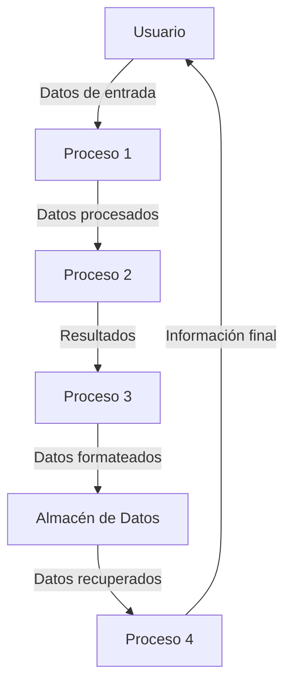

## Module: IndentedPrint.cpp
# Análisis Integral del Módulo IndentedPrint.cpp

## Nombre del Módulo/Componente SQL
IndentedPrint.cpp - Módulo de utilidad para impresión con formato indentado

## Objetivos Primarios
Este módulo proporciona funcionalidad para imprimir texto con indentación controlada, facilitando la generación de salidas formateadas jerárquicamente. Está diseñado para mejorar la legibilidad de la información impresa, especialmente en estructuras anidadas o jerárquicas.

## Funciones, Métodos y Consultas Críticas
- **IndentedPrint::IndentedPrint()**: Constructor que inicializa el objeto con valores predeterminados.
- **IndentedPrint::~IndentedPrint()**: Destructor que limpia los recursos.
- **IndentedPrint::print()**: Método principal que imprime texto con la indentación actual.
- **IndentedPrint::increaseIndent()**: Aumenta el nivel de indentación.
- **IndentedPrint::decreaseIndent()**: Disminuye el nivel de indentación.
- **IndentedPrint::resetIndent()**: Restablece la indentación a cero.

## Variables y Elementos Clave
- **m_indentLevel**: Variable que almacena el nivel actual de indentación.
- **m_indentSize**: Tamaño de cada nivel de indentación (probablemente en espacios).
- **m_stream**: Referencia al flujo de salida donde se imprimirá el texto (posiblemente std::ostream).
- **m_indentChar**: Carácter utilizado para la indentación (probablemente espacio o tabulación).

## Interdependencias y Relaciones
- Dependencia de la biblioteca estándar de C++ para manejo de flujos de salida (iostream).
- Posible integración con sistemas de registro o interfaces de usuario que requieren salida formateada.
- No se observan dependencias de bases de datos o componentes SQL.

## Operaciones Principales vs. Auxiliares
- **Operaciones principales**: 
  - Impresión de texto con indentación (print)
  - Gestión de niveles de indentación (increaseIndent, decreaseIndent)
- **Operaciones auxiliares**:
  - Cálculo del número exacto de caracteres de indentación
  - Formateo del texto antes de la impresión
  - Posible manejo de errores o validaciones

## Secuencia Operacional/Flujo de Ejecución
1. Inicialización del objeto IndentedPrint con parámetros específicos
2. Ajuste del nivel de indentación según sea necesario
3. Llamadas a print() para generar salida formateada
4. Posible anidamiento de llamadas a increaseIndent() y decreaseIndent() para manejar estructuras jerárquicas
5. Finalización y limpieza mediante el destructor

## Aspectos de Rendimiento y Optimización
- La eficiencia depende principalmente del manejo de cadenas y operaciones de flujo de salida.
- Posibles optimizaciones incluyen:
  - Precálculo de cadenas de indentación para niveles comunes
  - Minimización de operaciones de concatenación de cadenas
  - Uso de buffers para reducir llamadas al sistema de E/S

## Reusabilidad y Adaptabilidad
- Alta reusabilidad como utilidad general para cualquier sistema que requiera salida formateada.
- Adaptable a diferentes contextos mediante:
  - Configuración del carácter de indentación
  - Ajuste del tamaño de indentación
  - Posibilidad de dirigir la salida a diferentes flujos

## Uso y Contexto
- Utilizado principalmente para:
  - Depuración y registro de información estructurada
  - Generación de informes con formato jerárquico
  - Visualización de estructuras de datos anidadas
  - Posible uso en generación de código o documentación

## Suposiciones y Limitaciones
- **Suposiciones**:
  - Se asume que el flujo de salida está correctamente inicializado y es válido
  - Se espera que los usuarios gestionen correctamente los niveles de indentación
  
- **Limitaciones**:
  - Posible falta de soporte para estilos de indentación complejos
  - Dependencia de la configuración del terminal o visualizador para la correcta representación
  - No parece manejar automáticamente la indentación en texto multilínea
  - Posible ineficiencia al imprimir grandes volúmenes de texto con indentación profunda
## Flow Diagram [via mermaid]

