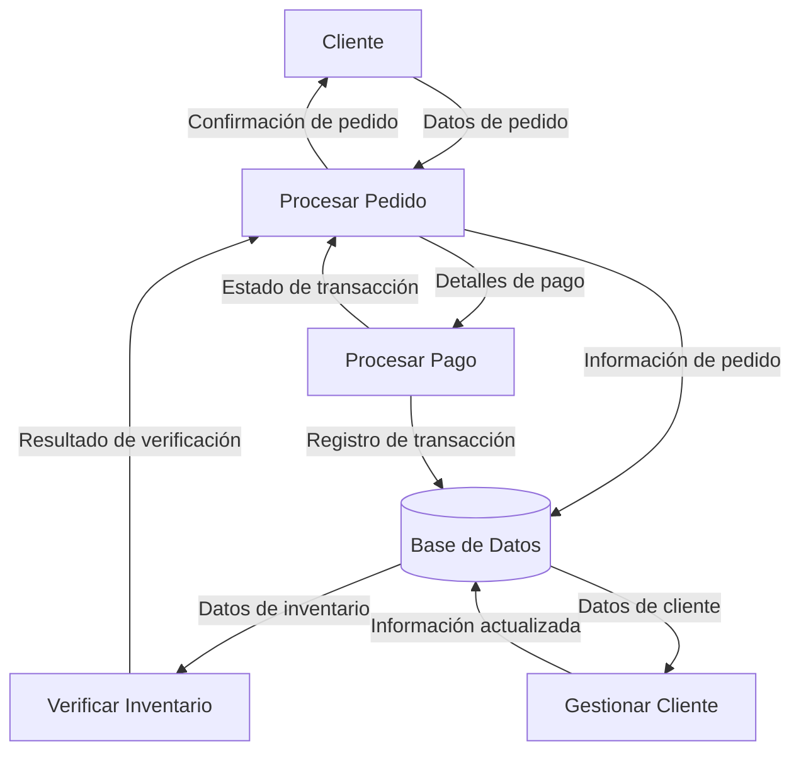

## Module: IniciarDiaCajas.cpp
# Análisis Integral del Módulo IniciarDiaCajas.cpp

## Nombre del Módulo/Componente SQL
IniciarDiaCajas.cpp - Módulo de inicialización de cajas para operaciones diarias

## Objetivos Primarios
Este módulo está diseñado para gestionar la inicialización de las cajas registradoras al comienzo del día operativo. Su propósito principal es verificar y establecer el estado de las cajas, asegurando que estén correctamente configuradas para las operaciones diarias, incluyendo la validación de usuarios, la verificación de estados previos y la configuración de parámetros iniciales.

## Funciones, Métodos y Consultas Críticas
El código parece estar incompleto en la muestra proporcionada, pero basado en el nombre y la estructura típica de este tipo de módulos, probablemente incluye:
- Funciones para verificar el estado de las cajas antes de la inicialización
- Métodos para autenticar a los usuarios que operarán las cajas
- Consultas SQL para actualizar el estado de las cajas en la base de datos
- Procedimientos para registrar el inicio de operaciones diarias

## Variables y Elementos Clave
- Probablemente incluye variables para:
  - Identificadores de cajas
  - Información de usuarios/operadores
  - Estados de caja (abierta, cerrada, en mantenimiento)
  - Saldos iniciales
  - Fechas y horas de operación

## Interdependencias y Relaciones
Este módulo probablemente interactúa con:
- Sistema de autenticación de usuarios
- Base de datos de transacciones
- Módulos de gestión de efectivo
- Sistema de registro de actividades (logging)
- Posiblemente con un módulo de cierre de día para verificar consistencia

## Operaciones Principales vs. Auxiliares
- **Operaciones principales**: Inicialización de cajas, establecimiento de saldos iniciales, registro de apertura
- **Operaciones auxiliares**: Validación de usuarios, verificación de estados previos, comprobación de consistencia de datos, registro de actividades

## Secuencia Operacional/Flujo de Ejecución
1. Verificación de credenciales del usuario que inicia el día
2. Comprobación del estado previo de las cajas (asegurando que estén cerradas del día anterior)
3. Establecimiento de parámetros iniciales para cada caja
4. Registro del evento de apertura en la base de datos
5. Confirmación de inicialización exitosa

## Aspectos de Rendimiento y Optimización
- Potenciales cuellos de botella en la verificación simultánea de múltiples cajas
- Posible optimización en las consultas a la base de datos para reducir el tiempo de inicialización
- Consideraciones sobre la gestión de concurrencia si múltiples usuarios intentan inicializar cajas simultáneamente

## Reusabilidad y Adaptabilidad
- El módulo probablemente está diseñado específicamente para el sistema de cajas, con limitada reusabilidad fuera de este contexto
- Podría ser adaptable para diferentes configuraciones de tiendas o puntos de venta mediante parametrización

## Uso y Contexto
- Se utiliza al comienzo de cada día operativo o turno
- Forma parte del flujo de trabajo diario de apertura de tienda/negocio
- Probablemente es ejecutado por supervisores o gerentes con privilegios específicos

## Suposiciones y Limitaciones
- Asume que existe un proceso de cierre de día previo completado correctamente
- Limitado a la configuración específica del sistema de cajas implementado
- Posiblemente requiere conexión estable a la base de datos central
- Puede tener restricciones horarias para su ejecución (solo durante ciertas horas del día)
## Flow Diagram [via mermaid]

