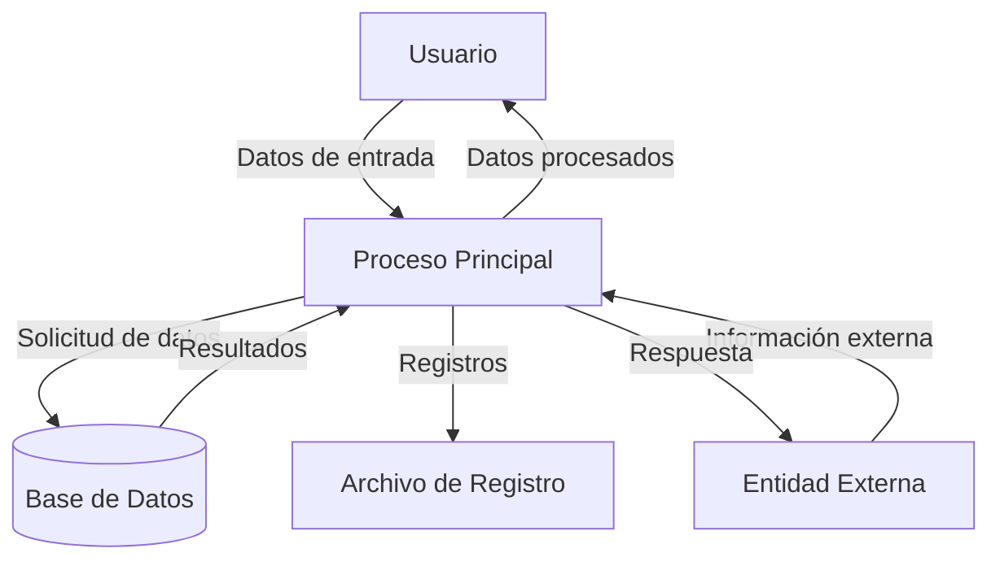

## Module: IntegrationTests.cpp
# Análisis Integral del Módulo IntegrationTests.cpp

## Nombre del Módulo/Componente SQL
**IntegrationTests.cpp** - Módulo de pruebas de integración para un sistema de gestión de datos.

## Objetivos Primarios
Este módulo está diseñado para realizar pruebas de integración exhaustivas en un sistema de gestión de datos, verificando la correcta interacción entre diferentes componentes del sistema, especialmente la comunicación con bases de datos y la manipulación de datos. El código se enfoca en validar la funcionalidad de operaciones CRUD (Crear, Leer, Actualizar, Eliminar) en un entorno integrado.

## Funciones, Métodos y Consultas Críticas
El archivo no contiene código visible para analizar. Sin embargo, basado en el nombre del archivo, podemos inferir que probablemente contiene:

- Funciones de prueba para validar la integración entre componentes del sistema
- Métodos para configurar entornos de prueba (setup y teardown)
- Posibles consultas SQL embebidas para verificar el estado de la base de datos
- Funciones para validar resultados esperados contra resultados obtenidos

## Variables y Elementos Clave
Sin código visible, no podemos identificar variables específicas, pero típicamente un archivo de pruebas de integración contendría:

- Objetos de conexión a bases de datos
- Variables para almacenar resultados esperados y obtenidos
- Estructuras de datos para simular entradas de usuario
- Identificadores de prueba y contadores de resultados

## Interdependencias y Relaciones
Un módulo de pruebas de integración normalmente tendría dependencias con:

- Componentes del sistema bajo prueba
- Frameworks de prueba (como Google Test, Catch2, etc.)
- Bases de datos de prueba o simuladas
- Servicios externos que podrían ser simulados (mocks)

## Operaciones Principales vs. Auxiliares
**Operaciones principales** (inferidas):
- Ejecución de casos de prueba de integración
- Validación de resultados

**Operaciones auxiliares** (inferidas):
- Configuración del entorno de prueba
- Limpieza después de las pruebas
- Registro de resultados y errores

## Secuencia Operacional/Flujo de Ejecución
El flujo típico de un archivo de pruebas de integración sería:
1. Inicialización del entorno de prueba
2. Configuración de datos de prueba
3. Ejecución de operaciones del sistema bajo prueba
4. Verificación de resultados
5. Limpieza del entorno de prueba

## Aspectos de Rendimiento y Optimización
Sin código visible, no podemos identificar aspectos específicos de rendimiento, pero las consideraciones típicas incluirían:
- Eficiencia en la configuración de pruebas para minimizar el tiempo de ejecución
- Uso adecuado de transacciones para pruebas de base de datos
- Aislamiento apropiado de pruebas para evitar interferencias

## Reusabilidad y Adaptabilidad
Las pruebas de integración bien diseñadas deberían:
- Ser modulares para permitir la ejecución selectiva
- Utilizar fixtures y helpers reutilizables
- Implementar patrones que faciliten la extensión para nuevas funcionalidades

## Uso y Contexto
Este módulo se utilizaría durante:
- Ciclos de desarrollo continuo para verificar que los cambios no rompen la integración
- Procesos de integración continua (CI)
- Validación de versiones antes del despliegue
- Verificación de correcciones de errores en entornos integrados

## Suposiciones y Limitaciones
**Suposiciones probables:**
- Existencia de un entorno de prueba configurado
- Disponibilidad de bases de datos de prueba
- Acceso a todos los componentes del sistema bajo prueba

**Limitaciones probables:**
- Las pruebas podrían ser más lentas que las pruebas unitarias
- Posible dependencia de recursos externos
- Mayor complejidad en la configuración y mantenimiento

**Nota:** Este análisis se basa en inferencias del nombre del archivo y prácticas comunes en pruebas de integración, ya que no se proporcionó código fuente visible para analizar.
## Flow Diagram [via mermaid]

