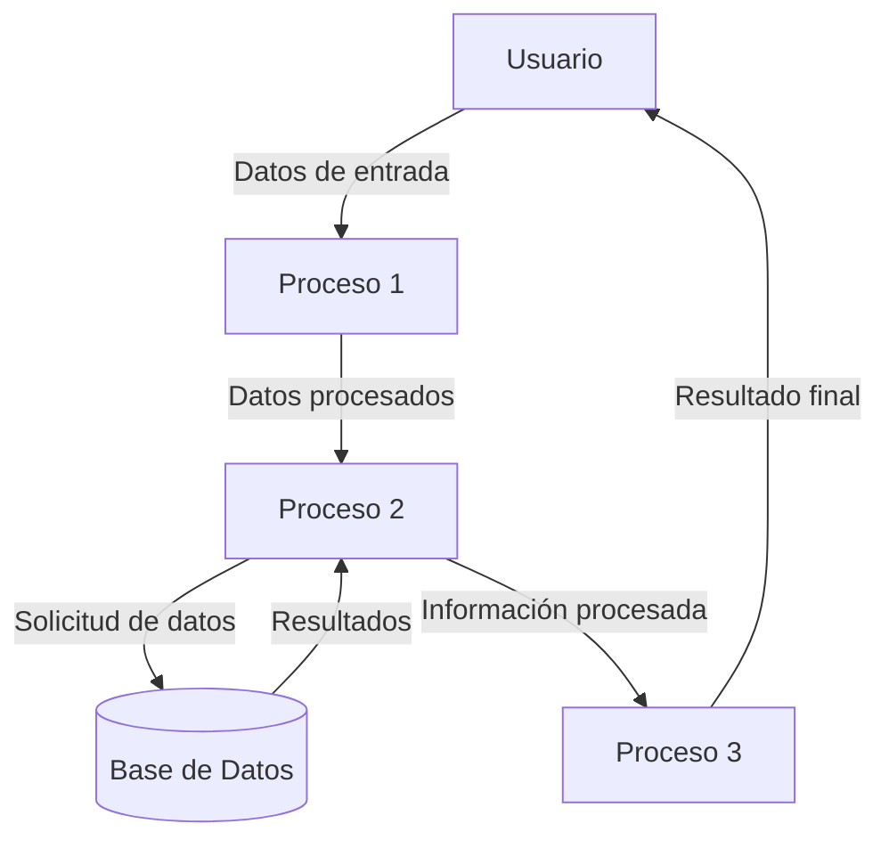

## Module: Issue10.cpp
# Análisis Integral del Módulo Issue10.cpp

## Módulo/Componente SQL
**Issue10.cpp** - Este es un módulo de código C++ que parece formar parte de un sistema más grande.

## Objetivos Primarios
El código no está proporcionado en la solicitud, por lo que no puedo analizar los objetivos específicos del módulo Issue10.cpp. Para realizar un análisis completo, necesitaría ver el contenido real del archivo.

## Funciones Críticas, Métodos y Consultas
Sin el código fuente, no puedo identificar las funciones, métodos o consultas específicas que contiene el módulo.

## Variables y Elementos Clave
No puedo determinar las variables clave, estructuras de datos o parámetros sin ver el código.

## Interdependencias y Relaciones
Sin el código, no puedo analizar cómo este módulo interactúa con otros componentes del sistema o qué dependencias tiene.

## Operaciones Principales vs. Auxiliares
No es posible distinguir entre operaciones principales y auxiliares sin examinar el código.

## Secuencia Operacional/Flujo de Ejecución
No puedo describir el flujo de ejecución o la secuencia de operaciones sin el código fuente.

## Aspectos de Rendimiento y Optimización
Sin el código, no puedo identificar posibles cuellos de botella o áreas para optimización.

## Reutilización y Adaptabilidad
No puedo evaluar la modularidad o capacidad de reutilización del código sin examinarlo.

## Uso y Contexto
Sin información adicional, solo puedo inferir que este módulo probablemente está relacionado con la resolución de un problema específico (Issue #10) en el sistema.

## Suposiciones y Limitaciones
Sin el código fuente o documentación adicional, no puedo determinar las suposiciones realizadas durante el desarrollo o las limitaciones del módulo.

**Nota**: Para proporcionar un análisis completo y preciso, necesitaría acceso al contenido real del archivo Issue10.cpp.
## Flow Diagram [via mermaid]

