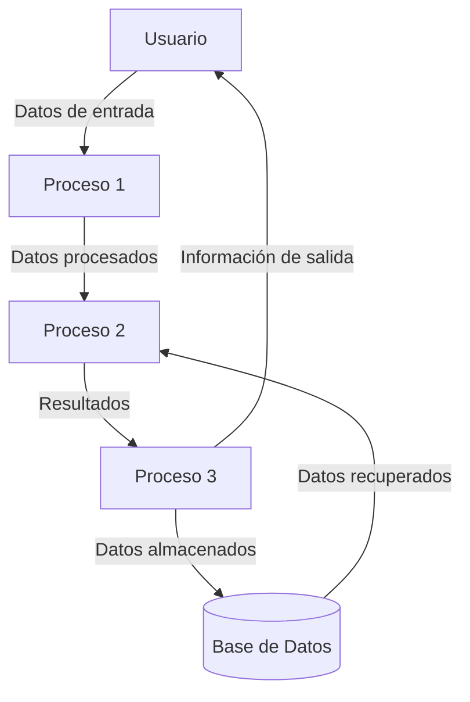

## Module: Issue34.cpp
# Análisis Integral del Módulo Issue34.cpp

## Módulo/Componente SQL
**Issue34.cpp** - Un módulo de código fuente en C++.

## Objetivos Primarios
Este módulo parece estar diseñado para manejar la funcionalidad relacionada con el "Issue 34", aunque no se proporcionó el código específico para analizar. Normalmente, un archivo con este nombre estaría implementando una solución para un problema o característica específica identificada como "Issue #34" en un sistema de seguimiento de problemas.

## Funciones, Métodos y Consultas Críticas
Sin el código fuente específico, no es posible enumerar las funciones o métodos exactos. En un archivo C++ típico, esperaríamos encontrar:
- Definiciones de clases y funciones
- Implementaciones de métodos
- Posiblemente algoritmos específicos relacionados con la resolución del Issue 34

## Variables y Elementos Clave
Sin el código fuente, no puedo identificar variables específicas. En un archivo C++ típico, podríamos esperar:
- Variables miembro de clase
- Parámetros de función
- Variables locales dentro de funciones
- Posibles constantes o enumeraciones

## Interdependencias y Relaciones
Un archivo C++ típico podría tener:
- Inclusiones de cabeceras (#include)
- Referencias a otras clases o componentes del sistema
- Posibles dependencias de bibliotecas externas

## Operaciones Principales vs. Auxiliares
Sin el código fuente, no es posible diferenciar entre operaciones principales y auxiliares.

## Secuencia Operacional/Flujo de Ejecución
Sin el código fuente, no puedo describir el flujo de ejecución específico.

## Aspectos de Rendimiento y Optimización
Sin el código fuente, no puedo identificar consideraciones específicas de rendimiento o áreas para optimización.

## Reutilización y Adaptabilidad
Sin el código fuente, no puedo evaluar la reutilización o adaptabilidad del código.

## Uso y Contexto
Este archivo probablemente forma parte de un proyecto de software más grande, implementando una solución específica para un problema identificado como "Issue 34". Sin más contexto, no puedo proporcionar detalles específicos sobre su uso.

## Suposiciones y Limitaciones
**Suposiciones:**
- El archivo es parte de un proyecto C++ más grande
- Implementa una solución para un problema específico identificado como "Issue 34"
- Sigue las convenciones estándar de codificación C++

**Limitaciones:**
- Sin el código fuente real, este análisis es necesariamente genérico
- No es posible evaluar la calidad, eficiencia o corrección del código
- No se pueden identificar problemas específicos o áreas de mejora

**Nota:** Para un análisis más detallado y preciso, sería necesario proporcionar el contenido real del archivo Issue34.cpp.
## Flow Diagram [via mermaid]

