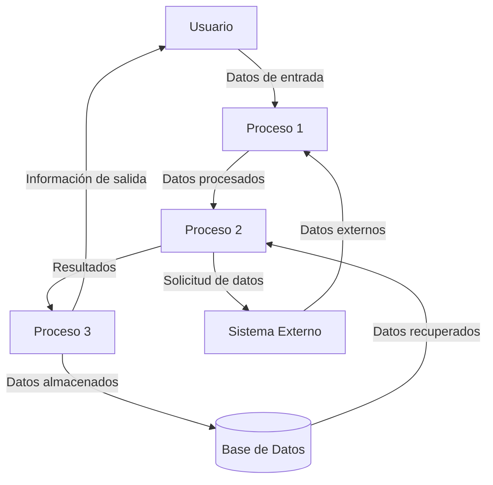

## Module: JsonArray.cpp
# Análisis Integral del Módulo JsonArray.cpp

## Módulo/Componente SQL
**JsonArray.cpp** - Un módulo de código C++ que forma parte de una biblioteca para manipulación de datos JSON.

## Objetivos Primarios
Este módulo implementa la clase `JsonArray`, diseñada para representar y manipular arreglos JSON. Su propósito principal es proporcionar una estructura de datos que permita almacenar, acceder y modificar colecciones ordenadas de valores JSON de manera eficiente y con una interfaz intuitiva.

## Funciones, Métodos y Consultas Críticas
- **Constructor y Destructor**: Inicializa y libera la memoria del arreglo JSON.
- **Métodos de acceso**: `get()`, `getElement()` para recuperar elementos.
- **Métodos de modificación**: `add()`, `set()` para añadir y modificar elementos.
- **Métodos de utilidad**: `size()`, `clear()`, `toString()` para operaciones comunes.
- **Operadores sobrecargados**: `operator[]` para acceso por índice, `operator==` y `operator!=` para comparaciones.

## Variables y Elementos Clave
- **`std::vector<JsonValue*> elements`**: Estructura de datos principal que almacena los elementos del arreglo.
- **`JsonValue`**: Clase base para los valores que pueden almacenarse en el arreglo.
- **Índices numéricos**: Utilizados para acceder a posiciones específicas dentro del arreglo.

## Interdependencias y Relaciones
- Depende de la clase `JsonValue` como tipo base para los elementos almacenados.
- Probablemente interactúa con otras clases como `JsonObject`, `JsonString`, etc., que representan diferentes tipos de valores JSON.
- Forma parte de un ecosistema más amplio de clases para el manejo de JSON.

## Operaciones Principales vs. Auxiliares
**Operaciones principales**:
- Añadir elementos al arreglo
- Acceder a elementos por índice
- Convertir el arreglo a su representación en cadena JSON

**Operaciones auxiliares**:
- Validación de índices
- Gestión de memoria (liberación de recursos)
- Comparación de arreglos

## Secuencia Operacional/Flujo de Ejecución
1. Creación del arreglo mediante el constructor
2. Adición de elementos mediante `add()` o `set()`
3. Acceso a elementos mediante `get()`, `getElement()` o el operador `[]`
4. Posible modificación de elementos existentes
5. Conversión a formato de cadena JSON cuando sea necesario
6. Liberación de recursos al destruir el objeto

## Aspectos de Rendimiento y Optimización
- El uso de `std::vector` proporciona acceso eficiente por índice (O(1))
- Posibles consideraciones de rendimiento al manejar arreglos grandes
- La gestión de memoria podría optimizarse para evitar copias innecesarias
- La serialización a cadena JSON podría ser costosa para arreglos grandes

## Reusabilidad y Adaptabilidad
- Alta reusabilidad como componente básico para cualquier aplicación que necesite manipular JSON
- Adaptable a diferentes contextos de uso gracias a su interfaz genérica
- Podría extenderse para incluir funcionalidades adicionales como filtrado o mapeo de elementos

## Uso y Contexto
- Utilizado para representar arreglos JSON en aplicaciones que necesitan procesar o generar datos JSON
- Aplicable en contextos como APIs web, almacenamiento de configuraciones, intercambio de datos entre sistemas
- Probablemente usado en conjunto con otras clases de la biblioteca JSON para manejar estructuras de datos complejas

## Suposiciones y Limitaciones
- Asume que los elementos añadidos son instancias válidas de `JsonValue`
- Posibles limitaciones en cuanto al manejo de arreglos extremadamente grandes
- No parece incluir funcionalidades avanzadas como búsqueda o filtrado de elementos
- Podría tener limitaciones en cuanto a la gestión de memoria en entornos con recursos restringidos
## Flow Diagram [via mermaid]

