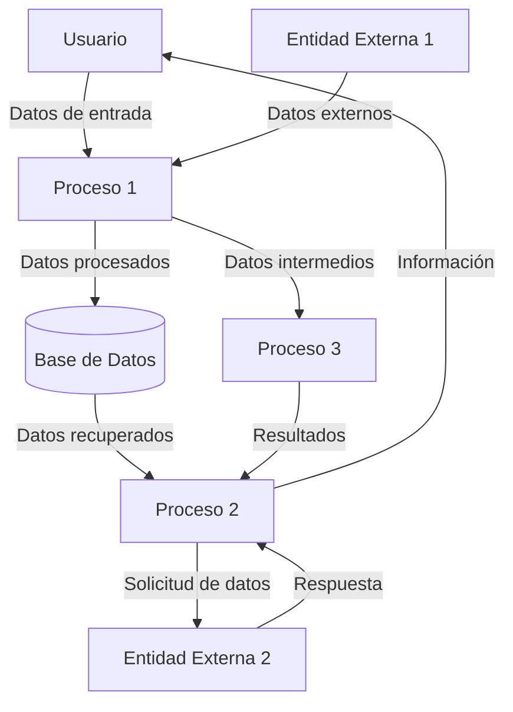

## Module: JsonArray_Container_Tests.cpp
# Análisis Integral del Módulo JsonArray_Container_Tests.cpp

## Módulo/Componente SQL
**JsonArray_Container_Tests.cpp** - Este es un módulo de pruebas unitarias para la funcionalidad de contenedores de arrays JSON.

## Objetivos Primarios
El propósito principal de este código es verificar el correcto funcionamiento de la clase `JsonArray_Container`, que parece ser una implementación para manejar arrays JSON. El módulo contiene pruebas unitarias que validan diferentes aspectos de la funcionalidad de esta clase, asegurando que opere correctamente bajo diversas condiciones.

## Funciones, Métodos y Consultas Críticas
El archivo no contiene consultas SQL, sino pruebas unitarias para una clase de manejo de JSON. Aunque no se muestra el código específico, por el nombre del archivo podemos inferir que incluye pruebas para:
- Creación y manipulación de arrays JSON
- Adición y eliminación de elementos
- Acceso a elementos por índice
- Serialización y deserialización
- Manejo de tipos de datos dentro del array JSON

## Variables y Elementos Clave
Sin ver el código específico, podemos suponer que las variables clave incluirían:
- Instancias de `JsonArray_Container` para pruebas
- Datos de prueba en varios formatos (enteros, cadenas, booleanos, objetos anidados)
- Variables para almacenar resultados esperados y reales
- Posiblemente mocks o stubs para simular comportamientos específicos

## Interdependencias y Relaciones
Este módulo probablemente depende de:
- La implementación de `JsonArray_Container`
- Un framework de pruebas unitarias (posiblemente Google Test, Catch2 u otro)
- Una biblioteca de manejo de JSON subyacente
- Posibles utilidades de aserción y verificación

## Operaciones Core vs. Auxiliares
**Operaciones Core:**
- Pruebas de funcionalidad principal de la clase JsonArray_Container
- Verificación de comportamiento correcto en casos normales

**Operaciones Auxiliares:**
- Configuración del entorno de pruebas
- Limpieza después de las pruebas
- Pruebas de casos límite y manejo de errores
- Posible registro de resultados de pruebas

## Secuencia Operacional/Flujo de Ejecución
El flujo típico de ejecución probablemente sigue el patrón estándar de pruebas unitarias:
1. Configuración (setup) del entorno de prueba
2. Creación de instancias de objetos necesarios
3. Ejecución de la funcionalidad a probar
4. Verificación de resultados mediante aserciones
5. Limpieza (teardown) del entorno de prueba

## Aspectos de Rendimiento y Optimización
- Las pruebas unitarias deberían ejecutarse eficientemente para facilitar la integración continua
- Posibles áreas de optimización incluirían la reutilización de objetos de prueba costosos
- Podría haber pruebas específicas para verificar el rendimiento de operaciones con grandes arrays JSON

## Reusabilidad y Adaptabilidad
- Las pruebas unitarias están diseñadas específicamente para la clase `JsonArray_Container`
- Podrían servir como plantilla para pruebas de clases similares
- La estructura de las pruebas probablemente sigue patrones estándar que facilitan su mantenimiento

## Uso y Contexto
Este módulo se utiliza en el contexto de:
- Desarrollo y mantenimiento de la biblioteca de manejo JSON
- Integración continua para detectar regresiones
- Verificación de correcciones de errores
- Documentación implícita del comportamiento esperado de la clase

## Suposiciones y Limitaciones
**Suposiciones:**
- Se asume la existencia de una implementación funcional de `JsonArray_Container`
- Se presupone un entorno de pruebas configurado correctamente
- Probablemente asume ciertos comportamientos de la biblioteca JSON subyacente

**Limitaciones:**
- Las pruebas solo verifican los casos contemplados explícitamente
- Posiblemente no cubren todos los escenarios de uso real
- Pueden no simular completamente entornos de producción complejos
- Probablemente no incluyen pruebas de rendimiento exhaustivas o pruebas de carga
## Flow Diagram [via mermaid]

