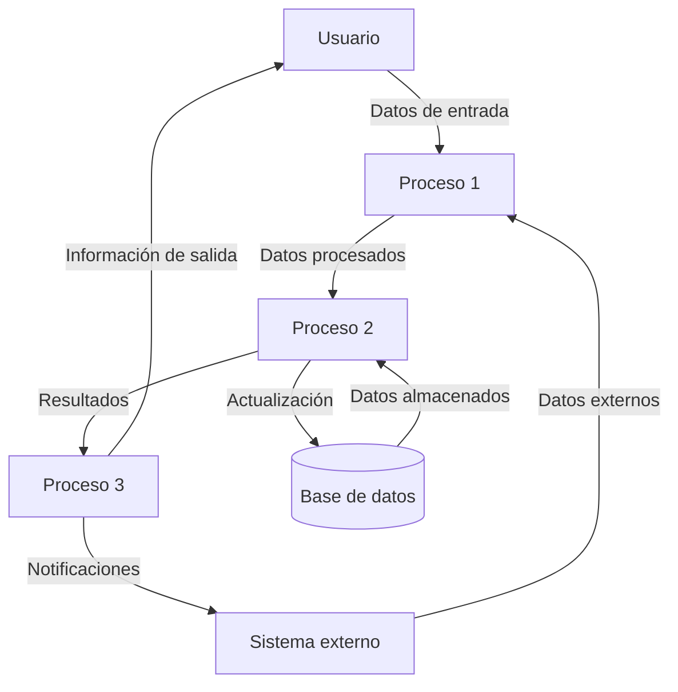

## Module: JsonArray_Invalid_Tests.cpp
# Análisis Integral del Módulo JsonArray_Invalid_Tests.cpp

## Módulo/Componente SQL
**Nombre del Módulo**: JsonArray_Invalid_Tests.cpp

## Objetivos Primarios
Este módulo contiene pruebas unitarias diseñadas para verificar el comportamiento del analizador JSON cuando se enfrenta a arrays JSON inválidos. Su propósito principal es asegurar que la biblioteca de procesamiento JSON detecte correctamente y maneje adecuadamente los casos de error en la sintaxis de arrays JSON.

## Funciones, Métodos y Consultas Críticas
- **TEST_CASE("JsonArray_Invalid")**: Función principal de prueba que contiene múltiples subcasos para probar diferentes escenarios de arrays JSON inválidos.
- **CHECK_THROWS_AS()**: Método utilizado para verificar que se lancen excepciones específicas cuando se analizan arrays JSON malformados.
- **JsonDocument::Parse()**: Método que se prueba para asegurar que detecte correctamente los arrays JSON inválidos.

## Variables y Elementos Clave
- **Cadenas de prueba JSON**: Diversas cadenas que representan arrays JSON inválidos, como `"[1,]"`, `"[,1]"`, `"[1,,2]"`, etc.
- **JsonDocument**: Clase utilizada para analizar y procesar documentos JSON.
- **JsonParseException**: Tipo de excepción que se espera cuando se encuentra un error de sintaxis en el JSON.

## Interdependencias y Relaciones
- El módulo depende de la biblioteca de pruebas Catch2 (indicado por la inclusión de "catch2/catch.hpp").
- Interactúa con la biblioteca de procesamiento JSON (posiblemente una implementación personalizada).
- Depende de la clase JsonDocument y la excepción JsonParseException para realizar las pruebas.

## Operaciones Principales vs. Auxiliares
- **Operaciones Principales**: Las pruebas de validación de arrays JSON inválidos.
- **Operaciones Auxiliares**: La configuración del entorno de prueba y la verificación de excepciones lanzadas.

## Secuencia Operacional/Flujo de Ejecución
1. Se define un caso de prueba para arrays JSON inválidos.
2. Para cada subcaso, se intenta analizar una cadena JSON malformada.
3. Se verifica que se lance la excepción JsonParseException.
4. Se continúa con el siguiente subcaso hasta completar todas las pruebas.

## Aspectos de Rendimiento y Optimización
- El código está enfocado en pruebas unitarias, por lo que el rendimiento no es una preocupación principal.
- Las pruebas están diseñadas para ser concisas y específicas, lo que facilita la identificación de problemas.

## Reusabilidad y Adaptabilidad
- Las pruebas son específicas para la validación de arrays JSON, pero el enfoque podría adaptarse para probar otros aspectos de la biblioteca JSON.
- El uso de Catch2 permite una fácil extensión con más casos de prueba si se identifican nuevos escenarios de error.

## Uso y Contexto
- Este módulo forma parte de una suite de pruebas unitarias para una biblioteca de procesamiento JSON.
- Se utiliza durante el desarrollo y las pruebas de regresión para asegurar que la biblioteca maneje correctamente los casos de error.
- Probablemente se ejecuta como parte de un proceso de integración continua.

## Suposiciones y Limitaciones
- **Suposiciones**:
  - Se asume que la biblioteca JSON lanza JsonParseException cuando encuentra errores de sintaxis.
  - Se asume que el framework Catch2 está disponible y configurado correctamente.
- **Limitaciones**:
  - Las pruebas solo cubren un conjunto específico de casos de arrays JSON inválidos.
  - No prueba el comportamiento con arrays JSON muy grandes o complejos.
  - No verifica el contenido específico de los mensajes de error, solo que se lance la excepción correcta.
## Flow Diagram [via mermaid]

