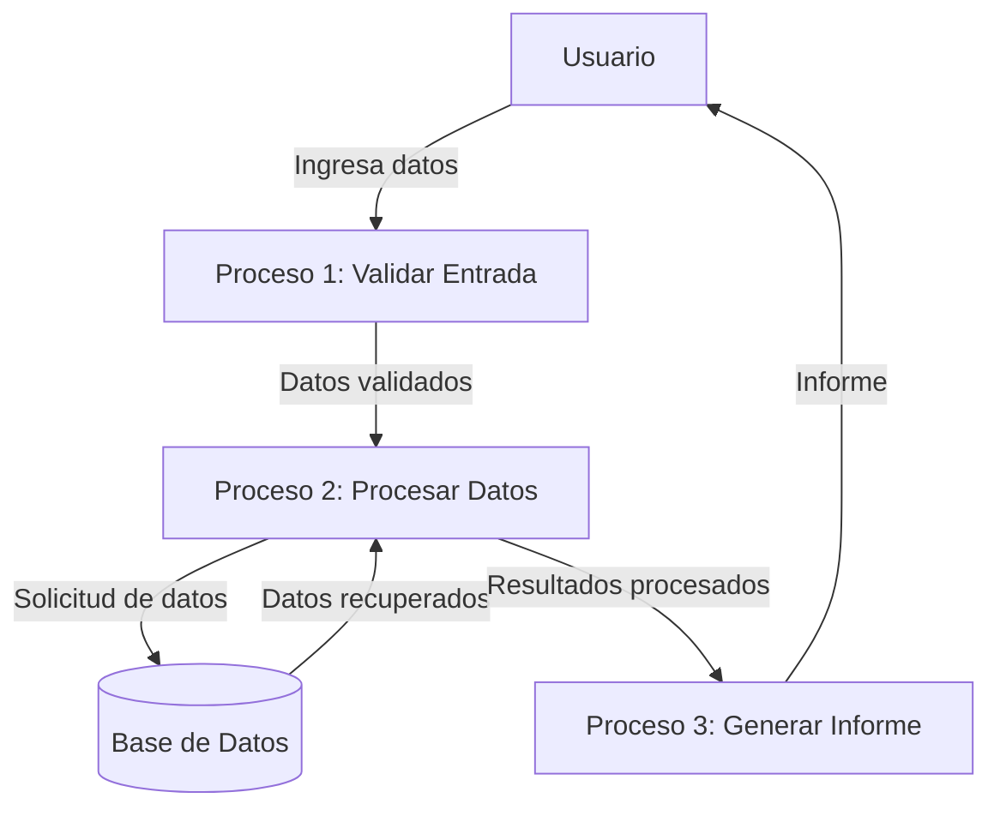

## Module: JsonArray_Iterator_Tests.cpp
# Análisis Integral del Módulo JsonArray_Iterator_Tests.cpp

## Nombre del Módulo/Componente SQL
JsonArray_Iterator_Tests.cpp - Módulo de pruebas unitarias para iteradores de JsonArray

## Objetivos Primarios
Este módulo está diseñado para verificar el correcto funcionamiento de los iteradores de la clase JsonArray en la biblioteca ArduinoJson. Su propósito principal es asegurar que los iteradores permitan recorrer correctamente los elementos de un array JSON, tanto en modo constante como no constante, y que manejen adecuadamente casos especiales como arrays vacíos.

## Funciones, Métodos y Consultas Críticas
- `TEST_CASE("JsonArray::iterator")`: Prueba el iterador no constante de JsonArray
- `TEST_CASE("JsonArray::const_iterator")`: Prueba el iterador constante de JsonArray
- Métodos de prueba específicos:
  - Verificación de iteración sobre arrays vacíos
  - Comprobación de operaciones de incremento/decremento de iteradores
  - Validación de acceso a elementos mediante iteradores
  - Pruebas de comparación entre iteradores

## Variables y Elementos Clave
- `JsonArray array`: Variable principal que contiene el array JSON a probar
- `JsonDocument doc`: Documento JSON que aloja el array
- `JsonArray::iterator it`: Iterador no constante para recorrer el array
- `JsonArray::const_iterator cit`: Iterador constante para recorrer el array
- Valores de prueba: 1, 2 (enteros utilizados para poblar el array de prueba)

## Interdependencias y Relaciones
- Dependencia de la biblioteca ArduinoJson
- Utiliza el framework de pruebas Catch2 (evidenciado por las macros `TEST_CASE` y `REQUIRE`)
- Interactúa con las clases JsonDocument y JsonArray de la biblioteca ArduinoJson
- Depende de la implementación correcta de los iteradores en la clase JsonArray

## Operaciones Core vs. Auxiliares
- **Operaciones Core**:
  - Pruebas de iteración sobre arrays JSON
  - Verificación de acceso a elementos mediante iteradores
  - Comprobación de operadores de comparación entre iteradores
- **Operaciones Auxiliares**:
  - Configuración del entorno de prueba (creación de documentos y arrays)
  - Validaciones mediante macros REQUIRE

## Secuencia Operacional/Flujo de Ejecución
1. Creación de un documento JSON y un array JSON para las pruebas
2. Población del array con valores de prueba (cuando corresponde)
3. Inicialización de iteradores al principio y final del array
4. Ejecución de operaciones de iteración y acceso a elementos
5. Verificación de resultados mediante aserciones (REQUIRE)
6. Repetición del proceso para diferentes casos de prueba (arrays vacíos, iteradores constantes, etc.)

## Aspectos de Rendimiento y Optimización
- El código está enfocado en pruebas unitarias, no en rendimiento
- No hay optimizaciones específicas ya que el objetivo es verificar la funcionalidad
- Las pruebas son ligeras y no deberían tener problemas de rendimiento

## Reusabilidad y Adaptabilidad
- El código sigue un patrón estándar de pruebas unitarias que podría adaptarse para probar otros contenedores
- La estructura de pruebas es modular y podría extenderse para cubrir más casos de uso
- Las pruebas están bien organizadas por funcionalidad, facilitando su mantenimiento

## Uso y Contexto
- Este módulo forma parte de la suite de pruebas unitarias de la biblioteca ArduinoJson
- Se ejecutaría durante el desarrollo o integración continua para verificar que los iteradores de JsonArray funcionan correctamente
- Es crucial para garantizar la estabilidad de la biblioteca cuando se realizan cambios en la implementación de JsonArray

## Suposiciones y Limitaciones
- Supone que el framework de pruebas Catch2 está disponible
- Asume que las clases JsonDocument y JsonArray funcionan correctamente
- Se limita a probar la funcionalidad básica de los iteradores (recorrido, acceso, comparación)
- No prueba casos extremos como manejo de memoria insuficiente o arrays muy grandes
- No verifica el comportamiento de los iteradores cuando el array subyacente es modificado durante la iteración
## Flow Diagram [via mermaid]

