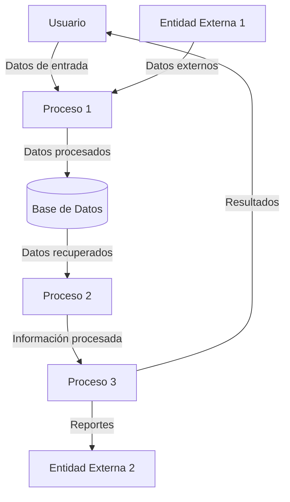

## Module: JsonArray_PrettyPrintTo_Tests.cpp
# Análisis Integral del Módulo JsonArray_PrettyPrintTo_Tests.cpp

## Módulo/Componente SQL
**Nombre del Módulo**: JsonArray_PrettyPrintTo_Tests.cpp

## Objetivos Primarios
Este módulo contiene pruebas unitarias para verificar la funcionalidad de formateo "pretty print" (impresión con formato legible) de arrays JSON en la biblioteca ArduinoJson. Su propósito principal es asegurar que el método `prettyPrintTo()` de la clase `JsonArray` funcione correctamente, generando representaciones JSON formateadas con indentación adecuada.

## Funciones, Métodos y Consultas Críticas
- `TEST_CASE("JsonArray::prettyPrintTo()`: Función principal de prueba que verifica diferentes escenarios de formateo de arrays JSON.
- `prettyPrintTo()`: Método bajo prueba que formatea arrays JSON con indentación y saltos de línea.
- `createJsonArray()`: Función auxiliar que crea y configura arrays JSON para las pruebas.

## Variables y Elementos Clave
- `DynamicJsonBuffer jsonBuffer`: Buffer para la asignación dinámica de memoria para objetos JSON.
- `JsonArray& array`: Referencia al array JSON que se está probando.
- `output`: Variable que almacena la salida formateada para su verificación.
- `expected`: Cadenas de texto que contienen el resultado esperado para cada caso de prueba.

## Interdependencias y Relaciones
- Dependencia de la biblioteca ArduinoJson para la manipulación de estructuras JSON.
- Utiliza el framework Catch2 para la ejecución de pruebas unitarias.
- Interactúa con las clases `JsonArray`, `JsonObject` y `JsonBuffer` de la biblioteca ArduinoJson.

## Operaciones Core vs. Auxiliares
**Operaciones Core**:
- Verificación de la salida formateada de arrays JSON con diferentes contenidos y niveles de anidamiento.

**Operaciones Auxiliares**:
- Creación de arrays JSON para las pruebas.
- Configuración del entorno de prueba.
- Comparación de resultados con valores esperados.

## Secuencia Operacional/Flujo de Ejecución
1. Inicialización del buffer JSON para cada caso de prueba.
2. Creación de un array JSON vacío o con elementos específicos.
3. Aplicación del método `prettyPrintTo()` para generar la representación formateada.
4. Comparación de la salida generada con el resultado esperado.
5. Verificación de casos especiales (arrays anidados, objetos dentro de arrays, etc.).

## Aspectos de Rendimiento y Optimización
- Las pruebas no están específicamente orientadas al rendimiento, sino a la corrección funcional.
- No se observan optimizaciones específicas, ya que el enfoque está en la verificación de la funcionalidad.
- El uso de referencias (`JsonArray&`) evita copias innecesarias de objetos.

## Reusabilidad y Adaptabilidad
- Las pruebas están estructuradas para ser ejecutadas independientemente.
- El código de prueba podría adaptarse para verificar otras funcionalidades de formateo JSON.
- La estructura modular permite añadir fácilmente nuevos casos de prueba.

## Uso y Contexto
- Este módulo forma parte del conjunto de pruebas unitarias de la biblioteca ArduinoJson.
- Se utiliza durante el desarrollo y mantenimiento para asegurar que los cambios en el código no afecten la funcionalidad de formateo.
- Es especialmente relevante para aplicaciones que necesitan generar JSON legible por humanos.

## Suposiciones y Limitaciones
- Supone que la biblioteca ArduinoJson está correctamente implementada y que las funciones básicas de manipulación JSON funcionan.
- Las pruebas se centran en la funcionalidad de formateo, no en el rendimiento o la gestión de memoria.
- No verifica comportamientos en condiciones de memoria limitada, que podrían ser relevantes en entornos Arduino reales.
- Asume que el framework de pruebas Catch2 está disponible y configurado correctamente.
## Flow Diagram [via mermaid]

