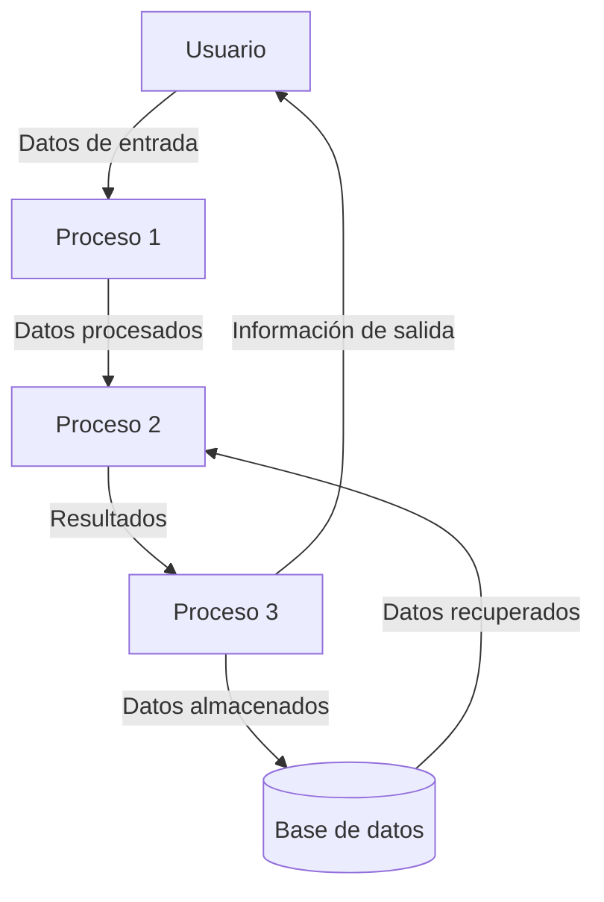

## Module: JsonArray_PrintTo_Tests.cpp
# Análisis Integral del Módulo JsonArray_PrintTo_Tests.cpp

## Módulo/Componente SQL
**JsonArray_PrintTo_Tests.cpp** - Este es un módulo de pruebas unitarias para la funcionalidad de impresión (PrintTo) de la clase JsonArray en la biblioteca ArduinoJson.

## Objetivos Primarios
El objetivo principal de este código es verificar que el método `printTo()` de la clase `JsonArray` funcione correctamente en diferentes escenarios. Las pruebas evalúan la capacidad de serializar arrays JSON con diferentes tipos de contenido y configuraciones.

## Funciones, Métodos y Consultas Críticas
- **TEST_F(JsonArray_PrintTo_Tests, ...)**: Serie de casos de prueba que verifican diferentes aspectos de la serialización de arrays JSON.
- **printTo()**: El método principal bajo prueba, responsable de serializar un JsonArray a una cadena JSON.
- **add()**: Método utilizado para agregar elementos de diferentes tipos al array JSON.

## Variables y Elementos Clave
- **_array**: Variable de instancia que representa el array JSON que se está probando.
- **_output**: Variable que almacena la salida serializada para su verificación.
- **_json**: Objeto que contiene el documento JSON completo.

## Interdependencias y Relaciones
- Depende de la biblioteca ArduinoJson, específicamente de las clases JsonArray y JsonBuffer.
- Utiliza el framework de pruebas (probablemente gtest o similar) para la ejecución de pruebas unitarias.
- Interactúa con la clase JsonObject para pruebas de arrays que contienen objetos.

## Operaciones Core vs. Auxiliares
- **Core**: Las operaciones de serialización mediante `printTo()` y la verificación de resultados.
- **Auxiliares**: La configuración de los arrays JSON de prueba, la inicialización de los objetos de prueba y la limpieza después de cada prueba.

## Secuencia Operacional/Flujo de Ejecución
1. Configuración del entorno de prueba (setup de la clase de prueba).
2. Creación de un array JSON vacío o con elementos específicos según el caso de prueba.
3. Llamada al método `printTo()` para serializar el array.
4. Verificación de que la salida coincida con el resultado esperado.
5. Limpieza de recursos (teardown).

## Aspectos de Rendimiento y Optimización
- Las pruebas evalúan la correcta formación de la salida JSON, pero no parecen enfocarse específicamente en el rendimiento.
- No se observan optimizaciones específicas en el código de prueba, ya que su propósito es verificar la funcionalidad, no optimizar el rendimiento.

## Reusabilidad y Adaptabilidad
- El código de prueba está estructurado para facilitar la adición de nuevos casos de prueba.
- La estructura modular permite probar diferentes aspectos de la serialización de arrays JSON de manera independiente.

## Uso y Contexto
- Este módulo se utiliza durante el desarrollo y mantenimiento de la biblioteca ArduinoJson para garantizar que la funcionalidad de serialización de arrays JSON funcione correctamente.
- Es parte de una suite de pruebas unitarias que verifica la integridad de la biblioteca.

## Suposiciones y Limitaciones
- Supone que el framework de pruebas está correctamente configurado.
- Asume que las clases JsonArray y JsonBuffer funcionan correctamente para la creación y manipulación de arrays JSON.
- Las pruebas se centran en la correcta formación de la salida JSON, no en el manejo de errores o casos extremos de memoria.
- Probablemente está diseñado para ejecutarse en un entorno de desarrollo, no en un dispositivo Arduino real.
## Flow Diagram [via mermaid]

