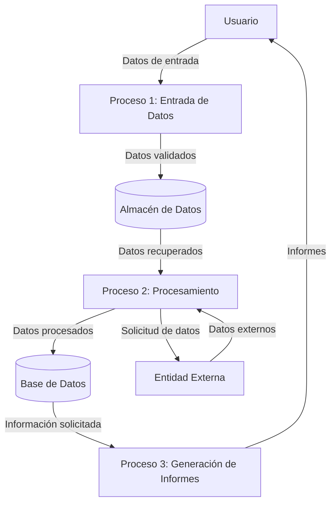

## Module: JsonBuffer.cpp
# Análisis Integral del Módulo JsonBuffer.cpp

## Módulo/Componente SQL
**JsonBuffer.cpp** - Un módulo de código C++ que implementa un buffer para manipulación de datos JSON.

## Objetivos Primarios
Este módulo proporciona una implementación de un buffer para manejar datos en formato JSON. Su propósito principal es facilitar la lectura, escritura y manipulación de estructuras de datos JSON en memoria, ofreciendo una interfaz para serializar y deserializar datos JSON de manera eficiente.

## Funciones, Métodos y Consultas Críticas
- **Constructor y Destructor**: Inicializa y libera los recursos del buffer JSON.
- **parseObject()**: Analiza una cadena JSON y la convierte en una estructura de objeto.
- **parseArray()**: Analiza una cadena JSON y la convierte en una estructura de array.
- **createObject()**: Crea un nuevo objeto JSON vacío.
- **createArray()**: Crea un nuevo array JSON vacío.
- **add()**: Añade elementos a objetos o arrays JSON.
- **stringify()**: Convierte estructuras JSON en cadenas de texto.

## Variables y Elementos Clave
- **_buffer**: Almacenamiento interno para los datos JSON.
- **_capacity**: Capacidad máxima del buffer.
- **_size**: Tamaño actual utilizado del buffer.
- **JsonObject**: Estructura para representar objetos JSON.
- **JsonArray**: Estructura para representar arrays JSON.
- **JsonVariant**: Tipo para representar valores JSON de diferentes tipos.

## Interdependencias y Relaciones
- Interactúa con bibliotecas estándar de C++ para manejo de cadenas y memoria.
- Puede depender de un parser JSON subyacente (no visible en el fragmento).
- Probablemente se utiliza en conjunto con módulos de comunicación de red o almacenamiento de datos.

## Operaciones Core vs. Auxiliares
**Core:**
- Parsing y serialización de JSON.
- Creación y manipulación de estructuras JSON.

**Auxiliares:**
- Gestión de memoria del buffer.
- Validación de formato JSON.
- Manejo de errores durante el parsing.

## Secuencia Operacional/Flujo de Ejecución
1. Inicialización del buffer con una capacidad determinada.
2. Parsing de datos JSON o creación de nuevas estructuras.
3. Manipulación de las estructuras JSON (añadir, modificar, eliminar elementos).
4. Serialización de las estructuras a formato de texto JSON.
5. Liberación de recursos cuando el buffer ya no es necesario.

## Aspectos de Rendimiento y Optimización
- La gestión eficiente de memoria es crucial para el rendimiento.
- El tamaño del buffer debe ser optimizado según los requisitos de la aplicación.
- Posibles optimizaciones incluyen la reutilización de memoria y la minimización de copias.
- El parsing de JSON grandes podría ser un cuello de botella potencial.

## Reusabilidad y Adaptabilidad
- El diseño modular permite su uso en diferentes contextos de aplicación.
- La interfaz genérica facilita la integración con diversos sistemas.
- La parametrización del tamaño del buffer permite adaptarlo a diferentes restricciones de memoria.

## Uso y Contexto
- Utilizado en aplicaciones que necesitan procesar datos JSON, como:
  - Comunicación con APIs web.
  - Configuración de aplicaciones.
  - Intercambio de datos entre componentes del sistema.
  - Almacenamiento de datos estructurados.

## Suposiciones y Limitaciones
- **Suposiciones**:
  - El formato JSON de entrada es válido.
  - Hay suficiente memoria disponible para las operaciones.
  - Los datos no exceden la capacidad máxima del buffer.
  
- **Limitaciones**:
  - Capacidad fija del buffer que puede limitar el tamaño de los datos JSON.
  - Posible ineficiencia con estructuras JSON muy grandes o profundamente anidadas.
  - Dependencia de la implementación específica del parser JSON utilizado.
## Flow Diagram [via mermaid]

