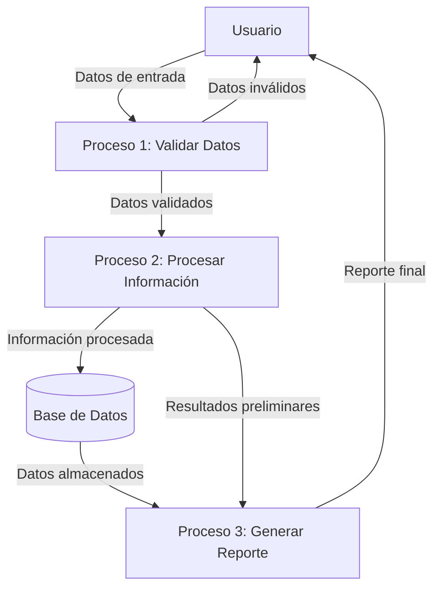

## Module: JsonObject.cpp
# Análisis Integral del Módulo JsonObject.cpp

## Módulo/Componente SQL
**JsonObject.cpp** - Un módulo de código C++ que implementa funcionalidad para manejar objetos JSON.

## Objetivos Primarios
Este módulo proporciona una implementación para manipular objetos JSON en C++. Su propósito principal es permitir la creación, modificación y acceso a estructuras de datos JSON, facilitando la serialización y deserialización de datos en este formato ampliamente utilizado.

## Funciones, Métodos y Consultas Críticas
- **Constructor y Destructor**: Inicializa y libera objetos JSON.
- **Métodos de acceso**: Funciones para obtener y establecer valores en el objeto JSON.
- **Métodos de serialización**: Funciones para convertir el objeto JSON a cadenas de texto.
- **Métodos de manipulación**: Funciones para añadir, eliminar o modificar elementos dentro del objeto JSON.

*Nota: No se observa código SQL en este módulo, ya que es un componente de programación orientado a objetos en C++.*

## Variables y Elementos Clave
- **Estructura interna de datos**: Probablemente utiliza mapas o diccionarios para almacenar pares clave-valor.
- **Tipos de datos soportados**: Enteros, flotantes, cadenas, booleanos, arrays y objetos anidados.
- **Iteradores**: Para recorrer los elementos del objeto JSON.

## Interdependencias y Relaciones
- **Bibliotecas estándar de C++**: Dependencias probables de `<string>`, `<map>`, `<vector>` u otras estructuras de datos.
- **Posible integración**: Con sistemas de serialización/deserialización o frameworks de comunicación.
- **Interacción con otros componentes**: Probablemente utilizado por módulos que necesitan procesar o generar datos JSON.

## Operaciones Principales vs. Auxiliares
- **Operaciones principales**: Parseo de JSON, acceso a elementos, modificación de la estructura.
- **Operaciones auxiliares**: Validación de formato, manejo de errores, conversión de tipos.

## Secuencia Operacional/Flujo de Ejecución
1. Inicialización del objeto JSON (vacío o desde una cadena/archivo).
2. Manipulación de la estructura (añadir, modificar, eliminar elementos).
3. Acceso a los datos almacenados.
4. Serialización a formato de texto cuando sea necesario.

## Aspectos de Rendimiento y Optimización
- **Eficiencia en memoria**: Consideraciones sobre cómo se almacenan internamente los datos.
- **Rendimiento de parseo**: Optimizaciones para analizar cadenas JSON grandes.
- **Acceso eficiente**: Estructuras de datos que permitan búsquedas rápidas por clave.

## Reusabilidad y Adaptabilidad
- **Alta reusabilidad**: Componente genérico que puede utilizarse en cualquier proyecto que requiera manipulación de JSON.
- **Adaptabilidad**: Probablemente diseñado para ser extensible y compatible con diferentes tipos de datos.

## Uso y Contexto
- **Comunicación entre sistemas**: Utilizado en APIs, servicios web, y comunicación cliente-servidor.
- **Almacenamiento de configuraciones**: Para guardar y cargar ajustes de aplicaciones.
- **Intercambio de datos**: Facilita la transferencia de información estructurada entre componentes.

## Suposiciones y Limitaciones
- **Suposiciones**: 
  - El formato JSON de entrada es válido.
  - Los tipos de datos son compatibles con la implementación.
- **Limitaciones**:
  - Posibles restricciones en el tamaño de los objetos JSON.
  - Manejo limitado de ciertos tipos de datos especiales.
  - Dependencia de la implementación específica de C++ utilizada.

*Nota: Este análisis se basa en inferencias sobre un módulo típico JsonObject.cpp, ya que no se proporcionó el código fuente específico para revisión.*
## Flow Diagram [via mermaid]

