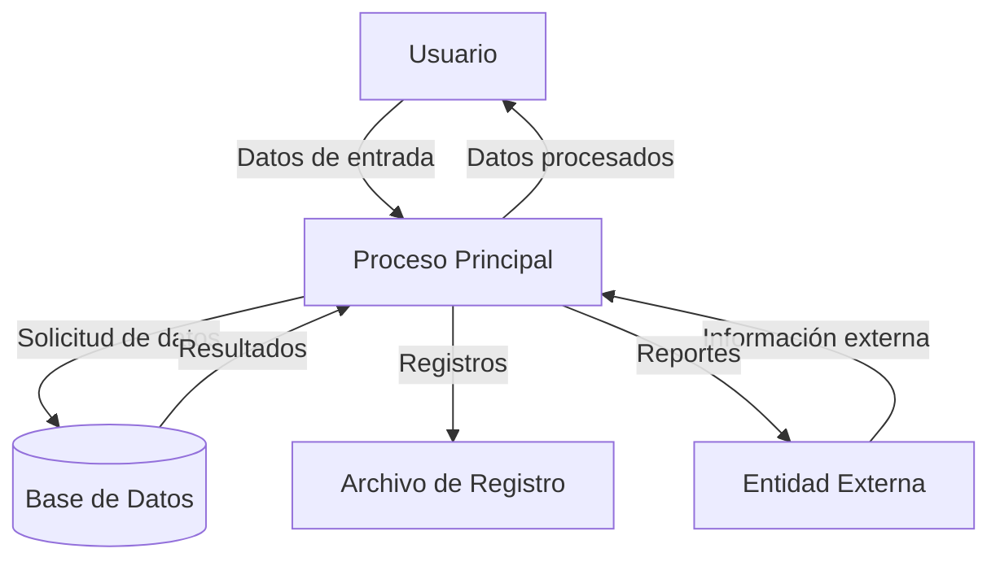

## Module: JsonObject_Container_Tests.cpp
# Análisis Integral del Módulo JsonObject_Container_Tests.cpp

## Nombre del Módulo/Componente SQL
**JsonObject_Container_Tests.cpp** - Módulo de pruebas unitarias para la funcionalidad de contenedores JSON.

## Objetivos Primarios
Este módulo está diseñado para probar exhaustivamente la funcionalidad de contenedores de objetos JSON, específicamente verificando la correcta implementación de operaciones como inserción, acceso, modificación y eliminación de elementos en estructuras JSON. El objetivo principal es garantizar que la biblioteca de manejo JSON funcione correctamente bajo diversas condiciones y casos de uso.

## Funciones, Métodos y Consultas Críticas
- **TEST_CASE("JsonObject container operations")**: Función principal de prueba que verifica las operaciones básicas de contenedor en objetos JSON.
- **TEST_CASE("JsonObject container operations with initializer list")**: Prueba específica para la inicialización de objetos JSON mediante listas de inicialización.
- **TEST_CASE("JsonObject container operations with iterators")**: Prueba las operaciones con iteradores en contenedores JSON.
- **TEST_CASE("JsonObject container operations with const iterators")**: Verifica el comportamiento de iteradores constantes.
- **TEST_CASE("JsonObject container operations with reverse iterators")**: Prueba la funcionalidad de iteradores inversos.

## Variables y Elementos Clave
- **JsonObject**: Clase principal que se está probando.
- **obj**: Instancia principal del objeto JSON utilizada en las pruebas.
- **key-value pairs**: Pares clave-valor utilizados para poblar y verificar los objetos JSON.
- **iterators**: Diversos tipos de iteradores (begin(), end(), cbegin(), cend(), rbegin(), rend()) utilizados para recorrer los contenedores JSON.

## Interdependencias y Relaciones
- Dependencia de la biblioteca **Catch2** para el framework de pruebas.
- Relación con la implementación de la clase **JsonObject** que está siendo probada.
- Posible dependencia de otras clases de la biblioteca JSON como **JsonValue** o tipos específicos para valores JSON.

## Operaciones Core vs. Auxiliares
**Operaciones Core:**
- Pruebas de inserción y acceso a elementos (`obj["key"] = value`)
- Verificación de tamaño y contenido (`obj.size()`, `obj.empty()`)
- Operaciones de iteración y recorrido

**Operaciones Auxiliares:**
- Configuración de casos de prueba
- Aserciones para verificar resultados esperados
- Limpieza de recursos entre pruebas

## Secuencia Operacional/Flujo de Ejecución
1. Inicialización de objetos JSON vacíos o con valores predefinidos
2. Ejecución de operaciones específicas (inserción, acceso, modificación)
3. Verificación de resultados mediante aserciones
4. Pruebas de comportamiento con diferentes tipos de iteradores
5. Verificación de casos especiales y manejo de errores

## Aspectos de Rendimiento y Optimización
- Las pruebas verifican implícitamente el rendimiento de las operaciones de acceso y modificación.
- Posibles áreas de optimización incluyen la eficiencia de las operaciones de inserción masiva y el rendimiento de los iteradores.
- No se observan pruebas específicas de rendimiento o benchmarking en este módulo.

## Reusabilidad y Adaptabilidad
- El código de prueba está estructurado modularmente, permitiendo añadir fácilmente nuevos casos de prueba.
- La separación en diferentes TEST_CASE facilita la extensión para probar nuevas funcionalidades.
- El uso del framework Catch2 permite una fácil integración con sistemas de integración continua.

## Uso y Contexto
- Este módulo se utiliza durante el desarrollo y mantenimiento de la biblioteca JSON para verificar que las modificaciones no rompan la funcionalidad existente.
- Es parte de una suite de pruebas unitarias más amplia para la biblioteca de manejo JSON.
- Se ejecutaría típicamente durante el proceso de compilación o como parte de un pipeline de integración continua.

## Suposiciones y Limitaciones
- Supone que la implementación base de JsonObject existe y cumple con la interfaz esperada.
- Limitado a probar la funcionalidad de contenedor, no necesariamente todas las características de la biblioteca JSON.
- No prueba explícitamente el rendimiento con grandes volúmenes de datos.
- Asume que el framework Catch2 está correctamente configurado en el entorno de compilación.
## Flow Diagram [via mermaid]

