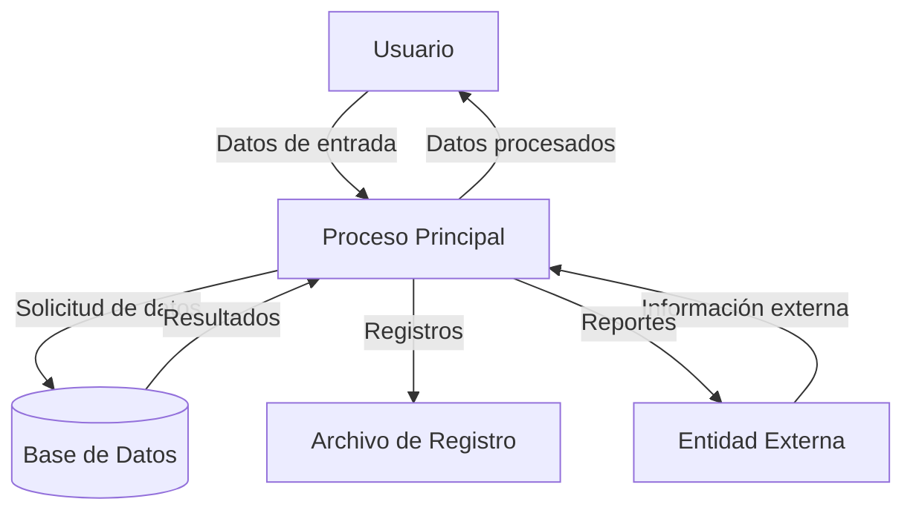

## Module: JsonObject_Invalid_Tests.cpp
# Análisis Integral del Módulo JsonObject_Invalid_Tests.cpp

## Nombre del Módulo/Componente SQL
JsonObject_Invalid_Tests.cpp - Módulo de pruebas unitarias para validar el manejo de casos inválidos en la clase JsonObject.

## Objetivos Primarios
Este módulo está diseñado para probar exhaustivamente cómo la clase JsonObject maneja entradas JSON inválidas o malformadas. Su propósito principal es verificar que la biblioteca de análisis JSON detecte correctamente y rechace estructuras JSON incorrectas, garantizando así la robustez de la implementación.

## Funciones, Métodos y Consultas Críticas
- **TEST_CASE("JsonObject_Invalid_Tests")**: Función principal de prueba que contiene múltiples subcasos para diferentes escenarios de JSON inválido.
- **SECTION("Empty string")**: Verifica el manejo de cadenas vacías.
- **SECTION("Invalid JSON")**: Prueba varios formatos JSON incorrectos.
- **SECTION("Invalid object")**: Evalúa objetos JSON malformados.
- **SECTION("Invalid array")**: Comprueba arrays JSON incorrectos.
- **SECTION("Invalid value")**: Prueba valores JSON inválidos.
- **SECTION("Invalid number")**: Verifica el manejo de números malformados.
- **SECTION("Invalid string")**: Evalúa cadenas JSON incorrectas.

## Variables y Elementos Clave
- **std::string json**: Variable que almacena las cadenas JSON de prueba.
- **JsonObject obj**: Instancia de la clase JsonObject utilizada para intentar analizar las cadenas JSON.
- **REQUIRE_THROWS**: Macro de prueba que verifica que se lance una excepción al analizar JSON inválido.

## Interdependencias y Relaciones
- Dependencia de la biblioteca **Catch2** para el marco de pruebas unitarias.
- Dependencia de la clase **JsonObject** que está siendo probada.
- Posible relación con otros módulos de prueba para la validación completa de la biblioteca JSON.

## Operaciones Principales vs. Auxiliares
- **Operaciones principales**: Las pruebas de validación de diferentes tipos de JSON inválido.
- **Operaciones auxiliares**: La configuración de las cadenas de prueba y la verificación de excepciones lanzadas.

## Secuencia Operacional/Flujo de Ejecución
1. Se define una cadena JSON inválida específica para cada caso de prueba.
2. Se intenta analizar la cadena utilizando la clase JsonObject.
3. Se verifica que se lance una excepción apropiada, indicando que la entrada inválida fue detectada correctamente.
4. Este proceso se repite para cada tipo de entrada inválida.

## Aspectos de Rendimiento y Optimización
- El módulo está enfocado en la validación funcional más que en el rendimiento.
- Las pruebas están diseñadas para ser exhaustivas, cubriendo múltiples casos de error.
- No hay optimizaciones específicas de rendimiento, ya que el objetivo es la validez y robustez.

## Reusabilidad y Adaptabilidad
- Alta reusabilidad para probar futuras versiones de la clase JsonObject.
- Fácilmente adaptable para incluir nuevos casos de prueba de JSON inválido.
- La estructura modular permite añadir o modificar secciones de prueba sin afectar a otras.

## Uso y Contexto
- Este módulo se utiliza durante el desarrollo y las pruebas de regresión de la biblioteca JSON.
- Es parte de una suite de pruebas más amplia para garantizar la calidad del analizador JSON.
- Se ejecutaría como parte de un proceso de integración continua para detectar regresiones.

## Suposiciones y Limitaciones
- **Suposiciones**: 
  - Se asume que la clase JsonObject lanza excepciones cuando encuentra JSON inválido.
  - Se espera que el marco de pruebas Catch2 esté disponible.
- **Limitaciones**:
  - Las pruebas se centran en casos de error comunes, pero podrían no cubrir todos los posibles escenarios de JSON inválido.
  - No prueba el rendimiento con archivos JSON grandes o complejos.
  - No verifica el comportamiento específico con diferentes codificaciones de caracteres.
## Flow Diagram [via mermaid]

