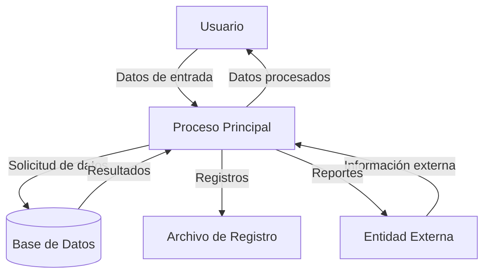

## Module: JsonObject_Iterator_Tests.cpp
# Análisis Integral del Módulo JsonObject_Iterator_Tests.cpp

## Nombre del Módulo/Componente SQL
JsonObject_Iterator_Tests.cpp - Módulo de pruebas unitarias para iteradores de objetos JSON

## Objetivos Primarios
Este módulo está diseñado para probar exhaustivamente la funcionalidad de los iteradores de objetos JSON en la biblioteca ArduinoJson. Su propósito principal es verificar que los iteradores funcionen correctamente en diferentes escenarios, incluyendo la iteración a través de objetos JSON vacíos y no vacíos, y comprobar el comportamiento correcto de los operadores de iterador.

## Funciones, Métodos y Consultas Críticas
- `TEST_CASE("JsonObject::iterator")`: Prueba principal que verifica el comportamiento de los iteradores de objetos JSON.
- `SECTION("Iterate on empty object")`: Verifica que la iteración sobre un objeto vacío funcione correctamente.
- `SECTION("Iterate on object with one element")`: Prueba la iteración sobre un objeto con un solo elemento.
- `SECTION("Iterate on object with two elements")`: Prueba la iteración sobre un objeto con dos elementos.
- `SECTION("Iterate and modify")`: Verifica que se pueda modificar un objeto durante la iteración.
- `SECTION("Comparisons")`: Prueba los operadores de comparación entre iteradores.

## Variables y Elementos Clave
- `JsonDocument doc`: Documento JSON principal utilizado para las pruebas.
- `JsonObject obj`: Objeto JSON que se está probando.
- `JsonObject::iterator it`: Iterador principal utilizado para recorrer los objetos JSON.
- `JsonObject::iterator it1, it2`: Iteradores utilizados para pruebas de comparación.
- Pares clave-valor como `"a":"0"` y `"b":"1"`: Datos de prueba utilizados para poblar los objetos JSON.

## Interdependencias y Relaciones
- Dependencia de la biblioteca ArduinoJson, específicamente de las clases `JsonDocument` y `JsonObject`.
- Utiliza el framework de pruebas Catch2 para la ejecución de pruebas unitarias.
- Interactúa con la implementación subyacente de los iteradores de objetos JSON en la biblioteca ArduinoJson.

## Operaciones Principales vs. Auxiliares
- **Operaciones principales**: Las pruebas de iteración sobre objetos JSON con diferentes cantidades de elementos.
- **Operaciones auxiliares**: Configuración de los objetos JSON de prueba, verificaciones de igualdad y comparaciones de iteradores.

## Secuencia Operacional/Flujo de Ejecución
1. Creación de un documento JSON vacío.
2. Obtención de un objeto JSON del documento.
3. Configuración del objeto con datos de prueba según la sección específica.
4. Ejecución de operaciones de iteración sobre el objeto.
5. Verificación de los resultados esperados mediante aserciones.

## Aspectos de Rendimiento y Optimización
- Las pruebas están diseñadas para ser eficientes y enfocadas en funcionalidad específica.
- No hay bucles complejos ni operaciones costosas que puedan afectar el rendimiento.
- El código está optimizado para pruebas unitarias, con casos de prueba claros y concisos.

## Reusabilidad y Adaptabilidad
- El código de prueba sigue un patrón estándar de pruebas unitarias, lo que facilita su adaptación para probar otras funcionalidades de iteradores.
- La estructura modular permite añadir fácilmente nuevos casos de prueba para escenarios adicionales.
- El uso del framework Catch2 facilita la integración con otros conjuntos de pruebas.

## Uso y Contexto
- Este módulo se utiliza durante el desarrollo y mantenimiento de la biblioteca ArduinoJson para garantizar que los iteradores de objetos JSON funcionen correctamente.
- Es parte de un conjunto más amplio de pruebas unitarias para la biblioteca.
- Se ejecutaría típicamente como parte de un proceso de integración continua o durante el desarrollo para verificar cambios en el código.

## Suposiciones y Limitaciones
- Supone que la implementación básica de `JsonDocument` y `JsonObject` funciona correctamente.
- Las pruebas se centran en la funcionalidad de los iteradores, no en el rendimiento o casos extremos de uso de memoria.
- No prueba escenarios de concurrencia o uso en entornos con restricciones de recursos.
- Limitado a probar la funcionalidad de iteración, no otras operaciones complejas con objetos JSON.
## Flow Diagram [via mermaid]

