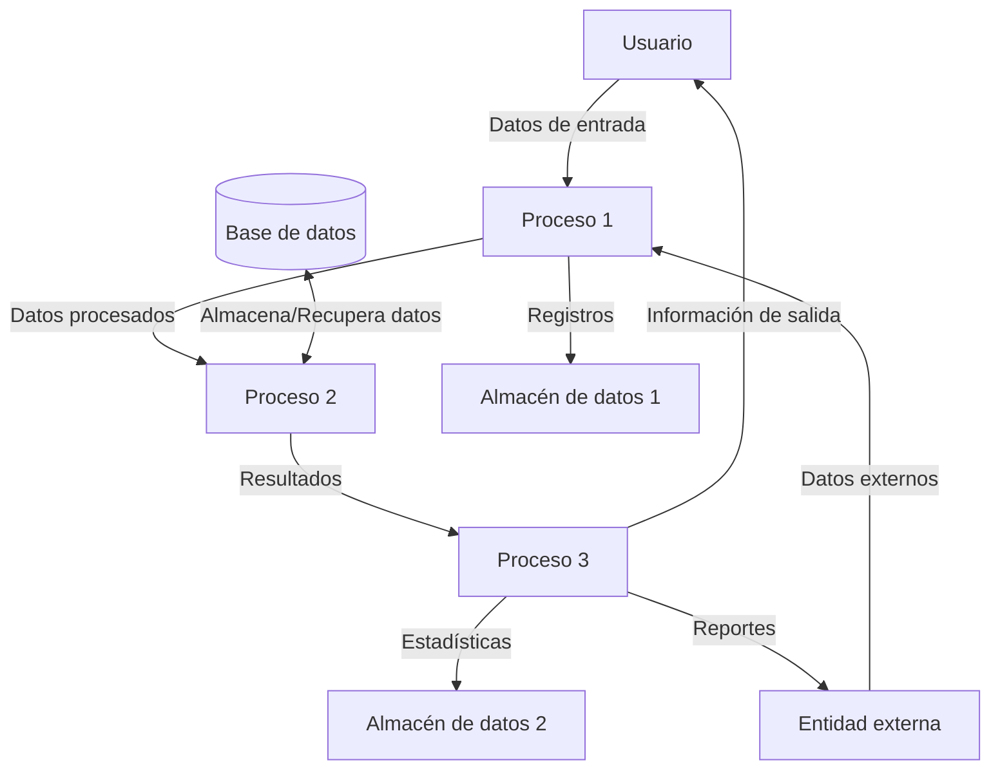

## Module: JsonObject_PrettyPrintTo_Tests.cpp
# Análisis Integral del Módulo JsonObject_PrettyPrintTo_Tests.cpp

## Módulo/Componente SQL
**Nombre del Módulo**: JsonObject_PrettyPrintTo_Tests.cpp

## Objetivos Primarios
Este módulo contiene pruebas unitarias para verificar la funcionalidad de formateo "pretty print" (impresión con formato legible) de objetos JSON. Su propósito principal es asegurar que la serialización de objetos JSON con formato indentado funcione correctamente en diferentes escenarios.

## Funciones, Métodos y Consultas Críticas
- **TEST_F(JsonObject_PrettyPrintTo, EmptyObject)**: Prueba la serialización de un objeto JSON vacío.
- **TEST_F(JsonObject_PrettyPrintTo, OneMember)**: Prueba la serialización de un objeto JSON con un solo miembro.
- **TEST_F(JsonObject_PrettyPrintTo, TwoMembers)**: Prueba la serialización de un objeto JSON con dos miembros.
- **TEST_F(JsonObject_PrettyPrintTo, Nested)**: Prueba la serialización de objetos JSON anidados.
- **TEST_F(JsonObject_PrettyPrintTo, Utf8)**: Prueba la serialización con caracteres UTF-8.

## Variables y Elementos Clave
- **JsonObject**: Clase principal que se está probando.
- **char buffer[XXX]**: Buffers utilizados para almacenar la salida JSON serializada.
- **size_t returnValue**: Variable que almacena el valor de retorno de la función prettyPrintTo().
- **Objetos JsonObject**: Instancias de objetos JSON utilizados en las pruebas.

## Interdependencias y Relaciones
- El módulo depende de la biblioteca ArduinoJson para la manipulación de objetos JSON.
- Utiliza el framework de pruebas (posiblemente Google Test) para ejecutar las pruebas unitarias.
- Interactúa con las clases JsonObject y JsonBuffer para crear y manipular objetos JSON.

## Operaciones Core vs. Auxiliares
- **Operaciones Core**: Las llamadas a prettyPrintTo() que realizan la serialización JSON con formato.
- **Operaciones Auxiliares**: La configuración de los objetos JSON de prueba y las aserciones que verifican los resultados.

## Secuencia Operacional/Flujo de Ejecución
1. Cada prueba crea un objeto JSON con una estructura específica.
2. Se llama al método prettyPrintTo() para serializar el objeto en un buffer.
3. Se verifica que el resultado de la serialización coincida con el formato esperado.
4. Se comprueba que el valor de retorno sea correcto (longitud de la cadena generada).

## Aspectos de Rendimiento y Optimización
- El tamaño de los buffers está predefinido para cada prueba, lo que podría ser un problema si los objetos JSON crecen.
- No hay consideraciones explícitas sobre el rendimiento, ya que el enfoque está en la corrección funcional.

## Reusabilidad y Adaptabilidad
- Las pruebas están estructuradas de manera modular, lo que facilita añadir nuevos casos de prueba.
- El enfoque de prueba puede adaptarse para verificar otras funcionalidades de serialización JSON.

## Uso y Contexto
- Este módulo se utiliza en el contexto de desarrollo y mantenimiento de la biblioteca ArduinoJson.
- Las pruebas unitarias aseguran que la funcionalidad de prettyPrintTo() funcione correctamente antes de liberar nuevas versiones.
- Es parte de una suite de pruebas más amplia para la biblioteca.

## Suposiciones y Limitaciones
- Se asume que la clase JsonObject y sus métodos relacionados funcionan correctamente.
- Las pruebas se centran en la corrección del formato, no en el rendimiento o la gestión de memoria.
- Limitación: Las pruebas utilizan buffers de tamaño fijo, lo que podría no ser adecuado para objetos JSON muy grandes.
- Se asume que el entorno de ejecución soporta caracteres UTF-8 para la prueba correspondiente.
## Flow Diagram [via mermaid]

