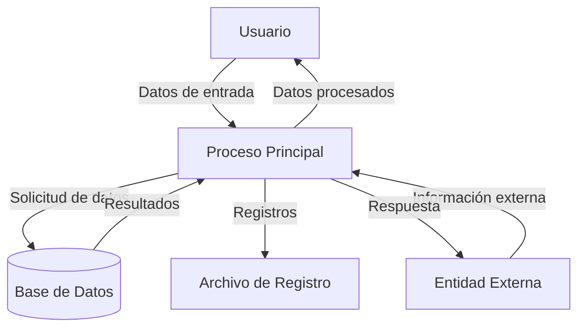

## Module: JsonObject_PrintTo_Tests.cpp
# Análisis Integral del Módulo JsonObject_PrintTo_Tests.cpp

## Módulo/Componente SQL
**JsonObject_PrintTo_Tests.cpp** - Este es un módulo de pruebas unitarias para la funcionalidad de impresión (PrintTo) de objetos JSON en la biblioteca ArduinoJson.

## Objetivos Primarios
El propósito principal de este código es verificar que la serialización de objetos JSON a través del método `printTo()` funcione correctamente en diferentes escenarios. Las pruebas validan que los objetos JsonObject se conviertan adecuadamente a su representación en cadena de texto.

## Funciones, Métodos y Consultas Críticas
- `TEST_F(JsonObject_PrintTo_Tests, ...)` - Serie de casos de prueba que verifican diferentes aspectos de la serialización JSON:
  - Pruebas para objetos vacíos
  - Pruebas para objetos con un solo par clave-valor
  - Pruebas para objetos con múltiples pares clave-valor
  - Pruebas para valores anidados (objetos dentro de objetos)
  - Pruebas para valores de diferentes tipos (string, integer, boolean, etc.)

## Variables y Elementos Clave
- `JsonObject obj` - El objeto JSON principal que se está probando
- `DynamicJsonBuffer jsonBuffer` - Buffer para la asignación dinámica de memoria para objetos JSON
- `std::string output` - Variable que almacena la salida serializada para su verificación
- `char buffer[]` - Buffer utilizado para la serialización en algunas pruebas

## Interdependencias y Relaciones
- Depende de la biblioteca ArduinoJson para la funcionalidad principal
- Utiliza el framework de pruebas (posiblemente Google Test) para la ejecución de pruebas unitarias
- Interactúa con las clases JsonObject, JsonBuffer y otras clases relacionadas de la biblioteca ArduinoJson

## Operaciones Core vs. Auxiliares
**Operaciones Core:**
- Llamadas al método `printTo()` para serializar objetos JSON
- Verificaciones de igualdad (`EXPECT_EQ`) para validar la salida correcta

**Operaciones Auxiliares:**
- Configuración de objetos JSON para las pruebas
- Inicialización de buffers y variables de salida

## Secuencia Operacional/Flujo de Ejecución
1. Inicialización del buffer JSON y creación del objeto JsonObject
2. Configuración del objeto con valores específicos para la prueba
3. Serialización del objeto mediante `printTo()`
4. Verificación de que la salida coincida con el formato JSON esperado
5. Limpieza de recursos (manejada automáticamente por el framework de pruebas)

## Aspectos de Rendimiento y Optimización
- Las pruebas verifican la correcta serialización pero no se enfocan específicamente en el rendimiento
- Potenciales áreas de optimización podrían incluir el manejo de memoria en objetos JSON grandes o complejos
- El tamaño de los buffers utilizados podría afectar el rendimiento en entornos con restricciones de memoria

## Reusabilidad y Adaptabilidad
- Las pruebas están estructuradas para ser independientes entre sí
- El enfoque modular permite añadir fácilmente nuevos casos de prueba
- Los patrones de prueba podrían adaptarse para verificar otras funcionalidades de serialización JSON

## Uso y Contexto
- Este módulo se utiliza durante el desarrollo y mantenimiento de la biblioteca ArduinoJson
- Las pruebas se ejecutarían como parte de un conjunto de pruebas unitarias automatizadas
- Ayuda a garantizar que las modificaciones en la biblioteca no rompan la funcionalidad de serialización

## Suposiciones y Limitaciones
- Asume que el framework de pruebas está correctamente configurado
- Presupone que la funcionalidad básica de JsonObject y JsonBuffer funciona correctamente
- Las pruebas pueden no cubrir todos los casos extremos o combinaciones posibles de estructuras JSON
- Limitado a la verificación de la serialización, no prueba la deserialización o otras funcionalidades
## Flow Diagram [via mermaid]

