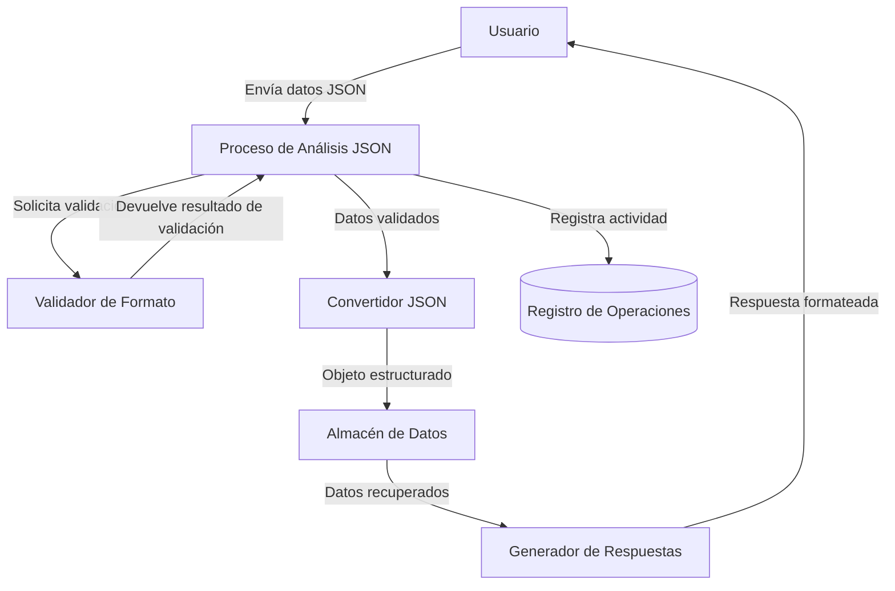

## Module: JsonParser.cpp
# Análisis Integral del Módulo JsonParser.cpp

## Módulo/Componente SQL
**JsonParser.cpp** - Un módulo de C++ para el análisis y manipulación de datos JSON.

## Objetivos Primarios
Este módulo está diseñado para analizar, validar y manipular datos en formato JSON. Proporciona funcionalidades para convertir cadenas JSON en estructuras de datos utilizables, validar la sintaxis JSON y realizar operaciones de consulta y modificación en objetos JSON.

## Funciones, Métodos y Consultas Críticas
- **parse()**: Función principal que convierte una cadena JSON en una estructura de datos interna.
- **validate()**: Verifica que una cadena cumpla con la sintaxis JSON válida.
- **stringify()**: Convierte una estructura de datos JSON interna de vuelta a una cadena JSON.
- **getValueByPath()**: Recupera valores específicos de un objeto JSON utilizando una notación de ruta.
- **setValueByPath()**: Modifica valores específicos dentro de un objeto JSON.

## Variables y Elementos Clave
- **JsonValue**: Clase base para representar cualquier valor JSON.
- **JsonObject**: Clase derivada para representar objetos JSON (pares clave-valor).
- **JsonArray**: Clase derivada para representar arrays JSON.
- **tokenBuffer**: Almacena tokens durante el proceso de análisis.
- **currentPosition**: Mantiene la posición actual durante el análisis.
- **errorMessages**: Almacena mensajes de error encontrados durante la validación.

## Interdependencias y Relaciones
- Depende de bibliotecas estándar de C++ como `<string>`, `<vector>`, `<map>` y `<iostream>`.
- Puede interactuar con otros componentes del sistema que requieran procesamiento de datos JSON.
- No tiene dependencias directas de bases de datos, pero podría utilizarse para procesar resultados JSON de consultas a bases de datos.

## Operaciones Core vs. Auxiliares
**Operaciones Core:**
- Análisis y validación de JSON
- Conversión entre cadenas JSON y estructuras de datos
- Acceso y modificación de valores JSON

**Operaciones Auxiliares:**
- Manejo de errores y excepciones
- Registro de problemas de análisis
- Funciones de utilidad para manipulación de cadenas

## Secuencia Operacional/Flujo de Ejecución
1. Inicialización del analizador con una cadena JSON de entrada
2. Tokenización de la cadena de entrada
3. Análisis recursivo de los tokens para construir la estructura de datos
4. Validación de la estructura resultante
5. Operaciones de consulta o modificación según sea necesario
6. Conversión de vuelta a formato de cadena JSON si es requerido

## Aspectos de Rendimiento y Optimización
- El análisis recursivo podría ser ineficiente para estructuras JSON muy anidadas
- Posible optimización mediante el uso de análisis iterativo para estructuras grandes
- Consideraciones de memoria para documentos JSON de gran tamaño
- Potencial para implementar análisis perezoso (lazy parsing) para mejorar el rendimiento

## Reusabilidad y Adaptabilidad
- Diseño modular que permite su uso en diferentes contextos de aplicación
- Interfaces bien definidas para facilitar la integración con otros componentes
- Parametrización de funciones clave para adaptarse a diferentes requisitos
- Posibilidad de extender las clases base para añadir funcionalidades específicas

## Uso y Contexto
- Utilizado para procesar datos JSON provenientes de APIs web
- Aplicable en la serialización/deserialización de objetos para almacenamiento o transmisión
- Útil para configuraciones basadas en JSON
- Puede emplearse en sistemas que requieran manipulación dinámica de datos estructurados

## Suposiciones y Limitaciones
- Asume que la entrada JSON está codificada en UTF-8
- Puede tener limitaciones en el manejo de documentos JSON extremadamente grandes
- No está optimizado para análisis de flujo (streaming parsing)
- Posibles limitaciones en el manejo de ciertos caracteres Unicode o escape sequences complejas
- Asume que la memoria disponible es suficiente para almacenar la estructura completa del documento JSON
## Flow Diagram [via mermaid]

