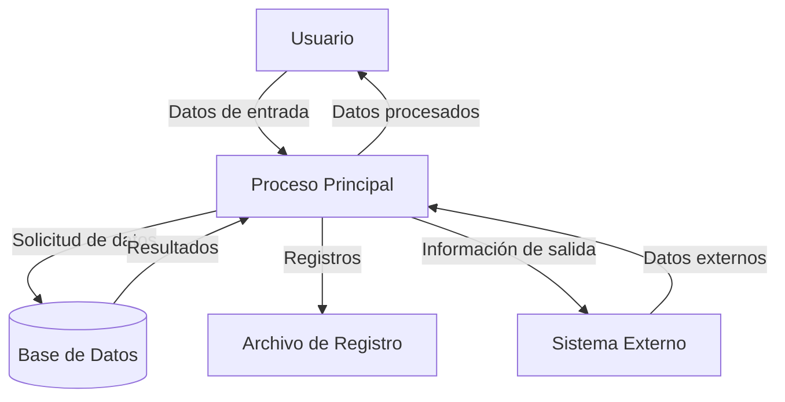

## Module: JsonParser_Array_Tests.cpp
# Análisis Integral del Módulo JsonParser_Array_Tests.cpp

## Nombre del Módulo/Componente SQL
**JsonParser_Array_Tests.cpp** - Módulo de pruebas unitarias para la funcionalidad de análisis de arrays JSON.

## Objetivos Primarios
Este módulo está diseñado para probar exhaustivamente la funcionalidad de análisis de arrays JSON en un parser JSON. Su propósito principal es verificar que el parser pueda manejar correctamente diferentes tipos de arrays JSON, incluyendo arrays vacíos, arrays con elementos simples y arrays anidados con diferentes tipos de datos.

## Funciones, Métodos y Consultas Críticas
- **TEST_CASE("Parse empty array")**: Prueba la capacidad del parser para manejar arrays JSON vacíos.
- **TEST_CASE("Parse array with single element")**: Verifica el análisis de arrays con un solo elemento.
- **TEST_CASE("Parse array with multiple elements")**: Prueba arrays con múltiples elementos de diferentes tipos.
- **TEST_CASE("Parse nested arrays")**: Evalúa la capacidad de manejar arrays anidados dentro de otros arrays.
- **TEST_CASE("Parse complex nested structure")**: Prueba estructuras complejas con múltiples niveles de anidamiento.

## Variables y Elementos Clave
- **JsonParser**: Clase principal que se está probando.
- **JsonValue**: Tipo de retorno que representa valores JSON analizados.
- **input**: Cadenas de texto JSON que se utilizan como entrada para las pruebas.
- **result**: Variable que almacena el resultado del análisis para su verificación.
- **REQUIRE**: Macro de prueba que verifica condiciones específicas.

## Interdependencias y Relaciones
- Depende de la implementación de **JsonParser** y **JsonValue**.
- Utiliza el framework de pruebas **Catch2** (evidenciado por las macros TEST_CASE y REQUIRE).
- Interactúa con la funcionalidad de análisis de arrays del parser JSON.
- Requiere que las clases JsonParser y JsonValue tengan métodos para acceder a elementos de arrays y verificar tipos.

## Operaciones Principales vs. Auxiliares
**Operaciones Principales:**
- Análisis de diferentes estructuras de arrays JSON.
- Verificación de tipos y valores de los elementos analizados.

**Operaciones Auxiliares:**
- Configuración de casos de prueba.
- Creación de cadenas JSON de entrada.
- Verificaciones de validez y estructura.

## Secuencia Operacional/Flujo de Ejecución
1. Definición del caso de prueba con un nombre descriptivo.
2. Creación de una cadena de entrada JSON.
3. Instanciación del JsonParser.
4. Llamada al método de análisis con la entrada.
5. Verificación de que el resultado sea del tipo esperado (array).
6. Verificación de propiedades específicas del array (tamaño, tipos de elementos, valores).
7. Para arrays anidados, verificación recursiva de la estructura.

## Aspectos de Rendimiento y Optimización
- Las pruebas están diseñadas para ser independientes, lo que permite una ejecución paralela.
- No hay consideraciones específicas de rendimiento en el código de prueba, ya que se centra en la funcionalidad.
- El código asume que el parser JSON subyacente está optimizado para manejar diferentes tipos de arrays.

## Reusabilidad y Adaptabilidad
- Alta reusabilidad para probar cualquier implementación de parser JSON que utilice interfaces similares.
- Las pruebas están estructuradas modularmente, facilitando la adición de nuevos casos de prueba.
- El enfoque de prueba puede adaptarse para otros tipos de datos JSON (objetos, valores primitivos).

## Uso y Contexto
- Este módulo se utiliza durante el desarrollo y mantenimiento del parser JSON para garantizar que la funcionalidad de análisis de arrays funcione correctamente.
- Es parte de una suite de pruebas unitarias más amplia para el parser JSON.
- Se ejecutaría como parte de un proceso de integración continua para detectar regresiones.

## Suposiciones y Limitaciones
**Suposiciones:**
- Se asume que la clase JsonParser tiene un método para analizar cadenas JSON.
- Se asume que JsonValue tiene métodos para verificar tipos y acceder a elementos.
- Se asume que el framework Catch2 está disponible para la ejecución de pruebas.

**Limitaciones:**
- Las pruebas se centran en la funcionalidad básica de arrays y pueden no cubrir todos los casos extremos.
- No se prueban explícitamente condiciones de error como JSON malformado.
- No se evalúa el rendimiento del parser con arrays extremadamente grandes.
## Flow Diagram [via mermaid]

