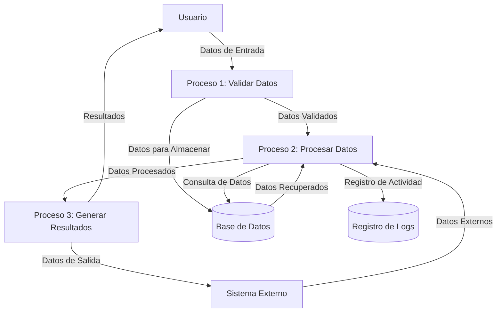

## Module: JsonParser_Nested_Tests.cpp
# Análisis Integral del Módulo JsonParser_Nested_Tests.cpp

## Nombre del Módulo/Componente SQL
JsonParser_Nested_Tests.cpp - Módulo de pruebas unitarias para un analizador JSON

## Objetivos Primarios
Este módulo está diseñado para probar exhaustivamente la funcionalidad de un analizador JSON, específicamente enfocado en la capacidad de analizar estructuras JSON anidadas. El propósito principal es verificar que el analizador pueda manejar correctamente objetos y arrays JSON complejos con múltiples niveles de anidamiento.

## Funciones, Métodos y Consultas Críticas
- **TEST_CASE("Parse nested objects")**: Prueba la capacidad del analizador para procesar objetos JSON anidados.
- **TEST_CASE("Parse nested arrays")**: Verifica el análisis correcto de arrays JSON anidados.
- **TEST_CASE("Parse mixed nested structures")**: Evalúa el manejo de estructuras mixtas que contienen tanto objetos como arrays anidados.
- **REQUIRE()**: Función de aserción utilizada para verificar que los resultados del análisis coincidan con los valores esperados.

## Variables y Elementos Clave
- **JsonParser**: Clase principal que se está probando.
- **json**: Variables que contienen cadenas JSON para analizar.
- **result**: Almacena el resultado del análisis para su verificación.
- **expected**: Define los valores esperados para comparar con los resultados del análisis.

## Interdependencias y Relaciones
- Dependencia del framework de pruebas (probablemente Catch2 basado en la sintaxis TEST_CASE y REQUIRE).
- Dependencia de la clase JsonParser que implementa la funcionalidad de análisis.
- Posible dependencia de estructuras de datos específicas para representar valores JSON analizados.

## Operaciones Principales vs. Auxiliares
- **Operaciones principales**: Las llamadas al método de análisis de JsonParser y las verificaciones de resultados.
- **Operaciones auxiliares**: Configuración de datos de prueba, definición de valores esperados y posible limpieza después de las pruebas.

## Secuencia Operacional/Flujo de Ejecución
1. Definición de casos de prueba con diferentes estructuras JSON.
2. Para cada caso de prueba:
   - Configuración de la cadena JSON a analizar
   - Invocación del analizador JSON
   - Definición de los resultados esperados
   - Verificación de que los resultados coincidan con lo esperado

## Aspectos de Rendimiento y Optimización
- Las pruebas parecen enfocarse en la funcionalidad más que en el rendimiento.
- Posibles consideraciones de rendimiento podrían incluir el tiempo de análisis para estructuras JSON muy anidadas o muy grandes.
- No se observan optimizaciones específicas en el código de prueba, ya que su propósito es verificar la corrección, no la eficiencia.

## Reusabilidad y Adaptabilidad
- El código de prueba está estructurado por casos de prueba, lo que facilita agregar nuevos escenarios.
- La separación de casos de prueba por tipo de estructura (objetos anidados, arrays anidados, estructuras mixtas) permite una fácil extensión para probar nuevos patrones JSON.

## Uso y Contexto
- Este módulo se utiliza en un entorno de desarrollo para verificar la corrección del analizador JSON.
- Probablemente forma parte de una suite de pruebas unitarias más amplia para un sistema que procesa datos JSON.
- Se ejecutaría durante el desarrollo, integración continua o antes de lanzamientos para garantizar que el analizador funcione correctamente.

## Suposiciones y Limitaciones
- Supone que la clase JsonParser ya está implementada y disponible.
- Asume que el framework de pruebas está configurado correctamente.
- Las pruebas se centran en estructuras anidadas específicas y podrían no cubrir todos los casos extremos posibles en JSON.
- No parece abordar explícitamente el manejo de errores para JSON mal formado.
- Podría tener limitaciones en cuanto a la profundidad máxima de anidamiento que se prueba.
## Flow Diagram [via mermaid]

