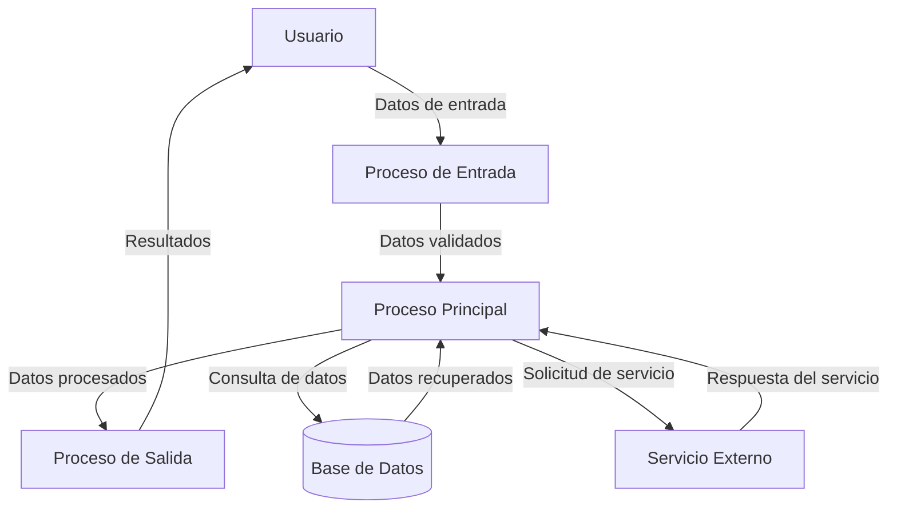

## Module: JsonParser_NestingLimit_Tests.cpp
# Análisis Integral del Módulo JsonParser_NestingLimit_Tests.cpp

## Módulo/Componente SQL
**Nombre del Módulo**: JsonParser_NestingLimit_Tests.cpp

## Objetivos Primarios
Este módulo contiene pruebas unitarias diseñadas para verificar el comportamiento del analizador JSON cuando se enfrenta a diferentes niveles de anidamiento. Su propósito principal es asegurar que el analizador respete correctamente los límites de anidamiento configurados y maneje adecuadamente los casos de error cuando estos límites son excedidos.

## Funciones, Métodos y Consultas Críticas
- **TEST_CASE("JsonParser nesting limit")**: Función principal de prueba que verifica el comportamiento del analizador con diferentes límites de anidamiento.
- **SECTION("Default nesting limit")**: Verifica el comportamiento con el límite de anidamiento predeterminado.
- **SECTION("Custom nesting limit")**: Prueba el comportamiento con un límite de anidamiento personalizado.
- **SECTION("Zero nesting limit")**: Evalúa el comportamiento cuando el límite de anidamiento se establece en cero.

## Variables y Elementos Clave
- **JsonParser parser**: Instancia del analizador JSON que se está probando.
- **std::string json**: Cadenas de texto JSON utilizadas para las pruebas con diferentes niveles de anidamiento.
- **JsonValue value**: Objeto que almacena el resultado del análisis JSON.
- **nestingLimit**: Parámetro que controla el nivel máximo de anidamiento permitido.

## Interdependencias y Relaciones
- Dependencia del framework de pruebas Catch2 (indicado por las macros TEST_CASE, SECTION, REQUIRE).
- Interacción con la clase JsonParser y JsonValue, que son componentes del sistema de análisis JSON.
- Relación con el sistema de manejo de errores para verificar excepciones cuando se exceden los límites.

## Operaciones Principales vs. Auxiliares
- **Operaciones Principales**: Las pruebas que verifican el comportamiento del analizador con diferentes niveles de anidamiento.
- **Operaciones Auxiliares**: La creación de cadenas JSON con diferentes niveles de anidamiento y la configuración del analizador.

## Secuencia Operacional/Flujo de Ejecución
1. Se configura el analizador JSON con un límite de anidamiento específico.
2. Se crea una cadena JSON con un nivel de anidamiento específico.
3. Se intenta analizar la cadena JSON.
4. Se verifica si el resultado es el esperado (éxito o excepción).
5. Se repite con diferentes configuraciones y niveles de anidamiento.

## Aspectos de Rendimiento y Optimización
- Las pruebas evalúan indirectamente el rendimiento del analizador al manejar diferentes niveles de anidamiento.
- Potencial área de optimización: La generación de cadenas JSON con niveles profundos de anidamiento podría ser más eficiente.

## Reusabilidad y Adaptabilidad
- Las pruebas están estructuradas de manera modular, lo que facilita la adición de nuevos casos de prueba.
- El enfoque de prueba puede adaptarse para verificar otros aspectos del analizador JSON.

## Uso y Contexto
- Este módulo se utiliza en el contexto de pruebas unitarias automatizadas, probablemente como parte de un proceso de integración continua.
- Las pruebas verifican un aspecto específico del analizador JSON: su capacidad para manejar diferentes niveles de anidamiento.

## Suposiciones y Limitaciones
- **Suposiciones**: 
  - Se asume que el analizador JSON tiene un mecanismo para establecer límites de anidamiento.
  - Se asume que el analizador lanzará excepciones específicas cuando se excedan los límites.
- **Limitaciones**:
  - Las pruebas solo verifican un aspecto específico del analizador JSON.
  - No se prueba el comportamiento con tipos de datos complejos o casos extremos más allá del anidamiento.
## Flow Diagram [via mermaid]

