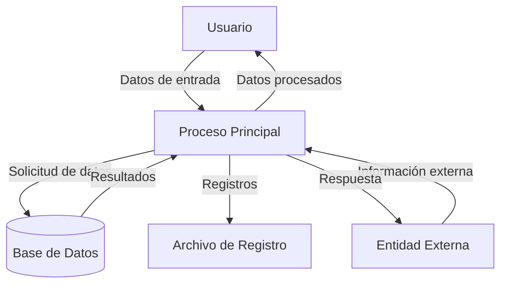

## Module: JsonParser_Object_Tests.cpp
# Análisis Integral del Módulo JsonParser_Object_Tests.cpp

## Módulo/Componente SQL
**JsonParser_Object_Tests.cpp**: Este es un módulo de pruebas unitarias para un analizador JSON, específicamente enfocado en probar la funcionalidad de análisis de objetos JSON.

## Objetivos Primarios
El propósito principal de este código es verificar que el analizador JSON pueda procesar correctamente objetos JSON con diferentes estructuras y contenidos. Realiza pruebas exhaustivas para validar el comportamiento del analizador en diversos escenarios, incluyendo casos válidos e inválidos.

## Funciones, Métodos y Consultas Críticas
- **TEST_CASE("JsonParser.Object")**: Función principal de prueba que contiene múltiples subcasos para probar diferentes aspectos del análisis de objetos JSON.
- **SECTION("Empty object")**: Prueba el análisis de objetos JSON vacíos.
- **SECTION("Object with one member")**: Verifica el análisis de objetos con un solo miembro.
- **SECTION("Object with multiple members")**: Comprueba el análisis de objetos con múltiples miembros.
- **SECTION("Nested objects")**: Prueba el análisis de objetos anidados.
- **SECTION("Invalid objects")**: Verifica que el analizador rechace correctamente objetos JSON mal formados.

## Variables y Elementos Clave
- **JsonParser parser**: Instancia del analizador JSON que se está probando.
- **JsonValue result**: Variable que almacena el resultado del análisis.
- **std::string json**: Cadenas de texto que contienen los objetos JSON a analizar.
- **REQUIRE**: Macro de prueba que verifica condiciones específicas.

## Interdependencias y Relaciones
- Depende de la biblioteca **Catch2** para la estructura de pruebas unitarias.
- Utiliza la clase **JsonParser** para analizar cadenas JSON.
- Interactúa con la clase **JsonValue** para verificar los resultados del análisis.
- Probablemente depende de otras clases como **JsonObject** y **JsonArray** para representar estructuras JSON.

## Operaciones Principales vs. Auxiliares
- **Operaciones principales**: Las pruebas de análisis de objetos JSON en diferentes formatos.
- **Operaciones auxiliares**: Verificaciones (REQUIRE) para validar que los resultados del análisis sean correctos.

## Secuencia Operacional/Flujo de Ejecución
1. Se define un caso de prueba para el análisis de objetos JSON.
2. Para cada sección de prueba, se crea una cadena JSON específica.
3. Se analiza la cadena utilizando el analizador JSON.
4. Se verifican los resultados del análisis mediante aserciones.
5. Se repite el proceso para diferentes tipos de objetos JSON y casos de error.

## Aspectos de Rendimiento y Optimización
- El código está enfocado en pruebas unitarias, por lo que no hay consideraciones explícitas de rendimiento.
- Las pruebas parecen ser exhaustivas, lo que es importante para garantizar la robustez del analizador.

## Reusabilidad y Adaptabilidad
- Las pruebas están bien estructuradas y podrían adaptarse fácilmente para probar otras funcionalidades del analizador JSON.
- La organización en secciones facilita la adición de nuevos casos de prueba.

## Uso y Contexto
- Este módulo se utiliza en un entorno de desarrollo para verificar la correcta implementación del analizador JSON.
- Forma parte de una suite de pruebas unitarias para garantizar la calidad del código.
- Probablemente se ejecuta como parte de un proceso de integración continua.

## Suposiciones y Limitaciones
- Supone que la biblioteca Catch2 está disponible para las pruebas.
- Asume que las clases JsonParser y JsonValue están correctamente implementadas.
- Las pruebas se centran en objetos JSON y no cubren otros aspectos del análisis JSON como arrays o valores primitivos.
- No prueba explícitamente el rendimiento o la eficiencia del analizador con objetos JSON muy grandes o complejos.
## Flow Diagram [via mermaid]

