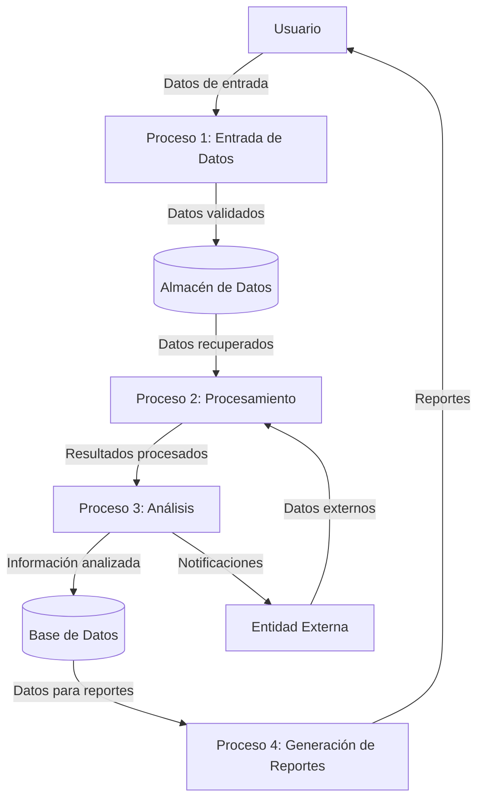

## Module: JsonVariant.cpp
# Análisis Integral del Módulo JsonVariant.cpp

## Módulo/Componente SQL
**JsonVariant.cpp** - Un módulo de código C++ que forma parte de una biblioteca para manipulación de datos JSON.

## Objetivos Primarios
Este módulo implementa la clase `JsonVariant`, que sirve como un contenedor versátil para almacenar y manipular diferentes tipos de valores JSON (números, cadenas, booleanos, arrays, objetos). Su propósito principal es proporcionar una interfaz unificada para trabajar con diferentes tipos de datos JSON, facilitando la conversión entre tipos y el acceso a los valores.

## Funciones, Métodos y Consultas Críticas
- **Constructores y operadores de asignación**: Permiten crear y modificar variantes JSON con diferentes tipos de datos.
- **Métodos de conversión**: Como `as<T>()`, `to<T>()`, `is<T>()` que facilitan la conversión y verificación de tipos.
- **Métodos de acceso**: `operator[]`, `getMember()`, `getElement()` para acceder a elementos de objetos y arrays.
- **Métodos de comparación**: `operator==`, `operator!=` para comparar variantes.
- **Métodos de serialización**: Para convertir la variante a formato JSON.

## Variables y Elementos Clave
- **`_content`**: Variable interna que almacena el valor actual de la variante.
- **`_pool`**: Referencia al pool de memoria utilizado para asignar objetos JSON.
- **`_data`**: Estructura que contiene el valor actual y su tipo.
- **Tipos de datos soportados**: Números (enteros, flotantes), cadenas, booleanos, arrays, objetos, nulos.

## Interdependencias y Relaciones
- Depende de otras clases como `JsonObject`, `JsonArray`, `JsonDocument`.
- Interactúa con `MemoryPool` para la gestión de memoria.
- Se relaciona con `Serializer` para la conversión a formato JSON.
- Utiliza plantillas y especialización de plantillas para manejar diferentes tipos de datos.

## Operaciones Core vs. Auxiliares
**Core:**
- Almacenamiento y recuperación de valores JSON de diferentes tipos.
- Conversión entre tipos de datos.
- Acceso a elementos de objetos y arrays.

**Auxiliares:**
- Validación de tipos.
- Manejo de errores y valores predeterminados.
- Operaciones de comparación.
- Serialización a formato JSON.

## Secuencia Operacional/Flujo de Ejecución
1. Creación de una variante (vacía o con un valor inicial).
2. Asignación de un valor mediante constructores o operadores de asignación.
3. Manipulación del valor (acceso, modificación).
4. Conversión a otros tipos según sea necesario.
5. Serialización a formato JSON cuando se requiere.

## Aspectos de Rendimiento y Optimización
- Utiliza referencias y punteros para evitar copias innecesarias de datos.
- Implementa técnicas de especialización de plantillas para optimizar el manejo de tipos específicos.
- Posibles cuellos de botella en operaciones de conversión entre tipos complejos.
- La gestión de memoria a través de `MemoryPool` puede afectar el rendimiento en sistemas con recursos limitados.

## Reusabilidad y Adaptabilidad
- Alta reusabilidad gracias a su diseño genérico que maneja múltiples tipos de datos.
- Adaptable a diferentes contextos de uso de JSON.
- Parametrizable a través de plantillas para diferentes tipos de datos.
- Puede extenderse para soportar tipos de datos adicionales mediante especialización de plantillas.

## Uso y Contexto
- Se utiliza como componente fundamental en aplicaciones que necesitan procesar o generar datos JSON.
- Aplicable en entornos IoT, aplicaciones web, APIs REST, configuraciones de aplicaciones, etc.
- Especialmente útil en sistemas embebidos donde se requiere eficiencia en memoria.

## Suposiciones y Limitaciones
- Asume que los tipos de datos utilizados son compatibles con JSON.
- Limitaciones en la precisión de números flotantes según el estándar IEEE 754.
- Posibles restricciones de memoria en sistemas embebidos.
- No maneja directamente la validación de esquemas JSON.
- Puede tener limitaciones en el manejo de estructuras JSON muy grandes o profundamente anidadas, dependiendo de la configuración del pool de memoria.
## Flow Diagram [via mermaid]

