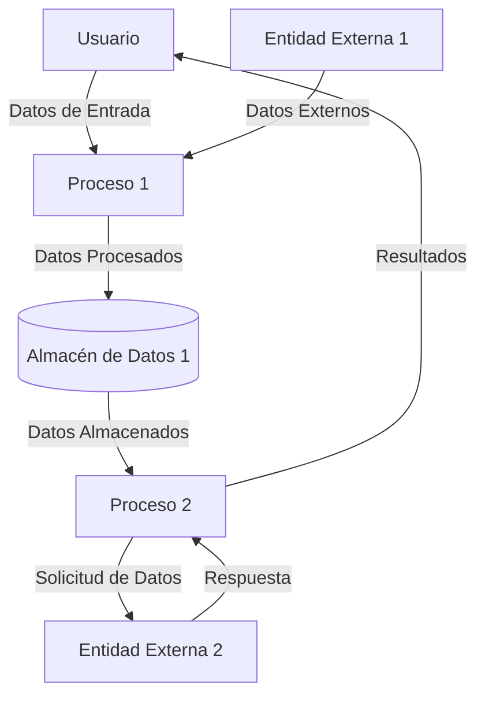

## Module: JsonVariant_Comparison_Tests.cpp
# Análisis Integral del Módulo JsonVariant_Comparison_Tests.cpp

## Nombre del Módulo/Componente SQL
**JsonVariant_Comparison_Tests.cpp** - Módulo de pruebas unitarias para la funcionalidad de comparación de la clase JsonVariant en la biblioteca ArduinoJson.

## Objetivos Primarios
Este módulo está diseñado para verificar exhaustivamente las operaciones de comparación entre diferentes tipos de valores almacenados en objetos JsonVariant. Su propósito principal es garantizar que las comparaciones entre valores de diferentes tipos (números, cadenas, booleanos, nulos, arrays y objetos) funcionen correctamente y de manera consistente.

## Funciones, Métodos y Consultas Críticas
- **TEST_F(JsonVariant_Comparison_Tests, ...)**: Serie de casos de prueba que verifican diferentes escenarios de comparación.
- **Operadores de comparación**: Pruebas para los operadores `==`, `!=`, `<`, `<=`, `>`, `>=` entre JsonVariant y varios tipos de datos.
- **isNull()**: Verificación de la funcionalidad para detectar valores nulos.
- **compareTo()**: Pruebas del método subyacente que implementa las comparaciones.

## Variables y Elementos Clave
- **Objetos JsonVariant**: Utilizados como contenedores para diferentes tipos de valores.
- **Tipos de datos probados**: 
  - Valores numéricos (enteros, flotantes)
  - Cadenas de texto
  - Booleanos (true/false)
  - Valores nulos
  - Arrays JSON
  - Objetos JSON

## Interdependencias y Relaciones
- Dependencia de la clase **JsonVariant** de la biblioteca ArduinoJson.
- Utiliza el framework de pruebas (posiblemente Google Test) para la estructura de pruebas.
- Interactúa con otras clases de ArduinoJson como JsonObject y JsonArray.

## Operaciones Core vs. Auxiliares
- **Operaciones Core**: 
  - Pruebas de comparación entre diferentes tipos de datos
  - Verificación de comportamiento consistente de operadores
- **Operaciones Auxiliares**:
  - Configuración de casos de prueba
  - Creación de objetos JsonVariant con diferentes valores

## Secuencia Operacional/Flujo de Ejecución
1. Configuración de los objetos JsonVariant con diferentes valores
2. Ejecución de operaciones de comparación
3. Verificación de los resultados esperados mediante aserciones
4. Repetición para diferentes combinaciones de tipos y valores

## Aspectos de Rendimiento y Optimización
- Las pruebas verifican implícitamente que las comparaciones se realizan de manera eficiente.
- Posibles consideraciones sobre el manejo de memoria en las comparaciones de estructuras complejas (arrays y objetos).
- Verificación de que las comparaciones no causan fugas de memoria o comportamientos inesperados.

## Reusabilidad y Adaptabilidad
- El módulo está diseñado específicamente para pruebas, pero su estructura podría adaptarse para probar funcionalidades similares.
- Los casos de prueba proporcionan ejemplos claros de cómo utilizar las operaciones de comparación en código real.

## Uso y Contexto
- Utilizado durante el desarrollo y mantenimiento de la biblioteca ArduinoJson para garantizar la calidad.
- Forma parte de la suite de pruebas unitarias que se ejecutan antes de lanzar nuevas versiones.
- Ayuda a prevenir regresiones en la funcionalidad de comparación.

## Suposiciones y Limitaciones
- Supone que el framework de pruebas está correctamente configurado.
- Las pruebas pueden no cubrir todos los casos extremos posibles o combinaciones de tipos de datos.
- Se centra en la funcionalidad de comparación y no prueba otras capacidades de JsonVariant.
- Posiblemente limitado a los tipos de datos soportados por la implementación actual de JsonVariant.
## Flow Diagram [via mermaid]

