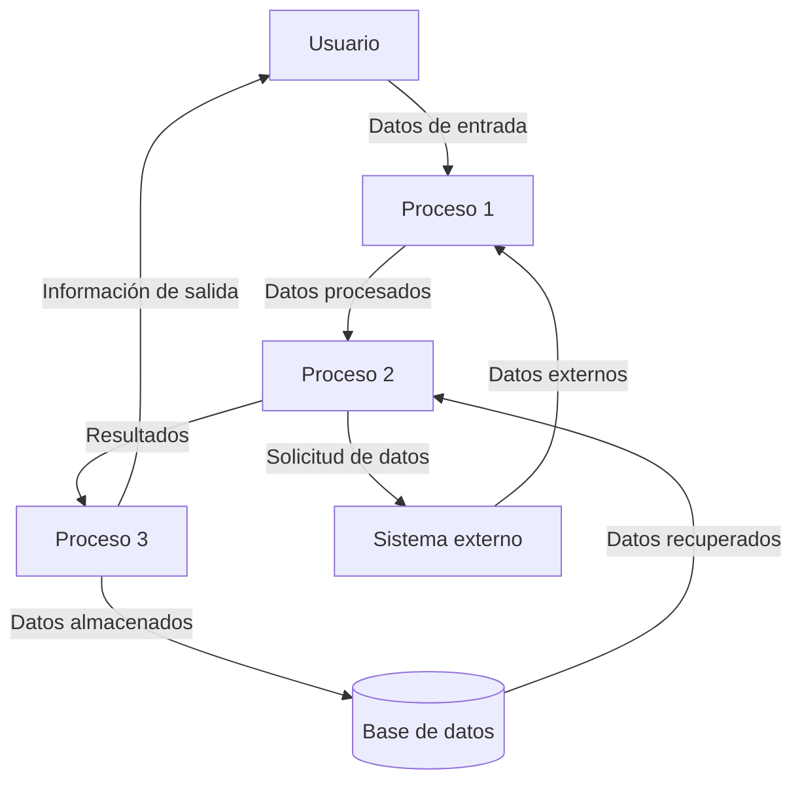

## Module: JsonVariant_Copy_Tests.cpp
# Análisis Integral del Módulo JsonVariant_Copy_Tests.cpp

## Módulo/Componente SQL
**Nombre del Módulo**: JsonVariant_Copy_Tests.cpp

## Objetivos Primarios
Este módulo contiene pruebas unitarias para verificar la funcionalidad de copia de la clase `JsonVariant` en la biblioteca ArduinoJson. Su propósito principal es asegurar que las operaciones de copia entre objetos `JsonVariant` funcionen correctamente en diferentes escenarios.

## Funciones, Métodos y Consultas Críticas
El módulo no contiene consultas SQL, sino pruebas unitarias para validar la funcionalidad de copia. Las pruebas principales incluyen:
- Verificación de copia de valores primitivos (enteros, flotantes, booleanos)
- Pruebas de copia de cadenas de texto
- Validación de copia de objetos y arreglos JSON
- Comprobación de comportamiento con valores nulos

## Variables y Elementos Clave
- `JsonVariant`: Clase principal que se está probando
- `JsonDocument`: Contenedor para documentos JSON
- `JsonObject` y `JsonArray`: Tipos de datos JSON complejos
- Variables de prueba como `source` y `destination` para verificar la operación de copia

## Interdependencias y Relaciones
El módulo depende de:
- Framework de pruebas (posiblemente Catch2 o similar)
- Biblioteca ArduinoJson
- Clases relacionadas como `JsonDocument`, `JsonObject`, y `JsonArray`

## Operaciones Principales vs. Auxiliares
- **Operaciones principales**: Pruebas de copia entre objetos `JsonVariant`
- **Operaciones auxiliares**: Configuración de entornos de prueba, verificación de resultados, limpieza de recursos

## Secuencia Operacional/Flujo de Ejecución
1. Configuración del entorno de prueba
2. Creación de objetos `JsonVariant` fuente
3. Realización de operaciones de copia
4. Verificación de que los valores se hayan copiado correctamente
5. Limpieza de recursos

## Aspectos de Rendimiento y Optimización
- Posible preocupación por el uso de memoria durante la copia de objetos JSON grandes
- Consideraciones sobre la eficiencia de las operaciones de copia profunda vs. superficial
- Potencial impacto en el rendimiento al copiar estructuras JSON complejas

## Reusabilidad y Adaptabilidad
El módulo está diseñado específicamente para probar la funcionalidad de copia de `JsonVariant`, pero:
- Las técnicas de prueba podrían adaptarse para verificar otras operaciones de la biblioteca
- Los casos de prueba podrían extenderse para cubrir escenarios adicionales

## Uso y Contexto
- Utilizado durante el desarrollo y mantenimiento de la biblioteca ArduinoJson
- Forma parte del conjunto de pruebas unitarias para garantizar la calidad del código
- Se ejecuta como parte del proceso de integración continua

## Suposiciones y Limitaciones
- Supone que el framework de pruebas está correctamente configurado
- Asume que las clases base de ArduinoJson funcionan según lo esperado
- Posibles limitaciones en la cobertura de pruebas para casos extremos o raros
- Puede no cubrir todos los escenarios de uso en entornos con restricciones de memoria (común en dispositivos Arduino)
## Flow Diagram [via mermaid]

