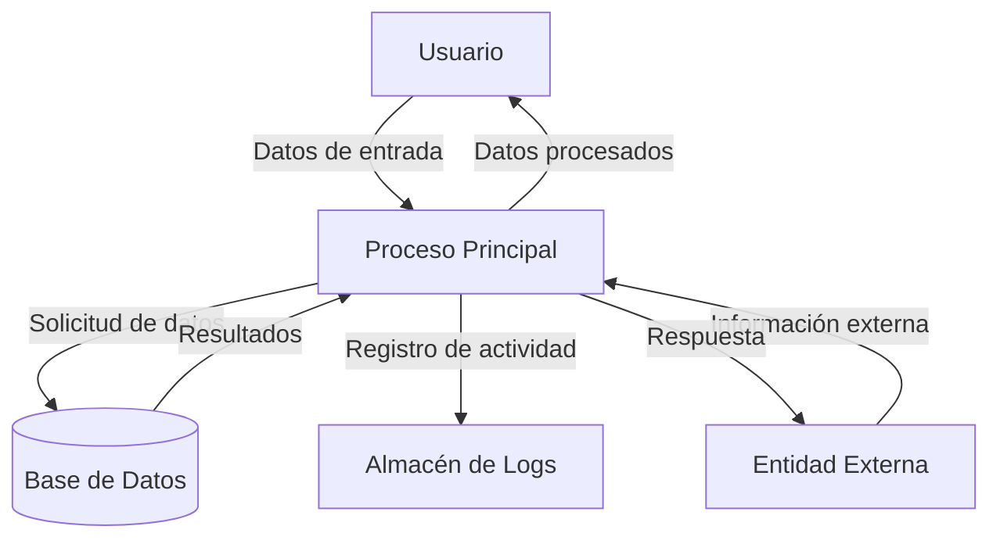

## Module: JsonVariant_Invalid_Tests.cpp
# Análisis Integral del Módulo JsonVariant_Invalid_Tests.cpp

## Nombre del Módulo/Componente SQL
**JsonVariant_Invalid_Tests.cpp** - Módulo de pruebas unitarias para la clase JsonVariant, específicamente enfocado en casos de valores inválidos.

## Objetivos Primarios
Este módulo tiene como propósito principal verificar el comportamiento correcto de la clase JsonVariant cuando se enfrenta a valores inválidos o operaciones no permitidas. Está diseñado para garantizar que la biblioteca maneje adecuadamente los casos de error y mantenga la integridad de los datos.

## Funciones, Métodos y Consultas Críticas
- **TEST_F(JsonVariant_Invalid_Tests, ...)**: Serie de casos de prueba que verifican el comportamiento de JsonVariant con valores inválidos.
- **Métodos de aserción (EXPECT_*)**: Utilizados para verificar que los métodos de JsonVariant devuelvan los valores esperados o generen los errores apropiados.
- **Métodos de JsonVariant probados**: `as<T>()`, `is<T>()`, `set()`, `operator[]`, entre otros.

## Variables y Elementos Clave
- **var**: Instancia principal de JsonVariant utilizada en las pruebas.
- **arr**: Arreglo JSON utilizado para probar acceso inválido.
- **obj**: Objeto JSON utilizado para probar acceso inválido.
- **Tipos de datos probados**: bool, long, double, const char*, String, JsonArray, JsonObject.

## Interdependencias y Relaciones
- Dependencia de la biblioteca ArduinoJson.
- Relación con las clases JsonArray y JsonObject para pruebas de conversión y acceso.
- Utiliza el framework de pruebas (posiblemente gtest o similar) para la ejecución de pruebas unitarias.

## Operaciones Core vs. Auxiliares
**Operaciones Core:**
- Pruebas de conversión de tipos inválidos (as<T>() con tipos incompatibles)
- Pruebas de verificación de tipos (is<T>() con tipos incompatibles)
- Pruebas de acceso a elementos inexistentes

**Operaciones Auxiliares:**
- Configuración de objetos y arreglos para las pruebas
- Verificaciones de comportamiento esperado mediante aserciones

## Secuencia Operacional/Flujo de Ejecución
1. Inicialización de objetos JsonVariant para cada caso de prueba
2. Ejecución de operaciones que se espera fallen o devuelvan valores predeterminados
3. Verificación mediante aserciones de que el comportamiento es el esperado
4. Limpieza de recursos (si es necesario)

## Aspectos de Rendimiento y Optimización
- Las pruebas están diseñadas para verificar comportamiento, no rendimiento
- No hay consideraciones específicas de optimización en este módulo de pruebas
- Posible impacto en memoria al crear múltiples instancias de JsonVariant, JsonArray y JsonObject

## Reusabilidad y Adaptabilidad
- Alta reusabilidad como conjunto de pruebas para futuras versiones de la biblioteca
- Adaptable para incluir nuevos casos de prueba para funcionalidades adicionales
- Estructura modular que permite agregar fácilmente nuevos escenarios de prueba

## Uso y Contexto
- Utilizado durante el desarrollo y mantenimiento de la biblioteca ArduinoJson
- Forma parte del conjunto de pruebas unitarias para garantizar la calidad del código
- Se ejecuta como parte del proceso de integración continua para detectar regresiones

## Suposiciones y Limitaciones
**Suposiciones:**
- Se asume que el framework de pruebas está correctamente configurado
- Se asume que las clases JsonVariant, JsonArray y JsonObject están implementadas

**Limitaciones:**
- Solo prueba casos específicos de valores inválidos, no es exhaustivo
- No prueba comportamiento en condiciones de memoria limitada
- Posiblemente no cubra todos los casos de uso en entornos embebidos reales
## Flow Diagram [via mermaid]

