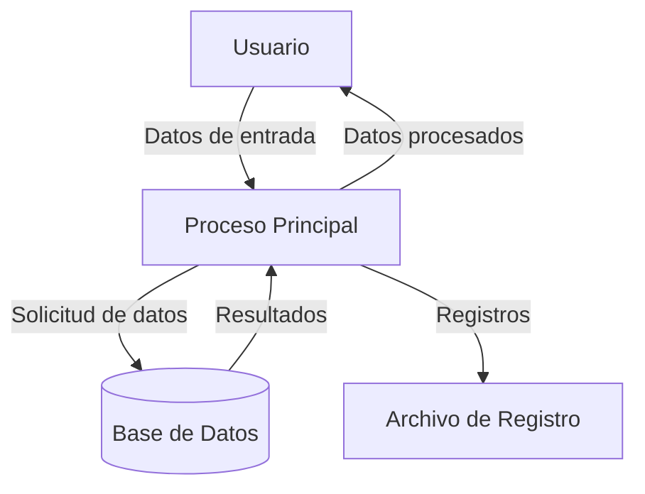

## Module: JsonVariant_PrintTo_Tests.cpp
# Análisis Integral del Módulo JsonVariant_PrintTo_Tests.cpp

## Módulo/Componente SQL
**Nombre del Módulo**: JsonVariant_PrintTo_Tests.cpp

## Objetivos Primarios
Este módulo contiene pruebas unitarias para la funcionalidad `printTo()` de la clase `JsonVariant` en la biblioteca ArduinoJson. Su propósito principal es verificar que los diferentes tipos de datos almacenados en un `JsonVariant` se serialicen correctamente a formato JSON.

## Funciones, Métodos y Consultas Críticas
- `TEST_F(JsonVariant_PrintTo_Tests, ...)`: Serie de casos de prueba que verifican la serialización de diferentes tipos de datos.
- `printTo()`: Método principal bajo prueba, que convierte valores de `JsonVariant` a representaciones JSON.
- `assertPrintTo()`: Función auxiliar que compara el resultado de la serialización con un valor esperado.

## Variables y Elementos Clave
- `variant`: Instancia de `JsonVariant` utilizada en todas las pruebas.
- `output`: Variable que almacena la salida serializada.
- Valores de prueba: Incluyen diferentes tipos de datos como nulos, booleanos, números, cadenas, arrays y objetos.

## Interdependencias y Relaciones
- Depende de la biblioteca ArduinoJson, específicamente de las clases `JsonVariant`, `JsonArray` y `JsonObject`.
- Utiliza el framework de pruebas (posiblemente Google Test) para la ejecución de pruebas unitarias.
- Interactúa con la funcionalidad de serialización JSON de la biblioteca.

## Operaciones Centrales vs. Auxiliares
- **Operaciones Centrales**: Las pruebas que verifican la serialización correcta de diferentes tipos de datos.
- **Operaciones Auxiliares**: La función `assertPrintTo()` que facilita la comparación de resultados, y la configuración de los casos de prueba.

## Secuencia Operacional/Flujo de Ejecución
1. Cada prueba inicializa un `JsonVariant` con un tipo de dato específico.
2. Se llama al método `printTo()` para serializar el valor.
3. Se verifica que la salida coincida con la representación JSON esperada.
4. Las pruebas cubren sistemáticamente diferentes tipos de datos y casos especiales.

## Aspectos de Rendimiento y Optimización
- El código de prueba está enfocado en la funcionalidad más que en el rendimiento.
- No se observan optimizaciones específicas en el código de prueba, ya que su propósito es verificar la corrección.
- La eficiencia de la serialización real dependería de la implementación de `printTo()` en la biblioteca ArduinoJson.

## Reusabilidad y Adaptabilidad
- El enfoque de prueba es modular y podría adaptarse para probar otras funcionalidades de serialización.
- La estructura de pruebas sigue un patrón consistente que facilita la adición de nuevos casos de prueba.
- El uso de una función auxiliar `assertPrintTo()` mejora la legibilidad y mantenibilidad.

## Uso y Contexto
- Este módulo se utiliza durante el desarrollo y mantenimiento de la biblioteca ArduinoJson para asegurar que la funcionalidad de serialización funcione correctamente.
- Es parte de una suite de pruebas unitarias que verifica la integridad de la biblioteca.
- Probablemente se ejecuta como parte de un proceso de integración continua.

## Suposiciones y Limitaciones
- Supone que el framework de pruebas está correctamente configurado.
- Asume que las clases `JsonVariant`, `JsonArray` y `JsonObject` están implementadas y funcionan correctamente.
- Las pruebas se centran en la funcionalidad de serialización y no cubren otros aspectos como el manejo de errores o casos extremos de rendimiento.
- Podría no cubrir todos los casos posibles de serialización, especialmente para estructuras JSON complejas o anidadas profundamente.
## Flow Diagram [via mermaid]

