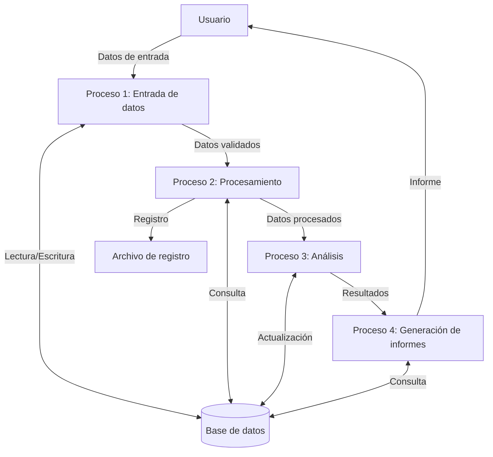

## Module: JsonVariant_Storage_Tests.cpp
# Análisis Integral del Módulo JsonVariant_Storage_Tests.cpp

## Nombre del Módulo/Componente SQL
**JsonVariant_Storage_Tests.cpp** - Módulo de pruebas unitarias para la funcionalidad de almacenamiento de JsonVariant en la biblioteca ArduinoJson.

## Objetivos Primarios
Este módulo está diseñado para verificar el correcto funcionamiento del almacenamiento interno de la clase JsonVariant, asegurando que los diferentes tipos de datos se almacenen y recuperen correctamente. Su propósito principal es validar la integridad de las operaciones de almacenamiento de datos en la implementación de JsonVariant.

## Funciones, Métodos y Consultas Críticas
- **TEST_CASE**: Macro que define casos de prueba individuales para diferentes aspectos del almacenamiento de JsonVariant.
- **SECTION**: Subdivide los casos de prueba en secciones lógicas para probar diferentes escenarios.
- **REQUIRE**: Verifica que las condiciones esperadas se cumplan, fallando la prueba si no es así.
- **JsonVariant::operator=**: Implícitamente probado al asignar valores a las instancias de JsonVariant.
- **JsonVariant::as<T>()**: Método crítico probado para convertir el valor almacenado al tipo deseado.
- **JsonVariant::is<T>()**: Método probado para verificar si el valor almacenado es de un tipo específico.

## Variables y Elementos Clave
- **JsonVariant**: La clase principal bajo prueba.
- **variant**: Variable de prueba utilizada en múltiples casos de prueba.
- **Tipos de datos probados**: bool, char, signed/unsigned char, short, int, long, float, double, const char*, const __FlashStringHelper*.
- **JsonString**: Tipo utilizado para manejar cadenas en el contexto de JSON.

## Interdependencias y Relaciones
- Dependencia de la biblioteca **Catch2** para el marco de pruebas.
- Dependencia del núcleo de la biblioteca **ArduinoJson** para las clases y funcionalidades que se están probando.
- Relación con otros componentes de ArduinoJson como JsonDocument y JsonObject que podrían utilizar JsonVariant.

## Operaciones Principales vs. Auxiliares
**Operaciones Principales:**
- Pruebas de asignación y recuperación de diferentes tipos de datos.
- Verificación de la correcta identificación de tipos mediante is<T>().

**Operaciones Auxiliares:**
- Configuración del entorno de prueba.
- Verificaciones adicionales para casos especiales (como conversiones entre tipos).

## Secuencia Operacional/Flujo de Ejecución
1. Inicialización de cada caso de prueba con TEST_CASE.
2. Creación de una instancia de JsonVariant para la prueba.
3. Asignación de un valor específico a la instancia.
4. Verificación de que el valor se almacene correctamente mediante as<T>().
5. Verificación adicional de que el tipo se identifique correctamente mediante is<T>().
6. Repetición para diferentes tipos de datos y escenarios.

## Aspectos de Rendimiento y Optimización
- Las pruebas están diseñadas para ser rápidas y eficientes.
- No hay bucles complejos o operaciones costosas en las pruebas.
- El enfoque está en la corrección funcional más que en el rendimiento.
- Potencial área de optimización: consolidación de pruebas similares para reducir la duplicación de código.

## Reusabilidad y Adaptabilidad
- El código de prueba sigue un patrón consistente que facilita la adición de nuevos casos de prueba.
- La estructura modular permite extender fácilmente las pruebas para nuevos tipos o comportamientos.
- El uso de macros de Catch2 facilita la mantenibilidad y legibilidad del código de prueba.

## Uso y Contexto
- Este módulo se utiliza durante el desarrollo y mantenimiento de la biblioteca ArduinoJson.
- Las pruebas se ejecutan como parte del proceso de integración continua para garantizar que los cambios no rompan la funcionalidad existente.
- El contexto es el desarrollo de software para sistemas embebidos, específicamente para la plataforma Arduino.

## Suposiciones y Limitaciones
**Suposiciones:**
- Se asume que el marco de pruebas Catch2 está disponible y configurado correctamente.
- Se asume que las implementaciones subyacentes de los tipos básicos funcionan según lo esperado.

**Limitaciones:**
- Las pruebas se centran en tipos de datos específicos y podrían no cubrir todos los casos de uso posibles.
- No se prueban explícitamente condiciones de error o casos límite para todos los tipos.
- El comportamiento en sistemas con restricciones de memoria podría no estar completamente representado en estas pruebas.
## Flow Diagram [via mermaid]

