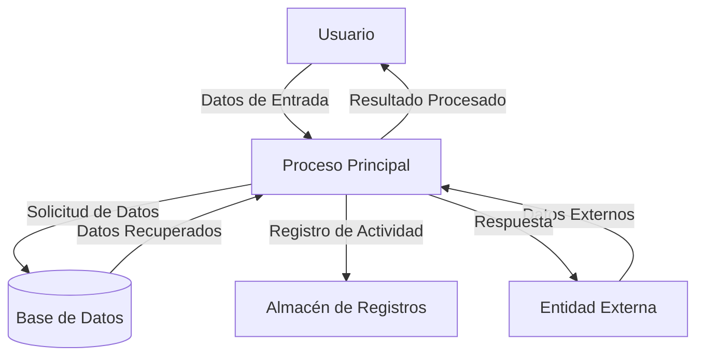

## Module: JsonVariant_Subscript_Tests.cpp
# Análisis Integral del Módulo JsonVariant_Subscript_Tests.cpp

## Nombre del Módulo/Componente SQL
**JsonVariant_Subscript_Tests.cpp** - Módulo de pruebas unitarias para la funcionalidad de subíndices de la clase JsonVariant en la biblioteca ArduinoJson.

## Objetivos Primarios
Este módulo está diseñado para verificar exhaustivamente el comportamiento de los operadores de subíndice (`[]`) en objetos JsonVariant, asegurando que funcionen correctamente con diferentes tipos de índices (enteros, cadenas) y en diversos escenarios (lectura, escritura, valores nulos, etc.).

## Funciones, Métodos y Consultas Críticas
- **TEST_F(JsonVariant_Subscript_Tests, ...)**: Serie de casos de prueba que verifican diferentes aspectos de la funcionalidad de subíndices:
  - Acceso a elementos de arrays usando índices numéricos
  - Acceso a propiedades de objetos usando claves de cadena
  - Comportamiento con índices fuera de rango
  - Comportamiento con variantes nulas o indefinidas
  - Operaciones de escritura a través de subíndices

## Variables y Elementos Clave
- **_variant**: Variable miembro que contiene el objeto JsonVariant bajo prueba
- **_pool**: Instancia de JsonDocument que proporciona la memoria para los objetos JSON
- **_object** y **_array**: Objetos JSON utilizados en las pruebas
- **_objectRef** y **_arrayRef**: Referencias a objetos y arrays JSON

## Interdependencias y Relaciones
- Depende de la clase **JsonVariant** de la biblioteca ArduinoJson
- Utiliza el framework de pruebas **Catch2** para la ejecución de pruebas
- Interactúa con otras clases de ArduinoJson como **JsonObject**, **JsonArray** y **JsonDocument**

## Operaciones Principales vs. Auxiliares
- **Operaciones principales**:
  - Pruebas de acceso a elementos de arrays mediante `variant[index]`
  - Pruebas de acceso a propiedades de objetos mediante `variant[key]`
  - Verificación de comportamiento con valores nulos o inválidos
- **Operaciones auxiliares**:
  - Configuración del entorno de prueba (setUp)
  - Limpieza después de las pruebas (tearDown)
  - Aserciones para verificar resultados esperados

## Secuencia Operacional/Flujo de Ejecución
1. Cada prueba comienza configurando un objeto JsonVariant con datos específicos
2. Se ejecutan operaciones de subíndice en diferentes contextos
3. Se verifican los resultados contra valores esperados
4. Se prueban casos límite y escenarios de error

## Aspectos de Rendimiento y Optimización
- Las pruebas verifican implícitamente que las operaciones de subíndice tengan complejidad O(1) para arrays y O(log n) para objetos
- No hay optimizaciones específicas en el código de prueba, ya que su propósito es verificar la funcionalidad, no el rendimiento

## Reusabilidad y Adaptabilidad
- El módulo está diseñado específicamente para probar la funcionalidad de subíndices de JsonVariant
- La estructura de las pruebas podría adaptarse para probar funcionalidades similares en otras clases
- El enfoque de prueba es modular, con casos de prueba independientes para cada aspecto de la funcionalidad

## Uso y Contexto
- Este módulo forma parte de la suite de pruebas unitarias de la biblioteca ArduinoJson
- Se ejecuta durante el desarrollo y antes de lanzamientos para garantizar que la funcionalidad de subíndices funcione correctamente
- Es crucial para mantener la integridad de la API de JsonVariant, que es una parte fundamental de la biblioteca

## Suposiciones y Limitaciones
- **Suposiciones**:
  - Se asume que el framework de pruebas Catch2 está disponible
  - Se asume que otras clases de ArduinoJson funcionan correctamente
- **Limitaciones**:
  - Las pruebas se centran en la funcionalidad de subíndices y no cubren todas las posibles interacciones con otras partes de la biblioteca
  - No prueba escenarios de memoria extremadamente limitada que podrían ocurrir en dispositivos Arduino reales
## Flow Diagram [via mermaid]

