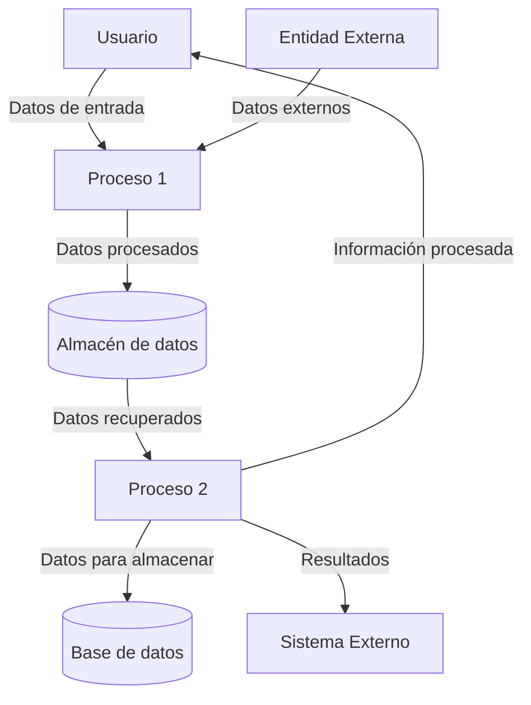

## Module: JsonVariant_Undefined_Tests.cpp
# Análisis Integral del Módulo JsonVariant_Undefined_Tests.cpp

## Nombre del Módulo/Componente SQL
**JsonVariant_Undefined_Tests.cpp** - Un módulo de pruebas unitarias para la funcionalidad de valores indefinidos en la clase JsonVariant.

## Objetivos Primarios
Este módulo está diseñado para verificar el comportamiento correcto de los valores indefinidos en la clase JsonVariant de la biblioteca ArduinoJson. Su propósito principal es asegurar que los valores indefinidos sean manejados adecuadamente en diferentes contextos y operaciones.

## Funciones, Métodos y Consultas Críticas
- **TEST_F(JsonVariant_Undefined_Tests, ...)**: Serie de casos de prueba que verifican el comportamiento de valores indefinidos en JsonVariant.
- Métodos de prueba principales:
  - Pruebas de comparación (`CompareWith...`)
  - Pruebas de conversión a diferentes tipos de datos
  - Pruebas de serialización
  - Pruebas de operaciones booleanas

## Variables y Elementos Clave
- **_undefined**: Variable principal de prueba, una instancia de JsonVariant sin valor asignado
- **_array**: Arreglo JSON utilizado en pruebas de comparación
- **_object**: Objeto JSON utilizado en pruebas de comparación
- **Tipos de datos probados**: bool, long, double, const char*, String, JsonArray, JsonObject

## Interdependencias y Relaciones
- Depende de la biblioteca ArduinoJson
- Utiliza el framework de pruebas (posiblemente gtest o similar)
- Interactúa con varias clases de ArduinoJson:
  - JsonVariant
  - JsonArray
  - JsonObject
  - JsonBuffer (implícitamente)

## Operaciones Core vs. Auxiliares
**Operaciones Core:**
- Pruebas de comportamiento de valores indefinidos
- Verificación de conversiones de tipos
- Comprobación de serialización

**Operaciones Auxiliares:**
- Configuración de pruebas (setup)
- Creación de objetos y arreglos para comparación

## Secuencia Operacional/Flujo de Ejecución
1. Inicialización de objetos de prueba en cada caso de prueba
2. Ejecución de operaciones específicas sobre valores indefinidos
3. Verificación de resultados mediante aserciones
4. Limpieza de recursos (implícita en el framework de pruebas)

## Aspectos de Rendimiento y Optimización
- Al ser un módulo de pruebas, el rendimiento no es crítico
- No se observan problemas de optimización evidentes
- Las pruebas parecen ser concisas y enfocadas en comportamientos específicos

## Reusabilidad y Adaptabilidad
- El código de prueba está estructurado para probar aspectos específicos de JsonVariant
- Podría adaptarse para probar comportamientos similares en otras clases
- La estructura de pruebas sigue un patrón consistente que facilita la adición de nuevos casos

## Uso y Contexto
- Este módulo se utiliza durante el desarrollo y mantenimiento de la biblioteca ArduinoJson
- Forma parte de la suite de pruebas unitarias para garantizar la calidad del código
- Se ejecutaría durante el proceso de integración continua o antes de lanzar nuevas versiones

## Suposiciones y Limitaciones
**Suposiciones:**
- Se asume que el framework de pruebas está correctamente configurado
- Se asume que otras partes de la biblioteca ArduinoJson funcionan correctamente

**Limitaciones:**
- Solo prueba el comportamiento de valores indefinidos, no otras funcionalidades de JsonVariant
- Posiblemente no cubra todos los casos de uso extremos o combinaciones de operaciones
- Depende de la implementación específica de ArduinoJson, por lo que cambios en la biblioteca podrían requerir actualizaciones en las pruebas
## Flow Diagram [via mermaid]

