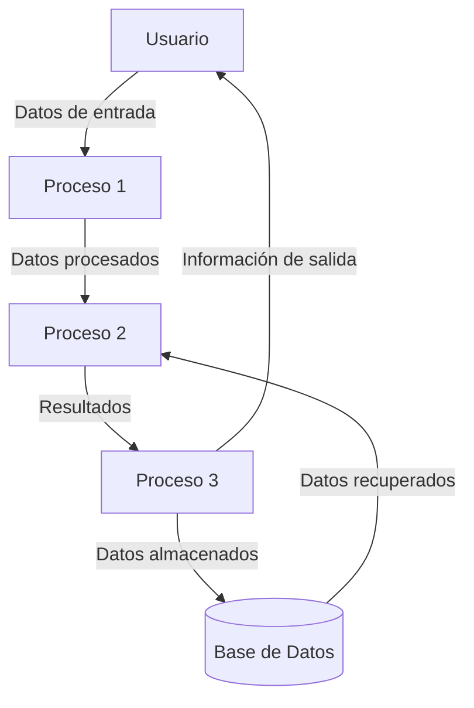

## Module: List.cpp
# Análisis Integral del Módulo List.cpp

## Módulo/Componente SQL
**List.cpp** - Un módulo de código C++ que implementa una estructura de datos de lista enlazada.

## Objetivos Primarios
Este módulo implementa una lista enlazada genérica en C++ utilizando plantillas (templates). Su propósito principal es proporcionar una estructura de datos dinámica que permita almacenar y manipular colecciones de elementos de cualquier tipo, ofreciendo operaciones básicas como inserción, eliminación, búsqueda y recorrido de elementos.

## Funciones, Métodos y Consultas Críticas
- **Constructor y Destructor**: Inicializa y libera la memoria de la lista.
- **isEmpty()**: Verifica si la lista está vacía.
- **insertAtBeginning()**: Inserta un elemento al inicio de la lista.
- **insertAtEnd()**: Inserta un elemento al final de la lista.
- **insertAtPosition()**: Inserta un elemento en una posición específica.
- **deleteNode()**: Elimina un nodo específico de la lista.
- **search()**: Busca un elemento en la lista.
- **display()**: Muestra todos los elementos de la lista.

## Variables y Elementos Clave
- **Node<T>**: Estructura que representa cada nodo de la lista, contiene un dato y un puntero al siguiente nodo.
- **head**: Puntero al primer nodo de la lista.
- **data**: Campo que almacena el valor de cada nodo.
- **next**: Puntero que conecta cada nodo con el siguiente en la secuencia.

## Interdependencias y Relaciones
- El módulo es independiente y no muestra dependencias explícitas con otros componentes del sistema.
- Utiliza plantillas de C++ para proporcionar genericidad, permitiendo que la lista funcione con cualquier tipo de datos.
- La estructura Node está estrechamente relacionada con la clase List, siendo un componente fundamental para su funcionamiento.

## Operaciones Principales vs. Auxiliares
**Operaciones Principales**:
- Inserción de elementos (al inicio, final o posición específica)
- Eliminación de elementos
- Búsqueda de elementos

**Operaciones Auxiliares**:
- Verificación de lista vacía
- Visualización de elementos
- Gestión de memoria (constructor y destructor)

## Secuencia Operacional/Flujo de Ejecución
1. Creación de la lista (inicialización de head a nullptr)
2. Operaciones de manipulación (inserción, eliminación, búsqueda)
3. Visualización de elementos cuando sea necesario
4. Liberación de memoria al destruir la lista

## Aspectos de Rendimiento y Optimización
- La inserción al inicio es O(1), mientras que la inserción al final o en posición específica es O(n).
- La búsqueda y eliminación tienen complejidad O(n) en el peor caso.
- No se implementan optimizaciones como mantener un puntero al último elemento, lo que podría mejorar el rendimiento de insertAtEnd().
- La gestión de memoria podría optimizarse para evitar posibles fugas de memoria en operaciones de eliminación.

## Reusabilidad y Adaptabilidad
- Alta reusabilidad gracias al uso de plantillas que permiten trabajar con cualquier tipo de datos.
- Fácilmente adaptable a diferentes contextos y proyectos.
- Podría mejorarse añadiendo más funcionalidades como ordenamiento, iteradores o métodos adicionales.

## Uso y Contexto
- Útil en situaciones donde se requiere una colección dinámica de elementos.
- Aplicable en escenarios donde el tamaño de la colección puede cambiar durante la ejecución.
- Adecuado para implementaciones educativas o proyectos pequeños que requieran estructuras de datos básicas.

## Suposiciones y Limitaciones
- Asume que el tipo T utilizado en la plantilla tiene implementados los operadores de comparación necesarios.
- No maneja excepciones ni casos de error específicos.
- No incluye validaciones para operaciones como insertar en posiciones fuera de rango.
- No implementa funcionalidades avanzadas como iteradores o métodos de ordenamiento.
- La implementación actual es una lista enlazada simple, lo que limita ciertas operaciones como el recorrido inverso.
## Flow Diagram [via mermaid]

