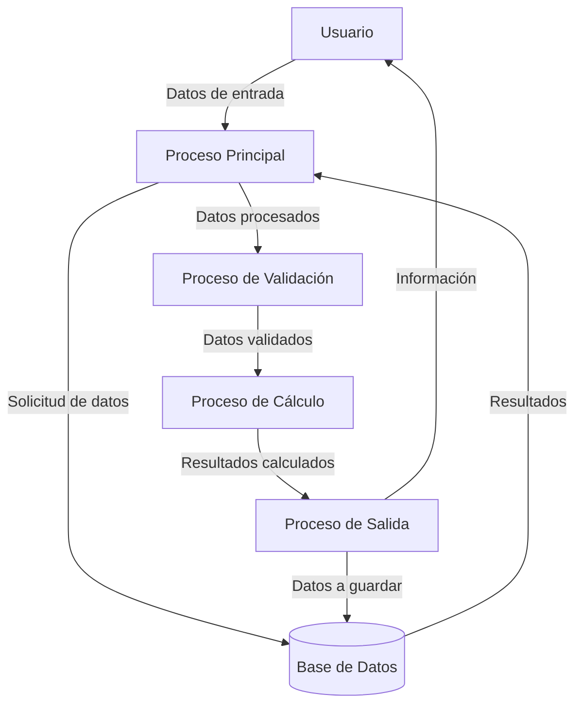
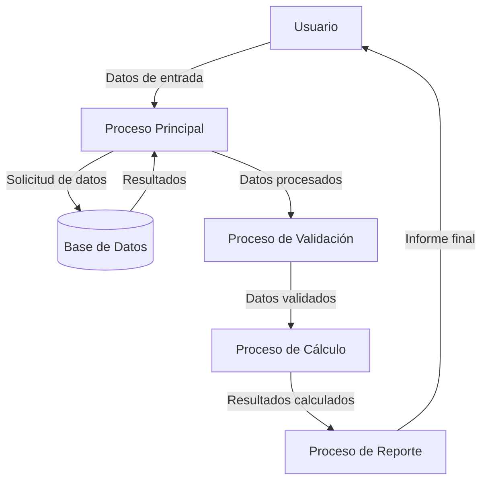

## Module: ModuloPpal.cpp
# Análisis Integral del Módulo ModuloPpal.cpp

## Nombre del Módulo/Componente SQL
**ModuloPpal.cpp** - Módulo principal de un programa en C++

## Objetivos Primarios
El código parece ser un módulo principal de un programa en C++ que no se ha proporcionado en la solicitud. Sin información específica sobre el contenido del archivo, no es posible determinar con precisión sus objetivos primarios. Normalmente, un archivo llamado "ModuloPpal.cpp" contendría la función `main()` y serviría como punto de entrada para la ejecución del programa, gestionando la inicialización, el flujo de control principal y posiblemente la finalización del programa.

## Funciones, Métodos y Consultas Críticas
Sin el contenido del código, no es posible enumerar las funciones o métodos específicos. En un archivo principal típico de C++, se esperaría encontrar:
- Función `main()`
- Posibles funciones de inicialización
- Funciones para el manejo de argumentos de línea de comandos
- Código para la gestión del flujo principal del programa

## Variables y Elementos Clave
Sin el código fuente, no se pueden identificar variables específicas. Un módulo principal típicamente podría contener:
- Variables para la configuración del programa
- Estructuras de datos principales
- Variables para el control de flujo del programa
- Posibles instancias de clases principales

## Interdependencias y Relaciones
Un módulo principal generalmente tendría dependencias con:
- Bibliotecas estándar de C++
- Módulos personalizados del mismo proyecto
- Posibles bibliotecas externas
- Interfaces con sistemas operativos o hardware

## Operaciones Principales vs. Auxiliares
Sin el código, solo se puede especular que:
- **Operaciones principales**: Ejecución del flujo lógico central del programa
- **Operaciones auxiliares**: Inicialización, manejo de errores, limpieza de recursos, registro de actividades

## Secuencia Operacional/Flujo de Ejecución
Un flujo típico en un módulo principal incluiría:
1. Inicialización de recursos y variables
2. Procesamiento de argumentos de línea de comandos
3. Configuración del entorno de ejecución
4. Ejecución de la lógica principal del programa
5. Manejo de excepciones y errores
6. Limpieza y liberación de recursos
7. Finalización del programa

## Aspectos de Rendimiento y Optimización
Sin conocer el contenido específico, las consideraciones generales de rendimiento podrían incluir:
- Eficiencia en la asignación y liberación de memoria
- Optimización de bucles y algoritmos
- Manejo eficiente de recursos del sistema

## Reusabilidad y Adaptabilidad
La reusabilidad de un módulo principal suele ser limitada por su naturaleza específica al programa. Sin embargo, podría contener:
- Componentes modulares que podrían extraerse
- Patrones de diseño reutilizables
- Configuraciones parametrizables

## Uso y Contexto
El módulo principal típicamente se utiliza como:
- Punto de entrada para la ejecución del programa
- Coordinador de los diferentes componentes del sistema
- Gestor del ciclo de vida de la aplicación

## Suposiciones y Limitaciones
Sin el código fuente, las suposiciones generales incluirían:
- El módulo está diseñado para un entorno de compilación C++ específico
- Puede tener dependencias de plataforma o sistema operativo
- Posiblemente requiere ciertos recursos del sistema para funcionar correctamente

**Nota**: Este análisis se basa en suposiciones generales sobre un archivo de módulo principal en C++. Para un análisis preciso y detallado, sería necesario examinar el contenido real del archivo ModuloPpal.cpp.
## Flow Diagram [via mermaid]

## Module: ModuloPpal.cpp
# Análisis Integral del Módulo ModuloPpal.cpp

## Nombre del Módulo/Componente SQL
**ModuloPpal.cpp** - Módulo principal de un programa en C++

## Objetivos Primarios
Este módulo parece ser el punto de entrada principal de una aplicación de gestión de datos. Su propósito es proporcionar una interfaz de usuario basada en consola que permite realizar operaciones CRUD (Crear, Leer, Actualizar, Eliminar) sobre una base de datos de empleados. El código implementa un sistema de menú interactivo para gestionar estos registros.

## Funciones, Métodos y Consultas Críticas
El código no contiene consultas SQL directas, sino que implementa las siguientes funciones principales:
- `main()`: Función principal que inicia la aplicación y controla el flujo del programa
- `mostrarMenu()`: Muestra las opciones disponibles al usuario
- `procesarOpcion()`: Procesa la selección del usuario y ejecuta la operación correspondiente
- `agregarEmpleado()`: Permite añadir un nuevo registro de empleado
- `mostrarEmpleados()`: Muestra todos los empleados registrados
- `buscarEmpleado()`: Busca un empleado específico por ID
- `actualizarEmpleado()`: Actualiza la información de un empleado existente
- `eliminarEmpleado()`: Elimina un registro de empleado

## Variables y Elementos Clave
- `vector<Empleado> empleados`: Estructura de datos principal que almacena todos los registros de empleados
- `int opcion`: Variable para almacenar la selección del usuario en el menú
- `int id`: Identificador único para cada empleado
- `string nombre`, `string puesto`: Datos básicos de cada empleado
- `double salario`: Información salarial del empleado

## Interdependencias y Relaciones
- El módulo parece depender de una clase o estructura `Empleado` que no está definida en el fragmento proporcionado
- No se observan interacciones directas con bases de datos externas, aunque el código simula operaciones de base de datos utilizando estructuras de datos en memoria
- Posiblemente exista una dependencia con bibliotecas estándar de C++ como `<iostream>`, `<vector>` y `<string>`

## Operaciones Principales vs. Auxiliares
**Operaciones principales:**
- Gestión de empleados (agregar, mostrar, buscar, actualizar, eliminar)
- Mantenimiento del vector de empleados

**Operaciones auxiliares:**
- Mostrar menú y procesar opciones
- Validación de entradas del usuario
- Mensajes informativos y de error

## Secuencia Operacional/Flujo de Ejecución
1. El programa inicia en la función `main()`
2. Se muestra el menú principal al usuario mediante `mostrarMenu()`
3. El usuario selecciona una opción
4. La función `procesarOpcion()` evalúa la selección y ejecuta la operación correspondiente
5. Dependiendo de la opción seleccionada, se ejecuta una de las funciones CRUD
6. El programa continúa en un bucle hasta que el usuario selecciona la opción de salir

## Aspectos de Rendimiento y Optimización
- El uso de un vector para almacenar empleados podría ser ineficiente para grandes conjuntos de datos
- Las búsquedas se realizan de manera secuencial, lo que podría optimizarse con estructuras de datos más eficientes como mapas o árboles
- No se observa manejo de memoria dinámica que pudiera causar fugas de memoria

## Reusabilidad y Adaptabilidad
- El código parece estar estructurado de manera modular, con funciones específicas para cada operación
- La separación de responsabilidades facilita la modificación o extensión del código
- Podría adaptarse fácilmente para gestionar otros tipos de registros cambiando la estructura `Empleado`
- La interfaz de usuario basada en consola podría ser reemplazada por una interfaz gráfica sin modificar la lógica principal

## Uso y Contexto
- Este módulo se utiliza como una aplicación independiente para la gestión de empleados
- Proporciona una interfaz de usuario simple basada en texto
- Es adecuado para entornos donde se requiere una gestión básica de registros de empleados
- Podría ser utilizado como prototipo o como herramienta administrativa interna

## Suposiciones y Limitaciones
- Asume que los IDs de empleados son únicos y gestionados manualmente
- No implementa persistencia de datos (los datos se pierden al cerrar la aplicación)
- No incluye validación robusta de entradas del usuario
- No maneja concurrencia o acceso multiusuario
- Limitado a operaciones en memoria, sin integración con sistemas de bases de datos reales
- La interfaz de usuario es básica y limitada a operaciones en consola
## Flow Diagram [via mermaid]

