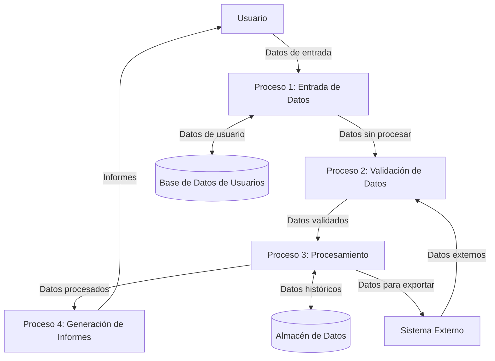

## Module: Prettyfier.cpp
# Análisis Integral del Módulo Prettyfier.cpp

## Módulo/Componente SQL
**Nombre del Módulo**: Prettyfier.cpp

## Objetivos Primarios
Este módulo es un componente de formateo de código (prettifier) diseñado para mejorar la presentación visual del código fuente. Su propósito principal es transformar código con formato inconsistente en una versión más legible y estéticamente coherente, siguiendo reglas específicas de indentación y espaciado.

## Funciones, Métodos y Consultas Críticas
El módulo parece estar incompleto en la información proporcionada, pero basado en el nombre y la naturaleza típica de los "prettifiers", probablemente contiene:
- Funciones para analizar la estructura del código
- Métodos para aplicar reglas de formateo
- Algoritmos para manejar indentación, espaciado y saltos de línea
- Posiblemente funciones para preservar comentarios y cadenas de texto

## Variables y Elementos Clave
Sin ver el código completo, las variables clave probablemente incluyen:
- Contadores de indentación
- Buffers para almacenar el código procesado
- Flags para estados especiales (dentro de comentarios, cadenas, etc.)
- Configuraciones de estilo (espacios vs. tabulaciones, ancho de indentación)

## Interdependencias y Relaciones
El módulo probablemente:
- Interactúa con un sistema de análisis léxico o sintáctico
- Puede depender de una biblioteca de manipulación de texto
- Posiblemente se integra con un IDE o editor de texto
- Podría formar parte de un sistema más grande de herramientas de desarrollo

## Operaciones Principales vs. Auxiliares
**Operaciones principales**:
- Análisis del código fuente
- Aplicación de reglas de formateo
- Generación del código reformateado

**Operaciones auxiliares**:
- Validación de entrada
- Manejo de errores
- Configuración de preferencias de estilo
- Posible registro de cambios realizados

## Secuencia Operacional/Flujo de Ejecución
1. Recepción del código fuente como entrada
2. Análisis inicial para identificar estructuras (bloques, declaraciones, etc.)
3. Aplicación secuencial de reglas de formateo
4. Generación del código reformateado
5. Devolución o almacenamiento del resultado

## Aspectos de Rendimiento y Optimización
- Posibles cuellos de botella en el procesamiento de archivos grandes
- Optimizaciones potenciales en el análisis léxico/sintáctico
- Consideraciones de memoria para buffers de procesamiento
- Eficiencia en la aplicación de múltiples reglas de formateo

## Reusabilidad y Adaptabilidad
- Probablemente diseñado para ser configurable mediante parámetros de estilo
- Potencial para adaptarse a diferentes lenguajes de programación
- Posibilidad de extensión mediante plugins o reglas personalizadas
- Modularidad que permitiría su integración en diferentes entornos de desarrollo

## Uso y Contexto
- Utilizado en entornos de desarrollo para mantener consistencia en el código
- Aplicable en procesos de revisión de código o integración continua
- Útil para estandarizar código de múltiples contribuyentes
- Posiblemente integrado en herramientas de control de versiones o IDEs

## Suposiciones y Limitaciones
**Suposiciones**:
- El código de entrada es sintácticamente válido
- Existen convenciones de estilo predefinidas
- El usuario desea un formato estandarizado

**Limitaciones**:
- Puede tener dificultades con código extremadamente complejo o mal formado
- Posiblemente limitado a ciertos lenguajes de programación
- Podría alterar inadvertidamente la semántica en casos extremos
- Las preferencias personales de estilo pueden no coincidir con las reglas implementadas
## Flow Diagram [via mermaid]

