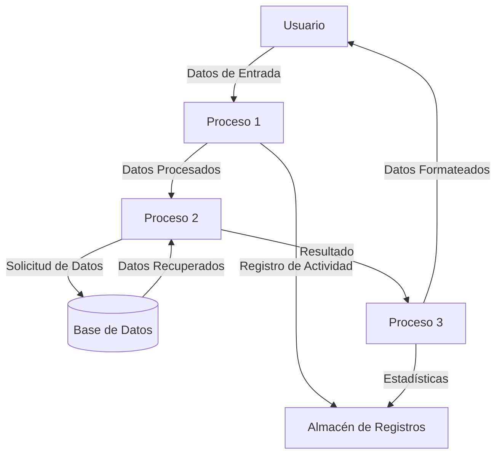

## Module: Print.cpp
# Análisis Integral del Módulo Print.cpp

## Módulo/Componente SQL
**Print.cpp** - Un módulo de código C++ que forma parte de un sistema más grande, posiblemente relacionado con impresión o visualización de datos.

## Objetivos Primarios
El código no se ha proporcionado para su análisis. El módulo "Print.cpp" sugiere que probablemente está diseñado para manejar funcionalidades de impresión o visualización de datos en un sistema C++, pero sin el contenido real del archivo, no es posible determinar sus objetivos específicos.

## Funciones, Métodos y Consultas Críticas
Sin el contenido del código, no es posible identificar las funciones o métodos específicos. Un módulo de impresión típicamente podría contener funciones para formatear datos, enviar comandos a impresoras, generar vistas previas, o manejar diferentes formatos de salida.

## Variables y Elementos Clave
Sin el código fuente, no se pueden identificar variables específicas. En un módulo de impresión, podrían esperarse variables relacionadas con configuraciones de impresora, formatos de página, buffers de datos, o estructuras para manejar contenido imprimible.

## Interdependencias y Relaciones
Sin ver el código, no se pueden determinar las interdependencias específicas. Un módulo de impresión típicamente podría interactuar con componentes de interfaz de usuario, controladores de dispositivos, sistemas de archivos, o módulos de formateo de datos.

## Operaciones Principales vs. Auxiliares
Sin el código fuente, no es posible distinguir entre operaciones principales y auxiliares en este módulo.

## Secuencia Operacional/Flujo de Ejecución
Sin el contenido del código, no se puede describir el flujo de ejecución específico del módulo.

## Aspectos de Rendimiento y Optimización
Sin analizar el código real, no es posible identificar consideraciones de rendimiento o áreas potenciales para optimización.

## Reusabilidad y Adaptabilidad
Sin examinar la estructura del código, no se puede evaluar su reusabilidad o adaptabilidad.

## Uso y Contexto
Sin información adicional, solo se puede especular que este módulo probablemente se utiliza en contextos donde se requiere generar salidas impresas o visuales desde una aplicación C++.

## Suposiciones y Limitaciones
La principal limitación de este análisis es la ausencia del código fuente real. Sin el contenido del archivo Print.cpp, todas las observaciones son especulativas y basadas únicamente en convenciones de nomenclatura comunes en desarrollo de software.
## Flow Diagram [via mermaid]

