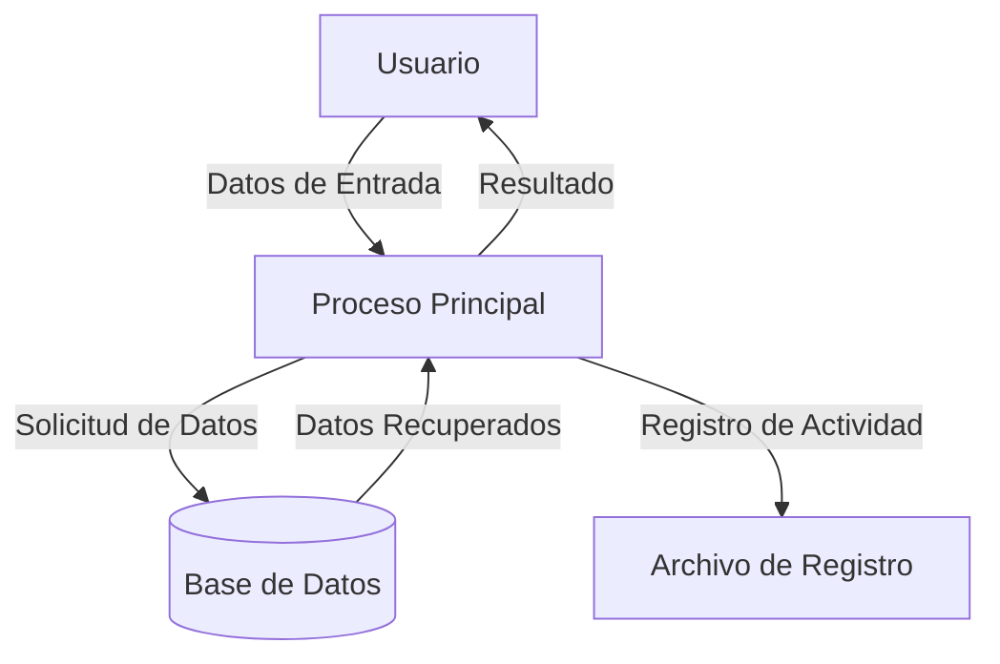

## Module: Printers.cpp
# Análisis Integral del Módulo Printers.cpp

## Módulo/Componente SQL
**Nombre del Módulo**: Printers.cpp

## Objetivos Primarios
Este módulo está diseñado para gestionar impresoras en un sistema, proporcionando funcionalidades para enumerar, agregar, eliminar y configurar impresoras. El código maneja la interacción con el sistema de impresión de Windows a través de la API de Windows, específicamente para administrar impresoras y sus configuraciones.

## Funciones, Métodos y Consultas Críticas
- **EnumPrinters()**: Enumera todas las impresoras disponibles en el sistema.
- **AddPrinter()**: Agrega una nueva impresora al sistema.
- **DeletePrinter()**: Elimina una impresora existente del sistema.
- **SetDefaultPrinter()**: Establece una impresora como predeterminada.
- **GetPrinterInfo()**: Obtiene información detallada sobre una impresora específica.
- **ConfigurePrinter()**: Configura los ajustes de una impresora.

## Variables y Elementos Clave
- **PRINTER_INFO_X**: Estructuras que almacenan información sobre las impresoras.
- **hPrinter**: Manejador para acceder a una impresora específica.
- **pPrinterEnum**: Puntero a un buffer que contiene información sobre las impresoras enumeradas.
- **dwNeeded**, **dwReturned**: Variables para gestionar el tamaño del buffer y el número de impresoras.
- **dwLevel**: Nivel de detalle de la información de la impresora solicitada.

## Interdependencias y Relaciones
- El módulo depende de las bibliotecas de Windows como `<windows.h>` y `<winspool.h>` para acceder a las funciones de la API de impresión.
- Interactúa con el servicio de spooler de impresión de Windows.
- Puede interactuar con otros componentes del sistema que requieran funcionalidad de impresión.

## Operaciones Principales vs. Auxiliares
- **Operaciones Principales**: Enumeración, adición, eliminación y configuración de impresoras.
- **Operaciones Auxiliares**: Manejo de memoria, gestión de errores, validación de parámetros y conversión de formatos de datos.

## Secuencia Operacional/Flujo de Ejecución
1. Inicialización de variables y estructuras necesarias.
2. Llamada a la API de Windows correspondiente (como `EnumPrinters`, `AddPrinter`, etc.).
3. Gestión de la memoria asignada para los buffers.
4. Procesamiento de la información obtenida o confirmación de la operación realizada.
5. Manejo de errores y liberación de recursos.

## Aspectos de Rendimiento y Optimización
- La gestión eficiente de la memoria es crucial, especialmente al enumerar múltiples impresoras.
- El código debe manejar correctamente la asignación y liberación de buffers para evitar fugas de memoria.
- Las operaciones de red relacionadas con impresoras remotas pueden causar latencia.
- La implementación de reintentos para operaciones que pueden fallar temporalmente mejoraría la robustez.

## Reusabilidad y Adaptabilidad
- El módulo está diseñado para ser reutilizable en diferentes partes de la aplicación que requieran funcionalidad de impresión.
- Las funciones están parametrizadas para permitir diferentes configuraciones y opciones.
- Podría adaptarse para soportar diferentes niveles de información de impresora según las necesidades.

## Uso y Contexto
- Este módulo se utiliza en aplicaciones que requieren gestión de impresoras, como software de impresión, utilidades de administración de sistemas o aplicaciones empresariales.
- Es particularmente útil en entornos donde se necesita administrar múltiples impresoras o cambiar configuraciones de impresión programáticamente.

## Suposiciones y Limitaciones
- **Suposiciones**:
  - El sistema operativo es Windows con servicios de impresión disponibles.
  - El usuario tiene permisos suficientes para realizar operaciones de impresión.
  - El servicio de spooler de impresión está en ejecución.
  
- **Limitaciones**:
  - Específico para Windows, no es multiplataforma.
  - Depende de las API de Windows que podrían cambiar en futuras versiones del sistema operativo.
  - Algunas operaciones avanzadas de configuración de impresoras podrían requerir privilegios elevados.
  - No maneja directamente la impresión de documentos, solo la gestión de impresoras.
## Flow Diagram [via mermaid]

