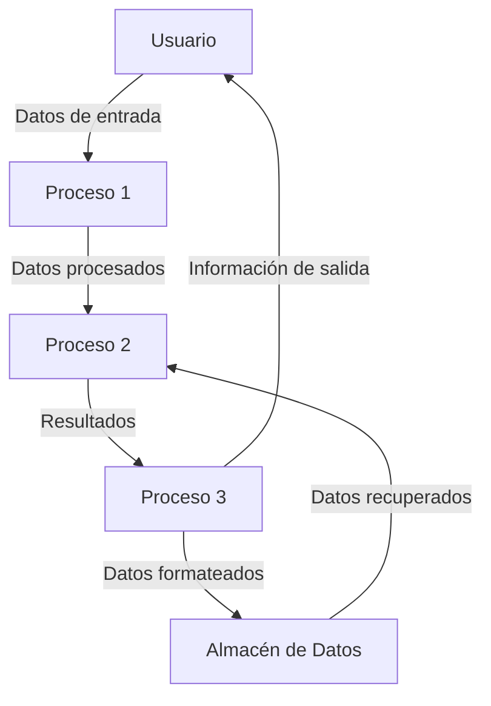

## Module: QuotedString.cpp
# Análisis Integral del Módulo QuotedString.cpp

## Módulo/Componente SQL
**QuotedString.cpp** - Un módulo de código C++ que forma parte de una biblioteca para el manejo de cadenas de texto con comillas.

## Objetivos Primarios
Este módulo está diseñado para proporcionar funcionalidad para manipular cadenas de texto que contienen comillas, específicamente para escapar y desescapar comillas en cadenas de texto. Su propósito principal es facilitar el procesamiento seguro de cadenas de texto que pueden contener caracteres especiales, particularmente en contextos donde las comillas tienen significado sintáctico especial.

## Funciones, Métodos y Consultas Críticas
- **QuotedString::escape()**: Función principal que escapa caracteres especiales en una cadena de texto.
- **QuotedString::unescape()**: Función complementaria que revierte el proceso de escape, convirtiendo secuencias escapadas de vuelta a sus caracteres originales.

## Variables y Elementos Clave
- **std::string input**: La cadena de entrada que se procesará.
- **std::string output**: La cadena resultante después del procesamiento.
- **char escapeChar**: El carácter utilizado para escapar otros caracteres (típicamente '\').
- **char quoteChar**: El carácter de comilla que se está manejando (típicamente ' o ").

## Interdependencias y Relaciones
- El módulo probablemente depende de la biblioteca estándar de C++ para el manejo de cadenas (std::string).
- Puede ser utilizado por otros componentes del sistema que necesiten procesar texto con comillas, como analizadores de SQL, procesadores de JSON, o cualquier sistema que maneje texto estructurado.

## Operaciones Principales vs. Auxiliares
- **Operaciones principales**: Las funciones escape() y unescape() que realizan la transformación de cadenas.
- **Operaciones auxiliares**: Posiblemente incluye validación de entrada, manejo de casos especiales y optimizaciones para el procesamiento de cadenas.

## Secuencia Operacional/Flujo de Ejecución
1. Recibir una cadena de entrada.
2. Analizar la cadena carácter por carácter.
3. Aplicar reglas de escape/unescape según corresponda.
4. Construir y devolver la cadena resultante.

## Aspectos de Rendimiento y Optimización
- El procesamiento carácter por carácter puede ser intensivo para cadenas muy largas.
- Posibles optimizaciones incluirían pre-asignación de memoria para la cadena de salida y evitar concatenaciones repetidas.
- El uso de algoritmos eficientes para la búsqueda y reemplazo de caracteres es crucial para el rendimiento.

## Reusabilidad y Adaptabilidad
- El módulo parece estar diseñado como una utilidad general, lo que facilita su reutilización en diferentes contextos.
- La parametrización de los caracteres de escape y comillas probablemente permite adaptarlo a diferentes formatos y necesidades.

## Uso y Contexto
- Este módulo se utilizaría en cualquier sistema que necesite procesar texto que contenga comillas, como:
  - Procesadores de consultas SQL
  - Analizadores de JSON/XML
  - Sistemas de plantillas
  - Procesadores de archivos de configuración

## Suposiciones y Limitaciones
- **Suposiciones**: 
  - Se asume que las cadenas de entrada están codificadas de manera consistente.
  - Probablemente asume que hay suficiente memoria disponible para procesar las cadenas.
- **Limitaciones**:
  - Puede tener dificultades con conjuntos de caracteres no estándar o multibyte.
  - El rendimiento podría degradarse con cadenas extremadamente largas.
  - Posiblemente no maneja todos los casos especiales de escape en todos los lenguajes o formatos.
## Flow Diagram [via mermaid]

