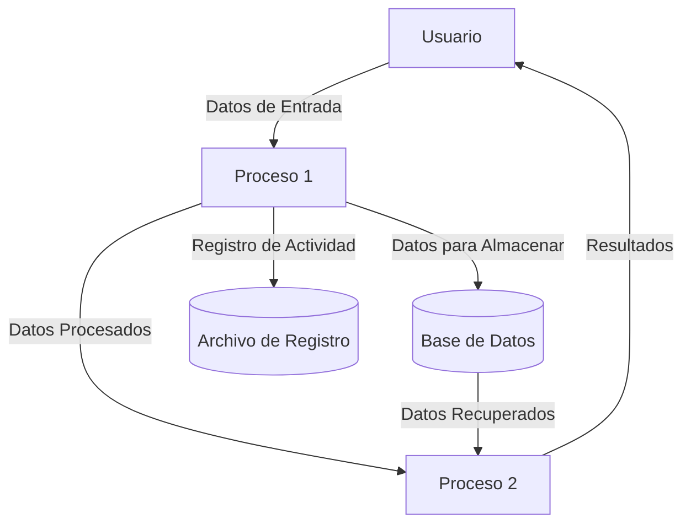

## Module: QuotedString_ExtractFrom_Tests.cpp
# Análisis Integral del Módulo QuotedString_ExtractFrom_Tests.cpp

## Módulo/Componente SQL
**Nombre del Módulo**: QuotedString_ExtractFrom_Tests.cpp

## Objetivos Primarios
Este módulo contiene pruebas unitarias para validar la funcionalidad de extracción de cadenas entrecomilladas. Su propósito principal es verificar que la función `QuotedString::ExtractFrom` funcione correctamente bajo diferentes escenarios, incluyendo casos límite y situaciones de error.

## Funciones, Métodos y Consultas Críticas
- **TEST_CASE("QuotedString::ExtractFrom")**: Marco principal de pruebas que contiene múltiples subcasos.
- **SECTION("Empty string")**: Prueba el comportamiento con cadenas vacías.
- **SECTION("No quotes")**: Verifica el comportamiento cuando no hay comillas.
- **SECTION("Single quotes")**: Prueba la extracción con comillas simples.
- **SECTION("Double quotes")**: Prueba la extracción con comillas dobles.
- **SECTION("Escaped quotes")**: Verifica el manejo de comillas escapadas.
- **SECTION("Nested quotes")**: Prueba el comportamiento con comillas anidadas.
- **SECTION("Mixed quotes")**: Verifica el comportamiento con tipos de comillas mezclados.

## Variables y Elementos Clave
- **input**: Cadena de entrada para las pruebas.
- **expected**: Resultado esperado de la extracción.
- **actual**: Resultado real obtenido de la función.
- **pos**: Posición en la cadena desde donde comenzar la extracción.
- **QuotedString::ExtractFrom**: Función principal bajo prueba.

## Interdependencias y Relaciones
- Dependencia de la biblioteca Catch2 para el marco de pruebas (`#include "catch2/catch.hpp"`).
- Dependencia del módulo QuotedString que contiene la implementación de la función `ExtractFrom`.
- No hay interacciones con bases de datos o componentes externos evidentes.

## Operaciones Principales vs. Auxiliares
- **Operaciones Principales**: Las pruebas de extracción de cadenas entrecomilladas con diferentes tipos de comillas y escenarios.
- **Operaciones Auxiliares**: Configuración de casos de prueba, verificación de resultados mediante aserciones.

## Secuencia Operacional/Flujo de Ejecución
1. Configuración del caso de prueba con una cadena de entrada específica.
2. Llamada a la función `QuotedString::ExtractFrom` con los parámetros apropiados.
3. Verificación del resultado obtenido contra el resultado esperado.
4. Verificación de la posición final después de la extracción.
5. Repetición para diferentes escenarios de prueba.

## Aspectos de Rendimiento y Optimización
- Las pruebas parecen enfocarse en la funcionalidad más que en el rendimiento.
- No hay optimizaciones específicas mencionadas en el código de prueba.
- Potencialmente, la función `ExtractFrom` podría tener problemas de rendimiento con cadenas muy largas o con muchas comillas anidadas.

## Reusabilidad y Adaptabilidad
- Las pruebas están estructuradas de manera modular, facilitando la adición de nuevos casos.
- El enfoque basado en secciones de Catch2 permite una clara separación de escenarios de prueba.
- Las pruebas podrían adaptarse fácilmente para probar variaciones de la función o implementaciones alternativas.

## Uso y Contexto
- Este módulo se utiliza en un entorno de desarrollo para verificar la correcta implementación de la funcionalidad de extracción de cadenas entrecomilladas.
- Forma parte de un conjunto de pruebas unitarias para garantizar la calidad del código.
- Probablemente se ejecuta como parte de un proceso de integración continua.

## Suposiciones y Limitaciones
- **Suposiciones**:
  - Se asume que la función `QuotedString::ExtractFrom` está correctamente implementada en otro lugar.
  - Se asume que la biblioteca Catch2 está disponible y configurada correctamente.
  
- **Limitaciones**:
  - Las pruebas pueden no cubrir todos los casos posibles, especialmente escenarios complejos con múltiples tipos de comillas anidadas.
  - No se prueban explícitamente casos de rendimiento o comportamiento con cadenas extremadamente largas.
  - No hay pruebas para caracteres Unicode o codificaciones especiales.
## Flow Diagram [via mermaid]

