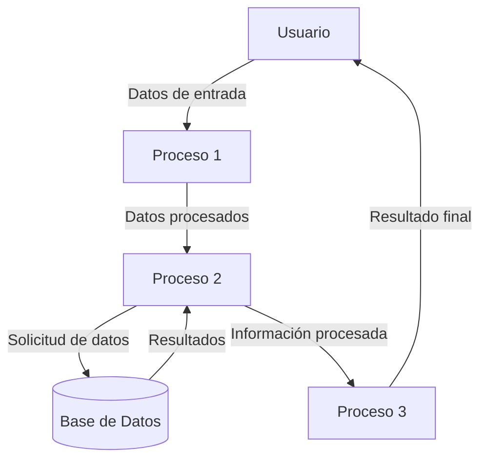

## Module: QuotedString_PrintTo_Tests.cpp
# Análisis Integral del Módulo QuotedString_PrintTo_Tests.cpp

## Nombre del Módulo/Componente SQL
QuotedString_PrintTo_Tests.cpp - Módulo de pruebas unitarias para la funcionalidad de impresión de cadenas entrecomilladas.

## Objetivos Primarios
Este módulo tiene como propósito principal probar la funcionalidad de impresión de cadenas entrecomilladas (`QuotedString`) en un framework de pruebas, específicamente verificando cómo se representan diferentes tipos de cadenas cuando se imprimen en un contexto de pruebas automatizadas.

## Funciones, Métodos y Consultas Críticas
- `TEST(QuotedStringTest, PrintTo)`: Función de prueba principal que verifica el comportamiento de la función `PrintTo` con diferentes tipos de cadenas.
- `PrintTo`: Función bajo prueba que formatea cadenas para su visualización en resultados de pruebas.

## Variables y Elementos Clave
- `std::string output`: Variable que captura la salida formateada para verificación.
- `std::ostringstream os`: Stream utilizado para capturar la salida de la función `PrintTo`.
- Cadenas de prueba: 
  - Cadena vacía (`""`)
  - Cadena con caracteres normales (`"text"`)
  - Cadena con caracteres especiales (`"
"`, `"	"`, etc.)
  - Cadena con caracteres no imprimibles

## Interdependencias y Relaciones
- Dependencia del framework de pruebas (probablemente Google Test/gtest)
- Relación con la implementación de `QuotedString` y su función `PrintTo`
- Posible integración con un sistema más amplio de pruebas automatizadas

## Operaciones Principales vs. Auxiliares
- **Operaciones principales**: Las pruebas de la función `PrintTo` con diferentes tipos de cadenas.
- **Operaciones auxiliares**: Configuración de los streams de salida, verificación de resultados mediante aserciones.

## Secuencia Operacional/Flujo de Ejecución
1. Inicialización del stream de salida para cada caso de prueba
2. Llamada a la función `PrintTo` con la cadena de prueba y el stream
3. Captura de la salida formateada
4. Verificación de que la salida coincide con el resultado esperado mediante aserciones

## Aspectos de Rendimiento y Optimización
- El código de prueba es simple y directo, sin problemas evidentes de rendimiento.
- Las operaciones con strings podrían optimizarse si se realizaran muchas pruebas, pero para un conjunto de pruebas unitarias el enfoque actual es adecuado.

## Reusabilidad y Adaptabilidad
- El patrón de prueba utilizado es altamente reutilizable para probar otras funciones de formateo de cadenas.
- La estructura modular permite añadir fácilmente más casos de prueba para diferentes tipos de cadenas o comportamientos.

## Uso y Contexto
- Este módulo se utiliza en un entorno de desarrollo para verificar que la función `PrintTo` para `QuotedString` funciona correctamente.
- Forma parte de un conjunto de pruebas unitarias que aseguran la calidad del código relacionado con el manejo de cadenas.
- Probablemente se ejecuta como parte de un proceso de integración continua.

## Suposiciones y Limitaciones
- Supone que la implementación de `QuotedString` y `PrintTo` ya existe.
- Asume que el framework de pruebas (probablemente gtest) está correctamente configurado.
- Las pruebas se limitan a verificar el formato de salida, no el rendimiento o comportamiento en condiciones extremas.
- No prueba todos los posibles caracteres especiales o casos límite que podrían ocurrir en un entorno de producción.
## Flow Diagram [via mermaid]

