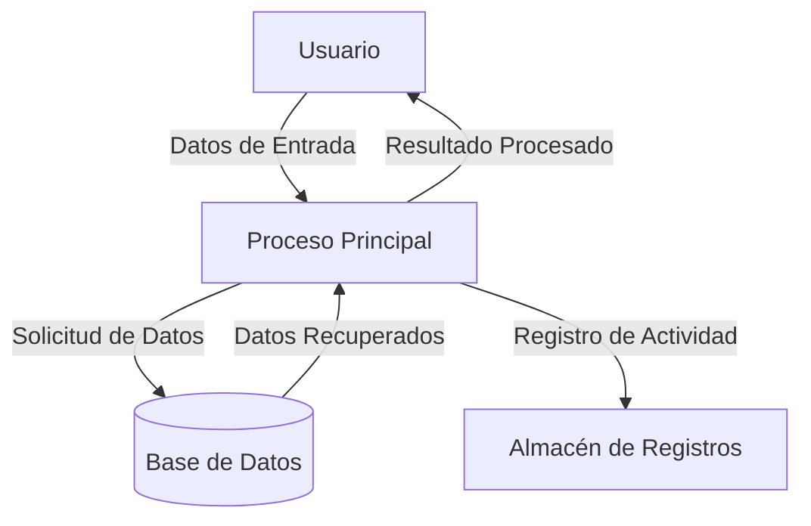

## Module: StaticJsonBuffer_Array_Tests.cpp
# Análisis Integral del Módulo StaticJsonBuffer_Array_Tests.cpp

## Nombre del Módulo/Componente SQL
StaticJsonBuffer_Array_Tests.cpp - Un módulo de pruebas unitarias para la funcionalidad de arrays en la biblioteca ArduinoJson.

## Objetivos Primarios
Este módulo está diseñado para verificar el correcto funcionamiento de la clase `StaticJsonBuffer` al crear y manipular arrays JSON. Su propósito principal es asegurar que la biblioteca pueda manejar adecuadamente la creación de arrays, la asignación de valores a los mismos, y gestionar correctamente los casos límite como buffers llenos.

## Funciones, Métodos y Consultas Críticas
- `TEST_CASE("StaticJsonBuffer_Array_Tests")`: Marco principal de pruebas que contiene todos los casos de prueba.
- `SECTION("GrowArrayByAddingElements")`: Prueba la adición incremental de elementos a un array.
- `SECTION("JsonArray_AddArray")`: Verifica la capacidad de añadir un array como elemento de otro array.
- `SECTION("JsonArray_AddObject")`: Comprueba la adición de objetos JSON dentro de arrays.
- `SECTION("array_grow_when_buffer_is_full")`: Evalúa el comportamiento cuando el buffer está lleno.

## Variables y Elementos Clave
- `StaticJsonBuffer<JSON_ARRAY_SIZE(X)>`: Buffer de tamaño fijo para almacenar documentos JSON.
- `JsonArray&`: Referencias a arrays JSON creados por el buffer.
- `JsonObject&`: Referencias a objetos JSON que pueden ser añadidos a los arrays.
- Valores de prueba: enteros, strings y booleanos utilizados para verificar la funcionalidad.

## Interdependencias y Relaciones
- Dependencia de la biblioteca Catch para el framework de pruebas.
- Interacción con múltiples componentes de ArduinoJson:
  - `StaticJsonBuffer` para la asignación de memoria.
  - `JsonArray` para la manipulación de arrays.
  - `JsonObject` para la creación y manipulación de objetos dentro de arrays.

## Operaciones Core vs. Auxiliares
- **Core**: Creación de arrays JSON, adición de elementos, y verificación de su correcto funcionamiento.
- **Auxiliares**: Configuración de las pruebas, verificaciones de aserciones, y manejo de casos límite.

## Secuencia Operacional/Flujo de Ejecución
1. Inicialización del buffer JSON estático con un tamaño predefinido.
2. Creación de un array JSON vacío.
3. Adición de elementos al array (números, strings, booleanos, arrays anidados u objetos).
4. Verificación de que los elementos se hayan añadido correctamente.
5. Pruebas de casos límite (como buffer lleno).

## Aspectos de Rendimiento y Optimización
- El módulo prueba escenarios de memoria limitada, verificando el comportamiento cuando el buffer está lleno.
- Se evalúa la capacidad de la biblioteca para manejar estructuras anidadas sin degradación del rendimiento.
- No se observan optimizaciones específicas en el código de prueba, ya que su objetivo es verificar la funcionalidad, no optimizar el rendimiento.

## Reusabilidad y Adaptabilidad
- Las pruebas están estructuradas modularmente, permitiendo añadir fácilmente nuevos casos de prueba.
- El enfoque basado en secciones de Catch facilita la expansión del conjunto de pruebas.
- El código podría adaptarse para probar otras implementaciones de buffers JSON con mínimas modificaciones.

## Uso y Contexto
- Este módulo forma parte de la suite de pruebas unitarias de ArduinoJson.
- Se utiliza durante el desarrollo y mantenimiento de la biblioteca para asegurar que los cambios no rompan la funcionalidad existente.
- Es especialmente relevante para verificar la compatibilidad con entornos de recursos limitados como Arduino.

## Suposiciones y Limitaciones
- **Suposiciones**:
  - Se asume que la biblioteca Catch está disponible y configurada correctamente.
  - Se presupone que las macros JSON_ARRAY_SIZE y JSON_OBJECT_SIZE calculan correctamente el espacio necesario.
  
- **Limitaciones**:
  - Las pruebas se centran en buffers estáticos, no dinámicos.
  - No se prueban arrays extremadamente grandes debido a las limitaciones de memoria en los entornos objetivo.
  - No se evalúan todos los tipos de datos posibles que podrían almacenarse en un array JSON.
## Flow Diagram [via mermaid]

