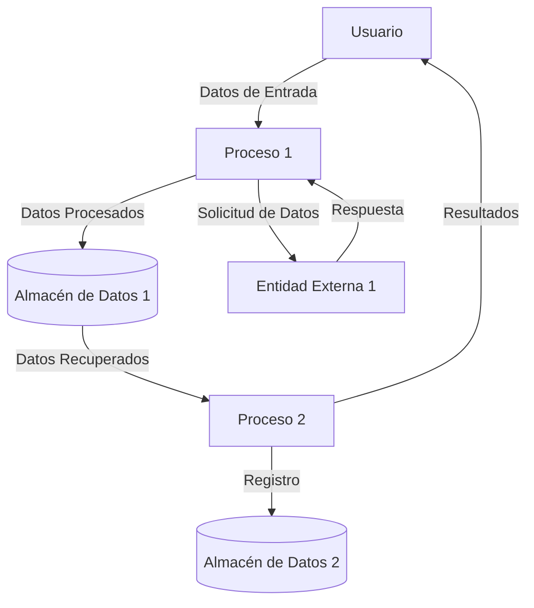

## Module: StaticJsonBuffer_Basic_Tests.cpp
# Análisis Integral del Módulo StaticJsonBuffer_Basic_Tests.cpp

## Módulo/Componente SQL
**Nombre del Módulo**: StaticJsonBuffer_Basic_Tests.cpp

## Objetivos Primarios
Este módulo contiene pruebas unitarias para la clase `StaticJsonBuffer` de la biblioteca ArduinoJson. Su propósito principal es verificar el correcto funcionamiento de las operaciones básicas de asignación de memoria y creación de objetos JSON utilizando un buffer estático.

## Funciones, Métodos y Consultas Críticas
- **TEST_F(StaticJsonBuffer_Basic_Tests, ...)**: Serie de casos de prueba que verifican diferentes aspectos del funcionamiento del buffer:
  - `CreateObject`: Prueba la creación de objetos JSON
  - `CreateNestedObject`: Verifica la creación de objetos JSON anidados
  - `CreateArray`: Comprueba la creación de arrays JSON
  - `CreateNestedArray`: Valida la creación de arrays JSON anidados
  - `ParseArray`: Prueba el análisis de cadenas JSON para convertirlas en arrays
  - `ParseObject`: Prueba el análisis de cadenas JSON para convertirlas en objetos
  - `NoMoreSpace`: Verifica el comportamiento cuando el buffer se queda sin espacio

## Variables y Elementos Clave
- `StaticJsonBuffer<JSON_OBJECT_SIZE(2)>`: Buffer estático con tamaño predefinido
- `JsonObject&`: Referencias a objetos JSON creados
- `JsonArray&`: Referencias a arrays JSON creados
- `JsonObject::iterator`: Iteradores para recorrer objetos JSON
- `JsonArray::iterator`: Iteradores para recorrer arrays JSON

## Interdependencias y Relaciones
- Depende de la biblioteca ArduinoJson y sus componentes:
  - `StaticJsonBuffer`
  - `JsonObject`
  - `JsonArray`
- Utiliza el framework de pruebas (posiblemente Google Test) para la ejecución de pruebas unitarias
- Interactúa con las funciones de análisis y serialización JSON de la biblioteca

## Operaciones Core vs. Auxiliares
- **Operaciones Core**:
  - Creación de objetos y arrays JSON
  - Análisis (parsing) de cadenas JSON
  - Verificación de límites de memoria
- **Operaciones Auxiliares**:
  - Configuración de casos de prueba
  - Verificaciones (assertions) para validar resultados
  - Iteración sobre elementos JSON para comprobaciones

## Secuencia Operacional/Flujo de Ejecución
1. Inicialización del buffer estático con un tamaño predefinido
2. Ejecución de operaciones específicas (creación o análisis de JSON)
3. Verificación de los resultados mediante assertions
4. Comprobación de comportamientos esperados en casos límite (como falta de espacio)

## Aspectos de Rendimiento y Optimización
- El código prueba los límites de memoria del buffer estático, lo que es crucial para entornos con recursos limitados como microcontroladores
- Verifica el comportamiento cuando se alcanza el límite de memoria (retorno de objetos nulos)
- Comprueba la eficiencia en la asignación de memoria para estructuras JSON anidadas

## Reusabilidad y Adaptabilidad
- Las pruebas están estructuradas de manera modular, facilitando la adición de nuevos casos
- El enfoque de pruebas unitarias permite verificar cambios en la implementación de `StaticJsonBuffer`
- Los casos de prueba pueden adaptarse para diferentes tamaños de buffer y estructuras JSON

## Uso y Contexto
- Este módulo se utiliza durante el desarrollo y mantenimiento de la biblioteca ArduinoJson
- Forma parte de la suite de pruebas unitarias para garantizar la calidad y estabilidad de la biblioteca
- Es especialmente relevante para aplicaciones IoT y sistemas embebidos donde la gestión de memoria es crítica

## Suposiciones y Limitaciones
- Asume que el framework de pruebas está correctamente configurado
- Las pruebas están diseñadas para un buffer de tamaño fijo, lo que podría no cubrir todos los escenarios de uso real
- Se centra en operaciones básicas, posiblemente omitiendo casos más complejos de manipulación JSON
- Limitado a probar la implementación de buffer estático, no aborda otros tipos de buffers que podría ofrecer la biblioteca
## Flow Diagram [via mermaid]

