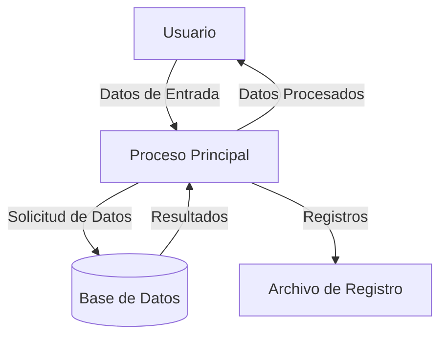

## Module: StaticJsonBuffer_Object_Tests.cpp
# Análisis Integral del Módulo StaticJsonBuffer_Object_Tests.cpp

## Nombre del Módulo/Componente SQL
StaticJsonBuffer_Object_Tests.cpp - Un módulo de pruebas unitarias para la funcionalidad de objetos JSON en la biblioteca ArduinoJson.

## Objetivos Primarios
Este módulo está diseñado para verificar el correcto funcionamiento de la clase StaticJsonBuffer en relación con la creación, manipulación y gestión de objetos JSON. Su propósito principal es asegurar que las operaciones con objetos JSON se comporten según lo esperado, validando la robustez de la implementación.

## Funciones, Métodos y Consultas Críticas
- `TEST_F(StaticJsonBuffer_Object_Tests, GrowsWithObject)`: Verifica que el buffer crezca correctamente al añadir objetos.
- `TEST_F(StaticJsonBuffer_Object_Tests, JsonObject_AddValue)`: Prueba la adición de valores a un objeto JSON.
- `TEST_F(StaticJsonBuffer_Object_Tests, JsonObject_Subscript)`: Verifica el acceso a elementos mediante operador de subíndice.
- `TEST_F(StaticJsonBuffer_Object_Tests, JsonObject_SubscriptWithConstChar)`: Prueba el acceso mediante subíndice con cadenas constantes.
- `TEST_F(StaticJsonBuffer_Object_Tests, JsonObject_SubscriptWithString)`: Prueba el acceso mediante subíndice con objetos String.
- `TEST_F(StaticJsonBuffer_Object_Tests, JsonObject_SetOtherValue)`: Verifica la modificación de valores existentes.
- `TEST_F(StaticJsonBuffer_Object_Tests, JsonObject_SetValue)`: Prueba la asignación de valores a claves.

## Variables y Elementos Clave
- `StaticJsonBuffer<JSON_OBJECT_SIZE(2)>`: Buffer estático para almacenar objetos JSON.
- `JsonObject&`: Referencias a objetos JSON creados por el buffer.
- `String`: Utilizado para probar el acceso con objetos String.
- Valores de prueba: enteros, cadenas y booleanos utilizados para verificar la funcionalidad.

## Interdependencias y Relaciones
- Depende del framework de pruebas (probablemente Google Test o similar).
- Interactúa con las clases `StaticJsonBuffer`, `JsonObject`, y posiblemente `String` de la biblioteca ArduinoJson.
- Utiliza macros de prueba como `TEST_F` para definir casos de prueba.

## Operaciones Principales vs. Auxiliares
- **Operaciones principales**: Creación de objetos JSON, adición de elementos, acceso mediante subíndice.
- **Operaciones auxiliares**: Configuración de pruebas, verificaciones de aserciones, limpieza de recursos.

## Secuencia Operacional/Flujo de Ejecución
1. Inicialización del buffer JSON estático.
2. Creación de un objeto JSON vacío.
3. Adición de elementos al objeto o modificación de elementos existentes.
4. Verificación de que los elementos se hayan añadido/modificado correctamente.
5. Verificación de que el buffer haya crecido según lo esperado.

## Aspectos de Rendimiento y Optimización
- El uso de un buffer estático con tamaño predefinido (`JSON_OBJECT_SIZE(2)`) sugiere una preocupación por la gestión eficiente de memoria.
- Las pruebas verifican implícitamente que no haya fugas de memoria o uso excesivo de recursos.
- No se observan optimizaciones específicas en las pruebas, ya que su objetivo es verificar la funcionalidad, no el rendimiento.

## Reutilización y Adaptabilidad
- Las pruebas están estructuradas de manera modular, lo que facilita la adición de nuevos casos de prueba.
- El enfoque en pruebas unitarias específicas permite identificar rápidamente problemas en componentes particulares.
- La estructura de clase de prueba (`StaticJsonBuffer_Object_Tests`) sugiere que se pueden añadir fácilmente más pruebas relacionadas.

## Uso y Contexto
- Este módulo se utiliza durante el desarrollo y mantenimiento de la biblioteca ArduinoJson para asegurar que los cambios no rompan la funcionalidad existente.
- Es parte de una suite de pruebas más amplia para la biblioteca.
- Probablemente se ejecuta como parte de un proceso de integración continua.

## Suposiciones y Limitaciones
- **Suposiciones**:
  - Se asume que el framework de pruebas está correctamente configurado.
  - Se asume que las clases básicas de ArduinoJson funcionan correctamente.
  - Se asume que hay suficiente memoria disponible para las pruebas.
  
- **Limitaciones**:
  - Las pruebas se limitan a objetos JSON pequeños (tamaño 2).
  - No se prueban casos extremos como objetos muy grandes o anidados profundamente.
  - No se verifican explícitamente condiciones de error como desbordamiento de buffer.
## Flow Diagram [via mermaid]

