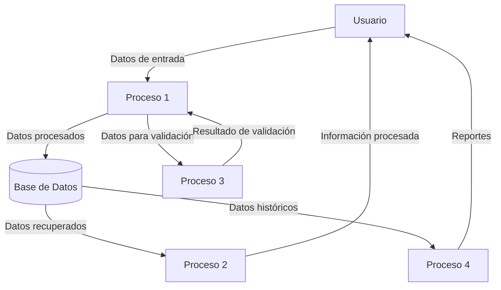

## Module: StringBuilder.cpp
# Análisis Integral del Módulo StringBuilder.cpp

## Módulo/Componente SQL
**StringBuilder.cpp** - Este es un módulo de código C++ que implementa una clase para manipulación eficiente de cadenas de texto.

## Objetivos Primarios
El propósito principal de este módulo es proporcionar una implementación eficiente para la construcción y manipulación de cadenas de texto en C++, similar al StringBuilder de Java o .NET. Está diseñado para optimizar operaciones de concatenación y modificación de cadenas, evitando las ineficiencias asociadas con la concatenación repetitiva de objetos std::string.

## Funciones, Métodos y Consultas Críticas
- **Constructor y Destructor**: Inicializa el buffer con capacidad predeterminada y libera memoria.
- **append()**: Método sobrecargado para añadir diferentes tipos de datos (cadenas, caracteres, números).
- **toString()**: Convierte el contenido del buffer a un objeto std::string.
- **clear()**: Reinicia el StringBuilder para su reutilización.
- **length()**: Devuelve la longitud actual del contenido.
- **capacity()**: Devuelve la capacidad total del buffer.

## Variables y Elementos Clave
- **m_buffer**: Puntero a char que almacena los datos de la cadena.
- **m_length**: Longitud actual del contenido en el buffer.
- **m_capacity**: Capacidad total del buffer asignado.
- **DEFAULT_CAPACITY**: Constante que define la capacidad inicial predeterminada.

## Interdependencias y Relaciones
- Depende de bibliotecas estándar de C++ como `<string>`, `<cstring>` y `<cstdlib>`.
- No muestra dependencias explícitas con otros componentes del sistema.
- Diseñado para ser utilizado por otros módulos que requieran manipulación eficiente de cadenas.

## Operaciones Principales vs. Auxiliares
- **Operaciones Principales**: 
  - Métodos append() para concatenación eficiente
  - Gestión dinámica del buffer de memoria
- **Operaciones Auxiliares**:
  - Métodos de utilidad como toString(), clear(), length()
  - Funcionalidad de redimensionamiento interno (ensureCapacity)

## Secuencia Operacional/Flujo de Ejecución
1. Inicialización del buffer con capacidad predeterminada
2. Verificación de capacidad antes de cada operación de append
3. Redimensionamiento automático del buffer cuando es necesario
4. Mantenimiento de punteros y contadores de longitud
5. Conversión final a std::string cuando se solicita

## Aspectos de Rendimiento y Optimización
- Evita múltiples asignaciones de memoria mediante un buffer preasignado
- Implementa estrategia de crecimiento geométrico (duplicación de capacidad)
- Minimiza copias innecesarias de datos durante las operaciones de append
- Potencial área de mejora: implementación de operaciones adicionales como insert, replace

## Reusabilidad y Adaptabilidad
- Alta reusabilidad como utilidad general para manipulación de cadenas
- Fácilmente adaptable a diferentes contextos y proyectos
- Diseño modular que permite extensión con métodos adicionales
- Parametrizable a través del constructor para diferentes capacidades iniciales

## Uso y Contexto
- Útil en escenarios donde se realizan múltiples concatenaciones de cadenas
- Aplicable en procesamiento de texto, generación de informes, construcción de consultas SQL
- Especialmente valioso en entornos con restricciones de rendimiento

## Suposiciones y Limitaciones
- Asume que el usuario gestionará correctamente los límites de memoria
- No implementa todas las funcionalidades que podrían esperarse de un StringBuilder completo
- Carece de manejo de excepciones robusto para casos de fallo de asignación de memoria
- No proporciona soporte directo para internacionalización o codificaciones específicas
## Flow Diagram [via mermaid]

